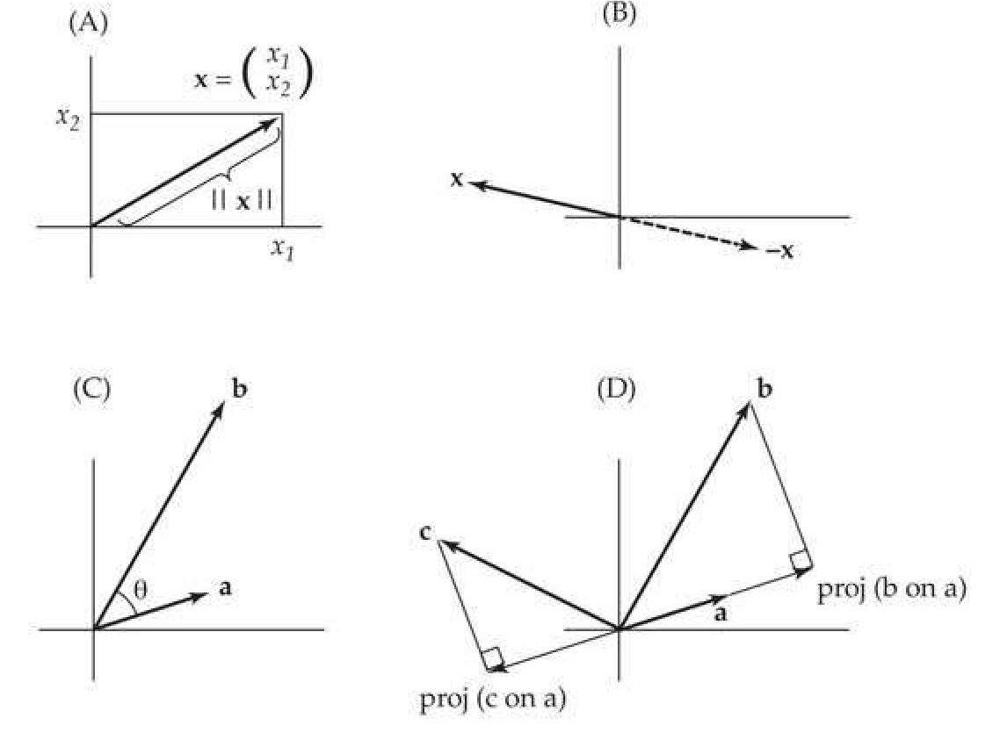
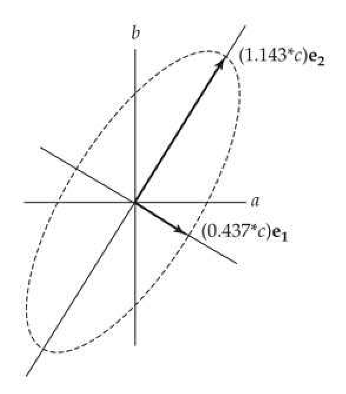
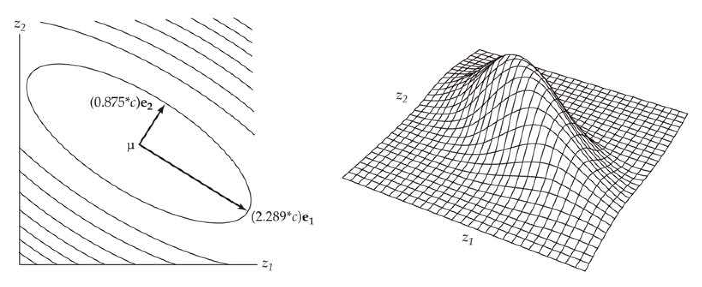

# Appendix 5 · Appendix 5 / The Geometry of Vectors and Matrices: Eigenvalues and Eigenvectors

## Evolution_appendix5_001 · Appendix: Introduction

Much of the presentation that follows is in matrix notation, and for this I offer no apology as this has rapidly become an essential tool of any serious student of animal breeding. Henderson (1973)

The basic concepts of matrix algebra were introduced in LW Chapter 8 and LW Appendix A3, and we assume the reader has this level of understanding (which includes matrix multiplication, inverses, and determinants). If not, a quick review of LW Chapter 8 before proceeding will be helpful. A deeper understanding of multivariate issues in quantitative genetics requires an appreciation of matrix geometry. Our primary intent here is to introduce the reader to the idea of vectors and matrices as geometric structures, and thus viewing matrix operations as transformations converting one vector into another by a change in geometry (rotation and scaling), which is completely summarized by the eigenvalues (scaling), and their associated eigenvectors (rotation), of a matrix.

---

## Evolution_appendix5_002 · Appendix: Introduction / THE GEOMETRY OF VECTORS AND MATRICES

As there are numerous excellent texts on matrix algebra, we made little effort to prove most of the results given below. For statistical applications, concise introductions can be found in the chapters on matrix methods in Johnson and Wichern (1988) and Morrison (1976), while Dhrymes (1978) and Searle (1982) provided more extended treatments. Wilf's (1978) short chapter on matrix methods provides a very nifty review of methods useful in applied mathematics. Franklin (1968), Horn and Johnson (1985), and Gantmacher (1960), respectively, presented increasingly sophisticated treatments of matrix analysis.

---

## Evolution_appendix5_003 · THE GEOMETRY OF VECTORS AND MATRICES / Comparing Vectors: Lengths and Angles

As Figure A5.1A shows, a vector, x, can be treated as a geometric object, consisting of an arrow leading from the origin to an n-dimensional point whose coordinates are given by the elements of x. By changing coordinate systems, we change the resulting vector, potentially changing both its direction (rotating the vector) and length (scaling the vector). This geometric interpretation suggests several ways for comparing vectors, such as the angle between two vectors and the projection of one vector onto another.

> **Figure A5.1** · page 2 · source: `Evolution_appendix5`
>
> 
>
> Figure A5.1 Some basic geometric concepts of vectors. While we use examples from two dimensions, these concepts easily extend to $n$ dimensions. A: A vector $x$ can be thought of as an arrow from the origin to a point in space whose coordinates are given by the elements of $x$. B: Multiplying a vector by $-1$ results in a reflection about the origin. C: One measure of the difference in direction between two vectors is the angle $(\theta)$ between them. D: Proj($\mathbf{b}$ on $\mathbf{a}$) is the vector resulting from the projection of $\mathbf{b}$ onto a. Note that the resulting projection vector is either in the same direction as $a$ or in the direction of the reflection of $a$, as seen for Proj($\mathbf{c}$ on $\mathbf{a}$).

Consider first the length (or norm) of a vector. The most common measure of length is the Euclidean distance of the vector from the origin, $ \|x\| $, defined as

$$
\begin{align*}||\mathbf{x}||=\sqrt{x_1^2+x_2^2+\cdots+x_n^2}=\sqrt{\mathbf{x}^T\mathbf{x}}\end{align*}
$$

For any scalar $ a, ||a\mathbf{x}|| = |a|||\mathbf{x}| $. Similarly, the squared Euclidean distance between the vectors x and y is

$$
\begin{align*}\vert\vert\mathbf{x}-\mathbf{y}\vert\vert^{2}=\sum\limits_{i=1}^n(x_i-y_i)^{2}=(\mathbf{x}-\mathbf{y})^{T}(\mathbf{x}-\mathbf{y})=(\mathbf{y}-\mathbf{x})^{T}(\mathbf{y}-\mathbf{x})\end{align*}
$$

Vectors can differ by length, direction, or both. The angle, $ \theta $, between two vectors (x and y) provides a measure of how much they differ in direction (Figure A5.1C). If the vectors

.. satisfy $ax = y$, they both point in exactly the same direction ($\theta = 0$; they are codirectional) when $a > 0$. If $a < 0$, they are exactly 180 degrees apart and differ in direction only by a reflection about the origin (Figure A5.1B). At the other extreme, two vectors can be at right angles to each other ($\theta = 90^\circ$ or $270^\circ$), in which case they are said to be orthogonal. Orthogonal vectors of unit length are further said to be orthonormal. For any two $n$-dimensional vectors, $\theta$ satisfies

$$
\begin{align*}\cos(\theta)=\frac{\mathbf{x}^T\mathbf{y}}{||\mathbf{x}||~||\mathbf{y}||}=\frac{\mathbf{y}^T\mathbf{x}}{||\mathbf{x}||~||\mathbf{y}||}\end{align*}
$$

Hence,

$$
\begin{align*}\theta=\cos^{-1}\left({\bf{y}^T\bf{x}\over||\bf{x}||~||\bf{y}||}\right)\end{align*}
$$

If both x and y are of unit length, then $ \theta = \cos^{-1}(\mathbf{y}^T\mathbf{x}) $, which reveals the close connection between vector angles and inner products. Note that because $ \cos(90^\circ) = \cos(270^\circ) = 0 $, two vectors are orthogonal if, and only if, their inner product is zero, $ \mathbf{x}^T\mathbf{y} = 0 $.

Another way to compare two vectors is to consider the projection vector of one onto the other. Proj(x on y), the projection of x on y, is a vector in the direction of y, whose length is given by how much of the vector x lies along the direction of y. For any two n-dimensional vectors, the projection of x on y is defined by

$$
\mathrm{Proj}(\mathbf{x}\mathrm{on}\mathbf{y})=\frac{\mathbf{x}^{T}\mathbf{y}}{\mathbf{y}^{T}\mathbf{y}}\mathbf{y}=\frac{\mathbf{x}^{T}\mathbf{y}}{||\mathbf{y}||^{2}}\mathbf{y}=\left(\cos(\theta)\frac{||\mathbf{x}||}{||\mathbf{y}||}\right)\mathbf{y}
$$

The term in the parentheses (which follows from Equation A5.2a) is a scalar, representing the length that x projects in the direction of y, which means that Proj(x on y) is a scaled version of the vector y onto which we are projecting. If $ \|y\| = 1 $, then

$$
\mathbf{P r o j}(\mathbf{x}\mathbf{o n}\mathbf{y})=(\mathbf{x}^{T}\mathbf{y})\mathbf{y}=(\cos(\theta)\left|\left|\mathbf{x}\right|\right|)\mathbf{y}
$$

The vector resulting from the projection of x on y is in the same direction as y unless $ 90^\circ < \theta < 270^\circ $, in which case $ \cos(\theta) < 0 $ and the projection vector is in exactly the opposite direction (the reflection of y about the origin). The length of the projection vector is

$$
\left\| \mathbf{Proj}(\mathbf{x}on\mathbf{y}) \right\|= \left\| \cos(\theta) \right\| \left\| \mathbf{x} \right\|\leq \left\| \mathbf{x} \right\|
$$

If two vectors lie in exactly the same direction ($ \theta = 0 $), the projection of one on the other simply recovers the vector (i.e., $ \text{Proj}(\mathbf{x} \text{ on } \mathbf{y}) = \mathbf{x} $). Conversely, if two vectors are orthogonal, the projection of one on the other yields a vector of length zero.

An important property of projection vectors is that if $ \mathbf{y}_1, \mathbf{y}_2, \cdots, \mathbf{y}_n $ is any set of mutually orthogonal $ n $-dimensional vectors, then any $ n $-dimensional vector $ x $ can be represented as the sum of projections of $ x $ onto the members of this set, namely,

$$
\mathbf{x}=\sum_{i=1}^{n}Proj(\mathbf{x}on\mathbf{y}_{i})
$$

One way to think about such a decomposition is as the transformation from one set of axes (or coordinates) into another (defined by the vectors, $ y_i $, that span, or completely cover, the vector space). We can also consider the projection of a vector into some subspace of a matrix (say $ y_1, \cdots, y_k $, where $ k < n $), namely, the projection onto some subset of the vectors that span the space of the original matrix. For example, one might consider the subspace of a covariance matrix imposed by (say) its three largest factors (eigenvalues). The notion of a subspace of the genetic covariance matrix G will prove useful in describing the constraints caused by the genetic covariance structure (Volume 3).

---

## Evolution_appendix5_004 · THE GEOMETRY OF VECTORS AND MATRICES / Matrices Describe Vector Transformations

When we multiply a vector, x, by a matrix, A, to create a new vector, y = Ax, A rotates and scales the original vector, x, into the new vector, y. A therefore describes a transformation of the original coordinate system of x into a new coordinate system, y (which has a different dimension from x unless A is square).

**[示例 Example]**

*(See Example A5.1.)*

---

## Evolution_appendix5_005 · THE GEOMETRY OF VECTORS AND MATRICES / Orthonormal Matrices: Rigid Rotations

A key building block on our way to the partitioning of a matrix into its rotational and scaling components is the idea of an orthonormal matrix. Writing a square $ n \times n $ matrix, U, as a row vector whose n elements are $ 1 \times n $ column vectors, $ \mathbf{U} = (\mathbf{u}_1, \mathbf{u}_2, \cdots, \mathbf{u}_n) $, then U is said to be orthonormal if

$$
\begin{align*}\mathbf{u}_i^T\mathbf{u}_j=\begin{cases}1&\textrm{if}i=j\\0&\textrm{if}i\neq j\end{cases}\end{align*}
$$

Namely, each column of U is of unit length and is orthogonal to every other column. Matrices with this property are also referred to as unitary and satisfy

$$
\mathbf{U}^{T}\mathbf{U}=\mathbf{U}\mathbf{U}^{T}=\mathbf{I}
$$

As a result, the inverse of a unitary matrix is simply its transpose,

$$
\mathbf{U}^{T}=\mathbf{U}^{-1}
$$

The coordinate transformation induced by an orthonormal matrix has a very simple geometric interpretation: it is a rigid rotation of the original coordinate system—axes of the original coordinates are all rotated by the same angle to create the new coordinate system. To see this, first note that orthonormal matrices preserve all inner products. Taking $ y_1 = Ux_1 $ and $ y_2 = Ux_2 $

$$
\mathbf{y}_{1}^{T}\mathbf{y}_{2}=\mathbf{x}_{1}^{T}(\mathbf{U}^{T}\mathbf{U})\mathbf{x}_{2}=\mathbf{x}_{1}^{T}\mathbf{x}_{2}
$$

Thus, orthonormal matrices do not change (scale) the length of vectors, as $ \|y_1\| = y_1^T y_1 = x_1^T x_1 = \|x_1\| $. Using these results, note that if $ \theta $ is the angle between the vectors $ x_1 $ and $ x_2 $, then following transformation by an orthonormal matrix

$$
\begin{align*}\cos(\theta\mid\mathbf{y}_1,\mathbf{y}_2)=\frac{\mathbf{y}_1^T\mathbf{y}_2}{\sqrt{\mid\mid\mathbf{y}_1\mid\mid\mid\mid\mathbf{y}_2\mid\mid}}=\frac{\mathbf{x}_1^T\mathbf{x}_2}{\sqrt{\mid\mid\mathbf{x}_1\mid\mid\mid\mid\mathbf{x}_2\mid\mid}}=\cos(\theta\mid\mathbf{x}_1,\mathbf{x}_2)\end{align*}
$$

which shows that the angle between the two vectors remains unchanged following their transformation by the same orthonormal matrix.

---

## Evolution_appendix5_006 · THE GEOMETRY OF VECTORS AND MATRICES / Eigenvalues and Eigenvectors

The eigenvalues, and their associated eigenvectors, of a square matrix describe its transformational geometry. Eigenvalues describe how the original coordinate axes are scaled in the new coordinate system that is described by the eigenvectors (i.e., how the original axes are rotated).

To more formally introduce eigenvalues and eigenvectors, suppose, for a square matrix A, that the vector y satisfies the matrix equation

$$
\mathbf{A}\mathbf{y}=\lambda\mathbf{y}
$$

for some scalar value, λ. Geometrically, this means that the new vector resulting from transformation of y by A points in the same direction as y (or is exactly reflected about the origin if λ < 0). For such vectors, the only action of the matrix transformation is to scale them by some amount, λ. These vectors thus represent the inherent axes associated with the transformation given by A, and the set of all such vectors, along with their corresponding scalar multipliers, completely describes the geometry of this transformation. Vectors that satisfy Equation A5.6 are referred to as eigenvectors, and their associated scaling factors are eigenvalues, and together they jointly describe the eigenstructure (the intrinsic geometry) of the square matrix, A. If y is an eigenvector, then ay is also an eigenvector, as $ \mathbf{A}(ay) = a(\mathbf{Ay}) = \lambda(ay) $. Note, however, that the associated eigenvalue, λ, remains unchanged. Hence, we typically scale eigenvectors to be of unit length to yield unit or normalized eigenvectors. In particular, if $ y_i $ is any eigenvector associated with the ith eigenvalue, then the associated normalized eigenvector is $ e_i = y_i / \|y_i\| $.

The eigenvalues of an $n$-dimensional square matrix, $\mathbf{A}$, are solutions of Equation A5.6, which can be written as $(\mathbf{A} - \lambda \mathbf{I}) \mathbf{y} = 0$. This implies that the determinant of $(\mathbf{A} - \lambda \mathbf{I})$ must equal zero, which gives rise to the characteristic equation, $|\mathbf{A} - \lambda \mathbf{I}| = 0$, whose solution yields the eigenvalues of $\mathbf{A}$. This equation can be also be expressed using the Laplace expansion,

$$
\left|\mathbf{A}-\lambda\mathbf{I}\right|=(-\lambda)^{n}+S_{1}(-\lambda)^{n-1}+\cdots+S_{n-1}(-\lambda)^{1}+S_{n}=0
$$

where $ |A| $ denotes the determinant of A and $ S_i $ is the sum of all principal minors (minors including diagonal elements of the original matrix) of order i (minors, which are subsets of the full matrix, were defined in LW Chapter 8). Finding the eigenvalues thus requires solving a polynomial equation of order n, implying that there are exactly n eigenvalues (some of which may be identical, i.e., repeated). In practice, for n > 2 this is accomplished numerically, and most statistical analysis packages offer routines to accomplish this task.

Two of these principal minors are easily obtained and provide information on the nature of the eigenvalues. The only principal minor having the same order of the matrix is the full matrix itself, which means that $ S_n = |\mathbf{A}| $, the determinant of $ \mathbf{A} $. $ S_1 $ is also related to an important matrix quantity, the trace. This is denoted by $ \mathrm{tr}(\mathbf{A}) $, and is the sum of the diagonal elements of the matrix, namely,

$$
\mathbf{tr}(\mathbf{A})=\sum_{i=1}^{n}A_{ii}
$$

Observe that $ S_1 = \text{tr}(\mathbf{A}) $, as the only principal minors of order one are the diagonal elements themselves, the sum of which equals the trace. Both the trace and determinant can be expressed as functions of the eigenvalues, with

$$
\mathbf{tr}(\mathbf{A})=\sum_{i=1}^{n}\lambda_{i}\qquad and\qquad|\mathbf{A}|=\prod_{i=1}^{n}\lambda_{i}
$$

Hence $ \mathbf{A} $ is singular ($ |A|=0 $) if, and only if, at least one eigenvalue is zero. As we will see, if $ \mathbf{A} $ is a covariance matrix, then its trace (the sum of its eigenvalues) measures its total amount of variation, as the eigenvalues of a covariance matrix are nonnegative ($ \lambda_i \geq 0 $).

Let $\mathbf{e}_i$ be the (unit-length) eigenvector associated with eigenvalue $\lambda_i$. If the eigenvectors of $\mathbf{A}$ can be chosen to be mutually orthogonal, namely, $\mathbf{e}_i^T \mathbf{e}_j = 0$ for $i \neq j$, then we can express $\mathbf{A}$ as

$$
\mathbf{A}=\lambda_{1}\mathbf{e}_{1}\mathbf{e}_{1}^{T}+\lambda_{2}\mathbf{e}_{2}\mathbf{e}_{2}^{T}+\cdots+\lambda_{n}\mathbf{e}_{n}\mathbf{e}_{n}^{T}
$$

This is called the spectral decomposition of A, and it is derived below in Equation A5.10d. Because $ \|\mathbf{e}_i\| = 1 $, Equation A5.3b gives the projection of $ \mathbf{x} $ on $ \mathbf{e}_i $ as $ (\mathbf{x}^T \mathbf{e}_i) \mathbf{e}_i $. Note that $ \mathbf{e}_i(\mathbf{e}_i^T \mathbf{x}) = (\mathbf{e}_i^T \mathbf{x}) \mathbf{e}_i = (\mathbf{x}^T \mathbf{e}_i) \mathbf{e}_i $, as $ \mathbf{e}_i^T \mathbf{x} $ is a scalar, which implies that $ \mathbf{e}_i^T \mathbf{x} = (\mathbf{e}_i^T \mathbf{x})^T = \mathbf{x}^T \mathbf{e}_i $. Hence, from Equation A5.3b, we have

$$
\begin{aligned}\mathbf{A}\mathbf{x}&=\lambda_{1}\mathbf{e}_{1}\mathbf{e}_{1}^{T}\mathbf{x}+\lambda_{2}\mathbf{e}_{2}\mathbf{e}_{2}^{T}\mathbf{x}+\cdots+\lambda_{n}\mathbf{e}_{n}\mathbf{e}_{n}^{T}\mathbf{x}\\&=\lambda_{1}\left(\mathbf{e}_{1}^{T}\mathbf{x}\right)\mathbf{e}_{1}+\lambda_{2}\left(\mathbf{e}_{2}^{T}\mathbf{x}\right)\mathbf{e}_{2}+\cdots+\lambda_{n}\left(\mathbf{e}_{n}^{T}\mathbf{x}\right)\mathbf{e}_{n}\\&=\lambda_{1}Proj(\mathbf{x}on\mathbf{e}_{1})+\lambda_{2}Proj(\mathbf{x}on\mathbf{e}_{2})+\cdots+\lambda_{n}Proj(\mathbf{x}on\mathbf{e}_{n})\\ \end{aligned}
$$

If we again apply Equation A5.3b, we can express this decomposition as

$$
\mathbf{A}\mathbf{x}=||\mathbf{x}||\sum_{i=}^{n}\left[\lambda_{i}\cdot\cos(\theta|\mathbf{x},\mathbf{e}_{i})\right]\mathbf{e}_{i}
$$

where $ \theta|\mathbf{x}, \mathbf{e}_i $ denotes the angle between the vectors $ \mathbf{x} $ and $ \mathbf{e}_i $. Thus, one can view a matrix as a series of vectors that form the projection space (the eigenvectors), so when a vector is multiplied by this matrix, the resulting vector is the weighted (by the eigenvalues) sum of projections over all of the vectors (the $ \mathbf{e}_i $) that span the space defined by the matrix.

**[示例 Example]**

*(See Example A5.2.)*

---

## Evolution_appendix5_007 · Appendix: Introduction / PROPERTIES OF SYMMETRIC MATRICES

Many of the matrices encountered in quantitative genetics are symmetric, satisfying $ \mathbf{A} = \mathbf{A}^T $ (and therefore necessarily square). Examples include covariance matrices and the $ \gamma $ matrix of quadratic coefficients in the Pearson-Lande-Arnold fitness regression (Chapter 30). Symmetric matrices have a number of useful properties (proofs of which can be found in Dhrymes 1978; Horn and Johnson 1985; and Wilf 1978): 2. The eigenvalues and eigenvectors of a symmetric matrix are all real.

3. For any $n$-dimensional symmetric matrix, $a$ corresponding set of $n$ orthonormal eigenvectors can be constructed, namely, we can obtain a set of eigenvalues $\mathbf{e}_i$ for $1 \leq i \leq n$ that satisfies

$$
\begin{align*}\mathbf{e}_i^T\mathbf{e}_j=\begin{cases}1&\textrm{if}i=j\\0&\textrm{if}i\neq j\end{cases}\end{align*}
$$

In particular, this guarantees that a spectral decomposition of A exists (Equation A5.9a).

---

## Evolution_appendix5_008 · Appendix: Introduction / 4. A symmetric matrix A can be diagonalized as

$$
\mathbf{A}=\mathbf{U}\mathbf{A}\mathbf{U}^{T}
$$

where $ \Lambda $ is a diagonal matrix and $ \mathbf{U} $ is an orthonormal matrix $ (\mathbf{U}^{-1} = \mathbf{U}^T) $. If $ \lambda_i $ and $ \mathbf{e}_i $ are the $ i $th eigenvalue and its associated unit eigenvector of $ \mathbf{A} $, then

$$
\boldsymbol{A}=diag(\lambda_{1},\lambda_{2},\cdots,\lambda_{n})=\begin{pmatrix}{{{\lambda_{1}}}}&{{{0}}}&{{{\cdots}}}&{{{0}}} \\{{{0}}}&{{{\lambda_{2}}}}&{{{\cdots}}}&{{{0}}} \\{{{\vdots}}}&{{{\ddots}}}&{{{\vdots}}} \\{{{0}}}&{{{\cdots}}}&{{{\cdots}}}&{{{\lambda_{n}}}}\end{pmatrix}
$$

and

$$
\mathbf{U}=\left(\mathbf{e}_{1},\mathbf{e}_{2},\cdots,\mathbf{e}_{n}\right)
$$

Geometrically, U is a unity matrix and thus describes a rigid rotation of the original coordinate system to a new coordinate system given by the eigenvectors of $ \mathbf{A} $, while the diagonal elements of $ \mathbf{A} $ give the amount by which vectors of unit length in the original coordinate system are scaled in the transformed system. If we use the decomposition $ \mathbf{A} = \sum_{i=1}^{n} \mathbf{A}_i $, where $ \mathbf{A}_i $ is a diagonal matrix whose elements are all zero, except for $ \lambda_i $, then Equation A5.10a becomes

$$
\mathbf{A}=\mathbf{U}\left(\sum_{i=1}^{n}\boldsymbol{\Lambda}_{i}\right)\mathbf{U}^{T}=\sum_{i=1}^{n}\mathbf{U}\boldsymbol{\Lambda}_{i}\mathbf{U}^{T}=\sum_{i=1}^{n}\lambda_{i}\mathbf{e}_{i}\mathbf{e}_{i}^{T}
$$

recovering the spectral decomposition (Equation A5.9a). The last step in Equation A5.10d follows because $ \mathbf{e}_i^T \mathbf{e}_j = 0 $ for $ i \neq j $. Because of this feature, Equation A5.10a is also called the spectral factorization or eigendecomposition of A.

Using Equation A5.10a, it is easy to show that

$$
\mathbf{A}^{-1}=\mathbf{U}\boldsymbol{\Lambda}^{-1}\mathbf{U}^{T}
$$

To see this, note that

$$
\mathbf{A}^{-1}\mathbf{A}=\left(\mathbf{U}\boldsymbol{\Lambda}^{-1}\mathbf{U}^{T}\right)\left(\mathbf{U}\boldsymbol{\Lambda}\mathbf{U}^{T}\right)=\mathbf{U}\boldsymbol{\Lambda}^{-1}\left(\mathbf{U}^{T}\mathbf{U}\right)\boldsymbol{\Lambda}\mathbf{U}^{T}=\mathbf{U}\boldsymbol{\Lambda}^{-1}\boldsymbol{\Lambda}\mathbf{U}^{T}=\mathbf{U}\mathbf{U}^{T}=\mathbf{I}
$$

Similar logic yields

$$
\mathbf{A}^{1/2}=\mathbf{U}\boldsymbol{\Lambda}^{1/2}\mathbf{U}^{T}
$$

$$
\mathbf{A}^{-1/2}=\mathbf{U}\boldsymbol{\Lambda}^{-1/2}\mathbf{U}^{T}
$$

$$
\mathbf{A}^{k}=\mathbf{U}\mathbf{A}^{k}\mathbf{U}^{T}\quad for any integer k
$$

where the square root matrix, $ A^{1/2} $, satisfies $ A^{1/2}A^{1/2} = A $, and $ A^{-1/2} $ satisfies $ A^{-1/2}A = AA^{-1/2} = A^{1/2} $, as well as $ A^{-1/2}A^{1/2} = A^{1/2}A^{-1/2} = I $. Because $\Lambda$ is diagonal, the $i$th diagonal elements of $\Lambda^{-1}$, $\Lambda^{1/2}$, $\Lambda^{-1/2}$, and $\Lambda^{k}$ are $\lambda_{i}^{-1}$, $\lambda_{i}^{1/2}$, $\lambda_{i}^{-1/2}$, and $\lambda_{i}^{k}$, respectively, implying that if $\lambda_{i}$ is an eigenvalue of $\mathbf{A}$, then $\lambda_{i}^{-1}$, $\lambda_{i}^{1/2}$, $\lambda_{i}^{-1/2}$, and $\lambda_{i}^{k}$, respectively, are eigenvalues of the matrices $\mathbf{A}^{-1}$, $\mathbf{A}^{1/2}$, $\mathbf{A}^{-1/2}$, and $\mathbf{A}^{k}$. Note that Equations A5.11a–A5.11d further imply that the matrices $\mathbf{A}$, $\mathbf{A}^{-1}$, $\mathbf{A}^{1/2}$, $\mathbf{A}^{-1/2}$, and $\mathbf{A}^{k}$ all have the same eigenvectors, namely the columns of $\mathbf{U}$. Finally, using Equation A5.10a, we see that premultiplying $\mathbf{A}$ by $\mathbf{U}^{T}$ and then postmultiplying by $\mathbf{U}$ gives a diagonal matrix whose elements are the eigenvalues of $\mathbf{A}$.

$$
\mathbf{U}^{T}\mathbf{A}\mathbf{U}=\mathbf{U}^{T}(\mathbf{U}\boldsymbol{\Lambda}\mathbf{U}^{T})\mathbf{U}=(\mathbf{U}^{T}\mathbf{U})\boldsymbol{\Lambda}(\mathbf{U}^{T}\mathbf{U})=\boldsymbol{\Lambda}
$$

**[命题 Proposition]**

5. The Rayleigh-Ritz theorem gives useful bounds on quadratic products associated with the symmetric matrix A. It states that if the eigenvalues of A are ordered as $ \lambda_{max} = \lambda_1 \geq \lambda_2 \geq \cdots \geq \lambda_n = \lambda_{min} $, then for any vector of constants $ \mathbf{c} $ (for $ \|\mathbf{c}\| > 0 $)

$$
\lambda_{1}\left|\left|\mathbf{c}\right|\right|\geq\mathbf{c}^{T}\mathbf{A}\mathbf{c}\geq\lambda_{n}\left|\left|\mathbf{c}\right|\right|
$$

If c is of unit length, then all quadratic products are bounded by

$$
\lambda_{1}\geq\mathbf{c}^{T}\mathbf{A}\mathbf{c}\geq\lambda_{n}
$$

The maximum and minimum quadratic products occur, respectively, when $ c = e_1 $ and $ c = e_n $, the eigenvectors associated with $ \lambda_1 $ and $ \lambda_n $. This is a useful result for bounding variances. Consider a univariate random variable, $ y = c^T x $, formed by a linear combination of the elements of a random vector, x. Recall from LW Equation 8.19 that the variance of a sum $ y = c^T x $ is $ \sigma^2(y) = c^T V_x c $, where $ V_x $ is the covariance matrix for x. If we apply Equation A5.13a we obtain

$$
\lambda_{1}||\mathbf{c}||^{2}\geq\sigma^{2}(y)\geq\lambda_{n}||\mathbf{c}||^{2}
$$

where $ \lambda_{1} $ is the largest (leading or dominant) eigenvalue and $ \lambda_{n} $ is the smallest eigenvalue of the covariance matrix $ V_{X} $.

**[示例 Example]**

*(See Example A5.3.)*

---

## Evolution_appendix5_009 · PROPERTIES OF SYMMETRIC MATRICES / Correlations Can Be Removed by a Matrix Transformation

A powerful use of diagonalization is that it allows one to extract a set of $n$ uncorrelated variables for any $n \times n$ nonsingular covariance matrix, $\mathbf{V}_{\mathbf{x}}$. Consider the transformation

$$
\mathbf{y}=\mathbf{U}^{T}\mathbf{x}
$$

where $ \mathbf{U} = (\mathbf{e}_1, \mathbf{e}_2, \cdots, \mathbf{e}_n) $ contains the normalized eigenvectors of $ \mathbf{V}_x $. Because $ \mathbf{U} $ is an orthonormal matrix, this transformation is a rigid rotation of the axes of the original $ (x_1, \cdots, x_n) $ coordinate system to a new system given by $ (e_1, \cdots, e_n) $. Applying LW Equation 8.21b and Equation A5.12, respectively, the covariance matrix for $ \mathbf{y} $ is

$$
\mathbf{V_{y}}=\mathbf{U}^{T}\mathbf{V_{x}}\mathbf{U}=\boldsymbol{\Lambda}
$$

where A is a diagonal matrix whose elements are the eigenvalues of $ V_{x} $,

$$
\sigma(y_{i},y_{j})=\left\{\begin{aligned}&\lambda_{i}&if i=j\\ &0&if i\neq j\end{aligned}\right.
$$

The rigid rotation introduced by U creates a set of n uncorrelated variables, the ith of which is

$$
y_{i}=\mathbf{e}_{i}^{T}\mathbf{x}
$$

Because the $ e_i $ are of unit length, from Equation A5.3b we have that $ y_i = e_i^T x $ is the length of the projection of $ x $ onto the $ i $th eigenvector of $ V_x $, which implies that the axes of the new coordinate system are given by the orthogonal set of eigenvectors of $ V_x $.

Defining the matrix B as

$$
\mathbf{B}=\mathbf{U}\boldsymbol{A}^{-1/2}
$$

the vector $ \mathbf{y} = \mathbf{B}^T \mathbf{x} $ has a covariance matrix of $ \mathbf{V}_{\mathbf{y}} = \mathbf{I} $, which means that this transformation creates a set of uncorrelated variables, each with unit variance. To see this, note that

$$
\begin{aligned}\mathbf{V}_{\mathbf{y}}=\mathbf{B}^{T}\mathbf{V}_{\mathbf{x}}\mathbf{B}&=\left(\mathbf{U}\boldsymbol{\Lambda}^{-1/2}\right)^{T}\left(\mathbf{U}\boldsymbol{\Lambda}\mathbf{U}^{T}\right)\left(\mathbf{U}\boldsymbol{\Lambda}^{-1/2}\right)\\&=\boldsymbol{\Lambda}^{-1/2}\left(\mathbf{U}^{T}\mathbf{U}\right)\boldsymbol{\Lambda}\left(\mathbf{U}^{T}\mathbf{U}\right)\boldsymbol{\Lambda}^{-1/2}\\&=\boldsymbol{\Lambda}^{-1/2}\boldsymbol{\Lambda}\boldsymbol{\Lambda}^{-1/2}=\mathbf{I}\\ \end{aligned}
$$

An alternative to Equation A5.15d is the Cholesky decomposition, $ A = C^T C $, of a square, symmetric matrix $ A $, where $ C $ is an lower triangular matrix (all elements above the diagonal are zero). If $ C $ is the Cholesky decomposition for $ V_X $, then $ y = C^{-1} x $ also returns a covariance matrix of $ I $.

**[示例 Example]**

*(See Example A5.4.)*

---

## Evolution_appendix5_010 · PROPERTIES OF SYMMETRIC MATRICES / Simultaneous Diagonalization

An extension of the notion of diagonalization is the simultaneous diagonalization of two symmetric matrices, P and G, of the same dimension. There exists a matrix T such that

$$
\mathbf{T}^{T}\mathbf{P}\mathbf{T}=\mathbf{I}\quad and\quad\mathbf{T}^{T}\mathbf{G}\mathbf{T}=\mathbf{D}
$$

where D is a diagonal matrix, whose elements are the eigenvalues of $ \mathbf{P}^{-1}\mathbf{G} $. Hence, the same transformation simultaneously diagonalizes both P and G. If one has a series of traits with both genetic (G) and phenotypic (P) covariances, they can be transformed to a scale where the new traits (based on linear combinations of the original traits) are genetically and phenotypically uncorrelated, where the elements of D correspond to the heritabilities of these new traits.

**[示例 Example]**

*(See Example A5.5.)*

---

## Evolution_appendix5_011 · Appendix: Introduction / CANONICAL AXES OF QUADRATIC FORMS

The transformation $ \mathbf{y} = \mathbf{U}^T \mathbf{x} $ given by Equation A5.15a applies to any symmetric matrix, and is referred to as its canonical transformation. This simplifies the interpretation of the quadratic form $ \mathbf{x}^T \mathbf{A} \mathbf{x} $, as rotation of the original axes to align them with the eigenvectors of $ \mathbf{A} $ removes all cross-product terms ($ x_i x_j $ for $ i \neq j $) on this new coordinate system. Recall (Equation A5.5b) that $ \mathbf{U} $ is a unitary matrix and hence $ \mathbf{U}^T = \mathbf{U}^{-1} $. Thus,

$$
\mathbf{U}\mathbf{y}=\mathbf{U}\mathbf{U}^{T}\mathbf{x}=\mathbf{x}
$$

Applying Equations A5.15a and A5.12 transforms a quadratic form to one in which the square matrix is diagonal, which greatly simplifies the resulting quadratic product, as

$$
\begin{aligned}\mathbf{x}^{T}\mathbf{A}\mathbf{x}&=(\mathbf{U}\mathbf{y})^{T}\mathbf{A}\mathbf{U}\mathbf{y}=\mathbf{y}^{T}(\mathbf{U}^{T}\mathbf{A}\mathbf{U})\mathbf{y}\\&=\mathbf{y}^{T}\mathbf{A}\mathbf{y}\\&=\sum_{i=1}^{n}\lambda_{i}y_{i}^{2},\quad with\quad y_{i}=\mathbf{e}_{i}^{T}\mathbf{x}\end{aligned}
$$

where $ \lambda_i $ and $ e_i $ are the eigenvalues and associated (normalized, i.e., $ \|\mathbf{e}_i\| = 1 $) eigenvectors of A. The new axes defined by the $ e_i $ vectors are the canonical (or principal) axes of A. Because $ y_i^2 \geq 0 $, Equation A5.17a immediately shows the connection between the signs of the eigenvalues of a matrix and whether that matrix is positive definite, negative definite, or indefinite.

If all eigenvalues are positive (all $ \lambda_i > 0 $), then any quadratic form is always positive (unless all the $ y_i $ are zero) and hence A is positive definite. If one or more of the eigenvalues are zero, while the rest are positive, then A is said to be positive semidefinite, implying that quadratic products are either zero (corresponding to $ \lambda_i = 0 $) or positive. If all eigenvalues are negative (all $ \lambda_i < 0 $), then A is negative definite as any quadratic form is always negative, while A is said to be negative semidefinite if the eigenvalues are either zero or negative. If A has both positive and negative eigenvalues it is said to be indefinite, as quadratic products can be either positive or negative.

Equations of the form

$$
\begin{align*}\mathbf{x}^T\mathbf{A}\mathbf{x}=\sum\limits_{i=1}^n\sum\limits_{j=1}^n A_{ij}x_i x_j=c^2\end{align*}
$$

arise fairly frequently in quantitative genetics. For example, they describe surfaces of constant variance (Figure A5.5) or constant fitnesses in quadratic fitness regressions (Chapter 30). Solutions to Equation A5.17b describe quadratic surfaces—for two dimensions, these are the familiar conic sections (ellipses, parabolas, or hyperbolas). Equation A5.17a greatly simplifies the interpretation of these surfaces by removing all cross product terms, yielding

$$
\begin{align*}\mathbf{x}^T\mathbf{A}\mathbf{x}=\sum\limits_{i=1}^n\lambda_i y_i^2=c^2\end{align*}
$$

Because $ (y_i)^2 $ and $ (-y_i)^2 $ have the same value, the canonical axes of A are also the axes of symmetry for the quadratic surface generated by quadratic forms involving A. When all eigenvalues of A are positive (as occurs with nonsingular covariance and other positive-definite matrices), Equation A5.17c describes an ellipsoid whose axes of symmetry are given by the eigenvectors of A. The distance from the origin to the surface along the $ e_i $ axis is $ \lambda_i y_i^2 = c^2 $ or $ y_i = c \lambda_i^{-1/2} $, as can been seen by setting all the $ y_k $ equal to zero except for $ y_i $, which yields

$$
\begin{align*}\mathbf{x}^T\mathbf{A}\mathbf{x}=\lambda_i y_i^2=c^2.\end{align*}
$$

> **Figure A5.5** · page 13 · source: `Evolution_appendix5`
>
> 
>
> Figure A5.5 The general shape of surfaces of constant variance for the additive-genetic covariance matrix, G, given in Example A5.1. Defining a new composite character  $ y = az_1 + bz_2 $, the rotated ellipse represents the set of weights  $ (a, b) $ that give y the same additive-genetic variance,  $ c^2 $. The major axis of the ellipse is along  $ e_2 $, the eigenvector associated with the smallest eigenvalue of G, where  $ \lambda_2 \simeq 0.765 $, giving  $ 1/\sqrt{\lambda_2} \simeq 1.143 $. The minor axis of the ellipse is along  $ e_1 $, the eigenvector associated with the largest eigenvalue of G, where  $ \lambda_1 \simeq 5.241 $, giving  $ 1/\sqrt{\lambda_1} \simeq 0.437 $.

Consider a new variable (y) that is a weighted combination $ y = ax_1 + bx_2 = b^T x $ of the original vector (x) of random variables, where $ \mathbf{b}^T = (a, b) $. Its resulting variance is

$$
\sigma^{2}(y)=a^{2}\sigma^{2}(x_{1})+2ab\sigma(x_{1},x_{2})+b^{2}\sigma^{2}(x_{2})=\mathbf{b}^{T}\mathbf{V}_{\mathbf{x}}\mathbf{b}
$$

As shown in Figure A5.5, the collection of $a$, $b$ values that result in the same variance ($c^2$) is the ellipse given by $c^2 = b^2$ $V_X$ b. Variables with a large amount of variance require smaller weights to achieve the constant value ($c^2$) than do variables with lower variances. Thus, on a constant-variance surface, minor axes correspond to directions with the most variance, while major axes correspond to the directions with the least variability. This is in contrast to surfaces of equal probability (Figure A5.6), where major axes correspond to directions with the most variance. The reason for this reversal of roles is that constant-variance surfaces are functions of $\lambda_{i}^{-1/2}$, whereas constant-probability surfaces are functions of $\lambda_{i}^{1/2}$.

> **Figure A5.6** · page 14 · source: `Evolution_appendix5`
>
> 
>
> Figure A5.6 Surfaces for a multivariate normal (MVN) distribution. Left: Surfaces of equal probability assuming that the additive-genetic values associated with the characters  $ z_1 $ and  $ z_2 $ in Example A5.1 are  $ \sim \mathrm{MVN}(\mu, \mathbf{G}) $. These surfaces are ellipses centered at  $ \mu $, with the major axis of the ellipse along  $ e_1 $ and the minor axis along  $ e_2 $, whose lengths (for a fixed c) are, respectively,  $ \sqrt{\lambda_1} = 2.289 $ and  $ \sqrt{\lambda_2} = 0.875 $. Right: A plot of the associated probability density. Slicing along either the major or minor axis gives a normal curve. Because the variance in the major axis is greater, the curve is much broader along this axis. The covariance between the breeding values of  $ z_1 $ and  $ z_2 $ rotates the distribution so that the principal axes ( $ e_1 $,  $ e_2 $) do not coincide with the original ( $ z_1 $,  $ z_2 $) axes.

---

## Evolution_appendix5_012 · CANONICAL AXES OF QUADRATIC FORMS / Implications for the Multivariate Normal Distribution

Recall the probability density function for the multivariate normal distribution (LW Chapter 8)

$$
\begin{align*}\phi(\mathbf x)=(2\pi)^{-n/2}\left|\mathbf V_{\mathbf x}\right|^{-1/2}\exp\left[-{1\over2}(\mathbf x-\boldsymbol\mu)^T\mathbf V_{\mathbf x}^{-1}\left(\mathbf x-\boldsymbol\mu\right)\right]\end{align*}
$$

Because only the quadratic product in the exponential varies with x, surfaces of equal probability for MVN distributed vectors satisfy

$$
\left(\mathbf{x}-\boldsymbol{\mu}\right)^{T}\mathbf{V}_{\mathbf{X}}^{-1}\left(\mathbf{x}-\boldsymbol{\mu}\right)=c^{2}
$$

From the discussion following Equation A5.17c, these surfaces are $n$-dimensional ellipsoids centered at $\mu$ whose axes of symmetry are given by the principal components (the eigenvectors) of the covariance matrix, $\mathbf{V}_{\mathbf{x}}$. The length of the ellipsoid along the $i$th axis is $c\sqrt{\lambda_{i}}$ where $\lambda_{i}$ is the eigenvalue associated with the eigenvector $\mathbf{e}_{i}$ (Figure A5.6).

Equation A5.18b motivates the Mahalanobis distance

$$
D=\sqrt{\left(\mathbf{x}-\boldsymbol{\mu}\right)^{T}\mathbf{V}_{\mathbf{X}}^{-1}\left(\mathbf{x}-\boldsymbol{\mu}\right)}
$$

which measures the distance of a point from its mean $ \mu $, correcting for its covariance structure, $ V_X $ (Mahalanobis 1938). As we detail shortly, $ D $ provides one metric for tests of multivariate normality.

Applying the canonical transformation (Equation A5.15a), we can change coordinate systems by a rigid rotation to remove any correlations between the variables in x. If $ x \sim \text{MVN}(\mu, \mathbf{V}_x) $, then for $ y = \mathbf{U}^T(\mathbf{x} - \boldsymbol{\mu}) $, it follows that

$$
\mathbf{y}\sim MVN(\mathbf{0},\boldsymbol{\Lambda})
$$

where A and U are the matrices defined by Equations A5.10b and A5.10bc for the diagonalization of $ V_x $. In particular,

$$
y_{i}=\mathbf{e}_{i}^{T}(\mathbf{x}-\boldsymbol{\mu})\qquad\mathrm{w h e r e}\quad y_{i}\sim\mathrm{N}(0,\lambda_{i})
$$

Note from Equation A5.20a that because the $ y_{i} $ are uncorrelated, they are also independent as the joint probability density is the product of n individual univariate normal densities. We can further transform the original vector by taking

$$
z_{i}=\frac{\mathbf{e}_{i}^{T}(\mathbf{x}-\boldsymbol{\mu})}{\sqrt{\lambda_{i}}}\qquad\mathrm{g i v i n g}\qquad z_{i}\sim\mathrm{N}(0,1)
$$

Applying the transformation

$$
\mathbf{z}=A^{-1/2}\mathbf{U}^{T}(\mathbf{x}-\boldsymbol{\mu})
$$

results in $ \mathbf{z} \sim \text{MVN}(\mathbf{0}, \mathbf{I}) $, namely that the $ n $ elements of the vector $ \mathbf{y} $ are each independent unit normal random variables.

---

## Evolution_appendix5_013 · CANONICAL AXES OF QUADRATIC FORMS / Principal Components of the Variance-Covariance Matrix

We are often interested in how the variance of a random vector can be decomposed into independent components. For example, even though we may be measuring n variables, only one or two of these may account for the majority of the variation. If this is the case, we may wish to exclude those variables contributing very little variation from further analysis. More generally, if random variables are correlated, then certain linear combinations of the elements of x may account for most of the variance. The procedure of principal component analysis (PCA) extracts these combinations by decomposing the variance of x into the contributions from a series of orthogonal vectors, the first of which explains the most variation possible for any single vector, the second the next possible amount, and so on until we account for the entire variance of x.

Consider Figure A5.5. Because the set of points comprising the ellipse represents the set of linear combinations (i.e., the set of weights) of the random variables of z that yield equal variance, a little thought shows that the closer a point on this curve is to the origin, the more variance there is in that direction. The points closest to the origin are those that lie along the axis defined by e₁, while those furthest away lie along the axis defined by e₂. Here e₁ and e₂ are the principal components of G, with the first principal component accounting for most of the variation of G. In particular, the ratio of additive variances for the characters y₁ = e₁ᴬᴬ and y₂ = e₂ᴬᴬʳ²(y₁)/σ²(y₂) = σ²(e₁ᴬᴬ) / σ²(e₂ᴬᴬ) = e₁ᴬᴬG e₁/e₂ᴬᴬG e₂ = λ₁/λ₂ ≈ 5.241/0.765 ≈ 6.85, so that a character in the direction of e₁ has almost seven times as much additive variance as a character lying in the direction of e₂.

In general, suppose we have an $n$-dimensional covariance matrix, $\mathbf{V}_{\mathbf{x}}$. If we order the eigenvalues of $\mathbf{V}_{\mathbf{x}}$ as $\lambda_{1} \geq \lambda_{2} \geq \cdots \geq \lambda_{n}$, then Equation A5.13b gives the maximum variance for any linear combination of the elements of $\mathbf{x}$ ($y = \mathbf{c}_{1}^{T} \mathbf{x}$, subject to the constraint that $|\mathbf{c}_{1}| = 1$), as

$$
\max\sigma^{2}(y)=\max_{||\mathbf{c}_{1}||=1}\sigma^{2}(\mathbf{c}_{1}^{T}\mathbf{x})=\mathbf{c}_{1}^{T}\mathbf{V}_{\mathbf{x}}\mathbf{c}_{1}=\lambda_{1}
$$

which occurs when $ \mathbf{c}_1 = \mathbf{e}_1 $ (the normalized eigenvector associated with the leading eigenvalue $ \lambda_1 $). This vector is the first principal component (often abbreviated as $ \mathbf{PC1} $), and accounts for the fraction $ \lambda_1/\text{tr}(\mathbf{V}_\mathbf{x}) $ of the total variation in $ \mathbf{x} $. We can partition the remaining variance in $ \mathbf{x} $ after the removal of PC1 in a similar fashion. For example, the vector $ \mathbf{c}_2 $, that is orthogonal to PC1 ($ \mathbf{c}_2^T \mathbf{c}_1 = 0 $) and maximizes the remaining variance can be shown to be $ \mathbf{e}_2 $, which accounts for a fraction $ \lambda_2/\text{tr}(\mathbf{V}_\mathbf{x}) $ of the total variation in $ \mathbf{x} $ (e.g., Morrison 1976; Johnson and Wichern 1988). By proceeding in this fashion, we can see that the $ i $th PC is given by $ \mathbf{e}_i $, and that the amount of variation it accounts for is

$$
\lambda_{i}\bigg/\sum_{k=1}^{n}\lambda_{k}=\frac{\lambda_{i}}{\mathrm{tr}(\mathbf{V_{x}})}
$$

Hence $ \sum \lambda_i = \text{tr}(\mathbf{V}_\mathbf{x}) $ is the total variance of the vector $ \mathbf{x} $, while $ \lambda_i/\text{tr}(\mathbf{V}_\mathbf{x}) $ is the fraction of that total variance explained by the linear combination $ \mathbf{e}_i^T \mathbf{x} $.

**[示例 Example]**

*(See Example A5.6.)*

Example A5.7 serves as a brief introduction to the important field of morphometrics, which is concerned with quantification and comparison of sizes and shapes of organisms. The reader is referred to Pimentel (1979), Reyment et al. (1984), Elewa (2004), Claude (2008) and especially Bookstein et al. (1985), Rohlf and Bookstein (1990), Reyment (1991), Bookstein (1997), Slice (2005), and Zelditch et al. (2012) for detailed treatments.

**[示例 Example]**

*(See Example A5.7.)*

This example points out some of the advantages, and possible pitfalls, of using principal component analysis for dimensional reduction of the data. Namely, replacing the $n$-component vector $\mathbf{z}$ by an $m < n$ component vector $\mathbf{y}$ composed of linear combinations of the $\mathbf{z}$, i.e., $\mathbf{y}_{m \times 1} = \mathbf{M}_{m \times n} \mathbf{z}_{n \times 1}$, where $\mathbf{M} = (\mathbf{e}_{1}, \cdots, \mathbf{e}_{m})^{T}$, with $y_{i} = \mathbf{e}_{i}^{T} \mathbf{z}$. Essentially all (over 97%) of the variance in the three measured characters is accounted for by variation in overall size, with the remaining variation accounted for by differences in shape. While the temptation is strong to simply consider overall size and ignore all shape information, it might be the case that selection is largely ignoring variation in size and instead focusing on (size-independent) shape differences. In this case, an analysis ignoring shape (as would occur if only the new character generated by PC1 were considered) would be very misleading. A further complication with principal component analysis is that it can often be difficult to give biological interpretations to the new characters resulting from the rotation of the coordinate system.

---

## Evolution_appendix5_014 · Appendix: Introduction / TESTING FOR MULTIVARIATE NORMALITY

Multivariate normality is often assumed in statistical procedures, but it is less often tested. In LW Chapter 11 we briefly discussed two approaches for testing univariate normality, one graphical and the other based on deviations of observed skewness and/or kurtosis from Gaussian expectations. As we now demonstrate, both of these approaches can be extended to testing for multivariate normality. Additional methods are reviewed by Malkovich and Afifi (1973), Gnanadesikan (1977), Cox and Small (1978), Seber (1984), Looney (1995), and Henze (2002).

---

## Evolution_appendix5_015 · TESTING FOR MULTIVARIATE NORMALITY / Graphical Tests: Chi-square Plots

A fairly simple graphical test can be developed by extending the notion of the normal probability plot that is used to check univariate normality (LW Chapter 11), where observations were ranked and then plotted against their ranked expected values under normality. Departures from linearity signify departures from normality, and we can apply this same approach to check for multivariate normality. From Equation A5.20d, if $ z \sim \text{MVN}(\mu, \mathbf{V_z}) $, then each element of the vector

$$
\mathbf{y}=\boldsymbol{A}^{-1/2}\mathbf{U}^{T}(\mathbf{z}-\boldsymbol{\mu})
$$

is an independent unit normal, so that $ \mathbf{y} \sim \text{MVN}(\mathbf{0}, \mathbf{I}) $. Recalling that $ \mathbf{U}^{-1} = \mathbf{U}^T $, we can rearrange this expression to yield

$$
(\mathbf{z}-\boldsymbol{\mu})=\mathbf{U}\boldsymbol{\Lambda}^{1/2}\mathbf{y}
$$

1. If A is symmetric, then if $ A^{-1} $ exists, it is also symmetric.

**[定义 Definition]**

Using this result and recalling Equation A5.11a, we have that

$$
\begin{align*}\left(\mathbf{z}-\boldsymbol{\mu}\right)^T\mathbf{V}\mathbf{\bar{z}}^{-1}\left(\mathbf{z}-\boldsymbol{\mu}\right)&=\left(\mathbf{U}\boldsymbol{\Lambda}^{1/2}\mathbf{y}\right)^T\left(\mathbf{U}\boldsymbol{\Lambda}^{-1}\mathbf{U}^T\right)\left(\mathbf{U}\boldsymbol{\Lambda}^{1/2}\mathbf{y}\right)\\&=\mathbf{y}^T\boldsymbol{\Lambda}^{1/2}\left(\mathbf{U}^T\mathbf{U}\right)\boldsymbol{\Lambda}^{-1}\left(\mathbf{U}^T\mathbf{U}\right)\boldsymbol{\Lambda}^{1/2}\mathbf{y}\\&=\mathbf{y}^T\mathbf{y}=\sum_{i=1}^n y_i^2\end{align*}
$$

Thus if $ z \sim MVN $, the quadratic form given by Equation A5.22 is the sum of $ n $ independent squared unit normal random variables. By definition, this sum is a $ \chi^2 $ random variable with $ n $ degrees of freedom (LW Appendix 5), suggesting that one test for multivariate normality is to compare the goodness of fit of the scaled distances

$$
\begin{align*}d_i^2=({\bf z}_i-{\bf\bar z})^T{\bf S^{-1}_Z}({\bf z}_i-{\bf\bar z})\end{align*}
$$

to those generated by $n$ (rank-ordered) draws from a $\chi_n^2$. Here $\mathbf{z}_i$ is the vector of observations from the $i$th individual, $\overline{\mathbf{z}}$ the vector of sample means, and $\mathbf{S}_{\overline{\mathbf{z}}}^{-1}$ the inverse of the sample covariance matrix. Note that the $d_i$ are simply the squared Mahalanobis distances (Equation A5.19). We use the term distance because when $\mathbf{z}$ is transformed to $\mathbf{y}$, $\mathbf{V}_{\mathbf{y}} = \mathbf{I}$, giving the variance of the linear combination $\mathbf{c}^T \mathbf{y}$ as $\mathbf{c}^T \mathbf{V}_{\mathbf{y}} \mathbf{c} = \mathbf{c}^T \mathbf{I} \mathbf{c} = \left\| \mathbf{c} \right\|^2$. Thus, regardless of orientation, any two $\mathbf{y}$ vectors having the same length also have the same variance, which equals their squared Euclidean distance.

The regression test for multivariate normality is based on ordered distances. Hence, we first order the distances generated by Equation A5.23 from smallest to largest,

$$
d_{(1)}^{2}\leq d_{(2)}^{2}\leq\cdots\leq d_{(m)}^{2}
$$

where $m$ is the number of individuals sampled. Note that we use the subscription notation where $d_{(j)}^{2}$ denotes the $j$th smallest distance (the $j$th smallest value of Equation A5.23), whereas $d_{i}^{2}$ is the distance associated with the vector of observations for the $i$th observation.

Let $ \chi_n^2(\alpha) $ correspond to the value of a chi-square random variable, $ X $, with $ n $ degrees of freedom that satisfies $ \text{Prob}[X \leq \chi_n^2(\alpha)] = \alpha $. Under multivariate normality, we expect the points

$$
\left(d_{(i)}^{2},\chi_{n}^{2}\left[\frac{i-1/2}{m}\right]\right)\qquad\mathrm{f o r}\quad1\leq i\leq m
$$

to fall along a line with a slope of one and an intercept of zero, as the $ i $th ordered distance has $ i/m $ observations less than or equal to it (the factor of $ 1/2 $ is added as a correction for continuity). As with univariate normal probability plots, departures from multivariate normality are indicated by departures from linearity. More formally, one can use a standard Kolmogorov–Smirnov test (Conover 1999) for comparing two distributions to compare the goodness-of-fit of these ordered distances with a $ \chi_n^2 $.

**[示例 Example]**

*(See Example A5.8.)*

---

## Evolution_appendix5_016 · TESTING FOR MULTIVARIATE NORMALITY / Mardia's Test: Multivariate Skewness and Kurtosis

As was the case for univariate normality, we can test for multivariate normality by examining the sample skewness and kurtosis. Mardia (1970, 1974) proposed multivariate extensions of skewness and kurtosis measures and suggested a large-sample test based on the asymptotic distribution of these statistics. If there are m vectors of observations (with each vector measuring n characters), then the multivariate skewness is estimated by

$$
b_{1,n}=\frac{1}{m^{2}}\sum_{i=1}^{m}\sum_{j=1}^{m}\left[\left(\mathbf{z}_{i}-\overline{\mathbf{z}}\right)^{T}\mathbf{S}_{\mathbf{Z}}^{-1}\left(\mathbf{z}_{j}-\overline{\mathbf{z}}\right)\right]^{3}
$$

while the multivariate kurtosis is estimated by

$$
b_{2,n}=\frac{1}{m}\sum_{i=1}^{m}\left[\left(\mathbf{z}_{i}-\overline{\mathbf{z}}\right)^{T}\mathbf{S}_{\mathbf{Z}}^{-1}\left(\mathbf{z}_{i}-\overline{\mathbf{z}}\right)\right]^{2}
$$

If $ z \sim MVN $, then $ b_{1,n} $ and $ b_{2,n} $ have expected values 0 and $ n(n+2) $. For large values of m, Mardia showed that the (scaled) multivariate skewness is asymptotically distributed as a chi-square random variable with f degrees of freedom, with

$$
\frac{m}{6}b_{1,n}\sim\chi_{f}^{2},\qquad\mathrm{w h e r e~}f=\frac{n(n+1)(n+2)}{6}
$$

Likewise for large values of m, the multivariate kurtosis (following appropriate scaling) is distributed as a unit-normal, with

$$
\frac{b_{2,n}-n(n+2)}{\sqrt{8n(n+2)/m}}\sim N(0,1)
$$

If either Equation A5.25a or A5.25b is significant, then multivariate normality is rejected.

**[示例 Example]**

*(See Example A5.9.)*

---
