# Chapter 12 · The Neutral Divergence of Quantitative Traits

## Evolution_chapter12_001 · The Neutral Divergence of Quantitative Traits: Introduction

From the perspective of the evolutionary biologist, missing or incomplete null or neutral models for many omics data (for example, transcriptome and metabolome data) limit our understanding of how selection has shaped their evolution. Leinonen et al. (2013)

In the preceding chapter, we learned how the opposing forces of random genetic drift and mutation lead to an equilibrium level of within-population genetic variance. In contrast, the phenotypic variance among isolated populations may continue to increase nearly indefinitely for neutral characters, as isolated demes or species recurrently acquire and become fixed for independent mutations. Here, we explore neutral factors that can drive the evolutionary dynamics of the among-population variance. As in Chapter 11, we will start with the situation in which the time span is short enough that most of the change in population-mean phenotypes is driven by drift acting on existing variation rather than by new alleles introduced by mutation. We then explore the consequences of longer-term divergence, with mutation playing an increasingly dominant role, and show that eventually, the rate of divergence for neutral characters may become essentially independent of local effective population sizes. We conclude by using this theory to develop statistical tests of whether an observed pattern of phenotypic divergence is consistent with a model of strict neutral drift and mutation.

Although few quantitative traits may actually evolve in a purely neutral fashion, a more compelling case for selection can always be made if the hypothesis of neutrality can be formally rejected. For example, an observed divergence of isolated lines that is significantly less than the neutral expectation provides evidence of stabilizing selection, whereas the reverse supports a role for diversifying selection. In addition, as populations become diminishingly small in size, drift begins to overwhelm selection, promoting nearly neutral patterns of evolution.

Tests for departures from neutral-trait divergence come in several different forms. First, one can compare the observed rate of divergence in the trait mean with the rate that would be expected given estimates of the effective population size, time, and genetic variation. Second, one may have a time series of data (such as a fossil record sequence) and test whether the observed pattern is more consistent with a neutral random walk, a biased random walk, or stasis. Third, one can compare the within- and between-population structure of the genetic variance of a candidate trait (measured by $ Q_{ST} $) against a genome-wide estimate based on markers that are presumed neutral ($ F_{ST} $). Finally, a number of trait-augmented marker-based approaches have been proposed. These use markers from either a QTL or a GWAS study (and hence require a candidate trait to chose the set of markers being examined). Examples include tests based on the distribution of QTL effects detected by crossing two divergent lines and tests using GWAS marker information (such as comparing marker-allele frequencies between two populations).

This highly diverse collection of neutral divergence tests has been applied to an equally diverse collection of traits, ranging from studies of morphological changes in the fossil record to evaluations of evolutionary forces shaping omics data. To highlight the latter, we conclude the chapter by applying several of these approaches to examine if (and if so, how) divergence in gene expression departs from neutrality. Chapters 8–10 considered the complementary topic of tests for departures from neutrality at specific loci, as opposed to our focus here, which is specific traits.

---

## Evolution_chapter12_002 · The Neutral Divergence of Quantitative Traits: Introduction / SHORT-TERM DIVERGENCE

**[命题 Proposition]**

We start with the special case in which all gene action is additive and random genetic drift is the only evolutionary force. Most of the predictions of this model can be expressed in terms of two observable quantities: the additive genetic variance in the base population, $ \sigma_A^2(0) $, and the effective population sizes, $ N_e $, of the isolated lineages. The expected among-population genetic variance, $ \sigma_B^2(t) $, under neutrality is obtained by noting that the mean genotypic value at a diallelic locus i is $ 2a_i p_i $ (there being two genes per locus, each with additive effect $ t_i $) with probability of $ p_i $, and effect 0 with probability $ 1 - p_i $. The variance among populations for this locus is (from the definition of the variance), $ E\{[2a_i p_i(t)]^2\} - \{E[2a_i p_i(t)]\}^2 $, which simplifies to

$$
4a_{i}^{2}\left(E\{[p_{i}(t)]^{2}\}-\{E[p_{i}(t)]\}^{2}\right)=4a_{i}^{2}\sigma_{p_{i}}^{2}(t),
$$

where $ \sigma_{p_i}^2(t) $ is the expected among-population variance in allele frequency. Summing over all loci, assuming negligible gametic-phase disequilibrium, and substituting from Equation 2.14a yields

$$
\begin{aligned}\sigma_{B}^{2}(t)&=4\sum_{i=1}^{n}a_{i}^{2}p_{i}(0)[1-p_{i}(0)]\left\{\frac{1}{N_{fo}}+\left[1-\left(1-\frac{1}{2N_{e}}\right)^{t}\right]\right\}\\&=\left(\frac{1}{N_{fo}}+2f_{t}\right)\sigma_{A}^{2}(0)\end{aligned}
$$

where $ N_{fo} $ is the effective number of founders per line, the inbreeding coefficient ($ f_t $) follows from Equation 2.4c, and the time index is defined such that t = 0 denotes the final generation of the base population and t = 1 denotes the founding generation for the isolated lines. Equation 12.1 shows that, under the assumptions of this ideal model, the expected variance among genotypic means of isolated populations increases linearly with the inbreeding coefficient, asymptotically approaching a limit (as $ f_t \to 1 $) that is very close to twice the additive genetic variance in the base population (Wright 1951). Under the assumption of additivity, Equation 12.1b holds regardless of the number of alleles at the underlying loci.

If we ignore the generally minor contribution $ (N_{fo}^{-1}) $ from the baseline founder effect, this limiting result may be obtained in a simpler manner. Because the probability of fixation of a neutral allele is equal to its initial frequency, when the process of random drift is completed, a proportion $ p_i(0) $ of the populations will have genotypic value $ 2a_i $, while the remaining proportion, $ 1 - p_i(0) $, will have genotypic value 0. The mean genotypic value is, therefore, $ 2a_i p_i(0) $ and the mean squared value is $ (2a_i)^2 p_i(0) $, which yields the among-population variance, $ 4a_i^2 p_i(0)[1 - p_i(0)] = 2\sigma_{A_i}^2(0) $.

The expression for $ \sigma_B^2(t) $ given by Equation 12.1 only considers the true genetic divergence among lines (the evolutionary variance), which can, in principle, be obtained by an analysis of variance of phenotypic variation within and among lines. If, however, one simply focuses on the raw variance of the observed means, additional sources of variation associated with finite sample sizes also contribute to the observed divergence (Hill 1972a; Lynch 1988a). For example, when the mean phenotype of each line is estimated using n progeny from N/2 matings (involving N/2 males and females, for a total parental sample size of N), there can be three additional sources of variance to add to Equation 12.1: (i) The segregational variance, $ (1 - f_{t-1})\sigma_A^2(0)/(Nn) $, of the mean offspring value about the mean breeding value of their parents resulting from the sampling of $ Nn/2 $ individuals. This follows because the segregational variance (in the absence of linkage disequilibrium) equals half the additive variance (Chapters 16 and 24); (ii) The maternal sampling variance, $ \sigma_{E_m}^2/(N/2) $, associated with any maternal effects resulting from the sampling of $ N/2 $ mothers; (iii) The residual variance, $ \sigma_{E_{s}}^{2}/(Nn/2) $, associated with special environmental effects averaged over the entire progeny pool.

Finally, the among-line variances in consecutive generations will be correlated as a consequence of shared ancestry,

$$
\sigma_{B}(t,t^{\prime})=\left(\frac{1}{N_{f o}}+2f_{t}\right)\sigma_{A}^{2}(0)\qquad for0<t<t^{\prime}
$$

Equation 12.2 assumes no transmission of maternal effects across generations, which, if present, would further inflate this covariance.

A few words should also be said about the potential importance of nonadditive gene action. From *[See Table 11.3 at the end of this section.]*, it can be seen that in the presence of dominance, the among-population variance (in the absence of any new mutation) eventually asymptotes at $ \sigma_{B}^{2} = 2\sigma_{A}^{2} + 2\sigma_{ADI} + \sigma_{DI}^{2} $. Thus, dominance can magnify or reduce the among-population variance depending upon the magnitudes of $ \sigma_{D1}^{2} $ and $ \sigma_{ADI} $ and on the sign of the latter. In addition, the asymptotic contribution from epistatic interactions involving additive effects is equal to $ 2^{n}\sigma_{A}^{2} $ for $ n $-locus epistasis, i.e., $ 4\sigma_{AA}^{2} $ for additive × additive epistasis, and $ 8\sigma_{AA}^{2} $ for additive × additive × additive epistasis (again, all based on the base-population values). Thus, epistasis involving large numbers of loci can, in principle, greatly magnify the among-population variance, even if it appears to be of relatively minor importance within the populations.

---

## Evolution_chapter12_003 · SHORT-TERM DIVERGENCE / Sampling Error

We now consider the sampling properties of the among-population genetic variance by reference to a particular experimental design, again assuming a character with a strictly additive basis (Hill 1972a; Lynch 1988a). Starting from a base population with additive genetic variance, $ \sigma_A^2(0) $, $ L $ replicate lines are isolated and subsequently maintained in each generation with $ N/2 $ random monogamous matings. Due to the fact that only a finite number of lines is studied, the among-population variance that actually develops in any particular experiment (the realized variance), $ \widehat{\sigma}_B^2(t) $, will deviate from the expectation (the evolutionary variance), $ \sigma_B^2(t) $, given by Equation 12.1b. Moreover, due to finite sample sizes within populations, the among-population variance estimated by the investigator, $ V_B(t) $, will further deviate from $ \widehat{\sigma}_B^2(t) $. This first source of variation, $ \sigma^2[\widehat{\sigma}_B^2(t) - \sigma_B^2(t)] $, is a function of population-genetic structure and, for a fixed system of mating, is largely beyond the control of the investigator. The second source of variation, the sampling variance, $ \sigma^2[V_B(t) - \widehat{\sigma}_B^2(t)] $, arises in estimating $ \widehat{\sigma}_B^2(t) $ from the among-line sample variance $ V_B(t) $. Its contribution can be minimized by the use of large sample sizes. Because our concern here is variation in divergence due to genetic changes generated by random drift, we focus on the situation in which the among-line divergence has been measured in such a way as to eliminate nongenetic causes (such as a common-garden experiment designed to remove any environmental trends). Suppose that the same experiment has been repeated many times, on each occasion starting with L lines from the same base population. Due to the variation in the drift process and the finite number of observed lines, each set of experimental lines will develop its own temporal pattern of realized among-population variance. The expected variation in the realized variance among these hypothetical replicate experiments provides a measure of confidence that one can have in the results of any single experiment. If we let $ \widehat{\sigma}_{B}^{2}(t) $ be the realized among-population variance at generation t for a particular experiment, the expected variance of this quantity among replicate experiments is

$$
\sigma^{2}[\widehat{\sigma}_{B}^{2}(t)]\simeq\frac{4\sigma_{A}^{4}(0)}{L-1}\left[\frac{1}{2N_{f o}^{2}}+2\left(1+\frac{1}{N_{f o}}\right)f_{t}^{2}+\sigma_{f}^{2}(t)\right]
$$

Although, in practice, one generally performs a divergence experiment only once, the utility of Equation 12.3 is that it is entirely expressed in terms of observable parameters, so that some idea of the reliability of estimates of $ \sigma_{B}^{2}(t) $ can be determined in advance. In most situations, the terms in Equation 12.3 involving the founder number ($ N_{fo} $) will be of second or third order and can be ignored.

The variance, $ \sigma_f(t) $, in the amount of actual inbreeding between individuals in the population requires additional comments. This has been examined in detail in Lynch (1988a), drawing heavily from the results of Weir et al. (1980) and Cockerham and Weir (1983). The theoretical value of $ \sigma_f^2(t) $ under different systems of mating is of special interest because empirical studies usually do not record the essential pedigree information for its computation. For freely recombining loci, $ \sigma_f^2 $ is zero when the pedigree structure is fixed, e.g., for obligate selfing, full-sib mating, the maximum avoidance systems of Wright (1921b), and the circular systems of Kimura and Crow (1963a); and even with fairly tightly linked loci, $ \sigma_f^2(t) $ is generally negligible in any generation under selfing or full-sib mating. However, under most natural mating schemes, some individuals mate by chance with closer relatives than do others. This results in variation in $ f $ among members of the same population, which, because of sampling, accumulates as the among-population variance in $ f $ (different lines stochastically accumulate different amounts of inbreeding). For larger population sizes, even with unlinked loci, if the sexes are separate and matings are monogamous, the squared coefficient of variation of $ f(t) $, $ [CV(f_t)]^2 = \sigma_f^2(t)/f_t^2 $, can attain values of 0.1 to 1.0 in the first two to four generations of isolation, which is enough to contribute significantly to $ \sigma^2[\widehat{\sigma}_F^2(t)] $. However, after six or so generations have passed, $ \sigma_f^2(t) $ can be safely ignored, regardless of the population size, even with tightly linked loci.

Ignoring the initial founder effect, these results indicate that the coefficient of variation of the among-population variance is $ \sqrt{2\{1 + [CV(f_t)]^2\}/(L - 1)} $, which is generally on the order of $ \sqrt{2/L} $, although in some cases may be as high as $ 2/\sqrt{L} $. Thus, studies of phenotypic divergence need to have very large number of replicates to be statistically reliable. For example, if it is desirable to reduce the standard error of the among-line variance to 10% of the expectation under the null hypothesis of neutrality and additivity ($ \sqrt{2/L} = 0.1 $), a minimum of 200 lines should be studied.

**[命题 Proposition]**

One can assess the fit of the additive theory to actual data under two different settings. In the first, we have a single estimate of the among-line variance, and we compare this result to the value expected from theory (as later illustrated in Example 12.2). In the second, we have a series of among-line estimates at different time points, allowing us to consider the temporal pattern of increase in $ \sigma_B^2 $, which, as noted above, should eventually reach a constant (in the absence of mutational input) as $ f \to 1 $. When a temporal series of $ V_B(t) $ is available, these may be regressed on $ f_t $. Under the null hypothesis of neutral additive genes, from Equation 12.1b, the expected slope of such a regression is $ 2\sigma_A^2(0) $. However, because of shared ancestry, consecutive estimates of mean phenotypes obtained from the same lines are nonindependent (Equation 12.2). This violates a fundamental assumption of ordinary least-squares (OLS) regression analysis, and generalized least-squares (GLS) must be used instead (Chapter 18; LW Chapter 8). For example, once the lines have become completely inbred (and ignoring mutation), all future values of $ \widehat{\sigma}_B^2(t) $ must be fixed, and therefore they should not be given equal weight with earlier time points in the regression analysis. The expected covariance of $ \widehat{\sigma}_B^2 $ between generations with inbreeding levels of $ f_t $ and $ f_t' $ is

$$
\sigma[\widehat{\sigma}_{B}^{2}(t),\widehat{\sigma}_{B}^{2}(t^{\prime})]\simeq\frac{4\sigma_{A}^{4}(0)}{L-1}\left[\frac{1}{2N_{f o}^{2}}+2\left(1+\frac{1}{N_{f o}}\right)f_{t}f_{t^{\prime}}+\lambda_{1}^{t^{\prime}-t}\sigma_{f}^{2}(t)\right]\quad\mathrm{f o r}t<t^{\prime}
$$

where $ \lambda_1 = 1 - 1/(2N) $. Lynch (1988a) provided approximate expressions for the standard errors of the slope and intercept that account for the intrinsic correlations in the data, assuming measurements of $ V_B(t) $ in progressive generations. Chapter 18 also considers this problem, but in the context of the response in a selection experiment. The variance of the regression coefficient increases with the duration of the experiment, but it is essentially constant after the fourth generation of inbreeding. At that point, the standard error ranges from approximately $ 4\sigma_A^2(0)/\sqrt{L} $ under obligate self-fertilization to $ 3\sigma_A^2(0)/\sqrt{L} $ with larger $ N_e $, implying coefficients of variation in the range of $ 1.5/(f\sqrt{L}) $ to $ 2/(f\sqrt{L}) $. For large values of $ f $, these are not greatly different from the sampling variances of single-point estimates noted above.

---

## Evolution_chapter12_004 · SHORT-TERM DIVERGENCE / Sample Variance Confidence Intervals

A second important issue is power: how likely are we to declare the variance to be statistically distinct from some hypothesized null value, $ \sigma 0^2 $? Intuitively, power increases with both the sample size (n) and the difference between the true and null values. To formally develop this relationship, note from Equation 12.6a that the upper and lower critical values for a $ 100(1 - \alpha)\% $ confidence interval on the value of Var when the true variance is $ \sigma 0^2 $ are

**[推导 Derivation]**

$$
\left(\frac{\sigma {0}^{2}}{n-1}\right)X {\alpha/2,n-1}\leq\operatorname{Var}\leq\left(\frac{\sigma {0}^{2}}{n-1}\right)X {1-\alpha/2,n-1}
$$

If Var falls outside this interval, we declare that the true variance is statistically different (at level $ \alpha $) from the assumed value, $ \sigma 0^2 $. If $ \beta $ denotes the probability that a sample value of Var falls within this internal, namely the probability of a type-II error (failing to declare a test significant when the null is false, i.e., when the true variance is $ \sigma 1^2 $), then the power is $ 1 - \beta $. We can obtain $ \beta $ by noting that the true distribution is given by $ [(n - 1)/\sigma 1^2] $ Var $ \sim \chi {n-1}^2 $. Multiplying all terms of Equation 12.7a by $ (n - 1)/\sigma 1^2 $ gives the probability $ \beta $ of a sample variance failing to be declared significant as

**[推导 Derivation]**

$$
\begin{aligned}\beta&=\Pr\left[\left(\frac{\sigma {0}^{2}}{n-1}\right)\left(\frac{n-1}{\sigma {1}^{2}}\right)X {\alpha/2,n-1}\leq\chi {n-1}^{2}\leq\left(\frac{\sigma {0}^{2}}{n-1}\right)\left(\frac{n-1}{\sigma {1}^{2}}\right)X {1-\alpha/2,n-1}\right]\\&=\Pr\left[\left(\frac{\sigma {0}^{2}}{\sigma {1}^{2}}\right)X {\alpha/2,n-1}\leq\chi {n-1}^{2}\leq\left(\frac{\sigma {0}^{2}}{\sigma {1}^{2}}\right)X {1-\alpha/2,n-1}\right]\quad&()\end{aligned}
$$

The complement of this event (namely, either less than the lower critical value or greater than the upper critical value) is the power,

**[推导 Derivation]**

$$
1-\beta=\Pr\left[\chi {n-1}^{2}\leq\left(\frac{\sigma {0}^{2}}{\sigma {1}^{2}}\right)X {\alpha/2,n-1}\right]+\Pr\left[\chi {n-1}^{2}\geq\left(\frac{\sigma {0}^{2}}{\sigma {1}^{2}}\right)X {1-\alpha/2,n-1}\right]
$$

Given the critical role played by the sample variance in empirical tests of the additive-drift model, we digress here to briefly consider a few statistical issues (construction of confidence intervals and power) related to estimating a variance from a sample, which are used throughout the rest of the chapter. This section may be skipped by both the statistically sophisticated and the casual reader. Let $ z_i $ be the trait value in individual $ i $, with population mean $ \mu $ and variance $ \sigma^2 $. Provided that individual observations used to estimate a sample variance are uncorrelated and normally distributed with $ z_i \sim N(\mu, \sigma^2) $, then (LW Equation A5.14c) for a sample of size $ n $, for the sample estimator $ \text{Var} = \sum(z_i - \overline{z})^2 / (n - 1) $, we have that

$$
(n-1)\mathrm{Var}\sim\sigma^{2}\chi^{2}_{n-1}
$$

namely, that the variance estimator, Var, is distributed as a scaled chi-square random variable with $n-1$ degrees of freedom. As a result, confidence intervals for the true variance, $\sigma^2$, based on the observed sample variance, Var, follow from critical values for a $\chi^2$ distribution. Letting $X_{p,n}$ satisfy $\Pr(\chi_n^2 \leq X_{p,n}) = p$, then

$$
\Pr(X_{\alpha/2,n}\leq\chi_{n}^{2}\leq X_{1-\alpha/2,n})=1-\alpha
$$

From Equation 12.5a, substituting $ (n-1)\mathrm{Var}/\sigma^{2} $ for $ \chi_{n-1}^{2} $, we have

$$
\Pr\left(X_{\alpha/2,n-1}\leq\frac{(n-1)Var}{\sigma^{2}}\leq X_{1-\alpha/2,n-1}\right)
$$

$$
=\Pr\left(\frac{1}{X_{\alpha/2,n-1}}\geq\frac{\sigma^{2}}{(n-1)\mathrm{Var}}\geq\frac{1}{X_{1-\alpha/2,n-1}}\right)=1-\alpha
$$

yielding

$$
\Pr\left[\left(\frac{n-1}{X_{1-\alpha/2,n-1}}\right)\operatorname{Var}\leq\sigma^{2}\leq\left(\frac{n-1}{X_{\alpha/2,n-1}}\right)\operatorname{Var}\right]=1-\alpha
$$

This motivates a $ (1-\alpha)100% $ confidence interval for the true variance, $ \sigma^{2} $, given the observed sample variance, Var. As shown in Figure 12.1, confidence intervals for $ \sigma^{2} $ are asymmetrical about the estimated value, Var. and tend to be quite large, even for modest sample sizes.

> **Figure 12.1** · page 6 · source: `Evolution_chapter12`
>
> 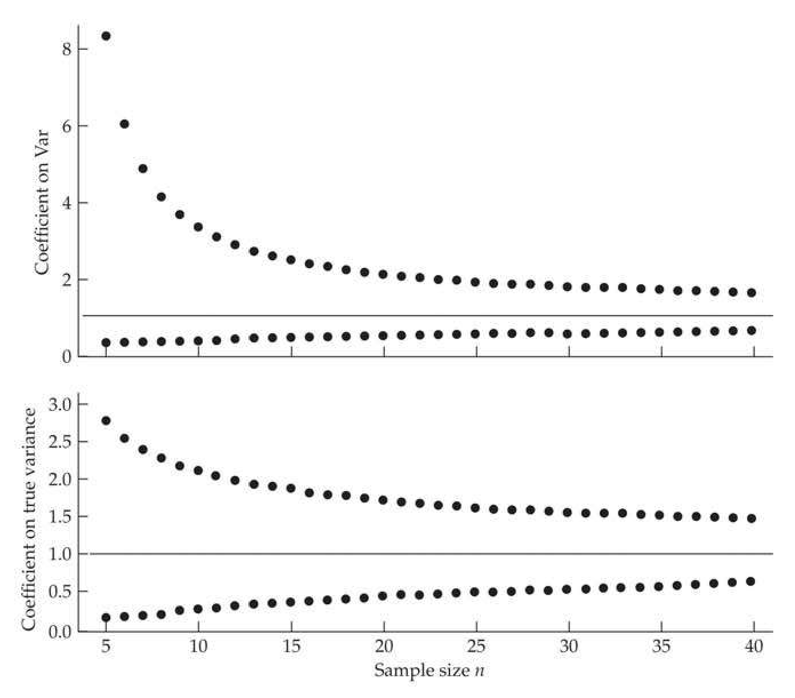
>
> Figure 12.1 Confidence limits and critical values for $\sigma^2$ estimated from a sample of $n$ observations. Define $X_{p,n}$ as satisfying $\operatorname{Pr}(\chi_n^2 \leq X_{p,n}) = p$. (Top) Upper and low values correspond to $(n - 1)/X_{0.025,n-1}$ and $(n - 1)/X_{0.975,n-1}$, respectively, the coefficients that multiply the estimated sample variance, Var, to yield a 95% confidence interval for $\sigma^2$ (Equation 12.6c). For example, for $n = 10$, the 95% confidence interval for $\sigma^2$ is 0.44. Var to 3.33. Var. (Bottom) Upper and low values correspond to $X_{0.975,n-1}/(n - 1)$ and $X_{0.025,n-1}/(n - 1)$, respectively, the coefficients that multiply the assumed variance, $\sigma_0^2$, to yield upper and lower 2.5% critical values for an observed sample variance (Equation 12.7a). For example, for $n = 10$, 95% of the values of Var are expected to fall within the interval of $0.30 - \sigma_0^2$ to $2.11 \cdot \sigma_0^2$.

**[示例 Example]**

*(See Example 12.1.)*

---

## Evolution_chapter12_005 · SHORT-TERM DIVERGENCE / Empirical Observations

As an example of the application of the preceding theory, consider the results from a large drift experiment with laboratory cultures of the flour beetle Tribolium castaneum (Rich et al. 1984). The authors followed 12 replicate populations at four population sizes (1:1 sex ratio, random mating) over 20 consecutive generations. In each generation, the mean pupal weight (in $ \mu $g) of each population was obtained from a bulk sample of 100 random individuals.

The additive genetic variance was estimated to be 460 in the base population. The observed values of $ V_B(t) $ are plotted as a function of $ f_t $ in Figure 12.2, along with the expected divergence, $ 2\sigma_A^2(0)f_t = 920f_t $ (solid lines). The dashed lines, which were obtained by using Equation 12.3 for the expected variance and substituting this into Equation 12.6c (using $ \alpha = 0.05 $ and $ n = 12 $), give the limits of the among-population variance beyond which there is less than a 5% chance for the realization of the drift process under the null to generate these values. Because these bounds ignore measurement error and hence are too narrow, they may be regarded as conservative confidence limits. Nevertheless, almost all of the observations, with the exception of the clusters of the late generations (which are expected to have the largest sampling variances) at $ N = 10 $ and 20, lie within these limits. The least-squares regressions of the data are given by the dotted lines (more formally, a GLS regression would be used to account for correlated and heteroscedastic residuals; see Chapter 18). The slope of each regression is less than the expected 920, but all slope estimates are within two standard errors of the expectation. Thus, the observed patterns are fairly consistent with a hypothesis of random drift of neutral additive genes. The observed declines in $ V_B(t) $ late in the experiment at the two smallest population sizes may have simply arisen by chance and remained there due to intergenerational correlations (Equation 12.2). The results of some other short-term divergence experiments previously given in Figure 11.3 show no evidence for nonlinear increases in the among-population variance with inbreeding.

> **Figure 12.2** · page 7 · source: `Evolution_chapter12`
>
> 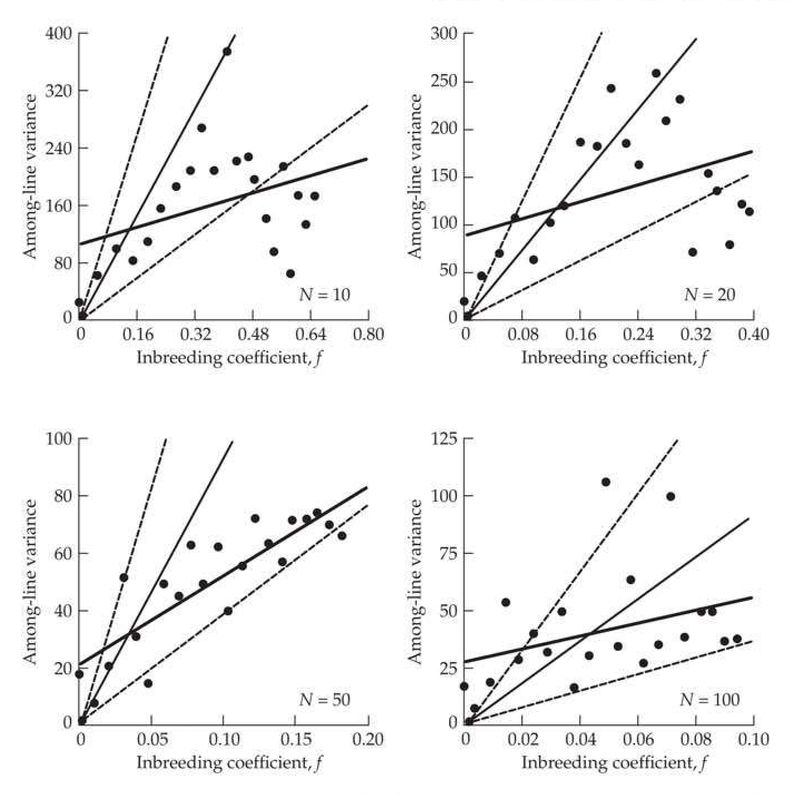
>
> Figure 12.2 Observed and expected levels of the among-population variance for pupal weight in a divergence experiment with the flour beetle Tribolium. Solid lines are the expected divergence ( $ 2\sigma_{A}^{2}(0)f_{t}=920f_{t} $), dotted lines are the least-squares regressions of the observations, and the paired dashed lines give the approximate 95% confidence interval. (Data from Rich et al. 1984.)

Eisen and Hanrahan (1974) have argued that the divergence of growth and reproductive rates in inbred lines of mice is more rapid than can be accounted for by the additive genetic variance in the base population, and Bryant et al. (1986a) suggested the same for morphological traits in bottlenecked housefly lines. The implication of these authors is that some nonadditive variance is converted by inbreeding into $ \sigma_{A}^{2} $ (Chapter 11), leading to a faster among-line divergence. However, their designs have low power and in neither case was it verified that the departures from expectations were significant.

---

## Evolution_chapter12_006 · SHORT-TERM DIVERGENCE / Estimating the Among-group Variance

With $ L $ replicate populations, a common estimate in the literature for $ \sigma_B^2(t) $ is

$$
V_{B}(t)=\frac{1}{L-1}\sum_{i=1}^{L}\left[\overline{z}_{i}(t)-\overline{z}_{.}(t)\right]^{2}
$$

the sample variance among the sample means, $ \overline{z}_{1}, \cdots, \overline{z}_{L} $, of the replicate population. When just two populations are being considered (as in some of the tests developed below), their squared difference

$$
d^{2}(t)=\left[\overline{z}_{1}(t)-\overline{z}_{2}(t)\right]^{2}
$$

is often used. This is easily related to Equation 12.8a by noting for L = 2 that

$$
V_{B}=\frac{1}{2-1}\sum_{i=1}^{2}\left(\overline{z}_{i}-\frac{\overline{z}_{1}+\overline{z}_{2}}{2}\right)^{2}=\frac{\left(\overline{z}_{1}-\overline{z}_{2}\right)^{2}}{4}+\frac{\left(\overline{z}_{2}-\overline{z}_{1}\right)^{2}}{4}=\frac{d^{2}}{2}
$$

These expressions for $ V_B $ overestimate the true among-line variance $ \sigma_B^2 $, as the sample means are measured with error. In particular, $ \overline{z}_i = \mu_i + e_i $, so that

$$
\sigma^{2}(\overline{z}_{i})=\sigma^{2}(\mu_{i})+\sigma^{2}(e_{i})=\sigma_{B}^{2}+\frac{\sigma_{z}^{2}}{n}
$$

where $ \sigma_z^2 $ is the trait variance and $ n $ is the sample sized used to estimate $ \mu_i $. When $ \sigma_B^2 = 2f_t\sigma_A^2 \gg \sigma_z^2/n $ (which is equivalent to $ 2f_t h^2 \gg 1/n $), the difference between $ \sigma^2(\overline{z}_i) $ and $ \sigma_B^2 $ is small. As suggested by a number of authors (Lynch 1988a, 1990; Turelli et al. 1988; Bjöklund 1991; Savalli 1993), a simple way to avoid this issue is to estimate the among-group variance from a standard one-way ANOVA, with

$$
V_{B}(t)=\frac{MS_{B}-MS_{W}}{n_{0}}
$$

using the among- and within-group mean squares $ (MS_{B} $ and $ MS_{W} $, respectively), with $ n_{0} $ being a measure of the average sample size per group (see LW Table 18.1).

---

## Evolution_chapter12_007 · SHORT-TERM DIVERGENCE / Lande's Constant Variance Test, $ F_{CV} $

Is an observed divergence over a modest amount of time significantly different than that expected by drift? For the case in which one has only a single estimate of the among-population divergence, Lande (1977b) suggested the statistic

$$
F_{CV}=\frac{V_{B}(t)}{t\cdot V_{A}(0)/N_{e}}
$$

as a test for neutrality, where $ V_A(0) $ is an estimate of the base-population additive variance, and $ t $ is the number of generations of divergence among the replications. This is the $ \text{constant} $ $ \text{variance} $ version of $ \text{Lande's} $ test, as it assumes that the additive variance remains unchanged over the time period being followed (Turelli et al. 1988). As noted by $ \text{Lande} $, under approximate assumptions, his test statistic $ F_{CV} $ follows an $ F $ distribution (LW Appendix 5), which can be shown as follows. If we assume the trait is normally distributed, then so is the sample mean $ \overline{z}_i \sim N[\mu(0), \sigma_B^2(t)] $, where we have assumed that terms associated with the sampling variance of the mean are small enough to be ignored (i.e., $ \sigma_B^2 \gg \sigma_z^2/n $). With $ L $ independent lines drawn from a common population at the same time (i.e., a star phylogeny), Equation 12.5a yields

$$
V_{B}(t)=\frac{1}{L-1}\sum_{i=1}^{L}(\overline{z}_{i}-\overline{z}_{.})^{2}\sim\frac{\sigma_{B}^{2}(t)}{L-1}\chi_{L-1}^{2}
$$

If we ignore the (usually) small founder effect, Equation 12.1b returns

$$
\sigma_{B}^{2}(t)\simeq2f_{t}\sigma_{A}^{2}(0)=2\left[1-\left(1-\frac{1}{2N_{e}}\right)^{t}\right]\sigma_{A}^{2}(0)\simeq t\sigma_{A}^{2}(0)/N_{e}\quad\mathrm{f o r}t\ll N_{e}
$$

and hence

$$
V_{B}(t)\sim\left(\frac{t\sigma_{A}^{2}(0)}{N_{e}[L-1]}\right)\chi_{L-1}^{2}
$$

Assuming that $ \mathrm{Var}_{A}(0) $ is a good estimate of $ \sigma_{A}^{2}(0) $, substitution of Equation 12.9d into Equation 12.9a yields

$$
F_{CV}\sim\frac{\chi^{2}_{L-1}}{L-1}\sim F_{L-1,\infty}
$$

**[定义 Definition]**

The last step follows from the definition of an $F$ distribution (LW Appendix 5). Hence, Lande's $F_{CV}$ statistic follows an $F$ distribution with $L - 1$ numerator and infinite denominator degrees of freedom. More generally, because $\sigma_A^2(0)$ is estimated by $\operatorname{Var}_A(0)$, the denominator degrees of freedom are those associated with this estimate (e.g., $F_{CV} \sim F_{L-1,df}$, where $df$ is the degrees of freedom associated with the estimate of $\sigma_A^2[0]$). As noted in the previous section, Lande's original test statistic can be improved by using Equation 12.8e to estimate $V_B(t)$.

A couple of approximations were required to reach Equation 12.9e. One check of their validity is that if the distribution of some summary statistic $ x $ is given by a scaled- $ \chi^2 $, with $ x \sim \sigma^2 \chi_n^2 / n $, then the variance of $ x $ should equal $ 2\sigma^2 / n $ (as $ \sigma^2(\chi_n^2) = 2n $; LW Equation A5.15b). Hence, the numerator of Equation 12.9a should have a variance approximately equal to $ 2[2ft\sigma_A^2(0)]^2 / (L - 1) $. Ignoring the added contribution from sampling error, note that this last result matches Equation 12.3 when $ N_{fo} $ is large and $ \sigma_f^2(t) $ is small. Thus, Lande's approach should be restricted to lines with at least moderate effective population size. Moreover, as we will see below, all of the preceding formulae for $ \sigma_B^2 $ become questionable for $ t > N_e $ because they ignore the contribution from new mutations. Hence, Lande's $ F_{CV} $ test is best thought of as one for short-term divergence, such as would be seen in a laboratory experiment or, at most, a modest amount of time in a set of natural populations.

**[示例 Example]**

*(See Example 12.2.)*

---

## Evolution_chapter12_008 · The Neutral Divergence of Quantitative Traits: Introduction / LONG-TERM DIVERGENCE

Our previous results were simply concerned with how any initial variation is partitioned among lines during drift/inbreeding. While this is occurring, new variation is constantly being generated by mutation, further driving divergence (Haldane 1949). Polygenic mutation was first incorporated into the theory of population divergence by Dempster (in the appendix to Bailey 1959) and was subsequently studied by Lande (1976), Chakraborty and Nei (1982), and Lynch and Hill (1986). As noted in Chapter 11, the assumed mutational model generating the new mutational effect $ (a_m) $ given the ancestral allelic effect $ (a_0) $ is critical. The standard model is a version of the infinite-alleles approach, where each new mutation gives rise to a new allele, with $ a_m = a_0 + e_a $, namely, the ancestral value plus a random increment, $ e_a $. To distinguish this from the standard infinite-alleles model of Chapter 2 (where the allelic effect of a mutation were not a concern), this approach is also known as the incremental or Brownian-motion mutational model in the literature; it is examined more fully in Chapter 28.

Again focusing on a character with a purely additive genetic basis, starting with an ancestral-population genetic variance of $ \sigma_{A}^{2}(0) $, and assuming the infinite-alleles model, the expected variance of genotypic means for replicate populations isolated t generations in the past is

$$
\sigma_{B}^{2}(t)=2\sigma_{m}^{2}t+2\big(\sigma_{A}^{2}(0)-2N_{e}\sigma_{m}^{2}\big)\left(1-e^{-t/(2N_{e})}\right)
$$

where $ \sigma_{m}^{2} $ is the per-generation mutational rate of input of genetic variance, as described in Chapter 11. This expression shows that as t becomes large, the expected rate of increase of the among-population variance for a neutral quantitative trait becomes a constant $ 2\sigma_{m}^{2} $ per generation. The same formulation applies to the among-species genetic covariance for a pair of traits, if the mutational rate of production of covariance between the traits is substituted for $ \sigma_{m}^{2} $ (Lande 1979a).

Thus, under the infinite-alleles model, the asymptotic divergence rate is independent of the population size, just as it is in the neutral theory of molecular evolution (Chapter 7; Kimura 1983). Although the expected number of new mutations entering a population in each generation is $ 2N_{u} $ per locus, the probability of fixation of a new mutation is its initial frequency $ 1/(2N) $, so (at equilibrium), the expected number of mutations that is fixed per locus, per population, per generation is simply the mutation rate, u. With each fixed mutation causing an increase in expected among-population variance of $ \sim E[(2a)^2] $, and n loci contributing, the asymptotic divergence rate is $ nuE[(2a)^2] = 2\sigma_m^2 $.

Under the assumptions of the infinite-alleles model, the asymptotic divergence rate of $ 2\sigma_{m}^{2} $ is a fairly general result. It is independent of the degree of dominance of new mutations, the linkage relationships of the constituent loci, and the mating system (Lynch and Hill 1986). This is because both dominance and gametic-phase disequilibrium are transient properties of alleles en route to loss or fixation, and not cumulative phenomena, and because the probability of fixation of a new neutral mutation is equal to its initial frequency regardless of the breeding system.

How long should populations be isolated before one should start to worry about the contribution of new mutations to divergence? From Equation 12.10, it can be seen that this depends on the initial level of genetic variance and on the effective sizes of the derived isolates. In Figure 12.3, it is assumed that the initial base population is in drift-mutation equilibrium, so that $ \sigma_A^2(0) = 2N_e\sigma_m^2 $, and that the isolated lineages have rapidly attained the same effective sizes ($ N_e $). Under these circumstances, by the time $ N_e $ generations have elapsed, polygenic mutation subsequent to the isolation event has caused about 20% of the divergence, whereas for $ t > 3N_e $ generations, the majority of the divergence is due to new mutations.

> **Figure 12.3** · page 11 · source: `Evolution_chapter12`
>
> 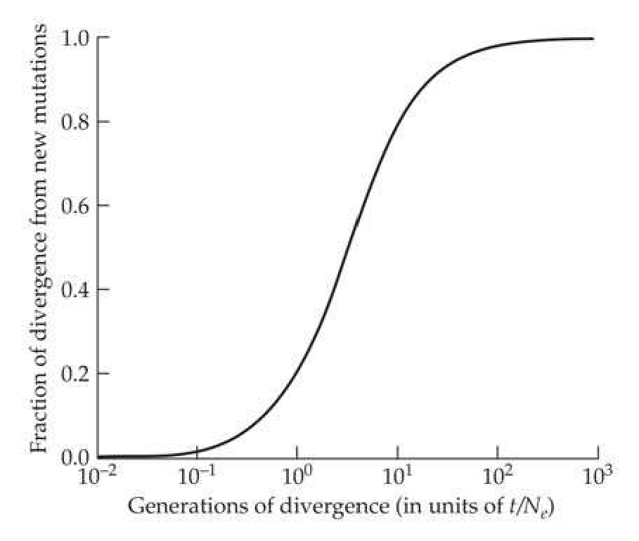
>
> Figure 12.3 The expected fraction of neutral among-population variance attributable to mutations arising subsequent to the isolation event. It is assumed that the base population is in drift-mutation equilibrium,  $ \sigma_A^2(0) = 2N_e\sigma_m^2 $, with the same effective size as the daughter species, so that from Equation 12.1b, the divergence due to base-population variance is  $ 4N_e\sigma_m^2[1 - e^{-t/(2N_e)}] $. To obtain the actual number of generations of divergence for any population size, the horizontal axis is multiplied by  $ N_e $.

Note that $ \sigma_{B}^{2}(t) $ is unbounded in $ t $ under the infinite-alleles model. However, as emphasized in the preceding chapter (and in Chapter 28), alternatives exist to this mutational model, raising questions about the appropriate structure of a neutral null model. For example, Cockerham and Tachida's (1987) model, which assumes that there are a finite number of alleles with each new allelic state being independent of the prior allelic state (the house-of-cards model), yields a bounded equilibrium among-population variance

$$
\widetilde{\sigma}_{B}^{2}=2[1-E(H)]\sigma_{A}^{2}(\infty)
$$

where $E(H)$ is the expected heterozygosity per locus, and $\sigma_A^2(\infty) = 2nE(a^2)$ is the expected additive genetic variance in a population of infinite size (Chapter 11). Note that under this model, not only does the among-population variance not build up indefinitely, but because $E[H] = 4N_e u/(1 + 4N_e u) \to 1$ as $N_e \to \infty$, the among-population component of variance asymptotically approaches zero as populations become progressively larger. This is because under the house-of-cards model, replicate populations that are each effectively infinite in size eventually will harbor the same alleles with the same frequency spectrum defined by the mutational interconversion rates.

If nothing else, these dichotomous results indicate that although neutral models are essential to demonstrating the necessity of invoking natural selection to explain an observed pattern of divergence, the actual construction of the null model depends on unresolved biological issues. Recall from Chapter 11 that Zeng and Cockerham (1993) proposed a model bridging the infinite-alleles (incremental) and house-of-cards approaches, wherein the effect of a mutant allele is given by $ a_m = \tau a_o + e_a $. Taking $ \tau = 1 $ recovers the incremental (Lynch-Hill) model, while $ \tau = 0 $ recovers the house-of-cards (Cockerham-Tachida) model. With $ \tau $ being a measure of the dependency of the mutational effect on the current allelic value, this regression model (see Chapter 28 for more details) yields an equilibrium among-population variance of

$$
\widetilde{\sigma}_{B}^{2}=\frac{4E(a^{2})}{(1-\tau)^{2}[1+4N_{e}u(1-\tau)]}
$$

For $ \tau < 1 $, the temporal approach to the equilibrium level of divergence is defined by the mutation rate $ (u) $, assuming an identical $ N_e $ in the base and descendant populations,

$$
\sigma_{B}^{2}(t)=\left[1-(1-u)^{2t}\right]\widetilde{\sigma}_{B}^{2}
$$

and hence is quite slow (approximately 2u per generation).

Finally, we note that the expression for the variance of the among-population variance (i.e., the variance of $ \sigma_{B}^{2}(t) $ among replicate experiments with mutational input) is algebraically complex, and it has only been worked out for the infinite-alleles model (Lynch and Hill 1986). However, if it is assumed that the number of loci is large and the distribution of mutational effects is normal with a mean of zero, the variance of the realized among-population variance approaches $ 2(2\sigma_{m}^{2}t)^{2}/L $ for large values of t. This is simply twice the square of the expected among-population variance. Thus, for large t, the coefficient of variation of a realized among-population variance based on L lines is expected to be on the order of $ \sqrt{2/L} $, and, we have noted before, unless L is quite large, estimates of $ \sigma_{B}^{2}(t) $ can deviate quite far from their expectation.

---

## Evolution_chapter12_009 · LONG-TERM DIVERGENCE / Effectively Neutral Divergence and the Estimation of Rates of Mutational Variance

As discussed in detail in LW Chapter 12, the theoretical expectations of the neutral model provide the basis for estimating the rates of polygenic mutation. Starting from an inbred base population, experimental lines with known times of divergence can be used to estimate the amount of polygenic mutation necessary to account for the distribution of the resultant mean phenotypes. In one of the earliest applications of this approach, Russell et al. (1963) started with several lines of maize that had been maintained by prolonged self-fertilization. They then performed a dichotomous branching experiment for five generations in which each plant was self-fertilized to produce two new daughter sublines. Seed was saved from each generation, so that at the end of the experiment members of all generations could be assayed simultaneously in a common environment, and then sib analysis was used to estimate the additive genetic variance for the total population in each generation. Assuming the within-population variance to be in drift-mutation equilibrium, this type of population expansion should give rise to an average rate of increase in the total genetic variance of $ 2\sigma_{m}^{2} $ per generation. In accordance with this prediction, the regressions of the genetic variance on time were positive for every character investigated (Figure 12.4). The rate of polygenic mutation for each of the traits is estimated by one-half the slopes of these regressions.

> **Figure 12.4** · page 13 · source: `Evolution_chapter12`
>
> 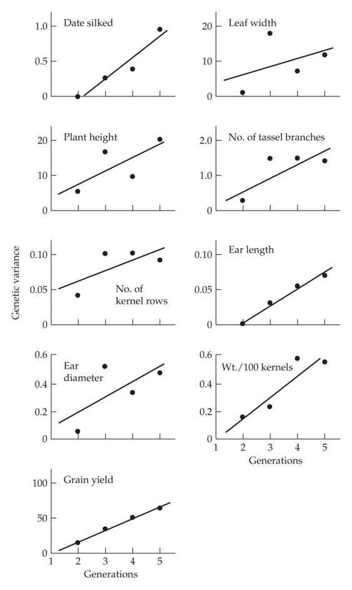
>
> Figure 12.4 The increase in total additive genetic variance (within-plus among-population components) from new mutational variance in an expanding set of lines of corn. See text for details. (After Russell et al. 1963.)

Results from many other experiments of this sort were reviewed in LW Chapter 12. Although a number of additional results have emerged since then, most of these are confined to a small number of model systems, and the conclusions reached in our earlier review remain unaltered. Here, we simply give a brief update, providing references only to post-1998 papers. Most estimates are framed in terms of the mutational heritability, $ h_m^2 = \sigma_m^2 / \sigma_e^2 $. Estimates of $ h_m^2 $ for a diversity of morphological, physiological, and life-history traits in D. melanogaster are consistently in the range of 0.001 to 0.005. Mutational heritabilities for body size and life-history traits in nematodes fall in the range of 0.001 to 0.008 (Vassilieva et al. 2000; Baer et al. 2006; Ostrow et al. 2007), and the same is true for life-history traits in the microcrustacean Daphnia pulex (Lynch et al. 1998; Latta et al. 2013) and in the grape phylloxera insect Daktulosphaira vitifoliae (Downie 2003). Thus, essentially all studies with invertebrates imply $ 0.001 < h_{m}^{2} < 0.01 $ for complex traits.

Although the numbers of studies are still rather limited, estimates of $ h_m^2 $ for some land plants and vertebrates appear to be several-fold higher than those noted above. Mutational heritabilities for growth and reproductive traits in Arabidopsis thaliana are in the range of 0.001 to 0.008 (Schultz et al. 1999; Shaw et al. 2000; Chang and Shaw 2003; Kavanaugh and Shaw 2005), but the average $ h_m^2 $ for maize, from the study of Russell et al. (1963), is 0.0092. In addition, mutational heritabilities for morphological and reproductive traits in mice fall in the range of 0.003 to 0.023 (Casellas and Medrano 2008). Thus, there is at least a rough indication that mutational heritabilities are increased in organisms with longer life spans, which might in principle be a consequence of elevated rates of mutation per generation (Chapter 4).

Finally, it should be emphasized that in all mutation-accumulation experiments, fitness declines in the vast majority of lines, indicating that mutations are, on average, deleterious, although the fraction of mutations that are beneficial remains unclear (Shaw et al. 2002; Keightley and Lynch 2003; Charlesworth and Eyre-Walker 2007; Eyre-Walker and Keightley 2007; Dickinson 2008; Hall et al. 2008). Equally important, for characters that influence fitness only indirectly (e.g., morphology), the fraction of new mutations with negative pleiotropic effects on fitness remains unclear (Chapter 28). Hence, estimates of $ h_{m}^{2} $ from mutation-accumulation experiments with their very small effective population sizes may overestimate, perhaps significantly, the actual usable amount of $ h_{m}^{2} $ for most populations. Even if the focal trait is neutral, if some of its underlying mutants have deleterious pleiotropic effects on fitness (i.e., fitness impacts independent of the actual value of the focal trait), then the effective number of neutral mutations in the trait changes with effective population size. As $ N_{e} $ increases, this fraction decreases, so that the effective value of $ h_{m}^{2} $ is likely a decreasing function of $ N_{e} $. What is unclear is whether this decline plateaus out fairly quickly or continues to decrease over a large range of $ N_{e} $. Resolving these issues is critical to any attempts to utilize estimates of mutational heritability to infer long-term mechanisms of evolution, as illustrated in the following sections.

---

## Evolution_chapter12_010 · The Neutral Divergence of Quantitative Traits: Introduction / TESTING THE NULL HYPOTHESIS OF NEUTRAL PHENOTYPIC DIVERGENCE: RATE-BASED TESTS

One of the enduring problems in evolutionary biology is the struggle to demonstrate that various aspects of biodiversity are products of diversifying selection. It is one thing to concoct plausible adaptive scenarios to explain patterns of morphological, physiological, or behavioral divergence, but quite another to formally demonstrate that an observed level of divergence cannot simply be explained by a null model of random genetic drift. This is especially the case with the massive volume of omics data flooding out of large-scale functional genomics studies.

Four broad classes of tests for departures from neutral divergence have been proposed, each requiring successively more information. The first (rate tests) simply require the means of divergent populations, and ask (given $ N_e $, t, and either $ h^2 $ or $ h_m^2 $) whether the rate of divergence is consistent with drift. A second approach is based entirely on the internal information in a temporal sequence of trait values, typically from the fossil record. A third class requires information on the additive variation of a trait and the frequencies of a set of markers in a subdivided population. Such tests compare the within- and among-population structure of the additive variation of a trait (measured by $ Q_{ST} $) with that from some presumably neutral set of markers (measured by $ F_{ST} $; Chapter 2). The final class, trait-augmented marker-based tests, examine patterns in the set of markers associated with a specified trait detected using either a QTL (fixed differences) or GWAS (segregating alleles) study.

A genomics-focused researcher may (incorrectly) get the impression that despite the use of marker information in some of these tests, none of these four approaches are relevant to their work. Nothing could be further from the truth. For example, methods initially developed to test for neutrality in changes in morphology (often over a fossil record) are now widely applied to omics data. To highlight this transition from morphology to molecules, we conclude this chapter by applying these tests to gene-expression data to examine if such divergence is largely governed by neutral drift, stabilizing selection, or directional selection.

---

## Evolution_chapter12_011 · TESTING THE NULL HYPOTHESIS OF NEUTRAL PHENOTYPIC DIVERGENCE: RATE-BASED TESTS / Rate Tests

Lande's $ F_{CV} $ (Equation 12.9a) is one example of a rate test, comparing the amount of divergence across a set of lines or populations with the expected among-population variance ($ \sigma_{B}^{2} $). As mentioned, this test is best applied over short time scales ($ t \ll N_{e} $), as in a selection experiment or over a short to modest amount of time in nature.

Here we focus on tests over potentially much longer time scales and ask whether an observed amount of total divergence, $ d = |\mu(t) - \mu(0)| $, within a single lineage is excessively large (or small) relative to drift. Tests for unusual amounts of divergence (either too much, or too little) are framed by asking what critical values for an effective population size ($ N_e $) or mutation variance ($ \sigma_m^2 $) are consistent with the amount of divergence and whether these values are biologically reasonable. For example, a smaller effective population size and/or higher mutation variance results in increased divergence. Based on the observed rate of divergence, rate tests return either a critical effective population size $ N_e(d) $, above which the divergence is unlikely due to drift, or a critical mutational variance, $ \sigma_m^2(d) $, below which divergence is unlikely from drift. Likewise, either large population size or small mutation variance will constrain neutral divergence, yielding a critical value of $ N_e(s) $ below which the lack of divergence observed is unlikely, and conversely a critical mutation variance, $ \sigma_m^2(s) $, above which lack of divergence is unlikely. Hence, if $ N_e > N_e(d) $ or $ \sigma_m^2 < \sigma_m^2(d) $, the amount of divergence is excessive relative to drift, consistent with directional selection; while if $ N_e < N_e(s) $ or $ \sigma_m^2 > \sigma_m^2(s) $, there is too little divergence relative to the drift prediction, consistent with stabilizing selection. If none of these conditions is satisfied, the hypothesis of drift alone accounting for the pattern is not rejected. It should be stressed that situations exist in which considerable selection shapes the observed pattern, and yet we can still fail to reject the drift model.

While these tests are widely used, they have several important caveats. For any analysis of this sort to be meaningful, one must be confident that the majority of population divergence is genetic, and not inflated by environmental effects on phenotypes. This is clearly problematical when populations cannot be assayed in a common-garden environment, as is the case with data from the fossil record. A further complication is that expressions for critical effective population sizes or mutational variances ignore the sampling error of all other terms. Finally, as we have discussed, the infinite-alleles model for neutral-trait evolution (where $ \sigma_{B}^{2} $ is an ever-increasing function of time; Equation 12.10) may be too extreme, as the usable amount of $ \sigma_{m}^{2} $ likely decreases with increasing $ N_{e} $. The among-population divergence under mutation might be better described by either the House-of-cards (Equation 12.11) or the regression (Equation 12.12) models, that by the incremental model. Given all these considerations, it should be clear that the following tests for neutrality cannot be regarded as being very rigorous in a statistical sense. As is the case for most of the tests for selection on specific genes covered in Chapters 9 and 10, tests of neutral phenotypic evolution are best employed as diagnostic guides to prioritize traits for further study.

---

## Evolution_chapter12_012 · TESTING THE NULL HYPOTHESIS OF NEUTRAL PHENOTYPIC DIVERGENCE: RATE-BASED TESTS / Lande's Brownian-motion Model of Neutral Trait Evolution

The basic structure of tests for neutral trait divergence have the form of $ \mu_t \sim (\mu_0, \sigma_B^2[t]) $, namely, the mean phenotype at time $ t $ has an expected value equal to the initial mean

**[命题 Proposition]**

$\mu_0$ and variance $\sigma_B^2(t)$. To proceed further, we need additional assumptions about the actual distribution from which the means are sampled, which is generally assumed to be Gaussian (normal). Support for this assumption traces back to Lande (1976), who framed mean divergence in terms of a Brownian-motion process (Appendix 1). Under the simplest Brownian-motion model, the expected change in value over a small time interval is zero with a constant variance of $b$. Under this model, the distribution of values at time $t$ is normal with mean $x_0$ (the initial value) and variance $\sigma_t^2 = b t$ (Equation A1.31b). Assuming a strictly additive model with no environmental trends, Lande noted that if we sample $N_e$ individuals, their mean breeding value (i.e., the trait mean) will have a sampling variance in each generation of $\sigma_A^2 / N_e$, which is used for $b$. Hence, at generation $t$, the distribution of phenotypic means is approximately normal with mean $\mu_0$ (the initial mean) and variance

$$
\sigma_{t}^{2}=t\sigma_{A}^{2}/N_{e}
$$

**[命题 Proposition]**

This approach assumes a constant additive genetic variance as well as a constant effective population size during the period of divergence being considered. Because drift can also change $ \sigma_A^2 $, the assumption of a constant $ \sigma_A^2 $ is reasonable only for $ t \ll N_e $, unless the initial variance is close to its mutation-drift equilibrium value ($ 2N_e\sigma_m^2 $; see Equation 11.20b). More generally, if the additive variance and $ N_e $ are both changing in each generation, then under the Brownian-motion model (taking the first time point at $ i = 0 $ and the last at $ i = t - 1 $, bringing us up to generation $ t $),

$$
\sigma_{t}^{2}=\sum_{i=0}^{t-1}\left(\frac{\sigma_{A}^{2}(i)}{N_{e}(i)}\right)
$$

For example, assuming a constant effective population size, the additive genetic variance at time t under drift and mutation is given by Equation 11.20b. Substituting this into Equation 12.14b yields

$$
\begin{align*}\sigma_{t}^{2}&=\frac{1}{N_{e}}\sum_{i=0}^{t-1}\left[2N_{e}\sigma_{m}^{2}+\left(\sigma_{A}^{2}(0)-2N_{e}\sigma_{m}^{2}\right)e^{-i/2N_{e}}\right]\\&=2\sigma_{m}^{2}t+\left(\sigma_{A}^{2}(0)-2N_{e}\sigma_{m}^{2}\right)\left(\frac{1}{N_{e}}\sum_{0=1}^{t-1}e^{-i/2N_{e}}\right)\end{align*}
$$

By noting that

$$
\frac{1}{N_{e}}\sum_{i=0}^{t-1}e^{-i/2N_{e}}\simeq2\left(1-e^{-t/2N_{e}}\right)
$$

recovers the previous expression (Equation 12.10) for $ \sigma_{B}^{2} $ under drift and mutation. This useful identity follows by recalling that the partial sum of a geometric series is

$$
\sum_{i=0}^{k-1}x^{i}=\frac{1-x^{k}}{1-x}.
$$

Taking $ x = e^{-1/2N_e} $ and noting from a first-order Taylor series that

$$
1-e^{-1/2N_{e}}\simeq1-\left(1-\frac{1}{2N_{e}}\right)=\frac{1}{2N_{e}}
$$

returns Equation 12.15a.

Thus, as expected, the variance $ \sigma_{t}^{2} $ of the Brownian-motion process corresponds to the among-group drift variance $ \sigma_{B}^{2}(t) $ in population means. The notion that (under a pure drift model) the additive variance within populations reaches a drift-mutation equilibrium value has resulted in different parameterizations of $ \sigma_{t}^{2} $ in tests of drift (Lande 1976; Turelli et al. 1988). Lande assumed a constant variance, $ \sigma_t^2 = t\sigma_A^2/N_e $, but because part of his concern was evolution in the fossil record, he replaced $ \sigma_A^2 $ by $ h^2\sigma_z^2 $, yielding

$$
\sigma_{t}^{2}=h^{2}\sigma_{z}^{2}t/N_{e}
$$

His logic was that $ \sigma_z^2 $ could be estimated directly from a sample in the fossil record, while $ h^2 $ values for many morphological traits fall within a relatively narrow range. Hence, either a representative value for $ h^2 $ could be used, or different values of $ h^2 $ could be explored to examine the robustness of any conclusions. This results in a test based on joint considerations of $ N_e $ and $ h^2 $.

Conversely, Turelli et al. (1988) noted that if the population has been at its current size sufficiently long enough that the additive genetic variance is at its mutation-drift equilibrium value, then (assuming the infinite-alleles model) $ \sigma_A^2 = 2N_e\sigma_m^2 $, yielding

$$
\sigma_{t}^{2}=2t N_{e}\sigma_{m}^{2}/N_{e}=2t\sigma_{m}^{2},
$$

Under this setting, $ N_e $ does not appear in $ \sigma_t^2 $ and tests are based on whether the values of $ \sigma_m^2 $ required to be consistent with drift are plausible. This is the quantitative-trait analog of the divergence ($ d = tu $) between two neutral sequences separated by $ t $ total generations (Chapter 7), with the allelic mutation rate ($ u $) replaced by twice the trait mutational variance, $ 2\sigma_m^2 $. It needs to be stressed, however, that this apparent independence of $ N_e $ is a bit misleading. As mentioned previously, some fraction of its underlying variation may be due to alleles with deleterious pleiotropic effects on fitness (Chapter 28). Any such alleles are expected to have ever-decreasing frequencies (and hence less impact on $ h_m^2 $) as $ N_e $ increases. Hence, the evolutionary relevant fraction of $ h_m^2 $ very likely declines with $ N_e $, even for a neutral trait, resulting in less neutral divergence than expected.

---

## Evolution_chapter12_013 · TESTING THE NULL HYPOTHESIS OF NEUTRAL PHENOTYPIC DIVERGENCE: RATE-BASED TESTS / Tests Based on the Brownian-motion Model

**[命题 Proposition]**

Under the Brownian-motion model, the mean phenotype $ \mu_t \sim N(\mu_0, \sigma_t^2) $, providing the basis for tests of either too much, or too little, divergence based on simple normal theory. Suppose an absolute divergence of $ d = |\mu(t) - \mu(0)| $ is observed, where $ \mu(t) $ and $ \mu(0) $ are the means from two samples from the same population taken $ t $ generations apart. The probability of this level of divergence under drift alone is given by

$$
\Pr\left(\mid\mu(t)-\mu(0)\mid\leq d\right)=\Pr\left(\frac{\mid\mu(t)-\mu(0)\mid}{\sigma_{t}}\leq\frac{d}{\sigma_{t}}\right)=\Pr\left(\mid U\mid\leq\frac{d}{\sigma_{t}}\right)
$$

where $U$ is a unit normal random variable. Lande’s (1976) original test (distinct from his 1977 $F_{CV}$ test; Equation 12.9a) was based on the constant variance assumption, $\sigma_t^2 = th^2 \sigma_z^2 / N_e$. Recalling that $\Pr(|U| \leq 1.96) = 0.95$, Lande’s critical effective population size below which there is a $< 5%$ probability of an absolute deviation as large as $d$ satisfies

$$
1.96=\frac{d}{\sqrt{th^{2}\sigma_{z}^{2}/N_{e}}},\quad implying\quad(1.96)^{2}th^{2}\sigma_{z}^{2}=N_{e}d^{2}
$$

Equation 12.18a allows one to determine critical values for either divergence time, $ t $, heritability, $ h^2 $, or $ N_e $ that are consistent with drift. For example, solving for the upper bound, $ N_{e,u} $ on the effective population size that is compatible with drift yields

$$
N_{e,u}=\frac{t\cdot h^{2}\cdot1.96^{2}}{d_{*}^{2}}=3.84\cdot\frac{t h^{2}}{d_{*}^{2}}
$$

where $ d_s = d/\sigma_z $ is the divergence scaled in phenotypic standard deviations. Drift with $ N_e > N_{e,u} $ is unlikely to generate the observed amount of divergence. For a test with an arbitrary $ \alpha $, one replaces 1.96 by $ z_{1-\alpha/2} $, where $ z_p $ satisfies $ \Pr(U \leq z_p) = p $ for a unit normal $ U $ ($ \alpha/2 $ is used, as we are considering an absolute difference). Likewise, if one is comparing the means of two species with a common ancestor $ \tau $ generations ago, then $ t = 2\tau $ and $ d $ is the absolute difference between their means. For historical reasons, the above discussion has been framed in terms of $ d^2 $. Recalling Equation 12.8e, more generally, the ANOVA-based estimate $ V_B $ of the between-group variance can be used in place of $ d^2/2 $. As noted by Turelli et al. (1988), the population-size test for departures from drift given by Equation 12.18b is really two-sided. Lande's original test examines whether $ N_e $ is too large to account for the observed divergence (as might occur if directional selection was changing the mean). However, any formal test of departures from neutral trait drift must also inquire as to whether the stability of population means is too great to be compatible with neutrality (too little divergence). For a two-tailed test of neutrality with an $ \alpha = 5% $ overall significance level, we use a 2.5% probability cutoff for the observed divergence being too small to be consistent with drift and a 2.5% cutoff for excessively high divergence. Because $ \Pr(|U| \geq 2.24) = 0.025 $ for a unit-normal random variable $ U $, the critical upper bound, $ N_{e,u} $, on population size in a test that evolution has been too fast for drift is

$$
N_{e,u}\leq\frac{t\cdot h^2\cdot2.24^2}{d_*^2}=5.02\cdot\frac{t h^2}{d_*^2}
$$

Because populations with smaller $ N_e $ should show more drift (and divergence), Equation 12.19a gives the largest value of $ N_e $ that is consistent with drift generating the observed amount of divergence. If the assumed $ N_e $ exceeds $ N_{e,u} $, we reject the hypothesis that drift can account for this fast a divergence. Likewise, because $ \Pr(|U| < 0.03) = 0.025 $, the critical lower-bound population size $ N_{e,l} $ in a test that evolution has been too slow (support for stabilizing selection) is

$$
N_{e,l}\geq\frac{t\cdot h^{2}\cdot0.03^{2}}{d_{*}^{2}}=0.0009\cdot\frac{t h^{2}}{d_{*}^{2}}
$$

If our assumed $ N_{e} $ is less than $ N_{e,l} $, we reject the hypothesis that drift can account for this slow a divergence.

More generally, for a two-sided test at overall significance level $ \alpha $ ($ \alpha/2 $ for too much absolute divergence and $ \alpha/2 $ for too little absolute divergence), the above values of 2.24 and 0.03 are replaced by $ z_{1-(\alpha/4)} $ and $ z_{0.5+\alpha/4} $ (Figure 12.5). To see how these critical values arise, first consider the probability of excessive absolute divergence, which means that either the difference between means is too negative or too positive. Because $ \alpha/2 $ is the critical value for either of these two events occurring, we set the negative lower limit (the difference between means is too negative) to occur with probability $ (\alpha/2)/2 = \alpha/4 $ (i.e., the probability of divergence in the lower tail is less than $ \alpha/4 $), and likewise set the upper positive limit (the difference between means is too positive) also at $ \alpha/4 $. Given the symmetry of the normal, we can compactly express the total probability for excessive divergence in either direction as

$$
\Pr\left(|U|\geq z_{1-(\alpha/4)}\right)=\alpha/2
$$

> **Figure 12.5** · page 18 · source: `Evolution_chapter12`
>
> 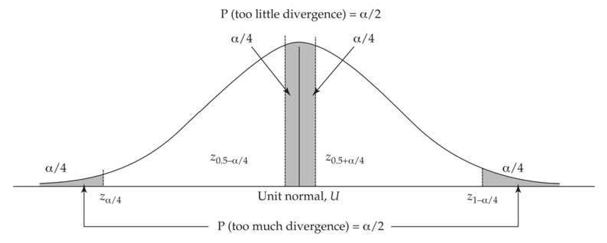
>
> Figure 12.5 Critical values for an  $ \alpha $-level test of a departure from drift having either too little, or too much, absolute divergence. Too much absolute divergence occurs when the unit-normal scaled test score is either in the lower  $ \alpha/4 $ or upper  $ \alpha/4 $ tail (for a total probability of  $ \alpha/2 $). Too little absolute divergence occurs when the unit-normal scaled test score is too close to zero, namely, a region of probability  $ \alpha/4 $ below zero and a region of probability  $ \alpha/4 $ above zero (for a total probability of  $ \alpha/2 $). Here,  $ z_p $ satisfies  $ \Pr(U \leq z_p) = p $, where  $ U $ is a unit-normal random variable. See the text for further details.

Turning to tests of too little divergence, instead of focusing on the tails of the normal, we focus around its mode (its mean, which corresponds to $ z_{0.5} $), with a section of probability $ \alpha/4 $ below the mean and a corresponding section above the mean, where the total area in the region of too little divergence corresponds to $ \alpha/2 $. Putting these together,

$$
\Pr\left(|U|\leq z_{0.5+\alpha/4}\right)=\alpha/2
$$

Figure 12.5 illustrates this logic.

**[示例 Example]**

*(See Example 12.3.)*

The structure of the tests given by Equations 12.17 through 12.19 depends on $ N_e $ and $ h^2 $. A second approach is to instead base tests on the mutational variance, $ \sigma_m^2 $, alone. The idea is that if $ N_e $ has been roughly constant for a sufficient amount of time, then the additive-genetic variance for a neutral trait approaches its mutation-drift equilibrium value, $ 2N_e\sigma_m^2 $ (Equation 11.20c). Under this condition, Equation 12.16b shows that the among-group variance becomes $ \sigma_B^2 = 2t\sigma_m^2 $, giving the MDE (mutation-drift equilibrium) version of Lande's F test (Equation 12.9a) as

$$
F_{MDE}=\frac{V_{B}(t)}{2t\sigma_{m}^{2}}
$$

We can also arrive at this test by substituting $ 2N_e\sigma_m^2 $ for $ V_A(0) $ in Equation 12.9a. As above, $ V_B $ is best estimated from the among-group variance in a one-way ANOVA (Equation 12.9f).

When $ V_B $ is based on more than two lineages, Equation 12.20a assumes a star phylogeny (Chapter 8). If the phylogeny is more complex, one has to place the lineage relationships into a phylogenetic framework to account for the covariance structure imparted by shared common ancestry (Felsenstein 1985, 2004, 2008; Lynch 1991; Gu 2004). Using the same logic leading to Equation 12.9e with $ L $ lineages (under a star phylogeny), Equation 12.5a gives $ (L - 1)V_B(t) \sim 2t\sigma_m^2\chi_L-1 $, and Equation 12.6c yields

$$
\Pr\left[\left(\frac{L-1}{X_{1-\alpha/2,L-1}}\right)V_{B}(t)\leq2t\sigma_{m}^{2}\leq\left(\frac{L-1}{X_{\alpha/2,L-1}}\right)V_{B}(t)\right]=1-\alpha
$$

where $ X_{p,n} $ satisfies $ \Pr(\chi_n^2 \leq X_{p,n}) = p $. Thus, if an estimate of $ t $ is available, one can test the neutral hypothesis without an estimate of $ N_e $ by inquiring whether there has been too little or too much divergence given some assumed value of $ \sigma_m^2 $ (Turelli et al. 1988). We can also frame the test in terms of the mutational heritability $ h_m^2 = \sigma_m^2 / \sigma_e^2 $ by dividing all terms in Equation 12.20b by $ 2t\sigma_e^2 $, yielding

$$
\Pr\left[\left(\frac{L-1}{X_{1-\alpha/2,L-1}}\right)\frac{V_{B}(t)}{2t\sigma_{e}^{2}}\leq h_{m}^{2}\leq\left(\frac{L-1}{X_{\alpha/2,L-1}}\right)\frac{V_{B}(t)}{2t\sigma_{e}^{2}}\right]=1-\alpha
$$

A slightly different formulation of this test is based in terms of the observed rate of divergence (Lynch 1990). Letting $ \Delta = (V_B/t)/\sigma_e^2 $ be the estimated rate of divergence scaled in units of the environmental variance, Equation 12.20c becomes

$$
\Pr\left[\left(\frac{(L-1)/2}{X_{1-\alpha/2,L-1}}\right)\Delta\leq h_{m}^{2}\leq\left(\frac{(L-1)/2}{X_{\alpha/2,L-1}}\right)\Delta\right]=1-\alpha
$$

yielding the upper and lower bounds on the mutational heritability $ h_{m}^{2} $ consistent with drift. For $ \alpha = 0.05 $ and $ L = 2 $, Equation 12.20b becomes

$$
\mathrm{P r}\left(0.10\cdot\Delta\leq h_{m}^{2}\leq509\cdot\Delta\right)=0.95
$$

Thus, the hypothesis of drift is rejected (at $ \alpha = 0.05 $) if the mutational heritability is too small to account for the observed divergence rate, namely

$$
h_{m}^{2}<0.10\cdot\Delta\simeq0.10\cdot\frac{d_{*}^{2}}{t}
$$

Just as a smaller $N_e$ allows for more divergence (and hence we set a critical upper value for $N_e$ in Equation 12.18a), so does a larger mutational heritability, $h_m^2$, and we set a critical lower value, above which drift can account for the observed divergence. Given that a typical upper-range value is $h_m^2 = 0.05$ (LW Table 12.1), if $0.05 < 0.10 \cdot \Delta$ (i.e., $\Delta > 0.5$), the rate of divergence is too high to reasonably be accounted for by drift.

Conversely, the divergence is too slow to be accounted for by drift if the assumed mutational heritability is too high to account for the observed divergence rate, or when

$$
h_{m}^{2}\geq509\cdot\Delta\simeq509\cdot\frac{d_{*}^{2}}{t}
$$

A mutational heritability above this value would lead to significantly more divergence than observed. There is one minor bookkeeping detail with both Equations 12.21a and 12.21b. The careful reader might recall Equation 12.8c, where we showed that $ V_B = d^2/2 $. So why did we assume that $ \Delta \simeq d_*/t $ in these two equations? Recalling that $ \sigma_e^2 = (1 - h^2)\sigma_z^2 $, we have

$$
\Delta=\frac{V_{B}}{t\sigma_{e}^{2}}=\frac{d^{2}}{2t(1-h^{2})\sigma_{z}^{2}}=\frac{1}{2(1-h^{2})}\frac{d_{*}^{2}}{t}\simeq\frac{d_{*}^{2}}{t}
$$

with the last step following when $ h^2 \simeq 1/2 $.

One important caveat for $ \sigma_m^2 $-based tests of stabilizing selection is that estimates of $ h_m^2 $ are obtained using very small effective population sizes, and hence most mutations are likely effectively neutral in these settings (Chapter 7). Because even a completely neutral trait may have underlying loci with deleterious pleiotropic fitness effects, the evolutionarily relevant fraction of $ h_m^2 $ may be far less than that suggested from laboratory experiments. Hence, using laboratory estimates for the polygenic mutation rate may generate a considerable number of false positives for stabilizing selection (the mutation rate is too large relative to the small amount of divergence), so this test should be used with considerable caution.

**[示例 Example]**

*(See Example 12.4.)*

---

## Evolution_chapter12_014 · TESTING THE NULL HYPOTHESIS OF NEUTRAL PHENOTYPIC DIVERGENCE: RATE-BASED TESTS / Ornstein-Uhlenbeck Models

As developed in Appendix 1, the Ornstein-Uhlenbeck (OU) process provides a model of Brownian motion drift coupled with a restoring force back to some optimal value ($ \theta $), as might be expected with drift and stabilizing selection. This process has been used to model the divergence of traits over a phylogeny (Felsenstein 1988, 2004, 2008; Garland et al. 1993; Martins 1994; Hansen and Martins 1996; Hansen 1997; Martins and Hansen 1997; Butler and King 2004; Beaulieu et al. 2012), including gene-expression data (Bedford and Hartl 2009; Kalinka et al. 2010; Brawand et al. 2011; Rohlfs et al. 2014).

Under the OU model, the expected change in the mean value of a process at a value of $ x $ is $ a(\theta - x) $ with $ a > 0 $, so that if $ x < \theta $, it increases, while it decreases for $ x > \theta $. The parameter $ a $, which measures the strength of the restoring force, is a measure of the strength of stabilizing selection. Under the standard model of Gaussian stabilizing selection (Example 5.6; Equation 16.17), where $ \omega^2 $ measures the strength of selection (smaller $ \omega^2 $ implies stronger selection), Example A1.13 shows that

$$
a=\frac{\sigma_{A}^{2}}{\sigma_{z}^{2}+\omega^{2}}
$$

As with Brownian motion, the value of the process at time t is normally distributed (Equation A1.33b), but now with mean and variance

$$
\mu_{t}=\theta+[x_{o}-\theta]e^{-at}
$$

$$
\sigma_{t}^{2}=\frac{b}{2a}[1-e^{-2at}]
$$

where $ b = \sigma_A^2 / N_e $ under the constant-variance model. For large $ t $, the mean value approaches the optimal value $ (\theta) $, while the divergence variance approaches an asymptotic value of

$$
\frac{b}{2a}=\frac{\sigma_{z}^{2}+\omega^{2}}{2N_{e}}
$$

Initially, the among-population divergence increases linearly with divergence time t under both the pure drift (e.g., Equation 12.10) and OU models. However, unlike pure drift (which retains its linear divergence over all time), the between-lineage variance under an OU eventually asymptotes at a fixed level of divergence after sufficient time. Thus, while initially both models have very similar behavior, they become increasingly distinct as time progresses. It should be noted that divergence approaching an asymptotic variance can also occur under the purely neutral house-of-cards (Equation 12.11) and regression (Equation 12.12) mutational models, mimicking a process under stabilizing selection.

---

## Evolution_chapter12_015 · TESTING THE NULL HYPOTHESIS OF NEUTRAL PHENOTYPIC DIVERGENCE: RATE-BASED TESTS / Divergence in Morphological Traits

**[命题 Proposition]**

Numerous attempts have been made to apply the above procedures, or variants of them, to data from the fossil record to test the hypothesis that levels of morphological divergence over geological time scales have been driven by directional selection. In the first such study, Lande (1976) showed that changes in tooth-size dimensions over a 42 million year period in early horse evolution are consistent with the hypothesis of random genetic drift if the heritabilities of the traits had been near 0.5 and the long-term effective population size was smaller than 60,000 or so individuals. Given the generally high levels of heritability observed for mammalian morphological traits (Lynch and Walsh 1998), an assumption of $ h^{2} = 0.5 $ is not unreasonable, and the argument that the long-term $ N_{e} $ in such lineages could be smaller than the critical value of $ N_{e}^{*} = 60,000 $ is also plausible (Chapter 4). Analyses of tooth morphometrics in two additional lineages of extinct mammals (condylarths and oreodonts) suggested critical effective sizes of 80,000 to 120,000, below which the observed changes would be compatible with a neutral hypothesis (Lande 1976). Thus, only if the effective sizes of these ancient mammalian taxa were actually in excess of $ 10^{5} $, a matter that remains unclear, would the observed changes require some mechanism of directional selection.

Several other studies of this nature have been applied to aspects of mammalian skull evolution. For example, by setting the upper and lower limits to mutational heritability, $ \sigma_{m}^{2}/\sigma_{e}^{2} $, at $ 10^{-2} $ and $ 10^{-4} $, Lynch (1990) found that the rates of evolution of cranial morphology in a wide array of placental mammalian lineages are one to two orders of magnitude below the minimum neutral rate, and Lemos et al. (2001) observed a similar pattern in marsupials. The only exception to this general trend concerns the races of modern man, which appear to have diverged at a rate slightly above the minimum neutral expectation (Lynch 1990; Ackermann and Cheverud 2004; Roseman 2004). Although they leave many questions unanswered, these kinds of results put in perspective previous arguments that rates of morphological evolution are exceptionally high in mammals, and especially so in the great apes (e.g., Cherry et al. 1982; Wyles et al. 1983; Van Valen 1985). Clearly, the predominant mode of evolution in mammalian skeletal morphology has been one of stabilizing selection, not of strong diversifying selection. Similarly, Spicer (1993) found widespread evidence of stabilizing selection in a variety of morphological traits in Drosophila, but some caution is in order here as the tests were based on critical mutation variances (Equation 12.21b). As mentioned, this approach likely generates many spurious calls of too little divergence (because $ h_{m}^{2} $ estimates are likely inflated by inclusion of deleterious mutations), hence biasing tests toward inferring stabilizing selection.

---

## Evolution_chapter12_016 · The Neutral Divergence of Quantitative Traits: Introduction / TIME SERIES DIVERGENCE TESTS

**[命题 Proposition]**

The methods discussed above are based on external comparisons—one has information from two time points and examines whether the observed amount of divergence is consistent with some external information (either estimated or assumed), such as effective population size ($ N_e $), time of divergence (t), and a measure of genetic variation ($ h^2 $ or $ \sigma_m^2 $). Conversely, starting with Raup (1977; Raup and Crick 1981), a number of methods have been proposed (largely from paleontology) to detect departures from drift entirely from observations on the internal characteristics of a series of trait values over time (no external information, such as an estimate of $ N_e $ or $ h^2 $, is required by the test). The sequence of trait data from a set of subsamples within a stratigraphic column has been called a stratophenetic series (Gingerich 1979). This is not a new enterprise. Almost a century ago, Ronald Brinkmann (1929) published morphological information on close to 3,000 ammonites in the genus Kosmoceras from a 14-meter stratigraphic section from the Middle Jurassic. The number of available stratophenetic series is considerable, and growing. A recent review by Hunt et al. (2015) examined 709 such series from roughly 200 lineages. The number of samples per sequence (populations measured from different locations within the same stratigraphic column) ranged from 7 to 114 (with a median of 14), covering approximate time ranges from 5000 to more than 50 million years, with most between $ 10^5 $ and $ 10^7 $ years in duration. Such a temporal series of data makes it possible to look for statistical trends in mean phenotypes or for correlations in rates of change in adjacent intervals, neither of which are expected in a strictly neutral model (under the strong assumption of no environmentally influenced change in mean phenotype). The motivation for many of these tests is to provide a statistical framework to examine fossil data in the context of the punctuated equilibrium debate, which postulates directional selection to be rare in the fossil record, with a pattern of stasis (very little change) being predominant (Eldredge and Gould 1972; Gould and Eldredge 1977; Eldredge et al. 2005).

There are two important caveats with random-walk models. First, any observed phenotypic trend could be entirely environmental, with changes in the mean being independent of any underlying genetic change. Second, as highlighted by Raup (1977), a pattern indistinguishable from a random walk can mask significant underlying selection, such as short, episodic bursts of directional selection in shifting directions or stabilizing selection with drift occurring in the optimal value. These are examples of hierarchical models of random change, wherein selection is driving the generational change, but the focus of selection (either directional or stabilizing) is randomly changing, generating an random walk.

---

## Evolution_chapter12_017 · TIME SERIES DIVERGENCE TESTS / Tests for Departures From Symmetric Random Walks

A number of tests of departure from a symmetric random walk have been proposed. All assume uncorrelated changes over time increments and an equal chance of positive and negative increments (with the mean incremental change equaling zero). Raup (1977) and Raup and Crick (1981) proposed using the Wald–Wolfowitz runs test (under the null hypothesis of an equal number of positive and negative changes). Here the test statistic, $ R_{n} $, for the number of runs (changes in the direction of the walk) in a sample of size n is approximately normally distributed with mean $ n/2 + 1 $ and variance n/4. A sequence showing excessive runs of the same sign is consistent with directional selection, while a sequence with an excessive number of sign reversals is consistent with stabilizing selection (as might be expected for a population mean fluctuating around an optimum). Similarly, one could simply test the number of positive increments against the value expected from a binomial with success parameter 1/2 and sample size n. Both the runs and binomial tests do not use any information on the size of any jump, but rather simply test against a null of equally likely up versus down change over any given time point.

A more sophisticated approach was taken by Bookstein (1987, 1988), who used results from the theory on the maximal excursion of a symmetric random walk. The sequence of measured phenotypes is scaled so that the initial mean is zero, with $ x_i $ denoting the mean of the $ i $th sample. The standard error for the expected divergence over the entire sequence ($ n $ steps) of a symmetric random walk is $ \sigma\sqrt{n} $, where $ \sigma^2 $ is the variance in change per increment. Assuming roughly equal time intervals between samples, this standard error can be estimated as

$$
\widehat{\sigma^{2}}=\frac{1}{n}\sum_{i}^{n}(x_{i}-x_{i-1})^{2}
$$

Further, define $ S_k $ as the sum of the first $ k $ increments (the displacement of the mean from its original value after $ k $ steps). Bookstein obtained a large- $ n $ expression for the distribution of the largest scaled excursion,

$$
\gamma=\frac{\max_{k}\left|S_{k}\right|}{\widehat{\sigma}\sqrt{n}}
$$

Namely, the largest absolute value of the walk $ (max_k \mid S_k \mid) $ over any of the sampled times, expressed in terms of the expected standard error of the walk value at the final sample time $ (\sigma \sqrt{n}) $. For $ \gamma > 1 $, critical values (the upper $ p $ in the tail of the null distribution) are very closely given by the corresponding $ p/4 $ critical values for a unit normal. For example, the upper 5% tail corresponds to $ \gamma = 2.25 $, consistent with the value of 2.24 for a normal with $ p/4 = 0.0125 $. The upper 1% and 0.1% upper tail probabilities correspond to $ \gamma $ values of 2.8 and 3.5, respectively. Series with values exceeding these critical values are said to be improbably directional, consistent with directional selection (or an environmental trend). Conversely, a series that does not vary enough is said to be improbably constrained, consistent with some sort of stabilizing selection or other cause of stasis. The lower 5%, 1%, and 0.1% values correspond to $ \gamma $ values of 0.62, 0.49, and 0.41, respectively. Failure to reject the null of a random walk still allows for considerable selection, either due to a lack or power or randomness in the direction of selection over time. Multivariate random-walk tests are discussed by Bookstein (2013).

Another widely used test for departures against the null of a symmetric random walk (closely related to Bookstein's approach), called scaled range analysis, is based on Hurst exponents (Hurst 1951). The idea behind this approach is that the absolute difference of a symmetric random walk $ |x_t - x_0| $ scales as $ \sigma \sqrt{t} $ (which can be estimated from Equation 12.23a). Defining the standardized range, $ R(\tau) $, for a time interval $ (\tau) $ as

$$
R(\tau)=\frac{\left|x_{\tau}-x_{0}\right|}{\sigma}
$$

one then regresses $ R(\tau) $ on ever-increasing values of $ \tau $, fitting the log-log regression

$$
\ln[R(\tau)]=H\ln(\tau)+\epsilon
$$

where the slope (H) is the Hurst exponent (i.e., $ R \propto \tau^{H} $). Under a symmetric random walk with uncorrelated increments, absolute trait divergence is expected to scale with the square root of time, giving H = 0.5. As increments become more positively correlated, H increases to 1.0 (directional persistence), consistent with directional selection. As adjacent increments become increasingly negatively correlated, H decreases to zero (anti-persistence), consistent with stabilizing selection or some other form of stasis. Roopnarine (2001) discussed permutation tests for the significance of $ H \neq 0.5 $. Gingerich's (1993) LRI (log rate versus log interval) method is a version of this test, where the slope (G) of his LRI regression is simply G = H - 1 (Roopnarine et al. 1999).

While straightforward and widely applied in the early literature, these methods typically have low power, meaning that the null hypothesis of a symmetric random walk is hard to reject (Roopnarine et al. 1999; Roopnarine 2001; Sheets and Mitchell 2001). This is especially the case with stratophenetic series, with their usual incompleteness and sporadic coverage due to the vagaries of the fossilization process. Further, as noted by Sheets and Mitchell (2001), there is an asymmetry of detection in that stabilizing selection is easier to detect than directional selection. They showed that the Hurst exponent (and, by extension, the LRI method) has the highest power to detect stabilizing selection, followed by Bookstein's approach, and then the runs test. Conversely, for detecting directional selection, the runs test is often the most powerful, followed by the Hurst exponent, and then Bookstein's approach.

---

## Evolution_chapter12_018 · TIME SERIES DIVERGENCE TESTS / Hunt's Approach for Comparing Different Models

Hunt (2006, 2007, 2008a, 2008b; Hunt and Carrano 2010) noted that the low power for tests of departures from symmetric random walks creates a "tyranny of the null hypothesis," potentially overinflating the role of drift. He suggested that instead of testing against

*[See Table 12.1 at the end of this section.]* the random null, one should examine a set of candidate models, using Akaike weights (Anderson et al. 2000) to indicate support for each (see Example 12.5 for details). The Akaike weights for a set of competing models sum to one, providing a useful indicator of their relative support.

Hunt initially considered three basic models: a symmetric random walk (with an incremental mean value of zero); a directional (or generalized) random walk (mean increment $ \neq $ 0); and stasis. For the two random walks, he modeled the incremental $ \delta $ (the change over an interval) with normal random variables. For the symmetric random walk, $ \delta \sim N(0, \sigma_{\delta}^{2}) $, while for the general random walk, $ \delta \sim N(\mu_{\delta}, \sigma_{\delta}^{2}) $, with parameters fit by maximum likelihood. For stasis, he assumed a simple model initially suggested by Sheets and Mitchell (2001). Instead of constructing likelihood models around increments (so that $ z_{t} = z_{0} + \sum \delta_{i} $), they simply took the trait value at time $ t $ to be $ z_{t} \sim N(\mu, \sigma^{2}) $, namely a constant variance ($ \sigma^{2} $) over all time (rather than the linear increased under Brownian motion). While at first glance this appears to be an OU process at stationarity ($ t \to \infty $), this is not the case, as an Ornstein-Uhlenbeck process has correlated means (reflecting the shared history on a common evolutionary path). Akaike weights allow for a more nuanced interpretation of model fits (see Figure 12.6), and are based on the relative likelihoods among a set of candidate models, summing to one over all the models considered (Example 12.5). For example, suppose the Akaike weights for a fossil sequence are 0.50, 0.48, and 0.02 for the random, directional, and stasis models, respectively. Clearly, stasis and a random walk are almost equally likely explanations in this case, but the support for a directional model is very slim.

> **Figure 12.6** · page 26 · source: `Evolution_chapter12`
>
> 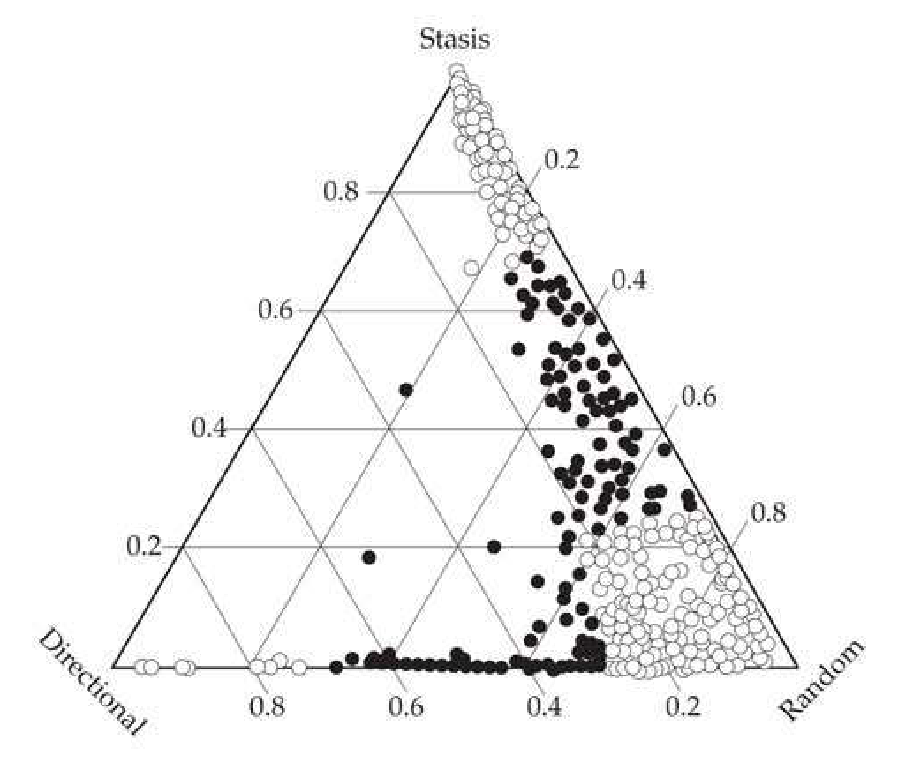
>
> Figure 12.6 A De Finetti diagram of the support for the random walk, directional walk, and stasis models. Each point corresponds to the coordinates of the Akaike weights for these three models (which sum to one) for a single stratophenetic series. Points near vertices corresponds to almost 100% support for a particular model, hence the lables at the vertices. Points along an edge of the triangle indicate very little support for the model perpendicular to that edge. Unfilled points indicate strong support (weight for most supported model at least 2.7 times the weight of any other model). (After Hopkins and Lidgard 2012.)

It should be stressed that the power of this approach is not the initial small set of candidate models, but rather that it serves as a much more general framework for examining an ever-richer set of models. Indeed, Hunt et al. (2015) examined more complex models that allow for the sequence of mean phenotypes to shift between modes (e.g., random vs. stasis) over the time sampled. One could also use the Akaike weights strategy to contrast the simple stasis model used by Hunt with the Ornstein-Uhlenbeck or other competing models of stabilizing selection (Estes and Arnold 2006; Uyeda et al. 2011), as well as considering other models of directional evolution (e.g., Charlesworth 1984b).

Using this approach, Hunt (2007), Hopkins and Lidgard (2012), and Hunt et al. (2015) examined an evergrowing number of stratophenetic series (251, 635, and 709 studies, respectively). The basic conclusions from Hunt et al. (2007), which hold for these larger (and more recent) studies as well, are given in *[See Table 12.1 at the end of this section.]*. For each fossil series, the fraction of support for the three models was computed using Akaike weights. In only 13/251 (5.2%) of the sequences was directional selection (a generalized random walk with $ \mu_{\delta} \neq 0 $) the most strongly supported model (had the largest Akaike weight). The random walk model was the most supported overall (49% of the time), while 46% of the fossil series had stasis as the most supported model. Figure 12.6 presents the relative support for all three models from the analysis of Hopkins and Lidgard (2012), presented as a De Finetti diagram (or De Finetti triangle). Values in the middle of the triangle have roughly equal support for all three models (which was rarely seen). Values near the edges of the triangle have very weak support for at least one model, and values near the vertices correspond to very high support for a single model. Note that there is little support along the directional selection axis for any sequence, with most of the support lying along the stasis-random walk axes.

An interesting perspective on the rates of macroevolution was offered by Uyeda et al. (2011), who examined a vast data set of traits followed over time, with time-span ranging from fractions of years to over 350 million years. For periods of a million years or less, rapid evolution was seen to occur, but it is constrained, and does not accumulate over time. This matches the earlier observation by Estes and Arnold (2007) that the expected magnitude of divergence over samples is largely time-independent up to about a million generations. However, as Figure 12.7 illustrates, Uyeda et al. observed an accumulation of cases of rapid divergence starting at $ \sim10^{6} $ year intervals, generating what they called a blunderbuss pattern, as the spread of values resembles the flared muzzle of the seventeenth-century firearm of the same name.

> **Figure 12.7** · page 27 · source: `Evolution_chapter12`
>
> 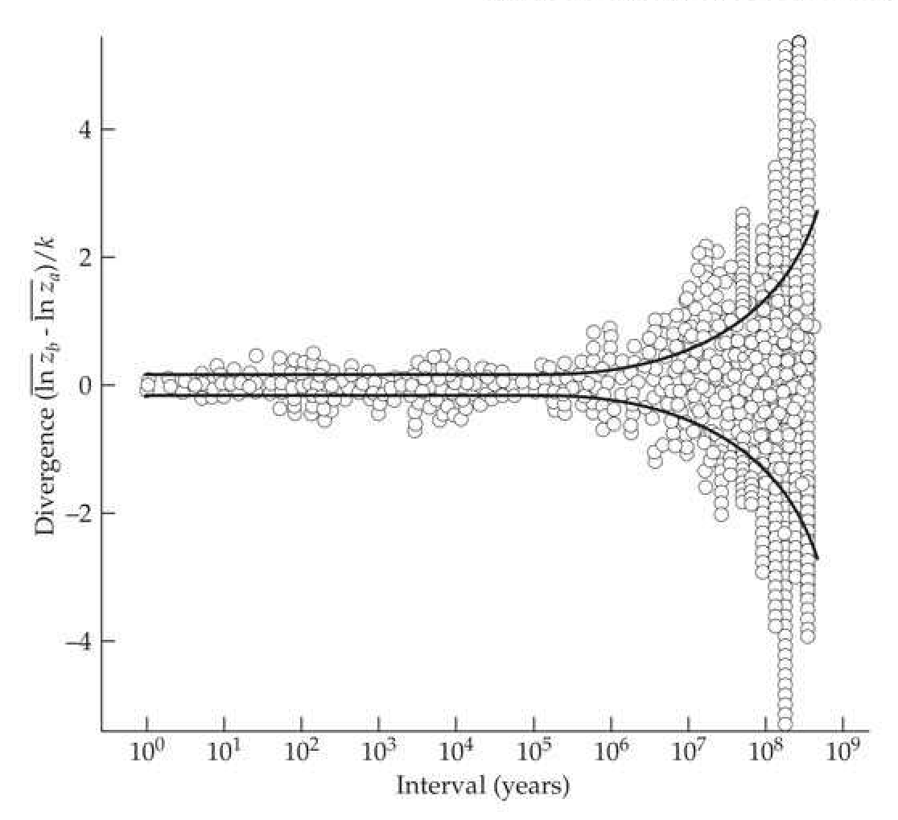
>
> Figure 12.7. The blunderbuss pattern of divergence observed by Uyeda et al. (2011). Bounded variation is seen over the first  $ 10^6 $ years, after which considerable divergence can occur. Divergence is scored as the log difference between means (at time points a and b, for an interval of  $ b - a $), scaled by the dimension  $ k $ of the data ( $ k = 2 $ for area,  $ k = 3 $ for mass). (After Uyeda et al. 2011.)

While Estes and Arnold (2007) were able to account for their observed pattern in terms of stabilizing selection with a fluctuating optimum, this model did not fit the data of Uyeda et al. (2011) presented in Figure 12.7. Rather, the best fit was a model of essentially stasis (the Sheets-Mitchell model), coupled with rare random bursts of significant change (with an average waiting time of $ \sim10^{7} $ years). The model allowing for multiple (as opposed to single) bursts fit the data best. While this pattern is striking and reproducible over the several different taxonomic data sets used by the authors, the underlying mechanism is unclear. Uyeda et al. suggested that this pattern might be correlated with the opening of new niches following species turnover (as species life spans are typically in the million-year range).

**[示例 Example]**

*(See Example 12.5.)*

**[Table]**

*[See Table 12.1 at the end of this section.]*

> **Table 12.1** · `12.1` · page 25 · source: `Evolution_chapter12_018`
> Table 12.1 Summary of the 251 fossil sequences examined by Hunt (2007), each fit using three models of divergence: random walk, directional selection, and stasis. Counts given under the Trait and Fossil group categories are the numbers of times a model had the highest Akaike weight (Example 12.5) for a fossil sequence. For example, 13 of the 251 sequences (0.052) had directional selection as the model with the highest support, while 5 of 114 (0.044) size-related traits had directional selection as the most-supported model. Values under the Median column correspond to the median fraction of support over all sequences for a given model. For example, half of all sequences had a support for directional change model of 0.06 or less, while 95% of all sequences have a fractional support for directional selection in the 0.04 to 0.08 range. The fossil groups are planktonic and benthic microfossils (Plank and Benth) and macrofossils (Macro).
>
> <table><tr><td rowspan="2">Model</td><td rowspan="2">Median, 95% CI</td><td colspan="4">Trait</td><td colspan="3">Fossil group</td></tr><tr><td>All</td><td>Size</td><td>Shape</td><td>Other</td><td>Plank</td><td>Benth</td><td>Macro</td></tr><tr><td>Directional</td><td>0.06 (0.04, 0.08)</td><td>13</td><td>5</td><td>4</td><td>4</td><td>5</td><td>3</td><td>5</td></tr><tr><td>Random</td><td>0.47 (0.39, 0.56)</td><td>123</td><td>67</td><td>43</td><td>13</td><td>24</td><td>57</td><td>42</td></tr><tr><td>Stasis</td><td>0.34 (0.20, 0.50)</td><td>115</td><td>42</td><td>68</td><td>5</td><td>12</td><td>37</td><td>66</td></tr><tr><td></td><td></td><td>251</td><td>114</td><td>115</td><td>22</td><td>41</td><td>97</td><td>113</td></tr></table>

---

## Evolution_chapter12_019 · TIME SERIES DIVERGENCE TESTS / POPULATION STRUCTURE BASED-TESTS: $ Q_{ST} $ VERSUS $ F_{ST} $

**[命题 Proposition]**

Species are often distributed in space as a series of populations isolated by semipermeable migration barriers. In such settings, the variation at a neutral locus represents a balance between input of new variation by mutation and migration, countered by its removal by drift (Chapter 2). One measure of the resulting genetic population structure is Wright's (1951) $ F_{ST} $ statistic, reviewed by Holsinger and Weir (2009). As discussed in Chapter 2, $ F_{ST} $ partitions the total genetic variance of the entire metapopulation (measured as heterozygosity under the assumption of panmixia) into the fractions within $ (1 - F_{ST}) $ and among $ (F_{ST}) $ populations (Cockerham 1973; Nei 1987; Weir 1996). As developed in Chapter 9, one signature of selection at a candidate locus is whether it shows too much or too little population structure with respect to the $ F_{ST} $ value estimated from a set of (presumably) neutral markers (the Lewontin-Krakauer test). An excessive $ F_{ST} $ value at the candidate locus suggests too much divergence relative to the drift-migration expectation, consistent with directional selection varying over populations. Too little divergence ($ F_{ST} $ is too small) is consistent with stabilizing selection over populations retarding the divergent effects of drift. Although there are a number of problems with such tests (Chapter 9), they still have wide appeal, as the required data are reasonably straightforward to collect.

The trait-based analog of this test is based on comparing $ Q_{ST} $ to $ F_{ST} $. $ Q_{ST} $ (developed below) is a measure of the population structure of the genetic variance underlying a quantitative trait, which is then compared with a neutral-marker based estimate of $ F_{ST} $ for the same population. While the candidate-gene tests in Chapter 9 compare candidate-locus $ F_{ST} $ values with the neutral standard, the trait-based test compares $ Q_{ST} $ for the candidate trait against this standard. This is a rather active area of research, and reviews can be found in Merilä and Crnokrak (2001), McKay and Latta (2002), Whitlock (2008), and Leinonen et al. (2008, 2013). Standard $ Q_{ST} $ analysis assumes only a single level of structure, but extensions to more hierarchically structured populations were proposed by Whitlock and Gilbert (2012). Likewise, multivariate extensions (properly accounting for the genetic correlations among a series of measured traits) were developed by Chenoweth and Blows (2008), Martin et al. (2008), Chapuis et al. (2008), Ovaskainen et al. (2011), and Karhunen et al. (2013, 2014).

---

## Evolution_chapter12_020 · TIME SERIES DIVERGENCE TESTS / $ Q_{ST} $: Partitioning Additive Variance Over Populations

Consider a quantitative trait in a diploid with a purely additive-genetic basis, and denote its genetic variance over the entire metapopulation by $ \sigma_G^2 $. From *[See Table 11.3 at the end of this section.]* (setting $ f = Q_{ST} $), the within- and among-population components of variance can be represented as $ \sigma_{GW}^2 = (1 - Q_{ST})\sigma_G^2 $ and $ \sigma_{GB}^2 = 2Q_{ST}\sigma_G^2 $, respectively, for a total variance in a structured population of $ (1 + Q_{ST})\sigma_G^2 $. Rearranging yields

$$
Q_{ST}=\frac{\sigma_{GB}^{2}}{\sigma_{GB}^{2}+2\sigma_{GW}^{2}}
$$

While the term $ Q_{ST} $ was introduced by Spitze (1993), this metric was proposed earlier by Prout and Barker (1989, 1993) and Lande (1992), and strongly hinted at by Rogers and

Harpending (1983). Equation 12.26a is a very general result, applicable to a wide range of population structures and migration patterns provided the character does indeed have an entirely additive genetic basis (Whitlock 1999). When dealing with haploid populations (Whitlock 2008) or collections of entirely selfed lines (Bonnin et al. 1996; Le Corre 2005; Rhoné et al. 2010), $ \sigma_{GW}^2 $ in Equation 12.26a is weighted by one, rather than two. More generally, when f is the amount of inbreeding within each population, then following Bonnin et al. (1996),

$$
Q_{ST}=\frac{(1+f)\sigma_{GB}^{2}}{(1+f)\sigma_{GB}^{2}+2\sigma_{GW}^{2}}
$$

**[命题 Proposition]**

Equations 12.26a and 12.26b provide a potential approach for testing the hypothesis of neutral divergence among population means. Provided that a sufficient number of families from multiple populations can be grown in a common environment, appropriate statistical methods can be used to estimate $ \sigma_{GW}^{2} $ and $ \sigma_{GB}^{2} $ (e.g., by ANOVA; Lynch and Walsh 1998). The resultant estimate of $ Q_{ST} $ can then be compared to a parallel measure of subdivision ($ F_{ST} $) derived from putatively neutral molecular markers. Under the assumption of neutrality, $ Q_{ST} $ should not be significantly different from $ F_{ST} $. On the other hand, $ Q_{ST} > F_{ST} $ is expected if population differentiation has been primarily driven by adaptive divergence, whereas the opposite relationship is expected if the mean phenotypes of all or most populations are kept relatively uniform by stabilizing selection for the same optima (*[See Table 12.2 at the end of this section.]*). It is important to stress that any comparison of this sort must be performed using the same set of populations to obtain both $ Q_{ST} $ and $ F_{ST} $. An analysis using an estimate of $ F_{ST} $ from one set of populations and $ Q_{ST} $ from another is not trustworthy.

**[命题 Proposition]**

The first (of many) caveats with respect to this strategy is that, even under neutrality, the expected value of $ Q_{ST} $ will not necessarily equal $ F_{ST} $ if the trait of interest is influenced by nonadditive genetic effects. As outlined in Chapter 11, with nonadditive gene action, the within- and among-population components of genetic variation for neutral characters under short-term divergence are no longer equal to $ \sigma_{GW}^{2} = (1 - f)\sigma_{G}^{2} $ and $ \sigma_{GB}^{2} = 2f\sigma_{G}^{2} $ (where f is the parameter estimated by $ F_{ST} $), but instead are influenced by a number of higher-order terms (see *[See Table 11.3 at the end of this section.]*). In general, because the within-population genetic variance declines less rapidly with inbreeding under nonadditivity (and sometimes even increases; Chapter 11), $ Q_{ST} $, as defined by Equation 12.26b, will tend to be smaller than $ F_{ST} $ under neutrality. In particular, Whitlock (1999) showed that additive × additive variance always results in $ Q_{ST} < F_{ST} $ under neutrality. Dominance also causes $ Q_{ST} $ and $ F_{ST} $ to deviate under neutrality, with the direction of the inequality depending on the details of the population structure. There is disagreement as to the practical importance of these departures, especially given the large variances associated with $ Q_{ST} $ estimates (López-Fanjul et al. 2003, 2006, 2007; Goudet and Büchi 2006; Goudet and Martin 2007; Whitlock 2008; Santure and Wang 2009). However, because these violations of assumptions often (but not always) result in $ Q_{ST} < F_{ST} $, this general behavior makes conclusions regarding adaptive divergence based on elevated $ Q_{ST} $ conservative, while rendering observations of $ Q_{ST} < F_{ST} $ ambiguous. Violations of the assumption of additivity may not be a serious issue for most morphological traits, but given that life-history traits often show considerable nonadditive variance (Chapter 6), these may be more vulnerable to false impressions under a comparison of $ Q_{ST} $ and $ F_{ST} $.

**[命题 Proposition]**

A second caveat is that the choice of markers used to estimate $ F_{ST} $ can introduce bias. The strong assumption is that the markers chosen are neutral, such that any structure associated with the markers reflects the neutral population structure. Historically, allozyme markers were commonly used to estimate $ F_{ST} $, and because these represent variant protein products, some may not be neutral. Another problematic (but widely used) marker class is microsatellites. For $ F_{ST} $ to serve as a neutral proxy for the behavior of alleles underlying a focal trait, the mutational structure of the markers and QTLs must be compatible. Microsatellite alleles can easily back-mutate, resulting in underestimation of $ F_{ST} $ (Hendry 2002; Kronholm et al. 2010). While microsatellite-specific distance metrics (such as $ R_{ST} $; Slatkin 1995a; Goodman 1997) have been proposed, these should not be used in place of $ F_{ST} $ for comparison with $ Q_{ST} $. These modified metrics adjust for high rates of back-mutations, something not expected at QTL alleles, potentially resulting in different adjusted measures of allelic divergence at the markers versus QTLs. These issues are of special concern given that many early studies used microsatellites (Edelaar and Björklund 2011; Edelaar et al. 2011). The ever-increasing use of SNPs to estimate $ F_{ST} $ avoids these concerns.

**[Table]**

*[See Table 12.2 at the end of this section.]*

> **Table 12.2** · `12.2` · page 29 · source: `Evolution_chapter12_020`
> Table 12.2 Interpretation of  $ Q_{ST} $ versus  $ F_{ST} $ comparisons.
>
> Observation | Interpretation
> --- | ---
> $ Q_{ST} > F_{ST} $ | Divergent selection: spatial variation in trait values in excess of neutral expectation.
> $ Q_{ST} = F_{ST} $ | Consistent with divergence expected under drift. Does not rule out selection, but does not support it either.
> $ Q_{ST} < F_{ST} $ | Convergent selection: spatial variation in trait values less than neutral expectation. Similar trait values are favored over populations.

---

## Evolution_chapter12_021 · TIME SERIES DIVERGENCE TESTS / $ P_{ST} $: Approximating $ Q_{ST} $ with Phenotypic Data

Because of the requirement for assays in a common-garden arena, true joint studies of $ Q_{ST} $ and $ F_{ST} $ are not common. Pujol et al. (2008) noted that roughly half of the wild population studies they reviewed were not based on estimated additive variances. Instead, a phenotypic-based proxy for $ Q_{ST} $ was used, where within- and/or among-population phenotypic variances replace the more challenging estimates of additive variation. The former can easily be obtained via a standard ANOVA (e.g., Holand et al. 2011), while the latter require a series of parent-offspring or sib rearings in a common environment. A modification of this purely phenotypic approach is to use

$$
\widehat{\sigma}_{G B}^{2}=c\widehat{\sigma}_{P B}^{2},\qquad\widehat{\sigma}_{G W}^{2}=h^{2}\widehat{\sigma}_{P W}^{2}
$$

where c reflects the fact that only part of an observed phenotypic difference in means may be genetic (Merilä 1997; Leinonen et al. 2006; Sæther et al. 2007; Brommer 2011). Substitution into Equation 12.26 yields the $ P_{ST} $ statistic of Leinonen et al. (2006),

$$
\widehat{P}_{ST,L}=\frac{\widehat{\sigma}_{PB}^{2}}{2(h^{2}/c)\widehat{\sigma}_{PW}^{2}+\widehat{\sigma}_{PB}^{2}}
$$

When $ c = h^2 $, this reduces to Equation 12.26a, with phenotypic variances replacing their genetic counterparts. Holand et al. (2011) suggested doing a sensitivity analysis by varying the value of $ c $ (for a fixed $ h^2 $ value), and using simulations to find critical upper and lower $ c $ values for which $ Q_{ST} $ is significantly above and significantly below $ F_{ST} $. While enticing because of their simplicity and relative ease of application (only phenotypic data are required), strong caution is advised when replacing $ Q_{ST} $ by a phenotypic surrogate (Pujol et al. 2008; Brommer 2011). At a minimum, such estimates should always be denoted as $ P_{ST} $ whenever any variance component is based on a purely phenotypic measure. Although the biology or ecology of a species might be such that only $ P_{ST} $ estimates are possible, in such cases the investigator needs to seriously consider if such a resulting study can give truly worthwhile results.

Even when genetic data (information from crosses) are used, bias can still be introduced into $ Q_{ST} $ estimates. Ideally, additive variances should be estimated from the covariance among paternal half-sibs. When covariance among full sibs is used, additive variance estimates can be inflated by the presence of dominance or maternal effects. Likewise, if among-group differences are not measured in a common garden, shared environmental effects can inflate this estimate. Conversely, a common garden may obscure any evolved plastic response that is part of the adaptive response to specific environments. See Whitlock (2008) for further discussion of such sources of bias.

A slightly optimistic note was struck by Pujol et al. (2008), who noted that the onerous requirement of a common garden may be circumvented through the use of BLUP-based genetic-group mixed models (e.g., Westell et al. 1988; Quaas 1988), which allow for the estimation of both within- and among-group additive variance (a variant of this approach was used by Roberge et al. 2007). BLUP uses the genetic relationships among all measured individuals to separate genetic from environmental contributions (Chapters 19 and 20). This requires good estimates of these genetic relationships, which (in the absence of pedigree data) requires a rather dense set of markers (a very large number of SNPs) for the accuracy needed, given the expected rather distant connections among groups.

---

## Evolution_chapter12_022 · TIME SERIES DIVERGENCE TESTS / Testing $ Q_{ST} $ Versus $ F_{ST} $

The construction of rigorous statistical tests for comparing $ Q_{ST} $ with $ F_{ST} $ is problematic on several levels. First, both are ratios of variances, so that estimates obtained by directly substituting variance estimates into Equation 12.26 are biased, as the expectation of a ratio is not the same as a ratio of expectations (LW Equation A1.19a). Second, the sampling distribution of $ Q_{ST} $ is complex, as one must use a crossing design to estimate the variance components. Hence, the correct construction of dispersion intervals (such as standard errors in a frequentist setting or credible intervals in a Bayesian setting) is not trivial. Finally, there is the issue of formally comparing a somewhat noisy estimate ($ F_{ST} $) with a very noisy estimate ($ Q_{ST} $), which were obtained using very different designs. Some of these issues were addressed by O'Hara and Merilä (2005), Whitlock (2008), and Whitlock and Guillaume (2009). As noted by O'Hara and Merilä, one significant problem is simply power. The among-group variance is a function of the number of groups, with at least 20 needed for any substantial power. Unfortunately, the typical group number is around 7 for the studies reviewed by Merilä and Crnokrak (2001).

An important advance was the observation by Whitlock (2008) that the distribution of realized $ Q_{ST} $ values (ignoring, for now, the additional error introduced by using the sample estimate, $ \widehat{Q}_{ST} $, for the true value of the realization for a particular trait) can often be approximated using the Lewontin-Krakauer distribution for $ F_{ST} $ values (Equation 9.10a). Simulations by Whitlock confirmed the suggestion by Rogers and Harpending (1983) that, provided $ F_{ST} $ is small, the amount of information on population structure derived from the variance components of a quantitative trait is equivalent to that from a single-marker $ F_{ST} $. Provided that the average $ F_{ST} $ is small, then under the null that $ Q_{ST} = F_{ST} $, to a very good approximation, we have

$$
\frac{n_{d}-1}{\overline{F}_{ST}}Q_{ST}\sim\chi^{2}_{n_{d}-1},\quad\mathrm{implying}\quad Q_{ST}\sim\frac{\overline{F}_{ST}}{n_{d}-1}\chi^{2}_{n_{d}-1}
$$

where $ \overline{F}_{ST} $ is the average $ F_{ST} $ over the scored molecular marker loci, and $ n_{d} $ is the number of demes. This expression assumes that $ Q_{ST} $ is estimated without error, a point addressed shortly.

The requirement that $ \overline{F}_{ST} $ is small arises (in part) from $ \chi^{2} $ being defined over $ (0, \infty) $, while $ Q_{ST} $ is restricted to $ (0, 1) $. Hence, the approximation given by Equation 12.28a assumes that there is essentially no probability in the upper tail of a $ \chi^{2} $ above a critical value,

$$
\Pr\left(\frac{\overline{F}_{ST}}{n_{d}-1}\chi_{n_{d}-1}^{2}>1\right)=\Pr\left(\chi_{n_{d}-1}^{2}>\frac{n_{d}-1}{\overline{F}_{ST}}\right)\simeq0
$$

To achieve this condition, Whitlock (2008) recommended an upper limit of $ \overline{F}_{ST} < 0.1 $. For example, with $ n_{d} = 2 $, 5, and 10, the probabilities in Equation 12.28b (with $ \overline{F}_{ST} = 0.1 $) become 0.002, $ 4 \cdot 10^{-8} $, and $ 2 \cdot 10^{-15} $, respectively.

Insight into power is obtained by asking, under the null, how often the ratio $ Q_{ST}/F_{ST} $ exceeds some value, $ \delta $. Rearranging Equation 12.28a yields

$$
\Pr\left(\frac{Q_{ST}}{\overline{F}_{ST}}>\delta\right)=\Pr\left(\frac{(n_{d}-1)Q_{ST}}{\overline{F}_{ST}}>\delta(n_{d}-1)\right)=\Pr\left(\chi_{n_{d}-1}^{2}>\delta(n_{d}-1)\right)
$$

Consider $ n_d = 2 $, as occurs when comparing two populations. How much larger must the true value of $ Q_{ST} $ be than the true value $ F_{ST} $ for this difference to be significant at the $ \alpha = 0.05 $ level? Because tests involving $ Q_{ST} $ are two-sided (either too large or too small being of interest), and $ \Pr(\chi^2 > 5.02) = 0.025 $, Equation 12.28c gives the critical value as $ \delta = 5.02 $. Hence, $ Q_{ST} $ must be in excess of 5 times $ \overline{F}_{ST} $ to be significant at the 5% level. For $ n = 10 $, $ \Pr(\chi_0^2 > 19.03) = 0.025 $, or $ \delta = 19.03/3 = 2.1 $, and hence only a two-fold difference is required for significance. The same logic can be used to obtain the critical value when $ Q_{ST} < F_{ST} $. For example, because $ \Pr(\chi_0^2 < 2.7) = 0.025 $, a value of $ Q_{ST} $ less than one third of $ \overline{F}_{ST} $ (2.7/9 = 0.3) is significant at the 5% level when $ n_d = 10 $.

Figure 12.8 shows the basic structure of tests based on this simple approach: compute $ Q_{ST} $ and compare this value with the distribution of realized values for single-locus $ F_{ST} $, where the mean of this latter distribution as taken is $ \overline{F}_{ST} $, the mean $ F_{ST} $ value over all loci in the sample. This approach assumes that just a single trait is of interest and that $ Q_{ST} $ is measured without error (again, we return to this below). In the typical study setting, however, one has $ k \times Q_{ST} $ values (one for each of the k traits in the study), but uses the same set of markers (and hence the same $ \overline{F}_{ST} $ value) for all traits. This is now a multiple-comparisons setting (Appendix 4). One approach to accommodate this concern is to use the first k order statistics from the Lewontin-Krakauer distribution (Equation 12.28a), which can be obtained as follows. A large number of samples are generated by randomly drawing $ k \times \chi^{2} $ random variables and scaling each using Equation 12.28a to generate an empirical distribution of the k order statistics (i.e., the values of the k realizations, ranked from largest—the first order statistic—to smallest; Chapter 14). The largest $ Q_{ST} $ value is assessed by comparing it against critical values for the empirical distribution of the largest value from each of the simulated samples. If this $ Q_{ST} $ value is significant (for example, only 2% of the simulated samples of k draws each have a greater value for their largest order statistic), one can then turn to the second largest $ Q_{ST} $ value and compare it with the simulated distribution of the second largest order statistic, and so on until a $ Q_{ST} $ value is no longer significant relative to its corresponding order statistic.

> **Figure 12.8** · page 32 · source: `Evolution_chapter12`
>
> 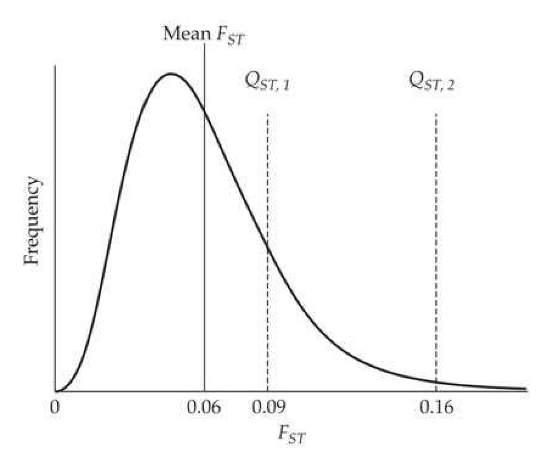
>
> Figure 12.8 When  $ \overline{F}_{ST} $ is small, the  $ Q_{ST} $ distribution for a neutral, completely additive trait should approximately follow the Lewontin-Krakauer distribution (Equations 9.10a and 12.28a). In this example, two traits, one with  $ Q_{ST} = 0.09 $, and a second with  $ Q_{ST} = 0.16 $ are both larger than  $ \overline{F}_{ST} = 0.06 $, but only trait 2 is significant. (After Whitlock 2008.)

**[命题 Proposition]**

The major flaw with using Equation 12.28a is that it ignores the very important sampling variances of both our estimates, $ \widehat{Q}_{ST} $ and $ \overline{F}_{ST} $. Whitlock and Guillaume (2009), building on Equation 12.28a, showed how to incorporate such uncertainty to construct the distribution (which they denoted by $ Q_{ST}^n $) of the estimated $ \widehat{Q}_{ST} $ values under the assumption of an additive and neutral trait, which is also specific for the design used to estimate variance components (Example 12.6). A plot of the resulting distribution of the difference $ (\widehat{Q}_{ST} - Q_{ST}^n) $ provides a formal statistical test of whether the observed value, $ \widehat{Q}_{ST} $, is excessively large (the 95% credible interval is entirely above zero) or small (the 95% credible interval exclusively below zero). Figure 12.9 shows how violin plots provide a useful way to display these results.

> **Figure 12.9** · page 33 · source: `Evolution_chapter12`
>
> 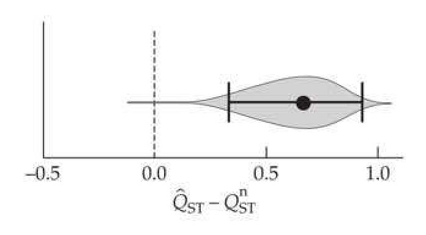
>
> Figure 12.9 A violin plot for the distribution of the difference  $ \left(\widehat{Q}_{ST} - Q_{ST}^{n}\right) $ for body length in the sea-run brown trout (Salmo trutta), using the resampling scheme suggested by Whitlock and Guillaume (2009), and detailed in Example 12.9. The width of the “violin” indicates the probability mass in that interval, the dot denotes the highest posterior probability, and the error bars the 95% credibility interval. Here this interval is completely above zero, demonstrating that  $ \widehat{Q}_{ST} $ is significantly in excess of its predicted neutral value given  $ \overline{F}_{ST} $. (After Rogell et al. 2012.)

**[示例 Example]**

*(See Example 12.6.)*

---

## Evolution_chapter12_023 · TIME SERIES DIVERGENCE TESTS / Empirical Data

Results from the large number of $ Q_{ST} $ vs. $ F_{ST} $ comparisons from natural populations were summarized by Merilä and Crnokrak (2001), McKay and Latta (2002), and Leinonen et al. (2008, 2013). Values of $ Q_{ST} $ and $ F_{ST} $ are positively correlated, with r = 0.24 (Leinonen et al. 2013). Thus, there is a modest tendency for the structure of quantitative-trait variation to parallel the population structure for neutral alleles. The striking finding is that $ Q_{ST} > F_{ST} $ for $ \sim 70% $ of all traits, which, taken at face value, suggested that diversifying selection was very widespread (Figure 12.10). Conversely, values of $ Q_{ST} < F_{ST} $ are rare, despite the bias in this direction for neutral traits under a variety of conditions (discussed above), suggesting that persistent stabilizing or uniform selection is far less common.

> **Figure 12.10** · page 35 · source: `Evolution_chapter12`
>
> 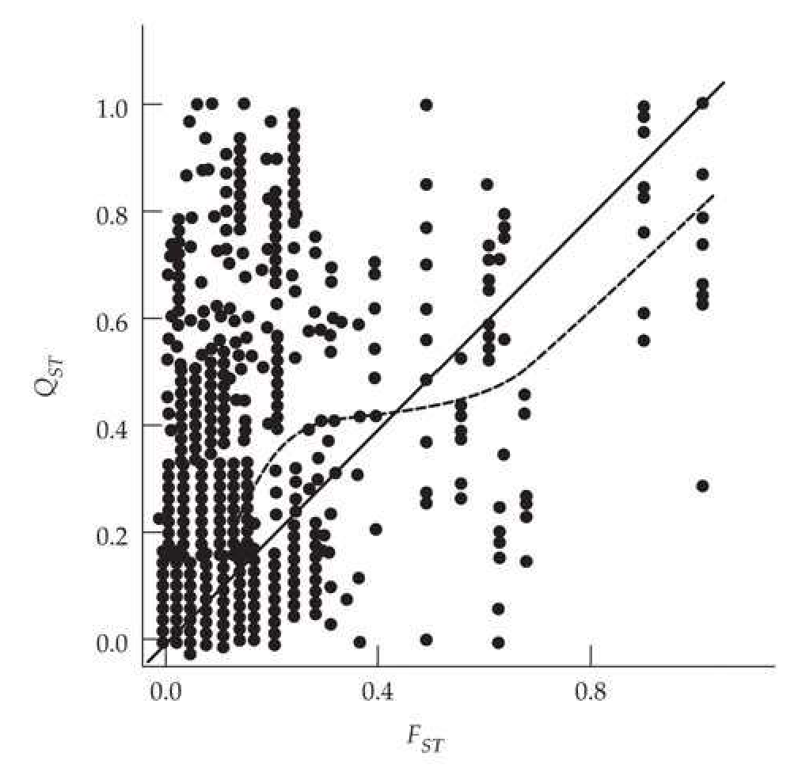
>
> Figure 12.10 The joint distribution of  $ Q_{ST} $ vs.  $ F_{ST} $ seen in the meta-analysis of Leinonen et al. (2008). The solid line represents the neutral expectation,  $ Q_{ST} = F_{ST} $, while the dashed line is their smoothed nonlinear regression. There is a very strong tendency for  $ Q_{ST} > F_{ST} $. While consistent with widespread diversifying selection, as discussed in the text, such a pattern can also arise from ascertainment bias or the use of highly polymorphic markers (which underestimate  $ F_{ST} $).

One potential explanation for this trend of $ Q_{ST} > F_{ST} $ was offered by Miller et al. (2008). They found that the variance of $ Q_{ST} $ is significantly larger than that for $ F_{ST} $ and noted a strong positive correlation in the data between $ Q_{ST} $ and the difference $ (Q_{ST} - F_{ST}) $. Hence, populations with larger $ Q_{ST} $ values tend to also have greater departures from $ F_{ST} $. In particular, they noted that if more variable traits are overrepresented in the sampling process, this generates outliers of $ Q_{ST} $, given the latter's larger variance, which in turn generates excessive $ (Q_{ST} - F_{ST}) $ values, even under neutrality. Whitlock (2008) further stressed this concern: It will always be possible to choose a set of traits that have higher than average $ Q_{ST} $ values. Traits chosen in this way cannot reliably be used to infer the extent of spatially heterogeneous selection. Examination of the traits chosen for many $ Q_{ST} $ studies makes one wonder whether traits are in fact always chosen with previous knowledge of the likely results.

A second source of bias in comparisons of $ Q_{ST} $ and $ F_{ST} $ was noted by Edelaar and Björklund (2011) and Edelaar et al. (2011). Markers with high mutation rates underestimate $ F_{ST} $, and the most widely used markers in early $ Q_{ST}/F_{ST} $ studies, microsatellites, have high mutation rates. As shown in Figure 12.11, there is a strong positive relationship between the polymorphism level of a marker (with highly polymorphic markers having higher mutation rates) and the excess values of $ Q_{ST} $ over $ F_{ST} $. Note that most of this trend is driven by studies employing microsatellites, with allozyme studies showing an excess of $ Q_{ST} $ largely independent of their polymorphism level.

> **Figure 12.11** · page 35 · source: `Evolution_chapter12`
>
> 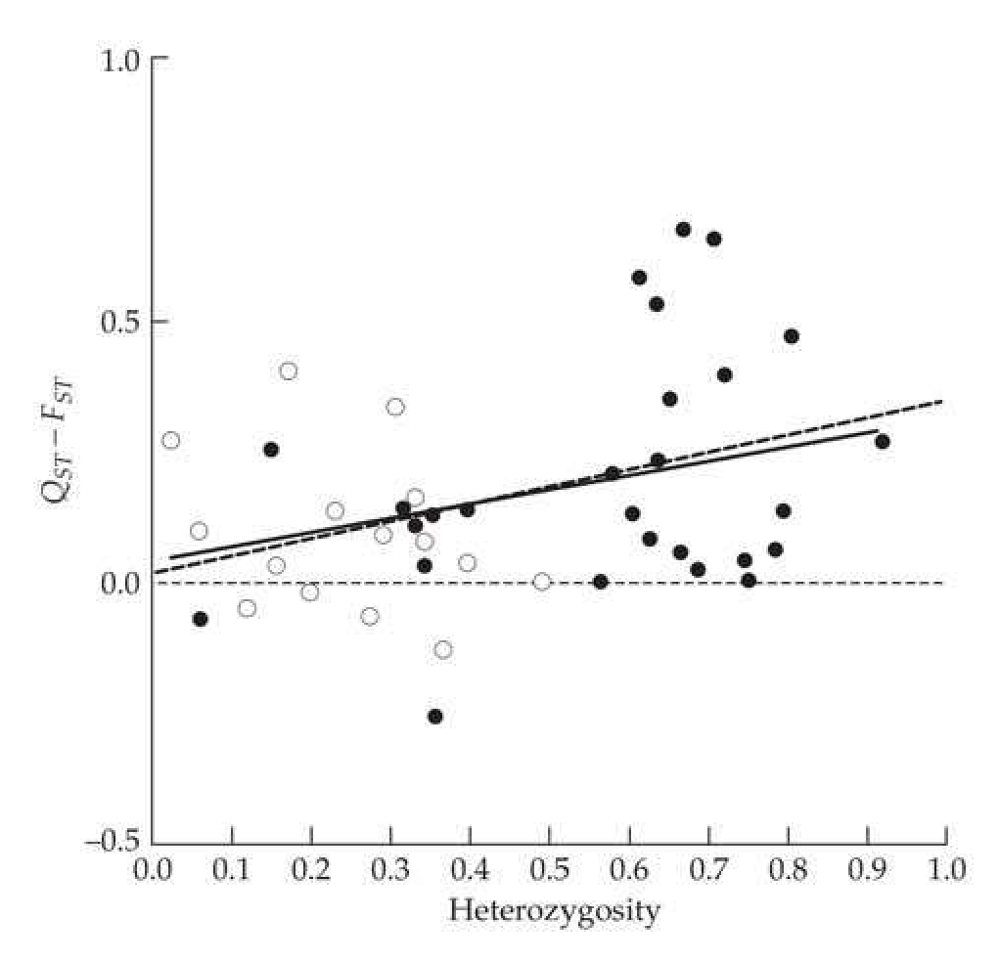
>
> Figure 12.11 Correlation between the difference  $ (Q_{ST} - F_{ST}) $ and heterozygosity at the marker loci, with each point representing one trait comparison. Filled circles involve microsatellites, and open circles denote allozyme markers. The solid line is the regression slope of  $ (Q_{ST} - F_{ST}) $ on heterozygosity; the dashed line is the same regression, but correcting the previously discussed decline in  $ F_{ST} $ with heterozygosity. (After Edelaar et al. 2011.)

Thus, the striking trend of $ Q_{ST} > F_{ST} $ is certainly inflated by ascertainment bias, and somewhat inflated by the use of highly polymorphic markers (which is a more recent trend), making it difficult to make any general statement about how commonly diversifying selection structures quantitative traits in subdivided populations. As noted by Whitlock (2008), “While useful, $ Q_{ST} $ is a crude measure of the genetic differentiation of a trait caused by local adaptation.”

One check of theory is to compare $ Q_{ST} $ and $ F_{ST} $ values between control and artificially selected groups. Morgan et al. (2005) examined the results of a 14-generation replicated selection experiment for increased wheel-running activity in mice. A base population was split into a control and a selected group, each with four replicate lines. The average selection intensity per generation was close to one ($ \bar{i} \simeq 1 $: Chapter 14), and significant response was seen in both the target trait, and (as a correlated response) in body mass. Theory predicts that $ Q_{ST} $ contrasting the control versus selected group should exceed $ F_{ST} $, and this was observed for both the directly selected (wheel running) and correlated (body mass) traits. $ Q_{ST} $ and $ F_{ST} $ should be similar among the replicate lines of the selected group, and this was indeed seen among the wheel-running treatments, where $ Q_{ST} $ was actually below $ F_{ST} $ for body mass, but not significantly so.

Support for $ Q_{ST} $ as a method for detecting selection was also offered by Rhoné et al.

(2010). They examined the response to 12 generations of natural selection on flowering times in a synthetic population of wheat grown in three locations in France (which experienced rather different environmental conditions). For generation 2 remnant seed assessed in a common garden, $ Q_{ST} $ and $ F_{ST} $ were not significantly different. However, individuals from generations 7 and 12 had $ Q_{ST} $ significantly larger than $ F_{ST} $. Finally, agreement with theory was mixed in Porcher et al. (2004, 2006), who examined eight generations of selection in a series of structured Arabidopsis populations (migration was artificially controlled over a set of demes). Larger $ Q_{ST} $ values were seen under imposed heterogeneous selection among the experimental demes, consistent with theory, but $ F_{ST} $ increased as well.

---

## Evolution_chapter12_024 · TIME SERIES DIVERGENCE TESTS / Closing Comments: $ Q_{ST}, F_{STQ} $, and Linkage Disequilibrium

Tests comparing $ F_{ST} $ values at candidate loci against the distribution of $ F_{ST} $ values at putatively neutral markers were discussed at length in Chapter 9. Comparisons of $ Q_{ST} $ to $ F_{ST} $ are a step removed, in that, ideally, we would like to contrast the $ F_{STQ} $ value (the average $ F_{ST} $ value for loci underlying our focal trait) against the genome-wide $ F_{ST} $ neutral standard. Given the near impossibility of locating all such causative loci, we have instead been using $ Q_{ST} $, as with an additive trait, this should track the $ F_{STQ} $ values at the underlying causative loci. However, as is detailed in Chapters 16 and 24, allele-frequency changes are not the only route through which genetic variances (and hence the components of $ Q_{ST} $) can change. Selection-generated gametic-phase disequilibrium (LD)—even among unlinked loci—can have a dramatic effect, even in situations where little allele-frequency change occurs. This impact of LD on $ Q_{ST} $ was stressed first by Latta (1998, 2005), and later by Le Corre and Kremer (2003, 2012; Kremer and Le Corre 2012). Because $ Q_{ST} $ is based on variance components, it can be influenced by linkage disequilibrium, which generates covariances between alleles at different loci, either inflating or deflating the resulting variances. When this happens, the values of $ Q_{ST} $ and $ F_{STQ} $ can become decoupled, and (as we will see) $ Q_{ST} $ can have more power to detect selection than $ F_{STQ} $ (even presuming we could locate all the underlying loci).

Thus, while a significant departure of $ Q_{ST} $ from the background value of $ F_{ST} $ is usually taken as indicating a shift in the $ F_{STQ} $ values at the underlying trait loci, this is only strictly correct when linkage disequilibrium is absent. Even in cases where selection induces little allele-frequency change (and hence little shift in $ F_{STQ} $ relative to the background $ F_{ST} $), selection-induced disequilibrium (i.e., shifts in gamete, as opposed to allele, frequencies) can still generate a significant $ Q_{ST} $ signal. In particular, under the infinitesimal model, there is essentially no shift in the allele frequencies at underlying loci ($ F_{STQ} \simeq F_{ST} $), but there can be a substantial change in the genetic variances due to selection-induced LD (Chapters 16 and 24), and hence a perturbation of $ Q_{ST} $ away from $ F_{STQ} $. In such a setting, a direct comparison of $ F_{STQ} $ to the genome-wide $ F_{ST} $ standard would not reveal any evidence of selection, but a comparison of $ Q_{ST} $ (with its LD-shifted variance components) against $ F_{ST} $ might. Hence, under polygenic sweep conditions (Chapter 8), an appropriately performed $ Q_{ST} $ test might detect selection signatures missed by allele-frequency based tests.

To expand on this point, we need to consider how the within- and among-population LD (Ohta 1982) impact $ Q_{ST} $. Letting the subscript x denote either within- or among-population values (x = w and x = a, respectively), we can express the variances comprising $ Q_{ST} $ as

$$
\begin{align*}\sigma_x^2=\sigma_{x,0}^2+d_x=(1+\phi_x)\sigma_x,^2,\quad{\rm where}\quad\phi_x={d_x\over\sigma_{x,0}^2}\end{align*}
$$

where $ \sigma_{x,0}^{2} $ is the linkage equilibrium value, $ d_{x} $ is the disequilibrium contribution generated by covariance among alleles at different loci (Equations 16.1 and 16.2), and $ \phi_{x} $ is the ratio of the disequilibrium contribution to the linkage-equilibrium (i.e., genic) variance (note that $ \phi_{x} $ is negative when $ d_{x} $ is negative). As discussed in Chapter 16, stabilizing or directional selection within a population generates negative d, so we often expect negative within-population LD (negative values of $ d_{w} $ and $ \phi_{w} $).

Turning to the among-population LD, Latta (1998) noted that if each population is under stabilizing selection for a different optimum value ($ \theta $), then for an additive trait where the population means have reached their optimal values,

$$
d_{a}=\sigma_{\theta}^{2}-2F_{S T Q}\sigma_{A}^{2}
$$

where $ \sigma_{\theta}^{2} $ is the variance in the optimum value over populations, and $ \sigma_{A}^{2} $ is the expected additive genetic variation if the populations were to be randomly mated to form a single, panmictic, population (in linkage equilibrium). With nearly uniform selection (the variance in $ \theta $ values over demes is small) and reduced migration (so that $ F_{STQ} $ is large), Equation 12.30b gives a negative covariance ($ d_{a}, \phi_{a} < 0 $) between trait-increasing alleles at different loci across demes, reducing the among-group variance $ \sigma_{GB}^{2} $ below its linkage-equilibrium value. Conversely, if diversifying selection is strong ($ \sigma_{\theta}^{2} $ is large) and gene flow is high ($ F_{STQ} $ is small), a positive covariance is expected ($ d_{a}, \phi_{a} > 0 $), and $ \sigma_{GB}^{2} $ is inflated relative to its value in the absence of LD. Thus, $ Q_{ST} $ often magnifies the effect of selection over what is expected from changes in $ F_{STQ} $ alone, with significant changes in $ Q_{ST} $ (relative to $ F_{ST} $) possible even when little differentiation has occurred at the underlying QTLs ($ F_{STQ} \simeq F_{ST} $).

For a completely additive trait, Le Corre and Kremer (2003) quantified the influence of LD on $ Q_{ST} $ by noting that the relationship between $ Q_{ST} $ (based on variance components) and $ F_{STQ} $ (based on the underlying loci) is given by

$$
Q_{ST}=\frac{(1+\phi_{a})F_{STQ}}{(\phi_{a}-\phi_{w})F_{STQ}+1+\phi_{w}}
$$

where $ \phi_x $ is given by Equation 12.30a. Note that $ Q_{ST} $ equals $ F_{STQ} $ only when the among-and within-population LD values are equal ($ \phi_a = \phi_w $). Using Equation 12.30c, Kremer and Le Corre (2012) showed that $ Q_{ST} > F_{STQ} $ when $ \phi_a > \phi_w $. Given that stabilizing selection within populations generates negative values of $ \phi_w $, while diversifying selection (variation in the optimum over populations) generates positive values of $ \phi_a $ (Equation 12.30b), this combination amplifies the signal in $ Q_{ST} $ over that generated from $ F_{STQ} $. As $ Q_{ST} > F_{ST} $ is the signal for divergent selection (*[See Table 12.2 at the end of this section.]*), while our last result implies that $ Q_{ST} > F_{STQ} > F_{ST} $, the impact of LD is to magnify the impact of divergent selection over that expected from allele-frequency change alone ($ F_{STQ} $). Again, the salient point is that even if the difference between $ F_{STQ} $ and $ F_{ST} $ is small, the difference between $ Q_{ST} $ and $ F_{ST} $ can still be large.

Hence, while $ Q_{ST} $-based tests are fraught with complications, if properly performed (which is no small feat), they may actually be more powerful than a scan for $ F_{ST} $ outliers at known candidate genes for the trait of interest (Chapter 9). While $ F_{ST} $-based scans are trait independent, knowledge of the potential target trait or traits allows $ Q_{ST} $, and thus further information from LD, to be exploited. We return to this point below when considering certain trait-augmented marker-based tests.

**[示例 Example]**

*(See Example 12.7.)*

---

## Evolution_chapter12_025 · The Neutral Divergence of Quantitative Traits: Introduction / TRAIT-AUGMENTED MARKER-BASED APPROACHES: TESTS USING QTL INFORMATION

Our last class of tests for neutral trait evolution exploit marker information from either a QTL mapping experiment or a GWAS study. We refer to these as trait-augmented marker-based approaches, as tests are not based on a set of random markers (as was the case for genome scans; Chapter 9), but rather on a very specific set of markers, namely those chosen because they are associated with a target trait (as either markers linked to QTLs or GWAS hits). We first examine approaches using QTLs, which focus fixed sites, and then consider GWAS information, which focuses on segregating sites (i.e., changes in allele frequencies).

---

## Evolution_chapter12_026 · TRAIT-AUGMENTED MARKER-BASED APPROACHES: TESTS USING QTL INFORMATION / Leveraging QTL Studies

In theory, one could take localized QTL regions detected from such a cross (LW Chapters 14–16) as candidate regions for tests of selection using the machinery in Chapters 9 and 10. Here we examine a different class of tests, based not on a signature from a single QTL, but rather on the signature from an entire collection of QTLs for a given trait. We assume that the lines have been fixed (or nearly so) for alternative alleles at the underlying causative QTLs, and the pattern of fixation (i.e., which alleles were fixed in which line) provides information on whether this pattern was neutral.

The basic idea traces back to three papers, all coincidentally examining crosses for male secondary traits involving Drosophila simulans (Coyne 1996; Laurie et al. 1997; True et al. 1997). Under the neutral hypothesis, the relative abundances of “plus” and “minus” QTL alleles (associated with larger versus smaller trait values, respectively), are expected to be randomly distributed over lines and thus should not differ over the crossed lines. Intuitively, this might suggest a simple sign test: is there an excessive number of plus alleles in one line? If so, this is not consistent with neutral drift (which is agnostic with respect to the direction and effect sizes of QTLs being fixed). This general strategy will be biased if the parental lines are intentionally chosen (ascertained) to have extreme phenotypes, as the high line would naturally be expected to be enriched with “plus” alleles. Orr (1998a) suggested several approaches to correct for any such bias.

---

## Evolution_chapter12_027 · TRAIT-AUGMENTED MARKER-BASED APPROACHES: TESTS USING QTL INFORMATION / Orr's QTLST and QTLST-EE Sign Tests

Assume that n detected QTL differences (alternative fixed alleles at n loci) are found via a standard QTL mapping experiment involving a cross between two lines (LW Chapter 15). Under neutrality, there should be no systematic directionality as to whether a line is fixed for increasing (plus) alleles over decreasing (minus) alleles at any particular QTL. This simple idea forms the basis of sign tests, but it requires modifications to account for the actual biology. For example, when the line means differ, the high (larger trait value) line is expected to contain more plus alleles (assuming equal effects; with a distribution of allelic effects, this need not be the case, as is discussed below). Orr noted that by choosing the larger line, we have introduced an ascertainment bias, as this line is expected to contain an excess of plus alleles. To proceed, we need some appropriate conditioning on this fact to obtain an unbiased statistic representing the value that constitutes an excess of plus alleles. The simplest approach is Orr's equal-effects model, where all n QTLs have close to equal effects. Here, the large line must contain at least $ [n/2] $ high (plus) QTLs, where

$$
[n/2]=\left\{\begin{array}{ll}(n/2)+1&\text{for }n\text{ even}\\(n+1)/2&\text{for }n\text{ odd}\end{array}\right.
$$

In other words, the high line must contain at least one more high allele than the low line (because all have equal effects). Determining whether an observed number, $ n_{high} $, of plus alleles in the high line constitutes an excess now becomes a simple combinatorial problem. The probability of k high alleles in one line (under neutrality) follows from the binomial, where there is an equal chance that a random line gets a plus or a minus allele at any particular QTL, yielding

$$
\Pr(n_{+}=k)=\binom{n}{k}(1/2)^{k}(1/2)^{n-k}=\binom{n}{k}(1/2)^{n}
$$

Note that all values of $ k $ contain a $ (1/2)^n $ term. We now condition this probability of $ k $ alleles in the high line on the fact that this line must contain at least $ [n/2] $ plus alleles, yielding

$$
\Pr(n_{+}\geq n_{high}\mid n_{+}\geq[n/2])=\frac{\Pr(n_{+}\geq n_{high})}{\Pr(n_{+}\geq[n/2])}=\sum_{i\geq n_{high}}^{n}\binom{n}{i}\bigg/\sum_{j\geq[n/2]}^{n}\binom{n}{j}
$$

where the common term of $ (1/2)^n $ in both the numerator and denominator cancels. This is Orr's QTL sign test for equal effects, or QTLST-EE. Orr noted that a minimum of n = 6 detected QTLs is required for this test to be applied. To see this, note for n = 6 that $ [n/2] = 4 $, and the most extreme value, $ n_{high} = 6 $, gives a p value of $ 1/2 \sim 0.05 $, while for n = $ n_{high} = 5 $, the smallest p is $ 1/16 \sim 0.0625 $. For large values of n, Orr noted that Equation 12.31a can be approximated by a normal, with

$$
\Pr\left(n_{+}\geq n_{high}\mid n_{+}\geq[n/2]\right)\simeq2\left[1-\Phi\left(\frac{n_{high}-[n/2]}{\sqrt{n/4}}\right)\right]
$$

where $ \Phi(x) = \Pr(U \leq x) $ for $ U \sim N(0,1) $.

**[示例 Example]**

*(See Example 12.8.)*

**[Table]**

*[See Table 12.3 at the end of this section.]*

> **Table 12.3** · `12.3` · page 41 · source: `Evolution_chapter12_027`
> Table 12.3 Summary of the analysis of Rieseberg et al. (2002) on the signs of QTLs in traits from wild species, analyzed by trait categories. Within a category, number of antagonistic (opposite sign) and total QTLs are given, along with their QTL ratio (the fraction of antagonistic QTLs). Under the equal-effects assumption, this ratio should be close to 0.5. As indicated by  $ \ast\ast $, all ratios are significant at p < 0.001 (using QTLST-EE, with p values adjusted using a sequential Bonferroni correction; Appendix 4), except for  $ \ast $, which denotes p < 0.01. A clearer comparison of the category effects is offered by the LS means estimate of the QTL ratio, which uses a linear model to estimate the direct effect of a category. For example, 0.139 is the average fraction of antagonistic QTLs for life history traits, after removing effects of taxon type, species comparison, and mating system. For the LS mean column,  $ \dagger $ denotes a mean in excess of two standard deviations from zero. Note that the presence of either a smaller QTL ratio or a smaller LS mean implies a stronger effect (a smaller fraction antagonistic QTLs, and hence greater departure from the neutral expectation of close to 0.5).
>
> Trait Category | Antagonistic QTLs | Total QTLs | QTL ratio | LS Means
> --- | --- | --- | --- | ---
> Animals | 73 | 312 | 0.234 $ ^{**} $ | 0.185 $ \pm $ 0.039 $ ^{\dagger} $
> Plants | 128 | 439 | 0.292 $ ^{**} $ | 0.202 $ \pm $ 0.025 $ ^{\dagger} $
> Interspecific | 47 | 245 | 0.192 $ ^{**} $ | 0.137 $ \pm $ 0.154
> Intraspecific | 154 | 506 | 0.304 $ ^{**} $ | 0.250 $ \pm $ 0.243
> Outcross | 98 | 425 | 0.231 $ ^{**} $ | 0.170 $ \pm $ 0.174
> Self | 103 | 326 | 0.316 $ ^{**} $ | 0.217 $ \pm $ 0.262
> Life history | 111 | 540 | 0.206 $ ^{**} $ | 0.139 $ \pm $ 0.175
> Morphology | 138 | 508 | 0.272 $ ^{**} $ | 0.266 $ \pm $ 0.255
> Physiology | 8 | 40 | 0.200 $ ^{*} $ | 0.176 $ \pm $ 0.125
> Phenology | 37 | 124 | 0.298 $ ^{**} $ | 0.236 $ \pm $ 0.219
> Total | 201 | 751 | 0.268 |

---

## Evolution_chapter12_028 · TRAIT-AUGMENTED MARKER-BASED APPROACHES: TESTS USING QTL INFORMATION / Applications of QTL Sign Tests

Using QTLST-EE, Rieseberg et al. (2002) performed a meta-analysis of over 2600 QTL effects from 572 traits in 86 studies. Their summary statistic was the QTL ratio: the fraction of antagonistic QTLs for the comparison of interest (*[See Table 12.3 at the end of this section.]*). Roughly half of the studies involve wild × domesticated crosses, where strong directional selection is suspected for domestication traits. Upon restricting analysis to those examples with six or more QTLs per trait (Orr's condition for such tests to have any power), 35 of the 54 qualifying traits (65%) believed to be involved in domestication showed significant departures from neutrality (i.e., too few antagonistic QTLs). By contrast, only 14 of 84 nondomestication traits (15.6%) in crosses involving domesticated species showed significant departures. Treating this latter class of traits as a control demonstrates that QTLST-EE behaved in the direction predicted for these crosses (revealing signatures for domestication traits and a lack of signatures for nondomestication traits).

Given that most studies in this survey involved just four or five QTLs per trait, the restriction of QTLST-EE to traits with six or more QTLs discards much potential information. To utilize these additional data, Rieseberg et al. amalgamated traits into a series of categories to accrue a sufficient number of QTLs for the QTLST-EE test to be applicable. As shown in *[See Table 12.3 at the end of this section.]*, two different analyses were performed on these amalgamated data. First, the table simply reports the unadjusted QTL ratio (the fraction of antagonistic QTLs) for each category. Given that the same study can appear in multiple categories, the unadjusted QTL ratio is potentially influenced by these other categories. The second analysis in *[See Table 12.3 at the end of this section.]* (LS means) uses a linear model to estimate the impact from each category on the fraction of antagonistic QTLs, once the effects of other categories have been removed. This latter analysis more accurately reflects the category contribution. As shown in the table, all (unadjusted) categories showed significant departures from neutrality, while only two of the adjusted categories (the LS means) did. Rieseberg et al. noted that interspecific crosses had a smaller fraction of antagonistic QTLs than did within-species (intraspecific) crosses (LS mean ratios of 0.137 versus 0.250), which they interpreted as a stronger role for directional selection in generating among-species differences. They also noted that life-history traits (LS ratio 0.139) were (by this criterion) more strongly selected than morphological traits (LS 0.266). While all of these differences are suggestive, it needs to be stressed that none are significant. Further, this pattern of more strongly selected life-history traits is at odds with meta-analyses based on the strength of selection as directly measured in the field (Figure 30.10). Rieseberg noted that the widespread departures from neutrality over all traits could result from an ascertainment bias due to investigators focusing on divergent traits in their crosses.

Ironically, a contrary example to Rieseberg's pattern of life-history and physiological traits tending to have fewer antagonistic QTLs than morphological traits comes from Rieseberg's own group (Lexer et al. 2005). A cross of two wild sunflowers (Helianthus annuus and H. petiolaris) revealed QTL ratios for life-history, physiological, and morphological traits of 0.345, 0.388, and 0.287, respectively. However, the reduction in the fraction of antagonistic QTLs for morphological traits appears to be due entirely to flower morphology (QTL ratio of 0.214; significant under QTLST), with the other measured morphological features (root/shoot and leaf traits) having (nonsignificant) QTL ratios (0.333 and 0.322, respectively) similar to those for life-history and physiological traits.

A second QTL meta-analysis worth mentioning is that of Louthan and Kay (2011), who focused on traits that were expected to be under biotic rather than abiotic selection. While larger QTL effects were more common for biotically selected traits, the fraction of antagonistic QTLs did not differ between the two groups. Both trait groups showed significant departures from neutrality using QTLST-EE.

We conclude by briefly highlighting the utility of two applications of sign tests to specific biological problems (as compared to the broad generalizations explored above). Albertson et al. (2003) examined traits in the massive species radiation occurring among cichlid fishes in the East African rift lakes. One striking feature of this radiation is extensive convergent evolution across lakes in feeding morphology, suggesting parallel directional selection. The authors used QTLST (with effect sizes drawn from a gamma distribution) to examine the genetic basis of feeding morphology through crossing two wild species from Lake Malawi. Because most individual traits had less than six QTLs, they grouped the traits, finding that only 4 of the 46 QTLs were antagonistic for jaw and teeth features. The highly significant p value supports directional selection on these feeding traits. Muir et al. (2014) examined QTLs in tomatoes (Lycopersicon) to explore leaf-related traits in wild species thought to be associated with adaptation to precipitation. They found no significant departure from neutrality for two leaf and two trichome (leaf hair) traits, but a significant departure from neutrality for two stomatal traits. They computed p values using both QTLST and QTLST-EE, and they found (in agreement with Anderson and Slatkin 2003) that QTLST was more conservative, yielding p values about twice as large as those obtained from QTLST-EE.

While QTL data usually involves fixed differences that are revealed by crossing two divergent lines, genome-wide association studies (GWAS) provide information on currently segregating alleles within a target population (or set of populations). As such, GWAS data potentially offer inroads into the vexing problem of detecting a polygenic sweep (Chapter 8). In this setting, allele-frequency shifts at the underling loci are expected to be small, and hence missed by most standard tests that look for single-locus signatures of selection (Chapter 9). The power of trait-augmented marker tests is that one chooses a set of markers given a trait, and then pools information across all of these markers, potentially generating a much stronger signal than could be found by considering any single marker in isolation.

---

## Evolution_chapter12_029 · TRAIT-AUGMENTED MARKER-BASED APPROACHES: TESTS USING GWAS INFORMATION / Approaches Based on Combining Signals

The basic idea of combining signals over a set of GWAS markers has been exploited in several different ways. The initial suggestion was gene set enrichment analysis (GSEA) from genomics (Subramanian et al. 2005), wherein one considers clusters of genes on the basis of membership in some functional group (i.e., the same gene ontology, GO, class). This tactic was used by Daub et al. (2013), who computed the average $ F_{ST} $ value over a set of pathway-connected genes and contrasted this with the average $ F_{ST} $ value over a same-sized set of putatively neutral markers. Using this approach, they found evidence for selection on several human pathways, many connected with pathogen response. They also noted that long-distance LD was detected, which they attributed to epistatic interactions. While this could be correct, a confounding factor is that selection is also expected to generate such long-distance (i.e., between loosely-linked sites) LD with strictly additive genes (Chapters 16 and 24).

In the Daub et al. analysis, the “trait” was a specific pathway, while other analyses have consider more classical human traits, in particular, height. A simple, but robust, approach was used by Turchin et al. (2012). They examined allele frequency differences for 139 GWAS markers for height between Northern- and Southern-European populations. Under neutrality, allele-frequency increases in plus alleles should be randomly distributed between two populations (i.e., the sign test introduced above). Instead, what they found was that 85 of the 139 markers (sign test $ p = 0.01 $) showed an increase for high alleles in the Northern-European population. Note that one advantage of GWAS data is that typically a reasonable number of hits (marker-trait associations) are found, while QTL-based studies often fail to have more than five detected QTLs for a focal trait (and hence Orr’s test is not applicable).

---

## Evolution_chapter12_030 · TRAIT-AUGMENTED MARKER-BASED APPROACHES: TESTS USING GWAS INFORMATION / Tests Based on tSDS Scores

Recall Field et al.'s (2016) singleton density score, SDS (Equation 9.42), for detecting very recent selection on a given single site. In that paper, they also showed how to extend this approach to search for polygenic selection on a given candidate trait, given a set of associated GWAS marker scores. This requires that both the SDS values and GWAS test statistics (such as a z value under a normality test) for a set of markers were generated using the same population. The SDS score for a given marker is first translated into a tSDS (trait-SDS) score, where the sign of the SDS score is changed so that trait-increasing markers receive positive scores. Their simplest approach was to combine the tSDS scores associated with all the significant GWAS markers for a target trait, using this mean as the test statistic.

Field et al. noted that most of the trait variance is usually explained by markers whose GWAS test statistics do not pass the genome-wide significance threshold (Chapter 24), and hence are not included in the test set. To incorporate information from these nonsignificant (but potentially biologically important) markers, they used a regression-based approach. Data points for the regression were generated by first binning SNPs with very similar GWAS scores, taking the bin average GWAS score as the predictor variable and bin average tSDS score as the associated response variable. A significant regression (or correlation) is expected. under selection, but not under drift. Both the average tSDS score and regression approaches detected clear signals of selection for increased height in Britain over the past 2000 to 3000 years. Several other traits (infant head size, body mass index [BMI], and female hip size, to name a few) also showed evidence of recent polygenic selection.

---

## Evolution_chapter12_031 · TRAIT-AUGMENTED MARKER-BASED APPROACHES: TESTS USING GWAS INFORMATION / The Berg and Coop $ Q_{x} $ Test

The final approach leveraging GWAS-estimated marker effects for a target trait is due to Berg and Coop (2014), building on previous work by them (Coop et al. 2010; Günther and Coop 2013) as well as by Ovaskainen et al. (2011). Let $ \mathbf{p}_i^T = (p_{i,1}, p_{i,2}, \cdots, p_{i,m}) $ denote the vector of allele frequencies for the $ i $th marker over $ m $ subpopulations, where $ p_{i,j} $ denotes the allele frequency in population $ j $. Example 9.5 showed that the expected distribution of $ \mathbf{p}_i $ under neutrality is approximately given by

$$
\mathbf{p}_{i}\sim\mathrm{M V N}_{m}\big[p_{i,0}\mathbf{1},p_{i,0}(1-p_{i,0})\pmb{\Omega}\big]
$$

where $ \Omega $ is a (marker-estimated) matrix of expected covariances in allele frequencies over the subpopulations and $ p_{i,0} $ is the allele frequency in the ancestral population. As detailed in Chapter 9, this formed the basis of Coop's Bayenv test for excessive divergence at a specific locus. Berg and Coop (2014) extended this result to a trait-based test as follows. Suppose n GWAS hits are discovered for the focal trait, where the trait-increasing allele for the ith marker changes the trait by a value of $ g_i $, with $ p_{i,j} $ denoting the frequency of this allele in population j. The GWAS-predicted mean genetic value for the trait in population j thus becomes

$$
a_{j}=2\sum_{i=1}^{m}g_{i}p_{ij}
$$

Letting $ \mathbf{a}^{T}=(a_{1},a_{2},\cdots,a_{m}) $ be the vector of mean trait genetic values over the m populations, then combining Equations 12.33b and 12.33a gives the expected distribution of trait means under drift as

$$
\mathbf{a}\sim\mathrm{M V N}_{m}\left[\mu\mathbf{1},2V_{A}\boldsymbol{\Omega}\right]
$$

where

$$
\mu=\frac{2}{m}\sum_{i=1}^{n}g_{i}p_{i,0}\qquad and\qquad V_{A}=2\sum_{i=1}^{n}g_{i}^{2}p_{i,0}(1-p_{i,0})
$$

represent the expected genetic value and additive variance in the ancestral population.

To proceed, Berg and Coop expressed all of the $ a_j $ values as deviations from the grand mean, yielding $ a_j^* = a_j - \bar{a} $. This uses one degree of freedom, and returns the vector $ (\mathbf{a}^*)^T = (a_1^*, a_2^*, \cdots, a_{m-1}^*) $, where one population is dropped. As Berg and Coop note, information from the dropped population is fully retained by the vector $ a^* $, so that the choice of which population to drop has no impact on the resulting analysis. The resulting vector is now distributed as

$$
(\mathbf{a}^{*})^{T}\sim\mathrm{M V N}_{m-1}\left[\mathbf{0},2V_{A}\boldsymbol{\Omega}\right]
$$

As discussed in Appendix 5, a standard trick with a vector of correlated variables is to use a transformation to return a vector of uncorrelated variables of unit variance. Berg and Coop did this by using the Cholskey decomposition (Appendix 5) of $ \Omega = CC^{T} $, using the transformation

$$
\mathbf{x}=\frac{1}{\sqrt{2V_{A}}}\mathbf{C}^{-1}\mathbf{a}^{*}
$$

which returns

$$
\mathbf{x}\sim\mathrm{MVN}_{m-1}(\mathbf{0},\mathbf{I})
$$

This is the basis for the Berg-Coop $ Q_{x} $ test, whose statistic is given by

$$
Q_{x}=\mathbf{x}^{T}\mathbf{x}=\frac{(\mathbf{a}^{*})^{T}\boldsymbol{\Omega}^{-1}\mathbf{a}^{*}}{2V_{A}}
$$

Under neutrality, $ Q_x \sim \chi^2_{m-1} $, as $ \mathbf{x}^T \mathbf{x} $ is the sum of $ (m-1) $ squared unit-normal random variables. Note by comparing this result to Equation 9.13c, that the $ Q_x $ test is very similar in form to the Günther-Coop (2013) $ \mathbf{X}^T \mathbf{X} $ test for selection on a single site, but with estimated trait genetic values replacing allele frequencies.

Robinson et al. (2015) applied this test to height and BMI based on ~9400 individuals from 14 European countries, finding evidence that selection favored increased height and reduced BMI. Mathieson et al. (2015) also applied this test to Europeans, but used ancient DNA from 230 individuals (who lived between 6400 to 300BC), and reported evidence for two independent episodes of selection for height.

---

## Evolution_chapter12_032 · The Neutral Divergence of Quantitative Traits: Introduction / DIVERGENCE IN GENE EXPRESSION

The power of quantitative genetics is that its machinery can be applied to any character of interest, including omics traits (e.g., amounts of specific transcripts, proteins, and metabolites). Application of quantitative-genetic machinery to such omics traits has been coined genetical genomics by Jansen and Nap (2001), and it traces back to Damerval et al. (1994), who mapped QTLs controlling the spot volume of anonymous maize proteins detected by two-dimensional gel electrophoresis (LW Figure 15.10).

---

## Evolution_chapter12_033 · DIVERGENCE IN GENE EXPRESSION / Level of Gene Expression as a Quantitative Trait

Much of the current work in genetic genomics has focused on the transcriptome, treating the level of expression of a specific gene as a quantitative trait and then attempting to map eQTLs (expression QTLs) or eSNPs (in GWAS studies) that influence this trait. Modern transcriptomic tools (initially using microarray analyses, and more recently, RNA-Seq) allow one to measure the level of expression for essentially the full repertoire of an individual's genes (Schena et al. 1995; Brown and Botstein 1999; Duggan et al. 1999; Wang et al. 2009). The amount of mRNA present (either measured by the intensity of hybridization against probes for a gene or from the amount present in massive sequencing of an RNA pool) is a typical quantitative trait, showing both genetic and environmental sources of variation, and further confounded by measurement error. This transcriptomics approach yields thousands of traits, as expression levels of each gene are separate, although potentially highly correlated, characters.

Our treatment of the evolutionary analysis of gene expression glosses over a number of very important concerns in the actual generation and processing of the raw data. Gene expression is both highly environmentally dependent and tissue specific, and formally, it should be viewed as a function-valued trait (Volume 3)—a character whose value is indexed by time and potentially other features (such as tissue type or developmental stage). In the following discussion, we simply refer to “the” expression level of a gene, but this is highly context-specific, with many transcripts showing considerable variation within an individual (over both time and tissues). There is also technical variation due to sampling and hybridization/amplification, so that an otherwise identical sample might still show considerable variation. Much of the early work used whole organisms (and hence all tissues at the sampled developmental stage), and it often pooled multiple individuals. RNA-seq relaxes many of these restrictions, as it requires much smaller amounts of material. Whichever method is used to assess expression levels, significant care is required to ensure that traits being compared are indeed the same character (i.e., expression levels at the same development time in the same set of tissues). As highlighted by Lynch and Walsh (1998), accurate quantitative-genetic studies, especially with noisy traits, require very significant replication, something lacking in many published studies of expression variation. All of these concerns highlight the fact that careful experimental design is absolutely critical in expression studies (Kerr and Churchill 2001a, 2001b; Churchill 2002; Yang and Speed 2002; Kerr 2003; Rosa et al. 2005).

While microbes have historically had only a relatively minor role in classical quantitative genetics (largely due to their limited number of easily scored traits), they have flourished in the genetical genomics era, in part because they allow many of these design issues to be addressed. Starting with Brem and Kruglyak (Brem et al. 2002, 2005; Brem and Kruglyak 2005), yeast was quickly adapted as a model system for the quantitative genetics of gene expression, allowing investigators to examine the heritability of expression and map eQTLs for thousands of transcripts. This work was closely followed by similar analyses in mice, humans, and maize (Schadt et al. 2003), and has subsequently been extended to an ever-growing number of species. Such genome-wide transcription studies offer very high phenotypic throughput, allowing thousands of traits to be scored in a single experiment. While there is some modest bias against weakly expressed genes, the sample of expression levels over thousands of loci offers a largely unbiased view of the quantitative genetics of this class of traits. This is an extremely active area, with the early work reviewed by (among others) Stamatoyannopoulos (2004), de Koning and Haley (2005), Gibson and Weir (2005), Ranz and Machado (2006), Rockman and Kruglyak (2006), Whitehead and Crawford (2006), Fay and Wittkopp (2007), Gilad et al. (2008), Skelly et al. (2009), Emerson and Li (2010), Romero et al. (2012), and Albert and Kruglyak (2015). The conclusion from this early work is that the control of gene expression often has considerable heritability, involves both cis and trans factors, and can be very polygenic.

In order to understand the nature of evolutionary forces shaping the complex webs of gene regulation, appropriate null models are needed. That our initial impression of the origins of a given network structure can be highly misleading was stressed in Kauffman's (1969) classic paper. He showed that randomly constructed gene networks appear to be highly coordinated and hence give the appearance of being highly evolved (i.e., highly structured by natural selection). Thus, tests of whether certain features of gene regulation (or any omics data) are largely neutral are critical to understanding which evolutionary forces might shape these features. Much of the machinery developed in this chapter for detecting departures from neutral drift has been applied to the amount of divergence in gene expression.

Finally, before proceeding, a subtle, but important, clarification is in order. Our focus here is on detecting selection on particular traits, while Chapters 9 and 10 discuss machinery for detecting selection on particular genes (or, more correctly, specific sequences). Selection on the expression level at a specific gene is different from selection acting on the sequence of that gene. To see this, suppose only trans-acting factors influenced the expression levels at our target gene. In this case, trans-factor alleles at the eQTLs for that transcript would be under selection, not the alleles at the target gene itself. A test of a sequence-specific signature of selection would not pick up the target gene, but might detect genes coding for these trans-acting factors (subject to all the caveats discussed in Chapters 9 and 10). Likewise, a genome-wide association study would highlight sequence variation in trans-acting genes, not sequence variation in the gene whose expression is under selection. This distinction becomes murky when a gene also has cis-acting sites, as, while the expression level is the target, sequence variation near the gene (cis-acting sites), as well as at more distant (often unlinked) sites, would be the genetic targets of selection. An example of such a cis-acting site is in the tb1 gene, which is involved in the domestication of maize (Chapter 9). This site is roughly 60 kilobases upstream of the tb1 gene itself, and it is influenced by the insertion of a Hopscotch retrotransposon that increases the amount of tb1 transcripts (Studer et al. 2011).

---

## Evolution_chapter12_034 · DIVERGENCE IN GENE EXPRESSION / Rate-based Tests for Neutrality in Divergence of Gene Expression

Early attempts to detect departures of gene expression evolution from neutral trait predictions used rate-based approaches, based on Lande's $ F_{MDE} $ test (Equation 12.20a). While the standard version of this test uses the ratio of the observed among-group variance, $ V_{B} $, to the expected among-group variance (expressed as $ 2t\sigma_{m}^{2} $, where t is the separation time in generations), a modified version uses an estimate of $ V_{A} $ (the additive-genetic variance of expression in the reference population or species) in place of $ 2t\sigma_{m}^{2} $. An important caveat is that these early studies were based on the phenotypic variance, such as the among-line variance, as a surrogate in place of the additive-genetic variance (Hsieh et al. 2003; Rifkin et al. 2003; and Nuzhdin et al. 2004). This approach raises some of the issues discussed previously when using $ P_{ST} $ as a surrogate of $ Q_{ST} $; see Example 12.9. With this concern in mind, the version of Lande's test used by these investigators starts by noting that $ E[V_A] = 2N_e\sigma_m^2 $ for an additive trait at mutation-drift equilibrium (Equation 11.20c). Assuming expression values are drawn from a normal distribution under the null model, then when $ L $ lineages are used to estimate the among-group variance and $ k $ individuals per line were used to estimate $ V_A $, Equation 12.5a shows that both estimators approximately follow $ \chi^2 $ distributions, with

$$
V_{B}\sim\left(2t\sigma_{m}^{2}\right)\cdot\chi_{L-1}^{2}/\left(L-1\right)\qquad\mathrm{a n d}\qquad V_{A}\sim\left(2N_{e}\sigma_{m}^{2}\right)\cdot\chi_{k-1}^{2}/\left(k-1\right)
$$

where t is the time of divergence since the common ancestor. These expressions suggest a modified version of Lande's $ F_{MDE} $ test statistic,

$$
F_{M D E}^{*}=\frac{V_{B}/(2t\sigma_{m}^{2})}{V_{A}/(2N_{e}\sigma_{m}^{2})}=\frac{V_{B}}{V_{A}}\cdot\left(\frac{N_{e}}{t}\right)\sim\frac{\chi_{L-1}^{2}/(L-1)}{\chi_{k-1}^{2}/(k-1)}
$$

where this statistic follows an $F$ distribution, with $F_{MDE}^* \sim F_{L-1,k-1}$ (as it is the ratio of two $\chi^2$ random variables, scaled by their degrees of freedom; see LW Appendix 5). A scaled ratio less than a critical value of $F_{\alpha/2}$ is suggestive (at level $\alpha$) of too little divergence, and hence suggestive of stabilizing selection, while a scaled ratio in excess of $F_{1-\alpha/2}$ implies too much divergence, suggestive of directional selection. These critical values are given by

$$
\frac{V_{B}}{V_{A}}\leq F_{\alpha/2,L-1,k-1}\left(\frac{t}{N_{e}}\right)\qquad and\qquad\frac{V_{B}}{V_{A}}\geq F_{1-\alpha/2,L-1,k-1}\left(\frac{t}{N_{e}}\right)
$$

where $ F_{\alpha,M,N} $ denotes critical values for an F distribution and satisfies

$$
\Pr\left(F_{M,N}\leq F_{\alpha,M,N}\right)=\alpha
$$

In the case where just two populations (L = 2) are compared by using their squared difference, $ d^2 $, then recalling that $ V_B = d^2/2 $ (Equation 12.8c), the conditions given by Equation 12.34c become

$$
\frac{d^{2}}{V_{A}}\leq F_{\alpha/2,1,k-1}\left(\frac{2t}{N_{e}}\right)\qquad\mathrm{o r}\qquad\frac{d^{2}}{V_{A}}\geq F_{1-\alpha/2,1,k-1}\left(\frac{2t}{N_{e}}\right)
$$

**[示例 Example]**

*(See Example 12.9.)* *(See Example 12.11.)*

While straightforward to apply, a concern with Equation 12.34b is the estimation of $ t $ and $ N_e $. One approach is that, under neutrality, the ratio of the expected divergence $ D_s $ at silent sites divided by their expected polymorphism ($ P_s $) is $ D_s/P_s \simeq t/(2N_e) $ (Equation 10.1b). While this marker-based estimate could be substituted into Equation 12.34b, this is an ad hoc approach, as the sampling error of this estimator of $ t/N_e $ is ignored. The idea of combining silent-site information with the within- and between-population expression variances was also considered by Warnefors and Eyre-Walker (2012), who proposed a MacDonald-Kreitman-type approach (Chapter 10); see their paper for details. Again, these are useful metrics, but not formal statistical tests.

The rate-based test given by Equation 12.34b was scaled to be independent of $ \sigma_{m}^{2} $, at the cost of assuming or estimating an effective population size. Conversely, Equation 12.20d can be used to compare the rate divergence to that of candidate values of $ \sigma_{m}^{2} $ (or $ h_{m}^{2} $), which circumvents the potentially problematic issue of estimating $ N_{e} $, although (as with Equation 12.34b) one must still estimate t. This was the approach taken by Lemos et al. (2005). Using a diverse series of lineage comparisons (within mice strains, populations of Drosophila, and between species in primates and flies), and assuming $ h_{m}^{2} $ is in the range of $ 10^{-4} $ to $ 10^{-2} $, they found that the majority of gene-expression differences were consistent with stabilizing selection (an average of 85% of all transcripts), with drift comprising the next largest category (an average 11.5%), and directional selection comprising the smallest (an average of $ <4% $).

**[命题 Proposition]**

These approaches either ignore $\sigma_m^2$ or estimate its required value under drift given the observed divergence. A more arduous approach is to directly estimate $\sigma_m^2$ from a mutation-accumulation experiment (LW Chapter 12). This estimate is then used to predict either the within-population variation ($2N_e\sigma_m^2$) or the among-population divergence ($2t\sigma_m^2$) and to assess if these are consistent or too extreme. The general conclusion from such studies is that stabilizing selection plays a prominent role in reducing the amount of variation in gene expression below the neutral expectation—both within and among species, levels of variation are much lower than expected based on the estimated mutational variance. For example, using lines of the nematode C. elegans from a long-term (280 generation) mutation-accumulation experiment, Denver et al. (2005) estimated values of $\sigma_m^2$ for several thousand genes. By comparing levels of variation among a global collection of natural isolates, they found that the gene-specific ratios of the standing level of genetic variance to the estimated $\sigma_m^2$ value were generally no greater than a few hundred. Given that this ratio provides an estimate of $4N_e$ under the assumption of neutrality in a selfing organism (as opposed to $2N_e$ in an outcrosser, as $\sigma_A^2$ is inflated by $2f=2$ with complete inbreeding), these observations provide a firm rejection of the hypothesis that gene-expression levels evolve in a neutral fashion. Rifkin et al. (2005) were able to estimate mutational heritabilities for expression in mutation-accumulation lines of $ D.\ melanogaster $ by factoring out the variance at the level of the individual fly to obtain an estimate of $ \sigma_e^2 $. They found a median of $ h_m^2 \simeq 2.4 \cdot 10^{-5} $ across all genes, and they showed that although interspecific variance in the expression of a gene was correlated with its mutational variance (in qualitative accordance with the neutral theory), the absolute level of divergence was too low to be compatible with neutrality, consistent with the results of Denver et al. (2015).

An especially interesting analysis of expression levels was offered by Hodgins-Davis et al. (2015), who used the machinery developed in Chapter 28 on the expected level of variation under a balance between mutation and stabilizing selection. Using data sets for yeast and Drosophila, they found that the model of mutation-selection balance that best explains the observed pattern of variation is one of large mutational effects and weak stabilizing selection (details are given in Example 28.3).

---

## Evolution_chapter12_035 · DIVERGENCE IN GENE EXPRESSION / Largely Neutral Evolution of Expression Levels in Primates?

While these results strongly suggest a leading role for stabilizing selection, there has been considerable discussion regarding the evolution of gene expression among the great apes. One key focus has been the expected pattern of divergence under pure drift. However, as with many of the early applications of rate-based tests to expression data, much of the analysis is largely phenotypic in nature, and therefore does not utilize the much stronger comparisons based on estimates of the additive variances of these traits.

**[命题 Proposition]**

Under a Brownian motion model, the expected divergence (measured by the among-group variance) scales linearly with divergence time, $ t $ (Equation 12.10, under the infinite-alleles assumption). In contrast, under an Ornstein-Uhlenbeck (OU) process (drift countered by stabilizing selection), the total divergence approaches an asymptotic value (Equation 12.22c). Bedford and Hartl (2009) used an OU process to fit the pattern of expression divergence within a clade of seven species of Drosophila. In accordance with the OU model (and consistent with stabilizing selection), they found that the divergence variance does not increase linearly with time but, rather, quickly approaches an asymptotic value.

In contrast, Khaitovich et al. (2004, 2005) argued that gene expression can evolve in a mostly neutral fashion, based in large part on an observed linear increase in the divergence of among-species expression with time within the clade of great apes. They also noted the observation of Riftkin et al. (2005), namely, a positive correlation between levels of within- and among-species variation for the expression of different genes. Such a pattern is expected under neutrality, as both divergence and standing variation are functions of $ \sigma_{m}^{2} $. However, this is not strong support for neutrality, as a number of other features can create such a correlation. For example, genes whose expression is strongly influenced by the environment may naturally exhibit higher levels of variation, both within and among samples. Likewise, linearity in divergence, by itself, is suggestive, but not sufficient. Unless the actual rate of divergence is consistent with the rate of polygenic mutation, linear patterns of evolutionary diversification need not imply neutrality.

An important complication is that Khaitovich et al. (2004, 2005) used human probes to measure differences in expression among species. Because sequence divergence between the probes and target sites accumulates over time, generating reduced levels of hybridization, this technique will result in an artifactual increase in apparent expression divergence over time. Broadley et al. (2008) reported a similar linear divergence of expression variance with time in a series of 14 taxa in the Brassicaceae but, again, the probes were based on a single species (Arabidopsis). In evaluating primates more broadly (human, chimpanzee, orangutan, and rhesus macaque), Gilad et al. (2006) found that the between-species variance in expression of most genes did not increase with divergence time, contrary to the neutral expectation. This study was well designed in that it employed only probes for which the sequences were identical across all four species, thereby removing any species-specific bias in hybridization. Thus, the conclusion that primate gene expression is evolving in a neutral fashion is questionable, and it has, in fact, been essentially retracted in a more recent analysis (Chaix et al. 2008), which suggested a rate elevation specific to the human lineage.

Conversely, drift was suggested by an analysis by Perry et al. (2012), who used RNA-seq data (very high-coverage sequencing of an RNA pool) to examine liver transcript levels for roughly 5700 genes over humans and 11 other primates. Expression levels were modeled by a Brownian motion model over the entire phylogeny. The base model assumed a constant rate of change (per unit time), and this was contrasted with a model in which the rate of change was allowed to vary over the phylogeny. The latter model provided a significantly better fit for slightly less than 10% of the genes, with specific branches showing accelerated rates of evolution (and hence being candidates for directional selection). Taken as a whole, this analysis suggested that most of the expression changes over this large phylogeny were at least partly consistent with neutral drift. This conclusion, however, is somewhat tempered, as the contrast between two different Brownian motion models is not nearly as conclusive as a contrast between a Brownian and an Ornstein-Uhlenbeck model to compare drift versus stabilizing selection. Further, there were no quantitative genetics involved in this analysis—the more powerful comparison of the expected rate of change (given an estimated additive variance) with the observed rate is lacking.

---

## Evolution_chapter12_036 · DIVERGENCE IN GENE EXPRESSION / Transcriptional $ Q_{ST} $, $ tQ_{ST} $

Gibson and Weir (2005) suggested that comparisons of $ Q_{ST} $ and $ F_{ST} $ can be applied to gene expression data, and proposed the term $ tQ_{ST} $ for such a transcriptome scan. By scoring a very large number of traits at once, the vexing issue of ascertainment bias (wherein researchers are naturally drawn to the most variable traits) that plagues $ Q_{ST} $ tests can be largely avoided. However, other problems with this approach persist. One involves obtaining the estimated genetic variances of within- and among-population components, as opposed to their phenotypic proxies ($ P_{ST} $). The second problem is low power, especially when only two populations are compared. Perhaps because of these concerns, this approach has not been not widely applied to expression data. A $ Q_{ST} $ approach was hinted at by Whitehead and Crawford (2006), but these authors ultimately resorted to rate-based tests for comparing transcripts.

A formal application of this approach was performed by Roberge et al. (2007) to study a very recent population divergence, which was created by the installation of a fish ladder in 1981 on the Sainte-Marguerite River in Quebec. Upstream and downstream populations of Atlantic salmon (Salmo salar) showed an $ F_{ST} $ divergence of just over 0.03 after roughly six generations of presumed differential natural selection. The authors used a mixed-model framework (Chapters 19 and 20) to estimate the among-group genetic variance for transcripts from these two populations, and then searched for transcripts showing up as $ Q_{ST} $ outliers. They found 16 such transcripts, with an average $ Q_{ST} $ roughly three times the $ F_{ST} $ value between these two populations, leading them to suggest that the expression levels for these genes were under extensive directional selection following the population subdivision. However, Equation 12.28c shows that $ Q_{ST} $ must be roughly five times as large as $ F_{ST} $ for significance when L = 2. Thus, while there are hints of selection, low power prevents a definitive conclusion.

---

## Evolution_chapter12_037 · DIVERGENCE IN GENE EXPRESSION / Cis Versus Trans, Local Versus Distant, and Allele-Specific Expression (ASE)

Finally, before discussing applications of sign-based tests to gene-expression data, we need to review a few additional features of transcriptional regulation. Historically, the term cis refers to a control element that only acts on a gene residing on the same DNA molecule. Cis-acting control elements are thought to be binding sites for diffusible factors (e.g., transcription factors, small RNAs, etc.), target sequences for gene-processing features (intron splice sites, poly-A sites, etc.), or sites that exert some local control over chromatin structure. By contrast, trans-acting factors are diffusible and exert their influence throughout the genome, presumably by coding for proteins or RNAs that interact with specific cis sites to control regulation. Formally, the terms cis and trans refer to this difference in functional ity. However, the early eQTL mappers co-opted them to refer (respectively) to sites that closely mapped to the gene coding for the target transcript (whose expression is being followed) and those that mapped further away (often on different chromosomes). Rockman and Kruglyak (2006) suggested that the terms local and distant are more appropriate for describing eQTL location. Given that the uncertainty region for a typical QTL spans tens of centimorgans (and hence tens of megabases), what is called a cis eQTL could actually be several genes away and thus could act in trans.

There are formal genetic procedures for determining whether a region truly does act in cis, and these are exploited by a few of the sign-based tests. These employ a more nuanced view of the expression from a single gene in an individual, as not simply its total amount of mRNA, but rather at the levels of expression from different alleles at that gene—allele-specific expression (ASE; Wright and Moyer 1966; Knight 2004). When the gene products from the different alleles at a locus can be distinguished (either by hybridization or sequencing), then the expression of each product can be followed (e.g., Yan et al. 2002). Cowles et al. (2002) and Wittkopp et al. (2004) both proposed that the use of hybrids (crosses of different, often inbred, lines) can distinguish cis from trans control of expression. If allele-specific differences seen in the parental lines persist in an $ F_{1} $ hybrid, these are (at least in part) due to cis-acting factors, as the two alternative alleles in the hybrid both experience the same environment, and hence the same set of trans-acting factors. Wittkopp et al. (2008) defined the amount, C, of cis-acting differences by the ratio of expression of the two alleles in the hybrid (C = allele 1/allele 2), while P = strain 1/strain 2 is the ratio of expression in the parental homozygous lines. The amount of trans-acting differences is estimated by the difference between these two sets of ratios, T = P - C, although this approach can be complicated by cis × trans interactions. Because parent-of-origin (i.e., imprinting) effects can also create ASE, reciprocal crosses are used to rule out such effects. Emerson et al. (2010) offered an alternative approach for determining the amount of cis and trans effects.

---

## Evolution_chapter12_038 · DIVERGENCE IN GENE EXPRESSION / Applications of Sign-based Tests to Expression Data

While Orr’s tests were framed in the increasingly dated technology of QTL mapping, their central underlying idea (effects are randomly distributed among lines under neutrality) fits very nicely with genomics-era data. We already mentioned a GWAS application of sign-based tests, and there is an increasing use of sign-based approaches to explore the nature of selection on gene expression. The standard QTL-based tests discussed above are not directly applicable, as most genes have very few detected eQTLs, and thus do not qualify for testing based on Orr’s requirement of at least six QTLs per trait. However, as reviewed by Fraser (2011), two rather different approaches have been used to circumvent this limitation.

The first approach is simply to shift focus from the expression levels at single genes to the pattern of expression over a set of genes, pooling these to create a setting with more than six eQTLs for the trait. Bullard et al. (2010) used this approach in a cross of two closely related yeast species, Saccharomyces cerevisiae and S. bayanus. One key requirement in the statistical analysis is that each eQTL is independent, as a single eQTL that simultaneously influences k genes should be weighted as one change, not k changes, in the same direction. The use of cis-regulatory alleles ensures independence over a set of loosely linked genes. Bullard et al. accomplished this by only considering alleles showing ASE. An excessive number of up-regulated ASEs over a specific gene set from one species indicates the presence of lineage-specific selection, and a number of pathways were detected showing this feature. Fraser et al. (2011) used a similar approach in a cross of two subspecies of the mouse (Mus musculus). They chose gene sets defined by shared GO (Gene Ontology Consortium) membership, and found over 100 genes with evidence of lineage-specific selection. These studies are important, as (at least for these two crosses) they suggest that adaptation via gene-expression changes may be widespread, highly polygenic, and involves cis-regulatory sites. As noted by Fraser (2011; Fraser et al. 2011), a significant result (an excess in one direction) is not necessarily indicative of directional selection, as regulatory mutations are biased toward down-regulation. A pattern that is seen could simply be a relaxation of purifying selection in one lineage, resulting in a series of neutral, but down-regulated, substitutions, given this inherent mutational bias. In essence, this is the same limitation seen in the McDonald-Kreitman test (Chapter 10). Fraser et al. (2011) noted that a simple solution to this problem is to examine expression levels in an outgroup and assess whether a directional change was due to up-regulation (relative to the outgroup) in one lineage, which is likely due to selection, or down-regulation, which could simply be due to relaxed selection. However, selection for reduced expression in a pathway cannot formally be ruled out in the latter case, nor can overexpression be interpreted with certainty as being adaptive.

A second modification of a sign-based test for expression data, which was offered by Fraser et al. (2010), applies to genes whose expression levels are influenced by both cis and trans eQTLs. The central premise of sign-based tests is that directionality is random under the null, so that in a cross of lines A × B, if an eQTL from A is a cis up-regulator, this should provide no information as to whether a trans-acting factor from A (acting on the expression level at the same target gene) is an up- or down-regulatory allele. Cis- and trans-acting alleles whose influence is in the same direction (up and up, down and down) are called reinforcing, and those acting in opposite directions are called opposing. With a collection of genes whose expression is influenced by both cis and trans eQTLs, a simple $ 2 \times 2 $ contingency table can be constructed and tested for departures from randomness. If a significant departure is seen, it is a straightforward process to estimate the amount of excess in a particular class (e.g., Example 10.1). Fraser et al. applied this approach in a cross of two yeast (Saccharomyces cerevisiae) strains that diverged roughly $ 10^{7} $ generations ago and found an excess of roughly 242 genes showing reinforcing levels of cis and trans. While this approach suggests significant regulatory evolution over the genome, it does not indicate which specific transcripts are involved. This result is reminiscent of some of the approaches for detecting genome-wide signatures of selection examined in Chapter 10: evidence of a genome-wide pattern is seen, but no particular gene can be singled out with confidence as being a target of the selection process generating the observed pattern.

**[示例 Example]**

*(See Example 12.10.)*

Artieri and Fraser (2014) used this statistical machinery to examine the nature of selection on the translational profiles of mRNA, using ribosome profiling—extracting mRNA bound to ribosomes to create a sample of the mRNA pool actually undergoing translation. Using this enriched pool, Artieri and Fraser examined the translation rates of specific transcripts within and between two species of yeast, and found both cis- and trans-acting regulatory divergence. They reported that the majority of translational divergence appears to buffer the amounts of mRNA, consistent with stabilizing selection on expression levels acting at both the transcriptional and translational stages of gene regulation. was highly significant, with trans polymorphisms being slightly more common than cis, but over twice as many cis regions were fixed. Such a pattern could arise from either an excessive number of cis fixations between species, an excessive amount of trans polymorphism within a species, or a combination of both. Analogous to arguments with interpretations of MacDonald

Kreitman data discussed in Chapter 10, an excessive amount of polymorphism could arise from a high mutation rate for slightly deleterious alleles. This generates an excess amount of within-species polymorphism that does not transfer to among-species differences (as they are not fixed). Wittkopp et al. (2008), working with Drosophila, also noted an excess of cis regions being fixed over trans regions and suggested that the fixation of some cis mutations by directional selection, coupled with a larger number of slightly deleterious trans alleles, likely underlies this pattern.

---

## Evolution_chapter12_039 · DIVERGENCE IN GENE EXPRESSION / Evolution of Expression Levels: Drift, Directional, or Stabilizing Selection?

The study of gene regulatory evolution is still in a rather embryonic state. Historically, the field has moved from an early era of speculation that regulatory changes may be at least as, if not more, important than structural changes (Britten and Davidson 1969, 1971; King and Wilson 1975), to a broader acceptance of favoring regulatory evolution, at least in some groups or traits (Carroll 2005, 2008; Wray 2007); but see Hoekstra and Coyne (2007) for a counterperspective. As our previous discussion suggests, the initial view provided from transcriptome-wide studies is that stabilizing selection is important, but that some drift in expression level can occur, which is more constrained as phylogenetic distance increases. There is also evidence that directional selection on some cis-acting sites has occurred between closely related species.

Taken together, these results (along with those described above for more general traits) suggest, perhaps not surprisingly, that at both the phenotypic and gene-regulatory levels, evolution is primarily characterized by periods of stabilizing selection, although episodes of directional selection certainly occur. However, it must also be emphasized that the interpretation of conservative rates of evolution is far from clear-cut. In principle, evolutionary divergence rates that are below the expectation of the infinite-alleles model of mutation may be a consequence of the general opposition of selection to all allelic changes associated with the trait. Alternatively, they might reflect a situation in which a fraction of mutations is truly neutral, with the rest having negative pleiotropic effects on fitness (Chapter 28). In that case, an observed level of divergence could actually be entirely based on neutral mutations, but with the appropriate measure of mutational variance being lower (and likely much lower) than the actual value observed in mutation-accumulation experiments (where even highly deleterious mutations can accumulate). In addition, if the house-of-cards is a more appropriate model for mutation effect sizes, then one would expect cumulative levels of divergence to plateau in time rather than to increase indefinitely, not because of direct selective constraints, but rather due to the limited availability of alternative allelic states.

---
