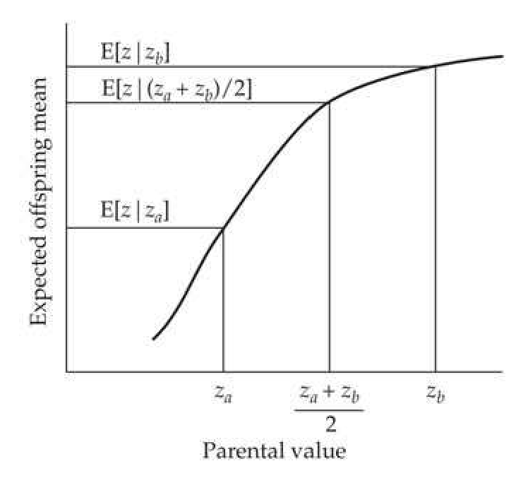
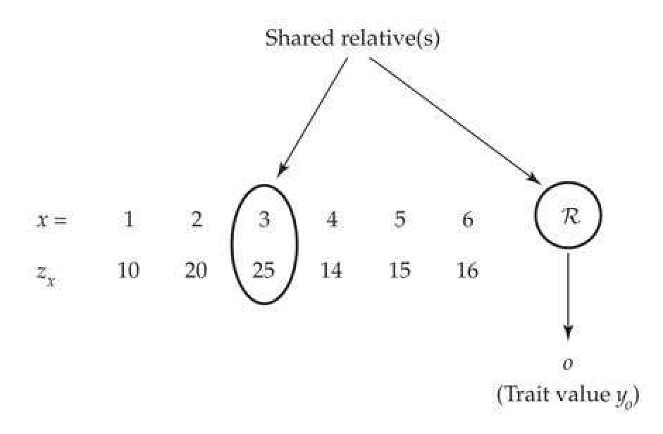

# Chapter 13 · Short-term Changes in the Mean: 1. The Breeder's Equation

## Evolution_chapter13_001 · Short-term Changes in the Mean: 1. The Breeder's Equation: Introduction

Prediction is very difficult, especially if it's about the future. Niels Bohr

The topic of selection on quantitative traits, and its consequences, comprises the remainder of this book. We start by discussing the simplest situation—the expected change in the mean of a single character following a single generation of selection from an unselected base population. This response is reasonably predictable in a wide variety of settings, using a regression framework and the appropriate covariances between relatives. By contrast, the response after a number of generations is much less predictable, as allele- and gametere-frequency change alter genetic variances (and hence the resemblance between relatives) from their initial values. Provided that each locus has only a small effect on the trait, only small allele-frequency changes are expected over the first several generations. In the extreme under the infinitesimal model (the limit of a very large number of loci, each with a vanishingly small effect), the additive genic variance (that part of the additive genetic variance that is independent of any disequilibrium effects) remains essentially unchanged during selection. Short-term response refers to these early generations, where allele-frequency change has a negligible effect on the initial additive variance. As discussed in Chapters 16 and 24, gametic-phase disequilibrium is generated by even a single generation of selection, changing gametic frequencies (and hence genetic variances) even in the absence of allele-frequency change. As detailed in Chapter 16, such short-term changes in the additive variance from disequilibrium are easily computed under the infinitesimal model. Over longer time scales, allele-frequency evolution results in substantial changes in the variance that are extremely difficult to predict; this is the setting for long-term response (Chapters 25–28).

Selection can occur in a myriad of ways. Our focus in this chapter is individual (or mass) selection under random mating, wherein individuals are chosen solely on the basis of their phenotypic value (i.e., information from relatives and other such factor are ignored). Family selection, whereby individuals are chosen based on their family mean and/or ranking within a family, is discussed in Chapter 21. Chapter 22 discusses the setting in which individuals interact in groups (kin selection if they are related) and selection may operate at the individual and/or group level (group selection), while Chapter 23 examines response in inbred populations. Using additional information, such as the trait value in relatives and/or the values of other traits in the focal individual, can improve the accuracy in predicting an individual's breeding value and hence increase the expected selection response relative to individual selection. One way to accomplish this is by index selection, which generalizes to BLUP-based selection (Chapters 19, 20, and 22; LW Chapter 26), both of which, along with a number of other important selection schemes (such as multivariate selection, marker-assisted and genomic selection, selection for outcross performance, pure-line selection, and selection in age-structured populations) are largely deferred until Volume 3.

There is a huge literature on breeding schemes that exploit specific features of the reproductive biology of a target organism (such as artificial insemination in animals and complex crossing schemes in selfing plants). See Lush (1945), Turner and Young (1969), Pirchner (1983), Ollivier (1988), Weller (1994), Cameron (1997), Simm (1998), and Kinghorn et al. (2000) for applications in animal breeding, and Namkoong (1979), Wricke and Weber (1986), Mayo (1987), Stoskopf et al. (1993), Bos and Caligari (1995), Gallais (2003), Hallauer et al. (2010), and Bernardo (2010) for applications in plant breeding.

---

## Evolution_chapter13_002 · SINGLE-GENERATION RESPONSE: THE BREEDER'S EQUATION / The Breeder's Equation: A General Approximation for Response

**[命题 Proposition]**

Previous chapters developed explicit expressions for a single generation of response in the mean of a trait, based on either specific population-genetic models (Equations 5.23c and 5.27b) or completely general covariance-based expressions using Price's theorem (Equations 6.12, 6.39, and 6.40). These results show that either a large number of underlying loci of small effect and/or a linear parent-offspring regression generally will recover the simple breeder's equation

$$
R=h^{2}S
$$

plus correction terms that are often small. This approximation is perhaps the most well-known expression in quantitative genetics, and its myriad of extensions form the backbone of the quantitative-genetic theory of short-term response. Although the actual origin of the breeder's equation is somewhat unclear, elements of it (in multivariate form) appear in the early writings of Pearson (1903), and it was popularized by Lush (1937). Indeed, Ollivier (2008) made the quite reasonable suggestion that it be called the Lush equation. Its simplicity is compelling, as it relates the change in mean across a generation (the response, R) to the product of the within-generation change (the selection differential, S) and a measure of how the character value is passed across generations (the heritability, $ h^{2} $). As discussed in Chapter 6, a necessary (but not sufficient) condition to recover the breeder's equation is a linear parent-offspring regression, with the phenotypic value, $ z_{o} $, of an offspring whose parents have the mean phenotypic value, $ z_{mp} $, given by

$$
z_{o}=\mu+b_{o|m p}(z_{m p}-\mu)+e
$$

where $ b_{o|mp} $ is the slope of the midparent-offspring regression, which in this chapter is usually assumed to be equivalent to the narrow-sense heritability, $ h^2 $ (but is generalized later). If we take the average over all selected parents, then $ E_s[z_{mp} - \mu] = S $, while the difference between the expected value of the offspring from such parents and the overall mean is the selection response, $ R $, which yields

$$
E_{s}[z_{o}-\mu]=R=b_{o|m p}E_{s}[z_{m p}-\mu]=b_{o|m p}S=h^{2}S
$$

Recall (Equation 6.12) that two other technical restrictions are also required to formally obtain $ R = b_{o|mp} S $. First, it is assumed that the residuals of the linear parent-offspring and fitness-phenotype regressions are uncorrelated with each other. Second, it is assumed that the mean does not change in the absence of selection. As will be discussed below, cases do exist in which the mean and/or variance can change under random mating as disequilibrium induced by prior selection decays (Chapters 15 and 16). In our treatment we either assume that these potential complications introduce only very small errors, or we explicitly model their effects (e.g., Chapters 15, 20, 22, and 23).

---

## Evolution_chapter13_003 · SINGLE-GENERATION RESPONSE: THE BREEDER'S EQUATION / The Importance of Linearity

A variety of factors, such as a major gene with dominance, can result in a nonlinear parent-offspring regression (Chapter 6; LW Chapter 17). In such cases, the mean of the selected parents (and hence the selection differential, S) is not sufficient to predict the offspring mean. As Figure 13.1 shows, two selected parental populations with the same mean, but different variances, can have different expected responses when this regression is nonlinear. Even if phenotypes are normally distributed and the character is completely determined by additive loci (no dominance or epistasis), if the underlying distribution of genotypic values is skewed, selection on the variance (e.g., selection for, or against, extreme phenotypes) also results in a change in the mean (see Equation 5.27b). In this case, S is again not sufficient to describe the expected response to selection. While a sufficient condition for linearity is that the joint distribution of breeding and phenotypic values be bivariate normal (LW Chapter 8), selection generally causes the distribution of genotypic values to depart from normality (Chapters 16 and 24), creating at least slight departures from linear parent-offspring regressions. The selection response under strongly nonnormal distributions can be very complicated, depending on summary statistics of the underlying genetic architecture, which do not easily translate into standard (and measurable) variance components (Chapter 24).

> **Figure 13.1** · page 3 · source: `Evolution_chapter13`
>
> 
>
> Figure 13.1 The importance of linearity in the parent-offspring regression. If this regression is nonlinear, different subsets of the population with the same mean can have different offspring means. Suppose equal numbers of parents with values  $ z_a $ and  $ z_b $ are chosen. If we denote the expected value of offspring from parents with value  $ z_x $ by  $ E[z \mid z_x] $, the offspring mean in this case is given by  $ (E[z \mid z_a] + E[z \mid z_b]) / 2 $. In contrast, choosing parents all with value  $ (z_a + z_b) / 2 $ gives the same parental mean as in the case of mixed parents, and hence the same  $ S $, but the expected offspring mean is now  $ E[z \mid (z_a + z_b) / 2] $, which, as shown above, can deviate considerably from  $ E[z \mid z_a] + E[z \mid z_b] / 2 $ when nonlinearity is significant.

---

## Evolution_chapter13_004 · SINGLE-GENERATION RESPONSE: THE BREEDER'S EQUATION / Response is the Change in Mean Breeding Value

Under the infinitesimal model and a linear parent-offspring regression, a key concept is that the response equals the mean breeding value of the selected parents. Recall that (non-inbred, sexually reproducing) parents pass along only a fraction of their total genotypic value, namely, their breeding value, A, to their offspring. Under the infinitesimal model, the expected offspring value is simply the average breeding values of its parents (LW Chapter 4).

Trait improvement by artificial selection is achieved by choosing parents with the most favorable breeding values. The problem is that we cannot completely predict the breeding value of an individual from its phenotype alone (unless $ h^2 = 1 $). Because the phenotype of an individual is an imperfect indicator of its breeding value, the offspring of phenotypically exceptional parents are generally not themselves as exceptional. From standard regression theory (LW Chapter 3), the predicted breeding value, $ \widehat{A} $, for an individual with a phenotypic value of $ z $ (given no other information) is

$$
\begin{align*}\widehat{A}-\mu_A={\sigma(A,z)\over\sigma_z^2}(z-\mu_z)\quad{\rm or}\qquad\widehat{A}=h^2(z-\mu_z)\end{align*}
$$

where $\mu_z$ and $\mu_A$ are the mean phenotype and breeding value, respectively, and $\sigma(A, z)$ is the covariance between the breeding value and the phenotype. This expression follows because the regression $y = a + bx$ can be expressed as $y - \mu_y = b(x - \mu_x)$, where $b = \sigma(x, y)/\sigma_x^2$.

For the regression of $A$ on $z$, the means are $\mu_A = 0$ and $\mu_z$, respectively, while the slope is $\sigma(z, A)/\sigma_z^2 = \sigma_A^2/\sigma_z^2 = h^2$, which follows because

$$
\sigma(z,A)=\sigma(G+E,A)=\sigma(A+D+E,A)=\sigma(A,A)=\sigma_{A}^{2}
$$

The expected breeding value for a set of selected parents thus becomes

$$
E_{s}[\widehat{A}]=E_{s}[h^{2}(z-\mu_{z})]=h^{2}E_{s}[z-\mu_{z}]=h^{2}S
$$

**[命题 Proposition]**

The change in the mean value of their offspring (relative to the base population) is simply the mean breeding value of the selected parents, because (by definition) $ \mu_A = 0 $ in the base population. Thus, the response equals $ h^2 S $, and we recover the breeder's equation. A key assumption is $ E_s[h^2] = h^2 $, namely, that the regression using the selected parents is the same as (or extremely close to) the regression in the absence of selection, an assumption discussed at length in Chapter 6.

---

## Evolution_chapter13_005 · SINGLE-GENERATION RESPONSE: THE BREEDER'S EQUATION / Response Under Sex-Dependent Parent-Offspring Regressions

It is not uncommon for a trait to show different variances between the sexes or to have a less than perfect correlation across the sexes. In such cases, the coefficients for parent-offspring regressions can vary with the sex of both the parents and of the offspring. We denote the phenotypic values of the father and mother by $ z_{fa} $ and $ z_{mo} $ and an offspring by $ z_{o} $ (if its sex is unimportant) or by $ z_{so} $ and $ z_{da} $ for sons and daughters (respectively) if sex is important. Let $ E[z_{o} | z_{fa}, z_{mo}] $ be the expected phenotypic value of an offspring whose parents have phenotypic values $ z_{mo} $ and $ z_{fa} $. The importance of this conditional expectation (the biparental regression) is that the expected character value in the next generation (assuming there are no fertility differences) is the average of this expectation over all selected parents. Taking expectations is straightforward when the biparental regression is linear, i.e.,

$$
E[z_{o}\mid z_{fa},z_{mo}]=\mu_{o}+b_{o,fa}\left(z_{fa}-\mu_{fa}\right)+b_{o,mo}\left(z_{mo}-\mu_{mo}\right)
$$

where $ \mu_{fa} $ and $ \mu_{mo} $ are the mean character values of males and females before selection, and $ \mu_{o} $ is the mean for the offspring sex being considered. Taking the expectation over all selected parents, the expected offspring mean after selection is

$$
\begin{aligned}E_{s}\big[E(z_{o}\mid z_{fa},z_{mo})\big]&=\mu_{o}+b_{o,fa}E_{s}\big[\left(z_{fa}-\mu_{fa}\right)\big]+b_{o,mo}E_{s}\big[\left(z_{mo}-\mu_{mo}\right)\big]\\&=\mu_{o}+b_{o,fa}S_{fa}+b_{o,mo}S_{mo}\end{aligned}
$$

where $ S_{fa} $ and $ S_{mo} $ are the directional selection differentials for fathers and mothers.

Given that Equations 13.2 and 13.3 acknowledge the presence of differences between sexes in regression coefficients, separate equations for sons and daughters are required (e.g., Example 13.1). For example, the expected change in the mean character value of daughters, $ R_{da} $, equals the expected mean of daughters of selected parents minus the mean of females before selection. Applying Equation 13.3,

$$
E_{s}\left[E(z_{d a}\mid z_{f a},z_{m o})\right]=\mu_{m o}+b_{d a,f a}S_{f a}+b_{d a,m o}S_{m o}
$$

implying

$$
R_{da}=b_{da,fa}S_{fa}+b_{da,mo}S_{mo}
$$

where $ b_{da,fa} $ is the regression coefficient of daughters on fathers and $ b_{da,mo} $ is the mother-daughter regression coefficient. Likewise, for sons

$$
R_{s o}=b_{s o,f a}S_{f a}+b_{s o,m o}S_{m o}
$$

**[示例 Example]**

*(See Example 13.1.)*

Equations 13.4a and 13.4b require that the biparental regression be linear, in which case $ b_{o,fa} $ and $ b_{o,mo} $ are partial regression coefficients and can be obtained from the sex-specific covariances between relatives. Again, linearity is ensured if the joint distribution of breeding values in both parents and their offspring is multivariate normal. If there is no correlation between the phenotypes of the parents (which is guaranteed under random mating), the partial regression coefficients are standard univariate regression coefficients (LW Chapter 8) and applying LW Equation 3.14b yields

$$
b_{o,fa}=\frac{\sigma(z_{o},z_{fa})}{\sigma^{2}(z_{fa})}\qquad and\qquad b_{o,mo}=\frac{\sigma(z_{o},z_{mo})}{\sigma^{2}(z_{mo})}
$$

If mating is random, and genotype × environmental interactions, shared environmental effects, epistasis, and sex-specific effects (i.e., the need for separate regression coefficients) can all be neglected, the regression slope (for each parent-offspring combination) is $ b_{o,p} = h^{2}/2 $ (LW Chapters 7 and 17). If we define the total selection differential as the average of both parental values, $ S = (S_{fa} + S_{mo})/2 $, we again will recover the breeder's equation

$$
R=\frac{h^{2}}{2}S_{fa}+\frac{h^{2}}{2}S_{mo}=h^{2}S
$$

Equation 13.5 shows how differential selection on parents is incorporated into the breeder's equation. For example, consider selection on dioecious plants. If plants that form the next generation are chosen after pollination, fathers (pollen donors) are chosen at random with respect to the character under selection ($ S_{fa} = 0 $), yielding $ R = (h^{2}/2)S_{mo} $. If parents are selected before pollination with equal amounts of selection (S) on both sexes, $ R = h^{2}S $. Chapter 21 examines family-based breeding schemes that ensure equal selection on both pollen and seed parents.

Note that the father-son regression has a significantly smaller slope than the three other parent-offspring sex combinations. Other Drosophila examples where the regressions differ significantly between sons and daughters were given by Gimelfarb and Willis (1994).

Suppose that different amounts of selection are applied to fathers and mothers, with selected fathers showing an increase of two bristles, while selected mothers show a decrease of one bristle. What is the expected change in mean bristle number in the male and female offspring using these estimated regression coefficients, assuming all parent-offspring regressions are linear? Here $ S_{mo} = -1 $ and $ S_{fa} = 2 $, and from Equation 13.4a, the expected change in bristle number in females becomes

$$
R_{da}=b_{da,fa}S_{fa}+b_{da,mo}S_{mo}=0.40\left(2\right)+0.32\left(-1\right)=0.48
$$

Likewise, from Equation 13.4b, the expected change in males is

$$
R_{s o}=b_{s o,f a}S_{f a}+b_{s o,m o}S_{m o}=0.13\left(2\right)+0.39\left(-1\right)=-0.13
$$

This expected response of a decrease in males and an increase in females is the exact opposite of the pattern of selection on the sexes.

---

## Evolution_chapter13_006 · SINGLE-GENERATION RESPONSE: THE BREEDER'S EQUATION / The Selection Intensity, $ \bar{\nu} $

While the selection differential (S) is a convenient and simple measure of selection on the mean, it does not tell us the actual strength of selection. Consider selection acting on the same character in two different populations. In one, the largest 5% of measured individuals are allowed to reproduce, while in the second, the largest 25% reproduce. Clearly, selection is more intense in the first population. However, under truncation selection on a normally distributed trait, the selection differentials for these two populations are $ S_1 = 2.06\sigma_1 $ and $ S_2 = 1.27\sigma_2 $, respectively, where $ \sigma_k^2 $ is the phenotypic variance in population k (Equation 14.3a). Thus, if the second population is more variable than the first, it may have the larger selection differential even though it clearly experiences less intense selection.

For this reason, in many applications, a more informative measure of the strength of selection is the selection intensity (or standardized selection differential), which is the selection differential expressed in phenotypic standard deviations

$$
\bar{\imath}=S/\sigma_{z}
$$

and also denoted by $ i $ or $ \imath $ in the literature (we will use $ \bar{\imath} $ throughout to avoid any confusion with $ i $ as an index variable). The selection intensity accounts for differences in the phenotypic variances, in the same way that a correlation coefficient is a better measure of the strength of association than a covariance (LW Chapter 3). Substituting $ \bar{\imath}\sigma_z $ for $ S $ gives the selection-intensity version of the breeder's equation

$$
R=h^{2}\bar{\imath}\sigma_{z}=\bar{\imath}h\sigma_{A}=\sigma_{A}^{2}\bar{\imath}/\sigma_{z}
$$

which follows from

$$
h^{2}\sigma_{z}=\frac{\sigma_{A}^{2}}{\sigma_{z}^{2}}\sigma_{z}=\frac{\sigma_{A}}{\sigma_{z}}\sigma_{A}=h\sigma_{A}
$$

The various forms of Equation 13.6b will prove to be useful starting points for generalizations (developed below) of the breeder's equation to accommodate more general types of selection. A second reason why breeders and experimentalists generally work with $ \bar{i} $ is that specifying the fraction $ (p) $ of adults saved to form the next generation determines the expected value of $ \bar{i} $, and hence $ S = \bar{i}\sigma_z $, in some future selection experiment.

---

## Evolution_chapter13_007 · SINGLE-GENERATION RESPONSE: THE BREEDER'S EQUATION / The Robertson-Price Identity, $ S = \sigma(w, z) $

As introduced in Chapter 6, the selection differential can be written as the covariance between relative fitness and trait value

$$
S=\sigma(w,z)
$$

**[命题 Proposition]**

This is the Robertson-Price identity (Equation 6.10), which was first noted by Robertson (1966a) and later elaborated on by Price (1970, 1972a). Chapter 6 showed how this expression directly follows from Price's theorem. For an alternative derivation, let $ z_i $, $ p_i $, and $ w_i $ be the trait value, frequency before selection, and relative fitness, respectively, of class i. The selection differential is simply the mean after selection minus the mean before

$$
S=\mu_{s}-\mu=\sum z_{i}w_{i}p_{i}-\sum z_{i}p_{i}=E[z w]-E[z]
$$

Because $ E[w] = 1 $ by definition, we can write this as

$$
S=E[z w]-E[z]E[w]=\sigma(w,z)
$$

thus recovering the Robertson-Price identity. The last step follows from the standard definition of a covariance (LW Equation 3.8).

If, instead of considering the phenotypic value $ (z) $ of a trait, we consider its breeding value, $ A_{z} $, then from the Robertson-Price identity, the expected change in breeding value following selection is

$$
\Delta\mu_{A_{z}}=R_{A_{z}}=\sigma(A_{z},w)
$$

**[命题 Proposition]**

Under the conditions of the breeder’s equation, this change in the breeding value in the selected parents equals the change in the offspring mean (Chapter 6), thereby equating this covariance with the response (R) in the phenotypic mean of the trait. Equation 13.7b is the 1966 version of Robertson’s secondary theorem of natural selection (Equation 6.25a). The more restricted 1968 version, $ R = \sigma(A_z, A_w) $, based on the breeding value of relative fitness ($ A_w $ versus w, Equation 6.24a), appears in the literature as well (Chapters 6 and 20). These covariance-based identities for S and R play important roles in evolutionary quantitative genetics. Chapter 20 examines applications of Equation 13.7b in predicting the selection response in natural populations, while Equation 13.7a routinely appears in selection theory (Chapters 15, 20–23, 29, and 30).

An important application of the Robertson-Price identity follows if we consider the slope of the least-squares linear regression of relative fitness $ (w) $ on phenotypic value, z

$$
w=a+\beta z+e
$$

The interpretation of the slope is that a unit change in z results in a change in relative fitness of $ \beta $ (Chapter 29 examines this regression in detail). From the theory of least-squares regression (LW Chapter 3)

$$
\beta=\frac{\sigma(z,w)}{\sigma_{z}^{2}}=\frac{S}{\sigma_{z}^{2}}
$$

Substituting $ S = \sigma_z^2 \beta $ into Equation 13.1 yields

$$
R=\sigma_{A}^{2}\beta
$$

which relates the strength of association, $ \beta $, between trait value and fitness with the response. This is the univariate version of the multivariate Lande equation (R = G $ \beta $), to be introduced shortly (Equation 13.26a).

---

## Evolution_chapter13_008 · SINGLE-GENERATION RESPONSE: THE BREEDER'S EQUATION / Correcting for Reproductive Differences: Effective Selection Differentials

In artificial selection experiments, S is usually estimated as the difference between the mean of the selected adults and the sample mean of the population before selection. However, selection need not stop at this stage. For example, strong artificial selection to increase a character might be countered by natural selection associated with a decrease in the fertility of individuals with extreme trait values. This is the simplest example of a partitioning of episodes of selection (multiple rounds of selection within the same generation), in this case a single episode of viability selection followed by fertility selection, which will be explored more broadly in Chapter 29.

Biases introduced by such differential fertility in experimental or breeding settings can be removed by randomly choosing the same number of offspring from each selected parent, thus ensuring equal fertility. Alternatively, differential fertility can be accounted for by using the effective (or realized) selection differential, $ S_{e} $,

$$
S_{e}=\frac{1}{n_{p}}\sum_{i=1}^{n_{p}}\left(\frac{n_{i}}{\overline{n}}\right)(z_{i}-\mu_{z})
$$

where $ z_i $ and $ n_i $ are the phenotypic value and total number of offspring of the $ i $th parent, $ n_p $ is the number of parents selected to reproduce, $ \bar{n} $ is the average number of offspring from the selected parents, and $ \mu_z $ is the mean before selection. If all selected parents have the same number of offspring ($ n_i = \bar{n} $ for all $ i $), then $ S_e $ reduces to $ S $. If there is variation in the number of offspring among selected parents, $ S_e $ can be considerably different from $ S $.

The derivation of Equation 13.9 follows directly from the Robertson-Price identity. If we examine a total of N individuals, $ n_{p} $ of which are selected as parents, then

$$
S=\sigma(z,w)=E[w z]-E[z]E[w]=\frac{1}{N}\sum_{i=1}^{N}\left(\frac{W_{i}}{\overline{W}}\right)z_{i}-\mu_{z}\cdot1
$$

where the fitness of individual i is $ W_{i} = n_{i} $ (with $ n_{i} = 0 $ for individuals not chosen as parents). The mean fitness becomes

$$
\overline{W}=\frac{1}{N}\sum_{i=1}^{N}n_{i}=\frac{\overline{n}n_{p}}{N}\qquad\mathrm{where}\qquad\overline{n}=\sum_{i=1}^{N}n_{i}/n_{p}
$$

and therefore $ \bar{n} $ is the mean number of offspring left by the adults that were selected to reproduce. Hence

$$
w_{i}=\frac{W_{i}}{\overline{W}}=\frac{n_{i}N}{\overline{n}n_{p}},\quad\mathrm{yielding}\quad\sigma(z,w)=\frac{1}{n_{p}}\sum_{i=1}^{n}z_{i}\frac{n_{i}}{\overline{n}}-\mu_{z}
$$

Rearranging recovers Equation 13.9.

**[示例 Example]**

*(See Example 13.2.)*

---

## Evolution_chapter13_009 · Short-term Changes in the Mean: 1. The Breeder's Equation: Introduction / EXPANDING THE BASIC BREEDER'S EQUATION

The basic breeder’s equation predicts the mean breeding value of the set of parents chosen to form the next generation because of their exceptional phenotypic values. However, breeders, experimentalists, and natural selection all may use additional information in determining the fitness of individuals. For example, one may measure traits in one set of individuals and then use this information to predict the mean breeding value for a second set of related individuals that will be the actual parents of the next generation. One such setting is family selection, wherein one measures the values of a number of family members (for example, by growing seed from a family over a number of environments) and, based on their means, selects the exceptional families. Remnant seeds from these families (i.e., seeds whose phenotypes are not scored) are then used to form the next generation. The prediction of the selection response now involves predicting the breeding value of a family member given the mean of other family members. The breeder's equation is easily extended to these more complex settings, as we now demonstrate. The structure of the general selection problem is given by Figure 13.2.

> **Figure 13.2** · page 9 · source: `Evolution_chapter13`
>
> 
>
> Figure 13.2 The general selection problem: The ultimate goal is to predict the selection response in some response trait (whose values are denoted by y), based on the values of a potentially different—but genetically correlated—selected trait (whose values are denoted by z). The values of the selected trait are measured on one set of individuals (indexed by  $ x_i $). For example, the value  $ (z_x) $ of the selected trait in individual x may be an index that weights  $ x' $'s value for the response trait, as well as the values of the response trait in several of  $ x' $'s relatives. In the figure,  $ x_3 $ has the highest value of the selected trait, but instead of using  $ x_3 $ as a parent for the next generation (which would correspond to individual selection), we instead use a relative,  $ \mathcal{R} $, of  $ x_3 $, with o denoting an offspring from  $ \mathcal{R} $. The covariance required for predicting the mean change in the response trait is  $ \sigma(z_x, y_0) $, namely, the covariance between the selection trait value  $ (z_x) $ in individual x and the response trait value  $ (y_0) $ in the offspring of parent  $ \mathcal{R} $. Under our infinitesimal assumption that the expected value of an offspring is the average of the two parental breeding values, this covariance is also  $ \sigma[z_x, A_y(\mathcal{R})/2] $, half the covariance between the phenotypic value of the selection trait in x and the breeding value for the response trait in  $ x' $'s relative,  $ \mathcal{R} $.

---

## Evolution_chapter13_010 · EXPANDING THE BASIC BREEDER'S EQUATION / Accuracy

Suppose our goal is increased milk production. The top females are easy to score, but with no selection on males (who do not display the trait), Equation 13.5 gives the selection response as $ h^{2}(S/2) $. Selection on males is made possible, however, by choosing brothers of the top-scoring females as the sires for the next generation, as breeding values are correlated between relatives. Predicting selection response in this case depends upon the genetic covariance between the phenotypic value $ (z_{x}) $ of individual x and the phenotypic value $ (z_{o}) $ in a relative $ (o) $ of x. Here, $ z_{x} $ is milk-yield in female x, whose relative, R (her brother), is then used as a parent for the next generation and whose resulting offspring are denoted by o (Figure 13.2).

**[命题 Proposition]**

Figure 13.2 shows the most general setting, where selection is based on one trait (the selected trait), while our interest is the resulting response in another, genetically correlated, trait (the response trait). Let $ z_{x} $ and $ y_{o} $ denote, respectively, the value of the selected trait (z) in a measured individual x (upon which selection decisions are based), and the value of the response trait (y) in the offspring, o. Assuming that the regression of $ y_{o} $ on $ z_{x} $ is linear (i.e., the same assumption as for the breeder's equation), standard regression theory (LW Chapter 3) yields

$$
E[y_{o}-\mu_{y}\mid z_{x}]=\frac{\sigma(z_{x},y_{o})}{\sigma^{2}(z)}\left(z_{x}-\mu_{z}\right)
$$

where $ \mu_{y} $ and $ \mu_{x} $ are the preselection means of the selected and response traits, respectively. Taking expectations over the selected parents gives the expected change in y from selection on x as

$$
R_{y}=\mu_{y}^{**}-\mu_{y}=\frac{\sigma(z_{x},y_{o})}{\sigma^{2}(z)}(\mu_{z}^{*}-\mu_{z})=\frac{\sigma(z_{x},y_{o})}{\sigma^{2}(z)}S_{z}=\frac{\sigma(z_{x},y_{o})}{\sigma(z)}\bar{\imath}_{z}
$$

where $ \mu^* $ denotes the within-generation change in the mean following selection (but before reproduction), $ \mu^{**} $ denotes the offspring mean, and $ \bar{z} $ is the selection intensity used when choosing parents. The latter is a function of the fraction, p, of measured individuals chosen to have a relative as a parent of the next generation. For example, if brothers from only the top 5% of females are used, then $ p = 0.05 $, yielding $ \bar{z} \simeq 2.06 $ (Example 14.1).

The selection-intensity version of Equation 13.10b can alternatively be expressed as

$$
R_{y}=\frac{\sigma(z_{x},y_{o})}{\sigma(z)}\bar{\imath}_{z}=\frac{\sigma(z_{x},y_{o})}{\sigma(z)\sigma(y)}\bar{\imath}_{z}\sigma(y)=\bar{\imath}_{z}\rho(z_{x},y_{o})\sigma(y)
$$

where $ \rho(z_x, y_o) $ is the correlation between $ z_x $ and $ y_o $. This correlation is referred to as the accuracy in predicting the value of the response trait measured in $ o(y_o) $ from the selected trait measured in $ x(z_x) $. One immediately sees that by improving the accuracy of our selection scheme, we improve the response. Expressing Equation 13.11a in terms of the relative response, the change in $ y $ in phenotypic standard deviations, gives the expected change in the response trait when using the selected trait measure in a relative as

$$
\frac{R_{y}}{\sigma(y)}=\bar{\imath}_{z}\rho(z_{x},y_{o})
$$

**[命题 Proposition]**

A more powerful way of viewing Equation 13.11a is in terms of the breeding values, $ A_{y} $, for the trait of interest. Under the assumption (used throughout this chapter) that the expected mean of the offspring equals the average breeding values of its parents (Chapter 6 examined this assumption in detail), the mean of the response trait in the offspring is simply the mean breeding value of this trait in the parents. Hence, $ R_{y} = R_{A_{y}} $, namely, the difference between the mean breeding value for the response trait in the selected parents versus that for the overall population. By taking the response trait to be the breeding value, $ A_{y} $, of the trait of interest, Equation 13.11a becomes

$$
R_{A_{y}}=\bar{\imath}_{z}\rho(z_{x},A_{y})\sigma(A_{y})
$$

Hence, the breeder’s equation can be considered as a special case of the more general expression

$$
Response=(Intensity)\cdot(Accuracy in predicting breeding value using z_{x})\cdot(Usable variation)
$$

An accuracy of special interest that arises during individual selection is the correlation between an individual's phenotype (z) and breeding value (A), where

$$
\rho(z,A)=\sigma(z_{x},A_{x})/(\sigma_{z}\sigma_{A})=\sigma_{A}^{2}/(\sigma_{z}\sigma_{A})=\sigma_{A}/\sigma_{z}=h
$$

This accuracy corresponds to individual selection (x is the parent, x = R; and the selected and response traits are the same, y = z). When substituted into Equation 13.11c, this recovers Equation 13.6b. As illustrated in Example 13.4, this is a key result, as whether some proposed selection scheme is more efficient than individual selection depends on the correlation between the breeding value of a chosen parent and the selection variable used for that scheme (e.g., $ z_{x} $ could be $ x' $s family mean of the response trait). If this correlation exceeds h, then from Equation 13.11c (because $ \bar{i} $ and $ \sigma^{2}[A] $ are the same), the response is larger. Equations 13.11a through 13.11c form the foundation for most of Chapter 21, which deals with various selection schemes using family information (e.g., family means and within-family deviations).

The greatest selection response occurs if we take the selection variable $ (z_x) $ with the largest correlation with the breeding value for the response trait (assuming $ \bar{i} $ and $ \sigma_A $ are the same over all comparisons). This idea forms the foundation of index selection, whereby individuals are chosen based on some index, $ z_x = \sum a_i z_i $, a linear combination of trait values in the relatives and/or correlated traits in the focal individual (Volume 3).

**[示例 Example]**

*(See Example 13.3.)*

**[示例 Example]**

*(See Example 13.4.)*

**[示例 Example]**

*(See Example 13.5.)*

---

## Evolution_chapter13_011 · EXPANDING THE BASIC BREEDER'S EQUATION / Reducing Environmental Noise: Stratified Mass Selection

Accuracy (and hence response) can also be increased by using designs that reduce environmental noise. One approach is Gardner's (1961) method of stratified mass selection: a population is stratified into a number of blocks (potentially representing different microenvironments) and selection occurs within each block. The motivation behind Gardner's method was to improve individual selection for yield in maize. At the time of his paper, selection based solely on the observed yield of individual plants resulted in a very poor response, largely because environmental effects overwhelm genetic differences, resulting in very small $ h^{2} $ values. Simply by selecting for plants within blocks of presumably similar environments, Gardner was able to use mass selection to obtain fairly significant gains (about 4% per year). Stratified mass selection is an important component in Burton's (1974, 1982) method of recurrent restricted phenotypic selection (RRPS) for turf grass breeding.

To obtain the expected response under stratified mass selection, we need to compute the accuracy, which first requires the covariance between within-block deviations and an individual's breeding value. Suppose $n$ individuals are measured within each block, and selection occurs on the deviation from the block mean, e.g., on $z_{ij} - \overline{z}_i$ where $z_{ij}$ is the $j$th individual from block $i$ and $\overline{z}_i$ is the block mean. An individual's phenotypic value can be expressed as its genotypic value, $G_{ij}$ (indicating the $j$th individual from block $i$), plus an environmental value consisting of a block effect, $B_i$, and the residual environmental value, $e_{ij}$,

$$
z_{ij}=\mu+G_{ij}+B_{i}+e_{ij}
$$

The total environmental variance equals the variance among blocks, $ \sigma_{B}^{2} $, plus the within-block variance, $ \sigma_{e}^{2} $ (the variance of the residuals $ e_{ij} $), resulting in a total variance of

$$
\sigma_{z}^{2}=\sigma_{G}^{2}+\sigma_{E}^{2}=\sigma_{G}^{2}+\sigma_{B}^{2}+\sigma_{e}^{2}
$$

**[命题 Proposition]**

For the jth individual in block i, the covariance between individual breeding value and within-block deviation is

$$
\sigma(z_{ij}-\overline{z}_{i},A_{ij})=\sigma(z_{ij},A_{ij})-\frac{1}{n}\sum_{k=1}^{n}\sigma(z_{ik},A_{ij})=\sigma_{A}^{2}\left(1-\frac{1}{n}\right)
$$

as the assumption is that individuals within blocks are unrelated. The variance of deviations within a block is $ \sigma_G^2 + \sigma_e^2 $, making the accuracy

$$
\rho(z_{ij}-\overline{z}_{i},A_{ij})=\frac{\sigma_{A}^{2}(1-1/n)}{\sigma_{A}\sqrt{\sigma_{G}^{2}+\sigma_{e}^{2}}}=\frac{\sigma_{A}(1-1/n)}{\sqrt{\sigma_{G}^{2}+\sigma_{e}^{2}}}
$$

Applying Equation 13.11c yields a the resulting response of

$$
R=\bar{\imath}\rho(z_{i j}-\overline{z}_{i},A_{i j})\sigma_{A}=\frac{\bar{\imath}\sigma_{A}^{2}(1-1/n)}{\sqrt{\sigma_{G}^{2}+\sigma_{e}^{2}}}\simeq\frac{\bar{\imath}\sigma_{A}^{2}}{\sqrt{\sigma_{G}^{2}+\sigma_{e}^{2}}}
$$

where $ \bar{\imath} $ is the selection intensity within blocks, and the final approximation assumes a large n.

In contrast, if the effects of blocks are ignored and individuals are simply selected from the entire population, the between-block variance is incorporated into the variance of z, and from Equation 13.6b the response becomes

$$
R=\frac{\bar{\imath}\sigma_{A}^{2}}{\sqrt{\sigma_{G}^{2}+\sigma_{B}^{2}+\sigma_{e}^{2}}}
$$

The relative advantage of stratification (assuming the block size is modest to large, so that $ 1 - 1/n \simeq 1 $) is

$$
\sqrt{\frac{\sigma_{G}^{2}+\sigma_{B}^{2}+\sigma_{e}^{2}}{\sigma_{G}^{2}+\sigma_{e}^{2}}}=\sqrt{1+\frac{\sigma_{B}^{2}}{\sigma_{G}^{2}+\sigma_{e}^{2}}}
$$

Thus, within-block selection can significantly improve the selection response when the among-block variance accounts for a significant fraction of the total variation. Schutz and Cockerham (1966) extend this idea of selecting within blocks to a number of other designs.

---

## Evolution_chapter13_012 · EXPANDING THE BASIC BREEDER'S EQUATION / Reducing Environmental Noise: Repeated-Measures Selection

The repeated-measures design is a second example of increasing accuracy (and response) by providing some control over environmental noise. Here the character of interest is measured n different times on each individual, and selection occurs on $ \overline{z}_{i} $, the mean value for individual i. For example, if we are considering the number of days to ripening, a better approach is to use a collection of fruit, rather than a single one, to assign a value to an individual tree. Repeated-measures selection is a common design in behavioral experiments, wherein a single measure (such as wheel-running speed) may vary greatly within an individual over time.

Our analysis depends on the repeatability (LW Chapter 6) of the trait. The character value for the jth measure of individual i is decomposed as

$$
z_{ij}=G_{i}+E_{i}+e_{ij}
$$

where $ G_i $ and $ E_i $ are the genotypic and (permanent) environmental values common to all measures of $ i $, and $ e_{ij} $ is the special environmental value restricted to the $ j $th measure of $ i $, with the repeatability, $ r $, being defined as

$$
r=\frac{\sigma_{G}^{2}+\sigma_{E}^{2}}{\sigma_{z}^{2}}=1-\frac{\sigma_{e}^{2}}{\sigma_{z}^{2}}
$$

yielding

$$
r\sigma_{z}^{2}=\sigma_{G}^{2}+\sigma_{E}^{2}\quad and\quad(1-r)\sigma_{z}^{2}=\sigma_{e}^{2}
$$

To obtain the accuracy in using $ \overline{z}_{i} $ to predict $ A_{i} $, we need both the covariance between $ \overline{z}_{i} $ and $ A_{i} $, and the variance of $ \overline{z}_{i} $. The former is simply

$$
\sigma(A_{i},\overline{z}_{i})=\sigma\left(A_{i},\frac{1}{n}\sum_{j=1}^{n}z_{ij}\right)=\frac{1}{n}\sum_{j=1}^{n}\sigma(A_{i},z_{ij})=\frac{1}{n}n\sigma(A_{i},A_{i})=\sigma_{A}^{2}
$$

To obtain the variance of $ \overline{z}_{i} $, starting with

$$
\overline{z}_{i}=\frac{1}{n}\sum_{j=1}^{n}z_{ij}=G_{i}+E_{i}+\frac{1}{n}\sum_{j=1}^{n}e_{ij}
$$

$$
\begin{aligned}\sigma^{2}\left(\overline{z}_{i}\right)&=\sigma_{G}^{2}+\sigma_{E}^{2}+\sigma_{e}^{2}/n\\&=\sigma_{z}^{2}r+\sigma_{z}^{2}\frac{1-r}{n}=\sigma_{z}^{2}\left(\frac{1+(n-1)r}{n}\right)\end{aligned}
$$

it immediately follows from Equation 13.16c that

The resulting accuracy in using $ \overline{z}_{i} $ to predict $ A_{i} $ becomes

$$
\rho(\overline{z}_{i},A_{i})=\frac{\sigma(A_{i},\overline{z}_{i})}{\sigma_{A}\sigma(\overline{z}_{i})}=\frac{\sigma_{A}^{2}}{\sigma_{A}\sqrt{\sigma_{z}^{2}\left(\frac{1+(n-1)r}{n}\right)}}=h\sqrt{\frac{n}{1+(n-1)r}}
$$

giving the response as

$$
R=\bar{\imath}\rho(\overline{z}_{i},A_{i})\sigma_{A}=\bar{\imath}h\sqrt{\frac{n}{1+(n-1)r}}\sigma_{A}
$$

The ratio of accuracies under repeated-measures versus (single-measure) mass selection becomes

$$
\frac{\rho(\overline{z}_{i},A_{i})}{\rho(z_{i},A_{i})}=\sqrt{\frac{n}{1+(n-1)r}}
$$

which approaches $ 1/\sqrt{r} $ for large values of $ n $. Hence, when repeatability is low ($ \sigma_e^2 \gg \sigma_G^2 + \sigma_E^2 $), repeated-measures selection can result in a considerable improvement in response.

This comparison assumes the same selection intensity under single- versus repeated-measures selection, but one might imagine that they could differ. For example, if one has the time and resources to only score 500 individuals, and (for breeding reasons) must keep (at least) 50 parents, then the fraction to be saved can be as small as 50/500 = 10% under single-measure selection. However, with five replicate measures per individual, we can only score 100 individuals, if we are to save a fraction no smaller than 50/100 = 50%. Applying Equation 14.4c, these translate into selection intensities of $ \bar{\imath}_{\overline{z}_{i}} = 0.79 $ for repeated-measures selection and $ \bar{\imath}_{z_{i}} = 1.75 $ for single-measures selection, respectively. Such differences in the potential selection intensity are easily incorporated into comparisons of different selection strategies, with the comparison now being

$$
\frac{R_{\overline{z}_{i}}}{R_{z_{i}}}=\frac{\overline{\imath}_{\overline{z}_{i}}}{\overline{\imath}_{z_{i}}}\sqrt{\frac{n}{1+(n-1)r}}
$$

Finally, we note that our analysis of repeated-measures selection assumes that the additive-genetic correlation across individual measurements is 1.0, which is expected for many traits. However, if measures are sufficiently separated in time that age effects are important, or if they represent significantly distinct events (such as litter size at different parities, i.e., distinct litters), these correlations can be less than one. In other words, the traits measured at different ages may not be the same genetically. In such cases, one should treat these measurements as a set of correlated traits and use index-selection theory (Volume 3). With measurements at arbitrary time points that may differ over individuals, the method of random regression (Volume 3) is used.

**[示例 Example]**

*(See Example 13.6.)*

---

## Evolution_chapter13_013 · EXPANDING THE BASIC BREEDER'S EQUATION / Adjustments for Overlapping Generations

Thus far, we have been assuming that we are examining nonoverlapping generations, with all parents reproducing in a discrete single generation. However, domesticated animals, perennial plants, and many species in nature can have offspring over multiple years and for varying life spans. In such cases, generations overlap and the selection response should be considered on an absolute time scale (typically years) rather than a per-generation scale. To express the breeder's equation in terms of a yearly rate of response, we first need to compute the generation intervals, $ L_x $ (the average age of parents when progeny are born), for both sexes.

Assuming that the variance components are independent of age and sex, the yearly rate of response, $ r_{y} $, can be expressed as

$$
r_{y}=\left(\frac{\bar{\imath}_{s}+\bar{\imath}_{d}}{L_{s}+L_{d}}\right)h^{2}\sigma_{z}=\left(\frac{\bar{\imath}_{s}+\bar{\imath}_{d}}{L_{s}+L_{d}}\right)h\sigma_{A}
$$

where $ \bar{i}_{s} $ and $ \bar{i}_{d} $ denote the selection intensities of the sire (father) and dam (mother). This result (in a slightly different form) is from Rendel and Robertson (1950), although the basic idea traces back to Dickerson and Hazel (1944). Thus, one way to increase the rate of response is to reduce the generation intervals, for example, by using younger parents. However, the problem here is that there is a tradeoff between generation interval and selection intensity. In species that are reproductively limited (with few offspring per dam), using younger dams means that a higher fraction of the dams must be kept to replace the population. As a consequence, the selection intensity on the parents is reduced. Equation 13.20 is an asymptotic result, as it takes time for the selection response to propagate through an age-structured population. Volume 3 examines the effects of age structure on selection response in greater detail.

**[示例 Example]**

*(See Example 13.7.)*

---

## Evolution_chapter13_014 · EXPANDING THE BASIC BREEDER'S EQUATION / Maximizing Response Under the Breeder's Equation

We can combine both the selection accuracy (Equations 13.11c) and generation-interval (Equation 13.20) versions of the breeder's equation to give a more general expression, with the expected rate of response being

$$
r_{y}=\left(\frac{\bar{\imath}_{s}+\bar{\imath}_{d}}{L_{s}+L_{d}}\right)\rho(A,x)\sigma_{A}
$$

where x is the measure used to choose the parents to form the next generation. Even more generally, if the accuracies vary over sex

$$
r_{y}=\left(\frac{\bar{\imath}_{s}\rho_{s}(A,x)+\bar{\imath}_{d}\rho_{d}(A,x)}{L_{s}+L_{d}}\right)\sigma_{A}
$$

Beyond importing new genetic material, there is not much a breeder can do to increase $ \sigma_{A}^{2} $, which leaves three selection features that the breeder has some control over (Dickerson and Hazel 1944; Kinghorn et al. 2000): (i) selection intensity, $ \bar{\nu} $

(ii) generation interval, L

(iii) selection accuracy, $ \rho $

The response rate increases with $ \rho $ and $ \bar{\imath} $, and it decreases with increasing values of L. We have already discussed tradeoffs between L and $ \bar{\imath} $, and there are similar tradeoffs between L and $ \rho $. Clearly, the longer we wait to allow a parent to reproduce, the more accurately we can predict its breeding value, as information from other relatives and from progeny testing accumulates over time. However, these increases in $ \rho $ also result in increases in L. An optimal selection program must balance all of these competing interests.

Equation 13.21 highlights the importance to animal breeding of advances in reproductive technologies such as artificial insemination (AI) and multiple ovulation embryo transfer (MOET) schemes (e.g., Woolliams 1989). The more offspring a parent can produce, the stronger is the selection intensity that can be applied while still keeping a fixed number of animals in a population. AI has resulted in the potential for far greater sire selection intensities (but as a side effect, far more inbreeding) than would be possible under natural insemination. Likewise, MOET schemes that increase the number of offspring from females allow for increases in the selection intensity on dams as well as decreases in the generation interval.

Equation 13.21a is also highly relevant to genomic selection (wherein high-density marker information is used to predict the values of offspring; Volume 3). The gain from genomic selection is generally not the result of an increased accuracy, $ \rho $, when using marker information, but rather from much quicker and earlier scoring of phenotypes, which lowers L and increases $ \bar{i} $.

**[示例 Example]**

*(See Example 13.8.)*

---

## Evolution_chapter13_015 · EXPANDING THE BASIC BREEDER'S EQUATION / Maximizing the Economic Rate of Response

Example 13.8 hints at another important feature of the selection response, economics. Notice that by scoring more than 12 offspring, we can obtain a larger expected rate of response using progeny testing (assuming equal selection intensities). Why not simply score 30 progeny, giving a 122% rate of response relative to simple mass selection? The economic reality relates to the cost of a raising and scoring a large number of progeny. Much of applied breeding is concerned with the economic rate of response—trying to maximize the rate of response per unit of capital, although this point is often underappreciated, even by some breeders. Along these same lines, much of current selection in animal breeding is for increased efficiency (conversion of resources into desirable traits), and hence greater economic gain per unit of input at the production level. Weller (1994) presented a nice development of how to incorporate economics into breeding.

---

## Evolution_chapter13_016 · EXPANDING THE BASIC BREEDER'S EQUATION / Mean- Versus Variance-Standardized Response

As was the case with the selection differential, S, in order to assess the relative strength of response one needs some sort of standardization. One obvious approach is to express the response in units of phenotypic standard deviations (variance-standardization). From Equation 13.6b,

$$
\frac{R}{\sigma_{z}}=h^{2}\bar{\imath}
$$

implying that a (scaled) strength of selection of $ \bar{\imath} = 1/h^2 $ is required for a standard deviation of response. For example, with $ h^2 = 0.25 $, a total selection intensity of $ \bar{\imath} = 4 $ is required to achieve a total response of one phenotypic standard deviation. Example 14.1 shows that $ \bar{\imath} = 2.06 $ for truncation selection saving the upper 5%, so that only two generations of such selection are required for a one standard deviation change in the trait mean.

While scaling traits in units of phenotypic standard deviations is extremely common, it can potentially be rather misleading (Houle 1992; Houle et al. 2011). To see this, imagine two traits, both with a standard deviation of 2.0. Trait one has a mean of 10 and trait two has a mean of 100. A response of one standard deviation increases trait one by 20%, but trait two by only 2%. From a variance-standardized viewpoint, the response is equal, but as a proportional response of the total mean, trait one has clearly experienced a stronger response.

Houle and colleagues (Houle 1992; Hansen et al. 2003; Hansen et al. 2011; Houle et al. 2011) argued that using mean-standardization, $ R/\mu_{z} $, namely the proportional amount of response, is often more appropriate. Again using Equation 13.6b,

$$
\frac{R}{\mu_{z}}=\bar{\imath}h\frac{\sigma_{A}}{\mu_{z}}=\bar{\imath}h C V_{A}
$$

where $ CV_A = \sigma_A / \mu_z $, the coefficient of additive genetic variation, is Houle's (1992) evolvability index, which he argued was a better measure of evolutionary potential than $ h^2 $ (Chapter 6). Houle (1992) and Hansen et al. (2011) found that $ h^2 $ is essentially uncorrelated with evolvability, so that a trait with a lower $ h^2 $ could still have high evolvability (i.e., potential for a significant proportional change in the mean), and vice versa.

---

## Evolution_chapter13_017 · Short-term Changes in the Mean: 1. The Breeder's Equation: Introduction / BLUP SELECTION

LW Chapter 26 introduced the basic mixed model for estimating a vector, a, of breeding values for a set of individuals given some vector, y, of records (observations), a relationship matrix, A, connecting individuals with records with individuals whose breeding values are of interest, and a set, $ \beta $, of fixed effects to estimate

$$
\mathbf{y}=\mathbf{X}\boldsymbol{\beta}+\mathbf{Z}\mathbf{a}+\mathbf{e},\quad\mathbf{a}\sim MVN(\mathbf{0},\sigma_{A}^{2}\cdot\mathbf{A}),\quad\mathbf{e}\sim MVN(\mathbf{0},\sigma_{e}^{2}\cdot\mathbf{I})
$$

where (as detailed in Chapters 19 and 20) the matrices X and Z are given from the data (relating which observations contribute information to which fixed and random effects), and A is obtained from the pedigree or from sufficiently dense genetic markers. Solving the model returns a vector, $ \hat{a} $, of BLUP (best linear unbiased prediction) breeding values.

Much of modern animal breeding (and a growing amount of plant breeding) is based on using BLUP estimates to select individuals with the highest breeding values for the trait to form the next generation. This is called BLUP selection. The expected response is simply given by the difference between the mean breeding value of selected parents and the population from which they were chosen. This is an extremely flexible methodology, with all of the examples in this chapter being special cases of this general approach. Indeed, provided relatives are measured, BLUP can be used to predict the breeding value of individuals with no phenotypic values (such as milk production in sires). Relatedness information for all measured individuals enters through A, and multiple records (repeated measurements) from the same individual are easily incorporated, as are additional fixed (and random) factors such as plot, location, and herd effects. Further, the effects of age structure are fully accounted for by the relationship matrix A. Chapters 19, 20, and 22 discuss features of BLUP estimation of breeding values, while more technical details (such as maximal avoidance of inbreeding) are deferred until Volume 3 (also see Henderson 1984; Simm 1998; Bernardo 2010; and Mrode 2014).

---

## Evolution_chapter13_018 · Short-term Changes in the Mean: 1. The Breeder's Equation: Introduction / THE MULTIVARIATE BREEDER'S EQUATION

Expressing the heritability in terms of additive-genetic and phenotypic variances, the breeder’s equation can be written as

$$
R=\sigma_{A}^{2}\sigma_{z}^{-2}S
$$

While this decomposition seems rather trivial, it suggests (as we formally show in Volume 3) that its multivariate version (under appropriate linearity assumptions) is given by

$$
\mathbf{R}=\mathbf{G}\mathbf{P}^{-1}\mathbf{S}
$$

where R and S are the vectors of responses and selection differentials for each character, and G and P are the additive-genetic and phenotypic covariance matrices (LW Chapter 21), with

$$
P_{ij}=\sigma(z_{i},z_{j})\qquad and\qquad G_{ij}=\sigma(A_{i},A_{j})
$$

Here, we briefly consider a few features of Equation 13.23b; we examine its full range of consequences and applications at length in Volume 3. As an aside, note that Equation 13.23b breaks the standard convention that vectors (here $ \mathbf{R} $ and $ \mathbf{S} $) are usually written as lower case bold letters. This is to conform with the standard notation for these two vectors in the literature.

**[Table]**

*[See Table 13.1 at the end of this section.]*

> **Table 13.1** · `13.1` · page 24 · source: `Evolution_chapter13_018`
> Table 13.1 Alternate versions and extensions of the basic breeder's equation. Refer to the specific equation number for discussion and explanation of the symbols.
>
> Version | Expression | Equation Number
> --- | --- | ---
> Basic breeder's equation | $ R = h^{2}S $ | 13.1
> Sex-specific response (sex s) | $ R_{s} = b_{s,fa}S_{fa} + b_{s,mo}S_{mo} $ | 13.4
> Selection intensity | $ R = h^{2}\bar{i}\sigma_{z} = \bar{i}h\sigma_{A} = \sigma_{A}^{2}\bar{i}/\sigma_{z} $ | 13.6b
> Response (in trait y, selection using x) | $ R_{y} = \frac{\sigma(x,y)}{\sigma_{x}^{2}}S_{x} = \frac{\sigma(x,y)}{\sigma_{x}}\bar{i}_{x} $ | 13.10b
> Accuracy (in trait y, selection using x) | $ R_{y} = \bar{i}_{x}\sigma_{y}\rho(x,y) $ | 13.11a
> Accuracy (breeding values) | $ R = \bar{i}_{x}\rho(x,A)\sigma_{A} $ | 13.11c
> Rate of response (per year) | $ r_{year} = \left(\frac{\bar{i}_{s} + \bar{i}_{d}}{L_{s} + L_{d}}\right)h\sigma_{A} $ | 13.20
> Rate of response using accuracy | $ r_{year} = \left(\frac{\bar{i}_{s} + \bar{i}_{d}}{L_{s} + L_{d}}\right)\rho(A,x)\sigma_{A} $ | 13.21
> Variance-standardized response | $ R/\sigma_{z} = h^{2}\bar{i} $ | 13.22a
> Mean-standardized response | $ R/\mu_{z} = \bar{i}hCV_{A} $ | 13.22b
> Robertson's secondary theorem |  |
> 1966 version | $ R = \sigma(w,A_{z}) $ | 13.7b
> 1968 version | $ R = \sigma(A_{w},A_{z}) $ | 6.24a
> Univariate Lande equation | $ R = \sigma_{A}^{2}\beta $ | 13.8c
>  | $ R = \sigma_{A}^{2}\frac{\partial\ln\overline{W}}{\partial\mu} $ | 13.27a
> Multivariate breeder's equation | $ R = \mathbf{GP}^{-1}\mathbf{S} $ | 13.23b
> Multivariate Lande equation | $ R = \mathbf{G}\beta $ | 13.26a
>  | $ R = \mathbf{G}\frac{\partial\ln\overline{W}}{\partial\mu} $ | 13.27c

---

## Evolution_chapter13_019 · THE MULTIVARIATE BREEDER'S EQUATION / Response With Two Traits

One expects that selection is always acting on more than a single trait, as even with strong artificial selection on a single character, natural selection is likely operating on other traits as well. What risks do we run by ignoring this expectation and treating selection as a univariate problem? While this is examined much more fully in Volume 3, we can gain significant insight by considering the simple case of two traits, both of which are potentially under selection. Equation 13.23b gives the expected vector of responses as

$$
\mathbf{R}=\begin{pmatrix}R_{1}\\ R_{2}\end{pmatrix}=\mathbf{G}\mathbf{P}^{-1}\mathbf{S}=\begin{pmatrix}G_{11}&G_{12}\\ G_{12}&G_{22}\end{pmatrix}\begin{pmatrix}P_{11}&P_{12}\\ P_{12}&P_{22}\end{pmatrix}^{-1}\begin{pmatrix}S_{1}\\ S_{2}\end{pmatrix}
$$

Using LW Equation 8.11 to compute the inverse of P, and, recalling for a covariance that $ P_{12} = \rho_{z} \sqrt{P_{11} P_{22}} $, where $ \rho_{z} $ is the phenotypic correlation between the two traits, yields

$$
\begin{aligned}\mathbf{P}^{-1}\mathbf{S}&=\frac{1}{P_{11}P_{22}-P_{12}^{2}}\begin{pmatrix}P_{22}&-P_{12}\\ -P_{12}&P_{11}\end{pmatrix}\begin{pmatrix}S_{1}\\ S_{2}\end{pmatrix}\\&=\frac{1}{P_{11}P_{22}(1-\rho_{z}^{2})}\begin{pmatrix}S_{1}P_{22}-S_{2}P_{12}\\ -S_{1}P_{12}+S_{2}P_{11}\end{pmatrix}\end{aligned}
$$

Substituting into Equation 13.24a and recalling that $ h_{i}^{2} = G_{ii} / P_{ii} $, the response in trait one becomes

$$
\begin{aligned}R_{1}&=\frac{1}{P_{11}P_{22}(1-\rho_{z}^{2})}\left(G_{11}\quad G_{12}\right)\left(\begin{aligned}&S_{1}P_{22}-S_{2}P_{12}\\&-S_{1}P_{12}+S_{2}P_{11}\end{aligned}\right)\\&=\frac{G_{11}\left(S_{1}P_{22}-S_{2}P_{12}\right)+G_{12}\left(-S_{1}P_{12}+S_{2}P_{11}\right)}{P_{11}P_{22}(1-\rho_{z}^{2})}\\&=\frac{h_{1}^{2}}{\left(1-\rho_{z}^{2}\right)}\left(S_{1}-S_{2}\frac{P_{12}}{P_{22}}\right)+\frac{G_{12}\left(-S_{1}P_{12}+S_{2}P_{11}\right)}{P_{11}P_{22}(1-\rho_{z}^{2})}\end{aligned}
$$

with an analogous expression for $ R_2 $. The breeder's equation is recovered only when trait one is phenotypically $ (P_{12} = \rho_z = 0) $ and genetically $ (G_{12} = 0) $ uncorrelated with trait two. As we now demonstrate, this complicated expression masks the rather different roles played by phenotypic and genetic correlations, impacting (respectively) the within- and between-generation changes. Volume 3 examines these points in some detail.

---

## Evolution_chapter13_020 · THE MULTIVARIATE BREEDER'S EQUATION / Accounting for Phenotypic Correlations: The Selection Gradient

Recall from Equation 13.8b that the univariate directional selection gradient, $ \beta = S/\sigma_z^2 $, is the slope of the linear regression of relative fitness, $ w $, as a function of the phenotypic value, $ z $, of the trait (Equation 13.8a). The multivariate extension is given by

$$
\boldsymbol{\beta}=\mathbf{P}^{-1}\mathbf{S}
$$

where the vector $ \boldsymbol{\beta} = (\boldsymbol{\beta}_1, \cdots, \boldsymbol{\beta}_n)^T $ contains the coefficients for the multiple linear regression

$$
w=a+\sum_{i}\beta_{i}z_{i}+e=a+\beta^{T}\mathbf{z}+e
$$

of relative fitness, w, on the vector, z, of trait values (LW Equation 8.10c). The interpretation of $ \beta_i $ is that it represents the change in relative fitness given a one unit change in trait i while holding all other trait values constant. In other words, $ \beta_i $ measures the amount of direct selection on trait i, removing any indirect effects from selection on phenotypically correlated traits included in the analysis, i.e., all traits in the vector z (Chapter 30). Because $ \beta = P^{-1}S $, then $ \mathbf{S} = \mathbf{P}\beta $, resulting in an observed selection differential of

$$
S_{i}=P_{ii}\beta_{i}+\sum_{j\neq i}P_{ij}\beta_{j}
$$

The within-generation change, $S_i$, in the mean of trait $i$ following selection thus consists of an effect from direct selection on that trait ($P_{ii}\beta_i$) plus the effects of selection on all other phenotypically correlated traits ($P_{ij}\beta_j \neq 0$). Hence, the sign of $S_i$ tells us nothing about the sign of $\beta_i$ (the amount of direct selection on that trait), as correlated selection ($P_{ij}\beta_j$ terms) can easily overpower the direct effect. The selection gradient, $\beta$, presents the correct picture of which traits are under selection, provided there are no additional traits under direct selection that are phenotypically correlated with our focal vector, z, of traits (Chapter 30).

---

## Evolution_chapter13_021 · THE MULTIVARIATE BREEDER'S EQUATION / Accounting for Genetic Correlations: The Lande Equation

To see the effects of genetic correlations, substituting $ \mathbf{P}^{-1}\mathbf{S} = \beta $ into Equation 13.23b gives the Lande equation (Lande 1979a),

$$
\mathbf{R}=\mathbf{G}\boldsymbol{\beta}
$$

which is the multivariate version of Equation 13.8c, $ R = \sigma_A^2 \beta $. Considering two traits, using the Lande equation

$$
\mathbf{R}=\begin{pmatrix}R_{1}\\ R_{2}\end{pmatrix}=\mathbf{G}\boldsymbol{\beta}=\begin{pmatrix}G_{11}&G_{12}\\ G_{12}&G_{22}\end{pmatrix}\begin{pmatrix}\beta_{1}\\ \beta_{2}\end{pmatrix}
$$

yields greatly simplified expressions (relative to Equation 13.24c) for the responses

$$
R_{1}=G_{11}\beta_{1}+G_{12}\beta_{2}
$$

$$
R_{2}=G_{12}\beta_{1}+G_{22}\beta_{2}
$$

The role of genetic correlations $ (G_{12}) $ is now obvious, in that direct selection on trait two $ (\beta_2 \neq 0) $ influences the response (between-generation change) in trait one only when the two traits have a nonzero genetic correlation $ (G_{12} \neq 0) $. The contribution, $ G_{ii}\beta_i $, from direct selection is called the direct response, and the contribution to response on trait i from direct selection on other genetically correlated traits $ (G_{ij}\beta_j \neq 0) $ is called the correlated response. If two traits are genetically uncorrelated, selection on one has no impact on the response of the other, even if they are phenotypically correlated. More generally, with n potentially correlated traits

$$
R_{i}=G_{ii}\beta_{i}+\sum_{j\neq i}G_{ij}\beta_{j}
$$

Comparison with Equation 13.25c shows that $ P_{ij} $ for the within-generation changes ($ S_i $) are replaced by $ G_{ij} $ for the between-generation changes ($ R_i $).

**[命题 Proposition]**

The Lande equation shows that when the multivariate breeder's equation holds, we can distinguish between phenotypic selection, which is the change in a phenotypic distribution within a generation (measured by S, with the nature of selection, i.e., the direct effects, summarized by $ \beta $), and the evolutionary response to selection, which is the transmission of these within-generation changes to the next generation (given by R). Lande and Arnold (1983) and Arnold and Wade (1984a, 1984b), following Fisher (1930, 1958) and Haldane (1954), have stressed the utility of this approach. Attempts to measure selection by comparing phenotypic distributions across generations are confounded by inheritance, as R depends on $ \beta $ through G. Chapters 29 and 30 examine in detail methods for estimating the nature of phenotypic selection in natural populations. When the breeder’s equation fails, this separation of selection from inheritance may no longer be possible, leading to the recent use of Robertson’s secondary theorem, $ \mathbf{R} = \sigma(w, \mathbf{A}_z) $, for examining response in natural populations (Chapter 20).

---

## Evolution_chapter13_022 · THE MULTIVARIATE BREEDER'S EQUATION / Selection Gradients and Mean Population Fitness

Under appropriate conditions, the selection gradient, $ \beta $, demonstrates how a within-generation change in the vector of trait means maps into a change in the mean fitness of a population. If $ W(z) $ denotes the expected fitness of an individual with a character value of z, then when phenotypes are normally distributed and fitness is frequency-independent (individual fitnesses are not a function of the means of the characters), the directional selection gradient satisfies $ \beta = \partial \ln \overline{W} / \partial \mu $ (Lande 1976; Example A6.3 gives the full multivariate derivation). Hence we can express the breeder's equation as

$$
R=\sigma_{A}^{2}\left(\frac{\partial\ln\overline{W}}{\partial\mu}\right)
$$

The multivariate version of this partial derivative is the gradient of mean fitness with respect to the vector of character means, which is the vector of partials of the log of mean fitness with respect to each trait mean under consideration

$$
\beta=\frac{\partial\ln\overline{W}}{\partial\mu}
$$

with $ \beta_i = \partial \ln \overline{W} / \partial \mu_i $ (the change in log mean fitness from a change in the mean of trait $ i $). The resulting gradient version of the Lande equation becomes

$$
\mathbf{R}=\mathbf{G}\ \frac{\partial\ln\overline{W}}{\partial\mu}
$$

The vector $ \beta $ represents the direction for the joint change in the means that maximizes the local increase in mean fitness. In contrast, the actual response involves the product (or projection) of this vector with the genetic covariance matrix G. The resulting response vector is generally not parallel to $ \beta $, as the genetic covariance structure causes the character means to change in a direction that does not necessarily result in the optimal change in population fitness. We examine the implications of genetic constraints imposed by the structure of G in detail in Volume 3.

**[命题 Proposition]**

We can connect the somewhat abstract notion of variance in fitness with a measurable quantity, the amount of selection, $ \beta $, on a vector, z, of traits, as follows. Walsh and Blows (2009) showed that the additive variance in relative fitness w accounted for by selection on z is

$$
\sigma_{A}(\mathbf{z}^{T},w)\mathbf{G}^{-1}\sigma_{A}(\mathbf{z},w)
$$

where the notation $ \sigma_A(x, y) $ denotes the covariance between the breeding values of $ x $ and $ y $. Recalling Robertson's secondary theorem (1968 version; Equation 6.24a), $ \sigma_A(\mathbf{z}, w) = \mathbf{R} = \mathbf{G}\beta $ (assuming the conditions for the multivariate breeder's equation hold), yielding

$$
\left(\mathbf{G}\boldsymbol{\beta}\right)^{T}\mathbf{G}^{-1}\left(\mathbf{G}\boldsymbol{\beta}\right)=\boldsymbol{\beta}^{T}\mathbf{G}\boldsymbol{\beta}
$$

The additive variance in fitness that remains unaccounted for after the effects of z are removed becomes

$$
\sigma_{A}^{2}(w)-\beta^{T}\mathbf{G}\beta
$$

In theory, if one had an estimate of $ \sigma_A^2(w) $ in hand (Chapter 20), the significance of a set, z, of traits can be determined. If these account for most of the variation, there is little need to consider additional traits. If these account for only a small fraction, important traits are missing.

**[命题 Proposition]**

Finally, we can use the multivariate breeder's equation to make a connection with the classical interpretation of Fisher's fundamental theorem (Chapter 6). If the fitness determined by the vector of traits, z, can be expressed as a linear regression (Equation 13.25b), then the expected change in fitness from selection response on these traits is

$$
\Delta\overline{w}=\beta^{T}\Delta\mathbf{z}=\beta^{T}\mathbf{R}=\beta^{T}\mathbf{G}\beta
$$

From Equation 13.28b, this is just the additive variance in fitness associated with these traits. Thus, we recover Fisher's theorem that the change in mean fitness equals the additive variance in relative fitness (Equation 6.17c).

---

## Evolution_chapter13_023 · Short-term Changes in the Mean: 1. The Breeder's Equation: Introduction / LIMITATIONS OF THE BREEDER'S EQUATION

As we have seen, the basic breeder's equation has many alternative expressions and extensions (summarized in *[See Table 13.1 at the end of this section.]*). All are based on Equation 13.1, which assumes a linear midparent-offspring regression with slope $ h^{2} $. This single-generation prediction is a good approximation over multiple generations provided that selection does not result in a significant change in the base-population heritability, a region we call short-term response. Chapter 16 shows that even a single generation of selection will change $ h^{2} $ through the generation of linkage disequilibrium, but because this is straightforward to correct for when

*[See Table 13.2 at the end of this section.]* allele-frequency change is infinitesimal, we treat this as a special case of short-term response (details in Chapter 16). The more serious problem is that eventually allele-frequency change significantly alters the genetic variance (long-term response), and these variances changes cannot be predicted without extensive (and essentially unavailable) knowledge about the distribution of allelic effects and their frequencies (Chapters 25 and 26).

**[命题 Proposition]**

However, even over the short-term response time frame, there are a number of complications that compromise the basic breeder's equation (*[See Table 13.2 at the end of this section.]*). One particularly important tant (and usually unstated) assumption is that we start from an unselected base population. If the base population itself has been under selection, decay of transient response components from previous selection compromises the predicted single-generation response (Chapter 15). In the Price equation setting (Equation 6.12), this occurs because the mean of the population changes in the absence of selection, as the population regains Hardy-Weinberg proportions and linkage equilibrium following a perturbation from past selection.

**[命题 Proposition]**

Another troublesome feature of the breeder's equation is the assumption that all of the selection on the character of interest is accounted for. This is especially problematic as selection on any character correlated with the one of interest can introduce significant bias to the expected selection response. This problem is examined in Chapter 20, but generally there is no easy solution, or even any indication of a problem before an experiment or field study begins. Thus, even in the best of situations (linearity and no selection-induced changes in allele and gamete frequencies), there are still pitfalls in predicting even a single generation of response from the slope of the parent-offspring regression. The situation gets worse if the parent-offspring regression is nonlinear, as the single-generation change in the mean can then depend on higher-order moments of the genotypic distribution, and hence is not predictable from simple variance components. See Equations 5.23c and 5.27b for population-genetic expressions, Equations 6.12, 6.39, 6.40 for expressions based on the Price equation, and Chapter 24 for a detailed discussion.

*[See Table 13.2 at the end of this section.]* summarizes some of these factors compromising the breeder's equation, giving the chapters in which these complications are examined in detail. Provided one can assume linearity of the regressions of relatives, we can account for many of these concerns, as when the regression of an individual on all of its direct relatives selected in previous generations (back to the original unselected base population) remains linear, the selection response is entirely determined by the covariances between a current individual and these previous relatives (Chapter 15). As mentioned at the start of the chapter, even if we have corrected for all of the potential complications listed in *[See Table 13.2 at the end of this section.]*, the breeder's equation (using the base population $ h^{2} $) is expected to become an increasingly poor predictor as selection proceeds. If there are segregating alleles of large effect, even a single generation of selection can significantly change the underlying variance components, which in turn changes the regression coefficients. Further, selection can introduce nonlinearities into an initially linear regression by perturbing the starting distribution of breeding values away from normality, although these departures are usually small (Chapter 24). In the absence of major genes, allele-frequency changes over the first few generations of selection are expected to be rather small, but genotype frequencies can change dramatically due to selection generating gametic-phase disequilibrium (Chapters 16 and 24). Directional selection generates negative disequilibrium, decreasing heritabilities and hence reducing the selection response, and this reduction can be significant if heritability is high. Likewise, selection on the variance itself (through disruptive or stabilizing selection) also creates disequilibrium effects on the expressed genetic variance. Chapter 16 examines the effect of such short-term changes in disequilibrium on the additive genetic variation. An additional complication occurs when there is genetic variance for the amount of environmental variability that a genotype displays, and this is discussed in Chapter 17. As selection continues over several generations, even if all loci have very small effects, allele frequencies themselves start to appreciably change (Chapters 25 and 26). Drift and mutation also become increasingly important, and these complications are examined in Chapters 26–28.

**[Table]**

*[See Table 13.2 at the end of this section.]*

> **Table 13.2** · `13.2` · page 25 · source: `Evolution_chapter13_023`
> Table 13.2 Summary of various factors complicating the prediction of short-term selection response in the phenotypic mean, even assuming all regressions are linear and considering just a single generation of selection from an unselected base population. Short-term response specifically refers to conditions where the effects of any allele-frequency change on the additive variance are negligible. Models of long-term response (Chapters 25–28) relax this restriction.
>
> Major gene with dominance (Chapter 6; LW Chapter 17) | Can generate a nonlinear parent-offspring regression.
> --- | ---
> Epistasis (Chapter 15) | The component of response due to epistasis is transient. Parent-offspring covariance overestimates permanent response.
> Correlated environmental effects (Chapter 15) | The component of response due to correlated environmental effects is transient.
> Maternal effects (Chapters 15, 22) | The potential for complicated lags in response—the mean changes unpredictably after selection is relaxed. Possibility of reversed response.
> Gametic-phase disequilibrium (Chapter 16) | Changes the additive genetic variance. Directional selection generates negative gametic-phase disequilibrium, reducing $ h^{2} $ and slowing response.
> Assortative mating (Chapter 16) | Generates gametic-phase disequilibrium, which either enhances (positive correlation between mates) or retards (negative correlation between mates) response.
> Environmental change (Chapters 18 - 20) | A significant change in the environment can obscure the true amount of genetic change.
> Drift (Chapters 18, 19) | Generates variance in the short-term response.
> Environmental correlations (Chapter 20) | Environmental factors can influence both the trait and fitness, confounding both the nature of selection and the true amount of genetic change.
> Associative effects (Chapter 22) | Trait influenced by both direct and social components from group members. A decline in the mean social value can swamp an increase in mean direct value. Possibility of reversed response.
> Inbreeding (Chapter 23) | Response depends on additional variance components that are difficult to estimate ( $ \sigma_{D1}^{2}, \sigma_{AD1}, \text{etc} $). Response has permanent and transient components.
> Age-structure (Volume 3) | Several generations are required to propagate genetic change uniformly through the population.
> Selection on correlated characters (Volume 3) | Response completely unpredictable unless selection on correlated characters accounted for. Possibility of reversed response.
> G \times E interactions (Volume 3) | Possibility of nonlinear parent-offspring regressions. Often treated as a correlated character problem, with traits measured in different environments treated as correlated traits. Possibility of reversed response.

---
