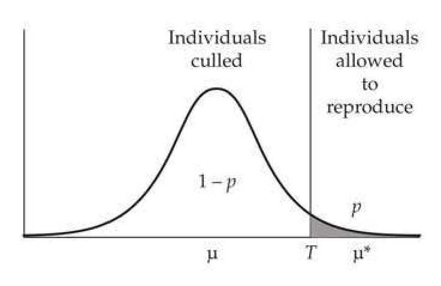
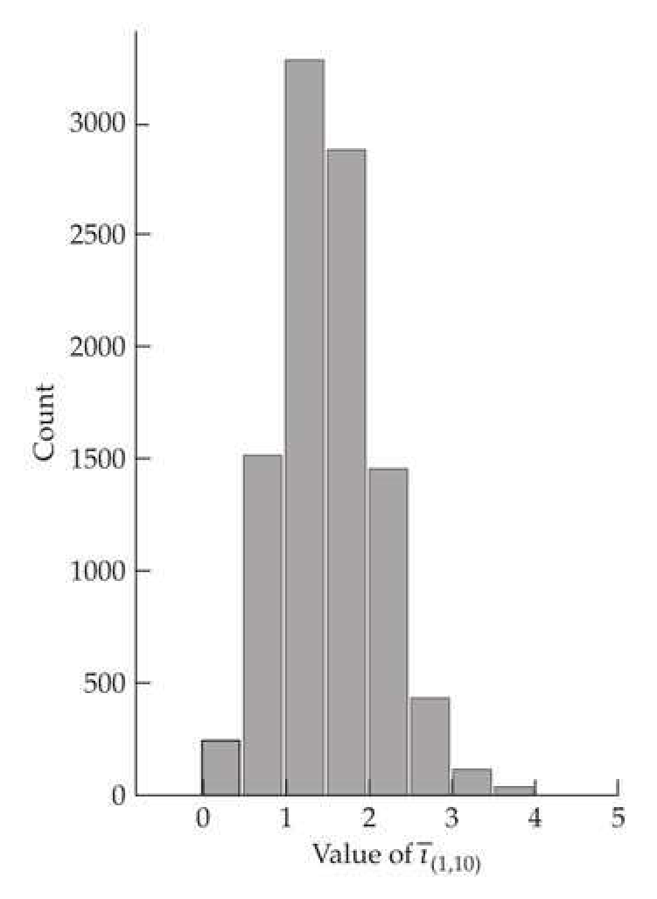
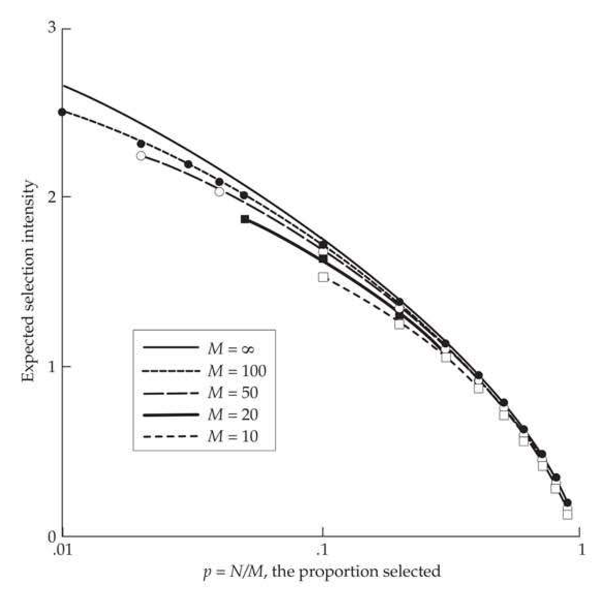
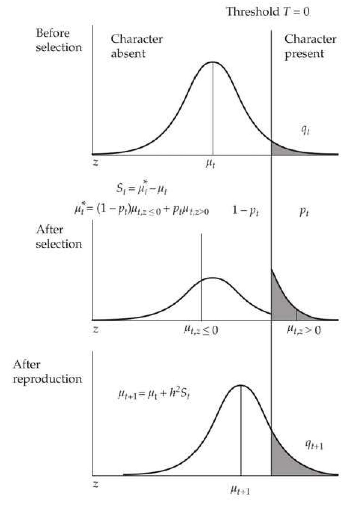
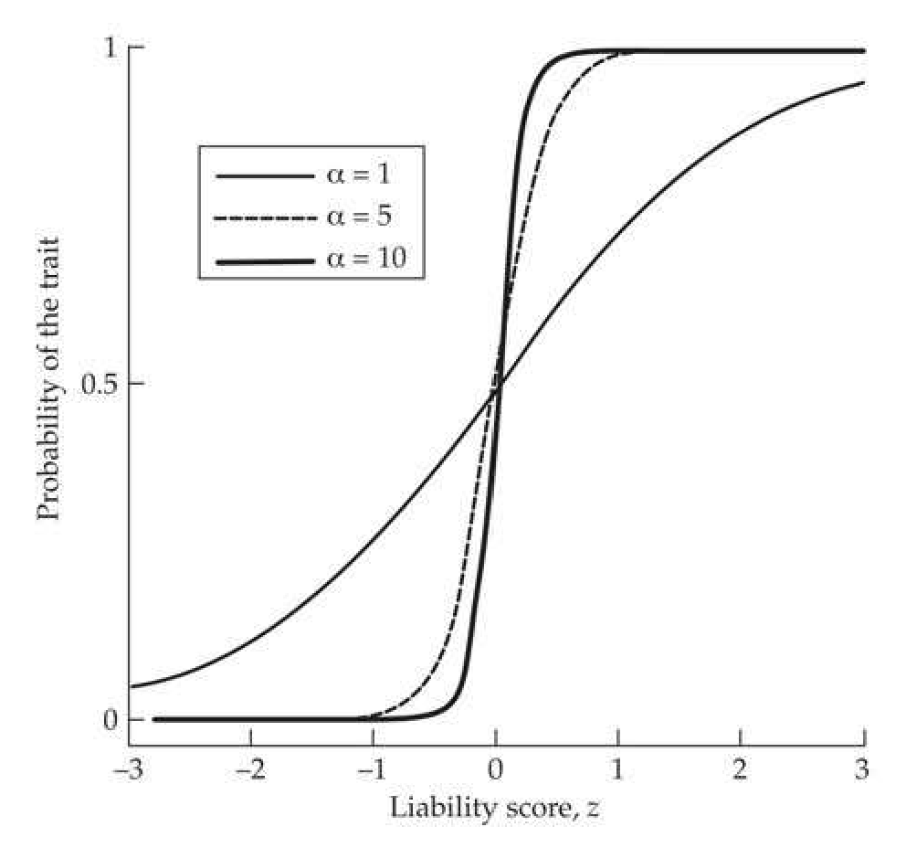
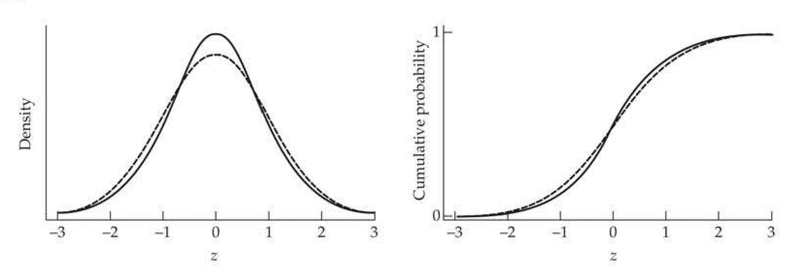
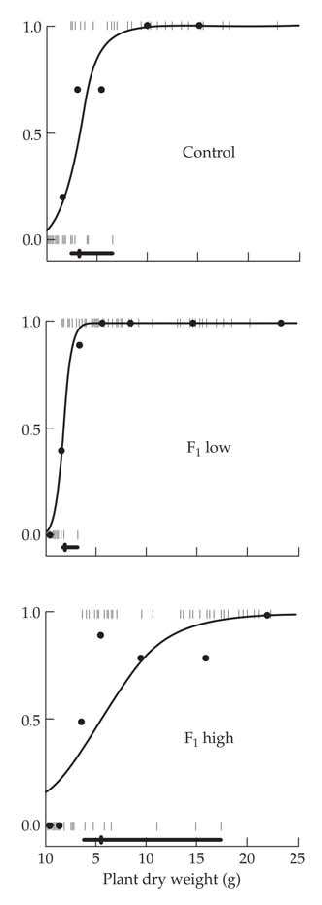

# Chapter 14 · Short-term Changes in the Mean:

## Evolution_chapter14_001 · Short-term Changes in the Mean: 2. Truncation and Threshold Selection

Far better an approximate answer to the right question, which is often vague, than an exact answer to the wrong question, which can always be made precise. Tukey (1962)

This brief chapter first considers the general theory of truncation selection on the mean and then examines a number of more specialized (but related) topics, which may be skipped by the casual reader. Truncation selection (Figure 14.1), which occurs when all individuals with trait values on one side of a threshold are chosen, is by far the commonest form of artificial selection. One key result to be presented is that, for a normally distributed trait, the expected selection intensity, $ \bar{\tau} $, is fully determined by the fraction, p, saved, provided that the chosen number of adults is large. This allows a breeder or experimentalist to predict the expected selection response, given the choice of p and knowledge of $ h^{2} $. When small numbers of adults are chosen to form the next generation, one should apply a small-sample correction, otherwise $ \bar{\tau} $ will be overestimated. However, as will be shown, this correction is generally relatively minor unless only a few individuals form the next generation.

> **Figure 14.1** · page 2 · source: `Evolution_chapter14`
>
> 
>
> Figure 14.1 Under truncation selection, the uppermost (or lowermost) fraction, $p$, of a population is selected to reproduce. Alternatively, one could set a threshold level, $T$, in advance. To predict the selection response, given either $p$ or $T$, we need to know the expected mean of the selected tail ($\mu^{*}$), from which we can compute either $S = \mu^{*} - \mu$ or $\bar{i} = S/\sigma$, and then apply the breeder's equation.

**[命题 Proposition]**

We then turn our attention to the selection response for discrete traits, which (as we will show) has close connections with certain aspects of truncation-selection theory. We start with a binary (present or absent) trait, such that, when some continuous underlying liability value exceeds a particular (usually unknown) threshold, the trait takes on one value (or is displayed), while it takes on another (or is absent) when its liability is below the threshold (LW Chapter 25). The key assumption is that the liability value is a normally distributed trait, with the breeder's equation holding on this scale. We also examine binary-trait response in a logistic regression framework (estimating the probability that an individual exhibits the trait, given some underlying liability score).

We conclude with a few brief comments on selection response when a trait is better modeled as Poisson, rather than normally, distributed, as can occur with certain types of count data (such as number of offspring). Again, the key idea is that there is some underlying (and unobserved, or latent) liability scale that maps into the discrete character space.

---

## Evolution_chapter14_002 · Short-term Changes in the Mean: 2. Truncation and Threshold Selection / TRUNCATION SELECTION

In addition to being the commonest form of artificial selection, truncation selection is also the most efficient, as it provides the largest selection intensity of any scheme culling the same fraction of individuals (Kimura and Crow 1978; Crow and Kimura 1979). Truncation selection is described by either the fraction, p, of the population saved or the threshold phenotypic value, T, below (or above) which individuals are culled. The investigator usually sets one of these (usually p) in advance of the actual selection. Hence, while S is trivially computed after the parents are chosen, we would like to predict the expected selection differential, given either p or T. Specifically, given p or T, what is the expected mean of the selected parents? In our discussion of this topic, we first assume that a large number of individuals is saved, before turning to complications introduced by finite sample size.

---

## Evolution_chapter14_003 · TRUNCATION SELECTION / Selection Intensities and Differentials Under Truncation Selection

**[命题 Proposition]**

Given a threshold cutoff, $T$, the expected mean of the selected adults is given by the conditional mean, $E[z \mid z \geq T]$. Generally, it is assumed that phenotypes are normally distributed, and we use this assumption throughout (unless stated otherwise). With an initial mean of $ \mu $ and variance of $ \sigma^2 $, and $ p = \Pr(z \geq T) $ being the fraction saved, this conditional mean is given by LW Equation 2.14, which yields the expected selection differential as

$$
S=\varphi\left(\frac{T-\mu}{\sigma}\right)\frac{\sigma}{p}
$$

where $ \varphi(x)=(2\pi)^{-1/2}\exp(-x^{2}/2) $ is the unit normal density function evaluated at x.

Usually the fraction saved $p$ (rather than $T$) is preset by the investigator. Given $p$, to apply Equation 14.1, we must first find the threshold value $T_p$ satisfying $\Pr(z \geq T_p) = p$. Notice that $T$ in Equation 14.1 enters only as $(T - \mu)/\sigma$, which transforms $T_p$ to a scale with a mean of zero and unit variance. Hence,

$$
\begin{align*}\Pr(z\geq T_p)=\Pr\left(\frac{z-\mu}{\sigma}>\frac{T_p-\mu}{\sigma}\right)=\Pr\left(U>\frac{T_p-\mu}{\sigma}\right)=p\end{align*}
$$

where $ U \sim \mathrm{N}(0,1) $ denotes a unit normal random variable. Define $ x_{[p]} $, the probit transformation of $ p $ (LW Chapter 11), as satisfying

$$
\Pr(U\leq x_{[p]})=p
$$

so that

$$
\Pr(U>x_{[1-p]})=p
$$

It immediately follows that $ x_{[1-p]} = (T_p - \mu)/\sigma $, and Equation 14.1 yields the expected selection intensity as

$$
\begin{align*}\bar\imath=\frac{S}{\sigma}=\frac{\varphi(x_{[1-p]})}{p}\end{align*}
$$

Note that $ \bar{\tau} $ is entirely a function of p provided z is normal. Equation 14.3a can be approximated by

$$
\bar{\imath}\simeq0.8+0.41\ln\left(\frac{1}{p}-1\right)
$$

a result due to Smith (1969). Simmonds (1977) found that this approximation is generally quite good for $ 0.004 \leq p \leq 0.75 $ and offered alternative approximations for $ p $ values outside this range, as did Saxton (1988). Montaldo (1997) gives an approximation for the standardized truncation value $ z = (T - \mu)/\sigma $ in terms of $ \bar{r} $. Finally, when one selects for the lowest fraction $ p $ of the population, Equation 14.3a still holds, provided we take its negative value.

**[示例 Example]**

*(See Example 14.1.)*

---

## Evolution_chapter14_004 · TRUNCATION SELECTION / Correcting the Selection Intensity for Finite Sample Sizes

If the number of individuals saved is small, Equation 14.1 overestimates the selection differential because of sampling effects (Nordskog and Wyatt 1952; Burrows 1972). To see this, suppose 100 observations are put randomly into ten groups of size 10 and the largest value is selected from each group. These values will be, on average, not as extreme as when selecting the best 10 from the entire 100, as the best observation within a random group of ten can be the 11th largest (or even smaller) for the entire group.

To more formally treat the effects of finite sample size, assume $M$ adults are sampled at random from the population, with the largest $N$ of these being used to form the next generation, yielding $p = N/M$. The expected selection coefficient is computed from the distribution of order statistics. We rank the $M$ observed phenotypes as $z_{1,M} \geq z_{2,M} \ldots \geq z_{M,M}$, where $z_{k,M}$ denotes the $k$th-order statistic (the $k$th largest value) when $M$ observations are sampled. The expected selection intensity is given by the expected mean of the $N$ selected parents, which is the average of the first $N$ order statistics.

$$
E\left[\overline{\imath}_{(N,M)}\right]=\frac{1}{\sigma}\left(\frac{1}{N}\sum_{k=1}^{N}E\left[z_{k,M}\right]-\mu\right)=\frac{1}{N}\sum_{k=1}^{N}E\left[z_{k,M}^{\prime}\right]
$$

where $ z_{k,M}^{i} = (z_{k,M} - \mu)/\sigma $ are the standardized order statistics. While the properties of order statistics have been worked out for many special cases (Harter 1961; Sarhan and Greenberg 1962; Harter 1970a, 1970b; Kendall and Stuart 1977; David 1981), values for any distribution are easily be obtained via simulation. For example, Figure 14.2 plots 10,000 random draws of the largest order statistic in a sample of ten unit normals. Note that the distribution of realized differentials is asymmetric about its mean, implying that the variance alone is not sufficient for computing confidence intervals. Figure 14.3 plots the expected selection intensity for small values of $ N $ (assuming normality), showing that Equation 14.3a overestimates the intensity, although the difference will be small unless $ N $ is small.

> **Figure 14.2** · page 4 · source: `Evolution_chapter14`
>
> 
>
> Figure 14.2 The distribution of 10,000 random draws of  $ \bar{\imath}_{(1,10)} $, the largest order statistic in a sample of ten unit normal random variables. The mean value is 1.54, as opposed to the expected value of  $ \bar{\imath}=1.75 $ for p=0.1 in an infinite population (Equation 14.3a). Notice that there is a considerable spread about the mean, and that the distribution is not symmetric, but rather is skewed toward higher values.

> **Figure 14.3** · page 5 · source: `Evolution_chapter14`
>
> 
>
> Figure 14.3 The expected selection intensity,  $ E[\bar{i}_{(N,M)}] $, under truncation selection on a normally distributed phenotype, as a function of the total number of individuals measured, M, and the fraction of these saved,  $ p = N/M $. The curve  $ M = \infty $ is given by Equation 14.3a, while the curves for M = 10, 20, 50, and 100 were obtained from the average of the expected values of the N = pM largest unit normal order statistics (Harter 1961). Note that Equation 14.3a is generally a good approximation, even when N is fairly small.

Burrows (1972) developed a finite-sample approximation for the expected selection intensity for any reasonably well-behaved continuous distribution. Using the standardized variable $ y = (z - \mu) / \sigma $ simplifies matters considerably. Letting $ \phi(y) $ be the probability density function of the phenotypic distribution, and $ y_p $ be the truncation point (i.e., $ \Pr(y \geq y_p) = p $), Burrows's approximation is

$$
\begin{align*}E\left[\bar\imath_{(N,M)}\right]\simeq\mu_{y_p}-\frac{(M-N)p}{2N(M+1)\phi(y_p)}\end{align*}
$$

where

$$
\begin{align*}\mu_{y_p}=E\left[y\mid y\geq y_p\right]=\frac{1}{p}\int_{y_p}^\infty x\varphi(x) dx\end{align*}
$$

is the truncated mean (which can be obtained by numerical integration), and $ \phi(y_p) $ is the height of the density function at the truncation point. Because the second term of Equation 14.4a is positive, if $ M $ is finite, the expected truncated mean overestimates the expected standardized selection differential. For a unit normal distribution, $ \mu_{y_p} = \varphi(y_p)/p = \bar{\nu} $, yielding

$$
E\left[\overline{\imath}_{(N,M)}\right]\simeq\overline{\imath}-\left[\frac{M-N}{2N(M+1)}\right]\frac{1}{\overline{\imath}}=\overline{\imath}-\left[\frac{1-p}{2p(M+1)}\right]\frac{1}{\overline{\imath}}
$$

where $ \bar{\tau} $ is given by Equation 14.3a, using $ p = N/M $. Lindgren and Nilsson (1985) found this approximation to be quite accurate for $ N \geq 5 $. Bulmer (1980) suggested an alternative approximation under normality, using Equation 14.3a with $ p $ replaced by

$$
\widetilde{p}=\frac{N+1/2}{M+N/(2M)}
$$

Burrows (1975) provided expressions for the variance of $ \bar{\nu}_{(N,M)} $.

A final correction for finite population size was noted by Rawlings (1976) and Hill (1976, 1977b). If families are sampled, such that n individuals are chosen per family, then the selection intensity is further reduced because there are positive correlations between family members. This effectively lowers the sample size below n—in the extreme case where all individuals are clones with little environmental variance, all have essentially the same value, and hence $ n \sim 1 $. If a total of M individuals is sampled, with n individuals per family, then Burrows's correction (Equation 14.4b) is modified to become

$$
\begin{align*}E\left[{\bar\imath}_{(N,M)}\right]\simeq{\bar\imath}-\left[{1-p\over2p(M+1)(1-\tau+\tau/n)}\right]{1\over{\bar\imath}}\end{align*}
$$

where $ \tau $ is the intraclass correlation of family members. This important result for certain types of family selection is revisited in more detail in Chapter 21.

**[示例 Example]**

*(See Example 14.2.)*

---

## Evolution_chapter14_005 · RESPONSE IN DISCRETE TRAITS: BINARY CHARACTERS / The Threshold/Liability Model

**[命题 Proposition]**

One application of truncation-selection theory is in the response to selection of binary traits, which are characterized simply by presence or absence (such as normal or diseased). The basic trait model to this point assumed a continuous character, which initially seems at odds with a binary trait. However, as discussed in LW Chapters 11 and 25, discrete characters can often be modeled by mapping an underlying (unobserved, or latent) continuous character, the liability, z, onto the observed discrete character states, y = 0 or y = 1 (Figure 14.4). The assumption is that the breeder's equation holds on the liability scale, and our goal is to predict how changes on this scale map onto changes in the frequency of a binary trait. The simplest assumption is a threshold model, wherein the character is present if liability exceeds some threshold value $ T \left(z \geq T \right) $, and otherwise is absent $ (z < T) $. Roff (1996) reviewed a number of examples of such threshold-determined morphological traits in animals. Our analysis is restricted to a single threshold, but extension to multiple thresholds is straightforward (Lande 1978; Korsgaard et al. 2002).

> **Figure 14.4** · page 7 · source: `Evolution_chapter14`
>
> 
>
> Figure 14.4 Selection response for a binary trait when the underlying liability, z, exceeds some threshold value, T. We assume that an appropriate scale can be found such that  $ z \sim N(\mu_t, 1) $, where  $ \mu_t $ is the current mean and  $ T = 0 $. Under this scaling for T, a mean liability of zero ( $ \mu = 0 $) implies that 50% of the population shows the trait, while  $ <50\% $ display the trait when  $ \mu < 0 $ and  $ >50\% $ do when  $ \mu > 0 $. Because z is normally distributed, the probit transform estimates  $ \mu_t $ from the frequency,  $ q_t $, of individuals displaying the character (Equation 14.6). We assume that the breeder's equation holds on the liability scale, so that  $ \mu_{t+1} = \mu_t + S_t h^2 $, where  $ S_t = \mu_t^* - \mu_t $. Using properties of the unit normal allows translation of the mean liability following selection,  $ \mu_{t+1} $, into the new frequency,  $ q_{t+1} $, of the trait (Equation 14.7). Note that after selection, where a fraction,  $ p_t $, of the selected parents display the trait, the mean liability value is now the weighted average of the means of two truncated normal distributions (Equation 14.8a).

To predict the selection response, let $\mu_t$ be the mean liability and $q_t$ be the frequency of individuals displaying the character in generation $t$, i.e., $q_t = \Pr(y_t = 1)$. If liability is well enough, behaved to satisfy the assumptions of the breeder's equation, then $\mu_{t+1} = \mu_t + h^2 S_t$. As shown in Figure 14.4, three tasks must be performed to predict the selection response: (i) estimate the mean liability, $\mu_t$, from the observed frequency, $q_t$, of the trait; (ii) estimate $S$ on the liability scale, given the change in the frequency of the binary trait following selection; and (iii) translate $\mu_{t+1}$ into $q_{t+1}$. We assume liability to be normally distributed on some appropriate scale, in which case we can also choose a scale that sets the threshold value at $T = 0$ and assigns $z$ a variance of 1.0. Because $z - \mu_t$ is a unit normal, $\Pr(z \geq 0) = \Pr(z - \mu_t \geq -\mu_t) = \Pr(U \geq -\mu_t) = q_t$, and by analogy with Equation 14.2b, where $\Pr(U \geq x_{[1-p]}) = p$, we have

$$
\mu_{t}=-x_{[1-q_{t}]}
$$

where $ x_{[p]} $ is the probit transformation of $ p $ (Equation 14.2a), as suggested by Wright (1934). For example, if 5% of the population displays the trait, $ \Pr(U \leq 1.65) = 0.95 $, implying $ x_{[0.95]} = 1.65 $, and yielding the mean on the underlying liability scale as $ \mu = -x_{[0.95]} = -1.65 $. When the mean liability is at this value, only 5% of the population has a value exceeding the threshold $ (T = 0) $, and hence displays the trait.

The response to selection, as measured by the new frequency, $ q_{t+1} $, of the trait in the next generation, is given by

$$
\begin{aligned}q_{t+1}&=\Pr(U\geq-\mu_{t+1})\\&=\Pr(U\geq-\mu_{t}-h^{2}S_{t})\\&=\Pr(U\geq x_{[1-q_{t}]}-h^{2}S_{t})\\ \end{aligned}
$$

It remains to obtain $S_t = \mu_t^* - \mu_t$, where $\mu_t^*$ is the mean liability value in the selected parents in generation $t$. While the selected population may consist entirely of adults displaying the trait, more individuals than this may be required to keep the population at a constant size, especially if $q_t$ is small (i.e., the trait is rare). In this case, the selected adults consist of two groups of individuals: those displaying the trait (hence having $z \geq 0$) and those not displaying it ($z < 0$). Letting $p_t$ be the fraction of selected adults displaying the character,

$$
\begin{align*}\mu_t^*=(1-p_t)E\left[z|z<0,\mu_t\right]+p_t E\left[z|z\geq0,\mu_t\right]\end{align*}
$$

Applying LW Equation 2.14, and noting that the unit normal density function satisfies $ \varphi(x) = \varphi(-x) $, yields

$$
\begin{align*}E\left[z|z\geq0,\mu_t\right]=\mu_t+\frac{\varphi(\mu_t)}{q_t}\quad{\rm and}\quad E\left[z|z<0,\mu_t\right]=\mu_t-\frac{\varphi(\mu_t)}{1-q_t}\end{align*}
$$

where $ \varphi(x) $ is the unit normal density function evaluated at x. Substituting into Equation 14.8a yields

$$
\begin{align*}S_t=\mu_t^*-\mu_t=\frac{\varphi(\mu_t)}{q_t}\frac{p_t-q_t}{1-q_t}=\frac{\varphi(-x_{[1-q_t]})}{q_t}\frac{p_t-q_t}{1-q_t}\end{align*}
$$

As expected, if $ p_t > q_t $, then $ S_t > 0 $. Maximal selection occurs if only individuals displaying the trait are saved $ (p_t = 1) $, in which case Equation 14.9 reduces to $ S_t = \varphi(-x_{[1-q_t]}) / q_t $.

**[命题 Proposition]**

Why did we not simply estimate $ \mu_t^* $ using $ x_{[1-q_t^*]} $, i.e., using the frequency, $ q^* $, of the trait in the selected parents? The reason is that the distribution of $ z $ values in selected parents is a weighted average of two truncated normal density functions (Equation 14.8a), and this distribution is not normal (see Figure 14.4). However, we assume that normality is restored in the liability distribution at the start of the next generation due to segregation plus the addition of the environmental value. We examine the validity of this assumption in Chapter 24. Finally, a diligent reader might be concerned that this lack of normality violates the breeder's equation, and hence our assumption that $ \mu_{t+1} = \mu_t + h^2 S $. However, this expression is a weighted form of truncation selection on a normally distributed trait, with a fraction $ 1 - p $ with $ z < T $, and a fraction $ p $ with $ z \geq T $, with the change in breeding value given by the weighted average of these two pools.

One important feature about selection on threshold traits is that the response to selection is not necessarily symmetric—a selected 5% increase in the trait may not yield the same response as a selected 5% decrease. The reason for this is that the mapping between phenotypes and their underlying liability is highly nonlinear. Even though the parent-offspring regression on the liability scale is assumed to be linear (and hence liability response is symmetric), the parent-offspring regression on the phenotypic level is not linear, resulting in an asymmetric response. ample

**[示例 Example]**

*(See Example 14.3.)*

**[示例 Example]**

*(See Example 14.4.)*

---

## Evolution_chapter14_006 · RESPONSE IN DISCRETE TRAITS: BINARY CHARACTERS / Direct Selection on the Threshold, T

It is biologically quite reasonable to imagine that there is variation in $ T $ itself (Hazel et al. 1990). Suppose the trait of interest appears when the size of an organism exceeds some critical value, which itself varies over individuals, with certain genotypes and/or environments lowering the value of $ T $, thus allowing individuals with a lower liability score to display the trait. Decomposing both the liability and threshold in terms of genetic and environmental factors gives $ z = g_z + e_z $ and $ T = g_T + e_T $. The trait appears when $ z \geq T $, or

$$
g_{z}+e_{z}-\left(g_{T}+e_{T}\right)=\left(g_{z}-g_{T}\right)+\left(e_{z}-e_{T}\right)=g+e\geq0
$$

Thus, even though both the liability and threshold values are variable, we can simply consider a single new risk liability, the difference between the liability and threshold values, and the analysis proceeds as above. If interest is simply on presence or absence of the binary trait, it does not matter whether the liability or threshold, or both, show variation. However, as Example 14.5 (below) shows, there are situations where we can directly measure the threshold value itself, in which case we can estimate the realized heritability of the threshold level by a selection experiment.

---

## Evolution_chapter14_007 · RESPONSE IN DISCRETE TRAITS: BINARY CHARACTERS / The Logistic Regression Model for Binary Traits

The threshold approach offers one model for mapping an underlying continuous liability, z, into a discrete character space, y (which is either zero or one, corresponding to trait absence or presence). This is a deterministic model, with all individuals with $ z \geq T $ displaying the trait $ (y = 1) $, while all those with $ z < T $ do not display it $ (y = 0) $. A potentially more realistic model is that trait presence is stochastic, with the underlying liability, z, mapping onto a probability of displaying the trait, e.g., $ p(z) = \text{Prob}(y = 1 \mid z) $. Under the threshold model, this probability is 1.0 for $ z \geq T $, and 0 otherwise. From a biological standpoint, one imagines that $ p(z) $ is a monotonically increasing function of z, approaching 0 for low values and 1 for high values. One reasonable candidate that satisfies these requirements is the logistic function,

$$
\ell(z)=\frac{\exp(z)}{1+\exp(z)}=\frac{1}{1+\exp(-z)}
$$

with $ \ell(z) \simeq 0 $ for $ z \ll -1, \simeq 1 $ for $ z \gg 1 $, and $ \ell(0) = 1/2 $. A more general version is

$$
\ell[\alpha\left(z-m\right)]=\frac{1}{1+\exp[-\alpha\left(z-m\right)]}
$$

which has a value of 0.5 at $ z = m $ and a scaling factor, $ \alpha $, that sets the abruptness of the transition from low to high probability. The larger the value of $ \alpha $, the more abrupt is the transition, approaching the threshold model for sufficiently large values (Figure 14.6). Equation 14.10b is often called a logistic regression.

> **Figure 14.6** · page 11 · source: `Evolution_chapter14`
>
> 
>
> Figure 14.6 A more realistic model of threshold traits is that the liability, z (horizontal axis), determines the probability, p(z), of displaying the trait (vertical axis). One flexible model is to assume that p(z) follows a logistic function (Equation 14.10b) with a scale parameter of  $ \alpha $, plotted here for values of  $ \alpha = 1, 5 $, and 10. For  $ \alpha $ values in excess of 5, the logistic function essentially recovers the discrete threshold model.

Biologically speaking, the logistic regression and threshold models may be viewed as essentially identical. To see this, recall that the threshold model very easily extends to the case where T varies over individuals. In such cases, if the liability value of an individual is z, the trait will only be displayed if $ T \leq z $. Now consider the logistic regression model where $ p(z) $ denotes the probability that an individual with a liability value of z displays the trait. One source of this stochasticity could simply be population variation in T, so that $ p(z) $ can be viewed as the cumulative distribution function (cdf; LW Chapter 2) for the threshold value T, e.g., $ p(z) = \Pr(T \leq z) $. In this case, a fraction, $ p(z) $, of individuals with a liability of z are above the threshold, and hence display the trait.

**[定义 Definition]**

If the logistic gives the cdf of random threshold values, then the logistic distribution, $ \phi(x, \alpha, m) $, gives the actual distribution of T. From the definition of a cumulative distribution function,

$$
\int_{-\infty}^{z}\phi(x,\alpha,m)d x=\frac{1}{1+\exp[-\alpha\left(z-m\right)]}
$$

Taking derivatives of both sides yields

$$
\phi(x,\alpha,m)=\frac{\alpha\exp[-\alpha\left(z-m\right)]}{(1+\exp[-\alpha\left(z-m\right)])^{2}}
$$

Johnson and Kotz (1970b) gave the first three moments of this distribution as

$$
\begin{align*}\mu=m,\quad\sigma^2={1\over3}\left({\pi\over\alpha}\right)^2,\quad{\rm and}\quad\mu_3=0\end{align*}
$$

As shown in Figure 14.7, the normal and logistic distributions have very similar cumulative distribution functions. Indeed, for a unit normal random variable, U,

$$
\Pr(U\leq x)\simeq\frac{1}{1+\exp(-\alpha x)},\quad\mathrm{w h e r e}\quad\alpha=\frac{\pi}{\sqrt{3}}
$$

which is the logistic distribution with a variance of 1 (see Equation 14.11c).

> **Figure 14.7** · page 12 · source: `Evolution_chapter14`
>
> 
>
> Figure 14.7 A comparison of the unit normal and unit logistic ( $ \mu = 0 $,  $ \sigma^{2} = 1 $) distributions (dashed and solid curves, respectively), with the horizontal axis denoting the value of z. (Left) Probability density functions: the logistic is more peaked, with positive kurtosis. (Right) The cumulative distribution functions are extremely similar.

An interesting biological interpretation of the scale parameter, $ \alpha $ (that sets the abruptness of the transition of the logistic regression), is as a measure of the strength of developmental canalization. When $ \alpha $ is small, small changes in the liability usually map into small changes in the probability of the trait being displayed ($ \alpha = 1 $ in Figure 14.6). When $ \alpha $ is large, one sees robustness when the liability is away from the mean, m, as small changes in the liability have very little impact on the probability of the trait being displayed. However, when near m, small liability changes can result in dramatically different probabilities of displaying the trait. Chevin and Lande (2013) essentially used this idea to explore the conditions under which a relatively continuous norm of reaction changes into a very discrete step-function (i.e., the conditions leading to the evolution of a large $ \alpha $ value).

**[示例 Example]**

*(See Example 14.5.)*

Thus, we have two approaches for mapping liability values into binary traits: the strict threshold approach (a deterministic mapping of liability onto the discrete trait) and the logistic regression approach (a stochastic mapping translating a liability value into a probability of observing the trait). Given the very close connection between the threshold and logistic regression models, for most purposes using the simple threshold model is a reasonable approach, even if the underlying mapping is stochastic, and as illustrated above, it can easily be used to predict selection response. One setting where the logistic regression is more appropriate is in the actual analysis of the behavior of the threshold when one either knows the liability value or has at least a strong proxy (such as size). not respond to the first vernalization treatment were allowed to grow a second cycle and were chosen as the parents for the high lines. The response to a single generation of selection can be assessed by comparing the offspring from the low (or high) selected parents against those from an unselected control, as plotted in Figure 14.8.

> **Figure 14.8** · page 13 · source: `Evolution_chapter14`
>
> 
>
> Figure 14.8 The logistic regressions for the relationship between dry weight and flowering in hound's-tongue (Cynoglossum officinale). Data were obtained from Wesselingh and de Jong (1995). Regressions are given for control, high, and low lines, grown contemporaneously. See Example 14.5 for further details.

The data available to the authors were 0 or 1 (insensitive or sensitive to vernalization) values as a function of size. To estimate the distribution of threshold sizes, they performed a logistic regression on these data, using maximum likelihood (LW Appendix 4) to fit the $ \alpha $ and mean (m) terms of Equation 14.10b. Data for the high and low lines are plotted in Figure 14.8 along with the ML solution for the logistic regression. Each individual has a 0 or 1 data point (individual ticks), while the circles represent the average value for weight classes with more than ten individuals.

Logistic regressions were estimated for progeny from the low- and high-line parents and for a control line grown contemporaneously with these progeny. The ML estimates of the mean, m (which corresponds to the weight yielding 50% flowering), and value of $ \alpha $ for these regressions were

Note that the low line not only had a smaller mean size for vernalization (1.85), but also a much larger $ \alpha $ value (2.58), and therefore a more abrupt transition between insensitivity and sensitivity. Using these estimates, Equation 14.10b yields the expected percent of vernalization sensitivity (flowering) for a given weight. For a 3 gram plant, this is 0.43 in the control line and 0.32 in the high lines, but 0.95 in the low line.

**[命题 Proposition]**

By estimating both the response, $ R $, to selection as well as the within-generation change, $ S $, we can estimate the heritability of this trait by calculating $ R/S $. First, the response to selection (change in $ m $) can be estimated by using the contemporaneously grown control line as a standard. From the previous table, the response in the high line is 5.41 - 3.30 = 2.11, while the response in the low line is 1.85 - 3.30 = -1.45. Turning to estimating $ S $, the selection truncation point for the low line is the largest low parent (2.74 grams, or 25.5% of the left tail of the founding source population), while the smallest flowering high parent was 9.95 grams (corresponding to the upper 12.2% of the founding source population). From Equation 14.3a, these translate into selection intensities of $ \bar{\imath} = -1.26 $ and 1.66, respectively. To obtain the selection differentials, $ S $, for each line, recall that $ S = \bar{\imath}\sigma_{p} $. To estimate $ \sigma_{p} $, the authors note that the 0.25 quartile for a normal distribution is 0.674 $ \sigma $ from the mean. Although the assumption is that the threshold values follow a logistic distribution, the cumulative probability functions are rather similar for both the normal and the logistic (Figure 14.7). Hence, taking the observed 0.25 quartile (in the founding lines) of 2.68, and its mean of 5.12, suggests

$$
\sigma_{p}=\frac{5.12-2.68}{0.674}=3.63
$$

The response (change in m), selection intensity, and estimated heritability, $ \hat{h}^{2} = R/S $, for the high and low lines are

Thus, there is heritable variation in threshold size, as there was response to selection for both larger and smaller threshold sizes. Further, the estimated heritability (based on the single-generation response to selection) was around 0.3.

---

## Evolution_chapter14_008 · RESPONSE IN DISCRETE TRAITS: BINARY CHARACTERS / BLUP Selection With Binary Data: Generalized Linear Mixed Models

Animal breeders routinely use the general linear mixed model to obtain BLUP estimates of breeding values for normally distributed traits, where the expected value of the phenotype, $ y_{i} $, of individual i can be written as

$$
E[y_{i}]=\mu_{i}=\mu+\sum\beta_{k}x_{k,i}+A_{i}
$$

Here $ A_i $ is an individual's breeding value and the $ \beta_k $ are fixed effects (such as adjustments for age and sex, whose values in individual $ i $ are given by the $ x_{k,i} $). A particular realization (i.e., a scored phenotype) from this individual can be written as

$$
y_{i}=\mu_{i}+e_{i}
$$

where the residual, $ e_{i} $, is normally distributed with a mean of zero, implying that $ y_{i} $ is also normally distributed. Putting these together, an observation from individual i can be written as

$$
y_{i}=\mu+\sum\beta_{k}x_{k,i}+A_{i}+e_{i}
$$

As described in Chapters 13, 19, 20, and LW Chapters 26 and 27, in addition to its observed phenotype, $ y_{i} $, additional information to estimate $ A_{i} $ is borrowed from the y values of relatives through the relationship matrix A. In a selection scheme, those individuals with the largest estimated A values are then chosen to form the next generation.

This same strategy can be extended to cases where the mean $ \mu_i $ is not a simple linear function of $ A_i $ and where the residual error is not normally distributed. In particular, the phenotype, $ y_i $, of a binary trait takes on a value of either 0 or 1. The expected value of $ y_i $ is just the probability of displaying the trait, i.e., the trait is Bernoulli-distributed (a binomial with a single draw), so that $ y_i $ is either 0 or 1 given this mean $ \mu_i $ (its success parameter in the Bernoulli). Equation 14.13a is generally not applicable in this setting as $ \mu_i $ is constrained (being a probability) to the 0 to 1 range, while no such constraints occur on Equation 14.13a. A second issue is that the residual error structure is not normal.

The solution to both satisfying this constraint and using the correct residual distribution relies on the use of generalized (as opposed to general) linear mixed models. These extend Equation 14.13c to cases where the expected value of y conditioned on the variables of interest is not a linear function of breeding value, and the residuals about this expected value are not necessarily normal (Bolker et al. 2009; de Villemereuil et al. 2016). The basic structure of a generalized linear model can be thought of as an extension of the liability model to more general functions.

Let the liability value $ (z_{i}) $ for individual i be some linear function of the breeding value, $ A_{i} $, an environmental value, $ E_{i} $, plus (potentially) fixed effects,

$$
z_{i}=\mu+\sum\beta_{k}x_{k,i}+A_{i}+E_{i}
$$

which is mapped onto a mean trait value, y, by a monotonic function, g. Specifically, the conditional expectation of y given z is

$$
E[y\mid z]=g(z)
$$

where

$$
g^{-1}\left(E[y\mid z]\right)=z=\mu+\sum\beta_{k}x_{k,i}+A_{i}+E_{i}
$$

The inverse $ g^{-1} $ is called the link function, as it transforms the conditional expectation into a linear model. The function g imposes the desired constraint on the mean of y, mapping some unconstrained value, z, into the desired constraint space (such as 0 to 1).

For binary data, Equation 14.14b becomes $ E[y|z]=g(z)=p(z) $, where $ p(z)=\Pr(y=1|z) $, the success parameter, with y following a Bernoulli distribution. Thus, we desire some function that maps the underlying liability, z, onto a value, $ p(z) $, constrained to the space $ [0,1] $. As we have seen, one candidate function is the simple logistic function, $ \ell(z) $ (Equation 14.10a). The corresponding link function (Equation 14.14c), which is the inverse of the logistic function, is given by the logit function, defined as

$$
\mathrm{logit}(p)=\ln\left(\frac{p}{1-p}\right)
$$

namely, the log of the odds ratio (probability of the trait being present divided by probability that the trait is absent). If $ \ell(z) = p $, then $ \operatorname{logit}(p) = z $, so that a logit-transformed p value recovers the liability value,

$$
\mathrm{logit}(p|z_{i})=z_{i}=\mu+\sum\beta_{k}x_{k,i}+A_{i}+E_{i}
$$

Under this framework, BLUP selection for individuals with the highest breeding values for a binary trait proceeds by taking the 0/1 binary data from a set of individuals (along with other fixed, and possibly random, effects of interest) and using either maximum likelihood or Bayesian approaches to estimate the breeding values on the liability scale given by Equation

14.15b (Foulley et al. 1983; Foulley 1992; Vazques et al. 2009). This approach can be extended to $ k \geq 2 $ thresholds in the mapping of liability into k character states (Korsgaard et al. 2002).

---

## Evolution_chapter14_009 · Short-term Changes in the Mean: 2. Truncation and Threshold Selection / RESPONSE IN DISCRETE TRAITS: POISSON-DISTRIBUTED CHARACTERS

Discrete characters with a large number of possible states, such as numbers of leaves on a tree, can be treated as a continuous trait. However, what about a discrete trait with a rather compact distribution? A common example is the number of offspring, such as the clutch size of a bird, which might range from 0 to 10 eggs in an observed sample. This discreteness is of special concern when the trait has a significant probability mass at a particular value (especially zero), as often happens with offspring number (corresponding to failure to reproduce).

A natural way to model such traits is to use the Poisson distribution, where the probability of observing a trait value of k is given by

$$
\Pr(y=k)=e^{-\lambda}\frac{\lambda^{k}}{k!}
$$

where $ \lambda = E[y] $ is the expected value of the trait, which is constrained to $ \lambda > 0 $. Motivated by the previous treatment of binary traits, one might imagine some underlying liability value, $ z $, with additive effects (Equation 14.14a) mapped onto a mean value, $ \lambda $, constrained to be positive. For example, we can use

$$
\lambda=\exp(z)
$$

ensuring that $ \lambda > 0 $ for all $ z $ and hence is a proper expectation for a Poisson. In the context of generalized linear models, $ g(z) = \exp(z) $, so that the link function $ g^{-1}(z) $ is simply $ \ln(z) $, as $ g^{-1}[g(z)] = \ln[\exp(z)] = z $, yielding

$$
\ln(\lambda)=z=\mu+\sum\beta_{k}x_{k,i}+A_{i}+e_{i}
$$

This is called a log-linear model, as the log of the distribution parameter, $ \lambda $, is a linear function of the variables of interest (in particular, the breeding value).

On this log scale, both the breeding and environmental values are assumed to be normal, with a mean of zero and variances of $ \sigma_{A}^{2} $ and $ \sigma_{e}^{2} $. As with binary traits, BLUP selection based on this generalized linear model framework can be used to estimate the $ A_{i} $ values (Foulley 1993; Foulley and Im 1993; Korsgaard et al. 2002; Vazques et al. 2009; Morrissey 2015; de Villemereuil et al. 2016). Other models are also possible, such as a zero-inflated Poisson, which has extra probability mass at zero relative to a standard Poisson (e.g., Rodrigues-Motta et al. 2007; see Chapter 29). A trait can also be underdispersed relative to the Poisson (as seems to consistently be the case for bird clutch size; J. Hadfield, pers. comm.), in which case other distributions, such as a zero-truncated Poisson (the nonzero data follow a Poisson distribution) can be used (Chapter 29). A nice discussion of estimation issues under generalized linear models (beyond the binary and log-linear models presented here) is given by de Villemereuil et al. (2016), while Morrissey (2015) presented the theory of selection response under more general settings (which we will examine in Volume 3).

Under the log-linear model, the liability, z, of an individual yields an expected value of $ \lambda = \exp(z) $, with a realization (e.g., the number of offspring for an individual with trait value z) drawn from a Poisson to return the observed trait value. For example, if the latent value, $ \lambda_i $, for individual i has a value of 0.2, then (from Equation 14.16) the probability this individual has a trait of value zero is $ \exp(-0.2) \simeq 0.82 $, the probability they have value 1 is $ 0.2 \cdot \exp(-0.2) \simeq 0.16 $, value 2 is $ 0.2^2 \cdot \exp((-0.2)/2! \simeq 0.02 $, and so on.

The resulting mean trait value in a population under the log-linear model becomes

$$
\begin{aligned}E[y]&=E[\lambda]=E[\exp(z)]\\&=E[\exp(\mu)\cdot\exp(A)\cdot\exp(e)]\\&=\exp(\mu)\cdot E[\exp(A)]\cdot E[\exp(e)]\\ \end{aligned}
$$

where the last step follows because (by construction) A and e are uncorrelated (and thus independent if they are bivariate normal, as is usually assumed), while $ \mu $ is a constant. To compute these expectations, recall that the expression $ E[e^{tx}] $ is the moment-generating function of the random variable, x (Johnson and Kotz 1970a). For $ x \sim N(\mu, \sigma^{2}) $,

$$
E\left[e^{tx}\right]=\exp\left(\mu t+\frac{\sigma^{2}}{2}t\right)
$$

In this case, with a mean, $ \mu $, equal to zero and variance of $ \sigma^{2} $, setting t = 1 yields

$$
E\left[e^{x}\right]=\exp\left(\frac{\sigma^{2}}{2}\right)
$$

Substituting into Equation 14.18 shows that the expected mean trait value is a function of both the mean, $ \mu $, and variance, $ \sigma_{z}^{2} $, of the underlying liability value, with

$$
E[y]=\exp(\mu)\cdot\exp\left(\frac{\sigma_{A}^{2}+\sigma_{e}^{2}}{2}\right)=\exp(\mu)\cdot\exp(\sigma_{z}^{2}/2)
$$

One might initially expect that if $A$ is the breeding value for liability, then the mean phenotype of an individual would simply be $\exp(\mu + A)$. However, Equation 14.20a shows that if we condition on the breeding value being $A$, the conditional mean now becomes $\mu + A$ and the variance, $\sigma_A^2$, vanishes, leaving

$$
E[y\mid A]=\exp(\mu+A)\cdot\exp\left(\frac{0+\sigma_{e}^{2}}{2}\right)=\exp(\mu+A)\cdot\exp(\sigma_{e}^{2}/2)
$$

Following a single generation of selection, the distribution of liability values has approximately the same variance, but now the mean is shifted to $ \mu + h^{2}S $ (where S is the selection differential on the liability scale). Applying Equation 14.20a, the response on the phenotypic scale becomes

$$
\begin{aligned}R&=E[y_{t+1}]-E[y_{t}]\\&=\left[\exp(\mu+h^{2}S)-\exp(\mu)\right]\cdot\exp(\sigma_{z}^{2}/2)\\&=\left[\exp(h^{2}S)-1\right]\cdot\exp(\mu)\cdot\exp(\sigma_{z}^{2}/2)\\&=\left[\exp(h^{2}S)-1\right]\cdot E(y_{t})\\ \end{aligned}
$$

Notice that, as was the case for selection on a binary trait, the response to selection is not symmetric, as $ S = +\delta $ does not give the same increment of response as $ S = -\delta $.

---
