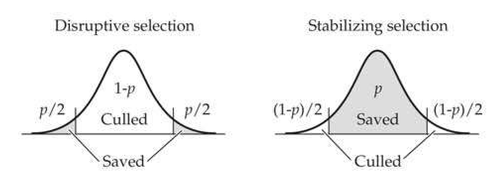
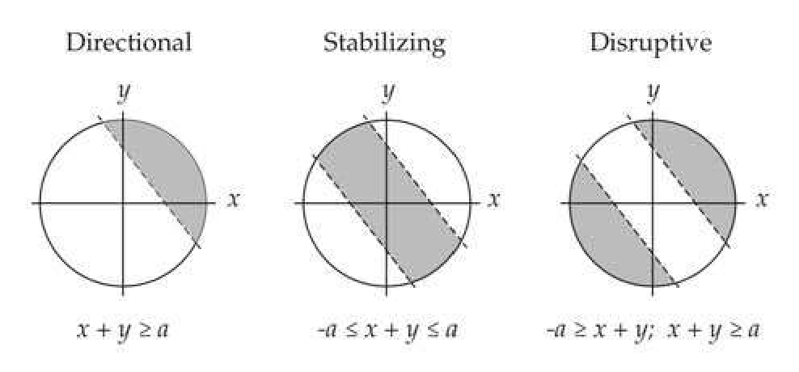
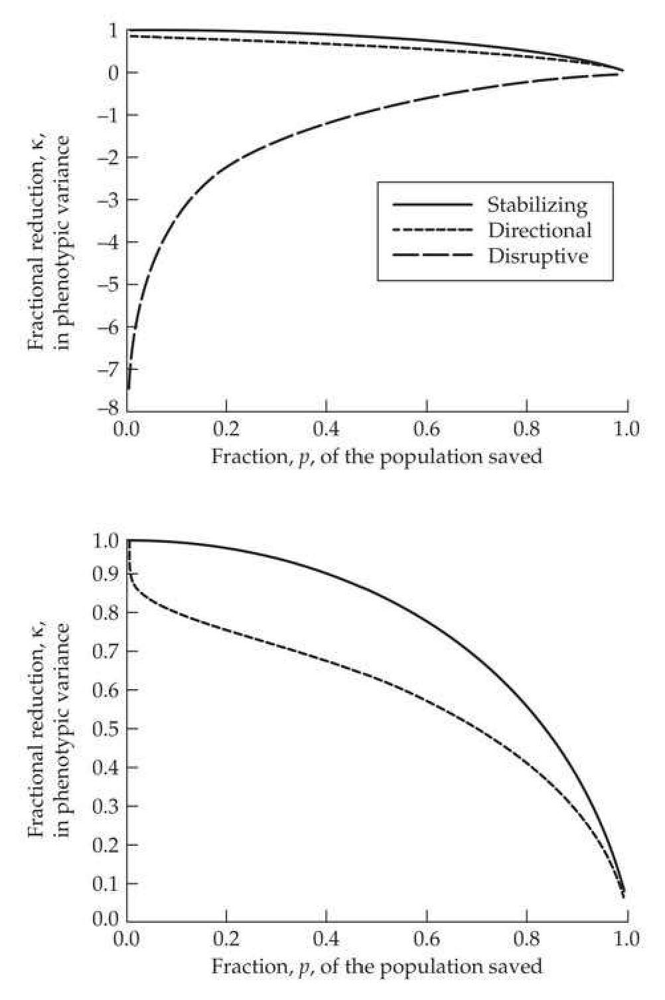
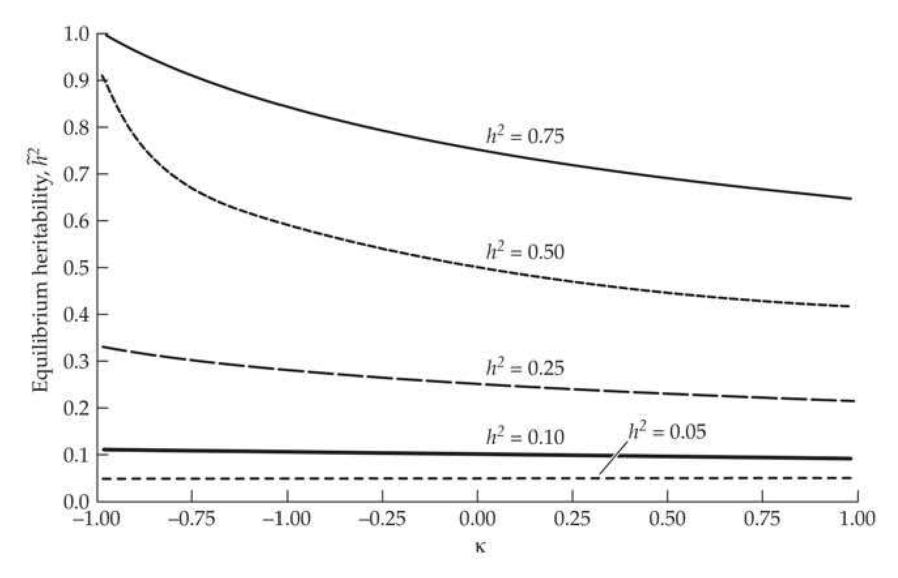
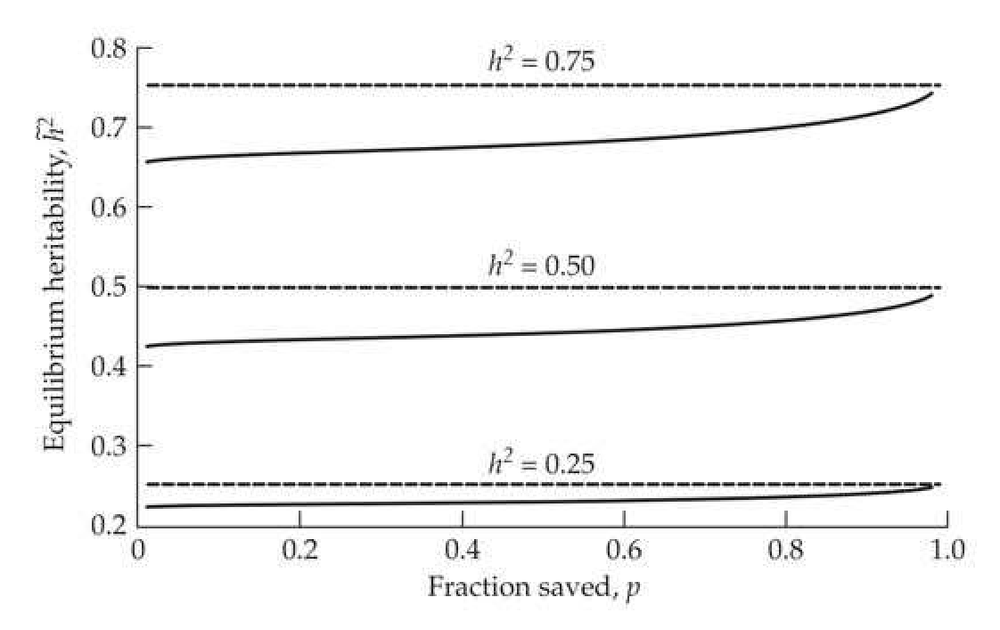

# Chapter 16 · Short-term Changes in the Variance: 1. Changes in the Additive Variance

## Evolution_chapter16_001 · Short-term Changes in the Variance: 1. Changes in the Additive Variance: Introduction

In artificial selection experiments it seems likely that the effects of linkage disequilibrium will be more important than the slower and less dramatic effects due to changes in gene frequencies. Michael Bulmer (1976a)

**[命题 Proposition]**

Up to this point, we have been assuming that selection does not significantly change the variance of a trait, at least over the short term (a few generations). This arises from our focus on directional selection (direct selection on the mean) and the assumption that a large number of loci, each with a small effect, underlie a trait. Under such a genetic architecture, allele-frequency changes over the short term can be cumulatively large enough to have a significant effect on the mean while having little effect on the variance (Chapter 24). This constancy of variance assumption ignores the fact that selection also generates gametic-phase disequilibrium (LD), even among unlinked loci, which can swiftly and dramatically change the variance even in the absence of any allele-frequency change. Further, natural and artificial selection can act directly on the variance of a trait itself, as in the case of stabilizing selection for more uniformity or disruptive selection for more extreme phenotypes on either side of the mean. The breeder's equation only considers the change in mean and hence is uninformative in these latter two cases. As we will show below, both directional and stabilizing selection generate negative disequilibrium (as alleles that increase trait values become negatively correlated within a gamete, even if unlinked), thus reducing $ \sigma_A^2 $. Conversely, disruptive selection increases the phenotypic variance, and this generates positive disequilibrium, inflating the additive variance. This chapter develops the Bulmer equation, an analog of the breeder's equation for the change in the additive genetic variance from selection-induced LD. This equation predicts how changes in LD change $ h^2 $, allowing updated values to be substituted into the breeder's equation for more accurate prediction of the selection response in the mean. It also predicts the short-term change in the variance under stabilizing and disruptive selection. Phenotypic assortative mating also generates disequilibrium, and we can use extensions of the Bulmer equation to simultaneously consider the effects of assortative mating and selection. Throughout this chapter, we assume (unless otherwise stated) the infinitesimal model holds and there is an infinite population size. Chapter 24 continues this discussion, relaxing many of the infinitesimal model assumptions (such as allowing for linkage and a finite number of loci) and more fully considering the impact from drift.

Changes in the genetic variance (though either LD or allele-frequency change) are not the only route by which selection can alter the phenotypic variance, $ \sigma_z^2 $. If there is heritable variation in the environmental variance (i.e., $ \sigma_E^2 $ varies over genotypes), $ \sigma_E^2 $ itself can respond to selection, also resulting in a change in $ \sigma_z^2 $, as discussed in Chapter 17.

---

## Evolution_chapter16_002 · Short-term Changes in the Variance: 1. Changes in the Additive Variance: Introduction / CHANGES IN VARIANCE DUE TO GAMETIC-PHASE DISEQUILIBRIUM

In the absence of epistasis, gametic-phase disequilibrium does not change the population mean (Chapter 15). However, as first pointed out by Lush (1945), it affects the response to selection by introducing correlations between alleles at different loci (even if unlinked), thus altering the additive genetic variance, even in the absence of any allele-frequency change.

To see this, let $ a_1^{(k)} $ and $ a_2^{(k)} $ be the average effects of the two alleles at locus $ k $ from a random individual, where the subscripts 1 and 2 denote the maternally and paternally derived alleles, respectively. Assuming (for now) random mating, there is no covariance between alleles of maternal and paternal origin, so that $ \sigma(a_1^{(k)}, a_2^{(j)}) = 0 $ for all $ k $ and $ j $. However, when gametic-phase disequilibrium is present, there can be covariances between alleles at different loci from the same parent, so that $ \sigma(a_1^{(k)}, a_2^{(j)}) $ and $ \sigma(a_2^{(k)}, a_2^{(j)}) $ can be nonzero. That is, there can be correlations between alleles in any particular gamete. Because $ \sigma_A^2 $ is the variance of the sum of average effects over all loci.

$$
\begin{align*}\sigma^{2}\left(\sum_{k=1}^{n}\left[a_{1}^{(k)}+a_{2}^{(k)}\right]\right)&=2\sum_{k=1}^{n}\sigma^{2}\left(a^{(k)}\right)+4\sum_{k=1}^{n}\sum_{k<j}^{n}\sigma\left(a^{(j)},a^{(k)}\right)\\&=2\sum_{k=1}^{n}C_{kk}+4\sum_{k=1}^{n}\sum_{k<j}^{n}C_{jk}\end{align*}
$$

where $n$ is the number of loci and $C_{jk}$ is the covariance between allelic effects at loci $j$ and $k$ (when contributed by the same parent, and hence on the same gamete). This decomposes the additive variance as

$$
\sigma_{A}^{2}=\sigma_{a}^{2}+d
$$

where $ \sigma_a^2 = 2 \sum C_{kk} $ is the additive variance in the absence of gametic-phase disequilibrium, while the disequilibrium contribution $ d = 4 \sum_{j < k} C_{kj} $ is the covariance between allelic effects at different loci (in terms of the notation used in LW Equation 7.14, $ d = \sigma_{A,A} $).

The component of the additive genetic variance that is unaltered by changes in gametic-phase disequilibrium, $ \sigma_a^2 $, is often referred to as the additive genetic variance (or simply the genic variance) to distinguish it from the additive genetic variance, $ \sigma_A^2 $. In the absence of disequilibrium, the genic and genetic variances are equivalent. Negative disequilibrium ($ d < 0 $) implies the presence of hidden additive variance ($ \sigma_A^2 < \sigma_A^2 $), with $ \sigma_A^2 $ increasing toward $ \sigma_a^2 $ as the disequilibrium decays. If $ d > 0 $, the additive variance is inflated relative to a random-mating population ($ \sigma_A^2 > \sigma_A^2 $), with $ \sigma_A^2 $ decreasing toward $ \sigma_A^2 $ as disequilibrium decays. Because $ n(n - 1) $ terms contribute to $ d $, whereas $ n $ terms contribute to $ \sigma_a^2 $, gametic-phase disequilibrium can generate large changes in the additive genetic variance even when changes in the individual covariances, $ C_{jk} $, are all very small (Chapter 24).

The allelic effects, $ a^{(k)} $ (and hence the genic variance, $ \sigma_a^2 $), are altered as allele frequencies change, resulting in a permanent change in $ \sigma_A^2 $. Changes in $ \sigma_a^2 $ due to selection strongly depend on the initial distribution of allelic effects and frequencies (Chapters 5 and 24–26), both of which are extremely difficult to estimate. Changes in $ d $, however, are generally less sensitive to the initial distribution of allelic effects (Sorensen and Hill 1982). Any changes in $ \sigma_A^2 $ due to changes in $ d $ are transient—in the absence of selection, recombination removes disequilibrium and the additive genetic variance, $ \sigma_A^2 $, returns to the additive genic variance, $ \sigma_a^2 $, as $ d $ decays to zero.

**[命题 Proposition]**

Thus, under our (short-term response) assumption that allele frequencies remain effectively constant, changes in $ \sigma_A^2 $ are due entirely to changes in $ d $, as the $ C_{kk} $ terms in Equation 16.1b (corresponding to $ \sigma_a^2 $) are only altered by allele-frequency change. Hence, the additive genetic variance in generation $ t $ is calculated by $ \sigma_A^2(t) = \sigma_a^2 + d(t) $, yielding a change in variance of $ \Delta \sigma_A^2(t) = \Delta d(t) $. Under random mating in the absence of selection, the disequilibrium between pairs of unlinked loci is halved in each generation (LW Equation 5.12), thus halving the covariance between allelic effects

$$
d(t+1)=\frac{d(t)}{2}
$$

Countering this process, selection tends to generate gametic-phase disequilibrium. For example, directional selection to change the mean usually reduces the variance of a character, thus generating negative values of d anew in each generation (Felsenstein 1965). As shown in Figure 16.1, stabilizing selection reduces the phenotypic variance and, in the process, creates negative values of d (as we will shortly demonstrate), while disruptive selection increases the phenotypic variance, generating positive d. Stabilizing and disruptive selection are occasionally referred to as centripetal selection and centrifugal selection, respectively (Simpson 1944). Figure 16.2 shows how directional and stabilizing selection generate negative covariances (and hence negative values of d) between loci under selection, while disruptive selection generates positive covariances (and hence positive values of d).

> **Figure 16.1** · page 3 · source: `Evolution_chapter16`
>
> 
>
> Figure 16.1 Artificial stabilizing and disruptive selection using double truncation. In both cases, a fraction, p, of the population is allowed to reproduce. Under stabilizing selection, the central p of the distribution is saved, while under disruptive selection, the uppermost and lowermost p/2 are saved.

> **Figure 16.2** · page 3 · source: `Evolution_chapter16`
>
> 
>
> Figure 16.2 The generation of covariances (gametic-phase disequilibrium, LD) by the various type of truncation selection. The variables  $ x $ and  $ y $ (e.g., allelic effects at two different loci) are uncorrelated before selection, with their distribution indicated by the open circle. Left: Under directional selection, only those values of  $ x + y $ above some threshold (say, a) are retained. The resulting distribution (the shaded area above the line for  $ x + y = a $) now displays a negative covariance between the remaining  $ x $ and  $ y $ values. Middle: Under stabilizing selection, only those values in the range of  $ -a \leq x + y \leq a $ are retained, also generating a negative covariance. Right: Under disruptive selection, only values of  $ x + y \geq a $ or  $ x + y \leq -a $ are retained, now resulting in a positive covariance between the remaining  $ x $ and  $ y $ values.

More generally, for values of $z$ that are normally distributed, selection reduces the phenotypic variance when $\partial^2 \ln w(z) / \partial z^2 < 0$ for all $z$ (Shnol and Kondrashov 1993), generating negative values of $d$. If this partial differential is > 0 for all values of $z$, selection increases the variance, generating positive values of $d$. One function that does not change the variance (when $z \sim$ normal) is the exponential fitness function, $w(z) = \exp(-az)$, as

$$
\begin{align*}\frac{\partial^2\ln w(z)}{\partial z^2}=-\frac{\partial^2az}{\partial z^2}=0\end{align*}
$$

for all z, and hence the variance following selection neither increases or decreases (Charlesworth 1990).

Assuming the validity of the infinitesimal model, Bulmer (1971b, 1974a, 1976a, 1980) solved the question of how these within-generation changes in the variance translate into between-generation changes (response in the variance). Chapter 24 moves beyond the infinitesimal model by considering the impact of linkage with a finite number of loci and finite population size. Estimation of the nature and amount of selection acting on the mean and the variance of a character is examined in Chapters 29 and 30.

---

## Evolution_chapter16_003 · Short-term Changes in the Variance: 1. Changes in the Additive Variance: Introduction / CHANGES IN VARIANCE UNDER THE INFINITESIMAL MODEL

Because allele frequencies remain essentially constant under the assumptions of the infinitesimal model, the additive genic variance, $ \sigma_a^2 $, remains constant and all changes in the additive genetic variance, $ \sigma_A^2 $, are due to changes in $ d $. Assuming the population is initially in gametic-phase equilibrium, so that $ d(0) = 0 $, then $ \sigma_A^2(0) = \sigma_a^2 $, yielding

$$
\sigma_{A}^{2}(t)=\sigma_{a}^{2}+d(t)=\sigma_{A}^{2}(0)+d(t)
$$

Let $ h^2(t) $ and $ \sigma_z^2(t) $ denote the heritability and phenotypic variance before selection in generation $ t $, and $ h^2 $ and $ \sigma_z^2 $ be the values of these quantities in the absence of gametic-phase disequilibrium.

**[命题 Proposition]**

While LD can alter the additive variance, what is its impact on the dominance genetic variance? Under the infinitesimal model, Bulmer (1971b) suggested that gametic-phase disequilibrium does not change $ \sigma_D^2 $. To see Bulmer's argument, first note from LW Equation 5.16b, that with a finite number of loci (n), the disequilibrium contribution to dominance genetic variance is of the order of $ n^2 \overline{D}^2 $, where $ \overline{D} $ is the average pairwise disequilibrium. Under the infinitesimal model, the total disequilibrium (summing over all pairs of loci) remains bounded as the number of loci increases, implying that $ \overline{D} $ is of the order of $ n^{-2} $ as there are $ n(n-1)/2 \approx n^2/2 $ pairs of loci contributing to $ \overline{D} $. The contribution to dominance variance from disequilibrium is thus of the order of $ n^2(n^{-2})^2 = n^{-2} $, which converges to zero in the infinitesimal-model limit (as the number of loci $ n \to \infty $). There is, however, some delicacy involved in this argument. In Chapter 24, we show that with strong directional dominance, the amount of inbreeding depression becomes unbounded as one increases the number of loci to the infinitesimal limit. These arguments on the lack of impact from LD on $ \sigma_D^2 $ assume the presence of a large number of small-effect loci. By contrast, Jorjani et al. (1998) used simulations to show that with a modest number of loci and small population size, changes in disequilibrium (in their case, from assortative mating) can significantly change the dominance variance. While we make the Bulmer assumption that there is no effect of dominance throughout this chapter, further exploration of the impact of disequilibrium on $ \sigma_D^2 $ is warranted. With this assumption in mind, in the absence of any epistatic variance, genotype $ \times $ environment interactions or correlations, the phenotypic variance and heritability at generation t become

$$
\sigma_{z}^{2}(t)=\sigma_{E}^{2}+\sigma_{D}^{2}+\sigma_{A}^{2}(t)=\sigma_{z}^{2}+d(t)
$$

$$
h^{2}(t)=\frac{\sigma_{A}^{2}(t)}{\sigma_{z}^{2}(t)}=\frac{\sigma_{a}^{2}+d(t)}{\sigma_{z}^{2}+d(t)}
$$

where $ \sigma_z^2 = \sigma_z^2(0) $ is the phenotypic variance before selection in the initial (unselected) population ($ d(0) = 0 $). Thus, knowledge of the value of $ d(t) $ is sufficient to predict the variances in generation $ t $, and hence the heritability and the response in the mean, using

$$
R(t)=h^{2}(t)S(t)=h^{2}(t)\bar{\imath}(t)\sigma_{z}(t)
$$

Under the infinitesimal model, genotypic values are normally distributed before selection (Bulmer 1971b, 1976b). Recalling that $ z = G + E $, we then see that if the environmental values, $ E $, are also normally distributed, the joint distribution of phenotypic and genotypic values is multivariate normal. Hence, from standard statistical theory (e.g., LW Chapter 8), the regression of offspring phenotypic value, $ z_{o} $, on parental phenotypes, $ z_{m} $ and $ z_{f} $, is linear and homoscedastic, with

$$
z_{o}=\mu+\frac{h^{2}}{2}(z_{m}-\mu)+\frac{h^{2}}{2}(z_{f}-\mu)+e
$$

where

$$
\sigma_{e}^{2}=\left(1-\frac{h^{4}}{2}\right)\sigma_{z}^{2}
$$

The derivation of Equation 16.5 follows from standard multiple-regression theory and the correlations between relatives (see Example 6 in LW Chapter 8 for details).

We denote the within-generation change in variance by $ \delta(\sigma_z^2) = \sigma_z^2 - \sigma_z^2 $, where $ z^* $ refers to a phenotypic value from the selected population. (More generally, $ \sigma_z^2 $, is the fitness-weighted trait variance; see Chapter 29). Throughout this chapter we use the notation $ \delta $ to distinguish the within-generation change of a variable from its between-generation change, $ \Delta $, as the latter incorporates the effects of genetic transmission across a generation. If we take variances of both sides of Equation 16.5a and assume random mating (so that $ \sigma(z_f, z_m) = 0 $) and identical selection on both sexes, the phenotypic variance among the offspring from selected parents becomes

$$
\begin{aligned}\sigma^{2}(z_{o})&=\frac{h^{4}}{4}\left[\sigma^{2}(z_{m}^{*})+\sigma^{2}(z_{f}^{*})\right]+\sigma_{e}^{2}\\&=\frac{h^{4}}{2}\left[\sigma_{z}^{2}+\delta(\sigma_{z}^{2})\right]+\left(1-\frac{h^{4}}{2}\right)\sigma_{z}^{2}\\&=\sigma_{z}^{2}+\frac{h^{4}}{2}\delta\left(\sigma_{z}^{2}\right)\\ \end{aligned}
$$

The change in phenotypic variance in the offspring due to selection on their parents generating disequilibrium is thus $ (h^4/2)\delta(\sigma_z^2) $. Because there is no change in the environmental, dominance, or genic variances, this change is all in the disequilibrium component, $ d $, of the additive genetic variance, $ \sigma_A^2 $. Combining Equations 16.6 and 16.3 yields a general recursion for changes in the variance under the infinitesimal model with unlinked loci of

$$
d(t+1)=\frac{d(t)}{2}+\frac{h^{4}(t)}{2}\delta\left(\sigma_{z(t)}^{2}\right)
$$

implying that the between-generation change in the disequilibrium contribution is

$$
\begin{aligned}\Delta d(t)&=\Delta\sigma_{z(t)}^{2}=\Delta\sigma_{A}^{2}(t)\\&=-\frac{d(t)}{2}+\frac{h^{4}(t)}{2}\delta\left(\sigma_{z(t)}^{2}\right)\end{aligned}
$$

This Bulmer equation (1971a) is the variance analog of the breeder’s equation, which predicts short-term changes in the variance as opposed to the mean. The first term is the decay due to recombination in the disequilibrium contribution from the previous generation (assuming loci are unlinked), while the second term is the amount of new disequilibrium generated by selection that is passed onto the offspring generation. As with the breeder’s equation, this second term is a function of the within-generation change ($ \delta $) in the phenotypic variance and the fraction ($ h^{4}/2 $) transmitted to the next generation. When loci are linked with a recombination fraction of c, a larger fraction (1 - c) of any previous d remains, yielding the change (from recombination alone) of $ \Delta d(t) = (1 - c)d(t) - d(t) = -cd(t) $. Chapter 24 examines the effect of linked loci in more detail.

Note from Equation 16.7b that if we start from a base population in linkage equilibrium, $ d(0) = 0 $, the sign of the within-generation change in the variance, $ \delta(\sigma_{z(t)}^{2}) $, equals the sign of d. Selection that decreases the phenotypic variance generates negative values of d, while selection that inflates the variance generates positive values of d. This change in the variance (typically a reduction) due to selection generating disequilibrium is called the Bulmer effect. Provided the joint distribution of phenotypic and genotypic values remains multivariate normal, under the infinitesimal model, the complete dynamics of the phenotypic distribution are jointly described by the change in the variance (Equations 16.7a and 16.7b), while the change in the mean is given by updating the breeder's equation, $ R(t) = h^{2}(t) S(t) $, using Equation 16.4b.

Equation 16.7a makes the further point that if we wish to use variance components to predict the response to selection, we need to start from an unselected base population. If a population has experienced recent prior selection, then $ d(0) \neq 0 $, and hence the change in $ \sigma_A^2 $ (and, in turn, the response to selection) cannot be predicted without knowing the value of $ d $ in the starting population. Finally, setting $ \Delta d = 0 $ in Equation 16.7b shows that, at equilibrium,

$$
\widetilde{d}=\widetilde{h}^{4}\widetilde{\delta}(\sigma_{z}^{2})
$$

where the tilde denotes an equilibrium value.

One very important implication for evolution follows from Equation 16.7a, which shows that loci underlying traits whose variance is reduced following selection tend to be in negative disequilibrium. Specifically, the frequency of gametes containing two positive (or two negative) alleles are underrepresented compared to the situation in random mating. Fitness itself is also a quantitative trait, which is influenced by numerous loci and environmental effects. Following selection, the variance in fitness is decreased, and hence Equation 16.7a implies that favorable alleles will be in negative disequilibrium. This reduces any additive variance in fitness, which in turn reduces the efficiency of selection.

**[示例 Example]**

*(See Example 16.1.)*

---

## Evolution_chapter16_004 · CHANGES IN VARIANCE UNDER THE INFINITESIMAL MODEL / Within- and Among-Family Variance Under the Infinitesimal Model

An alternative, instructive approach to the phenotypic regression argument leading to Equation 16.7a is to consider the regression of offspring breeding value ($ A_{o} $) on the breeding values of its parents ($ A_{f}, A_{m} $). Under the infinitesimal model, the joint distribution of parental and offspring breeding values before selection is multivariate normal (Bulmer 1971b), and Example 7 in Chapter 8 of LW shows that the distribution of breeding values in the offspring of parents with breeding values of $ A_{f} $ and $ A_{m} $ is given by the regression

$$
A_{o}=\frac{1}{2}A_{m}+\frac{1}{2}A_{f}+e
$$

The residual e is the contribution due to segregation, which is normally distributed with a mean of zero and variance of $ \sigma_{a}^{2}/2 $, half the current genic variance (Bulmer 1971b; Felsenstein 1981; Tallis 1987), see Example 16.2. Because $e$ is the residual of a regression, it is uncorrelated with both $A_f$ and $A_m$ (LW Chapters 3 and 8). Computing variances and assuming random mating (so that $A_f$ and $A_m$ are uncorrelated),

$$
\begin{aligned}\sigma_{A}^{2}(t+1)&=\sigma_{A_{o}}^{2}(t+1)=\sigma^{2}\left(\frac{A_{m}(t)}{2}+\frac{A_{f}(t)}{2}\right)+\sigma_{e}^{2}\\&=\frac{1}{4}\left(\sigma_{A_{m}}^{2}(t)+\sigma_{A_{f}}^{2}(t)\right)+\frac{1}{2}\sigma_{A}^{2}(0)\\&=\frac{1}{2}\sigma_{A^{*}}^{2}(t)+\frac{1}{2}\sigma_{a}^{2}\end{aligned}
$$

where $ \sigma_{A^*}^2(t) $ is the variance of the breeding values of the selected parents (with assortative mating, Equation 16.8b has an additional term, $ \sigma(A_m^*, A_f^*)/2 $; see Equation 16.21b). Equation 16.8b shows that additive variance can be decomposed into an among-family component (half the additive genetic variance, $ \sigma_{A^*}^2(t)/2 $), that measures the differences between the mean breeding values of families, and a within-family component (half the additive genetic variance, $ \sigma_a^2/2 $) due to segregation that measures the variation within families. Equations 16.8a and 16.8b imply that under the infinitesimal model (and in an infinite population), the within-family additive variance remains constant. The change in the additive-genetic variance is thus entirely due to changes in the variance of the mean values of different families. Positive disequilibrium ($ d > 0 $) increases the among-family component while negative disequilibrium ($ d < 0 $) decreases it (Reeve 1953). For example, under directional selection, selected parents (being chosen for exceptional trait values) are more similar to each other than are two random individuals from the unselected base population.

The within-family variance, $ \sigma_a^2/2 $, deserves additional comment. This is often called the Mendelian sampling variance or the segregation variance. Notice that this variance (under the infinitesimal model) is not affected by selection, as we assume there is only negligible change in allele frequencies. As we will see shortly, however, it can be decreased by drift or inbreeding. Likewise, with a finite (but large) number of loci, $ \sigma_a^2 $ can indeed be affected by selection, but the change per generation is typically very small (Chapter 24). An especially important implication of this constant within-family segregation variance is that it tends to largely restore a normal distribution of breeding values following selection. As Equation 16.8a demonstrates, the distribution of breeding values in the offspring is the sum of two components: the breeding values of the selected parents plus the contribution due to segregation. Even if the distribution of breeding values in the selected parents departs significantly from normality, segregation tends to reduce this departure for a Gaussian. Interestingly, Smith and Hammond (1987) found that the short-term deviation from normality is largest when selection is moderate, with deviations becoming smaller as selection increases. This can be seen from Equation 16.8a by writing $ A_o = A_{mp} + e $, where $ A_{mp} $ is the midparental breeding value and e is the contribution due to segregation (offspring receiving alternative alleles from heterozygous loci). As selection intensity increases, the variation due to $ A_{mp} $ decreases (as the selected individuals fall into an ever-decreasing range of phenotypes), and the majority the variation of $ A_o $ is accounted for by the normally distributed random variable, e, thus decreasing any departure from normality induced by the distribution of $ A_{mp} $.

The derivation of Equations 16.7a, 16.7b, and 16.8a assumes that breeding values remain normally distributed. If selection changes the distribution of breeding values sufficiently away from normality, the parent-offspring regression may cease to be linear and homoscedastic. Consequences of departures from linearity were briefly discussed in Chapter 13 and are explored more fully in Chapter 24. The heteroscedasticity of the residuals implies that $ \sigma_{e}^{2} $ in Equation 16.8a may depend on the actual parental values chosen, which greatly complicates matters. In all discussions that follow, we assume that these departures from normality can be ignored. Chapter 24 works at relaxing these assumptions.

**[示例 Example]**

*(See Example 16.2.)*

---

## Evolution_chapter16_005 · CHANGES IN VARIANCE UNDER THE INFINITESIMAL MODEL / Accounting for Inbreeding and Drift

As shown in Example 16.2, the effects of drift and regular inbreeding are easily accommodated under the infinitesimal model (Verrier et al. 1989). Recall that the segregation variation is simply half the additive genic variance of the parental population. When genetic drift is present, Equation 11.2 yields a genic variance in generation t of

$$
\sigma_{a}^{2}(t)=\sigma_{a}^{2}(0)\left(1-\frac{1}{2N_{e}}\right)^{t}
$$

resulting in a segregation variance in generation t of $ \sigma_{a}^{2}(t)/2 $. As shown by Keightley and Hill (1987), drift has only a small effect on the disequilibrium

$$
\Delta d(t)=-\frac{d(t)}{2}\left(1+\frac{1}{N_{e}}\right)-\frac{1}{2}\left(1-\frac{1}{N_{e}}\right)\kappa h^{2}(t)\sigma_{A}^{2}(t)
$$

where $ \kappa = 1 - \sigma_{z^*}^2 / \sigma_z^2 $ is the fractional reduction in phenotypic variance following selection (Equation 16.10a). When population size is finite, the additive variance in any particular generation, $ \sigma_{A}^{2}(t) = \sigma_{a}^{2}(t) + d(t) $, can be computed by jointly iterating Equations 16.9a and 16.9b.

Similarly, when the parents are inbred, the segregation variance is also correspondingly reduced. This variance arises from the segregation of alleles in heterozygotes in the parents (and hence the term Mendelian sampling variance). As parents become more inbred, the heterozygosity, and hence the segregation variance, decreases. Assuming there is no correlation between the parents, the within-family segregation variance under inbreeding is

$$
\frac{\sigma_{a}^{2}(t)}{2}=\frac{\sigma_{a}^{2}(0)}{2}\left[1-\frac{f_{m}(t)+f_{f}(t)}{2}\right]
$$

where $ f_{m} $ and $ f_{f} $ denote the average amount of inbreeding in the selected male and female parents (measured by their respected inbreeding coefficients, f; Chapter 2; LW Chapter 10). The additive variance recursion (Equation 16.8b), under the assumptions of the infinitesimal model, becomes

$$
\sigma_{A}^{2}(t+1)=\frac{1}{4}\left[\sigma_{A_{m}^{*}}^{2}(t)+\sigma_{A_{f}^{*}}^{2}(t)\right]+\frac{\sigma_{a}^{2}(0)}{2}\left[1-\frac{f_{m}(t)+f_{f}(t)}{2}\right]
$$

These results for the reduction in $ \sigma_{a}^{2} $ under inbreeding apply to the case of only additive variance. When nonadditive variance is present, the changes in additive variance under inbreeding are potentially much more complex (Chapter 11).

---

## Evolution_chapter16_006 · Short-term Changes in the Variance: 1. Changes in the Additive Variance: Introduction / CHANGES IN VARIANCE UNDER TRUNCATION SELECTION

Provided the normality assumptions of the infinitesimal model hold, the changes in variance under any selection model can be computed by obtaining the within-generation change in the phenotype variance, $ \delta(\sigma_{z(t)}^{2}) $, and applying Equation 16.7a or 16.7b. In the general case, this requires numerical iteration to obtain the equilibrium heritability and genetic variance. However, in many cases, the phenotypic variance after selection can be written as

$$
\sigma_{z^{*}}^{2}=\left(1-\kappa\right)\sigma_{z}^{2}
$$

where $ \kappa $ is a constant independent of the current value of the variance. In such settings,

$$
\delta\left(\sigma_{z}^{2}\right)=\sigma_{z^{*}}^{2}-\sigma_{z}^{2}=-\kappa\sigma_{z}^{2}
$$

When Equation 16.10a holds (implying that selection generates a constant proportional reduction in variance), simple analytic solutions for the equilibrium variances and heritability can be obtained (again, assuming the validity of the infinitesimal model). Truncation selection—both as we have defined it for directional selection (Chapter 14) and double truncation giving disruptive or stabilizing selection (Figure 16.1)—satisfies Equation 16.10. As shown in *[See Table 16.1 at the end of this section.]*, for truncation selection on a normally distributed phenotype, $ \kappa $ is strictly a function of the fraction, p, of the population saved and the type of truncation selection used. Figure 16.3 plots values of $ \kappa $ as a function of p for these three different truncation selection schemes.

> **Figure 16.3** · page 11 · source: `Evolution_chapter16`
>
> 
>
> Figure 16.3 The fractional reduction,  $ \kappa $, of phenotypic variance removed by truncation selection (Figure 16.1) as a function of the fraction,  $ p $, of individuals saved. Following selection, the new variance is  $ (1 - \kappa)\sigma_z^2 $. Top: The lower-most curve (values of  $ \kappa < 0 $) corresponds to disruptive selection (and hence an increase in the variance,  $ \sigma_z^2 > \sigma_z^2 $), while the upper two curves ( $ \kappa > 0 $) correspond to directional (middle curve) and stabilizing selection (upper curve), and hence a decrease in the variance,  $ \sigma_z^2 < \sigma_z^2 $. Bottom: Close-up for directional (lower curve) and stabilizing selection (upper curve).

Suppose selection is such that Equation 16.10a is satisfied. We allow for differential selection on the sexes by letting the variance after selection in males and females be $ \sigma^2(z_m^*) = (1 - \kappa_m)\sigma_z^2 $ and $ \sigma^2(z_f^*) = (1 - \kappa_f)\sigma_z^2 $, respectively. If parental phenotypes are uncorrelated (i.e., there is random mating), Directional Truncation Selection: Uppermost p saved

$$
\kappa=\frac{\varphi\left(x_{[1-p]}\right)}{p}\left(\frac{\varphi\left(x_{[1-p]}\right)}{p}-x_{[1-p]}\right)=\overline{\imath}\left(\overline{\imath}-x_{[1-p]}\right)
$$

**[Table]**

*[See Table 16.1 at the end of this section.]*

The within-generation change in the variance due to selection becomes

$$
\delta(\sigma_{z(t)}^{2})=-\kappa\sigma_{z}^{2}(t)=-\kappa\frac{\sigma_{A}^{2}(t)}{h^{2}(t)}
$$

where we have used the identity $ \sigma_z^2 = \sigma_A^2/h^2 $. Substituting Equation 16.12c into Equation 16.7a recovers the result of Bulmer (1974a),

$$
d(t+1)=\frac{d(t)}{2}-\frac{\kappa}{2}h^{2}(t)\sigma_{A}^{2}(t)=\frac{d(t)}{2}-\frac{\kappa}{2}\frac{\left[\sigma_{a}^{2}+d(t)\right]^{2}}{\sigma_{z}^{2}+d(t)}
$$

with last step following from $ h^{2}\sigma_{A}^{2}=(\sigma_{A}^{2}/\sigma_{z}^{2})\sigma_{A}^{2}=\sigma_{A}^{4}/\sigma_{z}^{2} $

At equilibrium, $ \widetilde{d} = -\kappa \widetilde{h}^2 \widetilde{\sigma}_A^2 $, and because $ \widetilde{\sigma}_A^2 = \sigma_a^2 + \widetilde{d} $ and $ \widetilde{h}^2 = (\sigma_a^2 + \widetilde{d}) / (\sigma_z^2 + \widetilde{d}) $, we have

$$
\widetilde{d}=-\kappa\frac{(\sigma_{a}^{2}+\widetilde{d})^{2}}{\sigma_{z}^{2}+\widetilde{d}}
$$

This quadratic equation in $ \tilde{d} $ has one admissible solution (the constraint being that $ \tilde{\sigma}_A^2 = \tilde{d} + \sigma_a^2 \geq 0 $). Solving yields

$$
\widetilde{\sigma}_{A}^{2}=\sigma_{z}^{2}\gamma,\quad\mathrm{w h e r e}\quad\gamma=\frac{2h^{2}-1+\sqrt{1+4h^{2}(1-h^{2})\kappa}}{2(1+\kappa)}
$$

Because $ \widetilde{\sigma}_{A}^{2}-\sigma_{A}^{2}=\widetilde{d} $, we can write

$$
\begin{align*}\widetilde{\sigma}^2_z=\sigma^2_z+(\widetilde{\sigma}^2_A-\sigma^2_A)=\sigma^2_z(1+\gamma-h^2)\end{align*}
$$

$$
\begin{align*}\widetilde h^2=\frac{\widetilde\sigma_A^2}{\widetilde\sigma_z^2}=\frac{\gamma}{1+\gamma-h^2}\end{align*}
$$

yielding an equilibrium heritability of

Following Gomez-Raya and Burnside (1990), we can also express the equilibrium heritability as

$$
\begin{align*}\widetilde h^2={-1+\sqrt{1+4h^2(1-h^2)\kappa}\over2\kappa (1-h^2)}\end{align*}
$$

Figure 16.4 plots the equilibrium heritability as a function of $ \kappa $ and the initial heritability in the absence of any disequilibrium.

> **Figure 16.4** · page 12 · source: `Evolution_chapter16`
>
> 
>
> Figure 16.4 Equilibrium  $ h^2 $ values as a function of  $ \kappa $ and the initial heritability,  $ h^2 $. Note that for  $ \kappa < 0 $, the variance is increased by selection ( $ \sigma_z^2 > \sigma_z^2 $, as occurs with disruptive selection) and the equilibrium  $ h^2 $ is greater than its initial value.

> **Table 16.1** · `16.1` · page 10 · source: `Evolution_chapter16_006`
> Table 16.1 Changes in the phenotypic variance under the various schemes of single and double truncation given in Figure 16.1. Assuming the character is normally distributed before selection, the phenotypic variance after selection is calculated as $ \sigma_{z*}^2 = (1 - \kappa) \sigma_z^2 $, where $ \kappa $ (as shown in the table) is a function of the fraction, $ p $, of individuals saved. Here $ \varphi $ denotes the unit normal density function and $ x_{[p]} $ satisfies $ \Pr(U \leq x_{[p]}) = p $ (equivalently, $ \Pr[U > x_{[1-p]}] = p $), where $ U $ is a unit normal random variable. Finally, $ \bar{\tau} $ is the selection intensity and is also a function of $ p $ (Equation 14.3a). While first presented in the quantitative genetics literature by Bulmer (1976a), these expressions can be found in Johnson and Kotz (1970a).
>
> Selection scheme | Formula
> --- | ---
> Directional Truncation Selection: Uppermost p saved | $\kappa=\frac{\varphi\left(x_{[1-p]}\right)}{p}\left(\frac{\varphi\left(x_{[1-p]}\right)}{p}-x_{[1-p]}\right)=\overline{\imath}\left(\overline{\imath}-x_{[1-p]}\right)$
> Stabilizing Truncation Selection: Middle fraction p of the distribution saved | $\kappa=\frac{2\varphi\left(x_{[1/2+p/2]}\right)x_{[1/2+p/2]}}{p}$
> Disruptive Truncation Selection: Uppermost and lowermost p/2 saved | $\kappa=-\frac{2\varphi\left(x_{[1-p/2]}\right)x_{[1-p/2]}}{p}$

---

## Evolution_chapter16_007 · CHANGES IN VARIANCE UNDER TRUNCATION SELECTION / Changes in Correlated Characters

Suppose the joint distribution of phenotypic values for our trait under selection, z, and two other phenotypically correlated traits, x and y, is multivariate normal. If the within-generation change in the phenotypic values of z is given by Equation 16.10a, then classical results (Pearson 1903) for the multivariate distribution imply that the variance in x following selection on (only) z is calculated by

$$
\begin{align*}\sigma^2(x^*)=(1-\kappa\rho^2_{x,z})\sigma^2(x)\end{align*}
$$

implying that

$$
\begin{align*}\delta\left[\sigma^2(x)\right]=-\kappa\rho^2_{x,z}\sigma^2(x)\end{align*}
$$

where $ \rho_{x,z} $ is the phenotypic correlation between traits x and z. If selection reduces the variance in z ($ 0 < \kappa < 1 $), then the variance in any correlated character is also reduced, independent of the sign of the correlation (as change is a function of $ \rho^{2} $). Likewise, the covariance between x and y following selection on z is calculated by

$$
\sigma(x^{*},y^{*})=\sigma(x,y)-\kappa\frac{\sigma(x,z)\sigma(y,z)}{\sigma_{z}^{2}}
$$

yielding a within-generation change in this covariance of

$$
\delta\left[\sigma(x,y)\right]=-\kappa\frac{\sigma(x,z)\sigma(y,z)}{\sigma_{z}^{2}}
$$

These results will prove useful in Volume 3 when we consider the Bulmer effect for multi-variate traits, such as selection on an index or using BLUP.

---

## Evolution_chapter16_008 · CHANGES IN VARIANCE UNDER TRUNCATION SELECTION / Directional Truncation Selection: Theory

A fractional change, $ \sigma_z^2 = (1 - \kappa) \sigma_z^2 $, in the phenotypic variance occurs under various forms of truncation selection. Directional truncation selection results in a reduction in the phenotypic variance following selection ($ \kappa > 0 $), generating negative values of $ d $ and a corresponding reduction in both the additive variance and heritability. When the trait is normally distributed, recalling LW Equation 2.15 yields

$$
\sigma_{z^{*}}^{2}=\left[1-\bar{\imath}\left(\bar{\imath}-x_{[1-p]}\right)\right]\sigma_{z}^{2}
$$

and hence, as given in *[See Table 16.1 at the end of this section.]*,

$$
\kappa=\overline{\imath}\left(\overline{\imath}-x_{[1-p]}\right)
$$

where $ \bar{\imath} $ is the selection intensity (Equation 14.3).

The stronger the selection (i.e., the smaller the value of p and hence the larger the value of $ \bar{i} $), the larger is the disequilibrium generated and the greater is the reduction in additive variance (Figure 16.5). Because the response to selection depends on the additive genetic variance in the selected parents, the response to selection in the first generation is unaffected (assuming the parents from the base population are in gametic-phase equilibrium). However, over the next two or three generations, essentially all of the reduction in $ h^{2} $ due to buildup of negative d occurs, after which heritability remains essentially constant (see Example 16.3). Equations 16.13a through 16.13d provide the equilibrium (or asymptotic) variances and heritabilities. The ratio of the asymptotic to initial (assuming d = 0) rates of response is given by

$$
\frac{\widetilde{R}}{R(0)}=\frac{\bar{\imath}\widetilde{h}\widetilde{\sigma}_{A}}{\bar{\imath}h(0)\sigma_{A}(0)}=\sqrt{\frac{\widetilde{h}^{2}}{h^{2}(0)\left[1+\kappa\widetilde{h}^{2}\right]}}
$$

as obtained by Gomez-Raya and Burnside (1990). As shown in Figure 16.5, the reduction in heritability is greatest when selection is strong (i.e., when the fraction saved, p, is small) and heritability is high.

> **Figure 16.5** · page 12 · source: `Evolution_chapter16`
>
> 
>
> Figure 16.5 Equilibrium heritability values under directional (truncation) selection as a function of the fraction, p, saved and the initial heritability,  $ h^{2} $. The three curves correspond to initial heritability values of 0.75, 0.5, and 0.25, with the dashed lines displaying the constant heritability values and the solid line displaying the value at equilibrium.

**[示例 Example]**

*(See Example 16.3.)*

**[Table]**

*[See Table 16.2 at the end of this section.]*

> **Table 16.2** · `16.2` · page 15 · source: `Evolution_chapter16_008`
> Table 16.2 Heritability and additive genetic variance in an experimental population undergoing directional selection on abdominal bristle number in Drosophila melanogaster. The base population is denoted by B. At the third generation of selection (H3), and following four generations of selection plus three generations of no selection (C7, in generation 7), $ h^2 $ was estimated from the response to divergent selection (Chapter 18) and $ \sigma_A^2 $ was subsequently estimated by $ \widehat{h}^2 \sigma_z^2 $. The standard error for $ \widehat{h}^2 $ in all cases was 0.04. (After Sorensen and Hill 1982.)
>
> <table><tr><td rowspan="2"></td><td colspan="3">$ \hat{h}^{2}(t) $</td><td colspan="3">$ \hat{\sigma}_{A}^{2}(t) $</td></tr><tr><td>B</td><td>H3</td><td>C7</td><td>B</td><td>H3</td><td>C7</td></tr><tr><td>Replicate 1</td><td>0.42</td><td>0.45</td><td>0.59</td><td>3.63</td><td>5.83</td><td>7.66</td></tr><tr><td>Replicate 2</td><td>0.38</td><td>0.26</td><td>0.26</td><td>2.96</td><td>2.28</td><td>2.08</td></tr></table>

---

## Evolution_chapter16_009 · CHANGES IN VARIANCE UNDER TRUNCATION SELECTION / Directional Truncation Selection: Experimental Results

How well do these predictions, which make a number of assumptions (additivity, infinitesimal model, normality), hold up for directional selection? Somewhat surprisingly, not many experiments have directly examined these issues. One reason is that the predicted change in $ h^2 $ under directional selection is usually expected to be small (Figure 16.5) and hence laborious to detect (requiring very large sample sizes, even when $ h^2 $ is large and $ p $ is small). One indirect study is that of Atkins and Thompson (1986), who subjected Blackface sheep to selection for increased bone length. Following 18 years of selection, the realized heritability (the ratio of observed response to selection differential; see Equation 18.10) was estimated to be $ 0.52 \pm 0.02 $. Using the infinitesimal model, they predicted the expected base population heritability to be 0.57, in agreement with the estimated base population heritability of $ 0.56 \pm 0.04 $. Further, the infinitesimal model predicts a 10% decrease in phenotypic variance, and the authors observed a 9% decrease in the upwardly selected line and an 11% decrease in the downwardly selected line.

A more direct study is that of Sorensen and Hill (1982), who subjected two replicate lines of Drosophila melanogaster to directional truncation selection on abdominal bristle number for four generations and then relaxed selection (*[See Table 16.2 at the end of this section.]*). They interpreted their data as being consistent with the presence of a major allele (or alleles) at low frequency in the base population. These alleles are lost by sampling accidents in some lines (e.g., replicate 2, which shows no net increase in additive variance). If not lost, they are expected to increase rapidly in frequency due to selection, thus increasing additive variance (replicate 1), with this increase being partly masked by the generation of negative disequilibrium with other loci. Once selection stops, disequilibrium breaks down, resulting in a further increase in additive variance (compare the additive variance in lines H3 and C7 in replicate 1). Hence, even when major alleles are present, generation of gametic-phase disequilibrium reduces the rate of selection response.

---

## Evolution_chapter16_010 · CHANGES IN VARIANCE UNDER TRUNCATION SELECTION / Effects of Epistasis: Does the Griffing Effect Overpower the Bulmer Effect?

As discussed in Chapter 15, Griffing (1960a, 1960b) showed that when additive epistasis is present, gametic-phase disequilibrium increases the response to directional selection, with the change in mean augmented by $ S\sigma_{AA}^{2}/2\sigma_{z}^{2} $. This (transient) increase in the rate of response has been termed the Griffing effect. Thus, in the presence of additive epistasis, disequilibrium is, on one hand, expected to increase the rate of response, while on the other hand it is also expected to decrease the rate of response by decreasing the expressed additive genetic variance (the Bulmer effect). Which change is more important?

Based on a small simulation study, Mueller and James (1983) concluded that if epistatic variance is small relative to additive variance and the proportion of pairs of loci showing epistasis is also small, the Bulmer effect dominates the Griffing effect, and disequilibrium reduces the response to selection. More generally, as Chapter 15 stresses, the Griffing effect only transiently inflates the response. It has no effect on the permanent component of response, while the Bulmer effect does. Specifically, while the change in variance under the

Bulmer effect and change in the mean from additive-by-additive genetic variance under the Griffing effect both decay to zero under random mating once selection stops, the change in the mean from $ h^{2}S $ is permanent. By lowering the additive variance during selection, the Bulmer effect results in a reduced permanent response. Hence, under the infinitesimal model, final response is lowered by the Bulmer effect and not influenced by the Griffing effect.

---

## Evolution_chapter16_011 · CHANGES IN VARIANCE UNDER TRUNCATION SELECTION / Double-Truncation Selection: Theory

*[See Table 16.1 at the end of this section.]* and Figure 16.3 show that $ \kappa > 0 $ under stabilizing double-truncation selection, so that selection reduces the within-generation phenotypic variance and generates negative disequilibrium. Conversely, $ \kappa < 0 $ for disruptive selection, with selection increasing the within-generation variance and generating positive disequilibrium. Hence, when the assumptions of the infinitesimal model hold, heritability is expected to decrease under stabilizing selection and increase under disruptive selection (Figure 16.4), although all of this response in the variance is transient. Upon the cessation of selection, the additive genetic variance decays back to its base-population value.

Consideration of Equation 16.13a shows that under stabilizing selection ($ \kappa > 0 $), the value $ \gamma = \widetilde{\sigma}_A^2 / \sigma_z^2 $ (which measures the fraction of the initial phenotypic variance that is additive genetic variance at equilibrium) satisfies $ 0 < \gamma < h^2 $. Similarly, under disruptive selection, $ \gamma > h^2 $, with one twist. If disruptive selection is sufficiently strong, $ \kappa < -[4h^2(1 - h^2)]^{-1} $, there is no positive real root for $ \gamma $, and the variance increases without limit in the infinitesimal model (Bulmer 1976a). This is a consequence of the infinite number of loci in the infinitesimal limit. What happens with a finite number of loci is suggested from simulation studies of Bulmer (1976a), who examined the behavior when disruptive selection generated sufficiently negative $ \kappa $ values to ensure that there is no positive real root of Equation 16.13a. Bulmer assumed 12 identical additive diallelic loci (alternative alleles contributing 1 and 0, respectively, to the genotypic value). After a few generations, this population showed essentially complete disequilibrium, with most individuals having values of 0, 12, and 24 (with frequencies of 1/4, 1/2, 1/4). At equilibrium, the population behaved as though there were a single locus segregating two alleles (contributing 0 and 12), each with a frequency of 1/2. Thus, the expectation when there is no positive real solution for $ \widetilde{\sigma}_A^2 $ is that the population approaches a state of essentially complete disequilibrium while under selection.

The approach to the equilibrium value, d, also behaves differently under disruptive selection. Under directional and stabilizing selection, the majority of reduction in the additive variance occurs in the first few generations. However, the increase in the variance toward its equilibrium value under disruptive selection requires many more generations, as Example 16.4 illustrates.

**[示例 Example]**

*(See Example 16.4.)*

---

## Evolution_chapter16_012 · CHANGES IN VARIANCE UNDER TRUNCATION SELECTION / Double Truncation Selection: Experimental Results

Experiments examining the effects of selection on the variance were reviewed by Prout (1962a), Thoday (1972), Soliman (1982), and Hohenboken (1985). One complication with many of these results is that only phenotypic variances are examined, making it problematic to distinguish between changes in genetic and environmental contributions (Chapter 17).

Nonetheless, as expected under the infinitesimal model, several experiments using stabilizing artificial selection (typically by double truncation) have revealed a reduction in the phenotypic variance that is largely due to reduction in the additive variance. Examples include sternopleural bristle number (Gibson and Bradley 1974), developmental time (Prout 1962a), wing venation (Scharloo 1964; Scharloo et al. 1967), and wing length (Tantawy and Tayel 1970) in Drosophila melangaster, and developmental time in Tribolium castaneum (Soliman 1982). Gibson and Bradley (1974) found that some decrease in the phenotypic variance of bristle number was also due to a decrease in the environmental variance.

Other experiments obtained different results. For example, selection on sternopleural bristle number done by Gibson and Thoday (1963) resulted in no change in the phenotypic variance because the decrease in additive variance was apparently countered by an increase in the environmental variance (strictly speaking, the increase was in the residual variance, which could include nonadditive genetic variance as well as environmental effects). Likewise, 95 generations of stabilizing selection on pupal weight in T. castaneum done by Kaufman et al. (1977) resulted in a decrease in the additive variance, but only a slight decrease in the heritability, reflecting a corresponding decrease in the residual variance as well. Bos and Scharloo (1973a, 1973b) observed no decrease in the phenotypic variance following stabilizing selection on Drosophila body size. Grant and Mettler (1969) observed a significant increase in variance in one replicate and a significant decrease in the other for two lines subjected to stabilizing selection for a Drosophila behavioral trait (escape behavior). Falconer (1957) reported finding no decrease in additive variance when abdominal bristle number in Drosophila melanogaster was subjected to stabilizing selection. However, a reanalysis by Bulmer (1976a) suggested that a reduction in variance had indeed occurred, close to the value predicted from the infinitesimal model.

The conclusion from this collection of studies is that while reductions in the environmental variance itself sometimes occur, the reduction in the additive variance is often the main source for the observed decrease in phenotypic variance. We will return to the expected response in the environmental variation in Chapter 17.

In contrast, disruptive selection experiments generally show rather large increases in the phenotypic variance. Increases in the heritability and/or additive variance in response to disruptive selection were observed in Drosophila for sternopleural bristle number (Thoday 1959; Millicient and Thoday 1961; Barker and Cummins 1969) and wing venation traits (Scharloo 1964; Scharloo et al. 1967), and for pupal weight in Tribolium (Halliburton and Gall 1981). Increases in the residual variance were also seen in many of these studies, reflecting changes in either the environmental or nonadditive genetic variances, or both. On the other hand, for Drosophila development time, Prout (1962a) observed that the heritability actually decreased relative to the base population, indicating that the large increase observed in phenotypic variance was due to changes in the residual variance. Robertson (1970c) observed an increase in the phenotypic variance following disruptive selection on Drosophila melangaster sternopleural bristles, but no significant corresponding increase in heritability.

While a change in variance is one prediction from the infinitesimal model, a more striking prediction is the behavior of the variance upon relaxation of selection, as any gametic-phase disequilibrium generated by selection quickly decays (for unlinked loci). Thus, more solid support for the predictions of the infinitesimal can come from experiments that also follow the variance upon relaxation of selection. This was done by Sorensen (1980) and Sorensen and Hill (1982), who disruptively selected on abdominal bristle number in Drosophila melanogaster. They observed large changes in the phenotypic variance, with realized heritability increasing from 0.37 to 0.69 in two generations of selection. Following four generations of no selection, heritability decreased to 0.44 (the standard error for all heritability estimates was 0.04). This pattern is consistent with the expected decay in response due to the decay of gametic-phase disequilibrium (which here is expected to be positive, thus inflating $ \sigma_{A}^{2} $).

---

## Evolution_chapter16_013 · Short-term Changes in the Variance: 1. Changes in the Additive Variance: Introduction / RESPONSE UNDER NORMALIZING SELECTION

While double truncation is the common mode of artificial stabilizing selection, one standard model for approximating stabilizing selection in natural populations is normalizing (or nor-optimal) selection (Weldon 1895; Haldane 1954),

$$
W(z)=\exp\Big(-\frac{(z-\theta)^{2}}{2\omega^{2}}\Big)
$$

Here, the optimal value is $ z = \theta $, and the strength of selection is given by the width, $ \omega^2 $, of the fitness function, which corresponds to the variance term in a normal distribution. When $ \omega^2 $ is large (corresponding to a large variance in the fitness function), selection is weak, as the fitness function falls off slowly around the optimal value, $ \theta $. Conversely, a small value of $ \omega^2 $ corresponds to a small variance in the fitness function and strong selection, with fitness quickly declining away from $ \theta $. Formally, it is useful to compare $ \omega^2 $ to the phenotypic variance, with $ \omega^2 \gg \sigma_z^2 $ corresponding to weak selection and $ \omega^2 \ll \sigma_z^2 $ corresponding to strong selection.

If phenotypes are normally distributed before selection, with a mean of $ \mu $ and variance of $ \sigma_{z}^{2} $, then after selection, phenotypes remain normally distributed, with a new mean and variance

$$
\mu^{*}=\mu+\frac{\sigma_{z}^{2}}{\sigma_{z}^{2}+\omega^{2}}(\theta-\mu)\quad and\quad\sigma_{z^{*}}^{2}=\sigma_{z}^{2}\left(1-\frac{\sigma_{z}^{2}}{\sigma_{z}^{2}+\omega^{2}}\right)
$$

Writing the change in variance as $ \sigma_{z}^{2} = (1 - \kappa) \sigma_{z}^{2} $, Equation 16.18a shows that $ \kappa = \sigma_{z}^{2} / (\sigma_{z}^{2} + \omega^{2}) $ is no longer a constant, but rather a function of the changing variance, $ \sigma_{z}^{2} $. Thus, previous results assuming a constant, $ \kappa $, no longer apply. However, under normalizing selection, the distribution of genotypes remains normal after selection, and hence parent-offspring regressions remain linear throughout. Thus, we can apply the breeder's equation to predict changes in the mean and Equation 16.7a to predict changes in the variance (under the infinitesimal model). Here,

$$
S=\frac{\sigma_{z}^{2}}{\sigma_{z}^{2}+\omega^{2}}(\theta-\mu)\quad and\quad\delta\left(\sigma_{z^{*}}^{2}\right)=-\frac{\sigma_{z}^{4}}{\sigma_{z}^{2}+\omega^{2}}
$$

Note that both directional and stabilizing selection can occur simultaneously with normalizing selection, as when $ \mu \neq \theta $, the mean changes under selection. Substituting Equation 16.18b into the breeder's equation yields

$$
R(t)=h^{2}(t)S(t)=h^{2}(t)\frac{\sigma_{z}^{2}(t)\left[\theta-\mu(t)\right]}{\sigma_{z}^{2}(t)+\omega^{2}}
$$

This shows that the mean converges to $ \theta $, as the sign of $ R $ is given by the sign of $ \theta - \mu(t) $, which is positive when $ \mu(t) $ is below $ \theta $ and negative when above it. However, Equation 16.18a shows that the change in variance is independent of the current mean value, $ \mu $. From Equation 16.7a, the change in the disequilibrium contribution is given by

$$
d(t+1)=\frac{d(t)}{2}-\frac{h^{4}(t)}{2}\frac{\sigma_{z}^{4}(t)}{\sigma_{z}^{2}(t)+\omega^{2}}=\frac{d(t)}{2}-\frac{1}{2}\frac{[\sigma_{a}^{2}+d(t)]^{2}}{\sigma_{z}^{2}+d(t)+\omega^{2}}
$$

implying that the equilibrium value, $ \tilde{d} $, satisfies

$$
\widetilde{d}=\frac{\widetilde{d}}{2}-\frac{1}{2}\frac{[\sigma_{a}^{2}+\widetilde{d}]^{2}}{\sigma_{z}^{2}+\widetilde{d}+\omega^{2}}
$$

This rearranges to the quadratic equation

$$
2\widetilde{d}^{2}+\left(\sigma_{z}^{2}+\omega^{2}+2\sigma_{a}^{2}\right)\widetilde{d}+\sigma_{a}^{4}=0
$$

which has one admissible solution (again, the constraint being that additive genetic variance must be nonnegative, hence $ \widetilde{d} + \sigma_{a}^{2} \geq 0 $),

$$
\widetilde{d}=\frac{-b+\sqrt{b^{2}-8\sigma_{a}^{4}}}{4}\quad\mathrm{w i t h}\quad b=\sigma_{z}^{2}+\omega^{2}+2\sigma_{a}^{2}
$$

**[示例 Example]**

*(See Example 16.5.)*

---

## Evolution_chapter16_014 · Short-term Changes in the Variance: 1. Changes in the Additive Variance: Introduction / SELECTION WITH ASSORTATIVE MATING

Assortative mating changes the additive genetic variance relative to expectations in a randomly mating population, mainly by generating gametic-phase disequilibrium (LW Chapter 7). Assortative mating also results in some inbreeding (measured by a slight increase in homozygosity), but if the number of loci is large, the deviation of genotypes from Hardy-Weinberg frequencies is expected to be small. In the limiting infinitesimal model, no changes in genotypic frequencies occur at single loci, although large changes in variance can occur due to gametic-phase disequilibrium. Positive assortative mating (in which the phenotypic correlation, $ \rho $, between mates is positive) generates positive $ d $, thus increasing $ \sigma_A^2 $, while negative assortative mating ($ \rho < 0 $, also called disassortative mating) generates negative $ d $, decreasing $ \sigma_A^2 $. As with selection, these changes in the variance are temporary and dissipate after a few generations of random mating (for unlinked loci).

---

## Evolution_chapter16_015 · SELECTION WITH ASSORTATIVE MATING / Results Using the Infinitesimal Model

Assortative mating is easily incorporated into the infinitesimal model (Fisher 1918; Bulmer 1980). Previously, we assumed that selected parents are randomly mated to form the next generation, independent of their phenotype. However, under assortative mating, the selected parents no longer randomly mate, as mating is based on the phenotypes. We assume that assortative mating follows selection, and so the selected parental phenotypic values, $ z_f^* $ and $ z_m^* $, are correlated. Returning to Equation 16.5a, the offspring variance is given by

$$
\sigma^{2}(z_{o})=\frac{h^{4}}{4}\sigma^{2}\left(z_{m}^{*}+z_{f}^{*}\right)+\sigma_{e}^{2}
$$

If we write the variance of a sum as $ \sigma^{2}(x+y)=\sigma_{x}^{2}+\sigma_{y}^{2}+2\rho_{xy}\sigma_{x}\sigma_{y} $, this becomes

$$
\sigma^{2}(z_{o})=\frac{h^{4}}{4}\Biggl(\sigma^{2}(z_{m}^{*})+\sigma^{2}(z_{f}^{*})+2\rho\sigma(z_{f}^{*})\sigma(z_{m}^{*})\Biggr)+\sigma_{e}^{2}
$$

Assuming selection is such that $ \sigma^2(z_x^*) = (1 - \kappa_x)\sigma_z^2 $ for $ x = f $ or $ m $, Equation 16.21b becomes

$$
\sigma^{2}(z_{o})=\frac{h^{4}}{2}\sigma_{z}^{2}\Biggl(1-\frac{\kappa_{f}+\kappa_{m}}{2}+\rho\sqrt{\left(1-\kappa_{f}\right)\left(1-\kappa_{m}\right)}\Biggr)+\sigma_{e}^{2}
$$

**[推导 Derivation]**

$$
\sigma {z^{ }(t)}^{2}=\frac{\sigma^{2}\left[z {f}^{ }(t)\right]}{2}+\frac{\sigma^{2}\left[z {m}^{ }(t)\right]}{2}=(1-\kappa)\sigma {z}^{2}(t)
$$

where $ R {rm}(t) = \bar{i} h {rm}^2(t) \sqrt{\sigma z^2 + d {rm}(t)} $ is the selection response in generation t of random mating, and the values of $ h {rm}^2(t) $ and $ d {rm}(t) $ come from Example 16.3.

Note that the response in the first generation (generation 0) is the same in both populations: the response to selection depends on the additive variance of the parents, and in the first generation, both populations have the same variance (as $ d(0) = 0 $ in both). Thereafter, there is at most a 3% increase in the rate of response under assortative mating. Even with perfect positive assortative mating ( $ \rho = 1 $), $ \kappa - \rho(1 - \kappa) = 2\kappa - 1 = 0.564 $ gives a maximum value of $ R(t)/R {rm}(t) \simeq 1.05 $.

If we compare this expression with Equation 16.12a, we see that under assortative mating, Equation 16.12d holds, with

$$
\kappa=\frac{\kappa_{f}+\kappa_{m}}{2}-\rho\sqrt{\left(1-\kappa_{f}\right)\left(1-\kappa_{m}\right)}
$$

Likewise, Equations 16.13a through 16.13d hold with $ \kappa $ now given by Equation 16.21d. This generalization is from Tallis (1987; Tallis and Leppard 1988a), and was extended to multiple traits by Tallis and Leppard (1988b).

If there is no selection ($ \kappa_f = \kappa_m = 0 $), $ \kappa = -\rho $ and previous results for assortative mating (LW Equations 7.18 through 7.20) follow immediately from Equations 16.12, 16.7c, and 16.13, respectively. More generally, when the amount of selection and assortative mating change in each generation,

$$
d(t+1)=\frac{d(t)}{2}-\frac{\kappa(t)}{2}h^{2}(t)\sigma_{A}^{2}(t)
$$

where $ \kappa(t) $ is given by Equation 16.21d, with $ \kappa_{f}, \kappa_{m} $, and $ \rho $ taking on values for generation t.

Under the infinitesimal model, analyzing the joint effects of assortative mating and selection is straightforward. When selection is the same in both sexes, the effect of assortative mating is to change a value of $ \kappa $ in the absence of assortative mating to a new value of $ \kappa - \rho(1 - \kappa) $. Negative gametic-phase disequilibrium is generated when this quantity is positive (indicating a reduction in variance), while positive disequilibrium is generated when it is negative. Note that if $ \kappa > 0.5 $, then $ \kappa - \rho(1 - \kappa) > 0 $ and no amount of positive assortative mating can generate positive disequilibrium. However, for all values of $ \kappa $, there is some amount of negative assortative mating such that $ \kappa - \rho(1 - \kappa) > 0 $. Even if selection generates positive disequilibrium ($ \kappa < 0 $, such as with disruptive selection), sufficiently strong negative assortative mating ($ \rho < \kappa / [1 - \kappa] $) generates negative disequilibrium, thus reducing the additive genetic variance.

---

## Evolution_chapter16_016 · SELECTION WITH ASSORTATIVE MATING / Assortative Mating and Enhanced Response

Given that positive assortative mating increases the additive genetic variance, Breese (1956) and James and McBride (1958) suggested that the response to selection could be increased by employing assortative mating among the selected parents. However, experimental support for such an increase is mixed. Studies in both Drosophila melanogaster (McBride and Robertson 1963) and Tribolium castaneum (Wilson et al. 1965; Campo and Garcia Gil 1993, 1994) exhibited slight (but not statistically significant) increases in response when parents were assortatively mated. Conversely, Sutherland et al. (1968) and Garcia and Sanchez (1992) found no effect of assortative mating when selecting on body weight in mice and pupal weight in Drosophila.

One reason for an apparent absence of an impact from assortative mating is simply a lack of power due to a small expected effect (Example 16.6). Biological reasons may further obscure any such difference. Wright (1921c) first noticed that apparently random mating in small populations can still stochastically generate correlations between mates, creating what he termed unconscious assortative mating. Simulation studies showed that rather large population sizes ($ N_e > 400 $) are required to avoid unconscious assortative mating (Jorjani et al. 1997a, 1997b, 1997c), and most selection experiments employ much smaller effective population sizes (Chapter 26). Jorjani (1995) suggested that unconscious assortative mating in the presumed random-mating controls (diluting any expected differences), when coupled with low power, may account for this lack of experimental consistency with the theory.

The effect of coupling assortative mating with truncation selection was examined in detail by Baker (1973), DeLange (1974), Fernando and Gianola (1986), Smith and Hammond (1987), and Tallis and Leppard (1988a). Shepherd and Kinghorn (1994) found a much larger effective gain with assortative mating when selection (and mating) is based on estimated breeding values (BLUP selection) as opposed to simple individual selection (i.e., individual phenotypes). The general conclusion is that the relative increase in selection response is greatest when $ h^{2} $ is large and selection is weak. However, unless the population is subjected to multiple generations of assortative mating before selection, the increase (for individual selection under the infinitesimal model) is at most 6%, consistent with the very small increases seen in experiments. When the number of loci is small, assortative mating can have a larger effect, due to faster allele-frequency change, as opposed to generation of positive disequilibrium (Fernando and Gianola 1986).

**[示例 Example]**

*(See Example 16.6.)*

**[示例 Example]**

*(See Example 16.7.)*

---

## Evolution_chapter16_017 · SELECTION WITH ASSORTATIVE MATING / Disruptive Selection, Assortative Mating, and Reproductive Isolation

We would be remiss if we did not mention the historical interest in the connection between disruptive selection and assortative mating as a mechanism for reproductive isolation. In the early 1960s, the general view was that speciation (reproductive isolation between populations) required geographic (or other) isolation, a view strongly championed by Mayr (1963). However, the idea that sympatric speciation (Maynard-Smith 1962a, 1966) could develop without the need for such isolation was bolstered by an experimental observation by Gibson and Thoday (1962). They observed that disruptive selection on sternopleutral bristle number in D. melanogaster seemed to generate two distinct groups (high vs. low flies), which appeared to assortatively mate (individuals with an intermediate phenotype were absent from the population, whereas they would be expected under random mating). Their explanation was that crosses between high and low parents generate less fit offspring (having intermediate values), and that selection generated preferential mating over the short time course of this experiment; i.e., it appeared that only 12 generations of disruptive selection had generated partial reproductive isolation.

However, this striking observation was not reproducible (Scharloo et al. 1967; Barker and Cumming 1969; Charbora 1968; Thoday and Gibson 1970). Indeed, Scharloo (1971) suggested that the base population for selection used by Thoday and Gibson might have been composed of flies from different geographic origins, and hence already possessing partial isolation that was uncovered, rather than evolved, by their experiment. While Thoday and Gibson's interpretation of their experiments is now largely discounted, the notion of reinforcement (the evolution of mating preferences to reduce the production of less fit hybrids when diverged populations come back into contact) remains a concept of interest (Noor 1999; Servedio and Noor 2003; Ortiz-Barrientos et al. 2009).

---
