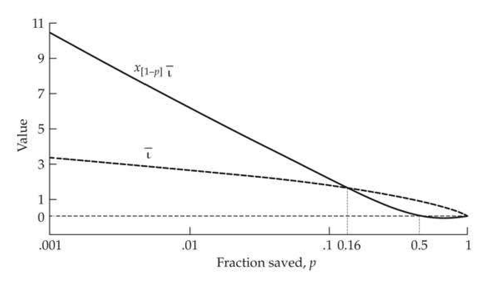

# Chapter 17 · Short-term Changes in the Variance: 2. Changes in the Environmental Variance

## Evolution_chapter17_001 · Short-term Changes in the Variance: 2. Changes in the Environmental Variance: Introduction

It is the purpose of this short communication to suggest that recent views on the nature of the developmental process make it easier to understand how the genotypes of evolving organisms can respond to the environment in a more co-ordinated fashion. Waddington (1942)

**[命题 Proposition]**

In our discussion of the response to selection, one assumption thus far has been that the environmental variation is homoscedastic—constant across genotypes—and hence not subject to modification by selection. However, a fairly universal, and very striking, observation is that most traits show at least some genetic variation in an outbred population. One can imagine that sensitivity to the environment, as measured by the environmental variance, is such a trait (Waddington 1957; Hill 2007), and thus can potentially respond to selection. If true, selection for (or against) extreme individuals, such as directional and disruptive selection for the former, and stabilizing selection for the latter, may also result in selection for increased (or decreased) values of the environmental variance, $ \sigma_{E}^{2} $. There are also settings that favor direct selection on $ \sigma_{E}^{2} $, such as breeding for more uniformity in an agricultural or laboratory trait (Hohenboken 1985). There can also be fitness consequences for uniformity in domesticated populations. For example, preweaning survival increases as the within-litter variance (a function of $ \sigma_{E}^{2} $) in weight decreases in both pigs (Milligan et al. 2002) and rabbits (Garreau et al. 2008). Selection on $ \sigma_{E}^{2} $ likely occurs in natural populations as well, such as selection on the within-plant variation in flowering time (Devaux and Lande 2009). Finally, Gibson (2009) and Feinberg and Irizarry (2010) argued that selection on the inherent stochasticity of developmental systems may play an important role in our understanding of human diseases. All of these considerations have spurred an interest in selection response in $ \sigma_{E}^{2} $ (reviewed by Hill and Mulder 2010).

One technical comment before proceeding is that simple scale effects can also result in a change in the variance—if the coefficient of variation of a trait remains constant as its mean changes, then its variance must also change as well. As discussed in LW Chapter 11, a suitable transformation (such as the log of the trait value) often removes these scale effects, and we assume this has been done previous to any analysis.

---

## Evolution_chapter17_002 · Short-term Changes in the Variance: 2. Changes in the Environmental Variance: Introduction / Scales of Environmental Sensitivity

The environment an organism experiences can be partitioned into many different scales of resolution, but operationally we are usually concerned with just two: those features shared by all individuals in some common setting (macroenvironments), and those features unique to each individual (microenvironments). Differential sensitivity (i.e., performance) of genotypes over any of these scales indicates genotype × environmental (G × E) interactions (LW Chapter 22). Volume 3 examines the selection response in the presence of G × E over macroscale differences (such as different growing regions for a crop or different host plants for an insect), by treating the trait value in each macroenvironment as a correlated character (Falconer 1952). A related topic concerns norms of reactions, which are performance curves over a gradient for a particular environmental feature (such as temperature). The analysis of response for such function-valued traits is also deferred until our final volume.

Our focus here is on sensitivity to microenvironmental variation, which itself can oc- cur over several different scales. The most fundamental consideration is developmental noise, which can sometimes be measured by differences in the trait values of homologous structures within an individual, such as the amount of fluctuating asymmetry (differences in trait values on the left and right side of bilaterally symmetric organisms; LW Chapter 11; see also Leamy and Klingenberg 2005; Dongen 2006; Hansen et al. 2006; Graham et al. 2010). Presumably such within-individual variation reflects “noise” in the developmental process—variation in the end product of the same genotype in the same macroenvironment. A related measure of microenvironmental variation is the variance in the repeated performance (records) of an individual over time, such as offspring size in different litters from a single mother. While any source of environmental variation contributes to $ \sigma_{E}^{2} $, different pathways may be involved in environmental sensitivity at these different scales (Pélabon et al. 2010).

---

## Evolution_chapter17_003 · Short-term Changes in the Variance: 2. Changes in the Environmental Variance: Introduction / Environmental vs. Genetic Canalization

The idea that genotypes may vary in their microenvironmental sensitivity has a rich history, dating back to Waddington's (1942) notion of canalization and Schmalhausen's (1949) autoregulation—developmental buffering against small perturbations (be they environmental or genetic). Under these views, a wide range of genotypes and environments yield essentially the same developmental end product. Waddington (1957, 1959) also stressed that canalization is an evolved system, and hence to some extent a selectable trait. Part of Waddington's concern was sensitivity to the environment, with genotypes showing environmental canalization (or environmental robustness) having lower environmental variances. However, he was also concerned with the fact that a particular genotype may find itself in a variety of different genetic environments, and that genotypes may also differ in their sensitivities to these different backgrounds. Genetic canalization (or genetic robustness) is the stability of a particular genotype when placed in a variety of different genetic backgrounds, and it is a function of the epistasis between a genotype of interest and the universe of genetic backgrounds in which it may find itself. These two measures of sensitivity can be easily confounded, yet they are fundamentally different. Environmental robustness (which requires G x E if genotypes vary in environmental sensitivity) does not necessarily imply genetic robustness (which requires epistasis), and vice versa. As reviewed in Flatt (2005) and Hansen (2006), the conditions for the evolution of genetic canalization (an overall reduction in the sensitivity of a genotype to its genetic background) are more restrictive than for environmental canalization, in part because the target background under the former is itself continually evolving.

Using an appropriate design, the genetic and environmental sensitivities for a particular genotype can be separated. Under a repeated-measures design, the genetic background remains constant and the residual variance is due entirely to environmental sensitivity (plus measurement error). A second (but obviously more restrictive) design is the use of a series of inbred lines or clones (Fraser and Schadt 2010; Geiler-Samerotte et al. 2013). For a particular genotype of interest (such as a marker locus tagging a quantitative trait location [QTL]), the among-line trait variance of a genotype across a series of lines (and hence different genetic backgrounds) is a measure of its genetic sensitivity, while the within-line variance of the target genotype is a measure of its environmental sensitivity

**[示例 Example]**

> **Example 17.1** · ref: `17.1` · source: `Evolution_chapter17_003.json` · blocks 1–2
>
> Example 17.1. Fraser and Schadt (2010) considered mRNA expression levels for thousands of genes over a series of 19 mouse inbred lines. Within each line, roughly 20 individuals were scored at ~160,000 markers. For a given trait (the expression level of a specified gene), the within-line variation was contrasted between the two alternative homozygous genotypes at each marker. Because there is essentially no genetic variation within an inbred line, significant differences in the within-line variance over marker genotypes indicate linkage to a QTL influencing environmental robustness (differences in $ \sigma_{E}^{2} $). Conversely, a significant difference in the dispersion of the mean values of the marker genotypes across inbred lines (increased among-line variance) indicates that the marker is linked to a QTL influencing genetic robustness. Using this approach, these authors found QTLs for both types of robustness. QTLs for environmental robustness were largely trans-acting and sex-specific (different QTLs in the two sexes). In contrast, QTLs for genetic robustness were often cis-acting and were not sex-specific. There was no detected overlap between the two classes of QTLs. In reporting their results, the authors used the convention that an eQTL mapping close to its target site was regarded as cis, while an eQTL mapping further away, or on a different chromosome, was regarded as trans (Chapter 12). One caveat about this study concerns the among-line variance. Given the small number (19) of genotypic backgrounds (inbred lines), we expect that by chance some markers will be nonrandomly distributed with respect to QTLs that influence the line means. This could result in alternative genotypes at these markers showing different patterns of among-line variance, not because of any epistatic interactions, but rather because they were not sufficiently randomized with respect to background QTLs influencing the mean of the target trait.

---

## Evolution_chapter17_004 · Short-term Changes in the Variance: 2. Changes in the Environmental Variance: Introduction / Evidence for Heritable Variation in the Environmental Variance

The suggestion that different genotypes may have different environmental variances is not new. For example, Robertson and Reeve (1952) and Lerner (1954) noted that inbred lines often have larger environmental variances than their outbred counterparts (see Whitlock and Fowler [1999] for a more recent example). This led Lerner to propose that genetic homeostasis (developmental buffering across environments) is facilitated by heterozygosity, while environment sensitivity ($ \sigma_{E}^{2} $) increases with homozygosity. Consistent with this suggestion is the observation that developmental noise (measured by the amount of fluctuating asymmetry) often decreases with increasing levels of protein (i.e., isozyme) heterozygosity (reviewed in Mitton and Grant 1984; Livshits and Kobyliansky 1985; Chakraborty 1987; Zouros and Foltz 1987; Britten 1996; Vøllestad et al. 1999).

Direct evidence for genetic variation in $ \sigma_E^2 $ is provided by comparing inbred lines. Mackay and Lyman (2005) observed different amounts of environmental variation for bristle number across chromosomal substitution lines of Drosophila from a common source population. Similar findings using inbred lines were seen by Ordas et al. (2008) in maize, by Hall et al. (2007) in Arabidopsis, by Ansel et al. (2008) in yeast, and by a number of workers using the Drosophila melanogaster Genetic Reference Panel (DGRP) lines (Harbison et al. 2013; Ayroles et al. 2015; Huang et al. 2015; Morgante et al. 2015; Sørensen et al. 2015). Characters showing among-line variation in $ \sigma_E^2 $ included morphological, physiological, and behavioral traits, as well as expression-level traits (i.e., mRNA levels). The DGRP lines show an exception to the inverse relationship between $ \sigma_E^2 $ and levels of heterozygosity. These lines contain varying amounts of residual heterozygosity (which is substantial in several cases due to segregating chromosomal inversions), with the amount of residual heterozygosity being uncorrelated with $ \sigma_E^2 $.

While these studies provide direct evidence for genetic variation in $ \sigma_{E}^{2} $, our concern is with heritable variation—additive genetic variation in the trait that can respond to selection. Direct evidence for heritable variation for the level of developmental noise derives from traits that usually respond to selection for either increased or decreased fluctuating asymmetry (LW Chapter 11). However, this is only one potential component of the microenvironmental variance, so what evidence is there for a heritable component of $ \sigma_{E}^{2} $ in general?

Indirect support comes from observations of heritable variation in the within-family variance in livestock traits. Van Vleck (1968) and Clay et al. (1979) observed significant sire differences in the variation in milk yield in dairy cattle across half-sib families, while Rowe et al. (2006) found significant sire variation in the within-family residual variance for 35-day body weight in broiler chickens. While variation among sires is consistent with a heritable component for within-family variances, it can also arise simply from genetic segregation. In particular, heteroscadisticity of family variances is a classic (but weak) test for the presence of a major gene, with parents heterozygous for the major allele having a larger within-family variance than homozygous parents (LW Chapter 13).

A more recent line of evidence for heritable variation in $ \sigma_E^2 $ comes from a significantly improved fit of statistical models assuming a heritable component of the residual variance (and hence a correlation in $ \sigma_E^2 $ among relatives) over those that assume no such heritable variation. Such an improved fit was seen for fecundity in sheep (SanCristobal-Gaudy et al. 2001), body weight in the snail Helix aspersa (Ros et al. 2004), and litter size in pigs (Sorensen and Waagepetersen 2003), with additional examples listed in [[SEE_TABLE:17.2]]. The caveat about these results is the concern that violations of the underlying statistical models may lead to an incorrect suggestion that such genetic variation exists when in fact it is absent. Indeed, E. Yang et al. (2011) showed that these analyses are strongly biased by the presence of intrinsic skew in the data, as the presence of heritable variation in $ \sigma_E^2 $ is also manifested as skew (Ros et al. 2004). Yang et al. simultaneously fitted a model along with a general Box-Cox transformation (LW Chapter 11) of their data to remove any intrinsic skewness. After accounting for skew, evidence for genetic variance in $ \sigma_E^2 $ was reduced in some cases, while it was strengthened in others ([[SEE_TABLE:17.2]]). The bottom line from the analysis of these models is that there does appear to be real evidence for heritable variation in $ \sigma_E^2 $, but estimating some of the genetic parameters associated with this variance (in particular, the correlation between breeding values for trait means and residual variances) can be very delicate.

Another line of evidence derives from the mapping of major genes involved in trait variances. The classic example involves the heat shock protein HSP90, which has been shown to buffer both genetic and environmental effects (reviewed in Sangster et al. 2008). In a second potential example, J. Yang et al. (2012) showed that different genotypes at the FTO (fat mass and obesity-associated protein) locus display different residual variances for body mass in humans. However, because FTO effects were scored in segregating populations, it is unclear whether its variance effect is due to genetic or environmental canalization.

Finally, QTLs can be associated with trait variances. Denoted as vQTLs (variance QTLs) by Rönnegård and Valdar (2011) and veQTLs (variance in expression-level traits) by Huang et al. (2015), such QTLs denote sites where the trait variance differs over marker genotypes. While early QTL mapping projects noted that some marker genotypes differ in trait variances (e.g., Edwards et al. 1987), the formal development of specific methods to map such QTLs is more recent (Ordas et al. 2008; Paré et al. 2010; Struchlain et al. 2010; Visscher and Posthuma 2010; Jimenez-Gomes et al. 2011; Rönnegård and Valdar 2011, 2012; Hothorn et al. 2012; Shen et al. 2012). While these studies have found a number of candidate regions, as with among-sire differences in family variances, they reflect differences in the residual (as opposed to strictly the environmental) variance for marker genotypes, which can arise from differences in sensitivity to genetic background when alternative vQTL genotypes are assessed in segregating populations. Indeed, Paré et al. (2010) and Deng and Paré (2011) suggested using variance heterogeneity across markers as a preliminary scan for potentially epistatic loci. Nonetheless, a number of recent studies have mapped vQTLs using variation in $ \sigma_{E}^{2} $ over inbred lines, directly showing at least some genetic control on $ \sigma_{E}^{2} $ (Hall et al. 2007; Ansel et al. 2008; Harbison et al. 2013; Huang et al. 2015; Sørensen et al. 2015).

Collectively, these observations suggest that heritable variation in the environmental variation likely exists for many traits, and that selection for changes in phenotypic variance can result in a response that in part derives from changes in the overall environmental variance of the population. Consistent with this view, recall that changes in $ \sigma_{E}^{2} $ were seen in several of the stabilizing- and disruptive-selection experiments reviewed in Chapter 16.

---

## Evolution_chapter17_005 · Short-term Changes in the Variance: 2. Changes in the Environmental Variance: Introduction / MODELING GENETIC VARIATION IN $ \sigma_{E}^{2} $

A variety of statistical models have been proposed to account for the heritable transmission of at least part of the environmental variance. The starting point for each model is that the phenotypic value of an individual of genotype i can be written as $$ z_{i}=\mu+G_{i}+E\quad\mathrm{w h e r e}\quad E\sim(0,\sigma_{i}^{2}) $$

The notation $ x \sim (\mu, \sigma^2) $ denotes that $ x $ comes from a distribution with a mean of $ \mu $ and variance of $ \sigma^2 $. For ease of development, we generally assume that the trait has an entirely additive-genetic basis, meaning that $ G = A $, namely the standard breeding value for the trait. Normally, this breeding value is either unsubscripted or is denoted as $ A_z $ to connect it with $ z $. However, for models with a heritable (i.e., a breeding-value) component to $ \sigma_E^2 $, we need to keep track of two separate breeding values, both of which influence $ z $. One, $ A_m $, influences the mean of $ z $ (so that $ G = A_m $ in Equation 17.1a), while another breeding value, $ A_v $, influences the environmental variance of $ z $. As we will detail shortly, several different models have been proposed to connect $ A_v $ and $ \sigma_E^2 $ (reviewed in [[SEE_TABLE:17.1]]). These two breeding values, $ A_m $ and $ A_v $, can be correlated, which further complicates the dynamics of selection response. Changes in the mean of $ A_m $ change the mean of $ z $ (the standard response to selection as measured by a change in the mean), while changes in the mean of $ A_v $ change the average value of $ \sigma_E^2 $ (yielding a response in the environmental variance). Because we allow $ \sigma_{E}^{2} $ to vary over genotypes, its population value is not the usual constant that was assumed in previous chapters, but rather an average value that may change over time. Taking the expectation (to avoid confusion, in this chapter we will use roman E for expectation and italic E for environmental values), the population environmental variance is the average of the $ \sigma_{i}^{2} $, $$ \sigma_{E}^{2}=\mathrm{E}[\sigma_{i}^{2}] $$

When working with a series of pure lines, one can estimate $ \sigma_i^2 $ directly. The more interesting (and difficult) problem arises when considering an outbred population. In this case, we have to deal with both estimation and the vexing issue of modeling transmission. Models allowing for heterogeneity of environmental variance were introduced by breeders in the 1990s (e.g., Foulley et al. 1992; Foulley and Quaas 1995; Cullis et al. 1996), but these models ignored the question of selection (and evolution) of the environmental variance itself. As outlined below, the first formal analyses of the evolution of the environmental variance were population-genetic models presented by Gavrilets and Hastings (1994c) and Wagner et al. (1997), and breeding-value-based models presented by SanCristobal-Gaudy et al. (1998).

---

## Evolution_chapter17_006 · Short-term Changes in the Variance: 2. Changes in the Environmental Variance: Introduction / The Multiplicative Model

Gavrilets and Hastings (1994c) assumed some underlying environmental factor, e (such as temperature), with different genotypes having different sensitivity, $ \gamma_{i} $, to this factor, hence $$ E=\gamma_{i}\; e\quad\mathrm{w h e r e}\quad e\sim(0,\sigma_{e}^{2}) $$

This multiplicative model is simply the joint-regression model for genotype×environment interactions (LW Equation 22.13b; Volume 3), and was also used by Wagner et al. (1997). Under Equation 17.2a, the conditional environmental variance (given the genotypic value and its environmental sensitivity) is $$ \sigma^{2}[E\mid G,\gamma_{i}]=\gamma_{i}^{2}\sigma_{e}^{2} $$ As shown in Example 17.2 (below), taking the expected value over the population distribution of sensitivity values, $ \gamma \sim (\mu_{\gamma}, \sigma_{\gamma}^{2}) $, yields the unconditional environmental variance in the population $$ \sigma_{E}^{2}=\left(\mu_{\gamma}^{2}+\sigma_{\gamma}^{2}\right)\sigma_{e}^{2} $$

Note that while $ \gamma_i $ can be negative, Equation 17.2b shows that it influences the environmental variance through its square, $ \gamma_i^2 $. Thus, the magnitude, rather than the sign, of $ \gamma_i $ determines its impact on $ \sigma_E^2 $. Under the multiplicative model, the environmental variance for the population decreases by selecting $ \mu_\gamma $ to zero and/or by decreasing the variance, $ \sigma_\gamma^2 $, of environmental sensitivities. The problematic issue here is modeling the change in the distribution of the genotypic-specific sensitivities, $ \gamma $. The simplest approach is to assume that the environmental sensitivity, $ \gamma $, is an entirely additive quantitative trait, so that $ \gamma = A_v $, namely, the breeding value for the environmental variance.

Analysis of Equation 17.2c led Gavrilets and Hasting to comment on the relationship between developmental noise and heterozygosity mentioned previously. Lerner (1954) assumed this relationship to be causative, with higher levels of heterozygosity directly causing decreased environmental variance. However, Gavrilets and Hastings noted that when $ \mu_{\gamma}^{2} = 0 $, as might occur with selection to decrease $ \sigma_{E}^{2} $, then under the simple additive model ($ \gamma = A_{v} $), the environmental variance for a given trait is proportional to the additive genetic variance in environmental sensitivity, $ \sigma_{\gamma}^{2} = \sigma^{2}(A_{v}) $.

Gavrilets and Hastings noted that a correlation between heterozygosity and $ \sigma_E^2 $ simply falls out as a consequence of their model, rather than from any functional relationship between the two. They reach this conclusion by using the result that, for an additive trait (in our case, $ \gamma = A_v $), the genetic variance is a decreasing function of the number of heterozygous loci (Chakraborty 1987), so that when the average heterozygosity in a population increases, $ \sigma^2(A_v) $ decreases, and hence (from Equation 17.2c), so does $ \sigma_E^2 $. While their theoretical point is valid, it is actually addressing a slightly different issue than Lerner's argument. The Gavrilets and Hastings model suggests that populations with less heterozygosity are expected to show increased levels of $ \sigma_E^2 $, while Lerner was suggesting that individuals with reduced heterozygosity show increased $ \sigma_E^2 $.

If we allow for dominance in the quantitative-trait formulation of $ \gamma $, the result is $ \gamma = A_v + D_v $, where the dominance value, $ D_v $, is not transmitted from parent to offspring. Further, by construction, $ D_v $ has a mean value of zero and under the infinitesimal model, the dominance variance is not changed by selection (Chapter 16). Under this extension, the mean environmental variance becomes $$ \sigma_{E}^{2}=\left(\mu_{A_{v}}^{2}+\sigma_{A_{v}}^{2}\right)\sigma_{e}^{2}+\sigma_{D_{v}}^{2}\sigma_{e}^{2} $$

This same argument applies if we replace $ \sigma_{D_v}^2 $ by the total nonadditive genetic variance. While selection can reduce the first component in Equation 17.2d (either by driving the mean breeding value to zero and/or reducing $ \sigma_{A_v}^2 $), the component involving nonadditive variance remains unchanged. Hence, implicit in assuming a breeding value for this model (or any of the others discussed below) is that any nontransmissible genetic variation in $ \sigma_E^2 $ remains unchanged by selection. Genetic variation in $ \sigma_E^2 $, by itself, is not sufficient for a selection response, as the latter requires that at least part of this variation must be transmissible under the breeding scheme being used.

---

## Evolution_chapter17_007 · Short-term Changes in the Variance: 2. Changes in the Environmental Variance: Introduction / The Exponential Model

While we have presented the multiplicative model within a breeding-value framework, this was not explicitly done by Gavrilets and Hastings (1994c), who (coming from a population-genetics background) were more concerned with the evolution of the environmental variance than with estimating $ A_{v} $. Conversely, SanCristobal-Gaudy et al. (1998), coming from an animal breeding background, were more concerned with the estimation of $ A_{v} $. They did so by modeling E using an exponential model $$ E=\exp\left(\frac{A_{v}}{2}\right)\cdot e\quad where\quad e\sim N(0,\sigma_{e}^{2})\quad and\quad A_{v}\sim N(\mu_{A_{v}},\sigma_{A_{v}}^{2}) $$

Why the breeding value appears as $ A_{v}/2 $ (rather than simply $ A_{v} $) will become apparent shortly.

The connection with the multiplicative model follows if we note that for small $ |x| $, $ e^x \simeq 1 + x $, so that $ E \simeq [1 + (A_v/2)] \cdot e $ for $ |A_v| \ll 2 $, implying $ \gamma_i \simeq 1 + (A_v/2) $. By assuming normality and independence (of $ e $, $ A_v $, and $ A_m $), SanCristobal-Gaudy et al. (1998) obtained likelihood estimators for the breeding values for the environmental variance ($ A_v $) and trait

[[SEE_TABLE:17.1]] mean ($ A_{m} $). They explicitly considered estimation under either a sire design (using half-sib values to estimate the values of $ A_{v} $ and $ A_{m} $ in the common parent) or under a model where repeated measurements on a single individual and its relatives are used to estimate breeding values for $ \sigma_{E}^{2} $ (Chapters 13 and 19). SanCristobal-Gaudy et al. (2001) extended this approach to threshold traits (in particular, litter size). Bayesian estimators under this model were developed by Sorensen and Waagepetersen (2003) and Ros et al. (2004).

Given $ A_{v} $, the conditional distribution of the environmental variance becomes $$ \sigma^{2}(E\mid A_{v})=\sigma^{2}\left[\exp(A_{v}/2)\cdot e\mid A_{v}\right]=\left[\exp(A_{v}/2)\right]^{2}\sigma_{e}^{2}=\sigma_{e}^{2}\exp\left(A_{v}\right) $$ where the last step follows by recalling that $ [\exp(a)]^2 = \exp(2a) $. Hence, the environmental variance is a constant $ \sigma_e^2 $ multiplied by a scaling factor that is an exponential function of the breeding value $ A_v $ for the environmental variance (which motivates our use of $ A_v/2 $ in Equation 17.3a). Decreasing $ A_v $ results in an individual with reduced environmental sensitivity (reduced $ \sigma_E^2 $). The constant, $ \sigma_e^2 $, can be interpreted as the environmental variance for an individual with an environmental breeding value of zero, $ A_v = 0 $.

The exponential model is also called the log-additive model, as the breeding value is additive on a log scale $$ \ln\left[\sigma^{2}(E\mid A_{v})\right]=\ln\left(\sigma_{e}^{2}\right)+A_{v} $$ As detailed in Example 17.2, the expectation of Equation 17.3b (over the population distribution of $ A_{v} $ values) yields a mean environmental variance of $$ \sigma_{E}^{2}=\sigma_{e}^{2}\exp\left(\mu_{A_{v}}+\sigma_{A_{v}}^{2}/2\right) $$

Equation 17.3d shows that either decreasing the mean breeding value, $ \mu_{A_v} $, or its additive variance, $ \sigma_{A_v}^2 $, decreases the environmental variance. Comparison of Equations 17.2c and 17.3d shows one subtle difference between the multiplicative and exponential models. Under the former, the contribution to the environmental variance is a function of $ \mu_{A_v}^2 $, meaning that the minimal population environmental variance occurs when $ \mu_{A_v} = 0 $, and any deviation away from zero increases the average environmental variance. By contrast, under the exponential model, decreasing $ \mu_{A_v} $ always decreases the average value of $ \sigma_E^2 $ in the population. Thus, under the exponential model, $ \sigma_E^2 $ can be selected to be arbitrarily small, while under the multiplicative model, it has a lower bound set by $ \sigma_{A_v}^2 $ (and more generally, by the dominance variance as well; see Equation 17.2d).

**[Table]**

> **Table 17.1** · `17.1` · page 7 · source: `Evolution_chapter17_007`
> Table 17.1 Models for heritable variation in the environmental value,  $ E $, involve two separate breeding values,  $ A_m $ and  $ A_v $, underlying the phenotype,  $ z $, of a focal trait. The former breeding value is associated with the mean of the focal trait and the latter influences the environmental variance. The table reviews three different models for translating  $ A_v $ into a value of  $ \sigma_E^2 $, assuming some intrinsic environmental value,  $ e \sim N(0, \sigma_e^2) $. All three models start with the usual decomposition of  $ z = \mu + A_m + E $, where  $ A_m \sim N(\mu_{A_m}, \sigma_{A_m}^2) $ is the breeding value for  $ z $ (the subscript  $ m $ is a mnemonic for mean). The departure from this standard model is that rather than assuming  $ \sigma_E^2 $ to be constant over all genotypes, we assume it has a heritable component (a breeding value,  $ A_v $) that influences the emergent value of  $ \sigma_E^2 $. We assume  $ A_v \sim N(\mu_{A_v}, \sigma_{A_v}^2) $, and let  $ U $ denote a unit normal random variable. See the text for full details on each model.
>
> Model | E | $ \sigma^{2}(E \mid A_{v}) $ | $ \sigma^{2}(E) = \mathbb{E}\left[\sigma^{2}(E \mid A_{v})\right] $
> --- | --- | --- | ---
> Multiplicative | $ A_{v} \cdot e $ | $ A_{v}^{2} \sigma_{e}^{2} $ | $ \left(\mu_{A_{v}}^{2} + \sigma_{A_{v}}^{2}\right) \sigma_{e}^{2} $
> Exponential (or log-additive) | $ \exp\left(A_{v}/2\right) \cdot e $ | $ \exp\left(A_{v}\right) \sigma_{e}^{2} $ | $ \exp\left(\mu_{A_{v}} + \sigma_{A_{v}}^{2}/2\right) \sigma_{e}^{2} $
> Additive | $ \sqrt{A_{v} + \sigma_{e}^{2}} \cdot U $ | $ A_{v} + \sigma_{e}^{2} $ | $ \mu_{A_{v}} + \sigma_{e}^{2} $

---

## Evolution_chapter17_008 · Short-term Changes in the Variance: 2. Changes in the Environmental Variance: Introduction / The Additive Model

Our last formulation for modeling genetic variation in E was suggested by Hill and Zhang (2004) and Mulder et al. (2007), where $$ E=U\cdot\sqrt{\sigma_{e}^{2}+A_{v}}\quad\mathrm{w h e r e}\quad U\sim N(0,1)\quad\mathrm{a n d}\quad A_{v}\sim N(\mu_{A_{v}},\sigma_{A_{v}}^{2}) $$

This is the additive model, as the environmental variance for an individual with breeding value $ A_{v} $ is simply $$ \sigma^{2}(E\mid A_{v})=\sigma_{e}^{2}+A_{v} $$ with the constraint on the breeding value being that $ \sigma_e^2 + A_v > 0 $. The additive model is a local analysis around the current mean, as selection to decrease $ A_v $ can eventually result in this constraint being violated, which generates a negative variance. Under the additive model, the mean population value for the environmental variance is simply $$ \sigma_{E}^{2}=\mathrm{E}\left(\sigma_{e}^{2}+A_{v}\right)=\sigma_{e}^{2}+\mu_{A_{v}} $$

Unlike in the multiplicative and exponential models, changes in $ \sigma_{E}^{2} $ under the additive model depend only on changes in the mean breeding value, and not on its variance ([[SEE_TABLE:17.1]]).

The additive model has the advantage of being much more tractable, but it has the disadvantage that it breaks down when the breeding value becomes sufficiently negative $ (A_v < -\sigma_e^2) $. In contrast, the exponential model has additivity on the log of the variance scale, which is a nice statistical feature, as log variances are approximately normally distributed (Box 1953; Layard 1973). Mulder et al. (2007) discussed additional connections between the additive and exponential models, while Hill and Mulder (2010) reviewed different estimation methods under these models.

**[示例 Example]**

> **Example 17.2** · ref: `17.2` · source: `Evolution_chapter17_008.json` · blocks 4–7
>
> Example 17.2. Here we derive the unconditional variances for the models summarized in [[SEE_TABLE:17.1]]. Consider the multiplicative model first, where $$ \sigma_{E}^{2}=\mathrm{E}[\gamma^{2}\sigma_{e}^{2}]=\sigma_{e}^{2}\mathrm{E}[\gamma^{2}] $$ Recalling that $ \mathrm{E}[x^{2}] = \mu_{x}^{2} + \sigma_{x}^{2} $ yields $$ \sigma_{E}^{2}=\sigma_{e}^{2}\mathrm{E}[\gamma^{2}]=\sigma_{e}^{2}\left(\sigma_{\gamma}^{2}+\mu_{\gamma}^{2}\right) $$ Now consider the exponential model (Equation 17.3a). By construction, both E and e have expected values equal to zero, and the variances of E and e are simply the expected values of $ E^{2} $ and $ e^{2} $. Taking expectations $$ \sigma_{E}^{2}=\mathrm{E}\left[\left(e\cdot\exp\{A_{v}/2\}\right)^{2}\right]=\sigma_{e}^{2}\mathrm{E}\left[\left(\exp\{A_{v}/2\}\right)^{2}\right]=\sigma_{e}^{2}\mathrm{E}\left[\exp\left(A_{v}\right)\right] $$ This follows by again recalling that $ [\exp(x/2)]^2 = \exp(2x/2) = \exp(x) $. The rightmost expectation in this expression is calculated with respect to the distribution of breeding values, $ A_v $, by recalling (Equation 14.19a) that for a normally distributed random variable, $ x $, with a mean of $ \mu $ and variance of $ \sigma^2 $, $ \mathrm{E}[e^x] = \exp(\mu + \sigma^2/2) $. Because we assumed that $ A_v \sim N(\mu_{A_v}, \sigma_A^2) $, the average environmental variance for the population becomes $$ \sigma_{E}^{2}=\sigma_{e}^{2}\exp\left(\mu_{A_{v}}+\frac{\sigma_{A_{v}}^{2}}{2}\right) $$

---

## Evolution_chapter17_009 · Short-term Changes in the Variance: 2. Changes in the Environmental Variance: Introduction / The Heritability of the Environmental Variance, $ h_{v}^{2} $

Estimates of $ \sigma^{2}(A_{v}) $ under any of the models for $ \sigma_{E}^{2} $ reviewed in [[SEE_TABLE:17.1]] are obtained using fairly complicated likelihood functions on data from sets of relatives; see SanCristobal-Gaudy et al. (1998, 2001), Sorensen and Waagepetersen (2003), Ros et al. (2004), or any of the other references in [[SEE_TABLE:17.2]] for details. [[SEE_TABLE:17.2]] presents these estimates scaled as heritabilities and evolvabilities (Equation 13.22b) to facilitate comparison over traits, which raises the issue how the heritability of the environmental variance is defined.

**[定义 Definition]**

Mulder et al. (2007) suggested that one definition is as the slope of the regression of the breeding value, $ A_{v} $, of an individual on some appropriate function of the phenotype value, z. Under the additive-model framework (Equation 17.4a), they show that the appropriate transformation is the square, $ z^{2} $, of phenotypic value. To see this, recall from Equation 17.4a that under this model $$ z=\mu+A_{m}+E=\mu+A_{m}+U\sqrt{A_{v}+\sigma_{e}^{2}} $$

If we assume that $ A_m $ and $ A_v $ are uncorrelated and recall for a unit normal random variable, $ U $, that $ \mathrm{E}(U^2) = 1 $ (as $ U^2 $ is a $ \chi_1^2 $ random variable, which has a mean of 1; LW Equation A5.15b), then $$ \begin{aligned}\sigma(A_{v},z^{2})&=\sigma(A_{v},[\mu+A_{m}+E]^{2})=\sigma(A_{v},E^{2})\\&=\sigma(A_{v},U^{2}[A_{v}+\sigma_{e}^{2}])=\sigma(A_{v},A_{v})=\sigma^{2}(A_{v})\end{aligned} $$ From regression theory (LW Chapter 3), the slope of the regression of $ A_{v} $ on $ z^{2} $ is simply this covariance divided by the variance of the predictor variable $$ h_{v}^{2}=\frac{\sigma(A_{v},z^{2})}{\sigma^{2}(z^{2})} $$

If $z$ is normally distributed, then $\sigma^{2}(z^{2}) = 2\sigma_{z}^{4} + 3\sigma^{2}(A_{v})$ (see Mulder et al. 2007 for details), yielding a heritability of $$ h_{v}^{2}=\frac{\sigma^{2}(A_{v})}{2\sigma_{z}^{4}+3\sigma^{2}(A_{v})} $$

Hence, estimates of $ h_v^2 $ are obtained by substituting an estimate of $ \sigma^2(A_v) $—which can be estimated within a likelihood framework (see the previously mentioned references)—along with the value of $ \sigma_z^4 $, into Equation 17.5c.

[[SEE_TABLE:17.2]] reviews estimated $ h_v^2 $ values from a number of studies. Note from this table that values of $ h_v^2 $ are low (typically less than 0.05), while the evolvabilities, i.e., $ \sigma(A_v)/\sigma_E^2 $, the coefficient of variation of the environmental variance (Equation 13.22b), are large. Although the selection response may be slow (given the low heritability), there is much variation to exploit, as a high evolvability implies that significant proportional change in the trait value can be achieved (Chapter 13). Recall from Equation 13.22b that the expected response, scaled in terms of the mean value, can be expressed as where we have used the average values for $ h_v^2 $ and $ CV_{A_v} $ from [[SEE_TABLE:17.2]]. Recalling that $ \bar{\tau} \simeq 2 $ when we save the upper 5% of the population (Example 14.1), the expected scaled response per generation is 0.16 in this setting, implying that slightly more than six generations are required to double the mean value of the variance under this strength of selection.

The table also shows that some caution is in order when using these likelihood-based estimates, which can be very model-specific. In particular, the fragility of these estimates can be seen by comparing the estimated additive-genetic correlation, $ \rho(A_m, A_v) $, in the litter-size studies (Yang et al. 2011). Data are often transformed before an analysis for any number of reasons (LW Chapter 11), and one of the more flexible approaches is the Box-Cox

[[SEE_TABLE:17.2]] transformation (LW Equation 11.4), which includes the standard log transform as a special case. For pigs, using untransformed data resulted in $ \rho(A_m, A_v) = -0.64 $, which changed to 0.70 when a Box-Cox transformation was first applied to the data. For rabbits, $ \rho(A_m, A_v) $ changes from -0.73 to 0.28. Likewise, estimates of the heritabilities and evolvabilities were also lower when the likelihood model included a Box-Cox transformation.

Finally, our discussion thus far has focused on narrow-sense heritabilities. Broad-sense heritability estimates, $ H_v^2 $, for the genetic variance of $ \sigma_E^2 $, based on among-line variation in $ \sigma_E^2 $, are often an order of magnitude higher than the narrow-sense values shown in [[SEE_TABLE:17.2]]. For example, Morgante et al (2015) observed $ H_v^2 $ values for $ \sigma_E^2 $ of 0.75, 0.54, and 0.36 for three behavioral and physiological traits in Drosophila, which were of comparable magnitude with the broad-sense estimates for the traits themselves (values of 0.37, 0.56, and 0.58, respectively). This apparent difference between the broad- and narrow-sense estimates for the genetic variance of $ \sigma_E^2 $ may reflect something deep, such as a significant amount (indeed, the majority) of genetic variance for $ \sigma_E^2 $ being nonadditive (and hence the numerator of $ H_v^2 $, the total genetic variance, being much larger than the numerator of $ h_v^2 $, the additive genetic variance). Or it may simply reflect the fact that direct estimates for $ H_v^2 $ by comparing variances over inbred lines may be much more powerful than the more complex likelihood-based methods used in the estimation of variance components of $ \sigma_E^2 $ in outbred populations.

**[Table]**

> **Table 17.2** · `17.2` · page 10 · source: `Evolution_chapter17_009`
> Table 17.2 Estimates of the heritability,  $ h_v^2 $, and evolvability,  $ CV_{A_v} = \sigma(A_v)/\sigma_E^2 $, of the environmental variance (Equation 13.22b), as well as bivariate-model estimates of the additive-genetic correlation,  $ \rho $, between  $ A_m $ and  $ A_v $. For the Yang et al. (2011) results, BC denotes that a Box-Cox transformation was fitted simultaneously with the model, while results without this notation indicate that this transformation was not used. (Based, in part, on Mulder et al. 2007 and Hill and Mulder 2010.)
>
> <table><tr><td>Species</td><td>Trait</td><td>h_{v}^{z}</td><td>C/V_{A_{v}}</td><td>\rho</td><td>Reference</td></tr><tr><td rowspan="5">Pig (Sus)</td><td>Meat pH</td><td>0.039</td><td>0.40</td><td>0.79</td><td>SanCristobal-Gaudy et al. (1998)</td></tr><tr><td>Litter size</td><td>0.026</td><td>0.31</td><td>-0.62</td><td>Sorensen &amp; Waagepetersen (2003)</td></tr><tr><td></td><td>0.021</td><td>0.27</td><td>-0.64</td><td>Yang et al. (2011)</td></tr><tr><td></td><td>0.012</td><td>0.19</td><td>0.70</td><td>Yang et al. (2011), BC</td></tr><tr><td>Weight</td><td>0.011</td><td>0.34</td><td>-0.07</td><td>Ibáñez-Escriche et al. (2008c)</td></tr><tr><td>Sheep (Ovis)</td><td>Litter size</td><td>0.048</td><td>0.51</td><td>0.19</td><td>SanCristobal-Gaudy et al. (2001)</td></tr><tr><td>Snail (Helix)</td><td>Body weight</td><td>0.017</td><td>0.58</td><td>-0.81</td><td>Ros et al. (2004)</td></tr><tr><td rowspan="6">Chicken (Gallus)</td><td rowspan="3">Body weight (male)</td><td>0.029</td><td>0.30</td><td>-0.17</td><td>Rowe et al. (2006)</td></tr><tr><td>0.046</td><td>0.49</td><td>-0.45</td><td>Mulder et al. (2009)</td></tr><tr><td>0.030</td><td>0.32</td><td>-0.23</td><td>Wolc et al. (2009)</td></tr><tr><td rowspan="3">Body weight (female)</td><td>0.031</td><td>0.32</td><td>-0.11</td><td>Rowe et al. (2006)</td></tr><tr><td>0.047</td><td>0.57</td><td>-0.41</td><td>Mulder et al. (2009)</td></tr><tr><td>0.038</td><td>0.37</td><td>-0.27</td><td>Wolc et al. (2009)</td></tr><tr><td rowspan="4">Rabbit (Oryctolagus)</td><td rowspan="3">Litter Size</td><td>0.045</td><td>0.42</td><td>-0.74</td><td>Ibáñez-Escriche et al. (2008b)</td></tr><tr><td>0.041</td><td>0.37</td><td>-0.73</td><td>E. Yang et al. (2011)</td></tr><tr><td>0.017</td><td>0.24</td><td>0.28</td><td>E. Yang et al. (2011), BC</td></tr><tr><td>Birth weight</td><td>0.013</td><td>0.25</td><td>—</td><td>Garreau et al. (2008)</td></tr><tr><td rowspan="5">Mouse (Mus)</td><td>Litter size</td><td>0.048</td><td>0.44</td><td>-0.93</td><td>Gutierrez et al. (2006)</td></tr><tr><td>Litter weight</td><td>0.039</td><td>0.37</td><td>-0.81</td><td>Gutierrez et al. (2006)</td></tr><tr><td>Birth weight</td><td>0.208</td><td>1.21</td><td>0.97</td><td>Gutierrez et al. (2006)</td></tr><tr><td>Body weight</td><td>0.006</td><td>0.36</td><td>-0.31</td><td>Ibáñez-Escriche et al. (2008a)</td></tr><tr><td>Weight gain</td><td>0.018</td><td>0.47</td><td>-0.19</td><td>Ibáñez-Escriche et al. (2008a)</td></tr><tr><td>Average</td><td></td><td>0.038</td><td>0.41</td><td>-0.24</td><td></td></tr></table>

---

## Evolution_chapter17_010 · Short-term Changes in the Variance: 2. Changes in the Environmental Variance: Introduction / SELECTION ON $ \sigma_{E}^{2} $

As with the breeder’s equation for the response of the mean to selection, the response of $ \sigma_E^2 $ is a function of two features: the nature of transmission and the nature of selection. Our following discussion is thus partitioned into these two features. We begin with a discussion of transmission, examining how a change in the mean value of $ A_v $ (the response $ R_{A_v} $) translates into a change in $ \sigma_E^2 $ in the next generation. As might be expected, the results are highly dependent on which of the models given in [[SEE_TABLE:17.1]] is assumed.

We then examine the nature of selection on $ \sigma_E^2 $. This can occur via three different pathways. The first route is through direct selection on $ A_v $ generated by selection on the phenotypic value, $ z $, of a trait. A second route is that selection can be based on direct expression of $ \sigma_E^2 $ in an individual through repeated measurements, selecting for individuals with a larger (or smaller) range in these records. The final route is as a correlated response (Equation 13.26c), with selection on $ z $ resulting in selection on the breeding value, $ A_m $, for the trait, which in turn may be correlated with $ A_v $. The machinery of multivariate selection is needed to consider the totality of response in this latter case, so we focus solely here on the direct response (i.e., assuming $ \rho[A_m, A_v] = 0 $), and defer a full discussion of this general case until Volume 3.

However, a few brief comments on the nature of this potential genetic correlation, $ \rho(A_m, A_v) $, are still in order. If the coefficient of variation, $ \sigma_z / \mu_z $, remains roughly constant under selection, this implies that as the mean increases, so does the variance (and, thus, presumably, so does $ \sigma_E^2 $). When $ A_m $ and $ A_v $ are positively correlated, simple selection to increase the mean (to increase $ \mu_{A_m} $) results in a correlated response that also increases $ \mu_{A_v} $, and therefore $ \sigma_E^2 $. While most estimated $ \rho(A_m, A_v) $ values are negative ([[SEE_TABLE:17.2]]), there are reasons these should be viewed with caution. Current statistical models for estimating $ A_v $ assume no intrinsic skew in the data other than that generated by any correlation between $ A_m $ and $ A_v $. If skew is present for other reasons, this can significantly bias estimates of this correlation (Ros et al. 2004), as shown in the previous discussion on the results of Yang et al. (2011).

---

## Evolution_chapter17_011 · Short-term Changes in the Variance: 2. Changes in the Environmental Variance: Introduction / Translating the Response in $ A_{v} $ Into Response in $ \sigma_{E}^{2} $

A number of authors have modeled the selection response of the phenotypic variance (from either direct or indirect selection on the variance) when there are heritable differences in environmental sensitivity (Gavrilets and Hastings 1994c; Wagner et al. 1997; SanCristobal-Gaudy et al. 1998, 2001; Sorensen and Waagepetersen 2003; Hill and Zhang 2004; Ros et al. 2004; Mulder et al. 2007, 2008). A critical step in modeling this selection response is treating the phenotypic value and residual variance as two separate (and potentially correlated) traits, both with heritable (i.e., additive-genetic) variation. While some models (Gavrilets and Hastings 1994c; Wagner et al. 1997; Hill and Zhang 2004) are based on strict population-genetic analysis (following the change in individual allele frequencies), most are based on schemes that assign breeding values to the heritable component of $ \sigma_{E}^{2} $ ([[SEE_TABLE:17.1]]). Under the infinitesimal model, the expected breeding value in the offspring (for either $ A_{m} $ or $ A_{v} $) is simply the mean breeding values of its parents (Chapter 13). Using the expressions given in [[SEE_TABLE:17.1]] allows us to map changes in $ \mu_{A_{v}} $, the mean breeding value for environmental sensitivity, onto changes in $ \sigma_{E}^{2} $.

The simplest case is the additive model (Equation 17.4b). Suppose we let the selection response, $ R_{A_v} $, denote the change in the mean breeding value (for the environmental variance) of the selected parents from the mean breeding value of the entire population. The resulting change in $ \sigma_E^2 $ becomes $$ \begin{aligned}\Delta\sigma_{E}^{2}(t)&=\sigma_{E}^{2}(t+1)-\sigma_{E}^{2}(t)\\&=\left[\mu_{A_{v}}(t+1)+\sigma_{e}^{2}\right]-\left[\mu_{A_{v}}(t)+\sigma_{e}^{2}\right]\\&=\left[\mu_{A_{v}}(t)+R_{A_{v}}(t)\right]-\mu_{A_{v}}(t)=R_{A_{v}}(t)\\ \end{aligned} $$

The response is a bit more complex under the multiplicative and exponential models, as the mean population value, $ \sigma_{E}^{2} $, for the environmental variance is a nonlinear function of both the mean and the variance of $ A_{v} $ ([[SEE_TABLE:17.1]]). For the multiplicative model $$ \sigma_{E}^{2}=\left[\mu_{A_{v}}^{2}+\sigma^{2}(A_{v})\right]\sigma_{e}^{2} $$ Because the mean breeding value in generation $ t+1 $ can be expressed as the previous mean plus the response, $ \mu_{A_v}(t+1) = \mu_{A_v}(t) + R_{A_v}(t) $, if we assume that there is no change in the additive variance of environmental sensitivities following selection ($ \Delta\sigma^2(A_v) = 0 $), we have $$ \begin{aligned}\Delta\sigma_{E}^{2}(t)&=\sigma_{E}^{2}(t+1)-\sigma_{E}^{2}(t)\\&=\left(\left[\mu_{A_{v}}(t)+R_{A_{v}}(t)\right]^{2}+\sigma_{A_{v}}^{2}\right)\sigma_{e}^{2}-\left[\mu_{A_{v}}^{2}(t)+\sigma_{A_{v}}^{2}\right]\sigma_{e}^{2}\\&=\left[2\mu_{A_{v}}(t)R_{A_{v}}(t)+R_{A_{v}}^{2}(t)\right]\sigma_{e}^{2}\\ \end{aligned} $$

Change in $ \sigma^{2}(A_{v}) $ due to selection-generated linkage disequilibrium can be similarly accounted for by using Equation 16.8b.

Under the exponential model and again assuming that there is no change in $ \sigma_{A_{v}}^{2} $, Equation 17.3d implies that $$ \begin{aligned}\Delta\sigma_{E}^{2}(t)&=\sigma_{E}^{2}(t+1)-\sigma_{E}^{2}(t)\\&=\sigma_{e}^{2}\exp\left[\mu_{A_{v}}(t)+R_{A_{v}}(t)+\sigma_{A_{v}}^{2}/2\right]-\sigma_{e}^{2}\exp\left[\mu_{A_{v}}(t)+\sigma_{A_{v}}^{2}/2\right]\\&=\sigma_{e}^{2}\exp\left[\mu_{A_{v}}(t)+\sigma_{A_{v}}^{2}/2\right]\left[\exp\left(R_{A_{v}}\{t\}\right)-1\right]\\&=\sigma_{E}^{2}(t)\cdot\left[\exp(R_{A_{v}}\{t\})-1\right]\\ \end{aligned} $$

These expressions translate a response, $ R_{A_v} $, in the mean breeding value for the environmental variance into the expected change in $ \sigma_E^2 $ for the different transmission models reviewed in [[SEE_TABLE:17.1]]. We now consider two different settings by which such a response can occur: as a consequence of direct selection on phenotypic value, $ z $, and as the result of direct selection on $ \sigma_E^2 $ itself. A third possibility—a correlated response in $ A_v $ (i.e., in the environmental variance of the trait) due to direct selection on $ A_m $ (i.e., the value $ z $ of the trait itself) when $ \rho(A_v, A_m) \neq 0 $—is examined in Volume 3.

---

## Evolution_chapter17_012 · Short-term Changes in the Variance: 2. Changes in the Environmental Variance: Introduction / Response From Stabilizing Selection on Phenotypic Value, z

We have previously suggested that selection either for, or against, extreme individuals may also result in some selection for genotypes with higher, or lower, environmental variances. We formalize this by considering how selection on a phenotypic value, z, maps onto selection on $ A_{m} $ and $ A_{v} $. First consider a quadratic fitness model of stabilizing selection. Here, the expected fitness of an individual with a phenotypic value of z is $$ W(z)=1-s(z-\theta)^{2} $$ where $ \theta $ is the optimal trait value and $ s $ is the strength of stabilizing selection. This is a weak selection model, as $ W \geq 0 $ only for sufficiently small $ s $ relative to the total variance of $ z $. Note that if we set $ s < 0 $, Equation 17.7a becomes a model of (weak) disruptive selection. Gavrilets and Hastings (1994c) examined how this phenotypic fitness function translates into selection on $ (A_m, A_v) $ under the multiplicative model. To do so, we replace $ z $ by $ A_m + A_v $ and take the expectation over $ e $. Noting that $ \mathrm{E}[e] = 0 $, $ \mathrm{E}[e^2] = \sigma_e^2 $, the expected fitness as a function of $ A_m $ and $ A_v $ becomes $$ \begin{aligned}W(A_{m},A_{v})&=1-s\operatorname{E}\left[\left(A_{m}+A_{v}e-\theta\right)^{2}\mid A_{m},A_{v}\right]\\&=1-s\left[\left(A_{m}-\theta\right)^{2}+2(A_{m}-\theta)A_{v}\operatorname{E}\left[e\right]+A_{v}^{2}\operatorname{E}\left(e^{2}\right)\right]\\&=1-s\left[\left(A_{m}-\theta\right)^{2}+A_{v}^{2}\sigma_{e}^{2}\right]\\ \end{aligned} $$

Similar fitnesses arise under the Gaussian model of weak stabilizing selection (Equation 16.17); see Hill and Mulder (2010), and Example 17.3 for a more exact analysis. Equation 17.7b shows that phenotypic stabilizing selection favors $ A_v $ values near zero, thus decreasing $ \sigma_E^2 $ (Hansen et al. 2006), which has two important consequences. First, the reduction in phenotypic variance can be significantly greater than predicted from the simple reduction in the additive variance from the Bulmer effect (Chapter 16). And second, there can be cases where the trait heritability, $ h_z^2 $, will increase under stabilizing selection. Because both additive and environmental variances are decreased, if the decrease in environmental variance is sufficiently greater, then $ h_z^2 $ increases. Results for quadratic disruptive selection follow by changing the sign on $ s $, which results in selection to increase $ A_v $.

**[示例 Example]**

> **Example 17.3** · ref: `17.3` · source: `Evolution_chapter17_012.json` · blocks 2–4
>
> Example 17.3. The quadratic fitness function (Equation 17.7a) is a model for weak stabilizing selection, as it can generate negative (and hence undefined) fitness values when selection is sufficiently strong. An alternative model of stabilizing selection without this constraint is normalizing selection (Equation 16.17), where $ \theta $ denotes the optimal phenotypic value and $ \omega^2 $ denotes the strength of selection around this optimum. Devaux and Lande (2009) used this fitness function in their study of selection on the flower-timing variance within an individual. They assumed that the additive model for genetic variation in $ \sigma_e^2 $ (Equation 17.4c) holds and that repeated expressions $ z $ of the trait from an individual with breeding values $ A_m $ (for the trait) and $ A_v $ (for $ \sigma_E^2 $) are drawn from a normal, so that $$ p(z\mid A_{m},A_{v})=\frac{1}{\sqrt{2\pi(\sigma_{e}^{2}+A_{v})}}\exp\left[-\frac{(z-A_{m})^{2}}{2(\sigma_{e}^{2}+A_{v})}\right] $$ Integration of $ W(A_m, A_v) = \int W(z) p(z | A_m, A_v) \, dz $ yields $$ W(A_{m},A_{v})=\sqrt{\frac{\omega^{2}}{\omega^{2}+\sigma_{e}^{2}+A_{v}}}\exp\left[-\frac{(A_{m}-\theta)^{2}}{2(\omega^{2}+\sigma_{e}^{2}+A_{v})}\right] $$ (17.8a) When $ A_m \simeq \theta $, the exponential term is near one (as its numerator is near zero), and so fitness is largely driven by the square root term. For weak selection ( $ \omega^2 \gg \sigma_e^2 + A_v $) when $ A_m = \theta $, a first-order Taylor series approximation yields $$ W(A_{m},A_{v})\simeq1-\frac{\sigma_{e}^{2}+A_{v}}{2\omega^{2}} $$ (17.8b) As was the case for weak quadratic selection, fitness increases as $ A_{v} $ decreases. The more interesting case is that where the population is far from the equilibrium, so $ |A_m - \theta| \gg 1 $, and the numerator in the exponential term in Equation 17.8a is large. In this case, fitness can be improved by increasing the value of $ A_v $ (i.e., moving it closer to $ \theta $), which reduces the magnitude of the exponential term. Thus, as also noted by Lande (1980b) and Bull (1987), stabilizing selection can actually favor an increase in $ \sigma_E^2 $ when the population is far from its optimum, as the larger variance increases the chance that some phenotypes will be near $ \theta $. Svardal et al. (2011) similarly found that selection favors increased values of $ \sigma_E^2 $ when there are strong fluctuations in $ \theta $ over time.

}} $$ As was the case for weak quadratic selection, fitness increases as $ A_{v} $ decreases.

---

## Evolution_chapter17_013 · Short-term Changes in the Variance: 2. Changes in the Environmental Variance: Introduction / Response From Directional Selection on z

Now consider directional selection on the trait phenotype, z. We first assume that the multiplicative model holds and that we have a simple linear fitness function $$ W(z)=1+sz $$

Taking the expectation over environmental values, Gavrilets and Hastings (1994c) found that $$ W(A_{m},A_{v})=1-s\mathrm{E}(A_{m}+eA_{v}\mid A_{m},A_{v})=1-sA_{m}+A_{v}\mathrm{E}(e)=1-sA_{m} $$

Under this setting, there is no direct selection on $ A_{v} $.

A rather different outcome was noted by both Hill and Zhang (2004) and Mulder et al. (2007) for truncation selection on a normally distributed trait. As a measure of fitness, Hill and Zhang considered the probability, $ P(a, b) $, that a genotype with a mean of $ \mu + a $ and a variance of $ \sigma^2 + b $ is selected by using a multidimensional Taylor series approximation (Equation A6.6a) for the probability that such a genotype exceeds the truncation threshold when a fraction, $ p $, is saved and $ z \sim N(\mu, \sigma^2) $. Keeping only first-order terms in $ a $ and $ b $ yields $$ P(a,b)\simeq p\left(1+a\frac{\overline{\imath}}{\sigma_{z}}+\frac{b}{2}\frac{\overline{\imath}x_{[1-p]}}{\sigma_{z}^{2}}\right) $$

Here $\bar{\imath}$ is the selection intensity (Equation 14.3a), and $x_{[1-p]}$ satisfies $\Pr(U \geq x_{[1-p]}) = p$, where $U \sim N(0,1)$. Thus, truncation selection generates selection pressure, $\bar{\imath}$, on $A_m$ and $\bar{\imath} x_{[1-p]}$ on $A_v$. When $A_m$ and $A_v$ are uncorrelated, the expected response in the trait mean is simply our standard result from Chapter 13 (Equation 13.6b), $$ R_{A_{m}}=h_{m}^{2}\bar{\imath}\sigma_{z} $$

Under the additive model for the environmental variance (Equation 17.4a), Hill and Zhang found that the response in the mean breeding value for the environmental variance is $$ R_{A_{v}}=h_{v}^{2}\ \bar{\imath}\ x_{[1-p]}\sigma_{z}^{2} $$ which is also the response in $ \sigma_E^2 $ (Equation 17.6a). Equation 17.10a assumes that the population distribution of the trait value, z, is approximately normal, which breaks down at extreme trait values when there is heritable variation in $ \sigma_E^2 $ (as z is now no longer normally distributed, but rather has become a weighted mixture of normals). Hence, for strong selection these results are potentially biased.

**[示例 Example]**

> **Example 17.4** · ref: `17.4` · source: `Evolution_chapter17_013.json` · blocks 5–5
>
> Example 17.4. Consider a trait with $ \sigma_z^2 = 100 $, $ h_m^2 = 0.3 $, and $ h_v^2 = 0.03 $ (the latter a typical value from Table 17.2). Assume that the additive model for the environmental variance (Equation 17.4b) holds. What is the expected response in the mean and $ \sigma_z^2 $ following a single generation of truncation selection with $ p = 0.1 $? Because $ h_m^2 \sigma_z = h_v^2 \sigma_z^2 = 3 $, Equations 17.10b and 17.10c show that any difference in response is due entirely to differences in the strength of selection ( $ \bar{i} $ vs. $ \bar{x}_{1-p} $), not the genetic variances of these traits. Noting that $ \mathrm{Pr}(U > 1.282) = 0.1 $, we have $ x_{[1-0.1]} = 1.282 $ and (recalling Equation 14.3a) $ \bar{i} = \varphi(1.282)/0.1 = 1.755 $, with Equations 17.10b and 17.10c yielding $$ R_{A_{m}}=0.3\cdot1.755\cdot10=5.265\quad and\quad R_{A_{v}}=0.03\cdot1.755\cdot1.282\cdot100=6.750 $$ meaning that a single generation of selection increases the mean by 5.3 and the environmental variance increases by 6.75. Using these same parameter values, the Bulmer equation (Equation 16.12d) yields the change in the additive genetic variance of the trait, $ \sigma^2(A_m) $, after one generation of selection as $ d = -3.74 $, for (ignoring changes in $ \sigma_E^2 $) a phenotypic variance of 100 - 3.74 = 96.26 and a heritability of $ (30 - 3.74)/(100 - 3.74) = 0.27 $. Accounting for changes in $ \sigma_E^2 $ yields a phenotypic variance after one generation of 100 - 3.74 + 6.75 = 103.1 and heritability of $ (30 - 3.74)/103.1 = 0.25 $. Because the response in the trait mean is given by $ R(t) = h^2(t) \bar{i}\sigma_z(t) $, the decrease in $ h^2 $ (from increased $ \sigma_E^2 $) is somewhat offset by the increase in the phenotypic variance. The response in the trait mean in generation 2 becomes 0.27 $ \cdot $ 1.77 $ \cdot $ $ \sqrt{96.26} = 4.69 $ when ignoring the change in $ \sigma_E^2 $ and 0.25 $ \cdot $ 1.77 $ \cdot $ $ \sqrt{103.1} = 4.49 $ when including it. Now consider stronger selection, p = 0.01. Here $ x_{[1-p]} = 2.326 $ and $ \bar{\imath} = 2.666 $, yielding $$ R_{A_{m}}=0.3\cdot2.666\cdot10=7.998\quad and\quad R_{A_{v}}=0.03\cdot2.666\cdot2.326\cdot100=18.603 $$ Relative to p = 0.1, this is roughly a 50% increase in the response in the mean, but a 275% increase in the response in the environmental variance. The Bulmer equation yields d = -4.06 for one generation of selection and a resulting heritability (ignoring any changes in $ \sigma_{E}^{2} $) of 0.27. If we include the change in environmental variance, the new phenotypic variance is 100 - 4.06 + 18.60 = 114.54, resulting in a heritability of 25.94/114.54 = 0.23. As above, the actual trait heritability is less than predicted from the Bulmer equation, but the resulting impact on the response in the mean is again partly offset by the increase in the phenotypic variance, with the expected response in generation two of 7.06 (Bulmer) and 6.78 (Bulmer plus changes in $ \sigma_{E}^{2} $).

---

## Evolution_chapter17_014 · Short-term Changes in the Variance: 2. Changes in the Environmental Variance: Introduction / Response From Directional Selection on z

Example 17.4 illustrates the fact that as truncation selection becomes stronger, there is a disproportionate change in the variance relative to the mean, as selection is favoring outliers, and hence is more strongly influenced by genotypes associated with larger environmental variances. The effect on $ \sigma_E^2 $ from directional selection on the trait value, $ z $, is thus expected to be greatest under strong selection (Hill and Zhang 2004). We can quantify this assertion by using Equation 17.10a. As shown in Figure 17.1, from moderate to large values of $ p $ (i.e., close to 1 and implying weak selection, as most of the population is saved), selection on the mean ($ \bar{i} $) dominates. The two strengths of selection are equal around $ p = 0.16 $ (as $ x_{[1-0.16]} = 1 $), below which ($ p < 0.16 $) selection on the variance ($ \bar{i}x_{[1-p]} $) is stronger (as $ x_{[1-p]} > 1 $). For $ p > 0.5 $ (more than half the population is saved), $ x_{[1-p]} < 0 $, implying that weak directional selection results in a slight decrease in $ \sigma_E^2 $ (Hill and Zhang 2004). The effect is largest around $ p = 0.80 $ (only 20% of the population is culled), but even here the strength of selection on $ \sigma_E^2 $ is fairly small, with $ \bar{i}x = -0.3 $. This slight decrease in $ \sigma_E^2 $ under weak directional selection occurs because only outliers with very low values of $ z $ are selected against, and such phenotypes arise in genotypes that have higher variances. As we have seen, there are two very different pathways, through either $ \sigma^2(A_m) $ or $ \sigma_E^2 $, for short-term change in the phenotypic variance, $ \sigma_z^2 $. Generation of gametic-phase disequilibrium by selection changes $ \sigma^2(A_m) $ without requiring significant allele-frequency change (Chapters 16 and 24). Likewise, the presence of heritable variation in $ \sigma_E^2 $ can also generate a short-term response in the total variance. As noted by Bull (1987), “environmental and genetic factors may thus compete to produce a given selected level of phenotypic variance.”

What insights do these results offer on which factor is more important? The general conclusion is that while direct selection pressure on $ \sigma_E^2 $ often has the same sign as the selection on $ \sigma^2(A_m) $, this is not always the case. Under disruptive selection, there is direct selection for positive disequilibrium, and hence an increase in $ \sigma^2(A_m) $, along with direct selection to increase $ \sigma_E^2 $, so the Bulmer equation is expected to underpredict the increase in phenotypic variance. With stabilizing selection (when the population mean is close to the optimum value), the direct selection pressures on $ \sigma^2(A_m) $ and $ \sigma_E^2 $ also align, favoring a decrease in each, and again resulting in an underprediction of the total change in $ \sigma_E^2 $ if only the Bulmer equation is used. However, if the current population mean is far from the optimum, there can be selection pressure to increase $ \sigma_E^2 $ (Example 17.3). The most direct conflict between these two potential components of change in the phenotypic variance occurs under directional selection. This always generates a negative disequilibrium value $ d $ (Equation 16.2), and hence a reduction in the additive variance, $ \sigma^2(A_m) $, of the trait. However, under modest to strong selection, it also favors an increase in $ \sigma_E^2 $ which often results in both an increase in the phenotypic variance and a further decrease in the heritability. The net result is that the Bulmer equation underpredicts the expected change in the variance (Example 17.4). With very modest selection (over 50% of the population saved), there is weak selection pressure for a slight decrease in $ \sigma_E^2 $. It is important to stress that all of these results only consider the direct response in $ \sigma_E^2 $, as it is assumed that $ \rho(A_m, A_v) = 0 $. When the breeding values for the trait value and its environmental variance are negatively correlated, the sign of response on $ \sigma_E^2 $ can depart from these predictions (examined in Volume 3).

A major distinction in these two potential routes for changing $ \sigma_z^2 $ is that (under the infinitesimal model) changes in $ \sigma^2(A_m) $ are transient, and decay away after selection stops. However, change in $ \sigma_E^2 $ are due to changes in the mean breeding value, $ \mu_{A_v} $, and this response (being due to changes in allele frequencies) is stable after selection stops. Hence, the genetic variance in the trait value, $ \sigma^2(A_m) $, returns to its base population value, while the environmental variance stays at its new population value.

**[Figure]**

> **Figure 17.1** · page 16 · source: `Evolution_chapter17`
>
> 
>
> Figure 17.1 The relative strengths of selection on the mean  $ (i) $ and variance  $ (x_{[1-p]}\,\bar{i}) $ under truncation selection as a function of the fraction, p, saved. The two strengths of selection are equal around  $ p = 0.16 $ (as  $ x_{[1-0.16]} = x_{[0.84]} = 1 $). Note that for p > 0.5, there is (weak) selection to decrease the variance, as the curve for  $ x_{[1-p]}\,\bar{i} $ dips below the horizontal dashed line that indicates a value of zero.

---

## Evolution_chapter17_015 · Short-term Changes in the Variance: 2. Changes in the Environmental Variance: Introduction / Direct Selection on $ \sigma_{E}^{2} $ Using Repeated Records

While $ \sigma_E^2 $ can change as a consequence of simple selection on the trait value, $ z $, a breeder may wish to target $ \sigma_E^2 $ directly. While simple selection on $ z $ can result in direct selection on $ A_v $, it also targets $ A_m $ (and hence changes the mean). Through the use of an appropriate selection index, one can directly select on $ A_v $ alone (and hence directly target $ \sigma_E^2 $), even with only a single observation per individual. This is possible because $ A_m $ is linearly associated with $ z $, while $ A_v $ is associated with $ z^2 $. If we rescale $ z $ to have a mean of zero, an index of the form $ I_i = az_i + bz_i^2 $ can be constructed to specifically target individuals with high (or low) $ A_v $ values. We examine this index, and the component responses, in Volume 3.

Another approach involves selecting those individuals with the smallest residual variances under a repeated-measures design. We considered this design in Chapter 13 as an approach to reduce environmental noise when selecting on the mean trait value of an individual, but here the target is the actual variation among the records themselves. Individuals are chosen based on the index $$ \begin{align*}V_i={1\over n-1}\sum_{j=1}^n(z_{ij}-\overline{z}_i)^2\end{align*} $$ where $ z_{ij} $ denotes the jth record (observation) from individual i, with selection for uniformity favoring individuals with smaller $ V_i $ values. Natural selection can also act in a repeated-records setting, such as on the within-individual variation in flowering time. Depending on the ecological setting, selection can favor individuals with either larger or smaller values of within-individual variances (Example 17.3; Devaux and Lande 2009).

Assuming the exponential model holds for $ \sigma_{E}^{2} $, San Cristobal-Gaudy et al. (1998) and

Ibáñez-Escriche et al. (2008b) approximated the expected response in the mean breeding value of $ A_{v} $, given selection intensity, $ \bar{\tau} $, over the index, V, as $$ R_{A_{v}}\simeq\bar{\imath}\frac{\sigma^{2}(A_{v})}{\sqrt{\exp\left[\sigma^{2}(A_{v})\right]\left[(n+1)/(n-1)\right]-1}}, $$ where n is the number of repeated records per individual. Substitution into Equation 17.6c provides the expected response in $ \sigma_{E}^{2} $. More exact expressions were given in Ibáñez-Escriche et al., who also examined the power and required sample sizes when using repeated-measures selection experiments to detect heritable environmental variation.

Under a strict repeated-records design, all observations in $ V_i $ have the same genotype. A related design is to select based on variation in trait value among the offspring of an individual. For example, Garreau et al. (2008) selected rabbit dams based upon Equation 17.11, using the weights of offspring (suitably corrected for fixed effects such as litter size and parity). As mentioned at the start of the chapter, offspring mortality is lower within litters with more similar individual weights (Milligan et al. 2002; Garreau et al. 2008), and such selection conceivably occurs in natural populations as well. Under an offspring-based index, the multiple records are based on individuals with potentially different genotypes, and hence a large $ V $ score could arise from a high breeding value for $ \sigma_E^2 $, segregation of a major gene, nonadditive variance, or (most likely) some combination of these. Garreau et al. observed significant responses in the first generation for both the increased- and decreased-variance selected lines. The selection pressure was weaker in subsequent generations in their experiment, and the response was largely flat. While these data are consistent with a response in $ \sigma_E^2 $, the majority of the initial response may simply have arisen from selection for, or against, females that are heterozygous for major genes influencing weight.

---
