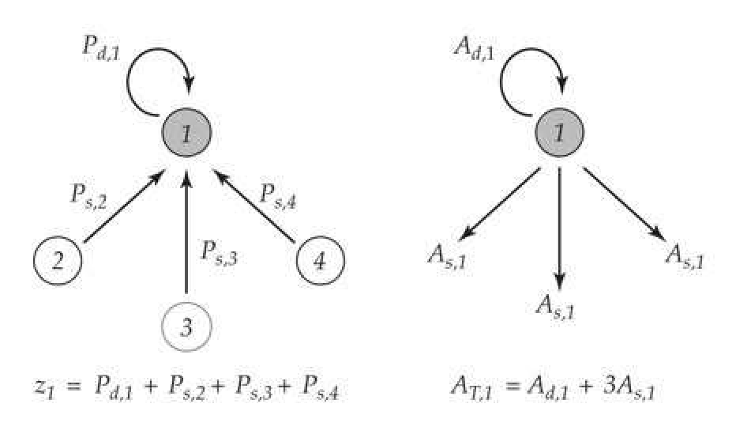
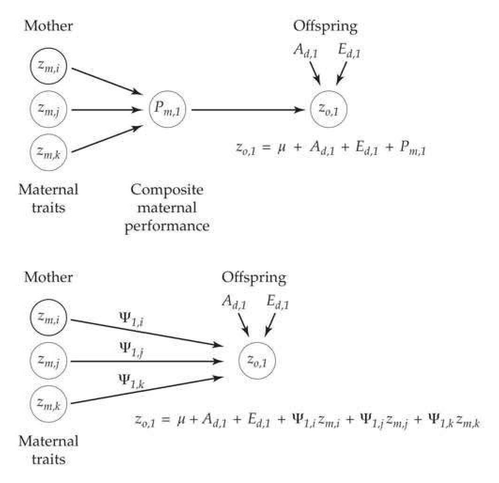
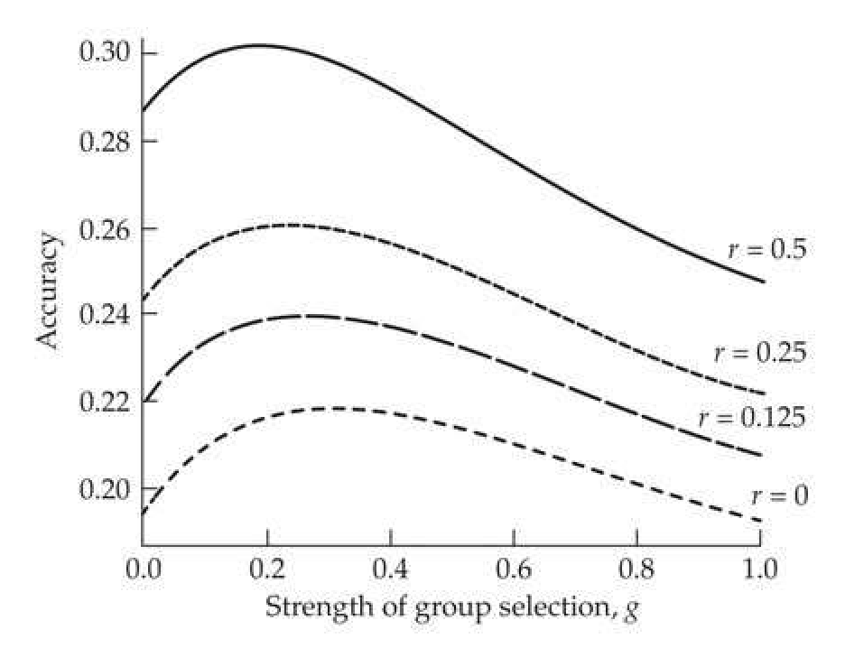
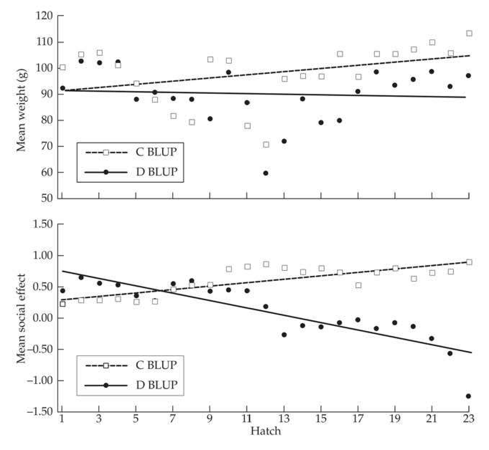

# Chapter 22 · Associative Effects: Competition, Social Interactions, Group and Kin Selection

## Evolution_chapter22_001 · Associative Effects: Competition, Social Interactions, Group and Kin Selection: Introduction

These findings … support the writer's view that competitive ability should be accepted as it stands as a genetic character, simple or aggregate, a view of great importance in the discussion to follow. Sakai (1955)

This chapter weaves together several seemingly unrelated, but nevertheless important, topics: competition; altruism and other social behaviors; traits defined by group, rather than individual, attributes; maternal effects; and group and kin selection. The connection between all of these topics is the notion that the genotype (and hence phenotype) of one individual may influence the trait value of another. In this sense, the “environmental” component of the phenotype of a focal individual may itself have some heritable component (based on the contribution from some other individual), allowing for some part of the environmental component to evolve along with the focal trait. In such settings, the phenotype of a focal individual consists of two components: direct effects from the focal individual and associative effects contributed from other individuals within the group. A critical implication of this distinction is that the breeding value of an individual contains a component for direct effects that appear in its own phenotype (and hence can be influenced by individual selection) and a component for associative effects that only appears in the phenotypes of other group members. The exploitation of associative effects by selection generally requires either interactions among kin (kin selection) or selection based on some combination of both individual and group values (multilevel selection). In the extreme, group selection occurs when all of the weight is placed on among-group differences. Note that multilevel selection is an extension of family-index selection (Chapter 21) to more general groups.

The framework for dealing with these issues was laid out in a series of classical, but largely ignored, papers by Griffing (1967, 1968a, 1968b, 1969, 1976a, 1976b, 1977), who introduced the notion of associative effects. There are also roots extending to classical work on maternal effects based on trait phenotype (Falconer 1965) or on an unmeasured maternal value (Willham 1963), as well as to the foundations of the study of social evolution (Hamilton 1963, 1964a, 1964b). There are two modeling approaches for dealing with associative effects: trait-based and variance component-based. Trait-based approaches (Moore et al. 1997) have their roots in univariate (Falconer 1965) and multivariate (Kirkpatrick and Lande 1989; Lande and Kirkpatrick 1990) models of selection response under maternal effects. As their name implies, trait-based approaches assume that we know the particular traits in group members that influence the phenotype of the focal individual. This approach is best handled in a multivariate framework, so we will delay its full discussion until Volume 3.

The variance-component approach also has roots in maternal-effects models (Willham 1963), wherein a general (but unmeasured, i.e., latent) maternal performance value influences the phenotype of the focal individual. Using BLUP, we can estimate the genetic variance of the associative effects (as well as its covariance with the direct effects). Somewhat counterintuitively, variance component-based methods (where the actual traits that generate the associative effects are unspecified) are empirically more powerful than trait-based methods. The reason is that we can estimate this unspecified total contribution directly, while if characters that influence associative effects are left out of a trait-based model, this can introduce errors. McGlothlin and Brodie (2009) and Bijma (2014) show the congruence between these methods, which is also examined in detail in Volume 3.

Traits whose phenotypes are determined, in part, by interactions with other individuals have important roles in both breeding and evolution. In breeding, we are often more interested in the performance of a group rather than that of an individual. For example, standard poultry husbandry is to keep several females together in a cage, with total egg production per cage being the key quantity of interest. In the extreme, an aggressive female may kill all her cage-mates, and, in less extreme cases, may largely dominate feeding, resulting in an individual benefit at the expense of the group. Hence, individual selection may result in a decrease in group performance, in which case the number of eggs per cage would decline.

The issue here is that individual selection cannot effectively utilize the genetic variation in associative effects to guarantee the response of the mean associative value in the direction favored by the breeder. The same concerns have long been raised in evolutionary biology, in particular to account for the evolution of altruistic traits (such as alarm calls in birds) that are expected to decrease individual fitness, yet still have evolved. There is a very rich, and stormy, evolutionary literature on the importance (or lack thereof) of selection based on group attributes. The general view in evolutionary biology has often been to invoke group selection arguments only as a last, desperate resort when all individual selection arguments fail (e.g., Williams 1966). As we will see, much of the debate regarding group versus kin selection is misplaced, as they are essentially manifestations of the same general process.

**[定义 Definition]**

Our treatment starts with a formal definition of direct and associative effects, including the powerful concept of the total breeding value, $ A_{T} $, of a trait (which requires measurements of group members). Next, we show how the presence of associative effects influences selection. One key result is that when the breeding values for direct and associative effects are negatively correlated, individual selection can result in a reversed response. Conversely, group selection (even when group members are unrelated) always results in an expected positive response, but it can be very ineffective when associative effects are small. We then examine selection based on an index of both individual and group information, including the optimal weighting for maximal response. A key innovation that we examine in detail is the use of BLUP/REML methodology (Chapters 19 and 20) to estimate the direct and associative effects of individuals, along with their variance components. We conclude by applying these results to some of the debates on group and kin selection in evolutionary biology. Our goal in this last section is not to extensively review this literature, which is often contradictory and, at times, was driven more by verbal models than detailed analyses. Rather, it is to show how the problem of selection based on group attributes can be easily placed in a quantitative-genetics framework.

**[命题 Proposition]**

For many readers, this may be one of the most important chapters in the book, as associative effects are potentially game-changing in the analysis of many traits. Evolutionary biologists, breeders, behavioral ecologists, and human geneticists all need to be aware of their importance and implications. They reshape many classic problems in evolutionary biology, such as Fisher's fundamental theorem (Chapter 6), inclusive fitness, and kin and group selection. Their presence fundamentally changes breeding strategies, as individual selection potentially leaves much of the usable genetic variation in a trait untapped and can result in reversed responses (Chapter 15). Most behavioral traits arise from interactions between individuals, which is exactly the framework for associative effects. Finally, their presence radically changes the way in which we analyze traits. An important example is disease resistance. As this is both a function of the susceptibility of an individual and the infectiousness of those around it, a full consideration requires a model with associative effects (Lipschutz-Powell et al. 2012a, 2012b; Costa e Silva et al. 2013). Partial reviews of some of the implications of associative effects are given by Griffin (1977), Moore et al. (1997), Wolf et al. (1998), Bijma and Wade (2008), McGlothlin et al. (2010), Wade et al. (2010), Wolf and Moore (2010), Bijma (2011, 2014), and Bailey (2012).

---

## Evolution_chapter22_002 · Associative Effects: Competition, Social Interactions, Group and Kin Selection: Introduction / DIRECT VERSUS ASSOCIATIVE EFFECTS

All organisms interact with their external environment, and a very significant fraction of that environment is biological. In particular, interactions with conspecifics through competition, cooperation, parental care, or other social interactions can constitute an important part of the environment that an individual experiences, which, in turn, can influence trait values. Further, this “environment” may contain heritable components and coevolve with the trait of interest. The classic example of this is competition, which we briefly consider first.

---

## Evolution_chapter22_003 · DIRECT VERSUS ASSOCIATIVE EFFECTS / Early Models of Competition

It has long been appreciated by breeders that competition among plants within a plot has a significant impact on important agricultural traits such as yield. While a particular genotype may have high yield when grown in isolation, when grown in a group, its competitive effects on other members within its group could result in a lower plot yield. Yield (and other traits) of a particular plant in a plot is therefore a function of two components. First, an individual's genotype has a direct influence on its ability to garner resources such as light, water, and nutrients. Second, that genotype influences others around it by competing for limiting resources. Other plants in the plot also compete, and these in turn influence the yield of the focal individual. One might expect that plants that are very successful at garnering resources have positive direct effects, but negative associative effects on nearby individuals. Thus, a plot of high-competing genotypes can have a low yield, as the positive direct effects for any particular plant are more than countered by negative associative effects from being surrounded by superior competitors.

A historically important paper on the evolution of competition is that by Sakai (1955), who noted that competition, like yield or height, is a genetic trait and hence can potentially evolve. Following Sakai, a number of workers developed single-locus population genetic models to examine the evolution of competition (Schutz et al. 1968; Allard and Adams 1969; Schutz and Usanis 1969; Cockerham and Burrows 1971; Cockerham et al. 1972). These studies all used simple ecological models of competition among a series of fixed types (here, all possible single-locus genotypes). While interesting, this class of models does not easily generalize beyond one locus. Griffing (1967) made the important extension of Sakai's idea by replacing a single-locus genotype with direct and associative values that are quantitative traits, consisting of breeding and residual values. Placed in this framework, such traits can potentially evolve and can also have their variance components estimated, allowing associative effects to be exploited by using appropriate selection designs.

**[示例 Example]**

*(See Example 22.1.)*

---

## Evolution_chapter22_004 · DIRECT VERSUS ASSOCIATIVE EFFECTS / Direct and Associative Effects

A simple example will introduce Griffing's idea. As shown in Figure 22.1A, consider a group of four individuals. Our focal individual is 1, and its phenotype, $ z_1 $ (for the trait of interest), is determined by its own intrinsic value, $ P_{d,1} $ (the subscript $ d $ indicating the direct effect), plus the associative effects, $ P_{s,2} $, $ P_{s,3} $, and $ P_{s,4} $, contributed by other group members.

> **Figure 22.1** · page 4 · source: `Evolution_chapter22`
>
> 
>
> Figure 22.1 Left: The phenotypic value,  $ z_{1} $, of the focal individual is the sum of its direct phenotypic effect,  $ P_{d,1} $, plus the associative effects,  $ P_{s,2} $,  $ P_{s,3} $,  $ P_{s,4} $, of the three other members in its group. Right: The total breeding value ( $ A_{T,1} $) of individual 1 is its direct breeding value,  $ A_{d,1} $, plus the total contribution of the associative-effect breeding value,  $ A_{s,1} $, to the three members of its group. A key concept is that only part of  $ A_{T} $ (namely  $ A_{d} $) is embedded within its own phenotypic value. The remaining part of  $ A_{T} $, namely its associative component,  $ 3A_{s} $, is only expressed in the phenotypes of other group members.

Associative effects are also referred to in the literature as indirect genetic effects (IGEs) (Moore et al. 1997; Wolf et al. 1998; McGlothlin et al. 2010), or social effects (Bijma et al. 2007a, 2007b), and we use the subscript s (indicating social effects) to denote them. In our discussion, we will use the terms associative and social effects interchangeably. Note that the values of $ P_{s,i} $ do not necessarily correspond to the phenotypes for the trait of interest in the other group members, but rather represent the contribution from these members to the phenotype of the focal individual. This contribution from fellow group members is part of the environment experienced by the focal individual.

More generally, for a group containing n equally interacting individuals, the resulting phenotype $ (z_{i}) $ for individual i becomes

$$
\begin{align*}z_i=P_{d_i}+\sum\limits_{j\ne i}^n P_{s_j}\end{align*}
$$

where the sum has n - 1 terms. Each of these components can be decomposed into a breeding value, A, plus a residual component, E (containing environmental effects plus any nonadditive genetic effects), yielding

$$
\begin{align*}z_i=\mu+(A_{d_i}+E_{d_i})+\sum\limits_{j\neq i}^n\left(A_{s_j}+E_{s_j}\right)\end{align*}
$$

We can write this more compactly as

$$
\begin{align*}z_i=\mu+A_{d_i}+\sum\limits_{j\ne i}^n A_{s_j}+e_i,\quad{\rm with}\quad e_i=E_{d_i}+\sum\limits_{j\ne i}^n E_{s_j}\end{align*}
$$

Because the environmental values have expected value of zero, the mean phenotypic value in the group is simply

$$
\begin{align*}\mu_z=\mu+\mu_{A_d}+(n-1)\mu_{A_s}\end{align*}
$$

Further, the change in the mean trait value within a group following selection is

$$
\Delta\mu_{z}=\Delta\mu_{A_{d}}+(n-1)\Delta\mu_{A_{s}}=R_{d}+(n-1)R_{s}
$$

which decomposes the change in trait value into contributions from responses, $ R_{d} $ and $ R_{s} $, respectively, in the direct and social values.

**[命题 Proposition]**

This equation foreshadows individual versus group selection. Individual selection targets the direct effect and results in a favorable change in $ \mu_{A_d} $. If the direct and social breeding values are correlated within an individual, namely, $ \sigma(A_d, A_s) \neq 0 $, then individual selection can also change $ \mu_{A_s} $, but not necessarily in a favorable direction. Indeed, as Example 22.4 will show, an increase in $ \mu_{A_d} $ under individual selection can be more than countered by an unfavorable change in $ \mu_{A_s} $, resulting in the mean phenotype changing in an unfavorable direction. Direct selection on $ \mu_{A_s} $ requires either undergoing group selection or having relatives within the group. All of these points will be expanded upon below. Our focus is entirely on additive genetic effects, as most of the theory has been developed under this assumption. Attempts to include nonadditive variance were developed by Gallais (1976) and Wright (1986). Finally, one way to make to concept of associative effects a bit more concrete is to note that one can map associative-effect QTLs; see Mutic and Wolf (2007) and Wolf et al. (2011) for examples.

---

## Evolution_chapter22_005 · DIRECT VERSUS ASSOCIATIVE EFFECTS / Animal Well-being and the Improvement of the Heritable Social Environment

In high-intensity agricultural systems, competition has a strong effect on yield and other traits. Animals in such environments face significant stress, which impacts both their production and their well-being. As reviewed by Muir and Craig (1998), animal well-being is becoming an increasingly important aspect of animal production. Muir suggests that social aspects such as aggression, fighting, and sharing of common resources are all potential targets of selection, and responses in these traits (for less aggression and more sharing) improves both animal welfare and production. Further, for a number of species (such as certain fishes), domestication has proved somewhat problematic due to the tendency for cannibalism (and lesser forms of aggression), when individuals are grown under production conditions. Muir suggested improving welfare by selecting for an improved mean social environment through selection of individuals with favorable $ A_s $ values for the traits of interest. Again, these are aspects of the group environment and can respond favorably to an appropriate selection design, provided there is a heritable component of $ P_s $, namely, $ \sigma^2(A_s) > 0 $.

---

## Evolution_chapter22_006 · DIRECT VERSUS ASSOCIATIVE EFFECTS / What Do We Mean by Group?

**[定义 Definition]**

Given that we use the term group extensively in this chapter, a more formal definition is required. Our focus here is on traits whose values are influenced by interactions with others. The set of individuals that interacts with the focal individual constitutes the unit we will call a group. This may be straightforward in some breeding settings, such as the specific animals in a pen or cage. However, in other settings, such as cattle in a very large feedlot, only some subset of all the individuals likely interact with the focal individual. Hence, group size may be much smaller than the number of individuals physically confined to some space. Likewise, individuals may be part of different groups for different traits, especially if those traits are expressed at different times during development. The same is true on a grander scale in natural populations. The key issue with traits influenced by interactions is that phenotypes of the group members provide some information on part of the breeding value of the focal individual—the part dealing with its associative effect—that is simply not provided by the phenotype of the focal individual. To exploit this additional heritable variation (when it exists), interactions with relatives or selection that puts at least some weight on group value is essential.

The second feature about groups is their formation and reproduction, an issue that is especially important under differential propagation of groups (i.e., group selection). Here, we are assuming a situation akin to our analysis of family selection (Chapter 21), in that, while group information may be used to select individuals to form the next generation, these individuals are then mated at random. In the group-selection literature, this is referred to as a migrant pool model (Levins 1970; Wade 1978). Such a structure only allows changes in breeding values (as opposed to genotypic values) to propagate to the next generation. In settings where entire groups are propagated as a unit (the propagule pool model; Wade

1978), the potential exists for nonadditive variance to contribute to the among-group variance.

---

## Evolution_chapter22_007 · DIRECT VERSUS ASSOCIATIVE EFFECTS / Trait- vs. Variance Component-based Models

A brief comment is in order, expanding upon our earlier remarks on trait vs. variance-component based modeling (see Bijma 2014 for an extended discussion). The original trait-based model of associative effects was Falconer's (1965) model for litter size in mice (Equation 15.21), namely

$$
\begin{align*}z_i=G_i+e_i+(m\cdot z_{mo,i})\end{align*}
$$

where $ G_i $ is the direct breeding value for litter size, while the associative effect is a function of the litter size of its mother ($ z_{mo,i} $). Building on this idea, Moore et al. (1997) and Wolf et al. (1998) suggested a model wherein the value for trait $ i $ also depends upon the value, $ z_j' $, of trait $ j $ (which may be a different trait from $ i $) in an interacting individual,

$$
\begin{align*}z_i=A_i+e_i+\Psi_{ij}z^{\prime}_j=A_i+e_i+\Psi_{ij}A^{\prime}_j+\Psi_{ij}E^{\prime}_j\end{align*}
$$

where $ \Psi_{ij} $ (following Kirkpatrick and Lande 1989) is the multivariate extension of Falconer's m. This class of models can lead to some very interesting behavior, such as feedback loops that significantly modify Equation 22.2. Figure 22.2 illustrates this difference in modeling, while Volume 3 explores trait-based models in some detail.

> **Figure 22.2** · page 6 · source: `Evolution_chapter22`
>
> 
>
> Figure 22.2 The difference between trait-based and variance-component based models. Here, the phenotypic value,  $ z_{o,1} $, of a trait (which we label 1) in an offspring is a function of maternal phenotype. We suppose that there are three maternal traits (i, j, k) whose phenotypes influence the offspring value. Top: Under a variance-component based approach, we ignore all the maternal trait values and simply estimate a single maternal performance value,  $ P_{m,1} $, that directly influences the trait value in the offspring. The resulting model becomes  $ z_{o,1} = \mu + A_{d,1} + E_{d,1} + P_{m,1} $, where  $ A_{d,1} $ is the trait breeding value in the offspring,  $ E_{d,1} $, its environmental value, and  $ P_{m,1} = A_{s,1} + E_{s,1} $ can be decomposed into the social breeding value on trait 1 plus a residual. Bottom: Under a trait-based model, provided we know all of the maternal traits whose phenotypes influence trait 1 in the offspring, then we directly incorporate these, along with their regression coefficients,  $ \Psi_{1,i} $, showing how these maternal phenotypes translate into offspring trait value. Here,  $ z_{o,1} = \mu + A_{d,1} + E_{d,1} + \Psi_{1,i} z_{m,i} + \Psi_{1,j} z_{m,j} + \Psi_{1,k} z_{m,k} $, where the last three terms together comprise  $ P_{m,1} $. Trait-based models are required if one wishes to consider the joint evolution of traits 1 and i, j, k. Their drawback is that one has to specify to all of the relevant maternal traits. Conversely, under a variance-component method, all of the maternal phenotypes are conveniently collapsed into a single value, whose breeding value can be estimated from an appropriate design (detailed below).

**[命题 Proposition]**

Bijma (2014) noted that variance-component approaches are akin to using Robertson’s secondary theorem, $ R = \sigma(w, A) $ (Equation 6.25a), to predict response, which ignores any specific traits and simply considers the covariance between breeding value (which we generalize by calculating total breeding value, $ A_T $, below) and relative fitness. In contrast, trait-based approaches are akin to using the multivariate Lande equation, $ \mathbf{R} = \mathbf{G}\beta $ (Equation 13.26a), to predict response. The Lande equation returns the response in all traits of interest, but it requires that all relevant traits be included in the analysis and is potentially erroneous if they are not (Volume 3).

---

## Evolution_chapter22_008 · DIRECT VERSUS ASSOCIATIVE EFFECTS / The Total Breeding Value (TBV) and $ T^{2} $

Given that an individual contains breeding values for both direct and social effects, what is its contribution to the next generation? We can directly see this from Equation 22.1d, where it is shown as the contribution to the population mean from individual 1 from its direct breeding value $ (A_{d_1}) $ plus its contribution to the $ (n-1) $ other individuals in its group through its associative-effects breeding value, $ A_{s_1} $ (Figure 22.1b). Based on this observation, Bijma et al. (2007a) defined the total breeding value (TBV), $ A_T $, of a trait from an individual measured in a group of size $ n $ as the sum of its direct effect plus the total associative effects over all group members, or

$$
A_{T_{i}}=A_{d_{i}}+(n-1)A_{s_{i}}
$$

Moore et al. (1997) introduced a similar measure for trait-based models. Noting that the mean of the population is simply the mean breeding value allows Equation 22.3 to recover Equation 22.1d. The critical observation is that when associative effects are present, the total breeding value of an individual contains components that are not expressed in its own phenotype, but rather, only in the phenotypes of other individuals with which it interacts.

**[示例 Example]**

*(See Example 22.2.)*

The covariance between an individual’s phenotype and total breeding value is

$$
\begin{align*}\sigma(z_{i},A_{T_{i}})&=\sigma\bigg[\mu+A_{d_{i}}+\sum_{j\neq i}^{n}A_{s_{j}}+e_{i},A_{d_{i}}+(n-1)A_{s_{i}}\bigg]\\&=\sigma\bigg[A_{d_{i}},A_{d_{i}}+(n-1)A_{s_{i}}\bigg]+\sum_{j\neq i}^{n}\sigma\bigg[A_{s_{j}},A_{d_{i}}+(n-1)A_{s_{i}}\bigg]\end{align*}
$$

For now, we assume group members are unrelated, in which case the covariances in the summation are all zero,

$$
\sigma(z,A_{T})=\sigma^{2}(A_{d})+(n-1)\sigma(A_{d},A_{s})
$$

If the direct and associative effects are uncorrelated, this reduces to the standard result that the covariance between an individual's phenotype and breeding value is simply the additive genetic variance (in this case, of direct effects). By contrast, the variance of the total breeding value becomes

$$
\begin{align*}\sigma^{2}(A_{T})&=\sigma^{2}\left[A_{d}+(n-1)A_{s}\right]\\&=\sigma^{2}(A_{d})+2(n-1)\sigma(A_{d},A_{s})+(n-1)^{2}\sigma^{2}(A_{s})\\&=\sigma(z,A_{T})+(n-1)\left[\sigma(A_{d},A_{s})+(n-1)\sigma^{2}(A_{s})\right.\end{align*}
$$

Equation 22.4d shows that the covariance between total breeding value and phenotype is different from the variance in total breeding value. This reflects the fact that the associative effects of an individual do not influence its own phenotype. Note from Equation 22.4c that $ \sigma(A_d, A_s) $ and $ \sigma^2(A_s) $ are scaled by $ (n-1) $ and $ (n-1)^2 $, respectively, in $ \sigma^2(A_T) $. Hence, with even modest group sizes, small values of $ \sigma(A_d, A_s) $ and $ \sigma^2(A_s) $ can still have a very significant impact. Some of the early papers reporting estimates of these two quantities ignored this scaling with $ n $, and hence tended to downplay the importance of social interactions (Chen et al. 2006; Van Vleck et al. 2007).

Now consider the phenotypic variance,

$$
\sigma_{z}^{2}=\sigma^{2}\bigg(P_{d_{i}}+\sum_{j\neq i}^{n}P_{s_{j}}\bigg)
$$

If we assume (for now) that the group members are unrelated, then $ \sigma(P_{d_i}, P_{s_j}) = 0 $. For a group of size $ n $, Equation 22.5a reduces to

$$
\sigma_{z}^{2}=\sigma^{2}(P_{d})+(n-1)\sigma^{2}(P_{s})
$$

$$
=\sigma^{2}(A_{d})+(n-1)\sigma^{2}(A_{s})+\sigma^{2}(E_{d})+(n-1)\sigma^{2}(E_{s})
$$

$$
=\sigma^{2}(A_{d})+(n-1)\sigma^{2}(A_{s})+\sigma^{2}(e)
$$

where $ e $ is given by Equation 22.1c. With the phenotypic variance in hand, we can define the heritability of the direct and associative effects, $ h_d^2 $ and $ h_s^2 $, respectively, as

$$
h_{d}^{2}=\frac{\sigma^{2}(A_{d})}{\sigma_{z}^{2}}\quad and\quad h_{s}^{2}=\frac{\sigma^{2}(A_{s})}{\sigma_{z}^{2}}
$$

**[定义 Definition]**

The careful reader will note that there is a different, but perhaps more natural, definition of these two heritabilities. Equation 22.6a standardizes the genetic variances with respect to the total trait variance, but one could also standardize them with respect to the variance of direct and associative effects, for example,

$$
h_{d^{\prime}}^{2}=\frac{\sigma^{2}(A_{d})}{\sigma^{2}(P_{d})}\quad and\quad h_{s^{\prime}}^{2}=\frac{\sigma^{2}(A_{s})}{\sigma^{2}(P_{s})}
$$

We use a prime to distinguish these from the heritiabilities scaled to total trait variance $ \sigma^2(P_x) $ vs. $ \sigma_z^2 $. While heritiabilities scaled by $ \sigma_z^2 $ (Equation 22.6a) are the most widespread in the literature, there are some advantages to scaling heritiabilities by $ \sigma^2(P_x) $ (where $ x = d $ or $ s $). On this scale, the heritiabilities measure the fraction of additive genetic variation in the actual effect (direct or associative) itself, rather than in the trait value. Further, $ h_x^2 $, is independent of the group size (provided that $ A_s $ does not change with group size), as $ \sigma_z^2(P_x) $ is independent of $ n $, while $ \sigma_z^2 $ is a function of $ n $ (Equation 22.5b).

In keeping with Equation 22.6a, we can similarly define the “heritability” of the total breeding value as

$$
T^{2}=\frac{\sigma^{2}(A_{T})}{\sigma_{z}^{2}}
$$

as suggested by Bijma et al. (2007a). The reason we have used $ T^2 $ rather than $ h_T^2 $ is that, unlike heritabilities, $ T^2 $ can exceed one. This can happen because $ \sigma^2(A_T) $ contains additional terms not found in $ \sigma_z^2 $, as the associative effect of an individual influences others in the group, rather than the individual in which it resides.

To see this, first assume that the environmental effects are all zero ($ \sigma^{2}(e) = 0 $), so that we can focus on differences in the genetic variance components. From Equations 22.4c and 22.5c,

$$
\begin{aligned}\sigma^{2}(A_{T})-\sigma_{z}^{2}&=2(n-1)\sigma(A_{d},A_{s})+(n-1)^{2}\sigma^{2}(A_{s})-(n-1)\sigma^{2}(A_{s})\\&=(n-1)\left[2\sigma(A_{d},A_{s})+(n-2)\sigma^{2}(A_{s})\right]\end{aligned}
$$

If this difference exceeds the contribution (σ2) from environmental effects, then T2 > 1.

**[定义 Definition]**

Bijma (2011, 2014) noted that $ \sigma^{2}(A_{T}) $ provides the appropriate (and general) definition for the amount of heritable variation underlying the potential for response. Recalling Equations 22.1e and 22.3, the Robertson-Price identity (Equation 6.10) yields the expected response (change in mean breeding value) to selection as

$$
R=\sigma(w,A_{T})
$$

Because the linear regression of w on $ A_{T} $ has a slope of

$$
\beta_{w|A_{T}}=\frac{\sigma(w,A_{T})}{\sigma^{2}(A_{T})}
$$

(LW Equation 3.14b), the general expression for response can be written as

$$
R=\beta_{w|A_{T}}\sigma^{2}(A_{T})
$$

The apparent simplicity of this expression is somewhat misleading, as $ \beta_{w|A_T} $ can be a very complex function of the relationship among group members (see Bijma 2011 for examples).

**[示例 Example]**

*(See Example 22.3.)*

---

## Evolution_chapter22_009 · DIRECT VERSUS ASSOCIATIVE EFFECTS / $ A_{s} $ as a Function of Group Size

As the careful reader will have noted, the direct effect, $ A_d $, is independent of group size, while the social effect, $ A_s $, potentially changes with group size. Suppose a genotype has a breeding value for social effects of 10 when measured in groups of size four. Does this change with group size and, if so, how? This is an empirical issue, and one can frame it in a $ G \times E $ setting. The environments here are different group size, and if $ A_s $ shows $ G \times E $, the value of $ A_s $ changes over $ n $.

Two simple scenarios bracket the possible changes. First, suppose that an individual eats 500 grams of food daily. In a group with a fixed food supply, the associative effect of this individual is to remove 500 grams from the total food supply each day. Hence, in a group of size n, $ P_{s_i} = -500/(n - 1) $, while its total associative effect is the sum over all group members, $ (n - 1)P_{s_i} = -500 $. Here, the total associative effect remains unchanged over group size, while the individual associative effect on any group member shows a dilution with increasing group size. Alternatively, consider a large tree whose associative effect results from shading individuals under its canopy. In such a case, its associative effect shows no dilution with group size. Similarly, Bijma et al. (2007a) noted that alarm calls are also expected to show no dilution with group size.

More generally, we have been assuming that all group members experience the same social effect from a conspecific (i.e., they all experience $ P_{s,i} $ from individual i). However, one can imagine settings where $ P_{s,i} $ is some base value, but its effect on specific individuals depends on their physical distance from individual i (e.g., Muir 2005; Cappa and Cantet 2008), or the total amount of time that they interact with each other (Cantet and Cappa 2008) (e.g., Example 22.11). Bijma (2014) presented a more general treatment of this issue. A second complication, wherein interactions may differ between kin and nonkin (e.g., Sherman 1977), was examined by Alemu et al. (2014).

A developing research area involves the further characterization of social effects and the degree to which they change over group size. Some initial insight was provided by Hadfield and Wilson (2007) and Bijma (2010b). Hadfield and Wilson assumed a simple regression model

$$
P_{s_{i},n}=P_{s b_{i}}+\frac{1}{n-1}P_{s r_{i}}
$$

with the value for social effect in a group of size n being a function of two components: a base (or intercept) value, $ P_{sb_i} $, and a linear dilution rate, $ P_{sr_i} $. Note that the resulting total sum of associative effects from i over the $ (n-1) $ group members becomes $ (n-1)P_{sb_i} + P_{sr_i} $ meaning that $ P_{sr} $ is the constant contribution, while that from $ P_{sb} $ scales with group size.

Bijma (2010b) suggested a related model

$$
P_{s_{i},n}=\frac{1}{(n-1)^{d}}P_{s_{i},2}
$$

which expresses all group social values as a function of the value for a group of size two $ (P_{s_i,2}) $ weighted by a power function of the dilution fraction, $ d $ (assumed to be the same over all genotypes). As we will see in the models below, Bijma's model is a bit more tractable, while the Hadfield-Wilson model is more general. When $ d = 1 $ and $ P_{sp_i} = 0 $, the two models are equivalent. Under the Bijma model, substituting Equation 22.10a into Equation 22.5a gives the total phenotypic variance as

$$
\sigma_{z,n}^{2}=\sigma^{2}(P_{d})+(n-1)^{1-2d}\sigma^{2}(P_{s,2})
$$

Phenotypic variance increases with n for $ d < 1/2 $, remains constant for $ d = 1/2 $, and decreases with n for $ d > 1/2 $. Assuming that breeding values are diluted in the same fashion as phenotypic effects, then under the Bijma model

$$
A_{s,n}=\frac{A_{s,2}}{(n-1)^{d}}\quad and\quad\sigma^{2}(A_{s,n})=\frac{\sigma^{2}(A_{s,2})}{(n-1)^{2d}}
$$

Hence, $ \sigma(A_d, A_s) = \sigma(A_d, A_{s,2})/(n-1)^d $, and substituting into Equation 22.4c gives the total additive-genetic variance for a group of size $ n $ as

$$
\sigma^{2}(A_{T,n})=\sigma^{2}(A_{d})+(n-1)^{1-d}\left[2\sigma(A_{d},A_{s,2})+(n-1)^{1-d}\sigma^{2}(A_{s,2})\right]
$$

Hence, provided that d < 1, the additive total variance increases with n. Both Hadfield and Wilson (2007) and Bijma (2010b) have suggested methods to estimate the quantities in Equations 22.9 and 22.10a, respectively.

---

## Evolution_chapter22_010 · Associative Effects: Competition, Social Interactions, Group and Kin Selection: Introduction / SELECTION IN THE PRESENCE OF ASSOCIATIVE EFFECTS

One of the key results when associative effects are present is that individual selection can result in a reversed response, while group selection always results in a positive response (although it may be far from optimal). These points were clearly made by Griffing (1967) for the simple case of two interacting, and unrelated, individuals within each group. For selection on individual phenotypes, the response becomes

$$
\begin{align*}R=\frac{\bar\imath}{\sigma(z)}\left[\sigma^2(A_d)+\sigma(A_d,A_s)\right]\end{align*}
$$

A negative covariance between direct and associative effects reduces the efficiency of selection, and if it is sufficiently negative, it gives a reversed response. This loss of efficiency occurs because the only information an individual's phenotype contains about its breeding value for associative effects is that provided by the covariance between the direct and associative breeding values (which can be negative). Conversely, if we select based on the mean of a group, we are selecting on both direct and associative effects to improve trait value. For the case of n = 2, Griffing obtained the expected response under group selection as

$$
R=\frac{\overline{\imath}}{2\sigma(\overline{z})}\left[\sigma^{2}(A_{d})+2\sigma(A_{d},A_{s})+\sigma^{2}(A_{s})\right]=\frac{\overline{\imath}}{2\sigma(\overline{z})}\sigma^{2}(A_{T})
$$

While group selection always yields a nonnegative response, if the associative effects are weak, this approach will prove very inefficient relative to individual selection. For example, in the absence of associative effects, $ \sigma^2(\overline{z}) = \sigma^2(z)/2 $, and Equation 22.11b reduces to $ \overline{i}\sigma(A_d)/[\sqrt{2}\sigma(z)] $, or $ 1/\sqrt{2} = 0.701 $ of the response under individual selection.

---

## Evolution_chapter22_011 · SELECTION IN THE PRESENCE OF ASSOCIATIVE EFFECTS / Individual Selection: Theory

Consider individual selection in a group of size n, whose members are potentially related. Recalling Equation 22.4a, the correlation between phenotype and total breeding value is

$$
\sigma(z_{i},A_{T_{i}})=\sigma^{2}(A_{d})+(n-1)\sigma(A_{d},A_{s})+\sum_{j\neq i}\sigma\left[A_{s_{j}},A_{d_{i}}+(n-1)A_{s_{i}}\right]
$$

Let $ r_{ij} $ denotes the relationship between individuals i and j. When individuals within the group are related, then

$$
\sigma(A_{s_{j}},A_{s_{i}})=r_{ij}\sigma^{2}(A_{s})
$$

Likewise if $ A_{d} $ and $ A_{s} $ are correlated, then for relatives we also have

$$
\sigma(A_{d_{j}},A_{s_{i}})=r_{ij}\sigma(A_{d},A_{s})
$$

Hence,

$$
\begin{align*}\sum_{j\neq i}\sigma\left[A_{s_{j}},A_{d_{i}}+(n-1)A_{s_{i}}\right]&=\sum_{j\neq i}\sigma\left(A_{s_{j}},A_{d_{i}}\right)+(n-1)\sum_{j\neq i}\sigma\left(A_{s_{j}},A_{s_{i}}\right)\\&=\sigma(A_{d},A_{s})\sum_{j\neq i}r_{ij}+(n-1)\sigma^{2}(A_{s})\sum_{j\neq i}r_{ij}\\&=\left[\sigma(A_{d},A_{s})+(n-1)\sigma^{2}(A_{s})\right]\left[\sum_{j\neq i}r_{ij}\right]\end{align*}
$$

When all of the group members have the same relatedness $ (r_{ij} = r) $, the sum becomes $ (n - 1)r $, returning the result of Bijma et al. (2007a),

$$
\begin{align*}\sigma(z,A_{T})&=\sigma^{2}(A_{d})+(n-1)\left[\sigma(A_{d},A_{s})+r\sigma\left(A_{s},A_{d}\right)+r(n-1)\sigma^{2}\left(A_{s}\right)\right]\\&=\sigma^{2}(A_{d})+(n-1)(1+r)\sigma(A_{d},A_{s})+r(n-1)^{2}\sigma^{2}\left(A_{s}\right)\end{align*}
$$

Equation 22.12c shows the impact of having relatives within the group, which is to shift some of the variance in social effects, $ \sigma^2(A_s) $, into the covariance, $ \sigma(z, A_T) $, between individual phenotype and total breeding value. The use of relatives in the group thus allows individual selection to access some of this otherwise untapped variance. This occurs because the breeding values for social effects of group members (which impacts the phenotypic value of the focal individual) are now correlated with an individual's own breeding value for social effects (where the latter has no direct impact on its phenotype).

A useful alternative expression is to partition $ \sigma(z, A_T) $ into the contribution expected in unrelated groups (Equation 22.4b) plus the additional contribution due to individuals in the group being related, which yields

$$
\sigma(z,A_{T})=\sigma(z,A_{T}\mid r=0)+(n-1)r\left[\sigma\left(A_{s},A_{d}\right)+(n-1)\sigma^{2}\left(A_{s}\right)\right]
$$

Alternatively, this can be expressed as

$$
\sigma(z,A_{T})=r\sigma^{2}(A_{T})+(1-r)\left[\sigma^{2}(A_{d})+(n-1)\sigma(A_{d},A_{s})\right]
$$

showing that the more closely related group members are, the more weight individual selection puts on $ A_{T} $. In the extreme, when groups are composed of clones, then $ \sigma(z, A_{T}) = $

$ \sigma^{2}(A_{T}) $. Plant breeding often selects among groups comprised of genetically identical individuals (i.e., inbred lines and clonally propagated lines), with such settings exploiting all of the heritable variation in both direct and associative effects without requiring any special design.

Similarly, when all members in the group have the same relatedness, r, the phenotypic variance becomes

$$
\sigma^{2}(z)=\sigma^{2}(A_{d})+\sigma^{2}(E_{d})+(n-1)\left[\sigma^{2}(A_{s})+\sigma^{2}(E_{s})\right]
$$

$$
+(n-1)r\left[2\sigma(A_{s},A_{d})+(n-2)\sigma^{2}(A_{d})\right]
$$

$$
=\sigma^{2}(z\mid r=0)+(n-1)r\left[2\sigma(A_{s},A_{d})+(n-2)\sigma^{2}(A_{d})\right]
$$

where the phenotypic variance when all group members are unrelated, $ \sigma^{2}(z \mid r = 0) $, is given by Equation 22.5c.

The response to selection is simply the change in the mean total breeding value, which (from Chapter 13) is the within-generation change in the phenotypic mean after selection (the selection differential, S) times the slope of the regression of $ A_{T} $ on phenotype z, yielding

$$
R=\frac{\sigma(z,A_{T})}{\sigma_{z}^{2}}S=\frac{\sigma(z,A_{T})}{\sigma_{z}}\bar{\imath}
$$

The second expression follows from the standard identity that $ S = \sigma_z \bar{i} $ (Equation 13.6a). Substituting Equation 22.12c, with $ n = 2 $ and $ r = 0 $, into Equation 22.13 recovers Griffing's result (Equation 22.11a).

**[示例 Example]**

*(See Example 22.4.)*

**[示例 Example]**

*(See Example 22.5.)*

---

## Evolution_chapter22_012 · SELECTION IN THE PRESENCE OF ASSOCIATIVE EFFECTS / Individual Selection: Direct vs. Social Response

Recalling Equation 22.1e, the response in the trait has two components: that from direct effects, $ R_d = \Delta \mu_{A_d} $, and that from social effects, $ R_s = \Delta \mu_{A_s} $. The relative contribution of each to the total response easily follows by considering the covariance of an individual's phenotype value, $ z $, with either its direct, $ A_d $, or social, $ A_s $, breeding values. Specifically,

$$
R_{z}=R_{d}+(n-1)R_{s},\quad\mathrm{w h e r e}\qquad R_{d}=\frac{\sigma(A_{d},z)}{\sigma_{z}}\bar{\imath}\quad\mathrm{a n d}\quad R_{s}=\frac{\sigma(A_{s},z)}{\sigma_{z}}\bar{\imath}
$$

Here

$$
\sigma(A_{d},z)=\sigma\Biggl(A_{d},A_{d}+\sum_{i\neq j}A_{s,i}+e\Biggr)=\sigma^{2}(A_{d})+r(n-1)\sigma(A_{d},A_{s})
$$

while

$$
\sigma(A_{s},z)=\sigma\Biggl(A_{s},A_{d}+\sum_{i\neq j}A_{s,i}+e\Biggr)=\sigma(A_{d},A_{s})+r(n-1)\sigma^{2}(A_{s})
$$

Equation 22.15b shows that the group must contain relatives $ (r \neq 0) $ in order for the covariance between direct and social values to impact the response in the direct value. Likewise, under individual selection, response in the social value only occurs if the direct and social values are correlated within individuals $ \sigma(A_d, A_s) \neq 0 $ or if group members are related $ (r \neq 0) $, in which case the social value of the focal individual is correlated with the social values of those within its group.

**[示例 Example]**

*(See Example 22.6.)*

---

## Evolution_chapter22_013 · SELECTION IN THE PRESENCE OF ASSOCIATIVE EFFECTS / Individual Selection: Maternal Effects

An important special case, and indeed the forerunners of more general models of associative effects, are models of direct and maternal effects (Dickerson 1947; Willham 1963, 1972; Cheverud 1984a). Here, the trait value of an individual is a function of its direct effect, $ P_{d} $, and a maternal performance trait, $ P_{m} $, contributed by its mother, meaning that if j is the mother of i, then

$$
z_{i}=P_{d_{i}}+P_{m,j}
$$

In the absence of inbreeding, $r = 1/2$ for this group (mother-offspring) with $n = 2$. From Equation 22.12c, the covariance between phenotype and total breeding value ($A_T = A_d + A_m$, with $A_s = A_m$) is

$$
\sigma(z,A_{T})=\sigma^{2}(A_{d})+(3/2)\sigma(A_{d},A_{m})+(1/2)\sigma^{2}\left(A_{m}\right)
$$

while Equation 22.13a yields a phenotypic variance of

$$
\sigma^{2}(z)=\sigma^{2}(A_{d})+\sigma(A_{d},A_{m})+\sigma^{2}(A_{m})+\sigma^{2}(e)
$$

making the resulting response to selection

$$
R=\frac{\sigma(z,A_{T})}{\sigma_{z}}\bar{\imath}=\frac{\sigma^{2}(A_{d})+(3/2)\sigma(A_{d},A_{m})+(1/2)\sigma^{2}\left(A_{m}\right)}{\sqrt{\sigma^{2}(A_{d})+\sigma(A_{d},A_{m})+\sigma^{2}(A_{m})+\sigma^{2}(e)}}
$$

The total response can also be expressed in terms of the direct and maternal-effect response. From Equation 22.15,

$$
R_{d}=\frac{\sigma(A_{d},z)}{\sigma_{z}}\bar{\imath}=\frac{\sigma^{2}(A_{d})+(1/2)\sigma(A_{d},A_{m})}{\sigma_{z}}\bar{\imath}
$$

and

$$
R_{m}=\frac{\sigma(A_{m},z)}{\sigma_{z}}\overline{\imath}=\frac{\sigma(A_{d},A_{m})+(1/2)\sigma^{2}(A_{m})}{\sigma_{z}}\overline{\imath}
$$

with the response, R, in the trait mean being

$$
R=R_{d}+(2-1)R_{m}=R_{d}+R_{m}
$$

Substitution of Equations 22.17a and 22.17b into Equation 22.17c recovers Equation 22.16d. As reviewed by Cheverud (1984a), most estimates of the direct-maternal covariance are negative. This raises the possibility of a reversed response due to a greater reduction in the maternal environment than improvement in the direct effect. It also allows for the trait to improve (via its direct value) at the expense of a declining maternal value.

The careful reader might recall from Chapter 15 that Falconer’s trait-based model of a single maternal effect results in more complicated dynamics (such as time lags). Why do these not appear in this analysis? As noted by Bijma (2011), variance-component models essentially focus on the permanent component of response, ignoring transient contributions that can appear in a trait-based analysis. He showed that Equation 22.16d and Falconer’s model both give the same value for the permanent response.

---

## Evolution_chapter22_014 · SELECTION IN THE PRESENCE OF ASSOCIATIVE EFFECTS / Group Selection: Theory

Under individual selection with unrelated group members, there is no contribution from $ \sigma^2(A_s) $ to the response, and changes in $ A_s $ only enter as a correlated response to changes in $ A_d $, which can be in an unfavorable direction when $ \sigma(A_d, A_s) < 0 $. As we will see, $ \sigma^2(A_s) $ enters into the response under group selection even when there are no relatives in the group. The reason is that the group phenotype is a function of the distribution of $ A_s $ values. Under strict group selection, selection is based on the group mean, $ \overline{z} $, or equivalently the total value of the group, $ n\overline{z} = \sum z $, and we will usually work with the latter. To obtain the covariance between the total value of a group and the total breeding value of one of its members, first note that

$$
\begin{aligned}\sum_{j=1}^{n}z_{j}&=\sum_{j=1}^{n}\left[A_{d_{j}}+E_{d_{j}}+\sum_{k\neq j}^{n}\left(A_{s_{k}}+E_{s_{k}}\right)\right]=\sum_{j=1}^{n}A_{d_{j}}+\sum_{j=1}^{n}\sum_{k\neq j}^{n}A_{s_{k}}+\sum_{j=1}^{n}e_{j}\\&=\sum_{j=1}^{n}A_{d_{j}}+(n-1)\sum_{j=1}^{n}A_{s_{j}}+\sum_{j=1}^{n}e_{j}\\&=\sum_{j=1}^{n}A_{T_{j}}+\sum_{j=1}^{n}e_{j}\end{aligned}
$$

where the residual values, $ e_{i} $, sweep up a variety of environmental terms, and are given by Equation 22.1c. The residuals are assumed to be uncorrelated with any breeding values, but of course residuals can be (and usually are) correlated within a group (e.g., Equation

22.23a). If $ r_{ij} $ is the relationship between individuals i and j, the covariance between the group total and the total breeding value of a group member, i, is

$$
\begin{align*}\sigma\bigg(A_{T_{i}},\sum_{j=1}^{n}z_{j}\bigg)&=\sigma\bigg(A_{T_{i}},\sum_{j=1}^{n}[A_{T_{j}}+e_{j}]\bigg)=\sum_{j=1}^{n}\sigma\left(A_{T_{i}},A_{T_{j}}\right)=\sigma^{2}(A_{T})\sum_{j=1}r_{ij}\\&=\sigma^{2}(A_{T})\bigg(1+\sum_{i\neq i}r_{ij}\bigg)\quad&(\end{align*}
$$

If the group members are unrelated, then

$$
\begin{align*}\sigma\bigg(A_{T_i},\sum\limits_{j=1}^n z_j\bigg)=\sigma^2(A_T)\end{align*}
$$

which implies that $ \sigma(A_{T}, \overline{z}) = \sigma^{2}(A_{T})/n $. Hence, group selection acts on the total breeding value of an individual, rather than on only part of $ A_{T} $, as was the case with individual selection (e.g., Equation 22.12e). The contribution of associative effects to the total breeding value does not influence the phenotype of the focal individual, but does influence the phenotypes of other group members, and hence, $ \overline{z} $. Group selection directly targets these effects. If all members have the same degree of relationship (r), then

$$
\sigma\Bigg(A_{T_{i}},\sum_{j=1}^{n}z_{j}\Bigg)=\sigma^{2}(A_{T})\left[1+(n-1)r\right]
$$

Selection can act on associative effects even when none of the individuals in the group are related, but its efficiency is amplified when using relatives (compare Equations 22.19b and 22.19c). From Equation 22.19c, the covariance of the total breeding value, $ A_T $, of a group member with its group mean, $ \overline{z} $, is

$$
\sigma\left(A_{T_{i}},\overline{z}\right)=\frac{1}{n}\sigma^{2}(A_{T})\left[1+(n-1)r\right]=\sigma^{2}(A_{T})\left(r+\frac{1-r}{n}\right)
$$

Turning to the phenotypic variance of the group total, $ n\bar{z} $, a little bit of algebra is required. From Equation 22.18, we can decompose this group variance into additive-genetic and environmental components

$$
\sigma^{2}\Big(\sum_{j=1}^{n}A_{T_{j}}+\sum_{j=1}^{n}e_{j}\Big)=\sigma\Big(\sum_{j=1}^{n}A_{T_{j}},\sum_{k=1}^{n}A_{T_{k}}\Big)+\sigma\Big(\sum_{j=1}^{n}e_{j},\sum_{k=1}^{n}e_{k}\Big)
$$

Tackling the genetic component first yields

$$
\sigma\Bigg(\sum_{j=1}^{n}A_{T_{j}},\sum_{k=1}^{n}A_{T_{k}}\Bigg)=\sigma^{2}(A_{T})\cdot\sum_{j=1}^{n}\sum_{k=1}^{n}r_{ij}
$$

When all group members have the same degree of relationship, r, this reduces to

$$
\sigma\Bigg(\sum_{j=1}^{n}A_{T_{j}},\sum_{k=1}^{n}A_{T_{k}}\Bigg)=\sigma^{2}(A_{T})n\left[1+(n-1)r\right]
$$

Turning our attention to the residual terms, recall (Equation 22.1c) that the residual is a function of both direct and social environmental effects,

$$
e_{i}=E_{d_{i}}+\sum_{k\neq i}E_{s_{k}}
$$

**[推导 Derivation]**

Clearly, individuals within the same group are correlated because they share the $ E_s $ values from the other group members. Recalling that $ \sigma(E_{d_i}, E_{s_k}) = 0 $ for $ i \neq k $, the residual variance becomes *(See Equation 22.22.)*

For $ i \neq j $ in the same group, the covariance among residuals is

$$
\begin{aligned}\sigma(e_{i},e_{j})&=\sigma\Big(E_{d_{i}}+E_{s_{j}}+\sum_{k\neq i,j}E_{s_{k}},E_{d_{j}}+E_{s_{i}}+\sum_{k\neq i,j}E_{s_{k}}\Big)\\&=\sigma\left(E_{d_{i}},E_{d_{j}}\right)+\sigma\left(E_{d_{i}},E_{s_{i}}\right)+\sigma\left(E_{d_{j}},E_{s_{j}}\right)+\sigma\Big(\sum_{k\neq i,j}E_{s_{k}},\sum_{k\neq i,j}E_{s_{k}}\Big)\\&=0+2\sigma(E_{d},E_{s})+\sum_{k\neq i,j}\sigma\Big(E_{s_{k}},E_{s_{k}}\Big)\\&=2\sigma(E_{d},E_{s})+(n-2)\sigma^{2}(E_{s})\end{aligned}\quad(2
$$

The first term accounts for the fact that the direct and social environmental values can be correlated within the same individual, while the second term accounts for the shared environmental values contributed by the other n−2 group members. Putting these together yields

$$
\sigma(e_{i},e_{j})=\left\{\begin{array}{ll}\sigma^{2}(e)&i=j\\ \rho\sigma^{2}(e)&i\neq j,i and j in the same group\\ 0&i\neq j,i and j in different groups\end{array}\right.
$$

where

$$
\sigma^{2}(e)=\sigma^{2}(E_{d})+(n-1)\sigma^{2}(E_{s})\quad and\quad\rho=\frac{2\sigma(E_{d},E_{s})+(n-2)\sigma^{2}(E_{s})}{\sigma^{2}(e)}
$$

Here $ \rho $ is the correlation among environmental values within a group, and can be either positive or negative. For large values of $ n $, we expect $ \sigma^2(E_s) $ to dominate the covariance term, yielding $ \rho > 0 $. Equations 22.23a and 22.23b were first obtained by Bijma et al. (2007b). Correlations among environmental residuals are also generated by shared maternal effects and (for full-sibs) dominance. If all group members are the same type of relative, this is simply incorporated into $ \rho $. However, when a group consists of two (or more) families, the additional residual covariance among sibs needs to be accounted for (Example 22.14, below, shows how this is accomplished in a BLUP framework).

Using these results, and following the same logic as with additive-genetic values, yields

$$
\sigma\Bigg(\sum_{j=1}^{n}e_{j},\sum_{k=1}^{n}e_{k}\Bigg)=n\sigma^{2}(e)+\sum_{j\neq k}\sigma\left(e_{j},e_{k}\right)=n\sigma^{2}(e)\left[1+(n-1)\rho\right]
$$

Substituting Equations 22.21b and 22.24 into Equation 22.20 returns the variance of the group total as

$$
\sigma^{2}\Bigg(\sum_{j=1}^{n}z_{j}\Bigg)=n\sigma^{2}(A_{T})\left[1+(n-1)r\right]+n\sigma^{2}(e)\left[1+(n-1)\rho\right]
$$

The variance of the group mean is simply $ 1/n^{2} $ of this value, or

$$
\begin{aligned}\sigma^{2}(\overline{z})&=\sigma^{2}(A_{T})\left(\frac{1+(n-1)r}{n}\right)+\sigma^{2}(e)\left(\frac{1+(n-1)\rho}{n}\right)\\&=\sigma^{2}(A_{T})\left(r+\frac{1-r}{n}\right)+\sigma^{2}(e)\left(\rho+\frac{1-\rho}{n}\right)\end{aligned}
$$

Note the symmetric roles of the relatedness, r, of group members and the within-group correlation, $ \rho $, of residuals with respect to, respectively, the variance in total breeding values and the residual variance.

Using the covariance between total breeding value and group mean (Equation 22.19d) and the variance of the group mean (Equation 22.25b), the resulting response to selection (i.e., the change in trait mean) follows from our general response expression (Equation 13.10b), and is

$$
R=\frac{\sigma(A_{T},\overline{z})}{\sigma^{2}(\overline{z})}S=\frac{\sigma^{2}(A_{T})r_{n}}{\sigma^{2}(A_{T})r_{n}+\sigma^{2}(e)\rho_{n}}S
$$

$$
=\frac{\sigma(A_{T},\overline{z})}{\sigma(\overline{z})}\overline{\imath}=\frac{\sigma^{2}(A_{T})r_{n}}{\sqrt{\sigma^{2}(A_{T})r_{n}+\sigma^{2}(e)\rho_{n}}}\overline{\imath}
$$

where

$$
r_{n}=r+\frac{1-r}{n}\quad and\quad\rho_{n}=\rho+\frac{1-\rho}{n}
$$

For n = 2 and r = 0, applying Equations 22.19b and 22.25a recovers Griffing's result (Equation 22.11b). As expected, in cases where there are only direct effects, Equations 22.26a and 22.26b reduce to our expressions for family selection (Chapter 21).

**[示例 Example]**

*(See Example 22.7.)*

While Equation 22.26a shows that group selection always results in an expected non-negative response (as $ \sigma^2(A_T) \geq 0 $), it may be less than optimal. If direct effects account for the majority of variance, group selection can be very inefficient relative to individual selection. To see this, consider groups of unrelated individuals and suppose the trait of interest has no associative effects, $ \sigma^2(A_s) = 0 $, so that $ \sigma^2(A_T) = \sigma^2(A_d) $. Under individual (or mass) selection, the response is $ R_m = h\sigma(A_d) \bar{i} $ (Equation 13.6b). Now consider the response, $ R_G $, in the mean of trait $ z $ under group selection, where $ \sigma(\bar{z}, A_T) = (1/n)\sigma^2(A_d) $ and $ \sigma^2(\bar{z}) = \sigma^2/n $, giving the response (from Equation 22.26b) as

$$
R_{G}=\frac{\sigma(\overline{z},A_{T})}{\sigma(\overline{z})}\overline{\imath}=\frac{(1/n)\sigma^{2}(A_{d})}{\sigma_{z}/\sqrt{n}}\overline{\imath}=\frac{1}{\sqrt{n}}\frac{\sigma(A_{d})}{\sigma_{z}}\sigma(A_{d})\overline{\imath}=\frac{1}{\sqrt{n}}h\sigma(A_{d})\overline{\imath}=\frac{1}{\sqrt{n}}R_{m}
$$

Under these conditions, individual selection is always superior to group selection, with the superiority increasing with group size. For groups of 5, 10, and 25, group selection has only 44.7%, 31.6%, and 20% (respectively) of the expected response of individual selection.

---

## Evolution_chapter22_015 · SELECTION IN THE PRESENCE OF ASSOCIATIVE EFFECTS / Group Selection: Direct vs. Social Response

As was the case for individual selection, we can decompose the response under group selection into the responses from direct and social effects, $ R_{z} = R_{d} + (n - 1) R_{s} $. Under group selection, these response components are given by

$$
R_{d}=\frac{\sigma(A_{d},\sum z)}{\sigma(\sum z)}\bar{\imath}\quad\mathrm{a n d}\quad R_{s}=\frac{\sigma(A_{s},\sum z)}{\sigma(\sum z)}\bar{\imath}
$$

The covariance between the direct breeding value of a group member and the group total becomes

$$
\begin{align*}\sigma\bigg(A_{d_{i}},\sum_{j=1}^{n}z_{j}\bigg)&=\sigma\bigg(A_{d_{i}},\sum_{j=1}^{n}A_{d_{j}}+(n-1)\sum_{j=1}^{n}A_{s_{j}}+\sum_{j=1}^{n}e_{j}\bigg)\\&=\sigma^{2}(A_{d})\sum_{j=1}^{n}r_{ij}+(n-1)\sigma(A_{d},A_{s})\sum_{j=1}^{n}r_{ij}\\&=\left[\sigma^{2}(A_{d})+(n-1)\sigma(A_{d},A_{s})\right]\left[1+(n-1)\bar{r}\right]\end{align*}
$$

Where $ \bar{r} = \sum_{j \neq i}^n r_{ij} / (n - 1) $ is the average degree of relationship (for $ i $) among group members (assuming that $ r_{ii} = 1 $, i.e., $ i $ is not inbred), resulting in $ \sum_j^n r_{ij} = 1 + (n - 1)\bar{r} $. Similarly, for the social breeding value

$$
\sigma\Bigg(A_{s_{i}},\sum_{j=1}^{n}z_{j}\Bigg)=\left[\sigma(A_{d},A_{s})+(n-1)\sigma^{2}(A_{s})\right]\left[1+(n-1)\overline{r}\right]
$$

Increasing the relatedness, $r$, of group members increases the contributions from $\sigma(A_d, A_s)$ and $\sigma^2(A_s)$ by the same proportional amount, $[1+(n-1)\bar{r}]$. Hence, the relative contribution of these two components is independent of the degree of relatedness within the group. By contrast, recall that under individual selection, the relative contributions of these two components changes (and potentially can change rather dramatically) with $r$ (Equations 22.15b and 22.15c).

---

## Evolution_chapter22_016 · SELECTION IN THE PRESENCE OF ASSOCIATIVE EFFECTS / Group Selection: Experimental Evidence

How effective is group selection? As reviewed in Chapter 21, the special case of the group being a single family has a fairly robust experimental literature. What is seen in more general settings? Experiments in laboratory settings generally have proved effective in generating a positive response (Goodnight and Stevens 1997; Goodnight 2005). Especially telling are several reports of group selection yielding a positive response when individual selection either failed to do so or generated a negative response.

One of the first group-selection experiments was by Wade (1976, 1977), who found a rapid response to group selection for the (group-level) trait of population size in the flour beetle Tribolium castaneum. A series of 48 populations was founded, each with 16 unrelated individuals, and population size was measured at 37 days postfounding. Under the control (allowing for individual selection during the growout to 37 days), a group of 16 individuals was chosen at random from the 48 populations and used to found a new population, repeatedly (with the possibility of resampling from the same population), until 48 new populations were formed. Under group selection for increased population size, sets of 16 individuals were drawn from the largest population and used to found a new population, which was continued until the largest population was exhausted. When this happened, individuals were similarly used from the second largest population, and so forth, to fill out the new array of 48 populations. The group-selected populations showed significantly larger population sizes relative to the control, and they also showed reduced levels of cannibalism. Laboratory populations of Tribolium were also used by Craig (1982), who found that group selection was very efficient in increasing (and decreasing) emigration rates. In both studies, some degree of relationship might be expected within groups, which would be small at first, with $ \bar{r} $ increasing under inbreeding as selection proceeds (albeit likely still remaining somewhat small at the end of the experiment).

Response under group selection is not limited to animals. Goodnight (1985) contrasted individual and group selection for leaf area in the mustard Arabodopsis thaliana. Plants were grown in groups of 16 unrelated individuals. Individual selection for increased leaf area actually resulted in a reversed response, with offspring showing smaller leaf area. In contrast, average leaf area per plant (i.e., a larger total leaf area for the group) increased under group selection.

Finally, dramatic responses with significant economic impact have occurred when using group selection in animal production settings. In chickens, high egg-production systems typically house several hens per cage. Aggressive behavior and mortality are common in such settings. Selection for improved individual production could result in increased aggression within the cage, and hence lower cage production (reviewed in Muir 1985). To assess whether group selection could improve performance, Muir (1996) made selections based on the mean value of nine-bird cages (n = 9). Eggs per hen per day, eggs per hen, and egg mass all increased dramatically. What was even more striking, was that annual percentage mortality declined from 68% to just under 9% at the end of generation 6, which is similar to the mortality in single-bird cages. Muir called the resulting selected strain KGB chickens (for Kinder, Gentler Birds). Selection based on the group (here, cage) mean improved total performance of the cage, in part by reducing the amount of aggression within the cage, as Craig and Muir (1996) found that KGB birds showed a significant reduction (relative to controls) in beak-inflicted injuries.

The benefits of group selection have often been framed in terms of exploiting non-additive variation that is not accessible by traditional individual selection (e.g., Goodnight and Stevens 1997). While we have focused here on genetic variation that is not directly accessible under individual selection when groups are unrelated ($ \sigma^2[A_s] $), this variation is entirely additive. Specifically, when heritable associative effects are present, they can only be directly accessible through either group selection (with either related or unrelated members) or individual selection when interactions occur in groups of related individuals (as the appropriate covariances for response in either setting places nonzero weight on $ \sigma[A_s] $). This is not to ignore the possibility of exploiting additional nonadditive variation under group selection, but rather to highlight the importance of associative effects.

---

## Evolution_chapter22_017 · Associative Effects: Competition, Social Interactions, Group and Kin Selection: Introduction / INCORPORATING BOTH INDIVIDUAL AND GROUP INFORMATION

Given that group selection always results in an expected positive response, while individual selection can range from (at best) being far more efficient than group selection to (at worst) generating an expected reversed response, clearly the optimal approach is some combination of selection on both individual and group components. This is simply an extension of the concept of a family index introduced in Chapter 21, that combines both individual and family (now group) information.

---

## Evolution_chapter22_018 · INCORPORATING BOTH INDIVIDUAL AND GROUP INFORMATION / Response on a Weighted Index

To combine both individual and group selection, consider the index, I, where the value of the index for the ith individual is given by

$$
I_{i}=z_{i}+g\sum_{j\neq i}z_{j}
$$

This is a modification of the initial proposal by Griffing (1977). Letting $ \overline{z}_{i} $ denote the mean of the group containing individual i, this index can also be written as

$$
I_{i}=(1-g)z_{i}+g\sum_{j=1}^{n}z_{j}=(1-g)z_{i}+g n\overline{z}_{i}
$$

showing that individual selection corresponds to $g=0$ and group selection to $g=1$. Thus, the index given by Equation 22.28b includes both individual and group selection as special cases. Selection of individuals based on within-group deviations is also a special case of Equation 22.28a, as setting $g=-1/n$ yields

$$
I_{i}=z_{i}-\frac{1}{n}\sum_{j=1}^{n}z_{j}=z_{i}-\overline{z}
$$

The response in the trait mean $ (\mu_{z}) $ from selection on this index is

$$
R=\frac{\sigma(I,A_{T})}{\sigma(I)}\bar{\imath}_{I}
$$

This can also be written in terms of the accuracy of selection, a concept first introduced in Chapter 13 (Equation 13.11a), which is the correlation between the target of selection (here I) and the breeding objective (here the total breeding value, $ A_{T} $). We can express the ratio in Equation 22.28d as

$$
\frac{\sigma(I,A_{T})}{\sigma(I)}=\frac{\sigma(I,A_{T})}{\sigma(I)}\frac{\sigma(A_{T})}{\sigma(A_{T})}=\sigma(A_{T})\frac{\sigma(I,A_{T})}{\sigma(A_{T})\sigma(I)}=\sigma(A_{T})\rho(A_{T},I)
$$

where the accuracy

$$
\rho(A_{T},I)=\frac{\sigma(I,A_{T})}{\sigma(A_{T})\sigma(I)}
$$

is the correlation between the index value of an individual and its breeding value. Using this result, Equation 22.28d becomes

$$
R=\rho(A_{T},I)\sigma(A_{T})\bar{\imath}_{I}
$$

which is simply Equation 13.11c for the selection criteria $ x = I $. This is a very useful expression for comparing different selection schemes, as $ \sigma(A_T) $ remains unchanged (provided group size remains fixed), so the maximal response occurs by maximizing $ \rho(A_T, I)\bar{\nu}_I $. Given that the fraction saved largely sets the selection intensity $ \bar{\nu}_I $ (subject to minor variation due to finite populations; see Equation 14.4b), the optimal scheme (i.e., the optimal weight, $ g $) is that which maximizes the accuracy, $ \rho(A_T, I) $.

To obtain a general expression for response for any combination of group selection fraction $ (g) $ and average relatedness within groups $ (r) $, we first need the covariance of I and $ A_{T} $ within an individual. This is obtained as follows. First, note that

$$
\sigma\left(A_{T},I\right)=\left(1-g\right)\sigma\left(A_{T},z\right)+g\sigma\left(A_{T},\sum_{j=1}^{n}z_{j}\right)
$$

When group members are unrelated, Equations 22.4b and 22.19b give

$$
\sigma\left(A_{T},I\right)=\left(1-g\right)\left[\sigma^{2}(A_{d})+(n-1)\sigma(A_{d},A_{s})\right]+g\sigma^{2}(A_{T})
$$

When group members all have the same relationship, Equations 22.12e and 22.19c yield

$$
\begin{align*}\sigma\left(A_{T},I\right)=(1-g)\Biggl(r\sigma^{2}(A_{T})+(1-r)\left[\sigma^{2}(A_{d})+(n-1)\sigma(A_{d},A_{s})\right]\Biggr)\\+g\left[1+(n-1)r\right]\sigma^{2}(A_{T})\end{align*}
$$

Collecting terms, Equation 22.29c reduces to

$$
\sigma(A_{T},I)=\left[g+r+(n-2)g r\right]\sigma^{2}(A_{T})+(1-g)(1-r)\left[\sigma^{2}(A_{d})+(n-1)\sigma(A_{s},A_{d})\right]
$$

While parts of this result (in a bit more cryptic form) appear in Griffing (1977), this, more general, version is due to Bijma et al. (2007a). Note that g and r have symmetric roles in the covariance between the index and the total breeding value. Thus, from the standpoint of this covariance, relatedness and group selection (r and g) are interchangeable. However, as we will soon demonstrate, g and r do not play symmetric roles in the variance, $ \sigma_{1}^{2} $, of the index, so interchanging r and g values results in a different variance, and hence a different selection response (see Equation 22.28d and Example 22.8).

Now consider the variance of the index, I. From Equation 22.28a,

$$
\begin{aligned}\sigma_{I}^{2}&=\sigma\Big(z_{i}+g\sum_{j\neq i}z_{j},z_{i}+g\sum_{j\neq i}z_{j}\Big)\\&=\sigma_{z}^{2}+2g\sigma\Big(z_{i},\sum_{j\neq i}z_{j}\Big)+g^{2}\sigma^{2}\Big(\sum_{j\neq i}z_{j}\Big)\end{aligned}
$$

$$
\sigma\bigg(z_{i},\sum_{j\neq i}z_{j}\bigg)=(n-1)\sigma(z_{i},z_{j})
$$

If all group members have the same relationship, then and

$$
\sigma^{2}\Bigg(\sum_{j\neq i}z_{j}\Bigg)=(n-1)\left[\sigma_{z}^{2}+(n-2)\sigma(z_{i},z_{j})\right]
$$

Substituting these last two expressions into Equation 22.30a and collecting terms gives

$$
\sigma_{I}^{2}=\sigma_{z}^{2}\left[1+g^{2}(n-1)\right]+\sigma(z_{i},z_{j})\left[g(n-1)\left(2+g\{n-2\}\right)\right]
$$

As a check of Equation 22.30d, note that (as expected) this reduces to $ \sigma_z^2 $ when $ g = 0 $ and to $ n\sigma_z^2 + n(n - 1)\sigma(z_i, z_j) $ when $ g = 1 $. Equation 22.13a gives the expression for $ \sigma_z^2 $ when all relatives within the group are related by $ r $. It remains to obtain $ \sigma(z_i, z_j) $, the phenotypic covariance of group members, in order to apply Equation 22.30d. From Equation 22.1c, and ignoring the constant, $ \mu $,

$$
\begin{align*}\sigma(z_{i},z_{j})&=\sigma\Big(A_{d_{i}}+\sum_{k\neq i}A_{s_{k}}+e_{i},A_{d_{j}}+\sum_{k\neq j}A_{s_{k}}+e_{j}\Big)\\&=\sigma\Big(A_{d_{i}},A_{d_{j}}\Big)+2\sigma\Big(A_{d_{i}},\sum_{k\neq i}A_{s_{k}}\Big)+\sigma\Big(\sum_{k\neq i}A_{s_{k}},\sum_{k\neq j}A_{s_{k}}\Big)+\sigma(e_{i},e_{j})\end{align*}
$$

If we expand and evaluate these covariance terms and collect the common terms, Equation 22.31b ultimately reduces to

$$
\begin{align*}\sigma(z_{i},z_{j})&=2\sigma(A_{d},A_{s})+(n-2)\sigma^{2}(A_{s})+\rho\sigma^{2}(e)\\&\quad+r\left[\sigma^{2}(A_{d})+2(n-2)\sigma(A_{d},A_{s})+\left\{(n-1)+(n-2)^{2}\right\}\sigma^{2}(A_{s})\right]\end{align*}
$$

Notice, by comparison to Equation 22.4c, that the term appearing when group members are related $ (r \neq 0) $ is the variance of $ A_T $ when the group size is $ (n - 1) $ plus the correction $ (n - 1)\sigma^2(A_s) $. Equations 22.29d and 22.30d are substituted into Equation 22.28d to obtain the response. The interplay of $ \sigma(A_T, I) $ and $ \sigma_I^2 $ (as functions of g and r) determine the accuracy of any particular index (Figure 22.3).

> **Figure 22.3** · page 24 · source: `Evolution_chapter22`
>
> 
>
> Figure 22.3 Accuracy of the index, I, as a function of the group weight, g, for groups of different types of relatives (the curves corresponding to different values of r). Accuracy was computed using Equation 22.28f, whose components are given by Equations 22.29d, 22.7b, and 22.30d. The variance components used were from Ellen et al. (2008) for survival days for chickens, and are given in Example 22.8, which also works through the calculations. Accuracy increases with r and is maximized at some intermediate strength of group selection, g.

**[示例 Example]**

*(See Example 22.8.)*

---

## Evolution_chapter22_019 · INCORPORATING BOTH INDIVIDUAL AND GROUP INFORMATION / Optimal Response

In the index shown by Equation 22.28a, g is the fraction of weight placed on a random individual from the group that interacts with the focal individual. If this weight is zero, the index reduces to individual selection, while if this weight is 1, all individuals in the group are weighted equally in the selection decision and there is group selection. An obvious question is to determine the optimal value for g that maximizes the selection response. From Equation 22.28g, we see that the optimal response occurs by using those weights in I that maximizes the correlation, $ \rho(A_T, I) $, between I and $ A_T $. To find these optimal weights, we start with the index

$$
I=b_{1}z+b_{2}\sum_{j\neq i}z_{j}
$$

with no restrictions placed on the ranges of $ b_{1} $ and $ b_{2} $. Selection on this index is equivalent to selection using the index

$$
I=z+\frac{b_{2}}{b_{1}}\sum_{j\neq i}z_{j}
$$

Hence, the connection between Equations 22.28a and 22.33a is that $ g = b_2/b_1 $. The difference is that we no longer restrict consideration of $ g $ to between zero and one. All of the previous results for selection response on Equation 22.28a hold for any value of $ g $, but we focused on the range of zero to one given the transition from individual to group selection. More generally, we could have negative weights, or a $ g $ value exceeding one. In the former case, negative $ g $ values correspond to a weighted within-group deviation (e.g., Equation 22.28c). In the latter case ($ g > 1 $), we place more weight on a random individual from the interacting group than on the focal individual. This might occur when associative effects are much larger than direct effects, and hence group members provide more information than the focal individual about the value of $ A_{T} $ for that focal individual.

In Chapter 21, we were able to obtain straightforward expressions for optimal weights in a family index (Equation 21.54). Index selection theory (Volume 3) gives the optimal index weights in the form of a matrix expression (Equation 22.35a), which is greatly simplified under simple family selection (i.e., with no associative effects). Unfortunately, such is not the case here, and so we (very briefly) introduce the machinery for obtaining an optimal index, deferring the full development of the theory to Volume 3. The idea is that there are two potentially different indices: the index I, used for selection (i.e., to choose individuals to form the next generation), and the index H, whose response we wish to maximize. Specifically, we select on some index $ I = b^T x $ where $ x_i $ is the value of trait $ i $ used to make selection decisions and $ b_i $ is the weight placed on that trait in the index. In keeping with Equation 22.33a, the vector of phenotypes for individual $ i $ is

$$
\mathbf{x}=\left(\sum_{j\neq i}^{z_{i}}z_{j}\right)
$$

Using this index to make selection decisions, we wish to find the weights, b, that maximize the selection response for some weighted combination of variables, $ H = c^T a $. Here the elements of c are the weights and a is the vector of breeding values for the traits of interest. In our case, we wish to maximize response in the total breeding value, which means that

$$
\boldsymbol{H}=\boldsymbol{A}_{T}=\boldsymbol{A}_{d}+(n-1)\boldsymbol{A}_{s}=\mathbf{c}^{T}\mathbf{a}
$$

where

$$
\mathbf{a}=\begin{pmatrix}A_{d}\\ A_{s}\end{pmatrix}\qquad and\qquad\mathbf{c}=\begin{pmatrix}1\\ n-1\end{pmatrix}
$$

The optimal weights $ b_{s} $ in I for maximizing response in H (i.e., to obtain the highest correlation between $ A_{T} $ and I) are given by the Smith-Hazel index (Smith 1936; Hazel 1943), which is derived in Example A6.8, where

$$
\mathbf{b}_{s}=\mathbf{P}^{-1}\mathbf{G}^{T}\mathbf{c}
$$

P is the phenotypic covariance matrix for the elements in x, which in our case becomes

$$
\begin{aligned}\mathbf{P}=&\begin{pmatrix}\sigma^{2}(z)&\sigma\left(z_{i},\sum_{j\neq i}z_{j}\right)\\\sigma\left(z_{i},\sum_{j\neq i}z_{j}\right)&\sigma\left(\sum_{j\neq i}z_{j},\sum_{j\neq i}z_{j}\right)\end{pmatrix}\\=&\begin{pmatrix}\sigma^{2}(z)&(n-1)\sigma(z_{i},z_{j})\\(n-1)\sigma(z_{i},z_{j})&(n-1)\left[\sigma_{z}^{2}+(n-2)\sigma(z_{i},z_{j})\right]\end{pmatrix}\end{aligned}
$$

where we have used Equations 22.30b and 22.30c. G is the matrix of covariances between the breeding values in the index H and the trait values in the index I, with $ G_{ij} = \sigma(a_i, x_j) $. Because different traits can be involved in the two indices, G need not be symmetric. For our case,

$$
\mathbf{G}^{T}=\begin{pmatrix}\sigma\left(A_{d_{i}},z_{i}\right)&\sigma\left(A_{s_{i}},z_{i}\right)\\ \sigma\left(A_{d_{i}},\sum_{j\neq i}z_{j}\right)&\sigma\left(A_{s_{i}},\sum_{j\neq i}z_{j}\right)\end{pmatrix}
$$

where

$$
\sigma\left(A_{d_{i}},z_{i}\right)=\sigma^{2}(A_{d})+r(n-1)\sigma(A_{d},A_{s})
$$

$$
\sigma\left(A_{s_{i}},z_{i}\right)=\sigma(A_{d},A_{s})+r(n-1)\sigma^{2}(A_{s})
$$

$$
\sigma\Big(A_{d_{i}},\sum_{j\neq i}z_{j}\Big)=(n-1)\sigma(A_{d},A_{s})+r(n-1)\left[\sigma^{2}(A_{d})+(n-2)\sigma(A_{d},A_{s})\right]
$$

$$
\sigma\Biggl(A_{s_{i}},\sum_{j\neq i}z_{j}\Biggr)=(n-1)\sigma^{2}(A_{s})+r(n-1)\left[\sigma(A_{d},A_{s})+(n-2)\sigma^{2}(A_{s})\right]
$$

Equations 22.37b through 22.37e follow from the approach used throughout this chapter of a term-by-term evaluation of the covariance. The use of index selection machinery to find the optimal value of g was initially outlined by Ellen et al. (2007).

**[示例 Example]**

*(See Example 22.9.)*

---

## Evolution_chapter22_020 · Associative Effects: Competition, Social Interactions, Group and Kin Selection: Introduction / BLUP ESTIMATION OF DIRECT AND ASSOCIATIVE EFFECTS

While Griffing developed many of the basic equations for selection response with associative effects, one reason for the initially low impact of his important work was that, at the time, there was no reliable way to estimate the key variance components, $ \sigma^2(A_d) $, $ \sigma^2(A_s) $, and $ \sigma(A_d, A_s) $. These are required to compare $ h_d^2 $ with $ T^2 $, and hence to judge the potential amount of additional genetic variation that cannot be exploited under individual selection. Further, reasonable estimates of these variance components are required to obtain the optimal index weights. Finally, without some tangible values, Griffing's work was, for some, a bit too abstract: the observed phenotype was decomposed as the sum of two unmeasured components, whose estimation was entirely unclear. The solution to these problems was suggested by Muir and Schinckel (2002) and detailed in the seminal paper of Muir (2005), who put these estimation problems into a standard BLUP/REML mixed-model framework (Chapters 19 and 20; LW Chapters 26 and 27).

---

## Evolution_chapter22_021 · BLUP ESTIMATION OF DIRECT AND ASSOCIATIVE EFFECTS / Mixed-Model Estimation of Direct and Associative Effects

The general approach follows if we consider a standard animal model with additional random effects (Equations 19.20 and 19.21). Equation 22.1b shows how the phenotype of individual i is the sum of its direct breeding value, the social breeding values of its group members, and the environmental effects,

$$
z_{i}=\mu+\left(A_{d_{i}}+E_{d_{i}}\right)+\sum_{j\neq1}\left(A_{s_{j}}+E_{s_{j}}\right)
$$

To start, we assume a very simple residual structure

$$
z_{i}=\mu+A_{d_{i}}+\sum_{j\neq1}A_{s_{j}}+e_{i}
$$

where the $ e_i $ are uncorrelated and homoscedastic, so that $ \mathbf{e} \sim (\mathbf{0}, \sigma^2(\mathbf{e}))\mathbf{I} $. Letting $ \mathbf{a}_d $ denote the vector of direct breeding values (DBVs), and $ \mathbf{a}_s $ be the vector of social breeding values (SBVs), the resulting mixed model becomes

$$
\mathbf{z}=\mathbf{X}\boldsymbol{\beta}+\mathbf{Z}_{d}\mathbf{a}_{d}+\mathbf{Z}_{s}\mathbf{a}_{s}+\mathbf{e},\quad with\quad\mathbf{e}\sim(\mathbf{0},\sigma^{2}(e)\mathbf{I})
$$

Here $ \beta $ is the vector of fixed effects (which will be just the mean for our simple example) and X is the design matrix associated with these fixed effects. Likewise, $ Z_{d} $ and $ Z_{s} $ are the corresponding incidence matrices for the direct and social effects, which follow logically upon considering the group members (Examples 22.10 and 22.11).

**[命题 Proposition]**

To complete the model, we need to specify the covariance structures of the three vectors of random effects. Our initial assumption on the residual errors implies that the covariance matrix for the residuals is $ \sigma^2(e) $. The covariance structure for the two vectors of random effects is a function of the relationship matrix A (Chapter 19) of the individuals in the study, which has block-matrix form.

$$
\mathbf{V a r}\begin{pmatrix}\mathbf{a}_{d}\\ \mathbf{a}_{s}\end{pmatrix}=\begin{pmatrix}\sigma^{2}(A_{d})\mathbf{A}&\sigma(A_{d},A_{s})\mathbf{A}\\ \sigma(A_{d},A_{s})\mathbf{A}&\sigma^{2}(A_{s})\mathbf{A}\end{pmatrix}
$$

This is often written more compactly using the Kronecker or direct product notation as $ \mathbf{G} \otimes \mathbf{A} $, where

$$
\mathbf{G}=\begin{pmatrix}\sigma^{2}(A_{d})&\sigma(A_{d},A_{s})\\ \sigma(A_{d},A_{s})&\sigma^{2}(A_{s})\end{pmatrix}
$$

Because the residuals are assumed to be uncorrelated with the other random effects, the full covariance structure for this model is

$$
\mathbf{V a r}\begin{pmatrix}\mathbf{a}_{d}\\ \mathbf{a}_{s}\\ \mathbf{e}\end{pmatrix}=\begin{pmatrix}\sigma^{2}(A_{d})\mathbf{A}&\sigma(A_{d},A_{s})\mathbf{A}&\mathbf{0}\\ \sigma(A_{d},A_{s})\mathbf{A}&\sigma^{2}(A_{s})\mathbf{A}&\mathbf{0}\\ \mathbf{0}&\mathbf{0}&\sigma^{2}(e)\mathbf{I}\end{pmatrix}
$$

**[示例 Example]**

*(See Example 22.10.)*

**[示例 Example]**

*(See Example 22.11.)*

Because we allow for the possibility that the direct and social breeding values are correlated, the standard mixed-model equations for two vectors of random effects (Equation 19.21; LW Equations 26.19b and 26.30) must be slightly modified. They become

$$
\begin{pmatrix}\mathbf{X}^{T}\mathbf{X}&\mathbf{X}^{T}\mathbf{Z}_{d}&\mathbf{X}^{T}\mathbf{Z}_{s}\\\mathbf{Z}_{d}\mathbf{X}^{T}&\mathbf{Z}_{d}^{T}\mathbf{Z}_{d}+\lambda_{1}\mathbf{A}^{-1}&\mathbf{Z}_{d}^{T}\mathbf{Z}_{s}+\lambda_{2}\mathbf{A}^{-1}\\\mathbf{Z}_{s}\mathbf{X}^{T}&\mathbf{Z}_{s}^{T}\mathbf{Z}_{d}+\lambda_{2}\mathbf{A}^{-1}&\mathbf{Z}_{s}^{T}\mathbf{Z}_{s}+\lambda_{3}\mathbf{A}^{-1}\end{pmatrix}\begin{pmatrix}\boldsymbol{\beta}\\\mathbf{a}_{d}\\\mathbf{a}_{s}\end{pmatrix}=\begin{pmatrix}\mathbf{X}^{T}\mathbf{X}\\\mathbf{X}^{T}\mathbf{Z}_{d}\\\mathbf{X}^{T}\mathbf{Z}_{s}\end{pmatrix}
$$

where the weights $ \left(\lambda_{i}\right) $ are related to elements in the inverse of G, namely,

$$
\begin{pmatrix}\lambda_{1}&\lambda_{2}\\\lambda_{2}&\lambda_{3}\end{pmatrix}=\sigma^{2}(e)\mathbf{G}^{-1}=\sigma^{2}(e)\begin{pmatrix}\sigma^{2}(A_{d})&\sigma(A_{d},A_{s})\\\sigma(A_{d},A_{s})&\sigma^{2}(A_{s})\end{pmatrix}^{-1}
$$

as obtained by Muir (2005) and Van Vleck and Cassady (2005).

In order to solve these equations, estimates of the variance components—$\sigma^{2}(e)$, $\sigma^{2}(A_{d})$, $\sigma^{2}(A_{s})$, and $\sigma(A_{d}, A_{s})$—are required, and within the mixed-model framework, these are obtained by REML (LW Chapter 27). Van Vleck and Cassady (2005) used simulated data to show that, under the appropriate design, REML does indeed provide separable estimates of the genetic variance components. However, two early applications to real data sets, weight gain in pigs within pens by Arango et al. (2005) and weight gain in Hereford cattle in feedlots by Van Vleck et al. (2007), found that the likelihood surface for $\sigma^{2}(A_{s})$ was very flat, making model fitting challenging. We will examine such issues of identifiability shortly. While mixed-model methodology is very robust (for example, it easily handles missing data and variable group numbers), it can easily fail if the model is not correctly specified or the experimental design is such that random effects are not separable, points that we will address shortly.

**[示例 Example]**

*(See Example 22.12.)*

---

## Evolution_chapter22_022 · BLUP ESTIMATION OF DIRECT AND ASSOCIATIVE EFFECTS / Muir's Experiment: BLUP Selection for Quail Weight

The results in the above example are fairly typical of the published results from the animal-breeding literature. Often the estimates of $ \sigma(A d, A s) $ and $ \sigma^2(A s) $ are quite small relative to $ \sigma^2(A d) $, but because terms involving social effects are scaled by roughly $ n $ or $ n^2 $ (for the covariance and variance, respectively), their contributions can be considerable. For example, a series of eight (mostly growth) traits in cattle, pigs, and chicken, $ (n-1)\sigma(A d, A s) $ was between 5 and 40% of $ \sigma^2(A d) $, with an average value of 24% (Van Vleck et al. 2007; Chen et al. 2008, 2009; Hsu et al. 2010).

As discussed in Chapter 19, one could use a Bayesian analysis of a mixed model instead of BLUP estimates of the random effects and REML estimates of the variance. Recall that a BLUP/REML analysis returns point estimates and associated confidence intervals for variables of interest, while a Bayesian analysis returns the whole posterior distribution of potential values given the data (Chapter 19; Appendices 2 and 3). Arora and Lahiri (1997) showed for mixed models that “empirical BLUP,” namely using REML estimates of variance components to solve the mixed-model equations, generally gives the same average value as a Bayesian analysis, but that the latter returns a smaller mean-squared error and hence offers more precision. Cappa and Cantet (2006, 2008) developed a Gibbs sampler (Appendix 3) for the mixed model with associative effects.

One of the strengths of mixed models is their flexibility. The basic model shown by Equation 22.38c, which allows for direct and associative effects, can easily be extended. For example, Bouwmann et al. (2010) included a separate maternal genetic effect, distinct from social effects, while Alemu et al. (2014) modified associative effects to allow kin and nonkin interactions to differ.

In his classic paper, Muir (2005) not only laid out the approach for incorporating social effects into a mixed-model framework, but also directly tested this method by examining the response to selection based entirely on the estimated breeding values (EBVs) obtained from the model. Muir selected on six-week weight in Japanese quail (Coturnix coturnix japonica), which are aggressive and cannibalistic. Groups were formed with 16 birds per cage, with each group consisting of several half-sib families. Banding of the birds allowed the pedigree of individuals to be followed through the 23 hatches of the experiment. As Example 22.4 showed, due to a negative covariance between associative and direct effects, individual selection is expected to produce a reversed response when using a group of unrelated individuals.

Rather than select using individual phenotype or group means, Muir used BLUP selection (Chapters 13 and 19), wherein a mixed model is used to estimate the breeding values, and those individuals with the largest EBVs are chosen. Starting with the same base population, two lines were selected using different BLUP criteria. For both lines, the mixed model allowing for both direct and social effects was fitted, using REML estimates of the variances to obtain BLUPs for the desired breeding values. In the D-BLUP line, individuals with the largest EBVs of $ A_d $ (direct effects) were selected. In the C-BLUP line, those individuals with the largest EBVs of $ A_T $, namely $ EBV(A_d) + (16 - 1)EBV(A_s) $, were selected. Figure 22.4A shows the results through 23 hatches (cycles of selection). Under BLUP-D selection, the mean six-week weight decreased (slightly, but not significantly), while it significantly increased under C-BLUP. Both D-BLUP and C-BLUP increased the mean of direct effects, although the response under D-BLUP was about twice as great. As further shown in Figure 22.4B, the reason for the decrease in mean weight in the D-BLUP line was that the mean associative effect increased under C-BLUP (i.e., became more favorable toward others in the group), but as expected given the negative correlation between $ A_d $ and $ A_s $, it decreased under D-BLUP (became less favorable). Two other improvements were observed in the C-BLUP line. Mortality increased significantly in the D-BLUP line, while it decreased slightly (but not significantly) in the C-BLUP line. conversion was also better in the C-BLUP line, requiring 6.65 grams of feed per gram of gain, versus 7.26 in the D-BLUP line. Clearly, selection based on the mixed-model estimates of total breeding value resulted in significantly better results than lines selected by a more conventional (i.e., D-BLUP) approach.

> **Figure 22.4** · page 33 · source: `Evolution_chapter22`
>
> 
>
> Figure 22.4 Selection response for two differentially selected lines of Japanese quail (Muir 2005). Both lines were selected for six-week weight using BLUP. Line D-BLUP selected individuals with the largest estimated direct breeding values, while line C-BLUP selected individuals with the largest estimated total breeding values. A: (Top) Mean response in six-week weight over 23 cycles of selection. The C-BLUP line showed a significant improvement, while the D-BLUP line showed a slight (but not significant) negative trend. (B: (Bottom) The trend in mean social values showed an increase in the C-BLUP lines, and a decrease in D-BLUP lines. Hence, competition increased in lines strictly selected for direct breeding value, while it decreased in lines selected on an index of direct and associative effects.

---

## Evolution_chapter22_023 · BLUP ESTIMATION OF DIRECT AND ASSOCIATIVE EFFECTS / Details: Environmental Group Effects and the Covariance Structure of e

**[命题 Proposition]**

Our simplifying assumption (Equation 22.28c), that the residuals, $ e_i $, are homoscedastic and uncorrelated (meaning that $ \sigma(\mathbf{e}) = \sigma^2(\mathbf{e})\mathbf{I} $), is generally incorrect. As Equation 22.23a shows, individuals within the same group are correlated because they share the $ E_s $ values from the other group members, and not correctly accounting for these shared environmental values results in an overestimation of the variance of the social breeding values (Van Vleck and Cassady 2005; Bijma et al. 2007b; Bergsma et al. 2008; Chen et al. 2009). Equation 22.23a returns the correct covariance matrix for the residuals as

$$
\sigma(\mathbf{e})=\sigma^{2}(e)\mathbf{R},\quad\mathrm{w h e r e}\quad R_{i j}=\left\{\begin{array}{l l}0&i\mathrm{a n d}j\mathrm{i n d i f f e r e n t g r o u p s}\\ \rho&i\mathrm{a n d}j\mathrm{i n t h e s a m e g r o u p}\\ 1&i=k\end{array}\right.
$$

where $ \sigma^{2}(e) $ and $ \rho $ are given by Equation 22.23b.

**[示例 Example]**

*(See Example 22.13.)*

With the same number of individuals in all groups, the only two estimable parameters in the environmental covariance matrix are $ \rho $ and $ \sigma^2(e) $. With groups of variable size (either by design or simply through the loss of data), the residual variances and covariances change with $ n $ (Equation 22.23b). In this case, the residual covariance matrix would be specified in terms of the three environmental variance/covariance terms, $ \sigma^2(E_d), \sigma^2(E_s) $, and $ \sigma(E_d, E_s) $.

Provided $ \rho > 0 $, an equivalent approach is simply to fit a random group effect (Bergsema et al. 2008; Ellen et al. 2008). Example 22.14 works through an example. This approach is computationally less demanding than jointly estimating $ \sigma^2(e) $ and $ \rho $ in an R matrix. However, if the covariance, $ \sigma(E_d, E_s) $, between environmental direct and social effects is sufficiently negative, $ \rho $ can be negative (Equation 22.23b) and the simple random group-effects model fails, as the group variance $ \sigma^2(g_p) $ must be positive. As Equation 22.23b suggests, as group size increases, the contribution from $ \sigma^2(E_s) $ eventually dominates $ \rho $, making it positive. Thus, for a design with large group size, fitting a random group effect will often suffice.

**[示例 Example]**

*(See Example 22.14.)*

---

## Evolution_chapter22_024 · BLUP ESTIMATION OF DIRECT AND ASSOCIATIVE EFFECTS / Details: Ignoring Additive Social Values Introduces Bias

Before models directly accounting for social effects were developed, it was not unusual to add a fixed or random group effect to the standard animal model to account for common environments due to individuals being raised in the same pen, cage, or group. For example, if group effects are random, the corresponding animal model becomes

$$
\mathbf{z}=\mathbf{X}\boldsymbol{\beta}+\mathbf{Z}\mathbf{a}+\mathbf{Z}_{g}\mathbf{g}_{p}+\mathbf{e}
$$

where we (initially) assume $ \sigma(\mathbf{g}_p) = \sigma^2(g_p)\mathbf{I} $. In this model, a would be the estimated vector of (direct) breeding values. As detailed above, $ \mathbf{g}_p $ can often account for any shared environmental social values (i.e., $ E_s $). However, if heritable associative effects are present, simply adding a group effect is insufficient, as it results in overestimation of $ \sigma^2(g_p) $ and often an overestimation of the (direct) additive variance (Example 22.12). Hence, an analysis that simply includes a group effect (but no $ \mathbf{a}_s $ vector) results in biased estimates of the direct breeding values when heritable associative effects are present.

Van Vleck and Cassady (2005) showed how the presence of additive associative effects inflates the estimate of group variance. Consider two members in the same group (with a common group effect, $ g_{p} $),

$$
z_{1}=A_{d_{1}}+A_{s_{2}}+\sum_{k=3}^{n}A_{s_{k}}+g_{p}+e_{1}
$$

$$
z_{2}=A_{d_{2}}+A_{s_{1}}+\sum_{k=3}^{n}A_{s_{k}}+g_{p}+e_{2}
$$

Using the standard ANOVA identity that the covariance within a group equals the variance among groups (LW Chapter 18), for unrelated individuals, $ \sigma^{2}(g_{p}) $, is estimated from the within-group covariance, which reduces to

$$
\begin{aligned}\sigma(z_{1},z_{2})&=\sigma(A_{d_{1}},A_{s_{1}})+\sigma(A_{d_{2}},A_{s_{2}})+(n-2)\sigma^{2}(A_{s})+\sigma^{2}(g_{p})+\sigma(e_{1},e_{2})\\&=2\sigma(A_{d},A_{s})+(n-2)\sigma^{2}(A_{s})+\sigma^{2}(g_{p})+\sigma(e_{1},e_{2})\end{aligned}
$$

If the residuals are uncorrelated, the bias in the within-group covariance-based estimate of $ \sigma^2(g_p) $ is $ 2\sigma(A_d, A_s) + (n - 2)\sigma^2(A_s) $, which can be considerable. Hence, when additive (i.e., heritable) associative effects are present, the simple model given by Equation 22.42 is inappropriate. This model, however, can be useful in a preliminary analysis. Van Vleck and Cassady suggested that obtaining a large estimated group variance when using Equation

22.42 indicates that a more detailed model including additive associative effects should be fit to the data. Hence, one approach is to do a quick fit to Equation 22.42. If the group variance is sufficiently small, it is unlikely that additive associative effects are present. However, this approach is not always foolproof. Inspection of Equation 22.43 shows that a sufficiently negative covariance between direct and social breeding values may result in a small estimated group variance.

---

## Evolution_chapter22_025 · BLUP ESTIMATION OF DIRECT AND ASSOCIATIVE EFFECTS / Details: Identifiability of Variance Components

Due to potential confounding of effects, any particular design might not allow for all variables of interest to be uniquely estimated. For the vector $ \beta $ of fixed effects, the uniqueness of an estimated variable is indicated the concept of estimability (LW Chapter 26). For $ \mathbf{z} \sim (\mathbf{X}\beta, \mathbf{V}) $, the vector of fixed effects is estimable ($ \beta $ has a unique value) if $ (X^T \mathbf{V}^{-1} \mathbf{X})^{-1} $ exists. Otherwise, some of the fixed effects are confounded and cannot be separated by the design (X) being used. A similar concept, identifiability, exists for random effects and is based on whether variance components (often called the dispersal parameters) can be uniquely estimated. If variance components are not identifiable in the design, then BLUPs for their associated vectors of random effects do not exist, and the model will fail.

The lack of identifiability has been a problem in some attempts to estimate associative effects, with lack of convergence of REML estimates, convergence to multiple peaks in the likelihood surface (depending on starting conditions), and very flat likelihood surfaces all being seen (Arango et al. 2005; Van Vleck et al. 2007; Chen et al. 2008). Cantet and Cappa (2008) formally showed that using a fixed group effect results in a lack of identifiability when the design matrix, $ Z_{g} $, contains equal weights for all group members. Thus, treating group effects as fixed is not recommended, while treating them as random can often account for environmental correlations (as discussed above). Another common reason for lack of identifiability is the composition of the group. If all group members are from a single half-sib or full-sib family, the covariance of group members equals the covariance among family members within a group, confounding variance components and leading to a lack of identifiability (Cheng et al. 2009). Bijma et al. (2007b) noted that this problem plagued one of the early attempts to estimate social variance components (Wolf 2003). The important caveat is that lack of identifiability can easily arise in attempts to estimate social effects even when using seemingly innocent designs (such as a fixed group effect or having each group be a single family). One key is that family members must be spread over at least two groups, and each group should contain at least two different families. This avoids confounding within groups and allows $ A_{s} $ to be estimated by borrowing information (via relatives) across groups.

Conditions for identifiability of REML estimates of (co)variance components were given by Rothenberg (1971), Jiang (1996), and Cantet and Cappa (2008). Before presenting these conditions, we first review a few details about REML. Recall (LW Chapter 27) that REML estimates are those that maximize that part of the likelihood function independent of the fixed effects (this is often stated as being the translation invariant part of the likelihood). Let V be the covariance matrix of z, which is a function of its variance components. As detailed in LW Chapter 27, Harville (1977) showed that (if it exists) the transformation provided by the matrix

$$
\mathbf{P}=\mathbf{V}^{-1}-\mathbf{V}^{-1}\mathbf{X}(\mathbf{X}^{T}\mathbf{V}^{-1}\mathbf{X})^{-1}\mathbf{X}^{T}\mathbf{V}^{-1}
$$

plays a critical role in REML estimates. (To be consistent with the literature, we use P for this transformation matrix, despite our previous use of P to indicate the phenotype variance-covariance matrix. The distinction between these two usages should be obvious given the context of the issue being discussed.) That the matrix given by Equation 22.44a can remove fixed effects can be seen by recalling that (under GLS), $ \widehat{\boldsymbol{\beta}} = (\mathbf{X}^{T}\mathbf{V}^{-1}\mathbf{X})^{-1}\mathbf{X}^{T}\mathbf{V}^{-1}\mathbf{z} $, and hence Equation 22.44a implies that

$$
\mathbf{P}\mathbf{z}=\mathbf{V}^{-1}\left(\mathbf{z}-\mathbf{X}\widehat{\boldsymbol{\beta}}\right)
$$

where the vector Pz is a function of the data z adjusted by the estimated fixed effects, $ \mathbf{X}\widehat{\beta} $ (i.e., centered to have a mean of zero). Now consider covariance structures of the form

$$
\mathbf{V}=\sum_{i=1}^{n}\mathbf{V}_{i}\theta_{i}
$$

where $ V_i $ is a matrix of known constants and the $ \theta_i $ are unknown variances and covariances to be estimated. This is the structure for all of the V matrices presented in this chapter. The equations to maximize the likelihood over the restricted space (the REML estimates) are given by LW Equations 27.18 and 27.19, and are solved iteratively. These equations involve the trace (the sum of the diagonal elements) of matrix products involving P and the $ V_i $. Recall (LW Appendix 4) that for a vector $ \Theta $ of n unknowns, the Fisher information matrix, F (the matrix of second partial derivatives of the likelihood with respect to the parameters), can be used to provide large-sample standard errors. The resulting $ n \times n $ information matrix for REML estimates of the unknown $ \theta_i $ in Equation 22.45a has as its $ i $th element

$$
F_{ij}=\mathrm{trace}\left(\mathbf{P}\mathbf{V}_{i}\mathbf{P}\mathbf{V}_{j}\right)
$$

Much in the same fashion that the existence of $ \mathbf{X}^T\mathbf{V}^{-1}\mathbf{X})^{-1} $ informs us that all fixed effects are estimable in a given design, all variance components, $ \theta_i $, are identifiable if all of the eigenvalues of the matrix $ \mathbf{F} $ are positive, that is if $ \mathbf{F} $ is positive-definite (Rothenberg 1971; Jiang 1996). For the simplest associative-effects mixed model (Equation 22.38c), Equation 22.45a becomes

$$
\mathbf{V}=\mathbf{V}_{1}\sigma^{2}(A_{d})+\mathbf{V}_{2}\sigma(A_{d},A_{s})+\mathbf{V}_{3}\sigma^{2}(A_{s})+\mathbf{V}_{4}\sigma^{2}(e)
$$

where

$$
\mathbf{V}_{1}=\mathbf{Z}_{d}\mathbf{A}\mathbf{Z}_{d}^{T},\quad\mathbf{V}_{2}=\left(\mathbf{Z}_{d}\mathbf{A}\mathbf{Z}_{s}^{T}+\mathbf{Z}_{s}\mathbf{A}\mathbf{Z}_{d}^{T}\right),\quad\mathbf{V}_{3}=\mathbf{Z}_{s}\mathbf{A}\mathbf{Z}_{s}^{T},\quad\mathbf{V}_{4}=\mathbf{I}
$$

Substituting Equations 22.44a and 22.46b into Equation 22.45b fills out the F matrix (which is only $ 4 \times 4 $ in this case, given the four unknown variance components). For any particular design (the values of A, $ Z_{d} $, and $ Z_{s} $), the eigenvalues of this matrix can be computed to determine if the variance components are all identifiable. Cheng et al. (2009) used this approach to show that two of the eigenvalues of their information matrix were zero for a design where groups consist entirely of single full-sib families, showing the lack of identifiability in such settings.

---

## Evolution_chapter22_026 · BLUP ESTIMATION OF DIRECT AND ASSOCIATIVE EFFECTS / Appropriate Designs for Estimating Direct and Associative Effects

While most of the statistical power for detecting associative effects arises from the number of groups, not numbers of individuals (Bijma 2010c), the relationship structure within groups is also critical. In contrast to selection response, where there is a benefit from having all group members from the same family (and hence an increased r value), in a design to estimate direct and associative values and variance components, groups should be composed of at least two different families. If there is no within-group variation in relationships, direct and associative effects cannot be separated. Groups can also consist of unrelated individuals, but Bijma (2010c) showed that, in general, using groups with two (or more) different families offers more power than using unrelated individuals (also see Ødegård and Olesen 2011).

Using the appropriate mixed model is also critical. Initially, one might think that associative effects could be accommodated by simply adding a random effect for group to an otherwise standard animal model. As previously shown (Equation 22.43), however, this approach typically overestimates the direct effects, as well as inflating the group variance (which is a measure of the environmental social effects), when heritable associative effects are present, namely, $ \sigma^2(A_s) > 0 $. Conversely, ignoring any environmental associative effects also introduces bias. For example, a model fitting just $ a_d $ and $ a_s $ using the simple error structure $ \mathbf{e} \sim (0, \sigma^2(e) \cdot \mathbf{I}) $ also introduces bias by ignoring the correlation among environmental associative effects within a group. As mentioned above, the correct residual covariance structure can be accounted for by incorporating a random group effect into the model (which assumes a positive correlation between social environmental effects within a group), or by using a model with $ e \sim (0, \sigma^2(e) \cdot \mathbf{R}) $ where the elements of $ \mathbf{R} $ are given by 22.41, which allows for the within-group environmental correlations, $ \rho $, to be negative.

---

## Evolution_chapter22_027 · BLUP ESTIMATION OF DIRECT AND ASSOCIATIVE EFFECTS / Using Kin Groups: A Quick-and-dirty Way Around Associative Effects?

As the proceeding sections demonstrate, performing a Muir (2005)-style BLUP selection on total breeding value $ A_T $ (Figure 22.4) requires an appropriate design and care to ensure that groups contain a mixture of relatives and nonrelatives in order to provide separate estimates of $ A_d $ and $ A_s $. Given this background, it may be counterintuitive that Muir et al. (2013) suggested that a quick-and-dirty way around dealing with associative effects is to ensure that groups are made up entirely of relatives. Their logic follows from Equation 22.12e, which shows that when the average relatedness within a group is r, selection based entirely on individual values still captures a fraction, r, of $ A_T $. They suggested that in settings where individuals naturally interact in groups (such as caged birds), simply assigning relatives to groups provides a path for direct selection on $ A_T $. As our above analysis suggests, such a setting may not allow for separate estimates of $ A_s $ and $ A_d $ (and hence a direct estimate of $ A_T $), but it can provide a much simpler way to ensure at least some selection on $ A_T $.

Their idea is that if relatives are assigned to the same groups, then standard BLUP selection based on individual phenotype and relatedness (Chapters 13 and 19) will capture part of $ A_{T} $. While the accuracy will admittedly be lower than for a direct estimate from an appropriate design, it will still be far greater than when interacting groups are entirely comprised of nonrelatives (Equation 22.12e). To test this idea, Muir et al. (2013) essentially replicated Muir's classic (2005) experiment on weight gain in Japanese quail (Figure 22.4), but now using standard BLUP selection that completely ignores associative effects. They compared the response under two otherwise identical settings: one in which groups nonrandomly consisted of half-sibs, and the second where groups were formed at random (and hence members were unrelated). The response using kin-groups was an order of magnitude greater than for the random groups. The beauty of this approach is that one simple action, ensuring interacting groups contain mostly relatives, allows individual selection to partially capture some of the variation in $ A_{T} $ without using all of the above extra machinery. However, one downside is that it may lead to increased inbreeding.

---

## Evolution_chapter22_028 · Associative Effects: Competition, Social Interactions, Group and Kin Selection: Introduction / ASSOCIATIVE-EFFECTS, INCLUSIVE FITNESS, AND FISHER'S THEOREM

We conclude by examining some of the important implications for evolution when heritable associative effects ($ \sigma^{2}(A_{s}) > 0 $) are present. First and foremost, their presence has significant implications on the evolution of mean population fitness (Bijma 2010a), which forms the subject of this section.

---

## Evolution_chapter22_029 · ASSOCIATIVE-EFFECTS, INCLUSIVE FITNESS, AND FISHER'S THEOREM / Change in Mean Fitness When Associative Effects are Present

The most important trait in evolution is fitness, W (Chapters 6 and 29). Clearly, the fitness of any particular genotype is partly a function of the environment in which it finds itself. While we normally treat this environment as static, when conspecifics influence fitness (as is generally expected to be the case), part of this environment may also be evolving in response to selection (namely, conspecifics are constantly improving). In these settings, the use of models with associative effects is appropriate. Here, the individual fitness of a focal individual results from a direct fitness effect from its own genotype plus the associative effects on its fitness from the other genotypes with which it interacts. Competition, a detrimental fitness effect from other individuals, is one such associative effect, where the contribution from conspecifics is to lower fitness (e.g., Wilson et al. 2009, 2011). Conversely, with cooperation or mutualism, associative effects increase the fitness of the focal individual.

Examining the expected change in mean fitness is straightforward. Using previous results, we simply take the trait being followed as individual fitness $ (z = W) $. From Equation 22.1c, the fitness of individual i becomes

$$
W_{i}=\mu+A_{d_{i}}+\sum_{j\neq i}A_{s_{j}}+e_{i}
$$

$ A_{d} $ is the direct breeding value of fitness, while $ A_{s} $ is the social breeding value (how a focal individual influences the fitness of others in its group). As above, $ A_{s_{i}} $ does not contribute to $ W_{i} $, while $ A_{s_{j}} $ for $ j \neq i $ does. Likewise, the total breeding value for the fitness of an individual is simply

$$
A_{T_{i}}=A_{d_{i}}+(n-1)A_{s_{i}}
$$

with a variance of

$$
\sigma^{2}(A_{T})=\sigma^{2}(A_{d})+2(n-1)\sigma(A_{d},A_{s})+(n-1)^{2}\sigma^{2}(A_{s})
$$

The first term, $ \sigma^2(A_d) $, is the classical additive genetic variance in fitness in the absence of associative effects. When interactions are present, there is the potential for substantially more heritable variation in fitness. Indeed, the total genetic variance in fitness has the potential to exceed the actual variance in individual fitness, $ \sigma^2(A_T) > \sigma_W^2 $, as much of the variation is hidden in interactions with others, which do not appear in one's individual fitness.

When the trait is fitness itself, the response equation for individual selection (Equation 22.14) simplifies somewhat. Recall the Robertson-Price identity (Equation 6.10), $ S = \sigma(z, w) $, where $ w = W/\overline{W} $ is relative fitness. When $ z = W $, the selection differential becomes

$$
S_{W}=\sigma(W,w)=\frac{\sigma(W,W)}{\overline{W}}=\frac{\sigma^{2}(W)}{\overline{W}}
$$

Equation 22.14 expresses the response in terms of $ \bar{\iota}/\sigma $. When the trait is fitness itself, Equation 22.48a shows that this simplifies to

$$
\frac{\bar{\imath}_{W}}{\sigma(W)}=\frac{S_{W}/\sigma(W)}{\sigma(W)}=\frac{\sigma^{2}(W)/\overline{W}}{\sigma^{2}(W)}=\frac{1}{\overline{W}}
$$

Substituting Equation 22.48b into Equation 22.14 gives the response (the change in mean population fitness) as

$$
R_{W}=\frac{\sigma(W,A_{T})}{\sigma(W)}\bar{\imath}_{W}=\frac{1}{\overline{W}}\sigma(W,A_{T})=\sigma(w,A_{T})
$$

This is simply Price’s equation (Equation 6.6), where we have restricted our discussion to cases where the transmission is such that mean breeding values of offspring equals the mean breeding values of their parents (and hence the correction term in Equation 6.6 for changes induced solely by transmission disappears). Such is expected to be the case for the infinitesimal model under random mating.

Applying Equation 22.12c gives the response in terms of the variance components as

$$
R_{W}=\frac{1}{\overline{W}}\left[\sigma^{2}(A_{d})+(n-1)(1+r)\sigma(A_{d},A_{s})+r(n-1)^{2}\sigma^{2}\left(A_{s}\right)\right]
$$

As we saw for other traits, when r = 0, the possibility of a reversed response occurs if the breeding values for direct and social effects on fitness are sufficiently negatively correlated. Hence, under rather realistic conditions, individual selection can result in a decrease (and a potentially rather significant one) in mean fitness.

Ironically, even though a negative response can occur in the presence of associative effects, there is actually more total additive-genetic variance in fitness available when such effects are present, as $ \sigma^{2}(A_{T}) > \sigma^{2}(A_{d}) $. However, only a fraction of this variance may be accessible to individual selection, and this fraction (being a covariance rather than a variance) can be negative (Equation 22.4b).

The key for exploiting the available variance is either selection among groups or the presence of relatives in one's group of interacting individuals. To see this last point, note from Equation 22.12e that we can express Equation 22.48d as

$$
R_{W}=\frac{1}{\overline{W}}\left(r\sigma^{2}(A_{T})+(1-r)\left[\sigma^{2}(A_{d})+(n-1)\sigma(A_{d},A_{s})\right]\right)
$$

The term in square brackets represents the response in a group of nonrelatives. When interactions occur among kin (r > 0), then for sufficiently close relatives, the response becomes positive (mean fitness increases), even if the response is negative when r = 0. At the extreme, when r = 1 (all interactions are among clonemates), the response in mean fitness is simply $ \sigma^2(A_T)/\overline{W} $ and all of the heritable variance in fitness is utilized. Conversely, when interactions occur among unrelated individuals, only a fraction of this additive-genetic potential for fitness, $ \sigma^2(A_T) $, is exploited. This observation led Bijma (2010a) to suggest that when heritable fitness interactions are present, the key to evolutionary success is interacting with relatives. The reason for this is clear from our previous discussion. With interactions among unrelated individuals, one's phenotype (here fitness) provides very little information about one's own social breeding value for fitness. With interacting kin, the breeding values of the kin's social effects influence one's fitness, and these effects are positively correlated (via kinship) with one's own breeding value for social effects, as $ \sigma(A_{s_i}, A_{s_j}) = r_{ij} \sigma^2(A_s) $. Hence, even under individual selection, there is correlated selection on an individual's social value when some of its group members are relatives ($ r_{ij} > 0 $).

Finally, we can decompose the total response in fitness into response from changes in the mean of the direct effects and response from changes in the mean of the social effects. Equation 22.15a gives

$$
R_{W}=R_{W,d}+(n-1)R_{W,s}
$$

Recalling Equation 22.48b, Equations 22.15a through 22.15c give these response components as

$$
R_{W,d}=\frac{\sigma^{2}(A_{d})+r(n-1)\sigma(A_{d},A_{s})}{\overline{W}}
$$

and

$$
R_{W,s}=\frac{\sigma(A_{d},A_{s})+r(n-1)\sigma^{2}(A_{s})}{\overline{W}}
$$

**[示例 Example]**

*(See Example 22.15.)*

**[示例 Example]**

*(See Example 22.16.)*

---

## Evolution_chapter22_030 · ASSOCIATIVE-EFFECTS, INCLUSIVE FITNESS, AND FISHER'S THEOREM / Inclusive Fitness

As Equation 22.47a illustrates, when heritable interactions are present, the fitness of an individual depends on both its own genes as well as the genes in others. Hamilton (1964a, 1964b) suggested that evolutionary focus should shift from individual fitness to what he called inclusive fitness: that component of fitness influenced only by the alleles carried by the focal individual. Hamilton argued that evolution strives to increase inclusive, as opposed to individual, fitness (also see Michod and Abugov 1980; Grafen 2006; Akçay and Van Cleve 2016).

**[命题 Proposition]**

Formally, the inclusive fitness of an individual is context specific, and is defined as individual fitness plus the effect of that individual on the fitness of others (weighted by the relatedness to these others) minus any contribution to that fitness from the group environment. While sounding rather abstract, when placed in an associative-effect framework, this definition is quite clear. From Equation 22.47a, for individual i, $ A_{d_i} $ is the heritable component of individual fitness ($ W_i $) remaining when the social contributions from others have been removed. The focal individual's social breeding value ($ A_{s_i} $) does not influence its own fitness, but the social effects of other group members do, with the (heritable) contribution to individual i's fitness from individual j being $ A_{s_j} $. The correlation between the breeding value $ A_{s_i} $ carried by i and the contribution to i's fitness from j is the relatedness $ r_{ij} $, so that $ r_{ij}A_{s_i} $ is the predicted value of $ A_{s_j} $ given $ A_{s_i} $. Putting these together gives the heritable component (i.e., breeding value) of i's inclusive fitness as

$$
A_{incf,i}=A_{d_{i}}+A_{s_{i}}\sum_{j\neq i}^{n}r_{ij}=A_{d_{i}}+r(n-1)A_{s_{i}}
$$

where the last equality makes our standard assumption that all group members are equally related (which is easily relaxed). Note that the presence of r makes a genotype's inclusive fitness context specific: if the same genotype interacts with two different groups (even when both have identical allele frequencies), it may have different inclusive fitnesses.

The resulting variance in the breeding value for inclusive fitness becomes

$$
\sigma^{2}(A_{i n c f})=\sigma^{2}(A_{d})+2r(n-1)\sigma(A_{d},A_{s})+r^{2}(n-1)^{2}\sigma^{2}(A_{s})
$$

In the absence of heritable associative effects, $ \sigma^2(A_s) = 0 $, this reduces to the additive variance in direct fitness, as is also the case when $ r = 0 $. It is important to note that the heritable component of inclusive fitness is not the same as the total breeding value, $ A_T $, for fitness, as a comparison of Equation 22.51a to Equation 22.3 shows that

$$
A_{T_{i}}=A_{i n c f,i}+(1-r)(n-1)A_{s_{i}}
$$

Just as Equation 22.49a decomposed the total response into components from direct and associative effects, we can similarly decompose the change in mean individual fitness, $ R_{W} $, into change in mean inclusive fitness, $ R_{W,incf} $, plus a residual response. From Equation 22.51c

$$
R_{W}=R_{W,incf}+(1-r)(n-1)R_{W,s}
$$

showing that the total response in fitness is the change in inclusive fitness plus any response in the residual of the mean social value (after the effects of group relatives are absorbed into inclusive fitness). Using the same logic leading to Equation 22.48c, the response in the mean inclusive fitness is given by

$$
R_{W,incf}=\frac{1}{\overline{W}}\sigma(W,A_{incf})
$$

where, from Equations 22.47a and 22.51a, we have

$$
\begin{align*}\sigma(W,A_{incf})&=\sigma\Big(\mu+A_{d_{i}}+\sum_{j\neq i}A_{s_{j}}+e_{i},A_{d_{i}}+r(n-1)A_{s_{i}}\Big)\\&=\sigma^{2}(A_{d})+2r(n-1)\sigma(A_{d},A_{s})+r^{2}(n-1)^{2}\sigma^{2}(A_{s})\end{align*}
$$

The last line follows by evaluating the covariance in a similar fashion as done throughout this chapter. Note by comparison with Equation 22.51b that Equation 22.52c is simply $ \sigma^{2}(A_{incf}) $, yielding

$$
R_{W,incf}=\frac{\sigma^{2}(A_{incf})}{\overline{W}}
$$

Hence (under our simple model), the response in mean inclusive fitness is proportional to the additive variance in inclusive fitness, so that mean inclusive fitness is nondecreasing.

Why, then, can the mean of individual fitness decline despite the continual increase in mean inclusive fitness? The reason is a decline in the mean (residual) social value. Recalling Equation 22.49c, Equation 22.52a becomes

$$
R_{W}-R_{W,i n c f}=\frac{(1-r)(n-1)}{\overline{W}}\Biggl(\sigma(A_{d},A_{s})+r(n-1)\sigma^{2}(A_{s})\Biggr)
$$

Hence, if the covariance between direct and associative effects is sufficiently negative, any increase in inclusive fitness is more than countered by the decline in the mean social environment. When r = 0,

$$
R_{W}-R_{W,incf}=\frac{(n-1)\sigma(A_{d},A_{s})}{\overline{W}}
$$

which can be positive or negative, depending on the sign of the covariance. Note, from Equation 22.52e, that increasing the relatedness, r, of group members decreases the residual response between mean individual and inclusive fitness, which in turn increases the chances that individual mean fitness increases.

---

## Evolution_chapter22_031 · ASSOCIATIVE-EFFECTS, INCLUSIVE FITNESS, AND FISHER'S THEOREM / Bijma's Theorem: Inclusive Fitness and Fisher's Fundamental Theorem

**[命题 Proposition]**

As we have seen, when heritable associative effects are present, individual selection can cause mean individual fitness to decrease. Further, while mean individual fitness can decrease, mean inclusive fitness is nondecreasing, as the response in inclusive fitness is proportional to its additive variance (Equation 22.52d). Comparing these results with those from Chapter 6, we have an apparent conflict. For the simple model of additive fitness effects and random mating, the classical interpretation of Fisher's fundamental theorem (FFT) holds, with the change in mean individual fitness being proportional to the additive variance in individual fitness, so that (under these conditions) mean individual fitness is nondecreasing. Further, the Price-Ewens exact version of the FFT (Chapter 6) states that the partial increase in mean individual fitness (the change that occurs when set in a constant environment) is nondecreasing. Bijma (2010a) reconciled these results, showing that the Price-Ewens FFT corresponds to statements about inclusive fitness (which reduces to individual fitness in the absence of associative effects).

**[定义 Definition]**

Recall from Chapter 6 that Price (1972b) and Ewens (1989, 1992) showed that Fisher appeared not to be concerned about the total change in individual fitness, but rather about only one component of that change, namely that caused by changes in the allele frequencies of genes under selection, when all other factors (such as change in the environment) are held constant. Bijma (2010a) made the important distinction between what we have been calling the total breeding value, $ A_{T} $, and the traditional breeding value, which we here denote by BV, computed by considering only the effects of the alleles in the focal individual on its own phenotype. The later (BV) is the more traditional definition of breeding value and (LW Chapter 4) is simply the regression of fitness on the direct and social breeding values of individual i,

$$
W_{i}=BV_{i}+e=\beta_{i,d}A_{d_{i}}+\beta_{i,s}A_{s_{i}}+e
$$

To compute these regression slopes, first note that the individual fitness of i is a function of its direct value plus the associative effects for every group member except i,

$$
W_{i}=\mu+A_{d_{i}}+\sum_{j\neq i}A_{s_{j}}+e_{i}
$$

Recalling that $ \sigma(A_{s_i}, A_{s_j}) = r_{ij} \sigma^2(A_s) $, the traditional breeding value for individual fitness for $ i $ reduces to

$$
BV_{i}=A_{d_{i}}+A_{s_{i}}\sum_{j\neq i}r_{ij}
$$

as obtained by Bijma (2010a). For the case of all relatives being equally related, this reduces to

$$
B V_{i}=A_{d_{i}}+r(n-1)A_{s_{i}}
$$

**[命题 Proposition]**

Comparing this to Equation 22.51a shows that the traditional breeding value (BV) equals the breeding value for inclusive fitness. Thus, we have Bijma's theorem: The traditional breeding value for individual fitness is equivalent to the breeding value for inclusive fitness. From Equation 22.52d, it immediately follows that the response in inclusive fitness is proportional to the traditional additive variance in fitness (which, in this case, is the variance in inclusive fitness). Hence, inclusive fitness provides the bridge between the FFT and response when associative effects are present.

---

## Evolution_chapter22_032 · Associative Effects: Competition, Social Interactions, Group and Kin Selection: Introduction / HAMILTON'S RULE

Example 22.16 briefly introduced Hamilton’s classic result: the condition for an altruistic trait to spread is $ br - c > 0 $, where c is the fitness cost to the individual (or actor) performing the altruistic act, b is the benefit to individuals with which it interacts (the recipients), and r is the relationship between the actor and the recipient (Hamilton 1963, 1964a, 1964b). Hamilton’s original result followed upon consideration of an altruistic trait determined by a single locus with additive fitness effects in an outbred population. In this setting, $ -c + r b $ is the inclusive fitness of the altruistic allele, whose frequency increases when its inclusive fitness is positive. He further showed (again under this simple model) that inclusive, rather than individual, fitness is maximized by selection. The roots of Hamilton’s result, that for altruism to spread under individual selection requires interactions occur among sufficiently related individuals, dates back to a widely attributed quote by Haldane: “Would I lay down my life to save my brother? No, but I would to save two brothers or eight cousins.” (As an aside, this is often cited as Haldane 1955, but this quote does not appear in that paper). Hamilton’s contribution was to generalize Haldane’s intuition and to introduce the important concept of inclusive fitness.

---

## Evolution_chapter22_033 · HAMILTON'S RULE / How General Is Hamilton's Rule?

Hamilton’s rule is a bit like the breeder’s equation: it provides a simple expression that conveys the nature of interactions between the key quantities of interest, but it can fail (at least as an exact expression) under a variety of conditions. Given that Hamilton assumed a single additive locus under weak selection in an outbred population, just how general is his result? Assuming weak selection, a number of studies have shown that altruistic traits with a polygenic basis also generally satisfy Hamilton’s rule (e.g., Yokoyama and Felsenstein 1978; Boyd and Richerson 1980; Aoki 1982; Engels 1983). Conversely, Cavalli-Sforza and Feldman (1978) found that it can fail for even a single locus. When fitnesses are no longer additive (i.e., the fitness of the heterozygote is no longer the average of the two homozygotes), then comparing $ r $ to $ c/b $ may not be sufficient to predict spread or loss, as the actual value of $ b $ (in addition to the ratio $ c/b $) can also matter.

**[命题 Proposition]**

Starting with Hamilton (1970), attempts for a more general version of Hamilton’s rule were built around the Price Equation. Recall from Equation 6.6 that Price’s (1970, 1972a) theorem states that the response in any quantity, G, can be expressed as

$$
\Delta G=\sigma(G,w)+E[w\delta_{G}]
$$

where w is relative fitness and $ \delta_{G} $ is any transmission bias, namely, the average deviation between the value of G in an ancestor and its mean value in their descendants. Typically, we can treat G as either the frequency of an allele (for a single-locus analysis) or as the breeding value of a trait (for a quantitative-genetic analysis). In the absence of drift and under normal Mendelian segregation (i.e., no meiotic drive), the allele frequencies in the offspring match the allele frequencies in their parents. Likewise, under the infinitesimal model (in an outbred population) the expected breeding value of an offspring equals the mean breeding value of its parents, and hence the second term in Price's equation is usually ignored (see Chapter 6 for a more detailed discussion).

One way to obtain Hamilton’s result is to assume what is typically called neighbor-modulated fitness (Hamilton 1964a, 1964b), wherein the phenotypes of neighbors influences one’s fitness (this has also been referred to as a direct fitnesses model, e.g., Taylor and Frank 1996; Taylor et al. 2007). Following Queller (1992a), we let the relative fitness of some focal individual, i, interacting with its neighbor, j, be

$$
w_{i}=w_{0}+w_{d,i}+w_{s,j}
$$

$ w_{0} $ is a component independent of social interactions, $ w_{d,i} $ is the direct effect of i on its own fitness, and $ w_{s,j} $ is the (social) effect of the neighbor j on i's fitness. Now, use a linear regression to quantify the effects of phenotypes $ z_{i} $ on fitness, with

$$
w_{i}=a+\beta_{w_{d}|z}z_{i}+\beta_{w_{s}|z}z_{j}+e_{i}
$$

**[命题 Proposition]**

Ignoring the transmission bias term in Equation 22.54, Price’s theorem yields an expected response in the mean breeding value, $ \mu_{A} $, of the trait as

$$
\begin{align*}\Delta\mu_{A}=\sigma(w_{i},A_{i})&=\sigma(\beta_{w_{d}|z}z_{i}+\beta_{w_{s}|z}z_{j}+e_{i},A_{i})\\&=\beta_{w_{d}|z}\sigma(z_{i},A_{i})+\beta_{w_{s}|z}\sigma(z_{j},A_{i})+\sigma(e_{i},A_{i})\end{align*}
$$

Here, we have used the fact that $ \sigma(a, A_i) = 0 $ for the constant $ a $. Note that, to this point, Equation 22.55c is exact. If the residual, $ e_i $, from the regression of fitness on phenotype (Equation 22.55b) is uncorrelated with the breeding value, $ A_i $, the result is exactly

$$
\Delta\mu_{A}=\beta_{w_{d}|z}\sigma(z_{i},A_{i})+\beta_{w_{s}|z}\sigma(z_{j},A_{i})
$$

The residual condition, $ \sigma(e_i, A_i) = 0 $, is satisfied when $ w $ is entirely determined by the phenotypes $ z_i $ and $ z_j $ plus any additional components, provided the latter are uncorrelated with $ A_i $ (see Chapter 6). The mean value of the trait increases when $ \Delta \mu_A > 0 $. Dividing both sides of Equation 22.56a by $ \sigma(z_i, A_i) $, this occurs when

$$
\beta_{w_{d}|z}+\beta_{w_{s}|z}\frac{\sigma(z_{j},A_{i})}{\sigma(z_{i},A_{i})}>0
$$

where $ \beta_{w_d|z} $ is the cost (c) of the trait, $ \beta_{w_s|z} $ is the benefit (b), and the ratio is a generalized measure of relatedness. Given that the phenotypic fitness regression residuals are uncorrelated with breeding values (and that we can safely ignore the transmission bias term), then Equation 22.56b is a general version of Hamilton's rule.

**[定义 Definition]**

Under the infinitesimal model assumptions in an noninbred population, the regression term (a covariance divided by a variance) quantifying relatedness reduces to

$$
\frac{\sigma(z_{j},A_{i})}{\sigma(z_{i},A_{i})}=\frac{\sigma(A_{j},A_{i})}{\sigma(A_{i},A_{i})}=\frac{r_{ij}\sigma(A_{i},A_{i})}{\sigma(A_{i},A_{i})}=r_{ij}
$$

and we recover the standard version of Hamilton's rule. However, when inbreeding is present or the infinitesimal model assumptions are not valid (i.e., significant allele-frequency change can occur within a generation), Price's equation shows that a more general definition of relatedness may be required. There is a detailed literature on the appropriate measure of relatedness to use; see Hamilton (1970), Orlove and Wood (1978), Michod and Hamilton (1980), Aoki (1981), Seger (1981), Uyenoyama and Feldman (1981), Pepper (2000), Goodnight (2005), Smith et al. (2015), and references therein. For single-locus models, relatedness measures attempt to account for the difference in the frequency of an altruistic allele in recipients versus the general population, and hence can depend on genotypic frequencies and other details of the assumed model. See Toro et al. (1982) and Michod (1982) for a more detailed discussion of these population-genetic models. There are a very large number of models for altruism and cooperation built around Hamilton's rule; see Lehmann and Keller (2006a, 2006b and references therein) for an overview, and McGlothlin et al. (2014) for a recent review of quantitative-genetic versions of Hamilton's rule.

---

## Evolution_chapter22_034 · HAMILTON'S RULE / Queller's Generalization of Hamilton's Rule

Equation 22.56b follows by considering fitness regressed on phenotype. This makes sense, as quantitative genetics tries to work with measurable quantities, such as the effect of phenotype on fitness and the correlation between breeding and phenotypic values. However, Queller (1992b) noted that by considering the regression of fitness directly on the breeding values of the selected traits, an exact expression for Hamilton's rule can be obtained. The key is that, by construction (e.g., LW Chapter 3), the residuals are uncorrelated with the predictor variables in the regression. Hence, writing fitness as a multiple regression on the breeding values of the actor (i) and recipient (j),

$$
w_{i}=a+\beta_{w_{d}|A}A_{i}+\beta_{w_{s}|A}A_{j}+e_{i}
$$

we always have $ \sigma(e_{i}, A_{i}) = 0 $, and (assuming no transmission bias so that we can ignore the second term in 22.54), Price's equation yields

$$
\begin{align*}\Delta\mu_{A}=\sigma(w_{i},A_{i})&=\sigma(a+\beta_{w_{d}|A}A_{i}+\beta_{w_{s}|A}A_{j}+e_{i},A_{i})\\&=\beta_{w_{d}|A}\sigma(A_{i},A_{i})+\beta_{w_{s}|A}\sigma(A_{j},A_{i})\end{align*}
$$

Dividing both sides by $ \sigma(A_{i}, A_{i}) $ gives Queller's generalization of Hamilton's rule as

$$
\beta_{w_{d}|A}+\beta_{w_{s}|A}\frac{\sigma(A_{j},A_{i})}{\sigma(A_{i},A_{i})}>0
$$

**[命题 Proposition]**

Recalling the definition of a regression slope (the covariance divided by the variance of the predictor, e.g., LW Chapter 3), Queller's exact result reduces to the very satisfying form of

$$
\beta_{w_{d}|A}+\beta_{w_{s}|A}\cdot\beta_{A_{j}|A_{i}}>0
$$

where $ \beta_{w_d|A} $ is the cost, $ \beta_{w_s|A} $ the benefit, and $ \beta_{A_j|A_i} $ is a generalized measure of relatedness between $ i $ and $ j $. Gardner et al. (2007) cautioned that while Equation is 22.56b is rather general and Equation 22.58b completely general (both under the assumption of no biased transmission term), that “the cost of this generality is that it hides a lot of detail, and so naive application of Hamilton’s rule may lead to mistakes.” See Frank (1998) for a detailed discussion of potential pitfalls.

---

## Evolution_chapter22_035 · GROUP SELECTION, KIN SELECTION, AND ASSOCIATIVE EFFECTS / Kin, Group, and Multilevel Selection

There is a vast (and often heated) literature in evolutionary genetics and social evolution dealing with kin selection, group selection, and inclusive fitness (selected works include Wynne-Edwards 1962, 1986; Maynard Smith 1964, 1976; Williams 1966; Wade 1978; Wilson 1983; Frank 1998; Lehmann and Keller 2006a; Lehmann et al. 2007; West et al. 2006, 2008; Wilson and Wilson 2007; Bijma and Wade 2008; Nowak et al. 2010; Abbot et al. 2011; Van Veelen et al. 2012; Goodnight 2013, 2015; West and Gardner 2013; Birch 2014; Birch and Okasha 2015; Gardner 2015; Lehtonen 2016). Much of the debate has revolved around the evolutionary mechanism(s) needed to account for traits that reduce the fitness of an individual but increase the fitness of a group. As we have seen, Hamilton's rule gives the condition (a sufficiently high degree of relatedness among the interacting individuals) for such an allele to spread under individual selection. This is a $ \text{kin selection} $ model (Maynard-Smith 1964), whereby interactions among kin (i.e., r > 0) generate an inclusive fitness that can allow an allele, potentially harmful to the individual, but helpful to a group, to spread.

An alternative school of thought, group selection, which was proposed by Wynne-Edwards (1962, 1963), states that traits favoring a group spread via selection at the level of groups—those carrying alleles for beneficial group behavior tend to leave more groups that those that lack them (the roots of this idea trace back to Darwin 1871). In animal and plant breeding this is not at all controversial, as family selection (choosing only those individuals from the best families) is widely practiced (Chapter 21). In its most extreme form (e.g., Wynne-Edwards 1962, 1963), group selection is envisioned to occur through isolated demes that undergo differential extinction and propagation. Quantitative-genetic models of response to group selection due to population structure have been examined by Slaktin and Wade (1978), Slaktin (1981a), Crow and Aoki (1982), and Tanaka (1996a).

A less restricted form of group selection is the levels-of-selection (or multilevel selection) argument, where the fitness of an individual is influenced by those individuals with which it interacts, so that fitness is a function of the collection of interacting individuals, rather than a single individual. Family index selection (Chapter 21), wherein both within- and among-family information is used, is an example of a levels-of-selection approach. Levels-of-selection does not require isolated units, and groups (here, simply sets of interacting individuals) can form a new each generation even in a panmixtic population.

In evolutionary biology, the debate over the relative importance of kin vs. group selection has, at times, had the feeling of a holy war. One argument against group selection involves concerns about the formation and subsequent propagation of groups, as well as the generation of among-group variation upon which selection can act. The heavy hand of parsimony (running the risk of getting oneself cut with Occam's razor) is also raised against group selection—why invoke it if individual selection will do (Williams 1966)? Of course, one could argue this is entirely the wrong prior. Most biologists would not disagree with the idea that an individual's fitness is influenced by those with whom it interacts, in which case levels-of-selection would be the more reasonable default, especially because it includes individual selection as a special case. The issue then becomes an empirical one, namely, the relative fitness weights on group versus individual components. Estimation of levels-of-selection components is examined in Chapter 30.

---

## Evolution_chapter22_036 · GROUP SELECTION, KIN SELECTION, AND ASSOCIATIVE EFFECTS / Much Ado About Nothing?

The reader who is unfamiliar with the evolutionary literature might be a bit perplexed about this controversy, as when placed in a framework of associative effects, both group- and kin-selection components arise and have symmetric roles (e.g., Equation 22.29d). Indeed, a number of workers have suggested group and kin selection are simply two extremes on the continuum of potential interactions and hence closely related (Wade 1980; Queller 1991; Lehmann et al. 2007). Bijma and Wade (2008) succinctly make the point that the ongoing debate on equivalence of kin and levels-of-selection models is partly caused by the fact that levels-of-selection models tend to hide the relatedness component of response to selection, whereas kin selection models tend to hide the multilevel selection component of response to selection... the response to selection is naturally described by the combination of relatedness and the degree of multilevel selection, rather than by focusing on one or the other of the two factors. As we will see, in the absence of associative effects influencing a trait value $ \sigma^2(A_s) = 0 $, both $ \text{kin}(r \neq 0) $ and multilevel (group weight $ g \neq 0 $, see Equation 22.28a) selection are required for social selection to have a response that differs from the breeder's equation. When associative effects influence trait values, kin and multilevel selection appear as symmetric roles, and even in the absence of these latter two factors (namely, $ r = g = 0 $), the selection response can still differ from the breeder's equation. These results were first clearly stated by Bijma and Wade (2008), and we closely follow their development below.

---

## Evolution_chapter22_037 · GROUP SELECTION, KIN SELECTION, AND ASSOCIATIVE EFFECTS / Group and Kin Selection: Models Without Trait Associative Effects

Most models of kin and group selection assume that the trait of interest is not influenced by associative effects, so that we can decompose the phenotypic value of individual i as

$$
z_{i}=A_{i}+E_{i}
$$

where $ A_{i} $ denotes i's breeding value (we use A rather than $ A_{d} $ to stress that this model assumes no associative effects, so that no $ A_{s} $ terms appear). While no associative effects influence the phenotypic value of the trait of interest, we do assume that the fitness of an individual is influenced by the phenotypes of its neighbors. This results in fitness showing both direct and associative effects. This distinction between models where the trait does not show associative effects while fitnesses do, versus models where both the trait and fitness show associative effects is subtle, but rather important, as the resulting model behavior is quite different (Bijma and Wade 2008).

In particular, Bijma and Wade show that when traits lack associative effects, the response under either kin or group selection deviates from the breeder's equation only when both relatedness and multilevel selection occur. A slightly more general development of their result proceeds as follows.

First, consider a classical kin selection model, where the fitness of individual i is a function of its phenotypic value plus contributions that depend on the phenotypic values (for the same trait) of the n - 1 individuals with which it interacts. Generalizing Equation 22.55b, we can express i's fitness as the multiple regression

$$
w_{i}=a+\beta_{w_{d}|z}z_{i}+\beta_{w_{s}|z}\left(\sum_{j\neq i}^{n}z_{j}\right)+\epsilon_{i}
$$

where $ \beta_{w_d|z} $ is the direct effect on fitness and $ \beta_{w_s|z} $ the indirect (or social) effect on i's fitness given the phenotypes of its conspecifics. Assuming the residual ($ \epsilon_i $) is uncorrelated with i's breeding value ($ A_i $) for the trait under selection, Equation 22.56a generalizes to give the selection response in the trait mean as

$$
R=\Delta\mu_{A}=\beta_{w_{d}|z}\sigma(z_{i},A_{i})+\beta_{w_{s}|z}\left(\sum_{j\neq i}^{n}\sigma(z_{j},A_{i})\right)
$$

As mentioned previously, we can think of $ \beta_{w_d|z} = c $ as the cost and $ \beta_{w_s|z} = b $ as the benefit, so that for altruistic traits $ \beta_{w_d|z} < 0 $ and $ \beta_{w_s|z} > 0 $. For the infinitesimal model under random mating,

$$
\sigma(z_{i},A_{i})=\sigma(A_{i},A_{i})=\sigma_{A}^{2}\quad and\quad\sigma(z_{j},A_{i})=\sigma(A_{j},A_{i})=r_{ij}\sigma_{A}^{2}
$$

If we assume that all interacting pairs have the same relationship (so that $ r_{ij} = r $), Equation 22.59b reduces to

$$
R=\Delta\mu_{A}=\sigma_{A}^{2}\Biggl(\beta_{w_{d}|z}+r(n-1)\beta_{w_{s}|z}\Biggr)
$$

Hence, the trait increases when $ \beta_{w_d|z} + r(n - 1)\beta_{w_s|z} > 0 $ (Hamilton's rule).

The multilevel selection connection that appears in kin selection models is seen by defining

$$
g=\frac{\beta_{w_{s}|z}}{\beta_{w_{d}|z}}
$$

**[定义 Definition]**

Using this definition, we can rewrite Equation 22.59a as

$$
w_{i}=a+\beta_{w_{d}|z}\Bigg(z_{i}+g\sum_{j\neq i}z_{j}\Bigg)+\epsilon_{i}=a+\beta_{w_{d}|z}I_{i}+\epsilon_{i}
$$

where

$$
I_{i}=z_{i}+g\sum_{j\neq i}z_{j}
$$

is the index given by Equation 22.28a. Individual selection corresponds to $ g = 0 $, as $ I_i = z_i $. Likewise, $ g = 1 $ corresponds to group selection, as

$$
I_{i}=\sum_{j=1}^{n}z_{j}=n\overline{z}
$$

so that fitness is entirely a function of group mean. As above, g need not be restricted to between zero and one. For example, negative values of g correspond to selection based on deviation within a group (see Example 22.9).

Expressed in terms of g, the expected response under kin selection (Equation 22.59c) becomes

$$
\Delta\mu_{A}=\beta_{w_{d}|z}\sigma_{A}^{2}\bigg(1+(n-1)g r\bigg)
$$

This equation makes Bijma and Wade's main point: The response is a function of the product of relatedness $ (r) $ and levels-of-selection $ (g) $. If either is zero, Equation 22.61a reduces to

$$
\Delta\mu_{A}=\beta_{w_{d}|z}\sigma_{A}^{2}=\frac{\sigma(w_{d},z_{i})}{\sigma_{z}^{2}}\sigma_{A}^{2}=S\frac{\sigma_{A}^{2}}{\sigma_{z}^{2}}=h^{2}S
$$

where we have used the Robertson-Price identity (Equation 6.10), $ \sigma(w_d, z_i) = S $. Hence, for the selection response to differ from the standard breeder's equation requires both relatedness ($ r > 0 $) and multilevel selection ($ g \neq 0 $). While the relatedness is obvious in kin-selection formulations, the levels-of-selection component historically has been a bit less transparent, being "hidden" in the costs and benefits, $ \beta_{w_d | z} $ and $ \beta_{w_d | z} $ (Bijma and Wade 2008). Now consider the response under multilevel selection. Here, fitness is a function of both individual and group value, usually expressed as the components of fitness due to within-group deviation ($ \Delta z_i = z_i - \overline{z} $) and to the group mean ($ \overline{z} = \sum z_i/n $). As above, the fitness of $ i $ can be expressed as the regression

$$
w_{i}=a+\beta_{w|\overline{{z}}}\overline{{z}}+\beta_{w|\Delta z}\Delta z_{i}+e_{i}
$$

**[命题 Proposition]**

Individual selection occurs when $ \beta_{w|\overline{z}} = \beta_{w|\Delta z} = \beta $, as Equation 22.62a reduces to $ w_i = a + \beta z_i + e_i $. Again assuming that $ e_i $ is uncorrelated with $ A_i $, Price's theorem gives the response as $ \Delta\mu_A = \sigma(w_i, A_i) $, which from Equation 22.62a becomes

$$
R=\Delta\mu_{A}=\beta_{w|\overline{{z}}}\sigma(\overline{{z}},A_{i})+\beta_{w|\Delta z}\sigma(\Delta z_{i},A_{i})
$$

The first covariance term is given by

$$
\sigma(\overline{z},A_{i})=\frac{1}{n}\sigma\left(\sum_{j=1}^{n}z_{j},A_{i}\right)=\frac{\sigma(z_{i},A_{i})+\sum_{j\neq i}\sigma(z_{j},A_{i})}{n}=r_{n}\sigma_{A}^{2}
$$

where $ r_{n} = r + (1 - r)/n $ (Equation 21.6b). This is just the among-group genetic variance (Chapter 21). Likewise,

$$
\sigma(\Delta z_{i},A_{i})=\sigma\left(z_{i}-\overline{z},A_{i}\right)=\sigma_{A}^{2}\left(1-r_{n}\right)
$$

which is the within-group genetic variance (Chapter 21). Substitution of Equations 22.62c and 22.62d into Equation 22.62b gives the expected response to multilevel selection as

$$
\Delta\mu_{A}=\sigma_{A}^{2}\bigg(r_{n}\beta_{w|\overline{{z}}}+(1-r_{n})\beta_{w|\Delta z}\bigg)
$$

As noted by Wade (1980) and Cheverud (1985), total response is the sum of the among-group response, $ r_n \sigma_A^2 \beta_{w} \bar{z} $, plus the within-group response, $ (1 - r_n) \sigma_A^2 \beta_{w} |\Delta z $. Relatedness enters into multilevel selection models because $ r $ influences the relative amounts of within-versus among-group variance. Increasing $ r $ increases the among-group variation, $ r_n \sigma_A^2 $, while decreasing the within-group variation, $ (1 - r_n) \sigma_A^2 $. With increasing relatedness, more of the response comes from among-group (as opposed to within-group) selection. In the absence of relatives within the group $ (r = 0 $, so that $ r_n = 1/n $), Equation 22.62e becomes

$$
\Delta\mu_{A}=\sigma_{A}^{2}\left(\frac{1}{n}\beta_{w|\overline{z}}+\left[1-\frac{1}{n}\right]\beta_{w|\Delta z}\right)
$$

Example 22.17 shows that the term in the parentheses reduces to $ \beta_{w_d|z} $, and hence in the absence of relatives the response reduces to Equation 22.61b, namely the breeder's equation. Relatedness of group members is thus required for the response under the multilevel fitness model (Equation 22.62a) to depart from the breeder's equation. As mentioned, although these models have no associative effects when trait values are considered, their fitness functions (Equation 22.59a and 22.62a) generate direct and associative effects in fitness. It will prove useful (especially when contrasting the above results with models that do allow traits to have associative effects) to consider the direct and associative components of fitness as they relate to the breeding value, $ A_i $, of the focal individual. Write the index $ I_i $ as

$$
I_{i}=z_{i}+g\sum_{j\neq i}^{n}z_{j}=A_{i}+g\sum_{j\neq i}^{n}A_{j}+e_{i}^{*}
$$

where we have swept all of the terms not involving breeding values into the residual, $ e_{i}^{*} $. Substitution into Equation 22.60b gives the fitness of i in terms of the breeding values $ A_{i} $ and $ A_{j} $ as

$$
w_{i}=\beta_{w_{d}|z}A_{d,i}+g\beta_{w_{d}|z}\sum_{j\neq i}^{n}A_{d,j}+\epsilon_{i}^{*}=w_{d,i}+\sum_{j\neq i}^{n}w_{s,j}+\epsilon_{i}^{*}
$$

where we have used $ \epsilon_i^* $ as the residual in the fitness regression to distinguish it from the residual ($ e_i^* $) in our expression for the index $ I_i $. We have now reverted to the $ A_d $ notation for the breeding values (of direct effects), as we will shortly expand this result to allow for breeding values of associative effects ($ A_s $). The right side of Equation 22.63a decomposes the fitness into direct and associative components, with

$$
w_{d,i}=\beta_{w_{d}|z}A_{d,i}\quad and\quad w_{s,j}=g\beta_{w_{d}|z}A_{d,j}
$$

The direct component $ (w_{d,i}) $ is the contribution from genes in the focal individual i toward its fitness, while the associative component $ (w_{s,j}) $ is the contribution from genes in j toward i's fitness. From Price's equation, we have the response as the sum of direct and associative contributions, where

$$
R_{i,d}=\sigma(w_{d,i},A_{i})=\beta_{w_{d}|z}\sigma(A_{d,i},A_{i})=\beta_{w_{d}|z}\sigma^{2}(A_{d})
$$

which is the breeder’s equation, while any additional contribution from i due to genes in j is given by

$$
R_{i,j}=\sigma(w_{s,j},A_{i})=g\beta_{w_{d}|z}\sigma(A_{d,j},A_{i})=r g\beta_{w_{d}|z}\sigma^{2}(A_{d})
$$

Thus, two factors are required for genes in j to influence the response based on selecting i. First, multilevel selection ($ g \neq 0 $) is required in order for there to be an effect of genes in j on the fitness of $ i $ ($ g \beta_{w_d|z} A_{d,j} $). Second, the genes in i and j must be correlated ($ r > 0 $). Only when both $ g \neq 0 $ and $ r \neq 0 $ is there an additional increment in the selection response. from the genes in j, and only in this case do we see departures from the breeder's equation. Summing over all n - 1 of i's interacting neighbors recovers Equation 22.61a.

**[示例 Example]**

*(See Example 22.17.)*

---

## Evolution_chapter22_038 · GROUP SELECTION, KIN SELECTION, AND ASSOCIATIVE EFFECTS / Group and Kin Selection in the Associative-effects Framework

**[命题 Proposition]**

The class of models just considered assumes that trait values are not influenced by associative effects (i.e., no $ A_{s,j} $ terms appear in expression for $ z_i $), but does allow for fitnesses to be influenced by the trait values of group members (Equations 22.59a and 22.62a). Under this assumption, the response to social selection only deviates from the breeder's equation when the product $ g_r $ is nonzero. When associative effects are present in the trait ($ \sigma^2(A_s) > 0 $), both the trait value and fitness of the focal individual may be functions of the genotypes in the group. In this case, kin and group selection (r and g) play symmetric roles, and when either is nonzero, response can deviate from the breeder's equation. Indeed, even when $ r = g = 0 $, response can still deviate from the breeder's equation (e.g., Equation 22.11a). Hence, the addition of trait associative effects introduces a profound change in the behavior of the selection-response model. We first formally present the expected response to selection and then explore the source of this rather different behavior in the presence of trait associative effects by considering the contributions to response from direct and associative fitnesses.

When associative effects are present ($ A_{s} $ terms appear), from Equation 22.1b the index I becomes

$$
\begin{aligned}I_{i}&=z_{i}+g\sum_{j\neq i}^{n}z_{j}=\left(A_{d_{i}}+\sum_{j\neq i}A_{s_{j}}\right)+g\sum_{j\neq i}^{n}\left(A_{d_{j}}+\sum_{k\neq j}A_{s_{k}}\right)+e_{i}\\&=\left(A_{d_{i}}+g(n-1)A_{s_{i}}\right)+\sum_{j\neq i}\left(A_{s_{j}}+g\left[A_{d_{j}}+(n-2)A_{s_{j}}\right]\right)+e_{i}\end{aligned}
$$

When associative effects are present, Equation 22.1e shows that the expected response is the change in the mean of total breeding value, $ A_T = A_d + (n - 1)A_s $, where $ A_d $ and $ A_s $ are the direct and social breeding values. Recalling Equation 22.60b ($ w_i = \beta_{w_d|z}I_i + \epsilon_i $), applying the Price Equation, assuming that $ \sigma(\epsilon_i, A_{T_i}) = 0 $ and no transmission bias, we obtain

$$
R=\Delta\mu_{A_{T}}=\sigma(w_{i},A_{T_{i}})=\beta_{w_{d}|z}\sigma(I_{i},A_{T_{i}})+\sigma(\epsilon_{i},A_{T_{i}})=\beta_{w_{d}|z}\sigma(I_{i},A_{T_{i}})
$$

Substituting the expression for $ \sigma(A_{T_i}, I_i) $ given by Equation 22.29d into Equation 22.67a yields

$$
\left(R=\beta_{w_{d}|z}\left(\left[g+r+(n-2)g r\right]\sigma^{2}(A_{T})+(1-g)(1-r)\left[\sigma^{2}(A_{d})+(n-1)\sigma(A_{d},A_{s})\right]\right)\right.
$$

Equivalently, we could have used a breeder’s equation framework (Equation 22.28d) by recalling that for $ w_i = \beta_{w_d|z} I_i + \epsilon_i $ (Equation 22.60b), the regression slope can be expressed as

$$
\beta_{w_{d}|z}=\frac{\sigma(w,I)}{\sigma^{2}(I)}=\frac{S_{I}}{\sigma(I)}\frac{1}{\sigma(I)}=\frac{\bar{\imath}_{I}}{\sigma(I)}
$$

recovering Equation 22.28d.

Note the completely symmetric roles of relatedness (r) and levels-of-selection (g) in Equation 22.67b. The term in the second set of square brackets can be negative, resulting in R and $ \beta $ potentially having opposite signs (and hence a maladaptive response). Increasing either relatedness, r, or the amount of weight, g, on the other individuals within the group results in increased weight on the $ \sigma^{2}(A_{T}) $ term, which is always nonnegative, increasing the chance of congruence between the signs of R and $ \beta $. Finally, there is a synergistic effect between r and g in groups of size greater than two, in that the product $ (n - 2)gr $ weights $ \sigma^{2}(A_{T}) $. Bijma and Wade note that this occurs because n - 2 is the number of group members that two individuals have in common.

Let's now examine Equation 22.67b for a couple of special cases. First (as expected) in the absence of heritable social effects ($ \sigma^{2}(A_{s})=0 $), then $ \sigma^{2}(A_{T})=\sigma^{2}(A_{d}) $ and $ \sigma(A_{d},A_{s})=0 $, with Equation 22.67b reducing to

$$
R=\beta_{w_{d}|z}\sigma^{2}(A_{d})\left[1+(n-1)g r\right]
$$

which recovers Equation 22.61a, showing that (in this case) both relatedness and multilevel selection are required for the response to deviate from the breeder’s equation.

Now suppose that heritable social effects are present, but interacting group members are unrelated. Here r = 0 and Equation 22.67b reduces to

$$
R=\beta_{w_{d}|z}\Biggl(g\sigma^{2}(A_{T})+(1-g)\left[\sigma^{2}(A_{d})+(n-1)\sigma(A_{d},A_{s})\right]\Biggr)
$$

Hence, when associative effects on the phenotype occur ($ \sigma^2(A_s) > 0 $), relatedness is not required for traits with social effects to show a deviation in response from that predicted from the breeder's equation. Likewise, if $ g = 0 $ and $ r > 0 $, we see from Equation 22.67b that Equation 22.67c applies, provided that $ g $ is now replaced by $ r $. Hence, when relatedness among group members is present ($ r \neq 0 $), multilevel selection is not needed ($ g = 0 $) for deviation from the breeder's equation.

Finally, in the absence of both kin and group selection $ (g = r = 0) $, Equation 22.67b reduces to

$$
R=\beta_{w_{d}|z}\Biggl(\sigma^{2}(A_{d})+(n-1)\sigma(A_{d},A_{s})\Biggr)=\beta_{w_{d}|z}\sigma^{2}(A_{d})+(n-1)\beta_{w_{d}|z}\sigma(A_{d},A_{s})
$$

where the first term in the last equality is the standard breeder's equation (in Lande equation form; Equation 13.8c). Hence, the presence of associative effects, by themselves, are sufficient to produce deviations from the breeder's equation even in the absence of kin or group selection, provided the direct and social breeding values are correlated. This point was highlighted earlier in the chapter.

**[定义 Definition]**

Another point stressed earlier is that if $ \sigma(A_d, A_s) $ is sufficiently negative, the direction of response, $ R $, in the trait may be different from the direction of direct selection, $ \beta_{w_d|z} $, on that trait, producing a reversed response. Bijma and Wade (2008) took this point further, and noted that (by definition), selection for an altruistic trait results in a decrease in individual fitness when the mean trait value increases. Hence, spread of an altruistic trait is an example of a reversed response, and we see that if the direct and social breeding values are sufficiently negative correlated within an individual that this can happen even in the absence of kin or group selection. The careful reader might be concerned that this result appears to be at odds with Example 22.16, wherein we showed that relatedness was required for individual selection (g = 0) to spread an altruistic trait. The difference is in the models. Example 22.16 assumed associative effects only in fitness, but Equation 22.67d assumes associative effects on the trait itself. This means that the social breeding value in individual i influences not just the fitness of a group member j, but also j's trait value. Under this setting, altruism can evolve in the absence of either group selection or relatedness.

What is the basis of these rather dramatic differences in the behavior between models with and without associative trait effects? The key is to consider the direct and associative components of individual fitness, $ w_{i} $, as we did in Equation 22.63b. From Equations 22.60b and 22.66, these are given by

$$
w_{d,i}=\beta_{w_{d}|z}\big(A_{d_{i}}+g(n-1)A_{s_{i}}\big)\quad\mathrm{a n d}\quad w_{s,j}=\beta_{w_{d}|z}\big(A_{s_{j}}+g\big[A_{d_{j}}+(n-2)A_{s_{j}}\big]\big)
$$

as obtained by Bijma and Wade (2008). These equations generalize Equation 22.63b, reducing to it when associative trait effects are absent ($ A_s = 0 $). Careful inspection of these components shows the sources and targets of selection, and the implications for response. For example, i's social breeding value ($ A_{s_i} $) only enters the direct component of individual fitness ($ w_{d,i} $) when $ g \neq 0 $ (i.e., multilevel selection of occurring). The same is true for the direct breeding value ($ A_{d_i} $) to influence the associative component of individual fitness ($ w_{s,i} $).

Likewise, to see the role of relatedness, the generalization of the predicted response given by Equation 22.67a to include the direct and associative components of fitness becomes

$$
\Delta\mu_{A_{T}}=\sigma(w_{i},A_{T_{i}})=\sigma(w_{d,i},A_{T_{i}})+\sum_{j\neq i}\sigma(w_{s,j},A_{T_{i}})
$$

No relatedness is required to have $ \sigma(w_{d,i}, A_{T_i}) \neq 0 $, and hence contribute to the selection response. Conversely, i and j must be related $ (r_{ij} > 0) $ for $ \sigma(w_{s,j}, A_{T_i}) $ to be nonzero. This last point follows because $ w_{s,j} $ is a function of $ j $'s direct and associative breeding values $ (A_{d_j} $ and $ A_{s_j} $; Equation 22.68), and

$$
\sigma(A_{d_{j}},A_{T_{i}})=r_{ij}\sigma(A_{d_{i}},A_{T_{i}})\quad and\quad\sigma(A_{s_{j}},A_{T_{i}})=r_{ij}\sigma(A_{s_{i}},A_{T_{i}})
$$

both of which are zero if i and j are unrelated.

Equations 22.68 and 22.69b show the roles played multilevel selection $ (g) $ and relatedness $ (r) $ when associative effects are present for the trait. Multilevel selection determines how the associative and direct breeding values of i and j are distributed over the direct and associative components of fitness (Equation 22.68), while relatedness allows the associative component of fitness to contribute to response (Equation 22.69b). For example, in the absence of multilevel selection $ (g = 0) $, Equation 22.68 reduces to

$$
\begin{array}{r}{w_{d,i}=\beta_{w_{d}|z}A_{d_{i}}\quad\mathrm{a n d}\quad w_{s,j}=\beta_{w_{d}|z}A_{s_{j}}}\end{array}
$$

In this setting, selection response can only utilize $ \sigma^2(A_s) $ when $ \sigma(w_{s,j}, A_{T_i}) \neq 0 $, which requires that $ i $ and $ j $ are related (Equation 22.69b).

Conversely, in the absence of any relatives within a group, $ w_{s,j} $ does not contribute to the selection response, which from Equation 22.68 is entirely determined by

$$
w_{d,i}=\beta_{w_{d}|z}\left[A_{d_{i}}+g(n-1)A_{s_{i}}\right]
$$

Multilevel selection $ (g \neq 0) $ allows for $ A_{s_i} $ to be included in $ w_{d,i} $, and hence $ \sigma^2(A_s) $ is incorporated into the response.

Finally, if both $r$ and $g$ are zero, then only $w_{d,i} = \beta_{w_{d}|z} A_{d_i}$ enters into the response, giving (from Equation 22.69d)

$$
R=\Delta\mu_{A_{T}}=\beta_{w_{d}|z}\sigma(A_{d_{i}},A_{T_{i}})=\beta_{w_{d}|z}\left[\sigma^{2}(A_{d})+(n-1)\sigma(A_{d},A_{s})\right]
$$

which shows a departure from the breeder’s equation when direct and social breeding values are correlated. Because $ A_s $ only enters through is covariance with $ A_d $, we are not directly accessing $ \sigma^2(A_s) $, so that no direct selection on social values occurs.

---

## Evolution_chapter22_039 · GROUP SELECTION, KIN SELECTION, AND ASSOCIATIVE EFFECTS / Closing Comments

In the absence of associative effects influencing the trait value of interest, both relatedness and multilevel selection are required for the expected selection response to deviate from that predicted from the breeder's equation. Hence, when $ \sigma^2(A_s) = 0 $ and $ r $ or $ g $ is zero, the standard breeder's equation holds. When $ \sigma^2(A_s) > 0 $ (the trait value of a group member depends in part on the genotypes of other group members), the selection response typically deviates from the breeder's equation. The only general setting where this is not true is when the direct and social breeding values are uncorrelated and there is no group or kin selection, $ \sigma(A_s, A_d) = g = r = 0 $.

It must be emphasized that any departure of the response from that predicted from the breeder's equation does not (by itself) imply that social (i.e., group-level) trait mean will evolve in a favorable direction. When the departure is entirely due to a correlation between social and direct breeding values, $ \sigma(A_s, A_d) \neq 0 $, the result can be a social response in an unfavorable direction when this correlation is negative. In order for selection to directly access social breeding values, $ \sigma^2(A_s) $ must appear in the response equation, and when trait associative effects are present this only occurs when either r or g is nonzero. Hence, in the evolution of social traits, three different components are important to consider: the presence or absence of (i) associative effects influencing trait value ($ \sigma^2(A_s) > 0 $); (ii) kin selection ($ r \neq 0 $); and (iii) multilevel selection ($ g \neq 0 $). In the presence of associative effects on the trait value, beneficial changes in the mean social value typically requires either kin or multilevel selection. In the absence of associative effects $ \sigma^{2}(A_{s})=0 $, both kin and multilevel selection are required for beneficial changes in the mean social value.

The associative effects framework is very powerful, as it brings the full machinery of quantitative genetics to bear to the evolution of group-level traits. One immediate advantage is conceptual, in that quantitative-trait models provide a more realistic description of complex traits (be they behavioral or morphological) than do the single-locus models upon which much of the earlier work on social selection is built. The other advantage is empirical: BLUP can be used to estimate the breeding values, and REML used to estimated the associated variances and covariances, of the direct and associative effects and hence model the transmission of a particular trait. The complementary empirical issue of estimating selection on different levels (e.g., individuals vs. groups) is developed in Chapter 30.

---
