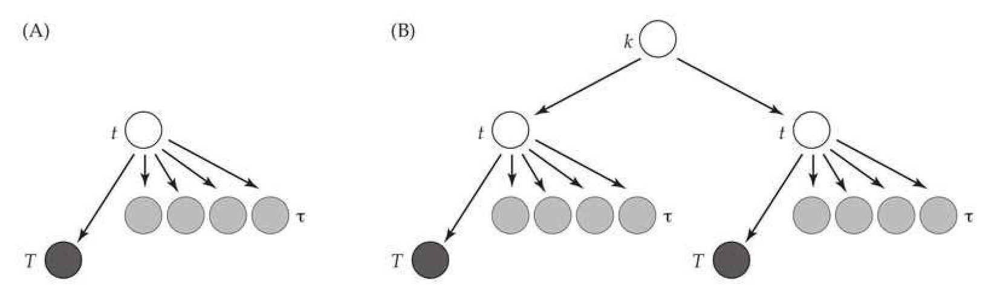
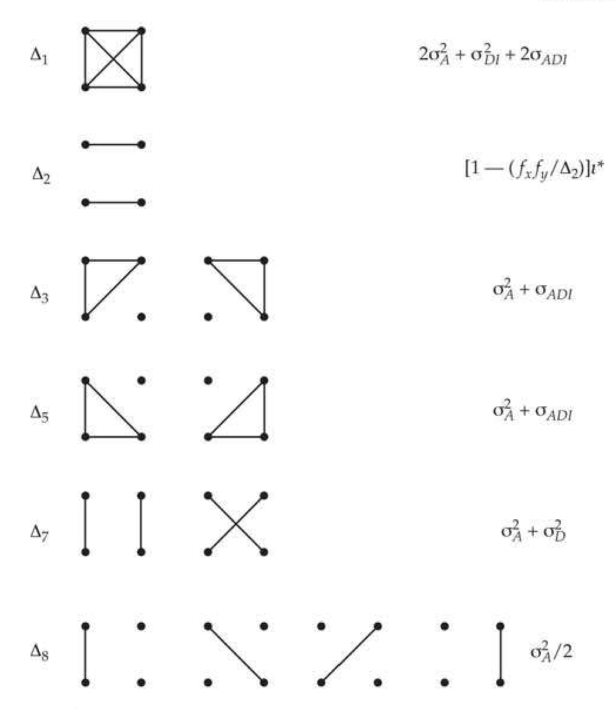
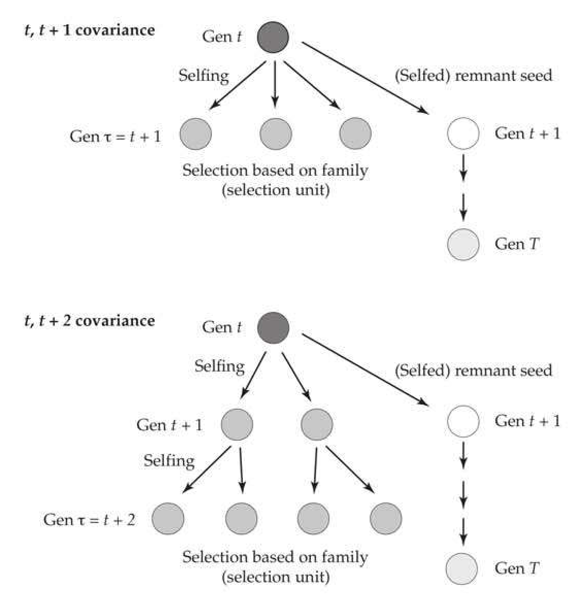
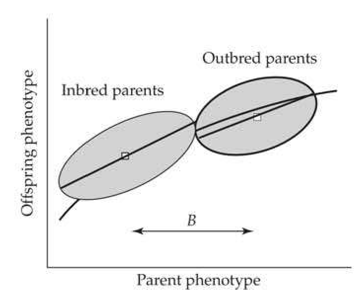

# Chapter 23 · Selection Under Inbreeding

## Evolution_chapter23_001 · Selection Under Inbreeding: Introduction

Either inbreeding or selection, never both at the same time. R. A. Fisher

There are several reasons for jointly considering inbreeding and selection. First, one may have little choice. For many species, such as the autogamous crops that provide much of our food, the extra work required to ensure outcrossing is often considerable. Second, in many cases, the creative use of inbreeding can increase selection response. Third, the development of elite pure lines starts with a cross between two (often inbred) lines, with the breeder then selfing the resulting progeny to fixation. Under such development schemes, selection can occur in the early generations of selfing (this chapter) and/or among the completely selfed lines (Volume 3). Finally, many wild populations undergoing natural selection have mating systems that result in offspring that are partly to highly inbred. As we have seen, selection changes genotypic frequencies by changing allelic frequencies and creating gametic-phase disequilibrium (Chapters 5, 16, and 24). Under random mating, departures from generalized Hardy-Weinberg (such as those induced by gametic-phase disequilibrium) are reduced each generation. This erodes any transient contributions from nonadditive variances to the selection response, leaving only allele-frequency change (accomplished via $ \sigma_{A}^{2} $) as the permanent component of response (Chapter 15). When inbreeding occurs, departures from generalized Hardy-Weinberg are created, rather than destroyed, by the mating system. By increasing the frequency of homozygotes, inbreeding redistributes the genetic variance in a population, reducing or removing it within a line undergoing inbreeding and increasing it among a collection of such lines (Chapter 11). Inbreeding also generally increases the covariance between relatives, as they become increasingly more genetically similar (Chapter 11). Finally, the reduction in the frequency of heterozygotes under inbreeding results in a corresponding reduction in the effective recombination rate, retarding the decay of multilocus departures from generalized Hardy-Weinberg. As we will see, all these of factors have important consequences for selection response.

When inbreeding occurs and nonadditive genetic action (dominance and/or epistasis) is present, the standard genetic variance components ($ \sigma_{A}^{2}, \sigma_{D}^{2} $, and $ \sigma_{A,A}^{2} $) are no longer sufficient to predict response. As was discussed in Chapter 11, when dominance is present, at least three additional components ($ l^{*}, \sigma_{D,I}^{2} $, and $ \sigma_{A,D,I} $; see *[See Table 11.1 at the end of this section.]*) are required to describe the covariance between inbred relatives, and hence to predict the short-term selection response. A further complication is inbreeding depression (LW Chapter 10), which can change the mean even in the absence of selection. Unless otherwise mentioned, we assume throughout this chapter that there is gametic-phase equilibrium and no epistasis. The complications these conditions introduce for selection response with inbreeding remain largely unexplored, but are potentially quite important. For example, directional selection creates negative disequilibrium (Chapter 16), which is reduced in each generation by recombination between heterozygotes. By reducing (and ultimately removing) heterozygotes, inbreeding can significantly retard the decay of any selection-induced disequilibrium, thus magnifying its impact relative to random mating (Allard 1975; Hayashi and Ukai 1994; Shaw et al. 1998; Kelly 1999a; Kelly and Williamson 2000).

Our examination of the selection response under inbreeding begins with a general overview of the machinery and concepts for treating the joint action of inbreeding and selection. This is followed by a discussion of family selection when the parents and/or scored progeny are inbred, which extends the results of Chapter 21. These first two sections form the basics of the selection response under inbreeding. The remainder of the chapter examines a number of special (but important) cases, such as selfing and partial selfing, in more detail. Additional aspects of selection and inbreeding are covered elsewhere, with the interaction between selection and drift examined in Chapter 26, and the generation and selection among pure lines examined more extensively in Volume 3. We conclude by examining the evolution of the selfing rate. We caution the reader that while most of the topics here are not conceptually challenging, the bookkeeping can be demanding.

---

## Evolution_chapter23_002 · Selection Under Inbreeding: Introduction / BASIC ISSUES IN SELECTION RESPONSE UNDER INBREEDING

Animal and plant breeders generally treat inbreeding very differently and inbreed to very different levels. For animal breeders (and others dealing with species that mainly outcross, such as many trees), inbreeding is an undesirable complication that is a by-product of selection tending to promote related individuals. This inflates the level of inbreeding beyond that expected under drift, thus increasing any inbreeding depression (LW Chapter 10), which can offset gains from selection. In addition to any effect on the artificially selected trait, inbreeding depression also lowers overall fitness, with more inbred individuals displaying poorer performance, especially in survival and reproductive traits. Because levels of inbreeding tend to be modest in their breeding schemes, animal breeders generally approximate the selection response under inbreeding by using the breeder's equation as adjusted for inbreeding depression (Uimari and Kennedy 1990; de Boer and van Arendonk 1992; Shaw et al. 1998).

Conversely, plant breeders (and others dealing with species that mainly self) often exploit inbreeding through selection schemes whose endproducts are pure lines. As a result, selected individuals can be highly inbred, and a more proper accounting of their covariances requires the machinery of Chapter 11. A rough rule of thumb (examined in greater detail at the end of the chapter) is that outcrossing species can display significant inbreeding depression (so that even a modest change in the level of inbreeding, f, can have substantial consequences for the wellbeing of the organism), while species with high levels of natural selfing often show little inbreeding depression (LW Chapter 10). As a consequence, we deal with two settings in this chapter. The first (which derives largely from animal breeding) involves the impact of small to modest amounts of inbreeding, which mainly occurs through inbreeding depression. The second (which derives largely from plant breeding) concerns selection on lines undergoing selfing or some other regular system of inbreeding.

---

## Evolution_chapter23_003 · BASIC ISSUES IN SELECTION RESPONSE UNDER INBREEDING / Accounting for Inbreeding Depression

**[命题 Proposition]**

Even in the absence of selection, changes in the population level of inbreeding, f, can induce changes in the mean due to inbreeding depression (LW Chapter 10). Let $ \Delta I $ denote the change in mean from inbreeding depression (the difference between the mean of a randomly mated population versus its value under the current level of inbreeding). If dominance is the only nonadditive genetic effect, the change from inbreeding in generation t, $ \Delta I_t = Bf_t $, is a linear function of the inbreeding coefficient. The parameter B is the difference in trait mean between a completely inbred (f = 1) and fully outbred (f = 0) population, and it can be estimated by regressing the trait mean on f under the assumption that allele frequencies have not dramatically changed during the inbreeding process, namely, that lines are not lost under inbreeding (LW Chapter 10). If higher-order epistasis is present, then $ \Delta I = Bf + Cf^2 + \cdots $, where the order of polynomial in f depends on the type of dominant epistatic interactions present, e.g., order two for $ D \times D $ (LW Chapter 10).

The genetic underpinnings of the inbreeding parameter B are as follows: if n diallelic loci underlie the trait, the ith of which has genotypic values of $ 0: a_i + d_i: 2a_i $ with allele frequency $ p_i $, then LW Equation 10.3 yields

$$
B=-2\sum_{i=1}^{n}d_{i}p_{i}(1-p_{i})
$$

demonstrating that B changes as allele frequencies change. Inbreeding depression occurs when the values of $ d_{i} $ tend to be positive (directional dominance), implying that an average heterozygote has a genotypic value closer to that of the larger-valued homozygote. More generally (*[See Table 11.1 at the end of this section.]*), with $ n_{k} $ alleles at locus k,

$$
B=\sum_{k=1}^{n}\sum_{i=1}^{n_{k}}\delta_{kii}p_{ki}
$$

where $ \delta_{iii} $ (which is a function of the base-population allele frequencies; LW Chapter 4) is the dominance deviation for the homozygote of allele i at locus k. Equation 23.1b follows because the expected value of the dominance deviations, $ E[\delta_{ij}] $, is zero under random mating (LW Chapter 4), but nonzero under inbreeding. With probability f, the two alleles at a locus are IBD, with $ p_i $ being the frequency of $ A_i A_i $ homozygotes in such cases. Hence, the expected value of $ E[\delta_{ij}] = (1 - f)E[\delta_{ij}] $ not inbred $ + fE[\delta_{ii}] = fE[\delta_{ii}] $. Summing over all alleles recovers Equation 23.1b. A bit of algebra (using results from LW Table 4.1) shows that Equation 23.1b reduces to Equation 23.1a for diallelic loci.

To distinguish between the change due to inbreeding depression and the response due to selection, we decompose the total change in the population mean after t generations as

$$
\Delta_{\mu}(t)=\mu_{t}-\mu_{0}=R(t)+\Delta I_{t}
$$

where typically, $ \Delta I_t < 0 $. When computing the response to selection, we ignore the change from inbreeding depression, so

$$
R(t)=\Delta_{\mu}(t)-\Delta I_{t}
$$

If the selected population is subsequently randomly mated, the inbreeding depression term disappears, revealing the true genetic response, $ R(t) $.

**[命题 Proposition]**

Equations 23.1a and 23.1b show that the importance of our standard assumption of very little allele-frequency change (i.e., the infinitesimal model) is magnified when predicting short-term selection response under inbreeding. In addition to concerns about changes in the genetic variances as allele frequencies change, when inbreeding is present, we are additionally concerned with changes in the composite inbreeding depression parameter, B, which is also a function of the allele frequencies in the base population. If these frequencies significantly change under selection, the impact from inbreeding depression will become increasingly unpredictable, reflecting (in part) the unpredictability in the change in B. Note from Equation 23.1a that as one drives alleles toward fixation, B decreases in magnitude, as $ p(1 - p) $, which is maximized at $ p = 1/2 $, approaches zero.

---

## Evolution_chapter23_004 · BASIC ISSUES IN SELECTION RESPONSE UNDER INBREEDING / Response Under Small Amounts of Inbreeding

When the amount of inbreeding is small enough that changes in the covariances between relatives are negligible relative to their random-mating counterparts, its main effect is through inbreeding depression. Consider a population of modest size undergoing random mating, where the amount of inbreeding generated by genetic drift at generation $ t $ is $ f_t \simeq t/(2N_e) $, provided $ t \ll N_e $ and $ f_0 = 0 $. If no epistasis is present, then

$$
\Delta I_{t}=-B f_{t}\simeq-\frac{B t}{2N_{e}}
$$

An important, but subtle, correction is that the act of selection on a heritable trait further increases the level of inbreeding relative to a finite population of the same size (due to a tendency to select related individuals; Chapters 3 and 26). Hence, the appropriate value of $ N_e $ for Equation 23.2a starts with the pure-drift value, given the sample size and sex ratio (Chapter 3), which serves as the base value of $ N_e $ for the corrections given by Equations 26.6–26.8, which account for this further reduction in $ N_e $ according to the strength of selection and heritability of the trait. The expected selection response with a small amount of inbreeding is the response from the breeder's equation (13.6b) plus a correction for any inbreeding depression,

$$
\Delta_{\mu}(t)=R(t)+\Delta I_{t}\simeq t\bar{\imath}h^{2}\sigma_{z}-\frac{B t}{2N_{e}}=t\bar{\imath}\left(h^{2}\sigma_{z}-\frac{B}{2N_{e}\bar{\imath}}\right)
$$

(Nordskog and Hardiman 1980; Hill 1986). This not an unreasonable approximation for $ f = t/(2N_e) < 0.1 $. For $ f > 0.1 $, inbreeding significantly alters the genetic variances from their base population values, and this must be taken into account (Chapter 26).

Using these corrections, one can then apply the standard breeder's equation or its extensions (Chapter 13), adjusted for inbreeding depression, to predict the net selection response (Equation 23.2b). De Boer and van Arendonk (1992) found that this approach (over a few generations) is accurate even at intermediate levels of inbreeding ($ f \leq 0.35 $), while simulations by Shaw et al. (1998) suggested that this approach may generally be fairly accurate, provided the magnitude of $ \sigma_{ADI} $ is small. When this covariance is negative, alleles with positive average effects tend to have negative dominant deviations as homozygotes, which accentuates the effects of inbreeding depression.

In a BLUP-selection framework (choosing individuals based on their mixed-model predicted breeding values; Chapters 13, 19, and 20) with inbreeding, it is often sufficient to simply include inbreeding depression as a cofactor, for example, the phenotypic value, $ y_{i} $, of individual i can be decomposed as

$$
y_{i}=\mu+A_{i}+B f_{i}+e_{i}
$$

Otherwise, it suffices to use a standard additive model (Uimari and Kennedy 1990; de Boer and van Arendonk 1992). Recall that the amount of inbreeding for individual i is calculated by $ f_i = A_{ii} - 1 $, where $ A_{ii} $ is the associated diagonal element for that individual in the relationship matrix, A (Chapter 19). As detailed in Chapter 19, the use of mixed models accounts (through A) for both gametic-phase disequilibrium (among unlinked loci) and the reduction in values of $ N_e $ from choosing relatives.

All of these approaches assume that B is relatively constant, but as mentioned, this parameter can change under selection. Indeed, as discussed in Chapter 28, Kelly (1999c) proposed a test for the presence of rare recessives by contrasting the relative change in two population parameters following selection: the trait mean and the value of B for that trait. Thus, the standard caveat for the breeder's equation, that it applies to a single generation of selection, also applies here, with the accuracy of this approximation breaking down as allele frequencies change, due to changes in either $ \sigma_{1}^{2} $ or B.

A key point in species showing inbreeding depression is that even if the target of artificial selection is not significantly affected ($ B \simeq 0 $), the overall fitness (performance) of the individual generally declines as f increases (LW Chapter 10). As a result, significant attention in the animal breeding literature has focused on maximizing selection response under either constrained levels of inbreeding or under the minimization of inbreeding, especially for BLUP selection (Toro and Pérez-Enciso 1990; Quinton et al. 1992; Grundy et al. 1994, 1998, 2000; Meuwissen and Woolliams 1994; Villanueva et al. 1994; Brisbane and Gibson 1995; Luo et al. 1995; Quniton and Smith 1995; Meuwissen 1997; Meuwissen and Sonesson 1998; Meszaros et al. 1999; Sonesson and Meuwissen 2000; Sonesson et al. 2000). We return to this topic in Volume 3.

---

## Evolution_chapter23_005 · BASIC ISSUES IN SELECTION RESPONSE UNDER INBREEDING / Using Ancestral Regressions to Predict Response

**[命题 Proposition]**

The simplicity of Equation 23.2b follows from the assumption that a small amount of inbreeding does not greatly change genetic variances. With larger amounts of inbreeding, variances and covariances can change in each generation, which can depend on additional terms such as $ \sigma_{DI}^{2} $ and $ \sigma_{ADI} $. Fortunately, the expected covariances between relatives under regular systems of inbreeding in the absence of selection are predictable (Chapter 11).

**[命题 Proposition]**

Motivated by this predictability, we make the key approximation throughout much of this chapter that selection does not substantially alter these covariances from their expected values in the absence of selection. Provided this assumption holds and all regressions are linear and homoscedastic, the method of ancestral regressions (Chapter 15) offers a powerful approach for predicting short-term selection response when inbreeding occurs.

Recall that under ancestral regression, the cumulative response can be expressed as a series of regression coefficients (a covariance divided by a variance) of the contribution to the current total response from selection in a previous generation, t, yielding an expected response after T generations of selection and inbreeding of

$$
R(T)=\sum_{t=0}^{T-1}S_{t}\frac{\sigma_{G}(T,t)}{\sigma^{2}(z_{t})}=\sum_{t=0}^{T-1}\bar{\imath}_{t}\frac{\sigma_{G}(T,t)}{\sigma(z_{t})}
$$

**[命题 Proposition]**

Here $\sigma_G(T, t)$ is the covariance (in genotypic values) between a relative in generation $t$ and one in the current generation $(T > t)$, while $\sigma^2(z_t)$ is the phenotypic variance in generation $t$. Note that the coefficients in Equation 23.3 are simply the regressions of $z_T$ on $z_t$, which has a slope of $\sigma_z(T, t)/\sigma^2(z_t) = \sigma_G(T, t)/\sigma^2(z_t)$ in the absence of environmental correlations between generations $T$ and $t$. The $t$th term in the sum in Equation 23.3 corresponds to the response from selection in generation $t$ that remains in generation $T > t$. As we will see later in this chapter, under complicated systems of inbreeding, a number of relatives with different degrees of inbreeding must be simultaneously followed, leading to additional indices in the covariance, such as $\sigma_G(T, \tau, t)$ or $\sigma_G(T, \tau, t, k)$, where the additional indices $\tau$ and $k$ indicate the generation of founding relatives (see Figure 23.2). Equation 23.3 is a generalization of the breeder's equation to settings where the genetic variances change in predictable ways under the mating system, making the assumption that these inbreeding-induced changes are much more significant than any changes in these parameters from selection.

> **Figure 23.2** · page 26 · source: `Evolution_chapter23`
>
> 
>
> Figure 23.2 The hierarchical structuring of selfed populations. The gray circles denote sibs in the selection unit, the solid circles denote relatives of interest, and  $ k, t, T $, and  $ \tau $ denote the generations of selfing experienced by an individual. The arrows denote lines of descent through selfing and may be longer than one generation. A: Often we select using a parent in generation t of selfing by scoring its (selfed) offspring in generation  $ \tau $, and we need the covariance between  $ \tau $ and some future generation,  $ T $, where the common relative to both is from generation t. B: Another level of hierarchical structuring of selfed populations: When selecting within a substructure of the selfing pedigree, we may be interested in the response using parents in generation t whose offspring are scored in generation  $ \tau $ and for which the response is across those families in the pedigree sharing an earlier common parent in generation  $ k < t $.

**[命题 Proposition]**

Equation 23.3 is based on the infinitesimal model, it assumes that selection-induced changes in allele frequencies are negligible. While genotypic frequencies change due to inbreeding (with homozygotes increasing and heterozygotes decreasing), we assume that there is no significant change in allele frequencies. Hence, if $ p_i $ is the frequency of allele $ A_i $ in the base population, the frequency of lines eventually fixed for the $ A_i A_i $ genotype is assumed to essentially remain as $ p_i $, despite selection. Formally, it is changed to $ p_i + \epsilon_i $, where $ \epsilon_i $ is a very small amount. With a very large number of loci, all of these very small values of $ \epsilon_i $ can add up to a considerable change in the mean, while still resulting in little change in genetic variances (Chapter 24). While allele-frequency change is negligible under the infinitesimal assumption, gametic-phase disequilibrium can be considerable (the Bulmer effect; Chapters 16 and 24), which can significantly alter the genetic variance without any allele-frequency change. For now, we make the approximation of ignoring any such disequilibrium-based change, a point addressed later in this chapter. Because the covariance function also gives the genetic variance in generation t, as $ \sigma_{G}^{2}(t) = \sigma_{G}(t, t) $, with the covariance function for our particular system of inbreeding in hand (a point we address shortly), we can immediately write the selection response as

$$
R(T)=\sum_{t=0}^{T-1}S_{t}\frac{\sigma_{G}(T,t)}{\sigma_{G}(t,t)+\sigma_{e}^{2}}=\sum_{t=0}^{T-1}\bar{\imath}_{t}\frac{\sigma_{G}(T,t)}{\sqrt{\sigma_{G}(t,t)+\sigma_{e}^{2}}}
$$

For example, the response after two generations of inbreeding and selection is

$$
R(2)=\bar{\imath}_{0}\frac{\sigma_{G}(2,0)}{\sigma(z_{0})}+\bar{\imath}_{1}\frac{\sigma_{G}(2,1)}{\sigma(z_{1})}
$$

The first term represents the response from selection in generation zero that carries over to the second generation, while the second term is the response to selection from generation one. If we stop selection after two generations but continue to inbreed the population to complete homozygosity, the permanent response (after correcting for any inbreeding depression) is

$$
R_{\infty}(2)=\bar{\imath}_{0}\frac{\sigma_{G}(\infty,0)}{\sigma(z_{0})}+\bar{\imath}_{1}\frac{\sigma_{G}(\infty,1)}{\sigma(z_{1})}
$$

Inspection of Equation 23.5a and 23.5b highlights a key feature of response with inbreeding. In most cases, these covariances change, so that it is generally the case that $ \sigma_G(i,t) \neq \sigma_G(j,t) $ for $ i \neq j $. The relative contribution to response from selection in any particular generation $ t $ can thus change over time, meaning that there is both a transient and permanent component to response (Chapter 15).

---

## Evolution_chapter23_006 · BASIC ISSUES IN SELECTION RESPONSE UNDER INBREEDING / The Covariance Between Inbred Relatives

To apply ancestral regressions, we must obtain the covariance between relatives under the particular inbreeding scheme of interest. Such covariances were discussed in detail in Chapter 11, and here we remind the reader of a few key concepts, which are summarized in Figure 23.1. Equation 11.13 gives the genetic covariance between individuals x and y under general inbreeding, but it assumes that there are no linkage effects or epistasis, as

$$
\begin{aligned}\sigma_{G}(x,y)&=2\Theta_{xy}\sigma_{A}^{2}+\Delta_{xy,7}\sigma_{D}^{2}+\Delta_{xy,1}\sigma_{DI}^{2}\\&\quad+(2\Delta_{xy,1}+\Delta_{xy,3}+\Delta_{xy,5})\sigma_{ADI}+(\Delta_{xy,2}-f_{x}f_{y})\iota^{*}\end{aligned}
$$

where

$$
2\Theta_{x y}=2\Delta_{x y,1}+\Delta_{x y,3}+\Delta_{x y,5}+\Delta_{x y,7}+\frac{1}{2}\Delta_{x y,8}
$$

> **Figure 23.1** · page 7 · source: `Evolution_chapter23`
>
> 
>
> Figure 23.1 The  $ \Delta_{i} $ coefficients of relatedness and their impact on the genetic covariance between relatives. Following Figure 11.5, the upper two dots correspond to the two alleles in (diploid) relative x, and the bottom two to those in relative y. A horizontal line indicates inbreeding in that relative (the two alleles are identical by descent, IBD), while a line connecting alleles from different relatives indicates that these alleles are IBD. See Figure 11.5 and Chapter 11 for details.

To aid in reading, we suppress the xy subscript on $ \Delta $ for those cases where the two relatives being considered are obvious.

The nine possible $ \Delta_i $ coefficients of relatedness between two (diploid) individuals are defined in Figure 11.5 (and summarized in Figure 23.1), while the composite genetic parameters (the familiar additive and dominance variances, $ \sigma_A^2 $ and $ \sigma_D^2 $, and the less-familiar quadratic components, $ \sigma_{D1}^2 $ and $ \iota^* $, and the covariance, $ \sigma_{ADI} $) are defined from the standpoint of the noninbred base population (*[See Table 11.1 at the end of this section.]*). While $ \sigma_{D1}^2 $ and $ \iota^* $ are nonnegative (by construction), $ \sigma_{ADI} $ is a covariance and hence can be either positive or negative.

The nature of the identity-by-descent (IBD) measures, $ \Delta_i $, provides some insight into which components contribute to the transient, as opposed to the permanent, component of response. If we inbreed to complete homozygosity, then both alleles in an individual $ y $ are identical by descent (indicated in Figure 23.1 by a horizontal line between its two alleles). Only three of the $ \Delta_i $ measures in Figure 23.1 correspond to this condition ($ \Delta_1 $, $ \Delta_2 $, and $ \Delta_5 $). Note that under IBD state 2, although $ x $ and $ y $ are both inbred (both have horizontal lines), they are also unrelated (there are no vertical lines between them), and hence this condition generally does not enter into discussions of selection response. When either $ \Delta_1 $ or $ \Delta_5 $ are nonzero, $ \sigma_{DI}^2 $ and $ \sigma_{ADI} $ can contribute to the permanent response, while $ \sigma_D^2 $ cannot (as it enters only through $ \Delta_7 $). When $ \Delta_1 = \Delta_3 = \Delta_5 = 0 $, then $ \sigma_A^2 $ and $ \sigma_D^2 $ are sufficient to describe the covariance between relatives. As mentioned in Chapter 11, the literature on covariances under general inbreeding can be a bit daunting and requires care when reading, as there is no consistent notation for these additional genetic components (*[See Table 11.2 at the end of this section.]*).

---

## Evolution_chapter23_007 · BASIC ISSUES IN SELECTION RESPONSE UNDER INBREEDING / Limitations

**[命题 Proposition]**

The major limitation with the ancestral regression approach is the assumption that selection does not significantly alter the covariances between relatives over what is expected under the system of inbreeding (in the absence of selection). Clearly, if there are favorable major alleles, selection will favor individuals carrying them, thus further increasing the amount of inbreeding in the population. As a result, this general approach is best thought of as a weak selection approximation, that is, it assumes that selection is weak on any underlying locus. although selection on the trait itself may still be strong. Even in the absence of major alleles, the effect of selection is to generally make individuals more inbred than expected by the particular system of inbreeding (Chapters 3 and 26). In such cases, the covariances between relatives are also affected. The other significant caveat is that, even under the infinitesimal-model, selection-induced disequilibrium between alleles at different loci can significantly alter the variances (the Bulmer effect, described in Chapter 16). By reducing the frequency of heterozygotes, inbreeding reduces the opportunities for recombination to remove linkage disequilibrium, which magnifies the Bulmer effect over its role (which is significant) under random mating. We return to this concern later in the chapter.

---

## Evolution_chapter23_008 · Selection Under Inbreeding: Introduction / FAMILY SELECTION WITH INBREEDING AND RANDOM MATING

As detailed in Chapter 21, the motivation for family-based selection is to use family means to provide better estimates of the breeding values of the individuals that will be chosen to form the next cycle of selection. This section extends these results to inbreeding by allowing the sibs and/or their parents to be inbred. Here, we assume that relatives chosen on the basis of the best families are outcrossed to form the next generation, with the selection response when chosen relatives are selfed discussed later in the chapter. In the terminology of Chapter 21, the selection unit is the mean of the measured sibs, while the recombination unit is either a sib (measured or unmeasured) or the parent of a measured sib. Specifically, let $ x_1, \cdots, x_n $ denote the n measured sibs in a family, with $ z_i $ denoting the value for sib i. Families are chosen based on their mean values, $ \bar{z}_i $ with relatives, R, of the chosen families (either one of the measured sibs, an unmeasured sib, or one of the parents of the sibs) outcrossed to form the next generation, and with y denoting an offspring from R. The expected selection response becomes

$$
R=\frac{\sigma(\overline{z},y)}{\sigma^{2}(\overline{z})}\overline{\imath}
$$

where the numerator is the selection-unit offspring covariance and the denominator the selection-unit variance (Equation 21.3b). When the offspring, parents, or both, are inbred, the variances of these expressions differ from their random-mating counterparts (given in Chapter 21). Using inbred sibs and/or sibs with inbred parents can increase the selection response $ (R) $ by increasing the selection unit-offspring covariance. Conversely, by increasing the among-family variance, the use of inbred sibs also increases the selection-unit variance, $ \sigma^{2}(\bar{z}) $, which can reduce the selection response. Hence, using inbred sibs or inbred parents can, in some cases, increase the selection response, while in other situations the response is less than with family selection using randomly mated sibs from outbred parents.

Two bookkeeping issues commonly arising in family-based selection account for some of the variety of selection-response equations found in the literature. First, under strict family selection, a measured sib is used as a parent for the next generation. In this case, the covariance between the family mean, $ \overline{z} $, and an offspring, y, starting the next cycle of selection has two components. If $ z_{1} $ denotes the value of a measured sib ($ x_{1} $) used as a parent of y (in the notation of Chapter 21, $ x_{1} = R $; see Figure 21.1), then with n measured sibs in a family

$$
\sigma(\overline{z},y)=\frac{1}{n}\sum_{i=1}^{n}\sigma(z_{i},y)=\left(\frac{1}{n}\right)\sigma(z_{1},y)+\left(1-\frac{1}{n}\right)\sigma(z_{2},y)
$$

The first covariance, $ \sigma(z_1, y) $, is that between a parent and its offspring, while the second, $ \sigma(z_2, y) $, is that between an individual, $ x_2 $, and the offspring, $ y $, of its sib, $ x_1 $. Alternatively, when sib selection occurs (such as through the use of remnant seed), the sib used in the recombination unit (i.e., as a parent of the next generation) is not one of the sibs measured in the selection unit, and $ \sigma(\bar{z}, y) = \sigma(z_2, y) $. To simplify our results, we assume only sib or parental selection (progeny testing, where parents are chosen based on the performance of their offspring). For a moderate to large number of measured sibs (n), the difference between sib selection and family selection is expected to be very small.

The second issue relates to the variance of the selection unit, $ \sigma^2(\overline{z}) $. From Chapter 21, the variance in observed family means is the among-group variance, $ \sigma_b^2 $, plus the error in estimating their true mean, $ \mu $, from $ \overline{z} $, which is $ \sigma_w^2/n $. Recalling (LW Chapter 18) that the variance among groups equals the covariance within groups, then $ \sigma_b^2 = \sigma_z(\text{sibs}) $, the covariance between sibs, which is the sum of their genetic covariance, $ \sigma_G(\text{sibs}) $, plus the variance of any common-family environmental effects, $ \sigma_E^2 $. (such as maternal effects when sibs share a common mother). Likewise, the within-family variance can be decomposed into genetic and environmental components, $ \sigma_w^2 = \sigma_{G_w}^2 + \sigma_{E_s}^2 $ (Equation 21.8b), where $ \sigma_{G_w}^2 = \sigma_G^2 - \sigma_G(\text{sibs}) $. Hence,

$$
\begin{aligned}\sigma^{2}(\overline{z})&=\sigma_{b}^{2}+\sigma_{w}^{2}/n\\&=\sigma_{G}(\mathbf{s i b s})+\sigma_{E_{c}}^{2}+[\sigma_{G_{w}}^{2}+\sigma_{E_{s}}^{2}]/n\\&=\sigma_{G}(\mathbf{s i b s})+\sigma_{e}^{2}\\ \end{aligned}
$$

Because a goal of this chapter is comparing the impact of inbreeding on $ \sigma_G $(sibs), we combine the common-family variance ($ \sigma_E^2 $; which can be considerable if the sibs share a common mother for a trait with strong maternal effects) and the error in estimating the true family mean into a single error term,

$$
\sigma_{e}^{2}=\sigma_{E_c}^{2}+[\sigma_{G_w}^{2}+\sigma_{E_s}^{2}]/n
$$

**[示例 Example]**

*(See Example 23.1.)*

This is mainly for ease of bookkeeping, as Equations 21.41–21.43 illustrated some of the complex expressions for $ \sigma_{e}^{2} $ under different family replication designs. A caveat with this notational brevity is that different designs can have rather different $ \sigma_e^2 $ values. A paternal half-sib design avoids any shared maternal effects, which (for some traits) can be considerable. Likewise, because of the reproductive biology, some types of families may result in significantly more offspring, and hence a reduced sampling error in Equation 23.8c. Finally, different investigators using the same material can use very different structures for the error variances, depending on the family replication scheme chosen (Equations 21.41–21.43).

---

## Evolution_chapter23_009 · FAMILY SELECTION WITH INBREEDING AND RANDOM MATING / Family Selection Using Inbred Parents

One scheme for increasing the response to family selection is to cross inbred, but unrelated, parents, and then score the resulting half- or full-sib progeny as the family unit. This has two effects on selection response, one positive (increasing the covariance between relatives), and one negative (increasing the variance of the selection unit). The genetic covariance among half-sibs where the common parent is inbred (to an amount f) is

$$
\sigma_{G}(H S)=\left(\frac{1+f}{4}\right)\sigma_{A}^{2}+\left(\frac{1+f}{4}\right)^{2}\sigma_{A A}^{2}+\cdots\left(\frac{1+f}{4}\right)^{k}\sigma_{A^{k}}^{2}
$$

For full sibs, if $ \overline{f} = (f_1 + f_2)/2 $ is the average inbreeding coefficient for the parents, then

$$
\sigma_{G}(FS)=\left(\frac{1+\overline{f}}{2}\right)\sigma_{A}^{2}+\left(\frac{(1+f_{1})(1+f_{2})}{4}\right)\sigma_{D}^{2}+\left(\frac{1+\overline{f}}{2}\right)^{2}\sigma_{A A}^{2}+\cdots
$$

This inflation of the between-sib covariances relative to random mating also increases the variance of the selection unit (Equation 23.8b). For the reader wondering why the inbreeding variance components $ \sigma_{ADI}^{2}, \sigma_{DI}^{2} $, etc.) do not appear in Equation 23.9, it is because the parents of the sibs, while being inbred, are unrelated (their coefficient of coancestry, $ \Theta $, is zero). Hence, alleles within the resulting sibs are not identical by descent (because their parents are unrelated). This implies that the $ \Delta_{1} $ to $ \Delta_{5} $ coefficients (those associated with at least one relative being inbred) for such sibs are zero, and hence the contributions from their associated variance components (Figure 23.1 and Equation 23.6) are also zero. This also applies to the selection unit-offspring covariances (Equation 23.10).

Turning to the selection unit-offspring covariances, we will ignore the effects of additive epistasis, as this contributes to the transient, rather than permanent, component of response (because random mating among the parents, R, in the recombination unit eventually decays linkage disequilibrium). The resulting covariances between a measured individual, x, and the offspring y (through a single parent, R, of y) are

$$
\sigma_{G}(x,y\mid\mathcal{R}=P of x)=\left(\frac{1+f}{4}\right)\sigma_{A}^{2}
$$

$$
\sigma_{G}(x,y\mid\mathcal{R}=H S\mathbf{o f}x)=\left(\frac{1+f}{8}\right)\sigma_{A}^{2}
$$

$$
\sigma_{G}(x,y\mid\mathcal{R}=F S\mathbf{o f}x)=\left(\frac{1+f}{4}\right)\sigma_{A}^{2}
$$

with $P$, $HS$, and $FS$ implying that the parent, $\mathcal{R}$, of $y$ is related to the measured sibs as either a parent, a half-sib, or a full-sib (respectively). When the parents are inbred ($f > 0$), all of these covariances exceed their random-mating counterparts ($f = 0$). As mentioned, this increase is offset to some degree by the corresponding increase in the selection-unit variance that also occurs with inbreeding, as $\sigma^2(\overline{z} | f > 0) > \sigma^2(\overline{z} | f = 0)$.

Substitution of these results into Equation 21.1 yields the response to a single cycle of selection under various schemes, which are summarized in *[See Table 23.1 at the end of this section.]*. As a comparison of *[See Table 23.1 at the end of this section.]* with its random-mating counterpart (*[See Table 21.5 at the end of this section.]*) shows, for half-sibs, that the selection response when using inbred parents $ (f > 0) $ is greater than when using outbred

*[See Table 23.1 at the end of this section.]* parents ($f=0$). This is also true for full-sibs when $\sigma_D^2$ is small. However, random mating can yield a larger response if $\sigma_D^2$ is sufficiently large.

**[Table]**

*[See Table 23.1 at the end of this section.]*

> **Table 23.1** · `23.1` · page 10 · source: `Evolution_chapter23_009`
> Table 23.1 The response to family selection when both parents are inbred (to a level of  $ f $). Depending on the trait, the common-family variance can be considerably less for paternal half sibs than for either maternal half-sibs or full-sibs, so we index our general expression for  $ \sigma_e^2 $ (Equation 23.8c) to remind the reader of this. Half-sibs versus full-sibs refer to the family unit being measured, while the parents for the next generation are either remnant seed (sib selection) or the parent of the selection unit itself (progeny testing). For comparison purposes, selection on both parents is assumed. Response is halved if only a single parent has been chosen by family selection. The effects of epistatis are ignored. Additive × additive epistasis inflates the immediate response, but its contribution decays with recombination (as offspring in the next generation are formed by random mating). By inflating the selection-unit variance over the values given here, the presence of epistasis reduces the permanent response.
>
> Selection Scheme | R/( \sigma $ ^{2}_{A} $ \bar{i})
> --- | ---
> Half-sibs, remnant seed | \frac{(1+f)/4}{\sigma(\bar{z}_{HS,f})} = \frac{(1/2)\sqrt{1+f}}{\sqrt{\sigma_{A}^{2} + [4\sigma_{e}^{2}(HS)/(1+f)]}}
> Half-sibs, parental | \frac{(1+f)/2}{\sigma(\bar{z}_{HS,f})} = \frac{\sqrt{1+f}}{\sqrt{\sigma_{A}^{2} + [4\sigma_{e}^{2}(HS)/(1+f)]}}
> Full-sibs, remnant seed | \frac{(1+f)/2}{\sigma(\bar{z}_{FS,f})} = \frac{\sqrt{(1+f)/2}}{\sqrt{\sigma_{A}^{2} + [(1+f)\sigma_{D}^{2}/2] + [2\sigma_{e}^{2}(FS)/(1+f)]}}

---

## Evolution_chapter23_010 · FAMILY SELECTION WITH INBREEDING AND RANDOM MATING / Progeny Testing Using Inbred Offspring

**[命题 Proposition]**

Building on an earlier suggestion by Mostagee (1971), Toro (1993) proposed that sire progeny testing be performed using inbred offspring (by crossing the sire to full-sib or half-sib sisters to generate the family), with the chosen superior sires then outcrossed. In animal breeding, such a scheme can be used in species for which artificial insemination and long-term sperm storage are feasible. This suggestion takes advantage of improved accuracy for testing using inbred sibs while still having an outcrossed population (and hence no inbreeding depression in the next generation). It is important to note that the inbred sibs upon which parental selection will be made could themselves experience inbreeding depression, so the assumption is that all such tested sibs have the same f value (or else they are all corrected to adjust for this possibility).

To quantify the advantage of testing inbred progeny, consider a sire crossed to a full-sib sister. Let R denote a sire and x denote one of the resulting offspring (the mean values of which are used to choose among sires). Assuming that R is chosen (selected), let y denote an offspring of R when now crossed (likely using stored sperm) to an unrelated dam (these sex roles can easily be reversed in designs involving plants). The selection unit-offspring covariance is that of an inbred sib (x) from a sire (R) and of an outcrossed sib (y) from the same sire. The probability that the sire allele in the inbred and outcrossed offspring are identical by descent (IBD) is 1/2. Because the sire and dam are related, an IBD copy of this same allele can also be transmitted through the dam to the inbred offspring, generating a $ \Delta_3 $ IBD state (both copies of an allele in x are IBD, and these are also IBD with the sire allele transmitted to its offspring, y). If the sire and dam are full-sibs, the probability of the dam transmitting this allele is 1/4, while if the sire and dam are half-sibs, this probability is 1/8. Hence, when the sire and dams are full-sibs (denoted as SDFS), then

$$
\Delta_{3}=(1/2)(1/4)=1/8\quad and\quad\Delta_{8}=(1/2)(1-1/4)=3/8
$$

State $ \Delta_{8} $ corresponds to a single allele in x and y being IBD. For a half-sib sire and dam family (SDHS)

$$
\Delta_{3}=(1/2)(1/8)=1/16\quad and\quad\Delta_{8}=(1/2)(1-1/8)=7/16
$$

Note that under either scheme $ \Delta_1 = \Delta_2 = \Delta_5 = \Delta_7 = 0 $. Substituting into Equations 23.6a and 23.6b gives the resulting covariance between inbred (I) and outcrossed (O) sibs for a full-sib sire and dam design as

$$
\sigma_{G}(I,O\mid SDFS)=(5/16)\sigma_{A}^{2}+(1/8)\sigma_{ADI}
$$

while for a half-sib sire and dam design

$$
\sigma_{G}(I,O\mid SDHS)=(9/32)\sigma_{A}^{2}+(1/16)\sigma_{ADI}
$$

By comparison, if the dam and sire are unrelated, the above two covariances are just that between outbred half-sibs, namely $ (1/4)\sigma_A^2 $. Thus, in the absence of dominance (and hence $ \sigma_{ADI} = 0 $), the sib covariance under SDFS (Equation 23.11c) is 125% that of outbred half-sibs $ [5/16]/[1/4] = 5/4 $, and similarly, the sib covariance for SDHS (Equation 23.11c) is 112%

([9/32]/[1/4] = 9/8) of outbred half-sibs. When $ \sigma_{ADI} < 0 $, the possibility exists that these covariances are smaller than when the tested sibs are not inbred.

---

## Evolution_chapter23_011 · FAMILY SELECTION WITH INBREEDING AND RANDOM MATING / $ S_{1}, S_{2}, \text{and } S_{i,j} $ Family Selection

Another scheme for family selection using inbreeding is $ S_1 $ family selection, wherein an (outbred) individual is selfed, and the family mean of the selfed progeny is used for selection decisions (i.e., individuals are chosen based on the mean trait value of their $ S_1 $ family). This scheme takes two generations. In the first generation, the selfed seed must be grown for scoring families. An additional generation is then required for remnant $ S_1 $ seeds from superior families to be grown and outcrossed to form the start of the next cycle of selection. Note that $ S_1 $ family selection is different from $ S_1 $ seed selection (the latter is discussed in Chapter 21). While seed selection also uses remnant $ S_1 $ seeds as the recombination unit, the tested family under $ S_1 $ seed selection consists of outbred half-sibs, rather than the $ S_1 $-sibs used in family selection.

Selection can also be based on $ S_2 $ families. Under classical $ S_2 $ family selection, an outbred individual is selfed to form an $ S_1 $, with a single $ S_1 $ plant selfed again to form the $ S_2 $ family (upon which selection decisions are made, i.e., the selection unit is an $ S_2 $ family). Remnant seed from the $ S_1 $ is used as the recombination unit, with seed from superior families grown and crossed at random to start the next cycle of selection. There is the potential for ambiguity with $ S_2 $ selection, as either: (i) the family to be tested could be (as above), the progeny from a single $ S_1 $ individual; or (ii) they could be a collection of progeny from a set of $ S_1 $ individuals. Because of this ambiguity, we use a modification of the notation suggested by Wricke and Weber (1986) and consider $ S_{i,j} $ family selection (Wricke and Weber used $ I_{i,j} $). Here $ j $ denotes the generations of inbreeding in the tested family and $ i $ denotes the generations of inbreeding for the founding individual for that family. Hence, $ S_1 $ family selection becomes $ S_{0,1} $ selection (the selfed progeny from a noninbred plant) and classical $ S_2 $ family selection becomes $ S_{1,2} $ (the selfed progeny from a single $ S_1 $), while $ S_{0,2} $ corresponds to bulk $ S_2 $ family selection, wherein the tested family are the selfed-progeny from a set of $ S_1 $ lines from a single outbred individual (and hence $ i = 0 $).

Expressions for the response to $ S_{1} $ selection in the literature (e.g., Choo and Kannenberg 1981; Hallauer and Miranda 1981; Bradshaw 1983) are based on the result of Empig et al. (1972). Let $ p_{i} $ and $ q_{i} $ denote the frequencies of alleles $ A_{i,1} $ and $ A_{i,2} $ at the $ i $th underlying locus for the trait, whose genotypic values are given by $ -a_{i}: d_{i}: a_{i} $. Assuming linkage equilibrium, Empig et al. found that the covariance between an individual, x, in the selection unit and the offspring, y, of its selfed sib is given by

$$
\sigma(x,y)=\sigma_{A}^{2}+\beta\qquad\mathrm{w h e r e}\qquad\beta=\sum_{i=1}^{n}2p_{i}q_{i}(p_{i}-1/2)d_{i}[a_{i}+(q_{i}-p_{i})d_{i}]
$$

Similar expressions exist for the response to $ S_{1,2} $ selection (Hallauer and Miranda 1981) and for $ S_{0,j} $ selection (Wricke and Weber 1986).

However, it is fairly easily to obtain a variance component-based expression (and hence the ability of estimate the required quantities) for response under general $ S_{i,j} $ family selection. Because a member of the recombination unit ($ \mathcal{R} $) is outcrossed, it passes on only single alleles to each offspring, y. This situation excludes all of the identity states except for $ \Delta_3 $ (both alleles in x are IBD, and one is passed on to the offspring y through $ \mathcal{R} $), $ \Delta_8 $ (the alleles in x are unrelated and one is passed onto y via $ \mathcal{R} $), and $ \Delta_9 $ (the alleles in x are unrelated to those in y). As a result, Equation 23.6a implies that the selection unit-offspring covariance only depends on $ \sigma_A^2 $ and $ \sigma_{ADI} $. As shown in Example 23.2 (which can be skipped by the casual reader), the required values of $ \Delta_i $ can be obtained by some simple bookkeeping as

$$
\Delta_{3}=f_{i}+\left(1-f_{i}\right)\left(\frac{1-2^{-\left(j-i\right)}}{2}\right)=1-\frac{1}{2}\left(\frac{1}{2^{i}}+\frac{1}{2^{j}}\right)
$$

$$
\Delta_{8}=(1-f_{i})2^{-(j-i)}=2^{-j}
$$

Substituting these results into Equation 23.6b yields

$$
2\Theta_{xy}=\Delta_{3}+\Delta_{8}/2=1-\frac{1}{2^{i+1}}
$$

The covariance $ \sigma_G(x, y) $ immediately follows from Equations 23.6a and 23.6b, where only $ \Delta_3 $ and $ \Delta_8 $ are nonzero. Because both of the parents of $ y $ come from superior (i.e., selected) families, we double the covariance to give the total (i.e., accounting for both parents of $ y $) selection unit-offspring covariance under $ S_{i,j} $ family selection as

$$
\begin{aligned}2\sigma_{G}(x,y)&=4\theta_{x,y}\sigma_{A}^{2}+2\Delta_{3}\sigma_{ADI}\\&=2\sigma_{A}^{2}\left(1-\frac{1}{2^{i+1}}\right)+2\sigma_{ADI}\left(1-\frac{1}{2^{i+1}}-\frac{1}{2^{j+1}}\right)\end{aligned}
$$

Numerical values for these coefficients are presented in *[See Table 23.2 at the end of this section.]*. Using the results in *[See Table 11.1 at the end of this section.]*, a little algebra shows that $ \beta = \sigma_{ADI}/2 $, which connects Equations 23.12 and 23.14.

Finally, the genetic variance among $ S_{i,j} $ families is

$$
\begin{aligned}&\sigma_{G}^{2}(S_{i,j})=(2-2^{i})\sigma_{A}^{2}+2^{-(2j-i)}\sigma_{D}^{2}+(2-2^{-i}-2^{-j})\sigma_{ADI}^{2}\\ &\quad+\left(1+2^{-(2j+1-i)}-2^{-j}-2^{-(i+1)}\right)\sigma_{DI}^{2}+2^{-(2j-i)}\left(1-2^{-i}\right)\iota^{*}\\ \end{aligned}
$$

This expression is derived below in Example 23.7. Substituting Equation 23.14 and 23.15 into Equation 23.7 yields the general expression for a single generation of response to $ S_{i,j} $ family selection as

$$
R_{S_{i,j}}=\bar{\imath}\frac{2\sigma_{A}^{2}(1-2^{-(i+1)})+2\sigma_{ADI}(1-2^{-(i+1)}-2^{-(j+1)})}{\sqrt{\sigma_{G}^{2}(S_{i,j})+\sigma_{e}^{2}(S_{i,j})}}
$$

In particular, the response to S1 family selection (i = 0, j = 1) is

$$
R_{S_{0,1}}=\bar{\imath}\frac{\sigma_{A}^{2}+(1/2)\sigma_{ADI}}{\sqrt{\sigma_{A}^{2}+(1/4)\sigma_{D}^{2}+(1/2)\sigma_{ADI}+(1/8)\sigma_{DI}^{2}+\sigma_{e}^{2}(S_{0,1})}}
$$

The response to “classic” $ S_{2} $ family selection $ (i = 1, j = 2) $ is

$$
(3/2)\sigma_{A}^{2}+(5/4)\sigma_{A D I}
$$

$$
R_{S_{1,2}}=\bar{\tau}\frac{(3/2)\sigma_{A}^{2}+(5/4)\sigma_{ADI}}{\sqrt{(3/2)\sigma_{A}^{2}+(1/8)\sigma_{D}^{2}+(5/4)\sigma_{ADI}+(9/16)\sigma_{DI}^{2}+(1/16)\iota^{*}+\sigma_{e}^{2}(S_{1,2})}}
$$

while the response to bulk S₂ family selection (i = 0, j = 2) is

$$
R_{S_{0,2}}=\bar{\imath}\frac{\sigma_{A}^{2}+(3/4)\sigma_{ADI}}{\sqrt{\sigma_{A}^{2}+(1/16)\sigma_{D}^{2}+(3/4)\sigma_{ADI}+(9/32)\sigma_{DI}^{2}+\sigma_{e}^{2}(S_{0,2})}}
$$

Starting with $ F_1 $s from a pure-line cross (and hence $ \sigma_{DI}^2 = \sigma_{ADI} = 0 $ and $ \iota^* = \sigma_D^2 $, as $ p = q = 1/2 $; see Chapter 11), Equation 23.16 reduces to

$$
R_{S_{i,j}}=\bar{\imath}\frac{2\sigma_{A}^{2}(1-2^{-(i+1)})}{\sqrt{(2-2^{i})\sigma_{A}^{2}+2^{-(2j-i-1)}(1-2^{-(i+1)})\sigma_{D}^{2}+\sigma_{e}^{2}(S_{i,j})}}
$$

The simplifications for Equations 23.17a–23.17c in this setting follow in a similar fashion.

**[命题 Proposition]**

How does the use of selfed families compare with other types of among-family selection? Equation 23.16 shows that the response depends on $ \sigma_G(x,y) $ in the numerator and $ \sigma^2(\overline{z}) = \sigma_G^2(S_{i,j}) + \sigma_e^2(S_{i,j}) $ in the denominator, making formal comparisons between methods a bit tedious. If we assume that the denominators are roughly similar (i.e., $ \sigma^2(\overline{z}) $ is roughly equal over different schemes), then we can simply compare the numerators. Because different schemes take different number of generations, the scaled response ratio, $ R/[\bar{x}\sigma_A^2\sigma(\overline{z})] $, should be expressed in terms of response per generation. We also need to adjust for whether one or both parents have been chosen from superior families. *[See Table 23.3 at the end of this section.]* presents the response per cycle after accounting for all these factors under the assumption of no dominance (i.e., $ \sigma_{ADI} = 0 $).

**[命题 Proposition]**

*[See Table 23.3 at the end of this section.]* shows that $ S_1 $ and $ S_{1,2} $ selection are superior to the other approaches that were listed (under the assumption of no dominance and roughly equal family variances among the different approaches). While we have not included comparisons with methods using inbred parents, these are easily obtained by multiplying the scaled response per generation by $ 1 + f $ (see *[See Table 23.1 at the end of this section.]*). While $ S_{1,2} $ selection yields a larger response per cycle ($ R^* = 3/4 $), this is countered by increased cycle time ($ g = 3 $). Note that $ S_2 $ bulk-family selection ($ S_{0,2} $) is not as efficient as $ S_1 $ or $ S_{1,2} $. For other types of $ S_{i,j} $ selection, the tradeoff between an increase in additive variance, scaling as $ 2(1 - 2^{-(i+1)})\sigma_A^2 $, versus the increase in cycle time ($ g $ increasing with $ i $) is such that the scaled response per generation, $ R/(\sigma_A^2\bar{i}) $, is under 1/2 for $ i > 2 $ and hence not as efficient as either $ S_1 $ or $ S_{1,2} $ selection. recombination occurs only every other generation (as opposed to every generation under mass and ear-to-row selection).

Consistent with these theoretical predictions, several researchers found that $ S_{1} $ recurrent selection was better than testcross (half-sib) selection for increasing yield in maize (Duclos and Crane 1968; Burton et al. 1971; Carangal et al. 1971; Geneter 1973; Moll and Smith 1981; Tanner and Smith 1987) and sorghum (Doggett 1972). Likewise, Moll and Smith (1981) reported that $ S_{1} $ selection for yield in maize resulted in a roughly 50% greater response than full-sib selection. $ S_{1} $ lines, however, did show an increased loss of genetic variation (Mulamba et al. 1983; Tanner and Smith 1987). A caveat is that $ S_{1} $ lines can show greater genotype × environment interaction (Lonnquist and Lindsey 1964; Wricke 1976; Jan-orn et al. 1976). Caution is thus in order for declaring the general superior of $ S_{1} $ or $ S_{1,2} $ selection over other family-based approaches.

**[命题 Proposition]**

The results in *[See Table 23.3 at the end of this section.]* rely on two assumptions: no dominance and equal among-family variance. Both among-family genetic differences over the different schemes, as well as G × E and other replication-dependent error terms in σ²(z), can cause this latter assumption to be incorrect (e.g., Equations 21.42a and 21.42b). One can easily imagine situations where the difference in error variance more than compensates for the difference in the selection unit-offspring covariances. For example, half-sib selection may generate far more family members for testing than an S₁, thus greatly reducing the error variance (by increasing n in Equation 23.8c). Likewise, σ_ADI can be negative, thus reducing the expected advantage of S₁ and S₁,₂ selection. Indeed, Jan-orn et al. (1976) estimated that σ_ADI/σ_A² was around −0.5 for many traits in sorghum, suggesting that σ_ADI can be both negative and substantial.

**[示例 Example]**

*(See Example 23.2.)*

**[Table]**

*[See Table 23.2 at the end of this section.]*

**[Table]**

*[See Table 23.3 at the end of this section.]*

> **Table 23.2** · `23.2` · page 13 · source: `Evolution_chapter23_011`
> Table 23.2 Coefficients for Equation 23.14, the selection unit-offspring covariance under $ S_{i,j} $ family selection. The column under $ \sigma_{A}^{2} $ gives the coefficient for the additive variance (which is a function of only i), while the $ \sigma_{ADI} $ coefficient is also a function of j and is shown in the remaining columns.
>
> $i$ | $\sigma_{A}^{2}$ | $\sigma_{ADI}$, $ j=i+1 $ | $\sigma_{ADI}$, $ j=i+2 $ | $\sigma_{ADI}$, $ j=i+3 $ | $\sigma_{ADI}$, $ j=i+4 $ | $\sigma_{ADI}$, $ j=i+5 $ | $\sigma_{ADI}$, $ j=\infty $
> --- | --- | --- | --- | --- | --- | --- | ---
> 0 | 1.00 | 0.50 | 0.75 | 0.88 | 0.94 | 0.97 | 1.00
> 1 | 1.50 | 1.25 | 1.38 | 1.44 | 1.47 | 1.48 | 1.50
> 2 | 1.75 | 1.63 | 1.69 | 1.72 | 1.73 | 1.74 | 1.75
> 3 | 1.88 | 1.81 | 1.84 | 1.86 | 1.87 | 1.87 | 1.88
> 4 | 1.94 | 1.91 | 1.92 | 1.93 | 1.93 | 1.94 | 1.94
> 5 | 1.97 | 1.95 | 1.96 | 1.96 | 1.97 | 1.97 | 1.97
> 6 | 1.98 | 1.98 | 1.98 | 1.98 | 1.98 | 1.98 | 1.98
> 7 | 1.99 | 1.99 | 1.99 | 1.99 | 1.99 | 1.99 | 1.99
> 8 | 2.00 | 1.99 | 2.00 | 2.00 | 2.00 | 2.00 | 2.00

> **Table 23.3** · `23.3` · page 14 · source: `Evolution_chapter23_011`
> Table 23.3 Comparison of the different types of family-based selection, under the assumption of no dominance.  $ R^* = R/[\bar{\imath}\sigma_A^2\sigma(\bar{z})] $ is the scaled selection response per cycle per selected parent (using the contribution to the selection unit-offspring covariance from a single parent),  $ g $ is the number of generations per cycle, and  $ c $ (1 or 2) is the number of parents under selection. The response per generation is shown in the final column,  $ cR^*/g $.
>
> Type | $ R^{*} $ | g | c | c $ R^{*}/g $
> --- | --- | --- | --- | ---
> $ S_{1} $ | 1/2 | 2 | 2 | 1/2
> $ S_{1,2} $ | 3/4 | 3 | 2 | 1/2
> $ S_{0,2} $ | 1/2 | 3 | 2 | 1/3
> Full-sibs | 1/4 | 2 | 2 | 1/4
> HS, $ S_{1} $ seed | 1/4 | 2 | 2 | 1/4
> HS, remnant seed | 1/8 | 2 | 2 | 1/8
> HS, Parent | 1/4 | 2 | 1 | 1/8

---

## Evolution_chapter23_012 · FAMILY SELECTION WITH INBREEDING AND RANDOM MATING / Other Inbreeding-based Family-selection Schemes

Other family-selection schemes involving inbreeding have been proposed, such as the selfed half-sib (SHS) and selfed full-sib family (SFS) methods of Burton and Carver (1993). Here, progeny from either a half- or full-sib family are selfed, and these selfed individuals are then used as the family mean for selection decisions. The advantage of this approach is a large increase in the amount of seed (and hence the ability to more fully replicate a family, reducing the error variance)—in other words, if there are M initial sibs, each of which is selfed to obtain N selfed offspring, there are MN offspring per family. Burton and Carver suggested that this approach can be at least as efficient as $ S_1 $ family selection, largely due to the decreased sampling variance in the selection unit, $ \sigma^2(\overline{z}) $, compared to $ S_1 $ families.

Another variant is joint half-sib, $ S_1 $ family selection, which was proposed by Goulas and Lonnquist (1976) for maize. On prolific (multieared) plants, the lower ear is selfed, while the upper ear is outcrossed. Both the HS (upper ear) and $ S_1 $ (lower ear) progenies are jointly evaluated and the best families are chosen, with the remnant HS seed from the best families used as the parents for the next generation. Dhillon (1991b) proposed the alternate recurrent selection of $ S_1 $ and half-sib families, involving alternate cycles of $ S_1 $ selection and either ear-to-row or half-sib selection. The idea here is to take advantage of breeding situations that involve a trial field season and a winter nursery (and hence an extra generation per year) for creating and recombining new families. Under the right settings, this approach can exceed the per-year response of $ S_1 $ selection.

---

## Evolution_chapter23_013 · FAMILY SELECTION WITH INBREEDING AND RANDOM MATING / Cycles of Inbreeding and Outcrossing

Dickerson (1973) and Dickerson and Lindhé (1977) have suggested that, in some cases, the response to selection under a scheme of random mating alternating every other generation with full-sib mating enhances short-term response. Their logic is that a generation (or two) of inbreeding increases the among-group variance, and this increase can be exploited by selection. However, given the extra generation(s) used for inbreeding (instead of selection), the conditions for such a cyclic inbreeding-selection system to give a larger response than mass selection are rather stringent. Dickerson and Lindhé showed that the ratio of response under cyclic inbreeding $ (R_I) $ to response under mass selection $ (R_m) $ is approximately

$$
\frac{R_{I}}{R_{m}}\simeq\left(\frac{\bar{\imath}_{m}g_{I}}{\bar{\imath}_{I}g_{m}}\right)\sqrt{\frac{(1+f)r_{f}}{h^{2}}}
$$

where $g$ is the generation time per cycle (typically $g_m = 1$, $g_I = 2$) and $r_f$ is the genetic correlation among the inbred line members. For example, if one crosses full-sibs and then crosses and selects on inbred families in alternate years, $f = 0.25$, $r_f = 0.6$, and $g_I/g_m = 1/2$, which implies that

$$
\frac{R_{I}}{R_{m}}\simeq\left(\frac{\bar{\imath}_{m}}{\bar{\imath}_{I}}\right)\sqrt{\frac{0.1875}{h^{2}}}
$$

Under equal selection intensities ($ \bar{\imath}_m = \bar{\imath}_I $), Equation 23.19b implies that $ h^2 < 0.1875 $ for cyclic inbreeding to exceed mass selection (Dickerson and Lindhé 1977). Further, Equation 23.19a assumes that there is no significant impact from inbreeding depression.

Given these stringent conditions, it is not surprising that experimental support for the advantage of cyclic inbreeding is lacking. Dion and Minvielle (1985) used 15 generations of cyclic full-sib versus random mating to select for increased pupal weight in Tribolium castaneum, and found no differences in the response or realized heritabilities relative to random mating. Similar results were observed in Japanese quail (Example 23.3). While López-Fanjul and Villaverde (1989) observed that one generation of full-sib mating resulted in a fourfold increase in the realized heritability of egg to pupal viability in Drosophila melanogaster, this was more than offset by the reduction in the mean from inbreeding depression.

Another cyclic scheme, $S_1$ mass selection, was proposed by Dhillon (1991a). Here, individuals are crossed and the resulting offspring are selfed. The $S_1$ are then evaluated by individual selection, with the superior individuals outcrossed to start the cycle again. To evaluate the expected selection response under such a scheme, we need to compute the covariance between an $S_1$ and its outbred offspring, which is obtained as follows. With probability of 1, an $S_1$ individual passes on a single allele to its outbred offspring, so $\Delta_3 + \Delta_8 = 1$. With probability 1/2, the $S_1$ individual has both alleles IBD at a locus (due to the generation of selfing), giving $\Delta_3 = \Delta_8 = 1/2$. More generally, if $k$ generations of selfing are used before random mating, then (using the same logic as in Example 23.2) $\Delta_3 = f_k = 1 - 2^{-k}$, $\Delta_8 = 1 - f_k = 2^{-k}$, and $2\theta = \Delta_3 + \Delta_8/2 = (1/2)(2 - 2^{-k})$, returning the $S_k$-parent and offspring covariance as

$$
\sigma(S_{k},y)=(1/2)(2-2^{-k})\sigma_{A}^{2}+(1-2^{-k})\sigma_{ADI}
$$

Assuming selection on both parents, the response per generation is then

$$
R_{S_{K}}=\left(\frac{\bar{\imath}}{k+1}\right)\frac{(2-2^{-k})\sigma_{A}^{2}+2(1-2^{-k})\sigma_{ADI}}{\sqrt{\sigma_{g}^{2}(S_{k})+\sigma_{e}^{2}(S_{k})}}
$$

The factor of $ 1/(k+1) $ arises because there are $ k $ generations of selfing for each single generation of selection. The genetic variance, $ \sigma_g^2(S_k) $, among $ S_k $ individuals is given (below) by Equation 23.23, and $ \sigma_e^2(S_k) $ is the error variance for single $ S_k $ individuals, which is expected to be considerably larger than the error variance for families, as no replication is involved. For strict additivity, the ratio of per-generation response under $ S_k $ mass selection relative to standard mass selection is

$$
\frac{R_{S_{k}}}{R_{m}}=\left(\frac{2-2^{-k}}{k+1}\right)\sqrt{\frac{\sigma_{A}^{2}+\sigma_{e}^{2}(m)}{(2-2^{-k})\sigma_{A}^{2}+\sigma_{e}^{2}(S_{k})}}
$$

Note that $ R_{S_k} < R_m $ for all values of $ k $ (assuming the error variances are roughly equal).

Dhillon assumed that a greenhouse could be used for the $ S_1 $, giving one cycle (i.e., two generations) per field generation. In this case, there is no generational cost for inbreeding, and the ratio in the parentheses of Equation 23.20c becomes $ (2 - 2^{-1}) = 3/2 $. However, a major biological limitation in the assumptions behind Equation 23.20c is that the selected traits must be expressed before reproduction. For traits expressed during or after reproduction, only a single sex will be selected upon (as presumably the $ S_1 $ is outcrossed to random individuals). In such cases, the response ratio (in this greenhouse setting) is reduced to $ (1/2)(3/2) = 3/4 $ of mass selection.

---

## Evolution_chapter23_014 · Selection Under Inbreeding: Introduction / INDIVIDUAL SELECTION UNDER PURE SELFING

Under pure selfing, one starts with a collection of individuals and continually selfs each to form a series of inbred lines. Let $S_k$ denote such a line after $k$ generations of selfing, with the $S_0$ being the collection of outbred individuals that are initially selfed to start the lines, and the $S_\infty$ the collection of the completely inbred lines. A variety of options exist for generating the initial collection of lines. The simplest is to use a random sample of individuals from an outbred population. Another common situation is the pure-line cross, wherein one crosses two completely inbred (pure) lines, and continually selfs starting with the $F_1$. In this case, the initial cross produces a number of $F_1$ individuals, and even though these are selfed to create a series of $F_2$ lines, the first generation of selfing is formally defined as the $F_3$. The reason is that all of the $F_1$s are genetically identical, being heterozygous at every locus at which the two lines differ. Such a population consisting of only heterozygotes is not in Hardy-Weinberg equilibrium, but the $F_2$ population is (for diploid autosomal loci). Thus, the $F_2$ defines the base population, and this is the population from which variance components are extracted. The $F_2$ also sets the initial value for counting generations of selfing, so that $S_0 = F_2$, $S_1 = F_3$, and so on. If the loci are unlinked, then linkage disequilibrium (which is maximal in the $F_1$) is zero in the $F_2$. The instant achievement of linkage equilibrium in the $F_2$ from a pure-line cross arises because all $F_1$ individuals are genetically identical and heterozygous at all segregating loci, which is not the situation for crosses of three (or more) lines. If the loci are linked, it may take several rounds of random mating to mitigate the effects of the

$ F_1 $ disequilibrium between tightly linked loci. Finally, recall that $ \sigma_{ADI} = \sigma_{DI}^2 = 0 $ in this line-cross setting (Chapter 11).

Several other line-cross designs can form the foundational population from which individuals are drawn for selfing. If one intermates a collection of lines, the first generation will not be in Hardy-Weinberg equilibrium unless the allele frequencies are the same in each line. However (for diploid autosomal loci), Hardy-Weinberg will be reached with an additional generation of random mating (sex-linked loci and polyploids take several additional generations; see LW Chapter 4). Linkage disequilibrium is also created in such a cross, due to differences in the gamete frequencies across lines. Unlike the case for crossing two pure lines, the $ F_2 $ from a multiple-line cross will not necessarily be in linkage equilibrium, even for unlinked loci. In this case, the disequilibrium decays as $ (1/2)^t $, where $ t $ is the number of generations of random mating that the starting $ F_1 $ population experiences. For linked loci, the disequilibrium decays as $ (1 - c)^t $, where $ c $ is the recombination frequency. Other common types of line crosses are three-way hybrids, $ (L_1 \times L_2) \times L_3 $ (the $ F_1 $ from an $ L_1 \times L_2 $ crossed to $ L_3 $), and double-crosses (or four-way hybrids) $ (L_1 \times L_2) \times (L_3 \times L_4) $, which commonly arose in maize breeding. Again, it is often advisable to take such crosses through at least one additional round of random mating to achieve Hardy-Weinberg (meaning that our expressions for response are valid) and approach linkage equilibrium before starting inbreeding.

---

## Evolution_chapter23_015 · INDIVIDUAL SELECTION UNDER PURE SELFING / Response Under Pure Selfing

Suppose we commence selfing from a collection of individuals that are in Hardy-Weinberg and linkage equilibrium. After all lines have become completely inbred, there is no response to selection within a line as there is no within-line genetic variation (in the absence of mutation). However, the response among lines involves the entire genotypic variance, as selection is among clones.

We first consider one extreme, inbreeding each line entirely to fixation and then selecting among the lines. At this point, a parent and its (selfed) offspring are genetically identical, and the resulting parent-offspring covariance equals the total genetic variance in the population (i.e., the variation over all sets of inbred lines). Inbreeding alters the total genetic variation from its random-mating value of $ \sigma_A^2 + \sigma_D^2 $ to a new value of $ \widetilde{\sigma}_G^2 $ over the entire collection of pure lines. The resulting parent-offspring covariance among fully inbred lines is

$$
\sigma(z_{p},z_{o})=\widetilde{\sigma}_{G}^{2}=2\sigma_{A}^{2}+2\sigma_{ADI}+\sigma_{DI}^{2}
$$

When $ k $th-order additive epistasis is present, $ 2^k \sigma_{A^k}^2 $ is added in Equation 23.21 (e.g., $ 4\sigma_{AA}^2 $, $ 8\sigma_{AA}^2 $, etc.). Assuming linearity of the parent-offspring regression, the response to a generation of selection among these inbred lines produces an expected response of

$$
R=S\frac{\widetilde{\sigma}_{G}^{2}}{\widetilde{\sigma}_{G}^{2}+\sigma_{e}^{2}}
$$

Even if selection is moderate, a single generation is likely to significantly alter the distribution of remaining genotypes (and hence change the genetic variance), and thus the validity of Equation 23.22 over more than a few generations is, at best, questionable. There are a number of subtleties when attempting to select the best pure line from a collection, which are examined in Volume 3.

Instead of waiting for inbreeding to be complete, suppose instead that we select among individuals while inbreeding is still ongoing (i.e., $f < 1$). This entails choosing individuals and then following their selfed offspring. The response in generation $T$ from selection in generation $t < T$ is then a function of the cross-generational covariance, $\sigma_{G}(T, t)$. For strict selfing, Equation 11.16c yields the covariance between a relative from generation $T$ and its ancestor in generation $t < T$ as

$$
\sigma_{G}(T,t)=(1+f_{t})\sigma_{A}^{2}+(1-f_{T})(\sigma_{D}^{2}+f_{t}\iota^{*})+\frac{f_{T}+3f_{t}}{2}\sigma_{ADI}+f_{t}\sigma_{DI}^{2}
$$

where $ f_t = 1 - \left(\frac{1}{2}\right)^t $ is the amount of inbreeding in generation $ t $. The phenotypic variance in generation $ t $ is $ \sigma^2(z_t) = \sigma_G(t, t) + \sigma_e^2 $, where $ \sigma_G(t, t) = \sigma_G^2(t) $ is obtained from Equation 23.23 by setting $ T = t $. Equation 23.21 follows if we note that $ f_\infty = 1 $. Recall (Chapter 17; LW Chapter 6) that the environmental variance, $ \sigma_e^2 $, may increase with inbreeding, and thus we may need to account for this factor as well. Cockerham and Matzinger (1985) extend Equation 23.23 to include additive by additive epistasis (but still assuming gametic-phase equilibrium). If additive epistasis up to order $ k $ is present, extra terms are added to the covariance provided by Equation 23.23, namely,

$$
(1+f_{t})^{2}\sigma_{A A}^{2}+\cdots+(1+f_{t})^{k}\sigma_{A^{k}}^{2}
$$

When all possible types of pairwise epistasis (e.g., $ A \times A, A \times D, D \times D $) occur, 12 variance components are required to describe $ \sigma_G(T, t) $ under selfing (Wright 1987, 1988), but we will ignore this level of complication.

Substitution of Equation 23.23 into Equation 23.4 gives the response to selection while the line is being inbred. For complete additivity, $ \sigma_G(T,t) = (1 + f_t)\sigma_A^2 = (2 - 2^{-t})\sigma_A^2 $, yielding a response of

$$
R(T)=\sum_{t=0}^{T-1}S_{t}\frac{(2-2^{-t})\sigma_{A}^{2}}{(2-2^{-t})\sigma_{A}^{2}+\sigma_{e}^{2}}
$$

as obtained by Brim and Cockerham (1961) and, under much more general conditions, by Pederson (1969a). If dominance is present, the selection response under selfing has both a transient and a permanent component (Chapter 15). When selection is relaxed (short of complete inbreeding), the mean potentially changes as the transient component decays. The expected total change in the mean after n generations, the first T of which were under selection (generations 0 to T - 1), is thus given by

$$
R(n\mid T)=\sum_{t=0}^{T-1}S_{t}\frac{\sigma_{G}(n,t)}{\sigma_{G}(t,t)+\sigma_{e}^{2}}=\sum_{t=0}^{T-1}\bar{\iota}_{t}\frac{\sigma_{G}(n,t)}{\sqrt{\sigma_{G}(t,t)+\sigma_{e}^{2}}}
$$

**[命题 Proposition]**

The permanent response to T generations of selection, $ \widetilde{R}(T) $, is given by

$$
\widetilde{R}(T)=R(\infty\mid T)=\sum_{t=0}^{T-1}S_{t}\frac{\sigma_{G}(\infty,t)}{\sigma_{G}(t,t)+\sigma_{e}^{2}}=\sum_{t=0}^{T-1}\bar{\imath}_{t}\frac{\sigma_{G}(\infty,t)}{\sqrt{\sigma_{G}(t,t)+\sigma_{e}^{2}}}
$$

Because $ f_{\infty} = 1 $, Equation 23.23 calculates the covariance between an individual in generation t and a completely inbred $ (\mathrm{F}_{\infty}) $ line descended from it as

$$
\sigma_{G}(\infty,t)=\left(2-\frac{1}{2^{t}}\right)\sigma_{A}^{2}+\left(2-\frac{3}{2^{t+1}}\right)\sigma_{A D I}+\left(1-\frac{1}{2^{t}}\right)\sigma_{D I}^{2}
$$

which is essentially $ \tilde{\sigma}_G^2 $ (Equation 23.21) for $ t > 5 $. Thus, additive variance contributes to the permanent response, while $ \tilde{\sigma}_D^2 $ and $ \iota^* $ contribute to the transient, but not the permanent, response. Dominance does, however, make a contribution to the permanent response, through $ \tilde{\sigma}_D^2 $ and $ \sigma_{ADJ} $. To see why, consider the case when inbreeding is complete. Here the only genotypes are of the form $ \mathbf{A}_i \mathbf{A}_i $ and have a genotypic decomposition of $ 2\alpha_i + \delta_{ii} $. The frequency of such genotypes (in the collection of completely inbred lines) is $ \simeq p_i $, assuming that there is no change in the population allele frequencies (i.e., our assumption of weak selection on the underlying loci). Recalling the definitions of $ \sigma_DI^2 $ and $ \sigma_{ADJ} $ (*[See Table 11.1 at the end of this section.]*), the resulting genetic variance among lines is

$$
\widetilde{\sigma}_{G}^{2}=\sigma^{2}(2\alpha_{i}+\delta_{i i})=4\sigma^{2}(\alpha_{i})+2\cdot2\sigma(\alpha_{i},\delta_{i i})+\sigma^{2}(\delta_{i i})=2\sigma_{A}^{2}+2\sigma_{A D I}+\sigma_{D I}^{2}
$$

The contribution from standard dominance variance, $ \sigma_D^2 = \sigma^2(\delta_{ij}) $, decays as $ \mathbf{A}_i\mathbf{A}_j $ heterozygotes are lost due to inbreeding, leaving only the contribution from homozygotes, $ \sigma_{DI}^2 = \sigma^2(\delta_{ii}) $.

**[示例 Example]**

*(See Example 23.3.)*

**[示例 Example]**

*(See Example 23.4.)*

**[命题 Proposition]**

It is important to again stress that these results for the expected selection response are based on infinitesimal-model approximations. The covariances between relatives under inbreeding that drive these equations are based on the assumption (as was the case for the breeder's equation) that selection does not significantly change the variance components (the values of $ \sigma_{A'}^2 \sigma_D^2 $, $ \sigma_{ADI} $, etc. remain largely unchanged). Clearly, selection with a small number of loci can substantially change allele frequencies, thus violating the assumptions leading to Equations 23.24 through 23.27. Likewise, with a small number of lines and/or strong selection, these results will also be biased. Another, more subtle, violation of this basic model will occur if some lines are disproportionately chosen over others (as one might expect might happen). In such cases, the covariances that are now appropriate are not those for the population as a whole, but rather those for individuals within particular sublines. The unstated assumption of Equation 23.23 is that when individuals are being compared for selection, their most recent ancestors are those that are drawn from the base population. If their most recent ancestor is more current, however, the covariances will be incorrect and the estimated response biased. Finally, as developed shortly, selection-generated gametic-phase disequilibrium can significantly reduce response.

---

## Evolution_chapter23_016 · INDIVIDUAL SELECTION UNDER PURE SELFING / Response When Inbreeding Pure-line Crosses

Considerable simplification occurs when two pure lines are crossed. In the resulting $ F_1 $, each locus will have only two segregating alleles (one from each line; both at frequency 1/2), and as a result, $ \iota^* = \sigma_D^2 $ and $ \sigma_DI^2 = \sigma_{ADI} = 0 $ (Chapter 11). Equation 23.23 then becomes

$$
\sigma_{G}(T,t)=c_{t}\sigma_{A}^{2}+2^{-T}c_{t}\sigma_{D}^{2}+c_{t}^{2}\sigma_{A A}^{2}+\cdots c_{t}^{k}\sigma_{A^{k}}^{2},\quad\mathrm{w h e r e}\quad c_{t}=2-\frac{1}{2^{t}}
$$

If we start selection on the $ F_{2} $ population and denote this generation as generation 0, Equation 23.25 simplifies (Pederson 1969a) to

$$
R(n\mid T)=\sum_{t=0}^{T-1}\bar{\imath}_{t}\frac{\left(2-2^{-t}\right)\left(\sigma_{A}^{2}+2^{-n}\sigma_{D}^{2}\right)}{\sqrt{\left(2-2^{-t}\right)\left(\sigma_{A}^{2}+2^{-t}\sigma_{D}^{2}\right)+\sigma_{e}^{2}}}
$$

**[命题 Proposition]**

However, Equation 23.29 carries the unstated assumption that the environmental variance, $ \sigma_e^2 $, is unchanged over levels of inbreeding, which may not be correct (Chapter 17). More generally, $ \sigma_e^2 $ can be replaced by $ \sigma_e^2(t) $ to accommodate this concern. Note that any initial contribution to the selection response from dominance will quickly decay (as $ 2^{-n} $).

**[示例 Example]**

*(See Example 23.5.)*

---

## Evolution_chapter23_017 · INDIVIDUAL SELECTION UNDER PURE SELFING / The Bulmer Effect Under Selfing

Recall from Equation 16.2 that we can decompose the additive-genetic variance as $ \sigma_A^2 = \sigma_A^2 + d $, the sum of the genic variance, $ \sigma_a^2 $, plus the impact, $ d $, from any gametic-phase disequilibrium. In Chapter 16, we showed that directional selection generates $ d < 0 $, decreasing $ \sigma_A^2 $ from its linkage-equilibrium value of $ \sigma_a^2 $ (the Bulmer effect). Under random mating, recombination (for unlinked loci) removes half of the existing $ d $ in each generation, which quickly balances any new $ d $ introduced by selection (Chapter 16). Under inbreeding, the frequency of heterozygotes (where such recombination takes place) quickly declines, significantly enhancing the impact of linkage disequilibrium (LD) by slowing its decay from recombination.

The first attempts to study the impact of LD when inbreeding is present were in small-scale simulation studies by Bliss and Gates (1968) and Stam (1977), who assumed a finite number of loci in a completely additive model (with no dominance or epistasis). As expected, they found that linkage reduces the rate of selection response, while (for fixed $ \sigma_A^2 $) the per-generation response increases as the number of loci decreases. This latter observation is also to be expected, as increasing the number of loci (with $ \sigma_A^2 $ fixed) reduces the allelic effect at any single locus, reducing the amount of selection on that locus (Chapters 24 and 25).

The first analytical investigations on the magnitude of Bulmer effect during selfing were done by Silvela and Diez-Barra (1985) and Cornish (1990a, 1990b). Assume an $ F_2 $ population of lines is continually selfed until it is fully inbred, yielding an $ F_\infty $ collection of lines. In Cornish’s model, a single generation of selection occurs in the $ F_2 $, and its effect on the final ($ F_\infty $) lines was examined. Cornish assumed directional truncation selection, whereby the upper fraction (p) of the population is saved. Recall (Equation 16.11a) that in this setting, the phenotypic variance following selection is reduced by $ \bar{\imath}(\bar{\imath}-x_{[1-p]})\sigma_z^2 $, where the selection intensity, $ \bar{\imath} $, is a function of $ p $ (Equation 14.3a) and $ x_{[1-p]} $ satisfies $ \Pr(U > x_{[1-p]}) = p $, where $ U $ is a unit normal. Cornish found that the genetic variance in the offspring of the selected parents is reduced by $ h^2\bar{\imath}(\bar{\imath}-x_{[1-p]})\sigma_A^2 $, as only a fraction ($ h^2 $) of the phenotypic change is passed on to the offspring. In a randomly mating population, the reduction in variance from selection-induced negative LD rapidly approaches an equilibrium value (Equation 16.12e). Upon relaxation of selection under random mating, the variance eventually returns to its preselection value under the infinitesimal model as $ d $ decays to zero (Chapter 16). By contrast, because of the dramatic reduction in the fraction of heterozygotes in a selfing population, part of this reduction in variance from LD is permanent. Thus, while LD in a randomly mating population reduces the rate of response, with selection in a selfing population, it also impacts the final selection limit.

A far more detailed investigation of the Bulmer effect under the infinitesimal model was performed by Hayashi and Ukai (1994) and Kelly (1999a). We examine the results of Hayashi and Ukai here and return to Kelly's more general treatment (under partial selfing) at the end of the chapter. Hayashi and Ukai obtained recursion equations for the changes in variance and covariance for a pure-line cross. They assumed that truncation selection starts in the $ F_{2} $ generation and continues for t generations. If only additive variance is present,

$$
\sigma_{A}^{2}(t+1)=\sigma_{A_{o}}^{2}(t+1)-\sigma_{A_{o}}^{2}(t)+\left[1-\bar{\imath}(\bar{\imath}-x_{[1-p]})\frac{\sigma_{A}^{2}(t)}{\sigma_{A}^{2}(t)+\sigma_{e}^{2}}\right]\sigma_{A}^{2}(t)
$$

where $ \sigma_{A_o}^2(t) = (2 - 1/2^t) \sigma_A^2(0) $ is the total additive variance in an unselected population of lines following $ t $ generations of selfing (this is akin to the genic variance, $ \sigma_a^2 $, in Equations

16.2 and 16.8b, which remains unchanged by selection under the infinitesimal when under random mating). Hence, $ \sigma_{A_o}^2(t+1) - \sigma_{A_o}^2(t) $ can be regarded as the within-line segregation variance, which (for unlinked loci) is unaffected by selection (Equation 16.8b), but (unlike the random mating case) is strongly influenced by inbreeding, as

$$
\sigma_{A_{o}}^{2}(t+1)-\sigma_{A_{o}}^{2}(t)=\left[\left(2-1/2^{t+1}\right)-\left(2-1/2^{t}\right)\right]\sigma_{A}^{2}(0)=\sigma_{A}^{2}(0)/2^{t+1}
$$

which shrinks to zero as lines become progressively inbred. This fraction represents the opportunity for recombination in any remaining heterozygotes to reduce selection-induced disequilibrium. The remaining component in the brackets of Equation 23.30 represents the change in the among-line variance (the variance in progeny means), which is reduced by selection, and represents the impact of disequilibrium (akin to the generation of d in Chapter 16). Note that for the first generation of selection, this reduces to $ [1 - h^2\bar{t}(\bar{t} - x_{[1-p]}])\sigma_A^2 $, namely, Cornish's result. Note, however, that Equation 23.30 shows that Cornish's result neglects the partial decay of this disequilibrium due to recombination in any remaining heterozygotes (the _A^2(t + 1) - _A^2(t) term), and thus is an overestimation of _A^2(t).

**[命题 Proposition]**

If both additive and dominance effects are present, they will have correlated changes and the recursion equations will be more complex. Some simplifications occur because of the pure-line cross assumption (as $ \sigma_{ADI} = \sigma_{DI}^2 = 0 $ and $ \iota^* = \sigma_D^2 $). By letting $ \sigma_{G_o}(T, t) $ denote the cross-generational covariance under pure selfing (starting with a pure-line cross), Hayashi and Ukai showed (for unlinked loci) that

$$
\sigma_{G}(T,t)=\sigma_{G_{o}}(T,t)-\bar{\imath}(\bar{\imath}-x_{[1-p]})\sum_{k=0}^{t-1}\frac{\sigma_{G}(t,k)\sigma_{G}(T,k)}{\sigma_{G}(k,k)+\sigma_{e}^{2}}
$$

where

$$
\sigma_{G_{o}}(T,t)=\left(2-2^{-t}\right)\left(\sigma_{A}^{2}+2^{-T}\sigma_{D}^{2}\right)
$$

is simply the covariance between relatives in generations t and T in the absence of selection (when $ \sigma_{ADI} = \sigma_{DI}^2 = 0 $ and $ \iota^* = \sigma_D^2 $, Equation 23.23 reduces to Equation 23.31b). Equation 23.31a is solved by iteration, starting with

$$
\sigma_{G}(T,0)=\sigma_{G_{o}}(T,0)=\sigma_{A}^{2}+2^{-T}\sigma_{D}^{2}
$$

As mentioned, part of the relative simplicity of these expressions arises from the assumption of a pure-line cross. Kelly (1999a) considered more general cases, which require iterative expressions for the changes in $ \sigma_{DI}^{2} $ and $ \sigma_{ADI} $ from disequilibrium (see Equations 23.67–23.68).

**[示例 Example]**

*(See Example 23.6.)*

---

## Evolution_chapter23_018 · Selection Under Inbreeding: Introduction / FAMILY SELECTION UNDER PURE SELFING

Predicting response to family selection—using the phenotypic means of the selfed offspring (perhaps several generations' worth) to choose lines—requires a consideration of the hierarchical structure among the selfed lines in a population (Figure 23.2). The collection of lines descended from a parent at time t (which we can think of as this individual's extended family) are expected to show less within-line variation than a collection of lines from an earlier ancestor at time k < t. For family selection, the goal is to predict the selection response, given that we select individuals from generation t on the basis of the performance of their offspring in generation $ \tau > t $. We may then wish to know what fraction of this response still persists in some future generation, $ T > \tau $ (such as the permanent response, i.e., $ T = \infty $). For example, we may select the best lines in generation t based on the performance of their selfed offspring and using remnant seed from the selected families to form the next generation. In this case, $ \tau = t + 1 $. If individual plants do not produce sufficient seed for family testing, two generations of selfing may be needed to generate a sufficiently large family, in which case $ \tau = t + 2 $.

---

## Evolution_chapter23_019 · FAMILY SELECTION UNDER PURE SELFING / The Covariance Between Relatives in a Structured Selfing Population

For the special case of a pure-line cross ( $ \iota^ = \sigma D^2, \sigma DI^2 = \sigma {ADI} = 0 $), Equation 23.32 simplifies considerably, to

**[推导 Derivation]**

$$
\begin{aligned}\sigma_G(T,\tau,t)&=(1+f_t)\sigma_A^2+\left(\frac{(1+f_t)(1-f_T)(1-f_\tau)}{1-f_t}\right)\sigma_D^2+(1+f_t)^2\sigma_{AA}^2+\cdots\\ &=\left(2-\frac{1}{2^t}\right)\left(\sigma_A^2+\frac{\sigma_D^2}{2^{T+\tau-t}}+\left(2-\frac{1}{2^t}\right)\sigma_{AA}^2+\cdots\right)\end{aligned}
$$

This is the genetic variance across the entire population (across all the lines present in generation T). For a pure-line cross, this reduces to

**[推导 Derivation]**

$$
\sigma {G}(T,T,T)=(1+f {T})\sigma {A}^{2}+(1-f {T})(1+f {T})\sigma {D}^{2}
$$

We also require the genetic variance in generation T among the subset of lines that descend from a single individual in generation t. Here, $ \tau = T $ and the variance becomes

**[推导 Derivation]**

$$
\begin{aligned}\sigma {G}(T,T,t)=(1+f {t})\sigma {A}^{2}+\frac{(1-f {T})^{2}}{1-f {t}}\sigma {D}^{2}+(f {t}+f {T})\sigma {ADI}\\+\left(f {t}+\frac{(f {T}-f {t})^{2}}{2(1-f {t})}\right)\sigma {DI}^{2}+\frac{f {t}(1-f {T})^{2}}{1-f {t}}\iota^{ }\end{aligned}
$$

An example of this would be the genetic variance across the collection of $ F 3 $ or $ F 4 $ bulk families from a single $ F 2 $ parent. For an $ F 3 $ family this is $ \sigma G(1,1,0) $, as the $ F 2 $ represents generation 0 of selfing, while the entire collection of $ F 4 $ families that trace back to this $ F 2 $ individual has a variance of $ \sigma G(2,2,0) $. For the selfed offspring from a pure-line cross, Equation 23.36a simplifies to

**[推导 Derivation]**

$$
\sigma {G}(T,T,t)=(1+f {t})\sigma {A}^{2}+\frac{(1-f {T})^{2}}{1-f {t}}\left(1+f {t}\right)\sigma {D}^{2}
$$

The permanent selection response is given by the covariance between a completely inbred $ F {\infty} $ line ( $ f {\infty} = 1 $) and a relative (for example, from the selection unit) in generation $ \tau $ who last both shared a relative in generation t (as would occur if remnant seed from t was used to form the new lines). Here, Equation 23.32 reduces to

**[推导 Derivation]**

$$
\begin{aligned}\sigma {G}(\infty,\tau,t)&=(1+f {t})\sigma {A}^{2}+\frac{1+2f {t}+f {\tau}}{2}\sigma {ADI}+\frac{f {t}+f {\tau}}{2}\sigma {DI}^{2}\\&\quad+(1+f {t})^{2}\sigma {AA}^{2}+(1+f {t})^{3}\sigma {AAA}^{2}+\cdots(1+f {t})^{k}\sigma {A^{k}}^{2}\end{aligned}
$$

For offspring resulting from selfing a pure-line cross, $ \sigma {ADI} = \sigma {DI}^2 = 0 $, leaving the permanent response as only a function of the additive (and additive epistatic) effects,

**[推导 Derivation]**

$$
\sigma {G}(\infty,\tau,t)=(1+f {t})\sigma {A}^{2}+(1+f {t})^{2}\sigma {A A}^{2}+\cdots(1+f {t})^{k}\sigma {A^{k}}^{2}
$$

Equation 23.33 also provides the genetic variance for any particular generation. For the sake of a clearer exposition, we will ignore additive epistasis in what follows (although their inclusion is trivial). First, the total genetic variance in generation T is given by

**[推导 Derivation]**

$$
\sigma {G}(T,T,T)=(1+f {T})\sigma {A}^{2}+(1-f {T})\sigma {D}^{2}+2f {T}\sigma {ADI}+f {T}\sigma {DI}^{2}+f {T}(1-f {T})\iota^{ }
$$

**[命题 Proposition]**

Given the need to account for the structure in a selfing population, Cockerham (1983) and Cockerham and Martzinger (1985), built on concepts from Horner (1952) and Gates et al. (1957) and generalized the covariance given by Equation 23.23 to $ \sigma_G(T, \tau, t) $, the covariance between a relative in generation $ T $ and another relative in generation $ \tau \leq T $, when the last common relative of both is from generation $ t \leq \tau $ (Figure 23.2A). This covariance was given by Equation 11.15, namely,

$$
\begin{aligned}\sigma_{G}(T,\tau,t)&=(1+f_{t})\sigma_{A}^{2}+\left(\frac{(1-f_{T})(1-f_{\tau})}{1-f_{t}}\right)\sigma_{D}^{2}+\left(f_{t}+\frac{f_{T}+f_{\tau}}{2}\right)\sigma_{ADI}\\&+\left(f_{t}+\frac{(f_{T}-f_{t})(f_{\tau}-f_{t})}{2(1-f_{t})}\right)\sigma_{DI}^{2}+\left(\frac{f_{t}(1-f_{T})(1-f_{\tau})}{1-f_{t}}\right)\iota^{*}\\&+(1+f_{t})^{2}\sigma_{AA}^{2}+(1+f_{t})^{3}\sigma_{AAA}^{2}+\cdots(1+f_{t})^{k}\sigma_{A^{k}}^{2}\\ \end{aligned}
$$

where $ t \leq \tau \leq T $. Notice that Equation 23.32 reduces to Equation 23.23 when $ \tau = t $ (parents are the selection unit), as $ \sigma_G(T, t, t) = \sigma_G(T, t) $. The epistatic terms are often ignored, and Equation 23.32 does not account for nonadditive epistatic terms and assumes linkage equilibrium. For cross-generational covariances indexed by two or more relatives, such as $ \sigma_G(T, t) $ and $ \sigma_G(T, \tau, t) $, we use the convention that the rightmost index (t in this case) references the oldest (earliest-generation) individual, while the leftmost (T in this case) references the youngest (latest-generation). Thus, as one proceeds right-to-left in the index, more recent relatives are being considered; see Figure 23.2. Again, to use these covariances in predicting the selection response, we must make the strong assumption that selection does not significantly modify this covariance from the unselected version (Equation 23.32). The covariance between a parent in generation t and an offspring in generation T follows by noting that here $ t = \tau $ and Equation 23.32 reduces to Equation 23.23.

**[示例 Example]**

*(See Example 23.7.)*

**[示例 Example]**

*(See Example 23.8.)*

Finally, it will prove useful to decompose the total genetic covariance, $ \sigma_G(T,t) $, into within- and among-family covariances, $ \sigma_{Gw}(T,t) $ and $ \sigma_{Gb}(T,t) $, respectively, where

$$
\sigma_{G}(T,t)=\sigma_{G w}(T,t)+\sigma_{G b}(T,t)
$$

The among-family covariance in generation t is the covariance between sibs from a parent in generation t - 1

$$
\sigma_{Gb}(T,t)=\sigma_{G}(T,t,t-1)
$$

The within-family genetic covariance follows as

$$
\begin{aligned}\sigma_{Gw}(T,t)&=\sigma_{G}(T,t)-\sigma_{Gb}(T,t)\\&=\sigma_{G}(T,t,t)-\sigma_{G}(T,t,t-1)\end{aligned}
$$

For more general families, $ t - 1 $ is replaced by $ t - j $ when the last common ancestor to the family occurred $ j $ generations before the collection of families was scored. Note that the within- and among-family genetic variances in generation $ t $ are given by $ \sigma_{Gw}(t, t) $ and $ \sigma_{Gb}(t, t) $, respectively. Recalling Equation 23.8b, this implies a phenotypic variance for the among-family means of $ \sigma_{\overline{z}}(t, t) = \sigma_{Gb}(t, t) + \sigma_{e}^2 $.

**[示例 Example]**

*(See Example 23.9.)*

---

## Evolution_chapter23_020 · FAMILY SELECTION UNDER PURE SELFING / Response to Family Selection

Our earlier discussions of selection with selfing (Equations 23.23–23.28) assumed that the selection unit was the parent (individual selection), meaning that $ \tau = t $. More generally, consider a parent in generation $ t $ where we save selfed seed from this individual for the recombination unit and test the parent using the mean of its bulked selfed offspring in generation $ \tau $, namely, an $ S_{t,\tau} $ family (Figure 23.3). For such cases, the response in generation $ T $ from selection among parents in generation t is

$$
R(T,\tau,t)=\bar{\imath}\frac{\sigma_{G}(T,\tau,t)}{\sqrt{\sigma_{G}(\tau,\tau,t)+\sigma_{e}^{2}}}
$$

where $ \sigma_c^2 $ is the error variance for the mean of the $ S_{t,\tau} $ family. Equation 23.39 follows because the genetic variance of the selection unit is $ \sigma_G(\tau,\tau,t) $, while the covariance between the selection unit ($ \tau $) and an offspring of the recombination unit measured in generation $ T $ have their last common parent in generation $ t $, and hence the appropriate covariance is given by $ \sigma_G(T,\tau,t) $ (Figure 23.3).

> **Figure 23.3** · page 30 · source: `Evolution_chapter23`
>
> 
>
> Figure 23.3 Examples of family selection in selfed lines. Top: The selection unit is the selfed offspring of a parent, and the recombination unit is a (selfed) remnant seed from this parent, so that selection is based on  $ S_{t,t+1} $ families. The covariance of interest is between an individual in the selection unit (generation  $ \tau = t + 1 $) and a descendant of the recombination unit (measured in generation T), which had a common parent in generation t. Bottom: In species with a low seed set, a single plant may not generate sufficient seed for family testing. In this case, additional seed can be generated by a second round of selfing. If selection is based upon such  $ S_{t,t+2} $ families, and we use a remnant (selfed) seed from the parent as the recombination unit, the common parent is two generations removed from the selection unit ( $ \tau = t + 2 $).

For the cases in Figure 23.3, where families are selected and remnant seed from those families is used to form the next (selfed) generation, then for selection based on such $ S_{t,t+1} $ families, Equation 23.34 returns the permanent response to selection (that remaining in the fully inbred lines) as

$$
\begin{align*}\sigma_G(\infty,t+1,t)=(1+f_t)\sigma_A^2+\frac{3+5f_t}{4}\sigma_{ADI}+\frac{1+3f_t}{4}\sigma_{DI}^2+(1+f_t)^2\sigma_{AA}^2\end{align*}
$$

while for selection based on $ S_{t,t+2} $ families,

$$
\sigma_{G}(\infty,t+2,t)=(1+f_{t})\sigma_{A}^{2}+\frac{7+9f_{t}}{8}\sigma_{ADI}+\frac{3+5f_{t}}{8}\sigma_{DI}^{2}+(1+f_{t})^{2}\sigma_{AA}^{2}
$$

As pointed out by Cockerham and Matzinger (1985), the long-term response under these two schemes differs only in the dominance-related terms, $ \sigma_{DI}^{2} $ and $ \sigma_{ADI} $. Because both of these terms are zero in lines derived from the cross of two pure lines, the permanent response in such cases is entirely a function of additive and additive-epistatic effects.

If instead of using remnant seed, a measured sib from the selected families is selfed (strict family selection, as opposed to sib—remnant seed—selection), the expressions become a little more complex. If n family members are scored, the appropriate covariance for the permanent response selection based upon families from one generation of selfing is

$$
\frac{1}{n}\sigma_{G}(\infty,t+1,t+1)+\frac{n-1}{n}\sigma_{G}(\infty,t+1,t)
$$

This arises if we follow the logic leading to Equation 23.8b. Because selection is based on the family mean, $ 1/n $ is the weight on the individual in the family that is also the recombination unit (hence, the common ancestor is simply this individual, which is in generation $ t + 1 $) and the remainder $ (1 - 1/n) $ are sibs of this individual (and the common ancestor is in the previous generation). If the number, n, of family members tested is large, the correction given by Equation 23.41a can be ignored and the simpler version (Equation 23.40a) can be used instead. Similarly, if family selection is based on two generations of selfing, then the appropriate covariance becomes

$$
\frac{1}{n^{2}}\sigma_{G}(\infty,t+2,t+2)+\frac{n-1}{n^{2}}\sigma_{G}(\infty,t+2,t+1)+\frac{n-1}{n}\sigma_{G}(\infty,t+2,t)
$$

For large values of n, this reduces to Equation 23.40b.

---

## Evolution_chapter23_021 · FAMILY SELECTION UNDER PURE SELFING / Within-family Selection Under Selfing

Our results for selfing thus far have only been concerned with selection among lines. If selection is practiced entirely within a single selfed lineage (e.g., within the progeny of a single selfed individual), genetic variation is quickly removed and the selection response rapidly ceases. Pederson (1969b) obtained the response remaining in generation T from within-family selection in generation t as

$$
r_{w}(T,t)=\bar{i}_{t}\frac{\sigma_{Gw}(T,t)}{\sqrt{\sigma_{Gw}(t,t)+\sigma_{E_{w}}^{2}}}
$$

where $ \sigma_{E_{w}}^{2} $ is the within-family environmental variance among individuals. If we apply Equation 23.37c, this becomes

$$
r_{w}(T,t)=\bar{\imath}_{t}\frac{\sigma_{G}(T,t,t)-\sigma_{G}(T,t,t-1)}{\sqrt{\sigma_{G}(t,t,t)-\sigma_{G}(t,t,t-1)+\sigma_{E_{w}}^{2}}}
$$

Recalling Equation 23.34, for a pure-line cross, we have

$$
\sigma_{G}(T,t,t)-\sigma_{G}(T,t,t-1)=
$$

$$
2^{-t}\sigma_{A}^{2}+2^{-T}\sigma_{D}^{2}+\sum_{\ell=2}\left[\left(2-\frac{1}{2^{t}}\right)^{\ell}-\left(2-\frac{1}{2^{t}}\right)^{\ell-1}\right]\sigma_{A^{\ell}}^{2}
$$

where the sum is over the degree of A-epistasis. Ignoring epistasis, the cumulative response to k generations of selection at generation T > k is

$$
R(T\mid k)=\sum_{t=1}^{k}\bar{\imath}_{t}\frac{2^{-t}\sigma_{A}^{2}+2^{-T}\sigma_{D}^{2}}{\sqrt{2^{-t}\left(\sigma_{A}^{2}+\sigma_{D}^{2}\right)+\sigma_{E_{w}}^{2}}}
$$

(Pederson 1969b). Note that the sum here begins at selfing generation 1, as selection starts within the $ S_1 $ inbred family. Because any within-family genetic variation rapidly decays, after only a few generations the response essentially stops, with the amount of permanent response due to selection in generation $ t $ depending on $ \sigma_A^2 / 2^t $. Because

$$
\sigma_{E_{w}}^{2}\leq2^{-t}\left(\sigma_{A}^{2}+\sigma_{D}^{2}\right)+\sigma_{E_{w}}^{2}\leq\sigma_{z}^{2}
$$

it follows that the permanent response $ (T \to \infty) $ can be bounded by noting

$$
\bar{\imath}\frac{\sigma_{A}^{2}}{\sigma_{E_{w}}}\sum_{t=1}^{\infty}2^{-t}\geq\bar{\imath}\sigma_{A}^{2}\sum_{t=1}^{\infty}\frac{2^{-t}}{\sqrt{2^{-t}\left(\sigma_{A}^{2}+\sigma_{D}^{2}\right)+\sigma_{E_{w}}^{2}}}\geq\bar{\imath}\frac{\sigma_{A}^{2}}{\sigma_{z}}\sum_{t=1}^{\infty}2^{-t}
$$

Because the leftmost and rightmost power series sum to one, the total permanent response $ R(\infty \mid \infty) $ under continued within-family selection (ignoring new mutation) is

$$
\bar{\imath}\sigma_{A}^{2}/\sigma_{E_{w}}\geq R(\infty\mid\infty)\geq\bar{\imath}h\sigma_{A}
$$

showing that the total response is at least twice the response of the first generation ($ \bar{\imath}h\sigma_{A}/2 $).

---

## Evolution_chapter23_022 · FAMILY SELECTION UNDER PURE SELFING / Combined Selection

Suppose $ n_2 $ $ F_2 $ individuals are collected and selfed to create $ F_3 $ families of size $ n_3 $ for each of the $ F_2 $ founding lines. In trying to choose the best $ F_3 $ line, we might consider combined selection, basing the choice of which individuals to save on both their individual values ($ z_{ij} $) and the average value of the entire $ F_2 $ family ($ \overline{z}_{i.} $) from which they derive, with

$$
\overline{z}_{i.}=\frac{1}{n_{3}}\sum_{j=1}^{n_{3}}z_{ij}
$$

where $ n_{3} $ is the number of measured sibs in the family. By analogy with the family index (Chapter 21), we can select individuals using the index

$$
I_{ij}=b\overline{z}_{i.}+z_{ij}
$$

As with the standard family index, a large value of b places more weight on the family average, while a small value of b places more weight on the individual value. Individuals chosen of the basis of a superior I value are then selfed to complete fixation in order to generate a fully inbred line. The expected response in generation T of selfing follows from a slight modification to the generalized breeder's equation (Equation 13.10b), and is

$$
R_{y}(T)=\bar{\imath}\frac{\sigma(I_{ij},y_{T})}{\sigma(I_{ij})}
$$

where $ y_T $ is a direct descendant of the individual $ z_{ij} $ in generation $ T $ of selfing. The permanent response is given by considering $ T = \infty $.

It will be useful at this point to introduce two variance components that will (somewhat) simplify our results. First define

$$
\sigma_{c}^{2}(T)=\sigma_{G}(T,1,0)
$$

as the variance between crosses (the different $ F_{2}s $) and

$$
\sigma_{\ell|c}^{2}(T)=\sigma_{G}(T,1,1)-\sigma_{G}(T,1,0)
$$

as the variance in lines within crosses (the variance in deviations from the mean cross effect). For a pure-line cross, these variances are

$$
\sigma_{c}^{2}(T)=\sigma_{A}^{2}+2^{-(T+1)}\sigma_{D}^{2}+\sigma_{A A}^{2}+\cdots\sigma_{A^{k}}^{2}
$$

$$
\sigma_{\ell|c}^{2}(T)=(1/2)\sigma_{A}^{2}+2^{-T}\sigma_{D}^{2}+(5/4)\sigma_{A A}^{2}+\cdots+\left[\left(\frac{3}{2}\right)^{k}-1\right]\sigma_{A^{k}}^{2}
$$

With these variance components in hand, consider the numerator of Equation 23.45. First note that

$$
\sigma(I_{ij},y_{T})=b\sigma(\overline{z}_{i.},y_{T})+\sigma(z_{ij},y_{T})
$$

Because $ y_{T} $ is a direct descendant of line ij, $ \tau = t = 1 $, hence

$$
\sigma(z_{ij},y_{T})=\sigma_{G}(T,1,1)
$$

Likewise,

$$
\sigma(\overline{z}_{i.},y_{T})=\frac{1}{n_{3}}\sum_{k=1}^{n_{3}}\sigma(z_{ik},y_{T})=\frac{\sigma(z_{ij},y_{T})}{n_{3}}+\left(1-\frac{1}{n_{3}}\right)\sigma(z_{ik},y_{T})
$$

The first term is given by Equation 23.48a, while the second is the covariance between a sib, $ z_{ik} $, of individual ij. Here, the common parent between ik and y is the $ F_2 $, meaning that $ t = 0, \tau = 1 $, and this covariance is $ \sigma_G(T, 1, 0) $. Putting these together,

$$
\sigma(\overline{z}_{i.},y_{T})=\sigma_{G}(T,1,0)+\frac{\sigma_{G}(T,1,1)-\sigma_{G}(T,1,0)}{n_{3}}=\sigma_{c}^{2}(T)+\frac{\sigma_{\ell|c}^{2}(T)}{n_{3}}
$$

The numerator covariance in Equation 23.45 thus becomes

$$
\sigma(I_{ij},y_{T})=b\left(\sigma_{c}^{2}(T)+\frac{\sigma_{\ell|c}^{2}(T)}{n_{3}}\right)+\sigma_{c}^{2}(T)+\sigma_{\ell|c}^{2}(T)
$$

Now turning to the variance of the selection index,

$$
\sigma^{2}(I_{i j})=\sigma^{2}\left(b\overline{z}_{i.}+z_{i j}\right)=b^{2}\sigma^{2}\left(\overline{z}_{i.}\right)+\sigma^{2}\left(z_{i j}\right)+2b\sigma\left(\overline{z}_{i.},z_{i j}\right)
$$

First, consider the variance of a random $ F_{3} $ line,

$$
\sigma^{2}\left(z_{i j}\right)=\sigma_{G}(1,1,1)+\sigma_{\epsilon}^{2}=\sigma_{c}^{2}(1)+\sigma_{\ell|c}^{2}(1)+\sigma_{\epsilon}^{2}
$$

where $ \sigma_{\epsilon}^{2} $ is the within-line error variance. Next, note that

$$
\sigma^{2}\left(\overline{z}_{i.}\right)=\frac{n_{3}\sigma^{2}\left(z_{i j}\right)}{n_{3}^{2}}+\frac{n_{3}\left(n_{3}-1\right)\sigma\left(z_{i j},z_{i k}\right)}{n_{3}^{2}}=\frac{\sigma^{2}\left(z_{i j}\right)}{n_{3}}+\left(1-\frac{1}{n_{3}}\right)\sigma\left(z_{i j},z_{i k}\right)
$$

The first covariance is given by Equation 23.50b, while the second is the covariance between sibs, $ \sigma(1,1,0) $, which yields

$$
\sigma^{2}\left(\overline{z}_{i.}\right)=\frac{\sigma(1,1,1)+\sigma_{\epsilon}^{2}}{n_{3}}+\left(1-\frac{1}{n_{3}}\right)\sigma(1,1,0)=\sigma_{c}^{2}(1)+\frac{\sigma_{\ell|c}^{2}(1)+\sigma_{\epsilon}^{2}}{n_{3}}
$$

Finally, we can show that $ \sigma\left(\overline{z}_{i.}, z_{ij}\right) = \sigma^{2}\left(\overline{z}_{i.}\right) $. Putting all these together gives

$$
\sigma^{2}(I_{i j})=b(b+2)\left(\sigma_{c}^{2}(1)+\frac{\sigma_{\ell|c}^{2}(1)+\sigma_{\epsilon}^{2}}{n_{3}}\right)+\left(\sigma_{c}^{2}(1)+\sigma_{\ell|c}^{2}(1)+\sigma_{\epsilon}^{2}\right)
$$

Substitution of Equations 23.49 and 23.51 into 23.45 shows the expected response for arbitrary b and T > 1.

An obvious question is what value of b maximizes response? Taking the derivative of Equation 23.45 with respect to b and solving for zero returns the optimal value as

$$
b=\frac{n_{3}\left[\sigma_{c}^{2}(T)\sigma_{\epsilon}^{2}-\sigma_{c}^{2}(1)\sigma_{\ell|c}^{2}(1)+\sigma_{c}^{2}(T)\sigma_{\ell|c}^{2}(1)\right]}{\sigma_{\ell|c}^{2}(T)\left[n_{3}\sigma_{c}^{2}(1)+\sigma_{\ell|c}^{2}(1)+\sigma_{\epsilon}^{2}\right]}
$$

As with family-index selection (Chapter 21), the selection intensity is reduced by the fact that $ F_3 $ lines from the same $ F_2 $ are related and hence correlated, and we must correct for this correlation. Letting $ \rho $ be the correlation between the index scores from lines in the same cross, if we choose the best $ K $ from $ N = n_2 n_3 $ total lines ($ n_3 $ lines from each of $ n_2 $ $ F_2' $s), then Equation 21.57b returns the adjusted selection intensity as

$$
\bar{\imath}_{n_{2}n_{3},K}=\bar{\imath}_{q}-\frac{1-q}{2\bar{\imath}_{q}q\left[n_{2}n_{3}(1-\rho)+n_{2}\rho+1\right]}
$$

where $q = K/N$ is the fraction saved (we use $q$ in place of our normal usage of $p$ to avoid confusion here with $\rho$) and $\bar{\nu}_q$ the infinite-population size selection intensity (Equation 14.3a). To compute the correlation, $\rho$, between index scores, first note that

$$
\begin{aligned}\sigma(I_{ij},I_{ik})&=\sigma\left(b\overline{z}_{i.}+z_{ij},b\overline{z}_{i.}+z_{ik}\right)\\&=b^{2}\sigma^{2}(\overline{z}_{i.})+2b\sigma(\overline{z}_{i.},z_{ij})+\sigma(z_{ij},z_{ik})\\&=\left[b^{2}\sigma^{2}(\overline{z}_{i.})+2b\sigma(\overline{z}_{i.},z_{ij})+\sigma^{2}(z_{ij})\right]-\sigma^{2}(z_{ij})+\sigma(z_{ij},z_{ik})\\&=\sigma^{2}(I_{ij})-\left(\sigma_{c}^{2}+\sigma_{\ell|c}^{2}+\sigma_{\epsilon}^{2}\right)+\sigma_{c}^{2}\\&=\sigma^{2}(I_{ij})-\left(\sigma_{\ell|c}^{2}+\sigma_{\epsilon}^{2}\right)\\ \end{aligned}
$$

The third step follows upon recalling Equation 23.50a. The correlation between index scores among individuals from the same line thus becomes

$$
\rho=\frac{\sigma(I_{ij},I_{ik})}{\sigma^{2}(I)}=\frac{\sigma^{2}(I_{ij})-\left(\sigma_{\ell|c}^{2}+\sigma_{\epsilon}^{2}\right)}{\sigma^{2}(I_{ij})}=1-\frac{\sigma_{\ell|c}^{2}+\sigma_{\epsilon}^{2}}{\sigma^{2}(I_{ij})}
$$

Substitution of this value into Equation 23.53 yields the appropriate selection intensity, which is corrected for both finite population size and correlation between lines.

When there is a fixed total number of lines to examine, there is a tradeoff between selection intensity and accuracy. The optimal design for known (or estimated) genetic variances can be obtained by numerically evaluating different combinations of the $ n_{2}/n_{3} $ ratio (for fixed values of N) in Equation 23.45 (and its associated components, Equations 23.49 and 23.51–23.53). Weber (1982, 1984; Wricke and Weber 1986) examines index selection under selfing, including both optimal design (in the absence of dominance) and its extension to additional generations of selfing. For example, Weber (1982) considered the more general situation where each $ F_{2} $ family consists of $ n_{3} $ $ F_{3} $ families, with each $ F_{3} $ family consisting of $ n_{4} $ $ F_{4} $ families and so on to $ F_{j} $ families. In this case, the full index is

$$
I=b_{2}\left(\overline{z}_{2}-\overline{z}\right)+b_{3}\left(\overline{z}_{3}-\overline{z}_{2}\right)+\cdots+b_{j}\left(\overline{z}_{j}-\overline{z}_{j-1}\right)
$$

The weights, $ b_{k} $, are chosen to maximize the correlation between the index, I, and the final genetic value of the completely inbred lines (which we denote as $ g_{\infty} $), which (Weber 1982) implies

$$
b_{k}=\frac{\sigma\left(\overline{z}_{k}-\overline{z}_{k-1},g_{\infty}\right)}{\sigma^{2}\left(\overline{z}_{k}-\overline{z}_{k-1}\right)}
$$

Consult Weber (1982) for further details. Finally, an important extension of combined selection schemes is the work of Cowling et al. (2015), who incorporated multiple-generation family information into a BLUP-based index (i.e., they used the animal model to predict the breeding values of focal individuals.

**[Table]**

*[See Table 23.4 at the end of this section.]*

> **Table 23.4** · `23.4` · page 35 · source: `Evolution_chapter23_022`
> Table 23.4 The covariances required to predict response under partial selfing using Equation 23.56. The probability of selfing is  $ \eta $, with an equilibrium level of inbreeding of  $ f = \eta / (2 - \eta) $. Let  $ \sigma_{G_O}(P_O) $ and  $ \sigma_{G_O}(P_O) $ denote the parent-offspring covariance under outcrossing and selfing (respectively) at equilibrium, while  $ \sigma_{G(BR)} $ and  $ \sigma_{G(AR)} $ denote the population-averaged (i.e., over outcrossing and selfing) parent-offspring regression for selection before and after reproduction. (After Wright and Cockerham 1985.)
>
> Cov | $ \sigma_{A}^{2} $ | $ \sigma_{D}^{2} $ | $ \sigma_{ADI} $ | $ \sigma_{DI}^{2} $ | $ \iota^{*} $ | $ \iota^{2}-\iota^{*} $
> --- | --- | --- | --- | --- | --- | ---
> $ \sigma_{G_{O}}(\mathbf{P},\mathbf{O}) $ | $ \frac{1+f}{2} $ | 0 | $ \frac{f}{2} $ | 0 | 0 | 0
> $ \sigma_{G_{S}}(\mathbf{P},\mathbf{O}) $ | $ 1+f $ | $ \frac{1-f}{2} $ | $ \frac{1+7f}{4} $ | f | $ \frac{f(1-f)}{2(2+f)} $ | $ \frac{f(1-f^{2})}{2(2+f)} $
> $ \sigma_{G}(AR) $ | $ \frac{1+3f}{2} $ | $ \frac{f(1-f)}{1+f} $ | $ \frac{2f(1+3f)}{2(1+f)} $ | $ \frac{2f^{2}}{1+f} $ | $ \frac{f^{2}(1-f)}{(1+f)(2+f)} $ | $ \frac{f^{2}(1-f^{2})}{(1+f)(2+f)} $
> $ \sigma_{G}(BR) $ | $ 1+f $ | $ \frac{f(1-f)}{1+f} $ | $ \frac{f(3+5f)}{2(1+f)} $ | $ \frac{2f^{2}}{1+f} $ | $ \frac{f^{2}(1-f)}{(1+f)(2+f)} $ | $ \frac{f^{2}(1-f^{2})}{(1+f)(2+f)} $
> $ \sigma_{G}^{2} $ | $ 1+f $ | $ 1-f $ | $ 2f $ | f | $ \frac{f(1-f)}{2+f} $ | $ \frac{f(1-f^{2})}{2+f} $

---

## Evolution_chapter23_023 · Selection Under Inbreeding: Introduction / RESPONSE UNDER PARTIAL SELFING

One of the most widespread natural systems of inbreeding is partial selfing, wherein each individual can either self or outcross. If $ \eta $ is the probability of selfing, then an unselected population approaches a mean inbreeding value of $ f = \eta/(2 - \eta) $, but there is a distribution of inbreeding values among individuals within the population. In particular, the probability that an individual is inbred to a level of $ f_i = 1 - 2^{-i} $ follows a geometric distribution with a success parameter, $ \eta $, yielding $ \Pr(f_i) = (1 - \eta)\eta^i $. This lack of uniformity in $ f $ greatly complicates the prediction of selection response. In particular, nonlinear parent-offspring regressions can occur and selection can change the distribution of inbreeding-value classes away from a simple geometric form (Wright and Cockerham 1985; Kelly 1999a). Our treatment first presents approximate results using covariances by treating the entire population as a single unit. We then consider a more careful treatment due to Kelly (1999a, 1999b) that considers the selection response within each group at a given level of inbreeding (i.e., all group members have the same $ f $ value), which also examines the impact of selection-induced disequilibrium.

---

## Evolution_chapter23_024 · RESPONSE UNDER PARTIAL SELFING / An Approximate Treatment Using Covariances

Partial selfing has been examined by Wright and Cockerham (1985, 1986a) and Wright (1988), who obtained the appropriate cross-generational covariances and predicted response when using the method on ancestral regression. They assumed that the population is at the equilibrium mean inbreeding value and that each individual has the same probability ($ \eta $) of selfing (i.e., there is no genetic variation in selfing vs. outcrossing rates). Because a parent can either self or outcross (or both, e.g., on different flowers on the same plant), the parent-offspring covariance must take this into account. Further, because of selfing, the covariances for selection before and after reproduction are slightly different. For selection before reproduction (BR), the single-generation response is given by

$$
R_{BR}=\bar{\imath}\frac{\sigma_{G(BR)}(t+1,t)}{\sqrt{\sigma_{G}^{2}+\sigma_{e}^{2}}}
$$

where the genetic covariance for selection before reproduction is

$$
\sigma_{G(B R)}(t+1,t)=2(1-\eta)\sigma_{G_{O}}(P,O)+\eta\sigma_{G_{S}}(P,O)
$$

where $ \sigma_{G_0}(P, O) $ is the parent-offspring covariance under outcrossing and $ \sigma_{GS}(P, O) $ is the parent-offspring covariance under selfing. Because the population is assumed to be at its inbreeding equilibrium, the parent-offspring covariances and total genetic variation ($ \sigma_G^2 $) are assumed to be constants, independent of $ t $. *[See Table 23.4 at the end of this section.]* shows the coefficients for these covariances, as well as those for $ \sigma_G^2 $. Note that an additional quadratic component, $ \iota^2 - \iota^* $, also appears in the covariance between relatives (which arises because there is a distribution of inbreeding values in the population). As we will see, there is a significant transient component to the immediate response. For selection after reproduction (AR), an outcrossed individual has only one parent under selection (the pollen parent not being under selection), and the covariance in the numerator of Equation 23.56a is replaced by

$$
\sigma_{G(A R)}(t+1,t)=(1-\eta)\sigma_{G_{O}}(P,O)+\eta\sigma_{G_{S}}(P,O)
$$

The permanent response to selection is given by replacing the numerator covariance in Equation 23.56a by the appropriate version of $ \sigma_G(\infty, t) $. For selection before reproduction, Wright and Cockerham showed that this equals

$$
\begin{align*}\sigma_{G(BR)}(\infty,t)=(1+f)\sigma_A^2+\left[\frac{\eta(3-\eta)}{(2-\eta)^2}\right]\sigma_{ADI}+\left[\frac{\eta^2}{(2-\eta)^2}\right]\sigma_{DI}^2\end{align*}
$$

Further, the before- and after-selection covariances are related by

$$
\begin{align*}\sigma_{G(AR)}(\infty,t)=\left({1+\eta\over2}\right)\sigma_{G(BR)}(\infty,t)\end{align*}
$$

While the coefficient on $ \sigma_A^2 $ is unchanged in $ \sigma_G(\infty, t) $ ($ 1 + f $ for any value of $ t $), the limiting contributions ($ T = \infty $) from all the other quadratic components have rather different coefficients relative to their single-generation values. Thus, the transient component of response is expected to be considerable. Wright and Cockerham found that

$$
\begin{align*}\sigma_{G(BR)}(t+T,t)=\sigma_{G(BR)}(\infty,t)+\left[\sigma_G^2-\sigma_{G(BR)}(\infty,t)\right]\left(\frac{\eta}{2}\right)^T\end{align*}
$$

with a similar expression for the covariance for selection after reproduction. The transient component decays rather rapidly, as the rate of decay is no slower than $ 2^{-T} $. Wright and Cockerham also showed that the final change in the mean from a generation of selection can be predicted from the response in the first two generations after selection, with

$$
\overline{z}_{\infty}=\frac{2\overline{z}_{2}-\eta\overline{z}_{1}}{2-\eta}
$$

where $ \overline{z}_{i} $ is the mean i generations after a generation of selection. Family selection was also examined by Wright and Cockerham (1986a) and Edwards (2008). With partial-selfing, there are a number of potential families that one can consider for the selection unit: outcrossed half- and full-sibs, selfed individuals, or naturally pollinated individuals (a mixture of selfed and outcrossed progeny). Consult Wright and Cockerham for details on response under these different systems.

While straightforward (beyond some tedious bookkeeping), there are several potential problems with this covariance approach for accommodating partial selfing, which arise from individuals varying in the amount of selfing. In particular, selected individuals may not be a random sample of the inbreeding classes. If the focal trait shows inbreeding depression, the less-inbred individuals are expected to be chosen by selection more often. This has the effect of creating a nonlinear parent-offspring regression (Figure 23.4). If the nonlinearity is significant, the covariance approach (which makes predictions based on a linear regression) is inappropriate. Even in the absence of inbreeding depression on the focal trait, more-inbred individuals are often expected to be generally less fit. Together with any inbreeding depression on the focal trait, this skews the distribution of selected individuals that have selfed for i generations away from the geometric value $ (1-\eta)\eta^{i} $ predicted under no selection (Kelley 1999a).

> **Figure 23.4** · page 36 · source: `Evolution_chapter23`
>
> 
>
> Figure 23.4 When inbreeding depression is present, the parent-offspring regression under partial selfing can be nonlinear. To see this, suppose we have just two groups:  $ f = 0 $ (outcrossed) and  $ f = 1 $ (fully inbred). Within each group, parent-offspring regressions are linear (as indicated by the dashed lines). However, for the population as a whole (i.e., examining individuals without knowledge of which group they belong to), the regression is nonlinear. Here B denotes the inbreeding depression (the change in mean, the open squares, between the outcrossed and fully inbred populations). (After Kelly 1999a.)

---

## Evolution_chapter23_025 · RESPONSE UNDER PARTIAL SELFING / A More Careful Treatment: Kelly's Structured Linear Model

Kelly (1999a, 1999b; Kelly and Williamson 2000) proposed an alternative approach for examining the selection response with partial selfing. By analogy with a geographically structured population, he suggested that a more careful approach is to consider the population as a set of cohorts, within which all individuals have the same level of inbreeding. Cohort 0 contains all individuals that arose through random mating in the previous generation, cohort 1 contains those individuals that arose from selfing in the previous generation, and cohort i contains those individuals that have undergone i rounds of selfing before they last enjoyed random mating, with $ f_i = 1 - 1/2^i $. Kelly terms this approach a structured linear model (SLM), as within each cohort, it is assumed that the parent-offspring regressions are linear. The response under selfing is then predicted by specifying both the within-cohort variances and covariances and the among-cohort transitions. Besides properly accounting for the structured nature of partly selfing populations, Kelly's treatment also accommodates the effects of linkage disequilibrium (under the infinitesimal-model assumptions).

Before examining the SLM approach, we discuss several important observations from simulations reported by Kelly (1999a; Kelly and Williamson 2000). If directional dominance is present (which implies that inbreeding depression occurs; LW Chapter 10), then the distribution of the cohorts will not follow the geometric distribution predicted from the strict (i.e., no selection) partial-selfing model. Instead, selection greatly skews this distribution. For example, when advantageous alleles are recessive, inbred individuals will be overrepresented, while when advantageous alleles are dominant, inbreds are underrepresented. In either setting, the Wright-Cockerham covariance approach provides incorrect results, as it assumes that there is a geometric distribution of inbreeding values. The deviation from this distribution caused selection can be quite striking. For example, after 10 generations of selection when beneficial recessives are present, the cohort distribution is strongly bimodal, with peaks at 0 (outbreeding) and 10 (selfing for all 10 generations). A second feature seen in Kelly's simulations was that linkage disequilibrium generated significant changes in the variances and covariances. Changes in the value of f for the population directly impact the usable level of additive variance, and selfing reduces the chance for recombination in heterozygotes to break down nonrandom associations generated by selection. Such selection-induced changes in the covariances from their strict (i.e., no-selection) partial-selfing values also compromises the results from the covariance approach.

Turning to the details of Kelly’s approach, define cohort i as the collection of individuals that have undergone i generations of selfing since their last outcrossing. Let $ \pi_i(t) $ denote the frequency of cohort i in generation t, where $ \pi_i(t) = (1 - \eta)\eta^i $ in the absence of selection. If we assume that selection acts before reproduction, the transition probabilities between cohorts are as follows: with probability $ 1 - \eta $, an individual outcrosses, so

$$
\pi_{0}(t+1)=1-\eta
$$

For an individual to enter cohort $ i+1 $, it must have been a member of cohort i in the previous generation and it must self. Further, Kelly allows for selection against cohorts (for example, highly inbred individuals may have lower fitness). If $ W(t) $ and $ W_i(t) $ denote the average fitness of a random individual from the population and from cohort i (respectively) in generation t, then the fraction of the population that is in cohort i after selection (but before reproduction) is $ \pi_i(t) W_i(t)/W(t) $. Putting all these together, the fraction of the population in cohort $ i+1 $ in the next generation is

$$
\pi_{i+1}(t+1)=\eta\left(\frac{W_{i}(t)}{W(t)}\right)\pi_{i}
$$

In the absence of selection, namely, $ W_i(t) = W(t) $ for all $ i $, Equation 23.60b generates a geometric distribution, with $ \pi_i(t) = (1 - \eta)\eta^i $.

Now consider the dynamics of the mean. Because a member of cohort i has an inbreeding level of $ f_i = 1 - 2^{-i} $, the mean value of inbreeding for the population is

$$
f(t)=\sum\pi_{i}(t)f_{i}=\sum\pi_{i}(t)\left(1-2^{-i}\right)=1-\sum\pi_{i}(t)/2^{i}
$$

Denote the allele frequency-weighted sum of average effects by A (the average breeding value) and the weighted sum of homozygous dominance deviations by B, so that

$$
A=2\sum_{k}\sum_{j}\alpha_{kj}p_{kj},\quad B=\sum_{k}\sum_{j}\delta_{kjj}p_{kj}
$$

where $ \alpha_{kj} $ is the average effect for allele j from locus k, $ p_{kj} $ is the allele frequency, and $ \delta_{kjj} $ represents the dominance deviations for homozygotes (where $ \alpha_{kj} $ and $ \delta_{kjj} $ are the values for a base population in Hardy-Weinberg equilibrium with the same allele frequencies, $ p_{kj} $). If $ A(t) $ and $ B(t) $ denote the average values of A and B at generation t, then the mean population phenotype is

$$
z(t)=\mu+A(t)+f(t)B(t)
$$

This is simply a restatement of Equation 23.1c, as $ A(t) $ is the response in the absence of inbreeding and $ f(t)B(t) $ is the amount of inbreeding depression (Equation 23.1b). If we let $ A_{i}(t) $ and $ B_{i}(t) $ denote the average value of A and B in cohort i in generation t, it follows that

$$
A(t)=\sum\pi_{i}(t)A_{i}(t),\qquad and\qquad B(t)=\sum\pi_{i}(t)B_{i}(t)
$$

Kelly assumed that within each cohort, the parent-offspring regressions are linear, which means that the value, $ A' $, of A following selection in cohort i is

$$
A_{i}^{\prime}(t)=A_{i}(t)+\frac{\sigma_{A z,i}(t)}{\sigma_{z,i}^{2}(t)}S_{i}(t)
$$

where $ \sigma_{Az,i} $ is the covariance between A and z (the breeding value and phenotype, respectively) prior to selection at an inbreeding level of $ f_i $. Because the mean additive value of selfed offspring (now in cohort $ i+1 $) equals that of their parent (from cohort i),

$$
A_{i+1}(t+1)=A_{i}^{\prime}(t)=A_{i}(t)+\frac{\sigma_{A z,i}(t)}{\sigma_{z,i}^{2}(t)}S_{i}(t)
$$

Likewise, the mean additive value of outcrossed offspring equals the average additive values of their parents,

$$
A_{0}(t+1)=\sum_{i}\pi_{i}(t)A_{i}^{\prime}(t)=A(t)+\sum_{i}\pi_{i}(t)\frac{\sigma_{A z,i}(t)}{\sigma_{z,i}^{2}(t)}S_{i}(t)
$$

Under linkage equilibrium, Kelly showed that these covariance functions are given by

$$
\sigma_{A z,i}(t)=(1+f_{i})\sigma_{A}^{2}+f_{i}\sigma_{A D I}
$$

Similar expressions exist for $ B_i(t) $, with $ B $ replacing $ A $ in Equations 23.64a–23.64c (under linkage equilibrium), and with the cohort-i covariance between $ B $ and $ z $ given by

$$
\sigma_{Bz,i}(t)=\sigma_{ADI}(1+f_{i})/2+f_{i}\sigma_{DI}^{2}
$$

Finally, again under linkage equilibrium, the phenotypic variance in cohort i is given by

$$
\sigma_{z,i}^{2}(t)=\sigma_{G}^{2}(i,i)+\sigma_{e,i}^{2}
$$

where $ \sigma_G^2(i,i) $, the genetic variance after $ i $ generations of selfing, is shown by Equation 23.23. Iteration of these equations calculates the evolution of the $ A_i(t) $ and $ B_i(t) $ values, from which the population mean in generation $ t $ can be obtained from Equations 23.63b and 23.63c. As mentioned throughout this chapter, selection-induced gametic-phase disequilibrium (LD) can have a dramatic effect on the covariances (even for unlinked loci), and indeed this was observed in Kelly's above-mentioned simulations. To accommodate this concern, Kelly suggested an iterative approach (along the lines of our results for random mating from Chapter 16 and of Hayashi and Ukai's (1994) results for pure selfing; Equation 23.30) for computing all the required covariances when disequilibrium is present. As in Chapter 16, let

$$
\kappa_{i}(t)=1-\frac{\sigma_{z^{*},i}^{2}(t)}{\sigma_{z,i}^{2}(t)}
$$

denote the reduction in the phenotypic variance (in this case, in cohort i) caused by selection, where $ \sigma_{z^{*},i}^{2}(t) $ is the phenotypic variance (in inbreeding cohort i) after selection. Under the infinitesimal-model assumptions, Kelly showed that the recursion equations for the variances and covariances in the inbred cohorts ($ i \geq 1 $) become

$$
\begin{align*}\sigma^2_{A,i+1}(t+1)=\sigma^2_{A,i}(t)-\kappa_i(t)\frac{[\sigma_{Az^*,i}(t)]^2}{\sigma^2_{z,i}(t)}+2^{-(i+1)}\sigma^2_A\end{align*}
$$

$$
\sigma_{AB,i+1}(t+1)=\sigma_{AB,i}(t)-\kappa_{i}(t)\frac{\sigma_{Az^{*},i}(t)\sigma_{Bz^{*},i}(t)}{\sigma_{z,i}^{2}(t)}+2^{-(i+2)}\sigma_{ADI}
$$

$$
\sigma_{B,i+1}^{2}(t+1)=\sigma_{B,i}^{2}(t)-\kappa_{i}(t)\frac{\left[\sigma_{B z^{*},i}(t)\right]^{2}}{\sigma_{z,i}^{2}(t)}+2^{-(i+2)}\sigma_{D I}^{2}
$$

where

$$
\sigma_{A z^{*},i}(t)=\sigma_{A,i}^{2}(t)+\left(1-2^{-i}\right)\sigma_{A B,i}(t)
$$

$$
\sigma_{B z^{*},i}(t)=\sigma_{A B,i}(t)+(1-2^{-i})\sigma_{B,i}^{2}(t)
$$

For Equations 23.67a–23.67c, the first term is the variance (covariance) before selection, the second term is the reduction from selection, and the final term is the contribution from segregation (these are the extensions of Equation 16.8b to selfing). These generalize the previous results of Hayashi and Ukai (1994; Equation 23.30). If we note that B = 0 when only additive gene action is present, then recalling Equation 16.11a recovers Equation 23.30.

The recursion equations for the outbred cohort are more involved, as parents are inbred to differing degrees. Letting $ f'(t) $ denote the average value of inbreeding among selected parents, then

$$
\sigma_{A,o}^{2}(t+1)=\frac{1}{2}\sigma_{A^{\prime}}^{2}(t)+\frac{1}{2}\left[1-f^{\prime}(t)\right]\sigma_{A}^{2}
$$

$$
\sigma_{AB,o}(t+1)=\frac{1}{2}\sigma_{AB^{\prime}}(t)+\frac{1}{4}[1-f^{\prime}(t)]\sigma_{ADI}
$$

$$
\sigma_{B,o}^{2}(t+1)=\frac{1}{2}\sigma_{B^{\prime}}^{2}(t)+\frac{1}{4}[1-f^{\prime}(t)]\sigma_{D I}^{2}
$$

Variances and covariances denoted by a prime are the population averages in the selected parents, and $ f' $ denotes the average inbreeding over all selected parents. Unfortunately, these cannot be simply expressed as base-population genetic components; see Kelly (1999a) for expressions.

---

## Evolution_chapter23_026 · Selection Under Inbreeding: Introduction / CONCLUSIONS: AN INCOMPLETE THEORY FOR SHORT-TERM RESPONSE

**[命题 Proposition]**

For all of the detailed formulae presented in this chapter, it must be stressed that predicting even the short-term selection response under inbreeding is based on a very incomplete theory. Most of the covariance expressions assume linear parent-offspring regressions and make the strong assumption that selection does not significantly change covariances from their neutral expectations under the mating system. While this may not be an unreasonable assumption in regard to allele-frequency change when many genes of small effect underlie a trait, it ignores the important impact of gametic-phase disequilibrium (LD), which can be dramatic (i.e., a 27% reduction after one generation was seen in Example 23.6). One effect of inbreeding is suppressing the impact of recombination, as the frequency of heterozygotes (which facilitate the breakdown of gametic phase disequilibrium via recombination) quickly becomes very small under inbreeding before vanishing entirely. Thus, gametic-phase disequilibrium is significantly more impactful than under random mating, where its effects are not trivial (Chapter 16).

**[命题 Proposition]**

Further, a practical concern is that, even if the above expressions are reasonable approximations despite these concerns, the inbreeding variance-components $ (t^{*}, \sigma_{D1}^{2}, \sigma_{AD1}) $ are challenging, at best, to estimate. However, Chapter 11 shows that in those few cases where attempts have been made to estimate these, they are often very small, suggesting that standard additive and dominance terms dominate the covariances in many settings. If correct, this substantially reduces the complexity of predicting short-term selection response. Conversely, the impact from inbreeding depression, especially when starting from largely outbred populations, is typically not trivial (LW Chapter 10). Fortunately, it is straightforward to both estimate its impact and include its effect in standard models of short-term response (Equation 23.2b). It needs to be stressed, however, that the assumption that there is only a small amount of allele-frequency change is critical here, as the composite parameter B (Equations 23.1a, 23.1b, and 23.62) for the impact of inbreeding depression is a function of allele frequencies.

The robust results from all of this theory are that: (i) inbreeding can facilitate among-family selection while hampering within-family selection, (ii) when dominance is present, gains from early generations of inbreeding may significantly erode by the time inbreeding is complete, and (iii) inbreeding depression can have a significant impact on selection response in outbred species (depressing both the apparent response and the overall fitness of the population). From an applied standpoint, progeny testing and family selection can be improved with the judicious use of either inbred offspring or parents, but the cost in terms of additional time and resources can more than offset any gain.

---

## Evolution_chapter23_027 · Selection Under Inbreeding: Introduction / THE EVOLUTION OF SELFING RATES

Finally, as we saw in Chapter 4, selection shapes the parameters of fundamental genetic processes, and the selfing rate is no exception. Monoecy (the lack of separate sexes, namely, hermaphroditism) is not uncommon among multicellular organisms, occurring in ~94% of angiosperms (Renner and Ricklefs 1995) and ~6% of animals (Jarne and Auld 2006). Hermaphroditism is common in 14 animal phyla, including the major phyla Porifera, Cnidaria, Platyhelminthes, Mollusca, and Annelida. When arthropods are excluded, the fraction of hermaphroditic animals increases to about 1/3 (Jarne and Auld 2006). Hence, the opportunity for selfing is widespread throughout multicellular life in that hermaphroditic species are widespread. However, many of these species have either genetic (self-incompatibility systems) or behavioral and morphological features that encourage outcrossing. Examples of the latter include flower morphology in the angiosperms (Barrett 2002), such as the distance between the anthers and stigma and their placement. Similarly, the timing of pollen release and the receptivity of a stigma may be completely or largely nonoverlapping (dichogamy), while sexually mature hermaphroditic animals often have a significant waiting time before they will engage in selfing.

Morphological, phenological, and behavioral features that influence the selfing rate are standard quantitative traits and hence have the potential to respond to selection. For example, selfing rates could potentially be changed by altering the timing of pollen release and sigma receptivity or the distance between anthers and stigma (Example 23.10). It could also be modified by selection for other features, such as reduced floral displays, an extreme example being cleistogamy (flowers whose petals do not open, facilitating self-pollination). These observations raise the widely debated question of the nature of the forces behind the evolution of various mating systems. While this is a very active and diverse field, we limit our discussion here to a brief overview of the forces influencing the selfing rate among hermaphrodites and mainly focusing on monoecious angiosperms.

---

## Evolution_chapter23_028 · THE EVOLUTION OF SELFING RATES / Automatic Selection, Inbreeding Depression, and Reproductive Assurance

As first noticed by Fisher (1941), the foundational question of mating-system evolution is, “Why are not all hermaphrodites selfers?” This is because of transmission bias, which is often referred to as automatic selection or the cost of outcrossing. Consider a hermaphrodite that selfs. It contributes both eggs and pollen or sperm to its resulting selfed offspring, and it can potentially contribute sperm or pollen to other conspecifics that outcross. Conversely, an outcrossing hermaphrodite contributes an egg that combines with the pollen or sperm of another individual and pollen or sperm that fertilizes the egg of another conspecific. Hence, there is a three to two transmission bias in favor of selfers, generating a 50% selective advantage of an allele that promotes selfing (Fisher 1941; Nagylaki 1976b; Lloyd 1979). As noticed by Nagylaki (1976b), such a selfing gene only spreads if it is also contributes to the pollen or sperm pool for outcrossers (otherwise, the allele never spreads beyond its selfed lineage). The generalization of this latter observation is the notion of pollen discounting, wherein the 50% selection advantage due to increased transmission of the selfing allele becomes discounted if the allele also results in reduced pollen for outcrossing, with any transmission advantage vanishing completely in the limit when no pollen is available for outcrossing.

Given this intrinsic selective advantage deriving solely from the genetics of transmission, coupled with the potential ecological advantage of not having to require pollinators or nearby conspecifics in order to produce offspring (reproductive assurance), why, then, are not fully selfing species more frequent? Especially in plants, the evolutionary transition from outcrossing to selfing is not uncommon. Yet despite these factors, only a small fraction (~10-15%) of plants are strictly selfing (Wright et al. 2013), with roughly half of all angiosperms having outcrossing enforced by either self-incompatibility (SI) systems or by dioecy (separate sexes) (Igic and Kohn 2006). Indeed, SI systems have evolved independently at least 35 times, and are found in at least 100 families of angiosperms, occurring in ~40% of all species (Igic et al. 2008). Hence, there must be strong selective pressure to maintain outcrossing. Conversely, SI is also frequently lost, for example, on at least 60 different occasions in the Solanaceae alone (Igic et al. 2008). Despite this loss, it is important to note that the transition from SI to self-compatibility is not sufficient for selfing, as other physical or temporal barriers may still have to be overcome. Evolutionary explanations for the relative lack of species with high rates of selfing, given all its apparent advantages, have been proposed at both the individual and group levels of selection, and we consider each in turn. Because mating systems are products of individuals, any initial focus on evolutionary mechanisms should be on individual selection, namely, on the immediate fitness consequences to individuals that self (Charlesworth 2006b). The most obvious fitness cost is inbreeding depression (Darwin 1876, 1877; Charlesworth and Charlesworth 1995). Following Lande and Schemske (1985), we let $ \overline{w}_{0} $ and $ \overline{w}_{1} $ denote the fitnesses of random offspring produced by outcrossing and selfing, respectively. Let $ \eta $ denote the selfing rate, and assume identity equilibrium and linkage equilibrium, namely, random associations between loci involved in selfing and those involved in fitness. (Recall from Chapter 11 that inbreeding levels are correlated among loci when identity-disequilibrium is present.) Assuming no gamete discounting, the expected fitness of a genotype with selfing rate $ \eta $ becomes

$$
w(\eta)=\eta\overline{w}_{1}+\frac{1}{2}\left(1-\eta\right)\overline{w}_{0}+\frac{1}{2}\left(1-\overline{\eta}\right)\overline{w}_{0}
$$

The first term corresponds to a selfing event, the second term to the focal individual producing outcrossed seed, and the last term to pollen or sperm from the focal individual fertilizing others (where $ \bar{\eta} $ is the selfing rate for the population). The selection coefficient associated with a small change in the selfing rate becomes

$$
\frac{\partial w(\eta)}{\partial\eta}=\overline{w}_{1}-\frac{\overline{w}_{0}}{2}
$$

Hence, if the reduction in the fitness of selfed offspring is 50% or greater relative to outcrossed offspring ($ \overline{w}_{1}/\overline{w}_{0} < 0.5 $), the intrinsic transmission bias of selfing is overcome, and other evolutionary forces would be required for a selfing allele to spread. With pollen discounting, this differences in fitness due to inbreeding depression to halt the spread of selfing can be much smaller than 50%.

Sellers can also have an immediate advantage when reproductive assurance is important, such as in low-density populations or when pollinators are scarce or absent (Darwin 1876). Hence, at least three different contributions to individual fitness potentially impact the evolution of selfing rates: transmission bias (and potential pollen discounting), the amount of inbreeding depression, and issues of reproductive assurance.

Stebbins (1957) suggested that the relative scarcity of predominantly selfing species was the result of another level of selection, namely, at the species level. Stebbins envisioned obligatory selfing species as being an evolutionary dead end, as such populations have reduced genetic variation and hence are less likely to adapt to changing environments. Further, they can also accumulate higher levels of deleterious mutations (Muller's ratchet; Chapter 7). Both features suggest that the rate of taxon expansion (species formation minus loss from extinction) of fully selfing species may be less than that of outcrossers. Hence, even if selfing might be favored by individual selection, its long-term evolutionary footprint over a phylogeny would be reduced.

Beyond these simple verbal descriptions of potential sources of individual and group selection, what do theory and data have to say about the relative importance of the above features for the evolution of selfing rates?

---

## Evolution_chapter23_029 · THE EVOLUTION OF SELFING RATES / The Lande-Schemske Model: Theory

A watershed paper on the evolution of selfing was published by Lande and Schemske (1985), who made the critical observation (as did Ohta and Cockerham 1974) that the amount of inbreeding depression may itself evolve during selfing. If inbreeding depression is largely caused by the presence of deleterious recessive or partly recessive alleles (as appears to be consistent with much of the data; Charlesworth and Willis 2009; LW Chapter 10), then the increased frequency of homozygotes under inbreeding increases the efficiency of selection for removing such alleles, which in turn can reduce the amount of inbreeding depression. Using the machinery presented in Chapter 7, Lande and Schemske showed that selfing results in lower equilibrium frequencies of recessive or partly recessive deleterious alleles under mutation-selection balance. For example, with 5000 loci, each with a mutation rate to lethal recessives of $ 2 \times 10^{-6} $, the expected fitness reduction in first-generation inbreds relative to outcrossed offspring is 97% based on the equilibrium allele-frequencies under outcrossing. This fitness reduction decreases to 61%, 15%, and 10% when based on the expected equilibrium frequencies for selfing rates of 0.01, 0.05, and 0.10, respectively. Hence, as the selfing rate increases, the fitness cost imposed by inbreeding depression can decrease over time, facilitating the spread of alleles that increase the selfing rate by reducing the fitness differences between outcrossed and selfed offspring.

Based on this observation, the simple Lande-Schemske model (with no pollen discounting or other selection from factors such as reproductive assurance, and ignoring any linkage or identity disequilibrium) suggests that, at equilibrium, one might expect a largely bimodal distribution of selfing rates. In other words, some species are predominantly selfing (with reduced levels of inbreeding depression) and others are predominantly outcrossing (with high levels of inbreeding depression), and there are relatively few species with intermediate levels of outcrossing. Their augment further suggests that once a species becomes predominantly selfing, the (expected) reduced levels of inbreeding depression make it difficult for modifiers that increase the outcrossing rate to evolve. Hence, while the transition from outcrosser to selfing can occur under individual selection, the reverse transition, from selfer to outcrosser, is generally expected to be opposed by individual selection.

The simple equilibrium prediction of a bimodal selfing-rate distribution is compromised when there is selection for reproductive assurance. Even in settings where inbreeding depression cannot be purged, in the absence of pollinators (or under low population densities), even lower-fitness offspring produced under selfing are better than no offspring at all, potentially leading to a mixed-mating strategy, namely, an intermediate selfing rate. Lande and Schemske (1985) noted that pollinator failure or population bottlenecks (resulting in sufficiently low density to greatly reduce the potential for outcrossing) can favor the evolution of selfing. They noted that the approximate time scale for perturbed allele frequencies to return to their (random-mating) mutation-selection equilibrium frequency is $ \sim 1/\sqrt{\mu} $ generations for lethal recessives (roughly a thousand generations for $ \mu = 2 \times 10^{-6} $), while it is $ \sim 1/(hs) $ generations for partial recessives, where $ hs $ is the selection against heterozygotes. For $ h = 0.02 $ for lethals, this is on the order of a hundred generations. Hence, they suggested that pollinator or population bottlenecks occurring roughly every hundred generations or so may result in selection favoring predominantly selfers.

Schoen et al. (1996) argued that selection for selfing from reproduction assurance is more likely to involve multiple population bottlenecks than is automatic selection. They suggested looking for specific patterns in the reduction of genetic diversity (akin to the polymorphism-based tests for selection examined in Chapter 9) to examine whether such bottlenecks occurred during the initial transition to selfing. Unfortunately, as shown by Barrett et al. (2014), a number of confounding factors (such as increased background selection from the reduction in the effective recombination rate) lead to, at best, an ambiguous signal.

---

## Evolution_chapter23_030 · THE EVOLUTION OF SELFING RATES / The Lande-Schemske Model: Data

The Lande-Schemske model makes two empirical predictions. First, levels of inbreeding depression should be less in organisms that have an evolutionary history of predominately selfing. This trend is supported by the data. A survey of 54 species of vascular plants from 23 different families examined by Husband and Schemske (1996) found a negative correlation between the amount of inbreeding depression and the selfing rate. The average fitness reduction when comparing offspring produced by selfing with those produced by outcrossing was 23% in predominantly selfing species, while it was 53% for species that predominantly outcross. However, a more detailed survey by Winn et al. (2011) gave a more nuanced view, in that species with intermediate levels of outcrossing displayed as much inbreeding depression as predominantly outcrossing species. Such an outcome was suggested earlier by Lande et al. (1994), who showed that if inbreeding depression is sufficiently strong, no purging will occur until a threshold level of selfing is approached. If the amount of selfing is less than this threshold, little reduction in inbreeding depression is expected.

Turning to animals, a survey of 17 species of hermaphroditic gastropods by Escobar et al. (2011) found that selfing rates were negatively correlated with both inbreeding depression and the waiting time until an individual chooses to self. Further, they found that species showing higher levels of inbreeding depression had longer waiting times, presumably balancing the cost of delayed reproduction against the decrease in fitness when offspring are produced by selfing.

The second, and more direct, prediction of the Lande-Schemske model is that of a U-shaped distribution of selfing rates, namely, a bimodal distribution, with most species being either predominately selfing or predominately outcrossing. Here the data are less clear. The distribution of selfing rates is consistent with aspects of both the Lande-Schemske model and fitness advantages from reproductive assurance by at least some selfing. The original analysis of 55 species of vascular plants (both angiosperms and gymnosperms) by Schemske and Lande (1985) placed the estimated outcrossing rates into five bins (0–0.2, 0.2–0.4, etc.). In accordance with the predictions of the Lande-Schemske model, they observed a U-shaped distribution, with significant excesses in the upper (0.8 to 1.0; predominately outcrossing) and lower (0.0 to 0.2; predominately selfing) bins and far fewer species (31%) in the intermediate (0.2 to 0.8) range. Subsequent analyses of larger datasets of vascular plants also showed excesses of the upper and lower values, but also a higher fraction of species in the intermediate range than observed in the original Schemske and Lande dataset (Voglert and Kalisz 2001; Goodwillie et al. 2005). For example, 42% of the 345 vascular plant species considered by Goodwillie et al. were in the intermediate range of outcrossing (0.2 to 0.8). Estimates of the distribution of selfing rates for 142 species of hermaphroditic animals were also similar to the distribution seen in vascular plants, with modes at the high and low ends, but also with a substantial fraction (47%) in the intermediate range (Jarne and Auld 2006).

Given that the bimodal prediction is for populations that have reached equilibrium, intermediate selfing values might represent populations in transition (from outcrossing to selfing). The Lande-Schemske model predicts that such transient populations would show reduced levels of inbreeding depression, as they are in the process of purging deleterious alleles on their way to a predominantly selfing existence. However, the data of Winn et al. (2011) showing that the levels of inbreeding depression in mixed-mating species are as high as those of predominantly outcrossers suggest that these are unlikely to be transient populations and may instead be relatively stable states. One potential factor could be pollen discounting, which can result in stable, intermediate levels of selfing (Holsinger 1991; Porcher and Lande 2005, 2013). Pollinator behavior itself could also result in some fraction of selfing, leading to stable mixed-mating systems (Devaux et al. 2014).

Another force behind relatively stable mixed-mating systems could be selection for reproductive assurance. One suggestion from the data that reproductive assurance may be partially driving the intermediate selfing values is that when species are partitioned into wind- versus animal-pollinated, the former showed a more U-shape distribution (fewer species in the intermediate range) than the latter. In particular, Goodwillie et al. (2005) found that 46.5% of their 267 animal-pollinated species were in the immediate range, while only 26.9% were for their 78 wind-pollinated species. Although still impacted by population density, wind-pollinated species are not vulnerable to a lack of pollinators, and hence their selfing rates may be less impacted by reproductive assurance issues than those species that require pollinators.

**[示例 Example]**

*(See Example 23.10.)*

---

## Evolution_chapter23_031 · THE EVOLUTION OF SELFING RATES / Baker's Law and the Demographic Advantages of Selfing

There are some significant ecological and demographic correlates with selfing among the flowering plants. Many annuals are predominately selfing, as are many species associated with frequent colonization events (such as weedy species) and those living in ephemeral habitats. Conversely, long-lived woody species tend to be predominantly outcrossing (Vogler and Kalisz 2001; Barrett et al. 2014). Annuals and species in higher-risk ecological settings periodically run the risk of lack of pollinators or reduced population density in any given year, while these risks are reduced by averaging for species whose individuals have the capacity for reproduction over a number of years. Selfing is also more common in the marginal populations of a species range, again suggestive of some selection to mitigate a lack of outcrossing from either low population density and/or insufficient pollinators. Indeed, in a study involving approximately 200 species from 20 genera spanning 15 plant families, selfers tended to have larger geographic ranges (by about twofold) relative to outcrossing sister taxa (Grossenbacher et al. 2015), which was likely due to the ability of selfers to reproduce in more marginal environments.

The above observations are all loose correlates of Baker's Law, so named by Stebbins (1957), which is based on the suggestion that island species tend to be selfers (Baker 1955). For example, island species are much less likely to be self-incompatible (Igic et al. 2008). However, it was fairly quickly noted that dioecious species are common among native Hawaiian plants, suggesting that Baker's original observation is more of a trend than a law. Much has been written about Baker's Law and how much it may generalize to the above correlations between selfing and demography. We agree with the suggestion by Pannell et al. (2015) that species colonizing by long-distance dispersal are much more likely to be enriched for the potential to self (as opposed to being predominately selfing). Obviously, any low-density colonizer faces potentially serious reproductive assurance issues, and the ability (even if only sporadically) to self creates a demographic sieve enriching for such species among successful colonizing taxa.

---

## Evolution_chapter23_032 · THE EVOLUTION OF SELFING RATES / Group-level Selection Against Selfing

The above individual selection pressures (transmission, reproductive assurance, and inbreeding depression) suggest how selfing can evolve, and also what individual-selection forces can enforce outcrossing. However, once a population undergoes a sufficient amount of selfing to reduce its level of inbreeding depression, any transition back towards increased outcrossing is expected to be opposed by individual selection. Hence, much of the historical discussion on the modest frequency of predominantly selfing species is based on the Stebbins (1957) notion of the SEDE (Selfing as an Evolutionary Dead End) hypothesis.

**[命题 Proposition]**

The two tenets of SEDE are that: (i) selfing is largely irreversible; and (ii) selfed lineages have lower rates of species diversification than outcrossers, presumably because of higher extinction rates. The assumption of a very low reversion rate from selfers to outcrossers is not controversial, as the theory from individual selection suggests that such back transitions are rarely favored. Further, phylogenetic evidence suggests that such reversions are very rare (Takebayashi and Morrell 2001).

Identifying direct evidence for increased extinction rates in predominantly selfing species is more problematic. Such evidence would be based on species comparisons over a phylogeny, which are limited by the precision of the reconstruction of the ancestral states (here, selfing or outcrossing) at the appropriate nodes of the phylogenetic tree. Given this difficulty, it is not surprising that while the current phylogenetic data appear to be consistent with the SEDE model, there is still uncertainty about its veracity (Takebayashi and Morrell 2001; Igic and Busch 2013).

The main arguments advanced in favor of increased extinction risk for predominantly selfing populations are genetic: reduced genetic variation, excess accumulation of deleterious alleles, and slower rates of adaptation (Hartfield et al. 2017). The arguments for all three of these factors are based on the decreased effective population size of a selfed population, coupled with the reduction in recombination (due to a deficiency of heterozygotes). The latter magnifies both the role of sweeps and background selection in reducing standing variation (Chapters 3 and 8) and amplifies Hill-Robertson effects, reducing the efficiency of selection (Chapters 3 and 8). These factors are expected to result in an increased accumulation of deleterious alleles in lineages with reduced recombination (Muller's ratchet; Chapter 7) and reduction in the rate of fixation of favorable alleles.

A more careful examination of the theory shows that there are a number of subtleties with these initial predictions. First, consider the reduction in genetic variance from a reduction in the effective population size. The effect of inbreeding is the reduce the effective population size to $ N_e = N/(1 + f) $, which follows from Equation 3.20 with $ f = \eta/(2 - \eta) $. For a strictly neutral (and additive) trait, the expected mutation-drift equilibrium additive variance is $ \widetilde{\sigma}_A^2 = 2N_e \sigma_m^2 $ (Chapter 11), showing that inbreeding does indeed reduce the additive variance, yielding

$$
\widetilde{\sigma}_{A}^{2}=\frac{2N\sigma_{m}^{2}}{1+f}
$$

However, recall that selfing also redistributes the genetic variance, as the population is a collection of lineages, can still contain significant among-lineage variation. In particular, for an additive trait, the population-level variance is $ (1 + f)\sigma_A^2 $ (Chapter 11). Putting these two expressions together, the expected equilibrium additive variance in the presence of inbreeding becomes

$$
(1+f)\widetilde{\sigma}_{A}^{2}=(1+f)\frac{2N\sigma_{m}^{2}}{1+f}=2N\sigma_{m}^{2}
$$

and hence the same over all values of $ f $. Hence, for a neutral, additive trait, the reduction $ N_e $ from selfing alone is not expected to reduce the standing variation. The subtlety is that the second key feature of inbreeding—reduction in recombination—further reduces $ N_e $ due to a more important role for background selection when recombination is rare. Hence, it is selection that reduces the standing amount of genetic variation for a neutral trait in inbreds relative to outcrossers.

The strictly neutral model is a bit of a caricature, in that many traits are expected to be under stabilizing selection in natural populations (Chapters 28 and 29), so a more relevant comparison of the differences in the levels of genetic variation between inbred and outcrossed populations might be that expected under mutation-stabilizing-selection balance. This is the subject of Chapter 28. Initially, Lande (1977a) showed that the mating system has little effect on the amount of additive-genetic variation at equilibrium under stabilizing selection-mutation balance. However, as we detail in Chapter 28, this is a very model-dependent result (*[See Table 28.2 at the end of this section.]*). Charlesworth and Charlesworth (1995) found that the amount of variation maintained under stabilizing selection-mutation balance is much lower in selfers than in outcrossers. These apparent discrepancies results were reconciled by Lande and Porcher (2015), who showed that outcrossers and selfers have very similar levels of variation under stabilizing-selection-mutation balance up to some threshold selfing value. With selfing rates higher than this threshold value, purging of inbreeding depression occurs, resulting in much less variation in selfed lineages. Hence, while predominately selfing populations may harbor less standing genetic variation than outcrossed populations, this may not always be true.

The second subtlety is dominance. Reduced effective population size and enhanced Hill-Robertson (HR) effects due to reduction in recombination weaken the efficiency of selection (Chapter 26), increasing the fixation of deleterious new mutations and decreasing the fixation of advantageous mutations (relative to an outcrossing population). However, when such alleles show partial or complete dominance, the efficiency of selection under inbreeding can be increased relative to outbreds (Charlesworth et al. 1993b; Glémin 2007, 2012; Hartfield et al. 2017). In particular, the fixation probabilities of partly to completely recessive beneficial alleles can increase, and their fixation times decreased, under inbreeding (Glémin 2012). Hence, if deleterious alleles tend to be recessive, the decreased efficiency from reduced $ N_{e} $ and HR effects may be partly countered by increased selection efficiency against recessives in inbreds. The same is true for recessive to partly recessive favorable alleles. Thus, while the initial effects of inbreeding appear to be rather unfavorable, if most selected alleles tend to be somewhat recessive, these negative effects may be somewhat offset.

Given that theory offers a bit of mixed message, what do the data say? The empirical data on reduced levels of genetic variation (and hence reduced ability to respond to a selective challenges) in predominantly selfing species are mixed. Charlesworth and Charlesworth (1995) found little evidence of a reduction in either heritability or evolvability (Chapter 13) in highly selfed species. They noted the quality of data in their meta-analysis was rather mixed, and that a slight trend for reduced evolvability in predominantly selfing species appeared when only the higher-quality data were used. Hence, the empirical evidence at present does not strongly support reduced standing genetic variation in predominantly selfing populations.

Perhaps the more important evolutionary constraint faced by a predominantly selfing population under adaptive pressure is not the amount of starting variation at the beginning of a new ecological challenge, but rather how it exploits this variation following the challenge. Outcrossing populations continue to generate new variation by segregation. In a strictly selfing population, this avenue is closed, and among-line selection will eventually result in only a few genotypes being present. This bottleneck in generating new variation to keep pace with environmental change may be the real impediment to the persistence of many selfing populations.

**[示例 Example]**

*(See Example 23.11.)*

---
