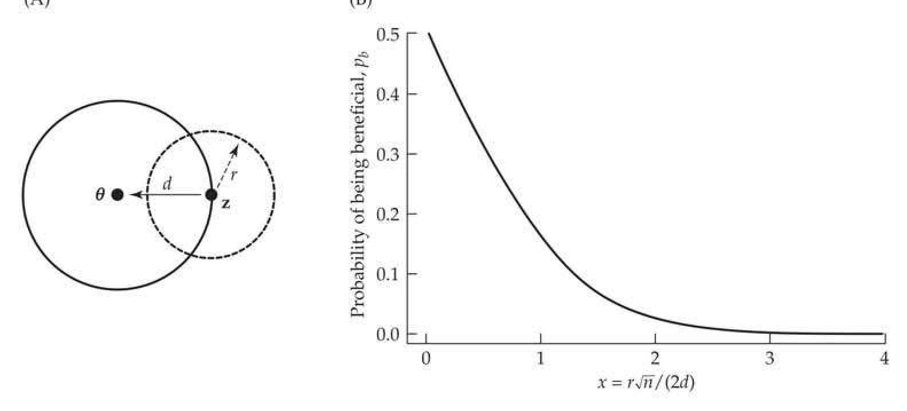
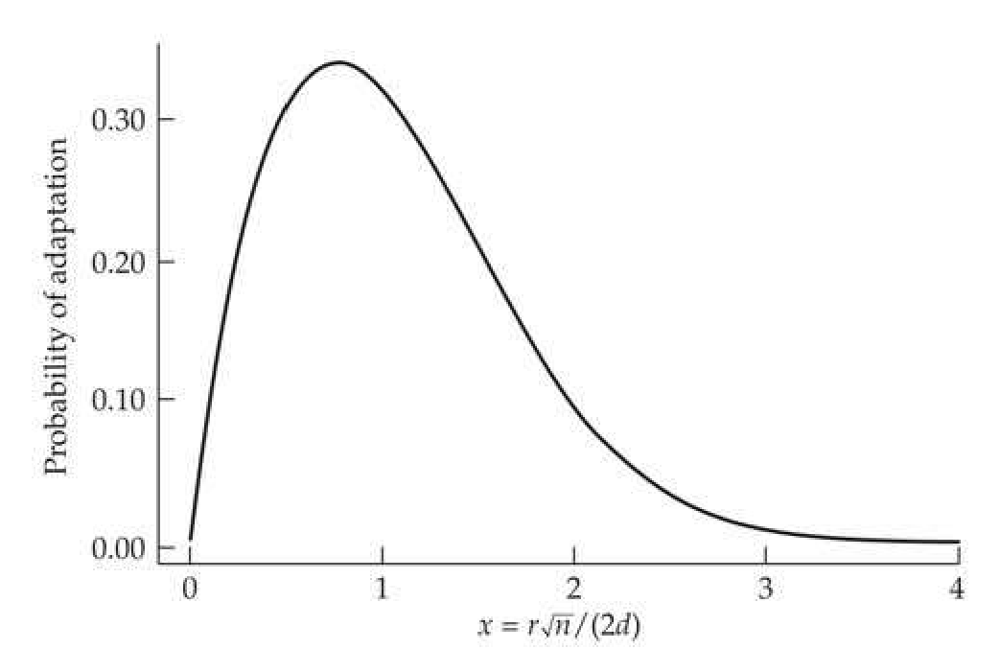
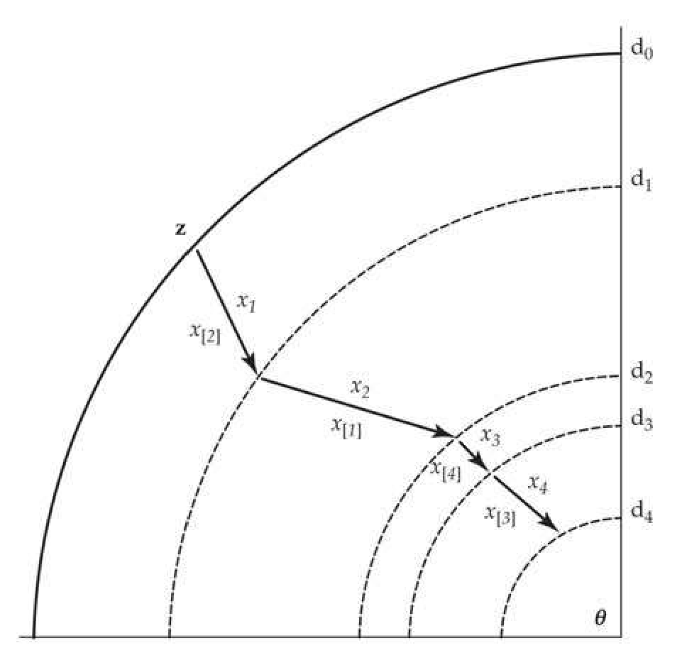
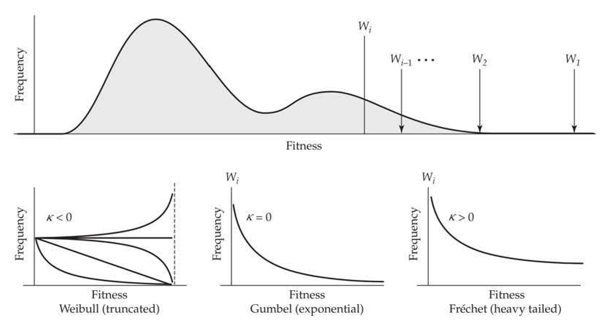
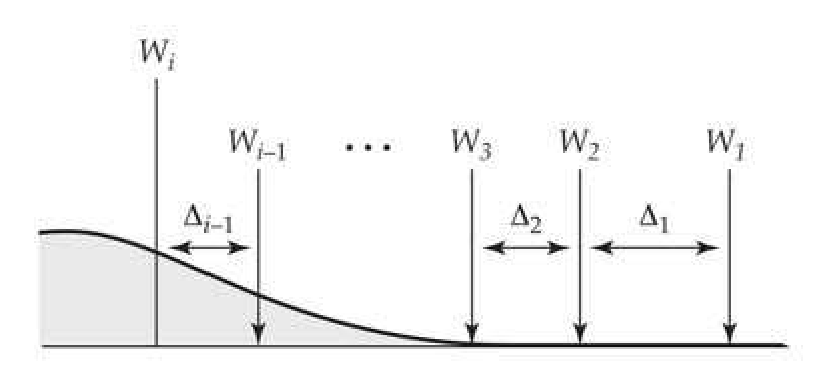
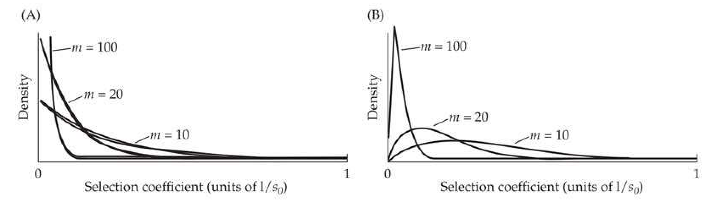

# Chapter 27 · Long-term Response: 3. Adaptive Walks

## Evolution_chapter27_001 · Long-term Response: Introduction

Real evolution may look less like an attempt to evolve uphill on a static landscape and more like an attempt to keep one's footing on an ever-changing landscape. Orr (2009)

Our treatment of long-term selection response started by considering the role of existing genetic variation (Chapters 25 and 26). As such variation becomes exhausted through drift and selection, new mutations become increasingly more important (Chapter 26). Here we consider the logical conclusion of this second phase, the continual fixation of new mutations and their impact on long-term response over evolutionary time scales. In particular, our focus is on the nature of adaptive walks—the sequence of fixed mutational steps that underlie a specific adaptation. There is a rich (and growing) population-genetics literature on this subject which was nicely reviewed by Orr (2005a, 2005b). Much of this work starts with Fisher's geometric model (FGM) (Fisher 1930), an extremely influential model for the probability that a new mutation is adaptive (i.e., beneficial). A number of interesting results follow from this model, which assumes adaptation toward some optimal trait value (stabilizing selection). A second class of adaptive-walk models that we consider are based on extreme-value theory and focus on the fitness effects of new mutations (as opposed to the FGM focus on trait values). Surprisingly, both classes of models give the same general result: the effect-size distribution of genetic factors fixed along an adaptive walk is often approximately exponential.

---

## Evolution_chapter27_002 · Long-term Response: Introduction / FISHER'S MODEL: THE ADAPTIVE GEOMETRY OF NEW MUTATIONS

Fisher (1930) offered a highly simplified, yet elegant and powerful, geometric argument suggesting that the probability that a new mutation increases fitness is a simple function of the size of the mutational effect relative to the distance of the original phenotype from the optimal trait value. Fisher believed that his model, while idealized, captured the “statistical requirements of the situation” of adaptation: one complex thing (the organism) must fit into another complex thing (the environment). Although Fisher envisioned that adaptation requires a highly multivariate phenotype meshing with a highly multivariate fitness function, Figure 27.1 shows the basic structure of his model in two dimensions. Stabilizing selection is assumed, with the current phenotypic value at a distance d from a fitness optimum, $ \theta $. The two traits have been scaled and rotated to be independent, with equal selection intensity on both (this can be accomplished using a transformation along the lines suggested by Equation A5.16). As depicted in Figure 27.1, we assume stabilizing selection acting on two independent traits. Let the vector z, at distance d from the optimal value, $ \theta $, represent the current multivariate phenotype associated with a particular genotype. The phenotypic change by a new mutation is given by a vector of length r (the effect size of the mutation) extended from the current value (z) in some random direction (i.e., the incremental model). Any mutation whose distance to $ \theta $ is less than d has increased fitness (and is said to be beneficial or adaptive), while a mutation whose distance from $ \theta $ is greater than d has lower fitness. Drawing a circle of radius d around $ \theta $ (a contour of equal fitnesses corresponding to that of the original phenotype), the probability that the new mutation is advantageous will be simply the probability that the mutation lies within this contour (i.e., is closer to θ).

**[Figure]**

> **Figure 27.1** · page 2 · source: `Evolution_chapter27`
>
> 
>
> Figure 27.1 A: Fisher’s (1930) model for the probability that a new mutation increases fitness for the simple case of two independent traits under stabilizing selection. The optimal fitness value occurs at  $ \theta $, while the mean phenotypic value of the genotype about to experience a mutation is z, which is at distance d from the optimum. The solid circle denotes the fitness contour passing through the current value z, meaning that all points inside this circle have higher fitness. The effect of a new mutation is to move the expected phenotype by some distance (r) in a random direction around z, with the space of possible new phenotypes denoted by the dashed circle (the isotropic assumption of equal and independent mutational effects on both traits). The probability of increased fitness for a random mutation of effect r is the fraction of the circumference of the dashed circle that resides inside the solid circle (i.e., is closer to  $ \theta $), namely, the fraction of all new mutations (whose range of possible phenotypes fall exactly along the circumference of the dashed circle) with a higher fitness than the original allele. More generally, under anisotropic conditions (correlated and/or unequal effects for selection, mutation, or both), these circles are replaced by ellipses in two dimensions, and the hyperspheres are replaced by hyperellipsoids in three or more dimensions. B: For an n-dimensional phenotype, the probability  $ p_b $, that a new mutation is beneficial (has an increased fitness) is  $ 1 - \Phi[r \sqrt{n}/(2d)] $, where  $ \Phi[x] $ is the cumulative density function of a unit normal (Equation 27.1b).

**[推导 Derivation]**

To extend this simple two-dimensional model to $n$ traits, let the vector $\mathbf{z}$ denote the current (multidimensional) phenotype of an allele, which is at a (Euclidean) distance of $d$ from the optimum, $\theta$. We express this condition as $\|\mathbf{z} - \theta\| = d$, where $\|\mathbf{x}\|$ denotes the length of the vector $\mathbf{x}$ (Equation A5.1a). Now suppose this allele mutates under the incremental model (Chapter 12), so that its new phenotype is $\mathbf{z}' = \mathbf{z} + \mathbf{m}$, where $\mathbf{m}$ denotes the vector of mutational increments. In particular, the new value for trait $i$ is $z_i' = z_i + m_i$, where $E[m_i'] = 0$. Further, we assume the mutational increments are uncorrelated and homoscedastic, so that we can write their covariance matrix as $\mathbf{M} = \sigma_m^2 \mathbf{I}$. Fitness is increased if $|\mathbf{z}' - \theta| < \|\mathbf{z} - \theta\|$; namely, $\mathbf{z}'$ is closer to the optimum than $\mathbf{z}$. Now consider a vector of random mutational inputs subject to the constraint that $r^2 = \sum m_i^2 = \|\mathbf{m}\|^2$. Fisher's insight was that a single parameter, the Fisher scaling parameter, [[SEE_FORMULA:27.1a]] is sufficient to compute the probability, $ p_{b} $, that such a new mutation is beneficial, with [[SEE_FORMULA:27.1b]]

Here $ \Phi $ is the cumulative density function of a unit normal. While Fisher did not present one, derivations of Equation 27.1b were provided by numerous authors (Kimura 1983; Leigh 1987; Rice 1990a; Hartl and Taubes 1996). Fisher's critical observation was that the probability $ (p_b) $ that a new mutation is beneficial is a decreasing function of the scaling parameter, $ x $ (Figure 27.1). Increasing $ x $ decreases the chance that a mutation is beneficial, and conversely, decreasing $ x $ increases the chance it being beneficial. Indeed, as $ x $ approaches 0, the probability that a new mutation is beneficial approaches 0.5. The analogy Fisher used to explain this result was that of trying to improve the focus on a microscope. A very tiny change has close to a 50% chance of (very slightly) improving the focus, while a much larger change is far less likely to do so. This analogy led to the use of the term Fisher's microscope in the literature to describe this feature of the model.

Fisher’s scaling factor $ (x) $ consists of two components. The first, $ r/d $, is the ratio of the length of the vector of mutational increments to the distance from the optimum. Whether the mutational effect size $ (r) $ is regarded as large or small under Fisher’s model depends on the distance of its progenitor allele from the optimum. Consider two mutations, both of which add a random vector of length 1 to the current phenotypic value. If $ d = 50 $, this is a mutation of small effect from the standpoint of x, while if $ d = 2 $, this is a large-effect mutation. Hence, the scaling of x accounts for the size of the mutation relative to the current distance from the origin. The second component of $ x $, $ \sqrt{n}/2 $, accounts for the geometry of the fitness surface. As the dimensionality of the fitness surface increases, there are increasing numbers of constraints on a random mutation required for it to be beneficial. Hence, increasing the complexity of the phenotype (the number of independently selected traits, n, influenced by a new mutation) decreases the chance of mutations being beneficial. The original interpretation of Fisher’s model was therefore twofold: small-effect mutations are the stuff of adaptation, and there is a “cost of complexity” (Orr 2000). As we will see, both of these initial assertions need significant refinement.

**[命题 Proposition]**

Orr (2006; also see Hartl and Taubes 1996, 1998; Waxman and Peck 1998) showed that Fisher's model provides a much richer description beyond simply predicting whether a mutation is beneficial—it can be used to generate the full distribution of fitness effects for the set of random mutations of a given size, r. Initially, this is performed under the assumption of equal and uncorrelated mutational and fitness effects (i.e., the distribution of trait displacements is a hypersphere of radius r and the fitness surface displays stabilizing selection with equal, and uncorrelated, selection along all trait dimensions). One can then integrate this result for a specific value of r over the assumed distribution of r values to obtain the unconditional distribution of fitness effects.

**[命题 Proposition]**

For the class of mutations that all have the same effect size, the fitness distribution is obtained by first computing the distribution of displacements toward the optimal value. Orr (198b) showed that this is approximately normal for large n, with a negative mean (on average, a random mutation moves the phenotype away from the optimum). Translating displacements into fitnesses under the assumption of Gaussian stabilizing selection, the resulting distribution of fitness effects of random mutations (again, all of the same size, r) is also approximately normal, with a mean less than the current fitness of the starting genotype. Martin and Lenormand (2006) and Tenaillon (2014) provided a more exact analysis, which yields a fitness distribution in the form of a modified gamma distribution (Appendix 2). Hence, most new mutations move a trait further away from its optimum, thereby lowering fitness. Only those mutations in the right tail of this displacement distribution (those with positive values, namely, those whose phenotypes following mutation are closer to $ \theta $) are advantageous. This important result foreshadows a rather different model of adaptation based on extreme-value theory (i.e., based on draws from the extreme right-hand tail of a fitness distribution), which will be examined in the second half of this chapter.

**[命题 Proposition]**

One might be concerned by the highly simplistic nature of Fisher's model: n independent traits with equal selection and mutation on each. However, these assumptions can be relaxed by replacing Fisher's assumed hyperspheres for fitness contours and mutational effects (under the isotropic assumption of equal and uncorrelated effects) with hyperellipsoids, which allows for among-trait correlations and unequal traits effects in both fitness and mutation (e.g., Waxman and Welch 2005; Martin and Lenormand 2006, 2008; Waxman 2006, 2007). This anisotropic assumption of unequal and/or correlated pleiotropic mutational effects can be modeled by using a mutational covariance matrix, M, and unequal and/or correlated stabilizing selection (Chapter 30) can be accommodated with a semipositive-definite matrix, S (e.g., a matrix with no negative eigenvalues; Appendix 5). The resulting effective number of dimensions for x is given by $ n/(1 + c_v^2) $, where $ c_v $ is the coefficient of variation of the eigenvalues of the matrix product of MS.

Fisher’s model can also be derived from biological first principles. Martin (2014) showed that one can recover Fisher’s model by starting with a complex metabolic network that influences a number of traits. Perhaps the best summary of Fisher’s model is the comment by Fox (2014): “Sometimes, even really abstract mathematical models can make really good predictions about real-world biology. Further, they do so because of their abstractness, not despite it.” Fisher’s model is so powerful, not because it fully captures all of the biology, but rather because it avoids most of the biological details to make its critical points. Precisely because of this generality, there has been a recent resurgence of interest in Fisher’s model as a framework for a number of evolutionary questions (reviewed by Tenaillon 2014).

**[Figure]**

> **Figure 27.2** · page 4 · source: `Evolution_chapter27`
>
> 
>
> Figure 27.2 The probability of adaptation (the probability of being beneficial times the probability of fixation) for a new mutation with scaled effect  $ x = r\sqrt{n}/(2d) $. Figure 27.1B shows the probability,  $ p_b $, that such a mutation is beneficial, while the curve in this figure (which also incorporates the resulting selection coefficient) is the chance that it is beneficial and fixed.

---

## Evolution_chapter27_003 · FISHER'S MODEL: THE ADAPTIVE GEOMETRY OF NEW MUTATIONS / Fisher-Kimura-Orr Adaptive Walks

A subtle feature, first noted by Kimura (1983), makes Fisher's smaller-is-better result misleading. An examination of Equation 27.1b and Figure 27.1 suggests that the majority of beneficial mutations are those with very small effects—those mutations whose length, $r$, satisfies $x \ll 1$, namely, $r \ll 2d/\sqrt{n}$. While this is indeed correct (under Fisher's model), Kimura noted that such small-effect mutations also have very small selective advantages, and therefore (while beneficial) are unlikely to be fixed by natural selection. Recall from Chapter 7 that the fixation probability of a favorable allele is $\simeq 2s$, so that the magnitude of $s$, not only its sign, is important in determining which factors become fixed.

Under Fisher’s model, and conditioning on a mutation being beneficial, the expected value of $s$ is linearly proportional to $x$, as the distance from $\theta$ is an indicator of fitness (Kimura 1983; Orr 1998b). This can be more compactly written as $E[s] \propto x$. Thus, the probability that a mutation will be fixed is a function of both its selective advantage and its chance of being beneficial, $(2s) \cdot p_b \propto (2x) \cdot [1 - \Phi(x)]$. We call this the probability of adaptation. As shown in Figure 27.2, the outcome is a dramatic shift in our interpretation of Fisher’s result: adaptation favors mutations of intermediate effect. A comparison of the difference between Figure 27.1 and Figure 27.2 highlights a critical distinction important throughout this chapter, namely, the difference between the distribution of effects (be they trait values or fitness) over all new beneficial mutations versus the distribution of effects restricted to fixed beneficial mutations.

There is an irony here in that although Fisher was a pan-selectionist, his initial analysis suggested that alleles of very small effect (i.e., nearly neutral) were more important for adaptation (i.e., comprise the majority of beneficial mutations). Conversely, Kimura, the founder of the neutral theory, showed that Fisher's model (when more carefully considered) argues for a role of stronger selection than envisioned by Fisher (i.e., fixing alleles of intermediate, rather than small, effect).

It is important to note that Figure 27.2 does not reflect the distribution of the x values for fixed mutations (i.e., the scaled lengths of fixed mutations). Rather, it describes the filter of natural selection, giving the chance that a mutation with effect x is fixed. The distribution of the x-scaled r values for fixed mutations depends on the product of the distribution of new mutational input (the distribution of r values among new alleles) and the chance that each is fixed (Figure 27.2).

To decouple the separate issues of the impact of selection (given a specific effect size) and the distribution of mutational effect sizes, both Kimura and Orr initially assumed a uniform distribution of effect sizes. This focuses on the role of the filter of selection. The key finding, of a roughly exponential distribution of fixed trait effects, holds under rather general distributions of the effects of new mutations. For example, an exponential distribution of r, when compounded with an exponential distribution of fixed effects for a given value of r, returns an exponential. Orr's (1998b) simulations showed that the result of a roughly exponential distribution of the effect sizes of successful (i.e., fixed) mutations was remarkably robust to the assumed distribution of mutational effect sizes.

**[推导 Derivation]**

To examine the impact of selection on the pattern of successive fixations, we first consider the scaled length $ (x_1) $ of the initial successful (fixed) mutation at the start of a walk. The scaling from $ r $ into $ x $ accounts for both the initial distance from the optimum $ (d_0 = ||\mathbf{z} - \boldsymbol{\theta}||) $ and dimensionality $ (n) $ of the process (Equation 27.1a). Assuming a uniform distribution for the $ r $ values of new mutations, Kimura found that the expected value for $ x_1 = r_1 \sqrt{n}/[2d_0] $ of this first successful mutation is $ E[x_1] \simeq 1.06 $. Hence, [[SEE_FORMULA:27.2a]] where $ E[r_1] $ is the expected value of $ r $ for the first-fixed mutation. For example, for $ n = 10 $, $ E[r_1] = 0.67d_0 $, while $ E[r_1] = 0.3d_0 $ for $ n = 50 $. Orr (1998b, 1999, 2000) noted that Kimura's result is simply the first step of the adaptive walk starting at distance $ d_0 $ from the optimum. Following this first fixation, the walk starts anew from distance $ d_1 < d_0 $ (Figure 27.3).

It is important to note that $ E[r_1] $ is the expected total length of the vector of mutational increments (the distance between $ z $ and its value, $ z' = z + m $, after the mutation, with $ r = ||m|| $). Our real interest is not this length, but rather in how much of this displacement is toward $ \theta $, meaning that the new phenotype is actually closer (and more adaptive) than $ z $, i.e., $ ||z' - \theta|| < ||z - \theta|| $. A large value of $ r_1 $, by itself, does not imply a large jump closer to $ \theta $. Hence, to continue our analysis of the walk, we first need to compute the expected distance moved toward the optimum (i.e., the new distance, $ d_1 = ||z' - \theta|| $, from $ \theta $; Figure 27.3) after this first step of the walk (the first fixation event).

**[推导 Derivation]**

How much closer does fixing a mutation move us toward the optimum? The first fixed mutation almost never points exactly in the direction of the optimum, so that the actual amount of adaptation (distance moved toward $ \theta $) is less, and likely much less, than the length of the jump (Figure 27.3). Thus, instead of $ E[x_1] $, we need to consider the length, $ E[x_p,1] $, of the expected projection (Appendix 5) in the direction of the optimum. For large n, Orr (1998b) found that this projection is approximately [[SEE_FORMULA:27.2b]]

**[Figure]**

> **Figure 27.3** · page 6 · source: `Evolution_chapter27`
>
> 
>
> Figure 27.3 An example of an adaptive walk (in two dimensions), starting at z and moving toward the optimal value,  $ \theta $. Here  $ x_i $ denotes the scaled mutational size of the ith fixed mutation (with  $ r_i = 2d_0x_i / \sqrt{n} $), while  $ x_{[i]} $ denotes the ith largest step (the ith largest x value over all mutations fixed during the walk). In this example, the largest jump,  $ x_{[1]} $, occurs at the second step  $ (x_2) $, rather than at the first  $ (x_1) $.

**[推导 Derivation]**

Scaling the phenotypes such that the initial distance from the optimum is one ($ ||\mathbf{z}-\boldsymbol{\theta}|| = d_0 = 1 $), from Equation 27.1a the starting distance on the $ x $ scale is $ \sqrt{n}/2 $. Hence, following the first jump (the first fixation of a beneficial mutation), the population (on average) moves to a distance (in the $ x $ value scale) of $$ \begin{align*}\sqrt{n}/2-E[x_{p,1}]=\sqrt{n}/2-E[x_1]/\sqrt{n}\end{align*} $$ which implies that the new distance to the optimum (on the x scale) following the first jump is a fraction, [[SEE_FORMULA:27.2c]] of the initial starting distance.

**[推导 Derivation]**

Orr's key insight was that the size distribution of the second jump (i.e., the distribution of $ x_2 $) is the same as that of the first jump, but with the distance to the optimum reduced an amount given by Equation 27.2c. Likewise, following the second jump, the distance to the optimum (as a fraction of the original distance) is the square of the value calculated by Equation 27.2c, and so forth, which generates a self-similar process for each step of the walk toward the optimum, for which $ E[d_i] = (1 - 2E[x_1]/n)^r d_0 $. It is this self-similar feature that generates the exponential distribution of effect sizes among fixed mutations. Orr (1998b) obtained the distribution for the Fisher-scaled effect size ($ x = r \sqrt{n}/2 $, taking $ d = d_0 = 1 $) of the new mutation (Equation 27.1a) during step $ k $ of the walk as [[SEE_FORMULA:27.3]] where $C$ is a normalization constant. This expression is for a uniform distribution of mutation effects (the $r$ values). More generally, the $C c_k^2$ terms in Equation 27.3 are replaced by $C \phi(c_k x) c_k^2 x$, where $\phi$ is the assumed distribution of mutational effects (Orr 1998b).

---

## Evolution_chapter27_004 · Long-term Response: Introduction / Fisher-Kimura-Orr Adaptive Walks

Assuming a uniform distribution of mutation effects (the $r$ values), Orr showed that Equation 27.3 implies that the distribution of the $x_i = r_i \sqrt{n}/2$ is approximately exponential with parameter $ \lambda \simeq 2.9 $ (i.e., with a mean value of $ 1/\lambda \sim 0.34 $). Simulation studies by Orr (1998b, 1999) showed that this result is very robust to different assumptions about the distribution of mutational inputs, especially when large-effect mutations are not common.

Orr's simulations also showed that the exponential approximation may break down for mutations near the very end of the walk, where the fixed values of $ x_i $ are very small as the process very closely approaches $ \theta $. In part, this behavior arises because of the drift barrier, discussed in Chapter 7. As the fitness effects of a mutation become sufficiently small ($ 4N_e|s| \ll 1 $), the fixation probability approaches the neutral expectation (i.e., the initial allele frequency, $ 1/[2N] $), rather than 2s. Hence, even in a constant environment, perfect adaptation does not occur. Rather, as the drift barrier is approached, there is a constant fixation of mutations of very small effect, which are random in their direction toward, and away from, the optimum. Hence, Orr's key finding that the distribution of the effects of fixed mutations during a walk is roughly exponential is tempered somewhat by departures for fixed mutations with very small effects. However, given that this class of fixed mutations with very small effects would be very difficult to detect, from an empirical standpoint, the bulk of any detected substitutions during a walk would follow an approximately exponential distribution.

**[推导 Derivation]**

A critical point noted by Orr (1998b), and shown in Figure 27.3, is that the largest “jump” in the walk, $ x_{[1]} $ (the largest scaled length for any of the fixed mutations), does not necessarily correspond to the first jump, $ x_{1} $ (the scaled length of the vector of effects for the first fixed mutation). The expected value of the largest jump is approximately [[SEE_FORMULA:27.4a]]

**[推导 Derivation]**

For example, taking $ \lambda = 2.9 $ and $ n = 50 $, Equation 27.4a yields the expected largest jump as $ E[x_{[1]}] \simeq 1.68 $, implying an expected total mutational size of $ E[r_{[1]}] = 3.36d_0/\sqrt{n} $. Conversely, the expected value of the first jump is $ E[x_1] \simeq 1.06 $, or a mutation with $ E[r_{[1]}] = 2.12d_0/\sqrt{n} $, which is $ \sim 60% $ of the expected size of the largest jump. More generally, the expected value of the $ k $th largest jump is [[SEE_FORMULA:27.4b]] and Equation 27.1a yields $ E[r_{[k]}] = (2d_0/\sqrt{n})E[x_{[k]}] $. Using this result to consider the quantity $ (E[x_{[k]}] - E[x_{[k+1]}]) $ provides the expected difference in the scaled $ r $ values for the $ k $ and $ k + 1 $ largest fixed mutations, which yields [[SEE_FORMULA:27.4c]] for $ \lambda \simeq 2.9 $. For example, rearranging yields $ E[x_{[2]}] = E[x_{[1]}] - 0.349 = 1.33 $, and so on. This form of spacing will reappear in our discussion of walks modeled by extreme-value theory.

**[推导 Derivation]**

The careful reader might have noticed that Orr’s finding of an approximate exponential distribution in the effects of fixed mutations refers to the lengths, r, of the vectors of these mutations. This is different from the actual phenotypic effect size for any single trait. Orr (1999) addressed this issue, and found that the projection of a favorable (but otherwise random with respect to direction) vector of length r onto any particular trait (say trait j) is roughly normally distributed, with an expected absolute value of [[SEE_FORMULA:27.5]]

Hence, the distribution of the effect sizes for a single trait is the result of sampling from two distributions. First, the expected value of the effect size (Equation 27.5) is a function of the random variable, r, which is roughly exponentially distributed for fixed mutations. Second, there is sampling noise around the expected value given by Equation 27.5, namely, the roughly normal distribution for the projection from a given value of r onto the mutational effect on any given single trait. It is therefore not surprising that Orr's simulations showed that the effect-size distribution on any particular single trait also shows a strong exponential trend (with Gaussian sampling noise around the expected trend). Thus, while the total lengths of the mutational displacement vectors associated with fixed mutations are roughly exponentially distributed, so too are the resulting changes in the phenotypic values of fixed mutations for any particular trait. Consequently, if we could score the phenotypic effects on a trait over the set of fixed mutations leading to the current adaptation, we would expect them to be roughly exponential (except for those fixed mutations with effects on a trait that are extremely small, and therefore difficult to detect).

The view of a random walk as a series of discrete, fixed steps is one extreme vision, and essentially a hard-sweep view (Chapter 8). The other extreme view is of the constant generation of mutations of small effect, which mount a continuous infinitesimal response (soft or partial sweeps; Chapter 8). Lande's analysis (Chapter 25) showed that polygenic response (changes in the trait mean through allele-frequency changes, and not necessarily fixations, at a large number of loci of small effect) is favored when major genes have negative pleiotropic effects on other traits, unless there is strong selection on a focal trait. Hence, adaptive walks that follow Fisher's model may be biased toward cases of traits that are under strong selection.

**[命题 Proposition]**

A second assumption of the Fisher-Kimura-Orr adaptive walk model is weak mutation, with only a single beneficial mutation segregating at any one time. With multiple segregating mutations, Hill-Robertson effects (Chapters 3, 7, and 8) reduce the effectiveness of selection, the most extreme example being clonal interference in asexuals (Gerrish and Lenski 1998; Rozen et al. 2002). When considering the fixation of mutations in clonal (asexual) populations, a new beneficial mutation must first avoid stochastic loss when rare. While such surviving cosegregating beneficial mutations (which we denote as competing) may be fixed in a sexual population, in an asexual population they are fully linked to genomes that may experience additional beneficial mutations before the initial mutation becomes fixed. When $ N_{\mu} \ll 1 $, the presence of multiple segregating beneficial mutations is unlikely (where $ \mu $ is now the genomewide beneficial mutation rate). However, when $ N_{\mu} \gg 1 $, clonal interference can occur, wherein the most fit genomes compete with each other and only one is ultimately fixed (Gerrish and Lenski 1998; Elena and Lenski 2003; Barrick and Lenski 2013; Levy et al. 2015). As noted by Barrett et al. (2006a), the winning genome often accrues several beneficial mutations on its way to fixation (outcompeting genomes with potentially more favorable initial mutations that did not accumulate additional beneficial mutations), which can result in an investigator overestimating the fitness effects under the assumption of a single beneficial mutation driving the fixation.

**[示例 Example]**

> **Example 27.1** · ref: `27.1` · source: `Evolution_chapter27_004.json` · blocks 8–11
>
> Example 27.1. Annual wild rice (Oryza nivara) is a photoperiod-insensitive selfer adapted to seasonally dry habits. It is thought to have evolved from a progenitor with properties of its sister species, Oryza rufipogon, a photoperiod-sensitive, perennial outcrosser found in deep-water swamps. As a potential model system for adaptation to new conditions, Grillo et al. (2009) crossed these two species and mapped QTLs for flowering time, mating system, and life-history traits. The resulting distribution of the values of QTL effects for these traits was roughly exponential, as predicted from Orr's adaptive walk. If directional selection was an important factor in the divergence of these two species, one would expect to find an excess of the detected QTL alleles in nivara in the direction of the adaptive phenotypes (the QTL sign test; Chapter 12). Indeed, for flowering time and duration, all six of the nivara QTL alleles act in the direction of reduced photoperiod sensitivity and longer flowering. Likewise, all seven of the QTLs for mating system traits in nivara acted in the direction of increased selfing. One prediction from the Fisher-Kimura-Orr model is that fixations of large-effect mutations are more likely when the current population is far from its adaptive peak. Rogers et al. (2012) compared threespine stickleback fish (Gasterosteus aculeatus) from two different lake types. This species has a marine origin, but it colonized freshwater lakes at the end of the last ice age. Based on the presence of a sculpin predator, one lake type (sculpin-present) was judged as being closer to the ancestral marine optimum than a second type (sculpin-absent). A higher frequency of large-effect QTLs for morphology (related to general predator defense) was observed in the sculpin-absent lake type, consistent with the fixation of larger-effect mutations when the optimum is further away. A corollary to this prediction is that larger fixed-effect sizes are expected at loci underlying traits that experience continual and sudden shifts in their fitness surfaces. Louthan and Kay (2011) suggested that this often happens in traits under biotic selection. They investigated this hypothesis with a meta-analysis of 1950 QTLs (1721 controlled traits presumed to be under abiotic selection, and the rest under biotic selection) from 10 plant families (but mainly Brassicaceae). They found larger QTL effect sizes for traits under presumed biotic, as opposed to abiotic, selection.

---

## Evolution_chapter27_005 · FISHER'S MODEL: THE ADAPTIVE GEOMETRY OF NEW MUTATIONS / The Cost of Pleiotropy

We now turn to the second implication from an initial analysis of Fisher's model, which is the impact of n on x, and hence on $ p_b $. Equation 27.1a shows that the scaling parameter, x, increases with $ \sqrt{n} $, the number of traits (i.e., the complexity of an organism). For the same r/d values, the probability that a mutation is adaptive is lower in more phenotypically complex organisms (those with larger n values), which has been termed the cost of complexity. When considering the rate of adaptation, Orr (2000; also see Welch and Waxman 2003) noted that the cost of complexity is actually far greater than suggested by a superficial analysis of Fisher's model. Consider a rate of adaptation defined by the rate at which a trait approaches its optimal value. This rate is proportional to the product of three components: (i) the probability that a mutation is beneficial; (ii) the probability that such a mutation is fixed; and (iii) the length of a move (or displacement) toward the optimal value (the increase in fitness) when such a mutation is fixed. These last two factors each scale as $ 1/\sqrt{n} $ (Equations 27.2b and 27.5), so together they scale as $ 1/n $. Given that the probability of an adaptive mutation also decreases with n (in a monotonic, but nonlinear, fashion, as $ p_b = 1 - \phi[\sqrt{n}r/(2d)] $), the net result is that the decrease in the rate of adaptation is faster than $ 1/n $, which suggests a far higher cost than under Fisher's initial analysis.

**[命题 Proposition]**

What exactly is $ n $ and what forces determine this number? The original Fisher model effectively assumed universal pleiotropy, namely, that all new mutations essentially influence every trait in an organism. Under this assumption, the number of independent trait combinations under selection (the dimension of the fitness surface; technically, this is the number of nonzero eigenvalues of the stabilizing selection matrix, S; Appendix 5) in an organism is the factor that defines $ n $. (The term universal pleiotropy first seems to have been used by Wright [1968], although, as noted by Wagner and Zhang [2011], Wright's usage appeared to be that every gene affects more than one trait, as opposed to the Fisherian notion that every gene affects all traits.) Under the Fisherian view of universal pleiotropy, the value of $ n $ is set by natural selection ($ n $ is the number of dimensions in the trait space that are under selection).

**[定义 Definition]**

Given that Fisher’s model is clearly biologically unrealistic, how valid is this concern of a cost of complexity (which, at face value, seems to imply that more complex organisms—those with more independent dimensions of trait space under selection—have a slower rate of evolution)? There are several potentially ameliorating factors. First, mutational pleiotropy is likely not universal, but rather more modular (the notion of restricted pleiotropy), wherein most mutations only influence traits within their developmental module (Wagner 1996b; Barton and Partridge 2000; Welch and Waxman 2003; Wagner et al. 2007; Wagner and Zhang 2011). Hence, the number of traits (on average) that a particular mutation influences is what determines n, not the overall dimension of the fitness surface. Notice that this shift in focus concerning the definition of n (from selection-driven to pleiotropy-driven) immediately suggests that n can evolve (just as one can envision selection to increase, or decrease, developmental modularity).

Under restricted pleiotropy, the focus shifts from the complexity of an organism to the complexity of a module, with a cost of pleiotropy (Wagner and Zhang 2011), as the rate of adaptation is decreased in modules of higher complexity (i.e., modules in which single mutations impact a larger number of traits). As reviewed by Wang et al. (2010) and Wagner and Zhang (2011), evidence from extensive QTL mapping and gene-knockout studies in yeast, mice, and nematodes suggests that most mutations show restricted pleiotropy. For example, Wang et al. (2010) examined ~250 morphological traits in yeast and found that the median amount of pleiotropy for a given mutation was only 7 traits (2% of the traits examined) for the ~2500 gene knockouts that were examined. Hill and Zhang (2012a, 2012b), however, have suggested that we exercise some caution before accepting restricted pleiotropy. They performed simulation studies using a model with highly pleiotropic alleles (in which new mutations influence a large number of traits), and found that low power in the ability to detect effects on any particular trait can create the appearance of restricted pleiotropy (see Wagner and Zhang 2012 for a reply). Corrections for multiple comparisons, given the large number of tested traits (Appendix 4), is expected to result in low power for most of these mutant screens.

A second mitigating factor in determining the cost of complexity is that the intensity of selection likely varies over traits. This reduces the actual number of traits, $ n_{e} $, in a module to an effective number of traits, $ n_{e} $, where $ n_{e} $ decreases as the variance in trait selection intensity increases (Rice 1990a; Orr and Coyne 1992; Orr 2000; Waxman and Welch 2005; Martin and Lenormand 2006, 2008). If just a few traits in a module face the majority of the selective pressure, this significantly lowers the cost (i.e., it increases the rate of adaptation). A similar argument applies if mutational effects are very uneven over traits. Finally, the presence of highly correlated mutational effects within a module (e.g., mutations tend to affect traits in the same, as opposed to random, directions) also reduces the effective $ n $ (Wang et al. 2010). The joint impact from all these factors suggests that the effective dimensionality of a module is less, and likely far less, than the actual number of selectively independent traits that are influenced by a given developmental module.

**[命题 Proposition]**

The final mitigating factor in any cost of complexity is more subtle, as it deals with the relationship (if any) between the average incremental effect, $ m_i $, of a mutation on a specific trait and the total effect, $ r = \sqrt{\sum m_i^2} $, of that mutation over all the traits that it affects, and how this scales with $ n $. Under the invariant total-effect model (Wagner et al. 2008), the total effect ($ r $) of any given mutation is independent of the number of traits it influences. In that case, a mutation influencing more and more traits will, on average, see no change in its $ r $ value. Under this assumption, as a mutation influences more traits, its average effect on a given trait decreases with $ n $ (with $ r $ constant, $ m_i $ decreases with $ n $). The complementary assumption is Euclidean superposition (Wagner et al. 2008), wherein the effect of a mutation on any given trait is independent of $ n $ (i.e., independent of how many other traits that mutation impacts). In this case, a mutation’s total effect scales as $$ r=\sqrt{\sum_{i=1}^{n}m_{i}^{2}}=\sqrt{n}\sqrt{m^{2}} $$ where $m^2$ is the average squared effect of a mutation on a random trait (with $m^2$ constant, $r$ increases with $n$). Both of these models are special cases of the more general scaling, $r \simeq a n^b$, where $b = 0$ corresponds to the invariant model and $b = 0.5$ to the superposition model (Wang et al. 2010). With a large number of pleiotropic mutations in hand, one can regress their total effect over all traits, $r$, on their degree of pleiotropy, $n$, to estimate $b$. Surprisingly, studies in mice (Wagner et al. 2008) and yeast (Wang et al. 2010) suggest that the data are best fit by a model with $b > 0.5$, implying that the per-trait effect of a mutation increases with the amount of pleiotropy, $n$. Wang et al. showed that the consequence of $b > 0.5$ is that while the probability that a new mutation is advantageous decreases with increasing n, its fixation probability, and its effect on fitness if fixed, both increase with n, resulting in the rate of adaptation being maximized at some intermediate value of n (akin to Kimura's observation of an intermediate value of x maximizing the probability of adaptation).

However, the observation of $b > 0.5$ needs to be treated with care. Hermisson and McGregor (2008) noted that QTL studies can result in inflated estimates of $b$ in the presence of linked loci. While the results of Wang et al. (2010) avoid this concern (being based on single-gene knockouts), caution is still in order. Simulation studies by Hill and Zhang (2012b) found that a true value of $b = 0.5$ can easily generate data with $b$ values greatly in excess of 0.5 if the traits and/or measurement errors are correlated.

Our conclusion from all of the above results is that any cost of complexity is based, not on organismal dimensionality per se, but rather on the amount of pleiotropy that a typical mutation experiences. There are reasons to suggest that this is often modest or small. Further, variances in the strength of selection, or in the distribution of mutational effects over individual traits, will lower the effective value of n, further reducing this cost. Finally, unresolved scaling issues (e.g., the relationship between total and individual-trait effects of new mutations) can further reduce this cost, provided they occur in the appropriate direction. While all of these issues can mitigate the cost of complexity, one may still remain. Cooper et al. (2007) used an extensive single-gene deletion dataset in yeast (Saccharomyces cerevisiae), where 501 morphological traits were measured for roughly 4800 single-gene deletions, along with the fitness effects for each deletion. There was a strong and significant negative correlation between the amount of pleiotropy (number of traits influenced) and fitness of the deletion (a squared correlation coefficient of roughly 0.18), meaning that organisms with greater numbers of pleiotropic mutations tend to be less fit.

---

## Evolution_chapter27_006 · FISHER'S MODEL: THE ADAPTIVE GEOMETRY OF NEW MUTATIONS / Adaptive Walks Under a Moving Optimum

**[推导 Derivation]**

One critical assumption of Orr’s analysis is that the change in the optimal value is sudden, large ($ E[r] \ll d $), and effectively permanent. While this can happen following a sudden shift in the environment, an equally plausible scenario is that the optimal value slowly changes over time, e.g., $ \theta(t) = \nu t $. In this setting, Bello and Waxman (2006), Collins et al. (2007), and Kopp and Hermisson (2007, 2009a, 2009b) found situations in which alleles of small to intermediate effect tend to be fixed before large-effect alleles. This is in contrast to the constant-optimum prediction that large-effect substitutions occur when the population is far from the optimum. Kopp and Hermisson (2009a, 2009b) made the key observation that the substitution pattern critically depends on the speed, $ \nu $, of environmental change relative to the genetic potential of the population. If the environmental change is sufficiently rapid, large-effect alleles are favored, as the population is waiting for the appearance of new mutations to help it keep up (and is said to be genetically limited). Conversely, when the environmental change is sufficiently slow, small-effect mutations tend to be fixed (and the population is said to be environmentally limited). For a single trait with a moving-optimum, Kopp and Hermisson (2009b) obtained a simple composite parameter [[SEE_FORMULA:27.6a]] to determine which region (environmentally, or genetically, limited) a population is in. Here $ \mu $ is the haploid genomic mutation rate for the trait, while $ \nu $ and $ \omega^2 $ are, respectively, the rate of change in the optimum and the strength of stabilizing selection (larger values of $ \omega^2 $ imply weaker selection; Equation 28.3b). Finally, $ \sigma_\alpha^2 $ is the variance of the effects of new mutations (which are examined in detail in Chapter 28). The denominator in Equation 27.6a represents the genetic potential of the population (being a measure of the amount of new variation introduced into the population in each generation), while the numerator represents the speed of environmental change. When $ \gamma $ is small (as can happen in a large population), evolution is environmentally limited, while when $ \gamma $ is large, it is genetically limited.

**[推导 Derivation]**

Matuszewski et al. (2014) generalized this result to a multivariate vector of optima changing over time. The multivariate mutational structure is described by a pleiotropy mutation matrix, M, while the multivariate nature of selection is described by a stabilizing selection matrix, S, with the vector $ \nu $ showing the per-generation change in each component of $ \theta $. The basic results from the univariate optimum analysis hold, where the composite parameter determining which domain a population resides in (genetically or environmentally limited) is given by [[SEE_FORMULA:27.6b]]

Recall that the determinant (det) of a matrix is the product of its eigenvalues (Appendix 5), and thus $ \tilde{s}^{2} $ and $ \tilde{m}^{2} $ are the geometric means of the eigenvalues of the stabilizing selection, S, and mutation, M, matrices, which can be thought of as the average widths of these processes. When both matrices are isotropic (a constant times the identity matrix), Equation 27.6b reduces to Equation 27.6a. Matuszewski et al. (2014) showed that in the environmentally limited range (where $ \gamma $ is sufficiently small), there is an optimal mutation size, with the distribution of the effects of fixed mutations being unimodal (like Kimura's distribution for the first-fixed factor; Figure 27.2), as opposed to Orr's exponential model.

There is also an interesting cost-of-complexity within the environmentally limited domain. Apparently at odds with Orr's result, Matuszewski et al. (2014) found that the size of the first fixed effect increases with the number of characters $ (n) $. However, a cost is imposed because the waiting time for a beneficial mutation that is destined to become fixed also increases with n. Because one has to wait longer for a beneficial mutation as complexity increases, the optimum has traveled further away, now making larger-effect mutations easier to fix. In the words of Matuszewski et al., “the moving-optimum model does not contradict the cost-of-complexity argument, but reveals yet another aspect of it.”

---

## Evolution_chapter27_007 · Long-term Response: Introduction / WALKS IN SEQUENCE SPACE: MAYNARD-SMITH-GILLESPIE-ORR ADAPTIVE WALKS

Quantitative geneticists have historically been interested in the phenotypic effects of alleles, while the focus of population geneticists has been on their effect on a very particular trait, fitness. The power of Fisher's geometric model is that it addresses both of these concerns, as trait effect sizes can be translated into fitnesses (Martin and Lenormand 2006; Orr 2006; Tenaillon 2014). While the distribution of phenotypic values under Fisher's geometry is both unconstrained and continuous, a second class of adaptive walks, based on the much more constrained geometry of sequence space, has also been widely examined. The analysis of such models is strictly concerned with the sequence of fitness increases from beneficial alleles fixed during a walk, rather than their phenotypic effects (Maynard-Smith 1970; Gillepsie 1983, 1984b, 1994; Orr 2002, 2003a). Further, they focus on evolution at a particular locus (or more generally, a tightly linked region, such as an entire bacterial genome), while Fisher's model is concerned with the genome-wide response in a continuous trait, potentially involving a very large number of loci. Sequence-space walk models have several potentially very robust features, making them perhaps more general than FGM results.

One emerging feature in studies of molecular fitness spaces is the use of experimental tests of many of the assumptions and models. We will touch on this briefly here, and encourage the reader to work through the more technical sections that serve as leadins to experimental tests, as (is detailed below) much of this theory can be directly applied to model systems, especially in microbes. For example, the combination of high-throughput combinatorial DNA/RNA synthesis (tens of millions of base-pair combinations can be generated) coupled with high-throughput scoring (such as chip-based binding assays) is starting to open up the exploration of the fitness surfaces associated with single genes (reviewed in Conrad et al. 2011; de Vasser and Krug 2014). There is a rich literature—spanning statistical physics, computational theory, experimental molecular biology, and evolutionary biology—on mutational and fitness landscapes over sequence space beyond the models examined here. See Miller et al. (2011), Szendro et al. (2013), and de Vasser and Krug (2014) for brief overviews and an entreee into deeper modeling issues under more complex mutational-fitness surfaces.

---

## Evolution_chapter27_008 · WALKS IN SEQUENCE SPACE: MAYNARD-SMITH-GILLESPIE-ORR ADAPTIVE WALKS / SSWM Models and the Mutational Landscape

**[命题 Proposition]**

As first noted for protein sequences by Maynard-Smith (1962b, 1970), while phenotypic space is continuous, underlying evolutionary modifications involving changes in DNA sequences impose a discrete, and constrained, geometry. For a DNA sequence of length L, while there are $ 4^L $ possible states, each single point mutation can only move to one of 3L possible states. Under the strong selection ($ N_s \gg 1 $), weak mutation ($ N_\mu \ll 1 $), assumption (the SSWM, or “swim,” model), each new mutation will either be fixed or lost before the next one appears, meaning that double-mutations are not segregating. This shortened horizon in the sequence space leads to Gillespie’s (1983) mutational landscape model (MLM), which constrains the possible geometry of evolutionary paths in sequence space to those that are one mutational step away (our discussion in Chapter 7 on mutations with contextual effects deals with some of the issues arising when the horizon is two, or more, mutations away). Given a starting allele, the set of “local” alleles are those 3L new sequences that are located one mutational step away. When one such adaptive mutation is fixed, there is now a new space of 3L - 1 sequences (3[L - 1] sequences when ignoring the just-mutated site, which [ignoring the back mutation] can itself contribute 2 new sequences), and the walk continues until the most fit local allele is fixed and the walk stops. As we will detail shortly, Gillespie’s (1983, 1984b) analysis of such models draws on the use of extreme-value theory (EVT), which treats the distribution of extreme draws from some underlying distribution (Gumbel 1958; Leadbetter et al. 1989).

---

## Evolution_chapter27_009 · WALKS IN SEQUENCE SPACE: MAYNARD-SMITH-GILLESPIE-ORR ADAPTIVE WALKS / Extreme-Value Theory (EVT)

**[命题 Proposition]**

Under Gillespie’s model, fitness values for new mutations are drawn from some unknown, and complex, underlying fitness distribution. However, the current allele is likely rather fit (even if moved to a new environment) relative to all of the possible 3L alleles that are one step (a single-base change) removed. Hence, its current fitness value is already in the right-hand tail of the fitness distribution, with new favorable alleles being drawn from values that are even more extreme (farther to the right); see Figure 27.4. In such settings, EVT states that one of three possible limiting distributions (referred to as domains) will occur (Example 27.2). Gillespie (1983, 1984b) assumed the Gumbel domain, which arises for a very wide range of underlying distributions. Joyce et al. (2008) examined the properties of adaptive walks under the two other EVT limiting distributions, the Weibull (truncated right tails) and Fréchet (tails heavier than exponential) domains. They did so by extending many of the results that we present below (which assume a Gumbel), under a generalized Pareto distribution as a function of its tail parameter ($ \kappa $), which sets the domain (Example 27.2). Joyce et al. found that results based on the Gumbel ($ \kappa = 0 $) assumption are fairly robust for biologically realistic Fréchet distributions ($ 0 < \kappa < 0.5 $), and for moderate Weibull distributions ($ -0.5 \leq \kappa < 0 $). However, for more extreme Weibull distributions ($ \kappa < -0.5 $), significant departures in behavior from Gumbel-assumption results can occur.

**[示例 Example]**

> **Example 27.2** · ref: `27.2` · source: `Evolution_chapter27_009.json` · blocks 1–5
>
> Example 27.2. The body of extreme-value theory that deals with the largest draws from a distribution provides very powerful machinery for the analysis of new beneficial mutations. Gillespie's (1983, 1984b) key insight was that the current alleles are likely rather fit (relative to all possible local alleles), and are therefore in the rightmost tail of the unknown, and likely very complex, distribution of potential fitnesses at a given locus (or over a very tightly linked region). More fit alleles represent even more extreme draws from this distribution (Figure 27.4), allowing many of their features to be derived from the extreme-value distribution of fitnesses at the target gene or region. There is another Fisherian irony here in that the field of EVT, which
>
> > **Figure 27.4** · page 14 · source: `Evolution_chapter27`
> >
> > 
> >
> > Figure 27.4 Top: Extreme-value theory applied to the distribution of fitness effects of new beneficial alleles. Assume some arbitrary, and unknown, fitness distribution for possible alleles at a given locus. Provided the current allele is fairly fit, it is a draw from the righthand tail (extreme upper values) of this distribution. Let  $ W_i $ denote its current fitness, with i denoting the fitness rank of the current allele relative to the set that it can mutate to.  $ W_1 $ is the most fit possible allele at this locus,  $ W_2 $ is the next most fit, and so on. Bottom: The trinity theorem (Example 27.2) states that the limiting distribution of draws from the extreme tail of a distribution is one of only three possible types (or domains), depending upon a shape parameter,  $ \kappa $ (see Equation 27.7). The figure displays the form of the density function for these three limiting cases. Under the Gumbel domain, the limiting extreme-value distribution is exponential. If there is a finite upper limit on the original distribution, its extreme-value distribution is from the Weibull domain (which, as depicted in the figure, can have a wide variety of shapes depending on the value of  $ \kappa $). Finally, if the tail of the original distribution is heavier (falls off more slowly) than an exponential, its limiting extreme-value distribution is in the Fréchet domain. (After Beisel et al. 2007.)
>
>
> provides the basis of an alternative model to Fisher's geometric model, was first introduced by Fisher (Fisher and Tippett 1928). Leonard (L. H. C.) Tippett, a statistician working in the textiles industry, was a leading figure in the early development of quality-control methods and was also the first to publish a table of random numbers (Tippett 1927). The critical result from EVT is the so-called trinity (or Fisher-Tippett-Gnedenko) theorem, which states that the distribution of draws of extremes (the extreme-value distribution) from any underlying distribution are given by the generalized Pareto distribution (Pickands 1975), a family of distributions determined by a scale parameter, $ \tau $, and shape parameter, $ \kappa $ (also called the tail index), which falls into one of three limiting types (or domains), depending on the value of $ \kappa $ (Equation 27.7). Because our interest is in the distribution of fitness values for new beneficial alleles, setting the fitness of the current allele to 1, then the fitness of a beneficial allele is $ 1 + X $, where the fitness increase, X, is drawn from the tail of the underlying distribution to the right of zero. Following Beisel et al. (2007), the families of extreme-value distributions for such draws are given by $$ \begin{align*}\Pr(X\leq x\mid\tau,\kappa)=\begin{cases}1-(1+\kappa x/\tau)^{1/\kappa},&x\geq0\qquad\textrm{if}\kappa>0\quad\textrm{(Fréchet)}\\1-(1+\kappa x/\tau)^{1/\kappa},&0\leq x<-\tau/\kappa\quad\textrm{if}\kappa<0\quad\textrm{(Weibull)}\\1-\exp(-x/\tau),&x\geq0\qquad\textrm{if}\kappa=0\quad\textrm{(Gumbel)}\end{cases}\end{align*} $$ (27.7) Most common distributions (normal, gamma, etc.) have a Gumbel EV distribution ( $ \kappa = 0 $), which has an exponential tail. This is the most commonly assumed EV distribution for beneficial mutations. When the underlying distribution is truncated to the right (the upper bound of $ -\tau/\kappa > 0 $, as $ \kappa < 0 $), the extreme-value distribution is in the Weibull domain. Such an upper-truncated underlying distribution may hold for loci that are near their fitness optimum, as the fittest possible allele simply moves to the optimal value (Martin and Lenormand 2008). The final possible EV distribution (arising when $ \kappa > 0 $) is the Fréchet domain, which has much heavier tails than an exponential. Biologically, this implies that highly beneficial new mutations are rather likely to occur, and hence it is generally not used (Orr 2006), although some experimental data are consistent with the underlying fitness distribution being in the Fréchet domain (Table 27.1). By noting that $ \kappa $ determines the domain family, Beisel et al. (2007) developed a likelihood-ratio test for $ \kappa = 0 $. They found that the power to detect the Weibull domain alternative ( $ \kappa < 0 $) versus a Gumbel null ( $ \kappa = 0 $) is reasonable if ten or more beneficial mutations are scored. One alternative approach to modeling walks is based upon the Fisher–Kolmogorov equation (Fisher 1937; Kolmogorov 1937), which was originally used to model the speed of the traveling wave of advance of an advantageous mutation over a linearcline (the analysis of allelic surfing is based on this approach; Chapters 8 and 9). As applied to an adaptive walk, one treats the "wave" of advance as the rate at which mean population fitness increases due to increases in the frequency of new advantageous mutations (see Hallatschek 2011 and Neher 2013 for reviews). The leading edge of this traveling wave of advance (the most fit alleles, namely, the extreme right tail of the fitness distribution) is often called the nose of the distribution, leading to the term nose theory being used to describe this modeling approach. The connection with EVT is that if the distribution of fitnesses in the nose (the extreme values of the distribution) falls off more quickly than an exponential, the distribution of fitness effects is in the Weibull domain, with the fitnesses of new advantageous alleles tending to be somewhat uniform (in the words of Neder 2013, their distribution "tends to be smooth"). Conversely, if the tail of the underlying fitness distribution declines at a rate slower than an exponential, extreme fitnesses are drawn from the Fréchet domain and the behavior of the walk can be dominated by a few large-effect mutations.

---

## Evolution_chapter27_010 · WALKS IN SEQUENCE SPACE: MAYNARD-SMITH-GILLESPIE-ORR ADAPTIVE WALKS / Structure of Adaptive Walks Under the SSWM Model

**[推导 Derivation]**

Given that the limiting EVT distribution is largely independent of the details of the underlying distribution generating it, several interesting results follow when the distribution of fitnesses for new mutations falls into the Gumbel domain. First, let $ s_{j} $ denote the fitness advantage of a new allele relative to the current one. Gillespie (1984b) showed that under strong selection and weak mutation (SSWM), the probability of allele j being the next one to be fixed during the walk is [[SEE_FORMULA:27.8a]] where there are $ k $ alleles that are more fit than the current one (the set of potential alleles is typically taken as the set of all possible mutations that are one step away from the current allele). Hence, the chance that a mutation is fixed is proportional to its fitness advantage, but the most fit allele is by no means guaranteed of being the next allele fixed. Mutation rates do not appear in Equation 27.8a, as it makes the assumption that mutational change to any of the 3L adjacent sequences is equally likely (Equation 7.38 recovered a similar result for a somewhat different problem).

**[推导 Derivation]**

Gillespie (1983) also showed that the mean number of substitutions during a walk is small, with the mean number of steps until the most favorable allele is fixed, given the walk starts with the kth fittest, being [[SEE_FORMULA:27.8b]]

The simplification given in Equation 27.8b of Gillespie’s original result is due to Orr (2002). Because Equation 27.8b scales as $ \sim\ln(k) $, the mean number of steps (substitutions) typically ranges between two and five (Gillespie 1994). This sequential series of fixations until the best allele is fixed yields a burst of substitutions followed by stasis (unless there is a significant change in the environment, and thus in the fitness function). The result is an overdispersed molecular clock (a higher variance than expected from the Poisson distribution for substitutions that is generated under drift). Remember that extreme-value theory walks focus on the substitution patterns in a single gene or tightly linked genetic region. Hence, many such walks may simultaneously be ongoing within a (recombining) genome. We return to the important issue of context-specific fitness (i.e., epistasis), and how it alters the walk, shortly.

**[Figure]**

> **Figure 27.5** · page 16 · source: `Evolution_chapter27`
>
> 
>
> Figure 27.5 Let  $ \Delta_i = W_i - W_{i+1} $ denote the spacing (difference) in fitnesses between the genotype of fitness rank  $ i $ and  $ i + 1 $. When the current genotype has a high fitness (its rank,  $ i $, is not too large) and the underlying fitness distribution is in the Gumbel domain, then the values of  $ \Delta_i $ follow an exponential distribution (Gillespie 1983; Orr 2003b).

**[推导 Derivation]**

Orr (2002) used Gillespie’s SSWM process as an adaptive-walk model, making use of a key result from EVT on the spacing between extreme values. Let $ \Delta_i = W_i - W_{i+1} $ denote the spacing between the fitness values for alleles of fitness ranks $ i $ and $ i+1 $ (Figure 27.5). When the fitness extreme-value distribution is in the Gumbel domain, then $ E[\Delta_j] = E[\Delta_1]/j $ (Gumbel 1958; Weissman 1978), meaning that there is a regular pattern in the spacing that only depends on the fitness rank, $ j $, of a given allele and on the expected spacing, $ E[\Delta_1] $, for the most fit allele. (Recall that Equation 27.4c showed that a similar scaling of spacing, $ C/j $, occurs between steps in an FGM walk.) This result leads to a dramatic simplification of Equation 27.8a. If the current allele has a fitness rank of $ i $, the selection coefficient on a higher-ranked $ (j < i; i.e. $, more fit) allele is [[SEE_FORMULA:27.9a]] where $ C_i = E[\Delta_1]/W_i $. If we substitute $ s_j = C_i/j $ into Equation 27.8a and note that the common $ C_i $ term in the numerator and denominator terms cancels, gives the transition probability (starting with an allele with a fitness rank of $ i $) that the next allele to be fixed has a rank of $ j < i $, as [[SEE_FORMULA:27.9b]]

**[推导 Derivation]**

Using this expression, if the current sequence is the ith-fittest local allele, the mean fitness rank of the next fixed allele is [[SEE_FORMULA:27.9c]]

**[推导 Derivation]**

Using Equation 27.9b, the corresponding variance in the fitness rank of this next fixed allele was obtained by Rokyta et al. (2006) [[SEE_FORMULA:27.9d]]

For example, if the wild-type is the 10th-fittest (its rank is ten), Equation 27.9c calculates the expected rank following one substitution as three (the third-fittest), rather than the most fit (an allele of rank 1), as naively might be expected. From Equation 27.9d, the standard error on this expected rank is 2.5. Thus, while large jumps in fitness rank occur during the walk, these are typically not to the most fit allele. Orr (2002) noted that the adaptive process over this walk is the average of perfect adaptation (the best mutation, i = 1, is fixed in the first substitution; this is called gradient adaptation in the physics and computer science literature) and random adaptation (a randomly chosen fitter allele is fixed, for an average rank of i/2), as $ (1 + i/2)/2 = (i + 2)/4 $, recovering Equation 27.9c.

Unlike Fisher's model, Orr (2002) found that jumps under the SWMM model are few, and substantial, with over 30% of the total fitness change from the walk occurring on the first jump, and over 50% occurring from the largest jump. Orr also showed that the distribution of fixed selective effects over a number of such walks (ignoring the very smallest final steps) is again roughly exponential under certain conditions, a statement that we will refine below. Hence, adaptive walks over two very different geometries (continuous phenotypic vs. discrete sequence space), operating on different genetic scales (genomewide vs. a single gene or region), and treating rather different quantities (trait values vs. fitness effects), can both generate the same rough pattern of substitution effects. They differ in that a random walk in sequence space typically has only a few, mostly substantial, steps.

We have already discussed how the abstract nature of Fisher's model is perhaps its greatest strength, as it frees one from the tyranny of the idiosyncratic details for any particular trait. A similar feature occurs in sequence space through the use of EVT, to again obtain fairly general statements for an unknown distribution of the fitness effects of new alleles at a particular locus. What are some of the potential weaknesses of the sequence-space walk model? We can classify these as weaknesses as assumptions about mutation and assumptions about selection. An obvious issue concerning mutation is bias, in that the models assume that all (single-step) mutations are equally likely. However, the focus of these models is on how selection shapes the outcome under assumptions of equal mutation.

**[命题 Proposition]**

The first and foremost weakness with respect to assumptions about selection is that the fitness distribution may not be in the Gumbel domain, a point which will be discussed further below. Second, strong selection (the SS in SSWM) assumes that no slightly deleterious mutations can be fixed, while the weak-mutation assumption (the WM in SSWM) considers only two segregating alleles (the original and the mutation) at any point in time. Under these conditions, advantageous mutations that must be accessed through the fixation of a deleterious intermediate cannot be reached. A selectively accessible sequence is one that can be reached through a series of single-step substitutions, each of which is adaptive. This is not needed because the case when sign epistasis is present (epistasis that results in a change in the sign of fitness, meaning that an allele is deleterious in one background and favored in another). Here, one can have a mutation landscape with a series of fitness peaks that are inaccessible from one another through single mutations (Weinreich et al. 2005). As examined in Chapter 7, such peaks can potentially be reached (even under strong selection) when the weak mutation assumption is violated, such as in very large populations. This can occur via stochastic tunneling, wherein the second (advantageous) mutation can arise in the small fraction of segregating, initially deleterious, mutations. Finally, the weak mutation assumption ignores the important concern of clonal interference in asexual species.

---

## Evolution_chapter27_011 · Long-term Response: Introduction / Structure of Adaptive Walks Under the SSWM Model

**[命题 Proposition]**

The strong selection assumption also implies that no neutral (or even effectively neutral) alleles are fixed, but this is not a serious issue for the question being addressed by the model, namely the expected change in fitness from fixation of progressively more fit alleles (although it may be an important issue in terms of which adaptive peaks are accessible). For positively selected alleles, as selection coefficients become progressively smaller (but still positive), the drift barrier (Chapter 7) will be reached, and numerous substitutions of small (and effectively neutral) effect can occur. EVT theory ignores these as they all have essentially the same fitness (and hence are lumped into the same fitness class).

**[示例 Example]**

> **Example 27.3** · ref: `27.3` · source: `Evolution_chapter27_011.json` · blocks 0–2
>
> Example 27.3. Evolution in experimental microbial populations offers the opportunity to test certain features of the mutational landscape model (MLM), and in particular, the expected small number of steps during a walk and the prediction of rapidly diminishing fitness returns from new beneficial mutations (provided the initial genotype is itself reasonably fit). Holder and Bull (2001) examined the pattern of fitness increases (measured by doubling time) during adaptive walks for growth at high temperature in the bacteriophages $ \phi X174 $ and G4. The response seen for $ \phi X174 $ fit the pattern expected from MLM theory: the first mutation accounted for roughly 75% of the total gain in fitness, and the first two mutations accounted for 85%. A more complicated picture was seen for G4, which grows at lower temperatures than $ \phi X174 $. G4 showed no initial response for high-temperature (44°C) tolerance, and had to first be selected (for 50 generations) for adaptation to an intermediate temperature (41.5°C) before subjecting it to 44°C. While one of the first two mutations for growth at 44°C had a large fitness effect, there was otherwise no evidence of diminishing returns in the fitness in subsequently fixed beneficial mutations. In part this could be due to the essentially zero fitness of the initial genotype in the target environment (44°C), which violated the technical assumption that the starting value is itself from the extreme value distribution. Adaptive walks in the fungus Aspergillus nidulans were studied by Schoustra et al. (2009) and Gifford et al. (2011). The observed number of steps in the walk was short (a mean of $ \sim $2), with diminishing fitness returns for fixed sites. By placing the original genotype in different environments with very different starting fitnesses, Gifford et al. were able to show that the length of the walk (which was still $ \sim $2 steps) was insensitive to the starting fitness. Perhaps the most direct test of Orr's model was performed by Rokyta et al. (2005), who examined 20 single-step adaptations (for rapid replication under standard culture conditions) in the single-strand DNA bacteriophage ID11 (a relative of φX174). Genome sequencing showed that these 20 single-step events were comprised of nine different mutations. Based entirely on the fitness ranks of these mutations (with the wildtype having rank 10 and the most fit mutation having rank 1), Equation 27.9b gives a probability of 0.28 that the fitness-rank 1 mutation is fixed first. Hence, we expect that this will occur ~6 (20 · 0.28 = 5.6) times in 20 random trails. However, it was only fixed once. Rokyta et al. used a multinomial distribution (Equation A2.37a) to assess whether where was a significant lack-of-fit between the observed probabilities for a mutation with fitness rank k being fixed first and the expected probability of this event under Equation 27.9b. The fit was poor (p = 0.10), but not significantly different from the null (which could simply reflect low power). The authors noted that the rank-1 mutation required a transversion mutation (these occur at lower rates than transition mutations, thus violating the equal-mutation assumption of Equation 27.8a). A much better fit (p = 0.67) was seen after correcting Equation 27.8a to allow for known differences in mutation rates.

**[示例 Example]**

> **Example 27.4** · ref: `27.4` · source: `Evolution_chapter27_011.json` · blocks 3–4
>
> Example 27.4. The examination of adaptive walks in sequence space between naturally occurring alternative sequences, and the possibility of local peaks that are not accessible through a series of single-step adaptive mutations, began with Malcolm et al. (1990). Game bird species (Galliformes) display one of two protein sequences for lysozymes, either Thr at position 40, Ile at position 55, and Ser at position 91 (the ancestral TIS sequence) or Ser 40, Val 55, Thr 91 (the derived SVT sequence). Malcolm et al. generated synthetic proteins representing all possible single-replacement pathways between these two states (e.g., TIS→SIS→SIT→SVT, TIS→TVS→SVS→SVT, and so on) and examined their thermostability (as a proxy for functional fitness). In all possible single-step pathways between TIS and SVT, an intermediate showed thermostability that was significantly outside the narrow range seen in either TIS or SVT, suggesting that these intermediate steps were deleterious. A more direct study was performed by Weinreich et al. (2006), who examined penicillin resistance associated with the E. coli $ \beta $-lactamase gene. Five point mutations (four nonsense and one 5' noncoding) separate the resistant allele (TM*) from its wild-type ancestor (TMw). By constructing the appropriate strains, Weinreich et al. examined the fitnesses of each intermediate sequence in all possible 5! = 120 single-step walks between TMw and TM*. They found that 102 of the possible 120 trajectories (85%) were selectively inaccessible, involving transition through an intermediate of lower fitness, via sign epistasis. Using the estimated selection coefficients for each intermediate genotype, the authors applied Equation 27.8a to compute the expected probability of state transition (among those sites that are one mutational step away from the current state), and found that the 18 selectively accessible trajectories were not equally likely to occur, with just 6 accounting for half of all expected successful trajectories.

**[Table]**

> **Table 27.1** · `27.1` · page 19 · source: `Evolution_chapter27_011`
> Table 27.1 Summary of several bacterial and viral experiments on the distribution of fitness effects among beneficial mutations. These studies either considered only fixed (Fixed = Yes) beneficial effects or considered all detected beneficials (Fixed = No). In order to detect all (as opposed to only fixed) beneficial mutations appearing in some interval during the walk, some experiments looked for rescue mutants that allow a strain to grow in a nonpermissive environment (Low = Yes). The Gillespie-Orr model predicts an exponential distribution (Gumbel domain of the EV distribution) when all beneficial mutations are considered (Fixed = No) and the genotype starts out at a high fitness (Low = No). Distributions indicated with the term “domain” used the formal likelihood-ratio approach of Beisel et al. (2007) to test the null (EV distribution shape parameter  $ \kappa = 0 $; in the Gumbel domain) versus  $ \kappa $ as significantly negative (Weibull domain) or significantly positive (Fréchet domain). The Barrett et al. study found a Weibull distribution of effects, which is unimodal, and different from the Weibull EV domain (indeed, if the underlying distribution is Weibull, its EV domain is actually Gumbel), and which is denoted by an asterisk to remind the reader of this difference.
>
> <table><tr><td>Species</td><td>Fixed?</td><td>Low?</td><td>Beneficial Fitness Effects</td><td>Authors</td></tr><tr><td rowspan="3">Escherichia coli</td><td>Yes</td><td>No</td><td>Exponential distribution</td><td>Imhof &amp; Schlötterer 2001</td></tr><tr><td>Yes</td><td>No</td><td>Normal distribution</td><td>Rozen et al. 2002</td></tr><tr><td>No</td><td>Yes</td><td>Fréchet domain</td><td>Schenk et al. 2012</td></tr><tr><td rowspan="4">Pseudomonas fluorescens</td><td>No</td><td>Yes</td><td>Weibull distribution $ ^{*} $</td><td>Barrett et al. 2006b</td></tr><tr><td>No</td><td>No</td><td>Exponential distribution</td><td>Kassen &amp; Bataillon 2006</td></tr><tr><td>No</td><td>Yes</td><td>Weibull domain</td><td>Bataillon et al. 2011</td></tr><tr><td>No</td><td>Yes</td><td>Normal distribution</td><td>McDonald et al. 2011</td></tr><tr><td rowspan="2">Pseudomonas aeruginosa</td><td>No</td><td>No</td><td>Exponential distribution</td><td>MacLean &amp; Buckling 2009</td></tr><tr><td>No</td><td>Yes</td><td>Weibull domain</td><td>MacLean &amp; Buckling 2009</td></tr><tr><td>ID11 (ssDNA phage)</td><td>No</td><td>No</td><td>Weibull domain</td><td>Rokyta et al. 2008</td></tr><tr><td>$ \phi $6 (RNA phage)</td><td>No</td><td>Yes</td><td>Weibull domain</td><td>Rokyta et al. 2008</td></tr><tr><td colspan="5">IAV (Influenza A virus)</td></tr><tr><td>Oseltamivir absent</td><td>No</td><td>No</td><td>Weibull domain</td><td>Foll et al. 2014</td></tr><tr><td>Oseltamivir present</td><td>No</td><td>Yes</td><td>Fréchet domain</td><td>Foll et al. 2014</td></tr><tr><td colspan="5">(the presence or absence of this drug changes the fitness conditions)</td></tr></table>

---

## Evolution_chapter27_012 · WALKS IN SEQUENCE SPACE: MAYNARD-SMITH-GILLESPIE-ORR ADAPTIVE WALKS / The Fitness Distribution of Beneficial Alleles

Much of our discussion on walks (especially under Fisher's model) has been on the distribution of fixed beneficial mutations. We can use extreme-value theory to provide insight into a second issue: the distribution of effects for all beneficial mutations that appear at a given stage in the walk, not just those that are fixed (Orr 2003b, 2006, 2010; Martin and Lenormand 2008). When the fitness of an initial allele is high and the fitness distribution is in the Gumbel domain, the distribution of fitness values in new beneficial mutations is expected to be close to an exponential (Gillespie 1983; Orr 2003b). A remarkable feature about this distribution of effects is Orr's invariance result: at any stage of the walk, a new advantageous allele has the same mean fitness increase independent of the fitness of the current allele, as long as that allele's fitness is high (Orr 2003b). As summarized in [[SEE_TABLE:27.1]], a number of experiments with microbes have attempted to test the Gillespie-Orr prediction of an exponential distribution of fitness effects for all beneficial mutations. There are two important caveats when considering these results. First, the Gillespie-Orr prediction applies to the distribution of all newly beneficial mutations, not the distribution of those beneficial mutations that are fixed (although as mentioned above, the fixed distribution can itself be exponential in certain cases, a point that will be addressed shortly).

Second, the use of EVT assumes that the starting genotype already has a high fitness. A number of studies detect beneficial mutations by the rescue of deleterious mutations or by placing the genotype in a radically new, and very deleterious, environment. While this strategy provides a rapid screen for adaptive mutations (i.e., those that grow), the starting genotypes may not be sufficiently extreme in the fitness distribution for EVT to apply. As summarized in [[SEE_TABLE:27.1]], all three EVT domains (Gumbel, Weibull, and Fréchet) are seen in the experimental data. As noted by Seetharaman and Jain (2014), there are qualitative differences in adaptive walks over these different domains. In particular, the expected fitness differences between successive substitutions are decreased under the Weibull domain, but they are increased under the Fréchet, and (as we have seen) they are constant under the Gumbel domain. When the selective effects are small (but still strong in a population-level sense, as we assume $ 4N_{e}s \gg 1 $), the number of substitutions during a walk under the Fréchet domain is smaller than under the Weibull or Gumbel domains. However, when selective effects are large, the adaptive walk is shortest in the Gumbel domain.

**[示例 Example]**

> **Example 27.5** · ref: `27.5` · source: `Evolution_chapter27_012.json` · blocks 2–3
>
> Example 27.5. While detecting the vast majority of new beneficial mutations is an extremely challenging endeavor, it is not impossible, as an elegant study by Levy et al. (2015) demonstrated. By inserting $ \sim $500,000 random DNA barcodes into a clonal founder yeast (Saccharomyces cerevisiae) population, they were able to track the appearance on new, favorable mutations by increases in the frequency of a specific barcode that was greater than expected from drift. In a population of $ \sim $10 $ ^{8} $ cells descendant from this founding collection of random barcodes, the authors were able to ascertain that $ \sim $25,000 lineage had gained a beneficial mutation within the roughly 170 (asexual) generations that they followed. By examining the rate of increase of a barcode, they were able to estimate its s value using the equations for allele-frequency change from Chapter 5. While there was a lower-limit in the s values that could be estimated (in particular, only those established mutants the escaped early stochastic loss were followed), this is still a remarkable system for tracking favorable mutations. The findings from this study are at odds with much of the above theory. The distribution of detected beneficial fitness effects was not exponential. In fact, it was not even monotonic, but rather a multimodal distribution, with the bulk of (detected) mutations with modest effects (0.02 < s < 0.05), and then a rather flat (uniform) distribution for large effects, but with slight peaks around 0.07 and 0.10. Most beneficial mutations were lost, as their initial fitness advantage declined as the mean population fitness increased due to other clones acquiring beneficial mutations. This resulted in the small-effects mutations that dominated at the start of selection being overtaken by rarer mutations of large effect.

---

## Evolution_chapter27_013 · Long-term Response: Introduction / FISHER'S GEOMETRY OR EVT?

Fisher’s geometric model (FGM) and the mutational landscape model (MLM) and its corresponding EVT results are, on the surface, very different views of adaptation. The former looks at the evolution of mutational-effect size for a trait under stabilizing selection, while the latter examines the evolution of fitness (a trait under strict directional selection) during a walk in a single linked region. However, at some fundamental level, we should be able to connect results from these models, as (ideally) the MLM is modeling the loci that result in phenotypes adapting under FGM. The results of Orr (2006) and, especially, Martin and Lenormand (2008), start to bridge this gap.

Recall for the FGM that Orr (2006) showed the distribution of fitness effects for all alleles (and not only the beneficial ones) to be roughly normal. As a result, under FGM, the underlying fitness distribution of new mutations is in the Gumbel domain (the EV domain associated with a normal distribution), and the fitness distribution for beneficial alleles (when they are rare, i.e., drawn from the extreme-value region of the distribution) is exponential. Thus, when beneficial mutations are rare, EVT results also apply to FGM. Provided the initial genotype starts at a sufficient distance from the optimum, so that many steps are needed in the walk, both the distribution of the phenotypic values of fixed mutations and the fitnesses of new beneficial mutations are exponential under FGM.

**[Figure]**

> **Figure 27.6** · page 21 · source: `Evolution_chapter27`
>
> 
>
> Figure 27.6 The distribution of the fitness effects for beneficial mutations at a locus underlying a phenotype under stabilizing selection, with the current allele close to the optimum. Let  $ s_0 \ll 1 $ denote the maximal fitness advantage for any new mutation (which occurs when a mutation jumps the phenotype exactly to the optimum). A: The distribution of fitness effects among all beneficial mutations follows a beta distribution, Beta(1, m/2), where m is a measure of pleiotropy. The dotted curves show the corresponding exponential distributions, with the two distributions being very similar for values of m modest to large (>10). B: The distribution of fitness effects among fixed beneficial mutations also follows a beta distribution, but now with the first beta shape parameter changing from one to two, returning a unimodal distribution, Beta(2, m/2). Note that the exponential provides a very poor fit to this distribution unless m is very large and small values are ignored.

Likewise, the fitness distribution of all beneficial mutations is also exponential under a Gillespie-Orr walk when the Gumbel EV conditions hold (the starting genotype has high fitness and the fitness distribution is in the Gumbel domain). The distribution of fitness values among mutations that are fixed during the walk, however, departs from an exponential (Rozen et al. 2002; Barrett et al. 2006b; Martin and Lenormand 2008; Good et al. 2012). One reason is seen in Figure 27.2—while beneficial mutations with small fitness advantages are expected to be more common (given that they follow an exponential distribution), they also have lower fixation probabilities. Thus, the set of mutations surviving stochastic loss has a distribution that is shifted toward higher values (Figure 27.2 and Figure 27.6).

**[命题 Proposition]**

Can we account for this difference in the distribution of fixed effects for trait values under FGM versus that for fitnesses under EVT? Likewise, what happens when the fitness distribution is not in the Gumbel domain? As Martin and Lenormand (2008) showed, these questions are connected. Recall that the trinity theorem (Example 27.2) states that when an underlying distribution has a limiting extreme-value distribution, it must reside in one of three domains. Most of our focus has been on results for the Gumbel domain. The Fréchet domain, with its heavier-than-exponential tails, has an excess of high fitness mutations (over the Gumbel domain). As such, Orr (2006) felt that fitness distributions were unlikely to fall in the extreme Fréchet domain (large values of $ \kappa $). However, when the starting fitness is very low (such as when a genotype is very far from its optimal phenotype under FGM), there may indeed be an excess of high fitness mutations relative to the situation when the genotype is close to its optimal value.

**[推导 Derivation]**

Likewise, the Weibull domain is biologically quite feasible, simply requiring an upper limit on fitness (the underlying fitness distribution is truncated on the right). Indeed, this is exactly the domain that would be expected for a locus underlying a trait experiencing stabilizing selection, namely, the conditions for FGM. An allele at such a locus can have no higher fitness than that of a mutation that exactly jumps the genotype to the optimum, thus setting a strict upper limit on the fitness distribution. Let $ s_0 $ denote the selection coefficient for such a maximally beneficial mutation. Martin and Lenormand (2008) showed that when $ s_0 \ll 1 $ (the population is near an optimum), the distribution of fitness effects of all beneficial mutations is in the Weibull domain and is a beta (Equation A2.38), with [[SEE_FORMULA:27.10a]] where m is a measure of pleiotropy (m is the rank of the product of the mutational covariance matrix, M, and the stabilizing selection matrix, S). Figure 27.6 plots this distribution and shows that it is close to an exponential for $m$ modest to large (indeed, a beta with a large $m$ converges to an exponential). This convergence follows from the fact that the EVT shape parameter when Equation 27.10a holds is $\kappa = -2/m$, which approaches zero (and hence the Gumbel domain) for large $m$ (see Equation 27.7). In this setting, the FGM generates a distribution of beneficial mutations that is roughly exponential, in accordance with EVT. This relationship also suggests an approach for estimating $m$, using the ML approach of Beisel et al. (2007) to estimate $\kappa$, with $\widehat{m} = -2/\widehat{\kappa}$.

**[推导 Derivation]**

Applying Equation A2.38b (the mean value for a beta distribution) yields a mean fitness value of all newly arising beneficial mutations of [[SEE_FORMULA:27.10b]]

**[推导 Derivation]**

Note the cost of pleiotropy, with the expected fitness decreasing with m. Martin and Lenormand found that the distribution of selection coefficients for fixed beneficial alleles is also a beta, but now with a shape parameter that generates a unimodal distribution (see Figure 27.6), with [[SEE_FORMULA:27.11a]] From Equation A2.38b, the mean fitness value of fixed beneficial mutations becomes [[SEE_FORMULA:27.11b]] which shows both a cost of pleiotropy among fixed mutations, as $ E(s_b) $ decreases as m increases, and also that the mean of fixed mutations is larger than the mean of all beneficial mutations (as would be expected). Although this distribution is unimodal, if m is sufficiently large (a great number of weakly correlated traits are under selection) and small effects are ignored (the assumptions made by Orr), then it can be reasonably approximated by an exponential (Figure 27.6). Outside of this range, however, the use of an exponential overestimates the fraction of fixed beneficial mutations with large fitness effects. Experimental support for Equation 27.11a was offered by the work of Sousa et al. (2012) on the distribution of fitness effects of compensatory mutations in E. coli that recover antibiotic resistance (also see Trindale et al. 2012).

---

## Evolution_chapter27_014 · Long-term Response: Introduction / THE IMPORTANCE OF HISTORY IN WALKS: LESSONS FROM LENKSI'S LTE

The above theory of adaptive walks shows the importance of evolutionary history, with large steps in the walk typically occurring early and smaller steps typically occurring later (under constant selection). Empirically, the role of historical events can be clearly seen in Lenski's long-term evolution experiment, LTEE, which was introduced in Chapter 25 (Lenski et al. 1991; Lenski and Travisano 1994; Barrick et al. 2009; Wiser et al. 2013). The LTEE consists (as of this writing) of over 55,000 generations (the equivalent of over a million years of human evolution) of selection on 12 replicate populations of Escherichia coli. One unique feature of this experiment is that because material from every 500 generations is frozen, one can go back and "replay" evolution. We consider just three of the interesting features or examples that have come from this experiment. These empirical results highlight some of the nuances that were missed by the above theory of single-step mutational walks and also by the stochastic tunneling results for adaptations that require multiple steps to pass through deleterious intermediate genotypes (discussed in Chapter 7).

One feature is the general appearance of hypermutators (Elena and Lenski 2003; Barrick and Lenski 2013). This is not surprising given the lack of recombination in E. coli, as a hypermutator allele can generate a completely linked adaptive mutation, resulting in selection on this more favorable clone (as the adaptation counters the deleterious effects of the mutator, at least transiently). Once the beneficial site is fixed, the mutator is now deleterious, and it generates (weak) selection to reduce the mutation rate back toward more normal levels. Such a spike in mutation rates followed by a reversion to normal levels is routinely seen in the LTEE and other microbial experiments (reviewed in Barrick and Lenski 2013).

An interesting example from the LTEE is the evolution of the use of citrate as a carbon source, which serves as a potential model for the evolution of innovations (Blount et al. 2008, 2012). The growth medium for the LTEE contains abundant citrate, which was initially intended primarily as a chelating agent, and generally not accessible (under aerobic conditions) as a carbon source for E. coli. In one of the 12 replicates, a citrate-using strain (Cit⁺) arose around generation 30,000 and became dominant around generation 33,000. Blount et al. (2008) found that the appearance of the initial Cit⁺ mutation depended on one or more mutations in the population's history. When evolution was replayed, clones from the first 15,000 generations did not go on to produce Cit⁺ mutations, while some clones chosen from later generations did. One or more potentiating events occurred at around generation 20,000, which led to conditions allowing for Cit⁺ mutations to appear some 10,000 generations later, and these events did not result from a general increase in the mutation rate. Blount et al. (2012) partitioned the evolution of this trait into three phases: potentiation, actualization, and refinement. Events that occurred before generation 20,000 set up the conditions for the potential of Cit⁺ mutations, which was actualized at around generation 30,000. Blount et al. (2012) detailed some of the molecular features leading to refinement from the initial extremely weak Cit⁺ mutation, including duplication of cit genes.

A final example from the LTE, which shows the full power of being able to “replay” evolution, is from Woods et al. (2011), who compared the fitnesses of four clones from generation 500. Two of these clones (EW1, EW2) were eventual winners, going on to become fixed, while two (EL1, EL2) were eventual losers. Surprisingly, when measured at generation 500, the fitness of the EL clones was significantly higher (by about 6%) than that of the EW clones. Indeed, these fitnesses predict that the EW clones would have gone extinct in roughly another 350 generations. Why, then, did the EW clones succeed? When evolution was replayed in several replicate experiments starting with these clones, eventually the majority of the EW clones went on to accrue higher fitnesses than the EL clones (presumably due to subsequent mutations), even though initially they had lower levels of fitness. The authors ruled out higher mutation rates among EW clones and determined instead that the key was a mutation in the EW clones in the spoT gene, a master regulator. In the EW background, this mutation conferred a large beneficial fitness effect, but it was essentially neutral in the EL background. Thus, differences in fitness epistasis between the two types of clones (EL and EW) and the spoT gene resulted in the initially higher-fitness EL clones closing off access to a higher fitness peak via spoT mutations that the EW clones could achieve. In the very large population sizes of the LTE, this inability of EL to access this fitness peak, while EW could do so, allowed secondary mutations to occur before the initial EW clones went extinct, which eventually led to an ancestor of the EW clones becoming fixed. This is an example of second-order selection (Tenaillon et al. 2001), whereby the fate of a new mutation is dependent on its ability to accrue secondary mutations, namely, the notion of stochastic tunneling, which is examined in Chapter 7.

---
