# Chapter 29 · Individual Fitness and the Measurement of Univariate Selection

## Evolution_chapter29_001 · Individual Fitness and the Measurement of Univariate Selection: Introduction

Natural selection is not evolution. R. A. Fisher (1930)

Previous chapters have examined the response to artificial selection, wherein the nature of selection is known to the investigator. Here we are concerned with the complementary issue of measuring how selection acts on particular phenotypes (phenotypic selection). This involves two related issues: measuring individual fitness, W, and determining if the phenotype of a particular character influences fitness (and, if so, the nature of this relationship). The latter question is often phrased in terms of estimating the generalized regression $ W(z) = E[W|z] $, the expected fitness of an individual with character value z.

The first half of this chapter deals with various aspects of individual fitness, focusing on fitness components and measuring fitness over multiple episodes of selection. We review the properties of an especially useful statistic, the population variance in relative fitness (the opportunity for selection, I), which bounds the maximum possible within-generation change in the mean and variance of any character. We also examine issues regarding the measurement of sexual selection (fitness variation generated by mate choice).

The second half of this chapter considers the complementary problem of predicting the expected fitness of an individual given its phenotypic value. Our discussion here is concerned with selection acting exclusively on a single character. This admittedly unrealistic situation offers the advantage of allowing basic methodological points to be addressed without the additional complications inherent in a multivariate analysis. Chapter 30 extends these univariate ideas to the situation where the individual phenotypic value is a vector, z, of trait values. The major complication in assigning fitnesses to traits is selection on phenotypically correlated characters. A within-generation change in the distribution of a trait may be due to direct selection on that trait, indirect effects of selection on phenotypically correlated (and usually unmeasured) characters, or both (Chapters 13, 20, and 30).

Excellent discussions on the detection of selection in natural populations can be found in Manly (1985), Endler (1986), Primack and Kang (1989), Brodie et al. (1995), and King-solver and Pfenning (2007), while summaries of estimates of the nature and strength of selection can also be found in Endler (1986), Conner (2001), Hoekstra et al. (2001), King-solver et al. (2001, 2012), Geber and Griffen (2003), Hereford et al. (2004), Kingsolver and Pfenning (2007), Siepielski et al. (2009, 2011, 2013), Kingsolver and Diamond (2011), and Morrissey and Hadfield (2012). We emphasize that these approaches are not restricted to "wild" populations. They can be used to study natural selection in domesticated populations, even those undergoing artificial selection. As noted by Stearns et al. (2010), these methods can also be used to study selection in contemporary human populations (Example 20.7), especially given the rich datasets that exist for a number of very large clinical cohorts.

Much of the literature on estimating fitness, fitness components, and fitness-trait relationships is dominated by ideas initiated by Pearson (1903) and greatly expanded by Lande and Arnold (1983) and Arnold and Wade (1984a, 1984b), which we largely follow. Indeed, almost all of the current estimates of fitness gradients are based on the approach of Lande and Arnold. Despite the vast reach and importance of these papers, the last few decades have seen movement away from some of their approaches and toward more statistically robust methods. Thus, we conclude with a discussion of some of these more recent developments, which continues into Chapter 30.

Selection can often be subdivided into discrete, nonoverlapping stages called episodes of selection. For example, a distinction is often made between viability selection (differences in survivorship) and fertility selection (differences in the number of offspring per mating). Tradeoffs may be found, wherein a trait that does well in one episode does poorly in another. For example, large body size is usually favored in adults of Darwin's medium ground finch (Geospiza fortis; Boag and Grant 1981; Price et al. 1984), while small body size is apparently favored in juveniles (Price and Grant 1984). The possibility of tradeoffs between natural selection and sexual selection, which was first suggested by Darwin (1859), has also received significant attention. It is interesting to note that Darwin's contemporary, and the co-proposer of evolution by natural selection, Alfred Wallace, did not believe that females would choose mates with lower viabilities, and hence discounted any such sexual selection versus natural selection tradeoffs (Moore and Pannell 2011). Sexual selection occurs when variance in the ability to acquire mates results in variance in the number of offspring, while natural selection results from variance in all other fitness components, such as viability and fertility differences, and variation in the quality in parental care.

---

## Evolution_chapter29_002 · EPISODES OF SELECTION AND THE ASSIGNMENT OF FITNESS / Fitness Components

We start with two simplifying assumptions. The first is that generations are discrete and non-overlapping, where the actual timing of reproduction is unimportant. Second, we assume that the parental phenotypes (or more generally, the phenotypes of other individuals that interact with our focal individual) have no influence on that individual's fitness (Chapter 22). Some of the consequences when these assumptions fail will be considered shortly.

Under these simplifying assumptions, the lifetime (or total) fitness of an individual is the number of descendants that it leaves at the start of the next generation. When measuring the total fitness of an individual, care must be taken not to span generations or to overlook any stage of the life cycle in which selection acts. To accommodate these concerns, lifetime fitness is defined as the total number of zygotes (newly fertilized eggs) that an individual produces. Measuring total fitness from any other starting point in the life cycle (e.g., from adults in one generation to adults in the subsequent generation) can result in a very distorted picture of the true fitness of particular phenotypes (Prout 1965, 1969). In particular, if generations are spanned, measures of selection on a particular parental phenotype will be averages over both parental and offspring phenotypes, which can differ considerably. We revisit this strict view of not allowing fitness measures to cross generational boundaries later in this chapter (and also in Chapter 30 and in Volume 3), where we examine how fitnesses associated with parental care should be modeled.

Systems for measuring lifetime fitness have been especially well developed for laboratory populations of Drosophila (reviewed by Sved 1989). Measurement of lifetime fitness in nature is much more difficult and (not surprisingly) is rarely accomplished (although see Chapter 20). Attention instead is usually focused on particular episodes of selection or selection during particular phases of the life cycle. Fitness components for each episode of selection are usually defined to be multiplicative. For example, lifetime fitness (total number of offspring) can be partitioned as (probability of surviving to reproductive age)-(number of mates)-(number of zygotes per mating). Number of mates is a measure of sexual selection, while the viability and fertility components measure natural selection. A commonly measured fitness component is reproductive success (RS), the number of offspring per adult, which confounds natural selection (fertility) and sexual selection (the number of successful matings). Clutton-Brock (1988a) reviewed estimates of reproductive success from natural populations.

Fitness components can themselves be further decomposed. For example, fertility in plants might be decomposed as (seeds per plant) = (number of stems per plant)·(number of inflorescences per stem)·(average number of seed capsules per inflorescence)·(average number of seeds per capsule). This decomposition allows an investigator to ask questions of the form: do plants differ in the number of seeds mainly because some plants have more stems, or more flowers per stem, or are there tradeoffs between these? As this example suggests, the nature of fitness components chosen by an investigator is often set by ecological or behavioral, rather than evolutionary, concerns. Ideally, components should be sequential, with one episode finishing before the next begins, or (as with our plant example) they should represent nonoverlapping features. However, complications can occur. For example, the total number of mates (which is seemingly a measure of sexual selection) is equivalent to the product of the average number of mates per day and the number of days survived during the mating period. The former is a strict measure of sexual selection, whereas the latter (viability) is a measure of natural selection, resulting in the total number of mates being a compound measure of both natural and sexual selection.

Estimates of fitness can be obtained from either longitudinal studies or cross-sectional studies. A longitudinal study follows a cohort of individuals over time, while a cross-sectional study examines individuals at a single point (or a very narrow window) in time. Cross-sectional studies often generate only two fitness classes (e.g., dead versus living, mated versus unmated). Longitudinal studies are preferred, as the analysis of cross-sectional studies involves numerous assumptions (Lande and Arnold 1983; Arnold and Wade 1984b). Unfortunately, longitudinal studies usually require far more work and can be extremely challenging in many settings. As mentioned, age-structured populations pose further complications that will be considered in brief shortly, and in detail in Volume 3.

Finally, more complicated life cycles can be modeled as a path diagram (LW Appendix 2), generating a life-history graph (Figure 29.12). This more general structure allows for much more complex interactions among fitness components, which need not be sequential. One approach for the analysis of such graphs uses so-called aster models (Geyer et al. 2007; Shaw et al. 2008), a statistically rigorous framework that explicitly recovers the correct distribution of fitness effects after multiple episodes of selection. We examine this approach at the end of the chapter. Other approaches, such as those based on path analysis (e.g., latent variable analysis), are discussed in Chapter 30.

> **Figure 29.12** · page 53 · source: `Evolution_chapter29`
>
> 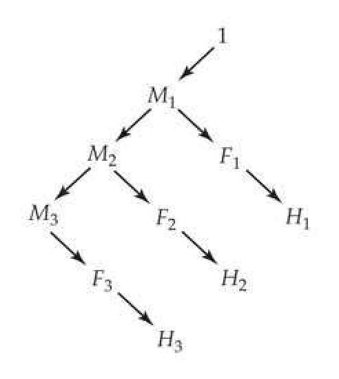
>
> Figure 29.12 A life-history graph of potential fitness components in the aster Echinacea angustifolia. The distribution of lifetime fitness starts by considering the discrete number of offspring left by a single individual (the 1 at the upper right starting the graph). First, this individual must survive to year one  $ (M_1) $, in which case it may flower  $ (F_1) $, and if it flowers, it has some (discrete) number  $ (H_1) $ of flower heads (taken as the surrogate for fitness). The same pattern continues (providing it survives) over years two and three, with lifetime fitness given by  $ H_1 + H_2 + H_3 $. A life history can be constructed as a forest graph, as there are no loops and each node has only one predecessor. Further, if the value of a predecessor is zero, then all descendant values from that predecessor are also zero. For example, if an individual fails to survive to year two  ($ M_2 $ is zero), then  $ H_2 $ and  $ H_3 $ are zero. If  $ F_1 $ is zero, then  $ H_1 $ is zero, but this (by itself) tells us nothing about  $ H_2 $ or  $ H_3 $, as they are not descendants of  $ F_1 $. This graphical representation allows very complex life histories to be accurately modeled. (After Geyer et al. 2007.)

---

## Evolution_chapter29_003 · EPISODES OF SELECTION AND THE ASSIGNMENT OF FITNESS / Assigning Fitness Components

We now turn to the task of partitioning measures of individual fitnesses in a longitudinal study into fitness components. A cohort of $n$ individuals (indexed by $1 \leq r \leq n$) is followed through several discrete (nonoverlapping) episodes of selection. Let $W_j(r)$ be the fitness measure for the $j$th episode of selection for individual $r$. For example, if we are following viability, then $W_j$ is either zero (dead) or one (alive) at the census period. Relative fitness components, $w_j(r) = W_j(r)/\overline{W}_j$ (mean-standardized fitnesses), will turn out to be especially useful (as $\overline{w}_j = 1$). At the start of a study, the frequency of each individual is $1/n$, yielding the mean fitness for the first (observed) episode of selection as

$$
\overline{W}_{1}=\frac{1}{n}\sum_{r=1}^{n}W_{1}(r)
$$

(We note the very real possibility that considerable selection on the focal trait may have already occurred prior to the life-cycle stages being examined; Example 29.1.) Following this first episode, the new fitness-weighted frequency of the $ r^{th} $ individual is $ w_{1}(r)/n $, implying that the mean fitness for the second episode of selection is calculated by

$$
\overline{W}_{2}=\sum_{r=1}^{n}W_{2}(r)\cdot w_{1}(r)\cdot\left(\frac{1}{n}\right)
$$

**[示例 Example]**

*(See Example 29.1.)*

**[示例 Example]**

*(See Example 29.2.)*

**[示例 Example]**

*(See Example 29.3.)*

In general, for the jth episode of selection,

$$
\begin{align*}\overline{W}_{j}=\sum_{r=1}^n W_{j}(r)\cdot w_{j-1}(r)\cdot w_{j-2}(r)\cdots w_{1}(r)\cdot\left(\frac{1}{n}\right)\end{align*}
$$

Note that if $ W_j(r) = 0 $, further fitness components for $ r $ are unmeasured. If we let $ p_j(r) $ be the fitness-weighted frequency of individual $ r $ after $ j $ episodes of selection, it follows that $ p_0(r) = 1/n $ and

$$
\begin{align*}p_j(r)=w_j(r)\cdot p_{j-1}(r)=\frac{1}{n}\prod\limits_{i=1}^j w_i(r),\quad{\rm where}\quad\sum\limits_{r=1}^n p_j(r)=1\end{align*}
$$

The 1/n term represents the initial frequency of individual $r$, while the product is the total relative fitness for individual $r$ following the $j$ episodes of selection. It immediately follows that Equation 29.1c can be expressed as $\overline{W}_j = \sum W_j(r) \cdot p_{j-1}(r)$. Using these weights allows fitness-weighted moments to be calculated. For example, the fitness-weighted mean of a particular character following the $j$th episode is given by

$$
\begin{align*}\overline{z}_j=\sum\limits_{r=1}^n z(r)\cdot p_j(r)\end{align*}
$$

where $ z(r) $ is the value of the character in individual r. Likewise, the sample variance is

$$
\begin{align*}\mathrm{Var}(z_j)=\frac{n}{n-1}\left[\sum\limits_{r=1}^n z^2(r)\cdot p_j(r)-(\overline{z}_j)^2\right]\end{align*}
$$

As discussed later in the chapter, the fitness distribution over a particular episode (or component) may closely correspond to a standard distribution, such as a Bernoulli random variable (with a value of zero or one) for survival or mating status, or a Poisson for the number of offspring or mates. However, the resulting compound distribution of fitness over several episodes is generally very complex. In particular, we usually expect a large probability mass at zero, representing individuals that did not reproduce. The resulting distribution generally does not correspond to any standard one, nor can it easily be transformed into one. As discussed at the end of the chapter, the aster-model approach can be used to construct the full unconditional distribution of total fitness.

---

## Evolution_chapter29_004 · EPISODES OF SELECTION AND THE ASSIGNMENT OF FITNESS / Potential Issues With Assigning Discrete Fitness Values

In many studies, fitness cleanly falls into discrete categories. Often these are simply binary, such as alive/dead or mated/unmated. Zuk (1988) and Blanckenhorn et al. (1999) noted that biased sampling is not uncommon in such situations, with a tendency to oversample the rarer class. While such sampling can improve hypothesis testing (increasing the power to test whether a trait is a target of selection), if the investigator is careless in the weighting of the estimates from these two samples, such biased sampling generates biased estimates of phenotypic selection (Example 29.3).

A second, more subtle, issue with assigning fitness values to discrete classes was noted by Brodie and Janzen (1996). The absolute value of fitness assigned to a class can, in some cases, influence measures of selection. In the binary (Bernoulli) case, where fitness is scored as 0 and x (such as dead/living or unmated/mated), any (strictly positive) value can be chosen for x, as the relative fitnesses are independent of the choice of x. However, with three (or more) discrete fitness classes, this is no longer true. Brodie and Janzen presented an example in which laboratory survivorship was followed over a four-year period in turtles. One could code these data as simply 0 (do not survive) or 1 (survive). However, the data could also be scored as 0 through 4, depending on the latest year of survival. They also noted that it might make sense to double the assigned fitness value in year 4, as this is when reproduction typically starts in nature. These different weighting schemes give different relative fitness values for the surviving age classes, and hence different measures of selection. This problem arises because only one component of selection (viability) is measured while reproduction is also occurring, and the different proposed fitness-weighting schemes attempt to accommodate for this unmeasured component. As discussed later, using an aster-model approach with the appropriate life-history graph avoids this problem.

---

## Evolution_chapter29_005 · EPISODES OF SELECTION AND THE ASSIGNMENT OF FITNESS / Assigning Components of Offspring Fitness to Their Mothers

When assigning a parent's reproductive fitness, offspring generally should be counted at the zygote (newly fertilized egg) stage. If counted later in life, offspring may have experienced selection based on their own, as opposed to their parents', phenotypes, thus confounding the targets of selection (Lande and Arnold 1983; Cheverud and Moore 1994). However, it is not uncommon for avian and mammalian evolutionary geneticists to count only "successful" offspring. For example, although eggs in the nest is a close measure of number of zygotes produced, the number of offspring from a parent is often scored as hatchlings (eggs that successfully hatch), fledglings (offspring that successfully leave the nest), or recruits (offspring recorded as breeding later in life). These measures move increasingly away from number of zygotes and can reflect selection on features of the offspring, rather than its parent. Many biologists counter that maternal care is critical, and thus the success of the offspring is a maternal, rather than offspring, trait (Grafen 1988). Where indeed does one draw the line? The strict barrier that is set at zygotes is formally correct provided parental phenotypes have no influence on offspring fitness. However, it is also clear that in species with significant parental investment in offspring care (such as birds and mammals, as well as seeds with significant endosperm contribution), the genotype and phenotype of the mother can influence the fitness of her offspring independently of the offspring phenotype.

Much of this apparent confusion arises from thinking about how to partition fitness over parents and offspring as a univariate selection problem. In reality, however, this assignment is a multiple-trait problem, with offspring survival potentially involving both the direct effect of an offspring on its own fitness and an indirect effect from the genotype/phenotype of the mother (Kirkpatrick and Lande 1989), see Figure 15.5. Recall that we have visited this issue before in Chapter 22, wherein the fitness of an individual is influenced by its own phenotype (its direct effect) and the associative effects of individuals (potentially parents, other relatives, or even unrelated individuals) around it. From the standpoint of assigning fitnesses, when the maternal phenotype has no effect on offspring fitness, assigning the fitness of the mother by counting her offspring after they may have experienced one or more episodes of selection (such as viability selection) is misleading.

Conversely, if the maternal phenotype does impact the survival of her offspring independent of their own direct effects, failure to include this also creates a misleading picture (Wolf and Wade 2001; Thomson and Hadfield 2017). In terms of correlated traits, one can view maternal performance as one trait and offspring performance as another. Both can influence the fitness of an offspring. If these are uncorrelated (i.e., there is no genetic or phenotypic correlation between the direct and maternal effects), maternal fitness should be assigned as the number of offspring following the episodes of selection in the offspring that are influenced by the maternal performance trait. For example, a trait may influence survival to the fledging or weaned stage but then have no future impact. Simply counting the number of eggs laid misses the maternal contribution. Conversely, even if the maternal contribution is important, if there are correlations between direct and maternal traits, then a misleading picture of selection can arise unless we uncouple them.

Given this uncertainty, how should one proceed? One suggestion is to perform separate analyses with several measures of reproductive success (based on counting offspring at different stages) and examine their consistency. Alternatively, as we saw with Equations 15.39a and 15.40, one can use a multiple-regression approach, including both offspring-and maternal-trait values (Kirkpatrick and Lande 1989; Thomson and Hadfield 2017). The limitation of this latter approach is that it is trait-based (one has to specify, and measure, maternal features influencing offspring fitness). We return to this issue in Chapter 30.

---

## Evolution_chapter29_006 · EPISODES OF SELECTION AND THE ASSIGNMENT OF FITNESS / Concurrent Selective Episodes, Reproductive Timing, and Individual Fitness, $ \lambda_{ind} $

The partitioning of selection into discrete episodes is, of course, an abstraction of the real world. Often this partitioning is simply done for the convenience of a researcher who wishes to measure individual fitness by considering just one or two episodes, potentially looking for tradeoffs between them. Selection episodes (e.g., viability and reproduction) often occur concurrently, rather than sequentially. For example, in the turtle data of Brodie and Janzen (1996), one has only information about viability (in the laboratory), and how to weight this information to account for the translation of viability into the timing of reproductive success raised issues in assigning fitness values. While methods to partition concurrent episodes of selection into their components have been proposed (e.g., Hamon 2005), the more general problem is assigning an appropriate measure of fitness that accounts for reproductive timing.

We have been stressing the use of lifetime reproductive success (LRS), but this is a rate-insensitive measure, which counts only the total number of offspring and not the actual timing of when offspring are produced. If reproduction occurs in a discrete window and the generations do not overlap, LRS provides a good measure of fitness. However, when generations do overlap, the actual timing of reproductive events can be more important than the total number of offspring, as earlier-produced offspring have a head start on contributing their own offspring to the population (Lande 1982). Consider three individuals, all of which produce 40 offspring during their lifespan, and hence each has the same fitness when measured by LRS. However, suppose individual 1 has 10 offspring each at ages 2, 3, 4, and 5; individual 2 has 20 offspring at both ages 4 and 5; and individual 3 has 20 offspring at ages 2 and 3. Clearly, individual 3 has a higher rate of offspring production than individuals 1 or 2 on an absolute time basis, even though it has the same LRS as the other two individuals. How do we account for this?

One solution is based on age-projection (or Leslie) matrices (Leslie 1945, 1948; Caswell 1989, 2001), an approach first proposed by Lenski and Service (1982). McGraw and Caswell (1996) forcefully argued for this approach as a measure of individual fitness in age-structured populations. The growth rate of an age-structured population can be determined from $ \ell_x $, the probability of surviving from age (or class/stage) $ x $ to $ x + 1 $, and $ b_x $, the birth rate (fecundity) in class $ x $ (the $ \ell_x $ and $ b_x $ are collectively referred to as the vital rates). This information is expressed in a $ k \times k $ matrix, where $ k $ is the upper age limit on reproduction. The first row of the Leslie matrix contains the fecundities, while the below-diagonal line consists of the survival values, $ \ell_x $.

$$
\mathbf{L}=\begin{pmatrix}{{{b_{1}}}}&{{{b_{2}}}}&{{{\cdots}}}&{{{b_{k-1}}}}&{{{b_{k}}}} \\{{{\ell_{1}}}}&{{{0}}}&{{{\cdots}}}&{{{0}}}&{{{0}}} \\{{{0}}}&{{{\ell_{2}}}}&{{{\cdots}}}&{{{0}}}&{{{0}}} \\{{{\vdots}}}&{{{\ddots}}}&{{{0}}}&{{{0}}} \\{{{0}}}&{{{0}}}&{{{\cdots}}}&{{{\ell_{k-1}}}}&{{{0}}}\end{pmatrix}
$$

If $ \mathbf{n}(t) $ is a vector of the number of individuals in each age/stage class at time $ t $, then $ \mathbf{n}(t+1) = \mathbf{L}\mathbf{n}(t) $. The asymptotic growth rate, $ \lambda $, for this population is the largest eigenvalue of $ \mathbf{L} $, while its associated eigenvector is the stable age distribution. The Leslie matrix is just one type of life-history projection matrix. More generally, the life history of a species may be more accurately defined by stages, rather than ages. For example, a perennial plant could spend many years in a rosette stage before flowering. Life-history graphs are a more general approach for categorizing such stage-structured organisms. In an age-structured model, individuals increase in age at each step, but in a stage-structured model, an individual can remain in the same stage on the next step (e.g., stays as a rosette), generating a loop in the graph (an arrow that circles back to itself), and hence a nonzero diagonal element, $ L_{ii} $, representing the chance of remaining in stage $ i $ in the next step (Caswell 1989, 2001).

Now consider a particular individual that last reproduced at age m. The resulting Leslie matrix for this individual is

$$
\mathbf{L}_{i n d}=\begin{pmatrix}{{{f_{1}}}}&{{{f_{2}}}}&{{{\cdots}}}&{{{f_{m-1}}}}&{{{f_{m}}}} \\{{{1}}}&{{{0}}}&{{{\cdots}}}&{{{0}}}&{{{0}}} \\{{{0}}}&{{{1}}}&{{{\cdots}}}&{{{0}}}&{{{0}}} \\{{{\vdots}}}&{{{\ddots}}}&{{{0}}}&{{{0}}} \\{{{0}}}&{{{0}}}&{{{\cdots}}}&{{{1}}}&{{{0}}}\end{pmatrix}
$$

where $ f_x = b_x / 2 $ is half the number of offspring that the individual produced at age $ x $ (using half accounts for both males and females contributing to the population, to avoid double-counting of the offspring). Note that $ LRS = 2 \sum_j^k f_j $. The individual-specific matrix, $ L_{ind} $, is very similar to a population growth matrix ($ L $), but in $ L_{ind} $, the fecundities are those that were observed for the focal individual (as opposed to population averages for each age class). In addition, because this individual survives to (at least) age $ m $, we replace the $ \ell_x $ elements in $ L $ (the average survival per age class) by ones, indicating the actual survival of the focal individual. The “growth” rate, $ \lambda_{ind} $, for this individual is given by the largest eigenvalue of $ L_{ind} $, which can be obtained by solving the modified Euler-Lokta equation

$$
\sum_{i=1}^{m}f_{i}\lambda_{ind}^{-i}=1
$$

Note from this equation that $ \lambda_{ind} $ can be thought of as an age-discounted LRS, a rate-sensitive measure of fitness, as opposed to the rate-insensitive measure given by LRS.

McGraw and Caswell (1996) noted two sources of bias in using $ \lambda_{ind} $. First, for any given phenotypic class, the particular realization of the matrix of vital rates ($ L_{ind} $) for an individual in that class (i.e., the expected survival, $ \ell_x(z) $, and fecundity, $ b_x(z) $, values for phenotype z) is a biased estimator of the matrix for that class. The reason is that random death prevents a proper estimation of the values of $ b_x $, especially at later ages. The second source of bias, which was also a concern for Lenski and Service (1982), was that the average of the leading eigenvalue for each realization of $ L_{ind} $ does not generally equal the leading eigenvalue for the average matrix (i.e., the average of the values of $ \lambda_{ind} $ does not equal the population growth rate, $ \lambda $). Despite these issues, McGraw and Caswell (1996) still favored the use of $ \lambda_{ind} $, while Lenski and Service (1982) developed a resampled measure (based on $ L_{ind} $) with less bias. Alternatively, if the mean population growth rate ($ \lambda $) is known, then an unbiased estimator for the relative fitness for individual j is

$$
w(j)=\sum_{i=1}^{k}f_{i}(j)\lambda^{-i}
$$

where $ f_{i}(j) $ denotes half of $ j' $s fecundity at age i (Lenski and Service 1982).

**[示例 Example]**

*(See Example 29.4.)*

Example 29.4 shows that individuals with the same LRS can have very different $ \lambda_{ind} $ values. Indeed, the rankings of individuals based on LRS versus $ \lambda_{ind} $ can be rather nonconcordant. Hence, it should not be surprising that Brommer et al. (2002) noted several cases where inferences on selection were altered when $ \lambda_{ind} $ was used in place of LRS. An especially telling example in shown in Figure 29.1, which plots these two measures of fitness for female Ural owls (Strix uralensis). As the figure shows, there is a diminishing return in $ \lambda_{ind} $ with increasing values of LRS. This occurs because reproductive contributions later in life are increasingly down-weighted by $ \lambda_{ind} $ (Equation 29.3c).

> **Figure 29.1** · page 10 · source: `Evolution_chapter29`
>
> 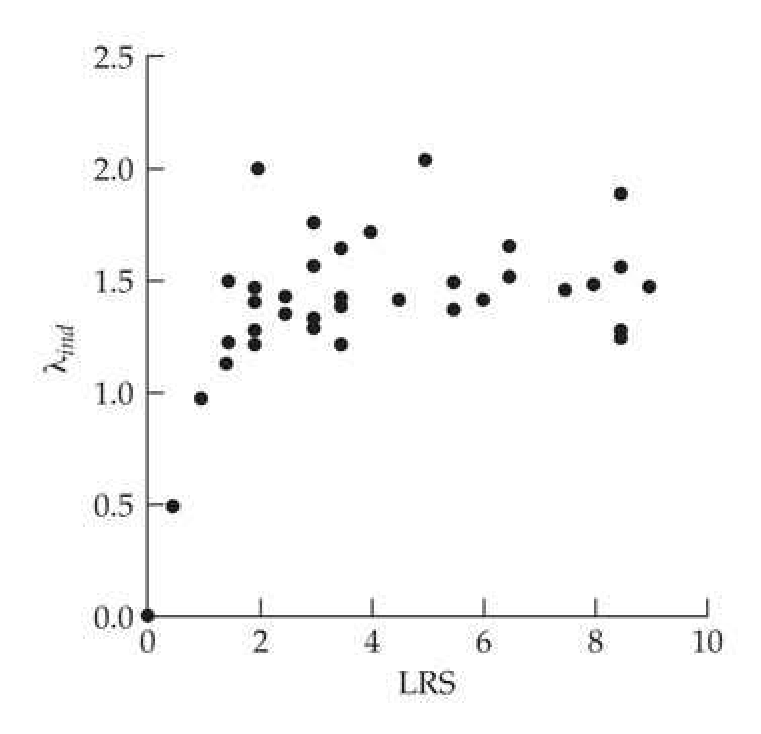
>
> Figure 29.1 Lifetime reproductive success (LRS) versus  $ \lambda_{ind} $ in 56 Ural owls (Strix uralensis) where offspring were measured as fledglings. Increasing LRS results in diminishing returns in  $ \lambda_{ind} $, which occurs because additional reproduction later in life is increasingly down-weighted by this rate-sensitive measure. (After Brommer et al. 2002.)

While there are strengths to using $ \lambda_{ind} $, it is not without problems. Brommer et al. (2002) made the important point that the stages when offspring are scored (e.g., eggs vs. hatchlings) is critical. Although LRS can also change given differences in the stage of scoring, the effects can be much more dramatic for $ \lambda_{ind} $, which differentially weights offspring produced at different ages. An interesting discussion on the merits of LRS versus $ \lambda_{ind} $ was given by Brommer et al. (2004), who compared these single-generation measures of fitness with the long-term genetic contribution of an individual. Using multigenerational population studies on Ural owls (a long-lived species) and shorter-lived collard flycatchers (Ficedula albicollis), they examined the correlation of both measures (LRS and $ \lambda_{ind} $) with the long-term genetic contribution of an individual to future generations. The latter was assessed from known pedigrees as the expected number of gene copies left after more than two generations. Following the standard practice of ornithologists, the number of offspring from a parent was counted using two different measures of success: number of fledglings and number of recruits. This resulted in fitnesses measured by lifetime fledgling production (LFP) and lifetime recruit production (LRP) as the LRS analogs, and their rate-sensitive counterparts, $ \lambda_{ind}(fp) $ and $ \lambda_{ind}(rp) $. LFP had a higher correlation with the number of descendants (gene copies left after at least two generations) than did $ \lambda_{ind}(fp) $. For flycatchers, the correlation between LFP and number of descendants was 0.35, while it was only 0.20 for $ \lambda_{ind}(fp) $. In owls, these correlations were 0.54 for LFP and 0.19 for $ \lambda_{ind}(fp) $. When fitness was based on recruits, LRS and $ \lambda_{ind}(rp) $ performed equally well in both species in predicting the long-term contribution. Brommer et al. expressed concern that rate-sensitive measures such as $ \lambda_{ind} $ discounted later reproduction too harshly, and that rate-insensitive measures (such as LRS) might be a more robust choice.

In closing, we remark that there is a robust discussion in the literature on the appropriate measures of selection in age-structured populations (a partial list includes Charlesworth 1980, 1983, 1994a; Lande 1982; Lenski and Service 1982; Travis and Henrich 1986; Partridge and Harvey 1988; Henle 1991; Metz et al. 1992; Kozlowski 1993; de Jong 1994; Benton and Grant 1996, 2000; McGraw and Caswell 1996; Brommer 2000; Link et al. 2002; Brommer et al. 2003; Coulson et al. 2005; Metcalf and Pavard 2007; Horvitz et al. 2010; and Engen et al. 2011, 2012). Indeed, Stearns (1976) said it best: "Fitness: something everyone understands but no one can define precisely," and later (1992) noted that "all fitness definitions are tools invented by scientists to analyze natural selection." In part, this debate arises because different questions (e.g., whether a new phenotype can invade a population vs. determining the change in a trait value following selection) can result in different appropriate definitions of fitness.

---

## Evolution_chapter29_007 · EPISODES OF SELECTION AND THE ASSIGNMENT OF FITNESS / Sensitivities and Elasticities of the Elements of L

Measures of how a small change in a vital rate (one of the elements of L) impact $ \lambda $ provide a connection between selection on particular traits and demography (van Tienderen 2000). An introduction to these metrics was offered by de Kroon et al (2000), with a more detailed treatment by Caswell (1989, 2001). The sensitivity, $ s_{ij} $, of an element, $ L_{ij} $, of a Leslie matrix is defined as the impact of a small change in that element on the total growth rate,

$$
s_{ij}=\frac{\partial\lambda}{\partial L_{ij}}=\frac{v_{i}\cdot w_{j}}{\mathbf{v}^{T}\mathbf{w}}
$$

where v and w are the left and right eigenvectors associated with the dominant eigenvalue ($ \lambda $) of L (Caswell 1978). The right-most identity follows from the spectral decomposition (Equation A5.9a) of L. The right eigenvector is the familiar $ Lw = \lambda w $, while the left eigenvector satisfies $ v^T L = \lambda v^T $. Taking transposes on both sides shows that $ L^T v = \lambda v $, which means that v is the right eigenvalue of $ L^T $. Sensitivity provides the absolute change in the growth rate, $ \lambda $, given an infinitesimal change in $ L_{ij} $.

In contrast, the elasticity, $ e_{ij} $, of element $ L_{ij} $ is the proportional change in $ \lambda $ given a proportional change in $ L_{ij} $,

$$
e_{ij}=\frac{\partial\lambda/\lambda}{\partial L_{ij}/L_{ij}}=\frac{L_{ij}}{\lambda}\frac{\partial\lambda}{\partial L_{ij}}=\frac{L_{ij}}{\lambda}s_{ij}
$$

Recalling from the chain rule of calculus that $ \partial\ln[f(x)]/\partial x = [1/f(x)] \cdot [\partial f(x)/\partial x] $ shows that elasticities can also be expressed as

$$
e_{ij}=\frac{\partial\lambda/\lambda}{\partial L_{ij}/L_{ij}}=\frac{\partial\ln(\lambda)}{\partial\ln(L_{ij})}
$$

Caswell (1984) and de Kroon et al. (1986) showed that the elasticities of all of the elements of L sum to one, giving the result of de Kroon et al. (2000), namely, that

$$
\lambda=\lambda\cdot1=\lambda\sum_{ij}e_{ij}=\lambda\sum_{ij}\frac{L_{ij}}{\lambda}s_{ij}=\sum_{ij}L_{ij}s_{ij}
$$

As will be discussed later in the chapter, elasticities provide a link between the impact of a trait on fitness components and the impact of those components on the growth rate (van Tienderen 2000). Volume 3 examines selection in age-structured populations in more detail.

---

## Evolution_chapter29_008 · Individual Fitness and the Measurement of Univariate Selection: Introduction / VARIANCE IN INDIVIDUAL FITNESS

How do we compare the amount of selection acting on different populations? At first glance, one might consider using the variance-standardized selection differential (the selection intensity), $ \bar{\imath} = S/\sigma $, to compare the relative strengths of individual selection between populations (Chapter 13). The limitation with $ \bar{\imath} $ as a measure of overall selection on populations is that it is character specific. Hence, $ \bar{\imath} $ may be appropriate when comparing the strength of selection on a particular character (one could also use mean-standardization, $ S/\mu $, instead; Chapters 13 and 30), but it is inappropriate for comparing the overall strength of selection in a population. This is because two populations may have the same $ \bar{\imath} $ value for a given character, but if that character is tightly correlated with fitness in one population and only weakly correlated in the other, selection will be much stronger in the latter population.

Another issue with using $ \bar{\tau} $ is that considerable selection can occur without changing the mean (e.g., stabilizing selection). Haldane (1954) and Van Valen (1965) proposed measures of the intensity of selection, which is suitable for stabilizing selection. Both contrast the mean fitness, $ \overline{W} $, with $ W_o $, the fitness of the optimal phenotype (usually estimated as the value of the mode of a stabilizing selection function, e.g., $ \theta $ in Equation 28.3). Haldane suggested

$$
I_{H}=\ln(W_{o})-\ln(\overline{W})
$$

while Van Valen proposed

$$
\begin{align*}I_{VV}={W_o-\overline{W}\over W_o}=1-\exp(-I_H)\end{align*}
$$

For small values, note that $ I_{VV} \simeq I_H $ (as $ e^{-x} \simeq 1 - x $ for small $ x $). These measures, however, also have limitations as comparative measures of the strength of selection. First, the value of $ W_o $ when selection is strictly directional is unclear, and second, like $ \bar{\imath} $, these metrics are also trait-specific.

A much cleaner measure (which requires no assumptions about which traits are under selection or on the nature of that selection) is I, the opportunity for selection, which is defined as the variance in relative fitness

$$
\begin{align*}I=\sigma^2_w={\sigma^2_W\over\overline W^2}\end{align*}
$$

This measure was introduced by Crow (1958; reviewed in 1989), who referred to it as the index of total selection, and was independently developed by O'Donald (1970). I is estimated by

$$
\widehat{I}=\operatorname{Var}(w)=\frac{n}{n-1}\left(\overline{w^{2}}-1\right)
$$

**[定义 Definition]**

Crow noted that if fitness is perfectly heritable ($ h_W^2 = 1 $), then $ I = \Delta \overline{w} $, namely, the expected selection response in relative fitness. This follows from the Robertson-Price identity (Equation 6.10), $ S = \sigma(z, w) $. When $ z = W $, then (applying the breeder's equation with $ h_W^2 = 1 $) we have

$$
\begin{align*}R_W=h_WS_W=S_W=\sigma(W,w)=\overline{W}\sigma(W/\overline{W},w)=\overline{W}\sigma_w^2\end{align*}
$$

implying that $ R_W / \overline{W} = \Delta \overline{w} = \sigma_w^2 = I $. Following Arnold and Wade (1984a, 1984b), I is called the opportunity for selection, as any variation in individual fitness represents an opportunity for a within-generation change in a trait. The opportunity for selection provides an upper bound on $ \bar{\nu} $. This follows by using: (i) the definition of a correlation, $ \rho $, (ii) the Price-Robertson identity, $ S = \sigma(z, w) $, and (iii) the fact that $ |\rho| \leq 1 $, to yield

$$
\begin{align*}\mid\rho_{z,w}\mid=\frac{\lvert\sigma(z,w)\rvert}{\sigma_{z}\sigma_{w}}=\frac{\lvert S\rvert}{\sigma_{z}\sqrt{I}}\leq1\end{align*}
$$

implying that

$$
|\bar{\imath}|\leq\sqrt{I}
$$

Thus, the most that the mean of any trait can be shifted within a generation is $ \sqrt{I} $ phenotypic standard deviations.

The usefulness of I as a bound of $ \bar{i} $ depends on the correlation between relative fitness and the character being considered. From Equation 29.6a,

$$
|\bar{\imath}|=|\rho(z,w)|\sqrt{I}
$$

Figure 29.2 shows scatterplots of relative fitness versus two characters $ (z_{1} $ and $ z_{2}) $ measured in the same set of individuals. The marginal distributions of fitness are identical for both characters (because the same set of individuals, and hence the same set of fitnesses, were measured for each trait), and thus both have the same opportunity for selection. The association between relative fitness and $ z_{1} $ is fairly strong, while there is no relationship between relative fitness and $ z_{2} $, which means that $ z_{1} $ realizes much of the opportunity for change, while $ z_{2} $ realizes none of it.

> **Figure 29.2** · page 12 · source: `Evolution_chapter29`
>
> 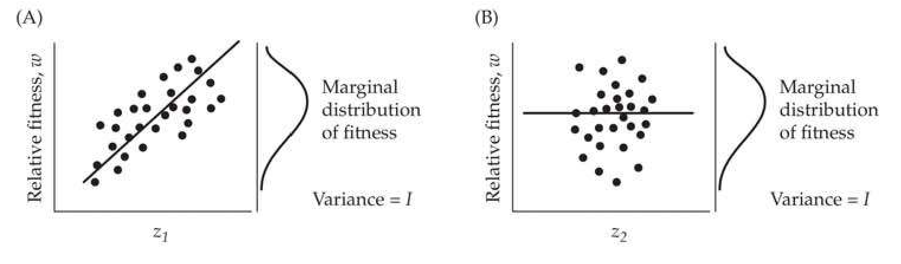
>
> Figure 29.2 The fraction of $I$ (the opportunity for selection) that is translated into a change in the mean depends on the correlation, $\rho(z,w)$, between relative fitness and the trait value. Traits $z_1$ and $z_2$ have the same marginal distribution of fitness, but only the regression of $w$ on $z_1$ is significant. Thus, within a generation, selection changes the mean of $z_1$, but not of $z_2$.

**[示例 Example]**

*(See Example 29.5.)*

**[示例 Example]**

*(See Example 29.6.)*

---

## Evolution_chapter29_009 · VARIANCE IN INDIVIDUAL FITNESS / Partitioning I Across Episodes of Selection

**[定义 Definition]**

The total opportunity for selection can be partitioned into opportunities associated with each episode. Such a partitioning allows for comparisons of the relative strength of selection across episodes, as well as bounding the change in means and variances due to selection during any particular episode. Denote the opportunity of selection associated with the jth episode by $ I_{j} $. By analogy with the definition of I, Arnold and Wade (1984a) suggested that the appropriate definition is the variance in the relative fitnesses of the jth fitness component.

$$
I_{j}=\sigma^{2}\left(w_{j}\right)=E(w_{j}^{2})-1
$$

which is estimated by

$$
\begin{aligned}\widehat{I}_{j}&=\operatorname{Var}(w_{j})=\frac{n}{n-1}\left(\overline{w_{j}^{2}}-1\right)\\&=\frac{n}{n-1}\left(\sum_{r=1}^{n}w_{j}^{2}(r)p_{j-1}(r)-1\right)\end{aligned}
$$

where $ p_{j}(r) $ is the fitness-weighted frequency of individual r after j episodes of selection (Equation 29.2a). Arnold and Wade showed that the partition for I over k episodes of selection is given by

$$
I=\sum_{j=1}^{k}I_{j}+R
$$

where the remainder term, R, represents a complex sum of covariances between fitness components (see Arnold and Wade 1984a for details). Webster et al. (1995) examined partitions of I involving both multiplicative and additive components of fitness. The latter can arise when fitness is influenced through two (or more) distinct paths, for example, mating success through both bonded-pair and extra-pair matings (see Whittingham and Dunn 2005 and Webster et al. 2007 for applications of the Webster approach).

**[示例 Example]**

*(See Example 29.7.)*

---

## Evolution_chapter29_010 · VARIANCE IN INDIVIDUAL FITNESS / Correcting Lifetime Reproductive Success for Random Offspring Mortality

As noted by Clutton-Brock (1988b), the variance in female lifetime reproductive success tends to increase with the age at which the offspring are counted. For example, in birds, I typically increases as we measure reproductive success by offspring at increasing ages: from eggs to hatchings and finally to fledglings. One might expect to see this pattern when maternal care is important, but it can also arise simply from random offspring mortality. Cabana and Kramer (1991) noted that a correction proposed by Crow and Morton (1955), originally suggested for allele-frequency change, can be used to adjust for random mortality. Suppose that the mean family size before an episode of selection is $ \mu $ with a variance of $ \sigma_1^2 $. If offspring mortality is entirely random, with s being the probability of survival of a random individual, then the mean family size after selection is $ s\mu $ and (from Crow and Morton) the variance $ \sigma_2^2 $ satisfies the relationship

$$
\frac{\sigma_{2}^{2}/(s\mu)-1}{s\mu}=\frac{\sigma_{1}^{2}/\mu-1}{\mu}
$$

Because $ s\mu $ and $ \mu $ are the mean fitnesses, $ \sigma_{2}^{2}/(s\mu)^{2} = I_{2} $ and $ \sigma_{1}^{2}/\mu^{2} = I_{1} $, which yields

$$
I_{2}-\frac{1}{s\mu}=I_{1}-\frac{1}{\mu}
$$

which Cabana and Kramer rearrange to find that the opportunity for selection generated entirely from random offspring mortality is given by

$$
I_{2}=I_{1}+\frac{1/s-1}{\mu}
$$

Random offspring mortality always inflates the variance in reproductive success, and its effect is inversely proportional to the survival probability, s, and the mean family size, μ. Cabana and Kramer applied Equation 29.6b to 43 case studies of vertebrate reproductive success. In all cases, the mean decreased and the variance increased with the age at which the offspring were counted. They found that the predicted value of $ I_{2} $ from random mortality alone (Equation 29.9b) was roughly 45% of the observed value of $ I_{2} $ for a dataset of 16 bird species (measuring fitness as the number of fledglings per nesting attempt), while the predicted random-mortality value of $ I_{2} $ was around 85% of the observed $ I_{2} $ for a dataset of lifetime fledging and weaning success in a set of 8 birds and mammals. Thus, in many cases a large fraction of I can often be accounted for by this simple model of random mortality.

---

## Evolution_chapter29_011 · VARIANCE IN INDIVIDUAL FITNESS / Caveats in Using the Opportunity for Selection

There are several subtle issues in the interpretation of I. To begin with, even though this variable appears to remove scaling effects due to different types of fitnesses, for estimates of I to be truly comparable, they must be based on consistent measures of fitness (Trial 1985). Consider the opportunity for selection based on number of mates per male (sexual selection), $ I_{s} $, versus the opportunity for selection based on total male reproductive success (the number of offspring per male), $ I_{rs} $. Total male reproductive success depends on both the number of mates and the fertility per mating. Recalling Equation 29.8, $ I_{rs} = I_{s} + I_{f} + R $, where $ I_{f} $ is the opportunity for selection based on differences in male fertility per mating. Hence, $ I_{rs} $ is expected to exceed $ I_{s} $ unless there is sufficient negative covariance between the mating success and fertility components ($ R < -I_{f} $).

A second point is that if the variance in fitness is not independent of $ \overline{W} $, comparisons of I values between populations will be compromised. This dependency occurs in cross-sectional studies that measure sexual selection by simply counting the number of mating pairs (in such studies, an unequal sex ratio further biases comparisons of I between the sexes). If the time scale is such that only single matings are observed, the fitness of any individual is either 1 (mating) or 0 (not mating). The resulting fitnesses of randomly drawn individuals are binomially distributed with a mean of p (the mean copulatory success for the sex being considered) and variance $ p(1-p) $, hence

$$
I=\frac{p(1-p)}{p^{2}}\simeq\frac{1}{p}\quad if p\ll1
$$

In this case, the mean and variance in individual fitness are not independent, and the opportunity for selection depends entirely on mean population fitness. As the time window for observing mating pairs decreases, fewer matings are seen and p decreases, which increases I. As the data plotted in Figure 29.3 illustrate, the opportunity for selection is often inflated if the observation period is short relative to the total mating period. Exactly the same problem occurs for viability selection (where p is now the probability of survival), but here p is expected to decrease (increasing I) as the window becomes longer.

> **Figure 29.3** · page 16 · source: `Evolution_chapter29`
>
> 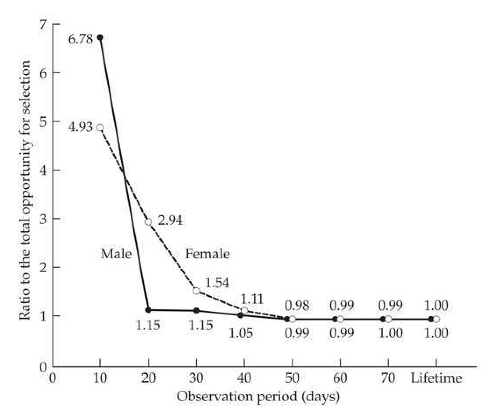
>
> Figure 29.3 The ratio of the opportunity for selection on reproductive success to the lifetime opportunity for the coreid bug, Colpula lativentris, as a function of observation period. Males are given by the filled circles and females by the open circles. Note the inflation in I when very short time intervals are considered. (After Nishida 1989.)

Another example of the lack of independence between $ \overline{W} $ and $ \sigma_{W}^{2} $ was given by Down- hower et al. (1987). The Poisson distribution is a reasonable initial model for the number of mates under random mating. Indeed, Joshi et al. (1999) found that it provides an excellent fit for male mating success in laboratory populations of Drosophila melanogaster. Assuming that the number of mates for any given male follows a Poisson distribution, the variance in number of mates equals the mean number of mates, resulting in

$$
I=\frac{\overline{W}}{\overline{W}^{2}}=\overline{W}^{-1}
$$

where $ \overline{W} $ is the mean number of mates per male. Thus, differences in I between populations do not necessarily indicate biological differences in male mating ability. For example, in a population of 100 males, if only 5 females mate, average male mating success is $ \overline{W} = 0.05 $, while if 50 females mate, $ \overline{W} = 0.5 $. For this example, differences in I come solely from variation in the number of mating females, not biological differences between males in their ability to acquire mates. Downhower et al. concluded from this example that comparing I values with the Poisson prediction ($ I = 1/\overline{W} $), or some other appropriate random distribution, may help clarify the interpretation of I. Values of I less than the Poisson prediction indicate a more uniform distribution of fitness than expected if mate choice is random, while values in excess of this expectation indicate disproportionately high fitness among a limited set of individuals. In a study of four species with lek mating systems (where matings typically occur only in a specified area), Mackenzie et al. (1995) found that the combination of random mating and variation in male attendance at the lek accounted for $ \sim40% $ of the total variation in male mating success. Thus, the variance in mating success was inflated by random factors, but still contains a substantial fraction of unexplained variance.

This comparison of I to the value expected under a Poisson distribution of individual fitness is an attempt to account for differences in opportunities for selection due to differences in mean fitness. In effect, this is a problem of stabilizing the variances (LW Chapter 11). Because I is the squared coefficient of variation in fitness, it is plagued by the same statistical problems as the Roginskii-Yablokov effect: a negative correlation is often expected between x/y and y, even when x and y are independent (LW Chapter 11). Thus, in most cases we expect I to be somewhat dependent on $ \overline{W} $.

The Poisson mating example highlights that random variation (differences in individual fitness not attributable to intrinsic differences between individuals) reduces the correlation between phenotypic value and relative fitness. Although carefully controlled studies can reduce the error variance induced by chance (e.g., Houck et al. 1985), accounting for the inflation in the opportunity for selection by random effects remains problematic. It should be stressed that, despite these concerns, I still provides an upper bound on the strength of selection on any trait (over the measured episodes of selection). Accounting for random sources of variation that inflate I can tighten this limit.

---

## Evolution_chapter29_012 · Individual Fitness and the Measurement of Univariate Selection: Introduction / MEASURING SEXUAL SELECTION

The idea of sexual selection, differences in reproductive success arising by differential mating success (premating selection or, in animals, precopulatory selection) and differential fertilization following mating (postmating selection or, in animals, postcoupulatory selection) began with Darwin's (1959) Origins and was more fully examined in his The Descent of Man, and Selection in Relation to Sex (Darwin 1872). As a product of his times, Darwin viewed females as essentially monogamous, and thus never considered postmating selection. He also assumed that sexual selection was mainly restricted to animals, because (as quaintly noted by Moore and Pannel 2011) organisms outside of animals "could surely not appreciate each other's beauty." Modern evolutionary biologists ascribe a much broader role (both across genders and across phyla) to Darwin's original concept. For example, starting with David Lloyd, many botanists have viewed sexual selection for increased siring ability (i.e., pollen dissemination) as one of the major evolutionary forces shaping floral evolution (Moore and Pannel 2011). Likewise, Darwin's original views on gender roles in sexual selection have been replaced with a more gender-neutral one, allowing for either, or both, males and females to be under strong sexual selection, depending on the biology of their situation.

Premating selection can be intrasexual (male-male or female-female competition for access to mates) or intersexual (female, or more rarely, male choice of mates). Postmating selection is possible when a female has mated multiple times. Sperm competition (or more generally, gamete competition) among the donations from different males within a single female is an example of intrasexual postmating selection, and cryptic female choice (preferential selection among male gametes by a female) is an example of intersexual postmating selection. By the nature of their reproductive biology, postmating selection may be rather common in the flowering plants. The growth of a pollen tube from a pollen grain down to the ovule of a flower has the potential for considerable selection (especially in the case of self-incompatible species). Given that a large fraction (often over 50%) of the genome is expressed during pollen tube growth (Mascarenhas 1990), such selection has underappreciated evolutionary implications. Our focus here is mainly concerned with premating selection and assessing which traits (if any) are under sexual selection. However, with the rise of molecular markers, the ability to examine the hidden postmating selection that may be ongoing within a female's reproductive system has now become accessible.

Sexual selection, and the evolution of mate choice, is an enormous (and growing) area of evolutionary biology, especially with the realization that sexual selection may be just as, if not more, intense as natural selection in some species (Hoekstra et al. 2001; Siepielski et al. 2001; Kingsolver et al. 2012). Jones and Ratterman (2009) provided a nice overview. A very incomplete list of more general reviews include those examining: the entire field (Arnold 1983a; Bradbury and Andersson 1987; Andersson 1994; Andersson and Iwasa 1996; Murphy 1998; Mead and Arnold 2004; Arnqvist and Rowe 2005; Kokko et al. 2006; Clutton-Brock 2007, 2009; Hunt et al. 2009; Tobias et al. 2012; Reid 2014), the evolution of mate choice and mating systems (Bateson 1983; Kokko et al. 2003; Shuster and Wade 2003; Neff and Pitcher 2005; Andersson and Simmons 2006; Kotiaho and Puurtinen 2007; Shuster 2009), postmating selection (Parker 1970, 2006; Smith 1984; Birkhead and Møller 1998; Birkhead and Pizzari 2002; Eberhard 2009), and sexual selection in plants (Willson and Burley 1983; Ashman and Morgan 2004; Delph and Ashman 2006; Moore and Pannell 2011).

Roughgarden et al. (2006) ignited a bit of a firestorm when they proclaimed that the notion of sexual selection is “always mistaken” and that it “needs to be replaced.” One foundation for their argument was, as noted by Shuker (2010), that “various societal biases associated with gender have detrimentally influenced how scientists have thought about sexual selection.” It is always appropriate to examine how societal biases may warp one’s scientific viewpoint, but given that 40 prominent evolutionary biologists immediately, and vehemently, disagreed with Roughgarden et al. (Kavanagh 2006), there seems to be little traction for their radical reassessment. Additional debate on this issue can be found in Roughgarden and Akçay (2010a, 2010b), Clutton-Brock (2010), and Shuker (2010).

---

## Evolution_chapter29_013 · MEASURING SEXUAL SELECTION / Bateman's Principles

In a classic paper, overlooked for many years (until it was rediscovered by Trivers 1972, who allegedly was directed to it by Ernst Mayr), Bateman (1948) used data from mating success and fecundity in laboratory populations of Drosophila to propose several principles regarding sexual selection. As much of the debate on the measure (and potential mismeasure) of sexual selection is centered around these principles, we discuss them here before considering how to quantify sexual selection. Ironically, Gowaty et al. (2012) recently suggested that Bateman's experimental design had a critical flaw (the genetic markers that were used influenced viability), producing a systematic bias in the estimates of number of offspring by sex. Despite this potential issue, Bateman's ideas have shaped most of the attempts to describe sexual selection, in large part due to Arnold's (1994) framing of the three principles from Bateman's experiment: 1. Males show a greater variance in the number of offspring than do females. The opportunity for selection, when measured by reproductive success (a composite measure of both sexual and natural selection), is greater for males than females.

2. Males show a greater variance in number of mates than do females. The opportunity for selection, when measured by number of mates, is larger in males than in females. This suggests that variance in number of mates is a potential measure of sexual selection.

3. The total number of offspring for males is an increasing function of the number of mates, but is largely independent of the number of mates in females. Provided females have mated, their fecundity is largely independent of their number of mates. Thus, in females, the average fecundity per mating should be a decreasing function of number of mates, as their total fecundity, (number of mates)×(fecundity per mating), is largely independent of the number of mates (provided she has mated at least once).

The essence of Bateman’s observations was that female fitness is not increased by additional matings, while male fitness is, meaning that the third principle drives the first two. While these three principles served as a useful baseline for thinking about sexual selection, Arnold (1994) and Arnold and Duvall (1994) showed that each can be violated in different mating systems. If female fecundity increases with the number of matings (such as can occur when males provide nuptial gifts), we expect sex-specific differences in the opportunity for selection (based on either total reproductive success or the number of mates) to decrease. For example, Rodríguez-Muñoz et al. (2010) showed that female field crickets (Gryllus campestris), like their male counterparts, leave more offspring when they have more mates. A hypothetical (extreme) example arises in some mantids, wherein the female eats her mate, accruing additional nutrition. In such cases, “successful” males mate just once, while female fecundity could easily (in theory) be an increasing function of number of mates (or, in this case, meals).

It is well known that there are numerous exceptions to Bateman's assumed male-dominated sexual selection (e.g., Brown et al. 2009), but the focus on this issue misses the point that Arnold was trying to make. He stressed that the utility of Bateman's principles is that they codify what needs to be measured in order to show that the opportunity for sexual selection exists: variance in total fitness (reproductive success [RS]), variance in mating success (MS), and a relationship between increased MS and increased RS. Following Jones et al. (2002), we can restate Bateman's principles in a more gender-neutral fashion as follows: 1. The sex experiencing the strongest sexual selection has a higher variance in reproductive success (RS).

2. The sex experiencing the strongest sexual selection has a higher variance in mating success (MS).

3. The slope of the RS-on-MS regression is larger for the sex experiencing the strongest sexual selection.

It needs to be stressed that neither, or both, sexes could be experiencing strong sexual selection. The metric of the first principle is just the opportunity for selection (I) and the variance in mating success is the corresponding metric for the second principle. The critical principle is the third, which provides a direct connection between the number of matings and reproductive success. If both sexes experience strong sexual selection, both will show significant regressions of reproductive success on mating success.

---

## Evolution_chapter29_014 · MEASURING SEXUAL SELECTION / Variance in Mating Success

**[定义 Definition]**

The gender-neutral version of Bateman's second principle suggests that a natural measure for the potential of sexual selection is variance in mating success. Further, in many (but certainly not all) species, a higher variance is expected in males because some will fail to mate whereas essentially all females are (generally) assumed to have mated. This led Wade (1979) to suggest that the variance in male mating success was a measure of the potential for sexual selection. Arnold (1994, Arnold and Duvall 1994) codified this idea by considering the opportunity for sexual selection,

$$
I_{s}=\frac{\sigma^{2}(MS)}{\overline{MS}^{2}}
$$

which is the variance in mating success (MS = number of mates per individual), scaled by the square of the average number of mates per male (with a corresponding definition for females). As this is just the variance, $ \sigma_{ms}^{2} $, in relative mating success (ms = MS/MS being the mean-standardized mating success), it is the logical extension of the opportunity for selection ($ I = \sigma_{w}^{2} $), which is based on relative fitness (Equation 29.5a). The importance of this measure is that if $ I_{s} $ (which also appears in the literature as $ I_{mates} $) is nearly zero, there is little chance of sexual selection acting on any trait. However, a large value of $ I_{s} $, by itself, does not guarantee that any sexual selection is occurring (i.e., it is a necessary, but not sufficient, condition). As we have seen above, chance variation in mating success can generate a significant values of $ I_{s} $ without any sexual selection occurring. Likewise, even if specific traits result in a strong mating advantage, if this does not translate into increased reproductive success (increased numbers of offspring), no sexual selection occurs.

For this reason, measures of sexual selection based entirely on $ I_{s} $ have been criticized (Banks and Thompson 1985; Sutherland 1985a, 1985b; Koenig and Albano 1986; Hubbell and Johnson 1987; Klug et al. 2010a; Jennions et al. 2012; Henshaw et al. 2016), and a number of alternative metrics have been suggested (reviewed by Kokko et al. 1999; Mills et al. 2007; Klug et al. 2010a; Henshaw et al. 2016). These attempt to adjust for the impact that sample size and mean mating success can have on $ I_{s} $ under random mating. The two metrics most widely appearing in the literature have their roots in ecological measures of competition and resource allocation. The use of Morisita's index (Morisita 1962),

$$
I_{\delta}=N\left(\frac{\sum_{i=1}^{N}m_{i}^{2}-\sum_{i=1}^{N}m_{i}}{(\sum_{i=1}^{N}m_{i})^{2}-\sum_{i=1}^{N}m_{i}}\right)
$$

where $ m_i $ is the number of mates for individual $ i $ ($ 1 \leq i \leq N $), was recommended by Fairbairn and Wilby (2001), as it adjusts the variance in mating success by the variance generated when all individuals have an equal chance of mating. An alternative measure is Green's index of resource monopolization (Green 1966),

$$
Q=\frac{\sigma_{m}^{2}-\mu_{m}}{N\mu_{m}^{2}-\mu_{m}}
$$

where $ \mu_m $ and $ \sigma_m^2 $ are the mean and variance in number of mates. $ Q $ adjusts the observed variance in mating success with its maximal possible value, and was used by Ruzzante et al. (1996) and Blanckenhorn et al. (1998). These alternative indices are both attempts to generate a null model, namely, the variance expected under the mating system when there is no systematic mating bias, but rather only random encounters within the parameters set by the biology, such as the sex ratio or the “handling time” of a mating.

The operational sex ratio (ORS) of Emlen and Oring (1977), which is the ratio of sexually active males to fertilizable females, is also used as a metric for the potential for sexual selection (Kvarnemo and Ahnesjö 1996). A male-biased ORS (>1) offers the possibility of sexual selection on males, and a female-biased ORS (<1) offers the opportunity for sexual selection on females. One important issue with any measure is that sexual selection can be very context-specific (e.g., Fitze and Le Galliard 2011). For example, if there is a large pool of males, but only a small fraction have the capacity to mate, then an observed male-biased sex ratio could actually mask a female-biased operational sex ratio. As Klug et al. (2010b) stressed, it is not trivial deciding whom to include in measures of sexual selection. Finally, there is a density component to mate choice as well. When both sexes are scarce, individuals may be far less choosy about mates.

While the above alternative measures $ (I_s, Q, ORS) $ may contain information to better inform a behavioral ecologist, the advantage of $ I_s $ is that it bounds the opportunity for sexual selection, no matter what the cause. It must be measured over an appropriate time window and in an appropriate setting, which are legitimate concerns. However, a dispassionate reading of the literature that is critical of the use of $ I_s $ shows that concern centers more around the reasonable objection that an investigator might be sloppy and directly relate $ I_s $ with actual sexual selection (rather than as a measure of its opportunity). From an evolutionary standpoint, $ I_s $ and two other measures to be introduced shortly—the Bateman gradient (Equation 29.12) and Jones index (Equation 29.14a)—are the most natural measures of the potential for sexual selection (Jones et al. 2000, 2002; Wade and Shuster 2005; Mills et al. 2007; Jones 2009; Krakauer et al. 2011). Nonetheless, as stressed by Croshaw (2010), while $ I_{s} $ is a natural measure of sexual selection potential, it should always be contrasted with its value under a null model. Croshaw observed high values of both $ I $ and $ I_{s} $ in marbled salamanders (Ambystoma opacum), but only $ I $ was significantly greater than its expected value under a null model.

---

## Evolution_chapter29_015 · MEASURING SEXUAL SELECTION / The Sexual Selection, or Bateman, Gradient

**[命题 Proposition]**

Bateman's first two principles, by themselves, do not guarantee that sexual selection is occurring. Rather, it is his third principle, relating total reproductive success (RS) with mating success (MS), that indicates the potential for sexual selection to exist. Arnold and Duvall (1994) quantified this relationship by regressing total fecundity on number of mates,

$$
RS_{s}=const+\beta_{ss}MS_{s}+e_{s}
$$

where $s$ indexes the sex ($m$ for male or $f$ for female), with the regression coefficient $(\beta_{ss})$, which they termed the sexual selection gradient, indicating the potential for sexual selection in that sex. Biologically, $\beta_{ss}$ is the additional number of offspring gained per mating. As noted by Jones et al. (2002), the gradient is the final statistical path to fitness from all sources of sexual selection. One can have large variances in both $RS$ and $MS$ for a particular sex, but if the two variables are uncorrelated over individuals, there is no sexual selection. Andersson and Iwasa (1996) used the term Bateman gradient for $\beta_{ss}$, and this has generally replaced Arnold and Duvall's term in the literature. Examples of Bateman gradients are given in Figure 29.4. Bateman's original expectation was that males will show a positive slope, while females will show little to no slope (provided they have been mated at least once). The former (a positive male Bateman gradient; $\beta_{mm} > 0$) is routinely seen, but the assumption of a small female Bateman gradient ($\beta_{ff} \simeq 0$) is often incorrect. Gerlach et al. (2012) reviewed a wide range of species (ranging from invertebrates to fish, birds, reptiles, amphibians, and mammals) in which females showed a positive Bateman gradient, indicating the potential for sexual selection.

> **Figure 29.4** · page 21 · source: `Evolution_chapter29`
>
> 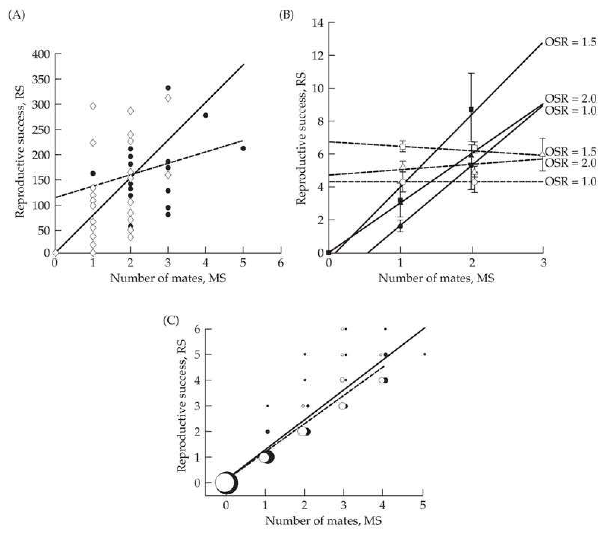
>
> Figure 29.4 Examples of Bateman gradients, the regression of total offspring number (reproductive success [RS]) as a function of number of mates (mating success [MS]). A: Data for male (open diamonds and solid line) and female (filled circles and dashed line) rough-skinned newts (Taricha granulosa). The slope for males is significantly different from zero while the slope for females is not, and the sex-specific slopes are significantly different from each other. (After Jones et al. 2002.) B: Data for male (filled symbols and solid lines) and female (open symbols and dashed lines) bank voles (Clethrionomys glareolus), for three different operational sex ratios (ORS), indicated by squares, circles, and triangles. Again, the male slopes (at all three values of ORS) are significantly positive, while none of the female slopes are. (After Mills et al. 2007.) C: Gradients for a Québec population of eastern chipmunks (Tamias striatus). Males are open circles (regression given by the dashed line), and females are filled circles (solid line). The gradients on both sexes are positive and very similar, allowing for the possibility of strong sexual selection in both males and females. (After Bergeron et al. 2012.)

Although Bateman gradients are widely used for demonstrating the potential of sexual selection in one or both sexes (Jones et al. 2000, 2002; Mills et al. 2007), Kokko et al. (2012) made the point that the operational sex ratio (ORS) and Bateman gradients are complementary measures. The latter describes the fitness gain with increasing number of mates, while the former measures the potential difficulty in obtaining such matings. If one has a strong Bateman gradient on males (for example, estimated under controlled settings) but females are very scarce in nature (i.e., the ORS is small), much of this gain is never realized.

While least-squares linear regressions are typically used to model the RS-to-MS relationship, Arnold (1994) noted that the functional nature of this relationship may be one of four general forms. First, there could be single-mating saturation, as when a single mating allows a female to acquire sufficient male gametes to fertilize all of her eggs (females in Figure 29.4B). Alternatively, this relationship could be linear, with total reproductive output increasing linearly with the number of mates (as shown for all males in Figure 29.4 and for females in Figures 29.4A and 29.4C). More generally, because of additional costs and benefits of mating, the RS-to-MS functional relationship could show a diminishing-returns shape (e.g., increased mating yields more offspring but also puts the mating individual at additional risk). Finally, this relationship could exhibit an intermediate optimum number of matings. Given that most studies have insufficient numbers of individuals that have mated three or more times, attempts to fit nonlinear regressions are typically not performed.

Although Bateman gradients are usually framed for dioecious species, Arnold (1994) also considered monoecious (hermaphroditic) species (for example, many flowering plants), and a much more complete treatment was offered by Anthes et al. (2010), whose approach we follow. Provided one can track the offspring produced via male and female gametes from the same individual, the generalized Bateman gradients become

$$
RS_{m}=\mathbf{const}+\beta_{mm}MS_{m}+\beta_{mf}MS_{f}+e_{m}
$$

$$
RS_{f}=\mathbf{const}+\beta_{ff}MS_{f}+\beta_{fm}MS_{m}+e_{f}
$$

$ RS_{m} $ and $ RS_{f} $ correspond, respectively, to the male RS (offspring resulting from sperm or pollen donated by the focal individual fertilizing the eggs of others) and female RS (offspring resulting from eggs from the focal individual fertilized by the sperm or pollen of others). Likewise, $ MS_{m} $ and $ MS_{f} $ correspond to the number of matings that the focal individual was involved in as a sperm or pollen donor and as an egg donor, respectively.

The various regression coefficients in Equation 29.13 can be interpreted as follows. Consider the situation in which an individual gains an additional mating in which it contributes male gametes, while the number of times it served as an egg donor is held constant ($ MS_{m} $ increases by one and $ MS_{f} $ is held constant). From Equations 29.13a and 29.13b, we expect the reproductive success from mate gametes ($ RS_{m} $) to increase by $ \beta_{mm} $ and reproductive success from female gametes ($ RS_{f} $) to change by $ \beta_{fm} $. A negative value of the latter suggests a tradeoff between male and female gamete production and mating. Likewise, $ \beta_{ff} $ and $ \beta_{mf} $ are the expected changes to $ RS_{f} $ and $ RS_{m} $, respectively, caused by a one-unit change in $ MS_{f} $ with $ MS_{m} $ held constant. Finally, when individuals can self, a third system of gradients appears,

$$
RS_{s_{e}}=const+\beta_{s_{e}m}MS_{m}+\beta_{s_{e}f}MS_{f}+e_{s_{e}}
$$

where now the index $ s_{e} $ refers to selfing events (Anthes et al. 2010).

A final composite measure of the potential for sexual selection is the Jones Index

$$
I_{J}=\beta_{s s}\sqrt{I_{s}}
$$

(Jones 2009). This expression shows the impact of both the number of matings to fitness relationship ($ \beta_{ss} $; Equation 29.12) and the variance in number of mates ($ I_{s} $). If either one is small, there is very little sexual selection pressure on any trait. The original motivation for Equation 29.14a was to place an upper bound on the absolute change in any trait that could be generated by sexual selection. Using the same logic that led to Equation 29.6b, Jones showed that

$$
|\bar{\imath}|\leq I_{J}
$$

Henshaw et al. (2016) suggested that the Jones index deserves a more prominent role in measures of the opportunity for sexual selection. Using data from five rather different species (one large and one small mammal, a bird, a beetle, and a fish) as a set of model organisms showing diverse mating systems, they simulated 500 biologically plausible mating systems and examined the correlation between measures of the potential sexual selection ($ I_{s}, \beta_{ss}, I_{J}, I_{\delta} $, and Q) and the actual strength of sexual selection (the actual strength of selection on the simulated mating trait). They found that the Jones index performed the best (had the highest correlation with the actual strength), especially in cases with sex-specific differences. Surprisingly, $ I_{s} $ and $ \beta_{ss} $, while still correlated with the actual strength of sexual selection, performed the poorest, with $ I_{\delta} $ and Q having intermediate levels of success.

The above discussion has mainly dealt with the potential for sexual selection, without invoking any specific traits. While the Bateman gradient can be thought of as a special case of a trait-fitness regression (where the trait is number of mates), our analysis has otherwise been trait-free. This is both an advantage and a limitation. The advantage is that if the Bateman gradients for both sexes are essentially zero, there is no need to search for traits under sexual selection (Equation 29.14b). The limitation is that a large Jones index (which means that both $ \beta_{ss} $ and $ I_{s} $ are large) only indicates that sexual selection is occurring, and is otherwise uninformative as to the target trait or traits.

A more direct description of the amount of sexual selection on a candidate trait follows from the Robertson-Price identity (Equation 6.10). As above, let $ ms = MS/MS $ denote the relative mating success (the number of mates standardized by the mean number of mates) and $ z_{sd} $ denote the variance-standardized value of a candidate trait, namely, $ \sigma^{2}(z_{sd}) = 1 $. With these definitions, Jones (2009) defined the standardized strength of sexual selection on a specific trait, the analog of $ \bar{i} = \sigma(z_{sd}, w) $, as

$$
m^{\prime}=\sigma(z_{sd},ms)
$$

**[定义 Definition]**

This is also called the Jones mating differential. Using this definition with Equation 6.10 yields the Jones equation (Jones 2009),

$$
\bar{\tau}=\beta_{ss}m^{\prime}
$$

which relates the standardized strength of selection on a trait (the selection intensity, $ \bar{\tau} $) with the Bateman gradient ($ \beta_{ss} $) and the standardized strength of sexual selection ($ m' $).

---

## Evolution_chapter29_016 · Individual Fitness and the Measurement of Univariate Selection: Introduction / DESCRIBING PHENOTYPIC SELECTION: INTRODUCTORY REMARKS

Thus far, we have dealt with the fitness of individuals, independent of any knowledge of the phenotypes that must be the targets of selection. We conclude this chapter by examining this latter issue of detecting which traits are under selection and describing the nature of that selection. Our ultimate interest in a particular trait might be in predicting its change over time, which requires knowledge of both the nature of selection on that trait and its variance components (Chapter 13). Alternatively, we may simply wish to explore the trait's ecological implications by examining how expected fitness changes with the character value, independently (at least initially) of any concerns about its genetics. Further, we may wish to partition trait fitness across episodes of selection to enhance our understanding of the biological implications of a trait.

**[命题 Proposition]**

Example 29.2 showed how to weight individuals—and therefore how to weight measured traits in those individuals—based on their fitnesses. Hence, one simple approach for detecting selection on a character is to compare its fitness-weighted phenotypic distributions before and after some episode of selection. Such a seemingly reasonable comparison entails a number of significant caveats. We assume that any within-generation change following an episode of selection is not due to selection on unmeasured traits that are phenotypically correlated with our focal trait. A closely related assumption is that no spurious fitness-trait associations are generated via unmeasured environmental variables (namely, environmental factors that influence both fitness and our focal trait). Chapter 20 discussed some partial solutions to both of these problems, and we continue this discussion in Chapter 30.

A further caveat is that the phenotypic distribution of a trait can change over time for a myriad of reasons other than selection, such as growth or other ontogenetic changes, immigration, and environmental changes, and great care must be taken to account for these factors. Further, as discussed in Chapters 5 and (especially) 28, pleiotropy can generate fitness associations for a strictly neutral trait. Under the Hill-Keightley model (Chapter 28), trait variation is maintained by the pleiotropic effects on a neutral trait from alleles with deleterious fitness effects. Individuals carrying more mutations have more extreme trait values and lower fitness, which generates apparent stabilizing selection. Similarly, if the direction of new pleiotropic mutations is biased (e.g., on average, mutations lower trait value), then a spurious signal of directional selection can also be generated, as individuals with more mutations have (in this case) lower trait values and lower fitness.

Finally, as we have already seen in this chapter, there are a number of subtle issues in assigning fitnesses to phenotypes when the fitness of a focal individual is influenced by other interacting individuals (Chapter 22). Thoughtful reviews of some of these assignment issues were given by Grafen (1988), Cheverud and Moore (1994), Wolf and Wade (2001), Hadfield and Thomson (2017), and Thomson and Hadfield (2017).

---

## Evolution_chapter29_017 · DESCRIBING PHENOTYPIC SELECTION: INTRODUCTORY REMARKS / Fitness Surfaces and Landscapes

The expected fitness, $ W(z) = E[W \mid z] $, of an individual with a phenotypic value of z, describes a fitness surface (or equivalently, a fitness function or a fitness profile), relating fitness and character value. The relative fitness surface, $ w(z) = W(z)/\overline{W} $, is often more convenient than $ W(z) $, and we use the two variables somewhat interchangeably. The nature of selection on a character is determined by the local geometry of the individual fitness surface over the range of phenotypic values in the population (Figure 29.5). If fitness is increasing (or decreasing) over some range of phenotypes, a population having its mean value in this interval experiences directional selection.

> **Figure 29.5** · page 25 · source: `Evolution_chapter29`
>
> 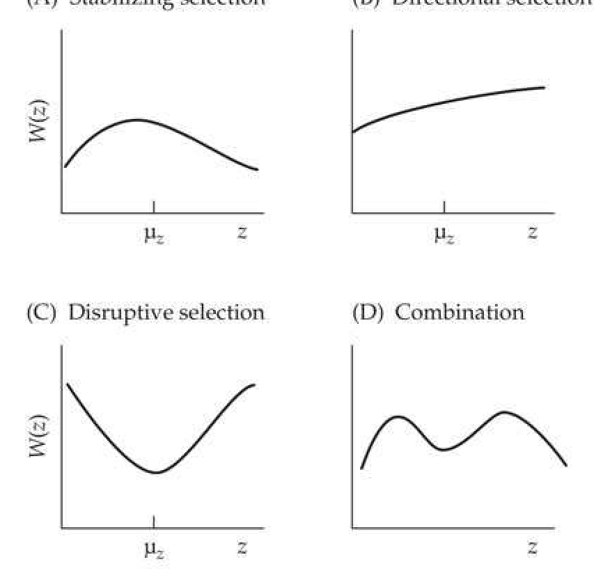
>
> Figure 29.5 Phenotypic selection has historically been classified into three basic forms depending on the local geometry of the individual fitness surface,  $ W(z) $: stabilizing (A), directional (B), and disruptive (C). As D illustrates, populations can also simultaneously experience multiple forms of selection. Likewise, if the population mean ( $ \mu_z $) in (A) does not correspond with the maximum value of  $ W(z) $, the population experiences directional selection as it is moved toward this value.

The curvature of the fitness surface is important as well. If $ W(z) $ contains a local maximum at $ z = \theta $, a population with members within an interval encompassing $ \theta $ is said to experience stabilizing selection. If the population is distributed around a local minimum, disruptive selection occurs. More generally, we can have negative curvature (downward or concave; with a negative second derivative) without having a maximum over the observed range of phenotypes and thus we will not formally have stabilizing selection. Likewise, positive curvature (upward or convex; with a positive second derivative) can occur without having a minimum over the observed range of phenotypes and hence will not formally have disruptive selection. As illustrated in Figure 29.5D, when the local geometry of the fitness surface over the range spanned by a population is complex (e.g., multimodal), the simplicity of description offered by these types of quadratic selection surfaces (which can have only a single maximum or minimum) breaks down. Further, $ W(z) $ can vary over genotypic and environmental backgrounds. In some situations, the fitness of a phenotype depends on the frequency of other phenotypes in the population (e.g., sexual selection, dominance hierarchies, truncation selection, and when predators have search images). In this case, fitnesses are said to be frequency-dependent.

A second important geometry describes how $ \overline{W} $, the expected fitness of the population, varies as function of the distribution of phenotypes $ (p[z|\Theta]) $; where $ \Theta $ is the vector of distribution parameters, such as the mean and variance) in that population,

$$
\begin{align*}\overline{W}(\Theta)=\int W(z)p(z|\Theta)\, dz\end{align*}
$$

Mean fitness is a function of both individual fitness, $ W(z) $, and the parameters, $ \Theta $, of the phenotypic distribution of $ z $, and we are interested in how changes in one or more of the distribution parameters change $ \overline{W} $. For example, if $ z $ is normally distributed, we may wish to plot the function, $ \overline{W}(\mu_z) $, of mean fitness as a function of $ \mu_z $ for a given value of $ \sigma_z^2 $. More generally, one can consider the three-dimensional surface, $ \overline{W}(\mu_z, \sigma_z^2) $, of how $ \overline{W} $ jointly varies with $ \mu_z $ and $ \sigma_z^2 $.

To stress this distinction between the $ W(z) $ and $ \overline{W} $ fitness geometries, the former is referred to as the individual fitness surface, and the latter as the mean fitness surface or (preferably) the fitness landscape. The term landscape traces back to Simpson (1944, 1952), who called $ \overline{W}(\Theta) $ the adaptive landscape as an extension (to changes in trait means in phenotypic space) of Wright's notion of an adaptive topography for allele-frequency change in genotypic space (Equation 5.5b). Knowledge of the individual fitness surface allows us to compute the fitness landscape for any specified phenotypic distribution, $ p(z) $, but the converse is not true. Given this important distinction between the two different geometries, Lande (1976), Arnold (2003), and Morrissey and Sakrejda (2013) suggested restricting the term surface to individual fitnesses, $ W(z) $, and the term landscape to mean population fitnesses, $ \overline{W}(\Theta) $, and we follow this convention here.

Populations, not individuals, evolve, and the fitness landscape provides the connection between the fitness of individuals and the evolution of the population. When the breeder's equation holds, the partial derivatives of $ \overline{W} $ with respect to the first two phenotypic moments ($ \mu_{z} $ and $ \sigma_{z}^{2} $) describe the changes in mean and variance (Example 24.9). More generally, partials of $ \overline{W} $ with respect to higher phenotypic moments describe the dynamics of selection in the Barton-Turelli selection-response equations (Equations 24.26 and 24.28). The individual fitness surface may have discontinuities and rough spots, for example, regions where very small changes in phenotypic values result in large changes in individual fitness. As shown in Figure 29.6, such regions are smoothed (at least to some extent) by the averaging of $ W(z) $ over $ p(z) $ in the fitness landscape, and this smoothing facilitates the existence of the various partials of mean fitness used in the Barton-Turelli equations.

> **Figure 29.6** · page 26 · source: `Evolution_chapter29`
>
> 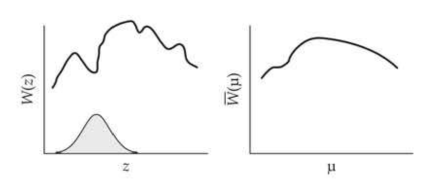
>
> Figure 29.6 In this example, a small change in z is associated with a large change in the individual fitness surface,  $ W(z) $. However, because the mean population fitness,  $ \overline{W}(\mu_z) $, averages individual fitnesses over the phenotypic distribution (the filled curve in the left panel), small changes in  $ \mu_z $ result in only small changes in  $ \overline{W}(\mu_z) $. As a result, the corresponding fitness landscape is much smoother than the underlying individual fitness surface.

---

## Evolution_chapter29_018 · Individual Fitness and the Measurement of Univariate Selection: Introduction / DESCRIBING PHENOTYPIC SELECTION: CHANGES IN PHENOTYPIC MOMENTS

Selection for particular phenotypes changes the trait distribution (although it need not change all moments; for example, the mean may be unchanged). Thus, selection on a target trait can be detected by testing for differences between the distribution of phenotypes before and after some episode of selection. While complete distributions can be compared (e.g., using the d statistic from the DSD approach, as discussed below), the most common procedure for detecting selection acting on a trait is to test for changes in its first few phenotypic moments. Standard statistical tests for differences in means (t tests) and variances (F tests) can be used, but these tests rely on normality assumptions that are often violated, and nonparametric tests may be more appropriate. Differences in means can be tested using the Wilcoxon-Mann-Whitney test, while Conover's squared rank test (Conover 1999) can be used to test for changes in variances. Other nonparametric tests for changes in variance exist, but care must be exercised, as some (e.g., the Siegel-Tukey test) are quite sensitive to differences in means; see Conover (1999) and Sprent and Smeeton (2007). While these issues are important, the main problem in detecting whether selection is occurring on a particular trait is that changes in the moments may be due entirely to selection on phenotypically correlated characters (Chapters 20 and 30). Keeping this important caveat in mind, we now examine measures of selection for single characters.

---

## Evolution_chapter29_019 · DESCRIBING PHENOTYPIC SELECTION: CHANGES IN PHENOTYPIC MOMENTS / Henshaw's Distributional Selection Differential (DSD)

**[定义 Definition]**

While various nonparametric approaches can be used to compare a distribution of phenotypes before and after an episode of selection, simply finding a significant difference is not particularly informative. Henshaw (Henshaw et al. 2016; Henshaw and Zemel 2017) proposed a metric, the distribution selection differential (DSD, whose statistic is denoted by d), that uses differences in the shape of the entire distribution to quantify the nature and strength of selection. The original definition (Henshaw et al. 2016) was

$$
d=\int_{-\infty}^{\infty}\left|F^{*}(z)-F(z)\right|dz,\quad\mathrm{w h e r e}\quad F(z)=\int_{-\infty}^{z}p(x)dx
$$

namely, the total difference in the cumulative distribution functions of a trait before and after selection, $ F(z) $ and $ F^{*}(z) $, respectively. Empirically, this metric is estimated by

$$
\widehat{d}=\sum_{i=1}^{n-1}\left[\left(z_{i+1}-z_{i}\right)\cdot\left|\sum_{j=1}^{i}\frac{1-w_{j}}{n}\right|\right]
$$

where we have ordered phenotypes from smallest $ (z_{1}) $ to largest $ (z_{n}) $, with $ w_{j} $ indicating the relative fitness of the jth-ranked phenotypic value.

Henshaw and Zemel (2017) demonstrated that Equation 29.15a is equivalent to several other definitions, including a generalized Price-Robertson covariance expression (see their paper for details). They also noted two additional useful features of the DSD. First, under strictly directional selection, in which $ W(z) $ is a monotonic function of z,

$$
d=\left|\bar{\imath}\right|
$$

Hence, when computed using a variance-standardized trait, d equals the selection intensity (Equation 13.6a). This observation implies that

$$
d_{N}=d-\left|\bar{\imath}\right|
$$

provides a measure of the amount of residual selection remaining after the strictly directional component has been removed (the so-called nondirectional selection fraction). Second, again for a variance-standardized trait, d is bounded by the variance, I, in relative fitness,

$$
d\leq\sqrt{I}
$$

which shows that the bound from the opportunity for selection (Equation 29.6b) also extends to the DSD. See Henshaw and Zemel (2017) for a discussion of additional features and extensions of the DSD concept to multiple traits.

---

## Evolution_chapter29_020 · DESCRIBING PHENOTYPIC SELECTION: CHANGES IN PHENOTYPIC MOMENTS / Directional Selection

Turning to moment-based comparisons, three measures of the within-generation change in phenotypic mean have been previously introduced: the directional selection differential, S (Equation 13.7); the variance-standardized directional selection differential (the selection intensity), $ \bar{\tau} = S/\sigma $ (Equation 13.6a); and the directional selection gradient, $ \beta = S/\sigma^2 $ (Equation 13.8b). While these measures are interchangeable for selection acting on a single trait (using an appropriate scaling factor, as all have identical values when $ \sigma_z^2 = 1 $), the multivariate extension of the gradient (the vector $ \beta $) is the measure of choice when multiple characters are considered (Chapter 30). This is because the elements of $ \beta $ fully adjust for the effects of selection on phenotypically correlated traits among the set of traits included in the regression, thereby quantifying the amount of direct selection on a trait. In contrast, S and $ \bar{\tau} $ confound these direct and indirect effects (Equation 30.3), and consequently, they are often called measures of total selection (the sum of the forces, direct and indirect, acting on a trait), while $ \beta $ is a measure of direct selection.

---

## Evolution_chapter29_021 · DESCRIBING PHENOTYPIC SELECTION: CHANGES IN PHENOTYPIC MOMENTS / Quadratic Selection

Metrics can also be defined to quantify the change in variance. At first blush, this change seems best described by $ \sigma_{z*}^{2} - \sigma_{z}^{2} $, where $ \sigma_{z*}^{2} $ is the phenotypic variance following selection. The limitation of this metric as a measure of selection acting on the population variance of a trait is that strictly directional selection also reduces the variance. In particular, Lande and Arnold (1983) showed that

$$
\sigma_{z^{*}}^{2}-\sigma_{z}^{2}=\sigma\left[w,(z-\mu_{z})^{2}\right]-S^{2}
$$

This result is derived in Example 30.2. Hence, directional selection decreases the phenotypic variance by $ S^{2} $. With this in mind, Lande and Arnold suggested a corrected measure for the change in variance, their stabilizing selection differential,

$$
C=\sigma_{z^{*}}^{2}-\sigma_{z}^{2}+S^{2}
$$

which describes the nature of selection acting directly on the variance. Correcting for the effects of directional selection is important, as apparent signals of stabilizing selection based on a reduction in variance following selection could simply be the reduction in variance caused by directional selection. Similarly, signals of disruptive selection (an inflated postselection trait variance) can be masked by directional selection (e.g., Example 29.10).

The term stabilizing selection differential is actually a misleading description of C. One can have a negative value of C without having a fitness maximum over the range of phenotypes that is observed, and hence formally there will be no stabilizing selection. Because C < 0 (C > 0) is consistent with stabilizing (disruptive) selection, but is not sufficient in and of itself, following Phillips and Arnold (1989), we refer to C as the quadratic selection differential.

Analogous to S equaling the covariance between z and relative fitness, Equation 29.16a shows that C is the covariance between relative fitness and the squared deviation of a trait value from its mean,

$$
C=\sigma\left[w,(z-\mu)^{2}\right]
$$

A positive value of C indicates selection to increase the variance (convex selection, as would occur with disruptive selection), with fitness (on average) increasing for trait values further from the mean. Conversely, a negative value of C indicates selection to reduce the variance (concave selection, as would occur with stabilizing selection), with fitness (on average) decreasing as trait values move away from the mean. As was the case with $S$, the opportunity for selection ($I = \sigma_w^2$) bounds the maximum possible within-generation change in variance (Arnold 1986). If we recall that $\sigma(x, y) = \rho_{xy} \sigma(x) \sigma(y)$, Equation 29.17 implies that $C = \rho_{w,(z-\mu)^2} \sigma_w \sigma[(z-\mu)^2]$. Because $\rho^2 \leq 1$,

$$
C^{2}\leq\sigma_{w}^{2}\sigma^{2}[(z-\mu)^{2}]=I\cdot\left(\mu_{4,z}-\sigma_{z}^{4}\right)
$$

where $ \mu_{4,z} = E[(z - \mu)^{4}] $. The last step in Equation 29.18a follows if we recall that

$$
\sigma^{2}[(z-\mu)^{2}]=E[(z-\mu)^{4}]-\left\{E[(z-\mu)^{2}]\right\}^{2}=\mu_{4,z}-\left(\sigma_{z}^{2}\right)^{2}
$$

Thus,

$$
|C|\leq\sqrt{I\left(\mu_{4,z}-\sigma_{z}^{4}\right)}
$$

Furthermore, if z is normally distributed, then $ \mu_{4,z} = 3\sigma_{z}^{4} $ (Kendall and Stewart 1977), implying that

$$
\frac{|C|}{\sigma_{z}^{2}}\leq\sqrt{2I}
$$

Finally, the quadratic analog of $ \beta $, the quadratic (or stabilizing) selection gradient, $ \gamma $, was defined by Lande and Arnold (1983) as

$$
\gamma=\frac{\sigma\left[w,(z-\mu)^{2}\right]}{\sigma_{z}^{4}}=\frac{C}{\sigma_{z}^{4}}
$$

As was the case for $ \beta $, in its univariate form, $ \gamma $ appears as a simple rescaling of C, while its multivariate form (the matrix $ \gamma $) accounts for the influence of phenotypic correlations among the measured traits (Chapter 30). As with $C$, the interpretation of $\gamma$ can be extremely misleading when the fitness surface is not well approximated by a quadratic over the range of scored phenotypes. We examine this issue in some detail both later in this chapter and in Chapter 30. A final complication in interpreting $C$ is that if the phenotypic distribution is skewed, selection on the variance changes the mean (e.g., Equations 5.27b, 24.27, and 24.28a). This results in a nonzero value of $S$, which in turn inflates $C$ (Figure 29.7).

> **Figure 29.7** · page 29 · source: `Evolution_chapter29`
>
> 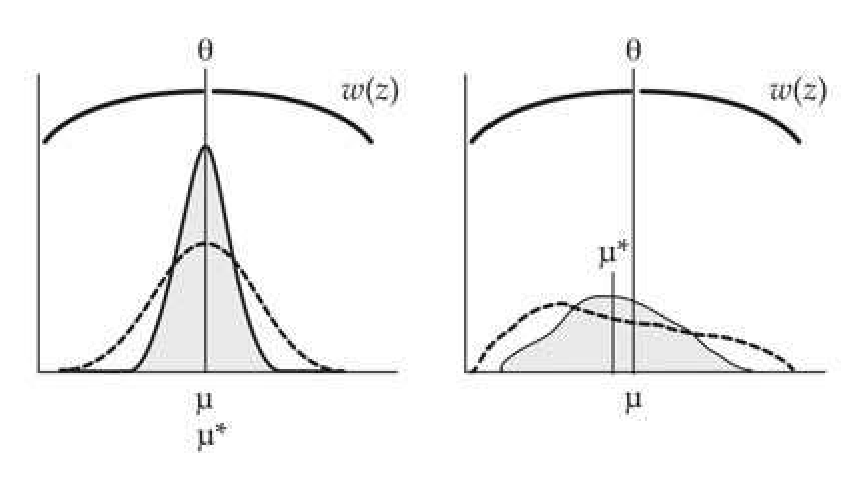
>
> Figure 29.7 Even when a population is under strict stabilizing selection, the mean can change if the phenotypic distribution is skewed. One standard fitness function for stabilizing selection is Wright's quadratic, namely  $ W(z) = 1 - b(z - \theta)^2 $ (Equation 28.3a). O'Donald (1968) found that when the population mean is at the optimum value  $ \mu_z = \theta $, S is nonzero when the skew is nonzero  $ \mu_{3,z} \neq 0 $, as  $ S = -(b\mu_{3,z})/(1 - b\sigma_z^2) $. The dashed line and solid line (the latter with the corresponding filled curve), respectively, represent the preselection and postselection phenotypic distributions (both standardized to unit area). Left: If phenotypes are symmetrically distributed about the mean  $ \mu_{3,z} = 0 $, the distribution after selection has the same mean when  $ \mu_z = \theta $. Right: When the distribution is skewed, the longer tail experiences more selection than the shorter tail, which changes the mean.

---

## Evolution_chapter29_022 · DESCRIBING PHENOTYPIC SELECTION: CHANGES IN PHENOTYPIC MOMENTS / Under Trait Normality, Gradients Describe the Local Geometry of the Fitness Landscape

A number of expressions equating $ \beta $ and $ \gamma $ to different gradient functions of fitness surfaces and landscapes appear in the literature. A potential source of confusion is that while these gradient functions are formally different (Geyer and Shaw 2008), they turn out to be equivalent when traits are normally distributed (Lande and Arnold 1983), and hence are used somewhat interchangeably in the literature.

We have frequently used the gradient of mean fitness with respect to the population mean,

$$
\frac{\partial\ln\overline{W}}{\partial\mu_{z}}=\frac{1}{\overline{W}}\frac{\partial\overline{W}}{\partial\mu_{z}}
$$

We refer to gradients involving the mean fitness landscape as landscape gradients, and the particular gradient with respect to the population mean (Equation 29.20a) as the landscape directional selection gradient. Equations 24.26 and 24.27 show that landscape gradients with respect to higher moments of the phenotypic distribution appear in the general expression (free of normality assumptions) for selection response. When the trait is normally distributed and individual fitnesses are frequency-independent, the landscape directional selection gradient (Equation 29.20a) equals the directional selection gradient, $ \beta = S/\sigma^2 $ (Equation 13.8b); see Example A6.3 for the derivation.

A second class of gradients, based on the individual fitness surface, also appears in the literature. In particular, the average directional selection gradient,

$$
\begin{align*}\int{\partial w(z)\over\partial z}p(z)dz=E_z\left[{\partial w(z)\over\partial z}\right]\end{align*}
$$

is the average slope of the individual fitness surface, the expectation being taken over the phenotypic distribution for the population being studied. Similarly, the average quadratic selection gradient

$$
\int\frac{\partial^{2}w(z)}{\partial z^{2}}p(z)dz=E_{z}\left[\frac{\partial^{2}w(z)}{\partial z^{2}}\right]
$$

is the average curvature of the individual fitness surface. Lande and Arnold (1983) showed that, provided z is normally distributed, Equation 29.20b equals $ \beta $ (the multivariate version is proved in Chapter 30) and Equation 29.20c equals $ \gamma $ (Equation 29.19).

Thus, $ \beta $ and $ \gamma $ provide measures of the geometry of the individual fitness surface averaged over the population being considered, provided z is normally distributed. When z is not Gaussian, Equations 29.20a and 29.20b need not equal $ \beta $ and Equation 29.20c need not equal $ \gamma $. Indeed, unless the individual fitness function is of the form of a generalized exponential (Equation 29.34c), the postselection distribution is expected to depart from normality. Hence, after the first episode of selection, the fitness-weighted distribution is likely nonnormal, and these equalities can fail. This fact may be lost on an investigator examining selection over several episodes, as the actual distribution of phenotypes may not have changed, yet their fitness-weighted distributions may depart considerably from normality (for example, in a population before and after a episode of mate choice).

---

## Evolution_chapter29_023 · DESCRIBING PHENOTYPIC SELECTION: CHANGES IN PHENOTYPIC MOMENTS / Under Trait Normality, Gradients Appear in Selection Response Equations

A final advantage of $ \beta $ and $ \gamma $ is that they appear as the only measure of phenotypic selection in the standard (i.e., normality-based) equations describing selection response. We have already seen (Equation 13.8c) that under the constraints of the breeder's equation, $ R = \Delta \mu = \sigma_A^2 \beta $, which is independent of any other measure of phenotypic selection. Similarly, under the infinitesimal model, the expected change in variance from a single generation of selection is given by Equation 16.7b,

$$
\Delta\sigma_{z}^{2}=\frac{h^{4}}{2}\delta_{\sigma_{z}^{2}}=\frac{\sigma_{A}^{4}}{2\sigma_{z}^{4}}\left(C-S^{2}\right)=\frac{\sigma_{A}^{4}}{2}\left(\gamma-\beta^{2}\right)
$$

which decomposes the change in variance into the change due to selection on the variance ($ \gamma $) and the change due to directional selection ($ \beta^{2} $). More generally, when normality assumptions fail, the selection response equations for the variance involve various partials of landscape gradients (Equations 24.26 and 24.33c).

Again, while the distinction between differentials and gradients seems almost trivial in the univariate case (only a scale difference), their multivariate versions are considerably different from each other. As we will see in Chapter 30, gradients have the extremely important feature of removing the effects of phenotypic correlations among the set of measured traits, and the multivariate extensions of $ \beta $ and $ \gamma $ are what appear in the multivariate breeder's and Bulmer equations (Volume 3).

---

## Evolution_chapter29_024 · DESCRIBING PHENOTYPIC SELECTION: CHANGES IN PHENOTYPIC MOMENTS / Partitioning Changes in Means and Variances Into Episodes of Selection

Suppose the total amount of within-generation selection is partitioned into $k$ episodes of selection. Let $\mu_j$ and $\sigma_j^2$ be the (fitness-weighted) mean and variance after the $j$th episode of selection ($\mu = \mu_0$ and $\sigma^2 = \sigma_0^2$) are the baseline mean and variance before the first measured episode of selection). The definitions of $S$ and $C$ suggest that their appropriate counterparts for the $j$th episode of selection are calculated by

$$
S_{j}=\mu_{j}-\mu_{j-1}
$$

$$
C_{j}=\sigma_{j}^{2}-\sigma_{j-1}^{2}+S_{j}^{2}
$$

(Arnold and Wade 1984a). The properties for S and C hold for each episode of selection, with

$$
\begin{array}{r l r}{S_{j}=\sigma(w_{j},z)}&{{}\quad\mathrm{a n d}\quad}&{C_{j}=\sigma\left[w_{j},(z-\mu_{j-1})^{2}\right]}\end{array}
$$

where $ w_j $ is the relative fitness for the $ j $th episode of selection. Likewise, substituting $ I_j = \sigma^2(w_i) $ for $ I $ in Equations 29.6 and 29.18c bounds the possible values of $ S_j $ and $ C_j $.

How do these individual-episode measures relate to their total measure (i.e., over all episodes)? The partition of the total differentials, $ S_{T} $ and $ C_{T} $, into those components are additive, with

$$
S_{T}=\mu_{k}-\mu_{0}=\sum_{j=1}^{k}\left(\mu_{i}-\mu_{i-1}\right)=\sum_{j=1}^{k}S_{j}
$$

and

$$
\begin{aligned}C_{T}&=\sigma_{k}^{2}-\sigma_{0}^{2}+S_{T}^{2}=\sum_{j=1}^{k}\left(\sigma_{i}^{2}-\sigma_{i-1}^{2}\right)+S_{T}^{2}\\&=\sum_{j=1}^{k}\left(C_{j}-S_{j}^{2}\right)+S_{T}^{2}=\sum_{j=1}^{k}C_{j}+\left(S_{T}^{2}-\sum_{j=1}^{k}S_{j}^{2}\right)\end{aligned}
$$

**[示例 Example]**

*(See Example 29.8.)*

Partitioning $ \beta $ and $ \gamma $ requires a little more care, as we have to account for changes in the phenotypic variance following each episode. From their definitions, the appropriate gradients for the jth episode of selection are

$$
\beta_{j}=\frac{S_{j}}{\sigma_{j-1}^{2}}\qquad and\qquad\gamma_{j}=\frac{C_{j}}{\sigma_{j-1}^{4}}
$$

**[定义 Definition]**

In their original paper, Arnold and Wade (1984a) initially defined gradients for each episode using the baseline variance, $\sigma_0^2$, throughout. With this definition, gradients are additive across episodes, as their numerators (being covariances) are additive and the denominators are unchanged. This approach is often called the additive partition (or more correctly, the unweighted additive partition), as $\beta_T = \sum \beta_j^0$, where $\beta_j^0 = S_j / \sigma_0^2$. Kalisz (1986) and Wade and Kalisz (1989) noted that the correct definition for an episodic gradient depends upon the trait variance at the start of each episode (Equation 29.23a), and the variance is expected to change during each episode. Writing $S_j = \beta_j \sigma_{j-1}^2$ gives

$$
\beta_{T}=\frac{S_{T}}{\sigma_{0}^{2}}=\sum_{j=1}^{k}\frac{S_{j}}{\sigma_{0}^{2}}=\sum_{j=1}^{k}\frac{\beta_{j}\sigma_{j-1}^{2}}{\sigma_{0}^{2}}=\sum_{j=1}^{k}\beta_{j}a_{j},\quad\mathrm{w h e r e}\quad a_{j}=\frac{\sigma_{j-1}^{2}}{\sigma_{0}^{2}}
$$

Equation 29.23b defines the variance-weighted additive partition of gradients, where the total selection gradient is now a weighted sum of the individual gradients associated with each episode. The partition of $ \gamma $ follows in a similar manner, with

$$
\gamma=\sum_{j=1}^{k}\gamma_{j}a_{j}^{2}+\frac{1}{\sigma_{0}^{4}}\left[S_{T}^{2}-\sum_{j=1}^{k}S_{j}^{2}\right]
$$

where $ \gamma_j $ is calculated by Equation 29.23a. McGlothlin (2010) presented the multivariate version of Equation 29.23c and also revealed a key feature of Equation 29.23c. Note that $ \gamma $ can be nonzero even when all of the values of $ \gamma_j $ are zero. Further, when directional selection is occurring, the sign of $ \gamma $ can be different from the sign of the average value of $ \gamma_k $.

---

## Evolution_chapter29_025 · DESCRIBING PHENOTYPIC SELECTION: CHANGES IN PHENOTYPIC MOMENTS / Choice of the Reference Population: Independent Partitioning

Using the above partitioning schemes, selection differentials and gradients for a particular episode are based on their fitness-weighted values from the previous episode and are (with appropriate weighting) additive across episodes. Several authors have suggested that a slightly different approach, independent partitioning, may provide additional details about the nature of selection (Koenig and Albano 1987; Conner 1988; Koenig et al. 1991; Preziosi and Fairbairn 2000). Here, one uses the observed distribution of phenotypes as the reference population (as opposed to the fitness-weighted distribution) when computing statistics for each episode. While an independent partition provides a misleading picture of evolutionary response (by not weighting for previous selection), it may provide additional insight into the nature of selection in a particular episode. Further, if episodes are not sequential, the additive partition is not appropriate, while the independent partition can still be used to evaluate potential targets of selection. Fitness components estimated by the additive partition take into account any constraints imposed by prior selection, while independent partitioning ignores these prior constraints.

To see how using both partitions can provide additional insight into the nature of selection, consider the work of Koenig et al. (1991), who applied the additive and independent partitions to Howard's (1979) bullfrog dataset (Example 29.2). Howard concluded that larger frogs have more matings and produce more eggs and hatchlings. Fitness-component analysis (Example 29.2) using the additive partition showed that selection was largely on the number of mates, with no significant impact of body size on fertility per mate or hatching success (Arnold and Wade 1984b). Using an independent partition also found strong selection for body size via mating success, but, additionally, revealed strong selection for hatching success (offspring survivorship) as a function of body size. Thus, the independent partition suggested an additional interaction that was missed by the additive partition, thus generating new potential hypotheses for further testing (e.g., larger males may be better at defending eggs from predators or reside in better territories).

**[示例 Example]**

*(See Example 29.9.)*

---

## Evolution_chapter29_026 · DESCRIBING PHENOTYPIC SELECTION: CHANGES IN PHENOTYPIC MOMENTS / Standard Errors for Estimates of Differentials and Gradients

Because it is difficult to measure all of the individuals in a population, the effects of selection are usually estimated from a sample. This is also true in most longitudinal studies, with the cohort usually viewed as representative of phenotypes from the population. There are, however, occasional exceptions, such as when cohort members are intentionally chosen to include the most extreme phenotypes at much higher frequencies than their population levels.

There are a number of statistical issues involved in extrapolating from samples to the entire population, many of which still are unresolved. For example, individual fitness is usually measured with error. Further, there is generally a bias toward underestimating individual fitness—for example, marked individuals may not be recaptured and hence recorded as having zero fitness even if they survived. Likewise, the number of mates or offspring can be easily undercounted.

Assuming individual fitness is measured without error, the methods of LW Appendix 1 can be used to obtain approximate large-sample variances for estimators of differentials and gradients. The exact sampling variance for the directional selection differential is

$$
\sigma^{2}\left(\widehat{S}_{j}\right)=\frac{\sigma_{j}^{2}}{n_{j}}+\frac{\sigma_{j-1}^{2}}{n_{j-1}}
$$

where $ n_{j} $ is the sample size for the jth episode. Using the delta-method approximation from LW Appendix 1, the large-sample variance for C is approximately

$$
\begin{aligned}\sigma^{2}\left(\widehat{C}_{j}\right)&\simeq4S_{j}^{2}\sigma^{2}\left(\widehat{S}_{j}\right)+8S_{j}\left(\frac{\mu_{3,j}}{n_{j}}+\frac{\mu_{3,j-1}}{n_{j-1}}\right)\\&+\frac{\mu_{4,j}-\sigma_{j}^{4}}{n_{j}}+\frac{\mu_{4,j-1}-\sigma_{j-1}^{4}}{n_{j-1}}\end{aligned}
$$

where $ \mu_3 $ and $ \mu_4 $ are the third and fourth central moments around the mean, $ \mu_i = E[(z - \mu)^i] $. If phenotypes are normally distributed ($ \mu_3 = 0 $, $ \mu_4 = 3\sigma^4 $), this reduces to

$$
\sigma^{2}\left(\widehat{C}_{j}\right)\simeq4S_{j}^{2}\sigma^{2}\left(\widehat{S}_{j}\right)+2\left[\frac{\sigma_{j}^{4}}{n_{j}}+\frac{\sigma_{j-1}^{4}}{n_{j-1}}\right]
$$

If the scaled skewness, $ \kappa_3 $ (LW Equation 2.8), and kurtosis, $ \kappa_4 $ (LW Equation 2.12a), are small, this normal approximation is still appropriate.

**[示例 Example]**

*(See Example 29.10.)*

---

## Evolution_chapter29_027 · Individual Fitness and the Measurement of Univariate Selection: Introduction / DESCRIBING PHENOTYPIC SELECTION: INDIVIDUAL FITNESS SURFACES

The fitness (W) of an individual with a trait value of z can be decomposed into the sum of its expected fitness, $ W(z) = E[W \mid z] $, plus a residual deviation, $ e_W $,

$$
W=E[W\mid z]+e_{W}=W(z)+e_{W}
$$

The residual variance for a given $ z $, $ \sigma_{e_w}^2(z) $, measures the variance in fitness among individuals with a phenotypic value of $ z $. Estimation of the individual fitness surface is thus a generalized regression problem, with the goal being to choose a candidate function for $ W(z) $ that minimizes the average residual variance, $ E_z[\sigma_{e_w}^2(z)] $. Because the total variance in fitness ($ \sigma_W^2 $) equals the sum of the within-group (individuals with the same trait value) and among-group variances in fitness,

$$
\frac{\sigma_{W}^{2}-E_{z}[\sigma_{e_{W}}^{2}(z)]}{\sigma_{W}^{2}}=1-\frac{E_{z}[\sigma_{e_{W}}^{2}(z)]}{\sigma_{W}^{2}}
$$

is the fraction of individual fitness variation accounted for by a particular estimate of $ W(z) $, providing a metric for comparing different estimates of the fitness function.

There are at least two sources of variation that contribute to the fitness residual, $ e_{W} $. First, there can be errors in measuring the actual fitness of an individual (these are almost always ignored, although they induce serious biases; see Hadfield 2008). Second, the actual (or realized) fitness of any particular individual is a random variable distributed around its expected value. Generally, these residual deviations are heteroscedastic, with the residual variance varying with z (Mitchell-Olds and Shaw 1987; Schluter 1988). As we will see later, aster models provide a general strategy for accounting for such errors structures.

Consider fitness measured by survival to a particular age. While $ W(z) = p_z $ is the probability of survival for an individual with a character value of $ z $, the fitness for a particular individual is a Bernoulli random variable, as it either survives (value of one) or does not (value of zero). The resulting residual has only two possible values, $ e_W = 1 - p_z $ with probability $ p_z $, and $ e_W = -p_z $ with probability $ 1 - p_z $, giving

$$
\sigma_{e_{W}}^{2}(z)=E[(e_{W})^{2}]=(1-p_{z})^{2}p_{z}+p_{z}^{2}(1-p_{z})=p_{z}(1-p_{z})
$$

Unless $ p_z $ is constant over $ z $, the residuals are heteroscedastic. Note that after accounting for phenotypic-specific differences (here, the $ p_z $ values), there still remains substantial variance in individual fitness. This within-class variance is most extreme at intermediate survival rates ($ p_z \simeq 1/2 $).

Finally, inferences about the individual fitness surface are limited by the range of phenotypes in the population. Unless this range is very large, only a small region of the fitness surface can be explored with any precision. Estimates of the fitness surface at the tails of the current phenotypic distribution are extremely imprecise yet potentially very informative, as they suggest patterns of selection for populations at the margins of the observed range of phenotypes. A further complication is that the fitness surface can change as the environment changes, so that year-to-year estimates can differ (e.g., Kalisz 1986). Such change may require an investigator to choose between a time-averaged fitness surface (which can impart bias) versus a series of year-specific estimates (which suffer from lower power). Finally, as emphasized in Chapter 22, organisms often modify their environments as they evolve, implying that the biotic environment, and hence $ W(z) $, also evolves.

---

## Evolution_chapter29_028 · DESCRIBING PHENOTYPIC SELECTION: INDIVIDUAL FITNESS SURFACES / Linear and Quadratic Approximations of $ W(z) $

The individual fitness surface, $ W(z) $, can be very complex, and a wide variety of functions may be chosen to approximate it. The simplest and most straightforward approach is to use a low-order polynomial (typically a linear or a quadratic; Lande and Arnold 1983). One justification for this approach is that in a sufficiently local region, even a highly nonlinear surface can be reasonably approximated by a quadratic function (this is simply a Taylor series approximation). Put another way, for a sufficiently small range of phenotypes, even a rather rough fitness surface can appear to be locally smooth.

Consider first the simple linear regression of relative fitness, w, as a function of phenotypic value, z. Because the directional selection gradient is defined as $ \beta = S/\sigma_z^2 = \sigma(w, z)/\sigma_z^2 $, it follows from regression theory (LW Equation 3.14b) that $ \beta $ is the slope of the least-squares linear regression of relative fitness on z.

$$
w=a+\beta z+e
$$

which makes $ \widehat{w}(z) = a + \beta z $ the best linear predictor of relative fitness (Geyer and Shaw 2008). Because the regression passes through the expected values of $ w $ and $ z $ (1 and $ \mu_z $, respectively), Equation 29.25a can be rewritten as

$$
w=1+\beta(z-\mu_{z})+e
$$

giving $ \widehat{w}(z)=1+\beta(z-\mu_{z}). $

If we assume that the fitness function (for the range of phenotypes scored) is well described by a linear regression, $ \beta $ is the expected change in relative fitness, given a unit change in $ z $. Usually, standardized regressions are used, where the trait value is translated (shifted) and then variance-standardized to give it a mean of zero and a variance of one, with the standardized value, $ z_{sd} = (z - \mu)/\sigma_z $, replacing $ z $ in the regression. The standardized version of the Lande-Arnold regression becomes

$$
w=1+\beta_{sd}z_{sd}+e
$$

where $ \beta_{sd} $ gives the expected change in fitness given a standard deviation change in the trait. For example, a value of $ \beta_{sd} = 0.2 $ implies that a change of one standard deviation in the trait value increases relative fitness by 20%.

Note that fitness in the regression given by Equation 29.25c is mean-standardized (we use w in place of W), so our use of the term standardized regression is different from its use in many statistical packages, where both the dependent (w) and the predictor (z) variables are variance-standardized. Hence, it is best to directly feed in the transformed data (i.e., trait-standardized to a mean of zero and a variance of one, fitness-standardized to a mean of one) into a regression package, rather than worry about how a particular package will standardize the raw data before performing the regression. As a consequence of standardization, we have

$$
S_{sd}=\bar{\imath}_{z}
$$

showing that the selection differential for a standardized trait is simply the selection intensity, $ \bar{\tau}_z $, of the trait on the original (untransformed) scale, allowing for an easy comparison of the relative strengths of selection among focal traits. Further, note (from the Robertson-Price identity) that because $ S_{sd} = \sigma(z_{sd}, w) $, and hence $ \beta_{sd} = \sigma(z_{sd}, w)/\sigma^2(z_{sd}) = S_{sd} $, yielding

$$
\beta=\frac{\sigma(z,w)}{\sigma_{z}^{2}}=\frac{\sigma(z/\sigma_{z},w)}{\sigma_{z}}=\frac{\sigma(z_{sd},w)}{\sigma_{z}}=\frac{\beta_{sd}}{\sigma_{z}}
$$

From LW Equation 3.17, the fraction of variance in individual fitness accounted for by a linear regression in z is

$$
r_{z,w}^{2}=\frac{\left[\sigma(z,w)\right]^{2}}{\sigma^{2}(z)\cdot\sigma^{2}(w)}=\widehat{\beta}^{2}\frac{\sigma^{2}(z)}{\widehat{I}}
$$

as obtained by Moorad and Wade (2013). For a standardized regression, this reduces to

$$
r_{z_{sd},w}^{2}=\widehat{\beta}_{sd}^{2}/\widehat{I}
$$

Rearranging Equation 29.26a,

$$
\widehat{I r}_{z,w}^{2}=\widehat{\beta}^{2}\sigma^{2}(z)=\frac{\sigma^{2}(z,w)}{\sigma^{4}(z)}\sigma^{2}(z)=\frac{\sigma(z,w)}{\sigma^{2}(z)}\sigma(z,w)=\widehat{\beta}S
$$

which shows that the amount of the variance in relative fitness (I) accounted for by directional selection on a focal trait is $ \widehat{\beta}S $ (Moorad and Wade 2013).

If the individual fitness surface shows curvature, as expected if there is stabilizing or disruptive selection, a quadratic regression is more appropriate,

$$
w=a+b_{1}z+b_{2}(z-\mu_{z})^{2}+e
$$

Because the regression passes through the mean of all variables,

$$
E[w]=1=a+b_{1}E[z]+b_{2}E[(z-\mu_{z})^{2}]=a+b_{1}\mu_{z}+b_{2}\sigma_{z}^{2}
$$

Solving for the intercept $ (a) $ and substituting back into Equation 29.26b yields

$$
w=1+b_{1}(z-\mu_{z})+b_{2}\left[(z-\mu_{z})^{2}-\sigma_{z}^{2}\right]+e
$$

The trait-standardized version $ \mu_{z_{sd}} = 0, \sigma^{2}(z_{sd}) = 1 $ becomes

$$
w=1+b_{sd,1}z_{sd}+b_{sd,2}\left(z_{sd}^{2}-1\right)+e
$$

which is also written as

$$
\begin{align*}w=a+b_{sd,1}z_{sd,1}+b_{sd,2}z_{sd}^2+e\end{align*}
$$

A positive quadratic term $ (b_2 \text{ or } b_{sd,2} > 0) $ indicates that the best-fitting quadratic approximation of the individual fitness surface has an upward (convex) curvature, while a negative value $ (b_2 < 0) $ implies that the curvature is downward (concave). Lande and Arnold (1983) suggested that $ b_2 > 0 $ indicates disruptive selection while $ b_2 < 0 $ indicates stabilizing selection. Their reasoning follows from elementary geometry in that a necessary condition for a local minimum is that a function must be convex over some interval, while a necessary condition for a local maximum is that the function is concave. However, Mitchell-Olds and Shaw (1987) and Schluter (1988) noted that this condition is not sufficient for the presence of a local extrema. Stabilizing selection is generally defined as the presence of a local maximum in $ w(z) $ and disruptive selection by the presence of a local minimum, while $ b_2 $ indicates curvature rather than the presence of local extrema. As Figure 29.8B shows, a quadratic fitness function can curve downward without the population experiencing a local maximum. It can also curve upward without having a local minimum. Because of these issues, the current usage is to denote $ b_2 < 0 $ as concave selection and $ b_2 > 0 $ as convex selection.

> **Figure 29.8** · page 37 · source: `Evolution_chapter29`
>
> 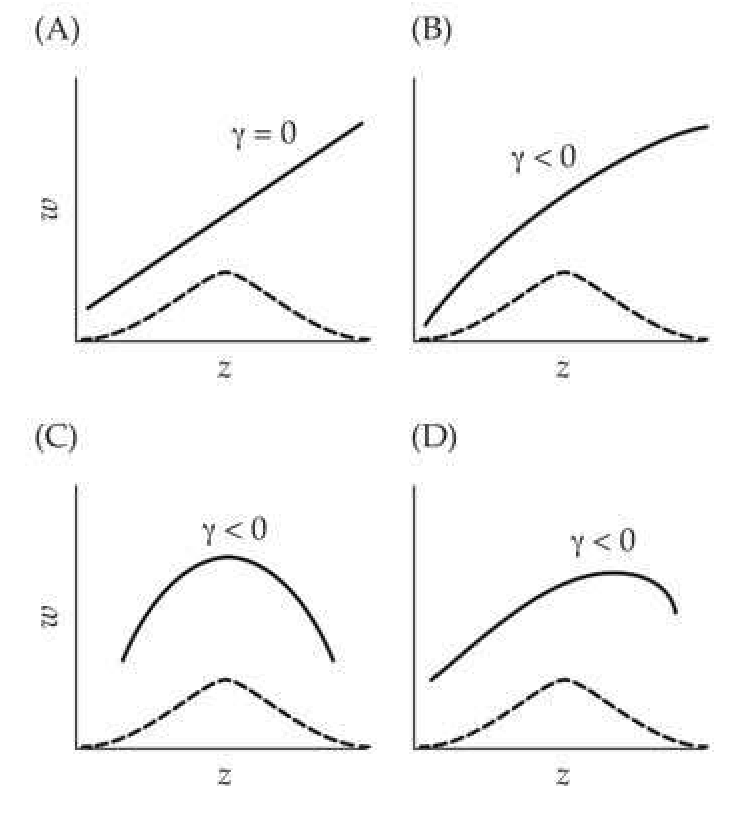
>
> Figure 29.8 The relationship between  $ \gamma $ and curvature of a quadratic fitness function (solid line). The dashed curve represents the distribution of z. A:  $ W(z) $ is strictly linear, hence  $ \gamma = 0 $. B:  $ W(z) $ curves downward (is concave), but has no maximum over the range of z examined. Hence,  $ \gamma < 0 $, implying stabilizing selection by the Lande-Arnold criterion, when in fact selection is entirely directional. C: Stabilizing selection only, as there is no change in the mean. D: A combination of directional and stabilizing selection, as the population mean is not at the optimal fitness value. (After Mitchell-Olds and Shaw 1987.)

---

## Evolution_chapter29_029 · DESCRIBING PHENOTYPIC SELECTION: INDIVIDUAL FITNESS SURFACES / Lande-Arnold Fitness Regressions

We solve for the regression coefficients $ b_1 $ and $ b_2 $ by transforming Equation 29.27a into a standard multiple regression problem by setting $ x_1 = z $ and $ x_2 = (z - \mu_z)^2 $ and applying the methods of LW Chapter 8. To proceed, we need expressions for $ \sigma(x_1, x_2) $, $ \sigma(x_1, w) $, and $ \sigma(x_2, w) $. From LW Equation A1.14, $ \sigma(x_1, x_2) = \sigma(z, [z - \mu_z]^2) = \mu_{3,z} $, the skew of the phenotypic distribution before selection. Likewise, from Equations 13.7a and 29.17, $ \sigma(x_1, w) = \sigma(z, w) = S $ and $ \sigma(x_2, w) = \sigma([z - \mu_z]^2, w) = C $. Substituting these values into the results from LW Example 8.3 (which gives exact expressions for the partial regression coefficients of a bivariate regression), and note that $ \sigma^{2}(|z-\mu_{z}|^{2})=\mu_{4.z}-\sigma_{s}^{4} $, we obtain

$$
\begin{aligned}&b_{1}=\frac{\sigma^{2}(x_{2})\cdot\sigma(x_{1},w)-\sigma(x_{1},x_{2})\cdot\sigma(x_{2},w)}{\sigma^{2}(x_{1})\cdot\sigma^{2}(x_{2})-\sigma^{2}(x_{1},x_{2})}=\frac{(\mu_{4,z}-\sigma_{z}^{4})\cdot S-\mu_{3,z}\cdot C}{\sigma_{z}^{2}\cdot(\mu_{4,z}-\sigma_{z}^{4})-\mu_{3,z}^{2}}\\ &b_{2}=\frac{\sigma^{2}(x_{1})\cdot\sigma(x_{2},w)-\sigma(x_{1},x_{2})\cdot\sigma(x_{1},w)}{\sigma^{2}(x_{1})\cdot\sigma^{2}(x_{2})-\sigma^{2}(x_{1},x_{2})}=\frac{\sigma_{z}^{2}\cdot C-\mu_{3,z}\cdot S}{\sigma_{z}^{2}\cdot(\mu_{4,z}-\sigma_{z}^{4})-\mu_{3,z}^{2}}\\ \end{aligned}
$$

The estimators of $ b_1 $ and $ b_2 $ are obtained by replacing $ \mu_{k,z} $ with their sample estimates and using $ \widehat{C} $ and $ \widehat{S} $.

It is important to stress that the distributional assumptions leading to the solutions offered by Equation 29.28 are simply those of ordinarily least-squares (OLS), namely, homoscedastic and uncorrelated residuals (Chapter 18; LW Chapter 8). To this point, no other assumptions have been made about either the distribution of the trait values or the distributional form of the residuals (i.e., normality of the residuals is not required for Equation 29.28). Standard errors for parameter estimates follow from LW Equation 8.33b (again, requiring no assumptions on the distribution of residuals other than OLS). However, if we wish to turn standard errors into confidence intervals or to perform hypothesis testing, further distributional assumptions on residuals (such as normality) are required.

Provided $z$ is normally distributed before selection, then $\mu_{3,z}=0$ and $\mu_{4,z}-\sigma_{z}^{4}=2\sigma_{z}^{4}$. In this case, Equations 13.8b and 29.19 imply, respectively, that $b_{1}=S/\sigma_{z}^{2}=\beta$ and $b_{2}=C/[2\sigma_{z}^{4}]=\gamma/2$, giving the univariate version of the Lande-Arnold regression (1983).

$$
w=1+\beta(z-\mu_{z})+\frac{\gamma}{2}\Big([z-\mu_{z}]^{2}-\sigma_{z}^{2}\Big)+e
$$

As this expression was also motivated by Pearson (1903), we occasionally refer to Equation 29.29a as the Pearson-Lande-Arnold regression. In standardized form,

$$
w=a+\beta_{sd}z_{sd}+\frac{\gamma_{sd}}{2}z_{sd}^{2}+e
$$

**[命题 Proposition]**

Equations 29.29a and 29.29b provide a connection between selection gradients (directional and stabilizing, $ \beta $ and $ \gamma $, respectively) and quadratic approximations of the individual fitness surface, provided z is normally distributed and residuals follow the OLS assumption.

An important point from Equation 29.28a is that if skew is present in the trait distribution ($ \mu_{3,z} \neq 0 $), then $ b_1 \neq \beta $, and hence the slope ($ \beta $) in the linear regression (the best linear fit) of $ w(z) $ differs from the linear slope term ($ b_1 $) in the best quadratic fit of $ w(z) $. This inequality arises because the presence of skew generates a covariance between $ z $ and $ (z - \mu_z)^2 $. The biological significance of this inequality can be seen by reconsidering Figure 29.7, where the presence of skew in the phenotypic distribution results in a change in the mean of a population under strict stabilizing selection (defined as the population mean being at the optimum of the individual fitness surface). From the Robertson-Price identity (Equation 6.10), the within-generation change in the mean equals the covariance between phenotypic value and relative fitness. Because covariances measure the amount of linear association between variables, in describing the change in mean, the correct measure is the slope of the best linear fit of the individual fitness surface, which is unbiased by skew (Lande and Arnold 1983). If skew is present, using $ b_1 $ from the quadratic regression to describe the change in mean is incorrect, as this quadratic regression removes the effects on relative fitness from a linear change in $ z $ due to the correlation between $ z $ and $ (z - \mu_z)^2 $.

Observe from Equation 29.28b that the presence of skew (and kurtosis) also results in $ 2b_{2} $ being a biased estimator of $ \gamma $. Despite this bias, $ 2b_{2} $ remains the standard estimate for $ \gamma $ in the literature. Shifting the trait to give it a mean of zero, a less-biased estimator of $ \gamma $ follows from a quadratic regression with no linear term,

$$
w=a+b z^{2}+e
$$

From standard regression theory (LW Chapter 3), the slope of Equation 29.29c is $ b = \sigma(z^2, w)/\sigma^2(z^2) $, and using the covariances obtained for Equation 29.28 yields

$$
b=\frac{\sigma(z^{2},w)}{\sigma^{2}(z^{2})}=\frac{C}{\mu_{4,z}-\sigma_{z}^{4}}
$$

Recall that the scaled kurtosis is $ \kappa_4 = (\mu_4 - 3\sigma_z^4)/\sigma_z^4 $ (LW Equation 2.12a). Therefore, rearranging yields $ \mu_4, z - \sigma_z^4 = \sigma_z^4(\kappa_4 + 2) $, or

$$
b=\frac{C}{\sigma^{4}(\kappa_{4}+2)}=\frac{\gamma}{\kappa_{4}+2}
$$

For a normal, $ \kappa_4 = 0 $, and $ 2E[b] = \gamma $. When kurtosis is present, using the sample estimate of $ \widehat{\kappa}_4 $ yields

$$
\widehat{\gamma}=\widehat{b}\left(\widehat{\kappa}_{4}+2\right)
$$

which is an improved estimate of the quadratic gradient. Finally, despite these corrections, we should point out that bias induced by skewness and kurtosis is a matter of degree. Both of these moments have their own sampling problems, and using poor estimates of them to correct $ \beta $ and $ \gamma $ can be problematic.

---

## Evolution_chapter29_030 · DESCRIBING PHENOTYPIC SELECTION: INDIVIDUAL FITNESS SURFACES / The Geometry of Quadratic Fitness Functions

As we have seen, when traits are normally distributed, $ \beta $ and $ \gamma $ provide summary statistics of the geometry of the individual surface and mean fitness landscape, either by measuring the average slope or curvature of the individual fitness surface (average selection gradients; Equations 29.20b and 29.20c) or the slope or curvature (evaluated at the current mean, $ \mu_{z} $) of the fitness landscape (landscape selection gradients; Equation 29.20a). *[See Table 30.1 at the end of this section.]* summarizes these (and other) features for the multivariate versions of $ \beta $ and $ \gamma $. These expressions hold for any form of $ w(z) $, provided z is normally distributed.

Moreover, when $ w(z) $ is exactly a quadratic, similar expressions hold for any distribution of z. Taking the first two partial derivatives of Equation 29.27a yields

$$
\frac{\partial w(z)}{\partial z}=b_{1}+2b_{2}(z-\mu_{z})\quad and\quad\frac{\partial^{2}w(z)}{\partial z^{2}}=2b_{2}
$$

Evaluating these derivatives at the current mean $ (z = \mu_z) $ returns

$$
\frac{\partial w(z)}{\partial z}\bigg|_{z=\mu_{z}}=b_{1}\qquad and\qquad\frac{\partial^{2}w(z)}{\partial z^{2}}\bigg|_{z=\mu_{z}}=2b_{2}
$$

Hence, one interpretation of the regression coefficients in Equation 29.27a is that they describe the slope $ (b_1) $ and the curvature $ (2b_2) $ of a quadratic fitness surface at the population mean. A second interpretation (along the lines of Equation 29.20b and 29.20c) is that these coefficients also equal the average slope $ (b_1) $ and average curvature $ (2b_2) $ of the quadratic fitness surface over the entire distribution of $ z $ (i.e., they are average selection gradients). To see this, note that Equation 29.20b yields an average directional selection gradient of

$$
E_{z}\left[\frac{\partial w(z)}{\partial z}\right]=E_{z}\left[b_{1}+2b_{2}(z-\mu_{z})\right]=b_{1}+2b_{2}E_{z}\left[z-\mu_{z}\right]=b_{1}
$$

Likewise, from Equation 29.20, the average quadratic selection gradient is

$$
E_{z}\left[\frac{\partial^{2}w(z)}{\partial z^{2}}\right]=E_{z}\left[2b_{2}\right]=2b_{2}
$$

Even when the trait distribution (before selection) is normal, if $ w(z) $ is not a quadratic, then the average slope and curvature need not equal the slope or the curvature of $ w(z) $ that is evaluated at $ \mu_z $. In other words, the average of the function need not equal the value of the function evaluated at the average. Assuming a normally distributed trait, Phillips and Arnold (1989) performed Taylor-series expansions (around $ z = \mu_z $) of Equations 29.20b and 29.20c, showing how the expected slope and curvature relate to the slope and curve at the mean,

$$
\begin{aligned}&\int\frac{\partial w(z)}{\partial z}p(z)dz=\left.\frac{\partial w(z)}{\partial z}\right|_{z=\mu_{z}}+\left(\frac{\sigma_{z}^{2}}{2}\frac{\partial^{3}w(z)}{\partial z^{3}}+\frac{\sigma_{z}^{4}}{8}\frac{\partial^{5}w(z)}{\partial z^{5}}+\cdots\right)\bigg|_{z=\mu_{z}}\\ &\\ &\int\frac{\partial^{2}w(z)}{\partial z^{2}}p(z)dz=\left.\frac{\partial^{2}w(z)}{\partial z^{2}}\right|_{z=\mu_{z}}+\left(\frac{\sigma_{z}^{2}}{2}\frac{\partial^{4}w(z)}{\partial z^{4}}+\frac{\sigma_{z}^{4}}{8}\frac{\partial^{6}w(z)}{\partial z^{6}}+\cdots\right)\bigg|_{z=\mu_{z}}\\ \end{aligned}
$$

While trait normality ensures that the slope of the mean fitness landscape, W, evaluated at the trait mean equals the average slope of w(z), it does not ensure that the average slope or curvature of w(z) equals the slope or curvature of w(z) as is evaluated at the trait mean. As Equation 29.30 shows, this only happens when w(z) is quadratic (and hence partials of order three and higher vanish). While this point may seem overly technical, it is important to stress because much of the elegant symmetry of the connections between $ \beta $ and $ \gamma $ and quantities of interest (average geometries of the fitness surface, regression coefficients, and important parameters in evolutionary equations for predicting response) only hold when the quadratic is an excellent approximation of the true fitness surface or when z is normal (before selection). See Geyer and Shaw (2008) for an extended discussion of this issue.

Finally, note that for a quadratic fitness function, for any distribution of z

$$
\overline{W}=E_{z}\left[a+b_{1}z+b_{2}(z-\mu)^{2}\right]=a+b_{1}\mu+b_{2}\sigma_{2}^{2}
$$

which implies that

$$
\frac{\partial\overline{W}}{\partial\mu}=b_{1}
$$

It is important to stress that throughout, we have defined $ \beta = S/\sigma_z^2 $ (Equation 13.8b) and $ \gamma = C/\sigma_z^4 $ (Equation 29.19), making no assumptions about either the trait distribution or the individual fitness function. While alternative expressions (e.g., Equations 29.20 and 29.30) exist for $ \beta $ and $ \gamma $ under certain distributional (normality) or fitness function (quadratic) assumptions, these are simply equalities under certain conditions that follow given our (distributional and fitness function-independent) definitions of $ \beta $ and $ \gamma $. The importance of $ \beta $ and $ \gamma $ is that they appear as the sole measures of selection in the breeder's equation (13.8c) and Bulmer equation (29.21) for predicting changes in means and variances. When the normality assumptions underlying the simple forms of these two selection-response (mean and variance, respectively) equations fail, the response depends, in complex ways, on the underlying genetic details and various partials of the mean fitness landscape (Equation 24.26).

---

## Evolution_chapter29_031 · DESCRIBING PHENOTYPIC SELECTION: INDIVIDUAL FITNESS SURFACES / Hypothesis Testing, Approximate Confidence Intervals, and Model Validation

While there is a large body of theory for testing the significance of regression coefficients, much of it assumes homoscedastic and normally distributed residuals, $ e_w \sim N(0, \sigma_{e_w}^2) $, where the residual variance ($ \sigma_{e_w}^2 $) is a constant (i.e., independent of $ z $). As mentioned above, these two assumptions are almost always violated with fitness data, invalidating standard tests for significance (Mitchell-Olds and Shaw 1987). Fortunately, a variety of resampling methods available for hypothesis testing are robust to heteroscedasticity and nonnormal residuals, and we briefly mention three of these procedures: jackknife confidence intervals, randomization tests of significance, and cross-validation. A fair amount of this material is presented for historical reasons, as the aster-model framework discussed at the end of the chapter provides a more statistically rigorous approach than the resampling approximations presented here.

Jackknife estimates were introduced by Tukey (1958) as a generalized statistical tool; see Miller (1974), Wu (1986), Shao and Tu (1996), and Manly (1997) for reviews, and Mitchell-Olds and Shaw (1987) and Mitchell-Olds and Bergelson (1990) for applications to fitness regressions. The idea is simple, resampling. Namely, base parameter estimates on the behavior of the distribution of estimates from subsamples of the original data. Consider the estimator of $ \beta $ for the linear regression given by Equation 29.25a. Denote by $ \widehat{\beta} $ the standard least-squares estimate of $ \beta $ using the full dataset of n individuals, and we let $ \widehat{\beta}_{i} $ denote the estimator using the complete dataset minus data for the ith individual. The resulting jackknife estimator is

$$
\widehat{\beta}_{j a c k}=\frac{1}{n}\sum_{i=1}^{n}\phi_{i}=\overline{\phi}\quad\mathrm{w h e r e}\quad\phi_{i}=n\widehat{\beta}-(n-1)\widehat{\beta}_{i}
$$

which has an approximate large-sample variance of

$$
\mathrm{Var}\left(\widehat{\beta}_{jack}\right)\simeq\frac{1}{n(n-1)}\sum_{i=1}^{n}(\phi_{i}-\overline{\phi})^{2}
$$

Approximate large-sample confidence intervals follow using Equation 29.31b and the fact that $ \beta_{jack} $ is approximately t-distributed with n-1 degrees of freedom. The jackknife estimator and its sampling variance are well behaved even when the residuals are heteroscedastic, thus allowing for valid hypothesis testing (Wu 1986). Wu presented a slightly improved jackknife estimator by weighting the $ \phi_i $ values, but the difference between the weighted and unweighted estimates is usually small for large sample sizes.

Another resampling approach involves randomization tests for the significance of a regression. Again, the idea behind this class of tests is simple. A value of $ \widehat{\beta} $ under the hypothesis of no association between fitness and trait value (z) is generated by assigning the n individual fitness values at random to the observed phenotypic values and estimating $ \beta $ for this scrambled (randomized) dataset. Repeating this resampling procedure several thousand times generates a distribution of regression coefficients under the null hypothesis of no association between individual fitness and character value. For example, suppose we obtain a standard least-squares estimate (assuming a linear regression) of $ \widehat{\beta} = 1.25 $, and upon subsequent randomization of the same dataset we find that only 14 out of 1000 randomized datasets have $ |\widehat{\beta}| $ values in excess of 1.25, which suggests a p value of 0.014. Moore (1990) and Hews (1990) both illustrated applications of randomization tests to fitness data.

A final issue concerns the validity of the particular model chosen to fit $ W(z) $. This is a difficult task because fitness data are inherently noisy—the residual variance can be rather large, even if we have perfectly fit $ W(z) $. One approach for comparing models is not to contrast their goodness-of-fit (i.e., least-squares solutions), but rather to compare their predictive ability: if some of the data are ignored, how well are their fitnesses predicted using a model built from the remaining data? This cross-validation procedure (Snee 1977; Picard and Cook 1984) can be used both to assess how well a model predicts the data and as a model-selection approach. The latter follows by choosing the model (from a set of candidates) with the smallest prediction error (Chapter 30 further discusses issues in model selection). Different schemes for splitting the data into training (model-building) and validation (testing) sets have been proposed. At one extreme is leave-one-out cross-validation, wherein the first observation is left out, after which a model built from the remaining data and its fitness prediction of the removed value is assessed, proceeding in this fashion through all of the observations to yield a prediction error variance for a given model. Generalized cross-validation (Craven and Wahba 1979) estimates a smoothing parameter to yield a less rugged solution.

A computationally less intense approach is k-fold cross-validation, wherein data are randomly assigned to k groups (or folds), with the data from the first k - 1 groups used to fit the model, and the data from the last group used to check its prediction accuracy. This procedure is repeated so that all $k$ groups are used as test groups, typically with $k$ somewhere between 4 and 10. The $k$-fold approach may be more appropriate when model fitting is computationally intense, as only $k \ll n$ models must be fitted. It is important to stress that fitting the model to existing data and predicting new data are quite different tasks, and that a model that fits the observed data well may not have good predictive ability.

---

## Evolution_chapter29_032 · DESCRIBING PHENOTYPIC SELECTION: INDIVIDUAL FITNESS SURFACES / Power

Another critical issue is the power of a regression to detect selection. As discussed in LW Appendix 5, power is the probability of detecting (i.e., declaring to be significant) an effect, given a preset significance level. Our main focus is on the power to detect a directional selection gradient ($ \beta $) in a univariate regression. A convenient way to compute the power of this regression is to consider the correlation between the trait value and relative fitness.

$$
\rho=\frac{\sigma(z,w)}{\sigma_{z}\sigma_{w}}=\frac{S}{\sigma_{z}\sigma_{w}}=\frac{\bar{\imath}}{\sqrt{I}}
$$

which is the ratio of the selection intensity to the square root of the opportunity for selection (Hersch and Phillips 2004). Note that we can alternatively express $ \rho $ in terms of either a unstandardized ($ \beta $) or standardized directional selection gradient ($ \beta_{sd} $), with

$$
\rho=\frac{S}{\sigma_{z}\sigma_{w}}=\frac{S}{\sigma_{z}^{2}\sigma_{w}}\sigma_{z}=\beta\frac{\sigma_{z}}{\sigma_{w}}=\frac{\beta_{sd}}{\sigma_{w}}
$$

where the last identity follows from Equation 29.25e. Thus, the power to detect a directional selection gradient is a function of both the strength of selection (the selection intensity, $ \bar{\imath} = \beta \sigma_z = \beta_{sd} $) and the variance in total fitness ($ I = \sigma_w^2 $). A strong amount of selection (a large value of $ \bar{\imath} $) per se does not ensure high power: rather, it is the strength of selection relative to the total variance in fitness ($ \bar{\imath}/\sqrt{I} $) that is critical. Hersch and Phillips (2004) worked with the adjusted sample correlation, which is defined as

$$
r^{\prime}=\sqrt{\frac{\mathrm{Var}(w)}{\sigma_{w}^{2}}}\cdot\sqrt{\frac{\sigma_{z}^{2}}{\mathrm{Var}(z)}}\cdot r
$$

where Var denotes a sample variance (for either z or w) and r denotes the sample correlation between z and w. Assuming fitness residuals are normal, $ r' $ can be scaled to follow a student-t distribution

$$
\sqrt{n-1}\left(\frac{r^{\prime}-\rho}{\sqrt{1-\rho^{2}}}\right)\sim t_{n-1}
$$

Using this result, power calculations follow from standard approaches, wherein for a given strength of selection (scaled as $ \rho $), sample size $ (n) $, and level of significance $ (\alpha) $, one can compute the probability of rejecting the null hypothesis of $ \rho = 0 $ (see similar examples in LW Appendix 5). As shown in Figure 29.9, sample size typically needs to be in the hundreds to have significant power of detecting even modest selection on a trait. With zero/one coded fitness data (such as viability), the residuals follow binomial (rather than normal) distributions, and simulations by Hersch and Phillips (2004) showed that using Equation 29.32d overestimates the power to detect a trait-fitness association in this case. Values of n obtained from Equation 29.32d should thus be regarded as lower bounds. Further, because of the higher sampling variances with estimates of $ z^{2} $, for a fixed value of n, the power to detect quadratic effects (such as $ \gamma $) is expected to be much less than the power associated with a comparable value for a linear effect ($ \beta $). Hence, if a large n is required to have any serious power to detect a linear effect, an even larger (and often much larger) value of n is required to detect a similar quadratic effect.

> **Figure 29.9** · page 43 · source: `Evolution_chapter29`
>
> 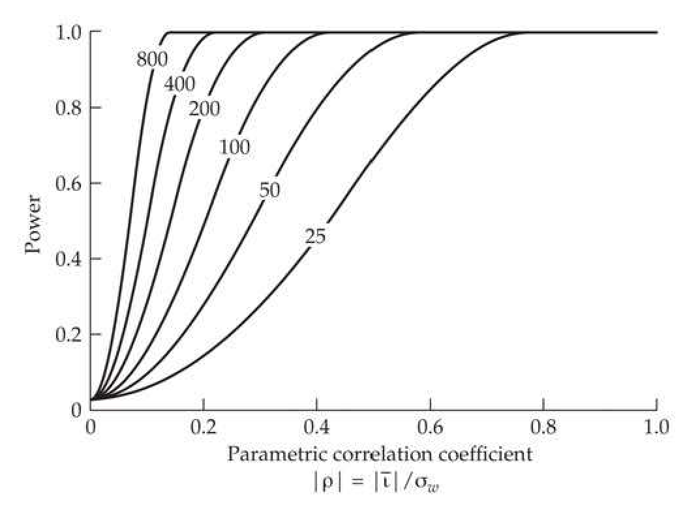
>
> Figure 29.9 The power of a univariate regression to detect a directional selection gradient is a function of the correlation ( $ \rho $) between trait value and relative fitness, where  $ \rho = \bar{\nu}/\sigma_w = \beta \sigma_z / \sigma_w $. Power is plotted as a function of  $ \rho $ with the curves for sample sizes starting at  $ n = 25 $ and successively doubling until 800. Here power is the probability that the sample correlation is declared significantly different from zero using a test of significance of  $ \alpha = 0.05 $. (After Hersch and Phillips 2004.)

---

## Evolution_chapter29_033 · DESCRIBING PHENOTYPIC SELECTION: INDIVIDUAL FITNESS SURFACES / Mean-standardized Gradients and Fitness Elasticities

Most traits of interest are scaled in the units of their measurement, which could be linear (lengths), areal (leaf surface), volumetric (mass), and even ordinal (traits such as shades of color). The evaluation of different traits across such a range of scales requires some sort of standardization to return a dimensionless quantity for comparison. Typically this is done by dividing a trait by its standard deviation (variance-standardization), or, less frequently, dividing it by its mean (mean-standardization). For example, Chapters 6 and 13 compared mean- and variance-standardization for the additive genetic variance and the selection response. As shown in Chapter 6, determining which standardization to use is not a trivial issue, as traits that are closely related to fitness have lower heritabilities (variance-standardized values) but higher coefficients of additive variance (mean-standardized values) relative to traits that are more distantly related to fitness.

**[定义 Definition]**

This debate on the appropriate standardization also extends to selection gradients. Following Lande and Arnold (1983), much of the literature has reported variance-standardized gradients, $ \beta_{sd} = \sigma_z \beta $ (also denoted as $ \beta_\sigma $). There are, however, potential concerns with variance-standardization (Chapters 6 and 13). The genetic variance (which influences the total variance) is itself a product of past selection, implying that a trait with a history of strong selection (and hence a smaller value of $ \sigma_z^2 $, due to selection reducing the level of genetic variation) may be perceived as being under stronger current selection than the same trait in a population with a history of weaker past selection (and hence a larger value of $ \sigma_z^2 $). Further, the nature of the trait (whether ordinal, dichotomous, or continuous) can result in dramatic differences in variance. Finally, variance-standardization does not naturally lead to an unambiguous definition of the relative strength of selection. While $ \beta_{sd} $ is the expected change in relative fitness induced by one standard-deviation change in $ z $, whether this is strong or weak depends, in part, on whether the standing variance is large or small.

An alternative is mean-standardization,

$$
\beta_{\mu}=\mu\beta
$$

an approach used as early as Johnson et al. (1955), and championed by Morgan and Schoen (1997), van Tienderen (2000), Hereford et al. (2004), and Matsumura et al. (2012) as superior to variance-standardization. The motivation for this scaling is that if $ \beta $ represents the change in w from a unit change in z, then $ \mu\beta $ represents the change in w for a change in z by an amount $ \mu $.

The relationship between the mean- and variance-standardizations is simply

$$
\frac{\beta_{\mu}}{\mu}=\beta=\frac{\beta_{sd}}{\sigma},\quad\mathrm{hence}\quad\beta_{\mu}=\frac{\mu}{\sigma}\beta_{sd}\quad\mathrm{and}\quad\beta_{sd}=\frac{\sigma}{\mu}\beta_{\mu}
$$

**[定义 Definition]**

Mean-standardization offers three potential benefits, one obvious, the other two more subtle. First, it does not depend on the trait variance, and hence removes the influence that past selection (in shaping the current variance) has on the measure of current selection strength. Second, it provides a natural scale for the strength of selection, as $ \beta_{\mu} = \frac{1}{W} \cdot w $ between trait fitness itself (z = W). To see this, first note that the relationship $ (W = \overline{W} \cdot w) $ between absolute (W) and relative (w) fitness implies, for z = W, that

$$
\beta=\frac{\sigma(z,w)}{\sigma_{z}^{2}}=\frac{\sigma(W,w)}{\sigma^{2}(W)}=\frac{\overline{W}\sigma^{2}(w)}{\overline{W}^{2}\sigma^{2}(w)}=\frac{1}{\overline{W}}
$$

giving $ \beta_{\mu} = \mu\beta = \overline{W}/\overline{W} = 1 $. Mean-standardized gradients are also used to obtain the proportional selection response for a trait, with

$$
\frac{R}{\mu_{z}}=\frac{\sigma_{A}^{2}}{\mu_{z}}\beta=\left(\frac{\sigma_{A}^{2}}{\mu_{z}^{2}}\right)\beta_{u}=I_{A}\beta_{u}
$$

where $ I_A = (\sigma_A^2/\mu_z^2) $ is Hansen's (Hansen et al. 2003, 2011) metric of evolvability (the square of Houle's 1992 original definition); see Chapter 6.

**[命题 Proposition]**

A final advantage of mean-standardized gradients is that they measure the elasticity of fitness with respect to a trait, namely the proportional increase in fitness given a proportional increase in the trait (Morgan and Schoen 1997; van Tienderen 2000). Under the assumption that z is Gaussian distributed, Equation 29.20a implies that

$$
\beta_{u}=\mu\beta=\mu\left(\frac{1}{\overline{W}}\frac{\partial\overline{W}}{\partial\mu}\right)=\left(\frac{\mu}{\partial\mu}\right)\left(\frac{\partial\overline{W}}{\overline{W}}\right)=\frac{\partial\ln(\overline{W})}{\partial\ln(\mu)}
$$

Comparison with Equation 29.4c shows that $ \beta_u $ is the elasticity of fitness (or more generally, of a fitness component) with respect to the trait. For example, if $ \beta_\mu = 0.3 $, increasing a trait value by $ \mu $ increases fitness by 30%. Conversely, with variance-standardization, $ \beta_{sd} = 0.3 $ implies that increasing the trait value by one standard deviation results in a 30% increase in fitness. This latter value, however, is not an elasticity because it is not expressed as a function of the proportional change of the trait.

This interpretation of $ \beta_{\mu} $ as an elasticity provides a natural connection between demography (the population growth rate, $ \lambda $) and evolution (the rate of change in a trait, R). Because elasticities are both additive and also satisfy the chain rule of differentiation, the elasticity of a trait on the population growth rate ($ \lambda $) can be computed as a function of the elasticity ($ e_{i} $) of the ith (out of k) fitness component ($ W_{i} $) of growth rate and the elasticity ($ \beta_{\mu,i} $) of the trait on the ith fitness component, yielding

$$
\frac{\partial\ln(\lambda)}{\partial\ln(\mu)}=\sum_{i=1}^{k}\left(\frac{\partial\ln(\lambda)}{\partial\ln(W_{i})}\right)\left(\frac{\partial\ln(W_{i})}{\partial\ln(\mu)}\right)=\sum_{i=1}^{k}e_{i}\beta_{\mu,i}
$$

Equation 29.33f, when paired with an appropriate path diagram connecting the trait to fitness components and also connecting those fitness components to $ \lambda $, forms the basis of elasticity path analysis, which offers a very flexible approach for treating components of fitness (Chapter 30).

An example suggested by Hereford et al. (2004) illustrates this connection. In their meta-analysis, Hereford et al. found medians of the mean-standardized gradients, $ \beta_{\mu} $, over their sample of traits on viability and fecundity of 0.57 and 0.23, respectively. Likewise, using an avian dataset, Sæther and Bakke (2000) found average elasticities of viability and fecundity of $ e = \partial \ln(\lambda) / \partial \ln(W_i) = 0.6 $ and 0.25, respectively, on population growth. These values showed that a proportional change in viability had a far larger $ (0.6 / 0.25 = 2.4 $-fold) impact on the growth rate, $ \lambda $, than did the same proportional change in fecundity.

Combining the median $ \beta_{\mu} $ values for traits reported by Hereford et al. (2004) with the average elasticity values reported by Sæther and Bakke (2000), the elasticity of a trait on $ \lambda $ via viability selection is $ 0.6 \cdot 0.57 = 0.34 $, while the elasticity through fecundity is $ 0.25 \cdot 0.23 = 0.06 $, for a total elasticity of $ 0.34 + 0.06 = 0.40 $, with the vast majority (86%) via its impact on viability. Hence, a doubling of the trait value results in a 40% increase in the growth rate, mostly through its impact on viability. This is not an isolated case. As summarized by Crone (2001), across a range of studies, adult viability usually had a much higher elasticity than fecundity. The exception was in semelparous plants (those with only a single episode of reproduction before death), where growth rate had the highest elasticity, followed by fecundity, and then adult viability. Hence, all else being equal, traits under viability selection likely have a larger impact on $ \lambda $.

Despite their appeal, there are restrictions and caveats concerning mean-standardized gradients. First, they are only defined for traits where the origin on their measurement scale is not arbitrary. While many traits have a biologically motivated zero value (e.g., height, weight), this restriction excludes many interesting traits, such as seasonal timing (the origin of the calendar is arbitrary) and composite traits (e.g., principal components) (Kingsolver and Pfenning 2007). Second, there are delicate issues in the use of mean-standardization with dichotomous traits, such as the resistance fraction (f) and its complement, the susceptible fraction (1 - f). Because either fraction can be used as a measure of the strength of selection, they should both return the same standardized gradients, but the mean-standardized gradients for resistance and susceptibility are different unless $ f = 1/2 $ (Stinchcombe 2005). Finally, Kingsolver and Pfenning (2007) noted that traits with large $ \beta_\mu $ values tend to have small coefficients of variation, a trend not expected if $ \beta_\mu $ is a fair standardization.

---

## Evolution_chapter29_034 · MOVING AWAY FROM QUADRATIC FITNESS FUNCTIONS / Quadratic Surfaces Can Be Very Misleading

A potentially serious problem with quadratic regressions as estimators of $ W(z) $ is that they allow for only a single local maximum or minimum. Fitness surfaces with multiple local maxima, or even sharp transitions, are thus poorly described by a quadratic. Figure 29.10A presents a particularly illustrative example, showing that a quadratic fit to a truncation-selection fitness function creates a spurious local minimum. Given this potential for a very misleading view of the fitness surface, why is there so much focus on quadratic regressions? There are two primary motivations. First, the quadratic is the simplest function that allows for curvature, and hence is the simplest estimate of any nonlinearity in the fitness surface. Second, and much more important, when the conditions for the breeder's equation hold (Chapters 6, 13, and 24), the sole measures of phenotypic change entering into the short-term selection response equations for mean (Equation 13.8c) and variance (Equation 16.7b) are the coefficients from the best linear ($ \beta $ from Equation 29.25b) and best quadratic ($ \gamma $ from Equation 29.29f) fit. Hence, even if the fitness surface is very poorly described by a quadratic, even to the point of being very misleading (Figure 29.10), one would still extract the coefficients for the response in the mean and variance by using the quadratic estimate. There is thus the potential for conflict in the use of quadratic regressions between ecologists (who wish to ascertain how traits influence fitness) and evolutionary biologists (who wish to examine how these traits might evolve). In reality, however, both viewpoints are correct. The more accurate the description of the fitness surface, the more ecological insight it provides into the trait, but this fitness surface also needs to be translated into the required parameters to predict the evolutionary dynamics of the trait.

> **Figure 29.10** · page 46 · source: `Evolution_chapter29`
>
> 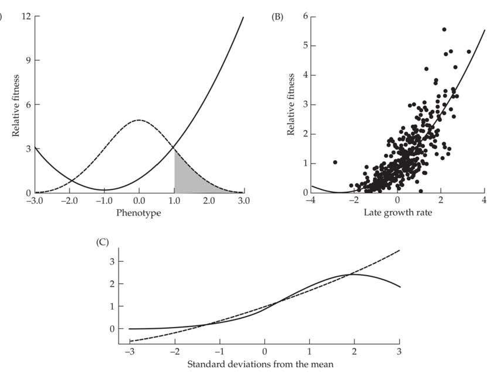
>
> Figure 29.10 Examples of misleading approximations of W(z) resulting from using a quadratic regression. A: A hypothetical example wherein phenotypes are normally distributed with only individuals exceeding one phenotypic standard deviation surviving (i.e., threshold selection). The best quadratic regression erroneously suggests the presence of disruptive selection (by introducing a false minimum), rather than the strict directional selection that is actually occurring. In contrast (not shown), the same logic shows that if individuals above 1.0 are culled, then the quadratic surface would indicate stabilizing selection by introducing a false maximum. (After Schluter 1988.) B: Data from Mitchell-Olds and Bergelson (1990) on individual fitness as a function of late growth rate (z) for the annual plant Impatiens capensis. The data clearly depart from linearity, as they show curvature. The best-fitting quadratic (plotted) indicates a minimum in fitness (disruptive selection) around z ≈ −2.4. However, a better fit was given by a model of exponentially increasing fitness, with w(z) + 0.5 = exp(0.52 + 0.46 - z - 0.002 - z^2), suggesting that strict directional selection is acting on z, as this function monotonically increases over the character range being measured. (After Mitchell-Olds and Bergelson 1990.) C: When the optimal value under true stabilizing selection (solid curve; with the true W(z) given by Equation 29.34a) is sufficiently above the current population mean, the best-fitting quadratic (dashed curve) has a positive curvature ( $ \gamma > 0 $). Here the population mean is at zero, and the optimum is two standard deviations above zero. If the mean were two standard deviations above the optimum, the best-fitting quadratic would have a negative curvature ( $ \gamma < 0 $). (After Geyer and Shaw 2008; Shaw and Geyer 2010.)

---

## Evolution_chapter29_035 · MOVING AWAY FROM QUADRATIC FITNESS FUNCTIONS / Gaussian and Exponential Fitness Functions

If our sole focus is in describing the fitness surface (as opposed to extracting components of selection response), then other parametric forms besides the simple quadratic could be considered. One obvious candidate is a Gaussian fitness function

$$
W(z)=a\cdot\exp\left(-\frac{(z-\theta)^{2}}{\omega^{2}}\right)
$$

Weldon (1901), in one of the first studies of selection on a quantitative trait in nature, remarked that the Gaussian seems to be a good description of the fitness function (in his case, crab survival as a function of size), and it was used by Cavalli-Sforza and Bodmer (1971) to model the relationship between human birth weight and survival observed by Karn and Penrose (1951).

To model strictly directional selection, the exponential function,

$$
W(z)=a\cdot\exp(bz)
$$

can be used, while the more general function,

$$
W(z)=c\cdot\exp(a+bz+cz^{2})
$$

allows for both directional and stabilizing or disruptive selection (Mitchell-Olds and Bergelson 1990; see Figure 29.10B). If a trait is normally distributed before selection, it remains normally distributed following selection when Equation 29.34c is the fitness function, of which Equations 29.34a and 29.34b are special cases (Felsenstein 1977).

---

## Evolution_chapter29_036 · MOVING AWAY FROM QUADRATIC FITNESS FUNCTIONS / Semiparametric Approaches: Schluter's Cubic-spline Estimate

In order to more reliably estimate the fitness function, Schluter (1988) developed a semi-parametric method that makes no assumptions about the functional form of the fitness surface, but does require assumptions about the distribution of residuals. Schluter's approach fits the data with a series of cubic splines (a series of cubic polynomials that join smoothly together), and uses generalized cross-validation to generate a "best fit" criterion for model selection. In some sense, this is a nonparametric model, as it makes no assumptions about the functional form of the fitness surface. It is, however, parametric in the sense that model fitting requires assumptions about the distribution of the residuals as a function of phenotypic value, z. Schluter developed a program to estimate $ W(z) $ when assuming either normal, binomial, or Poisson distributed residuals, using a resampling procedure to generate rough confidence intervals on estimates of $ W(z) $. Examples of fitness surfaces that were estimated using this approach are given in Figure 29.11. When one of the classical examples of stabilizing selection, the data of Karn and Penrose (1951) relating survival of human infants to their birth weight, was reanalyzed using Schluter's method, the local maximum was not significant. Parametric tests of the significance of estimated local maxima or minima were discussed by Mitchell-Olds and Shaw (1987) for quadratic regressions, while nonparametric tests were discussed by Schluter (1988). Gimenez et al. (2006) extended Schluter's method to survival estimates based on capture-recapture data.

> **Figure 29.11** · page 47 · source: `Evolution_chapter29`
>
> 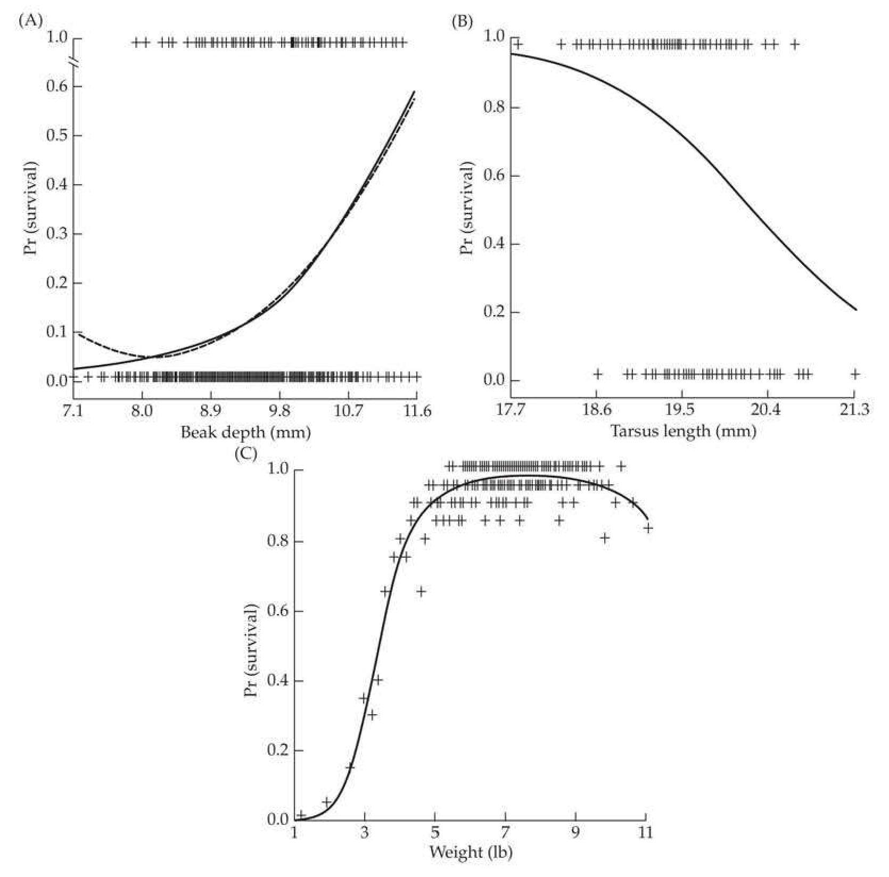
>
> Figure 29.11 Examples of fitness surfaces generated using Schluter's cubic-spline estimate. The actual fitness values for individuals are indicated by +, and the solid curve indicates the cubic-spline estimate of  $ W(z) $. A: Probability of survival as a function of beak depth in Darwin's finch ( $ Geospiza\ fortis $). The dashed curve indicates the estimate of the surface by a quadratic regression, which generates a spurious minimum. B: Overwinter survival in juvenile female song sparrows ( $ Melospiza\ melodia $) as a function of tarsus length. C: Survival of male human infants as a function of birth weight. (After Schluter 1988.)

---

## Evolution_chapter29_037 · MOVING AWAY FROM QUADRATIC FITNESS FUNCTIONS / Janzen-Stein and Morrissey-Sakrejda Gradients: Calculating Average and Landscape Gradients Under General Fitness Functions

We have shown that when phenotypes are normally distributed before an episode of selection, $ \beta = S/\sigma_{z}^{2} $ equals two different summary statistics of the geometry of selection,

$$
\beta=\int\frac{\partial w(z)}{\partial z}p(z)dz=\frac{\partial\ln\overline{W}}{\partial\mu_{z}}
$$

namely, the average selection gradient (the average slope of the individual fitness surface over the current distribution of phenotypes) and the landscape gradient (the gradient of log mean fitness with respect to the population mean). This relationship also holds for any phenotypic distribution when the individual fitness function is exactly a quadratic (Equations 29.30c and 29.30g). Outside of this special case for a quadratic $ w(z) $ these equalities break down when the distribution of z is no longer normal distributed.

This raises the question of how to obtain these gradients when the trait does not follow a normal distribution and the individual fitness function is not a quadratic. For example, suppose the fitness surface is fitted by a nonquadratic function (such as Equations 29.34a or 29.34b) or by using Schluter's semiparametric regression. What should we take as the "gradient" of fitness in this case? The answer very much depends on the specific question that an investigator is asking. If one wishes to obtain a summary measure of the nature of selection, then the average gradients (the average slope or curvature; Equation 29.20b and 29.20c) might be a reasonable metric.

Janzen and Stein (1998) considered the case in which some general individual fitness surface, $ w(z) $, was fit using n observations. Motivated by Equation 29.20b, they suggest using

$$
\beta_{JS}=\int\frac{\partial w(z)}{\partial z}p(z)dz=E_{z}\left[\frac{\partial w(z)}{\partial z}\right]\simeq\frac{1}{n}\sum_{i=1}^{n}\frac{\partial w(z)}{\partial z}\bigg|_{z=z_{i}}
$$

with the last step following by approximating the expectation by using the sampled values. We refer to this as a Janzen-Stein selection gradient. They used this approach to obtain a gradient when a logistic function is used to fit $ w(z) $, where an explicit form of the required derivative is easily obtained. The same approach can be extended to the average curvature of the individual fitness surface by recalling Equation 29.20c, which calculates the corresponding Janzen-Stein (quadratic) gradient as

$$
\gamma_{JS}=\int\frac{\partial^{2}w(z)}{\partial z^{2}}p(z)dz\simeq\frac{1}{n}\sum_{i=1}^{n}\frac{\partial^{2}w(z)}{\partial z^{2}}\bigg|_{z=z_{i}}
$$

When the fitness surface is complex (for example, a fine-meshed grid with individual fitness values for each coordinate, such as would be returned by a semiparametric regression), numerical methods can be used to compute the required partials for Equations 29.35a and 29.35b. When $ \delta \simeq 0 $,

$$
\left.\frac{\partial w(z)}{\partial z}\right|_{z=z_{i}}\simeq\frac{w(z_{i}+\delta/2)-w(z_{i}-\delta/2)}{\delta}
$$

$$
\left.\frac{\partial^{2}w(z)}{\partial z^{2}}\right|_{z=z_{i}}\simeq\frac{w(z_{i}-\delta)-2w(z_{i})+w(z_{i}+\delta)}{\delta}
$$

While average gradients of the individual fitness function provide reasonable summary statistics for discussions about the nature of selection, if the concern is the evolution of these traits over time, then landscape gradients are required. This follows from our extensive discussion in Chapter 24 of selection response when normality no longer holds. The generalized Barton-Turelli selection response equations (Equation 24.26) for changes in the phenotypic moments after a generation of selection requires estimates of various partials of the landscape gradient with respect to the moments of the phenotypic distribution. If the underlying genetics are such that the distribution of breeding values is nearly normal, then (Equation 24.30a) the only measure of selection entering into the equation for the change in mean is the landscape gradient with respect to the population mean. If the distribution of breeding values shows skew and/or kurtosis (specifically, a nonzero value of the scaled kurtosis, $ \kappa_4 = [\mu_4, G - 3\sigma_A^4] / \sigma_A^4 $), then partials of the landscape gradient with respect to the phenotypic variance and skew are required to predict the change in mean.

**[定义 Definition]**

The requirement of landscape gradients to predict selection response motivates the definition of the Morrissey-Sakrejda selection gradient (Morrissey and Sakrejda 2013, 2014; Morrissey 2014a). Following Janzen and Stein, they suggest that this gradient (for a given estimated fitness function) can also be computed numerically. Here

$$
\beta_{M S}=\frac{\partial\ln\overline{W}}{\partial\mu_{z}}=\frac{1}{\overline{W}}\frac{\partial\overline{W}}{\partial\mu_{z}},\quad\mathrm{w h e r e}\quad\overline{W}=\frac{1}{n}\sum_{i=1}^{n}W(z_{i})
$$

A similar expression defines $ \gamma_{MS} $. This approach works for general fitness surfaces, such as those estimated using a semiparametric regression, and nonnormal distributions.

---

## Evolution_chapter29_038 · Individual Fitness and the Measurement of Univariate Selection: Introduction / MORE REALISTIC MODELS OF THE DISTRIBUTION OF FITNESS COMPONENTS

Placing the estimation of fitness components, total fitness, and fitness surfaces within a rigorous statistical framework requires more realistic models for the distribution of fitness residuals. We build toward this goal in two steps. First, we introduce a number of generalized linear models (a topic initially discussed in Chapter 14) that allow for more biologically realistic modeling of the distribution of fitness effects within a given episode of selection. We then turn to aster models that compute the much more complex distribution resulting from the compounding of component distributions over multiple episodes of selection.

---

## Evolution_chapter29_039 · MORE REALISTIC MODELS OF THE DISTRIBUTION OF FITNESS COMPONENTS / Generalized Linear Models for Fitness Components

The data for total fitness are nonnegative integers, representing the number of offspring left by an individual. The components that make up total fitness are also integer data, and fall into two broad distributional categories. We first consider Bernoulli random variables (fitness components have a value of 1 with probability p, else they have a value of 0), such as occurs with viability selection (alive or dead) and mating status (mated or not mated).

Translating Bernoulli components of fitness into a fitness surface requires a model of how p varies with trait value, z (or more generally, a set of trait values represented by the vector, z). A natural choice is the logistic regression model (Janzen and Stein 1998), which was introduced in Chapter 14. Equation 14.10a presented its simplest version,

$$
W(z)=p(z)=\Pr(survival\mid z)=\frac{\exp(a+bz)}{1+\exp(a+bz)}=\frac{1}{1+\exp(-[a+bz])}
$$

Equation 29.36a is a model of directional selection, as $ W(z) $ increases toward one as z increases when b > 0. Likewise, $ W(z) $ decreases toward zero as z increases when b < 0. As discussed in Chapter 14, a logistic regression is equivalent to modeling $ p(z) $ using the logit function,

$$
\begin{aligned}\operatorname{logit}[p(z)]=\ln\left[\frac{p(z)}{1-p(z)}\right]=\begin{cases}a+b z&(univariate case)\\a+\sum_{i}b_{i}z_{i}=a+\mathbf{b}^{T}\mathbf{z}&(multivariate case)\end{cases}\end{aligned}
$$

The upper righthand expression in Equation 29.36b corresponds to modeling the logit of p with a simple linear regression, while the lower expression is a more general linear model, which could include quadratic terms (e.g., $ b_1 z + b_2 z^2 $), which allows for the possibility of either concave or convex selection. Most generally, the righthand expressions in Equation 29.36b could be a full mixed model. For example, Coulson (2012), modeled the impact of size, z, on survival in Soay sheep by assuming that

$$
\mathrm{logit}[p(z,t)]=a+bz-\eta N(t)+r(t)
$$

where the fixed effect ($ \eta $) accounts for density-dependent survival ($ N[t] $ is the population size at time t), and the random effect, $ r(t) $, accounts for the environmental effect at time t.

Logistic regressions naturally accommodate the heteroscedastic nature of residuals for viability (and other Bernoulli random variables), and maximum likelihood (LW Appendix 3) can be used to estimate model parameters. Modifications of logistic regressions can also be used to estimate fitness using capture-recapture data (Kingsolver and Smith 1995). Capture-recapture models were reviewed by Lebreton et al. (1992), while the analysis of the targets of selection using capture-recapture data was further discussed by Conroy et al. (2002), Zabel et al. (2005), and Gimenez et al. (2006).

The logit function takes an unconstrained linear model (with potential values over $ -\infty $ to $ \infty $) and maps it into the constrained parameter space for $ p $, namely, between zero and one. As mentioned in Chapter 14, this is the basic structure of generalized linear models: the conditional expectation of an observed value, $ y $, given some underlying variable, $ z $, can be expressed as $ E(y \mid z) = g(z) $ for some monotonic function $ g $, where some inverse transformation returns a linear model,

$$
g^{-1}\left[E(y\mid z)\right]=z=\mu+\sum\beta_{k}x_{k,i}
$$

The inverse function, $ g^{-1} $, is called the link function, as it transforms the conditional expectation into a linear model.

The basic idea of such models is that some underlying (and unobserved) latent variable, z, is transformed into an observed variable, y. Such a model can be thought of as having three distinct scales (de Villemereuil et al. 2016): (i) an underlying latent scale, the value of z; (ii) an expected data scale, $ E(y \mid z) = g(z) $, which is the expected value of y for that value of z; and (iii) an observed data scale, the actual observed value of y, which is a function of its expectation plus a residual error, where the latter need not be normal (and indeed, usually is not). This approach is called a generalized linear model (GLM) if the latent variable, z, is modeled via a standard general linear model (involving only fixed effects), and a generalized linear mixed model (GLMM) if we model z as a mixed linear model (z is a mixture of both fixed and random effects; e.g., Coulson 2012). GLMs and GLMMs allow for fairly general error structures (e.g., Poisson, binomial, etc.) and are generally solved by either maximum-likelihood or Bayesian approaches (e.g., Hadfield 2010). GLMs and GLMMs were reviewed in detail by McCulloch et al. (2008) and Stroup (2012).

More general survival functions (beyond the simple logistic) can be found in the analysis of clinical trials (e.g., Klein and Moeschberger 1997; Lawless 2003) and time-to-failure analysis from industrial statistics (e.g., Kenett and Zacks 1998), both examples of survival analysis. Manly (1976) suggested the use of the double exponential fitness function for viability data, where

$$
W(z)=\Pr(survival\mid z)=\exp(-\exp[a+bz])
$$

This is a special case of the classic proportional-hazards model (Cox 1972) for human clinical trails, wherein the probability of survival to time t is determined by a general risk for every individual in the population (specified by some monotonically nondecreasing function, $ g(t) $, so that probability of survival declines with increasing values of t), and a specific (proportional) risk for the particular phenotype z, which yields

$$
W(z,t)=\Pr(survival\mid z,t)=\exp(-\exp[ag(t)+bz])
$$

One choice is $ g(t) = \ln(t) $, giving the general risk as $ \exp(-\exp[ag(t)]) = \exp(-\lambda t) $, namely the exponential distribution (a constant, i.e., age-independent, risk), weighted by the risk for phenotype z,

$$
W(z,t)=\exp\left(-\left[\lambda t\right]\cdot\exp[b z]\right)
$$

If survival at stage j is measured, the proportional-hazards model can be written as

$$
W(z,j)=\Pr(survival\mid z,j)=\exp(-\exp[h_{j}+bz])
$$

One advantage of using proportional-hazards models (due to the memoryless feature of the exponential distribution) is that they can allow for certain types of missing, or censored, data (Little and Rubin 2002), such as the last time a marked individual was recovered.

Given that an individual has survived and mated, the second broad class of probability models for fitness components involves discrete counting distributions, which range over 0, 1, 2,..., such as number of mates or number of offspring per mating. One candidate distribution is the Poisson (Equation 14.16), which is solely a function of its mean value, $ \theta $. As with Bernoulli data, we need a model for how $ \theta $ varies as a function of the trait value z, in which case the probability of j offspring (or j mates, or j of some other fitness component) is

$$
\Pr(W=j\mid z)=e^{-\theta(z)}\frac{\theta(z)^{j}}{j!}
$$

From Equation 14.17b, the log-linear model is a candidate for translating z into a mean for the Poisson, where

$$
\ln[\theta(z)]=a+b z
$$

Because $ \theta(z) $ is constrained to be nonnegative, Equation 29.39b takes an unconstrained linear model and maps it into the range $ (0,\infty) $, corresponding to the allowable range of means for a Poisson. More generally, for n traits we can use the log-linear model,

$$
\ln[\theta(z)]=a+\sum_{i}^{n}b_{i}z_{i}=a+\mathbf{b}^{T}\mathbf{z}
$$

which again can include quadratic terms (e.g., $ a + b_{1}z + b_{2}z^{2} $) and hence model concave or convex selection.

One limitation of the Poisson is that its mean equals its variance, whereas fitness data are often overdispersed, with the variance exceeding the mean (often, but not always, caused by an excess of zero values). In overdispersed settings, an alternative candidate model is the negative binomial distribution. This models the total number of successes $ (y) $ that occur before $ r $ failures for independent trials with a success probability of $ p $,

$$
\Pr(y=j\mid r,p)=\frac{(j+r-1)!}{j!(r-1)!}p^{j}(1-p)^{r}\quad for\quad j=0,1,\cdots
$$

If a random variable, y, follows a negative-binomial distribution, denoted by $ y \sim NB(r, p) $, then its mean and variance are

$$
\mu_{y}=\frac{pr}{1-p}\quad and\quad\sigma_{y}^{2}=\frac{pr}{(1-p)^{2}}.\quad Hence\quad\frac{\sigma_{y}^{2}}{\mu_{y}}=\frac{1}{1-p}>1
$$

showing that the variance can exceed the mean by an arbitrary amount. Because of this feature, the negative-binomial is often used in place of a Poisson to allow for overdispersion (Wilson et al. 2005b; Yang et al. 2009). One approach for modeling fitness data using this distribution is to assume a constant r value for all trait values (estimated from the data), and then model $ p(z) $ using the logit function (Equation 29.36b). The negative binomial is the sum of r geometric random variables, and hence is the discrete counterpart of the gamma distribution (which is the sum of r exponential random variables; Appendix 2).

Two other approaches for building discrete counting distributions for fitness components deal with the often problematic issue of handling an excess of zero values (Martin et al. 2005). The first is to use a zero-truncated distribution, whose values are conditional on being nonzero (i.e., they ignore zero values entirely). If we let $ \phi(j|z) = \operatorname{Pr}(W = j|z) $ denote a discrete counting distribution (such as a Poisson, binomial, or negative binomial), then its zero-truncated version is given by

$$
\Pr(W=j\mid z)=\frac{\phi(j\mid z)}{1-\phi(0\mid z)}\quad for\quad j\geq1
$$

where $ j $ equals number of offspring, mates, flower heads, and so forth. For example, the zero-truncated Poisson is

$$
\Pr[W=j\mid\theta(z)]=\frac{\theta(z)^{j}e^{-\theta(z)}/j!}{1-e^{-\theta(z)}}=\frac{e^{-\theta(z)}}{1-e^{-\theta(z)}}\cdot\frac{\theta(z)^{j}}{j!}\quad for\quad j\geq1
$$

As above, the trait-specific mean $ \theta(z) $ can be modeled as a log-linear model (Equations 29.39b and 29.39c). This can be generalized to a k-truncated distribution, wherein the first k states (i.e., 0 to a value of k - 1) are ignored

$$
\Pr(W=j\mid z)=\frac{\phi(j\mid z)}{1-\sum_{i=0}^{k-1}\phi(i\mid z)}\quad for\quad j\geq k
$$

and which occasionally appears in the selection literature (Shaw et al. 2008).

The other approach is to construct a zero-inflated distribution, which includes an additional point mass, $ 1 - q(z) $, at zero,

$$
\Pr(W=j\mid z)=\left\{\begin{aligned}&1-q(z)+q(z)\phi(0\mid z)&\text{for}j=0\\ &q(z)\phi(j\mid z)&\text{for}j\geq1\end{aligned}\right.
$$

where (as above) $ \phi(j \mid z) = \operatorname{Pr}(W = j \mid z) $ is a discrete counting distribution and $ q(z) $ is the probability that the observation given z is not zero-inflated. As above, we can model $ q(z) $ using the logit function (Equation 29.36b). Alternatively, one can model the zero-inflated distribution as an atom (probability mass) at zero and a zero-truncated distribution if not zero.

---

## Evolution_chapter29_040 · MORE REALISTIC MODELS OF THE DISTRIBUTION OF FITNESS COMPONENTS / Aster Models: Modeling the Distribution of Total Fitness

While the above section presented more realistic distributions for a given component of fitness, the distribution of lifetime fitness is much more complex, compounding a series of Bernoulli (viability, mating, etc.) and discrete counting distributions (number of mates, number of offspring, etc.). The resulting distribution incorporating all of these episodes has an excess of zero values and does not fit any standard distribution. Ideally, one would like an approach that allows an investigator to specify the distribution of each of the components and then arrive at the correct distribution of total fitness.

An example of this problem is presented in Figure 29.12, which shows the life history of the purple coneflower (Echinacea angustifolia) in the family Asteraceae (Geyer et al. 2007). A single individual may survive year one ($ M_1 $), in which case it may flower ($ F_1 $), in which case it has some discrete flower head-count status ($ H_1 $), with this pattern continuing in years two and three (assuming survival). Lifetime flower head production ($ \sum H_i $) is used as the surrogate for total fitness. Even this fairly simple life history has a complex, very nonstandard, distribution for total fitness. One can model the $ M_i $ and $ F_i $ values as Bernoulli random variables, and the $ H_i $ values as zero-truncated Poisson's (because we are conditioning on them flowering). Equivalently, conditioned on survival ($ M_i = 1 $), flower head status $ H_i $ could be directly modeled as a zero-inflated Poisson.

Motivated by the problem posed by Figure 29.12, Geyer et al. (2007; 2013; Shaw et al. 2008; Geyer 2010; Geyer and Shaw 2010a, 2010b) developed an approach they called aster models (a homage to the initial aster study) as a very flexible framework for modeling the distribution of total lifetime fitness given a life-history graph. As Geyer noted, the term aster models is far catchier than “forest graph exponential family conditional or unconditional canonical statistic models.” Aster models start with a life-history graph (a forest graph, as there are no loops and each node has only one predecessor), and assume that the distribution to the next step of the graph (a fitness component) is a member of the exponential family (which includes Bernoulli, binomial, Poisson, and negative binomial distributions, as well as their truncated versions).

Shaw et al. (2008) noted that simple aster models correspond to previous methods of analysis. The simplest life-history graph is $1 \rightarrow X$. If $X$ is normally distributed, this is a standard linear model (such as Lande-Arnold regression). If $X$ is Bernoulli, this is a logistic regression (Equation 29.36), while if $X$ is Poisson, this is the log-linear model (Equation 29.39c). The graph is $1 \rightarrow X \rightarrow Y$, where $X$ is Bernoulli and $Y$ is either a zero-truncated Poisson or a zero-truncated negative-binomial correspond to the zero-inflated versions of these distributions (Equation 29.42). Finally, the graph $1 \rightarrow X_{1} \rightarrow X_{2} \rightarrow \cdots \rightarrow X_{n}$ (where all the $X_{i}$ are Bernoulli) corresponds to survival analysis. The power of aster models is that they use the specific life-history details of the organism of interest and reasonable candidate distributions for each fitness component to build up a proper distribution of lifetime fitness.

By modeling the parameter values for each fitness component distribution as functions of trait value z (e.g., Equations 29.36b and 29.39c), aster models can be used to construct fitness surfaces using the correct residual structure. This can be done using Geyer's R package aster2. We return to aster models and fitness surfaces in Chapter 30.

---

## Evolution_chapter29_041 · Individual Fitness and the Measurement of Univariate Selection: Introduction / THE IMPORTANCE OF EXPERIMENTAL MANIPULATION

Several authors have stressed that regression approaches should be viewed as only the preliminary step in any analysis of the actual agents of selection, treating any suggested traits under selection as candidates to be further tested by experimental manipulation (Mitchell-Olds and Shaw 1987, 1990; Schluter 1988; Wade and Kalisz 1990; Kingsolver and Pfenning 2007). Further, as Example 29.1 highlights, the role of the invisible fraction (selection on a trait before it is expressed) is generally only accessible by direct manipulative experiments (Hadfield 2008). Recall that in Example 29.1, the very strong selection on the invisible fraction (here, viability selection on time to flowering) would have been missed if not for transplant experiments with known flower-size genotypes. A second interesting example is the work of Sinervo and McAdam (2008) on clutch size in side-blotched lizards (Uta stansburiana). Through the use of both hormonal control and surgical reduction in the number of ovaries, they showed a viability cost to increased clutch size that occurs before clutch size is expressed.

One can envision two (not mutually exclusive) experimental approaches for assessing trait-fitness relationships: environmental manipulation and phenotypic manipulation. The idea of assessing fitnesses in manipulated environments (be they physical or biotic alterations) traces back to the first attempts to measure natural selection on quantitative traits. Weldon (1895, 1899) observed that the frontal-length to carapace-length ratio in the European green crab (Carcinus maenas) declined over a five-year period in Plymouth Sound. Noting that a breakwater in the harbor had recently been competed, he hypothesized that increased silt accumulation might be a selective agent behind this change. To test this, he exposed crabs to silt conditions similar to that expected in Plymouth, and found that the survivors in this laboratory setting had reduced frontal length. He hypothesized that narrow frontal length had an impact on filtering out sediments.

A more recent example where the biotic, rather than physical, environment was altered involves the work of Breden and Wade (1989), who observed a positive relationship between group size and fitness in the imported willow leaf beetle. However, when predators were excluded, there was no such relationship, so that $ \beta $ is correlated with the environment (presence or absence of predators). Wade and Kalisz (1990) suggested computing fitness regressions in several different environments, and looking for correlations between $ \beta $ (and/or $ \gamma $) and environmental features (Figure 29.13). Such correlations suggest specific environmental features for candidates as causal agents of selection.

> **Figure 29.13** · page 56 · source: `Evolution_chapter29`
>
> 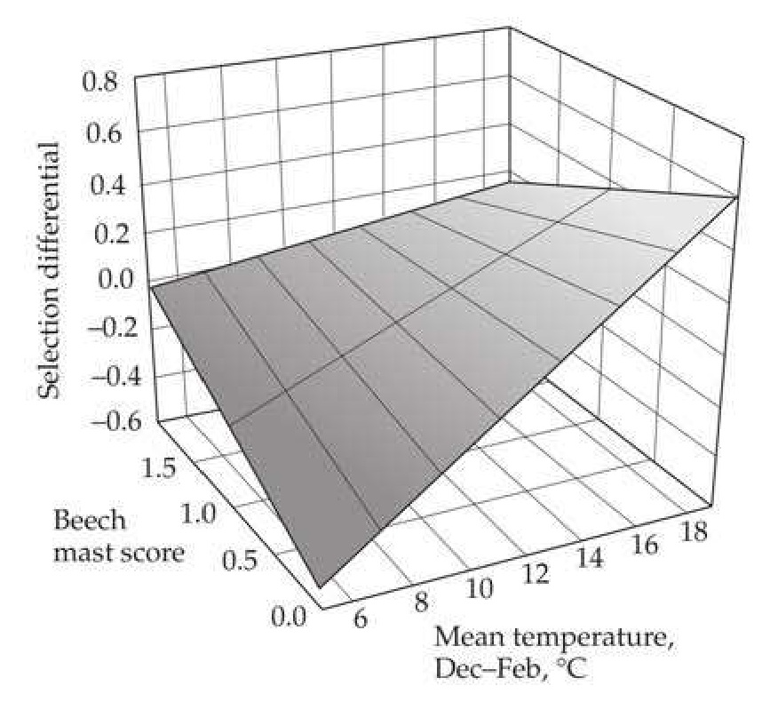
>
> Figure 29.13 The eco-evolutionary surface for selection on fledging weight in great tits (Parus major), based on data from Wytham Woods, Oxford, England. The fitted surface plots the selection differential, S, for fledging weight as a function of biotic (food) and abiotic (temperature) variables. The abiotic variable was the average December to February temperature, the biotic variable the amount of beech tree (Fagus sylvatica) nuts, given by the mast score. (After MacColl 2011.)

Under phenotypic manipulation, the investigator artificially modifies the value of the focal trait in individuals and then assesses the fitness consequences in nature (e.g., Sinervo and Basolo 1996; Travis and Reznick 1998). A classic example of this approach is the work of Andersson (1982), which examined the impact of tail length in male mating success in a

Kenyan population of long-tailed widowbirds (Euplectes progne). Males with experimentally elongated tails showed greater mating success than males with normal or shortened tails. Further, shortened tails had no impact on the ability of males to control territories, indicating that female choice, rather than male-male competition, was the selective force acting on tail length.

One caveat about using artificial manipulations is that because they may produce variants far outside the normal range of the distribution of z, estimates of $ \beta $ and $ \gamma $ may be correspondingly spurious (Arnold 1988). Conversely, it has been argued that many traits may be near their optima and hence show a limited range of variation relative to the selective forces faced during their evolution. Given this potentially limited range of phenotypes, Lexer et al. (2003) suggested that experimental hybridization with closely related species (which is often easily to accomplish in plants) may provide important insight into the nature of selection. However, hybrids can have a number of significant fitness consequences outside the impact of specific traits on fitness, and hence caution is in order when using this approach.

**[示例 Example]**

*(See Example 29.11.)*

---

## Evolution_chapter29_042 · THE IMPORTANCE OF EXPERIMENTAL MANIPULATION / Performance and Eco-evolutionary Surfaces

The ultimate aim of detecting selection on a trait is not just to understand its nature (directional, convex, concave), but ideally its ecological causes. Phenotypic manipulation can verify that a trait is under selection, but may offer little direct insight into the forces underlying that selection. Functional morphology may offer increased insight, by considering the impact that a trait (or suite of traits) has on one (or more) composite performance traits that directly influence fitness (such as running, flying, or swimming speed; seed dispersal; or predator avoidance). The idea is that the performance value (h), not the trait value (z), is the direct target of selection, giving the causal (path) diagram as $ z \rightarrow h \rightarrow w $, with more ecological insight garnered by considering the nature of selection acting on h. In exactly the same fashion that we constructed an individual fitness surface for the trait using regressions, Arnold (1983b, 2003) suggested the use of performance surfaces. Here linear or quadratic regressions are used to predict a performance value, h, given the observed traits,

$$
h=a+\sum_{i}b_{i}z_{i}+\sum_{j}\sum_{k}c_{jk}z_{j}z_{k}+\epsilon
$$

Arnold suggested that performance surfaces can offer important insight, potentially bridging a conceptual gap between trait and fitness values through a functional intermediate that is more biologically interpretable (also see Geber and Griffin 2003 for a plant perspective). By analogy with Equation 29.29b, the regression coefficients $ (b_i $ and $ c_{jk}) $ in Equation 29.43 are often referred to as performance gradients.

Performance is occasionally used as a direct proxy for fitness (one measures performance, rather than directly measuring fitness), and the performance gradients subsequently taken as proxies for fitness gradients. Franklin and Morrissey (2017) cautioned that the conditions under which performance gradients (coefficients of z in the h on z regression) correspond to selection gradients (coefficients of z in the w on z regression) are very narrow. Specifically, the regression of fitness on the performance score (h) must be both linear and with an intercept of zero.

A complementary approach is that of MacColl (2011), who suggested that ecological insight can be gleaned by regressing selection differentials or gradients on potential biotic or abiotic factors, generating an eco-evolutionary surface (Figure 29.13), and thus generalizing the suggestion of Wade and Kalisz (1990). The idea is that one has trait-fitness data over a series of years along with candidate biotic and abiotic factors, fitting the regression

$$
\beta=a+b_{1}f_{1}+b_{2}f_{2}+\cdots+b_{k}f_{k}+\epsilon
$$

where $ f_{i} $ represent environmental and biotic values. This is a modification of the factor regression approach used by plant breeders to decompose G × E into sensitivities to specific environmental components (e.g., Baril 1992; Baril et al. 1995; Epinat-Le Signor 2001). Equation 29.44 generates a surface that attempts to predict trait selection as a function of ecological variables (regressing the selection gradient or differential for a trait as a function of ecological factors, as opposed to a fitness surfaces, which regresses fitness on trait values).

MacColl (2011) gave an example of selection on fledging weight in great tits (Parus major) as a function of December to February temperatures and the amount of nuts (the mast score) produced by beech trees (Fagus sylvatica). As shown in Figure 29.13, the resulting graph suggests selection for lower weight (S < 0) when food is scarce and temperatures are low, but selection for higher weight (S > 0) when temperatures are high. As with a fitness-trait regression, this approach is most appropriate when used to suggest hypotheses to be tested by manipulative experiments.

**[示例 Example]**

*(See Example 29.12.)*

---
