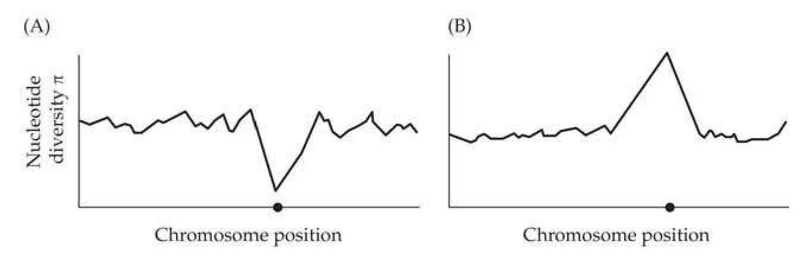
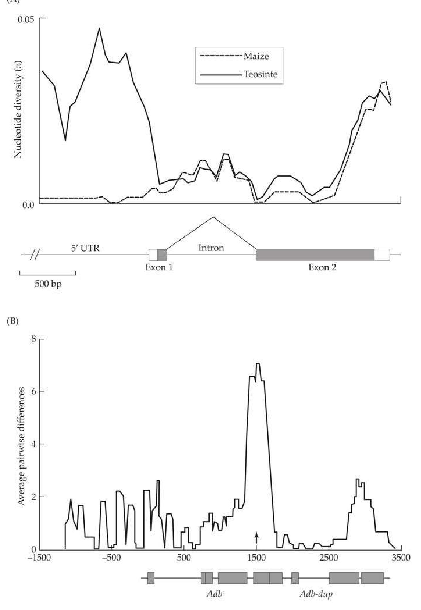
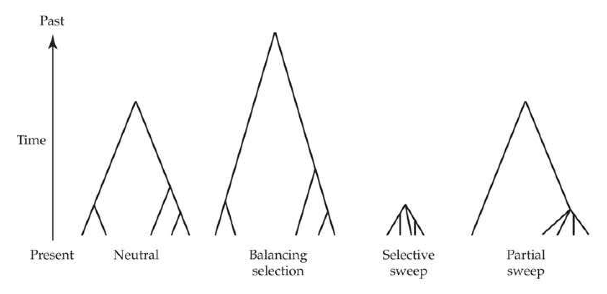
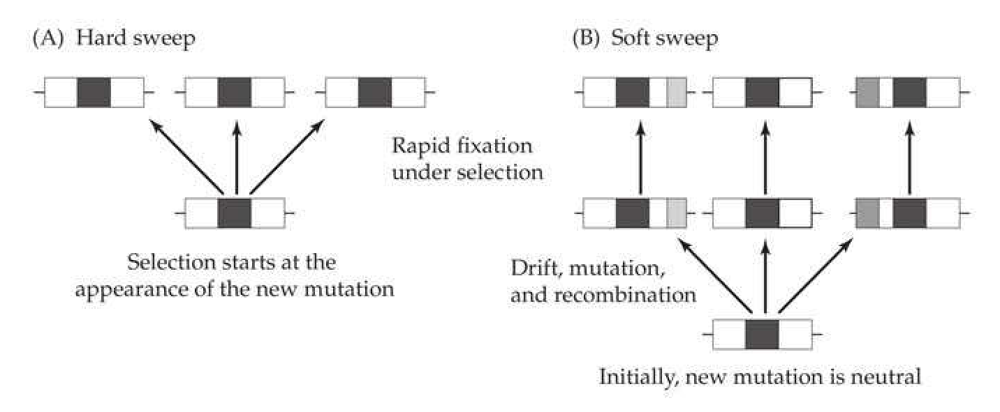
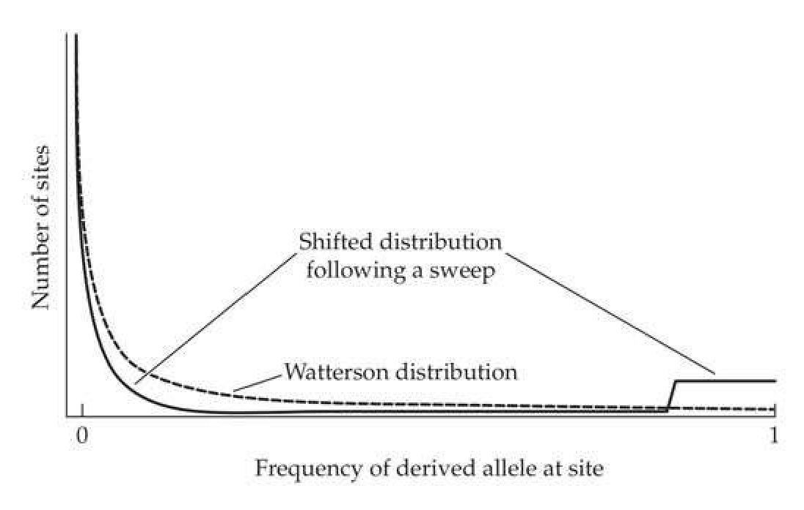
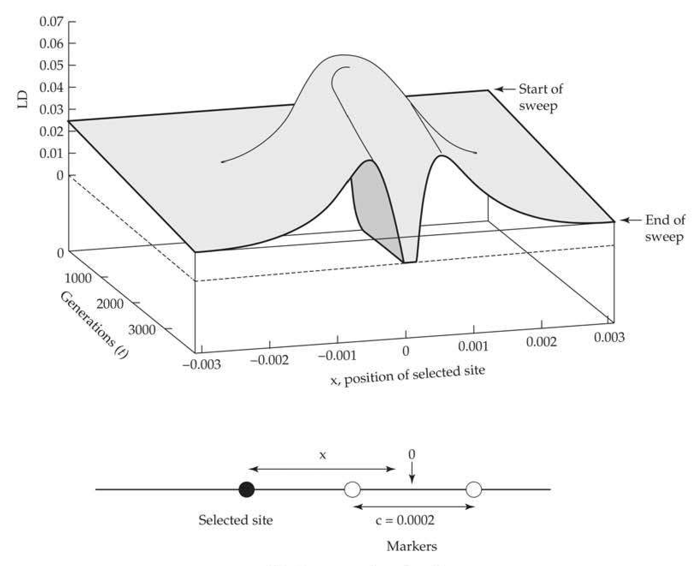
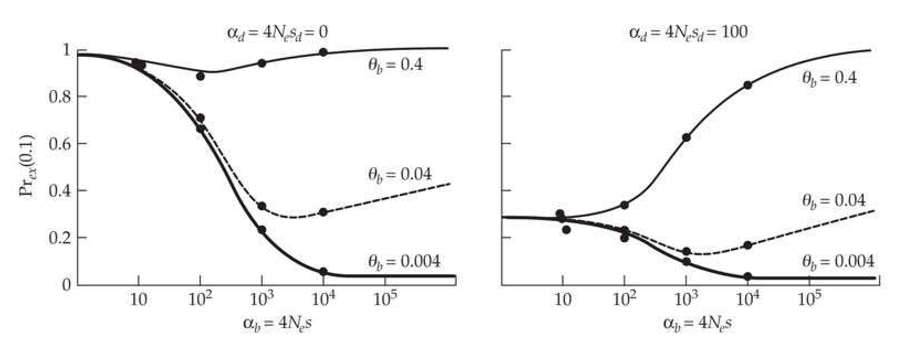
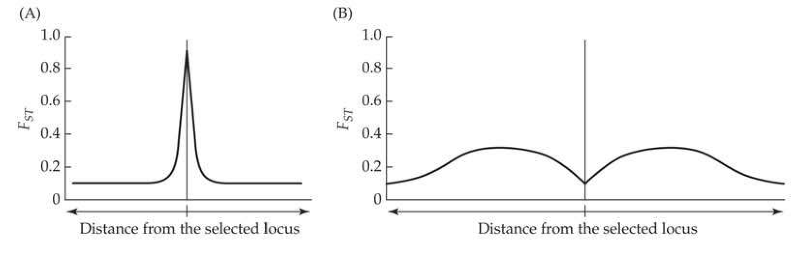
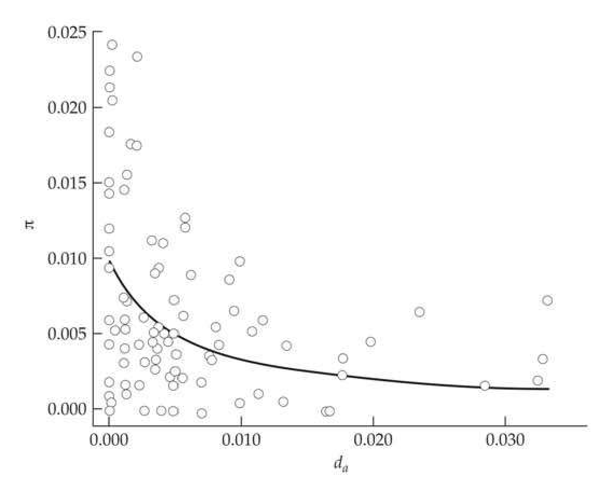
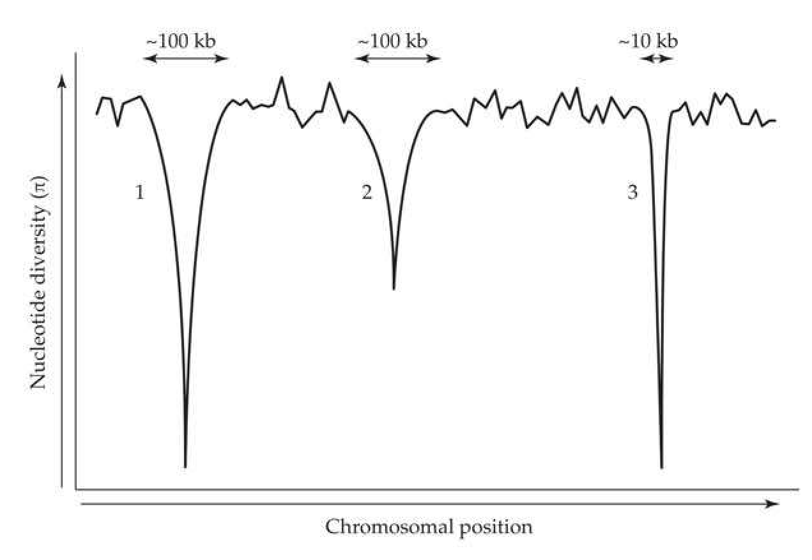

# Chapter 8 · Hitchhiking and Selective Sweeps

## Evolution_chapter8_001 · Hitchhiking and Selective Sweeps: Introduction

When a mutation B without much selective advantage occurs in the proximity of another mutant gene A with a high selective advantage, the survival chance of gene B is enhanced, and the degree of such enhancement is a function of the recombination fraction between the two loci.

Gene B under this situation resembles a hitch-hiker riding along with a host driver. Kojima and Schaffer (1967) As first noted by Kojima and Schaffer (1967) and Maynard Smith and Haigh (1974), the dynamics of a neutral allele are strongly influenced by selection at a linked locus. Almost 50 years later, we are still trying to fully understand all of the ramifications of this idea. Chapter 3 provided a brief introduction to two rather different linked-selection scenarios: selective sweeps (the fixation of newly beneficial mutations) and background selection (the removal of deleterious new mutations). In this chapter we further unpack these concepts, presenting a much richer theoretical treatment and a more detailed account of some of their potential consequences. The results presented here also underpin many of the tests for detecting currently ongoing, or very recent, selection developed in Chapter 9.

Our treatment is structured as follows. We start with a review of the basic terminology for different scenarios, all loosely referred to as sweeps. Next, we review the population genetics of hard sweeps (those arising from a single mutation that is immediately favorable), detailing how neutral variation is perturbed by positive selection at linked sites. We then turn to soft sweeps, wherein a preexisting allele is suddenly placed under selection, generating a different pattern of background neutral variation relative to a hard sweep. This naturally leads to a discussion as to whether adaptation to a new challenge occurs via existing variation or by waiting for a new favorable mutation, as well as to the notion of a polygenic sweep (small allele-frequency changes at a number of loci). Another scenario for a soft sweep to occur involves multiple favorable mutations arising during a sweep, which may be more likely than intuition might suggest. Next, we examine the consequences of repeated bouts of selection at linked sites (be they recurrent sweeps or background selection) for levels of nucleotide diversity, substitution rates, and codon usage bias. We conclude with a discussion on whether the current data warrant a paradigm shift away from Kimura's (1983) classical neutral theory of molecular evolution (Chapter 2).

---

## Evolution_chapter8_002 · Hitchhiking and Selective Sweeps: Introduction / SWEEPS: A BRIEF OVERVIEW

Given that our treatment of the mathematics of sweeps will be rather technical in places, we first start with a brief overview of the basic terminology and key ideas about sweeps. Casual readers may find this section sufficient for their needs, while it will serve to orient more diligent readers before proceeding onward.

---

## Evolution_chapter8_003 · SWEEPS: A BRIEF OVERVIEW / Hitchhiking, Sweeps, and Partial Sweeps

Although usually attributed to Maynard Smith and Haigh (1974), the term hitchhiking was introduced by Kojima and Schaffer (1967) to describe the increase in frequency of a neutral allele linked to an allele under directional selection. Plant breeders were also aware of this phenomenon, in the context of linkage drag (Brinkman and Frey 1977), wherein an introgressed favorable region may drag with it unfavorable linked genes. The term selective sweep (Berry et al. 1991), which is often treated as synonymous with hitchhiking, originally

referred to the sweeping away of variation around a selected site following the fixation of a favorable allele (Figure 8.1A). This cleansing effect occurs because selection reduces the effective population size at linked regions, shortening the coalescence times for surviving neutral alleles relative to pure drift, and thus reducing the time for new variation to accumulate (Figure 8.3).

A partial sweep refers to the setting in which the favored allele is currently increasing in frequency, as would occur during an ongoing sweep. A partial sweep signal is also generated during balancing selection (Chapter 5), again when an allele is increasing in frequency toward some internal equilibrium value (as opposed to fixation). Indeed, any initially rapid increase in frequency by selection generates some type of transient sweep-related signal (albeit potentially quite small), even if the nature of selection changes before fixation (Coop and Ralph 2012).

Just as a specific signal for an ongoing selection event transitions into a different signal following the conclusion of the sweep, so too does the signal for a site under balancing selection. As shown in Figures 8.1 and 8.2, a region held under long-term balancing selection (meaning that the allele frequencies have been near their equilibrium values for a sufficient time) will show an increase in the amount of variation at linked neutral sites (Strobeck 1983; Hudson and Kaplan 1988; Kaplan et al. 1988). This occurs because selection holds alternate alleles at intermediate frequencies for a much longer time than excepted under drift, resulting in an older common ancestor relative to the neutral expectation (Figure 8.3), and hence more time for variation to accumulate. Over time, however, recombination will constantly shrink the size of the region around the selected site with an elevated coalescence time, continually shrinking this signal of long-term balancing selection (Wiuf et al. 2004; Pavlidis et al. 2012).

**[Figure]**

> **Figure 8.1** · page 2 · source: `Evolution_chapter8`
>
> 
>
> Figure 8.1 (A) The signature of positive directional selection (a selective sweep) around a selected site (the solid circle). The background levels of linked neutral variation (measured as the average nucleotide diversity,  $ \pi $, in a sliding window of markers) show a significant decrease around the selected site, reflecting the decreased effective population size (and hence a shorter time to the most recent common ancestor, TMRCA) for regions linked to this site. (B) By contrast, balancing selection generates an increase in nucleotide diversity at linked neutral markers, reflecting a longer TMRCA, and hence more opportunities for mutation to generate variation.

---

## Evolution_chapter8_004 · SWEEPS: A BRIEF OVERVIEW / Selection Alters the Coalescent Structure at Linked Neutral Sites

The underpinning for many tests of selection using polymorphism data (Chapter 9) is that selection changes the coalescent structure at linked neutral sites. If we view the structure of genealogical relationships among the alleles in a sample as a tree (Figure 8.3), recent positive selection shortens the total branch length (the sum of the lengths of all the branches, representing the coalescent times), thus decreasing the amount of variation. Conversely, long-term balancing selection generates longer times to common ancestors (as alleles are retained in the population longer than expected under drift), thus increasing the amount of variation. This effect is equivalent to a change in the effective population size, with a sweep reducing the effective population size in a linked region (Chapter 2), generating shorter coalescence times, and balancing selection increasing $ N_{e} $ and coalescent times.

Equally important, selection at a linked site does more than simply shorten or lengthen the coalescent structure. It alters its shape as well, namely, the expected distances between nodes conditioned on the total length of the tree (Figure 8.3). For a neutral coalescent, trees generated with different value of $ N_{e} $ have the same expected shape when scaled to the same total length (Chapter 2). Under a selective sweep, the nodes of the tree (the coalescent points of the genealogies in the sample) are compressed as one moves back in time. In the extreme, positive directional selection can be approximated by a star (or palmetto) genealogy, with all lineages coalescing at a single point. In contrast, under pure drift, the expected longest branch lengths are those that coalesce the final two lineages into a single ancestral lineage (Equation 2.40, Figure 2.10). While differences in the total length of the coalescent influence the total amount of neutral variation, changes in its shape alter the pattern of variation from that expected from a simple change in $ N_{e} $ (such as generating an excess number of rare alleles). The consequences of this change in tree shape are manifested through changes in the site and allele-frequency spectra (Chapter 2) and in the pattern of linkage disequilibrium, differences that underpin a number of tests of selection (Chapter 9). Unfortunately, recovery from a sharp population bottleneck (a crash in population size) also generates a very similar, although not quite identical, compression of the nodes (Barton 1998).

The precise coalescent structure generated by positive selection depends on when the process is being captured. The structure for a just-completed sweep is different from that generated during the initial phase of selection when a favorable allele is increasing in frequency (Figure 8.3). This latter setting is called a partial sweep and could represent either an allele ultimately on its way to fixation or an allele increasing to some equilibrium frequency under balancing selection. In either case, the resulting tree during the partial sweep phase can be rather unbalanced, with one branch displaying a sweep-like pattern (compressed nodal distances reflecting those lineages influenced by the selected allele) and the other a more drift-life pattern (those lineages that have yet to be affected). This partial-sweep coalescent structure is transient, and with time it may resolve to a sweep (if fixed by selection) or a balancing-selection structure.

Alternatively, the nature of selection may shift before fixation/equilibrium is reached. In such settings, an allele is driven to a certain frequency by selection, and then may subsequently be fixed by drift or by much weaker selection. Any initial rapid (relative to drift) change in allele frequency generates a signal, even if strong selection stops before fixation, as it modifies the coalescent structure of linked neutral alleles relative to that expected under pure drift (Coop and Ralph 2012).

**[Figure]**

> **Figure 8.2** · page 3 · source: `Evolution_chapter8`
>
> 
>
> Figure 8.2 Examples of selection influencing levels of variation at linked neutral sites. (A) A sliding-window plot of levels of nucleotide diversity,  $ \pi $, around the tb1 gene in maize (corn) and teosinte, a candidate gene for the domestication of teosinte into corn. Relative to teosinte, maize variation is dramatically reduced in the 5' UTR region of tb1, suggesting a sweep linked to this region. (After Wang et al. 1999.) (B) Inflated levels of variation are seen around a site that results in an amino acid change (arrow), generating two allelic classes, fast and slow, at the Adh gene in Drosophila melanogaster. These alternative alleles have long been thought to be under balancing selection, which is consistent with the increased variation observed around this site. However, the nature of selection on this gene is still an open issue, as Begun et al. (1999) showed that the excess variation is within slow haplotypes, not between fast and slow haplotypes as would be expected if these two alleles were under balancing selection. (After Kreitman and Hudson 1991.)

**[Figure]**

> **Figure 8.3** · page 4 · source: `Evolution_chapter8`
>
> 
>
> Figure 8.3 Example coalescent (or genealogical) structures (Chapter 2) for loci from the same population under pure drift, balancing selection, a selective sweep, and a partial sweep (ongoing selection in which an allele is still increasing in frequency). The tips of the tree at the bottom of the graph represent five sampled alleles, which eventually coalesce into a single lineage as we go back in time (the top of the graph). This final coalescent point represents the most recent common ancestor (MRCA) for the sampled alleles. For balancing selection, the time to the MRCA (TMRCA) is greater than for neutral genes, which in turn is greater than a region undergoing a sweep. The shape (measured by the relative distances between nodes) of the coalescent is also influenced by selection. Individual coalescent times for a sweep are much more compressed (the nodes are closer together) as one moves back in time, while under a neutral drift process, coalescent times increase as we approach the MRCA (Equation 2.40). A partial sweep represents a mixture, with a sweep-like structure in one part of the genealogy (here, the right branch) and a drift-like structure in the other (the left-branch).

**[Figure]**

> **Figure 8.4** · page 5 · source: `Evolution_chapter8`
>
> 
>
> Figure 8.4 Types of sweeps and their corresponding collection of haplotypes. (A) A hard sweep. A new mutation is immediately favored, resulting in only a single haplotype sweeping to high frequency. (B) A single-origin soft sweep. Here a single mutation is initially neutral or even slightly deleterious. It drifts around the population, appearing in new haplotypes through recombination. At some point, an environmental change places this site under strong selection, which sweeps it to fixation, carrying along a sample of its existing collection of linked haplotypes.

---

## Evolution_chapter8_005 · SWEEPS: A BRIEF OVERVIEW / Hard vs. Soft Sweeps

**[命题 Proposition]**

Not all sweeps, even those involving strong selection, are expected to leave a detectable signal. A hard sweep refers to a single favorable new mutation arising and immediately coming under selection (Perlitz and Stephan [1997] also refer to this as a catastrophic sweep). The fixation of this mutation drags the haplotype on which it arose to a high frequency, leaving a strong signal (Figure 8.4A). In contrast, under a soft sweep (Hermisson and Pennings 2005, 2017; Messer and Petrov 2013a) multiple haplotypes initially carry the favorable allele. The realization that there are different types of sweeps resolved one of the earlier criticisms of the Maynard Smith and Haigh model. Their analysis suggested a major impact on the amount of heterozygosity at linked neutral sites (detailed below), while Ohta and Kimura (1975) showed that recurrent hitchhiking had only a minor effect on heterozygosity. The resolution of these apparently contradictory results was that Maynard Smith and Haigh assumed a hard sweep, while Ohta and Kimura made what amounted to an assumption of a soft-sweep.

Soft sweeps can occur under two scenarios, which have different consequences for the nature and strength of the signal left by the sweep. Under a single-origin soft sweep, the eventually favorable mutation predates the start of selection, being either initially neutral or even slightly deleterious. It drifts around the population, potentially spreading to different haplotype backgrounds via recombination, until eventually a change in the environment results in it being favored. This has the effect of selection acting on a more diverse initial collection of haplotypes, giving off a much weaker signal than under a hard sweep. If $p$ is the frequency of an allele at the start of selection, a soft sweep starts with $2pN$ copies of the favorable allele. Within this collection of haplotypes containing the eventually favored allele, the mean coalescence time for a completely linked site in two random individuals is $t = 2pN_e$, where $N_e$ is the effective population size at the start of selection (Innan and Tajima 1997; Berg and Coop 2015). Thus, there is the potential for substantial variation $(2t\mu = 4pN_e\mu = p\theta$ per site, where $\theta = 4N_e\mu$) at neutral sites among those haplotypes carrying the favorable allele at the start of selection.

Under a multiple-origin soft sweep, the fixed favorable allele does not descend from a single mutation, but rather from a collection of multiple independent events, a scenario that is more likely in larger populations (Pennings and Hermisson 2006). Each recurrent mutation to the favorable allele is associated with an independently chosen haplotype, potentially resulting in even more diversity at fixation than a soft sweep involving a single preexisting mutation. Such multiple mutations may either be present at the start of selection or arise during the sweep itself. The term standing sweep is used to distinguish sweeps that start with preexisting variation, in contrast to settings where sweeps are driven by new mutations that arise following the selective change in the environment.

While the difference between hard and soft sweeps is often framed as being rather sharp, this distinction is largely a function of the population sample (Messer and Petrov 2013a). If the coalescence time for the haplotypes in a sample is more recent than the start of selection, we will see a hard sweep. If the coalescence time for sampled haplotypes carrying favorable alleles predates the start of selection, we will see a soft sweep. As we detail below, demography and population structure further influence how we perceive a given sweep. For example, a population bottleneck may harden a soft sweep by allowing only a single favorable haplotype to pass through.

---

## Evolution_chapter8_006 · Hitchhiking and Selective Sweeps: Introduction / THE BEHAVIOR OF A NEUTRAL LOCUS LINKED TO A SELECTED SITE

We start our discussion of the population-genetic theory of sweeps by first considering hard sweeps and their effects on linked neutral loci. Parts of this discussion are rather technical, but the main theoretical results are summarized in [[SEE_TABLE:8.1]], with the expected signatures from a hard sweep summarized in [[SEE_TABLE:8.2]]. Throughout, we assume that there is strong selection on the favorable allele ($ 4N_{e}s \gg 1 $, where, unless otherwise specified, s is the heterozygote fitness advantage). We also assume that no new mutations (either at neutral sites or for the favorable allele) occur during the sweep. This negligible mutation approximation, which reflects a rapid sweep through the population of a new favorable allele and hence reduced time for new mutations to arise, is relaxed later in this chapter.

---

## Evolution_chapter8_007 · THE BEHAVIOR OF A NEUTRAL LOCUS LINKED TO A SELECTED SITE / Allele-frequency Change

To quantify the impact of a sweep, we need to determine how selection influences the frequency of a neutral allele, m, at a linked locus. The ultimate variable of interest is $ q(t) $, the frequency of m in generation t of the sweep, with $ q(\infty) $ denoting its frequency at the sweep's completion. In the absence of any recombination during the sweep, $ q(\infty) = 1 $, as the initial haplotype bearing the new favorable mutation (and m) is swept to fixation. The degree to which $ q(\infty) $ actually approaches one depends on the relative strengths of recombination, c (between the selected site and the neutral marker), and the strength of selection, s, on the favored site. In Chapter 5 we showed that the time to fixation from selection scales with 1/s, so it is reasonable to expect that $ q(\infty) $ is some function of c/s.

In order to obtain $ q(t) $, we need to follow the frequencies of m on the two different chromosomal backgrounds, those with selected allele A and those carrying the alternative allele, a. If we let $ q_A(t) $ and $ q_a(t) $ denote the frequencies of allele m on A- and a-bearing chromosomes, conditional probability gives the population frequency of m as $$ q(t)=q_{A}(t)\cdot p(t)+q_{a}(t)\cdot\left[1-p(t)\right] $$ where $ p(t) $ is the frequency of A in generation t of the sweep. When A becomes fixed, $ q(\infty) = q_{A}(\infty) $, the fraction of A-bearing chromosomes that still contain m.

A related quantity is the difference, $ \delta_{q} $, in the frequency of m on these two backgrounds

(A versus a), whose initial value is $$ \delta_{q}(0)=q_{A}(0)-q_{a}(0) $$

Nonzero values of $ \delta_q $ imply linkage disequilibrium between $ A $ and $ m $, with the frequency of $ m $ on $ A $-bearing chromosomes differing from its unconditional frequency in the general population. Hitchhiking is basically a race between the rate of recombination reducing the initial disequilibrium (and hence $ \delta_q $) and the rate of selection fixing $ A $, eliminating any further recombination. Smaller values of $ c $ (slower rates of recombination) and/or larger values of $ s $ (faster time to fixation) increase the impact of a sweep. When $ A $ is introduced as just one or a few copies, then $ q_a(0) \simeq q(0) $, as essentially all of the copies of $ m $ are on a chromosomes. If $ A $ arises as a single copy on an $ m $-bearing chromosome, then $ q_A(0) = 1 $ (as the only $ A $-bearing chromosome contains $ m $), yielding $ \delta_q(0) = 1 - q(0) $. Finally, let $$ \Delta_{q}=q(\infty)-q(0) $$ denote the final change in the frequency of the linked neutral allele m after A has swept to fixation. Summarizing our notation to this point, we have $$ q(t)\qquad\qquad\mathrm{U n c o n d i t i o n a l~f r e q u e n c y~o f~}m\mathrm{~i n~g e n e r a t i o n~}t $$ $$ q_{A}(t)\qquad\qquad\mathrm{C o n d i t i o n a l~f r e q u e n c y~o f~}m\mathrm{~o n~}A\mathrm{-b e a r i n g~c h r o m o s o m e s} $$ $$ q_{a}(t)\qquad\qquad\mathrm{C o n d i t i o n a l~f r e q u e n c y~o f~}m\mathrm{~o n~}a\mathrm{-b e a r i n g~c h r o m o s o m e s} $$ $$ \delta_{q}(t)=q_{A}(t)-q_{a}(t)\quad\mathrm{D i f f e r e n c e~i n~f r e q u e n c y~o f~}m\mathrm{~o n~}A\mathrm{-~v e r s u s~}a\mathrm{-b e a r i n g~c h r o m o s o m e s} $$ $$ \Delta_{q}=q(\infty)-q(0)\quad\text{Change in frequency of}m\text{ after a sweep} $$

In particular, note that $ \delta_{q}(\infty) $ and $ \Delta_{q} $, while related, are still distinct.

To proceed, we define the critical measure of the strength of a hitchhiking event, $$ f_{s}=\frac{\Delta_{q}}{\delta_{q}(0)}=\frac{q(\infty)-q(0)}{q_{A}(0)-q_{a}(0)}\simeq\frac{q(\infty)-q(0)}{1-q(0)}\quad when p(0)\ll q(0) $$ which is the fraction of the initial excess association of $m$ with $A$, $\delta_q(0)$, that persists when $A$ is fixed ($\Delta_q$). If the sweep is started with a single lineage, $f_s$ is the probability of identity-by-descent at the $m$ locus among fixed $A$ chromosomes (Gillespie 2000; Kim and Nielsen 2004). In the absence of recombination, $f_s = 1$, resulting in an allele-frequency change of $\Delta_q = \delta_q(0)$, which is $1 - q(0)$ at the point where $A$ arose as a single copy. With recombination, $f_s < 1$, and our task is to evaluate how the relative values of selection ($s$) and recombination ($c$) determine the magnitude of this effect. An important result in sweep theory is that the final allele frequency of $m$ for the case of $A$ arising as a single copy can be expressed as $$ q(\infty)=q(0)+\Delta_{q}=q(0)+f_{s}\delta_{q}(0)=q(0)+f_{s}[1-q(0)]=f_{s}+q(0)(1-f_{s}) $$

The derivation of the standard deterministic approximation for $ \Delta_{q} $ (given in Example 8.2) requires a few tricks, and the basic biology can get somewhat lost during its development. Hence, we first sketch a rough approximation of how selection and recombination compete before presenting more accurate results. As noted by Maynard Smith and Haigh (1974) and Barton (2002), because m is neutral, its frequency on either background only changes through recombination, with $$ \delta_{q}(t)=q_{A}(t)-q_{a}(t)=(1-c)^{t}\left[q_{A}(0)-q_{a}(0)\right]\simeq\delta_{q}(0)e^{-c t} $$

A rapid increase of A reduces the opportunity for recombination between A- and a-bearing chromosomes, which becomes nonexistent when A is fixed. Assuming A is under additive selection with fitness s, then as shown in Example 8.1, if A is introduced into the population as a single copy and is destined to become fixed, its approximate time to fixation is $ \tau \simeq 2 \ln(4N_{e}s)/s $. Substituting this time into Equation 8.2a yields $$ \delta_{q}(\infty)=\delta_{q}(0)e^{-c\tau}\simeq\delta_{q}(0)\exp\left[-(2c/s)\ln(4N_{e}s)\right]=\delta_{q}(0)\left(4N_{e}s\right)^{-2c/s} $$ so that $$ \frac{\delta_{q}(\infty)}{\delta_{q}(0)}=\left(\frac{1}{4N_{e}s}\right)^{2c/s} $$

This shows that the fraction of initial association that persists following the sweep is a function of $ c/s $, which is the key parameter for determining the strength of hitchhiking. When $ c/s \ll 1 $, most of the initial association remains at the conclusion of the sweep, while as ever-more-distant sites are considered (so that $ c/s $ increases), any initial association decay toward zero.

---

## Evolution_chapter8_008 · Hitchhiking and Selective Sweeps: Introduction / Allele-frequency Change

While Equation 8.2c conveys the general notion of competition between recombination and selection, this is a rather crude analysis, as it only considers the time to fixation for A (and hence the end of any opportunity for further recombination) and uses $ \delta_q(\infty) $ in place of the real quantity of interest, $ \Delta_q $. As presented in Example 8.2, an improved analysis accounts for how the actual change in the frequency of A influences the opportunity for recombination. This problem has received considerable attention, starting with a strictly deterministic analysis by Maynard Smith and Haigh (1974; also see Stephan et al. (2006), followed by analyses allowing for finite population size by Kaplan et al. (1989), Stephan et al. (1992), Barton (1995a, 1998, 2000), Otto and Barton (1997), Durrett and Schweinsberg (2004), Etheridge et al. (2006), Pfaffelhuber et al. (2006), Pfaffelhuber and Studeny (2007), Ewing et al. (2011), and Coop and Ralph (2012).

The details for a deterministic analysis accounting for the change in A are given in Example 8.2. Under this analysis, if $ p(0) $ is the starting frequency of A at the time of selection, then for $ c/s \ll 1 $, the change in q at the fixation of A is $$ \Delta_{q}\simeq\delta_{q}(0)p(0)^{c/s} $$ so as a result, from Equation 8.1d, $$ f_{s}=\frac{\Delta_{q}}{\delta_{q}(0)}=p(0)^{c/s} $$

This result shows that our approximate analysis leading to Equation 8.2c underestimated the effect of a sweep, as it scaled as the power $ 2c/s $, inflating the importance of recombination (Example 8.2 details why this occurs). Recalling that $$ x^{a}=e^{a\ln(x)}\simeq1+a\ln(x)\qquad for\quad|a\ln(x)|\ll1 $$ and applying this approximation to Equation 8.3b recovers the original result of Maynard Smith and Haigh (1974), $$ f_{s}\simeq1+\frac{c}{s}\ln\left[p(0)\right] $$ $$ \simeq1-\frac{c}{s}\ln(2N)\quad for\quad p(0)=\frac{1}{2N} $$

This approximation can fail if $ (c/s) \mid \ln [p(0)] $ is too large, although the more exact Equation 8.3b will still hold. If the favorable mutation is initially linked to deleterious alleles at nearby loci, this will result in a lower net selective advantage during the sweep (diminishing the effective value of s), and hence a diminished value of $ f_s $ (Hartfield and Otto 2011; Good and Desai 2014). As Equation 8.3e shows, the hitchhiking effect for a favorable mutation introduced as a single copy diminishes with increasing population size, reflecting the longer time to reach fixation in larger populations and hence a greater reduction of any initial association by recombination. This effect, however, is rather modest, scaling as the log of population size.

When dominance is present, so that the fitnesses are 1: 1 + 2hs: 2s, then c/s in Equations 8.3a–8.3d is replaced by c/(2hs) for $ h \neq 0 $. For the case of a completely recessive allele $ (h = 0) $, Maynard Smith and Haigh (1974) found that $$ f_{s}\simeq1-\left(\frac{c}{2s}\frac{1}{p(0)}\right) $$

For example, with $ p(0) = 1/(2N) $, Equation 8.3f becomes $ 1 - (c/s)N $ versus $ 1 - (c/s)\ln(2N) $ (Equation 8.3d). The much weaker hitchhiking effect (smaller value of $ f_s $) reflects the much longer fixation time for a recessive mutation and hence the greater opportunity for recombination to decay any initial disequilibrium. Conversely, the decreased fixation time for a favorable dominant allele ($ h = 1 $) effectively doubles the strength of selection (with $ c/[2s] $ replacing c/s in Equation 8.3a), resulting in a larger region influenced by the sweep (also see Teshima and Przeworski 2006; Ewing et al. 2011).

These results are for a deterministic analysis. When an analysis allowing for drift is performed, using the initial frequency $ 1/(2N) $ for a single copy underestimates the effects of hitchhiking, as those alleles that become fixed leave the drift-dominated boundary region of the allele-frequency space faster than would be predicted by a deterministic analysis (Example 8.1). As a reasonable approximation, this can be accommodated by replacing $ p(0) = 1/(2N) $ with $ p(0) = 1/(4N_{e}s) $ in all of the previous expressions (as already seen in Equation 8.2c), yielding $$ f_{s}\simeq1-\frac{c}{2h s}\ln(4N_{e}s)\quad for p(0)=1/(2N) $$

For those who wish a more refined analysis, there is a growing body of very technical literature focusing on the genealogical structure of a sample from a hard sweep (Kaplan et al. 1989; Barton 1998; Etheridge et al. 2006; Pfaffelhuber et al. 2006; Pfaffelhuber and Studeny 2007; Ewing et al. 2011).

**[示例 Example]**

> **Example 8.1** · ref: `8.1` · source: `Evolution_chapter8_008.json` · blocks 8–9
>
> Example 8.1. What is the expected time to fixation for an allele with additive fitness effects under strong selection ( $ 4N_{e}s \gg 1 $? In a strictly deterministic analysis, the fixation time is infinite, as the allele frequency gets arbitrarily close to, but never actually reaches, one. However, in a finite population, once the allele frequency is driven sufficiently close to one by selection, it is rapidly fixed by drift. If the scaled strength of selection is large relative to drift ( $ 4N_{e}s \gg 1 $), we can approximate the change in $ p(t) $ by a deterministic process, provided $ p $ is not too close to zero or one. Near these boundary values, drift determines the dynamics. Hence, a standard approach is to treat $ p(t) $ as a deterministic process when it is in the range $ \epsilon < p < 1 - \epsilon $, for $ \epsilon \ll 1 $ (Kurtz 1971; Norman 1974; Kaplan et al. 1989; Stephan et al. 1992). Once the allele reaches a frequency of $ 1 - \epsilon $, it is assumed to be quickly fixed by drift, and this additional time is assumed to be small and thus is ignored. Let $ p(t) $ denote the frequency of the favored allele A at time t. If s is small (but $ 4N_{e}s $ large), the deterministic allele-frequency dynamics are well approximated by Equation 5.3b, which can alternatively be expressed as $$ \frac{p(t)}{1-p(t)}=\frac{p(0)}{1-p(0)}e^{st} $$ (8.4a) The time, $ \tau $, for the frequency of A to change from $ p(0) = \epsilon $ to $ p(\tau) = 1 - \epsilon $ is obtained by substituting these values into Equation 8.4a and rearranging to yield $$ \tau=-2\ln(\epsilon)/s $$ (8.4b) Taking $ \epsilon = 1/(2N) $, the required time starting from a single copy to reach a frequency very close to one $ (1 - 1/[2N]) $ is $$ \tau\simeq-2\ln(1/[2N])/s=2\ln(2N)/s $$ (8.4c) While Equation 8.4c appears often in the literature, it actually overestimates the time to fixation in a finite population (and hence underestimates the strength of the sweep). A slightly better approximation follows if we first recall that only a fraction, $ 2sN_e/N $, of single introductions of A are expected to fix (Chapter 7). Conditioned upon those paths where A is fixed, its frequency must increase at a faster rate than would be predicted from the deterministic analysis. Barton (1995a, 2000; Otto and Barton 1997) showed that, in such cases, the rate of increase in allele frequency is initially inflated (multiplied) by an amount of $ 1/(2sN_e/N) $, as the allele frequency moves more quickly into the region where deterministic dynamics, not drift, dominate. As a result, they showed that a more accurate estimate of the time for an allele to reach a high frequency (essentially becoming fixed), given it started as a single copy, is given by replacing $ \epsilon = 1/(2N) $ by $$ \epsilon=\frac{1}{2N}\frac{N}{2sN_{e}}=\frac{1}{4N_{e}s} $$ which results in $$ \tau=2\ln(4N_{e}s)/s $$ (8.4d) The standard finite-population-size correction for hitchhiking models starting with $ p(0) = 1/(2N) $ is to replace 2N by $ 4N_e s $ (i.e., take $ p[0] = 1/[4N_e s] $) to account for this effect. Finally, the expected time, $ t_{x} $, to reach a frequency of x < 1 appears in the analysis of partial sweeps (Coop and Ralph 2012). Again, starting at an initial frequency of $ \epsilon \simeq 0 $, Equation 8.4a yields $$ \frac{x}{1-x}=\epsilon e^{st_{x}} $$ which, upon rearranging (with $ \epsilon = 1/[4N_{e}s] $), yields $$ t_{x}=\frac{1}{s}\ln\left(\frac{\epsilon^{-1}x}{1-x}\right)=\frac{1}{s}\ln\left(\frac{4N_{e}s x}{1-x}\right) $$ (8.4e)

---

## Evolution_chapter8_009 · Hitchhiking and Selective Sweeps: Introduction / Allele-frequency Change

Using Equation 8.2a to substitute for $ [q_{A}(t) - q_{a}(t)] $, we have $$ d q(t)=d p(t)\delta_{q}(0)e^{-c t} $$

Rearranging yields $$ p(0)\frac{1-p(t)}{p(t)}=e^{-st} $$

---

## Evolution_chapter8_010 · THE BEHAVIOR OF A NEUTRAL LOCUS LINKED TO A SELECTED SITE / Reduction in Genetic Diversity Around a Sweep

**[示例 Example]**

> **Example 8.2** · ref: `8.2` · source: `Evolution_chapter8_009.json` · blocks 1–7
>
> Example 8.2. To obtain the final change, $ \Delta_q = q(\infty) - q(0) $, in the frequency of a neutral linked allele under a deterministic model of hitchhiking, we follow Barton (2000). Letting $ q'(t) $ and $ p'(t) $ denote the frequencies of alleles $ m $ and $ A $ in generation $ t $ after selection, and recalling Equation 8.1a, we can express the change in $ q $ in generation $ t $ by selection (but before recombination). Letting $ dp(t) = p'(t) - p(t) $, the change in the frequency of $ A $ resulting from selection in generation $ t $, $$ \begin{aligned}dq(t)&=q^{\prime}(t)-q(t)=\{p^{\prime}(t)q_{A}(t)+[1-p^{\prime}(t)]q_{a}(t)\}-\{p(t)q_{A}(t)+[1-p(t)]q_{a}(t)\}\\&=[p(t)+dp(t)]q_{A}(t)+[1-p(t)-dp(t)]q_{a}(t)-\{p(t)q_{A}(t)+[1-p(t)]q_{a}(t)\}\\&=dp(t)\left[q_{A}(t)-q_{a}(t)\right]\\ \end{aligned} $$ Using Equation 8.2a to substitute for $ [q_{A}(t) - q_{a}(t)] $, we have $$ d q(t)=d p(t)\delta_{q}(0)e^{-c t} $$ The final frequency is just the sum of all these single-generation changes, which we approximate by an integral, $$ \Delta_{q}=q(\infty)-q(0)=\sum_{i=0}^{\infty}d q(i)\simeq\int_{0}^{\infty}d q(t)d t=\delta_{q}(0)\int_{0}^{\infty}d p(t)e^{-c t}d t $$ A more accurate result follows if we note that $ dp(t) = \Delta p / \Delta t \simeq dp / dt $, yielding $$ \Delta_{q}=\delta_{q}(0)\int_{0}^{\infty}e^{-c t}\frac{d p}{d t}d t=\delta_{q}(0)\int_{p(0)}^{1}e^{-c t}d p $$ where the final integral follows by a change of variables with $ p(\infty) = 1 $. The trick to evaluating this last integral is to recall Equation 8.4a for the behavior of a selected allele, and note that $ 1 - p(0) \simeq 1 $ (because $ p(0) \ll 1 $), yielding $$ \frac{p(t)}{1-p(t)}=\frac{p(0)}{1-p(0)}e^{s t}\simeq p(0)e^{s t} $$ Rearranging yields $$ p(0)\frac{1-p(t)}{p(t)}=e^{-st} $$ Noting that $ e^{ab} = (e^{a})^{b} $, we can write $$ e^{-c t}=\left(e^{-s t}\right)^{c/s}=\left(p(0)\frac{1-p(t)}{p(t)}\right)^{c/s}=p(0)^{c/s}\left(\frac{1-p(t)}{p(t)}\right)^{c/s} $$ which, upon substitution into the previous integral, yields $$ \Delta_{q}=\delta_{q}(0)\int_{p_{o}}^{1}e^{-c t}d p=\delta_{q}(0)p(0)^{c/s}\int_{p_{o}}^{1}\left(\frac{1-p}{p}\right)^{c/s}d p $$ For $c/s < 0.1$, the integral is close to one, and we recover Equation 8.3a, $\Delta_q = \delta_q(0) p(0)^{c/s}$. Barton (Otto and Barton 1997; Barton 1998) showed that a more accurate result is given by $$ \Delta_{q}\simeq\delta_{q}(0)p(0)^{c/s}\{\Gamma\left[1+(c/s)\right]\}^{2}\Gamma\left[1-(c/s)\right] $$ (8.5a) where $ \Gamma $ denotes the gamma function (Equation 2.25b). For $ c/s < 0.1 $, this reduces to $$ \Delta_{q}\simeq\delta_{q}(0)\left(1+\frac{c}{s}\left[\ln[p(0)]+0.5772\right]\right) $$ (8.5b) which offers a slight improvement over Equation 8.3d, but only when $ p(0) $ is not very small.

By fixing any neutral alleles completely linked to the selected site (and usually on a faster time scale than the scale by which mutation can introduce new variation), a sweep removes any initial variation that is present over some region. Two central questions are how large a region is influenced by a recently completed sweep and how strong an effect is seen? To address these questions, we continue to assume that any effect from mutation occurring during the sweep can be ignored (a point that we will address shortly). The first treatment of this topic, and one of the more widely cited results on sweeps, is due to Kaplan et al. (1989). They showed that the expected coalescence time for two alleles at a neutral site that is linked (at recombination fraction c) to the site under selection differs significantly from $ 2N_e $ (the neutral value) when $ c/s < 0.01 $ and the sweep has been recent (fixation less than $ 0.2N_e $ generations ago, so that the effects of new mutations following fixation are negligible). This leads to their often-quoted approximation that neutral sites within 0.01 s/c of a selected site will be significantly influenced by a recent sweep.

To express this notion in terms of physical distances, let $ c_0 $ be the recombination rate per unit distance (for example, per Mb), so that sites separated by $ \ell $ units have a recombination rate of $ c = c_0 \ell $. The expected total length $ L $ (scaled in our chosen units) of depressed variation associated with a recent sweep then becomes $$ L=0.02\frac{s}{c_{0}} $$ where the factor of two arises because the influence extends on both sides of the sweep. If we suppose that $c$ scales as $1$ cM/Mb ($c_0 = 0.01$ for each $10^6$ bases), then this approximation implies that a recent sweep with a selection coefficient of $s = 0.01$ is expected to influence variation in a region of size $0.02 \cdot (0.01 / 0.01) = 0.02$ Mb, or roughly 20 kb (Example 8.3 gives a more refined result). Likewise, a selection coefficient of $s = 0.1$ leaves an initial signature over a region of roughly 200 kb.

Rearrangement of Equation 8.6a can be used to obtain a rough estimate of s. Given a total length, L, of decreased variation and a value of $ c_{0} $ for this interval, $$ s\simeq\frac{c_{0}\cdot L}{0.02} $$

For example, if a sweep roughly covers 50 kb (or $ L = 0.05 $ Mb) in a region where $ c_0 = 0.02 $ (2 cM/Mb), then an order-of-magnitude approximation for $ s $ is $$ s\simeq\frac{0.02\cdot0.05}{0.02}=0.05 $$

This is a crude approach, requiring a reasonable estimate of the size of the region influenced by a very recently completed sweep. Further, simulation studies have shown that sweeps can be asymmetric around the site under selection (Kim and Stephan 2002; Schrider et al. 2015), reflecting the random location of rare recombination events between markers and the selected site that occur early in a sweep. Simply taking the middle of a region of depressed variation can be a poor approach for localizing the site under selection.

A more accurate expression for the amount of variation remaining after a very recent sweep follows from the expected allele-frequency change (Equation 8.3a). Let $ q(0) $ denote the initial frequency of allele $ m $ at a linked neutral marker, with $ H_0 = 2q(0)[1 - q(0)] $ denoting the initial heterozygosity, which is typically measured as per-nucleotide diversity, $ \pi $ (Chapters 2 and 4). Hitchhiking during the fixation of a linked selected allele changes a marker allele frequency to $ q(\infty) = q(0) + \Delta_q $, and hence the heterozygosity becomes $$ \begin{aligned}H&=2q(\infty)[1-q(\infty)]=2[q(0)+\Delta_{q}][1-(q(0)+\Delta_{q})]\\&=H_{0}-2[1-2q(0)]\Delta_{q}-2\left(\Delta_{q}\right)^{2}\end{aligned} $$

The expected heterozygosity is the average of $ H $ over two scenarios. With a probability of $ q(0) $, the favorable mutation arises on an $ m $ background, yielding $ q_A(0) = 1 $, $ \delta_q(0) = 1 - q(0) $ and $ \Delta_q \simeq [1 - q(0)] $ $ p(0)^{c/s} $ (Equation 8.3a). Conversely, with a probability of $ 1 - q(0) $, the favorable allele arises on a non- $ m $ background, yielding $ q_A(0) = 0 $, $ \delta_q(0) = 0 - q(0) = -q(0) $ and $ \Delta_q \simeq -q(0) $ $ p(0)^{c/s} $. Using these results, the expected allele-frequency change is $$ \mathrm{E}(\Delta_{q})=q(0)\cdot\left[1-q(0)\right]p(0)^{c/s}+\left[1-q(0)\right]\cdot\left[-q(0)p(0)^{c/s}\right]=0 $$

Taking the expectation of Equation 8.7a and using Equation 8.7b yields $$ H_{h}=\mathrm{E}(H)=H_{0}-2\mathrm{E}\left[\Delta_{q}^{2}\right] $$ where $$ \begin{aligned}\mathbb{E}\left[\Delta_{q}^{2}\right]&=q(0)\left[[1-q(0)]p(0)^{c/s}\right]^{2}+[1-q(0)]\left[-q(0)p(0)^{c/s}\right]^{2}\\&=q(0)[1-q(0)]p(0)^{2c/s}\end{aligned} $$

Combining Equations 8.7c and 8.7d yields $$ H_{h}=H_{0}\left(1-p(0)^{2c/s}\right) $$

Recalling that this result is an approximation (as Equation 8.3a approximates the allele frequency change), our final result is $$ \frac{H_{h}}{H_{0}}\simeq1-p(0)^{2c/s}\simeq-\frac{2c}{s}\ln[p(0)]\quad for\quad c/s\ll1 $$

---

## Evolution_chapter8_011 · Hitchhiking and Selective Sweeps: Introduction / Reduction in Genetic Diversity Around a Sweep

Following from our previous discussion, for a sweep starting from a single mutation, we can improve on Equation 8.8b by replacing $ p(0) = 1/2N $ by $ 1/(4N_e s) $, yielding $$ \frac{H_{h}}{H_{0}}\simeq1-\left(4N_{e}s\right)^{-2c/s} $$

Stephan et al. (1992) and Barton (1998) presented more accurate (and complex) expressions for the reduction in heterozygosity in a finite population.

An alternative way to obtain Equation 8.8b is to consider the fraction, $ f_s $, of the initial associations that persist when $ A $ is fixed (Equation 8.1c), as with a probability of $ f_s^2 $, neutral alleles at our site for two randomly drawn chromosomes (under a catastrophic sweep) are identical-by-descent and hence (in the absence of mutation) homozygous. With a probability of $ 1 - f_s^2 $, two randomly drawn alleles are not identical-by-descent (from the sweep), displaying the pre-sweep heterozygosity value. Hence, from Equation 8.3b, which assumes additive selection, $$ \frac{H_{h}}{H_{0}}=1-f_{s}^{2}=1-p(0)^{2c/s} $$

When dominance is present (implying a heterozygote fitness of $ 1+2hs $ instead of $ 1+s $), Equation 8.8b holds, with 2hs replacing s (for h > 0). For a complete recessive (h = 0, with fitnesses of $ 1:1:1+2s $), Ewing et al. (2011) showed that $$ \frac{H_{h}}{H_{0}}\simeq\frac{\eta}{1+\eta}\quad\mathrm{w h e r e}\quad\eta=c\sqrt{4N_{e}/s} $$ As expected, a recessive sweep produces a much weaker signal, reflecting the greater chance for recombination given the much longer time to fixation ($ \sim\sqrt{N_e/s} $ generations; Ewing et al. 2011). It is important to stress that Equations 8.8d and 8.8e both refer to the reduction in heterozygosity immediately following a sweep. This is the maximal signature, as mutation will gradually rebuild neutral variation, an effect we will examine shortly.

Finally, we can examine the accuracy of Kaplan and Hudson's approximation (Equation 8.6a), which states that a sweep influences all sites with $ c/s \leq 0.01 $, using Equation 8.8b to find the reduction in heterozygosity for sites at this critical value. Assuming there is a single copy of the selected allele at the start of selection, $ p(0) = 1/(2N) $, the simple approximation given by Equation 8.8b (with $ c/s = 0.01 $) yields $$ \frac{H_{h}}{H_{0}}=\frac{2c}{s}\ln(2N)=0.02\ln(2N) $$

The dependence on $N$ is very weak. For example, for $N = 10^4$, Equation 8.9 gives an 80% reduction ($H_h/H_0 = 0.20$), while for $N = 10^9$, it corresponds to a 57% reduction. A more refined analysis can be performed using the drift-corrected expression Equation 8.8c, with $4N_e s$ replacing $2N$.

**[示例 Example]**

> **Example 8.3** · ref: `8.3` · source: `Evolution_chapter8_011.json` · blocks 6–7
>
> Example 8.3. Assume a recombination rate of 1 cM/Mb ( $ c_0 = 0.00001 $ per kb), and consider the expected reduction in heterozygosity at a site 10 kb away from a sweep ( $ c = 10 \cdot 0.00001 = 0.0001 $). For an allele with additive fitness effects, with $ s = 0.01 $ and $ N_e = 10^6 $, Equation 8.8b yields $ H_h / H_0 \simeq 0.19 $, so that (ignoring any new mutation) only 19% of the initial heterozygosity is present immediately following a sweep. For a dominant allele, we replace $ s = 0.01 $ by $ 2s = 0.02 $ in Equation 8.8b, giving $ H_h / H_0 \simeq 0.10 $. Finally, when the favored allele is recessive, $$ \eta=c\sqrt{4N_{e}/s}=0.0001\sqrt{4\cdot10^{6}/0.01}=2 $$ and Equation 8.8c yields $ H_h/H_0 \simeq 0.67 $. Using the same parameters, the values for $ H_h/H_0 $ at different distances away from the selected site are as follows:
>
> > **Inline Table 1** · `inline_1` · page 14 · source: `Evolution_chapter8_011`
> > Inline Table 1
> >
> >  | 1 kb | 5 kb | 10 kb | 25 kb | 50 kb | 100 kb
> > --- | --- | --- | --- | --- | --- | ---
> > Dominant | 0.01 | 0.05 | 0.10 | 0.23 | 0.41 | 0.65
> > Additive | 0.02 | 0.10 | 0.19 | 0.41 | 0.65 | 0.88
> > Recessive | 0.17 | 0.50 | 0.67 | 0.83 | 0.91 | 0.95
>

The sweep from a dominant allele has the largest effect (roughly twice the reduction at small distances compared to additive selection), while the effect of a recessive allele is fairly weak except at very short distances from the site. For these three modes of gene action and s = 0.01, a 50% reduction ($ H_h/H_0 = 0.5 $) in heterozygosity occurs over a distance of 5 kb on either side of a selected recessive allele, the distance is 31 kb when additive, and the distance is 66 kb when dominant, giving the size of the sweep regions as 10, 62, and 132 kb, respectively

---

## Evolution_chapter8_012 · THE BEHAVIOR OF A NEUTRAL LOCUS LINKED TO A SELECTED SITE / The Messer-Neher Estimator of s

As Equation 8.6b illustrates, one can manipulate any of these expressions for the reduction in H to obtain an estimate of s (given $ H_{0} $ and c). In Chapter 9, this approach is placed into a more sophisticated likelihood framework where the entire spatial pattern of genetic variation (as a function of the distance, c, from a putative site) is used to estimate s. These approaches all require knowledge of the recombination rate, c. How can we estimate s in situations with little or no recombination, such as in an organelle genome, on a very small chromosome, or in a highly inbred or asexual species? A creative solution to this problem was presented by Messer and Neher (2012). As a favored allele exponentially increases in frequency during its initial sojourn to fixation, new mutations can appear on its initial haplotype. While rare, these mutations will mostly be at a higher frequency than those arising after fixation, as each hitchhikes up to some modest frequency. By considering a region around a putative selected site and counting the resulting haplotypes following a recently completed sweep, Messer and Neher obtained a very simple approximate relationship between the frequencies of the ranked haplotype classes. Letting $ n_{0} $ denote the number of the most frequent haplotype, $ n_{1} $ the next frequent, and so forth, they found that $$ \frac{n_{i}}{n_{0}}\simeq\left(\frac{\mu}{i\; s}\right)^{1-(\mu/s)}\simeq\frac{\mu}{i\; s} $$ namely, a power-law relationship as a function of the total mutation rate, $ \mu $, for the region being considered and the strength, s, of the favored allele. For example, for $ \mu/s = 0.02 $, $ n_{0} $ is 50 and 100 times more frequent, respectively, then $ n_{1} $ and $ n_{2} $. Based on the relationship given by Equation 8.10, Messer and Neher developed a regression-based estimator of s.

While this approach works on genomic regions showing little to no recombination (the authors applied it to HIV), it also requires deep population sequencing, as the higher mutational classes ($n_i$ for $i > 2$) are rare. For example, for $\mu/s = 0.1$, this approach requires accurate estimates of frequencies with an expected value around $2%$ (assuming a regression fitted with four values, and hence requiring the class $n_4$), implying a sample size of around $10^3$ sequences. While $c$ (the recombination rate over the chosen haplotype length) does not appear in Equation 8.10, Messer and Neher found that simply replacing $\mu$ by $\mu+c$ works well if the ancestral diversity is high but overestimates the rate of formation of new haplotypes if this diversity is low. They found that simply pruning the collection of haplotypes to ignore those that were clearly generated by recombination slightly underestimates $s$ but otherwise performs rather consistently.

---

## Evolution_chapter8_013 · THE BEHAVIOR OF A NEUTRAL LOCUS LINKED TO A SELECTED SITE / Recovery of Variation Following a Sweep

The signal left by even a strong sweep is transient, as new mutations will eventually restore heterozygosity at neutral sites back to their equilibrium value $ (H_0 = 4N_e\mu) $ before the sweep. Kim and Stephan (2000) found that the expected heterozygosity $ t $ generations after a completed sweep is approximately $$ E[H(t)]\simeq H_{0}\left[1-(4N_{e}s)^{-2c/s}\cdot e^{-t/(2N_{e})}\right] $$ where $ H_0(4N_e s)^{-2c/s} = H_0 f_s^2 $ is the reduction immediately following the conclusion of the sweep. Mutation following a cleansing sweep recovers variation, and this can be envisioned as a decay in the initial reduction, $ H_0 f_s $, eventually driving this back to zero (and hence driving heterozygosity back to its original value, $ H_0 $). From Equation 8.11, the initial reduction decays by an amount of $ 1/(2N_e) $ in each generation, with the cumulative decay of this initial variation due to drift being $ (1 - 1/2N_e)^t \simeq \exp(-t/2N_e) $. The expected time to recover half the variation lost during the sweep (its half-life) is $ \exp(-t_{0.5}/2N_e) = 0.5 $ or $ t_{0.5} = -2 \ln(0.5) N_e \simeq 1.4 N_e $. Note the counterintuitive and important result that the ratio $ E[H(t)]/H_0 $ is independent of the actual mutation rate, $ \mu $. This is because a low (or high) mutation rate implies a slow (or fast) accumulation of new mutations following the sweep but also implies a low (or high) target heterozygosity to reach that point.

---

## Evolution_chapter8_014 · THE BEHAVIOR OF A NEUTRAL LOCUS LINKED TO A SELECTED SITE / Effects of Sweeps on the Variance in Microsatellite Copy Number

These results on the behavior of nucleotide diversity (heterozygosity) during and after a sweep apply to SNP data. Because per-nucleotide mutation rates are very low (Chapter 4), the infinite-sites model offers a good approximation for such data, as recurrent neutral mutation during the sweep can largely be ignored because back mutations are unlikely and mutations are rare in general. Both of these assumptions are violated when microsatellite markers (simple tandem repeats [STRs]) are considered. These have high mutation rates (on the order of $ 10^{-2} $ to $ 10^{-4} $), and recurrent mutation can regenerate the same allele (scored as the number of repeats at a site). A further complication is that a commonly used measure of STR variability is not heterozygosity, but rather the variance, V, in repeat number among alleles at the microsatellite marker.

Given the considerable uncertainty about the mutational dynamics of STRs, as well as a wealth of potential models (reviewed by Bhargava and Fuentes 2010), we only consider briefly results from the simple stepwise mutation model (an STR allele of length k has equal probability of changing to length $ k + 1 $ or $ k - 1 $). Under this model, Wiehe (1998) found that if $ V_0 $ denotes the initial variance in repeat number, its expected value, $ V_h $, immediately following the sweep has a very similar form to Equation 8.8b $$ \frac{V_{h}}{V_{0}}=1-\beta\cdot p(0)^{2c/s} $$ the difference being a scaling factor of $ \beta < 1 $, which discounts the removal of variation by the sweep from the continual input from new mutation. Note that even at completely linked sites $ (c = 0) $, the fraction of variance after a sweep is not zero, but rather $ 1 - \beta $, due to mutational variation being generated during the sweep event itself. Under a simple model where the total mutation rate scales with allele length $ (k\mu) $ is the rate of an allele containing k repeats), Wiehe found that $$ \frac{V_{h}}{V_{0}}=1-p(0)^{(4\mu+2c)/s} $$

When $ 4\mu + 2c > s $, little depression in the copy-number variance is expected. In this setting, mutation rates are such that new STR alleles are generated at a high rate even as the sweep is occurring, so that even if only the descendants of the single original haplotype are fixed, they will still show significant variation. For example, given an STR mutation rate of $ \mu = 1/400 $, s must exceed 0.01 for any significant sweep signal. Hence, STR-based scans are likely to miss all but the strongest of sweeps.

Using results from Slatkin (1995b), the rate of recovery in V following the sweep is a modification of Equation 8.11 $$ \begin{align*}V(t)=V_0\left(1-p(0)^{(4\mu+2c)/s}\cdot e^{-t/(2N_e)}\right)\end{align*} $$ As with Equation 8.11, $ t_{0.5} \simeq 1.4N_e $ generations are required to recover half the decrease in V immediately following the sweep. It is often stated that microsatellites recover variation faster because they quickly generate new mutations following a sweep. This is incorrect, as the high level of variation is due to mutations arising during the sweep, not following it. Equation 8.12c again shows that the time to recover variation following the sweep (the time to decay the reduction present immediately following the sweep) is independent of the mutation rate.

**[Figure]**

> **Figure 8.5** · page 16 · source: `Evolution_chapter8`
>
> 
>
> Figure 8.5 The effect of a hard sweep on the unfolded site-frequency spectrum of derived alleles. Under the equilibrium neutral model, this distribution is hyperbolic, an L-shaped curve that is monotonically declining, with most derived alleles being at low frequencies (the Watterson distribution; Equation 2.34a). The effect of a sweep is to shift some derived alleles to very high frequencies while shifting the others to frequencies near zero, resulting in a more U-shaped distribution (Equation 8.13).

---

## Evolution_chapter8_015 · THE BEHAVIOR OF A NEUTRAL LOCUS LINKED TO A SELECTED SITE / The Site-Frequency Spectrum

Recall the concept of a frequency spectrum (Chapter 2), the expected distribution of the frequencies of different alleles or sites in a sample. In particular, the site-frequency spectrum (SFS), $ \phi(x) $, gives the expected frequency of sites having a frequency of x for the derived (most recent) allele, and our focus is on how a sweep changes the SFS for linked, neutral alleles. Under the equilibrium neutral model, the SFS is given by the Watterson distribution of $ \phi(x) = \theta/x $ (with $ \theta = 4N_e\mu $ referring to the expected per-nucleotide heterozygosity value; Equation 2.34a), with most sites having very low derived-allele frequencies. As shown in Figure 8.5, a sweep transforms the (unfolded) SFS of derived alleles from the L-shaped Watterson distribution to a more U-shaped one (Fay and Wu 2000; Kim and Stephan 2002), with excesses of both low- and high-frequency sites. When considered as a folded frequency spectrum (the spectrum over 0 to 0.5 based on the minor-allele frequency; Chapter 2), these excesses result in an increase in the fraction of sites with rare minor allele frequencies. Przeworski (2002) showed that both of these excesses are present immediately following a sweep, but that the excess of sites with high-frequency derived alleles rapidly dissipates (within $ 0.2N_e $ generations) as they become fixed. The excess of sites with rare alleles persists a bit longer (roughly $ 0.5N_e $ generations), as it is bolstered by new mutations following the sweep. As detailed in Example 8.4, Fay and Wu (2000) found that a sweep transforms a presweep Watterson distribution, $ \phi(x) $, into a new post-sweep SFS, $ \phi^{*}(y) $, which is a function of the critical parameter, $ f_{s} $, for the impact of a sweep (Equation 8.1d), with $$ \phi^{*}(y)=\left\{\begin{aligned}&\theta\left(\frac{1}{y}-\frac{1}{1-f_{s}}\right)&\frac{1}{2N}&\leq y\leq1-f_{s}\\ &0&1-f_{s}&<y<f_{s}\\ &\frac{\theta}{1-f_{s}}&f_{s}&\leq y\leq1-\frac{1}{2N}\end{aligned}\right. $$

These expressions show how a sweep distorts the frequency spectrum toward both higher and lower frequencies of derived alleles. Linked neutral alleles are swept toward fixation (inflating the high-frequency range) if they are on the original haplotype of the new favorable mutation (i.e., in coupling with the favorable allele). If $x$ is the frequency of the derived neutral marker allele, then $x$ is the probability it is coupled with the favorable allele and changed to a new (post-sweep) frequency of $y = f_s + x(1 - f_s)$ (Equation 8.1e). Otherwise, when not on the favorable haplotype (in repulsion), which occurs with probability $1 - x$, the linked neutral allele is swept toward loss (a new frequency of $y = x[1 - f_s]$).

If two concurrent sweeps are influencing the same region, the resulting site-frequency spectrum is rather different from the pattern for a single hard sweep. Simulations by Chevin et al. (2008) found an excess of intermediate-frequency alleles in such cases, mimicking the signature of balancing selection. However, concurrent sweeps also generate both an excess of high-frequency derived alleles and a deficiency of low-frequency alleles. The combination of these three features seems unique to concurrent sweeps.

**[示例 Example]**

> **Example 8.4** · ref: `8.4` · source: `Evolution_chapter8_015.json` · blocks 3–7
>
> Example 8.4. The derivation of Equation 8.13 follows in large part from Equation 8.1e, the expected change in marker allele frequency following a sweep for a given value of $ f_s $. Let $ x $ denote the frequency of a linked neutral derived allele before the start of selection and $ y $ its frequency immediately following the sweep. We assume a pre-sweep Watterson SFS, $ \phi(x) = \theta / x $ (Equation 2.34a). Given a single favorable mutation occurring at random on one of the existing chromosomes, then if $ x $ is the frequency of a linked neutral allele, with a probability of $ x $, then the allele is in coupling phase with the new mutation; otherwise (with a probability of $ 1 - x $), it is in repulsion phase. First consider a neutral derived allele (at a frequency of $x$ before the sweep) that is in repulsion with the favorable allele. From Equation 8.1e, the post-sweep frequency is $y = x(1 - f_s)$, for which the range is obtained as follows. For derived alleles that are initially near fixation ($x \simeq 1$, $y = (1 - f_s)$, while rare alleles are driven toward zero. Because our focus is on segregating alleles, the lower limit becomes $1/(2N)$, giving the post-sweep frequency range for neutral markers in repulsion with the favorable allele as $1/(2N) \leq y \leq 1 - f_s$. The resulting SFS for derived neutral alleles in repulsion is given by $$ \begin{align*}\phi^*(y)dy=(1-x)\phi(x)dx=(1-x)\frac{\theta}{x}dx\end{align*} $$ The first step follows because $ (1 - x) $ is the probability that a neutral allele (initially at a frequency of $ x $) is in repulsion with the favorable allele, and the second step follows from Equation 2.34a. Recalling (for alleles in repulsion) that $ y = x(1 - f_s) $, we have both $ x = y/(1 - f_s) $ and $ dx = dy/(1 - f_s) $. Substituting for $ x $ and $ dx $ in this expression yields $$ (1-x)\frac{\theta}{x}dx=\left(1-\frac{y}{1-f_{s}}\right)\frac{\theta(1-f_{s})}{y}\frac{dy}{1-f_{s}} $$ which, after multiplication, yields the repulsion piece of the post-selection SFS as $$ \phi^{*}(y)d y=\theta\left(\frac{1}{y}-\frac{1}{1-f_{s}}\right)d y\quad\mathrm{f o r}\quad1/(2N)\leq y\leq1-f_{s} $$ Conversely, with a probability of $x$, the derived allele is in coupling phase and is swept to a frequency of $y = f_{s} + x(1 - f_{s})$. For $x \simeq 0$, $y \simeq f_{s} + 0(1 - f_{s}) = f_{s}$, while the upper limit follows from our restriction to segregating sites, yielding $ f_s \leq y \leq 1 - 1/(2N) $. Following the same logic as before yields $$ \phi^{*}(y)d y=x\phi(x)d x=x\frac{\theta}{x}d x=\theta d x $$ As before, the first step follows because $x$ is the probability that a neutral allele (initially at a frequency of $x$) is in coupling with the favorable allele. With an allele in coupling, $y = f_s + x(1 - f_s)$, yielding $x = (y - f_s)/(1 - f_s)$ and $dx = dy/(1 - f_s)$. Substituting for $dx$ into the previous expression yields the coupling piece of the post-sweep SFS as $$ \phi^{*}(y)d y=\frac{\theta}{1-f_{s}}d y\quad\mathrm{f o r}\quad f_{s}\leq y\leq1-1/(2N) $$ Putting these two pieces together recovers Equation 8.13.

Putting these two pieces together recovers Equation 8.13.

---

## Evolution_chapter8_016 · THE BEHAVIOR OF A NEUTRAL LOCUS LINKED TO A SELECTED SITE / The Pattern of Linkage Disequilibrium

The pattern of linkage disequilibrium (LD) generated by a sweep has been extensively studied (Thomson 1977; Gillespie 1997; Przeworski 2002; Kim and Nielsen 2004; Stephan et al. 2006; Jensen et al. 2007; McVean 2007; Jones and Wakeley 2008; Pfaffelhuber et al. 2008), and it turns out to be both complicated and surprising. The conventional wisdom was that a selective sweep increases LD across the site of selection (Thomson 1977; Przeworski 2002), with the increase in LD during a sweep providing a signal of selection (Chapter 9). Starting with Kim and Nielsen (2004), however, it has been realized that the spatial and temporal patterns in LD associated with a sweep are far more subtle.

The temporal dynamics of this structure are shown in Figure 8.6, which plots the dynamics of LD for two linked neutral sites separated by c = 0.0002. The midpoint between the sites is set at zero, with the value x representing the position of the selected locus, so that Figure 8.6 displays the expected LD between this pair of neutral sites at different distances from the selected site. For $ |x| > 0.0001 $, both markers are on the same side of the selected site, while for $ |x| < 0.0001 $, the selected site is between the markers. Vertical slices on the curve (the shape of the curve at a set time point) represent the expected LD (measured as D; Equation 2.18) between the two markers as a function of x for a given time point during the sweep. As shown, during the initial phase of the sweep (proceeding from the rear-most slices), strong LD accrues between sites that flank the selected site as the sweep progresses, with LD initially showing a peak at x = 0. As the sweep progresses (i.e., as slices move toward the front), the LD for a pair of markers flanking the selected site ($ |x| < 0.0001 $) approaches zero, while the LD between sites that are both on the same side of the selected site ($ |x| > 0.0001 $) largely remains intact. The plot in Figure 8.6 is based on a deterministic analysis of a three-locus model (one selected and two neutral) by Stephan et al. (2006). As such, it depicts a very smooth and symmetric view of the LD on either site of the selected site, representing the average behavior over a large number of identical sweeps. In reality, however, there is considerable variance in the amount of LD due to finite population size, the stochastic location of rare recombination events, and differences in allele frequencies across markers at the start of the sweep. Simulation studies (e.g., Kim and Nielsen 2004; Schrider et al. 2015) have often found a very asymmetric pattern of LD across a selected site, with a strong signal on one side and little to no signal on the other.

Thus, while LD does indeed increase during the early phase of the sweep of a favorable allele to fixation, it actually starts to decrease in the neighborhood of the site once the frequency of the favorable allele reaches roughly 0.5 (Stephen et al. 2006). Upon fixation, the result is a region flanking the selected site that has an LD level lower than the background level at unlinked neutral loci, and hence potentially reduced from its initial starting value. Conversely, for pairs of markers on either side of the selected site, LD significantly increases, so that strong LD can be found on the left and/or right sides of a selected site, but with no association across the site. These results have strong implications for tests of selection (Chapter 9), in that strong LD across the site is expected during a partial sweep (with the selected allele still increasing in frequency). Conversely, for a recently completed sweep, the LD pattern is very different, with LD between neutral sites on the same side of the selected site but little LD across sites. Thus, different LD-based tests are required for these two different situations.

Jones and Wakeley (2008) suggested some caution with these results, as even a very small amount of gene conversion involving the selected site can disrupt these LD patterns and obscure any LD-based hard-sweep signature. In particular, a gene conversion event involving just the favorable site can result in substantial LD across a selected site (i.e., between markers on opposite sides of the site), and hence has the opposite effect of recombination. This happens because a conversion tract that covers the selected site acts like a double-recombinant within that region, transferring a small section of the haplotype around the selected site onto a different haplotype, which has an effect on LD throughout the region, not just at the conversion site. Using current estimates of the rate and the average tract length of conversions in humans, Jones and Wakeley concluded that gene conversion can impact the signal of some sweeps.

**[Figure]**

> **Figure 8.6** · page 19 · source: `Evolution_chapter8`
>
> 
>
> Figure 8.6 The dynamics of linkage disequilibrium (LD) between two neutral markers as a function of their location relative to the selected site. The neutral markers in this figure are separated by c = 0.0002, with x (measured in units of c) representing the location of the selected site. A value of x = 0 implies that the selected site is exactly between the two markers and it is flanked by the markers provided  $ |x| < 0.0001 $, whereas both markers are on the same side of the site when  $ |x| > 0.0001 $ (see the figure panel). The figure plots the LD dynamics (measured by D) for pairs of markers during the time course of a sweep, which starts at generation 0 (the rear slice along the generations axis) and runs until the conclusion of the sweep (the front slice). One sees a strong signal of LD across the site  $ |x| < 0.0001 $ during the early phase of the sweep (the partial sweep stage), with a sharp increase in LD for markers flanking the selected site. As the favorable allele reaches intermediate frequency, the LD flanking the site starts to decay (the region  $ |x| < 0.0001 $), while the LD on either side largely remains intact  $ |x| > 0.0001 $. Upon fixation, the result is very little LD between markers that flank the site (often below that in the starting background), while strong regions of LD exist for pairs of markers on the same side of the selected site. (After Stephan et al. 2006.)

---

## Evolution_chapter8_017 · THE BEHAVIOR OF A NEUTRAL LOCUS LINKED TO A SELECTED SITE / Age of a Sweep

**[命题 Proposition]**

A number of researchers have considered estimators for the time since the start of a sweep, typically under the assumption of a catastrophic sweep and no recombination (Wiehe and Stephan 1993; Perlitz and Stephan 1997; Enard et al. 2002; Jensen et al. 2002; Przeworski 2003; Li and Stephan 2005, 2006; Ormond et al 2015). The simplest estimator follows from the infinite-sites model (Chapter 2) and assumes the sweep is essentially complete. Assume that $S$ segregating sites are observed in a sample of $n$ sequences from a nonrecombining region around the site of a sweep. Under the infinite-sites model, the expected number of segregating sites in a sample is $E(S) = \mu T_n$, where $\mu$ is the total mutation rate over the entire region of interest and $T_n$ is the total branch length of the entire genealogy of the sample. Under a catastrophic sweep that started $\tau$ generations ago, the coalescent tree has its nodes sharply compressed, and can be approximated by a star phylogeny. In this case, the total branch length is $n\tau$ (as the length along each of the $n$ branches is roughly $\tau$), giving $\mu n\tau$ as the expected number of segregating sites, and leading to a simple method-of-moments estimator of the time $\tau$, $$ \widehat{\tau}=\frac{S}{\mu n} $$

More sophisticated approaches for estimating $ \tau $ are discussed in Chapter 9.

**[示例 Example]**

> **Example 8.5** · ref: `8.5` · source: `Evolution_chapter8_017.json` · blocks 2–2
>
> Example 8.5. Akey et al. (2004) found a 115-kb region on human chromosome 7 showing signatures of a sweep: excess rare alleles, excess high-frequency derived alleles, and a reduction in nucleotide diversity. Eleven segregating sites were found in a sample of 45 African- and European-American chromosomes. From Equation 8.14, using a mutation rate of $ 10^{-8} $ per site per generation, the total mutation rate over the entire region is $ 115,000 \cdot 10^{-8} = 0.00115 $ per generation, yielding $$ \widehat{\tau}=\frac{11}{0.00115\cdot45}=213generations $$ using the star phylogeny approximation. Assuming a generation time of 25 years for humans, this translates into $ \sim $ 5300 years. Example 9.15 shows how confidence intervals are estimated under this model.

---

## Evolution_chapter8_018 · THE BEHAVIOR OF A NEUTRAL LOCUS LINKED TO A SELECTED SITE / Partial Sweeps

An ongoing selection event (i.e., the favored allele is still increasing in frequency), whether toward fixation or to some internal equilibrium frequency, generates a partial sweep signal. Coop and Ralph (2012) considered an additional scenario, wherein a newly arising allele is rapidly swept up to a frequency of x by selection, after which the environment changes, reducing the strength of selection (perhaps even to the point of making the allele effectively neutral). The key parameter is now $ t_x $, the time to reach this frequency, which, from Equation 8.4e (for additive fitnesses and starting from $ p(0) = 1/[2N] $), is $$ t_{x}=\frac{1}{s}\ln\left(\frac{4N_{e}s x}{1-x}\right) $$

Coop and Ralph found that the reduction in heterozygosity (for a neutral marker at recombination distance c) when the sweep pauses at frequency x is $$ \frac{H_{h}}{H_{0}}\simeq1-x^{2}e^{-2c t_{x}}=1-x^{2}\left(\frac{4N_{e}s x}{1-x}\right)^{-2c/s} $$

This follows from the probability of sampling a chromosome carrying the advantageous mutation being $x$ and the probability that a site at distance $c$ has not recombined over the $t_x$ generations required to reach a frequency of $x$ being $(1-c)^{t_x} \simeq e^{-ct_x}$, for a total probability of $xe^{-ct_x}$. The chance of drawing two such alleles is simply the square of this product, which is the expected homozygosity. Coop and Ralph concluded that the initial rapid rise in frequency of a selected allele during the partial sweep determines how much of a sweep signal is generated, even if the allele is ultimately fixed by drift. With recurrent partial sweeps, such shifts in the strength of selection can result in a reduction in heterozygosity (Equation 8.26) but will produce little shift in the frequency spectrum.

---

## Evolution_chapter8_019 · THE BEHAVIOR OF A NEUTRAL LOCUS LINKED TO A SELECTED SITE / Impacts of Inbreeding

Three separate consequences of inbreeding enhance the signal of a sweep. First, under inbreeding, the effective population size is smaller, with $ N_e = N/(1 + F) $ (Chapter 3), where $ F = \eta/(2 - \eta) $ for a partially-selfing (with selfing rate $ \eta $) population in equilibrium (Chapter 23). Equation 8.3g shows the impact of a sweep (measured by the critical parameter, $ f_s $) is slightly larger in smaller populations, although the effect only scales as $ \ln(N_e) $. The reason for this slightly greater impact is a faster time to fixation, and hence less opportunity for recombination. This point highlights the other two features of inbreeding that are more impactful on sweeps. First, selection is generally more efficient, especially when the favored allele is recessive or partly recessive. Indeed, the expected time to fixation is reduced at least by a factor of $ (1 + F) $ under inbreeding (Caballero and Hill 1992b, Glémin 2012). Inbreeding is also more democratic in that allele-frequency change trajectories under different amounts of dominance become increasingly similar under increased inbreeding (Hartfield et al 2017). Second, because of the reduction in the frequency of heterozygotes, recombination is correspondingly weaker, with an effective recombination rate of $ c_e \simeq c(1 - F) $ (Nordborg 2000). Together these features imply that the length of the sweep signal under inbreeding should be longer relative to the same selection and recombination parameters under panmixia. This results in easier detection of a sweep, but greater obfuscation in terms of localizing the causative site of the sweep (Hartfield et al 2017).

---

## Evolution_chapter8_020 · THE BEHAVIOR OF A NEUTRAL LOCUS LINKED TO A SELECTED SITE / Summary: Signatures of a Hard Sweep

The key summary parameter for the potential impact of a sweep is the fraction of original haplotypes that stay intact following a sweep, $ f_s = \Delta_q / \delta_q(0) $ (Equation 8.1d). If $ f_s \simeq 1 $, the sweep will have a major impact on the structure of variation at linked neutral sites, while if $ f_s \simeq 0 $, it will have essentially no impact. [[SEE_TABLE:8.1]] summarizes expressions for $ f_s $ and also for the population-genetic impacts of a sweep on a linked neutral site. [[SEE_TABLE:8.2]] summarizes more subtle signatures of a sweep beyond the simple reduction in variation. As detailed in the next chapter, all of the observations listed in [[SEE_TABLE:8.2]], either singularly or in combination, have been used as the basis of tests of ongoing or recent selection. It is important to stress that the results in these two tables are restricted to hard sweeps, wherein the favorable allele is only present in (at most) a few copies at the start of selection. As shown below, many of these signals are either muted or washed out entirely under soft sweeps.

---

## Evolution_chapter8_021 · Hitchhiking and Selective Sweeps: Introduction / SOFT SWEEPS

Whereas a hard sweep starts with selection on a single haplotype, a soft sweep refers to situations where, at the start of the sweep, multiple haplotypes contain the favored allele

Fraction $ f_{s} $ of initial associations remaining at fixation: $$ f_{s}\simeq\left\{\begin{array}{l l}{p(0)^{-c/(2h s)}\simeq1-\frac{c}{2h s}\ln[p(0)]}&{\mathrm{f o r~}p(0)\gg1/(2N_{e}s)}\\ {}&{}\\ {(4N_{e}s)^{-c/(2h s)}\simeq1-\frac{c}{2h s}\ln(4N_{e}s)}&{\mathrm{f o r~}p(0)=1/(2N)}\\ \end{array}\right. $$

Total change in the frequency of a linked neutral marker: $ \Delta_q \simeq [1 - q(0)] f_s $ $$ q(\infty)=q(0)+\Delta_{q}=f_{s}+q(0)(1-f_{s}) $$ $$ \frac{H_{h}}{H_{0}}=1-f_{s}^{2} $$ $$ \frac{H(t)}{H_{0}}=1-f_{s}^{2}e^{-t/(2N_{e})} $$

Signatures of spatial patterns of variation near a selected site: (1) An excess of sites with rare alleles (in either the folded or unfolded frequency spectrum). (2) An excess of sites with high-frequency derived alleles in the unfolded frequency spectrum. (3) Depression of genetic variation, often asymmetrically, around the site of selection. Signatures in the spatial pattern of LD differ during the sweep and after its completion: (4a) When a favorable allele is at moderate frequency (a partial sweep), we see an excess in LD throughout the region surrounding the sweep. (4b) As the favorable allele approaches fixation, we see an excess in LD on either side of the site, but a depression in LD between markers flanking the site. Signatures of a sweep are very fleeting. (5) Remaining on the order of $ 0.5N_{e} $ generations for signature (1), $ 0.4N_{e} $ generations for (2), $ 1.4N_{e} $ generations for (3), and $ 0.1N_{e} $ generations for (4b).

(Figure 8.4). Under a single-origin soft sweep, a single copy of the mutation arose in an environment that did not yet favor it, drifting around before an environmental change placed all of the haplotypes associated with it under positive selection. A response using existing variation, such as a soft sweep or a polygenic sweep, is also referred to as a standing sweep (or, more precisely, a standing-variation sweep). Under a multiple-origin soft sweep, the favored variant consists of a collection of independent mutational lineages, which arose in the standing variation before the allele became favored and/or during the sojourn to fixation for this allele.

A powerful way to understand many of the results presented below is to use time-scale arguments (Messer and Petrov 2013a). For example, the establishment time is the expected time for the appearance of a new mutation that is destined to become fixed. If this time is short relative to the time to fix such an allele once it appears (the fixation time), then multiple mutations (and hence a soft sweep) are expected. Likewise, in a geographically structured population, if the establishment time within a deme is short relative to the time of spread of favorable alleles between demes, a sweep through the entire population is likely to again involve the contributions of multiple favorable mutations.

---

## Evolution_chapter8_022 · SOFT SWEEPS / Signatures of a Soft Sweep

The effect of a single-origin soft sweep is to diminish, and perhaps even erase, most of the signatures expected under a hard sweep ([[SEE_TABLE:8.2]]). If the favorable variant is at a very low frequency at the start of selection ($p[0] < 1/[4N_{e}s$), a hard-sweep signature may be generated. However, hard-sweep signatures are very unlikely when the initial frequency exceeds this threshold. This erosion of hard-sweep signatures is even more dramatic for multiple-origin soft sweeps (Pennings and Hermisson 2006b). If $\theta_{b} = 4N_{e}\mu_{b}$ is the scaled mutation rate for beneficial alleles, the heterozygosity following such a sweep will become $$ \frac{H_{h}}{H_{0}}\simeq1-\frac{1}{1+\theta_{b}}(4N_{e}s)^{-2c/s} $$ which contrasts with Equation 8.8c for a hard sweep. Thus, even with a completely linked site, the loss of variation is not complete, as $$ \frac{H_{h}}{H_{0}}\simeq1-\frac{1}{1+\theta_{b}}=\frac{\theta_{b}}{1+\theta_{b}} $$

Some variation is preserved following a sweep because independent favorable mutations arose on random haplotypes during the sojourn of the favorable allele to fixation. For $ c = 0 $, if $ \theta_b = 0.01 $, then $ H_h / H_0 \simeq 0.01 $, while if $ \theta_b = 0.5 $, then $ H_h / H_0 = 0.33 $. Pennings and Hermisson found that in addition to reducing the heterozygosity signal, soft sweeps also significantly depress any sweep signal in the SFS. Indeed, even when $ c = 0 $, the folded frequency spectrum after a soft sweep can be very close to the neutral (Watterson) spectrum.

The feature where soft sweeps can leave a strong signature is in linkage disequilibrium (LD). A lower number of haplotypes and a higher level of association between sites relative to drift are expected, at least during a short window following the sweep ($ \sim0.1N_e $ generations). The resulting LD signature, however, is quite different from that for a hard sweep. Under the latter, LD is close to zero across the selected site following fixation (Figure 8.6), while under a soft sweep, LD extends through a site. This generates different LD-based tests for hard vs. soft sweeps, which are discussed in Chapter 9, with the $ \omega^2 $ statistic (Equation 9.37) for hard sweeps, and the $ Z_{n,S} $ test (Equation 9.36b) for soft and ongoing (i.e., partial) sweeps. Pennings and Hermisson found that the power of LD-based tests for detecting soft sweeps is significantly enhanced by ignoring new neutral mutations. They suggest that when a closely related population or sister species is available, using only sites that are shared polymorphisms (and hence not recent mutations) in both populations can improve the power of LD-based tests for detecting soft sweeps.

Under a soft sweep (especially when $ \theta_b > 1 $), there is no single dominant haplotype, as would be expected under a hard sweep. However, Garud et al. (2015) and Garud and Rosenberg (2015) noted that there may instead be a few dominant haplotypes (provided that $ \theta_b < 10 $, so that the sweep is not too soft), and suggested a simple modification of a standard hard-sweep test to detect soft sweeps. If $ p_i $ denotes the frequency of the $ i $th haplotype in a sample (ranked, so that $ i = 1 $ is the most frequent), then under a hard sweep, the haplotype homozygosity $ H_1 = \sum p_i^2 $ should be excessive relative to its expectation under neutrality (Chapter 9). (As a notational aside, up to this point, we have used $ H $ to denote heterozygosity-based measures, while in the literature $ H $ is used for both heterozygosity and haplotype-homozygosity measures. Rather than define new notation, we will also use $ H_1 $ and $ H_{12} $ for haplotype homozygosity measures, as the distinction between them and heterozygosity-based measures should be quite clear from context.)

Garud et al. (2015) suggested a modified haplotype homozygosity statistic, $ H_{12} $, which lumps the first two haplotypes into a single class $$ H_{12}=(p_{1}+p_{2})^{2}+\sum_{i>3}p_{i}^{2}=\sum_{i}p_{i}^{2}+2p_{1}p_{2}=H_{1}+2p_{1}p_{2} $$

This test has reasonable power to detect both hard and soft sweeps. Under a hard sweep there is only one dominant haplotype, reducing this to the $ H_{1} $ test as $ H_{1} \simeq H_{12} $. Under a soft sweep, the favorable site is on multiple haplotypes, and lumping the two most common haplotypes picks up at least part of this signal.

Garud et al. (2015) suggested a further test to distinguish between soft and hard sweeps for situations in which $ H_{12} $ is significant. Again, the logic is that under a soft sweep, we expect a few haplotypes to be common, whereas only a single common haplotype is expected under a hard sweep. Their statistic, $ H_{2} = \sum_{i > 1} p_{i}^{2} $, is simply haplotype homozygosity with the most common haplotype removed, with the ratio of $ H_{2}/H_{1} $ expected to be very small under a hard sweep, but modest under a soft sweep. Using this approach, they found much stronger support for soft, rather than hard, sweeps over a set of 50 regions (detected using $ H_{12} $ statistics; Chapter 9) in a North American sample of Drosophila melanogaster.

---

## Evolution_chapter8_023 · SOFT SWEEPS / Sweeps Using Standing Variation

The hard-sweep model implies a lag in adaptation, with populations experiencing an environmental change having to wait for favorable mutations to appear in order to respond. In contrast to this situation, artificial selection for most traits in outbred populations generates an immediate response (Chapter 18), showing that a large reservoir of standing (or preexisting) variation typically exists for most traits. Thus, hard sweeps are expected to be more frequent when standing variation is low, such as in small or inbred populations, or for traits with a previous history of strong selection. On the other hand, while much of the initial selection response might occur from standing variation in outbred populations (a standing sweep), new mutations play a critical role in the continued response once this initial variation has been exhausted (Chapters 26 and 27). The molecular signature resulting from a sweep arising from standing variation has been examined by Innan and Kim (2004), Przeworski et al. (2005), and Berg and Coop (2015).

Innan and Kim (2004) were interested in domestication selection, clearly a radical change in the environment to a new selection regime. The reduction in neutral diversity at linked sites in this case can be much less than for a hard sweep, as much of the initial response may be based on alleles that were segregating before domestication started. Hence, the time to the most recent common ancestor for the favorable allele may significantly pre-date the start of selection. Innan and Kim found that if the frequency of the favored allele at the start of selection is greater than 0.05, at best only a weak reduction in background variation will be generated by a sweep. However, a factor not considered by these authors is that domestication usually involves a strong bottleneck, which can result in a preexisting allele being reduced to one (or a very few) lineages that survived the bottleneck before being selected, generating a more hard-sweep pattern. A potential example of this situation is the maize domestication gene tb1. While this locus shows a classic hard-sweep pattern (Figure 8.2), the domestication allele was created by an insertion of the retroposon Hopscotch that predated domestication by at least 20,000 years (Studer et al. 2011). Using DNA from ancient maize samples, Jaenicke-Després et al. (2003) suggested that domestication selection started to occur on tb1 roughly 4,400 years ago.

Further insight into the signal from a standing sweep was provided by Przeworski et al. (2005), who found that as long as the initial frequency of a selected allele is $ <1/(4N_{e}s) $, the signal is the same as for a hard sweep. With higher initial allele frequencies, the situation is more complex. In some settings, the result is simply a weaker footprint, but with the normal features of a sweep (reduced diversity, excess of rare alleles, and excess of high-frequency derived alleles). However, in other cases, a sweep associated with a very weakly selected preexisting allele can result in an excess of intermediate-frequency alleles. In still other settings, essentially no detectable pattern is seen in the reduction of diversity, the frequency spectrum, or the distribution of LD. In particular, if the new environment favors an ancestral allele, especially one at high frequency, there will be no discernible change over the background pattern (Przeworski et al. 2005). The salient point is that selection on standing variation need not leave a hard-sweep signature, and significant ongoing or recent selection can easily be missed, even when strong selection is occurring.

**[示例 Example]**

> **Example 8.6** · ref: `8.6` · source: `Evolution_chapter8_023.json` · blocks 3–3
>
> Example 8.6. The myostatin gene (MSTN) is a negative regulator of skeletal muscle growth. Mutations in this gene underlie the excessive muscle development in double-muscled (DM) breeds of cattle, such as the Belgian Blue, Asturiana de los Valles, and Piedmontese. Wiener et al. (2003) compared variation at microsatellite loci as a function of their distance from MSTN in DM and non-DM breeds. For DM breeds, measures of variation decreased relative to non-DM breeds as the marker loci approached the MSTN locus. While this observation strongly suggests a genomic region under selection, the authors expressed skepticism about using this approach to fine-map the target of selection (i.e., localize it with high precision within this region), as the region under detected selection was only localized to a broad area around the known target (MSTN). At first glance, this seems surprising, given that MSTN variants have a major effect on the selected phenotype (beef production). However, the authors noted that the Belgian Blue was a dual-purpose (milk and beef) breed until the 1950s, and that in both the Belgian Blue and the Piedmontese there are records of MSTN mutations before World War I, predating the intensive selection on the double-muscled phenotype. By contrast, they found that the selective signal is stronger in the Asturiana, where the first definitive appearance of the mutation was significantly later. Thus, in both the Belgian Blue and the Piedmontese, selection on this gene likely resulted in a soft sweep (adaptation from preexisting mutations), while in the Asturiana, the time between the initial appearance of the mutation and strong selection on it was much shorter, resulting in a more traditional hard sweep (adaptation from a new mutation). O'Rourke et al. (2012) used haplotype homozygosity to estimate the age of the Belgian Blue mutation (821del11) at $ \sim $200–400 years and that of the Piedmontese mutation (C313Y) at $ \sim $200 years.

**[示例 Example]**

> **Example 8.7** · ref: `8.7` · source: `Evolution_chapter8_023.json` · blocks 4–5
>
> Example 8.7. The threespine stickleback (Gasterosteus aculeatus) is a species complex of small fish widespread throughout the Northern Hemisphere in both freshwater and marine environments. The marine form is usually armored with a series of over 30 bony plates running the length of the body, while exclusively freshwater forms (which presumably arose from marine populations following the melting of the last glaciers) often lack some, or all, of these plates. Given the isolation of the freshwater lakes, it is likely that the reduced armor phenotype has independently evolved multiple times. What was the mechanism for this? Colosimo et al. (2005) showed that this parallel evolution occurred by independent fixation of alleles derived from an ancient ( $ \sim2 \cdot 10^6 $ years) low-armor haplotype of the Eda locus (a component of the ectodysplasin signaling pathway). Surveying populations from Europe, North America, and Japan, they found that most nuclear genes showed a clear Atlantic-Pacific division. Conversely, at the Eda locus, low-armored populations shared a more recent history than full-armored populations, independent of their geographic origins, presumably reflecting more recent ancestry at the site due to the sharing of an ancient allele. In marine populations, low-armor alleles at Eda are present at low ( $ <5\% $) frequency. Presumably, these existing alleles were repeatedly selected following the colonization of freshwater lakes from marine founder populations. Barrett and Schluter (2008), Messer and Petrov (2013a), and Jensen (2014) reviewed a number of other examples of adaptation from preexisting mutations.

---

## Evolution_chapter8_024 · SOFT SWEEPS / How Likely is a Sweep Using Standing Variation?

Hermisson and Pennings (2005), Przeworski et al. (2005), and Berg and Coop (2015) used population-genetic models to examine the likelihood of a sweep arising from standing variation. To consider the probability of such an event over a series of replicate populations, let $ \phi(x) $ denote the distribution of the frequency, x, for the soon-to-be favored allele A, and $ u(x) $ its probability of fixation under the new environment given x. The probability, $ \Pr_{sv} $, that a sweep occurs using standing variation at this locus is simply $$ \Pr_{sv}=E\left[u(x)\right]=\int_{1/(2N)}^{1-1/(2N)}u(x)\phi(x)dx $$

The limits on the integral confine us to considering only segregating alleles. Przeworski et al. (2005) assumed that $ \phi(x) $ is given by the neutral Watterson distribution (Equation 2.34a), while Hermisson and Pennings (2005) considered a more general setting, where the genotypes aa: Aa: AA have fitnesses of 1: 1 - 2h_ d s_ d: 1 - 2s_ d in the old environment and 1: 1 + 2hs: 1 + 2s in the new environment. This allows for the allele to be either neutral (s_ d = 0) or deleterious (s_ d > 0) before being favored.

Assuming selection-mutation-drift equilibrium on the allele prior to becoming favored, $ \phi(x) $ is a function of $ N_e $, the selection parameters $ (h_d, s_d) $, and the mutation rate $ \mu_b $ of a to A, and can be obtained using diffusion machinery (Chapter 7; Appendix 1). Likewise, the fixation probability under the new fitnesses can also be obtained using diffusion results (Chapter 7). Putting these together, Hermisson and Pennings found that $$ \Pr_{sv}\approx1-e^{-\theta_{b}}\ln(1+R),\quad where\quad R=\frac{2h\alpha_{b}}{2h_{d}\alpha_{d}+1} $$ with $ \alpha_b = 4N_e s $ and $ \alpha_d = 4N_e s_d $ being the scaled strengths of selection in the new and old environments, respectively, and $ \theta_b = 4N_e \mu_b $ being the scaled mutation rate at which the (eventually beneficial) allele arises.

The alternate scenario to a standing-variation sweep is the need to wait for new favorable mutations to arise and subsequently become fixed (a classic hard sweep). Recall from Chapter 7 that the fixation probability of a single new mutation is $ \sim4hs(N_e/N) $, so roughly $ N/(4N_ehs) $ such mutations must appear to have a reasonable chance of one becoming fixed. The expected number of such beneficial mutations arising in each generation is $ 2N\mu_b $, giving $$ \left[4h s(N_{e}/N)\right]\left[2N\mu_{b}\right]=2h s(4N_{e}\mu_{b})=2h s\theta_{b} $$ as the expected number of mutations that are destined to become fixed arising each in generation. The reciprocal of this quantity $$ t_{e}=\frac{1}{2hs\theta_{b}} $$ is the mean establishment time for a new favorable mutation (Messer and Petrov 2013a).

Before proceeding, it is useful to rescale time from the number of generations $ \tau $ to $ T = \tau / (2N_e) $. Under this scheme, $ \tau = 2N_eT $, with $ T = 1 $ corresponding to $ 2N_e $ generations, which is the natural scale for genetic drift (being the expected coalescence time for two neutral alleles; Chapter 2). The expected total number of beneficial mutations that will have appeared by time $ T $ is then $$ \tau\cdot2h s\theta_{b}=T h(2N_{e}2s)\theta_{b}=T h\alpha_{b}\theta_{b} $$

Hence, the probability that at least one favorable mutation that is destined to become fixed will appear by generation T is just one minus the probability that none have appeared, which, from the Poisson distribution, is $$ \operatorname{Pr}_{new}(T)=1-e^{-Th\alpha_{b}\theta_{b}} $$ as obtained by Hermisson and Pennings (2005). When $ \alpha_{b}\theta_{b} $ is small, the waiting time for a mutation that is destined to become fixed is quite long. In such cases, mutation is the rate-limiting step for adaptation, unless there is standing variation to exploit.

The total waiting time (in generations) until the fixation of a favorable allele with additive effects on fitness (h = 0.5) is approximately $$ t_{fix}=\frac{1}{s}\left(\frac{1}{\theta_{b}}+2\ln(4N_{e}s)\right) $$ where the first term is the mean waiting time for the first appearance of a successful mutation (the establishment time; Equation 8.18b) and the second is its fixation time (Equation 8.4d). Karasov et al. (2010) and Messer and Petrov (2013a) developed similar expressions.

One might expect that a successful sweep (i.e., the selected allele is destined for fixation) starting early after selection is applied is likely due to standing variation, but as time proceeds, a successful sweep will more likely be due to new mutations. We can quantify this by conditioning on a sweep by time T (assuming that the fixation time of a successful mutation is very small relative to T), giving the probability that it is from an existing allele (i.e., a standing sweep) as $$ \begin{aligned}\Pr_{ex}(T)&=\Pr(existing allele|sweep by generation T)\\&=\frac{\Pr_{sv}}{\Pr_{sv}+(1-\Pr_{sv})\Pr_{new}(T)}\\&=\frac{1-\exp\left[-\theta_{b}\ln(1+R)\right]}{1-\exp\left\{-\theta_{b}[\ln(1+R)+Th\alpha_{b}]\right\}}\end{aligned} $$

This follows because $ \Pr_{sv} $ is the probability that, in the absence of any new mutation, a variant segregating at the start of the new selection regime will be fixed, while the probability that the fixation will occur via a new mutation (arising by time $ T $) is $ (1 - \Pr_{sv}) \Pr_{new}(T) $. The denominator is the sum of the probabilities of these two different events, and hence the probability of a sweep occurring by time $ T $. For a sufficiently large $ T $, $ \Pr_{new}(T) = 1 $ (the probability of a new successful mutation approaches one), and Equation 8.20 reduces to $ \Pr_{sv} $ (Equation 8.17b). This sets the lower limit on the probability that the favorable mutant fixed by the sweep was preexisting in the population before the start of selection. For shorter amounts of time, there is a reduced chance that the fixed beneficial allele arose after the start of selection, and hence a higher probability that a sweep resulted from standing variation. Figure 8.7 plots Equation 8.20 at $ 0.1N_{e} $ generations ($ T = 0.05 $) after an environmental shift. When both $ \theta_{b} $ and $ \alpha_{b} $ are high, most sweeps are from existing variation, even when the allele was deleterious before the shift. When $ \theta_{b} $ is small, most sweeps are from new mutations unless both $ \alpha_{b} $ and $ \alpha_{d} $ are small. The reason is that while adaptation from standing variation is unlikely with a small $ \alpha_{b} $, it is more likely when the standing-allele frequency is not too small (which requires that $ \alpha_{d} $ be small) before the start of selection. Berg and Coop (2015) developed a number of additional results for standing sweeps (assuming a single founding mutation).

Peter et al. (2012) developed an approximate Bayesian computation (or ABC)-based approach (Appendix 3) that combines several tests of selection in an attempt to distinguish between sweeps from de novo mutation versus those from standing variation (also see Ormond et al. 2015). Their key idea is that allelic trajectories under either setting are identical once selection starts, but that a preexisting allele starts at some frequency > 1/(2N), while a de novo mutation is initially absent. The fit of several summary statistics of selection (Chapter 9) is then compared with various models assuming drift (i.e., no selection) at some point in the history of that allele. However, simulation studies showed that their test has little power unless selection is strong ($ 4N_{e,s} > 100 $ under additivity). When their test was applied to seven of the strongest known sweeps in humans, two were found to be most likely from standing variation, three fit the hard-sweep model, and two were equivocal. While interesting, this small sample does not provide much insight into the relative frequency of the different types of sweeps, as these loci were generally detected using methods based on strong-sweep signals, creating an ascertainment bias in favor of hard sweeps.

**[示例 Example]**

> **Example 8.8** · ref: `8.8` · source: `Evolution_chapter8_024.json` · blocks 10–10
>
> Example 8.8. One measure of how rate-limiting mutation can be is the expected time at which there is a 50% chance that a mutation that is destined to be fixed has arisen, which follows from Equation 8.18c. Suppose that adaptation can only occur through mutation at one of five nucleotide sites, in each case generating an allele with an additive effect on fitness ( $ h = 1/2 $) and a heterozygote advantage of 1% ( $ s = 0.01 $). At each of these five sites, only one third of all new point mutations (assuming equal rates to all four nucleotides) generate the favorable allele, giving the beneficial mutation rate as $ (5/3)\mu $, where $ \mu $ is the per-site rate. In humans, assuming a historical value of $ N_e = 10^4 $ and a per-site mutation rate of $ 10^{-8} $, we have $ \hbar\alpha_b = (1/2)4N_e s = 2 \cdot 10^4 \cdot 0.01 = 200 $, while $ \theta_b = 4N_e \mu_b = 4 \cdot 10^4 \cdot [(5/3) \cdot 10^{-8}] = 0.00067 $, giving $ \hbar\alpha_b\theta_b = 200 \cdot 0.00067 = 0.13 $. Solving Equation 8.18c for the value of $ T $ giving a 50% probability, $$ 0.5=1-\exp(-T_{0.5}h\alpha_{b}\theta_{b})=1-\exp(-0.13\cdot T_{0.5}) $$ which rearranges to $ T_{0.5} = -\ln(0.5)/0.13 \simeq 5.33 $, or $ 5.33(2N_e) = 10.66N_e = 106,600 $ generations. Further, once such a mutation that is destined to be fixed arises, it still takes (on average) an additional $ 2\ln(4N_e s)/s \sim 1060 $ generations to become fixed (Equation 8.4d).

**[Figure]**

> **Figure 8.7** · page 27 · source: `Evolution_chapter8`
>
> 
>
> Figure 8.7 Plots of  $ \Pr_{ex}(0.1) $, the probability of a selected sweep from standing variation, given that a sweep has occurred within  $ 0.1N_e $ generations following a change in the environment (Equation 8.20, with simulated data given by the points). This is a function of the beneficial mutation rate,  $ \theta_b = 4N_e\mu_b $ (separate curves within each graph), and the scaled strength of selection,  $ \alpha_b = 4N_e s $, during the sweep (horizontal axis). (Left) The allele is neutral in the old environment ( $ \alpha_d = 0 $). (Right) The allele is deleterious in the old environment ( $ \alpha_d = 4N_e s_d = 100 $) (After Hermisson and Pennings 2005.)

**[示例 Example]**

> **Example 8.9** · ref: `8.9` · source: `Evolution_chapter8_024.json` · blocks 12–12
>
> Example 8.9. As a sample calculation of how often sweeps occur from existing versus new mutations, suppose $ N_e = 10^6 $ and there is a genome average per-site mutation rate of $ \mu = 2.5 \cdot 10^{-9} $, yielding $ \theta = 4N_e\mu = 0.01 $. For a beneficial mutation that can only occur by a change to a specific nucleotide at a specific site, one third of mutations at that site are beneficial, yielding $ \theta_b = (1/3)\theta = 0.0033 $. For an allele with additive fitness effects ( $ h = 1/2 $) with $ s = 10^{-4} $, we have $ \alpha_b = 4N_e s = 4 \cdot 10^6 \cdot 10^{-4} = 400 $. If this mutation was neutral before being favored, $ \alpha_d = 0 $, and from Equation 8.17b, $ R = 2h\alpha_b = 400 $, yielding $$ \Pr_{sv}\approx1-\exp\left(-\theta_{b}\ln[1+R]\right) $$ $$ =1-\exp\left(-0.0033\ln[1+400]\right)=0.013 $$ Hence, there is only a 1.3% chance that a sweep will occur at this site in the absence of new mutation. Now suppose that we examine this population at $ T = 0.5 $, namely, at $ N_e $ generations. From Equation 8.18c, the probability that at least one mutation that is destined to become fixed will arise by this time is $$ \begin{aligned}\Pr_{new}(T)&=1-\exp\left(-Th\alpha_{b}\theta_{b}\right)\\&=1-\exp\left(-0.5\cdot\left(1/2\right)\cdot400\cdot0.0033\right)=0.281\end{aligned} $$ Thus, provided we see a sweep at this locus by $ N_{e} $ generations, then from Equation 8.20, the probability that it was due to an existing allele present at the time of the environmental shift is $$ \Pr_{ex}(0.5)=\frac{\Pr_{sv}}{\Pr_{sv}+(1-\Pr_{sv})\Pr_{new}(T)}=\frac{0.013}{0.013+(1-0.013)\cdot0.281}=0.05 $$

---

## Evolution_chapter8_025 · Hitchhiking and Selective Sweeps: Introduction / How Likely is a Sweep Using Standing Variation?

Hence, there is only a 1.3% chance that a sweep will occur at this site in the absence of new mutation.

---

## Evolution_chapter8_026 · SOFT SWEEPS / “Hardening” and “Softening” of a Sweep

Population sizes are expected to fluctuate over time, and such demographic complexity impacts whether an initially soft sweep (multiple adaptive haplotypes at the start of selection) is perceived as soft or hard (Messer and Petrov 2013a; Wilson et al. 2014; Hermisson and Pennings 2017). The reason, as seems to be the case for the maize $ tb_{1} $ gene (Figure 8.2), is that taking a population through a bottleneck (either just before or during a sweep) may leave only a single adaptive lineage, even when several were present before the bottleneck, thus hardening an initially soft sweep. Such hardening events result in undercounting the frequency of soft sweeps (and hence the frequency of adaptation from standing variation).

The strength of selection plays a critical role in determining the expected types of sweeps in a population that regularly contracts in size. If selection is sufficiently strong (and $ \theta_b > 1 $), multiple independent adaptive alleles may have their frequencies increased during the non-bottleneck phase to a level sufficiently high that they avoid being lost during the next bottleneck. For a population with a normal size of $ N_1 $ and bottleneck size of $ N_2 \ll N_1 $, whether a soft sweep is observed depends upon the establishment time, $ t_e $, of new mutations plus the expected time, $ t_g $, until their frequency is $ \gg 1/(N_2) $, which means they will successfully pass through the bottleneck. Solving for $ p(t) = 1/(N_2) $ in Equation 8.4a gives this latter time as $ t_g \simeq (1/s) \ln(s N_1/N_2) $, as found by Messer and Petrov (2013a), while Equation 8.18b yields $ t_e = 1/(\theta_1 s) $, where $ \theta_1 = 4 N_1 \mu_b $. Hence, if the time, $ t_b $, between bottlenecks exceeds $ t_e + t_g $, a soft-sweep signature is expected; otherwise, a hard-sweep signature is seen, as at most one adaptive lineage is likely to both be present and to escape the bottleneck. In populations with both $ \theta_b > 1 $ and a history of large size fluctuations, strongly selected sites are thus more likely to produce soft sweeps than are weakly selected ones. Conversely, if most favorable mutations are under modest selection, there will be a bias toward hard sweeps, as the frequencies of most independent lineages are too small to escape the bottleneck.

While demography can harden an initially soft sweep (multiple haplotypes carrying the favorable allele at the start of selection) by allowing only a dominant haplotype to pass through a bottleneck, the converse is also true. That is, a hard sweep can give soft-sweep signals at sites close to, but not at, the selected target, or if one examines the sweep after some amount of time. Schrider et al. (2015) referred to the former as soft shoulders and the latter as soft shadows. As previously mentioned, the region of greatest decline in variation from a hard sweep is often asymmetric around the selected site. Hence, estimating the location of the sweep by the taking the midpoint of the region of greatest decline can result in an erroneous identification of the shoulder of a sweep as the actual target. Schrider et al. found that the shoulders of hard sweeps often give either soft-sweep or partial-sweep signatures. The same is true for an older hard sweep, whose decaying shadow can again show either partial- or soft-sweep signatures. This is especially problematic for tests utilizing a small window around some candidate region. As noted by Schrider et al., this leads to the ironic conclusion that spurious partial- and/or soft-sweep signatures become more common as the frequency of hard sweeps increases. Despite some early optimism, Berg and Coop (2015) also highlighted the difficulties in distinguishing between sweep types, thus supporting Jensen's (2014) earlier plea for caution when declaring there is a soft sweep.

Finally, it must be stressed that the distinction between a perceived hard vs. soft sweep is in part a function of the sample size (Messer and Petrov 2013a; Hermisson and Pennings 2017). If the TMRCA in our sample of alleles predates the start of selection, a soft-sweep signature may appear, while if it does not, the signal will be that of a hard-sweep, even when the actually biology was a soft sweep.

---

## Evolution_chapter8_027 · SOFT SWEEPS / Recurrent Mutation of the Favorable Allele Cannot be Ignored

In their analysis of the effects of sweeps from standing variation, Innan and Kim (2004), Przeworski et al. (2005), and Berg and Coop (2015) all assumed a single origin for the favorable mutation. Likewise, while the analysis leading to Equation 8.20 does consider recurrent mutation, it simply allows new copies of the favorable allele to arise by mutation once selection starts and keeps track of how long one must wait until a copy that is destined to be fixed arises. It ignores any ongoing mutation either during the fixation of a preexisting copy of the favorable allele or following the introduction of a favorable allele that is destined to undergo fixation. However, even if a sweep starts as a single favorable allele on its way to fixation, additional new copies can arise by mutation (again in random backgrounds) during the sojourn of the original copy, potentially diffusing any pattern from the sweep over a set of multiple haplotypes. How likely is such a scenario?

Pennings and Hermisson (2006a, 2006b) approached this problem by considering the number of independent lineages of the favorable allele that are expected to be observed in a sample of n sequences following a sweep. Their rather remarkable result is that, to a first-order approximation, this is a function of $ \theta_{b} $, and not the strength of selection, $ \alpha_{b} $. In particular, an upper bound for the probability of a multiple-origin soft sweep (two or more independent lineages in our sample of size n) is $$ \Pr(soft\mid n)\leq\theta_{b}\left(\sum_{i=1}^{n-1}\frac{1}{i}\right)\approx\theta_{b}[0.577+\ln(n-1)] $$

Pennings and Hermisson also showed that the number of distinct lineages in the sample approximates the Ewens (1972) sampling distribution (Equation 2.30a) by using $ \theta_b $ in place of $ \theta $. A more detailed analysis suggests the following general rules: multiple-origin soft sweeps are rare (even in a large sample) when $ \theta_b < 0.01 $, somewhat common when $ 0.01 \leq \theta_b \leq 1 $, and almost certain when $ \theta_b > 1 $.

Orr and Betancourt (2001) also examined this problem, but from the perspective of standing variation alone, asking if Haldane's sieve, wherein dominant alleles are postulated to be more likely to contribute to selection response than recessive alleles (Turner 1981; Charlesworth 1992), is correct. They were also interested in the number of original copies of an allele that leave descendants in the fixed population. Assuming adaptation from standing variation alone, they found that the dominance of an allele has little effect on its probability of sweeping from standing variation when the dominance relationship is roughly the same under the old, deleterious and new, favorable environments. Recessive deleterious alleles are maintained at a higher frequency than dominant deleterious alleles, which compensates for their lower probability of fixation in the new environment (assuming roughly equal mutation rates for recessive and dominant alleles). Further, they showed that $ \theta_{b,sb}/s_d $ is the critical determinant of the number of independent lineages leaving descendants in the fixed population. When $ \theta_{b,sb}/s_d \gg 1.3 $, the fixed collection of favorable alleles is more likely to contain multiple lineages. If $ s_b $ and $ s_d $ are roughly of the same magnitude, their effects cancel each other out, again showing the strong dependence of a multiple-origins soft sweep on the value of $ \theta_b $.

Multiple-origin soft sweeps are therefore expected to occur under certain biologically realistic conditions. Pennings and Hermisson highlighted two scenarios where this might be expected: very large effective population sizes and large mutational target sizes. An example of the latter is the case where loss-of-function mutations are favored, as the presence of numerous pathways by which function can be lost significantly increases the value of $ \mu_{b} $.

**[示例 Example]**

> **Example 8.10** · ref: `8.10` · source: `Evolution_chapter8_027.json` · blocks 13–13
>
> Example 8.10. Caspase-12 (a cysteinyl asparate proteinase) is involved in the inflammatory and innate immune response to endotoxins (Wang et al. 2006). In humans, most alleles are nulls and nucleotide diversity around this locus is sharply reduced (relative to levels in the chimpanzee), suggesting a selective sweep. Using the current frequency of roughly 0.9 for null alleles, and assuming that the sweep favoring null alleles started shortly before the migration of modern humans out of Africa, the authors estimated $ s \simeq 0.009 $ (using Equation 5.3b). Previous work showed that the fully functional allele attenuates the response to endotoxins (Saleh et al. 2004), increasing the odds of severe sepsis (bacterial infection of the blood). Wang et al. hypothesized that null alleles were favored due to a change in the environment increasing the odds of severe sepsis when this gene is active. Consistent with this hypothesis, two other primate genes related to sepsis are also pseudogenes in humans. Similar findings were reported by Xue et al. (2006).

**[示例 Example]**

> **Example 8.11** · ref: `8.11` · source: `Evolution_chapter8_027.json` · blocks 5–6
>
> Example 8.11. To get a feel for the expected number of new favorable mutations that arise during a sweep, consider the values used in Example 8.9 ( $ N_e = 10^6 $, $ \theta_b = 0.0033 $, $ s = 10^{-4} $, $ \alpha_b = 400 $). From Equation 8.22a (and assuming $ N \simeq N_e $), we expect $$ 2N_{e}\theta_{b}\ln(\alpha_{b})/\alpha_{b}=2\cdot10^{6}\cdot0.0033\ln(400)/400\approx90 $$ new favorable mutations to arise, but the number expected to increase in frequency (and hence contribute to the pool of favorable alleles following the sweep) from Equation 8.22b is just $$ \theta_{b}\ln(4N_{e}s)=0.0033\ln(400)=0.02 $$ Hence, even though a large number of favorable mutations arise, none really contribute to the sweep. This is consistent with the general rule that multiple-origin soft sweeps are unlikely to occur when $ \theta_b < 0.01 $. Suppose we increase $ \theta_b $ to 0.5, while keeping the other parameter values the same. Now roughly 15,000 recurrent favorable mutations will be expected, three of which are expected to increase (and hence result in a soft sweep).

While the reader may feel that the critical parameter for observing a soft sweep ($ \theta_b = 4N_e\mu_b $) is generally expected to be very small, important exceptions can occur. A common view is that the target site for a beneficial mutation is small (a single change at only one or a few sites) and hence the small per-nucleotide mutation rates ($ 10^{-9} $ to $ 10^{-8} $; Chapter 4) suggest that such events are highly unlikely. This may indeed be true when adaptation requires a very specific amino acid substitution to be favorable. However, if a potentially large number of sites are targets, then the total beneficial mutation rate will be much higher. One example of the latter is the inactivation of a gene that has become deleterious due to a shift in the environment (Example 8.10). A second example is a beneficial regulatory change, which potentially could occur through changes at a number of nucleotide sites, or by other events (such as a mobile-element insertion in some rough neighborhood of the gene) that can influence regulation. We have already seen one example of the latter, the Hopscotch insertion underlying the maize domestication allele $ tb1 $. Another example is the famous peppered moth, Biston betularia, whose industrial melanism mutation was generated by a transposable element (van't Hof et al. 2016) that appeared to insert in the cortex gene around 1820, about 30 years before the first melanic form was reported (1848).

---

## Evolution_chapter8_028 · Hitchhiking and Selective Sweeps: Introduction / Recurrent Mutation of the Favorable Allele Cannot be Ignored

Mobile elements may thus be an under-appreciated source of adaptive mutations (Casacuberta and González 2013; Villanueva-Cañas et al. 2017). Consistent with this idea, González et al. (2008) found that transposable genetic elements (TEs) may induce adaptation in Drosophila melanogaster. In a set of 909 TEs that inserted into new sites following the spread of this species out of Africa, at least 13 show signs of being adaptive (associated with signatures of partial sweeps). They suggested that the majority of these insertions likely induce regulatory changes. The much higher rate of TE mobilization (relative to nucleotide mutation rates), coupled with their much larger target of action (their insertion at a large number of sites can influence regulation over some distance), suggests that $ \mu_{b} $ may often be much larger than one expects.

Even independent single-site beneficial mutations may be more likely than expected. A potential human example of this derives from the work of Enattah et al. (2007) on the lactase gene (LCT). Variants at this locus are correlated with lactase persistence (the ability to utilize milk as an adult) and hence are candidates for selection following the invention of dairy farming. Enattah et al. found that the $ T_{-12910} $ variant upstream of LCT appears to have at least two independent origins. In addition to the common northern European allele, an independent origin appears to have occurred in an isolated region in eastern Europe. Further, Tishkoff et al. (2007) found independent mutants at different sites in the LCT gene in African populations also leading to lactase persistence.

The second component to $ \theta_{b} $ is $ N_{e} $. While long-term values of $ N_{e} $ may be small (e.g., due to rare, but strong, bottlenecks), short-term values of $ N_{e} $ may be much larger (perhaps approaching the population census size). Current estimates of $ N_{e} $ are often based on levels of nucleotide diversity, which are generated by the cumulative joint action of mutation and drift over rather long periods of time. Conversely, when a favorable mutation appears, during the early phases of a sweep, its population size may still be much higher than its long-term harmonic average, offering the opportunity for multiple favorable mutations to arise during its sojourn.

The notion of independent mutants arising during a sweep is a special example of the more general question of how often the same genes are independently used for specific adaptations (reviewed by Arendt and Reznick 2008). Independent recurrent mutations in even distant taxa may be more common than intuition might suggest. Orr (2005c) considered the probability, P, of the occurrence of a parallel change when n different beneficial mutations can each provide an adaptive solution. Using the framework of extreme value theory (Chapter 27), even when these potential solutions have rather different selection coefficients, the probability that two independent taxa use the same solution (beneficial mutation) is just $ P = 2/(n + 1) $. Hence, if the number of paths leading to an adaptation is quite small (e.g., only a few amino acid changes will confer the adaptive change), then provided such an event has occurred in two independent taxa, there is a high probability of a parallel change.

**[示例 Example]**

> **Example 8.12** · ref: `8.12` · source: `Evolution_chapter8_027.json` · blocks 7–7
>
> Example 8.12. Karasov et al. (2010) examined Drosophila melanogaster mutations at the Ace locus, which codes for the neural signaling enzyme acetylcholinesterase, a target for many commonly used insecticides. Single nucleotide changes at four highly conserved sites confer partial insecticide resistance, with combinations of these changes conferring successively greater resistance. Single, double, and triple mutations are all found in natural populations. While one model is that these variants existed at the start of major insecticide use (the 1950s), the authors found that mutations in North America and Australia appear to have arisen de novo following the D. melanogaster migration out of Africa. Given that only 1000 to 1500 fly generations have elapsed since the start of the widespread use of insecticides that target the Ace product, estimates of $ \theta \sim 0.01 $ based on nucleotide diversity (and hence a $ \theta_b $ of one third this value at each of the four sites) are not consistent with the independent origins of single new mutations (Equation 8.21) in this gene over this short time scale, and hence multiple new mutations (changes in two or three additional sites) are expected to be extremely unlikely. However, if the actual effective population size was $ 10^8 $ instead of the standard assumed value of $ 10^6 $ during the past 50 years, then $ \theta_b \sim 1 $ over this time window, and multiple independent origins by mutation are highly likely. The effective population size that matters for these mutations is that during their origin and spread, not that set by any history predating their appearance (Messer and Petrov 2013a).

---

## Evolution_chapter8_029 · SOFT SWEEPS / Impact of Geographic Structure

Our analyses thus far have assumed a panmictic population, but the effects of population structure on sweep signals can be dramatic. One simple consequence is that hard sweeps from independent mutations in different subpopulations generate a soft-sweep signature when the data are combined (Ralph and Coop 2010; Messer and Petrov 2013a). Given the limitless model space for population structure, current models typically assume one of two highly idealistic forms, representing the ends of the continuum of possible population densities and gene flow in space. At the discrete end are simple two- (or multiple) deme models with weak migration (Slatkin and Wiehe 1998; Santiago and Caballero 2005; Kim and Maruki 2011; Messer and Petrov 2013a; Roesti et al. 2014). At the fully continuous end is a single population with uniform density and migration rates, spread out over some two-dimensional space (Ralph and Coop 2010; Novembre and Han 2012; Messer and Petrov 2013a). As with many complex issues in population and quantitative genetics, the hope is that these simple models capture most of the salient features of more complex ones. Whether this is true remains to be seen, and models incorporating sweeps in structured populations remain an important area for future research (Stephan 2010a).

Consider the simple two-deme models first. In ecology, it is of great interest to distinguish between uniform and heterogeneous selection pressures. A hard sweep initially confined to one deme may represent either a local adaptation to the unique environment of that deme (heterogeneous selection), or simply an adaptive mutation with the same advantage in all demes (uniform selection) that has not yet spread out of its founding deme. As shown in Figure 8.8, a plot of $ F_{ST} $ (Chapter 2) around a selected site shows different patterns of divergence for a localized hard sweep (Figure 8.8A) versus a global hard sweep through all demes (Figure 8.8B). In the former, one sees a spike in population divergence around the selected site, as it is a local advantage, and hence the deme or demes in which it is favored have a very strong divergence at that site.

More striking is the hill-valley-hill pattern seen in Figure 8.8B for a global sweep (Bierne 2010; Roesti et al. 2014). For a hard sweep through all of the demes, there is little to no divergence at the selected site, but on either side there is an increase in population divergence, which then declines to the neutral mutation-migration-drift values at more distant sites. This $ F_{ST} $ pattern around the selected site arises because migration brings in the favored allele, which, coupled with recombination with local haplotypes, spreads the adaptive allele to specific backgrounds in each deme (for sites at some moderate recombinantational distance from the selected site). The net result is that marker diversity among subpopulations (measured by $ F_{ST} $) increases for a short distance as one moves away from the site (Figure 8.8B), and also shows an excess of sites with intermediate allele frequencies (mimicking signatures for balancing selection). Bierne (2010) observed such an $ F_{ST} $ signature for a set of mussel (Mytilus edulis) populations. A one-sided scan away from a length polymorphism in the third intron of the $ EF1\alpha $ gene showed a valley-hill pattern, suggesting $ EF1\alpha $ as a candidate for a global sweep. See Bierne (2010) for a detailed discussion on distinguishing local from global sweeps.

How often does one expect soft sweeps to occur in a structured population under uniform selection, where different favorable alleles arise by mutation in different demes? Again, a simple time-scale argument can be used in the situation where the population structure consists of a set of discrete demes (Messer and Petrov 2013a). Consider a given deme where the favorable mutation is currently absent, but that receives migrants from a deme (of size N) where it is fixed. If m is the per-individual migration rate between demes, then $ 2N_m $ favorable mutations are introduced in each generation, each with a probability $ 2s(N_e/N) $ of fixation (Chapter 7). This yields an approximate waiting time (in generations) for the appearance of a successful migrant from a fixed deme as $ t_m \simeq 1/(4N_e \, ms) $. Conversely, the establishment time, $ t_e = 1/(\theta_b \, s) $, yields the average waiting time for the appearance of new (destined to be fixed) favorable mutations in that deme (Equation 8.18b). When $ t_e < t_m $, namely $ \theta_b > 4N_e \, m $ (i.e., $ \mu_b > m $), soft sweeps are expected, with the sweep through the metapopulation being the result of independent favorable mutations arising within different demes, as opposed to one mutation from just a single deme (Messer and Petrov 2013a).

Petrov 2013a).

For populations continuously distributed over some area, again independent adaptive mutations can arise in different parts of the range, resulting in a patchwork pattern of alleles, which will eventually resolve into a soft-sweep signature as the process of migration mixes the favored haplotypes (Ralph and Coop 2010; Novembre and Han 2012; Messer and Petrov 2013a). In a key paper, Ralph and Coop started with Fisher's (1937) classic result that the speed $ \nu $, at which a favorable allele with additive effects on fitness spreads over a spatially continuous population is $ \nu = \sigma \sqrt{2s} $, where $ \sigma $ is the standard deviation of dispersal distance. In a uniform two-dimensional space, a new favorable mutation will spread out from its origin in a radial pattern at a rate of $ \nu $. After $ t $ generations, the mutation will encompass a region of radius $ \nu $ from its origin, covering an area of roughly $ \pi(\nu)^2 $. Turning to the rate at which favorable mutations arise, if $ \rho $ is the population density (the average number of individuals per unit area), then the (per unit area, per generation) rate, $ \lambda $, at which new favorable mutations that are destined to be fixed arise is $ 2\rho\mu_b \cdot 2s $, as $ 2\rho\mu_b $ favorable mutations arise per unit area, per generation, each with a chance of $ 2s $ of becoming fixed.

**[命题 Proposition]**

The final assumption made by Ralph and Coop is allelic exclusion—when two favorable alleles (of different origin) come into contact, they each behave neutrally with respect to each other, and hence the spreading process into each others' range effectively stops (becoming a drift-like process on a much longer time scale). Using these results for the rate of spread $ \nu $, and the rate of appearance of new successful mutations, $ \lambda $, Ralph and Coop found that the key model parameter was a characteristic dispersal length $$ \chi=\left(\frac{\nu}{\pi\lambda}\right)^{1/3}=\left(\frac{\sigma}{2\pi\rho\mu_{b}\sqrt{2s}}\right)^{1/3} $$

This is the distance a new favorable mutation must travel before encountering another favorable mutation. If a species range is much less than the characteristic length (which varies over traits, as $ \mu_b $ and s are trait dependent), then a hard sweep is seen, as independent mutations are unlikely. If $ \chi $ is short relative to the range, independent mutations are likely, and these will interfere with each other as they come into contact.

In this latter case, populations appear as a patchwork of different alleles, a pattern that can be easily mistaken for local adaptation to selectively heterogeneous environments, when in fact this pattern is generated by independent mutations under uniform selection. Eventually this initial geographic patchwork of different adaptive alleles resolves into a soft-sweep pattern as these alleles, which are now neutral (with respect to each other), diffuse over the range. Even if one allele is superior to all the other advantageous mutations and eventually sweeps through, it will take longer to become fixed because its selective advantage with respect to the other favorable alleles is small. This increases the time for recombination to act, reducing any signature from the final sweep.

Ralph and Coop applied their model by considering the expected characteristic length relative to the range of humans over Eurasia (~8000 km). If population densities are low, $ \chi $ can be sufficiently large that multiple-origin sweeps are unlikely. However, the combination of both a large mutational target and low density can allow for multiple-origin sweeps. Ralph and Coop noted that two complementary settings, moderate density ($ \rho = 2 $, namely two individuals per km $ ^2 $) and low mutation ($ \mu_b = 10^{-8} $) or low density and high mutation ($ \rho = 0.002 $, $ \mu_b = 10^{-5} $), yield give $ \chi \simeq 3000 $ km. Hence, under these conditions, multiple mutations would be expected to be the norm over Eurasia (even under uniform selection).

In contrast with this expectation in humans, Andersen et al. (2012) detected several worldwide hard sweeps in Caenorhabditis elegans. They argued that the likely combination of both human-aided dispersal and common selection pressures from agriculture may account for the global nature of these sweeps in an organism that would otherwise be expected to have high population density.

A final issue relating to sweeps and geographic structure is the notion of divergence hitchhiking (Via and West 2008). Via and West noted excessive $ F_{ST} $ values localized around QTLs for ecological isolation in a pair of incipient aphid species. This observation fits with

Barton’s (1979) classic work on gene flow in a line, wherein regions involved in either partial reproductive isolation and/or divergence selection retain their identity, while the rest of the genome is homogenized by gene flow. When selection opposes recombinants between populations around isolation-inducing sites, the suppression of gene flow will result in such regions showing higher divergence than the background levels.

**[Figure]**

> **Figure 8.8** · page 34 · source: `Evolution_chapter8`
>
> 
>
> Figure 8.8 The expected pattern of among-population divergence (measured by  $ F_{ST} $; Chapter 2) around a selected site. (A) A localized hard sweep, with an allele that is favored in only a subset of the demes. (B) A global hard sweep, with the same favorable allele fixed over all demes. In both figures, the expected  $ F_{ST} $ value for markers sufficiently far way from the selected site asymptotes out to the neutral mutation-migration-drift values for the given population structure. (After Bierne 2010.)

---

## Evolution_chapter8_030 · Hitchhiking and Selective Sweeps: Introduction / POLYGENIC ADAPTATION

The strength of a signal left by a hard sweep is a function of the magnitude of selection, with any signal being significantly diminished under soft-selection scenarios. This suggests that weak selection using standing variation at a number of loci is the worst-case scenario for detecting recent or ongoing selection solely from sequence data. Unfortunately, this appears to be exactly the situation for many, and perhaps most, quantitative traits (at least initially). As detailed in Chapter 18, almost all traits in outbred populations show some, usually rather significant, responses to artificial selection. The immediate nature of a selection response indicates that standing genetic variation underlies almost all initial responses to selection on complex traits, although contributions from new mutations become increasingly important over time (Chapters 26 and 27).

Recall that the strength of selection $s=\bar{i}(a/\sigma_{z})$ on a QTL allele underlying a complex trait (Equation 5.21) is a function of the strength of selection on that trait ($\bar{i}$, the within-generation change in mean, expressed in standard deviations) and the fractional contribution of the allele to overall trait variation ($a/\sigma_{z}$, the additive effect for that allele, scaled in phenotypic standard deviations). With modest selection on the trait (say the mean is $0.1\sigma_{z}$ higher in the survivors following selection) and a modest contribution from an underlying QTL (an effect of 0.01 standard deviations), $s=0.001$. Assuming a recombination fraction of 1 cM/Mb, Equation 8.6a suggests that a sweep at such a site should influence roughly 0.02 (0.001/0.01) = 0.002 Mb = 2000 bases. This is a small region, and yet it represents the best-case scenario, a hard sweep. Under a soft sweep (as when the selection response is derived from existing variation), this signal is further degraded. Moreover, for most complex traits, the situation is likely even worse. This is because the response to selection is distributed over a number of loci, allowing for substantial change in the trait mean with only modest allele-frequency change at any underlying loci (Chapter 24). In the case of changing the mean to some new optimum value, any resulting signal would likely be diffused by weak partial sweeps based on standing variation over a modest to large number of sites.

Given these concerns, Pritchard and Di Rienzo (2010) and Pritchard et al. (2010) have suggested that such polygenic adaptation is likely to leave little, if any, signal under traditional screens (also see Chevin and Hospital 2008; Pavlidis et al. 2012). This prediction was observed in a scan of selection on cattle by Kemper et al. (2014). Strong signals were seen around major loci that define breeds (e.g., the absence of horns and coat color loci), and five major loci with strong effects on production traits (stature, milk production, muscle mass) also showed signatures, but not as strong. However, no significant traditional signals were observed around a large number of small-effect QTLs known to be involved in strongly selected production traits.

How might such “polygenic sweeps” be detected? An interesting suggestion was offered by Hancock et al. (2010a, 2010b), who looked for subtle allele-frequency shifts that were concordant among human populations experiencing similar environments but in different geographic regions (also see Fumagalli et al. 2011; Fraser 2013; Berg and Coop 2014). Such approaches (examined in detail in Chapter 9) clearly have power issues (being a function of the number of independent replicates under the same environmental conditions) and also rely on the same alleles responding in the same environmental conditions. One interesting variant of this idea involved a comparison of height-QTL allele frequencies in northern versus southern Europeans (Turchin et al. 2012). Of 139 variants associated with height, the plus allele (increasing height) was more common in northern Europeans in 85 out of 139 cases (p = 0.01), with a highly significant average frequency increase of around

1.2%. The nature of this response was truly polygenic, as the effect for any single locus is quite small (average effects are $ \leq 10^{-2}\sigma $, and involve small allele-frequency changes). Robinson et al. (2015) reported a similar story for both height and body mass index, while Mathieson et al. (2015) reported evidence for polygenic selection on height using ancient DNA (a set of 230 Western Eurasians who lived between 6000 and 300 BC).

The lack of power for sweep-based tests for detecting single sites under polygenic selection arises (in part) from low expected allele-frequency change at any particular site. In the extreme (the infinitesimal model), there can be a significant shift in the mean with essentially no detectable allele-frequency change at the underlying loci (Chapter 24). However, selection will generate LD, even among unlinked selected loci, which reduces the additive variance (Chapters 16 and 24). Chapter 12 discusses the $ Q_{ST} - F_{ST} $ method of comparing the population structure of the genetic variance of a trait ($ Q_{ST} $) with that for neutral molecular markers ($ F_{ST} $), and the related $ Q_{X} $ test of Berg and Coop (2014). $ Q_{ST} $ is impacted not just by allele-frequency change, but also by LD, and thus can give a signal even when allele-frequency change is not detectable. Hence, $ Q_{ST} $-based approaches (which suffer from their own host of problems; see Chapter 12) potentially offer one solution for detecting signals of polygenic sweeps (when gene action is additive). Because the expected signal for any single site under polygenic selection is expected to be (at best) very hard to detect, most of the approaches for attempting to detect polygenic selection are in effect trait-based, relying on some composite measure, such as an estimated genotypic value obtained by summing GWAS (or QTL) effect-size estimates over a large number of sites (e.g., Berg and Coop 2014). Hence, these approaches can work for scans of specific traits using genomic information about those traits. However, at present, they are not applicable to a genomic scan of random markers. A number of such trait-assisted marker methods (candidate markers are chosen because they impact a known trait) for detecting selection are examined in Chapter 12, while Chapters 9 and 10 focus on detecting selection simply from genomic information without any regard to any specific trait.

Under what situations might one expect hard sweeps versus polygenic adaptation? Given the vast reservoir of standing variation for most traits, a shift to a new environment will likely have an initial polygenic response, but a major allele or major mutation could still occur and have very dramatic effects (Chapter 25). Thus, hard sweeps are expected in situations where little standing variation for the trait is present, as might occur for traits with a long history of consistent directional selection or those with a simple genetic basis (i.e., that are only influenced by a few loci). In such cases, any further response might be mutation limited. However, it can also be the case that low standing variation is in part due to one (or more) alleles of major effect initially residing at a low frequency because of deleterious fitness effects in the original environment (Lande 1983). A sudden shift in the environment may increase selection pressure to the point where the major effect on a trait now gives the allele a net selective advantage, which can result in a hard sweep (from standing variation) if the allele is sufficiently rare (we revisit this topic in Chapter 25).

---

## Evolution_chapter8_031 · Hitchhiking and Selective Sweeps: Introduction / GENOME-WIDE IMPACT OF REPEATED SELECTION AT LINKED SITES

Up to this point, our focus has been on the local impact of a single sweep. There is a much broader picture as well—recurrent hitchhiking events can have profound effects over the entire genome, a topic first introduced in Chapter 3. Indeed, Maynard Smith and Haigh (1974) proposed that recurrent selective sweeps could depress variation throughout a genome, providing insight into the observation that levels of polymorphism (having an expected value of $ 4N_{e}\mu $ under the equilibrium drift model) only weakly scale with $ N_{e} $ (as noted in Chapter 4, an evolutionary decrease in $ \mu $ with increasing $ N_{e} $ is likely a contributing factor). Large-scale sequencing has led to the current view that recurrent selection at linked sites does indeed have a profound effect on many, and perhaps most, genomic regions, reducing standing levels of variation by lowering $ N_{e} $ (reviewed by Lynch 2007; Leffler et al. 2012; Cutter and Payseur 2013; Corbett-Detig et al. 2015). Such a reduction in $ N_{e} $ increases the frac- tion of new mutations that are effectively neutral, potentially increasing substitution rates in regions where weakly deleterious mutations are common. The current debate concerns how much of these genome-wide effects are due to recurrent sweeps (adaptive evolution) versus background selection against deleterious mutations (purifying selection). Building on our discussion on $ N_{e} $ in Chapter 3, our goal in this section is to introduce the basic theoretical results relevant to this issue, many of which follow from the above machinery for sweeps. In light of the theory, we also examine the empirical data. It is worth stressing that in the following discussion we are not considering the effects of specific sweeps at specific sites, but rather the expectation of their impact over all times and sites, where beneficial and deleterious mutations are expected to occur (roughly) uniformly over a chromosome.

---

## Evolution_chapter8_032 · GENOME-WIDE IMPACT OF REPEATED SELECTION AT LINKED SITES / Association Between Levels of Variation and Localized Recombination Rates

Early studies in D. melanogaster showed that regions with reduced recombination also have reduced genetic variation, which is typically measured by the amount, $ \pi $, of nucleotide diversity at putatively neutral sites (Aguadé et al. 1989; Begun and Aquadro 1991; Berry et al. 1991). The fact that between-species divergence does not appear to be depressed in these regions suggests that a reduction in the mutation rate is not the culprit, and the initial interpretation was that this pattern is generated by recurrent sweeps of favorable mutations, which reduce linked neutral variation. While such positive correlations between levels of recombination and $ \pi $ are widespread, they are by no means universal. Such an association may be restricted to particular regions, such as chromosome arms, or it may be missing entirely in a species. For example, Flowers et al. (2012) and Cutter and Payseur (2013) found a positive correlation between $ \pi $ and the per-base-pair recombination rate in at least some genomic regions in 14 of 20 sampled organisms, showing that while common, this pattern is not universal. Many features, such as the strength and frequency of adaptive sweeps or background selection, likely vary over genomic regions, and could account for the lack of a consistent pattern. In particular, predicted patterns of variation should not be based on recombination rates alone, but rather on the ratio of the mutational target size for fitness effects relative to the recombination rate. For the same level of recombination, a stronger effect is expected in more gene-rich regions (under both background-selection and recurrent-sweep scenarios). As whole-genome sequencing becomes widespread, broader surveys of the relationship between $ \pi $ and c over entire genomes (as opposed to randomly selected regions) should provide further insight into the underlying causes and constraints. In an initial survey of 40 obligately sexual eukaryotes, Corbett-Detig et al. (2015) found that the effects of linked selection are pervasive, with levels of variation positively correlated with local recombination rates. Further, the strength of this association is larger in species with larger census sizes, N (using adult body size and range as surrogate variables for N), as might be expected, given that larger populations allow selection to overpower drift over a wider range of selection coefficients. The authors fit likelihood-based models for background selection (BGS), recurrent sweeps (hitchhiking, HH), and BGS+HH, finding that the BGS model significantly improved the fit in all cases. Evidence for HH (based on a likelihood-model fit with either HH or BGS+HH) was stronger in species judged to have larger census sizes. The authors concluded that BGS was pervasive over all population sizes, suggesting (as did Cutter and Payseur 2013), that BGS, not neutrality, should be the default model for tests of positive selection. However, while BGS was important at all population sizes, Corbett-Detig et al. (2015) found that recurrent sweeps become progressively more important as population size increases. One caveat with their analysis was raised by an earlier study by Romiguier et al. (2013), who found that body size and species range are not very predictive of $ \pi $, and hence may be poor predictors of $ N_{e} $.

**[示例 Example]**

> **Example 8.13** · ref: `8.13` · source: `Evolution_chapter8_032.json` · blocks 1–1
>
> Example 8.13. Some insight into the relative contributions of gene density versus recombi- nation rates to patterns of variation can be gleaned by comparing species that show different associations between regional gene density and recombination rates. In rice, the highest gene density is found in high recombination regions (the chromosome arms), and Flowers et al. (2010) found that localized levels of variation were negatively correlated with gene density, but either uncorrelated or weakly negatively correlated with recombination rate. They suggested that the negative association of variation with gene density (less variation in more gene-dense regions) is consistent with background selection. Accounting for the observed negative association with recombination (higher variation in regions of low recombination) is more problematic. One possible explanation is Hill-Robertson interference (Chapter 7), as selection during the domestication of rice would be more efficient under higher recombination rates, resulting in stronger sweeps (and hence lower levels of $ \pi $) in regions with elevated recombination. The genome of the nematode Caenorhabditis elegans is structured in a very different fashion than rice. In C. elegans, high gene density occurs in the low-recombination regions around chromosome centers, lower gene density with higher recombination in chromosome arms, and intermediate gene density with no recombination at chromosome tips. Rockman et al. (2010) examined the genomic distribution of local expression quantitative trait loci (eQTLs) in C. elegans, defined as QTLs influencing the expression of genes close to the mapped eQTL location (within one LOD score; see LW Chapter 14). Simply based on gene density, one might expect an excess of eQTLs in chromosome centers, as more genes are located there. In fact, however, Rockman et al. observed the opposite, with 34% of transcripts in the low-density arms having local eQTLs, but with only 10% of transcripts from the high-density centers having local eQTLs. Rockman et al. suggest that background selection (BGS), which is expected to be higher in the centers (there is a higher ratio of gene density to recombination), could account for this reduction in variation. BGS could also account for the observation that only 20% of the transcripts from chromosome tips have eQTLs. Although there is little recombination, sites in the tips are only linked to deleterious mutations on one side, and hence experience somewhat weaker background selection. A striking feature of this analysis is that the authors were not judging variation by sequence diversity, but rather through a functional screen (measuring the presence or absence of eQTLs). In their words, “the propensity of traits to vary in C. elegans is explained by processes independent of the functions of the individual transcript,” with those processes involving selection at linked sites.

**[示例 Example]**

> **Example 8.14** · ref: `8.14` · source: `Evolution_chapter8_032.json` · blocks 2–2
>
> Example 8.14. Using machinery from Chapter 10 on a set of X-linked genes in D. melanogaster, Andolfatto (2007) and Jensen et al. (2008) obtained estimates of λ of 7.5 · 10⁻¹⁰ and 4.2 · 10⁻¹¹ (respectively) for the per-nucleotide adaptation rate (summarized in Table 8.3). Consider a region with a length of 100 kb. Under Andolfatto's estimate, the per-generation rate of adaptive substitutions over a region of this size is 10⁵ · 7.5 · 10⁻¹⁰ = 7.5 · 10⁻⁵ or one sweep in roughly every 13,300 generations. Under Jensen's estimate, a sweep influencing this region occurs roughly every 238,000 generations. Potential reasons for such a vast difference in the estimates will be examined shortly.

---

## Evolution_chapter8_033 · GENOME-WIDE IMPACT OF REPEATED SELECTION AT LINKED SITES / Impact of Recurrent Hard Sweeps on Levels of Neutral Variation

As illustrated in the previous example, levels of recombination often vary widely over the genome. In a region with low recombination (such as telomeric and centromeric regions, very small chromosomes such as the fourth of D. melanogaster, and most of the heterogametic sex chromosome), even weak selection at a distant location can have an impact. In the extreme case where an entire genome has no recombination (such as in some bacteria or organelles), a single advantageous mutation can sweep a single genomic type to fixation. Laboratory populations of bacteria often show the phenomena of periodic selection (Atwood et al. 1951a, 1951b; Kock 1974; Dykhuizen 1990; Guttman and Dykhuizen 1994), wherein genetic diversity builds up slowly over time, only to be rapidly removed before starting to build all over again. Presumably, this is due to the periodic fixation of newly appearing favorable mutations, which generate sweeps that fix single chromosomal lineages. In this setting, the standing level of variation is a function of the frequency of sweeps. If it is sufficiently common, the population never has a chance to reach mutation-drift equilibrium before the next sweep, while if rare, the population may be at the mutation-drift equilibrium for much of the time. Thus, the rate of adaptation at least partly determines the amount of neutral variation, a theme returned to throughout this section.

For a population of constant size undergoing periodic hard sweeps, Wiehe and Stephan (1993) found the equilibrium level of heterozygosity to be a decreasing function of the rate of adaptation, λ. Here, λ is defined as the number of beneficial mutations destined to become fixed that arise in each generation. This is given by the product of the number of new beneficial mutations arising in each generation $ (2N\mu_b) $ and their individual fixation probabilities $ (2sN_{e}/N) $ $$ \lambda=(2N\mu_{b})(2s N_{e}/N)=\theta_{b}s $$ where $ \theta_b = 4N_e\mu_b $. Typically, we take $ \mu_b $ as a per-nucleotide rate, which scales $ \lambda $ on a per-nucleotide basis, so that $ L\lambda $ is the expected rate for a region of $ L $ nucleotides. We have assumed no epistasis in fitness, so that each new beneficial mutation adds a fitness contribution that is not influenced by the current genotype.

Wiehe and Stephan found that with recurrent sweeps, the expected heterozygosity, as measured by nucleotide diversity, $ \pi $, at linked neutral sites, is $$ \frac{\pi}{\pi_{0}}\simeq\frac{c_{0}}{c_{0}+\lambda\gamma\kappa}=\frac{1}{1+\lambda\gamma\kappa/c_{0}} $$ where $ \pi_0 = 4N_e\mu $ is the average heterozygosity at a single site for an equilibrium neutral population under no sweeps, $ c_0 $ is the average per-nucleotide recombination rate over the region of interest (such as an entire chromosome), $ \gamma = 2N_e s $ is the scaled strength of selection per adaptive nucleotide, $ \lambda $ is the per-nucleotide adaptive substitution rate over the region of interest, and there is a constant, $ \kappa \simeq 0.075 $. For $ c_0 > \lambda \gamma\kappa $, because $ 1/(1+x) \simeq 1-x \simeq e^{-x} $ for $ |x| \ll 1 $, Equation 8.24b rearranges to $$ \frac{\pi}{\pi_{0}}\simeq1-\frac{\lambda\gamma\kappa}{c_{0}}\simeq\exp\left(-\lambda\gamma\kappa/c_{0}\right) $$

Rearranging the linear approximation gives the Stephan regression (Stephan 1995) for explaining the average variation, $ \pi $, within a region as a function of the region's per-base recombination rate, $ c_{0} $, $$ \pi=\pi_{0}-\left(\pi_{0}\lambda\gamma\kappa\right)x,\quad\mathrm{w h e r e}x=1/c_{0} $$

Fitting Equation 8.24d, Wiehe and Stephan (1993) obtained an estimate of $ \lambda \gamma \simeq 1.3 \cdot 10^{-8} $, based on 17 loci in medium to high recombination backgrounds in $ D.\ melanogaster $. For a modest recombination rate of 1 cM per megabase ($ c_0 = 0.01/10^6 = 10^{-8} $), applying Equation 8.24b with this value of $ \lambda \gamma $ yields $$ \frac{\pi}{\pi_{0}}\simeq\frac{10^{-8}}{10^{-8}+(1.3\cdot10^{-8}\cdot0.075)}=0.911 $$ or roughly a 9% reduction in background heterozygosity. For smaller recombination rates, say 0.1 cM per megabase ($ c_0 = 10^{-9} $), standing levels of variation are reduced by 49%. In a region of high recombination (2.5 cM/Mb, $ c_0 = 2.5 \cdot 10^{-8} $), the reduction in $ \pi $ is only 3.7%. Hence, in regions of low recombination, recurrent selective sweeps can have a dramatic effect on standing levels of variation. Additional estimates of $ \lambda\gamma $ are summarized in [[SEE_TABLE:8.3]], and further developed in Chapter 10.

---

## Evolution_chapter8_034 · GENOME-WIDE IMPACT OF REPEATED SELECTION AT LINKED SITES / A Few Large or Many Small Sweeps?

Because reduction in diversity from sweeps is a function of the product $ \lambda\gamma $, the same average reduction in $ \pi $ could be caused by either a few large sweeps (where $ \lambda $ is small and $ \gamma $ large) or many smaller sweeps (where $ \lambda $ is large and $ \gamma $ small), as long as their product is held constant. With rare, strong sweeps, there would be dramatic reduction in variation over a fairly large region, but many regions would see little effect, as no recent sweep would have occurred in their vicinity. Conversely, with many weaker sweeps, most regions would be influenced, but each by a smaller amount. While the expected value of $ \pi $ is the same under both models, the variance in $ \pi $ is expected to be much greater under rare but strong sweeps (Jensen et al. 2008).

**[命题 Proposition]**

Distinguishing between the strong and weak selection scenarios requires an independent estimate of either $ \lambda $ or $ \gamma $ in addition to an estimate of $ \lambda\gamma $. Methods to accomplish this are more fully developed in Chapter 10, but one approach is as follows. Suppose L sites within a region of interest are examined between two populations that separated t generations ago (for a total divergence time of 2t). If a total of D sites show divergence, $ d = D/L $ is the per-site divergence. Ignoring multiple mutations at the same site, if $ \alpha $ denotes the fraction of all divergent sites that are adaptive, $ d\alpha $ is the per-site number of adaptive fixations that occurred over 2t generations. This gives the rate as $ \lambda = d\alpha/(2t) $. Estimates of t can be obtained from several sources (such as rates of neutral divergence), but estimates of the adaptive fraction, $ \alpha $, are more elusive. However, as detailed in Chapter 10, estimates of $ \alpha $ for coding regions follow by noting that, under the assumption of neutrality, the ratio of the number of silent to replacement polymorphic sites should equal the ratio of the number of silent to replacement substitutions (Example 10.1). An excess of replacement substitutions presumably reflects the role of adaptive evolution, and the amount of excess provides an estimate of $ \alpha $ (e.g., Example 10.1), and hence of $ \lambda $. As detailed in Chapter 10, this approach for estimating $ \alpha $ makes the strong assumption of long-term constancy in $ N_e $.

Letting $ d_a $ denote the per-site rate of amino acid divergence, and substituting $ \lambda = d_a \alpha / (2t) $ into Equation 8.24b, yields the Andolfatto regression $$ \pi\simeq\pi_{0}\frac{c}{c+\lambda\gamma\kappa}=\pi_{0}\frac{c}{c+\left[\alpha\gamma\kappa/(2t)\right]d_{a}}=\frac{\pi_{0}}{1+\beta x} $$ where $ x = d_a / c $ and $ \beta = \alpha \gamma \kappa / (2t) $, and because $ \lambda $ is now measured on a per-amino acid basis, $ c $ is now the recombination rate per codon (Andolfatto 2007). In other words, scaling the per-site divergence, $ d_a $, for each gene by its local rate of recombination, $ c $, yields a nonlinear regression between observed nucleotide diversity, $ \pi $, and the recombination-scaled divergence, $ d_a / c $. When one assumes a constant recombination rate, $ c $, among the sampled sites, the regression is just on $ x = d_a $ (which varies over regions), where now $ \beta = \alpha \gamma \kappa / (2tc) $, which (with estimates of $ \alpha $, $ c $, and $ t $) returns $ \gamma $ (as is done in Figure 8.9). Chapter 10 reviews other approaches for estimating $ \alpha $ and/or $ \gamma $ from joint polymorphism and divergence data at single loci.

A technically more demanding approach for gaining insight into the parameters of adaptation is to jointly estimate two of these three parameters ($ \lambda $, $ \gamma $, or $ \lambda\gamma $) using the spatial pattern of genetic variation over a genomic region (Macpherson et al. 2007; Jensen et al. 2008). Figure 8.10 shows the motivation for this idea. Jensen et al. (2008) noted that strong selection should produce a higher variance in $ \pi $ and other measures of genetic variation that are impacted by a sweep ([[SEE_TABLE:8.2]]), for example, the number of segregating sites (S), an excess of high-frequency derived alleles, and pairwise linkage disequilibrium (LD). Using simulations, they examined the behavior of the coefficient of variation (CV) for summary statistics for these quantities as a function of the size, L, of the unit of analysis. Over small regions (L of 500 to 1000 bp), there was little difference in the CV between the rare and strong and the frequent and weak sweep models, but as the size of the analysis region increased, so did the CV for strong, but not weak, selection. Based on this observation, Jensen et al. (2008) developed an approximate Bayesian computation (ABC) approach that jointly considers

[[SEE_TABLE:8.2]] the means and variances of summary statistics measuring these various sweep features to obtain separate estimates of $ \lambda $ and s (for details see Example A3.9).

Macpherson et al. (2007) also used the chromosomal pattern of nucleotide diversity around putative sweeps to obtain separate estimates of $ \lambda $ and $ \lambda\gamma $. As above, an estimate of the latter was obtained from the regression (Equation 8.24b) of $ \pi $ on $ c_0 $ (nucleotide diversity on local recombination rates). They then introduced a new statistic, $ Q_{s} $, the ratio of a minimal estimate of heterozygosity within a region of fixed length (a window) to the average heterozygosity over the region scanned by the windows. They showed that the expected value of $ Q_{s} $ is a function of both $ \lambda $ and $ \lambda\gamma $, so that the joint pair of statistics, $ Q_s $ and $ \pi $, allows for separate estimates of $ \lambda $ and $ \lambda\gamma $. One significant caveat, as stressed by the simulations of Schrider et al. (2015), is that the observed minimal region of heterozygosity may poorly correspond to the selected site, which can bias estimates using this method. As summarized in [[SEE_TABLE:8.3]], while estimates of the product, $ \lambda\gamma $, for various studies in Drosophila are reasonably compatible, individual estimates of its components $ \gamma $ (or s) and $ \lambda $ differ by several orders of magnitude. There are several potential reasons for this. Different studies of even the same species may use different populations as well as different sets of genes, such as autosomal (Macpherson et al. 2007) versus X-linked (Andolfatto 2007; Bachtrog 2008; Jensen et al. 2008). However, the different methods employed may be the major contributor to the significant disparity between studies. Estimates based on short regions (single genes) as the unit of analysis, such as those by Andolfatto (2007) and Bachtrog (2008), found small estimates of $ \gamma $ and s in D. melanogaster ($ \gamma $ between 35 and 74, implying an s of around $ 10^{-5} $). Estimates based on much longer regions (10–100 kb), such as Macpherson et al. (2007) and Jensen et al. (2008), found much larger estimates, with $ \gamma \simeq 10,000 $ to 30,000 and $ s \simeq 0.002 $ to 0.01. Estimates obtained by Bachtrog (2008) for D. miranda using a number of small regions were intermediate, with $ \gamma = 3000 $, $ s = 10^{-3} $.

Sella et al. (2009) suggested that these estimates of $ \gamma $ and $ \lambda $ may actually be more compatible than their spread suggests (Figure 8.10). Weak selection leaves a strong signal over only a very small region, while strong selection leaves a signal over a much larger region. For example, using a recombination rate of 1 cM/Mb ($ c_0 = 10^{-8} $), Equation 8.6a suggests that weak sweeps ($ \gamma = 35 $, $ s = 10^{-5} $) influence at most a few hundred bases, while strong sweeps ($ \gamma = 10,000 $, $ s = 0.01 $) can influence almost a hundred kilobases. Sella et al. suggested that methods using small regions (such as single genes) for their units of analysis are biased toward the detection of weak selection, while methods using much larger regions are biased toward strong selection. If the size of the region of analysis does not matter, then weak selection accounts for most of the observed between-population divergence, while strong selection accounts for most of the reduction in diversity. Sattah et al. (2011) found strong support for this view by examining the pattern of nucleotide variation around substitutions in Drosophila simulans. As expected from the neutral theory, there was a slight elevation in standing diversity around silent-site substitutions (higher neutral substitution rates implying higher mutation rates, and thus higher levels of polymorphism). After adjusting for this effect, they found a trough in nucleotide diversity around sites that resulted in amino acid substitutions, as would be expected given a sweep. Using a composite-likelihood approach to test for a sweep given the local diversity pattern around a site (Chapter 9), they estimated that around 13% of the substitutions resulted in sweeps. A mixture model allowing for different strengths of selection fit the genomic data the best and suggested that about 30% of the sweep sites (4% of the total substitutions) were under strong selection, with a mean s value of ~0.005, while the remainder had a mean s of ~4 · 10⁻⁵.

Finally, up to this point our analysis of the impact of recurrent sweeps has assumed that all sweeps were hard. At the other extreme are partial sweeps, where an allele increases rapidly in frequency (to a value of $ x $) in one selective environment, which then changes. Equation 8.15 shows the impact of a single partial sweep on $ \pi $. Coop and Ralph (2012) showed that the reduction in nucleotide diversity due to recurrent partial sweeps has a form very similar to Equation 8.24b, namely $$ \frac{\pi}{\pi_{0}}\simeq\frac{1}{1+\lambda\zeta/c_{0}} $$ where $ \zeta $ is a function of the time for the sweep to reach its target frequency, $ x $ (Equation 8.4e).

**[Table]**

> **Table 8.3** · `8.3` · page 43 · source: `Evolution_chapter8_034`
> Table 8.3 Estimates of the per-nucleotide adaptive evolution rate, λ, and its components for several Drosophila species, aspen (Populus tremula), and humans. Depending on the study, the scale of analysis is either chromosomal or genome-wide. Methods for estimating individual components of the product λγ are developed in Chapter 10. Here γ = 2N_e,s is the scaled strength of selection, λ is the rate of adaptive substitutions per base pair, per generation, and s is the average strength of selection of a beneficial mutation. The species listed provided the polymorphism data used in these methods, while an outgroup was used for other estimates of λ (Equation 10.11a).
>
> <table><tr><td>Organism</td><td>$ \lambda \gamma $</td><td>$ \gamma $</td><td>s</td><td>$ \lambda $</td><td>Reference</td></tr><tr><td rowspan="8">D. melanogaster</td><td>$ 3.9 \cdot 10^{-7} $</td><td>34,400</td><td>$ 2.0 \cdot 10^{-3} $</td><td>$ 6.0 \cdot 10^{-11} $</td><td>Li and Stephan 2006</td></tr><tr><td>$ 5.1 \cdot 10^{-8} $</td><td>74</td><td>$ 2.3 \cdot 10^{-5} $</td><td>$ 7.0 \cdot 10^{-10} $</td><td>Bachtrog 2008</td></tr><tr><td>$ 2.6 \cdot 10^{-8} $</td><td>35</td><td>$ 1.2 \cdot 10^{-5} $</td><td>$ 7.5 \cdot 10^{-10} $</td><td>Andolfatto 2007</td></tr><tr><td>$ 4.0 \cdot 10^{-7} $</td><td>10,000</td><td>$ 2.0 \cdot 10^{-3} $</td><td>$ 4.2 \cdot 10^{-11} $</td><td>Jensen et al. 2008</td></tr><tr><td></td><td></td><td></td><td>$ 1.8 \cdot 10^{-11} $</td><td>Smith &amp; Eyre-Walker 2002</td></tr><tr><td></td><td></td><td></td><td>$ 3.6 \cdot 10^{-11} $</td><td>Andolfatto 2005</td></tr><tr><td>$ 1.3 \cdot 10^{-8} $</td><td></td><td></td><td></td><td>Wiele &amp; Stephan 1993</td></tr><tr><td></td><td>10</td><td></td><td></td><td>Schneider et al. 2011</td></tr><tr><td>D. simulans</td><td>$ 1.1 \cdot 10^{-7} $</td><td>30,000</td><td>$ 1.0 \cdot 10^{-2} $</td><td>$ 3.6 \cdot 10^{-12} $</td><td>Macpherson et al. 2007</td></tr><tr><td>D. miranda</td><td>$ 1.2 \cdot 10^{-6} $</td><td>3100</td><td>$ 2.7 \cdot 10^{-3} $</td><td>$ 4.0 \cdot 10^{-10} $</td><td>Bachtrog 2008</td></tr><tr><td>P. tremula</td><td>$ 1.5 \cdot 10^{-7} $</td><td></td><td></td><td></td><td>Ingvarsson 2010</td></tr><tr><td>Humans</td><td></td><td></td><td></td><td>$ 2.3 \cdot 10^{-12} $</td><td>Example 10.12</td></tr></table>

**[Figure]**

> **Figure 8.9** · page 42 · source: `Evolution_chapter8`
>
> 
>
> Figure 8.9 An example of the Andolfatto regression of nucleotide diversity,  $ \pi $, on the per-site amino acid divergence,  $ d_a $, in Drosophila miranda, under the assumption of the same recombination rate (c) among all sampled sites. In this setting, the regression given by Equation 8.25 becomes  $ \pi = \pi_0 / (1 + \beta x) $, where  $ x = d_a $ (the mean number of amino acid substitutions per codon in the region for the estimated  $ \pi $ value) and  $ \beta = \alpha \gamma \kappa / (2tc) $. The solid curve is the least-squares fit of Equation 8.25, which gives estimates of  $ \pi_0 $ and  $ \gamma $ (as  $ \alpha $, c, and t were independently estimated). (After Bachtrog 2008.)

**[Figure]**

> **Figure 8.10** · page 42 · source: `Evolution_chapter8`
>
> 
>
> Figure 8.10 The pattern of nucleotide diversity over a large region may provide clues about the frequency and strength of past sweeps. Within this hypothetical region, three hard sweeps have occurred. Sweep 1 is a strong, recent sweep; sweep 2 is a strong older sweep; and sweep 3 is a weak, recent sweep. Strong sweeps result in a depression in variation over a significant region (1). As the signal from a past sweep decays, its window of influence stays roughly the same size, but its impact within that window vanishes over time. An old, strong sweep leaves a weak signal of depressed variation over a fairly large region (2), while an old weak sweep leaves a signal similar to (2), but over a much smaller region. (After Macpherson et al. 2007.)

---

## Evolution_chapter8_035 · GENOME-WIDE IMPACT OF REPEATED SELECTION AT LINKED SITES / Selective Interference and the Hill-Robertson Effect

**[命题 Proposition]**

The above results for recurrent sweeps assume that concurrent sweeps influencing the same region are rare. Given that the expected number of new beneficial mutations introduced into the population in each generation scales as $ NU_b $ (with $ U_b $ being the total beneficial mutation rate for the region of interest), this assumption breaks down in sufficiently large populations. In this setting, multiple sites are segregating beneficial mutations, and sweeps can interfere with each other (Kim and Stephan 2003; Neher et al. 2010; Yu and Etheridge 2010; Neher and Shariman 2011; Weissman and Barton 2012; Neher 2013; Neher et al. 2013).

If sites with segregating beneficial mutations are loosely linked, their effect is to lower the effective population size that a particular site experiences, making selection slightly less efficient (the classic interpretation of a Hill-Robertson effect; Chapter 7). A more dramatic effect occurs when some of these sites are tightly linked, in which case there can be strong selective interference among them. One example is clonal interference (Gerrish and Lenski 1998), seen in very large populations with nearly complete linkage (i.e., bacteria). Competition occurs among the set of lineages (clones) carrying different beneficial mutations, as each such clone has a strong advantage against lineages lacking such mutations but (at best) only a weak advantage against other beneficial lineages. In a sexual population, recombination can shuffle genomes to combine beneficial mutations, but the dynamics are very different in large asexual populations. In the latter, $ NU_b $ is expected to be large, with multiple favorable mutations arising in each generation but with little (or no) recombination. In this setting, simply acquiring a new beneficial mutation is not sufficient for the fixation of a particular genome, as additional beneficial mutations continue to arise and an otherwise favorable genome may not acquire new additive favorable mutations as quickly as other genomes and thus become lost (Desai and Fisher 2007). Neher et al (2010) showed that while the appearance of favorable new mutations scales linearly with $ N $ (as $ NU_b $), selective interference significantly reduces the probability of individual fixation as $ N $ increases, resulting in an eventual rate of adaptive evolution that scales as $ \log(NU_b) $.

Weissman and Barton (2012) extended this analysis to sexual species. Let $ \Lambda = L\lambda $ be the total rate of adaptation over a region of length $ L $ nucleotides with a total recombination rate of $ C = Lc_0 $, where $ c_0 $ is the average recombination rate between adjacent nucleotides. If $ \Lambda_0 = L\lambda_0 $ is the expected rate of adaptation ignoring the effects of interference, then $$ \Lambda\simeq\frac{\Lambda_{0}}{1+2\Lambda_{0}/C}\quad or\quad\lambda\simeq\frac{\lambda_{0}}{1+2\lambda_{0}/c_{0}} $$

Expressing this as $$ \Lambda/C\simeq\frac{\Lambda_{0}/C}{1+2\Lambda_{0}/C} $$ shows that for very large populations, where $ \Lambda_0/C \gg 1 $ (i.e., $ \lambda_0/c_0 \gg 1 $), the upper limit of adaptation is given by $ \Lambda \simeq C/2 $ (or $ \lambda \simeq c_0/2 $). For example, for a region of 1 centimorgan ($ C = 0.01 $), the total rate of adaptive substitutions over that region is bounded by $ \Lambda \leq 0.005 $, or the appearance of one successful beneficial mutation in every 200 generations. There is an additional effect from selection at unlinked sites, which reduces the rate further by $ \exp(-4\Lambda s) $, which (for small $ s $) is negligible relative to the effects of linkage. Weissman and Barton used their results to examine the impact of selective interference on the levels of variation at linked neutral sites. For small values of $ \lambda_0/c_0 $, there is not much interference among sweeps and Equation 8.24b is a good approximation for the loss of linked neutral variation. Conversely, when interference is strong, substantial neutral variation can still be maintained, as the density of sweeps ($ \lambda/c_0 $) approaches a limiting asymptotic value and the coalescent times for pairs of neutral alleles (and hence the amount of variation that is maintained) is a function of sweep density.

This notion of interference among linked selected sites is not restricted to beneficial alleles. Indeed, it may have a significant impact when tightly linked, weak deleterious alleles are involved. We have referred to situations where selection at one site influences the effectiveness of selection at a second as a Hill-Robertson (HR) effect (Chapter 7). As the previous discussion on selective interference illustrates, while the HR effect is usually regarded as a reduction in $ N_{e} $, this is not the whole story (Felsenstein 1974; Comeron and Kreitman 2002; Neher and Shariman 2011; Schiffels et al. 2011; Neher 2013; Neher et al. 2013), as selective interference must also be considered. With free recombination between selected sites, gametes quickly arise that contain multiple favorable alleles, giving a wider range of fitness values and hence more efficient selection due to a higher additive variance in fitness. Conversely, with linkage, the production of gametes with multiple favored alleles is retarded (selection generates negative linkage disequilibrium among favorable alleles; Chapters 5 and 16), resulting in a smaller additive variance in fitness among individuals in the population and hence less efficient selection.

---

## Evolution_chapter8_036 · GENOME-WIDE IMPACT OF REPEATED SELECTION AT LINKED SITES / Background Selection: Reduction in Variation Under Low Recombination or Selfing

Charlesworth et al. (1993a) challenged the view that the reduction of variation in regions of low recombination was evidence for periodic selective sweeps (and hence the frequent substitution of adaptive alleles). They noted that the same pattern can be generated by selection against new deleterious mutations. Hence, purifying selection can potentially account for this pattern of reduced variation without the need to invoke adaptive selection. This occurs because the removal of new deleterious mutations also lowers the effective population size, and in a sufficiently long region of low recombination, the number of targets for mutation may be large enough to generate a high total deleterious mutation rate and therefore a significant reduction in variation. They referred to this process as background selection, BGS, which was introduced in Chapter 3. We review (and generalize) some of our results from that chapter here in order to more fully contrast BGS with recurrent sweeps.

**[命题 Proposition]**

Charlesworth et al. (1993a) estimated the potential impact of BGS as follows. First, consider a neutral site completely linked to a region in which new deleterious mutations arise at a rate of U (per diploid). A key assumption is that these new mutations are sufficiently deleterious to be removed rapidly, so that the population is at an equilibrium with the removal of mutation-bearing chromosomes through selection that is balanced by the creation of new chromosome types (haplotypes) by mutation. If we assume that the fitness of a new deleterious mutation (in the heterozygous state) is 1 - s and that fitness over the loci is multiplicative, the expected number of deleterious mutations per gamete at the mutation-selection equilibrium is $ U/(2s) $ (Kimura and Maruyama 1966). Further, the number of mutations follows a Poisson distribution, so the probability of a mutation-free gamete is given by the zero term of a Poisson, $$ f_{0}=\exp\left(-\frac{U}{2s}\right) $$

The effect of background selection is to reduce the effective population size from $ N_e $ to $ f_o N_e $, giving an expected reduction in neutral variation of $ \pi/\pi_0 = f_0 $ as well. Because selfing reduces the opportunity for recombination, the effects of background selection can be quite significant in highly selfing populations, such as in many plants. Charlesworth et al. (1993a) noted that the reduction in $ \pi $ in strict selfers is given by Equation 8.28, with s replaced by $ 2s $, the selection against mutant homozygotes (assuming additivity).

Hudson and Kaplan (1995) extended these results by allowing for recombination. For a neutral locus in the middle of a region of length L with a total recombination frequency of C, $$ \frac{\pi}{\pi_{0}}\simeq\exp\left(-\frac{U}{2s+C}\right) $$ where $ U = L2\mu $ is the total diploid deleterious mutation rate within this region and $ C = Lc_0 $, and where (as above) $ \mu $ and $ c_o $ denote the average rates of deleterious mutation and recombination per nucleotide. When the total amount of recombination within the region is large relative to $ s $ ($ C \gg s $), $$ \frac{\pi}{\pi_{0}}\simeq\exp\left(-\frac{2\mu}{c_{0}}\right) $$ and thus the decline in heterozygosity is approximately independent of the strength of selection. Note that this expression is of the same form as the exponential approximation for recurrent sweeps (Equation 8.24c). Likewise, because $ e^x \simeq 1 - x $ for $ |x| \ll 1 $, it follows for moderate to high recombination ($ 2\mu/c_0 \ll 1 $) that $$ \frac{\pi}{\pi_{0}}\simeq1-\frac{2\mu}{c_{0}} $$

This is the same form $ (\pi/\pi_0 = 1 - b/c_0) $ as our result for moderate to high recombination under recurrent selective sweeps $ (b = 2\mu $ in Equation 8.29c, $ b = \lambda\gamma\kappa $ in Equation 8.24c). As a consequence, in regions of moderate to high recombination, the regression of $ \pi $ on $ c_0 $ cannot distinguish between hitchhiking and background selection.

Conversely, in regions where recombination is weaker (so that the linear approximation given by Equation 8.29c no longer holds), the functional form of the relationship between $ \pi $ with $ c_0 $ differs between BGS and recurrent sweeps, potentially offering some hope of resolution between the two competing models in regions with very low recombination rates. Both Hudson and Kaplan (1995) and Charlesworth (1996) found that the BGS model gave a poor fit in D. melanogaster. Hudson and Kaplan were able to improve the fit of a BGS model to the third chromosome of D. melanogaster, but only after assuming much smaller selection coefficients for the low-recombination regions than used for the recombining regions on this same chromosome. The problem, as noted by Kaiser and Charlesworth (2009), is that the standard BGS model overpredicts the reduction in $ \pi $ in regions of very low recombination. They reasoned that this poor fit might occur in regions where U is sufficiently large that multiple deleterious alleles are segregating at any given time. As with beneficial mutations, multiple segregating deleterious mutations interfere with each other, reducing the efficiency of selection and resulting in less reduction in variation at linked sites. Incorporating this effect into their simulation results yielded reductions consistent with observed values in regions of very low recombination. We return shortly to the implications of such selective interference in regions of very low recombination.

**[命题 Proposition]**

A complicating factor when modeling background selection is Muller's ratchet (Muller 1964; Felsenstein 1974): in a region of very low recombination, the class of chromosomes carrying no deleterious mutations may become lost due to drift. If such an event occurs, then without recombination, there is no way (other than by extremely fortuitous back mutations) to recover mutation-free chromosomes. At this point, a new class (say, harboring just a single deleterious mutation) now becomes the most fit chromosomal type. This new class also may eventually be lost by drift, leading to chromosomes with two deleterious mutations now being the most fit class, turning the ratchet once again, and so on. The assumption leading to Equation 8.28 is that the zero class is at equilibrium (i.e., is unlikely to be lost in reasonable biological time).

Recall our discussions of effective neutrality in Chapter 7, where drift overpowers selection unless $ N_e | s| \gg 1 $. Under background selection, an unselected effective population size of $ N_e $ is reduced to $ \sim f_0 N_e $, requiring $ s f_0 N_e \gg 1 $ for selection to overpower drift (and hence preventing the fixation of most deleterious alleles). Thus, weak selection and/or a small $ N_e $ are required for the ratchet to operate. Provided that $ f_0 N_e s > 10 $, selection is efficient enough to prevent operation of the ratchet and the reduction in effective population size from background selection is well approximated by Equation 8.28. When the ratchet is operating, in addition to reducing the background variation, an excess of rare alleles is generated, skewing the site-frequency spectrum (Gordo et al. 2002). This has significant implications if one is tying to distinguish between BGS and recurrent sweeps.

Of course, it is likely that both background selection and recurrent sweeps operate at some level. Kim and Stephan (2000) showed that Equation 8.24b can be modified to give the approximate diversity when both act, yielding $$ \frac{\pi}{\pi_{0}}\simeq\frac{f_{0}c_{0}}{c_{0}+\lambda_{c}f_{0}\gamma\kappa}=\frac{1}{(1/f_{0})+(\lambda_{c}\gamma\kappa/c_{0})} $$ where $ f_{0}N_{e} $ is the effective population size after correcting for BGS. This reduction in effective population size changes the scaled strength of selection from $ \gamma = 2N_{e}s $ to the value appearing in Equation 8.30a, namely, $ f_{0}\gamma = 2N_{e}f_{0}s $. The more subtle correction is that the reduction in effective population size from BGS (which changes with $ c_{0} $) also changes the fixation probabilities for new favorable mutations, so that $ \lambda $, the product of the fixation probability and the number of new adaptive mutations arising per generation, is now a function of the recombination rate, $ c_{0} $ (and it is indexed as $ \lambda_{c} $ in Equation 8.30a to remind the reader of this fact). Kim and Stephan (2000) suggested that recurrent sweeps are likely to be more important in regions of very low recombination, while BGS is more relevant in high-recombination regions. On a practical note, comparison of Equations 8.24b and 8.30a shows that ignoring background selection results in an inflated estimate of $ \lambda\gamma $, and hence an inflated estimate of the rate of adaptation (Kim 2006).

---

## Evolution_chapter8_037 · Hitchhiking and Selective Sweeps: Introduction / Background Selection: Reduction in Variation Under Low Recombination or Selfing

Partial sweeps, wherein selection changes a selected allele to some moderate frequency, also change the coalescence rate relative to drift at linked neutral loci, although not as dramatically as for a completed hard sweep. Corbett-Detig et al. (2015) used the partial sweeps model of Coop and Ralph (Equation 8.26) and showed that Equation 8.30a can be generalized to $$ \frac{\pi}{\pi_{0}}\simeq\frac{1}{1/f_{0}+\eta/c_{0}} $$ where $ \eta $ is the number of new favorable mutations arising per generation times the pairwise coalescence rate (per generation) due to sweeps. The key feature is that the scaling with respect to $ c_0 $ is the same as in Equation 8.30a.

Our penultimate comment on BGS is to stress that it is not strictly a phenomenon of coding sequences. Indeed, the rather high rate of sequence conservation (and hence, functional constraints) seen for some noncoding DNA in Drosophila has important implications. for background selection. Taking into account both its abundance and average level of constraint (Chapter 10), Andolfatto (2005) and Halligan and Keightley (2006) suggested that Drosophila noncoding DNA is likely a much larger deleterious-mutation target (by at least a factor of two) than coding DNA. This is still an open issue, as the actual fraction of noncoding DNA that may have a function is the subject of much debate (ENCODE Project Consortium 2012; Doolittle 2013; Fu and Akey 2013; Graur et al. 2013).

Finally, as first introduced by McVicker et al. (2009), one can use functional genomics data to construct a more granular accounting of background selection (Example 8.15). While this approach may seem overly technical, it leverages all available genomic information to more fully account for BGS. Because some level of BGS is always expected (deleterious mutations being ever-present), removing any of its potential influence is critical to understanding the roles of other forces in shaping the genome.

**[示例 Example]**

> **Example 8.15** · ref: `8.15` · source: `Evolution_chapter8_037.json` · blocks 2–2
>
> Example 8.15. Consider the impact of background selection on a neutral target site, i, due to k linked conserved sites (and hence, targets for background selection). Building on Hudson and Kaplan (1995), sum the impact over each potential site (assuming multiplicative fitnesses) and allow for a distribution of fitness effects over different classes of sites. The impact of background selection on site i is to reduce $ N_e $ to $ B_i N_e $, where $$ B_{i}=\exp\left(-\sum_{j=1}^{k}\int_{0}^{1}\left[\frac{\mu_{i}}{s(1+c_{ij}/s)^{2}}\right]\phi_{j}(s)ds\right) $$ (8.31a) The term in the brackets is simply Hudson and Kaplan's (1995) expression for the impact of a deleterious mutation of effect s at distance $ c_{ij} $ from the target site j (an approximation of this leads to Equation 8.29a). The integral is taken over the distribution $ \phi_j(s) $ of fitness effects for site j, and the results are summed for each potential site of background selection. While initially this expression seems unduly complex, it allows us to sum over sites with different effects, such as potential replacement sites and known conserved regions. For example, with v different classes of functional sites, $$ B_{i}=\exp\left(-\sum_{\ell=1}^{v}\sum_{j=1}^{k_{\ell}}\int_{0}^{1}\frac{\mu_{\ell}}{s(1+c_{i j}/s)^{2}}\phi_{\ell}(s)d s\right) $$ (8.31b) where we assume the same mutation rate, $ \mu_{\ell} $, and distribution of deleterious fitness effects, $ \phi_{\ell} $, for all linked sites in category $ \ell $. With a large amount of genomic data in hand (such as the site-frequency spectrum over a large number of sites), one can start to fit the distribution $ \phi_{\ell}(s) $ of fitness effects within a class using the method of maximum likelihood (Chapter 9). See McVicker et al. (2009) for details.

---

## Evolution_chapter8_038 · GENOME-WIDE IMPACT OF REPEATED SELECTION AT LINKED SITES / Background Selection vs. Recurrent Selective Sweeps

While both BGS and recurrent sweeps reduce neutral variation in regions of low recombination, they represent very the different processes of purifying selection versus adaptive change. As such, evolutionary geneticists have spent considerable effort trying to distinguish between the two, but no clear answer has yet emerged (Hudson 1994; Andolfatto 2001; Sella et al. 2009; Charlesworth 2009, 2012; Stephan 2010b). As comparison of Equations 8.24c and 8.29c shows, for regions of moderate to high recombination, both processes predict a relationship of the form $ \pi/\pi_0 \simeq 1 - b/c \simeq e^{-b/c} $, where b is an unknown constant to be estimated. Hence, there is little resolution using the relationship between recombination and heterozygosity in moderate-to high-recombination genes. However, this is not the case for regions of low (but not too low) recombination. Innan and Stephan (2003) noted that in this region the regression of $ \pi $ on c is convex for recurrent sweeps and concave for BGS (compare Equations 8.24b and 8.29a). They applied this approach to a set of low-recombination X-linked genes in D. melanogaster, and found that recurrent sweeps gave a much better fit than BGS. However, when they examined two highly selfing species of tomatoes (Lycopersicon), BGS provided the better fit. In humans, Hellmann et al. (2008) found that recurrent sweeps gave a better fit than BGS but cautioned that this may simply be an artifact of the simplistic nature of the BGS model leading to Equation 8.29a (i.e., assuming no variation in s).

One distinct prediction between BGS and recurrent sweeps is the expected effect on the site-frequency spectrum (SFS). Under the “strong” version of BGS, deleterious mutations have strong effects $ (4N_c|s| \gg 1) $ and are quickly removed by selection. In this case, the effect is to simply lower $ N_e $ to $ f_o N_e $, but not otherwise change the frequency spectrum away from its neutral shape (Charlesworth et al. 1993a, 1995). Conversely, under selective sweeps, an excess of sites with rare alleles is expected (Braverman et al. 1995; Kim 2006). As detailed in Chapter 9, a standard indicator of an excess of rare alleles (relative to the neutral Watterson SFS) is a negative value of Tajima’s D statistic (Equation 9.24a), and such values are often (but not always) associated with genes showing reduced variation in regions of low recombination in Drosophila (e.g., Langley et al. 2000). A survey of 29 D. melanogaster genes by Andolfatto and Przeworski (2001) revealed a highly significant positive association $ (r^2 = 0.31, p = 0.002) $ between Tajima’s D and recombination rate—as the recombination rate decreased, D became more negative. Such an observation is consistent with a recurrent sweep model, but not with the strong BGS model.

Nevertheless, while findings like these are suggestive of recurrent selection as opposed to BGS, they are not as conclusive as one might think. In fact, a model with weakly deleterious alleles can generate an excess of rare alleles relative to neutrality (Tachida 2000; Comeron and Kreitman 2002; Comeron et al. 2008). While a weak BGS model will not generate a significant reduction in variability relative to neutrality (Golding 1997; Neuhauser and Krone 1997; Przeworski et al. 1999), a process generating both strong and weak deleterious alleles could generate both a reduction in variability and a negative skew in the frequency spectrum (Gordo et al. 2002). Likewise, a more careful analysis of BGS under very low recombination shows that selective interference can also generate negative D (Kaiser and Charlesworth 2009). It is worth emphasizing that BGS and recurrent sweeps are but two of many possible models of selection. Equally realistic models of linkage to sites experiencing fluctuating selection coefficients can generate the same patterns (Gillespie 1997, 2000).

---

## Evolution_chapter8_039 · GENOME-WIDE IMPACT OF REPEATED SELECTION AT LINKED SITES / Sweeps, Background Selection, and Substitution Rates

Both recurrent sweeps and background selection are expected to lower the effective population size, $ N_e $, and hence reduce neutral variation at tightly linked sites. Do these processes also influence the rate of divergence at such sites? For strictly neutral alleles $ (s = 0) $, changes in $ N_e $ have no effect on the substitution rate, which is simply equal to the rate of mutation, $ \mu $, to neutral alleles (Chapter 2). However, when alleles have a distribution of fitness effects (so that some values of s may be very small, but not zero), this is no longer true. Accepting the view that many mutations may be slightly deleterious (Ohta 1973, 1992, 2002), the same allele can be effectively neutral $ (4N_e|s| < 1) $ in smaller populations, while being deleterious in larger populations (when $ 4N_e|s| \gg 1 $). In genomic regions where the effect of recurrent sweeps and/or background selection is expected to be strong (such as regions of low recombination), an increase in the divergence rate might be expected, as the fraction of new mutations that are effectively neutral increases. Likewise, in such regions, the rate of adaptive changes may decrease, as weakly favorable mutations are overpowered by the effects of drift, thus reducing their fixation rates. This alteration of the substitution pattern through the fixation of a greater fraction of weakly deleterious alleles and a decrease in the fixation rate of adaptive changes is an example of a Hill-Robertson effect. As highlighted in Example 8.16, the direction of a potential change in the rate of replacement substitutions as recombination decreases is a function of whether there are more weakly positively selected alleles (the rate goes down) or weakly negative selected alleles (the rate goes up). Betancourt and Presgraves (2002) found, in a comparison of ~250 genes between D. melanogaster and D. simulans, that the nonsynonymous divergence rate is reduced in regions of low recombination, consistent with reduced fixation of weakly positive alleles in these regions due to a reduction in $ N_{e} $. However, their gene set contained a large number of male accessory gland proteins (Acps), which are rapidly evolving and hence might have biased their results. When the Acps genes were removed from the analysis, there was no significant relationship between substitution and recombination rates. Among Acps genes, rapid protein evolution was largely confined to regions of high recombination, again consistent with a reduction in $ N_{e} $ retarding the rates of adaptive evolution for these genes.

Conversely, for genes in regions with essentially no crossovers in D. melanogaster and D. yakuba (such as on the tiny fourth chromosome), elevated rates of replacement substitution of amino acids are found, consistent with weakly deleterious alleles behaving as if effectively neutral due to a reduction in $ N_{e} $ in low-recombination regions (Haddrill et al. 2007). Similarly, in comparisons of the small (and largely nonrecombining) “dot” chromosome of D. americana with its other autosomes, Betancourt et al. (2009) found an increased rate of replacement substitutions on the dot. Further, estimates of the fraction, $ \alpha $, of adaptive substitutions (using methods discussed in Chapter 10) were significantly smaller for the dot than for the other autosomes, suggesting that the increase in replacement substitutions was largely due to the fixation of slightly deleterious alleles. Finally, Bullaughey et al. (2008) found no effect of recombination on rates of protein evolution over the human, chimpanzee, and rhesus macaque lineages. This lack of any consistent relationship between divergence and recombination rates is perhaps not surprising. The nature of any potential signal is population-specific, depending on the distribution of selection coefficients relative to the reduction in $ N_{e} $ in low-recombination regions. In particular, if only a very small fraction of alleles becomes effectively neutral due to a reduction in $ N_{e} $, the impact will be negligible. Such can be the case for species whose effective population size is already small (such as some mammals), where further reduction in $ N_{e} $ by linked selection effects is unlikely to significantly change the frequency of effectively neutral mutations. Because both BGS and recurrent sweeps can reduce diversity in regions of low recombination, we can also ask the related question of whether the amount of divergence at a site influences the amount of linked neutral variation within populations. This is a different question from that of whether linkage influences divergence. Under a strictly neutral model (Chapter 2), the amount of divergence and polymorphism is a function of the mutation rate, so sites with higher divergence should also display higher levels of polymorphism (when jointly compared in the same population so that $ N_{e} $ is approximately constant across genes). Under recurrent sweeps, if a gene shows a high rate of divergence due to more frequent sweeps, this is expected to lower diversity due to the local reduction in $ N_{e} $ that accompanies these sweeps. Such a negative correlation between synonymous nucleotide diversity and the substitution rate at replacement sites is seen in Drosophila melanogaster (Andolfatto 2007), D. simulans (Macpherson et al. 2007), D. miranda (Bachtrog 2008; Jensen and Bachtrog 2010), D. pseudoobscura (Jensen and Bachtrog 2010), the European rabbit (Oryctolagus cuniculus, Carneiro et al. 2012), the European aspen (Populus tremula, Ingvarsson 2010), and humans (Cai et al. 2009).

Cai et al. (2009) suggested that selection at linked sites in humans appears to reduce nucleotide diversity at putative neutral sites by 6% genome-wide and by 11% in the generic-rich half of the genome. McVicker et al. (2009) obtained even higher values: between 19% and 26% for autosomes and between 12% and 40% on the X. One reason for this apparent discrepancy between studies is that Cai et al. excluded regions immediately adjacent to genes, which are likely to experience some of the strongest linkage-related effects due to selection at nearby sites. Reduction in diversity at these various genomic locations could be due to recurrent sweeps, BGS, or (most likely) a combination of both. Several groups have suggested that the human data are better explained by BGS (Hernandez et al. 2011; Lohmueller et al. 2011; Alves et al. 2012). An analysis by Hernandez et al. suggested that classic sweeps have been rare in recent human history. Although local troughs in nucleotide diversity are found around amino acid substitutions (as expected under recurrent sweeps), this reduction in variation is essentially the same as seen around synonymous substitutions. This last observation is more consistent with BGS than with recurrent sweeps (if one assumes that synonymous sites are indeed neutral). This is in sharp contrast to the findings of Sattah et al. (2011) in Drosophila, where the data are more consistent with recurrent sweeps.

A confounding factor in these human studies was noted by Enard et al. (2014): sites showing nonsynonymous substitutions may simply reside in regions with less functional constraints and thus weaker BGS, resulting in an inflated level of neutral variation. Detecting reduced variation around substituted sites requires that the impact of sweeps in reducing variation will overpower the impact of reduced BGS in increasing the level of neutral variation. Enard et al. found that the correlation between the strength of BGS and amount of sequence conservation significantly reduces any signal from sweeps (i.e., reduced variation around substituted sites) in humans. They argue that the lack of an association between substitutions and lower diversity (which led Hernandez et al. 2011 and Lohmueller et al. 2011 to conclude that classic sweeps are rare in humans) is likely a byproduct of failing to account for variation in BGS levels. After being corrected for this effect, Enard et al. found numerous signatures of positive selection in humans.

**[示例 Example]**

> **Example 8.16** · ref: `8.16` · source: `Evolution_chapter8_039.json` · blocks 4–5
>
> Example 8.16. Modern rice was domesticated from Oryza rufipogon to form the indica (Oryza sativa indica) and japonica (O. sativa japonica) lineages (Huang et al. 2011). Lu et al. (2006) examined the ratio of the replacement- to silent-site substitution rates, $ K_a / K_s $ (Chapter 10), between both subspecies and an outgroup, O. brachyantha. In a comparison of over 15,000 genes, the $ K_a / K_s $ ratio for divergence between indica and japonica was 0.498. Conversely, in a comparison of roughly 5000 genes between japonica and the outgroup, $ K_a / K_s = 0.259 $, a highly significant difference. This increase in $ K_a / K_s $ between the domesticated lineages occurs throughout the genome, with most regions showing elevated values when comparing the two modern cultivars on the outgroup. Regions of lower recombination showed the largest $ K_a / K_s $ values, with a highly significant negative regression of $ K_a / K_s $ on the recombination rate. The authors interpreted these data to imply an increase in the fixation rate of deleterious alleles due to a decrease in $ N_e $ during the domestication of both cultivar lineages. If the increase in $ K_a / K_s $ ratios was due to the accelerated fixation of favorable alleles, this ratio should increase along with the recombination rate, as the effective population size is higher in regions of higher recombination, thus increasing the fixation rate of favorable alleles. Conversely, the fixation rate of (slightly) deleterious alleles should increase with decreasing recombination, as the smaller $ N_e $ in these regions allows more of these alleles to behave as if effectively neutral. The initial founding of lines during the early phases of domestication reduced $ N_e $, a process that the authors suggest was exacerbated by strong selfing, and hence reduction of the effective amount of recombination throughout the genome. This reduced recombination resulted in the influence on larger regions of the genome by selective sweeps associated with the fixation of domestication genes, further reducing $ N_e $. To examine whether there was indeed an increased fixation rate for slightly deleterious alleles, the authors analyzed the nature of replacement substitutions, using a regression method developed by Tang et al. (2004). When comparing indica and japonica, a disproportionate amount of change involved radical amino acid replacements over conservative replacements, with the authors estimating that around a quarter of the replacement substitutions were likely deleterious. No such pattern was seen when comparing the divergence between the wild rices rufipogon and brachyantha.

---

## Evolution_chapter8_040 · GENOME-WIDE IMPACT OF REPEATED SELECTION AT LINKED SITES / Sweeps, Background Selection, and Codon Usage Bias

One of the most sensitive indicators of localized changes in $ N_e $ is provided by the behavior of sites under very weak selection ($ N_e|s| \sim 1 $). Under this setting, weakly favorable alleles are still selected for, while weakly deleterious alleles are selected against. However, a small decline in $ N_e $ in such settings (be it from recurrent sweeps and/or background selection), or in the effective strength of selection (e.g., from interference among multiple segregating selected alleles) can make a significant fraction of these weakly selected alleles behave in a neutral fashion. Hence, if one has a group of sites within a species where we expect an average of $ N_e|s| \sim 1 $ over the genome, localized reductions in $ N_e $ may leave a signature, as within this region the pattern shifts from weak selection to effective neutrality. One potential set of such markers involves synonymous codons, which in some species (such as certain Drosophila) appear to have a genome-wide average of $ N_e|s| \sim 1 $ (Lynch 2007).

Although synonymous codons are typically used as proxies for neutral sites, the observation of codon usage bias (the nonrandom use among the set of all synonymous codons for a given amino acid) in many organisms suggests that this is only approximately correct. In reality, synonymous sites often appear to be under very weak selection for optimal (or preferred) codons, which are found to be more frequent than expected (after correction for mutational bias, which can be substantial). As potential alleles under very weak selection, synonymous codons may be rather sensitive (at least in some species) to subtle changes in $ N_{e} $. We first examine the evidence suggesting there is selection on synonymous codons and the genomic patterns of codon usage before considering what this might tell us about selection at linked sites. We stress that local changes in $ N_{e} $ are expected to generate subtle signals at weakly selected sites that can be detected only when one examines the average pattern over hundreds of genes.

The classical view of codon bias is that selection is likely to be stronger on more highly expressed genes, so that bias is expected to vary over genes. Further, the actual strength of selection, which is postulated to be generated by improved transitional efficiency and accuracy due to the optimal codon matching the most abundant tRNA for that amino acid, is expected to be quite weak—so weak, in fact, that for an average gene, bias is expected to be significant only in organisms with sufficiently large effective population sizes. Surprisingly, however, bacteria, yeast, and Drosophila all have roughly similar levels of bias, despite their perceived great differences in effective population size (Powell and Moriyama 1997). This is tantalizingly reminiscent of Lewontin's (1974) observation that the level of average protein heterozygosity within a species (the surrogate for genetic variation at the time) is much narrower than expected given the range of census population sizes. As mentioned in Chapter 4, this trend is in part due to the evolution of lower mutation rates in populations with larger effective population sizes.

One of the first studies to suggest that segregating synonymous alleles may be under selection was performed by Akashi (1995) in Drosophila. By using an outgroup, Akashi polarized segregating alleles (Chapter 2), to determine the ancestral allele (that fixed in a sister species) and its new mutation. For a particular amino acid showing codon usage bias, preferred codons are those used more frequently than expected (correcting for any mutational bias), while unpreferred codons are those used less frequently than expected. Akashi placed segregating and fixed differences into two categories: those involving a preferred codon that mutated to an unpreferred one (denoted by $ P \rightarrow U $), and those involving an unpreferred codon that mutated to a preferred one ($ U \rightarrow P $). Under the expectation that $ P \rightarrow U $ alleles are slightly selected against and $ U \rightarrow P $ alleles are weakly selected for, Akashi compared the divergence to polymorphism ratio of $ P \rightarrow U $ to that for $ U \rightarrow P $. If unpreferred codons are selected against, we would expect a higher ratio of polymorphism (the ratio of segregating U to P alleles) to divergence (the ratio of fixed U to P mutations), as alleles under weakly deleterious selection can segregate (contributing to polymorphism levels) but are unlikely to be fixed (Figure 7.1). The polymorphism ratio was indeed greater than the divergence ratio in both D. simulans and D. pseudoobscura, while an excess of unpreferred fixations was seen in a sample of 28 D. melanogaster genes (Akashi and Schaeffer 1997). The authors attributed this latter observation to the three- to six-fold reduction in $ N_e $ in D. melanogaster relative to D. simulans reducing the effectiveness of selection on weakly selected sites. An important cautionary note for such studies is that mutational bias must be fully accounted for, otherwise pressure from this force may mimic selection. Historically, many early pa pers simply compared the frequency of third-base nucleotides to genome-wide nucleotide frequencies, but the latter can be a poor proxy for any underlying mutational bias.

This roughly four-fold higher ratio of polymorphism to divergence for the putative deleterious mutations $ (P \to U) $ is highly significant (Fisher's exact test yields $ p = 6.4 \cdot 10^{-5} $). Similarly, note that the divergence ratio for these two classes $$ \frac{P\rightarrow U}{U\rightarrow P}=\frac{52}{32}=1.625 $$ is substantially less than the polymorphism ratio (124/20 = 6.2). Finally, if the class U is indeed deleterious, we would expect $ P \rightarrow U $ mutations to be at lower frequencies within the population sample than $ U \rightarrow P $ mutations, and such a significant difference was observed. This difference in the site-frequency spectrum was first noticed by Akashi (1999) for D. simulans, which was shifted toward lower frequencies for unpreferred mutations and toward higher frequencies for preferred mutations.

How strong is selection against unpreferred codons? Using the Poisson random field (PRF) method for analysis of the pattern of fixed differences and polymorphic sites (examined in detail in Chapter 10), estimates of $ N_e|s| \sim 1 $ were obtained for simulans and pseudoobscura (Akashi 1995; Akashi and Schaeffer 1997). An alternative approach to estimate $ N_e|s| $ follows from Equation 7.37, which gives Li's (1987) expression for the expected frequency, $ \widetilde{p} $, of a preferred codon at the mutation-selection-drift equilibrium, $$ \widetilde{p}\simeq\frac{\exp(2\gamma)}{\exp(2\gamma)+\zeta} $$ where $ \gamma = 2N_e s $ is the scaled strength of selection for preferred codons and $ \zeta = \mu_P \rightarrow U / \mu_U \rightarrow P $ measures any mutation bias (also see Bulmer 1991; McVean and Charlesworth 1999, 2000; Zeng and Charlesworth 2009, 2010; Zeng 2010). If $ \zeta $ is known, Equation 8.32 can be used to directly estimate $ \gamma $ for a given synonymous codon set (averaged over genes). Maside et al. (2004) offered an alternative (but related) procedure that does not involve estimating $ \zeta $. They showed that the fraction, $ p_U $, of segregating sites where the derived allele is the unpreferred synonymous codon (i.e., $ P \rightarrow U $ mutations as opposed to the derived allele being a $ U \rightarrow P $ mutation) in a sample of $ n $ alleles can be expressed as a function of $ \gamma $ alone. Using this approach, which measures contemporaneous selection coefficients (unlike PRF estimates which use divergence data, and hence are influenced by historical selection; see Chapter 10), Maside et al. (2004) obtained an estimate of $ N_e |s| \simeq 0.65 $ in $ D $. americana.

Thus, for several Drosophila species, the strength of selection on synonymous codon usage is roughly $ N_e | s| \simeq 1 $, suggesting the possibility that small localized genomic changes in $ N_e $ can significantly impact codon bias. The prediction is that codon bias is reduced in regions where $ N_e $ is lowered. Three observations offer support for this, with bias being less extreme: (1) in regions of low recombination, (2) for genes that are rapidly diverging, and (3) in the middle of long exons. We examine each of these observations in turn, again with the caveat that most of these observations come from Drosophila. Organisms where the scaled strength of selection is weaker (i.e., those with much smaller $ N_{e} $) or much stronger (i.e., those with much larger $ N_{e} $) might not show these trends, as in these cases an order of magnitude change in the $ N_{e} $ for a genomic region will still leave drift overpowering selection (small baseline $ N_{e} $) or selection still overpowering drift (large baseline $ N_{e} $).

---

## Evolution_chapter8_041 · Hitchhiking and Selective Sweeps: Introduction / Sweeps, Background Selection, and Codon Usage Bias

There are mixed reports of codon bias depending to some extent on recombination rates in Drosophila. Kliman and Hey (1993) examined roughly 400 loci in D. melanogaster, finding reduced codon bias in regions of low recombination. The relationship was not linear, but rather was only apparent for genes in the regions of lowest recombination. A much larger study involving 14,000 melanogaster genes by Hey and Kliman (2002) attempted to control for concerns of a potential mutation bias toward G/C bases (commonly used in the optimal codon) in regions of high recombination (Marais et al. 2001; Duret and Galtier 2009). Again, a significant positive correlation between codon usage bias and recombination rate was seen for regions of low recombination, while genes in regions with a modest to high recombination rate (c > 1.5 cM/Mb) showed no association. Finally, Haddrill et al. (2007) found essentially no codon bias for genes in D. melanogaster and D. yakuba residing in regions with no recombination, and Betancourt et al. (2009) found that a significantly smaller fraction of genes on the small (dot) chromosome of D. americana used optimal codons relative to sites on larger chromosomes. Taken together, these observations suggest that in some Drosophila species, codon bias is less severe in regions of very low recombination, consistent with reduced efficiency of selection from a local decrease in $ N_{e} $.

In addition to these regional effects over the scale of a small chromosomal segment, there are also reports of effects on much finer scales, namely gene-by-gene and even different regions within the same gene. For example, genes undergoing multiple sweeps (and hence higher rates of substitutions) might be expected to have lower effective population sizes, and hence less codon bias. In a study involving roughly 250 genes, Betancourt and Presgraves (2002) found that those with higher replacement rates tended to show less codon usage bias in both D. melanogaster and D. simulans. Maside et al. (2004) examined over 600 melanogaster genes, also finding a negative association between rates of replacement substitution and codon bias. However, they also noted that both codon bias and replacement rates are correlated with gene expression, so perhaps the latter is the driver for the correlation. Andolfatto (2007) found both reduced codon bias and reduced synonymous-site diversity, among the more rapidly evolving proteins in a survey of roughly 140 proteins on the high-recombination region of the X chromosome from D. melanogaster. Similar results are reported by Bachtrog (2008) for D. miranda. While most observations are restricted to Drosophila, Ingvarsson (2010) found a weakly negative (but not significant) relationship between codon bias and protein evolution rates in the European aspen (Populus tremula). One important caveat about these negative associations between the strength of codon bias and divergence rates is that relaxed selection on both the gene sequence and codon bias can also generate this pattern.

On an even finer scale are reports of correlations between codon bias and gene length in Drosophila (Comeron et al. 1999). For short genes (less than 750 bp), those residing in regions of lower recombination show reduced codon usage bias, but this effect is less for genes with longer coding regions. Moreover, the length of a coding region is negatively correlated with bias (longer genes have less bias) over all recombination values. Strikingly, Comeron and Kreitman (2002) found that codon bias decreases in the middle of long exons. A more detailed analysis by Qin et al. (2004) showed that codon bias decreases at the ends, as well as the middle, of long genes in Drosophila, while yeast and several species of bacteria showed no such pattern. Comeron and Guthrie (2005) estimated the strength of selection, $ \gamma $, on synonymous codons and found this to be significantly reduced in long versus short genes. Consistent with a reduction in the efficiency of selection, longer exons also had higher rates of synonymous substitution, as would be expected if reduction in $ N_{e} $ made weakly deleterious synonymous mutations behave in a more neutral fashion. However, any factor resulting in a reduction in selective constraints could also generate such a pattern.

All of these signals of more neutral patterns of codon usage in specific genomic regions are consistent with the effects of selection at linked sites. Both recurrent sweeps and background selection could generate this reduction in bias in regions of low recombination, while the observation of lower codon bias for genes with high replacement-substitution rates is consistent with recurrent sweeps (Kim 2004). The most interesting observations, however, involve the very fine-scale differences, in particular the decrease in bias in the middle of long exons. Loewe and Charlesworth (2007) suggest that background selection could generate such a pattern, with sites in the middle of exons having deleterious mutations arise for some distance on both sides of them, increasing their local U value, and thus creating a local decrease in $ N_{e} $. These very fine-scale effects are very sensitive to recombination. Hey and Kliman (2002) found that gene density (when measured by the number of genes per kilobase) had no effect on codon bias. However, very tightly spaced genes did exhibit bias, showing that potential linked effects of selection operate over very short distances.

An additional explanation for these very short range effects is interference among selected sites. Models of background selection and recurrent sweeps typically assume that alleles are under strong enough selection to have only a short persistence time in the population. Conversely, alleles under weak selection segregate for longer periods of time, allowing for multiple segregating mutations of weak effect within a gene, with interference among these alleles reducing the efficiency of selection. For example, if selected mutations are in negative LD, this reduces the additive variance in fitness (Chapter 16), lowering the efficiency of selection (Chapters 5 and 13). Likewise, within a set of alleles that are nearly selectively equivalent, drift can occur, reducing the efficiency of selection on any particular allele.

This reduction in selection efficiency due to interference among linked sites has been called a small-scale Hill-Robertson effect (Comeron et al. 1999), weak selection Hill-Robertson interference (McVean and Charlesworth 2000), and interference selection (Comeron and Kreitman 2002). If multiple weak, positively selected alleles are segregating in a tightly linked region (such as multiple preferred codons within an exon), they mutually interfere with each other, resulting in weaker section and a smaller codon usage bias. To see this, suppose that all favorable segregating sites have the same advantage. The frequency of this entire set of alleles increases over time, but within this set, the behavior of individual sites is essentially neutral. The same is true for a collection of weakly deleterious alleles. The key is extremely tight linkage. Simulation studies (Comeron and Kreitman 2002; Comeron et al. 2008) have shown that selective interference can indeed produce a decrease in codon bias in the middle of long exons, with bias decreasing with the number of selected sites. Its effect, however, is extremely local, except in regions of extremely low recombination.

McVean and Charlesworth (2000) showed that selective interference can also account for the puzzling observation of the relative insensitivity of codon usage bias to changes in $ N_{e} $ seen in cross-species comparisons (Powell and Moriyama 1997). When selective interference is present, it tends to moderate the effects of selection, making the expected bias relatively similar over several orders of magnitude in $ N_{e} $. Selective interference can reduce bias even in genes in regions of moderate recombination because there is still tight linkage over very small regions segregating multiple sites under weak selection (McVean and Charlesworth 2000). As noted by Comeron and Kreitman (2002), exons and their adjacent control regions are prime candidates for selective interference, as the physical clustering of functional sites offers the possibility of weak selection over a number of tightly linked sites.

One final unexplained aspect of codon bias is the intriguing observation that X-linked genes tend (as a group) to have higher codon bias than autosomal genes in D. melanogaster (reviewed by Campos et al. 2012). Given that one would expect the effective population size of X-linked genes to be lower than those for autosomes ($ \sim $3/4; see Lynch 2007 for an extended discussion of the assumptions leading to this approximation), these arguments suggest that X-linked bias should be reduced. Campos et al. examined whether increased recombination on the X might counter this by reducing Hill-Robertson effects from selection at linked sites. The argument for higher average recombination on the X in Drosophila is that this chromosome spends two thirds of the time in females, which have normal recombination, and one third of the time in males, with no recombination. Conversely, autosomes spend equal amounts of time in both sexes, resulting in a one third higher expected effective recombination rate on the X. When comparing sets of X and autosomal genes with similar effective recombination rates (using regions of the X with lower rates and autosomal regions with higher rates, such that their scaled recombination values are roughly equal), Campos et al. still observed higher X-linked codon bias, suggesting that this pattern results from stronger selection for preferred codons for X-linked genes (relative to autosomes) in D. melanogaster, rather than from localized changes in effective population size (also see Zeng and Charlesworth 2010). One possible molecular basis for this apparently stronger selection for codon bias on X-linked genes is that Drosophila performs dosage-compensation by overexpressing X-linked genes in males (to twice the level for X-linked genes in females). This potentially results in X-linked and autosomal genes experiencing differing selection pressures for expression.

---

## Evolution_chapter8_042 · GENOME-WIDE IMPACT OF REPEATED SELECTION AT LINKED SITES / A Paradigm Shift Away From the Neutral Theory of Molecular Evolution?

As ably summarized by Charlesworth (2010), molecular population genetics has a rich and dynamic history. Its current focus traces back to the neutral theory of molecular evolution, which was born in the late 1960s in response to the higher than expected levels of protein polymorphism found in natural populations (Kimura 1968b; King and Jukes 1969), and gained strength through the 1980s as more molecular data became available (Kimura 1983). Under initial versions of the neutral theory, the vast majority of new mutations were assumed to be either neutral or rather strongly deleterious. As selection is expected to rapidly remove the latter, such mutations contribute little to the levels of polymorphism and even less to divergence (Figure 7.1). Under this view, advantageous mutations can indeed occur, but they are assumed to be extremely rare and rapidly fixed (or lost) when they arise, resulting again in little impact on polymorphisms and (given their rarity) at best a modest impact on divergence. Given these assumptions, it then follows that most fixed differences between populations or species and most segregating variation within a population or species are due to neutral variation.

Ohta (1973, 1992, 2002) presented an important modification, the nearly-neutral (or slightly deleterious) theory, allowing for slightly deleterious alleles, which can be close to effectively neutral and hence contribute significantly to polymorphisms but far less to divergence (reviewed by Akashi et al. 2012). A key prediction from both versions of the neutral theory is that regions with fewer functional constraints (and therefore a higher fraction of neutral or nearly neutral mutations) evolve faster. This prediction is strongly supported by the observation of slower substitution rates at replacement sites than at synonymous sites in protein-coding genes, and ever faster rates in pseudogenes.

**[命题 Proposition]**

The key assumption of all versions of the neutral theory is that while purifying selection can be very common, adaptive evolution at the molecular level is rare, so that most segregating alleles and most substitutions involve alleles that are effectively neutral. Some researchers have questioned this key assumption, calling for a more nuanced view of the nature of stochastic changes in allele frequencies that can dominate weakly selected sites (Hahn 2008; Rockman 2012; but see Nei et al. 2010 for a contrary opinion). As discussed in Chapter 10, the estimates of high $ \alpha $ values (the fraction of replacement substitutions that are adaptive) in some species are strongly at odds with the view of neutral or nearly neutral theories. A second potential problem relates to genomic effects from selection at linked sites, the most celebrated of which is the correlation between recombination rates and levels of variation already noted. If this is due to background selection, such a correlation is still consistent with the classical neutral theory, being generated by the removal of new deleterious mutations. However, if periodic selective sweeps generate this correlation, then much of the genome may be impacted by positive selection, either directly or indirectly through the effects of selection at linked sites, which change the local effective population size. Finally, observations consistent with selective constraints on silent sites and even noncoding DNA in some species (reviewed in Chapter 10) are also somewhat problematic for the neutral theory. While the removal of new deleterious mutations (BGS) falls under the umbrella of neutral theory, the converse, fixation of slightly favored sites (such as the fixation of a silent mutation to a preferred codon), is an example of positive selection. The inescapable conclusion from the Drosophila data is that weak selection is occurring throughout the genome, with patterns of variation being shaped by selection at linked sites. These effects can operate over quite small scales, on the level of differences between the ends and middle of a long exon, presumably due to interference among weakly selected sites. Whether these observations generalize beyond Drosophila remains an open question.

The great irony of gaining a deeper appreciation for how rampant selection (and especially weak selection) is throughout the genome (of at least some species) is that it likely makes more alleles behave as if they were effectively neutral. Kimura's original grand vision of the role of selection acting as a giant filter, through which only neutral and a very few advantageous alleles pass, now appears to have been replaced by the role of selection throughout the genome making weakly selected alleles behave in a more neutral fashion. Chapter 3 introduced Gillespie's (1997, 2000) concept of genetic draft, whereby the frequencies of neutral alleles fluctuate more from their random association with ongoing sweeps than they do from drift. While drift may be important in small populations, in sufficiently large populations, sweep-generated stochastic fluctuations of allele frequencies can still overpower weak selection. A combined analysis of drift and draft by Schiffels et al. (2011) found effective neutrality when the absolute value of a selection coefficient of an allele is less than $ 1/(2N) + \lambda $ (N being the census size, and $ \lambda $ the per-nucleotide rate of adaptive evolution at linked sites; Equation 8.24a), a feature they refer to as emergent neutrality. When N is small, the rate of adaptation, $ \lambda $ (which scales as $ NU_b $ for small to medium values of N), is likely small, and drift dominates. Conversely, when N is large, 1/N can be dominated by $ \lambda $. For a very large N, interference among sweeps strongly constrains $ \lambda $, causing a transition of the scaling of the adaptation rate from $ NU_b $ to $ \ln[NU_b] $ (Neher 2013). Thus, at every population size, stochastic fluctuations in allele frequencies are important, but the forces underlying them differ. Drift dominates in small populations, and draft in large populations. Once the draft stage is reached, because $ \lambda $ increases with N (albeit very slowly), a higher fraction of new alleles becomes effectively neutral as population size increases. When coupled with selective interference among weakly selected sites, this leads to a view whereby much of the segregating variation in a large population may be effectively neutral. However, it is not due to a lack of positive selection, but rather a consequence of it.

---
