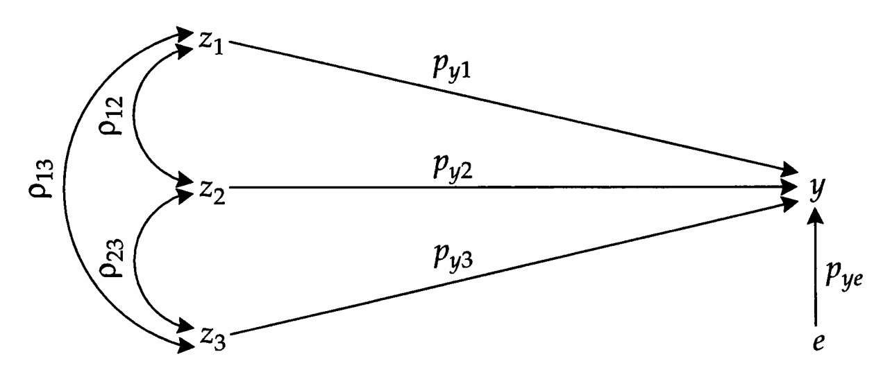
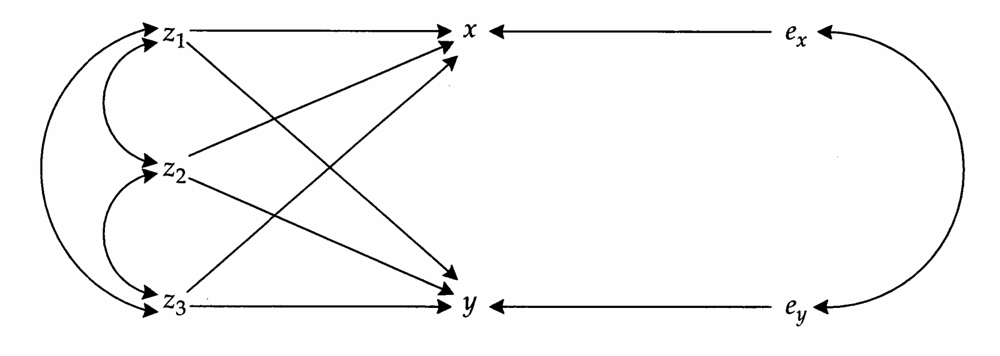
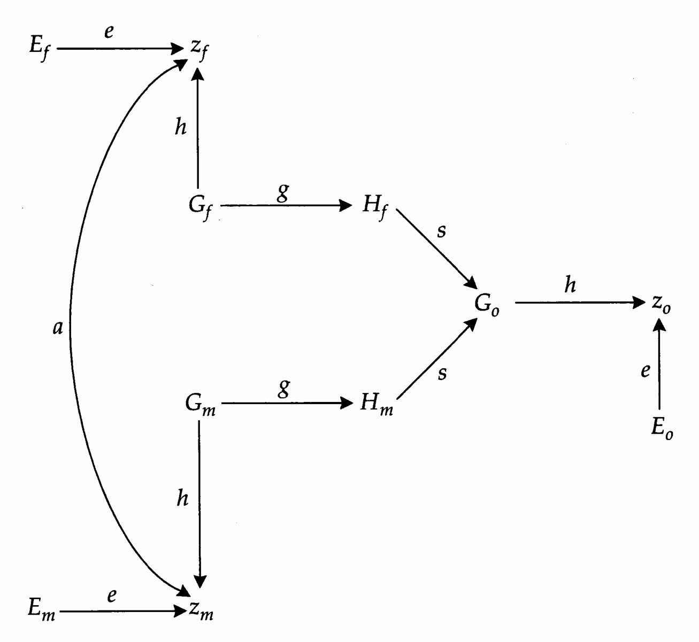
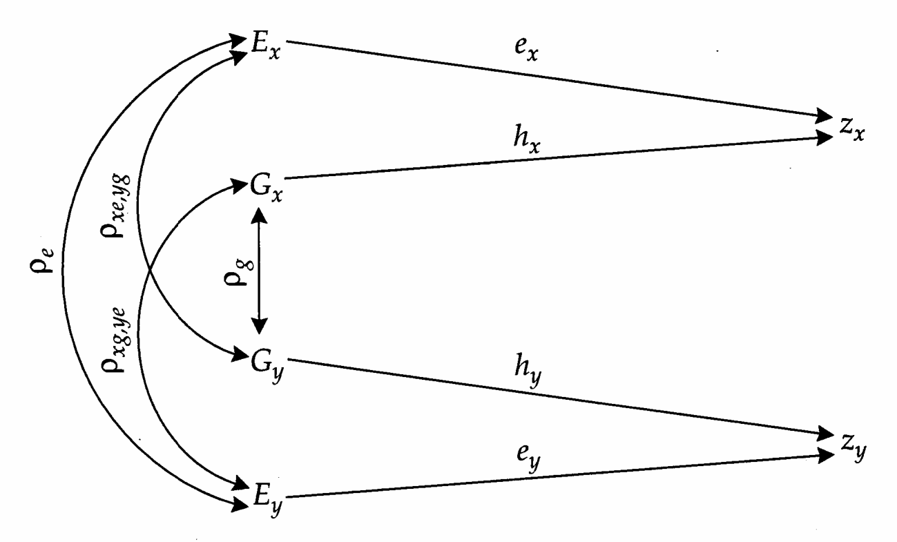
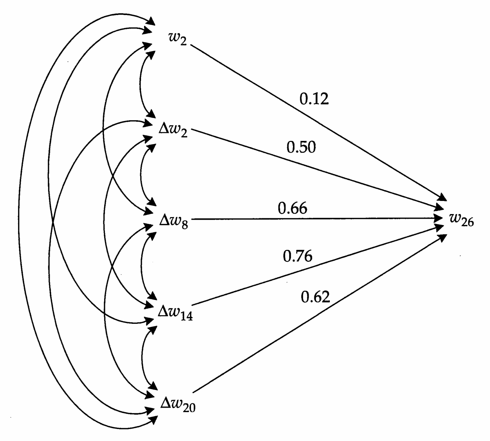
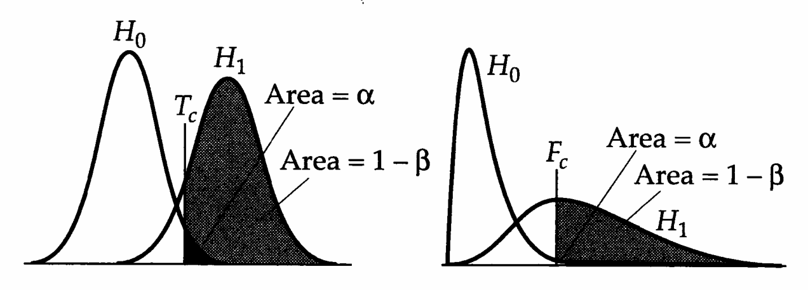
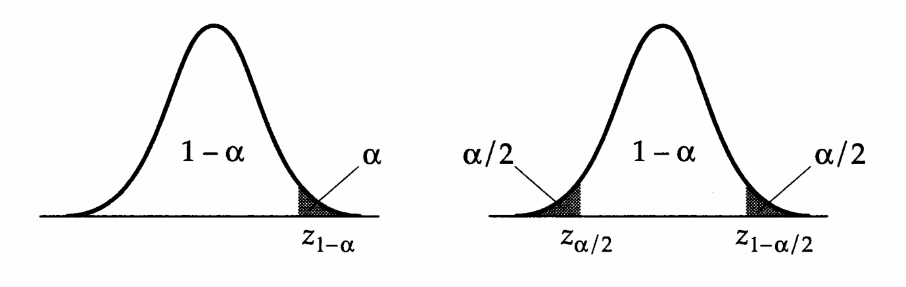
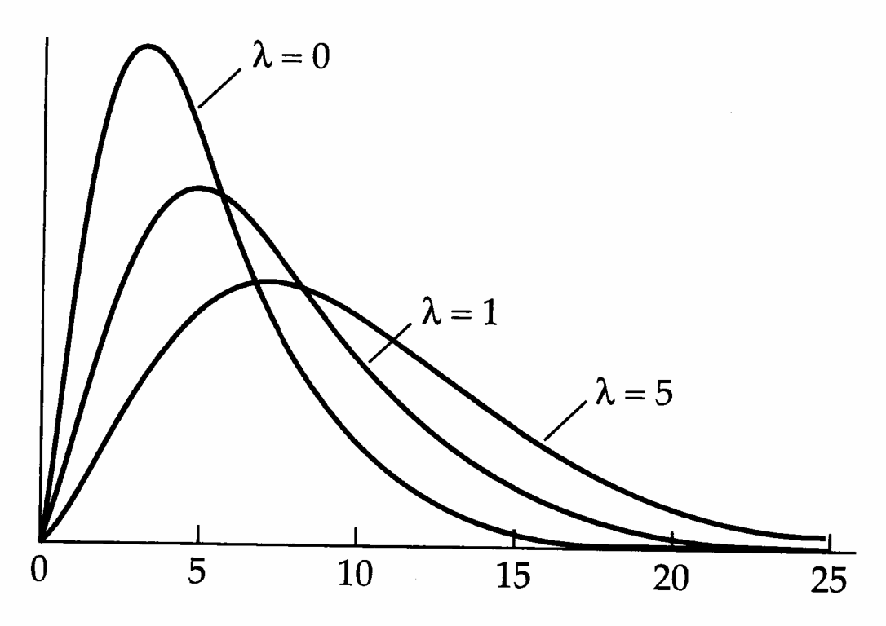

# Appendix 1 · Appendix 1

## Genetics_appendix1_001 · Appendix 1 / Expectations, Variances, and Covariances of Compound Variables

Many situations arise in quantitative genetics in which a measurement or a statistic is a complicated function of one or more variables. This raises many serious difficulties that are at the heart of statistical analysis. We are interested ultimately in the distribution and accuracy of the observed statistic, but at best we know something about the distribution of its component variables, and even that is known with error.

As an example of these problems, consider the regression coefficient $ \beta_{yx} = \sigma(x, y) / \sigma^2(x) $, which is a ratio of a covariance and a variance. With finite sample sizes, the observed statistics $ \text{Cov}(x, y) $ and $ \text{Var}(x) $ are only estimates of $ \sigma(x, y) $ and $ \sigma^2(x) $. Thus, in order to have some confidence in the estimate $ b_{yx} $ of $ \beta_{yx} $, we need to know something about the accuracy of $ \text{Cov}(x, y) $ and $ \text{Var}(x) $. Moreover, we need to know how sampling variance of $ \text{Cov}(x, y) $ and $ \text{Var}(x) $ translates into sampling variance of $ b_{yx} $, i.e., we need to know the sampling variance of a ratio. The problem is exacerbated because the same individuals are typically used to estimate $ \text{Cov}(x, y) $ and $ \text{Var}(x) $, which causes these two estimates to be correlated.

Fortunately, there is a fairly general approach (often referred to as the $ \underline{\text{delta method}} $) for dealing with all of these issues. This appendix provides a brief overview of the theory underlying the delta method and uses it to derive a number of fundamental results that will prove helpful throughout the book.

---

## Genetics_appendix1_002 · THE DELTA METHOD

Consider an arbitrary expression $f$, which is a function of $x$. Performing a Taylor series expansion around an arbitrary constant $c$,

$$
f=f(c)+(x-c)\frac{\partial f(c)}{\partial x}+(x-c)^{2}\frac{\partial^{2}f(c)}{2\partial x^{2}}+(x-c)^{3}\frac{\partial^{3}f(c)}{3\cdot2\partial x^{3}}+\cdots
\tag{A1.1}
$$

where $f(c)$ refers to the function evaluated at $x = c$, and the partial derivatives are first evaluated with respect to $x$, after which $c$ is substituted for $x$.

**[示例 Example]**

> **Example 1** · ref: `Genetics_appendix1:1` · source: `Genetics_appendix1_002.json` · blocks 3–4
>
> Example 1. Consider the function $ f = \sqrt{x} $. Here, $ \partial f/\partial x = 1/(2\sqrt{x}) $ and $ \partial^2 f/\partial x^2 = -1/(4x^{3/2}) $, giving the second-order Taylor series about $ c $ as
> 
> $$
> f=\sqrt{x}\simeq\sqrt{c}+\frac{x-c}{2\sqrt{c}}-\frac{(x-c)^{2}}{8c^{3/2}}+\cdots
> $$
> 

---

## Genetics_appendix1_003 · THE DELTA METHOD / Expectations of Complex Variables

As our first example of the utility of the Taylor expansion, consider the case where x is a random variable and we wish to determine the expected value of the function f averaged over all x. Generally speaking, the mean value of a function is only equal to the function evaluated at the mean of x in the special cases in which the function is linear in x or x is a constant. Hence, we cannot just directly substitute the sample mean when trying to evaluate the mean of some function of the data. However, we can get around this problem by expanding f about the mean of x, using Equation A1.1 with $ c = \mu_x $, and then taking the expectation,

$$
\begin{aligned}E(f)&=E\left[f(\mu_{x})+(x-\mu_{x})\frac{\partial f(\mu_{x})}{\partial x}+(x-\mu_{x})^{2}\frac{\partial^{2}f(\mu_{x})}{2\partial x^{2}}+\cdots\right]\\&=f(\mu_{x})+E(x-\mu_{x})\frac{\partial f(\mu_{x})}{\partial x}+E[(x-\mu_{x})^{2}]\frac{\partial^{2}f(\mu_{x})}{2\partial x^{2}}+\cdots\end{aligned}
\tag{A1.2}
$$

The last step follows since the derivative terms, evaluated at $ \mu_x $, are really just constants. Further simplification is possible since, by the definition of a mean, $ E(x - \mu_x) = 0 $, and $ E[(x - \mu_x)^2] $ is the expected variance of $ x $, $ \sigma^2(x) $. Thus, ignoring third- and higher-order terms,

$$
E(f)\simeq f(\mu_{x})+\sigma^{2}(x)\frac{\partial^{2}f(\mu_{x})}{2\partial x^{2}}
\tag{A1.3}
$$

This relationship shows that the expected value of $f$ is a function of both the mean and the variance of $x$ if $f$ is a nonlinear function of $x$. From Example 1, if $f = \sqrt{x}$, then

$$
E(f)\simeq\sqrt{\mu_{x}}-\frac{\sigma^{2}(x)}{8\mu_{x}^{3/2}}
$$

This same approach can be used to derive expressions for the expectations of functions that depend on more than a single variable. In this case, f must be expanded around the means of each of the component variables. With two component variables, for example, an expansion around $ \mu_{x} $ and $ \mu_{y} $ leads (after some algebra) to

$$
\begin{aligned}E(f)&=f(\mu_{x},\mu_{y})+\sigma^{2}(x)\frac{\partial^{2}f(\mu_{x},\mu_{y})}{2\partial x^{2}}\\&\quad+\sigma(x,y)\frac{\partial^{2}f(\mu_{x},\mu_{y})}{\partial x\partial y}+\sigma^{2}(y)\frac{\partial^{2}f(\mu_{x},\mu_{y})}{2\partial y^{2}}+\cdots\end{aligned}
\tag{A1.4a}
$$

When $f$ is a function of $n$ variables, $(x_{1}, x_{2}, \ldots, x_{n})$, ignoring partials higher than the second order, this generalizes to

$$
\begin{align*}E(f)&\simeq f(\mu_{x_{1}},\mu_{x_{2}},\cdots,\mu_{x_{n}})+\frac{1}{2}\sum_{i=1}^{n}\sigma^{2}(x_{i})\frac{\partial^{2}f}{\partial x_{i}^{2}}\\&\quad+\sum_{i=1}^{n}\sum_{j>i}^{n}\sigma(x_{i},x_{j})\frac{\partial^{2}f}{\partial x_{i}\partial x_{j}}\end{align*}
\tag{A1.4b}
$$

**[示例 Example]**

> **Example 2** · ref: `Genetics_appendix1:2` · source: `Genetics_appendix1_003.json` · blocks 10–22
>
> Example 2. By definition, the variance, $ \sigma^2(x) $, is equal to the average value of $ (x_i - \mu_x)^2 = x_i^2 - \mu_x^2 $ in a population, where $ x_i $ denotes the measure for the ith individual. The population mean, $ \mu_x $, is generally not known with certainty, but rather is estimated by $ \overline{x} $. Thus, it is tempting to estimate the variance by using the mean value of $ x_i^2 - \overline{x}^2 $. Here we show that this quantity gives a (slightly) downwardly biased estimate of $ \sigma^2(x) $, and that there is a simple solution to the problem.
> 
> Expanding $ x_{i}^{2} - \overline{x}^{2} $, we wish to know whether the expected value of the function
> 
> $$
> f_{i}=x_{i}^{2}-\left(\frac{\sum_{j=1}^{n}x_{j}}{n}\right)^{2}
> $$
> 
> 
> is equal to $\sigma^{2}(x)$. Under the assumption that the population has been sampled randomly, $\mu_{x_{i}} = \mu_{x_{j}} = \mu_{x}, \sigma^{2}(x_{i}) = \sigma^{2}(x_{j}) = \sigma^{2}(x)$, and $\sigma(x_{i}, x_{j}) = 0$ for all $i, j$. Equation A1.4b then reduces to
> 
> $$
> E(f_{i})=f_{i}(\mu_{x})+\frac{\sigma^{2}(x)}{2}\left(\frac{\partial^{2}f_{i}}{\partial x_{i}^{2}}+\sum_{j\neq i}\frac{\partial^{2}f_{i}}{\partial x_{j}^{2}}\right)
> \tag{A1.5a}
> $$
> 
> 
> The required partial derivatives are
> 
> $$
> \frac{\partial f_{i}}{\partial x_{i}}=2x_{i}-\frac{2\sum_{j=1}^{n}x_{j}}{n^{2}}\quad\frac{\partial^{2}f_{i}}{\partial x_{i}^{2}}=2\left(1-\frac{1}{n^{2}}\right)
> $$
> 
> 
> $$
> \frac{\partial f_{i}}{\partial x_{j}}=-\frac{2\sum_{k=1}^{n}x_{k}}{n^{2}}\quad 夢軒 \quad\frac{\partial^{2}f_{i}}{\partial x_{j}^{2}}=-\frac{2}{n^{2}}
> $$
> 
> 
> Since all higher-order partials are equal to zero, Equation A1.5a is exact in this case. In addition, substitution of $ \mu_x $ for $ x_i $ and all $ x_j $, shows that $ f_i(\mu_x) = 0 $. Substituting the partial derivatives into Equation A1.5a gives
> 
> $$
> E(x_{i}^{2}-\overline{x}^{2})=\sigma^{2}(x)\cdot\left(\frac{n-1}{n}\right)
> $$
> 
> 
> This shows that the mean value of $ x_{i}^{2} - \overline{x}^{2} $ gives a slightly downwardly biased estimate of the population variance, $ \sigma^{2}(x) $. The problem is eliminated by simply multiplying the mean value of $ x_{i}^{2} - \overline{x}^{2} $ by $ n/(n-1) $. Thus, an unbiased estimate of $ \sigma^{2}(x) $ is
> 
> $$
> \mathrm{Var}(x)=\left(\frac{n}{n-1}\right)(\overline{x^{2}}-\overline{x}^{2})
> \tag{A1.5b}
> $$
> 
> 
> $$
> =\frac{1}{n-1}\sum_{i=1}^{n}\left(x_{i}-\overline{x}\right)^{2}
> \tag{A1.5c}
> $$
> 

---

## Genetics_appendix1_004 · THE DELTA METHOD / Variances of Complex Variables

The preceding approach can also be used to obtain an expression for the variance of a function. Again expanding around $ c = \mu_x $, and substituting for f from Equation A1.1 and $ E(f) $ from Equation A1.2,

$$
\begin{aligned}\sigma_{f}^{2}=&E\left\{[f-E(f)]^{2}\right\}\\=&E\left\{\left[\left(f(\mu_{x})+(x-\mu_{x})\frac{\partial f(\mu_{x})}{\partial x}+\cdots\right)-\left(f(\mu_{x})+\sigma^{2}(x)\frac{\partial^{2}f(\mu_{x})}{2\partial x^{2}}+\cdots\right)\right]^{2}\right\}\\=&E\left\{\left[(x-\mu_{x})\frac{\partial f(\mu_{x})}{\partial x}+[(x-\mu_{x})^{2}-\sigma^{2}(x)]\frac{\partial^{2}f(\mu_{x})}{2\partial x^{2}}+\cdots\right]^{2}\right\}\quad(A1.6)\end{aligned}
$$

Ignoring all but the two lowest-order terms, and noting that E(x − μx) = 0,

$$
\begin{aligned}\sigma_{f}^{2}&\simeq E\left[(x-\mu_{x})^{2}\right]\left[\frac{\partial f(\mu_{x})}{\partial x}\right]^{2}+2E\left[(x-\mu_{x})^{3}\right]\left[\frac{\partial f(\mu_{x})}{\partial x}\right]\left[\frac{\partial^{2}f(\mu_{x})}{2\partial x^{2}}\right]\\&\quad-2E(x-\mu_{x})\sigma^{2}(x)\left[\frac{\partial f(\mu_{x})}{\partial x}\right]\left[\frac{\partial^{2}f(\mu_{x})}{2\partial x^{2}}\right]+E\left[(x-\mu_{x})^{4}\right]\left[\frac{\partial^{2}f(\mu_{x})}{2\partial x^{2}}\right]^{2}\\&\quad-2E\left[(x-\mu_{x})^{2}\right]\sigma^{2}(x)\left[\frac{\partial^{2}f(\mu_{x})}{2\partial x^{2}}\right]^{2}+\sigma^{4}(x)\left[\frac{\partial^{2}f(\mu_{x})}{2\partial x^{2}}\right]^{2}\\&=\sigma^{2}(x)\left[\frac{\partial f(\mu_{x})}{\partial x}\right]^{2}+2\mu_{3x}\left[\frac{\partial f(\mu_{x})}{\partial x}\right]\left[\frac{\partial^{2}f(\mu_{x})}{2\partial x^{2}}\right]\\&\quad+\left[\mu_{4x}-\sigma^{4}(x)\right]\left[\frac{\partial^{2}f(\mu_{x})}{2\partial x^{2}}\right]^{2}\tag{A1.7a}\end{aligned}
$$

where $ \mu_{3x} = E[(x - \mu_x)^3] $ and $ \mu_{4x} = E[(x - \mu_x)^4] $ are the third and fourth moments about the mean of x. When f is a function of two variables, Equation A1.6a expands to

$$
\begin{aligned}\sigma_{f}^{2}&=E\Bigg\{\left[(x-\mu_{x})\frac{\partial f(\mu_{x},\mu_{y})}{\partial x}+(y-\mu_{y})\frac{\partial f(\mu_{x},\mu_{y})}{\partial y}\right.\\&\quad\left.+\left[(x-\mu_{x})^{2}-\sigma^{2}(x)\right]\frac{\partial^{2}f(\mu_{x},\mu_{y})}{2\partial x^{2}}+\left[(x-\mu_{x})(y-\mu_{y})-\sigma(x,y)\right]\frac{\partial^{2}f(\mu_{x},\mu_{y})}{\partial x\partial y}\right.\\&\quad\left.+\left[(y-\mu_{y})^{2}-\sigma^{2}(y)\right]\frac{\partial^{2}f(\mu_{x},\mu_{y})}{2\partial y^{2}}+\cdots\right|^{2}\Bigg\}\quad(A1.7b)\end{aligned}
$$

where $ \sigma(x,y) $ is the covariance of x and y. An approximation often used in place of Equation A1.7b is obtained by ignoring all but the first-order terms. Then, if f is a function of n variables,

$$
\sigma_{f}^{2}\simeq\sum_{i=1}^{n}\sum_{j=1}^{n}\sigma(x_{i},x_{j})\left(\frac{\partial f}{\partial x_{i}}\right)\left(\frac{\partial f}{\partial x_{j}}\right)
\tag{A1.7c}
$$

where $ \sigma(x_{i}, x_{j}) $ is a variance if $ i = j $ and a covariance otherwise, and the partial derivatives are evaluated at the expectations for all underlying variables.

**[示例 Example]**

> **Example 3** · ref: `Genetics_appendix1:3` · source: `Genetics_appendix1_004.json` · blocks 9–19
>
> Example 3. Imagine sampling a population many times independently for $n$ individuals, each time estimating the mean. Can we express the variance of the sample means, $\sigma^{2}(\overline{x})$, in terms of the variance of individual measures, $\sigma^{2}(x)$?
> 
> Recall that the definition of a sample estimate of the mean is
> 
> $$
> \overline{x}=\frac{x_{1}+x_{2}+\cdots+x_{n}}{n}
> \tag{A1.8a}
> $$
> 
> 
> Under the assumption that the population is sampled randomly, there is no covariance between the measures of different individuals, so that Equation A1.7c reduces to
> 
> $$
> \sigma_{f}^{2}\simeq\sum_{i=1}^{n}\sigma^{2}(x_{i})\left(\frac{\partial f}{\partial x_{i}}\right)^{2}
> \tag{A1.8a}
> $$
> 
> 
> where in this example $ f = \overline{x} $. The partial derivative of $ \overline{x} $ with respect to each individual measure $ x_i $ is simply 1/n, and assuming a homogeneous population, $ \sigma^2(x_i) = \sigma^2(x) $ for all i. Thus, substituting into Equation A1.8a, the sampling variance of a mean is
> 
> $$
> \sigma^{2}(\overline{x})=\sum_{i=1}^{n}\frac{\sigma^{2}(x_{i})}{n^{2}}=\frac{\sigma^{2}(x)}{n}
> \tag{A1.8b}
> $$
> 
> 
> i.e., the sampling variance of a mean is equal to the variance of individual measures divided by the sample size.
> 
> The practical utility of this expression might be questioned since the parameter $ \sigma^2(x) $ is something that we can only estimate. However, recall from Example 2 that an unbiased estimator of $ \sigma^2(x) $ is $ \text{Var}(x) = n(\overline{x}^2 - \overline{x}^2)/(n - 1) $. It follows that
> 
> $$
> \mathrm{Var}(\overline{x})=\frac{\mathrm{Var}(x)}{n}
> \tag{A1.8c}
> $$
> 
> 
> is an unbiased estimator of $ \sigma^{2}(\overline{x}) $. The square root of $ \operatorname{Var}(\overline{x}) $ is known as the standard error of the mean.

The practice of substituting an observed (and, ideally, unbiased) statistic for a population parameter in sampling-variance equations is widely used to obtain approximate sampling variances of statistics. Since the accuracy of formulations employing such estimates increases with sample size, these formulations are usually referred to as large-sample variance expressions, their square roots yielding standard errors of the statistic. It is often possible to use the standard error to construct a confidence interval around the estimate, such that the parametric value is encompassed within the confidence limits with a certain probability. However, the construction of confidence intervals for complex functions is generally very difficult not only because of the approximate nature of the variance estimates but also because the forms of distributions of complex functions are usually unknown.

As pointed out in Chapter 2, if it is reasonable to assume that the statistic of interest is approximately normally distributed, then the estimate plus or minus twice the square root of the sampling variance provides an estimate of the 95% confidence interval, i.e., of the interval within which the true parametric value lies with approximately 95% probability. For variables that are not normally distributed, a more general statement can be made. By Chebyshev's theorem, if $ f $ and $ \mu_f $ are observed and parametric values of a function, the probability that $ \mu_f $ is in the range $ f \pm k\sigma(f) $ is at least $ 1 - (1/k^2) $. For example, the probability that a parametric value lies within two (true) standard deviations of its estimate is at least $ \frac{3}{4} $ regardless of the sampling distribution of the estimator. The probability increases to 95% if $ k \simeq 4.5 $. In other words, $ \pm 4.5 $ times the standard error of an estimate provides a very conservative estimate of the 95% confidence interval.

---

## Genetics_appendix1_005 · THE DELTA METHOD / Covariances of Complex Variables

The above procedures can also be used to evaluate the covariance between two compound functions f and g determined by common variables $ (x_{1}, \ldots, x_{n}) $. Again ignoring all but the first-order terms,

$$
\sigma(f,g)=E\left\{\left[f-E(f)\right]\left[g-E(g)\right]\right\}\simeq\sum_{i=1}^{n}\sum_{j=1}^{n}\sigma(x_{i},x_{j})\left(\frac{\partial f}{\partial x_{i}}\right)\left(\frac{\partial g}{\partial x_{j}}\right)
\tag{A1.9}
$$

**[示例 Example]**

> **Example 4** · ref: `Genetics_appendix1:4` · source: `Genetics_appendix1_005.json` · blocks 2–7
>
> Example 4. Consider two linear functions of the set of variables $ (x_{1}, \cdots, x_{n}) $
> 
> $$
> f=\alpha_{1}x_{1}+\alpha_{2}x_{2}+\cdots+\beta_{n}x_{n}
> $$
> 
> 
> $$
> g=\beta_{1}x_{1}+\beta_{2}x_{2}+\cdots+\beta_{n}x_{n}
> $$
> 
> 
> What is the covariance between $f$ and $g$? The partial derivatives with respect to the $x_i$ variables are $\partial f/\partial x_i = \alpha_i$ and $\partial g/\partial x_i = \beta_i$. Substituting into Equation A1.9,
> 
> $$
> \sigma(f,g)=\sum_{i=1}^{n}\alpha_{i}\beta_{i}\sigma^{2}(x_{i})+\sum_{i=1}^{n}\sum_{j\neq i}^{n}\alpha_{i}\beta_{j}\sigma(x_{i},x_{j})
> $$
> 
> 
> This is an exact result, because here all of the higher-order partial derivatives are equal to zero.

---

## Genetics_appendix1_006 · VARIANCES OF VARIANCES AND COVARIANCES

Since quantitative genetics is often concerned with quantifying components of variance and covariance, it is useful to have expressions for the variance of these.

The general rules set forth in the previous sections are readily applied to these issues, since variances and covariances are linear functions of sums of variables and their squares and cross-products. The rest of this appendix examines some specific applications of these general approximation procedures, largely by example.

**[示例 Example]**

> **Example 5** · ref: `Genetics_appendix1:5` · source: `Genetics_appendix1_006.json` · blocks 2–17
>
> Example 5. Here we consider the sampling variance of a variance estimate, i.e., $ \sigma^{2}[\mathrm{Var}(x)] $. This quantity can be thought of as the expected variance that would arise among variance estimates obtained from a large number of independent samples from the same population. With $ n $ observations $ (x_{1}, x_{2}, \cdots, x_{n}) $,
> 
> $$
> f=\mathrm{Var}(x)=\frac{n}{n-1}\left[\frac{\sum_{i=1}^{n}x_{i}^{2}}{n}-\left(\frac{\sum_{i=1}^{n}x_{i}}{n}\right)^{2}\right]
> $$
> 
> 
> Provided that the individual measures of $x$ are obtained from random members of the same population, the covariance between all measures is zero, and the variance associated with each measure is the same, $\sigma^{2}(x)$. Thus, each of the $n$ observed variables makes an identical contribution to the variance of $\operatorname{Var}(x)$. The partial derivatives with respect to measure $x_{i}$, evaluated at its mean, are
> 
> $$
> \frac{\partial f}{\partial x_{i}}=\frac{n}{n-1}\left(\frac{2x_{i}}{n}-\frac{2\sum_{j=1}^{n}x_{j}}{n^{2}}\right)\bigg|_{x_{i}=\mu_{x}}=\frac{n}{n-1}\left(\frac{2\mu_{x}}{n}-\frac{2n\mu_{x}}{n^{2}}\right)=0
> $$
> 
> 
> $$
> \frac{\partial^{2}f}{\partial x_{i}^{2}}=\frac{n}{n-1}\left(\frac{2}{n}-\frac{2}{n^{2}}\right)=\frac{2}{n}
> $$
> 
> 
> Substituting into Equation A1.7a, the variance of $ \operatorname{Var}(x) $ caused by variation in the ith measure is $ [\mu_{4x}-\sigma^{4}(x)]/n^{2} $, and summing over all n measures,
> 
> $$
> \sigma^{2}[\mathrm{Var}(x)]=\frac{\mu_{4x}-\sigma^{4}(x)}{n}
> \tag{A1.10a}
> $$
> 
> 
> When x is normally distributed, $ \mu_{4x}=3\sigma^{4}(x) $ (Kendall and Stuart 1977), giving
> 
> $$
> \sigma^{2}[\mathrm{Var}(x)]=\frac{2\sigma^{4}(x)}{n}
> \tag{A1.10b}
> $$
> 
> 
> Equations A1.10a,b are exact expressions for the sampling variance of a variance because all partial derivatives higher than second order are equal to zero.
> 
> Our final problem is to modify Equation A1.10b in such a way that an unbiased estimate of the sampling variance of the variance can be obtained from the sample statistic $ \operatorname{Var}(x) $. It is tempting to simply substitute $ [\operatorname{Var}(x)]^2 $ for $ \sigma^4(x) $, but this is not quite correct. Recalling the definition of a variance, $ E(z^{2}) = \sigma^{2}(z) + \mu_{z}^{2} $, and substituting $ \mathrm{Var}(x) $ for $ z $, and $ \sigma^{2}(x) $ for $ \mu_{z} $, we find that
> 
> $$
> E\{[\mathrm{Var}(x)]^{2}\}=\sigma^{2}[\mathrm{Var}(x)]+[\sigma^{2}(x)]^{2}
> $$
> 
> 
> Substituting for $ \sigma^{2}[\mathrm{Var}(x)] $ from Equation A1.10b,
> 
> $$
> E\{[\mathrm{Var}(x)]^{2}\}=\left(1+\frac{2}{n}\right)\sigma^{4}(x)
> $$
> 
> 
> which shows that the quantity $ n\left[\mathrm{Var}(x)\right]^{2}/(n+2) $, rather than $ \left[\mathrm{Var}(x)\right]^{2} $, provides an unbiased estimate of $ \sigma^{4}(x) $. Thus, an unbiased estimate of the sampling variance of a variance is given by
> 
> $$
> \mathrm{Var}[\mathrm{Var}(x)]=\frac{2[\mathrm{Var}(x)]^{2}}{n+2}
> \tag{A1.10c}
> $$
> 

General information on the variances and covariances of moments can be found in Chapter 10 of Kendall and Stuart (1977). Letting $ m_r = n^{-1} \sum (x_i - \overline{x})^r $ and $ \mu_r = E[(x - \mu_x)^r] $ represent observations and expectations for the $ r $th moment about the mean, the following approximations apply to the sampling variances and covariances,

$$
\begin{align*}\sigma^{2}(m_{r})&\simeq\frac{1}{n}\left(\mu_{2r}-\mu_{r}^{2}+r^{2}\mu_{2}\cdot\mu_{r-1}^{2}-2r\mu_{r-1}\cdot\mu_{r+1}\right)\\\sigma(m_{r},m_{q})&\simeq\frac{1}{n}\Biggl(\mu_{r+q}-\mu_{r}\cdot\mu_{q}+r\cdot q\cdot\mu_{2}\cdot\mu_{q-1}\\&\quad-r\cdot\mu_{r-1}\cdot\mu_{q+1}-q\cdot\mu_{r+1}\cdot\mu_{q-1}\Biggr)\end{align*}
\tag{A1.11}
$$

where $ \mu_{0} = \mu_{1} = 0 $. Ideally, in the application of any of these formulae, unbiased estimates of the moments $ (\mu_{r}) $ should be employed (as illustrated in Examples 3 and 5). A few other useful results from Kendall and Stuart (1977) follow.

The covariance of an observed mean and a moment about that mean is

$$
\sigma(\overline{x},m_{r})=\frac{1}{n}(\mu_{r+1}-r\cdot\mu_{2}\cdot\mu_{r-1})
\tag{A1.13a}
$$

Thus, an unbiased estimate of the covariance between estimates of the mean and the variance (estimated from the same sample) is

$$
\mathrm{Cov}[\overline{x},\mathrm{Var}(x)]=\frac{\mathrm{Skw}(x)}{n}
\tag{A1.13b}
$$

where Skw(x), given as Equation 2.7 in the text, is an unbiased estimate of the third moment. For symmetrical distributions, such as the normal, all odd moments have expectations equal to zero, in which case the covariance between mean and variance is zero.

The following results apply to the second-order moments of a bivariate normal distribution. The variance of a covariance estimate is

$$
\sigma^{2}\left[\mathrm{Cov}(x,y)\right]=\frac{\sigma^{2}(x)\sigma^{2}(y)+\left[\sigma(x,y)\right]^{2}}{n}
\tag{A1.14}
$$

The covariance of variance and covariance estimates sharing a common variable is

$$
\sigma\left[\mathrm{Cov}(x,y),\mathrm{Var}(x)\right]=\frac{2\sigma^{2}(x)\sigma(x,y)}{n}
\tag{A1.15}
$$

The covariance of the variances for two variables is

$$
\sigma[\operatorname{Var}(x),\operatorname{Var}(y)]=\frac{2\left[\sigma(x,y)\right]^{2}}{n}
\tag{A1.16}
$$

All three of these expressions can be used to obtain large-sample variance and covariance estimates by substituting, on the right, observed moments for their expectations. Such expressions are very slightly upwardly biased, by factors of $ (n+1)/n $ or $ (n+2)/n $, but because the estimates of variances and covariances of higher-order moments are highly unreliable unless the sample size is large, this distinction is trivial for most practical purposes.

Expressions for the variances and covariances of moments about the origin can be found in Kendall and Stuart (1977, p. 244), and for the variances and covariances of other bivariate moments in Kendall and Stuart (1977, p. 250).

**[示例 Example]**

> **Example 6** · ref: `Genetics_appendix1:6` · source: `Genetics_appendix1_006.json` · blocks 34–41
>
> Example 6. What is the expected sampling variance of the directional selection differential S? In Chapter 3, it is shown that for any character whose phenotype is denoted by z, S is equivalent to the covariance between z and relative fitness w, i.e., $ S = \sigma(z, w) $. Applying Equation A1.14, we obtain
> 
> $$
> \sigma^{2}(S)=\frac{\sigma^{2}(z)\sigma^{2}(w)+[\sigma(z,w)]^{2}}{n}
> $$
> 
> 
> Note that Equation A1.14 assumes z and w are bivariate normally distributed, implying that we assume that fitness has some optimal value and falls off (roughly quadratically) around this optimun.
> 
> Some insight into the relative magnitude of the sampling variance of S can be acquired by considering the coefficient of sampling variation,
> 
> $$
> CV(S)=\frac{\sigma(S)}{E(S)}
> $$
> 
> 
> where $E(S) = \sigma(z, w)$. Letting $\rho$ be the correlation between phenotype and relative fitness, this reduces to
> 
> $$
> \mathrm{CV}(S)=\frac{1}{\rho}\left(\frac{1+\rho^{2}}{n}\right)^{1/2}
> $$
> 
> 
> The minimum value of $ \mathrm{CV}(S) $ arises when the character is the sole determinant of fitness, i.e., $ \rho = 1 $, in which case $ \mathrm{CV}(S) = \sqrt{2/n} $. This shows that unless sample sizes are fairly high, the standard error of $ S $ relative to its expected value can be quite high — for $ n = 50 $, 100, and 250, the CVs are, respectively, $ \geq 0.20 $, 0.14, and 0.09.

---

## Genetics_appendix1_007 · EXPECTATIONS AND VARIANCES OF PRODUCTS

Consider the product $f = uv$, where $u$ and $v$ or $v$ may be variables or functions of variables. Here $\partial f/\partial v = u$, $\partial f/\partial u = v$, $\partial^2 f/\partial u \partial v = 1$, and all other partial derivatives are zero. By including all terms involving these three nonzero partials in the application of Equation A1.4a, we obtain the expectation

$$
E(u v)=\mu_{u}\mu_{v}+\sigma(u,v)
\tag{A1.17}
$$

where $ \mu_{u} $ and $ \mu_{v} $ are, respectively, the expected values of u and v. This expression also follows directly from the definition of a covariance, $ \sigma(u,v) = E(uv) - \mu_{u}\mu_{v} $.

Applying Equation A1.7b,

$$
\sigma^{2}(u v)=E\left\{\left[(u-\mu_{u})\mu_{v}+(v-\mu_{v})\mu_{u}+(v-\mu_{v})(u-\mu_{u})-\sigma(u,v)\right]^{2}\right\}
$$

After a little algebra, this becomes

$$
\begin{aligned}\sigma^{2}(uv)&=\mu_{v}^{2}\sigma^{2}(u)+\mu_{u}^{2}\sigma^{2}(v)+E[(v-\mu_{v})^{2}(u-\mu_{u})^{2}]-[{\sigma(u,v)}]^{2}\\ &+2\Bigg(\mu_{u}\mu_{v}\sigma(u,v)+\mu_{u}E[(v-\mu_{v})^{2}(u-\mu_{u})]\\ &+\mu_{v}E[(v-\mu_{v})(u-\mu_{u})^{2}]\Bigg)&( 爻 )\\ \end{aligned}
\tag{A1.18a}
$$

If u and v are bivariate normally distributed, then from Kendall and Stuart (1977, p. 85),

$$
E[(v-\mu_{v})^{2}(u-\mu_{u})^{2}]=\sigma^{2}(u)\sigma^{2}(v)+2\left[\sigma(u,v)\right]^{2}
\tag{A1.18a}
$$

and

$$
E[(v-\mu_{v})^{2}(u-\mu_{u})]=E[(v-\mu_{v})(u-\mu_{u})^{2}]=0
\tag{A1.18b}
$$

in which case

$$
\sigma^{2}(u v)=\mu_{v}^{2}\sigma^{2}(u)+\mu_{u}^{2}\sigma^{2}(v)+[\sigma(u,v)]^{2}+2\mu_{u}\mu_{v}\sigma(u,v)+\sigma^{2}(u)\sigma^{2}(v)
\tag{A1.18b}
$$

When u and v are independent, this equation reduces further to

$$
\sigma^{2}(u v)=\mu_{v}^{2}\sigma^{2}(u)+\mu_{u}^{2}\sigma^{2}(v)+\sigma^{2}(u)\sigma^{2}(v)
\tag{A1.18c}
$$

A useful compendium of facts regarding the variances and covariances of products of random variables can be found in Bohrnstedt and Goldberger (1969).

---

## Genetics_appendix1_008 · EXPECTATIONS AND VARIANCES OF RATIOS

Many of the statistics utilized in quantitative genetics are ratios of moments. These include the coefficient of variation, and regression and correlation coefficients. Thus, it is useful to have a general expression for the variance of a ratio, and the delta method yields a good approximation. Letting $f = u/v$, the first-order partials become $\partial f/\partial u = v^{-1}$ and $\partial f/\partial v = -u/v^{2}$, giving $\partial^{2}f/\partial u^{2} = 0$, $\partial^{2}f/\partial v^{2} = 2u/v^{3}$, and $\partial^{2}f/\partial u\partial v = \partial^{2}f/\partial v\partial u = -1/v^{2}$. Evaluating these second-order partials at $\mu_{u}$ and $\mu_{v}$ (again, the expected values of $u$ and $v$), Equation A1.4a gives

$$
E\left(\frac{u}{v}\right)\simeq\frac{\mu_{u}}{\mu_{v}}\left(1+\frac{\sigma^{2}(v)}{\mu_{v}^{2}}-\frac{\sigma(u,v)}{\mu_{u}\mu_{v}}\right)
\tag{A1.19a}
$$

Likewise, from Equation A1.7c,

$$
\begin{aligned}\sigma^{2}(u/v)&\simeq\sigma^{2}(u)\left(\frac{1}{\mu_{v}}\right)^{2}+\sigma^{2}(v)\left(\frac{\mu_{u}}{\mu_{v}^{2}}\right)^{2}-2\sigma(u,v)\left(\frac{1}{\mu_{v}}\right)\left(-\frac{\mu_{u}}{\mu_{v}^{2}}\right)\\&=\left(\frac{\mu_{u}}{\mu_{v}}\right)^{2}\left(\frac{\sigma^{2}(u)}{\mu_{u}^{2}}-\frac{2\sigma(u,v)}{\mu_{u}\mu_{v}}+\frac{\sigma^{2}(v)}{\mu_{v}^{2}}\right)\end{aligned}
\tag{A1.19b}
$$

Both Equations A1.19a and A1.19b are approximations since $ \partial f^{2}/\partial v^{2} \neq 0 $.

---

## Genetics_appendix1_009 · EXPECTATIONS AND VARIANCES OF RATIOS / Sampling Variances of Regression and Correlation Coefficients

The least-squares regression coefficient is given by $b = u/v$, where $u = \text{Cov}(x, y)$ and $v = \text{Var}(x)$. To apply Equation A1.19b, we need to know $\mu_u, \mu_v, \sigma^2(u), \sigma^2(v)$, and $\sigma(u, v)$. Since $\text{Var}(x)$ and $\text{Cov}(x, y)$ are unbiased estimators of the variance and covariance, $\mu_u = \sigma(x, y)$ and $\mu_v = \sigma^2(x)$. Under the assumption that $x$ and $y$ are bivariate normally distributed, we can also use the above results to obtain the variances and covariance of $u$ and $v$: from Equation A1.14, $\sigma^2(u) =$

$$
[\sigma^{2}(x)\sigma^{2}(y)+\sigma^{2}(x,y)]/n; \text{ from Equation A1.10b, } \sigma^{2}(v)=2\sigma^{4}(x)/n; \text{ and from Equation A1.15, } \sigma(u,v)=2\sigma^{2}(x)\sigma(x,y)/n.
$$

Substituting these expressions into Equation A1.19b, we obtain (after some algebra) a result first obtained by Pearson (1896)

$$
\sigma^{2}(b)\simeq\frac{\sigma^{2}(y)(1-\rho^{2})}{n\sigma^{2}(x)}
\tag{A1.20a}
$$

where $ \rho = \sigma(x, y)/[\sigma(x)\sigma(y)] $ is the correlation coefficient. With much additional algebra, it can also be shown that the sampling variance of a correlation coefficient, $ r = \mathrm{Cov}(x, y)/[\mathrm{Var}(x)\mathrm{Var}(y)]^{1/2} $, is

$$
\sigma^{2}(r)\simeq\frac{(1-\rho^{2})^{2}}{n}
\tag{A1.20b}
$$

Both of these expressions are strictly valid only under the assumption of bivariate normality (Kendall and Stuart 1977; p. 250). In practice, large-sample variances for b and r are estimated by substituting observed for expected variances and covariances in Equations A1.20a,b, and by using $ (n - 2) $ in place of n in the denominator, although this latter modification is usually of trivial importance.

**[示例 Example]**

> **Example 7** · ref: `Genetics_appendix1:7` · source: `Genetics_appendix1_009.json` · blocks 7–9
>
> Example 7. Dickerson (1969) argued that because the numerator (the covariance) of a regression coefficient is estimated with much lower accuracy than the denominator (the variance), the sampling variance of the latter can be safely ignored in computing the standard error of a regression coefficient. Under this assumption, the approximate sampling variance of a regression coefficient is simply $ \sigma^2[\text{Cov}(x, y)] / \sigma^4(x) $, which upon substitution for $ \sigma^2[\text{Cov}(x, y)] $ becomes
> 
> $$
> \sigma^{2}(b)\simeq\frac{\sigma^{2}(y)(1+\rho^{2})}{n\sigma^{2}(x)}
> $$
> 
> 
> Comparing this to Equation A1.20a, it can be seen that ignoring the sampling variance in the denominator leads to a conservative estimate of the standard error of b, i.e., to a standard error that is upwardly biased. The ratio of the standard errors resulting from both expressions is $ \left[(1-\rho^{2})/(1+\rho^{2})\right]^{1/2} $. For \rho = 0.5, the ratio is 0.77.

---

## Genetics_appendix1_010 · EXPECTATIONS AND VARIANCES OF RATIOS / Sampling Variance of a Coefficient of Variation

As our final example of finding an approximate (large-sample) sampling variance of a ratio, we consider $ \sigma^{2}[\mathrm{CV}(x)] $, where the coefficient of variation $ \mathrm{CV}(x) = $

SD(x)/π. This example shows how the approximations developed above can be successively used for even rather complex functions. As a first step, consider the expectation and variance of SD, the sample estimate of standard deviation. We start with the variance, $ \sigma^{2}[SD(x)] = \sigma^{2}[\sqrt{\text{Var}(x)}] $. Applying Equation A1.7c (with n = 1 variable), we have

$$
\sigma^{2}(\sqrt{v})\simeq\sigma^{2}(v)\left.\left(\frac{\partial\sqrt{v}}{\partial v}\right)^{2}\right|_{\mu_{v}}=\frac{\sigma^{2}(v)}{4\mu_{v}}
\tag{A1.21}
$$

Recalling that $ \sigma^{2}[\mathrm{Var}(x)] = [(\mu_{4x} - \sigma^{4}(x)]/n $, and letting $ v = \mathrm{Var}(x) $, then $ \mu_{v} = \sigma^{2}(x) $ and Equation A1.21 gives

$$
\sigma^{2}[\mathrm{SD}(x)]=\sigma^{2}[\sqrt{\mathrm{Var}(x)}]\simeq\frac{\sigma^{2}[\mathrm{Var}(x)]}{4\sigma^{2}(x)}=\frac{\mu_{4x}-\sigma^{4}(x)}{4n\sigma^{2}(x)}
\tag{A1.22}
$$

To compute the approximate expected value of the SD, we apply Equation A1.3,

$$
E(\sqrt{v})\simeq\sqrt{\mu_{v}}-\sigma^{2}(v)\frac{\mu_{v}^{-3/2}}{8}
\tag{A1.23a}
$$

Letting $ v = \mathrm{Var}(x) $, $ \mu_v = \sigma^2(x) $ and $ \sigma^2[\mathrm{Var}(x)] = [\mu_{4x} - \sigma^4(x)]/n $,

$$
\mu_{\mathrm{SD}}=E[\mathrm{SD}(x)]\simeq\sigma(x)+\frac{\sigma(x)}{8n}\left[1-\frac{\mu_{4x}}{\sigma^{4}(x)}\right]
\tag{A1.23b}
$$

Next, consider $\sigma[\overline{x}, \mathrm{SD}(x)]$, the covariance between the standard deviation and the sample mean. Since we know $\sigma[\overline{x}, \mathrm{Var}(x)] \simeq \mu_{3x}/n$ (Equation A1.13b), we first use Equation A1.9 to obtain an approximation for $\sigma[\overline{x}, \mathrm{SD}(x)]$ as a function of $\overline{x}$ and $\mathrm{Var}(x)$. Letting $f = u$ and $g = \sqrt{v}$, Equation A1.9 gives

$$
\begin{aligned}\sigma(u,\sqrt{v})\simeq\sigma^{2}(u)\left(\frac{\partial u}{\partial u}\right)\left(\frac{\partial\sqrt{v}}{\partial u}\right)+\sigma^{2}(v)\left(\frac{\partial\sqrt{v}}{\partial v}\right)\left(\frac{\partial u}{\partial v}\right)\\+\sigma(u,v)\left[\left(\frac{\partial u}{\partial u}\right)\left(\frac{\partial\sqrt{v}}{\partial v}\right)+\left(\frac{\partial u}{\partial v}\right)\left(\frac{\partial\sqrt{v}}{\partial u}\right)\right]\end{aligned}
\tag{A1.24}
$$

For our particular case,

$$
\frac{\partial u}{\partial v}=\frac{\partial\overline{x}}{\partial\mathrm{Var}(x)}=0\qquad and\qquad\frac{\partial\sqrt{v}}{\partial u}=\frac{\partial\mathrm{SD}(x)}{\partial\overline{x}}=0
\tag{A1.24}
$$

so three of the terms in Equation A1.24 are zero, leaving

$$
\sigma(u,\sqrt{v})=\sigma(u,v)/(2\sqrt{\mu_{v}})
$$

Hence, from Equation A1.13b,

$$
\sigma[\overline{x},\mathrm{SD}(x)]\simeq\frac{\sigma[\overline{x},\mathrm{Var}(x)]}{2\sigma(x)}\simeq\frac{\mu_{3x}}{2n\sigma(x)}
\tag{A1.25}
$$

Everything is now in place for applying Equation A1.19b to obtain $ \sigma^2(\mathrm{SD}(x)/\overline{x}) $. Let $ u = \mathrm{SD}(x) = [\mathrm{Var}(x)]^{1/2} $ and $ v = \overline{x} $. Hence $ \mu_v = \mu_x $, $ \sigma^2(v) = \sigma^2(\overline{x}) = \sigma^2(x)/n $ (Example 3), and Equations A1.22 and A1.25 provide expressions for $ \sigma^2(u) $ and $ \sigma(u, v) $. Substituting these into Equation A1.19b gives

$$
\sigma^{2}[\mathrm{CV}(x)]\simeq\frac{1}{n}\left(\frac{\mu_{\mathrm{SD}}}{\mu_{x}}\right)^{2}\left(\frac{\mu_{4x}-\sigma^{4}(x)}{4\sigma^{2}(x)\mu_{\mathrm{SD}}^{2}}-\frac{\mu_{3x}}{\mu_{x}\sigma(x)\mu_{\mathrm{SD}}}+\frac{\sigma^{2}(x)}{\mu_{x}^{2}}\right)
\tag{A1.26a}
$$

where $\mu_{\mathrm{SD}}$ is given by Equation A1.23b. If $x$ is normally distributed, $\mu_{3x}=0$, $\mu_{4x}=3\sigma^{4}(x)$, $\mu_{\mathrm{SD}}=\sigma(x)[1-1/(4n)]$ and further simplification is possible. Ignoring terms of order $n^{2}$ and higher, then

$$
\dot{\sigma}^{2}[\mathrm{CV}(x)]\simeq\frac{1}{2n}\left[\frac{\sigma(x)}{\mu_{x}}\right]^{2}\left\{1+2\left(\frac{\sigma(x)}{\mu_{x}}\right)^{2}\right\}
\tag{A1.26b}
$$

in which case an estimate for the large-sample variance of the CV is simply

$$
\mathrm{Var}[\mathrm{CV}(x)]\simeq\frac{[\mathrm{CV}(x)]^{2}}{2n}\left\{1+2[\mathrm{CV}(x)]^{2}\right\}
\tag{A1.26c}
$$

---

## Genetics_appendix1_011 · Appendix 2 / Path Analysis

Wright (1921a) developed the method of path analysis as a means of interpreting the correlation between two variables in terms of hypothetical paths of causation between them. Initially, he was interested in the relative importance of general and specific growth factors for the variation of bones sizes in small mammals (Wright 1918), but he quickly realized the broad utility of his new technique and later applied it to many problems in genetics, agricultural economics, physiology, and ecology. It is surprising that, despite the method's wide use in the social sciences, animal and plant breeding, and genetic epidemiology, it has never been very popular among evolutionary theorists. The major exception is its general use in estimating degrees of relatedness and inbreeding (Chapter 7).

Provided the underlying assumptions are kept in mind, path analysis provides an extremely powerful, and conceptually, simple tool. Many of the fundamental principles of quantitative genetics can be derived by its use. Exceptionally lucid accounts of the theory and applications are given by Li (1975) and Pedhazur (1982). Only the major results are highlighted in the next few pages.

The purpose of path analysis is the quantification of the relative contributions of causal sources of variance and covariance once a certain network of interrelated variables has been accepted. It is not a technique for identifying the actual sources of causality, which can only come from careful experimentation. In response to periodic abuses and criticism of the technique, Wright (1932, 1934e, 1968, 1983, 1984) repeatedly emphasized this point.

---

## Genetics_appendix1_012 · UNIVARIATE ANALYSIS

Through visual display, path analysis can greatly facilitate the analysis of a complex problem. Consider, for example, a system of four measurable variables, one (y) dependent and three $ (z_{1}, z_{2}, \text{ and } z_{3}) $ of potential explanatory value. Such a system can be displayed in the form of a path diagram (Figure A2.1). In this diagram, a single-headed arrow denotes a direct path from an explanatory variable to y, implying a cause-and-effect relationship. The connections between the explanatory variables are represented by double-headed arrows. It is assumed that y is a linear function of the $ z_{i} $. Finally, unless y is known to be completely

> **Figure A2.1** · page 836 · source: `Genetics_appendix1`
>
> 
>
> Figure A2.1 Path diagram for the variable y in terms of three explanatory variables $ (z_{1}, z_{2}, \text{and } z_{3}) $ and a residual error $ (e) $. p denotes a path coefficient and $ \rho $ a correlation.

determined by the observed explanatory variables, an arrow is also drawn from the independent residual term, e.

Figure A2.1 is only one of several possible path diagrams for a four-variable system. It is of general interest in that it represents a multiple regression (Chapter 8). A great deal of information is contained in this diagram. For example, it can easily be seen that $ z_1 $ potentially influences $ y $ in three ways: directly by the path $ z_1 \to y $ and indirectly by the paths $ z_1 \leftrightarrow z_2 \to y $ and $ z_1 \leftrightarrow z_3 \to y $. Similarly, $ z_2 $ influences $ y $ through paths $ z_2 \to y $, $ z_2 \leftrightarrow z_1 \to y $, and $ z_2 \leftrightarrow z_3 \to y $, and $ z_3 $ influences $ y $ through $ z_3 \to y $, $ z_3 \leftrightarrow z_2 \to y $, and $ z_3 \leftrightarrow z_1 \to y $. The independent residual term operates only through path $ e \to y $.

The labels on the double-headed arrows are the simple correlation coefficients ( $ \rho $) between the two denoted variables, while the quantities along single-headed arrows are path coefficients (p). The path coefficients for this diagram are standardized partial regression coefficients. If, prior to a multiple regression, each of the variables (y, z₁, z₂, and z₃) are standardized by subtracting the mean and dividing by the standard deviation so that the transformed variables all have zero means and unit variances, the subsequent partial regression coefficients equal the path coefficients, as can be seen in the following manner.

We start with the general linear model

$$
y=\alpha+\beta_{1}z_{1}+\beta_{2}z_{2}+\cdots+\beta_{n}z_{n}+e
\tag{A2.1a}
$$

where $\beta_{1},\beta_{2},\cdots,\beta_{n}$ are partial regression coefficients. Subtracting $\bar{y}$ from the left and its equivalent $(\alpha+\beta_{1}\bar{z}_{1}+\beta_{2}\bar{z}_{2}+\cdots+\beta_{n}\bar{z}_{n}+\bar{e})$ from the right,

$$
y-\overline{y}=\beta_{1}(z_{1}-\overline{z}_{1})+\beta_{2}(z_{2}-\overline{z}_{2})+\cdots+\beta_{n}(z_{n}-\overline{z}_{n})+(e-\overline{e})
\tag{A2.1b}
$$

Squaring this expression and taking expectations, we obtain a general expression for the variance of y,

$$
\sigma^{2}(y)=\sum_{i=1}^{n}(\beta_{i})^{2}\sigma^{2}(z_{i})+2\sum_{i=1}^{n}\sum_{j>i}^{n}\beta_{i}\beta_{j}\sigma(z_{i},z_{j})+\sigma_{e}^{2}
\tag{A2.2}
$$

The residual variable is uncorrelated with the remaining variables under a least-squares analysis (Chapter 8), so covariance terms involving e do not appear in Equation A2.2. Dividing all terms in Equation A2.2 by $ \sigma^{2}(y) $, recalling that $ \sigma(z_{i}, z_{j}) = \rho_{ij} \sigma(z_{i}) \sigma(z_{j}) $ where $ \rho_{ij} $ is the correlation between variables i and j, and defining

$$
p_{yi}=\beta_{i}\left[\frac{\sigma(z_{i})}{\sigma(y)}\right]
\tag{A2.3a}
$$

$$
p_{ye}=\frac{\sigma(e)}{\sigma(y)}
\tag{A2.3b}
$$

we obtain one of the fundamental equations of path analysis,

$$
1=\sum_{i=1}^{n}p_{yi}^{2}+2\sum_{i=1}^{n}\sum_{j>i}^{n}p_{yi}\rho_{ij}p_{yj}+p_{ye}^{2}
\tag{A2.4}
$$

This expression, known as the equation of complete determination, is a simple extension of the multiple regression equation. The $ p_{yi} $ are called path coefficients, and from Equation A2.3a can be seen to be standardized partial regression coefficients. Thus, the path coefficients are directly obtainable by multiplying partial regression coefficients by ratios of observed standard deviations. Path coefficient $ p_{yi} $ may be interpreted as the change in y in standard deviations caused by a change in $ z_{i} $ in standard deviations when all other background variables are held constant.

Equation A2.4 greatly expands the utility of multiple regression by explicitly partitioning the variance of $y$ into proportional contributions from all of the direct and indirect paths of influence. The contribution from each path is a simple product of the correlation coefficients (for each double-headed arrow) and path coefficients (for each single-headed arrow) along a loop between variables. Thus, the contributions of the direct paths from $z_1$, $z_2$, $z_3$ and $e$ to $y$ are $p_{y1}^2$, $p_{y2}^2$, $p_{y3}^2$, and $p_{ye}^2$, respectively. The contributions from the indirect paths $y \leftarrow z_1 \leftrightarrow z_2 \rightarrow y$, $y \leftarrow z_2 \leftrightarrow z_3 \rightarrow y$, and $y \leftarrow z_1 \leftrightarrow z_3 \rightarrow y$ are $2p_{y1}\rho_{12}p_{y2}$, $2p_{y2}\rho_{23}p_{y3}$, and $2p_{y1}\rho_{13}p_{y3}$. Each of the indirect paths is counted twice since they influence $y$ in both directions. For example, the contribution of the path $y \leftarrow z_1 \leftrightarrow z_2 \rightarrow y$ to the variance of $y$ is the same as path $y \leftarrow z_2 \leftrightarrow z_1 \rightarrow y$.

It is important to note that in computing the joint influence of two explanatory variables on $y$, only the direct correlation between the two variables is considered. Hence, $y \leftarrow z_{1} \leftrightarrow z_{2} \leftrightarrow z_{3} \rightarrow y$ is not a contributing path in Figure A2.1. The entire correlation between $z_{1}$ and $z_{3}$ is contained in $\rho_{13}$. Thus, the general rules of path analysis are that there is only one two-headed arrow in any path, and that the arrows change direction only once in a path. Note also that, unlike correlation coefficients, path coefficients need not have absolute values less than one. Moreover, the contributions from indirect paths may be negative. The only constraint on Equation A2.4 is that the total contributions sum to one.

> **Figure A2.2** · page 838 · source: `Genetics_appendix1`
>
> 
>
> Figure A2.2 Path diagram for a system in which two dependent variables (x and y) are jointly influenced by three explanatory variables $ (z_{1}, z_{2}, \text{ and } z_{3}) $ and residuals $ (e_{x} \text{ and } e_{y}) $, which may be correlated.

---

## Genetics_appendix1_013 · BIVARIATE ANALYSIS

An exceedingly useful property of path analysis is its ability to quantify the degree of association between two variables in terms of one or more mutually shared explanatory variables. Figure A2.2 is identical in form to Figure A2.1 except that $ z_1 $, $ z_2 $, and $ z_3 $ are now causal determinants of two characters, x and y. There are 10 distinct pathways connecting x and y: the direct paths $ x \leftarrow z_1 \rightarrow y $, $ x \leftarrow z_2 \rightarrow y $, and $ x \leftarrow z_3 \rightarrow y $, and the indirect paths $ x \leftarrow z_1 \leftrightarrow z_2 \rightarrow y $, $ x \leftarrow z_2 \leftrightarrow z_1 \rightarrow y $, $ x \leftarrow z_1 \leftrightarrow z_3 \rightarrow y $, $ x \leftarrow z_3 \leftrightarrow z_1 \rightarrow y $, $ x \leftarrow z_2 \leftrightarrow z_3 \rightarrow y $, $ x \leftarrow z_1 \leftrightarrow z_3 \leftrightarrow z_2 \rightarrow y $, and $ x \leftarrow e_x \leftrightarrow e_y \rightarrow y $. The correlation between x and y is simply the sum of the products of path coefficients and correlation coefficients along these paths:

$$
\begin{aligned}\rho_{xy}&=p_{x1}p_{y1}+p_{x2}p_{y2}+p_{x3}p_{y3}+p_{x1}\rho_{12}p_{y2}+p_{x2}\rho_{12}p_{y1}+p_{x1}\rho_{13}p_{y3}\\&\quad+p_{x3}\rho_{13}p_{y1}+p_{x2}\rho_{23}p_{y3}+p_{x3}\rho_{23}p_{y2}+p_{xe}e_{xy}p_{ye}\end{aligned}
$$

where $ e_{xy} $ represents the correlation between the residual terms $ e_x $ and $ e_y $. This expression may be generalized to define the correlation between any two variables with n common causal sources of variation,

$$
\rho_{xy}=\left(\sum_{i=1}^{n}\sum_{j=1}^{n}p_{xi}\rho_{ij}p_{yj}\right)+p_{xe}e_{xy}p_{ye}
\tag{A2.5}
$$

For terms in which $i = j$, $\rho_{ij}$ is set equal to one. Just as Equation A2.4 partitions a variance into components, Equation A2.5 partitions a correlation into a series of paths through shared explanatory variables.

---

## Genetics_appendix1_014 · APPLICATIONS

Path analysis can be very useful in quantitative genetics since explicit statements can often be made about causality and sometimes about additivity. Of the following examples, the first two illustrate how path analysis can be used to derive some fundamental relationships concerning phenotypic correlations. The third example considers an empirical problem.

---

## Genetics_appendix1_015 · APPLICATIONS / Phenotypic Correlation Between Parents and Offspring

Much of the methodology of quantitative genetics relies on the comparison of phenotypic measures in close relatives. A common application involves the regression of offspring on parent, which was one of Wright's (1921a) earliest uses of path analysis. Defining an individual's phenotype (z) to be the sum of its genotypic value (G) and an environmental deviation (E), the phenotypes of a father (f) and mother (m) may be written

$$
z_{f}=G_{f}+E_{f}
$$

$$
z_{m}=G_{m}+E_{m}
$$

Provided the parents are not sibs, their environmental deviations may be treated as independent random variables with respect to G. If, however, mates select each other on the basis of phenotypes, a correlation may exist between $ z_{f} $ and $ z_{m} $. We will denote this correlation by a. Under additive gene action, the genotypic value of an offspring is equal to the sum of the gametic contributions from its father $ (H_{f}) $ and mother $ (H_{m}) $,

$$
G_{o}=H_{p}+H_{m}
$$

An unambiguous path diagram can be constructed for such a familial structure (Figure A2.3). There are four path coefficients: h from genotypic to phenotypic values, e from environmental effects to phenotypic values, g from genotypic value to gametic value, and s from gametic value to genotypic value. These are assumed to be constant across generations.

We now consider the correlation between the phenotype of a parent and that of its offspring, $ \rho_{op} $. Here we focus on the father-offspring correlation, although in this example, identical results arise for mother-offspring analysis. Regardless of which parent is considered, there are two paths connecting it to its offspring. The first results from the direct gametic contribution that a parent makes to its offspring; i. e., $ z_{f} \leftarrow G_{f} \rightarrow H_{f} \rightarrow G_{o} \rightarrow z_{o} $. The contribution of this path to $ \rho_{of} $ is the product of four path coefficients, hgsh. The second path, which only exists under assortative mating, is an indirect route through a mate's gamete, i.e., $ z_{f} \leftrightarrow z_{m} \leftarrow G_{m} \rightarrow H_{m} \rightarrow G_{o} \rightarrow z_{o} $. Its contribution to $ \rho_{of} $ is ahgsh. Summing up,

$$
\rho_{o f}=h^{2}g s(1+a)
\tag{A2.6}
$$

A further simplification of this expression, which eliminates the coefficients $g$ and $s$, is possible. The genotypic value $G_o$ is determined by the two direct paths $H_f \to G_o$ and $H_m \to G_o$, each of which contributes a proportion $s^2$ to the variance of $G_o$, and by the indirect paths $G_o \leftarrow H_f \leftrightarrow H_m \to G_o$ and $G_o \leftarrow H_m \leftrightarrow H_f \to G_o$. The correlation between $H_f$ and $H_m$ is determined by the single

> **Figure A2.3** · page 840 · source: `Genetics_appendix1`
>
> 
>
> Figure A2.3 Wright’s (1921a) path diagram, slightly modified, for the phenotypes of parents and offspring. Variables are defined in the text.

path $H_f \leftarrow G_f \leftarrow z_f \leftrightarrow z_m \rightarrow G_m \rightarrow H_m$ and is equal to $h^2g^2a$. Therefore, each indirect path makes a proportional contribution of $(hgs)^2a$ to the variance of $G_o$. The equation of complete determination for $G_o$ is then

$$
1=2s^{2}+2(h g s)^{2}a
\tag{A2.7}
$$

which upon rearrangement yields

$$
s=[2(1+h^{2}g^{2}a)]^{-1/2}
\tag{A2.7}
$$

Wright (1921a) pointed out that, provided the path coefficients remain constant across generations, the correlation between a genotype and a gamete that it produces ($ G_f $ and $ H_f $) will be the same as the correlation between a genotype and a gamete that produced it ($ G_o $ and $ H_f $). It can be seen directly from the path diagram that the first of these correlations is simply g. There are two paths connecting $ G_o $ and $ H_f $, $ (H_f \to G_o $ and $ H_f \leftarrow G_f \to z_f \leftrightarrow z_m \leftarrow G_m \to H_m \to G_o) $, however, so their correlation is $ s + ghahgs $. Equating this expression to g,

$$
g=s(1+h^{2}g^{2}a)
\tag{A2.8}
$$

Multiplying Equations A2.7 and A2.8 together, it can be seen that

$$
g s=s^{2}(1+h^{2}g^{2}a)=0.5
\tag{A2.8}
$$

Thus, Equation A2.6 simplifies to

$$
\rho_{of}=h^{2}\left(\frac{1+a}{2}\right)
\tag{A2.9}
$$

which in the absence of assortative mating $ (a = 0) $, reduces to

$$
\rho_{of}=\frac{h^{2}}{2}
\tag{A2.10}
$$

Mate selection on the basis of phenotypes influences the resemblance between parents and offspring in a particularly simple manner. Perfect disassortative mating $ (a = -1) $ completely eliminates the correlation between parent and offspring phenotypes, while perfect assortative mating $ (a = +1) $ doubles it.

Quantitative geneticists have long referred to the fraction of phenotypic variance that is additive genetic in basis as the narrow-sense heritability and abbreviated it as $ h^{2} $. The use of this notation, particularly the square, may seem puzzling. Returning to Figure A2.3, the origin of $ h^{2} $ can now be seen to be a historical tribute to Wright's (1921a) path diagram. Under the additive model of gene action, the equation of complete determination for an individual's phenotype is

$$
h^{2}+e^{2}=1
$$

where $ h^{2} $ is the proportion of the phenotypic variance due to the direct path from the genotypic value.

---

## Genetics_appendix1_016 · APPLICATIONS / Correlations Between Characters

Path analysis can also be used to describe the correlation between two different characters, x and y, in the same individual. Here we denote the two phenotypes as

$$
z_{x}=G_{x}+E_{x}
$$

$$
z_{y}=G_{y}+E_{y}
$$

where, as usual, $ E_x $ has a mean of zero and is independent of $ G_x $, and the same properties apply to $ E_y $ and $ G_y $. The path diagram joining the two traits is drawn in its most general form in Figure A2.4. The path $ G_x \leftrightarrow G_y $ indicates the possibility of a correlation between genotypic values of the two traits, owing to their expression being mutually determined by shared genes. Correlation between the environmental effects on the two traits is denoted by $ \rho_e $, while those between the genotypic value of one trait and the environmental deviation of the other are indicated by $ \rho_{xe,yg} $ and $ \rho_{xg,ye} $. The phenotypic correlation between

> **Figure A2.4** · page 842 · source: `Genetics_appendix1`
>
> 
>
> Figure A2.4 Path diagram for the phenotypic correlation between two characters $ (z_{x} $ and $ z_{y}) $ in terms of genetic values $ (G_{x} $ and $ G_{y}) $ and environmental deviations $ (E_{x} $ and $ E_{y}) $.

characters $x$ and $y$, $\rho_{xy}$, derives from four possible paths: $z_{x} \leftarrow G_{x} \leftrightarrow G_{y} \rightarrow z_{y}$, $z_{x} \leftarrow E_{x} \leftrightarrow E_{y} \rightarrow z_{y}$, $z_{x} \leftarrow E_{x} \leftrightarrow G_{y} \rightarrow z_{y}$, and $z_{x} \leftarrow G_{x} \leftrightarrow E_{y} \rightarrow z_{y}$. Summing the appropriate products of path and correlation coefficients,

$$
\rho_{xy}=h_{x}\rho_{g}h_{y}+e_{x}\rho_{e}e_{y}+e_{x}\rho_{xe,yg}h_{y}+e_{y}\rho_{xg,ye}h_{x}
\tag{A2.11}
$$

Note that there are only two arrows pointing to $ z_{x} $ and that these come from variables that are uncorrelated (as $ E_{x} $ and $ G_{x} $ are not connected by any paths). The same is true for $ z_{y} $. Thus, by the equation of complete determination,

$$
\begin{aligned}&h_{x}^{2}+e_{x}^{2}=1\\&h_{y}^{2}+e_{y}^{2}=1\\ \end{aligned}
$$

Rearranging and substituting $ e_x = \sqrt{1 - h_x^2} $ and $ e_y = \sqrt{1 - h_y^2} $ into Equation A2.11,

$$
\begin{aligned}\rho_{xy}&=h_{x}h_{y}\rho_{g}+\rho_{e}\sqrt{(1-h_{x}^{2})(1-h_{y}^{2})}\\&\quad+\rho_{xe,yg}h_{y}\sqrt{1-h_{x}^{2}}+\rho_{xg,ye}h_{x}\sqrt{1-h_{y}^{2}}\end{aligned}
\tag{A2.12}
$$

Thus, the phenotypic correlation between two traits is entirely described in terms of correlations between components of the traits and their heritabilities. Frequently in quantitative-genetic applications, the correlations between $ E_x $ and $ G_y $ and between $ E_y $ and $ G_x $ are zero. In this case, Equation A2.12 reduces to

$$
\rho_{xy}=h_{x}h_{y}\rho_{g}+\rho_{e}\sqrt{(1-h_{x}^{2})(1-h_{y}^{2})}
\tag{A2.13}
$$

---

## Genetics_appendix1_017 · APPLICATIONS / Growth Analysis

Biological features in which a whole can be considered to be the sum of several individual parts are numerous. For example, the total diet of a predator often consists of several prey species, and the total seed set by a plant can be partitioned into contributions from various flowers. The problem considered here is the size of an individual (or character) at time t, $ z_{t} $. This can be expressed simply as the sum of the initial size, $ z_{1} $, and an arbitrary number $ (n) $ of subsequent growth increments, $ z_{2} $ to $ z_{n} $,

$$
z_{t}=z_{1}+z_{2}+\cdots+z_{n}
\tag{A2.14}
$$

With this type of model, all of the terms on the right necessarily sum to $ z_{t} $, so there is no residual error term. Moreover, all of the partial regression coefficients (the $ \beta_{i} $ coefficients on the $ z_{i} $ in the multiple regression equation) are equal to one. Returning to Equations A2.1a and A2.2, it can be seen that the equation of complete determination for $ z_{t} $ reduces to

$$
1=\frac{1}{\sigma^{2}(z_{t})}\left[\sum_{i=1}^{n}\sigma^{2}(z_{i})+2\sum_{i=1}^{n}\sum_{j\geq i}^{n}\sigma(z_{i},z_{j})\right]
\tag{A2.15}
$$

Thus, the elements of the variance-covariance matrix for the growth components in Equation A2.14 provide a complete description of the direct and indirect contributions to the variance of size at time t.

As an example of the application of Equation A2.15, the growth dynamics of a population of feral pigeons will be examined. One hundred birds were weighed at regular intervals from shortly after birth to fledging. The path analysis here will consider the weight at day 26 as a function of an initial weight at day 2 plus four subsequent six-day growth increments (days 2–8, 8–14, 14–20, and 20–26). Each growth increment is the difference between adjacent weighings, so letting $ w_{t} $ be the weight on day t, Equation A2.14 becomes

$$
\begin{aligned}w_{26}&=w_{2}+\left(w_{8}-w_{2}\right)+\left(w_{14}-w_{8}\right)+\left(w_{20}-w_{14}\right)+\left(w_{26}-w_{20}\right)\\&=w_{2}+\Delta w_{2}+\Delta w_{8}+\Delta w_{14}+\Delta w_{20}\\ \end{aligned}
$$

The path diagram (Figure A2.5) illustrates that there are five direct paths and ten indirect paths to $ w_{26} $ (each of which must be counted twice). The proportional contributions of these paths are directly obtainable from the variances and covariances of the observed variables and are summarized in Table A2.1. Recalling that for this model all $ \beta_i = 1 $, the path coefficients can be computed using Equation A2.3a. For example, the contribution of direct path $ w_2 \to w_{26} $ is simply $ [p(w_2, w_{26})]^2 = \sigma^2(w_2) / \sigma^2(w_{26}) $, while the total contribution from the indirect paths $ w_2 \leftrightarrow \Delta w_2 \rightarrow w_{26} $ and $ \Delta w_2 \leftrightarrow w_2 \rightarrow w_{26} $ is $ 2\sigma(w_2, \Delta w_2) / \sigma^2(w_{26}) $.

> **Figure A2.5** · page 844 · source: `Genetics_appendix1`
>
> 
>
> Figure A2.5 Path diagram for weight at day 26 as a function of five growth components for a population of feral pigeons. Numbers on the single-headed arrows are the path coefficients. The correlations between explanatory variables are given in Table A2.1.

Several aspects of the growth properties of this population are revealed by the path analysis. First, very little of the variation in size at age 26 is accounted for by the size at birth, i.e., $ (p_{w_{2},w_{26}})^{2} = 0.014 $. Most of it arises from variation in the post-natal growth rates. Second, all of the indirect paths make negative or

**[Table]**

*[See Table A2.1 at the end of this section.]*

negligibly positive contributions to $w_{26}$. The sum of the direct (diagonal elements of Table A2.1) and indirect (below-diagonal elements) paths are 1.675 and -0.675 respectively. The contribution from the path involving $\Delta w_{2}$ and $\Delta w_{14}$ ($p = -0.244$) is particularly pronounced because of the highly significant negative correlation between $\Delta w_{2}$ and $\Delta w_{14}$ ($\rho = -0.316$). On the other hand, while $w_{2}$ and $\Delta w_{2}$ are significantly positively correlated ($\rho = 0.232$), their indirect contribution to $w_{26}$ is very small because of the small path coefficient from $w_{2}$ to $w_{26}$ ($p_{w_{2},w_{26}} = 0.12$). The preponderance of negative correlations between growth components is indicative of compensatory growth. Individuals that experience early periods of relatively rapid growth generally also experience subsequent periods of slowed growth. More details on this method of growth analysis, as well as estimators for the sampling variance of path coefficients, may be found in Lynch (1988d).

> **Table A2.1** · `A2.1` · page 844 · source: `Genetics_appendix1_017`
> Table A2.1 Correlations (above diagonal) and path contributions (diagonal and below) of growth components to weight on day 26 for a sample of 100 feral pigeons.
>
>  | w_{2} | $ \Delta w_{2} $ | $ \Delta w_{8} $ | $ \Delta w_{14} $ | $ \Delta w_{20} $
> --- | --- | --- | --- | --- | ---
> w_{2} | 0.014 | 0.232^{*} | 0.100 | -0.069 | -0.186
> $ \Delta w_{2} $ | 0.027 | 0.255 | -0.014 | -0.316^{**} | -0.045
> $ \Delta w_{8} $ | 0.015 | -0.010 | 0.437 | -0.157 | -0.096
> $ \Delta w_{14} $ | -0.012 | -0.244 | -0.159 | 0.584 | -0.167
> $ \Delta w_{20} $ | -0.027 | -0.028 | -0.079 | -0.158 | 0.385
>
> Source: D. Droge, unpubl. data
> Note: * and ** denote correlations that are significance at the 5% and 1% levels. The diagonal elements (direct contributions to the variance of $ w_{26} $) are simply the squares of the respectively path coefficients given in Figure A2.5. The below-diagonal elements denote the contributions resulting from correlations between characters x and y, and are obtained as $ 2p_{x}\rho_{xy}p_{y} $.

---

## Genetics_appendix1_018 · Appendix 3 / Further Topics in Matrix Algebra and Linear Models

This appendix builds on Chapter 8, presenting additional results from matrix algebra and linear models. We start by introducing two useful matrix transforms, generalized inverses (for solving singular systems of equations) and the square root of a matrix (for obtaining a set of uncorrelated variables). These results are then used for a formal derivation of several properties of generalized least-squares (GLS) estimators. We next examine how linear model sums of squares can be written as quadratic forms and how these sums of squares are used in formal hypothesis testing. We conclude with two additional topics, equivalent linear models (which allow calculations for one model to be performed on a potentially much simpler model) and a brief introduction to matrix derivatives.

---

## Genetics_appendix1_019 · GENERALIZED INVERSES AND SOLUTIONS TO SINGULAR SYSTEMS OF EQUATIONS

Linear systems of equations are ubiquitous in quantitative genetics and we have presented solutions for such systems by assuming that the appropriate matrices are nonsingular, and hence can be inverted. However, in the real world of large, complex, and unbalanced designs, the existence of an inverse is by no means guaranteed. Consider the solution of the matrix equation $ \mathbf{y} = \mathbf{A}\mathbf{x} $ for the unknown vector $ \mathbf{x} $. If $ \mathbf{A} $ is a square and nonsingular, then $ \mathbf{x} = \mathbf{A}^{-1}\mathbf{y} $ is the unique solution. However, what happens if $ \mathbf{A} $ is singular or is nonsquare? In this case either the system has no solution and is said to be inconsistent or else there are an infinite number of solutions. An example of an inconsistent system is

$$
x_{1}+x_{2}=1
$$

$$
x_{1}+x_{2}=2
$$

which cannot be satisfied by any $ (x_{1}, x_{2}) $. Likewise, a system with an infinite number of solutions is

$$
x_{1}+x_{2}=1
$$

$$
x_{1}+x_{2}=1
$$

which has a line of solutions of the form $ x_{2}=1-x_{1} $ for arbitrary $ x_{1} $. While these two simple systems can be solved by inspection, a more systematic approach is required for arbitrary systems. This is provided by using generalized inverses.

---

## Genetics_appendix1_020 · GENERALIZED INVERSES AND SOLUTIONS TO SINGULAR SYSTEMS OF EQUATIONS / Generalized Inverses

Suppose a matrix $ A^{-} $exists such that

$$
\mathbf{A}\mathbf{A}^{-}\mathbf{A}=\mathbf{A}
\tag{A3.1}
$$

where A is $ p \times q $ and $ A^{-} $is $ q \times p $. Premultiplying both sides of the equation Ax = y by $ AA^{-} $gives

$$
\mathbf{A}\mathbf{A}^{-}\mathbf{A}\mathbf{x}=\mathbf{A}\mathbf{x}=\mathbf{A}\mathbf{A}^{-}\mathbf{y}
\tag{A3.1}
$$

and hence

$$
\mathbf{A}(\mathbf{x}-\mathbf{A}^{-}\mathbf{y})=\mathbf{0}
\tag{A3.2}
$$

implying that, if the system is consistent, a solution is

$$
\mathbf{x}=\mathbf{A}^{-}\mathbf{y}
\tag{A3.2}
$$

Given the analogy with the inverse of a nonsingular square matrix, a matrix $ A^{-} $ satisfying Equation A3.1 is called a generalized inverse (also g-inverse, conditional inverse) of A. Unless A is nonsingular, Equation A3.1 does not define a unique matrix, so we refer to $ A^{-} $ as a generalized inverse instead of the generalized inverse. A unique generalized inverse, the Moore-Penrose inverse, can be obtained by imposing three additional conditions: $ A^{-}AA^{-} = A^{-} $, $ (\mathbf{AA}^{-})^{T} = \mathbf{AA}^{-} $, and $ (\mathbf{A}^{-}\mathbf{A})^{T} = \mathbf{A}^{-}\mathbf{A} $. However, for our purposes any $ A^{-} $ satisfying Equation A3.1 is sufficient. Methods for computing generalized inverses are found in Henderson (1984a). More detailed treatment of the properties of generalized inverses are given by Dhrymes (1978), Searle (1982), Pringle and Rayner (1971), and Rao and Mitra (1971), and we summarize some of these results below.

---

## Genetics_appendix1_021 · GENERALIZED INVERSES AND SOLUTIONS TO SINGULAR SYSTEMS OF EQUATIONS / Consistency and Solutions to Consistent Systems

When dealing with linear models for complex designs, it is not immediately clear if the resulting OLS/GLS equations have solutions. Generalized inverses provide a check of consistency, and hence of whether a system of equations has any solutions. A linear system $ \mathbf{A}\mathbf{x}=\mathbf{y} $ is consistent if and only if

$$
\mathbf{A}\mathbf{A}^{-}\mathbf{y}=\mathbf{y}
\tag{A3.3}
$$

Given a consistent system, all solutions have the form

$$
\mathbf{x}=\mathbf{A}^{-}\mathbf{y}+(\mathbf{I}-\mathbf{A}^{-}\mathbf{A})\mathbf{c}
\tag{A3.4}
$$

where c is an arbitrary $ q \times 1 $ column vector. For example, taking c = 0 recovers Equation A3.2, while if $ A^{-1} $ exists, then $ I - A^{-1}A = 0 $ and the solution $ x = A^{-1}y $ is unique. To see that any expression of the form of Equation A3.4 is a solution, note that

$$
\begin{aligned}\mathbf{A}\mathbf{x}&=\mathbf{A}(\mathbf{A}^{-}\mathbf{y}+(\mathbf{I}-\mathbf{A}^{-}\mathbf{A})\mathbf{c})\\&=\mathbf{A}\mathbf{A}^{-}\mathbf{y}+(\mathbf{A}-\mathbf{A}\mathbf{A}^{-}\mathbf{A})\mathbf{c}=\mathbf{y}+(\mathbf{A}-\mathbf{A})\mathbf{c}\\&=\mathbf{y}\end{aligned}
$$

which follows from Equations A3.3 and A3.1, respectively.

**[示例 Example]**

> **Example 1** · ref: `Genetics_appendix1:1:occ2` · source: `Genetics_appendix1_021.json` · blocks 7–22
>
> Example 1. Consider the following system of equations
> 
> $$
> x_{1}+2x_{2}+3x_{3}=5
> $$
> 
> 
> $$
> 2x_{1}+x_{2}+2x_{3}=6
> $$
> 
> 
> which can be written in matrix form as $ \mathbf{A}\mathbf{x}=\mathbf{y} $, with
> 
> $$
> \mathbf{A}=\begin{pmatrix}{{{1}}}&{{{2}}}&{{{3}}} \\{{{2}}}&{{{1}}}&{{{2}}}\end{pmatrix},\qquad\mathbf{x}=\begin{pmatrix}{{{x_{1}}}} \\{{{x_{2}}}} \\{{{x_{3}}}}\end{pmatrix},\qquad\mathbf{y}=\begin{pmatrix}{{{5}}} \\{{{6}}}\end{pmatrix}
> $$
> 
> 
> The matrix
> 
> $$
> \mathbf{A}^{-}=\begin{pmatrix}-11/26&9/13\\4/13&-3/13\\7/26&-1/13\end{pmatrix}
> $$
> 
> 
> satisfies $ \mathbf{A}\mathbf{A}^{-}\mathbf{A}=\mathbf{A} $ and thus is a generalized inverse of $ \mathbf{A} $. Matrix multiplication shows that $ \mathbf{A}\mathbf{A}^{-}=\mathbf{I} $, implying $ \mathbf{A}\mathbf{A}^{-}\mathbf{y}=\mathbf{y} $. Thus, Equation A3.3 is satisfied and this system of equations is consistent for any $ \mathbf{y} $. One solution is $ \mathbf{x}=\mathbf{A}^{-}\mathbf{y} $, or
> 
> $$
> \begin{pmatrix}x_{1}\\x_{2}\\x_{3}\end{pmatrix}=\begin{pmatrix}-11/26&9/13\\4/13&-3/13\\7/26&-1/13\end{pmatrix}\begin{pmatrix}5\\6\end{pmatrix}=\frac{1}{26}\begin{pmatrix}53\\4\\23\end{pmatrix}
> $$
> 
> 
> More generally, since
> 
> $$
> \mathbf{I}-\mathbf{A}^{-}\mathbf{A}=\left(\begin{array}{ccc}1/26&2/13&-3/26\\2/13&8/13&-6/13\\-3/26&-6/13&9/26\\\end{array}\right)
> $$
> 
> 
> then from Equation A3.4, any solution to this system of equations has the form
> 
> $$
> \begin{pmatrix}x_{1}\\x_{2}\\x_{3}\end{pmatrix}=\frac{1}{26}\begin{pmatrix}53\\4\\23\end{pmatrix}+\begin{pmatrix}1/26&2/13&-3/26\\2/13&8/13&-6/13\\-3/26&-6/13&9/26\end{pmatrix}\begin{pmatrix}c_{1}\\c_{2}\\c_{3}\end{pmatrix}
> $$
> 
> 
> which reduces to
> 
> $$
> \begin{pmatrix}x_{1}\\x_{2}\\x_{3}\end{pmatrix}=\frac{1}{26}\begin{pmatrix}53\\4\\23\end{pmatrix}+c\cdot\begin{pmatrix}1\\4\\-3\end{pmatrix}
> $$
> 
> 
> where c is an arbitrary constant. Substitution shows this to be a solution.

Although an infinite number of solutions exists when A is singular, particular linear combinations (or contrasts) of the elements of x may have unique values. For example, consider the system $ x_{1} + x_{2} = 1 $. Here there are an infinite number of solutions for $ (x_{1}, x_{2}) $, but only a single solution, 1, for the contrast $ x_{1} + x_{2} $.

Consider some linear combination $ \mathbf{b}^{T}\mathbf{x} $. If the vector of constants $ \mathbf{b} $ satisfies

$$
\mathbf{b}^{T}\mathbf{A}^{-}\mathbf{A}=\mathbf{b}^{T}
\tag{A3.5a}
$$

then $ b^{T}x $ has a unique solution given by

$$
\mathbf{b}^{T}\mathbf{x}=\mathbf{b}^{T}\mathbf{A}^{-}\mathbf{y}
\tag{A3.5b}
$$

To see this, note that Equation A3.4 gives the general solution as

$$
\begin{aligned}\mathbf{b}^{T}\mathbf{x}&=\mathbf{b}^{T}(\mathbf{A}^{-}\mathbf{y}+[\mathbf{I}-\mathbf{A}^{-}\mathbf{A}]\mathbf{c})\\&=\mathbf{b}^{T}\mathbf{A}^{-}\mathbf{y}+(\mathbf{b}^{T}\mathbf{I}-\mathbf{b}^{T}\mathbf{A}^{-}\mathbf{A})\mathbf{c}\\&=\mathbf{b}^{T}\mathbf{A}^{-}\mathbf{y}+(\mathbf{b}^{T}-\mathbf{b}^{T})\mathbf{c}\\&=\mathbf{b}^{T}\mathbf{A}^{-}\mathbf{y}\end{aligned}
$$

which is independent of the arbitrary vector c. Likewise, a vector of contrasts Bx has a unique solution $ \mathbf{B}\mathbf{A}^{-}\mathbf{y} $, provided B satisfies $ \mathbf{B}\mathbf{A}^{-}\mathbf{A}=\mathbf{B} $

**[示例 Example]**

> **Example 2** · ref: `Genetics_appendix1:2:occ2` · source: `Genetics_appendix1_021.json` · blocks 31–43
>
> Example 2. Consider the system of equations from Example 1. Is there a unique solution for the two linear contrasts $ c_1 = x_2 - 4x_1 $ and $ c_2 = x_3 + 3x_1 $? In matrix form,
> 
> $$
> \begin{pmatrix}c_{1}\\c_{2}\end{pmatrix}=\begin{pmatrix}x_{2}-4x_{1}\\x_{3}+3x_{1}\end{pmatrix}=\mathbf{B}\mathbf{x}
> $$
> 
> 
> where
> 
> $$
> \mathbf{B}=\begin{pmatrix}{{{-4}}}&{{{1}}}&{{{0}}} \\{{{3}}}&{{{0}}}&{{{1}}}\end{pmatrix}\quad and\quad\mathbf{x}=\begin{pmatrix}{{{x_{1}}}} \\{{{x_{2}}}} \\{{{x_{3}}}}\end{pmatrix}
> $$
> 
> 
> Using the generalized inverse for A from Example 1, matrix multiplication shows that
> 
> $$
> \mathbf{B}\mathbf{A}^{-}\mathbf{A}=\begin{pmatrix}{{{-4}}}&{{{1}}}&{{{0}}} \\{{{3}}}&{{{0}}}&{{{1}}}\end{pmatrix}=\mathbf{B}
> $$
> 
> 
> Hence, the matrix version of Equation A3.5b gives the unique solution for this vector of contrasts as
> 
> $$
> \begin{pmatrix}{{{c_{1}}}} \\{{{c_{2}}}}\end{pmatrix}=\mathbf{B}\mathbf{A}^{-}\mathbf{y}=\begin{pmatrix}{{{-4}}}&{{{1}}}&{{{0}}} \\{{{3}}}&{{{0}}}&{{{1}}}\end{pmatrix}\begin{pmatrix}{{{-11/26}}}&{{{9/13}}} \\{{{4/13}}}&{{{-3/13}}} \\{{{7/26}}}&{{{-1/13}}}\end{pmatrix}\begin{pmatrix}{{{5}}} \\{{{6}}}\end{pmatrix}=\begin{pmatrix}{{{-8}}} \\{{{7}}}\end{pmatrix}
> $$
> 
> 
> To see that this solution is indeed unique, note that we can rearrange the contrast equations to obtain $ x_{2} = c_{1} + 4x_{1} $ and $ x_{3} = c_{2} - 3x_{1} $. Substituting into the original set of equations (Example 1),
> 
> $$
> \begin{aligned}&x_{1}+2x_{2}+3x_{3}=x_{1}+2(c_{1}+4x_{1})+3(c_{2}-3x_{1})=2c_{1}+3c_{2}=5\\ &2x_{1}+x_{2}+2x_{3}=2x_{1}+(c_{1}+4x_{1})+2(c_{2}-3x_{1})=c_{1}+2c_{2}=6\\ \end{aligned}
> $$
> 
> 
> so that the original set of three equations and three unknowns reduces to a two equation-two unknown system. In matrix form this is
> 
> $$
> \begin{pmatrix}{{{2}}}&{{{3}}} \\{{{1}}}&{{{2}}}\end{pmatrix}\begin{pmatrix}{{{c_{1}}}} \\{{{c_{2}}}}\end{pmatrix}=\begin{pmatrix}{{{5}}} \\{{{6}}}\end{pmatrix}
> $$
> 
> 
> Since the coefficient matrix is invertible, there is a unique solution for this pair of contrasts $ (c_{1} = -8 $ and $ c_{2} = 7) $.

---

## Genetics_appendix1_022 · GENERALIZED INVERSES AND SOLUTIONS TO SINGULAR SYSTEMS OF EQUATIONS / Estimability of Fixed Factors

The above results have implications for the estimation of (fixed) factors in the general linear model, $ \mathbf{y} = \mathbf{X}\boldsymbol{\beta} + \mathbf{e} $. Recall that the OLS solution for a vector $ \beta $ of fixed effects is $ \widehat{\boldsymbol{\beta}} = (\mathbf{X}^T\mathbf{X})^{-1}\mathbf{X}^T\mathbf{y} $ (Chapters 8, 26). If the design matrix $ \mathbf{X} $ has full column rank (all columns of $ \mathbf{X} $ are independent), $ (\mathbf{X}^T\mathbf{X})^{-1} $ exists and the OLS solution for $ \beta $ is unique. However, when $ (\mathbf{X}^T\mathbf{X}) $ is singular (and hence does not have a unique inverse), it is not possible to obtain unique OLS estimates for all the fixed factors in a model. For example, suppose $ \beta_1 $ indicates a sex effect and $ \beta_2 $ indicates the effect of a particular diet. If the design is such that all females use this diet, we do not have separate information on both sex and diet effects and hence can only estimate $ \beta_1 + \beta_2 $ rather than being able to estimate both $ \beta_1 $ and $ \beta_2 $ separately.

A linear combination of factors $ b^{T}\beta $ is said to be $ \text{estimable} $ for a given design matrix X if there exists some column vector a that satisfies

$$
E(\mathbf{a}^{T}\mathbf{y})=\mathbf{b}^{T}\beta
\tag{A3.6a}
$$

Estimability thus implies that there is some linear combination $ \mathbf{a}^T \mathbf{y} $ of the original data whose expected value equals the desired linear combination of factors. Since $ E(\mathbf{y}) = \mathbf{X}\boldsymbol{\beta} $, this definition implies that $ \mathbf{b}^T \boldsymbol{\beta} $ is estimable if there exists a column vector $ \mathbf{a} $ that satisfies $ E(\mathbf{a}^T \mathbf{y}) = \mathbf{a}^T \mathbf{X}\boldsymbol{\beta} = \mathbf{b}^T \boldsymbol{\beta} $, implying $ (\mathbf{a}^T \mathbf{X} - \mathbf{b}^T)\boldsymbol{\beta} = \mathbf{0} $, or

$$
\mathbf{X}^{T}\mathbf{a}=\mathbf{b}
\tag{A3.6b}
$$

An alternative (and equivalent) condition is that b satisfies

$$
\mathbf{b}^{T}(\mathbf{X}^{T}\mathbf{X})^{-}(\mathbf{X}^{T}\mathbf{X})=\mathbf{b}^{T}
\tag{A3.6c}
$$

Henderson (1984a) gives other equivalent conditions. Equation A3.6c implies that if $ \mathbf{X}^T\mathbf{X} $ is nonsingular, all linear combinations of $ \beta $ are estimable. Note that Equation A3.6c is identical to the condition given by Equation A3.5a (taking $ \mathbf{A} = \mathbf{X}^T\mathbf{X} $), implying that these solutions are also unique estimates. If estimable, the OLS solution of the vector $ \mathbf{b}^T\beta $ given by

$$
\mathrm{OLS}(\mathbf{b}^{T}\boldsymbol{\beta})=\mathbf{b}^{T}\left(\mathbf{X}^{T}\mathbf{X}\right)^{-}\mathbf{X}^{T}\mathbf{y}
\tag{A3.6d}
$$

is unique and independent of which generalized inverse is actually used.

---

## Genetics_appendix1_023 · GENERALIZED INVERSES AND SOLUTIONS TO SINGULAR SYSTEMS OF EQUATIONS / Estimability of Fixed Factors

**[示例 Example]**

> **Example 3** · ref: `Genetics_appendix1:3:occ2` · source: `Genetics_appendix1_023.json` · blocks 0–6
>
> Example 3. Consider the linear model $ y = X\beta $, where
> 
> $$
> \boldsymbol{\beta}=\begin{pmatrix}{{{\beta_{1}}}} \\{{{\beta_{2}}}} \\{{{\beta_{3}}}}\end{pmatrix}\quad and\quad\mathbf{X}=\begin{pmatrix}{{{1}}}&{{{1}}}&{{{0}}} \\{{{1}}}&{{{1}}}&{{{0}}} \\{{{0}}}&{{{0}}}&{{{1}}}\end{pmatrix},\quad giving\quad\mathbf{X}^{T}\mathbf{X}=\begin{pmatrix}{{{2}}}&{{{2}}}&{{{0}}} \\{{{2}}}&{{{2}}}&{{{0}}} \\{{{0}}}&{{{0}}}&{{{1}}}\end{pmatrix}
> $$
> 
> 
> Note that $ \mathbf{X}^T\mathbf{X} $ is singular, so we cannot obtain unique estimates of all three parameters. For this design matrix, are $ \beta_3 $, $ \beta_1 + \beta_2 $, and $ \beta_1 $ estimable? These three combinations correspond to vectors of $ \mathbf{b}^T = (0, 0, 1) $, $ (1, 1, 0) $, and $ (1, 0, 0) $, respectively. For the first two $ \mathbf{b} $ vectors, we can find a vector $ \mathbf{a} $ that satisfies $ \mathbf{X}^T\mathbf{a} = \mathbf{b} $, viz.,
> 
> $$
> \mathbf{X}^{T}\begin{pmatrix}0\\ 0\\ 1\end{pmatrix}=\begin{pmatrix}0\\ 0\\ 1\end{pmatrix}\qquad and\qquad\mathbf{X}^{T}\begin{pmatrix}1/2\\ 1/2\\ 0\end{pmatrix}=\begin{pmatrix}1\\ 1\\ 0\end{pmatrix}
> $$
> 
> 
> so that, from Equation A3.6b, these two linear combinations, $ \beta_{3} $ and $ (\beta_{1} + \beta_{2}) $, are estimable. However, since
> 
> $$
> \mathbf{X}^{T}\begin{pmatrix}a_{1}\\ a_{2}\\ a_{3}\end{pmatrix}=\begin{pmatrix}a_{1}+a_{2}\\ a_{1}+a_{2}\\ a_{3}\end{pmatrix}\neq\begin{pmatrix}1\\ 0\\ 0\end{pmatrix}
> $$
> 
> 
> $ \beta_1 $ is not estimable as $ a_1 + a_2 $ cannot simultaneously equal zero and one, and hence there exists no vector $ \mathbf{a} $ that satisfies $ \mathbf{X}^T \mathbf{a} = \mathbf{b} $ for this particular $ \mathbf{X} $ and $ \mathbf{b} $.

---

## Genetics_appendix1_024 · THE SQUARE ROOT OF A MATRIX

The concept of the square root of a symmetric nonsingular matrix provides another useful matrix tool for the analysis of linear models. In particular, using the square root of the covariance matrix transforms a vector of correlated variables into a new vector of variables with covariance matrix I, implying that the transformed variables are uncorrelated with unit variance.

Consider a symmetric nonsingular matrix V and define $ V^{1/2} $ as the matrix satisfying

$$
\mathbf{V}^{1/2}\mathbf{V}^{1/2}=\mathbf{V}
\tag{A3.7a}
$$

In effect, $ \mathbf{V}^{1/2} $ is the square root of a matrix, in that, when squared, we recover $ \mathbf{V} $. Denoting the inverse of $ \mathbf{V}^{1/2} $ as $ \mathbf{V}^{-1/2} $, we have the following properties

$$
\mathbf{V}^{-1/2}\mathbf{V}^{1/2}=\mathbf{I},\quad\mathbf{V}^{-1/2}\mathbf{V}^{-1/2}=\mathbf{V}^{-1},\quad and\quad\mathbf{V}^{-1/2}\mathbf{V}=\mathbf{V}^{1/2}
\tag{A3.7b}
$$

Likewise, both $ \mathbf{V}^{1/2} $ and its inverse are symmetric.

Suppose the random vector y has covariance matrix V and consider the new vector $ \mathbf{z} = \mathbf{V}^{-1/2} \mathbf{y} $. Recalling Equation 8.21b, the resulting covariance matrix for $ \mathbf{z} $ becomes

$$
\mathbf{V a r}(\mathbf{z})=\mathbf{V}^{-1/2}\mathbf{V a r}(\mathbf{y})\mathbf{V}^{-1/2}=\mathbf{V}^{-1/2}\mathbf{V}\mathbf{V}^{-1/2}=\mathbf{I}
\tag{A3.8}
$$

Thus, the transformed variables have unit variance and are uncorrelated. Suppose y is an $ n \times 1 $ column vector with $ y \sim \text{MVN}(\mu, \mathbf{V}) $. It follows that

$$
\mathbf{z}=\mathbf{V}^{-1/2}(\mathbf{y}-\boldsymbol{\mu})\sim\mathrm{M V N}(\mathbf{0},\mathbf{I})
\tag{A3.8}
$$

so that $ z_{i} \sim \mathrm{N}(0,1) $, and hence the transformed variables are independent unit normals. Thus,

$$
\begin{aligned}(\mathbf{y}-\boldsymbol{\mu})^{T}\mathbf{V}^{-1}(\mathbf{y}-\boldsymbol{\mu})&=(\mathbf{y}-\boldsymbol{\mu})^{T}\mathbf{V}^{-1/2}\mathbf{V}^{-1/2}(\mathbf{y}-\boldsymbol{\mu})\\&=\mathbf{z}^{T}\mathbf{z}\\&=\sum_{i=1}^{n}z_{i}^{2}\sim\chi_{n}^{2}\end{aligned}
\tag{A3.9}
$$

The last step follows by recalling that the sum of $n$ squared unit normal random variables follows a $\chi^{2}$ distribution with $n$ degrees of freedom (Appendix 5). Thus when $y$ is multivariate normal, the quadratic form $(y-\mu)^{T}\mathbf{V}^{-1}(\mathbf{y}-\mu)$ follows a $\chi^{2}$ distribution. As we will see shortly, Equation A3.9 is the basis for goodness-of-fit tests of linear models.

---

## Genetics_appendix1_025 · DERIVATION OF THE GLS ESTIMATORS

One important application of the square root of a matrix is that it allows us to obtain generalized least-squares (GLS) estimators from ordinary least-squares (OLS) estimators. Suppose the linear model is

$$
\mathbf{y}=\mathbf{X}\boldsymbol{\beta}+\mathbf{e}\qquad\mathrm{w i t h~}\mathbf{e}\sim(0,\mathbf{R}\sigma_{e}^{2})
$$

Premultiplying both sides by $ \mathbf{R}^{-1/2} $ gives

$$
\mathbf{z}=\mathbf{Z}\boldsymbol{\beta}+\mathbf{f}\qquad\mathrm{w i t h~}\mathbf{f}\sim(0,\mathbf{I}\sigma_{e}^{2})
$$

where

$$
\mathbf{z}=\mathbf{R}^{-1/2}\mathbf{y},\qquad\mathbf{Z}=\mathbf{R}^{-1/2}\mathbf{X},\qquad\mathbf{f}=\mathbf{R}^{-1/2}\mathbf{e}
\tag{A3.10}
$$

OLS can be applied to this model since the transformed residuals are uncorrelated and homoscedastic. Thus, GLS estimates are obtained from the OLS solution by substituting

$$
\mathbf{z}=\mathbf{R}^{-1/2}\mathbf{y}~\mathrm{f o r}~\mathbf{y},\quad\mathbf{Z}=\mathbf{R}^{-1/2}\mathbf{X}~\mathrm{f o r}~\mathbf{X},\quad\mathbf{f}=\mathbf{R}^{-1/2}\mathbf{e}~\mathrm{f o r}~\mathbf{e}
\tag{A3.10}
$$

Substituting into the OLS solutions (Equation 8.33a) gives the GLS estimate of $ \beta $ as

$$
\begin{aligned}\widehat{\boldsymbol{\beta}}&=\left(\left(\mathbf{X}^{T}\mathbf{R}^{-1/2}\right)_{\mathbf{\Sigma}}\left(\mathbf{R}^{-1/2}\mathbf{X}\right)\right)^{-1}\left(\mathbf{X}^{T}\mathbf{R}^{-1/2}\right)\left(\mathbf{R}^{-1/2}\mathbf{y}\right)\\&=\left(\mathbf{X}^{T}\mathbf{R}^{-1}\mathbf{X}\right)^{-1}\mathbf{X}^{T}\mathbf{R}^{-1}\mathbf{y}\end{aligned}
\tag{A3.10}
$$

Likewise, substituting into the OLS covariance expression (Equation 8.33b) gives the resulting covariance matrix for the GLS estimates as

$$
\mathbf{V a r}(\widehat{\boldsymbol{\beta}})=\left(\mathbf{X}^{T}\mathbf{R}^{-1}\mathbf{X}\right)^{-1}\sigma_{e}^{2}
$$

If the residuals follow a multivariate normal distribution, $ \mathbf{e} \sim \text{MVN}(0, \mathbf{V}) $, and $ \mathbf{y} = \mathbf{X}\boldsymbol{\beta} + \mathbf{e} $ is indeed the correct model, then $ \mathbf{y} - \hat{\mathbf{y}} \sim \text{MVN}(0, \mathbf{V}) $ and it follows from Equation A3.9 that

$$
\left(\mathbf{y}-\widehat{\mathbf{y}}\right)^{T}\mathbf{V}^{-1}\left(\mathbf{y}-\widehat{\mathbf{y}}\right)\sim\chi^{2}
\tag{A3.11a}
$$

The degrees of freedom for the $ \chi^{2} $ distribution equal the number of observations minus the number of estimated parameters. Equation A3.11a provides a $ \chi^{2} $ test for the goodness-of-fit of a particular linear model. If V is a diagonal matrix, then

$$
\left(\mathbf{y}-\widehat{\mathbf{y}}\right)^{T}\mathbf{V}^{-1}\left(\mathbf{y}-\widehat{\mathbf{y}}\right)=\sum_{i=1}^{n}\frac{\left(y_{i}-\widehat{y}_{i}\right)^{2}}{V_{ii}}\sim\chi^{2}
\tag{A3.11b}
$$

Similar modifications extend a number of other OLS results into GLS results (Table A3.1).

**[Table]**

*[See Table A3.1 at the end of this section.]*

> **Table A3.1** · `A3.1` · page 855 · source: `Genetics_appendix1_025`
> Table A3.1 Summary of useful results for the general linear model, $ \mathbf{y} = \mathbf{X}\beta + \mathbf{e} $, under ordinary least-squares (OLS) and generalized least-squares (GLS) assumptions about the distribution of residuals.
>
> <table><tr><td></td><td>OLS</td><td>GLS</td></tr><tr><td>Assumed distribution of residuals</td><td>$ \mathbf{e} \sim (\mathbf{0}, \sigma_{e}^{2} \mathbf{I}) $</td><td>$ \mathbf{e} \sim (\mathbf{0}, \mathbf{V}) $</td></tr><tr><td>Least-squares estimator of $ \beta $</td><td>$ \widehat{\boldsymbol{\beta}} = (\mathbf{X}^{T} \mathbf{X})^{-1} \mathbf{X}^{T} \mathbf{y} $</td><td>$ \widehat{\boldsymbol{\beta}} = (\mathbf{X}^{T} \mathbf{V}^{-1} \mathbf{X})^{-1} \mathbf{X}^{T} \mathbf{V}^{-1} \mathbf{y} $</td></tr><tr><td>Var( $ \widehat{\boldsymbol{\beta}} $)</td><td>$ (\mathbf{X}^{T} \mathbf{X})^{-1} \sigma_{e}^{2} $</td><td>$ (\mathbf{X}^{T} \mathbf{V}^{-1} \mathbf{X})^{-1} $</td></tr><tr><td>Predicted values, $ \widehat{\mathbf{y}} = \mathbf{X} \widehat{\boldsymbol{\beta}} $</td><td>$ \mathbf{X}(\mathbf{X}^{T} \mathbf{X})^{-1} \mathbf{X}^{T} \mathbf{y} $</td><td>$ \mathbf{X}(\mathbf{X}^{T} \mathbf{V}^{-1} \mathbf{X})^{-1} \mathbf{X}^{T} \mathbf{V}^{-1} \mathbf{y} $</td></tr><tr><td>Var( $ \widehat{\mathbf{y}} $)</td><td>$ \mathbf{X}(\mathbf{X}^{T} \mathbf{X})^{-1} \mathbf{X}^{T} \sigma_{e}^{2} $</td><td>$ \mathbf{X}(\mathbf{X}^{T} \mathbf{V}^{-1} \mathbf{X})^{-1} \mathbf{X}^{T} $</td></tr><tr><td colspan="3">Chi-square goodness-of-fit statistic (assuming $ \mathbf{e} \sim \text{MVN}) $</td></tr><tr><td></td><td>$ \chi^{2} = \sum_{i=1}^{n} \frac{(y_{i} - \widehat{y}_{i})^{2}}{\sigma_{e}^{2}} $</td><td>$ \chi^{2} = (\mathbf{y} - \widehat{\mathbf{y}})^{T} \mathbf{V}^{-1} (\mathbf{y} - \widehat{\mathbf{y}}) $</td></tr></table>

---

## Genetics_appendix1_026 · QUADRATIC FORMS AND SUMS OF SQUARES

The analysis of linear models relies very heavily on sums of squares, which can be expressed in matrix notation as quadratic forms. To introduce the reader to the machinery used to work with sums of squares, we first present expressions for the mean and variance of a quadratic form, and then express linear model sums of squares as quadratic forms.

---

## Genetics_appendix1_027 · QUADRATIC FORMS AND SUMS OF SQUARES / Moments of Quadratic Forms

When x is a vector of random variables, the quadratic form $ x^{T}Ax $ is a scalar random variable. If x has mean $ \mu $ and (nonsingular) covariance matrix V, Equation 8.22 gives the expected value of this quadratic form as

$$
E(\mathbf{x}^{T}\mathbf{A}\mathbf{x})=\mathrm{t r}(\mathbf{A}\mathbf{V})+\mu^{T}\mathbf{A}\mu
\tag{A3.12a}
$$

where the trace of a square matrix, $ \mathrm{tr}(\mathbf{M}) = \sum M_{ii} $, is the sum of its diagonal elements. Further, if $ x \sim \mathrm{MVN}(\mu, \mathbf{V}) $, then as shown in Searle (1971), the variance of the quadratic form has a fairly simple form,

$$
\sigma^{2}(\mathbf{x}^{T}\mathbf{A}\mathbf{x})=2\operatorname{t r}\left(\mathbf{A}\mathbf{V}\mathbf{A}\mathbf{V}\right)+4\mu^{T}\mathbf{A}\mathbf{V}\mathbf{A}\mu
\tag{A3.12b}
$$

---

## Genetics_appendix1_028 · QUADRATIC FORMS AND SUMS OF SQUARES / The Sample Variance Expressed as a Quadratic Form

As an introduction to expressing sums of squares as quadratic forms, consider the sample variance for n observations,

$$
\mathrm{Var}(x)=\frac{1}{n-1}\sum_{i=1}^{n}(x_{i}-\overline{x})^{2}
$$

Define the unit matrix $ J_{n \times k} $ as an $ n \times k $ matrix in which every element is unity, e.g.,

$$
\mathbf{J}_{n\times1}=\left.\begin{pmatrix}1\\\vdots\\1\end{pmatrix}\right\}n,\qquad\mathbf{J}_{2\times3}=\begin{pmatrix}1&1&1\\1&1&1\end{pmatrix}
$$

Likewise, define the matrix

$$
\mathbf{N}=\frac{1}{n-1}\left(\mathbf{I}-\frac{1}{n}\mathbf{J}\right)=\frac{1}{n-1}\begin{pmatrix}1-1/n&-1/n&\cdots&-1/n\\ -1/n&1-1/n&\cdots&-1/n\\ \vdots&\vdots&\ddots&\vdots\\ -1/n&-1/n&\cdots&1-1/n\end{pmatrix}
\tag{A3.13a}
$$

where J is $ n \times n $. Noting that

$$
\mathbf{N}\mathbf{x}=\frac{1}{n-1}\left(\mathbf{x}-\frac{1}{n}\mathbf{J}\mathbf{x}\right)=\frac{1}{n-1}\begin{pmatrix}x_{1}-x\\ \vdots\\ x_{n}-\overline{x}\end{pmatrix}
\tag{A3.13b}
$$

it follows that

$$
\mathbf{x}^{T}\mathbf{N}\mathbf{x}=\mathbf{V a r}(x)
\tag{A3.14a}
$$

To see this, observe that

$$
\begin{aligned}\mathbf{x}^{T}\mathbf{N}\mathbf{x}&=\frac{1}{n-1}\left(x_{1}\quad\cdots\quad x_{n}\right)\begin{pmatrix}x_{1}-\overline{x}\\ \vdots\\ x_{n}-\overline{x}\end{pmatrix}\\&=\frac{1}{n-1}\sum_{i=1}^{n}x_{i}(x_{i}-\overline{x})=\frac{1}{n-1}\left(\sum_{i=1}^{n}x_{i}^{2}-\overline{x}\sum_{i=1}^{n}x_{i}\right)\\&=\frac{1}{n-1}\sum_{i=1}^{n}(x_{i}-\overline{x})^{2}=\mathbf{V}\mathbf{a}\mathbf{r}(x)\end{aligned}
\tag{A3.14b}
$$

**[示例 Example]**

> **Example 4** · ref: `Genetics_appendix1:4:occ2` · source: `Genetics_appendix1_028.json` · blocks 12–33
>
> Example 4. Since we have expressed $ \operatorname{Var}(x) $ as a quadratic form, we can use Equation A3.12a to compute its expected value and Equation A3.12b (under the assumption of normality) to compute its sampling variance. If $ \mathbf{x} \sim (\boldsymbol{\mu}, \mathbf{V}) $, the expected value of $ \operatorname{Var}(x) $ is
> 
> $$
> E[\operatorname{Var}(x)]=E(\mathbf{x}^{T}\mathbf{N}\mathbf{x})=\operatorname{tr}(\mathbf{N}\mathbf{V})+\mu^{T}\mathbf{N}\mu
> $$
> 
> 
> To compute this expression, first note from Equation A3.14b that
> 
> $$
> \boldsymbol{\mu}^{T}\mathbf{N}\boldsymbol{\mu}=\frac{1}{n-1}\sum_{i=1}^{n}(\boldsymbol{\mu}_{i}-\overline{\boldsymbol{\mu}})^{2}
> $$
> 
> 
> Likewise, from Equation A3.13b
> 
> $$
> \mathbf{N}\mathbf{V}=\frac{\mathbf{V}}{n-1}-\frac{\mathbf{J}\mathbf{V}}{n(n-1)}
> $$
> 
> 
> which has diagonal elements
> 
> $$
> (\mathbf{N V})_{i i}=\frac{1}{n-1}\left(\sigma^{2}(z_{i})-\frac{\sum_{j}\sigma(z_{i},z_{j})}{n}\right)
> $$
> 
> 
> After some simplification, we have
> 
> $$
> \mathbf{tr}(\mathbf{N}\mathbf{V})=\sum_{i=1}^{n}(\mathbf{N}\mathbf{V})_{ii}=\frac{1}{n}\sum_{i=1}^{n}\sigma^{2}(z_{i})-\frac{2}{n(n-1)}\sum_{i<j}\sigma(z_{i},z_{j})
> $$
> 
> 
> Putting these results together gives
> 
> $$
> E[\mathrm{Var}(x)]=\frac{1}{n}\sum_{i=1}^{n}\sigma^{2}(z_{i})-\frac{2}{n(n-1)}\sum_{i<j}\sigma(z_{i},z_{j})+\frac{1}{n-1}\sum_{i=1}^{n}(\mu_{i}-\overline{\mu})^{2}
> $$
> 
> 
> where $ \overline{\mu} = \sum \mu_i / n $. In the simple situation where all observations have the same mean and variance ( $ \mu_i = \mu, \sigma^2(z_i) = \sigma^2 $) and are uncorrelated, this reduces to
> 
> $$
> E[\operatorname{Var}(x)]=\sigma^{2}
> $$
> 
> 
> Turning now to the sample variance of $ \operatorname{Var}(x) $, if we are willing to assume that x is multivariate normal, then from Equation A3.12b,
> 
> $$
> \sigma^{2}[\mathbf{V a r}(x)]=\sigma^{2}(\mathbf{x}^{T}\mathbf{N}\mathbf{x})=2\operatorname{t r}\left[\mathbf{N}\mathbf{V}\mathbf{N}\mathbf{V}\right]+4\mu^{T}\mathbf{N}\mathbf{V}\mathbf{N}\mu
> $$
> 
> 
> If, for example, $ \mathbf{V} = \sigma^2 \mathbf{I} $ (the $ x_i $ are uncorrelated with common variance), then
> 
> $$
> \begin{aligned}\mathbf{N}\mathbf{V}\mathbf{N}\mathbf{V}=\sigma^{4}\mathbf{N}\mathbf{N}=&\frac{\sigma^{4}}{(n-1)^{2}}\left(\mathbf{I}-\frac{1}{n}\mathbf{J}_{n\times n}\right)\left(\mathbf{I}-\frac{1}{n}\mathbf{J}_{n\times n}\right)\\ =&\frac{\sigma^{4}}{(n-1)^{2}}\left(\mathbf{I}-\frac{2}{n}\mathbf{J}_{n\times n}+n^{-2}\mathbf{J}_{n\times n}\mathbf{J}_{n\times n}\right)\end{aligned}
> $$
> 
> 
> The ijth element in $ J_{n\times n}J_{n\times n} $ is n, giving $ J_{n\times n}^{2}=nJ_{n\times n} $. Hence, the ith diagonal element of NVNV is
> 
> $$
> \frac{\sigma^{4}}{(n-1)^{2}}\left(1-\frac{2}{n}+n^{-2}n\right)=\frac{\sigma^{4}}{n(n-1)}
> $$
> 
> 
> giving $ \text{tr}(\mathbf{N}\mathbf{V}\mathbf{N}\mathbf{V}) = \sigma^{4}/(n-1) $. When all of the means are equal, it follows that $ \mathbf{N}\boldsymbol{\mu} = \mathbf{0} $ and the second term in Equation A3.12b vanishes, giving
> 
> $$
> \sigma^{2}[\operatorname{Var}(x)]=\frac{2\sigma^{4}}{n-1}
> $$
> 

---

## Genetics_appendix1_029 · QUADRATIC FORMS AND SUMS OF SQUARES / Sums of Squares Expressed as Quadratic Forms

In the same fashion that we decomposed total variance into genetic and phenotypic components (Chapters 3–7), we can decompose the total variance of a response vector y into the variance accounted for by the linear model and the remaining (error or residual) variance. This is typically done by considering the sums of squares, with the total sum of squares $ (SS_{T}) $ being the sum of two components, the error (or residual) sum of squares $ (SS_{E}) $ and the model sum of squares $ (SS_{M}) $,

$$
\mathrm{S S_{T}=S S_{M}+S S_{E}}
$$

The total sum of squares measures the total variability in the data, while the model sum of squares measures the amount of variation accounted for by the linear model. As noted in our discussions of univariate regression in Chapter 3, the fraction of total variance explained by a linear model is given by the coefficient of determination,

$$
r^{2}=\frac{SS_{\mathrm{M}}}{SS_{\mathrm{T}}}=1-\frac{SS_{\mathrm{E}}}{SS_{\mathrm{T}}}
\tag{A3.15}
$$

The sums of squares have different forms under OLS and GLS. Under OLS, the residuals are assumed to be independent with common variance $ \sigma_{e}^{2} $. In this case, each observation/residual is weighted equally, and the total sum of squares is simply

$$
SS_{\mathrm{T}}=\sum_{i=1}^{n}(y_{i}-\overline{y})^{2}
$$

Sums of squares can be expressed as a quadratic form of the vector of observations y, allowing the use of Equations 3A.12a,b to obtain their expectations and variances. Recalling Equation A3.14b and A3.13a,

$$
\mathbf{S}\mathbf{S}_{\mathrm{T}}=\mathbf{y}^{T}\left(\mathbf{I}-\frac{1}{n}\mathbf{J}\right)\mathbf{y}
\tag{A3.16a}
$$

where J is $ n \times n $.

Now consider the error sum of squares

$$
\mathrm{SS}_{\mathrm{E}}=\sum_{i=1}^{n}(y_{i}-\widehat{y}_{i})^{2}=\sum_{i=1}^{n}\widehat{e}_{i}^{2}
\tag{A3.16b}
$$

Since $ \hat{\mathbf{e}} = \mathbf{y} - \hat{\mathbf{y}} $ and $ \hat{\mathbf{y}} = \mathbf{X}\mathbf{b} = \mathbf{X}\left(\mathbf{X}^T\mathbf{X}\right)^{-1}\mathbf{X}^T\mathbf{y} $, we have

$$
\mathbf{S}\mathbf{S}_{\mathbf{E}}=\widehat{\mathbf{e}}^{T}\widehat{\mathbf{e}},\quad\mathrm{w h e r e}\quad\widehat{\mathbf{e}}=\left[\mathbf{I}-\mathbf{X}\left(\mathbf{X}^{T}\mathbf{X}\right)^{-1}\mathbf{X}^{T}\right]\mathbf{y}
\tag{A3.16b}
$$

Expanding this expression and noting that $ \mathbf{X}^T\mathbf{X}\left(\mathbf{X}^T\mathbf{X}\right)^{-1}=\mathbf{I} $, this simplifies to

$$
\mathbf{S}\mathbf{S}_{\mathbf{E}}=\mathbf{y}^{T}\left[\mathbf{I}-\mathbf{X}\left(\mathbf{X}^{T}\mathbf{X}\right)^{-1}\mathbf{X}^{T}\right]\mathbf{y}
\tag{A3.16c}
$$

Finally, the model sum of squares is the difference between the total and error sums of squares,

$$
\mathbf{S}\mathbf{S}_{\mathbf{M}}=\mathbf{S}\mathbf{S}_{\mathbf{T}}-\mathbf{S}\mathbf{S}_{\mathbf{E}}=\mathbf{y}^{T}\left[\mathbf{X}\left(\mathbf{X}^{T}\mathbf{X}\right)^{-1}\mathbf{X}^{T}-\frac{1}{n}\mathbf{J}\right]\mathbf{y}
\tag{A3.16d}
$$

Note that

$$
SS_{\mathrm{M}}=\sum_{i=1}^{n}(\widehat{y}_{i}-\overline{y})^{2}
\tag{A3.16d}
$$

so that (for OLS) the model sum of squares is the sum of squared deviations of the predicted values from the overall mean.

The sums of squares under generalized least-squares (GLS) are slightly different, as we have to correct for heteroscedasticity and/or the lack of independence among the residuals. Assume that the residuals have covariance matrix $ \sigma_{e}^{2}R $. From Equation A3.10, y is replaced by $ \mathbf{R}^{-1/2}\mathbf{y} $ and X is replaced by $ \mathbf{R}^{-1/2}\mathbf{X} $ in the above OLS expressions for sums of squares. Hence, the total sum of squares for GLS becomes

$$
\begin{aligned}\mathbf{S}\mathbf{S}_{\mathrm{T}}&=\mathbf{y}^{T}\mathbf{R}^{-1/2}\left(\mathbf{I}-\frac{1}{n}\mathbf{J}\right)\mathbf{R}^{-1/2}\mathbf{y}\\&=\mathbf{y}^{T}\left[\mathbf{R}^{-1}-\frac{1}{n}\mathbf{R}^{-1/2}\mathbf{J}\mathbf{R}^{-1/2}\right]\mathbf{y}\end{aligned}
\tag{A3.17a}
$$

Likewise, the error sum of squares becomes

$$
\begin{aligned}&\mathbf{S}\mathbf{S}_{\mathbf{E}}=\widehat{\mathbf{e}}^{T}\mathbf{R}^{-1}\widehat{\mathbf{e}}\\ &\begin{aligned}\\ &=\mathbf{y}^{T}\left[\mathbf{R}^{-1}-\mathbf{R}^{-1}\mathbf{X}\left(\mathbf{X}^{T}\mathbf{R}^{-1}\mathbf{X}\right)^{-1}\mathbf{X}^{T}\mathbf{R}^{-1}\right]\mathbf{y}\\ &\end{aligned}\\ \end{aligned}
\tag{A3.17b}
$$

and the model sum of squares becomes

$$
\mathbf{S}\mathbf{S}_{\mathbf{M}}=\mathbf{y}^{T}\left[\mathbf{R}^{-1}\mathbf{X}\left(\mathbf{X}^{T}\dot{\mathbf{R}}^{-1}\mathbf{X}\right)^{-1}\mathbf{X}^{T}\mathbf{R}^{-1}-\frac{1}{n}\mathbf{R}^{-1/2}\mathbf{J}\mathbf{R}^{-1/2}\right]\mathbf{y}
\tag{A3.17c}
$$

---

## Genetics_appendix1_030 · TESTING HYPOTHESES ABOUT LINEAR MODELS

Since sums of squares are very closely related to the variances accounted for by the various components of a particular linear model, it should not be surprising that hypothesis testing is based on the sums of squares. Such hypothesis tests can be quite involved, especially if we are evaluating the various components of a complex model. Here we consider the simplest case of testing the fit of the total model to the data.

If the residuals are multivariate-normally distributed with

$$
\mathbf{e}\sim\mathbf{M V N}(\mathbf{0},\sigma_{e}^{2}\mathbf{I})\quad\mathrm{f o r O L S};\qquad\mathbf{e}\sim\mathbf{M V N}(\mathbf{0},\sigma_{e}^{2}\mathbf{R})\quad\mathrm{f o r G L S}
\tag{A3.18}
$$

then (recalling Equation A3.11a and A3.17b), $ SS_{E}/\sigma_{e}^{2} $ is the sum of squared unit normals and hence is $ \chi^{2} $-distributed. In particular, with n observations and p estimated parameters,

$$
\frac{SS_{E}}{\sigma_{e}^{2}}\sim\chi_{n-p}^{2}
\tag{A3.18}
$$

as a degree of freedom is lost for each estimated model parameter.

Suppose we have $n$ observations and wish to compare two linear models, a full model fitting $p$ parameters and a reduced model which uses only a subset $(q < p)$ of the parameters in the full model. Do the additional $p - q$ fitted parameters provide a significant increase in the amount of variation accounted for by the model? Let $SS_{E_f}$ and $SS_{E_r}$ denote the appropriate (OLS or GLS) error sums of squares for the full and reduced models. Under the null hypothesis (that the full model provides the same fit as the reduced model), the difference in error sums of squares $(SS_{E_r} - SS_{E_f})$ is distributed as constant $(\sigma_e^2)$ times a $\chi_{p-q}^2$. Likewise, from Equation A3.18, $SS_{E_f} \sim \sigma_e^2 \chi_{n-p}^2$. Recalling the definition of the $F$ distribution (Appendix 5), it follows that

$$
\frac{\left(SS_{E_{r}}-SS_{E_{f}}\right)/\left(p-q\right)}{SS_{E_{f}}/\left(n-p\right)}=\left(\frac{n-p}{p-q}\right)\left(\frac{SS_{E_{r}}}{SS_{E_{f}}}-1\right)
\tag{A3.19}
$$

is distributed as $ F_{p-q,n-p} $ under the null hypothesis of no improved fit.

For example, we can ask if a particular linear model accounts for a significant fraction of the variation in y by considering that model versus the simplest reduced model $ y_i = \mu + e_i $. It is easily seen that the least-squares solution for $ \mu $ is $ \overline{y} $ for OLS and the weighted mean for GLS, giving $ SS_{E_r} = SS_T $. Since the number of parameters in the reduced model is $ q = 1 $, the test for whether a particular linear model accounts for a significant amount of the variation is

$$
\left(\frac{n-p}{p-1}\right)\left(\frac{SS_{T}}{SS_{E_{f}}}-1\right)=\left(\frac{n-p}{p-1}\right)\left(\frac{r^{2}}{1-r^{2}}\right)
\tag{A3.20}
$$

where $ r^{2} $ is the coefficient of determination for the full model (Equation A3.15). This test statistic follows an $ F_{p-1,n-p} $ distribution.

---

## Genetics_appendix1_031 · EQUIVALENT LINEAR MODELS

Two linear models are said to be equivalent if they have the same mean vector $ E(\mathbf{y}) $ and covariance matrix $ \sigma(\mathbf{y}, \mathbf{y}) $. The utility of equivalent models is that the parameters of one model can always be expressed as linear combinations of the parameters of any equivalent model. Hence, by choosing an appropriate equivalent model, one can often greatly simplify computations. An example of this approach is the reduced animal model of Quaas and Pollak (1980) discussed in Chapter 26. Likewise, Equation 26.23, for estimating the BLUP values of dominance effects as a function of estimated breeding values, also follows from using equivalent models. Additional examples from BLUP are given by Henderson (1985c). Our purpose here is to briefly introduce the use and construction of equivalent models.

Consider two different mixed linear models, both using the same vector y of observations but with different assumed vectors of fixed $ \left(\beta \mathrm{vs.} \beta_{*}\right) $ and random ($ \mathbf{u} $ and $ \mathbf{e} $ vs. $ \mathbf{u}_{*} $ and $ \mathbf{e}_{*} $) effects. Model 1 is

$$
\mathbf{y}=\mathbf{X}\boldsymbol{\beta}+\mathbf{Z}\mathbf{u}+\mathbf{e},\quad\mathrm{w h e r e}\quad\mathbf{u}\sim(\mathbf{0},\mathbf{G})\quad\mathrm{a n d}\quad\mathbf{e}\sim(\mathbf{0},\mathbf{R})
$$

while model 2 is

$$
\mathbf{y}=\mathbf{X}_{*}\boldsymbol{\beta}_{*}+\mathbf{Z}_{*}\mathbf{u}_{*}+\mathbf{e}_{*},\quad where\quad\mathbf{u}_{*}\sim(\mathbf{0},\mathbf{G}_{*})\quad and\quad\mathbf{e}_{*}\sim(\mathbf{0},\mathbf{R}_{*})
$$

Recalling our treatment of general mixed linear models (Chapter 26), Equation 26.2 implies that for model 1,

$$
\mathbf{y}\sim(\mathbf{X}\boldsymbol{\beta},\mathbf{V}),\quad where\quad\mathbf{V}=\mathbf{Z}\mathbf{G}\mathbf{Z}^{T}+\mathbf{R}
$$

while for model 2,

$$
\mathbf{y}\sim(\mathbf{X}_{*}\boldsymbol{\beta}_{*},\mathbf{V}_{*}),\quad where\quad\mathbf{V}_{*}=\mathbf{Z}_{*}\mathbf{G}_{*}\mathbf{Z}_{*}^{T}+\mathbf{R}_{*}
$$

Thus, these two models are equivalent if

$$
\mathbf{X}\boldsymbol{\beta}=\mathbf{X}_{*}\boldsymbol{\beta}_{*}
\tag{A3.21a}
$$

and $ V = V_{*} $, or

$$
\mathbf{Z}\mathbf{G}\mathbf{Z}^{T}+\mathbf{R}=\mathbf{Z}_{*}\mathbf{G}_{*}\mathbf{Z}_{*}^{T}+\mathbf{R}_{*}
\tag{A3.21b}
$$

Equations A3.21a,b provide the framework for constructing equivalent models, and hence obtaining models that are potentially easier to analyze. Consider the situation where our interest is in the prediction of random effects and we wish to obtain an equivalent model that considers the same fixed effects but uses a different vector of random effects. (For example, instead of considering a vector of both parental and offspring breeding values, we might simply consider the vector of parental breeding values, using the parental estimates to subsequently estimate the breeding values in their offspring.) If the original model is

$$
\mathbf{y}=\mathbf{X}\boldsymbol{\beta}+\mathbf{Z}\mathbf{u}+\mathbf{e},\qquad\mathrm{w h e r e}\quad\mathbf{u}\sim(0,\mathbf{G}),\quad\mathrm{a n d}\quad\mathbf{e}\sim(0,\mathbf{R})
$$

an equivalent model using any vector of random effects $ \mathbf{u}_{*}\sim(0,\mathbf{G}_{*}) $ is given by

$$
\mathbf{y}=\mathbf{X}\boldsymbol{\beta}+\mathbf{Z}_{*}\mathbf{u}_{*}+\mathbf{e}_{*},\qquad\mathrm{w h e r e}\quad\mathbf{u}_{*}\sim(0,\mathbf{G}_{*}),\quad\mathrm{a n d}\quad\mathbf{e}_{*}\sim(0,\mathbf{R}_{*})
$$

Since for these models to be equivalent, we require that $ \mathbf{V} = \mathbf{V}_* $, it immediately follows from Equation A3.21b that the covariance matrix for the vector of new residual values, $ \mathbf{e}_* $, is given by

$$
\mathbf{R}_{*}=\mathbf{R}+\mathbf{Z}\mathbf{G}\mathbf{Z}^{T}-\mathbf{Z}_{*}\mathbf{G}_{*}\mathbf{Z}_{*}^{T}
\tag{A3.22}
$$

Given an estimate of $ \mathbf{u}_{\star} $, an estimate of $ \mathbf{u} $ can be directly obtained, as parameters of a linear model can always be expressed as linear combinations of the parameters of any equivalent model. In this case, given the BLUP estimate $ (\widehat{\mathbf{u}}_{\star}) $ of $ \mathbf{u}_{\star} $, the BLUP estimate of $ \mathbf{u} $ is given by

$$
\widehat{\mathbf{u}}=\mathbf{C}\mathbf{G}^{-1}\widehat{\mathbf{u}}_{*}
\tag{A3.23}
$$

where C is the covariance matrix between u* and u, and G is the covariance matrix associated with u (Henderson 1977b). This is just the linear regression of u* on u (see Equation 8.27). Note that the vectors u* and u can have different dimensionality, so that if u* is $ r \times 1 $ and u is $ q \times 1 $, then C is an $ r \times q $ matrix with $ C_{ij} = \sigma(u_{*}i, u_j) $.

---

## Genetics_appendix1_032 · DERIVATIVES OF VECTORS AND MATRICES

Our final special topic in matrix algebra concerns the derivatives of vector- and matrix-valued functions, which we use rather extensively in Chapter 27. We present a few simple results here, and the reader is referred to Morrison (1976), Graham (1981), and Searle (1982) for more details. Consider first the simplest function of vector x, namely the product of x and either a vector (a) or matrix (A) of constants. The derivatives of these functions with respect to the vector x become

$$
\frac{\partial\mathbf{a}^{T}\mathbf{x}}{\partial\mathbf{x}}=\frac{\partial\mathbf{x}^{T}\mathbf{a}}{\partial\mathbf{x}}=\mathbf{a}
\tag{A3.24a}
$$

$$
\frac{\partial\mathbf{A}\mathbf{x}}{\partial\mathbf{x}}=\mathbf{A}^{T}
\tag{A3.24b}
$$

Turning to quadratic forms, if A is symmetric, then

$$
\frac{\partial\mathbf{x}^{T}\mathbf{A}\mathbf{x}}{\partial\mathbf{x}}=2\mathbf{A}\mathbf{x}
\tag{A3.25a}
$$

Three useful identities involving quadratic forms follow

$$
\frac{\partial\left(\mathbf{a}-\mathbf{x}\right)^{T}\mathbf{A}\left(\mathbf{a}-\mathbf{x}\right)}{\partial\mathbf{x}}=-2\mathbf{A}\left(\mathbf{a}-\mathbf{x}\right)
\tag{A3.25b}
$$

$$
\frac{\partial\left(\mathbf{a}-\mathbf{B}\mathbf{x}\right)^{T}\left(\mathbf{a}-\mathbf{B}\mathbf{x}\right)}{\partial\mathbf{x}}=-2\mathbf{B}^{T}\left(\mathbf{a}-\mathbf{B}\mathbf{x}\right)
\tag{A3.25c}
$$

$$
\frac{\partial\left(\mathbf{a}-\mathbf{B}\mathbf{x}\right)^{T}\mathbf{A}(\mathbf{a}-\mathbf{B}\mathbf{x})}{\partial\mathbf{x}}=-2\mathbf{B}^{T}\mathbf{A}(\mathbf{a}-\mathbf{B}\mathbf{x})
\tag{A3.25d}
$$

**[示例 Example]**

> **Example 5** · ref: `Genetics_appendix1:5:occ2` · source: `Genetics_appendix1_032.json` · blocks 9–15
>
> Example 5. The OLS solution for a linear model is the value of $ \beta $ that minimizes the residual sum of squares given y and X. In matrix form,
> 
> $$
> \sum_{i=1}^{n}e_{i}^{2}=\mathbf{e}^{T}\mathbf{e}=(\mathbf{y}-\mathbf{X}\boldsymbol{\beta})^{T}(\mathbf{y}-\mathbf{x}\boldsymbol{\beta})
> $$
> 
> 
> Taking the derivative with respect to $ \beta $ and using Equation A3.25c (with $ \mathbf{a} = \mathbf{y} $, $ \mathbf{B} = \mathbf{X} $, and $ \mathbf{x} = \boldsymbol{\beta} $) gives
> 
> $$
> \frac{\partial\mathbf{e}^{T}\mathbf{e}}{\partial\beta}=\frac{(\mathbf{y}-\mathbf{X}\boldsymbol{\beta})^{T}(\mathbf{y}-\mathbf{x}\boldsymbol{\beta})}{\partial\beta}=-2\mathbf{X}^{T}\left(\mathbf{y}-\mathbf{X}\boldsymbol{\beta}\right)
> $$
> 
> 
> Setting this equal to zero gives $ \mathbf{X}^T\mathbf{X}\boldsymbol{\beta} = \mathbf{X}^T\mathbf{y} $, or
> 
> If $ X^{T}X $ is singular, a generalized inverse is used instead.
> 
> $$
> \boldsymbol{\beta}=\left(\mathbf{X}^{T}\mathbf{X}\right)^{-1}\mathbf{X}^{T}\mathbf{y}
> $$
> 

---

## Genetics_appendix1_033 · Appendix 4 / Maximum Likelihood Estimation and Likelihood-ratio Tests

The method of maximum likelihood (ML), introduced by Fisher (1921), is widely used in human and quantitative genetics and we draw upon this approach throughout the book, especially in Chapters 13–16 (mixture distributions) and 26–27 (variance component estimation). Weir (1996) gives a useful introduction with genetic applications, while Kendall and Stuart (1979) and Edwards (1992) provide more detailed treatments.

---

## Genetics_appendix1_034 · LIKELIHOOD, SUPPORT, AND SCORE FUNCTIONS

The basic idea underlying ML is quite simple. Usually, when specifying a probability density function (say, a normal with unknown mean $ \mu $ and unit variance), we treat the pdf as a function of z (the value of the random variable) with the distribution parameters $ \Theta $ assumed to be known. (While much of our discussion is in terms of a vector $ \Theta $, we use $ \theta $ to indicate results for a single parameter.) With maximum likelihood estimation, we reverse the roles of the observed value and the distribution parameters by asking: Given a vector of observations z, what can we say about $ \Theta $? To specify this alternative interpretation, the density function is denoted as $ \ell(\Theta|\mathbf{z}) $, the likelihood of $ \Theta $ given the observed vector of data z. This defines a likelihood surface, as $ \ell(\Theta|\mathbf{z}) $ assigns a value to each possible point in the $ \Theta $-parameter space given the observed data z. The maximum likelihood estimate (MLE) of the unknown parameters, $ \widehat{\Theta} $, is the value of $ \Theta $ corresponding to the maximum of $ \ell(\Theta|\mathbf{z}) $, i.e., the MLE is the value of $ \Theta $ that is “most likely” to have produced the data z. It is usually easier to find the maximum of a likelihood function by first taking its log and working with the resulting log-likelihood

$$
L(\boldsymbol{\Theta}\mid\mathbf{z})=\ln\left[\ell(\boldsymbol{\Theta}\mid\mathbf{z})\right]
\tag{A4.1}
$$

L is also referred to as the support. Since the natural log is a monotonic function, $ \ell(\boldsymbol{\Theta}) $ has the same maxima as $ \ln\left[\ell(\boldsymbol{\Theta})\right] $, so that the maximum of L also corresponds to the maximum of the likelihood function. The score S of a likelihood function is the first derivative of $L$ with respect to the likelihood parameters, with $S(\theta) = \partial L(\theta)/\partial\theta$ for a single parameter likelihood function, and

$$
\mathbf{S}(\boldsymbol{\Theta})=\frac{\partial L(\boldsymbol{\Theta})}{\partial\boldsymbol{\Theta}}=\begin{pmatrix}\partial L(\boldsymbol{\Theta})/\partial\boldsymbol{\Theta}_{1}\\ \vdots\\ \partial L(\boldsymbol{\Theta})/\partial\boldsymbol{\Theta}_{n}\end{pmatrix}
\tag{A4.2}
$$

for a vector of $n$ parameters. From elementary calculus it follows that the score evaluated at the MLE is zero, $\mathbf{S}(\widehat{\boldsymbol{\Theta}})=\mathbf{0}$. This provides one approach for obtaining MLEs.

**[示例 Example]**

> **Example 1** · ref: `Genetics_appendix1:1:occ3` · source: `Genetics_appendix1_034.json` · blocks 5–11
>
> Example 1. Suppose $n$ values, $z_1 \cdots z_n$, are sampled independently from an underlying normal with unknown mean $\mu$ and unit variance ($\sigma^2 = 1$). Letting $\mathbf{z} = (z_1, z_2, \cdots, z_n)$, what is the MLE for $\mu$ given $\mathbf{z}$? Since the observations are independent, the resulting probability density function for $\mathbf{z}$ is the product of $n$ normal density functions,
> 
> $$
> \begin{aligned}p(\mathbf{z},\mu)&=\prod_{i=1}^{n}(2\pi)^{-1/2}\exp\left[-(z_{i}-\mu)^{2}/2\right]\\&=(2\pi)^{-n/2}\exp\left[-\sum_{i=1}^{n}(z_{i}-\mu)^{2}/2\right]\end{aligned}
> \tag{A4.3}
> $$
> 
> 
> The log-likelihood (or support) becomes
> 
> $$
> L(\mu\mid\mathbf{z})=\ln\left[\ell(\mu\mid\mathbf{z})\right]=-\left(\frac{n}{2}\right)\ln(2\pi)-\frac{1}{2}\sum_{i=1}^{n}(z_{i}-\mu)^{2}
> \tag{A4.4}
> $$
> 
> 
> which has the score function
> 
> $$
> S(\mu)=\frac{\partial L(\mu\mid\mathbf{z})}{\partial\mu}=\sum_{i=1}^{n}(z_{i}-\mu)=n(\overline{z}-\mu)
> \tag{A4.5}
> $$
> 
> 
> Setting the score equal to zero and solving gives the MLE, $ \widehat{\mu} = \overline{z} $.

---

## Genetics_appendix1_035 · LIKELIHOOD, SUPPORT, AND SCORE FUNCTIONS / Large-sample Properties of MLEs

MLEs have several important features when the sample size is large:

1. Consistency: As the sample size increases, the MLE converges to the true parameter value, e.g., $ \hat{\Theta} \to \Theta $.

2. Invariance: If $f(\boldsymbol{\Theta})$ is a function of the unknown parameters of the distribution, then the MLE of $f(\boldsymbol{\Theta})$ is $f(\widehat{\boldsymbol{\Theta}})$, i.e., the MLE of a function of the parameters is simply that function evaluated at the MLE. For example, the MLE of $\sqrt{\theta} = (\widehat{\theta})^{1/2}$.

3. Asymptotic normality and efficiency: As the sample size increases, the sampling distribution of the MLE converges to a normal and (generally) no other estimation procedure has a smaller variance. Hence, for sufficiently large sample sizes, estimates obtained via maximum likelihood typically have the smallest confidence intervals.

4. Variance: For large sample sizes, the variance of an MLE (assuming a single unknown parameter) is approximately the negative of the reciprocal of the second derivative of the log-likelihood function evaluated at the MLE $ \widehat{\theta} $,

$$
\sigma^{2}\big(\widehat{\theta}\big)\simeq-\Bigg(\frac{\partial^{2}\; L(\theta\mid\mathbf{z})}{\partial\theta^{2}}\Bigg|_{\theta=\widehat{\theta}}\Bigg)^{-1}
\tag{A4.6}
$$

This is just the reciprocal of the curvature of the log-likelihood surface at the MLE. The flatter the likelihood surface around its maximum value (the MLE), the larger the variance; the steeper the surface, the smaller the variance. The minus sign appears because the second derivative is negative (downward curvature) at the maximum of the likelihood function.

**[示例 Example]**

> **Example 2** · ref: `Genetics_appendix1:2:occ3` · source: `Genetics_appendix1_035.json` · blocks 7–11
>
> Example 2. What is the large-sample variance of the MLE for $ \mu $ from Example 1?
> 
> $$
> \frac{\partial^{2}L(\mu\mid\mathbf{z})}{\partial\mu^{2}}=\frac{\partial S(\mu\mid\mathbf{z})}{\partial\mu}=\frac{\partial\left(\sum_{i=1}^{n}(z_{i}-\mu)\right)}{\partial\mu}=-n
> $$
> 
> 
> Applying Equation A4.6,
> 
> $$
> \sigma^{2}\left(\widehat{\mu}\right)\simeq\frac{1}{n}
> $$
> 
> 
> Using the asymptotic normality of MLEs, the approximate distribution of the MLE is $\widehat{\mu} \sim \mathrm{N}(\mu, n^{-1})$, and the resulting 95 percent confidence interval for $\mu$ is $\widehat{\mu} \pm 1.96/\sqrt{n}$.

---

## Genetics_appendix1_036 · LIKELIHOOD, SUPPORT, AND SCORE FUNCTIONS / The Fisher Information Matrix

When estimating a vector of parameters, Equation A4.6 can be generalized by using the Hessian matrix, H, the matrix of second partials of the log-likelihood, whose ijth element is given by

$$
\mathbf{H}_{i j}=\frac{\partial^{2}L(\pmb{\Theta}\mid\mathbf{z})}{\partial\pmb{\Theta}_{i}\partial\pmb{\Theta}_{j}}
\tag{A4.7a}
$$

H( $ \Theta_{o} $) refers to the Hessian matrix evaluated at the point $ \Theta_{o} $ and provides a measure of the local curvature of L around that point. The Fisher information matrix (F), the negative of expected value of the Hessian matrix for L,

$$
\mathbf{F}(\boldsymbol{\Theta})=-E\left[\mathbf{H}(\boldsymbol{\Theta})\right]
\tag{A4.7b}
$$

provides a measure of the multidimensional curvature of the log-likelihood surface. Alternately, F can be computed as the expected value of the outer product of the score vector,

$$
\mathbf{F}(\boldsymbol{\Theta})=E\left[\mathbf{S}(\boldsymbol{\Theta})\mathbf{S}(\boldsymbol{\Theta})^{T}\right]
\tag{A4.7c}
$$

The covariance matrix for the MLEs is simply the inverse of the information matrix, with

$$
\sigma\left(\widehat{\boldsymbol{\Theta}}_{i},\widehat{\boldsymbol{\Theta}}_{j}\right)=\left[\mathbf{F}(\boldsymbol{\Theta})^{-1}\right]_{ij}
\tag{A4.7d}
$$

As in the univariate case, if the likelihood surface is highly curved (very peaked) around the MLE, then the standard errors (being the inverse of the local curvature) are small, while if the likelihood is very flat, the sampling variance is large. For large sample sizes, F is often approximated by the Hessian matrix evaluated at the MLE,

$$
\mathbf{F}(\boldsymbol{\Theta})\simeq-\mathbf{H}(\widehat{\boldsymbol{\Theta}})
\tag{A4.7e}
$$

**[示例 Example]**

> **Example 3** · ref: `Genetics_appendix1:3:occ3` · source: `Genetics_appendix1_036.json` · blocks 10–26
>
> Example 3. Suppose $n$ values are sampled independently from a normal with unknown mean and variance. What are the MLEs and their sampling variances? Here $\boldsymbol{\Theta} = (\mu, \sigma)^T$. Noting that $\sum_{i=1}^n (z_i - \mu)^2 = n(\overline{z^2} - 2\overline{z}\mu + \mu^2)$, the same logic leading to Equation A4.3 shows that the log-likelihood function is
> 
> $$
> L(\mu,\sigma^{2}\mid\mathbf{z})=-\left(\frac{n}{2}\right)\ln(2\pi)-\left(\frac{n}{2}\right)\ln(\sigma^{2})-\frac{n\left(\overline{z^{2}}-2\overline{z}\mu+\mu^{2}\right)}{2\sigma^{2}}
> \tag{A4.8a}
> $$
> 
> 
> Taking derivatives, the score vector becomes
> 
> $$
> \mathbf{S}(\boldsymbol{\Theta})=\begin{pmatrix}\partial L(\boldsymbol{\Theta})/\partial\mu\\ \partial L(\boldsymbol{\Theta})/\partial\sigma^{2}\end{pmatrix}=\begin{pmatrix}\frac{n}{\sigma^{2}}\end{pmatrix}\begin{pmatrix}\overline{z}-\mu\\ \frac{\overline{z^{2}}-2\overline{z}\mu+\mu^{2}}{2\sigma^{2}}-\frac{1}{2}\end{pmatrix}
> \tag{A4.8b}
> $$
> 
> 
> Solving $ \mathbf{S}(\widehat{\boldsymbol{\Theta}})=\mathbf{0} $ gives the MLEs as
> 
> $$
> \hat{\Theta}=\begin{pmatrix}\hat{\mu}\\ \cdot\\ \hat{\sigma}^{2}\end{pmatrix}=\begin{pmatrix}\overline{z}\\ \cdot\\ \overline{z^{2}}-\overline{z}^{2}\end{pmatrix}
> \tag{A4.8c}
> $$
> 
> 
> As the first step towards computing the Hessian and Fisher matrices, the second partials are found to be
> 
> $$
> \frac{\partial L^{2}}{(\partial\mu)^{2}}=-\frac{n}{\sigma^{2}},\qquad\frac{\partial L^{2}}{\partial\mu\partial\sigma^{2}}=-\frac{n(\overline{z}-\mu)}{\sigma^{4}}
> \tag{A4.8d}
> $$
> 
> 
> $$
> \frac{\partial L^{2}}{\left(\partial\sigma^{2}\right)^{2}}=\frac{n}{2\sigma^{4}}\left(1-\frac{2\left(\overline{z^{2}}-2\overline{z}\mu+\mu^{2}\right)}{\sigma^{2}}\right)
> \tag{A4.8e}
> $$
> 
> 
> Since $ E(\overline{z}) = \mu $, the first two derivatives have expected values of $ -n/\sigma^2 $ and 0. Likewise, since $ E(\overline{z^2}) = \mu^2 + \sigma^2 $, the expected value of Equation A4.8e becomes
> 
> $$
> E\left(\frac{\partial L^{2}}{(\partial\sigma^{2})^{2}}\right)=\frac{n}{2\sigma^{4}}\left(1-\frac{2\left(\mu^{2}+\sigma^{2}-2\mu^{2}+\mu^{2}\right)}{\sigma^{2}}\right)=-\frac{n}{2\sigma^{4}}
> $$
> 
> 
> With the above results, the Fisher matrix becomes
> 
> $$
> \mathbf{F}=-E(\mathbf{H})=\begin{pmatrix}{{{\frac{n}{\sigma^{2}}}}}&{{{0}}} \\{{{0}}}&{{{\frac{n}{2\sigma^{4}}}}}\end{pmatrix}
> $$
> 
> 
> Alternatively, evaluating the derivatives at the MLE, $ \widehat{\boldsymbol{\Theta}} = (\overline{z}, \widehat{\sigma}^{2})^{T} $, Equation A4.8d gives values of $ -n/\widehat{\sigma}^{2} $ and 0, while Equation A4.8e gives $ -n/(2\widehat{\sigma}^{4}) $, so that the value of the Hessian matrix evaluated at the MLE becomes
> 
> $$
> \mathbf{H}(\widehat{\boldsymbol{\Theta}})=-\begin{pmatrix}{{{\frac{n}{\widehat{\sigma}^{2}}}}}&{{{0}}} \\{{{0}}}&{{{\frac{n}{2\widehat{\sigma}^{4}}}}}\end{pmatrix}
> $$
> 
> 
> Applying Equation A4.7d gives the large-sample variances and covariance for the MLEs as
> 
> $$
> \sigma^{2}(\widehat{\mu})=\sigma^{2}/n\simeq\widehat{\sigma}^{2}/n,\quad\sigma^{2}(\widehat{\sigma}^{2})=2\sigma^{4}/n\simeq2\widehat{\sigma}^{4}/n,\quad\sigma(\widehat{\mu},\widehat{\sigma}^{2})=0
> $$
> 

---

## Genetics_appendix1_037 · LIKELIHOOD-RATIO TESTS

Maximum likelihood provides for extremely convenient tests of hypotheses in the form of likelihood-ratio, or LR, tests (reviewed in Chapter 24 of Kendall and Stuart 1979) that examine whether a reduced model provides the same fit as a full model. The likelihood-ratio test statistic is given by

$$
L R=2\ln\left(\frac{\ell(\widehat{\boldsymbol{\Theta}}\mid\mathbf{z})}{\ell(\widehat{\boldsymbol{\Theta}}_{r}\mid\mathbf{z})}\right)=-2\ln\left(\frac{\ell(\widehat{\boldsymbol{\Theta}}_{r}\mid\mathbf{z})}{\ell(\widehat{\boldsymbol{\Theta}}\mid\mathbf{z})}\right)=-2\left[L(\widehat{\boldsymbol{\Theta}}_{r}\mid\mathbf{z})-L(\widehat{\boldsymbol{\Theta}}\mid\mathbf{z})\right]
\tag{A4.9}
$$

where $\ell(\hat{\Theta}|\mathbf{z})$ is the likelihood evaluated at the MLE and $\ell(\hat{\Theta}_{r}|\mathbf{z})$ is the maximum of the likelihood function, subject to the restriction that $r$ parameters unconstrained in the full likelihood analysis are assigned fixed values. For sufficiently large sample size, the LR test statistic is $\chi_{r}^{2}$-distributed, a $\chi^{2}$ with $r$ degrees of freedom (Wald 1943).

**[示例 Example]**

> **Example 4** · ref: `Genetics_appendix1:4:occ3` · source: `Genetics_appendix1_037.json` · blocks 3–11
>
> Example 4. Suppose we wish to test the hypothesis that $ \mu = 0 $ in Example 1. Here the MLE is $ \widehat{\mu} = \overline{z} $ and the LR test statistic becomes
> 
> $$
> \begin{aligned}-2\ln\left(\frac{\ell(0\mid\mathbf{z})}{\ell(\widehat{\mu}\mid\mathbf{z})}\right)&=-2\ln\left(\frac{(2\pi)^{-n/2}\exp\left(-\sum_{i=1}^{n}(z_{i}-0)^{2}/2\right)}{(2\pi)^{-n/2}\exp\left(-\sum_{i=1}^{n}(z_{i}-\overline{z})^{2}/2\right)}\right)\\&=\sum_{i=1}^{n}\left[z_{i}^{2}-(z_{i}-\overline{z})^{2}\right]=n\overline{z}^{2}\end{aligned}
> $$
> 
> 
> This test statistic is distributed as a $ \chi^2 $ with one degree of freedom, as one parameter ( $ \mu $) was assigned a fixed value in the reduced model. Since Prob( $ \chi_1^2 > 3.84 $) = 0.05, the hypothesis $ \mu = 0 $ is rejected at the 5% level if the test statistic exceeds 3.84.
> 
> Now suppose we wish to test this hypothesis under the conditions of Example 3, where the variance is also unknown and hence must also be estimated. Here the MLEs for the full model are given by Equation A4.8c. Substituting $ \mu = 0 $ into Equation A4.8b gives the score function for the restricted model as
> 
> $$
> \frac{\partial L(\sigma^{2})}{\partial\sigma^{2}}=\frac{n}{\sigma^{2}}\left(\frac{\overline{z^{2}}}{2\sigma^{2}}-\frac{1}{2}\right)
> $$
> 
> 
> giving the MLE for $\sigma^2$ under this restriction as $\widehat{\sigma}_r^2 = \overline{z^2}$. Substituting the MLEs into the likelihood functions, and once again using the identity $\sum(z_i - \mu)^2 = n(\overline{z^2} - 2\overline{z}\mu + \mu^2)$ gives the LR test statistic as
> 
> $$
> -2\ln\left(\frac{\ell\big(0,\widehat{\sigma}_{r}^{2}\mid\mathbf{z}\big)}{\ell\big(\widehat{\mu},\widehat{\sigma}^{2}\mid\mathbf{z}\big)}\right)
> $$
> 
> 
> $$
> \begin{aligned}=-2\ln\left(\frac{\left(\overline{z^{2}}\right)^{-n/2}\cdot\exp\left[-n\overline{z^{2}}\left/\left(2\overline{z^{2}}\right.\right)\right]}{\left(\overline{z^{2}}-\overline{z}^{2}\right)^{-n/2}\cdot\exp\left[-n\left(\overline{z^{2}}-\overline{z}^{2}\right)\left/\left(2\left(\overline{z^{2}}-\overline{z}^{2}\right)\right.\right)\right]}\right)\\ =-n\ln\left(1-\frac{\left(\overline{z}\right)^{2}}{\overline{z^{2}}}\right)\end{aligned}
> $$
> 
> 
> Again, for large samples this follows a $ \chi_{1}^{2} $ distribution as the value of one parameter is assigned a fixed value.

---

## Genetics_appendix1_038 · LIKELIHOOD-RATIO TESTS / The G-test

A common likelihood-ratio-based test is the G-test for goodness of fit. Consider $n$ observations that have been apportioned into a set of $N$ different categories, and denote these by the vector $\mathbf{n} = (n_{1}, n_{2}, \cdots, n_{N})$. Likewise, let $p_{i}$ represent the true population frequency of the $i$th category and let $\mathbf{p} = (p_{1}, p_{2}, \cdots, p_{N})$. From the multinomial distribution, the likelihood of $\mathbf{p}$ given the observations $\mathbf{n}$ is

$$
\ell(\mathbf{p}\mid\mathbf{n})=k p_{1}^{n_{1}}p_{2}^{n_{2}}\cdots p_{N}^{n_{N}}
\tag{A4.10a}
$$

where $k$ is the appropriate multinomial coefficient (which is independent of the $p_i$). It can be shown that the values of $p_i$ that maximize Equation A4.10a (and hence are the MLE's) are $\widehat{p_i} = n_i/n$. This gives the value of the maximum of the likelihood function as

$$
\ell(\widehat{\mathbf{p}}\mid\mathbf{n})=k\left(\frac{n_{1}}{n}\right)^{n_{1}}\left(\frac{n_{2}}{n}\right)^{n_{2}}\cdots\left(\frac{n_{N}}{n}\right)^{n_{N}}
\tag{A4.10b}
$$

In order to test whether the observed data are consistent with a specified vector q of population frequencies, we need the value of the likelihood function under this constraint. Denoting the expected value for the number of individuals in category i by $ \widehat{n}_{i} = q_{i}n $, we can write $ q_{i} = \widehat{n}_{i}/n $. Substitution into Equation A4.10a gives the likelihood under q as

$$
\ell(\mathbf{q}\mid\mathbf{n})=k\left(\frac{\widehat{n}_{1}}{n}\right)^{n_{1}}\left(\frac{\widehat{n}_{2}}{n}\right)^{n_{2}}\cdots\left(\frac{\widehat{n}_{N}}{n}\right)^{n_{N}}
\tag{A4.10c}
$$

Applying Equation A4.9 yields the likelihood-ratio test (in this case, it is also called the G-test, for goodness of fit) that the observed data are consistent with q.

$$
G=-2\ln\left(\frac{\ell(\mathbf{q}\mid\mathbf{n})}{\ell(\widehat{\mathbf{p}}\mid\mathbf{n})}\right)=-2\sum_{i=1}^{N}n_{i}\ln\left(\frac{\widehat{n}_{i}}{n_{i}}\right)=-2\sum_{i=1}^{N}n_{i}\ln\left(\frac{q_{i}}{\widehat{p}_{i}}\right)
\tag{A4.11}
$$

Since the $N$ frequencies sum to one, there are $N-1$ unconstrained parameters in the full likelihood, implying that $G$ is asymptotically distributed as a $\chi_{N-1}^2$ random variable. Since large sample sizes are required to give the likelihood-ratio test a $\chi^2$ distribution, caution should be exercised in employing this test whenever any expected quantity is less than five (e.g., any $q_i < 5/n$), a problem that can sometimes be avoided by pooling cells. Sokal and Rohlf (1995) provide a thorough overview of these and other matters.

---

## Genetics_appendix1_039 · LIKELIHOOD-RATIO TESTS / Likelihood-ratio Tests for the General Linear Model

As a final example of likelihood-ratio tests, consider the general linear model (Chapters 8, 26, 27), $ \mathbf{y} = \mathbf{X}\boldsymbol{\beta} + \mathbf{e} $, where we assume that the $ n \times 1 $ vector of residual errors e is multivariate normal, with mean vector zero and covariance matrix $ \mathbf{V} $, i.e., $ \mathbf{e} \sim \text{MVN}(0, \mathbf{V}) $. From Equation 8.24, the density function for e is

$$
(2\pi)^{-n/2}|\textbf{V}|^{-1/2}\exp\left(-\frac{1}{2}\textbf{e}^{T}\textbf{V}^{-1}\textbf{e}\right)
$$

Writing the vector of residuals as $\mathbf{e} = \mathbf{y} - \mathbf{X}\boldsymbol{\beta}$ gives the resulting likelihood for $\beta$ and $\mathbf{V}$, conditional on the observed data $(\mathbf{y}, \mathbf{X})$, as

$$
\ell(\boldsymbol{\beta},\mathbf{V}|\mathbf{y},\mathbf{X})=(2\pi)^{-n/2}|\mathbf{V}|^{-1/2}\exp\left(-\frac{1}{2}(\mathbf{y}-\mathbf{X}\boldsymbol{\beta})^{T}\mathbf{V}^{-1}(\mathbf{y}-\mathbf{X}\boldsymbol{\beta})\right)
\tag{A4.12}
$$

which has log-likelihood

$$
L=\ln\ell=-\frac{n}{2}\ln(2\pi)-\frac{1}{2}\ln\left|\mathbf{V}\right|-\frac{1}{2}(\mathbf{y}-\mathbf{X}\boldsymbol{\beta})^{T}\mathbf{V}^{-1}(\mathbf{y}-\mathbf{X}\boldsymbol{\beta})
\tag{A4.12}
$$

Here $ \beta $ is a vector of fixed effects and the matrix V is a function of k variance components, with $ \mathbf{V} = \sum_{i=1}^{k} \mathbf{R}_i \sigma_i^2 $ where the $ \mathbf{R}_i $ are matrices of known constants. Thus, the parameters to be estimated are the vector $ \beta $ of fixed effects and the k variances, $ \sigma_i^2 $.

Suppose we wish to compare the relative fit of two models that assume the same covariance structure (i.e., the same V), but have different vectors of fixed effects, a vector $ \beta_f $ for the full model vs. a vector $ \beta_r $ for the reduced model that assumes fewer factors. The resulting likelihood-ratio test statistic is

$$
\begin{aligned}LR&=-2\Biggl[L(\widehat{\boldsymbol{\beta}}_{r}\mid\mathbf{y},\mathbf{X}_{r})-L(\widehat{\boldsymbol{\beta}}_{f}\mid\mathbf{y},\mathbf{X}_{f})\Biggr]\\&=\Biggl[(\mathbf{y}-\widehat{\mathbf{y}}_{r})^{T}\widehat{\mathbf{V}}^{-1}(\mathbf{y}-\widehat{\mathbf{y}}_{r})-(\mathbf{y}-\widehat{\mathbf{y}}_{f})^{T}\widehat{\mathbf{V}}^{-1}(\mathbf{y}-\widehat{\mathbf{y}}_{f})\Biggr]\end{aligned}
\tag{A4.13}
$$

where $ \widehat{y}_f = X_f \widehat{\beta}_f $ and $ \widehat{y}_r = X_r \widehat{\beta}_r $ are the predicted means under the full and reduced models. For large sample sizes, this test statistic follows a $ \chi^2 $ distribution with $ n_f - n_r $ degrees of freedom, where $ n_f $ and $ n_r $ are the degrees of freedom for the full and reduced models, respectively.

**[示例 Example]**

> **Example 5** · ref: `Genetics_appendix1:5:occ3` · source: `Genetics_appendix1_039.json` · blocks 10–14
>
> Example 5. Suppose the $ y_{i} $ values are the means of n different populations, e.g., data from a series of populations being used in a line-cross analysis (Chapter 9). Assuming the means are independent but with potentially different variances (due to differences in sample sizes, among other things), V is a diagonal matrix whose ith element is the variance of the ith mean. Denoting the variance of the ith mean by $ \operatorname{Var}(y_i) $, then recalling Equation A3.11c, the quadratic product in the LR test reduces to
> 
> $$
> (\mathbf{y}-\widehat{\mathbf{y}})^{T}\widehat{\mathbf{V}}^{-1}(\mathbf{y}-\widehat{\mathbf{y}})=\sum_{i=1}^{n}\frac{(y_{i}-\widehat{y}_{i})^{2}}{\operatorname{Var}(y_{i})}
> \tag{A4.14}
> $$
> 
> 
> Hence, the likelihood-ratio test statistic for comparing a full model with a reduced model assuming fewer effects is given by
> 
> $$
> \sum_{i=1}^{n}\frac{\left[y_{i}-\widehat{y}_{i}(r)\right]^{2}}{\mathrm{Var}(y_{i})}-\sum_{i=1}^{n}\frac{\left[y_{i}-\widehat{y}_{i}(f)\right]^{2}}{\mathrm{Var}(y_{i})}
> \tag{A4.14}
> $$
> 
> 
> which is just the difference in the $ \chi^{2} $ values for the fit of the full and reduced models. This test follows a $ \chi^{2} $ distribution with degrees of freedom given by the difference in degrees of freedom for the full and reduced models.

---

## Genetics_appendix1_040 · ITERATIVE METHODS FOR SOLVING ML EQUATIONS

While ML estimation and hypothesis testing with likelihood ratios is conceptually straightforward, in practice it can be quite difficult to accomplish due to the complexities associated with having to find the maximum of the likelihood function. Ideally, closed-form solutions to the MLEs can be obtained by deriving the score vector, setting it equal to zero, and solving. However, in many cases this is impractical and numerical approaches must be used. In very simple cases with one or two parameters, a brute force approach relying upon a grid search can be used, where one computes a one- or two-dimensional plot of the likelihood surface as a function of the unknown parameters. With more than two variables, this is impractical and a variety of iterative methods have been suggested as alternatives. We discuss two of these here, Newton-Raphson and EM methods (Chapter 27 discusses these methods further in the context of variance-component estimation). A potential problem with all iterative methods is that they may not converge to the true MLEs if the likelihood surface contains several local maxima. Iterative methods require an initial starting value, and a poor choice can result in the iteration converging to a solution that is a local, but not a global, maximum. Hence, when applying iterative methods, several starting points should be used.

---

## Genetics_appendix1_041 · ITERATIVE METHODS FOR SOLVING ML EQUATIONS / Newton-Raphson Methods

Recall from elementary calculus that one can approximate a function $ f(x) $ by expanding it in a power series around a point $ x_{0} $,

$$
f(x)\simeq f(x_{0})+(x-x_{o})f^{\prime}(x_{o})
$$

This suggests one approach for finding roots of the equation $ f(x) = 0 $. Given some initial guess $ x_{0} $, an improved value is obtained by solving

$$
f(x)=0\simeq f(x_{0})+(x-x_{o})f^{\prime}(x_{o})
\tag{A4.15a}
$$

for x, or

$$
x\simeq x_{0}-\frac{f(x_{0})}{f^{\prime}(x_{0})}
\tag{A4.15a}
$$

Noting that the score function is zero at the MLE $ [S(\hat{\theta}) = 0] $, this suggests one approach for obtaining an iterative solution of the MLE. Applying Equation A4.15a to the score function, so that $ f = S $ and $ f' = \partial S(\theta)/\partial\theta = \partial L^2(\theta)/\partial^2\theta $, an updated estimate, $ \widehat{\theta}^{(k+1)} $, of a current estimate $ \widehat{\theta}^{(k)} $ is given by

$$
\widehat{\theta}^{(k+1)}=\widehat{\theta}^{(k)}-\left(\frac{\partial L^{2}(\theta)}{\partial^{2}\theta}\bigg|_{\theta=\widehat{\theta}^{(k)}}\right)^{-1}S\big[\widehat{\theta}^{(k)}\big]
\tag{A4.15b}
$$

which is interated until $ |\widehat{\theta}^{(k+1)}-\widehat{\theta}^{(k)}| $ is sufficiently small to declare convergence. This is the Newton-Raphson method, a member of a class of quadratic methods. Such methods involve second partial derivatives of the likelihood function and have a quadratic convergence rate. The same logic when applied to a multivariate Taylor series implies that a vector $ \widehat{\boldsymbol{\Theta}}^{(k)} $ of current estimates is updated by using

$$
\hat{\boldsymbol{\Theta}}^{(k+1)}=\hat{\boldsymbol{\Theta}}^{(k)}-\mathbf{H}^{-1}\big(\hat{\boldsymbol{\Theta}}^{(k)}\big)\mathbf{S}\big(\hat{\boldsymbol{\Theta}}^{(k)}\big)
\tag{A4.16}
$$

where S and H are the vector of scores and the Hessian matrix, respectively, both evaluated at the current estimate.

One variant of this approach is Fisher’s scoring, where the Hessian matrix H is replaced by its expected value, the negative of Fisher’s information matrix F (Equation A4.7b),

$$
\widehat{\boldsymbol{\Theta}}^{(k+1)}=\widehat{\boldsymbol{\Theta}}^{(k)}+\mathbf{F}^{-1}\big(\widehat{\boldsymbol{\Theta}}^{(k)}\big)\mathbf{S}\big(\widehat{\boldsymbol{\Theta}}^{(k)}\big)
\tag{A4.17}
$$

One advantage of Fisher’s scoring is that F is usually of a simpler form than H, often containing elements equal to zero that are non-zero in H. This can make F easier to compute and invert (e.g., compare Equations 27.34 and 27.35b). Further, Fisher’s scoring appears to be more robust to poor initial starting choices than the strict Newton-Raphson method (Jennrich and Sampson 1986). In addition to the advantage of quadratic convergence, both Newton-Raphson and Fisher’s scoring yield the covariance matrix of MLE estimates from H (or F) using the final interaction values of $ \Theta $ and applying Equation A4.7. Additional quadratic methods are discussed by Kennedy and Gentle (1980).

---

## Genetics_appendix1_042 · ITERATIVE METHODS FOR SOLVING ML EQUATIONS / Expectation-maximization (EM) Methods

Newton-Raphson and related methods require the first and second derivatives of the likelihood function, which can be difficult to obtain and/or computationally demanding (e.g., requiring the repeated inversion of large matrices). An alternative strategy is to use expectation-maximization (EM) methods, which were introduced by Dempster et al. (1977) as a very general iterative approach for data sets with missing (or incomplete) data. The idea is that, in many cases, if we had more information about certain observations, MLEs are easily obtained. For example, if observations are drawn from a mixture distribution (Chapter 13), obtaining the MLEs for the means and variances of the underlying distributions is trivial provided we know from which distribution each individual observation is drawn. Thus the original data set is treated as incomplete data, missing additional information (e.g., for a mixture model, which distribution a specific observation is drawn from). Using a current estimate of the unknown parameter values, the expected value of the incomplete data is computed (e.g., for a mixture model, the category identity of each individual is estimated). This is the expectation, or E step. The result is a set of likelihood equations that are considerably easier to solve than the full likelihood (the maximization, or M step). The new estimates obtained from the M step are then used to update the expected values, and this approach is iterated until convergence. The EM method refers to a general class of approaches, and there can be several EM versions for solving the same problem.

While EM methods often have fairly simple forms and hence are easy to program, they can be extremely slow to converge to a solution. EM methods offer computational advantages over Newton-Raphson methods, as they do not have to compute second derivatives of the likelihood function and they do not directly evaluate the full likelihood function. However, this is a disadvantage in terms of constructing confidence intervals and LR tests, as other approaches must be used to obtain the standard errors of the MLEs and to compute the likelihoods needed for LR tests. Chapter 27 discusses an EM method for computing unknown variance components in linear models, while our focus here is on the other broad class of likelihood models used throughout this book, mixture models (introduced in Chapter 13).

---

## Genetics_appendix1_043 · ITERATIVE METHODS FOR SOLVING ML EQUATIONS / EM for Mixture Model Likelihoods

Mixture models naturally appear in a number of quantitative-genetic settings, wherein the observed distribution is really a weighted sum of a number of underlying distributions. For example, when a major diallelic locus is segregating in a population, the phenotypic distribution is a weighted sum of the three distributions representing each major locus genotype (Chapter 13). The general likelihood function for a single observation z from the kinds of mixture models considered in this book has the form

$$
\ell(\boldsymbol{\Theta}\mid\boldsymbol{z})=\sum_{k=1}^{N}\pi_{k}\cdot\varphi(\boldsymbol{z},\mu_{k},\sigma^{2})
\tag{A4.18a}
$$

where the distribution is assumed to result from $N$ underlying normals, the $k$th of which has frequency $\pi_k$, mean $\mu_k$, and common variance $\sigma^2$. We assume that the number $N$ of underlying distributions is known and wish to estimate the $2N \times 1$ vector $\Theta$ of the $N$ means, the common variance, and the $N-1$ independent mixing proportions (the $\pi_k$). With $n$ individuals independently drawn from this distribution, the full likelihood is

$$
\ell(\boldsymbol{\Theta}\mid\mathbf{z})=\prod_{i=1}^{n}\ell(\boldsymbol{\Theta}\mid z_{i})
\tag{A4.18b}
$$

While appearing rather simple, the full likelihood function is complicated to work with analytically, and numerical approaches are usually employed.

When we observe a particular value, we don’t know which underlying distribution (or category) it was drawn from. If we knew the category identity for each observation, the ML solutions for the mean and variance of the underlying distributions are easily computed. For example, if a single diallelic QTL is segregating, if we could determine whether individuals had QTL genotype QQ, Qq, or qq, then the mean for each genotype and the common variance could easily be estimated. This is the basis of the EM method. We start with some initial guess as to the category identity of each observation, which then allows us to easily compute an ML estimate of the means and variance of the underlying distribution. This guess is in the form of a weight vector for each individual, whose k element, $ w(k \mid z) $, is the probability that an individual has the kth QTL genotype given they have trait value z. Using these mean and variance estimates, updated weights can be computed using Bayes’ theorem (Equation 13.24) for conditional probabilities. Since $ w(k \mid z) = \Pr(k \mid z) $, applying Bayes’ theorem gives

$$
w(k\mid z)=\frac{\Pr(k)\cdot\Pr(z\mid k)}{\Pr(z)}=\frac{\pi_{k}\cdot\varphi(z,\mu_{k},\sigma^{2})}{\Pr(z)}=\frac{\pi_{k}\cdot\varphi(z,\mu_{k},\sigma^{2})}{\sum_{j=1}^{N}\pi_{j}\cdot\varphi(z,\mu_{j},\sigma^{2})}
\tag{A4.19}
$$

These updated weights are then used to obtain new estimates of the category-specific means and the variance, and this procedure is repeated until convergence. Formally, this EM approach proceeds as follows (Aitkin and Wilson 1980):

(1) Initial step. Choose initial starting values for the MLEs of the variance $ \widehat{\sigma}^{2}(0) $ and the vectors of mixture proportions and means,

$$
\widehat{\boldsymbol{\pi}}^{(0)}=(\widehat{\boldsymbol{\pi}}_{1}^{(0)},\cdots,\widehat{\boldsymbol{\pi}}_{N}^{(0)}),\qquad\widehat{\boldsymbol{\mu}}^{(0)}=(\widehat{\boldsymbol{\mu}}_{1}^{(0)},\cdots,\widehat{\boldsymbol{\mu}}_{N}^{(0)})
\tag{A4.20}
$$

(2) E-step. Define the weight $ w^{(1)}(k \mid z_i) $ as the probability that observation $ z_i $ is drawn from distribution $ k $ given the current estimates $ \widehat{\sigma}^{2(0)} $, $ \widehat{\pi}^{(0)} $, and $ \widehat{\mu}^{(0)} $. From Bayes' theorem,

$$
w^{(1)}(k\mid z_{i})=\frac{\widehat{\pi}_{k}^{(0)}\cdot\varphi(z_{i},\widehat{\mu}_{k}^{(0)},\widehat{\sigma}^{2(0)})}{\sum_{j=1}^{N}\widehat{\pi}_{j}^{(0)}\cdot\varphi(z_{i},\widehat{\mu}_{j}^{(0)},\widehat{\sigma}^{2(0)})}
\tag{A4.21}
$$

where $ \varphi(z_i, \widehat{\mu}_k^{(0)}, \widehat{\sigma}^{2(0)}) $ is the normal distribution evaluated at the value $ z_i $ using mean $ \widehat{\mu}_k^{(0)} $ and variance $ \widehat{\sigma}^{2(0)} $.

(3) M-step. Assuming these weights are correct, the updated estimates of the MLEs are obtained as follows:

(a) Mixing proportions: Given by the average probability of being in category $ k $,

$$
\widehat{\pi}_{k}^{(1)}=\overline{w}_{k}^{(1)}=\frac{1}{n}\sum_{i=1}^{n}w^{(1)}(k\mid z_{i})
\tag{A4.22a}
$$

(b) Means: Given by the weighted average of the observations,

$$
\widehat{\mu}_{k}^{(1)}=\frac{1}{n}\sum_{i=1}^{n}z_{i}\left(\frac{w^{(1)}(k\mid z_{i})}{\overline{w}_{k}^{(1)}}\right)
\tag{A4.22b}
$$

(c) Variance: Given by the weighted variance of the observations,

$$
\widehat{\sigma}^{2\left(1\right)}=\frac{1}{n}\sum_{i=1}^{n}\sum_{k=1}^{N}\left(z_{i}-\widehat{\mu}_{k}^{\left(1\right)}\right)^{2}w^{\left(1\right)}(k\mid z_{i})
\tag{A4.22c}
$$

These updated estimates are then used to compute new weights, and the whole procedure continues until the iterations converge.

---

## Genetics_appendix1_044 · ITERATIVE METHODS FOR SOLVING ML EQUATIONS / EM Modifications for QTL Mapping

One important application of mixture models involves the use of marker data to map QTLs (Chapters 14–16). Here estimates of the category identity are influenced not only by an individual's trait value z but also by its marker genotype value m. For example, suppose a single diallelic QTL (with alleles Q, q) is linked to a marker, and an inbred-line cross is used in an attempt to map and characterize this QTL. In this case, the likelihood for an individual with marker genotype m and trait value z is

$$
\ell(\boldsymbol{\Theta}\mid z,m)=\sum_{k=1}^{3}\pi_{k}(m)\cdot\varphi(z,\mu_{k},\sigma^{2})
\tag{A4.23}
$$

where

$$
\pi_{k}(m)=\operatorname*{P r}(Q_{k}\mid m)\qquad\mathrm{a n d}\qquad\Theta=(\mu_{Q Q},\mu_{Q q},\mu_{q q},\sigma^{2})
$$

where $ Q_k $ denotes the $ k $th QTL genotype. The mixing proportions $ \pi_k(m) $ are functions of the marker genotype, the QTL position (generally given by the marker-QTL recombination frequency distance $ c $), and the particular design used (see Example 6 below).

Support for the presence of a QTL is usually displayed using likelihood maps (Chapters 15–16), which plot the maximum value of the likelihood function over all possible values of c, with the c value giving the largest value being taken as the MLE for QTL position. For a given value of c, say $ c_{0} $, the EM method is used to obtain the MLE for $ \Theta $ under the restriction that a QTL is at map position $ c_{0} $. Here, the weights are again given by Bayes' theorem (Equation A4.21), where the weight for an individual with trait value z and marker genotype m assuming QTL position (c) is

$$
\begin{aligned}\Pr(Q_{k}\mid m,z,c)&=\frac{\Pr(Q_{k}\mid m,c)\cdot\Pr(z\mid Q_{k})}{\Pr(z\mid m,c)}\\&=\frac{\Pr(Q_{k}\mid m,c)\cdot\varphi(z,\mu_{Q_{k}},\sigma^{2})}{\sum_{j=1}^{N}\Pr(Q_{j}\mid m,c)\cdot\varphi(z,\mu_{Q_{j}},\sigma^{2})}\end{aligned}
\tag{A4.24}
$$

Using these weights, updated estimates of the means and variance are obtained as above, and these are substituted back into Equation A4.24 to obtain new weights. This procedure is continued until the iterations converge. Ranging through all possible values of c and plotting the resulting maximum of the likelihood function for each c value thus generates a likelihood map for c.

**[示例 Example]**

> **Example 6** · ref: `Genetics_appendix1:6:occ2` · source: `Genetics_appendix1_044.json` · blocks 8–19
>
> Example 6. As an example of accounting for missing marker information, consider QTL mapping in an $ F_2 $ design from an inbred-line cross (Chapter 15) using dominant markers (such as RAPDs). Suppose marker allele M is dominant to allele m, so that the observed marker genotypes are mm and M−, the later consisting of the genotypes MM and Mm. Since in the $ F_2 $, $ \Pr(M-) = \Pr(MM) + \Pr(Mm) = 3/4 $,
> 
> $$
> \Pr(MM\mid M-)=\frac{\Pr(MM)}{\Pr(M-)}=\frac{(1/4)}{(3/4)}=1/3
> $$
> 
> 
> and likewise $ \Pr(Mm \mid M-) = 2/3 $. The conditional probability $ \Pr(QQ \mid M-) $ that the QTL genotype is QQ given the marker genotype is M- becomes
> 
> $$
> \begin{aligned}\Pr(QQ\mid M-)&=\Pr(QQ\mid MM)\Pr(MM\mid M-)\\&\quad+\Pr(QQ\mid Mm)\Pr(Mm\mid M-)\\&=\frac{1}{3}\Pr(QQ\mid MM)+\frac{2}{3}\Pr(QQ\mid Mm)\end{aligned}
> $$
> 
> 
> From Example 1 from Chapter 15, for the $ F_2 $ design $ \Pr(QQ \mid MM) = (1 - c)^2 $ and $ \Pr(QQ \mid Mm) = c(1 - c) $, giving
> 
> $$
> \Pr(QQ\mid M-)=\frac{1}{3}\left(1-c\right)^{2}+\frac{2}{3}c(1-c)=\frac{1-c^{2}}{3}
> $$
> 
> 
> Similarly, it can be shown that
> 
> $$
> \Pr(Qq\mid M-)=\frac{2(1-c+c^{2})}{3}\quad and\quad\Pr(qq\mid M-)=\frac{c(2-c)}{3}
> $$
> 
> 
> Thus, for a given c value, these mixing proportions are fixed constants. Similar logic gives the values for individuals with marker genotype mm.
> 
> To obtain the weights for the EM method, first index the three QTL genotypes by $ k = 1, 2, 3 $ for QQ, Qq, and qq. Given a current estimate of the three QTL means $ \widehat{\mu}_{k}^{(t)} $ and variance $ \widehat{\sigma}^{2}(t) $, the updated weights are obtained from Equation A4.24. For example, the updated weight that an individual is genotype QQ given it has trait value z and marker genotype M- is
> 
> $$
> \begin{aligned}w^{(t+1)}(1\mid z,\ M-,c)&=\frac{\Pr(QQ\mid M-,c)\cdot\Pr(z\mid QQ)}{\Pr(z\mid M-,c)}\\=\Pr(QQ\mid M-,c)\cdot\Pr(z\mid QQ)\bigg/\bigg[\Pr(QQ\mid M-,c)\cdot\Pr(z\mid QQ)\\+\Pr(Qq\mid M-,c)\cdot\Pr(z\mid Qq)+\Pr(qq\mid M-,c)\cdot\Pr(z\mid qq)\bigg]\\=(1-c)^{2}\cdot\varphi(z,\widehat{\mu}_{1}^{(t)},\widehat{\sigma}^{2(t)})\bigg/\bigg[(1-c)^{2}\cdot\varphi(z,\widehat{\mu}_{1}^{(t)},\widehat{\sigma}^{2(t)})\\+2(1-c+c^{2})\cdot\varphi(z,\widehat{\mu}_{2}^{(t)},\widehat{\sigma}^{2(t)})+c(2-c)\cdot\varphi(z,\widehat{\mu}_{3}^{(t)},\widehat{\sigma}^{2(t)})\bigg]\end{aligned}
> $$
> 
> 
> The probabilities of the two other QTL genotypes follow similarly, as do the weights for individuals with marker genotype $ mm $. Using these updated weights, new estimates of the means and variance are obtained from Equations A4.22b, c.

---

## Genetics_appendix1_045 · Appendix 5 / Computing the Power of Statistical Tests

There are two types of errors that one can make when performing a statistical test. A false positive (a Type I error) occurs when the null hypothesis is rejected when in fact it is correct. We control for this by setting the significance level $ \alpha $ of a test (the probability of a false positive) to be small. The other source of error is a false negative (a Type II error), failing to reject the null hypothesis when in fact it is false. The power of a test is defined to be the probability that the null hypothesis is rejected when it is indeed false. Hence if $ \beta $ is the probability of a false negative, the power is $ 1 - \beta $ (Figure A5.1).

Before embarking on a potentially very costly experiment, the investigator would like to be certain that the design ensures sufficiently high power given the objectives of the proposed study. Indeed, many experiments that report negative results may in fact have significant biological effects that are swamped out by the high sampling error generated by insufficient sample size. Power depends not

> **Figure A5.1** · page 881 · source: `Genetics_appendix1`
>
> 
>
> Figure A5.1 Power (1−β) and significance (α) of a normally (left) and F-distributed test statistics (right). The distributions of the test statistic under the null hypothesis (H₀) and at a particular parameter value under the alternative hypothesis (H₁) are shown. Under the null hypothesis, the probability that the test statistic exceeds a critical value (Tₑ, Fₑ) is α, and we define this as the significance of the test. The power of the test for a particular value of the alternative hypothesis is the probability that the test statistic exceeds the critical value, and we denote this by 1 − β. Hence, β is the probability that the test statistic is below the critical value (a false negative).

only on sample size and the actual values of the unknown distribution parameters being estimated, but also on the assumed level of significance $ \alpha $ of the test. Here we consider some of the basics of computing the power of a given design for tests whose statistics are normally and $ F $ distributed. Both appear often throughout this book.

---

## Genetics_appendix1_046 · POWER OF NORMALLY DISTRIBUTED TEST STATISTICS

Assume the test statistic $T$ is normally distributed under the null hypothesis, with $T \sim \mathrm{N}(\mu_0, \sigma_0^2)$. For power calculations, assume the null hypothesis is false and that the test statistic actually has mean $\mu_1$ and variance $\sigma_1^2$ but remains normally distributed, so that $T \sim \mathrm{N}(\mu_1, \sigma_1^2)$. To obtain expressions for the required sample size for a given power, it is convenient to first write the sample variance as a function of sample size $n$, with $\sigma_i^2 = f_i^2 / n$ for $i = 0, 1$. (Often $\sigma_0^2 = \sigma_1^2$, in which case $f_0 = f_1$.) Finally, let $z_{(\alpha)}$ satisfy

$$
\Pr(U\leq z_{(\alpha)})=\alpha
\tag{A5.1a}
$$

where $U$ is a unit normal random variable. For example, $\Pr(U \leq 1.65) = 0.95$, so that $z_{(0.95)} = 1.65$. Two identities involving $z_\alpha$ will prove useful in the following discussions. First, note from Figure A5.2 that

$$
\Pr(U>z_{(1-\alpha)})=\alpha
\tag{A5.1b}
$$

so that, for example, $ \Pr(U > 1.65) = 0.05 $. Second, from the symmetry of the normal distribution it can be shown that

$$
z(\alpha)=-z(1-\alpha)
\tag{A5.1c}
$$

We now have the all the necessary definitions in hand to consider the power of normally distributed tests. Hypothesis tests generally fall into two categories: one-sided and two-sided, and we examine these in turn before considering specific applications.

---

## Genetics_appendix1_047 · POWER OF NORMALLY DISTRIBUTED TEST STATISTICS / One-sided Tests

Some hypotheses are naturally one-sided. For example, we may wish to test whether heritability $ h^2 $ is significantly different from zero. In this case, true values of $ h^2 < 0 $ cannot occur, so that the alternative to the null hypothesis $ h^2 = 0 $ is $ h^2 > 0 $.

Consider the null hypothesis that the test statistic has mean $ \mu = \mu_0 $ versus the alternative hypothesis that $ \mu = \mu_1 $, where (for example) $ \mu_1 > \mu_0 $. Suppose that

> **Figure A5.2** · page 883 · source: `Genetics_appendix1`
>
> 
>
> Figure A5.2 Areas under the normal curve for one-sided (left) and two-sided (right) tests of significance at level $ \alpha $.

under the null hypothesis, the test statistic $ T \sim \mathrm{N}(\mu_o, \sigma_o^2) $, so that $ (T - \mu_o)/\sigma_o $ is distributed as a unit normal, implying from Equation A5.1b that

$$
\Pr\left(\frac{T-\mu_{o}}{\sigma_{o}}>z_{(1-\alpha)}\right)=\Pr\left(T>\mu_{o}+\sigma_{o}z_{(1-\alpha)}\right)=\alpha
\tag{A5.2a}
$$

Thus, comparing the observed statistic T with the $ \alpha $-level critical value, $ T_{c}(\alpha) $, where

$$
T_{c}(\alpha)=\mu_{o}+\sigma_{o}z_{(1-\alpha)}
\tag{A5.2b}
$$

gives the one-sided test of significance with probability $ \alpha $ of a false positive. We reject the null hypothesis when $ T > T_c(\alpha) $.

Suppose that the alternative hypothesis is correct, so that $ T \sim \mathrm{N}(\mu_1, \sigma^2) $. What is the probability that the resulting test statistic is significant (and hence a false negative is avoided)? Since it is now $ (T - \mu_1)/\sigma_1 $ that follows a unit normal, the probability that the test statistic exceeds the critical value $ T_c(\alpha) $ given by Equation A5.2b is

$$
\begin{aligned}\Pr\left(T>T_{c}(\alpha)\right)&=\Pr\left(\frac{T-\mu_{1}}{\sigma_{1}}>\frac{T_{c}(\alpha)-\mu_{1}}{\sigma_{1}}\right)\\&=\Pr\left(U>\frac{\mu_{o}-\mu_{1}}{\sigma_{1}}+z_{(1-\alpha)}\frac{\sigma_{o}}{\sigma_{1}}\right)\end{aligned}
\tag{A5.3}
$$

where $U$ is a unit normal random variable. Noting that $\Pr(U > z_{(\beta)}) = 1 - \beta$ (Equation A5.1b), from Equation A5.3 it immediately follows that for the test to have power $1 - \beta$ requires

$$
\frac{\mu_{o}-\mu_{1}}{\sigma_{1}}+z_{(1-\alpha)}\frac{\sigma_{o}}{\sigma_{1}}=z_{(\beta)}
$$

Using our notation for writing the variance of the test statistic as a function $f$ divided by the sample size $n$ (i.e., $\sigma_{i}^{2} = f_{i}^{2}/n$), this becomes

$$
\sqrt{n}\ \frac{\left(\mu_{o}-\mu_{1}\right)}{f_{1}}+z_{(1-\alpha)}\ \frac{f_{o}}{f_{1}}=z_{(\beta)}
$$

Since $ -z_{(\beta)} = z_{(1-\beta)} $ (Equation A5.1c), this rearranges to give

$$
n=\frac{f_{1}^{2}}{\left(\mu_{1}-\mu_{o}\right)^{2}}\left(z_{(1-\alpha)}\frac{f_{o}}{f_{1}}+z_{(1-\beta)}\right)^{2}
\tag{A5.4a}
$$

$$
=\left(\frac{z_{(1-\beta)}f_{1}+z_{(1-\alpha)}f_{0}}{\mu_{1}-\mu_{0}}\right)^{2}
\tag{A5.4b}
$$

$$
\simeq\frac{f_{1}^{2}}{\left(\mu_{1}-\mu_{o}\right)^{2}}\left(z_{(1-\alpha)}+z_{(1-\beta)}\right)^{2}
\tag{A5.4c}
$$

Equation A5.4c holds when the sample variances under the null hypothesis and true parameter values are approximately equal $ (f_0 \simeq f_1) $, as is often the case.

---

## Genetics_appendix1_048 · POWER OF NORMALLY DISTRIBUTED TEST STATISTICS / Two-sided Tests

Other hypotheses are naturally two-sided. Here, the null hypothesis is $ \mu = \mu_{o} $ versus the alternative of $ \mu \neq \mu_{o} $. A glance at Figure A5.2 shows that under the null hypothesis,

$$
\Pr\left(z_{(\alpha/2)}\leq\frac{T-\mu_{o}}{\sigma_{o}}\leq z_{(1-\alpha/2)}\right)=1-\alpha
\tag{A5.5a}
$$

Again recalling Equation A5.1c, this rearranges to become

$$
\Pr\left(-\sigma_{o}z_{(1-\alpha/2)}\leq T-\mu_{o}\leq\sigma_{o}z_{(1-\alpha/2)}\right)=1-\alpha
\tag{A5.5b}
$$

giving

$$
|T-\mu_{o}|>\sigma_{o}z_{(1-\alpha/2)}
\tag{A5.5b}
$$

as a two-sided test of significance with probability $ \alpha $ of a false positive under the null hypothesis. Under the alternative hypothesis that $ T \sim \mathrm{N}(\mu_1, \sigma_1^2) $, the power of this test is

$$
\Pr[T-\mu_{0}<-\sigma_{o}z_{(1-\alpha/2)}]+\Pr[T-\mu_{0}>\sigma_{o}z_{(1-\alpha/2)}]
\tag{A5.6}
$$

Since $ (T - \mu_{1})/\sigma_{1} \sim U $, this is equivalent to

$$
\Pr\left(U<\frac{\mu_{o}-\mu_{1}}{\sigma_{1}}-\frac{\sigma_{o}}{\sigma_{1}}z_{(1-\alpha/2)}\right)+\Pr\left(U>\frac{\mu_{o}-\mu_{1}}{\sigma_{1}}+\frac{\sigma_{o}}{\sigma_{1}}z_{(1-\alpha/2)}\right)
\tag{A5.6}
$$

Using the same logic leading to Equation A5.4, the sample size n required to give power $ 1 - \beta $ is found to be

$$
n=\frac{f_{1}^{2}}{\left(\mu_{o}-\mu_{1}\right)^{2}}\left(z_{(1-\alpha/2)}\frac{f_{o}}{f_{1}}+z_{(1-\beta)}\right)^{2}
\tag{A5.7a}
$$

$$
\simeq\frac{f_{1}^{2}}{\left(\mu_{o}-\mu_{1}\right)^{2}}\left(z_{(1-\alpha/2)}+z_{(1-\beta)}\right)^{2}
\tag{A5.7b}
$$

Thus, the two-sided expressions are identical to the one-sided expressions with $ \alpha $ replaced by $ \alpha/2 $.

**[示例 Example]**

> **Example 1** · ref: `Genetics_appendix1:1:occ4` · source: `Genetics_appendix1_048.json` · blocks 14–16
>
> Example 1. One approach for detecting QTLs using a marker locus (with alleles M and m) in inbred-line crosses is to use the test statistic $ T = \overline{z}_{MM} - \overline{z}_{mm} $, which compares the mean trait values of alternate marker homozygotes (Chapter 15). This leads to a simple t-test.
> 
> How powerful is this method for detecting QTLs? Assuming the marker is completely linked to the QTL, the mean of $ T $ is $ \mu_1 = 2a $, the difference between the means of alternate QTL homozygotes. As derived in Equation 15.34, $ \sigma^2(T) = \sigma_1^2 = 8(1 - r^2)\sigma_z^2/n $, where $ r^2 $ is the fraction of the total of the total character variance accounted for by this QTL and $ n $ is the total number of offspring sampled (only 1/4 of the individuals are a particular homozygote, so that the expected sample size for each homozygote marker class is $ n/4 $). Under the null hypothesis of no linked QTL, $ \mu_0 = 0 $ and $ \sigma_0^2 = 8\sigma_z^2/n $. This test is two-sided, as a significantly positive or negative $ T $ indicates a linked QTL. Substituting into Equation A5.7a with $ f_1^2 = 8(1 - r^2)\sigma_z^2 $ and $ f_0^2 = 8\sigma_z^2 $ gives the sample size required to have power $ 1 - \beta $ in a test with significant level $ \alpha $.
> 
> $$
> \begin{aligned}n&=\left(\frac{\sqrt{8(1-r^{2})\sigma_{z}^{2}}}{0-2a}\right)^{2}\left(\sqrt{\frac{8\sigma_{z}^{2}}{8(1-r^{2})\sigma_{z}^{2}}}z_{(1-\alpha/2)}+z_{(1-\beta)}\right)^{2}\\&=\left(2(1-r^{2})\frac{\sigma_{z}^{2}}{a^{2}}\right)\left(\frac{z_{(1-\alpha/2)}}{\sqrt{1-r^{2}}}+z_{(1-\beta)}\right)^{2}\end{aligned}
> \tag{A5.8}
> $$
> 

One popular approach when considering possible experimental designs is to compute the sample size required to give the expected confidence interval a preset length, so that the interval given by $ \mu_1 \pm z_\alpha f_1 / \sqrt{n} $ does not include $ \mu_0 $. Here $ z_\alpha $ is the appropriate value to give an $ \alpha $-level one- or two-sided test (depending on the hypothesis being tested). Solving for $ n $,

$$
(\mu_{1}-\mu_{o})^{2}\geq\frac{z_{\alpha}^{2}f_{1}^{2}}{n},\qquad\mathbf{o r}\qquad n\geq\frac{z_{\alpha}^{2}f_{1}^{2}}{(\mu_{1}-\mu_{o})^{2}}
$$

This approach is often used in place of a direct power calculation, but just what is its actual power? From Equations A5.4c and A5.7b, this expression yields the $n$ which gives a test whose power satisfies $z_{(1-\beta)}=0$ or $\beta=0.5$. Thus, designs using this sample size have only 50% power, i.e., they are expected to detect an effect only half the time.

---

## Genetics_appendix1_049 · POWER OF NORMALLY DISTRIBUTED TEST STATISTICS / Applications: Parent-offspring Regressions

As is detailed in Chapters 7 and 17, the slope $ b_{op} $ of the parent-offspring regression provides information on genetic variance components. What is the power of such parent-offspring regressions? We first note that N data points are used to compute the regression. For a single-parent regression, N is the number of parents, while for a midparent regression, N is the number of pairs of parents (we distinguish between these by indexing the regressions by p and $ \bar{p} $, respectively). For each parental point, the offspring value could be that for a single offspring (n = 1) or the mean value of n offspring (indexed by o and $ \bar{o} $, respectively).

Since the increase in power with sample size results from a reduction in the sampling variance, it is again useful to write the sampling variance of $ b_{op} $ as some function $ f $ divided by the number $ N $ of families, $ \sigma^2(b_{op}) = f_{op}^2 / N $. From Equation 17.6

$$
f_{op}^{2}=(1-r_{op}^{2})\frac{\sigma^{2}(z_{o})}{\sigma^{2}(z_{p})}
\tag{A5.9}
$$

where $ r_{op} $ is the parent-offspring correlation. The sampling variance under the null hypothesis that $ b_{op} = 0 $ follows by setting $ r_{op} = 0 $. If the parent-offspring regression has true slope $ b_{op} $, what sample size (measured by number of parents) is required for a test to have power $ 1 - \beta $? Since this is a one-sided test ( $ b_{op} = 0 $ vs. $ b_{op} > 0 $), substituting Equation A5.9 into Equation A5.4c (and hence assuming that the variances under null and alternative hypotheses are essentially equal, i.e., $ \sigma_{0}^{2} \simeq \sigma_{1}^{2} $) gives

$$
N=\left[z_{(1-\alpha)}+z_{(1-\beta)}\right]^{2}\frac{\left(1-r_{op}^{2}\right)}{b_{op}^{2}}\frac{\sigma^{2}(z_{o})}{\sigma^{2}(z_{p})}
\tag{A5.10}
$$

This expression, which assumes single parents and single offspring, can easily be modified to account for midparents and/or multiple offspring per family. With $n$ measured offspring per family, $\sigma^{2}(z_{\bar{o}}) = \sigma^{2}(z_{o})[t + (1 - t)/n]$ replaces $\sigma^{2}(z_{o})$, where $t$ is the correlation between full sibs. Likewise, for a midparent-offspring regression, $\sigma^{2}(z_{\bar{p}}) = \sigma^{2}(z_{p})/2$ replaces $\sigma^{2}(z_{p})$, and $r_{o\bar{p}}$ and $b_{o\bar{p}}$ replace $r_{op}$ and $b_{op}$. Chapter 17 discusses these modifications in more detail

**[示例 Example]**

> **Example 2** · ref: `Genetics_appendix1:2:occ4` · source: `Genetics_appendix1_049.json` · blocks 6–24
>
> Example 2. Suppose 200 (single) parent-offspring pairs are measured (N = 200, n = 1) for a character with $ h^2 = 0.2 $ and no epistasis or maternal effects. Assuming a test with $ \alpha = 0.05 $, what is the power of this design to detect this regression as being significant? Here $ z_{(1-0.05)} = 1.65 $ and from Chapter 7,
> 
> $$
> b_{op}=r_{op}=h^{2}/2=0.1
> $$
> 
> 
> Assuming parent and offspring have equal variance, $ \sigma^{2}(z_{o}) = \sigma^{2}(z_{p}) $, Equation A5.9 gives
> 
> $$
> \sigma^{2}(b_{op})=\frac{f^{2}}{N}=\frac{1-r_{op}^{2}}{N}=\frac{1-0.1^{2}}{200}=0.00495
> $$
> 
> 
> while under the null hypothesis of zero slope, $ r_{op} = 0 $ and hence $ \sigma^{2}(b_{op}) = 1/200 = 0.005 $. Equation A5.3 gives the power as
> 
> $$
> \begin{aligned}\Pr\left(U>\frac{\mu_{o}-\mu_{1}}{\sigma_{1}}+z_{(1-\alpha)}\frac{\sigma_{o}}{\sigma_{1}}\right)&=\Pr\left(U>\frac{(0-0.1)}{\sqrt{0.00495}}+1.65\frac{\sqrt{0.005}}{\sqrt{0.00495}}\right)\\&=\Pr(U>0.236)=0.40\end{aligned}
> $$
> 
> 
> The false-negative rate for this design is $ \beta = 0.60 $, so that the majority of time the observed slope will not be judged to be significantly greater than zero.
> 
> Measuring only a single offspring per family $ (n = 1) $, how many families must be used to have 90% probability that the observed slope is significantly positive (using a test with $ \alpha = 0.05 $? To make use of Equation A5.4, first note that here $ \beta = 0.1 $, and from unit normal tables,
> 
> $$
> P r(U\leq1.28)=0.9,\quad\mathrm{g i v i n g}\quad z_{(1-\beta)}=1.28
> $$
> 
> 
> hence
> 
> $$
> \left(z_{(1-\alpha)}+z_{(1-\beta)}\right)^{2}=(1.65+1.28)^{2}=8.58
> $$
> 
> 
> Substituting this result into Equation A5.10 gives the required N as
> 
> $$
> N=8.58\ \frac{(1-r_{op}^{2})}{b_{op}^{2}}\ \frac{\sigma^{2}(z_{o})}{\sigma^{2}(z_{p})}
> $$
> 
> 
> For a single-parent regression, $ b_{op} = r_{op} = h^{2}/2 = 0.1 $, and the required number of single-parent families is
> 
> $$
> N=8.58\frac{\left(1-0.1^{2}\right)}{0.1^{2}}=850
> $$
> 
> 
> For a midparent-offspring regression, $ b_{o\overline{p}} = h^2 = 0.2 $, $ r_{o\overline{p}}^2 = b_{o\overline{p}}^2 / 2 = 0.02 $, and
> 
> $$
> \frac{\sigma^{2}(z_{o})}{\sigma^{2}(z_{\overline{p}})}=\frac{\sigma^{2}(z_{o})}{\sigma^{2}(z_{p})/2}=2
> $$
> 
> 
> giving the required number of two-parent families as
> 
> $$
> N=\frac{8.58\cdot2\left(1-0.02\right)}{0.2^{2}}=420
> $$
> 

---

## Genetics_appendix1_050 · POWER OF NORMALLY DISTRIBUTED TEST STATISTICS / Applications: QTL Detection Tests Using Doubly Affected Sib Pairs

Chapter 16 examines the use of doubly affected full sib pairs to detect QTLs influencing a binary character (typically disease presence/absence, so that both sibs in each pair display the disease). If the marker is linked to a QTL influencing the character, we expect the pair members to share more marker alleles than expected by chance. A number of tests based on the number of ibd (identical by descent) marker alleles shared between pair members have been proposed for detecting a linked QTL. Letting $ p_{2i} $ and $ \widehat{p}_{2i} $ denote the true and estimated fractions of doubly affected pairs sharing i = 0, 1, 2 ibd marker alleles (the leading 2 in the subscript indicates we are restricting attention to pairs where both sibs are affected), we consider two such tests here. One test statistic, $ T_{2} = \widehat{p}_{22} $, is based on the fraction of doubly affected pairs sharing 2 ibd alleles. A second test statistic, $ T_{m} = \widehat{p}_{21}/2 + \widehat{p}_{22} $, corresponds to the mean number of ibd marker alleles shared by a doubly affected pair. The true ibd frequencies can be expressed as deviations from the values expected with no linked QTL,

$$
p_{20}=\frac{1}{4}-d_{20},\qquad p_{21}=\frac{1}{2}-d_{21},\qquad p_{22}=\frac{1}{4}+d_{22}
$$

Under the null hypotheses (the marker is unlinked to a QTL), the $ d_{2i} $ are zero, while Equation 16.52 gives their values as functions of the QTL effects and distance from the marker if a QTL is linked to the marker. Note from Equation 16.52 that $ d_{2i} \geq 0 $ under linkage.

We examine the power of the test based on $ T_2 = \widehat{p}_{22} $ first. This test statistic has mean $ p_{22} $ and variance $ p_{22}(1 - p_{22}) / n $, where $ n $ is the number of doubly affected pairs. Expressing the variance of the test statistic as $ \sigma^2(T) = f^2 / n $, shows that here $ f^2 = p_{22}(1 - p_{22}) $. Under the null hypothesis of no linked QTL, $ p_{22} = 1/4 $, giving the mean and variance as $ \mu_o = 1/4 $ and $ f_0^2 = (1/4)(3/4) = 3/16 $. When a linked QTL is present, so that $ p_{22} = 1/4 + d_{22} $, the mean and variance become

$$
E(\widehat{p}_{22})=\frac{1}{4}+d_{22},\quad and\quad f_{1}^{2}=p_{22}(1-p_{22})=(1/4+d_{22})(3/4-d_{22})
\tag{A5.11a}
$$

Hence, $ (\mu_1 - \mu_0)^2 = d_{22}^2 $. The $ T_2 $ test is one-sided, as $ p_{22} > 1/4 $ under linkage to a QTL, and from Equation A5.4b, the required number of doubly affected pairs to have power $ 1 - \beta $ using a test with significance $ \alpha $ is

$$
n_{T_{2}}=\left(\frac{z_{(1-\beta)}\sqrt{(1/4+d_{22})(3/4-d_{22})}+z_{(1-\alpha)}\sqrt{3/16}}{d_{22}}\right)^{2}
\tag{A5.11b}
$$

In a similar fashion, the expected value for the test statistic $ T_{m} $ is

$$
\mu_{1}=p_{21}+2p_{22}=\left(\frac{1}{2}-d_{21}\right)+2\left(\frac{1}{4}+d_{22}\right)=1+2d_{22}-d_{21}
\tag{A5.12a}
$$

To compute the variance $ \sigma_{1}^{2} = f_{1}^{2}/n $, let $ x $ denote the fraction of ibd alleles in a randomly chosen individual. Taking expectations gives

$$
\begin{aligned}f_{1}^{2}&=E(x^{2})-\mu_{x}^{2}=\left[1^{2}\cdot\Pr(x=1)+2^{2}\cdot\Pr(x=2)\right]-\mu_{x}^{2}&\\&=\left[1^{2}\left(\frac{1}{2}-d_{21}\right)+2^{2}\left(\frac{1}{4}+d_{22}\right)\right]-(1+2d_{22}-d_{21})^{2}\\ &\\&=\frac{1}{2}+d_{21}-(2d_{22}-d_{21})^{2}\\ \end{aligned}
\tag{A5.12b}
$$

Under the null hypothesis of no linked QTLs, $ d_{21} = d_{22} = 0 $, giving $ \mu_0 = 1/2 $ and $ f_0^2 = 1/2 $. Again, this is a one-sided test, as $ T_m > 1/2 $ for a marker linked to a QTL. Applying Equation A5.4b gives the required number of doubly affected pairs as

$$
n_{T_{m}}=\left(\frac{z_{(1-\beta)}\sqrt{1/2+d_{21}-(2d_{22}-d_{21})^{2}}+z_{(1-\alpha)}\sqrt{1/2}}{2d_{22}-d_{21}}\right)^{2}
\tag{A5.12c}
$$

---

## Genetics_appendix1_051 · POWER OF F-RATIO TESTS

The analysis of variance (ANOVA) is widely used throughout this book, e.g., in estimating variance components under balanced experimental designs (Chapters 18–24) and in detecting QTLs via marker-trait associations (Chapters 14–16). ANOVA designs are typically based upon sums of squares (SS_x) and their associated mean squares (MS_x = SS_x / n_x, with n_x the associated degrees of freedom). ANOVA test statistics are generally given by ratios of mean squares, F = MS_x / MS_y. Under normality assumptions, sums of squares are $ \chi^2 $-distributed, while under the null hypothesis F is distributed as a (central) F-ratio distribution with $ n_x $ (numerator) and $ n_y $ (denominator) degrees of freedom, and we denote this as $ F \sim F_{n_x, n_y} $. Thus, a test of level $ \alpha $ for the hypothesis of no additional effects on level x (compared to level y) is whether $ F > F_{n_x, n_y, [1-\alpha]} $, where $ F_{n_x, n_y, [\alpha]} $ satisfies

$$
\Pr\left[F_{n_{x},n_{y}}\leq F_{n_{x},n_{y},[\alpha]}\right]=\alpha
\tag{A5.13a}
$$

Two useful identities related to this definition are

$$
\Pr\left[F_{n_{x},n_{y}}>F_{n_{x},n_{y},[1-\alpha]}\right]=\alpha
\tag{A5.13b}
$$

and

$$
F_{n_{x},n_{y},[\alpha]}=\frac{1}{F_{n_{y},n_{x},[1-\alpha]}}
\tag{A5.13c}
$$

The power of the test is the probability that the test statistic $F$ exceeds this critical value,

$$
\Pr\left[F>F_{n_{x},n_{y},[1-\alpha]}\right]
\tag{A5.13d}
$$

In order to compute this probability, we require the distribution of the test statistic F under the alternative hypothesis. Here, some sums of squares follow a noncentral $ \chi^{2} $ distribution, and the resulting F statistic involving these follows a noncentral F distribution. Hence, before considering power, we describe the properties of central and noncentral $ \chi^{2} $ and F distributions, proofs of which can be found in standard texts such as Scheffé (1959), Searle (1971), and Johnson and Kotz (1970b).

---

## Genetics_appendix1_052 · POWER OF F-RATIO TESTS / Central and Noncentral $ \chi^{2} $ Distributions

The $\chi^2$ distribution arises from sums of squared, normally distributed, random variables — if $x_i \sim \mathrm{N}(0,1)$, then $u = \sum_{i=1}^n x_i^2 \sim \chi_n^2$, a central $\chi^2$ distribution with $n$ degrees of freedom. It follows that the sum of two $\chi^2$ random variables is also $\chi^2$ distributed, so that if $u \sim \chi_n^2$ and $v \sim \chi_m^2$, then

$$
u+v\sim\chi^{2}_{(n+m)}
\tag{A5.14a}
$$

Two other useful results are that if $ x_{i} \sim \mathrm{N}(0, \sigma^{2}) $, then

$$
\sum_{i=1}^{n}x_{i}^{2}\sim\sigma^{2}\cdot\chi_{n}^{2}
\tag{A5.14b}
$$

and for $ \overline{x}=n^{-1}\sum_{i=1}^{n}x_{i}, $

$$
\sum_{i=1}^{n}\left(x_{i}-\overline{x}\right)^{2}\sim\sigma^{2}\cdot\chi^{2}_{(n-1)}
\tag{A5.14c}
$$

In this last case, subtraction of the mean causes the loss of one degree of freedom.

A noncentral $ \chi^{2} $ arises when the random variables being considered have nonzero means. In particular, if $ x_{i} \sim \mathrm{N}(\mu_{i}, 1) $, then $ u = \sum_{i=1}^{n} x_{i}^{2} $ follows a noncentral $ \chi^{2} $ distribution with n degrees of freedom and noncentrality parameter

$$
\lambda=\sum_{i=1}^{n}\mu_{i}^{2}
\tag{A5.15a}
$$

and we write $ u \sim \chi_{n,\lambda}^{2} $. As shown in Figure A5.3, increasing the noncentrality parameter $ \lambda $ shifts the distribution to the right. This is also seen by considering the mean and variance of u,

$$
E(u)=n+\lambda\qquad and\qquad\sigma^{2}(u)=2(n+2\lambda)
\tag{A5.15b}
$$

> **Figure A5.3** · page 891 · source: `Genetics_appendix1`
>
> 
>
> Figure A5.3 The probability distribution function for a noncentral $ \chi^2 $. As the noncentrality parameter $ \lambda $ increases, the distribution is pulled to the right. We plot here a $ \chi^2 $ random variable with $ n = 5 $ degrees of freedom and noncentrality parameters $ \lambda = 0 $ (a central $ \chi^2 $), 1, and 5.

It follows directly from the definition that sums of noncentral $ \chi^{2} $ variables also follows a noncentral $ \chi^{2} $ distribution, so that if $ u \sim \chi_{n,\lambda_{1}}^{2} $ and $ v \sim \chi_{m,\lambda_{2}}^{2} $, then

$$
(u+v)\sim\chi^{2}_{(n+m),(\lambda_{1}+\lambda_{2})}
\tag{A5.15c}
$$

Finally, Equations A5.14b,c can be generalized to noncentral $ \chi^{2} $ random variables as follows. Suppose $ x_{i} \sim \mathrm{N}(\mu_{i}, \sigma^{2}) $, then

$$
\sum_{i=1}^{n}x_{i}^{2}\sim\sigma^{2}\cdot\chi_{n,\lambda}^{2}\qquad\mathrm{where}\qquad\lambda=\sum_{i=1}^{n}\mu_{i}^{2}
\tag{A5.15d}
$$

and

$$
\sum_{i=1}^{n}\left(x_{i}-\overline{x}\right)^{2}\sim\sigma^{2}\cdot\chi^{2}_{(n-1),\lambda}\qquad where\qquad\lambda=\sum_{i=1}^{n}\frac{\mu^{2}_{i}}{\sigma^{2}}
\tag{A5.15e}
$$

---

## Genetics_appendix1_053 · POWER OF F-RATIO TESTS / Central and Noncentral F Distributions

The ratio of two $\chi^{2}$-distributed variables leads to the $F$ distribution. In particular, if $u \sim \chi_{n}^{2}$ and $v \sim \chi_{m}^{2}$, then the ratio of these two $\chi^{2}$ variables divided by their respective degrees of freedom follows a central $F$ distribution with numerator and denominator degrees of freedom $n$ and $m$ (respectively), i.e., $(u/n)/(v/m) \sim F_{n,m}$. Since

$$
\lim_{m\to\infty}F_{n,m}\to\frac{\chi_{n}^{2}}{n}
$$

the $F$ distribution can be approximated by a $\chi_{n}^{2}$ when the denominator degrees of freedom is large.

The noncentral $F$ distribution results when the numerator $\chi^{2}$ variable is noncentral. If $u \sim \chi_{n,\lambda}^{2}$ and $v \sim \chi_{m}^{2}$, then $F = (u/n)/(v/m)$ follows a noncentral $F$ distributed with noncentrality parameter $\lambda$, and we write $F \sim F_{n,m,\lambda}$. As with the noncentral $\chi^{2}$, increasing $\lambda$ shifts the distribution further to the right. Again, this is seen in the mean and variance, with

$$
E(F)=\frac{m}{m-2}\left(1+\frac{2\lambda}{n}\right)
\tag{A5.16a}
$$

$$
\sigma^{2}(F)=2\left(\frac{m}{n}\right)^{2}\left[\frac{(n+m)^{2}+(n+2\lambda)(m-2)}{(m-2)^{2}(m-4)}\right]
\tag{A5.16b}
$$

Various mathematical and statistical packages provide routines for computing cumulative probabilities of noncentral $ \chi^{2} $ and F random variables, and a number of approximations have been suggested (e.g., Patnaik 1949, Severo and Zelen 1960, Tiku 1965). Winer et al. (1991) offer one such approximation based on the unit normal U, with the probability that a noncentral F-distributed random variable exceeds a value $ F_{0} $ being approximately

$$
\Pr(F_{n,m,\lambda}>F_{o})\simeq\Pr(U>z_{o})
\tag{A5.17a}
$$

where

$$
z_{o}=\frac{\sqrt{(2m-1)B}-\sqrt{2(n+\lambda)-A}}{\sqrt{A+B}},\qquad A=\frac{n+2\lambda}{n+\lambda},\quad B=\frac{n}{m}F_{o}
\tag{A5.17b}
$$

From this general expression follow simplified approximations for the special cases of central $F$ and noncentral $\chi^{2}$ variables. Setting $\lambda = 0$ gives an approximation for the central $F$ distribution as

$$
\Pr(F_{n,m}>F_{o})\simeq\Pr(U>\widetilde{z}_{o}),\quad with\quad\widetilde{z}_{o}=\frac{\sqrt{(2m-1)B}-\sqrt{2n-1}}{\sqrt{1+B}}
\tag{A5.17c}
$$

Likewise, taking the limit as $ m \to \infty $ offers an approximation for the noncentral $ \chi^2 $, since $ \chi_{n,\lambda}^2 \sim n \cdot F_{n,\infty,\lambda} $. Taking the limit of Equation A5.17c as $ m \to \infty $ gives the probability that a noncentral $ \chi^2 $ exceeds a value $ C_o $ as approximately

$$
\Pr(\chi_{n,\lambda}^{2}>C_{o})\simeq\Pr(U>\widetilde{z}_{o}),\quad\mathrm{w i t h}\quad\widetilde{z}_{o}=\frac{\sqrt{2C_{o}}-\sqrt{2(n+\lambda)-A}}{\sqrt{A}}
\tag{A5.17d}
$$

---

## Genetics_appendix1_054 · POWER OF F-RATIO TESTS / Power of Fixed-effects ANOVA Designs

We now have the necessary machinery in hand to perform power calculations for ANOVA designs. We consider fixed-effects designs first, using the simple one-way ANOVA to illustrate the basic approach. Letting $ y_{ij} $ denote the value of the

$j$th individual with treatment $i$, the model is $y_{ij} = \mu + \tau_i + e_{ij}$. We assume $N$ fixed factors (the treatment effects $\tau_1, \cdots, \tau_N$); that the residuals are independent and normally distributed, with $e_{ij} \sim \mathrm{N}(0, \sigma_e^2)$; and that the design is balanced with $n$ observations for each treatment. As discussed in Chapter 18, the resulting treatment (or model) and error sums of squares are given by

$$
SS_{t}=n\sum_{i=1}^{N}\left(\overline{y}_{i}.-\overline{y}_{.}\right)^{2},\qquad SS_{e}=\sum_{j=1}^{n}\sum_{i=1}^{N}\left(y_{ij}-\overline{y}_{i}.\right)^{2}
\tag{A5.18a}
$$

where $ \overline{y}_{i} $. is the sample mean for factor i and $ \overline{y} $. is the overall sample mean. As we will see shortly, these sums of squares have degrees of freedom N - 1 and $ N(n-1) $, respectively. The test for a significant treatment effect (at least one $ \tau_{i} \neq 0 $) is the F-ratio statistic

$$
F=\frac{MS_{t}}{MS_{e}}=\frac{SS_{t}/(N-1)}{SS_{e}/N(n-1)}
\tag{A5.18b}
$$

The distribution of $F$ depends on the distribution of the sums of squares. Since $\overline{y}_{i} \sim \mathrm{N}(\tau_{i}, \sigma_{e}^{2}/n)$, Equation A5.15e gives

$$
\begin{array}{r l r l}&{\mathrm{S S}_{t}\sim n\cdot(\sigma_{e}^{2}/n)\cdot\chi_{N-1,\lambda}^{2}}&{\quad\mathrm{w h e r e}}&{\quad\lambda=\displaystyle\sum_{i=1}^{N}\frac{\tau_{i}^{2}}{\sigma_{e}^{2}/n}}\end{array}
\tag{A5.19}
$$

The noncentrality parameter $ \lambda $ can also be expressed in terms of amount of the total variance attributable to model (treatment) effects, $ \sigma_{\tau}^{2} $. Since $ \bar{\tau} = 0 $ (by construction), it follows that

$$
\sigma_{\tau}^{2}=\frac{1}{N-1}\sum_{i=1}^{N}\tau_{i}^{2}
\tag{A5.20a}
$$

and hence,

$$
\lambda=n\left(N-1\right)\frac{\sigma_{\tau}^{2}}{\sigma_{e}^{2}}
\tag{A5.20b}
$$

Finally, noting that $ y_{ij} - \overline{y}_{i} = e_{ij} - \overline{e}_{i} $. and that $ e_{ij} \sim \mathrm{N}(0, \sigma_{e}^{2}) $, we have

$$
\mathrm{S S}_{e}=\sum_{i=1}^{N}\left[\sum_{j=1}^{n}\left(e_{i j}-\overline{e}_{i.}\right)^{2}\right]\sim\sum_{i=1}^{N}\sigma_{e}^{2}\cdot\chi_{n-1}^{2}\sim\sigma_{e}^{2}\cdot\chi_{N(n-1)}^{2}
\tag{A5.21}
$$

where the last two identities follow from Equations A5.14c and A5.14a, respectively. Thus the $ F $-ratio test statistic is distributed as

$$
F\sim\left(\frac{\sigma_{e}^{2}}{\sigma_{e}^{2}}\right)\left[\frac{\chi_{N-1,\lambda}^{2}/(N-1)}{\chi_{N(n-1)}^{2}/N(n-1)}\right]\sim F_{N-1,N(n-1),\lambda}
\tag{A5.22}
$$

where the noncentrality parameter is given by Equation A5.20b.

Under the hypothesis of no treatment effects, $ \lambda = 0 $ and $ F \sim F_{(N-1), N(n-1)} $. A test with significance level $ \alpha $ is thus given by whether $ f > F_{(N-1), N(n-1), [1-\alpha]} $. When at least one treatment effect is nonzero, the test statistic $ f $ follows a non-central $ F $ distribution, and the power of the test is given by

$$
\Pr\left[F_{N-1,N(n-1),\lambda}>F_{N-1,N(n-1),[1-\alpha]}\right]
\tag{A5.23}
$$

To find the sample size required to give this test power $ 1 - \beta $, we equate Equation A5.23 to $ 1 - \beta $ and solve for n given the fixed values of $ \alpha $, $ \beta $, N, and $ \sum \tau_i^2 / \sigma_e^2 $ (or, equivalently, $ \sigma_\tau^2 / \sigma_e^2 $).

**[示例 Example]**

> **Example 3** · ref: `Genetics_appendix1:3:occ4` · source: `Genetics_appendix1_054.json` · blocks 19–35
>
> Example 3. Consider a fixed-effect design with four factors (N = 4), and suppose that $ \sigma_{\tau}^2/\sigma_e^2 = 1/3 $, so that the treatment effects account for 25% of the total variance ( $ \sigma_{\tau}^2 + \sigma_e^2 $). If each treatment has a sample size of n = 5, what is the power to detect a significant treatment effect using a test of $ \alpha = 0.05 $? Here $ N(n - 1) = 16 $, and we find from F distribution tables that
> 
> $$
> \Pr(F_{3,16}>3.24)=0.05
> $$
> 
> 
> so that the critical value for the test is $ F_{3,16,[0.95]} = 3.24 $. Likewise, the noncentrality parameter is
> 
> $$
> \lambda=\left(N-1\right)n\left(\sigma_{\tau}^{2}/\sigma_{e}^{2}\right)=3\cdot5\cdot\left(1/3\right)=5
> $$
> 
> 
> and from noncentral F tables, the power is found to be
> 
> $$
> \operatorname*{P r}(F_{3,16,5}>3.24)=0.353
> $$
> 
> 
> In the absence of noncentral $F$ tables or programs, one could instead use the normal approximation given by Equation A5.17b. Just how good is this? Here $F_{o}=3.24$, and substituting the degrees of freedom and $\lambda=5$ yields $A=1.625$ and $B=0.6075$, giving
> 
> $$
> z_{o}=\frac{\sqrt{31\cdot0.6075}-\sqrt{2(3+5)-1.625}}{\sqrt{1.625+0.6075}}=.3669
> $$
> 
> 
> and hence
> 
> $$
> \operatorname*{P r}(F_{3,16,5}>3.24)\simeq\operatorname*{P r}(U>0.3669)=0.357
> $$
> 
> 
> showing that this approximation works quite well.
> 
> What sample size n is required to give this test 90% power? Here $ \alpha = 0.05 $, $ N = 4 $, and $ \sigma_{\tau}^{2}/\sigma_{e}^{2} = 1/3 $ are fixed values. For n = 15, we find that $ N(n - 1) = 56 $,
> 
> $ \lambda = 15 $, and (from central F tables) $ F_{3,56,[0.95]} = 2.769 $. Substituting these values into Equation A5.23 and using noncentral F tables gives
> 
> $$
> \Pr(F_{3,56,15}>2.769)=0.8957
> $$
> 
> 
> showing that a test with this sample size has a power of 89.6%. Increasing n to 16, $ N(n-1)=60 $, $ \lambda=16 $, and $ F_{3,60,[0.95]}=2.758 $, giving
> 
> $$
> \operatorname{Pr}(F_{3,60,16}>2.758)=0.9167
> $$
> 
> 
> for a power of 91.7%.

---

## Genetics_appendix1_055 · POWER OF F-RATIO TESTS / Application: Power of QTL Mapping in Half-sib Families

As an example of analysis of a more complex design, consider the nested ANOVA design for mapping QTLs in half-sib families (Chapter 16). In the QTL half-sib design, each sire heterozygous for a marker locus is crossed to n dams and a single offspring is scored from each mating. Evidence of a QTL linked to the marker is indicated if the mean trait values for alternative sire alleles at this marker locus are significantly different. Since a different dam is used for each mating, all offspring from the same sire are half-sibs. The model here is

$$
y_{i j k}=\mu+s_{i}+m_{i j}+e_{i j k}
\tag{A5.24}
$$

where $y_{ijk}$ denotes the $k$th offspring of marker genotype $j$ (with $j = 1$ for offspring carrying sire allele 1, $j = 2$ for sire allele 2) from sire $i$. We assume a completely balanced design, with $N$ sires, each of which have $n$ offspring equally distributed over the two alternative genotypes (the alternative sire marker alleles). The residuals are assumed independent with $e_{ijk} \sim \mathrm{N}(0, \sigma_e^2)$ and the test statistic for a significant marker effect is $F \sim \mathrm{MS}_m / \mathrm{MS}_e$. To compute the power of this test, we need to obtain the distributions of sums of squares. Starting with the error sum of squares (see Chapter 18 for details),

$$
\begin{aligned}SS_{e}&=\sum_{i=1}^{N}\sum_{j=1}^{2}\sum_{k=1}^{n/2}(y_{ijk}-\overline{y}_{ij.})^{2}=\sum_{i=1}^{N}\sum_{j=1}^{2}\sum_{k=1}^{n/2}(e_{ijk}-\overline{e}_{ij.})^{2}\\&\sim\sum_{i=1}^{N}\sum_{j=1}^{2}\sigma_{e}^{2}\cdot\chi_{(n/2-1)}^{2}=\sigma_{e}^{2}\cdot\chi_{2N(n/2-1)}^{2}\end{aligned}
\tag{A5.25}
$$

The last two identities follow from Equations A5.14c and A5.14a, respectively. Hence, there are $ N(n-2) $ degrees of freedom associated with $ SS_{e} $. Turning to the marker sum of squares,

$$
\mathrm{S S}_{m}=\sum_{i=1}^{N}\sum_{j=1}^{2}\sum_{k=1}^{n/2}\left(\overline{y}_{i j\cdot}-\overline{y}_{i\cdot}\right)^{2}=\left(\frac{n}{2}\right)\sum_{i=1}^{N}\sum_{j=1}^{2}\left(\overline{y}_{i j\cdot}-\overline{y}_{i\cdot}\right)^{2}
\tag{A5.26a}
$$

Since $ \sigma^{2}(\overline{e}_{ij.}) = \sigma_{e}^{2}/(n/2) $, it follows that $ \overline{y}_{ij.} \sim \mathrm{N}(m_{ij}, 2\sigma_{e}^{2}/n) $. Applying Equation A5.15e gives

$$
\sum_{j=1}^{2}\left(\overline{y}_{ij.}-\overline{y}_{i\ldots}\right)^{2}=\frac{2\sigma_{e}^{2}}{n}\cdot\chi_{1,\lambda_{i}}^{2}\quad\mathrm{w h e r e}\quad\lambda_{i}=\frac{n}{2\sigma_{e}^{2}}\cdot\left(m_{i1}^{2}+m_{i2}^{2}\right)
\tag{A5.26b}
$$

Substituting this into Equation A5.26a and applying Equation A5.15c gives

$$
\mathrm{SS}_{m}\sim\sigma_{e}^{2}\cdot\chi_{N,\lambda}^{2}\qquad\mathrm{where}\quad\lambda=\frac{n}{2\sigma_{e}^{2}}\sum_{i=1}^{N}(m_{i1}^{2}+m_{i2}^{2})
\tag{A5.26c}
$$

Hence the marker sum of squares follows a noncentral $ \chi^{2} $ distribution with N degrees of freedom and noncentrality parameter $ \lambda $. It thus remains to compute $ \lambda $ as a function of the unknown QTL parameters.

If the ith sire has marker-QTL genotype $ Q_{j}M_{1}/Q_{\ell}M_{2} $, then $ m_{i1} $ is the expected within-sire deviation for offspring carrying sire marker allele 1 given the sire has this genotype, or

$$
m_{i1}=E\left(\overline{y}_{i1}-\overline{y}_{i}\mid\mathbf{s i r e}_{i}=Q_{j}M_{1}/Q_{\ell}M_{2}\right)
$$

Recall from Equation 16.8, that

$$
E\left(\overline{y}_{i1}\mid\mathbf{s i r e}_{i}=Q_{j}M_{1}/Q_{\ell}M_{2}\right)=\mu+c\alpha_{\ell}+\left(1-c\right)\alpha_{j}
$$

while $E\left(\overline{y}_{i}\mid\mathrm{sire}_{i}=Q_{j}/Q_{\ell}\right)=\mu+\left(\alpha_{j}+\alpha_{\ell}\right)/2$. Putting these together gives

$$
m_{i1}=\mu+c\alpha_{\ell}+\left(1-c\right)\alpha_{j}-\left[\mu+\left(\frac{\alpha_{j}+\alpha_{\ell}}{2}\right)\right]=\left(0.5-c\right)\left(\alpha_{j}-\alpha_{\ell}\right)
$$

where $ \alpha_{j} $ is the average effect of allele $ Q_{j} $ and c is the marker-QTL recombination frequency. Since $ E(m_{i}) = 0 $, it follows that $ m_{i1} = -m_{i2} $ and hence

$$
m_{i1}^{2}+m_{i2}^{2}=2(0.5-c)^{2}(\alpha_{\ell}-\alpha_{j})^{2}
$$

Taking the expected value over all possible sire QTL genotypes,

$$
E(m_{i1}^{2}+m_{i2}^{2})=2(0.5-c)^{2}E\left[\left(\alpha_{\ell}-\alpha_{j}\right)^{2}\right]=2(0.5-c)^{2}\sigma_{A}^{2}
\tag{A5.26d}
$$

giving the noncentrality parameter for the marker sum of squares as

$$
\lambda=N\cdot n\left[\frac{(1-2c)^{2}}{4}\right]\left(\frac{\sigma_{A}^{2}}{\sigma_{e}^{2}}\right)
\tag{A5.26d}
$$

Thus, under the hypothesis of no linkage $ (c = 0.5) $, the test statistic is

$$
\boldsymbol{F}=\frac{\mathbf{M}\mathbf{S}_{m}}{\mathbf{M}\mathbf{S}_{e}}\sim F_{N,N(n-2)}
\tag{A5.27}
$$

Hence, a sire marker effect is declared to be significant at the $ \alpha $-level if $ F > F_{N,N(n-2),[1-\alpha]} $. The power of this test is the probability that the test statistic $ F $ exceeds this critical value,

$$
\Pr\left[F_{N,N(n-2),\lambda}>F_{N,N(n-2),[1-\alpha]}\right]
\tag{A5.27}
$$

**[示例 Example]**

> **Example 4** · ref: `Genetics_appendix1:4:occ4` · source: `Genetics_appendix1_055.json` · blocks 27–30
>
> Example 4. Suppose we have a completely linked QTL $ (c=0) $ with $ \sigma_A^2/\sigma_e^2=0.1 $. With $ N=20 $ sires and $ n=35 $ sibs/sire, what is the power of this test to detect this QTL using a significance level of $ \alpha=0.05 $? Here $ N(n-2)=560 $, and from central F tables, we find $ F_{20,560,[0.95]}=1.589 $. Since $ \lambda=20\cdot36\cdot0.1/4=15 $, the power is
> 
> $$
> \Pr(F_{20,560,15}>1.589)=0.60
> $$
> 
> 
> How many sigs are required per sire to have 90% power? Solving with increasing n values, we find that for n = 53, $ N(n-2) = 1020 $, $ F_{20,1020,[0.95]} = 1.581 $, and $ \lambda = 20 \cdot 36 \cdot 0.1 / 4 = 26.5 $ for a power of
> 
> $$
> \Pr(F_{20,1020,26.5}>1.581)=0.90
> $$
> 

---

## Genetics_appendix1_056 · POWER OF F-RATIO TESTS / Power of a Random-effects ANOVA Design

Under a random-effects model, the simple one-way ANOVA model becomes $ y_{ij} = \mu + t_i + e_{ij} $, where $ t $ is now a random variable drawn from a normal distribution with variance $ \sigma_t^2 $, so that $ t_i \sim \mathrm{N}(0, \sigma_t^2) $. Residuals are assumed independent with $ e_{ij} \sim \mathrm{N}(0, \sigma_e^2) $ as before. Assuming a balanced design with $ n $ replicates for each of the $ N $ $ t_i $ values, the treatment and error sums of squares are also given by Equation A5.18a. As with the fixed-effects model, $ \mathrm{SS}_e \sim \sigma_e^2 \cdot \chi^2_{N(n-1)} $. However, the distribution of the treatment sum of squares remains a central $ \chi^2 $, even when $ \sigma_t^2 > 0 $. To see this, note that $ \overline{y}_i \sim \mathrm{N}(0, \sigma^2) $ with $ \sigma^2 = \sigma_t^2 + \sigma_e^2 / n $. Applying Equation A5.14c, the same logic leading to Equation A5.19 now gives

$$
\mathrm{S S}_{t}\sim n\cdot\sigma^{2}\cdot\chi_{N-1}^{2}=\left(n\sigma_{t}^{2}+\sigma_{e}^{2}\right)\cdot\chi_{N-1}^{2}
\tag{A5.28}
$$

Hence, the $ F $-ratio statistic is distributed as

$$
\begin{aligned}F&=\frac{SS_{t}/(N-1)}{SS_{e}/N(n-1)}\sim\frac{(n\sigma_{t}^{2}+\sigma_{e}^{2})\cdot\chi_{N-1}^{2}/(N-1)}{\sigma_{e}^{2}\cdot\chi_{N(n-1)}^{2}/N(n-1)}\\&\sim\left(1+n\frac{\sigma_{t}^{2}}{\sigma_{e}^{2}}\right)F_{(N-1),N(n-1)}\end{aligned}
\tag{A5.29}
$$

Note that the term in parentheses is just $ E(\mathrm{MS}_{t})/E(\mathrm{MS}_{e}) $. Hence

$$
\frac{F}{1+n\left(\sigma_{t}^{2}/\sigma_{e}^{2}\right)}\sim F_{N-1,N(n-1)}.
\tag{A5.30a}
$$

giving the power of this test as

$$
\Pr\left[F_{N-1,N(n-1)}>\frac{F_{N-1,N(n-1),[1-\alpha]}}{1+n\left(\sigma_{t}^{2}/\sigma_{e}^{2}\right)}\right]
\tag{A5.30b}
$$

Since, by definition (Equation A5.13b),

$$
\Pr\left[F_{N-1,N(n-1)}>F_{N-1,N(n-1),[\beta]}\right]=1-\beta
\tag{A5.31}
$$

to have power $ 1 - \beta $ requires that

$$
F_{N-1,N(n-1),[1-\alpha]}=\left(1+n\frac{\sigma_{t}^{2}}{\sigma_{e}^{2}}\right)F_{N-1,N(n-1),[\beta]}
\tag{A5.31}
$$

Under more general random-effect models, if the test statistic is $ F = MS_x / MS_y $, then

$$
\frac{F}{R}\sim F_{n_{x},n_{y}},\qquad\mathrm{w h e r e}\qquad R=\frac{E(\mathrm{M S}_{x})}{E(\mathrm{M S}_{y})}
\tag{A5.32a}
$$

and to obtain power $ 1 - \beta $ requires choosing sample sizes such that

$$
F_{n_{x},n_{y},[1-\alpha]}=\left[\frac{E(\mathbf{M}\mathbf{S}_{x})}{E(\mathbf{M}\mathbf{S}_{y})}\right]F_{n_{x},n_{y},[\beta]}
\tag{A5.32b}
$$

**[示例 Example]**

> **Example 5** · ref: `Genetics_appendix1:5:occ4` · source: `Genetics_appendix1_056.json` · blocks 16–19
>
> Example 5. Consider a random-effects model with design parameters similar to Example 3, with $ \sigma_e^2 / \sigma_e^2 = 1/3 $, $ N = 4 $, and $ n = 5 $. What is the power of this design for a test with $ \alpha = 0.05 $? Here $ F_{3,16,[0.95]} = 3.24 $ and $ 1 + n (\sigma_t^2 / \sigma_e^2) = 1 + 5/3 = 8/3 $. From Equation A5.30b, the power becomes
> 
> $$
> \Pr\left(F_{3,16}>\frac{3.24}{8/3}=1.215\right)=0.103
> $$
> 
> 
> What value of $n$ is required to give 90% power? With increasing values of $n$, we find that for $n = 38$, $N(n - 1) = 148$, $1 + n(\sigma_{t}^{2}/\sigma_{e}^{2}) = 13.67$, and $F_{3,148,[0.95]} = 2.66$, giving
> 
> $$
> \Pr\left(F_{3,148}>\frac{2.66}{13.67}=0.195\right)=0.90
> $$
> 

---

## Genetics_appendix1_057 · POWER OF F-RATIO TESTS / Application: Power of the Half-sib Design for Variance Estimation

As an example of computing the power of random-effects ANOVA designs for estimating variance components, consider the standard half-sib design for estimating additive genetic variance (Chapter 18). Assuming a balanced design, N sires are each mated to n unique and unrelated females. The linear model (Equation 18.1) is $ y_{ij} = \mu + s_i + e_{ij} $, where $ s \sim (0, \sigma_s^2) $ and $ e \sim (0, \sigma_e^2) $. Assume further that s and e are normally distributed. Then, from Equation A5.28, the sire effect sum of squares, $ SS_s $, follows a $ \chi^2 $ distribution, with

$$
\mathrm{S S}_{s}\sim n\cdot\sigma^{2}\cdot\chi_{N-1}^{2}=\left(n\sigma_{s}^{2}+\sigma_{e}^{2}\right)\cdot\chi_{N-1}^{2}
\tag{A5.33a}
$$

Likewise, from Equation A5.29, the resulting test statistic F for a significant sire variance follows an F distribution, with

$$
F=\frac{SS_{s}/(N-1)}{SS_{e}/N(n-1)}\sim\left(1+n\frac{\sigma_{s}^{2}}{\sigma_{e}^{2}}\right)F_{(N-1),N(n-1)}
\tag{A5.33a}
$$

Expressing the sire variance in terms of additive genetic and environmental variance components (ignoring epistasis),

$$
\sigma_{s}^{2}=\sigma_{A}^{2}/4=(h^{2}/4)\sigma_{z}^{2}
\tag{A5.33a}
$$

Since $ \sigma_{z}=\sigma_{s}^{2}+\sigma_{e}^{2} $, it immediately follows that

$$
\sigma_{e}^{2}=\sigma_{z}^{2}-\sigma_{s}^{2}=\sigma_{z}^{2}(1-h^{2}/4)
\tag{A5.33b}
$$

Substituting these into Equation A5.33a gives

$$
F\sim\left(1+\frac{n h^{2}}{4-h^{2}}\right)F_{(N-1),N(n-1)}
\tag{A5.33b}
$$

From Equation A5.30b, the power of this test is

$$
\Pr\left[F_{N-1,N(n-1)}>\frac{F_{N-1,N(n-1),[1-\alpha]}}{1+n h^{2}/(4-h^{2})}\right]
\tag{A5.33c}
$$

**[示例 Example]**

> **Example 6** · ref: `Genetics_appendix1:6:occ3` · source: `Genetics_appendix1_057.json` · blocks 12–18
>
> Example 6. Suppose $ h^2 = 0.25 $, so that the sire variance is $ \sigma_s^2 = h^2/4 = 0.0625 $. What is the probability of detecting a significant sire variance (with a test of $ \alpha = 0.05 $) using 10 sires, each mated to 5 dams? Here $ N = 10 $ and $ n = 5 $, and from $ F $ tables, the critical value of the test is $ F_{N-1,N(n-1),[1-\alpha]} = F_{9,40,[0.95]} = 2.12 $. Applying Equation A5.33c, the power of this design to detect a sire variance at least this large is
> 
> $$
> \Pr\left[F_{9,40}>\frac{2.12}{1+5\cdot0.25/(4-0.25)}=1.59\right]=0.15
> $$
> 
> 
> Hence the power is very poor, with the test indicating a significant sire effect only 15 percent of the time.
> 
> If we keep the number of dams/sire constant at 5, how many sires are required to give this test 90% power? Trial and error shows that with $N = 255$ sires, the critical value becomes $F_{N-1,N(n-1),[1-\alpha]} = F_{254,1020,[0.95]} = 1.17$, and Equation A5.33c gives
> 
> $$
> \Pr\left[F_{254,1020}>\frac{1.17}{1+5\cdot0.25/(4-0.25)}=0.88\right]=0.90
> $$
> 
> 
> Note from the form of Equation A5.33c that the number of dams/sire, n, appears to assert a more important role than N. Keeping N constant at 10, how many dams/sire are required to have 90% power? Again trial and error shows for n = 47 that $ F_{N-1,N(n-1),[1-\alpha]} = F_{9,460,[0.95]} = 1.90 $, and Equation A5.33c gives
> 
> $$
> \Pr\left[F_{9,460}>\frac{1.90}{1+47\cdot0.25/(4-0.25)}=0.46\right]=0.90
> $$
> 

Finally, recall from Chapter 18 that if a total of $T$ individuals are measured, the optimal number of sires per dam is given by $n = 4/h^{4}$. Hence $N = T/n = Th^{2}/4$, and the power under the optimal design for $T$ individuals is

$$
\Pr\left[F_{\{Th^{2}/4\}-1,T(1-h^{2}/4)}>\frac{F_{\{Th^{2}/4\}-1,T(1-h^{2}/4),[1-\alpha]}}{1+4/(4-h^{2})}\right]
\tag{A5.34}
$$

Table A5.1 gives the power under the optimal design for various values of T and $ h^{2} $. Note that with modest, but reasonable, heritabilities ( $ h^{2} = 0.25 $), at least 250 individuals must be used to have a reasonable chance of the half-sib design showing a significant sire variance.

**[示例 Example]**

> **Example 7** · ref: `Genetics_appendix1:7:occ2` · source: `Genetics_appendix1_057.json` · blocks 22–22
>
> Example 7. For Example 6, where $ h^{2} = 0.25 $ and T = 50, the optimal number of dams/sire is $ 4/h^{2} = 16 $. Rounding up to approach T = 50, we take N = 3 and n = 17 for T = 51. Under this design, the power is computed to be 0.234. For N = 2 and N = 25 (T = 50) the power is 0.224, while for N = 4 and n = 12 (T = 48) the power is 0.211. As expected, the optimal design (n = 17) does indeed show the largest power.

**[Table]**

*[See Table A5.1 at the end of this section.]*

> **Table A5.1** · `A5.1` · page 901 · source: `Genetics_appendix1_057`
> Table A5.1 The power to detect a significant heritability under the optimal sampling scheme for a half-sib design as a function of $ h^{2} $ and the total number T of individuals measured.
>
> <table><tr><td rowspan="2">T</td><td colspan="5">$ h^{2} $</td></tr><tr><td>0.1</td><td>0.25</td><td>0.5</td><td>0.75</td><td>1.0</td></tr><tr><td>50</td><td>0.12</td><td>0.22</td><td>0.36</td><td>0.44</td><td>0.59</td></tr><tr><td>100</td><td>0.22</td><td>0.36</td><td>0.58</td><td>0.68</td><td>0.82</td></tr><tr><td>250</td><td>0.35</td><td>0.65</td><td>0.87</td><td>0.95</td><td>0.99</td></tr><tr><td>500</td><td>0.57</td><td>0.86</td><td>0.99</td><td>1.00</td><td>1.00</td></tr><tr><td>750</td><td>0.70</td><td>0.95</td><td>1.00</td><td>1.00</td><td>1.00</td></tr><tr><td>1000</td><td>0.80</td><td>0.99</td><td>1.00</td><td>1.00</td><td>1.00</td></tr></table>
>
> Note: For fixed $T$, the optimal number of dams per sire is $n = 4/h^{2}$, or 40, 16, 8, 5, and 4 under the above respective heritabilities. Power is computed using the design closest to these optimal values, given the constraint that the total number of individuals in the balanced design is $T$. For example, for $h^{2} = 0.1$, $n = 40$ is the optimal value. However, since design must have $N \geq 2$, for $T = 50$, power is computed using $N = 2$ and $n = 25$.

---

## Genetics_appendix1_058 · Literature Cited

The numbers in brackets following each reference denote the chapters in which the reference is cited.

Aastveit, A. H., and K. Aastveit. 1993. Effects of genotype-environment interactions on genetic correlations. Theor. Appl. Genet. 86: 1007–1013. [22]

Abe, T. 1969. On the sampling variances of the genetic correlation estimates from analysis of variance and covariance. Jpn. Poultry Sci. 6: 209–214. [21]

Adams, M. W., and D. B. Shank. 1959. The relationship of heterozygosity to homeostasis in maize hybrids. Genetics 44: 777–786. [6]

Ägren, J., and D. W. Schemske. 1993. Outcrossing rate and inbreeding depression in two annual monocious herbs, Begonia hirsuta and B. semiovata. Evolution 47: 125–135. [10]

Aitchison, J., and J. A. C. Brown. 1966. The log-normal distribution. Cambridge Univ. Press, Cambridge, UK. [11]

Aitken, A. C. 1935. On least squares and linear combination of observations. Proc. Royal Soc. Edinburgh A 55: 42–47. [8]

Aitken, M., and G. T. Wilson. 1980. Mixture models, outliers, and the EM algorithm. Technometrics 22: 325–331. [A4]

Ajmone-Marsan, P., G. Monfredini, W. F. Ludwig, A. E. Melchinger, P. Franceschini, G. Pagnotto, and M. Motto. 1995. In an elite cross of maize a major quantitative trait locus controls one-fourth of the genetic variation for grain yield. Theor. Appl. Genet. 90: 415–424. [15]

Akaike, H. 1974. A new look at the statistical model identification. IEEE Trans. on Automatic Control, AC-19. 716–723. [13]

Alatalo, R., and A. Lundberg. 1986. Heritability and selection on tarsus length in the pied flycatcher (Ficedula hypoleuca). Evolution 40: 574–583. [17]

Alberch, P., and E. A. Gale. 1985. A developmental analysis of an evolutionary trend: digital reduction in amphibians. Evolution 39: 8–23. [25]

Albrecht, G. H. 1978. Some comments on the use of ratios. Syst. Zool. 27: 67–71. [11]

Aldhous, P. 1994. Fast tracks to disease genes. Science 265: 2008–2010. [14]

Amos, C. I. 1994. Robust variance-components approach for assessing genetic linkage in pedigrees. Am. I. Hum. Genet. 54: 535–543. [16]

Amos, C. I., and R. C. Elston. 1989. Robust methods for the detection of genetic linkage for quantitative data from pedigrees. Genet. Epidem. 6: 349–360 (Correction 6: 727). [16]

Amos, C. I., and R. C. Elston. 1989. Robust methods for the detection of genetic linkage for quantitative data from pedigrees. Genet. Epidem. 6: 349–360 (Correction 6: 727). [16]

Amos, C. I., R. C. Elston, A. F. Wilson, and J. E. Bailey-Wilson. 1989. A more powerful robust sib-pair test of linkage for quantitative traits. Genet. Epidem. 6:435–449. [16]

Amos, C. I., R. C. Elston, G. E. Bonney, B. J. B. Keats, and G. S. Berenson. 1990. A multivariate method for detecting genetic linkage, with application to a pedigree with adverse lipoprotein phenotype. Am. J. Hum. Genet. 47: 247–254. [16]

Anderson, T. W. 1984. An introduction to multivariate statistical analysis. 2nd Ed. John Wiley & Sons, NY. [8,26]

Anderson, V. L., and O. Kempthorne. 1954. A model for the study of quantitative inheritance. Genetics 39: 883–898. [10]

Andersson, D. I., and D. Hughes. 1996. Muller's ratchet decreases fitness of a DNA-based microbe. Proc. Natl. Acad. Sci. USA 93: 906–907. [12]

Angus, R. A., and R. J. Schultz. 1983. Meristic variation in homozygous and heterozygous fish. Copeia 1983: 287–299. [6]

Annett, M. 1973. Handedness in families. Ann. Hum. Genet. 37: 93–105. [25]

Antonovics, J. 1968. Evolution in closely adjacent populations. V. Evolution of self-fertility. Heredity 23: 219–238. [10]

Arnason, T. 1982. Prediction of breeding values for multiple traits in small non-random mating (horse) populations. Acta Agric. Scand. 32: 171–176. [26]

Arnheim, N., C. Strange, and H. Erlich. 1985. Use of pooled DNA samples to detect linkage disequilibrium of polymorphic restriction fragments and human disease: studies of the HLA class II loci. Proc. Natl. Acad. Sci. USA 82: 6970–6974. [14]

Arnold, S. J. 1981a. Behavioral variation in natural populations. I. Phenotypic, genetic and environmental correlations between chemoreceptive responses to prey in the garter snake, Thamnophis elegans. Evolution 35: 489–509. [21]

Arnold, S. J. 1981b. Behavioral variation in natural populations. II. Inheritance of a feeding response in crosses between geographic races of the garter snake, Thamnophis elegans. Evolution 35: 510–515. [21]

Arnold, S. J. 1981c. The microevolution of feeding behavior. In A. Kamil and T. Sargent (eds.), Foraging behavior: ecological, ethological and psychological approaches, pp. 409–453. Garland Press, NY. [21]

Arondel, V., B. Lemieux, I. Hwang, S. Gibson, H. M. Goodman, and C. R. Somerville. 1992. Map-based cloning of a gene controlling omega-3 fatty acid desaturation in Arabidopsis. Science 258: 1353–1355. [14]

Arvesen, J. N., and T. H. Schmitz. 1970. Robust procedures for variance component problems using the jackknife. Biometrics 26: 677–686. [18]

Asamoah, A., A. F. Wilson, R. C. Elston, E. Dalferes Jr., and G. S. Berenson. 1987. Segregation and linkage analysis of dopamine- $ \beta $-hydroxylase activity in a six-generation pedigree. Am. J. Med. Genet. 27: 613–621. [13]

Ashby, E., and E. Wangermann. 1954. The effects of meristem aging on the morphology and behavior of fronds in Lemna minor. Ann. N.Y. Acad. Sci. 57: 476–483. [6]

Asins, M. J., and E. A. Carbonell. 1988. Detection of linkage between restriction fragment length polymorphism markers and quantitative traits. Theor. Appl. Genet. 76: 623–626. [15]

Atchley, W. R. 1984. Ontogeny, timing of development, and genetic variance-covariance structure. Am. Nat. 123: 519–540. [23]

Atchley, W. R., and D. Anderson. 1978. Ratios and the statistical analysis of biological data. Syst. Zool. 27: 71–78. [11]

Atchley, W. R., and J. J. Rutledge. 1980. Genetic components of size and shape. I. Dynamics of components of phenotypic variability and covariability during ontogeny in the laboratory rat. Evolution 34: 1161–1173. [21,23]

Atchley, W. R., C. T. Gaskins, and D. Anderson. 1976. Statistical properties of ratios. I. Empirical results. Syst. Zool. 25: 137–148. [11]

Atchley, W. R., B. Riska, L. A. Kohn, A. A. Plummer, and J. J. Rutledge. 1984. A quantitative genetic analysis of brain and body size associations, their origin and ontogeny: data from mice. Evolution 38: 1165–1179.[21]

Atkinson, A. C. 1982. Regression diagnostics, transformations and constructed variables. J. Royal Stat. Soc. B: 44: 1–36. [11]

Avery, P. J., and W. G. Hill. 1977. Variability in genetic parameters among small populations. Genet. Res. 29: 193–213. [5]

Avery, P. J., and W. G. Hill. 1979. Variance in quantitative traits due to linked dominant genes and variance in heterozygosity in small populations. Genetics 91: 817–844. [5]

Ayres, M. P., and D. L. Thomas. 1990. Alternative formulations of the mixed-model ANOVA applied to quantitative genetics. Evolution 44: 221–226. [22]

Babron, M.-C., M. Martinez, C. Bonaïti-Pellié, and F. Clerget-Darpoux. 1993. Linkage detection by the affected-pedigree-member method: what is really tested? Genet. Epidem. 10: 389–394. [16]

Bachmann, K., K. L. Chambers, and H. J. Price. 1985. Genome size and natural selection: observations and experiments in plants. In T. Cavalier-Smith (ed.), The

evolution of genome size, pp. 267–276. John Wiley & Sons, NY. [12]

Bader, R. S. 1965. Fluctuating asymmetry in the dentition of the house mouse. Growth 29: 291–300. [6]

Bader, R. S., and J. S. Hall. 1960. Osteometric variation and function in bats. Evolution 14: 8–17. [11]

Badner, J. A., A. Chakravarti, and D. K. Wagener. 1984. A test of nonrandom segregation. Genet. Epidem. 1: 329–340. [16]

Bailey, D. W. 1959. Rates of subline divergence in highly inbred strains of mice. J. Heredity 50: 26–30. [12]

Bailey, D. W. 1981. Strategic uses of recombinant inbred and cogenic strains in behavior genetics research. In E. S. Gershon, S. Matthysse, X. O. Breakefield, and R. D. Ciaranello (eds.), Genetic research strategies for psychobiology and psychiatry, pp. 189–198. Plenum, NY. [14]

Bailey, N. T. J. 1961. The mathematical theory of genetic linkage. Clarendon Press, Oxford, UK. [14]

Bailit, H. L., P. L. Workman, J. D. Niswander, and C. J. MacLean. 1970. Dental asymmetry as an indicator of genetic and environmental conditions in human populations. Hum. Biol. 42: 626–638. [6]

Baker, A. J. 1980. Morphometric differentiation in New Zealand populations of the house sparrow (Passer domesticus). Evolution 34: 638–653. [11]

Baker, R. J. 1978. Issues in diallel analysis. Crop Sci. 18: 533–536. [20]

Baker, R. J. 1988. Tests for crossover genotype-environment interactions. Can. J. Plant Sci. 68: 405–410. [22]

Baker, W. K., and E. A. Kaeding. 1981. Linkage disequilibrium at the alpha-esterase loci in a population of Drosophila melanogaster from Utah. Am. Nat. 117: 804–809. [5]

Bamshad, M., M. H. Crawford, D. O'Rourke, and L. B. Jorde. 1994. Biochemical heterozygosity and morphologic variation in a colony of Papio hamadryas baboons. Evolution 48: 1211–1221. [6]

Bar-Anan, R., M. Soller, and J. C. Bowman. 1976. Genetic and environmental factors affecting the incidence of difficult calving and prenatal calf mortality in Israeli-Friesian dairy herds. Anim. Prod. 22: 299–310. [23]

Barden, H. S. 1980. Fluctuating dental asymmetry: a measure of developmental asymmetry in Down syndrome. Am. J. Phys. Anthropol. 52: 169–173. [6]

Barker, J. S. F. 1979. Inter-locus interactions: a review of experimental evidence. Theor. Pop. Biol. 16: 323–346. [5]

Barlow, D. P. 1994. Imprinting: a gamete’s point of view. Trends Genet. 10: 194–199. [24]

Barlow, D. P. 1995. Gametic imprinting in mammals. Science 270: 1610–1613. [24]

Barlow, R. 1981. Experimental evidence for interaction between heterosis and environment in animals. Anim. Breed. Abst. 49: 715–737. [10,22]

Barnes, B. 1966. Environment and selection in Drosophila melanogaster. Ph. D. thesis. Birmingham Univ., Birmingham, UK. [14]

Barrai, I., L. L. Cavalli-Sforza, and M. Mainardi. 1964. Testing a model of dominant inheritance for metric traits in man. Heredity 19: 651–668. [10]

Barrett, S. C. H., and D. Charlesworth. 1991. Effects of a change in the level of inbreeding on the genetic load. Nature 352: 522–524. [10]

Bartlett, M. S., and J. B. S. Haldane. 1935. The theory of inbreeding with forced heterozygosity. J. Genet. 31: 327–340. [14]

Barton, N. H. 1990. Pleiotropic models of quantitative variation. Genetics 124: 773–782. [12]

Barton, N. H., and B. Charlesworth. 1984. Genetic revolutions, founder events and speciation. Ann. Rev. Ecol. Syst. 15: 133–164. [14]

Barton, N. H., and G. M. Hewitt. 1981. Hybrid zones and speciation. In W. R. Atchley and D. S. Woodruff (eds.), Evolution and speciation: essays in honor of M. J. D. White, pp. 109–145. Cambridge Univ. Press, Cambridge, UK. [9]

Barton, N. H., and M. Turelli. 1989. Evolutionary quantitative genetics: how little do we know? Ann. Rev. Genetics 23: 337–370. [1]

Bateman, A. J. 1959. The viability of near-normal irradiated chromosomes. Internat. J. Rad. Biol. 1: 170–180. [12]

Bateson, P. 1983. Mate choice. Cambridge Univ. Press, Cambridge, UK. [9]

Beadle, G. W. 1939. Teosinte and the origin of maize. J. Heredity 30: 245–247. [5,15]

Beadle, G. W. 1980. The ancestry of corn. Sci. Am. 242: 112–119, 162. [15]

Beardmore, J. A. 1960. Developmental stability in constant and fluctuating environments. Heredity 14: 411–422. [6]

Beardmore, J. A. 1970. Viral components in the genetic background? Nature 226: 766–767. [12]

Beardmore, J. A., and S. A. Shami. 1976. Parental age, genetic variation and selection. In S. Karlin and E. Nevo (eds.), Population genetics and ecology, pp. 3–22. Academic Press, NY. [6]

Beardmore, J. A., F. Lints, and A. L. F. Al-Baldawi. 1975. Parental age and heritability of sternopleural chaeta number in Drosophila melanogaster. Heredity 34: 71–82. [6]

Beavis, W. D. 1994. The power and deceit of QTL experiments: lessons from comparative QTL studies. In 49th Annual Corn and Sorghum Research Conference. pp. 252–268. American Seed Trade Association, Washington, D.C. [15]

Beavis, W. D., E. Pollak, and K. J. Frey. 1987. A theoretical model for quantitatively inherited traits influenced by nuclear-cytoplasmic interactions. Theor. Appl. Genet. 74: 571–578. [23]

Beavis, W. D., D. Grant, M. Albertsen, and R. Fincher. 1991. Quantitative trait loci for plant height in four maize populations and their associations with qualitative genetic loci. Theor. Appl. Genet. 83: 141–145. [14]

Becker, H. C. 1981. Correlations among some statistical measures of phenotypic stability. Euphytica 30: 835–840. [22]

Becker, H. C., and J. Léon. 1988. Stability analysis in plant breeding. Plant Breeding 101: 1–23. [22]

Beckmann, J. S., and M. Soller. 1983. Restriction fragment length polymorphisms in genetic improvement: methodologies, mapping and costs. Theor. Appl. Genet. 67: 35–43. [14]

Beckmann, J. S., and M. Soller. 1986a. Restriction fragment length polymorphisms and genetic improvement in agricultural species. Euphytica 35: 111–124.[14]

Beckmann, J. S., and M. Soller. 1986b. Restriction fragment length polymorphisms in plant genetic improvement. Oxford Surveys Plant Mol. Cell Biol. 3: 196–250. [14]

Beckmann, J. S., and M. Soller. 1988. Detection of linkage between marker loci and loci affecting quantitative traits in crosses between segregating populations. Theor. Appl. Genet. 76: 228–236. [15]

Belknap, J. K., P. Metten, M. L. Helms, L. A. O'Toole, S. Angeli-Gade, J. C. Crabbe, and T. J. Phillips. 1993. Quantitative trait loci (QTL) applications to substances of abuse: physical dependence studies with nitrous oxide and ethanol in B × D mice. Behav. Genet. 23: 213–222. [14]

Bell, A. E. 1977. Heritability in retrospect. J. Heredity 68: 297–300. [7]

Bell, B. R., B. T. McDaniel, and O. W. Robison. 1985. Effects of cytoplasmic inheritance on production traits of dairy cattle. J. Dairy Sci. 68: 2038–2051. [23]

Bell, G. 1990. The ecology and genetics of fitness in Chlamydomonas. I. Genotype-by-environment interaction among pure strains. Proc. Royal Soc. Lond. B 240: 295–321. [22]

Bell, G. 1991. The ecology and genetics of fitness in Chlamydomonas. III. Genotype-by-environment interaction within strains. Evolution 45: 668–679. [22]

Bell, G., and V. Koufopanou. 1986. The cost of reproduction. Oxford Surv. Evol. Biol. 3: 83–131. [21]

Bell, J. I., and G. M. Lathrop. 1996.. Multiple loci for multiple sclerosis. Nature Genetics 13: 377–378. [16]

Bengtsson, B. O., and G. Thomson. 1981. Measuring the strength of associations between HLA antigens and diseases. Tissue Antigens 18: 356–363. [14].

Bennett, J. H. 1954. Panmixia with tetrasomic and hexasomic inheritance. Genetics 39: 150–158. [5]

Bennetzen, J., and M. Freeling. 1993. Grasses as a single genetic system: genome composition, collinearity and compatibility. Trends Genet. 9: 259–261. [14]

Benson, D. L., and A. R. Hallauer. 1994. Inbreeding depression rates in maize populations before and after recurrent selection. J. Heredity 85: 122–128. [10]

Bentolila, S., C. Guitton, N. Bouvet, A. Sailland, S. Nykaz, and G. Freyssinet. 1991. Identification of an RFLP marker tightly linked to the Ht1 gene in maize. Theor. Appl. Genet. 82: 393–398. [14]

Bentsen, H. B., and G. Klemetsdal. 1991. The use of fixed-effects models and mixed models to estimate single-gene associated effects on polygenic traits. Genet. Sel. Evol. 23: 407–419. [14]

Berenbaum, M. R., A. R. Zangerl, and J. K. Nitao. 1986. Constraints on chemical coevolution: wild parsnips and the parsnip webworm. Evolution 40: 1215–1228. [18]

Bereskin, B., C. E. Shelby, K. E. Rowe, W. E. Urban, Jr., C. T. Blunn, A. B. Chapman, V. A. Garwood, L. N. Hazel, J. F. Lasley, W. T. Magee, J. W. McCarty, and J. A. Whatley, Jr. 1968. Inbreeding and swine productivity traits. J. Anim. Sci. 27: 339–350. [10]

Berke, T. G., and T. R. Rocheford. 1995. Quantitative trait loci for flowering, plant height, and kernel traits in maize. Crop Sci. 35: 1542–1549. [14,15]

Beyer, W. H. 1968. CRC handbook of tables for probability and statistics, 2nd Ed. CRC Press, Boca Raton, FL. [11]

Biémont, C. 1983. Homeostasis, enzymatic heterozygosity and inbreeding depression in natural populations of Drosophila melanogaster. Genetica 61: 179–189.[6]

Billewicz, W. Z. 1972. A note on birth weight correlation in full-sibs. J. Biosoc. Sci. 4: 455–460. [7]

Bingham, P. M., R. Levis, and G. M. Rubin. 1981. Cloning of DNA sequences from the white locus of Drosophila melanogaster by a general and novel method. Cell 25: 693–704. [14]

Birnbaum, A. 1972. The random phenotype concept, with applications. Genetics 72: 739–758. [13]

Bishir, J., and G. Namkoong. 1987. Unsound seeds in conifers: estimation of numbers of lethal alleles and of magnitudes of effects associated with the maternal plant. Silvae Genetica 36: 180–185. [10]

Bishop, D. T., and J. A. Williamson. 1990. The power of identity-by-state methods for linkage analysis. Am. J. Hum. Genet. 46: 254–265. [16]

Bishop, D. T., C. Cannings, M. Skolnick, and J. A. Williamson. 1983. The number of polymorphic DNA clones required to map the human genome. In B. S. Weir (ed), Statistical analysis of DNA sequence data, pp. 181–200. Marcel Dekker, NY. [14].

Bishop, G. R. 1992. Phenotypic variability of polygenic traits. Acta Zool. Fennica 191: 133–136. [6]

Bittles, A. H., and J. V. Neel. 1994. The costs of human inbreeding and their implications for variations at the DNA level. Nature Genetics 8: 117–121. [10]

Blackwelder, W. C., and R. C. Elston. 1974. Comment on Dr. Roberston's communication. Behav. Genet. 4: 97–99. [16]

Blackwelder, W. C., and R. C. Elston. 1982. Power and robustness of sib-pair linkage tests and extension to larger sibships. Commun. Stat. Theor. Meth. 11: 449–484. [16]

Blackwelder, W. C., and R. C. Elston. 1985. A comparison of sib-pair linkage tests for disease susceptibility loci. Genet. Epidem. 2: 85–97. [16]

Blanco, L. G., and J. A. Sanchez-Prado. 1986. Enzymatic heterozygosity and morphological variance in synthetic populations of Drosophila melanogaster. Genet. Sel. Evol. 18: 417–426. [6]

Blangero, J., and L. W. Konigsberg. 1991. Multivariate segregation analysis using the mixed model. Genet. Epidem. 8: 299–316. [13]

Blangero, J., J. W. MacCluer, C. M. Kammerer, G. E. Mott, T. D. Dyer, and H. C. McGill. 1990. Genetic analysis of apolipoprotein A1 in two dietary environments. Am. J. Hum. Genet. 47: 414–428. [13]

Blangero, J., S. Williams-Blangero, and J. E. Hixson. 1992. Assessing the effects of candidate genes on quantitative traits in primate populations. Am. J. Primatol. 27: 119–132. [14]

Boag, P. T. 1983. The heritability of external morphology in Darwin's ground finches (Geospiza) on Isla Daphne Major, Galápagos. Evolution 37: 877–894.[17]

Boag, P. T., and P. R. Grant. 1978. Heritability of external morphology in Darwin's finches. Nature 274:793–794. [17]

Boag, P. T., and A. R. van Noordwijk. 1987. Quantitative genetics. In F. Cooke and P. A. Buckley (eds.), Avian genetics, pp. 45–77. Academic Press, London. [17]

Boake, C. R. B. (ed.) 1994. Quantitative genetic studies of behavioral evolution. Univ. Chicago Press, Chicago. [1]

Bodmer, W. F. 1986. Human genetics: the molecular challenge. Cold Spring Harbor Symp. Quant. Biol. 51: 1–13. [14]

Boehnke, M., and P. P. Moll. 1989. Identifying pedigrees segregating at a major locus for a quantitative trait: an efficient strategy for linkage analysis. Am. J. Hum. Genet. 44: 216–224. [16]

Boerwinkle, E., and C. F. Sing. 1986. Bias of the contribution of single-locus effects to the variance of a quantitative trait. Am. J. Hum. Genet. 39: 137–144. [14]

Boerwinkle, E., and C. F. Sing. 1987. The use of measured genotype information in the analysis of quantitative phenotypes in man. III. Simultaneous estimation of the frequencies and effects of apolipoprotein E polymorphism and residual polygenetic effects on cholesterol, betalipoprotein and triglyceride levels. Ann. Hum. Genet. 51: 211–226. [14]

Boerwinkle, E., R. Chakraborty, and C. F. Sing. 1986. The use of measured genotype information in the analysis of quantitative phenotypes in man. I. Models and analytical methods. Ann. Hum. Genet. 50:181–194. [13,14]

Bohidar, N. R. 1964. Derivation and estimation of variance and covariance components associated with covariance between relatives under sex-linked transmission. Biometrics 20: 505–521. [24]

Bohren, B. B., H. E. McKean, and Y. Yamada. 1961. Relative efficiencies of heritability estimates based on regression of offspring on parent. Biometrics 17: 481–491. [17]

Bohrnstedt, G. W., and A. S. Goldberger. 1969. On the exact covariance of products of random variables. J. Am. Stat. Assoc. 64:1439–1442. [A1]

Boichard, D., L. R. Schaeffer, and A. J. Lee. 1992. Approximate restricted maximum likelihood and approximate predictor variance of the Mendelian sampling effect. Genet. Sel. Evol. 24: 331–343. [27]

Bondari, K., R. L. Willham, and A. E. Freeman. 1978. Estimates of direct and maternal genetic correlations for pupa weight and family size of Tribolium. J. Anim. Sci. 47: 358–365. [23]

Bonierbale, M. W., R. L. Plaisted, and S. D. Tanksley. 1988. RFLP maps based on a common set of clones reveal modes of chromosomal evolution in potato and tomato. Genetics 120: 1095–1103. [14,15]

Bonney, G. E. 1984. On the statistical determination of major gene mechanisms in continuous human traits: regressive models. Am. J. Med. Genet. 18: 731–749. [13]

Bonney, G. E. 1992. Compound regression models for family data. In J. Ott (ed.), Models and methods for the genetic analysis of pedigree data, pp. 28–41. Karger, Basel. [13]

Bonney, G. E., G. M. Dunston, and J. Wilson. 1989. Regressive logistic models for ordered and unordered polychotomous traits: application to affective disorders. Genet. Epidem. 6: 211–215. [13]

Booth, C. L., D. S. Woodruff, and S. J. Gould. 1990. Lack of significant associations between allozyme heterozygosity and phenotypic traits in the land snail Cerion. Evolution 44: 210–213. [6]

Borecki, I. B., M. A. Province, and D. C. Rao. 1995. Inferring a major gene for quantitative traits by using segregation analysis with tests on transmission probabilities: how often do we miss? Am. J. Hum. Genet. 56: 319–326. [13]

Botstein, D., R. L. White, M. Skolnick, and R. W. Davis. 1980. Construction of a genetic linkage map in man using restriction fragment length polymorphisms. Am. J. Hum. Genet. 32: 314–331. [14,16]

Bouchard, T. J., Jr., D. T. Lykken, M. McGue, N. L. Segal, and A. Tellegen. 1990. Sources of human psychological differences: the Minnesota study of twins reared apart. Science 250: 223–228. [19]

Boucher, W. 1988. Calculation of the inbreeding coefficient. J. Math. Biol. 26: 57–64. [7]

Bovenhuis, H., and J. I. Weller. 1994. Mapping and analysis of dairy cattle quantitative trait loci by maximum likelihood methodology using milk protein genes as genetic markers. Genetics 137: 267–280. [14]

Bowman, J. C., and D. S. Falconer. 1960. Inbreeding depression and heterosis of litter size in mice. Genet. Res. 1: 262–274. [10]

Bowman, K. O., and L. R. Shenton. 1975. Omnibus test contours for departures from normality based on $ \sqrt{b_{1}} $ and $ b_{2} $. Biometrika 62: 243–250. [11]

Boyle, C. R., and R. C. Elston. 1979. Multifactorial genetic models for quantitative traits in humans. Biometrics 35: 55–68. [13]

Box, G. E. P., and D. R. Cox. 1964. An analysis of transformations. J. Royal Stat. Soc. B 26: 211–252. [11,13]

Bradford, G. 1972. The role of maternal effects in animal breeding. VI. Maternal effects in sheep. J. Anim. Sci. 35: 1315–1325. [23]

Bradley, B. P. 1978. Genetic and physiological adaptation of the copepod Eurytemora affinia to seasonal temperatures. Genetics 90: 193–205. [7]

Bradshaw, A. D. 1965. Evolutionary significance of phenotypic plasticity in plants. Adv. Genetics 13: 115–155. [22]

Bradshaw, H. D., Jr., S. M. Wilbert, K. G. Otto, and D. W. Schemske. 1995. Genetic mapping of floral traits associated with reproductive isolation in monkeyflowers (Mimulus). Nature 376: 762–765. [15]

Brady, R. H. 1979. Natural selection and the criteria by which a theory is judged. Syst. Zool. 28: 600–621. [1]

Breese, E. L. 1956. The genetical consequences of assortative mating. Heredity 10: 323–343. [7]

Breese, E. L., and K. Mather. 1957. The organization of polygenic activity within a chromosome in Drosophila. I. Hair characters. Heredity 11: 373–395. [14]

Breese, E. L., and K. Mather. 1960. The organization of polygenic activity within a chromosome in Drosophila. II. Viability. Heredity 14: 375–399. [14]

Bridges, W. C., Jr., and S. J. Knapp. 1987. Probabilities of negative estimates of genetic variances. Theor. Appl. Genet. 74: 269–274. [18,20]

Brinkman, M. A., and K. J. Frey. 1977. Yield component analysis of oat isolines that produce different grain yields. Crop Sci. 17: 165–168. [14]

Brodie, E. D., III. 1989. Genetic correlation between morphology and antipredator behavior in natural populations of the garter snake Thamnophis ordinioides. Nature 342: 542–543. [5,21]

Brodie, E. D., III. 1993. Homogeneity of the genetic variance-covariance matrix for antipredator traits in two natural populations of the garter snake Thamnophis ordinoides. Evolution 47: 844–854. [21]

Broemeling, L. D. 1969. Confidence intervals for measures of heritability. Biometrics 25: 424–427. [18]

Brooks, L. D. 1988. The evolution of recombination rates. In R. E. Michod and B. R. Levin (eds.), The evolution of sex, pp. 87–105. Sinauer Assoc., Sunderland, MA. [14]

Brown, A. F. 1991. Outbreeding depression as a cost of dispersal in the harpacticoid copepod, Tigriopus californicus. Biol. Bull. 181: 123–126. [9]

Brown, A. H. D. 1975. Sample sizes required to detect linkage disequilibrium between two or three loci. Theor. Pop. Biol. 8: 184–201. [5]

Brown, D. L., M. B. Gorin, and D. E. Weeks. 1994. Efficient strategies for genomic searching using the affected-pedigree-member method of linkage analysis. Am. J. Hum. Genet. 54: 544–552. [16]

Brown, G. H. 1969. An empirical study of the distribution of the sample genetic correlation coefficient. Biometrics 22:63–72. [21]

Browne, R. A., S. E. Sallee, D. S. Grosch, W. O. Segreti, and S. M. Purser. 1984. Partitioning of genetic and environmental components of reproduction and lifespan in Artemia. Ecology 65: 949–960. [19]

Bruce, A. B. 1910. The Mendelian theory of heredity and the augmentation of vigor. Science 32: 627–628.[10]

Brückner, D. 1976. The influence of genetic variability on wing asymmetry in honeybees (Apis mellifera). Evolution 30: 100–108. [6]

Bryant, E. H., L. M. Meffert, and S. A. McCommas. 1990. Fitness rebound in serially bottlenecked populations of the house fly. Am. Nat. 136: 542–549. [10]

Bubeck, D. M., M. M. Goodman, W. D. Beavis, and D. Grant. 1993. Quantitative trait loci controlling resistance to gray leaf-spot in maize. Crop Sci. 33:838–847. [15]

Bucher, K. D., H. G. Schrott, W. R. Clarke, and R. M. Lauer. 1982. The Muscatine cholesterol family study: distribution of cholesterol levels within families of probands with high, low and middle cholesterol levels. J. Chron. Dis. 35: 385–400. [13]

Buckler, A. J., D. D. Chang, S. L. Graw, J. D. Brook, D. A. Haber, P. A. Sharp, and D. E. Housman. 1991. Exon amplification: a strategy to isolate mammalian genes based on RNA splicing. Proc. Natl. Acad. Sci. USA 88: 4005–4009. [14]

Bull, J. J., R. C. Vogt, and M. G. Bulmer. 1982. Heritability of sex ratio in turtles with environmental determination. Evolution 36: 333–341. [25]

Bulmer, M. G. 1957. Approximate confidence limits for components of variance. Biometrika 44: 159–167. [18]

Bulmer, M. G. 1970. The biology of twinning in man. Clarendon Press, Oxford, UK. [19]

Bulmer, M. G. 1971. The effects of selection on genetic variability. Am. Nat. 105: 210–211. [5,12]

Bulmer, M. G. 1972. The genetic variability of polygenic characters under optimizing selection, mutation, and drift. Genet. Res. 19: 17–25. [12]

Bulmer, M. G. 1974. Linkage disequilibrium and genetic variability. Genet. Res. 23: 281–289. [5]

Bulmer, M. G. 1976. Regressions between relatives. Genet. Res. 28: 199–203. [17]

Bulmer, M. G. 1980. The mathematical theory of quantitative genetics. Oxford Univ. Press, NY. [1,7,10,12,17,18,20]

Bulmer, M. G., and J. J. Bull. 1982. Models of polygenic sex determination and sex ratio control. Evolution 36: 13–26. [25]

Bultman, S. J., E. J. Michaud, and R. P. Woychik. 1992. Molecular characterization of the mouse agouti locus. Cell 71: 1195–1204. [14]

Bürger, R., G. P. Wagner, and F. Stettinger. 1989. How much heritable variation can be maintained in finite populations by mutation-selection balance? Evolution 43: 1748–1766. [12]

Burns, T. L., P. P. Moll, and M. A. Schork. 1984. Comparisons of different sampling designs for the determination of genetic transmission mechanisms in quantitative traits. Am. J. Hum. Genet. 36: 1060–1074. [13]

Burr, B., and F. A. Burr. 1991. Recombinant inbred lines for molecular mapping in maize. Trends Genet. 7: 55–60. [14]

Burton, G. W. 1951. Quantitative inheritance in pearl millet (Pennisetum glaucum). Agron. J. 43: 409–417. [9]

Burton, G. W., and E. H. DeVane. 1953. Estimating heritability in tall fescue (Festuca arundinacea) from replicated clonal material. Agron. J. 45: 478–481. [19]

Burton, R. S. 1987. Differentiation and integration of the genome in populations of Tigriopus californicus.. Evolution 41: 504–513. [9]

Burton, R. S. 1990a. Hybrid breakdown in physiological response: a mechanistic approach. Evolution 44: 1806–1813. [9]

Burton, R. S. 1990b. Hybrid breakdown in developmental time in the copepod Tigriopus californicus. Evolution 44: 1814–1822. [9]

Busch, R. H., K. A. Lucken, and R. C. Frohberg. 1971. $ F_{1} $ hybrids versus random $ F_{6} $ line performance and estimates of genetic effects in spring wheat. Crop Sci. 11: 357–361. [10]

Bush, R. M., and P. E. Smouse. 1991. The impact of electrophoretic genotype on life history traits in Pinus taeda. Evolution 45: 481–498. [10]

Butlin, R. K., I. L. Read, and T. H. Day. 1982. The effects of a chromosomal inversion on adult size and male mating success in the seaweed fly, Coelopa frigida. Heredity 49: 51–62. [14]

Caballero, A., and P. D. Keightley. 1994. A pleiotropic nonadditive model of variation in quantitative traits. Genetics 138: 883–900. [12]

Caballero, A., P. D. Keightley, and W. G. Hill. 1995. Accumulation of mutations affecting body weight in inbred mouse lines. Genet. Res. 65: 145–149. [12]

Caballero, A. P., M. A. Toro, and C. López-Fanjul. 1991. The response to artificial selection from new mutations in Drosophila melanogaster. Genetics 127: 89–102. [12]

Cabot, E. L., A. W. Davis, N. A. Johnson, and C.-I. Wu. 1994. Genetics of reproductive isolation in the Drosophila simulans clade: complex epistasis underlying hybrid male sterility. Genetics 137: 175–189. [14]

Calder, W. A. 1984. Size, function, and life history. Harvard Univ. Press, Cambridge, MA. [11]

Caligari, P. D. S., and K. Mather. 1988. Competitive interactions in Drosophila melanogaster. IV. Chromosome assay. Heredity 60: 355–366. [14]

Cannings, C., and E. A. Thompson. 1977. Ascertainment in the sequential sampling of pedigrees. Clin. Genet. 12: 208–212. [13]

Cannings, C., E. A. Thompson, and M. H. Skolnick. 1976. The recursive derivation of likelihoods on complex pedigrees. Adv. Appl. Prob. 8: 622–625. [13]

Cannings, C., E. A. Thompson, and M. H. Skolnick. 1978. Probability functions on complex pedigrees. Adv. Appl. Prob. 10: 26–61. [13]

Carbonell, E. A., and T. M. Gerig. 1991. A program to detect linkage between genetic markers and non-additive quantitative trait loci. J. Heredity 82: 435.[15]

Carbonell, E. A., W. E. Nyquist, and A. E. Bell. 1983. Sex-linked and maternal effects in the Eberhart-Gardner general genetics model. Biometrics 39: 607–619. [20]

Carbonell, E. A., T. M. Gerig, E. Balansard, and M. J. Asins. 1992. Interval mapping in the analysis of non-additive quantitative trait loci. Biometrics 48: 305–315. [15]

Carbonell, E. A., M. J. Asins, M. Baselga, E. Balansard, and T. M. Gerig. 1993. Power studies in the estimation of genetic parameters and the localization of quantitative trait loci for backcross and doubled haploid populations. Theor. Appl. Genet. 86: 411–416.[15]

Cardellino, R. A., and T. Mukai. 1975. Mutator factors and genetic variance components of viability in Drosophila melanogaster. Genetics 80: 567–583. [12]

Cardon, L. R., and D. W. Fulker. 1994. The power of interval mapping of quantitative trait loci, using selected sib pairs. Am. J. Hum. Genet. 55: 825–833. [16]

Cardon, L. R., S. D. Smith, D. W. Fulker, W. J. Kimerling, B. F. Pennington, and J. C. DeFries. 1994. Quantitative trait locus for reading disability on chromosome 6. Science 266: 276–279. [16]

Carey, G., and J. Williamson. 1991. Linkage analysis of quantitative traits: increased power by using selected samples. Am. J. Hum. Genet. 49: 786–796.[14,16]

Carmelli, D., S. Karlin, and R. Williams. 1979. A class of indices to assess major gene versus polygenic inheritance of distributed variables. In C. F. Sing and M. Skolnick (eds.), The genetic analysis of common diseases: applications to predict factors in coronary heart disease, pp. 259–270. Alan R. Liss, NY. [13]

Carpenter, J. R., H. Grüneberg, and E. S. Russell. 1957. Genetical differentiation involving morphological characters in an inbred strain of mice. II. American branches of the C57BL and C57BR strains. J. Morphology 100: 377–388. [12]

Carson, H. L., and R. Lande. 1984. Inheritance of a secondary sexual character in Drosophila silvestris. Proc. Natl. Acad. Sci. USA 81: 6904–6907. [9]

Carson, H. L., and A. R. Templeton. 1984. Genetic revolutions in relation to speciation phenomena: the founding of new populations. Ann. Rev. Ecol. Syst. 15: 97–131. [14]

Carter, C. O. 1961. The inheritance of congenital pyloric stenosis. Brit. Med. Bull. 17: 251. [25]

Carter, C. O. 1965. The inheritance of common congenital malformations. Prog. Med. Genet. 4: 59–84. [25]

Carter, C. O. 1969. Genetics of common disorders. Brit. Med. Bull. 32: 21–26. [25]

Castle, W. E. 1906. The origin of a polydactylous race of guinea pigs. Carnegie Inst. Wash. Publ. No. 241: 3–55. [25]

Castle, W. E. 1921. An improved method of estimating the number of genetic factors concerned in cases of blending inheritance. Proc. Natl. Acad. Sci. USA 81: 6904–6907. [9]

Catchside, D. G. 1977. Genetics of recombination. Univ. Park Press, Baltimore, MD. [14]

Caten, C. E. 1979. Quantitative genetic variation in fungi. In J. N. Thompson, Jr. and J. M. Thoday (eds.), Quantitative genetic variation, pp. 35–60. Academic Press, NY. [5]

Caten, C. E., and J. L. Jinks. 1976. Quantitative genetics. In K. D. MacDonald (ed.), Second international

symposium on the genetics of industrial microorganisms, pp. 93–111. Academic Press, NY. [5]

Cavalier-Smith, T. 1978. Nuclear volume control by nucleoskeletal DNA, selection for cell volume and cell growth rate, and the solution of the DNA C-value paradox. J. Cell Sci. 34: 247–268. [12]

Cavalier-Smith, T. (ed.) 1985. The evolution of genome size. John Wiley & Son, NY. [12]

Cavalli, L. L. 1952. An analysis of linkage in quantitative inheritance. In E. C. R. Reeve and C. H. Waddington (eds.), Quantitative inheritance, pp. 135–144. His Majesty's Stationary Office, London. [9]

Cavalli-Sforza, L. L., and W. F. Bodmer. 1971. The genetics of human populations. W. H. Freeman and Co., San Francisco, CA. [13]

Ceranka, B., A. Dobek, and H. Kielczewska. 1987. The analysis of partial diallel crosses. Biom. J. 29: 455–460. [20]

Chai, C. K. 1956. Analysis of quantitative inheritance of body size in mice. II. Gene action and segregation. Genetics 41: 165–178. [9]

Chai, C. K. 1957. Developmental homeostasis of body growth in mice. Am. Nat. 85: 49–55. [6]

Chakraborty, R. 1987. Biochemical heterozygosity and phenotypic stability of polygenic traits. Heredity 59: 19–28. [6]

Chakraborty, R., and M. Nei. 1982. Genetic differentiation of quantitative characters between populations or species. I. Mutation and random genetic drift. Genet. Res. 39: 303–314. [12]

Chakraborty, R., and N. Ryman. 1983. Relationship of mean and variance of genotypic values with heterozygosity per individual in a natural population. Genetics 103: 149–152. [6]

Champoux, M. C., G. Wang, S. Sarkarung, D. J. Mackill, J. C. O'Toole, N. Huang, and S. R. McCouch. 1995. Locating genes associated with root morphology and drought avoidance in rice via linkage to molecular markers. Theor. Appl. Genet. 90: 969–980. [15]

Changjian, J., P. Xuebiao, and G. Minghong. 1994. The use of mixture models to detect effects of major genes on quantitative characters in plant breeding experiments. Genetics 136: 383–394. [13]

Charlesworth, B. 1974. The Hardy-Weinberg law with overlapping generations. Adv. Appl. Prob. 6: 4–6. [4]

Charlesworth, B. 1990. Mutation-selection balance and the evolutionary advantage of sex and recombination. Genet. Res. 55: 199–221. [12]

Charlesworth, B. 1994. Evolution in age-structured populations. 2nd Ed. Cambridge Univ. Press, Cambridge, UK. [4]

Charlesworth, B., R. Lande, and M. Slatkin. 1982. A neo-Darwinian commentary on macroevolution. Evolution 36: 474–498. [9,14]

Charlesworth, B., J. A. Coyne, and N. H. Barton. 1987. The relative rates of evolution of sex chromosomes and autosomes. Am. Nat. 130: 113–146. [14]

Charlesworth, B., D. Charlesworth, and M. T. Morgan. 1990. Genetic loads and estimates of mutation rates in highly inbred plant populations. Nature 347: 380–382. [10,12]

Charlesworth, D., and B. Charlesworth. 1979. Selection on recombination in a multi-locus system. Genetics 91: 575–580. [5]

Charlesworth, D., and B. Charlesworth. 1987. Inbreeding depression and its evolutionary consequences. Ann. Rev. Ecol. Syst. 18: 237–268. [10]

Charlesworth, D., M. T. Morgan, and B. Charlesworth. 1992. The effect of linkage and population size on inbreeding depression due to mutational load. Genet. Res. 59: 49–61. [12]

Charlesworth, D., M. T. Morgan, and B. Charlesworth. 1993. Mutation accumulation in finite outbreeding and inbreeding populations. Genet. Res. 61: 39–56. [12]

Charlesworth, D., E. E. Lyons, and L. B. Litchfield. 1994. Inbreeding depression in two highly inbreeding populations of Leavenworthia. Proc. Royal Soc. Lond. B 258: 209–214. [10,12]

Chevalet, C. 1988. Control of genetic drift in selected populations. In B. S. Weir, E. J. Eisen, M. M. Goodman, and G. Namkoong (eds.), Proceedings of the second international conference on quantitative genetics, pp. 379–394. Sinauer Assoc., Sunderland, MA. [5]

Cheverud, J. M. 1982. Relationships among ontogenetic, static, and evolutionary allometry. Am. J. Phys. Anthr. 59: 139–149. [11,21]

Cheverud, J. M. 1984. Evolution by kin selection: a quantitative genetic model illustrated by maternal performance in mice. Evolution 38: 766–777. [23]

Cheverud, J. M. 1988. A comparison of genetic and phenotypic correlations. Evolution 42: 958–968. [21]

Cheverud, J. M. 1989. A comparative analysis of morphological variation patterns in the papionins. Evolution 43: 1737–1747. [21]

Cheverud, J. M. 1995. Morphological integration in the saddle-back tamarin (Saguinus fuscicollis) cranium. Am. Nat. 145: 63–89. [21]

Cheverud, J. M., and E. J. Routman. 1995. Epistasis and its contribution to genetic variance components. Genetics 139: 1455–1461. [5]

Cheverud, J. M., L. Leamy, W. R. Atchley, and J. J. Rutledge. 1983. Quantitative genetics and the evolution of ontogeny. I. Ontogenetic changes in quantitative genetic variance components in randombred mice. Genet. Res. 42: 65–75. [23]

Cheverud, J. M., G. P. Wagner, and M. M. Dow. 1989. Methods for the comparative analysis of variation patterns. Syst. Zool. 38: 201–213. [21]

Cheverud, J. M., E. J. Routman, F. A. M. Durante, B. van Swinderen, K. Cothran, and C. Perel. 1996. Quantitative trait loci for murine growth. Genetics 142: 1305–1319. [15]

Choo, T. M. 1981. Doubled haploids for studying the inheritance of quantitative characters. Genetics 99: 525–540. [9]

Choo, T. M. 1983. Doubled haploids for locating poly-
genes. Can. J. Genet. Cytol. 25: 425–429. [14]

Choo, T. M., and E. Reinbergs. 1982. Estimation of the number of genes in doubled haploid populations of barley (Hordeum vulgare). Can. J. Genet. Cytol. 24: 337–341. [9]

Chovnick, A., and A. S. Fox. 1953. The problem of estimating the number of loci determining quantitative variation in haploid organisms. Am. Nat. 87: 263–267. [9]

Christian, J. C., K. W. Kang, and J. A. Norton, Jr. 1974. Choice of an estimate of genetic variance from twin data. Am. J. Hum. Genet. 26: 154–161. [19]

Christian, J. C., S. W. Cheung, K. W. Kang, F. P. Harmuth, D. J. Huntzinger, and R. C. Powell. 1976. Variance of plasma free and esterified cholesterol in adult twins. Am. J. Hum. Genet. 28: 174–178. [19]

Christie, B. R., and V. I. Shattuck. 1992. The diallel cross: design, analysis, and use for plant breeders. Plant Breed. Rev. 9: 9–36. [20]

Churchill, G. A., and R. W. Doerge. 1994. Empirical threshold values for quantitative trait mapping. Genetics 138: 963–971. [13,15]

Clare, H. J., and L. S. Luckinbill. 1985. The effects of gene-environment interaction on the expression of longevity. Heredity 55: 19–29. [6]

Clark, A. G. 1987. Senescence and the genetic-correlation hang-up. Am. Nat. 129: 932–940. [21]

Clark, A. G., L. Wang, and T. Hulleberg. 1995a. P-element-induced variation in metabolic regulation in Drosophila. Genetics 139: 337–348. [12]

Clark, A. G., L. Wang, and T. Hulleberg. 1995b. Spontaneous mutation rate of modifiers of metabolism in Drosophila. Genetics 139: 767–779. [12]

Clark, P. J. 1956. The heritability of certain anthropometric characters as ascertained from measurements of twins. Am. J. Hum. Genet. 7: 49–54. [19]

Clarke, G. M. 1992. Fluctuating asymmetry: a technique for measuring developmental stress of genetic and environmental origin. Acta Zool. Fennica 191: 31–35. [6]

Clarke, G. M., G. W. Brand, and M. J. Whitten. 1986. Fluctuating asymmetry: a technique for measuring development stress caused by inbreeding. Aust. J. Biol. Sci. 39: 145–153. [6]

Clarke, G. M., and J. A. McKenzie. 1987. Developmental stability of insecticide resistant phenotypes in blowfly: a result of canalizing natural selection. Nature 325: 345–346. [11]

Clayton, G. A., and A. Robertson. 1955. Mutation and quantitative variation. Am. Nat. 89: 151–158. [12]

Clayton, G. A., and A. Robertson. 1964. The effects of X-rays on quantitative characters. Genet. Res. 5: 410–422. [12]

Clayton, G. A., J. A. Morris, and A. Robertson. 1957. An experimental check on quantitative genetical theory. I. Short-term responses to selection. J. Genetics 55: 131–151. [7]

Cleghorn, T. E. 1960. MNSs gene frequencies in English blood donors. Nature 187: 701. [5]

Clerget-Darpoux, F., C. Bonaïti-Pellié, and J. Hochez. 1986. Effects of misspecifying genetic parameters in Lod score analysis. Biometrics 42: 393–399. [16]

Cloninger, C. R., J. Rice, and T. Reich. 1979a. Multifactorial inheritance with cultural transmission and assortative mating. II. A general model of combined polygenic and cultural inheritance. Am. J. Hum. Genet. 31: 176–189. [7]

Cloninger, C. R., J. Rice, and T. Reich. 1979b. Multifactorial inheritance with cultural transmission and assortative mating. III. Family structure and analysis of separation experiments. Am. J. Hum. Genet. 31:366–388. [7]

Cock, A. G. 1964. Dosage compensation and sex-chromatin in non-mammals. Genet. Res. 5: 354–365. [24]

Cockerham, C. C. 1954. An extension of the concept of partitioning hereditary variance for analysis of covariances among relatives when epistasis is present. Genetics 39: 859–882. [5,7,21]

Cockerham, C. C. 1963. Estimation of genetic variances. In W. D. Hanson and H. F. Robinson (eds.), Statistical genetics and plant breeding, pp. 53–94. Natl. Acad. Sci., Natl. Res. Council Publ. No. 982, Washington, D.C. [20,22]

Cockerham, C. C. 1980. Random and fixed effects in plant genetics. Theor. Appl. Genet. 56: 119–131. [9]

Cockerham, C. C. 1986. Modifications in estimating the number of genes for a quantitative character. Genetics 114: 659–664. [9]

Cockerham, C. C., and B. S. Weir. 1968. Sib mating with two linked loci. Genetics 60: 629–640. [7]

Cockerham, C. C., and B. S. Weir. 1973. Descent measures for two loci with some applications. Theor. Pop. Biol. 4: 300–330. [7]

Cockerham, C. C., and B. S. Weir. 1977a. Digenic descent measures for finite populations. Genet. Res. 30: 121–147. [5,7]

Cockerham, C. C., and B. S. Weir. 1977b. Quadratic analyses of reciprocal crosses. Biometrics 33: 187–203. [20]

Cockerham, C. C., and Z.-B. Zeng. 1996. Design III with marker loci. Genetics. 143: 1437–1456. [10,15]

Coen, E. S., R. Carpenter, and C. Martin. 1986. Transposable elements generate novel spatial patterns of gene expression in Antirrhinum majus. Cell 47: 285–296. [12]

Coles, J. F., and D. P. Fowler. 1976. Inbreeding in neighboring trees in two white spruce plantations. Silvae Genet. 25: 29–34. [10]

Collins, F. S. 1992. Positional cloning: let's not call it reverse anymore. Nature Genetics 1: 3–6. [14]

Collins, F. S. 1995. Positional cloning moves from periditional to traditional. Nature Genetics 9: 347–350. [14]

Collins, J. P., and J. E. Cheek. 1983. Effect of food and density on development of typical and cannibalistic salamander larvae in Ambystoma tigrinum. Am. Zool. 23: 77–84. [6]

Collins, R. L. 1967. A general nonparametric theory of genetic analysis. I. Application to the classical cross. Genetics 56: 551. [13]

Collins, R. L. 1968. A general nonparametric theory of genetic analysis. II. Digenic models with linkage for the classical cross. Genetics 60: 169–170. [13]

Collins, R. L. 1973. Reply to Whitney and Klein. Genetics 74: 382–383. [13]

Commenges, D. 1994. Robust genetic linkage analysis based on a score test of homogeneity: The weighted rank pairwise correlation statistic. Genet. Epidem. 11: 198–200. [16]

Comstock, R. E., and R. H. Moll. 1963. Genotype-environment interactions. In W. D. Hanson and H. F. Robinson (eds.), Statistical genetics and plant breeding, pp. 164–196. Natl. Acad. Sci., Natl. Res. Council Publ. No. 982, Washington, D.C. [22]

Comstock, R. E., and H. F. Robinson. 1948. The components of genetic variance in populations of biparental progenies and their use in estimating the average degree of dominance. Biometrics 4: 254–266. [20]

Comstock, R. E., and H. F. Robinson. 1952. Estimation of average dominance of genes. In J. W. Gowen (ed.), Heterosis, pp. 494–516. Iowa State College Press, Ames. [5,15,20]

Conneally, P. M., J. H. Edwards, K. K. Kidd, J.-M. Lalouel, N. E. Morton, J. Ott, and R. White. 1985. Report of the committee on methods of linkage analysis and reporting. Cytogen. Cell Genet. 40: 356–359. [15]

Connor, J., and S. Via. 1993. Patterns of phenotypic and genetic correlations among morphological and life-history traits in wild radish, Raphanus raphanistrum. Evolution 47: 704–711. [21]

Connor, J. L., and M. J. Bellucci. 1979. Natural selection resisting inbreeding depression in captive wild housemice (Mus musculus). Evolution 33: 929–940. [10]

Cooke, P., and K. Mather. 1962. Estimating the components of continuous variation. II. Genetics. Heredity 17: 211–236. [14]

Cooper, D. W. 1971. Directed genetic change model for X chromosome inactivation in eutherian mammals. Nature 230: 292–294. [24]

Copeland, N. G., N. A. Jenkins, D. J. Gilbert, J. T. Eppig, L. J. Maltais, J. C. Miller, W. F. Dietrich, A. Weaver, S. E. Lincoln, R. G. Steen, L. D. Stein, J. H. Nadeau, and E. S. Lander. 1993. A genetic linkage map of the mouse: current applications and future prospects. Science 262: 57–66. [14].

Copeman, J. B., and 15 others. 1995. Linkage disequilibrium mapping of a type 1 diabetes susceptibility gene (IDDM7) to chromosomes 2q31-q33. Nature Genetics 9: 80–85. [14]

Corder, E. H., A. M. Saunders, W. J. Strittmatter, D. E. Schmechel, P. C. Gaskell, G. W. Small, A. D. Roses, J. H. Haines, and M. A. Pericak-Vance. 1993. Gene dose of apolipoprotein E type 4 allele and the risk of Alzheimer's disease in late onset families. Science 261: 921–923. [14]

Cornelius, P. L., and J. W. Dudley. 1974. Effects of inbreeding by selfing and full-sib mating in a maize population. Crop Sci. 14: 815–819. [10]

Cothran, E. G., J. W. MacCluer, L. R. Weitkamp, and S. A. Guttormsen. 1986. Genetic variability, inbreeding, and reproductive performance in standardbred horses. Zoo Biol. 5: 191–201. [10]

Cotterman, C. W. 1940. A calculus for statisticogenetics. Ph.D. Thesis, Ohio State Univ., Columbus. [7]

Cotterman, C. W. 1954. Estimation of gene frequencies in nonexperimental populations. In O. Kempthorne, T. A. Bancroft, J. W. Gowen, and J. L. Lush (eds.), Statistics and mathematics in biology, pp. 449–465. Iowa State College Press, Ames. [7]

Cowan, C. M., M. R. Detine, R. L. Ax, and L. A. Schuler. 1990. Structural variation around prolactin gene linked to quantitative traits in an elite Holstein sire family. Theor. Appl. Genet. 79: 577–582. [14]

Cowen, N. M. 1988. The use of replicated progenies in marker-based mapping of QTLs. Theor. Appl. Genet. 75: 857–862. [14]

Cowley, D. E. 1991. Genetic prenatal maternal effects on organ size in mice and their potential contribution to evolution. J. Evol. Biol. 4: 363–382. [23]

Cowley, D. E., and W. R. Atchley. 1988. Quantitative genetics of Drosophila melanogaster. II. Heritabilities and genetic correlations between sexes for head and thorax traits. Genetics 119: 421–433. [24]

Cowley, D. E., and W. R. Atchley. 1990. Developmental and quantitative genetics of correlation structure among body parts of Drosophila melanogaster. Am. Nat. 135: 242–268. [21]

Cowley, D. E., and W. R. Atchley. 1992. Quantitative genetic models for development, epigenetic selection, and phenotypic evolution. Evolution 46:495–518. [21]

Cowley, D. E., W. R. Atchley, and J. J. Rutledge. 1986. Quantitative genetics of Drosophila melanogaster. I. Sexual dimorphism in genetic parameters for wing traits. Genetics 114: 549–566. [24]

Cowley, D. E., D. Pomp, W. R. Atchley, E. J. Eisen, and D. Hawkins-Brown. 1989. The impact of maternal uterine genotype on postnatal growth and adult body size in mice. Genetics 122: 193–203. [23]

Cox, T. S., D. J. Cox, and K. J. Frey. 1987. Mutations for polygenic traits in barley under nutrient stress. Euphytica 36: 823–829. [12]

Coyne, J. A. 1983. Genetic basis of differences in genital morphology among three sibling species of Drosophila. Evolution 37: 1101–1118. [14]

Coyne, J. A. 1984. Genetic basis of male sterility in hybrids between two closely related species of Drosophila. Proc. Natl. Acad. Sci. USA 81: 4444–4447. [14]

Coyne, J. A. 1985. Genetic studies of three sibling species of Drosophila with relationship to theories of speciation. Genet. Res. 46: 169–192. [14]

Coyne, J. A. 1992. Genetics and speciation. Nature 355: 511–515. [14]

Coyne, J. A., and E. Beecham. 1987. Heritability of two morphological characters within and among natural populations of Drosophila melanogaster. Genetics 117: 727–737. [7,17]

Coyne, J. A., B. Charlesworth, and H. A. Orr. 1991. Haldane's rule revisited. Evolution 45: 1710–1714.[14]

Coyne, J. A., and R. Lande. 1985. The genetic basis of species differences in plants. Am. Nat. 126: 141–145. [9]

Coyne, J. A., and H. A. Orr. 1989a. Patterns of speciation in Drosophila. Evolution 43: 362–381. [14]

Coyne, J. A., and H. A. Orr. 1989b. Two rules of speciation. In D. Otte and J. A. Endler (eds.), Speciation and its consequences, pp. 180–207. Sinauer Assoc., Sunderland, MA. [14]

Coyne, J. A., and H. A. Orr. 1993. Further evidence against the meiotic drive model of hybrid sterility. Evolution 47: 685–687. [14]

Coyne, J. A., and H. A. Orr. 1997. “Patterns of speciation in Drosophila” revisited. Evolution 51: 295–303. [14]

Crabbe, J. C., J. K. Belknap, and K. J. Buck. 1994. Genetic animal models of alcohol and drug abuse. Science 264: 1715–1723. [14]

Crittenden, L. B. 1961. An interpretation of familial aggregation based on multiple genetic and environmental factors. Ann. New York Acad. Sci. 91: 769–780.[25]

Crnokrak, P., and D. A. Roff. 1995. Dominance variance: associations with selection and fitness. Heredity 75: 530–540. [7]

Croft, J. H., and J. L. Jinks. 1977. Aspects of the population genetics of Aspergillus nidulans. In J. E. Smith and J. A. Pateman (eds.), Genetics and physiology of Aspergillus, pp. 339–360. Academic Press, NY. [5]

Croft, J. H., and G. Simchen. 1965. Natural variation among monokaryons of Collybia velutipes. Am. Nat. 99: 451–462. [9]

Crow, J. F. 1948. Alternative hypotheses of hybrid vigor. Genetics 33: 477–487. [10]

Crow, J. F. 1952. Dominance and overdominance. In J. E. Gowen (ed.), Heterosis. Iowa State College Press, Ames. [10]

Crow, J. F. 1954. Random mating with linkage in polysomics. Am. Nat. 88: 431–434. [4]

Crow, J. F. 1958. Some possibilities for measuring selection intensities in man. Human Biol. 30: 1–13. [10]

Crow, J. F. 1992. Mutation, mean fitness, and genetic load. Oxford Surv. Evol. Biol. 9: 3–42. [12]

Crow, J. F. 1993a. Francis Galton: count and measure, measure and count. Genetics 135: 1–4. [1]

Crow, J. F. 1993b. How much do we know about spontaneous human mutation rates? Environ. Mol. Mutagenesis 21: 122–129. [12]

Crow, J. F., and J. Felsenstein. 1968. The effect of assortative mating on the genetic composition of a population. Eugenics Quart. 15: 85–97. [7]

Crow, J. F., and M. Kimura. 1970. An introduction to population genetics theory. Harper & Row, NY. [1,4,7,10]

Crow, J. F., and M. Kimura. 1979. Efficiency of truncation selection. Proc. Natl. Acad. Sci. USA 76: 396–399. [12]

Crow, J. F., and M. J. Simmons. 1983. The mutation load in Drosophila In M. Ashburner, H. L. Carson, and J. N. Thompson, Jr. (eds.), The genetics and biology of Drosophila. Volume 3c, pp. 1–35. Academic Press, NY. [12]

Crowley, P. H. 1992. Resampling methods for computation-intensive data analysis in ecology and evolution. Ann. Rev. Ecol. Syst. 23: 405–448. [18]

Cullis, C. A. 1981. Environmental induction of heritable changes in flax: defined environments inducing changes in rDNA and peroxidase isozyme band pattern. Heredity 47: 87–94. [12]

Cullis, C. A. 1985. Sequence variation and stress. In B. Hohn and E. S. Dennis (eds.), Genetic flux in plants, pp. 157–168. Springer-Verlag, NY. [12]

Cunningham, E. P. 1982. The genetic basis of heterosis, pp. 190–205. Proc. Second World Cong. on Genetics Applied to Livestock Production. Madrid, Spain. [10]

Curnow, R. N. 1961. The estimation of repeatability and heritability from records subject to culling. Biometry 17: 553–566. [27]

Curnow, R. N. 1963. Sampling the diallel cross. Biometrics 19: 287–306. [20]

Curnow, R. N. 1972. The multifactorial model for the inheritance of liability to disease and its implications for relatives at risk. Biometrics 28: 931–946. [25]

Curnow, R. N., and C. Smith. 1975. Multifactorial models for familial diseases in man. J. Royal Stat. Soc. A 138: 131–169. [25]

Curtis, D. 1996. Genetic dissection of complex traits. Nature Genetics 12: 356–357. [16]

Curtis, D., and P. C. Stam. 1994. Using risk calculation to implement an extended relative pair analysis. Am. J. Hum. Genet. 58: 151–162. [16]

Curtis, D., and P. C. Stam. 1995. Model-free linkage analysis using likelihoods. Am. J. Hum. Genet. 57:703–716. [13,16]

Curtsinger, J. W., P. M. Service, and T. Prout. 1994. Antagonistic pleiotropy, reversal of dominance, and genetic polymorphism. Am. Nat. 144: 210–228. [21]

D'Agostino, R. B. 1971. An omnibus test of normality for moderate and large size samples. Biometrika 58: 341–348. [11]

Daly, M. J., and E. S. Lander. 1996. The importance of being independent: sib pair analysis in diabetes. Nature Genetics 14: 131–132. [16]

Damerval, C., A. Maurice, J. M. Josse, and D. de Vienne. 1994. Quantitative trait loci underlying gene product variation: a novel perspective by analyzing regulation of genome expression. Genetics 137: 289–301. [15]

Daniels, S. B., M. McCarron, C. Love, and A. Chovnick. 1985. Dysgenesis-induced instability of rosy locus transformation in Drosophila melanogaster: analysis of excision events and the selective recovery of control element deletions. Genetics 109: 95–117. [12]

Dapkus, D., and D. J. Merrell. 1977. Chromosomal analysis of DDT-resistance in a long-term selected population of Drosophila melanogaster. Genetics 87: 685–697. [14]

Darvasi, A. and M. Soller. 1992. Selective genotyping for determination of linkage between a marker locus and a quantitative trait locus. Theor. Appl. Genet. 85:353–359. [14,15]

Darvasi, A. and M. Soller. 1994a. Selective DNA pooling for determination of linkage between a marker

locus and a quantitative trait locus. Genetics 138: 1365–1373. [14]

Darvasi, A. and M. Soller. 1994b. Optimum spacing of genetic markers for determining linkage between marker loci and quantitative trait loci. Theor. Appl. Genet. 89: 351–357. [15]

Darvasi, A., and M. Soller. 1995. Advanced intercross lines, an experimental population for fine genetic mapping. Genetics 141: 1199–1207. [15]

Darvasi, A., A. Weinreb, V. Minke, J. I. Weller, and M. Soller. 1993. Detecting marker-QTL linkage and estimating QTL gene effect and map location using a saturated genetic map. Genetics 134: 943–951. [15]

Darwin, C. 1859. The origin of species by means of natural selection. Murray, London. [1]

Darwin, C. 1876. The effects of cross and self-fertilization in the vegetable kingdom. Appleton, NY. [9,10]

Davenport, C. B. 1908. Degeneration, albinism, and inbreeding. Science 28: 454–455. [10]

David, P., B. Delay, P. Berthou, and P. Jarne. 1995. Alternative models for allozyme-associated heterosis in the marine bivalve Spisula ovalis. Genetics 139: 1719–1726. [10]

Davies, J. L., and 15 others. 1994. A genome-wide search for human type 1 diabetes susceptibility genes. Nature 371: 130–136. [16]

Davies, R. W. 1971. The genetic relationship of two quantitative characters in Drosophila melanogaster. II. Location of the effects. Genetics 69: 363–375. [14]

Davies, R. W., and P. L. Workman. 1971. The genetic relationship of two quantitative characters in Drosophila melanogaster. I. Response to selection and whole chromosome analysis. Genetics 69: 353–361. [14]

Davis, A. W., and C.-I. Wu. 1996. The broom of the sorcerer's apprentice: the fine structure of a chromosomal region causing reproductive isolation between two sibling species of Drosophila. Genetics 143: 1287–1298. [14]

Davis, S., M. Schroeder, L. R. Goldin, and D. E. Weeks. 1996. Nonparametric simulation-based statistics in detecting linkage in general pedigrees. Am. J. Hum. Genet. 58: 867–880. [16]

Dawson, P. S. 1965. Estimation of components of phenotypic variance for development rate in Tribolium. Heredity 20: 403–417. [18,20]

Day, N. E. 1969. Estimating the components of a mixture of normal distributions. Biometrika 56: 463–474.[13]

Day, N. E., and M. J. Simmons. 1976. Disease susceptibility genes — their identification by multiple case family studies. Tissue Antigens 8: 109–119. [16]

de Jong, G. 1990. Quantitative genetics of reaction norms. J. Evol. Biol. 3: 447–468. [22]

de Jong, G. 1995. Phenotypic plasticity as a product of selection in a variable environment. Am. Nat. 145: 493–512. [22]

de la Chapelle, A. 1993. Disease gene mapping in isolated human populations: the example of Finland. J. Med. Genet. 30: 857–965. [14]

Demenais, F., and G. E. Bonney. 1989. Equivalence of the mixed and regressive models for genetic analysis. Continuous traits. Genet. Epidem. 6: 597–617. [13]

Demenais, F., M. Lathrop, and J. M. Lalouel. 1986. Robustness and power of the unified model in the analysis of quantitative measurements. Am. J. Hum. Genet. 38: 228–234. [13]

Demenais, F., M. Lathrop, and J. M. Lalouel. 1988. Detection of linkage between a quantitative trait and a marker locus by the lod score method: sample size and sampling considerations. Am. J. Hum. Genet. 52: 237–246. [16]

DeMoivre, A. 1738. The doctrine of chances. 2nd Ed. (reprinted 1967, Frank Cass, London). [2]

Dempfle, L. 1990. Problems in the use of the relationship matrix in animal breeding. In D. Gianola and K. Hammond (eds.), Statistical methods for genetic improvement of livestock, pp. 454–473. Springer-Verlag, NY. [26]

Dempster, A. P., N. M. Laird, and D. B. Rubin. 1977. Maximum likelihood from incomplete data via the EM algorithm. J. Royal Stat. Soc. 39: 1–38. [27,A4]

Dempster, E. R., and I. M. Lerner. 1950. Heritability of threshold characters. Genetics 35: 212–236. [25]

Deng, H.-W. 1997. Decrease of developmental stability upon inbreeding in Daphnia. Heredity 78: 182–189.[6]

Deng, H.-W., and M. Lynch. 1996a. Change of genetic architecture in response to sex. Genetics 143: 203–212.[5,9]

Deng, H.-W., and M. Lynch. 1996b. Estimation of deleterious-mutation parameters in natural populations. Genetics 144: 349–360. [12]

Denniston, C. 1974. An extension of the probability approach to genetic relationships; one locus. Theor. Pop. Biol. 6: 58–75. [7]

Dentine, M. R., and C. M. Cowan. 1990. An analytical model for the estimation of chromosome substitution effects in the offspring of individuals heterozygous at a segregating marker locus. Theor. Appl. Genet. 79: 775–780. [16]

Deol, M. S., H. Grüneberg, A. G. Searle, and G. M. Truslove. 1957. Genetical differentiation involving morphological characters in an inbred strain of mice. I. A British branch of the C57BL strain. J. Morphology 100: 345–375. [12]

DeSalle, R., and A. R. Templeton. 1986. The molecular through ecological genetics of abnormal abdomen in Drosophila mercatorum. III. Tissue-specific differential replication of ribosomal genes modulates the abnormal abdomen phenotype in Drosophila mercatorum. Genetics 112: 877–886. [12]

DeSalle, R., J. Slightom, and E. Zimmer. 1986. The molecular through ecological genetics of abnormal abdomen in Drosophila mercatorum. II. Ribosomal DNA polymorphism is associated with the abnormal abdomen syndrome in Drosophila mercatorum. Genetics 112: 861–875. [12]

deVicente, M. C., and S. D. Tanksley. 1993. QTL analysis of transgressive segregation in an interspecific tomato cross. Genetics 134: 585–596. [15]

deVries, R. R. P., R. F. M. Fat, A. Lai, L. E. Nijenhuis, and J. J. Van Rood. 1976. HLA-linked genetic control of host response to Mycobacterium leprae. Lancet ii: 1328–1330. [16]

Dhondt, A. A. 1982. Heritability of blue tit tarsus length from normal and cross-fostered broods. Evolution 36: 418–419. [17]

Dhrymes, P. J. 1978. Mathematics for econometrics. Springer-Verlag, NY. [A3]

Dickerson, G. E. 1947. Composition of hog carcasses as influenced by heritable differences in rate and economy of gain. Iowa Agric. Exp. Stn. Res. Bull. 354: 492–524. [23]

Dickerson, G. E. 1962. Implications of genetic-environmental interaction in animal breeding. Anim. Prod. 4: 47–63. [22]

Dickerson, G. E. 1969. Techniques for research in quantitative animal genetics. In Am. Soc. Animal Sci., Techniques and procedures in animal science research, pp. 36–79. Albany, NY. [9,18,A1]

Dickerson, G. E., C. T. Blunn, A. B. Chapman, R. M. Kottman, J. L. Krider, E. J. Warwick, J. A. Whatley, Jr., M. L. Baker, J. L. Lush, and L. M. Winters. 1954. Evaluation of selection in developing inbred lines of swine. Mo. Agric. Exp. Sta. Res. Bull. 551. [10]

Dickinson, A. G., and J. L. Jinks. 1956. A generalized analysis of diallel crosses. Genetics 41: 65–78 [20].

Dinkel, C. A., D. A. Busch, J. A. Minyard, and W. R. Trevillyan. 1968. Effects of inbreeding on growth and conformation of beef cattle. J. Anim. Sci. 27: 313–322. [10]

Dirlewanger, E., P. G. Issac, S. Rande, M. Belajouza, R. Cousin, and D. de Vienne. 1994. Restriction fragment length polymorphism analysis of loci associated with disease resistance genes and developmental traits in Pisum sativum L. Theor. Appl. Genet. 88: 17–27. [15]

Dobzhansky, T. 1936. Studies on hybrid sterility. II. Localization of sterility factors in Drosophila pseudoobscura hybrids. Genetics 21: 113–135. [14]

Dobzhansky, T. 1948. Genetics of natural populations. XVIII. Experiments on chromosomes of Drosophila pseudoobscura from different geographical regions. Genetics 33: 588–602. [9]

Dobzhansky, T., and H. Levene. 1955. Developmental homeostasis in natural populations of Drosophila pseudoobscura. Genetics 40: 797–808. [6]

Dobzhansky, T., and B. Spassky. 1954. Genetics of natural populations. XXII. A comparison of the concealed variability in Drosophila prosaltans with that in other species. Genetics 39: 472–487. [6]

Dobzhansky, T., and B. Spassky. 1963. Genetics of natural populations. XXXIV. Adaptive norm, genetic load and genetic elite in Drosophila pseudoobscura. Genetics 48: 1467-1485. [10]

Dobzhansky, T., H. Levene, B. Spassky, and N. Spassky. 1959. Release of genetic variability through recombination. III. Drosophila prosaltans. Genetics 44: 75–92. [5]

Dobzhansky, T., B. Spassky, and T. Tidwell. 1963. Genetics of natural populations. XXXII. Inbreeding and the mutation and balanced genetic loads in natural populations of Drosophila pseudoobscura. Genetics 48:361–373. [10]

Doebley, J. 1992. Mapping the genes that made maize. Trends Genet. 8: 302–307. [15]

Doebley, J., and A. Stec. 1991. Genetic analysis of the morphological differences between maize and teosinte. Genetics 129: 285–295. [15]

Doebley, J., and A. Stec. 1993. Inheritance of the morphological differences between maize and teosinte: comparison of results for two $ F_{2} $ populations. Genetics 134: 559–570. [15]

Doebley, J., A. Stec, and C. Gustus. 1995a. teosinte branched1 and the origin of maize: evidence for epistasis and the evolution of dominance. Genetics 141: 333–346. [5,15]

Doebley, J., A. Stec, and L. Hubbard. 1997. The evolution of apical dominance in maize. Nature 386: 485–488. [15]

Doebley, J., A. Stec, and B. Kent. 1995b. Suppressor of sessile spikelets1 (sos1): a dominant mutant affecting inflorescence development in maize. Am. J. Bot. 82: 571–577. [5]

Doebley, J., A. Stec, J. Wendell, and M. Edwards. 1990. Genetic and morphological analysis of maize-teosinte $ F_{2} $ population: implications for the origin of maize. Proc. Natl. Acad. Sci. USA 87: 9888–9892.[5,15]

Doebley, J., A. Bacigalupo, and A. Stec. 1994. Inheritance of kernel weight in two maize-teosinte hybrid populations: implications for crop evolution. J. Heredity 85:191–195. [15]

Doerge, R. W., and G. A. Churchill. 1996. Permutation tests for multiple loci affecting a quantitative character. Genetics 142: 285–294. [15]

Doerge, R. W., and A. Rebai. 1996. Significance thresholds for QTL interval mapping tests. Heredity 76: 459–464. [15]

Dole, J., and K. Ritland. 1993. Inbreeding depression in two Mimulus taxa measured by multigenerational changes in the inbreeding coefficient. Evolution 47: 361–373. [10]

Doris-Keller, H., and 32 other authors. 1987. A genetic linkage map of the human genome. Cell 51: 319–337. [14]

Dorn, L. A., and T. Mitchell-Olds. 1991. Genetics of Brassica campestris. 1. Genetic constraints on evolution of life-history characters. Evolution 45: 371–379.[21]

Dorweiler, J., A. Stec, J. Kermicle, and J. Doebley. 1993. Teosinte glume architecture1: a genetic locus controlling a key step in maize evolution. Science 262: 233–235. [5,6,15]

Dover, G. A., and R. B. Flavell (eds.) 1982. Genome evolution. Academic Press, NY. [4]

Dragani, T. A., Z.-B. Zeng, F. Canzian, M. Gariboldi, M. T. Ghilarducci, G. Manenti, and M. A. Pierotti. 1995. Mapping of body weight loci on mouse chromosome X. Mammalian Genome 6: 778–781. [15]

Drake, J. W. 1991. A constant rate of spontaneous mutation in DNA-based microbes. Proc. Natl. Acad. Sci.

USA 88: 7160–7164. [12]

Ducrocq, V. 1992. Solving animal model equations through an approximate incomplete Cholesky decomposition. Genet. Sel. Evol. 24: 193–209. [26]

Ducrocq, V., and B. Besbes. 1993. Solutions of multiple trait animal models with missing data on some traits. J. Anim. Breed. Genet. 110: 81–89. [26]

Dudash, M. R. 1990. Relative fitness of selfed and outcrossed progeny in a self-compatible, protandrous species, Sabatia angularis L. (Gentianaceae): a comparison in three environments. Evolution 44: 1129–1139. [10]

Dudley, J. W. 1977. 76 generations of selection for oil and protein percentage in maize. In E. Pollak, O. Kempthorne, and T. B. Bailey, Jr. (eds.), Proceedings of the international conference on quantitative genetics, pp. 459–473. Iowa State Univ. Press, Ames. [15]

Dudley, J. W. 1992. Theory for identification of marker locus-QTL associations in population by line crosses. Theor. Appl. Genet. 85: 101–104. [15]

Dudley, J. W. 1993. Molecular markers in plant improvement: manipulation of genes affecting quantitative traits. Crop Sci. 33: 660–668. [14]

Dudley, J. W., and R. J. Lambert. 1992. Ninety generations of selection for oil and protein in maize. May-dica 37: 1–7. [15]

Dun, R. B., and A. S. Fraser. 1958. Selection for an invariant character, vibrissa number, in the house mouse. Nature 181: 1018–1019. [11]

Dun, R. B., and A. S. Fraser. 1959. Selection for an invariant character, vibrissa number, in the house mouse. Aust. J. Biol. Sci. 12: 506–523. [11]

Duyk, G. M., S. Kim, R. M. Myers, and D. R. Cox. 1990. Exon trapping: a genetic screen to identify candidate transcribed sequences in cloned mammalian genomic DNA. Proc. Natl. Acad. Sci. USA 87: 8995–8999. [14]

Eanes, W. F. 1978. Morphological variance and enzyme heterozygosity in the monarch butterfly. Nature 276: 263–264. [6]

East, E. M. 1908. Inbreeding in corn. Report Conn. Agric. Exp. Sta. 1907, pp. 419–428. [10]

East, E. M. 1910. A Mendelian interpretation of variation that is apparently continuous. Am. Nat. 44:65–82. [1]

East, E. M. 1911. The genotype hypothesis and hybridization. Am. Nat. 45: 160–174. [1]

East, E. M. 1916. Studies on size inheritance in Nicotiana. Genetics 1: 164–176. [1]

Eastal, S., and C. Collet. 1994. Consistent variation in amino-acid substitution rate, despite uniformity of mutation rate: protein evolution in mammals is not neutral. Mol. Biol. Evol. 11: 643–647. [12]

Eaves, L. 1976. The effect of cultural transmission on continuous variation. Heredity 37: 41–57. [7]

Eaves, L. J. 1984. The resolution of genotype × environment interaction in segregation analysis of nuclear families. Genet. Epidem. 1: 215–228. [13]

Eaves, L. J., K. A. Last, P. J. Young, and N. G. Martin. 1978. Model-fitting approaches to the analysis of human behavior. Heredity 41: 249–320. [19]

Eaves, L. J., J. K. Hewitt, and A. C. Heath. 1988. The quantitative genetic study of human developmental change: a model and its limitations. In B. S. Weir, E. J. Eisen, M. M. Goodman, and G. Namkoong (eds.), Proceedings of the second international conference on quantitative genetics, pp. 297–311. Sinauer Assoc., Sunderland, MA. [7]

Eberhart, S. A., and C. O. Gardner. 1966. A general model for genetic effects. Biometrics 22: 864–881 [20].

Eberhart, S. A., and W. A. Russell. 1966. Stability parameters for comparing varieties. Crop Sci. 6: 36–40. [22]

Ebers, G. C., and 29 others. 1996. A full genome search for multiple sclerosis. Nature Genetics 13: 472–476. [16]

Ebert, R. H., V. A. Cherkasova, R. A. Dennis, J. H. Wu, S. Ruggles, T. E. Perring, and R. J. Shmookler-Reis. 1993. Longevity-determining genes in Caenorhabditis elegans: Chromosomal mapping of multiple non-interactive loci. Genetics 135: 1003–1010. [14]

Eckert, C. G., and S. C. H. Barrett. 1994. Inbreeding depression in partially self-fertilizing Decodon verticillatus (Lythrace-ae): population-genetic and experimental analyses. Evolution 48: 952–964. [10]

Edmunds, G. F., and D. N. Alstad. 1978. Coevolution in insect herbivores and conifers. Science 199: 941–945. [9]

Edwards, A. W. F. 1992. Likelihood. Expanded edition. Johns Hopkins Press, Baltimore, MD. [A4]

Edwards, J. H. 1969. Familial predisposition in man. Brit. Med. Bull. 25: 58–63. [25]

Edwards, M. D., C. W. Stuber, and J. F. Wendel. 1987. Molecular-marker-facilitated investigations of quantitative-trait loci in maize. I. Numbers, genomic distributions and types of gene action. Genetics 116: 113–125. [15]

Edwards, M. D., T. Helentjaris, S. Wright, and C. W. Stuber. 1992. Molecular-marker-facilitated investigations of quantitative-trait loci in maize. 4. analysis based on genome saturation with isozyme and restriction fragment length polymorphism markers. Theor. Appl. Genet. 83: 765–774. [14,15]

Efron, B. 1979. Bootstrap methods: another look at the jackknife. Ann. Stat. 7: 1–26. [15]

Efron, B. 1982. The jackknife, the bootstrap and other resampling plans. SIAM, Philadelphia. [15,18]

Ehiobu, N. G., M. E. Goddard, and J. F. Taylor. 1989. Effect of rate of inbreeding on inbreeding depression in Drosophila melanogaster. Theor. Appl. Genet. 77: 123–127. [10]

Eisen, E. J. 1967. Mating designs for estimating direct and maternal genetic variances and direct-maternal covariances. Can. J. Genet. Cytol. 9: 13–22. [23]

Eisen, E. J., and J. E. Legates. 1966. Genotype-sex interaction and the genetic correlation between the sexes for body weight in Mus musculus. Genetics 54: 611–623. [24]

Eisenhart, C. 1947. The assumptions underlying the analysis of variance. Biometrics 3: 1–21. [26]

Elsen, J. M., S. Knott, P. Le Roy, and C. S. Haley. 1997. Comparison between some approximate maximum

likelihood methods for quantitative trait locus detection in progeny test designs. Theor. Appl. Genet/ 95:236–2456. [16]

Elston, R. C. 1980. Segregation analysis. In J. H. Mielke and M. H. Crawford (eds.), Current developments in anthropological genetics. Vol. 1: Theory and methods, pp. 327–354. Plenum, NY. [13]

Elston, R. C. 1981a. Segregation analysis. Adv. Hum. Genet. 11: 63–120. [13]

Elston, R. C. 1981b. Testing one- and two-locus hypotheses for the genetic difference of a quantitative trait between two homozygous lines. In E. S. Gershon, S. Matthysse, X. O. Breakefield, and R. D. Ciaranello (eds.), Genetic research strategies for psychobiology and psychiatry, pp. 283–293. Plenum, NY. [13]

Elston, R. C. 1984. The genetic analysis of quantitative trait differences between two homozygous lines. Genetics 108: 733–744. [13]

Elston, R. C. 1990a. Models for discrimination between alternative modes of inheritance. In D. Gianola and K. Hammond (eds.), Advances in statistical methods for genetic improvement of livestock, pp. 41–55. Springer-Verlag, Berlin. [13]

Elston, R. C. 1990b. A general linkage method for the detection of major genes. In D. Gianola and K. Hammond (eds.), Advances in statistical methods for genetic improvement of livestock, pp. 495–506. Springer-Verlag, Berlin. [16]

Elston, R. C., and D. C. Rao. 1978. Statistical modeling and analysis in human genetics. Ann. Rev. Biophys. Bioeng. 7: 253–286. [13]

Elston, R. C., and E. Sobel. 1979. Sampling considerations in the gathering and analysis of pedigree data. Am. J. Hum. Genet. 31: 62–69. [13]

Elston, R. C., and J. Stewart. 1971. A general model for the genetic analysis of pedigree data. Hum. Hered. 21: 523–542. [13]

Elston, R. C., and J. Stewart. 1973. The analysis of quantitative traits for simple genetic models from parental, $ F_{1} $ and backcross data. Genetics 73: 695–711. [13]

Elston, R. C., K. K. Nasmboodiri, H. V. Nino, and W. S. Pollitzer. 1974. Studies on blood and urine glucose in Seminole Indians: indications for segregation of a major gene. Am. J. Hum. Genet. 26: 13–34. [13]

Elston, R. C., K. K. Nasmboodiri, C. J. Glueck, R. Fallat, R. Tsang, and V. Leuba. 1975. Studies of the genetic transmission of hypercholesterolemia and hypertriglyceridemia in a 195 member kindred. Ann. Hum. Genet. 39: 67–87. [13]

Elston, R. C., J. E. Bailey-Wilson, G. E. Bonney, B. J. Keats, and A. F. Wilson. 1986. S. A. G. E. — a package of computer programs to perform statistical analysis for genetic epidemiology. Paper presented at the Seventh International Congress of Human Genetics, Berlin, September 22-26, 1986. [13]

Emerson, R. A. 1910. The inheritance of sizes and shapes in plants. Am. Nat. 44: 739–746. [1]

Emerson, R. A., and E. M. East. 1913. The inheritance of quantitative characters in maize. Bull. Agric. Exp. Sta. Neb. 2. [1,9]

Emik, L. O., and C. E. Terrill. 1949. Systematic procedures for calculating inbreeding coefficients. J. Heredity 40: 51–55. [26]

Emlen, J. M., D. C. Freeman, and J. H. Graham. 1993. Nonlinear growth dynamics and the origin of fluctuating asymmetry. Genetica 89: 77–96. [6]

Enfield, F. D., R. E. Comstock, and O. Braskerud. 1966. Selection for pupa weight in Tribolium castaneum. I. Parameters in base populations. Genetics 54: 523–533. [24]

Engelke, D. R., P. A. Hoener, and F. S. Collins. 1988. Direct sequencing of enzymatically amplified human genomic DNA. Proc. Natl. Acad. Sci. USA 85: 544–548. [14]

Eshed, Y., and D. Zamir. 1995. An introgression line population of Lycopersicon pennellii in the cultivated tomato enables the identification and fine mapping of yield-associated QTL. Genetics 141:1147–1162. [14]

Eshed, Y., and D. Zamir. 1996. Less-than-additive epistatic interactions of quantitative trait loci in tomato. Genetics 143: 1807–817. [15]

Everitt, B. S., and D. J. Hand. 1981. Finite mixture distributions. Chapman and Hall, London. [13]

Ewens, W. J., and N. C. E. Shute. 1986. A resolution of the ascertainment sampling problem. Theor. Pop. Biol. 30: 388–412. [13]

Everitt, P. F. 1910. Tables of the tetrachoric functions for fourfold correlation tables. Biometrika 7: 437–451. [25]

Ewens, W. J., and R. S. Spielman. 1995. The transmission/disequilibrium test: history, subdivision, and admixture. Am. J. Hum. Genet. 57: 455–464. [14]

Fain, P. R. 1978. Characteristics of simple sibship variance tests for the detection of major loci and application to height, weight and spatial performance. Ann. Hum. Genet. 42: 109–120. [13]

Falconer, D. S. 1952. The problem of environment and selection. Am. Nat. 86: 293–298. [22]

Falconer, D. S. 1965a. Maternal effects and selection response. Proc. XIth Internat. Cong. Genetics 3: 763–774. [23]

Falconer, D. S. 1965b. The inheritance of liability to certain diseases, estimated from the incidence among relatives. Ann. Hum. Genet. 29: 51–71. [25]

Falconer, D. S. 1985. A note on Fisher's 'average effect' and 'average excess'. Genet. Res. 46: 337–347. [4]

Falconer, D. S. 1989. Introduction to quantitative genetics. 3rd Ed. Longman Sci. and Tech., Harlow, UK. [7,21]

Falconer, D. S., and T. F. C. Mackay. 1996. Introduction to quantitative genetics. 4th Ed. Longman Sci. and Tech., Harlow, UK. [1,6]

Falconer, D. S., and R. C. Roberts. 1960. Effects of inbreeding on ovulation rate and foetal mortality in mice. Genet. Res. 1: 422–430. [10]

Falconer, D. S., I. K. Gauld, and R. C. Roberts. 1978. Cell numbers and cell sizes in organs of mice selected for large and small body size. Genet. Res. 31: 287–301. [21]

Falk, C. T., and P. Rubinstein. 1987. Haplotype relative risks: an easy reliable way to construct a proper con-

trol sample for risk calculations. Ann. Hum. Genet. 51: 227–233. [14]

Famula, T. R. 1986. Identifying single genes of large effect in quantitative traits using best linear unbiased prediction. J. Animal Sci. 63: 68–76. [13]

Faraway, J. J. 1993. Improved sib-pair linkage test for disease susceptibility loci. Genet. Epidem. 10: 225–233. [16]

Fatokun, C. A., D. I. Meanacio-Hautea, D. Danesh, and N. D. Young. 1992. Evidence for orthologous seed weight genes in cowpea and mungbean. Genetics 132: 841–846. [14]

Feingold, E., P. O. Brown, and D. Siegmund. 1993. Gaussian models for genetic linkage analysis using complete high-resolution maps of identity by descent. Am. J. Hum. Genet. 53: 234–251. [15]

Feldman, M. W., and R. C. Lewontin. 1975. The heritability hang-up. Science 190: 1163–1168. [7]

Feldman, M. W., F. B. Christiansen, and L. D. Brooks. 1980. Evolution of recombination in a constant environment. Proc. Natl. Acad. Sci. USA 77: 4838–4841. [5]

Feldmann, K. A., M. D. Marks, M. L. Christianson, and R. S. Quatrano. 1989. A dwarf mutant of Arabidopsis generated by T-DNA insertional mutagensis. Science 243: 1351–1354. [14]

Felley, J. 1980. Analysis of morphology and asymmetry in the bluegill sunfish (Lepomis macrochirus) in the southeastern United States. Copeia 1980: 18–29. [6]

Felsenstein, J. 1965. The effect of linkage on directional selection. Genetics 52: 349–363. [5]

Felsenstein, J. 1973. Estimation of number of loci controlling variation in a quantitative character. Genetics 74: s78–s79. [13]

Felsenstein, J. 1974. The evolutionary advantage of re-combination. Genetics 78: 737–756. [5]

Felsenstein, J. 1979. A mathematically tractable family of genetic mapping functions with different amounts of interference. Genetics 91: 769–775. [14]

Fenster, C. B., and K. Ritland. 1994. Quantitative genetics of mating system divergence in the yellow monkeyflower species complex. Heredity 73: 422–435. [9]

Ferguson, M. M. 1986. Developmental stability of rainbow trout hybrids: genomic coadaptation or heterozygosity? Evolution 40: 323–330. [6]

Fernando, R. L., and D. Gianola. 1990. Statistical inferences in populations undergoing selection or nonrandom mating. In D. Gianola and K. Hammond (eds.) Statistical Methods for Genetic Improvement of Livestock, pp. 437–453. Springer-Verlag, NY. [26,27]

Fernando, R. L., C. Stricker, and R. C. Elston. 1993. An efficient algorithm to compute the posterior genotypic distribution for every member of a pedigree without loops. Theor. Appl. Genet. 87:89–93. [13]

Fernando, R. L., C. Stricker, and R. C. Elston. 1994. The finite polygenic mixed model: an alternative formulation for the mixed model of inheritance. Theor. Appl. Genet. 88: 573–580. [13]

Ferrari, J. A. 1987. Components of genetic variation associated with second and third chromosome gene arrangements in Drosophila melanogaster. Genetics 116: 87–97. [14]

Ferreira, M. E., J. Satagopan, B. S. Yandell, P. H. Williams, and T. C. Osborn. 1995. Mapping loci controlling vernalization requirement and flowering time in Brassica napus. Theor. Appl. Genet. 90: 727–732. [15]

Festing, M. F. W. 1973. A multivariate analysis of subline divergence in the shape of the mandible in C57BL/Gr mice. Genet. Res. 21: 121–132. [12]

Finch, C. E. 1990. Longevity, senescence, and the genome. Univ. Chicago Press, Chicago. [6]

Findlay, C. S., and F. Cooke. 1983. Genetic and environmental components of clutch size variance in a wild population of lesser snow geese (Anser caerulescens caerulescens). Evolution 37: 724–734. [17]

Finlay, K. W., and G. N. Wilkinson. 1963. The analysis of adaptation in a plant breeding programme. Aust. J. Agri. Res. 14: 742–754. [22]

Fisch, R. D., M. Ragot, and G. Gay. 1996. A generalization of the mixture model in the mapping of quantitative trait loci for progeny from a biparental cross of inbred lines. Genetics 143: 571–577. [15]

Fisher, R. A. 1918. The correlation between relatives on the supposition of Mendelian inheritance. Trans. Royal Soc. Edinburgh 52: 399–433. [1,2,4,7,18]

Fisher, R. A. 1921. On the mathematical foundations of statistics. Phil. Trans. Royal Soc. Lond. B 222: 309–368. [A4]

Fisher, R. A. 1925. Statistical methods for research workers. Hafner, NY. [1,18]

Fisher, R. A. 1928a. The possible modification of the response of the wild type to recurrent mutations. Am. Nat. 62: 115–126. [4]

Fisher, R. A. 1928b. Two further notes on the origin of dominance. Am. Nat. 62: 571–574. [4]

Fisher, R. A. 1929. The evolution of dominance: a reply to Professor Sewall Wright. Am. Nat. 63: 553–556. [4]

Fisher, R. A. 1935. The design of experiments. 8th Ed.
Hafner, NY. [1]

Fisher, R. A. 1941. Average excess and average effect of a gene substitution. Ann. Eugen. 11: 53–63. [4]

Fisher, R. A. 1947. The theory of linkage in polysomic inheritance. Phil. Trans. Royal Soc. Lond. B 233: 55–87. [4]

Fisher, R. A. 1956. Statistical methods and scientific inference. 13th Ed. Hafner, NY. [1]

Fisher, R. A. 1958. The genetical theory of natural selection. Dover Publ., NY. [4,7,11]

Fisher, R. A., and E. B. Ford. 1947. The spread of a gene in natural conditions in a colony of the moth Panaxia dominula L. Heredity 1: 143–174. [4]

Fisher, R. A., and K. Mather. 1936. Verification in mice of the possibility of more than fifty per cent recombination. Nature 137: 362–363. [5]

Fishman, P., B. K. Suarez, S. E. Hodge, and T. Reich. 1978. A robust method for the detection of linkage in familial diseases. Am. J. Hum. Genet. 30: 308–321. [16]

Fleagle, J. G. 1985. Size and adaptation in primates. In W. L. Jungers (ed.), Size and scaling in primate biology, pp. 1–19. Plenum, NY. [11]

Fletcher, R. 1987. Practical methods of optimization. 2nd Ed. John Wiley, NY. [13]

Flux, J. E. C., and M. M. Flux. 1982. Artificial selection and gene flow in wild starlings, Sturnus vulgaris. Naturwissenschaften 69: 96–97. [17]

Foltz, D. W. 1986. Null alleles as possible causes of heterozygote deficiencies in the oyster Crassostrea virginica and other bivalves. Evolution 40: 869–870. [10]

Foolad, M. R., and R. A. Jones. 1992. Models to estimate maternally controlled genetic variation in quantitative seed characters. Theor. Appl. Genet. 83: 360–366.[23]

Forbes, S. H., and F. W. Allendorf. 1991. Mitochondrial genotypes have no detectable effects on meristic traits in cutthroat trout hybrid swarms. Evolution 45: 1350–1359. [23]

Ford, E. B. 1975. Ecological genetics, 4th Ed. John Wiley & Sons, NY. [12]

Ford, M. J., and C. F. Aquadro. 1996. Selection on X-linked genes during speciation in the Drosophila athabasca complex. Genetics 144: 689–703. [14]

Foulley, J. L. 1993. A simple argument showing how to derive restricted maximum likelihood. J. Dairy Sci. 76: 2320–2324. [27]

Fowler, D. P., and Y. S. Park. 1983. Population studies of white spruce. I. Effects of self-pollination. Can. J. For. Res. 13: 1133–1138. [10]

Fowler, K., and M. C. Whitlock. 1994. Fluctuating asymmetry does not increase with moderate inbreeding in Drosophila melanogaster. Heredity 73: 373–376. [6]

Fox, C. W. 1993. A quantitative genetic analysis of oviposition preference and larval performance on two hosts in the bruchid beetle, Callosobruchus maculatus. Evolution 47: 166–175. [22]

Frahm, R., and K.-I. Kojima. 1966. Comparison of selection response on body weight under divergent larval density conditions in Drosophila pseudoobscura. Genetics 54: 625–637. [14]

Frank, S. A. 1991. Haldane's rule: a defense of molecular drive theory. Evolution 45: 1714–1717. [14]

Frankel, W. N. 1995. Taking stock of complex trait genetics in mice. Trends Genet. 11: 471–477. [15]

Frankham, R. 1977. The nature of quantitative genetic variation in Drosophila. III. Mechanism of dosage compensation for sex-linked abdominal bristle poly-genes. Genetics 85:185–191. [24]

Frankham, R. 1988. Exchanges in the rRNA multi-gene family as a source of genetic variation. In B. S. Weir, E. J. Eisen, M. M. Goodman, and G. Namkoong (eds.), Proceedings of the second international conference on quantitative genetics, pp. 236–242. Sinauer Assoc., Sunderland, MA. [12]

Frankham, R., and R. K. Nurthen. 1981. Forging links between population and quantitative genetics. Theor. Appl. Genet. 59: 251–263. [13]

Frankham, R., D. A. Briscoe, and R. K. Nurthen. 1980. Unequal crossing over at the rRNA tandon as a source of quantitative genetic variation in Drosophila. Genetics 95: 727–742. [24]

Franklin, E. C. 1972. Genetic load in loblolly pine. Am. Nat. 106:262–265. [10]

Franklin, I., and R. C. Lewontin. 1970. Is the gene the unit of selection? Genetics 65: 707–734. [5]

Fraser, A. 1963. Variation of scutellar bristles in Drosophila. I. Genetic linkage. Genetics 48: 497–514. [11]

Fraser, A. 1967. Variation of scutellar bristles in Drosophila. XV. Systems of modifiers. Genetics 57: 919–934. [11]

Fraser, A. S. 1968. Specificity of modifiers of scute and extravert expression. Genetics 60: 179. [12]

Fraser, A. 1970. Variation of scutellar bristles in Drosophila. XVI. major and minor genes. Genetics 65:305–309. [11]

Fraser, A. S., and B. M. Kindred. 1960. Selection for an invariant character, vibrissa number, in the house mouse. II. Limits to variability Aust. J. Biol. Sci. 13:48–58. [11]

Freeman, D. C., J. H. Graham, and J. M. Emlen. 1993. Developmental stability in plants: symptoms, stress, and epigenesis. Genetica 89: 97–119. [6]

Freeman, F., and J. W. Lundelius. 1982. The developmental genetics of dextrality and sinistrality in the gastropod Lymnaea peregra. Roux's Arch. Devel. Biol. 191: 69–83. [6]

Freeman, G. H. 1973. Statistical methods for the analysis of genotype-environment interactions. Heredity 31: 339–354. [22]

Fripp, Y. J., and C. E. Caten. 1973. Genotype-environmental interactions in Schizophyllum commune. III. The relationship between mean expression and sensitivity to change in environment. Heredity 30: 341–349. [22]

Fry, J. D. 1992. The mixed-model analysis of variance applied to quantitative genetics: biological meaning of the parameters. Evolution 46: 540–550. [22]

Fry, J. D. 1993. The “general vigor” problem: can antagonistic pleiotropy be detected when genetic covariances are positive? Evolution 47: 327–333. [22]

Fry, J. D., K. A. deRonde, and T. F. C. Mackay. 1995. Polygenic mutation in Drosophila melanogaster: genetic analysis of selection lines. Genetics 139: 1293–1307. [12]

Frydenberg, O. 1963. Population studies of a lethal mutant in Drosophila melanogaster. I. Behavior in populations with discrete generations. Hereditas 50: 89–116. [10]

Fu, Y.-B., and K. Ritland. 1994. Evidence for the partial dominance of viability genes contributing to in-breeding depression in Mimulus guttatus. Genetics 136: 323–331. [10]

Fulker, D. W., and L. R. Cardon. 1994. A sib-pair approach to interval mapping of quantitative trait loci. Am. J. Hum. Genet. 54: 1092–1103 (errata 55: 419). [16]

Fulkner, D. W., S. S. Cherry, and L. R. Cardon. 1995. Multipoint interval mapping of quantitative trait loci, using sib pairs. Am. J. Hum. Genet. 56: 1224–1233. [16]

Futuyma, D. J., and T. E. Philippi. 1987. Genetic variation and covariation in responses to host plants by Alsophila pometaria (Lepidoptera: Geometridae). Evolution 41: 269–279. [22]

Fyfe, J. L., and N. Gilbert. 1963. Partial diallel crosses. Biometrics 19: 278–286. [20]

Gabriel, W., M. Lynch, and R. Bürger. 1993. Muller's ratchet and mutational meltdowns. Evolution 47: 1744–1757. [12]

Gaffney, P. M. 1990. Enzyme heterozygosity, growth rate, and viability in Mytilus edulis: another look. Evolution 44: 204–210. [10]

Gaffney, P. M., T. M. Scott, R. K. Koehn, and W. J. Diehl. 1990. Interrelationships of heterozygosity, growth rate and heterozygote deficiencies in the coot clam, Mulina lateralis. Genetics 124: 687–699. [10]

Gail, M., and R. Simon. 1985. Testing for qualitative interactions between treatment effects and patient subsets. Biometrics 41: 361–372. [22]

Galen, C., J. S. Shore, and H. Deyoe. 1991. Ecotypic divergence in alpine Polemonium viscosum: genetic structure, quantitative variation, and local adaptation. Evolution 45: 1218–1228. [9]

Gallais, A. 1974. Covariances between arbitrary relatives with linkage and epistasis in the case of linkage disequilibrium. Biometrics 30: 429–446 (Correction 33: 766). [5,7]

Gallais, A., and M. Rives. 1993. Detection, number and effects of QTLs for a complex character. Argonomi 13: 723–738. [15]

Galton, F. 1869. Hereditary genius. (reprinted 1962, Meridian Books, NY). [1]

Galton, F. 1875. The history of twins as a criterion of the relative powers of nature and nurture. J. Royal Anthro. Inst. 5: 391–406. [19]

Galton, F. 1879. The geometric mean in vital and social statistics. Proc. Royal Soc. Lond. 29: 365–367. [11]

Galton, F. 1889. Natural inheritance. Macmillan, London. [1,3]

Ganders, F. R. 1979. The biology of heterostyly. New Zealand J. Bot. 17: 607–635. [5]

Garbutt, K., and A. R. Zangerl. 1983. Application of genotype-environment interaction analysis to niche quantification. Ecology 64: 1292–1296. [22]

Garcia, N., C. López-Fanjul, and A. Garcia-Dorado. 1994. The genetics of viability in Drosophila melanogaster: effects of inbreeding and artificial selection. Evolution 48: 1277–1285. [10]

Gardner, C. O. 1963. Estimates of genetic parameters in cross-fertilizing plants and their implications in plant breeding. In W. D. Hanson and H. F. Robinson (eds.), Statistical genetics and plant breeding, pp. 225–252. Natl. Acad. Sci., Natl. Res. Council Publ. 982.

Washington, D. C. [5,20]

Gardner, C. O., and S. A. Eberhart. 1966. Analysis and interpretation of the variety cross diallel and related populations. Biometrics 22: 439–452. [20]

Garnett, I., and D. S. Falconer. 1975. Protein variation in strains of mice differing in body size. Genet. Res. 25: 45–57. [14]

Gärtner, K., and E. Baunack. 1981. Is the similarity of monozygotic twins due to genetic factors alone? Nature 292: 646–647. [19]

Gauch, H. G. 1988. Model selection and validation for yield trials with interaction. Biometrics 44: 705–715.[22]

Gavrilets, S., and A. Hastings. 1993. Maintenance of genetic variability under strong stabilizing selection: a two-locus model. Genetics 134: 377–386. [5]

Gavrilets, S., and A. Hastings. 1994a. Dynamics of genetic variability in two-locus models of stabilizing selection. Genetics 138: 519–532. [5]

Gavrilets, S., and A. Hastings. 1994b. A quantitative-genetic model for selection on developmental noise. Evolution 48: 1478–1486. [6]

Gavrilets, S., and A. Hastings. 1995. Dynamics of polygenic variability under stabilizing selection, recombination, and drift. Genet. Res. 65: 63–74. [5]

Gauss, C. F. 1809. Theoria motus corporum coelestium. (English translation, 1857, Little, Brown and Co., Boston, MA). [2]

Gebhardt, M. D., and S. C. Stearns. 1988. Reaction norms for developmental time and weight at eclosion in Drosophila mercatorum. J. Evol. Biol. 1: 335–354. [21]

Gebhardt-Henrich, S. G., and A. J. van Noordwijk. 1991. Nestling growth in the great tit. I. Heritability estimates under different environmental conditions. J. Evol. Biol. 3: 341–362. [7,23]

Geiringer, H. 1944. On the probability theory of linkage in Mendelian heredity. Ann. Math. Stat. 15: 25–57. [5]

Geldermann, H. 1975. Investigations on inheritance of quantitative characters in animals by gene markers. I. Methods. Theor. Appl. Genet. 46: 319–330. [12]

Geldermann, H. 1975. Investigations on inheritance of quantitative characters in animals by gene markers. I. Methods. Theor. Appl. Genet. 46: 319–330. [16]

Gelfand, A. E., and A. F. M. Smith. 1990. Sampling-based approaches to calculating marginal densities. J. Am. Stat. Assoc. 85: 398–409. [13]

Georges, M., D. Nielsen, M. Mackinnon, A. Mishra, R. Okimoto, A. T. Pasquino, L. S. Sargeant, A. Sorensen, M. R. Steele, Z. Zhao, J. E. Womack, and I. Hoeschele. 1995. Mapping quantitative trait loci controlling milk production in dairy cattle by exploiting progeny testing. Genetics 139: 907–920. [16]

Gerats, A. G. M., E. Farcy, M. Wallroth, S. P. C. Groot, and A. Schram. 1984. Control of anthocyanin synthesis in Petunia hybrida by multiple allelic series of the genes AN1 and AN2. Genetics 106: 501–508. [12]

of images. IEEE Transactions on Pattern Analysis and Machine Intelligence 6: 721–741. [13]

German, S., and D. German. 1984. Stochastic relaxation, Gibbs distributions and Bayesian restoration

Gershon, E. S., and C. R. Cloninger. 1994. Genetic approaches to mental disorders. American Psychiatric Press, Washington, D. C. [16]

Gershon, E. S., W. E. Bunney, Jr., J. F. Leckman, M. Van Eerdewegh, and B. A. DeBauche. 1976. The inheritance of affective disorders: a review of data and of hypotheses. Behav. Genet. 6: 227–261. [25]

Gessler, M., A. Poustka, W. Cavenee, R. L. Neve, S. H. Orkin, and G. A. P. Burns. 1990. Homozygous deletion in Wilms tumours of a zinc-finger gene identified by chromosome jumping. Nature 343: 774–778. [14]

Gev, D., N. Roguin, and E. Freundlich. 1986. Consanguinity and congenital heart disease in the rural Arab population in northern Israel. Hum. Hered. 36: 213–217. [10]

Ghosh, S., S. M. Palmer, N. R. Rodrigues, H. J. Cordell, C. M. Hearne, R. J. Cornall, J.-B. Prins, P. McShane, G. M. Lathrop, L. B. Peterson, L. S. Wicker, and J. A. Todd. 1993. Polygenic control of autoimmune diabetes in nonobese diabetic mice. Nature Genetics 4: 404–409. [15]

Gianola, D. 1982. Theory and analysis of threshold characters. J. Anim. Sci. 54: 1079–1096. [25]

Gianola, D., and R. L. Fernando. 1986. Bayesian methods in animal breeding theory. J. Anim. Sci. 63: 217–244. [27]

Gianola, D., and K. Hammond (eds.) 1990. Advances in statistical methods for genetic improvement of livestock. Springer-Verlag, Berlin. [1]

Gianola, D., S. Im, and R. L. Fernando. 1988. Prediction of breeding values under Henderson's selection model: a revisitation. J. Dairy Sci. 71: 2790–2798.[26,27]

Gibbs, H. L. 1988. Heritability and selection on clutch size in Darwin's medium ground finches (Geospiza fortis). Evolution 42: 750–762. [17,23]

Gibson, G., and D. S. Hogness. 1996. Effect of polymorphism in the Drosophila regulatory gene Ultrabithorax on homeotic stability. Science 271: 200–203. [12]

Giesel, J. T., and E. E. Zettler. 1980. Genetic correlations of life historical parameters and certain fitness indices in Drosophila melanogaster: $ r_{m} $, $ r_{s} $, diet breadth. Oecologia 47: 299–302. [21]

Gilbert, N. E. G. 1958. Diallel cross in plant breeding. Heredity 12: 477–492. [20]

Gill, J. L., and E. L. Jensen. 1968. Probability of obtaining negative estimates of heritability. Biometrics 24: 517–526. [18]

Gill, P. E., Murray, W. and Wright, M. E. 1981. Practical optimization. Academic Press, NY. [13]

Gillespie, J. H. 1991. The causes of molecular evolution. Oxford Univ. Press, NY. [4]

Gillespie, J. H., and M. Turelli. 1989. Genotype-environment interactions and the maintenance of polygenic variation. Genetics 121: 129–138. [22]

Gillois, M. 1964. La relation d’identité génétique. Thesis, Faculté des Sciences, Paris. [7]

Gimelfarb, A. 1981. A general linear model for the genotypic covariance between relatives under assortative mating. J. Math. Biol. 13: 209–226. [7]

Gimelfarb, A. 1984. Quantitative characters under assortative mating: gametic model. Theor. Pop. Biol. 25: 312–330. [7]

Gimelfarb, A. 1985. Is offspring-midparent regression affected by assortative mating of parents? Genet. Res. 47: 71–75. [17]

Gimelfarb, A. 1986. Offspring-parent genotypic regression: how linear is it? Biometrics 42: 67–71. [17]

Gimelfarb, A. 1994. Additive-multiplicative approximation of genotype-environment interaction. Genetics 138: 1339–1349. [22]

Gimelfarb, A., and J. H. Willis. 1994. Linearity versus nonlinearity of offspring-parent regression: an experimental study of Drosophila melanogaster. Genetics 138: 343–352. [17]

Ginzburg, É. Kh. 1983. Possible localization of genes controlling a quantitative character in self-pollinators. Genetica 19: 577–583. [15]

Giovannoni, J. J., R. A. Wing, M. W. Ganal, and S. D. Tanksley. 1991. Isolation of molecular markers from specific chromosomal intervals using DNA pools from existing mapping populations. Nucl. Acids Res. 19: 6553–6558. [14]

Go, R. C. P., R. C. Elston, and E. B. Kaplan. 1978. Efficiency and robustness of pedigree segregation analysis. Am. J. Hum. Genet. 30: 28–37. [13]

Goffinet, B. 1983. Selection on selected records Genet. Sel. Evol. 15: 91. [26]

Goldberger, A. S. 1962. Best linear unbiased predictors in the generalized linear regression model. J. Am. Stat. Assoc. 57: 369–375. [26]

Goldgar, D. E. 1990. Multipoint analysis of human quantitative genetic variation. Am. J. Hum. Genet. 47: 957–967. [16]

Goldin, L. R., and E. S. Gershon. 1988. Power of the affected-sib-pair method for heterogeneous disorders. Genet. Epidem. 5: 35–42. [16]

Goldin, L. R., and D. E. Weeks. 1993. Two-locus models of disease: comparison of likelihood and non-parametric linkage methods Am. J. Hum. Genet. 53: 908–915. [16]

Goldin, L. R., K. K. Kidd, S. Matthysse, and E. S. Gershon. 1981. The power of pedigree segregation analysis for traits with incomplete penetrance. In E. S. Gershon, S. Matthysse, X. O. Breakefield, and R. D. Ciaranello (eds.), Genetic research strategies for psychobiology and psychiatry, pp. 305–317. Plenum, NY. [13]

Goldin, L. R., N. J. Cox, D. L. Pauls, E. S. Gershon, and K. K. Kidd. 1984. The detection of major loci by segregation and linkage analysis: a simulation study. Genet. Epidem. 1: 285–296. [16]

Golding, B. (ed.) 1994. Non-neutral evolution. Chapman and Hall, NY. [4].

Goldman, I. L., T. R. Rocheford, and J. W. Dudley. 1993. Quantitative trait loci influencing protein and starch concentration in the Illinois long term selec-

tion maize strains. Theor. Appl. Genet. 87: 217–224.[15]

Goldman, I. L., T. R. Rocheford, and J. W. Dudley. 1994. Molecular markers associated with maize kernel oil concentration in an Illinois high protein × Illinois low protein cross. Crop Sci. 34: 908–915. [15]

Goldman, I. L., I. Paran, and D. Zamir. 1995. Quantitative trait locus analysis of a recombinant inbred line population derived from a Lycopersicon esculentum × Lycopersicon cheesmanii cross. Theor. Appl. Genet. 90: 925–932. [14]

Gomulkiewicz, R., and M. Kirkpatrick. 1992. Quantitative genetics and the evolution of reaction norms. Evolution 46: 390–411. [22]

Gonyon, D. S., R. E. Mather, H. C. Hines, G. F. W. Haenlein, C. W. Arave, and S. N. Gaunt. 1987. Associations of bovine blood and milk polymorphisms with lactation traits: Holsteins. Theor. Appl. Genet. 70: 2585–2598. [16]

Good, R. L., and A. R. Hallauer. 1977. Inbreeding depression in maize by selfing and full-sibbing. Crop Sci. 17: 935–940. [10]

Goodwill, R., and F. D. Enfield. 1971. Heterozygosity in inbred lines of Tribolium castaneum. Theor. Appl. Genet. 41: 5–12. [12]

Goodwin, R. H. 1944. The inheritance of flowering time in a short-day species, Solidago sempervirens L. Genetics 29: 503–519. [9]

Goradia, T. M., K. Lange, P. L. Miller, and P. M. Nadkarni. 1992. Fast computations of genetic likelihoods on human pedigree data. Hum. Hered. 42: 42–62.[13]

Gordon, I. L., D. E. Byth, and L. N. Balaam. 1972. Variance of heritability ratios estimated from phenotypic variance components. Biometrics 28: 401–415. [22]

Gottlieb, L. D. 1984. Genetics and morphological evolution in plants. Am. Nat. 123: 681–709. [9]

Götz, K. U., and L. Ollivier. 1992. Theoretical aspects of applying sib-pair linkage tests to livestock species. Genet. Sel. Evol. 24: 29–42. [16]

Gould, S. J. 1966. On the scaling of tooth size in mammals. Am. Zool. 15: 351–362. [11]

Gould, S. J. 1980. Is a new and general theory of evolution emerging? Paleobiol. 6: 119–130. [9]

Gould, S. J., and R. C. Lewontin. 1979. The spandrels of San Marco and the Panglossian paradigm: a critique of the adaptationist programme. Proc. Royal Soc. Lond. B 205: 581–598. [1]

Govind, C. K., and J. Pearce. 1986. Differential reflex activity determines claw and closer muscle asymmetry in developing lobsters. Science 233: 354–356. [6]

Grafen, A. 1985. A geometric view of relatedness. Oxford Surveys Evol. Biol. 2: 28–89. [7]

Graham, A. 1981. Kronecker products and matrix calculus with applications. Halsted Press, NY. [A3]

Graham, J. H., and J. D. Felley. 1985. Genomic coadaptation and developmental stability within introgressed populations of Enneacanthus gloriosus and E. obesus (Pisces, Centrarchidae). Evolution 39: 104–114.[6]

Graser, H.-U., S. P. Smith, and B. Tier. 1987. A derivative-free approach for estimating variance components in animal models by restricted maximum likelihood. J. Anim. Sci. 64: 1362–1370. [27]

Gray, A., and A. Tait. 1993. Identification of ornithine decarboxylase as a trait gene for growth in replicated mouse lines divergently selected for lean body mass. Genet. Res. 62: 31–37. [14]

Graybill, F. A. 1961. An introduction to linear statistical models. McGraw-Hill, NY. [18]

Graybill, F. A., and C. M. Wang. 1979. Confidence intervals for proportions of variability in two-factor nested variance component models. J. Am. Stat. Assoc. 74: 368–374. [18]

Graybill, F. A., F. Martin, and G. Godfrey. 1956. Confidence intervals for variance ratios specifying genetic heritability. Biometrics 12: 99–109. [18]

Green, C. V. 1931. Linkage in size inheritance. Am. Nat. 65: 502–511. [14]

Green, C. V. 1933. Further evidence of linkage in size inheritance. Am. Nat. 67: 377–380. [14]

Green, J. R., and S. Shah. 1993. Power comparison of various sibship tests of association. Ann. Hum. Genet. 57: 151–158. [16]

Green, J. R., and J. C. Woodrow. 1977. Sibling method for detecting HLA-linked genes in disease. Tissue Antigens 9: 31–35. [16]

Green, M. M. 1959. The discrimination of wild-type isoalleles at the white locus of Drosophila melanogaster. Proc. Natl. Acad. Sci. USA 45: 549–553. [12]

Greenberg, D. A. 1986. The effect of proband designation on segregation analysis. Am. J. Hum. Genet. 39: 329–339. [13]

Greenberg, R., and J. F. Crow. 1960. A comparison of the effect of lethal and detrimental chromosomes from Drosophila populations. Genetics 45: 1153–1168. [10]

Gregorius, H.-R. 1976. Convergence of genetic compositions assuming infinite population size and overlapping generations. J. Math. Biol. 3: 179–186. [4]

Gregory, W. C. 1965a. Mutation frequency, magnitude of change, and the probability of improvement in adaptation. Rad. Botany 5 (Suppl.): 429–441. [12]

Gregory, W. C. 1965b. Mutation breeding. In K. J. Frey (ed.), Plant breeding, pp. 189–218. Iowa State Univ. Press, Ames. [12]

Grewal, M. S. 1962. The rate of genetic divergence of sublines in the C57BL strain of mice. Genet. Res. 3: 226–237. [12]

Griffing, B. 1956. Concept of general and specific combining ability in relation to diallel crossing systems. Aust. J. Biol. Sci. 9: 463–493. [20]

Griffiths, A. J. F., J. H. Miller, D. T. Suzuki, R. C. Lewontin, and W. M. Gelbart. 1996. An introduction to genetic analysis. 6th Ed. W. H. Freeman, NY. [12]

Groeneveld, E., and M. Kovac. 1990a. A generalized computing procedure for setting up and solving mixed linear models. J. Dairy Sci. 73: 513–531. [26]

Groeneveld, E., and M. Kovac. 1990b. A note on multiple solutions in multivariate restricted maxi-

mum likelihood covariance component estimation. J. Anim. Sci. 73: 2321–2329. [27]

Grossman, M. 1970. Sampling variance of the correlation coefficients estimated from analyses of variance and covariance. Theor. Appl. Genet. 40: 357–359. [21]

Grossman, M., and E. J. Eisen. 1989. Inbreeding, coancestry, and covariance between relatives for X-chromosomal loci. Heredity 80: 137–142. [24]

Grossman, M., and G. A. E. Gall. 1968. Covariance analysis with unequal subclass numbers: component estimation in quantitative genetics. Biometrics 24:49–59. [21]

Grossman, M., and H. W. Norton. 1974. Simplification of the sampling variance of the correlation coefficients. Theor. Appl. Genet. 44: 332. [21]

Grossman, M., and H. W. Norton. 1981. An approximation of the minimum-variance estimator of heritability based on variance component analysis. Genetics 98: 417–426. [18]

Grüneberg, H. 1952. Genetical studies on the skeleton of the mouse. IV. Quasi-continuous variations. J. Genet. 51: 95–114. [25]

Grüneberg, H. 1970. Is there a viral component in the genetic background? Nature 225: 39–14. [12]

Guo, S. W. 1994a. Computation of identity-by-descent proportions shared by two siblings. Am. J. Hum. Genet. 54: 1104–1109. [16]

Guo, S. W. 1994b. Proportion of genes survived in offspring conditional on inheritance of flanking markers. Genetics 138: 953–962. [16]

Guo, S. W., and E. A. Thompson. 1992. A monte carlo method for combined segregation and linkage analysis. Am. J. Hum. Genet. 51: 1111–1126. [13]

Guo, S. W., and E. A. Thompson. 1994. Monte carlo estimation of mixed models for large complex pedi-grees. Biometrics. 50: 417–432. [13]

Gustafsson, L. 1986. Lifetime reproductive success and heritability: empirical support for Fisher's fundamental theorem. Am. Nat. 128: 761–764. [17]

Gustafsson, L., and J. Merilä. 1994. Foster parent experiment reveals no genotype-environment correlation in the external morphology of Ficedula albicollis, the collared flycatcher. Heredity 73: 124–129. [23]

Hackett, C. A., and J. I. Weller. 1995. Genetic mapping of quantitative trait loci for traits with ordinal distributions. Biometrics 51: 1252–1263. [15]

Haenlein, G. F. W., D. S. Gonyon, R. E. Mather, and H. C. Hines. 1987. Associations of bovine blood and milk polymorphisms with lactation traits: Guernseys. Theor. Appl. Genet. 70: 2599–2609. [16]

Hagger, C., C. Stricker, R. C. Elston, and G. Stranzinger. 1995. Lack of evidence for segregation of a single dominant major gene as the cause of the difference in egg weight between two highly inbred lines of chickens. Theor. Appl. Genet. 90: 120–123. [13]

Haig, D. 1993. Genetic conflicts in human pregnancy. Quart. Rev. Biol. 68: 495–532. [23]

Hailman, J. P. 1986. The heritability concept applied to wild birds. Current Ornith. 4: 71–95. [17]

Halbach, U., and J. Jacobs. 1971. Seasonal selection as a factor in rotifer cyclomorphosis. Naturwissenschaften 57: 1–2. [11]

Haldane, J. B. S. 1919. The combination of linkage values, and the calculation of distance between the loci of linked factors. J. Genetics 8: 299–309. [14]

Haldane, J. B. S. 1922. Sex ratio and unisexual sterility in hybrid animals. J. Genetics 12: 101–109. [14]

Haldane, J. B. S. 1927. Mathematical theory of natural and artificial selection. V. Selection and mutation. Proc. Cambridge Phil. Soc. 23: 838–844. [10]

Haldane, J. B. S. 1935. The rate of spontaneous mutation of a human gene. J. Genetics 33: 317–326. [12]

Haldane, J. B. S. 1937. The effect of variation on fitness. Am. Nat. 71: 337–349. [12]

Haldane, J. B. S. 1947. The rate of mutation of the gene for hemophilia and its segregation ratios in males and females. Ann. Eugenics 13: 262–271. [12]

Haldane, J. B. S. 1955. The measurement of variation. Evolution 9:484–486. [2]

Haldane, J. B. S., and C. H. Waddington. 1931. Inbreeding and linkage. Genetics 16: 357–374. [15]

Haley, C. S. 1991. Use of DNA fingerprints for the detection of major genes for quantitative traits in domestic species. Anim. Genet. 22: 259–277. [16]

Haley, C. S., and S. A. Knott. 1992. A simple regression method for mapping quantitative trait loci in line crosses using flanking markers. Heredity 69: 315–324. [15,16]

Haley, C. S., and K. Last. 1981. The advantages of analysing human variation using twins and twin half-sibs and cousins. Heredity 47: 221–236. [19]

Haley, C. S., J. L. Jinks, and K. Last. 1981. The monozygotic twin half-sib method for analysing maternal effects and sex-linkage in humans. Heredity 46: 227–238. [19]

Haley, C. S., S. A. Knott, and J.-M. Elsen. 1994. Mapping quantitative trait loci in crosses between outbred lines using least squares. Genetics 136: 1195–1207. [15]

Hall, J. G. 1990. Genomic imprinting: review and relevance to human diseases. Am. J. Hum. Genet. 46:857–873. [24]

Hallauer, A. R., and J. B. Miranda. 1981. Quantitative genetics in maize breeding. Iowa State Univ. Press, Ames. [1,10,20]

Hallauer, A. R., and J. H. Sears. 1973. Changes in quantitative traits associated with inbreeding in a synthetic variety of maize. Crop Sci. 13: 327–330. [10]

Hamilton, W. D. 1964. The genetical evolution of social behavior. J. Theor. Biol. 7: 1–16. [23]

Hammond, K., and J. W. James. 1970. Genes of large effect and the shape of the distribution of a quantitative character. Aust. J. Biol. Sci. 23: 867–876. [13]

Hammond, K., and F. W. Nicholas. 1972. The sampling variance of the correlation coefficients estimated from two-fold nested and offspring-parent regression analyses. Theor. Appl. Genet. 42: 97–100.[18,21]

Hanis, C., I., and 33 others. 1996. A genome-wide search for human non-insulin-dependent (type 2) di-

abetes genes reveals a major susceptibility locus on chromosome 2. Nature Genetics 13: 161–166. [16]

Hanrahan, J. P., and E. J. Eisen. 1973. Sexual dimorphism and direct and maternal genetic effects on body weight in mice. Theor. Appl. Genet. 43: 39–45.[23,24]

Hanson, L., R. C. Elston, D. J. Petitt, P. H. Bennett, and W. C. Knowler. 1995. Segregation analysis of non-insulin-dependent diabetes mellitus in Pima indians: evidence for a major-gene effect. Am. J. Hum. Genet. 57: 160–170. [14]

Hanson, W. D. 1959a. The theoretical distribution of lengths of parental gene blocks in the gametes of an $ F_{1} $ individual. Genetics 44: 197–209. [14]

Hanson, W. D. 1959b. Early generation analysis of lengths of heterozygous chromosome segments around a locus held heterozygous with backcrossing or selfing. Genetics 44: 833–837. [14]

Hanson, W. D. 1959c. Theoretical distributions of the initial linkage block lengths intact in the gametes of a population intermated for n generations. Genetics 44: 839–846. [14]

Hanson, W. D. 1959d. The breakup of initial linkage blocks under selected mating systems. Genetics 44: 857–868. [14]

Hanson, W. D., and H. F. Robinson (eds.) 1963. Statistical genetics and plant breeding. Natl. Acad. Sci., Natl. Res. Council Publ. 982. Washington, D. C. [1]

Harada, K. 1995. A quantitative analysis of modifier mutations which occur in mutation accumulation lines in Drosophila melanogaster. Heredity 75: 589–598. [12]

Hard, J. J., W. E. Bradshaw, and C. M. Holzapfel. 1992. Epistasis and the genetic divergence of photoperiodism between populations of the pitcher-plant mosquito, Wyeomyia smithii. Genetics 131: 389–396. [9]

Hardwick, R. C., and J. T. Wood. 1972. Regression methods for studying genotype-environmental interactions. Heredity 28: 209–222. [22]

Hardy, G. H. 1908. Mendelian proportions in a mixed population. Science 28: 49–50. [4]

Harris, D. L. 1964. Genotypic covariances between in-bred relatives. Genetics 50: 1319–1348. [26]

Harrison, G. A., and J. J. T. Owen. 1964. Studies on the inheritance of human skin colour. Ann. Hum. Genet. 28: 27–37. [9]

Hartl, D. L., and A. G. Clark. 1989. Principles of population genetics. 2nd Ed. Sinauer Assoc., Sunderland, MA. [1,10]

Hartl, L., H. Weiss, F. J. Zeller, and A. Jahoor. 1993. Use of RFLP markers for identification of alleles of the Pm3 locus conferring powdery mildew resistance in wheat Triticum aestivum L.) Theor. Appl. Genet. 86: 959–963. [14]

Hartley, H. O., and J. N. K. Rao. 1967. Maximum-likelihood estimation for the mixed analysis of variance model. Biometrika 54: 93–108. [27]

Harville, D. A. 1977. Maximum likelihood approaches to variance component estimation and to related problems. J. Am. Stat. Assoc. 72: 320–338. [27]

Harville, D. A. and T. P. Callanan. 1990. Computational aspects of likelihood-based inference for variance components. In D. Gianola and K. Hammond (eds.) Statistical Methods for Genetic Improvement of Livestock, pp. 136–176. Springer-Verlag, NY. [27]

Harville, D. A., and A. P. Fenech. 1985. Confidence intervals for a variance ratio, or for heritability, in an unbalanced mixed linear model. Biometrics 41: 137–152. [18]

Haseman, J. K., and R. C. Elston. 1970. The estimation of genetic variance from twin data. Behav. Genetics 1: 11–19. [19]

Haseman, J. K., and R. C. Elston. 1972. The investigation of linkage between a quantitative trait and a marker locus. Behav. Genet. 2: 3–19. [16]

Hasselblad, V. 1966. Estimating the parameters for a mixture of normal distributions. Technometrics 8: 431–444. [13]

Hasson, E., J. J. Fanara, C. Rodriguez, J. C. Vilardi, O. A. Reig, and A. Fontdevila. 1992. The evolutionary history of Drosophila buzzattii. XXIV. Second chromosome inversions have different average effects on thorax length. Heredity 68: 557–563. [14]

Hasstedt, S. J., and P. E. Cartwright. 1979. PAP-pedigree analysis package. Tech. Report 13, Dept. of Medical Biophysics and Computing, Univ. of Utah, Salt Lake City, UT. [13]

Hästbacka, J., A. de la Chapelle, I. Kaitila, P. Sistonen, A. Weaver, and E. Lander. 1992. Linkage disequilibrium mapping in isolated founder populations: diastrophic dysplasia in Finland. Nature Genetics 2: 204–211. [14]

Hästbacka, J., A. de la Chapelle, M. M. Mahtani, G. C. Lines, M. P. Reeve-Daly, M. Daly, B. A. Hamilton, K. Kusumi, B. Trivedi, A. Weaver, A. Coloma, M. Lovett, A. Buckler, I. Kaitila, and E. S. Lander. 1994. The diastrophic dysplasia gene encodes a novel sulfate transporter: positional cloning by fine-structure linkage disequilibrium mapping. Cell 78: 1073–1087. [14]

Hastings, A. 1986. Multilocus population genetics with epistasis. II. Equilibrium properties of multilocus models: what is the unit of selection? Genetics 112: 157–171. [14]

Hauser, T. P., and V. Loeschke. 1994. Inbreeding depression and mating-distance dependent offspring fitness in large and small populations of Lychnis floscuculi (Caryophyllaceae). J. Evol. Biol. 7: 609–622. [10]

Havel, J. E. 1987. Predator-induced defenses: a review. In W. C. Kerfoot and A. Sih (eds.), Predation: direct and indirect impacts on aquatic communities, pp. 263–278. Univ. Press New England, Hanover, NH. [6,25]

Hayman, B. I. 1954. The theory and analysis of diallel crosses. Genetics 39: 789–809. [20]

Hayman, B. I. 1960a. The separation of epistatic from additive and dominance variation in generation means. Genetica 31: 371–390. [9]

Hayman, B. I. 1960b. Maximum likelihood estimation of genetic components of variation. Biometrics 16: 369–381. [9]

Hazel, L. N. 1943. The genetic basis for constructing selection indices. Genetics 28: 476–490. [21]

Heath, A. C., N. G. Martin, L. J. Eaves, and D. Loesch. 1984. Evidence for polygenic epistatic interactions in man? Genetics 106: 719–727. [19]

Hébert, D., S. Fauré, and I. Olivieri. 1994. Genetic, phenotypic, and environmental correlations in black medic, Medicago lupulina l., grown in three different environments. Theor. Appl. Genet. 88: 604–613. [21]

Hedrick, P. W. 1987a. Gametic disequilibrium measures: proceed with caution. Genetics 117: 331–341. [5]

Hedrick, P. W. 1987b. Genetic load and the mating system in homosporous ferns. Evolution 41: 1282–1289. [10]

Hedrick, P. W. 1994. Purging inbreeding depression and the probability of extinction: full-sib mating. Heredity 73: 363–372. [10]

Hedrick, P. W., S. Jain, and L. Holden. 1978. Multilocus systems in evolution. Evol. Biol. 11: 101–182. [5]

Hegmann, J. P., and H. Dingle. 1982. Phenotypic and genetic covariance structure in milkweed bug life history traits. In H. Dingle and J. P. Hegmann (eds.), Evolution and genetics of life histories, pp. 177–185. North Holland, Amsterdam, Netherlands. [21]

Henderson, C. R. 1949. Estimates of changes in herd environment. J. Dairy Sci. 32: 706. [26,27]

Henderson, C. R. 1950. Estimation of genetic parameters. Ann. Math. Stat. 21: 309–310. [26]

Henderson, C. R. 1953. Estimation of variance and covariance components. Biometrics 9: 226–252. [20,27]

Henderson, C. R. 1963. Selection index and the expected genetic advance In W. D. Hanson and H. F. Robinson (eds.), Statistical genetics and plant breeding, pp. 141–163. Natl. Acad. Sci., Natl. Res. Council Publ. No. 982, Washington, D. C. [26].

Henderson, C. R. 1973. Sire evaluation and genetic trends. In Proceedings of the animal breeding and genetics symposium in honor of Dr. J. L. Lush, pp. 10–41. American Society of Animal Science, Champaign, IL. [26]

Henderson, C. R. 1975. Best linear unbiased estimation and prediction under a selection model. Biometrics 31: 423–447. [26]

Henderson, C. R. 1976. A simple method for the inverse of a numerator relationship matrix used in prediction of breeding values. Biometrics 32: 69–83. [26]

Henderson, C. R. 1977a. Prediction of future records. In E. Pollak, O. Kempthorne, and T. B. Bailey, Jr. (eds.), Proceedings of the international conference on quantitative genetics, pp. 615–638. Iowa State Univ. Press. [26].

Henderson, C. R. 1977b. Best linear unbiased prediction of breeding values not in the model for records. J. Dairy Sci. 60: 783–787. [A3]

Henderson, C. R. 1977c. Prediction of merit for single crosses. Theor. Appl. Genet. 49: 273–282 [26]

Henderson, C. R. 1984a. Applications of linear models in animal breeding. Univ. Guelph, Guelph, Ontario. [1,26,A3]

Henderson, C. R. 1984b. Estimation of variances and covariances under multiple trait models. J. Dairy Sci. 67: 1581–1589. [27]

Henderson, C. R. 1985a. Best linear unbiased prediction of nonadditive genetic merits in noninbred populations. J. Anim. Sci. 60: 111–117. [26]

Henderson, C. R. 1985b. MIVQUE and REML estimation of additive and nonadditive genetic variances. J. Anim. Sci. 61: 113–121. [26,27]

Henderson, C. R. 1985c. Equivalent linear models to reduce computations. J. Dairy Sci. 68: 2367–2377.[A3]

Henderson, C. R. 1986. Recent developments in variance and covariance estimation. J. Anim. Sci. 63: 208–216. [27]

Henderson, C. R. 1988a. Progress in statistical methods applied to quantitative genetics since 1976. In B. S. Weir, E. J. Eisen, M. M. Goodman, and G. Namkoong (eds.), Proceedings of the second international conference on quantitative genetics, pp. 85–90. Sinauer Assoc., Sunderland, MA. [26].

Henderson, C. R. 1988b. Use of an average numerator relationship matrix for multiple-sire joining. J. Anim. Sci. 66: 1614–1621. [26]

Henderson, C. R. 1990. Accounting for selection and mating biases in genetic evaluations. In D. Gianola and K. Hammond (eds.), Statistical methods for genetic improvement of livestock, pp. 413–436. Springer-Verlag, NY. [26].

Henderson, C. R., O. Kempthorne, S. R. Searle, and C. M. von Krosigk. 1959. The estimation of environmental and genetic trends from records subject to culling. Biometrics 15: 192–218. [27]

Henderson, C. R., and R. L. Quaas. 1976. Multiple trait evaluation using relatives' records. J. Anim. Sci. 43: 1188–1197. [26]

Herández, M., J. M. Larruga, A. M. González, and V. M. Cabrera. 1993. Association among quantitative, chromosomal and enzymatic traits in a natural population of Drosophila melanogaster. Genet. Sel. Evol. 25: 229–248. [14]

Heuch, I., F. H. F. Li. 1972. Pedig — a computer program for calculation of genotype probabilities using phenotype information. Clin. Genet. 3: 501–504. [13]

Heywood, J. S. 1993. Biparental inbreeding depression in the self-incompatible annual plant Gaillardia pulchella (Asteraceae). Am. J. Bot. 80: 545–550. [10]

Highton, R. 1960. Heritability of geographic variation in trunk segmentation in the red-backed salamander, Plethodon cinereus. Evolution 14: 351–360. [17]

Hill, A. 1975. Quantitative linkage: a statistical procedure for its detection and estimation. Ann. Hum. Genet. 38: 439–449. [16]

Hill, J. 1964. Effects of correlated gene distributions in the analysis of diallel crosses. Heredity 19: 27–46. [14]

Hill, J. 1966. Recurrent backcrossing in the study of quantitative inheritance. Heredity 21: 85–120. [9]

Hill, J. 1975. Genotype-environment interactions — a challenge for plant breeding. J. Agri. Sci. 85: 477–493. [22]

Hill, W. G. 1970. Design of experiments to estimate heritability by regression of offspring on selected parents. Biometrics 26: 566–571. [17]

Hill, W. G. 1974. Estimation of linkage disequilibrium in randomly mating populations. Heredity 33: 229–239. [5]

Hill, W. G. 1975. Linkage disequilibrium among multiple neutral alleles produced by mutation in finite populations. Theor. Pop. Biol. 8: 117–126. [5]

Hill, W. G. 1982a. Dominance and epistasis as components of heterosis. Z. Tierzüchtg. Züchtgsbiol. 99:161–168. [9,10]

Hill, W. G. 1982b. Rates of change in quantitative traits from fixation of new mutations. Proc. Natl. Acad. Sci. USA 79: 142–145. [12]

Hill, W. G. 1982c. Predictions of response to artificial selection from new mutations. Genet. Res. 40: 255–278. [12]

Hill, W. G. 1990. Considerations in the design of animal breeding experiments. In D. Gianola and K. Hammond (eds.), Advances in statistical methods for genetic improvement of livestock, pp. 59–76. Springer-Verlag, Berlin. [17]

Hill, W. G., and P. J. Avery. 1978. On estimating number of genes by genotype assay. Heredity 40: 397–403. [9]

Hill, W. G., and P. D. Keightley. 1988. Interrelations of mutation, population size, artificial and natural selection. In B. S. Weir, E. J. Eisen, M. M. Goodman, and G. Namkoong (eds.), Proceedings of the second international conference on quantitative genetics, pp. 57–70. Sinauer Assoc., Sunderland, MA. [12]

Hill, W. G., and S. Knott. 1990. Identification of genes with large effects. In D. Gianola and K. Hammond (eds.), Advances in statistical methods for genetic improvement of livestock, pp. 477–494. Springer-Verlag, Berlin. [13]

Hill, W. G., and T. F. C. Mackay (eds.) 1989. Evolution and animal breeding. CAB International, Wallingford, UK. [1]

Hill, W. G., and A. Robertson. 1966. The effect of linkage on limits to artificial selection. Genet. Res. 8: 269–294. [5]

Hill, W. G., and A. Robertson. 1968. Linkage disequilibrium in finite populations. Theor. Appl. Genet. 38:226–231. [5,14]

Hill, W. G., and R. Thompson. 1978. Probabilities of non-positive definite between-group or genetic covariance matrices. Biometrics 34: 429–439. [21]

Hill, W. G., and B. S. Weir. 1994. Maximum-likelihood estimation of gene location by linkage disequilibrium. Am. J. Hum. Genet. 54: 705–714. [14]

Hinkelmann, K. 1975. Design of genetical experiments. In J. N. Srivastava (ed.), A survey of statistical design and linear models, pp. 243–269. North Holland, Amsterdam, Netherlands. [20]

Hinkelmann, K. 1976. Diallel and multicross designs: what do they achieve? In E. Pollak, O. Kempthorne, and E. B. Bailey, Jr. (eds.), Proceedings of the international conference on quantitative genetics, pp. 659–676. Iowa State Univ. Press, Ames. [20]

Hinze, K., R. D. Thompson, E. Ritter, F. Salamini, and P. Schulz-Lefert. 1991. Restriction fragment length polymorphism-mediated targeting of the ml-o resistance locus in barley (Hordeum vulgare. Proc. Natl. Acad. Sci. USA 88: 3691–3695. [14]

Hocking, R. R. 1985. The analysis of linear models. Brooks/Cole, Monterey, CA. [22]

Hodge, S. E. 1984. The information contained in multiple sibling-pairs. Genet. Epidem. 1: 109–122. [16]

Hodge, S. E. 1988. Conditioning on subsets of the data: applications to ascertainment and other genetic problems. Am. J. Hum. Genet. 43: 364–373. [13]

Hoeschele, I. 1988. Statistical techniques for detection of major genes in animal breeding data. Theor. Appl. Genet. 76: 311–319. [13,26]

Hoeschele, I., and T. R. Meinert. 1990. Association of genetic defects with yield and type traits: the weaver locus effect on yield. J. Dairy Sci. 73: 2503–2515. [14]

Hoeschele, I., and P. M. VanRaden. 1993a. Bayesian analysis of linkage between genetic markers and quantitative trait loci. I. Prior knowledge. Theor. Appl. Genet. 85: 953–960. [16]

Hoeschele, I., and P. M. VanRaden. 1993b. Bayesian analysis of linkage between genetic markers and quantitative trait loci. II. Combining prior knowledge with experimental evidence. Theor. Appl. Genet. 85: 946–952. [16]

Hofer, A., and B. W. Kennedy. 1993. Genetic evaluation for a quantitative trait controlled by polygenes and a major locus with genotypes not or only partly known. Genet. Sel. Evol. 25: 537–555. [26]

Hoffmann, A. A., and P. A. Parsons. 1991. Evolutionary genetics and environmental stress. Oxford Univ. Press, NY. [6,7,10]

Hoffmann, A. A., and M. Turelli. 1988. Unidirectional incompatibility in Drosophila simulans: inheritance, geographic variation and fitness effects. Genetics 119: 435–444. [6]

Hohenboken, W.D. 1985. Genotype × environment interaction. In A. B. Chapman (ed.), General and quantitative genetics, pp. 151–165. Elsevier Science Publ., Amsterdam, Netherlands. [22]

Hoi-Sen, Y. 1972. Is subline differentiation a continuing process in inbred strains of mice? Genet. Res. 19: 53–59. [12]

Hollocher, H., A. R. Templeton, R. DeSalle, and J. S. Johnston. 1992. The molecular through ecological genetics of abnormal abdomen in Drosophila mercatorum. III. Components of genetic variation in a natural population of Drosophila mercatorum. Genetics 130: 355–366. [12]

Hollingsworth, M. J., and J. Maynard Smith. 1955. The effects of inbreeding on rate of development and on fertility in Drosophila subobscura. J. Genetics 53: 295–314. [10]

Holsinger, K. E. 1988. Inbreeding depression doesn't matter: the genetic basis of mating-system evolution. Evolution 42: 1235–1244. [10]

Holt, S. B. 1955. Genetics of dermal ridges: frequency distribution of total finger ridge-count. Ann. Hum. Genet. 20: 270–281. [19]

Holt, S. B. 1968. The genetics of dermal ridges. Charles Thomas Publ., Springfield, IL. [19]

Holtsford, T. P., and N. C. Ellstrand. 1990. Inbreeding effects in Clarkia tembloriensis (Ongraceae) populations with different natural outcrossing rates. Evolution 44: 2031–2046. [10]

Hopkins, C. G. 1899. Improvement in the chemical composition of the corn kernel. Ill. Agric. Exp. Stn. Bull. 55: 205–240. [15]

Hopper, J. L., M. C. Hannah, and J. D. Mathews. 1984. Genetic analysis workshop II: Pedigree analysis of a binary trait without assuming an underlying liability. Genet. Epidem. 1: 183–188. [16]

Houle, D. 1989a. Allozyme-associated heterosis in Drosophila melanogaster. Genetics 123: 789–801. [10]

Houle, D. 1989b. The maintenance of polygenic variation in finite populations. Evolution 43: 1767–1780.[12]

Houle, D. 1991. Genetic covariance of fitness correlates: what genetic correlations are made of and why it matters. Evolution 45: 630–648. [21]

Houle, D. 1992. Comparing evolvability and variability of quantitative traits. Genetics 130: 195–204. [7]

Houle, D. 1994. Adaptive distance and the genetic basis of heterosis. Evolution 48: 1410–1417. [10]

Houle, D., D. K. Hoffmaster, S. Assimacopoulos, and B. Charlesworth. 1992. The genomic mutation rate for fitness in Drosophila. Nature 359: 58–60. [12]

Houle, D., D. K. Hoffmaster, S. Assimacopoulos, and B. Charlesworth. 1994a. Correction: the genomic mutation rate for fitness in Drosophila. Nature 371:358. [12]

Houle, D., K. A. Hughes, D. K. Hoffmaster, J. Ihara, S. Assimacopoulos, D. Canada, and B. Charlesworth. 1994b. The effects of spontaneous mutation on quantitative traits. I. Variance and covariance of life history traits. Genetics 138: 773–785. [12]

Houle, D., B. Morikawa, and M. Lynch. 1996. Comparing mutational heritabilities. Genetics 143: 1467–1483. [12]

Hu, S., A. M. L. Pattatucci, C. Patterson, L. Li, D. W. Fulker, S. S. Cherny, L. Kruglyak, and D. H. Hamer. 1995. Linkage between sexual orientation and chromosome Xq28 in males but not in females. Nature Genetics 11: 248–256. [16]

Hu, Z., X. Zhang, C. Xie, G. R. MacDaniel, and D. L. Kuhlers. 1995. A correlation method for detecting and estimating linkage between a marker locus and a quantitative trait locus using inbred lines. Theor. Appl. Genet. 90: 1074–1078. [15]

Huey, R. B., and A. E. Dunham. 1987. Repeatability of locomotor performance in natural populations of the lizard Sceloporus merriami. Evolution 41: 1116–1119. [6]

Hughes, K. A. 1995. The inbreeding decline and average dominance of genes affecting male life-history characters in Drosophila melanogaster. Genet. Res. 65: 41–52. [10]

Huidong, M. 1988. Genetic expression of endosperm traits. In B. S. Weir, E. J. Eisen, M. M. Goodman, and

G. Namkoong (eds.), Proceedings of the second international conference on quantitative genetics, pp. 478–487. Sinauer Assoc., Sunderland, MA. [23]

Hull, F. H. 1946. Overdominance and corn breeding where hybrid seed is not feasible. J. Am. Soc. Agron. 38: 1100–1103. [10]

Hunt, G. J., R. E. Page, Jr., M. K. Fondrk, and C. J. Dullum. 1995. Major quantitative trait loci affecting honey bee foraging behavior. Genetics 141: 1537–1545. [15]

Husband, B. C., and D. W. Schemske. 1996. Evolution of the magnitude and timing of inbreeding depression in plants. Evolution 50: 54–70. [10]

Hutchings, J. A., and M. M. Ferguson. 1992. The independence of enzyme heterozygosity and life-history traits in natural populations of Salvelinus fontinalis (brook trout). Evolution 69: 496–502. [6,10]

Hutchison, D. W., and J. M. Cheverud. 1995. Fluctuating asymmetry in tamarin (Saguinus) cranial morphology: intra- and interspecific comparisons between taxa with varying levels of genetic heterozygosity. J. Heredity 86: 280–288. [6]

Hutchinson, G. E. 1967. A treatise on limnology. Vol. II. Introduction to lake biology and the limnoplankton. John Wiley & Sons, NY. [6]

Huxley, J. S. 1932. Problems of relative growth. Methuen, London. [11]

Hyde, J. S. 1973. Genetic homeostasis and behavior: analysis, data, and theory. Behav. Genet. 3: 233–245. [6]

Hyer, R. N., C. Julier, J. D. Buckley, M. Trucco, J. Rotter, R. Spielman, A. Barnett, S. Bain, C. Boitard, I. Deschamps, J. A. Todd, J. I. Bell, and G. M. Lathrop. 1991. High resolution linkage mapping for susceptibility genes in human polgenic diseases: insulin-dependent diabetes mellitus and chromosome 11q. Am. J. Hum. Genet. 48: 243–257. [16]

Hyne, V., and M. J. Kearsey. 1995. QTL analysis: further uses of ‘marker regression’. Theor. Appl. Genet. 91: 471–476. [15]

Itoh, Y. and H. Iwaisaki. 1990. Restricted best linear unbiased prediction using canonical transformation. Genet. Sel. Evol. 23: 339–347. [26].

Itoh, Y., and Y. Yamada. 1990. Relationships between genotype × environment interaction and genetic correlation of the same trait measured in different environments. Theor. Appl. Genet. 80: 11–16. [22]

Jackson, J. F. 1973. A search for the population asymmetry parameter. Syst. Zool. 22: 166–170. [6]

Jackson, N. 1983. Effect of ignoring full sib relationships when making half sib estimates of heritability. Theor. Appl. Genet. 65: 61–66. [18]

Jacob, H. J., K. Lindpainter, S. E. Lincoln, K. Kusumi, R. K. Bunker, Y.-P. Mao, D. Ganten, V. J. Dzau, and E. S. Lander. 1991. Genetic mapping of a gene causing hypertension in the stroke-prone spontaneously hypertensive rat. Cell 67: 213–224. [14]

Jacquard, A. 1974. The genetic structure of populations. Springer-Verlag, NY. [7]

Jacquard, A. 1983. Heritability: one word, three concepts. Biometrics 39: 465–477. [7]

Jaenike, J. 1987. Genetics of oviposition-site preference in Drosophila tripunctata. Heredity 59: 363–369. [9]

Jakubczak, J. L., W. D. Burke, and T. H. Eickbush. 1991. Retroposable elements R1 and R2 interrupt the rRNA genes of most insects. Proc. Natl. Acad. Sci. USA 88: 3295–3299. [12]

James, J. W. 1971. Frequency in relatives for an all-or-none trait. Ann. Hum. Genet. 35: 47–49. [16,25]

James, J. W. 1973. Covariances between relatives due to sex-linked genes. Biometrics 29: 584–588. [24]

Jansen, R. C. 1992. A general mixture model for mapping quantitative trait loci by using molecular markers. Theor. Appl. Genet. 85: 252–260. [15]

Jansen, R. C. 1993a. Maximum likelihood in a generalized linear finite mixture model by using the EM algorithm. Biometrics 49: 227–231. [15]

Jansen, R. C. 1993b. Interval mapping of multiple quantitative trait loci. Genetics 135: 205–211. [15]

Jansen, R. C. 1994a. Mapping of quantitative trait loci by using genetic markers: an overview of biometrical models. In J. W. van Ooijen and J. Jansen (eds.), Biometrics in plant breeding: applications of molecular markers, pp. 116–124. CPRO-DLO, Netherlands. [15]

Jansen, R. C. 1994b. Controlling the type I and type II errors in mapping quantitative trait loci. Genetics 138: 871–881. [15]

Jansen, R. C. 1996. A general Monte Carlo method for mapping multiple quantitative trait loci. Genetics 142: 305–311. [15]

Jansen, R. C. and P. Stam. 1994. High resolution of quantitative trait into multiple loci via interval mapping. Genetics 136: 1447–1455. [15]

Jansen, R. C., J. W. van Ooijen, P. Stam, C. Lister, and C. Dean. 1995. Genotype-by-environment interaction in genetic mapping of multiple quantitative trait loci. Theor. Appl. Genet. 91: 33–37. [15]

Janss, L. L. G., and J. H. J. Van Der Werf. 1992. Identification of a major gene in $ F_{1} $ and $ F_{2} $ data when alleles are assumed fixed in parental lines. Genet. Sel. Evol. 24: 511–526. [13]

Janss, L. L. G., R. Thompson, and J. A. M. Van Arendonk. 1995. Applications of Gibbs sampling for inference in a mixed model gene-polygenic inheritance model in animal populations. Theor. Appl. Genet. 91:1137–1147. [13]

Janssen, G. M., G. de Jong, E. N. G. Joosse, and W. Scharloo. 1988. A negative maternal effect in springtails. Evolution 42: 828–833. [23]

Jayakar, S. D. 1970. On the detection and estimation of linkage between a locus influencing a quantitative character and a marker locus. Biometrics 26: 451–464. [16]

Jenkin, F. 1867. Origins of species. North British Review 46: 277–318. [1]

Jennrich, R. I., and P. F. Sampson. 1976. Newton-Raphson and related algorithms for maximum likelihood variance component estimation. Technometrics 18: 11–17. [27,A4]

Jensen, J. 1989. Estimation of recombination parameters between a quantitative trait locus (QTL) and two marker gene loci. Theor. Appl. Genet. 78: 613–618.[14,15]

Jensen, J., and I. L. Mao. 1988. Transformation algorithms in analysis of single trait and of multitrait models with equal design matrices and one random factor per trait: a review. J. Anim. Sci. 66: 2750–2761.[26,27]

Jiang, C., and Z.-B. Zeng. 1995. Multiple trait analysis of genetic mapping for quantitative trait loci. Genetics 140: 1111–1127. [15]

Jiménez, J. A., K. A. Hughes, G. Alaks, L. Graham, and R. C. Lacy. 1994. An experimental study of inbreeding depression in a natural habitat. Science 266: 271–273. [10]

Jinks, J. L. 1954. The analysis of continuous variation in a diallel of Nicotiana rustica varieties. Genetics 39: 767–788. [20]

Jinks, J. L., and V. Connolly. 1973. Selection for specific and general response to environmental differences. Heredity 30: 33–40. [22]

Jinks, J. L., and K. Mather. 1955. Stability in development of heterozygotes and homozygotes. Proc. Royal Soc. Lond. B 143: 561–578. [6]

Jinks, J. L., and J. M. Perkins. 1969. The detection of linked epistatic genes for a metrical trait. Heredity 24: 465–475. [9]

Jinks, J. L., and J. M. Perkins. 1970. A general method for the detection of additive, dominance and epistatic components of variation. III. $ F_{2} $ and backcross populations. Heredity 25: 419–429. [20]

Jinks, J. L., and H. S. Pooni. 1982. Determination of the environmental sensitivity of selection lines of Nicotiana rustica by the selection environment. Heredity 49: 291–294. [22]

Jinks, J. L., and P. Towey. 1976. Estimating the number of genes in a polygenic system by genotype assay. Heredity 37: 69–81. [9]

Jinks, J. L., C. E. Caten, G. Simchen, and H. J. Croft. 1966. Heterokaryon incompatibility and variation in wild populations of Aspergillus nidulans. Heredity 21: 227–239. [5]

Johannsen, W. 1903. Über Erblichkeit in Populationen und in Reinen Linien. Gustav Fischer, Jena, Germany. [1]

Johannsen, W. 1909. Elemente der exakten Erblichkeit-
slehre. Gustav Fischer, Jena, Germany. [1]

John, J. A., and N. R. Draper. 1980. An alternative family of transformations. Appl. Stat. 29: 190–197. [11]

Johnson, M. S., and J. R. G. Turner. 1979. Absence of dosage compensation for a sex-linked enzyme in butterflies (Heliconius). Heredity 43: 71–77. [24]

Johnson, N. L., and S. Kotz. 1970a. Continuous univariate distributions – 1. John Wiley & Sons, NY. [2]

Johnson, N. L., and S. Kotz. 1970b. Continuous univariate distributions – 2. John Wiley & Sons, NY. [2,A5]

Johnson, N. L., and S. Kotz. 1972. Continuous multivariate distributions. John Wiley & Sons, NY. [2]

Johnson, R. A., and D. W. Wichern. 1988. Applied multivariate statistical analysis. 2nd Ed. Prentice-Hall, NJ [8]

Johnston, M. O. 1992. Effects of cross and self-fertilization on progeny fitness in Lobelia cardinalis and L. siphilitica. Evolution 46: 688–702. [10]

Johnston, M. O., and D. J. Schoen. 1994. On the measurement of inbreeding depression. Evolution 48: 1735–1741. [10]

Johnston, M. O., and D. J. Schoen. 1995. Mutation rates and dominance levels of genes affecting total fitness in two angiosperm species. Science 267: 226–229.[10,12]

Jones, D. F. 1917. Dominance of linked factors as a means of accounting for heterosis. Genetics 2: 466–479. [10]

Jones, D. F. 1918. The effects of inbreeding and cross-breeding upon development. Conn. Agric. Exp. Sta. Bull. 207: 5–100. [10]

Jorde, L. B. 1995. Linkage disequilibrium as a gene-mapping tool. Am. J. Hum. Genet. 56: 11–14. [14]

Jorde, L. B., W. S. Watkins, M. Carlson, J. Groden, H. Albertsen, A. Thliveris, and M. Leppert. 1994. Linkage disequilibrium predicts physical distance in the adenomatous polyposis coli region. Am. J. Hum. Genet. 54: 884–898. [14]

Jowett, D. 1972. Yield stability parameters for sorghum in East Africa. Crop Sci. 12: 314–317. [6]

Kackar, R. N., and D. A. Harville. 1981. Unbiasedness of two-stage estimation and prediction for mixed linear models. Comm. Stat. Theor. Meth. A10: 1249–1261. [26]

Kacser, H., and J. A. Burns. 1981. The molecular basis of dominance. Genetics 97: 639–666. [4]

Kang, K. W., J. P. Lindemann, J. C. Christian, W. E. Nance, and J. A. Norton, Jr. 1974. Sampling variances in twin and sibling studies of man. Hum. Hered. 24: 363–372. [19]

Kang, M. S., and H. G. Gauch, Jr. (eds.) 1995. Genotype-by-environment interaction. CRC Press, Boca Raton, FL. [22]

Kaplan, N. L., and B. S. Weir. 1995. Are moment bounds on the recombination fraction between a marker and a disease locus too good to be true? Allelic association mapping revisited for simple genetic diseases in the Finnish population. Am. J. Hum. Genet. 57: 1486–1498. [14]

Kaplan, N. L., W. G. Hill, and B. S. Weir. 1995. Likelihood methods for locating disease genes in nonequilibrium populations. Am. J. Hum. Genet. 56: 18–32. [14]

Kaprio, J., R. E. Ferrell, B. A. Kottke, M. I. Kamboh, and C. F. Sing. 1991. Effects of polymorphisms in apolipoproteins E, A-IV, and H on quantitative traits related to risk for cardiovascular disease. Arterioscler. Thromb. 11: 1330–1348. [14]

Karban, R. 1989. Fine-scale adaptation of herbivorous thrips to individual host plants. Nature 340: 60–61. [9]

Karigl, G. 1981. A recursive algorithm for the calculation of identity coefficients. Ann. Hum. Genet. 45: 299–305. [7]

Karlin, S. 1982. Theoretical aspects of genetic map functions in recombination processes. In A. Chakravarti (ed.), Human population genetics: the Pittsburgh symposium, pp. 209–228. Van Nostrand Reinhold, NY. [14]

Karlin, S., and P. T. Williams. 1981. Structured Exploratory Data Analysis (SEDA) for determining mode of inheritance of quantitative traits. II. Simulation studies on the effect of ascertaining families through high-valued probands. Am. J. Hum. Genet. 33: 282–292. [13]

Karlin, S., D. Carmelli, and R. Williams. 1979. Index measures for assessing the mode of inheritance of continuously distributed traits: I. Theory and justifications. Theor. Pop. Biol. 16: 81–106. [13]

Karlin, S., E. C. Cameron, and P. T. Williams. 1981. Sibling and parent-offspring correlation estimation with variable family size. Proc. Natl. Acad. Sci. USA 78: 2664–2668. [18]

Karowe, D. N. 1990. Predicting host range evolution: colonization of Coronilla varia by Colias philodice (Lepidoptera: Pierida). Evolution 44: 1637–1647. [22]

Kat, P. W. 1982. The relationship between heterozygosity for enzyme loci and developmental homeostasis in peripheral populations of aquatic bivalves (Unionidae). Am. Nat. 119: 824–832. [6]

Kearsey, M. J., and V. Hyne. 1994. QTL analysis: a simple ‘marker regression’ approach. Theor. Appl. Genet. 698–702. [15]

Kearsey, M. J., and J. L. Jinks. 1968. A general method of detecting additive, dominance and epistatic variation for metrical traits. Heredity 23: 403–409. [20]

Kearsey, M. J., and K.-I. Kojima. 1967. The genetic architecture of body weight and egg hatchability on Drosophila melanogaster. Genetics 56: 23–37. [14]

Kearsey, M. J., and H. S. Pooni. 1996. The genetical analysis of quantitative traits. Chapman and Hall, London. [1,6]

Keeble, F., and C. Pellew. 1910. The mode of inheritance of stature and of time of flowering in peas Pisum sativum. J. Genetics 1: 47–56. [10]

Keightley, P. D. 1989. Models of quantitative variation in flux in metabolic pathways. Genetics 121: 869–876. [5]

Keightley, P. D. 1994. The distribution of mutation effects on viability in Drosophila melanogaster. Genetics 138: 1315–1322. [9,12]

Keightley, P. D., and G. Bulfield. 1993. Detection of quantitative trait loci from frequency changes of marker alleles under selection Genet. Res. 62:195–203. [14]

Keightley, P. D., and W. G. Hill. 1990. Estimating new mutational variation in growth rate of mice. In W. G. Hill, R. Thompson, and J. A. Woolliams (eds.), Proceedings of the 4th world congress on genetics applied to livestock production. Edinburgh. [12]

Keightley, P. D., and W. G. Hill. 1992. Quantitative

genetic variation in body size of mice from new mutations. Genetics 131: 693–700. [12]

Keightley, P. D., T. F. C. Mackay, and A. Caballero. 1993. Accounting for bias in estimates of the rate of polygenic mutation. Proc. Royal Soc. Lond. B 253: 291–296. [12]

Keightley, P. D., T. Hardge, L. May, and G. Bulfield. 1996. A genetic map of quantitative trait loci for body weight in mouse. Genetics 142: 227–235. [14]

Keller, E. C., Jr., and D. F. Mitchell. 1962. Interchromosomal genotypic interactions in Drosophila. I. An analysis of morphological characters. Genetics 47: 1557–1571. [14]

Keller, E. C., Jr., and D. F. Mitchell. 1964. Interchromosomal genotypic interactions in Drosophila. II. An analysis of viability characters. Genetics 49: 293–307. [14]

Keller, K. R., and S. T. Likens. 1955. Estimates of heritability in hops, Humulus lupulus L. Agron. J. 47: 518–521. [19]

Kelley, R. L., and M. I. Kuroda. 1995. Equality for X chromosomes. Science 270: 1607–1610. [24]

Kempthorne, O. 1953. The correlation between relatives in a simple autotetraploid population. Genetics 40: 168–174. [7]

Kempthorne, O. 1954. The correlation between relatives in a random mating population. Proc. Royal Soc. Lond. B 143: 103–113. [5,7,21,24]

Kempthorne, O. 1955. The correlation between relatives in random mating populations. Cold Spring Harbor Symp. Quant. Biol. 20: 60–78. [23]

Kempthorne, O. 1957. An introduction to genetic statistics. John Wiley & Sons, NY. [4,5,7]

Kempthorne, O., and R. N. Curnow. 1961. The partial diallel cross. Biometrics 17: 229–250. [20]

Kempthorne, O., and R. H. Osborne. 1961. The interpretation of twin data. Am. J. Hum. Genet. 13: 320–339. [19]

Kempthorne, O., and O. B. Tandon. 1953. The estimation of heritability by regression of offspring on parent. Biometrics 9: 90–100. [17]

Kendall, M., and A. Stuart. 1977. The advanced theory of statistics. Vol. 1. Distribution theory. 4th Ed. Macmillan, NY. [2,11,A1]

Kendall, M., and A. Stuart. 1979. The advanced theory of statistics. Vol. 2. Inference and relationship. 4th Ed. Macmillan, NY. [A4]

Kennard, W. C., and M. J. Harvey. 1995. Quantitative trait analysis of fruit quality in cucumber: QTL detection, confirmation, and comparison with mating-design variation. Theor. Appl. Genet. 91: 53–61. [15]

Kennedy, B. W. 1991. C. R. Henderson: the unfinished legacy. J. Dairy Sci. 74: 4067–4081. [26]

Kennedy, B. W., and D. A. Sorensen. 1988. Properties of mixed-model methods for prediction of genetic merit. In B. S. Weir, E. J. Eisen, M. M. Goodman, and G. Namkoong (eds.), Proceedings of the second international conference on quantitative genetics, pp. 91–103. Sinauer Assoc., Sunderland, MA. [26]

Kennedy, B. W., M. Quinton, and J. A. M. van Arendonk. 1992. Estimation of effects of single genes on quantitative traits. J. Anim. Sci. 70: 2000–2012.[14,26]

Kennedy, J. S. 1956. Phase transformation in locust biology. Biol. Rev. 31: 349–370. [6]

Kennedy, W. J., Jr., and J. E. Gentle. 1980. Statistical computing. Marcel Dekker, NY. [A4]

Kerem, B.-S., J. M. Rommens, J. A. Buchanan, D. Markiewicz, T. K. Cox, A. Chakravarti, M. Buchwald, and L.-C. Tsui. 1989. Identification of the cystic fibrosis gene: genetic analysis. Science 245: 1073–1080. [14]

Kerfoot, W. C. 1988. Defensive spines: inverse relationship between coefficients of variation and size. Limnol. Oceanogr. 33: 1412–1429. [11]

Kermicle, J. L. 1969. Androgenesis conditioned by a mutation in maize. Science 166: 1422–1424. [9]

Kestilä, M., M. Männikkö, C. Holmberg, G. Gyapay, J. Weissenbach, E.-R. Savolainen, L. Peltonen, and K. Tryggvason. 1994. Congenital nephrotic syndrome of the Finnish type maps to the long arm of chromosome 19. Am. J. Hum. Genet. 54: 757–764. [14]

Khambanonda, I. 1950. Quantitative inheritance of fruit size in red pepper (Capsicum frutescens L.) Genetics 35: 322–343. [9]

Khatib, H., A. Darvasi, Y. Plotski, and M. Soller. 1994. Determining relative microsatellite allele frequencies in pooled DNA samples. PCR Methods Appl. 4: 13–19. [14]

Kibota, T. T. 1996. Spontaneous mutations influencing fitness in Escherichia coli. Ph.D. Thesis, Univ. Oregon, Eugene, OR. [12]

Kibota, T. T., and M. Lynch. 1996. Estimate of the genomic mutation rate deleterious to overall fitness in Escherichia coli. Nature 381: 694–696. [12]

Kidwell, J. F., and M. M. Kidwell. 1966. The effects of inbreeding on body weight and abdominal chaeta number in Drosophila melanogaster. Can. J. Genet. Cytol. 8: 207–215. [10]

Kieser, J. A., and H. T. Groeneveld. 1991. Fluctuating odontometric asymmetry, morphological variability, and genetic monomorphism in the cheetah Acinonyx jubatus. Evolution 45: 1175–1183. [6]

Killick, R. J. 1971. The biometrical genetics of autotetraploids. 1. Generations derived from a cross between two pure lines. Heredity 27: 331–346. [5]

Kimura, M. 1983. The neutral theory of molecular evolution. Cambridge Univ. Press, UK. [4,12]

Kimura, M., and T. Maruyama. 1966. The mutational load with epistatic gene interactions in fitness. Genetics 54: 1337–1351. [12]

King, D. P. F. 1984. Enzyme heterozygosity associated with anatomical character variance and growth in the herring (Clupea harengus L.). Heredity 54: 289–296. [6]

Kinghorn, B. P., B. W. Kennedy, and C. Smith. 1993. A method for screening for genes of major effect. Genetics 134: 351–360. [26]

Kinzer, S. M., S. J. Schwager, and M. A. Mutschler. 1990. Mapping of ripening-related or -specific cDNA

clones of tomato (Lycopersicon esculentum). Theor. Appl. Genet. 79: 489–496. [14]

Kirkpatrick, M., and R. Lande. 1989. The evolution of maternal characters. Evolution 43: 485–503. [23]

Kleczkowski, A. 1949. The transformation of local lesion counts for statistical analysis. Ann. Appl. Biol. 36: 139–152. [11]

Klein, T. W. 1974. Heritability and genetic correlation: statistical power, population comparisons, and sample size. Behav. Genetics 4: 171–189. [17,21]

Klein, T. W., J. C. DeFries, and C. T. Finkbeiner. 1973. Heritability and genetic correlation: standard errors of estimates and sample size. Behav. Genetics 3: 355–364. [17]

Kluge, A. G., and W. C. Kerfoot. 1973. The predictability and regularity of character divergence. Am. Nat. 107: 426–442. [11]

Kluge, R., and H. Geldermann. 1982. Effects of marked chromosome sections on quantitative traits in the mouse. Theor. Appl. Genet. 62: 1-4. [14]

Knapp, S. J. 1991. Using molecular markers to map multiple quantitative trait loci: models for backcross, recombinant inbred, and doubled-haploid progeny. Theor. Appl. Genet. 81: 333-338. [14,15]

Knapp, S. J., and W. C. Bridges, Jr. 1988. Parametric and jackknife confidence interval estimators for two-factor mating design genetic variance ratios. Theor. Appl. Genet. 76: 385–392. [18]

Knapp, S. J., and W. C. Bridges Jr. 1990. Using molecular markers to estimate quantitative trait locus parameters: power and genetic variances for unreplicated and replicated progeny. Genetics 126: 769–777. [14,15]

Knapp, S. J., W. C. Bridges Jr., and D. Birkes. 1990. Mapping quantitative trait loci using molecular marker linkage maps. Theor. Appl. Genet. 79: 583–592.[14,15]

Knott, S. A. 1994. Prediction of the power of detection of marker-quantitative trait locus linkages using analysis of variance. Theor. Appl. Genet. 89: 318–322. [16]

Knott, S. A., J. M. Elsen, and C. S. Haley. 1996. Methods for multiple-marker mapping of quantitative trait loci in half-sib populations. Theor. Appl. Genet. 93: 71–80. [16]

Knott, S. A., and C. S. Haley. 1992a. Aspects of maximum likelihood methods for the mapping quantitative trait loci in line crosses. Genet. Res. 60: 139–151. [13,14,15]

Knott, S. A., and C. S. Haley. 1992b. Maximum likelihood mapping of quantitative trait loci using full-sib families. Genetics 132: 1211–1222. [13,16]

Knott, S. A., C. S. Haley, and R. Thompson. 1990. Approximations to segregation analysis for the detection of major genes. In W. G. Hill, R. Thompson, and J. A. Woolliams (eds.), Proc. 4th World Congr. Genet. Appl. Livestock Prod., Vol. 13 pp. 504–507. Edinburgh. [13]

Knott, S. A., C. S. Haley, and R. Thompson. 1991a. Methods of segregation analysis for animal breeding data: parameter estimates. Heredity 68: 313–320. [13]

Knott, S. A., C. S. Haley, and R. Thompson. 1991b. Methods of segregation analysis for animal breeding data: a comparison of power. Heredity 68: 299–311.[13]

Knowler, W. C., R. C. Williams, D. J. Pettitt, and A. G. Steinberg. 1988. $ Gm^{3;5,13,14} $ and type 2 diabetes mellitus: an association in American indians with genetic admixture. Am. J. Hum. Genet. 43: 520–526.[14]

Knowles, P., and M. C. Grant. 1981. Genetic patterns associated with growth variability in ponderosa pine. Am. J. Bot. 68: 942–946. [6]

Knowles, P., and J. B. Mitton. 1980. Genetic heterozygosity and radial growth variability in Pinus contorta. Silvae Genet. 29: 114–118. [6]

Kobyliansky, E., and G. Livshits. 1983. Relationship between levels of biochemical heterozygosity and morphological variability in human populations. Ann. Hum. Genet. 47: 215–223. [6]

Koch, R. M. 1972. The role of maternal effects in animal breeding. VI. Maternal effects in beef cattle. J. Anim. Sci. 35: 1316–1323. [23]

Koch, R. M., and R. T. Clark. 1955. Genetic and environmental relationships among economic characters in beef cattle. I. Correlation among paternal and maternal half-sibs. J. Anim. Sci. 14: 775–785. [23]

Koehn, R. K., W. J. Diehl, and T. M. Scott. 1988. The differential contribution by individual enzymes of glycolysis and protein catabolism to the relationship between heterozygosity and growth rate in the coot clam, Mulina lateralis. Genetics 118: 121–130. [10]

Koester, R. P., P. H. Sisco, and C. W. Stuber. 1993. Identification of quantitative trait loci controlling days to flowering and plant height in two near isogenic lines of maize. Crop Sci. 33: 1209–1216. [14,15]

Kohn, J. R., and J. E. Biardi. 1995. Outcrossing rates and inferred levels of inbreeding depression in gynodioecious Cucurbita foetidissima (Cucurbitaceae). Heredity 75: 77–83. [10]

Kohn, L. A., and W. R. Atchley. 1988. How similar are genetic correlation structures? Data from mice and rats. Evolution 42:467–481. [21]

Kojima, K.-I., and T. M. Kelleher. 1963. A comparison of purebred and crossbred selection schemes with two populations of Drosophila pseudoobscura. Genetics 48: 57–72. [14]

Kondrashov, A. S. 1988. Deleterious mutations and the evolution of sexual reproduction. Nature 336: 435–440. [12]

Kondrashov, A. S. 1995. Contamination of the genome by very slightly deleterious mutations: why have we not died 100 times over? J. Theor. Biol. 175: 583–594.[12]

Kondrashov, A. S., and D. Houle. 1994. Genotype-environment interactions and the estimation of the genomic mutation rate in Drosophila melanogaster. Proc. Royal Soc. Lond. B 258: 221–227. [12]

Kondrashov, A. S., and M. Turelli. 1992. Deleterious mutations, apparent stabilizing selection and the maintenance of quantitative variation. Genetics 132: 603–618. [12]

Konigsberg, L. W., and J. M. Cheverud. 1992. Uncertain paternity in primate quantitative genetic studies. Am. J. Primat. 27: 133–143. [26]

Konigsberg, L. W., C. M. Kammerer, and J. W. MacCluer. 1989. Segregation analysis of quantitative traits in nuclear families: comparison of three program packages. Genet. Epidem. 6:713–726. [13]

Konigsberg, L. W., J. Blangero, C. M. Kammerer, and G. E. Mott. 1991. Mixed model analysis of LDL-C concentration with genotype-covariate interaction. Genet. Epidemiol. 8: 69–80. [13]

Koots, K. R., J. P. Gibson, and J. W. Wilson. 1994. Analyses of published genetic parameter estimates for beef production traits. 2. Phenotypic and genetic correlations. Anim. Breed. Absts. 62: 825–853. [21]

Korol, A. B., I. A. Preigel, and N. I. Bocharnikova. 1987. Linkage between loci of quantitative characters and marker loci. V. Combined analysis of several markers and quantitative characters. Genetika 23: 1421–1431. [15]

Korol, A. B., Y. I. Ronin, Y. Tadmor, A. Bar-Zur, V. M. Kirzhner, and E. Nevo. 1996. Estimating variance effects of QTL: an important prospect to increase the resolution power of interval mapping. Genet. Res. 67: 187–194. [15]

Korol, A. B., A. A. Zhuchenko, and A. P. Samovol. 1981. Linkage between loci of quantitative characters and marker loci. III. The bias of estimates during disturbance of the original hypothesis. Genetika 17: 1234–1247. [15]

Korol, A. B., A. A. Zhuchenko, and I. A. Preigel. 1983. Linkage between loci of quantitative characters and marker loci. IV. Evaluation of parameters by the least-squares method. Genetika 19: 594–601. [15]

Kosambi, D. D. 1944. The estimation of map distances from recombination values. Ann. Eugen. 12: 172–175. [14]

Koski, V. 1971. Embryonic lethals of Picea abies and Pinus sylvestris. Comm. Inst. For. Fenn. 75:1–30. [10]

Kosuda, K. 1993. A further study of interchomosomal epistatic interaction in male mating activity of Drosophila melanogaster. Heredity 70: 370–375. [14]

Kreitman, M., and M. Aguade. 1986. Genetic uniformity in two populations of Drosophila melanogaster revealed by filter hybridization of four-nucleotide-recognizing restriction enzyme digests. Proc. Natl. Acad. Sci. USA 83: 3562–3566. [14]

Krimbas, C. B. 1961. Release of genetic variability through recombination. VI. Drosophila willistoni. Genetics 46: 323–1334. [5]

Kruglyak, L. 1996. Thresholds and sample sizes. Nature Genetics 14: 132–133. [16]

Kruglyak, L., and E. S. Lander. 1995a. High-resolution genetic mapping of complex traits. Am. J. Hum. Genet. 56: 1212–1223. [16]

Kruglyak, L., and E. S. Lander. 1995b. Complete multipoint sib-pair analysis of qualitative and quantitative traits. Am. J. Hum. Genet. 57: 439–454. [16]

Kruglyak, L., and E. S. Lander. 1995c. A nonparametric approach for mapping quantitative trait loci. Genetics 139: 1421–1428. [15]

Kudo, A., K. Ito, and K. Tanaka. 1972. Genetic studies on inbreeding in some Japanese populations. X. The effects of parental consanguinity on psychometric measurements, school performances and school attendance in Shizuoka school-children. Jap. J. Hum. Genetics 17: 231–248. [10]

Kwon, J. M., M. Boehnke, T. L. Burns, and P. P. Moll. 1990. Commingling and segregation analyses: comparisons of results from a simulation study of a quantitative trait. Genet. Epidem. 7: 57–68. [13]

Lacy, R. C., A. Petric, and M. Warneke. 1993. Inbreeding and outbreeding in captive populations of wild animal species. In N. W. Thornhill (ed.), The natural history of inbreeding and outbreeding: theoretical and empirical perspectives, pp. 352–374. Univ. Chicago Press, Chicago. [10]

Lai, C. , R. F. Lyman, A. D. Long, C. H. Langley, and T. F. C. Mackay. 1994. Naturally occurring variation in bristle number associated with DNA sequence polymorphisms at the scabrous locus of Drosophila melanogaster. Science 266: 1697–1702. [12,14]

Lalouel, J. M. 1992. Linkage analysis in human genetics. In J. S. Beckmann and T. C. Osborn (eds.), Plant genomes: methods for genetic and physical mapping. pp. 167–180. Kluwer Academic, Boston. [14]

Lalouel, J. M., and N. E. Morton. 1981. Complex segregation analysis with pointers. Hum. Hered. 31:312–321. [13]

Lalouel, J. M., D. C. Rao, N. E. Morton, and R. C. Elston. 1983. A unified model for complex segregation analysis. Am. J. Hum. Genet. 35: 816–826. [13]

Lamberson, W. R., and D. L. Thomas. 1984. Effects of inbreeding in sheep: a review. Anim. Breeding Abst. 52: 287–297. [10]

Lamkey, K. R., and O. S. Smith. 1987. Performance and inbreeding depression of populations representing several eras of maize breeding. Crop Sci. 27: 695–699. [10]

Lamy, M., J. Frézal, J. deGrouchy, and J. Kelley. 1957. Le nombre de dermatoglyphes dans un échantillon de jumeaux. Ann. Hum. Genet. 21: 374–396. [19]

Lande, R. 1975. The maintenance of genetic variation by mutation in a polygenic character with linked loci. Genet. Res. 26: 221–235. [12]

Lande, R. 1976. Natural selection and random genetic drift in phenotypic evolution. Evolution 30: 314–334.[12]

Lande, R. 1977. On comparing coefficients of variation. Syst. Zool. 26: 214–217. [11]

Lande, R. 1978. Evolutionary mechanism of limb loss in tetrapods. Evolution 32: 73–92. [25]

Lande, R. 1979. Quantitative genetic analysis of multivariate evolution, applied to brain:body allometry. Evolution 33: 402–416. [11,21]

Lande, R. 1981. The minimum number of genes contributing to quantitative variation between and within populations. Genetics 99: 541–553. [9]

Lande, R. 1985. Genetic and evolutionary aspects of allometry. In W. L. Jungers (ed.), Size and scaling in primate biology, pp. 21–32. Plenum Publ. Corp., NY. [21]

Lande, R. 1988. Quantitative genetics and evolutionary theory. In B. S. Weir, E. J. Eisen, M. M. Goodman, and G. Namkoong (eds.), Proceedings of the second international conference on quantitative genetics, pp. 71–84. Sinauer Assoc., Sunderland, MA. [1]

Lande, R. 1994. Risk of population extinction from new deleterious mutations. Evolution 48: 1460–1469. [12]

Lande, R., and S. J. Arnold. 1983. The measurement of selection on correlated characters. Evolution 37: 1210–1226. [8]

Lande, R., and T. Price. 1989. Genetic correlations and maternal effect coefficients obtained from offspring-parent regression. Genetics 122: 915–922. [21,23]

Lande, R., and D. W. Schemske. 1985. The evolution of self-fertilization and inbreeding depression in plants. I. Genetic models. Evolution 39: 24–40. [10]

Lander, E. S. 1993. Finding similarities and differences among genomes. Nature Genetics 4: 5–6. [14]

Lander, E. S., and D. Botstein. 1989. Mapping Men-
delian factors underlying quantitative traits using
RFLP linkage maps. Genetics 121: 185–199 (Correc-
tion 136: 705). [9,14,15]

Lander, E. S., and L. Kruglyak. 1995. Genetic dissection of complex traits: guidelines for interpreting and reporting linkage results. Nature Genetics 11: 241–247. [16]

Lander, E., and L. Kruglyak. 1996. Genetic dissection of complex traits. Nature Genetics 12: 357–358. [16]

Lander, E. S., and N. J. Schork. 1994. Genetic dissection of complex traits. Science 265: 2037–2048. [16]

Lange, K. 1986a. The affected sib-pair method using identity by state relations. Am. J. Hum. Genet. 39:148–150. [16]

Lange, K. 1986b. A test statistic for the affected sib-set method. Ann. Hum. Genet. 50: 283–290. [16]

Lange, K., and M. Boehnke. 1982. How many polymorphic genes will it take to span the human genome? Am. J. Hum. Genet. 34: 842–845. [14]

Lange, K., and M. Boehnke. 1983. Extensions to pedigree analysis. V. Optimal calculation of Mendelian likelihoods. Hum. Hered. 33: 291–301. [13]

Lange, K, and R. C. Elston. 1975. Extensions to pedigree analysis. I. Likelihood calculations for simple and complex pedigrees. Hum. Hered. 25: 95–105. [13]

Lange, K., D. Weeks, and M. Boehnke. 1988. Programs for pedigree analysis: MENDEL, FISHER, and dGENE. Genet. Epidem. 5: 471–472. [13]

Lange, K., J. Westlake, and A. M. Spence. 1977. Extensions of pedigree analysis. III. Variance components by the scoring method. Ann. Hum. Genet. 39: 485–491. [27]

Langley, C. H. 1977. Nonrandom associations between allozymes in natural populations of Drosophila melanogaster. In F. B. Christiansen and T. M. Fenchel (eds.), Measuring selection in natural populations, pp. 265–273. Springer-Verlag, Berlin. [5]

Langley, C. H., D. B. Smith, and F. M. Johnson. 1978. Analysis of linkage disequilibria between allozyme loci in natural populations of Drosophila melanogaster. Genet. Res. 32: 215–230. [5]

Lannan, J. E. 1980. Broodstock management of Crassostrea gigas. I. Genetic and environmental variation in survival in the larval rearing system. Aquaculture 21: 323–336. [20]

Lansing, A. I. 1947. A transmissible, cumulative and reversible factor in aging. J. Gerontol. 2: 228–239. [6]

Lansing, A. I. 1948. Evidence for aging as a consequence of growth cessation. Proc. Natl. Acad. Sci. USA 34: 304–310. [6]

LaPlace, P. S. 1778. Memoire sur les probabilités. Histoire de l'Académie Royale de Sciences, Annee 1778. pp. 227–332. [2]

Lark, K. G., K. Chase, F. Alder, L. M. Mansur, and J. F. Orf. 1995. Interactions between quantitative trait loci in soybean in which trait variation at one locus is conditional upon a specific allele at another. Proc. Natl. Acad. Sci. USA 92: 4656–4660. [15]

Larsson, K. 1993. Inheritance of body size in the barnacle goose under different environmental conditions. J. Evol. Biol. 6: 195–208. [7]

Latta, R., and K. Ritland. 1994. The relationship between inbreeding depression and prior inbreeding among populations of four Mimulus taxa. Evolution 48: 806–817. [10]

Latter, B. D. H. 1965. The response to artificial selection due to autosomal genes of large effect. I. Changes in gene frequency at an additive locus. Aust. J. Biol. Sci. 18: 585–598. [13]

Latter, B. D. H., and A. Robertson. 1960. Experimental design in the estimation of heritability by regression methods. Biometrics 16: 348–353. [17]

Latter, B. D. H., and A. Robertson. 1962. The effects of inbreeding and artificial selection on reproductive fitness. Genet. Res. 3: 110–138. [10]

Latter, B. D. H., and J. A. Sved. 1994. A reevaluation of data from competitive tests shows high levels of heterosis in Drosophila melanogaster. Genetics 137: 509–511. [10]

Latter, B. D. H., J. C. Mulley, D. Reid, and L. Pascoe. 1995. Reduced genetic load revealed by slow inbreeding in Drosophila melanogaster. Genetics 139: 287–297. [10]

Law, C. N. 1966. The location of genetic factors affecting a quantitative character in wheat. Genetics 53: 487–498. [14]

Law, C. N., and M. D. Gale. 1979. Cytological markers and quantitative variation in wheat. In J. N. Thompson, Jr., and J. M. Thoday (eds.), Quantitative genetic variation, pp. 275–293. Academic Press, NY. [14]

Leamy, L. 1984. Morphometric studies in inbred and hybrid house mice. V. Directional and fluctuating asymmetry. Am. Nat. 123: 579–593. [6]

Leamy, L. 1992. Morphometric studies in inbred and hybrid house mice. VII. Heterosis in fluctuating asymmetry at different ages. Acta Zool. Fennica 191:111–119. [6]

Leamy, L., and R. S. Thorpe. 1984. Morphometric studies in inbred and hybrid house mice. Heterosis, homeostasis and heritability of size and shape. Biol. J. Linn. Soc. 22: 233–241. [6]

Leary, R. F., F. W. Allendorf, and R. L. Knudson. 1983. Developmental stability and enzyme heterozygosity in rainbow trout. Nature 301: 71–72. [6]

Leary, R. F., F. W. Allendorf, and R. L. Knudson. 1984. Superior developmental stability of heterozygotes of enzyme loci in salmonid fishes. Am. Nat. 124: 540–551. [6]

Leary, R. F., F. W. Allendorf, and R. L. Knudson. 1985. Inheritance of meristic variation and the evolution of developmental stability in rainbow trout. Evolution 39: 308–314. [6]

Leary, R. F., F. W. Allendorf, and K. L. Knudson. 1987. Differences in inbreeding coefficients do not explain the association between heterozygosity at allozyme loci and developmental stability in rainbow trout. Evolution 41: 1413–1415. [6]

Leary, R. F., F. W. Allendorf, and K. L. Knudson. 1992. Genetic, environmental, and developmental causes of meristic variation in rainbow trout. Acta Zool. Fennica 191: 79–95. [6]

Lebowitz, R. J., M. Soller, and J. S. Beckmann. 1987. Trait-based analyses for the detection of linkage between marker loci and quantitative trait loci in crosses between inbred lines. Theor. Appl. Genet. 73: 556–562. [14]

Leberg, P. L. 1993. Strategies for population reintroduction: effects of genetic variability on population growth and size. Cons. Biol. 7: 194–199. [9]

Ledig, F. T., R. P. Guries, and B. A. Bonefeld. 1983. The relation of growth to heterozygosity in pitch pine. Evolution 37: 1227–1238. [6,10]

Lehesjoki, A.-E., M. Koskiniemi, R. Norio, S. Tirrito, P. Sistonen, E. Lander, and A. de la Chapelle. 1993. Localization of the EMP1 gene for progressive myoclonus epilepsy on chromosome 21: linkage disequilibrium allows high resolution mapping. Human Mol. Genet. 2: 1229–1234. [14]

Legates, J. E. 1972. The role of maternal effects in animal breeding. IV. Maternal effects in laboratory species. J. Anim. Sci. 35: 1294–1302. [23]

Leone, F. C., and L. S. Nelson. 1966. Sampling distributions of variance components. I. Empirical studies of balanced nested designs. Technometrics 8: 457–468. [18]

Lerner, I. M. 1954. Genetic homeostasis. Oliver and Boyd, London. [6,9]

Le Roy, P., and J. M. Elsen. 1992. Simple test statistics for major gene detection: a numerical comparison. Theor. Appl. Genet. 83: 6325–644. [13]

Le Roy, P., and J. M. Elsen. 1995. Numerical comparison between powers of maximum likelihood analysis of variance methods for QTL detection in progeny test designs: the case of monogenic inheritance. Theor. Appl. Genet. 90: 65–72. [16]

Le Roy, P., J. Naveau, J. M. Elsen, and P. Sellier. 1990. Evidence for a new major gene influencing meat quality in pigs. Genet. Res. 55: 33-40. [13]

Lessells, C. M., and P. T. Boag. 1987. Unrepeatable repeatabilities: a common mistake. Auk 104: 116–121. [6]

Levin, D. A. 1989. Inbreeding depression in partially self-fertilizing Phlox. Evolution 43: 1417–1423. [10]

Lewis, D. 1954. A relationship between dominance, heterosis, phenotypic stability and variability. Heredity 8: 333–356. [6]

Lewontin, R. C. 1957. The adaptations of populations to varying environments. Cold Spring Harbor Symp. Quant. Biol. 22: 395–408. [6]

Lewontin, R. C. 1964. The interaction of selection and linkage. II. Optimal model. Genetics 50: 757–782. [5]

Lewontin, R. C. 1974. The genetic basis of evolutionary change. Columbia Univ. Press, NY. [10]

Lewontin, R. C. 1988. On measures of gametic disequilibrium. Genetics 120: 849–852. [5]

Lewontin, R. C., and L. C. Birch. 1966. Hybridization as a source of variation for adaptation to new environments. Evolution 20: 315–336. [15]

Lewontin, R. C., and C. C. Cockerham. 1959. The goodness of fit test for detecting natural selection in random mating populations. Evolution 13: 561–564. [4]

Lewontin, R. C., J. A. Moore, W. B. Provine, and B. Wallace. 1981. Dobzhansky's genetics of natural populations, I-XLIII. Columbia Univ. Press, NY. [14]

Lewontin, R. C., S. Rose, and L. J. Kamin. 1984. Not in our genes: biology, ideology, and human nature. Pan-theon, NY. [19]

Li, C. C. 1975. Path analysis – a primer. Boxwood, Pacific Grove, CA. [A2]

Li, W.-H., and D. Graur. 1991. Fundamentals of molecular evolution. Sinauer Assoc., Sunderland, MA. [12]

Li, W.-H., and M. Nei. 1972. Total number of individuals affected by a single deleterious mutation in a finite population. Am. J. Hum. Genet. 24: 667–679. [12]

Li, Z., S. R. M. Pinson, J. W. Stansel, and W. D. Park. 1995. Identification of quantitative trait loci (QTLs) for heading date and plant height in cultivated rice (Oryza sativa L.). Theor. Appl. Genet. 91: 374–381. [15]

Liao, T. F. 1994. Interpreting probability models : logit, probit, and other generalized linear models. Sage University Papers Series on Quantitative Applications in the Social Sciences. No. 07-101. Sage, Thousand Oaks, CA. [13]

Lin, C. S., M. R. Binns, and L. P. Lefkovitch. 1986. Stability analysis: where do we stand? Crop Sci. 26: 894–900. [22]

Lin, Y.-R., K. F. Schertz, and A. H. Paterson. 1995. Comparative analysis of QTLs affecting plant height and maturity across the Poaceae, in reference to an inter-specific sorghum population. Genetics 141: 391–411. [14,15]

Lindsley, D. L., and K. T. Tokuyasy. 1980. Spermatogenesis. In M. Ashburner, and T. Wright (eds.), The genetics and biology of Drosophila, pp. 226–294. Academic Press, NY. [12]

Lindstrom, E. W. 1924. A genetic linkage between size and color factors in the tomato. Science 60: 182–183. [14]

Lindstrom, E. W. 1931. Genetic tests for linkage between row number and certain qualitative genes in

maize. Res. Bull. Iowa State Coll. Agric. 142: 250–288.[14]

Lints, F. A. 1978. Genetics and ageing. S. Karger, Basel, Switzerland. [6]

Lints, F. A., and S. Baeten. 1981. Studies on the descendency of four populations of Koekelaere pines: Pinus nigra Arnold, subsp. laricio Maire, cv. Koekelaere. Gerontology 27: 20–31. [6]

Lints, F. A., and P. Parisi. 1981. The variations of heritability as a function of parental age. Twin Research 3: 225–230. [6]

Listsyn, N. 1995. Representational difference analysis: find the difference between genomes. Trends Genet. 11: 303–307. [14]

Lisitsyn, N., N. Lisitsyn, and M. Wigler. 1993. Cloning the difference between two complex genomes. Science 259: 946–951. [14]

Little, R. J. A., and D. B. Rubin. 1987. Statistical analysis with missing data. John Wiley & Sons, NY. [18,27]

Liu, J., J. M. Mercer, L. F. Stam, G. C. Gibson, Z.-B. Zeng, and C. C. Laurie. 1996. Genetic analysis of a morphological shape difference in the male genitalia of Drosophila simulans and D. mauritiana. Genetics 142: 1129–1145. [14]

Liu, S.-C., S. P. Kowalski, T.-H. Lan, K. A. Feldmann, and A. H. Paterson. 1996. Genome-wide high-resolution mapping by recurrent intermating using Arabidopsis thaliana as a model. Genetics 142: 247–258. [15]

Livesay, E. A. 1930. An experimental study of hybrid vigor or heterosis in rats. Genetics 15: 17–54. [6]

Livshits, G., and E. Kobyliansky. 1984. Comparative analysis of morphological traits in biochemically homozygous and heterozygous individuals from a single population. J. Hum. Evol. 13: 161–171. [6]

Livshits, G., and P. E. Smouse. 1993. Relationship between fluctuating asymmetry, morphological modality and heterozygosity in an elderly Israeli population. Genetica 89: 155–166. [6]

Lofsvold, D. 1986. Quantitative genetics of morphological differentiation in Peromyscus. I. Tests of the homogeneity of genetic covariance structure among species and subspecies. Evolution 40:559–573. [21]

Loisel, P., B. Goffinet, H. Monod, and G. M. De Oca. 1994. Detecting a major gene in an F2 population. Biometrics 50: 512–516. [13]

Long, A. D., S. L. Mullaney, L. A. Reid, J. D. Fry, C. H. Langley, and T. F. C. Mackay. 1995. High resolution mapping of genetic factors affecting abdominal bristle number in Drosophila melanogaster. Genetics 139: 1273–1291. [14,15]

López, M. A., and C. López-Fanjul. 1993. Spontaneous mutation for a quantitative trait in Drosophila melanogaster. I. Response to artificial selection. Genet. Res. 61: 107–116. [12]

López-Fanjul, C., and B. Jódar. 1977. The genetic properties of egg laying of virgin females of Tribolium castaneum. Heredity 39: 251–258. [10]

Lowry, D. C., and F. Shultz. 1959. Testing associations of metric traits and marker genes. Ann. Hum. Gen. 23: 83–90. [16]

Lucchesi, J. C. 1978. Gene dosage compensation and the evolution of sex chromosomes. Science 202: 711–716. [24]

Luckinbill, L. S., J. L. Graves, A. H. Reed, and S. Koetsawang. 1988. Localizing genes that defer senescence in Drosophila melanogaster. Heredity 60: 367–374. [9,14]

Luo, Z. W. 1993. The power of two experimental designs for detecting linkage between a marker locus and a locus affecting a quantitative character in a segregating population. Genet. Sel. Evol. 25: 249–261.[16]

Luo, Z. W., and M. J. Kearsey. 1991. Maximum likelihood estimation of linkage between a marker gene and a quantitative locus. II. Application to backcross and doubled haploid populations. Heredity 66: 117–124. [14]

Luo, Z. W., and M. J. Kearsey. 1992. Interval mapping of quantitative trait loci in an $ F_{2} $ population. Heredity 69: 236–242. [15]

Luo, Z. W., and J. A. Wolliams. 1993. Estimation of genetic parameters using linkage between a marker gene and a locus underlying a quantitative character in $ F_{2} $ populations. Heredity 70: 245–253. [15]

Luria, S. E., and M. Delbrück. 1943. Mutations from bacteria from virus sensitivity to virus resistance. Genetics 28: 491–511. [14]

Lush, J. L. 1937. Animal breeding plans. Iowa State Univ. Press, Ames. [1]

Lush, J. L., W. F. Lamoreux, and L. N. Hazel. 1948. The heritability of resistance death in the fowl. Poultry Sci. 27: 375–388. [25]

Lyman, R. F., F. Lawrence, S. V. Nuzhdin, and T. F. C. Mackay. 1996. Effects of single P element insertions on bristle number and viability in Drosophila melanogaster. Genetics 143: 277–292. [12]

Lynch, C. B. 1977. Inbreeding effects upon animals derived from a wild population of Mus musculus. Evolution 31: 526–537. [10]

Lynch, M. 1984. The limits to life history evolution in Daphnia. Evolution 38: 465–482. [5]

Lynch, M. 1985. Spontaneous mutations for life-history characters in an obligate parthenogen. Evolution 39: 804–818. [12,19]

Lynch, M. 1987. Evolution of intrafamilial interactions. Proc. Natl. Acad. Sci. USA 84: 8507–8511. [23]

Lynch, M. 1988a. Design and analysis of experiments on random drift and inbreeding depression. Genetics 120: 791–807. [10]

Lynch, M. 1988b. The rate of polygenic mutation. Genet. Res. 51: 137–148. [12]

Lynch, M. 1988c. Estimation of relatedness by DNA fingerprinting. Mol. Biol. Evol. 5: 584–599. [27]

Lynch, M. 1988d. Path analysis of ontogenetic data. In L. Persson and B. Ebenman (eds.), The dynamics of size-structured populations, pp.29–46. Springer-Verlag, Berlin. [A2]

Lynch, M. 1991. The genetic interpretation of inbreeding depression and outbreeding depression. Evolution 45: 622–629. [9,10]

Lynch, M. 1994. The neutral theory of phenotypic evolution. In L. Real (ed.), Ecological genetics, pp. 86–108. Princeton Univ. Press, Princeton, NJ. [12]

Lynch, M. 1996. A quantitative-genetic perspective on conservation issues. In J. Avise and J. Hamrick (eds.), Conservation genetics: case histories from nature, pp. 471–501. Chapman and Hall, NY. [10]

Lynch, M., and H.-W. Deng. 1994. Genetic slippage in response to sex. Am. Nat. 144: 242–261. [5,9]

Lynch, M., and R. Ennis. 1983. Resource availability, maternal effects, and longevity. Exp. Gerontol. 18:147–165. [6]

Lynch, M., and W. Gabriel. 1983. Phenotypic evolution and parthenogenesis. Am. Nat. 122: 745–764. [5]

Lynch, M., and W. Gabriel. 1990. Mutation load and the survival of small populations. Evolution 44:1725–1737. [12]

Lynch, M., and W. G. Hill. 1986. Phenotypic evolution and neutral mutation. Evolution 40: 915–935. [12]

Lynch, M., R. Bürger, D. Butcher, and W. Gabriel. 1993. The mutational meltdown in asexual populations. Heredity 84: 339–344. [12]

Lynch, M., J. Conery, and R. Bürger. 1995a. Mutation accumulation and the extinction of small populations. Am. Nat. 146: 489–518. [10,12]

Lynch, M., J. Conery, and R. Bürger. 1995b. Mutational meltdowns in sexual populations. Evolution 49: 1067–1088. [10,12]

MacCluer, J. W., and C. M. Kammerer. 1984. Power of sibship variance tests to detect major genes. In A. Chakravarti (ed.), Human population genetics: the Pittsburgh symposium, pp. 125–141. Van Nostrand Reinhold, NY. [13]

MacCluer, J. W., D. K. Wagner, and R. S. Spielman. 1983. Genetic analysis workshop: segregation analysis of simulated data. Am. J. Hum. Genet. 35: 784–792. [13]

Mackay, T. F. C. 1981. Genetic variation in varying environments. Genet. Res. 37: 79–93. [7]

Mackay, T. F. C. 1985a. A quantitative genetic analysis of fitness and its components in Drosophila melanogaster. Genet. Res. 47: 59–70. [10]

Mackay, T. F. C. 1985b. Transposable element-induced response to artificial selection in Drosophila melanogaster. Genet. Res. 48: 77–87. [12]

Mackay, T. F. C. 1987. Transposable element-induced polygenic mutations in Drosophila melanogaster. Genet. Res. 49: 225–233. [12]

Mackay, T. F. C. 1988. Transposable element induced quantitative genetic variation in Drosophila. In B. S. Weir, E. J. Eisen, M. M. Goodman, and G. Namkoong (eds.), Proceedings of the second international conference on quantitative genetics, pp. 219–235. Sinauer Assoc., Sunderland, MA. [12]

Mackay, T. F. C. 1989. Mutation and the origin of quantitative variation. In W. G. Hill, and T. F. C. Mackay (eds.), Evolution and animal breeding, pp. 113–119. CAB International, Wallingford, UK. [12]

Mackay, T. F. C. 1995. The genetic basis of quantitative variation: numbers of sensory bristles of Drosophila melanogaster as a model system. Trends Genet. 11: 464–470. [14]

Mackay, T. F. C. 1996. The nature of quantitative genetic variation revisited: lessons from Drosophila bristles. BioEssays 18: 113–121. [14]

Mackay, T. F. C., and C. H. Langley. 1990. Molecular and phenotypic variation in the achaete-scute region of Drosophila melano-gaster. Nature 348: 64–66.[12,14]

Mackay, T. F. C., R. F. Lyman, and M. S. Jackson. 1992a. Effects of P element insertion on quantitative traits in Drosophila melanogaster. Genetics 130: 315–332. [12]

Mackay, T. F. C., R. F. Lyman, M. S. Jackson, C. Terzian, and W. G. Hill. 1992b. Polygenic mutation in Drosophila melanogaster: estimates from divergence among inbred strains. Evolution 46: 300–316. [12,26]

Mackay, T. F. C., J. D. Fry, R. F. Lyman, and S. V. Nuzhdin. 1994. Polygenic mutation in Drosophila melanogaster: estimates from response to selection of inbred strains. Genetics 136: 937–951. [12]

Mackay, T. F. C., R. F. Lyman, and W. G. Hill. 1995. Polygenic mutation in Drosophila melanogaster: nonlinear divergence among unselected strains. Genetics 139: 849–859. [12,26]

Mackinnon, M. J., and M. A. Georges. 1992. The effects of selection on linkage analysis of quantitative traits. Genetics 132: 1177–1185. [16]

Mackinnon, M. J., and J. I. Weller. 1995. Methodology and accuracy of estimation of quantitative trait loci parameters in a half-sib design using maximum likelihood. Genetics 141: 755–770. [16]

MacLean, C. J., N. E. Morton, and R. Lew. 1975. Analysis of family resemblance. IV. Operational characteristics of segregation analysis. Am. J. Hum. Genet. 27: 365–384. [13]

MacLean, C. J., N. E. Morton, R. C. Elston, and S. Yee. 1976. Skewness in commingled distributions. Biometrics 32: 695–699. [13]

Macnair, M. R., and Q. J. Cumbes. 1989. The genetic architecture of interspecific variation in Mimulus. Genetics 122: 211–222. [9]

MacNeil, M. D., D. D. Dearborn, L. V. Cundiff, C. A. Dinkel, and K. E. Gregory. 1989. Effects of inbreeding and heterosis in Hereford females on fertility, calf survival and preweaning growth. J. Anim. Sci. 67: 895–901. [10]

Magnus, P. 1984. Causes of variation in birth weight: a study of offspring of twins. Clinical Genet. 25: 15–24. [7]

Malécot, G. 1948 Les mathématiques de l'hérédité. Masson, Paris. [7]

Malina, R. M., and P. H. Buschaung. 1984. Anthropometric asymmetry in normal and mentally retarded males. Ann. Hum. Biol. 11: 515–531. [6]

Malogolowkin-Cohen, C., H. Levene, N. P. Dobzhansky, and A. S. Simmons. 1964. Inbreeding and the mutational and balanced loads in natural populations of Drosophila willistoni. Genetics 50: 1299–1311. [10]

Mange, A. P. 1964. Growth and inbreeding of a human isolate. Human Biol. 36: 104–133. [10]

Mangin, B., B. Goffient, and A. Rebai. 1994a. Constructing confidence intervals for QTL location. Genetics

138: 1301–1308. [15]

Mangin, B., B. Goffient, and A. Rebai. 1994b. Constructing confidence intervals for QTL location. In J. W. van Ooijen and J. Jansen (eds.), Biometrics in plant breeding: applications of molecular markers, pp. 147–152. CPRO-DLO, Netherlands. [15]

Maniatis, T., E. F. Frisch, and J. Sambrook. 1982. Molecular cloning. Cold Spring Harbor Press, Cold Spring Harbor, NY. [14]

Manly, B. F. J. 1991. Randomization and Monte Carlo methods in biology. Chapman and Hall, London. [18]

Mansur, L. M., J. Orf, and K. G. Lark. 1993. Determining the linkage of quantitative trait loci to RFLP markers using extreme phenotypes of recombinant inbred lines of soybeans (Glycine max L. Merr.). Theor. Appl. Genet. 86: 914–918. [14]

Mansur, L. M., K. G. Lark, H. Kross, and H. Olliveira. 1993. Interval mapping of quantitative trait loci for reproductive, morphological, and seed traits of soybean (Glycine max L.). Theor. Appl. Genet. 86: 907–913. [15]

Marinkovic, D. 1967. Genetic loads affecting fertility in natural populations of Drosophila pseudoobscura. Genetics 57: 701–709. [10]

Marsden, J. E., S. J. Schwager, and B. May. 1987. Single-locus inheritance in the tetraploid treefrog Hyla versicolor with an analysis of expected progeny ratios in tetraploid organisms. Genetics 116: 299–311. [4]

Martin, G. B., J. G. K. Williams, and S. D. Tanksley. 1991. Rapid identification of markers linked to a Pseudomonas resistance gene in tomato by using random primers and near-isogenic lines. Proc. Natl. Acad. Sci. USA 88: 2336–2340. [14]

Martin, G. B., S. H. Brommonschenkel, J. Chunwongse, A. Frary, M. W. Ganal, R. Spivey, T. Wu, E. D. Earle, and S. D. Tanksley. 1993. Map-based cloning of a protein kinase gene conferring disease resistance in tomato. Science 262: 1432–1436. [14]

Martin, N. G., L. J. Eaves, M. J. Kearsey, and P. Davies. 1978. The power of the classical twin study. Heredity 40: 97–116. [19]

Martínez, O., and R. N. Curnow. 1992. Estimating the locations and the sizes of the effects of quantitative trait loci using flanking markers. Theor. Appl. Genet. 85: 480–488. [15]

Martínez, O., and R. N. Curnow. 1994a. Missing markers when estimating quantitative trait loci using regression mapping. Heredity 73: 198–206. [15]

Martínez, O., and R. N. Curnow. 1994b. Three marker scanning of chromosomes for QTL in neighboring intervals. In J. W. van Ooijen and J. Jansen (eds.), Biometrics in plant breeding: applications of molecular markers, pp. 153–162. CPRO-DLO, Netherlands. [15]

Martins, E. 1991. Individual and sex differences in the use of the push-up display by the sagebrush lizard, Sceloporus graciosus. Anim. Behav. 41: 403–416. [6]

Mather, K. 1941. Variation and selection of polygenic characters: J. Genetics 41: 159–193. [12]

Mather, K. 1942. The balance of polygenic characters. J. Genetics 43: 309–336. [5]

Mather, K. 1943. Polygenic inheritance and natural selection. Biol. Rev. 18: 32–64. [5]

Mather, K. 1944. The genetic activity of heterochromatin. Proc. Royal Soc. Lond. B 132: 308–332. [12]

Mather, K. 1953. Genetical control of stability in development. Heredity 7: 297–336. [6]

Mather, K., and J. L. Jinks. 1982. Biometrical genetics. 3rd Ed. Chapman and Hall, NY. [1,5,9,20]

Matsuda, E. 1973. Genetic studies on total finger ridge count among Japanese. Jap. J. Hum. Genet. 17: 293–318. [19]

Maynard Smith, J. 1978. Optimization theory in evolution. Ann. Rev. Ecol. Syst. 9: 31–56. [1]

Maynard Smith, J. 1982. Evolution and the theory of games. Cambridge Univ. Press, Cambridge, UK. [1]

Mayo, O. 1980. The theory of plant breeding. Clarendon Press, Oxford, UK. [1]

Mayo, O. 1989. Identification of genes which influence quantitative traits. In W. G. Hill and T. F. C. Mackay (eds.), Evolution and animal breeding, pp. 141–146. CAB International, Wallingford, UK. [13]

Mayo, O., T. W. Hancock, and P. A. Baghurst. 1980. Influence of major genes on variance within sibships for a quantitative trait. Ann. Hum. Genet. 43: 419–421. [13]

Mayr, E. 1983. How to carry out the adaptationist program? Am. Nat. 121: 324–334. [1]

McAndrew, B. J., R. D. Ward, and J. A. Beardmore. 1982. Lack of relationship between morphological variance and enzyme heterozygosity in the plaice, Pleuranectus platessa. Heredity 48: 117–125. [6]

McBride, G., and A. Robertson. 1963. Selection using assortative mating in D. melanogaster. Genet. Res. 4: 356–369. [7]

McCarthy, J. C. 1967. The effects of inbreeding on the components of litter size in mice. Genet. Res. 10: 73–80. [10]

McDonald, J. F., and F. J. Ayala. 1978. Genetic and biochemical basis of enzyme activity variation in natural populations. I. Alcohol dehydrogenase in Drosophila melanogaster. Genetics 89: 371–388. [14]

McGraw, J. B. 1987. Experimental ecology of Dryas octapetala ecotypes. IV. Fitness response to reciprocal transplanting in ecotypes with differing plasticity. Oecologia 73: 465–468. [9]

McGue, M., I. I. Gottesman, and D. C. Rao. 1983. The transmission of schizophrenia under a multifactorial threshold model. Am. J. Hum. Genet. 35: 1161–1178.[25]

McGuffin, P., and P. Huckle. 1990. Simulation of mendelism revisited: the recessive gene for attending medical school. Am. J. Hum. Genet. 46: 994-999.[13]

McKenzie, J. A., and G. M. Clarke. 1988. Diazinon resistance, fluctuating asymmetry and fitness in the Australian sheep blowfly, Lucilia cuprina. Genetics 120: 213–220. [6]

McKenzie, J. A., and J. L. Yen. 1995. Genotype, environment and the asymmetry phenotype. Dieldrin-resistance in Lucilia cuprina (the Australian sheep blowfly). Heredity 75: 181–187. [6]

McLachlan, G. J., and K. E. Basford. 1988. Mixture models. Marcel Dekker, NY. [13]

McMillan, I., and A. Robertson. 1974. The power of methods for the detection of major genes affecting quantitative characters. Heredity 32: 349–356. [14,15]

Meagher, T. R. 1992. The quantitative genetics of sexual dimorphism in Silene latifolia (Caryophyllaceae). Evolution 46: 445–457. [24]

Mendell, N. R., and R. C. Elston. 1974. Multifactorial qualitative traits: genetic analysis and prediction of recurrence risks. Biometrics 30: 41–57. [25]

Mérat, P. 1968. Distributions de frequencies, interpretation du determinisme genetique des characters quantitatifs et recherche de ‘genes majeours’. Biometrics 24: 277–293. [13]

Meredith, W. R., Jr., R. R. Bridge, and J. F. Chism. 1970. Relative performance of $ F_{1} $ and $ F_{2} $ hybrids from doubled haploids and their parent varieties in upland cotton, Gossypium hirsutum L. Crop Sci. 10: 295–298.[6]

Merilä, J., and L. Gustafsson. 1993. Inheritance of size and shape in a natural population of collared fly-catchers, Ficedula albicollis. J. Evol. Biol. 6: 375–395. [17]

Merrick, M. J. 1975. The inheritance of penicillin titre in crosses between lines of Aspergillus nidulans selected for increased productivity. J. Gen. Microbiol. 91: 287–294. [5]

Meyer, H. H., and F. D. Enfield. 1975. Experimental evidence on limitations of the heritability parameter. Theor. Appl. Genet. 45: 268–273. [17]

Meyer, K. 1983. Maximum likelihood procedures for estimating genetic parameters for later lactations of dairy cattle. J. Dairy Sci. 66: 1988–1997. [27]

Meyer, K. 1985. Maximum likelihood estimation of variance components for a multivariate mixed model with equal design matrices. Biometrics 41: 153–165. [26,27]

Meyer, K. 1989a. Approximate accuracy of genetic evaluation under an animal model. Livestock Prod. Sci. 21: 87–100. [26]

Meyer, K. 1989b. Estimation of genetic parameters. In W. G. Hill and T. F. C. Mackay (eds.), Evolution and animal breeding, pp. 161–167. CAB International, Wallingford, UK. [27]

Meyer, K. 1991. Estimating variances and covariances for multivariate animal models by restricted maximum likelihood. Genet. Sel. Evol. 24: 67–83. [27]

Meyer, K., and W. G. Hill. 1992. Approximation of sampling variances and confidence intervals for maximum likelihood estimates of variance components. J. Anim. Breed. Genet. 109: 264–280. [13]

Meyer, K., and R. Thompson. 1984. Bias in variance and covariance component estimators due to selection on a correlated trait. Z. Tierzüchtg. Züchtgsbiol. 101:33–50. [21]

Mi, M. P., and M. N. Rashad. 1975. Genetic parameters of dermal patterns and ridge counts. Hum. Hered. 25: 249–257. [19]

Mi, M. P., M. Earle, and J. Kagawa. 1986. Phenotypic resemblance in birth weight between first cousins. Ann. Hum. Genet. 50: 49–62. [7]

Michemore, R. W., L. Paran, and R. V. Kesseli. 1991. Identification of markers linked to disease-resistance genes by bulked segregant analysis: a rapid method to detect markers in specific genomic regions by using segregating populations. Proc. Natl. Acad. Sci., USA 88: 9828–9832. [14]

Michod, R. E., and W. D. Hamilton. 1980. Coefficients of relatedness in sociobiology. Nature 288: 694–697. [7]

Migeon, B. R. 1994. X-chromosome inactivation: molecular mechanisms and genetic consequences. Trends Genet. 10: 230–235. [24]

Milkman, R. D. 1970. The genetic basis of natural variation. X: Recurrence of cve polygenes. Genetics 65: 289–303. [12]

Milkman, R. D. 1978. Selection differentials and selection coefficients. Genetics 88: 391–403. [12]

Miller, P. S. 1994. Is inbreeding depression more severe in a stressful environment? Zoo Biol. 13: 195–208. [10]

Miller, R. G. 1968. Jackknifing variances. Ann. Math. Stat. 39: 567–582. [18]

Miller, R. G. 1974. The jackknife — a review. Biometrika 61: 1–17. [18]

Milliken, G. A., and D. E. Johnson. 1984. Analysis of messy data. Vol. 1. Designed experiments. Van Nostrand Reinhold, NY. [18,20]

Misztal, I., and D. Gianola. 1987. Indirect solutions of mixed model equations. J. Dairy Sci. 70: 716–724.[26]

Misztal, I., D. Gianola, and L. R. Schaeffer. 1987. Extrapolation and convergence criteria with Jacobi and Gauss-Seidel iteration in animal models. J. Dairy Sci. 70: 2577–2584. [26]

Mitchell-Olds, T. 1986. Quantitative genetics of survival and growth in Impatiens capensis. Evolution 40:107–116. [18,21]

Mitchell-Olds, T., and J. Bergelson. 1990. Statistical genetics of an annual plant, Impatiens capensis. I. Genetic basis of quantitative variation. Genetics 124: 407–415. [13,18]

Mitchell-Olds, T., and J. J. Rutledge. 1986. Quantitative genetics in natural plant populations: a review of the theory. Am. Nat. 127: 379–402. [5,17]

Mitton, J. B. 1978. Relationship between heterozygosity for enzyme loci and variation of morphological characters in natural populations. Nature 273: 661–662.[6]

Mitton, J. B., and M. C. Grant. 1980. Observations on the ecology and evolution of quaking aspen, Populus tremuloides, in the Colorado front range. Am. J. Bot. 67: 202–209. [6]

Mitton, J. B., and M. C. Grant. 1984. Associations among protein heterozygosity, growth rate, and developmental homeostasis. Ann. Rev. Ecol. Syst. 15: 479–499. [10]

Mitton, J. B., P. Knowles, K. B. Sturgeon, Y. B. Linhart, and M. Davis. 1981. Associations between heterozy-

gosity and growth rate variables in three western forest trees. USDA Gen. Tech. Rep. PSW 48:27–34. [10]

Miyashita, N., and C. C. Laurie-Ahlberg. 1984. Genetic analysis of chromosomal interaction effects of the activities of the glucose 6-phosphate and 6-phosphogluconate dehydrogenases in Drosophila melanogaster. Genetics 106: 655–668. [14]

Mode, C. G., and H. F. Robinson. 1959. Pleiotropism and the genetic variance and covariance. Biometrics 15: 518–537. [21]

Mode, C. J., and D. L. Gasser. 1972. A distribution free test for major gene differences in quantitative inheritance. Math. Biosci. 14: 143–150. [13]

Modi, W. S., R. K. Wayne, and S. J. O'Brien. 1987. Analysis of fluctuating asymmetry in cheetahs. Evolution 41: 227–228. [6]

Mohamed, A. H. 1959. Inheritance of quantitative characters in Zea mays. I. Estimation of the number of genes controlling the time of maturity. Genetics 44: 713–724. [9]

Mohamed, A. H., and A. S. Hanna. 1964. Inheritance of quantitative characters in rice. I. Estimation of the number of effective factor pairs controlling plant height. Genetics 49: 81–93. [9]

Moll, P. P., T. D. Berry, W. H. Weidman, R. Ellefson, H. Gordon, and B. A. Kottke. 1984. Detection of genetic heterogeneity among pedigrees through complex segregation analysis: an application to hypercholesterolemia. Am. J. Hum. Genet. 36: 197–211.[13]

Moll, R. H., J. H. Longquist, J. V. Fortuno, and E. C. Johnson. 1965. The relationship of heterosis and genetic divergence in maize. Genetics 52: 139–144.[9,20]

Møller, A. P. 1992. Parasites differentially increase the degree of fluctuating asymmetry in secondary sexual characters. J. Evol. Biol. 5: 691–699. [6]

Møller, A. P. 1993. Sexual selection in the barn swallow Hirundo rustica. III. Female tail ornaments. Evolution 47: 417–431. [24]

Møller, A. P., and M. Eriksson. 1994. Patterns of fluctuating asymmetry in flowers: implications for sexual selection in plants. J. Evol. Biol. 7: 97–113. [6]

Monteiro, L., and D. Falconer. 1966. Compensatory growth and sexual maturity in mice. Anim. Prod. 8: 179–192. [23]

Moran, N., and P. Baumann. 1994. Phylogenetics of cytoplasmically inherited microorganisms of arthropods. Trends Ecol. Evol. 9: 15–20. [6]

Moran, P. A. P., and C. A. B. Smith. 1966. Commentary on R. A. Fisher's paper on "The correlation between relatives on the supposition of Mendelian inheritance." Eugen. Lab. Mem. 41, Cambridge Univ. Press, Cambridge, UK. [4,7]

Moreno, G. 1994. Genetic architecture, genetic behavior, and character evolution. Ann. Rev. Ecol. Syst. 25: 31–44. [5]

Morley-Jones, R. 1965. Analysis of variance of the half-diallel table. Heredity 20: 117–121. [20]

Morrison, D. F. 1976. Multivariate statistical methods. McGraw-Hill, NY. [8, A3]

Morton, N. E. 1955a. The inheritance of human birth weight. Ann. Hum. Genet. 20: 125–134. [7]

Morton, N. E. 1955b. Sequential tests for the detection of linkage. Am. J. Hum. Genet. 7: 277–318. [15,16]

Morton, N. E. 1958. Empirical risks in consanguineous marriages: birth weight, gestation time, and measurements of infants. Am. J. Hum. Genet. 10: 344–349. [10]

Morton, N. E. 1959. Genetic tests under incomplete ascertainment. Am. J. Hum. Genet. 11: 1–16 [13]

Morton, N. E. 1978. Effect of inbreeding on IQ and mental retardation. Proc. Natl. Acad. Sci. USA 75:3906–3908. [10]

Morton, N. E. 1984. Trials of segregation analysis by deterministic and macro simulation. In A. Chakravarti (ed.), Human population genetics: the Pittsburgh symposium, pp. 83–107. Van Nostrand Reinhold, NY. [13]

Morton, N. E., and C. J. MacLean. 1974. Analysis of family resemblance. III. Complex segregation of quantitative traits. Am. J. Hum. Genet. 26: 489–503. [13]

Morton, N. E., J. F. Crow, and H. J. Muller. 1956. An estimate of the mutational damage in man from data on consanguineous matings. Proc. Natl. Acad. Sci. USA 42: 855–863. [10,12]

Morton, N. E., D. C. Rao, and J. M. Lalouel. 1983. Methods in genetic epidemiology. S. Karger, Basel, Switzerland. [13]

Mousseau, T. A., and D. A. Roff. 1987. Natural selection and the heritability of fitness components. Heredity 59: 181–197. [7,10,21]

Mrode, R. A. 1996 Linear models for the prediction of animal breeding values. CAB International, Wallingford, UK. [26]

Muehlbauer, G. J., J. E. Specht, M. A. Thomas-Compton, P. E. Staswick, and R. L. Bernard. 1988. Near-isogenic lines — a potential resource in the integration of conventional and molecular marker linkage maps. Crop Sci. 28: 729–735. [14]

Muir, W. M. 1986a. Estimation of response to selection and utilization of control populations for additional information and accuracy. Biometrics 42: 381–391.[10]

Muir, W. M. 1986b. Efficient design and analysis of selection experiments. In G. E. Dickerson and R. K. Johnson (eds.), Proceedings of the 3rd world congress on genetics applied to livestock production. Agric. Comms., Univ. Nebraska, Lincoln, Nebraska. [10]

Muir, W., W. E. Nyquist, and S. Xu. 1992. Alternative partitioning of the genotype-by-environment interaction. Theor. Appl. Genet. 84: 193–200. [22]

Mukai, T. 1964. The genetic structure of natural populations of Drosophila melanogaster. I. Spontaneous mutation rate of polygenes controlling viability. Genetics 50: 1–19. [12]

Mukai, T. 1969. The genetic structure of natural populations of Drosophila melanogaster. VII. Synergistic interaction of spontaneous mutant polygenes controlling viability. Genetics 61:749–761.[12]

Mukai, T. 1979. Polygenic mutation. In J. N. Thompson, Jr., and J. M. Thoday (eds.), Quantitative genetic

variation, pp. 177–196. Academic Press, NY. [12]

Mukai, T., and C. C. Cockerham. 1977. Spontaneous mutation rates at enzyme loci in Drosophila melanogaster. Proc. Natl. Acad. Sci. USA 74: 2514–2517. [12]

Mukai, T., and O. Yamaguchi. 1974. The genetic structure of natural populations of Drosophila. XI. Genetic variability in a local population. Genetics 82: 63–82. [10,12]

Mukai, T., and T. Yamazaki. 1968. The genetic structure of natural populations of Drosophila melanogaster. V. Coupling-repulsion effect of spontaneous mutant polygenes controlling viability. Genetics 59: 513–535. [12]

Mukai, T., and T. Yamazaki. 1971. The genetic structure of natural populations of Drosophila melanogaster. X. Developmental time and viability. Genetics 69: 385–398. [12]

Mukai, T., S. I. Chigusa, L. E. Mettler, and J. F. Crow. 1972. Mutation rate and dominance of genes affecting viability in Drosophila melanogaster. Genetics 72: 335–355. [10,12]

Mukai, T., S. I. Chigusa, and I. Yoshikawa. 1965. The genetic structure of natural populations of Drosophila melanogaster. III. Dominance effect of spontaneous mutant polygenes controlling viability in heterozygous genetic backgrounds. Genetics 52: 493–501. [12]

Mukai, T., R. Cardellino, T. K. Watanabe, and J. F. Crow. 1974. The genetic variance for viability and its components in a local population of Drosophila melanogaster. Genetics 78: 1195–1208. [10]

Multize, D. K., and R. J. Baker. 1985a. Evaluation of biometrical methods for estimating the number of genes. 1. Effect of sample size. Theor. Appl. Genet. 69: 553–558. [9]

Multize, D. K., and R. J. Baker. 1985b. Evaluation of biometrical methods for estimating the number of genes. 2. Effect of type I and type II statistical errors. Theor. Appl. Genet. 69: 559–566. [9]

Muller, H. J. 1932. Further studies on the nature and causes of gene mutations. Proc. 6th Internat. Cong. Genet. 1: 213–255. [24]

Muller, H. J. 1935. On the incomplete dominance of the normal allelomorphs of white in Drosophila. J. Genet. 30: 407–414. [12]

Muller, H. J. 1939. Reversibility in evolution considered from the standpoint of genetics. Biol. Rev. 14: 261–280. [14]

Muranty, H. 1996. Power of tests for quantitative trait loci detection using full-sib families in different schemes. Heredity 76: 156–165. [16]

Murray, J., and B. Clarke. 1968. Inheritance of shell size in Partula. Heredity 23: 189–198. [17]

Nadeau, J. H. 1989. Maps of linkage and synteny homologies between mouse and man. Trends Genet. 5: 82–86. [14]

Nagai, J., A. J. Lee, and C. G. Hickman. 1971. Preweaning growth of inbred, $ F_{1} $ hybrid, and random-bred mice as a measure of mother's lactation. Can. J. Genet. Cytol. 13: 20–28. [10]

Nagylaki, T. 1978. The correlation between relatives with assortative mating. Ann. Hum. Genet. 42: 131–137. [7]

Nagylaki, T. 1982. Assortative mating for a quantitative character. J. Math. Biol. 16: 57–74. [7]

Nakamura, R. R., and M. L. Stanton. 1989. Embryo growth and seed size in Raphanus sativus: maternal and paternal effects in vivo and in vitro. Evolution 43: 1435–1443. [23]

Namkoong, G., and J. H. Roberts. 1974. Choosing mating designs to efficiently estimate genetic variance components for trees. Silvae Genet. 23: 43–53.[20]

Nance, W. E. 1976. Note on the analysis of twin data. Am. J. Hum. Genet. 28: 297–299. [19]

Nance, W. E. 1979. The role of twin studies in human quantitative genetics. Prog. Med. Genet. 3: 73–107. [19]

Nance, W. E., and L. A. Corey. 1976. Genetic models for the analysis of data from the families of identical twins. Genetics 83: 811–826. [19]

Nance, W. E., A. A. Kramer, L. A. Corey, P. M. Winter, and L. J. Eaves. 1983. A causal analysis of birth weight in the offspring of monozygotic twins. Am. J. Hum. Genet. 35: 1211–1223. [7]

Nason, J. D., and N. C. Ellstrand. 1995. Lifetime estimates of biparental inbreeding depression in the self-incompatible annual plant Raphanus sativus. Evolution 49: 307–316. [10]

Nassar, R., and M. Hühn. 1987. Studies on estimation of phenotypic stability: test of significance for non-parametric measures of phenotypic stability. Biometrics 43: 45–53. [22]

Naveira, H., and A. Barbadilla. 1992. The theoretical distribution of lengths of intact chromosome segments around a locus held heterozygous with back-crossing in a diploid species. Genetics 130: 205–209.[14]

Neel, J. V., W. J. Schull, M. Yamamoto, S. Uchida, T. Yanase, and N. Fujiki. 1970. The effects of parental consanguinity and inbreeding in Hirado, Japan. II. Physical development, tapping rate, blood pressure, intelligence quotient, and school performance. Am. J. Hum. Genet. 22: 263–286. [10]

Nei, M. 1967. Modification of linkage intensity by natural selection. Genetics 57: 625–641. [5]

Neimann-Sørensen, A., and A. Robertson. 1961. The association between blood groups and several production characteristics in three Danish cattle breeds. Acta Agric. Scand. 11: 163–196. [16]

Nelson, S. F., J. H. McCusker, M. A. Sander, Y. Kee, P. Modrich, and P. O. Brown. 1993. Genomic mismatch scanning: a new approach to genetic linkage mapping. Nature Genetics 4: 11–18. [14]

Nilsson-Ehle, H. 1909. Kreuzungsuntersuchungen an Hafer und Weizen. Lunds Univ. Ärsskrift, n. s., series 2, vol. 5, no. 2: 1–122. [1] 666

Nishida, A. 1972. Some characteristics of parent-offspring regression in body weight of Mus musculus at different ages. Can. J. Genet. Cytol. 14: 292–303.[17]

Nishida, A., and T. Abe. 1974. The distribution of genetic and environmental effects and the linearity of heritability. Can. J. Genet. Cytol. 16: 3–10. [17]

Nitzsche, W., and G. Wenzel. 1977. Haploids in plant breeding. Paul Parey, Hamburg. [9]

Nodari, R. O., S. M. Tsai, P. Guzmán, R. L. Gilbertson, and P. Gepts. 1993. Toward an integrated linkage map of common bean. III. Mapping genetic factors controlling host-bacteria interactions. Genetics 134:341–350. [15]

Norman, J. K., A. K. Sakai, S. G. Weller, and T. E. Dawson. 1995. Inbreeding depression in morphological and physiological traits of Schiedea lydgatei (Caryophyllaceae) in two environments. Evolution 49: 297–306. [10]

Nuzhdin, S. V., J. D. Fry, and T. F. C. Mackay. 1995. Polygenic mutation in Drosophila melanogaster: the causal relationship of bristle number to fitness. Genetics 139: 861–872. [12]

Nuzhdin, S. V., P. D. Keightley, and E. G. Pasyukova. 1993. The use of retrotransposons as markers for mapping genes responsible for fitness differences between related Drosophila melanogaster strains. Genet. Res. 62: 125–131. [14]

Nuzhdin, S. V., and T. F. C. Mackay. 1995. The genomic rate of transposable element movement in Drosophila melanogaster. Mol. Biol. Evol. 12: 180–181. [12]

O'Brien, S. J. (ed.) 1990. Genetic maps, 5th Ed. Cold Spring Harbor Press, Cold Spring Harbor, NY. [9]

O'Donald, P. 1971. The distribution of genotypes produced by alleles segregating at a number of loci. Heredity 26: 233–241. [13]

O'Donald, P., and M. E. N. Majerus. 1985. Sexual selection and the evolution of preferential mating in ladybirds. I. Selection for high and low lines of female preference. Heredity 55: 401–412. [25]

Ohnishi, O. 1977. Spontaneous and ethyl methanesulfonate induced mutations controlling viability in Drosophila melanogaster. II. Homozygous effect of polygenic mutations. Genetics 87: 529–545. [12]

Ohta, T. 1995. Synonymous and nonsynonymous substitutions in mammalian genes and the nearly neutral theory. J. Mol. Evol. 40: 56–63. [12]

Oka, H. I., J. Hayashi, and I. Shiojiri. 1958. Induced mutations of polygenes for quantitative characters in rice. J. Heredity 49: 11–14. [12]

Ollivier, L., and L. L. G. Janns. 1993. A note on the estimation of the effective number of additive and dominant loci contributing to quantitative variation. Genetics 135: 907–909. [9]

Olson, J. M. 1994. Some empirical properties of an all-relative-pairs linkage test. Genet. Epidem. 10: 87–102. [16]

Olson, J. M. 1995. Multipoint linkage analysis using sib pairs: an interval mapping approach for dichotomous outcomes Am. J. Hum. Genet. 56: 788–798. [16]

Olson, J. M., and E. M. Wijsman. 1993. Linkage between quantitative trait and marker loci: methods using all relative pairs. Genet. Epidem. 10: 87–102. [16]

Orkin, S. H. 1986. Reverse genetics and human disease. Cell 47: 845–850. [14]

Orlove, M. J., and C. L. Wood. 1978. Coefficients of relationship and coefficients of relatedness in kin selection: a covariance form for the RHO formula. J. Theor. Biol. 73: 679–686. [7]

Orozco, F. 1976. Heterosis and genotype-environment interaction: theoretical and experimental aspects. Bull. Tech., Dept. Genet. Anim., Inst. Natl. Recherche Agron. 24: 43–52. [10]

Orr, H. A. 1987. Genetics of male and female sterility in hybrids of Drosophila pseudoobscura and D. persimilis. Genetics 116: 555–563. [14]

Orr, H. A. 1991. A test of Fisher's theory of dominance. Proc. Natl. Acad. Sci. USA 88: 11413–11415. [4]

Orr, H. A. 1993a. A mathematical rule of Haldane's rule. Evolution 47: 1606–1611. [14]

Orr, H. A. 1993b. Haldane's rule has multiple genetic causes. Nature 361: 532–533. [14]

Orr, H. A. 1995. The population genetics of speciation: the evolution of hybrid incompatibilities. Genetics 139: 1805–1813. [14]

Orr, H. A. 1996. Dobzhansky, Bateson, and the genetics of speciation. Genetics 144: 133–135. [14]

Orr, H. A., and J. A. Coyne. 1989. The genetics of postzygotic isolation in the Drosophila virilis group. Genetics 121: 527–537. [14]

Orr, H. A., and J. A. Coyne. 1992. The genetics of adaptation: a reassessment. Am. Nat. 140: 725–742. [9]

Orr, H. A., and M. Turelli. 1996. Dominance and Hal-dane's rule. Genetics 143: 613–616. [14]

Osborn, T. C., D. C. Alexander, and J. F. Fobes. 1987. Identification of restriction fragment length polymorphisms linked to genes controlling soluble solids content in tomato fruit. Theor. Appl. Genet. 73: 350–356. [14]

Osborne, R., and W. S. B. Paterson. 1952. On the sampling variance of heritability estimates derived from variance analyses. Proc. Royal Soc. Edinburgh 64: 456–461. [18]

Ott, J. 1979. Maximum likelihood estimation by counting methods under polygenic and mixed models in human pedigrees. Am. J. Hum Genet. 31: 161–175.[13,27]

Ott, J. 1991. Analysis of human genetic linkage. Revised Edition. Johns Hopkins, Baltimore, MD. [14,16]

Ouborg, N. J., and R. Van Treuren. 1994. The significance of genetic erosion in the process of extinction. IV. Inbreeding load and heterosis in relation to population size in the mint Salvia pratensis. Evolution 48: 996–1008. [10]

Pacek, P., A. Sajantila, and A.-C. Syvänen. 1993. Determination of allele frequencies at loci with length polymorphism by quantitative analysis of DNA amplified from pooled samples. PCR Methods Appl. 2: 313–317. [14]

Packard, G. C., and T. J. Boardman. 1987. The misuse of ratios to scale physiological data that vary allometrically with body size. In M. E. Feder, A. F. Bennett, W. W. Burggren, and R. B. Huey (eds.), New directions in ecological physiology, pp. 216–239. Cambridge Univ. Press, Cambridge, UK. [11]

Palmer, A. R., and C. Strobeck. 1986. Fluctuating asymmetry: measurement, analysis, patterns. Ann. Rev. Ecol. Syst. 17: 391–421. [6]

Palmer, Á. R., and C. Strobeck. 1992. Fluctuating asymmetry as a measure of developmental stability: implications of non-normal distributions and power of statistical tests. Acta Zool. Fennica 191: 57–72. [6]

Palmer, A. R., C. Strobeck, and A. K. Chippindale. 1993. Bilateral variation and the evolutionary origin of macroscopic asymmetries. Genetica 89: 201–218.[6]

Palopoli, M. F., and C.-I. Wu. 1994. Genetics of hybrid male sterility between Drosophila sibling species: a complex web of epistasis is revealed in interspecific studies. Genetics 138: 329–341. [14]

Pamilo, P., M. Nei, and W.-H. Li. 1987. Accumulation of mutations in sexual and asexual populations. Genet. Res. 49: 135–146. [12]

Pani, S. N., and J. F. Lasley. 1972. Genotype × environment interactions in animals. Res. Bull., Agri. Exp. Sta., Univ. Missouri, No. 992. [22]

Papa, K. E. 1970. Inheritance of growth rate in Neurospora crassa: crosses between previously selected lines. Can. J. Genet. Cytol. 12: 1–9. [5]

Paran, I., R. Kesseli, and R. Michelmore. 1991. Identification of restriction fragment length polymorphism and random amplified polymorphic DNA markers linked to downy mildew resistance genes in lettuce, using near-isogenic lines. Genomes 34: 1021–1027.[14]

Park, Y. S., and D. P. Fowler. 1982. Effects of inbreeding and genetic variances in a natural population of tamarack (Larix laricina (Du Roi) K. Koch) in eastern Canada. Silvae Genetica 31: 21–26. [10]

Park, Y. S., and D. P. Fowler. 1984. Inbreeding in black spruce (Picea mariana (Mill.) B. S. P.): self-fertility, genetic load and performance. Can. J. For. Res. 14: 17–21. [10]

Parker, M. A. 1992. Outbreeding depression in a selfing annual. Evolution 46: 837–841. [9]

Parkhurst, S. M., and P. M. Meneely. 1994. Sex determination and dosage compensation: lessons from flies and worms. Science 264: 924–932. [24]

Partridge, L., and P. Harvey. 1985. Costs of reproduction. Nature 316: 20–21. [21]

Partridge, L., T. F. C. Mackay, and S. Aitken. 1985. Male mating success and fertility in Drosophila melanogaster. Genet. Res. 46: 279–285. [10]

Pascoe, L., and N. E. Morton. 1987. The use of map functions in multipoint mapping. Am. J. Hum. Genet. 40: 174–183. [14]

Paterson, A. H., E. S. Lander, J. D. Hewitt, S. Peterson, S. E. Lincoln, and S. D. Tanksley. 1988. Resolution of quantitative traits into Mendelian factors by using a complete RFLP linkage map. Nature 335: 721–726.[14,15]

Paterson, A. H., J. W. DeVerna, B. Lanini, and S. D. Tanksley. 1990. Fine mapping of quantitative trait loci using selected overlapping recombinant chromosomes, in an interspecies cross of tomato. Genetics 124: 735–742. [14,15]

Paterson, A. H., S. D. Tanksley, and M. E. Sorrells. 1991. DNA markers in plant improvement. Adv. Agron. 46: 39–90. [14]

Paterson, A. H., S. Damon, J. D. Hewitt, D. Zamir, H. D. Rabinowitch, S. E. Lincoln, E. S. Lander, and S. D. Tanksley. 1991. Mendelian factors underlying quantitative traits in tomato: comparison across species, generations, and environments. Genetics 127: 181–197. [15]

Paterson, A. H., Y.-R. Lin, Z. Li, K. F. Schertz, J. F. Doebley, S. R. M. Pinson, S.-C. Liu, J. W. Stansel, and J. E. Irvine. 1995. Convergent domestication of cereal crops by independent mutations at corresponding genetic loci. Science 269: 1714–1718. [14]

Patnaik, P. B. 1949. The noncentral $ \chi^{2} $ and F distributions and their approximations. Biometrika 36: 202–232. [A5]

Patterson, H. D., and R. Thompson. 1971. Recovery of interblock information when block sizes are unequal. Biometrika 58: 545–554. [27]

Paulsen, S. M. 1994. Quantitative genetics of butterfly wing color patterns. Devel. Gen. 15: 79–81. [21]

Payne, F. 1918. The effect of artificial selection on bristle number in Drosophila ampelophila and its interpretation. Proc. Natl. Acad. Sci. USA 4: 55–58. [1,14]

Pearson, K. 1896. Contributions to the mathematical theory of evolution. III. Regression, heredity and panmixia. Phil. Trans. Royal Soc. Lond. A 187: 253–318. [8,A1]

Pearson, K. 1897. Mathematical contributions to the theory of evolution — on a form of spurious correlation which may arise when indices are used in measurement of organs. Proc. Royal Soc. Lond. 60:489–498. [11]

Pearson, K. 1900. Mathematical contributions to the theory of evolution. VII. On the correlation of characters not quantitatively measurable. Phil. Trans. Royal Soc. Lond. A 190:1–47. [25]

Pearson, K. 1903. Mathematical contributions to the theory of evolution. XI. On the influence of natural selection on the variability and correlation of organs. Phil. Trans. Royal Soc. Lond. A 200: 1–66. [1,8,21]

Pearson, K. 1904. Mathematical contributions to the theory of evolution. XII. On a generalized theory of alternative inheritance, with special reference to Mendel's laws. Phil. Trans. Royal Soc. Lond. A 203: 53–86. [13]

Pearson, K. 1910. Darwinism, biometry, and some recent biology. Biometrika 7: 368–385. [2]

Pearson, K. 1920. Notes on the history of correlation. Biometrika 13: 25–45. [8]

Pearson, K., and A. G. Davin. 1924. On the biometric constraints of the human skull. Biometrica 16: 328–363. [11]

Pearson, K., and A. Lee. 1903. On the laws of inheritance in man. I. Inheritance of physical characters. Biometrika 2: 357–462. [7]

Pederson, D. G. 1968. Environmental stress, heterozygote advantage and genotype-environment interaction in Arabidopsis. Heredity 23: 127–138. [6]

Pederson, D. G. 1972. A comparison of four experimental designs for the estimation of heritability. Theor. Appl. Genet. 42: 371–377. [20]

Pedhazur, E. J. 1982. Multiple regression in behavioral research. 2nd Ed. Holt, Rinehart and Winston, Fort Worth, TX. [A2]

Penner, G. A., J. Chong, M. Lévesque-Lemay, S. J. Molnar, and G. Fedak. 1993. Identification of a RAPD marker linked to the oat stem rust gene Pg3. Theor. Appl. Genet. 85: 702–705. [14]

Penrose, L. S. 1935. The detection of autosomal linkage in data which consist of pairs of brothers and sisters of unspecified parentage. Ann. Eugen. 6: 133–138.[16]

Penrose, L. S. 1954a. Some recent trends in human genetics. Carylogia 6 (suppl.): 521–530. [7]

Penrose, L. S. 1954b. The general purpose sib-pair linkage test. Ann. Eugen. 18:120–124. [16]

Penrose, L. S. 1969. Effects of additive genes at many loci compared with those of a set of alleles at one locus in parent-child and sib correlations. Ann. Hum. Genet. 35: 15–21. [13]

Pereira, M. G., and M. Lee. 1995. Identification of genomic regions affecting plant height in sorghum and maize. Theor. Appl. Genet. 90: 380–388. [14]

Perez, D. E., and C.-I. Wu. 1995. Further characterization of the Odysseus locus of hybrid sterility in Drosophila simulans: one gene is not enough. Genetics 140: 201–206. [14]

Perez, D. E., C.-I. Wu, N. A. Johnson, and M.-L. Wu. 1993. Genetics of reproductive isolation in the Drosophila simulans clade: DNA marker-assisted mapping and characterization of a hybrid-male sterility gene, Odysseus (Ods). Genetics 133: 261–275. [14]

Pericak-Vance, M. A., and J. L. Haines. 1995. Genetic susceptibility to Alzheimer disease. Trends Genet. 11: 504–508. [14]

Perkins, J. M., and J. L. Jinks. 1968. Environmental and genotype environmental components of variability. Heredity 23: 339–356. [22]

Perrins, C. M., and P. J. Jones. 1974. The inheritance of clutch size in the great tit (Parus major L.) Condor 76: 225–229. [17]

Peters, R. H. 1976. Tautology in evolution and ecology. Am. Nat. 110: 1–12. [1]

Peters, R. H. 1983. The ecological implications of body size. Cambridge University Press, Cambridge, UK. [11]

Pfahler, P. L. 1966. Heterosis and homeostasis in rye (Secale cereale L.). I. Individual plant production of varieties and intervarietal crosses. Crop Sci. 6: 397–401. [6]

Piepho, H.-P. 1994. Application of a generalized Grubbs' model in the analysis of genotype-environment interaction. Heredity 73: 113–116. [22]

Piepho, H.-P. 1995. Robustness of statistical tests for multiplicative terms in the additive main effects and multiplicative interaction model for cultivar trials. Theor. Appl. Genet. 90: 438–443. [22]

Piper, L. R., and B. M. Bindon. 1988. The genetics and endocrinology of the Booroola sheep F gene. In B. S.

Weir, E. J. Eisen, M. M. Goodman, and G. Namkoong (eds.), Proceedings of the second international conference on quantitative genetics, pp. 270–280. Sinauer Assoc., Sunderland, MA. [4,13]

Pirchner, F. 1983. Population genetics in animal breeding. 2nd Ed. Plenum, NY. [1]

Pisani, J. F., and W. E. Kerr. 1961. Lethal equivalents in domestic animals. Genetics 46: 773–786. [10]

Platenkamp, G. A. J., and R. G. Shaw. 1992. Environmental and genetic constraints on adaptive population differentiation in Anthoxanthum odoratum. Evolution 46: 341–352. [21,22,27]

Plomin, R., G. E. McClearn, G. Gora-Maslak, and J. M. Neiderhiser. 1991. Use of recombinant inbred strains to detect quantitative trait loci associated with behavior. Behav. Genet. 21: 99–116. [14]

Plomion, C., N. Bahrman, C.-E. Durel, and D. M. O'Malley. 1995. Genomic mapping in Pinus pinaster (maritime pine) using RAPD and protein markers. Heredity 74: 661–668. [9]

Pogson, G. H., and E. Zouros. 1994. Allozyme and RFLP heterozygosities as correlates of growth rate in the scallop Placopecten magellanicus: a test of the associative overdominance hypothesis. Genetics 137: 221–231. [10]

Pollak, P. E. 1991. Cytoplasmic effects on components of fitness in tobacco hybrids. Evolution 45: 785–790.[23]

Pomp, D., D. E. Cowley, E. J. Eisen, W. R. Atchley, and D. Hawkins-Brown. 1989. Donor and recipient genotype and heterosis effects on survival and prenatal growth of transferred mouse embryos. J. Repro. Fert. 86: 493–500. [23]

Ponzoni, R. W., and J. W. James. 1978. Possible biases in heritability estimates from intraclass correlation. Theor. Appl. Genet. 53: 25–27. [18]

Pooni, H. S., J. L. Jinks, and J. F. F. de Toledo. 1985. Predicting and observing the properties of second cycle hybrids using basic generations and inbred line × F₁ crosses. Heredity 54: 121–129. [9]

Pooni, H. S., P. S. Virk, D. T. Coombs, and M. K. U. Chowdhury. 1994. The genetical basis of hybrid vigour in a highly heterotic cross of Nicotiana tabacum. Theor. Appl. Genet. 89: 1027–1031. [10]

Popper, K. 1978. Natural selection and the emergence of mind. Dialectica 32: 339–355. [1]

Powell, W., P. D. S. Caligari, W. T. B. Thomas, and J. L. Jinks. 1985a. The effects of major genes on quantitatively varying characters in barley. 2. The denso and daylength response loci. Heredity 54: 349–352. [14]

Powell, W., W. T. B. Thomas, P. D. S. Caligari, and J. L. Jinks. 1985b. The effects of major genes on quantitatively varying characters in barley. 1. The GP ert locus. Heredity 54: 343–348. [14]

Powell, W., W. T. B. Thomas, D. M. Thompson, J. S. Swanston, and R. Waugh. 1992. Association between rDNA alleles and quantitative traits in doubled haploid populations of barley. Genetics 130: 187–194. [12]

Powers, L. 1942. The nature of the series of environmental variances and the estimation of the genetic

variances and the geometric means in crosses involving species of Lycopersicon. Genetics 27: 561–575. [9]

Powers, L. 1951. Gene analysis by the partitioning method when interactions of genes are involved. Bot. Gaz. 113: 1–23. [9]

Prabhakaran, V. T., and J. P. Jain. 1987. Probability of in-
admissible estimates of heritability from regression
and half-sib analyses. Biom. J. 2: 219–230. [18]

Pray, L. A., J. M. Schwartz, C. J. Goodnight, and L. Stevens. 1994. Environmental dependency of in-breeding depression: implications for conservation biology. Cons. Biol. 8: 562–568. [10]

Price, B. 1950. Primary biases in twin studies: a review of prenatal and natal difference-producing factors in monozygotic pairs. Amer. J. Hum. Genet. 2: 293–352.[19]

Price, D. K., and N. T. Burley. 1993. Constraints on the evolution of attractive traits: genetic (co)variance of zebra finch bill colour. Heredity 71: 405–412. [24]

Price, G. R. 1970. Selection and covariance. Nature 227: 520–521. [3]

Price, G. R. 1972. Extension of covariance selection mathematics. Ann. Hum. Genet. 35: 485–490. [3]

Price, T. D., and P. R. Grant. 1985. The evolution of on-togeny in Darwin's Finches: a quantitative genetics approach. Am. Nat. 125: 169–188. [23]

Price, T., and D. Schluter. 1991. On the low heritability of life-history traits. Evolution 45: 853–861. [7]

Pringle, R. M., and A. A. Rayner. 1971. Generalized inverse matrices with applications to statistics. Griffin, London. [A3]

Pritchard, C., D. R. Cox, and R. M. Myers. 1991. The end in sight for Huntingtons disease? Am. J. Hum. Genet. 49: 1–6. [14]

Prout, T., and J. S. F. Barker. 1989. Ecological aspects of the heritability of body size in Drosophila buzzatii. Genetics 123: 803–813. [17]

Provine, W. B. 1971. The origins of theoretical population genetics. Univ. Chicago Press, Chicago. [1]

Quaas, R. L. 1976. Computing the diagonal elements and inverse of a large numerator relationship matrix. Biometrics 32: 949–953. [26]

Quaas, R. L., and E. J. Pollak. 1980. Mixed model methodology for farm and ranch beef cattle testing programs. J. Anim. Sci. 51: 1277–1287. [26,A3]

Quaas, R. L., and E. J. Pollak. 1981. Modified equations for sire models with groups. J. Dairy Sci. 54: 1868–1872. [26]

Queller, D. C., and K. F. Goodnight. 1989. Estimating relatedness using genetic markers. Evolution 43:258–275. [27]

Rafalski, J. A., and S. V. Tingey. 1993. Genetic diagnostics in plant breeding: RAPDs, microsatellites and machines. Trends Genet. 9: 275–280. [14]

Raff, R. A., and T. C. Kaufman. 1983. Embryos, genes, and evolution. Macmillan, NY. [21]

Ragot, M., and D. A. Hoisington. 1993. Molecular markers for plant breeding: comparisons of RFLP and RAPD genotyping costs. Theor. Appl. Genet. 86: 975–984. [14]

Ragot, M., P. H. Sisco, D. A. Hoisington, and C. W. Stuber. 1995. Molecular-marker-mediated characterization of favorable exotic alleles at quantitative trait loci in maize. Crop Sci. 35: 1306–1315. [15]

Ralls, K., and J. Ballou. 1982a. Effect of inbreeding on juvenile mortality in some small mammal species. Lab. Anim. 16: 159–166. [10]

Ralls, K., and J. Ballou. 1982b. Effects of inbreeding on infant mortality in captive primates. J. Primatol. 3:491–505. [10]

Ralls, K., K. Brugger, and J. Ballou. 1979. Inbreeding and juvenile mortality in small populations of ungulates. Science 206: 1101–1103. [10]

Rao, D. C., N. E. Morton, and S. Yee. 1974. Analysis of family resemblance. II. A linear model for familial correlation. Am. J. Hum. Genet. 26: 331–359. [7]

Rao, C. R., and S. K. Mitra. 1971. Generalized inverse of matrices and its applications. John Wiley & Sons, NY. [A3]

Rao, P. S. S., and S. G. Inbaraj. 1980. Inbreeding effects on fetal growth and development. J. Med. Genet. 17: 27–33. [10]

Rao, S. R. V., and S. Ali. 1982. Insect sex chromosomes. IV. A presumptive hyperactivation of the male X chromosome in Acheta domesticus (L.) Chromosoma 74: 241–252. [24]

Rao, S. R. V., and P. Arora. 1979. Insect sex chromosomes. III. Differential susceptibility of homologous X chromosomes of Gryllotalpa fossor to $ {}^{3} $H-Urd-induced aberrations. Chromosoma 74: 241–252. [24]

Rasmuson, M. 1952. Variation in bristle number of Drosophila melanogaster. Acta Zoologica 33: 1–31. [10]

Rasmusson, J. 1927. Genetically changed linkage values in Pisum. Hereditas 10: 1–152. [14]

Rausher, M. D. 1983. Variability for host preference in insect populations: mechanistic and evolutionary models. J. Insect Physiol. 31: 873–889. [5]

Rausher, M. D. 1984. Trade-offs in performance on different hosts: evidence from within and between site variation in the beetle Deloyala guttata. Evolution 38: 582–595. [22]

Rausher, M. D., and E. L. Simms. 1989. The evolution of resistance to herbivory in Ipomoea purpurea. I. Attempts to detect selection. Evol. 43: 563–572. [21]

Read, A., and S. Nee. 1991. Is Haldane's rule significant? Evolution 45: 1707–1709. [14]

Rebai, A., and B. Goffinet. 1993. Power of tests for QTL detection using replicated progenies derived from a diallel cross. Theor. Appl. Genet. 86: 1014–1022. (Correction 92: 128–129). [15]

Rebai, A., B. Goffinet, and B. Mangin. 1994b. Approximate thresholds of interval mapping tests for QTL detection. Genetics 138: 235–240. [15]

Rebai, A., B. Goffinet, and B. Mangin. 1995. Comparing power of different methods of QTL detection. Biometrics 51: 87–99. [15]

Rebai, A., B. Goffinet, B. Mangin, and D. Perret. 1994a. Detecting QTLs with diallel schemes. In J. W. van Ooijen and J. Jansen (eds.), Biometrics in plant breeding: applications of molecular markers, pp. 170–177. CPRO-DLO, Netherlands. [15]

Redner, R. A., and H. F. Walker. 1984. Mixture densities, maximum likelihood and the EM algorithm. SIAM Review 26: 195–239. [13]

Reed, E. S. 1981. The lawfulness of natural selection. Am. Nat. 118: 61–71. [1]

Reed, T., M. M. Evans, J. A. Norton, Jr., and J. C. Christian. 1979. Maternal effects on fingertip dermatoglyphics. Am. J. Hum. Genet. 31: 315–323. [19]

Reed, T., F. R. Sprague, K. W. Kang, W. E. Nance, and J. C. Christian. 1975. Genetic analysis of dermatoglyphic patterns in twins. Hum. Hered. 25: 263–275. [19]

Reed, T., I. A. Uchida, J. A. Norton, Jr., and J. C. Christian. 1978. Comparisons of dermatoglyphic patterns in monochorionic and dichorionic monozygotic twins. Am. J. Hum. Genet. 30: 383–391. [19]

Reeve, E. C. R. 1955. The variance of the genetic correlation coefficient. Biometrics 11: 357–374. [21]

Reeve, E. C. R. 1960. Some genetic tests on asymmetry of sternopleural chaeta number in Drosophila. Genet. Res. 1: 151–172. [6]

Reeve, E. C. R. 1961. A note on non-random mating in progeny tests. Genet. Res. 2: 195–203. [7,17]

Reeve, H. K., and P. W. Sherman. 1993. Adaptation and the goals of evolutionary research. Quart. Rev. Biol. 68: 1–32. [1]

Reich, T., J. W. James, and C. A. Morris. 1972. The use of multiple thresholds in determining the mode of transmission of semi-continuous traits. Ann. Hum. Genet. 36: 163–184. [25]

Reich, V. H., and R. E. Atkins. 1970. Yield stability of four population types of grain sorghum, Sorghum bicolor (L.) Moench, in different environments. Crop Sci. 10: 511–517. [6]

Rendel, J. M. 1965. Bristle pattern in scute stocks of Drosophila melanogaster. Am. Nat. 99: 25–32. [11]

Rendel, J. M. 1977. Canalisation in quantitative genetics. In E. Pollak, O. Kempthorne, and T. B. Bailey, Jr. (eds.), Proceedings of the international conference on quantitative genetics, pp. 23–28. Iowa State Univ. Press, Iowa. [11]

Rendel, J. M. 1979. Canalization and selection. In J. N. Thompson, Jr., and J. M. Thoday (eds.), Quantitative genetic variation, pp. 139–156. Academic Press, NY. [11]

Rendel, J. M., and B. L. Sheldon. 1960. Selection for canalization of the scute phenotype in Drosophila melanogaster. Aust. J. Biol. Sci. 13: 36–47. [11]

Rendel, J. M., B, L. Sheldon, and D. E. Finlay. 1966. Selection for canalization of the scute phenotype. II. Am. Nat. 100: 13–31. [11]

Reznick, D. 1981. “Grandfather effects”: the genetics of interpopulation differences in offspring size in the mosquito fish. Evolution 35: 941–953. [6]

Reznick, D. 1982. Genetic determination of offspring size in the guppy (Poecilia reticulata). Am. Nat. 120: 181–188. [6]

Reznick, D. 1985. Costs of reproduction: an evaluation of the empirical evidence. Oikos 44: 257–267. [21]

Reyment, R. A. 1991. Multidimensional palaeobiology. Pergamon Press, Elmsford, NY. [21]

Rice, W. R. 1989. Analyzing tables of statistical tests. Evolution 43: 223–225. [21]

Rich, S. S., A. E. Bell, D. A. Miles, and S. P. Wilson. 1984. An experimental study of genetic drift for two quantitative characters in Tribolium. J. Hered. 75: 191–195. [10]

Rinchik, E. M., L. B. Russell, N. G. Copeland, and N. A. Jenkins. 1986. Molecular genetic analysis of the dilute-short ear (D-SE) region of the mouse. Genetics 112: 321–342. [14]

Risch, H. 1979. The correlation between relatives under assortative mating for an X-linked and autosomal trait. Ann. Hum. Genet. 43: 151–165. [24]

Risch, N. 1984. Segregation analysis incorporating linkage markers. I. Single-locus models with an application to type I diabetes. Am. J. Hum. Genet. 36:363–386. [16]

Risch, N. 1987. Assessing the role of HLA-linked and unlinked determinants of disease. Am. J. Hum. Genet. 40: 1–14. [16]

Risch, N. 1990a. Linkage strategies for genetically complex traits. I. Multilocus models. Am. J. Hum. Genet. 46: 229–241. [16]

Risch, N. 1990b. Linkage strategies for genetically complex traits. II. The power of affected relative pairs. Am. J. Hum. Genet. 46: 229–241. [16]

Risch, N. 1990c. Linkage strategies for genetically complex traits. III. The effect of marker polymorphism on analysis of affected relative pairs. Am. J. Hum. Genet. 46: 242–253 (Correction 51: 673–675). [16]

Risch, N. 1993. Exclusion mapping of complex diseases. Am. J. Hum. Genet. 53: A185. [16]

Risch, N., and D. Botstein. 1996. A manic depressive history. Nature Genetics 12: 351–353. [16]

Risch, N., D. de Leon, L. Ozelius, P. Kramer, L. Almasy, B. Singer, S. Fahn, X. Breakefield, and S. Bressman. 1995. Genetic analysis of idiopathic torsion dystonia in Ashkenazi Jews and their recent descent from a small founder population. Nature Genetics 9: 152–159. [14]

Rise, M. L., W. N. Frankel, J. M. Coffin, and T. N. Seyfired. 1991. Genes for epilepsy mapped in the mouse. Science 253: 669–673. [14]

Riska, B., and W. R. Atchley. 1985. Genetics of growth predict patterns of brain-size evolution. Science 229: 668–671. [21]

Riska, B., W. R. Atchley, and J. J. Rutledge. 1984. A genetic analysis of targeted growth in mice. Genetics 107: 79–101. [11,23]

Riska, B., J. J. Rutledge, and W. R. Atchley. 1985. Covariance between direct and maternal genetic effects in mice, with a model of persistent environmental influences. Genet. Res. 45: 287–297. [23]

Riska, B., T. Prout, and M. Turelli. 1989. Laboratory estimates of heritabilities and genetic correlations in nature. Genetics 123: 865–871. [17]

Ritland, K. 1990a. Gene identity and the genetic demography of plant populations. In A. H. D. Brown, M. T. Clegg, A. L. Kahler, and B. S. Weir (eds.), Plant population genetics, breeding, and genetic resources, pp. 181–199. Sinauer Assoc., Sunderland, MA. [10]

Ritland, K. 1990b. Inferences about inbreeding depression based on changes of the inbreeding coefficient. Evolution 44: 1230–1241. [10]

Ritland, K. 1996a. Estimators for pairwise relatedness and inbreeding coefficients. Genet. Res. 67: 175–186. [27]

Ritland, K. 1996b. A marker-based method for inferences about quantitative inheritance in natural populations. Evolution 50: 1062–1073. [27]

Ritland, K., and C. Ritland. 1996. Inferences about quantitative inheritance based on natural population structure in the yellow monkeyflower, Mimulus guttatus. Evolution 50: 1074–1082. [27]

Roach, D. A., and R. D. Wulff. 1987. Maternal effects in plants. Ann. Rev. Ecol. Syst. 18: 209–236. [6]

Roberts, D. F., W. Z. Billewicz, and I. A. McGregor. 1978. Heritability of stature in a west African population. Ann. Hum. Genet. 42: 15–24. [7]

Robertson, A. 1955. Selection in animals: synthesis. Cold Spring Harbor Symp. Quant. Biol. 20: 225–229. [7]

Robertson, A. 1959a. Experimental design in the evaluation of genetic parameters. Biometrics 15: 219–226.[18]

Robertson, A. 1959b. The sampling variance of the genetic correlation coefficient. Biometrics 15:469–485.[21,22,24]

Robertson, A. 1966. A mathematical model of the culling process in dairy cattle. Anim. Prod. 8: 95–108. [3]

Robertson, A. 1967. The nature of quantitative genetic variation. In R.A. Brink and E. D. Styles (eds.), Heritage from Mendel, pp. 265–280. Univ. Wisconsin Press, Madison, WI. [12]

Robertson, A. 1973. Linkage between marker loci and those affecting a quantitative trait. Behav. Genet. 3:389–391. [16]

Robertson, A. 1977a. The non-linearity of the offspring-parent regression. In E. Pollak, O. Kempthorne, and E. B. Bailey, Jr. (eds.), Proceedings of the international conference on quantitative genetics, pp. 297–304. Iowa State Univ. Press, Ames. [17]

Robertson, A. 1977b. The effect of selection on the estimation of genetic parameters. Z. Tierzüchtg. Züchtgsbiol. 94:131–135. [21]

Robertson, A., and I. M. Lerner. 1949. The heritability of all-or-none traits: viability of poultry. Genetics 34: 395–411. [25]

Robertson, D. 1989. Understanding the relationship between qualitative and quantitative genetics. In T. Helentjaris and B. Burr (eds.), Development and application of molecular markers to problems in plant genetics, pp. 81–87. Cold Spring Harbor Press, Cold Spring Harbor, NY. [14]

Robertson, F. W. 1954. Studies in quantitative inheritance V. Chromosome analyses of crosses between selected and unselected lines of different body sizes in Drosophila melanogaster. J. Genetics 52: 494–520.[14]

Robertson, F. W., and E. C. R. Reeve. 1952. Heterozygosity, environmental variation and heterosis. Nature 170: 286. [6]

Robertson, F. W., and E. C. Reeve. 1953. Studies in quantitative inheritance. IV. The effects of substituting chromosomes from selected lines into different genetic backgrounds. J. Genetics 51: 586–610. [14]

Robertson, H. M., C. R. Preston, R. W. Phillis, D. Johnson-Schlitz, W. K. Benz, and W. R. Engels. 1988. A stable genomic source of P element transposase in Drosophila melanogaster. Genetics 118: 461–470. [12]

Robinson, D. L. 1987. Estimation and use of variance components. The Statistician 36: 3–14. [27]

Robinson, G. K. 1991. That BLUP is a good thing: the estimation of random effects. Stat. Sci. 6: 15–51. [26]

Robinson, H. F., and R. E. Comstock. 1955. Analysis of genetic variability in corn with reference to probable effects of selection. Cold Spring Harbor Symp. Quant. Biol. 20: 127–136. [5]

Robison, O. W. 1972. The role of maternal effects in animal breeding. V. Maternal effects in swine. J. Anim. Sci. 35: 1303–1315. [23]

Robson, E. B. 1955. Birth weight in cousins. Ann. Hum. Genet. 19: 262–268. [7]

Rodolphe, F., and M. Lefort. 1993. A multiple-marker model for detecting chromosomal segments displaying QTL activity. Genetics 134: 1277–1288. [15]

Rocheford, T. R., J. C. Osterman, and C. O. Gardner. 1990. Variation in the ribosomal DNA intergenic spacer of a maize population mass-selected for high grain yield. Theor. Appl. Genet. 79: 793–800. [12]

Roff, D. A. 1986. The genetic basis of wing dimorphism in the sand cricket, Gryllus firmus, and its relevance to the evolution of wing dimorphism in insects. Heredity 57: 221–231. [25]

Roff, D. A. 1994. The evolution of dimorphic traits: predicting the genetic correlation between environments. Genetics 136: 395–401. [25]

Roff, D. A. 1995. The estimation of genetic correlations from phenotypic correlations: a test of Cheverud's conjecture. Heredity 74: 481–490. [21]

Roff, D. A. 1996. The evolution of genetic correlations: an analysis of patterns. Evolution 50: 1392–1403. [21]

Roff, D. A., and T. A. Mousseau. 1987. Quantitative genetics and fitness: lessons from Drosophila. Heredity 58: 103–118. [7]

Roff, D. A., and R. Preziosi. 1994. The estimation of the genetic correlation: the use of the jackknife. Heredity 73: 544–548. [21]

Rogers, A. R., and A. Mukherjee. 1992. Quantitative genetics of sexual dimorphism in human body size. Evolution 46: 226–234. [24]

Roginskii, Y. Y. 1959. Some results of using the quantitative method to study morphological variability. (In Russian). Arkhiv. Anat. Gistol. Embriol. 36: 83–89. [11]

Rohlf, F. J., A. J. Gilmartin, and G. Hart. 1983. The Kluge-Kerfoot phenomenon — a statistical artifact. Evolution 37: 180–202. [11]

Romeo, G., and V. A. McKusick. 1994. Phenotypic diversity, allelic series and modifier genes. Nature

Genetics 7: 451–453. [12]

Rommens, J. M., M. C. Iannuzzi, B.-S. Kerem, M. L. Drumm, G. Melmer, M. Dean, R. Rozmahel, J. L. Cole, D. Kennedy, N. Hidaka, M. Zsiga, M. Buchwald, J. R. Riordan, L.-C. Tsui, and F. S. Collins. 1989. Identification of the cystic fibrosis gene: chromosome walking and jumping. Science 245: 1059–1065. [14]

Ronald, P. C., B. Albano, R. Tabien, L. Abenes, K.-S. Wu, S. McCouch, and S. D. Tanksley. 1992. Genetic and physical analysis of the rice bacterial blight disease resistance locus, Xa21. Mol. Gen. Genet. 236: 113–120. [14]

Ronin, Y. I., V. M. Kirzhner, and A. B. Korol. 1995. Linkage between loci for quantitative traits and marker loci: multi-trait analysis with a single marker. Theor. Appl. Genet. 90: 776–786. [15]

Rose, M. R. 1982. Antagonistic pleio-tropy, dominance, and genetic variation. Heredity 48: 63–78. [21]

Rose, M. R. 1984. Genetic covariation in Drosophila life history: untangling the data. Am. Nat. 123:565–569.[21]

Rosen, D. 1978. Darwin's demon. Syst. Zool. 27: 370–373. [1]

Rothschild, M. F., C. R. Henderson, and R. L. Quaas. 1979. Effects of selection on variances and covariances of simulated first and second lactations. J. Dairy Sci. 62: 996–1002. [27]

Rowe, D. C. 1994. The limits of family influence. Guilford Press, Elmsford, NY. [19]

Rowe, P. R., and R. H. Anderson. 1964. Phenotypic stability for a systematic series of corn genotypes. Crop Sci. 6: 563–566. [6]

Royer-Pokora, B., L. M. Kunkel, A. P. Monaco, S. C. Goff, P. E. Newburger, R. L. Baehner, F. S. Cole, J. T. Curnutte, and S. H. Orkin. 1986. Cloning the gene for an inherited human disorder — chronic granulomatous disease — on the basis of chromosomal location. Nature 322: 32–38. [14]

Rubinstein, P., M. Walker, C. Carpenter, C. Carrier, J. Krassner, C. Falk, and F. Ginsberg. 1981. Genetics of HLA disease associations: the use of the haplotype relative risk (HRR) and the “haplo-delta” (Dh) estimates in juvenile diabetes from three racial groups. Hum. Immun. 3: 384. [14]

Ruiz, A., M. Santos, A. Barbadilla, J. E. Quezada-Diaz, E. Hasson, and A. Fontdevila. 1991. Genetic variance for body size in a natural population of Drosophila buzzatii. Genetics 128: 739–750. [14,17]

Russell, W. A., G. F. Sprague, and L. H. Penny. 1963. Mutations affecting quantitative characters in long-term inbred lines of maize. Crop Sci. 3: 175–178. [10, 12]

Rutledge, J. J., O. W. Robison, E. J. Eisen, and J. E. Legates. 1972. Dynamics of genetic and maternal effects in mice. J. Anim. Sci. 35: 911–918. [23]

Ryder, E. J. 1958. The effects of complementary epistasis on the inheritance of a quantitative character, seed size in lima beans. Agron. J. 50: 298–301. [9]

Saghai-Maroof, M. A., K. M. Soliman, R. A. Jorgensen, and R. W. Allard. 1984. Ribosomal DNA spacer length polymorphism in barley: Mendelian inheritance chromosomal location and population dynamics. Proc. Nat. Acad. Sci. USA 81: 8014–8018. [12]

Saiki, R. K., S. Scharf, F. Faloona, K. B. Mullis, G. T. Horn, H. A. Erlich and N. Arnheim. 1985. Enzymatic amplification of $ \beta $-globin genomic sequences and restriction site analysis for diagnosis of sickle cell anemia. Science 230: 1350–1354. [14]

Sakai, K.-I., and A. Suzuki. 1964. Induced mutation and pleiotropy of genes responsible for quantitative characters in rice. Rad. Botany 4: 141–151. [12]

Santiago, E., J. Albornoz, A. Dominguez, M. A. Toro, and C. López-Fanjul. 1992. The distribution of spontaneous mutations on quantitative traits and fitness in Drosophila melanogaster. Genetics 132: 771–781. [12]

Sarfatti, M., J. Katan, R. Fluhr, and D. Zamir. 1989. An RFLP marker linked to the Fusarium oxysporum resistance gene I2. Theor. Appl. Genet. 78: 755–759. [14]

Sarkar, S. 1991. Haldane's solution of the Luria-Delbrück distribution. Genetics 127: 257–261. [14]

Satagopan, J. M., B. S. Yandell, M. A. Newton, and T. C. Osborn. 1996. A Bayesian approach to detect quantitative trait loci using Markov chain monte carlo. Genetics 144: 805–816. [15]

Satterthwaite, F. E. 1946. An approximate distribution of estimates of variance components. Biometrics Bull. 2: 110–114. [18,19,20]

Savolainen, O., and P. Hedrick. 1995. Heterozygosity and fitness: no association in Scots pine. Genetics 140: 75–766. [10]

Savolainen, O., K. Kärkkäinen, and H. Kuittinen. 1992. Estimating numbers of embryonic lethals in conifers. Heredity 69: 308–314. [10]

Sax, K. 1923. The association of size differences with seed-coat pattern and pigmentation in Phaseolus vulgaris. Genetics 8: 552–560. [14]

Sawamura, K. 1996. Maternal effects as a cause of exceptions for Haldane's rule. Genetics 143: 609–611. [14]

Schaal, B. A. 1984. Life-history variation, natural selection, and maternal effects in plant populations. In R. Dirzo and J. Sarukhán (eds.), Perspectives on plant population ecology, pp. 188–206. Sinauer Assoc., Sunderland, MA. [6]

Schachermayr, G., H. Siedler, M. D. Gale, H. Winzeler, M. Winzeler, and B. Keller. 1994. Identification and localization of molecular markers linked to the Lr9 leaf rust resistance gene of wheat. Theor. Appl. Genet. 88: 110–115. [14]

Schachermayr, G., M. M. Messmer, C. Feuillet, H. Winzeler, M. Winzeler, and B. Keller. 1995. Identification and localization of molecular markers linked to the Agropyron elongatum-derived leaf rust resistance gene Lr24 in wheat. Theor. Appl. Genet. 90: 982–990. [14]

Schaeffer, L. R. 1986. Estimation of variances and co-
variances within the allowable parameter space. J.
Dairy Sci. 69: 187–194. [26,27]

Schaeffer, L. R. 1991. C. R. Henderson: contribution to predicting genetic merit. J. Dairy Sci. 74: 4052–4066. [26]

Schaeffer, L. R., and B. W. Kennedy. 1986. Computing strategies for mixed model equations. J. Dairy Sci. 69: 575–579. [26]

Schaeffer, L. R. and H. Song. 1978. Selection bias and REML variance-covariance component estimation. J. Dairy Sci. 61: 91–92. [27]

Schaeffer, L. R., B. W. Kennedy, and J. P. Gibson. 1989. The inverse of the gametic relationship matrix. J. Dairy Sci. 72: 1266–1272. [26]

Schaffer, H. E., D. Yardley, and W. W. Anderson. 1977. Drift or selection: a statistical test of gene frequency variation over generations. Genetics 87: 371–379. [14]

Schaid, D. J., and T. G. Nick. 1990. Sib-pair linkage tests for disease susceptibility loci: common tests vs. the asymptotically most powerful test. Genet. Epidem. 7: 359–370. [16]

Schaid, D. J., and S. S. Sommer. 1994. Comparison of statistics for candidate- gene association studies using cases and parents. Am. J. Hum. Genet. 55: 402–409. [14]

Scharf, S. J., G. T. Horn, and H. A. Erlich. 1986. Direct cloning and sequence analysis of enzymatically amplified genomic sequences. Science 233: 1076–1078.[14]

Scharloo, W. 1988. Selection on morphological patterns. In G. de Jong (ed.), Population genetics and evolution, pp. 230–250. Springer-Verlag, NY. [11]

Scheffé, H. 1959. The analysis of variance. John Wiley & Sons, NY. [18,A5]

Scheinberg, E. 1966. The sampling variance of the correlation coefficients estimated in genetic experiments. Biometrics 22: 187–191. [21]

Scheiner, S. M. 1993. Plasticity as a selectable trait: reply to Via. Am. Nat. 142: 371–373. [22]

Scheiner, S. M., R. L. Caplan, and R. F. Lyman. 1989. A search for trade-offs among life history traits in Drosophila melanogaster. Evol. Ecol. 3: 51–63. [21]

Scheiner, S. M., R. L. Caplan, and R. F. Lyman. 1991. The genetics of phenotypic plasticity. III. Genetic correlations and fluctuating asymmetries. J. Evol. Biol. 4: 51–68. [6]

Scheiner, S. M., and R. F. Lyman. 1991. The genetics of phenotypic plasticity. II. Response to selection. J. Evol. Biol. 4: 23–50. [22]

Schemske, D. W. 1983. Breeding system and habitat effects in three neotropical Costus (Zingiberaceae). Evolution 37: 523–539. [10]

Schemske, D. W. 1984. Population structure and local selection in Impatiens (Balsaminaceae), a selfing annual. Evolution 37: 523–539. [9]

Schemske, D. W., and R. Lande. 1985. The evolution of self-fertilization and inbreeding depression in plants. II. Empirical observations. Evolution 39: 41–52. [10]

Schiefelbein, J. W., D. B. Furtek, H. K. Dooner, and O. E. Nelson, Jr. 1988. Two mutations in a maize bronze-1 allele caused by transposable elements of the Ac-Ds family alter the quantity and quality of gene product. Genetics 120: 767–777. [12]

Schlichting, C. D. 1986. The evolution of phenotypic plasticity in plants. Ann. Rev. Ecol. Syst. 17: 667–693.[22]

Schlichting, C. D., and M. Pigliucci. 1993. Control of phenotypic plasticity via regulatory genes. Am. Nat. 142: 366–370. [22]

Schluter, D., and L. Gustafsson. 1993. Maternal inheritance of condition and clutch size in the collared flycatcher. Evolution 47: 658–667. [23]

Schmalhausen, I. I. 1949. Factors of evolution: the theory of stabilizing selection. Blakiston, Philadelphia. [22]

Schmidt, J. 1919. La valeur de l'individu à titre de générateur appréciée suivant la méthode du croisement dialèle. Compte Rend. Lab. Carlsberg 14. [20]

Schmidt-Nielsen, K. 1984. Scaling: Why is animal size so important? Cambridge Univ. Press, Cambridge, UK. [11]

Schmitt, J., and D. W. Ehrhardt. 1990. Enhancement of inbreeding depression by dominance and suppression in Impatiens capensis. Evolution 44: 269–278. [10]

Schmitt, J., and S. E. Gamble. 1990. The effect of distance from the parental site on offspring performance and inbreeding depression in Impatiens capensis: a test of the local adaptation hypothesis. Evolution 44: 2022–2030. [9]

Schneeberger, R. G., and C. A. Cullis. 1991. Specific alterations associated with the environmental induction of heritable changes in flax. Genetics 128: 619–630. [12]

Schnell, F. W. 1961. Some general formulations of linkage effects in inbreeding. Genetics 46: 947–957. [7]

Schnell, F. W. 1963. The covariance between relatives in the presence of linkage. In W. D. Hanson and H. F. Robinson (eds.), Statistical genetics and plant breeding, pp. 468–483. Natl. Acad. Sci., Natl. Res. Council Publ. 982, Washington, D.C. [7]

Schnell, F. W., and C. C. Cockerham. 1992. Multiplicative vs. arbitrary gene action in heterosis. Genetics 131: 461–469. [9]

Schön, C. C., M. Lee, A. E. Melchinger, W. D. Guthrie, and W. L. Woodman. 1993. Mapping and characterization of quantitative trait loci affecting resistance against second-generation European corn borer in maize with the aid of RFLPs. Heredity 70: 648–659. [15]

Schork, N. J. 1991. Efficient computation of patterned covariance matrix mixed models in quantitative segregation analysis. Genetic Epidem. 8: 29–46. [13]

Schork, N. J. 1992. Extended pedigree patterned covariance matrix mixed models for quantitative phenotype analysis. Genetic Epidem. 9: 73–86. [13]

Schork, N. J. 1993. Extended multipoint identity-by-descent analysis of human quantitative traits: efficiency, power, and modeling considerations. Am. J. Hum. Genet. 53: 1306–1319. [16]

Schork, N. J., and M. A. Schork. 1988. Skewness and mixtures of normal distributions. Comm. Stat. Theor. Meth. 17: 3951–3969. [13]

Schork, N. J., and M. A. Schork. 1989. Testing separate families of segregation hypotheses: bootstrap methods. Am. J. Hum. Genet. 45: 803–813. [13]

Schroeder, M., D. L. Brown, and D. E. Weeks. 1994. Improved programs for the affected-pedigree-member meth-od of linkage analysis. Genet. Epidem. 11: 68–74. [16]

Schull, W. J. 1962. Inbreeding and maternal effects in the Japanese. Eugen. Quart. 9:14–22. [10]

Schull, W. J., and J. V. Neel. 1965. The effects of inbreeding on Japanese children. Harper & Row, NY. [10]

Schull, W. J., and J. V. Neel. 1972. The effects of parental consanguinity and inbreeding in Hirado, Japan. V. Summary and interpretation. Am. J. Hum. Genet. 24: 425–453. [10]

Schull, W.J., H. Nagano, M. Yamamoto, and I. Komatsu. 1970. The effects of parental consanguinity and in-breeding in Hirado, Japan. I. Stillbirths and prereproductive mortality. Am. J. Hum. Genet. 22: 239–262. [10]

Schüller, C., G. Backes, G. Fischbeck, and A. Jahoor. 1992. RFLP markers to identify the alleles on the Mla locus conferring powdery mildew resistance in barlev. Theor. Appl. Genet. 84: 330–338. [14]

Schultz, S. T., and F. R. Ganders. 1996. Evolution of unisexuality in the Hawaiian Islands: a test of microevolutionary theory. Evolution 50: 842–855. [10]

Schultz, S. T., and J. H. Willis. 1995. Individual variation in inbreeding depression: the roles of inbreeding history and mutation. Genetics 141: 1209–1223. [10]

Schultz, S. T., J. H. Willis, and M. Lynch. (in prep.) Spontaneous deleterious mutation in Arabidopsis. [12]

Scott, J. P., and J. L. Fuller. 1965. Genetics and social behavior of the dog. Univ. Chicago Press, Chicago. [10]

Seager, R. D., and F. J. Ayala. 1982. Chromosome interactions in Drosophila melanogaster. I. Viability studies. Genetics 102: 467–483. [14]

Searle, S. R. 1961. Phenotypic, genetic and environmental correlations. Biometrics 17:474–480. [21]

Searle, S. R. 1971. Linear models. John Wiley & Sons, NY. [8,A3,A5]

Searle, S. R. 1982. Matrix algebra useful for statistics. John Wiley and Sons, NY. [27,A3]

Searle, S. R. 1987. Linear models for unbalanced data. John Wiley and Sons, NY. [27]

Searle, S. R., G. Casella, and C. E. McCulloch. 1992. Variance components. John Wiley and Sons, NY. [18,19,20,22,26,27]

Sears, E. R. 1953. Nullisomic analysis in common wheat. Am. Nat. 87: 245–252. [14]

Service, P. M., and M. R. Rose. 1985. Genetic covariation among life history components: the effect of novel environments. Evolution 39:943–945. [21]

Severo, N. C., and M. Zelen. 1960. Normal approximation to the chi-square and noncentral F probability distributions. Biometrika 47: 411–416. [A5]

Shah, S., and J. R. Green. 1994. The distribution of IQ: a powerful sibship test of association. Am. J. Hum. Genet. 58: 163–173. [16]

Shank, D. B., and M. W. Adams. 1960. Environmental variability within inbred lines and single crosses of maize. J. Genetics 57: 119–126. [6]

Shapiro, S. S., and M. B. Wilk. 1965. An analysis of variance tests for normality (complete samples). Biometrika 52: 591–611. [11]

Sharp, P. M. 1984. The effect of inbreeding on competitive male mating ability in Drosophila melanogaster. Genetics 106: 601–612. [10]

Sharp, P. M., and W.-H. Li. 1989. On the rate of DNA sequence evolution in Drosophila. J. Mol. Evol. 28: 398–402. [12]

Shaw, R. G. 1987. Maximum-likelihood approaches to quantitative genetics of natural populations. Evolution 41: 812–826. [27]

Shaw, R. G. 1991. The comparison of quantitative genetic parameters between populations. Evolution 45: 143–151. [21]

Shaw, R. G. 1992. Comparison of quantitative genetic parameters: reply to Cowley and Atchley. Evolution 46: 1967–1969. [21]

Shaw, R. G., and N. M. Waser. 1994. Quantitative genetic interpretations of postpollination reproductive traits in plants. Am. Nat. 143: 617–635. [23]

Sheldon, B. L., J. M. Rendel, and D. E. Finlay. 1964. The effect of homozygosity on developmental stability. Genetics 49: 471–484. [11]

Sheppard, W. E. 1898. On the calculation of the most probable values of frequency constants from data arranged according to equidistant divisions of a scale. Proc. Lond. Math. Soc. 29: 353–380. [2]

Sheridan, A. K. 1981. Crossbreeding and heterosis. Anim. Breed. Abst. 49: 131–144. [9,10]

Shi, M. J., D. Laloë, F. Ménissier, and G. Renand. 1993. Estimation of genetic parameters of preweaning performance in the French Limousin cattle breed. Genet. Sel. Evol. 25: 177–189. [23]

Shields, R. 1989. Moving in on plant genes. Nature 337: 308. [14]

Shields, W. M. 1982. Philopatry, inbreeding, and the evolution of sex. State Univ. of New York Press, Albany, NY. [9,10]

Shrimpton, A. E., and A. Robertson. 1988a. The isolation of polygenic factors controlling bristle score in Drosophila melanogaster. I: Allocation of third chromosome sterno-pleural bristle effects to chromosome sections. Genetics 118: 437–443. [14]

Shrimpton, A. E., and A. Robertson. 1988b. The isolation of polygenic factors controlling bristle score in Drosophila melanogaster. II: Distribution of third chromosome bristle effects within chromosome sections. Genetics 118: 445–459. [14]

Shukla, G. K. 1972. Some statistical aspects of partitioning genotype-environmental components of variability. Heredity 29: 237–224. [22]

Shukla, G. K. 1982. Testing the heterogeneity of variances in a two-way classification. Biometrika 69: 411–416. [22]

Shull, G. H. 1908. The composition of a field of maize. Rpt. Am. Breed. Assoc. 4: 296–301. [1,10]

Shull, G. H. 1914. Duplicate genes for capsule form in Bursa bursapastoris. Z. Ind. Abstr. Ver. 12: 97–149. [9]

Shute, N. C. E., and W. J. Ewens. 1988a. A resolution of the ascertainment sampling problem. II. Generalizations and numerical results. Am. J. Hum. Genet. 43:374–386. [13]

Shute, N. C. E., and W. J. Ewens. 1988b. A resolution of the ascertainment sampling problem. III. Pedigrees. Am. J. Hum. Genet. 43: 387–395. [13]

Siegel, M. I., and W. J. Doyle. 1975a. Stress and fluctuating limb asymmetry in various species of rodents. Growth 39: 363–369. [6]

Siegel, M. I., and W. J. Doyle. 1975b. The differential effects of prenatal and postnatal audiogenic stress on fluctuating dental asymmetry. J. Exp. Zool. 191: 211–214. [6]

Siegel, M. I., and W. J. Doyle. 1975c. The effects of cold stress on fluctuating asymmetry in the dentition of the mouse. J. Exp. Zool. 191: 211–214. [6]

Siegel, M. I., and M. P. Mooney. 1987. Perinatal stress and increased fluctuating asymmetry of dental calcium in the laboratory rat. Am. J. Phys. Anthropol. 73: 267–270. [6]

Silander, J. A., Jr. 1985. The genetic basis of the ecological amplitude of Spartina patens. II. Variance and correlation analysis. Evolution 39: 1034–1052. [6]

Simmons, L. W., and P. I. Ward. 1991. The heritability of sexually dimorphic traits in the yellow dung fly Scathophaga stercoraria (L.) J. Evol. Biol. 4: 593–601. [24]

Simmons, M. J., and J. F. Crow. 1977. Mutations affecting fitness in Drosophila populations. Ann. Rev. Genet. 11: 49–78. [10,12]

Simmonds, N. W. 1981. Genotype (G), environment (E) and GE components of crop yields. Exp. Agric. 17: 355–362. [22]

Simons, A. M., and D. A. Roff. 1994. The effect of environmental variability on the heritabilities of traits of a field cricket. Evolution 48: 1637–1649. [7]

Simons, A. M., and D. A. Roff. 1996. The effect of a variable environment on the genetic correlation structure in a field cricket. Evolution 50: 267–275. [21]

Simpson, E., G. Bulfield, M. Brenan, W. Fitzpatrick, C. Hetherington, and A. Blann. 1982. H-2 associated differences in replicated strains of mice divergently selected for body weight. Immunogenetics 15: 63–70.[14]

Simpson, S. P. 1989. Detection of linkage between quantitative trait loci and restriction fragment length polymorphism using inbred lines. Theor. Appl. Genet. 77: 815–819. [14,15]

Simpson, S. P. 1992. Correction: detection of linkage between quantitative trait loci and restriction fragment length polymorphisms using inbred lines. Theor. Appl. Genet. 85: 110-111. [15]

Sing, C. F., R. H. Moll, and W. D. Hanson. 1967. In-breeding in two populations of Zea mays L. Crop Sci. 7: 631–636. [10]

Singh, S. M., and E. Zouros. 1978. Genetic variation associated with growth rate in the American oyster (Crassostrea virginica). Evolution 32: 342–353. [10]

Sittmann, K., H. Abplanalp, and R. A. Fraser. 1966. Inbreeding depression in Japanese quail. Genetics 54: 371–379. [10]

Skrøppa, T. 1984. A critical evaluation of methods available to estimate the genotype × environment interaction. Studia Forestalia Suecica 166: 3–14. [22]

Slatis, H. M. 1960. An analysis of inbreeding in the European bison. Genetics 45: 275–287. [10]

Slatis, H. M., and R. E. Hoene. 1961. The effects of consanguinity on the distribution of continuously variable characters. Am. J. Hum. Genet. 13: 28–31. [10]

Slatis, H. M., R. H. Reis, and R. E. Hoene. 1958. Consanguineous marriages in the Chicago region. Am. J. Hum. Genet. 10: 446–464. [10]

Slatkin, M. 1972. On treating the chromosome as the unit of selection. Genetics 72: 157–168. [5]

Smith, C. 1970. Heritability of liability and concordance in monozygotic twins. Ann. Hum. Genet. 34: 85–91. [25]

Smith, C. 1971. Discrimination between different modes of inheritance in genetic disease. Clinical Genetics 2: 303–314. [25]

Smith, C., D. S. Falconer, and L. J. P. Duncan. 1972. A statistical and genetical study of diabetes. II. Heritability of liability. Ann. Hum. Genet. 35: 281–299.[25]

Smith, C. A. B. 1953. The detection of linkage in human genetics. J. Royal Stat. Soc. Ser. B 15: 153–184. [16]

Smith, C. A. B. 1956. On the estimation of intraclass correlation. Ann. Hum. Genet. 21: 363–373. [18]

Smith, C. A. B. 1959. Some comments on the statistical methods used in linkage investigation. Am. J. Hum. Genet. 11: 289–304. [16]

Smith, H. H. 1937. The relation between genes affecting size and color in certain species of Nicotiana. Genetics 22: 361–375. [9,14]

Smith, H. H. 1952. Fixing transgressive vigour in Nicotiana rustica. In J. W. Gowen (ed.), Heterosis, pp. 161–164. Iowa State College Press, Ames. [10]

Smith, J. N. M., and A. A. Dhondt. 1980. Experimental confirmation of heritable morphological variation in a natural population of song sparrows. Evolution 34: 1155–1158. [17,23]

Smith, J. N. M., and R. Zach. 1979. Heritability of some morphological characters in a song sparrow population. Evolution 33: 460–467. [17]

Smith, S. P., and H. U. Graser. 1986. Estimating variance components in a class of mixed models by restricted maximum likelihood. J. Dairy Sci. 69: 1156–1165. [27]

Smith, S. P., and A. Mäki-Tanila. 1990. Genotypic covariance matrices and their inverses for models allowing dominance and inbreeding. Genet. Sel. Evol. 23: 65–91. [26]

Smouse, P. E. 1986. The fitness consequences of multiple-locus heterozygosity under the multiplicative overdominance and inbreeding depression models. Evolution 40: 946–958. [10]

Snape, J. W., C. N. Law, and A. J. Worland. 1977. Whole chromosome analysis of height in wheat. Heredity 38: 25–26. [14]

Snape, J. W., A. J. Wright, and E. Simpson. 1984. Methods for estimating gene numbers for quantitative characters using doubled haploid lines. Theor. Appl. Genet. 67: 143–148. [9]

Sober, E. 1984. The nature of selection. The M. I. T. Press, Cambridge, MA. [1]

Sokal, R. R. 1976. The Kluge-Kerfoot phenomenon re-examined. Am. Nat. 110: 1077–1091. [11]

Sokal, R. R., and F. J. Rohlf. 1995. Biometry. 2nd Ed. W. H. Freeman and Co., NY. [11,13,14,15,16,A4]

Sokolowski, M. B. 1980. Foraging strategies of Drosophila melanogaster: a chromosomal analysis. Behav. Genet. 10: 291–302. [14]

Soller, M., and J. S. Beckmann. 1987. Cloning quantitative trait loci by insertional mutagensis. Theor. Appl. Genet. 74: 369–378. [14]

Soller, M., and J. S. Beckmann. 1988. Genomic genetics and the utilization for breeding purposes of genetic variation between populations. In B. S. Weir, E. J. Eisen, M. M. Goodman, and G. Namkoong (eds.), Proceedings of the second international conference on quantitative genetics, pp. 161–188. Sinauer Assoc., Sunderland, MA. [14]

Soller, M., and J. S. Beckmann. 1990. Marker-based mapping of quantitative trait loci using replicated progenies. Theor. Appl. Genet.. 80: 205–208. [14,15]

Soller, M., and A. Genizi. 1978. The efficiency of experimental designs for the detection of linkage between a marker locus and a locus affecting a quantitative trait in segregating populations. Biometrics 34: 47–55. [15,16]

Soller, M., T. Brody, and A. Genizi. 1976. On the power of experimental designs for the detection of linkage between marker loci and quantitative loci in crosses between inbred lines. Theor. Appl. Genet. 47: 35–39.[15]

Solter, D. 1988. Differential imprinting and expression of maternal and paternal genomes. Ann. Rev. Genet. 22: 127–146. [24]

Sondhi, K. C. 1961. Selection for a character with a bounded distribution of phenotypes in Drosophila subobscura. J. Genetics 57: 193–221. [11]

Sorensen, D. A., and B. W. Kennedy. 1984. Estimation of genetic variances from unselected and selected populations. J. Anim. Sci. 59: 1213–1233. [27]

Sorensen, F. 1969. Embryonic genetic load in coastal Douglas fir Pseudotsuga menziesii var. menziesii. Am. Nat. 103:389–398. [10]

Sorensen, F. 1970. Self-fertility of a central Oregon source of ponderosa pine. USDA Forest Serv. Res. Pap. PNW-109. Pac. Northwest Forest and Range Exp. Stn., Portland, OR. [10]

Sorensen, F. C., J. F. Franklin, and R. Woolard. 1976. Self-pollination effects on seed and seedling traits in noble fir. Forest. Sci. 22: 155–159. [10]

Soulé, M. E. 1979. Heterozygosity and developmental stability: another look. Evolution 33: 396–401. [6]

Soulé, M. E. 1982. Allomeric variation. 1. The theory and some consequences. Am. Nat. 120: 751–764.[6,11]

Soulé, M. E., and J. Cuzin-Roudy. 1982. Allomeric variation. 2. Developmental instability of extreme phenotypes. Am. Nat. 120: 765–786. [6]

Southwood, O. I., B. W. Kennedy, K. Meyer, and J. P. Gibson. 1989. Estimation of additive maternal and cytoplasmic genetic variances in animal models. J. Dairy Sci. 72: 3006–3012. [26,27]

Spassky, B., N. Spassky, H. Levene, and T. Dobzhansky. 1958. Release of genetic variability through recombination. I. Drosophila pseudoobscura. Genetics 43:844–867. [5]

Spickett, S. G. 1963. Genetic and developmental studies of a quantitative character. Nature 199: 870–873. [14]

Spickett, S. G., and J. M. Thoday. 1966. Regular response to selection. 3. Interaction between located polygenes. Genet. Res. 7: 96–121. [14]

Spielman, R. S., R. E. McGinnis, and W. J. Ewens. 1993. Transmission test for linkage disequilibrium: the insulin gene region and insulin-dependent diabetes mellitus (IDDM). Am. J. Hum. Genet. 52: 506–516. [14]

Spiess, E. B. 1959. Release of genetic variability through recombination. II. Drosophila persimilis. Genetics 44: 43–58. [5]

Spiess, E. B., and A. C. Allen. 1961. Release of genetic variability through recombination. VII. Second and third chromosomes of Drosophila melano-gaster. Genetics 46: 1531–1553. [5]

Spitze, K., J. Burnson, and M. Lynch. 1991. The covariance structure of life-history characters in Daphnia pulex. Evolution 45: 1081–1090. [21]

Sprague, G. F. 1983. Heterosis in maize: theory and practice. In R. Frankel (ed.), Heterosis, pp. 47–70. Monog. Theor. Appl. Genet. Springer-Verlag, Berlin. [9,10]

Sprague, G. F., and B. Brimhall. 1949. Quantitative inheritance of oil in the corn kernel. Agron. J. 41:30–33. [9]

Sprague, G. F., and W. T. Federer. 1951. A comparison of variance components in corn yield trials. II. Error, year × variety, and variety components. Agron. J. 43: 535–541. [22]

Sprague, G. F., and L. A. Tatum. 1942. General vs. specific combining ability in single crosses of corn. J. Am. Soc. Agron. 34: 923–932. [20]

Sprague, G. F., W. A. Russell, and L. H. Penny. 1960. Mutations affecting quantitative traits in the selfed progeny of double monoploid maize stocks. Genetics 45: 855–866. [12]

Spuhler, J. N. 1968. Assortative mating with respect to physical characteristics. Eugen. Quart. 15: 128–140.[7]

Sribney, W. M., and M. Swift. 1992. Power of sib-pair and sib-trio linkage analysis with assortative mating and multiple disease loci. Am. J. Hum. Genet. 51:773–784. [16]

Stam, P. 1991. Some aspects of QTL analysis. Proceedings of the Eighth Meeting of the Eucarpia Section Bio

metrics on Plant Breeding, Brno, Czechoslovakia. Pp. 24–32. [15]

Stam, P., and A. C. Zeven. 1981. The theoretical proportion of the donor genome in near-isogenic lines of self-fertilizers based on backcrossing. Euphytica 30: 227–238. [14]

Stark, A. E. 1976. On the method of Penrose of estimating the number of effective factors contributing to a character. Ann. Hum. Genet. 39: 465–470. [13]

Stearns, S. C., and T. J. Kawecki. 1994. Fitness sensitivity and the canalization of life-history traits. Evolution 48: 1438–1450. [7]

Stern, C., and E. W. Schaeffer. 1943. On wild-type isola-alleles in Drosophila melanogaster. Proc. Natl. Acad. Sci. USA 29: 361–367. [12]

Stigler, S. M. 1986. The history of statistics. Harvard Univ. Press, Cambridge, MA. [1,8]

Stolk, J. M., G. Vantini, R. B. Guchhait, J. H. Hurst, B. D. Perry, D. C. U'Prichard, and R. C. Elston. 1984. Inheritance of adrenal phenylethanolamine N-methyltransferase activity in the rat. Genetics 108: 633–649. [13]

Stouthamer, R., J. A. J. Breeuwer, R. F. Luck, and J. H. Werren. 1993. Molecular identification of microorganisms associated with parthenogenesis. Nature 361: 66–68. [6]

Stratton, D. A. 1994. Genotype-by-environment interactions for fitness of Erigeron annuus show fine-scale selective heterogeneity. Evolution 48: 1607–1618. [22]

Strauss, R. E. 1985. Evolutionary allometry and variation in body forms in the South American catfish genus Corydoras (Callichthyidae). Syst. Zool. 34:381–396. [11]

Strauss, R. E. 1991. Correlations between heterozygosity and phenotypic variability in Cottus (Teleostei: Cottidae): character components. Evolution 45: 1950–1956. [6]

Strauss, S. H. 1986. Heterosis at allozyme loci under inbreeding and crossbreeding in Pinus attenuata. Genetics 113:115–134. [10]

Strauss, S. H. 1987. Heterozygosity and developmental stability under inbreeding and crossbreeding in Pinus attenuata. Evolution 41: 331–339. [6]

Strauss, S. H., and W. J. Libby. 1987. Allozyme heterosis in radiata pine is poorly explained by overdominance. Am. Nat. 130: 879–890. [10]

Strauss, S. Y., and R. Karban. 1994. The significance of outcrossing in an intimate plant-herbivore relationship. I. Does outcrossing provide an escape from herbivores adapted to the parent plant? Evolution 48: 454–464. [6]

Streisinger, G., C. Walker, N. Dower, D. Knauber, and F. Singer. 1981. Production of clones of homozygous diploid zebra fish (Brachydanio rerio). Nature 291: 293-296. [14]

Strickberger, M. W. 1972. Viabilities of third chromosomes of Drosophila pseudoobscura differing in relative competitive fitness. Genetics 72: 679–689. [10]

Stricker, C., R. L. Fernando, and R. C. Elston. 1995a. An algorithm to approximate the likelihood for pedigree data with loops by cutting. Theor. Appl. Genet. 91:1054–1063. [13]

Stricker, C., R. L. Fernando, and R. C. Elston. 1995b. Linkage analysis with an alternative formulation for the mixed model of inheritance: the finite polygenic mixed model. Genetics 141: 1651–1656. [13,16]

Struhl, K. 1987. Promoters, activator proteins, and the mechanism of transcriptional initiation in yeast. Cell 49: 295–297. [12]

Stuber, C. W., R. H. Moll, M. M. Goodman, H. E. Schaffer, and B. S. Weir. 1980. Allozyme frequency changes associated with selection for increased grain yield in maize. Genetics 95: 225–236. [14]

Stuber, C. W., M. M. Goodman, and R. H. Moll. 1982. Improvement of yield and ear number resulting from selection at allozyme loci in a maize population. Crop Sci. 22: 737–740. [14]

Stuber, C: W., M. D. Edwards, and J. F. Wendel. 1987. Molecular-marker-facilitated investigations of quantitative-trait loci in maize. II. Factors influencing yield and its component traits. Crop Sci. 27: 639–648. [15]

Stuber, C. W., S. E. Lincoln, D. W. Wolff, T. Helentjaris, and E. S. Lander. 1992. Identification of genetic factors contributing to heterosis in a hybrid from two elite inbred lines using molecular markers. Genetics 132: 823–839. [10,15]

Suarez, B. K. 1978. The affected sib pair IBD distribution for HLA disease susceptibility genes. Tissue Antigens 12: 87–93.[16]

Suarez, B. K., and P. V. Eerdewegh. 1984. A comparison of three affected-sib-pair scoring methods to detect HLA-linked disease susceptibility genes. Am. J. Med. Genet. 18: 135–146. [16]

Suarez, B. K., J. Rice, and T. Reich. 1978. The generalized sib pair IBD distribution: its use in the detection of linkage. Ann. Hum. Genet. 42: 87–94. [16]

Suarez, B. K., C. L. Hampe, and P. Van Eerdewegh. 1994. Problems of replicating linkage claims in psychiatry. In E. S. Gershon and C. R. Cloninger (eds.), Genetic approaches to mental disorders, pp. 23–46. American Psychiatric Press, Washington, D. C. [16]

Sulisalo, T., J. Klockars, O. Mäkitie, C. A. Francomano, A. de la Chapelle, I. Kaitila, and P. Sistonen. 1994. High-resolution linkage-disequilibrium mapping of the cartilage-hair hypoplasia gene. Am. J. Hum. Genet. 55: 937–945. [14]

Sultan, S. E., and F. A. Bazzaz. 1993. Phenotypic plasticity in Polygonum persicaria. III. The evolution of ecological breadth for nutrient environment. Evolution 47: 1050–1071. [22]

Swaddle, J. P., M. Witter, and I. C. Cuthill. 1994. The analysis of fluctuating asymmetry. Anim. Behav. 48: 986–989. [6]

Tachida, H., and C. C. Cockerham. 1990. Evolution of neutral quantitative characters with gene interaction and mutation. In N. Takahata and J. F. Crow (eds.), Population biology of genes and molecules, pp. 233–249. Baifukan, Tokyo. [12]

Takahashi, J. S., L. H. Pinto, and M. H. Vitaterna. 1994. Forward and reverse genetic approaches to behavior in the mouse. Science 264: 1724–1733. [14]

Takano, T., S. Kusakabe, and T. Mukai. 1987. The genetic structure of natural populations of Drosophila melanogaster. XX. Comparison of genotype-environment interaction in viability between a northern and a southern population. Genetics 117: 245–254. [22]

Tallis, G. M. 1959. Sampling errors of genetic correlation coefficients, calculated from the analyses of variance and covariance. Aust. J. Stat. 1: 35–43. [21]

Tan, W. Y., and W. C. Chang. 1972. Convolution approach to genetic analysis of quantitative characters of self-fertilized populations. Biometrics 28: 1073–1090. [13]

Tan, W. Y., and H. D'Angelo. 1979. Statistical analysis of joint effects of major genes and polygenes in quantitative genetics. Biom. J. 21: 179–192. [13]

Tanksley, S. D., and J. Hewitt. 1988. Use of molecular markers in breeding for soluble solids content in tomato — a re-examination. Theor. Appl. Genet. 75: 811–823. [14]

Tanksley, S. D., N. D. Young, A. H. Paterson, and M. W. Bonierbale. 1989. RFLP mapping in plant breeding: new tools for an old science. Biotechnol. 7: 257–264. [14]

Tanksley, S. D., M. W. Ganal, and G. B. Martin. 1995. Chromosome landing: a paradigm for map-based gene cloning in plants with large genomes. Trends Genet. 11: 63–68. [14]

Tanner, J. M. 1949. Fallacy of per-weight and per-surface area standards and their relation to spurious correlation. J. Appl. Physiology 2: 1–15. [11]

Tantawy, A. O. 1957. Genetic variance of random-inbred lines of Drosophila melano-gaster in relation to coefficients of inbreeding. Genetics 42: 121–136. [10]

Tantawy, A. O., and E. C. R. Reeve. 1956. Studies in quantitative inheritance. IX. The effects of inbreeding at different rates in Drosophila melanogaster. Z. indukt. Abst. Ver. bungslehre 87: 648–667. [10]

Taylor, J. F., B. Bean, C. E. Marshall, and J. J. Sullivan. 1985. Genetic and environmental components of semen production traits of artificial insemination Holstein bulls. J. Dairy Sci. 68: 2703–2723. [27]

Templeton, A. R. 1977. Analysis of head shape differences between two interfertile species of Hawaiian Drosophila. Evolution 31: 330–341. [9]

Templeton, A. R. 1980. The theory of speciation by the founder principle. Genetics 92: 1011–1038. [14]

Templeton, A. R. 1981. Mechanisms of speciation — a population genetic approach. Ann. Rev. Ecol. Syst. 12: 23–48. [9]

Templeton, A. R. 1986. Coadaptation and outbreeding depression. In M. E. Soulé (ed.), Conservation biology: the science of scarcity and diversity, pp. 105–116. Sinauer Assoc., Sunderland, MA. [9]

Templeton, A. R. 1987. The general relationship between average effect and average excess. Genet. Res. 49: 69–70. [4]

Templeton, A. R. 1995. A cladistic analysis of phenotypic associations with haplotypes inferred from restriction endonuclease mapping. V. Analysis of case/control sampling designs. Alzheimer's disease and the apoprotein E locus. Genetics 140: 403–409.[14]

Templeton, A. R., H. Hollocher, S. Lawler, and J. S. Johnston. 1989. Natural selection and ribosomal DNA in Drosophila. Genetics 31: 296–303. [12]

Templeton, A. R., and M. A. Rankin. 1978. Genetic revolutions and control of insect populations. In R. H. Richardson (ed.), The screwworm problem, pp. 83–112. Univ. Texas Press, Austin, TX. [12]

Templeton, A. R., and B. Read. 1983. The elimination of inbreeding depression in a captive herd of Speke's gazelle. In C. M. Schonewald-Cox, S. M. Chambers, F. MacBryde, and L. Thomas (eds.), Genetics and conservation: a reference for managing wild animal and plant populations, pp. 241–261. Benjamin/Cummings, Menlo Park, CA. [10]

Templeton, A. R., and B. Read. 1984. Factors eliminating inbreeding depression in a captive herd of Speke's gazelle (Gazelle spekei). Zoo Biol. 3: 177–199. [10]

Templeton, A. R., C. F. Sing, and B. Brokaw. 1976. The unit of selection in Drosophila mercatorum. I. The interaction of selection and meiosis in parthenogenetic strains. Genetics 82: 349–376. [9]

Templeton, A. R., E. Boerwinkle, and C. F. Sing. 1987. A cladistic analysis of phenotypic associations with haplotypes inferred from restriction endonuclease mapping. I. Basic theory and an analysis of alcohol dehydrogenase activity in Drosophila. Genetics 117: 343–351. [14]

Templeton, A. R., C. F. Sing, A. Kessling, and S. Humphries. 1988. A cladistic analysis of phenotypic associations with haplotypes inferred from restriction endonuclease mapping. II. The analysis of natural populations. Genetics 120: 1145–1154. [14]

Templeton, A. R., K. A. Crandall, and C. F. Sing. 1992. A cladistic analysis of phenotypic associations with haplotypes inferred from restriction endonuclease mapping. III. Cladogram estimation. Genetics 132: 619–633. [14]

Terwilliger, J. D. 1995. A powerful likelihood method for the analysis of linkage disequilibrium between trait loci and one or more polymorphic marker loci. Am. J. Hum. Genet. 56: 777–787. [14]

Terwilliger, J. D., and J. Ott. 1992. A haplotype-based haplotype relative risk statistic. Hum. Hered. 42: 337–346. [14]

Terwilliger, J. D., and J. Ott. 1994. Handbook of human genetic linkage. Johns Hopkins Univ. Press, Baltimore, MD. [16]

Teutonico, R. A., and T. C. Osborn. 1994. Mapping of RFLP and qualitative trait loci in Brassica rapa and comparison to the linkage maps of B. napus, B. oleracea, and Arabidopsis thaliana. Theor. Appl. Genet. 89: 885–894. [14]

Thaller, G., L. Dempfle, and I. Hoeschele. 1996. Maximum likelihood analysis of rare binary traits under different modes of inheritance. Genetics 143: 1819–1829. [13]

Thiele, T. N. 1889. Almindelig iagltagelseslaere. (reprinted in Ann. Math. Stat. 2: 165–308). [2]

Thoday, J. M. 1953. Components of fitness. Symp. Soc. Exp. Biol. 7: 96–113. [6]

Thoday, J. M. 1961. Location of polygenes. Nature 191: 368–370. [14]

Thoday, J. M. 1979. Polygene mapping: uses and limitations. In J. N. Thompson, Jr., and J. M. Thoday (eds.), Quantitative genetic variation, pp. 219–233. Academic Press, NY. [14]

Thoday, J. M., and J. N. Thompson, Jr. 1976. The number of segregating genes implied by continuous variation. Genetica 46: 335–344. [13,14]

Thoday, J. M., J. B. Gibson, and S. G. Spickett. 1964. Regular responses to selection. II. Recombination and accelerated response. Genet. Res. 5: 1–19. [14]

Thomas-Orillard, M., and B. Jeune. 1985. Gene actions involved in determining the number of ovarioles and sternite chaetae in freshly collected strains of Drosophila melanogaster. Genetics 111: 819–829. [20]

Thompson, D'A. W. 1917. On growth and form. Cambridge Univ. Press, Cambridge, UK. [11]

Thompson, D'A. W. 1943. On growth and form (revised ed.) Cambridge Univ. Press, Cambridge, UK. [11]

Thompson, E. A. 1975. The estimation of pairwise relationships. Ann. Hum. Genet. 39: 173–188. [27]

Thompson, E. A., and R. G. Shaw. 1990. Pedigree analysis for quantitative traits: variance components without matrix inversion. Biometrics 46: 399–413. [27]

Thompson, E. A., and R. G. Shaw. 1992. Estimating polygenic models for multivariate data on large pedi-grees. Genetics 131: 971–978. [27]

Thompson, E. A., and S. W. Guo. 1991. Evaluation of likelihood ratios for complex genetic models. IMA J. Math. Appl. Med. Biol. 8: 149–169. [13]

Thompson, E. A., S. Lin, A. B. Olshen, and E. M. Wijsman. 1993. Monte carlo analysis on a large pedigree. Genet. Epidem. 10: 677–682. [13]

Thompson, G. 1986. Determining the mode of inheritance of RFLP-associated diseases using the affected sib-pair method. Am. J. Hum. Genet. 39: 207–221. [16]

Thompson, H. R. 1951. Truncated lognormal distributions. Biometrika 38: 414–422. [11]

Thompson, J. N., Jr. 1973. General and specific effects of modifiers of mutant expression. Genet. Res. 22: 211–215. [12]

Thompson, J. N., Jr. 1974. Studies of the nature and function of polygenic loci in Drosophila. I. Comparison of genomes from selected lines. Heredity 33: 373–387. [12]

Thompson, J. N. 1988. Evolutionary ecology of the relationship between oviposition preference and performance of offspring in phytophagous insects. Entomol. Exp. Appl. 47: 3–14. [5]

Thompson, J. N., Jr., and W. E. Spivey. 1984. Organization of polygenic system: cell death modifiers from natural populations of Drosophila melanogaster. Genet. Res. 44: 261–269. [12]

Thompson, J. N., Jr., and J. M. Thoday. 1972. Modification of dominance by selection in the homozygote. Heredity 29: 285–292. [12]

Thompson, R. 1973. The estimation of variance and covariance components with an application when records are subject to culling. Biometrics 29: 527–550.[27]

Thompson, R. 1976. The estimation of maternal genetic variances. Biometrics 32: 903–917. [23]

Thompson, R. 1977. The estimation of heritability with unbalanced data. II. Data available on more than two generations. Biometrics 33: 496–504. [26]

Thompson, R., and W. G. Hill. 1990. Univariate REML analysis for multivariate data with the animal model. In W. G. Hill, R. Thompson, and J. A. Woolliams (eds.), Proc. 4th World Congr. Genet. Appl. Livestock Prod., Vol. 13, pp. 472–475. Edinburgh. [27]

Thornhill, N. W. (ed.) 1993. The natural history of inbreeding and outbreeding. Univ. Chicago Press, Chicago. [10]

Tier, B. 1990. Computing inbreeding coefficients quickly. Genet. Sel. Evol. 23: 419–430. [26]

Tier, B., and J. Sölkner. 1993. Analysing gametic variation with an animal model. Theor. Appl. Genet. 85:868–872. [26]

Tiku, M. L. 1965. Laguerre series forms for noncentral $ \chi^{2} $ and F distributions. Biometrika 52: 415–428. [A5]

Tiret, L., L. Abel, and R. Rakotovao. 1993. Effect of ignoring genotype-environment interaction on segregation analysis of quantitative traits. Genet. Epidem. 10: 581–586. [13]

Titterington, D. M., A. F. M. Smith, and U. E. Makov. 1985. Statistical analysis of finite mixture distributions. John Wiley & Sons, NY. [13]

Tourjee, K. R., J. Harding, and T. G. Byrne. 1995. Complex segregation analysis of Gerbera flower color. Heredity 74: 303–310. [13]

Touzet, P., R. G. Winkler, and T. Helentjaris. 1995. Combined genetic and physiological analysis of a locus contributing to quantitative variation. Theor. Appl. Genet. 91: 200-205. [14]

Towey, P., and J. L. Jinks. 1977. Alternative ways of estimating the number of genes in a polygenic system by genotype assay. Heredity 39: 399–410. [9]

Trivers, R. 1974. Parent-offspring conflict. Am. Zool. 14: 249–264. [23]

Trow, A. H. 1913. Forms of reduplication: primary and secondary. J. Genetics 2: 313–324. [14]

True, J. R., J. M. Mercer, and C. C. Laurie. 1996. Differences in crossover frequency and distribution among three sibling species of Drosophila. Genetics 142: 507–523. [14]

Trustrum, G. B. 1961. The correlations between relatives in a random mating diploid population. Proc. Cambridge Phil. Soc. 57: 315–320. [7]

Tsubota, S., and P. Schedl. 1986. Hybrid dysgenesis-induced revertants of insertions at the 5' end of the rudimentary gene in Drosophila melanogaster: Transposon-induced control mutations. Genetics 114: 165–182. [12]

Tukey, J. W. 1956. Variance of variance components. I. Balanced designs. Ann. Math. Stat. 27: 722–736. [18]

Tukey, J. W. 1957. Variance of variance components. II. The unbalanced single classification. Ann. Math. Stat. 28: 43–56. [18]

Turelli, M. 1984. Heritable genetic variation via mutation-selection balance: Lerch's zeta meets the abdominal bristle. Theor. Pop. Biol. 25: 138–193. [12]

Turelli, M., and H. A. Orr. 1995. The dominance theory of Haldane's rule. Genetics 140: 389–402. [14]

Turner, J. R. G. 1977. Butterfly mimicry: the general evolution of adaptation. Evol. Biol. 10: 163–206. [12]

Turner, J. R. G. 1981. Adaptation and evolution in Heliconius: a defense of neo-Darwinism. Ann. Rev. Ecol. Syst. 12: 99–121. [12]

Turton, J. D. 1981. Crossbreeding of dairy cattle — a selective review. Anim. Breed. Abst. 49: 293–300. [9,10]

Uddin, M. N., F. W. Ellison, L. O'Brien, and B. D. H. Latter. 1994. The performance of pure lines derived from heterotic bread wheat hybrids. Aust. J. Agric. Res. 45: 591–600. [10]

Uimari, P., and B. W. Kennedy. 1990. Mixed model methodology to estimate additive and dominance genetic values under complete dominance. In W. G. Hill, R. Thompson, and J. A. Woolliams (eds.), Proc. 4th World Cong. Genet. Appl. Livestock Prod., Vol. 13: 297–300. [26]

Uimari, P., G. Thaller, and I. Hoeschele. 1996. The use of multiple markers in a Bayesian method for mapping quantitative trait loci. Genetics 143: 1831–1842. [16]

Underhill, D. K. 1969. Heritability of some linear body measurements and their ratios in the leopard frog Rana pipiens. Evolution 23: 268–275. [17]

Utz, H. F., and A. E Melchinger. 1994. Comparison of different approaches to interval mapping of quantitative trait loci. In J. W. van Ooijen and J. Jansen (eds.), Biometrics in plant breeding: applications of molecular markers, pp. 195–204. CPRO-DLO, Netherlands. [15]

Uyenoyama, M. K. 1993. Genetic incompatibility as a eugenic mechanism. In N. W. Thornhill (ed.), The natural history of inbreeding and outbreeding: theoretical and empirical perspectives, pp. 60–73. Univ. Chicago Press, Chicago. [10]

Uyenoyama, M. K., K. E. Holsinger, and D. M. Waller. 1994. Ecological and genetic factors directing the evolution of self-fertilization. Oxford Surv. Evol. Biol. 9: 327–381. [10]

Valentine, D. W., and M. E. Soulé. 1973. Effects of $ p \cdot p' - DDT $ on developmental stability of pectoral fin rays in the grunnion, Leuresthes tenuis. Fish. Bull. U. S. 71: 921–926. [6]

Vallejos, C. E., and S. D. Tanksley. 1983. Segregation of isozyme markers and cold tolerance of an inter-specific backcross in tomato. Theor. Appl. Genet. 66:241–247. [15]

Vallejos, C. E., N. S. Sakiyama, and C. D. Chase. 1992. A molecular marker-based linkage map of Phaseolus vulgaris L. Genetics 131: 733–740. [9]

Van Aarde, I. M. R. 1975. The covariance of relatives derived from a random mating population. Theor. Pop. Biol. 8: 166–183. [7]

van Arendonk, J. A. M., C. Smith, and B. W. Kennedy. 1989. Method to estimate genotype probabilities at individual loci in farm livestock. Theor. Appl. Genet. 78: 735–740. [13]

Vandenberg, S. G. 1972. Assortative mating, or who marries whom? Behav. Genetics 2: 127–157. [7]

van der Beck, S., J. A. M. van Arendonk, and A. F. Groen. 1995. Power of two- and three-generation QTL mapping experiments in an outbred populations containing full-sib or half-sib families. Theor. Appl. Genet. 91: 1115–1124. [16]

van der Werf, J. H. J. 1990. A note on the use of conditional models to estimate additive genetic variance in selected populations. In W. G. Hill, R. Thompson, and J. A. Woolliams (eds.), Proc. 4th World Congr. Genet. Appl. Livestock Prod., Vol. 13, pp. 476–479. Edinburgh. [27]

van der Werf, J. H. J., and I. J. M. de Boer. 1990. Estimation of additive genetic variance when base populations are selected. J. Anim. Sci. 68: 3124–3132.[27]

van der Werf, J. H. J., and R. Thompson. 1992. Variance decomposition in the estimation of genetic variance with selected data. J. Anim. Sci. 70: 2975–2985. [27]

Van Eerdewegh, P., C. L. Hampe, B. K. Suarez, and T. Reich. 1993. Alzheimer's disease: a piscatorial trek. Genet. Epidem. 10: 395–400. [16]

van Noordwijk, A. J. 1984. Quantitative genetics in natural populations of birds illustrated with examples from the Great Tit, Parus major. si In K. Wöhmann and V. Loeschcke (eds.), Population biology and evolution, pp. 67–79. Springer-Verlag, NY. [23]

van Noordwijk, A. J., and G. de Jong. 1986. Acquisition and allocation of resources: their influence on variation in life-history tactics. Am. Nat. 128: 137–142.[21]

van Noordwijk, A. J., and W. Scharloo. 1981. Inbreeding in an island population of the great tit. Evolution 35: 674–688. [10]

van Noordwijk, A. J., J. H. van Balen, and W. Scharloo. 1981. Genetic and environmental variation in the clutch size of the great tit (Parus major). Neth. J. Zool. 31: 342–372. [17]

van Ooijen, J. W. 1992. Accuracy of mapping quantitative trait loci in autogamous species. Theor. Appl. Genet. 84: 803–811. [15]

van Ooijen, J. W. 1994. Comparison of a single-QTL model with an approximate multiple-QTL model for QTL mapping. In J. W. van Ooijen and J. Jansen (eds.), Biometrics in plant breeding: applications of molecular markers, pp. 205–212. CPRO-DLO, Netherlands. [15]

Van Treuren, R., R. Bijlsma, N. J. Ouborg, and W. Van Delden. 1993. The effect of population size and plant density on outcrossing rates in Salvia pratensis. Evolution 47: 1094–1104. [10]

Van Valen, L. 1962. A study of fluctuating asymmetry. Evolution 16: 125–142. [6]

Van Vleck, L. D. 1968. Selection bias in estimation of the genetic correlation. Biometrics 24: 951–962. [21]

Van Vleck, L. D. 1971. Estimation of the heritability of threshold characters. J. Dairy Sci. 55: 218–255. [25]

Van Vleck, L. D. 1978. A genetic model involving fetal effects on traits of the dam. Biometrics 34: 123–127. [23]

Van Vleck, L. D., and C. R. Henderson. 1961. Empirical sampling estimates of genetic correlations. Biometrics 17:359–371. [21]

Veldboom, L. R., M. Lee, and W. L. Woodman. 1994. Molecular marker- facilitated studies in an elite maize population. I. Linkage analysis and determination of QTL for morphological traits. Theor. Appl. Genet. 88: 7–16. [14,15]

Venable, D. L., and A. Búrquez. 1990. Quantitative genetics of size, shape, life-history, and fruit characteristics of the seed heteromorphic composite Heterosperma pinnatum. II. Correlation structure. Evolution 44: 1748–1763. [21]

Vesely, J., and O. Robison. 1971. Genetic and maternal effects on preweaning growth and type score in beef calves. J. Anim. Sci. 32: 825–831. [24]

Vetta, A. 1976. Dominance variance in Fisher's model of assortative mating. Ann. Hum. Genet. 39: 447–453. [7]

Vetta, A., and C. A. B. Smith. 1974. Comments on Fisher's theory of assortative mating. Ann. Hum. Genet. 38: 243–248. [7]

Via, S. 1984. The quantitative genetics of polyphagy in an insect herbivore. I. Genotype-environment interaction in larval performance on different host plant species. Evolution 38: 881–895. [6,22]

Via, S. 1991. The genetic structure of host plant adaptation in a spatial patchwork: demographic variability among reciprocally transplanted pea aphid clones. Evolution 45: 827–852. [22]

Via, S. 1993. Adaptive phenotypic plasticity: target or by-product of selection in a variable environment? Am. Nat. 142: 352–365. [22]

Vieland, V. J., and S. E. Hodge. 1995. Inherent intractability of the ascertainment problem for pedigree data: a general likelihood framework. Am. J. Hum. Genet. 56: 33–43. [13]

Virdee, S. 1993. Unraveling Haldane's rule. Trends Ecol. Evol. 8: 185–187. [14]

Visscher, P. M., and C. S. Haley. 1996. Detection of putative quantitative trait loci in line crosses under infinitesimal genetic models. Theor. Appl. Genet. 93:691–702. [15]

Visscher, P. M., C. S. Haley, and S. A. Knott. 1996a. Mapping QTLs for binary traits in backcross and $ F_{2} $ populations. Genet. Res. 68: 55–63. [15]

Visscher, P. M., R. Thompson, and C. S. Haley. 1996b. Confidence intervals in QTL mapping by bootstrapping. Genetics 143: 1013–1020. [15]

Vogel, S. 1981. Life in moving fluids: the physical biology of flow. Princeton Univ. Press, Princeton, NJ. [11]

Vogel, S. 1989. Life's devices: the physical world of animals and plants. Princeton Univ. Press, Princeton, NJ. [11]

Vrijenhoek, R. C., and S. Lerman. 1982. Heterozygosity and developmental stability under sexual and asexual breeding systems. Evolution 36: 768–776. [6]

Waddington, C. H. 1949. Canalization of development and the inheritance of acquired characters. Nature 150: 563–565. [11]

Waddington, C. H. 1952. Selection of the genetic basis for an acquired character. Nature 169: 278. [11]

Waddington, C. H. 1953. Genetic assimilation of an acquired character. Evolution 7: 118–126. [11]

Waddington, C. H. 1957. The strategy of the genes. Macmillan, NY. [11,12]

Waddington, C. H. 1959. Canalization of development and genetic assimilation of acquired characters. Nature 183: 1654–1655. [11]

Wade, M. J., and N. W. Chang. 1995. Increased male fertility in Tribolium confusum beetles after infection with the intracellular parasite Wolbachia. Nature 373: 72–74. [6]

Wade, M. J., N. A. Johnson, and G. Wardle. 1994. Analysis of autosomal polygenic variation for the expression of Haldane's rule in flour beetles. Genetics 138: 791–799. [14]

Wahlsten, D. 1990. Insensitivity of the analysis of variance to heredity-environment interaction. Behav. Brain Sci. 13: 109–120. [22]

Wainwright, S. A., W. D. Biggs, J. D. Currey, and J. M. Gosline. 1982. Mechanical design in organisms. Princeton Univ. Press, Princeton, NJ. [11]

Wald, A. 1943. Tests of statistical hypotheses concerning several parameters when the number of observations is large. Trans. Am. Math. Soc. 54: 426–482. [13, A4]

Waller, D. M. 1993. The statics and dynamics of mat-ing system evolution. In N. W. Thornhill (ed.), The natural history of inbreeding and outbreeding: theoretical and empirical perspectives, pp. 97–117. Univ. Chicago Press, Chicago. [10]

Walters, D. E., and J. R. Morton. 1978. On the analysis of variance of a half diallel table. Biometrics 34: 91–94. [20]

Wang, C. S., B. S. Yandell, and J. J. Rutledge. 1991. Bias of maximum likelihood estimator of intraclass correlation. Theor. Appl. Genet. 82: 421-424. [18]

Wang, C. S., B. S. Yandell, and J. J. Rutledge. 1992. The dilemma of negative analysis of variance estimators of intraclass correlation. Theor. Appl. Genet. 85: 79–88. [18]

Ward, P. J. 1993. Some developments on the affected-pedigree-member meth-od of linkage analysis. Am. J. Hum. Genet. 52: 1200-1215. [16]

Ward, P. J. 1994. Parent-offspring regression and extreme environments. Heredity 72: 574–581. [22]

Waser, N. M. 1993a. The statics and dynamics of mat-ing system evolution. In N. W. Thornhill (ed.), The natural history of inbreeding and outbreeding: theoretical and empirical perspectives, pp. 97–117. Univ. Chicago Press, Chicago. [10]

Waser, N. M. 1993b. Population structure, optimal outcrossing, and assortative mating in angiosperms. In N. W. Thornhill (ed.), The natural history of inbreeding

and outbreeding: theoretical and empirical perspectives, pp. 1–13. Univ. Chicago Press, Chicago. [9]

Waser, N. M., and M. V. Price. 1983. Optimal and actual outcrossing in plants, and the nature of plant-pollinator interaction. In C. E. Jones, and R. J. Little (eds.), Handbook of experimental pollination biology, pp. 341–359. Van Nostrand Reinhold, NY. [9]

Waser, N. M., and M. V. Price. 1985. Reciprocal transplant experiments with Delphinium nelsonii (Ranunculaceae). Evidence for local adaptation. Am. J. Bot. 72: 1726–1732. [9]

Waser, N. M., and M. V. Price. 1989. Optimal outcrossing in Ipomopsis aggregata: seed set and offspring fitness. Evolution 43: 1097–1109. [9]

Waser, N. M., and M. V. Price. 1994. Crossing-distance effects in Delphi-nium nelsonii: outbreeding and inbreeding depression in progeny fitness. Evolution 48: 842–852. [9]

Wassermann, G. D. 1978. Testability of the role of natural selection within theories of population genetics and evolution. Brit. J. Phil. Sci. 29: 223–242. [1]

Watanabe, T. K., O. Yamaguchi, and T. Mukai. 1976. The genetic variability of third chromosomes in a local population of Drosophila melanogaster. Genetics 82: 63–82. [10]

Waters, N. F. 1931. Inheritance of body weight in domestic fowls. Rhode Island Agric. Exp. Sta. Bull. 228: 7–103. [9]

Wayne, R. K., W. S. Modi, and S. J. O'Brien. 1986. Morphological variability and asymmetry in the cheetah (Acinonyx jubatus), a genetically uniform species. Evolution 40: 78–85. [6]

Wearden, S. 1964. Alternative analyses of the diallel cross. Heredity 19: 669–680. [20]

Weber, K. E. 1992. How small are the smallest selectable domains of form? Genetics 130: 345–353. [12]

Weber, K. E., and L. T. Diggins. 1990. Increased selection response in larger populations. II. Selection for ethanol vapor resistance in Drosophila melano-gaster at two population sizes. Genetics 125: 585–597. [12]

Weeks, D. E., and K. Lange. 1988. The affected-pedigree-member method of linkage analysis. Am. J. Hum. Genet. 42: 315–326. [16]

Weeks, D. E., and K. Lange. 1992. A multilocus extension of the affected-pedigree-member method of linkage analysis. Am. J. Hum. Genet. 50: 859–868. [16]

Weeks, D. E., and G. M. Lathrop. 1995. Polygenic disease: methods for mapping complex disease traits. Trends Genet. 11: 513–519. [16]

Wehrhahn, C. and R. W. Allard. 1965 The detection and measurement of the effects of individual genes involved in the inheritance of a quantitative character. Genetics 51: 109–119. [9]

Weigensberg, I., and D. A. Roff. 1996. Natural heritabilities: can they be reliably estimated in the laboratory? Evolution 50: 2149–2157. [7,17]

Weinberg, W. 1908. Ueber den Nachweis der Vererbung beim Menschen. Jh. Ver. Vaterl. Naturk. Wurttemb. 64: 368–382. [4]

Weinberg, W. 1927. Mathematische grundlagen der probandenmethode. Z. Induktive Abstammungs

Veterbung-slehre 48: 179–228. [13]

Weir, B. S. 1979. Inferences about linkage disequilibrium. Biometrics 35: 235–254. [5]

Weir, B. S. 1996. Genetic data analysis. Sinauer Assoc., Sunderland, MA. [4,5,A4]

Weir, B. S., and C. C. Cockerham. 1968. Pedigree mating with two linked loci. Genetics 61: 923–940. [7]

Weir, B. S., and C. C. Cockerham. 1969. Group inbreeding with two linked loci. Genetics 63: 711–742. [7]

Weir, B. S., and C. C. Cockerham. 1973. Mixed self and random mating at two loci. Genet. Res. 21: 247–262. [7]

Weir, B. S., and C. C. Cockerham. 1974. Behavior of pairs of loci in finite monocious populations. Theor. Pop. Biol. 6: 323–354. [7]

Weir, B. S., and C. C. Cockerham. 1977. Two-locus theory in quantitative genetics. In E. Pollak, O. Kempthorne, and T. B. Bailey, Jr. (eds.), Proceedings of the international conference on quantitative genetics, pp. 247–269. Iowa State Univ. Press, Ames. [5,7]

Weir, B. S., and C. C. Cockerham. 1979. Estimation of linkage disequilibrium in randomly mating populations. Heredity 42: 105–111. [5]

Weir, B. S., and C. C. Cockerham. 1989. Complete characterization of disequilibrium at two loci. In M. W. Feldman (ed.), Mathematical evolutionary theory, pp. 86–110. Princeton Univ. Press, Princeton, NJ. [7]

Weir, B. S., C. C. Cockerham, and J. Reynolds. 1980. The effects of linkage and linkage disequilibrium on the covariances of noninbred relatives. Heredity 45: 351–359. [5,7]

Weiss, K. M. 1993. Genetic variation and human disease: principles and evolutionary approaches. Cambridge Univ. Press, Cambridge, UK. [13,16]

Weller, J. I. 1986. Maximum likelihood techniques for the mapping and analysis of quantitative trait loci with the aid of genetic markers. Biometrics 42: 627–640. [15]

Weller, J. I. 1987. Mapping and analysis of quantitative trait loci in Lycopersicon (tomato) with the aid of genetic markers using approximate maximum likelihood methods. Heredity 59: 413–421. [15]

Weller, J. I. 1990. Experimental designs for mapping quantitative trait loci in segregating populations. In W. G. Hill, R. Thompson, and J. A. Woolliams (eds.), Proc. 4th World Congr. Genet. Appl. Livestock Prod., Vol. 13, pp. 113–116. Edinburgh. [16]

Weller, J. I., and A. Wyler. 1992. Power of different sampling strategies to detect quantitative trait loci variance effects. Theor. Appl. Genet. 83: 582–588. [15]

Weller, J. I., M. Soller, and T. Bordy. 1988. Linkage analysis of quantitative traits in an interspecific cross of tomato (Lycopersicon esculentum × Lycopersicon pimpinellifolium by means of genetic markers. Genetics 118: 329–339. [15]

Weller, J. I., Y. Kashi, and M. Soller. 1990. Power of daughter and granddaughter designs for determining linkage between marker loci and quantitative trait loci in dairy cattle. J. Dairy Sci. 73: 2525–2537.[16]

Weller, S. G. 1976. The genetic control of tristylin Oxalis section Ionoxalis. Heredity 37: 387–393. [5]

Werren, J. H., S. W. Skinner, and E. L. Charnov. 1981. Paternal inheritance of a daughterless sex ratio factor. Nature 293: 467–468. [6]

Werren, J. H., S. W. Skinner, and A. M. Huger. 1986. Male-killing bacteria in a parasitic wasp. Science 231: 990–992. [6]

Westcott, B. 1986. Some methods of analyzing genotype-environment interaction. Heredity 56: 243–253. [22]

Wetherill, G. B. 1986. Regression analysis with applications. Chapman and Hall, London. [11]

Wexelsen, H. 1933. Linkage between quantitative and qualitative characters in barley. Hereditas 17: 323–341. [14]

Wexelsen, H. 1934. Quantitative inheritance and linkage in barley. Hereditas 18: 307–348. [14]

White, J. M. 1972. Inbreeding effects upon growth and maternal ability in laboratory mice. Genetics 70: 307–317. [10]

White, M. J. D., and L. E. Andrew. 1960. Cytogenetics of the grasshopper Moraba scurra. V. Biometric effects of chromosomal inversions. Evolution 14: 284–291. [14]

Whitlock, M. 1993. Lack of correlation between heterozygosity and fitness in forked fungus beetles. Heredity 70: 574–581. [10]

Whittaker, J. C., R. Thompson, and P. M. Visscher. 1996. On the mapping of QTL by regression of phenotypes on marker type. Heredity 77: 23–32. [15]

Wiener, G., G. J. Lee, and J. A. Woolliams. 1992a. Effects of rapid inbreeding and of crossing of inbred lines on the body weight growth of sheep. Anim. Prod. 55: 89–99. [10]

Wiener, G., G. J. Lee, and J. A. Woolliams. 1992b. Effects of rapid inbreeding and of crossing inbred lines on the growth of linear body dimensions of sheep. Anim. Prod. 55: 101–114. [10]

Wiener, G., G. J. Lee, and J. A. Woolliams. 1992c. Effects of rapid inbreeding and of crossing of inbred lines on conception rate, prolificacy and ewe survival of sheep. Anim. Prod. 55: 115–121. [10]

Wienhues, F. 1968. Long-term yield analyses of heterosis in wheat and barley: variability of heterosis, fixation of heterosis. Euphytica 17: 49–62. [10]

Wilcockson, R. W., C. S. Crean, and T. H. Day. 1995. Heritability of a sexually selected character expressed in both sexes. Nature 374: 158-159. [14]

Wilkens, H. 1971. Genetic interpretation of regressive evolution processes: studies on hybrid eyes of two Astyanax cave populations (Characidae, Pisces). Evolution 25: 530–544. [9]

Wilkinson, G. S., K. Fowler, and L. Partridge. 1990. Resistance of genetic correlation structure to directional selection in Drosophila melanogaster. Evolution 44: 1990–2003. [21]

Willham, R. L. 1963. The covariance between relatives for characters composed of components contributed by related individuals. Biometrics 19: 18–27. [23,26]

Willham, R. L. 1972. The role of maternal effects in animal breeding. III. Biometrical aspects of maternal effects in animals. J. Anim. Sci. 35: 1288–1293. [23]

Williams, G. C. 1966. Adaptation and natural selection. Princeton Univ. Press, Princeton, NJ. [1]

Williams, J. G. K., A. R. Kubelik, K. J. Livak, J. A. Rafalski, and S. V. Tingey. 1990. DNA polymorphisms amplified by arbitrary primers are useful as genetic markers. Nucl. Acids Res. 18: 6531–6535. [14]

Williams, J. S. 1962. A confidence interval for variance components. Biometrika 49: 278–281. [18]

Williams, W. 1959. The isolation of pure lines from $ F_{1} $ hybrids of tomato and the problem of heterosis in inbreeding crop species. J. Agric. Sci. 53: 347–353. [10]

Williams, W. 1960. Relative variability of inbred lines and F₁ hybrids in Lycopersicon esculentum. Genetics 45: 1457–1465. [6]

Willis, J. H. 1993. Effects of different levels of inbreeding on fitness components in Mimulus guttatus. Evolution 47: 864–876. [10]

Willis, J. H., J. A. Coyne, and M. Kirkpatrick. 1991. Can one predict the evolution of quantitative characters without genetics? Evolution 45: 441–444. [21]

Wills, C. 1966. The mutational load in two natural populations of Drosophila pseudoobscura. Genetics 53: 281–294. [10]

Willson, M. F. 1981. Ecology and science. Bull. Ecol. Soc. Am. 62: 4–12. [1]

Willson, M. F., and N. Burley. 1983. Mate choice in plants: tactics, mechanisms, and consequences. Monog. Pop. Biol. 19. Princeton Univ. Press, Princeton, NJ. [10]

Wilson, A. C. 1976. Gene regulation in evolution. In F. J. Ayala (ed.), Molecular evolution, pp. 225–236. Sinauer Assoc., Sunderland, MA. [12]

Wilson, A. F., and R. C. Elston. 1993. Statistical validity of the Haseman-Elston sib-pair test in small samples. Genet. Epidemiol. 10: 593–598. [16]

Wilson, S. R. 1973. The correlation between relatives under the multifactorial model with assortative mating. Ann. Hum. Genet. 37: 189–215. [7]

Winkelman, D. C., and R. B. Hodgetts. 1992. RFLPs for somatotropic genes identify quantitative trait loci for growth in mice. Genetics 131: 929–937. [14]

Witte, J. S., R. C. Elston, and N. J. Schork. 1996. Genetic dissection of complex traits. Nature Genetics 12: 355–356. [16]

Wolfe, K. H., W.-H. Li, and P. M. Sharp. 1987. Rates of nucleotide substitution vary greatly among plant mitochondrial, chloroplast, and nuclear DNAs. Proc. Natl. Acad. Sci. USA 84: 9054–9058. [12]

Wolfe, L. M. 1993. Inbreeding depression in Hydrophyl-lum appendiculatum: role of maternal effects, crowding, and parental mating history. Evolution 47: 374–386. [10]

Woltereck, R. 1909. Weitere experimentelle Untersuchungen über Art-veränderung, speziell über das Wesen quantitativer Artunterschiede bei Daphniden. Verh. Deutsch. Tsch. Zool. Ges. 1909: 110–172.[22]

Woolf, B. 1955. On estimating the relation between blood group and disease. Ann. Hum. Genet. 19:251–253. [14]

Woolf, C. M., and A. D. Gianas. 1976. Congenital cleft lip and fluctuating dermatoglyphic asymmetry. Am. J. Hum. Genet. 28: 400–403. [6]

Wray, N. R. 1990. Accounting for mutation effects in the additive genetic variance-covariance matrix and its inverse. Biometrics 46: 177–186. [26,27]

Wricke, G. 1962. Uber eine Methode sur Erfassung der ökologischen Streubreite in Feldversuchen. Zeit. für Pflanzenzüchtung 47: 92–96. [22]

Wricke, G., and W. E. Weber. 1986. Quantitative genetics and selection in plant breeding. Walter de Gruyter and Co., NY. [1,4,5]

Wright, A. J. 1971. The analysis and prediction of some two factor interactions in grass breeding. J. Agric. Sci. 76: 301–306. [22]

Wright, A. J. 1976a. The significance for breeding of linear regression analysis of genotype-environment interactions. Heredity 37: 83–93. [22]

Wright, A. J. 1976b. Bias in the estimation of regression coefficients in the analysis of genotype-environment interaction. Heredity 37: 299–303. [22]

Wright, A. J. 1985. Diallel designs, analyses, and reference populations. Heredity 54: 307–311. [20]

Wright, A. J., and R. P. Mowers. 1994. Multiple regression for molecular-marker, quantitative trait data from large F2 populations. Theor. Appl. Genet. 89:305–312. [15]

Wright, S. 1918. On the nature of size factors. Genetics 3: 367–374. [A2]

Wright, S. 1921a. Correlation and causation. J. Agric. Res. 20: 557–585. [1,A2]

Wright, S. 1921b. Systems of mating. I. The biometric relations between parents and offspring. Genetics 6: 111–123. [1,7,A2]

Wright, S. 1921c. Systems of mating. II. The effects of inbreeding on the genetic composition of a population. Genetics 6: 111–123. [1]

Wright, S. 1921d. Systems of mating. III. Assortative mating based on somatic resemblance. Genetics 6:144–161. [1,7]

Wright, S. 1922. Coefficients of inbreeding and relationship. Am. Nat. 56: 330–339. [7]

Wright, S. 1926. Effects of age of parents on characteristics of the offspring. Am. Nat. 60: 552–559. [6]

Wright, S. 1929a. Fisher's theory of dominance. Am. Nat. 63: 274–279. [4]

Wright, S. 1929b. The evolution of dominance: comment on Dr. Fisher's reply. Am. Nat. 63: 556–561. [4]

Wright, S. 1932. General, group and special size factors. Genetics 17: 603–619. [A2]

Wright, S. 1934a. Physiological and evolutionary theories of dominance. Am. Nat. 68: 25–53. [4]

Wright, S. 1934b. Professor Fisher on the theory of dominance. Am. Nat. 68: 562–565. [4]

Wright, S. 1934c. An analysis of variability in number of digits in an inbred strain of guinea pigs. Genetics 19: 506–536. [25]

Wright, S. 1934d. The results of crosses between inbred strains of guinea pigs, differing in number of digits. Genetics 19: 537–551. [25]

Wright, S. 1934e. The method of path coefficients. Ann. Math. Stat. 5: 161–215. [A2]

Wright, S. 1952. The genetics of quantitative variability. In Agric. Res. Council, Quantitative inheritance, pp. 5–41. Her Majesty's Stationery Office, London. [13,17]

Wright, S. 1968. Evolution and the genetics of populations. I. Genetic and biometric foundations. Univ. Chicago Press, Chicago. [1,5,9,11,12,13,21,A2]

Wright, S. 1969. Evolution and the genetics of populations. II. The theory of gene frequencies. Univ. Chicago Press, Chicago. [10]

Wright, S. 1978. Evolution and the genetics of populations. III. Experimental results and evolutionary deductions. Univ. Chicago Press, Chicago. [10]

Wright, S. 1983. On “Path analysis in genetic epidemiology: a critique”. Am. J. Hum. Genet. 35: 757–768. [A2]

Wright, S. 1984. Diverse uses of path analysis. In A. Chakravarti (ed.), Human population genetics: the Pittsburgh symposium, pp. 1–34. Van Nostrand Reinhold, NY. [A2]

Wu, C. F. J. 1986. Jackknife, bootstrap, and other resampling methods in regression analysis. Ann. Stat. 14: 1261–1295. [18]

Wu, C.-I., and A. T. Beckenbach. 1983. Evidence for extensive genetic differentiation between the sex-ratio and the standard arrangement of Drosophila pseudoobscura and D. persimilis and identification of hybrid sterility factors. Genetics 105: 71–86. [14]

Wu, C.-I., and A. W. Davis. 1993. Evolution of postmat-ing reproductive isolation: the composite nature of Haldane's rule and its genetic bases. Am. Nat. 142: 187–212. [14]

Wu, C.-I., and M. F. Palopoli. 1994. Genetics of post-mating reproductive isolation in animals. Ann. Rev. Ecol. Syst. 27: 283–308. [9]

Wu. W. R., and W. M. Li. 1994. A new approach for mapping quantitative trait loci using complete genetic marker linkage maps. Theor. Appl. Genet. 89: 535–539. [15]

Wu. W. R., and W. M. Li. 1996. Model fitting and model testing in the method of joint mapping of quantitative trait loci. Theor. Appl. Genet. 92: 477–482. [15]

Xiao, J., J. Li., L. Yuan, and S. D. Tanksley. 1995. Dominance is the major genetic basis of heterosis in rice as revealed by QTL analysis using molecular markers. Genetics 140: 745–754. [10]

Xu, S. 1995. A comment on the simple regression method for interval mapping. Genetics 141: 1657–1659. [15]

Xu, S., and W. R. Atchley. 1995. A random model approach to interval mapping of quantitative trait loci. Genetics 141: 1189–1197. [16]

Xu, S., and W. R. Atchley. 1996. Mapping quantitative trait loci for complex binary diseases using line crosses. Genetics 143: 1417–1424. [15]

Yablokov, A. V. 1974. Variability of mammals. Amerind, New Delhi, India. [11]

Yaghoobi, J., I. Kaloshian, Y. Wen, and V. M. Williamson. 1995. Mapping a new nematode resistance locus in Lycopersicon peruvianum. Theor. Appl. Genet. 91: 457–464. [14]

Yamada, Y. 1962. Genotype × environment interaction and genetic correlation of the same trait under different environments. Jap. J. Genetics 37: 498–509. [22]

Yamada, Y., Y. Itoh, and I. Sugimoto. 1988. Parametric relationships between genotype × environment interaction and genetic correlation when two environments are involved. Theor. Appl. Genet. 76: 850–854.[22]

Yamaguchi, M., T. Yanase, H. Nagano, and N. Nakamoto. 1970. Effects of inbreeding on mortality in Fukuoka population. Am. J. Hum. Genet. 22:145–155. [10]

Yampolsky, L. Y., and S. M. Scheiner. 1994. Developmental noise, phenotypic plasticity, and allozyme heterozygosity in Daphnia. Evolution 48: 1715–1722. [6]

Yates, F. 1947. Analysis of data from all possible reciprocal crosses between a set of parental lines. Heredity 1: 287–301. [20]

Yates, F., and W. G. Cochran. 1938. The analysis of groups of experiments. J. Agri. Sci. 28: 556–580. [22]

Yezerinac, S. M., S. C. Lougheed, and P. Handford. 1992. Morphological variability and enzyme heterozygosity: individual and population level correlations. Evolution 46: 1959–1964. [6]

Yoon, C. H. 1955. Homeostasis associated with heterozygosity in the genetics of time of vaginal opening in the house mouse. Genetics 40: 297–309. [6]

Yoshimaru, H., and T. Mukai. 1985. Relationships between the polygenes affecting the rate of development and viability in Drosophila melanogaster. Jap. J. Genetics 60: 307–334. [12]

Young, E. C. 1965. General development in British Corixidae. Proc. Royal Entomol. Soc. Lond. A 40: 159–168. [6]

Young, N. D., and S. D. Tanksley. 1989a. RFLP analysis of the size of chromosomal segments retained around the Tm-2 locus of tomato during backcross breeding. Theor. Appl. Genet. 77: 353–359. [14]

Young, N. D., and S. D. Tanksley. 1989b. Restriction fragment length polymorphism maps and the concept of graphical genotypes. Theor. Appl. Genet. 77: 95–101. [14]

Young, N. D., D. Zamir, M. W. Ganal, and S. D. Tanksley. 1988. Use of isogenic lines and simultaneous probing to identify DNA markers tightly linked to the Tm-2a gene in tomato. Genetics 120: 579–585. [14]

Yu, Z. H., D. J. Mackill, J. M. Bonman, and S. D. Tanksley. 1991. Tagging genes for blast resistance in rice via linkage to RFLP markers. Theor. Appl. Genet. 81: 471–476. [14]

Yule, G. U. 1902. Mendel's laws and their probable relation to intra-racial heredity. New Phytol. 1: 193–207, 222–238. [1]

Zakharov, V. M. 1981. Fluctuating asymmetry as an index of developmental homeostasis. Genetica (Pol.) 13: 241–256. [6]

Zakharov, V. M. 1992. Population phenogenetics: analysis of developmental stability in natural populations. Acta Zool. Fennica 191: 7–30. [6]

Zapata, C., and G. Alvarez. 1992. The detection of gametic disequilibrium between allozyme loci in natural populations of Drosophila. Evolution 46: 1900–1917. [5]

Zapata, C., and G. Alvarez. 1993. On the detection of nonrandom associations between DNA polymorphisms in natural populations of Drosophila. Mol. Biol. Evol. 10: 823–841. [5]

Zeng, L.-W. 1996. Resurrecting Muller's theory of Hal-dane's rule. Genetics 143: 603–607. [14]

Zeng, Z.-B. 1992. Correcting the bias of Wright's estimates of the number of genes affecting a quantitative character: a further improved method. Genetics 131: 987–1001. [9]

Zeng, Z.-B. 1993. Theoretical basis for separation of multiple linked gene effects in mapping of quantitative trait loci. Proc. Natl. Acad. Sci. USA 90: 10972–10976. [15]

Zeng, Z.-B. 1994. Precision mapping of quantitative trait loci. Genetics 136: 1457–1468. [15]

Zeng, Z.-B., D. Houle, and C. C. Cockerham. 1990. How informative is Wright's estimator of the number of genes affecting a quantitative character? Genetics 126: 235–247. [9]

Zerba, K., R. E. Ferrell, and C. F. Sing. 1996. Genotype-environment interaction: apolipoprotein E (ApoE) gene effects and age as an index of time and spatial context in the human. Genetics 143: 463–478. [14]

Zhang, X. F., J. A. Mosjidis, and Z. L. Hu. 1992. Methods for detection and estimation of linkage between a marker locus and quantitative trait loci. Plant Breeding 109: 35–39. [15]

Zhao, H., and T. P. Speed. 1996. On genetic map functions. Genetics 142: 1369–1377. [14]

Zhu, J., and B. S. Weir. 1994a. Analysis of cytoplasmic and maternal effects. I. A genetic model for diploid plant seeds and animals. Theor. Appl. Genet. 89: 153–159. [26]

Zhu, J., and B. S. Weir. 1994b. Analysis of cytoplasmic and maternal effects. II. Genetic model for triploid endosperms. Theor. Appl. Genet. 89: 160–166. [26]

Zhuchenko, A. A., A. P. Samovol, A. B. Korol, and V. K. Andryushchenko. 1978. Linkage between loci of quantitative characters and marker loci. I. Model. Genetika 14: 771–778. [15]

Zhuchenko, A. A., A. P. Samovol, A. B. Korol, and V. K. Andryushchenko. 1979. Linkage between loci of quantitative characters and marker loci. II. Influence of three tomato chromosomes on variability of five quantitative characters in backcross progeny. Genetika 15: 672–683. [15]

Zink, R. M., M. F. Smith, and J. L. Patten. 1985. Association between heterozygosity and morphological variance. J. Heredity 76: 415–420. [6]

Zouros, E., and D. W. Foltz. 1987. The use of allelic isozyme variation for the study of heterosis. Isozymes 13: 1–59. [10]

Zouros, E., S. M. Singh, and H. E. Miles. 1980. Growth rate in oysters: an overdominant phenotype and its possible explanations. Evolution 34: 856–867. [6,10]

Zouros, E., M. Romero-Dorey, and A. L. Mallet. 1988. Heterozygosity and growth in marine bivalves: further data and possible explanations. Evolution 42:1332–1341. [10]

Zuberi, M. I., and J. S. Gale. 1976. Variation in wild populations of Papaver dubium. X. Genotype-environment interaction associated with differences in soil. Heredity 36: 359–368. [22]

---

## Genetics_appendix1_059 · Author Index

Aastveit, A. H. 683

Aastveit, K. 683

Asins, M. J. 440, 443

Abe, T. 552, 643

Adams, M. W. 117

Atchley, W. R. 307, 446, 512, 639, 651, 653, 654, 655, 702, 703, 723

Ågren, J. 276, 282

Aguade, M. 426

Atkins, R. E. 117

Atkinson, A. C. 295

Aitchison, J. 294

Aitken, A. C. 203

Avery, P. J. 102, 248

Aitken, M. 864

Ayala, F. J. 382

Ajmone-Marsan, P. 488

Ayres, M. P. 666

Beckmann, J. S. 390, 397, 401, 426, 433

Babron, M.-C. 516, 533

Akaike, H. 363

Alatalo, R. 549

Alberch, P. 730

Bachmann, K. 323

Bell, A. E. 171

Becker, H. C. 660, 681

Belknap, J. K. 402

Bader, R. S. 114, 304

Albrecht, G. H. 307

Badner, J. A. 525

Bell, B. R. 695

Baeten, S. 125

Aldhous, P. 393

Ali, S. 717

Beckenbach, A. T. 387

Bailey, D. W. 330, 338, 401

Allard, R. W. 244, 245

Bell, G. 655, 675, 683

Bailey, N. T. J. 394, 395

Allen, A. C. 105

Bailit, H. L. 116

Bell, J. I. 529

Bellucci, M. J. 274

Baker, A. J. 305

Allendorf, F. W. 695

Bengtsson, B. O. 416

Baker, R. J. 245, 248, 610, 679

Benson, D. L. 269

Bennett, J. H. 94

Alstad, D. N. 225

Bennetzen, J. 428

Alvarez, G. 100

Baker, W. K. 97

Bentolila, S. 408

Ballou, J. 274

Bentsen, H. B. 423

Bamshad, M. 118

Berenbaum, M. R. 568

Anderson, R. H. 117

Anderson, D. 307

Bar-Anan, R. 714

Barbadilla, A. 409

Anderson, T. W. 195, 778

Bereskin, B. 272

Barden, H. S. 116

Anderson, V. L. 257

Bergelson, J. 357, 358, 570, 576

Berke, T. G. 419, 481, 488

Barlow, D. P. 718

Andersson, D. I. 346

Beyer, W. H. 296

Besbes, B. 778

Barlow, R. 273, 660

Biardi, J. E. 267

Andrew, L. E. 381

Barnes, B. 382

Annett, M. 741

Biémont, C. 114

Barrai, I. 255, 272

Billewicz, W. Z. 169-70

Antonovics, J. 273

Barrett, S. C. H. 267, 276

Bindon, B. M. 62, 354

Bartlett, M. S. 409

Bingham, P. M. 426

Aquadro, C. F. 389

Barton, N. H. 5, 223, 351, 352, 387

Árnason, T. 778

Birch, L. C. 478

Birnbaum, A. 358

Arnheim, N. 402

Bishir, J. 282

Basford, K. E. 360

Bishop, D. T. 397, 514, 529

Arora, P. 717

Arvesen, J. N. 576

Arondel, V. 428

Bateman, A. J. 341, 346, 350

Arnold, S. J. 180-1, 648, 649, 650

Bishop, G. R. 119

Asamoah, A. 365

Ashby, E. 124

Bateson, P. 223

Bittles, A. H. 272, 273, 279

Baunack, E. 587

Blackwelder, W. C. 515, 517, 518, 527

Bazzaz, F. A. 679

Beadle, G. W. 84, 481, 482

Beardmore, J. A. 114, 124, 125, 339

Blanco, L. G. 118

Beavis, W. D. 419, 475, 476, 693

Blangero, J. 373, 423

Boag, P. T. 122, 548, 549

Boake, C. R. B. 5

Boardman, T. J. 307

Bodmer, W. F. 353, 374, 413

Boehnke, M. 373, 397, 518

Boerwinkle, E. 359, 418-9, 423, 424

Bohidar, N. R. 715, 719, 723

Bohren, B. B. 539

Bohrnstedt, G. W. 818

Boichard, D. 798

Bondari, K. 703, 704, 705

Bull, J. J. 730, 743

Bulmer, M. G. 5, 103, 155, 257, 352, 550, 561, 581, 587, 730

Bonierbale, M. W. 428, 487

Bonney, G. E. 371, 373

Bultman, S. J. 428

Booth, C. L. 118

Borecki, I. B. 369, 373

Bürger, R. 352

Botstein, D. 240, 390, 394, 401, 445, 447, 448, 474, 452, 493, 529

Burley, N. 259, 726

Burns, J. A. 63-4

Burns, T. L. 369

Bouchard, T. J. 586

Búrquez, A 651

Boucher, W. 138

Burr, B. 401

Bovenhuis, H. 422

Burr, F. A 401

Burton, G. W. 239, 592

Bowman, J. C. 272, 274, 275

Burton, R. S. 224

Busch, R. H. 256

Bowman, K. O. 296

Buschaung, P. H. 116

Box, G. E. P. 295, 363

Boyle, C. R. 364

Bush, R. M. 290

Bradford, G. 703

Butlin, R. K. 381

Caballero, A. 333, 338

Bradley, B. P. 172

Cabot, E. L. 389

Calder, W. A 306

Bradshaw, A. D. 660

Caligari, P. D. S. 380

Callanan, T. P. 794

Bradshaw, H. D. 478, 479

Cannings, C. 373, 374

Brady, R. H. 4

Breese, E. L. 156, 382

Carbonell, E. A. 440, 443, 445, 450, 451, 474, 618

Bridges, W. C., Jr. 401, 439, 576, 577, 627

Cardellino, R. A. 338

Brimhall, B. 239

Cardon, L. R. 518, 519, 520

Carey, G. 401, 518

Brinkman, M. A. 409

Carmelli, D. 357

Carpenter, J. R. 338

Brodie, E. D., III. 106, 641, 651, 655 Carson, H. L. 215, 387

Broemeling, L. D. 577

Brooks, L. D. 395

Carter, C. O. 730, 734, 739

Brown, A. F. 224

Cartwright, P. E. 373

Brown, A. H. D. 100

Castle, W. E. 233, 727

Brown, D. L. 532

Catchside, D. G. 396

Brown, G. H. 642, 643

Brown, J. A. C. 294

Caten, C. E., 92, 93, 675

Browne, R. A. 593

Cavalli, L. L. 215

Bruce, A. B. 253

Brückner, D. 114

Bryant, E. H. 274

Bubeck, D. M. 488

Chai, C. K. 117, 222, 239

Ceranka, B. 619

Bucher, K. D. 356

Chakraborty, R. 119, 330

Buckler, A. J. 427

Chang, N. W. 125

Champoux, M. C. 470

3ulfield, G. 393, 404, 405

Chang, W. C. 359, 364

Charlesworth, B. 60, 95, 231, 251, 269, 276, 282, 348, 387, 389

Changjian, J. 364

Charlesworth, D. 95, 251, 269, 274, 276, 282, 340, 348, 350, 351

Cochran, W. G. 673

Cheek, J. E. 107

Cloninger, C. R. 163, 529

Cheverud, J. M. 87, 112, 114, 116, 306, 484, 485, 639, 651, 655, 702, 703, 714, 764

Chevalet, C. 103

Cock, A. G. 717

Choo, T. M. 242-3, 380

Chovnick, A. 241

Clerget-Darpoux, F. 523

Christian, J. C. 582, 586

Christie, B. R. 610

Cockerham, C. C. 61, 87, 100, 102, 142, 146-7, 171, 208, 233, 234, 282, 291, 331, 337, 432, 485, 488, 605, 606, 608, 610, 615, 616, 630, 631, 682

Churchill, G. A. 363, 442, 452, 453, 466

Coles, J. F. 282

Clayton, G. A. 171, 333

Cleghorn, T. E. 99

Clare, H. J. 127, 128

Collet, C. 339

Clark, A. G. 4, 259, 337, 338, 656

Clark, P. J. 586

Clark, R. T. 687

Clarke, G. M. 114, 116, 314, 315

Clarke, B. 551

Collins, F. S. 426

Coen, E. S. 322, 325

Collins, J. P. 107

Collins, R. L. 358, 359

Commenges, D. 525

Comstock, R. E. 102, 432, 598, 603, 606, 608, 622, 624, 660

Conneally, P. M. 448

Connolly, V. 675

Connor, J. L. 274, 655

Cooke, F. 549

Cooke, P. 381

Cooper, D. W. 716

Copeman, J. B. 421, 428

Corder, E. H. 419

Corey, L. A. 587, 590

Cornelius, P. L. 262, 269, 270

Cothran, E. G. 272

Cotterman, C. W. 132, 140

Cowan, C. M. 423, 496

Cowen, N. M. 401

Cowley, D. E. 651, 655, 703, 734

Cox, D. R. 295, 363

Cox, T. S. 338

Coyne, J. A. 173, 223, 231, 387, 388, 389, 550

Crabbe, J. C. 402

Crittenden, L. B. 730, 732, 734

Crnokrak, P. 172

Croft, J. H. 92, 243

Crow, J. F. 4, 7, 57, 154, 155, 157, 243, 281, 286, 339, 341, 344, 345, 347, 348, 351

Crowley, P. H. 569

Cumbes, Q. J. 254, 259, 280, 281, 284

Cullis, C. A. 323, 328

Cunningham, E. P. 273

Curnow, R. N. 433, 453, 454, 457, 458, 619, 728, 730, 733, 793

Curtis, D. 376, 523, 525, 529

Curtsinger, J. W. 656

Cuzin-Roudy, J. 115

D'Agostino, R. B. 298

D'Angelo, H. 364

Daly, M. J. 518

Damerval, C. 470, 478, 480, 485

Daniels, S. B. 325

Dapkus, D. 382

Darvasi, A. 401, 403, 436, 438, 450, 469, 473, 474

Darwin, C. 8, 222, 251, 269

Davenport, C. B. 253

Davies, J. L. 523, 529, 531

David, P. 289

Davies, R. W. 385, 386

Davin, A. G. 302, 303, 304

Davis, A. W 387, 389

Davis, S. 532, 533

Dawson, P. S. 578, 602

de Boer, I. J. M. 793

Day, N. E. 360, 525

de Jong, G. 656, 683, 685

de la Chapelle, A. 414

Delbrück, M. 414

Demenais, F. 365, 369, 371, 373, 508, 510

DeMoivre, A. 26

Dempfle, L. 758

Dempster, A. P. 798, 863

Dempster, E. R. 742

Deng, H.-W. 105, 115, 120, 224, 348, 350

Denniston, C. 132

Dentine, M. R. 496

Deol, M. S. 338

DeSalle, R. 327

DeVane, E. H. 592

deVicente, M. C. 469, 477

deVries, R. R. P. 525

Dhondt, A. A. 549, 698

Dhrymes, P. J. 836

Dice, L. R. 650

Dickerson, G. E. 224, 272, 577, 660, 671, 672, 687, 819

Dickinson, A. G. 619

Diggins, L. T. 338

Dingle, H. 656

Dirlewanger, E. 478, 489

Dobzhansky, T. 105, 117, 223, 271, 286, 381, 387, 388

Dinkel, C. A. 272

Doebley, J. 83, 84, 481, 482, 483, 485, 487

Doerge, R. W. 363, 442, 452, 453, 466

Dole, J. 266

Doris-Keller, H. 390

Dorn, L. A. 641

Dorweiler, J., A. 84, 481, 482

Dover, G. A 51

Doyle, W. J. 116

Dragani, T. A. 464

Drake, J. W. 346

Draper, N. R. 295

Droge, D. 832

Ducrocq, V. 765, 778

Dudash, M. R. 274

Dudley, J. W. 262, 269, 270, 406, 408, 433, 479

Dun, R. B. 316

Dunham, A. E. 122

Duyk, G. M. 427

Eanes, W. F. 118

East, E. M. 10, 11, 12, 239, 251, 254

Easteal, S. 339

Eaves, L. J. 163, 365, 582, 587

Eberhardt, S. A. 618, 673, 675

Ebert, R. H. 393

Ebers, G. C. 529, 530

Eckert, C. G. 267

Edmunds, G. F. 224

Edwards, A. W. F. 853

Edwards, J. H. 732, 733, 734, 735

Edwards, M. D. 419, 438, 444, 473, 487

Eerdewegh, P. V. 525

Efron, B. 449, 569

Ehiobu, N. G. 274

Ehrhardt, D. W. 274

Eisen, E. J. 690, 702, 703, 715, 721, 723, 725

Eisenhart, C. 746

Ellstrand, N. C. 274, 276, 282

Elsen, J. M. 353, 357, 507, 508, 510

Elston, R. C. 359, 363, 364, 368, 369, 371, 373, 374, 375, 513, 514, 515, 516, 517, 518, 519, 527, 582, 728

Emerson, R. A. 11, 239

Emik, L. O. 763

Enfield, F. D. 338, 551, 726

Engelke, D. R. 426

Ennis, R. 124

Eriksson, M. 116

Esed, Y. 406, 486

Everitt, B. S. 360

Everitt, P. F. 732, 733

Ewens, W. J. 374, 421

Fain, P. R. 356

Falconer, D. S. 5, 79, 122, 175, 272, 273, 274, 275, 405, 654, 656, 660, 689, 693, 702, 706, 707, 708, 730, 732, 734, 773

Falk, C. T. 421

Famula, T. R. 357

Frankham, R. 324, 327, 354, 717

Gerats, A. G. M. 325

Franklin, E. C. 282

Faraway, J. J. 525

Gerig, T. M. 445

Fatokun, C. A. 428

Franklin, I. 95

German, D. 373

Federer, W. T. 666

Fraser, A. S. 316, 323

Feingold, E. 452

German, S. 373

Freeling, M. 428

Feldman, M. W. 95, 171

Freeman, D. C. 116

Gershon, E. S. 527, 529, 730

Feldmann, K. A. 426

Freeman, F. 123

Gessler, M. 428

Felley, J. 114

Gev, D. 279

Freeman, G. H. 660, 673 Ghosh, S. 446

Felley, J. D. 115

Felsenstein, J. 95, 155, 157, 356, 395

Fripp, Y. J. 675

Gianas, A. D. 116

Fenech, A. P. 562

Fry, J. D. 333, 335, 665, 666, 668

Gianola, D. 5, 730, 762, 765, 781, 793

Frydenberg, O. 288

Fenster, C. B. 239

Fu, Y.-B. 290

Gibbs, H. L. 549, 691

Ferguson, M. M. 114, 118, 290

Gibson, G. 324

Giesel, J. T. 656

Fernando, R. L. 371, 373, 762, 781, 793

Fuller, J. L. 272

Gilbert, N. E. G. 619

Ferrari, J. A. 382

Ferreira, M. E. 488

Futuγμα, D. J. 665

Fyfe, J. L. 619

Gill, J. L. 564

Festing, M. F. W. 338

Gabriel, W. 105, 340, 347

Finch, C. E. 127

Gaffney, P. M. 289

Gillois, M. 133

Findlay, C. S. 549

Gail, M. 679, 680

Finlay, K. W. 673, 674, 678

Gimelfarb, A. 155, 156, 157, 548, 550, 551, 660

Gale, E. A. 730

Finnegan, D. J. 325

Gale, J. S. 675

Fisch, R. D. 432

Gale, M. D. 380

Galen, C. 225

Gall, G. A. E. 633

Fishman, P. 525

Galton, F. 7, 8, 36, 295, 581

Flavell, R. B. 51

Gamble, S. E. 225

Fleagle, J. G. 306

Ganders, F. R. 82, 267

Garbutt, K. 675

Fletcher, R. 361

Flux, J. E. C. 549

Flux, M. M. 549

Gardner, C. O. 103, 604, 618 Good

Foolad, M. R. 696

Foltz, D. W. 289, 290 Gärtner, K. 587 Goodwill, R. 338

Forbes, S. H. 695

Gasser, D. L. 358

Ford, E. B. 53, 323

Gauss, C. F. 26

Ford, M. J. 389

Gavrilets, S. 103, 119 Gottlieb, L. D. 231

Foulley, J. L. 781

Fowler, D. P. 282

Gebhardt, M. D. 647

Gebhardt-Henrich, S. G. 174, 697 Gould, S. J. 4, 231, 306

Fowler, K. 114

Fox, A. S. 241
Geldermann, H. 322, 380, 498
Grafen, A. 132

Fox, C. W. 664

Frahm, R. 382

Gelfand, A. E. 373

Frank, S. A 389

Gentle, J. E. 862

Frankel, W. N. 431 Georges, M. 502, 506, 508 Grant, P. R. 549, 711

Graser, H. U. 799

Graur, D. 339

Gray, A. 405

Graybill, F. A. 563, 577

Green, C. V. 398

Green, J. R. 525, 527

Green, M. M. 322

Greenberg, D. A. 374

Greenberg, R. 280

Gregory, W. C. 339

Grewal, M. S. 337, 339

Griffing, B. 610, 612, 616, 618

Griffiths, A. J. F 338

Groeneveld, E. 765, 798

Groeneveld, H. T. 114

Grossman, M. 574, 633, 643, 715, 721

Grüneberg, H. 339, 727

Guo, S. W. 373, 511

Gustafsson, L. 549, 698, 708, 709

Hackett, C. A. 446

Haenlein, G. F. W. 499

Haig, D. 714

Hagger, C. 359

Hailman, J. P. 548

Haines, J. L. 419

Halbach, U. 305

Haldane, J. B. S. 23, 253, 254, 340, 347, 389, 395, 409, 436

Haley, C. S. 370, 400, 433, 452, 453, 454, 455, 457, 458, 469, 506, 508, 509, 510, 519, 590

Hamilton, W. D. 132, 714

Hall, J. G. 304, 718

Hammond, K. 5, 354, 577, 642, 643

Hanis, C., I. 529, 530

Hallauer, A. R. 5, 262, 269, 270, 604, 605, 610

Hanna, A. S. 239

Hand, D. J. 360

Hanrahan, J. P. 702, 725

Hanson, W. D 5, 409

Hanson, L. 420

Harrison, G. A. 217, 229, 232

Harada, K. 338

Hard, J. J. 215, 222

Hardy, G. H. 55

Hardwick, R. C. 676

Hartl, D. L. 4, 259

Hartl, L. 408

Hartley, H. O. 780

Harvey, M. J. 470

Harvey, P. 655

Harville, D. A. 562, 753, 781, 794

Haseman, J. K. 513, 514, 515, 516, 519, 582

Hasselblad, V. 360

Hasson, E. 381

Hasstedt, S. J. 373

Hästbacka, J. 414, 415, 416

Hastings, A. 103, 119, 381

Havel, J. E. 107, 739

Hauser, T. P. 282

Hayman, B. I. 215, 229, 619

Heath, A. C. 592

Hedrick, P. W. 100, 251, 274, 283, 290

Hazel, L. N. 632

Hegmann, J. P. 656

Henderson, C. R. 5, 627, 642, 746, 751, 752, 753, 754, 762, 763, 764, 765, 768, 769, 770, 775, 779, 780, 781, 793, 836, 840, 849, 850

Hébert, D. 639

Herández, M. 381

Heuch, I. 375

Hewitt, G. M. 223

Hewitt, J. 408

Heywood, J. S. 274

Highton, R. 550

Hill, A. 495, 505

Hill, J. 220, 382, 660, 673, 675

Hill, W. G. 5, 95, 97, 100, 102, 208, 248, 257, 329, 330-1, 332, 333, 343, 352, 353, 361, 413, 414, 547, 635, 792

Hinkelmann, K. 610, 619

Hocking, R. R. 668

Hinze, K. 408

Hodge, S. E. 374, 518

Hodgetts, R. B. 419

Hoene, R. E. 272

Hoeschele, I. 359, 423, 508, 751

Hofer, A. 751

Hoffmann, A. A. 115, 125, 174, 273

Hogness, D. S. 324

Hohenboken, W. D. 660

Hoi-Sen, Y. 337, 338, 339

Hoisington, D. A. 391

Hollingsworth, M. J. 271

Hollocher, H. 327, 328

Holsinger, K. E. 268

Holt, S. B. 590, 591

Holtsford, T. P. 276, 282

Hopkins, C. G. 479

Hopper, J. L. 525

Houle, D. 175-6, 290, 333, 338, 345, 351, 352, 656

Hu, S. 516

Hu, Z. 440

Huckle, P. 369

Huey, R. B. 122

Hughes, D. 346

Hughes, K. A. 271, 286

Hühn, M. 681

Huidong, M. 695-6

Hull, F. H. 254

Hunt, G. J. 431

Husband, B. C. 269, 274

Hutchings, J. A. 118, 290

Hutchinson, G. E. 107

Hutchison, D. W. 112, 114, 116

Huxley, J. S. 306, 307

Hyde, J. S. 117

Hyer, R. N. 530

Hyne, V. 433, 459

Inbaraj, S. G. 278

Itoh, Y. 667, 672, 778

Iwaisaki, H. 778

Jackson, J. F. 114

Jackson, N. 569

Jacob, H. J. 397

Jacobs, J. 305

Jacquard, A. 132, 133, 171

Jaenike, J. 222, 239

Jain, J. P. 564

Jakubczak, J. L. 327

James, J. W. 354, 523, 559, 715, 730

Jansen, R. C. 433, 445, 458, 463, 465-6, 489

Janss, L. L. G. 237, 364, 373

Janssen, G. M. 693

Jayakar, S. D. 505

Jenkin, F. 8

Jennrich, R. I. 794, 796, 862

Jensen, E. L. 564

Jensen, J. 401, 450, 778, 792

Jeune, B. 617

Jiang, C. 466

Jiménez, J. A. 273

Jinks, J. L. 5, 92, 93, 94, 117, 219, 220, 231, 246, 248, 249, 619, 624, 625, 626, 627, 673, 675

Jódar, B. 257

Johannsen, W. 11, 13

John, J. A. 295

Johnson, D. E. 569, 628

Johnson, M. S. 717

Johnson, N. L. 21, 31, 878

Johnson, R. A. 195

Johnston, M.O. 268, 274, 276, 286, 351

Jones, D. F. 251, 253

Jones, P. J. 549

Jones, R. A. 696

Jorde, L. B. 414

Jowett, D. 117

Kackar, R. N. 753

Kacser, H. 63-4

Kaeding, E. A. 97

Kammerer, C. M. 357, 364

Kang, K. W. 582

Kang, M. S. 660

Kaplan, N. L. 418

Kaprio, J. 424

Karban, R. 108, 225

Karlin, S. 357, 395, 554

Karigl, G. 141

Karowe, D. N. 665

Kat, P. W. 114

Kaufman, T. C. 655

Kawecki, T. J. 175

Kearsey, M. J. 5, 433, 445, 451, 459, 626

Keeble, F. 253

Kelleher, T. M. 382

Keightley, P. D. 87, 236, 332, 333, 347, 352, 393, 404, 405

Keller, E. C., Jr. 382

Keller, K. R. 592

Kelley, R. L. 718

Kempthorne, O. 76, 77, 87, 94, 142, 146, 161, 162, 171, 257, 539, 582, 587, 619, 630, 631, 687, 715, 719, 720

Kendall, M. 21, 24, 312, 815, 816, 819, 853, 857

Kennard, W. C. 470

Kennedy, B. W. 423, 746, 751, 762, 765, 769, 793

Kennedy, W. J., Jr. 862

Kennedy, J. S. 107

Kerem, B.-S. 414, 418

Kerfoot, W. C. 300, 302, 303, 304, 305

Kermicle, J. L. 242

Kerr, W. E. 279, 280

Kestilä, M. 418

Khambanonda, I. 239

Khatib, H. 403

Kibota, T. T. 339, 345, 346

Kidwell, J. F. 263, 271

Kidwell, M. M. 263, 271

Kieser, J. A. 114

Killick, R. J. 94

Kimura, M. 4, 51, 154, 263, 271, 331, 348

Kindred, B. M. 316

King, D. P. F. 118

Kinghorn, B. P. 375, 751

Kinzer, S. M. 391

Kirkpatrick, M. 685, 708, 711

Kleczkowski, A 301

Klein, T. W. 543, 643

Klemetsdal, G. 423

Kluge, A. G. 300, 305

Kluge, R. 380

Knapp, S. J. 401, 439, 450, 458, 576, 577, 627

Knott, S. A. 353, 364, 370, 373, 400, 452, 453, 454, 455, 457, 458, 469, 505, 506, 507, 508, 509, 510, 519

Knowler, W. C. 420

Knowles, P. 120

Kobylansky, E. 118, 119

Koch, R. M. 687, 703

Koehn, R. K. 289

Koester, R. P. 408, 487, 488

Kohn, J. R. 267

Kohn, L. A. 639, 651

Kojima, K.-I. 382

Kondrashov, A. S. 339, 340, 345, 348, 351, 352

Konigsberg, L. W. 373, 764

Koots, K. R. 639

Korol, A. B. 440, 450

Kosambi, D. D. 395

Koski, V. 282

Kosuda, K. 382

Kotz, S. 21, 31, 878

Koufopanou, V. 655

Kovac, M. 765, 798

Kreitman, M. 426

Krimbas, C. B. 105

Kruglyak, L. 446, 506, 511, 512, 520, 521, 525, 529, 530, 531

Kudo, A. 272

Kuroda, M. I. 718

Kwon, J. M. 364

Lacy, R. C. 251, 274

Lai, C. 327, 419

Lalouel, J. M. 371, 373, 394

Lamberson, W. R. 272

Lambert, R. J. 479

Lamkey, K. R. 269

Lamy, M. 591

Lande, R. 5, 180-1, 215, 231, 233, 251, 274, 304, 306, 330, 340, 347, 352, 645, 646, 653, 708, 711, 730

Lander, E. S. 240, 393, 401, 445, 446, 447, 448, 450, 452, 474, 506, 511, 512, 518, 520, 521, 522, 525, 529, 530, 531

Lange, K. 373, 397, 525, 532, 533, 794

Langley, C. H. 100, 326, 419

Lannan, J. E. 614

Lansing, A. I. 126

LaPlace, P. S. 26

Lark, K. G. 485

Larsson, K. 174

Lasley, J. F. 660, 682

Last, K. 590

Lathrop, G. M. 522, 529

Latta, R. 276, 282

Latter, B. D. H. 255, 271, 274, 354, 543

Laurie-Ahlberg, C.C. 382

Law, C. N. 380

Le Roy, P. 353, 357, 364, 507, 508, 510

Leary, R. F. 112, 114, 116

Leberg, P. L. 224

Lebowitz, R. J. 401, 404

Ledig, F. T. 118, 120, 290

Lee, A. 158-61

Lee, M. 428

Lefort, M. 463

Legates, J. E. 703, 723, 725

Lehesjoki, A.-E. 414, 416, 418

Léon, J. 660, 681

Leone, F. C. 564

Lerman, S. 114

Lerner, I. M. 116, 118, 222, 742

Lessells, C. M. 122

Levene, H. 117

Levin, D. A. 276

Lewis, D. 117

Lewontin, R. C. 4, 61, 95, 100, 103, 117, 171, 282, 284, 381, 478, 581

Li, W. M. 433, 459, 460

Li, C. C. 823

Li, W.-H. 339, 346, 351

Li, Z. 477

Li., F. H. F. 375

Liao, T. F. 378

Libby, W. J. 290

Likens, S. T. 592

Lin, C. S. 681

Lin, Y.-R. 407, 428, 458, 477

Lindsley, D. L. 346

Lindstrom, E. W. 398

Lints, F. A. 124, 125, 126, 127

Listsyn, N. 393

Little, R. J. A. 569, 781

Liu, J. 389

Liu, S.-C. 436

Livesay, E. A. 117

Livshits, G. 115, 118, 119

Loeschcke, V. 282

Lofsvold, D. 650, 651

Loisel, P. 364

Long, A. D. 393, 419, 443, 485

López-Fanjul, C. 257, 333

López, M. A 333

Lowry, D. C. 498

Luckinbill, L. S. 127, 128, 222, 239, 380

Lucchesi, J. C. 717

Lundberg, A. 549

Lundelius, J. W. 123

Luo, Z. W. 401, 445, 451, 495, 501, 505

Luria, S. E. 414

Lush, J. L. 5, 742

Lyman, R. F. 335, 336, 339, 683

Lynch, C. B. 274

Lynch, M. 105, 106, 124, 208, 223, 224, 251, 257, 259, 264, 265, 274, 275, 276, 329, 330-1, 332, 333, 338, 340, 341, 342, 343, 344, 345, 346, 347, 348, 350, 593, 711, 714, 800, 833

MacCluer, J. W. 357, 364, 373

Mackay, T. F. C. 5, 122, 173, 271, 324, 326, 332, 333, 337, 339, 385-386, 419, 656, 767

Mackinnon, M. J. 502, 508, 510

MacLean, C. J. 363, 364, 365, 370, 371

Macnair, M. R. 239

MacNeil, M. D. 279

Magnus, P. 169-70

Majerus, M. E. N. 730

Mäki-Tanila, A. 769

Malécot, G. 132

Malina, R. M. 116

Malogolowkin-Cohen, C. 271, 286

Mange, A. P. 272

Mangin, B. 448

Maniatis, T. 425

Manly, B. F. J 569

Mansur, L. M. 403, 477

Mao, I. L. 778, 792

Marinkovic, D. 271

Marsden, J. E. 57

Martin, G. B. 397, 407, 428

Martin, N. G. 582, 587

Martínez, O. 433, 453, 454, 457, 458

Martins, E. 123

Maruyama, T. 348

Mather, K. 5, 94, 96, 103, 112, 114, 115, 117, 219, 220, 231, 322, 323, 380, 381, 382, 619, 624, 625, 627

Matsuda, E. 591

Maynard Smith, J. 4, 271

Mayo, O. 5, 353, 357

Mayr, E. 4

McAndrew, B. J. 118

McBride, G. 156

McCarthy, J. C. 273

McDonald, J. F. 382

McGraw, J. B. 225

McGue, M. 734

McGuffin, P. 369

McKenzie, J. A. 116, 314, 315

McKusick, V. A. 322

McLachlan, G. J. 360

McMillan, I. 383, 384, 469

Meagher, T. R. 726

Meinert, T. R. 423

Melchinger, A. E. 463, 475

Mendell, N. R. 728

Meneely, P. M. 718

Meredith, W. R. 117

Merilä, J. 549, 698

Merrell, D. J. 382

Merrick, M. J. 93, 105

Meyer, H. H. 551

Meyer, K. 361, 644, 754, 778, 792, 794, 799

Mi, M. P. 168, 169, 591

Michelmore, R. W. 402

Michod, R. E. 132

Migeon, B. R. 716

Milkman, R. D. 323, 348

Miller, P. S. 273

Miller, R. G. 569

Milliken, G. A. 569, 628

Miranda, J. B. 5, 269, 604, 605, 610

Misztal, I. 765

Mitchell, D. F. 382

Mitchell-Olds, T. 100, 357, 358, 549, 569, 570, 576, 569, 570, 641, 656

Mitra, S. K. 836

Mitton, J. B. 118, 120, 289, 290

Miyashita, N. 382

Mode, C. G. 630, 643

Mode, C. J. 358

Modi, W. S. 114

Mohamed, A. H. 222, 239

Moll, P. P. 374-5, 518

Moll, R. H. 225, 604, 660

Møller, A. P. 116, 726

Monteiro, L. 702

Mooney, M. P. 116

Moran, N. 125

Moran, P. A. P 65, 154

Moreno, G. 87

Morley-Jones, R. 618

Morrison, D. F. 195, 851

Morton, J. R. 618

Morton, N. E. 169-70, 272, 276, 277, 278, 279, 284, 348, 353, 364, 365, 370, 371, 373, 374, 395, 447, 526

Mousseau, T. A. 173, 174, 269, 639

Mowers, R. P. 458, 467

Mrode, R. A. 746, 762, 765, 769, 773, 775, 778

Muehlbauer, G. J. 406

Muir, W. M. 263, 672, 681, 682

Mukai, T. 285, 337, 338, 339, 341, 342, 343, 344, 345, 346, 348, 350

Mukherjee, A. 726

Mulitze, D. K. 245, 248

Muller, H. J. 322, 387, 388, 716

Muranty, H. 505

Murray, J. 551

Mérat, P. 356

Nadeau, J. H. 428

Nagai, J. 273

Nagylaki, T. 155, 157

Nakamura, R. R. 696

Nason, J. D. 274, 282

Namkoong, G. 282, 627

Nassar, R. 681

Naveira, H. 409

Nee, S. 389

Neel, J. V. 259, 272, 273, 279

Nei, M. 95, 330, 351

Neimann-Sørensen, A. 498

Nelson, L. S. 564

Nicholas, F. W. 577, 642, 643

Nelson, S. F. 393

Nick, T. G. 527

Nance, W. E. 169, 586, 587, 590, 591, 592

Nilsson-Ehle, H. 10

Nishida, A. 551, 552

Nitzsche, W. 242

Nodari, R. O. 470

Norman, J. K. 274, 282

Norton, H. W. 574, 643

Nurthen, R. K. 354

Nuzhdin, S. V. 334, 339, 352, 393, 405

O'Brien, S. J. 211

O'Donald, P. 354, 730

Ohnishi, O. 338, 343

Ohta, T. 339

Oka, H. I. 338

Ollivier, L. 237, 493, 517, 518

Olson, J. M. 515, 524

Orkin, S. H. 428

Orlove, M. J. 132

Orozco, F. 273

Orr, H. A. 65, 223, 231, 387, 388, 389

Osborn, T. C. 408, 428

Osborne, R. 562, 576, 582, 587

Ott, J. 371, 373, 394, 395, 421, 522, 781

Ouborg, N. J. 274, 282

Owen, J. J. T. 217, 229, 232

Pacek, P. 403

Packard, G. C. 307

Palmer, A. R. 113, 116

Palopoli, M. F. 223, 231, 387

Pamilo, P. 340

Pani, S. N. 660, 682

Papa, K. E. 93.00

Paran, I. 408

Parisi, P. 124

Park, Y. S. 282

Parker, M. A. 224

Parkhurst, S. M. 718

Parsons, P. A. 115, 174, 273

Partridge, L. 271, 655

Pascoe, L. 395

Paterson, A. H. 408, 409, 411, 428, 447, 451, 487

Paterson, W. S. B. 562, 576

Patnaik, P. B. 880

Patterson, H. D. 781

Paulsen, S. M. 641, 651

Payne, F. 11, 398

Pearce, J. 112

Pearson, K. 9, 20, 158-61, 180, 302, 303, 304, 307, 356, 645, 732, 733, 819

Pederson, D. G. 117, 627

Pedhazur, E. J. 823

Pellew, C. 253

Penner, G. A. 408

Penrose, L. S. 169-70, 356, 522

Pereira, M. G. 428

Perez, D. E. 387

Pericak-Vance, M. A. 419

Perkins, J. M. 220, 627, 673, 675

Perrins, C. M. 549

Peters, R. H. 4, 306

Pfahrer, P. L. 117

Philippi, T. E. 665

Piepho, H.-P. 660, 682

Pigliucci, M. 683

Pirchner, F. 5

Piper, L. R. 62, 354

Pisani, J. F. 279, 280

Platenkamp, G. A. J. 651, 659, 780

Plomin, R. 402

Plomion, C. 211

Pogson, G. H. 289

Pollak, E.J. 759, 760, 773, 849

Pollak, P. E. 695

Pomp, D. 703

Ponzoni, R. W. 559

Pooni, H. S. 5, 221, 256, 675

Popper, K. 4

Postlethwait, J. 211

Powell, W. 328, 400

Powers, L. 222, 239

Prabhakaran, V. T. 564

Pray, L. A. 273

Preziosi, R. 641

Price, B. 587

Price, D. K. 726

Price, G. R. 46

Price, M. V. 223, 224, 225

Price, T. D. 175, 550, 645, 646, 708, 711

Pringle, R. M. 836

Provine, W. B. 5, 7

Pritchard, C. 414

Quaas, R. L. 759, 760, 765, 773, 775, 849

Queller, D. C. 800

Rafalski, J. A. 393

Raff, R. A. 655

Ragot, M. 391, 488

Ralls, K. 274

Rankin, M. A. 327

Rao, C. R. 836

Rao, D. C. 163, 167, 364, 375

Rao, P. S. S. 278

Rao, S. R. V. 717

Rashad, M. N. 591

Rasmuson, M. 271

Rasmusson, J. 397

Rausher, M. D. 106, 656, 665

Read, A. 389

Rayner, A. A. 836

Reed, T. 584, 586, 591

Read, B. 251, 255, 274, , 277, 279

Rebai, A. 432, 452, 453, 455, 469

Reeve, E. C. R. 114, 117, 157, 271, 381, 547, 642

Reich, T. 733, 734, 735, 736

Reznick, D. 124, 125, 655

Reich, V. H. 117

Reinbergs, E. 242-3

Redner, R. A. 360

Reeve, H. K. 4

Rendel, J. M. 316

Reyment, R. A. 650

Reed, E. S. 4

Rice, W. R. 641

Rich, S. S. 255

Rinchik, E. M. 426

Risch, H. 723

Risch, N. 417, 418, 508, 514, 516, 524, 525, 526, 527, 529, 530

Rise, M. L. 393

Riska, B. 304, 550, 653, 700, 701, 702

Ritland, C. 802

Ritland, K. 239, 266, 276, 282, 290, 800, 801, 802, 803

Rives, M. 487

Roach, D. A. 123

Roberds, J. H. 627

Roberts, D. F. 160

Roberts, R. C. 273

Robertson, A. 46, 95, 97, 156, 175, 255, 271, 274, 333, 352, 383, 384, 385, 386, 413, 469, 498, 517, 543, 552, 564, 577, 643, 644, 671, 672, 724, 742

Robertson, D. 380

Robertson, F. W. 117, 381, 382

Robertson, H. M. 335

Robinson, D. L. 781

Robinson, G. K. 752

Robinson, H. F. 5, 102, 432, 598, 603, 606, 608, , 622, 624, 630, 643

Robison, O. 703, 726

Robson, E. B. 169

Rocheford, T. R. 328, 419, 419, 481, 488

Rodolphe, F. 463

Roff, D. A. 172, 173, 174, 269, 549, 639, 640, 641, 647, 656, 739

Rogers, A. R. 726

Roginskii, Y. Y. 302, 303, 304, 305

Rohlf, F. J. 295, 302, 303, 305, 356, 359, 421, 442, 859

Romeo, G. 322

Rommens, J. M. 428

Ronald, P. C. 408

Ronin, Y. I. 466

Rose, M. R. 656

Rosen, D. 4

Rothschild, M. F. 793

Routman, E. J. 87

Rowe, D. C. 581, 585, 587

Rowe, P. R. 117

Royer-Pokora, B. 428

Rubin, D. B. 569, 781

Rubinstein, P. 421

Ruiz, A. 381, 548

Russell, W. A. 262, 337, 338, 339, 673, 675

Rutledge, J. J. 100, 549, 654, 698, 700, 701, 702

Ryder, E. J. 222, 239

Ryman, N. 118

Saghai-Maroof, M. A. 328

Saiki, R. K. 426

Sakai, K.-I. 338

Sampson, P. F. 794, 796, 862

Sanchez-Prado, J. A. 118

Santiago, E. 333, 338

Sarfatti, M. 409

Sarkar, S. 414

Satagopan, J. M. 458

Satterthwaite, F. E. 575, 587

Savolainen, O. 282, 290

Sawamura, K. 389

Sax, K. 398

Schaal, B. A. 123

Schachermayr, G. 408

Schaeffer, E. W. 322

Schaeffer, L. R. 746, 765, 778, 792, 793

Schaffer, H. E. 404

Schaid, D. J. 421, 527

Scharf, S. J. 426

Scharloo, W. 273, 279, 316

Sched1, P. 325

Scheffé, H. 561, 563, 878

Scheinberg, E. 643

Scheiner, S. M. 115, 118, 655-6, 683

Schemske, D. W. 225, 251, 269, 273-4, 276, 282

Schiefelbein, J. W. 325

Schlichting, C. D. 660, 683

Schluter, D. 175, 708, 709

Schmalhausen, I. I. 658

Schmidt, J. 610

Schmidt-Nielsen, K. 306

Schmitt, J. 225, 274

Schmitz, T. H. 576

Schneeberger, R. G. 323

Schnell, F. W. 146, 208

Schoen, D. J. 268, 276, 286, 351

Schon, C. C. 478, 487, 488

Schork, M. A. 363

Schork, N. J. 363, 373, 512, 522

Schroeder, M. 532

Schull, W. J. 259, 272, 273, 279

Schultz, R. J. 117

Schüller, C. 408

Schultz, S. T. 267, 268, 338, 346

Seager, R. D. 382

Scott, J. P. 272

Searle, S. R. 194, 561, 562, 564, 564, 567, 577, 584, 628, 639, 667, 746, 779, 781, 785, 790, 794, 797, 836, 843, 851, 878

Sears, E. R. 380

Sears, J. H. 262, 269, 270

Service, P. M. 656

Severo, N. C. 880

Shah, S. 527

Shami, S. A. 125

Shank, D. B. 117

Simmonds, N. W. 660, 676

Sharp, P. M. 271, 339, 346

Shapiro, S. S. 298

Shattuck, V. I. 610

Simchen, G. 243

Simmons, L. W. 726

Shaw, R. G. 651, 652, 659, 695, 696, 780, 781, 799

Sheppard, W. E. 24, 303

Shenton, L. R. 296

Simmons, M. J. 281, 341, 344, 345, 348, 525

Shields, W. M. 223, 251, 269

Shields, R. 396

Sheridan, A. K. 222, 273

Shi, M. J. 703

Shull, G. H. 10, 223, 251, 254

Simms, E. L. 656

Sherman, P. W. 4

Shrimpton, A. E. 385, 386

Simon, R. 679, 680

Shultz, F. 498

Shute, N. C. E. 374

Simpson, E. 405

Simpson, S. P. 401, 469

Shukla, G. K. 682

Sing, C. F. 269, 418-9, 423, 424

Siegel, M. I. 116

Sittmann, K. 273, 279

Silander, J. A. 110-1

Singh, E. 289

Sręppa, T. 681

Slatis, H. M. 272, 279

Slatkin, M. 94

Smith, A. F. M. 373

Smith, C. 728, 730, 732, 738

Smith, C. A. B. 65, 154, 508, 561, 567

Smith, H. H. 220, 239, 256, 398

Smith, J. N. M. 549, 551, 698

Smith, O. S. 269

Smith, S. P. 769, 799

Smouse, P. E. 115, 290

Snape, J. W. 243, 380

Sobel, E. 4, 374

Sokal, R. R. 295, 305, 356, 359, 421, 442, 859

Sokolowski, M. B. 380

Sølkner, J. 746

Soller, M. 390, 397, 401, 403, 426, 433, 436, 438, 472, 473, 474, 501, 505

Solter, D. 718

Sommer, S. S. 421

Sondhi, K. C. 316

Song, H. 793

Sorensen, D. A. 762, 793

Sorensen, F. 282, 283

Soulé, M. E. 112, 114, 115, 300

Southwood, O. I. 746, 780

Spassky, B. 105, 117, 271

Speed, T. P. 395

Spickett, S. G. 385, 386

Spielman, R. S. 421, 422

Spiess, E. B. 105

Spitze, K. 594, 651, 652, 656

Spivey, W. E. 323

Sprague, G. F. 222, 239, 251, 252, 337, 611, 666

Spuhler, J. N. 153

Sribney, W. M. 527

Stam, P. 376, 409, 410, 433, 445, 463, 465-6, 467, 523, 525

Stanton, M. L. 696

Stark, A. E. 356

Stearns, S. C. 175, 647

Stec, A. 84, 481, 482, 483, 487

Stern, C. 322

Stewart, J. 364, 371, 373, 375

Stigler, S. M. 5, 7, 180

Stolk, J. M. 359

Stouthamer, R. 125

Stratton, D. A. 666, 670

Strauss, R. E. 120, 307

Strauss, S. H. 120, 290

Strauss, S. Y. 108

Streisinger, G. 401

Strickberger, M. W. 286

Stricker, C. 371, 373, 508

Strobeck, C. 113, 116

Struhl, K. 324

Stuart, A. 21, 24, 312, 815, 816, 819, 853, 857

Stuber, C. W. 291, 405, 444, 469, 488

Suarez, B. K. 524, 525, 527, 529

Sulisalo, T. 417

Sultan, S. E. 679

Suzuki, A. 338

Sved, J. A. 271

Swaddle, J. P. 116

Swift, M. 527

Tachida, H. 331

Tait, A. 405

Takahashi, J. S. 428

Takano, T. 665

Tallis, G. M. 643, 644

Tan, W. Y. 359, 364

Tandon, O. B. 539

Tanksley, S. D. 406, 408, 411, 412, 425, 469, 477, 487

Tanner, J. M. 307

Tantawy, A. O. 271, 286

Tatum, L. A. 611

Taylor, J. F. 792

Templeton, A. R. 79, 222, 223, 224, 239, 251, 255, 274, 277, 279, 327, 387, 424, 425

Terrill, C. E. 763

Terwilliger, J. D. 418, 421, 522

Thaller, G. 378

Teutonico, R. A. 428

Thiele, T. N. 24

Thoday, J. M. 112, 323, 355, 381, 385, 386

Thomas, D. L. 272, 666

Thomas-Orillard, M. 617

Thompson, E. A. 373, 374

Thompson, D'A. W. 306

Thompson, G. 525

Thompson, H. R. 303

Thompson, R. 635, 644, 690, 778, 781, 792, 793, 799, 800

Thompson, J. N., Jr 106, 323, 355, 385

Thomson, G. 416

Thornhill, N. W 251, 269

Thorpe, R. S. 117

Tier, B. 746, 765

Tiku, M. L. 880

Tingey, S. V. 393

Tiret, L. 365

Titterington, D. M. 360

Tokuyasy, K. T. 346

Tourjee, K. R., 364

Touzet, P. 408

Towey, P. 246, 248, 249

Trivers, R. 714

Trow, A. H. 394

Trustrum, G. B. 140

True, J. R. 389, 395

Tsubota, S. 325

Tukey, J. W. 561

Turelli, M. 5, 125, 339, 351, 352, 389, 679

Turner, J. R. G. 323, 717

Turton, J. D. 222, 272

Uddin, M. N. 256

Uimari, P. 508, 769

Underhill, D. K. 550

Utz, H. F. 463, 475

Uyenoyama, M. K. 251, 268

Valentine, D. W. 115

Vallejos, C. E. 211, 487

Van Aarde, I. M. R. 146

van Arendonk, J. A. M. 375

van der Beck, S. 498, 501, 502

van der Werf, J. H. J. 364, 793

Van Eerdewegh, P. 533

van Noordwijk, A. J. 174, 273, 279, 548, 549, 656, 697, 711

van Ooijen, J. W. 445, 448, 450, 451, 463, 474

Van Raden, P. M. 508

Van Treuren, R. 274, 276, 282

Van Vleck, L. D. 112, 642, 644, 714, 742, 743

Vandenberg, S. G. 153

Veldboom, L. R. 419

Venable, D. L. 651

Vesely, J. 726

Vetta, A. 154, 157

Via, S. 127, 128, 655, 663, 665, 683

Vieland, V. J. 374

Virdee, S. 389

Visscher, P. M. 446, 449, 453

Vogel, S. 306

Vrijenhoek, R. C. 114

Waddington, C. H. 310, 314, 315, 317, 324, 436

Wade, M. J. 125, 390

Wahlsten, D. 660

Wainwright, S. A. 306

Wald, A. 362, 858

Walker, H. F. 360

Waller, D. M. 251

Walters, D. E. 618

Wang, C. M. 577

Wang, C. S. 559, 564

Wangermann, E. 124

Ward, P. I. 726

Ward, P. J. 532, 684, 685

Waser, N. M. 223, 224, 225, 695, 696

Wassermann, G. D. 4

Watanabe, T. K. 286

Waters, N. F. 222, 239

Wayne, R. K. 114

Wearden, S. 618

Weber, W. E. 5, 60, 94, 323, 338

Weeks, D. E. 522, 527, 532, 533

Wehrhahn, C. 244, 245

Weigensberg, I. 174, 549

Weinberg, W. 55, 374

Weir, B. S. 60, 100, 102, 146-7, 150, 413, 414, 418, 605, 606, 608, 615, 616, 746, 853

Weiss, K. M. 353, 522

Weller, J. I. 422, 439, 446, 477, 495, 498, 501, 508, 510

Weller, S. G. 82

Wenzel, G. 242

Werren, J. H. 126

Westcott, B. 681

Wetherill, G. B. 296

Wexelsen, H. 398

White, J. M. 272, 273

White, M. J. D. 381

Whitlock, M. C. 114, 290

Whittaker, J. C. 457, 458, 467, 468, 469

Wichern, D. W. 195

Wiener, G. 272, 273, 279

Wienhues, F. 256

Wijsman, E. M. 515

Wilcockson, R. W. 381

Wilk, M. B. 298

Wilkens, H. 222, 239

Wilkinson, G. N. 673, 674, 678

Wilkinson, G. S. 651

Willham, R. L. 687, 690, 773

Williams, G. C. 4

Williams, J. G. K. 391

Williams, J. S. 563

Williams, P. T. 357

Williams, W. 117, 256

Williamson, J. 401, 514, 518, 529

Willis, J. H. 268, 551, 639

Wills, C. 286

Willson, M. F. 4, 259

Wilson, A. C. 324

Wilson, A. F. 518

Wilson, G. T. 864

Wilson, S. R. 154

Winder, B. J. 880

Winkelman, D. C. 419

Witte, J. S. 529

Wu, C. F. J. 569

Wu, C.-I. 223, 231, 387, 389

Wolfe, K. H. 339, 346

Wu, W. R. 433, 459, 460

Wolfe, L. M. 274

Wulff, R. D. 123

Wolliams, J. A. 445

Woltereck, R. 658

Wyler, A. 439

Wood, C. L. 132

Wood, J. T. 676

Woodrow, J. C. 525

Xiao, J. 256

Woolf, B. 421

Woolf, C. M. 116

Workman, P. L. 385

Xu, S. 443, 446, 512

Wray, N. R. 766, 780

Wricke, G. 94, 681

Yablokov, A. V. 302, 303, 304, 305

Wright, A.J. 458, 467, 610, 673, 676

Wright, S. 5, 11, 63, 87, 124, 132, 135, 139, 141, 153, 155, 157, 233, 237, 269, 274, 294, 295, 300, 309, 311, 324, 354, 548, 629, 727, 728, 736, 823, 827, 828, 829

Yu, Z. H. 408

Yaghoobi, J. 403

Yamada, Y. 667, 671, 672

Yule, G. U. 10

Zamir, D. 406, 485

Zakharov, V. M. 115

Zach, R. 549, 551

Zangerl, A. R. 675

Yamaguchi, M. 279

Zapata, C. 100

Yamaguchi, O. 286, 348

Zelen, M. 880

Zeng, L.-W. 389

Yamazaki, T. 343, 345

Yampolsky, L. Y. 118

Yates, F. 614, 673

Zeng, Z.-B. 210, 236, 237, 240, 290, 291, 432, 433, 452, 463, 465, 466, 467, 485, 488

Yen, J. L. 116

Yezerinac, S. M. 118, 120

Zerba, K. 424

Zettler, E. E. 656

Yoon, C. H. 117

Zeven, A. C. 409, 410

Yoshimaru, H. 345

Young, E. C. 107

Zhang, X. F. 440

Young, N. D. 408, 411, 412

Zhao, H. 395

Zhu, J. 746

Zhuchenko, A. A. 440

Zink, R. M. 119

Zouros, E. 118, 289

Zuberi, M. I. 675

---

## Genetics_appendix1_060 · Organism and Trait Index

Organisms are listed by Latin names, with the exception of domesticated plants and animals, which are listed by common name.

6PGD activity
Drosophila melanogaster, 382

Abdominal bristles
Drosophila melanogaster, 156,
171-172, 173, 236, 271, 326-
328, 333-335, 338, 382, 385,
419, 443, 717

Abies (Nobel fir)
lethal equivalents, 282

Acinonyx (Cheetah)
cranial measures, 114
dental characters, 114

Aedes (mosquito)
genetic map length, 211

Alcohol dehydrogenase (ADH) activity
Drosophila melanogaster, 382, 424-425

Alga. See Chlamydomonas

Alzheimer's disease, 419

Ambystoma (Tiger salamander)
cannibalistic larval morphs,
107, 739

Amphibians. See Ambystoma (Tiger salamander), Graptemys (map turtle)

Amsinckia (annual plant)
flower number, 287
total fitness, 287, 351
viability, 287
yield, 287

Answer (snow goose) clutch size, 549

Antennule length
Bosmina, 303

Anthesis date
maize, 488

Antirhinum majus (snapdragons) pallida gene, 325

Anthocyanins
Mimulus, 478-479
Petunia, 325

Antiherbivore defense
Pastinaca, 568-569

Antipredator behavior
Thamnophis, 655

Apis (honeybee)
wing length, 114

Apolipoprotein E human gene, 419

Apterothis (Triph)
insect-plant interactions, 108-109

Arabidopsis thaliana
Agrobacterium T-DNA plasmid, 426
flowering time, 489
gene order conservation with Brassica, 428
genetic map length, 211, 236, 396
genome size, 396
height, 426
life-history traits, 338
total fitness, 346, 351
weight, 117

Arachis hypogaea. See peanut

Ascochyta (pathogenic fungus) pea infection resistance, 478

Aspergillus nidulans (bread mold) growth rate, 92-93

Astyanax (Cave fish)
eye diameter, 222, 239

Avena sativa. See oats

Bacteria. See Escherichia (human gut bacteria), Pseudomonas (plant pathogen)

Barley (Hordeum vulgare)
denso gene, 400
ert gene, 400
genetic map length, 211
height, 400
life-history traits, 338
pathogen resistance, 408
yield, 674, 678

Bean (Phaseolus vulgaris)
genetic map length, 211
seed color, 398
seed weight, 11, 13, 398

Behavioral traits
mouse, 117

Begonia (angiosperm) lethal equivalents, 282

Bill color
Taeniopygia, 726

Bill depth
Ficedula, 698
Melospiza, 551, 698

Bill length
Ficedula, 549
Geospiza, 549

Bill length
Melospiza, 549

Bison (Bison bison)
lethal equivalents, 278, 279
viability, 279

Biston (peppered moth)
melanism, 323

Birds. See Anser (snow goose), chicken (Gallus gallus), Coturnix (Japanese quail), Ficedula (flycatcher), Geospiza (Darwin's finches), Hirundo (barn swallow), Melospiza (song sparrow), Parus (tit), Passer (house sparrow), Passerella (fox sparrow), Sturnus (starling), Taeniopygia (zebra finch), Zonotrichia (ruffous-collared sparrow)

Birth weight
human, 168-170, 272
Gazella, 255

Bivalues
plicae number, 114

Blood groups
human M/N, S/s genes, 99-100

Blood pressure human, 586

Body size
Drosophila melanogaster, 549-550
human, 270
Moraba, 381
mouse, 405, 464, 654
rat, 653-654

Bolitotherus (forked fungus beetle) heterozygosity and growth rate, 290

Bone length
mouse, 112, 338
Myotis, 304

Bos. See bovine

Bosmina (cladoceran)
antennule length, 303
tail spine length, 303, 304

Bovine (Bos)
cross-fostering, 703
lethal equivalents load, 278, 279
milk production, 499, 506
viability, 279

Brain size
mouse, 654
rat, 653-654

Brassica napus. See rapeseed

Bristle number
Drosophila melanogaster, 114,
117, 124
Also see abdominal, ocellar,
scutellars, and sternopleural
bristles

Caenorhabditis elegans (nematode)
dosage compensation, 717-718
genetic map length, 211

Callosobruchus (cowpea weevil beetle)
developmental time, 664-665
emergence weight, 664-665
pronotum width, 664-665
wing length, 664-665

Cannibalistic larval morph Ambystoma, 107, 739

Capsicum frutescens. See red pepper

Carotenoids
Mimulus, 478-479

Cartilage-hair hypoplasia (CHH) disease
human, 417-418

Cat, domesticated (Felis)
coat color, 716
“tortoise-shell” phenotype, 716

Cavia porcellus. See guinea pig

Cerion (snail)
morphological variance and
enzyme heterozygosity, 118

Chemoreceptive response
Thamnophis, 648-560

Chest girth
human, 253, 586

Chicken (Gallus gallus) egg production, 423 egg weight, 359 lethal equivalents, 279 MHC haplotypes, 423 viability, 279, 280 weight, 222, 239

Chlamydomonas growth rate, 675
recessivity of new mutants, 65

Cholesterol levels
human, 356-357, 419

Clarkia (angiosperm) lethal equivalents, 282

Club foot
human, 734

Clupea (herring)
morphological variance and
enzyme heterozygosity, 118
vertebrae number, 299

Clutch size
Anser, 549
Ficedula, 549, 708-709
Geospiza, 549
Parus, 549
Sturnus, 549

Coat color
domesticated cat, 716
mouse, 426

Coat pattern
guinea pig, 124
Thamnophis, 106, 655

Coelopa (seaweed fly)
wing length, 381

Collybia (fungi)
mycelia number, 243

Competitive ability
Drosophila melanogaster, 255,
271

Corn. See maize

Corn borer resistance
maize, 477-478, 488

Corolla length
Mimulus, 239
tobacco, 239, 398

Corolla width
Mimulus, 478-479

Cotton (Gossypium hirsutum) fiber, 117

Cows. See Bovine

Cottus (sculpin fish)
morphological variance and
enzyme heterozygosity, 120

Coturnix (Japanese quail) lethal equivalents, 279 viability, 279

Cranial measures
Acinonyx, 114
mouse, 338
Saguinus, 112, 114

Crassostrea (oyster)
morphological variance and
enzyme heterozygosity, 118
gonadal development, 614

Crop plants. See barley (Hordeum vulgare), bean (Phaseolus vulgaris), cotton (Gossypium hirsutum), lettuce (Lactucua sativa), lima beans (Phaseolus lunatus), maize (Zea mays), oats (Avena sativa), pea (Pisum sativum), peanut (Arachis hypogaea), pearl millet (Pennisetum glaucum), potato (Solanum tuberosum), rapeseed (Brassica napus), red pepper (Capsicum frutescens), rice (Oryza sativa), rye (Secale cereale), sorghum (Sorghum bicolor), soybean (Glycine max), teosinte (Zea mays), tobacco (Nicotiana species), tomato (Lycopersicon species), wheat (Triticum aestivum)

Cross-fostering
bovine, 703
porcine, 703
rat, 703
sheep, 703

Cystic fibrosis (CF) disease human, 418

Danaus (monarch butterfly)
morphological variance and
enzyme heterozygosity, 118

Danio (zebrafish)
doubled-haploid lines, 401
genetic map length, 211

Daphina (waterflea)
hidden genetic variance, 105, 106
growth rate, 123, 124, 594-595
life-history traits, 338
morphological variance and enzyme heterozygosity 118, 120
outbreeding depression, 224

DDT-resistance
Drosophila melanogaster, 382

Daylength sensitivity. See photoperiod response

Dental characters
Acinonyx, 114
mouse, 114, 116

Developmental rate
Callosobruchus, 664-5
Drosophila melanogaster, 382
Drosophila mercatorum, 647
Tribolium, 578-579, 602-603

Diabetes
human, 420, 421-422, 523, 527, 529, 530, 531, 738-739

Diastrophic dysplasia (DTD)
human, 415-417

Diet shifts
Thamnophis, 648-650

Dosage compensation, 716-
Caenorhabditis, 717-718
Drosophila, 716-717
mammalian, 716
marsupial, 716

Drosophila (fruit fly)
dosage compensation, 716-717
fitness and inversions, 381
inbreeding depression in stressful environments, 273
lethal alleles, 65
outbreeding depression, 224
viability, 103-105

Drosophila athabasca
reproductive isolation, 389

Drosophila heteroneura × D. sylvestris
head morphology, 222, 239

abdominal bristles, 156, 171-172, 173, 236, 271, 326-328, 333-335, 338, 382, 385, 419, 443, 717

achaete-scute region, 326-327

alcohol dehydrogenase (ADH activity, 382, 424-425

Beadex-3 gene, 323

body size, 549-50

bristle number, 114, 117, 124

competitive ability, 255, 271

crossveinless gene, 323

crossveinless gene and genetic assimilation, 316-317

cubitus interruptus gene, 322, 323

DDT-resistance, 382

developmental rate, 382

egg hatchability, 382

enzyme activity, 337, 338, 339

extravert gene, 323

eye color, 322, 426

eye facet number, 314-315

fecundity, 382

fertility, 271, 352

fitness, 405

G6PF activity, 382

gametic-phase disequilibrium, 100

genetic map length, 211, 236, 396

genome size, 396

heterozygosity and growth rate, 290

imaginal discs, 655, 723-724

larval foraging behavior, 380

lethal equivalents, 281

longevity, 127, 128, 222, 239, 271, 352
male mating ability, 271, 382
morphological variance and enzyme heterozygosity, 118
notchoid gene, 323
ocellar bristle bristles, 385
ovariole number, 617-618
Drosophila melanogaster (continued)
recombination rate variation, 395
reproductive rate, 271
ribosomal genes, 327-328, 717
rosy gene, 325
rudimentary gene, 325
scabrous gene, 327
scalloped gene, 323
scute gene, 316
scutellar bristles, 312-313, 316, 385
senescence, 380
short vein gene, 323
sternopleural bristles, 115, 173, 236, 271, 326-327, 333-336, 338, 382, 385-387
thorax length, 271, 381, 382
total fitness, 351
transposition rate, 339
ultrabithorax gene, 323
veinlet gene, 324
viability, 105, 236, 286, 271, 338, 339, 343-345, 351, 352, 382, 608-610
weight, 173, 263, 271, 337, 338, 382
white gene, 322, 426
wing length, 114, 117, 271, 338, 381, 382
wing venation, 322-323

Drosophila mercatorum
abnormal abdomen, 327-328
developmental time, 647
ribosomal genes, 327-328
weight, 647

Drosophila montana
esterase genes, 97-98

Drosophila persimilis viability, 105

Drosophila prosaltans viability, 105, 117

Drosophila pseudoobscura
fecundity, 382
fertility, 271
genetic map length, 211
lethal equivalents, 281
reproductive rate, 271
viability, 105, 117, 286, 27
weight, 382

Drosophila pseudoobscura × D. persimilis
hybrid male sterility, 387

Drosophila simulans × D. mauritiana
hybrid male sterility, 387-388

Drosophila simulans × D. sechellia hybrid male sterility, 387
Drosophila subobscura fertility, 271
gametic-phase disequilibrium, 100
ocellar bristle number, 316
oceliless mutation, 316
reproductive rate, 271

Drosophila tripunctata
oviposition preference, 222,
239

Drosophila willistoni
lethal equivalents, 281
viability, 105, 271

Escherichia coli (human gut bacteria)
viability mutation rate, 339, 345-347

Ear architecture in maize height, 488
maize vs. teosinte, 481-484
number, 488, 604-605
size, 12, 239

Egg hatchability
Drosophila melanogaster, 382

Egg laying rate Tribolium, 257

Egg weight
chickens, 359

Eichhornia (aquatic plant) fitness and inbreeding depression, 276

Embryo survival
porcine, 279, 280

Enneacanthus (banded sunfish)
fin ray, scale counts, 115

Enzyme activity
Drosophila melanogaster, 337,
338, 339

Erigeron (seaside daisy)
insect-plant interactions, 108-109
fecundity, 669-671

Esterase genes
Drosophila montana, 97-98

Eurytemora (marine copepod)
heat susceptibility, 172

Euschistus (pentatomid bug)
character fitness estimation,
181-182

Eye color
Drosophila melanogaster, 322, 426

Eye diameter
Astyanax, 222, 239

Eye facet number
Drosophila melanogaster, 314-315

Fecundity
chickens, 423
Drosophila melanogaster, 382
Drosophila pseudoobscura, 382
Erigeron, 669-671

Feeding behavior
Thamnophis, 106

Felis. See cat

Fertility
Drosophila melanogaster, 271, 352
Drosophila pseudoobscura, 271
Drosophila subobscura, 271
Tribolium, 255

Fiber
cotton, 117

Ficedula (flycatcher)
beak depth, 698
bill length, 549
clutch size, 549, 708-709
leg length, 549
wing length, 698

Fin ray number
Enneacanthus, 115
Lepomis, 114
Poeciliopsis, 114, 117, 125
Salmo, 112, 114
Salvelinus, 112, 114

Fingerprints
human, 124, 584-585, 586, 590-592

Fish. See Astyanax (cave fish), Clupea (herring), Cottus (sculpin), Danio (zebrafish), Enneacanthus (banded sunfish), Fundulus (killifish), Gambusia (mosquito fish), Gasterosteus (stickleback), Lepomis (bluegill sunfish), Oncorhynchus (cuthroat trout), Pleuranectus (plaice), Poeciliopsis (guppy), Salmo (rainbow trout), Salvelinus (brook trout)

Fitness (total)
Amsinckia, 351
Arabidopsis, 346, 351
Drosophila melanogaster, 351, 405
Leavenworthia, 351
Mimulus, 802
Also see particular fitness components (e.g., fecundity, fertility, longevity, yield, viability)

Fitness and chromosome inversions
Drosophila, 381

Fleece characters sheep, 726

Flight polymorphism
Locusta, 107
Schistocerca, 107

Flower color
Gerbera, 364
Mimulus, 478-479
tobacco, 398

Flower morphology
Mimulus, 239, 478-479
Raphanus, 655
tristylous plants, 82

Flowering time
Arabidopsis, 489
maize, 222, 239, 488
rapeseed, 488
Solidago, 239
sorghum, 458-459
tobacco, 220, 249, 624-625, 695
wheat, 245-246
Foot length
human, 586

Friedreich ataxia disease human, 418

Fronds area
Lemna, 124

Fruit characters
tomato, 487

Fruit color
tomatoes, 398

Fruit fly. See Drosophila

Fruit pH
tomato, 447, 451

Fruit size
red pepper, 239
tomatoes, 398

Fruit soluble-solids
tomato, 406, 447, 451

Fruit weight
Polygonum, 679
red pepper, 239
tomato, 222, 239, 406, 447, 451

Fundulus (killifish)
morphological variance and
enzyme heterozygosity, 118

Fungi. See Ascochyta, Aspergillus, Collybia, Neurospora, Saccharomyces

G6PF activity
Drosophila melanogaster, 382

Gallus gallus. See chicken

Gambusia (mosquito fish)
offspring weight, 124-125

Gametic-phase disequilibrium
Drosophila melanogaster, 100
Drosophila subobscura, 100

Gasterosteus (stickleback)
scale counts, 115

Gazella (Speke's gazelle)
birthweight, 255
lethal equivalents, 279
viability, 279

Gene order conservation, 428-429
Arabidopsis vs. Brassica, 428
rice, maize, sorghum, 428-429
tomato vs. potato, 428
Vigna unguiculata vs. V. radiata, 428

Genetic map length
Aedes, 211
Arabidopsis, 211, 236, 396
barley, 211
bean, 211
Caenorhabditis, 211
Danio, 211
Drosophila melanogaster, 211, 396
Drosophila pseudoobscura, 211
human, 211, 236, 396
maize, 211, 236, 396
Neurospora, 211, 396
Pinus, 211
Saccharomyces, 396
tomato, 211, 396

Genome size
Arabidopsis, 396
corn, 396
Drosophila melanogaster, 396
growth rate & morphology in plants, 323
human, 396
Neurospora, 396
Saccharomyces, 396
tomato, 396

Geospiza (Darwin's finches)
bill length, 549
clutch size, 549
leg length, 549
weight, 711

Gerbera (plant)
flower color, 364

Germination date
Impatiens, 357-358

Germination rate
tobacco, 695

Gill raker number
Salmo, 112, 114
Salvelinus, 114

Glume characters
maize vs. teosinte, 481-484

Glycine max. See soybean

Gonadal development
Crassostrea, 614

Gossypium hirsutum. See cotton

Grain moisture
maize, 488

Graptemys (map turtle)
sex ratio, 743-744

Gray leaf spot resistance maize, 488

Growth hormone gene mouse, 419

Growth rate
Aspergillus, 92-93
Chlamydomonas, 675
Daphina, 123-124, 594-595
mouse, 484-485
Orchesella, 693
soybean, 403-404
tobacco, 695
tomato, 117
Also see heterozygosity and growth rate

Gryllus (cricket)
genetic vs. phenotypic correlations, 640
life history traits, 173-174
morphological characters, 647

Guinea pig (Cavia porcellus) coat pattern, 124 offspring weight and litter size, 309 polydactyly, 124, 727-728

Handedness
human, 741

Harelip
human, 734

Head morphology
Drosophila heteroneura × D. sylvestris, 222, 239
Pheidole, 307

Head size
human, 586

Heading date
rice, 477

Heart disease
human, 279

Heart rate
human, 586

Heat susceptibility
Eurytemora, 172

Height
Arabidopsis, 426
barley, 400
human, 8, 158-161, 272, 586, 726
maize, 239, 270, 338, 419, 488, 604-605
pearl millet, 239
rice, 239, 256, 338
soybeans, 403-404
tobacco, 220-221, 249
Heterozygosity and growth rate
Bolitotherus, 290
Drosophila melanogaster, 290
marine bivalves, 289-290
Minulus, 290-291
Pinus, 290
Salvelinus, 290
trees, 290
Hidden genetic variance
Daphina, 105, 106
maize, 103

Hirundo (barn swallow)
tail length, 726

Hordeum vulgare. See barley

Human
Alzheimer's disease, 419
apolipoprotein E gene, 419
arm span, 586
birth weight, 168-170, 272
blood groups, 99-100
blood pressure, 586
body size, 270
cartilage-hair hypoplasia (CHH) disease, 417-418
chest girth, 255, 586
cholesterol levels, 356-357, 419
club foot, 734
cystic fibrosis (CF), 418
diabetes, 420, 421-422, 523, 527, 529, 530, 531, 738-739
diastrophic dysplasia (DTD) disease, 415-417
finger length, 586
fingerprints, 124, 584-585, 586, 590-592
foot length, 586
Friedreich ataxia disease, 418
genetic map length, 211, 236, 396
genome size, 396
handedness, 741
harelip, 734
head size, 586
heart disease, 279
heart rate, 586

height, 8, 158-161, 272, 586, 726

Huntington's disease, 418

idiopathic torsion dystonia (ITD) disease, 417

incest taboos, 270

IQ, 270, 272, 586

lethal equivalents, 279

male vs. female mutation rates, 347

malnutrition, 116

medical school attendance, 369-370

mental retardation, 279

Human (continued)
morphological variance and enzyme heterozygosity, 118
multiple sclerosis, 529, 530
psychiatric disorders, 529
pyloric stenosis disease, 739
reading disability, 519-520
schizophrenia, 525, 734
skin color, 217-219, 229-231, 237-238
viability, 272, 279
weight, 586

Huntington's disease human, 418

Idiopathic torsion dystonia (ITD) disease
human, 417

Imaginal discs
Drosophila melanogaster, 655,
723-724

Impatiens (jewelweed) germination date, 357-358 life history traits, 570

Inbreeding depression in stressful environments
Drosophila, 273
human, 273
mouse, 273
Tribolium, 273

Inflorescence disarticulation
maize, 428, 481-483
rice, 428
sorghum, 428
teosinte, 481-483

Insect-plant interactions
Apterothis and Erigeron, 108-109

Insecticide resistance
Lucilia, 116, 314-315

Insects. See Aedes (mosquito), Apis (honeybee), Apterothis (triph), Biston (peppered moth), Bolitotherus (forked fungus beetle), Callosobruchus (cowpea weevil beetle), Coelopa (seaweed fly), Danaus (monarch butterfly), Drosophila (fruit fly), Gryllus (cricket), Euschistus (pentatomid), Liriomyza (leaf-miner), Locusta (locust), Lucilia (sheep blowfly), Moraba (grass-hopper), Nasonia (wasp), Orchesella (springtail), Panaxia (moth), Pheidole (ant), Precis (buckeye butterfly), Scathophaga (dung fly), Schistocerca (locust), Tribolium (flour beetle), Wyeomyii (Pitcher-plant mosquito)

Internode length
maize vs. teosinte, 481-484

Invertebrates. See Bosmina (cladoceran), Caenorhabditis (nematode), Daphina (water-flea), Eurytemora (copepod), insects, mollusks, Philodina (rotifer), Tigriopus (copepod), Tisbe (copepod)

IQ
human, 270, 272, 586

Lactucua sativa. See lettuce

Larix (Tamarack)
lethal equivalents, 282

Larval foraging behavior
Drosophila melanogaster, 380

Larval growth on different hosts
Liriomyza, 127-128

Leavenworthia (plant)
total fitness, 351

Leaf area
maize, 488

Leg length
Ficedula, 549
Geospiza, 549
Melospiza, 549, 551
Parus, 549
Scathophaga, 726
Tisbe, 114

Lemna (duckweed)
fronds area, 124

Lepomis (bluegill sunfish)
fin ray, scale counts, 114

Lethal alleles
Drosophila, 65

Lethal equivalents
Abies, 282
Begonia, 282
bison, 278, 279
bovine, 278
chicken, 279
Clarkia, 282
Coturnix, 279
Drosophila melanogaster, 281
Drosophila pseudoobscura, 281
Drosophila willistoni, 281
Gazella, 279
human, 279
Larix, 282
Lychnis, 282
Mimulus, 282
Parus, 279
Picea, 282
porcine, 279
Pseudotsuga, 282, 283
Raphanus, 282
Salvia, 282
Lethal equivalents (continued)
Schiedea, 282
sheep, 279

Lettuce (Lactucua sativa)
pathogen resistance, 408

Life history traits, 174
Arabidopsis, 338
barley, 338
Daphnia, 338
Gryllus, 173-174
Impatiens, 570
Mimulus, 268
Also see specific components (e.g., fertility, longevity, viability)

Lima bean (Phaseolus lunatus) seed size, 222, 239

Linum (Flax plant)
changes in rDNA copy
number, 328

Litter size
guinea pig, 309
mouse, 275, 693
rat, 20, 27, 40, 45

Liriomyza (leaf-mining insect) larval growth on different hosts, 127-128

Locusta (locust)
flight polymorphism, 107

Longevity
Drosophila melanogaster, 127-128, 222, 239, 271, 352, 380
Philodina, 126

Lucilia (Sheep blowfly)
insecticide resistance, 116,
314-315

Lychnis (angiosperm) lethal equivalents, 282

Lycopersicon. See tomato

Lymnaea (snail) shell coiling, 123

Maize (Zea mays)
anthesis date, 488
bronze-1 gene, 325
corn borer resistance, 477-478, 488
daylength sensitivity, 428
ear architecture, 481-484
ear height, 488
ear number, 488, 604-605
ear size, 12, 239
gene order conservation with rice and sorghum, 428-429
genetic map length, 211, 236, 396
genome size, 396
glume, 481-484
grain moisture, 488
Maize (continued)
gray leaf spot resistance, 488
height, 239, 270, 419, 488, 604-605
hidden genetic variance, 103
inflorescence disarticulation, 428
internode length, 481-484
kernel weight, 480-481
leaf area, 488
maize-teosinte differences 481-484
morphological characters, 604
oil concentration, 479-481, 488
oil content, 239
outbreeding depression, 225-226
pathogen resistance, 408
photoperiod response, 428

photoperiod response, 428

plant architecture, 83-85, 88-92, 481-484

plant size, 338

protein concentration, 479-481, 488

protein volume, 478-479

reproductive traits, 117, 337, 338

secondary ears, 481-484

seed size, 428

seed weight, 239

silking time, 222, 239

starch concentration, 479-481, 488

tassels, 481-484

teosinte branched 1 gene, 483-484

teosinte glume architecture gene,
482

vegetative traits, 117, 444

yield, 117, 251-252, 270, 444, 488, 604

Male mating ability
Drosophila melanogaster, 271

Male mating activity
Drosophila melanogaster, 382

Malnutrition
human, 116

Mammals. See Acinonyx (Cheetah), bison (Bison bison), bovine (Bos), cat (Felis), Gazella (Speke's gazelle), guine pig (Cavia porcellus), mouse (Mus musculus), Myotis (bat), Peromyscus (deer mouse), porcine (Sus scrofa), primates, rat (Rattus), sheep (Ovis aries), Thomomys (pocket gopher)

Mandible measures mouse, 338

Marine bivales
heterozygosity and growth
rate, 289-290

Medical school attendance, 369-370

Melanism
Biston, 323

Melospiza (song sparrow)
beak depth, 551, 698
bill length, 549
leg length, 549, 551
wing length, 698

Mental retardation
human, 279

MHC haplotypes
chickens, 423

Milk production
bovine, 499, 506

Mimulus (monkeyflowers) 
anthocyanins, 478-479 
carotenoids, 478-479 
corolla length, 239 
corolla width, 478-479 
fitness, 802 
floral differences, 478-479 
flower color, 478-479 
flower morphology, 239 
heterozygosity and growth rate, 290-291 
lethal equivalents, 282 
life history characters, 268 
nectar concentration, 478-479 
nectar volume, 478-479 
stigma length, 478-479

Mitochondrial haplotypes and morphological differences
Oncorhynchus, 695

Mollusks. See bivalues, Cras-sostrea (oyster), Cerion (snail), Lymnaea (snail), Partula (land snail)

Moraba (grasshopper)
size, 381

Morphological variance and enzyme heterozygosity, 118-120

Mouse (Mus musculus)
age-specific growth, 484-485
behavioral traits, 117
body size, 405, 464, 654
body weight, 419
brain size, 654
coat color, 426
cranial measures, 338
dental characters, 114, 116
dilute gene, 426
growth hormone gene, 419
growth rate, 484-485
Mouse (continued)
inbreeding depression in stressful environments, 273
litter size, 275, 693
mean-standard deviation relationship, 300
offspring weight and maternal inbreeding, 273
osteometric traits, 114, 338
skeletal traits, 112, 116-217, 337, 338
Tabby mutation, 316
tooth morphology, 114, 116
vibrissae (whisker) number, 316
weight, 117, 222, 239, 273, 700-703, 725

Multiple sclerosis
human, 529, 530

Mus musculus. See mouse

Mycelia number
Collybia, 243

Myotis (bat)
bone lengths, 304

Nasonia (wasp)
sex-ratio distorters, 126

Nectar traits
Mimulus, 478-479

Neurospora genetic map length, 211, 396 genome size, 396

Nicotiana. See tobacco

Node number
pea, 489

Oats (Avena sativa)
pathogen resistance, 408

Ocellar bristle number
Drosophila melanogaster, 385
Drosophila subobscura, 316

Offspring weight
Gambusia, 124-125
guinea pig, 309
mouse, 273

Oil content
maize, 239

Oil concentration
maize, 479-481, 488

Oncorhynchus (cuthroat trout)
mitochondrial haplotypes and
morphological differences,
695

Orchesella (springtails)
age at maturity, 693

Oryza sativa. See rice

Osteometric traits
mouse, 114

Osteometric traits (continued)
Also see bone length, skeletal traits

Outbreeding depression, 224-226
Daphina, 224
Drosophila, 224
maize, 225-226
Tigriopus, 224

Ovariole number
Drosophila melanogaster, 617-618

Oviposition preference
Drosophila, 222, 239

Ovis aries. See sheep

Panaxia (moth)
wing color, 53, 61

Papio (baboon)
morphological variance and
enzyme heterozygosity, 118

Partula (land snail)
shell length, 551
shell width, 551

Parus (great tit)
clutch size, 549
leg length, 549
lethal equivalents, 279
viability, 279
weight, 697, 711

Passer (house sparrow)
mean-standard deviation
relationship, 300

Passerella (fox sparrow)
morphological variance and
enzyme heterozygosity, 119

Pastinaca (parsnip)
antiherbivore defense, 568-569
xanthotoxin concentration, 568-569

Pathogen resistance
barley, 408
lettuce, 408
maize, 408
oats, 408
tomatoes, 408-409
wheat, 408
Also see specific pat

Pea (Pisum sativum)
Ascochyta fungal blight resistance, 478
node number, 489

Peanut (Arachis hypogaea) mutation rate of quantitative characters, 339

Pearl millet (Pennisetum glaucum) height, 239

Pennisetum glaucum. See pearl millet

Peromyscus (deer mouse)
skull morphology, 650-651

Petunia (Petunia)
An1/An2 anthocyanin genes, 325

Phaseolus lunatus. See lima bean

Phaseolus vulgaris. See bean

Pheidole (ant)
head size, 307

Philodina (rotifer)
longevity, 126

Photoperiod response
maize, 428
rice, 428
sorghum, 406-407, 428
Wyeomyii, 222

Picea (Spruce)
lethal equivalents, 282

Pig (Sus scrofa). See porcine

Pinus (pine)
genetic map length, 211
hetrozygosity and growth rate, 120, 290
morphological variance and enzyme heterozygosity, 118

Pisum sativum. See pea

Plant
phenotypic effects of genome
size, 323

Plant architecture
maize vs. teosinte, 83-85, 88-92, 481-484
soybean, 403-404

Plants. See Amsinckia, Antirrhinum (snapdragon), Arabidopsis, Begonia (Begonia, Clarkia, crop plants, Gerbera (Gerbera), Impatiens (jewelweed), Leavenworthia, Lemna (duckweed), Linum (Flax) Eichhornia (aquatic plant), Erigeron (seaside daisy), Lynchis, Mimulus (monkeyflower), Pastinaca (parsnip), Petunia (Petunia), Polygonum (annual plant), Raphanus (radish), Salvia (mint), Schiedea, Silene (plant), Spartina (grass), trees, tristylous plants, Vigna (cowpea, mung beans)

Pleuranectus (plaice fish)
morphological variance and
enzyme heterozygosity, 118

Plicae
bivalues, 114

Poeciliopsis (fish)
fin ray number, 114, 117, 125
scale counts, 114, 117
Poeciliopsis (continued)
tooth numbers, 114

Polydactyly
guinea pig, 124, 727-728

Polygonum (annual plant)
fruit weight, 679

Populus (asphen)
heterozygosity and growth
rate, 120

Porcine
cross-fostering, 703
embryo survival, 279, 280
lethal equivalents, 279

Potato (Solanum tuberosum)
gene order conservation with
tomato, 428

Precis (buckeye butterfly)
wing color patterns, 655

Primates. See Papio (baboon), Saguinus (tamarin), human

Pronotum width
Callosobruchus, 664-665

Protein concentration
maize, 479-481, 488

Protein volume
maize, 478-479

Pseudomonas (bacterial plant pathogen)
tomato resistance, 407

Pseudotsuga (Douglas fir) lethal equivalents, 282, 283

Psychiatric disorders
human, 529
Also see schizophrenia

Pupal weight
Tribolium, 338, 703-706, 726

Pyloric stenosis disease human, 739

Rapeseed (Brassica napus)
flowering time, 488
gene order conservation with Arabidopsis, 428

Raphanus (wild radish)
flower morphology, 655
leaf characters, 655
lethal equivalents, 282
seed size, 696

Rat (Rattus)
body size, 653-654
brain size, 653-654
cross-fostering, 703
litter size and maternal weight, 20, 27, 40, 45
weight, 20, 25, 27, 40, 45, 117

Reading disability human, 519-520

Recombination rate variation
Drosophila melanogaster, 395

Red pepper (Capsicum frutescens)
fruit shape, 239
fruit weight, 239

Reproductive isolation
Drosophila athabasca, 389
Drosophila pseudoobscura × D. persimilis, 387
Drosophila simulans × D. mauritiana, 387-388
Drosophila simulans × D. sechellia, 387

Reproductive rate
Drosophila melanogaster, 271
Drosophila pseudoobscura, 271
Drosophila subobscura, 271

Reproductive traits
maize, 117, 337, 338
rice, 338
Spartina, 110-111
tobacco, 117
tomato, 117

Reptiles. See Sceloporus (lizard), Thamnophis (garter snake), Uta (side-blotched lizard)

Ribosomal genes
Drosophila melanogaster, 327-328, 717
Drosophila mercatorum, 327-328
Linum, 328

Rice (Oryza sativa)
gene order conservation with maize and sorghum, 428-429
heading date, 477
height, 239, 256, 338
inflorescence disarticulation, 428
photoperiod response, 428
reproductive traits, 338
seed set, 256
seed size, 428
transgressive segregation, 477
yield, 256

Root-knot resistance
tomato, 403

Rye (Secale cereale)
weight, 117
yield, 117

Saccharomyces (bakers yeast)
total genetic length, 396
genome size, 396

Saguinus (tamarin)
cranial measures, 112, 114

Salmo (rainbow trout)
fin measurements, 112, 114
gill raker number, 112, 114

Salvelinus (brook trout)
fin measurements, 112, 114
gill raker number, 112, 114
heterozygosity and growth rate, 290
morphological variance and enzyme heterozygosity, 118

Salvia (mint)
lethal equivalents, 282

Scale counts
Enneacanthus, 115
Gasterosteus, 115
Lepomis, 114
Poeciliopsis, 114, 117
Sceloporus, 114
Uta, 114

Scathophaga (dung fly)
tibia length, 726

Sceloporus (lizard)
mean-standard deviation relationship, 300
scale counts, 114
sprint speed, 122-123

Schiedea (angiosperm)
lethal equivalents, 282

Schistocerca (locust)
flight polymorphism, 107

Schizophrenia
human, 525, 734
Scutellar bristles
Drosophila melanogaster, 312-213, 316, 326-327, 333-336, 338, 339, 385

Secale cereale. See rye

Seed color
beans, 398

Seed production. See fecundity, yield

Seed size
lima bean, 222, 239
maize, 428
Raphanus, 696
rice, 428
sorghum, 428

Seed weight
bean, 11, 13, 398
maize, 239, 428, 480-481
Vigna, 428

Senescence. See longevity

Sex ratio
Graptemys, 743-744

Sex-ratio distorters
Nasonia, 126

Sexual dimorphism
Silene, 726

Sheep (Ovis aries)
Booroola gene, 62-63, 73-74
cross-fostering, 703
Sheep (continued)
fleece characters, 726
lethal equivalents, 279
viability, 279
weight, 726

Shell coiling
Lymnaea, 123

Shell size
Partula, 551

Silene (plant)
sexual dimorphism, 726

Skeletal traits
mouse, 112, 116-117, 337, 338

Skin color
human, 217-219, 229-231, 237-238

Skull measures. See cranial measures

Skull morphology
Peromyscus, 650-651

Solanum tuberosum. See potato

Solidago (goldenrod)
flowering time, 239

Sorghum (Sorghum)
flowering date, 458-459
gene order conservation with
maize and rice, 428-429
inflorescence disarticulation,
428
photoperiod response, 406-407,
428
seed size, 428
yield, 117

Soybean (Glycine max)
growth rate, 403-404
height, 403-404
plant structure, 403-404
transgressive segregation, 477
yield, 403-404

Spartina (salt marsh cord grass) reproductive traits, 110-111
vegetative traits, 110-111

Speciation genes. See reproductive isolation genes

Sprint speed
Sceloporus, 122-123

Starch concentration
maize, 479-481, 488

Sterility in species crosses
Drosophila pseudoobscura × D. persimilis, 387
Drosophila simulans × D. mauritiana, 387
Drosophila simulans × D. sechellia, 387

Sternopleural bristles
Drosophila melanogaster, 115,
173, 236, 271, 382, 385-387
Stigma length
Mimulus, 478-479

Sturnus (starling) clutch size, 549

Survival. See longevity, viability

Sus scrofa. See porcine

Swine. See porcine

Taeniopygia (zebra finch)
bill color, 726

Tail length
Hirundo, 726

Tail spine length
Bosmina, 303, 304

Tarsus length. See leg length

Tassels
maize vs. teosinte, 481-484

Teosinte (Zea mays)
ear architecture, 481-484
glume, 481-484
internode length, 481-484
maize-teosinte differences 481-484
plant architecture, 83-85, 88-92, 481-484
secondary ears, 481-484
tassels, 481-484

Thamnophis (garter snake)
antipredator behavior, 106, 655
chemoreceptive response, 648-650
color pattern, 106, 655
diet shifts, 648-650

Thomomys (pocket gopher)
morphological variance and
enzyme heterozygosity, 119

Thorax length
Callosobruchus, 664-665
Drosophila melanogaster, 271, 381, 382

Tibia length. See leg length

Tigriopus (copepod)
outbreeding depression, 224

Tisbe (marine copepod)
leg length, 114

Tobacco (Nicotiana species)
corolla length, 239, 398
height, 220-221, 249
flower color, 398
flowering time, 220, 249, 62
625, 695
germination rate, 695
growth rate, 695
leaf length, 221
reproductive traits, 117
vegetative traits, 117

Toe number. See polydactyly

Tomato (Lycopersicon species)
gene order conservation with
potato, 428
fruit characters, 487
fruit color, 398
fruit pH, 447, 451
fruit size, 398
fruit soluble-solids, 406, 447, 451
fruit weight, 222, 239, 406, 447, 451
genetic map length, 211, 396
genome size, 396
growth, 117
marker variance effects, 439
pathogen resistance, 408-409
Pseudomonas resistance, 407
reproductive traits, 117
root-knot resistance, 403
tobacco mosaic virus resistance, 411
transgressive segregation, 477

Tooth morphology mouse, 114, 116

Transgressive segregation, 477-478
rice, 477
soybeans, 477
tomato, 477

Transposition rate
Drosophila melanogaster, 339
Trees. See Abies (Nobel fir), Larix (Tamarack), Picea (spruce), Pinus (Pine), Populus (asphen), Pseudotsuga (Douglas fir)

Tribolium (flour beetle)
developmental rate, 578-579,
602-603
egg laying rate, 257
fertility, 255
inbreeding depression in
stressful environments, 273
pupal weight, 338, 703-706,
726

Tristylous plants
flower morphology, 82

Uta (side-blotched lizard)
mean-standard deviation relationship, 300
scale counts, 114

Triticum aestivum. See wheat

Vertebrae number
Clupea, 299

Vegetative traits
maize, 117, 444
Spartina, 110-111
tobacco, 117

Viability
bovine, 279
chicken, 279, 280
Coturnix, 279
Drosophila, 103-105,
Drosophila melanogaster, 105,
236, 271, 338, 339, 343-345,
351, 352, 382, 608-610
Drosophila persimilis, 105
Drosophila prosaltans, 105, 117
Drosophila pseudoobscura, 105,
117, 271
Drosophila willistoni, 105, 271
Escherichia coli, 339, 345-347
Gazella, 279
human, 279
Parus, 279
porcine, 279-280
sheep, 279

Vibrissae number
mouse, 316

Vigna species (cowpea, mung beans)
seed weight, 428

Weight
Arabidopsis, 117
Callosobruchus, 664-665
chicken, 222, 239
Drosophila melanogaster, 173, 263, 271, 337, 338, 382
Drosophila mercatorum, 647
Drosophila pseudoobscura, 382
Geospiza, 711
guinea pig, 309
human, 586
mouse, 117, 222, 239, 419, 700
703, 725
Weight (continued)
Parus, 697, 711
rat, 20, 25, 27, 40, 45, 117
rye, 117
sheep, 726
Also see birth, offspring, and pupal weight

Wheat (Triticum aestivum)
flowering time, 245-246
pathogen resistance, 408
yield, 680

Whiskers. See vibrissae number

Wing color
Panaxia, 53, 61

Wing pattern Precis, 655

Wing length
Apis, 114
Callosobruchus, 664-665
Coelopa, 381
Drosophila, 117
Drosophila melanogaster, 114, 271, 338, 381, 382
Ficedula, 698
Melospiza, 698

Wing venation
Drosophila melanogaster, 322-323

Wyeomyii (Pitcher-plant mosquito) photoperiod response, 222

Xanthotoxin concentration
Pastinaca, 568-569

Yield
barley, 674, 678
maize, 117, 251-252, 270, 444, 488, 604
rice, 256
rye, 117
sorghum, 117
soybean, 403-404
wheat, 680

Zea mays. See maize, teosinte

Zonotrichia (ruffous-collared sparrow)
morphological variance and enzyme heterozygosity, 118, 120

---

## Genetics_appendix1_061 · Subject Index

Particular organisms and characters are listed in the Organism and Trait index

Adaptationist program, 4

Additive effect, 72-76, 85 environment dependence, 683-685

Advanced intercross lines, 436

Affected pedigree-member test, 532-533

Affected sib-pair test, 525-529

AIC. See Akaike's information content

Akaike's information content, 363

Allele, 51

additive effect, 72-76, 79, 85

average excess, 71-75, 79

average effect of substitution, 66-68

frequency, 52-53

null, 289

Allelic effects
distribution of, 236, 333-337

Allometry, 305-307, 653-655

Analysis of covariance, 633-636

Analysis of variance, 553

factorial, 597

mean squares, 556-558

method of moments, 558

nested, 571-579

one-way, 554-570, 582-587

power, 880-883, 885-889

Satterthwaite's correction, 575-576

sums of squares, 556-558, 846-848

two-way, 598-610, 666-669, 672-678, 698-700

unbalanced designs, 627-628

Aneuploidy, 289

Animal model, 755-758

ANOVA. See Analysis of variance

Antagonistic pleiotropy, 655-656

APM. See Affected pedigree-member

Ascertainment bias, 374

Associative overdominance, 288, 604-605

Associative underdominance, 288

Assortative mating, 153-161
correlation between mates, 154
effects on genetic covariance, 154-161
effects on genetic variance, 154-157
parent-offspring regression, 547-548

Asymmetry, 112
antisymmetry, 112
directional, 112
fluctuating, 112-116

Atavisms, 10-11

Autosome, 52

Average effect of allelic substitution, 66-68

Average excess, 71-75, 79

Backcross design, 432

Balancer chromosomes, 104, 380

Bartlett's test, 356

Bateman-Mukai technique, 341

Bayes' theorem, 375, 864

Best linear unbiased estimation, 749

Best linear unbiased prediction, 745-778

Biometrical school, 7

Blending inheritance, 8-10

BLUE. See Best linear unbiased estimation

BLUP. See Best linear unbiased prediction

Bonferroni correction, 441

Bootstrap, 449, 570

Box-Cox transformation, 295

Breeders' equation , 47, 50, 175

Breeding value, 72-74, 78-79 
animal model, 755-758 
best linear unbiased prediction, 745-778 
dominance values, 767-769 
Breeding value (continued), estimation, 745-778 
gametic mode, 1 758-759 
general mixed model, 746-755 
maternal effects, 773-774 
multiple traits, 774-778 
mutation, 766-767 
reduced animal model, 759-762 
repeated records, 769-772 
sire model, 758-759 
standard errors, 754

BSA. See Bulked segregant analysis

Bulked segregant analysis, 402-404

χ 2 distribution, 878-879

Canalization, 309-314
zone of, 310

Candidate locus, 327-328, 379, 418-425

estimation of effects, 422-424
Templeton and Sing's method, 424-425
transmission/disequilibrium test, 419-422

Canonical transformation, 778

Castle-Wright estimator, 233-239

cDNA, 390-391

Central limit theorem, 27

Chebyshev's theorem, 813

Chromosomal assays, 380-381, 382

Chromosome length, 211

Cladogram, 424-425

Clones, 108
broad-sense heritability, 594-595
threshold characters, 735
variance component analysis, 592-595

Cloning, 425-429

cM (centiMorgan). See Morgan

Coadapted gene complex, 223-226

Cockerham-Weir model, 605-610

Coefficient of coancestry, 135

Coefficient of consanquinity, 135

Coefficient of fraternity, 140

Coefficient of kinship, 135

Coefficient of variation, 23, 294
fitness, 176
sampling variance of, 819-821
scale transformation, 294-295,
303-305

Collateral relatives, 145

Comparative mapping of QTLs, 428-429

Comstock-Robinson model, 598-603

Complex segregation analysis, 364-375
common-family effects, 370-371
hypothesis testing, 369-370
likelihood functions, 366-375
mixed models, 371
polygenic background, 371-373
regressive models, 373
single major gene, 366-370
transmission probabilities, 366-369

Compensatory growth, 700-703

Composite effects, 206-226
estimation, 213-226

Composite interval mapping, 433, 458, 463-469

Conditional expectation, 36

Confidence interval, 32, 812-813

Consistent system of equations, 836-839

Consistency, 836-839

Contrasts, 838

Correlation, 43-45
intraclass, 540, 559, 573
sampling variance of correlation coefficient, 819

Cov. See Covariance

Covariance, 35-38, 45
between relatives. See Resem-
blance between relatives
matrix, 179, 774-778
of complex variables, 813
of mean and moments, 815-816
of variances and covariances,
816

Crittenden-Falconer technique, 731-732

Cross-classified designs, 597-628
advantages over nested sib design, 627
Cross-classified designs (continued),
average degree of dominance, 603-605, 619-627
Cockerham-Weir model, 605-610
Comstock-Robinson model, 598-603
dialels, 610-627
general combining ability, 611-618
Hayman-Jinks analysis, 619-627
North Carolina Design II, 598-610
North Carolina Design III, 624-626
special combining ability, 611-618
triple test cross, 626-627

Cross-fostering experiments, 696-703
crossing over, 58, 94-95, 325-328
suppression, 395, 411-412

Cytoplasmic transmission, 693-695

D-test. See D'Agostino normality test

D'Agostino normality test, 298

Delta method, 807-813

Dependent variable, 39

Developmental homeostasis,
116-120, 309-313
Lerner's hypothesis, 116-120

Developmental map, 309-314

DH. See Doubled haploids

DHL (Doubled haploid line). See Doubled haploids

Diallels, 597, 610-627 complete, 618 partial, 618

Dichotomous characters, 521
affected pedigree member tests, 532-533
affected sib-pair tests, 525-529
epistasis, 524-525
exclusion mapping, 530-532
genomic scanning, 529-530
information content mapping, 530-532
James' identity, 523-524
mapping, 521-533
recurrence risk, 523-524
relative risk, 523-524
Also see threshold characters
Digenic descent coefficients, 146

Diploid, 51

Directional selection differential, 31, 45-46

Disease susceptibility genes, 414, 522

Distribution of effects, 385-386, 444

Dizygotic twins, 581

Dobzhansky-Muller model of
speciation, 387-388

Dominance, 62

associative overdominance, 288-291

average degree of, 283-284, 603-605, 619-627

breeding values, 767-769

chromosomal, 381-382

directional, 257

effect, 85

fitness, 381-382

inference with molecular markers, 287-288, 290-291

mechanism of, 63-65

of QTLs, 479, 484

relationship matrix, 768

scale transformation, 308

variance, 570-579, 600-619, 625

Double reduction, 58

Doubled haploids, 242-243, 401

DS genes. See Disease susceptibility genes

DZ. See Dizygotic twins

Ecovalence, 681

Effective number of factors, 23
249

Castle-Wright estimator, 233-239

effect of linkage, 233-238

effect of nonadditive effects, 237

genotype assay technique, 24
249

haploid analysis, 241-243
inbred-backcross technique, 244-246
leading factor, 238-241
Wehrhahn-Allard estimator, 244-246, 406
Zeng's estimator, 236-238

EM. See Expectation-maximization

Environmental correlation, 629
tests of significance, 641

Environmental deviation, 47

Environmental effects, 107
effects on phenotypic
covariance, 162-170
general, 107, 123-127
special, 107, 111
repeatability, 121-123
within-individual, 112

Environmental stress, 115
effects on heritability, 174

Environmental variance, 107-127, 162-170, 681-682, 689-690

Epistasis, 82-92
chromosomal, 381-382
dichotomous traits, 524-525
effects, 85-86, 212-213, 215
inbreeding depression, 257-259, 267-268
mutation effects, 347-348
of QTLs, 480, 485

Equation of complete determination, 825

Equivalence by descent, 146

Equivalent linear models, 849-850

Error
Type I, 869
Type II, 869

Estimability
of fixed factors, 839-841

Evolvability, 175-176

Exclusion mapping, 530-532

Exon trapping, 427

Expectation-maximization method, 797-799, 863-867

Expectations of complex variables, 808-810
expected value of a product, 817
expected value of a ratio, 818
expected value of square root, 808
functions of multiple variables, 809-810

Explanatory variable, 177

Extranuclear effects, 605-610

F distribution, 879-880

F test, 560-561, 574-576, 587, 602, 608, 617, 669, 880-883
power, 877-889

FA. See Fluctuating asymmetry
Fain's test, 356-358

Falconer's mode of maternal effects, 706-711

Fetal effects, 711-714

Fisher information matrix, 789, 855-857

Fisher’s fundamental theorem, 176

Fisher's scoring method, 795, 862

Fitness, 46, 176, 180-182 coefficient of variation, 176 inbreeding effects, 253-257, 269-274 relationship with heterozygosity, 287-291

Flanking-marker analysis, 433

Fluctuating asymmetry, 112-116

G test, 60-61, 859

Gametic imprinting, 718-719

Gametic model, 758-759

Gametic phase disequilibrium, 94-106
drift-recombination equilibrium, 413-414
effects on dominance, 288-291
effects on genetic covariance, 150-153
estimation, 97-100

Gaussian distribution. See Probability distribution

GCA. See General combining
ability

Gene content, 65

Gene conversion, 325

Gene number. See Effective number of factors

General combining ability, 611-618

General mixed model, 746-755
estimability of fixed effects, 753-754
fixed vs. random effects, 748
mixed-model equations, 752

Generalized inverse, 188, 835-839
Moore-Penrose inverse, 836

Generalized least squares, 842-843

Genetic correlation, 629
across environments, 660-665
across the sexes, 723-726
bias due to selection, 644-647
Genetic correlation (continues),
comparison across populations,
648-653
genetic covariance between
relatives, 631
limitations of genetic
interpretation, 633, 635
multiple comparison issues,
641
negative estimates, 635
nested analysis of covariance,
633-636
pairwise comparison of
relatives, 632
path analysis model, 829-830
regression of family means,
636-637
resampling procedures, 650-655
sampling distribution, 642-644
standard error, 642-644
threshold characters, 739-741

Genetic map, 211, 393-398
mapping functions, 394-396
relationship to physical dist
tance, 395-396

Genetic assimilation, 316-317

Genetic variance, 69-71, 81
additive, 49, 69-71, 76-79
basis of, 321-352
disequilibrium, 100-106, 150-153, 322
dominance, 69-71
epistatic, 86-92
expressed, 100-106
hidden, 100-106, 150-153
in inbred population, 77

Genome size, 396

Genomic mismatch scanning, 393

Genomic scanning, 529-530

Genotype, 11, 52
frequency, 52-53

Genotype-environment
covariance, 47, 131
effects on phenotypic
covariance, 164-168

Interaction, 107-111, 127-129, 308-309, 657-685
characterization of interaction effects, 672-678
correlation of family means, 664-665
cross-over interaction, 678-680
fixed vs. random effects, 666-669

Genotype × environment interaction (continued), genetic correlation across environments, 660-665

influence on heritability, 669

interpretative difficulties, 659, 666-669

joint-regression analysis, 672-678, 682

measures of stability and plasticity, 680-683

of QTLs, 443, 487-489

reaction norm, 658

relation of correlation and ANOVA, 671-672

Genotypic value, 47, 61-63, 65

GLM (General linear model). See Linear models

GLS. See Generalized least squares

GMS. See Genomic mismatch scanning

Granddaughter design, 501-502

Growth analysis, 831-833

Haldane's mapping function, 394-395

Haldane's rule, 389-390

Haley-Knott regression, 453-457

Hamilton's rule, 714

Haploid, 51
genetic variance components, 92-93

Hardy-Weinberg principle, 54-56
age structure, 60
polyploidy, 57-60
sex-linked loci, 56
test, 60-61

Haseman-Elston regression, 513-520

Hayman's procedure, 229-230

Hayman-Jinks analysis, 619-627

Heritability, 170-175
biometric, 171
broad-sense, 47, 584-587, 594-595
character types, 174-175
consistency of estimates, 171-174
effects of environmental stress, 174
heterogeneous environments, 669
lab vs. field estimates, 172-174, 548-550
Heritability (continued), narrow-sense, 50, 171
natural populations, 800-803
negative estimates, 563-564, 577-578

Hessian matrix, 794-795, 855-857

Heteroscedasticity, 42, 203

Heterosis, 222-226, 251

Heterozygosity,
relationship with fitness, 287-
291

Heterozygote, 52

Hexaploid, 52

Historical background, 7

Homoscedasticity, 42

Homozygote, 52

Hybrid sterility, 387

Hybridity index, 206-207

Identity by descent, 132-141, 511-517
estimation with molecular markers, 516-517, 527-528

Identity coefficients, 133-141 
coefficient of coancestry, 135-139 
coefficient of fraternity, 140-141 
condensed coefficients, 133-135 
digenic descent coefficients, 146-149 
equivalence by descent, 146 
estimation with molecular markers, 800 
full sibs, 136-138 
inbreeding coefficient, 133 
individual with self, 135 
parent and offspring, 135-136 
polyploidy, 162 
sex-linked loci, 720-722

Identity in state, 132-133

Imprinting, 718-719

Inbred-line QTL mapping, 431-489
advanced intercross lines, 436
conditional probabilities of genotypes, 433-436
detection with linear models, 442-444, 467-469
detection with maximum likelihood, 445-456
expected marker-class means, 437-439
experimental designs, 432-433
Haley-Knott regression, 453-

Haley-Knott regression, 453-457
Inbred-line QTL mapping (continued),
likelihood functions, 445-446, 450
likelihood maps, 446-457
marker-difference regression, 459-463
recombinant inbred lines, 401-405, 436

Inbreeding coefficient, 133
regular systems of mating, 259

(A+B)/A ratio, 283-284
average degree of dominance, 283-286
directional dominance, 257, 284-287
dominance hypothesis, 253-256, 283-291
effects of environment, 273-274
effects of epistasis, 257-259, 267-268
evidence, 269-274
general model, 256-259
lethal equivalents, 276-283
linearity, 255, 257-259, 272
maternal effects, 272-273
methodology, 259-269
multigenerational analysis, 262-266
overdominance hypothesis, 254-256, 283-291
purging inbreeding depression, 274-276
relationship to heterosis, 258
Ritland's method, 266-267
single generation analysis, 260-262
t test for, 261
variance in inbreeding depression, 268

Incidence matrix, 746

Inconsistent system of equations, 835

Independent variable, 39

Infinitesimal model, 141

Information content mapping, 530-532

informativeness, 492-495

polymorphism information content, 493-495

proportion of fully informative matings, 493-495

Interference, 394

Interval mapping, 433, 450-451, 518-521

Intraclass correlation, 540, 559, 573

Inversions, 381

Isoallele, 322

Jackknife, 569-570

James' identity, 523-524

Joint-regression analysis, 672-678, 682

Kascer-Burns model, 63-65

Kin selection, 711-714

Kleckowski's transformation, 300-301

Kluge-Kerfoot phenomenon, 305

Kosambi mapping function, 395

Kronecker product, 792

Kur. See Kurtosis

Kurtosis, 28, 298

Large-sample variance, 33

LD mapping. See Linkage disequilibrium mapping

Leading factors, 238, 240

Least squares regression
generalized, 202-204, 842-843
ordinary, 39-41, 200-202
weighted, 203-204, 540-542

Leptokurtosis, 29

Lerner's hypothesis, 116-120

Lethal equivalents, 276-283
detrimental equivalent, 276
detrimentals vs. lethals, 279-281
estimation of numbers, 276-283
observations, 278-283

Liability, 377-378, 730

Likelihood maps, 446-457
discontinuities in, 505

Likelihood ratio test, 362-363, 400, 446, 530, 857-861

Linear models, 177-182, 192-194, 198-204, 835-852
equivalency, 849-850
hypothesis testing, 848-849
likelihood-ratio tests, 860-861

Line-cross analysis, 205-249 
composite effects, 206-226 
effective number of factors, 231-249 
effects of linkage, 208-213 
epistasis test, 215 
estimation of gene number, 231-249 
Line-cross analysis (continued), expected line means, 208-210 
Hayman's procedure, 229-230 
hybridity index, 206-207 
hypothesis testing, 215-221 
joint-scaling test, 215-221 
segregational variance, 227 
source index, 206-208 
variance within lines, 226-231

Linkage, 94
disequilibrium. See Gametic phase disequilibrium drag, 409-411
effects on genetic covariance, 146-149
effects on line-cross analysis, 208-213

Linkage disequilibrium mapping, 413-418
disease genes in expanding populations, 414-418

Local adaptation, 225

LOD (likelihood of odds) scores, 447-448

Logarithmic transformation, 293-299

Logistic function, 378

LR (Likelihood ratio). See Likelihood ratio tests

Major genes, 322, 353-378 
ascertainment bias, 374 
Bartlett's test, 356 
complex segregation analysis, 364-375 
departures from normality, 355 
discrete characters, 375-378 
estimating individual genotypes, 374-375 
Fain's test, 356-358 
major-gene indices, 357 
mixture models, 359-364 
nonparametric tests, 358-359 
select-and-backcross method, 354 
sibship variance tests, 355-357 
testing for, 354-378

Major vs. minor gene effects, 231, 322-323, 353-378, 481-483

Mapping function
Haldane, 210, 395-396
Kosambi, 395-396

Marker-based analysis, 379-429
bias from population
stratification, 420-421
Marker-based analysis
(continued),
bias from segregation
distortion, 422
chromosomal assay, 380-390
classical approaches, 379-390,
398
comparative mapping, 428
distance to random QTL, 397
heritability in natural
populations, 800-803
inbred lines
see inbred-line mapping
number of necessary markers,
397-398
populations under selection,
404-405

Marker-difference regression, 458, 459-463

Marker-trait associations, 398-424
likelihood functions, 399-400
variances and higher moments, 439-441

714
age-specific, 124
cross-fostering experiments, 696-703
cumulative Lansing effects, 126-127
cytoplasmic transmission of organelles, 683-685
effects on covariance between relatives, 162-170, 605-610, 615-618, 689-714
estimation, 773-774
extension to other types of relative effects, 711-714
Falconer's model, 706-711
nested analysis of variance, 703-706
postpollination reproductive traits, 695-696
Willham's model, 687-688

Matrix algebra, 177-204, 835-88
addition, 183
basic notation, 182-183
bilinear form, 193
covariance of transformed variables, 193-194
derivatives of vectors and matrices, 851-852
design, 199, 746
determinant, 188-190
diagonal matrix, 188

Matrix algebra (continued),
estimability of fixed factors,
839-841

expectations of vectors and matrices, 192-193

Fisher information matrix, 789-855-856

full column rank, 839

generalized inverse, 188, 835-839

generalized least squares, 842-843

Kronecker product, 792

identity matrix, 187

incidence matrix 199, 746

inverse, 187-192

minor, 188

Moore-Penrose inverse, 836

multiplication, 184-186

multiple regression, 177-182, 188-189

nonsingular matrix, 187

partitioned matrix, 183

quadratic forms, 193, 843-848

singular systems of equations, 835-841

solutions of systems of equations, 187

square root of a matrix, 841

subtraction, 183

trace, 785

transposition, 186-187

vector, 182

Maximum likelihood, 853-867
asymptotic normality and efficiency, 855
consistency, 854
comparison to REML, 780-784
estimation of variance components, 784-788
estimate of mean, 854
expectation-maximization method, 863-867
Fisher information matrix, 789, 855-856
Fisher's scoring method, 862
G test, 859
iterative methods for solving, 861-867

large sample properties, 854-855

likelihood ratio test, 362-363, 400, 446, 530, 857-861

Newton-Raphson method, 861-862

score, 853

Maximum likelihood (continued),
standard errors of estimates,
788-789
support, 853

Maximum LOD score linkage test, 526-527

McNemar's test, 421

MDR. See Marker-difference regression

Measured-genotype approach, 74

Mendelian-Biometrician clash, 7

Meiosis, 54-55

Meristic characters, 19

Metric characters, 19

MGI (Major-gene indices). See Major genes

Midparental value, 531

Microsatellites, 392-393, 421-422

Mixed model. See General mixed model

Mixed model equations, 752

Mixture models, 356-364
distribution, 360
hypothesis testing, 361-364
parameter estimation, 360-361

ML. See Maximum likelihood

ML interval mapping, 450-453

MLE (Maximum likelihood Estimate). See Maximum likelihood

MLH (Multilocus heterozygosity). See Heterozygosity

MLS. See Maximum LOD score

MME. See Mixed model equations

Modifier locus, 322

Molecular markers, 390-393

Moments, 22, 25
kurtosis, 28, 298
mean, 22
quadratic forms, 843
skewness, 24
standard deviation, 23
variance, 22-23

Monomorphic, 51

Monozygotic twins, 581

Moore-Penrose inverse, 836

Morgan, 395

Most probable error, 32

Multigene family, 327-328

Multiple-factor hypothesis, 10
Multiple regression, 177-182, 200-204
partial regression coefficients, 178-182, 188-189

Multiple test significance levels, 441-444, 452, 641

Multipoint mapping, 433

Multivariate distribution, 19-20
multivariate normal, 194-198

Mutation
Bateman-Mukai technique, 341
between-line divergence, 330-333
deleterious effects, 340-352
distribution of effects, 236, 333-337, 339, 343-352
epistasis, 347-348
estimates from natural populations, 348-352
mutation rate, 337-352
mutational heritability, 330, 335-338
mutational variance, 328-340
persistence time, 351-352
within-line variance, 328-329

Mutation-selection balance, 253-254, 351-352

MVN. See Multivariate distribution

MZ. See Monozygotic twins

Nearly isogenic lines, 405-413
flanking marker selection, 411-413
linkage drag, 409-411
proportion of donor genome, 406, 409-411
select-and-backcross procedure, 406-407

Neutral model, 329-331

Newton-Raphson method, 861-862

NIL. See Nearly isogenic line

Nonsegregational mutational variance, 329

Normal distribution. See Probability distribution

North Carolina Design I. See Sib analysis, Full-sib design

North Carolina Design II, 598-610

North Carolina Design III, 624-626

Null allele, 289

One-sided tests, 870-872

One-lod support intervals for QTL mapping 448-449

Optimization theory, 4

Order statistics, 240-241

Organelle inheritance, 683-685

Outbreak of variation, 11-12

Outbred-population mapping, 491-533
dichotomous characters, 521-533
full-sib analysis, 502-505
general pedigrees, maximum likelihood, 510-512
granddaughter design, 501-50

half-sib analysis, 496-500

Haseman-Elston regression,
513-520

identity by descent, 511-517

interval mapping, 518-521

joint estimation of position and effect, 518-521
marker contrast within sibship, 496-498, 502-504
multipoint interval mapping, 520-521
power, 500-502, 517-518
relationship to nested ANOVA, 499-500, 505
linear models, 495-505
maximum likelihood, 505-510

Outbreeding depression, 222-226

Outbreeding effects, 205-249
recombination loss, 224

Overdominance, 254-256, 283-291

Parent-offspring regression, 8, 48-50, 197, 537-552
assortative mating, 547-548
balanced design, 538-539
confidence interval, 543
linearity, 550-552
midparent, 48-50, 538, 540, 543
multiple offspring, 539
natural populations, 548-550
optimum design, 543-547
power, 547, 874-875
regression vs. correlation, 539
sampling variance, 542-543
sex-specific differences, 542
unequal family sizes, 539-542

Paternal effects, 605-610, 615-618, 711-714
Path analysis, 823-833
equation of complete determination, 825
maternal effects, 687-688
resemblance between relatives, 163-170, 827-829

Path coefficient, 825-825

Path diagram, 823

PCR. See Polymerase chain reaction

Penetrance, 375-376, 522

Permutation test, 441-442, 466, 570

PFIM (Proportion of fully informative matings). See Information content mapping

Phenocopy, 324, 522

Phenotype, 11
covariance, 131-132
linear model, 108, 163

Phenotypic correlation, 629
as estimates of genetic correlation, 639
components, 637-639
polychotomous characters, 727, 736-739
test of significance, 641

Phenotypic plasticity, 680-683

Phenotypic similarity, 800

Phenotypic stability, 680-683

PIC (Polymorphism information content). See Information content mapping

Playtkurtosis, 29

Pleiotropy, 322, 629, 655-656
life-history evolution, 655-656

Polygenes, 321-352

Polygenic balance model, 103

Polygenic mutation. See mutation

Polymerase chain reaction, 391

Polymorphism information content, 493-495

Polymorphic, 51

Polyploidy, 51, 57
effects on genetic covariance, 161-162
genetic variance components, 93-94
genotype frequency, 58-60

Population prevalence. See Prevalence

Population stratification, 420
Positional cloning, 426-429

Positional candidates, 427

Postpollination reproductive traits, 695-696

Power of statistical tests, 869-889
analysis of variance, 880-883
normally distributed test statistics, 870-877
one-sided tests, 870-872
two-sided tests, 872-873
Type I and II errors, 869

prb. See Probit transformation

Predictor variable, 39, 177

Prevalence
population, 376-377, 523-524

Probability density function, 21, 35

Probability distribution, 20
 $ \chi^{2} $ distribution, 878-879
conditional, 196
F distribution, 879-880
log-normal distribution, 294-295
multivariate normal distribution, 194-198
negative exponential distribution, 21
normal (Gaussian) distribution, 26, 28, 194-198, 293-299
truncated normal distribution, 29-31

Probands, 374

Probit transformation, 296, 310-313

Progeny testing, 401

Propositi, 730

QTL. See Quantitative-trait locus

Quadratic forms, 843-848
moments, 843
sums of squares expressed as,
846-848

Quantitative-trait locus, 322
biased estimates of effects, 475-476, 484-486
bias from multiple QTLs, 457-458
cladistic analysis, 424-425
cloning, 425-429
conditional probabilities of genotypes, 433-436
detection of epistasis, 443, 485-486

Quantitative-trait locus (continued),
detection with linear models,
442-444, 467-469

detection with maximum likelihood, 445-456

estimation of effects from marker-class means, 437-439

expected marker-class means, 437-439

genotype-environment interactions, 443, 487-489

Haley-Knott regression, 453-457

inbred-line mapping, 431-489

informativeness, 492-495

joint estimates of effects and map position, 439, 440-441, 459-462, 467-469

likelihood functions, 399-400, 445-446, 450, 507-510, 865-867

likelihood maps, 446-457, 505-506

mapping, 399-424, 431-489

marker contrast within sibship, 496-498, 502-504

marker-difference regression, 459-463

mixed model analysis, 750-751

multiple-QTL analysis, 457-469

number of markers vs. number
of individuals, 473

outbred-population mapping, 491-533

precision of map position estimates, 448-449

power of tests, 873, 876, 883-885

repeatability, 474-476, 487

sample sizes required for detection, 469-476

significance levels with multiple tests, 441-444, 451-453

RAM. See Reduced animal model

RAPD. See Random amplified polymorphic DNA

Random amplified polymorphic DNAs, 391-392

RDA. See Representational difference analysis
Reaction norm, 658
quantitative-genetic models, 683-685

Reciprocal-effects model,
Griffing's diallel, 616

Reciprocal general combining
ability, 615

Reciprocal specific combining ability, 615

Recombinant inbred lines, 401-405

Recombination fraction, 94-95, 147, 394
average in genome, 210-211, 236
estimates from disease associations, 416-418
modifiers, 395
repeated crossing, 436

Recombination loss, 224

Recurrence risk, 523-524, 727

Reduced animal model, 759-762

Regression, 39, 45
generalized least-squares, 202-204, 842-843
logistic, 378
multiple, 65, 177-182, 188-189, 200-204
ordinary least-squares, 39-41, 200-202
residual variance, 44
sampling variance of regression coefficient, 819
through origin, 201
towards mediocrity, 8
weighted least-squares, 203-204, 540-542

Regressive models
of complex segregation
analysis, 373

Regulatory loci, 324
QTL mapping of, 478-479

Relatedness, 132-141

Relationship matrix
additive, 756
dominance, 768
methods for computing, 762-767

Relative risk, 523-524

REML. See Restricted maximum likelihood

Repeatability, 121-123

Replication slippage, 325

Representational difference analysis, 393

Resampling procedures, 569-570

Resemblance between relatives, 131-176
cytoplasmic transmission, 693-695
effects of assortative mating, 153-161
effects of linkage, 146-149
effects of gametic phase disequilibrium, 150-153
effects of polyploidy, 161-162
environmental covariance, 162-170
genetic covariance, 141-162
maternal effects, 690-693
sex linkage, 719-724
sexual dimorphism, 719-724

Residual variance, 44

Response to selection, 9, 11, 50

Response variable, 39, 177

Restricted maximum likelihood, 779-784, 789-803
comparison with maximum likelihood, 780-784
derivative-based methods, 794-796
EM methods, 797-799
estimation of variance components, 789-799
Fisher's scoring method, 795
multiple characters, 792
populations under selection, 792-793
Thompson-Shaw method, 799

Restriction enzymes, 390

Restriction fragment length
polymorphism, 390

RFLP. See Restriction fragment length polymorphism

RCGA. See Reciprocal general combining ability

RSGA. See Reciprocal specific combining ability

RIL. See Recombinant inbred line

Risk function, 728-730

Ritland's method, 800-803

Robertson-Price identity, 45-47

Roginskii-Yablokov effect, 303-305

Satterthwaite's correction, 575-576

SCA. See Special combining ability

Scale, 293-317
allometric equations, 305-307
Box-Cox transformation, 295
interaction effects, 307-309
Kleckowski's transformation, 300-301
log-normal distribution, 294-299
normal probability plot, 296-299
probit transformation, 296-299
stabilizing the variance, 295, 300-305
transformation to normality, 293-299

Score function, 853-854

SD. See Standard deviation

SE. See Standard error

Segregation distortion, 422

Segregation index, 232-233

Segregational variance, 227
haploids, 242

Select-and-backcross procedure, 354, 406-407

Selection, 180-182
canalization, 314-317
direct, 180-182
indirect, 180-182
mutational contribution, 332-335

Selection differential, 31, 45-47, 50, 175, 180-182, 816-817

Selective genotyping, 401, 474

Sex chromosome, 52
speciation, 387-390

Sex-linked loci, 715-726
dosage compensation, 715-718
genotype frequency, 56-57

Sexual dimorphism, 542, 718-726
genetic variation, 724-726

Shapiro-Wilk normality test, 298

Sheppard's correction, 24-25, 303

Sib analysis, 553-579
common environmental effects, 570
comparison with maximum likelihood, 567
comparison with parent-offspring analysis, 565
confidence intervals of estimates, 562-563
dominance, 570

full-sib design, 570-579

half-sib design, 554-570

Sib analysis (continued),
hypothesis testing, 560-561,
574-576
negative heritability estimates,
563-564, 577-578
North Carolina Design II, 598-
610
optimal design, 564-566, 577-
578
power, 887-889
resampling procedures, 569-
570, 576
sampling variance of estimates,
561-562, 567, 576-577
unbalanced design, 566-567
variance component estimation, 558, 571

Sire effect, 199-200

Sire model, 758-759

Sire variance, 571-572

Skewness, 24

Source index, 206-207

Special combining ability, 611-618

Speciation, 205, 387-390
Dobzhansky-Muller model, 387-388
Haldane's rule, 389-390
hybrid sterility, 387

Standard deviation, 23

Standard error, 33, 812

Standard normal deviate, 28

Sums of squares, 846-848

Support function, 853

t test, 871-873

Targeted growth, 304, 700-703

Taylor expansion, 807-809

TDT. See Transmis-
sion/disequilibrium test

Templeton and Sing's method, 424-425

Tetraploid, 52

Thoday's method, 381-384

Thompson-Shaw method, 799

Threshold characters, 727-744
clonal analysis, 735
Crittenden-Falconer technique, 731-732
heritability on the observed scale, 741-744
heritability on the underlying scale, 730-738
genetic correlation, 739-741
Threshold characters (continued), liability, 730
multiple thresholds, 736-739
risk function, 728-730

Trace of a matrix, 785

Transgression. See Transgressive segregation

Transgressive segregation, 235, 477-478

Transmission/disequilibrium test, 419-422

Transposition, 325-328

Transposon tagging, 405, 425-426

Triple test cross, 626-627

Trow's formula, 394

Truncation selection, 29

Twins, 581-595
broad-sense heritability, 584-587
classical approach, 582-587
monozygotic-twin half-sib method, 587-592
monozygotic vs. dizygotic environment, 586
sex-chromosome effects, 590

Two-sided tests, 872-873

Type I and II errors, 869

Unequal crossing-over, 325

Univariate distribution, 19

Var. See Variance

Variance, 22-23, 33

ML vs. REML estimates, 781-784

of coefficient of variation, 819-821

of complex variables, 810-813

of mean, 811-812, 855

of moments, 815

of products, 817-818

of ratios, 818

of regression and correlation coefficients, 818-819

of square root, 820

of standard deviation, 820

of variance and covariance, 813-817, 845-846

unbiased estimator, 810, 844

Variance components
environmental, 107-129
genetic, 81-106

Variance components (continued),
ML estimation, 779-789
REML estimation, 779-784, 789-803
W-test. See Shapiro-Wilk normality test

Wehrhahn-Allard estimator, 244-246, 406

Willham’s model of maternal effects, 687-688
Zoo blotting, 427

Zeng's estimator, 236-238

Zygote, 54

---
