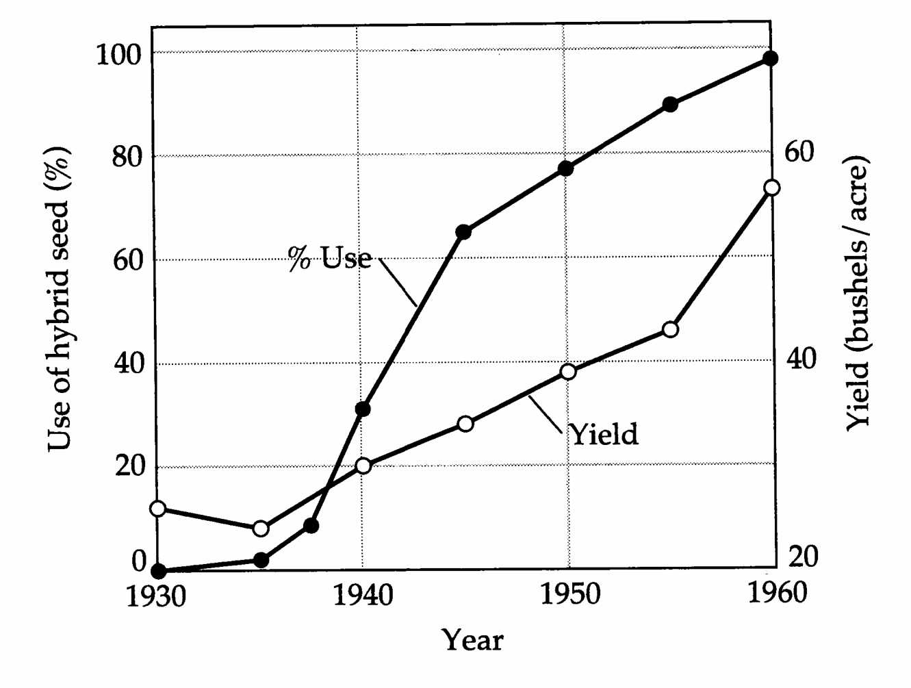
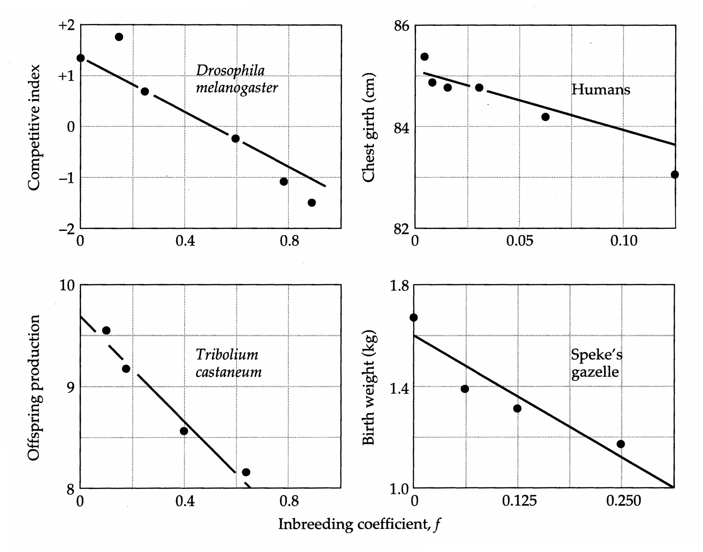
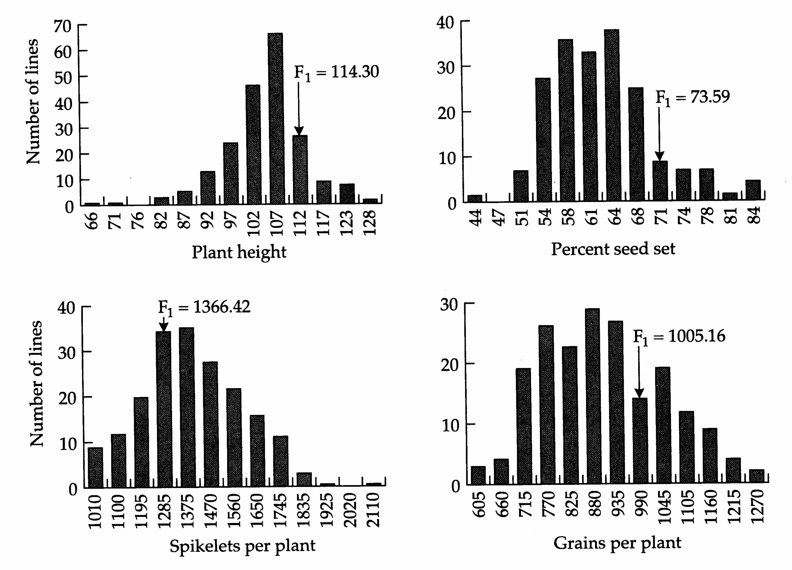
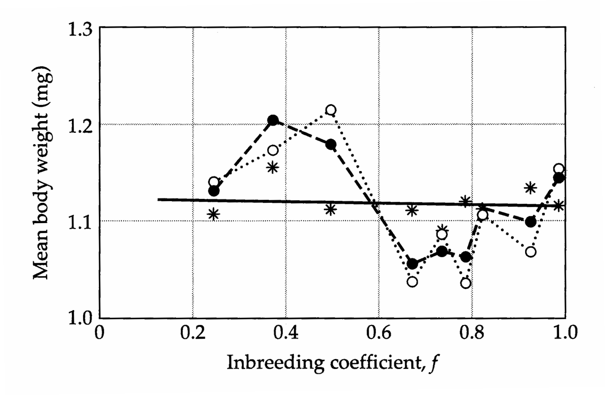
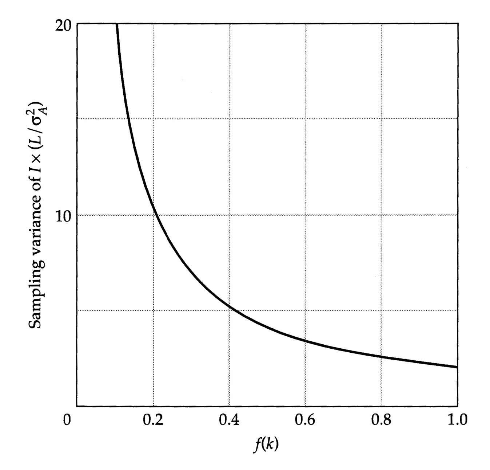
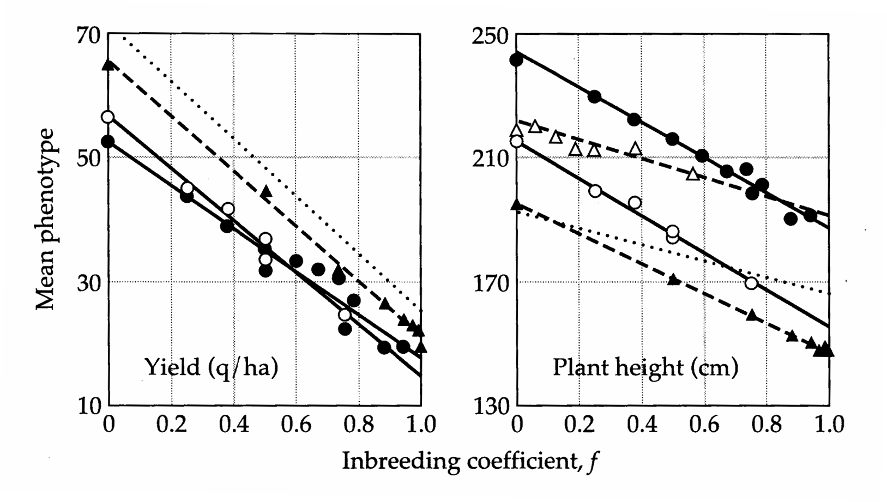
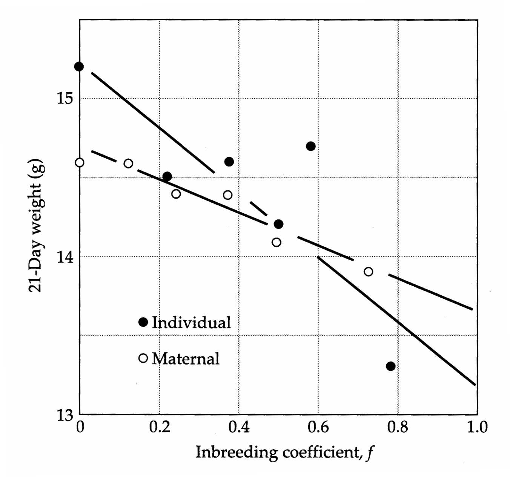
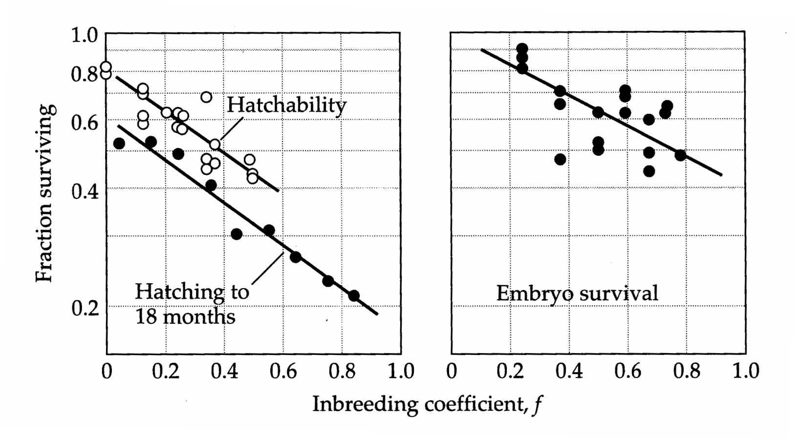
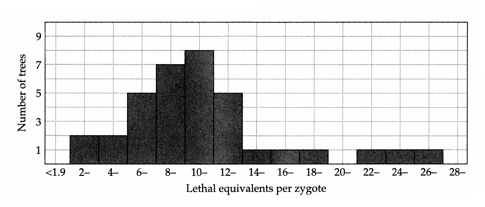

# Chapter 10 · 10 Inbreeding Depression

## Genetics_chapter10_001 · 10
Inbreeding Depression

The previous chapter reviewed how the mean phenotypes of progeny from crosses between populations often exceed the average of the parents, a phenomenon known as heterosis. A related phenomenon arises within populations — inbred individuals are almost always less fit than progeny of nonrelatives. The decline in the mean phenotype with increasing homozygosity within populations, known as inbreeding depression, is often interpreted as heterosis-in-reverse. However, as will be seen below, there are some important distinctions between the genetic mechanisms contributing to inbreeding depression within populations and heterosis between populations.

The near universal existence of inbreeding depression bears importantly on many basic issues in evolutionary biology as well as on a number of practical issues in agriculture and conservation biology. For example, the deleterious consequences of self-fertilization are likely to be the leading selective forces responsible for the evolution of various aspects of mating systems in plants (Darwin 1876, Lande and Schemske 1985, Schemske and Lande 1985, Charlesworth and Charlesworth 1987, Uyenoyama 1993, Waller 1993), and of behavioral mechanisms for avoiding mating with close relatives in animals (Shields 1982, Thornhill 1993). The observations of maize breeders that crosses between inbred lines yield substantially more grain than the inbreds themselves (East 1908, Shull 1908, Jones 1918, Sprague 1983) has given rise to a situation in which corn farmers are now almost entirely reliant on seed-producing companies for hybrid seed (Figure 10.1). Finally, the loss of fitness due to the development of inbreeding depression in small populations is a major concern in endangered species management (Templeton and Read 1984, Lacy et al. 1993, Hedrick 1994, Lynch et al. 1995a,b, Lynch 1996).

It is widely appreciated that inbreeding depression is an inevitable consequence of dominance. When gene action is purely additive, the average phenotypic effects associated with alleles are independent of the genetic background. Hence, inbreeding depression cannot occur for characters with a purely additive genetic basis. With dominance, however, the average phenotypic effect of an allele changes with a change in genotype frequencies, even in the absence of allele frequency change, because allelic expression is a function of the genetic background.

> **Figure 10.1** · page 268 · source: `Genetics_chapter10`
>
> 
>
> Figure 10.1 Historical change in the reliance on hybrid corn by United States farmers and the increase in mean annual harvest. Because usage of fertilizers, pesticides, and herbicides has shifted over this period, the substantial gain in yield is not solely attributable to heterosis. (From Sprague 1983.)

Because there are many types of dominance, this simple explanation for inbreeding depression by no means provides a complete understanding of the process. We start by showing how the two competing hypotheses on the genetic mechanism of inbreeding depression, partially recessive deleterious alleles vs. overdominance, lead to some very similar predictions that are in accordance with empirical observation, but also to some major differences that are less easy to resolve empirically. Second, we provide a brief outline of the basic statistical issues that arise in the analysis of inbreeding depression. Third, we review the large body of existing data, showing that inbreeding depression exists, at least to some degree, for essentially all characters in all populations of diploid organisms. We close by reviewing how molecular-marker analysis is starting to refine our understanding of the issues.

---

## Genetics_chapter10_002 · THE GENETIC BASIS OF INBREEDING DEPRESSION

In the absence of selection, inbreeding shifts the genotype frequencies in a population in a very simple way. Let f denote the inbreeding coefficient for the population, i.e., the probability that an individual carries two alleles that are identical by descent at a locus (Chapter 7). At any locus, a partially inbred population has a fraction $ (1 - f) $ of noninbred individuals, whose genotype frequencies are in the Hardy-Weinberg proportions. The remaining proportion of the population

**[Table]**

*[See Table 10.1 at the end of this section.]*

that is inbred (f) consists entirely of homozygous classes, each of which has a frequency equal to the respective allele frequency (Table 10.1). With this information in hand, it is straightforward to derive quantitative expressions for the two mechanistic hypotheses for inbreeding depression.

The dominance hypothesis (Davenport 1908, Bruce 1910, Keeble and Pellew 1910, Jones 1917) argues that inbreeding depression is caused by the expression of deleterious recessive genes in homozygous individuals. (We retain the use of the term dominance to describe this hypothesis only for historical reasons. It is a misnomer in that the hypothesis focuses explicitly on partially to completely recessive genes). Consider a diallelic locus, where the frequency of the deleterious allele is q, and the fitnesses of the three genotypes are denoted as 1, 1 - hs, and 1 - s (Table 10.1). Here, s measures the selection against homozygotes for the deleterious allele, and h is a measure of dominance, with h = 0.5 implying additivity and 0 < h < 0.5 implying that the deleterious allele is partially recessive. The mean fitness in a population inbred to level f is

$$
\overline{W}_{f}=\overline{W}_{0}-fpqs(1-2h)
\tag{10.1a}
$$

where

$$
\overline{W}_{0}=1-2pqsh-q^{2}s
\tag{10.1b}
$$

is the mean fitness in the random-mating base population. Note that provided $h<0.5,(1-2h)$ is necessarily positive. Thus, with partially recessive deleterious alleles, mean fitness is expected to decline linearly with increasing inbreeding coefficient $f$.

Unless the mutation rate is very high, deleterious alleles are expected to be maintained at low frequency by selection, so it can be assumed in Equation 10.1a that $ p = 1 - q \simeq 1 $, showing that the expected decline in fitness due to complete inbreeding at a locus is approximately $ qs(1 - 2h) $. For a randomly mating population in selection-mutation balance, if u is the mutation rate from the beneficial to the deleterious allele and $ u < h^{2}s $, then $ q \simeq u/(hs) $ (Haldane 1927). Thus, for large randomly mating populations, the decline in fitness resulting from complete inbreeding at a locus is approximately $ u(1-2h)/h $. This result is independent of the intensity of selection at the locus (s) because of the inverse relationship between the equilibrium frequency of a deleterious allele and its selection coefficient.

A second potential explanation for inbreeding depression is referred to as the overdominance hypothesis (East 1908, Shull 1908, Hull 1946). The idea here is that something special about the heterozygous state causes increased vigor relative to both homozygotes. Letting s and t denote the proportional reduction in fitness of the two homozygotes relative to that of the heterozygote (Table 10.1),

$$
\overline{W}_{f}=\overline{W}_{0}-fpq(s+t)
\tag{10.2a}
$$

where

$$
\overline{W}_{0}=1-p^{2}t-q^{2}s
\tag{10.2b}
$$

As in the case of partial recessives, the overdominance hypothesis leads to the prediction that mean fitness will decline linearly with increasing $f$. However, contrary to the situation with partial recessives, the loss of fitness increases with the strength of selection maintaining the polymorphism in the random-mating population. In a large randomly mating population, heterozygote superiority leads to a balanced polymorphism with $p = s/(s + t)$ and $q = t/(s + t)$ (Haldane 1927). Thus, the term on the right of Equation 10.2a is $fst/(s + t)$. If, for example, $s = t$, the loss of fitness per locus under complete inbreeding is $s/2$.

These alternative hypotheses for inbreeding depression have extremely different evolutionary implications. Under the dominance hypothesis, inbreeding depression is an inevitable consequence of recurrent mutation at the genomic level, implying that much of the genetic variation within populations must be associated with the constant influx of deleterious alleles. Although selection removes some of these alleles each generation, mutation replaces them. Under the overdominance hypothesis, variation is maintained by selection favoring the heterozygous state at multiple loci. Here, variation is maintained even in the absence of mutation pressure.

Considerable uncertainty exists as to whether overdominance with respect to fitness is a common phenomenon. Only rarely has it been suggested by studies with molecular markers, and most of those studies are open to alternative interpretations (discussed below). Nevertheless, as cogently pointed out by Crow (1948, 1952), even if overdominance is quite rare, it warrants serious consideration as a contributing factor in inbreeding depression. To see why, consider the expected reduction in fitness under both hypotheses when gene frequencies are in equilibrium. Under the dominance hypothesis, the maximum inbreeding depression per locus, arising with very small h, is approximately u/h. Since u is likely to be on the order of $ 10^{-5} $ or smaller for most loci, and the evidence suggests that h is usually greater than 0.1 or so (discussed below), the per-locus inbreeding depression resulting from partial dominance is expected to be quite small. On

Inbreeding coefficient, f

> **Figure 10.2** · page 271 · source: `Genetics_chapter10`
>
> 
>
> Figure 10.2 Change in mean phenotypes as a function of inbreeding. References: Drosophila (Latter and Robertson 1962); humans (Barrai et al. 1964); Tribolium (Rich et al. 1984); Speke's gazelle (Templeton and Read 1983).

the other hand, with overdominance, complete inbreeding leads to the loss of the fittest genotype, so the reduction in fitness is potentially quite large. Thus, even if overdominance is a rare phenomenon, only a few such loci need to exist for its contribution to inbreeding depression to rival that caused by a much larger number of loci displaying partial dominance.

The linear decline in the means of fitness-related characters with an increase in the inbreeding coefficient, observed in many sets of data (Figure 10.2), is consistent with both the partial dominance and overdominance hypotheses. There is, however, a major distinction between the two hypotheses with respect to the expected distribution of mean phenotypes among inbred lines. If overdominance is the major cause of inbreeding depression, all inbred lines must eventually perform below the mean of the randomly mating base population, because a pure line of the best-performing genotype (a heterozygote) cannot be attained. If, on the other hand, partial dominance is the major factor, it should be possible to produce

> **Figure 10.3** · page 272 · source: `Genetics_chapter10`
>
> 
>
> Figure 10.3 Frequency distributions for four characters in recombinant inbred lines of rice, compared to the mean of the $ F_{1} $ progeny obtained from a cross between two homozygous lines. In all four cases, the $ F_{1} $ performance exceeds that of both parental lines, and some individual inbred lines exceed the performance of the parents. The recombinant inbred lines were obtained by randomly sampling 194 individuals from the $ F_{2} $ population, and taking each of them through six rounds of selfing and single-seed descent. (From Xiao et al. 1995.)

a pure inbred line that performs at least as well as the most outstanding member of the base population. If large numbers of loci contribute to the trait of interest, the probability of producing such a line may be quite low. Nevertheless, such lines have been obtained in several studies (Smith 1952, Williams 1959, Wienhues 1968, Busch et al. 1971, Pooni et al. 1994, Uddin et al. 1994) (Figure 10.3). These results raise serious questions about the necessity of relying upon commercial sources of hybrid seed in agricultural programs.

> **Table 10.1** · `10.1` · page 269 · source: `Genetics_chapter10_002`
> Table 10.1 Genotypic frequencies and fitnesses under the two dominance hypotheses for inbreeding depression.
>
> <table><tr><td rowspan="2">Genotype</td><td rowspan="2">Frequency</td><td colspan="2">Fitness</td><td rowspan="2">Phenotype for Arbitrary Character</td></tr><tr><td>Partial Dominance</td><td>Overdominance</td></tr><tr><td>BB</td><td>$ p^{2}(1-f)+pf $</td><td>1</td><td>1-t</td><td>2a</td></tr><tr><td>Bb</td><td>$ 2pq(1-f) $</td><td>1-hs</td><td>1</td><td>$ (1+k)a $</td></tr><tr><td>bb</td><td>$ q^{2}(1-f)+qf $</td><td>1-s</td><td>1-s</td><td>0</td></tr></table>
>
> Note: Two alleles (B, b) are assumed to be present, with respective frequencies p and q.

---

## Genetics_chapter10_003 · THE GENETIC BASIS OF INBREEDING DEPRESSION / A More General Model

The preceding paragraphs have focused on the consequences of inbreeding for fitness. A more general account of the change in the mean of an arbitrary character under inbreeding will now be given. Recalling the genotypic frequencies for an inbred population (Table 10.1) and multiplying them by their respective genotypic values (scaled as in Chapter 4), a general expression for the mean genotypic value for a single diallelic locus is

$$
\begin{aligned}\mu_{f}&=(1-f)[p^{2}(2a)+2pq a(1+k)+q^{2}(0)]+f[p(2a)+q(0)]\\&=\mu_{0}-(2pqak)f\end{aligned}
\tag{10.3}
$$

where $\mu_0 = 2ap(1 + qk)$ is the mean genotypic value in the randomly mating base population. Summing over all loci, the total inbreeding depression is $2f \sum p_i q_i a_i k_i$. Recalling that the dominance genetic variance in a randomly mating population in gametic phase equilibrium is $\sum(2p_i q_i a_i k_i)^2$, it is clear that dominance variance is necessary for inbreeding depression to occur. However, since the sign of $a_i k_i$ may vary from locus to locus, it is possible for considerable canceling to occur among the effects at different loci, leading to negligible inbreeding depression in spite of substantial dominance genetic variance. In other words, significant inbreeding depression requires directional dominance.

**[示例 Example]**

> **Example 1** · ref: `Genetics_chapter10:1` · source: `Genetics_chapter10_003.json` · blocks 3–3
>
> Example 1. A large empirical study with the flour beetle Tribolium castaneum provides some perspective on this principle. López-Fanjul and Jódar (1977) derived 105 lines from a large base population and maintained them by single brother-sister matings for 8 generations (to f = 0.785). Despite the large sample sizes, the authors could find no evidence that inbreeding causes a shift in the mean rate of egg laying by virgin females at 33 or 28°C. Independent estimates of the heritabilities for these traits, obtained by full-sib correlation and daughter-mother regression, were 0.34 ± 0.02 and 0.33 ± 0.01 at 33°C, and 0.33 ± 0.02 and 0.26 ± 0.02 at 28°C. Recalling from Chapter 7 that heritabilities estimated from full-sib analysis are inflated by dominance genetic variance relative to those obtained by parent-offspring analysis, only for the second temperature is there any evidence of dominance genetic variance, and this is slight. Thus, the absence of inbreeding depression for rate of egg laying by virgins is not surprising. However, the study population was not immune to the effects of inbreeding, since two other traits, the rate of egg laying by fertilized females and egg viability, exhibited substantial declines with inbreeding.

Since inbreeding depression is a consequence of nonlinear interactions between gene effects, it stands to reason that epistasis may complicate matters. However, provided the base population is in gametic phase equilibrium, only epistasis involving dominance contributes to inbreeding depression within populations (Anderson and Kempthorne 1954, Bulmer 1980, Hill 1982a, Lynch 1991). This result arises because although inbreeding causes a change in genotypic frequencies within loci, in the absence of selection and gametic phase disequilibrium, it does not alter the gametic frequencies in the population. With this in mind, a general expression for inbreeding depression can be acquired as follows.

Letting $ -\delta_1 $ be the expected change in the mean caused by single-locus dominance effects (summed over all loci) under complete inbreeding, then $ -f\delta_1 $ is the expected change at inbreeding level $ f $. The composite additive $ \times $ dominance effect may also be altered under inbreeding. It depends only on the inbreeding at single loci and may be represented as $ -f(\alpha\delta) $. The composite dominance $ \times $ dominance effect depends on whether one or two loci are inbred. Assuming unlinked loci, the probabilities of these two situations are, respectively, $ 2f(1-f) $ and $ f^2 $. Thus, the shift in the mean through the alteration of dominance $ \times $ dominance effects can be represented by $ -2f(1-f)\delta_2^1 $ in the first case and $ -f^2\delta_2^2 $ in the second. Summing up terms,

$$
\mu_{f}=\mu_{0}-f[\delta_{1}+2\delta_{2}^{1}+(\alpha\delta)]-f^{2}(\delta_{2}^{2}-2\delta_{2}^{1}),
\tag{10.4a}
$$

or more succinctly,

$$
\mu_{f}=\mu_{0}-f\Delta_{1}-f^{2}\Delta_{2}+\cdots
\tag{10.4b}
$$

Thus, the expected mean phenotype under inbreeding can be written as a polynomial function of $f$, with the coefficients $\Delta_{1}$ and $\Delta_{2}$ being functions of multiple types of nonadditive gene action.

This relationship indicates that a net contribution of epistasis to inbreeding depression may sometimes be detected as a nonlinear relationship between the mean phenotype and level of inbreeding. Since the composite inbreeding effects can be positive or negative, a variety of forms of this relationship is possible. Nevertheless, the possibility that the epistatic effects involving different loci may cancel each other means that a lack of nonlinearity cannot be taken as definitive evidence for the absence of important dominance epistatic interactions between loci. Even in the absence of any canceling effect, large departures from linearity are unlikely unless epistasis is very pronounced for the simple reason that $ f^{2} $ is small relative to f, especially with small f. Moreover, when a nonlinear response is observed, care must be taken to ensure that it is not simply due to the selective elimination of lines.

Finally, we note that although it is often stated that heterosis (the tendency for $ F_1 $ phenotypes to exceed the mean phenotypes of two parental lines) and inbreeding depression are the same phenomenon, this equivalency is not strictly correct. In Chapter 9, it was shown that heterosis is genetically equivalent to $ (2\delta_1^c - \alpha_2^c) $, where $ \delta_1^c $ and $ \alpha_2^c $ are the composite dominance and composite additive × additive effects of genes in the two parental lines. On the other hand, under complete inbreeding within populations, the decline in the mean phenotype is defined by the sum $ [\delta_1 + (\alpha\delta) + \delta_2^c] $, assuming the base population is in gametic phase equilibrium. Thus, dominance is a factor in both heterosis and inbreeding depression, but it is not a necessary condition for heterosis, which can arise entirely as function of additive × additive epistasis. In addition, inbreeding depression, but not $ F_1 $ heterosis, is a function of additive × dominance and dominance × dominance interactions. These differences in the genetic underpinnings of heterosis and inbreeding depression are a consequence of the extreme degree of gametic phase disequilibrium that exists in the first generation of a line cross. Further complexities arise when the $ F_{1} $ progeny of a line cross are subsequently selfed (Lynch 1991).

---

## Genetics_chapter10_004 · METHODOLOGICAL CONSIDERATIONS

A number of difficulties arise in attempts to test for inbreeding depression. Some of these are associated with the selective consequences of the inbreeding depression itself. In humans, for example, there is evidence that consanguineous couples, whose early offspring die from the expression of lethal recessives, compensate by reproducing until viable replacements have been born (Schull and Neel 1972). Some plants may behave in a similar manner by selective abortion of embryos (Willson and Burley 1983). Lack of knowledge of such compensation can lead to underestimates of the deleterious consequences of inbreeding. Keeping these difficulties in mind, we will now consider the statistical aspects of two common approaches to quantifying inbreeding depression. These matters are taken up in more detail in Lynch (1988a).

Before proceeding, a brief introduction to the temporal dynamics of the inbreeding coefficient f under regular systems of mating is necessary. The general theory is covered elsewhere (Crow and Kimura 1970, Hartl and Clark 1989), and since the vast majority of studies on inbreeding depression involve either self-fertilization or full-sib mating, we simply give the results for these special cases. Starting from a random-mating base population at time 0, the average inbreeding coefficient at a locus after t generations of self-fertilization in the absence of selection is

$$
f(t)=\mathrm{i}-\left(\frac{1}{2}\right)^{t}
\tag{10.5a}
$$

The quantity $ [1-f(t)] = (1/2)^t $ is equivalent to the fraction of the heterozygosity in the base population that is still present after $ t $ generations of selfing. Thus, a single generation of selfing reduces the number of heterozygous loci within individuals by 50%. Thereafter, the heterozygosity declines exponentially towards zero, such that only 1.6% of the original heterozygosity remains after six generations of selfing. With full-sib mated lines, the inbreeding coefficient must be computed with the recurrence equation,

$$
f(t)=\frac{f(t-1)}{2}+\frac{f(t-2)}{4}+\frac{1}{4}
\tag{10.5b}
$$

letting $f(-1) = f(0) = 0$. Thus, under full-sib mating, the first generation of inbred progeny has $f(1) = 0.25$, i.e., the heterozygosity within individuals is reduced by 25% relative to that in the random-mating base population. The inbreeding coefficient then progressively approaches one, although more slowly than in the case of selfing.

---

## Genetics_chapter10_005 · METHODOLOGICAL CONSIDERATIONS / Single-generation Analysis

A common short-term test of inbreeding depression involves the comparison of the mean phenotypes of offspring from random matings with those from a specific class of consanguineous mating. In any such analysis, both types of individuals should be raised simultaneously in a random design to eliminate the possibility that the differences in means are a product of the environment. Ideally, the offspring of both types of matings should be derived from several mothers to minimize the importance of maternal effects, and all mothers certainly should be derived from the same base population.

With such an experimental design, an approximate $t$ test can be constructed for the null hypothesis of no inbreeding depression. Here we take the null model to be one of purely additive gene action. Consider the situation in which $n$ progeny are assayed from each of $L$ independent families, both in the control and in the inbred population. Under the null hypothesis of no inbreeding depression, the difference between the observed mean phenotypes of noninbred and inbred offspring ($\Delta\bar{z} = \bar{z}_{O} - \bar{z}_{I}$) has expectation zero, and the observed difference must be evaluated against its sampling variance, the sum of the variances of $\bar{z}_{O}$ and $\bar{z}_{I}$. Several factors contribute to this variance, as can be seen by referring to the definition of the sample mean

$$
\bar{z}=\frac{1}{Ln}\sum_{i=1}^{L}\sum_{j=1}^{n}(A_{i.}+a_{ij}+E_{i.}+e_{ij})
$$

where $ A_{i} $ is the mean genotypic value associated with the ith family, $ a_{ij} $ is the deviation from that value for the jth member of the family, $ E_{i} $ is the maternal effect associated with the ith family, and $ e_{ij} $ is the residual environmental effect on the ijth individual.

We start by considering the control. First, the variance in the control mean caused by environmental effects specific to individuals is $ \sigma_{e}^{2}/(Ln) $ because all such effects are distributed independently among the Ln individuals. Second, the variance caused by maternal (or general environmental) effects is $ \sigma_{E}^{2}/L $; it is only divided by L because L mothers contribute to the control mean. Third, because the segregational variance within families in the random-mating base population is $ \sigma^{2}(a_{ij}) = \sigma_{A}^{2}/2 $, and the effects of such residual variation are random with respect to individuals, the contribution of the within-family genetic variance to the variance of the mean is $ \sigma_{A}^{2}/(2Ln) $. (To ease the passage through this difficult area, we give this and a few other results without proof.) Finally, the among-family variance, $ \sigma^{2}(A_{i}) $, is also $ \sigma_{A}^{2}/2 $, and it contributes $ \sigma_{A}^{2}/(2L) $ to the sampling variance of the control mean. Summing up terms, the variance of the control mean phenotype is

$$
\sigma^{2}(\bar{z}_{O})=\frac{1}{L}\left[\frac{1}{2}\left(1+\frac{1}{n}\right)\sigma_{A}^{2}+\sigma_{E}^{2}+\frac{\sigma_{e}^{2}}{n}\right]
\tag{10.6a}
$$

Now consider the situation for a sample of progeny derived by selfing $ L $ mothers with $ n $ progeny sampled per mother. The sampling variance of the mean resulting from general and specific environmental effects is exactly the same as in the control. In the first generation of selfing, the within-family segregational variance is also identical to that within the control, $ \sigma_A^2/2 $. However, because of inbreeding, the variance among families is $ \sigma_A^2 $, twice that in the control families, where $ \sigma_A^2 $ is still defined as the genetic variance in the base (control) population. Thus, the expected variance of the mean of the sample of selfed progeny is

$$
\sigma^{2}(\bar{z}_{S})=\frac{1}{L}\left[\left(1+\frac{1}{2n}\right)\sigma_{A}^{2}+\sigma_{E}^{2}+\frac{\sigma_{e}^{2}}{n}\right]
\tag{10.6b}
$$

The situation for full-sib mating is a little more complicated, but assuming that all progeny within lines are derived from a single brother-sister mating,

$$
\sigma^{2}(\bar{z}_{FS})=\frac{1}{L}\left[\left(\frac{7}{8}+\frac{3}{8n}\right)\sigma_{A}^{2}+\sigma_{E}^{2}+\frac{\sigma_{e}^{2}}{n}\right]
\tag{10.6c}
$$

The above expressions are at slight variance with those in Lynch (1988a) and appear to be more accurate.

Although these formulae give exact expectations of the variances of control and inbred line means under the additive model, they are difficult to implement unless one has prior information on the components of variance in the base population. However, the basic structures of the formulae yield a very useful result. Note that for the cases of selfing and sib-mating, $ \sigma^2(\Delta\bar{z}_S) = \sigma^2(\bar{z}_o) + \sigma^2(\bar{z}_S) $ and $ \sigma^2(\Delta\bar{z}_{FS}) = \sigma^2(\bar{z}_o) + \sigma^2(\bar{z}_{FS}) $, respectively. In both of these cases, provided the sample size within families $ (n) $ is at least two, then $ \sigma^2(\Delta\bar{z}) \leq 2\sigma^2(z_O)/L $, where $ \sigma^2(z_O) $ is the phenotypic variance within the control line. Thus, a conservative test for inbreeding depression based on a single generation of consanguineous mating employs the test statistic

$$
t=\frac{|\Delta\bar{z}|}{\mathrm{SD}(z_{O})\sqrt{2/L}}
\tag{10.7}
$$

where $ \mathrm{SD}(z_{O}) $ is the observed phenotypic standard deviation in the random-mating population. Sampling distributions of means are usually approximately normally distributed, so t may be treated as t-distributed with L-1 degrees of freedom.

In the case of self-compatible plants that produce multiple flowers, there is a simple way to further increase the power of a test of inbreeding depression. For any pair of parent plants (A and B), both reciprocal outcrosses (A × B and B × A) and two inbreds (A × A and B × B) can be produced. Because the two parents contribute equal numbers of genes to both inbred and outbred progeny, variance from general (maternal) environmental effects and parent sampling do not contribute to $ \sigma^{2}(\Delta\bar{z}) $ in this case, and for any pair of parent individuals, the test statistic

$$
\Delta\bar{z}_{A,B}=\frac{\left(\bar{z}_{A A}+\bar{z}_{B B}\right)-\left(\bar{z}_{A B}+\bar{z}_{B A}\right)}{2}
\tag{10.8a}
$$

has an expected value equal to zero under the null hypothesis of no inbreeding depression. If $n$ replicates are assayed within each of the four groups of progeny, the expected sampling variance of $\Delta\bar{z}_{A,B}$ is

$$
\sigma^{2}(\Delta\bar{z}_{A,B})=\frac{(\sigma_{A}^{2}/2)+\sigma_{e}^{2}}{n}
\tag{10.8b}
$$

Because the numerator of this expression is less than $ \sigma^{2}(z_{O}) $, a conservative test for inbreeding depression associated with any pair of parents is provided by

$$
t=\frac{|\Delta\bar{z}_{A,B}|}{\mathbf{S D}(z_{O})/\sqrt{n}}
\tag{10.9}
$$

where $ \mathrm{SD}(z_{O}) $ is again the phenotypic standard deviation of outcrossed individuals.

---

## Genetics_chapter10_006 · METHODOLOGICAL CONSIDERATIONS / Multigenerational Analysis

A common long-term approach to quantifying inbreeding depression is to regress the mean phenotype on the inbreeding coefficient (Figure 10.2). In studies of this sort, the data usually represent progressively inbred generations derived from the same population, a protocol that introduces a series of statistical problems. First, when the different classes of inbreeding are assayed in different generations (the usual case in animals), the possibility arises that any trend in the mean may be caused by a shift in the environment. Second, the usual assumptions underlying hypothesis testing in regression theory are violated in at least two ways: (1) since the means are based upon individuals that are descendants of each other, the data are not independent, and (2) the sampling variance of the means varies with f because of the loss of genetic variance with inbreeding. The problem of nonindependence of data is a particularly serious one, since it diminishes the effective degrees of freedom in an analysis. For example, once a population of selfers is almost completely inbred, the subsequent generations are no longer free to vary genetically except by mutation. Nonindependence of data can also cause spurious nonlinearities in the apparent response to inbreeding — if one data point lies above the regression line, the preceding and subsequent ones are also likely to.

A partial resolution of the nonindependence problem is given below. First, however, some attention needs to be given to the correction of data for environmental shifts between generations. Plant breeders have been able to avoid the statistical complexities of this issue by storing seed from progressive generations of inbreeding and then growing representatives of all generations simultaneously in a randomized design (Russell et al. 1963, Hallauer and Sears 1973, Cornelius and Dudley 1974). Even here, it is assumed implicitly that seed storage time does not influence performance and that general environmental effects experienced by

> **Figure 10.4** · page 279 · source: `Genetics_chapter10`
>
> 
>
> Figure 10.4 Observed phenotypic means in inbred (●) and control (○) lines of Drosophila melanogaster, and corrected values for the inbred lines (*) obtained by use of Equation 10.12. The partial regression is represented by the solid line. (From Kidwell and Kidwell 1966.)

the parents are not transmitted to the progeny. With most animals, embryo storage is either not currently reliable or not economically feasible, so there is need for a statistical means of correcting the data. The question of interest is whether a trend in the inbred-line means is influenced by a temporal shift in the environment. The issue is not trivial as can be seen from the striking parallel directional trend in control and full-sib mated lines of Drosophila melanogaster shown in Figure 10.4.

A solution to the environmental trend problem was promoted by Muir (1986a,b), who suggested the use of a parallel control as a means of assaying changes in the environment. There are two important considerations in the choice of a control. First, it is essential that the temporal phenotypic changes in the control are entirely attributable to environmental causes. This condition will essentially hold if clones or highly inbred lines are relied upon. A random-bred base population may also serve as an adequate control, provided the character of interest is not modified by selection during the course of the experiment and provided the population is large enough that significant genetic drift is unlikely to occur. Second, given a choice of control lines, the one that provides the strongest signal of the environment, i.e., explains a maximum amount of the variance in the inbred line means, is most desirable.

We start by considering the mean phenotypes of the control (C) and inbred (I) lines at generation t to be functions of general environmental effects common to both of them (E), special environmental effects unique to each of them (e_C and e_I), and genetic change confined to the inbred population, $ \Delta\mu_G(t) $,

$$
\bar{z}_{I}(t)=\mu_{I}(0)+E(t)+e_{I}(t)+\Delta\mu_{G}(t)
\tag{10.10a}
$$

$$
\bar{z}_{C}(t)=\mu_{C}(0)+E(t)+e_{C}(t)
\tag{10.10b}
$$

Since the general environmental effects, $ E(t) $, are the only common components of the inbred and control line means, a partial regression of the observed inbred line means, $ \bar{z}_{I}(t) $, on the observed control line means, $ \bar{z}_{C}(t) $, and the inbreeding coefficient, $ f(t) $, provides a way of factoring out any general trend of the environment,

$$
\bar{z}_{I}(t)=a+b\bar{z}_{C}(t)+I f(t)+e(t)
\tag{10.11}
$$

where I is the estimated inbreeding depression (i.e., the expected difference in mean phenotypes of noninbred and completely inbred individuals), and $ e(t) $ is the deviation of the $ t^{th} $ generation mean from the multiple regression. Applying Equation 10.11, after removing any environmental trend, the corrected means for the inbred lines become

$$
\bar{z}_{I}^{*}(t)=\bar{z}_{I}(t)-b[\bar{z}_{C}(t)-\bar{z}_{C}]
\tag{10.12}
$$

where $ \bar{z}_{C} $ is the mean phenotype of the control lines over all generations. The estimated inbreeding depression (I) is equivalent to the regression of the $ \bar{z}_{I}^{*}(t) $ on $ f(t) $. Figure 10.4 shows a rather striking example of how the application of Muir's approach can overcome a trend obscured by environmental factors.

We finally return to the problem of hypothesis testing, assuming now that the means have been corrected adequately for general environmental trends prior to analysis. Because it ignores the nonindependence of data, ordinary least-squares regression of $ \bar{z}_{I}^{*}(t) $ on $ f(t) $ leads to downwardly biased estimates of the standard error of I, often by a factor of three or four (Lynch 1988a). An expression for the sampling variance of I, which fully accounts for the correlational structure of the data, under the null hypothesis of a neutral character with an additive genetic basis is worked out in Lynch (1988a). The solution, portrayed graphically in Figure 10.5, assumes that the regression is performed on a progressive series of inbred lines (e.g., self-fertilization, full-sib mating, or first-cousin mating), starting with f = 0 and proceeding for k generations to a final level of inbreeding $ f(k) $. The plotted values are minimum estimates of the sampling variance of I, since it is assumed that the variance in the environment makes no contribution to the sampling variance of the means. The sampling variance of I depends primarily on the additive genetic variance in the base population, the number of inbred families, and the level of inbreeding in the final generation. Since the sampling variance of I declines with increasing L and $ f(k) $, it is clear that for a fixed amount of resources, the smallest unit of inbreeding (selfing or full-sib mating) should be employed while maximizing the number of lines.

> **Figure 10.5** · page 281 · source: `Genetics_chapter10`
>
> 
>
> Figure 10.5 The minimum sampling variance of the regression coefficient of consecutive line means on their respective inbreeding coefficients, under the assumption of purely additive gene action and ignoring environmental effects. $ f(k) $ is the inbreeding coefficient in the final generation. To obtain the actual sampling variance of I, the points on the ordinate must be multiplied by $ \sigma_{A}^{2}/L $, the ratio of the additive genetic variance in the base population to the number of inbred lines. (From Lynch 1988a.)

Many of the preceding statistical problems can be avoided when data are available for contemporaneous groups of individuals inbred to various degrees. Such is typically the case in the analysis of human populations where pedigrees are known, and the same can be accomplished in experiments that simultaneously mate various classes of relatives and assay their progeny in a common environment. In both cases, provided the individuals with different levels of f are unrelated, the problem of nonindependent data is eliminated, and provided all individuals are assayed contemporaneously, the need for a temporal control is removed. Ordinary least-squares regression of the group mean phenotypes on f then provides a simple approximation of I and its standard error.

**[示例 Example]**

> **Example 2** · ref: `Genetics_chapter10:2` · source: `Genetics_chapter10_006.json` · blocks 16–17
>
> Example 2. Consider an experimental design in which the means of $L = 10$ full-sib mated lines are assayed from generation 0 with $f = 0$ to generation
> 
> 9 with $f(k) = 0.859$ (obtained using Equation 10.5b). Reading off Figure 10.5 at $f(k) = 0.859$, we find the point on the ordinate to be 2.5. The expected sampling variance of the slope $I$ under the null model of no inbreeding depression is obtained by multiplying 2.5 by $\sigma_A^2 / L$, which gives $\sigma_A^2 / 4$. If an estimate of $\sigma_A^2$ is available, then in this case, two standard errors of the slope is estimated by $\sqrt{\mathrm{Var}(A)}$. Since our treatment ignores environmental sources of variance, it is clear that with this design any regression coefficient whose absolute value is less than the square root of the additive genetic variance in the base population must be considered consistent with the null model of no inbreeding depression.

---

## Genetics_chapter10_007 · METHODOLOGICAL CONSIDERATIONS / Ritland's Method

Most empirical attempts to measure inbreeding depression involve assays of individuals in controlled environments. Because lab conditions often deviate substantially from the situation in nature, one is then left wondering how generalizable the results are to the field situation. To eliminate this problem, Ritland (1990a,b) proposed a technique for partially selfing populations of plants that involves essentially no disturbance of individuals in nature and requires no direct estimation of individual fitness. Applying neutral molecular markers to progeny arrays, it is possible to estimate the fraction of seed that adults produce by self-fertilization ( $ \phi $), as well as to survey the change in genotype frequencies in a population within and between generations. Genotype frequencies change across generations are a function of the degree of selfing in the parents, while the within-generation changes are a function of genotype-specific fitnesses.

Ritland (1990a,b) suggested several ways in which marker information can be exploited to infer indirectly the fitness consequences of inbreeding. Here, we simply point out the simplest situation, which arises when a population has attained an equilibrium state of inbreeding, i.e., a balance between the production of excess homozygosity by selfing and its loss by selection. From genotypic assays of neutral molecular markers in adult individuals, the inbreeding coefficient (f) of surviving individuals can be computed as $ f = 1 - \left[\left(\text{observed heterozygosity}\right)/\left(2pq\right)\right] $ (obtained using the principles outlined in Table 10.1). The ratio of fitnesses of selfed to outcrossed individuals is then estimated by

$$
w=\frac{2(1-\phi)f}{\phi(1-f)}
\tag{10.13}
$$

Note that when $ \phi > 0 $ and $ f = 0 $ (i.e., the adult population is in Hardy-Weinberg equilibrium), $ w = 0 $, implying that selfed progeny have zero fitness. More general estimators that allow for generational changes in $ \phi $ and $ f $, which appear to be common (Dole and Ritland 1993), are provided in Ritland (1990a,b).

Applications of Equation 10.13 to partially selfing plant populations have generally yielded estimates of w that are slightly lower than those obtained by direct observations of the performance of selfed and outcrossed progeny in experimental populations (Eckert and Barrett 1994, Kohn and Biardi 1995, Schultz and Ganders 1996). Although violations in the assumptions of Ritland's model (such as an absence of biparental inbreeding and an absence of linkage between marker and fitness loci) can lead to biased estimates of w, the bias does not generally appear to be large. Thus, the empirical results tentatively suggest that the inbreeding depression observed in manipulated populations may generally be lower than that expressed in natural settings. This difference may occur because manipulative studies often fail to fully account for all components of fitness (such as seedling survival) or because the effects of deleterious genes are ameliorated in more benign environments (discussed below).

---

## Genetics_chapter10_008 · METHODOLOGICAL CONSIDERATIONS / Epistasis and Inbreeding Depression

An unresolved issue is the extent to which epistasis is involved in inbreeding depression. As noted above, a nonlinear relationship between the mean phenotype and the inbreeding coefficient is an indicator of the presence of epistasis involving dominance effects. Least-squares quadratic regressions are frequently performed to test for such nonlinearities, but these are saddled with all of the statistical problems discussed above, most notably the extreme nonindependence of data at high levels of f, precisely where nonlinearities are most likely to show up.

A simple way to test for nonlinearity, which avoids the pitfalls of regression, is to compare the change in mean phenotype (per increment in f) between two low levels of f and that between two high levels of f. Provided the two ranges of f are nonoverlapping, the two observed changes are statistically independent, even if the individuals at all four points in time are related. Letting the four observed mean phenotypes, in order of increasing f, be $ \bar{z}_{1} $, $ \bar{z}_{2} $, $ \bar{z}_{3} $, and $ \bar{z}_{4} $, a measure of nonlinearity is then given by

$$
\Delta I=\frac{\bar{z}_{2}-\bar{z}_{1}}{\Delta f_{L}}-\frac{\bar{z}_{4}-\bar{z}_{3}}{\Delta f_{H}}
\tag{10.14a}
$$

where $ \Delta f_{L} = f_{2} - f_{1} $, and $ \Delta f_{H} = f_{4} - f_{3} $. A conservative estimate of the sampling variance of $ \Delta I $ is given by

$$
\mathrm{Var}(\Delta I)=\frac{[\mathrm{SE}(\bar{z}_{2})]^{2}+[\mathrm{SE}(\bar{z}_{1})]^{2}}{(\Delta f_{L})^{2}}+\frac{[\mathrm{SE}(\bar{z}_{4})]^{2}+[\mathrm{SE}(\bar{z}_{3})]^{2}}{(\Delta f_{H})^{2}}
\tag{10.14b}
$$

A test statistic for nonlinearity is then

$$
t=\frac{|\Delta I|}{\sqrt{\mathrm{Var}(\Delta I)}}
\tag{10.14c}
$$

which under the null hypothesis of linearity should be t-distributed with degrees of freedom equal to the number of inbred lines in the analysis. To ensure that $ \Delta I $ is not a function of the differential extinction of lines, only the lines surviving to contribute to $ \bar{z}_{4} $ should be used in such an analysis.

Although it can only detect epistatic effects involving dominance, this test is one of the only ways that we currently have to quantify directional epistasis within populations, short of employing molecular markers. Willis (1993) used a very similar approach to test for epistasis for life-history characters in the monkey flower (Mimulus guttatus). Although he did not correct for line loss, he found very little evidence for epistasis.

---

## Genetics_chapter10_009 · METHODOLOGICAL CONSIDERATIONS / Variance in Inbreeding Depression

Evolutionary biologists interested in the origins of diverse mating systems, particularly in plants, have reason to be concerned with the potential for variance in inbreeding depression among members of the same population (Holsinger 1988, Johnston and Schoen 1994, Uyenoyama et al. 1994, Schultz and Willis 1995). Such variation would seem to be necessary to foster the evolution of alternative forms of mating. To obtain information on this matter, plant population biologists often use ratios of fitness of selfed progeny to outcrossed progeny as a measure of inbreeding depression. This practice raises some statistical problems in that the ratio of two estimates is biased. Some of the issues are discussed by Johnston and Schoen (1994), but some of the formulae in their paper are incorrect. Using Equation A1.19a, an unbiased estimate of the performance of selfed relative to outcrossed progeny is given by

$$
w_{i}=\frac{\overline{W}_{Si}}{\overline{W}_{Oi}}\left[\frac{1}{1+\left[\sigma^{2}(W_{Oi})/(n_{i}\overline{W}_{Oi}^{2})\right]}\right]
\tag{10.15}
$$

where $ \overline{W}_{Si} $ and $ \overline{W}_{Oi} $ are the observed mean fitnesses of selfed and outcrossed progeny derived from individual $ i $, $ \sigma^{2}(W_{Oi}) $ is the variance in fitness of outcrossed progeny, and $ n_{i} $ is the number of outcrossed progeny assayed, all for the ith individual.

Using measures such as Equation 10.15 to quantify variance in inbreeding depression among individuals raises a number of difficult and unresolved issues. A central problem is that inbreeding depression is not just a property of the individual, but of the individual's prospective mates as well. It is straightforward enough to estimate an individual's fitness through selfing, but what about the situation with species with separate sexes? An individual's sibs will generally differ with respect to fitness, so the fitness of progeny from full-sib matings will depend on which sibs are employed as mates. The situation is even more extreme when one considers the fitness of individuals produced through outcrossing. Ideally, one would like an estimate of the fitness of outcrossed progeny averaged over all potential mates, but with most species (other than plants), only a small number of matings per individual are possible. Presumably, variance in inbreeding depression can be estimated using ANOVA approaches, treating differences between replicate pairs of inbred and outcrossed matings within lineages as the units of observation, but the procedures remain to be worked out.

---

## Genetics_chapter10_010 · THE EVIDENCE

Although few of the existing studies of inbreeding depression have fully accounted for all of the difficulties pointed out above, the aggregate of evidence for inbreeding depression is overwhelming. While substantial variation of inbreeding depression exists among species (and among characters within species), almost all organisms exhibit it to some degree. Here we only summarize some of the better-documented cases. An extensive survey of the early literature is available in Wright (1978), and recent reviews may be found in Shields (1982), Charlesworth and Charlesworth (1987), Thornhill (1993), and Husband and Schemske (1996).

More and better data on the phenotypic consequences of inbreeding are available for maize than for any other organism. Hallauer and Miranda (1981) review the evidence, which was recognized as early as 1876 by Darwin. There have been some very well conceived experiments involving prolonged selfing and full-sib mating in lines derived from a genetically diverse base population (Sing et al. 1967, Hallauer and Sears 1973, Cornelius and Dudley 1974, Good and Hallauer 1977, Lamkey and Smith 1987, Benson and Hallauer 1994). The experiments are very large (involving up to 250 independent lines), and the potential influence of temporal changes in the environment has been minimized by the simultaneous analysis of stored seed. Almost without exception, vegetative, reproductive, and physiological characters exhibit significant shifts in the mean phenotype with inbreeding. Cases have arisen in which the regressions of $ \bar{z} $ on f appear to be nonlinear (Hallauer and Sears 1973, Good and Hallauer 1977), but in all cases the departure from linearity is small. Two characters that give no evidence of nonlinearity are total grain yield and plant height (Figure 10.6). Starting from a genetically diverse base population, complete inbreeding results in an approximately 65% decline in yield and an approximately 25% decline in plant height.

Several independent investigations of inbreeding depression have been performed with laboratory stocks of Drosophila (Table 10.2). Although substantial variation exists among the results from different studies, a pattern emerges. Primary fitness characters such as viability, fertility, and egg production tend to exhibit very high levels of inbreeding depression (averaging approximately 50%), while morphological characters (bristle numbers, body weight and length), which are perhaps more remotely related to fitness, change by only a few percent, if at all. The latter traits are known to exhibit substantial levels of additive genetic variance, while the fitness characters tend to have lower heritabilities (Mousseau and Roff 1987). Thus, in Drosophila there appears to be a major difference in the

> **Figure 10.6** · page 286 · source: `Genetics_chapter10`
>
> 
>
> Figure 10.6 The response of mean grain yield and plant height to inbreeding in maize. Data are from: (●, ○) Cornelius and Dudley (1974); (closed triangles) Hallauer and Sears (1973); (open triangles) Sing et al. (1967); (··) Good and Hallauer (1977) — only the regression line is available. The two studies of Cornelius and Dudley are for the same lines grown in different years. The variation in intercepts is presumably due to differences among base populations as well as among environments in which the experiments were performed.

way the genetic variance for morphological and fitness characters is partitioned — mostly additive for the former, mostly dominant for the latter.

Selection theory helps explain why the additive genetic variance for fitness should be low and why dominance should be directional for fitness-related characters. Alleles with favorable effects on fitness should move rapidly towards fixation, regardless of their degree of dominance, and dominant alleles with deleterious effects will be eliminated rapidly. However, deleterious recessive alleles will be maintained at low frequencies by mutation pressure. For characters only weakly related to fitness or under stabilizing selection for an intermediate optimum, directional dominance may be less pronounced since mutations that cause a shift in the mean in either direction will be selectively equivalent.

Several large surveys provide firm empirical justification for the incest taboos that exist in humans. Rarely is it possible to obtain data for more extreme situations than first- and second-cousin marriages, but by linear extrapolation the data are sufficient to demonstrate that more extreme inbreeding would lead to substantial depression in body size and IQ (Table 10.3). The consequences of inbreeding for juvenile mortality and the incidence of congenital effects in man are well known and are examined in the next section from a somewhat different perspective. One precautionary note is in order here. Analyses based on inbreeding depression that rely on natural mating assemblages (as is always true in human

**[Table]**

*[See Table 10.2 at the end of this section.]*

**[Table]**

*[See Table 10.3 at the end of this section.]*

studies) run the potential risk that progeny with different levels of f are products of genotypically different groups of parents. If parents that tend to inbreed also tend to be genetically low on the fitness scale, the apparent level of inbreeding depression in the progeny may be exaggerated substantially.

Extensive reviews exist on the deleterious consequences of inbreeding in domesticated mammals: beef cattle (Dinkel et al. 1968), dairy cattle (Turton 1981), dogs (Scott and Fuller 1965), horses (Cothran et al. 1986), sheep (Lamberson and Thomas 1984, Wiener et al. 1992a–c), and swine (Dickerson et al. 1954, Bereskin et al. 1968). A nonlinear response of the mean phenotype to the inbreeding coefficient has been seen in many of these studies. However, since few studies incorporate appropriate controls or account for the nonindependence of data in inbred lines, it is difficult to say whether the apparent nonlinearities in the data are simply statistical artifacts, as opposed to real reflections of directional epistasis. In organisms with extensive parental care, still another explanation exists. If maternal performance (the ability to raise young) is adversely affected by inbreeding, then an individual's phenotype will be influenced not only by its own level of inbreeding but also by that of its mother.

An elegant experiment performed with laboratory mice (White 1972) illustrates this point. When progeny with several different levels of inbreeding were crossfostered with mothers inbred to different degrees, maternal inbreeding was found to have approximately half the impact on juvenile weight as individual inbreeding (Figure 10.7). Other experiments with mice have verified the effects of maternal inbreeding on progeny performance (Bowman and Falconer 1960,

> **Figure 10.7** · page 289 · source: `Genetics_chapter10`
>
> 
>
> Figure 10.7 The decline in offspring size in laboratory mice as a function of individual and maternal inbreeding. The results of two experiments have been combined after adjusting for mean differences in the control lines. (From White 1972.)

Falconer and Roberts 1960, McCarthy 1967, Nagai et al. 1971), and convincing but less extensive data exist for humans (Schull et al. 1970), sheep (Wiener et al. 1992a-c), and birds (Sittmann et al. 1966, van Noordwijk and Scharloo 1981).

A second point that has received substantial attention in the animal breeding literature is heterosis × environment interaction (Orozco 1976, Barlow 1981, Sheridan 1981, Cunningham 1982). Although the general opinion is that heterosis is more pronounced in suboptimal environments, there are many exceptions to this pattern, and few of the data bearing on the subject come from well-designed experiments. As noted above, heterosis between breeds need not have the same genetic basis as inbreeding depression within populations. However, experiments with Drosophila support the contention that inbreeding depression is more severe in stressful environments (Hoffmann and Parsons 1991, Miller 1994), as do those with the flour beetle Tribolium (Pray et al. 1994) and with mice (Jiménez et al. 1994). On the other hand, in a very large study comparing 38 human populations, Bittles and Neel (1994) found that the effects of inbreeding on survival to age 10 were independent of the mortality rate of noninbred progeny, which ranged from 3 to 40%. Likewise, while numerous studies with plants have documented increased inbreeding depression under extreme conditions (Antonovics 1968, Schemske because the progeny genotypes are essentially identical to those of their mothers. Once this situation has been reached, from the standpoint of the current population, there is no inbreeding depression. However, as noted above, this need not be the case from the standpoint of the ancestral population if, during the inbreeding process, different deleterious recessive genes have become fixed within different selfing lineages.

The latter point is nicely illustrated by a study of self-fertilized lines of the normally outcrossing aquatic plant Eichhornia paniculata (Barrett and Charlesworth 1991). Inbreeding caused an immediate depression in fitness, but after only two generations of selfing, there was no further decline, suggesting that the vast majority of loci affecting fitness had become homozygous within lines. Nevertheless, despite the absence of inbreeding depression within the derived lines, crosses between lines exhibited a substantial increase in mean fitness, as expected if the different lines had become fixed for different deleterious recessives. Over time, as new deleterious mutations become sequestered in different selfing lineages, the beneficial effects of outcrossing are expected to increase further (Lynch et al. 1995b). Enhanced fitness in outcrossed progeny of normally self-fertilizing plants has been demonstrated in numerous species (Levin 1989, Charlesworth et al. 1990, Holtsford and Ellstrand 1990, Ågren and Schemske 1993, Van Treuren et al. 1993, Latta and Ritland 1994, Johnston and Schoen 1995). Clearly, the absence of local inbreeding depression provides no information about the mutation load harbored by a population.

> **Table 10.2** · `10.2` · page 287 · source: `Genetics_chapter10_010`
> Table 10.2 A survey of the inbreeding depression observed in laboratory populations of Drosophila.
>
> <table><tr><td>Character</td><td>I. D.</td><td>Reference</td></tr><tr><td rowspan="2">Competitive ability</td><td>0.84</td><td>Latter et al. 1995</td></tr><tr><td>0.97</td><td>Latter and Sved 1994</td></tr><tr><td rowspan="5">Egg-to-adult viability</td><td>0.57</td><td>Garcia et al. 1994</td></tr><tr><td>0.44</td><td>Mackay 1985a</td></tr><tr><td>0.66 $ ^{*} $</td><td>Malogolowkin-Cohen et al. 1964</td></tr><tr><td>0.48 $ ^{*} $</td><td>Dobzhansky et al. 1963</td></tr><tr><td>0.06</td><td>Tantaway and Reeve 1956</td></tr><tr><td rowspan="3">Female fertility</td><td>0.81</td><td>Mackay 1985a</td></tr><tr><td>0.18</td><td>Tantaway and Reeve 1956</td></tr><tr><td>0.35</td><td>Hollingsworth and Maynard Smith 1955</td></tr><tr><td rowspan="4">Female rate of reproduction</td><td>0.32</td><td>Latter et al. 1995</td></tr><tr><td>0.56</td><td>Mackay 1985a</td></tr><tr><td>0.96</td><td>Hollingsworth and Maynard Smith 1955</td></tr><tr><td>0.57</td><td>Marinkovic 1967</td></tr><tr><td rowspan="3">Male mating ability</td><td>0.52 $ ^{*} $</td><td>Hughes 1995</td></tr><tr><td>0.92</td><td>Partridge et al. 1985</td></tr><tr><td>0.76</td><td>Sharp 1984</td></tr><tr><td>Male longevity</td><td>0.18 $ ^{*} $</td><td>Hughes 1995</td></tr><tr><td rowspan="2">Male fertility</td><td>0.00 $ ^{*} $</td><td>Hughes 1995</td></tr><tr><td>0.22 $ ^{*} $</td><td>Dobzhansky and Spassky 1963</td></tr><tr><td rowspan="2">Male weight</td><td>0.07 $ ^{*} $</td><td>Hughes 1995</td></tr><tr><td>0.10</td><td>Mackay 1985a</td></tr><tr><td>Female weight</td><td>-0.10</td><td>Kidwell and Kidwell 1966</td></tr><tr><td rowspan="3">Abdominal bristle number</td><td>0.05</td><td>Mackay 1985a</td></tr><tr><td>0.06</td><td>Kidwell and Kidwell 1966</td></tr><tr><td>0.00</td><td>Rasmuson 1952</td></tr><tr><td rowspan="2">Sternopleural bristle number</td><td>-0.01</td><td>Mackay 1985a</td></tr><tr><td>0.00</td><td>Rasmuson 1952</td></tr><tr><td rowspan="2">Wing length</td><td>0.03</td><td>Tantaway 1957</td></tr><tr><td>0.01</td><td>Tantaway and Reeve 1956</td></tr><tr><td>Thorax length</td><td>0.02</td><td>Tantaway 1957</td></tr></table>
>
> Source: All data are for D. melanogaster, except for D. subobscura (Hollingsworth and Maynard Smith 1955), D. pseudoobscura (Dobzhansky and Spassky 1963, Dobzhansky et al. 1963, and Marinkovic 1967), and D. willistoni (Malogolowkin-Cohen et al. 1964).
> Note: Records are given as I.D. = 1 - $ (\bar{z}_{I}/\bar{z}_{O}) $, where $ \bar{z}_{O} $ and $ \bar{z}_{I} $ are the means of the random mating base and the completely inbred population (obtained by linear extrapolation). Results marked with an asterisk were obtained from studies involving only one or two chromosomes; in these cases, extrapolation to the entire genome was done by assuming that each major chromosome arm constitutes 20% of the genome, and that the effects are multiplicative across chromosomes. Negative values imply an increase in character value with inbreeding.

> **Table 10.3** · `10.3` · page 288 · source: `Genetics_chapter10_010`
> Table 10.3 Decrease in the mean expected upon complete inbreeding in humans, equal to the mean for noninbred individuals minus the expectation at $f = 1$ (obtained by linear extrapolation).
>
> <table><tr><td>Trait</td><td>Site</td><td>I</td><td>Reference</td></tr><tr><td rowspan="2">Birth weight (kg)</td><td>Japan</td><td>5.4 $ ^{*} $</td><td>Morton 1958</td></tr><tr><td>United States</td><td>1.7</td><td>Slatis and Hoene 1961</td></tr><tr><td rowspan="4">Adult height (cm)</td><td>Hutterites, U. S.</td><td>56</td><td>Barrai et al. 1964</td></tr><tr><td>Italy</td><td>3</td><td>Mange 1964</td></tr><tr><td>Japan</td><td>20</td><td>Schull 1962</td></tr><tr><td></td><td>21</td><td>Neel et al. 1970</td></tr><tr><td rowspan="4">IQ</td><td>Japan</td><td>42</td><td>Neel et al. 1970</td></tr><tr><td></td><td>43</td><td>Kudo et al. 1972</td></tr><tr><td></td><td>73</td><td>Schull and Neel 1965</td></tr><tr><td>United States</td><td>42</td><td>Slatis and Hoene 1961</td></tr><tr><td>Prereproductive survival (%)</td><td>Global</td><td>70</td><td>Bittles and Neel 1994</td></tr><tr><td colspan="4">$ ^{*} $This value is obviously too high since it gives a birth weight less than zero.</td></tr></table>

---

## Genetics_chapter10_011 · THE NUMBER OF LETHAL EQUIVALENTS

Morton et al. (1956) developed a simple regression technique for summarizing the deleterious consequences of inbreeding for attributes classified by incidence, such as survival, expression of mental retardation, and so on. They defined a lethal equivalent (detrimental equivalent for traits other than survival) as any group of genes “that if dispersed in different individuals . . . would cause on average one death.” Thus, a lethal equivalent can consist of a single lethal gene or of a large number of mildly deleterious genes.

Assuming that the environment and all loci act independently in determining survivorship, the probability of survival at inbreeding level f can be written as

$$
S_{f}=\left(1-P_{e}\right)\prod_{i=1}^{n}[1-P_{i}(f)]
\tag{10.16}
$$

where $P_{e}$ is the genotype-independent probability of dying from environmental causes, and $P_{i}(f)$ is the probability of dying as a result of deleterious genes at the ith locus when the inbreeding coefficient is equal to $f$. From Table 10.1,

$$
P_{i}(f)=f q_{i}s_{i}+(1-f)[q_{i}^{2}s_{i}+2q_{i}(1-q_{i})(s h)_{i}]
\tag{10.17}
$$

where $q_i$ is the frequency of the deleterious allele, and $s_i$ and $(sh)_i$ are the probabilities of mortality for homozygotes and heterozygotes. If the probability of dying from any single cause is small, then the approximation $(1-x) \simeq e^{-x}$ gives

$$
S_{f}\simeq\exp\left[-P_{e}-\sum_{i=1}^{n}P_{i}(f)\right]=\exp[-(A+Bf)]
\tag{10.18a}
$$

where

$$
A=P_{e}+\sum_{i=1}^{n}q_{i}[q_{i}s_{i}+2(1-q_{i})(s h)_{i}]
\tag{10.18b}
$$

is the sum of probabilities of mortality in the random-mating population, and

$$
B=\sum_{i=1}^{n}q_{i}[s_{i}-q_{i}s_{i}-2(1-q_{i})(s h)_{i}]
\tag{10.18c}
$$

is the excess sum of probabilities of mortality that would exist in a completely inbred population. Logarithmic transformation of Equation 10.18a leads to

$$
\ln S_{f}\simeq-A-Bf
\tag{10.19}
$$

Thus, the composite measures A and B can be estimated by regressing the natural logarithm of survivorship on the inbreeding coefficient.

A slight problem with this approach arises in cases in which the observed survivorship for certain inbreeding classes is zero, since the logarithm of zero is undefined. Templeton and Read (1984) suggest the small sample-size correction

$$
S_{f}^{\prime}=\frac{1+N_{f}^{\prime}}{2+N_{f}}
\tag{10.20}
$$

where $ N_f $ and $ N'_f $ are the numbers of total and surviving individuals at inbreeding level $ f $. With no observed survivors, this quantity rapidly approaches zero as the total sample size increases. Morton et al. (1956) also recommend the use of weighted least-squares analysis, weighting the data by $ N_f S_f / [1 - S_f] $, the inverse of the sampling variance of $ \ln S_f $, and iterating the regression by substituting expected for observed $ S_f $ in the weights. (Recall that a similar procedure is used in the estimation of line-cross variances; Chapter 9.)

Unfortunately, the mean number of lethal equivalents per gamete, $ \sum q_i s_i $, cannot be separated cleanly from other terms in the definitions of A and B. However, since $ A + B = P_e + \sum q_i s_i $, the number of lethal equivalents per gamete must be between B and $ A + B $, assuming $ (sh)_i \geq 0 $. As will be seen below, estimates of $ A + B $ are usually not much greater than B, so the use of B as an approximation of the effective number of lethals is not greatly troubling.

Practical situations often arise in which one only has data for noninbred individuals and a single class of inbred individuals. A regression is not possible in this case, but the parameters can still be estimated by

$$
A=-\ln S_{0}
\tag{10.21a}
$$

$$
B=-\frac{\ln(S_{f}/S_{0})}{f}
\tag{10.21b}
$$

where, for example, $f$ is $1/2$ for self-fertilization and $1/4$ for full-sib mating. Using the methods of Appendix 1, the large-sample variance for $B$ in this case is found to be

$$
\mathbf{Var}(B)\simeq\frac{1}{f^{2}}\left(\frac{1-S_{f}}{S_{f}N_{f}}+\frac{1-S_{0}}{S_{0}N_{0}}\right)
\tag{10.22}
$$

---

## Genetics_chapter10_012 · THE NUMBER OF LETHAL EQUIVALENTS / Results from Vertebrates

The regression method of Morton et al. (1956) has been extensively applied to humans, with several independent studies indicating that the average number of lethal equivalents per gamete is on the order of one to two (Table 10.4). Results from other vertebrate species are, for the most part, very similar, suggesting on the order of 0.5 to 3 lethal equivalents per gamete (Table 10.4). This translates into one to six lethal equivalents per zygote, enough to kill the average individual a few times over if fully expressed in the homozygous state.

Of all of the existing data, those for the European bison and Holstein cattle, which exhibit no significant lethal load, are the most anomalous. There is no obvious explanation for the Holstein data; they are quite inconsistent with those from other breeds. However, it is known that earlier in this century the European bison was reduced to only a dozen individuals. Thus, it is possible that the heterozygosity in this species was largely eliminated by extensive inbreeding during the population bottleneck. We also note that a study on congenital birth defects, birth weight, and gestational age for people of the Indian state of Tamil Nada revealed no evidence of inbreeding depression (Rao and Inbaraj 1980). These results, which are quite unusual for humans, may also be related to the decline in the lethal load caused by previous inbreeding. Approximately 40% of the marriages in this population were between second cousins or closer relatives.

A critical assumption underlying lethal-equivalent analysis is that the effects of different loci on survivorship are independent. Directional epistatic interactions between pairs of loci will give rise to nonlinearities in plots of log survival vs. inbreeding coefficient, but as noted above, these can be detected only if survivorship estimates are available for several levels of inbreeding. Other than the data in Figure 10.9, which yield no evidence of nonlinearity, few data sets are extensive enough to evaluate this matter.

**[Table]**

*[See Table 10.4 at the end of this section.]*

> **Table 10.4** · `10.4` · page 293 · source: `Genetics_chapter10_012`
> Table 10.4 Estimates of the effective number of lethals per gamete for vertebrates (bounded by $B$ to $A + B$).
>
> <table><tr><td>Species</td><td>Trait</td><td>A</td><td>B</td><td>Reference</td></tr><tr><td rowspan="9">Humans</td><td>Survival to maturity</td><td></td><td></td><td></td></tr><tr><td>France, 1919–1925</td><td>0.16</td><td>2.87</td><td>Morton et al. 1956</td></tr><tr><td>Chicago, 1936–1956</td><td>0.18</td><td>1.55</td><td>Slatis et al. 1958</td></tr><tr><td>Fukuoka, Japan</td><td>0.07</td><td>0.67</td><td>Yamaguchi et al. 1970</td></tr><tr><td>Nagasaki, Hiroshima, and Hirado, 1948–65</td><td>0.10</td><td>0.67</td><td>Schull and Neel 1972</td></tr><tr><td>Survival to age 10</td><td>0.20</td><td>0.70</td><td>Bittles and Neel 1994 $ ^{*} $</td></tr><tr><td>Conspicuous abnormalities</td><td>0.10</td><td>1.16</td><td>Slatis et al. 1958</td></tr><tr><td>Mental retardation</td><td>0.01</td><td>0.80</td><td>Morton 1978</td></tr><tr><td>Congenital heart disease</td><td>0.01</td><td>0.32</td><td>Gev et al. 1986</td></tr><tr><td>Speke's gazelle</td><td>1-year viability</td><td>0.42</td><td>3.75</td><td>Templeton and Read 1984</td></tr><tr><td>European bison</td><td>2-year viability</td><td>0.26</td><td>0.13</td><td>Slatis 1960</td></tr><tr><td>Sheep</td><td>Survival, 1.5–5 years</td><td>0.09</td><td>0.39</td><td>Wiener et al. 1992 $ ^{*} $</td></tr><tr><td>Swine</td><td>Embryo survival</td><td>0.27</td><td>1.01</td><td>Pisani and Kerr 1961</td></tr><tr><td>Cattle</td><td>Survival through calving</td><td></td><td></td><td></td></tr><tr><td>Holstein</td><td></td><td>0.16</td><td>0.02</td><td>Pisani and Kerr 1961</td></tr><tr><td>Jersey</td><td></td><td>0.18</td><td>1.15</td><td></td></tr><tr><td>Hereford</td><td></td><td>0.19</td><td>0.64</td><td>MacNeil et al. 1989 $ ^{*} $</td></tr><tr><td>Great tit</td><td>Survival to fledging</td><td>0.36</td><td>0.84</td><td>van Noordwijk and Scharloo 1981</td></tr><tr><td>Japanese quail</td><td>16-week survival</td><td>0.60</td><td>1.91</td><td>Sittmann et al. 1966</td></tr><tr><td>Chicken</td><td>18-month survival</td><td>0.82</td><td>2.10</td><td>Pisani and Kerr 1961</td></tr></table>
>
> Note: All estimates were obtained by regression, except those marked by an asterisk, which were obtained with Equations 10.21a,b.

---

## Genetics_chapter10_013 · THE NUMBER OF LETHAL EQUIVALENTS / Results from Drosophila

Through the use of balancer-chromosome techniques, unfortunately still only available for Drosophila, it is possible to get a finer picture of the types of deleterious genes that contribute to inbreeding depression. Recall (Figure 5.7) that this procedure enables one to isolate intact chromosomes from natural populations and to assay their homozygous performance with respect to a control chromosome (the balancer). By crossing two lines, each one carrying a different chromosome, it is also possible to assay the relative performance of chromosomal heterozygotes.

> **Figure 10.9** · page 294 · source: `Genetics_chapter10`
>
> 
>
> Figure 10.9 Survivorship of white-leghorn chickens (left) and Poland-China pigs (right) as a function of level of inbreeding. (From Pisani and Kerr 1961.)

The ratio of the two relative performances provides a measure of the fitness of chromosomal homozygotes $ (f = 1) $ relative to that of heterozygotes $ (f = 0) $.

Greenberg and Crow (1960) reasoned that this approach might be exploited to partition the deleterious load in populations into components due to alleles with various magnitudes of effects. The partitioning of fitness classes is arbitrary, but the technique is nevertheless general. The usual procedure has been to classify as $ \text{lethals} $ those chromosomes that, when homozygous, yield less than 10% of the viability observed in random heterozygotes. Chromosomes with relative viabilities greater than 10% but less than one are referred to as $ \text{detrimentals} $. Nearly all chromosomes extracted from natural Drosophila populations have relative viabilities less than one when in the homozygous state, so this categorization encompasses essentially all chromosomes. Denoting the mean viabilities of chromosomal heterozygotes, detrimental chromosomal homozygotes, and all homozygotes as $ S_0 $, $ S_D $, and $ S_T $, then from Equation 10.21b,

$$
B_{T}=\ln S_{0}-\ln S_{T}
\tag{10.23a}
$$

$$
B_{D}=\ln S_{0}-\ln S_{D}
\tag{10.23b}
$$

$$
B_{L}=\ln S_{D}-\ln S_{T}
\tag{10.23c}
$$

The different components of the deleterious load are additive, since they are the summations of effects of individual viability mutations, i.e., $ B_{T} = B_{D} + B_{L} $. In other words, $ B_{D} $ (the deleterious load) estimates the total number of lethal equivalents resulting from the cumulative effects of all deleterious genes that are individually nonlethal, whereas $ B_{L} $ (the lethal load) estimates the additional number of lethal equivalents resulting from recessive lethals being present on a subset of the chromosomes.

**[Table]**

*[See Table 10.5 at the end of this section.]*

Simmons and Crow (1977) have summarized a large number of studies employing this approach with the second and third chromosomes in Drosophila. The data are remarkably consistent (Table 10.5). The total number of lethal equivalents associated with each chromosome, in each species, ranges from 0.5 to 0.8. Noting that chromosomes II and III each comprise approximately 40% of the Drosophila genome, these observations suggest that the average drosophilid carries approximately three lethal equivalents, similar to the situation in vertebrates. Averaging over all of the data, the detrimental and lethal loads per chromosome are 0.33 and 0.28. Thus, about half of the total lethal equivalents are associated with lethal recessives, and about one in three chromosomes carries such a gene.

The idea that deleterious alleles do not interact epistatically can be checked with the balancer-chromosome technique. In the absence of average interchromosomal epistasis, the number of lethal equivalents expressed in individuals homozygous for both chromosomes II and III should not be significantly different from the sum of the loads obtained for individuals homozygous for just chromosome II and for just chromosome III. Only a few studies of this nature have been undertaken, and the results are somewhat mixed. The overall picture, albeit a weak one, is that if epistasis exists among the genes on the two chromosomes, it is weak and synergistic (positively reinforcing) (Simmons and Crow 1977).

> **Table 10.5** · `10.5` · page 295 · source: `Genetics_chapter10_013`
> Table 10.5 Partitioning of the total number of lethal equivalents $ (B_{T}) $ into the subcomponents resulting from detrimental $ (B_{D}) $ and lethal $ (B_{L}) $ factors.
>
> <table><tr><td>Species</td><td>Chromosome</td><td>N</td><td>$ B_{T} $</td><td>$ B_{D} $</td><td>$ B_{L} $</td></tr><tr><td rowspan="2">Drosophila melanogaster</td><td>II</td><td>16</td><td>0.483</td><td>0.236</td><td>0.247</td></tr><tr><td>III</td><td>3</td><td>0.691</td><td>0.284</td><td>0.407</td></tr><tr><td rowspan="2">Drosophila pseudoobscura</td><td>II</td><td>3</td><td>0.450</td><td>0.246</td><td>0.204</td></tr><tr><td>III</td><td>1</td><td>0.578</td><td>0.352</td><td>0.226</td></tr><tr><td rowspan="2">Drosophila willistoni</td><td>II</td><td>1</td><td>0.766</td><td>0.380</td><td>0.386</td></tr><tr><td>III</td><td>1</td><td>0.690</td><td>0.506</td><td>0.184</td></tr></table>
>
> Note: N is the number of studies, over which the data, summarized from Simmons and Crow (1977), are averaged.

---

## Genetics_chapter10_014 · THE NUMBER OF LETHAL EQUIVALENTS / Results from Plants

Equation 10.21b has been used extensively in estimating the number of lethal equivalents in coniferous trees of economic importance. The usual approach has been to compare self-pollinations to outcrosses using a mixture of pollen from several distant trees. Most of the emphasis has been on embryonic mortality, which is easily assayed by counting unfilled seeds. The number of lethal equivalents expressed at this stage is exceptionally high, ranging from one to five per gamete (Table 10.6). Most studies show a high variance in the number of lethal equivalents per individual, with few individuals completely free of them and some carrying as many as 30 (Figure 10.10). Longer-term studies (Park and Fowler 1982, 1984, Fowler and Park 1983) indicate that most of the lethal equivalents affecting survival are expressed at the embryonic stage, with approximately one to two additional lethal equivalents per gamete influencing subsequent survivorship. It is conceivable that the extraordinarily high mutation load in conifers is a consequence of their long generation time, which may magnify the mutation rate on a per generation basis. Fundamentally different results arise with short-lived herbaceous plants, where B for probability of germination is consistently less than one

**[Table]**

*[See Table 10.6 at the end of this section.]*

> **Figure 10.10** · page 297 · source: `Genetics_chapter10`
>
> 
>
> Figure 10.10 Frequency distribution of the mean number of lethal equivalents per zygote for 35 trees in a population of Douglas fir. (From Sorensen 1969.)

(Table 10.6). Such plants do, however, express additional lethal equivalents in the form of survival to maturity and reproductive performance (see Charlesworth and Charlesworth 1987 for a summary).

Hedrick (1987b) has reviewed the extensive literature on genetic load in ferns. The majority of studies have been performed by selfing gametophytes and counting the proportion of spores that germinate, ignoring the load expressed subsequent to germination. Again, the mean number of lethal equivalents per gamete, which ranges from 0 to 1.3, appears to be substantially lower than that found in conifers. Although the fern data are still limited, they suggest that the species-specific loads are inversely proportional to the frequency of self-fertilization in nature, as expected when inbreeding purges lethals from a population.

> **Table 10.6** · `10.6` · page 296 · source: `Genetics_chapter10_014`
> Table 10.6 Estimates of lethal equivalents per gamete affecting early embryonic survival in conifers and herbaceous angiosperms.
>
> Species | B | Reference
> --- | --- | ---
> Conifers |  | 
> Nobel fir (Abies procera) | 1.7 | Sorensen et al. 1976
> Tamarack (Larix laricina) | 5.4 | Park and Fowler 1982
> Norway spruce (Picea abies) | 4.8 | Koski 1971
> White spruce (Picea glauca) | 5.0 | Fowler and Park 1983
>  | 4.4 | Coles and Fowler 1976
> Black spruce (Picea mariana) | 2.4 | Park and Fowler 1984
> Ponderosa pine (Pinus ponderosa) | 2.0 | Sorensen 1970
> Scots pine (Pinus sylvestris) | 4.4 | Koski 1971
>  | 3.6 | Savolainen et al. 1992
> Loblolly pine (Pinus taeda) | 4.2 | Franklin 1972
>  | 4.8 | Bishir and Namkoong 1987
> Virginia pine (Pinus virginiana) | 5.0 | Bishir and Namkoong 1987
> Douglas fir (Pseudotsuga menziesii) | 5.0 | Sorensen 1969
> Short-lived angiosperms |  | 
> Begonia hirsuta | 0.04 | Ågren and Schemske 1993
> Begonia semiovata | 0.11 | Ågren and Schemske 1993
> Clarkia tembloriensis | 0.07 | Holtsford and Ellstrand 1990
> Lychnis flos-cuculi | 0.39 | Hauser and Loeschcke 1994
> Mimulus guttatus | 0.16 | Latta and Ritland 1994
> Raphanus sativus | 0.01 | Nason and Ellstrand 1995
> Salvia pratensis | 0.67 | Ouborg and Van Treuren 1994
> Schiedea lydgatei | 0.91 | Norman et al. 1995
>
> Note: Estimates for conifers were taken directly from the literature, while those for angiosperms were computed from data on percent germination for outcrossed and selfed seed.

---

## Genetics_chapter10_015 · THE NUMBER OF LETHAL EQUIVALENTS / PARTIAL RECESSIVES vs. OVERDOMINANCE

The observation of inbred lines that equal or exceed the average performance of individuals in outcrossed populations is a serious challenge to the contention that overdominance is the primary mechanism of inbreeding depression. Nevertheless, there is still a substantial amount of controversy on the subject, fostered to a large degree by a number of puzzling observations with allozyme loci. Here, we summarize results from biometrical analyses that bear on the question of mode of dominance. None of these results supports the idea that overdominance is a common mode of gene action. We then close by scrutinizing the results of molecular analysis.

---

## Genetics_chapter10_016 · THE NUMBER OF LETHAL EQUIVALENTS / The $ (A+B)/A $ Ratio

In the previous section, we defined the model for lethal equivalents in terms of partially recessive deleterious alleles. The same logic can be used to redefine the model in terms of overdominant gene action. This approach again gives rise to Equation 10.19, but with the definitions of A and B altered to

$$
A=P_{e}+\sum_{i=1}^{n}[q_{i}^{2}s_{i}+p_{i}^{2}t_{i}]
\tag{10.24a}
$$

$$
B=\sum_{i=1}^{n}q_{i}p_{i}(s_{i}+t_{i})
\tag{10.24b}
$$

Morton et al. (1956) noticed a useful feature of this model. Recall that for a balanced polymorphism maintained by overdominance, the equilibrium allele frequencies are $ q_i = t_i/(s_i + t_i) $ and $ p_i = s_i/(s_i + t_i) $. Substituting these into the previous expressions,

$$
B=\sum_{i=1}^{n}\frac{s_{i}t_{i}}{s_{i}+t_{i}}
\tag{10.25a}
$$

$$
A=P_{e}+B
\tag{10.25b}
$$

Thus, if inbreeding depression is primarily a consequence of overdominance, then the ratio $ (A + B)/A $ is constrained to be less than or equal to two in populations that are in a state of balanced polymorphism. Strictly speaking, this result applies to a diallelic locus. With k alleles per locus, the constraint is $ (A + B)/A \leq k $ (Crow 1958, Lewontin 1974). Returning to Table 10.4, we see that this ratio is usually on the order of 10 or more. Thus, unless a very large number of alleles are maintained in a delicately balanced polymorphism at each locus contributing to inbreeding depression, which seems quite unlikely, the results from lethal-equivalent analyses seem generally inconsistent with the overdominance model.

---

## Genetics_chapter10_017 · THE NUMBER OF LETHAL EQUIVALENTS / Estimating the Average Degree of Dominance

Accepting that the linear decline in log fitness in a lethal-equivalent analysis is, in fact, a consequence of multiple partially recessive alleles, then some further inference about the mode of gene action can be made. Using Equations 10.18b,c, it can be shown that

$$
\frac{B}{A+B}\leq1-\frac{\sum2q_{i}s_{i}h_{i}}{\sum q_{i}s_{i}}
\tag{10.26}
$$

Recalling that under selection-mutation balance, $ q_{i} = u_{i}/(h_{i}s_{i}) $, and rearranging, Equation 10.26 implies that for a population in equilibrium,

$$
\tilde{h}_{1}=\frac{\sum u_{i}}{\sum(u_{i}/h_{i})}\leq\frac{A}{2(A+B)}
\tag{10.27}
$$

The expression on the left is equal to the harmonic mean of the dominance coefficients among newly arising mutations. An upwardly biased estimate of this quantity is provided by the ratio $ A/[2(A + B)] $, the bias approaching zero as the environmental contribution to mortality becomes negligible. Application of Equation 10.27 to the data in Table 10.4 shows that, in the vast majority of cases, $ \tilde{h}_{1} $ is in the range of 0.02 to 0.15. It should be kept in mind that $ \tilde{h}_{1} $ will tend to exceed the average dominance coefficient of segregating deleterious alleles because mutant alleles with higher degrees of expression are more easily removed by selection. However, because a harmonic mean is always less than the arithmetic mean, these two sources of bias may approximately cancel, leaving $ A/[2(A + B)] $ as a reasonable estimator of the arithmetic mean h of segregating alleles. In any event, the data clearly suggest that the majority of deleterious alleles influencing early survival are quite recessive.

When highly inbred lines are available, less biased methods for estimating the average degree of dominance exist, as pointed out by Mukai et al. (1974). Consider a single diallelic locus with the relative fitnesses of the BB, Bb, and bb genotypes being 1, $ (1 - h_s) $, and $ (1 - s) $. If a randomly mating base population is inbred (through a series of lines) to complete homozygosity, then (from Table 10.1) a fraction q of the lines will have genotype bb and fitness $ (1 - s) $ at the locus, while the remaining fraction p will have genotype BB and fitness 1. Now suppose that the inbred lines are randomly paired and mated. $ BB \times BB $ matings will then occur with frequency $ p^2 $, giving rise to BB progeny with fitness 1. Similarly, bb × bb matings will occur with frequency $ q^2 $, giving rise to bb progeny with fitness $ (1 - s) $, and $ BB \times bb $ matings will occur with frequency 2pq, giving rise to Bb progeny with fitness $ (1 - h_s) $. Summing over all loci, the genetic variances for log fitness among inbred lines, among midparent values, and among $ F_1 $ progeny are, respectively,

$$
\sigma^{2}(G_{p})=\sum p_{i}q_{i}s_{i}^{2}
\tag{10.28a}
$$

$$
\sigma^{2}(G_{m p})=\sum p_{i}q_{i}s_{i}^{2}/2
\tag{10.28b}
$$

$$
\begin{align*}\sigma^{2}(G_{o})&=\sum2p_{i}q_{i}s_{i}^{2}[(1-2p_{i}q_{i})h_{i}^{2}-2q_{i}^{2}h_{i}+q_{i}(1+q_{i})/2]\\&\simeq\sum2p_{i}q_{i}s_{i}^{2}h_{i}^{2}\end{align*}
\tag{10.28c}
$$

the approximation in Equation 10.28c following from the reasonable assumption that the frequencies of deleterious alleles are kept low by selection, i.e., $ q_i << 1 $. In addition, the covariance among offspring and midparent genotypic values is

$$
\begin{aligned}\sigma(G_{o},G_{mp})&=\sum p_{i}q_{i}s_{i}^{2}[h_{i}(1-2q_{i})+q_{i}]\\&\simeq\sum p_{i}q_{i}s_{i}^{2}h_{i}\end{aligned}
\tag{10.28d}
$$

Thus, half the genetic regression of offspring on midparent values has the expected value

$$
\frac{b(o,mp)}{2}=\frac{\sigma(G_{o},G_{mp})}{2\sigma^{2}(G_{mp})}=\frac{\sum p_{i}q_{i}s_{i}^{2}h_{i}}{\sum p_{i}q_{i}s_{i}^{2}}
\tag{10.29a}
$$

Recalling that under selection-mutation balance, $ q_i = u_i/(h_i s_i) $ and $ p_i \simeq 1 $, this expression reduces to

$$
\frac{b(o,mp)}{2}=\tilde{h}_{2}\simeq\frac{\sum u_{i}s_{i}}{\sum u_{i}s_{i}/h_{i}}
\tag{10.29b}
$$

Like Equation 10.27, this expression is a harmonic mean estimate of the average degree of dominance. In this case, however, each allele is weighted by $ (u_{i}s_{i}) $, the product of the mutation pressure to the allele and the homozygous mutational effect. If $ s_{i} $ and $ h_{i} $ are uncorrelated, then Equation 10.29b, like 10.27, provides an estimate of the harmonic mean dominance coefficient of new mutations (Watanabe et al. 1976). However, data on newly arisen mutations suggest that such independence is unlikely (Chapter 12).

Keeping in mind these interpretative limitations, we now consider the situation for viability in Drosophila. Averaging over four studies for which the appropriate data are available (Tantaway 1957, Dobzhansky et al. 1963, Malogolowkin-Cohen et al. 1964, Garcia et al. 1994), we estimate $ \tilde{h}_{1} \leq 0.14 \pm 0.05 $. Thus, consistent with our broader interpretation of the data in Table 10.4, most deleterious segregating genes that influence viability appear to be quite recessive. On the other hand, three studies with D. melanogaster (Mukai et al. 1972, Mukai and Yamaguchi 1974, Watanabe et al. 1976) yield estimates of $ \tilde{h}_{2} $ that average $ 0.30 \pm 0.05 $. Working with the same species, Hughes (1995) obtained estimates of $ \tilde{h}_{2} $ for additional characters in males: 0.08 for body size, 0.17 for mating ability, 0.14 for mortality rate, and 0.30 for longevity. Finally, data from Wills (1966) and Strickberger (1972) yield estimates of $ \tilde{h}_{2} = 0.27 $ and 0.18 for viability in D. pseudoobscura. None of these estimates of $ \tilde{h}_{2} $ are strictly comparable to those for $ \tilde{h}_{1} $, not only because different weights are employed in the two definitions, but also because all of the studies employing Mukai's regression method have excluded chromosomal lines with highly deleterious effects. Thus, to the extent that lethal or semilethal alleles have lower dominance coefficients than do mildly deleterious alleles, as the data clearly suggest (Chapter 12), $ \tilde{h}_{2} $ estimates are expected to be higher than those for $ \tilde{h}_{1} $. Summing up the extensive data for Drosophila, most segregating deleterious mutations appear to be recessive, with the average h for all deleterious alleles being on the order of perhaps 0.1, and that for mildly deleterious alleles being more on the order of 0.15 to 0.3.

There is an unfortunate void on information on the average degree of dominance in other organisms. However, the regression technique of Mukai et al. (1974) is easily extended to certain species, most notably those that reproduce in nature by obligate self-fertilization. Individuals within such populations are as close to being completely homozygous as one can get, and provided that forced outcrosses can be implemented, it is possible to use Equation 10.29b to obtain an estimate of the dominance coefficient averaged over the entire genome. Under obligate selfing, most lethal recessives should be purged, leaving most of the deleterious mutation load in the detrimental class. Johnston and Schoen (1995) used the regression method to obtain estimates of the average degree of dominance in four populations of the annual plant Amsinckia. Their average estimates of $ \tilde{h}_{2} $ are: 0.30 for flower number, 0.36 for survivorship from germination to flowering, 0.10 for seed production, and 0.21 for total fitness. These results are close to those for detrimentals in Drosophila. Additional methods for estimating the average degree of dominance are covered in Chapter 20.

---

## Genetics_chapter10_018 · THE NUMBER OF LETHAL EQUIVALENTS / Inferences from Molecular Markers

In Chapter 6, we reviewed the evidence relating molecular heterozygosity to phenotypic variation, illustrating the substantial degree of inconsistency in results that exists among different studies. The situation is not much different in studies that have attempted to relate an individual's overall heterozygosity to mean phenotypes.

In search for a mechanism that might explain the maintenance of molecular variation within natural populations, numerous studies have attempted to correlate biochemical heterozygosity, usually as revealed by allozyme polymorphisms, with fitness-related characters. Under the overdominance hypothesis, one would expect individual fitness to increase with the number of heterozygous allozyme loci per individual, either because the loci themselves are heterotic or because they mark heterotic regions of the genome. Since heterozygosity is assumed to be unconditionally advantageous, this correlation should hold in populations with any level of inbreeding. The pattern is expected to be more pronounced in highly structured populations where, due to individual variation in inbreeding, some individuals are highly homozygous and others highly heterozygous. Identity disequilibrium refers to situations in which there is a correlation across loci for the probability of alleles identical by descent as a consequence of variance in inbreeding.

In contrast, under the dominance hypothesis, a correlation between multi-locus heterozygosity (MLH) and fitness should arise only if there is a correlation between MLH and the level of individual inbreeding f. In large, randomly mating populations, the association between MLH and f is expected to be negligible because essentially all individuals trace through pedigrees with similar (and very low) levels of inbreeding, rendering the variance in f among individuals insignificant. Thus, if the dominance hypothesis is correct, such populations should not exhibit a correlation between individual measures of MLH and fitness. On the other hand, populations with significant levels of gametic phase and/or identity disequilibrium can exhibit positive correlations between MLH and fitness for reasons that are totally unrelated to overdominance.

Consider the situation for a molecular-marker locus with two alleles, $ M_{1} $ and $ M_{2} $, neither of which has any direct influence on fitness, and assume that each marker allele is tightly linked (and in complete gametic phase disequilibrium) with a deleterious allele at a different locus. Letting lowercase letters denote deleterious alleles, then the gametic states associated with the marker locus are $ AM_{1}b $ and $aM_2B$. This is an extreme case of repulsion disequilibrium (Chapter 5), as there are only three genotypes in the population associated with the marker: $AM_1b/AM_1b$, $AM_1b/aM_2B$, and $aM_2B/aM_2B$. Now suppose that each deleterious allele reduces fitness by the fraction $s$ in the homozygous state, by $hs$ in the heterozygous state, and that the effects of the two loci are independent. Then, the fitnesses associated with the marker locus are $(1 - s)$ for the two homozygous classes and $(1 - hs)^2$ for the heterozygous class. Under this scenario, the heterozygous marker class will exhibit greater fitness than the homozygous classes provided $h < (1 + s)/2$.

This apparent heterozygote superiority, solely an artifact of linked loci being in repulsion disequilibrium for deleterious alleles, is known as associative over-dominance (Frydenberg 1963). Notice that when fitness is analyzed on the direct scale of measurement, associative overdominance can arise even with additivity (h = 0.5) or with slight dominance of the deleterious allele. If $ h > (1 + s)/2 $, as-sociative underdominance occurs — the heterozygotes exhibit reduced fitness. These latter peculiarities disappear if fitness is measured on a logarithmic scale. Associative overdominance or underdominance can still arise in this case, but assuming small s, it depends more simply upon whether h is less than or greater than 0.5, i.e., on whether the deleterious alleles are partially recessive or partially dominant. We point this scaling property out because many molecular-marker analyses are performed on non-log transformed data. The important point is that even for marker loci in Hardy-Weinberg equilibrium (i.e., with no evidence of inbreeding), with no direct effects on fitness, and with no functional overdominance elsewhere in the genome, associative overdominance arises if loci carrying partially recessive deleterious alleles are linked to the marker and in repulsion disequilibrium.

Now consider the opposite situation—coupling disequilibrium, such that the two marked stretches of DNA are $ aM_{1}b $ and $ AM_{2}B $. The fitnesses associated with the $ M_{1}M_{1} $, $ M_{1}M_{2} $, and $ M_{2}M_{2} $ genotypes are then $ (1-s)^{2} $, $ (1-hs)^{2} $, and 1. Most molecular-marker studies simply consider whether the fitness of heterozygotes exceeds the average of the homozygous classes (without respect to homozygous genotype). Thus, the relevant observation is that associative overdominance with respect to the mean logarithm of fitness for the two homozygous classes will arise if $ h < 0.5 $, the same conclusion that we arrived at with repulsion disequilibrium. For non-log transformed fitness, the requirement is $ h < (2+s)/4 $.

Thus, the general conclusion is that linked loci carrying partially recessive deleterious alleles in disequilibrium, whether in repulsion or in coupling, will always lead to the appearance of overdominance. The fact that situations fully in accord with the dominance hypothesis can lead to observations fully compatible with the predictions of the overdominance hypothesis is an obvious problem. Because essentially all populations have some degree of structure (either variance in inbreeding and/or gametic phase disequilibria, both of which can be difficult to quantify), it is extremely difficult to draw rigorous conclusions about the mechanism of inbreeding depression (or about the advantages of heterozygosity at individual loci) from descriptive surveys of the relationship between MLH and fitness-related characters. Not surprisingly, studies of this nature have raised more questions than they have resolved.

Perhaps the most that can be gained from molecular surveys comes from observations on historically large, random-mating populations, for which gametic phase and identity disequilibria are likely to be minimized. Studies of this nature with adequate statistical power raise serious questions about the generality of the overdominance hypothesis when they do not yield a positive correlation between MLH and fitness. What do the data tell us? For most organisms that have been studied, there is a positive relationship between allozyme heterozygosity and fitness-related characters (Mitton and Grant 1984, Zouros and Foltz 1987). There are, however, numerous exceptions, and even when large numbers of loci are assayed, the biochemical data account for no more than 5-10% of the variance in fitness. A more detailed account for some intensely studied organisms follows.

A substantial body of data for marine bivalves suggests that most populations exhibit a positive correlation between growth rate and individual heterozygosity (MLH) (Singh and Zouros 1978; Zouros et al. 1980, 1988; Koehn et al. 1988; Gaffney 1990; Gaffney et al. 1990; David et al. 1995). Surprisingly, however, samples from these same populations almost always exhibit a deficiency of heterozygotes, at least in early-age cohorts. In addition, there appears to be substantial multilocus disequilibrium — an excess of highly homozygous and highly heterozygous individuals. Many studies have documented the elimination of the heterozygote deficiency as cohorts age, which suggests that MLH is positively correlated with survival as well as with growth rate. The presence of disequilibria in new recruits clearly indicates the potential for these results to be a simple consequence of associative overdominance, rather than an intrinsic advantage to allozyme heterozygosity, a conclusion that is bolstered by the fact that increases in heterozygosity with cohort aging only appear at loci that initially have heterozygote deficiencies. Pogson and Zouros (1994) have argued that the failure of random DNA-based markers to show the correlations seen in allozymes is a point in favor of functional overdominance of allozymes. However, the markers used in their study exhibited extremely high heterozygosities (which reduces the power of an MLH survey) and showed only small heterozygote deficiencies, bringing them in line with the fraction of allozyme loci that are also in Hardy-Weinberg equilibrium.

Given that most marine bivalves are broadcast spawners, it is difficult to envision how a high degree of genetic structure can arise within populations via restricted mating. An alternative explanation for both the heterozygote deficiencies and the multilocus disequilibria at some loci is the presence of either null alleles or of aneuploidy (missing chromosomes). If either situation is common, as appears to be the case (see Gaffney et al. 1990 for a summary), then a fraction of the individuals that are scored electrophoretically as homozygotes will actually be either active/null heterozygotes or chromosomal haploids. If such individuals have reduced activity for important metabolic and/or developmental functions, as seems likely, their undetected presence will cause a downward bias in the estimated fitnesses of homozygous classes (Foltz 1986). Thus, in addition to yielding apparent heterozygote deficiencies, null alleles and/or aneuploidy will promote the appearance of heterozygote advantage.

Apparent heterozygote advantages have also been recorded for growth rate in some species of trees (Mitton et al. 1981, Ledig et al. 1983, Strauss 1986, Strauss and Libby 1987). However, other extensive surveys have failed to find any such relationship (Bush and Smouse 1991, Savolainen and Hedrick 1995). In Pinus radiata, stands with greater heterozygote deficiencies exhibit higher correlations between individual heterozygosity and growth rate (Strauss and Libby 1987), results that are reminiscent of those obtained in marine bivalves. If not an artifact of null alleles or aneuploidy, such results may be a simple consequence of multilocus homozygosity acting as a marker for the variation in degree of inbreeding within individual stands of trees.

Attempts have been made to find an association between MLH and fitness in many other organisms, some with success, others not. Most studies are based on small numbers of individuals and loci, and those that have found positive correlations are subject to the challenge that the results are an artifact of population structure, rather than a consequence of true functional overdominance (Houle 1989a). Three of the largest studies that have been performed, D. melanogaster by Houle (1989a), fungus beetles by Whitlock (1993), and brook trout by Hutchings and Ferguson (1992), all failed to find an MLH-fitness association.

A number of attempts have been made to develop statistical approaches that could definitively resolve the associative overdominance issue. For example, Smouse (1986) reasoned that a deeper understanding of the mechanisms of inbreeding depression would be obtained by looking at the fitnesses of the alternative homozygous classes within loci. Assuming two alleles per locus, under the overdominance hypothesis, the rarer of the two homozygous classes should have the lowest fitness. Smouse's adaptive distance model transiently attracted some followers, until Houle (1994) showed that the model fit cases of associative overdominance as well as cases of functional overdominance.

Fu and Ritland (1994) have recently suggested an approach that may have more utility. Their idea is to identify a group of heterozygous individuals at a particular locus, self-fertilize them, and then assay the frequencies of the three genotypes after selection has acted. (In principle, the method can also be applied to a group of identically heterozygous individuals allowed to outcross.) The expected frequencies of the three marker genotypes in the offspring generation will be a function of their own direct effects on fitness, the fitness properties of linked polymorphic loci, and the recombination frequency between marker and associated loci. In a study of the monkey flower (Mimulus guttatus), Fu and Ritland applied a model that assumes a neutral marker linked to one selected locus and surprisingly found that most progeny arrays were consistent with partial or complete dominance of deleterious alleles or with underdominance. Only a few results were consistent with partially recessive deleterious alleles or with over-dominance. In other words, most of the data were inconsistent with both of the traditional explanations for inbreeding depression. It may be premature to make too much of this result. An analysis of the robustness of the model's predictions when at least two loci are in disequilibrium with the marker seems essential.

A promising approach to more clearly defining the mode of gene action within and between loci is now developing with the resolution of dense molecular maps for economically important species (Chapters 14–16). Consider the cross between two highly inbred lines subsequently expanded to produce a diverse $ F_{2} $ population. If such a population is kept large with minimal selection and randomly mated for several generations, then all alleles would be randomly distributed over many genetic backgrounds, and all individuals would be equally heterozygous at the genome level. Thus, any increase in the performance of heterozygotes at a marker locus would necessarily be due to overdominance associated with the locus itself or with loci linked tightly enough to maintain significant disequilibrium over the period of random mating.

Two recent studies have taken a related approach. Xiao et al. (1995) crossed two elite lines of rice, extracted 200 lines from the $ F_{2} $ generation, and subsequently purified each of them by five generations of self-fertilization. They then backcrossed each inbred line to each of the parents, and looked for phenotypic differences between individuals identified as heterozygotes or homozygous genotypes at a large number of molecular-marker loci. Thirty-seven out of 141 markers were informative, and in every case, the heterozygote was inferred to have a phenotype intermediate to that of the parental lines. Thus, there was no evidence of overdominant gene action, and this was confirmed more generally by a lack of correlation between phenotypes of the backcross progeny and MLH. Nor was there any evidence of epistasis. Although these results are contrary to the conclusions reached in a similarly designed study with maize, where almost every informative marker appeared to exhibit overdominance (Stuber et al. 1992), a rigorous reanalysis of the data in the latter study supports the dominance hypothesis (Cockerham and Zeng 1996).

In summary, the vast majority, perhaps all, of the results that have been cited in support of the overdominance hypothesis appear to be compatible with associative overdominance. On the other hand, some compelling results that support the dominance hypothesis are not easily accommodated by the overdominance hypothesis. Ultimately, the controversy can be resolved by cloning of alleles of individual genes and using the tools of molecular biology to place the various genotypes onto a constant genetic background. However, fine-scale analysis with molecular markers may soon tell us whether studies of that sort are even warranted.

---
