# Chapter 11 · Matters of Scale

## Genetics_chapter11_001 · Introduction / Matters of Scale

Generally, the scales on which we take direct measurements are selected more for their convenience than for their biological relevance or for their amenability to statistical analysis. Common artifacts of scale that complicate the analysis and interpretation of results are the dependence of the variance on the mean, departures from normality, and nonadditive interactions. Such complications can often be eliminated by transformation of the raw data to a new scale. A change in scale does not alter the information content of the original data. It simply changes the relationship of character values to one another.

Often, transformations can only be found that satisfy one or two of the desired properties of normality, additivity, and variance independent of the mean. For polygenic traits, it can sometimes be rather difficult to completely eliminate interaction effects since a scale transformation that is successful in eliminating dominance from one locus may create it at another locus, or may create epistasis, and so on. Similarly, a transformation that successfully yields a normal distribution for one population may cause another to deviate from normality substantially. The utility of a particular transformation can also change dramatically with a shift in the environmental background. When these kinds of conflicts arise, the investigator must decide which criteria can be sacrificed in light of the objectives of the analysis.

Scale can have biological as well as statistical consequences. For example, a change in body size can result in disproportionate (allometric) changes in other correlated characters. Features of development such as canalization and genetic assimilation can also be direct consequences of scale. Our discussion of scale in this chapter thus considers both statistical and biological issues.

---

## Genetics_chapter11_002 · Introduction / TRANSFORMATIONS TO ACHIEVE NORMALITY

**[命题 Proposition]**

Since many statistical methods, such as hypothesis testing using regression analysis and analysis of variance, are predicated on the assumption that the data are normally distributed, a standard procedure in most quantitative-genetic investigations is to transform the data to resemble normality as closely as possible prior to analysis. We first consider the logarithmic transform, as it is one of the most common, and successful, normalizing transformations.

> **Figure 11.1** · page 3 · source: `Genetics_chapter11`
>
> 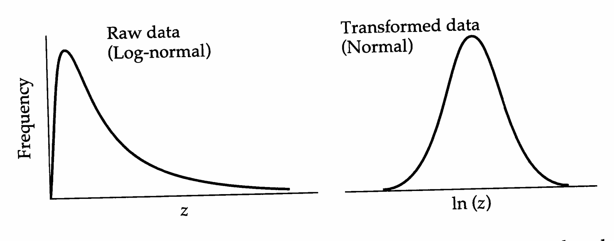
>
> Figure 11.1 Conversion of a log-normal distribution on the original scale to a normal distribution on the log-transformed scale.

---

## Genetics_chapter11_003 · Introduction / Log-normal Distributions and the Log Transform

A common departure from normality is positive skewness, such that the tail to the right of the mean is longer than that to the left. Such a pattern is often indicative of a log-normal distribution, in which case a simple logarithmic transformation gives a normal distribution (Figure 11.1).

The log-normal distribution adequately describes many biological attributes (Wright 1968) and is worth dwelling upon briefly. Suppose that a variable z is log-normally distributed with mean $ \mu $ and variance $ \sigma^{2} $ on the original scale of measurement. It follows that $ y = \ln(z) $ is normally distributed, and that the moments of y are related directly to the moments of z by $$ \mu_{y}=\ln\mu-\frac{1}{2}\ln\left(1+\frac{\sigma^{2}}{\mu^{2}}\right) $$ $$ \sigma_{y}^{2}=\ln\left(1+\frac{\sigma^{2}}{\mu^{2}}\right) $$

(Aitchison and Brown 1966). Since $ \ln(1 + x) \simeq x $ for $ |x| << 1 $, when the coefficient of variation $ (\sigma/\mu) $ is small (less than $ \sim 0.3 $), these expressions are closely approximated by $$ \mu_{y}=\ln\mu-\frac{\sigma^{2}}{2\mu^{2}} $$ $$ \sigma_{y}^{2}=\frac{\sigma^{2}}{\mu^{2}} $$

In estimating the moments of a distribution on a log-transformed scale, it is desirable to work directly with the raw data (rather than to simply apply Equations 11.1a,b) because the original distribution may, in fact, not be log-normal. Occasionally, however, one only has recourse to the sample mean, $ \overline{z} $, and sample standard deviation, $ SD = \sqrt{\mathrm{Var}(z)} $, on the original scale. In this case, using a Taylor-series approximation (Appendix 1), we can still approximate the mean and variance of the log-transformed variables by $$ \overline{y}=\overline{\ln z}\simeq\ln\overline{z}-\frac{1}{2}\ln\left(1+CV^{2}\right)\simeq\ln\overline{z}-\frac{CV^{2}}{2} $$ $$ \mathrm{Var}(y)=\mathrm{Var}(\ln z)\simeq\ln\left(1+\mathrm{CV}^{2}\right)\simeq\mathrm{CV}^{2} $$ where CV = SD/$\bar{z}$ is the estimated coefficient of variation on the original scale. Note that these first-order approximations (identical in form to Equations 11.2a,b) apply to any distribution on the original scale, not just the log-normal. Thus, logarithmic transformation will successfully stabilize the variance (removing its dependence on the mean) under a broad range of distributions on the original scale, provided the coefficients of variation are roughly constant. On the other hand, logarithmic transformation will only normalize the data if the untransformed data are actually log-normally distributed. Methods for testing for normality are discussed below.

**[命题 Proposition]**

Galton (1879) first pointed out a possible explanation for the commonness of the log-normal distribution. Suppose the phenotype can be represented as a product of a large number of independent factors $ z = x_1 \cdot x_2 \cdot x_3 \cdots x_n $. Upon logarithmic transformation, $ y = \ln z = \ln x_1 + \ln x_2 + \ln x_3 + \cdots + \ln x_n $, and under the central limit theorem, $ \ln z $ will tend to normality as n becomes large. Thus, a simple explanation for a log-normal distribution is the existence of multiplicative interaction between a large number of factors.

A number of other scale transformations, such as power functions and trigonometric functions, are available if the original data depart from both normality and log-normality (Wright 1968). If, for example, length measures in a population are known to be normally distributed, then it is likely that a cube root transformation would be required to normalize the distribution of weights, since weight is usually proportional to the cube of the length. The Box-Cox transformation, $$ y=\frac{z^{\lambda}-1}{\lambda} $$ provides a fairly general class of transformations for achieving normality, and Box and Cox (1964) developed an approach to find the $ \lambda $ that gives the best fit to normality. This type of transformation usually deals quite adequately with skewness on the original scale ($ \lambda = 0 $, for example, is equivalent to the logarithmic transformation), but is less effective with kurtosis. John and Draper (1980) present alternative functions to deal with long tails on symmetrical distributions, and Atkinson (1982) discusses all of these transformations in some detail.

---

## Genetics_chapter11_004 · Introduction / Tests for Normality

There are a variety of methods for determining whether a character is normally distributed — see Chapter 6 of Sokal and Rohlf (1995) for an introduction, and

---

## Genetics_chapter11_005 · Introduction / of Wetherill (1986) for more advanced methods. Graphical tests for departures from normality are especially informative. For example, a simple frequency histogram may immediately reveal departures from normality, such as multiple peaks or strong asymmetries. If a character is determined by one (or a few) genes of major effect, a bimodal (or multimodal) distribution can sometimes result (CHAPTER 13). Such distributions can also result when a character is strongly influenced by a few distinct environmental effects.

**[命题 Proposition]**

With only sample moments in hand, deviations from normality are indicated by significant skewness and/or kurtosis. Bowman and Shenton (1975) proposed a joint test of this, employing the statistic $$ S=\frac{n\cdot k_{3}^{2}}{6}+\frac{n\cdot k_{4}^{2}}{24} $$ where $n$ is the sample size, and from Equations 2.8 and 2.12a, $k_3 = \mathrm{Skw}(z)/\mathrm{Var}(z)^{3/2}$ and $k_4 =[\mathrm{Kur}(z)/\mathrm{Var}(z)^2] - 3$ are, respectively, the standardized sample skewness and kurtosis, both of which have expected value zero under the assumption of normality. For large sample sizes, $S$ is distributed as a $\chi^2$ with two degrees of freedom. Thus, the hypothesis that a distribution is normal is rejected at the 5% level if $S > 5.99$ and at the 1% level if $S > 9.21$.

A more powerful approach for evaluating normality involves normal probability plots, which can be generated either by plotting cumulative frequency on special normal probability graph paper or by transforming cumulative frequency to a normal probability (or probit) scale. In Chapter 2, we defined $ \Phi_{T} $ as the fraction of measures in a distribution that are greater than value T. Here we let $ q = (1 - \Phi_{T}) $ be the cumulative frequency to point T. A given cumulative frequency is rescaled to a normal probability scale by using the probit transform prb(q), which is defined as the solution of $$ \Pr[U<\mathbf{prb}(q)]=q $$ where $U$ is a standardized (or unit) normal random variable with zero mean and unit variance. Given $q$, $\text{prb}(q)$ is obtained from tables of the unit normal (e.g., Beyer 1968) or from common statistical packages. For example, since $\text{Pr}(U < -1) = 0.1587$, the normal probability scale value associated with a cumulative frequency of $q = 0.1587$ is $\text{prb}(0.1587) = -1$. Since $U$ is symmetrically distributed about zero, it follows that $$ -\mathbf{p r b}(0.5-\delta)=\mathbf{p r b}(0.5+\delta)\qquad\mathrm{f o r}\quad0\leq\delta\leq0.5 $$

[[SEE_TABLE:11.1]] gives the normal probability scale measures for different values of $ \delta $. For example, suppose that only 1.2% of the population is below a given

> **Figure 11.2** · page 6 · source: `Genetics_chapter11`
>
> 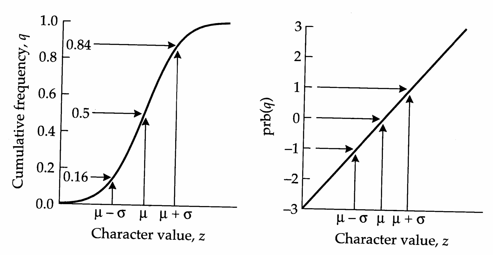
>
> Figure 11.2 The normal probability scale, applied to a normally distributed random variable, $z$, with mean $\mu$ and variance $\sigma^{2}$. Left: A plot of cumulative frequency, $q$, as a function of $z$ gives a sigmoidal curve. Right: Rescaling cumulative frequency using the transformation $\text{prb}(q)$ (Equation 11.6) gives a straight line. The scale given by $\text{prb}(q)$ is called a normal probability scale. As this figure shows, a character measure with associated $q = 0.50$ (which for a normal distribution corresponds to the mean) returns a normal probability scale value of zero. A character with $q = 0.84$ (which for a normal distribution corresponds to one standard deviation above the mean) returns a value of $+1$, and a character with $q = 0.16$ (which for a normal distribution corresponds to one standard deviation below the mean) returns a value of $-1$.

character value, so that $q=0.012$. Expressing this in the form used by [[SEE_TABLE:11.1]] gives $\text{prb}(0.012)=\text{prb}(0.5-0.488)=-\text{prb}(0.5+0.488)=-2.25$. Zero on the probit scale corresponds to the population median $(q=0.50)$, which is also the mean for a normal. For a normally distributed variable, a unit change on the probit scale corresponds to one standard deviation (Figure 11.2). As shown in Figure 11.2, with a normal distribution, cumulative frequency as a function of $z$ is sigmoidal, but it is linear when transformed to a normal probability scale. Nonnormal distributions deviate from linearity on such plots, [[SEE_TABLE:11.1]]

Note: Values of $ \delta < 0 $ follow from the identity $ \mathrm{prb}(0.5 - \delta) = -\mathrm{prb}(0.5 + \delta) $.

> **Figure 11.3** · page 7 · source: `Genetics_chapter11`
>
> 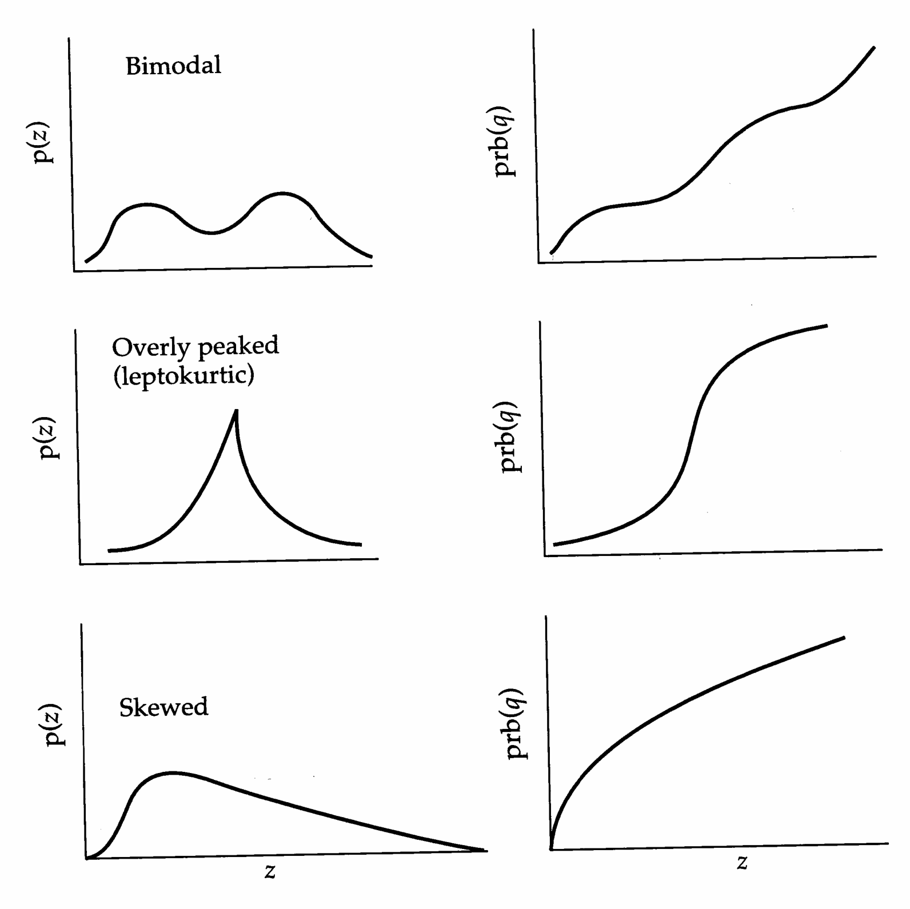
>
> Figure 11.3 Diagnosis of three types of departure from normality using normal probability plots. On the left are probability density functions. On the right are cumulative frequencies plotted on the normal probability scale,  $ prb(q) $. Top: Bimodal distributions show flat regions when plotted on a normal probability scale. Middle: Leptokurtic distributions (overly peaked relative to a normal scale) give a sigmoidal curve on a normal probability scale. Bottom: Skewed distributions depart from linearity on a normal probability scale by curving downward if the distribution is skewed to the right (as in the figure), or by curving upward if the distribution is skewed to the left.

with multimodal, overly peaked, and skewed distributions all exhibiting characteristic departures (Figure 11.3). The normal probability scale forms the basis for the most powerful tests for departures from normality, such as the small-sample W test of Shapiro and Wilk (1965) and the large-sample D test of D'Agostino (1971).

Example 1. Fisher (1958) gives the following data set (based on unpublished work of Ford and Bull) on the number of vertebrae in herrings. Ignoring the discrete nature of the data, does the normal distribution give a reasonable fit?

The cumulative frequency associated with a particular character value is the sum of all frequencies up to that point (e.g., the cumulative frequency associated with 55 vertebrae is $ 0.08 + 1.06 + 28.36 = 29.50% $). Plotting cumulative frequency as a function of vertebrae number gives a sigmoidal plot, as shown in the accompanying figure, suggesting a normal distribution. Using unit normal tables, the cumulative frequencies can be transformed to a normal probability scale. For example, the cumulative frequency associated with 55 vertebrae is q = 0.2950. Interpolating from the normal distribution table, we find that for a unit normal U, $ \Pr(U < -0.54) = 0.2950 $, so the prb(q) value associated with 55 vertebrae is -0.54 (0.54 standard deviations below the mean assuming a normal distribution). Plotting prb(q) versus vertebrae number gives a good linear relationship (see the following figure), suggesting that the normal distribution provides a reasonable description of the data.

> **Figure 11.4** · page 9 · source: `Genetics_chapter11`
>
> 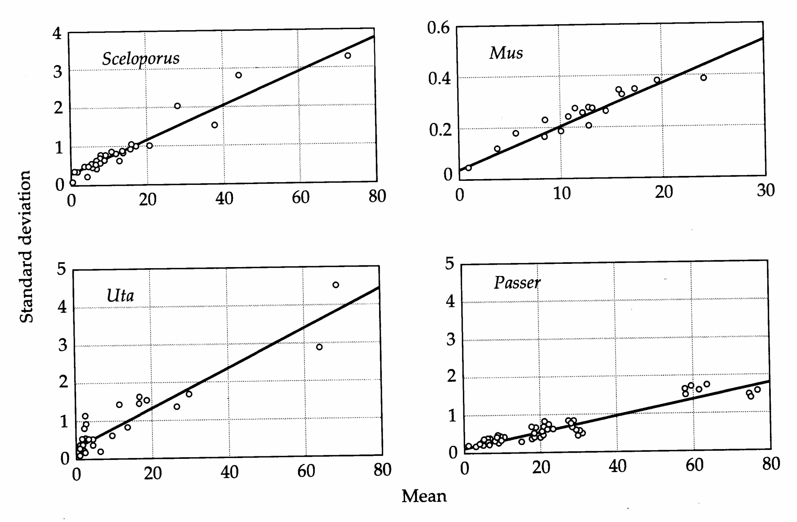
>
> Figure 11.4 Relationship of the standard deviation and the mean for four sets of morphological characters in vertebrates. Sceloporus (rough-scaled lizard): meristic traits, several species (Kluge and Kerfoot 1973); Uta (side-blotched lizard): scale counts and ratios of morphometric characters (Kluge and Kerfoot 1973); Mus (mouse): skeletal and weight characters (several sources given in Soulé 1982); Passer (house sparrow): skeletal and feather characters (described in Kluge and Kerfoot 1973).

> **Table 11.1** · `11.1` · page ? · source: `Genetics_chapter11_005`
> Table 11.1 (body not recovered from raw layout)
>
> <table border=1 style='margin: auto; word-wrap: break-word;'><tr><td style='text-align: center; word-wrap: break-word;'>$ \delta $</td><td style='text-align: center; word-wrap: break-word;'>0.000</td><td style='text-align: center; word-wrap: break-word;'>0.099</td><td style='text-align: center; word-wrap: break-word;'>0.191</td><td style='text-align: center; word-wrap: break-word;'>0.273</td><td style='text-align: center; word-wrap: break-word;'>0.341</td><td style='text-align: center; word-wrap: break-word;'>0.394</td><td style='text-align: center; word-wrap: break-word;'>0.433</td><td style='text-align: center; word-wrap: break-word;'>0.460</td><td style='text-align: center; word-wrap: break-word;'>0.477</td></tr><tr><td style='text-align: center; word-wrap: break-word;'>$ prb(0.5 + \delta) $</td><td style='text-align: center; word-wrap: break-word;'>0.000</td><td style='text-align: center; word-wrap: break-word;'>0.250</td><td style='text-align: center; word-wrap: break-word;'>0.500</td><td style='text-align: center; word-wrap: break-word;'>0.750</td><td style='text-align: center; word-wrap: break-word;'>1.000</td><td style='text-align: center; word-wrap: break-word;'>1.250</td><td style='text-align: center; word-wrap: break-word;'>1.500</td><td style='text-align: center; word-wrap: break-word;'>1.750</td><td style='text-align: center; word-wrap: break-word;'>2.000</td></tr><tr><td style='text-align: center; word-wrap: break-word;'>$ \delta $</td><td style='text-align: center; word-wrap: break-word;'>0.488</td><td style='text-align: center; word-wrap: break-word;'>0.494</td><td style='text-align: center; word-wrap: break-word;'>0.497</td><td style='text-align: center; word-wrap: break-word;'>0.4987</td><td style='text-align: center; word-wrap: break-word;'>0.4994</td><td style='text-align: center; word-wrap: break-word;'>0.4998</td><td style='text-align: center; word-wrap: break-word;'>0.4999</td><td style='text-align: center; word-wrap: break-word;'>0.5000</td><td style='text-align: center; word-wrap: break-word;'></td></tr><tr><td style='text-align: center; word-wrap: break-word;'>$ prb(0.5 + \delta) $</td><td style='text-align: center; word-wrap: break-word;'>2.250</td><td style='text-align: center; word-wrap: break-word;'>2.500</td><td style='text-align: center; word-wrap: break-word;'>2.750</td><td style='text-align: center; word-wrap: break-word;'>3.0000</td><td style='text-align: center; word-wrap: break-word;'>3.2500</td><td style='text-align: center; word-wrap: break-word;'>3.5000</td><td style='text-align: center; word-wrap: break-word;'>3.7500</td><td style='text-align: center; word-wrap: break-word;'>$ \infty $</td><td style='text-align: center; word-wrap: break-word;'></td></tr></table>
> <table border=1 style='margin: auto; word-wrap: break-word;'><tr><td style='text-align: center; word-wrap: break-word;'></td><td colspan="6">Number of vertebrae</td></tr><tr><td style='text-align: center; word-wrap: break-word;'></td><td style='text-align: center; word-wrap: break-word;'>53</td><td style='text-align: center; word-wrap: break-word;'>54</td><td style='text-align: center; word-wrap: break-word;'>55</td><td style='text-align: center; word-wrap: break-word;'>56</td><td style='text-align: center; word-wrap: break-word;'>57</td><td style='text-align: center; word-wrap: break-word;'>58</td></tr><tr><td style='text-align: center; word-wrap: break-word;'>Population frequency (%)</td><td style='text-align: center; word-wrap: break-word;'>0.08</td><td style='text-align: center; word-wrap: break-word;'>1.06</td><td style='text-align: center; word-wrap: break-word;'>28.36</td><td style='text-align: center; word-wrap: break-word;'>61.30</td><td style='text-align: center; word-wrap: break-word;'>8.91</td><td style='text-align: center; word-wrap: break-word;'>0.29</td></tr><tr><td style='text-align: center; word-wrap: break-word;'>Cumulative frequency, $ q $ (%)</td><td style='text-align: center; word-wrap: break-word;'>0.08</td><td style='text-align: center; word-wrap: break-word;'>1.14</td><td style='text-align: center; word-wrap: break-word;'>29.50</td><td style='text-align: center; word-wrap: break-word;'>90.80</td><td style='text-align: center; word-wrap: break-word;'>99.71</td><td style='text-align: center; word-wrap: break-word;'>100.00</td></tr><tr><td style='text-align: center; word-wrap: break-word;'>prb($ q $)</td><td style='text-align: center; word-wrap: break-word;'>-3.14</td><td style='text-align: center; word-wrap: break-word;'>-1.22</td><td style='text-align: center; word-wrap: break-word;'>-0.54</td><td style='text-align: center; word-wrap: break-word;'>1.33</td><td style='text-align: center; word-wrap: break-word;'>2.76</td><td style='text-align: center; word-wrap: break-word;'>$ \infty $</td></tr></table>

---

## Genetics_chapter11_006 · Introduction / STABILIZING THE VARIANCE

For studies concerned with relative levels of variation in different populations, it is useful to know whether the observed differences are simply a consequence of scale. For example, it is not uncommon for the variance to increase as the population mean increases (Figure 11.4). By operating on a scale for which there is no discernible relation between the mean and variance, one can be secure that any significant differences in observed levels of variance between samples must be attributable to something other than differences in the mean. Here, we consider the use of variance-stabilizing transformations to render the variance on the transformed scale independent of the mean. Wright (1968, Chapters 10 and 11) gives an excellent discussion of the application of such transformations to distributions of quantitative characters.

---

## Genetics_chapter11_007 · Introduction / Kleckowski's Transformation

We have already encountered the idea that a log transformation can render the variance of different samples independent of the mean when the CV is approximately constant on the underlying scale. For this to be strictly valid, the SD must be directly proportional to the mean, $ SD(z) = b\bar{z} $. However, a fairly common situation is for the regression of standard deviations on means to have an intercept significantly greater than zero (Figure 11.4). This causes the coefficient of variation to increase dramatically as the mean approaches zero, which in turn implies an inflation of the variance on the logarithmic scale.

Kleckowski (1949) suggested a simple way to eliminate this problem. If the standard deviation on the original scale can be described adequately by the linear regression $ \mathrm{SD}(z) = a + b\overline{z} $, then it follows by rearrangement that $ \mathrm{SD}(z)/(\overline{z} + a/b) = b $. Because a/b is a constant, $ \mathrm{SD}(z) = \mathrm{SD}[z + (a/b)] $, so the previous ratio is equivalent to the coefficient of variation of y = z + a/b. Thus, the use of the transformed variable y = z + a/b in place of z yields an expected coefficient of variation that is equal to b and independent of the mean (also see Example 3). This results in the independence of the mean and variance for the log-transformed variable $ \ln(y) = \ln(z + a/b) $.

Example 2. Consider the Uta data in Figure 11.4. The intercept and slope of the least-squares regression, $SD(z) = 0.33 + 0.052\overline{z}$, are highly significant (W. C. Kerfoot, pers. comm.). Since the relationship between the standard deviation and the mean closely approximates linearity, the transformation $$ y=\ln(z+0.33/0.052)=\ln(z+6.35) $$ renders the variance of different populations independent of the mean.

---

## Genetics_chapter11_008 · Introduction / General Variance-stabilizing Transformations

For more complicated relationships between means and standard deviations, a general formula exists for ascertaining the correct variance-stabilizing transformation. Given the relationship $ \sigma_{z}=f(\mu_{z}) $, the appropriate transform is given by a result due to Fisher, $$ y=C\int\frac{dz}{f(z)} $$ where $C$ is an arbitrary nonnegative constant, generally chosen to set the rescaled variance equal to one. The rescaled character $y$ has a variance that is independent of the mean in any particular population. Thus, the procedure for obtaining a variance-stabilizing transform for any standard deviation-mean relationship, $f(\overline{z})$, is simple. A fit for the function $f(\overline{z})$ is obtained by a least-squares polynomial (or some other nonlinear) regression, and Equation 11.8 is solved using the estimated regression coefficients.

Example 3. Suppose $\mathrm{SD}(z) = a + b\overline{z}$. Applying Equation 11.8, the variance-stabilizing transform is given by $$ y=C\int\frac{dz}{a+b\cdot z}=\frac{C}{b}\ln\left(z+\frac{a}{b}\right) $$

Note that there is no unique solution for $y$, as we can multiply $y$ by any constant and still have a variance-stabilizing transform. Letting $C = b$ recover S Kleckowski's correction, $y = \ln(z + a/b)$.

---

## Genetics_chapter11_009 · Introduction / The Roginskii-Yablokov Effect

Inverse relationships between the coefficients of variation and means of functionally related traits, and their biological implications, have been discussed by many investigators (Pearson and Davin 1924, Roginskii 1959, Yablokov 1974, Rohlf et al. 1983, Kerfoot 1988). We refer to such a relationship as a Roginskii-Yablokov effect. Whether such a scaling has important biological underpinnings, as opposed to being a simple statistical artifact, merits some scrutiny.

**[定义 Definition]**

The most obvious problem in attempting to relate coefficients of variation and means is that the former are inverse functions of the latter, since by definition, $ CV(z) = SD(z)/\overline{z} $. Thus, for the extreme case in which the standard deviation is a constant independent of mean, the expected relationship between the CV and the mean is an inverse hyperbola. On a log-log plot, this is revealed as a linear relationship with a slope of minus one. The data for a number of characters closely approximate this pattern (Figure 11.5), suggesting that in some cases the Roginskii-Yablokov effect is nothing more than a mathematical consequence of the regression of a ratio on its denominator.

A second statistical artifact that can lead to a Roginskii-Yablokov effect is a standard deviation-mean relationship, such as that pointed out in the previous section. In reality, for characters such as length measurements, which take on only positive values, the SD-mean relationship is constrained to pass through the origin since the standard deviation of measurements must be zero if the mean is zero. However, a linear approximation to the data generally yields positive $y$-intercepts, suggesting that the SD versus mean relationship is slightly bowed upward near the origin. Such behavior can be a simple consequence of measurement error. Suppose that the SD versus mean relationship is adequately described by the function $\mathrm{SD}(z) = \sqrt{k^{2} \cdot \overline{z}^{2} + V}$, where $k$ is the CV if we measure without error, and $V$ is the additional variance caused by measurement error (assumed to be independent of the mean). With this relationship, the coefficient of variation approaches $k$ as $\overline{z}$ becomes large, but rapidly increases as $\overline{z}$ becomes smaller than $\sqrt{V}/k$. This explanation is probably more relevant to metric characters than

> **Figure 11.5** · page 12 · source: `Genetics_chapter11`
>
> 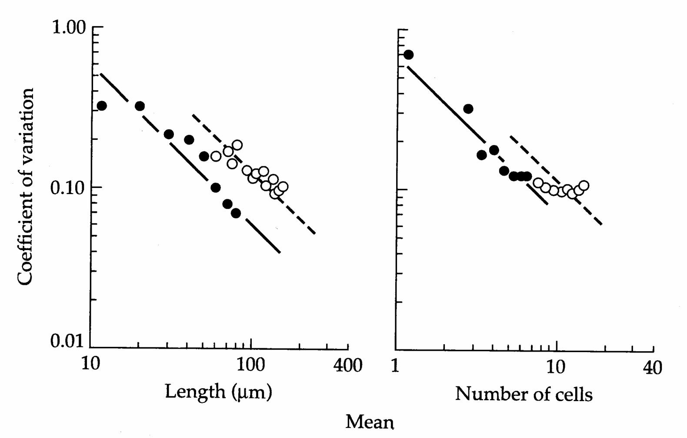
>
> Figure 11.5 Coefficients of variation versus mean phenotypes for lengths and cell counts of tail spines (solid points) and antennasules (open points) for samples of the cladoceran Bosmina longirostris. As mentioned in the text, a straight line with a slope of minus one is the expected relationship if the standard deviation is independent of the mean. Only the antennaule cell counts deviate greatly from this expectation. (From Kerfoot 1988.)

meristic ones. Presumably, as the mean number of counts per individual declines, so does the sampling variance.

Rohlf et al. (1983) pointed out a third statistical artifact that can lead to a Roginskii-Yablokov effect when the data are log-normally distributed. The discretization of log-normally distributed data into classes (delimited by counts or measurement constraints) leads to a reduction of the mean and an inflation of the variance relative to that expected under a continuous log-normal distribution. This in turn causes an inflation of the CV to a degree that increases with decreasing means. In principle, the bias caused by discretization can be corrected by applications analogous to Sheppard's correction (Chapter 2) with normally distributed data (Thompson 1951), but this has not been done with most published data.

Despite the numerous statistical artifacts that may be largely (and in some cases, entirely) responsible for observed negative relationships between means and CVs, there are biological reasons for suspecting that Roginskii-Yablokov effects are sometimes real. A simple explanation was offered by Pearson and Davin (1924). Consider a character that can be represented as the sum of n developmental units, $$ Z=z_{1}+z_{2}+\cdots+z_{n} $$

For example, Z could be composed of a number of smaller bones or a number of specific cells. The variance of Z is then $$ \sigma_{Z}^{2}=\sigma_{z_{1}}^{2}+\sigma_{z_{2}}^{2}+\cdots+\sigma_{z_{n}}^{2}+2\sigma_{z_{1},z_{2}}+\cdots+2\sigma_{z_{n-1},z_{n}} $$

Letting $\overline{\sigma}_{z_{i},z_{j}}$ be the mean of the covariance terms, the squared coefficient of variation is $$ \mathrm{CV}_{Z}^{2}=\frac{\sigma_{Z}^{2}}{\mu_{Z}^{2}}=\frac{\sum\limits_{i=1}^{n}\sigma_{z_{i}}^{2}+n\left(n-1\right)\cdot\overline{\sigma}_{z_{i},z_{j}}}{\left(\sum\limits_{i=1}^{n}\mu_{i}\right)^{2}} $$

Now, for simplicity, let each developmental unit share the same mean $(\mu_{z})$ and variance $(\sigma_{z}^{2})$. Then $$ \mathbf{C V}_{Z}^{2}=\mathbf{C V}_{z}^{2}\cdot\left[\frac{1+\left(n-1\right)\overline{{\rho}}}{n}\right] $$ where $CV_{z} = \sigma_{z}/\mu_{z}$ is the coefficient of variation for each developmental unit, and $\overline{\rho}$ is the mean correlation between units. Except in the unlikely event that all of the component parts are perfectly correlated, the fraction on the right is less than one. Thus, the CV of $Z$ is less than the average CV of the component parts — variation in individual components averages out as the sum increases. Provided that developmental units are similar in size and variance, the Pearson-Davin argument leads to the prediction that the CV of size of a structure is expected to decline as the number of component parts increases.

The Pearson-Davin argument is supported in a number of cases. Analyzing data of Bader and Hall (1960) on osteometric characters in bats, Lande (1977) found that characters consisting of several bones have CVs of 0.02–0.03, while the individual bones themselves have CVs of around 0.03–0.06. Similarly, Kerfoot (1988) found that while the CV for tail spine length in the cladoceran Bosmina is 0.10, the CV for length of the component cells ranges from 0.28 to 0.36.

A second, and related, biological explanation for the Roginskii-Yablokov effect applies to analyses that compare the same character in different populations. During development the variance in size of morphological characters often increases initially and then declines as compensatory growth focuses most individuals into a narrow range of phenotypes. This pattern of development, known as targeted growth (Riska et al. 1984), would generate a Roginskii-Yablokov effect if the individuals from different samples varied in average age. Those samples containing the oldest, and presumably largest, individuals would be expected to exhibit the lowest CVs.

While much work remains to be done before the underlying determinants of the Roginskii-Yablokov effect can be deciphered, if indeed any generalities are possible, its existence has serious implications for the use of scale transformations. If the CV is not independent of the mean, the routine procedure of log-transforming data prior to analysis will not be successful in stabilizing the variance. Rather, it will cause a negative correlation between the mean and variance on the logarithmic scale. Failure to appreciate the importance of such a scaling effect can lead to interpretative difficulties in long-term studies of natural selection, leading, for example, to the conclusion that directional selection for larger size is accompanied by stabilizing selection about the optimum (Halbach and Jacobs 1971).

---

## Genetics_chapter11_010 · Introduction / The Kluge-Kerfoot Phenomenon

**[命题 Proposition]**

Drawing from morphological data on a number of vertebrates, Kluge and Kerfoot (1973) suggested that traits with high phenotypic variance within populations tend to exhibit high levels of divergence among populations. They argued that this pattern is due, at least in part, to the variance of a trait within a population being inversely proportional to the intensity of stabilizing selection. Their conclusion appears to require the assumption that characters that are under strong stabilizing selection within populations have similar optimal phenotypes in different populations. To support their case, Kluge and Kerfoot plotted for various characters the range of means from different populations against the within-population standard deviation, after first dividing both statistics by the overall population mean. As in the case of the Roginskii-Yablokov effect, the Kluge-Kerfoot phenomenon may be largely a statistical artifact (Sokal 1976, Rohlf et al. 1983). The statistics employed by Kluge and Kerfoot are expected to be intrinsically correlated due to the fact that both contain the same variable (the mean) in the denominator. This problem is exacerbated by the fact that the range of population means is positively related to the within-population variance that causes sampling error of the means. In an attempt to eliminate the latter problem, Sokal (1976) employed coefficients of within- and among-population variation extracted by analysis of variance. However, since both CVs still share the same denominator, this procedure has the same problem as Kluge and Kerfoot's analysis. Moreover, as Rohlf et al. (1983) have pointed out, there appears to be a Roginskii-Yablokov effect for the among-population CV just as there is for the within-population CV. Thus, the correlation of within- and among-population variance in many existing studies may be an indirect effect of both measures being correlated with a third (the mean). In a study of morphometric differentiation among house sparrow populations, Baker (1980) showed that the Kluge-Kerfoot phenomenon disappeared after the scaling with the mean was eliminated. Until these numerous statistical problems have been accounted for properly with several independent data sets, the biological and evolutionary significance of the Kluge-Kerfoot phenomenon must remain in doubt.

---

## Genetics_chapter11_011 · Introduction / ALLOMETRY: THE SCALING IMPLICATIONS OF BODY SIZE

Many aspects of shape, life histories, behavior, and physiology scale proportionately with body size, both within individuals through development and among different individuals (Huxley 1932; Thompson 1917, 1943; Gould 1966; Vogel 1981, 1989; Wainwright et al. 1982; Peters 1983; Calder 1984; Schmidt-Nielsen 1984; Fleagle 1985). A simple consequence of such scaling is that the phenotypic variation seen for many characters may be little more than an indirect consequence of variation in body size. Huxley (1932) noted that the relationship of most characters with body size can be summarized with a particularly simple mathematical expression — a log-log plot of character $y$ versus some measure of body size $x$ (such as weight or length) generally yields a straight line, $$ \ln y=\ln a+b\ln x $$

This implies a power relationship on the original scale of measurement. $$ y=a x^{b} $$

Characters that scale with size according to Equation 11.11a are said to display allometry, with the allometric coefficient b providing a measure of the scaling of character value with body size. If $b = 1$, isometric growth occurs and the ratio of character value to body size is constant. If $b > 1$, positive allometry occurs, with the character becoming proportionately larger as size increases. Characters with $b < 1$ display negative allometry, becoming proportionately smaller as size increases. Thus, unless $b = 1$, the shape of an organism changes with size, potentially generating very different morphologies. Figure 11.6 demonstrates allometric scaling for Huxley's classic analysis of the different morphologies of ant castes. The proportionately larger heads associated with soldier ants appear to be a simple scale effect of body size.

Three very different types of data can display allometry, and unfortunately these are often confused and/or treated interchangeably. In ontogenetic or growth allometry, a character is followed through the development of an individual — each data point corresponds to the character at a different developmental stage, ideally in the same individual. Static or intraspecific allometry compares the character in different-sized adults (or individuals of the same age) from the same species or population — each data point represents a different adult from a common taxon. Evolutionary or interspecific allometry examines the character in different species or divergent populations — each data point represents the mean for a different taxon. These distinctions are critical, as a character displaying one form of allometry need not display another, e.g., ontogenetic allometry does not necessarily imply evolutionary allometry, and so forth. For further discussions of these differences, see Lande (1979), Cheverud (1982), and Fleagle (1985).

Allometric equations are routinely used to correct for the effects of size by replacing the character value by the deviation from the fitted allometric equation, i.e., by $y - \widehat{y}$, where $\widehat{y}$ is the predicted character value based on Equation 11.11b. Such residuals can then be used to study variation in character values that is

> **Figure 11.6** · page 16 · source: `Genetics_chapter11`
>
> 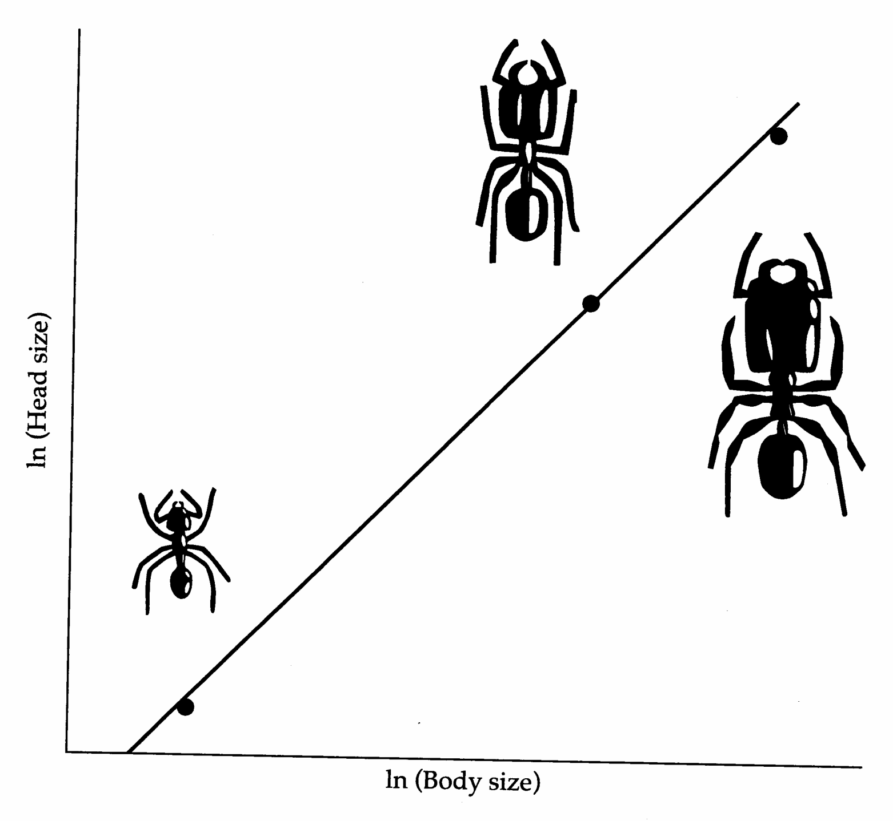
>
> Figure 11.6 Castes of the ant Pheidole instabilis display positive allometry for head size. The proportionately larger heads of soldiers can be accounted for simply by changes in size, with head size growing at a faster rate than the rest of the body. (Based on Huxley 1932.)

independent of the allometric consequences of size variation. Packard and Boardman (1987) give a highly readable account of this approach with numerous examples applied to physiological data.

An alternate approach to size correction, especially common in systematics, involves ratios of the character over some measure of body size, e.g., head length/total body length. Unfortunately, there are serious problems with this approach. Unless the character displays isometric growth, taking ratios does not remove aspects of body size, as $y/x = ax^{b-1}$, which is a function of $x$ unless $b = 1$. Further, as noted above, ratios introduce spurious correlations — the variable $y/x$ is usually negatively correlated with $x$, even if $x$ and $y$ are themselves independent (Pearson 1897, Tanner 1949, Atchley et al. 1976, Albrecht 1978, Atchley and Anderson 1978, Strauss 1985). Thus, character/size ratios often confound, rather than remove, size effects and should be avoided.

---

## Genetics_chapter11_012 · Introduction / REMOVAL OF INTERACTION EFFECTS

**[命题 Proposition]**

Because nonadditive interactions (e.g., genotype $ \times $ environment interaction, dominance, and epistasis) can only complicate statistical analysis, additivity is a simplifying assumption underlying much of quantitative-genetic theory. Therefore, in practical applications, it is very desirable to find a scale on which genetic and environmental effects are additive. Since there is no compelling reason to expect that a scale removing one aspect of nonadditivity will also eliminate others, nor to expect that the optimal scale for one population will be suitable for all others, it is rare that a wholly satisfactory solution can be found. Nevertheless, experience has shown that considerable simplification is often attainable.

Example 4. Suppose the genotypes BB, Bb, and bb have genotypic values of 1, 4, and 9 on the original scale of measurement. Applying the square-root transformation, the genotypic values on this new scale of measurement become 1, 2, and 3. Thus, while B is slightly dominant to b on the original scale, the gene action is perfectly additive on the transformed scale. The square-root transformation condensed the scale between Bb and bb relative to that between BB and Bb, resulting in additivity on the new scale. Provided the genotypic value of Bb lies within the range of BB and bb, a scale will always exist for which Bb can be made exactly intermediate to BB and bb.

In the genetic analysis of populations, nonadditive interactions between alleles (dominance) do not usually cause any insurmountable difficulties. However, because epistasis comes in many forms, all of which are quite difficult to quantify with precision, it is highly desirable to work on a scale for which a model involving no more than additive and dominance effects can be shown to be adequate. In some cases, the appropriateness of a particular transformation in removing nonadditive effects can be examined using joint-scaling tests (Chapter 9).

Genotype $ \times $ environment interaction can be very difficult to detect in natural populations, since its measurement requires that several distinct genetic groups be grown in a discrete set of environments (Chapter 22). Such an analysis can often be performed in the laboratory or in a common garden experiment, and the results used as a guide to the choice of scale for the field population. However, care should be taken in extending the knowledge gained from controlled experiments too far, since the mode of action of microenvironmental variation in the field may be fundamentally different from that involving the macroenvironmental treatment in the laboratory.

[[SEE_TABLE:11.2]] gives an example of removing a genotype $ \times $ environment interaction using a transformed scale. The character considered is the mean weight of offspring for two inbred lines of guinea pigs as a function of litter size, the latter being regarded as a component of the offspring's environment. For both strains, there is a substantial decline in offspring weight with increasing litter size, [[SEE_TABLE:11.2]]

Source: From Wright 1968.

Note: The untransformed data show a $ G \times E $ interaction with the difference in strain means being a function of litter size. This dependency is largely eliminated on the transformed scale. presumably due to competition for maternal care. On the scale of raw measurements, genotype × environment interaction is indicated by the steady decline in the difference between line means with increasing litter size. In the absence of a genotype × environment interaction, this difference should be constant across environments (across different litter sizes). Such behavior is seen upon logarithmic transformation. On the other hand, Wright found that the variance in weight among litter mates was independent of litter size on the original scale but positively correlated with it on the transformed scale. Thus, while logarithmic transformation was able to eliminate genotype × environment interaction of the means, it destabilized the variance.

> **Table 11.2** · `11.2` · page ? · source: `Genetics_chapter11_012`
> Table 11.2 (body not recovered from raw layout)
>
> <table border=1 style='margin: auto; word-wrap: break-word;'><tr><td style='text-align: center; word-wrap: break-word;'></td><td colspan="4">Litter Size</td></tr><tr><td style='text-align: center; word-wrap: break-word;'></td><td style='text-align: center; word-wrap: break-word;'>1</td><td style='text-align: center; word-wrap: break-word;'>2</td><td style='text-align: center; word-wrap: break-word;'>3</td><td style='text-align: center; word-wrap: break-word;'>4</td></tr><tr><td style='text-align: center; word-wrap: break-word;'>Untransformed data</td><td style='text-align: center; word-wrap: break-word;'></td><td style='text-align: center; word-wrap: break-word;'></td><td style='text-align: center; word-wrap: break-word;'></td><td style='text-align: center; word-wrap: break-word;'></td></tr><tr><td style='text-align: center; word-wrap: break-word;'>Strain 13</td><td style='text-align: center; word-wrap: break-word;'>299.5</td><td style='text-align: center; word-wrap: break-word;'>264.0</td><td style='text-align: center; word-wrap: break-word;'>226.8</td><td style='text-align: center; word-wrap: break-word;'>203.6</td></tr><tr><td style='text-align: center; word-wrap: break-word;'>Strain 2</td><td style='text-align: center; word-wrap: break-word;'>213.4</td><td style='text-align: center; word-wrap: break-word;'>195.0</td><td style='text-align: center; word-wrap: break-word;'>171.8</td><td style='text-align: center; word-wrap: break-word;'>155.4</td></tr><tr><td style='text-align: center; word-wrap: break-word;'>Difference</td><td style='text-align: center; word-wrap: break-word;'>86.1</td><td style='text-align: center; word-wrap: break-word;'>69.0</td><td style='text-align: center; word-wrap: break-word;'>55.0</td><td style='text-align: center; word-wrap: break-word;'>48.2</td></tr><tr><td style='text-align: center; word-wrap: break-word;'>Transformed data</td><td style='text-align: center; word-wrap: break-word;'></td><td style='text-align: center; word-wrap: break-word;'></td><td style='text-align: center; word-wrap: break-word;'></td><td style='text-align: center; word-wrap: break-word;'></td></tr><tr><td style='text-align: center; word-wrap: break-word;'>Strain 13</td><td style='text-align: center; word-wrap: break-word;'>2.341</td><td style='text-align: center; word-wrap: break-word;'>2.265</td><td style='text-align: center; word-wrap: break-word;'>2.167</td><td style='text-align: center; word-wrap: break-word;'>2.092</td></tr><tr><td style='text-align: center; word-wrap: break-word;'>Strain 2</td><td style='text-align: center; word-wrap: break-word;'>2.125</td><td style='text-align: center; word-wrap: break-word;'>2.061</td><td style='text-align: center; word-wrap: break-word;'>1.963</td><td style='text-align: center; word-wrap: break-word;'>1.877</td></tr><tr><td style='text-align: center; word-wrap: break-word;'>Difference</td><td style='text-align: center; word-wrap: break-word;'>0.216</td><td style='text-align: center; word-wrap: break-word;'>0.204</td><td style='text-align: center; word-wrap: break-word;'>0.204</td><td style='text-align: center; word-wrap: break-word;'>0.215</td></tr></table>

---

## Genetics_chapter11_013 · Introduction / DEVELOPMENTAL MAPS, CANALIZATION, AND GENETIC ASSIMILATION

We hope that by now the reader has a sense that scale is more than a statistical issue in that by choosing an appropriate scale of analysis, we can often simplify the biological interpretation of characters. For example, allometry shows us that complex changes in character shape can be simple consequences of changes in size. Another potentially important aspect of scale concerns the interpretation of character states as the outcome of the mapping (or rescaling) of some underlying variable into a complex phenotypic space. In concluding our discussion of scale, we first examine developmental maps for discrete (meristic) characters and then explore some of the potential implications for continuously distributed characters.

---

## Genetics_chapter11_014 · Introduction / Estimating Developmental Maps

To motivate the idea behind developmental maps, consider hypertension (high blood pressure) in humans. When blood pressure exceeds some critical (or threshold) value, either for genetic or environmental reasons, the individual displays hypertension. Thus, classification of individuals as either normal or hypertensive transforms a continuous underlying measure (blood pressure) into a dichotomous character (normal vs. hypertensive). Many other diseases appear to result when some underlying physiological variable exceeds a threshold value (Chapter 25).

Letting $y$ be the value of the underlying variable (the liability), the observed phenotypic value $z$ can be regarded as a function of the liability, $z = \phi(y)$, where $\phi$ is the developmental map that rescales the underlying liability value $y$ into the phenotypic value $z$. For a simple threshold character, letting $y_c$ be the critical value, and denoting the alternate character states by 0 and 1, $$ \phi(y)=\left\{\begin{aligned}&0&\text{for}&y<y_{c}\\ &1&\text{for}&y\geq y_{c}\end{aligned}\right. $$

This type of scaling can easily be extended to characters displaying multiple states. For example, a character with three discrete states can be represented as the mapping of some underlying continuous value y by $$ \phi(y)=\left\{\begin{array}{l l}{\mathrm{c h a r a c t e r~s t a t e~1}}&{\mathrm{f o r}\quad y<y_{c_{1}}}\\ {\mathrm{c h a r a c t e r~s t a t e~2}}&{\mathrm{f o r}\quad y_{c_{1}}\geq y<y_{c_{2}}}\\ {\mathrm{c h a r a c t e r~s t a t e~3}}&{\mathrm{f o r}\quad y\geq y_{c_{2}}}\end{array}\right. $$

Following Waddington (1949), a character (or character state) is said to be canalized if the resulting phenotype is fairly insensitive to changes in the underlying environmental and/or genetic factors. For example, a continuous character can show a zone of canalization — a region of $ \phi $ that is rather flat and within which changes in the underlying genetic and environmental factors result in relatively little (or no) change in the phenotype (Figure 11.7). Assuming that the distribution of the underlying liability values is normal with variance $ \sigma^{2} $, the width of the developmental map associated with a particular character state can be estimated in units of $ \sigma $ (Figure 11.8). This procedure is often referred to as probit analysis because cumulative frequencies are measured on the probit (normal probability) scale.

Suppose the character of interest has $k$ discrete states, which we order from 1 to $k$. Let $q(m)$ be the cumulative frequency to (and including) class $m$, and define $x_m = \text{prb}[q(m)]$ to be the probit-scale value associated with $q(m)$, i.e., $x_m$ satisfies $\text{Pr}(U \leq x_m) = q(m)$ where $U$ is a unit normal. The width of liability values that map to class $m$ is estimated by $$ D_{m}=x_{m}-x_{m-1}\qquad\mathrm{f o r~}2\leq m\leq k-1 $$

> **Figure 11.7** · page 20 · source: `Genetics_chapter11`
>
> 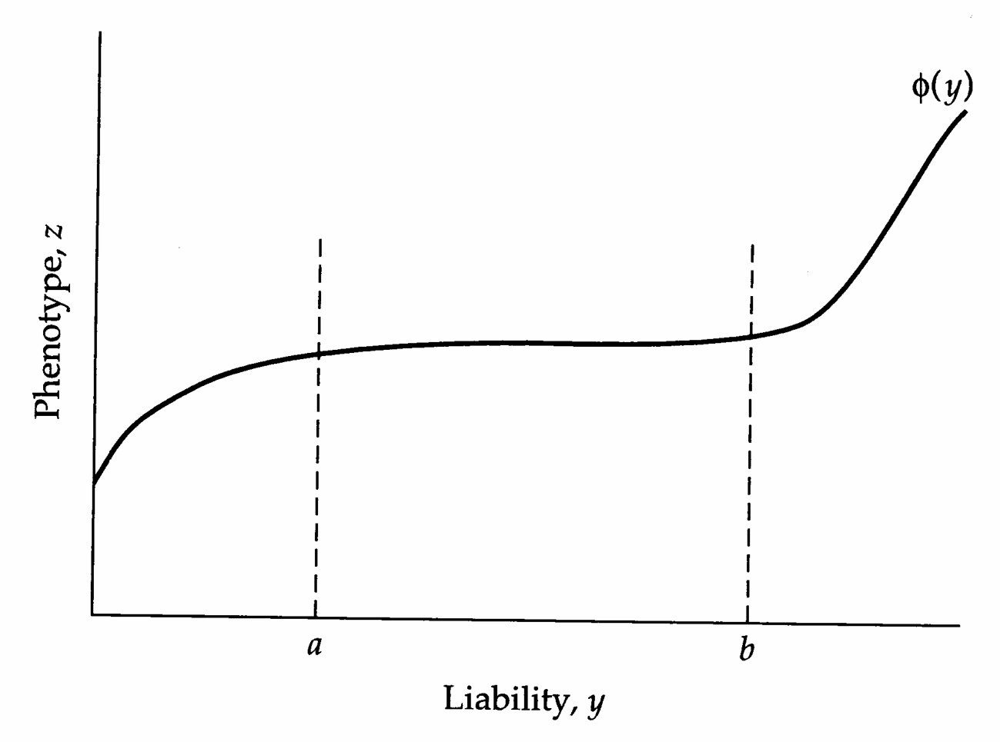
>
> Figure 11.7 A nonlinear developmental map. This map shows a zone of strong canalization for $a \leq y \leq b$, as liability values in this range give essentially the same phenotype.

> **Figure 11.8** · page 20 · source: `Genetics_chapter11`
>
> 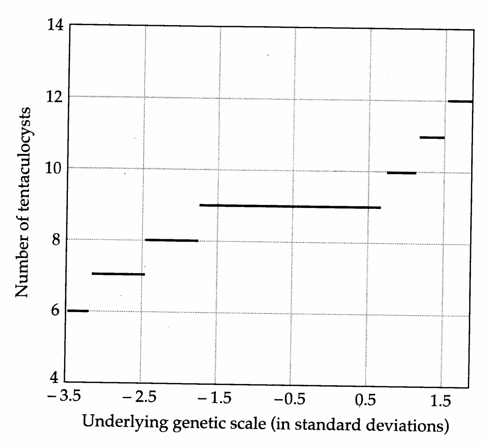
>
> Figure 11.8 Reconstruction of the development map for tentaculocyst number in the jellyfish Ephyra using probit analysis under the assumption that liability is normally distributed on some appropriate underlying scale. Strong canalization is seen, with a larger range of liability mapping to the nine-tentaculocyst character state relative to the range mapping to other character states. (Original data of Browne, from Wright 1968.)

> **Figure 11.9** · page 21 · source: `Genetics_chapter11`
>
> 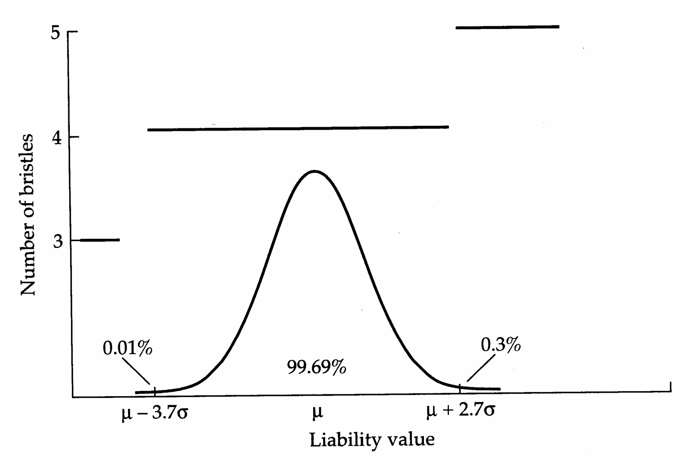
>
> Figure 11.9 Reconstructing a developmental map for Drosophila scutellar bristle number. The bulk of the population (99.69%) had four bristles, while 0.01% had three, and 0.3% had five. Assuming a normal distribution of liability on an appropriate underlying scale, the developmental map translating liability into character value (here bristle number) can be estimated via probit analysis. Individuals with a liability value less than 3.7 standard deviations below the mean have three bristles, while individuals whose liability exceeds 2.7 standard deviations above the mean have five bristles. Details are given in Example 5.

where the units of $ D_m $ are in terms of number of standard deviations of liability values (Figure 11.9). Since $ q(k) = 1 $ and $ q(0) = 0 $, the widths for the first and last classes are not defined, as $ \text{prb}[1] = -\text{prb}[0] = \infty $. Using standard results (Kendall and Stuart 1977, p. 254), the sampling variance for the estimator $ D_m $ is given by $$ \begin{aligned}\sigma^{2}(D_{m})&=\frac{1}{n}\left\{\frac{q(m-1)[1-q(m-1)]}{[p(x_{m})]^{2}}+\frac{q(m)[1-q(m)]}{[p(x_{m-1})]^{2}}\right.\\&\left.\quad-2\frac{q(m-1)[1-q(m)]}{p(x_{m})p(x_{m-1})}\right\}\end{aligned} $$ where $ p(x) = \exp(-x^2/2)/\sqrt{2\pi} $ is the unit normal density function.

Here $n=8149$, $x_{3}=\mathrm{prb}[0.00012]=-3.70$, and $x_{4}=\mathrm{prb}[0.99705]=+2.74$. Applying Equation 11.12a, the estimated width of the developmental map for class 4 is $$ D_{4}=x_{4}-x_{3}=2.74-(-3.70)=6.44 $$

Noting that $q(3)=0.00012$, $p(-3.70)=0.0004$, $q(4)=0.99705$, and $p(2.74)=0.0093$, Equation 11.12b gives the sample variance for $D_{4}$ as $$ \begin{aligned}\operatorname{Var}(D_{4})&=\frac{1}{8149}\left[\frac{0.00012\times0.99988}{0.0004^{2}}+\frac{0.99705\times0.00295}{0.0093^{2}}\right.\\&\quad\left.-2\frac{0.00012\times0.00295}{0.0004\times0.0093}\right]\\&=0.096\end{aligned} $$ yielding a standard error of $ \sqrt{0.096}=0.31 $ and an estimated width of liability values mapping to the four-bristle class as $ 6.44\sigma\pm0.31\sigma $. Sheldon et al. found considerable variation in the strength of canalization across isogenic lines. The mean $ D_{4} $ of all lines was 5.39, but ranged from $ 6.44\pm0.31 $ down to $ 3.34\pm0.10 $.

One reason for using probit analysis to define developmental maps is that untransformed frequencies can give a misleading picture of the strength of canalization. Consider two populations with identical developmental maps, and with normal distributions of liability values with the same variance but different means. For the first population, suppose that individuals with liability values within one standard deviation of the mean map to the four-bristle class, resulting in 68% of the population having four bristles. In the second population, individuals with liability values between one and three standard deviations above the mean map to the four-bristle class, resulting in only 15.7% of the population having four bristles. In both cases, the width of the four-bristle class is $ 2\sigma $, but on an untransformed scale, the first population appears to be more canalized for the four-bristle class.

While probit analysis allows for comparisons of the strength of canalization, interpreting these results is not always straightforward. An increase in the width of a canalized class can occur through the evolution of genotypes with wider developmental maps. However, increased class width can also occur by a reduction

> **Figure 11.10** · page 23 · source: `Genetics_chapter11`
>
> 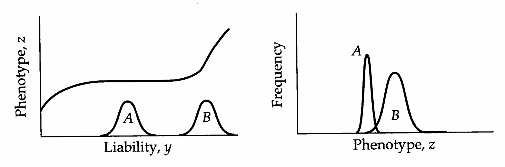
>
> Figure 11.10 When the developmental map is nonlinear, a simple change in the mean of the liability distribution (left) can result in complex changes in the character distribution (right). Here, populations A and B have different means, but otherwise identical liability distributions. Besides changing the character value, this simple increase in mean liability also results in an increase in character variance as liability is selected outside the zone of canalization.

of the variance of the distribution of liability values without any change in the developmental map on the absolute scale. Because class widths are estimated in terms of liability standard deviations, as the variance of liability decreases, the class width increases.

---

## Genetics_chapter11_015 · Introduction / Selection and Canalization

If the developmental map is highly nonlinear, a simple change in the mean of the underlying liability distribution can result in complex changes in the character distribution. For example, if a population has liability values distributed around a canalized region, as the population is selected away from this region, the character becomes much more variable (Figure 11.10). As shown in the figure, this increase in character variance can occur without any change in the variance of the underlying liability distribution.

Given genetic variation in canalization (due to genetic differences in developmental maps), the strength of canalization is itself a selectable character. For example, Waddington (1959) selected for increased canalization of facet number for bar-eyed mutants of Drosophila melanogaster. Families were split, with one group being reared at $ 18^{\circ} $C, the other at $ 25^{\circ} $C. Families showing the smallest difference in facet number between temperatures were selected to form the next generation. After only five generations of selection, Waddington observed a significant increase in the amount of canalization ([[SEE_TABLE:11.4]]).

An interesting example of natural selection for increased canalization is given by Clarke and McKenzie (1987) for Australian sheep blowflies (Lucilia cuprina). These flies are a major pest, and in 1955, the insecticide dieldrin was introduced in an attempt to control them. By 1957, most flies in Australia were resistant to dieldrin, and it was replaced by diazinon. Although resistance to diazinon

[[SEE_TABLE:11.5]]

Source: Waddington 1959.

Source: Clarke and McKenzie 1987.

Note: The SWT and M15 lines are susceptible to the insecticides diazinon and dieldrin; the other two lines are fixed for one of the resistance alleles (Rop-1 for diazinon, Rdl for dieldrin) and wild-type (susceptible) for the other. developed in 1976, it is still used. A single locus is responsible for resistance to each insecticide — Rop-1 for diazinon, Rdl for dieldrin. Clarke and McKenzie measured developmental stability for different lines using fluctuating asymmetry (Chapter 6) by comparing the absolute difference in the numbers of three bristle characters on the left versus right sides of flies. Rdl alleles cause a significant disruption of developmental canalization, as indicated by a much higher value of fluctuating asymmetry relative to the other strains, while Rop-1 alleles apparently do not ([[SEE_TABLE:11.5]]). However, after 12 generations of continuously backcrossing the Rop-1/Rop-1 strain to the susceptible line M15, while selecting for the retention of Rop-1, the amount of fluctuating asymmetry associated with Rop-1/Rop-1 genotypes increased to $ 5.09 \pm 0.08 $. Clarke and McKenzie interpret these results as implying that when the Rop-1 allele arose, it had deleterious pleiotropic effects on development. Strong selection retained the Rop-1 allele in the population, allowing selection for modifier loci that reduce Rop-1's pleiotropic effects on developmental stability. These modifiers are lost during the continual backcrossing to a strain lacking them, hence the increase in mean asymmetry. The lack of comparable modifiers for Rdl alleles may be due to the fact that dieldrin was used only for a limited period, insufficient time for the selection of modifiers.

This observation of a major gene disrupting the apparent canalization of a character is fairly common, as revealed in several artificial-selection experiments involving characters that are normally very highly canalized. For example, scutellar bristle number in Drosophila (which is highly canalized at four bristles in almost all Drosophila species) could be down-selected to two bristles using the character variance exposed when the mutant scute was introduced (Rendel 1965, 1977, 1979; Rendel and Sheldon 1960; Rendel et al. 1966; Fraser 1963, 1967, 1970). Likewise, vibrissae number (whiskers on the nose and fore limbs) in the house mouse, which is normally highly canalized at 19 was considerably down-selected using the variance exposed by the sex-linked gene Tabby (Dun and Fraser 1958, 1959; Fraser and Kindred 1960). Still another example is ocellar bristle number in Drosophila subobscura, normally highly canalized at 8, which responded to selection for decreased number when the mutation ocelliless was introduced (Sondhi 1961). Again, this change in mean was accompanied by an increase in the variance. In all of these systems, the increase in variance presumably results from the population being moved outside of a zone of canalization (e.g., Figure 11.10). This idea is supported by the fact that, for all three systems, back-selection to return the character values to the original mean value reduced the character variance. Thus, a return of the mean back to that seen in normal populations also returns the population to the zone of canalization.

Finally, we note that zones of canalization are themselves subject to selection. Changes in the developmental map can occur through changes in the variance of the underlying liability. More subtly, the form of the map itself can be modified by selection if the population displays genetic variation in developmental maps. Through patient directional selection, Scharloo and his associates (reviewed in Scharloo 1988) obtained populations of $ D.\ melanogaster $ with a mean of eight scutellar bristles per individual, which is double the normally canalized value of four. As in previous examples, this shift in the mean was accompanied by a substantial increase in genetic variance for the trait as the population moved out of the original zone of canalization. Artificial stabilizing selection around the new mean eventually doubled the width of the eight-bristle class on the underlying scale.

> **Table 11.4** · `11.4` · page ? · source: `Genetics_chapter11_015`
> Table 11.4 (body not recovered from raw layout)
>
> <table border=1 style='margin: auto; word-wrap: break-word;'><tr><td style='text-align: center; word-wrap: break-word;'>Class</td><td style='text-align: center; word-wrap: break-word;'>Observed</td><td style='text-align: center; word-wrap: break-word;'>Frequency</td><td style='text-align: center; word-wrap: break-word;'>Cumulative frequency</td><td style='text-align: center; word-wrap: break-word;'>$ prb[q(m)] $</td></tr><tr><td style='text-align: center; word-wrap: break-word;'>3</td><td style='text-align: center; word-wrap: break-word;'>1</td><td style='text-align: center; word-wrap: break-word;'>0.00012</td><td style='text-align: center; word-wrap: break-word;'>0.00012</td><td style='text-align: center; word-wrap: break-word;'>-3.70</td></tr><tr><td style='text-align: center; word-wrap: break-word;'>4</td><td style='text-align: center; word-wrap: break-word;'>8124</td><td style='text-align: center; word-wrap: break-word;'>0.99693</td><td style='text-align: center; word-wrap: break-word;'>0.99705</td><td style='text-align: center; word-wrap: break-word;'>2.74</td></tr><tr><td style='text-align: center; word-wrap: break-word;'>5</td><td style='text-align: center; word-wrap: break-word;'>24</td><td style='text-align: center; word-wrap: break-word;'>0.00295</td><td style='text-align: center; word-wrap: break-word;'>1.00000</td><td style='text-align: center; word-wrap: break-word;'>—</td></tr></table>

> **Table 11.5** · `11.5` · page ? · source: `Genetics_chapter11_015`
> Table 11.5 (body not recovered from raw layout)
>
> <table border=1 style='margin: auto; word-wrap: break-word;'><tr><td style='text-align: center; word-wrap: break-word;'>Line</td><td style='text-align: center; word-wrap: break-word;'>Reared at 18°C</td><td style='text-align: center; word-wrap: break-word;'>Reared at 25°C</td><td style='text-align: center; word-wrap: break-word;'>Difference</td></tr><tr><td style='text-align: center; word-wrap: break-word;'>Unselected</td><td style='text-align: center; word-wrap: break-word;'>156.3 $ \pm $ 4.8</td><td style='text-align: center; word-wrap: break-word;'>55.5 $ \pm $ 4.5</td><td style='text-align: center; word-wrap: break-word;'>100.8 $ \pm $ 4.5</td></tr><tr><td style='text-align: center; word-wrap: break-word;'>Selected A</td><td style='text-align: center; word-wrap: break-word;'>106.0 $ \pm $ 1.2</td><td style='text-align: center; word-wrap: break-word;'>96.5 $ \pm $ 1.7</td><td style='text-align: center; word-wrap: break-word;'>14.5 $ \pm $ 2.3</td></tr><tr><td style='text-align: center; word-wrap: break-word;'>Selected B</td><td style='text-align: center; word-wrap: break-word;'>100.7 $ \pm $ 1.4</td><td style='text-align: center; word-wrap: break-word;'>95.3 $ \pm $ 1.7</td><td style='text-align: center; word-wrap: break-word;'>5.5 $ \pm $ 2.0</td></tr><tr><td style='text-align: center; word-wrap: break-word;'>Selected C</td><td style='text-align: center; word-wrap: break-word;'>111.4 $ \pm $ 1.7</td><td style='text-align: center; word-wrap: break-word;'>99.5 $ \pm $ 2.7</td><td style='text-align: center; word-wrap: break-word;'>12.9 $ \pm $ 3.1</td></tr></table>
> <table border=1 style='margin: auto; word-wrap: break-word;'><tr><td style='text-align: center; word-wrap: break-word;'>Strain</td><td style='text-align: center; word-wrap: break-word;'>Mean Asymmetry</td></tr><tr><td style='text-align: center; word-wrap: break-word;'>SWT</td><td style='text-align: center; word-wrap: break-word;'>1.83 $ \pm $ 0.08</td></tr><tr><td style='text-align: center; word-wrap: break-word;'>M15</td><td style='text-align: center; word-wrap: break-word;'>1.81 $ \pm $ 0.07</td></tr><tr><td style='text-align: center; word-wrap: break-word;'>Rop-1/Rop-1</td><td style='text-align: center; word-wrap: break-word;'>1.92 $ \pm $ 0.07</td></tr><tr><td style='text-align: center; word-wrap: break-word;'>Rdl/Rdl</td><td style='text-align: center; word-wrap: break-word;'>3.23 $ \pm $ 0.08</td></tr></table>

---

## Genetics_chapter11_016 · Introduction / Genetic Assimilation

Another potential consequence of moving a population outside of a zone of canalization is genetic assimilation, wherein a character state that originally appears to be environmentally determined apparently becomes genetically determined following several generations of selection. This term was coined by Waddington (1953) to account for the behavior of crossveinless, a defect in the wing venation pattern of Drosophila melanogaster. In the lines studied by Waddington (1952, 1953), no crossveinless flies were found in base populations raised under normal temperatures. However, when temperature-shocked as pupae, some fraction of

> **Figure 11.11** · page 26 · source: `Genetics_chapter11`
>
> 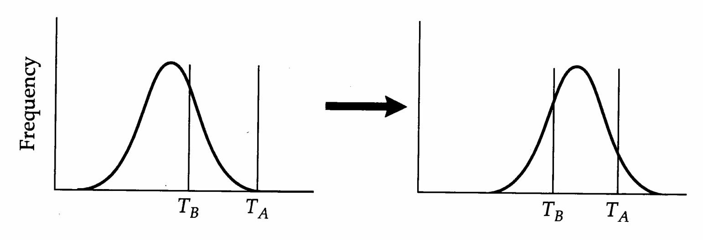
>
> Figure 11.11 A model for the genetic assimilation of the crossveinless character state. Suppose flies display the crossveinless phenotype when the value on some underlying liability scale exceeds some threshold value  $ T_{A} $. Left: The effect of the temperature shock is to reduce the threshold to  $ T_{B} < T_{A} $, exposing variation in liabilities that are otherwise masked. Right: Selection under temperature shock is effective in increasing liability values, eventually shifting the distribution far enough to the right such that crossveinless flies are seen at normal temperatures.

flies displayed the crossveinless (cvl) phenotype. These environmentally induced cvl flies were used to form the subsequent generation. Not only did the frequency of cvl flies induced by temperature shock increase, but cvl flies appeared in the untreated populations, reaching frequencies in excess of 95% after 18 generations of selection. Waddington had genetically “assimilated” the crossveinless character state from an apparently environmentally determined character in the base population.

Waddington (1949, 1953, 1957) suggested that changes in canalization could account for genetic assimilation, but was rather vague in terms of an explicit model. As Figure 11.11 shows, assimilation can follow as a simple consequence of moving a population outside of a zone of canalization. One environment exposes more of the underlying genetic variation in liability than another, making selection in that environment more effective.

---

## Genetics_chapter11_017 · Introduction / Polygenes and Polygenic Mutation

As discussed in Chapters 9 and 10, line-cross analysis and inbreeding experiments can provide a crude characterization of the genetic architecture of a character, yielding information on the nature of genetic interactions (dominance and epistasis) as well as some insight into the number of loci accounting for the difference in mean character value between lines. For a variety of reasons, more precise analysis of the individual loci underlying a character is often desirable. For example, from a population-genetics standpoint, we are interested in the distribution of allelic effects within and among loci. If genetic variation in a character is mainly due to a few genes with large allelic effects, the response to selection can be considerably different from that predicted from standard models of quantitative genetics that assume a large number of loci with small effects. From a developmental genetics standpoint, we are interested in how variation at particular loci translates into variation in complex characters.

An ultimate understanding of the mechanisms responsible for expressed variation in quantitative characters requires information at the molecular level. Are the genes (and alleles) underlying quantitative-trait variation the same as those with large and obvious qualitative effects that molecular biologists are attracted to? If so, does most of the expressed variation result from DNA sequence variation in coding regions or in nontranscribed regulatory regions? How much quantitative-trait variation is a consequence of variation in timing vs. magnitude of gene expression? To what extent are the genes underlying the expression of a quantitative trait present in redundant sets that can complement and/or replace each other?

These questions, still largely unanswered, represent a large and formidable gap in our understanding of the genetics of quantitative traits. However, with the advent of fine-scale molecular mapping techniques (Chapters 14–16), we are now poised for rapid advances in these areas. This chapter summarizes the current state of our knowledge of the nature of the loci underlying quantitative traits. We devote considerable attention to the rate at which mutation generates variation for quantitative traits, as this must ultimately dictate the potential rate of phenotypic evolution. Although the mutational mechanisms responsible for quantitative-trait variation remain largely unexplored, phenotypic data strongly support the idea that mutation is a powerful force at the level of polygenic traits.

---
