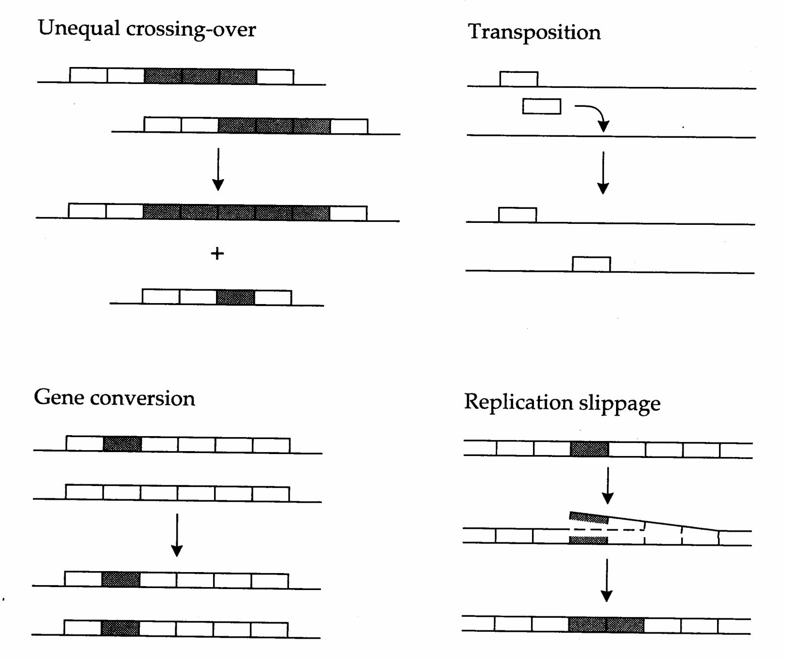
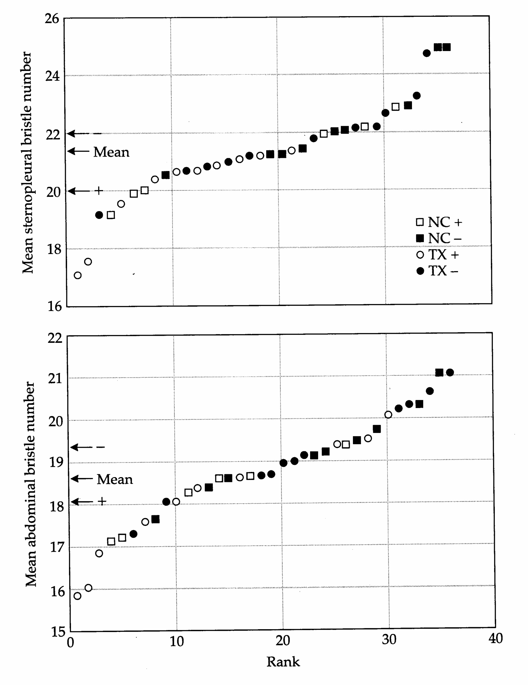
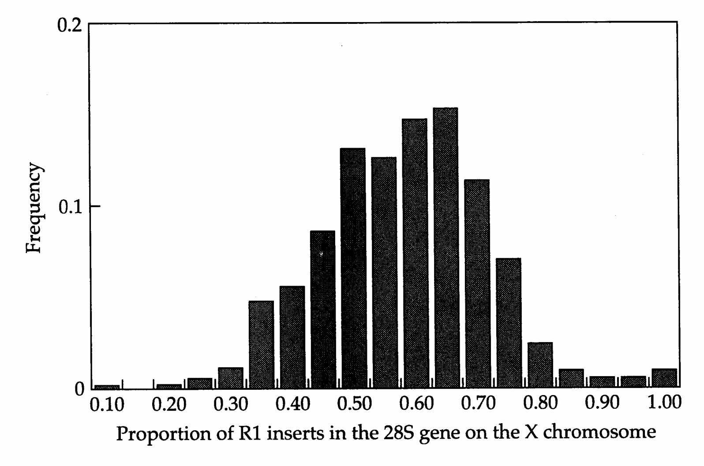
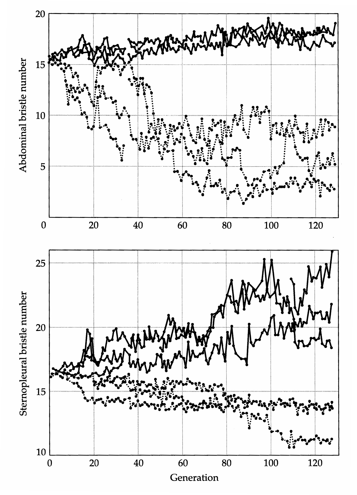
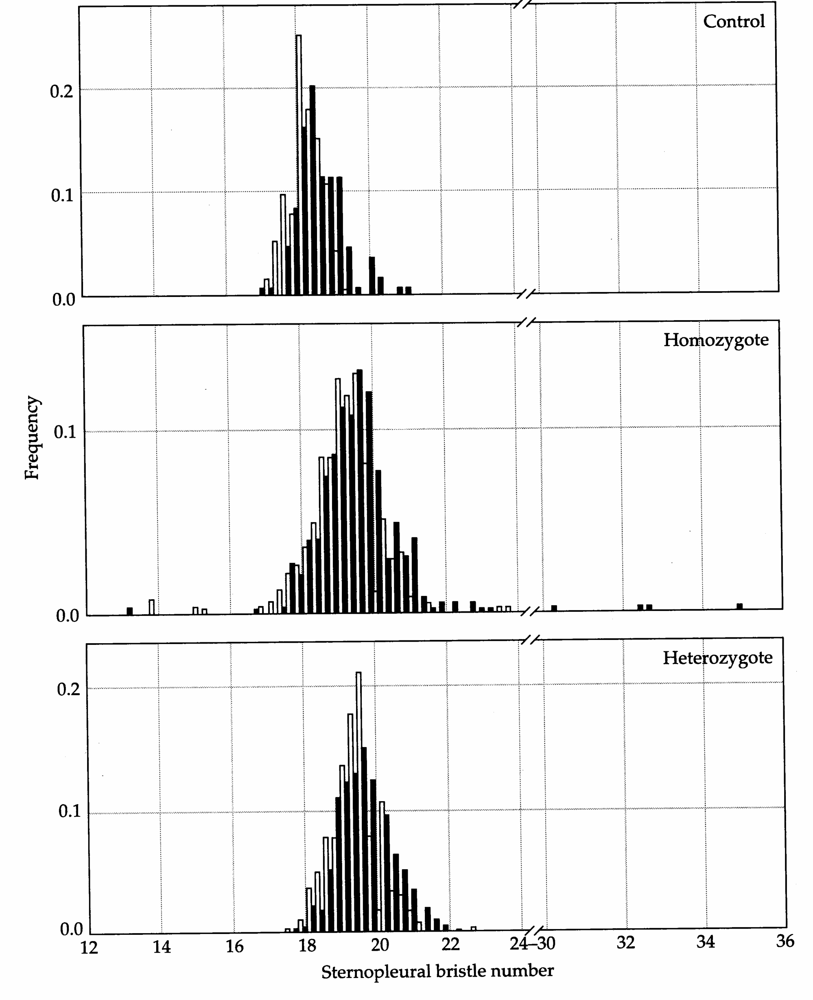
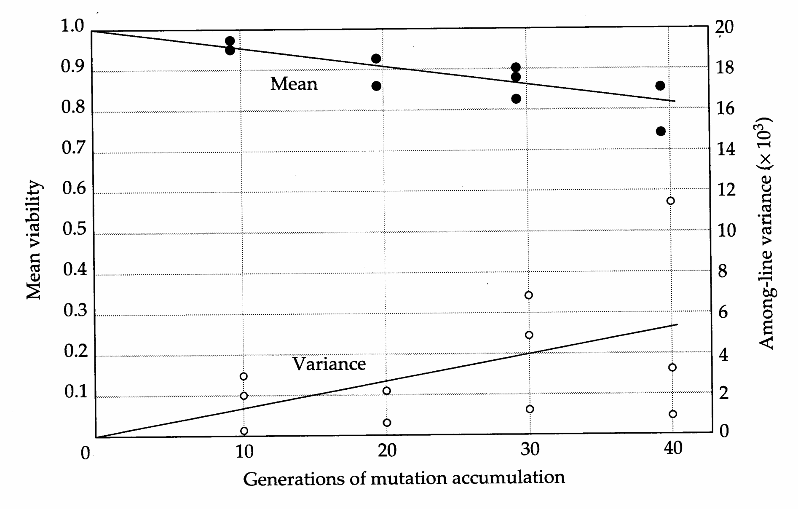
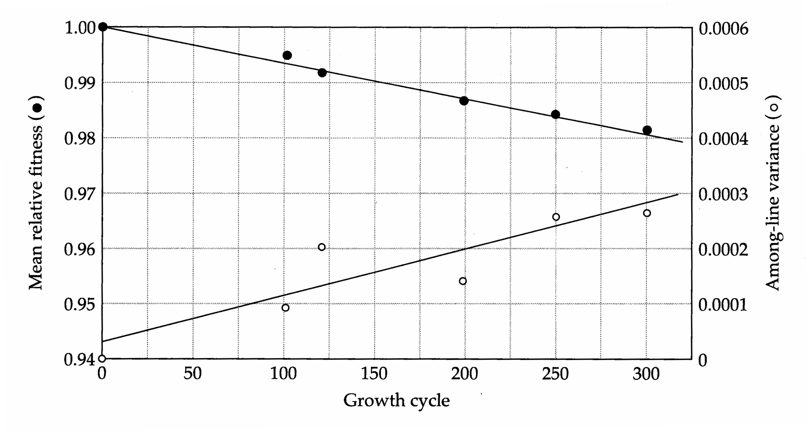

# Chapter 12 · Polygenes and Polygenic Mutation

## Genetics_chapter12_001 · Polygenes and Polygenic Mutation

As discussed in Chapters 9 and 10, line-cross analysis and inbreeding experiments can provide a crude characterization of the genetic architecture of a character, yielding information on the nature of genetic interactions (dominance and epistasis) as well as some insight into the number of loci accounting for the difference in mean character value between lines. For a variety of reasons, more precise analysis of the individual loci underlying a character is often desirable. For example, from a population-genetics standpoint, we are interested in the distribution of allelic effects within and among loci. If genetic variation in a character is mainly due to a few genes with large allelic effects, the response to selection can be considerably different from that predicted from standard models of quantitative genetics that assume a large number of loci with small effects. From a developmental genetics standpoint, we are interested in how variation at particular loci translates into variation in complex characters.

An ultimate understanding of the mechanisms responsible for expressed variation in quantitative characters requires information at the molecular level. Are the genes (and alleles) underlying quantitative-trait variation the same as those with large and obvious qualitative effects that molecular biologists are attracted to? If so, does most of the expressed variation result from DNA sequence variation in coding regions or in nontranscribed regulatory regions? How much quantitative-trait variation is a consequence of variation in timing vs. magnitude of gene expression? To what extent are the genes underlying the expression of a quantitative trait present in redundant sets that can complement and/or replace each other?

These questions, still largely unanswered, represent a large and formidable gap in our understanding of the genetics of quantitative traits. However, with the advent of fine-scale molecular mapping techniques (Chapters 14–16), we are now poised for rapid advances in these areas. This chapter summarizes the current state of our knowledge of the nature of the loci underlying quantitative traits. We devote considerable attention to the rate at which mutation generates variation for quantitative traits, as this must ultimately dictate the potential rate of phenotypic evolution. Although the mutational mechanisms responsible for quantitative-trait variation remain largely unexplored, phenotypic data strongly support the idea that mutation is a powerful force at the level of polygenic traits.

---

## Genetics_chapter12_002 · THE GENETIC BASIS OF QUANTITATIVE-GENETIC VARIATION

Problems with the actual molecular characterization of loci aside, precise analysis of the phenotypic effects of individual loci underlying quantitative traits has remained elusive for a purely statistical reason. As noted in Chapter 9, limitations introduced by linkage restrict analysis to effective factors (linked regions of the genome that may contain several loci influencing the trait), which can lead to biased estimates of the effects of individual loci. For example, if a factor contains linked loci at which alleles influencing character expression are in coupling phase (++ and --), the effects of individual loci will be overestimated, while if the alleles are in repulsion phase (+- and --), the effects will be underestimated. The larger the average size of an unrecombined region, the greater the opportunity for bias from lumping the effects of several loci.

Because of this empirical restriction of dealing with factors rather than individual loci, we need a reasonable term for a locus at which segregation contributes to the variance of a quantitative character. Mather (1941) suggested the term polygene for a gene of small effect underlying a character. However, for reasons to be discussed below, the distinction between major genes (sometimes referred to as oligogenes) and polygenes is by no means straightforward. A less ambiguous approach is to refer to a locus underlying a quantitative character as a QTL, for quantitative-trait locus, as suggested by Geldermann (1975).

---

## Genetics_chapter12_003 · THE GENETIC BASIS OF QUANTITATIVE-GENETIC VARIATION / Major Genes and Isoalleles

Is there a real distinction between genes of major and minor effects or are they just extremes on a continuous distribution? The presence of isoalleles at major loci provides some insight. Stern and Schaeffer (1943) coined this term to describe alleles whose effects are essentially indistinguishable except under certain environmental settings. They found that three allelic variants of the cubitus interruptus locus, which has a major influence on the wing venation pattern of Drosophila melanogaster, displayed the same wild-type phenotypes at 26°C, but exhibited different wing venation patterns at lower temperatures. Similarly, Muller (1935) and Green (1959) found a large number of isoalleles affecting eye color at the white locus of D. melanogaster. Since both of these loci were originally detected from alleles of major effect (major alleles), the subsequent discovery of isoalleles suggests the possibility of a continuum of allelic effects. Isoalleles have been found at a variety of other loci in a number of organisms, with alleles having a large effect on one character often showing a wide range of pleiotropic effects on the expression of other traits. Thus, alternate alleles at a locus can display a spectrum of effects, which depends on the genetic and environmental background (Coen et al. 1986, Romeo and McKusick 1994). The alleles present at a locus, not the locus itself, determine if that locus has a major effect on character variation.

Modifier loci provide a mechanism for “fine tuning” a major allele by altering its main and/or pleiotropic effects. As noted in Chapter 11, modifiers can sometimes magnify the expression of a major allele, thereby inflating the response to selection. They can also mask the effect of a major allele, producing a zone of canalization. In natural populations of Drosophila, extensive genetic variation has been found for loci that modify the effects of the alleles at the crossveinless (Milkman 1970), Beadex-3, notchoid, and scalloped loci (Thompson and Spivey 1984), all of which influence wing venation. Modifiers also appear to be involved in the evolution of mimicry in butterflies. Initially, a major allele causes wing patterning to crudely resemble a distasteful model species, and the pattern is subsequently refined by a number of modifier loci (Turner 1977, 1981). Modifiers can also alter the dominance relationships of major alleles, as demonstrated for the melanic form of the famous black-peppered moth Biston betularia (Ford 1975; other examples are discussed in Thompson and Thoday 1972).

Modifiers can have either general or specific effects. An example of the former is given by Thompson (1973, 1974), who found that modifiers selected to alter a specific wing vein in Drosophila had similar effects on the expression of major alleles at three different loci: cubitus interruptus, short vein, and veinlet. On the other hand, Fraser (1968) found that the expression of Drosophila bristle loci scute and extravert is influenced by different sets of modifiers. In this case, the modifiers appear to be more gene-specific than pathway-specific. Through artificial selection experiments, Weber (1992) was able to alter the relative sizes of two very small regions (less than 100 cells across) at the base of the Drosophila wing. If this result is general, the control of developmental detail may be modulated at extremely localized levels.

Whether loci exist at which all allelic variation results in only small phenotypic changes is still an open question. The very nature of this question and the bias towards isolating factors of fairly large effect make this question extremely difficult to answer.

---

## Genetics_chapter12_004 · THE GENETIC BASIS OF QUANTITATIVE-GENETIC VARIATION / The Molecular Nature of QTL Variation

While variation at “standard” loci (those that make a transcript) may account for most genetic variation, there are clear situations in which “nonstandard” genetic regions make significant contributions to the variance of a character. For example, Mather (1944) presented evidence that heterochromatic regions (containing highly condensed DNA, typically devoid of transcribable genes) can contribute to phenotypic variance. An extreme view, argued cogently by Cavalier-Smith (1978, 1985), is that genome size, independent of actual sequence composition, can influence certain aspects of the cellular phenotype (such as cell size and cell-division rate), which have cascading effects on the emergent properties of the phenotype. In plants, for example, there is compelling evidence that genome size variation within populations influences growth rate and morphology (Bachmann et al. 1985, Cullis 1985, Schneeberger and Cullis 1991). In this sense, variance in genome size translates into a continuum of allelic effects at a single, albeit ill-defined, super-locus, which may or may not be in disequilibrium with the effects of underlying “standard” loci. Diffuse effects like these are essentially impossible to map genetically.

Phenotypes are the end result of a multiplicity of genomic interactions. Structural variation refers to differences in actual gene products that result from differences in amino acid sequences of a protein or in nucleotide sequences of a functional RNA. Regulatory changes refer to allelic variation that alters the timing and/or expression of gene products. This distinction is not sharp, as changes in the structure of one gene product can influence the regulation of another. One immediate question is whether the majority of quantitative variation is due to structural or regulatory variation. Although this question is unresolved, it is generally felt (e.g., Wright 1968, Wilson 1976) that regulatory variation resulting in differences in the amounts and distributions of gene products contributes more than variation in the actual structure of gene products. This view is based, in part, on differences in the mutational “target size” for structural versus regulatory regions — the region that actually codes for the structural part of a gene is generally small relative to regions in which mutations can alter the regulation of that gene. As will be discussed shortly, mutational data in Drosophila are consistent with this view.

In fairly general terms, the current picture is that a large component of gene regulation involves control of transcription by a small number of short sequences surrounding the transcribed region. Control regions act in a modular fashion to evoke a specific regulatory program (e.g., Struhl 1987), and single nucleotide changes within them often result in radical (qualitative) changes in gene expression, sometimes creating major alleles. For example, in Drosophila, loss-of-function mutations in the ultrabithorax gene result in a duplication of the thorax, implicating regulatory properties of this gene in the development of segmental identity. Waddington (1957) found that bithorax phenocopies can be obtained in otherwise normal flies by exposing early embryos to ether, and that the tendency to express such a phenotype can be advanced by artificial selection. A dramatic example of genetic assimilation (Chapter 11), such evolutionary change appears to result from allele frequency change at the ultrabithorax locus itself (Gibson and Hogness 1996). This example provides clear evidence for the potential of segregating polymorphisms in a gene encoding for transcription factors to contribute to morphological variation.

Molecular biology has shattered our view of a rather quiescent genome, replacing it with a picture of a genome undergoing a large number of seemingly bizarre processes, including the insertion and excision of mobile gene sequences, changes in gene copy number by unequal crossing over, and gene conversion of large tracts of DNA (Figure 12.1). This emerging view of a dynamic genome blurs the distinction between mutation and recombination, supporting the idea that the mutational origin of quantitative-genetic variation may only rarely involve simple point mutations or short insertions/deletions (Mackay 1988, 1989; Frankham 1988).

> **Figure 12.1** · page 339 · source: `Genetics_chapter12`
>
> 
>
> Figure 12.1 Some of the molecular processes that influence genome structure. In unequal crossing-over, copy-number changes result from recombination between tandemly repeated sequences (usually on sister chromosomes) that are aligned out of register. Gene conversion, the nonreciprocal exchange of DNA between two sequences, can change the number of copies of a particular allele that an individual carries. Transposition occurs when a mobile genetic element inserts into a new site, usually (but not exclusively) while still retaining a copy in the original position. Replication slippage is a rough analog of unequal crossing-over, with the single stands of an individual DNA mispairing during replication.

In addition to producing loss-of-function alleles by direct insertion into a coding region, insertion of mobile genetic elements (transposons) near a gene can alter gene expression, since the elements themselves often contain regulatory sequences. In addition, when transposable elements excise, they frequently leave altered sequences in their wake. Considerable regulatory variation (resulting in a wide range of phenotypic effects) has been found in mutant alleles arising from such excision events, e.g., at the bronze-1 locus in maize (Schiefelbein et al. 1988), the pallida locus in snapdragons (Coen et al. 1986), the $ An1/An2 $ anthocyanin synthesis loci in petunias (Gerats et al. 1984), and the rudimentary and rosy loci in Drosophila (Daniels et al. 1985, Tsubota and Schedl 1986). More than 50% of all known mutations with phenotypic effects in Drosophila are associated with transposable element insertions (Finnegan 1992).

> **Figure 12.2** · page 340 · source: `Genetics_chapter12`
>
> 
>
> Figure 12.2 Association between chromosomes containing at least one insertional variant in the achaete-scute region and sternopleural (top) and abdominal (bottom) bristle numbers. Squares denote samples from a natural population at Raleigh, NC, and circles denote samples from Texas. Open symbols denote extracted chromosomes containing at least one insertional variant (+), while filled symbols denote chromosomes without insertions (−). The arrows denote the mean bristle number associated with + and − chromosomes and the mean for the entire sample. (From Mackay and Langley 1990.)

In an investigation of the importance of mobile-element insertions as contributors to quantitative variation in natural populations, Mackay and Langley (1990) asked whether abdominal and sternopleural bristle numbers in Drosophila are correlated with insertional variation in the achaete-scute region. Because this locus is known to be capable of mutating to major alleles for the presence / absence of sensory hairs, it is a reasonable candidate locus for variation in bristle numbers. The authors simply asked whether chromosomes with at least one insertion in the achaete-scute region were associated with altered bristle numbers. A strong association was found, with chromosomes bearing inserts having lower numbers of both types of bristles (Figure 12.2). Further analysis suggested that these insertions account for about 5% of the total genetic variation observed in natural populations for both bristle number characters. Variation involving insertions, deletions, and nucleotide substitutions within a 45 kb region surrounding a second neurogenic locus, scabrous, accounts for another 10% or so of the genetic variance (Lai et al. 1994). Thus, we again see that loci known to generate mutant alleles with major qualitative effects are also responsible for quantitative variation.

Natural populations of Drosophila mercatorum are known to be polymorphic for a complex syndrome known as abnormal abdomen, characterized by reduced age at maturity, reduced longevity, increased early-age fecundity, and retention of juvenile abdominal cuticle in the adult stage (Templeton and Rankin 1978). The syndrome is associated with the insertion of the R1 transposable element into the coding regions of the 28S ribosomal genes, which exist in a tandem array (multiple copies) on the X chromosome (DeSalle et al. 1986). The expression of abnormal abdomen requires that at least a third of the ribosomal gene copies contain the insert, and the inserted genes must not be underreplicated in the larval fat body (DeSalle and Templeton 1986, Templeton et al. 1989). A population survey indicated a broad distribution of insertion number variants, ranging from chromosomes with almost no insertions to those in which all genes had insertions (Figure 12.3). Moreover, there was an association between numbers of rDNA inserts and the allelic status at a locus determining underreplication, such that both of the components necessary for abnormal abdomen expression tended to cosegregate on the same chromosomes (Hollocher et al. 1992). Thus, the two tightly linked loci act as a multiallelic supergene to determine the expression of the abnormal abdomen syndrome. As in the preceding examples for bristle numbers, these results support the contention that a substantial fraction of the standing variation for morphological traits may be associated with a relatively small number of loci. This particular example may also be fairly generalizable — R1 elements interrupt the 28S rDNA coding region in a wide variety of insects (Jakubczak et al. 1991).

Since multigene families, such as the ribosomal gene families, are common features of all eukaryotic genomes, variation in copy number (in addition to copy type) may also contribute to quantitative variation. The clearest indication of this again comes from evidence on ribosomal genes, which typically exhibit copy number variation due to unequal crossing-over (Figure 12.1). Frankham and colleagues (reviewed in Frankham 1988) demonstrated that selection for reduced bristle number in Drosophila often leads to elevated frequencies of chromosomes

> **Figure 12.3** · page 342 · source: `Genetics_chapter12`
>
> 
>
> Figure 12.3 The frequency distribution for the fraction of 28S rDNA repeats on the X chromosome that contain an insertion of the mobile element R1 in a population of Drosophila mercatorum near Kamuela, Hawaii. 1036 X chromosomes were assayed. (From Hollocher et al. 1992.)

with reduced rDNA copy number. In addition, several studies with plant populations selected for grain yield have reported significant associations between rDNA copy number and morphological and life-history features (Saghai-Maroof et al. 1984, Rocheford et al. 1990, Powell et al. 1992). Remarkably, in flax (Linum grandiflorum), copy number variation in the rDNA, as well as in other regions of the genome, can be induced by a change in growing conditions. Such changes have substantial and heritable effects on plant morphology (Cullis 1981). These results, quite contrary to the general wisdom that genome expression, but not the genome itself, responds to environmental change, are unlikely to be unique to flax.

---

## Genetics_chapter12_005 · THE MUTATIONAL RATE OF PRODUCTION OF QUANTITATIVE VARIATION

Estimates of the rate of production of new quantitative variation by mutation are normally computed on a per character, rather than a per locus, basis. The measure generally sought is the amount of additive genetic variation produced by mutation per generation. This measure compounds three issues: the genic mutation rate, u; the number of loci underlying the character, n; and the mean squared effect of a mutant allele in the heterozygous state. Here, as in Chapter 4, we scale the genotypic values at a locus such that the ancestral homozygous state is 0, the heterozygous state is $ a(1 + k) $, and the homozygous mutant state is 2a. Noting that the frequency of newly arisen mutations at a locus in any generation $ (2u_i) $ is very small so that the change in the mean effect at the locus is negligible, then after summing over all loci, the mutational variance becomes

$$
\begin{aligned}\sigma_{m}^{2}&=2\sum_{i=1}^{n}u_{i}E[a_{i}^{2}(1+k_{i})^{2}]\\&=\sigma_{m0}^{2}+2\sigma_{m1}^{2}+\sigma_{m2}^{2}\end{aligned}
\tag{12.1a}
$$

where $ \sigma_{m0}^{2} = UE(a^{2}), \sigma_{m1}^{2} = UE(a^{2}k) $, and $ \sigma_{m2}^{2} = UE(a^{2}k^{2}) $, with $ U = 2 \sum_{i=1}^{n} u_{i} $ being the zygotic mutation rate for the character (i.e., the expected number of mutations influencing the trait that arise in a newborn each generation), and $ E(x) $ denoting the average value of x. For mutations with purely additive effects $ (k = 0) $, the mutational variance simplifies to

$$
\sigma_{m}^{2}=\sigma_{m0}^{2}=UE(a^{2})
\tag{12.1b}
$$

A cautionary note in the interpretation of Equation 12.1a is necessary. Strictly speaking, the mutational variance defined in this expression is nonsegregational mutational variance in that it describes the variance produced by a cohort of new mutations that exist entirely as heterozygotes, rather than at Hardy-Weinberg frequencies where the mutations appear in both heterozygotes and homozygotes. In the case of mutations with additive effects, this definition is not a problem because the variance produced by an allelic effect is independent of the genetic background and uninfluenced by segregation. With completely recessive (k = -1) mutations, however, Equation 12.1a defines the mutational variance to be zero, despite the fact that variation will be exposed once the mutant alleles have segregated into their homozygous states. For autosomal loci, Hardy-Weinberg frequencies are reached in one generation under monoecy and in two generations under dioecy.

A reasonable way to define the relevant measure of mutational variance for a segregating population is to consider the situation in which the only determinants of the dynamics of genetic variance are mutation and random genetic drift. Under this neutral model, considered in detail in Lynch and Hill (1986), populations with constant size eventually reach an equilibrium state at which point the input of new variation by mutation is balanced by the loss via random genetic drift. For populations of size one, maintained by self-fertilization and single-seed descent, the equilibrium genetic variance among the progeny is

$$
\sigma_{W}^{2}=\frac{3}{2}\sigma_{m0}^{2}+\left(\frac{8\sigma_{m1}^{2}+5\sigma_{m2}^{2}}{4}\right)
\tag{12.2a}
$$

With full-sib mating, the equilibrium variance is

$$
\sigma_{W}^{2}=4\sigma_{m0}^{2}+2\left(\frac{6\sigma_{m1}^{2}+5\sigma_{m2}^{2}}{3}\right)
\tag{12.2b}
$$

and with all larger population sizes (with effective size denoted by $ N_{e} $), it is very close to

$$
\sigma_{W}^{2}=2N_{e}\left(\sigma_{m0}^{2}+\frac{2}{3}(\sigma_{m1}^{2}+\sigma_{m2}^{2})\right)
\tag{12.2c}
$$

In this latter case, all of the genetic variance is additive, except for $ 2N_e\sigma_{m2}^2/3 $, which defines the dominance component of variance (Lynch and Hill 1986). Note that for recessive mutations $ (k < 0) $, which are likely to be the rule (Chapters 4 and 10), $ \sigma_{m1}^2 $ is negative while $ \sigma_{m2}^2 $ is positive, so the contributions from these terms partially cancel (completely canceling in the case of fully recessive mutations). Moreover, the absolute values of both terms are necessarily less than that of $ \sigma_{m0}^2 $. Thus, although not exact in all cases, we may expect the equilibrium level of genetic variance in the absence of selection to be close to $ 2N_e\sigma_{m0}^2 $ in most cases. This result justifies the reliance on $ \sigma_{m0}^2 $ as a measure of mutational variance, a useful relationship since, as we will soon see, $ \sigma_{m0}^2 $ is much easier to estimate than either $ \sigma_{m1}^2 $ or $ \sigma_{m2}^2 $.

Estimates of the mutational variance are often scaled by the environmental variance to give the mutational heritability,

$$
h_{m}^{2}=\frac{\sigma_{m0}^{2}}{\sigma_{E}^{2}}
\tag{12.3}
$$

a dimensionless measure suitable for comparing different characters. When mutations have additive effects, $ h_{m}^{2} $ approximates the heritability of an initially homozygous population following one generation of mutation. (The fact that the denominator in $ h_{m}^{2} $ is the environmental, rather than the total, variance is not problematical because, as will be shown below, $ \sigma_{m0}^{2} << \sigma_{E}^{2} $).

---

## Genetics_chapter12_006 · THE MUTATIONAL RATE OF PRODUCTION OF QUANTITATIVE VARIATION / Estimation from Divergence Experiments

Estimation of the mutational variance is straightforward, but labor intensive. The simplest approach is a divergence experiment. Replicate lines, extracted from the same ancestral population, are maintained at a small enough size so that the fate of essentially all newly arisen mutations will be determined by random genetic drift. In the cases of selfed lines maintained by single-seed descent and of full-sib mated lines, all but extremely deleterious alleles will be impervious to selection, so that any census of mutational effects will yield nearly unbiased results. Over time, the mean phenotypes of the replicate lines are expected to drift apart as they randomly accumulate unique mutations. If the mutations have directional effects, a shift in the grand mean phenotype (averaged over all lines) is also expected to occur.

Provided that, prior to expansion, the base population is kept at the same size as the derived lines for a long enough period to be in mutation-drift equilibrium, the expected increment in the among-line component of variance per generation is equal to $ 2\sigma_{m0}^{2} $ (Bailey 1959, Lande 1976, Chakraborty and Nei 1982, Lynch and

Hill 1986). The simplest way to obtain this result is to note from the neutral theory (Kimura 1983) that the expected number of mutational substitutions per locus differentiating two populations separated for $t$ generations is $2u_i t$. (Letting $N$ denote the population size, then each generation in each population, an expected $2Nu_i$ new mutations arise. Each of these has an ultimate probability of fixation equal to the initial frequency, $1/(2N)$, so that at equilibrium, the expected number of fixations in a pair of populations each generation is $2 \times 2Nu_i \times 1/(2N) = 2u_i$ at the $i$th locus.) Upon fixation, each mutation causes an expected increment in the among-population variance of $E[(2a - 0)^2]/2 = 2E(a^2)$. Thus, summing over all loci, the expected among-line variance after $t$ generations of divergence is

$$
\sigma_{B}^{2}(t)=2\sum_{i=1}^{n}(2u_{i}t)\cdot E(a^{2})=2\sigma_{m0}^{2}t
\tag{12.4a}
$$

This is a fairly robust result in that it does not depend on the population size, on the degree of dominance of new mutations, or on the linkage relationships among loci (Lynch and Hill 1986). Dominance has no influence on the rate of divergence because it has a transient effect; once a mutant allele goes to fixation, a permanent shift in the mean phenotype to $ 2a_{i} $ occurs at the locus, regardless of $ k_{i} $. In principle, the asymptotic rate of divergence might accelerate (or decelerate) when mutations have general epistatic effects (Tachida and Cockerham 1990), but the time scale over which such complications would arise is likely to be quite long (dozens to hundreds of generations), and the details of such a model have not yet been worked out.

To summarize, a conceptually simple way to estimate the mutational variance is to perform a long-term divergence experiment with replicate lines kept at small population sizes, extracting the among-line component of variance ( $ \sigma_{B}^{2} $) by analysis of variance. Division of the latter by twice the number of generations of divergence (2t) provides an estimate of $ \sigma_{m0}^{2} $. These results apply strictly to diploid sexual populations, but only slight modifications are required for other forms of reproduction. For example, for haploid populations (sexual or asexual), the preceding expression becomes

$$
\sigma_{B}^{2}(t)=\sigma_{m0}^{2}t/2
\tag{12.4b}
$$

whereas for diploid asexuals,

$$
\sigma_{B}^{2}(t)=\sigma_{m}^{2}t
\tag{12.4c}
$$

where $ \sigma_{m}^{2} $ is defined as in Equation 12.1a (Lynch 1994). Terms involving dominance arise in the case of diploid asexuals because, in the absence of segregation, mutations are kept permanently in the heterozygous state with effects $ a(1+k) $.

There are several potential sources of error in the estimation of the muta-tional variance with a divergence experiment. A common misconception is that estimates of the mutational variance will be upwardly biased by the segregation of genetic variance in the base population if the latter is not 100% homozygous. On the contrary, the expected increase in among-line variance of $ 2\sigma_{m0}^{2} $ per generation strictly applies to situations in which the base population has been kept at the same size as the descendent lines for about $ 6N_{e} $ or so generations prior to the initiation of a divergence experiment (Lynch and Hill 1986). If the base population is totally homozygous, the rate of divergence will be less than $ 2\sigma_{m0}^{2} $ during the early generations of the experiment due to the lack of segregating polymorphisms. If the base population contains excess heterozygosity relative to the equilibrium expectations within the descendent lines, the divergence rate will exceed $ 2\sigma_{m0}^{2} $ in the early generations of the experiment. Eventually, under the neutral model, all lines will asymptotically diverge at the rate $ 2\sigma_{m0}^{2} $ regardless of the status of the base population.

A second potentially serious issue in the analysis of a divergence experiment concerns the possibility that environmental effects artificially inflate the among-line component of variance. To guard against such inflation, a set of control lines should be assayed in parallel with the mutation-accumulation lines whenever possible. The control lines should be genetically identical (and maintained in an evolutionarily inert state by, for example, freezing or seed storage) so that any variance among them can only be attributable to environmental causes. Any variance among control lines can then be subtracted from that observed among the mutation-accumulation lines. Maternal effects can be a significant source of inflation of the among-line variance when all of the progeny assayed within a subline are derived from a single mother. Such problems can be eliminated by deriving all assay individuals from different mothers, as this ensures that any variance associated with maternal effects will contribute to the within-line component of variance (Lynch 1985).

Third, contamination events can be a major problem in mutation-accumulation experiments, either deflating estimates of $ \sigma_{m0}^{2} $ when gene flow accidentally occurs among lines, or inflating it if foreign genotypes immigrate into the experiment. Periodic screening of lines for the genomic distribution of mobile elements or for other informative molecular markers, such as highly mutable microsatellite loci, can provide an excellent control against contamination (Mackay et al. 1992a, Keightley and Hill 1992).

Finally, we note that an alternative approach to estimating the mutational variance involves the application of artificial selection to an initially homozygous base population. Recall from Chapter 3 that the single-generation response to selection is equal to $ R = h^2 S $, where $ S $ is the selection differential imposed by the investigator. The idea behind the selection approach to estimating mutational variance is that the standing heritability in a population can be estimated from the ratio of selection response to selection differential, $ \widehat{h}^2 = R/S $. As in the case of the neutral model, expressions can be derived for the expected equilibrium heritability of a quantitative trait under truncation selection as a function of the population size and the mutational variance (Hill 1982b,c). Thus, by equating observed and expected heritabilities, an estimate of $ \sigma_{m0}^{2} $ can be obtained.

---

## Genetics_chapter12_007 · THE MUTATIONAL RATE OF PRODUCTION OF QUANTITATIVE VARIATION / Bristle Numbers in Drosophila

The vast majority of our knowledge of the properties of polygenic mutation derives from studies on one set of characters in one species — abdominal and sternopleural bristle numbers in Drosophila melanogaster (Figure 14.1). Averaging over the results from numerous studies (reviewed in Lynch 1988b, Keightley et al. 1993, Houle et al. 1996), the mutational heritabilities for these traits appear to be on the order of 0.0035 and 0.0043, respectively. The effects of individual bristle-number mutations tend to be nonadditive, with mutations with large effects being nearly recessive, and those with small effects being nearly additive on average but with variable levels of dominance (Mackay et al. 1992a, Caballero and Keightley 1994, Fry et al. 1995). These results are particularly notable since quantitative-genetic analyses of Drosophila bristle numbers have frequently led to the suggestion that these traits have a purely additive genetic basis (Chapter 7). The discrepancy can be reconciled if most mutations for bristle number are deleterious and hence kept at low frequency in natural populations by selection. Because the dominance component of genetic variance is a function of the squared heterozygosity, the vast majority of the genetic variance is additive when recessive alleles are kept at low frequency (Equation 4.12b).

Genetic analyses do indeed imply that most bristle-number mutations with large effects have substantial negative pleiotropic effects on fitness, some being recessive lethals (Mackay et al. 1992a, 1994; Fry et al. 1995). Evidence for the general negative fitness consequences of such mutations comes from long-term divergence experiments involving initially homozygous lines kept subsequently at average population sizes of approximately 10 individuals (Mackay et al. 1992b). In the absence of any artificial selection, for the first 100 generations or so of isolation, the lines diverged via random genetic drift, but then the rate of divergence declined dramatically (Mackay et al. 1995), presumably because of the deleterious fitness consequences of mutant bristle-number alleles with extreme effects.

Long-term selection experiments, again starting with homozygous lines, provide further evidence for the negative pleiotropic effects of bristle-number mutations on fitness. Such experiments often culminate in dramatic divergence between high- and low-selected lines (Clayton and Robertson 1955, 1964; Caballero et al. 1991; Santiago et al. 1992; López and López-Fanjul 1993). For example, after only 125 generations of selection, differences of 12 abdominal bristles and 8 sternopleural bristles (equivalent to 7 to 8 phenotypic standard deviations) have been observed (Figure 12.4). As in the case of the drift

> **Figure 12.4** · page 348 · source: `Genetics_chapter12`
>
> 
>
> Figure 12.4 Responses to 125 generations of selection for bristle numbers in Drosophila melanogaster. For each character, results are given for three upwardly selected and three downwardly selected lines. Up to generation 63, the 10 extreme males and 10 extreme females were selected from a total of 40 measured individuals of each sex; thereafter, 10 pairs were selected from 20 measured individuals of each sex. (From Mackay et al. 1994.)

experiments, substantial reductions in fitness are associated with such selective changes (Mackay et al. 1994, Nuzhdin et al. 1995). Line-cross analysis (Chapter

9) reveals that the selection response typically involves multiple mutations on all chromosomes (Fry et al. 1995). Responses to artificial selection on bristle number, which must reflect the distributions of mutational effects (as well as their pleiotropic effects on fitness) to a large degree, are almost always asymmetrical — a downward skew in the case of abdominal bristle number, and an upward skew in the case of sternopleural bristle number (Figure 12.4).

An attractive feature of D. melanogaster as a model system for studying aspects of polygenic mutation is its amenability to transposon tagging. Through the use of appropriate stocks (H. Robertson et al. 1988), it is possible to mobilize the transposable element P and then to subsequently stabilize it. Hybridization of radiolabeled P-element DNA to chromosomal squashes can then be used to ascertain the approximate locations of insertional events. Lyman et al. (1996) used this approach to study the effects of single P-element insertions on the expression of bristle-number characters. By assaying multiple singly mutated chromosomes on an otherwise constant genetic background, they found that the distributions of mutational effects were symmetrical but highly leptokurtic, with a few inserts having very large effects and the average effect being approximately equal to zero (Figure 12.5). On average, the mutational effects were partially recessive — $ \bar{k} = -0.37 $ for abdominal bristles and $ \bar{k} = -0.65 $ for sternopleural bristles. There was a weak correlation between viability and the absolute magnitude of effect of a bristle-number mutation, with the viability effects being highly recessive ( $ \bar{k} = -1.00 $).

The results of Lyman et al. (1996) imply that the mean-squared homozygous effects of individual P-element insertion events relative to the environmental variance, $ E[(2a)^{2}]/\sigma_{E}^{2} $, are approximately 0.28 for abdominal bristles and 0.82 for sternopleural bristles. Recalling the values for the mutational heritability, $ h_{m}^{2} = UE(a^{2})/\sigma_{E}^{2} $, noted above, these single-mutation estimates imply genomic mutation rates of approximately 0.05 and 0.02 per zygote per generation, respectively. This extrapolation assumes that P-element induced mutations have effects that are comparable to the average effects of mutations from all sources. Since many of the mutant chromosomes examined by Lyman et al. (1996) were likely to have had inserts at loci that have little, if any, influence on bristles, their estimates of $ E[(2a)^{2}]/\sigma_{E}^{2} $ are almost certainly too low. This suggests that zygotic mutation rates for bristle numbers may be as large as 0.1 or so.

---

## Genetics_chapter12_008 · THE MUTATIONAL RATE OF PRODUCTION OF QUANTITATIVE VARIATION / Additional Data

Table 12.1 summarizes estimates of the mutational heritabilities for a number of organisms and a variety of characters. In invertebrates, nearly all of the estimates are in the range of $ 10^{-3} $ to $ 10^{-2} $, whereas estimates for the mouse are somewhat higher, ranging up to 0.025. On average, the estimates for plants are similar to those for invertebrates, with a slightly broader range perhaps due to sampling error. In highly mutagenic situations, as when transposable elements are mobilized

> **Figure 12.5** · page 350 · source: `Genetics_chapter12`
>
> 
>
> Figure 12.5 The distributions of sternopleural bristle numbers for control, homozygous P-element insert lines, and heterozygous P-element insert lines, in Drosophila melanogaster. Each insert line carries a single P-element insertion, as revealed by cytogenetic analysis. The open bars denote second chromosome line means, while the closed bars denote the results for chromosome three. All chromosomes were evaluated on a constant genetic background. (From Lyman et al. 1996.)

following hybrid dysgenesis in Drosophila, mutational heritabilities can be as high as 0.1 (Mackay 1985b, 1987, 1988). Within Drosophila, all estimates of $ h_{m}^{2} $ are within the range of 0.001 to 0.005, except that for viability, which is certainly downwardly biased because chromosomes with highly deleterious mutations were excluded from the analyses.

Using the P-element tagging approach, Clark et al. (1995a) obtained scaled single mutational effects, $ E[(2a)^{2}]/\sigma_{E}^{2} $, equal to $ 0.064 \pm 0.005 $ for body weight and $ 0.062 \pm 0.018 $ for the activities of 15 enzymes. Comparing these values with the mutational heritabilities in Table 12.1, we obtain minimum zygotic mutation rates of 0.29 for body weight and 0.14 for activities of individual enzymes, several times higher than those noted above for bristle numbers. Such high mutation rates cannot be attributable to mutations at the actual enzyme loci, which are expected to occur at the rate of $ 10^{-6} $ to $ 10^{-5} $ per gene per generation (Mukai and Cockerham 1977). Thus, most of the mutations must arise in regions of the genome involved in the regulation of enzyme activity, implying that such regions must be rather numerous. As in the case of bristle numbers, the distributions of mutational effects in the study of Clark et al. were quite symmetrical, although highly leptokurtic, with mutations being equally likely to cause an increase or a decrease in the character. Most of the enzyme-activity mutations had pleiotropic effects on multiple traits.

It should be kept in mind that all of the above estimates of the mutational heritability may substantially overestimate the input of genetic variation available to natural selection. If most spontaneous mutations have negative pleiotropic effects on fitness, as suggested by the Drosophila bristle-number data, much of the recurrent mutational input of variation may simply represent a price that organisms pay for the privilege of producing rare adaptive mutations.

While the estimation of composite measures of mutation such as $ \sigma_{m0}^{2} $ is non-trivial, direct estimation of the actual mutation rate for quantitative characters $ (U = 2 \sum \mu_{i}) $ is even more difficult. The indirect extrapolations that we presented above for P-element tagging experiments suggest that U for individual traits may often be on the order of 0.1 or higher. The few direct estimates suggest the same. For example, Grewal (1962) examined 27 skeletal traits in inbred strains of lab mice and found that 21 detectable mutations had accumulated in the roughly 72 total generations since the strains were separated (summing the number of generations over all branches). This gives a rate of approximately $ 2 \times [(21/27)/72] = 0.022 $ per character per generation per zygote. In a more extensive study using the same traits, Hoi-Sen (1972) obtained essentially the same answer. Studies examining a number of reproductive characters in maize using doubled-haploids (Sprague et al. 1960) and inbred lines (Russell et al. 1963) yield estimates of 0.090 and 0.056 mutations per character per zygote. These estimates of per character mutation rates are certainly too low, perhaps substantially so, since mutations of insufficiently large effect were statistically undetectable and hence not counted.

**[Table]**

*[See Table 12.1 at the end of this section.]*

If estimates of U in the neighborhood of 0.1 are indeed correct, then typical quantitative traits must be influenced by a large number of loci and/or have very high per locus mutation rates. If the typical reported estimates of genic mutation rates, usually on the order of $ 10^{-5} $ to $ 10^{-6} $ (Griffiths et al. 1996), are correct, then 5,000 to 50,000 loci are required to account for a per character mutation rate of 0.1. While one might imagine that thousands of loci can affect a character like viability or fitness, such a high number seems unlikely for most other characters, although there is little evidence to support or refute this conjecture. This apparent discrep- ancy has been discussed by a number of workers (Grewal 1962, Russell et al. 1963, Hoi-Sen 1972, Grüneberg 1970, Beardmore 1970, Turelli 1984). In principle, the high reported estimates of U may be inflated by experimental artifacts, such as the presence of residual heterozygosity in the base population, but evidence on this issue is also lacking.

An alternative explanation for the unexpectedly high estimates of U is that the mutation rate to alleles of small effects is much higher than the rate to alleles of large effect (on which most of the data on genic mutation rates are based). We have already reviewed evidence that support this idea for Drosophila bristle number and enzyme activities, and it is bolstered by additional data. In a descriptive analysis of highly inbred peanut populations, Gregory (1965a,b) found that deviations of small effect are much more frequent than those of larger effect, although his approach was not statistically rigorous. Mukai (1964) found that the mutation rate over the entire second chromosome of D. melanogaster is 20 times higher for mutations with minor viability effects (0.15) than for recessive lethals (0.006). Kibota (1996) found that the vast majority of spontaneous mutations for fitness in E. coli have very small effects, on the order of a 1% decline in fitness per generation, although mutations with larger effects do occur.

Finally, we note that the per character mutation rates cited above are not out of line with what we know about the rates of various types of genic mutation if most characters are functions of gene expression at large numbers of loci (Crow 1992, 1993b; Kondrashov 1995). In Drosophila, for example, a survey of 18 transposable element families suggests that the total number of transpositions per zygote is on the order of 0.8 per generation (Nuzhdin and Mackay 1995, Lyman et al. 1996). In addition, the rate of nucleotide substitutional mutation in Drosophila has been estimated to be about $ 1.6 \times 10^{-8} $ per site per year (Sharp and Li 1989). Assuming flies go through approximately five generations each year, and noting that the Drosophila genome contains approximately $ 4 \times 10^{8} $ bases, these results imply that the average number of nucleotide substitutional mutations per genome is at least 1.3 per generation. Summing these two types of mutation rates and noting that we have ignored other types of mutations (e.g., single nucleotide insertions/deletions, unequal crossing-over, and so on), it is clear that the total genomic mutation rate in Drosophila must be at least 2.0 per generation.

Although quantitative estimates of the transposition rate in humans are lacking, the rate of nucleotide substitutional mutation appears to be close to $ 2.5 \times 10^{-9} $ per site per year (Li and Graur 1991, Easteal and Collet 1994, Ohta 1995). Assuming a diploid genome size of $ 6 \times 10^{9} $ nucleotides and a generation time of 20 years, this implies a nucleotide substitution rate on the order of 300 per individual per generation. Similarly, using the estimated nucleotide substitution rate of $ 6 \times 10^{-9} $ for plants (Wolfe et al. 1987) and the known genome sizes for Arabidopsis and maize, it can be shown that the genomic mutation rate for single-site substitutions alone is on the order of 1 to 40 per generation. Thus, there is little question that mutagenic activities operating at the genome level are sufficient to generate high rates of mutation for multilocus traits.

> **Table 12.1** · `12.1` · page 352 · source: `Genetics_chapter12_008`
> Table 12.1 Estimates of the mutational heritability for a variety of organisms and characters.
>
> <table><tr><td>Species</td><td>Character</td><td>$ h_{m}^{2} $</td><td>Reference</td></tr><tr><td rowspan="11">Drosophila melanogaster</td><td>Abdominal bristle number</td><td>0.0035</td><td>See text</td></tr><tr><td>Sternopleural bristle number</td><td>0.0043</td><td>See text</td></tr><tr><td rowspan="2">Enzyme activities</td><td rowspan="2">0.0022</td><td>Clark et al. 1995b</td></tr><tr><td>Harada 1995</td></tr><tr><td>Ethanol resistance</td><td>0.0009</td><td>Weber and Diggins 1990</td></tr><tr><td>Body weight</td><td>0.0047</td><td>Clark et al. 1995b</td></tr><tr><td>Wing dimensions</td><td>0.0020</td><td>Santiago et al. 1992</td></tr><tr><td rowspan="4">Viability</td><td rowspan="4">0.0003</td><td>Mukai 1964</td></tr><tr><td>Mukai et al. 1972</td></tr><tr><td>Cardellino and Mukai 1975</td></tr><tr><td>Ohnishi 1977</td></tr><tr><td>Tribolium castaneum</td><td>Pupal weight</td><td>0.0091</td><td>Goodwill and Enfield 1971</td></tr><tr><td>Daphnia pulex</td><td>Life-history traits</td><td>0.0017</td><td>Lynch 1985</td></tr><tr><td rowspan="6">Mouse</td><td>Lengths of limb bones</td><td>0.0234</td><td>Bailey 1959</td></tr><tr><td>Mandible measures</td><td>0.0231</td><td>Festing 1973</td></tr><tr><td rowspan="3">Skull measures</td><td rowspan="3">0.0052</td><td>Carpenter et al. 1957</td></tr><tr><td>Deol et al. 1957</td></tr><tr><td>Hoi-Sen 1972</td></tr><tr><td>6-week weight</td><td>0.0034</td><td>Caballero et al. 1995</td></tr><tr><td>Arabidopsis thaliana</td><td>Life-history traits</td><td>0.0039</td><td>Schultz et al. (in prep.)</td></tr><tr><td rowspan="2">Maize</td><td>Plant size</td><td>0.0112</td><td>Russell et al. 1963</td></tr><tr><td>Reproductive traits</td><td>0.0073</td><td>Russell et al. 1963</td></tr><tr><td rowspan="2">Rice</td><td>Plant size</td><td>0.0030</td><td>Oka et al. 1958</td></tr><tr><td>Reproductive traits</td><td>0.0028</td><td>Sakai and Suzuki 1964</td></tr><tr><td>Barley</td><td>Life-history traits</td><td>0.0002</td><td>Cox et al. 1987</td></tr></table>
>
> Note: Where possible the results represent averages over multiple studies, ranging from analyses of drift among initially homozygous lines to artificial selection experiments. Detailed analyses of experiments performed prior to 1985 can be found in Lynch (1988b), and a more recent survey is contained in Houle et al. (1996).

---

## Genetics_chapter12_009 · THE DELETERIOUS EFFECTS OF NEW MUTATIONS

Evolutionary biologists are especially interested in the rate of mutation for fitness and its underlying components such as viability. As first noted by Haldane (1937), large outcrossing populations of diploids will evolve towards a situation where the recurrent input of deleterious mutations is balanced by their selective elimination. In large populations, at mutation-selection balance, the frequencies of deleterious alleles equilibrate to levels such that the reduction in fitness is solely a function of the mutation rate and independent of the effects of the mutations (Chapter 10). The cumulative fitness consequences of a mutation are independent of the mutational effect because the equilibrium frequency of a deleterious allele is inversely proportional to its effect in heterozygotes. Thus, for an understanding of the population-level consequences of deleterious mutation, the genomic mutation rate is of central importance.

Characterization of the properties of deleterious mutations is also important for other issues in evolutionary biology and conservation genetics. In small populations, mildly deleterious mutations do not simply attain equilibrium levels of heterozygosity. Rather, mildly deleterious mutant alleles have an appreciable chance of randomly drifting to fixation. The accumulation of such mutations can eventually imperil a population, driving it to extinction when the mutation load exceeds the point at which individuals can replace themselves (Lynch et al. 1993, 1995a,b; Lande 1994). It is also well known that pressure from recurrent deleterious mutations can foster the evolution of alternative modes of reproduction (Pamilo et al. 1987; Kondrashov 1988; D. Charlesworth et al. 1992, 1993), with out-crossing populations being much more efficient at eradicating deleterious genes than asexual or obligately selfing populations. The risk of extinction via deleterious mutation accumulation depends not just on the genomic deleterious mutation rate, but also on the distribution of mutational effects. Mutations with selection coefficients on the order of $ 1/(2N) $, where N is the population size, are of particular concern because such mutations are highly vulnerable to the vagaries of random genetic drift while still having significant effects on fitness (Lynch and Gabriel 1990, Gabriel et al. 1993, Lande 1994).

To obtain a more than qualitative understanding of these issues, estimates of the genomic deleterious mutation rate, the selective coefficient s, and the dominance coefficient h of new mutations are required. Two approaches to the problem have been suggested: (1) the analysis of laboratory mutation-accumulation lines, expanding on the procedures outlined above for the estimation of mutational heritabilities, and (2) the analysis of the fitness properties of natural populations under the assumption that they are in mutation-selection balance.

---

## Genetics_chapter12_010 · THE DELETERIOUS EFFECTS OF NEW MUTATIONS / The Bateman-Mukai Technique

Using estimates of the per generation changes in the grand mean and the among-line variance for a trait caused by mutation, it is possible to place bounds on the mutation rate and the average effect of a new mutation (Bateman 1959, Mukai 1964, Mukai et al. 1972, Crow and Simmons 1983). Although Bateman and Mukai were primarily interested in the deleterious consequences of mutation, the statistical approach that they advocated applies to any character for which mutation causes a directional change in the mean. We will first derive the general results following Lynch (1994), and then apply them specifically to the analysis of fitness characters.

We start with the assumption that the mutation-accumulation lines are kept at a small enough size that essentially all new mutations are effectively neutral, i.e., the vagaries of random genetic drift overwhelm the forces of selection. Roughly speaking, this requires that the selection coefficients of mutant alleles be less than $ 1/(2N) $, e.g., s < 0.5 for lines maintained by self-fertilization and single-seed descent, or s < 0.25 for lines maintained by single brother-sister mating. Letting U denote the genomic mutation rate for the trait, then NU new mutations enter a line each generation, and each of these has a fixation probability equal to its initial frequency, $ 1/(2N) $. The expected number of fixations per generation is simply the product of these two terms, U/2 (the gametic mutation rate). Following the notation used earlier in this chapter, conditional on fixation, each mutation causes an expected change in the mean genotypic value equal to $ E(2a) $. Thus, assuming there are no substantial epistatic interactions among new mutations, the expected dynamics of change in the mean genotypic value in a mutation-accumulation experiment are given by

$$
\bar{g}(t)=\bar{g}(0)+U\overline{a}t
\tag{12.5}
$$

where $ \bar{g}(t) $ is the mean genotypic value in generation t. In the following, we let $ \Delta M $ denote an estimate of the rate of change in the mean, $ U\overline{a} $. It may be obtained from a regression of line means on time, or as the total change in the mean $ \bar{g}(t) - \bar{g}(0) $ divided by t.

As noted above, the expected rate of increase of the among-line variance in a mutation-accumulation experiment is equal to $ 2\sigma_{m0}^{2}=2UE(a^{2}) $. Thus, twice the squared rate of change in the mean divided by the rate of change in the variance is equal to $ U\bar{a}^{2}/\bar{a}^{2} $. This quantity reduces to U in the unlikely event that mutations have constant effects. More generally, the ratio is equal to $ U/(1+C_{m}) $, where $ C_{m}=\sigma_{a}^{2}/\bar{a}^{2} $ is the squared coefficient of variation of mutational effects. Letting $ \Delta V $ be an estimate of the rate of line divergence, $ 2\sigma_{m0}^{2} $, and accounting for the bias produced by sampling error in the estimators $ \Delta M $ and $ \Delta V $, a lower-bound estimate for the genomic mutation rate is

$$
\widehat{U}_{min}=\frac{2(\Delta M)^{2}}{\Delta V(1+C_{\Delta M})(1+C_{\Delta V})}
\tag{12.6}
$$

where $C_{\Delta M}$ and $C_{\Delta V}$ are squared coefficients of sampling variance (ratios of sampling variance to squared estimates) of $\Delta M$ and $\Delta V$, e.g.,

$$
C_{\Delta M}=[\mathbf{S E}(\Delta M)/\Delta M]^{2}
\tag{12.7}
$$

By similar means, it can be shown that an upper-bound estimate of the average mutational effect is given by

$$
\widehat{a}_{max}=\frac{\Delta V}{2(\Delta M)(1+C_{\Delta M})}
\tag{12.7}
$$

The expected value of $ \widehat{a}_{max} $ is actually $ (1 + C_{m})\overline{a} $, so the factor by which it overestimates $ \overline{a} $ is identical to the factor by which the mutation rate estimator underestimates U.

By crossing lines in which mutations have accumulated independently, some insight can be gained into the dominance of mutational effects. For example, starting from a base population that is in mutation-drift equilibrium, the expected difference between mean phenotypes of hybrid progeny and that of their contemporary (mutation-accumulation line) parents after $ t $ generations of divergence is $ UE(ak)t $ (Lynch 1994). Letting $ \Delta D $ denote an estimate of $ UE(ak) $, then

$$
\widehat{k}=\frac{\Delta D}{\Delta M(1+C_{\Delta M})}
\tag{12.8}
$$

provides an estimate of $ \overline{k} \cdot [1 + (\sigma_{a,k}/\overline{a}\overline{k})] $, where $ \sigma_{a,k} $ is the covariance of effects a and k in new mutations. Since the signs of all of the terms in this expression can be positive or negative, $ \widehat{k} $ can be either an upwardly or downwardly biased estimator of $ \overline{k} $, the bias being negligible if $ (\sigma_{a,k}/\overline{a}\overline{k}) $ is small. Other approaches to estimating the dominance properties of mutations and their influence on the mutational variance are discussed in Mukai (1979) and Lynch (1994).

The preceding expressions can be interpreted as yielding estimates of the genomic mutation rate and mutational effects that would explain the pattern of change in the mean and variance of a trait in a mutation-accumulation experiment if all mutations had constant effects. The formulae are general, in that they can be applied to any quantitative trait, so long as $ \Delta M \neq 0 $. In principle, the bias inherent in these estimators can be removed if information is available on the variance of mutational effects, but such information is not ordinarily available. An additional precaution that should be taken in the interpretation of the Bateman-Mukai estimators (Equations 12.6 and 12.7) is that, like all estimators, they are subject to sampling error. Thus, if the estimates $ \Delta M $ and/or $ \Delta V $ are not very accurate, then the estimate of $ U_{min} $ can easily be substantially above or below its actual value.

The derivations presented above apply to diploid sexual lines, but they are readily modified for alternative reproductive systems. For example, for haploids (either sexual or asexual), the expected rate of change of the mean is $ U\bar{a} $, where U is the genomic mutation rate of the haploid individual and $ \bar{a} $ is the mean effect of a mutational change. As noted above, the rate of divergence of haploid line means is $ \sigma_{m0}^{2}/2 $. Again letting $ \Delta M $ and $ \Delta V $ denote estimates of the rates of change of mean and variance, estimators for the genomic mutation rate and the average mutational effect are

$$
\widehat{U}_{min}=\frac{(\Delta M)^{2}}{\Delta V(1+C_{\Delta M})(1+C_{\Delta V})}
\tag{12.9a}
$$

$$
\widehat{a}_{max}=\frac{\Delta V}{\Delta M(1+C_{\Delta M})}
\tag{12.9b}
$$

(These are the estimators used in the analysis of Drosophila mutation-accumulation experiments involving haploid chromosomes, although the terms involving sampling error have routinely been ignored.) These same estimators apply to diploid asexual populations, except that Equation 12.9b estimates the upper bound on the average heterozygous effect, $ E[a(1+k)] $.

Finally, we note that the among-line genetic covariances involving pairs of traits, like the among-line genetic variances, increase proportionally with the genomic mutation rate and generation number. Thus, the pleiotropic effects of mutations on pairs of traits can be quantified by the genetic correlation,

$$
r_{m}(x,y)=\frac{\Delta C_{x,y}}{\sqrt{\Delta V_{x}\Delta V_{y}}}
\tag{12.10}
$$

where $ \Delta C_{x,y} $ is the rate of change in the among-line covariance between traits x and y (Lynch and Hill 1986, Lynch 1994). For diploid sexual lines and for haploid lines, $ r_{m}(x,y) $ provides an estimate of the correlation between homozygous effects ( $ a_{x} $ and $ a_{y} $), while for diploid asexuals, it estimates the correlation between heterozygous effects $ [(a(1+k)]_{x} $ and $ [a(1+k)]_{y}) $. In the absence of selection and epistasis, the genetic correlation is expected to remain constant through time, although later estimates are expected to be much more accurate as more mutations are sampled.

---

## Genetics_chapter12_011 · THE DELETERIOUS EFFECTS OF NEW MUTATIONS / Results from Flies, Plants, and Bacteria

The preceding approaches have been applied extensively to viability in Drosophila. As can be seen in Figure 12.6, when second chromosomes are passed clonally through males (using the techniques outlined in Figure 5.7), where they do not experience recombination, replicate lines exhibit a gradual decline in mean fitness and a gradual increase in among-line variance. Letting $ h_s $ and $ s $ denote the reductions in viability in mutant heterozygotes and homozygotes, and extrapolating results to the whole genome, the results of Mukai and associates (Mukai 1964, 1969, 1979; Mukai and Yamazaki 1968; Mukai et al. 1965, 1972) and of Ohnishi (1977) lead to average estimates of $ \widehat{U}_{min} = 0.6 $, $ s_{max} = 0.06 $, and $ \overline{h} = 0.36 $

> **Figure 12.6** · page 358 · source: `Genetics_chapter12`
>
> 
>
> Figure 12.6 Decrease in mean viability and increase in genotypic variance in viability starting from a uniform base population. Second chromosomes of Drosophila melanogaster were kept sheltered over a balancer (see Figure 5.7) and passed through males (which do not exhibit recombination in Drosophila). By this means, mutations were accumulated on essentially clonally propagated chromosomes for a number of generations before being extracted and made homozygous. The mean viability of these sheltered chromosomes decreased with increasing number of generations of mutation accumulation, while the variance among lines increased. $ \Delta M $ is estimated from the slope of the regression of mean on numbers of generations of mutation accumulation, while $ \Delta V $ is estimated from the slope of the variance regression. (From Mukai et al. 1972.)

(summarized in Simmons and Crow 1977, Crow and Simmons 1983, Lynch et al. 1995b). That is, newly arisen mutations for viability arise at a rate of nearly one per individual per generation, and on average these mutations are slightly recessive, individually causing a reduction of viability of approximately 6% in homozygotes and approximately 2% ( $ 0.06 \times 0.36 = 0.023 $) in heterozygotes.

These results indicate that the per generation input of spontaneous mutations is such that in the absence of effective selection, a Drosophila population is expected to experience an approximately 2% reduction in individual viability per generation. There are two reasons why this value is almost certainly an underestimate. First, the assays reported above were performed in relatively benign environments. When mutation-accumulation lines of Drosophila were assayed in a variety of environments, their fitness (relative to controls) declined much

> **Figure 12.7** · page 359 · source: `Genetics_chapter12`
>
> 
>
> Figure 12.7 Similar plots to Figure 12.6 for 50 lines of the bacterium E. coli taken through daily single-cell bottlenecks for 300 days (with approximately 22 cell divisions per day). Here fitness is measured as the exponential rate of clonal expansion in liquid medium. (From Kibota and Lynch 1996.)

more dramatically in the more extreme environments (involving dilution of the medium and crowding), in some cases approaching zero (Kondrashov and Houle 1994). Future experiments are needed to evaluate whether this genotype × environment interaction is a consequence of an enhancement of the selective effects (s) of individual mutations in harsh environments, of the expression of a larger number of loci (U) in such environments, or both. Second, all of the preceding analyses excluded chromosomes carrying lethal recessive mutations. Such mutations appear to arise at a rate of about 0.02 per genome per generation (Crow and Simmons 1983), and results from a number of studies suggest that they cause an average viability reduction of 1% to 5% in heterozygotes, which is very similar to the heterozygous effects of mild detrimental (Simmons and Crow 1977).

Unfortunately, all of the Drosophila experiments focus entirely on one aspect of fitness — egg-to-adult viability, and we still do not have an estimate of the mutation parameters for total fitness. Houle et al. (1992) had generated such estimates, but their control lines were later found to be contaminated (Houle et al. 1994a). Results from Mukai and Yamazaki (1971), Yoshimaru and Mukai (1985), and Houle et al. (1994b) suggest the possibility that most deleterious mutations have pleiotropic effects on all components of fitness. In surveys of fitness components such as developmental rate, fecundity, longevity, and mating ability, in no case is the genetic correlation caused by mutation significantly different from one, implying that the total impact of deleterious mutations on fitness in Drosophila can be no less than that for viability, and possibly substantially more.

Two other mutation-accumulation experiments provide insight into the magnitude of the deleterious mutation process at the level of total fitness. Starting from a highly inbred line of the self-fertilizing plant Arabidopsis thaliana, Schultz et al. (in prep.) maintained 1000 replicate lines by single-seed descent for 10 generations. Compared to the initial (control) population, stored as seed, total fitness (seed set assayed in a fairly benign environment) exhibited a decline of about 1% per generation. This total impact of mutations on fitness was a function of cumulative, but smaller, effects on individual fitness components — 0.06%, 0.05%, and 0.4% per generation, respectively, for germination probability, numbers of fruits set, and numbers of seeds per fruit. Application of the Bateman-Mukai technique to the observations on total fitness yields estimates of $ U_{min} = 0.1 $ and $ \overline{s}_{max} = 0.1 $.

If real, the lower genomic mutation rate in Arabidopsis, relative to Drosophila, may be due to a number of factors, including differences in genome size and differences in rates of spontaneous mutation per locus. The genome size of Arabidopsis is only about a third the size of that of Drosophila (Table 14.3). On a per year basis, the mutational rate of substitution (estimated from rates of synonymous substitutions) in plants is approximately 2.7 times higher than in Drosophila (Wolfe et al. 1987, Sharp and Li 1989). However, if one assumes that most mutations occur during meiosis, and that Drosophila has two to three times more generations per year than Arabidopsis, then the substitutional mutation rate in the two species may be quite similar on a per generation basis. As noted above, transposable-element activity is a significant source of mutation in Drosophila, but transposable elements are unusually rare and sedentary in Arabidopsis.

Kibota and Lynch (1996) performed a mutation-accumulation experiment on the bacterium Escherichia coli, taking 50 lines through daily single-cell bottlenecks for 300 days, and periodically assaying the lines for performance (relative to the initial control line, stored at $ -80^{\circ} $ C to prevent its evolution between assays). Qualitatively, the results were very similar to those for Mukai's Drosophila lines — there was a gradual decline in mean fitness (measured as the rate of clonal expansion) and a gradual increase in the variance among lines (Figure 12.7). The estimate of $ \overline{s}_{max} = 0.012 $ (in this case the haploid effect of a mutation) is not greatly different from that observed for viability in Drosophila. The genomic deleterious mutation rate estimate, $ U_{min} = 1.7 \times 10^{-4} $, is about 10% of various estimates of the total genomic mutation rate for this and related species (Drake 1991, Andersson and Hughes 1996). Although this estimate of $ U_{min} $ for E. coli is orders of magnitude lower than the haploid rate for Drosophila, 0.3, the two can be brought more in line by the following considerations. There are about 25 germline cell divisions per generation in Drosophila (Lindsley and Tokuyasy 1980), so the genomic mutation rates per cell division are closer — 0.00017 vs. 0.012 — and they become quite similar when one notes that the haploid genomes sizes of E. coli and Drosophila differ by a factor of 50. Almost certainly, there is more dispensable (junk) DNA in a fly than in a microbe, so a linear scaling based on genome size is probably not entirely defensible. Still, the fairly narrow window of genomic deleterious mutation rates across taxa, when corrected for cell divisions per generation and genome size and for the unusually high amount of transposable element activity in Drosophila, is compelling.

How biased are these estimates by unknown variation in mutational effects? Keightley (1994) developed a maximum-likelihood technique for the analysis of mutation-accumulation experiments that assumes a Poisson distribution of mutational events and a gamma distribution of mutational effects. When applied to existing Drosophila results, his analyses suggest a highly L-shaped distribution of mutational effects, with most mutations being very close to neutral. However, a very broad range of distributions is compatible with the data, as are squared coefficients of variation of s ranging from $ C_{m} = 0.25 $ to approximately 30. Such results suggest that the genomic mutation rate to deleterious mutations in Drosophila could be as low as 0.8 and possibly as high as 20. The mean homozygous effect (s) of a new mutation could be as low as 0.002 or as high as 0.05. With this combination of mutation pressure and mutational effects, populations with effective sizes smaller than several hundreds of individuals are highly vulnerable to gradual mutational decay (Lynch and Gabriel 1990; Lande 1994; Lynch et al. 1995a,b).

Haldane (1935, 1947) and Crow (1993b) have pointed out that in many animal species the vast majority of mutations appear to arise in males rather than females, perhaps because most mutations arise during periods of cell division. In humans, for example, the mutation rate through males appears to be on the order of 10 times that through females. In women, the number of cell divisions between zygote and egg is approximately 24, regardless of maternal age. In men, however, approximately 36 cell divisions have occurred in the germ line by the time of puberty (age 13), and thereafter the number increases at a rate of about 23 per year. Thus, for a male of age 20, the number of cell divisions separating zygote and sperm cell is estimated to be $ 36 + (20 - 13) \cdot 23 = 200 $, and by the age of 40, this has increased to 657. As reviewed by Crow (1993b), the observed increase in mutation rate with paternal age is even greater than that expected from this simple extrapolation from the increase in number of germline cell divisions. These results are of some relevance to the existing Drosophila experiments where, due to the experimental design, all mutations arose within males. However, the difference between male and female mutation rates in this species, as well as in the mouse, appears to be on the order of only twofold (Crow 1992).

One final issue is the extent to which spontaneous deleterious mutations interact epistatically. Evolutionary biologists are particularly interested in this issue because the equilibrium fitness load resulting from segregating deleterious mutations depends on the form of the fitness function, i.e., on the relationship between fitness and number of mutations. As noted in Chapter 10, when the effects of mutations at different loci act independently (with multiplicative effects on fitness), the equilibrium mean fitness, relative to that of a mutation-free individual, is simply $ e^{-U} $, where U is the genomic deleterious mutation rate (Haldane 1937). If deleterious mutations interact synergistically, such that fitness declines at an accelerating rate with an increase in mutation number, the equilibrium load is reduced for the simple reason that the strength of selection increases with subsequent mutations (Kimura and Maruyama 1966, Milkman 1978, Crow and Kimura 1979, Kondrashov 1988, B. Charlesworth 1990). On the other hand, with diminishing-returns epistasis, the equilibrium load is increased because the strength of selection (per mutation) weakens as mutations accumulate.

Data on epistatic interactions among deleterious mutations are few. If such interactions do exist, they appear to be weak and synergistic (Simmons and Crow 1977, Crow and Simmons 1983). However, almost all of the power in this argument derives from a single observation of Mukai (1969) that mean fitness in his mutation-accumulation lines began to decline at an accelerating rate in later generations of his experiments. The curvilinearity that he observed was not strong, and was primarily a function of two late-generation assays, which are not independent.

---

## Genetics_chapter12_012 · THE DELETERIOUS EFFECTS OF NEW MUTATIONS / Analysis of Natural Populations

Mutation-accumulation experiments of the sort described above are extremely labor intensive and require evolutionarily inert controls that are not easily maintained in most species. An alternative approach to characterizing the features of the deleterious mutation process is to evaluate various properties of the distribution of fitness in a natural population and to interpret them in light of their expected values under mutation-selection balance. Morton et al. (1956) and Mukai and Yamaguchi (1974) first suggested how the genomic deleterious mutation rate in a random-mating population might be estimated from the observed inbreeding depression for fitness, provided an estimate of the average degree of dominance were available, and Charlesworth et al. (1990) expanded their approach to obligately selfing populations. Both methods have been generalized by Deng and Lynch (1996b) to yield joint estimators of $ U, \overline{h} $, and $ \overline{s} $ for mutations affecting total fitness. Their method, which we review below, requires estimates of both the mean fitness and the genetic variance for fitness in inbred and outbred generations.

Recall from Chapter 10 that the equilibrium frequency of a deleterious allele under mutation-selection balance is $ u/(hs) $, where u is the genic mutation rate, and $ hs $ is the fractional loss of fitness in heterozygotes. Using this result, and assuming that mutations are distributed among individuals in a Poisson fashion and interact multiplicatively to define total fitness (i.e., there is no epistasis), the mean fitness and genetic variance in fitness in a random-mating (outcrossing) population can be shown to be

$$
\overline{W}_{O}=W_{max}\exp(-U)
\tag{12.11a}
$$

and

$$
\sigma_{W}^{2}(O)=\overline{{W}}_{O}^{2}\{\exp[U(\overline{{h s}})]-1\}
\tag{12.11b}
$$

where $ W_{max} $ is the expected measure of fitness in a mutation-free individual, and $ \overline{hs} $ denotes the mean effect of a mutation in the heterozygous state. Suppose now that progeny are produced via self-fertilization of a random sample of parental genotypes, and that multiple progeny are assayed per parent. The expected mean fitness and genetic variance in fitness among selfed families are

$$
\overline{{W}}_{S}=W_{m a x}\exp\{-(U/4)[2+(1/\widetilde{h})]\}
\tag{12.11c}
$$

$$
\sigma_{W}^{2}(S)=\overline{W}_{S}^{2}\{\exp[(U/4)(\bar{s}+(1/4)[\overline{s/h}]+\overline{h s})]-1\}
\tag{12.11d}
$$

where $ \widetilde{h} $ is the harmonic mean dominance coefficient of new mutations, and $ \overline{s/h} $ is the mean value of the ratio $ s/h $ for new mutations. These four equations can be rearranged to eliminate the parameter $ W_{max} $, yielding a set of estimators for $ U, \overline{s} $, and $ \overline{h} $.

First, we define a set of observable measures,

$$
\widehat{x}=\ln\left(\frac{\mathrm{Var}(W_{O})}{\overline{W}_{O}^{2}}+1\right)
\tag{12.12a}
$$

$$
\widehat{y}=\ln\left(\frac{\overline{W}_{S}}{\overline{W}_{O}}\right)
\tag{12.12b}
$$

$$
\widehat{z}=\ln\left(\frac{\mathrm{Var}(W_{S})}{\overline{W}_{S}^{2}}+1\right)
\tag{12.12c}
$$

where $ \operatorname{Var}(W_O) $ is the observed genetic variance in fitness in the parental generation and $ \operatorname{Var}(W_S) $ is the observed genetic variance in fitness among selfed families. A variety of methods for estimating genetic variances will be covered in the following chapters. Note that $ \widehat{y} $, the natural logarithm of the ratio of fitnesses observed in selfed and outcrossed generations, is a measure of inbreeding depression, whereas $ \widehat{x} $ and $ \widehat{z} $ are, respectively, functions of the squared coefficients of genetic variation of fitness in the random-mating and selfed populations.

Given information on the means and genetic variances in fitness, $ \widehat{x} $, $ \widehat{y} $, and $ \widehat{z} $ can be computed, and then estimates of the mutation parameters can be obtained from the solutions of Equations 12.11a–d,

$$
\widehat{h}\simeq\frac{1}{8\sqrt{\widehat{z}/\widehat{x}}-4}\left(C_{h}+\frac{2-C_{s,h}^{2}}{1+C_{s,h}}\right)
\tag{12.13a}
$$

$$
\widehat{U}\simeq\frac{4\widehat{h}\widehat{y}}{2\widehat{h}-1-C_{h}}
\tag{12.13b}
$$

$$
\widehat{s}\simeq\frac{\widehat{x}}{\widehat{U}\widehat{h}(1+C_{s,h})}
\tag{12.13c}
$$

Here, $ \widehat{h} $ and $ \widehat{s} $ are estimates of the arithmetic mean properties of new mutations. Two new terms appearing in these formulae are functions of the distribution of mutational effects: $C_{h}=\sigma_{h}^{2}/\overline{h}^{2}$, the squared coefficient of variation of dominance coefficients for new mutations, and $C_{s,h}=\sigma_{s,h}/(\overline{h}\cdot\overline{s})$, the coefficient of covariation between $s$ and $h$. Rarely will quantitative estimates of these properties be available. However, $C_{s,h}$ is expected to be negative (more deleterious mutations tending to be more recessive), and $C_{h}$ is necessarily positive, although arguments presented in Deng and Lynch (1996b) suggest that it may be small. In the absence of information on these quantities, Equations 12.13a–c can be still be solved by setting $C_{h}=C_{s,h}=0$. The estimators will then be biased — the average degree of dominance and the genomic mutation rate in a downward direction, and the average selection coefficient in an upward direction.

Thus, as in the case of the Bateman-Mukai estimators, the method of Deng and Lynch can yield estimates of one-sided bounds on the mutation parameters. Given these estimates, additional composite measures can also be approximated. For example, the long-term rate of decline in fitness that would result if natural selection were rendered ineffective (as in a very small population) is

$$
\Delta M=\frac{\widehat{U}\widehat{s}}{2}
\tag{12.14}
$$

Results in Deng and Lynch (1996b) suggest that Equation 12.14 is an almost unbiased estimator because the downward bias in the estimate $ \widehat{U} $ is balanced by the upward bias in the estimate $ \widehat{s} $. Moreover, $ \Delta M $ can be simply estimated by the quantity $ \widehat{z}/2 $, where $ \widehat{z} $ is defined in Equation 12.12c.

Deng and Lynch (1996b) present a parallel set of equations, which provides the basis for parameter estimation by outcrossing ordinarily selfing populations. These estimators tend to be less biased by variance in mutational effects, apparently because most of the bias is caused by highly deleterious recessives, which are normally purged from regularly selfing populations (Chapter 10). Further information on the practical application of the technique, its power as a function of sample size, and its sensitivity to violations of the assumptions of the model is provided in Deng and Lynch (1996b).

Although the method of Deng and Lynch has not yet been applied to natural populations, a few estimates of U have been obtained from the observed improvement in fitness in outcrossed progeny of normally self-fertilizing plants. Such estimates make use of the estimator of Charlesworth et al. (1990),

$$
U=\frac{\widehat{y}}{\widehat{h}-0.5}
\tag{12.15}
$$

where $ \widehat{y} $ is defined in Equation 12.12b. As noted above, this method requires an independent estimate of the degree of dominance, $ \widehat{h} $. A variety of methods for estimating h were covered in Chapter 10, although it must be stressed that these estimate the average degree of dominance of segregating mutations. The latter is likely to be somewhat less than the degree of dominance of new mutations.

(the parameter that should be used in Equation 12.15), since selection removes more dominant mutations with greater efficiency. In their original survey of the literature, Charlesworth et al. (1990) obtained results that suggested that U must be at least 0.5 for individual fitness components. Johnston and Schoen (1995) obtained estimates of U for total fitness in four populations of the annual plant Amsinckia ranging from 0.24 to 0.87, and Charlesworth et al. (1994) obtained estimates of U ≈ 0.8 and 1.5 for two species of Leavenworthia. All of these estimates are in rough accord with the more direct results cited above for Drosophila and Arabidopsis, supporting the idea that the genomic deleterious mutation rate for total fitness is on the order of 0.2 to 2.0 per individual per generation.

---

## Genetics_chapter12_013 · THE DELETERIOUS EFFECTS OF NEW MUTATIONS / The Persistence of New Mutations

Provided one has estimates for the standing amount of genetic variance for characters in natural populations, estimates of the mutational variance can be used to gain insight into the strength of selection operating against new mutations. The simplest way to view the problem is to assume that most new mutations are kept rare because of their deleterious nature, and to let $ hs $ (the average selection against heterozygous mutations) be the fraction of standing genetic variance that is removed each generation by selection. Then, letting $ \sigma_G^2(t) $ denote the genetic variance at time $ t $, the dynamics of genetic variance can be represented as $ \sigma_G^2(t) = (1 - hs) \sigma_G^2(t - 1) + \sigma_m^2 $. At equilibrium, $ \sigma_G^2 = \sigma_m^2 / (hs) $ (Barton 1990, Kondrashov and Turelli 1992). Thus, the ratio $ \sigma_m^2 / \sigma_G^2 $ is a measure of the strength of selection against new mutations, and its reciprocal approximates the mean number of generations that a new mutation persists in a population before being removed by selection (Crow 1992). An alternative and more general definition of $ \sigma_G^2 / \sigma_m^2 $ is the mean number of individuals affected by a mutation before it is eradicated (Li and Nei 1972). In an infinite population, the mean persistence time and the mean number of affected individuals are equivalent.

Alternative interpretations are required in the extreme case in which mutations are neutral. Under these circumstances, the equilibrium genetic variance is a consequence of a balance between random genetic drift and mutation and is equal to $ 2N_{e}\sigma_{m}^{2} $, as noted above. The mean persistence time is then $ 2N_{e} $ generations.

From estimates of $ \sigma_{m}^{2} $ and $ \sigma_{G}^{2} $, Crow (1992, 1993b) has estimated the mean persistence of viability mutations in Drosophila to be approximately 40 generations, both for mild detrimental and recessive lethals. These results are remarkably consistent with estimates of the selection intensity against heterozygous viability mutations cited above. For example, the reciprocal of $ h_{s} $ for mildly deleterious mutations is approximately 45. Actual persistence times are a function of the total fitness effects of new mutations, whereas Drosophila mutation-accumulation experiments have typically focused only on the viability-to-adulthood component. Thus, the consistency of the two results suggests that the fitness consequences of new mutations may be largely expressed early in life.

A broader review of the data appears in Houle et al. (1996). Summarizing over a diversity of characters and species, all estimates of the mean persistence time are less than 1000 generations, and more than half are less than 100 generations. The mean persistence times for mutations affecting life-history traits are on the order of 50 generations, again suggesting an average intensity of selection against heterozygotes of about 2%. In D. melanogaster, the mean persistence times for fecundity and longevity are approximately 50 and 60 generations, not greatly different from the results for egg-to-adult viability. For morphological traits in this species, mean persistence times tend to be more on the order of 100 generations, much too low to be explained by a neutral model. For abdominal and sternopleural bristle numbers, they are on the order of 700 and 400 generations, consistent with the idea that there is weak selection against new bristle-number mutations as a consequence of their pleiotropic effects on fitness (Nuzhdin et al. 1995).

Such low persistence times raise fundamental questions about our understanding of the nature and relevance of standing pools of quantitative-genetic variation. Is such variation available for adaptive change when a population is exposed to a new selective regime? Or is much of it simply a consequence of the recurrent introduction of mutations with unconditionally deleterious side-effects on fitness? Under the former view, the ability of a population to respond to selection is directly proportional to the amount of additive genetic variance (Bulmer 1971, 1972, 1980; Lande 1975; Bürger et al. 1989; Houle 1989b). Under the latter view, genetic variation observed within populations is of little relevance to adaptive evolution, as the divergence of mean phenotypes among populations mostly involves rare mutations that have only weak pleiotropic side effects (Robertson 1967, Hill and Keightley 1988, Barton 1990, Keightley and Hill 1990, Kondrashov and Turelli 1992). Since all results from mutation-accumulation experiments support the contention that the vast majority of new mutations are deleterious, this latter hypothesis must be taken seriously.

---
