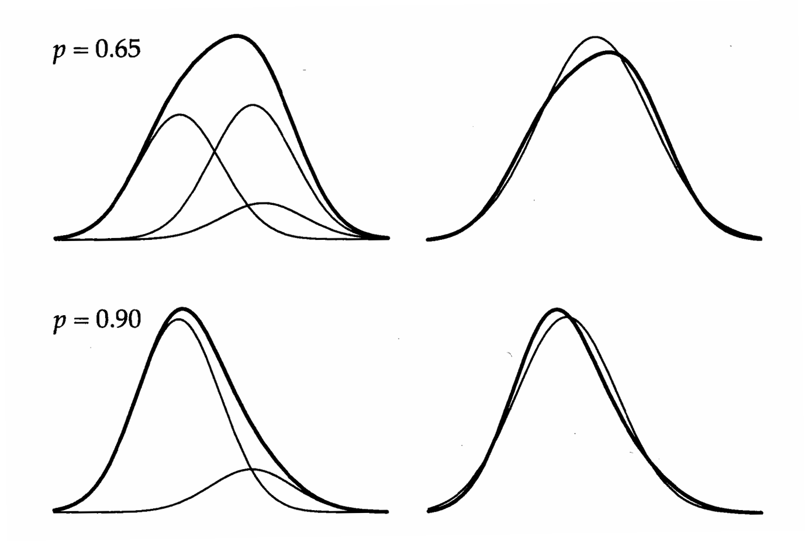
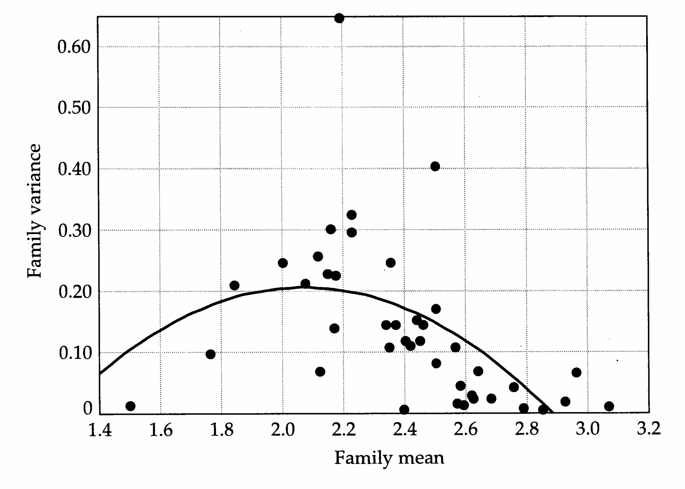

# Chapter 13 · 13 Detecting Major Genes

## Genetics_chapter13_001 · 13
Detecting Major Genes

In some cases, the bulk of character variation (either total or genetic) can be attributed to one or a few major genes. For a variety of reasons, it is of great interest to detect such genes. From a biological standpoint, the presence of major genes offers the potential for their isolation and genetic characterization, which in turn may be highly informative as to the underlying biological processes generating character variation. From a theoretical standpoint, several quantitative-genetic models (especially those dealing with selection response) assume a large number of loci of roughly equal (and small) effects. The validity of these models is severely compromised by the presence of major genes. If one or two major loci account for most of the genetic variation of a trait, essentially any problem of interest can be correctly modeled using standard machinery of one- and two-locus population genetics.

The observation of a continuous unimodal distribution of phenotypes is often taken as support for a large number of genes of roughly equal effect. It cannot be overstressed that this is an assumption. If environmental variation is sufficiently large relative to the effects of any individual gene or if major alleles are at sufficiently low frequency, the effects of segregating major genes can be completely obscured. The most powerful tests for the presence of major genes, which use information from linked molecular-marker loci, are examined in Chapters 14–16. This chapter illustrates how purely phenotypic data can be used to infer the presence or absence of major genes.

Our treatment starts with the simplest form of analysis, departure-from-normality tests applied to situations in which no genealogical information is available. We next consider several fairly simple tests that can be used when groups of known sibs are identified. We then introduce mixture models, wherein the phenotypic distribution is assumed to result from a weighted mixture of several underlying distributions (one for each major-locus genotype). Such models form the foundation for much of the discussion over the next four chapters. We conclude by examining complex segregation analysis, a collection of likelihood methods widely used in human genetics. The roots of many of the approaches discussed here stem from epidemiological genetics, a subject reviewed by Cavalli-Sforza and Bodmer (1971), Morton et al. (1983), and Weiss (1993). Additional discussions on the detection of major genes from phenotypic data can be found in reviews by Mayo (1989), Hill and Knott (1990), and Le Roy and Elsen (1992).

---

## Genetics_chapter13_002 · ELEMENTARY TESTS

While detection of major genes is not an easy task, it is facilitated considerably with experimental populations in which controlled breeding designs can be implemented. For example, a population segregating a major allele initially at low frequency is expected to show a significant increase in heritability after only a few generations of selection (Latter 1965, Frankham and Nurthen 1981), reflecting the increase in additive genetic variation as the rare major allele increases in frequency. Heritability can likewise show a sudden decrease if the selected major gene has a moderate to high initial frequency.

A related approach for detecting major genes using selection is the select-and-backcross method (reviewed by Wright 1952, 1968). The procedure is simple. Two populations differing in the character are crossed, with the largest $ F_{1} $ individuals backcrossed to individuals from the parental population with the smaller mean character value. Continual selection for large character value followed by backcrossing to the smaller line removes genes (from the large line) of minor effect while retaining genes having large effects (Wright's leading factors). The ability to maintain a large character value in the face of continual backcrossing to the smaller line suggests the presence of major genes. Wright (1968) successfully used this approach to isolate leading factors for several traits in guinea pigs, and the Booroola gene in sheep (Examples 3 and 4 in Chapter 4) was detected in this manner (Piper and Bindon 1988). Natural populations that are unamenable to controlled breeding generally preclude such approaches, but as shown below, a random collection of individuals from such a population can sometimes be informative.

---

## Genetics_chapter13_003 · ELEMENTARY TESTS / Departures from Normality

Consider a locus segregating a major allele and assume that the distribution of phenotypes for each of the major-locus genotypes is normal. The resulting distribution, a mixture of normals, is generally not normal. When a major gene is segregating, the phenotypic distribution can exhibit multimodality, skewness, and/or kurtosis. Figure 13.1 shows that when major allele frequencies are intermediate, the resulting phenotypic distribution is platykurtic, being more flatly peaked than a normal. The distribution becomes leptokurtic (more peaked than a normal) and skewed when alleles of large effect are at extreme frequencies, i.e., somewhat near zero or one (Hammond and James 1970, O'Donald 1971). When gene frequencies become very close to zero or one, the distribution again more closely approaches normality, as there is effectively only a single genotype in the population.

A variety of tests for normality have been developed, some of which were discussed in Chapter 11, but none of these is particularly powerful. As a

> **Figure 13.1** · page 369 · source: `Genetics_chapter13`
>
> 
>
> Figure 13.1 Phenotypic distributions resulting from a single diallelic major locus, where each genotype has normally distributed phenotypes with the same variance $ \sigma^{2} $. Here the mean genotypic values are $ \mu_{qq} = -\sigma $, $ \mu_{Qq} = 0.75\sigma $, $ \mu_{QQ} = \sigma $, and genotypes are in Hardy-Weinberg proportions, with the frequency of allele q being p = 0.65 (Top) and p = 0.9 (Bottom). The left side of each figure shows the three underlying distributions (thin lines) and the resulting mixture distribution (thick line). The right side shows how well the resulting mixture distribution fits a normal having the same mean and variance.

consequence, one must proceed with extreme caution in inferring the absence of major genes from a phenotypic distribution that is not significantly different from normal. As Figure 13.1 shows, the departure from normality can be rather small, requiring very large sample sizes for detection. Thoday and Thompson (1976) found that tests based on kurtosis have poor power for detecting major genes. In their simulations, a character with no environmental variation determined by four additive loci (each with two alleles at frequency 0.5 and relative effects of x, 2x, 3x, and 4x) required a sample of roughly 750 individuals to detect nonnormality, while with three additive loci of equal effect, sample sizes in excess of 1000 were required. Conversely, when the distribution significantly departs from normality, one must be equally cautious in inferring the presence of a major gene without additional support. For example, a phenotypic distribution can display skew in the absence of major genes due to scale effects (Chapter 11). As we discuss shortly, mixture models provide a more sophisticated and powerful approach to major-gene detection, assessing whether the fit of the phenotypic distribution is consistent with a mixture of normals.

---

## Genetics_chapter13_004 · ELEMENTARY TESTS / Tests Based on Sibship Variances

The use of collections of known relatives, rather than random individuals, greatly improves the power of tests for major genes. Several simple tests based on sib- ship comparisons have been proposed. The presence of major alleles increases the variance within sibships in which the alleles are segregating. For example, if Q and q denote alternative alleles at a major locus, the expected phenotypic variance among sibs from $ Qq \times Qq $ parents is greater than for sibs from $ qq \times qq $ or $ QQ \times QQ $ parents, reflecting segregation within these families, while sibs from $ QQ \times Qq $ and $ qq \times Qq $ parents display intermediate levels of variance. A number of tests for unequal variances among sibships have been suggested, the simplest being Bartlett's test for homogeneity of variances (e.g., Sokal and Rohlf 1995). The difficulty with this approach is that nongenetic causes may underlie differences in sibship variances. Bartlett's test is also rather sensitive to departures from normality. As a way around these problems, Mérat (1968) proposed a test based on the notion that families with significantly elevated variances should also exhibit exceptional platykurtosis and possibly skewness if the inflation of the variance is caused by segregating alleles of large effect.

Fain (1978) proposed an alternative test that utilizes both the means and variances of sibships. The basis for this test is the observation that, for a character determined by many genes of roughly equal effect, there should be no relationship between the variance of the sibship and the phenotypic value of the parents (Pearson 1904, Penrose 1969, Felsenstein 1973, Stark 1976). If, however, the character is determined by a few genes of large effect, parents with the most extreme phenotypes are likely to be homozygotes, while parents of intermediate phenotypes are more likely to be heterozygotes. This relationship results in a roughly quadratic regression of offspring variance on midparental phenotypic value,

$$
\mathbf{V a r}(z_{i})=a+b_{1}\overline{{z}}_{i}+b_{2}\overline{{z}}_{i}^{2}
\tag{13.1}
$$

where $ \operatorname{Var}(z_i) $ is the phenotypic variance within the ith sibship, and $ \overline{z}_i $ is the midparental value for this sibship. Sibship means replace midparental values when the latter are unknown. A significant value of $ b_2 $ is taken as an indication of a major gene. Due to scaling effects (Chapter 11), the variance often increases linearly with the mean, so a significant $ b_1 $, by itself, does not necessarily indicate a major gene.

**[示例 Example]**

> **Example 1** · ref: `Genetics_chapter13:1` · source: `Genetics_chapter13_004.json` · blocks 4–4
>
> Example 1. Bucher et al. (1982) examined a large sample of families that were classified into groups based on cholesterol levels. One particular group (the High group) showed significant heterogeneity of within-sibship variance for cholesterol level (P < 0.001 using Bartlett's test of homogeneity of variances), while the other groups did not. Likewise, the regression of the within-sibship variance on the sibship means had a significant quadratic term for the High group, while the quadratic term was not significant in the other groups. These data suggest that a major gene was segregating in at least some of the families forming the High group (i.e., at least one parent was a heterozygote) but was not in the families forming the other groups. Thus, there are additional sources of variance beyond the major gene (such as environmental factors and/or additional polygenes) that contribute to the difference between groups.

Our second example of Fain’s test is based on Mitchell-Olds and Bergelson’s (1990) work on the annual plant Impatiens capensis. These authors found that the regression of within-sibship variance on sibship mean usually had significant linear (but not quadratic) terms, suggesting that scale effects are common. However, the regression for germination date also showed a significant quadratic term (Figure 13.2), suggesting the presence of a major gene influencing this character.

The power of different sibship variance tests has been considered by several investigators. MacCluer and Kammerer (1984) concluded that both Bartlett's and Fain's test have low power for detecting a major gene even when 100 nuclear families are used. However, they assumed a small number of sibs per family (3 to 5), as their interest was in human populations. On the positive side, they found that these tests are unlikely to give a false indication of a major gene when none is present (under the simplified assumption of normally distributed environmental effects). Mayo et al. (1980) note that Fain's test is compromised if heterozygotes have lower environmental variances than homozygotes, as this difference partially masks the increased genetic variance in sibships from heterozygous parents.

---

## Genetics_chapter13_005 · ELEMENTARY TESTS / Major-gene Indices (MGI)

Karlin et al. (1979) show that, under polygenic inheritance with additive loci, offspring more closely resemble the average of their parents (the midparent) than either individual parent, whereas the converse is true when a major gene is segregating. Exploiting this relationship, they proposed a class of indices for indicating the presence of major genes,

$$
\mathbf{MGI}(a)=\frac{E[|z_{o}-(z_{f}+z_{m})/2|^{a}]}{E[(\left|z_{o}-z_{f}\right|\left|z_{o}-z_{m}\right|)^{a/2}]}
\tag{13.2}
$$

where $z_{o}$ is the phenotypic value of an offspring whose parents have values $z_{f}$ and $z_{m}$, and $a$ is a free parameter set by the investigator. Values of $a > 1$ accentuate large deviations between offspring and parents, while values of $a < 1$ accentuate small deviations. If the character is entirely determined by segregation of a major allele with no environmental variation, $\mathrm{MGI}(a) > 1$ for all $a \geq 0$ (independent of the amount of dominance), while if the character is entirely determined by an infinite number of genes of equal effect with a normal distribution of environmental effects, $\mathrm{MGI}(a) < 1$ for all $a \geq 0$. Karlin et al. recommend evaluation of the index at $a = 0.5$, 1, and 2, but this choice of $a$ values is rather ad hoc. Improvements and embellishments on this test have been suggested by Famula (1986), Carmelli et al. (1979), and Karlin and Williams (1981), but Le Roy and Elsen (1992) found that both the Bartlett and Fain tests are more powerful than MGI-based tests.

> **Figure 13.2** · page 372 · source: `Genetics_chapter13`
>
> 
>
> Figure 13.2 An example of Fain’s test, plotting family variance as a function of family mean for germination date in Impatiens capensis. There is a highly significant quadratic term ( $ r^{2} = 0.32 $ vs. $ r^{2} = 0.18 $ for a simple linear regression), suggestive of a segregating major gene for germination date in this population. (Data from Mitchell-Olds and Bergelson 1990, kindly provided by Tom Mitchell-Olds.)

---

## Genetics_chapter13_006 · ELEMENTARY TESTS / Nonparametric Line-cross Tests

Collins (1967, 1968, 1973), Mode and Gasser (1972), and Birnbaum (1972) independently proposed simple line-cross tests to detect major genes. Suppose a character is completely determined by one locus with two alleles, Q and q. Each genotype has an associated distribution of environmental values, which may differ between genotypes, and the phenotypic distribution in the population is a weighted mixture of the distributions associated with the three underlying genotypes,

$$
p(z)=p_{QQ}(z)\Pr(QQ)+p_{Qq}(z)\Pr(Qq)+p_{qq}(z)\Pr(qq)
\tag{13.3}
$$

where $ \Pr(QQ) $ is the probability that a randomly chosen individual is QQ, and $ p_{QQ}(z) $ is the distribution of environmental values for a QQ individual, with the other terms defined similarly.

Based on this simple relationship, the test proceeds as follows. Consider two parental populations, $ P_1 $ and $ P_2 $, fixed for different alleles (Q and q, respectively). If the outbreak of variation in the $ F_2 $ is entirely due to segregation at a single locus, then the $ F_2 $ distribution is specified exactly by Equation 13.3, with $ p_{Qq}(z) = p_{F_1}(z) $, $ p_{QQ}(z) = p_{P_1}(z) $, $ p_{qq}(z) = p_{P_2}(z) $, $ \Pr(QQ) = \Pr(qq) = 1/4 $, and $ \Pr(Qq) = 1/2 $.

giving

$$
p_{F_{2}}(z)=\frac{p_{P_{1}}(z)}{4}+\frac{p_{F_{1}}(z)}{2}+\frac{p_{P_{2}}(z)}{4}
\tag{13.4}
$$

Standard goodness-of-fit criteria (such as a Kolmogorov-Smirnov test; Sokal and Rohlf 1995) are then used to compare the observed and expected distributions. Related tests have also been suggested by Elston (1981b) and Stolk et al. (1984), and these were used by Hagger et al. (1995) to reject the hypothesis of a single dominant gene to account for egg weight differences between two inbred lines of chickens.

This approach can, in theory, be extended to two or more major loci, although tests of more than two loci require an impractical number of crosses. If more than one locus is segregating, knowledge of the parental and $ F_{1} $ distributions is generally not sufficient to predict the $ F_{2} $ distribution. Additional information, such as phenotypic distributions of certain backcrosses (e.g., the distribution of $ B_{1} $, $ B_{1} \times B_{2} $, etc.), is required to account for the new $ F_{2} $ genotypes generated by segregation (Collins 1967, 1968, 1973).

Equation 13.3 provides our first formal introduction to mixture models, where the observed distribution is a weighted mixture of underlying distributions. The approach taken above is nonparametric in that it does not initially assume any particular form for the underlying distributions. While this is an advantage in some cases, it results in a reduction in power relative to parametric tests that incorporate the correct form of the underlying distributions. We now move to considerations of parametric mixture models that assume the underlying distributions to be normal. This class of models forms the basis for much of the analysis over the next four chapters.

---

## Genetics_chapter13_007 · MIXTURE MODELS

Given that rejection of normality, by itself, is not sufficient to imply a major gene, a more powerful approach is to test whether the phenotypic distribution is consistent with a mixing (or commingling) of two or more normals, as would be expected if the distribution of phenotypic values about each major genotype were normal (Tan and Chang 1972, Elston et al. 1974, Boerwinkle et al. 1986, Hoeschele 1988). While this is an improvement over previous methods, such a test is still fraught with a number of potential problems. Even if the phenotypic distribution is consistent with a mixture of normals, there are a variety of explanations other than major genes — for example, the population may be distributed over two or more significantly different environments. Thus, a slightly more powerful approach is to further specify the weights of the underlying normals.

If the distribution is consistent with three underlying normals with Hardy-Weinberg weights $ p^{2} $, $ 2p(1 - p) $, and $ (1 - p)^{2} $, where the allele frequency p is estimated from the data by maximum likelihood (see Example 2), then we may have more confidence in a major-locus interpretation. On the other hand, a lack of fit to this model does not necessarily exclude a major gene (e.g., the major gene may not be in Hardy-Weinberg equilibrium or the underlying phenotypic distributions for each major locus genotype may be nonnormal). In the absence of information from linked markers, the most powerful mixture-model tests for major genes use information from relatives to specify the weights of the underlying distributions. Before developing this complex segregation analysis approach, we first review some general features of mixture models.

---

## Genetics_chapter13_008 · MIXTURE MODELS / The Distribution under a Mixture Model

Assume the distribution of interest results from a weighted mixture of several underlying distributions. If there are $ i = 1, \cdots, n $ underlying distributions, $ p_1(z), \cdots, p_n(z) $, each with frequency $ \text{Pr}(i) $, the resulting probability density of an observed variable $ z $ is given by a generalization of Equation 13.3,

$$
p(z)=\sum_{i=1}^{n}\Pr(i)\cdot p_{i}(z)
\tag{13.5}
$$

It is usually assumed that the underlying distributions are normals, so this becomes

$$
p(z)=\sum_{i=1}^{n}\Pr(i)\cdot\varphi(z,\mu_{i},\sigma_{i}^{2})
\tag{13.5}
$$

where

$$
\varphi(z,\mu_{i},\sigma_{i}^{2})=\frac{1}{\sqrt{2\pi\sigma_{i}^{2}}}\exp\left[-\frac{(z-\mu_{i})^{2}}{2\sigma_{i}^{2}}\right]
\tag{13.5}
$$

is the probability density function for a normally distributed random variable with mean $ \mu_i $ and variance $ \sigma_i^2 $. Equation 13.5 has $ 3n - 1 $ parameters to estimate: the $ n - 1 $ mixing proportions $ \text{Pr}(i) $, and the $ n $ means and variances of the underlying distributions. It is usually assumed that all the variances are equal, reducing the number of unknown parameters to $ 2n $. Various genetic hypotheses allow us to further specify and evaluate the structure of the mixing proportions.

---

## Genetics_chapter13_009 · MIXTURE MODELS / Parameter Estimation

Parameters of mixture models are typically estimated by maximum likelihood procedures (Hasselblad 1966, Day 1969, Everitt and Hand 1981, Redner and Walker 1984, Titterington et al. 1985, McLachlan and Basford 1988), in which case Equation 13.5 gives the likelihood function $ \ell(z) $ of the unknown parameters $ \Pr(1), \cdots, \Pr(n), \mu_1, \cdots, \mu_n, \sigma_1^2, \cdots, \sigma_n^2 $ as a function of the observed value $ z $. As just mentioned, typically one sets most (or all) of the variances equal to each other; one reason for equating variances is that, if they are all free to vary, there can be singularities in the likelihood function.

As an example of how likelihood functions are constructed, consider the situation for a random individual drawn from a population with a single segregating diallelic major locus. Indexing the three genotypes by $i$ where $i = QQ$, $Qq$, and $qq$, and assuming that individuals with major-locus genotype $i$ are normally distributed with mean $\mu_i$ and common variance $\sigma^2$, the resulting likelihood for the $j$th individual is

$$
\begin{aligned}\ell(z_{j})&=\Pr(QQ)p_{QQ}(z_{j})+\Pr(Qq)p_{Qq}(z_{j})+\Pr(qq)p_{qq}(z_{j})&(13.6a)\\ &\\&=\Pr(QQ)\varphi(z_{j},\mu_{QQ},\sigma^{2})+\Pr(Qq)\varphi(z_{j},\mu_{Qq},\sigma^{2})+\Pr(qq)\varphi(z_{j},\mu_{qq},\sigma^{2})\\ \end{aligned}
$$

where $z_{j}$ is the character value in the focal individual. The likelihood for an individual is easily generalizable to more complicated genetic models. For example, if there are more than two alleles, or multiple loci, the likelihood has the form of Equation 13.6a with the sum now extending over all $n_{g}$ multilocus genotypes. For $n$ random (unrelated) individuals, denoting the observed phenotypic values by $\mathbf{z}=(z_{1},z_{2},\cdots,z_{n})$, the overall likelihood is just the product of the $n$ individual likelihoods,

$$
\ell(\mathbf{z})=\ell(z_{1},z_{2},\cdots,z_{n})=\prod_{j=1}^{n}\ell(z_{j})
\tag{13.6b}
$$

Assuming random mating, the Hardy-Weinberg principle describes the frequencies $ \Pr(\cdot) $ of the major locus genotypes as a function of p, the frequency of one allele. This leaves five parameters to estimate — $ p, \sigma^{2}, \mu_{QQ}, \mu_{Qq} $, and $ \mu_{qq} $.

Appendix 4 reviews the basic features of the maximum likelihood approach, and the reader may wish to consult this before continuing (additional features are developed in Chapter 27). Maximum likelihood estimates (MLEs) are those values of the unknown parameters that maximize the likelihood function when treating the observed data $ \mathbf{z} = (z_1, \cdots, z_n) $ as fixed constants. Such estimates can be obtained by numerical maximization of the likelihood function (e.g., Gill et al. 1981, Fletcher 1987) or by other iterative approaches. In particular, expectation-maximization (EM) methods are both very powerful and very flexible, accommodating missing or incomplete data (Appendix 4). Sample variances and covariances of MLEs can either be obtained directly from the likelihood functions or via approximation methods (e.g., Meyer and Hill 1992). See Appendix 4 for details.

---

## Genetics_chapter13_010 · MIXTURE MODELS / Hypothesis Testing

An important issue in tests for major genes is model fitting, i.e., evaluating whether the full model is needed, or if some subset of the model gives essentially the same fit. For example, we might initially assume a mixture of two normals with different means and common variance, so that the full model has parameters $ \mu_1 $, $ \mu_2 $, $ \sigma^2 $, and p. Is the fit using these four parameters significantly better than the fit assuming a single underlying normal with parameters $ \mu $ and $ \sigma^2 $? For large sample sizes, the likelihood ratio (LR) statistic test for whether the full model provides a better fit than a particular subset of the model is

$$
\Lambda(\mathbf{z})=-2\ln\left[\frac{\widehat{\ell}_{r}(\mathbf{z})}{\widehat{\ell}(\mathbf{z})}\right]=-2\left\{\ln\left[\widehat{\ell}_{r}(\mathbf{z})\right]-\ln\left[\widehat{\ell}(\mathbf{z})\right]\right\}
\tag{13.7}
$$

where $ \widehat{\ell}(\mathbf{z}) $ is the likelihood function evaluated at the MLE for the full model, and $ \widehat{\ell}_{r}(\mathbf{z}) $ is the maximum of the likelihood function for the restricted model under which r parameters of the full model are assigned fixed values. Under appropriate conditions, the LR test statistic is approximately distributed as $ \chi_{r}^{2} $, i.e., as a $ \chi^{2} $ distribution with r degrees of freedom (Wald 1943); see Appendix 4.

The simplest restricted model assumes no mixture at all, so that the overall distribution is just a single normal distribution with unknown mean and variance. As shown in Appendix 4, the resulting likelihood is just the product of n identical normals with mean $ \mu $ and variance $ \sigma^{2} $. The MLEs in this case are the sample mean $ \overline{z} $ and the uncorrected sample variance

$$
\mathrm{Var}(z)=\frac{1}{n}\sum_{j=1}^{n}(z_{j}-\overline{z})^{2}
$$

Note that the ML estimate of the variance is slightly different from the unbiased variance estimator, which divides the sum of squares by $ n - 1 $. Substituting the MLEs of $ \sigma^{2} $ and $ \mu $ gives the maximum value of this restricted likelihood as

$$
\widehat{\ell}_{r}(\mathbf{z})=\prod_{j=1}^{n}\left\{\frac{1}{\sqrt{2\pi\operatorname{Var}(z)}}\exp\left[-\frac{(z_{j}-\overline{z})^{2}}{2\operatorname{Var}(z)}\right]\right\}
\tag{13.8}
$$

Taking logarithms and recalling the definition of Var gives

$$
-2\ln\left[\widehat{\ell}_{r}(\mathbf{z})\right]=n\cdot\left[\ln\mathbf{V a r}(z)+\ln2\pi+1\right]
\tag{13.8}
$$

**[示例 Example]**

> **Example 2** · ref: `Genetics_chapter13:2` · source: `Genetics_chapter13_010.json` · blocks 9–15
>
> Example 2. Consider the likelihood-ratio test statistic for whether a diallelic major gene (in Hardy-Weinberg frequencies, with the phenotypes for each major-locus genotype normally distributed with constant variance) provides a better fit of the data than a single normal distribution. Assume that the data consist of n (unrelated) individuals, randomly chosen from the population. From Equations 13.7 and 13.8, the likelihood-ratio test statistic is given by
> 
> $$
> \begin{aligned}\Lambda(\mathbf{z})&=-2\left\{\ln\left[\widehat{\ell}_{r}(\mathbf{z})\right]-\ln\left[\widehat{\ell}(\mathbf{z})\right]\right\}\\&=2\ln\left[\widehat{\ell}(\mathbf{z})\right]+n\cdot[\ln\operatorname{Var}(z)+\ln2\pi+1]\end{aligned}
> $$
> 
> 
> where
> 
> $$
> \widehat{\ell}(\mathbf{z})=\max\left[\prod_{j=1}^{n}\ell(z_{j})\right]
> $$
> 
> 
> the maximum being taken over all admissible values of $p$ ($0 \leq p \leq 1$), $\mu_{QQ}$, $\mu_{Qq}$, $\mu_{qq}(-\infty < \mu < \infty)$, and $\sigma^{2}(\sigma^{2} \geq 0)$ and
> 
> $$
> \ell(z_{j})=p^{2}\cdot\varphi(z_{j},\mu_{QQ},\sigma^{2})+2p(1-p)\cdot\varphi(z_{j},\mu_{Qq},\sigma^{2})+(1-p)^{2}\cdot\varphi(z_{j},\mu_{qq},\sigma^{2})
> $$
> 
> 
> Since the full model has five unknown parameters while the reduced model has two $(\mu, \sigma^{2})$, the test statistic $\Lambda$ is approximately distributed as $\chi_{3}^{2}$. Hence $\Lambda$ values exceeding 7.82 and 11.4 indicate that a mixture of three normals provides a better fit at the 5% and 1% levels of significance, respectively, than a single normal.

Likelihood-ratio tests require that alternate hypotheses be nested, one model being a subset of the other (i.e., by fixing some parameters of one model we recover the second). If they are not, the large-sample distribution does not necessarily approach a $ \chi^{2} $. Likelihood functions involving nonnested hypotheses can be compared by using Akaike's (1974) information content (AIC),

$$
\mathrm{AIC}=-2\ln(\mathrm{maximum likelihood})+2(\mathrm{number of fitted parameters})
\tag{13.9}
$$

The model with the smallest AIC is chosen as the most parsimonious. The AIC is a descriptive statistic only and not a formal hypothesis test, but it provides a useful measure for comparing rather different models. An alternative approach involves the use of resampling methods (Schork and Schork 1989, Churchill and Doerge 1994). Two such methods, permutation tests and bootstrapping, are discussed in Chapter 15.

How does one proceed if the underlying distributions of a mixture model are not normal? MacLean et al. (1976), Elston (1984), and Schork and Schork (1988) suggest that the Box-Cox (1964) power transform can be used to normalize each of the underlying distributions. Recall from Chapter 11 that this transformation is described by a single parameter $ \lambda $, with $ x = (z^{\lambda} - 1)/\lambda $ for $ \lambda \neq 0 $ and $ x = \ln z $ for $ \lambda = 0 $. Hence, in the likelihood function, the ith underlying distribution uses $ x_i = (z^{\lambda_i} - 1)/\lambda_i $ in place of $ z $, allowing each underlying distribution to have a different transform. If we assume that an observed distribution is generated by $ k $ underlying distributions that can be transformed to normality by the appropriate Box-Cox transform, the resulting mixture model can be expressed as a mixture of $ k $ normals. The ith normalized underlying distribution has mean $ \mu_i $, variance $ \sigma_i^2 $, and transformation parameter $ \lambda_i $, all of which can be estimated by standard ML methods. This approach offers a test for whether an observed skewed distribution results from a single naturally skewed distribution, from a mixture of underlying normals, or from a mixture of underlying distributions that can be transformed to normality. If the distribution results from a mixture of normals, a standard mixture model should give a significantly better fit than a single transformed distribution (where the transformation parameter $ \lambda $ is estimated from the data). Whether a mixture model provides a significantly better fit can be evaluated by a likelihood-ratio test. Likewise, the hypothesis that the underlying mixture distributions are themselves skewed can be tested by fitting the $ \lambda_{i} $ from the data and comparing this to a model with $ \lambda_{i}=1 $ (no transformation).

---

## Genetics_chapter13_011 · COMPLEX SEGREGATION ANALYSIS

Starting with Elston and Stewart (1971) and Morton and MacLean (1974), human population geneticists have developed the method of complex segregation analysis, or CSA, to test between alternative modes of inheritance. As we will see in the next few sections, CSA extends the simple mixture model (Equation 13.6a) by using pedigree information to modify the mixture proportions. Assumptions about the mode of inheritance specify the mixture distribution weights, allowing likelihood-ratio tests for different models of transmission (a single major gene, no major gene but background polygenes, major gene plus background polygenes, and so forth). We illustrate some of these applications below, showing how known relationships among relatives define the transmission probabilities of both major genes and polygenes.

The extensive literature on complex segregation analysis is reviewed by Elston and Rao (1978), Boyle and Elston (1979), Elston (1980, 1981a, 1990a), and Morton et al. (1983). While the bulk of the literature deals with human populations, Le Roy et al. (1990) and Knott et al. (1991a,b) examine applications in animal breeding. Tourjee et al. (1995) give an application to plants, examining the genetic basis of flower color in Gerbera jamesonii. Similar likelihood methods for major loci have been developed for F₂ segregation in crosses between inbred lines (Tan and Chang 1972, Elston and Stewart 1973, Tan and D'Angelo 1979, Elston 1984, Janss and Van Der Werf 1992, Loisel et al. 1994, Changjian et al. 1994).

While complex segregation analysis is the most assumption-burdened test for detecting major genes, it is also the most powerful of the marker-free methods when the assumptions hold (MacCluer et al. 1983, MacCluer and Kammerer 1984). For example, the commingling tests discussed above (e.g., Example 2) that simply fit a mixture of normals and use no information from relatives can easily miss major genes that segregation analysis can detect (Kwon et al. 1990).

Complex segregation analysis assumes normality of the underlying distributions, which greatly simplifies the form of the likelihood function. If this assumption is violated, false detection of a major locus can occur (MacLean et al. 1975, Go et al. 1978, Morton 1984). As mentioned above, if the underlying distributions are suspected to be nonnormal, one strategy is to use a likelihood approach that incor- porates a transformation parameter for each underlying distribution. Instead of individually transforming each underlying distribution (through the likelihood function), one could simply apply a single transform to the observed distribution. However, this approach can raise serious issues of interpretation (e.g., Asamoah et al. 1987). While the use of transformations is not a resolved issue, Demenais et al. (1986) suggest that tests that incorporate estimates of transmission probabilities (see Example 4 below) remove the need to transform the data before performing segregation analysis. A final complication is that when significant genotype × environment interaction is present, the power to detect a major gene is greatly reduced (Eaves 1984, Tiret et al. 1993).

The following sections illustrate some general approaches for constructing likelihood functions for full-sib families under increasingly more general genetic models. We start by assuming only a single diallelic major locus, and then consider separately common family effects and background segregation of polygenic loci. Likelihoods for more complicated pedigrees or other experimental designs (such as inbred-line crosses) follow using similar arguments. Before proceeding, an example will show the types of hypotheses that can be addressed and the types of parameters that need to be incorporated into the likelihood functions underlying complex segregation analysis.

**[示例 Example]**

> **Example 3** · ref: `Genetics_chapter13:3` · source: `Genetics_chapter13_011.json` · blocks 5–8
>
> Example 3. Morton and MacLean (1974) consider a model with both a segregating diallelic major gene (alleles Q and q) and a completely additive polygenic background. Conditioned on the genotype at the major locus, the distributions of phenotypic values are assumed to be normally distributed with means $ \mu_{QQ} $, $ \mu_{Qq} $, or $ \mu_{qq} $, and common variance $ \sigma^2 = \sigma_E^2 + \sigma_A^2 $ (the environmental variance plus the additive genetic variance contributed by the background polygenes). Assuming the major-locus genotypes are in Hardy-Weinberg proportions, this model is described by six parameters: $ p = $ frequency of Q, the means of each major-locus genotype ( $ \mu_{QQ} $, $ \mu_{Qq} $, $ \mu_{qq} $), the environmental variance $ \sigma_E^2 $, and the genetic variance from the polygenic contribution $ \sigma_A^2 $. The resulting likelihood function (see Equations 13.11b and 13.22 below) is complex as it incorporates transmission of both the major alleles and polygenic background from parent to offspring, conditioning over all possible parental genotypes. The amount of support for various genetic hypotheses can be tested using likelihood ratios of appropriate subsets of the full model, as given in the following table:
> 
> <table><tr><td>Model</td><td>Free Parameters</td><td>Restricted Parameters</td></tr><tr><td>1. No genetic effects</td><td>$ \mu, \sigma_{E}^{2} $</td><td>$ \mu_{QQ} = \mu_{Qq} = \mu_{qq} = \mu $ $ p = 0, \sigma_{A}^{2} = 0 $</td></tr><tr><td>2. Major gene, no background polygenes</td><td>$ \mu_{QQ}, \mu_{Qq}, \mu_{qq}, p, \sigma_{E}^{2} $</td><td>$ \sigma_{A}^{2} = 0 $</td></tr></table>
> 
> <table><tr><td>Model (Continued)</td><td>Free Parameters</td><td>Restricted Parameters</td></tr><tr><td>3. Background polygenes, no major gene</td><td>$ \mu, \sigma_{E}^{2}, \sigma_{A}^{2} $</td><td>$ \mu_{QQ} = \mu_{Qq} = \mu_{qq} = \mu_{p} = 0 $</td></tr><tr><td>4. Full model: Major gene, background polygenes</td><td>$ \mu_{QQ}, \mu_{Qq}, \mu_{qq}, p, \sigma_{E}^{2}, \sigma_{A}^{2} $</td><td>None</td></tr></table>
> 
> For example, a test of support for a major gene is given by the likelihood ratio using model 1 (a single normal distribution) as the restricted model and model 2 as the full model. The resulting test statistic has 5 - 2 = 3 degrees of freedom, with twice the log of the maximum of the restricted likelihood function given by Equation 13.8. If the major-gene model provides a significant improvement, model 4 (major gene plus polygenic background) can next be tested against the major-gene-only model (2), with the test statistic having 6 - 5 = 1 degree of freedom. More complicated models are analyzed in a similar fashion.

---

## Genetics_chapter13_012 · COMPLEX SEGREGATION ANALYSIS / Likelihood Functions Assuming a Single Major Gene

We start by computing the likelihood for a single individual, then proceed to an entire family, and finally to the collection of all families in our sample. Assume that a single diallelic locus underlies the character and consider the jth offspring from the ith family, $ o_{ij} $, which has father $ f_i $ and mother $ m_i $ (for notational ease, in the following we use $ f, m $, and $ o_j $, reminding the reader that these, of course, change as we change families). Denote the phenotypic value of this offspring by $ z_{ij} $. Index the major-locus genotypes by g where g = 1 for QQ, g = 2 for Qq, and g = 3 for qq, with $ g_f, g_m $, and $ g_{o_j} $ denoting the genotypes of the parents (father and mother) and their jth offspring. Phenotypic values for each major-locus genotype are assumed to be normally distributed with means $ \mu_g $ and common variance $ \sigma^2 $. Finally, let $ \Pr(g_o \mid g_f, g_m) $ be the probability that an offspring has genotype $ g_o $ given that its parents have genotypes $ g_f $ and $ g_m $.

Conditioned on the parental genotypes, the likelihood for the ijth offspring is

$$
\ell(z_{i j}\mid g_{f},g_{m})=\sum_{g_{o}=1}^{3}\operatorname*{P r}(g_{o}\mid g_{f},g_{m})\cdot\varphi(z_{i j},\mu_{g_{o}},\sigma^{2})
\tag{13.10a}
$$

This conditional likelihood is a mixture model with mixing proportions given by Mendelian segregation. For example, if the father and mother have major-locus genotypes QQ and Qq, then $ g_{f} = 1 $ and $ g_{m} = 2 $, and

$$
\Pr(g_{o}=3\mid g_{f}=1,g_{m}=2)=\Pr(qq\mid g_{f}=QQ,g_{m}=Qq)=0
\tag{13.10b}
$$

$$
\Pr(g_{o}=2\mid g_{f}=1,g_{m}=2)=\Pr(Qq\mid g_{f}=QQ,g_{m}=Qq)=1/2
\tag{13.10b}
$$

$$
\Pr(g_{o}=1\mid g_{f}=1,g_{m}=2)=\Pr(QQ\mid g_{f}=QQ,g_{m}=Qq)=1/2
\tag{13.10b}
$$

so that with these parents Equation 13.10a reduces to

$$
\ell(z_{i j}\mid Q Q,Q q)=\frac{1}{2}\cdot\varphi(z_{i j},\mu_{Q Q},\sigma^{2})+\frac{1}{2}\cdot\varphi(z_{i j},\mu_{Q q},\sigma^{2})
\tag{13.10c}
$$

Conditioned on parental genotype values, each offspring in a family is independent, implying that the likelihood for a full-sib family of $ n_{i} $ offspring is the product of individual likelihoods, giving the conditional likelihood for the ith family as

$$
\ell(z_{i}.|g_{f},g_{m})=\prod_{j=1}^{n_{i}}\ell(z_{ij}|g_{f},g_{m})
\tag{13.11a}
$$

Since we do not know the QTL genotypes of the parents, the unconditional likelihood for the ith family is obtained by summing over all nine possible pairs of parental genotypes,

$$
\ell(z_{i.})=\sum_{g_{f}=1}^{3}\sum_{g_{m}=1}^{3}\ell(z_{i.}\mid g_{f},g_{m})\operatorname{P r}(g_{f},g_{m})
\tag{13.11b}
$$

Assuming the parents are chosen independently, $ \Pr(g_f, g_m) = \Pr(g_f) \cdot \Pr(g_m) $. Further, if genotypes are in Hardy-Weinberg proportions, parental genotype frequencies are completely specified by the frequency $ p $ of allele $ Q $, e.g.,

$$
\begin{align*}\Pr(g_{f}=1,g_{m}=1)&=\Pr(g_{f}=QQ)\cdot\Pr(g_{m}=QQ)=p^{2}\cdot p^{2}\\\Pr(g_{f}=2,g_{m}=1)&=\Pr(g_{f}=Qq)\cdot\Pr(g_{m}=QQ)=2p(1-p)\cdot p^{2},\\\text{etc.}\end{align*}
$$

If there are $ n_g > 3 $ major-locus genotypes (either because of multiple alleles at the major locus or because of several major loci), the appropriate likelihood has sums ranging over the $ n_g $ genotypes, and the transmission probabilities are modified to account for the assumed model. Likewise, if the parental phenotypic values ( $ z_f, z_m $) are known, these can also be incorporated into the likelihood. Since $ \ell(z \mid g) = \varphi(z, \mu_g, \sigma^2) $, the probability that the genotype is $ g_i $ given the phenotype is $ z $ is

$$
\Pr(g_{i}\mid z)=\frac{\Pr(g_{i})\varphi(z,\mu_{g_{i}},\sigma^{2})}{\sum_{j=1}^{n_{g}}\Pr(g_{j})\varphi(z,\mu_{g_{j}},\sigma^{2})}=\frac{\Pr(g_{i})\varphi(z,\mu_{g_{i}},\sigma^{2})}{p(z)}
\tag{13.12}
$$

where $ p(z) $ is the phenotypic density function for the entire population. Parental phenotypes are then incorporated by replacing $ \Pr(g) $ by $ \Pr(g \mid z) $. Equation 13.12 follows directly from Bayes' theorem (Equation 13.24), which will be discussed shortly.

Assuming different families are unrelated, the total likelihood is the product of the individual likelihoods from the $ n_{f} $ families,

$$
\ell(\mathbf{z})=\prod_{i=1}^{n_{f}}\ell(z_{i.})
\tag{13.13}
$$

where $ \ell(z_i) $ is given by Equation 13.11b. Although there are numerous summation and product indices in this likelihood, there are only five unknown parameters: the three genotypic means, the common variance $ \sigma^2 $, and the QTL allele frequency p.

While the most obvious test for a major gene compares the full model with the restricted model of a single underlying normal, Elston et al. (1975) suggest that a much more robust approach is to treat the transmission probabilities $ \Pr(g_o \mid g_f, g_m) $ as unknown parameters and base hypothesis tests on these. Above, we specified the transmission probabilities based on Mendelian assumptions of inheritance (e.g., Equation 13.10b), but we can also treat them as parameters to be estimated. This is most conveniently done by considering $ \tau_x $, the probability that genotype x transmits a Q allele. For a diallelic locus, there are three $ \tau $ values to estimate, one for each genotype. From the definition of $ \tau $, the transmission probabilities can be expressed as

$$
\begin{aligned}\Pr(qq\mid g_{f},g_{m})&=(1-\tau_{g_{f}})\left(1-\tau_{g_{m}}\right)\\\Pr(Qq\mid g_{f},g_{m})&=\tau_{g_{f}}\left(1-\tau_{g_{m}}\right)+\tau_{g_{m}}\left(1-\tau_{g_{f}}\right)\\\Pr(QQ\mid g_{f},g_{m})&=\tau_{g_{f}}\tau_{g_{m}}\end{aligned}
\tag{13.14}
$$

For example, Equations 13.10b become

$$
\begin{aligned}\Pr(qq\mid g_{f}&=QQ,g_{m}=Qq)=\left(1-\tau_{QQ}\right)\left(1-\tau_{Qq}\right)\\\Pr(Qq\mid g_{f}&=QQ,g_{m}=Qq)=\tau_{QQ}\left(1-\tau_{Qq}\right)+\tau_{Qq}\left(1-\tau_{QQ}\right)\\\Pr(QQ\mid g_{f}&=QQ,g_{m}=Qq)=\tau_{QQ}\tau_{Qq}\end{aligned}
\tag{13.15}
$$

so that with these parents, Equation 13.10c becomes

$$
\begin{aligned}\ell(z_{ij}\mid QQ,Qq)&=\tau_{QQ}\tau_{Qq}\cdot\varphi(z_{ij},\mu_{QQ},\sigma^{2})\\&\quad+\left[\tau_{QQ}\left(1-\tau_{Qq}\right)+\tau_{Qq}\left(1-\tau_{QQ}\right)\right]\cdot\varphi(z_{ij},\mu_{Qq},\sigma^{2})\\&\quad+\left(1-\tau_{QQ}\right)\left(1-\tau_{Qq}\right)\cdot\varphi(z_{ij},\mu_{qq},\sigma^{2})\end{aligned}
$$

Note that this likelihood reduces to Equation 13.10c using Mendelian segregation transmission probabilities ( $ \tau_{QQ} = 1 $ and $ \tau_{Qq} = 1/2 $).

Elston et al. (1975) suggest that three criteria must be satisfied for acceptance of a major-gene hypothesis: (1) a significantly better overall fit of a mixture model compared with a single normal, (2) failure to reject the hypothesis of Mendelian segregation ( $ \tau_{QQ} = 1 $, $ \tau_{Qq} = 1/2 $, $ \tau_{qq} = 0 $), and (3) rejection of the hypothesis of equal transmission for all genotypes ( $ \tau_{QQ} = \tau_{Qq} = \tau_{qq} $). Criterion (1) reduces false positives due to polygenic background loci, while criteria (2) and (3) offer some robustness against nonnormality of the underlying distributions and resemblance due to common environmental effects (Elston 1981a). While incorporation of transmission-probability criteria into likelihood models decreases the possibility of a false positive (Go et al. 1978, Goldin et al. 1981, Demenais et al. 1986), it does so at a cost of decreased power. Loss of power can be significant if the major gene is recessive (Borecki et al. 1995).

The fact that not all families are expected to be segregating the major gene has important consequences for the optimal number and size of families for detecting a major gene. Burns et al. (1984) showed that, for a fixed number of individuals, highest power is generally obtained by examining a moderate number of families of moderate size, as opposed to many small families or a few large families. If a small number of large families is chosen, we run the risk that none of the families are segregating the gene. Conversely, with a large number of small families, while some are likely to have the gene segregating, power for detecting a major gene is reduced due to the small sample size in each segregating family.

**[示例 Example]**

> **Example 4** · ref: `Genetics_chapter13:4` · source: `Genetics_chapter13_012.json` · blocks 30–33
>
> Example 4. As a demonstration of the utility of the Elston et al. (1975) criteria for accepting a major-gene hypothesis, we consider McGuffin and Huckle (1990) test for a genetic basis for attending medical school. The trait here is scored as a binary variable,
> 
> $$
> z=\begin{cases}1&attending medical school\\0&not attending medical school\end{cases}
> $$
> 
> 
> As is discussed below (Equation 13.28), complex segregation analysis can be easily modified to accommodate such binary characters. Of 249 students at the Wales College of Medicine, 13.4% had mothers/fathers who also attended medical school, a 61-fold increase in “risk” relative to the general population (0.2%). Taking $ \mu $ as the population mean, the expected means at an underlying major locus can be modeled by using measures of additivity (a) and dominance (k), and the allele frequency p. General single-locus (a, k, p all estimated) and recessive (k = 0, a and p estimated) models were fitted and compared with a null model (a = k = p = 0). These single-locus models, which assumed Mendelian transmission probabilities ( $ \tau_1 = 1 $, $ \tau_2 = 1/2 $, $ \tau_3 = 0 $), were then compared against two alternate transmission models — a generalized model where the three parameters ( $ \tau_1 $, $ \tau_2 $, $ \tau_3 $) were estimated from the data, and an equal transmission model ( $ \tau_1 = \tau_2 = \tau_3 = \tau $). The latter simply fits a mixture model to the data without allowing for Mendelian transmission. The resulting log likelihoods for these models were as follows:
> 
> <table><tr><td rowspan="2">Model</td><td colspan="2">Parameters (in addition to $ \mu $)</td><td rowspan="2">Constant + -2 $ \ln $ (likelihood)</td></tr><tr><td>Free</td><td>Fixed</td></tr><tr><td>Null</td><td>None</td><td>$ a = k = p = 0 $</td><td>283.60</td></tr><tr><td>Equal transmission</td><td>$ a, p,\tau_{1} = \tau_{2} = \tau_{3} $</td><td>$ k = 0 $</td><td>283.60</td></tr><tr><td>General single-locus</td><td>$ a, k, p $</td><td>$ \tau_{1} = 1, \tau_{2} = 1/2,\tau_{3} = 0 $</td><td>120.14</td></tr><tr><td>Recessive</td><td>$ a, p $</td><td>$ k = 0, \tau_{1} = 1,\tau_{2} = 1/2, \tau_{3} = 0 $</td><td>120.14</td></tr><tr><td>General transmission</td><td>$ a, p, \tau_{1}, \tau_{2}, \tau_{3} $</td><td>$ k = 0 $</td><td>111.22</td></tr></table>

The general single-locus model gives a significantly better fit than the null (single underlying normal) model, with a likelihood-ratio test statistic of 283.60 – 120.14 = 163.46 (three degrees of freedom). However, since the recessive model gives the same fit with fewer parameters, it is chosen as the standard for further analysis. The recessive model gives a significantly better fit than the equal transmission model (a mixture distribution not incorporating Mendelian segregation). Thus, criteria (1) and (3) for a major gene hold, since a mixture gives a better fit than a single normal, and the hypothesis of equal transmission ( $ \tau_1 = \tau_2 = \tau_3 $) is rejected. However, the general transmission model ( $ \tau_i $ estimated from the data) gives a significantly better fit than the Mendelian segregation hypothesis ( $ \tau_1 = 1 $, $ \tau_2 = 1/2 $, $ \tau_3 = 0 $), with a likelihood-ratio test statistic of 120.14 – 111.22 = 8.92 with three degrees of freedom (P < 0.03). Thus, these data fail the major-gene criterion (2), as the hypothesis of Mendelian segregation is rejected. Shared environmental effects, rather than major gene effects, likely account for this association between relatives.

---

## Genetics_chapter13_013 · COMPLEX SEGREGATION ANALYSIS / Common-family Effects

Members of full-sib families usually share environmental effects, and likelihood functions accounting for these have been developed (Morton and MacLean 1974; Knott and Haley 1992a,b). Let the ith family have a common effect $ c_i $, and assume that these effects are normally distributed among families with mean zero and variance $ \sigma_c^2 $. With this modification, the expected phenotypic value of an offspring with genotype $ g_o $ from family i is $ \mu_{g_o} + c_i $. As before, we assume that the phenotypic values for each genotype (conditional on $ c_i $) are normally distributed with variance $ \sigma^2 $, giving the conditional likelihood for the $ n_i $ offspring from this family as

$$
\ell(z_{i}.|g_{f},g_{m},c_{i})=\prod_{j=1}^{n_{i}}\left[\sum_{g_{o_{j}}=1}^{3}\Pr(g_{o_{j}}|g_{f},g_{m})\cdot\varphi(z_{i j},\mu_{g_{o_{j}}}+c_{i},\sigma^{2})\right]
\tag{13.16}
$$

Averaging over all possible values of the common-family effect $ c_{i} $ gives

$$
\ell(z_{i.}\mid g_{f},g_{m})=\int_{-\infty}^{\infty}\ell(z_{i.}\mid g_{f},g_{m},c)\cdot\varphi(c,0,\sigma_{c}^{2})d c
\tag{13.17}
$$

Finally, using the above expression for $\ell(z_{i}.\,|\, g_{f},\, g_{m})$, averaging over all possible parental genotypes gives the unconditional likelihood for this family (Equation 13.11b). Assuming the QTL genotypes are in Hardy-Weinberg proportions, the unconditional likelihood has six unknown parameters: the three genotypic means, the allele frequency $p$, and the variances $\sigma^{2}$ and $\sigma_{c}^{2}$. Assuming the $n_{f}$ families in our pedigree are unrelated, the total likelihood is the product of the individual family likelihoods (Equation 13.13).

The likelihood for the ith family under the restricted model assuming common-family effects, but no major genes, is

$$
\begin{align*}\ell(z_{i.})&=\int_{-\infty}^{\infty}\ell(z_{i.}\mid c)\cdot\varphi(c,0,\sigma_{c}^{2})dc\\&=\int_{-\infty}^{\infty}\left[\prod_{j=1}^{n_{i}}\varphi\left(z_{ij},\mu+c,\sigma^{2}\right)\right]\cdot\varphi\left(c,0,\sigma_{c}^{2}\right)dc\end{align*}
\tag{13.18}
$$

A test for common-family effects but no major gene is given by the likelihood-ratio test using Equation 13.18 versus the likelihood function with $ \sigma_c^2 = 0 $. The latter is just the likelihood function assuming a single underlying normal, which has its maximum value given by Equation 13.8. Likewise, the likelihood-ratio test for a major gene but no common-family effects uses the full likelihood and a restricted likelihood assuming $ \sigma_c^2 = 0 $.

---

## Genetics_chapter13_014 · COMPLEX SEGREGATION ANALYSIS / Polygenic Background

Our final modification assumes a background of segregating polygenes in addition to the major gene. The resulting likelihood functions are often called mixed models in the human genetics literature, although this is a different usage of the term from its standard linear-model interpretation (Chapter 26). A variety of such “mixed-model” likelihoods have been proposed for full-sib families (Elston and Stewart 1971, Morton and MacLean 1974, Ott 1979, Lalouel and Morton 1981, Lalouel et al. 1983, Demenais and Bonney 1989, Fernando et al. 1994, Stricker et al. 1995b).

We will consider the background polygenes to be completely additive, and assume that the background genetic value A is normally distributed with mean 0 and variance $ \sigma_{A}^{2} $. The phenotypic value of an individual with major-locus genotype g and background polygenic value A is assumed to be normally distributed with mean $ \mu_{g} + A $ and variance $ \sigma_{E}^{2} $. Ignoring common-family effects, if the jth sib has background genetic value $ A_{o_{j}} $, the conditional likelihood for the jth sib in the ith family becomes

$$
\ell(z_{i j}\mid g_{f},g_{m},A_{o_{j}})=\sum_{g_{o_{j}}=1}^{3}\Pr(g_{o_{j}}\mid g_{f},g_{m})\varphi(z_{i j},\mu_{g_{o_{j}}}+A_{o_{j}},\sigma_{E}^{2})
\tag{13.19}
$$

The conditioning on offspring genetic value $ A_{o} $ is removed in two stages. First, $ A_{o} $ is removed by conditioning on parental polygenic values $ (A_{f}, A_{m}) $,

$$
\ell(z_{i j}\mid g_{f},g_{m},A_{f},A_{m})=\int_{-\infty}^{\infty}\ell(z_{i j}\mid g_{f},g_{m},A_{o_{j}})p(A_{o_{j}}\mid A_{f},A_{m})d A_{o_{j}}
\tag{13.20}
$$

The additive genetic value of an offspring is assumed to be normally distributed with mean $ (A_f + A_m)/2 $ and variance $ \sigma_A^2/2 $, so that the conditional density function is

$$
p(A_{o}\mid A_{f},\; A_{m})=\varphi\left(A_{o},\frac{A_{f}+A_{m}}{2},\frac{\sigma_{A}^{2}}{2}\right)
\tag{13.21}
$$

as developed in Example 7 of Chapter 8. Second, averaging over all possible parental background polygenic values, $ A_{f} $ and $ A_{m} $, gives a likelihood function for the ith family that is conditioned only on the major-locus genotypes of the parents,

$$
\begin{aligned}\ell(z_{i\cdot}\mid g_f,g_m)={}&\int_{-\infty}^{\infty}\int_{-\infty}^{\infty}\left[\prod_{j=1}^{n_i}\ell(z_{ij}\mid g_f,g_m,A_f,A_m)\right]\\&\qquad\varphi(A_f,0,\sigma_A^2)\varphi(A_m,0,\sigma_A^2)\, dA_f\, dA_m\end{aligned}
\tag{13.22}
$$

This expression assumes that parents are drawn at random, are unrelated, and not inbred, but these restrictions can be removed by averaging over an alternative joint distribution of $A_{f}$, $A_{m}$. Finally, Equation 13.22 is substituted into Equation 13.11b to obtain the unconditional likelihood for the entire family. The resulting likelihood has six unknown parameters: the three major-locus means, allele frequency $p$ (assuming genotypes are in Hardy-Weinberg proportions), $\sigma_{E}^{2}$, and $\sigma_{A}^{2}$.

Under the restricted model of an additive polygenic background but no major-locus or common-family effects, the likelihood of an individual conditioned on the polygenic values of its parents is

$$
\ell(z_{i j}\mid A_{f},A_{m})=\int_{-\infty}^{\infty}\varphi(z_{i j},\mu+A_{o},\sigma_{E}^{2})\varphi\left(A_{o},\frac{A_{f}+A_{m}}{2},\frac{\sigma_{A}^{2}}{2}\right)d A_{o}
\tag{13.23a}
$$

giving the unconditional likelihood for the ith family as $ \ell(z_{i.})= $

$$
\int_{-\infty}^{\infty}\int_{-\infty}^{\infty}\left[\prod_{j=1}^{n_{i}}\ell(z_{i j}\mid A_{f},\; A_{m})\right]\;\varphi(A_{f},0,\sigma_{A}^{2})\;\varphi(A_{m},0,\sigma_{A}^{2})\; d A_{f}\; d A_{m}
\tag{13.23b}
$$

Incorporation of a common-family effect into either Equation 13.22 or 13.23 is straightforward and follows the logic leading to Equation 13.16.

The presence of multiple integrals in the common-family effect and polygenic likelihood functions usually means that considerable computing power is required to obtain the MLEs in even modest pedigrees. Knott et al. (1990, 1991a) provide excellent approximations for these Gaussian integrals, decreasing computational requirements. However, since multiple local maxima can occur on the likelihood surface, care must still be taken in numerically computing the global likelihood (Demenais et al. 1986, Borecki et al. 1995).

---

## Genetics_chapter13_015 · COMPLEX SEGREGATION ANALYSIS / Other Extensions

Extensions allowing for multivariate traits (Blangero and Konigsberg 1991) and genotype × environment interaction (e.g., Blangero et al. 1990, Konigsberg et al. 1991) have also been developed. Moreover, as we show in Chapter 26, likelihood functions can be constructed to incorporate any number of fixed effects (e.g., effects due to age, sex, or specific environments) using the general linear mixed model. Removing such fixed effects prior to analysis increases the power of tests of oligogenic models. An alternative formulation for likelihoods in pedigrees has been suggested by Bonney (Bonney 1984, 1992; Bonney et al. 1989; Demenais and Bonney 1989). These regressive models have as their parameters correlations between relatives (i.e., the correlations between parent and offspring and between full sibs), rather than explicit genetic parameters to express these correlations.

Likelihoods for more general pedigrees follow using the same logic as above — conditioning on all possible genotypes and then averaging over these genotypes to obtain the unconditional likelihood. Several computer packages have been developed for complex segregation analysis in small pedigrees containing on the order of tens of individuals (Elston and Stewart 1971, Hasstedt and Cartwright 1979, Lalouel and Morton 1981, Elston et al. 1986, Lange et al. 1988), which are compared by MacCluer et al. (1983) and Konigsberg et al. (1989). However, while small pedigrees can be handled, the computational requirements for complex multigenerational pedigrees (which are common in human genetics) are extremely demanding, making their analysis by classical methods difficult except in special situations. Starting with Elston and Stewart (1971), a number of approaches and approximations have been suggested (Lange and Elston 1975; Cannings et al. 1976, 1978; Ott 1979; Lange and Boehnke 1983; Schork 1991, 1992; Goradia et al. 1992; Fernando et al. 1993; Stricker et al. 1995a). One exciting new approach is the use of intensive resampling methods, such as the Gibbs sampler (German and German 1984, Gelfand and Smith 1990). Here, one randomly samples a large number of the possible genotypes within a pedigree and uses the conditional likelihoods averaged over this set as an estimate of the unconditional likelihood (Thompson and Guo 1991; Guo and Thompson 1992, 1994; Thompson et al. 1993; Janss et al. 1995).

---

## Genetics_chapter13_016 · COMPLEX SEGREGATION ANALYSIS / Ascertainment Bias

The preceding likelihood functions assume that families (or more generally, pedigrees) are chosen at random from the population as a whole. In many cases non-random sampling is much more efficient, as even a large random sample can miss pedigrees segregating a rare major gene. When pedigrees are not chosen at random, the likelihood function must be modified to account for how the observed pedigrees were sampled (ascertained). Pedigrees are ascertained through probands, individuals who cause a particular pedigree to enter the sample. As first noted by Weinberg (1927), failure to account for how probands are ascertained can bias the analysis.

To see the importance of correctly accounting for the sampling scheme, let $ \ell(z_i \cdot | g_f, g_m) $ denote the likelihood function for the $ i $th family, conditioned on the major-locus genotypes of the parents (Equation 13.11a). To obtain the unconditional likelihood, we compute the expectation of this likelihood over all possible parental genotypes giving Equation 13.11b,

$$
\ell(z_{i.})=\sum_{g_{f},g_{m}}\ell(z_{i.}\mid g_{f},g_{m})\operatorname{P r}(g_{f},g_{m})
$$

In our previous treatment, we assumed that parents are chosen at random, so that (for a random-mating population) $ \Pr(g_f, g_m) $ is entirely determined by p, the frequency of allele Q. However, if parents are not chosen at random, $ \Pr(g_f, g_m) $ is no longer just a function of p, but also of how the parents were sampled.

Unfortunately, using an incorrect model of ascertainment can create as much bias as performing an analysis without considering ascertainment problems. Ascertainment correction is a very complicated subject, the details of which we will not pursue further. Some basic concepts are reviewed by Morton (1959), Cavalli-Sforza and Bodmer (1971, see their Appendix II), and Elston (1980, 1981a). Recent important papers include Cannings and Thompson (1977), Elston and Sobel (1979), Ewens and Shute (1986), Shute and Ewens (1988a,b), Hodge (1988), and Vieland and Hodge (1995). A nice discussion of some of the subtleties inherent in defining ascertainment schemes is given by Greenberg (1986).

---

## Genetics_chapter13_017 · COMPLEX SEGREGATION ANALYSIS / Estimating Individual Genotypes

When a major locus is indicated, the investigator may wish to estimate the genotypes of particular individuals. For example, when the trait is determined by both a major gene and a polygenic background, extreme individuals in some families result from having extreme major-locus genotypes, while in other families they result from having extreme polygenic values. This is a particular problem with studies of human disease where pedigrees are gathered from very wide sampling on the basis of extreme phenotypes. Obviously, one would like to sort out these different causes before proceeding to detailed molecular analyses. For example, in a study of 70 pedigrees displaying high levels of blood cholesterol, Moll et al.

al. (1984) found strong evidence for segregation of a major gene in only three cases, with only polygenic and/or environmental factors influencing cholesterol in the remaining pedigrees. Their strategy was to first fit a mixed (major gene plus background polygene) model to the data, and then use the estimated model parameters to predict the major-locus genotype of each parent, given observed parental and offspring phenotypic values.

The key to predicting the major-locus genotype is $ \text{Bayes' theorem} $, which can be used to estimate the probability of each genotype given the phenotypic values and estimates of the major gene parameters obtained from segregation analysis (such as allele frequencies and genotypic means). $ \text{Bayes' theorem} $ is as follows: suppose there are $ n $ possible outcomes $ (b_1, b_2, \cdots, b_n) $ of a random variable that we cannot observe. Given the observed outcome of a correlated variable $ A $, what is the probability of $ b_j $? From the definition of a conditional probability, $ \text{Pr}(b_j \mid A) = \text{Pr}(b_j, A)/\text{Pr}(A) $. We can decompose this further, by noting that $ \text{Pr}(b_j, A) = \text{Pr}(b_j) \text{Pr}(A \mid b_j) $ and $ \text{Pr}(A) = \sum_i^n \text{Pr}(b_i) \text{Pr}(A \mid b_i) $. Putting these together gives $ \text{Bayes' theorem} $,

$$
\Pr(b_{j}\mid A)=\frac{\Pr(b_{j})\Pr(A\mid b_{j})}{\Pr(A)}=\frac{\Pr(b_{j})\Pr(A\mid b_{j})}{\sum_{i=1}^{n}\Pr(b_{i})\Pr(A\mid b_{i})}
\tag{13.24}
$$

In particular, the probability that an individual with phenotypic value $z$ has genotype $j$ (for $1 \leq j \leq n$) is

$$
\Pr(g_{j}\mid z)=\frac{\Pr(g_{j})\Pr(z\mid g_{j})}{\Pr(z)}=\frac{\Pr(g_{j})\Pr(z\mid g_{j})}{\sum_{i=1}^{n}\Pr(g_{i})\Pr(z\mid g_{i})}
$$

Note that $ \Pr(z) $ is simply the distribution of phenotypic values and the probabilities involving $ g_i $ can be computed using the ML estimates of the major gene parameters. More generally, the phenotypes of an individual's offspring and/or additional relatives can be used by replacing the single observation z with a vector z of phenotypes. Computing $ \Pr(\mathbf{z} \mid g_i) $, the probability of the observed vector z of phenotypes, given that the individual of interest has genotype $ g_i $, is straightforward but can be very tedious (Elston and Stewart 1971, Heuch and Li 1972, van Arendonk et al. 1989, Kinghorn et al. 1993).

---

## Genetics_chapter13_018 · ANALYSIS OF DISCRETE CHARACTERS

The likelihood functions developed above can be easily modified to accommodate complex segregation analysis of dichotomous (binary) characters, such as the presence/absence of a disease (e.g., Elston and Rao 1978). Define the penetrance

$\psi_{g}$ of a genotype $g$ as the probability that a random individual of that genotype displays the trait. Coding the character as

$$
y=\left\{\begin{aligned}&0&does not display the trait\\ &1&displays the trait\end{aligned}\right.
\tag{13.25a}
$$

gives the likelihood function for an individual with genotype g as

$$
\ell(y\mid g)=\left(\psi_{g}\right)^{y}\left(1-\psi_{g}\right)^{1-y}=\left\{\begin{matrix}1-\psi_{g}&for y=0\\ \psi_{g}&for y=1\end{matrix}\right.
\tag{13.25b}
$$

More generally, if the character has $n$ discrete states, and $\psi_{k,g}$ is the probability that an individual of genotype $g$ has character state $k$, the likelihood function becomes

$$
\ell(y\mid g)=\prod_{k=1}^{n}\left(\psi_{k,g}\right)^{\delta(y,k)}\qquad\mathrm{where}\qquad\delta(y,k)=\left\{\begin{matrix}1&\mathrm{if}y=k\\ 0&\mathrm{otherwise}\end{matrix}\right.
\tag{13.26}
$$

Thus, our treatment below of dichotomous characters easily extends to polychotomous traits.

---

## Genetics_chapter13_019 · ANALYSIS OF DISCRETE CHARACTERS / Single-locus Penetrance Model

Assume that a single diallelic locus underlies a dichotomous trait, and denote the penetrances of genotypes QQ, Qq, and qq by $ \psi_{1} $, $ \psi_{2} $, and $ \psi_{3} $, respectively. If allele Q has frequency p, under Hardy-Weinberg expectations the population prevalence, K, of the trait becomes

$$
K=p^{2}\cdot\psi_{1}+2p(1-p)\cdot\psi_{2}+(1-p)^{2}\cdot\psi_{3}
\tag{13.27}
$$

As above, likelihood functions are constructed by standard conditioning arguments, using Equation 13.25b. For example, consider a collection of $n$ full sibs from the $i$th family, with trait values $y_{i1},\cdots,y_{in}$ (taking values of zero or one). The likelihood for the $j$th sib from this family, conditioned on it having parental genotypes $g_{f}$ and $g_{m}$, is

$$
\ell(y_{i j}\mid g_{f},g_{m})=\sum_{g_{o}=1}^{3}\operatorname{P r}(g_{o}\mid g_{f},g_{m})(\psi_{g_{o}})^{y_{i j}}(1-\psi_{g_{o}})^{1-y_{i j}}
\tag{13.28}
$$

Using Equations 13.11a,b to average over all possible parental genotypes yields the unconditional likelihood for this family. The resulting likelihood has four unknown parameters: allele frequency p, and the gene effects as measured by the three penetrances $ \psi_{i} $. Curtis and Stam (1995) note that this likelihood parameter space can be reduced when an estimate of the population prevalence K is available, as this imposes the restriction given by Equation 13.27 on the four parameters.

---

## Genetics_chapter13_020 · ANALYSIS OF DISCRETE CHARACTERS / Major Gene Plus a Polygenic Background

The penetrance approach can easily be extended to allow for both a major gene and a polygenic background. For a dichotomous character, the likelihood for an individual with major-locus genotype g and background polygenic value A is

$$
\ell(y\mid g,A)=[\psi(g,A)]^{y}[1-\psi(g,A)]^{1-y}
\tag{13.29a}
$$

where $ \psi(g, A) $ is the penetrance for an individual with this genotype. Substituting this likelihood into the previous mixed-model likelihoods (Equations 13.19–23) allows them to accommodate binary traits. For example, the likelihood $ \ell(y | g_f, g_m, A_f, A_m) $ for a particular sib, conditioned on the major-locus genotypes and background polygenic values of its parents is

$$
\sum_{i=1}^{3}\int_{-\infty}^{\infty}\ell(y\mid g_{i},A)\cdot\operatorname{Pr}(g_{i}\mid g_{f},g_{m})\cdot\operatorname{Pr}(A\mid A_{f},A_{m})dA
\tag{13.29b}
$$

where $ \Pr(A \mid A_f, A_m) $, given by Equation 13.21, is a function of the additive genetic variance $ \sigma_A^2 $ of the polygenic values. The conditioning on parental polygenic values is removed by integration, paralleling our development of the mixed-model segregation-analysis likelihood function (Equations 13.19–23). Likewise, common-family environmental effects can be incorporated using an analysis along the lines leading to Equations 13.16–18.

The penetrances $ \psi(g, \hat{A}) $ are usually modeled by assuming an underlying liability model. This approach, briefly introduced in Chapter 11 and more fully discussed in Chapter 25, assumes an underlying normal distribution of liability z. One trait value is displayed if the liability exceeds some threshold T, while the alternative trait value is displayed if liability lies below the threshold. In this case,

$$
\psi(g,A)=\Pr(z>T\mid g,A)=\int_{T}^{\infty}\varphi(z,\mu_{g}+A,1)dz
\tag{13.30}
$$

As is discussed in Chapter 25, the variance of the liability distribution can always be set equal to one. Defining $ \Phi(x) = \Pr(U \leq x) $ as the cumulative distribution function for a unit normal U, the integral in Equation 13.30 can be written as

$$
\int_{T-(\mu_{g}+A)}^{\infty}\varphi(z,0,1)dz=1-\int_{-\infty}^{T-(\mu_{g}+A)}\varphi(z,0,1)dz=1-\Phi(T-\mu_{g}-A)
\tag{13.31}
$$

Using the useful identity $ \Phi(-x) = 1 - \Phi(x) $, Equation 13.30 thus becomes

$$
\psi(g,A)=\Phi(\mu_{g}+A-T)
\tag{13.31}
$$

Segregation analysis proceeds by substituting this expression into Equation 13.29a. The resulting likelihood for the major-gene-only model has five parameters to estimate: the three major-locus means $ \mu_{g} $, allele frequency q, and the threshold value T. (Alternatively, one can set T = 1 and estimate the variance of the liability function.) Examples of this general approach applied to several different genetic models can be found in Thaller et al. (1996).

Finally, we note that alternative approach for computing penetrances that avoids having to evaluate the cumulative normal function involves the use of logistic regressions. The motivation for this approach is that the logistic function

$$
f(x)=\frac{1}{1+e^{-x}}
\tag{13.32}
$$

provides a reasonable approximation to the cumulative normal, with

$$
\Phi(x)\simeq\frac{1}{1+\exp(-\theta x)}=f(\theta x)\qquad\mathrm{w h e r e}\qquad\theta=\frac{\pi}{\sqrt{3}}
\tag{13.33}
$$

(Liao 1994). Hence, we can model the penetrance as a logistic function. For example, the penetrance for the major gene and polygenic background becomes $ \psi(g, A) = f(a + \alpha_g + \alpha_A) $ where $ \alpha_g $ and $ \alpha_A $ are the effects of the major-locus genotype and polygenic background, and a is a term that accounts (among other things) for the general prevalence of the trait. Likewise, one can incorporate other factors (such as the effect of sex, specific environments, or specific age groups) as extra terms in the argument of logistic function.

---
