# Chapter 14 · Principles of Marker-based Analysis

## Genetics_chapter14_001 · Principles of Marker-based Analysis

In classical Mendelian analysis, scorable genetic variants are used to map and characterize genes. This analysis requires that individual phenotypes be highly informative about the underlying genotypes. Quantitative genetics deals with the opposite setting wherein the phenotype provides very little information on the underlying genotype. Here the units of analysis are genetic variances rather than the underlying genes themselves. While this approach is sufficient in many settings, we ultimately would like to move away from this strictly statistical framework towards direct examination of effects of individual quantitative-trait loci (QTLs).

As discussed below, there are occasions when one can choose suitable candidate loci based on biological knowledge of the character, but in most situations this is not possible. However, QTLs can be assayed indirectly by using linked marker loci. This indirect approach has long been recognized, but until recently it has been regarded as of minor importance because of the lack of sufficient genetic markers. Thanks to modern molecular biology, this situation has now changed dramatically. The ability to detect genetic variation directly at the DNA level has resulted in an essentially endless supply of markers for any species of interest. It is now routine to use at least 50–200 molecular markers, and often many more, for fine-scale analysis. Not surprisingly, there has been an explosion in the use of marker-based methods in quantitative genetics.

This chapter introduces the basics of marker-based mapping, while the next two chapters consider specific refinements for inbred lines (Chapter 15) and outbred populations (Chapter 16). Our discussion is loosely organized by historical developments of marker-based methods. We start by considering classical approaches for quantifying the effects of entire chromosomes (or large chromosomal regions). We then turn to finer genetic resolution, examining a variety of topics concerning markers and genetic maps, including the use of markers to facilitate construction of nearly isogenic lines. We conclude by discussing tests for candidate loci and approaches for cloning individual QTLs.

---

## Genetics_chapter14_002 · CLASSICAL APPROACHES

In some species, the clever use of special biological features (e.g., balancer chromosomes and the lack of male recombination in Drosophila) allows one to assay the effects of whole chromosomes on characters of interest. Because such chromosomal assays can be done with just a few markers, they were the main method of marker-based trait analysis before the advent of molecular markers. Although restricted to a few species, such assays nonetheless have provided insight into the genetic architecture of a number of characters.

---

## Genetics_chapter14_003 · CLASSICAL APPROACHES / Chromosomal Assays

The idea here is straightforward — using genetic markers, a chromosome (or chromosomal segment) from one line is substituted into an otherwise standard genetic background (usually an inbred line to minimize background variance). Drosophila is highly amenable to such studies given its short generation time, few chromosomes, a well-characterized genetic map, the existence of balancer strains (e.g., Figure 5.7), and the lack of recombination in males. Application of these features allows intact chromosomes from one line to be substituted into another line. Chromosome substitution can also be done in wheat using certain genetic tricks that allow construction of individuals carrying an extra chromosome (e.g., Sears 1953, Law 1966, Snape et al. 1977, Law and Gale 1979, Choo 1983). The effects of large chromosomal segments have also been examined in maize through the use of reciprocal translocations (e.g., D. Robertson 1989) and in mice by using marked chromosomes (e.g., Kluge and Geldermann 1982).

In such investigations, given that each chromosome or chromosomal segment typically contains a significant fraction of the total genome, the considerations discussed in Chapter 9 apply, and it is best to speak of genetic factors, rather than individual genes. In addition to providing a very coarse estimate of the location of genetic factors, chromosomal assays provide estimates of the minimum number of underlying loci, the degree of dominance measured by the composite (aggregate) effects of loci on the chromosome/chromosomal segment, and the degree of epistasis as measured by interactions between assayed chromosomes.

With sufficiently large sample sizes, even factors of very small effect can be detected with this approach, and the types of characters that can be analyzed are limited only by the imagination of the investigator. For example, in D. melanogaster, Caligari and Mather (1988) used chromosomal assays to locate factors for aggression and competitive response to chromosomes 2 and 3. Sokolowski (1980) examined larval foraging behavior, mapping genetic factors for larval locomotor behavior to chromosome 2 and for feeding rates to both chromosomes 2 and 3. Luckinbill et al. (1988) localized factors deferring senescence to all major chromosomes, with chromosome 3 accounting for roughly 70% of the observed variation in females.

Estimating the additive, dominance, and epistasic composite effects associated with particular chromosomes is straightforward. For example, let $ X_{B} $ and $ X_{b} $ represent the X chromosomes from two different inbred strains. The composite amount of dominance is estimated by comparing the mean phenotypic values of $ X_{BB} $, $ X_{Bb} $, and $ X_{bb} $ females in a standardized genetic background. Nonadditive interactions (epistasis) between chromosomes can be detected in a similar manner by considering pairs of chromosomes (Robertson and Reeve 1953, Robertson 1954, Cooke and Mather 1962). Using these approaches, the genetic architectures for a number of characters have been examined in Drosophila (Table 14.1). Characters correlated with fitness tend to show epistasis and directional dominance, while those presumably weakly correlated with fitness do not. A serious limitation of these assays is the size of the unit of analysis — a chromosome or large chromosomal section can contain QTLs having effects in opposite directions, canceling the individual effects and leaving a composite effect close to zero. This is especially true of epistatic effects (Hastings 1986).

Natural chromosomal assays become possible when chromosomal rearrangements are segregating within a population. Because chromosomal inversions suppress recombination, alternative inversions can be treated as intact, nonrecombining units. This approach was used extensively by Dobzhansky in his studies of the fitnesses of natural inversions in Drosophila (Lewontin et al. 1981), and has also been applied to morphological characters. For example, Hasson et al. (1992) found that three inversions on chromosome 2 accounted for at least 25% of the total variance for thorax length in Drosophila buzzatii (also see Ruiz et al. 1991). Two of the inversions showed dominance, while a third showed apparent overdominance. Other studies have detected segregating rearrangements with effects on body size in the grasshopper Moraba scurra (White and Andrew 1960), on wing length in the seaweed fly Coelopa frigida (Butlin et al. 1982, Wilcockson et al. 1995), and on wing length in D. melanogaster (Herández et al. 1993).

---

## Genetics_chapter14_004 · CLASSICAL APPROACHES / Thoday's Method

1 today (1961, 1979) introduced a considerable refinement for crude chromosomal assays. His method is of substantial interest for purely historical reasons, but it also points out potential limitations of the flanking-marker mapping methods discussed in subsequent chapters. Consider a hypothetical QTL between two linked markers, with allele Q fixed in one inbred line (the tester line, also fixed for alleles A and B at the flanking marker loci), and q in another line (fixed for markers a and b). Substituting an aqb chromosome into the tester line gives AQB/aqb heterozygotes, and these individuals are subsequently backcrossed to the tester line. Recombinant aB progeny are then scored for the trait of interest. Since these recombinant chromosomes are either aqB or aQB, a QTL with detectable effects is indicated by the presence of two distinct character classes (corresponding to QQ and Qq individuals). The presence of a linked QTL outside of the interval can also generate distinct classes, but this is not an issue if only one recombination event occurs per chromosome. The main limitation of Thoday's method is the difficulty of isolating single recombinant chromosomes and propagating them intact (without further recombination) in organisms other than Drosophila.

**[Table]**

*[See Table 14.1 at the end of this section.]*

**[示例 Example]**

> **[UNRESOLVED EXAMPLE: Genetics_chapter14:1]**

McMillan and Robertson (1974) found that the power of Thoday’s method is generally very poor. For high power, both the number of recombinant chromosomes (N) and the number of replicates (n) per recombinant chromosome need to be large. Even if a factor has a large effect, it will remain undetected unless the sample of recombinant chromosomes contains both factor alleles, which requires a sufficiently large N. To see this result, set the distance between the two markers to one, and let $ f(0 \leq f \leq 1) $ denote the relative distance between factor and marker A, so that a fraction f of the aB recombinants are aqB and 1 - f are aQB. The probability that N recombinant (aB) chromosomes all contain the same QTL allele is $ f^N + (1 - f)^N $. If f is close to zero or one, N has to be considerable for a sample to contain a sufficient number of both QTL genotypes for detection. The power for detection is maximized when the factor is exactly between the two markers. Graphs of power are given by McMillan and Robertson (1974).

Thoday’s method can be extended to allow for multiple factors between two markers, but not without complications. As shown in Example 2, the estimation of map distances and effects of multiple QTLs between markers critically assumes that all QTL alleles in the line being examined have the same directional effect (McMillan and Robertson 1974). The following caveat will be a recurring theme as we continue to consider molecular-marker approaches: these methods can be compromised if the line being examined contains linked QTL alleles of opposite effects. Data from inbred lines show that such situations are not uncommon (Chapter 15).

**[示例 Example]**

> **[UNRESOLVED EXAMPLE: Genetics_chapter14:2]**

> **Figure 14.1** · page 399 · source: `Genetics_chapter14`
>
> 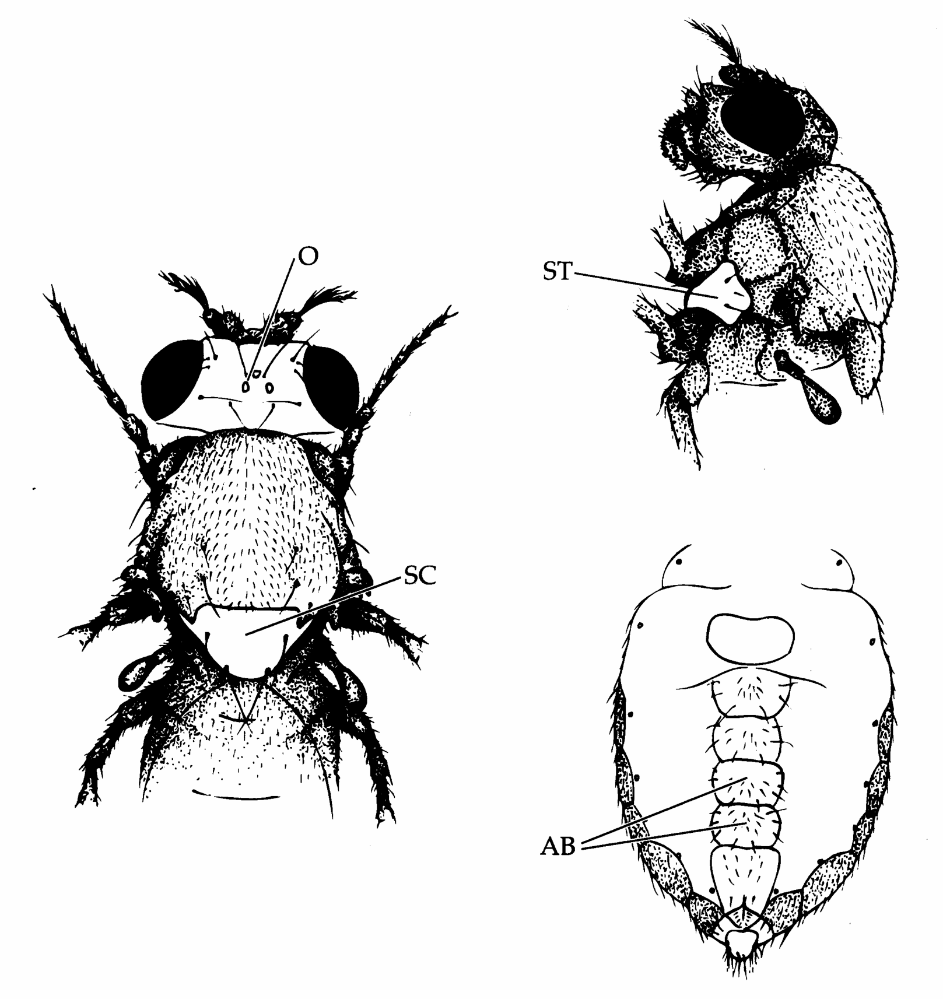
>
> Figure 14.1 Location of head and thoracic bristles in adult Drosophila. The most frequently studied bristle systems in quantitative-genetic experiments are sternopleural bristles (ST) on the side of the thorax between the first and second legs, abdominal bristles on the underside of the abdomen (AB), and scutellar bristles (SC) on the upper side of the last thoracic region. Ocellar bristles (O) on the top of the head are also occasionally used.

> **Table 14.1** · `14.1` · page 396 · source: `Genetics_chapter14_004`
> Table 14.1 The genetic architecture of various characters in Drosophila inferred by chromosomal assay.
>
> <table><tr><td rowspan="2">Character</td><td colspan="2">Dominance</td><td rowspan="2">Epistasis</td><td rowspan="2">Reference</td></tr><tr><td>Present</td><td>Directional</td></tr><tr><td>Fitness-related Characters</td><td></td><td></td><td></td><td></td></tr><tr><td rowspan="3">Viability</td><td>Yes</td><td>Yes</td><td>Yes</td><td>Breese and Mather 1960</td></tr><tr><td>—</td><td>—</td><td>Yes</td><td>Seager and Ayala 1982</td></tr><tr><td>No</td><td>—</td><td>Weak</td><td>Ferrari 1987</td></tr><tr><td>Male mating activity</td><td>—</td><td>—</td><td>No</td><td>Kosuda 1993</td></tr><tr><td>Egg hatchability</td><td>Yes</td><td>Yes</td><td>Yes</td><td>Kearsey and Kojima 1967</td></tr><tr><td>Fecundity</td><td>Yes</td><td>Yes</td><td>—</td><td>Keller and Mitchell 1964</td></tr><tr><td>Egg-pupal survival</td><td>Yes</td><td>Yes</td><td>—</td><td>Keller and Mitchell 1964</td></tr><tr><td rowspan="2">Development time</td><td>Yes</td><td>Yes</td><td>—</td><td>Keller and Mitchell 1964</td></tr><tr><td>No</td><td>—</td><td>Weak</td><td>Ferrari 1987</td></tr><tr><td>Progeny yield</td><td>Yes</td><td>Yes</td><td>Yes</td><td>Barnes 1966</td></tr><tr><td>Egg production</td><td></td><td></td><td></td><td></td></tr><tr><td>D. melanogaster</td><td>Yes</td><td>Yes</td><td>—</td><td>Keller and Mitchell 1964</td></tr><tr><td>D. pseudoobscura</td><td>Yes</td><td>—</td><td>Yes</td><td>Kojima and Kelleher 1963</td></tr><tr><td>Physiological Characters</td><td></td><td></td><td></td><td></td></tr><tr><td>DDT-resistance</td><td>Yes</td><td>No</td><td>Yes</td><td>Dapkus and Merrell 1977</td></tr><tr><td>ADH activity</td><td>Yes</td><td>Yes</td><td>Yes</td><td>McDonald and Ayala 1978</td></tr><tr><td>G6PD activity</td><td>—</td><td>—</td><td>Yes</td><td>Miyashita and Laurie-Ahlberg 1984</td></tr><tr><td>6PGD activity</td><td>—</td><td>—</td><td>Yes</td><td></td></tr><tr><td>Morphological Characters</td><td></td><td></td><td></td><td></td></tr><tr><td rowspan="2">Abdominal bristles</td><td>Weak</td><td>No</td><td>Weak</td><td>Keller and Mitchell 1962</td></tr><tr><td>Weak</td><td>No</td><td>Weak</td><td>Breese and Mather 1957</td></tr><tr><td rowspan="2">Sternopleural bristles</td><td>Weak</td><td>No</td><td>Weak</td><td>Breese and Mather 1957</td></tr><tr><td>Weak</td><td>No</td><td>No</td><td>J. Hill 1964</td></tr><tr><td rowspan="2">Thorax length</td><td>Yes</td><td>Yes</td><td>Yes</td><td>Robertson 1954</td></tr><tr><td>Weak</td><td>No</td><td>Weak</td><td>Keller and Mitchell 1962</td></tr><tr><td rowspan="2">Wing length</td><td>Yes</td><td>Yes</td><td>Yes</td><td>Robertson 1954</td></tr><tr><td>No</td><td>—</td><td>No</td><td>Keller and Mitchell 1962</td></tr><tr><td>Body weight</td><td></td><td></td><td></td><td></td></tr><tr><td>D. melanogaster</td><td>No</td><td>—</td><td>Weak</td><td>Kearsey and Kojima 1967</td></tr><tr><td>D. pseudoobscura</td><td>Weak</td><td>No</td><td>Weak</td><td>Frahm and Kojima 1966</td></tr></table>
>
> Source: Expanded from a shorter table in Kearsey and Kojima (1967).
> Source: Unless otherwise indicated, all analyses are for D. melanogaster. Most of these results were obtained by comparing differences between selected lines. Results for many characters were obtained by both whole and sectional chromosomal assays. Directional dominance occurs when multiple assayed regions show the same direction of dominance (e.g., high values tending to be dominant over low values). Features not examined are denoted by —.

---

## Genetics_chapter14_005 · CLASSICAL APPROACHES / Genetics of Drosophila Bristle Number

Drosophila possess a large number of bristles regularly distributed over the adult integument. As discussed in Chapter 12, a number of bristle systems, most notably sternopleural, abdominal, and scutellar bristles, have been widely used in quantitative-genetic studies (Figure 14.1).

The genetics of sternopleural bristle number have been intensively studied in selected lines using Thoday's method (reviewed in Spickett 1963; Thoday et al. 1964; Spickett and Thoday 1966; Davies and Workman 1971; Davies 1971; Thoday and Thompson 1976; Thoday 1979; Shrimpton and Robertson 1988a,b; Mackay

(in phenotypic standard deviations)

> **Figure 14.2** · page 400 · source: `Genetics_chapter14`
>
> 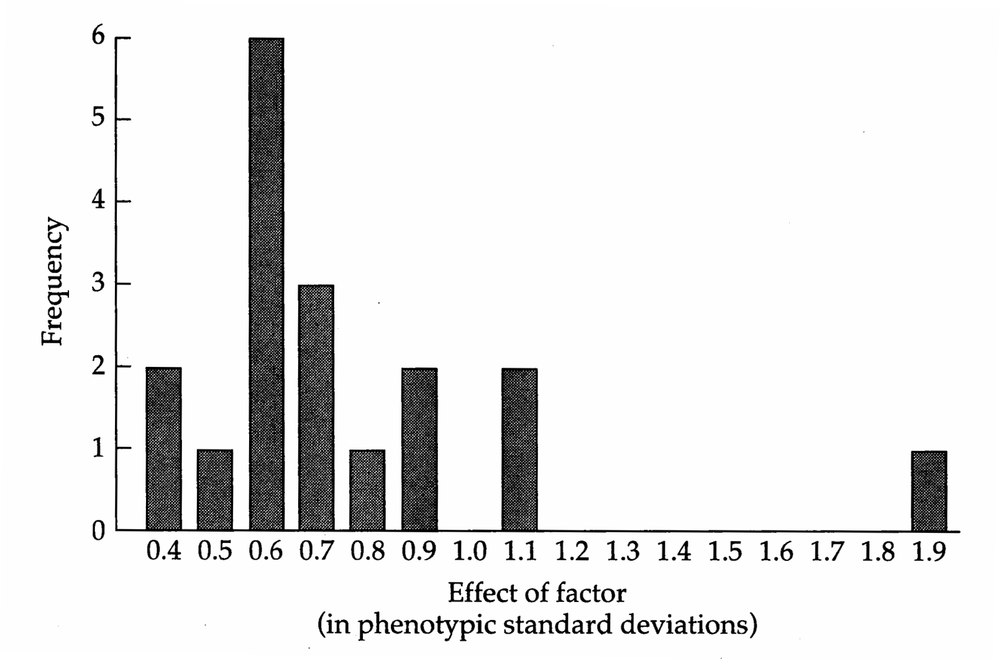
>
> Figure 14.2 Distribution of the effects on sternopleural bristles of Drosophila melanogaster third chromosome factors isolated by Shrimpton and Robertson (1988b). This distribution is biased towards large factors, as effects under roughly 0.3 phenotypic standard deviations were not statistically detectable in this study.

1995, 1996). For example, Spickett and Thoday (1966) examined two selected lines (vg4 and vg6), which showed increases of 15 and 20 bristles, respectively, relative to the standard Oregon R strain. For line vg6, 88% of this increase could be accounted for by five factors detectable via Thoday's approach, while three factors (each spanning a distance amounting to less than 2% recombination) accounted for 80% of the increase in line vg4. In more detailed analyses restricted to the third chromosome, Davies (1971) and Shrimpton and Robertson (1988a,b) isolated a minimum of 8 and 17 factors, respectively. Extrapolating the latter figure to the rest of the genome yields roughly 60 loci influencing sternopleural bristle number. The distribution of effects for the bristle factors isolated by Shrimpton and Robertson (Figure 14.2) is roughly consistent with results from P-element tagging (Chapter 12), suggesting that sternopleural bristle number is controlled by a few major genes supplemented by numerous genes of smaller effect. Evidence for epistasis was found in most studies.

Spickett (1963) examined the developmental aspects of the isolated factors from line vg4 in further detail. One factor increased bristle number over the entire fly by increasing total fly cell number. An increase in cell number normally results in a larger fly, but Spickett found a second linked factor that decreased average cell size, resulting in a normal-sized fly with a larger number of cells and more bristles. Two other factors had more local effects. The first was linked to the previous two factors on chromosome 3 and increased the number of bristles in a specific region of the sternopleurite. The second was on chromosome 2 and modified development of a single large bristle to several smaller bristles in this region. Clearly, genetic changes in characters even as superficially simple as bristle number can result from modifications in a variety of developmental pathways.

---

## Genetics_chapter14_006 · CLASSICAL APPROACHES / Genetics of Drosophila Speciation

Considerable debate revolves around the question of whether speciation events are precipitated by a few genes of major effect (Templeton 1980, Carson and Templeton 1984) or by changes at many loci with individually small effects (Charlesworth et al. 1982, Barton and Charlesworth 1984). Most data on the number of genes involved in reproductive isolation come from assays of crosses between Drosophila species that show partial fertility

For example, D. pseudoobscura / persimilis hybrids produce normal females but sterile males. Dobzhansky (1936) backcrossed fertile $ F_{1} $ hybrid females to marked males of both species, substituting single chromosomes from one species into an otherwise normal genetic background of the other. He found that testes size (correlated with male fertility) was affected by factors on all five chromosomes, with the strongest effect being on the X chromosome. Orr (1987) found that the reduction in sperm motility in hybrids between these species is largely due to incompatibilities between the X and Y chromosomes from different species. A finer analysis by Wu and Beckenbach (1983) suggested at least nine factors affecting hybrid male fertility (five X-linked, three autosomal, and one Y-linked).

Coyne (1984) also found that at least five factors are responsible for male sterility in D. simulans/mauritiana hybrids, with the main effect again being due to incompatibilities between the X and Y chromosomes of the different species (Figure 14.3). When small sections of the D. simulans X chromosome were introgressed into a D. mauritiana background by repeated backcrossing, Palopoli and Wu (1994) found four factors influencing male sterility, two of which displayed very strong epistasis. Given that they examined less than 20% of the X chromosome, this extrapolates to at least 40 X-linked factors (assuming an equal number of factors are fixed by both species) involved in reproductive isolation between these two species (Davis and Wu 1996). That the genetic units from the above studies are best viewed as factors, rather than single major genes, is shown by further work from Wu's lab. Introgression of small segments of the X from D. mauritiana and D. sechellia into D. simulans initially suggested that a 500 kilobase region harbored a single major sterility gene (Perez et al. 1993), but a more refined analysis suggested at least two epistatically interacting factors (Perez and Wu 1995).

An important caveat for all of these studies is that they measure only the current number of factors contributing to reproductive isolation, which can be much greater than the actual number involved in the original isolation event. Some indications of the potential magnitude of this bias can be seen by considering the classic Dobzhansky-Muller model of speciation, which assumes that speciation occurs through epistasis, with isolated populations fixing mutually incompatible

> **Figure 14.3** · page 402 · source: `Genetics_chapter14`
>
> 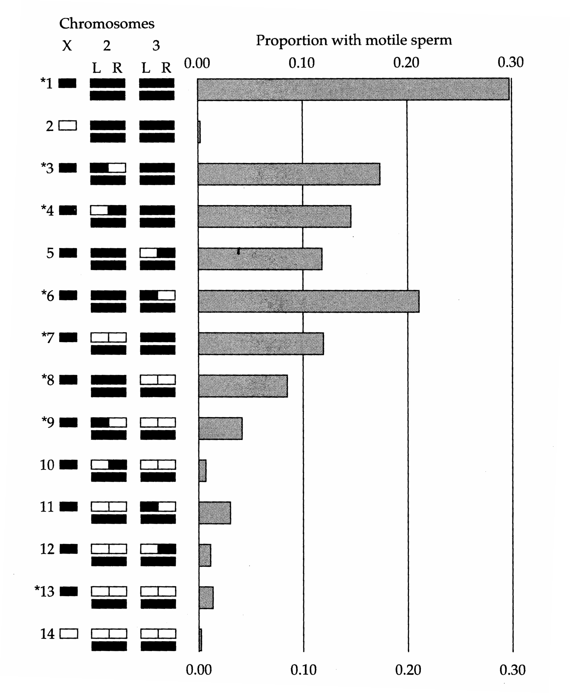
>
> Figure 14.3 Locating male-sterility genes in D. simulans/mauritiana hybrids with chromosomal assays. Fertility is measured by the proportion of males with motile sperm, with chromosome segments from D. simulans being shown in black, and those from D. mauritiana in white. L and R refer to the left and right arms of chromosomes 2 and 3. All genotypes have a D. simulans Y chromosome. Asterisks denote genotypes that produced progeny when crossed to D. simulans females. (From Coyne 1984.)

alleles (Dobzhansky 1936, Muller 1939, Orr 1996). Their model assumes that a base population fixed for aabb is split into two isolated populations, with separate mutations, A and B, arising in each population. In the bb background, A has no serious negative fitness consequences, so fixation can occur by drift, giving an AAbb population. Likewise, the other population fixes allele B to yield aaBB, where again B has no serious fitness effects in the aa background. However, A and B, when together, are incompatible, such that an AaBb hybrid has reduced fitness relative to the ancestral population. A number of such incompatibilities are known in species hybrids (see Orr 1995 for a review), and they are related (at least in principle) to synthetic lethals (Chapter 10). Orr (1995) found that under the Dobzhansky-Muller model, the number of fixed incompatible loci separating the two populations should increase with (at least) the square of separation time, and that incompatibilities involving three or more loci evolve more readily than interactions involving pairs of loci (also see Cabot et al. 1994). Hence, complex interactions among “speciation genes” are expected to be the norm, rather than the exception. This introduces further complications into the already difficult problem of determining how many factors are actually involved in the generation of the initial isolation event that allows the accumulation of further incompatibility genes.

Despite these interpretative difficulties, some general conclusions emerge from these studies. First, in Drosophila there is a large X effect—factors with the largest effects on reproductive isolation and hybrid inviability are located on the X chromosome (Coyne and Orr 1989b, Coyne 1992). This effect is restricted to reproductive isolation, as no such X chromosome localization is seen for genes influencing morphological differences between Drosophila species (e.g., Coyne 1983, 1985; Liu et al. 1996). Consistent with this, Ford and Aquadro (1996) report evidence for selection on X-linked sites, but not autosomal sites, among three semispecies of the Drosophila athabasca complex showing reproductive isolation but no obvious morphological differentiation.

The second (more general) conclusion, first noted by Haldane (1922), is that when only one sex in a cross-species hybrid is sterile or inviable, it is usually the heterogametic sex (e.g., XY males in most animals, WZ females in birds and butterflies). The Drosophila data show that male sterility/inviability arises first (often rather quickly), with female sterility/inviability often developing only after a considerable amount of additional time (Coyne and Orr 1989a, 1997). Much has been written about Haldane's rule and its possible causes (e.g., Charlesworth et al. 1987; Orr and Coyne 1989b; Read and Nee 1991; Coyne et al. 1991; Frank 1991; Coyne 1992; Wu and Davis 1993; Coyne and Orr 1993; Orr 1993a,b; Virdee 1993; Turelli and Orr 1995; Zeng 1996; Sawamura 1996; Orr and Turelli 1996; True et al. 1996). While a variety of mechanisms have been proposed (e.g., differences in the substitution rates on autosomes vs. sex chromosomes, higher mutation rates for male vs. female sterility), Turelli and Orr (1995, Orr and Turelli 1996) suggest that dominance provides an explanation for Haldane's rule. If alleles decreasing hybrid fitness are partly recessive, the cumulative effects of sex-linked genes are greater when hemizygous than when heterozygous, resulting in a more pronounced effect in heterogametic hybrids. This effect can be seen by noting that although XX hybrids carry approximately twice the number of deleterious X-linked genes as XY hybrids, if the expression of deleterious effects is less than 50% in heterozygotes, then the overall deleterious effects are smaller in XX hybrids. Finally, while most studies of Haldane's rule examine differences between populations, much can be learned by examining within-population variation (e.g., Wade et al. 1994).

---

## Genetics_chapter14_007 · MOLECULAR MARKERS

As mentioned in the introduction, the ability to score variation at the molecular level provides a huge increase in the number of available markers in any analysis. The first molecular markers used were allozymes, protein variants detected by differences in migration on starch gels in an electric field. Since the late 1960s, this class of markers has been extensively applied to a variety of population-genetic problems. However, as methods for evaluating variation directly at the DNA level became widely available during the mid-1980s, DNA-based markers largely replaced allozymes in mapping studies. Allozymic variants have the advantage of being relatively inexpensive to score in large numbers of individuals (although DNA markers are rapidly closing this price gap), but there is often insufficient protein variation for high-resolution mapping. On the other hand, there are effectively no limitations on either the genomic location or the number of DNA markers.

A wide variety of techniques can be used to measure DNA variation. Direct sequencing of DNA provides the ultimate measure of genetic variation, but much cruder (and quicker) scoring of variation is sufficient for most purposes. One of the simplest approaches is to digest DNA with a variety of restriction enzymes, each of which cuts the DNA at a specific sequence or restriction site (commonly four to six bases). When the digested DNA is run on a gel under an electric current, the fragments separate out according to size. As Figure 14.4 shows, a variety of mutational events can generate length variation. If we attempted to score the entire genome for fragment lengths, the result would be a complete (and uninformative) smear on the gel. Instead, individual bands are isolated from this smear by using labeled DNA probes that have base-pair complementarity to particular regions of the genome (often chosen at random). This approach is the basis for assays of restriction fragment length polymorphisms or RFLPs (Figure 14.5). Each RFLP probe generally scores a single-marker locus, and the marker alleles are codominant, as heterozygotes and homozygotes can be distinguished. The number of detectable RFLPs is impressive (Botstein et al. 1980; Doris-Keller et al. 1987; Beckmann and Soller 1983, 1986a,b; Soller and Beckmann 1988).

A particularly interesting RFLP approach involves the use of tissue-specific cDNA clones as the probes. (cDNAs are generated from the mRNAs of genes being expressed in that tissue.) This procedure can allow for enrichment of genes of

> **Figure 14.4** · page 405 · source: `Genetics_chapter14`
>
> 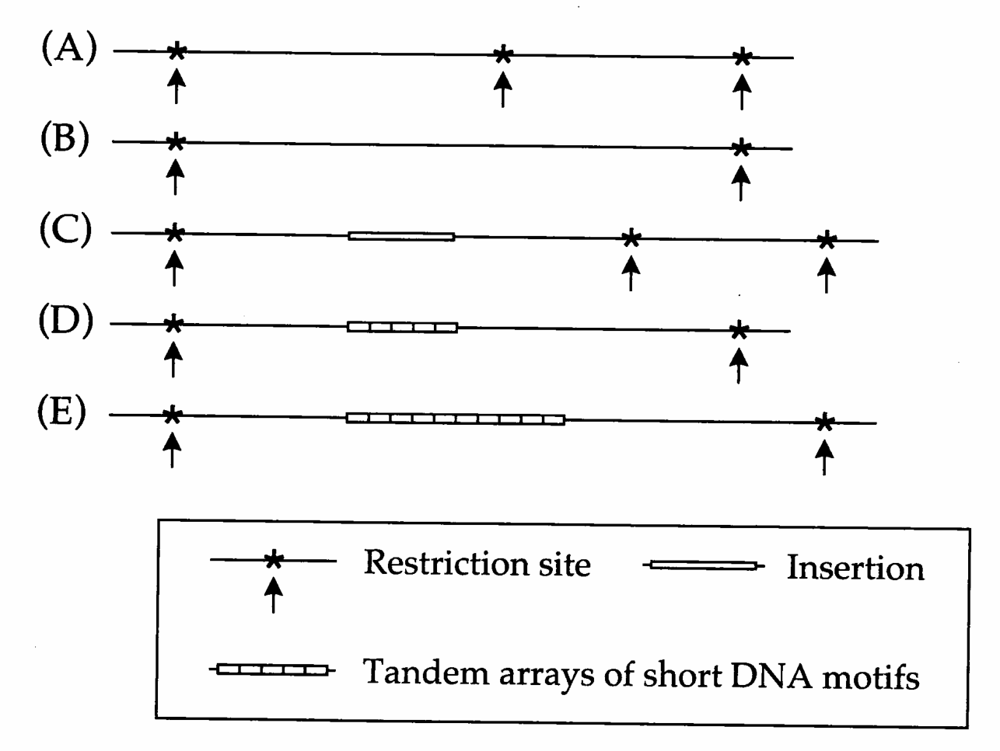
>
> Figure 14.4 A variety of mutational events generate variation in restriction fragment lengths, scored by the distances between restriction sites. Single (or multiple) base-pair changes can create or destroy restriction sites, (A) vs. (B). Insertions of mobile genetic elements can create dramatic size differences (C). DNA sequences often exist as tandem arrays of short repeated sequences. Unequal crossing over and/or replication slippage creates variation in the size of such arrays, (D) vs. (E).

potential interest in the marker pool, enabling observed differences to be treated as potential candidate loci. For example, Kinzer et al. (1990) used 19 ripening-specific cDNA clones from the tomato (Lycopersicon esculentum) to detect polymorphisms in these loci between L. esculentum and a wild relative L. pennellii.

A rather different molecular marker approach uses short primers for DNA replication via the polymerase chain reaction (PCR) to delimit fragment sizes. A region flanked (in opposite orientation) by primer binding sequences that are sufficiently close together allows the PCR reaction to replicate this region, generating an amplified fragment. If primer binding sites are missing or are too far apart, the PCR reaction fails and no fragments are generated for that region. This procedure is the basis for randomly amplified polymorphic DNAs or RAPDs (Williams et al. 1990), sequence polymorphisms detected by using random short sequences as primers (Figure 14.5). RAPDs have an advantage over RFLPs in that a single probe (here, a particular random primer) can reveal several loci at once, each corresponding to different regions of the genome with appropriate primer sites. They also require smaller amounts of DNA. However, by their very nature, RAPDs are generally dominant, as they indicate presence/absence of a particular site, so marker genotypes can be ambiguous (see Figure 14.5). Ragot and Hoisington (1993) conclude that RAPDs are generally more time- /cost-effective in

> **Figure 14.5** · page 406 · source: `Genetics_chapter14`
>
> 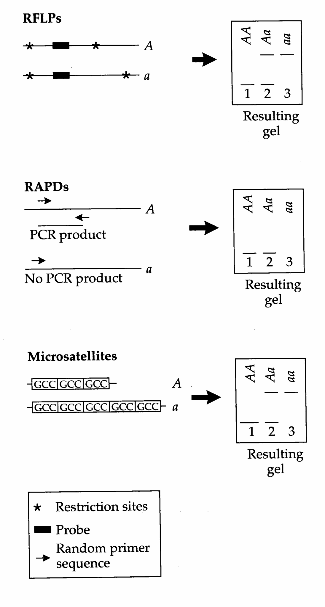
>
> Figure 14.5 Top: RFLPs, restriction fragment length polymorphisms, variable lengths of restriction fragments in a particular region of the genome, are revealed by use of a probe for that region. This marker system is codominant (all marker genotypes can be distinguished), as an RFLP heterozygote shows fragments of both lengths. Middle: RAPDs, randomly amplified polymorphic DNAs, are revealed by the use of a random primer sequence. A successful PCR reaction requires sequences complementary to the primer in opposite orientation at sufficiently close distance. Running these products out on a gel, both AA and Aa exhibit a fragment and the site is scored as present, while the fragment does not amplify in aa individuals and the site is scored as absent. Hence, RAPDs are dominant markers. Bottom: Microsatellite DNAs exhibit variation in the array lengths of short sequences of tandemly repeated DNAs. Fragment length is scored, so that these markers are also codominant. Codominance occurs even when variation is scored via PCR with primers that flank the repeat region.

**[Table]**

*[See Table 14.2 at the end of this section.]*

small studies where a modest number of individuals have to be genotyped, while RFLPs are better for larger studies.

Mapping in outbred populations is most efficient with marker loci having a large number of alleles (Chapter 16). In this case, microsatellite DNAs, short arrays of simple repeated sequences (Figure 14.5) have become the markers of choice. Microsatellites tend to be very highly polymorphic, a consequence of their high mutation rate to new alleles (changes in the number of repeats in the array). Since array length is scored, microsatellites are codominant, as heterozygotes show two different lengths and hence can be distinguished from homozygotes.

While the marker types listed in Table 14.2 are the most commonly used, other categories of markers can be very useful (reviewed in Rafalski and Tingey 1993). For example, several studies have used mobile genetic elements (such as retroviruses) as markers (e.g., Rise et al. 1991, Nuzhdin et al. 1993, Keightley and Bulfield 1993, Ebert et al. 1993, Long et al. 1995). Due to the high rates of movement of some transposable elements, individuals often differ in the presence or absence of elements at particular sites. Scoring sites for the presence or absence of elements yields dominant markers. Finally, important advances in marker scoring are offered by two recently developed methods: representational difference analysis or RDA (Lisitsyn et al. 1993, Lisitsyn 1995) and genomic mismatch scanning or GMS (Nelson et al. 1993). Both methods examine the entire genome, allowing one to isolate only those sequences that are shared by two populations (GMS) or those that differ between populations (RDA). Judicious use of these methods will very likely provide powerful approaches for the isolation of QTLs (Lander 1993, Aldhous 1994).

> **Table 14.2** · `14.2` · page 407 · source: `Genetics_chapter14_007`
> Table 14.2 Properties of the most commonly used classes of molecular marker loci.
>
>  | RFLP | RAPD | Microsatellite DNA
> --- | --- | --- | ---
> Number of alleles/locus | Few | Few | Many
> Genomic abundance | High | Very high | Medium
> Marker dominance | Codominant | Dominant | Codominant
> Amount of DNA required | 2–10 $ \mu $g | 10–25 ng | 50–100 ng
>
> Source: Rafalski and Tingey 1993.
> Note: RFLP = restriction fragment length polymorphism, and RAPD = randomly amplified polymorphic DNA.

---

## Genetics_chapter14_008 · GENETIC MAPS

Genetic maps show the ordering of loci along a chromosome and the relative distances between them. As detailed throughout the remainder of this chapter, such maps are essential to the localization of QTLs. The lack of genetic markers historically prevented the construction of detailed maps in all but a few well studied species with short generation times. However, as predicted by Botstein et al. (1980), molecular markers have sparked an explosion of genetic maps in humans and economically important plants and animals. The theory for constructing genetic maps is now highly refined, and we only introduce a few important issues here. For more detailed reviews, the reader should consult Bailey (1961), Lalouel (1992), and the excellent text by Ott (1991).

---

## Genetics_chapter14_009 · GENETIC MAPS / Map Distances vs. Recombination Frequencies

Genetic map construction involves both the ordering of loci and the measurement of distance between them. Ideally, distances should be additive so that when new loci are added to the map, previously obtained distances do not need to be radically adjusted. Unfortunately, recombination frequencies are not additive and hence are inappropriate as distance measures. To illustrate, suppose that three loci are arranged in the order A, B, and C with recombination frequencies $ c_{AB} $, $ c_{AC} $, and $ c_{BC} $. Each recombination frequency is the probability that an odd number of crossovers occurs between the markers, while 1 - c is the probability of an even number (including zero). There are two different ways to get an odd number of crossovers in the interval A-C: an odd number in A-B and an even number in B-C, or an even number in A-B and an odd number in B-C. If there is no interference, so that the presence of a crossover in one region has no effect on the frequency of crossovers in adjacent regions, these probabilities can be related as

$$
c_{AC}=c_{AB}\left(1-c_{BC}\right)+\left(1-c_{AB}\right)c_{BC}=c_{AB}+c_{BC}-2c_{AB}c_{BC}
\tag{14.1}
$$

This is Trow's formula (Trow 1913). More generally, if the presence of a crossover in one region depresses the probability of a crossover in an adjacent region,

$$
c_{AC}=c_{AB}+c_{BC}-2(1-\delta)c_{AB}\; c_{BC}
\tag{14.2}
$$

where the interference parameter $ \delta $ ranges from zero if crossovers are independent (no interference) to one if the presence of a crossover in one region completely suppresses crossovers in adjacent regions (complete interference).

Thus, in the absence of very strong interference, recombination frequencies can only be considered to be additive if they are small enough that the product $ 2c_{ABC}c_{BC} $ can be ignored. This is not surprising given that the recombination frequency measures only a part of all recombinant events (those that result in an odd number of crossovers). A map distance m, on the other hand, attempts to measure the total number of crossovers (both odd and even) between two markers. This is a naturally additive measure, as the number of crossovers between A and C equals the number of crossovers between A and B plus the number of crossovers between B and C.

A number of mapping functions attempt to predict the number of crossovers (m) from the observed recombination frequency (c). The simplest, derived by Haldane (1919), assumes that crossovers occur randomly and independently over the entire chromosome, i.e., no interference. Let $ p(m, k) $ be the probability of k crossovers between two loci m map units apart. Under the assumptions of this model, Haldane showed that $ p(m, k) $ follows a Poisson distribution, so that the observed fraction of gametes containing an odd number of crossovers is

$$
c=\sum_{k=0}^{\infty}p(m,2k+1)=e^{-m}\sum_{k=0}^{\infty}\frac{m^{2k+1}}{(2k+1)!}=\frac{1-e^{-2m}}{2}
\tag{14.3}
$$

where m is the expected number of crossovers. Rearranging, we obtain Haldane's mapping function, which yields the (Haldane) map distance m as a function of the observed recombination frequency c,

$$
m=-\frac{\ln(1-2c)}{2}
\tag{14.4}
$$

For small $ c, m \simeq c $, while for large $ m, c $ approaches $ 1/2 $. Map distance is usually reported in units of Morgans (after T. H. Morgan, who first postulated a chromosomal basis for the existence of linkage groups) or as centiMorgans (cM), where 100 cM = 1 Morgan. For example, a Haldane map distance of 20 cM ( $ m = 0.2 $) corresponds to a recombination frequency of $ c = (1 - e^{-0.2})/2 \simeq 0.16 $.

Although Haldane’s mapping function is still used frequently, several other functions allow for the possibility of crossover interference in adjacent sites (Bailey 1961, Felsenstein 1979, Karlin 1982, Pascoe and Morton 1987, Ott 1991, Zhao and Speed 1996). For example, geneticists often use Kosambi’s (1944) mapping function, which allows for modest interference,

$$
m=\frac{1}{4}\ln\left(\frac{1+2c}{1-2c}\right)
\tag{14.5}
$$

Figure 14.6 compares the Haldane and Kosambi mapping functions. For small $ c(<0.15) $, both give $ m \simeq c $. For large m, both approach $ c = 1/2 $. The appropriateness of a potential mapping function can be assessed by checking if the computed map distances depart significantly from additivity (e.g., Pascoe and Morton 1987).

There is no universal relationship between map distance and the actual physical distance between loci (Table 14.3). A centiMorgan can correspond to a span of between ten thousand to a million nucleotide base pairs (10 kb to 1,000 kb), depending on the species. Even within a chromosome, there can be rather dramatic differences. For example, crossovers are often suppressed in particular chromosomal regions (increasing the number of base pairs per cM), such as near the centromere and telomeres (chromosome ends), e.g., True et al. (1996). Further, the rate of recombination is under genetic control with some modifier genes having a general influence throughout the genome and others having a fine-scaled influence on specific chromosomal regions (Brooks 1988). Thus, there may be considerable variation among individuals and among populations in the strength of linkage. The recombination rate can also vary between the sexes. In mammals, for example, females usually have greater map distances than do males. In male Drosophila, crossing-over is generally entirely suppressed.

> **Figure 14.6** · page 410 · source: `Genetics_chapter14`
>
> 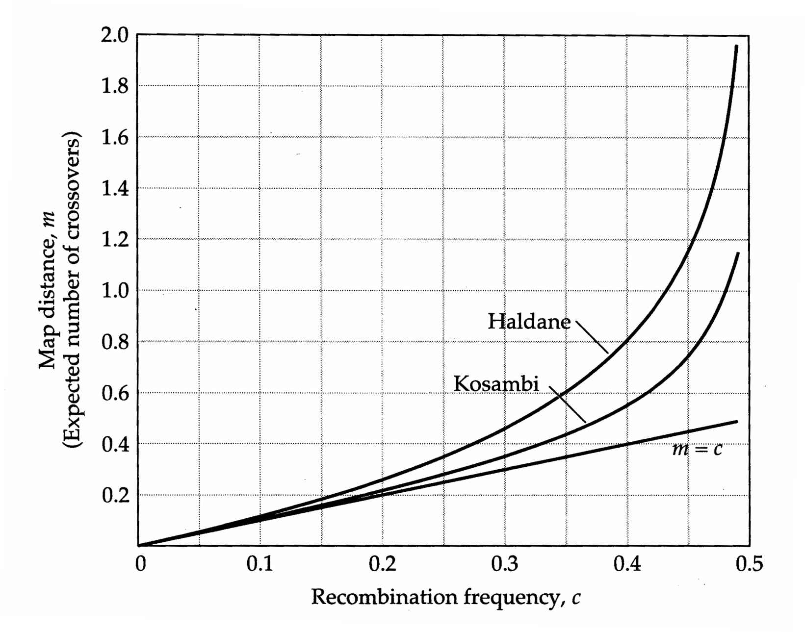
>
> Figure 14.6 Comparison of the Haldane, Kosambi, and simple recombination-frequency (m = c) mapping functions, which translate an observed recombination frequency c into an estimate of the expected number of crossovers (the map distance m). The different functions make different assumptions about interference. Haldane's function assumes none, Kosambi's assumes a moderate amount, and the simple recombination-frequency model assumes complete interference ( $ \delta = 1 $ in Equation 14.2). For a given c, the Haldane map distance is largest, and the recombination-frequency distance is the smallest. For c < 0.15, all three are extremely similar, while the Kosambi and simple function are close for c < 0.25.

**[Table]**

*[See Table 14.3 at the end of this section.]*

> **Table 14.3** · `14.3` · page 410 · source: `Genetics_chapter14_009`
> Table 14.3 The relationship between map distance and physical distance.
>
> Species | Haploid Genome Size (kilobase pairs) | Map Length (centiMorgans) | Kilobases/centiMorgan
> --- | --- | --- | ---
> Yeast | $ 2.2 \times 10^{4} $ | 3,700 | 6
> Neurospora | $ 4.2 \times 10^{4} $ | 500 | 80
> Arabidopsis | $ 7.0 \times 10^{4} $ | 500 | 140
> Drosophila | $ 2.0 \times 10^{5} $ | 290 | 700
> Tomato | $ 7.2 \times 10^{5} $ | 1,400 | 510
> Human | $ 3.0 \times 10^{6} $ | 2,710 | 1,110
> Corn | $ 3.0 \times 10^{6} $ | 1,400 | 2,140
>
> Source: Catchside 1977, Shields 1989.
> Note: These data are rather crude approximations, averaged over the entire genome and do not account for the substantial variation in map-distance relationships that can exist within and between individuals.

---

## Genetics_chapter14_010 · GENETIC MAPS / How Many Markers Are Needed?

For most organisms, genetic maps are not yet available, and one must start with randomly obtained markers. As a rough approximation for the number of random polymorphic markers necessary for a desired saturation of the linkage map, assume a circular linkage map of total length L map units. In order to have a fraction p of all loci within m map units of some marker, the required number of randomly distributed markers is

$$
n=\frac{\ln(1-p)}{\ln(1-2m/L)}
\tag{14.6a}
$$

(Lange and Boehnke 1982, Beckmann and Soller 1983). This rearranges to give the proportion of the genome within m map units of a marker as approximately

$$
p\simeq1-\exp\left(-\frac{2mn}{L}\right)
\tag{14.6b}
$$

(Jacob et al. 1991). Assuming a circular genome map ignores the effect of chromosome ends, causing Equation 14.6a to underestimate n and Equation 14.6b to overestimate p. A more general expression, which accounts for linear chromosomes, is given by Bishop et al (1983). Assuming a haploid chromosome number C,

$$
p=1-\frac{2C\left[\left(1-x\right)^{n+1}-\left(1-2x\right)^{n+1}\right]}{n+1}-\left(1-2x C\right)\left(1-2x\right)^{n}
\tag{14.7}
$$

where x = m/L.

An alternative consideration is the average distance between a locus and the nearest random marker. Martin et al. (1991) show that the expected distance of a gene from the closest of n random markers is

$$
E(m)=\frac{L}{2(n+1)}
\tag{14.8a}
$$

with the upper 95% confidence interval for this distance given by

$$
\frac{L}{2}\left(1-0.05^{1/n}\right)
\tag{14.8b}
$$

It is important to note that the above expressions refer to randomly chosen markers. It is much more efficient to use sets of equally spaced markers. If the entire genome is covered by marker loci equally spaced at m map units apart, no locus is more than m/2 from any marker, and the average distance of a locus from a marker (assuming a uniform distribution of loci along the chromosome) is m/4.

**[示例 Example]**

> **[UNRESOLVED EXAMPLE: Genetics_chapter14:3]**

---

## Genetics_chapter14_011 · MARKER-TRAIT ASSOCIATIONS

We now turn our attention to the mapping of individual QTLs. A variety of experimental designs have been proposed, and we consider these in some detail in Chapters 15 (inbred line crosses) and 16 (outbred populations). Since those chapters focus on methods for estimating both QTL effects and map position, we defer further discussion of most statistical issues until then. The remainder of this chapter is concerned with general design strategies for mapping, and eventual cloning, of QTLs.

That QTLs, like normal genes, can be mapped (assigned to linkage groups) was first demonstrated by Payne (1918), who found that the X chromosome from selected lines of Drosophila contains multiple factors influencing scutellar bristle number. Over the next two decades, a number of workers found associations between Mendelian markers and quantitative traits in crosses between inbred lines. For example, Sax (1923) crossed two inbred bean lines (Phaseolus vulgaris) differing in seed pigment and weight, with the pigmented parents having heavier seeds than the nonpigmented parents. These crosses demonstrated that seed pigment is determined by a single locus with two alleles, P and p. Among F₂ segregants from this cross, PP and Pp seeds were, respectively, 4.3 ± 0.8 and 1.9 ± 0.6 centigrams heavier than pp seeds. Hence the P allele is linked to a factor (or factors) that act in an additive fashion on seed weight. In a similar manner, Lindstrom (1924) demonstrated linkage between a locus for fruit color and factors for fruit size in tomatoes, while Smith (1937) observed associations between corolla size differences and several independently segregating flower color genes in tobacco. Similar studies were reported in maize (Lindstrom 1931), peas (Rasmusson 1927), barley (Wexelesen 1933, 1934), and mice (Green 1931, 1933).

These studies raised the possibility that QTLs could be mapped with some precision, perhaps even allowing for the characterization of individual loci, given a population in linkage disequilibrium with a sufficient number of markers. Disequilibrium is a key feature, as it creates marker-trait associations, with different marker genotypes having different expected values for characters influenced by QTLs linked to these markers. This simple idea is the foundation for QTL mapping.

Creating populations with linked loci in disequilibrium is straightforward — crosses between inbred lines have this property, as do sibs and other collections of relatives. Other approaches are detailed in Chapters 15 and 16. For mapping purposes, crosses between inbred lines have the fewest complications. The progeny from such crosses display maximum disequilibrium and, being genetically identical, are equally informative as parents. Using such $ F_{1} $ parents, a variety of populations (such as $ F_{2}s $ or backcrosses) can be generated.

A number of problems, which are elaborated on in Chapter 16, conspire to make QTL mapping considerably more difficult in outbred populations than with inbred-line crosses. Not all parents are guaranteed to be informative, as some may be segregating marker alleles, but not linked QTLs, or vice-versa. Further, the marker-QTL linkage phase can differ between different sets of relatives. For example, marker allele M might be associated with QTL allele q in one family, but with Q in another. Thus, marker-trait associations have to be assessed in each set of relatives, rather than (as with inbred-line crosses) averaged over all individuals.

**[示例 Example]**

> **[UNRESOLVED EXAMPLE: Genetics_chapter14:4]**

An observed association between alleles at a polymorphic marker locus and the value of a quantitative trait can result either because of gametic phase disequilibrium between the marker locus and a QTL or because the marker itself has a pleiotropic effect on the trait. A simple test for pleiotropy versus disequilibrium is to examine a marker-trait association over several generations of random mating. An association due to pleiotropy will not decay over time, while one due to linkage alone will. A caveat is that if linkage is very tight, it can take many generations before any substantial decay is observed (Equation 5.13). If one suspects that the marker itself is the QTL, a variety of candidate-locus approaches (to be discussed below) can be used to test this hypothesis.

**[示例 Example]**

> **[UNRESOLVED EXAMPLE: Genetics_chapter14:5]**

---

## Genetics_chapter14_012 · MARKER-TRAIT ASSOCIATIONS / Selective Genotyping and Progeny Testing

Many quantitative traits are less expensive to score than marker genotypes. In such cases, if our interest is in a single trait, it pays to first score a number of individuals for the trait and then genotype only a selected subset of these. Known as selective genotyping, this strategy can result in a large increase in power for the simple reason that much of the linkage information resides in individuals with extreme phenotypes (Lebowitz et al. 1987, Lander and Botstein 1989, Carey and Williamson 1991, Darvasi and Soller 1992). However, while selective genotyping offers increased power to detect a QTL, it also produces biased estimates of their effects. Unbiased estimates can be obtained by maximum likelihood, either using a likelihood function that directly accounts for the sampling bias (Darvasi and Soller 1992) or by treating unscored genotypes as missing values (Lander and Botstein 1989).

In those organisms where asexual propagation is possible, progeny testing (or replicated progeny) is another design strategy for increasing power (Cowen 1988, Simpson 1989, Lander and Botstein 1989, Soller and Beckmann 1990, Knapp and Bridges 1990). The idea here is to reduce the effects of environmental variance by asexually replicating each genotype, using the mean values of these replicated progeny in place of individual values. This is an efficient strategy in that if the heritability of the character is small, scoring only a few replicated progeny can result in a significant increase in power. Soller and Beckmann (1990) show that most of the increase in power occurs by measuring 10 or fewer replicated progeny. Besides offering some increase in power, progeny replication allows marker-trait associations to be examined across environments, providing a basis for estimating QTL × environment interactions.

---

## Genetics_chapter14_013 · MARKER-TRAIT ASSOCIATIONS / Recombinant Inbred Lines (RILs)

When asexual propagation is not possible, a related method is to use recombinant inbred lines (RILs). These can be constructed for any organism by taking an $ F_{1} $ line through multiple rounds of selfing (e.g., Burr and Burr 1991) or multiple generations of brother-sister mating (e.g., Bailey 1981). The resulting lines have essentially no within-line genetic variance (ignoring new mutation and small amounts of residual heterozygosity), whereas the genetic variance between lines is considerable, as each RIL represents a different multilocus genotype. A related approach, currently restricted to certain plants and the zebrafish (Streisinger et al. 1981), uses doubled-haploid lines (DHLs). Here haploid gametes from $ F_{1} $ parents are chemically treated to double the chromosome number, instantly producing completely homozygous individuals (Jensen 1989, Knapp et al. 1990, Knapp 1991, Luo and Kearsey 1991).

Once the considerable work to generate and molecularly characterize a set of RILs or DHLs has been done, any character can be examined, and the previous marker information used to look for marker-trait associations. Only one

> **Figure 14.7** · page 416 · source: `Genetics_chapter14`
>
> 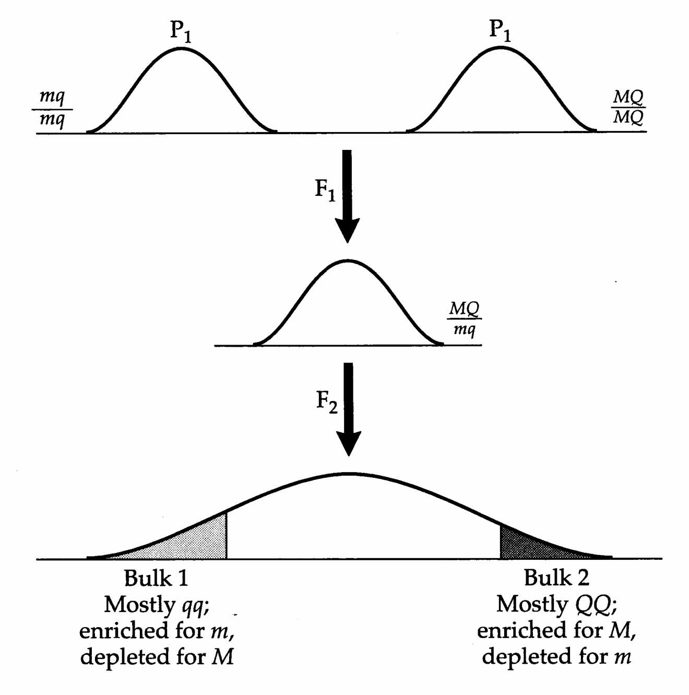
>
> Figure 14.7 Bulked segregant analysis for mapping QTLs. Assume that a major QTL with alleles Q/q is tightly linked to a marker locus with alleles M/m. If we cross two inbred populations (MMQQ and mmqq) and then sample the extreme tails of the $ F_{2} $ phenotype distribution, the lower tail is enriched for qq, and the upper tail is enriched for QQ. Since the marker is closely linked to the QTL, the lower tail is enriched for marker allele m and depleted for M, while the opposite is true in the upper tail.

laboratory needs to characterize the marker genotypes for the set of lines, while subsequent investigators (with these genotypes in hand) can look for marker-trait associations across the set of lines. Like asexual lineages, RILs/DHLs offer a particularly easy approach for measuring QTL × environment interactions, since the same lines can be raised over different sets of environments. For these reasons, behavioral geneticists are increasingly interested in using RILs for mapping behavioral QTLs in mice (e.g., Plomin et al. 1991, Belknap et al. 1993, Crabbe et al. 1994).

---

## Genetics_chapter14_014 · MARKER-TRAIT ASSOCIATIONS / Bulked Segregant Analysis

A variant of selective genotyping that is especially powerful when using RILs is bulked segregant analysis or BSA (Arnheim et al. 1985, Michelmore et al. 1991). Here individuals are combined (bulked or pooled) into groups based on trait value (Figure 14.7). Marker alleles in linkage disequilibrium with QTL alleles are expected to have a nonrandom distribution across bulks, in the extreme having a particular marker allele present only in one bulk and the alternative allele present only in the other bulk. Unlinked markers (and marker alleles in linkage equilibrium with QTLs) are expected to be randomly distributed across bulks. Generally DNA from each bulk is screened en mass for a number of marker loci, and markers are scored as present/absent. This all/none scoring is not necessarily very stringent, as alleles with frequencies less than 5% to 10% are generally scored as absent. However, methods do exist for quantifying the relative frequencies of marker alleles in each pool (e.g., using optical densities of observed allelic bands), see Pacek et al. (1993), Khatib et al. (1994), and Darvasi and Soller (1994a).

Because bulked segregant analysis requires very high enrichment of the alternative QTL alleles in the tails of the trait distribution, it is not expected to work well for QTLs of small to modest effect. It also requires either inbred-line crosses or progeny from very large segregating families, as the method fails if groups with the marker and QTL alleles in different linkage phases are lumped. In spite of these limitations, BSA is so straightforward, allowing rapid screening of a very large number of markers, that it is reasonable to consider it in many cases, particularly with RILs.

Finally, we note that BSA can be used to find additional markers linked to a particular region (Giovannoni et al. 1991). Sorting individuals from a cross into separate pools based on alternate alleles at a marker enriches those pools for additional linked markers. Thus, bulking on a marker of interest provides for very efficient screening of a large number of markers, for example by using random PCR primers to search for linked RAPDs markers. Such an increase in marker density is required for finer mapping of QTL position.

**[示例 Example]**

> **[UNRESOLVED EXAMPLE: Genetics_chapter14:6]**

**[示例 Example]**

> **[UNRESOLVED EXAMPLE: Genetics_chapter14:7]**

---

## Genetics_chapter14_015 · MARKER-TRAIT ASSOCIATIONS / QTL Mapping by Marker Changes in Populations under Selection

Selective genotyping amounts to a single-generation selection experiment, as individuals are chosen from the tails of the character distribution. This approach can be generalized by divergently selecting a base population for several generations and testing for significant changes in marker allele frequencies between up- and down-selected lines. Marker loci initially in linkage disequilibrium to a QTL will increase (decrease) in frequency as linked QTL alleles increase (decrease) due to selection.

Long-term selection creates two somewhat opposing forces for mapping. While each generation of selection increases the difference in QTL frequencies between divergently selected populations, recombination is expected to decrease the amount of linkage disequilibrium between markers and QTLs. Thus, unless the markers and QTLs are tightly linked, fairly rapid QTL allele-frequency changes (i.e., QTLs of modest to large effects) are required for a linked marker to show significant frequency changes (Lebowitz et al. 1987). Keightley and Bulfield (1993) show that the marker and QTL must be closer than 20 cM for significant marker allele-frequency changes to be likely.

Given the small population sizes of most selection experiments, drift alone is expected to change allele frequencies, motivating the need for tests for whether observed changes exceed those expected by chance events alone (Schaffer et al. 1977). The selection coefficient s on a QTL, which determines how quickly allele frequencies change, is a function of the QTL effect and the amount of selection on the character. Thus, s can provide information about the size of QTL effects. A maximum likelihood approach for estimating s was suggested by Keightley and Bulfield (1993) and Keightley et al. (1996). Here, computer simulations generate the distribution of allele-frequency change between two populations under divergent selection (assuming selection coefficient s) and drift (using an estimate of the effective population size). This procedure is repeated over a range of possible s values, and the value giving the highest probability of the observed change is taken as the ML estimator of s.

Marker alleles associated with body size have been found in several studies of divergently selected lines of mice (Garnett and Falconer 1975, Simpson et al. 1982, Gray and Tait 1993, Keightley and Bulfield 1993, Keightley et al. 1996). For example, after 22 generations of selection, Keightley and Bulfield (1993) found significant changes at four of 16 assorted marker loci (two coat color, two allozyme, 12 proviral inserts). This same set of crosses was further examined using 124 microsatellite loci by Keightley et al. (1996), who found 11 QTLs with estimated effects ranging from 0.17 to 0.28 phenotypic standard deviations. In a study in maize, Stuber et al. (1980) found that 8 of 20 allozyme markers showed significant differences for yield in divergently selected lines starting from $ F_{2} $ crosses between inbred lines. To test whether these associations might simply be due to chance, Stuber et al. (1982) independently selected on the markers, finding a response for yield in the direction predicted by the original marker-trait associations.

**[示例 Example]**

> **[UNRESOLVED EXAMPLE: Genetics_chapter14:8]**

---

## Genetics_chapter14_016 · MARKER-TRAIT ASSOCIATIONS / MARKER-BASED ANALYSIS USING NEARLY ISOGENIC LINES (NILs)

Nearly isogenic lines (NILs), inbred lines containing one or more small regions of DNA from a donor parent in an otherwise standard background, play an important and growing role in QTL mapping and cloning. NILs (also referred to as cogenic strains) are constructed by first crossing a donor parent to an inbred line (the recurrent parent) to form an $ F_{1} $. The resulting offspring are then backcrossed to the recurrent parent for several generations. In species where selfing is allowed, the NIL is formed by at least one generation of selfing. Where selfing is not possible, after the backcrossing is complete, individuals are repeatedly sib mated to form the final inbred line. Note that NILs differ significantly from recombinant inbred lines (RILs). While both are inbred and can start from $ F_{1} $ parents, RILs are generated by repeated inbreeding of the descendant lines and hence contain about 50% donor DNA, as opposed to the very small fraction of donor DNA expected in NILs.

While half of the $ F_{1} $ genome contains donor parent DNA, the expected proportion $ p(b) $ of the donor genome left following b generations of backcrossing and a final generation of selfing is

$$
p(b)=(1/2)^{b+1}
\tag{14.9}
$$

Typically, five to seven generations of backcrossing are performed, giving the expected proportion of donor genome as 1.2% to 0.5%. This repeated backcrossing scheme is the basis for the Wehrhahn-Allard estimator of gene number, discussed in Chapter 9. When subjected to molecular-marker analysis, NILs allow for very powerful QTL analysis (Muehlbauer et al. 1988, Tanksley et al. 1989, Dudley 1993), as the following examples illustrate.

**[示例 Example]**

> **[UNRESOLVED EXAMPLE: Genetics_chapter14:9]**

**[示例 Example]**

> **[UNRESOLVED EXAMPLE: Genetics_chapter14:10]**

**[示例 Example]**

> **[UNRESOLVED EXAMPLE: Genetics_chapter14:11]**

---

## Genetics_chapter14_017 · MARKER-TRAIT ASSOCIATIONS / Marker-based Introgressions

Although NILs formed by selection have generally focused on phenotypic characters such as disease resistance or a small set of desirable characters, one can also select for the retention of specific donor marker alleles. Such marker selection allows the introgression of a specific region (such as one containing QTLs of

> **Figure 14.8** · page 422 · source: `Genetics_chapter14`
>
> 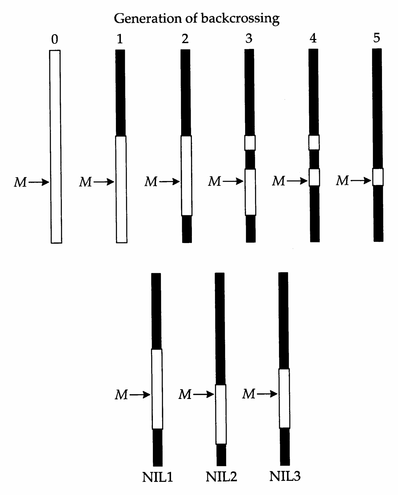
>
> Figure 14.8 Top: Construction of a nearly isogenic line (NIL) containing a region of interest, obtained by selecting on a marker M while backcrossing to a standard stock. Since the final lines are constructed by selfing, we follow a single (haploid) chromosome, as the NIL has two identical copies of this chromosome. Clear regions are from the donor parent, solid from the recurrent parent. Bottom: If several lines are independently selected for the marker, the resulting NILs will contain different retained regions around M. With a dense marker map, crosses between such lines allow for finer mapping of the region around M.

modest to small effect) into an otherwise isogenic background (Young et al. 1988, Tanksley et al. 1989, Paterson et al. 1991, Dudley 1993). Independent NILs formed while selecting on the same marker are expected to differ in the regions retained around the marker (Figure 14.8), so crossing such NILs allows for finer scale mapping. This approach has been used to fine map QTLs (mainly resistance genes) in maize (Bentolila et al. 1991, Koester et al. 1993, Touzet et al. 1995), rice (Yu et al. 1991, Ronald et al. 1992), lettuce (Paran et al. 1991), wheat (Hartl et al. 1993; Schachermayr et al. 1994, 1995), barley (Schüller et al. 1992, Hinze et al. 1991), oats (Penner et al. 1993), and tomatoes (Osborn et al. 1987, Tanksley and Hewitt 1988,

Sarfatti et al. 1989, Paterson et al. 1990).

selecting for the retention of a donor marker while backcrossing to the recurrent parent yields a NIL with a block of donor DNA surrounding the marker that can be rather large. One consequence of this is that linked undesirable genes can be dragged along with the marker, a phenomenon that plant breeders refer to as linkage drag (Brinkman and Frey 1977). Conversely, a single marker may remain associated with several favorable linked QTLs within the introgressed region. The amount of donor DNA present following marker-selected introgression has been examined by several authors (Bartlett and Haldane 1935, Hanson 1959a–d, Stam and Zeven 1981, Naveira and Barbadilla 1992). The donor DNA remaining in the NILs can either reside on the chromosome under marker selection or on the other (unmarked) chromosomes. We consider these two sources separately.

Suppose there are $n$ chromosomes and a total genome length of $L = L_M + \sum L_i$, with $L_M$ being the length of the marker chromosome and $L_i$ being the length of the $i$th unmarked chromosome (all lengths in Morgans). Consider the DNA retained around the marker, and suppose that the selected marker is in the center of the chromosome. Letting $t = b + 1$, the proportion $p_M(b)$ of donor DNA on this marker chromosome after $b$ generations of backcrossing and a final generation of selfing has expected value

$$
E[p_{M}(b)]=2\left(\frac{1-e^{-tL_{M}/2}}{tL_{M}}\right)
\tag{14.10a}
$$

(Hanson 1959b), while the variance is

$$
\sigma^{2}[p_{M}(b)]=\frac{2}{(t L_{M})^{2}}\left[1-\left(t L_{M}+e^{-t L_{M}/2}\right)e^{-t L_{M}/2}\right]
\tag{14.10b}
$$

(Naveira and Barbadilla 1992). For $ tL_{M} \gg 1 $, these are approximately

$$
E[p_{M}(b)]\simeq\frac{2}{t L_{M}},\qquad\sigma^{2}[p_{M}(b)]\simeq\frac{2}{(t L_{M})^{2}}
\tag{14.10c}
$$

Since these equations refer to the proportion of this chromosome retained, the corresponding chromosome lengths retained are given by $ L_M \cdot p_M(b) $, yielding a mean length $ \pm $ SD (in Morgans) of $ 2/t \pm \sqrt{2}/t $ for $ t \leq L_M \geq 1 $.

The restriction of the marker being in the center of the chromosome was removed by Stam and Zeven (1981), who showed that using Equations 14.10a–c for a randomly placed marker generally introduces only a small error. Of broader concern is that these equations consider only the segment around the marker, while the marked chromosome can also retain blocks of donor DNA elsewhere. Stam and Zeven show that these two effects (noncentrality of the marker and blocks of donor DNA retained outside of the marker) largely cancel, leaving Hanson’s original result as a very good approximation.

Turning now to the unmarked chromosomes, let $p_{U_{i}}(b)$ denote the proportion of donor DNA on an unmarked chromosome of length $L_{i}$. The mean and variance are given by

$$
E[p_{U_{i}}(b)]=\frac{1}{2^{t}}
\tag{14.11a}
$$

$$
\sigma^{2}[p_{U_{i}}(b)]=2\left(\frac{1-e^{-tL_{i}/2}}{tL_{i}2^{t}}\right)-\frac{1}{2^{2t}}
\tag{14.11b}
$$

as shown by Stam and Zeven (1981). The expected total length of donor DNA retained over all unmarked chromosomes thus becomes

$$
\sum_{i=1}^{n-1}L_{i}E[p_{U_{i}}(b)]=\frac{1}{2^{t}}\sum_{i=1}^{n-1}L_{i}=\frac{L-L_{M}}{2^{t}}
\tag{14.12a}
$$

with variance

$$
\sum_{i=1}^{n-1}L_{i}^{2}\cdot\sigma^{2}[p_{U_{i}}(b)]
\tag{14.12a}
$$

**[示例 Example]**

> **[UNRESOLVED EXAMPLE: Genetics_chapter14:12]**

If donor and recurrent-parent DNAs are sufficiently different, recombination between donor and recurrent chromosomes can be greatly reduced, resulting in a much longer segment of donor DNA being retained than expected (e.g., Young and Tanksley 1989a, Paterson et al. 1990). In these cases, the above expressions may give rather serious underestimates. For example, Young and Tanksley (1989a) examined the length of donor DNA introgressed by selecting for a donor marker (resistance to tobacco mosaic virus) in a cross between two species of tomatoes.

Traditional single-
marker selection

Selection using
flanking markers

> **Figure 14.9** · page 425 · source: `Genetics_chapter14`
>
> 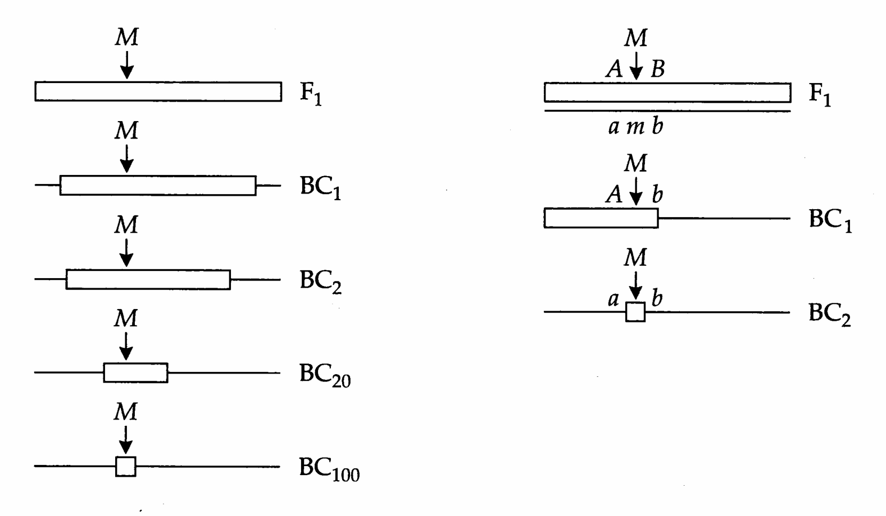
>
> Figure 14.9 Selecting on flanking markers can greatly accelerate the elimination of donor DNA around a selected donor marker M. Left: Reduction of donor material around a single selected marker leads to an expected value of around 2 cM following 100 generations of selection and backcrossing to the recurrent parent. Right: Two generations of selection using a dense marker map can also reduce the introgressed segment to under 2 cM. First, choose two flanking markers (a and b) from the recurrent parent that are both within 1 cM of M, with the donor and recurrent genotypes being AMB and amb, respectively. In generation one, we select an individual that is either AMB or aMB. Using this individual as the parent for the second generation, we then select for the recombinant on the opposite side, giving an aMb individual with an introgressed region containing M that is less than 2 cM. (After Tanksley et al. 1989.)

Even after 11 generations of backcrossing, the length of the introgressed segment in one line was over 51 cM, as compared to the theoretical expectation of $ 16.7 \pm 11.8 $ cM from Equation 14.10c.

Young and Tanksley (1989a,b) suggested that selection using multiple markers (instead of single markers) can greatly accelerate the formation of NILs with very short introgressed segments. Likewise, selection for recurrent markers on nontarget chromosomes increases the rate of removal of donor DNA on other chromosomes.

Equation 14.10c shows that 99 backcross generations are required to reduce the average length of a marker-selected introgressed region to 2 cM. However, with a dense marker map, such a region can be obtained in one or two generations by using markers that flank the region of interest (Figure 14.9). If we can screen a very large number of individuals, this can be done in a single generation by looking for a double recombinant. Using flanking markers 1 cM on either side of the region of interest, the probability of a double recombinant (assuming no interference) is $ 0.01^{2} $, or about one out of every 10,000 progeny. If interference is significant, which is likely for tightly linked markers, far more progeny may need to be scored. This problem can be avoided by screening for two generations, with first-generation individuals showing a single recombinant (on either side of the marker) being used as parents for the second generation (Figure 14.9).

**[示例 Example]**

> **[UNRESOLVED EXAMPLE: Genetics_chapter14:13]**

---

## Genetics_chapter14_018 · FINE MAPPING OF MAJOR GENES USING POPULATION-LEVEL DISEQUILIBRIUM

In small populations, or in populations that have recently undergone a rapid expansion, the amount of disequilibrium between tightly linked markers generated by random drift may be sufficient to allow for very fine mapping of major genes using a random population sample. This approach is called linkage disequilibrium (LD) or allelic association mapping by human geneticists and is commonly applied to binary (presence/absence) traits. LD mapping can be applied to only a very restricted set of binary traits, as the assumption is that the trait has a very simple genetic basis, such that individuals displaying the trait can be traced to a single allele at one locus. Under this assumption, one tries to find markers that are associated with the allele by comparing the distribution of markers in individuals having the trait versus those lacking the trait. If the trait is influenced by multiple loci, or even multiple alleles at the same locus, marker associations will be obscured. Given its extreme sensitivity to such allelic heterogeneity, it is unlikely that LD mapping can be applied to QTLs of small to moderate effects. Nonetheless, this is an important method for mapping major genes.

The basic idea was suggested by Bodmer (1986, cited by Hill and Weir 1994), wherein once the rough (5–10 cM) position of a gene is found,

“… it should be possible to saturate the relevant region with further polymorphic markers and look for the ones that have a population association with the trait, rather than increasing the numbers of families analyzed to search for closer linkage. This is the most efficient way of finding closely linked markers, since [human] family data are very inefficient at distinguishing between small recombination fractions such as 0.5% versus 5.0%.”

Population-level disequilibrium can result from past admixture and/or from genetic drift. For neutral markers, the expected amount of disequilibrium in a stable population represents a balance between its creation by drift and its removal by recombination. For a randomly mating population in which the drift-recombination balance has been achieved, the expected squared correlation between the presence of two linked marker alleles is

$$
E\left(R^{2}\right)=\frac{1}{1+4N_{e}c}
\tag{14.13}
$$

where c is the recombination frequency between loci and $ N_{e} $ is the effective population size (Hill and Robertson 1968). In principle, Equation 14.13 can be used in combination with estimates of $ N_{e} $ and the squared correlation $ R^{2} $ between individuals with the trait and a particular marker allele to estimate c, the recombination frequency between the marker and QTL. However, while human geneticists have successfully found linked markers in population-level disequilibrium with major disease alleles (e.g., Kerem et al. 1989, Pritchard et al. 1991), it has proven difficult in most settings to use these markers to actually estimate the recombination frequency between the marker and major locus. One reason is that $ R^{2} $ is expected to be quite small in large, stable populations for even very tightly linked markers. A second reason is the rather high variance associated with $ R^{2} $. Hill and Weir (1994) show that this statistic is not very informative, as the resulting likelihood surface for ML estimates of c is very flat, reflecting this high variance. Empirical studies confirm this finding, showing that the amount of disequilibrium between very tightly linked human markers is highly variable (Jorde et al. 1994).

---

## Genetics_chapter14_019 · FINE MAPPING OF MAJOR GENES USING POPULATION-LEVEL DISEQUILIBRIUM / LD Mapping in Expanding Populations

The amount of linkage disequilibrium can be considerably greater than that predicted by Equation 14.13 if the population has not yet achieved a balance between drift and recombination. Such is the case in expanding populations, and geneticists have sought out isolated human populations that appear to have recently undergone such expansions for LD mapping of disease genes. The ideal situation occurs when most of the disease alleles descend from a single ancestral mutation, so that all current copies have maintained some of the ancestral marker haplotype. The age of the ancestral mutation from which all current copies derive can neither be too young nor too old. It must be sufficiently old that recombination has reduced the expected size of the retained region to one sufficiently small for fine mapping. However, if the mutation is too old, this region will be too small for analysis (as it will contain no observable linked markers). These conditions are often satisfied in expanding populations that can be traced back to a small number of recent founders. An example is the current Finnish population, which arose from a small founder group about 2000 years ago (reviewed in de la Chapelle 1993), and other such human populations are discussed by Jorde (1995). In a rapidly expanding population, all copies of a mutant disease allele often trace back to a single copy present in the founding population (or originating shortly after the population expansion began).

Motivated by the Luria-Delbrück theory for estimating mutation rates in exponentially growing populations of bacteria (Luria and Delbrück 1943, Sarkar 1991), Hästbacka et al. (1992) and Lehesjoki et al. (1993) have suggested that the same logic can be used to estimate recombination frequencies from population disequilibrium information. The simplest approach proceeds as follows. Suppose the disease allele was either present as a single copy (and hence associated with a single chromosomal haplotype) in the founder population or arose by mutation very shortly after the population was formed. Assume that there is no allelic heterogeneity, so that all disease-causing alleles in the population descend directly.

from the original mutation, and consider a marker locus tightly linked to the disease locus. The probability that a disease-bearing chromosome has not experienced recombination between the disease susceptibility (DS) gene and marker after $t$ generations is just $(1 - c)^{t} \simeq e^{-c t}$, where $c$ is the marker-DS recombination frequency. Suppose the disease is predominantly associated with a particular haplotype, which presumably represents the ancestral haplotype on which the DS mutant arose. Equating the probability of no recombination to the observed proportion $\pi$ of disease-bearing chromosomes with this predominant haplotype gives $\pi = (1 - c)^{t}$, where $t$ is the age of the mutation or the age of the founding population (whichever is more recent). Hence, one estimate of the recombination frequency is

$$
c=1-\pi^{1/t}
\tag{14.14}
$$

**[示例 Example]**

> **[UNRESOLVED EXAMPLE: Genetics_chapter14:14]**

The DTD example is exceptional in that the disease allele was initially associated with a rare haplotype. Since the majority of current disease-bearing chromosomes have this haplotype, this suggests that the sample of disease alleles is unlikely to contain a significant fraction of new mutants. Lehesjoki et al. (1993) offer a modification when the predominant marker haplotype among disease-bearing chromosomes is also a common haplotype for normal chromosomes. Let $p_{a}$ denote the frequency of the most common haplotype of disease-bearing chromosomes and $p_{n}$ denote the frequency of this haplotype among normal chromosomes. Let $\pi$ represent the fraction of disease-bearing chromosomes descended from the common ancestor that have not undergone any recombination between the marker and QTL, and $\alpha$ be the proportion of all disease alleles descending from the founder copy (as opposed to being new mutants). We can then divide disease-bearing chromosomes into two classes. First, a fraction $\alpha \pi$ of these chromosomes have a disease allele that both traces back to the founder copy ($\alpha$) and does so through chromosomes that have not undergone recombination between the marker and disease loci ($\pi$). Second, a fraction $(1 - \alpha \pi)$ are either new mutants (which arose on some random chromosome) or a product of recombination between the founder copy and some random chromosome. In either event, the chance that such individuals have the predominant haplotype is just $(1 - \alpha \pi) p_{n}$. Putting these two results together gives

$$
p_{a}=\alpha\pi+\left(1-\alpha\pi\right)p_{n}
\tag{14.15}
$$

Rearranging Equation 14.15 and solving, we find that

$$
\delta_{p}=\alpha\pi=\frac{p_{a}-p_{n}}{1-p_{n}}
\tag{14.16}
$$

is a measure of the extent to which disease chromosomes are restricted to the predominant haplotype (Bengtsson and Thomsom 1981). Recalling Equation 14.14,

$$
\pi=(1-c)^{t}=\frac{\delta_{p}}{\alpha}
\tag{14.17}
$$

giving an estimate of the recombination frequency as

$$
c=1-\left(\frac{\delta_{p}}{\alpha}\right)^{1/t}
\tag{14.18}
$$

Note that for the DTD data in Example 14, $ p_n \simeq 0 $, so that $ \delta_p \simeq p_a $, and we assumed that all disease alleles descended from the founder copy ( $ \alpha = 1 $), so that $ c \simeq 1 - (p_a)^{1/t} $. Note also that if $ c $ is known, one can solve instead for $ t $, the age of the mutation. Risch et al. (1995) used this approach to date the appearance of a mutation causing idiopathic torsion dystonia (ITD) disease in Ashkenazi Jews at about 350 years.

The fraction $ \alpha $ of all disease alleles that are direct descendants from the ancestral copy (as opposed to being new mutants) is obtained as follows. Assuming that selection is weak on carriers (heterozygotes), mutants that have arisen after the initial appearance of the original DS allele in the founding population should comprise a fraction $ 1 - (1 - \mu)^{t} \simeq \mu t $ of all chromosomes, as $ (1 - \mu)^{t} $ is the probability that no mutations have occurred. Here $ \mu $ is the mutation rate at which new disease-causing alleles appear and t is the number of generations since the original mutation arose or since the founding of the population, whichever is more recent. If q is the frequency of disease alleles, then $ \mu t/q $ is the expected fraction of disease-carrying chromosomes due to new mutants. Hence, the expected fraction of all disease-carrying chromosomes that descend from the original mutation is

$$
\alpha=\left(1-\frac{\mu t}{q}\right)
\tag{14.19}
$$

which, when applied to Equation 14.18, yields

$$
c=1-\left(\frac{\delta_{p}}{1-(\mu t/q)}\right)^{1/t}
\tag{14.20}
$$

**[示例 Example]**

> **[UNRESOLVED EXAMPLE: Genetics_chapter14:15]**

LD mapping has been successfully applied to other disease genes segregating in the Finnish population, such as congenital nephrotic syndrome (Kestilä et al. 1994) and progressive myoclonus epilepsy (Lehesjoki et al. 1993). Kaplan et al. (1995) were able to apply LD mapping to the cystic fibrosis (CF) gene, using much more heterogeneous populations from Europe and elsewhere. The likely reason for success is that 70% of CF chromosomes worldwide appear to result from a single three-base deletion (Kerem et al. 1989), so that allelic heterogeneity is, at worst, a modest problem. Kaplan et al. (1995) found, however, that LD mapping was not very successful for Huntington's disease (multiple ancestral haplotypes) or Friedrich ataxia (high allelic heterogeneity) using European or North American populations.

Kaplan and Weir (1995) show that commonly used approximations for the confidence intervals for estimates given by Equations 14.14 and 14.18 are downwardly biased and can be very misleading. This is not the case with maximum likelihood approaches. Kaplan et al. (1995) provide likelihood functions incorporating two marker loci linked to the disease locus, allowing for statistical tests of gene ordering of the markers and the DS gene. Similar tests for ordering are presented in Risch et al. (1995). Further discussion of likelihood functions for disequilibrium mapping can be found in Terwilliger (1995).

---

## Genetics_chapter14_020 · CANDIDATE LOCI

In some cases, there may be sufficient physiological/biochemical information to suspect that certain known loci influence character expression. In human genetics, it is common practice to directly test for population-level associations between trait value and specific alleles at such candidate loci. For example, Boerwinkle and Sing (1987) showed that three common alleles at the human apolipoprotein E locus account for about 8% of the total variation in cholesterol levels. Interestingly, a particular allele of apolipoprotein E also appears to be a major determinant of Alzheimer's disease. The mean age of onset for homozygotes and heterozygotes for this allele is $ 68.4 \pm 1.2 $ and $ 75.5 \pm 1.0 $ years, respectively, while the mean age for individuals with no copies of this allele is $ 84.3 \pm 1.3 $ (Corder et al. 1993). Other candidate loci for Alzheimer's disease are reviewed by Pericak-Vance and Haines (1995). As the next example shows, results using the candidate-locus approach can be rather unexpected.

**[示例 Example]**

> **[UNRESOLVED EXAMPLE: Genetics_chapter14:16]**

How are candidate loci chosen? One obvious approach is to consider loci known from laboratory studies (such as knockout experiments) to have mutant alleles with major effects on the character of interest, as in natural populations such loci may also be segregating alleles with smaller effects (Chapter 12). Results from several QTL mapping experiments offer support for this approach (Chapter 15). In maize, for example, Beavis et al. (1991), Edwards et al. (1992), Veldboom et al. (1994), and Berke and Rocheford (1995) found that many QTLs for height map near the locations of known height mutants. Similar findings have been obtained with bristle number in Drosophila by Mackay and Langley (1990), Lai et al. (1994), and Long et al. (1995).

---

## Genetics_chapter14_021 · CANDIDATE LOCI / The Transmission/Disequilibrium Test

When considering genetic disorders, the frequency of a particular candidate (or marker) allele in affected (or case) individuals is often compared with the frequency of this allele in unaffected (or control) individuals. The problem with such association studies is that a disease-marker association can arise simply as a consequence of population structure, rather than as a consequence of linkage. Such population stratification occurs if the total sample consists of a number of divergent populations (e.g., different ethnic groups) which differ in both candidate-gene frequencies and incidences of the disease. Population structure can severely compromise tests of candidate gene associations, as the following example illustrates.

**[示例 Example]**

> **[UNRESOLVED EXAMPLE: Genetics_chapter14:17]**

The problem of population stratification can be overcome by employing tests that use family data, rather than data from unrelated individuals, to provide the case and control samples (Woolf 1955, Rubinstein et al. 1981, Falk and Rubinstein 1987, Terwilliger and Ott 1992, Spielman et al. 1993). This is done by considering the transmission (or lack thereof) of a parental marker allele to an affected offspring. Focusing on transmission within families controls for association generated entirely by population stratification and provides a direct test for linkage provided that a population-wide association between the marker and disease gene exists (Spielman et al. 1993, Ewens and Spielman 1995). This method can be applied to any family that has at least one affected offspring. The assumption of population-wide disequilibrium is required as one pools marker associations across all families.

The transmission/disequilibrium test, or TDT (Spielman et al. 1993), compares the number of times a marker allele is transmitted (T) versus not-transmitted (NT) from a marker heterozygote parent to affected offspring. Under the hypothesis of no linkage, these values should be equal, and the test statistic becomes

$$
\chi_{td}^{2}=\frac{(T-NT)^{2}}{(T+NT)}
\tag{14.21}
$$

which follows a $ \chi^{2} $ distribution with one degree of freedom. This is also known as McNemar's test (Sokal and Rohlf, 1995). A number of related tests have also been proposed, and Schaid and Sommer (1994) provide a nice overview of their properties.

How are T and NT determined? Consider an M/m parent with three affected offspring. If two of those offspring received this parent's M allele, while the third received m, we score this as two transmitted M, one not-transmitted M. Conversely, if we are following marker m instead, this is scored as one transmitted m, two not-transmitted m. As the following example shows, each marker allele is examined separately under the TDT.

**[示例 Example]**

> **[UNRESOLVED EXAMPLE: Genetics_chapter14:18]**

Spielman et al. (1993) note that the TDT can give a false positive if the marker shows segregation distortion, where heterozygotes preferentially segregate one allele. This distortion can be controlled for by using a standard $ 2 \times 2 $ contingency table $ \chi^{2} $ test, considering separately the transmission of a marker allele to affected and unaffected offspring,

with resulting test statistic

$$
\chi_{td}^{2}=\frac{\left(T_{A}-NT_{A}\right)^{2}}{\left(T_{A}+NT_{A}\right)}+\frac{\left(T_{U}-NT_{U}\right)^{2}}{\left(T_{U}+NT_{U}\right)}
\tag{14.22}
$$

controlling for any segregation distortion. A number of family-based methods for detecting marker-trait associations that do not require population-wide disequilibrium have been developed, and these are examined in some detail in Chapter 16.

---

## Genetics_chapter14_022 · CANDIDATE LOCI / Estimating Effects of Candidate Loci

While the estimation of genotype means for a candidate locus seems straightforward, there are several potential sources of bias. While it is possible in some settings to distinguish between the direct effects of a candidate locus and its indirect effects due to association with linked QTLs (e.g., Bovenhuis and Weller 1994), as noted above the presence of linkage disequilibrium greatly confounds the interpretation of candidate-locus means. We consider other, more subtle, sources of bias below.

Let $z_{ij}$ denote the phenotypic value of the $j$th individual with candidate-locus genotype $i$ ($1 \leq i \leq n_g$). If $\mu_i$ is the mean character value for genotype $i$, then the simplest model is

$$
z_{ij}=\mu_{i}+\epsilon_{ij}
\tag{14.23}
$$

If individuals are sampled at random from a large homogeneous population, the residuals are uncorrelated and the $ \mu_{i} $ values can be estimated simply by using $ \overline{z}_{i} $. However, when relatives are present in the sample, one must take the residual covariance matrix into consideration to obtain a correct estimator. The residual error can be decomposed into a genetic component (G) due to segregation at loci other than the target QTL plus the general (E) and specific (e) environmental effects,

$$
\epsilon_{ij}=G_{ij}+E_{ij}+e_{ij}
\tag{14.24a}
$$

Indexing two distinct individuals by j and k,

$$
\sigma(\epsilon_{j},\epsilon_{k})=\sigma(G_{j},G_{k})+\sigma(E_{j},E_{k})
\tag{14.24b}
$$

as special environmental effects are not shared by different individuals (Chapter 6), and G and E are assumed to be uncorrelated. If the relationships among sampled individuals are known, the elements of the covariance matrix can be computed from Equation 14.24b, using the methods of Chapter 7. For example, if i and j are full-sibs, $ \sigma(G_j, G_k) = (\sigma_A^2/2) + (\sigma_D^2/4) $, where the variances refer to the contribution of background polygenes. Estimates of the variance components associated with G and E can be obtained by a variety of methods introduced in Chapters 17–27. Using these to estimate the residual covariance matrix, genotypic means can be estimated by a GLS regression (Chapter 8). An example of the importance of correcting for common relatives is provided by Bentsen and Klemetsdal (1991), who examined the association between egg productivity and six different MHC haplotypes in chickens. The relative rankings of 5 of the 6 haplotype effects differed when comparing uncorrected estimates with those obtained by correcting for shared ancestry. More generally, when additional fixed factors (such as sex- or age-specific effects) are included in the model, BLUP estimation can be used (Boerwinkle et al. 1986, Cowan et al. 1990, Hoeschele and Meinert 1990, Bentsen and Klemetsdal 1991, Blangero et al. 1992, Kennedy et al. 1992). Chapter 26 examines this in some detail.

Many estimates of the amount of variability attributable to a candidate locus are upwardly biased, even for a random population sample. If $ q_{i} $ is the frequency of candidate-locus genotype i, then the variance contributed by this locus is

$$
\sigma_{L}^{2}=\sum_{i=1}^{n_{g}}q_{i}\left(\mu_{i}-\mu\right)^{2}\qquad\mathrm{w h e r e}\qquad\mu=\sum_{i=1}^{n_{g}}q_{i}\mu_{i}
\tag{14.25}
$$

Boerwinkle and Sing (1986) showed that the obvious estimator

$$
s^{2}=\sum_{i=1}^{n_{g}}\widehat{q}_{i}\left(\overline{z}_{i}-\overline{z}\right)^{2}
\tag{14.26a}
$$

using the estimates $ \widehat{q}_{i} $, $ \overline{z}_{i} $, and $ \overline{z} $ in place of their true values is biased because it includes the sampling error of these three estimates. To account for the sampling variances in $ \overline{z}_{i} $ and $ \overline{z} $, Boerwinkle and Sing suggest the improved estimator (for a collection of unrelated individuals),

$$
s_{L}^{2}=\sum_{i=1}^{n_{g}}\widehat{q}_{i}\left(\overline{z}_{i}-\overline{z}\right)^{2}-\left(\frac{n_{g}-1}{n}\right)\mathbf{V a r}(e)
\tag{14.26b}
$$

where $ \text{Var}(e) $ is the estimate of the residual variance (within genotypes) and we assume n measured individuals per genotype. While an improvement over Equation 14.26a, this estimator still ignores the sampling variance introduced by using $ \widehat{q}_i $ and hence still tends to overestimate the variance accounted for by the candidate locus. Resampling approaches for constructing confidence intervals of both $ \sigma_L^2 $ and its additive and dominance components have been suggested by Kaprio et al. (1991) and Zerba et al. (1996).

---

## Genetics_chapter14_023 · CANDIDATE LOCI / Templeton and Sing's Method: Using the Historical Information in Haplotypes

While one can use a single marker to examine whether genetic variation at a candidate locus is associated with character variation, studies typically involve several closely linked markers, often including several polymorphic sites within the gene itself. How should one best extract information from this set of markers? Obviously, it is more powerful to consider haplotypes (the multiple-locus genotypes associated with the region of interest) than single markers. One drawback with this approach is that there can be an enormous number of haplotypes, resulting in small sample sizes for each haplotype and a reduction in the power of tests for haplotype-trait associations. What is needed is a logical way to combine information from different haplotypes. In an interesting series of papers, Templeton and Sing (Templeton et al. 1987, 1988, 1992; Templeton 1995) suggest that this can be done by incorporating information on the inferred evolutionary relationships of the sampled haplotypes. We simply outline their basic idea here.

The sequence information in haplotypes can be used to construct a cladogram estimating how the different haplotypes are evolutionarily related to each other. With such a cladogram in hand, one can then consider how character value is a function of nested sets of cladogram members, for example by using a nested ANOVA (Chapter 18). The motivation behind this approach is that history is the main cause of linkage disequilibrium, with associations between loci decaying with time. Hence, the more closely related a set of haplotypes, the more disequilibrium they should display, and the more likely they are to share QTL alleles. Figure 14.10 shows an example of this approach, detecting associations between alcohol dehydrogenase (ADH) activity and haplotypes in a 13 kb region surrounding the ADH gene in Drosophila.

> **Figure 14.10** · page 439 · source: `Genetics_chapter14`
>
> 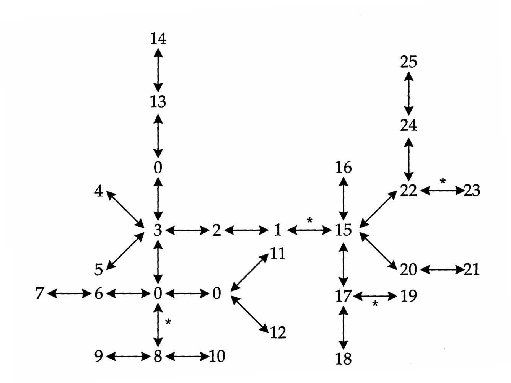
>
> Figure 14.10 Inferred cladogram of haplotypes for a region surrounding the Drosophila melanogaster ADH gene. Numbers refer to different haplotypes, while "0" refers to intermediate haplotypes not present in the sample but required to interconnect the existing haplotypes. Distance between two haplotypes on the cladogram provides a measured of relatedness, so that haplotypes 8 and 9 are more closely related than 9 and 6 (one step vs. three steps). Using the hierarchical structure implied by this cladogram, a nested ANOVA was performed, with ANOVA levels set by the number of cladogram steps that haplotypes differ by. Four cladogram regions, denoted with asterisks, were found to be associated with significant phenotypic effects. (After Templeton et al. 1987.)

---

## Genetics_chapter14_024 · CANDIDATE LOCI / CLONING QTLs

Cloning a gene (transferring a DNA sequence containing the gene to a plasmid or other manipulable vector) allows the complete power of modern molecular biology to be used in the study of QTLs. With a clone in hand, one can sequence the gene, study its expression in different tissues and at different developmental times, and isolate homologous DNA sequences from other populations/species. More direct manipulation is also possible, such as the placement of modified copies of the gene back into the organism, or into different species, creating transgenic individuals. While a variety of molecular approaches can be used to clone a gene whose product is known (Maniatis et al. 1982), QTLs are of special interest precisely because their products are typically unknown. Two different cloning strategies have been suggested for genes with unknown products but discernible phenotypes: transposon tagging and positional cloning. We discuss these in turn. An interesting review of recent ideas for cloning QTLs is given by Tanksley et al. (1995).

---

## Genetics_chapter14_025 · CANDIDATE LOCI / Transposon Tagging

When a mobile genetic element (or transposon) inserts itself into or near a gene, it can disrupt expression, creating a visible mutation, and providing the basis for cloning by transposon tagging (Bingham et al. 1981). In several species, it is now possible to introduce transposons modified for high insertion rates into the germline either by genetic or micro-injection techniques. Using these elements as probes, standard molecular techniques can then be used to isolate any region of DNA within which an element has inserted.

Examples of the successful use of this procedure primarily involve genes with large effects: the tagging of the white eye-color locus in D. melanogaster with P-factors (Bingham et al. 1981), the dilute coat-color gene in the mouse with a murine leukemia virus (Rinchik et al. 1986), and a dwarfing gene in the mustard Arabidopsis with the Agrobacterium T-DNA plasmid (Feldmann et al. 1989), to name a few. For detection of QTLs by transposon tagging, the use of inbred lines is essential in order to reduce variation from segregation at other loci. Typically, one starts with a line with little or no genetic variation and then selects for new mutations affecting the character, which are then examined for indications that at least one scored element has moved. Soller and Beckmann (1987) discuss a variety of statistical considerations associated with cloning QTLs by such insertional mutagenesis techniques.

Given the need for completely inbred lines, is this approach really of general use? The answer is that a few well conceived studies with model systems may be of broad relevance to related species. A generalization appearing out of the morass of sequencing data is the relative conservation of gene sequences between widely divergent species. Hence, a QTL probe from a mouse might be used to detect its homologue in other mammals, a probe from Arabidopsis used for other plants, and a probe from Drosophila used for other insects. Having a clone in hand offers the possibility of looking at population variation at that locus, using techniques such as PCR (Saiki et al. 1985, Scharf et al. 1986, Engelke et al. 1988), or high-resolution restriction mapping (Kreitman and Aguade 1986). If variant alleles are detected in a natural population using a QTL probe, the candidate-gene approaches discussed above can be used estimate the effects of each allele on the character(s) of interest.

---

## Genetics_chapter14_026 · CANDIDATE LOCI / Positional Cloning and Comparative Mapping

In theory, if we can localize the position of a QTL to a sufficiently small region of DNA, it becomes possible to examine all of the genes in that region. For example, in humans the use of rare chromosome deletions or translocations that correlate with the presence of a disease have been very successfully exploited to delimit the region in which the disease gene resides (Collins 1992, 1995). This is the idea behind positional cloning, which can be done by brute force (sequencing

> **Figure 14.11** · page 441 · source: `Genetics_chapter14`
>
> 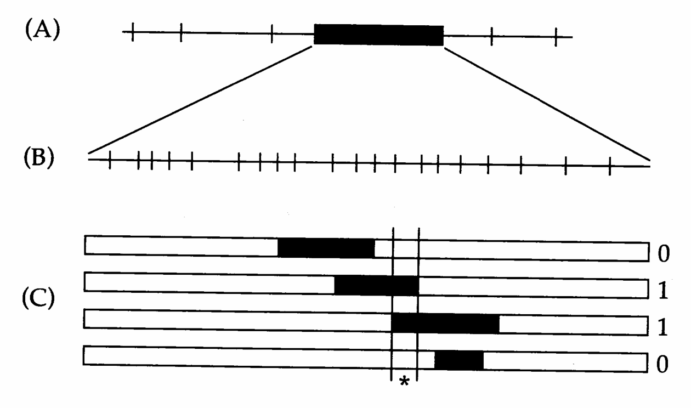
>
> Figure 14.11 One approach to positional cloning of a QTL using a series of NILs. (A): First the QTL (which increases character value by a scaled value of one) is localized to an interval (typically 30–50 cM). (B): A much finer map of markers is then generated within this interval, and NILs are constructed by marker selection. (C): Comparing this series of NILs, the QTL position is narrowed to the region indicated by *. If this region is not sufficiently small for further analysis, steps (B) and (C) are repeated until the desired size is obtained. This region is then cloned, and the genes within it are examined for potential clues as to which loci should be considered (or rejected) as candidates.

of the entire region) or by more clever methods. An example of the latter is zoo blotting — the use of sequences from related species to isolate only those parts of the region of interest that are conserved between species, as these likely represent genes. Another approach is to use schemes that directly isolate genes, such as exon amplification or exon trapping methods (Duyk et al. 1990, Buckler et al. 1991). The timing and pattern of expression of genes localized within a region can suggest exclusion or inclusion of others as candidate QTLs (generating positional candidates). As we become increasingly better at associating particular amino acid sequences with particular functional units (e.g., known DNA binding regions or specific catalytic sites), the hope is that we will be able to recognize candidate genes from unique features of the DNA sequence itself.

A serious limitation of positional cloning is the sheer physical distance involved in terms of number of DNA base pairs, even with very tight linkage. As noted above, a recombination fraction of 1% corresponds to roughly $ 10^{5} $ to $ 10^{7} $ base pairs (Table 14.3), which typically translates into 10 to 100 genes. Thus, the isolation of tightly linked markers flanking a QTL is just the initial step. Once such a region is believed to be isolated, it is important to actually confirm that it contains a QTL, for example by using markers to introgress the region into a standardized background and directly testing its effect. If the region has an affect on the character, the next step is to use NILs for ever-finer mapping (Figure

14.11), which may require the procurement of additional markers in the region of interest. As mentioned above, bulk segregant analysis provides one approach for obtaining such markers. When the localized region is sufficiently small, it can be sequenced and all open reading frames identified.

The amount of labor involved in positional cloning is far from trivial. Moreover, there is a practical limitation to constructing ever-finer NILs. Even if we have an infinitely dense marker map, the number of individuals that must be screened to isolate recombinants over shorter and shorter distances soon becomes prohibitively large. Using the logic from Example 13, the number of individuals required to have a 95% chance of at least one recombinant between markers c units apart is $ \simeq $ 3/c. Currently manageable amounts of DNA are around $ 10^{4} $ to $ 10^{5} $ bases. Taking the average value of 1 cM $ \simeq $ $ 10^{6} $ DNA bases, this amounts to genetic map distances of 0.1 and 0.01 cM, or the scoring of 3,000 and 30,000 individuals, respectively. In spite of these potential problems, positional cloning has been successfully used in several model organisms, including Arabidopsis (e.g., Arondel et al. 1992), tomato (Martin et al. 1993), mice (e.g., Bultman et al. 1992, Copeland et al. 1993, Takahashi et al. 1994), and humans (e.g., Orkin 1986, Royer-Pokora et al. 1986, Rommens et al. 1989, Gessler et al. 1990).

A related approach for positional cloning follows from the observation that map position of homologous genes is partly conserved across species, providing an avenue by which results from one species can be used to map QTLs in a related species. For example, humans and mice show rather extensive conservation of gene order, with the average conserved linkage block in autosomes being around 8 to 10 cM (Nadeau 1989, Copeland et al. 1993). Thus, a marker tightly linked to a QTL in mouse has a good chance of also being tightly linked to the homologous gene (if it exists) in humans. The major grains (rice, wheat, maize) also show conservation of gene order within blocks on the order of 5 to 10 cM (Bennetzen and Freeling 1993). Similar observations have been made for the mustards Brassica and Arabidopsis (Teutonico and Osborn 1994), and for potatoes (Solanum) and tomatoes (Lycopersicon), both in the nightshade family (Bonierbale et al. 1988).

Such observations suggest that candidate regions for a QTL in one species are also candidate regions for QTLs in related species, an approach called comparative mapping. There are indications that this approach may be fruitful. Fatokun et al. (1992) found a major QTL for seed weight at similar positions in cowpea (Vi-gna unguiculata) and the distantly related mung bean (V. radiata). QTLs for several fruit characters have been found in similar positions in three species of tomatoes (Paterson et al. 1988, 1990; Goldman et al. 1995). The most striking examples come from the major grass grains: rice, maize, and sorghum (Lin et al. 1995, Pereira and Lee 1995, Paterson et al. 1995). Domestication of all three species in recent human history involved selection for three traits: increased seed size, reduced disarticulation of the mature inflorescence (seeds remaining together on the plant for easier harvesting), and daylength-insensitive flowering (increasing the growing season). Paterson et al. (1995) showed that a few QTLs, mapping to similar positions in all three grains, account for large fractions of the variance in these traits. This finding suggests not only that the same loci are possibly involved in all three species, but also that the selection response during domestication may have involved independent mutations having similar effects.

---
