# Chapter 15 · Mapping and Characterizing QTLs: Inbred Line Crosses

## Genetics_chapter15_001 · Mapping and Characterizing QTLs: Inbred Line Crosses

Crosses between completely inbred lines offer an ideal setting for detecting and mapping QTLs by marker-trait associations, as all $ F_{1}s $ are genetically identical and show complete linkage disequilibrium for genes differing between lines. A number of designs have been proposed to exploit these features. While usually involving crop plants, QTL line-cross analysis has also been applied to a number of animal species, especially mice (reviewed by Frankel 1995). A particularly interesting example is the work of Hunt et al. (1995), who mapped QTLs for foraging behavior in honey bees using a design that exploited the haploid nature of male honey bees.

While the QTL mapping literature can seem very complex to the uninitiated, it is based on a few simple ideas. We start by reviewing the basic building blocks, first considering different line-cross populations useful for QTL mapping. The key element from which the formal theory of QTL mapping is constructed is the conditional probability of a particular QTL genotype given an observed marker genotype, and we examine this probability next. These probabilities allow a full development of the two principal methods for QTL detection and estimation — linear models (using differences in marker means) and maximum likelihood (using information from the entire marker-trait distribution), both of which are examined in some detail. We conclude our discussion of statistical issues by examining methods that accommodate multiple linked QTLs and by visiting the important issue of the sample sizes required to achieve a given power for detecting a QTL. Finally, we reward the persevering reader with a review of a number of interesting studies that have used inbred lines for QTL mapping.

---

## Genetics_chapter15_002 · FOUNDATIONS OF LINE-CROSS MAPPING

The idea behind using marker information to map and characterize QTLs is quite simple: by crossing two inbred lines, linkage disequilibrium is created between loci that differ between the lines, and this in turn creates associations between marker loci and linked segregating QTLs. A large number of experimental designs and statistical methodologies have been developed to exploit this information. Our attempt to make this field more accessible starts with an overview of some of the basic experimental designs and some of the key tools for the analysis of results from these designs.

---

## Genetics_chapter15_003 · FOUNDATIONS OF LINE-CROSS MAPPING / Experimental Designs

The large number of possible designs can be categorized by the type of line-cross populations used for generating disequilibrium (e.g., $ F_{2} $ vs. backcross populations) and the unit of marker analysis used (e.g., single markers vs. interval mapping). We consider these in turn.

Starting with two completely inbred parental lines, $ P_{1} $ and $ P_{2} $, a number of line-cross populations derived from the $ F_{1} $ can be used for QTL mapping. The $ F_{2} $ design examines marker-trait associations in the progeny from a cross (or selfing) of $ F_{1}s $, while the backcross design examines marker-trait associations in the progeny formed by backcrossing the $ F_{1} $ to one of the parental lines. While these are the most widely used designs, other line-cross populations can offer further advantages (and disadvantages). For example, the $ F_{1} $ can be used to create recombinant inbred lines (RILs) and doubled haploid lines (DHLs), which allow marker-trait associations to be scored in a completely homozygous background and across multiple environments (Chapter 14). The $ F_{2} $ design has an advantage over designs using backcross, RIL, or DHL populations, because it generates three genotypes at each marker locus, which allows the estimation of the degree of dominance associated with detected QTLs. Designs using an $ F_{t} $ population (formed by randomly mating $ F_{1}s $ for t - 1 generations) allow for even higher resolution of QTL map positions than do $ F_{2}s $, albeit at the expense of decreased power of QTL detection. The properties of such advanced intercross lines (AILs) are discussed below.

More complex designs can be considered wherein individuals are genotyped in one population, while trait values are scored in a future population derived from the genotyped individuals. Fisch et al. (1996) present a general treatment for such designs. One example is the $ F_{2:3} $ design, wherein $ F_{2} $ individuals are genotyped and then selfed. The trait value associated with a genotyped individual is estimated by the mean value of the resulting $ F_{3} $ family. Scoring the phenotype as the mean of several individuals (as opposed to measurement of a single individual) can offer increased power over a standard $ F_{2} $ design by reducing the sampling variance.

Designs combining information from multiple crosses are expected to be more powerful than those involving a single cross, and as a result, designs using multiple line-cross populations are starting to be considered. Examples include dialel designs whose basic structure is examined in Chapter 20 (Rebai and Goffinet 1993, Rebai et al. 1994a), and Comstock and Robinson's (1952) classic Design III wherein the $ F_{2} $ from two inbred lines is backcrossed to both parental lines (Cockerham and Zeng 1996). We will not consider these multiple-line designs further, but their continued development is clearly an important area for future work. Finally, several workers have considered designs involving crosses between lines that are not completely inbred, such as a cross of an outbred line to a completely inbred tester (Beckmann and Soller 1988, Dudley 1992, Haley et al. 1994).

Experimental designs are also classified by the unit of marker analysis chosen by the investigator. Marker-trait associations can be assessed using one-, two-, or multiple-locus marker genotypes. Under a single-marker analysis, the distribution of trait values is examined separately for each marker locus. Each marker-trait association test is performed independent of information from all other markers, so that a chromosome with n markers offers n separate single-marker tests. As discussed below, single-marker analysis is generally a good choice when the goal is simple detection of a QTL linked to a marker, rather than estimation of its position and effects. Under interval mapping (or flanking-marker analysis), a separate analysis is performed for each pair of adjacent marker loci. The use of such two-locus marker genotypes results in n - 1 separate tests of marker-trait associations for a chromosome with n markers (one for each marker interval). Interval mapping offers a further increase in power of detection (albeit usually a slight one) and more precise estimates of QTL effects and position. Both single-marker and interval mapping approaches are biased when multiple QTLs are linked to the marker/interval being considered. Methods simultaneously using three or more marker loci attempt to reduce or remove such bias. Composite interval mapping (Zeng 1993, 1994; Jansen 1993b, 1994b; Jansen and Stam 1994) considers a marker interval plus a few other well-chosen single markers in each analysis, so that (as above) n - 1 tests for interval-trait associations are performed on a chromosome with n markers. Multipoint mapping considers all of the linked markers on a chromosome simultaneously, resulting in a single analysis for each chromosome (Kearsey and Hyne 1994; Hyne and Kearsey 1995; Wu and Li 1994, 1996).

---

## Genetics_chapter15_004 · FOUNDATIONS OF LINE-CROSS MAPPING / Conditional Probabilities of QTL Genotypes

The basic element upon which the formal theory of QTL mapping is built is the conditional probability that the QTL genotype is $ Q_k $, given the observed marker genotype is $ M_j $. From the definition of a conditional probability, this is

$$
\Pr(Q_{k}\mid M_{j})=\frac{\Pr(Q_{k}M_{j})}{\Pr(M_{j})}
\tag{15.1}
$$

The joint and marginal probabilities, $ \Pr(Q_k M_j) $ and $ \Pr(M_j) $, are functions of the experimental design and the linkage map (the position of the putative QTLs with respect to the marker loci). Computing these probabilities is a relatively simple matter of bookkeeping (see Example 1), but can get rather tedious as the number of markers and/or QTLs under consideration increases.

When computing joint probabilities involving more than two loci, one must also account for recombinational interference between loci (Chapter 14). Consider a single QTL flanked by two markers, $ M_{1} $ and $ M_{2} $. The gamete frequencies depend on three parameters: the recombination frequency $ c_{12} $ between markers, the recombination frequency $c_{1}$ between marker $M_{1}$ and the QTL, and the recombination frequency $c_{2}$ between the QTL and marker $M_{2}$. Under the assumption of no interference, $c_{12} = c_{1} + c_{2} - 2c_{1}c_{2}$, while $c_{12} = c_{1} + c_{2}$ under complete interference (Chapter 14). When $c_{12}$ is small, gamete frequencies are essentially identical under either interference assumption. Typically, $c_{12}$ is assumed known, leaving two unknown recombination parameters ($c_{1}$ and $c_{2}$) under general assumptions about interference. In either case, there is only one parameter to estimate, as assuming complete interference $c_{2} = c_{12} - c_{1}$, and assuming no interference $c_{2} = (c_{12} - c_{1}) / (1 - 2c_{1})$. Hence, for flanking-marker analysis, we restrict attention to the single recombination parameter $c_{1}$, the distance from marker locus $M_{1}$ to the QTL. When considering analysis of single-marker loci, for notational ease we drop the subscript, using $c$ in place of $c_{1}$.

Conditional probabilities involving more than three linked loci are generally dealt with by first assuming an appropriate mapping function on which distances are additive (Chapter 14), and then translating these distances into recombination frequencies. When a large number of markers is considered, missing marker information can become a problem. Many individuals can be left with incomplete multilocus marker genotypes, excluding them from further analysis. Martínez and Curnow (1992) show how information from linked markers can be used to estimate the genotype at missing or incomplete (i.e., dominant) markers.

**[示例 Example]**

> **Example 1** · ref: `Genetics_chapter15:1` · source: `Genetics_chapter15_004.json` · blocks 5–17
>
> Example 1. Consider a single-marker analysis using the $ F_2 $ formed by crossing two inbred lines, $ MMQQ \times mmqq $. If the recombination frequency between the marker locus and the QTL is $ c $, the expected $ F_1 $ gamete frequencies are
> 
> $$
> \Pr(MQ)=\Pr(mq)=(1-c)/2,\qquad\Pr(Mq)=\Pr(mQ)=c/2
> $$
> 
> 
> The probability that an F₂ individual is MMQQ is Pr(MQ) · Pr(MQ) = [(1 - c)/2]². Likewise, 2 · Pr(MQ) · Pr(mQ) = 2(c/2)[(1 - c)/2] is the probability of an MmQQ individual, and so on. Since the probabilities of the marker genotypes MM, Mm, and mm are 1/4, 1/2, and 1/4, Equation 15.1 gives the F₂ conditional probabilities as
> 
> $$
> \Pr(QQ\mid MM)=(1-c)^{2},\quad\Pr(Qq\mid MM)=2c(1-c),\quad\Pr(qq\mid MM)=c^{2}
> $$
> 
> 
> $$
> \Pr(QQ\mid Mm)=c(1-c),\Pr(Qq\mid Mm)=(1-c)^{2}+c^{2},\Pr(qq\mid Mm)=c(1-c)
> $$
> 
> 
> $$
> \Pr(QQ\mid mm)=c^{2},\quad\Pr(Qq\mid mm)=2c(1-c),\quad\Pr(qq\mid mm)=(1-c)^{2}
> $$
> 
> 
> This same logic extends to multiple marker loci. Suppose the QTL is flanked by two scored markers, and consider the $ F_2 $ in a cross of lines fixed for $ M_1QM_2 $ and $ m_1qm_2 $. What are the conditional probabilities of the three QTL genotypes when the marker genotype is $ M_1M_1M_2M_2 $? Since all $ F_1 $s are $ M_1QM_2/m_1qm_2 $, under the assumptions of no interference, the frequency of $ F_1 $ gametes involving $ M_1M_2 $ are
> 
> $$
> \Pr(M_{1}QM_{2})=(1-c_{1})(1-c_{2})/2,\quad\Pr(M_{1}qM_{2})=c_{1}c_{2}/2
> $$
> 
> 
> giving expected frequencies in the F₂ of M₁M₁M₂M₂ offspring as
> 
> $$
> \begin{aligned}\Pr(M_{1}QM_{2}/M_{1}QM_{2})&=[(1-c_{1})(1-c_{2})/2]^{2}\\\Pr(M_{1}QM_{2}/M_{1}qM_{2})&=2\left[(1-c_{1})(1-c_{2})/2\right][c_{1}c_{2}/2]\\\Pr(M_{1}qM_{2}/M_{1}qM_{2})&=(c_{1}c_{2}/2)^{2}\end{aligned}
> $$
> 
> 
> where $ c_2 = (c_{12} - c_1)/(1 - 2c_1) $. The overall frequency of $ M_1M_1M_2M_2 $ individuals, $ \Pr(M_1M_1M_2M_2) $, is the sum of the three above terms, or $ (1 - c_{12})^2/4 $. Substituting into Equation 15.1 gives
> 
> $$
> \begin{aligned}\Pr(QQ\mid M_{1}M_{1}M_{2}M_{2})&=\frac{(1-c_{1})^{2}(1-c_{2})^{2}}{(1-c_{12})^{2}}\\\Pr(Qq\mid M_{1}M_{1}M_{2}M_{2})&=\frac{2c_{1}c_{2}(1-c_{1})(1-c_{2})}{(1-c_{12})^{2}}\\\Pr(qq\mid M_{1}M_{1}M_{2}M_{2})&=\frac{c_{1}^{2}c_{2}^{2}}{(1-c_{12})^{2}}\end{aligned}
> \tag{15.2}
> $$
> 
> 
> Conditional probabilities for other marker genotypes are computed in a similar fashion. Since $ c_1c_2 $ is usually very small if $ c_{12} $ is moderate to small, essentially all $ M_1M_1M_2M_2 $ individuals are QQ. For example, assuming $ c_1 = c_2 = c_{12}/2 $ (the worst case), the conditional probabilities of an $ M_1M_1M_2M_2 $ individual being QQ are 0.96, 0.98, and 0.99 for $ c_1 = c_2 = 0.25 $, 0.2, and 0.1.

We now move on to the conditional probabilities for other single-marker line cross designs, starting with backcrosses. For a $ B_{1} $ population, where the $ F_{1} $ is backcrossed to $ P_{1} $ (with genotype MMQQ), one parental gamete is always MQ. Hence, for a single-marker analysis, there are only two marker genotypes, MM and Mm. Using the frequencies for the four possible gametes (Example 1) of the $ F_{1} $ parent gives the following conditional probabilities

$$
\begin{aligned}\Pr(QQ\mid MM)&=1-c,\quad&\Pr(Qq\mid MM)&=c\\\Pr(QQ\mid Mm)&=c,\quad&\Pr(Qq\mid Mm)&=1-c\end{aligned}
\tag{15.3a}
$$

Likewise, when backcrossing to the P₂ (mmqq), the two possible single-locus marker genotypes are Mm and mm, and the conditional probabilities become

$$
\begin{aligned}&\Pr(qq\mid mm)=1-c,\quad&\Pr(Qq\mid mm)=c\\&\Pr(qq\mid Mm)=c,\quad&\Pr(Qq\mid Mm)=1-c\\ \end{aligned}
\tag{15.3b}
$$

For designs involving more than one generation of recombination, the single-generation recombination frequency c is simply replaced by a corrected frequency $ \tilde{c} $ that is a function of the particular design. We consider three such designs: advanced intercross lines (AILs), recombinant inbred lines (RILs), and double-haploid lines (DHLs).

Advanced intercross lines (Darvasi and Soller 1995) are obtained by crossing two inbred lines, but instead of stopping at the $ F_{2} $, random mating proceeds for t generations, generating an $ F_{t} $. In this case, unlike the strategy used to create RILs (Chapter 14), inbreeding is avoided by keeping the breeding population size large. As the result of the multiple rounds of recombination, markers in an $ F_{t} $ individual show an expansion of the genetic map relative to an $ F_{2} $, with the expected frequency of a recombinant gamete in the $ F_{t} $ for a pair of loci at recombination fraction c being

$$
\widetilde{c}=\frac{1-(1-c)^{t-2}(1-2c)}{2}\simeq\frac{t}{2}c
\tag{15.4}
$$

where the approximation holds for $ ct << 1 $ (Darvasi and Soller 1995, Liu et al. 1996). For example, if the marker-QTL recombination frequency is $ c = 0.01 $, only 1% of the $ F_2 $ gametes are recombinant ( $ M_q $, $ m_Q $), but this increases to 2.5% in an $ F_5 $ and 9.1% in an $ F_{20} $. The conditional genotype probabilities for an $ F_t $ AIL are given by the $ F_2 $-design expressions in Example 1, with $ \tilde{c} $ substituted for $ c $.

Recombinant inbred lines (RILs) also involve several generations of recombination, but here genotypes are fixed by inbreeding. Starting with a $ MQ/mq \, F_1 $ parent, there are only four possible genotypes in the resulting RILs — MMQQ, MMqq, mmQQ, and mmqq. The frequency of recombinant gametes ( $ Mq $, $ mQ $) in RILs approaches a limiting value of $ \tilde{c} = 2c/(1 + 2c) $ for selfed lines and $ \tilde{c} = 4c/(1 + 6c) $ for lines formed by brother-sister mating (Haldane and Waddington 1931). Thus, the expected frequencies of genotypes in RILs are

$$
\begin{array}{r l r}&{\mathrm{L i n e~g e n o t y p e}}&{\mathrm{F r e q u e n c y}}\\ &{\frac{M M Q Q,m m q q}{M M q q,m m Q Q}}&{(1-\widetilde{c})/2}\\ &{}&{\widetilde{c}/2}\end{array}
$$

While doubled-haploid lines (DHLs) also have only these four genotypes, they are formed by a single generation of meiosis, so that $ \widetilde{c} = c $. Hence, among either RILs or DHLs, the conditional QTL probabilities are

$$
\begin{aligned}\Pr(QQ\mid MM)&=1-\widetilde{c},\quad&\Pr(qq\mid MM)&=\widetilde{c}\\\Pr(QQ\mid mm)&=\widetilde{c},\quad&\Pr(qq\mid mm)&=1-\widetilde{c}\end{aligned}
\tag{15.5a}
$$

where

$$
\begin{aligned}\widetilde{c}=\begin{cases}c&for DHLs\\2c/(1+2c)&for RILs formed by selfing\\4c/(1+6c)&for RILs formed by brother-sister mating\end{cases}\end{aligned}
\tag{15.5b}
$$

---

## Genetics_chapter15_005 · FOUNDATIONS OF LINE-CROSS MAPPING / Expected Marker-class Means

With these conditional probabilities in hand, the expected trait values for the various marker genotypes follow immediately. Suppose there are $N$ QTL genotypes, $Q_{1},\cdots,Q_{N}$, where the mean of the $k$th QTL genotype is $\mu_{Q_{k}}$. The mean value for marker genotype $M_{j}$ is just

$$
\mu_{M_{j}}=\sum_{k=1}^{N}\mu_{Q_{k}}\mathrm{P r}(Q_{k}\mid M_{j})
\tag{15.6}
$$

The QTL effects enter through the $ \mu_{Q_k} $, while the QTL positions enter through the conditional probabilities $ \Pr(Q_k \mid M_j) $. Equation 15.6 is completely general, allowing for multilocus marker genotypes and multiple QTLs.

**[示例 Example]**

> **Example 2** · ref: `Genetics_chapter15:2` · source: `Genetics_chapter15_005.json` · blocks 3–17
>
> Example 2. Consider the single-marker $ F_{2} $ design with a single QTL linked (at recombination frequency c) to the marker. Denote the QTL genotypic values by
> 
> $$
> \mu_{Q Q}=\mu+2a,\quad\mu_{Q q}=\mu+a(1+k),\quad\mathrm{a n d}\quad\mu_{q q}=\mu
> $$
> 
> 
> where a measures the additive value and k the degree of dominance. Applying the conditional probabilities developed in Example 1 to Equation 15.6, the mean values for the marker genotypes are
> 
> $$
> \mu_{M M}=\mu+2a(1-c)^{2}+2c(1-c)(1+k)a
> $$
> 
> 
> $$
> \mu_{M m}=\mu+2a c(1-c)+[1-2c(1-c)](1+k)a
> \tag{15.7a}
> $$
> 
> 
> $$
> \mu_{m m}=\mu+2a c^{2}+2c(1-c)(1+k)a
> \tag{15.7a}
> $$
> 
> 
> If the marker and QTL are unlinked (c = 1/2), all markers have the same mean, $ \mu + a[1 + (k/2)] $. Rearranging these equations gives
> 
> $$
> \left(\mu_{M M}-\mu_{m m}\right)/2=a(1-2c)=a^{*}
> \tag{15.7a}
> $$
> 
> 
> $$
> \frac{\mu_{M m}-(\mu_{M M}+\mu_{m m})/2}{(\mu_{M M}-\mu_{m m})/2}=k(1-2c)=k^{*}
> \tag{15.7b}
> $$
> 
> 
> Hence, one strategy for detecting QTLs is to test for significant differences between the mean trait values associated with different marker genotypes. This is the basis for QTL detection via regression or ANOVA, which we generically refer to as linear model approaches.
> 
> This example shows that while contrasts of single-marker means can be used to estimate both $ a^{*} $ and $ k^{*} $, these underestimate the magnitude of a and k by the (unknown) fraction 1 - 2c. If the marker and QTL are tightly linked, this error is small, but it increases rather dramatically as c approaches 1/2. A small difference between marker-homozygote means is thus compatible with either a tightly linked QTL of small effect or a loosely linked QTL of large effect. As we will show shortly, when multilocus marker genotypes are considered, the use of appropriate combinations of marker means allows for separate estimates of QTL effect and position.
> 
> If there are N QTLs linked to the marker, the ith of which is at recombination frequency $ c_{i} $ from the marker and has associated additive and dominance effects $ a_{i} $ and $ k_{i} $, then (from Edwards et al. 1987),
> 
> $$
> (\mu_{M M}-\mu_{m m})/2=\sum_{i=1}^{N}a_{i}^{*}
> \tag{15.8a}
> $$
> 
> 
> $$
> \frac{\mu_{M m}-(\mu_{M M}+\mu_{m m})/2}{(\mu_{M M}-\mu_{m m})/2}=\sum_{i=1}^{N}a_{i}^{*}k_{i}^{*}\bigg/\sum_{i=1}^{N}a_{i}^{*}
> \tag{15.8b}
> $$
> 
> 
> where $ a_{i}^{*}=a_{i}(1-2c_{i}) $ and $ k_{i}^{*}=k_{i}(1-2c_{i}) $. If some of the linked QTLs have effects of opposite sign, some cancellation occurs, reducing the marker-trait association. Moreover, with multiple linked QTLs, the degrees of dominance ( $ k_{i} $) are confounded with the homozygous effects ( $ a_{i} $).

Marker-class means for other designs follow by applying the appropriate conditional probabilities to Equation 15.6. For example, for the $ B_{1} $ design, from Equation 15.3a,

$$
\mu_{M M}-\mu_{M m}=(\mu_{Q Q}-\mu_{Q q})(1-2c)=a(1-k)(1-2c)
\tag{15.9a}
$$

Thus, under a backcross design the scaled QTL effects are influenced strongly by the (unknown) degree of dominance k. If Q is completely dominant to q, k = 1, and there is no marker-QTL effect. Conversely, if q is dominant to Q, k = -1 and the scaled effect becomes $ 2a(1 - 2c) $, which is the same as under an $ F_2 $ design. Recalling Equation 15.3b, the reciprocal backcross ( $ B_2 = F_1 \times P_2 $) yields a similar expression,

$$
\mu_{M m}-\mu_{m m}=(\mu_{Q q}-\mu_{q q})(1-2c)=a(1+k)(1-2c)
\tag{15.9b}
$$

Note that the ratio of Equation 15.9a to 15.9b gives $ (1-k)/(1+k) $, so that (provided only a single QTL is linked to the marker) an estimate of k can be obtained if one has access to both backcross populations.

The expressions developed in Example 2 for $ F_2 $ analysis hold for an $ F_t $ population, provided $ \widetilde{c} $ (given by Equation 15.4) replaces $ c $. For example, $ \mu_{MM} - \mu_{mm} = 2a(1 - 2\widetilde{c}) $, and so forth. Since $ (1 - 2c) > (1 - 2\widetilde{c}) $, AILs have smaller differences between marker means, and hence reduced power of QTL detection, relative to the $ F_2 $ design. Despite this, Darvasi and Soller (1995) advocate the use of AILs for fine-mapping of QTLs, as the expansion of the genetic map offers a higher precision of estimates of QTL position. We expand on this point below.

For RILs and DHLs, the recombination parameter $ \widetilde{c} $ is given by Equation 15.5b, and from Equations 15.5a and 15.6 it follows that

$$
\mu_{M M}=\mu_{Q Q}\left(1-\widetilde{c}\right)+\mu_{q q}\widetilde{c}\qquad\mathrm{a n d}\qquad\mu_{m m}=\mu_{Q Q}\widetilde{c}+\mu_{q q}\left(1-\widetilde{c}\right)
\tag{15.10a}
$$

giving

$$
\frac{\mu_{MM}-\mu_{mm}}{2}=a\ (1-2\widetilde{c})=a^{*}
\tag{15.10b}
$$

again providing an estimate of a composite parameter of the QTL effect (a) and position (c). Because $ \tilde{c} $ is smallest in DHLs (see Equation 15.5b), the largest marker effect (and greatest power for QTL detection) occurs in this type of line, followed by selfed RILs, and finally by sib-mated RILs.

Finally, note that by considering two-locus (rather than single-locus) marker means, separate estimates of QTL effect and position can be obtained. Taking the genotype at two adjacent marker loci $ (M_{1}/m_{1} $ and $ M_{2}/m_{2}) $ as the unit of analysis, consider the difference between the contrasting double homozygotes in an $ F_{2} $. If the markers flank a QTL, then under the assumption of no interference, Equation 15.2 (and its analog for $ m_{1}m_{1}m_{2}m_{2} $ probabilities) implies

$$
\begin{aligned}\frac{\mu_{M_{1}M_{1}M_{2}M_{2}}-\mu_{m_{1}m_{1}m_{2}m_{2}}}{2}&=a\left(\frac{1-c_{1}-c_{2}}{1-c_{1}-c_{2}+2c_{1}c_{2}}\right)\\&\simeq a\left(1-2c_{1}c_{2}\right)\end{aligned}
\tag{15.11a}
$$

where $c_{1}$ is the $M_{1}$-QTL recombination frequency. Equation 15.11a is essentially equal to $a$ when the distance between flanking markers $c_{12} \leq 0.20$, as here $(1 - 2c_{1}c_{2}) \geq 0.98$. Thus, recalling from Equation 15.7a that $\mu_{M_{1}M_{1}} - \mu_{m_{1}m_{1}} = 2a(1 - 2c_{1})$, we can obtain estimates of the recombination frequencies by substituting Equation 15.11a for $a$ and rearranging to give

$$
\begin{aligned}c_{1}&=\frac{1}{2}\left(1-\frac{\mu_{M_{1}M_{1}}-\mu_{m_{1}m_{1}}}{2a}\right)\\&\simeq\frac{1}{2}\left(1-\frac{\mu_{M_{1}M_{1}}-\mu_{m_{1}m_{1}}}{\mu_{M_{1}M_{1}M_{2}M_{2}}-\mu_{m_{1}m_{1}m_{2}m_{2}}}\right)\end{aligned}
\tag{15.11b}
$$

Estimates for other flanking-marker designs are given by Knapp et al. (1990), Knapp and Bridges (1990), and Knapp (1991).

---

## Genetics_chapter15_006 · FOUNDATIONS OF LINE-CROSS MAPPING / Marker Variances and Higher-order Moments

The same linkage disequilibrium that generates differences in the mean trait values of different marker genotypes can also create differences in the variance and higher moments (e.g., skewness and kurtosis). Such differences are not uncommon. In a cross of tomato species, for example, Weller et al. (1988) found significantly different variances for 28% (40 of 180) of the possible marker-trait associations, while 17% showed significant differences in skewness. In some instances these moments may be of more interest than the mean (Weller and Wyler 1992). For example, a reduction in the variance of flowering time shortens the harvesting window, and by reducing costs this may be more significant than changing mean harvesting time per se.

**[Table]**

*[See Table 15.1 at the end of this section.]*

$$
\sigma(x,z)=E(x\cdot z)=a(1-2\widetilde{c})
$$

$$
\sigma^{2}(x)=E(x^{2})=1
$$

$$
\sigma^{2}(z)=E(z^{2})=(1/2)[E(z_{Q Q})^{2}+\sigma_{e}^{2}]+(1/2)[E(z_{q q})^{2}+\sigma_{e}^{2}]=a^{2}+\sigma_{e}^{2}
$$

Note: We assume that the difference in QTL means is $ E(z_{QQ}) - E(z_{qq}) = 2a $ and that the phenotypic distributions conditioned on the QTL genotypes have common (within-line) variance $ \sigma_{e}^{2} $. Since $ \sigma(x, z) $ and $ \sigma^{2}(z) $ are unchanged by a change in the mean of z (Chapter 3), we can arbitrarily set $ E(z_{QQ}) = -E(z_{qq}) = a $. Coded this way, $ E(x) = E(z) = 0 $, simplifying calculation of $ \sigma(x, z) $ and $ \sigma^{2}(z) $.

Several workers have suggested the use of these higher-order moments for detection of a linked QTL and estimation of its effects (Zhuchenko et al. 1978, 1979; Korol et al. 1981, 1983, 1987; Ginzburg 1983; Asins and Carbonell 1988; Zhang et al. 1992). One difficulty with this approach is that variances (and higher moments) are estimated with far less precision than means, reducing both the power of detection and the accuracy of estimates. Another complication is that not all designs are capable of revealing significant changes in higher moments (e.g., Asins and Carbonell 1988).

RILs and DHLs provide one case where functions of higher-order moments (here, a correlation coefficient) may be of value. Here, single-locus marker information can be used to estimate the recombination frequency c (Hu et al. 1995). As shown in Table 15.1, coding the alternative marker homozygotes as $ x = \pm 1 $, the expected marker-trait correlation becomes

$$
\rho=\frac{\sigma(z,x)}{\sigma(x)\sigma(z)}=\frac{a(1-2\widetilde{c})}{\sqrt{a^{2}+\sigma_{e}^{2}}}=\frac{1-2\widetilde{c}}{\sqrt{1+C^{2}}}
\tag{15.12a}
$$

where $C = \sigma_e / a$, with $a$ being the QTL effect and $\sigma_e^2$ being the within-line variance (see Table 15.1). (The $C$ term was neglected by Hu et al. 1995.) Rearranging and letting $r$ be an estimate of $\rho$ suggests the estimator

$$
\widetilde{c}=\frac{1-r\sqrt{1+C^{2}}}{2}\leq\frac{1-r}{2}
\tag{15.12b}
$$

While the value of $C$ is unknown, by ignoring it one can obtain an upwardly biased estimate of $c$ by first taking $\tilde{c} = (1 - r)/2$ and then using Equation 15.5b to translate this value of $\tilde{c}$ into $c$. Rearranging Equation 15.10b,

$$
a=\frac{\mu_{M M}-\mu_{m m}}{2(1-2\widetilde{c})}
\tag{15.12c}
$$

which, upon using $ 0 \leq \widetilde{c} \leq (1 - r)/2 $, gives

$$
\frac{\mu_{MM}-\mu_{mm}}{2}\leq a\leq\frac{\mu_{MM}-\mu_{mm}}{2r}
\tag{15.12d}
$$

Hence, the use of both the observed correlation $r$ and the difference in marker means ($\overline{z}_{MM} - \overline{z}_{mm}$) allows the estimation of upper bounds for both $c$ and $a$.

> **Table 15.1** · `15.1` · page 454 · source: `Genetics_chapter15_006`
> Table 15.1 The expected correlation between marker genotype (coded as $x = 1$ for $MM$, $x = -1$ for $mm$) and phenotypic value $z$ can be used to estimate $c$.
>
> Genotype | Freq. | x | z
> --- | --- | --- | ---
> MMQQ | $ (1-\tilde{c})/2 $ | 1 | zQQ
> MMqq | $ \tilde{c}/2 $ | 1 | zqq
> mmQQ | $ \tilde{c}/2 $ | -1 | zQQ
> mmqq | $ (1-\tilde{c})/2 $ | -1 | zqq

---

## Genetics_chapter15_007 · FOUNDATIONS OF LINE-CROSS MAPPING / Overall Significance Level with Multiple Tests

The final statistical issue we need to introduce before exploring specific designs in detail is the problem of the proper significance level for an entire mapping experiment. In each mapping experiment, a large number of tests for marker-trait associations are typically performed. Thus, even if the significance level $ \alpha $ (the probability of a false positive) for each test is set at a very small value, there is usually a high probability that the entire collection of tests (i.e., the entire mapping experiment) will show at least one false positive. If n independent tests with significance level $ \alpha $ are conducted, the probability $ \gamma $ that at least one test shows a false positive is

$$
\gamma=1-\left(1-\alpha\right)^{n}
\tag{15.13a}
$$

Setting $ \alpha = 0.01 $ for each individual test, the probability of at least one false positive in 25 tests is 0.22, which increases to 0.633 for 100 tests, and is essentially one for 500 tests. The latter number of tests is not uncommon in QTL mapping studies. Hence, unless we use a very stringent significance value for each test, we run a very high risk of detecting false associations.

Suppose we wish to achieve an overall significance level $ \gamma $ for the entire experiment. With $ n $ independent tests, the standard Bonferroni correction for multiple comparisons, derived by rearranging Equation 15.13a, states that an overall significance level $ \gamma $ requires that each individual test be based on a significance level of

$$
\alpha=1-(1-\gamma)^{1/n}\simeq\frac{\gamma}{n}
\tag{15.13b}
$$

However, while this correction is appropriate for tests using unlinked markers (such as those on different chromosomes), tests involving linked markers are generally not independent.

A more robust approach for obtaining overall significance levels utilizes resampling procedures such as permutation tests, wherein the original analysis is replicated many times on data sets generated by appropriate reshuffling of the original data (Churchill and Doerge 1994, Doerge and Churchill 1996). Here, one randomly shuffles the observed trait values over individuals (marker genotypes), generating a sample with the original marker information but with trait values randomly assigned over genotypes. The test statistic is then computed on this new sample, and this procedure is repeated many times, generating an empirical distribution of the test under the hypothesis of no marker-trait associations. Churchill and Doerge suggest that 1,000 resamplings is sufficient for a significance level of 5%, but that 10,000 or more resamplings may be required to generate a stable critical value for the 1% level. By keeping the marker information for each individual together, this approach nicely accounts for missing markers, differences in marker densities, and any nonrandom segregation of marker alleles. (The latter is not uncommon in wide line crosses.)

---

## Genetics_chapter15_008 · QTL DETECTION AND ESTIMATION USING LINEAR MODELS

We now have all of the necessary machinery in place to consider particular estimation methods in greater detail. As noted above, the simplest test for a marker-trait association involves the comparison of the trait means of alternate marker genotypes. This is the basis for linear-model approaches for detecting QTLs. When only two genotypes are compared (such as with single-marker backcross-, RIL-, or DHL-designs), this can be accomplished with a simple t test (e.g., Sokal and Rohlf 1995). Most designs, however, involve more than two marker genotypes. For example, the single-marker $ F_{2} $ design has three marker genotypes: MM, Mm, mm. In such cases, all marker genotypic means (or some subset of them) can be compared by using standard linear-model approaches, such as ANOVA or regression.

The simplest linear model considers the phenotypic value $ z_{ik} $ of the kth individual of marker genotype i as a mean value $ \mu $ plus a marker effect $ b_{i} $ and a residual error $ e_{ik} $,

$$
z_{ik}=\mu+b_{i}+e_{ik}
\tag{15.14a}
$$

This is a one-way ANOVA model (Chapter 18), with the presence of a linked QTL being indicated by a significant between-marker variance. Equivalently, we can express this model as a multiple regression, with the phenotypic value for individual j given by

$$
z_{j}=\mu+\sum_{i=1}^{n}b_{i}x_{ij}+e_{j}
\tag{15.14b}
$$

where the $ x_{ij} $ are n indicator variables (one for each marker genotype),

$$
x_{ij}=\begin{cases}1&if individual j has marker genotype i,\\0&otherwise.\end{cases}
\tag{15.14b}
$$

The number of marker genotypes (n) in Equations 15.14a,b depend on both the number of marker loci and the type of design being used. With a single marker, n = 2 for a backcross, RIL, or DH design, while n = 3 for an $ F_{2} $ design (using codominant markers). When two or more marker loci are simultaneously considered, $ b_{i} $ corresponds to the effect of a multilocus marker genotype, and n is the number of such genotypes considered in the analysis. In the regression framework, evidence of a linked QTL is provided by a significant $ r^{2} $, which is the fraction of character variance accounted for by the marker genotypes (Chapter 8). Finally, as mentioned above, the presence of a linked QTL can cause different marker genotypes to have different trait variances. If the difference in variance between marker classes is substantial, the standard ANOVA assumption of variance homogeneity is violated and appropriate corrections are required for hypothesis testing (Asins and Carbonell 1988, Xu 1995).

Estimation of dominance requires information on all three genotypes at a marker locus, i.e., an $ F_{2} $, $ F_{t} $, or other design (such as both backcross populations). In these cases, dominance can be estimated using an appropriate function of the marker means (e.g., Equations 15.7b, 15.8b). Epistasis between QTLs can be modeled by including interaction terms. Here, an individual with genotype i at one marker locus and genotype k at a second is modeled as $ z = \mu + a_{i} + b_{k} + d_{ik} + e $, where a and b denote the single-locus marker effects, and d is the interaction term due to epistasis between QTLs linked to those marker loci. In linear regression form this model becomes

$$
z_{j}=\mu+\sum_{i}^{n_{1}}a_{i}x_{ij}+\sum_{k}^{n_{2}}b_{k}y_{kj}+\sum_{i}^{n_{1}}\sum_{k}^{n_{2}}d_{ik}x_{ij}y_{kj}+e_{j}
\tag{15.14c}
$$

where $ x_{ij} $ and $ y_{kj} $ are indicator variables for two different marker genotypes (with $ n_{1} $ and $ n_{2} $ genotypes, respectively). Significant $ a_{i} $ and / or $ b_{k} $ terms indicate significant effects at the individual marker loci, while significant $ d_{ik} $ terms indicate epistasis between the effects of the two markers.

Essentially the same approach can be used to look for genotype × environment interactions when markers are examined in several environments. Here the basic model for an individual with marker genotype i measured in the kth environment is $ z = \mu + b_i + E_k + I_{ik} + e $, where a significant $ E_k $ indicates an environmental effect, while a significant $ I_{ik} $ implies a marker × environment interaction. For example, if the character has significant sex-specific effects, these can be incorporated by using the model $ z = \mu + b_i + s_k + I_{ik} + e $ for an individual of marker genotype i and sex k. Here, a significant $ s_k $ implies a significant sex effect, while a significant $ I_{ik} $ implies a significant marker × sex interaction. Long et al. (1995) give an example of the utility of this approach, finding very significant sex-specific effects for bristle number in Drosophila.

**[示例 Example]**

> **Example 3** · ref: `Genetics_chapter15:3` · source: `Genetics_chapter15_008.json` · blocks 12–16
>
> Example 3. Edwards et al. (1987) examined two $ F_{2} $ maize populations. Cross 1 consisted of 1776 individuals scored for 16 markers, while Cross 2 used a different set of parental lines and consisted of 1930 individuals scored for 20 markers. As the frequency distribution (below) shows, the detected marker effects (measured by the fraction $ r^{2} $ of total $ F_{2} $ phenotypic variance accounted for by each significant marker-trait association) were generally quite small.
> 
> 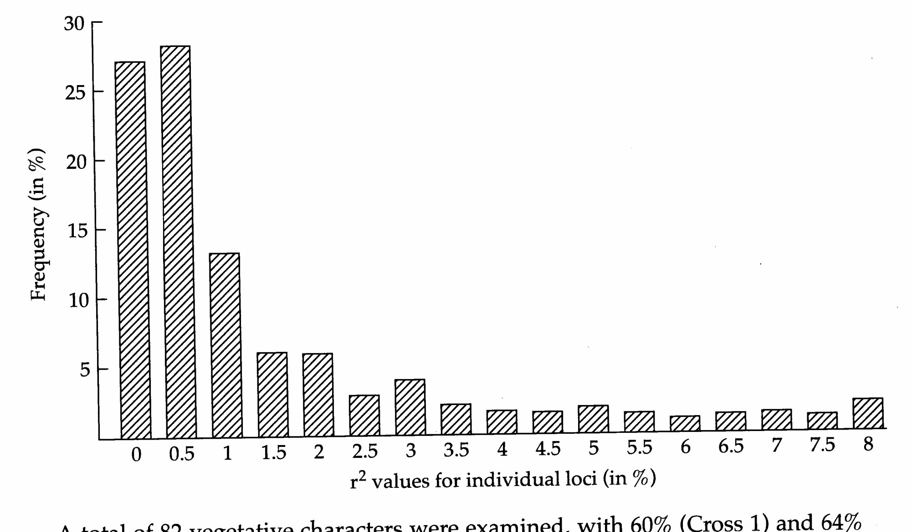
> 
> A total of 82 vegetative characters were examined, with 60% (Cross 1) and 64% (Cross 2) of all possible marker-trait combinations showing significant effects (at the $ \alpha = 0.05 $ level) using single-marker ANOVA. On average, each trait showed 10 (Cross 1) and 14 (Cross 2) significant marker associations. Dominance was common, while pairwise epistasis, as tested by incorporating a marker × marker interaction term into the linear model (Equation 15.14c), was rare.
> 
> The same two $ F_2 $ populations were used by Stuber et al. (1987) to examine 25 yield-related characters, with similar results. In that study, most marker-trait combinations were significant (66% and 72% at the $ \alpha = 0.05 $ level), and most marker effects were small (over half of the significant associations having $ r^2 $ values less than two percent). As a group, yield-related traits displayed more dominance than vegetative traits, but many yield traits were still largely additive.
> 
> A more recent study by Edwards et al. (1992) examined a subset of the vegetative characters in Cross 2, using a much larger number of markers (114 RFLPs). While only 187 $ F_{2} $ individuals were scored, 15% of marker-trait associations were significant, and the overall results with respect to the distribution of effects were similar to those for the 1987 experiments.

---

## Genetics_chapter15_009 · QTL DETECTION AND ESTIMATION VIA MAXIMUM LIKELIHOOD

Maximum likelihood (ML) methods are especially popular in the QTL mapping literature. While linear models use only marker means, ML uses the full information from the marker-trait distribution and, as such, is expected to be more powerful. The tradeoff is that ML is computationally intensive, requiring rather special programs to solve the likelihood equations, while linear model analysis can be performed with almost any standard statistical package. Further, while modifying the basic model (such as adding extra factors) is rather trivial in the linear model framework, with ML new likelihood functions need to be constructed and solved for each variant of the original model. Although writing down a set of likelihood equations for the model of interest is relatively straightforward (e.g., Example 4), obtaining the ML estimates is much more difficult. One approach outlined in Appendix 4 is to use specialized algorithms, of which EM (expectation-maximization) methods have been successfully adapted to many of the mixture-model problems in QTL mapping (e.g., Lander and Botstein 1989; Carbonell and Gerig 1991; Luo and Kearsey 1992; van Ooijen 1992; Carbonell et al. 1992; Luo and Wolliams 1993; Jansen 1992, 1993a, 1994a, 1996; Jansen and Stam 1994). Alternatively, as we discuss later, a creative use of regressions can often provide excellent approximations to ML solutions. For the remainder of this chapter, we assume that the reader has recently read Chapter 13 and Appendix 4, which introduces much of the ML machinery used here.

Assuming that the distribution of phenotypes for an individual with QTL genotype $ Q_k $ is normal with mean $ \mu_{Q_k} $ and variance $ \sigma^2 $, and following the logic of Chapter 13, the likelihood for an individual with phenotypic value $ z $ and marker genotype $ M_j $ becomes

$$
\ell(z\mid M_{j})=\sum_{k=1}^{N}\varphi(z,\mu_{Q_{k}},\sigma^{2})\Pr(Q_{k}\mid M_{j})
\tag{15.15}
$$

where $\varphi(z,\mu_{Q_k},\sigma^2)$ denotes the density function for a normal distribution with mean $\mu_{Q_k}$ and variance $\sigma^2$, and a total of $N$ QTL genotypes is assumed. This likelihood is a mixture-model distribution (Chapter 13). The mixing proportions, $\Pr(Q_k\mid M_j)$, are functions of the genetic map (the position(s) of the QTL(s) with respect to the observed markers) and the experimental design, while the QTL effects enter only though the means $\mu_{Q_k}$ and variance $\sigma^2$ of the underlying distributions.

**[示例 Example]**

> **Example 4** · ref: `Genetics_chapter15:4` · source: `Genetics_chapter15_009.json` · blocks 4–8
>
> Example 4. Consider the single-marker $ F_{2} $ design with a single QTL linked to the marker. Making the standard assumption that phenotypes are normally distributed about each QTL genotype, substitution of the $ F_{2} $ conditional probabilities (Example 1) into Equation 15.15 gives the likelihood functions for the three different marker genotypes as
> 
> $$
> \begin{align*}\ell(z\mid MM)&=(1-c)^{2}\varphi(z,\mu_{QQ},\sigma^{2})+2c(1-c)\varphi(z,\mu_{Qq},\sigma^{2})+c^{2}\varphi(z,\mu_{qq},\sigma^{2})\\\ell(z\mid Mm)&=c(1-c)\varphi(z,\mu_{QQ},\sigma^{2})+\left[(1-c)^{2}+c^{2}\right]\varphi(z,\mu_{Qq},\sigma^{2})\\&\quad+c(1-c)\varphi(z,\mu_{qq},\sigma^{2})\\\ell(z\mid mm)&=c^{2}\varphi(z,\mu_{QQ},\sigma^{2})+2c(1-c)\varphi(z,\mu_{Qq},\sigma^{2})+(1-c)^{2}\varphi(z,\mu_{qq},\sigma^{2})\end{align*}
> $$
> 
> 
> as obtained by Weller (1986). The total likelihood for $n$ $F_{2}$ individuals is the product of the individual likelihoods,
> 
> $$
> \ell(\mathbf{z})=\prod_{i=1}^{n}\ell(z_{i}\mid M_{i})
> $$
> 
> 
> While rather complex, the total likelihood is a function of just five parameters: the QTL position (c), the three QTL means ( $ \mu_{QQ} $, $ \mu_{Qq} $, $ \mu_{qq} $), and the common variance ( $ \sigma^{2} $).

As in the case of segregation analysis (Chapter 13), the likelihood equations can be modified to account for dichotomous (binary) and polychotomous (ordinal) characters through the use of logistic regressions and probit scales (Ghosh et al. 1993, Hackett and Weller 1995, Visscher et al. 1996a, Xu and Atchley 1996). Alternatively, one can simply ignore the discrete structure of the data, treating them as if they were continuous (e.g., coding alternative binary characters as 0/1) and applying ML. When flanking markers are used, this approach gives essentially the same power and precision as methods specifically designed for polychotomous traits (Hackett and Weller 1995, Visscher et al. 1996a), but when single markers are used, this approach can give estimates for QTL position that are rather seriously biased (Hackett and Weller 1995). An alternative approach for treating nonnormally distributed characters is given by Kruglyak and Lander (1995c), who develop a nonparametric interval mapping procedure.

---

## Genetics_chapter15_010 · QTL DETECTION AND ESTIMATION VIA MAXIMUM LIKELIHOOD / Likelihood Maps

In the likelihood framework, tests of whether a QTL is linked to the marker(s) under consideration are based on the likelihood-ratio statistic,

$$
\mathrm{LR}=-2\ln\left[\frac{\max\ell_{r}(\mathbf{z})}{\max\ell(\mathbf{z})}\right]
$$

where $ \max \ell_{r}(\mathbf{z}) $, given by Equation 13.8, is the maximum of the likelihood function under the null hypothesis of no segregating QTL (i.e., under the assumption

> **Figure 15.1** · page 461 · source: `Genetics_chapter15`
>
> 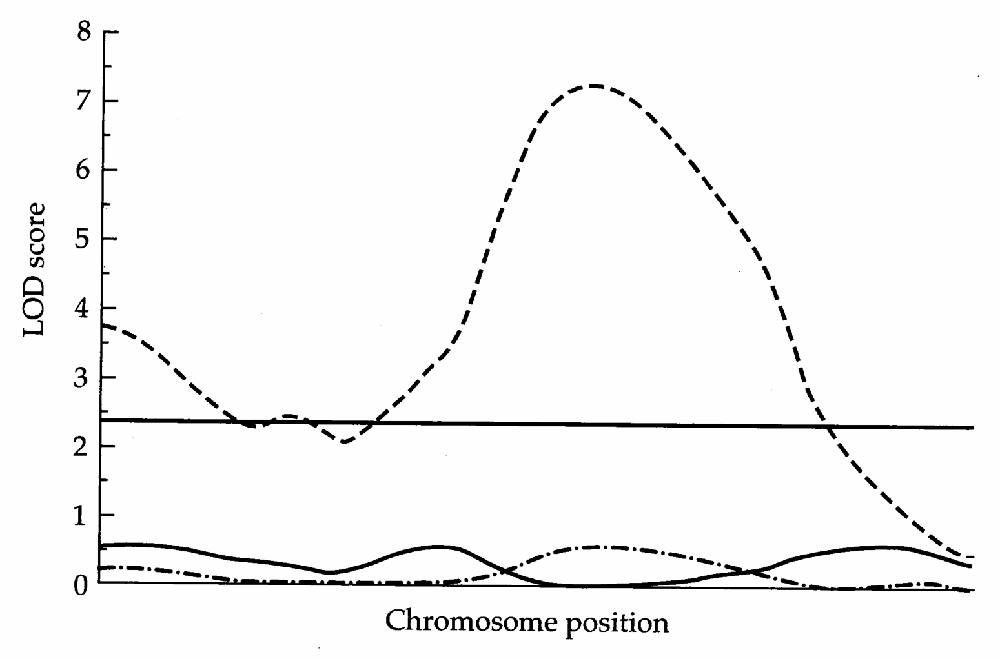
>
> Figure 15.1 Likelihood map for QTL positions on chromosome 10 in a cross of two tomato species. Evidence for a QTL is provided when the likelihood function exceeds the significance threshold (indicated by the horizontal line). The upper dashed curve gives the LOD score for fruit pH as a function of map position, showing strong evidence of a QTL near the middle of the chromosome. The lower two curves (solid and broken) are for fruit weight and soluble-solid concentration, neither of which shows a significant QTL effect on this chromosome. (After Paterson et al. 1988.)

that the phenotypic distribution is a single normal). This test statistic is approximately $ \chi^{2} $-distributed, with the degrees of freedom given by the extra number of fitted parameters in the full model. For a model assuming a single QTL, most designs have five parameters in the full model (the three QTL means, the variance, and the QTL position), and two in the reduced model (the mean and variance), giving three degrees of freedom. Certain designs (such as a backcross, RIL, or DHL) involve situations where only two QTL means enter (e.g., QQ and qq for RILs/DHLs, Qq and QQ or qq for a backcross), and here the likelihood ratio has two degrees of freedom.

The amount of support for a QTL at a particular map position is often displayed graphically through the use of likelihood maps (Figures 15.1, 15.2), which plot the likelihood-ratio statistic (or a closely related quantity) as a function of map position of the putative QTL. For example, the value of the likelihood map at c = 0.05 gives the likelihood-ratio statistic that a QTL is at recombination fraction 0.05 from the marker vs. a model assuming no QTL. This approach for displaying the support for a QTL was introduced by Lander and Botstein (1989), who plotted the LOD (likelihood of odds) scores (Morton 1955b). The LOD score for a particular value of c is related to the likelihood-ratio test statistic (LR) by

$$
\mathrm{LOD}(c)=\log_{10}\left[\frac{\max\ell_{r}(\mathbf{z})}{\max\ell(\mathbf{z},c)}\right]=\frac{\mathrm{LR}(c)}{2\ln10}\simeq\frac{\mathrm{LR}(c)}{4.61}
\tag{15.16}
$$

showing that the LOD score is simply a constant times the likelihood-ratio statistic. Here $ \max \ell(\mathbf{z}, c) $ denotes the maximum of the likelihood function given a QTL at recombination frequency c from the marker. Another variant is simply to plot $ \max \ell(\mathbf{z}, c) $ instead of the likelihood-ratio statistic, as the restricted likelihood, $ \max \ell_{r}(\mathbf{z}) $, is the same for each value of c.

The likelihood map projects the multidimensional likelihood surface (which is a function of the QTL means, variance, and map position) on to a single dimension, that of the map position, c. The ML estimate of c is that which yields the maximum value on the likelihood map, and the values for the QTL means and variance that maximize the likelihood given this value of c are the ML estimates for the QTL effects. Thus, in the likelihood framework, detection of a linked QTL and estimation of its position are coupled — if the likelihood ratio exceeds the critical threshold for that chromosome, it provides evidence for a linked QTL, whose position is estimated by the peak of the likelihood map. If the peak does not exceed this threshold, there is no evidence for a linked QTL.

---

## Genetics_chapter15_011 · QTL DETECTION AND ESTIMATION VIA MAXIMUM LIKELIHOOD / Precision of ML Estimates of QTL Position

Since ML estimates are approximately normally distributed for large sample sizes, confidence intervals for QTL effects and position can be constructed using the sampling variances for the ML estimates (Appendix 4). Approximate confidence intervals are often constructed using the one-LOD rule (Figure 15.2), with the confidence interval being defined by all those values falling within one LOD score of the maximum value (Conneally et al. 1985, Lander and Botstein 1989). The motivation for such one-LOD support intervals follows from the fact that the large-sample distribution of the LR statistic follows a $ \chi^{2} $ distribution. If only one parameter in the likelihood function is allowed to vary, as when testing whether equals a particular value (say the observed ML estimate), the LR statistic has one degree of freedom. Because a one-LOD change corresponds to an LR change of 4.61 (Equation 15.16), which for a $ \chi^{2} $ with one degree of freedom corresponds to a significance value of 0.04 (e.g., $ \Pr(\chi_{1}^{2} \geq 4.61) = 0.04 $), it follows that one-LOD support intervals approximate 95% confidence intervals under the appropriate settings. However, the one-LOD rule often gives confidence intervals that are too short. Mangin et al. (1994a,b) show this to be the case for QTLs of small effect (one-LOD confidence intervals having between 60% and 95% probability of actually containing the QTL), and they develop an improved method for such cases. Simulation studies led van Ooijen (1992) to suggest that support intervals should be based on two-LOD differences in order to have a high probability of containing the QTL. A more rigorous approach to obtaining standard errors of both map

> **Figure 15.2** · page 463 · source: `Genetics_chapter15`
>
> 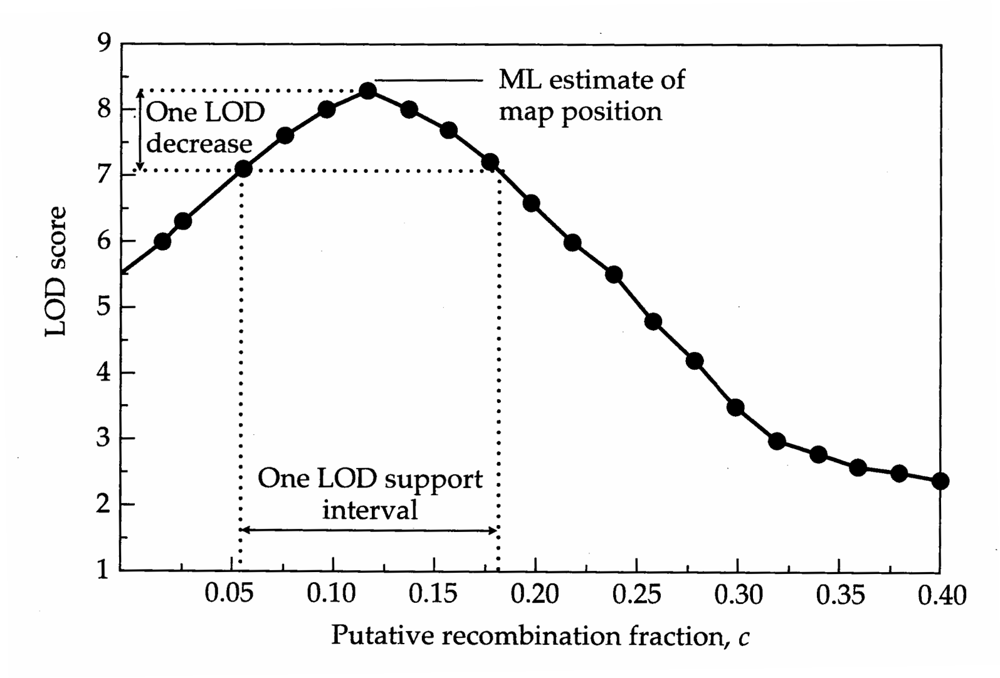
>
> Figure 15.2 Hypothetical likelihood map for the marker-QTL recombination frequency c in a single-marker analysis. Points connected by straight lines are used to remind the reader that likelihood maps are computed by plotting the maximum of the likelihood function for each c value, usually done by considering steps of 0.01 to 0.05. A QTL is indicated if any part of the likelihood map exceeds a critical value. In such cases, the ML estimate for map position is the value of c giving the highest likelihood. Approximate confidence intervals for QTL position (one-LOD support intervals) are often constructed by including the set of all c values giving likelihoods within one LOD score of the maximum value.

position and QTL effects is to use the inverse of the Fisher information matrix associated with the likelihood function (Appendix 4), although this inverse is often considerably more difficult to compute than LOD support intervals.

Resampling methods provide a very robust procedure for constructing confidence intervals for QTL position, and Visscher et al. (1996b) suggest using a bootstrap approach (Efron 1979, 1982). Suppose the original data set consists of n individuals. A bootstrap sample is generated by drawing n values, with replacement, from the original data set. Such a sample will have some of the original values present multiple times and others not present at all. A series of N such samples are generated and an estimate (map position in this case) is computed for each, generating a distribution of estimates (the empirical bootstrap distribution). The resulting 95% bootstrap confidence interval has as its lower value the estimate corresponding to the 2.5% cumulative frequency point of the empirical bootstrap distribution, while the upper value is that corresponding to the upper 97.5% of the bootstrap distribution. Simulation studies by Visscher et al. show that this approach usually yields confidence intervals very close to the correct length when at least 200 bootstrap samples are used.

The length of the confidence interval is influenced by the number of individuals sampled, the effect of the QTL in question, and the marker density. Darvasi et al. (1993) show that precision is not significantly increased by increasing marker density beyond a certain point (around one marker every 5 to 10 cM). Given such a dense map, van Ooijen (1992) found that ML mapping using flanking markers with reasonable sample sizes (200–300 $ F_{2} $ or backcross individuals) allows a QTL accounting for 5% of the total variance to be mapped to a 40 cM interval, while one accounting for 10% can be mapped to a 20 cM interval. Unfortunately, these interval sizes are distressingly large for cloning QTLs or even defining their positions to smaller intervals for RIL construction.

One strategy for increasing the precision of mapping is to use lines with expanded genetic maps, such as RILs or AILs. With these designs, estimates of the map position are in terms of the cumulative recombination frequency $ \widetilde{c} = tc $, so that the confidence interval for c is reduced by a factor of 1/t. For example, recombinant inbred lines have a two- to four-fold expansion of the map (Equation 15.5b), and hence reduce the length of the confidence interval for c by 1/2 to 1/4 relative to an $ F_{2} $. Even more dramatic reductions are possible using advanced intercross lines. A sample size and marker density that yield a 20 cM confidence interval in an $ F_{2} $ design give a 3.4 cM confidence interval for the same QTL in an $ F_{10} $ design. (This follows from Equation 15.4, which shows that a Haldane distance of 20 cM, corresponding to c = 0.165, translates into $ \widetilde{c} = c/5 = 0.033 $ and a Haldane distance of 3.4 cM with an $ F_{10} $ AIL.) Likewise, an $ F_{20} $ design would give a 1.7 cM confidence interval.

---

## Genetics_chapter15_012 · QTL DETECTION AND ESTIMATION VIA MAXIMUM LIKELIHOOD / ML Interval Mapping

ML mapping with line crosses usually employs the genotypes of a pair of flanking markers as the unit of analysis. The likelihood functions for such ML interval mapping follow from Equation 15.15 using the appropriate conditional probabilities for QTL genotypes given the two-locus marker genotypes (Jensen 1989, Lander and Botstein 1989, Knapp et al. 1990, Carbonell et al. 1992, van Ooijen 1992, Korol et al. 1996). Example 5 shows the basic structure of the resulting likelihood functions. As with single-marker analysis, support for a QTL is evaluated with a likelihood map for the interval, with the peak of the likelihood map corresponding to the ML estimate of QTL position within that interval and its significance given by a likelihood-ratio test.

**[示例 Example]**

> **Example 5** · ref: `Genetics_chapter15:5` · source: `Genetics_chapter15_012.json` · blocks 1–4
>
> Example 5. Likelihood functions for interval mapping follow by substituting the appropriate conditional probabilities into Equation 15.15. For example, consider the $ F_{2} $ formed by crossing two inbred lines. Assuming no interference, from
> 
> Equation 15.2 the likelihood for marker genotype $ M_{1}M_{1}M_{2}M_{2} $ is
> 
> $$
> \begin{aligned}\ell(z\mid M_{1}M_{1}M_{2}M_{2})&=\left[\frac{\left(1-c_{1}\right)^{2}\left(1-c_{2}\right)^{2}}{\left(1-c_{12}\right)^{2}}\right]\cdot\varphi(z,\mu_{QQ},\sigma^{2})&\\ &+\left[\frac{2c_{1}c_{2}\left(1-c_{1}\right)\left(1-c_{2}\right)}{\left(1-c_{12}\right)^{2}}\right]\cdot\varphi(z,\mu_{Qq},\sigma^{2})\\ &\\ &+\left[\frac{c_{1}^{2}c_{2}^{2}}{\left(1-c_{12}\right)^{2}}\right]\cdot\varphi(z,\mu_{qq},\sigma^{2})\\ \end{aligned}
> $$
> 
> 
> Likelihoods for the other eight flanking-marker genotypes follow similarly and can be found in Luo and Kearsey (1992), Carbonell et al. (1992), and van Ooijen (1992). Even though these likelihoods involve three recombination parameters $ (c_{12}, c_{1}, c_{2}) $, the distance between markers $ (c_{12}) $ is usually taken as known, and hence $ c_{2} = (c_{12} - c_{1}) / (1 - 2c_{1}) $ (assuming no interference) or $ c_{2} = c_{12} - c_{1} $ (complete interference). This leaves five parameters to estimate: three QTL means, the common variance $ \sigma^{2} $, and the position $ c_{1} $ of the putative QTL within the interval. Likelihoods for other designs follow using the appropriate conditional probabilities.

One of the first applications of ML interval mapping was performed by Paterson et al. (1988), who examined 237 backcross individuals in a cross between the tomato species Lycopersicon esculentum and L. chmielewskii for several fruit-related traits (Figure 15.1 gives the chromosome 10 likelihood maps for three traits). By using 68 markers (63 RFLP and 5 isozyme variants), 95% of the genome was within 20 cM of a marker. Six QTLs affecting fruit mass, four affecting concentration of soluble solids, and five affecting fruit pH were detected. A follow-up study (Paterson et al. 1990) using NILs (Chapter 14) detected additional QTLs. However, this finer mapping could not confirm the presence of one putative QTL that showed a highly significant peak on the likelihood map in the 1988 study, suggesting it was a false positive.

With ML interval mapping, the likelihood map for an entire chromosome is constructed by pasting together the likelihood maps for each successive interval. If the order of markers on a particular chromosome is $ M_{1}-M_{2}-M_{3}-\cdots-M_{n} $, the likelihood map for the $ M_{1}-M_{2} $ interval is constructed using only marker information from these two loci, the map for the $ M_{2}-M_{3} $ interval uses only information from $ M_{2} $ and $ M_{3} $, etc. The map resulting from joining the maps for each interval together is smooth; see Figures 15.1 and 15.3.

Given the multiple-test nature of these plots (since each map is actually multiple intervals), the appropriate threshold value for the collection of internal maps that constitutes the likelihood map for a chromosome is debatable. Knott and Haley (1992a) note that the total number of independent tests is bounded above by the number of intervals examined, but since these intervals are linked, they are not independent tests (Zeng 1993). The lower bound is set by the number of chromosomes examined, as these segregate independently. Hence, we first set a threshold level for each chromosome that ensures a desired genome-wide significance level for the entire collection of chromosomes. If C chromosomes are examined, Equation 15.13b implies that in order to obtain a genome-wide significance level $ \gamma $, the significance level used to set thresholds for each chromosome is

$$
1-(1-\gamma)^{1/C}\simeq\gamma/C
\tag{15.17}
$$

Rebai et al. (1994b) suggest an improved approach that takes into account differences in chromosome lengths. Turning now to the significance values for intervals on a given chromosome, suppose the chromosome of interest has $m$ intervals and we have set the chromosome-wide significance as $\gamma_{i}$. Simulation studies by Zeng (1994) suggest that if the number of markers is not too large, then, for large sample sizes, the critical value for each interval is approximately given by a $\chi_{k}^{2}$ value with significance $\gamma_{i}/m$. Here $k$ is the number of free parameters in the likelihood-ratio test. More exact approximations assuming an infinitely dense map have been developed (Lander and Botstein 1989, Feingold et al. 1993), as have those for a finite number of markers (Zeng 1994, Rebai et al. 1994b). Simulations by Doerge and Rebai (1996) show that, dense marker methods (assuming a very large number of markers per chromosome) are conservative, with the probability of a test statistic exceeding the $\alpha$-level threshold being less than $\alpha$ when no QTL is present.

**[示例 Example]**

> **Example 6** · ref: `Genetics_chapter15:6` · source: `Genetics_chapter15_012.json` · blocks 10–11
>
> Example 6. Suppose five chromosomes are used for ML-interval mapping in an $ F_2 $ design. Chromosomes 1 through 5 have 10, 5, 20, 30, and 40 markers, respectively. In order to achieve a genome-wide level of significance of $ \gamma = 0.10 $, what are the approximate critical values for each chromosome? Applying Equation 15.17, the overall level of significance for each chromosome is $ 1 - (1 - 0.1)^{1/5} = 0.021 $.
> 
> The critical values for each chromosome vary with the number of markers. For chromosome 1, the significance levels for each test become approximately 0.021/10 = 0.0021. Recall that the degrees of freedom for the test of no QTLs in an $ F_2 $ design are 5–2 = 3. Since $ \Pr(\chi_3^2 > 14.71) = 0.0021 $, this implies that the critical values for the likelihood ratios for chromosome 1 is 14.7. Similarly, the critical values for the remaining four chromosomes are 13.2, 16.2, 17.0, and 17.6.

An alternative approach to obtaining critical values is to use permutation tests to set the threshold levels (Churchill and Doerge 1994, Doerge and Churchill 1996). This resampling procedure has the advantage of being robust to the actual distribution of effects. Further, resampling is superior to analytical approximations for data with missing and incomplete marker information, as the permutation test, by keeping genotypes intact during reshuffling, automatically incorporates the special nature of each data set (Doerge and Rebai 1996).

Finally, it should be mentioned that the null hypothesis usually assumed, that of no QTLs, may be misleading. Crossed lines are often chosen because they differ in traits of interest, so that there is certainly segregating genetic variance in the $ F_{2} $ and other line-cross populations. Visscher and Haley (1996) note that if such background variance is present, it results in a more frequent rejection of the null hypothesis of no QTL than expected. They argue that the more appropriate null hypothesis should be that, taking the strain differences into account, the amount of genetic variance explained by a chromosome segment is that expected by chance, and they propose several tests of this hypothesis.

---

## Genetics_chapter15_013 · QTL DETECTION AND ESTIMATION VIA MAXIMUM LIKELIHOOD / Approximating ML Interval Mapping by Haley-Knott Regressions

One problem with ML estimators is that they can be rather computationally demanding. Among other things, this limits the applicability of resampling methods, which require thousands of ML estimates to be computed per experiment. Fortunately, a simple regression procedure gives an excellent approximation of the likelihood map for ML interval mapping (Haley and Knott 1992, Martínez and Curnow 1992). This procedure greatly facilitates matters, as regressions are easily computed. Haley and Knott's (1992) idea is to express the regression coefficients as a function of the unknown QTL parameters. Using the Falconer parameterization for genotypic means,

$$
\mu_{Q Q}=\mu+a,\qquad\mu_{Q q}=\mu+d,\qquad\mu_{q q}=\mu-a
\tag{15.18a}
$$

this is done by considering the regression

$$
z_{j}=\mu+a\cdot x(M_{j})+d\cdot y(M_{j})+e_{j}
\tag{15.18b}
$$

The variables x and y, which depend on both the flanking-marker genotype of the individual (M) and the assumed map position of the putative QTL, are obtained as follows. Taking the expectation of Equation 15.18b over all individuals with marker genotype $ M_{i} $ gives

$$
\mu_{M_{i}}=\mu+a\cdot x(M_{i})+d\cdot y(M_{i})
\tag{15.19a}
$$

From Equation 15.6,

$$
\begin{aligned}\mu_{M_{i}}&=(\mu+a)\Pr(QQ\mid M_{i})+(\mu+d)\Pr(Qq\mid M_{i})+(\mu-a)\Pr(qq\mid M_{i})\\&=\mu+a\cdot\left[\Pr(QQ\mid M_{i})-\Pr(qq\mid M_{i})\right]+d\cdot\Pr(Qq\mid M_{i})\quad&(1)\end{aligned}
\tag{15.19b}
$$

Equating like terms in Equations 15.19a and 15.19b gives

$$
x(M_{i})=\Pr(QQ\mid M_{i})-\Pr(qq\mid M_{i}),\qquad y(M_{i})=\Pr(Qq\mid M_{i})
\tag{15.20}
$$

Thus, the x and y values are functions of the conditional QTL probabilities given the flanking-marker genotypes. For example, for the $ F_{2} $ design with no interference, Equation 15.2 gives

$$
x(M_{1}M_{1}M_{2}M_{2})=\frac{(1-c_{1})^{2}(1-c_{2})^{2}-c_{1}^{2}c_{2}^{2}}{(1-c_{12})^{2}}
$$

$$
y(M_{1}M_{1}M_{2}M_{2})=\frac{2c_{1}c_{2}(1-c_{1})(1-c_{2})}{(1-c_{12})^{2}}
$$

Haley and Knott give expressions for the eight other $ F_{2} $ marker genotypes, and values for other designs easily follow when the appropriate conditional probabilities are employed. This regression approach was independently suggested by Martínez and Curnow (1992) for the analysis of backcross populations. These authors also detail how missing marker information can be accommodated (Martínez and Curnow 1994a).

By analogy with likelihood maps, the regression given by Equation 15.18b is computed for each $ c_1 $ value within the $ M_1 - M_2 $ interval, with that value giving the regression with the largest $ r^2 $ being taken as the estimate of QTL position. For each $ c_1 $ value, Equation 15.20 yields the set of $ x $ and $ y $ values, allowing $ \mu $, $ a $, and $ d $ to be estimated by ordinary least-squares regression (Equation 8.33a),

$$
\mathbf{b}_{c_{1}}=\begin{pmatrix}\widehat{\mu}\\ \widehat{a}\\ \widehat{d}\end{pmatrix}=\left(\mathbf{X}_{c_{1}}^{T}\mathbf{X}_{c_{1}}\right)^{-1}\mathbf{X}_{c_{1}}^{T}\mathbf{z}
\tag{15.21}
$$

where the ith row of the design matrix $ \mathbf{X}_{c_1} $ is $ (1, x(M_i, c_1), y(M_i, c_1)) $.

Haley and Knott show that $ r^{2} $ plots for this regression are related to likelihood plots. Assuming that phenotypes are normally distributed about each QTL genotype, then if the QTL is completely linked to either marker ( $ c_{1}=0 $ or $ c_{1}=c $), the residuals for the regression given by Equation 15.18b are normally distributed. In this case, the regression estimates are also ML estimates and the likelihood-ratio test can be expressed as

$$
\mathrm{L R}=n\ln\left(\frac{\mathrm{S S}_{T}}{\mathrm{S S}_{E}}\right)=-n\ln(1-r^{2})
\tag{15.22}
$$

where $ SS_{T} $ and $ SS_{E} $ are the total and error (or residual) sums of squares associated with the regression (Equations A3.16a,c), with the second equality following from Equation A3.15. If the QTL is not completely linked to either marker, the distribution of residuals follows a mixture of normals, as some marker genotype classes will contain different QTL genotypes. However, Haley and Knott (1992) and Rebai et al. (1995) show that the function given by Equation 15.22 gives extremely similar values to the true likelihood ratio. Haley and Knott suggest that the number of degrees of freedom appropriate for this test is the number of estimated QTL parameters plus an additional degree of freedom for map position $ c_{1} $. Xu (1995) notes that this regression approach tends to overestimate the residual variance, and presents a correction. More generally, if the linear model has additional factors (accounting for, say, differences due to sex and age), the LR test is modified to become

$$
\mathrm{LR}=n\ln\left(\frac{\mathrm{SS}_{E}(reduced)}{\mathrm{SS}_{E}(full)}\right)
\tag{15.23}
$$

where the error sums of squares are now for the full model and the reduced model (the latter incorporating all factors but the QTL effects).

**[示例 Example]**

> **Example 7** · ref: `Genetics_chapter15:7` · source: `Genetics_chapter15_013.json` · blocks 22–37
>
> Example 7. Consider the following hypothetical data set: 10 F₂ individuals scored for flanking marker genotypes M₁/m₁ and M₂/m₂, separated by recombination frequency c₁₂ = 0.30. The following marker genotypes and their associated character values are observed:
> 
> $$
> \begin{array}{r l r l r l}{{M_{1}m_{1}M_{2}m_{2}}}&{{{M_{1}M_{1}M_{2}M_{2}}}}&{{{M_{1}m_{1}M_{2}M_{2}}}}&{{{m_{1}m_{1}M_{2}m_{2}}}}&{{{M_{1}M_{1}M_{2}m_{2}}}} \\ {{3.9}}&{{{5.6}}}&{{{3.7}}}&{{{3.9}}}&{{{5.3}}} \\ \end{array}
> $$
> 
> 
> This yields the observation vector
> 
> $$
> \mathbf{z}^{T}=(3.9,5.6,3.7,3.9,5.3,1.1,3.6,5.4,3.7,3.3)
> $$
> 
> 
> Assuming no interference, $ c_2 = (0.3 - c_1) / (1 - 2c_1) $. For each $ c_1 $ value ( $ 0 \leq c_1 \leq 0.3 $), a regression is fitted by first using Equation 15.20 to compute the elements of the design matrix for that value of $ c_1 $ and then using Equation 15.21 to obtain the regression coefficients. For example, consider three different QTL positions: $ c_1 = 0 $ (QTL at marker $ M_1 $), $ c_1 = 0.15 $ (QTL in the middle), and $ c_1 = 0.3 $ (QTL at marker $ M_2 $). The resulting regressions for these three $ c_1 $ values are
> 
> <table><tr><td>$ c_{1} $</td><td>$ \widehat{\mu} $</td><td>$ \widehat{a} $</td><td>$ \widehat{d} $</td><td>$ r^{2} $</td></tr><tr><td>0.00</td><td>3.97</td><td>1.47</td><td>-0.33</td><td>0.730</td></tr><tr><td>0.15</td><td>3.70</td><td>1.89</td><td>-0.26</td><td>0.732</td></tr><tr><td>0.30</td><td>2.75</td><td>1.65</td><td>1.35</td><td>0.597</td></tr></table>
> 
> These regressions are obtained using the design matrices
> 
> $$
> \mathbf{X}_{0}=\begin{pmatrix}{{{1}}}&{{{0}}}&{{{1}}} \\{{{1}}}&{{{1}}}&{{{0}}} \\{{{1}}}&{{{0}}}&{{{1}}} \\{{{1}}}&{{{-1}}}&{{{0}}} \\{{{1}}}&{{{1}}}&{{{0}}} \\{{{1}}}&{{{-1}}}&{{{0}}} \\{{{1}}}&{{{0}}}&{{{1}}} \\{{{1}}}&{{{1}}}&{{{0}}} \\{{{1}}}&{{{0}}}&{{{1}}} \\{{{1}}}&{{{0}}}&{{{1}}}\end{pmatrix},\quad\mathbf{X}_{0.15}=\begin{pmatrix}{{{1}}}&{{{0.00}}}&{{{0.85}}} \\{{{1}}}&{{{0.91}}}&{{{0.09}}} \\{{{1}}}&{{{0.35}}}&{{{0.60}}} \\{{{1}}}&{{{-0.56}}}&{{{0.40}}} \\{{{1}}}&{{{0.56}}}&{{{0.40}}} \\{{{1}}}&{{{-0.91}}}&{{{0.09}}} \\{{{1}}}&{{{0.35}}}&{{{0.60}}} \\{{{1}}}&{{{0.91}}}&{{{0.09}}} \\{{{1}}}&{{{0.35}}}&{{{0.60}}} \\{{{1}}}&{{{0.00}}}&{{{0.85}}}\end{pmatrix},\quad\mathbf{X}_{0.3}=\begin{pmatrix}{{{1}}}&{{{0}}}&{{{1}}} \\{{{1}}}&{{{1}}}&{{{0}}} \\{{{1}}}&{{{1}}}&{{{0}}} \\{{{1}}}&{{{0}}}&{{{1}}} \\{{{1}}}&{{{0}}}&{{{1}}} \\{{{1}}}&{{{-1}}}&{{{0}}} \\{{{1}}}&{{{1}}}&{{{0}}} \\{{{1}}}&{{{1}}}&{{{0}}} \\{{{1}}}&{{{1}}}&{{{0}}} \\{{{1}}}&{{{0}}}&{{{1}}}\end{pmatrix}
> $$
> 
> 
> To complete the analysis, regressions are computed for the full range of $ c_{1} $ values, generating the following plot of regression $ r^{2} $ as a function of $ c_{1} $.
> 
> 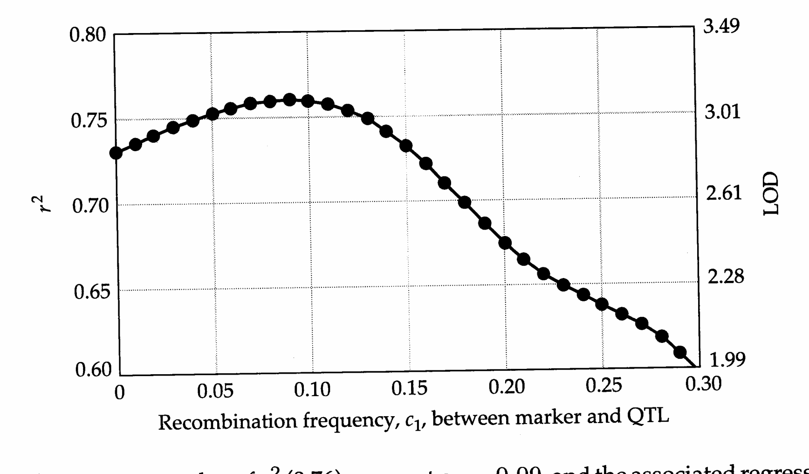
> 
> The maximum value of $ r^2 $ (0.76) occurs at $ c_1 = 0.09 $, and the associated regression coefficients are $ \widehat{\mu} = 3.90 $, $ \widehat{a} = 1.76 $ and $ \widehat{d} = -0.46 $. Hence, the data suggest that a QTL lies between these two markers at recombination fraction $ c_1 = 0.09 $ from marker locus $ M_1 $, with estimated genotypic means
> 
> $$
> \widehat{\mu}_{Q Q}=\widehat{\mu}+\widehat{a}=5.66,\quad\widehat{\mu}_{Q q}=\widehat{\mu}+\widehat{d}=3.44,\quad\widehat{\mu}_{q q}=\widehat{\mu}-\widehat{a}=2.14
> $$
> 
> 
> Does this example show significant evidence of a QTL? From Equation 15.22, with $n = 10$ and $r^2 = 0.76$, the likelihood ratio (LR) becomes $-\ln(1-0.76^2) = 14.27$. Note that only two QTL parameters are fitted ($a$ and $d$) because the reduced model fits a mean $\mu$. Hence, the critical value for the likelihood ratio is a $\chi^2$ with three degrees of freedom (for $a$, $d$, $c_1$),
> 
> $$
> \Pr[\chi_{3}^{2}>-n\ln(1-r^{2})]=\Pr[\chi_{3}^{2}>14.27]=0.003
> $$
> 
> 
> showing that the QTL effect is indeed significant.
> 
> Approximate confidence intervals can be constructed by using those values giving scores within one LOD of the maximum value. We can translate $ r^2 $ values into LOD scores by using LOD = LR/4.61 = $ -n \ln(1 - r^2)/4.61 $. The MLE has $ r^2 = 0.76 $ and $ n = 10 $, for a LOD score of $ -10 \ln(1 - 0.76^2)/4.61 = 3.10 $. Hence any $ c_1 $ value with a LOD score of 2.10 or greater is in the one-LOD support interval for QTL position. The resulting interval is $ c_1 = 0 $ to 0.28, so that although there is very strong evidence for a QTL, there is extreme uncertainty as to its position within the interval. This is not surprising given the very small sample size.

---

## Genetics_chapter15_014 · QTL DETECTION AND ESTIMATION VIA MAXIMUM LIKELIHOOD / DEALING WITH MULTIPLE QTLs

All of the methods discussed so far are best characterized as one-at-a-time approaches for mapping QTLs, as they all assume a single QTL linked to the marker(s) of interest. While such methods can detect the presence of multiple QTLs (e.g., finding marker effects on a number of different chromosomes), they cannot discern whether significant effects at several linked markers/intervals are due to a common QTL or to several linked QTLs. The presence of multiple QTLs also introduces serious biases into estimates of QTL effects and positions derived from one-at-a-time approaches.

For example, while the presence of multiple (significant) peaks on a likelihood map for a given chromosome is generally taken as an indication of multiple QTLs, such peaks do not necessarily correspond to the correct QTL positions (Martínez and Curnow 1992, Haley and Knott 1992). Figure 15.3 gives an example of two linked QTLs embedded within four markers. Using a likelihood function that assumes only a single QTL, interval mapping correctly indicates likelihood peaks in the intervals flanked by $ M_{1}-M_{2} $ and $ M_{3}-M_{4} $. However, the resulting map also shows a much higher peak between $ M_{2}-M_{3} $, incorrectly suggesting the presence of a third QTL in this region. Some programs allow one to “fix” a QTL at the position corresponding to the highest peak of a multiply peaked map, and then search for a second linked QTL. As Figure 15.3 shows, this procedure can introduce serious bias. While specific tests for the presence of linked QTLs in adjacent intervals using sets of three overlapping markers have been suggested (Martínez and Curnow 1992, 1994b; Haley and Knott 1992), these are not without problems (Whittaker et al. 1996).

Unlinked QTLs also have an effect on one-at-a-time methods (albeit not as dramatic), as segregation at such loci contributes to the phenotypic variance. Reducing or removing this segregation variance reduces the residual variance for the marker/interval under consideration, increasing the power for QTL detection and improving the precision of estimates. Example 8 provides a dramatic illustration.

> **Figure 15.3** · page 472 · source: `Genetics_chapter15`
>
> 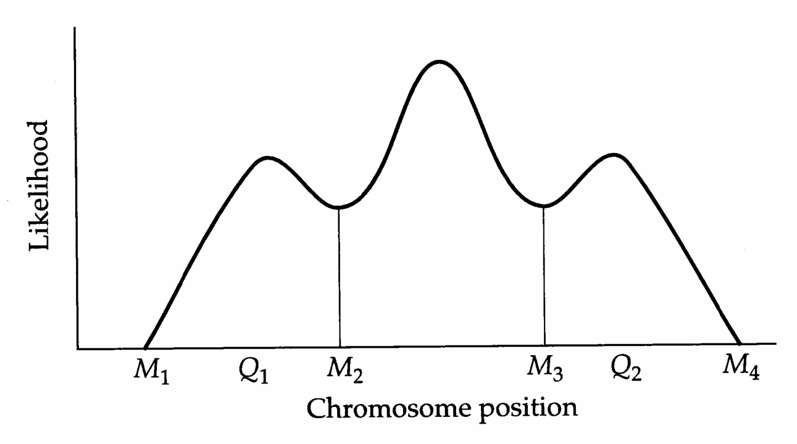
>
> Figure 15.3 A false (or ghost) QTL generated by using a single-QTL likelihood function when two linked QTLs are actually present.

Most of the single-QTL methods developed above can be extended to multiple QTLs by considering additional marker loci and using conditional probabilities for multilocus genotypes. This approach has been used to develop explicit models for two or three linked QTLs (e.g., Knapp 1991, Haley and Knott 1992, Martínez and Curnow 1992, 1994b, Jansen 1996, Satagopan et al. 1996). We focus here on three particularly flexible regression-based approaches. The first is marker-difference regression, which considers all of the markers on one chromosome in a single analysis by using the regression of differences between the mean values of different genotypes. The second is composite interval mapping, which controls for both the effects of linked and unlinked QTLs by using the appropriate marker cofactors. Finally, Wright and Mowers (1994) and Whittaker et al. (1996) have shown how positional information for linked QTLs can be extracted from the regression coefficients of a standard multiple regression incorporating several linked markers.

**[示例 Example]**

> **Example 8** · ref: `Genetics_chapter15:8` · source: `Genetics_chapter15_014.json` · blocks 5–5
>
> Example 8. Lin et al. (1995) examined flowering date through ML interval mapping of 370 F₂ individuals from a cross between cultivated and exotic sorghum (Sorghum bicolor × S. propinquum). Only a single QTL for flowering date was detected, and this accounted for 85.7% of the total variance. The data were then adjusted to account for the effects of this major gene by using (z - bᵢ) in place of the trait value z for an individual with genotype i at a marker linked to the major gene. Here, the bᵢ (1 ≤ i ≤ 3) are the regression coefficients generated by a standard marker-trait regression using this marker locus. While the uncorrected F₂ phenotypic distribution was clearly bimodal, the adjusted data did not deviate from normality. Using the marker-adjusted data, two additional QTLs for flowering time were found (both unlinked to the original QTL), accounting for an additional 8.3% and 4.2% of the total variance. This example illustrates the potential importance of including additional marker information into the analy- sis when multiple QTLs are present. In this case, removing the effects of a major unlinked QTL reduced the residual variance sufficiently to enable detection of additional QTLs.

---

## Genetics_chapter15_015 · QTL DETECTION AND ESTIMATION VIA MAXIMUM LIKELIHOOD / Marker-Difference Regression

Two groups (Kearsey and Hyne 1994, Hyne and Kearsey 1995, Wu and Li 1994, 1996) proposed a very simple, yet powerful, regression method that simultaneously considers all of the markers on a single chromosome. While the authors refer to this method as marker regression or joint mapping, we will use the more descriptive term marker-difference regression, or MDR, to emphasize that this approach is rather different from the regressions that we have considered up to this point. With MDR, each data point in the regression corresponds to a population mean value, rather than to values for single individuals (as in our previous regressions). While this data structure results in far fewer points in the regression, the use of means allows the inclusion of individuals missing some marker information and also allows the joint incorporation of information from several experiments.

The motivation for MDR follows from Equation 15.7a. We first present the method under the assumption of a single QTL to illustrate the main points before extending it to multiple QTLs. Suppose there are n linked markers on a chromosome containing a single QTL (with alleles Q and q). If the ith marker is at recombination frequency $ c_i $ from the QTL, the expected difference between marker homozygote means is

$$
y_{i}=\mu(M_{i}M_{i})-\mu(m_{i}m_{i})=2a(1-2c_{i})
$$

Thus, if we plot the differences $y_{i}$ vs. $(1-2c_{i})$ for each marker on the chromosome, the resulting $n$ points are expected to fall on a straight line passing through the origin with slope $2a=\mu_{QQ}-\mu_{qq}$. Figure 15.4 illustrates this point, showing two regressions using the same set of marker differences but assuming two different locations for the QTL. The regression computed using the correct position of the QTL is linear, while that assuming the incorrect position is highly nonlinear. As with Haley-Knott regressions, one slides the position of a putative QTL along the chromosome, computing a regression at each point. The regression giving the best fit (i.e., the largest $r^{2}$) corresponds to the estimate of QTL position, and the slope of that regression divided by two provides an estimate of the QTL effect, a.

To formally develop this approach, suppose that there are n linked markers scored along a single chromosome, and consider the regression

$$
y_{i}=\overline{z}(M_{i}M_{i})-\overline{z}(m_{i}m_{i})=\beta x_{i}+e_{i}
\tag{15.24}
$$

with the $ x_{i}=1-2c_{i} $ values obtained by fixing the QTL position and then computing $ c_{i} $. Because the residuals are correlated and potentially heteroscedastic,

> **Figure 15.4** · page 474 · source: `Genetics_chapter15`
>
> 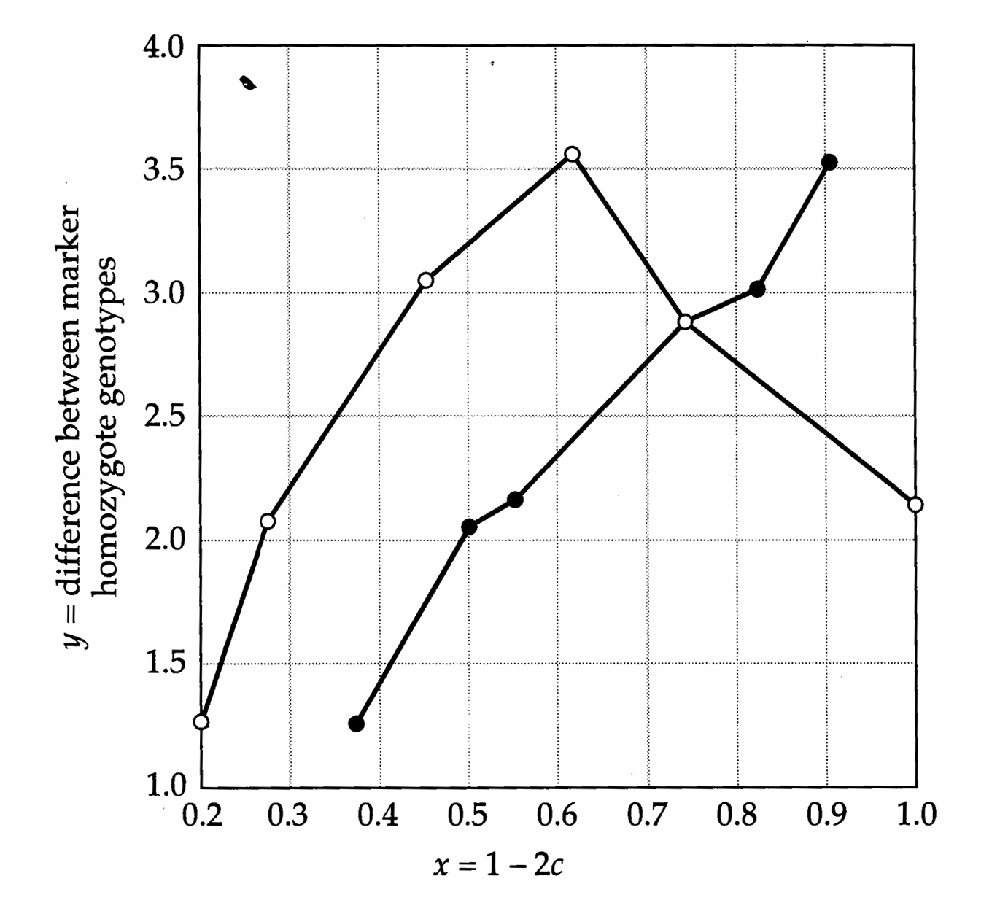
>
> Figure 15.4 Marker-difference regression plot for the data given in Example 9. Open circles assume a QTL at map position 90 cM, closed circles a QTL at position 60 cM (the true position). Note that the relationship is linear when the correct position is used, but highly nonlinear under the incorrect position.

generalized least-squares regression (Chapter 8) must be used, with

$$
\widehat{\boldsymbol{\beta}}=\left(\mathbf{X}^{T}\mathbf{V}^{-1}\mathbf{X}\right)^{-1}\mathbf{X}^{T}\mathbf{V}^{-1}\mathbf{y}
\tag{15.25a}
$$

which has sample variance

$$
\sigma^{2}(\widehat{\beta})=\left(\mathbf{X}^{T}\mathbf{V}^{-1}\mathbf{X}\right)^{-1}
\tag{15.25b}
$$

where

$$
\mathbf{y}=\begin{pmatrix}y_{1}\\\vdots\\y_{n}\end{pmatrix},\quad\mathbf{X}=\begin{pmatrix}1-2c_{1}\\\vdots\\1-2c_{n}\end{pmatrix}
\tag{15.25c}
$$

and

$$
\mathbf{V}_{ij}=\left\{\begin{aligned}&\frac{\mathbf{Var}(M_{i}M_{i})}{n(M_{i}M_{i})}+\frac{\mathbf{Var}(m_{i}m_{i})}{n(m_{i}m_{i})}&i=j\\ &(1-2c_{ij})\sqrt{\mathbf{V}_{ii}\mathbf{V}_{jj}}&i\neq j\end{aligned}\right.
\tag{15.25d}
$$

where $ \operatorname{Var}(M_x) $ is the sample variance of $ \overline{z}(M_x) $ and $ n(M_x) $ is the sample size for marker class $ M_x $ (Wu and Li 1996).

Assuming normally distributed residuals, from Equation A3.11a the residual sum of squares,

$$
\mathbf{S}\mathbf{S}_{E}=\widehat{\mathbf{e}}^{T}\mathbf{V}^{-1}\widehat{\mathbf{e}}=(\mathbf{y}-\mathbf{X}\widehat{\boldsymbol{\beta}})^{T}\mathbf{V}^{-1}(\mathbf{y}-\mathbf{X}\widehat{\boldsymbol{\beta}})
\tag{15.26}
$$

follows a $\chi^{2}$ distribution with $n-2$ degrees of freedom ($n$ data points minus two estimated parameters, the QTL effect $\beta=2a$ and the assumed position). The test for a significant QTL effect compares the $SS_{E}$ for this regression with that for the regression assuming no marker effect ($y_{i}=\mu+e_{i}$). The $SS_{E}$ for the reduced model is also $\chi^{2}$-distributed, but with $n-1$ degrees of freedom. Recalling (Appendix 5) the additivity property of the chi-square, the difference in residual sums of squares for these two models follows a $\chi_{1}^{2}$ distribution under the null hypothesis. Hence, the regression is significant at the $\alpha$ level if $SS_{E}$ (reduced model) – $SS_{E}$ (QTL model) exceeds $\chi_{1}^{2}(\alpha)$, the $\alpha$-level cutoff for a $\chi_{1}^{2}$. Separate regressions are computed for each chromosome, so that to obtain a genome-wide level of significance $\gamma$, each chromosomal regression is tested with significance level $\alpha=1-(1-\gamma)^{1/C}\simeq\gamma/C$, where $C$ is the number of chromosomes examined.

**[示例 Example]**

> **Example 9** · ref: `Genetics_chapter15:9` · source: `Genetics_chapter15_015.json` · blocks 20–28
>
> Example 9. Consider the following hypothetical data (plotted in Figure 15.4) generated by assuming a single QTL with effect $a = 2.0$ at map position 60 cM along a chromosome containing six markers:
> 
> <table><tr><td>Marker Position (cM)</td><td>$ \overline{z}(M_{i}M_{i}) - \overline{z}(m_{i}m_{i}) $</td></tr><tr><td>10</td><td>1.26</td></tr><tr><td>25</td><td>2.06</td></tr><tr><td>50</td><td>3.04</td></tr><tr><td>65</td><td>3.54</td></tr><tr><td>75</td><td>2.90</td></tr><tr><td>90</td><td>2.15</td></tr></table>
> 
> We assume that the variance associated with each marker class is the same with $ \operatorname{Var}(M_x) = 5 $, and that 50 individuals of each marker class are scored, giving $ V_{ii} = 2 \cdot 5 / 50 = 0.2 $. Using this and the $ c_{ij} $ values with Equation 15.25d fills out the rest of V. For a MDR analysis, one computes a separate regression for each possible QTL position. Consider the regression for a QTL assumed to be at map position 50 cM. For the first marker, the QTL-marker map distance is 40 cM, which (assuming a Haldane map distance, Equation 14.3) translates into a recombination frequency of
> 1. $ (-2.04) $
> 
> $$
> c_{1}=\frac{1-e^{(-2\cdot0.4)}}{2}\simeq0.275
> $$
> 
> 
> giving $ x_{1} = (1 - 2c_{1}) = 0.45 $, and the data point associated this marker becomes $ (0.45, 1.26) $. Computing the remaining data points and applying Equations 15.25 and 15.26 gives a regression with $ SS_E = 11.03 $. After this procedure is repeated for all positions along the chromosome, the resulting plot of $ SS_E $ vs. putative QTL position (shown below) exhibits a minimum value (0.43) at map position 61, and hence $ r^2 $ is maximized at this position (see Equation A3.15).
> 
> 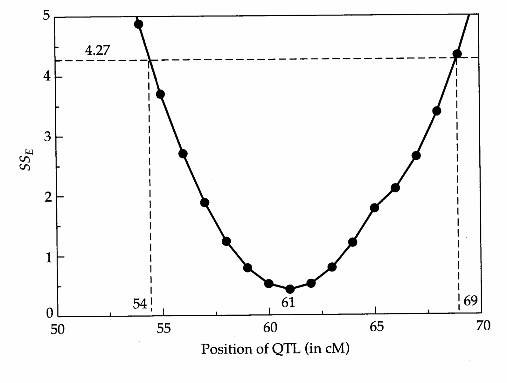
> 
> Whether the fit under the single-QTL model is a significant improvement over a model assuming no QTL can be assessed by comparing the error sum of squares of the QTL model $ (SS_E = 0.43) $ with the error sum of squares of the reduced (no QTL) model $ y_i = \mu + e_i $. Since the QTL model fits an extra parameter, the difference in sums of squares follows a $ \chi^2 $ distribution with one degree of freedom (one df) under the hypothesis of no QTL effect. For the reduced model, $ SS_E = 19.16 $, which is obtained by setting X equal to a vector of ones and applying Equation 15.25a. Hence, the QTL effect is highly significant as $ \Pr(\chi_1^2 > 19.16 - 0.43) < 0.001 $.
> 
> The adequacy of the single-QTL model can be assessed by noting that if this model is correct, $ SS_E $ follows a $ \chi_4^2 $ distribution (there are six data points and two fitted parameters, for four df). Since $ \Pr(\chi_4^2 > 0.43) = 0.99 $, $ SS_E $ is not larger than expected by chance, suggesting that there is no need to consider additional QTLs.
> 
> Using the estimated map position, the resulting regression has slope 3.84, giving the estimated QTL effect as $ \widehat{a} = 3.84/2 = 1.92 $. From Equation 15.25b, we have $ \sigma^2(2\widehat{a}) = (\mathbf{X}^T\mathbf{V}^{-1}\mathbf{X})^{-1} = 0.16 $, giving the standard error of $ \widehat{a} $ as $ \sqrt{0.16}/2 = 0.20 $. Since $ SS_E $ follows a $ \chi^2 $ distribution, the 95% confidence interval for QTL position contains those values giving regressions with $ SS_E $ not exceeding $ \chi^2(0.05) = 3.84 $ of the minimal $ SS_E $ value of 0.43 (i.e., $ SS_E $ values less than 4.27). This gives the confidence interval for the QTL position as 54 to 69 cM (see figure).

This approach easily extends to multiple QTLs. Recalling Equation 15.8a, if there are N linked QTLs, the jth of which is at recombination frequency $ c_{ji} $ from marker i, then (assuming no epistasis),

$$
y_{i}=\mu(M_{i}M_{i})-\mu(m_{i}m_{i})=2a_{1}(1-2c_{1i})+\cdots+2a_{N}(1-2c_{N i})
\tag{15.27a}
$$

This immediately suggests the multiple regression

$$
y_{i}=\beta_{1}\cdot x_{1i}+\cdots+\beta_{N}\cdot x_{Ni}+e_{i}
\tag{15.27b}
$$

where $ x_{ji} = (1 - 2c_{ji}) $ and $ \beta_j = 2a_j $. The estimates are still given by Equation 15.25a, with y and V being defined in the univariate case, and

$$
\boldsymbol{\beta}=\begin{pmatrix}\beta_{1}\\\vdots\\\beta_{N}\end{pmatrix}\qquad and\qquad\mathbf{X}=\begin{pmatrix}1-2c_{11}&\cdots&1-2c_{N1}\\\vdots&\ddots&\vdots\\1-2c_{1n}&\cdots&1-2c_{N n}\end{pmatrix}
$$

where N is the number of assumed QTLs, and n is the number of markers. As above, one computes the regression over the set of all possible QTL positions, with the estimates of QTL positions being given by the regression with the smallest $ SS_{E} $ value (or largest $ r^{2} $). Each additional QTL reduces the degrees of freedom of $ SS_{E} $ by two (one for QTL effect, one for position). The test for whether adding another QTL significantly improves the fit compares the difference in the resulting two error sums of squares (for models assuming N versus N - 1 QTLs) with the appropriate critical value for a $ \chi_{2}^{2} $.

---

## Genetics_chapter15_016 · QTL DETECTION AND ESTIMATION VIA MAXIMUM LIKELIHOOD / Interval Mapping with Marker Cofactors

The careful reader will note that marker-difference regression does not require knowledge of the multilocus marker genotypes of any individual, as all that enters into the analysis are the population means for each separate marker. An alternative approach for dealing with multiple QTLs that incorporates multilocus marker information from individuals is to modify standard interval mapping to include additional markers as cofactors in the analysis. Using the appropriate unlinked markers can partly account for the segregation variance generated by unlinked QTLs (Jansen 1992, 1993b; Zeng 1993, 1994), while the effects of linked QTLs can be reduced by including markers linked to the interval of interest (Stam 1991; Zeng 1993, 1994; Rodolphe and Lefort 1993). This general approach of adding marker cofactors to an otherwise standard interval analysis, often referred to as composite interval mapping or CIM, results in substantial increases in power to detect a QTL and in the precision of estimates of QTL position (Jansen 1993b, 1994a,b, 1996; Jansen and Stam 1994; Jansen et al. 1995; Zeng 1994; van Ooijen 1994; Utz and Melchinger 1994). Figure 15.5 shows a rather dramatic example of the improvement using CIM over interval analysis.

> **Figure 15.5** · page 478 · source: `Genetics_chapter15`
>
> 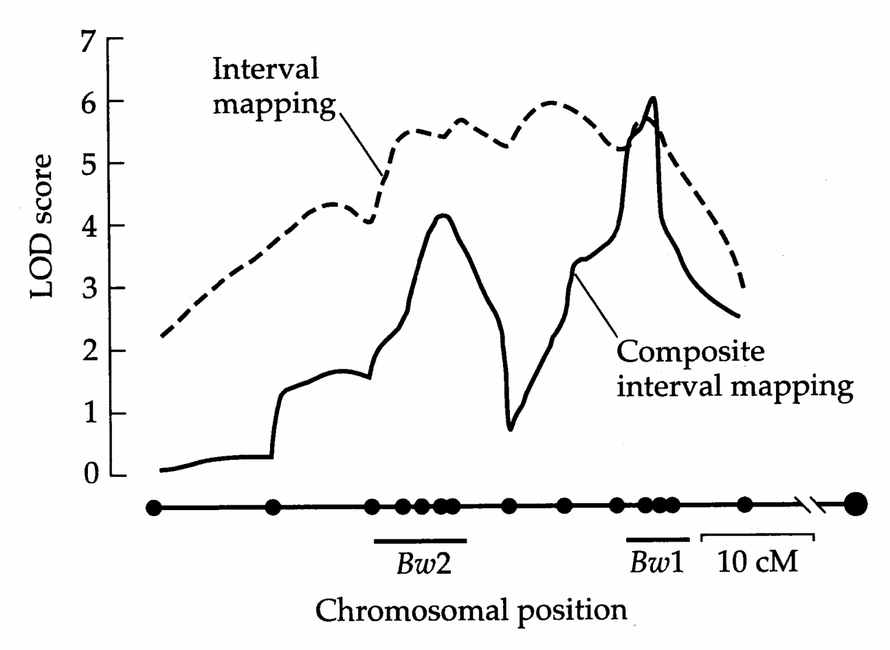
>
> Figure 15.5 Likelihood plots for the X chromosome for QTLs influencing body weight in mice. The likelihood map under standard ML interval mapping (dashed line) shows a single very broad peak. Using the same data, the CIM likelihood map (solid lines) shows two distinct peaks. Bw1 and Bw2 denote the two putative body-weight QTLs, and the dots on the chromosome indicate the positions of the marker loci. (After Dragani et al. 1995.)

Suppose the interval of interest is flanked by markers i and $ i + 1 $. One way to incorporate information from additional markers is to consider the sum over some collection of markers outside the interval of interest,

$$
\sum_{k\neq i,i+1}b_{k}\cdot x_{kj}
\tag{15.28a}
$$

where $k$ denotes a marker locus and $j$ the individual being considered. Letting $M_{k}$ and $m_{k}$ denote alternative alleles at the $k$th marker, the values of the indicator variable $x_{kj}$ depend on the marker genotype of $j$, with

$$
x_{kj}=\left\{\begin{array}{ll}1&if individual j has marker genotype M_{k}M_{k}\\0&if individual j has marker genotype M_{k}m_{k}\\-1&if individual j has marker genotype m_{k}m_{k}\end{array}\right.
\tag{15.28b}
$$

This is simply a convenient recoding of a regression of trait value on the number of $ M_k $ alleles. Hence, $ b_k $ is an estimate of the additive marker effect for locus $ k $. For a backcross or RIL design, each marker has only two genotypes and the indicator variable takes on values 1 and -1. More generally, if there is considerable dominance, the effects of the $ k $th marker locus can be more fully accounted for by considering a more complex regression with a term for each genotype, e.g.,

> **Figure 15.6** · page 479 · source: `Genetics_chapter15`
>
> 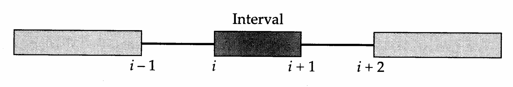
>
> Figure 15.6 Suppose the interval being examined by CIM is between markers i and $ i + 1 $. Addition of the adjacent markers i - 1 and $ i + 2 $ as cofactors absorbs the effects of any linked QTLs to the left of marker i - 1 and to the right of marker $ i + 2 $. Their inclusion, however, does not remove the effects of QTLs present in the two intervals, $ (i - 1, i) $ and $ (i + 1, i + 2) $, flanking the interval of interest.

$ b_{k1}x_{k1j} + b_{k2}x_{k2j} + b_{k3}x_{k3j} $, where the indicator variable $ x_{k1j} $ is one if j has marker genotype $ M_k M_k $, else it is zero. The other two indicator variables for this marker locus are defined accordingly.

Composite interval mapping proceeds by adding this regression term to the model being considered. For example, upon adding marker cofactors, the Haley-Knott regression focusing on the interval bracketed by markers i and $ i+1 $ becomes

$$
z_{j}=\left[\mu+a\cdot x(M_{i})+d\cdot y(M_{i})\right]+\sum_{k\neq i,i+1}b_{k}\cdot x_{kj}+e_{j}
\tag{15.29}
$$

Estimation of the QTL parameters $(\mu, a, d, c_i)$ for the interval proceeds as before, e.g., $x(M_i)$ and $y(M_i)$ are given by Equation 15.20 using marker loci $i$ and $i+1$ as the flanking markers, with $c_i$ being the putative QTL-marker $i$ recombination frequency. For each $c_i$ value in the interval, the regression given by Equation 15.29 is fitted (i.e., $a, d, \text{and the } b_k$), and (as before) the $c_i$ value giving the regression with the largest $r^2$ is taken as the estimate of the QTL position. The significance of the interval can be tested by using Equation 15.23 to compare the full model (Equation 15.29) with the reduced model,

$$
z_{j}=\mu+\sum_{k\neq i,i+1^{-}}b_{k}\cdot x_{kj}+e_{j}
\tag{15.30}
$$

which includes the marker cofactors but ignores the interval.

Just which markers should be added? While there is no single solution, the two markers directly flanking the interval being analyzed should always be included. Suppose the interval of interest is delimited by markers i and $ i+1 $ (Figure 15.6). Zeng (1994) showed that adding markers i-1 and $ i+2 $ as cofactors accounts for all linked QTLs to the left of marker i-1 and to the right of marker i+2. Thus, while these cofactors do not account for the effects of linked QTLs in the intervals immediately adjacent to the one of interest (i.e., the intervals $ (i-1, i) $ and $ (i+1, i+2) $ in Figure 15.6), they do account for all other linked QTLs.

The number of unlinked markers that should be used as cofactors is unclear, as inclusion of too many factors greatly reduces power (Zeng 1994). Jansen and

Stam (1994) recommend that the number of cofactors not exceed $ 2\sqrt{n} $, where n is the number of individuals in the analysis. A first approach would be to include all unlinked markers showing significant marker-trait associations (detected, for example, by standard single-marker regression). If several linked markers from a single chromosome all show significant effects, one might just use the marker having the largest effect. A related strategy, suggested by Jansen (1992, 1993b; Jansen and Stam 1994), is to first perform a multiple regression using all markers and then eliminate those that are not significant.

A multiple-trait extension of composite interval mapping given by Jiang and Zeng (1995) offers improved power for QTL detection and increased precision in estimation (relative to single-trait analysis) by incorporating the correlated error structure among traits (see also Ronin et al. 1995). Jiang and Zeng also develop likelihood-ratio tests for genotype × environment interaction and for tests of pleiotropy versus close linkage (one pleiotropic QTL vs. multiple linked QTLs each influencing separate characters).

Hypothesis testing and estimation for CIM follow by simple modifications of the appropriate results for interval mapping. Zeng (1993, 1994) showed that CIM test statistics for linked intervals are only weakly correlated, so that one can approximate each interval as an independent test. Zeng also found that the likelihood ratios within each interval are close to $ \chi^{2} $-distributed, so that an overall significance level of $ \gamma $ for an experiment examining $ m $ intervals can be obtained by equating the critical value within each interval to a $ \chi^{2} $ with significance level $ \gamma/m $.

Resampling methods are easily extended to CIM. Doerge and Churchill (1996) suggest the following permutation test to account for multiple QTLs. A standard permutation test is first used to detect the marker with the greatest marker-trait association. Individuals are then divided (or stratified) according to their genotypes at this marker locus, and permutations are performed within each stratified group to generate new test statistics to find the next most significant QTL. This procedure is repeated until no significant effects are detected. Although permutation and bootstrap approaches are numerically intense, the rapid computation of solutions using Haley-Knott regressions makes these approaches feasible.

Finally, we note that other mapping approaches besides interval mapping can be improved by considering marker cofactors. For example, we can enhance the power of marker-difference regression by including unlinked markers to reduce the residual variance from unlinked QTLs. Since MDR uses the mean values for each marker, the individual data must be adjusted first to remove the effects from unlinked QTLs. Suppose n markers (unlinked to the chromosome of interest) are chosen because they show significant effects. The marker-adjusted value $ z_{j}^{*} $ of the original trait value of individual j, $ z_{j} $, is given by

$$
z_{j}^{*}=z_{j}-\left(\sum_{k=1}^{n}b_{k}\cdot x_{kj}\right)
\tag{15.31}
$$

and a MDR analysis is then performed using these adjusted values.

---

## Genetics_chapter15_017 · QTL DETECTION AND ESTIMATION VIA MAXIMUM LIKELIHOOD / Detecting Multiple Linked QTLs Using Standard Marker-Trait Regressions

Consider the standard multiple regression of trait value on the single-locus genotypes at each of n markers,

$$
z_{j}=\mu+\sum_{k=1}^{n}b_{k}\cdot x_{kj}+e_{j}
\tag{15.32}
$$

where $j$ indexes the individual being considered, and the $x_{kj}$ are given by Equation 15.28b. A rather remarkable finding, due to Wright and Mowers (1994) and Whittaker et al. (1996), is that the regression coefficients $b_{k}$ for adjacent markers provide information on whether these markers flank a QTL. Further, the $b_{k}$ can be used in many cases to obtain direct estimates of OTL effect and position.

When a QTL is isolated — an interval contains a single QTL and both flanking intervals are free of QTLs — the regression coefficients for the two markers immediately flanking the QTL depend only on this QTL and are not influenced by other linked QTLs (Stam 1991, Zeng 1993). A consequence of this finding is that markers flanking a QTL have regression coefficients of the same sign, while markers not adjacent to a QTL (i.e., there is at least one marker in the regression between the marker of interest and the nearest QTL) have expected regression coefficients of zero. Hence, one can simply scan the regression coefficients to see which intervals show support for a OTL (see Example 10).

Whittaker et al. (1996) further show, for an isolated additive QTL, that the regression coefficients for the flanking markers can be directly used to estimate QTL effect and position. Suppose the markers i and $ i+1 $ flank an isolated QTL. Whittaker et al. found that for an $ F_{2} $ population, the estimated distance from marker i to the QTL is

$$
c_{i}=\frac{1}{2}\left[1-\sqrt{1-\frac{4b_{i+1}\theta_{i}\left(1-\theta_{i}\right)}{b_{i+1}+b_{i}\left(1-2\theta_{i}\right)}}\right]
\tag{15.33a}
$$

where $ \theta_{i}=c_{i,i+1} $ is the distance between the markers. Likewise, an estimate of the QTL's additive effect $ a_{i} $, independent of amount of dominance at this QTL, is given by

$$
a^{2}=\frac{\left[b_{i}+\left(1-2\theta_{i}\right)b_{i+1}\right]\cdot\left[b_{i+1}+\left(1-2\theta_{i}\right)b_{i}\right]}{1-2\theta_{i}}
\tag{15.33b}
$$

where both $b_{i}$ and $b_{i+1}$ have the same sign as $a$.

**[示例 Example]**

> **Example 10** · ref: `Genetics_chapter15:10` · source: `Genetics_chapter15_017.json` · blocks 9–17
>
> Example 10. Whittaker et al. (1996) used a simulation study to generate 2000 $ F_2 $ progeny in a setting with three chromosomes, each with five markers evenly spaced at 25 cM (implying $ c \simeq 0.2 $ under Haldane's mapping function). QTLs were placed in the intervals flanked by markers (1, 2), (4, 5), (7, 8), (13, 14), and (14, 15). The multiple regression involving all 15 markers (Equation 15.32) had associated regression coefficients of:
> 
> <table><tr><td>Marker</td><td>1</td><td>2</td><td>3</td><td>4</td><td>5</td></tr><tr><td>$ b_{i} $</td><td>-0.2996</td><td>-0.1422</td><td>-0.0221</td><td>0.2209</td><td>0.1956</td></tr><tr><td>Marker</td><td>6</td><td>7</td><td>8</td><td>9</td><td>10</td></tr><tr><td>$ b_{i} $</td><td>-0.0189</td><td>-0.1922</td><td>-0.2404</td><td>0.0100</td><td>-0.0108</td></tr><tr><td>Marker</td><td>11</td><td>12</td><td>13</td><td>14</td><td>15</td></tr><tr><td>$ b_{i} $</td><td>-0.0254</td><td>0.0371</td><td>0.3019</td><td>0.2644</td><td>0.3370</td></tr></table>
> 
> Looking for pairs of adjacent regression coefficients that have the same sign and are both significantly different from zero (as judged using standard regression tests, not shown) suggests evidence for QTLs in the intervals (1, 2), (4, 5), (7, 8), (13, 14), and (14, 15). The regression using just these nine markers had essentially the same $ SS_{E} $ as the full regression using all 15 markers, suggesting that none of the omitted markers are adjacent to QTLs (or they are adjacent to multiple linked QTLs whose effects cancel). However, removal of any one of the nine markers results in a regression with a significantly greater error sum of squares, supporting the hypothesis that all of these markers are adjacent to QTLs. Using these nine markers only, the new regression coefficients become
> 
> <table><tr><td>Marker</td><td>1</td><td>2</td><td>4</td><td>5</td></tr><tr><td>$ b_{i} $</td><td>-0.2975</td><td>-0.1323</td><td>0.2296</td><td>0.1962</td></tr><tr><td>Marker</td><td>7</td><td>8</td><td></td><td></td></tr><tr><td>$ b_{i} $</td><td>-0.2407</td><td>-0.2377</td><td></td><td></td></tr><tr><td>Marker</td><td>13</td><td>14</td><td>15</td><td></td></tr><tr><td>$ b_{i} $</td><td>0.3145</td><td>0.2640</td><td>0.3355</td><td></td></tr></table>
> 
> Since the QTLs in intervals (1, 2), (4, 5), and (7, 8) appear to be isolated (no evidence for QTLs in adjacent intervals), Equations 15.33a,b can be used to estimate their effects and positions. For the QTL in the interval flanked by markers 1 and 2,
> 
> $$
> c_{1}=\frac{1}{2}\left[1-\sqrt{1-\frac{4\left(-0.1323\right)\cdot0.2\left(1-0.2\right)}{\left(-0.1323\right)+\left(-0.2975\right)\left(1-2\cdot0.2\right)}}\right]=0.074
> $$
> 
> 
> and the estimate of the squared effect of the QTL is
> 
> $$
> \begin{aligned}a_{1}^{2}&=\frac{\left[(-0.2975)+(1-2\cdot0.2)(-0.1323)\right]\left[(-0.1323)+(1-2\cdot0.2)(-0.2975)\right]}{1-2\cdot0.2}\\&=(0.442)^{2}\end{aligned}
> $$
> 
> 
> implying $a_{1} = -0.442$ (since the regression coefficients $b_{1}, b_{2} < 0$). Similarly, the estimates for the QTL in the interval $(4, 5)$ are $c_{4} = 0.105$ and $a_{4} = 0.440$, while for the QTL in $(7, 8)$, we find $c_{7} = 0.112$ and $a_{7} = -0.494$. The estimated values were rather close to the true values used in the simulations ($a_{4} = -a_{7} = -a_{1} = 0.447$, $c_{1} = 0.07$, $c_{4} = 0.11$, and $c_{7} = 0.11$).

Whittaker et al. (1996) make a final important point that applies to all multiple-QTL methods. Unless a QTL is isolated — it is the only QTL in a particular interval and the flanking intervals lack QTLs — these methods cannot separate out the effects of multiple linked QTLs. In particular, if an interval contains multiple QTLs, we cannot estimate their effects and positions (or even the correct number of QTLs), a point stressed by McMillan and Robertson (1974). (See Example 2 from Chapter 14.) While one obvious solution is simply to increase the marker density to the point where each QTL is indeed isolated, any increase in the marker density must be accompanied by a sufficient increase in sample size to ensure that a sufficient number of recombination events have occurred between adjacent markers.

---

## Genetics_chapter15_018 · SAMPLES SIZES REQUIRED FOR QTL DETECTION

Before investing the time and expense in a QTL mapping experiment, it is critical to have an understanding of the sample sizes required for the detection of QTLs of specified effects. The probability of a significant marker-trait association is increased by increasing the difference between means and/or by decreasing the within-marker class (or residual) variance. Increasing the sample size reduces the within-class variance, while changing the experimental design can increase the difference between means. The residual variance can also often be decreased by adding explanatory factors to the model, such as sex- or age-effects.

The following discussion of sample size is restricted to single-marker $t$ tests using the $F_{2}$ or backcross designs, where a QTL is indicated if the means for two alternative marker genotypes are significantly different. Using the theory of power calculations (reviewed in Appendix 5), simple expressions can be obtained for these designs. The broad utility of the results developed below is that both theoretical (Simpson 1989, 1992; Haley and Knott 1992; Darvasi et al. 1993; Rebai et al. 1995) and empirical (e.g., Stuber et al. 1992, deVicente and Tanksley 1993,

Nodari et al. 1993, Damerval et al. 1994, Champux et al. 1995, Kennard and Harvey 1995) studies show that t tests and more elaborate flanking-marker methods have very similar power for detection, especially when adjacent markers are no farther than 20 cM apart. Hence, the sample size expressions developed below provide a baseline for most designs.

We start by considering the $t$ test for an $F_2$ design, where the presence of a linked QTL is indicated when $\overline{z}_{MM} - \overline{z}_{mm}$ is significantly different from zero. Suppose that the marker is completely linked to a single QTL with additive value $a$, in which case $E(\overline{z}_{MM} - \overline{z}_{mm}) = 2a$. Assuming that the distribution of phenotypes about each QTL genotype has constant variance $\sigma_e^2$, then if the numbers of MM and $mm$ individuals measured are $n_1$ and $n_2$,

$$
\sigma^{2}\left(\overline{z}_{M M}-\overline{z}_{m m}\right)=\sigma^{2}\left(\overline{z}_{M M}\right)+\sigma^{2}\left(\overline{z}_{m m}\right)=\left(\frac{1}{n_{1}}+\frac{1}{n_{2}}\right)\sigma_{e}^{2}
\tag{15.34}
$$

If $n$ total $F_2$ individuals are scored, we expect only one in four to be a particular marker homozygote, giving $n_1 = n_2 = n/4$ and the expected variance $8\sigma_e^2/n$. If $r_{F_2}^2$ denotes the fraction of the total $F_2$ phenotypic variance $[\sigma_z^2(F_2)]$ due to segregation at the QTL, then $\sigma_e^2 = (1 - r_{F_2}^2)\sigma_z^2(F_2)$. Hence, if $n$ is reasonably large, the observed difference in marker means is approximately normally distributed, with

$$
\overline{{z}}_{M M}-\overline{{z}}_{m m}\sim N\left[2a,8(1-r_{F_{2}}^{2})\sigma_{z}^{2}(F_{2})/n\right]
\tag{15.35a}
$$

Under the null hypothesis of no QTL, this difference is distributed as a normal with mean zero and variance $ 8\sigma_{z}^{2}(F_{2})/n $.

Using the machinery developed in Appendix 5, the sample size required to have probability $ 1 - \beta $ of detecting a QTL using a test with an $ \alpha $ level of significance becomes

$$
n_{F_{2}}=\frac{8(1-r_{F_{2}}^{2})}{\delta_{F_{2}}^{2}}\left(\frac{z_{(1-[\alpha/2])}}{\sqrt{1-r_{F_{2}}^{2}}}+z_{(1-\beta)}\right)^{2}
\tag{15.35b}
$$

where $ z_{(p)} $ satisfies $ \Pr(U \leq z_{(p)}) = p $ with $ U \sim N(0,1) $, and

$$
\delta_{F_{2}}=\frac{\mu_{QQ}-\mu_{qq}}{\sigma_{z}(F_{2})}=\frac{2a}{\sigma_{z}(F_{2})}
\tag{15.36a}
$$

is the difference in QTL means in units of $ F_2 $ phenotypic standard deviations. The variance contributed by $ F_2 $ segregation at this locus is $ \sigma_Q^2(F_2) = a^2(2 + k^2)/4 $, where $ k $ is the dominance coefficient, implying

$$
r_{F_{2}}^{2}=\frac{\sigma_{Q}^{2}(F_{2})}{\sigma_{z}^{2}(F_{2})}=\frac{a^{2}(2+k^{2})/4}{\sigma_{z}^{2}(F_{2})}=\frac{\delta_{F_{2}}^{2}(2+k^{2})}{16}
\tag{15.36b}
$$

which for a completely additive QTL $(k=0)$ is $r_{F_2}^2 = \delta_{F_2}^2 / 8$. Using Equation 15.36b, we can alternatively express the required sample size in terms of the fraction of variation accounted for by the QTL,

$$
n_{F_{2}}=\left(\frac{1-r_{F_{2}}^{2}}{r_{F_{2}}^{2}}\right)\left(\frac{z_{(1-[\alpha/2])}}{\sqrt{1-r_{F_{2}}^{2}}}+z_{(1-\beta)}\right)^{2}[1+(k^{2}/2)]
\tag{15.37}
$$

**[示例 Example]**

> **Example 11** · ref: `Genetics_chapter15:11` · source: `Genetics_chapter15_018.json` · blocks 16–18
>
> Example 11. What sample sizes are required to detect a completely linked QTL using a test with $ \alpha = 0.05 $ and $ \beta = 0.1 $ (i.e., a 5% probability of a false positive and a 10% probability of missing a true association)? From normal tables, Pr(U < 1.96) = 0.975 and Pr(U < 1.28) = 0.9, so that $ z_{(1-[\alpha/2])} = z_{(0.975)} = 1.96 $ and $ z_{(1-\beta)} = z_{(0.9)} = 1.28 $. Substituting these into Equation 15.37 gives the following sample sizes for a completely additive $ (k = 0) $ and a completely dominant or completely recessive $ (k \pm 1) $ QTL whose segregation accounts for $ r^2 $ of the total $ F_2 $ variance:
> 
> <table><tr><td>$ r^{2} $</td><td>0.5</td><td>0.3</td><td>0.1</td><td>0.05</td><td>0.01</td></tr><tr><td>Additive QTL</td><td>16</td><td>31</td><td>101</td><td>206</td><td>1046</td></tr><tr><td>Dominant QTL</td><td>25</td><td>46</td><td>151</td><td>309</td><td>1568</td></tr></table>
> 
> Note that the presence of dominance can significantly inflate the required $ F_{2} $ sample size.

Turning now to the backcross designs, consider $ B_1 = F_1 \times P_1 $ (i.e., $ MQ/mq \times MQ/MQ $). Here $ n_1 = n_2 = n/2 $, while $ \mu_{QQ} - \mu_{Qq} = a(1 - k) $, giving

$$
\overline{{z}}_{M M}-\overline{{z}}_{M m}\sim N\left[a(1-k),4(1-r_{B_{1}}^{2})\sigma_{z}^{2}(B_{1})/n\right]
\tag{15.38a}
$$

Using the same logic as above, the required sample size is found to be

$$
n_{B_{1}}=\left(\frac{1-r_{B_{1}}^{2}}{r_{B_{1}}^{2}}\right)\left(\frac{z_{(1-\left[\alpha/2\right])}}{\sqrt{1-r_{B_{1}}^{2}}}+z_{(1-\beta)}\right)^{2}
\tag{15.38b}
$$

with

$$
r_{B_{1}}^{2}=\frac{\delta_{B_{1}}^{2}}{4},\qquad\mathrm{w h e r e}\qquad\delta_{B_{1}}=\frac{a(1-k)}{\sigma_{z}(B_{1})}
\tag{15.38c}
$$

For the B₂ population, the results are similar, except that the comparison is now $ \overline{z}_{Mm} - \overline{z}_{mm} $ and -k replaces k in the above expressions. Comparing the F₂ and the backcross design (for small to modest r²), the ratio of samples sizes to achieve the same power is approximately

$$
\frac{n_{B_{1}}}{n_{F_{2}}}\simeq\left[\frac{2}{(1-k)^{2}}\right]\left[\frac{\sigma_{z}(B_{1})}{\sigma_{z}(F_{2})}\right]^{2}
\tag{15.39}
$$

Thus, if the backcross and $ F_{2} $ phenotypic variances are the same, the backcross design requires twice as many individuals as an $ F_{2} $ for a completely additive QTL $ (k = 0) $. When dominance is present, depending on its direction relative to the backcross population used, the backcross design can require more than twice as many individuals as an $ F_{2} $ $ (k > 0 $ for $ B_{1}, k < 0 $ for $ B_{2}) $ or fewer individuals than the $ F_{2} $. (If $ k = -1 $, the required sample size for the $ B_{1} $ is only half of that for an $ F_{2} $ design.) A further complication is that the phenotypic variance is generally rather different in the $ F_{2} $ and backcross populations due to changes in the variance from background QTLs. In the $ F_{2} $ population, all QTL alleles have frequency 1/2, which gives maximum additive variance (provided all QTLs are additive). In a backcross, the allele frequency is 1/4, and additive genetic variance is often reduced significantly relative to that in the $ F_{2} $. Thus, if background QTLs contribute significantly to the character, the backcross can show a reduced variance and more power.

If the QTL is not completely linked to the marker, two corrections are required for the above expressions. First, the difference in means for $ F_2 $ homozygous marker genotypes now estimates $ 2a(1 - 2c) $. A more subtle correction is that the variance about the marker means increases when $ c \neq 0 $, as the phenotypic distribution for each marker class is now a mixture of distributions with different means. In spite of these complications, to a very good approximation the sample sizes required for a specific power of QTL detection are given by $ n_0/(1 - 2c)^2 $, where $ n_0 $ is the required sample size under complete linkage (Soller et al. 1976, Soller and Genizi 1978). Thus, the power to detect a linked QTL falls off as $ (1 - 2c)^2 $ decreases, being very weak when $ c > 0.2 $ (25 cM under the Haldane map).

**[示例 Example]**

> **Example 12** · ref: `Genetics_chapter15:12` · source: `Genetics_chapter15_018.json` · blocks 29–29
>
> Example 12. Suppose we wish to have a 90% chance of detecting (using a test with $ \alpha = 0.05 $) a QTL whose segregation accounts for 10% the total $ F_2 $ variance. Further assume that all of the genetic variation at this locus is additive. From Example 11, 101 individuals are required to detect this QTL using a completely linked marker. With a marker at recombination frequency c from the QTL, $ n = 101/(1-2c)^2 $, giving sample sizes of 281, 158, and 125 for c = 0.2, 0.1, 0.05, respectively.

One can increase the power to detect a linked QTL either by increasing the number of markers (which decreases c and hence increases the difference between marker means) or by increasing the number of individuals genotyped (which decreases the sampling variance). To see the relative importance of each, note from Equation 15.35a that the t statistic has approximate expected value

$$
E\left[\frac{\mu_{M M}-\mu_{m m}}{\sigma\left(\overline{{z}}_{M M}-\overline{{z}}_{m m}\right)}\right]\simeq\sqrt{n}\left(1-2c\right)\left[\frac{a}{\sqrt{2}\left(1-r_{F_{2}}^{2}\right)\sigma_{z}\left(F_{2}\right)}\right].
\tag{15.40}
$$

The term in brackets is fixed for a given QTL, so that the test statistic scales with the square root of the sample size. Increasing the number of markers results in an increase in the test statistic, but there is a point of diminishing returns when markers are already closely spaced. For example, for c = 0.2 (corresponding to markers spaced 50 cM apart), moving to an infinitely dense map (c = 0) requires that only 36% as many individuals be scored to give the same power. However, for markers spaced at c = 0.1 and 0.05, these percentages become 81% and 90%.

Darvasi and Soller (1994b) show under rather general conditions that the spacing of markers giving the highest chance of detecting a QTL, given the constraint of scoring a fixed total number of marker genotypes (marker loci × individuals) is 20 to 30 cM. Here each QTL is no further than 10 to 15 cM (and on average is within 5 to 7.5 cM) from any marker. Thus, for markers spaced 10 cM or closer, there is really little point in further increasing the marker density when the goal is simple detection of a linked QTL. However, increasing marker density does become important if the goal is a highly precise estimate of QTL position or the dissection of a cluster of tightly linked QTLs.

**[示例 Example]**

> **Example 13** · ref: `Genetics_chapter15:13` · source: `Genetics_chapter15_018.json` · blocks 34–36
>
> Example 13. As mentioned in Example 3, Edwards et al. (1987, 1992) examined the same cross of two maize strains with two different designs. The 1987 design used 1,776 F₂ individuals and 17 markers, while the 1992 design used 187 F₂ individuals and 114 markers. The two designs represent a tradeoff between increased marker density (1992 design) and increased sample size (1987 design), as both examined a somewhat similar number of total marker genotypes (1776 × 17 = 30,200 vs. 187 × 114 = 21,300). Comparisons of c values in the two studies is problematic, given that only a fraction of the genome was covered in the 1987 study (about 40% of the genome was within 20 cM of a marker), while under the 1992 design most of the genome was 5 to 10 cM from a marker. Choosing c = 0.25 (1987 design) and c = 0.08 (1992 design), from Equation 15.40 the expected ratio of t statistics becomes
> 
> $$
> \frac{\sqrt{1776}\left(1-2\cdot0.25\right)}{\sqrt{187}\left(1-2\cdot0.08\right)}=1.8
> $$
> 
> 
> showing that (for these c values) the 1987 design had greater power.

ML interval mapping is expected to be somewhat more powerful than the simple single-marker $t$ test, so the above results can be considered as upper bounds for the required sample size, although they are not greatly exaggerated. For example, the power of ML interval mapping to detect QTLs has been examined by several authors (Lander and Botstein 1989, van Ooijen 1992, Carbonell et al. 1993, Darvasi et al. 1993), who conclude that with a reasonable density of markers (one every 20 cM), 250 $F_{2}$ individuals are sufficient to detect a QTL whose segregation accounts for at least 5% of the $F_{2}$ variation. How does this compare with the required sample size for a $t$ test? Since markers spaced at 20 cM intervals imply that a marker is within 10 cM from the QTL, using the result for $r^{2}=0.05$ from Example 11 gives the required sample size for a $t$ test as 206/(1 - 2 $\cdot$ 0.1)$^{2}=263$. Hence, the above $t$ test guidelines are also reasonable for ML interval mapping.

---

## Genetics_chapter15_019 · SAMPLES SIZES REQUIRED FOR QTL DETECTION / Power under Selective Genotyping

The idea behind selective genotyping is that scoring characters is often much less expensive than scoring markers. Hence, if $n$ individuals are scored and genotyped in a normal design, there may be merit in scoring a larger number of individuals $n_{z} > n$ for the trait value, and then choosing a subset $n_{g} \leq n$ of these for genotyping. Typically, the uppermost and lowermost fractions ($p$) of scored individuals are genotyped, giving $n_{g} = 2p n_{z} \leq n$. Darvasi and Soller (1992) show that selective genotyping by scoring $n_{z}$ individuals and genotyping $n_{g} = 2p n_{z}$ gives the same power as an analysis genotyping all $n$ individuals, when

$$
n_{z}=\frac{n}{2p+2z_{(1-p)}\varphi(z_{(1-p)})}
\tag{15.41}
$$

Here, $ \varphi(z_{(1-p)}) $ is the unit normal density function evaluated at $ z_{(1-p)} $, where $ \Pr(U > z_{(1-p)}) = p $ with $ U \sim N(0, 1) $. Figure 15.7 plots the ratio $ n_z/n $ as a function of p. For example, selective genotyping using the uppermost and lowermost 10% $ (p = 0.1) $ of the population requires that $ n_z = 1.54 $ n individuals be phenotyped but only $ n_g = 2 \cdot 0.1 \cdot n_z = 0.3 $ n be genotyped. Since a decrease in p reduces the number of individuals that must be genotyped but increases the number that must be scored for the trait, the optimal p value depends on the relative costs of phenotyping and genotyping each individual (Darvasi and Soller 1992).

---

## Genetics_chapter15_020 · SAMPLES SIZES REQUIRED FOR QTL DETECTION / Power and Repeatability of Mapping Experiments

Even under designs where power is low, if the number of QTLs is large, it is likely that at least a few will be detected. In such cases of low power, the contributions of detected QTLs can be significantly (often very significantly) overestimated. Such a scenario, wherein we detect a small number of QTLs that appear to account for a significant fraction of the total character variation, can lead to the false

Fraction p of each tail selected for genotyping

> **Figure 15.7** · page 489 · source: `Genetics_chapter15`
>
> 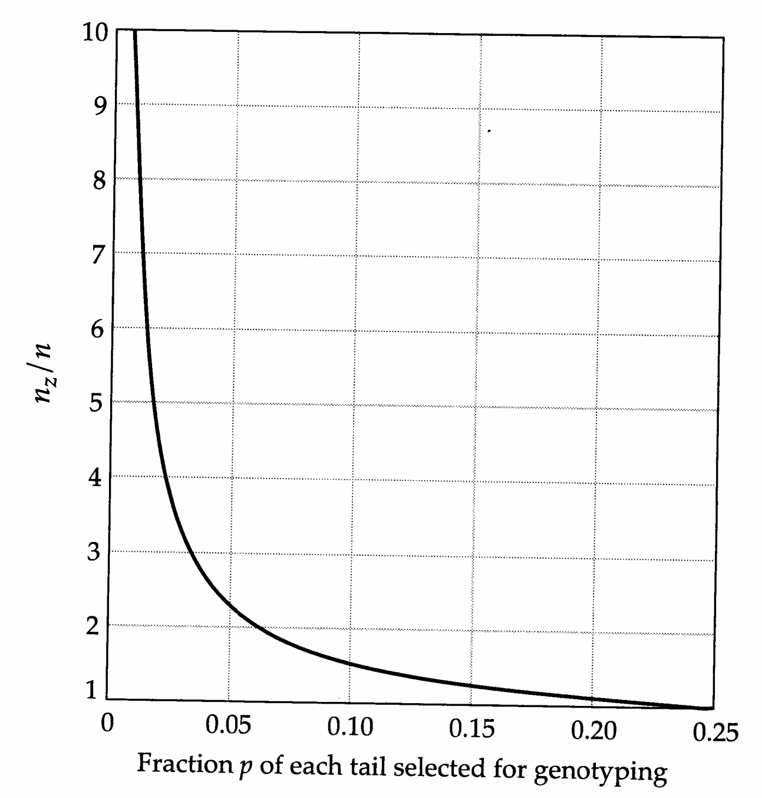
>
> Figure 15.7 Under selective genotyping, $n_{z}$ individuals are scored for the trait value, with the uppermost and lowermost fraction $p$ of these being genotyped, giving $n_{g}=2p n_{z}$. Here we plot, as a function of $p$, the number of individuals scored for the trait ($n_{z}$) that yields the same power as scoring and genotyping all individuals in a population of size $n$.

conclusion that character variation is largely determined by a few QTLs of major effect (Beavis 1994, Utz and Melchinger 1994).

As shown in Figure 15.8, the lower the power, the more the effects of a detected QTL are overestimated. For example, a QTL accounting for 0.75% of the total $ F_{2} $ variation has only a 3% chance of being detected with 100 $ F_{2} $ progeny with markers spaced at 20 cM. However, for cases in which such a QTL is detected, the average estimated total variance it accounts for is 15.8%, a 19-fold overestimate of the correct value. With 1,000 $ F_{2} $ progeny, the probability of detecting such a QTL increases to 25%, and each detected QTL on average accounts for approximately 1.5% of the total variance, only a twofold overestimate. Further, these are the average values for the estimates. As shown in Figure 15.9, the distribution of observed effects is skewed, with a few loci having large estimated effects, and the rest small to modest effects. Such distributions of effects, commonplace in QTL mapping studies, have usually been taken as being representative of the true distribution of effects. Beavis's simulation studies show that they can be spuriously generated by a set of loci with equal effects.

> **Figure 15.8** · page 490 · source: `Genetics_chapter15`
>
> 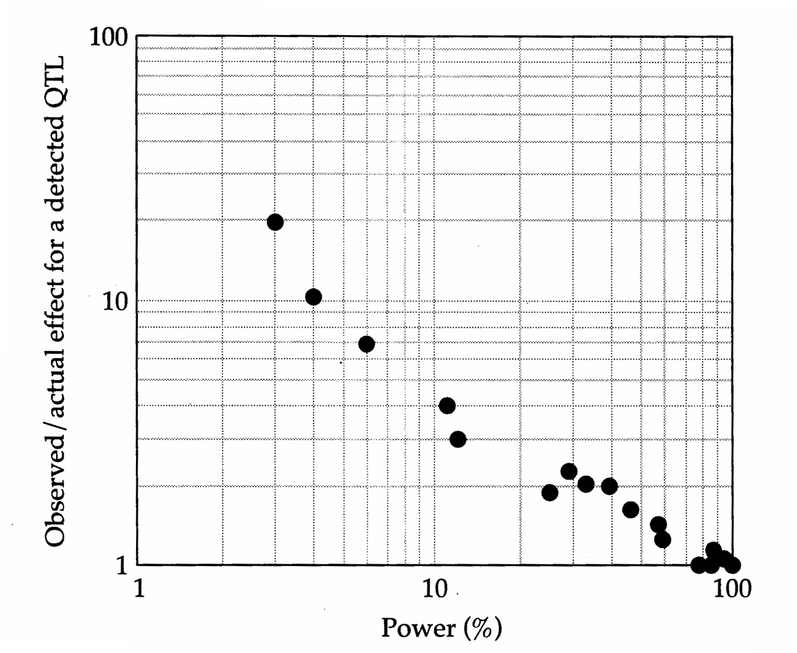
>
> Figure 15.8 Relationship between the probability (power) of detecting a QTL and the amount by which the estimated effect of a detected QTL overestimates it actual value. (Based on results from a simulation study of Beavis 1994.)

> **Figure 15.9** · page 490 · source: `Genetics_chapter15`
>
> 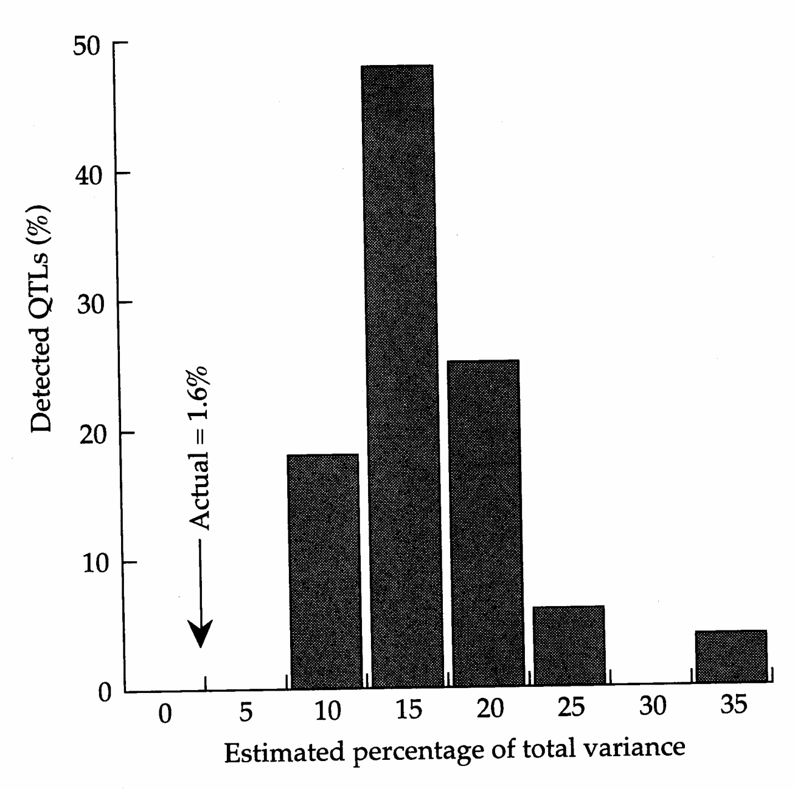
>
> Figure 15.9 Distribution of the estimated effects of detected QTLs. Here 40 QTLs, each accounting for 1.58% of the variance, are assumed. Using 100 $ F_{2} $ individuals, only 4% of such loci were detected. The average estimated fraction of total variation fraction accounted for by each detected QTLs was 16.3%, with the distribution of estimates skewed towards larger values. (From Beavis 1994.)

---

## Genetics_chapter15_021 · SELECTED APPLICATIONS

We close by examining some selected applications of QTL mapping using inbred lines, followed by a summary of the conclusions that can be drawn from these studies to date.

---

## Genetics_chapter15_022 · SELECTED APPLICATIONS / The Nature of Transgressive Segregation

QTL mapping experiments provide insight into the nature of transgression (or transgressive segregation), whereby some $ F_{2} $ individuals show more extreme character values than are seen in either parental line. One explanation for such outliers is nonadditive gene action, i.e., epistasis and/or overdominance. Alternatively, transgressive segregation could be caused by the parental lines being fixed for sets of alleles having opposite effects, e.g., one line fixed for + − / + −, the other − + / − +, which would generate more extreme genotypes in the $ F_{2} $ than observed in either parent (e.g., + + / + + and − − / − −). This latter explanation is the one supported by most OTL studies.

For example, Li et al. (1995) observed transgressive segregation for heading date in the cross of Lemont and Teqing strains of rice (Oryza sativa). Using 113 markers (with an average spacing 19 cM) and 2,418 $ F_{4} $ lines, three regions that together account for 77% of the phenotypic variance in heading date were mapped. While the difference in average heading date between parental strains was just 6 days, one region from Lemont decreased heading date by 8 days, while another from Teqing decreased it by 7 days. Hence, these lines were fixed for alternative alleles at major gene loci, resulting in effects that largely canceled.

Transgressive segregation was also observed in 8 of 11 traits measured in a large $ F_{2} $ population from a cross of Lycopersicon esculentum (cultivated tomato) and L. pennellii, its wild Peruvian relative (deVicente and Tanksley 1993). Of the 74 QTLs detected for these 11 traits, 36% showed alleles having effects on the character that were opposite from parental-line differences (alleles reducing a trait being found in parents from the large line, and vice versa). Pairwise epistasis was ruled out as a major cause for the observed transgressive segregation, as the number of significant epistatic associations did not exceed that expected by chance. However, overdominance (or associative overdominance) contributed in a few cases, with marker heterozygote means being more extreme than those for marker homozygotes. Likewise, Weller (1987) and Weller et al. (1988) observed that around 25% of the significant marker-QTL relationships in their tomato crosses were opposite in sign from the parental differences. A similar study based on a cross of two phenotypically similar cultivars of soybeans also noted that transgressive segregation due to complementary QTL alleles was quite common (Mansur et al. 1993).

Transgressive segregation has also been found when lines resistant for certain insect pests or plant pathogens have been crossed to sensitive lines. For example, of seven detected maize QTLs conferring increased resistance to the European corn borer in a resistant × sensitive cross, five came from the resistant parent, while two came from the sensitive parent (Schön et al. 1993). Dirlewanger et al. (1994) similarly found that a sensitive pea line carried a resistance allele for Ascochyta fungal blight that was not present in a more resistant line.

Transgressive segregation has important evolutionary implications. Lewontin and Birch (1966) suggested that interspecies and wide-population hybrids can result in rapid adaptation to new environments. If transgressive segregation in population crosses is the rule rather than the exception, then the hybrids from such crosses possess the genetic variability to extend, perhaps considerably, the phenotypic range of a trait relative to either parental population. At a minimum, it is clear that mean phenotypic differences between lines are often very poor predictors of underlying genetic differences.

---

## Genetics_chapter15_023 · SELECTED APPLICATIONS / QTLs Involved in Reproductive Isolation in Mimulus

Bradshaw et al. (1995) examined the genetic basis of floral differences between sibling species of monkey flower, Mimulus lewisii and M. cardinalis. Although the ranges of these species overlap and laboratory $ F_{1} $ hybrids are completely interfertile, hybrid plants are not found in nature. Presumably, this is due to nonoverlap of pollinators. Mimulus lewisii shows characters typical of bumblebee-pollinated plants: pink flowers with yellow nectar guides, a wide corolla, small volume of highly concentrated nectar, and short anthers and stigma. Mimulus cardinalis, on the other hand, shows a typical suite of hummingbird-pollinated characters: red petals lacking nectar guides, a narrow tubular corolla, high nectar volumes, and long anthers and stigma.

Using 93 F₂ plants and 159 markers, a number of QTLs for these characters were detected by ML interval mapping. As shown in Table 15.3, four of the characters appear to each have a QTL accounting for over 50% of the total F₂ variance, while all other characters had a QTL accounting for at least 25% of the total variance. Hence, it appears that the bulk of the differences in pollination characters (and hence reproductive isolation) can be accounted for by one or two loci for each character. However, with these small sample sizes, some caution is in order, given our previous comments about overestimation of QTL effects when power is low.

---

## Genetics_chapter15_024 · SELECTED APPLICATIONS / QTLs Involved in Protein Regulation

Quantitative-genetic approaches are often thought to be restricted to phenotypic characters such as body weight, height, or some measure of shape. However, they apply equally well to molecular characters. Damerval et al. (1994) analyzed the spot volumes of 72 anonymous proteins (from a specific seed tissue in maize) separated by high-resolution 2-D polyacrylamide gel electrophoresis. Genes controlling protein volume are, by definition, regulatory genes influencing the amount of that protein. Sixty $ F_{2} $ individuals were scored with 76 RFLP markers, and both

**[Table]**

*[See Table 15.3 at the end of this section.]*

ML-interval mapping and single-marker ANOVA detected a total of 70 QTLs affecting 46 of the 72 proteins. Of these 46 proteins, 25 were influenced by two or more QTLs (up to a maximum of five). Of the 70 detected QTLs, 33 showed strict additivity, while the remaining 37 showed at least some dominance. The amount of variation in protein volume accounted for by a single QTL ranged from 16% (the lower detection limit for this sample size) to 67%, and the cumulative variation accounted for by all detected QTLs for each protein ranged from 37% to 90%. Perhaps the most striking observation was the presence of significant epistasis. Four proteins had QTLs that were only detected through epistasis (their single-locus effects were not significant). In all, 14% of the 72 proteins showed detectable epistasis (Figure 15.10).

> **Table 15.3** · `15.3` · page 493 · source: `Genetics_chapter15_024`
> Table 15.3 Number of detected QTLs influencing pollination characters involved in reproductive isolation between Mimulus cardinalis and Mimulus lewisii and their estimated individual effects (measured by % of variance explained).
>
> <table><tr><td></td><td>Number of QTLs</td><td>% Phenotypic Variance $ (r^{2} \times 100) $</td></tr><tr><td>Pollinator attraction characters</td><td></td><td></td></tr><tr><td>Petal anthocyanins</td><td>2</td><td>33.5, 21.5</td></tr><tr><td>Petal carotenoids</td><td>1</td><td>88.3</td></tr><tr><td>Corolla width</td><td>3</td><td>68.7, 33.0, 25.7</td></tr><tr><td>Petal width</td><td>3</td><td>42.4, 41.2, 25.2</td></tr><tr><td>Pollinator reward</td><td></td><td></td></tr><tr><td>Nectar volume</td><td>2</td><td>53.1, 48.9</td></tr><tr><td>Nectar concentration</td><td>2</td><td>28.5, 23.9</td></tr><tr><td>Pollination efficiency</td><td></td><td></td></tr><tr><td>Stamen length</td><td>4</td><td>27.7, 27.5, 21.3, 18.7</td></tr><tr><td>Pistil length</td><td>2</td><td>51.9, 43.9</td></tr><tr><td colspan="3">Source: Bradshaw et al. 1995.</td></tr></table>
>
> Note: Due to sampling error, the sum of individual $ r^{2} $ values exceeds 100% in a few cases.

---

## Genetics_chapter15_025 · SELECTED APPLICATIONS / QTLs in the Illinois Long-term Selection Lines of Maize

In 1896, C. Hopkins initiated a set of maize lines selected for high and low oil and high and low protein content (Hopkins 1899). Selection on these lines continues today, and results from this remarkable study after 76 and 90 generations of selection have been summarized by Dudley (1977) and Dudley and Lambert (1992). The smooth and continuous long-term response in these lines suggests that a number of genes of relatively small effect underlie the differences. Crosses of the divergently selected lines have been used in three QTL mapping studies.

> **Figure 15.10** · page 494 · source: `Genetics_chapter15`
>
> 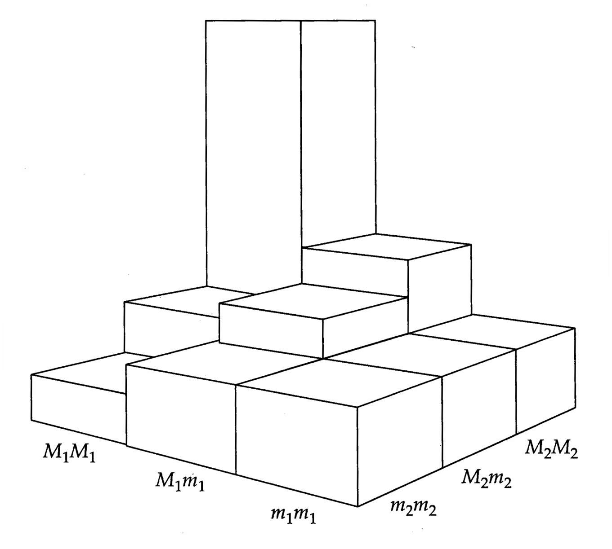
>
> Figure 15.10 An example of epistasis for QTLs influencing protein volume in maize. Height indicates the amount of protein volume for each of the genotypes. In this case, the $ M_{1}M_{1}M_{2}M_{2} $ marker genotype had the greatest effect on protein volume, while $ M_{1}M_{1}m_{2}m_{2} $ had the smallest. (After Damerval et al. 1994.)

Goldman et al. (1993, 1994) crossed the selected (76-generation) high- and low-protein lines and then examined 100 F₃ families (formed by selfing F₂s) using 100 markers spanning the maize genome at an average spacing of about 20 cM. Using single-marker ANOVA, 22 markers on 10 chromosome arms were significantly associated with protein concentration, 19 markers on nine arms were associated with starch concentration, 26 on 13 arms with oil concentration, and 18 on 10 arms with kernel weight. Many of the marker-trait associations extended across clusters of linked markers. In these cases, single-marker ANOVA cannot distinguish between several linked markers all detecting the same linked QTL or multiple QTLs, and methods using multiple linked markers would be more illuminating, although these were not used.

A multiple regression involving only six (unlinked) markers accounted for 65% of the variation in protein concentration, and this increased to 84% when five significant pairwise epistatic interactions between these markers were incorporated into the regression (using Equation 15.14c). Seven markers accounted for 66% of the variation in starch, increasing to 78% when one significant pairwise epistatic interaction was included. Four marker loci accounted for 43% of the variation in oil concentration, while six markers accounted for 47% of the variation in kernel weight. These last two values are similar to what is seen in maize in other QTL mapping experiments, but the values for protein and starch seem rather high. In particular, it is very surprising that so few loci could account for such a significant fraction of the differences, especially given the long-term continuous and gradual change in the lines. One possible explanation is low power resulting in overestimation of QTL effects. Alternatively, if these values are indeed correct, selection response may have occurred by successive fixation of a series of new alleles at each of the major loci. Berke and Rocheford (1995) examined a cross of two other variant lines from this experiment (High Oil with Low Oil), and found similar results, with six loci accounting for 58% of the genetic variation in oil concentration and seven markers accounting for 56% of the variation in starch concentration.

---

## Genetics_chapter15_026 · SELECTED APPLICATIONS / QTLs Involved in the Differences Between Maize and Teosinte

Maize and teosinte are dramatically different (see Figure 5.2), to the point that they were originally placed in separate genera. Hybrids, however, are fully interfertile and maize is believed to have resulted from domestication of teosinte (Beadle 1980, Doebley 1992). In an elegant series of papers, Doebley and colleagues (Doebley et al. 1990, 1994, 1995a, 1997; Doebley and Stec 1991, 1993; Dorweiler et al. 1993) have begun to characterize the genes involved in these dramatic differences.

Maize and teosinte have major differences in plant architecture (Figure 5.2, Table 15.4). Teosinte has multiple long lateral branches, topped with male inflorescences (tassels). In maize, these branches are very short and topped with ears. These differences in plant architecture can be quantified by considering four characters: internode length on lateral branches (small in maize, long in teosinte), the number of branches (none to few in maize, many in teosinte), percentage of lateral branches topped with tassels as opposed to ears (mostly tassels in teosinte, ears in maize), and the number of secondary ears on each lateral branch (few in maize, many in teosinte). Table 15.4 gives the mean values for these characters in maize and teosinte.

Differences in the structure of the female inflorescence (the ear) are even more dramatic (Figure 5.2, Table 15.4). The teosinte ear has 5–10 cupulate fruitcases arranged in pairs. Each of these has a single spikelet that gives rise to a kernel, resulting in 10–20 kernels per teosinte ear. Each mature fruitcase is covered by a hardened outer glume that seals in the kernel, making harvesting very difficult. In contrast, the maize ear is composed of 100 or more cupules (arranged in multiple rows rather than pairs of rows), each cupule containing two spikelets, leading to two kernels per spikelet. These changes result in the maize ear having an order of magnitude more kernels than the teosinte ear. The maize outer glume is soft, so the kernels remain exposed for easy harvesting. Finally, while the teosinte ear easily disarticulates (to scatter seeds), kernels on the maize ear stay intact, further facilitating the harvesting of kernels.

QTLs were mapped in two different crosses, each involving a different primitive maize race and a different subspecies of teosinte (Doebley et al. 1990; Doebley and Stec 1991, 1993). As shown in Table 15.4, a few QTLs of major effect account

**[Table]**

*[See Table 15.4 at the end of this section.]*

for most of the differences between characters. These QTLs are mostly in very similar positions in the two crosses (Figure 15.11), with both sets of crosses showing five regions of the maize genome that account for most of the differences.

Such results are consistent with Beadle’s hypothesis of five major genes accounting for the difference between maize and teosinte (Beadle 1939). Beadle arrived at this figure by examining 50,000 $ F_2 $ maize × teosinte offspring, finding the frequency of all-maize or all-teosinte phenotypes to be $ \simeq 1/500 $. If n genes are involved, the expected $ F_2 $ frequency of either parental genotype is $ (1/4)^n + (1/4)^n $. Setting this equal to 1/500 and solving gives n = 5.

Focusing on the five major regions, marker-selected NILs (Chapter 14) were constructed to further characterize the QTLs. Doebley's first target was a QTL on chromosome 4, which accounted for 50% of the variance in glume score. A small maize segment containing this region was introgressed into a teosinte background by three generations of backcrossing and selection for flanking markers (Dorweiler et al. 1993). When NILs with the introgressed teosinte region were backcrossed to the maize recurrent parent, the resulting $ F_{2} $ progeny showed two discrete classes for glume score, as would be expected with a single major gene. The putative gene was named tga1, for teosinte glume architecture 1. A similar analysis of two other regions, QTL-3L and QTL-1L, showed strong epistasis for a number of key traits separating maize and teosinte (Doebley et al. 1995a; see Example 1 from Chapter 5). By using marker-selected introgressed lines,

> **Figure 15.11** · page 497 · source: `Genetics_chapter15`
>
> 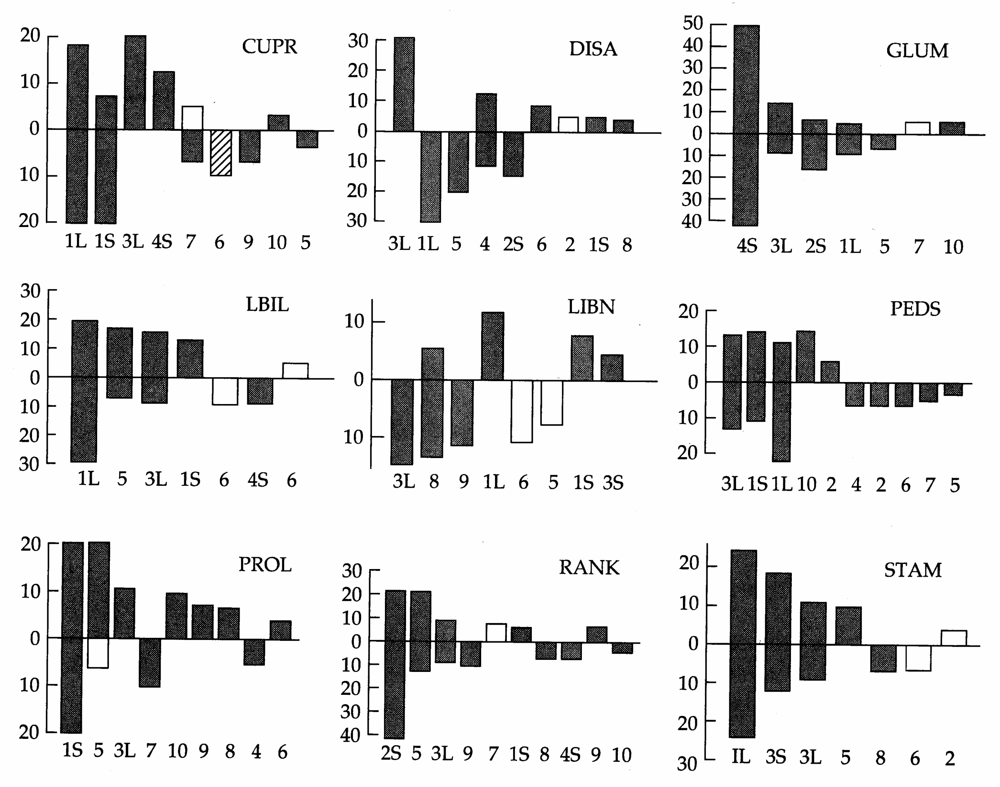
>
> Figure 15.11 QTLs accounting for differences between maize and teosinte in the nine characters listed in Table 15.4. Each bar represents a detected QTL, with bar height indicating its $ r^{2} $ value. Acronyms for characters are listed in Table 15.4. Chromosome position (chromosome number and short vs. long arm) is indicated under each bar. The upper bars refer to QTLs detected in a cross between a primitive maize strain and one subspecies of teosinte (Z. m. parviglumis), while the lower bars are for a cross involving a different primitive maize strain and another teosinte subspecies (Z. m. mexicana). Aligned bars denote QTLs mapping to very similar positions in both crosses. White bars indicate QTL effects in the opposite direction from parental phenotype, while the cross-hatched bar indicates apparent overdominance. (From Doebley and Stec 1993.)

QTL-1L was shown by complementation tests to be the locus teosinte branched 1 (tb1). In maize, mutants at this locus result in teosinte-like features for inflorescence sex (tassels, not ears) and number (many instead of one), and length of lateral branches (long, not short). Doebley found that the joint effects of tb1 and

**[Table]**

*[See Table 15.5 at the end of this section.]*

QTL-3L, by themselves, are sufficient to account for essentially all of the differences in plant architecture between teosinte and maize. Further, these two loci result in substantial differences in ear architecture. Hence, there is direct evidence that just a few genes can account for a very significant amount of the dramatic differences between teosinte and maize.

> **Table 15.4** · `15.4` · page 496 · source: `Genetics_chapter15_026`
> Table 15.4 Character differences between maize and teosinte (primitive maize race Reventado × Zea mays parviglumis).
>
> <table><tr><td></td><td colspan="2">Means</td><td colspan="3">QTLs</td></tr><tr><td></td><td>Maize</td><td>Teos.</td><td>N</td><td>Max</td><td>Min</td></tr><tr><td>Plant Architectural Characters</td><td></td><td></td><td></td><td></td><td></td></tr><tr><td>Lateral branch internode length (LBIL)</td><td>0.7</td><td>21.9</td><td>5</td><td>0.45</td><td>0.05</td></tr><tr><td>Number of branches (LIBN)</td><td>0.0</td><td>5.8</td><td>4</td><td>0.24</td><td>0.04</td></tr><tr><td>% male primary lateral inflorescences (STAM)</td><td>0.0</td><td>97</td><td>5</td><td>0.23</td><td>0.05</td></tr><tr><td>No. secondary ears/lateral branch (PROL)</td><td>1.0</td><td>8.4</td><td>7</td><td>0.25</td><td>0.04</td></tr><tr><td>Ear Characters</td><td></td><td></td><td></td><td></td><td></td></tr><tr><td>Cupules along a single rank (CUPR)</td><td>37.4</td><td>5.3</td><td>6</td><td>0.25</td><td>0.04</td></tr><tr><td>Disarticulation: 1 = none, 10 = full (DISA)</td><td>1.0</td><td>10.0</td><td>6</td><td>0.42</td><td>0.04</td></tr><tr><td>Glume score: 1 = soft, 10 = hard (GLUM)</td><td>1.0</td><td>10.0</td><td>2</td><td>0.41</td><td>0.08</td></tr><tr><td>% cupules with only one spikelet (PEDS)</td><td>0.0</td><td>100</td><td>5</td><td>0.25</td><td>0.08</td></tr><tr><td>Number of rows of cupules (RANK)</td><td>5.6</td><td>2.0</td><td>6</td><td>0.36</td><td>0.05</td></tr></table>
>
> Source: From Doebley and Stec 1993.
> Note: Listed are mean character values (Means), the number of detected QTLs (N), the $ r^{2} $ value for the largest (Max) and smallest (Min) detected QTLs, and the total $ r^{2} $ for a model containing all detected QTLs. Locations for the QTLs detected in this cross are plotted as the upper bars in Figure 15.11.

> **Table 15.5** · `15.5` · page 498 · source: `Genetics_chapter15_026`
> Table 15.5 QTLs influencing age-specific weight and age-specific growth rates in mice, measured at weekly intervals.
>
> <table><tr><td rowspan="2"></td><td colspan="9">Age-specific weight (weeks)</td></tr><tr><td>1</td><td>2</td><td>3</td><td>4</td><td>5</td><td>6</td><td>7</td><td>8</td><td>9</td></tr><tr><td>No. of QTLs</td><td>7</td><td>10</td><td>16</td><td>13</td><td>15</td><td>15</td><td>14</td><td>14</td><td>16</td></tr><tr><td>Total $ r^{2} $</td><td>0.29</td><td>0.30</td><td>0.56</td><td>0.52</td><td>0.59</td><td>0.63</td><td>0.64</td><td>0.56</td><td>0.67</td></tr><tr><td rowspan="2"></td><td colspan="9">Age-specific growth</td></tr><tr><td colspan="2">Early</td><td colspan="2">Middle</td><td colspan="2">6-week</td><td colspan="2">Late</td><td></td></tr><tr><td>No. of QTLs</td><td colspan="2">11</td><td colspan="2">12</td><td colspan="2">14</td><td colspan="2">12</td><td></td></tr><tr><td>Total $ r^{2} $</td><td colspan="2">0.39</td><td colspan="2">0.51</td><td colspan="2">0.54</td><td colspan="2">0.38</td><td></td></tr></table>
>
> Source: From Cheverud et al. 1996.
> Note: Early, Middle, and Late correspond to growth from 1 to 3 weeks, growth from 3 to 6 weeks, and growth from 6 to 10 weeks, respectively, while 6-week refers to growth from 1 to 6 weeks.

---

## Genetics_chapter15_027 · SELECTED APPLICATIONS / QTLs for Age-specific Growth in Mice

Cheverud et al. (1996) examined weight and growth using 535 F₂ mice from a cross between two inbred lines differing in size. A total of 75 microsatellite markers were used, generating 55 intervals that averaged around 28 cM in length. ML-interval mapping was used to examine age-specific weight (at ages 1 through 10 weeks) and age-specific growth rate. As Table 15.5 shows, considerable numbers of QTLs were found for all characters. All detected QTLs had small effects, with the largest accounting for around 10% of the F₂ phenotypic variance, while the average (detected) effect was around 4% of the F₂ variance. Note also from Table 15.5 that as age increases, so does the number of QTLs for weight and the total r² value of these detected loci. Early vs. late weight and growth showed different genetic architectures. First, largely distinct sets of QTLs are involved (Figure 15.12). Second, dominance was found to be much more important in early weight and growth than in late weight and growth.

---

## Genetics_chapter15_028 · SELECTED APPLICATIONS / Summary of QTL Mapping Experiments

QTL mapping using inbred-line crosses has been widely applied in many other

> **Figure 15.12** · page 499 · source: `Genetics_chapter15`
>
> 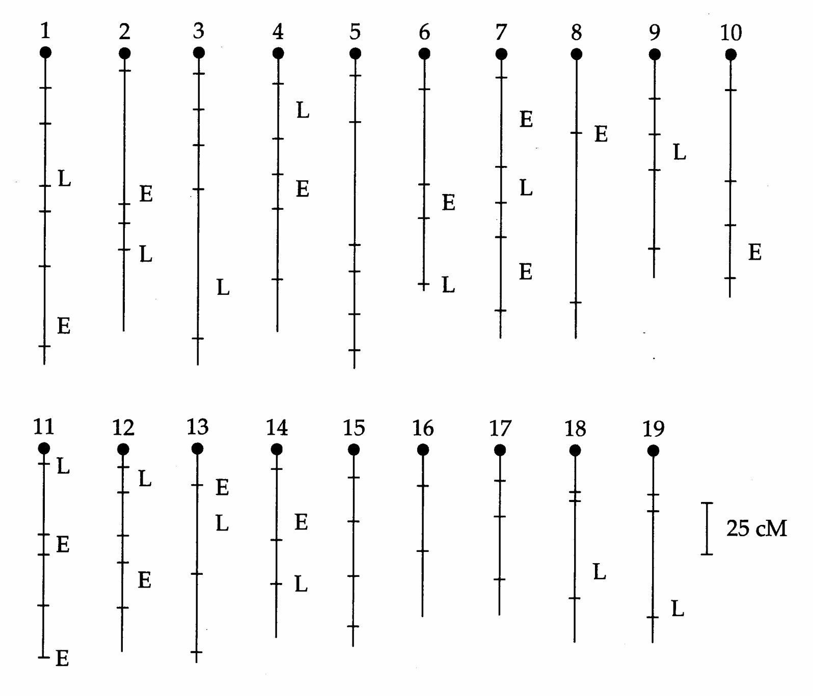
>
> Figure 15.12 Locations for early (E) and late (L) growth QTLs on the 19 mouse autosomes. The marker locations are indicated by hatch marks. (From Cheverud et al. 1996.)

species of plants (mostly crops) and a few other animal species. The basic conclusion from these studies is that experiments using modest numbers of individuals (100–200) and markers (20–100) generally detect QTLs. In a survey we performed on 52 experiments covering a total of 222 traits, almost half (45%) of all traits had a QTL accounting for at least 20% of the total phenotypic variance (Figure 15.13). Figure 15.14 shows that there is little (if any) correlation between the number of detected QTLs and the total percentage of variation they explain. Most studies (84%) found the total contribution from all detected QTLs to be at least 20% of the total variance, and for a third of the traits it was at least 50%. In spite of these values, we emphasize the fact that the effects of detected QTLs can be severely overestimated, especially when the power to detect them is low (Figures 15.8, 15.9).

A second conclusion to be drawn from the existing data is that dominance is common. Epistatic interactions, on the other hand, appear to be fairly rare, although there are notable exceptions (e.g., Damerval et al. 1994, Doebley et al. 1995a, Lark et al. 1995, Long et al. 1995, Eshed and Zamir 1996, Cockerham and Zeng 1996). This general lack of epistasis may not reflect biological

> **Figure 15.13** · page 500 · source: `Genetics_chapter15`
>
> 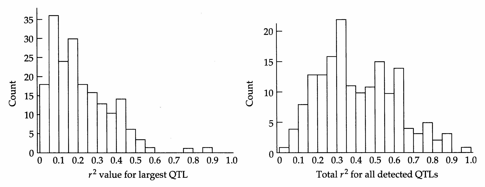
>
> Figure 15.13 Summary of results from 52 QTL mapping experiments using inbred-line crosses (mainly crop plants), examining a total of 222 traits. Left: Distribution of $ r^{2} $ values for the QTL of largest effect. Right: Distribution of the total effects accounted for by all detected QTLs.

> **Figure 15.14** · page 500 · source: `Genetics_chapter15`
>
> 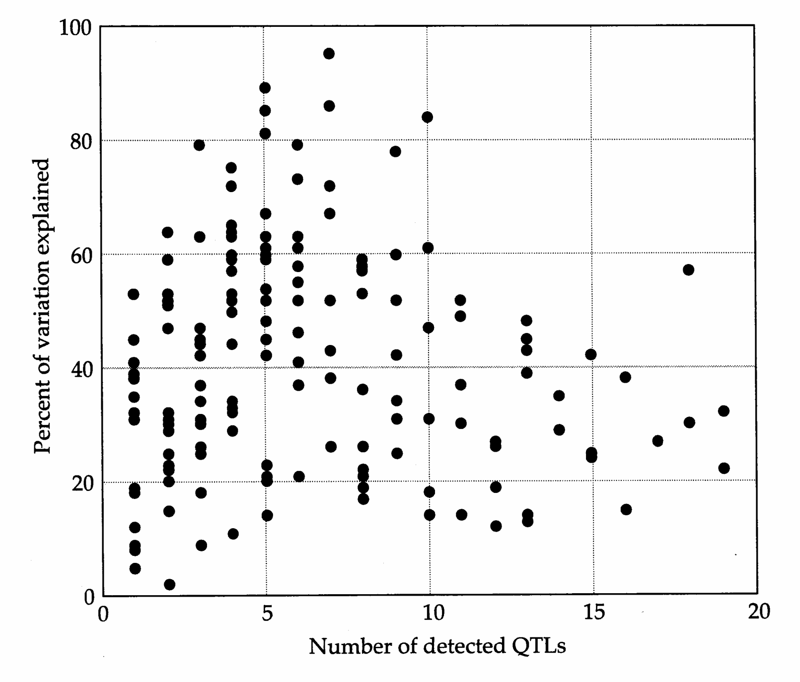
>
> Figure 15.14 Joint distribution of the total percent of variation attributable to detected QTLs and QTL number for 52 experiments (covering 222 traits) from Figure 15.13.

reality, as several factors complicate its detection (Gallais and Rives 1993). Since most epistasis tests only examine markers showing significant single-locus effects, the results are very likely biased towards loci showing reduced epistasis. Smaller sample sizes for each multilocus genotype also reduce the power for detecting epistasis. It is perhaps noteworthy that some of the strongest evidence for epistasis comes from experiments using RILs, which control for background effects outside of the regions of interest.

Another issue that remains unresolved is the frequency of genotype × environment interactions involving detected QTLs. Two different approaches have been used to study this interaction: the consistency of marker-trait associations across environments and ANOVA methods incorporating specific terms for marker × environment interactions. The former measure is very crude, simply asking whether a marker-trait association is detected in all scored environments. If it is, this is generally taken as evidence of no G×E, while detection of an association in only some of the environments is often taken as evidence for G×E. However, a QTL can have a significant effect in all environments even in the presence of very significant G×E interaction. Likewise, low power of detection can result in a QTL being detected in only some of the replicates of an experiment, even when its effects are identical across environments. Consistent with this expectation, Koester et al. (1993) found that QTLs with small effects are less likely to be detected across environments than are QTLs with large effects. By explicitly testing for marker × environment interactions, ANOVA methods provide a more sensitive measure of G × E effects. As Table 15.6 shows, the conclusions from studies using either method are mixed.

One final caveat is necessary with respect to results from inbred-line crosses. Most parental populations are chosen because of their wide difference in traits of interest, so the relevance of these results to within-population variation remains unclear. Indeed, marker loci in these inbred-line crosses often show strong segregation distortion, suggesting very significant genetic divergence between parental lines (e.g., Vallejos and Tanksley 1983, Edwards et al. 1987, Paterson et al. 1988, Bonierbale et al. 1988, Doebley and Stec 1991, Schön et al. 1993). Direct methods for mapping QTLs responsible for within-population variation are developed in the next chapter.

**[Table]**

*[See Table 15.6 at the end of this section.]*

> **Table 15.6** · `15.6` · page 501 · source: `Genetics_chapter15_028`
> Table 15.6 Selected studies examining G × E interaction in detected QTLs.
>
> Organism/trait | Reference
> --- | ---
> Tomatos | 
> 3 fruit characters in California (2 locations) and Israel. | Paterson et al. 1991
> 4/29 QTLs detected in all three environments, 10/29 in two, 15/29 in one. | 
>
> *(continued, page 502)*
>
> Organism/trait | Reference
> --- | ---
> Maize | 
> Flowering time, height in 3 North Carolina locations. Marker-trait associations displaying largest effects are generally constant over environments; markers with less significant associations are not as constant over environments. | Koester et al. 1993
> 11 yield-related characters in 4 North Carolina locations. Of 70 detected QTLs, 21% detected in all four locations, 34% in 2 or 3 locations, 44% in only one location. | Ragot et al. 1995
> Yield in two locations in Northern Italy. Most detected QTLs consistent across environments. | Ajstone-Marsan et al. 1995
> ANOVA analysis of 7 traits in 4–6 locations (4 in North Carolina, 1 in Iowa, 1 in Illinois). Little evidence of $ G \times E $ in 4 traits, (yield, ear height, plant height, leaf area). Strong $ G \times E $ in 3 others (days to tassel, grain moisture, ear number). | Stuber et al. 1992 Cockerham and Zeng 1996
> ANOVA analysis of 7 characters over 2 different years. 6/28 significant marker-trait associations for starch concentration showed $ G \times E $, 6/16 for protein concentration, 12/16 for anthesis date, 7/14 for ear weight, 11/18 for height, 3/27 for kernel weight, and 9/31 for oil concentration. | Berke and Rocheford 1995
> Corn borer resistance, height in 2 Iowa locations. All 10 detected QTLs (7 resistance, 3 height) gave very similar LOD maps across environments, although only 4/7 height QTLs were significant in both. | Schön et al. 1993
> Gray Leaf Spot resistance in three environments. 22/33 significant marker-trait associations found in a single environment, 9/33 in two, 2/33 in all three. Averaged over all environments, only 20 of these marker-trait associations were significant. | Bubeck et al. 1993
> Rapeseed (Brassica napus) | 
> Flowering time in 3 different vernalization treatments. LOD scores very similar over all three treatments. | Ferreira et al. 1995
>
> *(continued, page 503)*
>
> Organism/trait | Reference
> --- | ---
> Peas | 
> Node number in field and greenhouse locations. 3 QTLs detected only in greenhouse, 3 only in field, 1 in both. | Dirlewanger et al. 1994
> Arabidopsis thaliana | 
> Flowering time in 6 vernalization/photoperiod treatments. Four of 12 QTLs detected by composite interval mapping showed QTL $ \times $ E interactions. | Jansen et al. 1995

---
