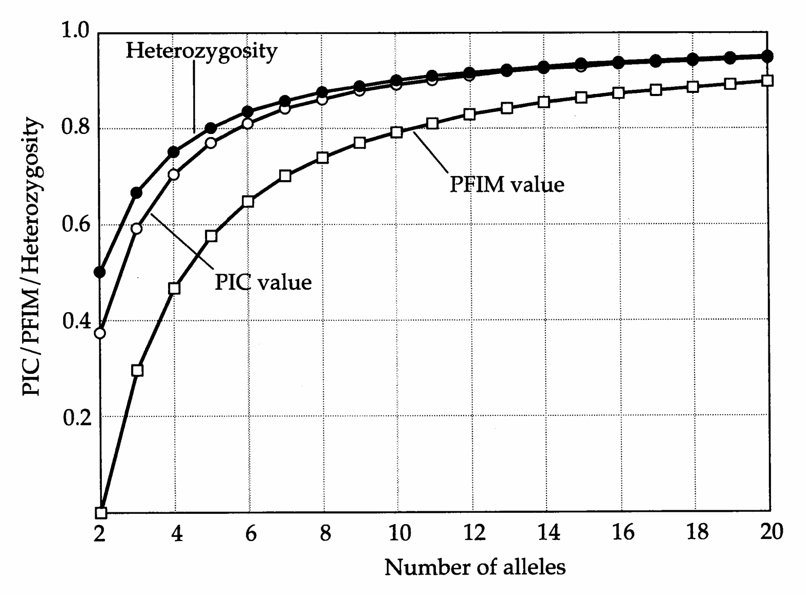
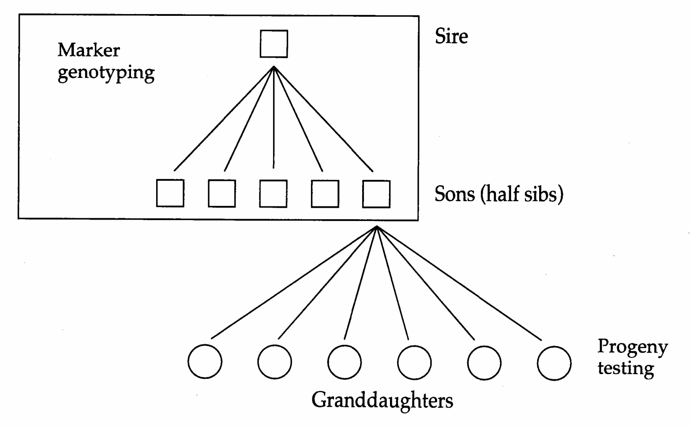
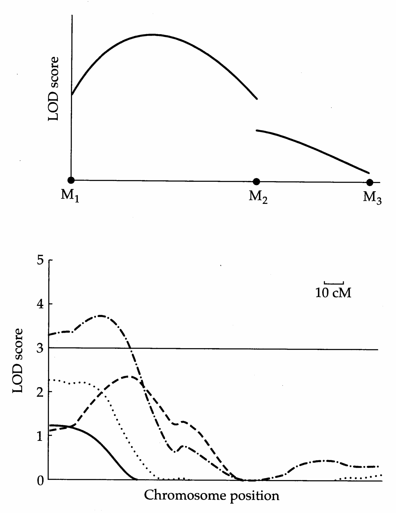
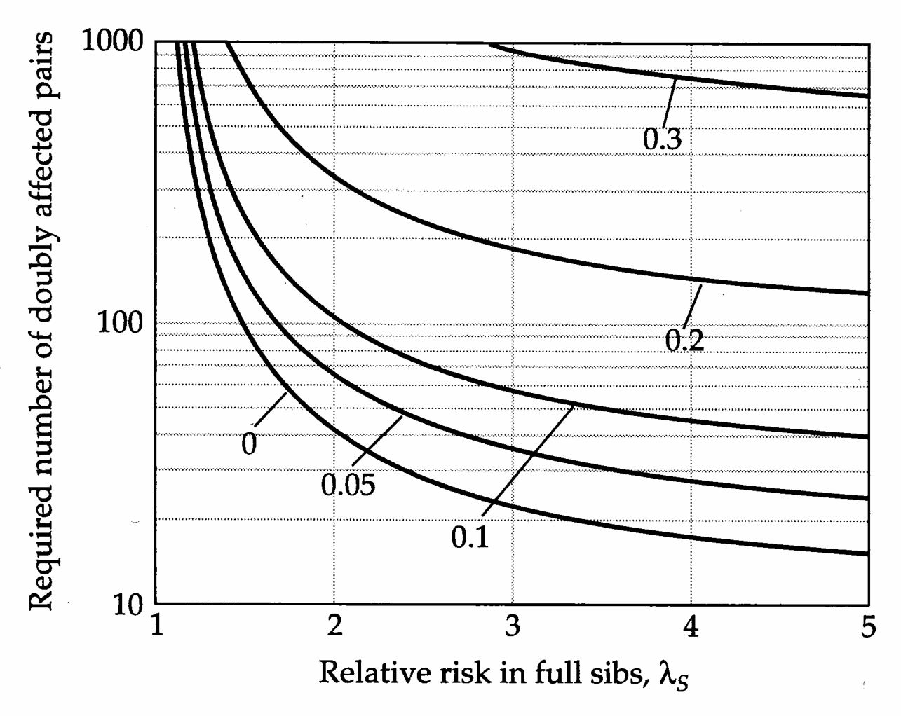
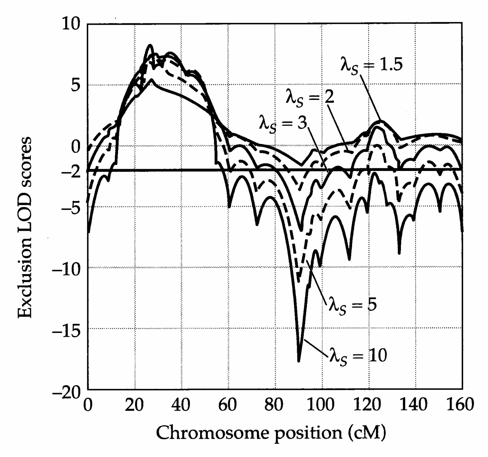
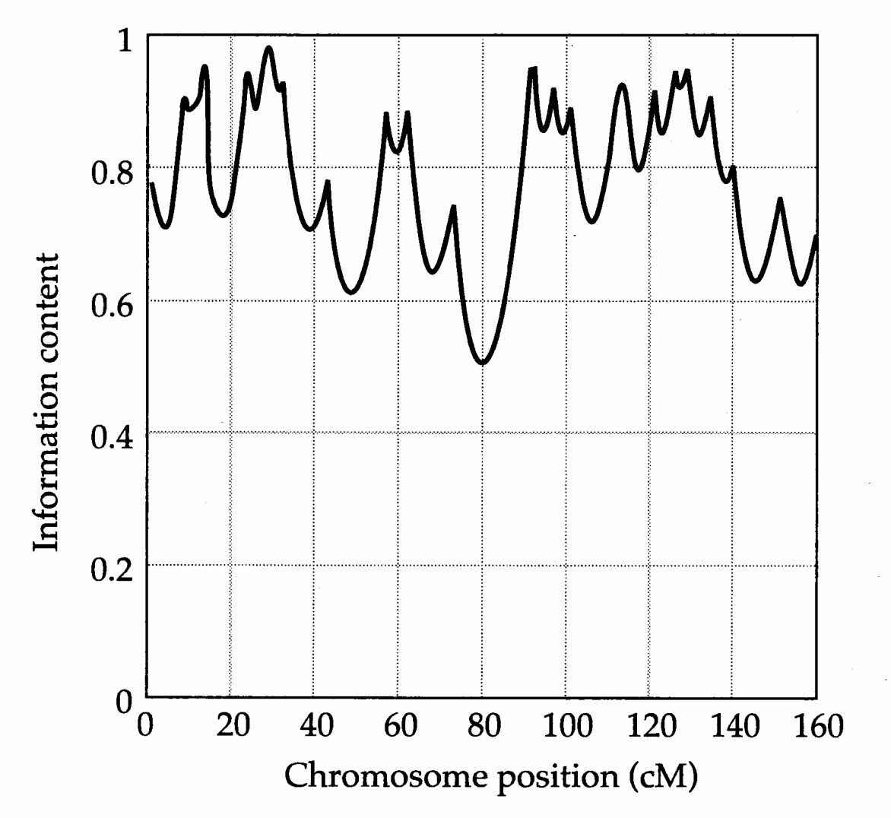

# Chapter 16 · MEASURES OF INFORMATIVENESS

## Genetics_chapter16_001 · Introduction / MEASURES OF INFORMATIVENESS

The major difference between QTL analysis using inbred-line crosses vs. outbred populations is that while the parents in the former are genetically uniform, parents in the latter are genetically variable. This distinction has several consequences. First, only a fraction of the parents from an outbred population are informative. For a parent to provide linkage information, it must be heterozygous at both a marker and a linked QTL, as only in this situation can a marker-trait association be generated in the progeny. Only a fraction of random parents from an outbred population are such double heterozygotes. With inbred lines, $ F_{1} $'s are heterozygous at all loci that differ between the crossed lines, so that all parents are fully informative. Second, there are only two alleles segregating at any locus in an inbred-line cross design, while outbred populations can be segregating any number of alleles. Finally, in an outbred population, individuals can differ in marker-QTL linkage phase, so that an M-bearing gamete might be associated with QTL allele Q in one parent, and with q in another. Thus, with outbred populations, marker-trait associations must be examined separately for each parent. With inbred-line crosses, all $ F_{1} $ parents have identical genotypes (including linkage phase), so one can simply average marker-trait associations over all offspring, regardless of their parents.

Before considering the variety of QTL mapping methods for outbred populations, some comments on the probability that an outbred family is informative are in order. A parent is marker-informative if it is a marker heterozygote, QTL-informative if it is a QTL heterozygote, and simply informative if it is both. Unless both the marker and QTL are highly polymorphic, most parents will not be informative. Given the need to maximize the fraction of marker-informative parents, classes of marker loci successfully used with inbred lines may not be optimal for outbred populations. For example, RFLPs are widely used in inbred lines, but these markers are typically diallelic and hence have modest polymorphism (at best). Microsatellite marker loci (Chapter 14), on the other hand, are highly polymorphic and hence much more likely to yield marker-informative individuals. As shown in [[SEE_TABLE:16.1]], there are three kinds of marker-informative crosses. With a highly polymorphic marker, it may be possible to examine marker-trait associations for both parents. With a fully informative family $ (M_i M_j \times M_k M_\ell) $ all parental alleles can be distinguished, and both parents can be examined by comparing the trait values in $ M_i $- vs. $ M_j $- offspring and $ M_k $- vs. $ M_\ell $- offspring. With a backcross family $ (M_i M_j \times M_k M_k) $, only the heterozygous parent can be examined for marker-trait associations. Finally, with an intercross family $ (M_i M_j \times M_i M_j) $, homozygous offspring $ (M_i M_i, M_j M_j) $ are unambiguous as to the origin of parental alleles, while heterozygotes are ambiguous, because allele $ M_i $ $ (M_j) $ could have come from either parent.

In designing experiments, it is useful to estimate the fraction of families

[[SEE_TABLE:16.1]] expected to be marker-informative. One measure of this is the polymorphism information content (Botstein et al. 1980), or PIC, of the marker locus, $$ \mathrm{PIC}=1-\sum_{i=1}^{n}p_{i}^{2}-\sum_{i=1}^{n-1}\sum_{j=i+1}^{n}2p_{i}^{2}p_{j}^{2}\leq\frac{(n-1)^{2}(n+1)}{n^{3}} $$ which is the probability that one parent is a marker heterozygote and its mate has a different genotype (i.e., a backcross or fully informative family, but excluding intercross families). In this case, we can distinguish between the alternative marker alleles of the first parent in all offspring from this cross. The upper bound (given by the right hand side of Equation 16.1) occurs when all marker alleles are equally frequent, $ p_{i} = 1/n $. The proportion of fully informative matings (PFIM), where marker alleles from both parents can be distinguished in all offspring, is given by $$ \begin{aligned}\mathrm{P F I M}=&\sum_{i=1}^{n-1}\sum_{j=i+1}^{n}2p_{i}p_{j}\left[\left(\sum_{k=1}^{n-1}\sum_{\ell=k+1}^{n}2p_{k}p_{\ell}\right)-2p_{i}p_{j}\right]\\ \leq&\frac{\left(n-1\right)\left(n-2\right)\left(n+1\right)}{n^{3}}\end{aligned} $$ where $i, j, k$, and $\ell$ denote different marker alleles (Götz and Ollivier 1992). Again, the upper bound occurs when all alleles are equally frequent. Figure 16.1 plots the maximum values of both of these measures as a function of the number of marker alleles.

> **Figure 16.1** · page 3 · source: `Genetics_chapter16`
>
> 
>
> Figure 16.1 The relationship between three measures of marker information: heterozygosity, PIC, and PFIM. Plotted are the maximum values for each measure as a function of the number of marker alleles under the assumption of an even allele-frequency distribution ( $ p_{i}=1/n $).

Of course, a marker-informative parent is not necessarily also QTL-informative. For a QTL with $n_{Q}$ alleles, the $i$th of which has frequency $q_{i}$, the probability that a parent is a QTL heterozygote (in a random mating population) is $$ \left(1-\sum_{i=1}^{n_{Q}}q_{i}^{2}\right)\leq\left(1-\frac{1}{n_{Q}}\right) $$

For a population where parents are in linkage equilibrium, the probability that (at least) one parent is a double (QTL/marker) heterozygote and that alternative marker alleles from this parent can unambiguously be distinguished in all offspring is $$ \Pr(\text{at least one parent fully informative})=PIC\times\left(1-\sum_{i=1}^{n_{Q}}q_{i}^{2}\right) $$ while the probability that both parents satisfy this condition is $$ \Pr(\mathrm{both~parents~fully~informative})=\mathrm{PFIM}\times\left(1-\sum_{i=1}^{n_{Q}}q_{i}^{2}\right)^{2} $$

Thus, under fairly general settings, we expect most parents to be uninformative about a particular QTL/marker combination.

Example 1. Consider a marker locus segregating five alleles in a population. Here, $$ \mathrm{PIC}\leq\frac{4^{2}\cdot6}{5^{3}}=0.768\qquad\mathrm{and}\qquad\mathrm{PFIM}\leq\frac{4\cdot3\cdot6}{5^{3}}=0.576 $$

Hence, in order to have 100 families that are marker-informative for at least one parent, 100/0.768 = 130 randomly drawn families must be examined. If one requires these families to be informative for both parents, then 100/0.576 = 174 families must be examined. These are the best-case scenarios for this marker, occurring if all five alleles have equal frequency.

Now suppose that the marker is linked to a QTL with three alleles whose frequencies are 0.5, 0.3, and 0.2. The probability that an individual is a QTL heterozygote is $ 1 - (0.5^2 + 0.3^2 + 0.2^2) \simeq 0.62 $. Thus, to have 100 families with one or both parents fully informative requires sampling (at least) $ 130/0.62 \simeq 210 $ and $ 174/0.62^2 \simeq 453 $ random families, respectively.

> **Table 16.1** · `16.1` · page ? · source: `Genetics_chapter16_001`
> Table 16.1 (body not recovered from raw layout)
>
> <table border=1 style='margin: auto; word-wrap: break-word;'><tr><td style='text-align: center; word-wrap: break-word;'>Fully informative: $ M_{i}M_{j} \times M_{k}M_{\ell} $</td></tr><tr><td style='text-align: center; word-wrap: break-word;'>Parents are different marker heterozygotes.</td></tr><tr><td style='text-align: center; word-wrap: break-word;'>All offspring are informative in distinguishing alternative alleles from both parents.</td></tr><tr><td style='text-align: center; word-wrap: break-word;'>Backcross: $ M_{i}M_{j} \times M_{k}M_{k} $</td></tr><tr><td style='text-align: center; word-wrap: break-word;'>One parent is a marker heterozygote, the other a marker homozygote.</td></tr><tr><td style='text-align: center; word-wrap: break-word;'>All offspring informative in distinguishing heterozygous parent's alternative alleles.</td></tr><tr><td style='text-align: center; word-wrap: break-word;'>Intercross: $ M_{i}M_{j} \times M_{i}M_{j} $</td></tr><tr><td style='text-align: center; word-wrap: break-word;'>Both parents are the same marker heterozygote.</td></tr><tr><td style='text-align: center; word-wrap: break-word;'>Only homozygous offspring informative in distinguishing alternative parental alleles.</td></tr><tr><td style='text-align: center; word-wrap: break-word;'>Note: Here i, j, k, and l index different marker alleles.</td></tr></table>

---

## Genetics_chapter16_002 · Introduction / SIB ANALYSIS: LINEAR MODELS

One can use family data to search for QTLs by comparing offspring carrying alternative marker alleles from the same parent. There are a number of ways to accomplish this apparently simple task, and our treatment first considers collections of relatives, such as entire half- or full-sib families.

Sibship-based methods for detecting linked QTLs historically developed along two different fronts. Animal breeders typically rely on a few large half-sib families, each resulting from a single sire (often via artificial insemination). Human geneticists, on the other hand, rely on a number of small full-sib families. These different designs not only reflect the biological limitations present in different species but also mirror concerns about the tradeoff between number of families (increasing the chance of sampling at least one QTL-informative sibship) and number of sibs per family (increasing the power to detect marker differences, provided the family is QTL-informative). Neither design is necessarily optimal, since the highest power (for a fixed sample size) occurs when a single large informative sibship is used (A. Hill 1975, Weller et al. 1990, Luo 1993). Unfortunately, although we can gauge if a particular parent is marker-informative, we have no way of knowing beforehand whether that parent is also a QTL heterozygote.

A variety of linear model approaches for dealing with sibship data have been proposed. We start by considering the simplest case of a single half-sib family. Care is required when combining information from several half-sibships, and we examine this issue next. Finally, we consider how half-sib analyses are extended to full sibs. Upon completion of our discussion of linear models, we will provide a broad overview of the maximum likelihood approach to sib analysis.

---

## Genetics_chapter16_003 · Introduction / A Single Half-sib Family

Suppose a single sire is crossed to $n$ unrelated dams and a single offspring from each mating is measured. Ideally, this sire should be informative at a number of marker loci covering a significant fraction of the genome (as can be accomplished by using a large number of highly informative markers). While we have much less control over the choice of QTL-informative sires, if a major gene is involved, a pilot segregation analysis with a number of candidate sires can be used to estimate the probability that a particular sire is a QTL heterozygote (e.g., Equation 13.24), and those sires with the highest such probabilities can be used. One might also select those sires showing the greatest offspring variance (the idea being that this variance increases with the number of heterozygous QTLs), but within-family variance can be a poor indicator of sire QTL heterozygosity.

Let $ M_{1} $ and $ M_{2} $ denote the alternative sire alleles at a heterozygous marker locus, and let $ z_{ij} $ denote the phenotype of the jth individual with sire marker allele i. The simplest linear model for examining whether this marker is linked to a QTL (heterozygous in the sire) is $$ z_{ij}=\mu+m_{i}+e_{ij} $$ where the marker effect $ m_{i} $ is the expected deviation from the mean trait value $ \mu $, given that an offspring has sire allele $ M_{i} $. Since there are only two marker classes, a t test can be used to determine if offspring with $ M_{1} $ vs. $ M_{2} $ sire alleles have significantly different means, $$ t=\frac{\overline{z}_{M_{1}}-\overline{z}_{M_{2}}}{\sqrt{\mathrm{Var}\left(\overline{z}_{M_{1}}\right)+\mathrm{Var}\left(\overline{z}_{M_{2}}\right)}}=\frac{\mathrm{MC}}{\mathrm{SE}} $$

Here, MC denotes the marker contrast between alternative sire alleles, and SE is the standard error of the marker contrast. A significant t value implies that the marker is linked to a QTL that is heterozygous in the sire. Typically, only those offspring whose sire alleles can be determined are included in this analysis. If the marker locus is not very polymorphic, many offspring will be uninformative. Dentine and Cowan (1990) present a GLS regression method that allows uninformative individuals to be included in the analysis.

Finally, consider the expected value of the marker contrast, given the sire genotype. Suppose the sire is $ M_1Q_i/M_2Q_j $ and that c is the recombination frequency between the marker and the QTL. The conditional probabilities for alternate QTL alleles in gametes carrying a known sire marker allele are $$ \Pr(Q_{i}\mid M_{1})=\Pr(Q_{j}\mid M_{2})=1-c,\qquad\Pr(Q_{i}\mid M_{1})=\Pr(Q_{j}\mid M_{2})=c(16.7) $$

Suppose there are $n_Q$ QTL alleles $(Q_1,\cdots,Q_{n_Q})$ with frequencies $q_1,\cdots,q_{n_Q}$. Following Chapter 4, decompose the mean value of $Q_iQ_j$ as $\mu_{Q_iQ_j} = \mu + \alpha_i + \alpha_j + \delta_{ij}$, where the deviation from the population mean is determined by the average effects of both alleles $(\alpha_i + \alpha_j)$ plus the dominance deviation $(\delta_{ij})$. Assuming random mating; the dam contributes an allele at random, giving the expected value in offspring with sire marker $M_1$ as $$ \begin{aligned}E\left[\left.\mu_{M_{1}}\right|\mathbf{s i r e}=M_{1}Q_{i}/M_{2}Q_{j}\right]&=\left(1-c\right)\sum_{k=1}^{n_{Q}}\mu_{Q_{i}Q_{k}}q_{k}+c\sum_{k=1}^{n_{Q}}\mu_{Q_{j}Q_{k}}q_{k}\\&=\mu+\left(1-c\right)\alpha_{i}+c\alpha_{j}\end{aligned} $$ which follows since $\sum\alpha_{k}q_{k}=\sum\delta_{jk}q_{k}=0$ (Chapter 4). The expected value for the marker contrasts from this sire becomes $$ E\left[\left.\mu_{M_{1}}-\mu_{M_{2}}\right|\mathbf{s i r e}=M_{1}Q_{i}/M_{2}Q_{j}\right]=\left(1-2c\right)\left(\alpha_{i}-\alpha_{j}\right) $$

Thus, assuming a single QTL linked to the marker, the expected marker contrast for a given sire is the difference of the average effects of his alleles at this QTL, scaled by the QTL-marker recombination frequency.

While a marker contrast may be significantly different from zero within a sibship, the expected value of this contrast across a random collection of sibships is zero for a population in linkage equilibrium, as $ E(\alpha_x) = 0 $. Thus, one cannot simply combine contrasts across families, as these are expected to cancel. On the other hand, squared marker contrasts have expected values that are a function of the additive variance of the linked QTL. To see this relationship, assume that each sire marker allele has sample size $ n/2 $ and that the within-marker (residual) variance is the same for both marker alleles. Under these assumptions, $ \sigma^2(\overline{z}_{M_1}) = \sigma^2(\overline{z}_{M_2}) = \sigma_e^2/(n/2) $, implying that the variance of the observed marker contrast about its expected value within each family is $$ \sigma^{2}\left(\mathbf{M}\mathbf{C}\right)=E\left(\mathbf{S}\mathbf{E}^{2}\right)=\sigma^{2}(\overline{z}_{M_{1}})+\sigma^{2}(\overline{z}_{M_{2}})=\frac{4\sigma_{e}^{2}}{n} $$

Combining this result with Equation 16.9 gives the expected value of a squared marker contrast as $$ \begin{aligned}E\left(\mathbf{M}\mathbf{C}^{2}\right)&=E\left[\left(\overline{z}_{M_{1}}-\overline{z}_{M_{2}}\right)^{2}\right]=E\left[\left(\mu_{M_{1}}-\mu_{M_{2}}\right)^{2}\right]+\sigma^{2}(\overline{z}_{M_{1}})+\sigma^{2}(\overline{z}_{M_{2}})\\&=(1-2c)^{2}E\left[\left(\alpha_{i}-\alpha_{j}\right)^{2}\right]+\frac{4\sigma_{e}^{2}}{n}\\&=(1-2c)^{2}\sigma_{A}^{2}+\frac{4\sigma_{e}^{2}}{n}\tag{16.10}\end{aligned} $$ where the last step follows from $ E[(\alpha_i - \alpha_j)^2] = 2E(\alpha_i^2) = \sigma_A^2 $ (Equation 4.23b).

---

## Genetics_chapter16_004 · Introduction / Several Half-sib Families

Equation 16.10b immediately suggests that one approach for combining information from $N$ (unrelated) half-sib families is to use the sum of the squared $t$ statistics (Equation 16.6) for each (informative) marker contrast, $$ T=\sum_{i=1}^{N}t_{i}^{2}=\sum_{i=1}^{N}\frac{\mathrm{MC}_{i}^{2}}{\mathrm{SE}_{i}^{2}} $$ where from Equations 16.10a and 16.10b, $$ E(T)\simeq N\frac{E(\mathrm{M C^{2}})}{E(\mathrm{S E^{2}})}=N\left[1+(1-2c)^{2}\frac{n}{4}\frac{\sigma_{A}^{2}}{\sigma_{e}^{2}}\right] $$

(We stress that $ \sigma_{A}^{2} $ is the additive genetic variance accounted for by the QTL, not the trait as a whole.) A value of T significantly greater than N suggests linkage to a QTL. If the sample size within each marker class is sufficiently large, so that the observed value of $ SE^{2} $ can be taken to be very close to the population value of $ \sigma^{2} $(MC), then the distribution of T is approximately $ \chi^{2} $ with N degrees of freedom.

Rearranging Equation 16.11b suggests the following method-of-moments estimate of $(1-2c)^{2}\sigma_{A}^{2}$, $$ \frac{4\mathbf{Var}(e)}{n}\left(\frac{T}{N}-1\right) $$ where $ \mathrm{Var}(e) $ is an estimate of $ \sigma_{e}^{2} $ (the within-marker class variance). Aspects of this approach are further examined by Geldermann (1975), Weller et al. (1990), and van der Beck et al. (1995).

A closely related, and more widely used, approach is a nested ANOVA (Neimann-Sørensen and Robertson 1961, Lowry and Schultz 1959), which considers marker effects nested within each sibship. We only briefly consider the properties of nested ANOVA here, as these are extensively discussed in Chapter 18 (where effects of dams are nested within those for sires for the different purpose of estimating genetic variance components summed over all loci). The basic linear model is $$ z_{ijk}=\mu+s_{i}+m_{ij}+e_{ijk} $$ where $z_{ijk}$ denotes the phenotype of the $k$th individual of marker genotype $j$ from sibship $i$, $s_i$ is the effect of sire $i$, $m_{ij}$ is the effect of marker genotype $j$ in sibship $i$, and $e_{ijk}$ is the within-marker, within-sibship residual. It is assumed that $s$, $m$, and $e$ have means equal to zero, are uncorrelated, and are normally distributed with variances $\sigma_s^2$ (the between-sire variance), $\sigma_m^2$ (the between-marker, within-sibship variance), and $\sigma_e^2$ (the residual or within-marker, within-sibship variance). A significant marker variance indicates linkage to a segregating QTL, and is tested by using the statistic $$ F=\frac{\mathbf{M}\mathbf{S}_{m}}{\mathbf{M}\mathbf{S}_{e}} $$ where the mean squares are given in [[SEE_TABLE:18.3]]. Assuming normality, Equation 16.14 follows an $F$ distribution under the null hypothesis that $\sigma_{m}^{2}=0$. Assuming a balanced design with $N$ sires, each with $n/2$ half-sibs in each marker class, Equation 16.14 has $N$ and $N(n-2)$ degrees of freedom. Chapter 18 discusses the appropriate degrees of freedom under an unbalanced design.

Example 2. Three studies have attempted to map QTLs influencing milk production characters in dairy cows with nested ANOVA, using electrophoretically scored markers to examine half-sibships. The pioneering study of Neimann-Sørensen and Robertson (1961) used six markers and six production characters in Red Danish cattle, with 123 sires and 12 to 13 daughters per sire. None of the 36 possible marker-trait associations were significant at the 1% level, while three were significant at the 5% level. Four production characters in Holsteins (14 markers) and Guernseys (15 markers) were examined by Gonyon et al. (1987) and Haenlein et al. (1987), respectively. In Holsteins, the average number of sires was 181, with an average of 5.3 daughters per sire. Of 56 possible marker-character combinations, six were significant at the 1% level, and another three were significant at the 5% level. The sample sizes were smaller in Guernseys, with an average of 88 sires and 5.4 daughters per sire. None of the resulting 64 marker-character combinations were significant at the 1% level, while three were significant at the 5% level.

Taking into account the problem of multiple comparisons, the Red Danish data do not show convincing evidence of marker effects, as the probability of finding 3 (or more) of 36 tests significant at the 5% level is 0.10. The same is true for the Guernsey data, as the probability of 3 (or more) out of 64 tests being significant at the 5% level is 0.40. On the other hand, at least some of the Holstein associations are likely to be significant, even after accounting for multiple comparisons.

The connection between sums of squared marker contrasts used in $t$ tests (Equation 16.11) and nested ANOVAs can be seen by considering the marker mean squares, $MS_{m}$, which can be expressed as a function of the marker contrasts, $$ \mathrm{M S}_{m}=\frac{1}{N}\sum_{i=1}^{N}\frac{n}{2}\left[\left(\overline{z}_{i1}-\overline{z}_{i.}\right)^{2}+\left(\overline{z}_{i2}-\overline{z}_{i.}\right)^{2}\right]=\frac{n}{4N}\sum_{i=1}^{N}\mathrm{M C}_{i}^{2} $$

The first equality follows from [[SEE_TABLE:18.3]], while the second follows by noting that the mean phenotype of progeny of the ith sire is $ \overline{z}_{i\cdot} = (\overline{z}_{i1} + \overline{z}_{i2})/2 $, where $ \overline{z}_{ij} $ is the mean trait value for marker j in family i.

Again referring to [[SEE_TABLE:18.3]], we see that for a balanced design the mean squares have expected values of $$ E(\mathrm{\bf MS}_{m})=\sigma_{e}^{2}+n\sigma_{m}^{2}\qquad\mathrm{and}\qquad E(\mathrm{\bf MS}_{e})=\sigma_{e}^{2} $$

Note: The QTL effect is measured by $\Delta = (1 - 2c)^{2}\sigma_{A}^{2}/\sigma_{e}^{2}$, where $c$ is the marker-QTL recombination frequency. Here $\sigma_{e}^{2}$ is the residual variance, i.e., the variance within half-sib families not accounted for by the marker effects. $N$ and $n$ denote the number of sires and the number of offspring per sire, assuming $n/2$ offspring per marker class per sire. $N_{T} = N(2n + 1)$ is the total number of genotyped individuals (one for each sire, dam, and offspring). All sires are assumed to be marker informative, and we assume that $N$ is sufficiently large that at least one family is QTL-informative. The number $N(\gamma)$ of random sires required to have probability $\gamma$ that at least one of them is QTL-informative (for a QTL with $n_{Q}$ alleles with frequencies $q_{1}, \cdots, q_{n_{Q}}$) satisfies $\Pr(\text{none of the } N \text{ sires are informative}) = \left(\sum_{i=1}^{n_{Q}} q_{i}^{2}\right)^{N(\gamma)} = 1 - \gamma$. Solving gives $N(\gamma) = \ln(1 - \gamma)/\ln\left(\sum_{i=1}^{n_{Q}} q_{i}^{2}\right) \geq \gamma/\ln(n_{Q})$, where the last step follows from $\sum_{i=1}^{n_{Q}} q_{i}^{2} \geq 1/n_{Q}$ and $\ln(1 - \gamma) \simeq -\gamma$. with Equations 16.10b and 16.15 gives, $$ \sigma_{m}^{2}=\frac{E(\mathrm{M S}_{m})-E(\mathrm{M S}_{e})}{n}=(1-2c)^{2}\frac{\sigma_{A}^{2}}{4} $$

Thus, an estimate of the QTL effect (measured by its additive variance, scaled by the distance between QTL and marker), can be obtained from the observed mean squares.

One immediate drawback of measuring a QTL effect by its variance in an outbred population is that even a completely linked QTL with a large effect can nonetheless have a small $ \sigma_{m}^{2} $. Consider a strictly additive diallelic QTL with allele frequency p, where $ \sigma_{A}^{2}=2a^{2}p(1-p) $. Even if a is large, the additive genetic variance can still be quite small if the QTL allele frequencies are near zero or one. An alternative way of visualizing this relationship is to note that the probability of a QTL-informative sire is $ 2p(1-p) $. If this is small, even if a is large, $ \sigma_{A}^{2} $ will be small, as most families will not be informative. In those rare informative families, however, the between-marker effect is large. Combining this

> **Figure 16.2** · page 10 · source: `Genetics_chapter16`
>
> 
>
> Figure 16.2 The granddaughter design of Weller et al. (1990). Here, each sire produces a number of half-sib sons that are scored for the marker genotypes. The character value for each son is determined by progeny testing, with the trait value being scored in a large number of daughters (again half-sibs) from each son. More general designs allowing for both full- and half-sib families are examined by van der Beck et al. (1995).

Contrast this to the situation with inbred-line crosses, where the QTL effect estimates $ 2a $, since here all families are informative, rather than the fraction $ 2p(1-p) $ seen an outbred population.

---

## Genetics_chapter16_005 · Introduction / POWER OF NESTED ANOVA DESIGNS

The power of nested ANOVA designs to detect QTLs in a collection of half-sib families has been examined by Soller and Genizi (1978), Weller et al. (1990), Luo (1993), and van der Beck et al. (1995). Details of the power calculations are given in Appendix 5, and some results are presented in [[SEE_TABLE:16.2]]. Inspection of this table shows that increasing the number of sibs per family (n) is more efficient than increasing the number of families (N), as the total number of individuals that must be genotyped ($ N_{T} $) is smaller for small values of N. These power calculations assume that N is sufficiently large so as to include at least one QTL-informative family.

One approach for increasing power is the granddaughter design (Weller et al. 1990), under which each sire produces a number of sons that are genotyped for sire marker alleles (Figure 16.2), and the trait values for each son are taken to be the mean value of the traits in offspring from the son (rather than the direct measures of the son itself). This design was developed for milk-production characters in dairy cows, where the offspring are granddaughters of the original sires. The linear model for this design is $$ z_{i j k\ell}=\mu+g_{i}+m_{i j}+s_{i j k}+e_{i j k\ell} $$ where $g_{i}$ is the effect of grandsire $i$, $m_{ij}$ is the effect of marker allele $j$ (= 1, 2) from the $i$th sire, $s_{ijk}$ is the effect of son $k$ carrying marker allele $j$ from sire $i$, and $e_{ijk\ell}$ is the residual for the $\ell$th offspring of this son. Sire marker-allele effects are halved by considering granddaughters (as opposed to daughters), as there is only a 50% chance that the grandsire allele is passed from its son onto its granddaughter. However, this reduction in the expected marker contrast is usually more than countered by the smaller standard error associated with each contrast due to the large number of offspring used to estimate trait value. Van der Beck et al. (1995) examine the power of a number of three-generation designs, concluding that they generally offer more power than two-generation (parent-offspring) designs.

Finally, Mackinnon and Georges (1992) show that another factor that can decrease power is selection, which has the effect of reducing the between-marker constraints. Even a small amount of selection acting on the trait of interest can have a large effect on power.

> **Table 16.2** · `16.2` · page ? · source: `Genetics_chapter16_005`
> Table 16.2 (body not recovered from raw layout)
>
> <table border=1 style='margin: auto; word-wrap: break-word;'><tr><td rowspan="2">N</td><td colspan="2">$ \Delta = 0.10 $</td><td colspan="2">$ \Delta = 0.05 $</td><td colspan="2">$ \Delta = 0.01 $</td></tr><tr><td style='text-align: center; word-wrap: break-word;'>n</td><td style='text-align: center; word-wrap: break-word;'>$ N_T $</td><td style='text-align: center; word-wrap: break-word;'>n</td><td style='text-align: center; word-wrap: break-word;'>$ N_T $</td><td style='text-align: center; word-wrap: break-word;'>n</td><td style='text-align: center; word-wrap: break-word;'>$ N_T $</td></tr><tr><td style='text-align: center; word-wrap: break-word;'>5</td><td style='text-align: center; word-wrap: break-word;'>150 $ ^\circ $</td><td style='text-align: center; word-wrap: break-word;'>1,505</td><td style='text-align: center; word-wrap: break-word;'>290</td><td style='text-align: center; word-wrap: break-word;'>2,905</td><td style='text-align: center; word-wrap: break-word;'>1450</td><td style='text-align: center; word-wrap: break-word;'>14,505</td></tr><tr><td style='text-align: center; word-wrap: break-word;'>20</td><td style='text-align: center; word-wrap: break-word;'>40</td><td style='text-align: center; word-wrap: break-word;'>1,620</td><td style='text-align: center; word-wrap: break-word;'>110</td><td style='text-align: center; word-wrap: break-word;'>4,420</td><td style='text-align: center; word-wrap: break-word;'>540</td><td style='text-align: center; word-wrap: break-word;'>21,620</td></tr><tr><td style='text-align: center; word-wrap: break-word;'>100</td><td style='text-align: center; word-wrap: break-word;'>22</td><td style='text-align: center; word-wrap: break-word;'>4,500</td><td style='text-align: center; word-wrap: break-word;'>40</td><td style='text-align: center; word-wrap: break-word;'>8,100</td><td style='text-align: center; word-wrap: break-word;'>200</td><td style='text-align: center; word-wrap: break-word;'>40,100</td></tr><tr><td style='text-align: center; word-wrap: break-word;'>200</td><td style='text-align: center; word-wrap: break-word;'>14</td><td style='text-align: center; word-wrap: break-word;'>5,800</td><td style='text-align: center; word-wrap: break-word;'>28</td><td style='text-align: center; word-wrap: break-word;'>11,400</td><td style='text-align: center; word-wrap: break-word;'>132</td><td style='text-align: center; word-wrap: break-word;'>53,000</td></tr></table>
> <table border=1 style='margin: auto; word-wrap: break-word;'><tr><td style='text-align: center; word-wrap: break-word;'>Marker-QTL Genotype</td><td style='text-align: center; word-wrap: break-word;'>Pr $ Q_x | A_i A_j B_k B_\ell $</td></tr><tr><td style='text-align: center; word-wrap: break-word;'>$ A_i Q B_k / A_j Q B_\ell, $</td><td style='text-align: center; word-wrap: break-word;'>$ A_j Q B_k / A_i Q B_\ell $</td></tr><tr><td style='text-align: center; word-wrap: break-word;'>$ A_i Q B_k / A_j q B_\ell, $</td><td style='text-align: center; word-wrap: break-word;'>$ A_j Q B_k / A_i q B_\ell $</td></tr><tr><td style='text-align: center; word-wrap: break-word;'>$ A_i q B_k / A_j Q B_\ell, $</td><td style='text-align: center; word-wrap: break-word;'>$ A_j q B_k / A_i Q B_\ell $</td></tr><tr><td style='text-align: center; word-wrap: break-word;'>$ A_i q B_k / A_j q B_\ell, $</td><td style='text-align: center; word-wrap: break-word;'>$ A_j q B_k / A_i q B_\ell $</td></tr></table>

---

## Genetics_chapter16_006 · Introduction / A Single Full-sib Family

Large half-sib families are not feasible for many species, and one must instead consider full-sib families, which are often much smaller (as is the case in humans). Some domesticated animals such as pigs and poultry can have full-sib families of at least modest size, while others (such as certain trees) can have huge full-sib families. With a single full-sib family, one can again use a simple one-way ANOVA to detect QTLs (Equation 16.5). The only modification required is that the number of offspring marker genotypes ranges from two to four, depending on the marker genotypes of the parents ([[SEE_TABLE:16.1]]). With a backcross family $ (M_i M_j \times M_k M_k) $, the resulting ANOVA has two marker genotypes $ (M_i M_k $ and $ M_j M_k) $, corresponding to the alternate alleles from the informative parent (and hence the marker contrast $ \overline{z}_{M_i} - \overline{z}_{M_j} $). With a fully informative family $ (M_i M_j \times M_k M_\ell) $, all genotypes are informative as to parental alleles, and the resulting ANOVA considers all four marker genotypes (giving rise to two marker contrasts, $ \overline{z}_{M_i} - \overline{z}_{M_j} $ and $ \overline{z}_{M_k} - \overline{z}_{M_\ell} $, one for each parent). Finally, while an intercross family $ (M_i M_j \times M_i M_j) $ has three offspring marker genotypes, heterozygotes provide no information on parental marker alleles and are usually excluded. The ANOVA in this case considers only $ M_i M_i $ and $ M_j M_j $ offspring (leading to the marker contrast $ \overline{z}_{M_i M_i} - \overline{z}_{M_j M_j} $). Obviously, as one considers different markers, a family that is fully informative for one marker may be a backcross family for another, and noninformative for a third. With a large half-sib family, the effect of a QTL allele from the common parent (typically the sire) is averaged over a large number of random QTL alleles from the other parents, and hence only its additive effect enters into the expected values of marker contrasts. Within a full-sib family, however, each QTL allele from an informative parent is averaged over at most two QTL alleles from the other parent, which results in dominance entering into the expected marker contrasts. To see this result, denote the genotypes of the parents by $ M_{1}Q_{1}/M_{2}Q_{2} $ and $ M_{3}Q_{3}/M_{4}Q_{4} $. This notation simply indicates that the marker allele $ M_{i} $ is associated with QTL allele $ Q_{i} $, and does not indicate the actual state of the allele itself. We also allow the possibility that two or more alleles are the same, so that (for example), $ M_{1}=M_{4} $ and $ Q_{1}=Q_{2} $.

Consider the gametes from the first parent. Among $M_{1}$-bearing gametes, $(1-c)$ contain $Q_{1}$ while the rest $(c)$ contain $Q_{2}$. Likewise, of the $M_{3}$-bearing gametes, $(1-c)$ contain $Q_{3}$ while the rest $(c)$ contain $Q_{4}$. The resulting expected genotypic value for $M_{1}M_{3}$ offspring becomes $$ \mu_{M_{1}M_{3}}=(1-c)^{2}\mu_{Q_{1}Q_{3}}+c(1-c)\mu_{Q_{1}Q_{4}}+c(1-c)\mu_{Q_{2}Q_{3}}+c^{2}\mu_{Q_{2}Q_{4}} $$

The other three marker means follow similarly. These values can be used to compute the average genotypic value of offspring (within this family) carrying a particular parental marker allele. For example, for $M_{1}$, $$ \begin{aligned}\mu_{M_{1}}&=\frac{\mu_{M_{1}M_{3}}+\mu_{M_{1}M_{4}}}{2}\\&=(1-c)\left(\frac{\mu_{Q_{1}Q_{3}}+\mu_{Q_{1}Q_{4}}}{2}\right)+c\left(\frac{\mu_{Q_{2}Q_{3}}+\mu_{Q_{2}Q_{4}}}{2}\right)\end{aligned} $$

Using these results, the expected value of the contrast between offspring bearing alternative marker alleles from the first parent becomes $$ $$ _ M_ 1 - _ M_ 2 &=(1-2c) \\&=(1-2c) $$ $$ where we have again decomposed the QTL genotype as $ \mu_{Q_i Q_j} = \mu + \alpha_i + \alpha_j + \delta_{ij} $. As expected, if this parent is a QTL homozygote ($ Q_1 = Q_2 $), the contrast has expected value zero. Comparing this with the similar contrast in a half-sib design (Equation 16.9) shows that the two are identical in the absence of dominance $ \delta_{ij} = 0 $. When dominance is present, the contrast in a full-sib design can be larger or smaller than that which would occur in a half-sib design, depending on the dominance relationships between the QTL alleles of the focal individual and those of its mate.

For an intercross family (both parents are the same marker heterozygote, say, $ M_{1}M_{2} $), the contrast of interest is between the marker homozygotes, and (noting that $ M_{1}=M_{3} $ and $ M_{2}=M_{4} $) Equation 16.19a gives $$ \begin{aligned}\mu_{M_{1}M_{1}}-\mu_{M_{2}M_{2}}&=\left(1-2c\right)\left[\mu_{Q_{1}Q_{3}}-\mu_{Q_{2}Q_{4}}\right]\\&=\left(1-2c\right)\left[\left(\alpha_{1}+\alpha_{3}\right)-\left(\alpha_{2}+\alpha_{4}\right)+\left(\delta_{13}-\delta_{24}\right)\right]\end{aligned} $$

Note that even though the parents share marker alleles (so that $ M_{1}=M_{3} $ and $ M_{2}=M_{4} $), they need not share the corresponding QTL alleles (so that $ Q_{1} $ and $ Q_{3} $ are potentially different, as are $ Q_{2} $ and $ Q_{4} $).

---

## Genetics_chapter16_007 · Introduction / Several Full-sib Families

As with half-sibs, the contrasts noted above are conditional on the parental genotypes, and have expected value zero when considered over a random collection of parents. However, either scaled squared marker contrasts or nested ANOVA can be used to combine results from a collection of full-sib families into an estimate of the genetic variance associated with the marker alleles. The squared marker contrasts used in both backcross and fully informative families have expected values (under a balanced design of n/2 sibs per marker class) of $$ \begin{aligned}E(\mathbf{M}\mathbf{C}^{2})&=E[(\overline{z}_{M_{1}}-\overline{z}_{M_{2}})^{2}]\\&=(1-2c)^{2}\left[2E(\alpha^{2})+4(1/2)^{2}E(\delta^{2})\right]+\frac{4\sigma_{e}^{2}}{n}\\&=(1-2c)^{2}\left(\sigma_{A}^{2}+\sigma_{D}^{2}\right)+\frac{4\sigma_{e}^{2}}{n}\\ \end{aligned} $$

In the absence of dominance ($ \sigma_{D}^{2}=0 $), this equation reduces to the value for half-sibs (Equation 16.10b).

Intercross families use a slightly different marker contrast, $$ \mathbf{M}\mathbf{C}_{I}=\overline{z}_{M_{1}M_{1}}-\overline{z}_{M_{2}M_{2}} $$

Since the sample sizes for the two marker genotypes are now $ n_{MiM_i} = n/4 $, the sampling variance of the marker contrasts is doubled (with $ E(SE_I^2) = 8\sigma_e^2/n $), giving the expected value of the squared marker contrast as $$ \begin{aligned}E\big(\mathrm{MC}_{I}^{2}\big)&=(1-2c)^{2}\left[4E\big(\alpha^{2}\big)+2E\big(\delta^{2}\big)\right]+\frac{8\sigma_{e}^{2}}{n}\\&=2\left[(1-2c)^{2}\left(\sigma_{A}^{2}+\sigma_{D}^{2}\right)+\frac{4\sigma_{e}^{2}}{n}\right]\end{aligned} $$

This is twice the expected value for the contrasts for backcross and fully informative families, exactly compensating for the doubling of sampling variance. Hence, for all informative contrasts we have $$ E(t^{2})\simeq\frac{E(\mathrm{M C^{2}})}{E(\mathrm{S E^{2}})}=1+\frac{n}{4}\left(1-2c\right)^{2}\left(\frac{\sigma_{A}^{2}+\sigma_{D}^{2}}{\sigma_{e}^{2}}\right) $$ As with Equation 16.11, a test statistic $T$ is obtained as the sum of the $t^{2}$ values over all $N$ informative contrasts, with $T$ significantly greater than $N$ being taken as evidence for a linked QTL. As in the case of half-sib analysis, nested ANOVA is often used in place of sums of squared marker contrasts. The ANOVA model for full-sib families becomes $$ z_{i j k}=\mu+f_{i}+m_{i j}+e_{i j k} $$ where $ f_i $, the effect of the $ i $th full-sib family, replaces the half-sib family (or sire) effect $ s_i $ in the half-sib design, and the number of marker effects ranges from two to four, depending on the type of family. Again, a significant between-marker within-sibship variance ($ \sigma_m^2 $) indicates linkage to a segregating QTL, and this is tested using the statistic $ F = MS_m/MS_e $. The use of nested ANOVAs for full-sib families was developed by Jayakar (1970) and A. Hill (1975), while Soller and Genizi (1978), Luo (1993), Knott (1994), van der Beck (1995), and Muranty (1996) examine the power of these designs.

If one ignores the marker heteroyzgotes in intercross families and considers the marker contrasts for all informative parents, then using the same logic that leads to Equation 16.15 shows that the contribution to MS_m is $ (n/4)\text{MC}^2 $ for each informative contrast in a backcross or fully informative family and $ (n/8)\text{MC}_I^2 $ for an intercross marker contrast. Recalling Equations 16.22 and 16.23, the expected value of MS_m becomes $$ E(\mathrm{M S}_{m})=n(1-2c)^{2}\left(\frac{\sigma_{A}^{2}}{4}+\frac{\sigma_{D}^{2}}{4}\right)+\sigma_{e}^{2} $$ so that the variance associated with marker alleles is $$ \sigma_{m}^{2}=(1-2c)^{2}\left(\frac{\sigma_{A}^{2}}{4}+\frac{\sigma_{D}^{2}}{4}\right) $$

This can be estimated by using $$ \mathrm{Var}(m)=\frac{\mathrm{MS}_{m}-\mathrm{MS}_{e}}{n} $$

Thus, when dominance ($ \sigma_D^2 > 0 $) is present, full-sib designs are expected to be more powerful for QTL detection than half-sib designs, as $ \sigma_m^2 $ is greater. Even in the absence of dominance, full-sib designs are generally more powerful, as power depends on the number of informative marker contrasts (one for each backcross and intercross family, two for each fully informative family). In the extreme case where all $ N $ families in a design are fully marker informative, a full-sib design has $ 2N $ contrasts vs. $ N $ for a half-sib design with the same number of families.

---

## Genetics_chapter16_008 · Introduction / SIB ANALYSIS: MAXIMUM LIKELIHOOD

ML estimation of QTL position and effects using a set of relatives from an outbred population proceeds as with inbred-line crosses — one constructs an appropriate likelihood function for the assumed model, obtains the parameter values that

> **Figure 16.3** · page 15 · source: `Genetics_chapter16`
>
> 
>
> Figure 16.3 Top: When adjacent marker loci differ in the amount of heterozygosity, interval mapping in an outbred population gives a likelihood map with discontinuities at some of the marker loci (here, at the second marker). Bottom: Likelihood maps that simultaneously use all markers on a chromosome (instead of two at a time, as with interval mapping) have no such discontinuities. This likelihood map considers bovine chromosome U5(10) and examines four milk production traits in the granddaughters of a single sire. Only fat yield (denoted by  $ -\cdots\cdots $) showed a significant LOD score (exceeding the critical value of three), indicating a putative QTL on this chromosome. (After Georges et al. 1995.)

maximize this function, and tests alternative hypotheses with likelihood ratios. One subtle difference for outbred parents is that likelihood maps displaying the amount of support for a putative QTL often show discontinuities between adjacent markers (Knott and Haley 1992b); see Figure 16.3. Such discontinuities arise when adjacent loci differ in the fraction of informative individuals in the sample because of between-locus variance in the marker allele frequencies (a situation that does not arise with inbred-line crosses). As Figure 16.3 shows, these discontinuities can be avoided by constructing likelihood functions that use all of the marker information on a chromosome (Georges et al. 1995, Kruglyak and Lander 1995b).

The major complication in applying ML methods to outbred populations is that the resulting likelihood functions are much more complex than for inbred-line crosses due to the need to consider all possible genotypes of measured pedigree members. For example, for an inbred-line cross, all $ F_{1} $ parents have the same genotype, say MQ/mq. In contrast, in an outbred population, for a diallelic QTL there are 16 possible genotypes for a pair of parents with marker genotype M/m, as each parent could be QM/Qm, QM/qm, qM/Qm, or qM/qm. The situation is even more complex when more than two alleles are segregating at the QTL or when one considers two (or more) markers simultaneously. For a pedigree with even a modest number of parents, the number of possible genotypes that must be considered is enormous.

LeRoy and Elsen (1995) show for a single marker that likelihood methods can be considerably more powerful for detecting a QTL in a sib design than linear model-based approaches under loose linkage. However, with multiple markers, Knott et al. (1996) find little difference between linear model and ML approaches. Both studies find these two approaches have the same power when the marker and QTL are completely linked. One likely explanation for the apparent discrepancy under loose linkage is that while Le Roy and Elsen assume only a single QTL is segregating, they do not incorporate a factor into their likelihood function to account for segregation at unlinked sites. Hence, as the marker-QTL recombination frequency approaches 1/2, their likelihood function approaches that for classical segregation analysis (i.e., no marker information, see Chapter 13). Thus, as the marker-QTL linkage becomes looser, the power of the linear model decreases to the significance level of the test, while the ML method approaches the power of classical segregation analysis. A likelihood approach which included a factor for account for between-family differences due to segregation of unlinked background polygenes should give similar power to linear model based approach except when the QTL effect is very large (S. Knott and C. Haley, pers. comm.).

---

## Genetics_chapter16_009 · Introduction / Constructing Likelihood Functions

**[命题 Proposition]**

Likelihood functions for detecting QTLs using marker information in sets of sibs follow by suitable modifications of those developed for complex segregation analysis (Chapter 13). Recall that to construct the latter, the likelihood for an individual with trait value $ z_{o} $ is computed by first obtaining the likelihood conditional on the QTL genotypes of its parents ($ Q_{s} $ for the sire and $ Q_{d} $ for the dam), $$ \ell(z_{o}\mid Q_{s},Q_{d})=\sum_{Q_{o}}\varphi(z_{o},\mu_{Q_{o}},\sigma^{2})p(Q_{o}\mid Q_{s},Q_{d}) $$ where we make the standard assumption that, conditional on QTL genotype, phenotypes are normally distributed with common variance $\sigma^{2}$. This conditioning is removed by averaging over all possible parental values, $$ \ell(z_{o})=\sum_{Q_{s}}\sum_{Q_{d}}\ell(z_{o}\mid Q_{s},Q_{d})p(Q_{s})p(Q_{d}) $$

When marker data are present, the likelihood for an individual with marker genotype M is obtained by averaging over the probability of each QTL genotype given the marker genotypes, $$ \begin{aligned}\ell(\boldsymbol{z}_{o}|M_{o},M_{s},M_{d},Q_{s},Q_{d})=&\\\sum_{Q_{o}}\varphi(\boldsymbol{z}_{o},\mu_{Q_{o}},\sigma^{2})p(Q_{o}|M_{o},M_{s},M_{d},Q_{s},Q_{d})\end{aligned} $$ where the transmission probabilities $p(Q_{o}|M_{o},M_{s},M_{d},Q_{s},Q_{d})$ are functions of the marker genotypes of the offspring $(M_{o})$ and its parents $(M_{s},M_{d})$. Averaging over all possible parental genotypes gives $$ \begin{aligned}\ell(\boldsymbol{z}_{o}|M_{o},M_{s},M_{d})=&\\\sum_{Q_{s}}\sum_{Q_{d}}\ell(\boldsymbol{z}_{o}|M_{o},M_{s},M_{d},Q_{s},Q_{d})p(Q_{s}|M_{s})p(Q_{d}|M_{d})\end{aligned} $$

In a similar fashion, the likelihood function for any pedigree can (in principle) be computed by suitably conditioning on the genotypes of parents and other relatives.

Likelihood functions for half- and full-sib families have been developed for single markers (Risch 1984, Demenais et al. 1988, Weller 1990, Haley 1991, Amos 1994, Le Roy and Elsen 1995, Mackinnon and Weller 1995, Elsen et al. 1997), interval mapping (Knott and Haley 1992b), and multipoint mapping (Georges et al. 1995, Uimari et al. 1996, Knott et al. 1996). A framework for developing likelihood functions that allows for multiple QTLs is given by Stricker et al. (1995b). Hoeschele and VanRaden (1993a,b) and Uimari et al. (1996) discuss Bayesian modifications of the likelihood functions to allow for the incorporation of prior information, such as the number of chromosomes (e.g., Smith 1953, 1959).

Example 3. Consider Knott and Haley's (1992b) development of a likelihood function for interval mapping in a full-sib family with a segregating diallelic QTL (with alleles Q and q, and Q allele frequency equal to p) flanked by two marker loci, A and B. The transmission probabilities required by Equation 16.27a follow from arguments identical to those used in Chapter 15 and depend on QTL-marker distances and assumptions about interference. For example, if both parents have genotype AQB/aqb, where $ c_{1} $ is the A–Q distance and $ c_{2} $ the Q–B distance, then (assuming no interference) from Example 1 in Chapter 15, $$ \Pr\left(o=AQB/AqB\mid s,d=AQB/aqb\right)=2\left\lceil\frac{(1-c_{1})(1-c_{2})}{2}\right\rceil\left(\frac{c_{1}c_{2}}{2}\right) $$

The recombination frequency $c$ between these markers is assumed known, in which case $c_{2}$ follows as a function of $c_{1}$ and $c$ (Chapter 15). For a given pair of parental genotypes, many of these parent-offspring conditional probabilities are zero, as usually only a subset of all possible offspring genotypes can occur for a given pair of parental genotypes.

The likelihood for all n offspring in a family, conditional on parental genotypes, is $$ \ell\big(\mathbf{z}\mid\mathbf{M_{o}},M_{s},M_{d},Q_{s},Q_{d}\big)=\prod_{j=1}^{n}\ell(z_{o_{j}}\mid M_{o_{j}},M_{s},M_{d},Q_{s},Q_{d}) $$ where $ M_{o} $ denotes the vector of the n offspring marker genotypes. As before, the conditioning on the sire and dam QTL genotype (including phase) is removed by averaging over all possible genotypes, giving the unconditional likelihood for the observed markers as $$ \ell\bigl(\mathbf{z}|\mathbf{M_{o}},M_{s},M_{d}\bigr)= $$ $$ \sum_{Q_{s}}\sum_{Q_{d}}\ell\big(\mathbf{z}|\mathbf{M_{o}},M_{s},M_{d},Q_{s},Q_{d}\big)\cdot\operatorname*{P r}(Q_{s}|M_{s})\cdot\operatorname*{P r}(Q_{d}|M_{d}) $$ where the sum for each parent is over all QTL genotypes and all QTL-marker phases. In $ \Pr(Q_x|M_x) $, $ Q_x $ denotes both the possible QTL genotype and phase with respect to the observed marker $ M_x $. For an individual of known marker genotype, say $ A_iA_jB_kB_l $ there are two possible marker phases $ (A_iB_k/A_jB_l $ and $ A_jB_k/A_iB_l $), each of which has four possible QTL genotypes $ (Q/Q, Q/q, q/Q, q/q) $, for a total of eight possible marker-QTL phases for each parent. Assuming Hardy-Weinberg proportions hold and that the base population is in linkage equilibrium (so that both marker-QTL phases are equally frequent), the eight possible marker-QTL genotypes for an $ A_iB_k/A_jB_l $ individual have expected frequencies as follows:

The likelihood can be suitably modified to account for common-family effects (Knott and Haley 1992b) and background (unlinked) polygenes by using arguments identical to those leading to Equations 13.17 and 13.22. The full likelihood over $N$ unrelated families is just the product of the individual family likelihoods. Equation 16.28b has six parameters to estimate (three QTL means, $\sigma^{2}$, $c_{1}$, and $p$), giving a likelihood-ratio test with four degrees of freedom when compared to the null likelihood of no segregating QTL (Equation 13.8).

The properties of ML estimates using relatives from outbred populations have not been as extensively examined as have those for line-cross populations. Mackinnon and Weller (1995) examined the accuracy of single-marker ML estimation under the half-sib design, finding that while ML estimates of QTL effects tend to be reasonably accurate, the same is not the case for estimates of QTL position, which have very flat likelihood surfaces. They also observed that estimates of QTL parameters tend to be correlated, so that a poor estimate in one parameter (e.g., map position) can have a detrimental effect on other estimates (e.g., QTL effects). Interval mapping is expected to have a more peaked likelihood surface for QTL position (and a resulting smaller variance), so these concerns may be less important for analysis using multiple markers.

While marker-based likelihood methods have greater power than segregation analysis (Chapter 13) for detecting QTLs (Goldin et al. 1984, Demenais et al. 1988, Knott and Haley 1992b, Le Roy and Elsen 1995), their power is still poor compared to inbred-line-cross designs. Knott and Haley (1992b) show that the use of flanking markers increases power, as does incorporation of a within-family effect into the likelihood function. Choosing highly polymorphic marker loci further increases power by increasing the frequency of informative sibships. Even with these modifications, however, power remains marginal — with markers at 20 map unit intervals, a QTL whose segregation accounts for 1/3 of the total variance is barely detectable when 250 full-sib families of four individuals each are used. Further, as with segregation analysis, there is a tradeoff between increasing the number of families versus increasing family size. For a fixed total number of progeny, one must sample a sufficient number of families (to ensure that at least one of them is informative) and a sufficient number of individuals within each family (to have power within an informative family).

---

## Genetics_chapter16_010 · Introduction / MAXIMUM LIKELIHOOD OVER GENERAL PEDIGREES: VARIANCE COMPONENTS

The above likelihood functions explicitly model the transmission of QTL genotypes from parent to offspring, requiring estimation of QTL allele frequencies and genotype means (as well as assumptions about the number of segregating alleles). While this approach can be extended to multigenerational pedigrees, the number of possible combinations of genotypes for individuals in the entire pedigree increases exponentially with the number of pedigree members, and solving the resulting likelihood functions becomes increasingly more difficult. An alternative is to construct likelihood functions using the variance components associated with a QTL (or linked group of QTLs) in a genetic region of interest, rather than explicitly modeling all of the underlying genetic details. This approach allows for very general and complex pedigrees. The basic idea is to use marker information to compute the fraction of a genetic region of interest that is identical by descent. between two individuals. Recall that two alleles are identical by descent, or ibd, if we can trace them back to a single copy in a common ancestor (Chapter 7).

Goldgar (1990) was the first to suggest this approach for QTL mapping. We sketch the basic ideas here and refer the reader to Chapter 27 for a more detailed discussion of the estimation of variance components in a likelihood framework. Consider the simplest case, in which the genetic variance is additive for the QTLs in the region of interest as well as for background QTLs unlinked to this region. Under Goldgar's model, an individual's phenotypic value is decomposed as $$ z_{i}=\mu+A_{i}+A_{i}^{*}+e_{i} $$ where $\mu$ is the population mean, $A$ is the contribution from the chromosomal interval being examined, $A^{*}$ is the contribution from QTLs outside this interval, and $e$ is the residual. The random effects $A$, $A^{*}$, and $e$ are assumed to be normally distributed with mean zero and variances $\sigma_{A}^{2}$, $\sigma_{A^{*}}^{2}$, and $\sigma_{e}^{2}$. Here $\sigma_{A}^{2}$ and $\sigma_{A^{*}}^{2}$ correspond to the additive variances associated with the chromosomal region of interest and background QTLs in the remaining genome, respectively. We assume that none of these background QTLs are linked to the chromosome region of interest so that $A$ and $A^{*}$ are uncorrelated, and we further assume that the residual $e$ is uncorrelated with $A$ and $A^{*}$. Under these assumptions, the phenotypic variance is $\sigma_{A}^{2}+\sigma_{A^{*}}^{2}+\sigma_{e}^{2}$.

Assuming no shared environmental effects, from Chapter 7 the phenotypic covariance between two individuals is $$ \sigma(z_{i},z_{j})=R_{i j}\sigma_{A}^{2}+2\Theta_{i j}\sigma_{A*}^{2} $$ where $ R_{ij} $ is the fraction of the chromosomal region shared ibd between individuals i and j, and $ 2\Theta_{ij} $ is twice Wright's coefficient of coancestry (i.e., $ 2\Theta_{ij} = 1/2 $ for full sibs). Note that $ R_{ij} $ is a random variable whose expected value is $ 2\Theta_{ij} $. Goldgar (1990) and Guo (1994a,b) discuss the estimation of $ R_{ij} $ from flanking marker information. For the special case of a nuclear family, Kruglyak and Lander (1995b) discuss the estimation of $ R_{ij} $ at any point along a chromosome using all marker information (multipoint mapping). Approaches such as genomic mismatch scanning (Chapter 14) can also be used with a very dense genetic map to estimate $ R_{ij} $ with high precision. For a vector z of observations on n individuals, the associated covariance matrix V can be expressed as contributions from the region of interest, from background QTLs, and from residual effects, $$ \mathbf{V}=\mathbf{R}\sigma_{A}^{2}+\mathbf{A}\sigma_{A^{*}}^{2}+\mathbf{I}\sigma_{e}^{2} $$ where $\mathbf{I}$ is the $n\times n$ identity matrix, and $\mathbf{R}$ and $\mathbf{A}$ are matrices of known constants, $$ \mathbf{R}_{i j}=\left\{\begin{matrix}{1}&{\mathbf{f o r}\; i=j}\\ {\widehat{R}_{i j}}&{\mathbf{f o r}\; i\neq j}\\ \end{matrix}\right.,\qquad\mathbf{A}_{i j}=\left\{\begin{matrix}{1}&{\mathbf{f o r}\; i=j}\\ {2\Theta_{i j}}&{\mathbf{f o r}\; i\neq j}\\ \end{matrix}\right. $$

The elements of R contain the estimates of ibd status for the region of interest based on marker information (see below), while the elements of A are given by the pedigree structure.

The resulting likelihood is a multivariate normal with mean vector $ \mu $ (all of whose elements are $ \mu $) and variance-covariance matrix V. From Equation 8.24, $$ \ell(\mathbf{z}|\mu,\sigma_{A}^{2},\sigma_{A^{*}}^{2},\sigma_{e}^{2})=\frac{1}{\sqrt{(2\pi)^{n}|\mathbf{V}|}}\exp\left[-\frac{1}{2}(\mathbf{z}-\pmb{\mu})^{T}\mathbf{V}^{-1}(\mathbf{z}-\pmb{\mu})\right] $$

This likelihood has four unknown parameters ($ \mu $, $ \sigma_{A}^{2} $, $ \sigma_{A^{*}}^{2} $, and $ \sigma_{e}^{2} $). A significant $ \sigma_{A}^{2} $ indicates the presence of at least one QTL in the interval being considered, while a significant $ \sigma_{A^{*}}^{2} $ implies background genetic variance contributed from QTLs outside the focal interval. Both of these hypotheses can be tested by likelihood-ratio tests. Using the methodology of Chapters 26 and 27, the simple model given by Equation 16.29 can easily be extended to allow for other genetic effects (such as dominance), multiple chromosomal regions (Schork 1993), shared environmental effects, and any number of fixed effects (such as differences between the sexes, different known environmental effects, and so forth). Incorporation of such additional effects can increase power by reducing the residual variance.

---

## Genetics_chapter16_011 · Introduction / Estimating QTL Position

Goldgar's original approach makes no assumptions about how many QTLs a tested chromosomal segment contains. As such, it simply provides a test for detecting the presence of one or more QTLs in a given region, along with providing a composite estimate of their effects as measured by the genetic variance attributable to that region. However, if we are willing to assume that only a single QTL resides in the region, Goldgar's method can be modified to estimate QTL position (Amos 1994, Xu and Atchley 1995). The idea, as used in many previous tests, is that QTL position enters through estimates of $ R_{ij} $. For example, Amos (1994) shows that for a single marker linked to a QTL at recombination frequency c, $$ \widehat{R}_{i j}=\left\{\begin{matrix}{1/2+(1-2c)^{2}\left(\pi_{i j}-1/2\right)}&{\mathrm{f u l l~s i b s}}\\ {1/4+(1-2c)^{2}\left(\pi_{i j}-1/4\right)}&{\mathrm{h a l f~s i b s}}\\ \end{matrix}\right. $$ where $ R_{ij} $ is the estimate of the fraction of QTL alleles ibd between individuals i and j, and $ \pi_{ij} $ is the proportion of ibd marker alleles (the estimation of which is discussed below). Values for other relatives are given by Amos, allowing most pedigree structures to be easily incorporated. One then proceeds by treating c as a further parameter to estimate, displaying support for a QTL at any particular position by a standard likelihood map. Xu and Atchley (1995) consider multiple markers and QTLs, while Kruglyak and Lander (1995b) present a complete multipoint approach for nuclear families.

---

## Genetics_chapter16_012 · Introduction / THE HASEMAN-ELSTON REGRESSION

Starting with Haseman and Elston (1972), human geneticists have developed a number of methods for detecting QTLs using pairs of relatives as the unit of analysis. The idea is to consider the number of alleles identical by descent (ibd) between individuals for a given marker. If a QTL is linked to the marker, pairs sharing ibd marker alleles should also tend to share ibd QTL alleles and hence are expected to be more similar than pairs not sharing ibd marker alleles. This fairly simple idea is the basis for a large number of relative-pair methods (often referred to as allele sharing methods), which we now examine in some detail. We first consider Haseman and Elston's original regression method (and its recent extensions), which deals with continuous characters, and finish by discussing a number of closely related methods that have been developed for dichotomous characters, the latter being motivated by the desire to map human disease genes.

---

## Genetics_chapter16_013 · Introduction / Derivation of the Haseman-Elston Regression

If a marker locus is linked to a QTL, the difference in character values between two relatives is expected to decrease as they share more marker alleles (id). This is the basis for the Haseman-Elston regression (1972, generalized by Amos and Elston 1989, Amos et al. 1990, Elston 1990b), which regresses the squared difference in character value between a pair of relatives on the proportion of ibid marker alleles for that pair.

To formally develop the Haseman-Elston (H-E) test, consider a QTL with no dominance. Suppose there are $n$ pairs of relatives (all of the same type, such as all full- or all half-sibs), and denote the character values for the $j$th pair by $z_{1j}$ and $z_{2i}$. The model assumed is $$ z_{ij}=\mu+A_{ij}+e_{ij} $$ where $A$ is the QTL effect (with mean zero and additive genetic variance $\sigma_{A}^{2}$), and $e$ is the residual value. The latter includes all effects not accounted for by the QTL of interest, including environmental effects and contributions from other QTLs unlinked to the marker. The difference in residual values for the $j$th pair, $e_{j}=e_{1j}-e_{2j}$, is assumed to have mean zero, variance $\sigma_{e}^{2}$, and to be uncorrelated with $(A_{1j}-A_{2j})$. Note that the difference between pairs has the especially nice feature of accounting for shared environmental factors, as effects common to both relatives (such as family effects) subtract out. The squared difference for each pair $Y_{j}=(z_{1j}-z_{2j})^{2}$ has expected value $$ \begin{aligned}E(Y_{j})&=E\left[\left(A_{1j}-A_{2j}+e_{1j}-e_{2j}\right)^{2}\right]\\&=E\left[\left(A_{1j}-A_{2j}\right)^{2}\right]+\sigma_{e}^{2}\\&=2\left[\sigma_{A}^{2}-\sigma(A_{1j},A_{2j})\right]+\sigma_{e}^{2}\\ \end{aligned} $$ From Chapter 7, $ \sigma(A_{1j}, A_{2j}) = \sigma_A^2 \cdot \pi_{jt} $, where $ \pi_{jt} (=0, 1/2, \text{or } 1) $ is the proportion of alleles ibid at the QTL. (In what follows, we use the subscripts $ t $ and $ m $ to distinguish trait vs. marker loci.) Hence, the expectation of $ Y $ conditional on the proportion of QTL alleles ibid is $$ E(Y_{j}\mid\pi_{j t})=(2\sigma_{A}^{2}+\sigma_{e}^{2})-(2\sigma_{A}^{2})\cdot\pi_{j t} $$ As expected, if $ \sigma_{A}^{2} > 0 $, the regression of $ Y_{j} $ on the proportion $ \pi_{jt} $ of trait alleles ibd has a negative slope.

While we do not know $ \pi_{jt} $, we can estimate it using $ \pi_{jm} $, the proportion of alleles ibd at a linked marker locus. (We detail shortly how to estimate $ \pi_{jm} $ using the observed marker information.) Conditioning on the number $ (i=0,1,\text{ or }2) $ of marker alleles ibd gives $$ E(Y_{j}|\pi_{jm})=\sum_{i=0}^{2}E\left(Y_{j}|\pi_{jt}=\frac{i}{2}\right)\cdot\Pr\left(\pi_{jt}=\frac{i}{2}\bigg|\pi_{jm}\right) $$

The second term in the summation is the conditional probability for the proportion of QTL alleles ibd given the fraction of marker alleles ibd. These are functions of the type of relatives being considered and the recombination fraction c between the marker and QTL, and are obtained in a similar fashion to the conditional probabilities obtained in Example 1 in Chapter 15. Values of $ \Pr(\pi_t \mid \pi_m) $ for many common types of relative pairs are given by Bishop and Williamson (1990) and Risch (1990b). Substituting these into Equation 16.37 gives the regression of the squared difference $ Y_j $ on the proportion $ \pi_{jm} $ of marker alleles ibd as $$ E(Y_{j}\mid\pi_{jm})=\alpha+\beta\cdot\pi_{jm} $$ where the slope $ \beta $ and intercept $ \alpha $ depend on the type of relatives and the recombination fraction c. For full sibs, substituting the appropriate values of $ \Pr(\pi_{jt} \mid \pi_{jm}) $ into Equation 16.37 gives (Haseman and Elston 1972), $$ \beta=-2\left(1-2c\right)^{2}\sigma_{A}^{2},\qquad\mathrm{a n d}\qquad\alpha=2\left[1-2(1-c)c\right]\sigma_{A}^{2}+\sigma_{e}^{2} $$

A significant negative slope provides evidence of a QTL linked to the marker, with the power of this test scaling with $(1-2c)^{2}$ and $\sigma_{A}^{2}$. The expected slopes for other pairs of relatives are similarly found to be $$ \beta=\left\{\begin{aligned}{}&{{}-2\left(1-2c\right)\sigma_{A}^{2}}&{}&{{}{g r a n d p a r e n t-g r a n d c h i l d};}\\ {}&{{}-2\left(1-2c\right)^{2}\sigma_{A}^{2}}&{}&{{}{h a l f-s i b s};}\\ {}&{{}-2\left(1-2c\right)^{2}\left(1-c\right)\sigma_{A}^{2}}&{}&{{}{a v u n c u l a r(a u n t/u n c l e-n e p h e w/n i e c e).}}\\ \end{aligned}\right. $$

Thus, the Haseman-Elston test is quite simple: for $n$ pairs of the same type of relatives, one regresses the squared difference of each pair on the fraction of alleles ibid at the marker locus. A significant negative slope for the resulting regression indicates linkage to a QTL. This is a one-sided test, as the null hypothesis (no linkage) is $\beta = 0$ versus the alternative $\beta < 0$.

There are several caveats with this general approach. First, different types of relatives cannot be mixed in the standard H-E test, requiring separate regressions for each type of relative pair. This procedure can be avoided by modifying the test by using an appropriately weighted multiple regression (Olson and Wijsman 1993, Olson 1994). A related issue is that (even when using the same type of relatives), the residuals of the H-E regression are heteroscedastic, as the variance in phenotype varies with the number of QTL alleles ibd. A weighted regression can account for this problem, and results in a slight increase in power (Amos et al. 1989). Second, parents and their offspring share exactly one allele ibd and hence cannot be used to estimate this regression, as there is no variability in the predictor variable (Elston 1990b). Finally, QTL position (c) and effect ($ \sigma_{A}^{2} $) are confounded and cannot be separately estimated from the regression slope $ \beta $. Thus, in its simplest form, the H-E method is a detection test rather than an estimation procedure. This conclusion is not surprising, given that the H-E method is closely related to the single-marker linear model. As we discuss shortly, estimation of c and $ \sigma_{A}^{2} $ is possible by extending the H-E regression by using ibd status of two (or more) linked marker loci to estimate $ \pi_{jt} $.

Turning to a QTL with dominance, the resulting model becomes $$ z_{ij}=\mu+A_{ij}+D_{ij}+e_{ij} $$

Dominance only causes a departure from the additive model when both QTL alleles are ibd (such as can occur with full sibs) and hence does not influence most types of relative pairs. Define the indicator variables $ f_{1,jm} $ and $ f_{2,jm} $, where $ f_{i,jm} = 1 $ if the jth pair share i marker alleles ibd, else it is zero, so that $ \pi_{jm} = f_{2,jm} + f_{1,jm}/2 $. For full sibs, Blackwelder and Elston (1982) show that $$ E(Y_{j}\mid f_{1,j m},f_{2,j m})=\alpha+\beta\cdot\pi_{j m}+\gamma\cdot f_{1,j m} $$ where $$ \beta=-2(1-2c)^{2}\cdot(\sigma_{A}^{2}+\sigma_{D}^{2})\qquad\mathrm{a n d}\qquad\gamma=(1-2c)^{4}\cdot\sigma_{D}^{2} $$

For full sibs with known parental marker genotypes, Amos et al. (1989) show that ignoring the $\gamma$ term in Equation 16.41a and simply using $\alpha + \beta\pi_{jm}$ yields an unbiased estimator of $\beta$. Hence, if our goal is simply QTL detection, we can ignore the effects of dominance with full-sib analysis.

Source: Elston 1990b.

Note: Haseman and Elston (1972) note that there are seven different types of marker pairs. Of these, three share no alleles ibd (Types II, IV, and VII), two share either zero or one alleles (Types III and VI), and two (Types I, V) can share zero, one, or two alleles ibd. Note that j, k, l and m index different alleles.

---

## Genetics_chapter16_014 · Introduction / Estimating the Number of Marker Genes ibd

An obvious question is how to determine the number of alleles that are ibd at a given marker. If both parents are different marker heterozygotes (i.e., the family is fully informative), ibd status can be determined with certainty in all of their offspring. However, other relative pairs are problematic, as ibd status must be estimated rather than determined with certainty. In the absence of pedigree information, Haseman and Elston (1972) and Elston (1990b) suggested the following general estimator of $ \pi_{jm} $ for any pair of relatives, $$ p_{jm}=\frac{f_{2}\cdot\Pr(M\mid i=2)+(f_{1}/2)\cdot\Pr(M\mid i=1)}{f_{2}\cdot\Pr(M\mid i=2)+f_{1}\cdot\Pr(M\mid i=1)+f_{0}\cdot\Pr(M\mid i=0)} $$ where $f_{i}$ is the prior probability that the pair of relatives share $i$ genes ibd, and the $\mathrm{Pr}(M|i)$ are the probabilities of the observed pair $M$ of marker genotypes given that the pair shares $i$ alleles ibd ([[SEE_TABLE:16.3]]). While easy to compute, one must exercise caution in the application of Equation 16.42, as it is rather sensitive to errors in the estimated marker allele frequencies (Babron et al. 1993). Risch (1990c) develops alternative ML estimators for $p_{jm}$ based on these probabilities, while Hu et al. (1995) show how to modify Equation 16.42 to accommodate sex-linked markers.

The probability $\mathrm{Pr}(M|i)$ of observing a given pair $M$ of marker genotypes in two relatives given that they share $i$ marker alleles ibid is computed as follows. If the two relatives share no alleles ibd, the frequencies of marker genotype pairs are given by the probability of drawing two such individuals at random. For example, the probability the pair has genotypes $ M_j M_j $ and $ M_j M_k $ is $ 2 \cdot p_j^2 \cdot 2 p_j p_k = 4 p_j^3 p_k $. If one allele is ibd between the pair of relatives, the shared allele is chosen at random (say $ M_j $ with probability $ p_j $) while the remaining allele in each relative is chosen at random. For the previous marker pair, the probability becomes $ p_j \cdot (2 p_j p_k) = 2 p_j^2 p_k $. If both alleles are ibd, marker genotypes are identical and the probability of observing the pair equals the probability of observing one such genotype, i.e., $ p_i^2 $ for $ (M_i M_i, M_i M_i) $, $ 2 p_i p_j $ for $ (M_i M_j, M_i M_j) $. Using this logic, values for the seven different classes of paired marker genotypes can be computed ([[SEE_TABLE:16.3]]).

Example 4. Suppose a marker has four alleles with frequencies $p_{1} = 0.5$, $p_{2} = 0.25$, $p_{3} = 0.15$, and $p_{4} = 0.1$. The marker genotypes for three independent pairs of full sibs were found to be: Pair $1 = (M_{1}M_{1}, M_{1}M_{1})$; Pair $2 = (M_{3}M_{4}, M_{3}M_{4})$; Pair $3 = (M_{4}M_{4}, M_{4}M_{4})$. Recall from Chapter 7 that for full sibs, $f_{0} = f_{2} = 1/4$, $f_{1} = 1/2$. Applying Equation 16.42 and using [[SEE_TABLE:16.3]], the estimated proportions of ibid marker alleles for these three pairs are $$ p_{1m}=\frac{\left(1/4\right)p_{1}^{2}+\left[\left(1/2\right)/2\right]p_{1}^{3}}{\left(1/4\right)p_{1}^{2}+\left(1/2\right)p_{1}^{3}+\left(1/4\right)p_{1}^{4}}\simeq0.67 $$ $$ p_{2m}=\frac{(1/4)2p_{3}p_{4}+[(1/2)/2]p_{3}p_{4}\left(p_{3}+p_{4}\right)}{(1/4)2p_{3}p_{4}+(1/2)p_{3}p_{4}\left(p_{3}+p_{4}\right)+(1/4)4p_{3}^{2}p_{4}^{2}}\simeq0.88 $$ $$ p_{3m}=\frac{\left(1/4\right)p_{4}^{2}+\left[\left(1/2\right)/2\right]p_{4}^{3}}{\left(1/4\right)p_{4}^{2}+\left(1/2\right)p_{4}^{3}+\left(1/4\right)p_{4}^{4}}\simeq0.91 $$

These values are substituted in place of $\pi_{jm}$ when computing the H-E regression. By comparing the first and third pairs, it can be seen that rarer alleles are more informative as to ibd status.

> **Table 16.3** · `16.3` · page ? · source: `Genetics_chapter16_014`
> Table 16.3 (body not recovered from raw layout)
>
> <table border=1 style='margin: auto; word-wrap: break-word;'><tr><td style='text-align: center; word-wrap: break-word;'>Type</td><td style='text-align: center; word-wrap: break-word;'>Marker pairs</td><td style='text-align: center; word-wrap: break-word;'>Pr(M | i=0)</td><td style='text-align: center; word-wrap: break-word;'>Pr(M | i=1)</td><td style='text-align: center; word-wrap: break-word;'>Pr(M | i=2)</td></tr><tr><td style='text-align: center; word-wrap: break-word;'>I</td><td style='text-align: center; word-wrap: break-word;'>$ M_jM_j $, $ M_jM_j $</td><td style='text-align: center; word-wrap: break-word;'>$ p_j^4 $</td><td style='text-align: center; word-wrap: break-word;'>$ p_j^3 $</td><td style='text-align: center; word-wrap: break-word;'>$ p_j^2 $</td></tr><tr><td style='text-align: center; word-wrap: break-word;'>II</td><td style='text-align: center; word-wrap: break-word;'>$ M_jM_j $, $ M_kM_k $</td><td style='text-align: center; word-wrap: break-word;'>$ 2 p_j^2 p_k^2 $</td><td style='text-align: center; word-wrap: break-word;'>0</td><td style='text-align: center; word-wrap: break-word;'>0</td></tr><tr><td style='text-align: center; word-wrap: break-word;'>III</td><td style='text-align: center; word-wrap: break-word;'>$ M_jM_j $, $ M_jM_k $</td><td style='text-align: center; word-wrap: break-word;'>$ 4 p_j^3 p_k $</td><td style='text-align: center; word-wrap: break-word;'>$ 2 p_j^2 p_k $</td><td style='text-align: center; word-wrap: break-word;'>0</td></tr><tr><td style='text-align: center; word-wrap: break-word;'>IV</td><td style='text-align: center; word-wrap: break-word;'>$ M_jM_j $, $ M_kM_\ell $</td><td style='text-align: center; word-wrap: break-word;'>$ 4 p_j^2 p_k p_\ell $</td><td style='text-align: center; word-wrap: break-word;'>0</td><td style='text-align: center; word-wrap: break-word;'>0</td></tr><tr><td style='text-align: center; word-wrap: break-word;'>V</td><td style='text-align: center; word-wrap: break-word;'>$ M_jM_k $, $ M_jM_k $</td><td style='text-align: center; word-wrap: break-word;'>$ 4 p_j^2 p_k^2 $</td><td style='text-align: center; word-wrap: break-word;'>$ p_j p_k (p_j + p_k) $</td><td style='text-align: center; word-wrap: break-word;'>$ 2 p_j p_k $</td></tr><tr><td style='text-align: center; word-wrap: break-word;'>VI</td><td style='text-align: center; word-wrap: break-word;'>$ M_jM_k $, $ M_jM_\ell $</td><td style='text-align: center; word-wrap: break-word;'>$ 8 p_j^2 p_k p_\ell $</td><td style='text-align: center; word-wrap: break-word;'>$ 2 p_j p_k p_\ell $</td><td style='text-align: center; word-wrap: break-word;'>0</td></tr><tr><td style='text-align: center; word-wrap: break-word;'>VII</td><td style='text-align: center; word-wrap: break-word;'>$ M_jM_k $, $ M_\ell M_m $</td><td style='text-align: center; word-wrap: break-word;'>$ 8 p_j p_k p_\ell p_m $</td><td style='text-align: center; word-wrap: break-word;'>0</td><td style='text-align: center; word-wrap: break-word;'>0</td></tr></table>

---

## Genetics_chapter16_015 · Introduction / Power and Improvements

A number of authors have examined the power of the Haseman-Elston test (Robertson 1973; Blackwelder and Elston 1974, 1982; Amos and Elston 1989; Götz and Ollivier 1992), and large-sample approximations for power have been developed by Blackwelder and Elston (1982) and Amos and Elston (1989). The general conclusion from these studies is that the standard Haseman-Elston test has poor power in many settings. For example, Amos and Elston (1989) found that 320 full-sib pairs are required to have a 90% chance of detecting (at significance level

$ \alpha = 0.05 $, a major gene with a heritability of 0.5 (hence accounting for 50% of the phenotypic variance) when the marker and major gene are completely linked. This number increases to 778 sib pairs if the marker and major gene are separated by recombination fraction $ c = 0.1 $. The sample size increases as more distant relative pairs are considered, requiring 1,264 grandparent-grandchild pairs; 1,980 half-sib pairs; and 2,445 avuncular pairs. Since these power calculations assume that the fraction $ \pi_{m} $ of marker alleles ibid is known exactly, in reality, even more pairs are required as marker-uninformative pairs are discarded or $ \pi_{m} $ is estimated for such pairs.

While these numbers look bleak, the situation is not necessarily as bad with large sibships. In a sibship of size $s$, there are $s(s-1)/2$ pairwise comparisons, so that single families of 5, 10, and 25 sibs offer 10, 45, and 325 sib-pairs. The question remains as to whether all pairwise comparisons within a family are independent. There is some dispute on this point, with Hodge (1984) showing that the number of independent sib pairs approaches $(3/2)s-2$ for $s>4$. However, simulation studies have suggested that all pairwise combinations of sibs within a family can often be treated as independent pairs (Blackwelder and Elston 1982, 1985; Amos et al. 1989; Götz and Ollivier 1992; but see Daly and Lander 1996). Wilson and Elston (1993) show that while all pairs can be used, for small sample sizes the appropriate degrees of freedom for a $t$ test for the regression is given by $(\sum_{i}[s_{i}-1])-2$, rather than $(\sum_{i}s_{i}[s_{i}-1]/2)-2$, where $s_{i}$ is the number of sibs in family $i$. Thus, the H-E test may not be unreasonable for modest sample sizes, provided one can obtain a few informative families with a large number of sibs.

Significant power gains are possible through the use of selective genotyping, wherein pairs are chosen based on extreme trait values in at least one member (Boehnke and Moll 1989, Carey and Williamson 1991, Cardon and Fulker 1994). For example, for a locus with associated heritability $ h^{2} = 0.3 $ at recombination frequency c = 0.1 from the marker, simulation studies by Cardon and Fulker (1994) found that the probability of detecting this locus using Haseman-Elston interval mapping (see below) and 250 sib-pairs is 0.28. Under selective genotyping, where the pairs are now chosen by having (at least) one sib with an extreme character value, the power increases to 0.57, 0.65, and 0.84 using 250 pairs with one sib in the uppermost 10%, 5%, and 1%, respectively, of the population.

---

## Genetics_chapter16_016 · Introduction / Interval Mapping by a Modified Haseman-Elston Regression

Fulker and Cardon (1994) proposed an interval mapping modification that allows separate estimates of QTL effect ($ \sigma_{A}^{2} $) and position (c) by considering two linked markers simultaneously. Recall Equation 16.36, $$ E(Y_{j}|\pi_{j t})=E[(z_{1j}-z_{2j})^{2}|\pi_{j t}]=(2\sigma_{A}^{2}+\sigma_{e}^{2})-(2\sigma_{A}^{2})\cdot\pi_{j t} $$

Fulker and Cardon show that the proportion $ \pi_{jt} $ of alleles ibid at the trait locus can be estimated by using a regression on $ \pi_{jm}^{(1)} $ and $ \pi_{jm}^{(2)} $, the proportion of alleles ibid at two marker loci flanking the QTL, where $$ \widehat{\pi}_{j t}=\frac{1-\beta_{1}-\beta_{2}}{2}+\beta_{1}\pi_{j m}^{(1)}+\beta_{2}\pi_{j m}^{(2)} $$ and $$ \beta_{1}=\frac{(1-2c_{1})^{2}-(1-2c_{2})^{2}(1-2c)^{2}}{1-(1-2c)^{4}},\quad\beta_{2}=\frac{(1-2c_{2})^{2}-(1-2c_{1})^{2}(1-2c)^{2}}{1-(1-2c)^{4}} $$

Here, as elsewhere, $c_1$ is the recombination frequency between the first marker and the QTL, $c_2$ between the QTL and second marker, and $c$ between markers (assumed known). As in Chapter 15, $c_2$ follows directly from $c_1$ and $c$ under various assumptions about interference (e.g., with complete interference $c_2 = c - c_1$), leaving the $\beta_i$ as functions of only one unknown parameter, $c_1$. When the markers are reasonably close ($c < 0.2$), these coefficients simplify to $\beta_{m,1} \simeq c_2/c$ and $\beta_{m,2} \simeq c_1/c$. Substituting into Equation 16.36, $$ E(Y_{j})=\alpha-\left(2\sigma_{A}^{2}\right)\left(\beta_{1}\pi_{jm}^{(1)}+\beta_{2}\pi_{jm}^{(2)}\right) $$ where $$ \alpha=\left[\sigma_{A}^{2}\left(1+\beta_{1}+\beta_{2}\right)+\sigma_{e}^{2}\right] $$

Following the approach of Haley and Knott (1992), Fulker and Cardon compute this regression for each value of $c_{1}$ ($0 \leq c_{1} \leq c$), with that value giving the regression with the largest $r^{2}$ taken to be the estimate of map position, and $2\sigma_{A}^{2}$ estimated from the associated regression coefficients. This method offers increased power for QTL detection relative to the standard Haseman-Elston method (Fulker and Cardon 1994, Cardon and Fulker 1994). This increase is small when the single-marker power is either very poor or very high, but can be considerable when single-marker power is modest. As with the single-marker regression, selective genotyping further increases power (Cardon and Fulker 1994).

Example 5. Cardon et al. (1994) used this interval mapping test to examine whether QTLs influencing reading disability are linked to markers on human chromosome 6. Previous work had suggested linkage to this chromosome. For more refined mapping, these authors used a set of five highly informative markers. In the following figure, support for QTL position is given by plotting the regression t statistic as a function of putative QTL position on chromosome 6.

The number of alleles for each marker locus ranged from 9–13 with associated heterozygosities of 0.6–0.9. Two independent sets of relatives were examined, a collection of 358 siblings from 19 families, and an independent collection of 50 dizygotic twins. Selective genotyping was used, with both sets of relatives chosen by the presence of one sib in each pair who scored very poorly on standardized reading tests (following suitable correction for other environmental factors). Interval mapping on both relative sets shows strong (and independent) support for a QTL near the markers D6S105 and TNFB. Support for a second QTL at 70 cM is suggested from the twin data, but this is not confirmed by the siblings data set. (Figure after Cardon et al. 1994.)

Standard (i.e., two-marker) interval mapping can be extended to multipoint interval mapping by considering all linked markers on a chromosome (Fulker et al. 1995, Kruglyak and Lander 1995b). In the approach of Fulker et al., the two-marker regression estimate of the QTL ibd status (Equation 16.43) is replaced by a multiple regression that incorporates all n linked markers on a chromosome, $$ \widehat{\pi}_{j t}=\alpha+\sum_{k=1}^{n}\beta_{k}\pi_{j m}^{(k)} $$ where the fraction $\widehat{\pi}_{jt}$ of ibd QTL alleles for the $j$th pair is predicted using the fractions $\pi_{jm}^{(k)}$ of ibd alleles at each of the $n$ marker loci on the chromosome containing the putative QTL. The $\beta_{k}$ are obtained from standard GLS regressions (Chapter

8), where the vector $ \boldsymbol{\beta}^{T} = (\beta_{1}, \cdots, \beta_{n}) $ satisfies $ \boldsymbol{\beta} = \mathbf{V}^{-1}\mathbf{C} $, where $$ V_{ik}=\sigma\left(\pi_{m}^{(i)},\pi_{m}^{(k)}\right)=\left\{\begin{matrix}\operatorname{Var}\left(\pi_{m}^{(i)}\right)&\operatorname{for}i=k\\ 8\left(1-2c_{ik}\right)\operatorname{Var}\left(\pi_{m}^{(i)}\right)\operatorname{Var}\left(\pi_{m}^{(k)}\right)&\operatorname{for}i\neq k\end{matrix}\right. $$ and $$ \begin{array}{r}{C_{i}=\sigma\left(\pi_{t},\pi_{m}^{(i)}\right)=\left(1-2c_{i}\right)\mathrm{V a r}\left(\pi_{m}^{(i)}\right)}\end{array} $$

Here $ \mathrm{Var}(\pi_{m}^{(i)}) $ is the observed sample variance for ibd status at the ith marker (i.e., the sample variance of the $ \pi_{jm}^{(i)} $ over all included pairs), $ c_{ik} $ is the distance between markers i and k (assumed known), and $ c_{i} $ is the (unknown) distance between the QTL and marker i.

Again the regression is computed by first assuming a particular position for the QTL along the chromosome, computing $ \widehat{\pi}_{jt} $ using Equation 16.45, and substituting this value into the standard Haseman-Elston regression (Equation 16.36). This process is repeated for all possible positions of the QTL along the chromosome, with the estimate of QTL position taken as that which gives the regression with the largest $ r^{2} $ value. (This is equivalent to the regression giving the largest t statistic.) Fulker et al. show that this method offers high precision for mapping and (unlike two-locus interval mapping) accounts for differences in the information content of adjacent markers. When only two markers are used, Fulker et al. show that QTL position is biased towards the more informative marker. Multipoint interval mapping avoids this problem by incorporating all the marker information along the entire chromosome. Since the multipoint regression is easily computed, there is little reason to prefer simple interval mapping (Equation 16.43) over multipoint mapping (Equation 16.45).

An improved multipoint estimator is given by Kruglyak and Lander (1995b). While Equation 16.45 uses marker information to estimate the mean value of $ \pi_{jt} $, Kruglyak and Lander use all the marker information to provide an ML estimate at each point along a chromosome of the actual distribution of ibid values (i.e., the probabilities at any particular chromosomal position that the pair shares zero, one, or two ibid alleles). An EM method (Appendix 4) is then used to compute the regression using this distribution, resulting in greater power than in an analysis one based simply on the estimated mean of $ \pi_{jt} $. As before, regressions are computed at each point along a chromosome, generating a t statistic plot for the regression significance as a function of putative QTL position.

---

## Genetics_chapter16_017 · Introduction / MAPPING DICHOTOMOUS CHARACTERS

Finally, we turn our attention to mapping and characterizing QTLs that underlie dichotomous characters. This problem has received a tremendous amount of attention from human geneticists, whose ultimate goal is the isolation of disease susceptibility (DS) genes — QTLs that influence human disease. When a disease can be treated as a continuous character by measuring the appropriate underlying continuous variables, such as blood pressure or cholesterol level, the methods discussed in previous sections of this chapter can be applied. However, for many diseases, the appropriate underlying physiological variables are unresolved, and the observed phenotype is naturally dichotomous, with individuals being scored as either normal or affected. Even when the appropriate underlying variables are known, individuals are often still placed into discrete categories, such as high vs. normal blood pressure. We frame our discussion in terms of normal vs. affected character states, although our treatment is general.

If the disease has a simple Mendelian basis, wherein a single gene underlies the disease and all individuals of a given genotype have the same character state, standard mapping approaches for simple Mendelian genes can be used (reviewed by Ott 1991, Terwilliger and Ott 1994). However, most human diseases have a more complex genetic basis, with no single gene showing perfect segregation with the disease. Even when genetic causes are attributable to a single locus, lack of perfect association can occur for a variety of reasons (Lander and Schork 1994). There can be incomplete penetrance (not all susceptible genotypes show the disease), phenocopies (individuals display the disease for environmental, rather than genetic, reasons) and genetic heterogeneity (multiple alleles at a given locus have different effects on disease susceptibility). Likewise, the disease could have a polygenic basis. All of these factors confound a simple Mendelian analysis, requiring that other methods be used.

Starting with Penrose (1935, 1954b), human geneticists have developed a variety of methods for mapping DS genes, and these are reviewed by Weiss (1993), Terwilliger and Ott (1994), Lander and Schork (1994), and Weeks and Lathrop (1995). One approach is to modify the likelihood functions constructed for segregation analysis of dichotomous characters (Equation 13.29) to incorporate marker information by using Equation 16.27. For a diallelic QTL, the resulting likelihood function has five unknown parameters: QTL position (c), allele frequency (p), and effects (measured by the penetrances $ \psi_{1} $, $ \psi_{2} $, $ \psi_{3} $ of the three QTL genotypes). Likelihood-ratio tests for linkage follow by comparing the restricted model assuming $ c = 1/2 $ (no linkage) against the full model where c is estimated from the data. Instead of attempting to maximize the entire likelihood over a complex pedigree structure, human geneticists usually further reduce the parameter space by assuming p is known, then performing the likelihood-ratio test for linkage under one or more reduced models where at least one of the penetrances is assigned a fixed value. Typically, it is assumed that the DS locus is either completely dominant or fully recessive, so that if D and N denote the disease and normal alleles at the DS locus, the two models generally considered are

Dominance model: $$ \psi_{D D}=\psi_{D N}=\psi\qquad\psi_{N N}=\psi_{p} $$

Recessive model: $$ \psi_{D D}=\psi_{\phi}\quad\psi_{D N}=\psi_{N N}=\psi_{p} $$ where the two parameters to estimate by ML are $\psi$, the penetrance of a susceptible genotype, and $ \psi_{p} $, the probability of a phenocopy. Frequently, the model is reduced further by preassigning a value to $ \psi_{p} $ (most often being set to zero). A serious limitation of this approach is that it is very model-dependent. Using the wrong model can potentially result in reports of false linkage or (more likely) failure to detect a linked QTL (Clerget-Darpoux et al. 1986, Curtis and Stam 1995). Further, likelihood methods can be computationally very intense, especially in complex pedigrees.

---

## Genetics_chapter16_018 · Introduction / Recurrent and Relative Risks for Pairs of Relatives

Relative-pair approaches, on the other hand, are computationally very simple and require no assumptions about the underlying genetic model. Not surprisingly, these methods are very popular, and they form the bulk of our discussion. Such tests are based on the common theme of allele sharing — if a marker is linked to a QTL, two relatives with the same character state should, on average, share more ibid marker alleles than expected by chance.

Before examining these methods, a brief introduction to measures of risk is in order. Human geneticists have devised a number of measures for the risk that an individual is affected, given that a relative is, and these can be expressed as a function of the genetic parameters of the DS locus. Assigning values to the alternative states of the character of 0 (if unaffected) or 1 (if affected) yields several useful identities. Under this coding, the character follows a binomial distribution with mean $K$ (the population prevalence) and variance $K(1-K)$. If the character has a genetic basis, relatives of an affected individual should have a probability greater than $K$ of also being affected. Letting $z_1$ and $z_2$ denote the character states of two relatives, this probability is quantified by the recurrence risk, $$ K_{R}=\Pr\big(z_{2}=1\mid z_{1}=1\big) $$ which is the conditional probability that a relative of relationship $R$ (say, a full sib) to an affected individual is also affected. Since $\Pr(A, B) = \Pr(A \mid B) \cdot \Pr(B)$, it follows that the probability that both relatives are affected is $K_R \cdot K$. An alternative measure is the $\text{relative risk}$, $\lambda_R$, the increase in risk given that one relative is affected, $$ \lambda_{R}=\frac{K_{R}}{K} $$

For example, the population prevalence for type 1 diabetes is 0.4% (K = 0.004), while the probability that a sib has diabetes given it has an affected sib is 6% (K_ s = 0.06), giving the relative risk in sibs as $ \lambda_{S} = 0.06/0.004 = 15 $ (Davies et al. 1994).

James' identity (1971) relates the recurrence risk to the population prevalence and the covariance between relatives, $$ K_{R}=K+\frac{\mathrm{Cov}(z_{1},z_{2})}{K} $$ while rearranging gives Risch's (1990a) expression, $$ \lambda_{R}-1=\frac{\mathrm{Cov}(z_{1},z_{2})}{K^{2}} $$

James' identity is completely general and is obtained as follows. Because the $ z_i $ are zero-one indicator variables, $ z_1 \cdot z_2 = 0 $ unless $ z_1 = z_2 = 1 $, and hence $$ \operatorname{C o v}(z_{1},z_{2})+K^{2}=E(z_{1}z_{2})=1\cdot\operatorname*{P r}(z_{1}=1,z_{2}=1)=K_{R}\cdot K $$

The first step follows by recalling $ E(z_1 z_2) = \mathrm{Cov}(z_1, z_2) + E(z_1) E(z_2) $ and $ E(z_i) = K $.

Ignoring epistasis and shared environmental effects, $$ \mathrm{C o v}(z_{1},z_{2})=2\Theta_{12}\sigma_{A}^{2}+\Delta_{12}\sigma_{D}^{2} $$ where $\sigma_{A}^{2}$ and $\sigma_{D}^{2}$ are the additive and dominance variances associated with this character (measured on the $0/1$ scale), $\Theta_{12}$ is the coefficient of coancestry, and $\Delta_{12}$ is the coefficient of fraternity for these two individuals (Chapter 7). Hence, $$ K_{R}=K+\frac{2\Theta_{R}\sigma_{A}^{2}+\Delta_{R}\sigma_{D}^{2}}{K} $$

Genetic variances can be estimated using the observed recurrent risks for different sets of relatives (Suarez et al. 1978, Olson 1995). For example, assuming only additive and dominance genetic variance is present and rearranging Equation 16.49a gives $$ \sigma_{A}^{2}=2K\big(K_{O}-K\big)\qquad\mathrm{a n d}\qquad\sigma_{D}^{2}=4K\big(K_{S}-K_{O}\big) $$ where $K_{O}$ and $K_{S}$ denote, respectively, the recurrent risk for parent-offspring and full-sib pairs. Likewise, the total genetic variance $\sigma_{G}^{2}$, even in the presence of epistasis, is $$ \sigma_{G}^{2}=K\big(K_{M Z}-\dot{K}\big) $$ where $K_{MZ}$ is the recurrent risk for monozygotic (identical) twins.

Finally, the rate of decrease of $\lambda_{R}-1$ in sets of ever-distant relatives provides a test for epistasis (Risch 1990a). To see this, consider sets of relatives where $\Delta_{R}=0$, so that dominance terms can be ignored. In this case Equation 16.48b can be generalized to $$ \lambda_{R}-1=\frac{1}{K^{2}}\left[2\Theta_{R}\sigma_{A}^{2}+(2\Theta_{R})^{2}\sigma_{A A}^{2}+(2\Theta_{R})^{3}\sigma_{A A A}^{2}+\cdots\right] $$

In the absence of epistasis, $\lambda_{R}-1$ decreases by a factor of two when comparing relatives whose coefficient of coancestry also differs by a factor of two (e.g., half sibs vs. first cousins). A greater than twofold decrease in $ \lambda_{R}-1 $ implies epistasis, and, of course, multiple loci. Risch used this approach to provide evidence for multiple interacting loci for schizophrenia.

---

## Genetics_chapter16_019 · Introduction / Affected Sib-pair Tests

When dealing with a dichotomous character, pairs of relatives can be classified into three groups: pairs where both are normal, singly affected pairs with one affected and one normal member, and doubly affected pairs. The first and last pairs are also called concordant, while pairs that differ are called discordant. The motivation behind relative-pair tests is that if a marker is linked to a QTL influencing the trait, concordant and discordant pairs should have different distributions for the number of ibd marker alleles.

In addition to being much more robust than ML methods for dichotomous characters, relative-pair tests also have the advantage of selective genotyping in that pairs are usually chosen so that at least one member is affected. The pairs of relatives considered are usually full sibs, and a number of variants of these affected sib-pair, or ASP, methods have been proposed (e.g., Day and Simons 1976; de Vries et al. 1976; Green and Woodrow 1977; Suarez 1978; Suarez et al. 1978; Fishman et al. 1978; Suarez and Eerdewegh 1984; Badner et al. 1984; Hopper et al. 1984; Thompson 1986; Lange 1986a,b; Risch 1987, 1990a–c; Faraway 1993; Commenges 1994; Curtis and Stam 1994; Kruglyak and Lander 1995b). Most of these are detection tests, rather than estimation procedures, as they cannot provide independent estimates of QTL effect and position. While our attention focuses on full-sib pairs, this basic approach can easily be applied to any pair of relatives, provided there is variability in the number of ibd alleles. (This excludes parent-offspring pairs, as these share exactly one allele ibd.) Most affected sib-pair tests have the basic structure of comparing the observed ibd frequencies (or some statistic based on them) of doubly affected pairs with either their expected values under no linkage or with the corresponding values in singly affected pairs. There are many possible tests based on this idea and most, it seems, have made their way into the literature. We consider three here.

**[命题 Proposition]**

Among those $n_i$ pairs with $i$ affected members ($i = 0, 1, 2$), let $p_{ij}$ denote the frequency of such pairs with $j$ ibd marker alleles ($j = 0, 1, 2$). From the binomial distribution, the estimator $\widehat{p}_{ij}$ has mean $p_{ij}$ and variance $p_{ij}(1 - p_{ij})/n_i$. One ASP test is based on $\widehat{p}_{22}$, the observed frequency of doubly affected pairs that have two marker alleles ibd. Under the assumption of no linkage, $\widehat{p}_{22}$ has mean $1/4$ (as full sibs have a 25% chance of sharing both alleles ibd) and variance $(1/4)(1 - 1/4)/n_2 = 3/(16 n_2)$, suggesting the test $$ T_{2}=\frac{\widehat{p}_{22}-1/4}{\sqrt{\frac{3}{16n_{2}}}} $$

For a large number of doubly affected pairs, $T_{2}$ is approximately distributed as a unit normal under the null hypothesis of no linkage. This test is one-sided, as $p_{22} > 1/4$ under linkage.

An alternative approach is to consider statistics that employ the mean number of ibd marker alleles, $ p_{i1} + 2p_{i2} $. Under the hypothesis of no linkage, this has expected value $ 1\cdot(1/2)+2\cdot(1/4) = 1 $ and variance $ [1^{2}\cdot(1/2)+2^{2}\cdot(1/4)]-1^{2} = 1/2 $. For doubly affected pairs, the test statistic becomes $$ T_{m}=\sqrt{2n_{2}}\left(\widehat{p}_{21}+2\widehat{p}_{22}-1\right) $$ which again for large samples is approximately distributed as a unit normal and is a one-sided test, as $ p_{21} + 2p_{22} > 1 $ under linkage.

Finally, maximum likelihood-based goodness-of-fit tests can be used (Risch 1990b,c). In keeping with the tradition of human geneticists, ML-based tests usually report LOD (likelihood of odds) scores in place of the closely related likelihood ratio (LR). (Recall from Equation 15.16 that 1 LR = 4.61 LOD.) Here the data are $ n_{20} $, $ n_{21} $, and $ n_{22} $, the number of doubly affected sibs sharing zero, one, or two marker alleles ibd, with the unknown parameters to estimate being the population frequencies of these classes ($ p_{20} $, $ p_{21} $, $ p_{22} $). The MLEs for these population frequencies are given by $ \widehat{p}_{2i} = n_{2i}/n_{2} $. The LOD score for the test of no linkage becomes $$ MLS=\log_{10}\left[\prod_{i=0}^{2}\left(\frac{\widehat{p}_{2i}}{\pi_{2i}}\right)^{n_{2i}}\right]=\sum_{i=0}^{2}n_{2i}\log_{10}\left(\frac{\widehat{p}_{2i}}{\pi_{2i}}\right) $$ where $ \pi_{2i} $ is the probability that the pair of doubly affected sibs shares i alleles ibid in the absence of linkage to a QTL. (For full sibs, $ \pi_{20} = \pi_{22} = 1/4 $, $ \pi_{21} = 1/2 $.) The test statistic given by Equation 16.51 is referred to as the maximum LOD score, or MLS, with a score exceeding three being taken as significant evidence for linkage (Risch 1990b, Morton 1955b).

Example 6. An alternative formulation for the MLS test is to consider each informative parent separately, simply scoring whether or not a doubly affected sib pair shares a marker allele from this parent. This approach generates 0 (match, both affected sibs share the allele) or 1 (no match) ibid data. Under the null hypothesis of no linkage, each state (0 or 1) has probability 1/2, and the MLS test statistic becomes $$ MLS=\left(1-n_{1}\right)\log_{10}\left(\frac{1-\widehat{p}_{1}}{1/2}\right)+n_{1}\log_{10}\left(\frac{\widehat{p}_{1}}{1/2}\right) $$ where $n_{1}$ and $p_{1}$ are, respectively, the number and frequency of sibs sharing the parental allele. This method has the advantage that sibs informative for only one parental marker can still be used. Using this approach, Davies et al. (1994) did a genome-wide search for markers linked to DS genes influencing human type 1 diabetes. Among doubly affected sibs, one marker on chromosome 6, D6S273, had 92 pairs sharing parental alleles and 31 pairs not sharing parental alleles. A second marker on the opposite end of this chromosome, D6S415, had 74 pairs sharing parental alleles and 60 not sharing alleles. The MLS scores for these two markers are $$ MLS(D6S273)=31\cdot\log_{10}\left(\frac{2\cdot31}{123}\right)+92\cdot\log_{10}\left(\frac{2\cdot92}{123}\right)=6.87 $$ $$ MLS(D6S415)=60\cdot\log_{10}\left(\frac{2\cdot60}{134}\right)+74\cdot\log_{10}\left(\frac{2\cdot74}{134}\right)=0.32 $$

Thus, the first marker shows significant evidence of linkage, while the second does not. Translating these LOD scores into LR values (the latter being distributed as a $\chi^{2}$ with one degree of freedom) gives LR = 4.61 $\cdot$ 6.87 = 31.6 ($P < 0.001$) for D6S273 and LR = 4.61 $\cdot$ 0.32 = 1.47 ($P = 0.2$) for D6S415.

---

## Genetics_chapter16_020 · Introduction / Power of ASP Tests and Related Issues

The power of different sib-pair tests has been examined by several authors (Suarez et al. 1978, Blackwelder and Elston 1985, Goldin and Gershon 1988, Risch 1990a-c, Schaid and Nick 1990, Sribney and Swift 1992, Goldin and Weeks 1993, Green and Shah 1993, Shah and Green 1994), who conclude that most of the power resides in doubly affected pairs. Blackwelder and Elston (1985) and Schaid and Nick (1990) compared the performance of tests based on the mean number of ibid alleles with those based on a single ibid frequency class (e.g., Equation 16.50b vs. 16.50a). If dominance is modest or linkage is loose, $ T_{m} $ is a more powerful test than $ T_{2} $. However, with strong dominance and tight linkage, the test based on $ T_{2} $ is slightly more powerful. Sribney and Swift (1992), noting that assortative mating and multiple underlying loci can inflate the number of required sib-pairs to achieve a given power, suggest that the use of discordant sib-trios (two normal and one affected, or vice versa) can offer higher power in these cases.

The ibd distribution for a marker locus linked to a DS gene has been solved for full sibs by Suarez et al. (1978) and for more general pairs of relatives by Risch (1990b). These expressions are useful for both power calculations (Appendix 5; Figure 16.4) and for showing how the DS parameters influence the ibd distribution. Since many tests use only doubly affected full-sib pairs, we restrict attention to this case. It is convenient to express the ibd distribution as the expected frequency under no linkage plus a deviation due to linkage, $$ p_{20}=\frac{1}{4}-d_{20},\quad p_{21}=\frac{1}{2}-d_{21},\quad p_{22}=\frac{1}{4}+d_{22}, $$

> **Figure 16.4** · page 37 · source: `Genetics_chapter16`
>
> 
>
> Figure 16.4 Sample size required to detect a QTL using the  $ T_m $ test (Equation 16.50b). Each curve represents a different value for the recombination fraction  $ c $ between the QTL and linked marker, and plots the number  $ n_2 $ of doubly affected sib-pairs required to detect (with 75% power at the 5% significance level) a linked QTL with no dominance variance as a function of  $ \lambda_S $ for that QTL. If dominance is present, the required  $ n_2 $ are below the plotted values, so these curves serve as upper bounds on the desirable sample size regardless of the amount of dominance. See Appendix 5 for these power calculations.

Here, as above, $p_{2i}$ is the probability that a doubly affected pair shares $i$ ibd marker alleles. If $c$ is the recombination fraction between marker and QTL, these deviations are given by $$ d_{20}=\Gamma+\left[\Gamma\cdot\Delta\cdot4c(1-c)\right] $$ $$ d_{21}=2\Gamma\cdot\Delta\cdot(1-2c)^{2} $$ $$ d_{22}=\Gamma+\{\Gamma\cdot\Delta\cdot2[(1-c)^{2}+c^{2}]\} $$ with $$ \Gamma=\frac{(1-2c)^{2}}{4}\left(1-\frac{1}{\lambda_{S}}\right)\qquad\mathrm{a n d}\qquad\Delta=\frac{\lambda_{S}-\lambda_{O}}{\lambda_{S}-1} $$ where $\lambda_{S}$ and $\lambda_{O}$ are the relative risks in full-sib and parent-offspring pairs attributable to the DS locus. If there is no dominance at the DS locus ($\lambda_{S}=\lambda_{O}$ and hence $\Delta=0$), then $d_{21}=0$, so this class provides no information on linkage. Further, in this case the magnitude of the deviations for $p_{20}$ and $p_{22}$ are identical, and hence each class provides the same amount of linkage information. When dominance is present, $d_{22}>d_{20}$, implying that the $p_{22}$ class provides the most linkage information. Equation 16.52a assumes that a single linked locus underlies the disease. When multiple loci are involved, the marker ibid distribution is no longer a simple function of the population $ \lambda_{R} $ values, and can be rather involved (Risch 1990a,b).

The power using different types of relative pairs has been examined by Risch (1990b,c) and Bishop and Williamson (1990). For diseases with large $ \lambda_{S} $ values, grandparent-grandchild pairs offer the highest power of detection when tightly linked markers are available. For diseases with smaller $ \lambda_{S} $ values and/or less tightly linked markers, sibs offer the most power.

An important issue related to power is the verification of previous linkage claims. Such verification has been especially problematic in studies claiming associations between markers and certain psychiatric disorders (reviewed in Gershon and Cloninger 1994, Risch and Botstein 1996). An analysis of this problem was presented by Suarez et al. (1994), who found that when the character is determined by several QTLs of roughly similar effects, the number of families required to detect the first marker-trait association is much smaller than the number of independent families required to replicate the initial claim (also see Bell and Lathrop 1996). In effect, the waiting time (measured as number of sib pairs that must be sampled) required for replication of a claim is far greater than the waiting time to detect an association. This result occurs because if the trait is determined by n QTLs of equal effect, and if p is the probability of detecting a given QTL (i.e., the power of the design), then there are n chances for detecting significant marker effects (and hence a power of approximately np), but only one chance of replicating the initial observation (with probability p). This waiting time is especially a problem if a number of rare genes of large effect are involved, as affected individuals in one set of families may arise from one gene, while a second set of families involves another QTL and hence does not replicate the original finding.

---

## Genetics_chapter16_021 · Introduction / Genomic Scanning

Given the increasing density of the human genetic map, genomic scans for diseases have become popular. In their simplest form, the investigator computes an ASP test statistic (such as the MLS value) at each of a number of markers, scanning the genome for markers showing linkage to DS genes. Examples include scans for type 1 (Davies et al. 1994) and type 2 (Hanis et al. 1996) diabetes and for multiple sclerosis (Ebers et al. 1996). Lander and Kruglyak's (1995) suggested guidelines (for humans) on the appropriate significance level for such tests have generated much discussion (Witte et al. 1996, Curtis 1996, Lander and Kruglyak 1996, Kruglyak 1996).

A more sophisticated version of genomic scanning has been developed by Kruglyak and Lander (1995b), who used a multipoint method (simultaneously incorporating information from all linked markers) to estimate the ibd distribution at each point along a chromosome. This estimated distribution is then used to compute some ASP statistic for that point. For example, for arbitrary chromosomal map position $c$, Kruglyak and Lander obtain estimates of $\pi_{20}(c)$, $\pi_{21}(c)$, and $\pi_{22}(c)$ — the ibd values at this position in doubly affected sib pairs — which can then be used to compute any ASP statistics, such as MLS. This method allows for a genomic scan of all chromosomal positions, not just those points corresponding to marker loci. As with likelihood maps, estimates of the locations of DS genes are given by local maxima of the test statistic plot, provided they exceed the significance threshold. With the putative DS gene position in hand, estimates of its effect can be obtained by using the estimated ibd distribution at that position. Recall that the effect of a QTL can be expressed in terms of the relative risks in full-sib and parent-offspring pairs ($\lambda_S$ and $\lambda_O$). First noting that estimates of $d_{20}$ and $d_{21}$ can be obtained from the estimated ibd values, $\widehat{d}_{20} = 1/4 - \widehat{\pi}_{20}$ and $\widehat{d}_{21} = 1/2 - \widehat{\pi}_{21}$, substitution of these into Equations 16.52b,c (with $c = 0$) and rearranging gives $$ \widehat{\lambda}_{S}=\frac{1}{1-4\widehat{d}_{20}}=\frac{1}{4\widehat{\pi}_{20}}\qquad\mathrm{a n d}\qquad\widehat{\lambda}_{O}=\frac{1-2\widehat{d}_{21}}{1-4\widehat{d}_{20}}=\frac{\widehat{\pi}_{21}}{2\widehat{\pi}_{20}} $$

If desired, these can be translated into estimates of genetic variances using Equations 16.47b and 16.49b. Kruglyak and Lander (1995a) found that 200 affected pairs are sufficient to localize a gene with effect $ \lambda_S = \lambda_O = 5 $ to within 1 cM. Localization of a gene with $ \lambda_S = 2 $ with the same precision requires 700 pairs.

---

## Genetics_chapter16_022 · Introduction / Exclusion Mapping and Information Content Mapping

While the support for a QTL is often presented by likelihood (or related) plots, two other types of plots provide useful mapping information. Exclusion mapping displays the support for the hypothesis that a QTL is absent at a particular position. With a standard LOD score plot, one tests the data against the null hypothesis of no linked QTL. In contrast, under exclusion mapping likelihood-ratio test statistics are still plotted, but now the null hypothesis is that the position contains a QTL of specified (or greater) effect. An exclusion LOD score of -2 or less is taken as sufficient evidence to exclude the presence of a gene of this effect or larger segregating within the sample population (Figure 16.5). Using this approach, Ebers et al. (1996) were able to exclude 88 percent of the genome of their sampled population from containing a DS gene for multiple sclerosis of effect $ \lambda_{S} \geq 3.0 $. Likewise, Hyer et al. (1991) and Hanis et al. (1996) were able to exclude regions from containing genes influencing diabetes. Further details can be found in Hyer et al. (1991), Risch (1993), and Kruglyak and Lander (1995b). One major caveat is that even a highly significant exclusion only refers to the sample data. It is possible that a DS gene of major effect is segregating in the population, but has been missed by the sampling scheme.

Another useful type of plot is an information content map, which graphs the amount of marker information at each point along a chromosome (Figure 16.6; Kruglyak and Lander 1995b). Here, one plots the $ r^{2} $ value for a model that predicts

> **Figure 16.5** · page 40 · source: `Genetics_chapter16`
>
> 
>
> Figure 16.5 LOD scores for exclusion mapping, under the assumption of a DS gene with effect  $ \lambda_S $ (and no dominance, so  $ \lambda_O = \lambda_S $) for a scan of human chromosome 6 for genes influencing diabetes susceptibility (Davies et al. 1994). A LOD score below -2 provides sufficient evidence that a DS gene of specified effect (or greater) is absent from this region. For example, a DS gene with  $ \lambda_S \geq 5 $ can be excluded from chromosome positions 70 – 120 cM and 130 – 140 cM. (From Kruglyak and Lander 1995b.)

> **Figure 16.6** · page 40 · source: `Genetics_chapter16`
>
> 
>
> Figure 16.6 Information content mapping of a chromosome 6 diabetes scan (Davies et al. 1994) shows those regions where increasing marker density will provide more linkage information (e.g., 70 – 90 cM and 140 – 160 cM). Information content is highest at the markers, falling off in the intervals between markers. (From Kruglyak and Lander 1995b.)

the ibd distribution for each point along the chromosome. Regions with high $ r^{2} $ values imply that the ibd distribution is estimated with little error, so additional markers are not needed to predict ibd status. In contrast, regions with smaller $ r^{2} $ values would benefit by increasing marker density, as this would improve the ability to predict the ibd status in regions between markers.

---

## Genetics_chapter16_023 · Introduction / Affected Pedigree Member Tests

In many cases, the investigator may have a number of pedigrees, each containing several affected members. While an affected sib-pair analysis could be used, there is potentially more information to be gained by considering all affected relatives, not just those that happen to be sibs (or some other group of like relatives). This is the motivation behind an affected pedigree member, or APM, analysis wherein all pairs of doubly affected relatives within each pedigree are examined in a single analysis. One immediate obstacle to such an analysis is ascertaining the ibid status for marker alleles within each pair of relatives. At a minimum, this requires genotyping all individuals within a pedigree, not just those who are affected. Further, for late-onset diseases (such as Alzheimer's), it is often impossible to genotype the parents, and hence estimates of ibid status of sib-pairs can be equivocal, at best. Instead of working with ibid status, Lange (1986a,b) suggested using the identity by state (ibs) status among marker alleles. While ibis status is trivial to ascertain, ibis-based tests are expected to have lower power unless the marker locus is sufficiently polymorphic that ibis status is a strong indicator of ibid status.

While Lange’s initial suggestion was to use ibs status for pairs of affected sibs, Weeks and Lange (1988) generalized this approach to consider all pairs of affected members within a pedigree, and a number of extensions have been proposed (Weeks and Lange 1992, Ward 1993, Schroeder et al. 1994, Brown et al. 1994, Davis et al. 1996). The APM test of Weeks and Lange is developed as follows. Consider a pair of affected relatives, i and j, which have marker genotypes $ M_{i1}M_{i2} $ and $ M_{j1}M_{j2} $. If the marker is linked to a DS gene, doubly affected relatives should have more similar marker genotypes than expected by chance alone. The simplest measure of the shared marker alleles between relatives is to consider $$ Z_{i j}=\frac{1}{4}\sum_{k=1}^{2}\sum_{\ell=1}^{2}\delta(M_{i k},M_{j\ell})\quad\mathrm{w h e r e}\quad\delta(x,y)=\left\{\begin{matrix}{1}&{\mathrm{i f}\; x=y}\\ {0}&{\mathrm{o t h e r w i s e}}\\ \end{matrix}\right. $$ which is just the probability that a randomly chosen marker allele from relative i is identical in state to a random marker allele in relative j. Note that $ Z_{ij} $ is trivial to compute for any pair of affected relatives. Weeks and Lange's test statistic for a pedigree with n (genotyped) affected relatives is $$ T=\frac{Z-E(Z)}{\sigma(Z)}\qquad\mathrm{w h e r e}\qquad Z=\sum_{i<j}Z_{i j} $$ the sum being taken over all $ n(n-1)/2 $ pairs of doubly affected relatives. For sufficiently large sample sizes, T is approximately distributed as a unit normal, where $E(Z)$ and $\sigma^{2}(Z)$ are computed from pedigree information; see Weeks and Lange for details. Simulations can be used to compute confidence levels (e.g., Davis et al. 1996).

Since the measure $Z_{ij}$ given by Equation 16.54 weights all genotypes equally, Weeks and Lange suggest that a more reasonable measure weights matching ibles alleles by some function of their allele frequencies, $$ Z_{ij}=\frac{1}{4}\sum_{k=1}^{2}\sum_{\ell=1}^{2}\delta(M_{ik},M_{j\ell})f(p_{M_{ik}}) $$ where $p_{M_{ik}}$ is the frequency of allele $M_{ik}$. The motivation for this modification is that a match involving a rare allele in distant relatives should be weighted more than a match involving a frequent allele (e.g., Example 4). Weeks and Lange suggest three candidate weight functions, $f(p) = 1$ (no weight), $1/\sqrt{p}$, and $1/p$. The first places no weight on allele frequencies and recovers Equation 16.55a. It is most applicable if all alleles have roughly equal frequencies. The last two functions give greater weight to rarer alleles. While $f = 1/p$ places the most weight on rare alleles, Weeks and Lange note that it often creates severe nonnormality in the data. They offer $f = 1/\sqrt{p}$ as a compromise function weighting rare alleles but preserving normality. One criticism of this method is that the weighting functions are rather ad hoc, and it is possible that some of the functions may give significant results while others do not, making the interpretation of linkage somewhat problematic. One solution might be to simply use weights that minimize the sampling variance of the $Z_{ij}$, which is a standard procedure. A second criticism is that ibs-based tests are sensitive to estimates of the marker-allele frequencies and can give false positives (indications of a linked QTL when none is present) when incorrect frequencies are used (Babron et al. 1993, Van Eerdewegh et al. 1993).

---
