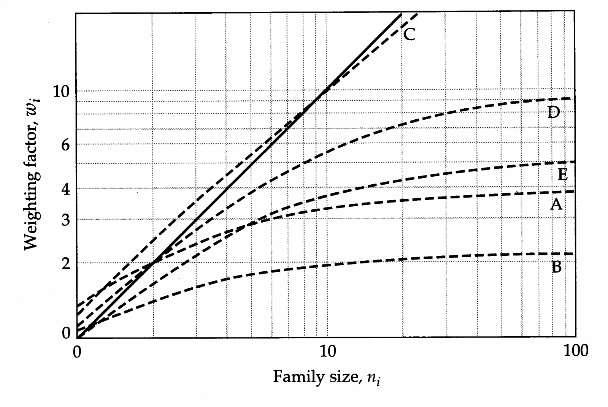
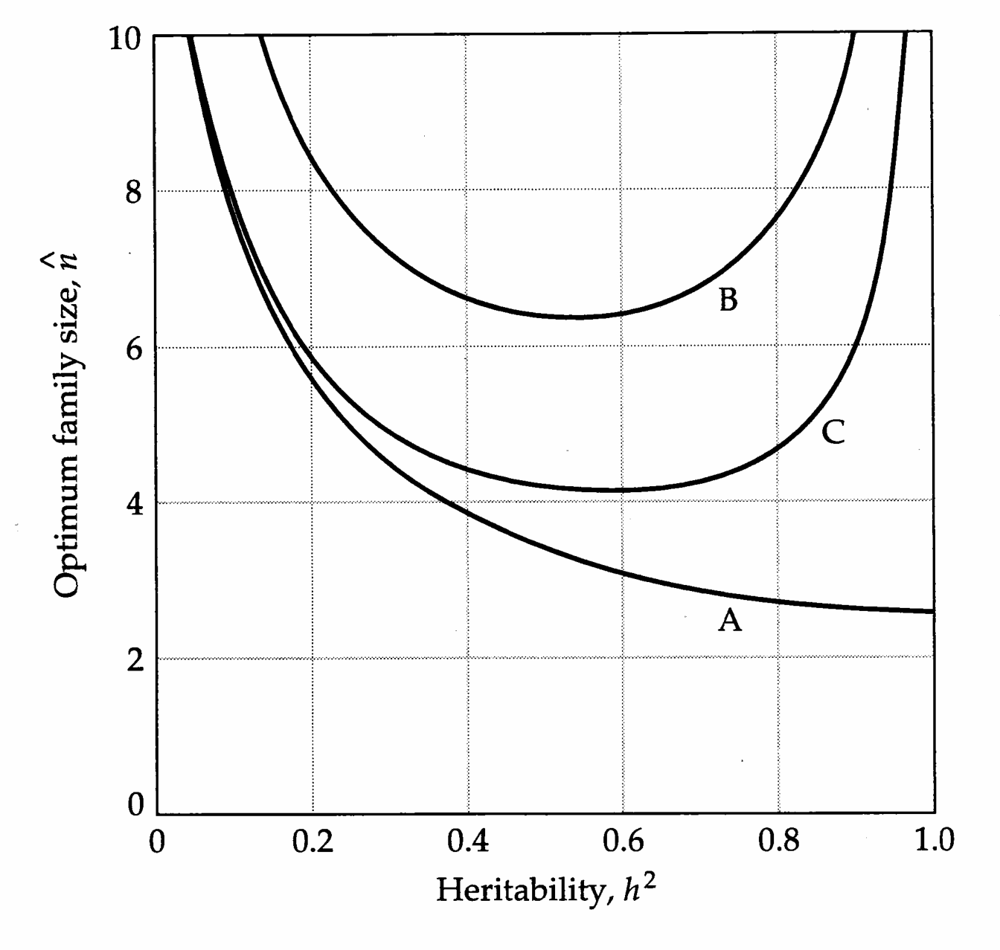
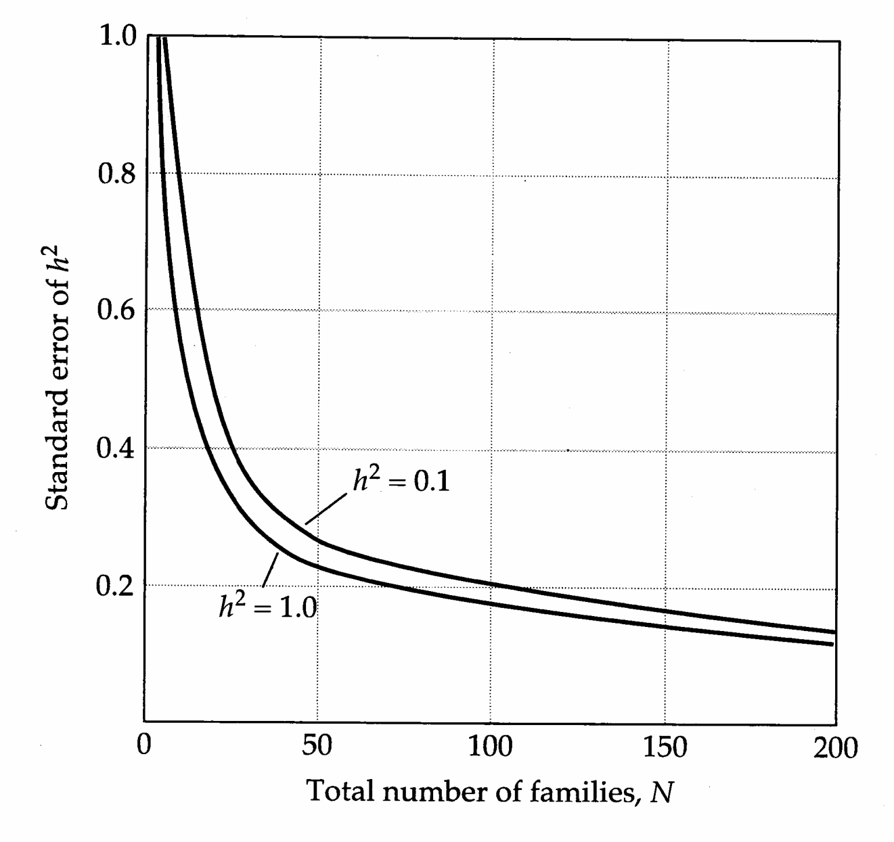
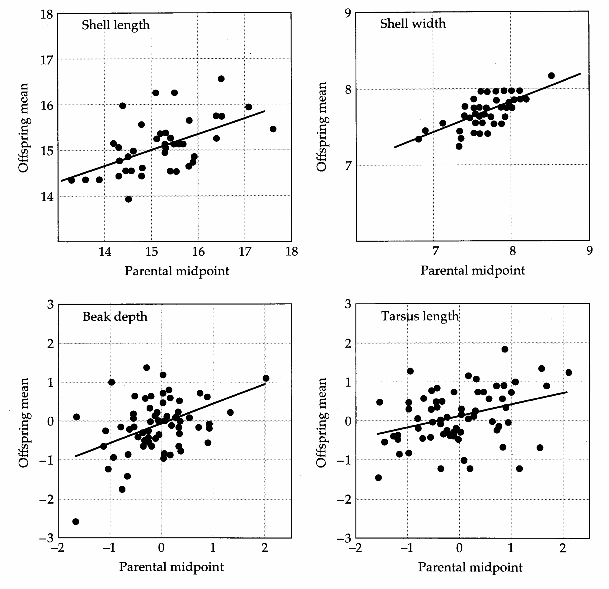

# Chapter 17 · 17

## Genetics_chapter17_001 · 17

---

## Genetics_chapter17_002 · 17 / Parent-Offspring Regression

As we will see in upcoming chapters, the number of techniques for estimating the components of variance for quantitative traits is quite large. In choosing among the alternatives, two issues arise. First, consideration has to be given to the kinds of relatives that should be analyzed. There are often practical limitations to this problem. Certain kinds of relationships are observed more readily in some species than in others, and some types of phenotypic covariances between relatives are more likely to approximate desired quantities than others. Second, prior to performing an actual analysis, attention should be given to the experimental design. The degree of precision that can be achieved in a quantitative-genetic survey is a function of the number of individuals that are measured, and the way in which effort is allocated to numbers of families versus numbers of individuals within families.

One of the most commonly used methods for estimating heritabilities is the regression of offspring phenotypes on those of their parents, and there are many reasons for this. First, for many species, associations of parents and offspring are the most easily identified relationships in the field. Second, the essential computations are based on least-squares regression, the statistical properties of which are well known (Chapter 3). Third, we have seen in Chapter 7 that neither dominance nor linkage influences the covariance between parents and offspring. Fourth, parent-offspring regression is the only simple method for heritability estimation that is unbiased by selection on the parents. Finally, and perhaps most importantly, the desire to obtain a heritability estimate usually stems from a specific interest in the resemblance between parent and offspring phenotypes, so it is natural that this resemblance should be measured directly.

It is often the case, particularly in natural populations, that the identity of only one parent of an individual can be established with certainty. By collecting seeds, for example, one can be virtually certain of maternity in plants. But since the dispersal of pollen by insects or wind is highly unpredictable, it is often impossible to establish paternity without an elaborate analysis of molecular markers. In other cases, a character may be expressed in only one of the sexes, e.g., clutch size. When the only measurable parent is the mother, care must be taken to ensure that the maternal-progeny covariance is not inflated by maternal effects (Chapter 23). For the time being, we will assume that such effects are not a problem. In addition, we will assume that genotype × environment interaction and covariance are of negligible importance; such complications are taken up in Chapter 22.

---

## Genetics_chapter17_003 · ESTIMATION PROCEDURES

---

## Genetics_chapter17_004 · ESTIMATION PROCEDURES / Balanced Data

It is a rather exceptional circumstance when one has the same amount of data from all families, but to simplify discussion, we will start with the assumption that only a single offspring and a single parent are observed in each family. The appropriate linear model for such an analysis is

$$
z_{oi}=\alpha+\beta_{op}z_{pi}+e_{i}
$$

where $ z_{oi} $ and $ z_{pi} $ represent the offspring and parent phenotypes for the ith family, $ \alpha = \mu_o - \beta_{op} \mu_p $ is the intercept, $ \beta_{op} $ is the regression coefficient, and $ e_i $ is the residual deviation from the regression. In statistical terms, from Chapter 3 we know that the least-squares regression coefficient, $ b_{op} = \text{Cov}(z_o, z_p) / \text{Var}(z_p) $, provides an estimate of $ \beta_{op} $. If there are no environmental causes of resemblance between parents and offspring, we then have (from Chapter 7),

$$
E(b_{op})=\frac{\sigma(z_{o},z_{p})}{\sigma^{2}(z_{p})}\simeq\frac{(\sigma_{A}^{2}/2)+(\sigma_{AA}^{2}/4)+(\sigma_{AAA}^{2}/8)+\cdots}{\sigma_{z}^{2}}
\tag{17.1}
$$

Thus, under the stated assumptions, a simple (possibly upwardly biased) estimate of $ h^{2} = \sigma_{A}^{2} / \sigma_{z}^{2} $ is twice the (single) parent-offspring regression, $ 2b_{op} $.

Greater precision is possible when both parents can be measured, as one can then regress offspring phenotypes on the mean phenotypes of their parents (also known as the midparent values). Our model is now slightly altered to become

$$
z_{oi}=\alpha+\beta_{o\overline{p}}\left(\frac{z_{mi}+z_{fi}}{2}\right)+e_{i}
$$

where $ z_{mi} $ and $ z_{fi} $ refer to the phenotypes of mothers and fathers. The least-squares slope of the midparent-offspring regression, $ b_{o\overline{p}} $, is a direct estimate of the heritability. To obtain this result, let us assume that the phenotypic variance is the same in both sexes and in both generations and that the resemblance between relatives is independent of their sex. We then have

$$
\begin{aligned}b_{o\overline{p}}&=\frac{\operatorname{Cov}[z_{o},(z_{m}+z_{f})/2]}{\operatorname{Var}[(z_{m}+z_{f})/2]}\\&=\frac{[\operatorname{Cov}(z_{o},z_{m})+\operatorname{Cov}(z_{o},z_{f})]/2}{[\operatorname{Var}(z)+\operatorname{Var}(z)]/4}\\&=\frac{2\operatorname{Cov}(z_{o},z_{p})}{\operatorname{Var}(z)}=2b_{op}\\ \end{aligned}
\tag{17.2}
$$

In obtaining this result, we have assumed that there is no assortative mating, i.e., $ \text{Cov}(z_m, z_f) = 0 $. Referring to Equation 17.1, we see that $ b_{o\overline{p}} \simeq \sigma_A^2 / \sigma_z^2 $, ignoring terms involving epistasis.

Finally, consider the situation when multiple (n) offspring are measured in each family. The expected phenotypic covariance of a parent i and the average of its $ j = 1, \cdots, n $ offspring may be written $ \sigma[(\sum_{j=1}^{n} z_{oij}/n), z_{p}] $. Under the assumptions of the previous paragraph, all n of the covariance terms contained in this expression have the same expected value, reducing it to $ n\sigma(z_{o}, z_{p})/n = \sigma(z_{o}, z_{p}) $, which is the same as the expectation for single offspring. Thus, provided family sizes are equal, the interpretation of a parent-offspring regression is the same whether individual offspring data or the progeny means are used in the analysis.

The results for the multiple-offspring regression help clarify why heritabilities are usually estimated from regression rather than correlation coefficients. Assuming equal phenotypic variances in the two generations, the correlation between single offspring and single parents, $ r_{op} $, is identical to the regression coefficient $ b_{op} $ (see Equation 3.15b). The single offspring-midparent regression, $ r_{op} $, is equal to $ b_{op} $/√2, a simple transformation. However, with multiple offspring per family, the variance of offspring family means is a function of both the family size and the heritability itself (see next section), rendering the interpretation of the correlation coefficient difficult. Such problems do not arise with the regression coefficient, which does not involve the use of the offspring family variance. The following section provides a broader coverage of the issues that arise when multiple offspring are assayed per family.

---

## Genetics_chapter17_005 · ESTIMATION PROCEDURES / Unequal Family Sizes

When there is significant variation in family size, one is confronted with the problem of how to weight the information from families of different sizes. With a goal of minimizing the sampling error of the heritability estimate, it is logical that families of larger size should be given more weight in a regression since their mean phenotype estimates are more accurate. Should one simply weight each family by the number of offspring measured, as would be the case if one were to regress each individual on its parent's phenotype? The answer is no — the appropriate weights are less than proportional to the actual family sizes. Once one has measured a very large number of offspring from a family, very little improvement in the precision of the family mean will be obtained by making additional measurements.

In one of the first applications of weighted least-squares regression (Chapter 8), Kempthorne and Tandon (1953; see also Bohren et al. 1961) showed that the appropriate weights are proportional to the inverse of the residual sampling variances of family means about the parent-offspring regression. Although more sophisticated maximum-likelihood approaches now exist for the analysis of populations with arbitrary family structures (Chapter 27), these will not be particularly transparent to the reader at this point in the book, so we consider the Kempthorne-

Tandon derivation in some detail. To obtain their result, we require the use of the intraclass correlation, here defined to be the phenotypic correlation between sibs,

$$
t=\frac{Cov(S)}{Var(z)}
\tag{17.3}
$$

where $ \text{Cov}(S) $ denotes the phenotypic covariance of sibs. The intraclass correlation estimates the fraction of the total phenotypic variance attributable to factors causing resemblance between members of the same sib family. It follows that $ (1-t) $ estimates the fraction of the phenotypic variance due to differences among individuals of the same family. Stated in another way, $ (1-t)\text{Var}(z) $ and $ t\cdot\text{Var}(z) $ are estimates of the within- and among-family components of phenotypic variance.

Letting $ \overline{z}_{oi} $ be the mean phenotype of offspring from the ith family, the linear model becomes

$$
\overline{{z}}_{o i}=\alpha+\beta_{o p}z_{p i}+e_{i}
$$

To perform a weighted regression, we need expressions for the variance of the residual errors around the regression (the $ e_{i} $) as a function of family size. The residual variance is the sum of two components: (1) the variance of the “true” family mean deviations from the regression, and (2) the sampling variance of the estimated family means around their expectations. The first of these components is independent of family size.

For a family of size $n$, it follows from above that the second component of the residual variance is simply $(1 - t)\mathrm{Var}(z)/n$. The first component is easily obtained by process of elimination. The variance of the true offspring family means is estimated by $t\mathrm{Var}(z)$, and from this we have to subtract the variance accounted for by the regression. For a single-parent regression, Equation 3.17 gives the regression variance as $r_{op}^{2}\mathrm{Var}(z) = b_{op}^{2}\mathrm{Var}(z)$. (Under the assumption of equal parent and offspring variances, Equation 3.15b implies the regression and correlation coefficients are the same for the single parent-offspring regression.) For a midparent analysis, the variance due to regression is $r_{op}^{2}\mathrm{Var}(z) = b_{op}^{2}\mathrm{Var}(z)/2$. This follows from Equation 3.15b, as

$$
b_{o\overline{p}}^{2}=r_{\stackrel{o\overline{p}}{\cdot}}^{2}\frac{\mathbf{V a r}(z_{o})}{\mathbf{V a r}(z_{\overline{p}})}=2r_{o\overline{p}}^{2}
$$

Thus, the variance of “true” family means from the regression is $ (t - B)\mathrm{Var}(z) $, where $ B = b_{op}^{2} $ or $ b_{o\overline{p}}^{2}/2 $ depending on whether one or both parents are used. Summing up, we obtain the expression for the conditional variance of the ith family mean,

$$
\mathbf{Var}(e_{i})=\left(t-B+\frac{1-t}{n_{i}}\right)\mathbf{Var}(z)
\tag{17.4}
$$

The sampling variance of the parent-offspring regression coefficient is minimized by weighting the contribution of different families by the reciprocal of this

> **Figure 17.1** · page 555 · source: `Genetics_chapter17`
>
> 
>
> Figure 17.1 The least-squares weights for families with $ n_{i} $ offspring in populations with values of t and B equal respectively to: (A) 0.5, 0.25; (B) 0.5, 0.05; (C) 0.2, 0.18; (D) 0.2, 0.1; and (E) 0.2, 0.01. The solid line is the uncorrected weighting, i.e., simple family size, $ n_{i} $. Dashed lines are solutions to Equation 17.5a.

quantity (see Example 11, Chapter 8). Since $ \operatorname{Var}(z) $ is a constant factor, it can be dropped from the analysis. Thus, the weight for the ith family is

$$
w_{i}=\frac{n_{i}}{n_{i}(t-B)+(1-t)}
\tag{17.5a}
$$

and, from Equation 8.36b, the weighted least-squares regression coefficient is

$$
b=\frac{\sum_{i=1}^{N}\dot{w}_{i}(\overline{z}_{oi}-\overline{z}_{o})(z_{pi}-\overline{z}_{p})}{\sum_{i=1}^{N}w_{i}(z_{pi}-\overline{z}_{p})^{2}}.
\tag{17.5b}
$$

where

$$
\overline{{z}}_{p}=\sum_{i=1}^{N}w_{i}z_{pi}/\sum_{i=1}^{N}w_{i}\qquad and\qquad\overline{{z}}_{o}=\sum_{i=1}^{N}w_{i}\overline{{z}}_{oi}/\sum_{i=1}^{N}w_{i}
\tag{17.5c}
$$

are the weighted mean phenotypes for the parent and offspring generations. (For a midparent regression, $ z_{\bar{p}i} $ needs to be substituted for $ z_{pi} $.)

Equation 17.5a shows that as $ n_i $ becomes large, the weight $ w_i $ approaches the limiting value $ (t - B)^{-1} $, i.e., once the family size is very large, very little is gained by measuring additional progeny. This asymptotic value is reached more rapidly when $ t $ is large, because in that case, only a few offspring are sufficient to give an accurate estimate of the family mean. The diminishing returns of large family size can be seen especially clearly by considering case (B) in Figure 17.1 in the context of a single-parent regression. Here, since $ B = b_{op}^{2} = 0.05 $, the heritability is moderate ( $ h^{2} \simeq 2\sqrt{B} = 0.45 $): Assuming that the families consist of full-sibs, t = 0.5 implies that there is considerable resemblance between sibs due to factors other than additive genetic variance (since the correlation would be expected to be approximately $ h^{2}/2 $ on the basis of additive genetic covariance alone). Under these circumstances, families with 10 measured progeny should only be given twice as much weight as families with single offspring.

A practical issue that arises in applying the weighted regression technique is that the weighting factor, $ w_{i} $, is a function of both t and B. Although t can be calculated directly as the correlation between sib phenotypes, B is a function of the regression coefficient, precisely the quantity that we want to estimate. Resolution of this difficulty is relatively straightforward. A preliminary estimate of B can be obtained from the slope of an unweighted regression analysis. This B is then substituted into Equation 17.5a to generate some preliminary weights. The new regression coefficient generated by Equation 17.5b is then compared with the initial unweighted estimate, and, if the values are the same, the computation is over. If they are different, the second estimate of B is used to generate new weights and a third regression estimate. The entire procedure is repeated until satisfactory convergence has been attained, which usually requires only a few iterations.

---

## Genetics_chapter17_006 · ESTIMATION PROCEDURES / Standardization of Data from the Different Sexes

Often, the mean (and / or the variance) of traits differs between males and females. This can result in different estimates of $ h^{2} $ depending upon which of the sexes is utilized in a parent-offspring regression, since the denominator of the regression coefficient is the phenotypic variance. The problem is sometimes resolved as a scaling issue by using standardized variables, precisely the approach used in Example 5 from Chapter 7 in the analysis of human stature data. For each individual, the observed value minus the mean for that sex is divided by the sex-specific standard deviation. Such a transformation equalizes the phenotypic means and variances across the sexes, to 0 and 1, respectively.

Sex-specific corrections do not always equilibrate the parent-offspring regressions involving the four son-daughter and mother-father combinations. Real sex-specific differences in genetic components of variance may occur, for example, due to variation associated with sex chromosomes or to sex-limited expression of specific genes (Chapter 24).

---

## Genetics_chapter17_007 · PRECISION OF ESTIMATES

As in all attempts to estimate parameters, it is always desirable to ascertain the degree of precision of heritability estimates. Since the statistical properties of least-squares regression are well known, this is relatively easy to do with parent-offspring analysis. Provided the data have been measured or transformed so that the joint distribution of parent and offspring phenotypes is bivariate normal, the sampling variance of the single parent-single offspring regression is, from Equation A1.20a, approximately

$$
\mathbf{V a r}(b_{o p})\simeq\frac{(1-r_{o p}^{2})\mathbf{V a r}(z_{o})}{N\mathbf{V a r}(z_{p})}
\tag{17.6}
$$

where N is the number of parent-offspring pairs. This expression reduces to $ (1 - r^{2})/N $ when the phenotypic variances in the two generations are equal.

Equation 17.6 also applies to regressions involving midparents if $ \operatorname{Var}(\overline{z}_p) = \operatorname{Var}(z_p)/2 $ is substituted for $ \operatorname{Var}(z_p) $ and $ r_{o\overline{p}} $ for $ r_{op} $, and it applies to regressions involving multiple progeny when $ \operatorname{Var}(z_o) \cdot [t + (1 - t)/n] $ is substituted for $ \operatorname{Var}(z_o) $. For unequal family sizes, Kempthorne and Tandon (1953) show that, when the convergent regression coefficient has been attained,

$$
\mathrm{Var}(b)\simeq\frac{\mathrm{Var}(z_{o})}{\sum\limits_{i=1}^{N}w_{i}(z_{pi}-\overline{z}_{p})^{2}}
\tag{17.7}
$$

Provided the joint distribution of offspring and parent phenotypes is bivariate normal, the sampling distribution of a regression coefficient is also normal. The standard error of $b$ can then be used to construct a confidence interval for the heritability estimate. Provided the number of families $N > 15$ (which is generally necessary for any reasonable degree of precision), the 95% confidence interval for a regression coefficient is approximately $b \pm 2SE(b)$, where $SE(b) = \sqrt{\mathrm{Var}(b)}$. For a midparent-offspring regression, the confidence interval for the slope is also the confidence interval for $h^{2}$. For a regression involving single parents, the confidence interval for $h^{2}$ is twice that of the regression coefficient.

---

## Genetics_chapter17_008 · OPTIMUM EXPERIMENTAL DESIGN

Prior to embarking on a long-term, labor-intensive study, it is important to consider how the sampling variance of the parent-offspring regression coefficient might be minimized. Given the constraint of being able to measure a certain number of individuals, the primary question is, How should one's resources be allocated to measuring numbers of families versus numbers of offspring/family? Klein et al. (1973) and Klein (1974) present a useful series of tables outlining the expected standard errors of parent-offspring regressions under various experimental designs.

Latter and Robertson (1960) developed a general procedure for determining the optimal design, showing how the solution depends upon the nature of the constraints on the investigator. We first consider the situation when the investigator is simply limited by the total number of offspring that can be measured (T). If progeny from N families are measured, then the number of progeny measured per family (n) must satisfy T = Nn. A general expression for the sampling variance of a regression coefficient has already been given in Equation 17.6. The numerator of that expression is the residual variance around the regression, which was defined in another manner in Equation 17.4. Making the appropriate substitutions in Equation 17.6,

$$
\mathbf{Var}(b_{op})\simeq\frac{n(t-b_{op}^{2})+(1-t)}{Nn}
\tag{17.8a}
$$

for a single-parent regression, and

$$
\mathbf{V a r}(b_{o\overline{{p}}})\simeq\frac{2[n(t-b_{o\overline{{p}}}^{2}/2)+(1-t)]}{N n}
\tag{17.8b}
$$

for a midparent regression. In both cases, since $ N_n $ is taken to be the constant $ T $, it is clear that the sampling variance of the regression coefficient is minimized by measuring just a single offspring $ (n = 1) $ from $ N = T $ families.

Now suppose there is a baseline cost to evaluating a family, irrespective of family size. In a natural setting, for example, a certain amount of effort may be necessary to locate a known parent and offspring. In a laboratory setting, a certain amount of time may be necessary for the basic setup and maintenance of a family. Let the limiting resource be the T total time units available for the study, and let $ \tau $ be the baseline time required for evaluating a family. If one scales the unit of time to be that required for the processing of a single individual in excess of the baseline investment for the family, then $ \tau + n $ is the time that it takes to process a family of n offspring, and the number of families that can be processed is $ N = T / (\tau + n) $. The optimal family size $ \hat{n} $ can be computed by substituting $ N = T / (\tau + n) $ into Equations 17.8a,b, setting the derivative of $ \operatorname{Var}(b) $ with respect to n equal to zero, and solving for $ \hat{n} $. In both cases,

$$
\widehat{n}=\left[\frac{\tau(1-t)}{t-B}\right]^{1/2}
\tag{17.9}
$$

Recall that both $t$ and $B$ are functions of $h^{2}$. Thus, with this slightly different and perhaps more realistic constraint, the optimal experimental design depends upon the value of the very quantity that we wish to solve for. This obviously reduces the general utility of Equation 17.9. However, an educated guess can sometimes be made, based upon past experience or information in the literature, as to the approximate value of $h^{2}$. On average, an estimate of $\hat{n}$ based upon this information ought to be better than a blind guess.

As an example of the use of Equation 17.9, consider the special case in which the character of interest has a purely additive genetic basis and there are no

> **Figure 17.2** · page 559 · source: `Genetics_chapter17`
>
> 
>
> Figure 17.2 Family sizes that minimize the sampling variance of $ h^{2} $ for the case in which the cost of securing a family is three times that of obtaining measures from individual progeny. (A) Single parents, full-sib families; (B) single parents, half-sib families; (C) midparents, full-sib families.

environmental effects causing resemblance between sibs. Then, for full- and half-sib families respectively, $ t $ is $ h^2/2 $ and $ h^2/4 $. For single-parent and midparent regressions, $ B $ is $ h^4/4 $ and $ h^4/2 $. Substituting the appropriate values into Equation 17.9, we obtain optimal designs for the three kinds of parent-offspring regressions:

$$
\begin{array}{r l}{S i n g l e\; p a r e n t s,f u l l-s i b\; f a m i l i e s:}&{{}\quad\widehat{n}=\left[\frac{2\tau}{h^{2}}\right]^{1/2}}\end{array}
\tag{17.10a}
$$

$$
\begin{array}{r l}{S i n g l e\; p a r e n t s,h a l f-s i b\; f a m i l i e s:}&{{}\quad\widehat{n}=\left[\frac{\tau(4-h^{2})}{h^{2}(1-h^{2})}\right]^{1/2}}\end{array}
\tag{17.10b}
$$

$$
\begin{array}{r l}{\mathrm{M i d p a r e n t s,f u l l-s i b~f a m i l i e s:}}&{{}\widehat{n}=\left[\frac{\tau(2-h^{2})}{h^{2}(1-h^{2})}\right]^{1/2}}\end{array}
\tag{17.10c}
$$

The relationship of $ \hat{n} $ to $ h^{2} $ is given in Figure 17.2 for these three kinds of experimental designs for the special case in which $ \tau = 3 $ (i.e., the cost of securing a new family is three times that required for measuring an individual in an established family). Note that the optimal family size is a complex function of the type of family evaluated as well as of the heritability, but that $ \hat{n} $ is never less than 2 in this particular example.

> **Figure 17.3** · page 560 · source: `Genetics_chapter17`
>
> 
>
> Figure 17.3 Expected standard errors of heritability estimates obtained from regressions of single offspring on single parents. The functions are defined by Equation 17.11a.

By use of the above equations, some insight can be gained into the magnitude of the standard errors of heritability that would arise under an optimal design. Consider the situation where the optimal design has been determined to be n = 1, N = T. Substituting n = 1 into Equations 17.8a,b, and again assuming the covariance between sibs to be solely due to additive genetic variance, we find:

Single-parent regression:

$$
\mathbf{SE}(h^{2})=\left(\frac{4-h^{4}}{N}\right)^{1/2}
\tag{17.11a}
$$

Midparent regression:

$$
\mathrm{SE}(h^{2})=\left(\frac{2-h^{4}}{N}\right)^{1/2}
\tag{17.11b}
$$

Three important results can be noted from these expressions. First, since the range of possible values for $ h^{2} $ is 0 to 1, the standard error of $ h^{2} $ is nearly independent of $ h^{2} $. For a single-parent regression, it is approximately equal to $ 2/\sqrt{N} $. This is illustrated in Figure 17.3 where the standard error is plotted as a function of N for extreme values of $ h^{2} = 0.1 $ and 1.0. Second, compared to a single-parent regression, a midparent regression yields a 30 to 40% improvement in precision. Thus, it is generally well worth gathering data on both parents if possible. Third, unless the heritability is quite high, the detection of statistically significant heritabilities by parent-offspring regression can require large sample sizes. If our estimate of $ h^{2} $ were 1.0, we would require a standard error of about 0.5 to say with 95% confidence that the true heritability is significantly greater than zero. In the case of a single-parent regression, this would require the measurement of only about 12 parent-offspring pairs. As the heritability declines, however, the sample sizes required for the demonstration of significance rapidly increases. If $ h^{2} = 0.1, \sim 1600 $ parent-offspring pairs are required to obtain a standard error of 0.05.

While the sample size required for a given standard error is straightforward, a more rigorous approach is to compute the actual power of the experimental design. The power is the probability that a test statistic will be significant, given the sample size and some assumed true values for the unknown parameters. Power calculations are examined in detail in Appendix 5. Suppose the true $ h^{2} = 1 $, and we test the hypothesis of a significant regression using a test with significance level $ \alpha = 0.05 $. Taking 12 parent-offspring pairs (as suggested above), the probability of a significant regression coefficient is only 0.53. If the sample size is doubled to 24, the probability of a significant regression increases to 0.82, while 38 parent-offspring pairs are required in order to have a 90% probability. Likewise, for $ h^{2} = 0.1 $, taking 1600 parent-offspring pairs (as suggested by the standard error approach) gives only a 64% chance of the resulting regression being significant. A sample size of 3500 pairs is required to have a 90% chance that the regression is significant.

Hill (1990) has suggested that a further reduction in the standard error of a parent-offspring regression is obtainable if most of the effort is applied to families of parents with phenotypes far from the population mean. The increase in efficiency is a simple consequence of the fact that parents with phenotypes near the mean provide little information on the slope of the regression. A special application of this idea is covered in the following section.

---

## Genetics_chapter17_009 · OPTIMUM EXPERIMENTAL DESIGN / Assortative Mating

Reeve (1961) and Hill (1970) have suggested the use of assortative mating to improve the accuracy of heritability estimates derived from midparent-offspring regressions. The rationale for this approach is that it increases the variance of midparent values from $ \sigma^2(z_p)/2 $ to $ (1+\rho_z)\sigma^2(z_p)/2 $, where $ \rho_z $ is the phenotypic correlation between mates. Since the variance of a regression coefficient is inversely proportional to the variance of the explanatory variable (Equation 17.6), assortative mating should reduce the sampling variance of $ b_{o\bar{p}} $ by a factor of $ (1+\rho_z)^{-1} $, e.g., by 50% with full assortative mating.

As noted in Chapter 7 (Table 7.4), assortative mating increases the additive-genetic covariance between parents and offspring from $ \sigma_{A}^{2}/2 $ to $ (1 + \rho_{z})\sigma_{A}^{2}/2 $. Thus, since both the parent-offspring covariance and the midparent variance are increased by the same factor, assortative mating does not alter the expected value of the midparent-offspring regression. This result is strictly true only in the absence of nonadditive gene action.

With nonadditive gene action, some caution is needed with this approach, as assortative mating can bias the regression coefficient. Although it was suggested in Chapter 7 that dominance has a negligible effect on the covariance of assortatively mated parents and their progeny, this condition requires that the variance of the character is influenced by a large number of loci, each with minor effects. If that is not the case, assortative mating can cause considerable covariance between the nonadditive effects in parents and offspring, as well as between the additive effects in parents and nonadditive effects in progeny (and vice versa) (Wright 1952). Gimelfarb (1985) has shown that under certain circumstances, assortative mating can cause a more than twofold inflation in the slope of a parent-offspring regression, particularly if $ h^{2} $ is small. Thus, unless one has prior knowledge that nonadditive sources of variance and major alleles are unimportant, assortative mating should probably be avoided in heritability estimation.

---

## Genetics_chapter17_010 · ESTIMATION OF HERITABILITY IN NATURAL POPULATIONS

Because it determines the potential response to natural selection, the genetic variation that exists for quantitative characters in natural populations is of fundamental interest to evolutionary biologists. Unfortunately, for many species, it is nearly impossible to carry out a quantitative-genetic analysis in the wild. Many individuals may die before expressing the character of interest, and in mobile animals, a large fraction of the population may be capable of avoiding capture. It is also extremely difficult to identify parentage with certainty in the field, although the situation is improving with the development of new molecular-marker methods.

Intensive efforts with banded bird populations have led to numerous parent-offspring analyses of body size, morphology, and clutch size. Although no individual study is immune to criticism (Hailman 1986, Boag and van Noordwijk 1987), the results are certainly compatible with the idea that significant amounts of additive genetic variation exist for such traits (Table 17.1). For body size (as indexed by tarsus length) and bill morphology, heritabilities are often on the order of 0.5 or greater. The regression coefficients are often independent of the sexes and retain a high level even when progeny are cross-fostered by unrelated mothers, suggesting that postnatal maternal effects are of relatively minor importance (Chapter 23).

For species that cannot be tracked in the field, the investigator has no choice but to remove a segment of the population to the laboratory. Such an approach is of concern since the heritabilities of traits may be as much a function of the environment as of population-genetic structure. For example, the magnitude of environmental variance is likely to differ significantly between artificial and natural settings. Ruiz et al. (1991) obtained phenotypic variances for adult body size

**[Table]**

*[See Table 17.1 at the end of this section.]*

in natural Drosophila populations that were seven to nine times larger than those observed in lab-reared derivative populations. In addition, if genotype × environment interaction is important, the relative rankings and dispersion of genotypic values may be altered by lab rearing. Depending upon the magnitudes and directions of all of these effects, heritability estimates extracted from manipulated populations may be either upwardly or downwardly biased with respect to the wild. Mitchell-Olds and Rutledge (1986) give a useful overview of the salient issues in plant studies. Weigensberg and Roff (1996) examined 22 cases where both laboratory and natural estimates of heritabilities are available. The correlation between measures was significant, with r = 0.6, and while laboratory heritabilities tended to be larger than field estimates, the difference was not significant.

With some species, a possible compromise is to remove adults from the field, mate them, and assay their progeny in the artificial setting (Highton 1960, Underhill 1969, Coyne and Beechum 1987, Prout and Barker 1989). Riska et al. (1989) have shown that a lower bound, $ h_{min}^{2} $, to the heritability in the field can be estimated by regressing the phenotypes of lab-reared progeny on their field-reared parents. Let the regression coefficient involving wild midparents and lab-reared offspring be $ b'_{o\bar{p}} $, the phenotypic variance of the natural population be $ \mathrm{Var}_{n}(z) $, and the additive genetic variance in the laboratory environment (obtained either from the covariance of lab-reared sibs or of lab-reared parents and offspring) be $ \mathrm{Var}_{l}(A) $. Then,

$$
h_{min}^{2}=(b_{op}^{\prime})^{2}\frac{Var_{n}(z)}{Var_{l}(A)}=\left[\frac{Cov_{l,n}(A)}{Var_{n}(z)}\right]^{2}\frac{Var_{n}(z)}{Var_{l}(A)}
\tag{17.12}
$$

where $ \text{Cov}_{l,n}(A) $ is the additive genetic covariance between the trait as expressed in the wild and in the lab. (For an analysis involving single parents, $ (2b'_{op})^{2} $ needs to be substituted for $ (b'_{o\bar{p}})^{2} $ in Equation 17.12.) To see that this provides a lower bound, define

$$
\gamma=\frac{\mathbf{Cov}_{l,n}(A)}{\sqrt{\mathbf{Var}_{n}(A)\mathbf{Var}_{l}(A)}}
$$

to be the additive genetic correlation between environments (Chapter 21). The expected value of $ h_{min}^{2} $ is then $ \gamma^{2}h_{n}^{2} $, which is necessarily $ \leq h_{n}^{2} $, the heritability in the wild. $ h_{min}^{2} $ is an unbiased estimate of $ h_{n}^{2} $ only if the genetic correlation across environments is equal to one.

> **Table 17.1** · `17.1` · page 563 · source: `Genetics_chapter17_010`
> Table 17.1 Heritability estimates ( $ \pm $SE) for natural populations of birds obtained by parent-offspring regression.
>
> Species | Mother-Daughter | Father-Son | Reference
> --- | --- | --- | ---
> Clutch size |  |  | 
> Anser caerulescens | 0.61 $ \pm $ 0.19 | — | Findlay and Cooke 1983
> Ficedula albicollis | 0.32 $ \pm $ 0.14 | — | Gustafsson 1986
> Geospiza fortis | $ -0.17 \pm 0.12 $ | — | Gibbs 1988
> Parus major | 0.48 $ \pm $ 0.10 | — | Perrins and Jones 1974
>  | 0.37 $ \pm $ 0.12 | — | van Noordwijk et al. 1981
> Sturnus vulgaris | 0.34 $ \pm $ 0.08 | — | Flux and Flux 1982
> Tarsus length |  |  | 
> Ficedula albicollis | 0.50 $ \pm $ 0.22 | 0.43 $ \pm $ 0.14 | Gustafsson 1986
>  | 0.65 $ \pm $ 0.07 | 0.53 $ \pm $ 0.04 | Merilä and Gustafsson 1993
> Ficedula hypoleuca $ ^{*} $ | 0.50 $ \pm $ 0.22 | — | Alatalo and Lundberg 1986
> Geospiza fortis | 0.38 $ \pm $ 0.30 | 0.46 $ \pm $ 0.31 | Boag and Grant 1978
> Geospiza scandens | 0.94 $ \pm $ 0.39 | 1.26 $ \pm $ 0.36 | Boag 1983
> Melospiza melodia $ ^{*} $ | 1.12 $ \pm $ 0.37 | 0.90 $ \pm $ 0.33 | Smith and Dhondt 1980
>  | 0.34 $ \pm $ 0.15 | 0.37 $ \pm $ 0.18 | Smith and Zach 1979
> Parus caerulescens $ ^{*} $ | 0.78 $ \pm $ 0.26 | 0.62 $ \pm $ 0.28 | Dhondt 1982
> Bill length |  |  | 
> Ficedula albicollis | 0.43 $ \pm $ 0.12 | 0.37 $ \pm $ 0.12 | Gustafsson 1986
>  | 0.43 $ \pm $ 0.07 | 0.44 $ \pm $ 0.06 | Merilä and Gustafsson 1993
> Geospiza fortis | 1.09 $ \pm $ 0.42 | 1.06 $ \pm $ 0.27 | Boag and Grant 1978
> Geospiza scandens | $ -0.18 \pm 0.70 $ | 0.44 $ \pm $ 0.41 | Boag 1983
> Melospiza melodia $ ^{*} $ | 0.22 $ \pm $ 0.34 | 0.59 $ \pm $ 0.24 | Smith and Dhondt 1980
>
> Note: * indicates that the progeny were cross-fostered to minimize postnatal maternal effects. Anser caerulescens is the lesser snow goose, Geospiza sps. are Darwin's finches, Ficedula sps. are flycatchers, Melospiza melodia is the song sparrow, Parus sps. are tits, and Sturnus vulgaris is the starling.

---

## Genetics_chapter17_011 · LINEARITY OF THE PARENT-OFFSPRING REGRESSION

We have been operating under the assumption that the true relationship between parent and offspring phenotypes is linear, and indeed, when such data are plotted, there is normally little evidence of nonlinearity (Figure 17.4). There are good statistical reasons for this, including the central limit theorem (Chapter 2) — when multiple independent factors jointly influence the expression of a character, the pairwise distribution of phenotypes in relatives will approach bivariate normality in a randomly mating population, insuring a linear regression (Chapter 8). Such conditions will be approximated as the number of freely recombining loci increases. For purely additive loci, the expected regression is always linear, and dominance is unlikely to cause significant nonlinearity unless the character is strongly influenced by a few rare recessive alleles, all with effects in the same direction (Bulmer 1980, Gimelfarb 1986). Bulmer (1976, 1980) has shown that linkage influences the residual variance but not the linearity of the parent-offspring regression, provided that the loci are in gametic phase equilibrium.

> **Figure 17.4** · page 565 · source: `Genetics_chapter17`
>
> 
>
> Figure 17.4 Examples of midparent-offspring regressions. Top panels: Land snail Partula taeniata (Murray and Clarke 1968). Bottom panels: Song sparrow Melospiza melodia (Smith and Zach 1979).

A few observations of nonlinear parent-offspring regressions have been reported (Nishida 1972, Meyer and Enfield 1975, Gimelfarb and Willis 1994), and some theoretical explanations can be offered to explain them:

1. If extended out to the most extreme genotypic values, where individuals are homozygous for all “positive” or all “negative” alleles, the regression must ultimately become nonlinear. Any further increase or decrease in parental phenotype could only be due to environmental effects and would not be reflected in the offspring phenotype. In theory, such limits can be approached under strong directional selection, but they are expected to be uncommon in natural populations due to the rarity of extreme multilocus homozygotes.

2. Nishida and Abe (1974) and Robertson (1977a) have pointed out that linearity of a parent-offspring regression requires that the distributions of genetic and environmental effects be of the same form. That is, even if the underlying distribution of genotypic values is normal, the regression will not be strictly linear unless the environmental deviations are also normally distributed. Nevertheless, if numerous environmental factors influence the expression of a trait, the central limit theorem will again ensure that this source of nonlinearity will not be great.

3. Robertson (1977a) has shown that nonlinearity may arise if the variance of environmental deviations is a function of the genotypic value. Suppose, for example, that highly “positive” genotypic values were associated with exceptionally high variance for environmental effects. Such a condition would tend to reduce the correspondence (and hence the regression) between parental phenotype and genotype on the high end of the scale.

---
