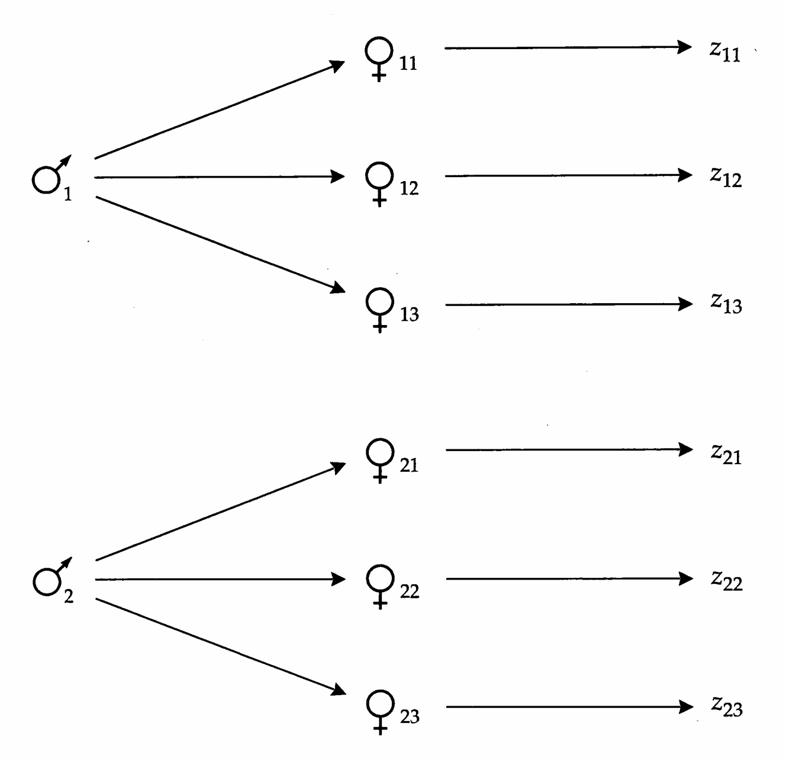
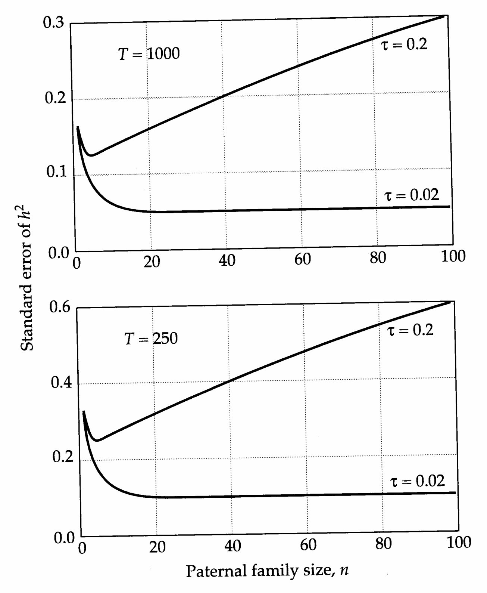
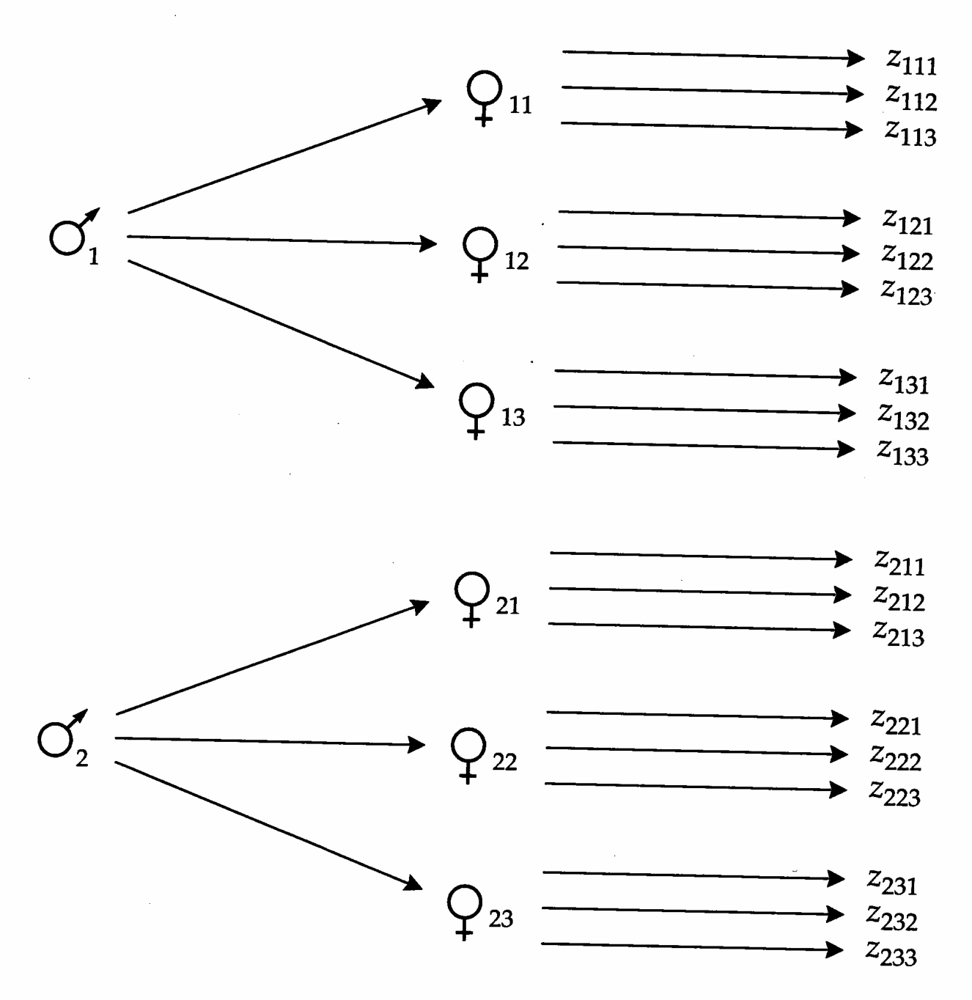

# Chapter 18 Textbook Mapping

## Genetics_chapter18_001 · Introduction

not be reflected in the offspring phenotype. In theory, such limits can be approached under strong directional selection, but they are expected to be uncommon in natural populations due to the rarity of extreme multilocus homozygotes.

**[命题 Proposition]**

2. Nishida and Abe (1974) and Robertson (1977a) have pointed out that linearity of a parent-offspring regression requires that the distributions of genetic and environmental effects be of the same form. That is, even if the underlying distribution of genotypic values is normal, the regression will not be strictly linear unless the environmental deviations are also normally distributed. Nevertheless, if numerous environmental factors influence the expression of a trait, the central limit theorem will again ensure that this source of nonlinearity will not be great.

3. Robertson (1977a) has shown that nonlinearity may arise if the variance of environmental deviations is a function of the genotypic value. Suppose, for example, that highly “positive” genotypic values were associated with exceptionally high variance for environmental effects. Such a condition would tend to reduce the correspondence (and hence the regression) between parental phenotype and genotype on the high end of the scale.

---

## Genetics_chapter18_002 · Introduction / Sib Analysis

Situations in which one is unable to acquire information from both parent and offspring generations are common. For example, when the character of interest is age-specific, it can be impractical to study phenotypic correlations with ancestors if the generation time exceeds a few years. This is a common problem in forest genetics. For species with nonoverlapping generations, it is impossible to find adults and their offspring in the field at the same time. Moreover, many animal species lay their eggs externally and then abandon them, making it difficult to ascertain parentage. In all of these cases, the analysis of contemporary (or collateral) relatives, sibs in particular, provides an attractive alternative to parent-offspring regression in estimating quantitative-genetic parameters.

There are essentially three types of sib analyses: those employing half-sib families, those employing full-sib families, and those combining both. Each of these family structures permit one to partition the total phenotypic variance into within- and among-family components, both of which can be interpreted in terms of covariances between relatives. The branch of statistics called analysis of variance (ANOVA) is designed to deal with these kinds of data.

In addition to outlining the practical aspects of sib analysis and its underlying assumptions, this chapter will serve the function of introducing the fundamental principles underlying analysis of variance. This discussion will help set the stage for understanding more advanced applications of ANOVA that appear in the next several chapters. We start with the simple half-sib model, initially assuming a balanced design, and show how observed within- and among-family components of variance can be related to the underlying causal components of variance discussed in Chapter 7. Complications that arise with unbalanced data sets are then described. The second half of the chapter considers the nested full-sib, half-sib design. A major advantage of this method over the half-sib design is its ability to provide insight into the potential significance of dominance and/or shared environmental effects.

**[定义 Definition]**

In describing both methods, we follow a similar organization, initially covering issues involving model definition and parameter interpretation, then considering methods of parameter estimation and hypothesis testing, and finally discussing optimal designs for minimizing the sampling error in statistical analysis. We assume throughout that parents have been sampled randomly from the population and randomly mated, so that the simple causal interpretations of co variances between sibs given in Chapter 7 can be used. For highly unbalanced designs (unequal family sizes) and situations involving nonrandom mating and selection, maximum-likelihood procedures have been developed as an alternative to ANOVA in parameter estimation. We defer discussion of these more advanced methods to Chapter 27. Since both methods rely on the same model and interpretation of the variance components and both yield the same estimates with balanced designs, the basic discussion in this chapter should still be useful to even the most ardent defenders of ML.

---

## Genetics_chapter18_003 · Introduction / HALF-SIB ANALYSIS

The utility of half-sib analysis stems from the close relationship between the add- itive genetic variance and the covariance between half sibs (Chapter 7). Under random mating and free recombination, four times the genetic covariance be- tween half sibs is $ \sigma_{A}^{2}+(\sigma_{AA}^{2}/4)+(\sigma_{AAA}^{2}/16)+\cdots $, which is approximately equal to twice the genetic covariance between parents and offspring, $ \sigma_{A}^{2}+(\sigma_{AA}^{2}/2)+ $

$ (\sigma_{AAA}^{2}/4)+\cdots $, provided that the components of epistatic genetic variance are small relative to $ \sigma_{A}^{2} $. Thus, if epistasis is of minor importance and if common en- vironmental effects do not contribute to the phenotypic resemblance of half sibs, $ 4\sigma $(HS) provides an estimate of $ \sigma_{A}^{2} $. (Here $ \sigma $(HS) denotes the expected covariance between a pair of half sibs. Similar notation is used below for other types of sibs.)

The potential for common environmental effects is the main drawback of any sib analysis, and special precautions should always be taken to minimize the problem. If the variance due to common environmental effects is of the order of $ \sigma_{A}^{2} $, then $ 4\sigma $(HS) can greatly exceed $ \sigma_{A}^{2} $. The most reliable way to minimize this problem is to exclusively employ paternal half-sib families in order to eliminate common maternal effects. A typical paternal half-sib design involves the random mating of each of $ N $ males to $ n $ different females and evaluation of a single offspring from each female (Figure 18.1). Under this design, all of the progeny of a given male are half sibs, unrelated to progeny of other males.

There are two logical ways to analyze paternal half-sib data. One could simply perform a regression of half-sib on half-sib using all possible combinations within a family as entries (assuming a balanced design). Problems arise with this approach, since pairs of points within families are not independent. Karlin et al. (1981) suggest several regression methods involving different weightings for family size, but the statistical justification for these has not been established.

The traditional approach to analyzing half-sib data is the one-way analysis of variance, based on the linear model $$ z_{ij}=\mu+s_{i}+e_{ij} $$ where $ z_{ij} $ is the phenotype of the jth offspring of the ith father, $ s_{i} $ is the effect of the

> **Figure 18.1** · page 4 · source: `Genetics_chapter18`
>
> 
>
> Figure 18.1 A paternal half-sib mating design. Each male is mated to several unique (unrelated) females, and a single offspring from each female is assayed.

ith father (the sire effect), and $ e_{ij} $ is the residual error resulting from segregation, dominance, genetic variance among mothers, and environmental variance. Stated another way, $ e_{ij} $ is the deviation of the phenotype of the $ ij $th individual from the expected value for the $ ith $ family. As deviations from the linear model, the $ e_{ij} $ have expectations equal to zero. We further assume that the $ e_{ij} $ are uncorrelated with each other and have common variance $ \sigma_{e}^{2} $, the within-family variance. The $ N $ sires are assumed to be a random sample of the entire population so that $ E(s_{i}) = 0 $. The variance among sire effects (the among-family variance) is denoted by $ \sigma_{s}^{2} $.

**[命题 Proposition]**

A basic assumption of linear models underlying ANOVA is that the random factors are uncorrelated with each other. As first recognized by Fisher in his classical 1918 paper, this leads to a key feature — the analysis of variance partitions the total phenotypic variance into the sum of the variances from each of the contributing factors. For example, for the half-sib model, the critical assumption is that the residual deviations are uncorrelated with the sire effects, i.e., $ \sigma(s_i, e_{ij}) = E(s_i e_{ij}) = 0 $. Thus, the total phenotypic variance equals the variance due to sires plus the residual variance, $$ \sigma_{z}^{2}=\sigma_{s}^{2}+\sigma_{e}^{2} $$

A second relationship that proves to be very useful is that the phenotypic covariance between members of the same group equals the variance among groups. For the model given in Equation 18.1, this can be shown quite simply. Members of the same group (paternal half sibs) share sire effects, but have independent residual deviations, so $$ \begin{aligned}\sigma(PHS)&=\sigma(z_{ij},z_{ik})\\&=\sigma[(\mu+s_{i}+e_{ij}),(\mu+s_{i}+e_{ik})]\\&=\sigma(s_{i},s_{i})+\sigma(s_{i},e_{ik})+\sigma(e_{ij},s_{i})+\sigma(e_{ij},e_{ik})\\&=\sigma_{s}^{2}\\ \end{aligned} $$

Thus, the covariance between paternal half sibs equals the variance among sire effects. This is a particularly useful identity since, as we will see below, ANOVA provides a simple means of estimating $ \sigma_s^2 $. Hence, for the ideal case in which a character has no epistatic variance, the additive genetic variance can be estimated as four times the among-family variance, i.e., $ 4\sigma_s^2 = \sigma_s^2 $.

The pure half-sib design employs the simplest possible linear model. However, the general logic just outlined applies to the estimation of variance components in all linear models, including those employed in subsequent chapters. Thus, the steps we have just taken are worth summarizing. First, the linear model is written down. Second, with the assumptions of the model made explicit, an expression for the total phenotypic variance is written in terms of components. Third, the components of variance associated with the model are expressed as covariances between specific classes of relatives. Fourth, using the mechanistic interpretations of phenotypic covariances between relatives outlined in Chapter 7, the observable variance components are used to partition the phenotypic variance into its causal sources. We now demonstrate the practical utility of this approach by showing how ANOVA generates estimates of the within- and among-family components of variance from phenotypic data.

---

## Genetics_chapter18_004 · Introduction / One-way Analysis of Variance

ANOVA uses sums of squares, the derivation of which we outline below. Throughout, we use SS to denote an observed sum of squares, and $ E(SS) $ to denote its expected value. As we will see shortly, scaled sums of squares, known as mean squares, are used to estimate variance components. We use the parallel notation, MS and $ E(MS) $, to denote observed and expected mean squares.

**[定义 Definition]**

Consider the balanced design in which $n$ half sibs are assayed from each of $N$ males, so that there are a total $T = Nn$ individuals in the analysis. The quantity $$ \mathsf{SS}_{T}=\sum_{i=1}^{N}\sum_{j=1}^{n}(z_{ij}-\overline{z})^{2} $$ defines the observed total sum of squares around the grand mean $ \overline{z} $. ANOVA partitions $ SS_{T} $ into components describing variation among the $ s_{i} $ (i.e., among families) and among the $ e_{ij} $ within families. This partitioning is readily accom- plished by expanding around the observed family means, $ \overline{z}_{i} = \sum_{j=1}^{n} z_{ij}/n $, $$ \begin{aligned}\mathbf{S}\mathbf{S}_{T}&=\sum_{i=1}^{N}\sum_{j=1}^{n}\left[(z_{ij}-\overline{z}_{i})+(\overline{z}_{i}-\overline{z})\right]^{2}\\&=\sum_{i=1}^{N}\sum_{j=1}^{n}\left[(z_{ij}-\overline{z}_{i})^{2}+2(z_{ij}-\overline{z}_{i})(\overline{z}_{i}-\overline{z})+(\overline{z}_{i}-\overline{z})^{2}\right]\end{aligned} $$ The middle term of this expression is equal to zero, since by the definition of a mean, $ \sum_{j=1}^{n}(z_{ij} - \overline{z_i}) = 0 $. The third term may be written as $ n \sum_{i=1}^{N}(\overline{z_i} - \overline{z})^2 $ since it does not contain j. Thus, the total sum of squares is partitioned into an among-and a within-family component, $$ \begin{aligned}\mathsf{SS}_{T}&=n\sum_{i=1}^{N}(\overline{z}_{i}-\overline{z})^{2}+\sum_{i=1}^{N}\sum_{j=1}^{n}(z_{ij}-\overline{z}_{i})^{2}\\&=\mathsf{SS}_{s}+\mathsf{SS}_{e}\end{aligned} $$

The within-family sum of squares $ (SS_{e}) $ is simply the sum of the squared deviations of individual measures from their observed family means, while the among-family sum of squares $ (SS_{s}) $ is the sum (over all progeny) of the squared deviations of observed family means from the grand mean.

**[命题 Proposition]**

Assuming that the parents are a random sample of the population at large, the sums of squares can be used to obtain unbiased estimates of the within- and among-family components of variance in the following way. We note first that the expected within-family sum of squares is $$ E(\mathrm{SS}_{e})=\sum_{i=1}^{N}E\left[\sum_{j=1}^{n}(z_{ij}-\overline{z}_{i})^{2}\right]=N(n-1)\sigma_{e}^{2} $$ This result follows from the fact that $ \sum_{j=1}^{n}(z_{ij} - \overline{z}_{i})^{2}/(n-1) $ is an unbiased estimate of the variance among sibs in the ith family (Chapter 2) and from our assumption that the variance within each family is equal to $ \sigma_{e}^{2} $.

For the among-family sum of squares, similar reasoning leads to $$ E(\mathsf{S S}_{s})=n E\left[\sum_{i=1}^{N}(\overline{z}_{i}-\overline{z})^{2}\right]=n(N-1)\sigma^{2}(\overline{z}_{i}) $$ where $ \sigma^{2}(\overline{z}_{i}) $ is the expected variance of the observed family means, here (with a balanced design) assumed to be the same for all families. Further simplification of this expression is possible. The variance of observed family means is a function of the variance of the true family means, the $ (\mu+s_{i}) $, as well as of their sampling error, the $ \overline{e}_{i}=\overline{z}_{i}-(\mu+s_{i}) $. Thus, assuming that the measurement error is independent of the family mean, $$ \sigma^{2}(\overline{{z}}_{i})=\sigma^{2}(\mu+s_{i})+\sigma^{2}(\overline{{e}}_{i}) $$

Since $\mu$ is a constant, the first term of this expression is the among-family variance, $\sigma_{s}^{2}$, while the second is the expected sampling variance of a mean, $\sigma_{e}^{2}/n$ (Chapter 2). Substituting into Equation 18.7b, $$ E(\mathsf{S S}_{s})=(N-1)(\sigma_{e}^{2}+n\sigma_{s}^{2}) $$

Finally, rearranging Equations 18.7a and 18.9, the variance components can be expressed in terms of the expected sums of squares, $$ \sigma_{e}^{2}=\frac{E(\mathsf{S}\mathsf{S}_{e})}{N(n-1)} $$ $$ \sigma_{s}^{2}=\frac{1}{n}\left[\frac{E(\mathrm{SS}_{s})}{N-1}-\frac{E(\mathrm{SS}_{e})}{N(n-1)}\right] $$

Note that the sums of squares in these expressions are divided by constants. Such weighted sums of squares are the mean squares (MS) referred to above, and the quantities in their denominators are the associated degrees of freedom (df). For the half-sib model, $$ \mathrm{MS}_{s}=\frac{\mathrm{SS}_{s}}{N-1} $$ $$ \mathbf{M}\mathbf{S}_{e}=\frac{\mathbf{S}\mathbf{S}_{e}}{N(n-1)} $$ are the observed among- and within-family mean squares. Substitution of observed mean squares for their expectations in Equations 18.10a,b yields the following unbiased estimators of $\sigma_{s}^{2}$, $\sigma_{e}^{2}$, and $\sigma_{z}^{2}$, $$ \mathrm{Var}(s)=\frac{\mathrm{MS}_{s}-\mathrm{MS}_{e}}{n} $$ $$ \mathbf{Var}(e)=\mathbf{MS}_{e} $$ $$ \mathrm{Var}(z)=\mathrm{Var}(s)+\mathrm{Var}(e) $$

A summary of the steps for obtaining the observed mean squares, generalized to allow for unequal family sizes, is given in [[SEE_TABLE:18.1]]. This general procedure of estimating variance components from observed mean squares is an example of the method of moments, as the unknown variances can be expressed in terms of observable moments (here, the mean squares).

[[SEE_TABLE:18.1]]

The quantity $$ t_{\mathrm{P H S}}=\frac{\mathrm{V a r}(s)}{\mathrm{V a r}(z)} $$ is the intraclass correlation (Fisher 1918, 1925), discussed previously in Chapter 17. It provides an estimate of the fraction of the phenotypic variance attributable to differences among sires. Recalling from above that $ \sigma_{s}^{2}=\sigma(\mathrm{PHS})\simeq\sigma_{A}^{2}/4 $, the paternal half-sib ANOVA estimator of the heritability is $$ h^{2}\simeq4t_{\mathrm{P H S}} $$

This expression again assumes that contributions from epistatic genetic variance are small.

Ratios of quantities estimated with sampling error are usually biased with respect to their parametric values (Appendix 1), and this is true for the intraclass correlation (Ponzoni and James 1978, Wang et al. 1991). Letting $ \tau $ be the parametric value, the downward bias is approximately $$ \Delta_{t}=\tau-E(t_{\mathrm{P H S}})=\frac{2\tau(1-\tau)[(n-1)\tau+1]}{n N} $$

In principle, correction for this bias can be made by substituting the observed $t_{\mathrm{PHS}}$ for $\tau$ in the preceding expression and adding the estimated bias $\Delta_{t}$ to $t_{\mathrm{PHS}}$ prior to estimating the heritability with Equation 18.14. The bias in $t_{\mathrm{PHS}}$ can be considerable if $N$ is very small (less than 20), but for larger designs it is generally no more than a few percent.

> **Table 18.1** · `18.1` · page ? · source: `Genetics_chapter18_004`
> Table 18.1 (body not recovered from raw layout)
>
> <table border=1 style='margin: auto; word-wrap: break-word;'><tr><td style='text-align: center; word-wrap: break-word;'>Factor</td><td style='text-align: center; word-wrap: break-word;'>df</td><td style='text-align: center; word-wrap: break-word;'>SS</td><td style='text-align: center; word-wrap: break-word;'>MS</td><td style='text-align: center; word-wrap: break-word;'>E(MS)</td></tr><tr><td style='text-align: center; word-wrap: break-word;'>Among-families</td><td style='text-align: center; word-wrap: break-word;'>N - 1</td><td style='text-align: center; word-wrap: break-word;'>SS $ _{s} $ = $ \sum $ $ _{i=1}^{N} n_{i} $ ($ \overline{z}_{i} $ - $ \overline{z} $) $ ^{2} $</td><td style='text-align: center; word-wrap: break-word;'>SS $ _{s} $/(N - 1)</td><td style='text-align: center; word-wrap: break-word;'>$ \sigma_{{e}}^{{2}} $ + $ n_{0} $ $ \sigma_{{s}}^{{2}} $</td></tr><tr><td style='text-align: center; word-wrap: break-word;'>Within-families</td><td style='text-align: center; word-wrap: break-word;'>T - N</td><td style='text-align: center; word-wrap: break-word;'>SS $ _{e} $ = $ \sum $ $ _{i=1}^{N} \sum $ $ _{j=1}^{n_{i}} $ ($ z_{ij} $ - $ \overline{z}_{i} $) $ ^{2} $</td><td style='text-align: center; word-wrap: break-word;'>SS $ _{e} $/(T - N)</td><td style='text-align: center; word-wrap: break-word;'>$ \sigma_{{e}}^{{2}} $</td></tr><tr><td style='text-align: center; word-wrap: break-word;'>Total</td><td style='text-align: center; word-wrap: break-word;'>T - 1</td><td style='text-align: center; word-wrap: break-word;'>SS $ _{T} $ = $ \sum $ $ _{i=1}^{N} \sum $ $ _{j=1}^{n_{i}} $ ($ z_{ij} $ - $ \overline{z} $) $ ^{2} $</td><td style='text-align: center; word-wrap: break-word;'>SS $ _{T} $/(T - 1)</td><td style='text-align: center; word-wrap: break-word;'>$ \sigma_{{z}}^{{2}} $</td></tr><tr><td colspan="5">Note: The total sample size is T = $ \sum $ $ _{i=1}^{N} n_{i} $, and $ n_{0} $ = [T - ($ \sum n_{i}^{{2}} $/T)]/(N - 1), which reduces to n with equal family sizes. Degrees of freedom are denoted by df, observed sums of squares by SS, and expected mean squares by E(MS).</td></tr></table>

---

## Genetics_chapter18_005 · Introduction / Hypothesis Testing

In obtaining the variance-component estimators, Equations 18.12a,b, we made no assumptions as to how the data or their underlying components $ (s_{i}\text{ and }e_{ij}) $ were distributed, other than the constraint that they are independent of each other. This distribution-free condition illustrates a useful feature of ANOVA that is not shared by many other estimation procedures — it yields variance-component estimates that are unbiased with respect to the true parametric values (although, as just noted, nonlinear functions, such as ratios, of these estimates will be biased). Unfortunately, this distribution-free property does not extend to the estimation of confidence intervals for the variance components, nor to most traditional methods of hypothesis testing.

Most conventional hypothesis tests involving ANOVA assume normality and homogeneity of error variances. Thus, prior to embarking on an analysis of variance, an attempt should always be made to ensure that the observed data are on an appropriate scale of measurement (Chapter 11). It should be realized, however, that normality of the observed data does not guarantee normality of the distributions of the underlying factors $s_{i}$ and $e_{i i}$.

Assuming that adequate normalization has been accomplished, standard theoretical results can be used to test the hypothesis that the among-family component of variance, and hence the heritability, is significantly greater than zero. We accomplish this by recalling from Appendix 5 that when normally distributed variables with mean zero and variance one (unit normals) are squared, they follow a $ \chi^{2} $ distribution. Dividing an observed sum of squares (SS) by its associated E(MS) transforms the SS into a sum of squared unit normals, which is $ \chi^{2} $-distributed with the associated degrees of freedom. For the one-way ANOVA, from Equations 18.7a, 18.9, and 18.11, the expected mean squares are $$ E(\mathbf{M}\mathbf{S}_{s})=\sigma_{e}^{2}+n\sigma_{s}^{2} $$ $$ E(\mathbf{M}\mathbf{S}_{e})=\sigma_{e}^{2} $$

Thus, $$ \frac{\mathrm{SS}_{s}}{\sigma_{e}^{2}+n\sigma_{s}^{2}}\sim\chi_{N-1}^{2} $$ $$ \frac{\mathrm{S}\mathrm{S}_{e}}{\sigma_{e}^{2}}\sim\chi_{T-N}^{2} $$

Recall also that the ratio of two $\chi^{2}$-distributed variables, each divided by its respective degrees of freedom, follows an $F$ distribution (Appendix 5).

Now notice that if $ \sigma_{s}^{2}=0 $, the denominators of Equations 18.17a and 18.17b are the same, in which case their ratio is simply $ \mathrm{SS}_{s}/\mathrm{SS}_{e} $. Recalling that $ \mathrm{SS}_{x}/\mathrm{df}_{x}=\mathrm{MS}_{x} $, $$ F=\frac{\mathbf{M}\mathbf{S}_{s}}{\mathbf{M}\mathbf{S}_{e}} $$ provides a test of the hypothesis that $ E(MS_s) = E(MS_e) $, or equivalently that $ \sigma_s^2 = 0 $. If $ \sigma_s^2 > 0 $, we expect the ratio of observed mean squares to be greater than one. However, it needs to be significantly larger than one if we are to be confident in our conclusion that $ MS_s > MS_e $ did not occur just by chance. An explicit test of the null hypothesis of no sire effects is made by referring to standard F-distribution tables and comparing the observed value of F with the critical values associated with $ (N - 1) $ and $ (T - N) $ degrees of freedom.

---

## Genetics_chapter18_006 · Introduction / Sampling Variance and Standard Errors

In the analysis of heritability, a case can be made that hypothesis testing is of little biological relevance. Because polygenic mutation continually introduces genetic variation into populations, the heritabilities of essentially all characters must be nonzero, and the only real issue is their absolute magnitude. If an F-test signals nonsignificance, it most likely is a simple consequence of inadequate sample size.

Standard errors provide rough guides to the accuracy of variance-component estimates, and to estimate them, we require the sampling variances of the observed mean squares. Under the assumptions of normality and balanced design, a useful (and general) result is that the observed mean squares extracted from an analysis of variance are distributed independently with expected sampling variance $$ \sigma^{2}(\mathbf{M}\mathbf{S}_{x})\simeq\frac{2E(\mathbf{M}\mathbf{S}_{x})^{2}}{\mathbf{d}\mathbf{f}_{x}+2} $$

This fundamental relationship has been used in many contexts in quantitative genetics to derive expressions for variances and covariances of variance components extracted from ANOVA (Tukey 1956, 1957; Smith 1956; Bulmer 1957, 1980; Scheffé 1959). Searle et al. (1992) provide a particularly lucid overview of its utility.

Since the variance-component estimators, Equations 18.12a-c, are linear functions of the observed mean squares, the rules for obtaining variances and covariances of linear functions (Chapter 3 and Appendix 1) can be used in conjunction with Equation 18.19 to obtain the large-sample approximations $$ \mathrm{Var}[\mathrm{Var}(e)]=\mathrm{Var}(\mathrm{MS}_{e})\simeq\frac{2(\mathrm{MS}_{e})^{2}}{T-N+2} $$ $$ \begin{aligned}\operatorname{Var}[\operatorname{Var}(s)]&=\operatorname{Var}\left[\frac{\mathrm{MS}_{s}-\mathrm{MS}_{e}}{n}\right]\\&\simeq\frac{2}{n^{2}}\left(\frac{(\mathrm{MS}_{s})^{2}}{N+1}+\frac{(\mathrm{MS}_{e})^{2}}{T-N+2}\right)\end{aligned} $$ $$ \begin{aligned}\operatorname{Cov}[\operatorname{Var}(s),\operatorname{Var}(e)]&=\operatorname{Cov}\left[\left(\frac{\operatorname{MS}_{s}-\operatorname{MS}_{e}}{n}\right),\operatorname{MS}_{e}\right]=-\frac{\operatorname{Var}(\operatorname{MS}_{e})}{n}\\&\simeq-\frac{2(\operatorname{MS}_{e})^{2}}{n(T-N+2)}\end{aligned} $$ $$ \operatorname{Var}[\operatorname{Var}(z)]=\operatorname{Var}[\operatorname{Var}(e)]+2\operatorname{Cov}[\operatorname{Var}(s),\operatorname{Var}(e)]+\operatorname{Var}[\operatorname{Var}(s)] $$

The standard errors of the estimated within-family, among-family, and total phenotypic variance estimates are obtained by substituting observed mean squares into Equations 18.20a,c,d and taking square roots. Since the accuracy of the resultant standard errors depends on the accuracy of the observed mean squares, the standard errors are not very reliable if the degrees of freedom are small. Hence, the reference to “large-sample” estimators.

Using the techniques in Appendix 1, Osborne and Paterson (1952) showed that the large-sample variance of the intraclass correlation from a balanced one-way ANOVA is $$ \mathrm{Var}(t)\simeq\frac{2(1-t)^{2}[1+(n-1)t]^{2}}{N n(n-1)} $$

The standard error of $h^{2}$ derived by half-sib analysis is estimated by $4\sqrt{\mathrm{Var}(t)}$ Again, the accuracy of this expression increases with the number of families in an analysis.

---

## Genetics_chapter18_007 · Introduction / Confidence Intervals

**[命题 Proposition]**

Under the assumption of normality, approximate confidence intervals for variance-component estimates can be obtained from the expected distributions of the sums of squares (Harville and Fenech 1985, Searle et al. 1992). For the within-family variance, recalling the distribution of $ SS_e/\sigma_e^2 $ given in Equation 18.17b, the lower and upper values associated with the $ 100(1-\alpha)% $ confidence level are simply $$ \frac{SS_{e}}{\chi^{2}_{(T-N),(\alpha/2)}}<\operatorname{Var}(e)<\frac{SS_{e}}{\chi^{2}_{(T-N),(1-\alpha/2)}} $$ where $ \chi_{(T-N),(\alpha/2)}^{2} $ and $ \chi_{(T-N),(1-\alpha/2)}^{2} $ are the upper and lower $ \chi^{2} $ values associated with $ \alpha $ given $ (T-N) $ degrees of freedom. For example, for a 95% confidence interval (2.5% error on each side of the estimate), $ \chi_{(T-N),0.025}^{2} $ is the point at which the probability of obtaining a higher $ \chi_{T-N}^{2} $ by chance is 0.025 and $ \chi_{(T-N),0.975}^{2} $ is the point at which the probability of obtaining a higher value is 0.975. These values can be found in tabular form in most elementary statistics texts.

For the among-family variance, the lower and upper confidence limits associated with the $100(1-\alpha)%$ level are given by $$ \frac{\mathrm{M S}_{e}}{n}\bigg[\frac{F}{F_{(N-1),\infty,(\alpha/2)}}-1-\left(\frac{F_{(N-1),(T-N),(\alpha/2)}}{F_{(N-1),\infty,(\alpha/2)}}-1\right)\left(\frac{F_{(N-1),(T-N),(\alpha/2)}}{F}\right)\bigg] $$ and $$ \frac{\mathrm{M S}_{e}}{n}\left\lfloor F\cdot F_{\infty,(N-1),(\alpha/2)}-1+\left(1-\frac{F_{\infty,(N-1),(\alpha/2)}}{F_{(T-N),(N-1),(\alpha/2)}}\right)\left(\frac{1}{F_{(T-N),(N-1),(\alpha/2)}}\right)\right\rfloor $$ respectively, where the unsubscripted $F$ is the ratio of observed mean squares defined by Equation 18.18, and the $F$ values subscripted by their degrees of freedom are the critical values associated with $\alpha/2$. These values are also obtainable from standard tables.

Assuming normality of the underlying data, the $100(1 - \alpha)%$ confidence interval for the heritability is given by $$ 4\left[\frac{\left(F/F_{U}\right)-1}{\left(F/F_{U}\right)+n-1}\right]<h^{2}<4\left[\frac{\left(F/F_{L}\right)-1}{\left(F/F_{L}\right)+n-1}\right] $$

(Scheffé 1959, Graybill 1961, Williams 1962). In these expressions, $F$ is again the ratio of observed mean squares defined by Equation 18.18, and $F_U$ and $F_L$ are the upper and lower $F$ values associated with $(\alpha/2)$ at $(N-1)$, $(T-N)$ degrees of freedom. Specifically, $F_U = F_{(N-1),(T-N),(\alpha/2)}$, whereas $F_L = 1/(F_{(T-N),(N-1),(\alpha/2)})$. (See Example 2 for an application of this equation.)

Although somewhat complicated, the preceding expressions are general, provided the data are normally distributed with homogeneous variance (i.e., $ s \sim \mathrm{N}(0, \sigma_{s}^{2}) $ and $ e \sim \mathrm{N}(0, \sigma_{e}^{2}) $ for all families). However, most confidence intervals reported in the literature are approximated by a simpler route. The usual procedure is to assume that the degrees of freedom are large enough that parameter estimates are approximately normally distributed. Then, symmetrical confidence intervals can be computed more simply from the standard errors, e.g., 95% confidence intervals are obtained by multiplying the standard error by 1.96 (Chapter 2). The degree to which this approach can yield biased confidence intervals will be illustrated in Example 2.

---

## Genetics_chapter18_008 · Introduction / Negative Estimates of Heritability

Because ANOVA yields unbiased estimates of variance components, sampling error associated with the mean squares sometimes causes the estimated among-family variance to be negative when $\sigma_{s}^{2}$ is small. Since this, in turn, results in a negative estimate of $h^{2}$, to avoid embarrassment, investigators often either report negative variance component estimates as zero or do not report them at all. In individual studies, such treatment is reasonable in that the parametric value of a variance component cannot be negative, and at best, a negative estimate means that the results are unreliable. However, the censoring of negative variance component estimates from the literature can only have the cumulative effect of upwardly biasing the reported pool of values. Since the probability of obtaining

[[SEE_TABLE:18.2]]

Source: Searle et al. 1992. negative estimates of $\sigma_{s}^{2}$ can be rather high when sample sizes are small (which is often the case in studies of natural populations), it seems prudent to report the actual values in published studies.

**[命题 Proposition]**

Algebraic considerations dictate that the lower limit to the sampling distribution of $ h^{2} = 4t_{\text{PHS}} $ is $ -4/(n-1) $, which is quite negative for small n. Under the assumption of normality, it is straightforward to derive the probability of sampling a negative value of $ h^{2} $ (Leone and Nelson 1966, Gill and Jensen 1968, Searle et al. 1992, Wang et al. 1992). This is equivalent to the probability of obtaining $ MS_{s} < MS_{e} $, which is the same as the probability that an F-distributed variable is less than one. From Searle et al. (1992), for a paternal half-sib analysis, $$ \Pr(h^{2}<0)=\Pr\left[F_{(T-N),(N-1)}>1+\frac{nh^{2}}{4-h^{2}}\right] $$ where $F_{(T-N),(N-1)}$ denotes an $F$-distributed variable with $(T-N),(N-1)$ degrees of freedom. Thus, the probability of obtaining a negative heritability estimate depends on the true parametric value of $h^{2}$, as well as on the sampling design $(N$ and $n)$. If the true heritability exceeds 0.8 or so, there is very little chance of obtaining a negative estimate if $Nn=100$ or more individuals are assayed. However, if the true heritability is on the order of 0.25 or less, the probability of obtaining a negative estimate can exceed 0.1 if fewer than 200 to 300 observations are made ([[SEE_TABLE:18.2]]). Similarly, we note that if the true value of $h^{2}$ is quite high, there is a possibility that its estimate derived by half-sib analysis will exceed the upper limit of 1.0 (Prabhakaran and Jain 1987).

> **Table 18.2** · `18.2` · page ? · source: `Genetics_chapter18_008`
> Table 18.2 (body not recovered from raw layout)
>
> <table border=1 style='margin: auto; word-wrap: break-word;'><tr><td rowspan="2">N</td><td colspan="2">$ h^{{2}}=0.19 $</td><td colspan="2">$ h^{{2}}=0.36 $</td><td colspan="2">$ h^{{2}}=0.80 $</td></tr><tr><td style='text-align: center; word-wrap: break-word;'>n=5</td><td style='text-align: center; word-wrap: break-word;'>n=25</td><td style='text-align: center; word-wrap: break-word;'>n=5</td><td style='text-align: center; word-wrap: break-word;'>n=25</td><td style='text-align: center; word-wrap: break-word;'>n=5</td><td style='text-align: center; word-wrap: break-word;'>n=25</td></tr><tr><td style='text-align: center; word-wrap: break-word;'>5</td><td style='text-align: center; word-wrap: break-word;'>0.46</td><td style='text-align: center; word-wrap: break-word;'>0.22</td><td style='text-align: center; word-wrap: break-word;'>0.38</td><td style='text-align: center; word-wrap: break-word;'>0.11</td><td style='text-align: center; word-wrap: break-word;'>0.22</td><td style='text-align: center; word-wrap: break-word;'>0.03</td></tr><tr><td style='text-align: center; word-wrap: break-word;'>10</td><td style='text-align: center; word-wrap: break-word;'>0.38</td><td style='text-align: center; word-wrap: break-word;'>0.09</td><td style='text-align: center; word-wrap: break-word;'>0.27</td><td style='text-align: center; word-wrap: break-word;'>0.02</td><td style='text-align: center; word-wrap: break-word;'>0.10</td><td style='text-align: center; word-wrap: break-word;'>0.00</td></tr><tr><td style='text-align: center; word-wrap: break-word;'>25</td><td style='text-align: center; word-wrap: break-word;'>0.27</td><td style='text-align: center; word-wrap: break-word;'>0.00</td><td style='text-align: center; word-wrap: break-word;'>0.11</td><td style='text-align: center; word-wrap: break-word;'>0.00</td><td style='text-align: center; word-wrap: break-word;'>0.00</td><td style='text-align: center; word-wrap: break-word;'>0.00</td></tr><tr><td style='text-align: center; word-wrap: break-word;'>50</td><td style='text-align: center; word-wrap: break-word;'>0.18</td><td style='text-align: center; word-wrap: break-word;'>0.00</td><td style='text-align: center; word-wrap: break-word;'>0.05</td><td style='text-align: center; word-wrap: break-word;'>0.00</td><td style='text-align: center; word-wrap: break-word;'>0.00</td><td style='text-align: center; word-wrap: break-word;'>0.00</td></tr></table>

---

## Genetics_chapter18_009 · Introduction / Optimal Experimental Design

Robertson (1959a) first addressed the problem of optimal allocation of effort in the half-sib design, the objective being to minimize the sampling variance of the intraclass correlation (defined in Equation 18.21). Assuming that the constraint on the investigator is the total number of individuals that can be measured, $ T = Nn $, the optimal family size is $ \widehat{n} \simeq 1/\tau_{\mathrm{PHS}} \simeq 4/h^{2} $. Since $ h^{2} $ has an upper limit of one, this result clearly indicates that half-sib experiments with family sizes smaller than four should be avoided. Substituting $ 1/\tau_{\mathrm{PHS}} $ for n in Equation 18.21, the expected standard error of the intraclass correlation under an optimal design is $$ \begin{aligned}\mathrm{SE}(t_{\mathrm{PHS}})&\simeq2(1-\tau_{\mathrm{PHS}})\sqrt{\frac{2\tau_{\mathrm{PHS}}}{T}}\\&\simeq\left(1-\frac{h^{2}}{4}\right)\sqrt{\frac{2h^{2}}{T}}\end{aligned} $$

Four times this value is the smallest SE$(h^{2})$ that one can reasonably hope to attain in a half-sib design involving $T$ individuals. As in the case of parent-offspring analysis, the optimal experimental design depends upon the heritability of the trait, but some general recommendations can still be made. Figure 18.2 shows the relationship between SE $ (h^{2}) $ and n under two fairly extreme values of $ h^{2} $ and for two values of T = Nn. If $ h^{2} $ is relatively large there is a pronounced increase in SE $ (h^{2}) $ as the family size exceeds the optimal value. However, when $ h^{2} $ is small, SE $ (h^{2}) $ is very insensitive to the design, provided that n is greater than approximately 20. Thus, with no information on $ h^{2} $ prior to analysis, the most broadly satisfactory recommendation that can be made is to use family sizes on the order of 5 to 20.

Power is also a serious consideration for any experimental design, and this is discussed in detail in Appendix 5. In particular, Table A5.1 gives the power under the optimal half-sib design for various values of $T$ and $h^{2}$.

Example 1. For situations in which the investigator has the option of performing a parent-offspring or a half-sib analysis, an obvious question is, Which protocol will give a more precise estimate of $ h^{2} $?

Some insight into this matter can be gained by comparing the results immediately above with those obtained in the previous chapter. Let us assume that the major constraint on the investigator is the total number of individuals (T) that can be measured in the offspring generation (i.e., we will ignore the additional work that is required to measure the parents in a parent-offspring analysis). Assuming an optimal half-sib design, with $ n = 1/\tau_{\text{PHS}} $, from Equation 18.26, the minimum standard error of $ h^2 $ under a half-sib design is $ 4\sqrt{2h^2/T} $. We previously found for an optimal single parent-offspring design (one offspring measured per parent) that $ \text{SE}(h^2) \simeq 2\sqrt{1/T} $. The ratio of these two values is $ \sqrt{8h^2} $. Thus, an optimally designed half-sib experiment will give a better estimate of $ h^2 $ than an optimally designed parent-offspring analysis if $ h^2 < 1/8 $ (provided that all of the above assumptions hold). Otherwise, the parent-offspring regression is preferable.

> **Figure 18.2** · page 15 · source: `Genetics_chapter18`
>
> 
>
> Figure 18.2 Expected standard errors of  $ h^{2} $ estimates derived from paternal half-sib analyses involving different family sizes (n) and two extreme intraclass correlations ( $ \tau \simeq h^{2}/4 $). T is the total number of individuals assayed, such that T/n is the number of half-sib families. The solutions are obtained from Equation 18.21.

---

## Genetics_chapter18_010 · Introduction / Unbalanced Data

Accidental losses or natural mortality almost always cause inequities in family sizes in sib analyses. With unbalanced data, estimates of variance components can still be obtained by the method of moments, but this requires that the definitions of the expected mean squares first be modified appropriately ([[SEE_TABLE:18.1]]). All aspects of the unbalanced one-way ANOVA are identical to those outlined for the balanced design, except for the expected among-family mean square, which is no longer $ (\sigma_{e}^{2}+n\sigma_{s}^{2}) $, but $ (\sigma_{e}^{2}+n_{0}\sigma_{s}^{2}) $, where $ n_{0} $ is a function of the sire-specific family sizes ([[SEE_TABLE:18.1]]). Thus, in obtaining estimates of the variance components by the method of moments, we still use Equations 18.12a,b, substituting $ n_{0} $ for n.

Provided the data are normally distributed, the sums of squares obtained from an unbalanced one-way ANOVA are still independent, and expressions for the sampling variances and covariance of the variance components analogous to

Equations 18.20a–d are obtainable, $$ \mathrm{Var}[\mathrm{Var}(e)]\simeq\frac{2[\mathrm{Var}(e)]^{2}}{T-N+2} $$ $$ \begin{aligned}\operatorname{Var}[\operatorname{Var}(s)]\simeq\frac{2}{n_{0}(N+1)}\left\{\frac{(T-1)[\operatorname{Var}(e)]^{2}}{n_{0}(T-N)}+2\operatorname{Var}(e)\operatorname{Var}(s)\right.\\+\left.\frac{\sum n_{i}^{2}+(\sum n_{i}^{2}/T)^{2}-2\sum n_{i}^{3}/T}{n_{0}(N-1)}[\operatorname{Var}(s)]^{2}\right\}\end{aligned} $$ $$ \mathrm{Cov}[\operatorname{Var}(s),\operatorname{Var}(e)]\simeq-\frac{2[\operatorname{Var}(e)]^{2}}{n_{0}(T-N+2)} $$ $$ \begin{aligned}\operatorname{Var}[\operatorname{Var}(z)]\simeq\operatorname{Var}[\operatorname{Var}(e)]+2\operatorname{Cov}[\operatorname{Var}(s),\operatorname{Var}(e)]\\+\operatorname{Var}[\operatorname{Var}(s)]\end{aligned} $$ where the summations in Equation 18.27b are over sires. (These expressions contain corrections to results given in Searle et al. 1992).

Comparison of Equation 18.27a with 18.20a shows that the sampling variance of the within-family component of variance is unaffected by lack of balance. In fact, lack of balance does not alter the fact that the within-family sum of squares is $ \chi^{2} $-distributed. Thus, Equation 18.22 can still be used to obtain confidence intervals for the within-family component of variance. Unfortunately, the situation is not so simple with the among-family statistics. If $ \sigma_{s}^{2}=0 $, the ratio $ F=MS_{s}/MS_{e} $ still has an F distribution with $ (N-1) $ and $ (T-N) $ degrees of freedom, so even with an unbalanced design, the ratio of mean squares provides a basis for testing the null hypothesis that $ \sigma_{s}^{2}=0 $. Searle et al. (1992, pp. 76–78) outline procedures for estimating confidence intervals for the among-family variance component and for $ t_{PHS} $, but these procedures are quite complicated.

In recent years, maximum likelihood procedures have been developed as an alternative to ANOVA approaches for variance-component estimation. As a consequence of their relative insensitivity to unbalanced designs, these methods have been embraced widely by animal breeders. Unlike ANOVA, maximum likelihood techniques assume normality in both the estimation of parameters and hypothesis testing. A broad overview of the use of maximum likelihood methods in quantitative genetics is given in Chapters 26 and 27. For historical completeness, we note that Smith (1956) long ago introduced a weighted ANOVA procedure for unbalanced data that is closely related to maximum likelihood estimation. For the computation of the among-family sum of squares, he proposed that the family means be weighted by the inverse of their sampling variance. As in the case of weighted regression (discussed in the preceding chapter), the weights turn out to be a function of the variance components to be estimated, so an iterative solution is used in the estimation of the variance components. The weights proposed in Smith's (1956) paper are identical to those used in the maximum likelihood solution to the one-factor model (Searle et al. 1992).

Example 2. In order to illustrate the application of some of the above techniques, we now consider a specific study, an investigation of the quantitative genetics of chemical, antiherbivore defenses in the wild parsnip Pastinaca sativa (Berenbaum et al. 1986). This example will also highlight some of the interpretative issues that arise in a half-sib analysis.

**[命题 Proposition]**

In self-incompatible plants such as Pastinaca, it is likely that the ovules produced by an individual are fertilized by pollen from many different sources. If true, this would ensure that a sample of the seeds produced by a particular female will represent a half-sib family to a good approximation. Berenbaum et al. made this assumption in seeking to evaluate whether sufficient genetic variation for chemical defenses exists for Pastinaca to respond evolutionarily to herbivore pressures. We will consider only one of the characters studied — xanthotoxin concentration in the seeds. From each of $N = 20$ wild plants, 10 seeds were randomly collected and grown in a greenhouse. Seed was then collected from the mature plants and analyzed chemically. Prior to analysis, some deaths occurred, necessitating an ANOVA with unbalanced data. At the final analysis, $n_i$ was 10 in 5 cases; 9 in 8 cases; 8 in 4 cases; and 7, 6, and 4 each in one case, giving $T = 171$. Using the definition in [[SEE_TABLE:18.1]], the weighted family size is $n_0 = 8.55$. The within- and among-family mean squares were $MS_e = 0.0370$ and $MS_s = 0.1156$, respectively. Substituting these three values into Equations 18.12a-c, we obtain the variance estimates, $\mathrm{Var}(s) = 0.0092$, $\mathrm{Var}(e) = 0.0370$, and $\mathrm{Var}(z) = 0.0462$. The intraclass correlation is $t = \mathrm{Var}(s)/\mathrm{Var}(z) = 0.20$. The heritability is estimated to be $h^2 \simeq 4t = 0.80$, and using Equation 18.21 (with $n_0$ replacing $n$), the standard error of $h^2$ is approximately $$ \mathrm{SE}(h^{2})=4\mathrm{SE}(t)\simeq4(1-t)[1+(n_{0}-1)t]\sqrt{2/[N n_{0}(n_{0}-1)]}=0.32 $$

The ratio of observed mean squares is $F = 3.12$. From standard tables for the $F$ distribution, with 19 and 151 degrees of freedom, there is only a 0.01 probability of drawing a value higher than 2.03 by chance. Thus, the among-family component of variance, and hence the heritability estimate, is highly significant. As noted above, the estimation of confidence intervals for $ h^2 $ is rather complicated when family sizes are unequal. However, with only small inequities in family sizes, Equation 18.24 should be adequate for the purposes of this example. Five quantities, $ MS_e $, $ MS_s $, $ n_0 $, $ F_U $, and $ F_L $ are required to solve this equation. For a 95% confidence interval, we obtain from an $ F $-distribution table at the 0.025 level, $ F_L = F_{19,151,0.025} = 1.80 $ and $ F_H = 1/F_{151,19,0.025} = 0.46 $. Making the appropriate substitutions in Equation 18.24, we find the 95% confidence interval for $ h^2 $ to be 0.32 to 1.61. The confidence limits are clearly asymmetrical, and the upper limit substantially exceeds the maximum possible value for $ h^2 $.

Two factors could have resulted in an overestimation of $h^{2}$ in this study. First, since the authors employed maternal half-sib families, common maternal effects may have contributed to the phenotypic covariance between sibs. Second, when seeds are taken from naturally pollinated plants, the possibility that a significant proportion of sibs share the same father cannot be ruled out. If, in fact, many members of families are full sibs, then the heritability estimate will be inflated by use of a half-sib model. This inflation would occur because in estimating $h^{2}$ we have multiplied the intraclass correlation by four to get the hypothetical value $\mathrm{Var}(A)$ in the numerator (ignoring epistatic and common-environment sources of variance). If the families consisted of full sibs with genetic covariance $\mathrm{Var}(A)/2 + \mathrm{Var}(D)/4$, multiplying by four would give the quantity $2\mathrm{Var}(A) + \mathrm{Var}(D)$ in the numerator of $h^{2}$. Thus, in the extreme case in which family members are all full sibs but mistakenly treated as half sibs, the heritability estimate can be inflated by a factor greater than two, due not only to the fact that $\mathrm{Var}(A)$ is counted twice but also because of the inclusion of dominance genetic variance (and in this study, perhaps epistatic and common-environment variance as well). Jackson (1983) provides an in-depth analysis of the consequences of the contamination of a half-sib analysis with varying proportions of full sibs. Both sorts of problems might have been avoided by constructing paternal half-sib families by hand-pollination of bagged inflorescences (Mitchell-Olds 1986).

These potential difficulties may not have been of major importance in the Pastinaca study. A second estimate of $ h^{2}(\pm\mathrm{SE}) $ obtained by parent-offspring regression is $ 0.65\pm0.21 $, which is lower than that obtained by sib analysis, but not significantly so. Nevertheless, there is need for caution here, too. Although dominance genetic variance does not contribute to the resemblance between parents and offspring, genetically based maternal effects can (Chapter 23). The authors found substantial heritabilities for several other defense compounds in seeds and in leaves.

---

## Genetics_chapter18_011 · Introduction / Resampling Procedures

To avoid the interpretative pitfalls that can arise with hypothesis tests involving nonnormal and unbalanced data, several computer-based resampling procedures have been developed that make no assumptions about the form of the distribution of the data or the structure of experimental design (Miller 1968, 1974; Efron 1982; Milliken and Johnson 1984; Wu 1986; Little and Rubin 1987; Manly 1991; Crowley 1992). All of these techniques assume that the sample data provide a reasonably good representation of the distribution in the entire population. The data are then used to generate sampling distributions of desired statistics. Three basic approaches are used: 1. The jackknife procedure iteratively deletes one unit of the data set, each time using the truncated data to obtain a set of parameter estimates. For the one-way ANOVA, a different paternal half-sib family is deleted in each analysis, and from the resultant $N$ sets of parameter estimates, one obtains a mean estimate and a standard error for each variance component, heritability, and so on.

2. The bootstrap procedure repeatedly draws random samples from the original data set with replacement. With reasonably large sample sizes, the number of ways the data set can be sampled is effectively infinite, and usually a thousand or more analyses are performed to arrive at stable average values for the parameter estimates and their standard errors. Confidence intervals are constructed from the cumulative distribution of the individual estimates. For the one-way ANOVA, bootstrapping would be done over families, as our interest is in the among-family variance.

3. Permutation tests randomize the individual data with respect to families, while keeping the overall data structure (number of families and progeny per family) constant. Again, an essentially unlimited number of data sets can be constructed in this way, and from a large number of them, the distribution of the estimated among-family variance can be established under the null hypothesis that $ \sigma_{s}^{2}=0 $. This distribution is then used to evaluate the probability of obtaining by chance an estimate of $ \sigma_{s}^{2} $ with a value as extreme as that found with the original data set. Mitchell-Olds (1986) used this approach in a sib analysis of life-history variation in the annual plant Impatiens capensis to test for significant heritabilities; later, the delete-one jackknife was applied to the same data (Mitchell-Olds and Bergelson 1990). The two types of analyses led to similar, although not identical, conclusions.

---

## Genetics_chapter18_012 · Introduction / FULL-SIB ANALYSIS

The statistical methodology outlined above for half sibs also applies to full-sib analysis, provided the interpretations of the within- and among-family components of variance are modified appropriately. For the special case in which there are no dominance effects and no common environmental effects, twice the intra-class correlation coefficient for full sibs provides an estimate of the narrow-sense heritability. However, since the significance of these two sources of variance is generally unknown in advance of a quantitative-genetic analysis, it is best to avoid the exclusive use of full sibs to estimate $ h^{2} $.

On the other hand, a supplementary full-sib analysis can be valuable precisely because it provides information on the relative significance of the components of variance associated with dominance and common environmental effects. Such an analysis is only a small step beyond the paternal half-sib design. As before, $ N $ randomly selected fathers (sires) are each mated to several different females (dams), but now several (rather than one) offspring are assayed.

> **Figure 18.3** · page 20 · source: `Genetics_chapter18`
>
> 
>
> Figure 18.3 A nested full-sib, half-sib mating design. Each male is mated to several unique (unrelated) females, from each of which several offspring are assayed.

per dam (Figure 18.3). Under this design, all offspring of a given female are full sibs, while as before, progeny of different females that share the same mate are paternal half sibs.

**[命题 Proposition]**

The linear model for this nested design is $$ z_{i j k}=\mu+s_{i}+d_{i j}+e_{i j k} $$ where $z_{ijk}$ is the phenotype of the kth offspring from the family of the ith sire and jth dam, $s_{i}$ is the effect of the ith sire, $d_{ij}$ is the effect of the jth dam mated to the ith sire, and $e_{ijk}$ is the residual deviation. As usual, under the assumption that individuals are random members of the same population, the $s_{i}$, $d_{ij}$, and $e_{ijk}$ are defined to be independent random variables with expectations equal to zero. It then follows that the total phenotypic variance is $$ \sigma_{z}^{2}=\sigma_{s}^{2}+\sigma_{d}^{2}+\sigma_{e}^{2} $$ where $\sigma_{s}^{2}$ is the variance among sires, $\sigma_{d}^{2}$ is the variance among dams within sires, and $\sigma_{e}^{2}$ is the variance within full-sib families.

The next step is to relate the observable components of variance to covariances between relatives. First, we note that the total phenotypic variance can be partitioned into two components, the variance within and among full-sib families. Following the rule that the variance among groups is equivalent to the covariance of members within groups, we know that the variance among full-sib families equals the phenotypic covariance of full sibs, $\sigma(\mathrm{FS})$. Thus, the variance within full-sib families (the residual variance in the model) is simply $$ \sigma_{e}^{2}=\sigma_{z}^{2}-\sigma(\mathrm{F S}) $$

Similarly, as already shown in Equation 18.3, the variance among sires is equivalent to the covariance of individuals with the same father but different mothers, i.e., the covariance of paternal half sibs, $$ \sigma_{s}^{2}=\sigma(\mathrm{P H S}) $$

Since the three components of variance must sum to $ \sigma_{z}^{2} $, $$ \begin{aligned}\sigma_{d}^{2}&=\sigma_{z}^{2}-\sigma_{s}^{2}-\sigma_{e}^{2}\\&=\sigma(\mathbf{F}\mathbf{S})-\sigma(\mathbf{P}\mathbf{H}\mathbf{S})\end{aligned} $$

Finally, we express the observable components of variance in terms of their underlying causal sources. Recalling the genetic/environmental interpretations of $\sigma$(PHS) and $\sigma$(FS), and ignoring sources of genetic variance beyond two-locus epistasis, $$ \sigma_{s}^{2}\simeq\frac{\sigma_{A}^{2}}{4}+\frac{\sigma_{A A}^{2}}{16} $$ $$ \sigma_{d}^{2}\simeq\frac{\sigma_{A}^{2}}{4}+\frac{\sigma_{D}^{2}}{4}+\frac{3\sigma_{A A}^{2}}{16}+\frac{\sigma_{A D}^{2}}{8}+\frac{\sigma_{D D}^{2}}{16}+\sigma_{E_{c}}^{2} $$ $$ \sigma_{e}^{2}\simeq\frac{\sigma_{A}^{2}}{2}+\frac{3\sigma_{D}^{2}}{4}+\frac{3\sigma_{A A}^{2}}{4}+\frac{7\sigma_{A D}^{2}}{8}+\frac{15\sigma_{D D}^{2}}{16}+\sigma_{E_{s}}^{2} $$ where $\sigma_{E_{c}}^{2}$ is the environmental component of variance due to common (maternal) environmental effects, and $\sigma_{E_{s}}^{2}$ is that due to individual (special) environmental effects.

An obvious problem with the preceding set of equations is that they are overdetermined — there are seven causal sources of variance, but only three observable variance components. The usual approach in sib analysis is to assume that the epistatic sources of variance are of negligible significance, so that $$ \sigma_{s}^{2}\simeq\frac{\sigma_{A}^{2}}{4} $$ $$ \sigma_{d}^{2}\simeq\frac{\sigma_{A}^{2}}{4}+\frac{\sigma_{D}^{2}}{4}+\sigma_{E_{c}}^{2} $$ $$ \sigma_{e}^{2}\simeq\frac{\sigma_{A}^{2}}{2}+\frac{3\sigma_{D}^{2}}{4}+\sigma_{E_{s}}^{2} $$

**[命题 Proposition]**

Under this assumption, as in half-sib analysis, four times the sire component of variance provides an estimate of the additive genetic variance. The difference $\sigma_{d}^{2}-\sigma_{s}^{2}$ provides an indication as to whether dominance (and/or maternal effects) makes a significant contribution to the total phenotypic variance. However, the relative importance of these two factors cannot be determined without information on the resemblance between other types of relatives.

---

## Genetics_chapter18_013 · Introduction / Nested Analysis of Variance

As with one-way ANOVA, estimates of the variance components can be obtained by the method of moments, i.e., by partitioning the total observed sum of squares into components, writing the expected mean squares as linear functions of the variance components, equating the observed mean squares to their expectations, and solving for the variances. Let $ \overline{z}_{ij} $ be the mean phenotype of full-sib family $ i $, $ \overline{z}_{i} $ be the mean phenotype of progeny of sire i, and $ \overline{z} $ be the grand mean of the $ z_{ijk} $. The total sum of squared deviations of the $ z_{ijk} $ from $ \overline{z} $ can be partitioned into components describing deviations of observed sire means from the grand mean, deviations of the full-sib family means from their sire group means, and deviations of individual measures from their full-sib family means ([[SEE_TABLE:18.3]]).

The variance-component estimators are given by, $$ \mathrm{Var}(s)=\frac{\mathrm{MS}_{s}-\mathrm{MS}_{e}-(k_{2}/k_{1})(\mathrm{MS}_{d}-\mathrm{MS}_{e})}{k_{3}} $$ $$ Var(d)=\frac{MS_{d}-MS_{e}}{k_{1}} $$ $$ Var(e)=MS_{e} $$ where $ k_{1} $, $ k_{2} $, and $ k_{3} $ are functions of the experimental design (equal to n, n, and Mn under a completely balanced design, where n is the number of offspring per full-sib family, and M is the number of dams per sire). [[SEE_TABLE:18.3]] gives the general expressions for these quantities.

By analogy with Equation 18.13, the intraclass correlations for paternal half sibs and full sibs are $$ t_{\mathrm{PHS}}=\frac{\mathrm{Cov}(\mathrm{PHS})}{\mathrm{Var}(z)}=\frac{\mathrm{Var}(s)}{\mathrm{Var}(z)} $$ $$ t_{\mathrm{FS}}=\frac{\mathrm{Cov}(\mathrm{FS})}{\mathrm{Var}(z)}=\frac{\mathrm{Var}(s)+\mathrm{Var}(d)}{\mathrm{Var}(z)} $$ As in the half-sib design, $4t_{\mathrm{PHS}}$ provides the best estimate of $h^{2}$ since it is not inflated by dominance and/or maternal effects. If, however, $\mathrm{Var}(s)$ and $\mathrm{Var}(d)$ are found to be approximately equal, then dominance and maternal effects can be ruled out as significant causal sources of covariance. In that case, the average

[[SEE_TABLE:18.3]] $$ k_{2}=\frac{1}{N-1}\left(\sum_{i=1}^{N}\frac{\sum_{j}^{M_{i}}n_{ij}^{2}}{n_{i}}-\frac{\sum_{i}^{N}\sum_{j}^{M_{i}}n_{ij}^{2}}{T}\right) $$ $$ k_{3}=\frac{1}{N-1}\left(T-\frac{\sum_{i}^{N}n_{i}^{2}}{N}\right) $$

Note: T is the total number of individuals in the experiment, $\overline{M}$ is the mean number of dams/sire, and $n_{i}$ is the total number of offspring of the ith sire. MS denotes an observed mean square, $E(\mathrm{MS})$ denotes its expected value, and df denotes degrees of freedom. of $ \mathrm{Var}(s) $ and $ \mathrm{Var}(d) $ provides an estimate of $ \sigma_{A}^{2}/4 $, and when multiplied by 4/Var(z) provides an estimate of $ h^{2} $. Ideally, such an average should weight the two variance-component estimates by the inverse of their sampling variances (Grossman and Norton 1981).

> **Table 18.3** · `18.3` · page ? · source: `Genetics_chapter18_013`
> Table 18.3 (body not recovered from raw layout)
>
> <table border=1 style='margin: auto; word-wrap: break-word;'><tr><td style='text-align: center; word-wrap: break-word;'>Factor</td><td style='text-align: center; word-wrap: break-word;'>df</td><td style='text-align: center; word-wrap: break-word;'>Sums of Squares</td><td style='text-align: center; word-wrap: break-word;'>MS</td><td style='text-align: center; word-wrap: break-word;'>E(MS)</td></tr><tr><td style='text-align: center; word-wrap: break-word;'>Sires</td><td style='text-align: center; word-wrap: break-word;'>N-1</td><td style='text-align: center; word-wrap: break-word;'>$ \sum_{i=1}^{N}\sum_{j=1}^{M_{i}}n_{ij}(\overline{z}_{i}-\overline{z})^{2} $</td><td style='text-align: center; word-wrap: break-word;'>SS_ s /df_ s </td><td style='text-align: center; word-wrap: break-word;'>$ \sigma_{e}^{2}+k_{2}\sigma_{d}^{2}+k_{3}\sigma_{s}^{2} $</td></tr><tr><td style='text-align: center; word-wrap: break-word;'>Dams (sires)</td><td style='text-align: center; word-wrap: break-word;'>N($ \overline{M} $-1)</td><td style='text-align: center; word-wrap: break-word;'>$ \sum_{i=1}^{N}\sum_{j=1}^{M_{i}}n_{ij}(\overline{z}_{ij}-\overline{z}_{i})^{2} $</td><td style='text-align: center; word-wrap: break-word;'>SS_ d /df_ d </td><td style='text-align: center; word-wrap: break-word;'>$ \sigma_{e}^{2}+k_{1}\sigma_{d}^{2} $</td></tr><tr><td style='text-align: center; word-wrap: break-word;'>Sibs (dams)</td><td style='text-align: center; word-wrap: break-word;'>T-N $ \overline{M} $</td><td style='text-align: center; word-wrap: break-word;'>$ \sum_{i=1}^{N}\sum_{j=1}^{M_{i}}\sum_{k=1}^{n_{ij}}(z_{ijk}-\overline{z}_{ij})^{2} $</td><td style='text-align: center; word-wrap: break-word;'>SS_ e /df_ e </td><td style='text-align: center; word-wrap: break-word;'>$ \sigma_{e}^{2} $</td></tr><tr><td style='text-align: center; word-wrap: break-word;'>Total</td><td style='text-align: center; word-wrap: break-word;'>T-1</td><td style='text-align: center; word-wrap: break-word;'>$ \sum_{i=1}^{N}\sum_{j=1}^{M_{i}}\sum_{k=1}^{n_{ij}}(z_{ijk}-\overline{z})^{2} $</td><td style='text-align: center; word-wrap: break-word;'></td><td style='text-align: center; word-wrap: break-word;'></td></tr><tr><td style='text-align: center; word-wrap: break-word;'></td><td colspan="4">$ k_{1}=\frac{1}{N(\overline{M}-1)}\left(T-\sum_{i=1}^{N}\frac{\sum_{j}^{M_{i}}n_{ij}^{2}}{n_{i}}\right) $</td></tr><tr><td style='text-align: center; word-wrap: break-word;'></td><td style='text-align: center; word-wrap: break-word;'>1</td><td colspan="3">$ \left(\sum_{i=1}^{N}\sum_{j}^{M_{i}}n_{ij}^{2},\sum_{i=1}^{N}\sum_{j}^{M_{i}}n_{ij}^{2}\right) $</td></tr></table>

---

## Genetics_chapter18_014 · Introduction / Hypothesis Testing

**[命题 Proposition]**

Under the assumption of normality and balanced design, standard $F$ ratios can be used to test for significant variation associated with sires and dams. In each case, the numerator of the $F$ ratio is the observed mean square at the level containing the factor of interest, and the denominator is the observed mean square at the level containing the factor of interest. next lower level (which incorporates all factors except the one of interest). The test statistic for evaluating whether there is significant variance associated with sires is the $F$ ratio $MS_{s}/MS_{d}$, since under the null hypothesis of $\sigma_{s}^{2}=0$, the expected value of the numerator is equal to that of the denominator (see [[SEE_TABLE:18.3]]). Similarly, the test statistic for significant dam effects is the ratio $MS_{d}/MS_{e}$, as the expected value of the numerator is again equal to that of the denominator under the null hypothesis of $\sigma_{d}^{2}=0$ ([[SEE_TABLE:18.3]]). With unbalanced designs, hypothesis testing with $F$ ratios becomes more difficult under the nested model. If the data are normally distributed, the logic developed above tells us that $$ F_{N(\overline{{{M}}}-1),(T-N\overline{{{M}}})}=\frac{\mathrm{M S}_{d}}{\mathrm{M S}_{e}} $$ can still be employed as a test for significant dam effects, since the numerator and denominator have identical expectations under the null hypothesis of $ \sigma_{d}^{2}=0 $. However, since the coefficients $ (k_{1} $ and $ k_{2}) $ associated with $ \sigma_{d}^{2} $ in the mean squares associated with dams and sires are unequal in an unbalanced design ([[SEE_TABLE:18.3]]), the numerator and denominator of $ MS_{s}/MS_{d} $ no longer have equal expectations under the null hypothesis $ \sigma_{s}^{2}=0 $. Nevertheless, a linear function of the mean squares can be constructed for the numerator that does fulfill this requirement, leading to the test statistic $$ F_{r,N(\overline{{M}}-1)}=\frac{k_{1}\mathbf{M}\mathbf{S}_{s}+(k_{2}-k_{1})\mathbf{M}\mathbf{S}_{e}}{k_{2}\mathbf{M}\mathbf{S}_{d}} $$

The main problem with this test statistic is the unknown degrees of freedom for the numerator, r. A general solution to this problem was developed by Satterthwaite (1946). Consider a linear function of m observed mean squares $$ Q=c_{1}\mathrm{M S}_{1}+c_{2}\mathrm{M S}_{2}+\cdots+c_{m}\mathrm{M S}_{m} $$

Satterthwaite showed that $rQ/E(Q)$ is approximately $\chi^{2}$-distributed with degrees of freedom equal to $$ r=\frac{Q^{2}}{\displaystyle\sum_{i=1}^{m}\frac{(c_{i}\mathbf{M}\mathbf{S}_{i})^{2}}{\mathbf{d f}_{i}}} $$

Thus, for example, for the numerator of Equation 18.34b, the degrees of freedom is estimated by $$ r=\frac{Q^{2}}{\frac{(c_{s}\mathbf{M}\mathbf{S}_{s})^{2}}{N-1}+\frac{(c_{e}\mathbf{M}\mathbf{S}_{e})^{2}}{T-N\overline{M}}} $$ where $ c_{s}=k_{1}/k_{2} $, $ c_{e}=(k_{2}-k_{1})/k_{2} $, and $ Q=c_{s}MS_{s}+c_{e}MS_{e} $. This estimate of r is really only a first-order approximation, as Satterthwaite's derivation assumes that the observed mean squares in the function $Q$ are independently distributed, a condition that is not strictly true with an unbalanced design.

Recalling that the variance associated with sires is an estimate of $\sigma_{A}^{2}/4$, the $F$ ratio defined by Equation 18.34b with the numerator degrees of freedom defined by Equation 18.35c provides a test for significant additive genetic variance. Provided that both the sire and dam components of variance are significant, the next question is whether the latter is significantly greater than the former. From Equation 18.31b, it can be seen that a test of the null hypothesis $\sigma_{s}^{2}=\sigma_{d}^{2}$ is equivalent to a test for no significant dominance and/or common-environmental effects. This test also requires the construction of a linear function of mean squares whose expectation is equal to the expectation of $MS_{d}$ under the null hypothesis. The appropriate $F$ ratio is $$ F_{r,N(\overline{M}-1)}=\frac{c_{s}\mathrm{MS}_{s}+c_{e}\mathrm{MS}_{e}}{\mathrm{MS}_{d}} $$ where $c_{s}=k_{1}/(k_{2}+k_{3})$ and $c_{e}=(k_{2}+k_{3}-k_{1})/(k_{2}+k_{3})$. The numerator degrees of freedom is approximated by Equation 18.35c, with $Q=c_{s}MS_{s}+c_{e}MS_{e}$.

Resampling procedures provide an alternative to $F$ ratios for testing for the significance of variance components under the nested design. The jackknife, with deletion around sire families, has been shown to provide a relatively robust approach for testing for significance of the sire component of variance (Arvesen and Schmitz 1970, Knapp and Bridges 1988, Mitchell-Olds and Bergelson 1990). Presumably, the jackknife or the bootstrap can also be used to test the hypothesis that $\sigma_{s}^{2}=\sigma_{d}^{2}$, by referring to the sampling distribution of $\mathrm{Var}(d)-\mathrm{Var}(s)$.

---

## Genetics_chapter18_015 · Introduction / Sampling Error

Under a balanced design (with $N$ sires, $M$ dams per sire, and $n$ progeny per dam), the large-sample variance for $t_{\mathrm{PHS}}$ and $t_{\mathrm{FS}}$ can be obtained from formulae provided by Osborne and Paterson (1952), $$ \begin{aligned}\operatorname{Var}(t_{\mathrm{PHS}})\simeq\frac{2\{(1-t_{\mathrm{PHS}})(\phi+Mnt_{\mathrm{PHS}})\}^{2}}{M^{2}(N-1)n^{2}}\\+\frac{2\{[1+(M-1)t_{\mathrm{PHS}}]\phi\}^{2}}{M^{2}N(M-1)n^{2}}+\frac{2(n-1)[t_{\mathrm{PHS}}(1-t_{\mathrm{FS}})]^{2}}{NMn^{2}}\end{aligned} $$ $$ \begin{aligned}\operatorname{Var}(t_{\mathrm{FS}})\simeq\frac{2\{t^{\prime}[\phi+M n t_{\mathrm{PHS}}]\}^{2}}{M^{2}(N-1)n^{2}}\\+\frac{2\{[M-(M-1)t^{\prime}]\phi\}^{2}}{M^{2}N(M-1)n^{2}}+\frac{2\{(1-t_{\mathrm{FS}})[1+(n-1)t^{\prime}]\}^{2}}{M N(n-1)n^{2}}\end{aligned} $$ where $ t' = t_{\mathrm{FS}} - t_{\mathrm{PHS}} $, and $ \phi = 1 - t_{\mathrm{FS}} + nt' $. The standard error of $ h^2 = 4t_{\mathrm{PHS}} $ is $ 4\sqrt{\mathrm{Var}(t_{\mathrm{PHS}})} $.

---
