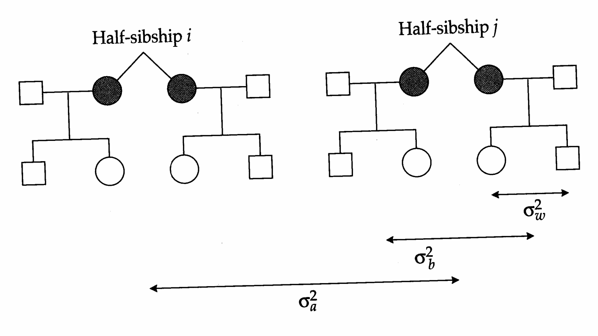
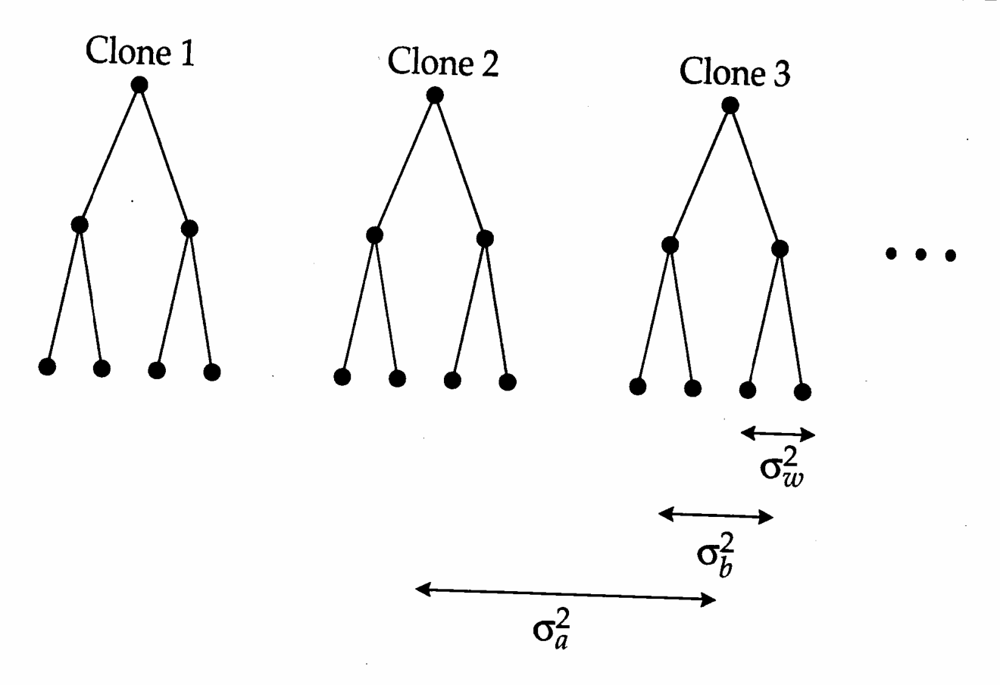

# Chapter 19 Textbook Mapping

## Genetics_chapter19_001 · Introduction

A more general procedure for estimating $ \mathrm{Var}(t_{\mathrm{PHS}}) $, which allows for unbalanced designs, is to use the large-sample estimator for the variance of a ratio given in Appendix 1. Such a computation requires estimates of the sampling variances and covariances of $ \mathrm{Var}(s) $, $ \mathrm{Var}(d) $, and $ \mathrm{Var}(e) $, expressions for which are given in Hammond and Nicholas (1972) and Searle et al. (1992). If one is willing to assume normality and to ignore the sampling variance of $ \mathrm{Var}(z) $ and the sampling covariance between $ \mathrm{Var}(z) $, $ \mathrm{Var}(s) $, and $ \mathrm{Var}(d) $, some fairly simple and conservative (upwardly biased) estimates are possible, $$ \mathrm{Var}(t_{\mathrm{PHS}})\simeq\frac{\mathrm{Var}(\mathrm{MS}_{s})+(k_{2}/k_{1}^{2})\mathrm{Var}(\mathrm{MS}_{d})+[1-(k_{2}/k_{1})]^{2}\mathrm{Var}(\mathrm{MS}_{e})}{[k_{3}\mathrm{Var}(z)]^{2}} $$ $$ \mathrm{Var}(t_{FS})\simeq\frac{\mathrm{Var}(\mathrm{MS}_{s})+k_{3}^{2}[\phi^{2}\mathrm{Var}(\mathrm{MS}_{d})+(1+\phi)^{2}\mathrm{Var}(\mathrm{MS}_{e})]}{[k_{3}\mathrm{Var}(z)]^{2}} $$ with $$ \mathrm{Var}(\mathrm{MS}_{x})=\frac{2(\mathrm{MS}_{x})^{2}}{\mathrm{df}_{x}+2},\qquad\phi=\frac{(k_{2}/k_{3})-1}{k_{1}} $$ and $k_{1}, k_{2}$, and $k_{3}$ as defined in [[SEE_TABLE:18.3]] (Dickerson 1969).

Graybill et al. (1956), Broemeling (1969), and Graybill and Wang (1979) provide expressions for the confidence limits of $ t_{PHS} $ and $ t_{FS} $ for the special case of a balanced design with normally distributed effects. These expressions are not necessarily very robust to violations of the assumptions of balance and normality.

---

## Genetics_chapter19_002 · Introduction / Optimal Design

In the now familiar fashion, the optimal design for a nested analysis of variance is defined to be the combination of $N$, $M$, and $n$, subject to some constraint, that minimizes the sampling variance of the intraclass correlation of interest. Since $4t_{\mathrm{PHS}}$ provides the most reliable estimate of $h^{2}$, it will generally be most desirable to minimize $\mathrm{Var}(t_{\mathrm{PHS}})$ as defined in Equation 18.37a, but the solution is quite complicated, as it depends upon both $t_{\mathrm{PHS}}$ and $t_{\mathrm{FS}}$. Some feeling for the best design and the sensitivity of $\mathrm{Var}(t_{\mathrm{PHS}})$ to nonoptimal designs can be achieved by substituting different values for the design parameters $(N, M, n)$ and for the possible values of $t_{\mathrm{PHS}}$ and $t_{\mathrm{FS}}$.

Robertson (1959a) has shown that when dominance and common environmental effects are absent, the preferred design for estimating $t_{\mathrm{PHS}}$ is to use full-sib families of only single individuals, i.e., to rely on the pure half-sib analysis outlined in the previous section. If on the other hand, one desires approximately equal precision in the estimates of $t_{\mathrm{PHS}}$ and $t_{\mathrm{FS}}$, it is advisable to allocate at least 3 to 4 females/male and to maintain full-sib families of $\sim 1/(2t_{\mathrm{PHS}})$ (but no less than 2) progeny/female.

Bridges and Knapp (1987) performed simulation studies to evaluate the probability of obtaining negative estimates for $\sigma_{A}^{2}$ and $\sigma_{D}^{2}$ under the nested design.

Assuming no epistatic or common environmental effects, with designs of moderate size, the probability of obtaining a negative estimate of the additive genetic variance is usually on the order of only a few percent. However, the probability of obtaining a negative estimate of $ \sigma_{D}^{2} $ is typically about an order of magnitude higher. Thus, although the nested design is often relied on as a means for detecting dominance, it is not particularly powerful in this regard.

Example 3. To evaluate the causal sources of variation in developmental rate in the flour beetle Tribolium castaneum, Dawson (1965) estimated the covariances between several types of relatives. Here we focus on the results from a nested design in which 30 males were each mated to three different females, with the goal of assaying 10 progeny per female. Some mortality among the dams and the offspring induced slight inequalities in family sizes, resulting in $ k_{1} = k_{2} = 9.1 $ and $ k_{3} = 25.7 $. Following the layout in [[SEE_TABLE:18.3]], the degrees of freedom and observed and expected mean squares for the nested ANOVA are:  From Equations 18.32a–c, the estimated variance components for sires, dams within sires, and sibs within dams are $ \mathrm{Var}(s) = 0.079 $, $ \mathrm{Var}(d) = 0.288 $, and $ \mathrm{Var}(e) = 1.314 $. From Equations 18.33a,b, the intraclass correlations for paternal half sibs and full sibs are $ t_{PHS} = 0.047 $ and $ t_{FS} = 0.218 $. If all of the resemblance between relatives were due to additive genetic variance, we would expect $ t_{FS} \simeq 2t_{PHS} $. The fact that $ t_{FS} $ is nearly five times $ t_{PHS} $ immediately suggests that dominance and/or common maternal effects may be contributing to the covariance between full sibs.

How much confidence can we have in these intraclass correlations? To evaluate the significance of the sire component of variance, we compute $ F = 5.949/3.925 = 1.52 $. Using an $ F $-distribution table, for 29 and 56 degrees of freedom, we find that there is a 5% chance of observing an $ F $ as large as 1.68 by chance. Thus, the hypothesis that $ \sigma_{s}^{2} = 0 $ cannot be rejected at this level. On the other hand, for the dam component of variance, $ F = 3.925/1.314 = 2.99 $, which is well above the critical 0.1% value for 56 and 695 degrees of freedom (1.70), implying that a significant fraction of the total variation in developmental rate is attributable to dams.

Approximate standard errors can be obtained for the two intraclass correlations using Equations 18.38a,b. After the appropriate substitutions, we find $ \mathrm{Var}(t_{\mathrm{PHS}}) \simeq 0.0098 $ and $ \mathrm{Var}(t_{\mathrm{FS}}) \simeq 0.0127 $. Taking square roots, we arrive at the standard errors SE($ t_{PHS} $) ≃ 0.099 and SE($ t_{FS} $) ≃ 0.113. As noted in the text, Equations 18.38a,b generally yield conservative (upwardly biased) estimates of the standard errors. When the more precise Equations 18.37a,b are used, we obtain SE($ t_{PHS} $) ≃ 0.038 and SE($ t_{FS} $) ≃ 0.037. When compared with the estimates $ t_{PHS} $ and $ t_{FS} $, these results are consistent with our conclusion that the dam component of variance is much more significant than the sire component. The heritability of developmental rate is estimated as four times $ t_{PHS} $, and its standard error is four times SE($ t_{PHS} $). Thus, Dawson's results yield the estimate $ h^{2} \simeq 0.19 $, but with a standard error of 0.15.

Were these the only available data, we would have difficulty accepting the idea that developmental rate in Tribolium castaneum exhibits heritable (additive genetic) variation. However, additional data shed further light on the issue. Using twice the regression between parents and offspring, Dawson estimated the heritability to be 0.12 with paternal data and 0.30 with maternal data. He also performed a diallel analysis (Chapter 20), which generated both paternal and maternal half sibs. In this case, he estimated the heritability to be 0.13 with paternal half-sib data (similar to the nested design result of 0.19) and 0.41 with maternal half-sib data. thus, we see that the heritability estimates based on paternal half sibs and on the paternal-offspring regression are quite consistent, averaging about 0.15. The fact that maternal half sibs are much more similar than paternal half sibs, and that offspring are much more similar to mothers than to fathers, suggests that maternal effects are a significant source of variation. In the absence of significant epistatic sources of variation, the covariance between maternal half sibs is $ \sigma_{A}^{2}/4 + \sigma_{E_{c}}^{2} $. Thus, multiplying the maternal half-sib correlation by four inflates the heritability estimate by $ 4\sigma_{E_{c}}^{2}/\sigma_{z}^{2} $. This suggests that the fraction of the phenotypic variance that is due to variation in maternal effects is approximately $ (0.41 - 0.15)/4 = 0.06 $. Finally, we recall that twice the intraclass correlation between full sibs (0.436) actually estimates $ [\sigma_{A}^{2} + (\sigma_{D}^{2}/2) + 2\sigma_{E_{c}}^{2}]/\sigma_{z}^{2} $. Thus, with our previous results, the contribution to the phenotypic variance from dominance can be estimated as $ 2[0.436 - 0.15 - (2 \times 0.06)] \simeq 0.33 $. In summary, assuming that epistasis is of negligible importance, these results suggest that the variance in developmental rate is approximately partitioned as: 15% additive genetic variance, 33% dominance genetic variance, 7% maternal-effects variance, and 45% unobserved causes (presumably special environmental effects).

---

## Genetics_chapter19_003 · Introduction / Twins and Clones

Starting with Galton (1875), the analysis of twins has been a major focal point for research in human quantitative genetics (Bulmer 1970, Rowe 1994). Since approximately one in 100 humans are twins, substantial data bases can often be acquired through hospital records or through advertisements. One of the utilities of twin research arises from the fact that two types of twins are possible. Monozygotic twins, which are derived from the fragmentation of a single embryo, are genetically identical. Dizygotic twins are genetically equivalent to full sibs since they are derived from two eggs fertilized by different sperm. Thus, for characters that are genetically variable, a greater amount of phenotypic resemblance is expected within pairs of monozygotic twins than dizygotic twins. This is almost always observed.

When certain conditions regarding additivity of gene action and sources of environmental variation are met, some simple and powerful conclusions can be derived from twin analysis. However, as we have noted many times before, it is often impossible to verify whether all of the assumptions of a quantitative genetic model are met. Consequently, any conclusions drawn from twin research should be carefully qualified, a practice that not all previous investigators have adhered to. The analysis of twin scores for psychological and intelligence tests has frequently led to the suggestion that human behavior and intelligence are largely genetically determined. Racial and societal overtones associated with such conclusions have generated some of the most bitter scientific debate of this century (Lewontin et al. 1984). This debate has been good for quantitative genetics because it has forced a meticulous consideration of the assumptions of traditional models. As a result, the relatively simple twin models that were relied upon until about 1970 are gradually being replaced by more elaborate models, particularly with respect to sources of environmental variation.

The initial focus of this chapter is on the classical approach to heritability analysis using combined data from monozygotic and dizygotic twins. We then describe the additional power that arises when one is fortunate enough to have data on twins raised apart or on the offspring of twins. Finally, we show how the basic principles of twin analysis can be extended to the analysis of phenotypic variation in asexual populations.

Note: This general description applies to both monozygotic and dizygotic analyses. The total sample size is $ T = 2N $, $ z_{ij} $ is the observed phenotype of the $ j $th member of the $ i $th pair of twins, $ \overline{z}_i $ is the mean phenotype of the $ i $th pair, and $ E(\text{MS}) $ denotes the expected mean squares.

---

## Genetics_chapter19_004 · Introduction / THE CLASSICAL APPROACH

The most commonly used methodology for twin analysis relies on the simple one-way analysis of variance (Kempthorne and Osborne 1961, Haseman and Elston 1970, Christian et al. 1974, Kang et al. 1974, Eaves et al. 1978, Martin et al. 1978). Separate analyses are performed for monozygotic and dizygotic twins using the layout given in [[SEE_TABLE:19.1]]. Since twin groups always consist of two individuals, this is one of the few designs in quantitative-genetic analysis that is always perfectly balanced.

**[命题 Proposition]**

For both types of twins, we start with the simple linear model $$ z_{ij}=\mu+b_{i}+e_{ij} $$ where $z_{ij}$ is the phenotype of the $j$th member ($j=1$ or 2) of the $i$th pair, $b_{i}$ is the effect of the $i$th pair, and $e_{ij}$ is the residual error resulting from segregation (in the case of dizygotic twins) and environmental variance. As usual, we assume that the $e_{ij}$ have zero expectations, are uncorrelated with each other, and have common variance within each family, $\sigma_{e}^{2}$. The twin pairs within each analysis are also assumed to be a random sample of the entire population so that $E(b_{i})=0$. For monozygotic and dizygotic twin analyses respectively, we denote the variance among pairs by $\sigma_{b}^{2}(\mathrm{MZ})$ and $\sigma_{b}^{2}(\mathrm{DZ})$ and the variance within pairs by $\sigma_{e}^{2}(\mathrm{MZ})$ and $\sigma_{e}^{2}(\mathrm{DZ})$. As in the case of sib analysis (Chapter 18), estimates of the within- and among-pair components of variance are obtained by setting the observed mean squares equal to their expectations and solving. The observed variance components can, in turn, be used to derive inferences about causal sources of phenotypic variance. From Equation 19.1, it can be seen that under the assumption of independent residuals, the expected among-pair variance is equivalent to the covariance of members of the same pair, $ \sigma(z_{i1}, z_{i2}) = \sigma(b_i, b_i) = \sigma_b^2 $. In causal terms, for monozygotic twins, this is equivalent to $$ \sigma_{b}^{2}(\mathrm{M Z})=\sigma_{G}^{2}+\sigma_{E_{c}}^{2}(\mathrm{M Z}) $$ where $\sigma_{G}^{2}$ is the total genetic variance, and $\sigma_{E_{c}}^{2}$ (MZ) is the variance due to common familial environment. The genetic covariance between monozygotic twins is equal to the total genetic variance because of the complete genetic identity of the individuals involved. For dizygotic twins, $$ \sigma_{b}^{2}(\mathbf{D Z})=\frac{1}{2}\sigma_{A}^{2}+\frac{1}{4}\sigma_{D}^{2}+\frac{1}{4}\sigma_{A A}^{2}+\cdots+\sigma_{E_{c}}^{2}(\mathbf{D Z}) $$

Separate notation is needed for the variance due to common familial environment because it is not necessarily the same in the two types of twins. Since $ \sigma_{z}^{2} = \sigma_{b}^{2} + \sigma_{e}^{2} $, it follows that the remainder of the phenotypic variance is in the within-pair component. Therefore, $$ \sigma_{e}^{2}(\mathbf{M}\mathbf{Z})=\sigma_{E_{s}}^{2}(\mathbf{M}\mathbf{Z}) $$ and $$ \sigma_{e}^{2}(\mathrm{D Z})=\frac{1}{2}\sigma_{A}^{2}+\frac{3}{4}\sigma_{D}^{2}+\frac{3}{4}\sigma_{A A}^{2}+\cdots+\sigma_{E_{s}}^{2}(\mathrm{D Z}) $$ where the terms $\sigma_{E_{s}}^{2}(\mathrm{MZ})$ and $\sigma_{E_{s}}^{2}(\mathrm{DZ})$ refer to the residual environmental variance, i.e., environmental variance not attributable to common familial effects (Chapter 6).

All of the procedures outlined in Chapter 18 for the one-way analysis of variance of sibs apply to twin analysis. From [[SEE_TABLE:19.1]], it can be seen that the among-pair variance is estimated by $$ Var(b)=\frac{MS_{b}-MS_{e}}{2} $$

Taking the sampling variance of the mean squares to be approximately $ 2(\mathrm{MS})^{2}/N $ (from Equation 18.19), and recalling that the mean squares are distributed independently under a balanced design, the large-sample variance of $ \mathrm{Var}(b) $ is $$ \mathrm{Var}[\mathrm{Var}(b)]\simeq\frac{\mathrm{Var}(\mathrm{MS}_{b})+\mathrm{Var}(\mathrm{MS}_{e})}{4}=\frac{(\mathrm{MS}_{b})^{2}+(\mathrm{MS}_{e})^{2}}{2N} $$

The within-pair variance is approximated by $$ \mathrm{Var}(e)=\mathrm{MS}_{e} $$ and its large-sample variance is $$ \mathbf{Var}[\mathbf{Var}(e)]\simeq2(\mathbf{MS}_{e})^{2}/N $$

Combining the estimators for $ \sigma_{b}^{2} $ and $ \sigma_{e}^{2} $, we obtain $$ \mathrm{Var}(z)=\frac{\mathrm{MS}_{b}+\mathrm{MS}_{e}}{2} $$ as the estimator of $\sigma_{z}^{2}$. Its large-sample variance estimator is identical to that of Var(b). Confidence intervals for the within- and among-pair components of variance can be obtained by using Equations 18.22 and 18.23.

Recalling the arguments laid out in Chapter 18, the ratio of mean squares, $ F = MS_b/MS_e $, provides a test statistic for evaluating the significance of the among-pair component of variance. The null hypothesis of no pair effects is tested by referring to standard $ F $-distribution tables and comparing the observed $ F $ with the 5% or 1% critical values associated with $ (N - 1) $ and $ N $ degrees of freedom.

> **Table 19.1** · `19.1` · page ? · source: `Genetics_chapter19_004`
> Table 19.1 (body not recovered from raw layout)
>
> <table border=1 style='margin: auto; word-wrap: break-word;'><tr><td style='text-align: center; word-wrap: break-word;'>Source of Variance</td><td style='text-align: center; word-wrap: break-word;'>df</td><td style='text-align: center; word-wrap: break-word;'>Sums of Squares</td><td style='text-align: center; word-wrap: break-word;'>Observed Mean Squares</td><td style='text-align: center; word-wrap: break-word;'>E(MS)</td></tr><tr><td style='text-align: center; word-wrap: break-word;'>Among pairs</td><td style='text-align: center; word-wrap: break-word;'>N - 1</td><td style='text-align: center; word-wrap: break-word;'>$ SS_{{b}} = 2 \sum_{{i} = 1}^{N} (\overline{{z}}_{{i}} - \overline{{z}})^{2} $</td><td style='text-align: center; word-wrap: break-word;'>$ SS_{{b}}/(N - 1) $</td><td style='text-align: center; word-wrap: break-word;'>$ \sigma_{{e}}^{2} + 2\sigma_{{b}}^{2} $</td></tr><tr><td style='text-align: center; word-wrap: break-word;'>Within pairs</td><td style='text-align: center; word-wrap: break-word;'>N</td><td style='text-align: center; word-wrap: break-word;'>$ SS_{{e}} = \sum_{{i} = 1}^{N} \sum_{{j} = 1}^{2} (z_{{ij}} - \overline{{z}}_{{i}})^{2} $</td><td style='text-align: center; word-wrap: break-word;'>$ SS_{{e}}/N $</td><td style='text-align: center; word-wrap: break-word;'>$ \sigma_{{e}}^{2} $</td></tr><tr><td style='text-align: center; word-wrap: break-word;'>Total</td><td style='text-align: center; word-wrap: break-word;'>T - 1</td><td style='text-align: center; word-wrap: break-word;'>$ SS_{{T}} = \sum_{{i} = 1}^{N} \sum_{{j} = 1}^{2} (z_{{ij}} - \overline{{z}})^{2} $</td><td style='text-align: center; word-wrap: break-word;'>$ SS_{{T}}/(T - 1) $</td><td style='text-align: center; word-wrap: break-word;'>$ \sigma_{{z}}^{2} $</td></tr></table>

---

## Genetics_chapter19_005 · Introduction / Heritability Estimation

An upper limit to the broad-sense heritability, based only on monozygotic-twin data, is the intraclass correlation (the fraction of the total variance that is attributable to differences among pairs) $$ H^{2}=t_{\mathrm{M Z}}=\frac{\mathrm{M S}_{b}(\mathrm{M Z})-\mathrm{M S}_{e}(\mathrm{M Z})}{\mathrm{M S}_{b}(\mathrm{M Z})+\mathrm{M S}_{e}(\mathrm{M Z})} $$ From Equation 18.21, the standard error of this estimator is approximately $$ \mathbf{SE}(H^{2})\simeq\frac{1-t_{\mathrm{M Z}}^{2}}{\sqrt{N}} $$

Under conditions of normality, the $100(1-\alpha)%$ confidence interval for $H^{2}$ is given by $$ \left[\frac{\left(F/F_{U}\right)-1}{\left(F/F_{U}\right)+1}\right]<H^{2}<\left[\frac{\left(F/F_{L}\right)-1}{\left(F/F_{L}\right)+1}\right] $$ where $F$ is the ratio of observed mean squares, and $F_{U} = F_{(N-1),N,(\alpha/2)}$ and $F_{L} = 1/[F_{N,(N-1),(\alpha/2)}]$ are the upper and lower $F$ values associated with $(\alpha/2)$ (Searle et al. 1992). the estimate $H^{2} = 0.955$ and the standard error $\mathrm{SE}(H^{2}) = 0.005$. With an $F$ ratio of 43.66, this heritability estimate is highly significant. To obtain the 99% confidence interval for $H^{2}$, we first find $F_{U} = F_{259,260,0.005} \simeq 1.4$ and $F_{L} = 1/F_{260,259,0.005} \simeq 0.7$. Substituting these values into Equation 19.7c, the lower and upper confidence limits are found to be 0.937 and 0.984. As an estimator of the broad-sense heritability, the intraclass correlation will be inflated by the presence of any common environmental effects, $\sigma_{E_c}^2$ (MZ). This can be checked by comparing the correlation between twins raised together with that between twins raised apart (by one or more adoptive parents). The difference between the two correlations provides a measure of the fraction of the phenotypic variance that is due to common-environment effects. Generally, intraclass correlations for twins raised together do exceed those for twins raised apart, but the difference is usually only on the order of a few percent ([[SEE_TABLE:19.2]]). Thus, in humans, a large fraction of the variation in size, physiology, and mental ability appears to have a genetic basis, and not much appears to be associated with shared environment (except in the case of IQ). There is still some need for caution here, however, since it is unlikely that the foster homes of twins are ever perfectly randomized, and postnatal separation does not eliminate prenatal maternal effects, which may be important in mammals (Chapter 23). In humans, an alternative means of testing for the importance of shared environment is to consider the correlation between unrelated adoptees raised by the same foster parents. For IQ, this correlation is approximately 0.34 (Rowe 1994), which is slightly higher than the difference between correlations for monozygotic twins raised together and apart ([[SEE_TABLE:19.2]]).

Some success at eliminating the contribution of common environmental effects in twin analysis has also been obtained by the following approximation $$ \widetilde{H}^{2}\simeq\frac{2[\mathrm{M S}_{e}(\mathrm{D Z})-\mathrm{M S}_{e}(\mathrm{M Z})]}{\mathrm{V a r}(z)} $$ where $ \mathrm{Var}(z) $ is the average of the estimates of total variance obtained for monozygotic and dizygotic types of twins. Provided the variance due to special environmental effects is comparable in the two types of twins, and some other assumptions to be discussed below are met, $ \widetilde{H}^{2} $ has an expectation equal to approximately $ [\sigma_{A}^{2}+(3\sigma_{D}^{2}/2)+(3\sigma_{AA}^{2}/2)+\cdots]/\sigma_{z}^{2} $. Thus, Equation 19.8 still overestimates the broad-sense heritability if the relative magnitude of dominance and/or epistatic variance is large. Nevertheless, a reasonable test of the hypothesis $ \widetilde{H}^{2}=0 $ is provided by the $ F $ statistic $ \mathrm{MS}_{e}(\mathrm{DZ})/\mathrm{MS}_{e}(\mathrm{MZ}) $. Estimates of broad-sense heritability using Equation 19.8, like those using Equation 19.7a, indicate that variation in human size attributes has a large genetic component ([[SEE_TABLE:19.3]]).

[[SEE_TABLE:19.2]]

Source: Bouchard et al. 1990.

[[SEE_TABLE:19.3]]

Source: Clark 1956.

Note: Data are from 44 pairs of monozygotic twins and 37 pairs of dizygotic twins of the same sex in Michigan high schools and junior high schools. Because monozygotic and dizygotic twins develop in different types of placental environments, one might question the assumptions that $\sigma_{E_{s}}^{2}$ (MZ) $=\sigma_{E_{s}}^{2}$ (DZ) and $\sigma_{E_{c}}^{2}$ (MZ) $=\sigma_{E_{c}}^{2}$ (DZ). Mammalian embryos are surrounded by two types of fetal membranes: an amnion (or birth sac), which is continuous with the body wall of the embryo and forms a fluid-filled chamber, and a more external chorion (placenta) through which exchange of nutrients, gases, and wastes takes place. Human dizygotic twins always have separate membranes, but only about a third of monozygotic twins do (Nance 1979). Thus, due to the greater sharing of prenatal environments, monozygotic twins may exhibit higher similarity due to shared environmental effects and deviate less because of specific effects. The fact that dichorionic and monochorionic monozygotic twins differ significantly in their within-pair mean squares for plasma cholesterol (Christian et al. 1976) and fingerprint patterns (Reed et al. 1978) is consistent with this idea.

More remarkably, embryo transplant experiments with highly inbred lines of mice have shown that monozygotic twins separated at the eight-cell stage are significantly more similar to each other than are dizygotic twins (separate since conception) treated in the same manner (Gärtner and Baunack 1981). In this study, dizygotic twins are no more different genetically than monozygotic twins since the parents are highly homozygous. Thus, these results suggest that by the third cell division, zygotes can be modified by common environmental effects that have substantial impact on the adult phenotype.

A number of other important assumptions underly twin analysis (Price 1950; Kempthorne and Osborne 1961; Nance 1976, 1979; Eaves et al. 1978; Martin et al. 1978; Rowe 1994). For example, one might question whether twins are a random subset of the gene pool of the general population. Since it is the population at large about which one normally wants to make inferences, there is reason for concern here. The dizygotic twinning rate differs significantly among races of humans as well as among individuals (Bulmer 1970). In addition, dizygotic twins are more frequently produced by older mothers, for whom congenital malformations are also more common. An additional concern is whether the environmental component of variance may be exceptionally high or low in twins relative to singletons. Parents may treat twins differently than singleton offspring. Because of their contemporaneity, twins may also experience an exceptional level of sib competition (or cooperation).

One or more of the above-mentioned problems would be suggested if the phenotypic variances for monozygotic twins and dizygotic twins were found to be significantly different. This can be tested by the ratio $$ F=\frac{\mathrm{MS}_{b}(\mathrm{DZ})+\mathrm{MS}_{e}(\mathrm{DZ})}{\mathrm{MS}_{b}(\mathrm{MZ})+\mathrm{MS}_{e}(\mathrm{MZ})} $$

**[定义 Definition]**

Using Satterthwaite's (1946) method (Chapter 18), the degrees of freedom associated with the numerator are approximately $$ d f=\frac{N[\mathrm{M S}_{b}(\mathrm{D Z})+\mathrm{M S}_{e}(\mathrm{D Z})]^{2}}{\mathrm{M S}_{b}^{2}(\mathrm{D Z})+\mathrm{M S}_{e}^{2}(\mathrm{D Z})} $$ and a parallel definition applies to the denominator.

> **Table 19.2** · `19.2` · page ? · source: `Genetics_chapter19_005`
> Table 19.2 (body not recovered from raw layout)
>
> <table border=1 style='margin: auto; word-wrap: break-word;'><tr><td style='text-align: center; word-wrap: break-word;'>Character</td><td style='text-align: center; word-wrap: break-word;'>$ t_{MZT} $</td><td style='text-align: center; word-wrap: break-word;'>$ t_{MZA} $</td><td style='text-align: center; word-wrap: break-word;'>$ t_{MZT} - t_{MZA} $</td></tr><tr><td style='text-align: center; word-wrap: break-word;'>Fingerprint ridge count</td><td style='text-align: center; word-wrap: break-word;'>0.96</td><td style='text-align: center; word-wrap: break-word;'>0.97</td><td style='text-align: center; word-wrap: break-word;'>-0.01</td></tr><tr><td style='text-align: center; word-wrap: break-word;'>Height</td><td style='text-align: center; word-wrap: break-word;'>0.93</td><td style='text-align: center; word-wrap: break-word;'>0.86</td><td style='text-align: center; word-wrap: break-word;'>0.07</td></tr><tr><td style='text-align: center; word-wrap: break-word;'>Weight</td><td style='text-align: center; word-wrap: break-word;'>0.83</td><td style='text-align: center; word-wrap: break-word;'>0.73</td><td style='text-align: center; word-wrap: break-word;'>0.10</td></tr><tr><td style='text-align: center; word-wrap: break-word;'>Blood pressure</td><td style='text-align: center; word-wrap: break-word;'>0.70</td><td style='text-align: center; word-wrap: break-word;'>0.64</td><td style='text-align: center; word-wrap: break-word;'>0.06</td></tr><tr><td style='text-align: center; word-wrap: break-word;'>Heart rate</td><td style='text-align: center; word-wrap: break-word;'>0.54</td><td style='text-align: center; word-wrap: break-word;'>0.49</td><td style='text-align: center; word-wrap: break-word;'>0.05</td></tr><tr><td style='text-align: center; word-wrap: break-word;'>IQ</td><td style='text-align: center; word-wrap: break-word;'>0.88</td><td style='text-align: center; word-wrap: break-word;'>0.69</td><td style='text-align: center; word-wrap: break-word;'>0.19</td></tr></table>

> **Table 19.3** · `19.3` · page ? · source: `Genetics_chapter19_005`
> Table 19.3 (body not recovered from raw layout)
>
> <table border=1 style='margin: auto; word-wrap: break-word;'><tr><td style='text-align: center; word-wrap: break-word;'>Character</td><td style='text-align: center; word-wrap: break-word;'>MS $ _{e} $(DZ)</td><td style='text-align: center; word-wrap: break-word;'>MS $ _{e} $(MZ)</td><td style='text-align: center; word-wrap: break-word;'>Var(z)</td><td style='text-align: center; word-wrap: break-word;'>$ \widetilde{H}^{2} $</td></tr><tr><td style='text-align: center; word-wrap: break-word;'>Height</td><td style='text-align: center; word-wrap: break-word;'>1620.3</td><td style='text-align: center; word-wrap: break-word;'>195.4</td><td style='text-align: center; word-wrap: break-word;'>3031.7</td><td style='text-align: center; word-wrap: break-word;'>0.94</td></tr><tr><td style='text-align: center; word-wrap: break-word;'>Arm span</td><td style='text-align: center; word-wrap: break-word;'>2132.0</td><td style='text-align: center; word-wrap: break-word;'>317.7</td><td style='text-align: center; word-wrap: break-word;'>3944.1</td><td style='text-align: center; word-wrap: break-word;'>0.92</td></tr><tr><td style='text-align: center; word-wrap: break-word;'>Middle finger length</td><td style='text-align: center; word-wrap: break-word;'>11.9</td><td style='text-align: center; word-wrap: break-word;'>1.4</td><td style='text-align: center; word-wrap: break-word;'>22.3</td><td style='text-align: center; word-wrap: break-word;'>0.94</td></tr><tr><td style='text-align: center; word-wrap: break-word;'>Foot length</td><td style='text-align: center; word-wrap: break-word;'>58.5</td><td style='text-align: center; word-wrap: break-word;'>10.9</td><td style='text-align: center; word-wrap: break-word;'>105.8</td><td style='text-align: center; word-wrap: break-word;'>0.90</td></tr><tr><td style='text-align: center; word-wrap: break-word;'>Chest circumference</td><td style='text-align: center; word-wrap: break-word;'>1098.8</td><td style='text-align: center; word-wrap: break-word;'>423.7</td><td style='text-align: center; word-wrap: break-word;'>1776.6</td><td style='text-align: center; word-wrap: break-word;'>0.76</td></tr><tr><td style='text-align: center; word-wrap: break-word;'>Head breadth</td><td style='text-align: center; word-wrap: break-word;'>14.9</td><td style='text-align: center; word-wrap: break-word;'>4.2</td><td style='text-align: center; word-wrap: break-word;'>25.5</td><td style='text-align: center; word-wrap: break-word;'>0.84</td></tr></table>

---

## Genetics_chapter19_006 · Introduction / THE MONOZYGOTIC-TWIN HALF-SIB METHOD

Nance and Corey (1976) introduced a clever method of twin analysis that eliminates many of the uncertainties of the classical method. Children produced by two monozygotic twins are cousins socially, but genetically they are related as half sibs (Figure 19.1). Moreover, unlike their monozygotic-twin parents, such

**[命题 Proposition]**

> **Figure 19.1** · page 11 · source: `Genetics_chapter19`
>
> 
>
> Figure 19.1 The monozygotic-twin half-sib design. Each pedigree contains two full-sib families derived from a pair of monozygotic twins, in this case the two sets of females denoted by the shaded circles.

half sibs are not raised in a common home. When data are available for the progeny of many pairs of such twins, a nested analysis of variance can be performed, analogous to that described previously for the full-sib, half-sib design ([[SEE_TABLE:18.3]]). The linear model to be analyzed is $$ z_{ijk}=\mu+a_{i}+b_{ij}+e_{ijk} $$ where $ z_{ijk} $ is the phenotype of the kth offspring of the jth member (j = 1 or 2) of the ith twin pair, $ a_i $ is the effect of the ith pair, $ b_{ij} $ is the effect of the jth family within the ith pair (resulting from genetic differences between the unrelated parents and from common environmental effects), and $ e_{ijk} $ is the residual deviation resulting from segregation and special environmental effects. As usual under the assumption that individuals are random members of the population, $ a_i $, $ b_{ij} $, and $ e_{ijk} $ are defined to have means equal to zero and to be uncorrelated with each other. $ \sigma_a^2 $, the variance between monozygotic-twin half-sibships, is equivalent to the covariance among half-sibs living in different homes. $ \sigma_b^2 $ is the variance between full-sibships within half-sibships, and $ \sigma_e^2 $ is the variance within full-sibships. Estimates of these variance components are obtainable from the observed mean squares of a nested ANOVA in the manner described in Chapter 18. Their causal components are summarized in [[SEE_TABLE:19.4]].

The monozygotic-twin half-sib (MTHS) method has several major advantages over classical twin analysis. First, since it is performed on normal singleton children, the potential problem of environmental effects specific to twin phenotypes is eliminated. Second, the MTHS method removes the necessity of relying on data from both monozygotic and dizygotic twins. Third, when separate analyses are performed on female and male twins, it becomes possible to estimate the

[[SEE_TABLE:19.4]] genetic variance for maternal effects, $\sigma_{G_{m}}^{2}$. As described in [[SEE_TABLE:19.4]], the causal components of $\sigma_{a}^{2}$ are identical for maternal and paternal half-sibships except that $\sigma_{G_{m}}^{2}$ makes no contribution in the latter case (since the “half sibs” have different maternal genotypes). The opposite holds for $\sigma_{b}^{2}$. Thus, $\sigma_{b}^{2}(PHS)-\sigma_{b}^{2}(MHS)$ and $\sigma_{a}^{2}(MHS)-\sigma_{a}^{2}(PHS)$ both provide estimates of $\sigma_{G_{m}}^{2}$. Using this relationship, Nance (1979) was able to show that genetic maternal effects are responsible for about 22% of the variance in human height. (A more in-depth discussion of the analysis of maternal effects is provided in Chapter 23, where it is shown that $\sigma_{G_{m}}^{2}$ actually contains several subsidiary components.)

The variance due to common environmental effects is partitioned into two components in [[SEE_TABLE:19.4]]. $\sigma_{E_{c}^{\prime}}^{2}$ is equivalent to the covariance between half sibs due to common environmental effects. Even though the half sibs do not live in the same home, $\sigma_{E_{c}^{\prime}}^{2}$ may be nonzero in the MTHS design if monozygotic twins raise their offspring in a similar manner due to common cultural inheritance. (Although it is not shown in the table, $\sigma_{E_{c}^{\prime}}^{2}$ could also vary between paternal and maternal half-sibships). $\sigma_{E_{c}}^{2}$ is the covariance between full sibs due to common maternal environment, in excess of $\sigma_{E_{c}^{\prime}}^{2}$.

In all, there are three sources of environmental variance as well as several sources of genetic variance in [[SEE_TABLE:19.4]], but only five equations. Thus, not all of the parameters can be estimated with the nested design. However, when data are also recorded on the twins themselves, six other types of relationships can be evaluated ([[SEE_TABLE:19.5]]). Estimates of the variance components can then be obtained in the usual way by the solution of simultaneous equations, although it should be noted that the observed covariances are not all independent since they share common individuals.

[[SEE_TABLE:19.5]]

Note: To account for the possibility that cultural inheritance across generations is a source of resemblance between relatives, arbitrary coefficients $(b_{1}, \ldots, b_{4})$ have been denoted for $\sigma_{E_{c}^{\prime}}$; these may or may not be equal.

Nance and Corey (1976) and Haley et al. (1981) have pointed out that when separate analyses are performed on male and female progeny, the additive and dominance components of variance due to sex-linked loci can be determined with the MTHS design. For example, when an analysis is restricted to male progeny, in maternal half-sibships $\sigma_{a}^{2}$ contains additive genetic variance associated with the X chromosome since the male progeny within the sibship derive their X chromosomes from identical maternal genotypes, whereas $\sigma_{b}^{2}$ contains no variance associated with the X chromosome. On the other hand, in paternal half-sibships $\sigma_{b}^{2}$ contains additive genetic variance associated with the X chromosome since the male progeny in related half-sib families derive their X chromosomes from different mothers, whereas $\sigma_{a}^{2}$ contains no variance associated with the X chromosome since the paternal X chromosome is not inherited in the male offspring. (See Chapter 24 for further discussion of methods for estimating genetic variance due to sex-linked loci.)

An even more elaborate analysis than the preceding one has been outlined by (Haley and Last 1981), incorporating both dizygotic and monozygotic twins. The progeny of different dizygotic twins are genetically equivalent to first cousins.

Example 2. Fingerprint traits have long been employed in studies of polygenic inheritance in man (Holt 1968). They are easily assayed, and many permanent records of them exist for deceased and living individuals. The broad-sense heritabilities of dermatoglyphic traits tend to be close to 1.0, so standard errors of genetic variance estimates are relatively low. Fingerprints do not change with age, and they are not subject to assortative mating or to common postnatal environmental effects.

In order to illustrate some of the concepts of this chapter and their broader utility, we will consider some of the results for total dermal ridge count (TDRC), the sum of the ridges in the central cores of all ten fingertips. The above figure (from Holt 1955) gives the observed distribution for a sample of 825 British males and the fitted normal curve. The phenotype distribution for this character is approximately normal, and there is a wide range of variation. Correlations between a variety of relatives from several independent studies (with sample sizes ranging from 100 to 700) are recorded below. The results are highly consistent across studies.

TDRC appears to be almost completely genetically determined with a broad-sense heritability very close to 0.96. The correlations between ordinary full sibs and between dizygotic twins are essentially the same (averaging 0.46 and 0.49 respectively). In the absence of dominance and maternal effects, this would also be the expected correlation between parent and offspring. However, the latter appears to be very close to 0.42. Since the average mother-offspring correlation is less than the father-offspring regression, maternal effects appear to be unimportant. Thus, since $\sigma_{D}^{2}/4$ contributes to the covariance between full sibs but not between parent and offspring, $(0.48-0.42)\times4=0.24$ provides an estimate of the proportion of the total phenotypic variance that is attributable to dominance (ignoring epistatic terms involving dominance).

Epistasis may also play an important role in the expression of TDRC (Nance 1979). The genetic covariance for parent and offspring is $ (\sigma_{A}^{2}/2)+(\sigma_{AA}^{2}/4)+\cdots $, while that for half sibs is $ (\sigma_{A}^{2}/4)+(\sigma_{AA}^{2}/16)+\cdots $. Thus, in the presence of epistatic genetic variance, the phenotypic correlation $ r_{PO} $ is expected to be greater than $ 2r_{HS} $. Using the estimates for $ r_{HS} $ in the table, which are from analyses of the offspring of monozygotic twins, $ r_{PO}-2r_{HS}\simeq0.10 $, provides an estimate of $ [(\sigma_{AA}^{2}/8)+\cdots]/(\sigma_{z}^{2}) $. This result suggests that approximately $ 8\times10%=80% $ of the phenotypic variance is attributable to epistatic genetic variance, leaving little room for simple additive genetic variance. This estimate may be substantially inflated by sampling error. However, Heath et al. (1984) provide convincing evidence that about 40% of the variance of another trait, total finger pattern intensity, results from additive $ \times $ additive epistatic interactions.

> **Table 19.4** · `19.4` · page ? · source: `Genetics_chapter19_006`
> Table 19.4 (body not recovered from raw layout)
>
> <table border=1 style='margin: auto; word-wrap: break-word;'><tr><td style='text-align: center; word-wrap: break-word;'></td><td style='text-align: center; word-wrap: break-word;'>$ \sigma^{2}_{A} $</td><td style='text-align: center; word-wrap: break-word;'>$ \sigma^{2}_{D} $</td><td style='text-align: center; word-wrap: break-word;'>$ \sigma^{2}_{AA} $</td><td style='text-align: center; word-wrap: break-word;'>$ \sigma^{2}_{AD} $</td><td style='text-align: center; word-wrap: break-word;'>$ \sigma^{2}_{DD} $</td><td style='text-align: center; word-wrap: break-word;'>$ \sigma^{2}_{Gm} $</td><td style='text-align: center; word-wrap: break-word;'>$ \sigma^{2}_{E'_{c}} $</td><td style='text-align: center; word-wrap: break-word;'>$ \sigma^{2}_{E_{c}} $</td><td style='text-align: center; word-wrap: break-word;'>$ \sigma^{2}_{E_{s}} $</td></tr><tr><td colspan="10">Female twins (maternal half sibships)</td></tr><tr><td style='text-align: center; word-wrap: break-word;'>$ \sigma^{2}_{a} $</td><td style='text-align: center; word-wrap: break-word;'>1/4</td><td style='text-align: center; word-wrap: break-word;'>0</td><td style='text-align: center; word-wrap: break-word;'>1/16</td><td style='text-align: center; word-wrap: break-word;'>0</td><td style='text-align: center; word-wrap: break-word;'>0</td><td style='text-align: center; word-wrap: break-word;'>1</td><td style='text-align: center; word-wrap: break-word;'>1</td><td style='text-align: center; word-wrap: break-word;'>0</td><td style='text-align: center; word-wrap: break-word;'>0</td></tr><tr><td style='text-align: center; word-wrap: break-word;'>$ \sigma^{2}_{b} $</td><td style='text-align: center; word-wrap: break-word;'>1/4</td><td style='text-align: center; word-wrap: break-word;'>1/4</td><td style='text-align: center; word-wrap: break-word;'>3/16</td><td style='text-align: center; word-wrap: break-word;'>1/8</td><td style='text-align: center; word-wrap: break-word;'>1/16</td><td style='text-align: center; word-wrap: break-word;'>0</td><td style='text-align: center; word-wrap: break-word;'>0</td><td style='text-align: center; word-wrap: break-word;'>1</td><td style='text-align: center; word-wrap: break-word;'>0</td></tr><tr><td colspan="10">Male twins (paternal half sibships)</td></tr><tr><td style='text-align: center; word-wrap: break-word;'>$ \sigma^{2}_{a} $</td><td style='text-align: center; word-wrap: break-word;'>1/4</td><td style='text-align: center; word-wrap: break-word;'>0</td><td style='text-align: center; word-wrap: break-word;'>1/16</td><td style='text-align: center; word-wrap: break-word;'>0</td><td style='text-align: center; word-wrap: break-word;'>0</td><td style='text-align: center; word-wrap: break-word;'>0</td><td style='text-align: center; word-wrap: break-word;'>1</td><td style='text-align: center; word-wrap: break-word;'>0</td><td style='text-align: center; word-wrap: break-word;'>0</td></tr><tr><td style='text-align: center; word-wrap: break-word;'>$ \sigma^{2}_{b} $</td><td style='text-align: center; word-wrap: break-word;'>1/4</td><td style='text-align: center; word-wrap: break-word;'>1/4</td><td style='text-align: center; word-wrap: break-word;'>3/16</td><td style='text-align: center; word-wrap: break-word;'>1/8</td><td style='text-align: center; word-wrap: break-word;'>1/16</td><td style='text-align: center; word-wrap: break-word;'>1</td><td style='text-align: center; word-wrap: break-word;'>0</td><td style='text-align: center; word-wrap: break-word;'>1</td><td style='text-align: center; word-wrap: break-word;'>0</td></tr><tr><td colspan="10">General</td></tr><tr><td style='text-align: center; word-wrap: break-word;'>$ \sigma^{2}_{e} $</td><td style='text-align: center; word-wrap: break-word;'>1/2</td><td style='text-align: center; word-wrap: break-word;'>3/4</td><td style='text-align: center; word-wrap: break-word;'>3/4</td><td style='text-align: center; word-wrap: break-word;'>7/8</td><td style='text-align: center; word-wrap: break-word;'>5/16</td><td style='text-align: center; word-wrap: break-word;'>0</td><td style='text-align: center; word-wrap: break-word;'>0</td><td style='text-align: center; word-wrap: break-word;'>0</td><td style='text-align: center; word-wrap: break-word;'>1</td></tr></table>

> **Table 19.5** · `19.5` · page ? · source: `Genetics_chapter19_006`
> Table 19.5 (body not recovered from raw layout)
>
> <table border=1 style='margin: auto; word-wrap: break-word;'><tr><td rowspan="2">Covariance</td><td colspan="9">Variance Component</td></tr><tr><td style='text-align: center; word-wrap: break-word;'>$ \sigma_A^2 $</td><td style='text-align: center; word-wrap: break-word;'>$ \sigma_D^2 $</td><td style='text-align: center; word-wrap: break-word;'>$ \sigma_{AA}^2 $</td><td style='text-align: center; word-wrap: break-word;'>$ \sigma_{AD}^2 $</td><td style='text-align: center; word-wrap: break-word;'>$ \sigma_{DD}^2 $</td><td style='text-align: center; word-wrap: break-word;'>$ \sigma_G_m^2 $</td><td style='text-align: center; word-wrap: break-word;'>$ \sigma_{E'_c}^2 $</td><td style='text-align: center; word-wrap: break-word;'>$ \sigma_E_c^2 $</td><td style='text-align: center; word-wrap: break-word;'>$ \sigma_{E_s}^2 $</td></tr><tr><td style='text-align: center; word-wrap: break-word;'>MZ twins</td><td style='text-align: center; word-wrap: break-word;'>1</td><td style='text-align: center; word-wrap: break-word;'>1</td><td style='text-align: center; word-wrap: break-word;'>1</td><td style='text-align: center; word-wrap: break-word;'>1</td><td style='text-align: center; word-wrap: break-word;'>1</td><td style='text-align: center; word-wrap: break-word;'>1</td><td style='text-align: center; word-wrap: break-word;'>0</td><td style='text-align: center; word-wrap: break-word;'>1</td><td style='text-align: center; word-wrap: break-word;'>0</td></tr><tr><td style='text-align: center; word-wrap: break-word;'>Mother-offspring</td><td style='text-align: center; word-wrap: break-word;'>1/2</td><td style='text-align: center; word-wrap: break-word;'>0</td><td style='text-align: center; word-wrap: break-word;'>1/4</td><td style='text-align: center; word-wrap: break-word;'>0</td><td style='text-align: center; word-wrap: break-word;'>0</td><td style='text-align: center; word-wrap: break-word;'>1/2</td><td style='text-align: center; word-wrap: break-word;'>$ b_1 $</td><td style='text-align: center; word-wrap: break-word;'>0</td><td style='text-align: center; word-wrap: break-word;'>0</td></tr><tr><td style='text-align: center; word-wrap: break-word;'>Father-offspring</td><td style='text-align: center; word-wrap: break-word;'>1/2</td><td style='text-align: center; word-wrap: break-word;'>0</td><td style='text-align: center; word-wrap: break-word;'>1/4</td><td style='text-align: center; word-wrap: break-word;'>0</td><td style='text-align: center; word-wrap: break-word;'>0</td><td style='text-align: center; word-wrap: break-word;'>0</td><td style='text-align: center; word-wrap: break-word;'>$ b_2 $</td><td style='text-align: center; word-wrap: break-word;'>0</td><td style='text-align: center; word-wrap: break-word;'>0</td></tr><tr><td style='text-align: center; word-wrap: break-word;'>Twin aunt-offspring</td><td style='text-align: center; word-wrap: break-word;'>1/2</td><td style='text-align: center; word-wrap: break-word;'>0</td><td style='text-align: center; word-wrap: break-word;'>1/4</td><td style='text-align: center; word-wrap: break-word;'>0</td><td style='text-align: center; word-wrap: break-word;'>0</td><td style='text-align: center; word-wrap: break-word;'>1/2</td><td style='text-align: center; word-wrap: break-word;'>$ b_3 $</td><td style='text-align: center; word-wrap: break-word;'>0</td><td style='text-align: center; word-wrap: break-word;'>0</td></tr><tr><td style='text-align: center; word-wrap: break-word;'>Twin uncle-offspring</td><td style='text-align: center; word-wrap: break-word;'>1/2</td><td style='text-align: center; word-wrap: break-word;'>0</td><td style='text-align: center; word-wrap: break-word;'>1/4</td><td style='text-align: center; word-wrap: break-word;'>0</td><td style='text-align: center; word-wrap: break-word;'>0</td><td style='text-align: center; word-wrap: break-word;'>0</td><td style='text-align: center; word-wrap: break-word;'>$ b_4 $</td><td style='text-align: center; word-wrap: break-word;'>0</td><td style='text-align: center; word-wrap: break-word;'>0</td></tr><tr><td style='text-align: center; word-wrap: break-word;'>Variance within MZ twin pairs</td><td style='text-align: center; word-wrap: break-word;'>0</td><td style='text-align: center; word-wrap: break-word;'>0</td><td style='text-align: center; word-wrap: break-word;'>0</td><td style='text-align: center; word-wrap: break-word;'>0</td><td style='text-align: center; word-wrap: break-word;'>0</td><td style='text-align: center; word-wrap: break-word;'>0</td><td style='text-align: center; word-wrap: break-word;'>0</td><td style='text-align: center; word-wrap: break-word;'>0</td><td style='text-align: center; word-wrap: break-word;'>1</td></tr></table>
> <table border=1 style='margin: auto; word-wrap: break-word;'><tr><td style='text-align: center; word-wrap: break-word;'>Relationship</td><td style='text-align: center; word-wrap: break-word;'>r</td><td style='text-align: center; word-wrap: break-word;'>Reference</td></tr><tr><td rowspan="3">Monozygotic twins</td><td style='text-align: center; word-wrap: break-word;'>0.96</td><td style='text-align: center; word-wrap: break-word;'>Lamy et al. 1957</td></tr><tr><td style='text-align: center; word-wrap: break-word;'>0.95</td><td style='text-align: center; word-wrap: break-word;'>Holt 1968</td></tr><tr><td style='text-align: center; word-wrap: break-word;'>0.96</td><td style='text-align: center; word-wrap: break-word;'>Reed et al. 1975</td></tr><tr><td rowspan="3">Dizygotic twins</td><td style='text-align: center; word-wrap: break-word;'>0.45</td><td style='text-align: center; word-wrap: break-word;'>Lamy et al. 1957</td></tr><tr><td style='text-align: center; word-wrap: break-word;'>0.49</td><td style='text-align: center; word-wrap: break-word;'>Holt 1968</td></tr><tr><td style='text-align: center; word-wrap: break-word;'>0.54</td><td style='text-align: center; word-wrap: break-word;'>Reed et al. 1975</td></tr><tr><td rowspan="3">Full sibs</td><td style='text-align: center; word-wrap: break-word;'>0.50</td><td style='text-align: center; word-wrap: break-word;'>Holt 1968</td></tr><tr><td style='text-align: center; word-wrap: break-word;'>0.43</td><td style='text-align: center; word-wrap: break-word;'>Mi and Rashad 1975</td></tr><tr><td style='text-align: center; word-wrap: break-word;'>0.46</td><td style='text-align: center; word-wrap: break-word;'>Reed et al. 1979</td></tr><tr><td rowspan="2">Half sibs</td><td style='text-align: center; word-wrap: break-word;'>0.16</td><td style='text-align: center; word-wrap: break-word;'>Reed et al. 1979</td></tr><tr><td style='text-align: center; word-wrap: break-word;'>0.16</td><td style='text-align: center; word-wrap: break-word;'>Nance 1979</td></tr><tr><td rowspan="3">Mother-offspring</td><td style='text-align: center; word-wrap: break-word;'>0.41</td><td style='text-align: center; word-wrap: break-word;'>Mi and Rashad 1975</td></tr><tr><td style='text-align: center; word-wrap: break-word;'>0.40</td><td style='text-align: center; word-wrap: break-word;'>Reed et al. 1979</td></tr><tr><td style='text-align: center; word-wrap: break-word;'>0.39</td><td style='text-align: center; word-wrap: break-word;'>Matsuda 1973</td></tr><tr><td rowspan="3">Father-offspring</td><td style='text-align: center; word-wrap: break-word;'>0.41</td><td style='text-align: center; word-wrap: break-word;'>Mi and Rashad 1975</td></tr><tr><td style='text-align: center; word-wrap: break-word;'>0.40</td><td style='text-align: center; word-wrap: break-word;'>Reed et al. 1979</td></tr><tr><td style='text-align: center; word-wrap: break-word;'>0.48</td><td style='text-align: center; word-wrap: break-word;'>Matsuda 1973</td></tr></table>
> <table border=1 style='margin: auto; word-wrap: break-word;'><tr><td style='text-align: center; word-wrap: break-word;'></td><td style='text-align: center; word-wrap: break-word;'>df</td><td style='text-align: center; word-wrap: break-word;'>Sums of Squares</td><td style='text-align: center; word-wrap: break-word;'>Mean Squares</td><td style='text-align: center; word-wrap: break-word;'>Expected MS</td><td style='text-align: center; word-wrap: break-word;'>Variance Estimates ($ \times 10^{4} $)</td></tr><tr><td style='text-align: center; word-wrap: break-word;'>Instar 1</td><td style='text-align: center; word-wrap: break-word;'></td><td style='text-align: center; word-wrap: break-word;'></td><td style='text-align: center; word-wrap: break-word;'></td><td style='text-align: center; word-wrap: break-word;'></td><td style='text-align: center; word-wrap: break-word;'></td></tr><tr><td style='text-align: center; word-wrap: break-word;'>Clone</td><td style='text-align: center; word-wrap: break-word;'>76</td><td style='text-align: center; word-wrap: break-word;'>0.2580</td><td style='text-align: center; word-wrap: break-word;'>0.00340</td><td style='text-align: center; word-wrap: break-word;'>$ \sigma_{e}^{2} + 2\sigma_{b}^{2} + 4\sigma_{a}^{2} $</td><td style='text-align: center; word-wrap: break-word;'>Var(a) = 4.8**</td></tr><tr><td style='text-align: center; word-wrap: break-word;'>Sublines (clone)</td><td style='text-align: center; word-wrap: break-word;'>77</td><td style='text-align: center; word-wrap: break-word;'>0.1152</td><td style='text-align: center; word-wrap: break-word;'>0.00150</td><td style='text-align: center; word-wrap: break-word;'>$ \sigma_{e}^{2} + 2\sigma_{b}^{2} $</td><td style='text-align: center; word-wrap: break-word;'>Var(b) = 5.2**</td></tr><tr><td style='text-align: center; word-wrap: break-word;'>Replicates</td><td style='text-align: center; word-wrap: break-word;'>154</td><td style='text-align: center; word-wrap: break-word;'>0.0700</td><td style='text-align: center; word-wrap: break-word;'>0.00045</td><td style='text-align: center; word-wrap: break-word;'>$ \sigma_{e}^{2} $</td><td style='text-align: center; word-wrap: break-word;'>Var(e) = 4.5</td></tr><tr><td style='text-align: center; word-wrap: break-word;'>Instar 2</td><td style='text-align: center; word-wrap: break-word;'></td><td style='text-align: center; word-wrap: break-word;'></td><td style='text-align: center; word-wrap: break-word;'></td><td style='text-align: center; word-wrap: break-word;'></td><td style='text-align: center; word-wrap: break-word;'></td></tr><tr><td style='text-align: center; word-wrap: break-word;'>Clone</td><td style='text-align: center; word-wrap: break-word;'>52</td><td style='text-align: center; word-wrap: break-word;'>0.4595</td><td style='text-align: center; word-wrap: break-word;'>0.00884</td><td style='text-align: center; word-wrap: break-word;'>$ \sigma_{e}^{2} + 2\sigma_{b}^{2} + 4\sigma_{a}^{2} $</td><td style='text-align: center; word-wrap: break-word;'>Var(a) = 9.4*</td></tr><tr><td style='text-align: center; word-wrap: break-word;'>Sublines (clone)</td><td style='text-align: center; word-wrap: break-word;'>53</td><td style='text-align: center; word-wrap: break-word;'>0.2682</td><td style='text-align: center; word-wrap: break-word;'>0.00506</td><td style='text-align: center; word-wrap: break-word;'>$ \sigma_{e}^{2} + 2\sigma_{b}^{2} $</td><td style='text-align: center; word-wrap: break-word;'>Var(b) = 14.6**</td></tr><tr><td style='text-align: center; word-wrap: break-word;'>Replicates</td><td style='text-align: center; word-wrap: break-word;'>106</td><td style='text-align: center; word-wrap: break-word;'>0.2270</td><td style='text-align: center; word-wrap: break-word;'>0.00214</td><td style='text-align: center; word-wrap: break-word;'>$ \sigma_{e}^{2} $</td><td style='text-align: center; word-wrap: break-word;'>Var(e) = 21.4</td></tr><tr><td style='text-align: center; word-wrap: break-word;'>Instar 3</td><td style='text-align: center; word-wrap: break-word;'></td><td style='text-align: center; word-wrap: break-word;'></td><td style='text-align: center; word-wrap: break-word;'></td><td style='text-align: center; word-wrap: break-word;'></td><td style='text-align: center; word-wrap: break-word;'></td></tr><tr><td style='text-align: center; word-wrap: break-word;'>Clone</td><td style='text-align: center; word-wrap: break-word;'>35</td><td style='text-align: center; word-wrap: break-word;'>0.4754</td><td style='text-align: center; word-wrap: break-word;'>0.01358</td><td style='text-align: center; word-wrap: break-word;'>$ \sigma_{e}^{2} + 2\sigma_{b}^{2} + 4\sigma_{a}^{2} $</td><td style='text-align: center; word-wrap: break-word;'>Var(a) = 20.1*</td></tr><tr><td style='text-align: center; word-wrap: break-word;'>Sublines (clone)</td><td style='text-align: center; word-wrap: break-word;'>36</td><td style='text-align: center; word-wrap: break-word;'>0.1998</td><td style='text-align: center; word-wrap: break-word;'>0.00555</td><td style='text-align: center; word-wrap: break-word;'>$ \sigma_{e}^{2} + 2\sigma_{b}^{2} $</td><td style='text-align: center; word-wrap: break-word;'>Var(b) = -2.7</td></tr><tr><td style='text-align: center; word-wrap: break-word;'>Replicates</td><td style='text-align: center; word-wrap: break-word;'>72</td><td style='text-align: center; word-wrap: break-word;'>0.4390</td><td style='text-align: center; word-wrap: break-word;'>0.00610</td><td style='text-align: center; word-wrap: break-word;'>$ \sigma_{e}^{2} $</td><td style='text-align: center; word-wrap: break-word;'>Var(e) = 61.0</td></tr></table>

---

## Genetics_chapter19_007 · Introduction / CLONAL ANALYSIS

Many species of microorganisms, plants, and animals have an obligately asexual mode of reproduction. For such organisms, the narrow-sense heritability is an unmeasurable and meaningless concept. The relevant measure of genetic variability is the broad-sense heritability $ H^{2} = \sigma_{G}^{2}/\sigma_{T}^{2} $, the ratio of the among-clone component of variance to the total variance.

**[命题 Proposition]**

The simplest approach to estimating $H^{2}$ in an asexual population is to perform a one-way ANOVA. By randomly choosing a group of mothers and assaying $n$ progeny from each of them, a within- and among-clone mean square is obtained (see [[SEE_TABLE:18.1]]). Under the assumption of no shared maternal environmental effects, the former is an estimate of the environmental variance due to special effects, $\sigma_{E_{s}}^{2}$, while the expected value of the latter is $\sigma_{E_{s}}^{2} + n\sigma_{G}^{2}$ under a balanced design. It follows that $(MS_{b} - MS_{e})/n$ is an estimate of the total genetic variance, $\sigma_{G}^{2}$. Breeders have used this approach to estimate broad-sense heritabilities in plants that can be clonally propagated (Burton and DeVane 1953, Keller and Likens 1955).

Some species complexes contain both asexual and sexual individuals, or

**[命题 Proposition]**

> **Figure 19.2** · page 16 · source: `Genetics_chapter19`
>
> 
>
> Figure 19.2 A nested design for the quantitative-genetic analysis of a population of clones. In this example, four descendants are measured for each clone, pairs of which have descended from different sublines.

allow for the possibility of artificial clonal propagation. This suggests a simple technique for estimating the broad-sense heritability for the sexual component of the population. The phenotypic variance within clones, $\sigma_{e}^{2}$, can only be due to environmental causes. Thus, letting $\sigma_{z}^{2}$ be the phenotypic variance of the sexual population, $(\sigma_{z}^{2}-\sigma_{e}^{2})/\sigma_{z}^{2}$ provides an estimate of $H^{2}$ for the sexual component of the population. A potential weakness of this approach is the assumption that the environmental variance of both types of individuals is the same. The genotypes of asexual and sexual individuals may respond differently to the environment, and this may be the reason why Browne et al. (1984) obtained some highly negative estimates of $H^{2}$ when they applied this technique to the brine shrimp Artemia.

A more general limitation of the above approaches to estimating the broad-sense heritability is that maternal effects are not factored out. As noted above, even in the absence of any genetic variation, significant differences may arise between families as a result of maternal-line influences. This problem can be resolved through the use of a nested analysis of variance (Lynch 1985). Prior to analysis, $N$ clonal lines are each split into $M$ sublines, each of which is maintained for one or more generations (Figure 19.2). In the final analysis, each subline is replicated $n$ times. The data are then subjected to an ordinary nested analysis of variance, again as described in Chapter 18. $\sigma_{e}^{2}$ is the environmental variance within an immediate family, while $\sigma_{b}^{2}$ (the variance among sublines within clones) is the residual environmental variance. If the sublines are separated for a single generation, $\sigma_{b}^{2}$ is equivalent to the maternal-effects variance. For sublines separated for two generations, $\sigma_{b}^{2}$ is the sum of the variance resulting from maternal and grandmaternal effects, and for a separation of three generations it includes the great-grandmaternal-effects variance as well. The among-clone component of variance, $\sigma_{a}^{2}$, provides an estimate of the total genetic variance (plus any residual variance associated with ancestral effects).

Example 3. An application of nested ANOVA to a clonal population of the microcrustacean Daphnia pulex is given in the table below (data provided by K. Spitze). A group of 77 clones from a single pond were grown in the laboratory under controlled food and temperature conditions. Prior to analysis, each clone was split into two sublines for a generation, and two offspring from each subline (within each clone) were measured daily for growth in the first three instars. (There is a decline in clone number between instars because of mortality.)

Estimates of the three variance components are obtained by setting the observed mean squares equal to their expectations and solving. Their significance, as determined by an $F$ test of the ratio of adjacent mean squares, is denoted by * and **, respectively, for the 0.05 and 0.01 levels. Note that the variance among sublines is highly significant in the first two instars, suggesting the presence of substantial maternal effects. Such effects appear to be dissipated by the following instar.

The broad-sense heritability is estimated by $$ H^{2}=\frac{\operatorname{Var}(a)}{\operatorname{Var}(a)+\operatorname{Var}(b)+\operatorname{Var}(e)} $$ which gives values of 0.33, 0.21, and 0.26 for the three instars. All of these estimates are significant as revealed by $F$ tests for the significance of the among-clone variance estimates, $\mathrm{Var}(a)$.

Had the parental lines not been taken through the subline generation, the maternal-effects variance, Var(b), would have been confounded with the genetic variance, Var(a). The broad-sense heritability from a one-way analysis of variance would then have been equivalent to $$ H^{2}=\frac{\operatorname{Var}(a)+\operatorname{Var}(b)}{\operatorname{Var}(a)+\operatorname{Var}(b)+\operatorname{Var}(e)} $$ which yields estimates of 0.69, 0.54, and 0.23. Thus, failure to account for maternal effects in this study would have resulted in heritability estimates inflated by a factor of two for the first two instars.

---

## Genetics_chapter19_008 · Introduction / Cross-Classified Designs

The theoretical underpinnings of the one-way and nested analyses of variance were described in Chapter 18 in the context of experimental designs involving full and half sibs. A third type of ANOVA is the factorial, or cross-classified, design with interaction. The focus of this chapter is on the simplest application of this model — the two-way classification in which the two factors are groups of mothers and fathers mated multiply to each other. We confine most of our focus to two extreme situations — the parental categories being either completely inbred lines or individuals extracted from a random-mating base population. The latter type of analysis requires that females can be mated to multiple males, and that offspring with known paternity can be recovered reliably. With inbred lines, replicate members of the same line are genetically identical, and it is not essential that individuals be multiply mated. Both approaches are used widely in the analysis of plant populations.

Many different two-factor designs have been used in quantitative genetics. In some cases, different sets of genotypes serve as paternal and maternal sources of gametes, whereas in others (diallels) the paternal and maternal sets of genotypes are identical. All possible crosses are not always assayed — reciprocal crosses are sometimes excluded, as are crosses within categories (selfed crosses). In some analyses, the parents are assumed to represent a random sample of the population about which inferences are to be made (and hence are treated as random effects), whereas in other situations they are the only genotypes of interest (fixed effects). Finally, different investigators often apply rather different linear models to data sets derived from the same type of experimental design.

Although the diversity of approaches to cross-classified analysis sometimes borders on the bewildering, some unifying features and distinct advantages emerge. First, all of the approaches rely on an ability to generate multiple types of sib relationships, e.g., full sibs, paternal and maternal half sibs, reciprocal and nonreciprocal sibs (a shared parent of reciprocal sibs serves as the father of one and the mother of the other), and selfed and nonselfed families. Since different causal factors contribute differentially to the resemblance between different types of relatives, this increase in the number of relationships that can be observed in a single experiment expands the number of variance components that can be estimated beyond what is possible in parent-offspring and nested sib analyses. Second, since the performance of individual genotypes is assayed in multiple fa- milial backgrounds, it is possible to evaluate individual breeding values as well as relative performances of specific crosses. In agriculture, such information plays a central role in the development of economically valuable breeds, including elite hybrids. Third, for the same amount of effort, cross-classified designs often yield more precise estimates of variance components than can be achieved with other methods of analysis. Fourth, cross-classified analysis provides a means of estimating the average degree of dominance of alleles underlying quantitative traits.

In this chapter, we outline several of the linear models that have been employed in cross-classified analysis, showing how the components of variance associated with each model can be interpreted in terms of covariances between relatives, and hence in terms of causal sources normally associated with the resemblance between relatives. In our overview of the estimation procedures, we confine our attention to balanced designs analyzed in an ANOVA framework. With two-way ANOVA, the computational complexities that arise with unbalanced data are much more formidable than those outlined in Chapter 18 (Searle et al. 1992), and the maximum likelihood methods covered in Chapters 26 and 27 provide powerful and elegant alternative means of estimating variance components. Although ANOVA continues to dominate the landscape of two-factor analysis, this is rapidly changing as efficient and user-friendly computer programs for ML estimation are becoming available.

---

## Genetics_chapter19_009 · Introduction / NORTH CAROLINA DESIGN II

Comstock and Robinson (1948, 1952) devised a series of experimental designs for estimating quantitative-genetic parameters for situations in which one or both sexes can be mated multiply. Their protocols became known as the North Carolina designs as they were employed extensively in breeding programs in that state. The nested full-sib, half-sib analysis covered in Chapter 18 is equivalent to North Carolina Design I. Design II, the subject of this section, involves all possible crosses between two sets of individuals — a group of $i = 1, \ldots, N_{s}$ sires and an independent group of $j = 1, \ldots, N_{d}$ dams (Figure 20.1). This design has proven especially applicable to plants that produce multiple flowers. Since pollen is usually produced in abundance, for species with separate sexes, the size of an experiment is generally limited by the number of flowers that female plants produce. For hermaphroditic species, the amount of effort that is required to emasculate flowers can become limiting. In principle, Design II can also be applied to animals, but when females are mated multiply, care must be taken to control for sperm storage and the possible effects of maternal age on progeny phenotypes.

Under Design II, the linear model for the phenotype of the kth offspring of the $i\times j$ mating can be expressed as $$ z_{ijk}=\mu+s_{i}+d_{j}+I_{ij}+e_{ijk} $$

---
