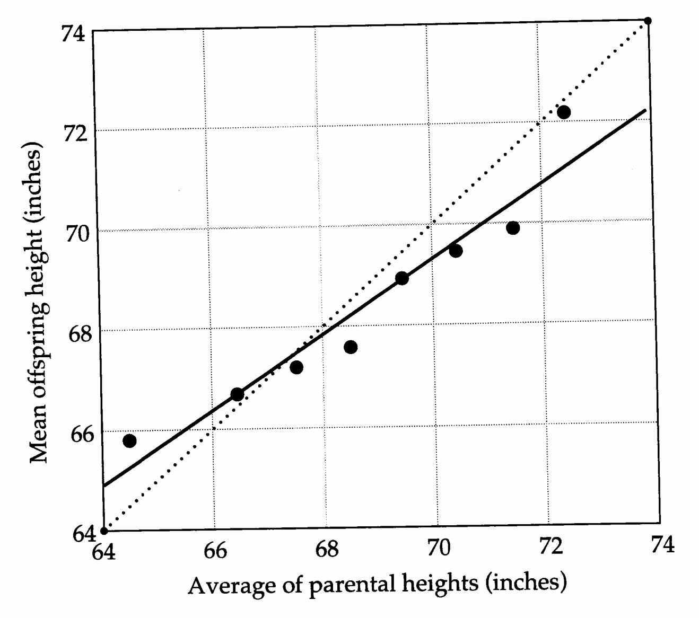
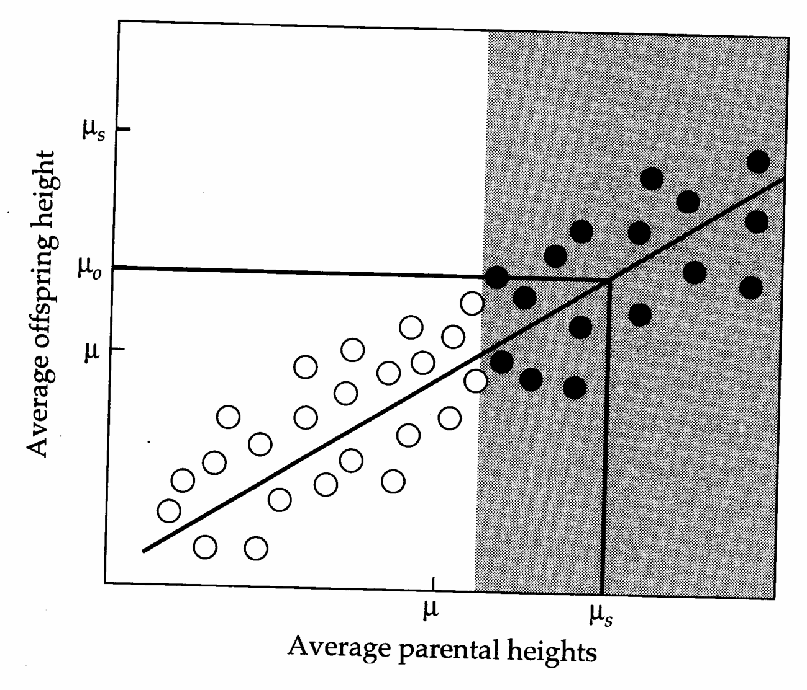
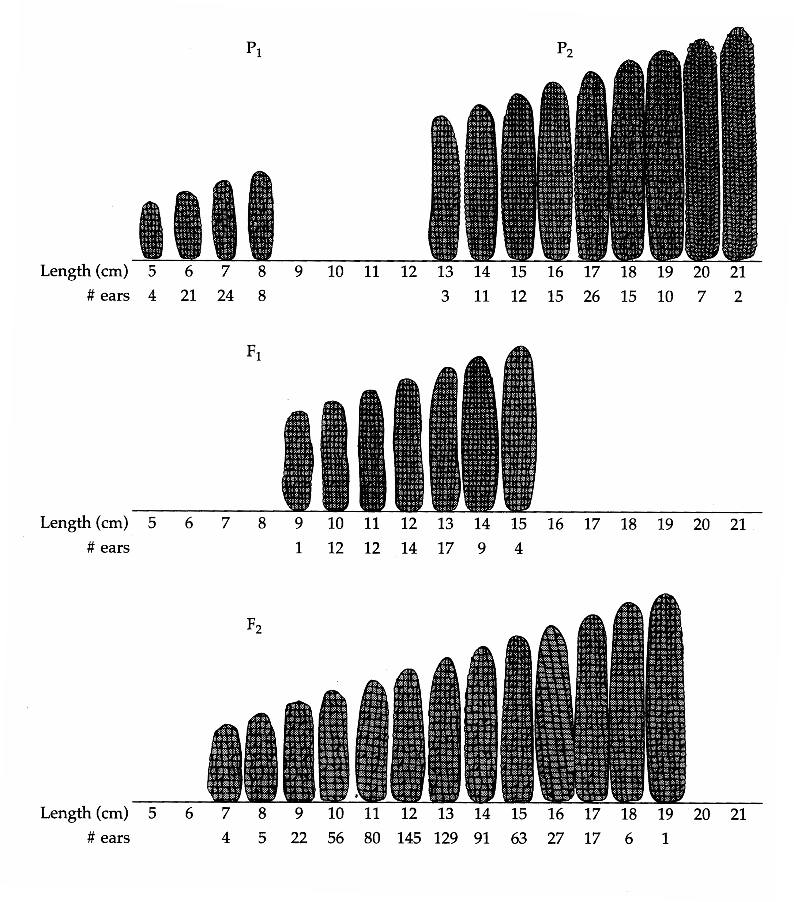
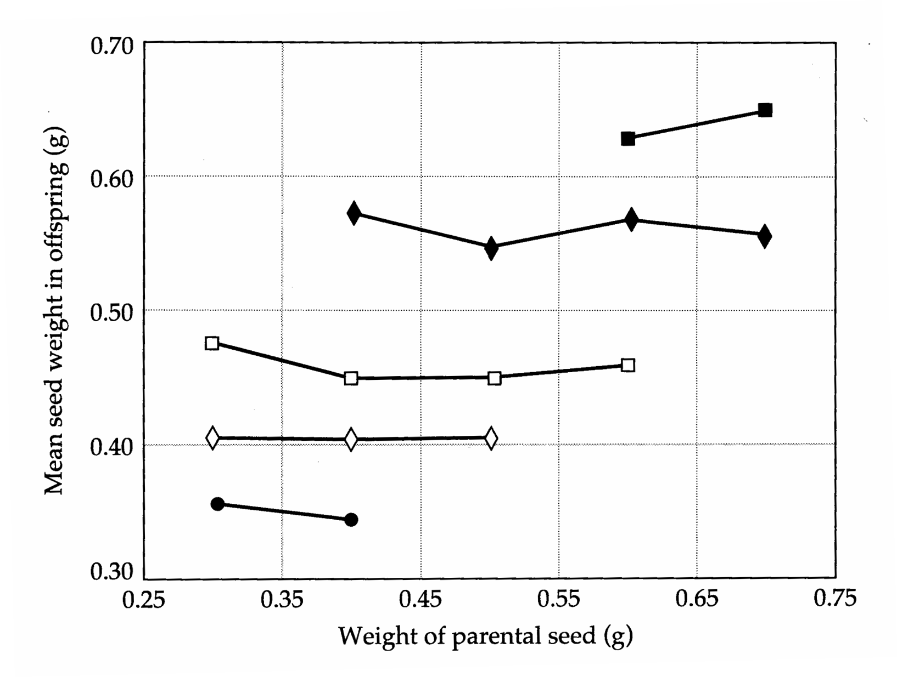

# Chapter 1 · An Overview of Quantitative Genetics

## Genetics_chapter1_001 · An Overview of Quantitative Genetics

Studies in most scientific disciplines can be classified into a “how” and “why” dichotomy. In biology, “how” questions are almost always concerned with proximate causes of observations. Since answers to such questions are generally sought at a lower level of organization, by its very nature the “how” approach to biology tends to be reductionistic. Questions of how muscles contract found their answers in the fields of cellular biology and neurobiology. The problem of how a plant develops its characteristic architecture is now being solved by molecular biologists. In principle, exact answers are available for “how” questions, the main limitation being the existence of the appropriate technology.

In contrast, “why” questions are concerned with ultimate causes. This naturally brings us to the study of adaptation, understanding of which requires an appeal to higher levels of organization. If, for example, one were interested in why a fish forages in a particular manner, it would be logical to examine the spatial and temporal distribution of food types and the rewards they offer, as well as to study the challenges from predators that confront the consumer. “Why” questions are the domain of evolutionary ecology, the general goal of which is to explain the diversity of morphology, physiology, behavior, and life histories both within and among populations and species. The study of proximate factors and ultimate causes are complementary approaches to biological investigation. Both are valid ways of doing science, and a knowledge of both is essential for a complete understanding of any biological system.

---

## Genetics_chapter1_002 · THE ADAPTATIONIST APPROACH TO PHENOTYPIC EVOLUTION

Most scientists test their ideas by phrasing them in the form of potentially falsifiable hypotheses, and in evolutionary biology, many such hypotheses are built around optimization principles. Having identified an interesting character or set of characters as well as one or more likely selective pressures, one asks the question, “What is the optimal phenotype?” An implicit assumption underlying the development of such hypotheses is that natural selection is the dominant, if not solitary, force molding the evolution of the phenotype.

Natural selection is the closest thing to a law that we have in biology. It is a universal force that applies, to varying degrees, at all levels of organization, from genes to individuals to populations to species. Thus, it is logical that we adopt it as a frame of reference in our attempt to understand nature. The relatively recent focus on selectionist thinking and hypothesis testing has revolutionized our understanding of essentially all areas of biology, ranging from molecular evolution to functional morphology. However, it is one thing to argue for the universal applicability of natural selection, and it is quite another to argue for its universal importance. To draw a physical analogy, while gravity is a universal force, it by no means provides a sufficient explanation for all motion. Points and counterpoints on the adaptationist program may be found in Williams (1966), Peters (1976), Brady (1979), Maynard Smith (1978, 1982), Popper (1978), Rosen (1978), Wassermann (1978), Gould and Lewontin (1979), Reed (1981), Willson (1981), Mayr (1983), Sober (1984), and Reeve and Sherman (1993).

While optimization theory can be highly successful at predicting what ought to evolve, it tells us very little if anything about how it should happen. The problem of how long it might take an optimal phenotype to evolve is usually ignored, as is the question of how the genetic variation necessary for adaptation arises. Generally, optimization theories are concerned entirely with the expected average phenotype, and thus give little consideration either to the expected phenotypic variance or to the problem of nonadaptive evolutionary change caused by forces such as random drift or mutation. In summary, although the adaptationist paradigm has forever transformed the way we think about biological phenomena, it has one very major limitation — it does not provide us with a mechanistic understanding of the evolutionary process. This is the primary goal of quantitative genetics.

---

## Genetics_chapter1_003 · QUANTITATIVE GENETICS AND PHENOTYPIC EVOLUTION

This book attempts to provide a “how” approach to “why” problems in evolutionary biology. The central issues to be discussed center on the fundamental nature of the processes that define the evolution of the sorts of morphological, physiological, life-history, and behavioral traits studied by ecologists and ethologists. These same types of traits are the focus of most plant and animal breeding programs (e.g., egg production, oil content, running speed), where man, rather than nature, defines the intensity and direction of selection.

Although cultural and/or maternal transmission of environmental effects play important roles in some cases, evolution is primarily a genetic process. Its study requires models that incorporate explicit genetic mechanisms. As we will soon see, most of the traits studied by whole-organism biologists are encoded by a large number of genetic loci, and for practical reasons, the individual loci are generally unobservable. The well-developed single-locus theory of population genetics (Crow and Kimura 1970, Hartl and Clark 1989) is of limited use in the study of such characters. In quantitative genetics, a statistical branch of genetics based upon fundamental Mendelian principles extended to polygenic (multilocus) characters, most final formulations are phrased in terms of phenotypic means and variances. Such measures are accessible to whole-organism biologists.

The science of quantitative genetics has been around for a long time, the main principles having been outlined independently by Ronald Fisher (1918) and Sewall Wright (1921a–d). It has served as the theoretical basis for most plant and animal breeding programs for well over a half century (Lush 1937, Hanson and Robinson 1963, Mayo 1980, Hallauer and Miranda 1981, Mather and Jinks 1982, Pirchner 1983, Henderson 1984a, Wricke and Weber 1986, Hill and Mackay 1989, Gianola and Hammond 1990, Falconer and Mackay 1996, Kearsey and Pooni 1996). It has also played an important role in our understanding of the inheritance of complex human genetic disorders such as heart disease, congenital malformations, and psychopathology. More recently (the past two decades), quantitative genetics has become well entrenched in the field of evolutionary biology (Bulmer 1980, Lande 1988, Barton and Turelli 1989, Boake 1994). The astonishing rate at which technical advances are now being made in molecular biology leaves little question that the field is now primed to enter a new frontier, in a sense an empirical return to its theoretical roots — the actual identification of the loci underlying quantitative variation. The practical implications of this ultimate synthesis for crop and livestock production and human medical practices are enormous.

The impact of early quantitative-genetic theory extends well beyond the biological sciences. It laid the foundations for modern theoretical and applied statistics. Out of a need for quantitative methods to describe the distributions of continuously distributed characters, Francis Galton provided the empirical motivation for Karl Pearson's formal development of the theory of regression and correlation (Provine 1971, Stigler 1986). Fisher's 1918 paper introduced the concept of variance-component partitioning, upon which the principles of analysis of variance (ANOVA) are based, and his subsequent contributions had a profound influence on the development of methods for experimental design and hypothesis testing (Fisher 1925, 1935, 1956). Wright's (1921a) method of path analysis has been broadly embraced by the social and ecological sciences.

The Mendelian principles upon which quantitative-genetic theory is built are universal, applying to domesticated species as well as to natural populations. Nevertheless, because the systems of mating and evolutionary forces found in natural populations are generally quite different than the controlled programs imposed on domesticated species, study of the inheritance of quantitative traits in natural populations presents a number of challenges. Most quantitative-genetic parameters are estimated through the comparison of phenotypes of individuals with known degrees of relatedness (Chapter 7). The basic idea here is that the resemblance between relatives is a function of the degree to which phenotypic expression is determined by shared genes as opposed to random environmental effects. Ideally, controlled genetic analyses should be performed with specific sets of relatives of specific ages in specific environmental backgrounds. While such situations are achievable with many crop plants, field biologists are often unable to perform controlled crosses and must let nature define the pattern of mating. This lack of experimental control can sometimes severely compromise the types of relatives that can be assayed and the degree of “balance” in the final data set. Breeders of large domesticated mammals (particularly cattle) have been confronted with similar problems for years, a situation that stimulated the development of new statistical procedures such as BLUP (best linear unbiased prediction, Chapter 26) and REML (restricted maximum likelihood, Chapter 27). Applications of these methods now extend well beyond the issues that motivated their development, although they still remain largely unexploited by evolutionary biologists.

Because Fisher and Wright are two of the most prominent evolutionary biologists of this century, it is puzzling that the principles of quantitative genetics were nearly immediately embraced by plant and animal breeders, while well over fifty years elapsed before they began playing a major role in evolutionary theory and analysis. Whatever the reason for the delay, the impact of quantitative-genetic thinking in evolutionary biology has been explosive, and this is where many of the recent advances in the field have been made. Although many challenges still exist, essentially all of the broad issues in evolution have now been explored in quantitative-genetic terms in one way or another.

The diverse roles played by selection present a unique challenge for studies of natural populations. For the breeder, the issue of evolutionary dynamics is relatively straightforward. By defining the population size, the mating system, and the intensity and direction of artificial selection, the breeder controls most of the evolutionary forces operating on a population. On the other hand, a fundamental goal of evolutionary studies is to identify those very forces, such as natural selection, that the breeder strives to eliminate. Thus, the development of methods for estimating the intensity and form of selection operating on quantitative traits has been largely restricted to the field of evolutionary biology. Because many of the predominant issues in evolutionary biology, such as mutation, stabilizing selection, random genetic drift, and sexual selection, have been of minimal relevance to short-term artificial selection programs, they too have only recently been incorporated into the theory by evolutionary biologists. Some of these theoretical advances are now being exploited by breeders, as attention turns to the long-term limits of artificial selection programs.

One of the goals of this book is to bring together the diverse results of quantitative genetics that have developed semi-independently in the fields of evolutionary biology, animal breeding, plant breeding, and human genetics. The primary emphasis is on the basic biological properties of quantitative characters and methods for their genetic analysis. An understanding of these issues is a prerequisite to studies of the evolutionary dynamics of quantitative traits under natural and/or artificial selection, random genetic drift, and mutation, all of which will be covered in our next book. As evolutionary biologists, our primary interest is in the natural world, and wherever possible, we have tried to emphasize the analysis of non-domesticated species (including humans). There are, however, many problems that can only be illustrated with data from laboratory or barnyard populations. Many extraordinary experiments performed in agronomy and animal breeding have been neglected unjustifiably by evolutionary purists.

On more than one occasion, we have heard criticism from molecular geneticists that quantitative genetics, due to its inattention to the structure and location of specific genes, is “phenomenological,” “missing the boat,” or “cheating.” We sympathize with the desire for a more precise understanding of gene structure, function, and expression. However, molecular analysis is not necessary or even useful for explaining patterns of resemblance between relatives. It is not required to explain the shifts in the mean and variance of characters observed under inbreeding. As yet, molecular biology does not provide any means of describing or predicting the constraints on the joint expression of correlated characters, and it certainly has little bearing on problems in the area of natural selection. Quantitative genetics has dealt with all of these issues successfully. This is not meant to imply that molecular biology is irrelevant to problems in phenotypic evolution. Ultimately, observations at both levels of organization will have to answer to each other, and it is likely that they will soon do so (Chapters 14–16).

---

## Genetics_chapter1_004 · HISTORICAL BACKGROUND

Quantitative genetics developed early in this century in response to a major controversy that still has some remnants today. The rediscovery of Mendelian genetics in 1900 centered attention on the inheritance of discrete characters such as purple vs. white flower color, smooth vs. wrinkled seeds, and so on. This focus was in stark contrast to an independent branch of genetic analysis begun earlier by Francis Galton (1869, 1889), who concentrated on continuously varying characters (those not clearly separable into discrete classes). Galton's approaches marked the founding of the Biometrical school, from which most of modern statistics can be traced (Stigler 1986, Crow 1993a). A series of contentious debates ensued between the Mendelians (led by William Bateson) and the Biometricians (led by Karl Pearson and W. F. R. Weldon). The major issues were whether discrete characters have the same hereditary and evolutionary properties as continuously varying characters. The Mendelians held that variation in discrete characters drove evolution through the appearance of new macromutations (mutations with large effects), while the Biometricians viewed evolution as the result of natural selection acting upon continuously distributed characters. The Mendelian-Biometrician clash, often influenced more by personalities than facts, substantially delayed the fusion of genetics and Darwin's theory of evolution by natural selection (Provine 1971).

In order to explain the approximate intermediacy of progeny phenotypes

> **Figure 1.1** · page 26 · source: `Genetics_chapter1`
>
> 
>
> Figure 1.1 The relationship between height of adult children and the average height of their parents (in inches). Circles denote average offspring heights for different 1-inch classes of midparent heights. The best linear fit is given by the solid line, while the dotted line is the expected pattern if mean offspring height were equal to midparent height. (Data from Galton 1889.)

with respect to those of parents, Darwin (1859) had assumed that continuous characters exhibit blending inheritance. The problem with that view, as pointed out by the engineer Fleeming Jenkin (1867), is that half the existing variation is removed each generation under blending inheritance. Large amounts of new variation would have to be renewed each generation just to keep the level of existing variation constant, and without such variation there could be no further evolution.

Galton, a cousin of Darwin, pointed out another problem. When he plotted the mean heights of offspring (measured at adult age) against the average height of their parents (corrected for differences between the sexes), he obtained a linear relationship (Figure 1.1). However, the slope of the line indicated that offspring were, on average, less exceptional than their parents. Parents whose average height was below the mean tended to have offspring taller than themselves but still below the mean. Parents above the mean tended to have offspring shorter than themselves. Galton (1889) called this trend regression toward mediocrity, and argued that it would erode away any selective progress. He concluded that evolution must be based upon sports (mutations of large effects) rather than on selection acting upon continuous variation.

> **Figure 1.2** · page 27 · source: `Genetics_chapter1`
>
> 
>
> Figure 1.2 Response to selection. The solid line is Galton’s regression. The closed circles represent selected parents. In the absence of selection, the mean height for both the parents and offspring is $ \mu $. However, if the average height of selected parents is $ \mu_{s} $, the expected height of offspring $ (\mu_{o}) $, obtained by reading off the regression line, is greater than $ \mu $ but less than $ \mu_{s} $.

Pearson (1903) pointed out the fault in Galton's logic. Imagine that selection acts in such a way that only the largest parents reproduce, so that the mean height of reproductive adults after selection ( $ \mu_{s} $) is greater than the mean height before selection ( $ \mu $) (Figure 1.2). If $ \mu_{o} $ is the average adult height of the offspring of the selected parents, then the response to selection across generations is $ \mu_{o} - \mu $. Since the slope of the parent-offspring relationship is less than one, the adult offspring are not expected to be as tall (on average) as their selected parents. However, the mean offspring height will be greater than the mean height in the parental base population. Furthermore, the new mean height is stable — if selection on height is stopped, the new height is not expected to decay back to the original value. Thus, the regression toward mediocrity does not pose a serious problem for the theory of evolution by natural selection. Galton apparently failed to realize that selection starts from a new mean each generation and that it is to this new mean that the next generation of selection regresses.

Although in disagreement with some of Galton’s interpretations, Pearson was inspired greatly by Galton’s quantitative approach to analysis and went on to develop many methods for the analysis of continuously distributed traits. Since Pearson was an ardent non-Mendelian, it is particularly noteworthy that many of the regression and correlation techniques that he invented serve today as a cornerstone in the analysis of selection on quantitative traits (Chapters 3 and 8).

A resolution to the problem of blending inheritance and the maintenance of variation was slower in coming. Mendel himself had actually suggested how this might be accomplished — the variation in continuous characters can be maintained by the independent segregation of multiple factors. The British mathematician G. Udny Yule gave formal proof for this idea in 1902. Unfortunately for Yule, the only thing that the Biometricians and the Mendelians could publicly agree on was the incompatibility of Mendelian genetics and the inheritance of continuous characters. The death of Weldon in 1906, followed by the publication of several key experiments from 1908 to 1916, resulted in the rapid emergence of the multiple-factor hypothesis.

George H. Shull, a major figure in American corn breeding, noted that self-fertilized corn strains are remarkably uniform in many continuous traits when compared to the outbred populations from which they are derived. His (Shull 1908) explanation (with modern terminology inserted and italicized) was

The obvious conclusion to be reached is that an ordinary cornfield is a series of very complex hybrids (genotypes) produced by the combination of numerous elementary species (alleles). Self-fertilization soon eliminates the hybrid elements (removes the heterozygosity) and reduces the strain to its elementary components (each locus becomes homozygous, resulting in each inbred strain being composed of a single genotype).

The major implication of Shull's observation is that any variation for continuous characters that is lost upon inbreeding must have a Mendelian basis.

Additional support for the multiple-factor hypothesis came from H. Nusson-Ehle (1909), a Swedish geneticist working with various cereal crops. Many of the characters that he examined yielded 3:1 ratios in the $ F_{2} $ generation following the cross of two parental strains, consistent with expectations for a single segregating locus with one allele completely dominant over the other. However, there were some striking exceptions. For example, when red-seeded and white-seeded wheat strains were crossed, the $ F_{1} $ progeny were identical in color, but in some of the $ F_{2} $ crosses, a ratio of 63 red:1 white seeds was observed. Nilsson-Ehle interpreted this to be the result of the segregation of three independent factors, the initial parents being AABBCC and aabbcc, all members of the $ F_{1} $ being AaBbCc and hence uniform in color, and the $ F_{2} $ consisting of all possible genotypes, only one of which (aabbcc) gives rise to white seed. The probability of obtaining an aabbcc offspring from an AaBbCc × AaBbCc cross is $ (1/2)^{6} = 1/64 $.

From these results, Nilsson-Ehle arrived at two general conclusions. First, sexual reproduction can produce a huge diversity of genotypes. For example, since a locus with two alleles A and a can produce three genotypes (AA, Aa, and aa), ten diallelic loci can produce $ 3^{10} \simeq 60,000 $ genotypes. Second, given this huge potential diversity of genotypes, apparently new types appearing within a population may be the result of rare segregants rather than new mutations. Nilsson-Ehle, and independently East (1910), offered this as an explanation of atavisms — rare individuals that appear to be throwbacks to some previous population. Consider a hybrid population resulting from the cross of two pure lines differing at ten loci. The probability of obtaining a specific parental genotype in the $ F_2 $ or later generation is $ (1/4)^{10} $. Hence, the population size has to be greater than $ 4^{10} \simeq 10^6 $ for there to be much of a chance of observing a parental type.

Subsequent studies quickly confirmed the ideas of Shull and Nilsson-Ehle. East (1911, 1916) and Emerson (1910; Emerson and East 1913) examined quantitative variation in a large number of plants. Typically, strains differing widely in some character were crossed and the variance of the resulting $ F_{1} $ and $ F_{2} $ generations recorded. In most of these crosses, especially when the parental populations were formed by repeated self-fertilizations, an outbreak of variation was seen in the $ F_{2} $ (Figure 1.3). Such outbreaks of variation, resulting from the segregation of multiple genotypes from the $ F_{1} $ heterozygotes, are consistent with the Mendelian model, and they are completely inconsistent with any blending hypothesis. An extensive historical review of the experimental verification of the multiple-factor hypothesis is given in Chapter 15 of Wright (1968).

The Danish botanist Wilhelm Johannsen (1903, 1909) was among the first to demonstrate that some of the variation in continuous characters is due to environmental rather than genetic causes. Starting from a common stock of beans, he produced several inbred lines. For each line, parental seeds of different weights were planted and the mean seed weight in the offspring measured. Johannsen observed that the variation within a pure line was not heritable — the mean seed weights of the offspring were essentially independent of the weights of the parental seed (Figure 1.4). To clarify the distinction between genetic and environmental effects, he coined the terms genotype (to denote genetically identical members of a pure line) and phenotype (the actual observed value for an individual — a compounding of genetic and environmental effects). From his observations, Johannsen concluded that natural selection could never move a character value beyond the level of variation seen in the original population. Like Galton, he felt that macromutations were essential for evolution.

However, rayne (1918) soon demonstrated that selection on Drosophila bristle number can result in flies with more extreme phenotypes than those seen in the base population. Such a result has been observed in many selection programs involving economically important species of plants and animals — almost always, the range of observed variation underestimates the range of potential variation, often dramatically so. By increasing the frequency of favored genes, selection increases the probability of observing extreme genotypes. Recall from above that if the frequency of the favored allele at each of ten loci is 0.5, then the frequency of the most extreme genotype (a homozygote at all ten loci) is approximately one in a million. However, if selection advances the frequency of the favored allele at each locus to 0.9, the frequency of the most extreme genotype becomes $ (0.9^{2})^{10} \simeq 0.12 $. In other words, about one in eight individuals would exhibit the most extreme genotype.

> **Figure 1.3** · page 30 · source: `Genetics_chapter1`
>
> 
>
> Figure 1.3 The distribution of ear size in the $ F_{1} $ and $ F_{2} $ generations formed by crossing two inbred lines of corn differing in ear length. The observed number of ears is given below each size class. The variation seen in the $ P_{1} $, $ P_{2} $ and $ F_{1} $ populations is due entirely to environmental factors, as all individuals in each population have the same genotype. These three populations show roughly similar amounts of variation. In contrast, the $ F_{2} $ generation shows considerably more variation, reflecting the diversity of genotypes in this population generated by segregation of genes in the $ F_{1} $ parents. (Data from East 1911.)

> **Figure 1.4** · page 31 · source: `Genetics_chapter1`
>
> 
>
> Figure 1.4 Mean offspring seed size as a function of parental seed size for some of Johannsen's pure lines. The data for the different lines are denoted by different symbols. If there is a heritable component to seed weight within a pure line, a line with positive slope is expected — larger parents should yield larger offspring. However, within each line, mean offspring size is essentially independent of the parental phenotype. (Data from Johannsen 1903.)

---

## Genetics_chapter1_005 · THE MAJOR GOALS OF QUANTITATIVE GENETICS

Before proceeding, we give a very brief summary of the main issues to be addressed in the remainder of the book:

---

## Genetics_chapter1_006 · THE MAJOR GOALS OF QUANTITATIVE GENETICS / The Nature of Quantitative-trait Variation

The preceding paragraphs have provided evidence that the expression of quantitative characters is typically influenced by both genetic and environmental factors, and that patterns of variation are qualitatively consistent with Mendelian expectations. However, many questions remain. An obvious one, of interest from many perspectives, is, How much of the standing variation in populations is due to genetic causes and how much to environmental ones? From the standpoint of evolution and applied breeding programs, genetic components of variance are of particular interest because they determine the rates at which characters respond to selection. Environmental variance reduces the efficiency of the response to selection by causing the phenotypes of selected individuals to deviate from their underlying genotypic values. From the perspective of human genetic disorders, the degree to which the expression of undesirable traits is determined by genetic vs. environmental causes has broad implications for the development of preventative procedures and genetic counseling strategies.

Many methods exist for partitioning phenotypic variance into its various components (Chapters 17–27), all of which are based on the principle that the phenotypic resemblance between relatives provides information on the degree of genetic differentiation among individuals (Chapter 7). However, virtually all of the methods have some undesirable theoretical and methodological features. For example, a simple dichotomy between genetic and environmental sources of variation is often overly simplistic, since genotype × environment interaction may exist (Chapter 22). More significantly, there are several components of both environmental and genetic variation (Chapters 4, 5, and 6). The different components influence the resemblance between relatives to different degrees, and as a consequence, have substantially different influences on the evolutionary process. The additive component of the genetic variance (also known as the variance of breeding values) is of particular interest because it is the primary determinant of the degree to which offspring resemble their parents, which governs the rate of response of a character to selection.

Ultimately, the pool of genetic variation in a population must be due to a quasi-balance between the forces of selection and random genetic drift, both of which tend to eliminate variation, and the replenishing force of mutation. Recent work has shown that the mutational rate of production of new variation for quantitative traits is remarkably high (Chapter 12). However, our understanding of the molecular basis of such variation is still very crude. There are only a handful of multilocus characters for which even one or two genetic loci are known, and in the vast majority of cases, we have no information on this issue. Observed patterns of variation in the progeny of line crosses can provide qualitative insight into whether the number of loci underlying a character is likely to be large or small (Chapters 9 and 13). With the development of genomic maps for many species on the horizon, molecular-marker-based approaches will rapidly refine our understanding of these issues, as statistical machinery for mapping and characterizing quantitative-trait loci (QTLs) is now in place (Chapters 14–16). Major issues that await resolution are the roles of nonadditive gene action in the expression of quantitative traits (Chapter 5), the extent to which alleles at different loci are distributed independently versus being associated statistically within populations (Chapter 5), and the mechanisms by which gene action maps developmentally into phenotypic expression (Chapter 11).

---

## Genetics_chapter1_007 · THE MAJOR GOALS OF QUANTITATIVE GENETICS / The Consequences of Inbreeding and Outcrossing

The mean phenotypes of progeny from consanguineous matings virtually always differ from those of progeny from random-bred parents. Such inbreeding effects are almost always deleterious, generally increasing linearly with the degree of relatedness between parents (Chapter 10). These observations are consistent with the presence of deleterious recessive alleles segregating at the loci underlying quantitative variation. The mechanisms and consequences of inbreeding have a number of practical implications, e.g., in the design of breeding programs for captive populations of endangered species, the maintenance of inbred lines for biomedical and agricultural research, and the genetic counseling of victims of incest. Patterns of fitness decline with inbreeding can also provide insight into the rate and average effects of deleterious mutation (Chapter 10).

Crosses between isolated lines or populations often exhibit “hybrid vigor” in the $ F_{1} $ generation, only to be followed by substantial fitness decline in the next ( $ F_{2} $) generation. The pattern of change in mean phenotypes in line crosses can yield insight into the mode of gene action, particularly with regard to interaction between genes at different loci (Chapter 9). Such information is vital to attempts to understand the mechanisms of speciation (Chapter 14).

---

## Genetics_chapter1_008 · THE MAJOR GOALS OF QUANTITATIVE GENETICS / The Constraints on the Evolutionary Process

Fundamental questions arise in evolutionary biology and in selective breeding programs as to the factors that limit the rate of phenotypic evolution. As noted above, when selection operates on a single trait, the response to selection is roughly proportional to the additive genetic variance for the trait (Chapter 3). However, if the same genes influence the expression of different traits, then an evolutionary change in one trait will necessarily lead to changes in the correlated traits. This can impede the evolutionary process when there is a conflict in the fitness consequences of selection operating directly on a trait and that operating on correlated traits. Questions of evolutionary trade-offs have long been the focus of evolutionary ecology, but many of the ideas in that field (e.g., life-history theory) have developed out of simple energetic arguments or comparative surveys on the phenotypes of different species. An unambiguous understanding of the constraints on the evolution of systems of complex characters requires information on the magnitude and direction of genetic correlations between characters. Quantitative-genetic methodology provides a powerful, but data demanding, means of elucidating these issues (Chapter 21). Ultimately, we would like to know the extent to which patterns of genetic correlations within populations are reflected in multivariate patterns of differentiation among species.

---

## Genetics_chapter1_009 · THE MAJOR GOALS OF QUANTITATIVE GENETICS / The Estimation of Breeding Values

Plant and animal breeding programs are based on the principle that an individual's phenotype provides some insight into its underlying genotypic value. However, because the environment can contribute greatly to phenotypic expression, the amount of genetic information conveyed by a single phenotypic measurement is not necessarily high. On the other hand, if one considers jointly the phenotypes of all of the relatives of a focal individual, a more accurate assessment of that individual's breeding value can be acquired. The identification of elite individuals by BLUP (Chapter 26), in some cases supplemented by information from molecular markers, is now a major goal of applied quantitative genetics.

---

## Genetics_chapter1_010 · THE MAJOR GOALS OF QUANTITATIVE GENETICS / The Development of Predictive Models for Evolutionary Change

Much attention has been given to the predictive power of quantitative-genetic theory. For breeders facing a large economic investment in an artificial selection program, a fundamental issue is the magnitude of selection gain that is to be expected following a certain period of selection at a specified intensity. Models that provide reasonable predictions, at least for periods of a dozen generations or so, have long been available. These will be taken up in detail in our next book. For now, we simply emphasize that the application of all such models requires information on the components of variation and covariation of the selected traits, the primary topics of this volume.

---

## Genetics_chapter1_011 · MATHEMATICS IN BIOLOGY

Biologists often become alienated from mathematics at an early stage in their career under the misconception or self-deception that biology is not a mathematical science. The claim is also often made that mathematical theory is overly simplistic, ignoring the inherently complex nature of biological systems. This posture is not very productive, and ironically, those who make such claims frequently devote their entire careers to performing carefully controlled experiments in which only one or two factors are allowed to vary, effectively sweeping biological reality under the rug.

Most of the major advances in evolutionary biology over the last few decades have come from quantitative statements, many of which involve only elementary algebra or the most basic theorems of calculus. While it is understandable that most biologists do not want to spend their careers deriving theory, it is useful to maintain some degree of skill at evaluating the relevance of theory derived by others. It is equally important that theoreticians strive to describe their work in as simple and digestible a form as possible. There is no question that the contributions of Ronald Fisher to evolutionary biology and applied statistics are among the most brilliant ever, but his terse writing style, tendency to neglect mentioning the assumptions of his models, and frequent unstated use of mathematical approximations have not done anyone any favors.

The fact that quantitative genetics requires the use of some mathematics should come as no surprise. Some of the math is unavoidably tedious, but most of it is basic algebra. With the nonmathematician in mind, Chapters 2, 3, and 8 and the Appendices present the fundamental statistical concepts that will be used throughout the book. Although the technical reviews in those sections may be unnecessary for the mathematically sophisticated, numerous examples that provide direct contact with quantitative-genetic issues have also been incorporated. Throughout the remainder of the book, ample mathematical machinery is presented and supported by worked examples so that the diligent reader should emerge with some ability for developing practical methodology and quantita- tive theory. The rewards of mathematical theory can be enormous, particularly when what looks like mind-boggling complexity collapses into a relatively simple formulation. We will see, fortunately, that such simplifications often occur in quantitative genetics.

---
