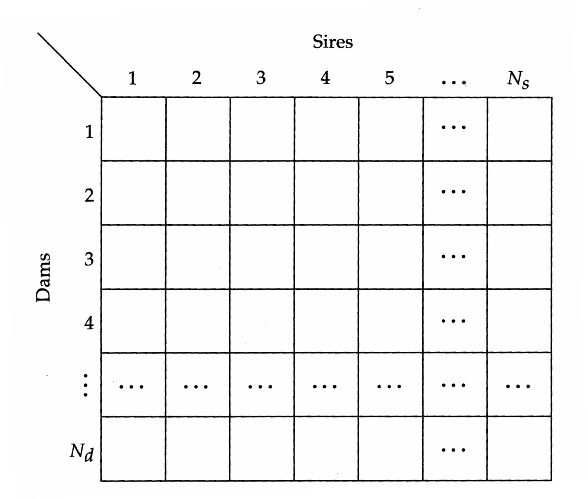
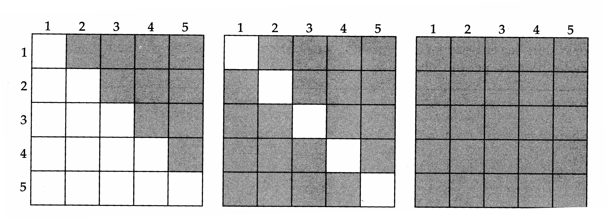
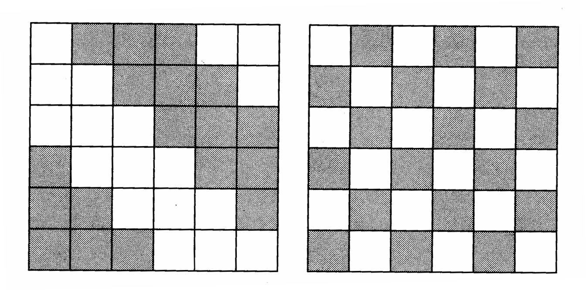
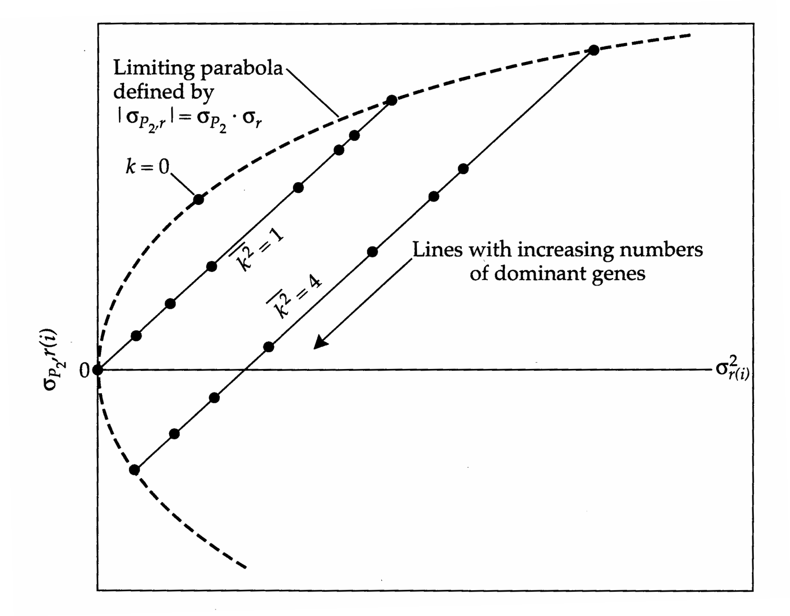
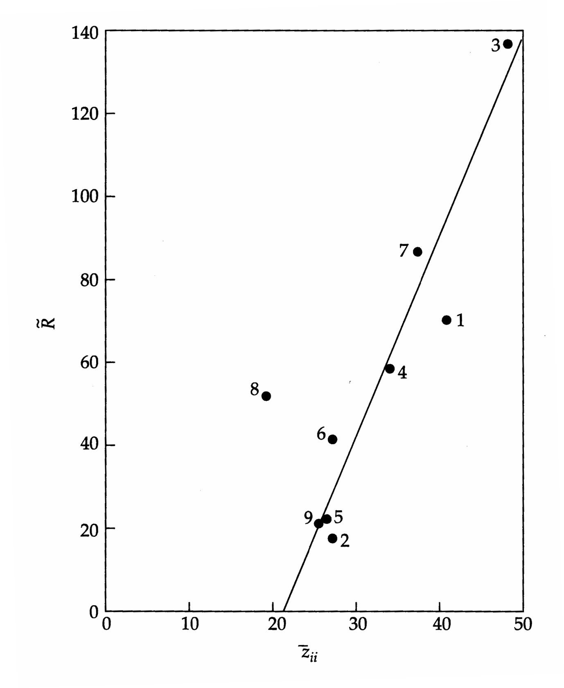
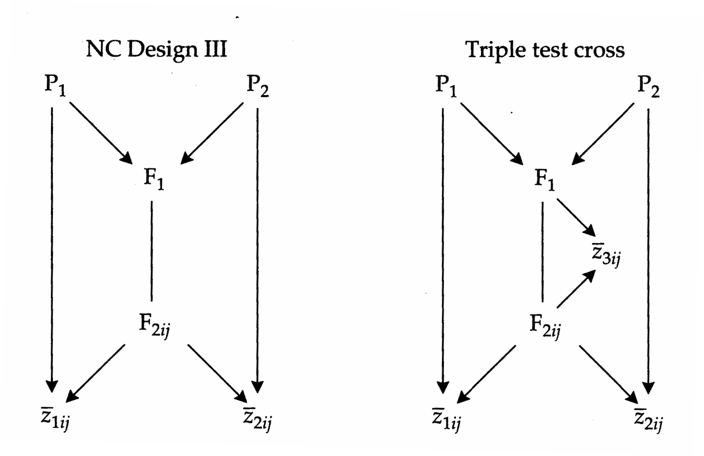

# Chapter 20 · Cross-Classified Designs

## Genetics_chapter20_001 · Cross-Classified Designs

The theoretical underpinnings of the one-way and nested analyses of variance were described in Chapter 18 in the context of experimental designs involving full and half sibs. A third type of ANOVA is the factorial, or cross-classified, design with interaction. The focus of this chapter is on the simplest application of this model — the two-way classification in which the two factors are groups of mothers and fathers mated multiply to each other. We confine most of our focus to two extreme situations — the parental categories being either completely inbred lines or individuals extracted from a random-mating base population. The latter type of analysis requires that females can be mated to multiple males, and that offspring with known paternity can be recovered reliably. With inbred lines, replicate members of the same line are genetically identical, and it is not essential that individuals be multiply mated. Both approaches are used widely in the analysis of plant populations.

Many different two-factor designs have been used in quantitative genetics. In some cases, different sets of genotypes serve as paternal and maternal sources of gametes, whereas in others (diallels) the paternal and maternal sets of genotypes are identical. All possible crosses are not always assayed — reciprocal crosses are sometimes excluded, as are crosses within categories (selfed crosses). In some analyses, the parents are assumed to represent a random sample of the population about which inferences are to be made (and hence are treated as random effects), whereas in other situations they are the only genotypes of interest (fixed effects). Finally, different investigators often apply rather different linear models to data sets derived from the same type of experimental design.

Although the diversity of approaches to cross-classified analysis sometimes borders on the bewildering, some unifying features and distinct advantages emerge. First, all of the approaches rely on an ability to generate multiple types of sib relationships, e.g., full sibs, paternal and maternal half sibs, reciprocal and nonreciprocal sibs (a shared parent of reciprocal sibs serves as the father of one and the mother of the other), and selfed and nonselfed families. Since different causal factors contribute differentially to the resemblance between different types of relatives, this increase in the number of relationships that can be observed in a single experiment expands the number of variance components that can be estimated beyond what is possible in parent-offspring and nested sib analyses. Second, since the performance of individual genotypes is assayed in multiple fa- milial backgrounds, it is possible to evaluate individual breeding values as well as relative performances of specific crosses. In agriculture, such information plays a central role in the development of economically valuable breeds, including elite hybrids. Third, for the same amount of effort, cross-classified designs often yield more precise estimates of variance components than can be achieved with other methods of analysis. Fourth, cross-classified analysis provides a means of estimating the average degree of dominance of alleles underlying quantitative traits.

In this chapter, we outline several of the linear models that have been employed in cross-classified analysis, showing how the components of variance associated with each model can be interpreted in terms of covariances between relatives, and hence in terms of causal sources normally associated with the resemblance between relatives. In our overview of the estimation procedures, we confine our attention to balanced designs analyzed in an ANOVA framework. With two-way ANOVA, the computational complexities that arise with unbalanced data are much more formidable than those outlined in Chapter 18 (Searle et al. 1992), and the maximum likelihood methods covered in Chapters 26 and 27 provide powerful and elegant alternative means of estimating variance components. Although ANOVA continues to dominate the landscape of two-factor analysis, this is rapidly changing as efficient and user-friendly computer programs for ML estimation are becoming available.

---

## Genetics_chapter20_002 · NORTH CAROLINA DESIGN II

Comstock and Robinson (1948, 1952) devised a series of experimental designs for estimating quantitative-genetic parameters for situations in which one or both sexes can be mated multiply. Their protocols became known as the North Carolina designs as they were employed extensively in breeding programs in that state. The nested full-sib, half-sib analysis covered in Chapter 18 is equivalent to North Carolina Design I. Design II, the subject of this section, involves all possible crosses between two sets of individuals — a group of $i = 1, \ldots, N_{s}$ sires and an independent group of $j = 1, \ldots, N_{d}$ dams (Figure 20.1). This design has proven especially applicable to plants that produce multiple flowers. Since pollen is usually produced in abundance, for species with separate sexes, the size of an experiment is generally limited by the number of flowers that female plants produce. For hermaphroditic species, the amount of effort that is required to emasculate flowers can become limiting. In principle, Design II can also be applied to animals, but when females are mated multiply, care must be taken to control for sperm storage and the possible effects of maternal age on progeny phenotypes.

Under Design II, the linear model for the phenotype of the kth offspring of the $i\times j$ mating can be expressed as

$$
z_{i j k}=\mu+s_{i}+d_{j}+I_{i j}+e_{i j k}
\tag{20.1a}
$$

> **Figure 20.1** · page 611 · source: `Genetics_chapter20`
>
> 
>
> Figure 20.1 Mating scheme for North Carolina Design II. Each cell contains n observations.

where $ \mu $ is the mean phenotype in the population, $ s_i $ and $ d_j $ are the additive effects (breeding values) of the $ i $th sire and $ j $th dam, $ I_{ij} $ is the nonadditive (interaction) effect due to the combination of genes from parents $ i $ and $ j $, and $ e_{ijk} $ is the deviation of the observed phenotype of the $ k $th offspring of parents $ i $ and $ j $ from the model's prediction. Note that this model is identical in form to that given for the nested design (Equation 18.28a), except that the effect of nested dam in the previous model, $ d_{ij} $, has been replaced with the sum of an additive and an interaction effect, $ d_i + I_{ij} $.

In the following, we assume that the parents are sampled randomly from some random-mating population about which inferences are to be made. Under this random-effects interpretation, we are usually more interested in estimating population parameters than the attributes of specific individuals. All of the effects in Equation 20.1a are independent, have zero expectations, and have variances respectively equal to $ \sigma_{d}^{2} $, $ \sigma_{s}^{2} $, $ \sigma_{I}^{2} $, and $ \sigma_{e}^{2} $. The total phenotypic variance is simply the sum of these four components,

$$
\sigma_{z}^{2}=\sigma_{d}^{2}+\sigma_{s}^{2}+\sigma_{I}^{2}+\sigma_{e}^{2}
\tag{20.1b}
$$

The effects in this model are defined as

$$
s_{i}=\mu_{i}.-\mu
\tag{20.2a}
$$

$$
d_{j}=\mu_{.j}-\mu
\tag{20.2b}
$$

$$
I_{i j}=\mu_{i j}-\mu-s_{i}-d_{j}
\tag{20.2c}
$$

$$
e_{ijk}=z_{ijk}-\mu-s_{i}-d_{j}-I_{ij}
\tag{20.2d}
$$

**[Table]**

*[See Table 20.1 at the end of this section.]*

where $ \mu_{i} $ and $ \mu_{.j} $ are, respectively, the expected phenotypes of offspring of the ith father and the jth mother, and $ \mu_{ij} $ is the expected phenotype of progeny in the full-sib family of parents i and j.

The method-of-moments procedures encountered in previous chapters provide a straightforward means to partitioning the total variance into its components. First, using approaches analogous to those developed in Chapter 18, the total sum of squared deviations of individual observations from the grand mean are partitioned into quantities relating to paternal and maternal factors, paternal × maternal interaction, and residual error (Table 20.1). Second, the expected mean squares, $ E(\text{MS}) $, are expressed as linear functions of the variance components $ \sigma_{d}^{2} $, $ \sigma_{s}^{2} $, $ \sigma_{I}^{2} $, and $ \sigma_{e}^{2} $. Finally, estimates of the variance components are obtained by equating the observed mean squares to their expectations and solving the system of four linear equations.

Design II has two particularly useful features. First, the variance components $ \sigma_{s}^{2} $ and $ \sigma_{d}^{2} $ are respectively equivalent to the covariances between paternal and maternal half sibs. This equivalency can be verified by referring to Equation 20.1a and recalling that only like terms (those with identical indices) are correlated,

$$
\sigma(\mathrm{PHS})=\sigma(z_{ijk},z_{ij^{\prime}k^{\prime}})=\sigma^{2}(s_{i})=\sigma_{s}^{2}
\tag{20.3a}
$$

$$
\sigma(\mathrm{MHS})=\sigma(z_{ijk},z_{i^{\prime}jk^{\prime}})=\sigma^{2}(d_{j})=\sigma_{d}^{2}
\tag{20.3b}
$$

Provided variation at sex-linked loci is of negligible importance and both sexes are equally inbred, both covariances should be equivalent with respect to inherited nuclear genes. However, the covariance between maternal half sibs will be inflated by any genetic or environmental maternal effects. Thus, the difference between Var(d) and Var(s) provides an estimate of the variance due to maternal effects. Second, the interaction variance, Var(I), is equivalent to Cov(FS) – Cov(PHS) – Cov(MHS), where Cov(FS) is the covariance between full sibs. This can also be seen by noting

$$
\begin{align*}\sigma(\mathrm{FS})&=\sigma(z_{ijk},z_{ijk^{\prime}})=\sigma^{2}(d_{i})+\sigma^{2}(s_{j})+\sigma^{2}(I_{ij})\\&=\sigma_{d}^{2}+\sigma_{s}^{2}+\sigma_{I}^{2}\end{align*}
\tag{20.3c}
$$

Using the expressions for the covariances between relatives given in Chapter 7, the observable variance components can be expressed in terms of hypothetical underlying causal factors,

$$
\sigma_{d}^{2}=\sigma(\mathrm{MHS})\simeq\frac{\sigma_{A}^{2}}{4}+\frac{\sigma_{AA}^{2}}{16}+\sigma_{G_{m}}^{2}+\sigma_{E_{c}}^{2}
\tag{20.4a}
$$

$$
\sigma_{s}^{2}=\sigma(PHS)\simeq\frac{\sigma_{A}^{2}}{4}+\frac{\sigma_{AA}^{2}}{16}
\tag{20.4b}
$$

$$
\sigma_{I}^{2}=\sigma(\mathrm{F S})-\sigma(\mathrm{P H S})-\sigma(\mathrm{M H S})\simeq\frac{\sigma_{D}^{2}}{4}+\frac{\sigma_{A A}^{2}}{8}+\frac{\sigma_{A\dot{D}}^{2}}{8}+\frac{\sigma_{D D}^{2}}{16}
\tag{20.4c}
$$

where $\sigma_{G_m}^2$ is the variance due to genetic maternal effects and $\sigma_{E_c}^2$ is the variance due to environmental maternal effects. Since the maternal-effects variance contributes to both the full-sib and maternal half-sib covariances, it cancels out in $\mathrm{Var}(I)$, as does the additive genetic variance, leaving only variance due to non-additive nuclear gene action. Thus, an advantage of the factorial Design II over the nested Design I (Chapter 18) is that the former allows for separate estimates of variance due to maternal effects ($\sigma_{G_m}^2 + \sigma_{E_c}^2$) and that due to dominance ($\sigma_D^2$). Equations 20.4a–c ignore all epistatic interactions involving more than two loci.

In practical applications of Design II, several $ N_{s} \times N_{d} $ sets (blocks) of independent parents are usually analyzed simultaneously to allow the sampling of a large number of genotypes (see Example 1). The general layout of Table 20.1 still applies except that the sums of squares (SS) and degrees of freedom are computed individually for each individual block and then summed prior to estimating the mean squares for the whole experiment. The expectations for the mean squares are the same as in Table 20.1.

**[示例 Example]**

> **Example 1** · ref: `Genetics_chapter20:1` · source: `Genetics_chapter20_002.json` · blocks 26–27
>
> Example 1. Dawson (1965) set up 43 blocks of 2 male × 2 female factorial experiments ( $ N_s = N_d = 2 $) for the flour beetle Tribolium castaneum and monitored development time in the progeny. (For each block, the offspring of the four crosses $ s_1 \times d_1 $, $ s_1 \times d_2 $, $ s_2 \times d_1 $, and $ s_2 \times d_2 $ were examined.) The ANOVA table follows. Note from Table 20.1 that for each 2 × 2 factorial, the degrees of freedom for sires, dams, and interactions are all equal to one. The within-family sample size varied slightly around 8, but to maintain compatibility with the lay-out for a balanced design, it is treated as a constant n = 8 here, with little effect on the final results. Thus, the error degrees of freedom for each factorial is $ N_s N_d (n - 1) = 2 \times 2 \times 7 = 28 $. At all levels, the total degrees of freedom are obtained by multiplying those for individual factorials by the number of blocks (43).
> 
> <table><tr><td>Factor</td><td>df</td><td>SS</td><td>MS</td><td>$ E(MS) $</td><td>Estimates (SE)</td></tr><tr><td>Sires</td><td>43</td><td>257.3</td><td>5.98</td><td>$ \sigma_{e}^{2} + 8\sigma_{I}^{2} + 16\sigma_{s}^{2} $</td><td>Var(s) = 0.073 (0.101)</td></tr><tr><td>Dams</td><td>43</td><td>362.6</td><td>8.43</td><td>$ \sigma_{e}^{2} + 8\sigma_{I}^{2} + 16\sigma_{d}^{2} $</td><td>Var(d) = 0.226 (0.128)</td></tr><tr><td>Interaction</td><td>43</td><td>207.3</td><td>4.82</td><td>$ \sigma_{e}^{2} + 8\sigma_{I}^{2} $</td><td>Var(I) = 0.370 (0.127)</td></tr><tr><td>Error</td><td>1,204</td><td>2,539.4</td><td>1.86</td><td>$ \sigma_{e}^{2} $</td><td>Var(e) = 1.860 (0.076)</td></tr><tr><td>Total</td><td></td><td></td><td></td><td></td><td>Var(z) = 2.529</td></tr></table>

The variance component estimates given in the above table are obtained by equating the observed mean squares to their expectations. Under the assumption of normality, the standard errors of these estimates (SE) are obtained as the square roots of the expressions in the bottom right of Table 20.1.

The following hypotheses can be evaluated by use of $ F' $ tests:

$$
\begin{aligned}\sigma_{s}^{2}&=0\quad&F_{43,43}&=MS_{s}/MS_{I}=1.240(NS)\\\sigma_{d}^{2}&=0\quad&F_{43,43}&=MS_{d}/MS_{I}=1.749(P<0.05)\\\sigma_{I}^{2}&=0\quad&F_{43,1204}&=MS_{I}/MS_{e}=2.592(P<0.001)\\\sigma_{d}^{2}&=\sigma_{s}^{2}\quad&F_{43,43}&=MS_{d}/MS_{s}=1.409(NS)\end{aligned}
$$

where the subscripts on $F$ denote the degrees of freedom associated with the test.

As noted in Chapter 18, the general procedure in determining the numerators and denominators for these test statistics is to use terms whose expectations are identical under the null hypothesis. Thus, each of the first three hypotheses is evaluated by dividing the respective observed mean square by the mean square whose expectation is identical except for the absence of the variance component of interest. For example, to test for significant sire effects, the sire mean square, whose expectation is $ \sigma_e^2 + n\sigma_I^2 + nN_d\sigma_s^2 $, is divided by the interaction mean square, whose expectation is $ \sigma_e^2 + n\sigma_I^2 $. To test whether the two variance components $ \sigma_s^2 $ and $ \sigma_d^2 $ are equal, a ratio of mean squares differing only in the components of interest is constructed, i.e., here we are evaluating whether $ E(MS_s) = E(MS_d) $.

Although the component of variance associated with sires is not significant, those associated with dams and interactions are, the latter highly so. As noted from Equation 20.4c, the presence of significant interaction variance implies the existence of nonadditive genetic variance. Assuming epistatic genetic variance is of negligible importance, the dominance genetic variance is estimated by $ 4\mathrm{Var}(I) = 1.480 $, accounting for 59% of the observed phenotypic variance. The difference between the variance associated with dams and sires, 0.153, provides an estimate of the maternal-effects variance. This accounts for another 7% of the phenotypic variance, although failure to reject the hypothesis $ \sigma_d^2 = \sigma_s^2 $ implies that this result is not statistically significant. Finally, four times the sire component of variance, although again not significant, provides an estimate of the additive genetic variance, 0.292, and accounts for 12% of the phenotypic variance.

These results, although not significant in all respects, are qualitatively similar to those obtained by parent-offspring and sib analyses (Example 3, Chapter 18), which suggested that 15%, 29%, and 7% of the phenotypic variance is attributable to additive genetic, nonadditive genetic, and maternal effects, respectively. The relatively consistent results obtained by different approaches lends confidence to the conclusion that there is a large amount of genetic variance for development rate in Tribolium, most of which is nonadditive.

> **Table 20.1** · `20.1` · page 612 · source: `Genetics_chapter20_002`
> Table 20.1 Summary of a two-way analysis of variance with interaction, assuming a perfectly balanced design.
>
> <table><tr><td>Factor</td><td>df</td><td>Sums of Squares</td><td>E(MS)</td></tr><tr><td>Sires</td><td>$ N_{s} - 1 $</td><td>$ nN_{d} \sum_{i}(\bar{z}_{i} - \bar{z})^{2} $</td><td>$ \sigma_{e}^{2} + n\sigma_{I}^{2} + nN_{d}\sigma_{s}^{2} $</td></tr><tr><td>Dams</td><td>$ N_{d} - 1 $</td><td>$ nN_{s} \sum_{j}(\bar{z}_{j} - \bar{z})^{2} $</td><td>$ \sigma_{e}^{2} + n\sigma_{I}^{2} + nN_{s}\sigma_{d}^{2} $</td></tr><tr><td>Interaction</td><td>$ (N_{d} - 1)(N_{s} - 1) $</td><td>$ n \sum_{i,j}(\bar{z}_{ij} - \bar{z}_{i} - \bar{z}_{j} + \bar{z})^{2} $</td><td>$ \sigma_{e}^{2} + n\sigma_{I}^{2} $</td></tr><tr><td>Error</td><td>$ N_{s}N_{d}(n - 1) $</td><td>$ \sum_{i,j,k}(z_{ijk} - \bar{z}_{ij})^{2} $</td><td>$ \sigma_{e}^{2} $</td></tr><tr><td colspan="2">Var(e) = MS_{e}</td><td>Var[Var(e)] = $ 2(MS_{e})^{2} $</td><td></td></tr><tr><td colspan="2">Var(I) = $ \frac{MS_{I} - MS_{e}}{n} $</td><td>Var[Var(I)] = $ \frac{2}{n^{2}} \left[ \frac{(MS_{I})^{2}}{df_{I} + 2} + \frac{(MS_{e})^{2}}{df_{e} + 2} \right] $</td><td></td></tr><tr><td colspan="2">Var(d) = $ \frac{MS_{d} - MS_{I}}{nN_{s}} $</td><td>Var[Var(d)] = $ \frac{2}{(nN_{s})^{2}} \left[ \frac{(MS_{d})^{2}}{df_{d} + 2} + \frac{(MS_{I})^{2}}{df_{I} + 2} \right] $</td><td></td></tr><tr><td colspan="2">Var(s) = $ \frac{MS_{s} - MS_{I}}{nN_{d}} $</td><td>Var[Var(s)] = $ \frac{2}{(nN_{d})^{2}} \left[ \frac{(MS_{s})^{2}}{df_{s} + 2} + \frac{(MS_{I})^{2}}{df_{I} + 2} \right] $</td><td></td></tr></table>
>
> Note: The lower-left half of the table gives estimators for the variance components $ \sigma_{e}^{2} $, $ \sigma_{I}^{2} $, $ \sigma_{d}^{2} $, and $ \sigma_{s}^{2} $. Large-sample variance expressions (derived under the assumption of normality by using Equation 18.19) appear to their right; the square roots of these provide standard errors. $ N_{s} $ and $ N_{d} $ are the numbers of sires and dams, and n is the number of progeny measured per family. $ MS_{d} $, $ MS_{s} $, $ MS_{I} $, and $ MS_{e} $ are, respectively, the observed mean squares for dams, sires, interactions, and errors; these are obtained by dividing the respective observed sums of squares by their associated degrees of freedom (df).

---

## Genetics_chapter20_003 · NORTH CAROLINA DESIGN II / The Average Degree of Dominance

Comstock and Robinson (1952) were particularly interested in the situation in which the frequencies of all genes at segregating loci are equal to one-half, as occurs when two inbred lines have been mated randomly to form an $ F_2 $ generation, the members of which are then utilized in a factorial design. Recalling our scheme for representing the three genotypic values at a locus (0 for $ B_1B_1 $, $ (1+k)a $ for $ B_1B_2 $, and 2a for $ B_2B_2 $), it can be seen from Equations 4.12a,b that when p = q = 0.5, the additive genetic variance in the $ F_2 $ and later generations is $ \sum a_i^2/2 $, while the dominance genetic variance is $ \sum(k_i a_i)^2/4 $, the summations being over loci. Thus, under the assumptions of equal gene frequencies, no epistasis, and no gametic phase disequilibria, twice the ratio of dominance to additive genetic variance provides an estimate of the average value of $ k^2 $, each locus being weighted by the square of the magnitude of the homozygous effect on the character. In terms of the observable components of variance, this weighted mean value of $ k^{2} $ is estimated by

$$
\widetilde{D}=\frac{2Var(I)}{Var(s)}
\tag{20.5}
$$

A value of $ \widetilde{D} $ equal to zero implies that there is no dominance, whereas $ 0 < \widetilde{D} < 1 $ implies partial dominance, $ \widetilde{D} = 1 $ complete dominance, and $ \widetilde{D} > 1 $ overdominance. Strictly speaking, this technique does not reveal the direction of dominance, since the sign of k is eliminated by squaring, but a direct examination of the data (to see whether family means tend to resemble higher vs. lower performing parents) can resolve that issue.

Epistasis and gametic phase disequilibria are potential sources of bias in the estimate $ \widetilde{D} $. For example, additive × additive epistatic variance contributes $ \sigma_{AA}^{2}/4 $ to 2Var(I) but only $ \sigma_{AA}^{2}/16 $ to Var(s), so epistasis will always cause an upward bias in the estimate of $ \overline{k}^{2} $. The direction and magnitude of bias caused by gametic phase disequilibrium depends upon the linkage phase between constituent loci, as can be seen by reference to Equations 5.16a,b. The situation is quite complex, but the bias in $ \widetilde{D} $ is again most likely to be in the upward direction. If genes with like effects are coupled (positives with positives, negatives with negatives), then both $ \sigma_{A}^{2} $ and $ \sigma_{D}^{2} $ will be biased in the same direction (although not necessarily to the same extent), and the bias in their ratio may not be great. However, if genes are in repulsion disequilibrium (alleles with negative effects tending to be associated with alleles with positive effects), the additive genetic variance is reduced while the dominance genetic variance is increased. This will inflate the estimated $ \overline{k}^{2} $ relative to its true value, and can sometimes lead to the false impression of overdominance (even when none of the individual loci is more than partially dominant).

Such associative overdominance (Chapter 10) can be common in the early generations of a cross between lines and is detectable as a downward trend in $ \widetilde{D} $ in successive generations of mating. Moll et al. (1965) demonstrated such a trend in two crosses between inbred lines of maize by analyzing morphological characters in the $ F_2 $ and later generations of random mating. The general pattern was for the additive genetic variance to remain constant across generations, while the interaction variance declined, leading to a reduction in $ \widetilde{D} $. In the case of total grain yield, $ \widetilde{D} $ was initially greater than one in both crosses, but declined to near one in one cross and to 0.77 in the other. Additional estimates of $ \widetilde{D} $ for grain yield, derived after several generations of random mating, are 0.79 (Gardner 1963) and 0.71 (Hallauer and Miranda 1981). Since $ \overline{k^2} = \overline{k}^2 + \sigma_k^2 $, these results imply that $ \overline{k} \leq \sqrt{0.75} $. Such results are consistent with the idea that “hybrid vigor” for grain yield in crosses of inbred lines of maize is due to linked favorable genes exhibiting partial to complete dominance (see Chapter 10). For plant height, ear height, and ear number, the estimates of $ \widetilde{D} $ are lower, averaging 0.16, 0.12, and 0.23, respectively, in late-generation analyses (Hallauer and Miranda 1981). For these characters, the unfavorable alleles appear to be only slightly recessive.

---

## Genetics_chapter20_004 · NORTH CAROLINA DESIGN II / The Cockerham-Weir Model

Cockerham and Weir (1977b) generalized Design II to incorporate reciprocal crosses, which are possible with hermaphrodites and with inbred lines. The advantage of this modification over the Comstock-Robinson approach is that an explicit partitioning of nuclear and extranuclear effects is possible.

Under the Cockerham-Weir model, the phenotype of the kth offspring of the cross between i as father and j as mother is represented as

$$
z_{i j k}=\mu+n_{i}+n_{j}+t_{i j}+p_{i}+m_{j}+k_{i j}+e_{i j k}
\tag{20.6a}
$$

where $ n_{i} $ and $ n_{j} $ are the additive nuclear contributions of parents i and j, $ t_{ij} $ is the nonadditive interaction of the nuclear contributions, $ m_{j} $ and $ p_{i} $ are the maternal and paternal extranuclear effects of dam j and sire i, and $ k_{ij} $ is the sum of all nuclear-extranuclear and extranuclear-extranuclear interactions. In the analysis of this model, we make the usual assumptions that the effects are distributed independently with zero means. In addition, we assume that the variances of additive nuclear effects through mothers and fathers are identical, and that the reciprocal dominance effects, $ t_{ij} $ and $ t_{ji} $, are equal. On the other hand, the reciprocal effects $ k_{ij} $ and $ k_{ji} $ are not necessarily equal, since the cytoplasmic elements contributed by sires and dams will generally be different. For example, in animals, the mitochondrial genome is usually maternally inherited, and in plants, one parent usually contributes the chloroplast genome. The total phenotypic variance is

$$
\sigma_{z}^{2}=2\sigma_{n}^{2}+\sigma_{t}^{2}+\sigma_{m}^{2}+\sigma_{p}^{2}+\sigma_{k}^{2}+\sigma_{e}^{2}
\tag{20.6b}
$$

The connection between the Cockerham-Weir and Comstock-Robinson models can be seen by setting $ d_{j} = n_{j} + m_{j}, s_{i} = n_{i} + p_{i} $, and $ I_{ij} = t_{ij} + k_{ij} $ in Equation 20.1a. It follows that

$$
\sigma_{d}^{2}=\sigma_{n}^{2}+\sigma_{m}^{2}
\tag{20.7a}
$$

$$
\sigma_{s}^{2}=\sigma_{n}^{2}+\sigma_{p}^{2}
\tag{20.7b}
$$

$$
\sigma_{I}^{2}=\sigma_{t}^{2}+\sigma_{k}^{2}
\tag{20.7c}
$$

These equivalencies reveal two hidden assumptions in the Comstock-Robinson model — an absence of paternal extranuclear effects ( $ \sigma_{p}^{2}=0 $), and an absence of any interaction effects involving extranuclear factors ( $ \sigma_{k}^{2}=0 $).

**[Table]**

*[See Table 20.2 at the end of this section.]*

Despite the differences between the two models, the variance components of the Cockerham-Weir model can be estimated by an extension of the two-factor ANOVA described above. Recall that under Design II without reciprocals, it is possible to extract three components of variance: $ \sigma_{s}^{2} $, $ \sigma_{d}^{2} $, and $ \sigma_{I}^{2} $. With reciprocals, it is also possible to estimate the covariance of maternal and paternal contributions ( $ d_{i} $ and $ s_{i} $) from the same parent, $ \sigma_{d,s} $, as well as the covariance of interaction effects involving father i and mother j and vice versa, $ \sigma_{I_{d},I_{s}} $. These have expectations

$$
\sigma_{d,s}=\sigma(n_{i}+m_{i},n_{i}+p_{i})=\sigma_{n}^{2}
\tag{20.7d}
$$

$$
\sigma_{I_{d},I_{s}}=\sigma(t_{i j}+k_{i j},t_{j i}+k_{j i})=\sigma_{t}^{2}
\tag{20.7e}
$$

Thus, by use of Equations 20.7a–e, the five variance components for the Cockerham-Weir model can be expressed in terms of those for the Comstock-Robinson model (Table 20.2).

The complete layout for the observed and expected mean squares and cross-products for Design II with reciprocals is given in Table 20.3, the top part of which is a simple extension of Table 20.1. Estimates of the Comstock-Robinson variance-covariance components, and hence of the Cockerham-Weir parameters, are obtainable by the method of moments (equating the observed mean squares and cross-products to their expectations). Interpretations of both sets of variance-covariance components in terms of covariances between relatives are summarized in Table 20.2.

**[Table]**

*[See Table 20.3 at the end of this section.]*

As an example of how the Comstock-Robinson and Cockerham-Weir models can be applied to the same set of data, consider the following results, derived from an unpublished experiment of Terumi Mukai (previously discussed by Cockerham and Weir 1977b).

**[示例 Example]**

> **Example 2** · ref: `Genetics_chapter20:2` · source: `Genetics_chapter20_004.json` · blocks 18–31
>
> Example 2. By using marked chromosomes with crossover suppressors, Mukai constructed 14 lines of Drosophila melanogaster carrying unique second chromosomes extracted from a natural population. Presumably, the lines varied randomly with respect to other chromosomes and extranuclear factors. A $ 7 \times 7 $ factorial experiment ( $ N_1 = N_2 = 7 $) was performed on these lines to evaluate the relative viabilities of various chromosomal heterozygotes. Each of the 49 crosses was done reciprocally and in duplicate (n = 2). A portion of the data, along with the marginal means, is given below, with one set of parents (1 to 7) denoted vertically and the other set (8 to 14) horizontally. Each cell contains four estimates, the top two being maternal × paternal replicates, and the bottom two the reciprocals; each of the assays involves a large number (unknown to the authors) of flies. $ \bar{z}_i $, is the marginal mean of progeny with chromosome $ i $ inherited through mothers, and $ \bar{z}_{.i} $ through fathers.
> 
> <table><tr><td></td><td colspan="2">8</td><td colspan="2">9</td><td></td><td colspan="2">14</td><td>$ \bar{z}_{i} $</td><td>$ \bar{z}_{i} $</td></tr><tr><td rowspan="2">1</td><td>0.63</td><td>0.95</td><td>0.77</td><td>1.09</td><td>……</td><td>0.92</td><td>1.17</td><td>0.89</td><td></td></tr><tr><td>1.12</td><td>0.84</td><td>0.73</td><td>0.83</td><td>……</td><td>0.93</td><td>0.97</td><td></td><td>1.11</td></tr><tr><td rowspan="2">2</td><td>1.11</td><td>0.95</td><td>0.62</td><td>0.75</td><td>……</td><td>1.16</td><td>0.95</td><td>0.98</td><td></td></tr><tr><td>0.77</td><td>1.07</td><td>0.66</td><td>1.09</td><td>……</td><td>0.87</td><td>0.72</td><td></td><td>0.96</td></tr><tr><td></td><td>……</td><td>……</td><td>……</td><td>……</td><td>……</td><td>……</td><td>……</td><td></td><td></td></tr><tr><td rowspan="2">7</td><td>1.17</td><td>1.19</td><td>0.82</td><td>0.73</td><td>……</td><td>1.12</td><td>1.04</td><td>1.05</td><td></td></tr><tr><td>0.87</td><td>1.03</td><td>0.76</td><td>0.89</td><td>……</td><td>1.31</td><td>0.86</td><td></td><td>0.93</td></tr><tr><td>$ \bar{z}_{j} $</td><td>1.02</td><td></td><td>0.76</td><td></td><td>……</td><td>1.13</td><td></td><td></td><td></td></tr><tr><td>$ \bar{z}_{j} $.</td><td></td><td>1.06</td><td></td><td>0.82</td><td></td><td>……</td><td>1.02</td><td></td><td></td></tr></table>
> 
> From the raw data, the sums of squares and cross products and the Comstock-Robinson variance-covariance components were calculated following the procedures in Table 20.3.
> 
> <table><tr><td>Factor</td><td>df</td><td>MS or MCP</td><td>Estimate (SE)</td></tr><tr><td>Dams</td><td>12</td><td>0.2213</td><td>$ \mathrm{Var}(d) = 0.0090 (0.0061) $</td></tr><tr><td>Sires</td><td>12</td><td>0.3107</td><td>$ \mathrm{Var}(s) = 0.0154 (0.0085) $</td></tr><tr><td>Interaction</td><td>72</td><td>0.0956</td><td>$ \mathrm{Var}(I) = 0.0388 (0.0113) $</td></tr><tr><td>Error</td><td>98</td><td>0.0180</td><td>$ \mathrm{Var}(e) = 0.0180 (0.0025) $</td></tr><tr><td>Recip. Main</td><td>12</td><td>0.0633</td><td>$ \mathrm{Cov}(d, s) = 0.0012 (0.0019) $</td></tr><tr><td>Recip. Interaction</td><td>36</td><td>0.0466</td><td>$ \mathrm{Cov}(I_d, I_s) = 0.0233 (0.0053) $</td></tr></table>
> 
> Several specific hypotheses about the mode of gene action can be tested with $F$ ratios (given in the following table), and these lead to the conclusion that $\sigma_k^2$, $(\sigma_p^2 + \sigma_m^2)$, and $\sigma_t^2$ are all significantly greater than zero ($P < 0.01$, 0.01, and 0.001, respectively), while the additive component of variance associated with nuclear genes ($\sigma_n^2$) is not. The hypothesis that extranuclear maternal and paternal effects are equally variable ($\sigma_m^2 = \sigma_p^2$) cannot be rejected.
> 
> <table><tr><td>Hypothesis</td><td>Test Statistic</td><td>Degrees of Freedom</td></tr><tr><td>$ \sigma_{k}^{2}=0 $</td><td>$ \frac{MS_{I}-MCP_{Id,Is}}{MS_{e}}=2.72 $</td><td>$ (N_{1}-1)(N_{2}-1) $, $ 2N_{1}N_{2}(n-1) $</td></tr><tr><td rowspan="2">$ \sigma_{p}^{2}+\sigma_{m}^{2}=0 $</td><td>$ \frac{(MS_{s}+MS_{d})/2-MCP_{d,s}}{MS_{I}-MCP_{Id,Is}} $</td><td rowspan="2">$ N_{1}+N_{2}-2 $, $ (N_{1}-1)(N_{2}-1) $</td></tr><tr><td>=4.15</td></tr><tr><td>$ \sigma_{t}^{2}=0 $</td><td>$ \frac{MS_{I}+MCP_{Id,Is}}{MS_{I}-MCP_{Id,Is}}=2.91 $</td><td>$ (N_{1}-1)(N_{2}-1) $, $ (N_{1}-1)(N_{2}-1) $</td></tr><tr><td>$ \sigma_{n}^{2}=0 $</td><td>$ \frac{MCP_{d,s}}{MCP_{Id,Is}}=1.36 $</td><td>$ N_{1}+N_{2}-2 $, $ (N_{1}-1)(N_{2}-1) $</td></tr><tr><td>$ \sigma_{m}^{2}=\sigma_{p}^{2} $</td><td>$ \frac{MS_{s}}{MS_{d}}=1.40 $</td><td>$ N_{1}+N_{2}-2 $, $ N_{1}+N_{2}-2 $</td></tr></table>
> 
> Note that the rather unusual appearance of the F-ratio expressions in the preceding table is due to the translation of the mean squares and cross products between models. All of the ratios do, in fact, satisfy the desired property that the numerator and denominator have equal expectations under the null hypothesis. For example, using the expressions in Tables 20.2 and 20.3, it can be shown that the expected values of the numerator and denominator of the statistic testing $ \sigma_{k}^{2}=0 $ are $ \sigma_{e}^{2}+n\sigma_{k}^{2} $ and $ \sigma_{e}^{2} $.
> 
> Using the relationships in Table 20.2, the variance components given above for the Comstock-Robinson model (and their standard errors) can be transformed into those for the Cockerham-Weir model:
> 
> $$
> \mathrm{Var}(n)=0.0012(0.0019)
> $$
> 
> 
> $$
> \operatorname{Var}(p)=0.0142(0.0087)
> $$
> 
> 
> $$
> \operatorname{Var}(m)=0.0078(0.0064)
> $$
> 
> 
> $$
> \operatorname{Var}(t)=0.0233(0.0053)
> $$
> 
> 
> $$
> \operatorname{Var}(k)=0.0155(0.0125)
> $$
> 
> 
> Almost all of the genetic variance is attributable to extranuclear effects ( $ \sigma_{p}^{2} $, $ \sigma_{m}^{2} $, and $ \sigma_{k}^{2} $) and to dominance ( $ \sigma_{t}^{2} $).

> **Table 20.2** · `20.2` · page 618 · source: `Genetics_chapter20_004`
> Table 20.2 Relationships between the variance components from the Cockerham-Weir and Comstock-Robinson models, and their descriptions in terms of covariances between relatives.
>
> Cockerham-Weir | Comstock-Robinson | Covariance between Sibs
> --- | --- | ---
> $ \sigma_{n}^{2} $ | $ \sigma_{d,s} $ | $ \sigma(\text{RHS}) $
> $ \sigma_{p}^{2} $ | $ \sigma_{s}^{2}-\sigma_{d,s} $ | $ \sigma(\text{PHS})-\sigma(\text{RHS}) $
> $ \sigma_{m}^{2} $ | $ \sigma_{d}^{2}-\sigma_{d,s} $ | $ \sigma(\text{MHS})-\sigma(\text{RHS}) $
> $ \sigma_{t}^{2} $ | $ \sigma_{I_{d},I_{s}} $ | $ \sigma(\text{RFS})-2\sigma(\text{RHS}) $
> $ \sigma_{k}^{2} $ | $ \sigma_{I}^{2}-\sigma_{I_{d},I_{s}} $ | $ \sigma(\text{FS})+2\sigma(\text{RHS}) $
>  |  | $ -\sigma(\text{MHS})-\sigma(\text{PHS})-\sigma(\text{RFS}) $
>
> Note: PHS, MHS, and FS denote conventional paternal half sibs, maternal half sibs, and full sibs, while RHS and RFS refer to reciprocal half sibs and reciprocal full sibs. Reciprocal half sibs share one parent, which is the father of one and the mother of the other. With reciprocal full sibs, the father of one individual is the mother of the other, and vice versa.

> **Table 20.3** · `20.3` · page 619 · source: `Genetics_chapter20_004`
> Table 20.3 Summary of the analysis of variance of a factorial mating design involving reciprocal crosses between two distinct sets of parents, for a perfectly balanced design.
>
> <table><tr><td colspan="4">reciprocal crosses between two distinct sets of parents, for a perfectly balanced design.</td></tr><tr><td>Factor</td><td>df</td><td>Sums of Squares</td><td>E(MS)</td></tr><tr><td rowspan="2">Dams</td><td rowspan="2">$ N_{1} + N_{2} - 2 $</td><td>$ nN_{2}\sum_{i}^{N_{1}}(\overline{z}_{i} - \overline{z}_{1})^{2} $</td><td>$ \sigma_{e}^{2} + n\sigma_{I}^{2} + nN'\sigma_{d}^{2} $</td></tr><tr><td>$ + nN_{1}\sum_{j}^{N_{2}}(\overline{z}_{j} - \overline{z}_{2})^{2} $</td><td></td></tr><tr><td rowspan="2">Sires</td><td rowspan="2">$ N_{1} + N_{2} - 2 $</td><td>$ nN_{2}\sum_{i}^{N_{1}}(\overline{z}_{i} - \overline{z}_{2})^{2} $</td><td>$ \sigma_{e}^{2} + n\sigma_{I}^{2} + nN'\sigma_{s}^{2} $</td></tr><tr><td>$ + nN_{1}\sum_{j}^{N_{2}}(\overline{z}_{j} - \overline{z}_{1})^{2} $</td><td></td></tr><tr><td rowspan="2">Interact.</td><td rowspan="2">$ 2(N_{1} - 1)(N_{2} - 1) $</td><td>$ n\sum_{i,j}(\overline{z}_{ij} - \overline{z}_{i} - \overline{z}_{j} + \overline{z}_{1})^{2} $</td><td>$ \sigma_{e}^{2} + n\sigma_{I}^{2} $</td></tr><tr><td>$ (z_{ji} - \overline{z}_{i} - \overline{z}_{j} + \overline{z}_{2})^{2} $</td><td></td></tr><tr><td rowspan="2">Error</td><td rowspan="2">$ 2N_{1}N_{2}(n - 1) $</td><td>$ \sum_{i,j,k}(z_{ijk} - \overline{z}_{ij})^{2} $</td><td>$ \sigma_{e}^{2} $</td></tr><tr><td>$ (z_{jik} - \overline{z}_{ji})^{2} $</td><td></td></tr><tr><td>Factor</td><td>df</td><td>Sums of Cross Products</td><td>E(MCP)</td></tr><tr><td rowspan="2">d,s</td><td rowspan="2">$ N_{1} + N_{2} - 2 $</td><td>$ nN_{2}\sum_{i}^{N_{1}}(\overline{z}_{i} - \overline{z}_{1})(\overline{z}_{i} - \overline{z}_{2}) $</td><td>$ n\sigma_{Id,Is} + nN'\sigma_{d,s} $</td></tr><tr><td>$ + nN_{1}\sum_{j}^{N_{2}}(\overline{z}_{j} - \overline{z}_{2})(\overline{z}_{j} - \overline{z}_{1}) $</td><td></td></tr><tr><td rowspan="2">Id,Is</td><td rowspan="2">$ (N_{1} - 1)(N_{2} - 1) $</td><td>$ n\sum_{i,j}(\overline{z}_{ij} - \overline{z}_{i} - \overline{z}_{j} + \overline{z}_{1}) $</td><td>$ n\sigma_{Id,Is} $</td></tr><tr><td>$ (z_{ji} - \overline{z}_{i} - \overline{z}_{j} + \overline{z}_{2}) $</td><td></td></tr><tr><td>Var(e) = MS_e</td><td></td><td>Var[Var(e)] = $ 2(MS_e)^{2} $</td><td></td></tr><tr><td>Var(I) = $ \frac{MS_I - MS_e}{n} $</td><td></td><td>Var[Var(I)] = $ \frac{2}{n^2}\left[\frac{(MS_I)^{2}}{df_I + 2} + \frac{(MS_e)^{2}}{df_e + 2}\right] $</td><td></td></tr><tr><td>Var(d) = $ \frac{MS_d - MS_I}{nN'} $</td><td></td><td>Var[Var(d)] = $ \frac{2}{(nN')^{2}}\left[\frac{(MS_d)^{2}}{df_d + 2} + \frac{(MS_I)^{2}}{df_I + 2}\right] $</td><td></td></tr><tr><td>Var(s) = $ \frac{MS_s - MS_I}{nN'} $</td><td></td><td>Var[Var(s)] = $ \frac{2}{(nN')^{2}}\left[\frac{(MS_s)^{2}}{df_s + 2} + \frac{(MS_I)^{2}}{df_I + 2}\right] $</td><td></td></tr><tr><td>Cov(Id,Is) = $ \frac{MCP_{Id,Is}}{n} $</td><td></td><td>Var[Cov(Id,Is)] = $ \frac{2(MCP_{Id,Is})^{2}}{n^{2}(df_{Id,Is} + 2)} $</td><td></td></tr><tr><td>Cov(d,s) = $ \frac{MCP_{d,s} - MCP_{Id,Is}}{nN'} $</td><td></td><td></td><td></td></tr><tr><td colspan="4">$ \mathrm{Var}[\mathrm{Cov}(d,s)]=\frac{2}{(nN^{\prime})^{2}}\left[\frac{(\mathrm{MCP}_{d,s})^{2}}{\mathrm{df}_{d,s}+2}+\frac{(\mathrm{MCP}_{I_{d},I_{s}})^{2}}{\mathrm{df}_{I_{d},I_{s}}+2}\right] $</td></tr></table>
>
> Note: $ i = 1, \ldots, N_{1} $ and $ j = 1, \ldots, N_{2} $ denote the numbers of parents in the two sets, and n is the number of progeny per mating. $ \overline{z}_1 $ is the mean phenotype observed with set 1 as dams, and $ \overline{z}_2 $ with set 2 as dams. $ \overline{z}_i $. is the mean phenotype observed for all progeny from dam $ i $, and $ \overline{z}_{.i} $ for all progeny from sire $ i $. $ N' = 2N_1N_2/(N_1 + N_2) $. MS and MCP denote observed mean squares and cross-products, obtained by dividing the observed sums of squares and cross-products by their associated degrees of freedom (df).

---

## Genetics_chapter20_005 · DIALLELS

In the types of experiments just discussed, two sets of distinct genotypes are crossed (i.e., the genotypes on the horizontal and vertical axes of Figure 20.1 are different). Diallel experiments, first introduced by Schmidt (1919), utilize the same set of parents on both axes, with the same individuals (or inbred lines) serving as both male and female parents. With N parents, there are $ N^{2} $ potential crosses in such an experiment, but depending upon whether reciprocals and/or within-line crosses are included, four types of diallel analysis are possible. In addition, depending on whether the parental genotypes are viewed as fixed or random effects, there are two approaches to the analysis of data. As described above, a random-effects analysis applies when the parental genotypes are taken to be random with respect to a base population about which genetic inferences are to be made. The primary goal in this case is the estimation of variance components. Under a fixed-effects interpretation, the parents are the only genotypes of immediate interest. This approach is often used in plant breeding programs where the goal is to estimate the average effects of specific lines and to identify higher yielding combinations of parents. Griffing (1956) provides a lucid outline of the eight types of analysis, and additional reviews are provided by Cockerham (1963), Hinkelmann (1976), Baker (1978), Hallauer and Miranda (1981), Wright (1985), and Christie and Shattuck (1992). We will simply give an overview of some of the more commonly used approaches.

---

## Genetics_chapter20_006 · DIALLELS / Pooled Reciprocals, No Self Crosses

Assuming there are no maternal or paternal effects (aside from direct inheritance) and no significant sex-linked effects, reciprocal crosses are expected to yield

> **Figure 20.2** · page 623 · source: `Genetics_chapter20`
>
> 
>
> Figure 20.2 Mating scheme for an incomplete diallel with no reciprocal crosses and no crosses within the parental lines (left); for an incomplete diallel with reciprocals but no selfed (i.e., within parental line) crosses (center); and for a full diallel (right). Unshaded cells denote crosses that are not made.

equivalent progeny phenotype distributions. The simplest type of diallel analysis makes this assumption (either pooling progeny from reciprocal crosses or performing crosses in only one direction) and excludes crosses within parental types (Figure 20.2, left). The model to be analyzed is

$$
z_{ijk}=\mu+g_{i}+g_{j}+s_{ij}+e_{ijk}
\tag{20.8a}
$$

where $g_{i}$ and $g_{j}$ are the general combining abilities (GCAs) of parents $i$ and $j$, and $s_{ij}=s_{ji}$ is the specific combining ability (SCA) of $i\times j$ matings. GCA describes the average performance of a parent in hybrid combination with other genotypes. It is equivalent to the breeding value of an individual. SCA describes the degree to which specific parental combinations lead to deviations in progeny phenotypes from expectations based on average parental performance. These definitions were first elucidated by Sprague and Tatum (1942).

Equation 20.8a is functionally identical to the model employed in Design II without reciprocals, except that here it is assumed that the sire and dam effects are drawn from the same distribution. In the following discussion of this model, we make the usual assumptions that the effects $ (g, s, \text{and } e) $ are independently distributed with zero means. Under a random-effects interpretation, the variances of the three effects, $ g, s $, and $ e $, are denoted as $ \sigma_{GCA}^{2} $, $ \sigma_{SCA}^{2} $, and $ \sigma_{e}^{2} $, and the total phenotypic variance is

$$
\sigma_{z}^{2}=2\sigma_{G C A}^{2}+\sigma_{S C A}^{2}+\sigma_{e}^{2}
\tag{20.8b}
$$

The GCA variance is equivalent to the covariance between half sibs. This equivalency can be seen from Equation 20.8a, since under the assumption that different

**[Table]**

*[See Table 20.4 at the end of this section.]*

types of effects are uncorrelated in the same individuals, $ \sigma(\mathrm{HS}) = \sigma(z_{ijk}, z_{ij'k'}') = \sigma^2(g_i) = \sigma^2_{GCA} $. The SCA variance is equivalent to the covariance between full sibs minus twice $ \sigma^2_{GCA} $, since $ \sigma(\mathrm{FS}) = \sigma(z_{ijk}, z_{ijk'}') = 2\sigma^2(g_i) + \sigma^2(s_{ij}) = 2\sigma^2_{GCA} + \sigma^2_{SCA} $.

Diallel analysis is usually as concerned with the estimation of the $g_{i}$ and $s_{ij}$ values for the experimental lines as with the estimation of population components of variance. From Griffing (1956), the least-squares estimators of the effects and their standard errors are:

$$
\begin{aligned}\widehat{g}_{i}&=\frac{N-1}{N-2}(\bar{z}_{i.}-\bar{z})\quad&SE(\widehat{g}_{i})&=\sqrt{\frac{(N-1)Var(e)}{nN(N-2)}}\\\widehat{s}_{ij}&=\bar{z}_{ij}-\widehat{g}_{i}-\widehat{g}_{j}-\bar{z}\quad&SE(\widehat{s}_{ij})&=\sqrt{\frac{(N-3)Var(e)}{n(N-1)}}\end{aligned}
\tag{20.9}
$$

where N is the number of parental lines, n is the number of progeny per full-sib family, and $ \operatorname{Var}(e) $ is an estimate of the variance within full-sib families. With a fixed-effects interpretation, this concludes the analysis.

The layout of the analysis of variance under a random-effects interpretation, in which interest is in estimating the variances of effects, is given in Table 20.4. Note that, unlike other two-way ANOVA tables outlined in this chapter, there is only one line for main effects. This is a consequence of our assumption that the distributions of paternal and maternal contributions to progeny are identical. If the experiment is replicated in multiple blocks of N parents, the degrees of freedom and sums of squares are summed over experiments prior to computation of the mean squares, but the definitions of the expected mean squares do not change. Under the usual assumptions of normality, significance of the GCA and SCA components of variance can be evaluated by use of the F ratios MS $ _{GCA} $/MS $ _{SCA} $ and MS $ _{SCA} $/MS $ _{e} $, respectively.

Diallels are frequently performed on completely inbred parental lines. Assuming such lines are extracted randomly from a random-mating base population and maintained without selection for the character under analysis, they will be in approximate gametic phase equilibrium between loci (each line representing a random gamete), and Hardy-Weinberg equilibria within loci will be restored by a single generation of random mating. There will be no genetic variance within families, so $ \sigma_{e}^{2} $ is simply the variance due to special environmental effects ( $ \sigma_{E_{s}}^{2} $), and from Equation 20.8b, $ 2\sigma_{GCA}^{2} + \sigma_{SCA}^{2} $ is the total genetic variance. When the parents are completely inbred, the covariance between half sibs is equivalent to a parent-offspring covariance in a random-mating population since as a consequence of both copies in a parent being identical, the half sibs have exactly one gene identical-by-descent at each locus. Therefore, when completely inbred lines are used,

$$
\sigma_{GCA}^{2}=\frac{\sigma_{A}^{2}}{2}+\frac{\sigma_{AA}^{2}}{4}+\cdots
\tag{20.10a}
$$

Subtracting twice this quantity from the total genetic variance, and ignoring all epistatic genetic variance except that due to additive × additive effects,

$$
\sigma_{SCA}^{2}=\sigma_{D}^{2}+\frac{\sigma_{AA}^{2}}{2}+\cdots
\tag{20.10b}
$$

If, on the other hand, the parents are members of a random-mating population, the within-family variance contains the genetic variance expected to be segregating within full-sib families as well as the environmental variance

$$
\sigma_{e}^{2}=\frac{\sigma_{A}^{2}}{2}+\frac{3\sigma_{D}^{2}}{4}+\frac{3\sigma_{AA}^{2}}{4}+\cdots+\sigma_{E_{s}}^{2}
\tag{20.11a}
$$

The GCA variance, again equivalent to the covariance of half sibs, becomes,

$$
\sigma_{GCA}^{2}=\frac{\sigma_{A}^{2}}{4}+\frac{\sigma_{AA}^{2}}{16}+\cdots
\tag{20.11b}
$$

Finally, the variance associated with specific combining ability is

$$
\sigma_{SCA}^{2}=\sigma(\mathrm{FS})-2\sigma_{GCA}^{2}=\frac{\sigma_{D}^{2}}{4}+\frac{\sigma_{AA}^{2}}{8}+\cdots
\tag{20.11c}
$$

**[示例 Example]**

> **Example 3** · ref: `Genetics_chapter20:3` · source: `Genetics_chapter20_006.json` · blocks 24–26
>
> Example 3. The following example concerns a diallel between $N = 6$ lines of the oyster, Crassostrea gigas. By stripping eggs and sperm from the hermaphroditic adults, Lannan (1980) performed all possible $6(6-1)/2 = 15$ crosses (excluding reciprocals) and recorded an index of female gonadal development in the progeny. Both the number of parental lines and the number of offspring per full-sib family ($n = 9$) are very small, so this example will serve simply to illustrate how the observed mean squares lead to parameter estimates by the method of moments, with no attention being given to the significance of the resultant estimates. The results of the analysis of variance are given in the following table:
> 
> <table><tr><td>Factor</td><td>df</td><td>Mean Squares</td><td>E(MS)</td><td>Estimates</td></tr><tr><td>GCA</td><td>5</td><td>1957.14</td><td>$ \sigma_{e}^{2} + 9\sigma_{SCA}^{2} + 36\sigma_{GCA}^{2} $</td><td>$ \mathrm{Var}(GCA) = 54.08 $</td></tr><tr><td>SCA</td><td>9</td><td>10.13</td><td>$ \sigma_{e}^{2} + 9\sigma_{SCA}^{2} $</td><td>$ \mathrm{Var}(SCA) = -5.24 $</td></tr><tr><td>Error</td><td>112</td><td>57.31</td><td>$ \sigma_{e}^{2} $</td><td>$ \mathrm{Var}(e) = 57.31 $</td></tr></table>
> 
> The remaining analysis is somewhat complicated by the fact that the parental lines had been inbred by full-sib mating to $f = 0.375$. To simplify matters, we will assume that all of the genetic variance is due to additive effects, an assumption that seems justified based on the observation that the SCA variance estimate is negative. Recall from Equation 7.5a that provided the parents are unrelated and inbred to the same degree, the coefficient of coancestry (and the additive genetic covariance) of two individuals is inflated by the factor $(1 + f)$ relative to its expectation in a random-mating population. Thus, for this experiment, the expected GCA variance, which is equivalent to the covariance between half sibs, is $(1 + 0.375)\sigma_A^2 / 4$. Setting this equal to the observed Var(GCA), the additive genetic variance in the random-mating source population is estimated to be 157.32. This estimate nearly equals the total phenotypic variance $(2\sigma_{GCA}^2 + \sigma_{SCA}^2 + \sigma_e^2)$ revealed by the analysis, suggesting the possibility that the vast majority of the phenotypic variance has an additive genetic basis.

> **Table 20.4** · `20.4` · page 624 · source: `Genetics_chapter20_006`
> Table 20.4 Summary of the analysis of variance for an incomplete diallel (no reciprocal or within-line crosses) for an otherwise balanced design, involving N parental genotypes and n progeny per full-sib family.
>
> <table><tr><td>Factor</td><td>Degrees of Freedom</td><td>Sums of Squares</td><td>E(MS)</td></tr><tr><td rowspan="2">GCA</td><td rowspan="2">N-1</td><td rowspan="2">$ \frac{n(N-1)^{2}}{N-2}\sum_{i}(\bar{z}_{i}.-\bar{z})^{2} $</td><td>$ \sigma_{e}^{2}+n\sigma_{SCA}^{2} $</td></tr><tr><td>+n(N-2) $ \sigma_{GCA}^{2} $</td></tr><tr><td>SCA</td><td>$ \frac{N(N-3)}{2} $</td><td>$ n\sum_{i<j}(\bar{z}_{ij}-\bar{z})^{2}-SS_{GCA} $</td><td>$ \sigma_{e}^{2}+n\sigma_{SCA}^{2} $</td></tr><tr><td>Error</td><td>$ (n-1)\left[\frac{N(N-1)}{2}-1\right] $</td><td>$ \sum_{i<j}\sum_{k}(z_{ijk}-\bar{z}_{ij})^{2} $</td><td>$ \sigma_{e}^{2} $</td></tr></table>
>
> Note: $ z_{ijk} $ is the phenotype of the kth offspring from cross $ i \times j $, $ \bar{z}_{ij} $ is the mean phenotype of offspring from cross $ i \times j $, and $ \bar{z}_{i} $ is the mean phenotype of offspring from parent $ i $ averaged over all mates. SS $ _{GCA} $ denotes the sum of squares associated with general combining ability.

---

## Genetics_chapter20_007 · DIALLELS / Reciprocals, No Self Crosses

A statistical model for the incomplete diallel with reciprocals was first proposed by Yates (1947). Under this design, all $ N \times N $ crosses are employed, except those on the diagonals (Figure 20.2, center). As in the case of Design II with reciprocals, this type of diallel yields reciprocal full and half sibs, in addition to paternal half-sib, maternal half-sib, and full-sib families, providing an opportunity to estimate variance components beyond those possible in a design without

**[Table]**

*[See Table 20.5 at the end of this section.]*

reciprocals. Our description will be in terms of the Cockerham-Weir (1977b) model, Equation 20.6a, described above in the context of Design II. The analysis of variance, given in Table 20.5, contains mean squares for reciprocal general (RGCA) and specific (RSCA) combining abilities, in addition to the GCA and SCA terms just described. These are functions of the five causal components of genetic variance associated with the Cockerham-Weir model (see Table 20.5).

With this design, the variances associated with maternal and paternal extranuclear effects, $ \sigma_{m}^{2} $ and $ \sigma_{p}^{2} $, always appear together as a sum in the expected mean squares, so the method of moments cannot generate separate estimates of them. To accomplish that, Cockerham and Weir (1977b) proposed the use of the symmetrical products,

$$
T_{m}=\frac{\sum_{i\neq j}[(N-1)\bar{z}_{i.}^{2}-\bar{z}_{i j}^{2}]}{N(N-1)(N-2)}
\tag{20.12a}
$$

$$
T_{p}=\frac{\sum_{i\neq j}[(N-1)\bar{z}_{.i}^{2}-\bar{z}_{ij}^{2}]}{N(N-1)(N-2)}
\tag{20.12b}
$$

the expectations of which are

$$
E(T_{m})=\mu^{2}+\sigma_{n}^{2}+\sigma_{m}^{2}
\tag{20.13a}
$$

$$
E(T_{p})=\mu^{2}+\sigma_{n}^{2}+\sigma_{p}^{2}
\tag{20.13b}
$$

The difference $ T_{m} - T_{p} $ provides an estimate of $ \sigma_{m}^{2} - \sigma_{p}^{2} $, which when combined with the estimate of $ (\sigma_{m}^{2} + \sigma_{p}^{2}) $ obtained from the analysis of variance, allows the separation of $ \sigma_{m}^{2} $ and $ \sigma_{p}^{2} $.

From the standpoint of the estimation of individual effects, the Cockerham-Weir model has some limitations under this design. $ n_{i} $ and $ m_{i} $, and $ n_{i} $ and $ p_{i} $ are confounded, so only $ (2n_{i} + m_{i} + p_{i}) $ and $ (m_{i} - p_{i}) $ are estimable. An alternative approach is the reciprocal-effects model of Griffing (1956),

$$
z_{i j k}=\mu+g_{i}+g_{j}+s_{i j}+r_{i j}+e_{i j k}
\tag{20.14}
$$

which is a simple extension of Equation 20.8a. Here, $g_i$ and $s_{ij}$ are equivalent to $n_i$ and $t_{ij}$ in the Cockerham-Weir model, whereas $r_{ij} = p_i + m_j + k_{ij}$ is a composite estimate of the extranuclear effects. The constraint $r_{ij} = -r_{ji}$ arises naturally from the model definition of $\mu + g_i + g_j + s_{ij}$ as the mean phenotype of offspring from $i \times j$ and $j \times i$ matings. The least-squares estimators and standard errors of the effects in Griffing’s (1956) model are:

$$
\begin{aligned}\widehat{g}_{i}&=\frac{1}{2N(N-2)}\left[N\sum_{j\neq i}(\bar{z}_{ij}+\bar{z}_{ji})-2\sum_{j\neq k}\bar{z}_{jk}\right]\qquad&SE(\widehat{g}_{i})&=\sqrt{\frac{(N-1)Var(e)}{2Nn(N-2)}}\\\widehat{s}_{ij}&=\frac{\bar{z}_{ij}+\bar{z}_{ji}}{2}-\widehat{g}_{i}-\widehat{g}_{j}-\frac{1}{N(N-1)}\sum_{k\neq l}\bar{z}_{kl}\qquad&SE(\widehat{s}_{ij})&=\sqrt{\frac{(N-3)Var(e)}{2n(N-1)}}\\\widehat{r}_{ij}&=\frac{\bar{z}_{ij}-\bar{z}_{ji}}{2}\qquad&SE(\widehat{r}_{ij})&=\sqrt{\frac{Var(e)}{2n}}\quad(20.15)\end{aligned}
$$

Still another analytical approach to dialells with reciprocals assumes an absence of paternal, nuclear-extranuclear, and extranuclear-extranuclear effects (i.e., $ p_{i} = k_{ij} = 0 $). This reduces the Cockerham-Weir model to

$$
z_{ijk}=\mu+n_{i}+n_{j}+t_{ij}+m_{i}+e_{ijk}
\tag{20.16}
$$

**[示例 Example]**

> **Example 4** · ref: `Genetics_chapter20:4` · source: `Genetics_chapter20_007.json` · blocks 16–20
>
> Example 4. Thomas-Orillard and Jeune (1985) performed all possible reciprocal crosses between six $ (N = 6) $ strains of $ D.\ melanogaster $ (three French and three African) and examined the female progeny for number of ovarioles. ANOVA was performed on means of 50 measures in each of two replicate blocks $ (n = 2) $. The ANOVA table follows, and from it, the estimated variance components for the Cockerham-Weir model are obtained by setting the observed mean squares equal to their expectations (defined in Table 20.5). We illustrate the computation of variance components primarily for heuristic purposes, as the lines involved in this experiment can hardly be viewed as a random sample of the species.
> 
> <table><tr><td>Source</td><td>df</td><td>Mean Squares</td><td>Estimates</td></tr><tr><td>GCA</td><td>5</td><td>59.649</td><td>$ \mathrm{Var}(n) = 3.182 $</td></tr><tr><td>SCA</td><td>9</td><td>9.593</td><td>$ \mathrm{Var}(t) = 1.616 $</td></tr><tr><td>RGCA</td><td>5</td><td>1.853</td><td>$ \mathrm{Var}(m) + \mathrm{Var}(p) = -0.213 $</td></tr><tr><td>RSCA</td><td>10</td><td>3.129</td><td>$ \mathrm{Var}(k) = 0.999 $</td></tr><tr><td>Error</td><td>30</td><td>1.130</td><td></td></tr></table>
> 
> From the results provided in the original analysis, $ T_m $ and $ T_p $ are found to be 1,718.958 and 1,720.854, respectively. Setting these equal to their expectations and subtracting, $ \text{Var}(m) - \text{Var}(p) = -1.896 $, which when combined with the results in the table leads to the estimates $ \text{Var}(m) = -1.054 $ and $ \text{Var}(p) = 0.841 $. Using $ F $ ratios, the following hypotheses can be tested:
> 
> <table><tr><td>Hypothesis</td><td>Test Statistic</td><td>Degrees of Freedom</td></tr><tr><td>$ \sigma_{n}^{2}=0 $</td><td>$ \frac{MS_{GCA}+[(N-2)MS_{RSCA}/N]}{MS_{SCA}+[(N-2)MS_{RGCA}/N]} $</td><td>See remarks below.</td></tr><tr><td></td><td>= 5.70</td><td></td></tr><tr><td>$ \sigma_{k}^{2}=0 $</td><td>$ \frac{MS_{RSCA}}{MS_{e}}=2.77 $</td><td>$ (N-1)(N-2)/2, $</td></tr><tr><td></td><td></td><td>$ N(N-1)(n-1) $</td></tr><tr><td>$ \sigma_{m}^{2}+\sigma_{p}^{2}=0 $</td><td>$ \frac{MS_{RGCA}}{MS_{RSCA}}=0.59 $</td><td>$ (N-1), $</td></tr><tr><td></td><td></td><td>$ (N-1)(N-2)/2 $</td></tr><tr><td>$ \sigma_{t}^{2}=0 $</td><td>$ \frac{MS_{SCA}}{MS_{RSCA}}=3.07 $</td><td>$ N(N-3)/2, $</td></tr><tr><td></td><td></td><td>$ (N-1)(N-2)/2 $</td></tr></table> (Note that the degrees of freedom for the test of $ \sigma_{n}^{2}=0 $ are not a simple function of N and n, due to the fact that the numerator and denominator of the test statistic are sums of observed mean squares. For situations like this, the degrees of freedom can be approximated using the method of Satterthwaite (1946), described in Chapter 18. For this particular example, the approximate degrees of freedom are 5 and 11).
> 
> The variance of nuclear additive effects $ (n) $, nuclear nonadditive effects $ (t) $, and extranuclear interaction effects $ (k) $ are all significant (at the 0.01, 0.05, and 0.05 levels, respectively), the latter arising despite the fact that the summed variance of the extranuclear effects $ \sigma_{m}^{2} + \sigma_{p}^{2} $ is nonsignificant. Nearly half of the observed genetic variance is attributable to nonadditive effects, $ \sigma_{t}^{2} + \sigma_{k}^{2} $.

> **Table 20.5** · `20.5` · page 627 · source: `Genetics_chapter20_007`
> Table 20.5 Summary of the analysis of variance for a diallel mating design involving reciprocal crosses between lines but no crosses within lines.
>
> <table><tr><td>Factor</td><td>df</td><td>Sums of Squares</td><td>Expected Mean Squares</td></tr><tr><td rowspan="2">GCA</td><td rowspan="2">N-1</td><td>$ \frac{n(N-1)^2}{2(N-2)}\sum_{i}(\bar{z}_{i}.-\bar{z})^2 $</td><td>$ \sigma_e^2+n\sigma_k^2+2n\sigma_t^2 $</td></tr><tr><td>+(\bar{z}_{.i}-\bar{z})^2</td><td>+\frac{n(N-2)}{2}(\sigma_m^2+\sigma_p^2+4\sigma_n^2)</td></tr><tr><td rowspan="2">SCA</td><td rowspan="2">$ \frac{N}{2}(N-3) $</td><td>$ \frac{n}{2}\sum_{i<j}(\bar{z}_{ij}-\bar{z})^2 $</td><td>$ \sigma_e^2+n\sigma_k^2+2n\sigma_t^2 $</td></tr><tr><td>+(\bar{z}_{ji}-\bar{z})^2-SSGCA</td><td></td></tr><tr><td>RGCA</td><td>N-1</td><td>$ \frac{n(N-1)}{2N}\sum_{i}(\bar{z}_{i}.-\bar{z}_{.i})^2 $</td><td>$ \sigma_e^2+n\sigma_k^2+\frac{nN}{2}(\sigma_m^2+\sigma_p^2) $</td></tr><tr><td rowspan="2">RSCA</td><td rowspan="2">$ \frac{N-1}{2}(N-2) $</td><td>$ \frac{n}{2}\sum_{i<j}(\bar{z}_{ij}-\bar{z}_{ji})^2 $</td><td>$ \sigma_e^2+n\sigma_k^2 $</td></tr><tr><td>-SSRGCA</td><td></td></tr><tr><td>Error</td><td>N(N-1)(n-1)</td><td>$ \sum_{i,\tau}(z_{ijk}-\bar{z}_{ij})^2 $</td><td>$ \sigma_e^2 $</td></tr></table>
>
> Note: N is the number of parental lines, and n is the number of progeny evaluated per cross. $ \bar{z}_{i} $ is the mean phenotype observed for all progeny from mother i, and $ \bar{z}_{i} $ for all progeny from father i. $ \bar{z}_{ij} $ is the mean phenotype of progeny of the mating between the ith dam and the jth sire, and $ \bar{z}_{ji} $ is the mean of the reciprocal cross. $ z_{ijk} $ is the observed phenotype of the kth offspring of the $ i \times j $ cross. RGCA and RSCA refer respectively to reciprocal general and specific combining abilities. The expected mean squares are given in terms of variance components associated with the Cockerham-Weir model.

---

## Genetics_chapter20_008 · DIALLELS / Complete Diallels

The main thing to be gained by performing a complete diallel, which includes crosses within lines, is the information gathered on the effects of inbreeding. We will not elaborate on these issues to any great extent, since the consequences of inbreeding have already been reviewed extensively in Chapter 10. Obviously, if parents are completely inbred (or very nearly so), there is nothing gained by considering crosses within lines. Various parameterizations of the linear model for the complete diallel have been given by Eberhart and Gardner (1966), Griffing (1956), and Wearden (1964). Further discussion on these models can be found in Morley-Jones (1965), Gardner and Eberhart (1966), Walters and Morton (1978), and Carbonell et al. (1983).

The interpretation of the variance components extracted from a complete-diallel analysis can be problematical. Depending on whether reciprocal crosses have been included or not, $ 1/N $ or $ 2/(N+1) $ of the individuals in the diallel table will be inbred, and this will inflate the homozygosity in comparison to the ancestral base population. Thus, if the reference of interest is a random-mating base population, analyses that exclude selfed families should be employed. A useful application of the complete diallel in the estimation of the average degree of dominance is given below.

---

## Genetics_chapter20_009 · DIALLELS / Partial Diallels

In the types of dialells described above, the number of families required for a balanced design increases with the square of the number of parents. This requirement can impose a serious constraint on the number of parental genotypes that can be analyzed simultaneously. To alleviate this problem, many modifications, collectively referred to as partial dialells, have been suggested. The general features of all of these modifications, two of which are illustrated in Figure 20.3, are that individuals are mated to only a subset of the parental lines and that these subsets are partially overlapping.

> **Figure 20.3** · page 631 · source: `Genetics_chapter20`
>
> 
>
> Figure 20.3 Two possible structures for partial dialells. The reciprocal crosses are sometimes excluded.

Since partial dialells generate all of the sib relationships discussed in the previous sections, they can be employed fully in the estimation of causal components of variance. However, due to the structure of the data, the design of the analysis of variance is rather complicated, and the construction of standard errors and hypothesis tests by this route is not straightforward. The methods to be discussed in Chapters 26 and 27 appear to be ideally suited to this type of analysis. Technical details regarding the optimal design and analysis of partial dialells can be found in Gilbert (1958), Kempthorne and Curnow (1961), Curnow (1963), Fyfe and Gilbert (1963), Hinkelmann (1975), and Ceranka et al. (1987).

---

## Genetics_chapter20_010 · HAYMAN-JINKS ANALYSIS

Our preceding discussion has mostly focused on the estimation of properties of individuals and populations. Diallel analysis can also provide insight into the mode of gene action. In particular, for the special case in which there are only two alleles per segregating locus (as when all parental lines are derived from a cross between two inbred lines), useful inferences about the degree of dominance can be made from the distribution of mean phenotypes in a complete diallel. The essential relationships were first pointed out by Hayman (1954) and Jinks (1954) for the case in which the parental lines are completely inbred. These were generalized later to arbitrary parental genotypes by Dickinson and Jinks (1956). A broad overview of the theory is given in Mather and Jinks (1982).

Let $ \overline{z}_i $ be the mean phenotype of the ith parent (often estimated by a single individual, unless the genotype can be cloned), $ \overline{z}_{ii} $ be the mean phenotype of its offspring obtained by selfing, and $ \overline{z}_{ij} $ be the mean phenotype of progeny from the $ i \times j $ and $ j \times i $ crosses (i.e., the pooled means of reciprocal crosses). Further let $ \overline{z}_i $ be the (marginal) mean phenotype of all families having $ i $ as the mother (including the $ i \times i $ cross), and let $ \overline{z}_i $ denote the same type of marginal mean indexed on father $ i $. From these phenotypic measures, we can estimate several phenotypic variances and covariances that are useful in evaluating the dominance properties of segregating alleles:

1. $ \sigma_{P_1}^2 $, the variance among the actual parents of the diallel $ (\overline{z}_1, \overline{z}_2, \ldots, \overline{z}_N) $, and $ \sigma_{P_2}^2 $, the variance of the family means obtained by selfing the parents $ (\overline{z}_{11}, \overline{z}_{22}, \ldots, \overline{z}_{NN}) $. These two variance estimates are unlikely to be equal — the genetic contributions to $ \sigma_{P_1}^2 $ and $ \sigma_{P_2}^2 $ will be identical only if the parents are completely inbred, and the sampling variances contributing to both terms will usually be unequal since the $ P_1 $ and $ P_2 $ phenotypes are normally based on single and multiple measures, respectively.

2. $ \sigma_{\overline{r}}^{2} $, the variance of marginal means, is the average of the variance among the N paternal means $ (\overline{z}_{\cdot1}, \overline{z}_{\cdot2}, \ldots, \overline{z}_{\cdot N}) $, and the variance among the N maternal means $ (\overline{z}_{1}, \overline{z}_{2}, \ldots, \overline{z}_{N}) $.

3. $ \overline{\sigma}_{r}^{2} $, the average variance of family means around their array means, is obtained by averaging the N variance estimates for means within rows and their N complementary estimates for means within columns of the diallel table. For example, for row i, $ \sigma_{r}^{2}(i) $ is based on the means $ (\overline{z}_{i1}, \overline{z}_{i2}, \ldots, \overline{z}_{iN}) $. This computation is made for all rows and then for all columns, and the 2N variance estimates are averaged to give an estimate of $ \overline{\sigma}_{r}^{2} $.

4. $ \overline{\sigma}_{P_{1},r} $, the covariance of family means in arrays with the phenotypes of their nonrecurrent parents, is also obtained by averaging over rows and columns. For example, for the ith row, $ \sigma_{P_{1},r}(i) $ is the covariance of the elements in the vectors $ (\overline{z}_{1},\overline{z}_{2},\ldots,\overline{z}_{N}) $ and $ (\overline{z}_{i1},\overline{z}_{i2},\ldots,\overline{z}_{iN}) $. This computation is made for all rows and then for all columns, and the 2N covariance estimates are averaged to give an estimate of $ \overline{\sigma}_{P_{1},r} $. $ \overline{\sigma}_{P_{2},r} $ is obtained in the same manner as $ \overline{\sigma}_{P_{1},r} $, but through the use of $ P_{2} $ rather than $ P_{1} $ measures.

5. $ \sigma_{P_{1},P_{2}} $, the covariance of parents and their selfed family means, involves the vectors $ (\overline{z}_{1},\overline{z}_{2},\ldots,\overline{z}_{N}) $ and $ (\overline{z}_{11},\overline{z}_{22},\ldots,\overline{z}_{NN}) $.

Expectations of all of the preceding quantities can be expressed in terms of gene frequencies and homozygous and dominance effects. The final expressions are summarized most easily by using the composite parameters defined in Table 20.6,

$$
\sigma_{P_{1}}^{2}=D+H_{3}-4G_{2}+\sigma^{2}(\overline{P}_{1})
\tag{20.17a}
$$

$$
\sigma_{P_{2}}^{2}=D+\frac{H_{3}}{4}-2G_{2}+\sigma^{2}(\overline{P}_{2})
\tag{20.17b}
$$

$$
\overline{\sigma}_{r}^{2}=\frac{D}{4}+H_{1}-G_{1}+\frac{(N-1)\sigma^{2}(\overline{F}_{1})+\sigma^{2}(\overline{P}_{2})}{N}
\tag{20.17c}
$$

**[Table]**

*[See Table 20.6 at the end of this section.]*

$$
\sigma_{r}^{2}=\frac{D}{4}+H_{1}-H_{2}-G_{1}
\tag{20.17d}
$$

$$
\overline{\sigma}_{P_{1},r}=\frac{D}{2}+\frac{H_{3}}{2}-H_{4}-G_{1}-G_{2}
\tag{20.17e}
$$

$$
\overline{\sigma}_{P_{2},r}=\frac{D}{2}+\frac{H_{3}}{4}+\frac{H_{4}}{2}-G_{1}-\frac{G_{2}}{2}+\frac{\sigma^{2}(\overline{P}_{2})}{N}
\tag{20.17f}
$$

$$
\sigma_{P_{1},P_{2}}=D+\frac{H_{3}}{2}-3G_{2}
\tag{20.17g}
$$

The terms $ \sigma^{2}(\overline{P}_{1}) $, $ \sigma^{2}(\overline{P}_{2}) $, and $ \sigma^{2}(\overline{F}_{1}) $ are the expected sampling variances of $ P_{1} $, $ P_{2} $, and $ F_{1} $ family means, estimates of which can be obtained from single plots by dividing the within-family variance by the sample size, or from variances among replicate plot means. In the following, we assume that the contributions of sampling variance to the preceding expressions have been eliminated (e.g., by subtracting the sampling variance of the mean), so that the quantities of interest have a purely genetic interpretation (solely a function of the quantities in Table 20.6).

Letting the appropriately subscripted V and C denote estimates of the preceding variances (Equations 20.17a–d) and covariances (Equations 20.17e–g) after removal of the sampling variance contributions, estimators for the composite genetic parameters in Table 20.6 are found by rearranging Equations 20.17a-g to give

$$
\widehat{D}=V_{P_{1}}+4V_{P_{2}}-4C_{P_{1},P_{2}}
\tag{20.18a}
$$

$$
\widehat{H}_{1}=\frac{V_{P_{1}}}{4}+V_{P_{2}}+\overline{V}_{r}+\overline{C}_{P_{1},r}-2\overline{C}_{P_{2},r}-C_{P_{1},P_{2}}
\tag{20.18b}
$$

$$
\widehat{H}_{2}=\overline{V}_{r}-V_{\overline{r}}
\tag{20.18c}
$$

$$
\widehat{H}_{3}=4V_{P_{1}}+4V_{P_{2}}-8C_{P_{1},P_{2}}
\tag{20.18d}
$$

$$
\widehat{H}_{4}=V_{P_{1}}-2\overline{C}_{P_{1},r}+2\overline{C}_{P_{2},r}-C_{P_{1},P_{2}}
\tag{20.18e}
$$

$$
\widehat{G}_{1}=\frac{V_{P_{1}}}{2}+2V_{P_{2}}+\overline{C}_{P_{1},r}-2\overline{C}_{P_{2},r}-2C_{P_{1},P_{2}}
\tag{20.18f}
$$

$$
\widehat{G}_{2}=V_{P_{1}}+2V_{P_{2}}-3C_{P_{1},P_{2}}
\tag{20.18g}
$$

When parents are completely inbred, these expressions can be simplified by letting $ V_{P_1} = V_{P_2} = C_{P_1, P_2} $, and $ \overline{C}_{P_1, r} = \overline{C}_{P_2, r} $.

As shown in Table 20.6, all seven of these composite parameters are defined by gene frequencies and gene effects. Functions of these quantities can yield considerable insight into the mechanistic basis of genetic variation. For example, the quantity $ 2(2H_1 + H_4)/D $ is equal to $ \sum p_l q_l a_l^2 k_l^2 / \sum p_l q_l a_l^2 $. Thus,

$$
\widetilde{D}^{\prime}=\frac{2(2\widehat{H}_{1}+\widehat{H}_{4})}{\widehat{D}}
\tag{20.19}
$$

provides a weighted estimate of the average value of $ k^2 $, with the weighting in favor of loci with large effects $ |a| $ and/or high heterozygosities. For the special case in which $ p_l = q_l = 0.5 $, the weighting involves only the squared homozygous effects, since $ 2(2H_1 + H_4)/D = \sum a_l^2 k_l^2 / \sum a_l^2 $. In that case, $ \widetilde{D}' $ is identical to the quantity estimated by Comstock and Robinson's (1952) $ \widetilde{D} $, Equation 20.5.

When the parental lines $(i=1,\ldots,N)$ are completely inbred, there are three ways in which further insight into the dominance properties of quantitative-trait loci can be acquired from the relationship between the expected array covariances, $\sigma_{P_{2},r}(i)$, and variances, $\sigma_{r}^{2}(i)$. First, an additional weighted estimate of the average degree of dominance can be acquired in the following manner. If the environmental contributions to $\sigma_{P_{2},r}(i)$ and $\sigma_{r}^{2}(i)$ are removed, the expected values of these quantities can be expressed in terms of the frequencies and effects of alleles in the entire collection of lines,

$$
\sigma_{r}^{2}(i)=\sum p_{l}q_{l}a_{l}^{2}(1-\delta_{il}k_{l})^{2}
\tag{20.20a}
$$

$$
\sigma_{P_{2},r}(i)=2\sum p_{l}q_{l}a_{l}^{2}(1-\delta_{i l}k_{l})
\tag{20.20b}
$$

where the summation is over all variable loci, indexed by $ l $, and $ \delta_{il} $ equals +1 or -1 depending on whether the line is fixed for the dominant or recessive allele at

> **Figure 20.4** · page 635 · source: `Genetics_chapter20`
>
> 
>
> Figure 20.4 Expected relationship between $\sigma_{P_{2},r}(i)$, the covariance of family means in array $i$ with the means of their nonrecurrent parents, and $\sigma_{r}^{2}(i)$, the variance of family means in array $i$. The parental lines are assumed to be completely inbred. Prior to actual regression, the environmental contribution to these two parameter estimates needs to be removed. The data points for each parental line are then expected to fall along a straight line with slope equal to one. The intercept depends upon the squared degree of dominance, with a positive intercept denoting partial dominance ($\overline{k^{2}} < 1$), a zero intercept complete dominance ($\overline{k^{2}} = 1$), and a negative intercept overdominance ($\overline{k^{2}} > 1$).

the lth locus. These two quantities are related as

$$
\sigma_{P_{2},r}(i)=\sigma_{r}^{2}(i)+\sum p_{l}q_{l}a_{l}^{2}(1-k_{l}^{2})
\tag{20.21}
$$

Thus, provided the environmental contributions to the observed statistics $ C_{P_2,r}(i) $ and $ V_r(i) $ have been removed, the regression of $ C_{P_2,r}(i) $ on $ V_r(i) $ has an expected slope equal to one and an expected intercept, $ \alpha_r $, equal to $ \sum p_{l}q_{l}a_l^2(1 - k_l^2) $. Note also that when the parents are completely inbred, as we are assuming, $ \sigma_{P_2}^2 = 4 \sum p_{l}q_{l}a_l^2 $. Hence, an average value of $ k^2 $ (again, using the $ p_{l}q_{l}a_l^2 $ as weights) is obtained from using the estimated intercept $ \widehat{\alpha}_r $,

$$
\tilde{D}^{\prime\prime}=\frac{V_{P_{2}}-4\hat{\alpha}_{r}}{V_{P_{2}}}
\tag{20.22}
$$

Second, inferences can be made regarding the relative numbers of dominant alleles carried in different inbred lines. The geometric relationship between the

$ \sigma_{P_{2},r}(i) $ and their corresponding $ \sigma_{r}^{2}(i) $ is shown in Figure 20.4. Due to sampling error, the data points from an actual analysis will not all fall exactly on a straight line, but the regression coefficient is not expected to be significantly different from one unless the parental lines are harboring significant heterozygosity or there is significant epistatic variance. Since the absolute value of a correlation coefficient cannot exceed one, $ |\sigma_{P_{2},r}(i)| \leq \sigma_{P_{2}} \cdot \sigma_{r}(i) $, so the data are expected to be confined to a parabola defined by $ \sigma_{P_{2}} $. Any parental line that is homozygous for all of the dominant alleles will produce an array with minimal variance and covariance, yielding a point on the parabola close to the origin. (In the case of complete dominance, such a parental line will exhibit no genetic variance among its $ F_{1} $ families and will fall at the origin.) On the other hand, a line fixed for all of the recessive alleles yields the maximum array variance and covariance, and falls on the point where the regression line intersects the upper end of the parabola. Thus, in general, the relative positions of the points on the regression line indicate the relative numbers of dominant genes in the parental lines. For the special case of additivity, all of the observations are expected to fall at a single point on the limiting parabola.

Third, elaborating further on the pattern just noted for pure parental lines, the expected sum of the covariance and variance involving the ith array is $ \sigma_{P_2,r}(i) + \sigma_r^2(i) = [(3D/4) + H_1] - 4 \sum \delta_{il}p_{l}q_{l}a_l^2k_l $. This quantity is expected to increase linearly with the number of recessive alleles in the parental line, i.e., with the number of negative $ \delta_{il} $. Thus, by regressing the index $ \widetilde{R} = C_{P_2,r}(i) + V_r(i) $ on $ \overline{z}_{ii} $, it is possible to evaluate whether the number of dominant alleles in a parental line is correlated with its mean phenotype. Such a comparison was made for mean flowering time in Nicotiana rustica by Mather and Jinks (1982) (Figure 20.5). In general, later flowering lines had higher values of $ \widetilde{R} $, suggesting that they carried more recessive genes. However, the line with the earliest flowering time had an intermediate value of $ \widetilde{R} $ (point 8 in Figure 20.5), suggesting that not all of the alleles for early flowering are dominant.

> **Table 20.6** · `20.6` · page 633 · source: `Genetics_chapter20_010`
> Table 20.6 Composite genetic parameters used in the Hayman-Jinks analysis. Summations are over loci, each indexed by l.
>
> <table><tr><td rowspan="2"></td><td rowspan="2">Arbitrary Gene Frequencies</td><td colspan="2">p_{l}=q_{l}=0.5</td></tr><tr><td>f=0</td><td>f=1</td></tr><tr><td>D</td><td>2 \sum p_{l}q_{l}(1+f)a_{l}^{2}</td><td>\sum a_{l}^{2}/2</td><td>\sum a_{l}^{2}</td></tr><tr><td>H_{1}</td><td>\frac{1}{2} \sum p_{l}q_{l}[1-2p_{l}q_{l}(1-f)](1+f)(a_{l}k_{l})^{2}</td><td>\sum(a_{l}k_{l})^{2}/16</td><td>\sum(a_{l}k_{l})^{2}/4</td></tr><tr><td>H_{2}</td><td>\sum[p_{l}q_{l}(1+f)a_{l}k_{l}]^{2}</td><td>\sum(a_{l}k_{l})^{2}/16</td><td>\sum(a_{l}k_{l})^{2}/4</td></tr><tr><td>H_{3}</td><td>2 \sum p_{l}q_{l}[1-2p_{l}q_{l}(1-f)](1-f)(a_{l}k_{l})^{2}</td><td>\sum(a_{l}k_{l})^{2}/4</td><td>0</td></tr><tr><td>H_{4}</td><td>2 \sum(1-f)(1+f)(p_{l}q_{l}a_{l}k_{l})^{2}</td><td>\sum(a_{l}k_{l})^{2}/8</td><td>0</td></tr><tr><td>G_{1}</td><td>\sum p_{l}q_{l}(p_{l}-q_{l})(1+f)a_{l}^{2}k_{l}</td><td>0</td><td>0</td></tr><tr><td>G_{2}</td><td>\sum p_{l}q_{l}(p_{l}-q_{l})(1-f)a_{l}^{2}k_{l}</td><td>0</td><td>0</td></tr></table>
>
> Note: f refers to the level of inbreeding in the parents. The columns labeled f = 0 and f = 1 refer to the special cases in which the two genes per heterozygous locus are in equal frequencies $ p_l = q_l = 0.5 $, as would be the case when all parents are descended from a cross between two inbred lines.

---

## Genetics_chapter20_011 · NORTH CAROLINA DESIGN III AND THE TRIPLE TEST CROSS

As still another means of estimating the degree of dominance, Comstock and Robinson (1948, 1952) proposed a line-cross technique (North Carolina Design III) involving a synthetic $ F_2 $ population constructed from two inbred parental lines. Random members of the $ F_2 $ generation are backcrossed to each of the parental lines, and the average performances of the backcross families are evaluated in a series of replicate plots (Figure 20.6). Let $ \overline{z}_{1ij} $ and $ \overline{z}_{2ij} $ denote the mean phenotypes of progeny derived from the $ i $th $ F_2 $ individual backcrossed to the two parent lines in the $ j $th plot. Further, let $ S_{ij} = \overline{z}_{1ij} + \overline{z}_{2ij} $ and $ \Delta_{ij} = \overline{z}_{1ij} - \overline{z}_{2ij} $ denote the sums and differences of mean phenotypes involving the $ j $th backcross replicates of the $ i $th $ F_2 $ individual. Using the values of $ S_{ij} $ and $ \Delta_{ij} $ as units of

> **Figure 20.5** · page 637 · source: `Genetics_chapter20`
>
> 
>
> Figure 20.5 Estimates of the index of number of recessive genes ( $ \widetilde{R} $) versus the mean phenotype of inbred lines ( $ \overline{z}_{ii} $) for flowering time (days after July 1) in nine lines of tobacco Nicotiana rustica subjected to a complete diallel. (From Mather and Jinks 1982.)

observation, one-way ANOVA can be used to estimate the variances of the family sums and differences.

In the absence of epistasis and gametic phase disequilibrium, these variance components have very simple definitions. The variance among sums, $ \sigma^2(S) $, is equivalent to the additive genetic variance in the $ F_2 $ generation, which as noted above, is simply $ \sum_{\ell}(a_\ell)^2/2 $ when gene frequencies are equal (as they are in the synthetic population). The variance among differences, $ \sigma^2(\Delta) $, is equivalent to twice the dominance genetic variance in the $ F_2 $ generation, $ \sum_{\ell}(a_\ell k_\ell)^2/2 $.

The restriction of this technique to situations in which gene frequencies are equal is rather limiting. However, where the technique applies, a major advantage is that it provides estimates of the additive and dominance components of variance with nearly equal precision, unlike the situation with other multiple mating

> **Figure 20.6** · page 638 · source: `Genetics_chapter20`
>
> 
>
> Figure 20.6 Crossing schemes for North Carolina Design III and the triple test cross.

designs. In addition, the ratio $ \text{Var}(\Delta)/\text{Var}(S) $ provides a weighted estimate of the squared degree of dominance, having an expectation identical to that given above for Design II, Equation 20.5, provided the assumptions of gametic phase equilibrium and no epistatic interactions are met. As noted above, violations of either of these assumptions are likely to result in inflated estimates of the degree of dominance.

Kearsey and Jinks (1968) suggested a triple test cross that can shed light on the likely significance of epistatic sources of variance. Their approach is very similar to Design III, except that individuals are backcrossed to the $ F_{1} $ derivatives of the parental lines as well as to the parental lines themselves (Figure 20.6). The logic behind the test is that $ F_{1} $ individuals produce recombinant gametes, whose average associated gene expression will deviate from that of the mean of the parental line gametes if epistatic interactions are significant. Letting $ \overline{z}_{3ij} $ denote the mean phenotype of progeny from a cross between the $ F_{1} $ and the $ i $th $ F_{2} $ individual in the $ j $th plot, the relevant unit of observation becomes $ \overline{z}_{1ij} + \overline{z}_{2ij} - 2\overline{z}_{3ij} $, which has zero expectation in the absence of epistasis (see Table 9.1) and may be positive or negative otherwise. The test for significant epistatic variance again uses a one-way ANOVA, in this case to evaluate whether the variance among the observed family values of $ \overline{z}_{1i} + \overline{z}_{2i} - 2\overline{z}_{3i} $ is greater than that expected from sampling error. The triple test cross is capable of detecting epistasis involving the entire sample of loci for which the tester lines differ. In the absence of significant epistatic variance, one can more justifiably proceed to estimate the average degree of dominance via the Comstock-Robinson approaches.

With the triple test cross, each member of the assay population is mated to only three tester lines, so a larger sample of the population can be accommodated than is usually possible in other factorial designs. Additional information on the method can be found in Jinks and Perkins (1970) and Mather and Jinks (1982).

---

## Genetics_chapter20_012 · SOME CLOSING STATISTICAL CONSIDERATIONS

This chapter has served to illustrate the multiplicity of experimental designs and biological interpretations that become possible when individuals of both sexes can be mated multiply. Cross-classified designs are advantageous because they generate several kinds of relationships, allowing the estimation of multiple components of variance. They also offer a significant advantage with respect to statistical power. Although only a few studies have attempted to evaluate the relative precision of variance-component estimates procured by different mating schemes, the evidence is compelling that, for the same amount of effort, dialells yield more precise estimates of both the additive and dominance components of variance than NC Design II (Pederson 1972, Namkoong and Roberts 1974, Bridges and Knapp 1987). Moreover, for a fixed number of crosses, partial dialells, because they sample over more genotypes, appear to be superior to full dialells. Of all the methods that generate both full and half sibs, NC Design I (the nested sib analysis) is clearly the least desirable from the standpoint of statistical power. Thus, the substantial reliance of plant breeders on cross-classified designs is well justified.

Accompanying the increased statistical power of cross-classified designs is a substantial increase in statistical complexity. The major issues have been largely invisible in this chapter because our introduction to estimation procedures and hypothesis testing has focused on the ideal situation in which the data are balanced. In this optimal situation, the properties of ANOVA are both well behaved and well understood — there is a unique partitioning of the sums of squares, the expected mean squares have straightforward definitions, estimates of the variance components are unbiased, and provided the data are distributed normally, F ratios provide a simple means for hypothesis testing and construction of confidence intervals.

On the other hand, with unbalanced data, there are numerous ways to partition the sums of squares, and the derivation of expressions for the expected mean squares, necessary for application of the method of moments, is quite complicated (Henderson 1953). To this day, there is no consensus among statisticians as to the optimal approach to two-way ANOVA with unbalanced data, and as a consequence, most standard statistical packages compute several (usually four) types of sums of squares, leaving it to the practitioner to decide which ones to rely on. The methods vary in the way they factor out the various model effects in computing the sum of squares associated with each individual factor, and as a consequence, can sometimes yield rather different results. In none of the approaches are the observed mean squares necessarily independent, and the expressions for their expectations generally do not yield to definitions of simple ratios whose numerators and denominators are equal under a null hypothesis. Both issues raise significant problems in hypothesis testing.

So as not to overshadow the salient biological and conceptual issues of cross-classified analysis with statistical details of estimation procedures, we have chosen to leave further investigation of these issues to the reader. An explicit introduction into some of the issues has already been provided in Chapter 16 in the context of one-way and nested ANOVA, and Milliken and Johnson (1984) and Searle et al. (1992) provide lucid and comprehensive overviews for the two-factor model. The problems are not trivial and they are formidable algebraically, but not insurmountable. Many of them can be avoided entirely, provided the model effects are normally distributed, by using the maximum likelihood procedures outlined in Chapters 26 and 27.

---
