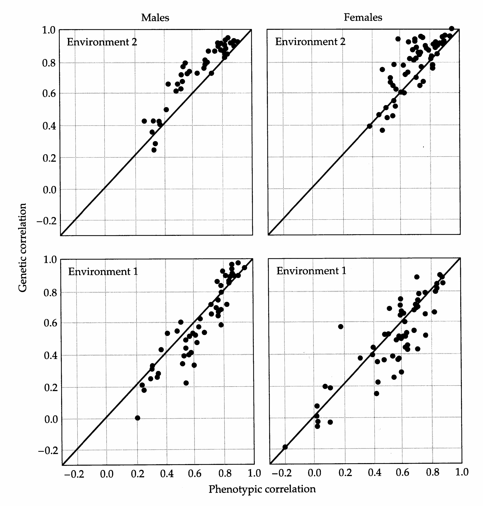
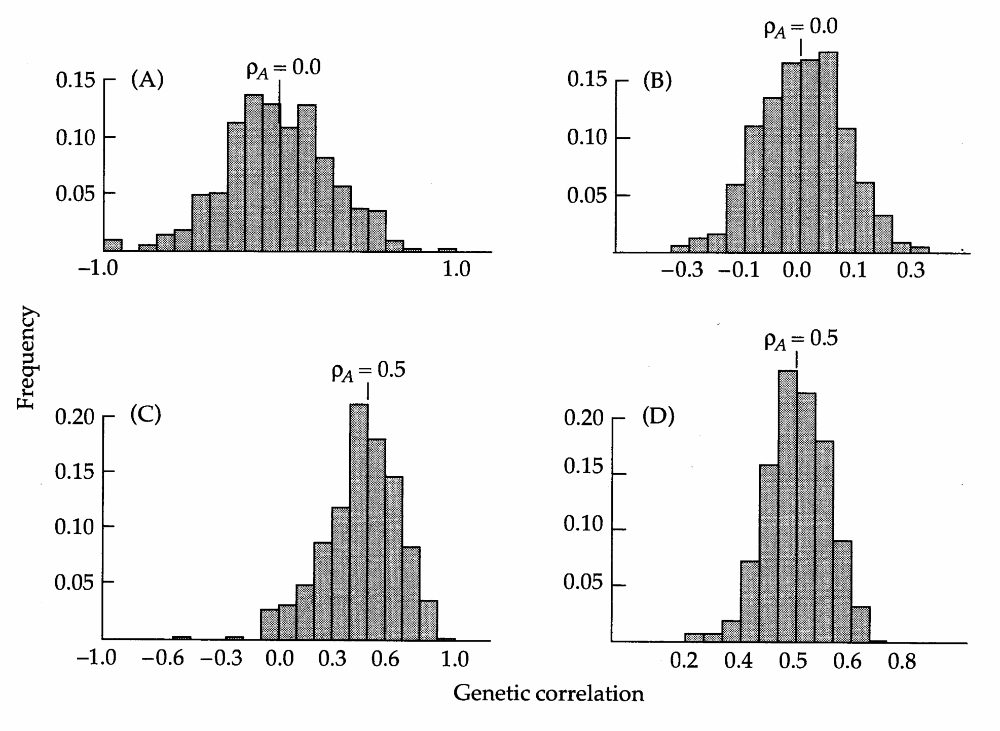
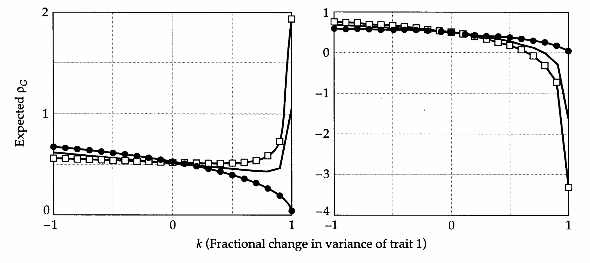
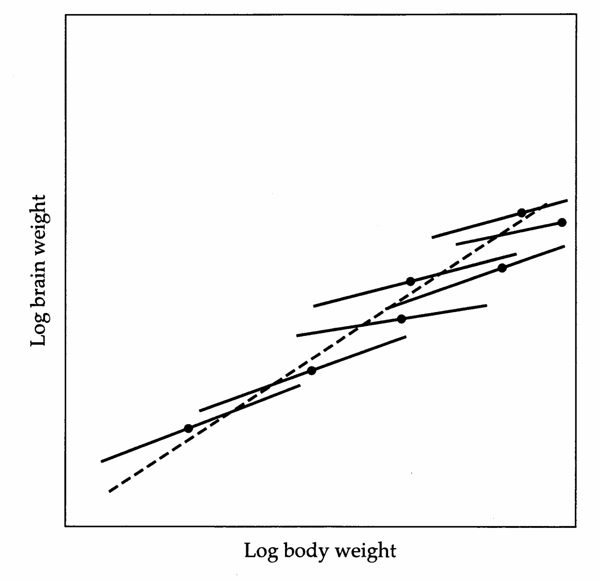
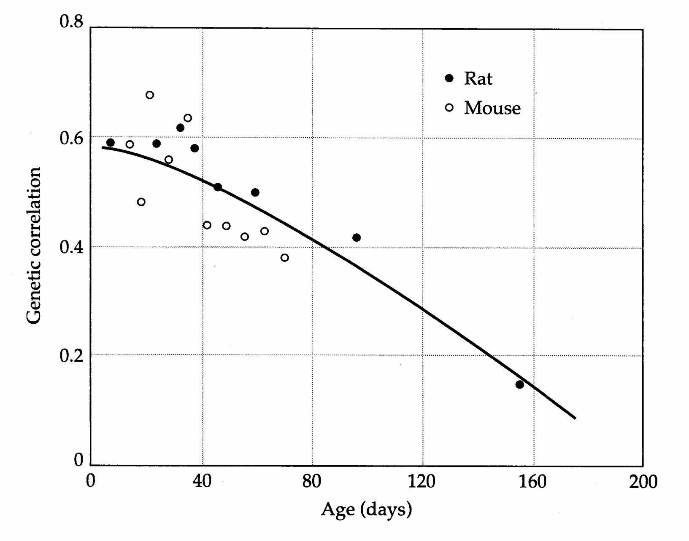

# Chapter 21 · 21

## Genetics_chapter21_001 · 21

---

## Genetics_chapter21_002 · 21 / Correlations Between Characters

The phenotypic values of different traits in the same individual are often found to be correlated. In humans, for example, individuals that are tall also tend to have large feet. Such phenotypic correlations can arise from two causes. First, the expression of two characters may be modified by the same environmental factors operating within individuals. Some environmental factors may influence both characters in the same direction, e.g., variation in resource availability during development may influence the growth of all organs. Others may have opposite effects, as when an environmental cue to initiate the allocation of resources to reproduction causes a curtailment of growth. The joint influences of all such factors determine whether a within-individual environmental correlation will exist between the traits. Such a correlation cannot be assumed to be a species-specific constant. Just as the magnitude of the environmental variance for a trait can depend on the nature of the environment in which a population is assayed (Chapter 6), so can the covariance of environmental deviations for two traits.

Second, genetic correlations between characters can arise by two mechanisms. As a result of complex biochemical, developmental, and regulatory pathways, a single gene will almost always influence multiple traits, a phenomenon known as pleiotropy (Wright 1968). The direction of pleiotropy may differ among genetic factors. Thus, at least in principle, strong pleiotropy need not result in a strong genetic correlation between characters if the pleiotropic effects from different loci cancel each other. A second possible source of genetic correlation is gametic phase disequilibrium between genes affecting different characters, i.e., the tendency of genes with like effects on two characters to be positively or negatively associated in the same individuals. Since the pleiotropic effects of genes may be influenced by their genetic background, and since the degree of gametic phase disequilibrium will be a function of the past history of populations, care should also be taken in extrapolating estimates of the genetic correlation across populations or across time.

A knowledge of the mechanisms underlying the correlations between different traits is fundamental to understanding the degree of integration of the phenotype and to resolving the constraints imposed on evolutionary processes. Depending on their sign, genetic correlations between two characters can either facilitate or impede adaptive evolution. A conflict arises when two negatively genetically correlated traits are both selected in the same direction, as the selective advance of each character tends to pull the other character in the opposite direction.

tion. A perfect genetic correlation between two traits is equivalent to an absolute evolutionary constraint, since no change in either character can occur without a parallel change in the other.

Deciphering the relative contributions of environmental and genetic factors to phenotypic correlations is one of the most powerful and revealing applications of quantitative genetics. However, as we will see below, the estimation of genetic correlations is also an extremely demanding enterprise, requiring substantially larger sample sizes than are necessary in univariate analysis. For many purposes, a simple knowledge of the sign of a genetic correlation can be very revealing, and with the appropriate effort, is certainly achievable. However, as in the case of heritability analysis, completely unambiguous estimates of the causal sources of covariance are not usually possible, e.g., it is generally not possible to obtain a completely unbiased estimate of the genetic correlation due to additive genetic factors, any more than it is possible to obtain an absolutely clean estimate of $ \sigma_{A}^{2} $ by heritability analysis.

In this chapter, we first show how additive genetic covariances between traits can be approximated by a simple extension of the methods already developed for variance-component analysis of single traits. Combining these covariances with estimates of the additive genetic variances of the traits provides a basis for estimating the genetic correlation. Subtracting the genetic components of variance and covariance at the genetic level from those at the phenotypic level yields the environmental components, which can then be used to estimate the environmental correlation. Following a consideration of issues associated with statistical analysis and hypothesis testing, we present several examples of the impact that genetic correlation analysis is having on evolutionary thinking.

---

## Genetics_chapter21_003 · THEORETICAL COMPOSITION OF THE GENETIC COVARIANCE

Assuming the contribution from gametic phase disequilibrium to be negligible, Mode and Robinson (1959) showed how the genetic covariance can be subdivided into various components. Their work is a straightforward extension of the results of Cockerham (1954) and Kempthorne (1954) for single characters. In order to simplify the presentation, recall the procedure used in Chapter 5 for decomposing the total genotypic value of a trait influenced by two loci. For characters 1 and 2, we have

$$
\begin{aligned}G_{1}&=\mu_{G,1}+[\alpha_{i,1}+\alpha_{j,1}+\alpha_{k,1}+\alpha_{l,1}]+[\delta_{ij,1}+\delta_{kl,1}]\\&\quad+[(\alpha\alpha)_{ik,1}+(\alpha\alpha)_{il,1}+(\alpha\alpha)_{jk,1}+(\alpha\alpha)_{jl,1}]\\&\quad+[(\alpha\delta)_{ikl,1}+(\alpha\delta)_{jkl,1}+(\alpha\delta)_{ijk,1}+(\alpha\delta)_{ijl,1}]+(\delta\delta)_{ijkl,1}+\cdots\end{aligned}
\tag{21.1a}
$$

$$
\begin{aligned}G_{2}&=\mu_{G,2}+[\alpha_{i,2}+\alpha_{j,2}+\alpha_{k,2}+\alpha_{l,2}]+[\delta_{ij,2}+\delta_{kl,2}]\\&\quad+[(\alpha\alpha)_{ik,2}+(\alpha\alpha)_{il,2}+(\alpha\alpha)_{jk,2}+(\alpha\alpha)_{jl,2}]\\&\quad+[(\alpha\delta)_{ikl,2}+(\alpha\delta)_{jkl,2}+(\alpha\delta)_{ijk,2}+(\alpha\delta)_{ijl,2}]+(\delta\delta)_{ijkl,2}+\cdots\end{aligned}
\tag{21.1b}
$$

As in Chapter 5, $ \alpha $ and $ \delta $ denote additive and dominance effects, i and j denote alleles at locus 1, and k and l denote alleles at locus 2. The genotypic values of each trait are composed of six components: the mean genotypic value for the population, the total deviation from this mean due to the additive effects of the four alleles, the additional deviations due to the dominance effects at the two loci, and additive × additive, additive × dominance, and dominance × dominance epistatic effects. Although they are written in terms of only two loci, the above expressions can be generalized to any number of loci.

Recalling that unlike terms (those having different subscripts) in Equations 21.1a,b are uncorrelated under random mating and gametic phase equilibrium (Chapter 5), the genetic variances for each trait can be written as

$$
\sigma_{G}^{2}(1)=\sigma_{A}^{2}(1)+\sigma_{D}^{2}(1)+\sigma_{A A}^{2}(1)+\sigma_{A D}^{2}(1)+\sigma_{D D}^{2}(1)+\cdots
\tag{21.2a}
$$

$$
\sigma_{G}^{2}(2)=\sigma_{A}^{2}(2)+\sigma_{D}^{2}(2)+\sigma_{A A}^{2}(2)+\sigma_{A D}^{2}(2)+\sigma_{D D}^{2}(2)+\cdots
\tag{21.2b}
$$

The genetic covariance can also be partitioned into components. Using Equations 21.1a,b and noting again that unlike terms are uncorrelated,

$$
\sigma_{G}(1,2)=\sigma_{A}(1,2)+\sigma_{D}(1,2)+\sigma_{A A}(1,2)+\sigma_{A D}(1,2)+\sigma_{D D}(1,2)+\cdots
\tag{21.3}
$$

where, for example,

$$
\sigma_{A}(1,2)=\sigma(\alpha_{i,1},\alpha_{i,2})+\sigma(\alpha_{j,1},\alpha_{j,2})+\sigma(\alpha_{k,1},\alpha_{k,2})+\sigma(\alpha_{l,1},\alpha_{l,2})+\cdots
\tag{21.3}
$$

is the additive genetic covariance between characters 1 and 2. The second component of Equation 21.3 is attributable to the covariance of dominance effects, and so on for the epistatic components of variance. Note that when the two traits are the same, Equation 21.3 reduces to 21.2a.

In the past several chapters, numerous methods for the estimation of variance components were covered. All of these methods are based on the same principle — that the expected phenotypic covariances between various kinds of relatives can be expressed as linear functions of causal components of genetic, and in some cases environmental, variance. These principles extend naturally to the estimation of causal components of phenotypic covariance, except that instead of comparing the same trait in two relatives, two different characters are compared — one in each relative. The expected phenotypic covariance of character 1 in individual x and character 2 in individual y follows naturally from the formulations of Cockerham (1954) and Kempthorne (1954):

$$
\begin{align*}\sigma_{G}(1_{x},2_{y})&=2\Theta_{xy}\sigma_{A}(1,2)+\Delta_{xy}\sigma_{D}(1,2)+(2\Theta_{xy})^{2}\sigma_{AA}(1,2)\\&\quad+2\Theta_{xy}\Delta_{xy}\sigma_{AD}(1,2)+\Delta_{xy}^{2}\sigma_{DD}(1,2)+\cdots\end{align*}
\tag{21.4}
$$

where $ \Theta_{xy} $ is the coefficient of coancestry, and $ \Delta_{xy} $ is the coefficient of fraternity of x and y (both defined as in Chapter 7). Note that when x = y, then $ 2\Theta_{xy} = \Delta_{xy} = $

1, and Equation 21.4 reduces to the total genetic covariance given in Equation 21.3.

---

## Genetics_chapter21_004 · ESTIMATION OF THE GENETIC CORRELATION

All of the regression and ANOVA techniques for estimating components of variance reviewed in the last four chapters extend readily to the decomposition of the covariance between two traits, as first recognized by Hazel (1943). Three of the most frequently used approaches will be covered here.

---

## Genetics_chapter21_005 · ESTIMATION OF THE GENETIC CORRELATION / Pairwise Comparison of Relatives

We start with a method that is both conceptually and computationally simple, requiring only that data are available for pairs of relatives. Suppose, for example, that measures of traits 1 and 2 have been obtained for both midparents (denoted by x) and offspring means (denoted by y). Four types of phenotypic covariances can then be computed: trait 1 in midparents and offspring, trait 2 in midparents and offspring, trait 1 in midparents and 2 in offspring, and vice versa. The first two of these relate to the genetic variances of the traits, the second two to the genetic covariance between the traits. Ignoring possible contributions from common environmental effects, their expected values are respectively:

$$
\sigma(z_{1x},z_{1y})=\frac{\sigma_{A}^{2}(1)}{2}+\frac{\sigma_{AA}^{2}(1)}{4}+\cdots
\tag{21.5a}
$$

$$
\sigma(z_{2x},z_{2y})=\frac{\sigma_{A}^{2}(2)}{2}+\frac{\sigma_{A A}^{2}(2)}{4}+\cdots
\tag{21.5b}
$$

$$
\sigma(z_{1x},z_{2y})=\frac{\sigma_{A}(1,2)}{2}+\frac{\sigma_{AA}(1,2)}{4}+\cdots
\tag{21.5c}
$$

$$
\sigma(z_{2x},z_{1y})=\frac{\sigma_{A}(1,2)}{2}+\frac{\sigma_{AA}(1,2)}{4}+\cdots
\tag{21.5d}
$$

These expressions are arrived at by use of Equation 21.4, after substituting the midparent-offspring measures of relatedness, $ \Theta_{xy} = 1/4 $ and $ \Delta_{xy} = 0 $. Assuming negligible epistatic effects, the sum of the “cross-covariances,” $ \sigma(z_{1x}, z_{2y}) + \sigma(z_{2x}, z_{1y}) $, is equal to the additive genetic covariance. Each additive genetic variance is equivalent to twice the respective within-character covariance, i.e., $ \sigma_{A}^{2}(1) = 2\sigma(z_{1x}, z_{1y}) $. Thus, an approximation of the additive genetic correlation based on midparent-offspring analysis is

$$
\rho_{A}\simeq\frac{\sigma(z_{1x},z_{2y})+\sigma(z_{2x},z_{1y})}{2\sqrt{\sigma(z_{1x},z_{1y})\cdot\sigma(z_{2x},z_{2y})}}
\tag{21.6a}
$$

Substitution of observed for expected covariances yields the estimate $ r_{A} $. An alternative to Equation 21.6b involves the geometric (rather than arithmetic) mean covariance,

$$
\rho_{A}\simeq\sqrt{\frac{\sigma\left(z_{1x},z_{2y}\right)\cdot\sigma\left(z_{2x},z_{1y}\right)}{\sigma\left(z_{1x},z_{1y}\right)\cdot\sigma\left(z_{2x},z_{2y}\right)}}
\tag{21.6b}
$$

However, there are two reasons why this estimator is less desirable than Equation 21.6a. First, since geometric means are always less than arithmetic means, Equation 21.6b will tend to yield biased correlation estimates that are closer to zero than those generated with Equation 21.6a. Second, if one estimate of the genetic covariance is negative and the other positive, Equation 21.6b is undefined.

Equation 21.6a is general in that, as a first approximation, it applies to any set of relatives with constant degrees of relationship. For example, x and y could represent the two members of a pair of dizygotic twins. Alternatively, x might represent the mean of several members of a sib group and y that of the remaining (nonoverlapping) members. The sib groups can even consist of mixtures of half and full sibs, as is often the case in wild-caught gravid females. This generality follows from the fact that the coefficient $ \Theta_{xy} $ in the expressions $ \sigma(z_{1x}, z_{1y}) $, $ \sigma(z_{2x}, z_{2y}) $, $ \sigma(z_{1x}, z_{2y}) $, and $ \sigma(z_{2x}, z_{1y}) $ is always the same, and therefore cancels out in Equations 21.6a,b.

Nonetheless, the above formulation has the same kinds of uncertainties that we have encountered in estimators of heritability. First, only in the absence of nonadditive genetic variance and common environmental effects does Equation 21.6a reduce exactly to the additive genetic correlation, $ \sigma_{A}(1,2)/[\sigma_{A}(1)\sigma_{A}(2)]. $ Bias from dominance can be eliminated entirely by using relatives with $ \Delta_{xy}=0 $ (such as parent-offspring or half-sib pairs). The presence of epistatic genetic variance and/or common environmental effects in x and y will inflate the estimates of the additive genetic variances, but since covariances can be positive or negative, the same complications may bias estimates of the additive genetic covariance in either direction. Thus, the directional effect of confounding factors on estimates of the additive genetic correlation remains uncertain in most cases. A second undesirable feature of Equation 21.6a is that because it is not actually a product-moment correlation, it can sometimes yield estimates that are outside of the true range of $ \pm1 $, especially when sample sizes are small.

---

## Genetics_chapter21_006 · ESTIMATION OF THE GENETIC CORRELATION / Nested Analysis of Variance and Covariance

The nested full-sib, half-sib design provides an alternative approach to estimating genetic correlations. Recall that with this design, several different females are mated to each sire, and a nested analysis of variance yields estimates of the additive genetic variances (Chapter 18). A parallel analysis can also provide an estimate of the additive genetic covariance. Analysis of covariance is identical in form to analysis of variance except that the former employs mean cross-products of the deviations of traits 1 and 2 rather than mean squared deviations of individual traits (Table 21.1). A lucid overview of the procedure is given by Grossman and Gall (1968).

**[Table]**

*[See Table 21.1 at the end of this section.]*

$$
\sigma_{s}(1,2)\simeq\frac{\sigma_{A}(1,2)}{4}+\frac{\sigma_{A A}(1,2)}{16}
$$

$$
\sigma_{d}(1,2)\simeq\frac{\sigma_{A}(1,2)}{4}+\frac{\sigma_{D}(1,2)}{4}+\frac{3\sigma_{AA}(1,2)}{16}+\frac{\sigma_{AD}(1,2)}{8}+\frac{\sigma_{DD}(1,2)}{16}
$$

$$
\begin{aligned}\sigma_{e}^{2}(1,2)\simeq\frac{\sigma_{A}(1,2)}{2}+\frac{3\sigma_{D}(1,2)}{4}+\frac{3\sigma_{AA}(1,2)}{4}+\frac{7\sigma_{AD}(1,2)}{8}\\+\frac{15\sigma_{DD}(1,2)}{16}+\sigma_{E_{s}}(1,2)\end{aligned}
$$

Note: T is the total number of individuals in the experiment, and $ \overline{M} $ the mean number of dams/sire. For character 1, $ z_{1ijk} $ is the observed phenotype of the kth offspring of the jth dam mated to the ith sire, $ \overline{z}_{1ij} $ is the mean phenotype of the ijth full-sib family, $ \overline{z}_{1i} $ is the mean phenotype of all progeny of the ith sire, and $ \overline{z}_{1} $ is the mean phenotype of all individuals. Similar notation is used for character 2. MCP denotes a mean cross-product, obtained by dividing a sum of cross-products by its respective degrees of freedom. The coefficients $ k_{1} $, $ k_{2} $, and $ k_{3} $ are defined in Table 18.3.

Although most nested analyses are not perfectly balanced, it is usually preferable to use only individuals for which measures of both characters are available in the analysis, so that estimates of both the variances and the covariance are based on the same sample. Obviously, when a large number of individuals are missing one measure, this has the unfortunate side-effect of making the variance estimates less accurate than they would be otherwise, so in extreme cases it may be preferable to use all of the data.

The nested analysis of variance (covariance) yields nine mean squares (cross-products) — at the sire, dam, and progeny levels, for the variance of character 1, the variance of character 2, and the covariance of 1 and 2. From the observed mean squares and cross-products, and the standard expressions for their expectations (Table 21.1), estimates for the sire, dam, and within-family components of variance and covariance can then be extracted by the method of moments (equating mean squares with their expectations and solving). Recall from Chapter 18 that in a univariate analysis, the sire component of variance is equivalent to the covariance of paternal half sibs, thereby providing an estimate of one-fourth the additive genetic variance for the trait, assuming sources of epistatic variance are of negligible significance. Similarly, in an analysis of covariance, the sire component provides an estimate of one-fourth the additive genetic covariance between the two traits. Thus, letting $ \operatorname{Var}(s_1), \operatorname{Var}(s_2), \operatorname{Var}(s_3) $ denote estimates of the sire components of variance and covariance, the genetic correlation is estimated by

$$
r_{A}=\frac{Cov(s_{1},s_{2})}{\sqrt{Var(s_{1})Var(s_{2})}}
\tag{21.7}
$$

As discussed in the previous section, this measure of the genetic correlation can only be taken to be an approximation, since additive epistatic interactions are potentially included in the estimates of the genetic variances and covariance. However, the reliance on paternal half sibs should minimize the complications that can arise from common-environment effects. Like regression analysis, analysis of variance can also yield estimates of the genetic correlation that are outside the range of true possibilities (−1,1). The likelihood of this situation happening can be substantial, as Hill and Thompson (1978) have shown for one-way (nonnested) ANOVA of sib families. For example, if the intraclass correlations for both traits are t = 0.0625 (assuming only additive genetic variance, this implies $ h^{2} = 0.25 $ or 0.125, depending on whether families consist of half or full sibs), and 160 families of 5 sibs are analyzed, the probability of obtaining a genetic correlation or heritability out of bounds is only about 0.06. However, if t = 0.025 ( $ h^{2} = 0.10 $ or 0.05), with the same sample sizes, the probability of obtaining an unrealistic estimate is nearly 0.5.

In principle, as in the case of components of variance, the various components of a genetic covariance can be extracted by comparison of the cross-covariances between different types of relatives, e.g., full vs. half sibs in the nested design. It would then be possible to procure estimates of genetic correlations due to dominance and various forms of epistasis in addition to additive effects. However, previous chapters have amply demonstrated the difficulties in accomplishing such partitioning with components of genetic variance with any reasonable degree of accuracy. Since the sampling variance of cross-covariances is also very high (see below), there appears to be little hope of a further dissection of the genetic correlation unless the number of families sampled is in the thousands.

> **Table 21.1** · `21.1` · page 646 · source: `Genetics_chapter21_006`
> Table 21.1 Summary of a nested analysis of covariance involving $N$ sires, $M_{i}$ dams within the $i$th sire, and $n_{ij}$ offspring within the $ij$th full-sib family.
>
> Factor | df | Sums of Cross-products | E(MCP)
> --- | --- | --- | ---
> Sires | N-1 | $ \sum_{i}^{N}\sum_{j}^{M_{i}}n_{ij}(\overline{z}_{1i}-\overline{z}_{1})(\overline{z}_{2i}-\overline{z}_{2}) $ | $ \sigma_{e}(1,2)+k_{2}\sigma_{d}(1,2) $
> Dams (sires) | N(\overline{M}-1) | $ \sum_{i}^{N}\sum_{j}^{M_{i}}n_{ij}(\overline{z}_{1ij}-\overline{z}_{1i})(\overline{z}_{2ij}-\overline{z}_{2i}) $ | $ \sigma_{e}(1,2)+k_{1}\sigma_{d}(1,2) $
> Sibs (dams) | T-N $ \overline{M} $ | $ \sum_{i}^{N}\sum_{j}^{M_{i}}\sum_{k}^{n_{ij}}(z_{1ijk}-\overline{z}_{1ij})(z_{2ijk}-\overline{z}_{2ij}) $ | $ \sigma_{e}(1,2) $
> Total | T-1 | $ \sum_{i}^{N}\sum_{j}^{M_{i}}\sum_{k}^{n_{ij}}(z_{1ijk}-\overline{z}_{x})(z_{2ijk}-\overline{z}_{y}) $ | $ \sigma_{z}(1,2) $

---

## Genetics_chapter21_007 · ESTIMATION OF THE GENETIC CORRELATION / Regression of Family Means

Because of technical difficulties in acquiring genetic correlation estimates and in testing for their significance, a number of investigators have opted to use the correlation between family mean phenotypes as a surrogate for estimating $ \rho_{A} $. Here one simply regresses the family mean phenotype of character 1 on that of character 2, using the same individuals to compute each mean. The rationale for such an approach is that as the size of a family increases, the sampling error of the mean becomes diminishingly small, leaving the family mean phenotype as an estimate of the family mean genotypic value. However, if the heritability of either trait is low, this approach can yield misleading results because the variances and covariances of family means will be biased estimates of the additive genetic expectations. Although we do not advocate this approach, we elaborate on it somewhat to illustrate the interpretative difficulties that can arise.

Suppose each family consists of a group of $n$ individuals, all related with coefficient of coancestry $\Theta$ (for example, a group of paternal half-sibs), and let $\bar{z}_{1i}$ be the mean phenotype of the $i$th family and $z_{1ij}$ be the phenotype of the $j$th member of that family. Assuming that all of the resemblance between relatives is a consequence of additive gene action (in particular, that there are no shared environmental effects), the expected variance among family means for character 1 can then be expressed as

$$
\begin{align*}\sigma^{2}(\overline{z}_{1i})&=\frac{1}{n^{2}}\sigma^{2}\left(\sum_{j=1}^{n}z_{1ij}\right)=\frac{1}{n}\sigma^{2}(z_{1ij})+\frac{n(n-1)}{n^{2}}\sigma(z_{1ij},z_{1ik})\\&=\frac{1}{n}[\sigma_{z}^{2}(1)-2\Theta\sigma_{A}^{2}(1)]+2\Theta\sigma_{A}^{2}(1)\end{align*}
\tag{21.8a}
$$

where $ \sigma_{z}^{2}(1) $ is the phenotypic variance of the trait. The same logic gives the expected covariance between family means for traits 1 and 2 as

$$
\sigma(\overline{{z}}_{1i},\overline{{z}}_{2i})=\frac{1}{n}[\sigma_{z}(1,2)-2\Theta\sigma_{A}(1,2)]+2\Theta\sigma_{A}(1,2)
\tag{21.8b}
$$

After some algebraic rearrangement, and continuing to ignore all sources of variation and covariation except those due to additive genetic effects, the correlation of family means is found to be

$$
\rho_{\overline{z}}\simeq\frac{\sigma(\overline{z}_{1,i},\overline{z}_{2,i})}{\sigma(\overline{z}_{1,i})\cdot\sigma(\overline{z}_{2,i})}=\rho_{A}\left[\frac{\phi h_{1}h_{2}+(\rho_{z}/\rho_{A})}{\sqrt{(\phi h_{1}^{2}+1)(\phi h_{2}^{2}+1)}}\right]
\tag{21.9}
$$

where $\phi = 2\Theta(n-1)$, $h_1^2 = \sigma_A^2(1)/\sigma_z^2(1)$ and $h_2^2 = \sigma_A^2(2)/\sigma_z^2(2)$ are the heritabilities of the traits, and $\rho_z$ is the phenotypic correlation. The quantity in brackets defines the factor by which the regression of family means deviates from the desired value $ \rho_{A} $. The amount of bias can be seen to depend on $ \phi $, $ h_{1}^{2} $, $ h_{2}^{2} $, and on the ratio of phenotypic to genetic correlations.

In the extreme case in which the heritabilities of both traits are equal to one, the genetic and phenotypic correlations are equal (as there is no environmental variance), and the correlation of family means provides an unbiased estimate of the genetic correlation, i.e., $ \rho_{\overline{z}} = \rho_{A} $. However, such concordance is unlikely to arise under any other circumstances. More generally, in order for the correlation between family means to closely approximate the genetic correlation, both $ \phi h_{1}^{2} $ and $ \phi h_{2}^{2} $ must be substantially larger than one and than $ |\rho_{z}/\rho_{A}| $. Even if the two traits have moderately high heritabilities, the first condition requires large family sizes. Consider, for example, the situation in which both traits have heritabilities of 0.5, 50 paternal half sibs ( $ 2\Theta = 0.25 $) are sampled per family, and the phenotypic correlation is five times larger than the genetic correlation. Substituting for the quantities in the brackets, we find that the correlation of family means inflates the estimate of the genetic correlation by a factor of 1.8.

A perceived advantage of the family-mean approach is that $ \rho_{\overline{z}} $ is a true product-moment correlation. Thus, unlike the other estimators described above, the correlation among family means cannot exceed $ \pm1 $, and its significance can be evaluated in a straightforward manner using standard tables of critical values for the sample correlation coefficient. However, the actual utility of this property seems questionable, given the uncertainty of what $ \rho_{\overline{z}} $ actually measures.

A more reasonable path to estimating the genetic correlation from family means involves a combination of univariate ANOVA with covariance analysis, as follows. If each family is divided into two independent groups, one used to estimate the mean of character 1 and the other for character 2, the expected covariance between means is simply $ 2\Theta\sigma_{A}(1,2) $. Assuming common family environment is not a significant source of variation, there is no bias from environmental covariance because the two groups being compared contain different individuals. Combining the resultant estimate of $ \sigma_{A}(1,2) $ with estimates of $ \sigma_{A}^{2}(1) $ and $ \sigma_{A}^{2}(2) $ obtained by ANOVA provides a basis for a relatively unbiased estimate of $ \rho_{A} $.

---

## Genetics_chapter21_008 · COMPONENTS OF THE PHENOTYPIC CORRELATION

As noted in the introduction, phenotypic covariance between two traits arises from both genetic and environmental causes. We have just seen how the basic machinery for estimating heritabilities can be extended to the estimation of genetic correlations. However, the environmental correlation, $ \rho_{E} $, can only be calculated directly under a very special set of circumstances. If a collection of genetically homogeneous individuals (either a highly inbred line or a single clone) is used, so there is no genetic variance among individuals within the group, the phenotypic and environmental correlations are equivalent.

Ordinarily, a more circuitous route to the estimation of $ \rho_{E} $ is necessary. The usual approach is to estimate the phenotypic and genetic correlations first, and to extract the environmental correlation from the algebraic relationship between the three quantities. The phenotypic correlation between two traits is easily acquired, as it is simply the correlation of the measures of the two traits in the same individual,

$$
\rho_{z}=\frac{\sigma_{z}(1,2)}{\sigma_{z}(1)\cdot\sigma_{z}(2)}
\tag{21.10}
$$

where $ \sigma_{z}(1) $ and $ \sigma_{z}(2) $ are the phenotypic standard deviations of the two traits and $ \sigma_{z}(1,2) $ is the covariance of traits 1 and 2 in the same individual. The relationship between the three types of correlations is fairly easily derived. Noting that covariances are additive (Chapter 3) and assuming that all covariance is due to additive genetic and special environmental effects, $ \sigma_{z}(1,2) = \sigma_{A}(1,2) + \sigma_{E}(1,2) $, where

$$
\begin{aligned}&\sigma_{A}(1,2)=\rho_{A}\sigma_{z}(1)h_{1}\sigma_{z}(2)h_{2}\\&\sigma_{E}(1,2)=\rho_{E}\left(\sigma_{z}(1)\sqrt{1-h_{1}^{2}}\right)\left(\sigma_{z}(2)\sqrt{1-h_{2}^{2}}\right)\\ \end{aligned}
\tag{21.11}
$$

Equation 21.10 then expands to

$$
\rho_{z}=h_{1}h_{2}\rho_{A}+\rho_{E}\sqrt{(1-h_{1}^{2})(1-h_{2}^{2})}
\tag{21.11}
$$

rearrangement of which leads to

$$
\rho_{E}=\frac{\rho_{z}-h_{1}h_{2}\rho_{A}}{\sqrt{(1-h_{1}^{2})(1-h_{2}^{2})}}
\tag{21.12}
$$

(An alternative derivation based on path analysis is provided in Appendix 2.) Estimates of the environmental correlation are obtained by substituting observed for expected quantities in this expression.

The derivation of Equation 21.12 assumes zero covariance between the genetic value of trait 1 in individual x and the environmental deviation of trait 2 in relative y, and vice versa, a reasonable assumption if maternal effects can be ruled out. This problem aside, it should also be emphasized that because Equations 21.6, 21.7, and 21.9 only provide approximations of the additive genetic correlation, Equation 21.12 yields only an approximation of the environmental correlation. All of the nonadditive genetic variance and covariance that is not included in the estimation of $ \rho_{A} $ will contribute to $ \rho_{E} $. For example, when the genetic covariance is estimated by twice the covariance of offspring and midparents, the actual composition of the excess “environmental” covariance is

$$
\sigma_{z}(1,2)-\left[\sigma_{A}(1,2)+\frac{\sigma_{A A}(1,2)}{2}\right]=\sigma_{E}(1,2)+\sigma_{D}(1,2)+\frac{\sigma_{A A}(1,2)}{2}+\sigma_{A D}(1,2)+\cdots
$$

Since any of the covariance terms can be positive or negative, estimates of environmental correlations can be biased in either direction by nonadditive gene action.

---

## Genetics_chapter21_009 · COMPONENTS OF THE PHENOTYPIC CORRELATION / Phenotypic Correlations as Surrogate Estimates of Genetic Correlations

Because of the inherent difficulties in estimating additive genetic correlations, it is of great interest to know if these have a strong tendency to reflect the more easily acquired phenotypic correlations in magnitude and/or sign. If this were true, phenotypic correlations would provide useful, and more accessible, insight into the directionality of constraints on multivariate evolution. Moreover, because phenotypic correlations can normally be estimated with a high degree of accuracy, while genetic correlations usually have very large standard errors, if the parametric values of genetic and phenotypic correlations tended to be equal, then estimates of the phenotypic correlation could more closely approximate the true genetic correlation than the genetic correlation estimate itself.

It has been noticed that estimates for genetic correlations tend to slightly exceed phenotypic correlations in absolute magnitude (Searle 1961, Kohn and Atchley 1988, Koots et al. 1994). But a broader analysis indicates that this may be due to biases that arise with small sample sizes. When the “effective number of families,” $ Nh_{1}h_{2} $, where N is the actual number of families, exceeds 50 or so, the average difference between the two types of correlation becomes negligible (Cheverud 1988).

Broad surveys of the literature have led Cheverud (1988, 1995) and Roff (1995, 1996) to the conclusion that $ \rho_{z} $ and $ \rho_{A} $ not only normally have the same sign, but are also of the same magnitude (Figure 21.1). The pattern appears to be particularly clear for morphological (as opposed to life-history) characters (Roff 1996, Simons and Roff 1996). Few others have been bold enough to make the assertion that $ \rho_{z} \simeq \rho_{A} $, and Willis et al. (1991) point out several reasons why the generality of such a statement should be treated with caution. Certainly, it is still an open question as to whether environmental factors that jointly influence two traits operate through the same biochemical/developmental pathways as pleiotropic genetic factors, and cases do exist in which the estimates $ r_{z} $ and $ r_{A} $ differ in sign (Mousseau and Roff 1987) and magnitude (Hébert et al. 1994). Nevertheless, the similarities between existing estimates of genetic and phenotypic correlations are striking. Because the latter is a function of the former, some correspondence is expected just on the basis of sampling error, but it seems unlikely that this accounts for the entire pattern. Further in-depth study of this fundamentally important problem is certainly in order.

---

## Genetics_chapter21_010 · STATISTICAL ISSUES

As with any parameter estimates, it is useful to have measures of the sampling variances and/or confidence intervals of the phenotypic, genetic, and environmental correlations to aid in their interpretation. For the genetic and environmental correlations, the problems here are considerable. The estimators for $ \rho_{A} $ and $ \rho_{E} $ generally utilize a combination of results from different applications of ANOVA and/or regression analysis, all employing data on the same individuals. The sampling properties of functions of statistics derived from nonindependent analyses are poorly understood.

> **Figure 21.1** · page 652 · source: `Genetics_chapter21`
>
> 
>
> Figure 21.1 Comparison of genetic vs. phenotypic correlations for pairs of morphological traits in the sand cricket, Gryllus firmus. Results are given for the two sexes, raised in two environments that varied in temperature and photoperiod. (From Roff 1995.)

---

## Genetics_chapter21_011 · STATISTICAL ISSUES / Hypothesis Tests

Testing for a significant phenotypic correlation is straightforward, as it is a conventional product-moment correlation, which can be evaluated against critical values widely available in tables in statistics texts. For genetic correlations, the simplest option for testing the hypothesis that $ \rho_{A}=0 $ is based on the principle that significant genetic covariance between two traits implies a significant genetic correlation. With the pairwise-comparison method, the significance of the regression of character 2 in set y on character 1 in set x, and vice versa, can be evaluated by the standard test for a regression slope.

Methods for evaluating the significance of an environmental correlation are less well developed. However, with the nearly universal availability of high-speed computers, a simple procedure enables simultaneous tests for all three types of correlation ( $ r_{z} $, $ r_{A} $, and $ r_{E} $). Bootstrapping and jackknifing over families (Chapter 18) are being relied upon increasingly to generate empirically derived sampling distributions of the desired statistics (Dorn and Mitchell-Olds 1991, Brodie 1993, Paulsen 1994, Roff and Preziosi 1994). For each quasisample of the data set, the estimates $ r_{z} $ and $ r_{A} $ are computed directly, and then $ r_{E} $ is obtained by use of Equation 21.11. After randomly generating numerous sets of such estimates, one can construct confidence intervals for the three parameters from their observed sampling distributions. With the paired-comparison method, an alternative procedure is to randomize members of the set y with respect to those of set x, evaluating the probability (under the null hypothesis of no correlation) of obtaining a correlation coefficient as extreme as that observed with the true data set. A similar approach can be applied to the nested design, by randomizing full-sib families with respect to sires and dams.

Finally, we note that studies of genetic correlation usually involve the simultaneous analysis of several characters, not just two, resulting in tables of correlations between all possible pairs of characters. Care then needs to be taken so as not to overinterpret the significance levels attached to single correlations. For example, suppose that one were studying a set of $N$ traits, none of which are actually correlated. The probability that none of the $N(N-1)/2$ observed correlations is significant (at level $\alpha$) is $(1-\alpha)^{N(N-1)/2}$. The probability that at least one correlation would appear, by chance, to be significant at the level $\alpha$ or smaller is one minus this quantity. This probability can be substantial — if $N=7$, there is a 0.19 probability that at least one of the 21 correlations will spuriously appear to be significant at the $P=0.01$ level, and a 0.66 probability at the $\alpha=0.05$ level. Adjusting significance tests to account for multiple comparisons is straightforward when the different tests involve independent data (Rice 1989; see Chapter 14). However, in the analysis of correlated characters, the nonindependence of data renders conventional multiple-comparison procedures invalid, and to our knowledge no satisfactory solution to the problem exists.

---

## Genetics_chapter21_012 · STATISTICAL ISSUES / Standard Errors

By Taylor expansion (Appendix 1), Reeve (1955) first obtained an expression for the approximate large-sample variance of $ r_{A} $ for the single parent-offspring regression, and Hammond and Nicholas (1972) subsequently generalized this to include all types of parent-offspring combinations:

$$
\begin{aligned}\operatorname{Var}(r_{A})\simeq\frac{1}{N}\left[\frac{(1-r_{A}^{2})^{2}}{2}+\frac{A(n+k)(1-r_{A}^{2})(B-C r_{z}r_{A})}{4k}+\frac{2A(B r_{A}-C r_{z})^{2}}{k}\right.\\ \left.+\frac{A[C^{2}(1-r_{A}^{2})(1-r_{z}^{2})-(B/2)+(C r_{A}r_{z}/2)]}{k}\right]\quad(21.13)\end{aligned}
$$

where $A = 1$ or $2$ for regressions involving midparents or single parents (respectively), $B = [(1/h_{1}^{2})+(1/h_{2}^{2})]/2$, $C = 1/(h_{1}h_{2})$, $N$ is the number of families, $n$ is the number of offspring/dam in each family, and $k$ is the number of offspring/sire in each family. For midparent-offspring regressions, $n = k$ is the family size, whereas in the regression of paternal half-sibs on fathers, $n = 1$ and $k$ is the number of dams/sire. Reeve (1955) provides an expression for $n$ for use in unbalanced designs, and VanVleck and Henderson (1961) present an equation for the case in which only a single character is measured in each individual (such as character 1 in parents and character 2 in offspring).

The preceding formula serves as a useful guide in choosing an adequate experimental design. If the constraint on the investigator is the total number of individuals that can be measured, $ T = Nk $, then it can be seen that $ \text{Var}(r_A) $ is minimized by maximizing the number of families $ (N) $. (This approach minimizes the first term in the equation, while the remaining terms, whose denominators are $ T = Nk $, are unaffected.) Thus, the optimal design for estimating a genetic correlation is to measure a single offspring from as many families as possible. This recommendation is similar to that for heritability estimation based on parent-offspring regression (Chapter 17).

VanVleck and Henderson (1961) and Brown (1969) used simulation studies to evaluate the degree of accuracy in using Equation 21.13 to estimate the standard error of a genetic correlation by substituting observed for expected quantities. For N < 100, they found that estimates from Equation 21.13 are biased downwards and may underestimate the true sampling variance by as much as an order of magnitude with appreciable frequency. However, if N is on the order of 1,000, and the true value of $ r_{A} $ is not very nearly $ \pm 1.0 $, Equation 21.13 is quite accurate.

VanVleck and Henderson (1961) and Brown (1969) also examined the sampling distribution of $ r_A $. Provided gene action is additive, Equation 21.6a appears to yield an unbiased estimate of $ r_A $, and provided the true value $ \rho_A $ is not very nearly $ \pm 1.0 $, the sampling distribution of $ r_A $ approximates normality as sample sizes become large. Thus, when $ N $ is large, $ 2\sqrt{\mathrm{Var}(r_A)} $ usually can be taken as

> **Figure 21.2** · page 655 · source: `Genetics_chapter21`
>
> 
>
> Figure 21.2 Sampling distributions of the additive genetic correlation estimated with regression of single offspring on N single parents, using simulated data sets. In all cases, both characters have heritabilities equal to 0.4. Values of the underlying parameters are: (A) $ \rho_z = 0.0 $, $ \rho_A = 0.0 $, $ N = 200 $; (B) $ \rho_z = 0.0 $, $ \rho_A = 0.0 $, $ N = 1000 $; (C) $ \dot{\rho}_z = 0.5 $, $ \rho_A = 0.5 $, $ N = 200 $; (D) $ \rho_z = 0.5 $, $ \rho_A = 0.5 $, $ N = 1000 $. (From Brown 1969.)

an estimate of the 95% confidence interval for $ r_{A} $. It is clear from Figure 21.2 that unless the number of families analyzed is on the order of 1,000 (for single parent-single offspring regressions), the standard error of $ r_{A} $ will be quite large. Certainly, experiments that involve fewer than several hundred individuals should be avoided if at all possible (see also Klein 1974).

Several attempts have also been made to obtain expressions for the large-sample variance of correlation coefficients obtained from nested full-sib, half-sib analyses (Mode and Robinson 1959, Robertson 1959b, Tallis 1959, Scheinberg 1966, Abe 1969, Grossman 1970, Hammond and Nicholas 1972, Grossman and Norton 1974). The algebra is quite tedious, and a number of the early papers contain errors or are rather restrictive in their applicability. The most general expression, derived by Hammond and Nicholas (1972), is rather complex, but can be summarized as

$$
\mathrm{Var}(r_{i})\simeq2\left(\frac{r_{i}}{e}\right)^{2}\left(\frac{a^{2}S}{\mathrm{df}_{s}+2}+\frac{b^{2}D}{\mathrm{df}_{d}+2}+\frac{c^{2}W}{\mathrm{df}_{w}+2}\right)
\tag{21.14a}
$$

where i denotes z, A, or E depending on which type of correlation is being considered, and $ df_{s} $, $ df_{d} $, and $ df_{w} $ refer to the degrees of freedom at the sire, dam, and progeny levels. The terms S, D, and W are of the form

$$
\left(\frac{Z_{1}}{V_{1}}-\frac{Z_{1,2}}{C_{1,2}}\right)^{2}+\left(\frac{Z_{2}}{V_{2}}-\frac{Z_{1,2}}{C_{1,2}}\right)^{2}+2\left(\frac{Z_{1,2}}{V_{1}}-\frac{Z_{2}}{C_{1,2}}\right)\left(\frac{Z_{1,2}}{V_{2}}-\frac{Z_{1}}{C_{1,2}}\right)
\tag{21.14b}
$$

where $ Z_{1} $, $ Z_{2} $, and $ Z_{1,2} $ refer to the mean squares and cross-products of characters 1 and 2 at the level of sires (when calculating S), dams (when calculating D), and replicates (when calculating W). $ V_{1} $, $ V_{2} $, and $ C_{1,2} $ denote the estimates of the variances and covariances at the phenotypic, genetic, and environmental levels, depending upon which correlation is being dealt with; these estimates are derived by the usual route of the method of moments. Finally, the constants a, b, c, and e depend upon the nature of the correlation as follows:

with the $ k_{i} $ coefficients being defined in Table 18.3.

Robertson (1959b) and Tallis (1959) have considered the optimal design for estimating the genetic correlation from a nested analysis of variance and covariance, concluding that the design that minimizes the sampling variance of the heritabilities also applies to the genetic correlations. Thus, the recommendations of Chapter 18 may be referred to.

The important message of this section is that attaining a reasonable degree of confidence in any study of genetic correlation requires a very substantial data base. Often, with sample sizes less than a few hundred individuals, the strongest statement that can be made is whether the correlation is significantly positive or negative. The conventional approach in regression analysis, and the one that we focused on in the preceding paragraphs, is to take $ \rho = 0 $ as the null hypothesis. For genetic studies concerned with constraints on the evolutionary process, an alternative is to let $ \rho_{A} = \pm 1 $ be the null hypothesis and to evaluate it against the observed data using resampling procedures.

---

## Genetics_chapter21_013 · STATISTICAL ISSUES / Bias Due to Selection

Selection in the parental generation on the characters of interest or any other characters correlated with them can lead to biased estimates of the genetic correlation by altering the variances and covariances relative to the expectations prior to selection (Van Vleck 1968, Robertson 1977b, Meyer and Thompson 1984). In principle, this problem can be significant in studies of wild populations exposed to natural selection. Here we consider how serious the bias can be and how it might be corrected for.

Utilizing an early result of Pearson (1903), Lande and Price (1989) showed how the bias can be eliminated under the assumption that the joint distribution of the characters in parents and offspring is multivariate normal in the absence of selection. Under those conditions, the partial regression coefficients in a multiple regression of offspring on parent characters are unaffected by selection, provided all of the characters under selection are actually included in the analysis. Letting C denote the matrix of covariances between characters in unselected offspring and parents, and P be the phenotypic variance-covariance matrix in the unselected parents, then Pearson's result implies

$$
\mathbf{C}\mathbf{P}^{-1}=\mathbf{C}_{s}\mathbf{P}_{s}^{-1}
\tag{21.15a}
$$

with the subscript s denoting matrices after selection. (Recall from Chapter 8 that partial regression coefficients are obtained as the product of the covariance matrix involving predictor and response variables and the inverse of the variance-covariance matrix for the predictor variables.) Rearranging, the matrix of covariances between unselected parents and offspring can be expressed as

$$
\mathbf{C}=\mathbf{C}_{s}\mathbf{P}_{s}^{-1}\mathbf{P}
\tag{21.15b}
$$

The genetic correlations that we wish to estimate are $ \rho_{A}(i,j) = C_{ij} / \sqrt{C_{ii}C_{jj}} $, where $ C_{ij} $ denotes the element in row i and column j of C.

The above relationship shows that the observed covariances in $ C_{s} $ can be transformed into the desired elements of C if the phenotypic variance-covariance matrices before (P) and after ( $ P_{s} $) selection are known. The latter is what we observe from the sampled parents. Lande and Price (1989) suggest that the elements of P might be obtained from the unselected offspring (of the selected parents) since a single generation of selection rarely causes a significant alteration in the phenotypic covariance structure of populations. Obviously, this approach is possible only if the forces of selection operating on the parents can be removed from the offspring, and no new ones are added, and if the sources of environmental variation contributing to P in the offspring generation can be kept the same as those in the parental generation. Such conditions may be difficult to achieve in many empirical settings.

As a simple example (from Lande and Price 1989) of the magnitude of bias in the genetic correlation that can be induced by selection, suppose that the variance of the first of two characters under investigation has been reduced by a fraction k by selection such that the phenotypic variance in the observed (selected) parents is $ \sigma_s^2(1) = (1 - k)\sigma_z^2(1) $, where $ \sigma_z^2(1) $ is the phenotypic variance of character 1 before selection. Assume further that selection did not operate on any other correlated traits. Since the regression of character 2 on 1 accounts for a fraction $ \rho_z^2 $ of the variance of character 2 (Equation 3.17), a change in the variance of character 1

k (Fractional change in variance of trait 1)

> **Figure 21.3** · page 658 · source: `Genetics_chapter21`
>
> 
>
> Figure 21.3 Bias in the expected genetic correlation between two characters when the phenotypic variance of character 1 in the parents has been modified to $ (1 - k)\sigma_z^2(1) $ but has been unaccounted for in the analysis. Solid circles: correlation based on covariance of offspring character 2 on parent character 1; open squares: correlation based on covariance of offspring character 1 on parent character 2; solid line: average. Left: $ h_1^2 = 0.3 $, $ h_2^2 = 0.7 $. Right: $ h_1^2 = 0.7 $, $ h_2^2 = 0.3 $. The true value $ \rho_A $ is 0.5 in both examples. (From Lande and Price 1989.)

equal to $ -k\sigma_z^2(1) $ must induce a change in the variance of character 2 equal to $ -k\rho_z^2\sigma_z^2(2) $. Therefore, the phenotypic variance for character 2 in the parents after selection is $ \sigma_s^2(2) = (1 - k\rho_z^2)\sigma_z^2(2) $. From Pearson's result, we know that selection does not change the regression coefficient, so if selection reduces the phenotypic variance of character 1 by the factor k, it must reduce the phenotypic covariance by the same factor, i.e., $ \sigma_s(1,2) = (1 - k)\sigma_z(1,2) $. Substituting these quantities into $ \mathbf{P}_s $ and solving $ \mathbf{C}_s = \mathbf{CP}^{-1}\mathbf{P}_s $, we obtain the expected covariances between parents (p) and offspring (o) after selection,

$$
\sigma_{s}(z_{1o},z_{1p})=\frac{\sigma_{A}^{2}(1)}{2}(1-k)
\tag{21.16a}
$$

$$
\sigma_{s}(z_{2o},z_{2p})=\frac{\sigma_{A}^{2}(2)}{2}\left(1-\frac{k\rho_{A}\rho_{z}h_{1}}{h_{2}}\right)
\tag{21.16b}
$$

$$
\sigma_{s}(z_{1o},z_{2p})=\frac{\sigma_{A}(1,2)}{2}\left(1-\frac{k\rho_{z}h_{1}}{\rho_{A}h_{2}}\right)
\tag{21.16c}
$$

$$
\sigma_{s}(z_{2o},z_{1p})=\frac{\sigma_{A}(1,2)}{2}(1-k)
\tag{21.16d}
$$

assuming that additive effects are the only source of covariance between relatives.

These expressions illustrate several important points about estimates of genetic correlations in selected populations (Figure 21.3). First, selection that causes a change in the phenotypic variance of the parents will usually induce changes in all four of the covariances between parents and offspring.

Second, selection causes the two covariances between characters 1 and 2 to be unequal, i.e., $ \sigma_s(z_{1o}, z_{2p}) \neq \sigma_s(z_{1p}, z_{2o}) $. In some cases, especially when the heritability of the unselected trait is relatively low, the two measures of genetic covariance may actually differ in sign; this requires that $ \rho_z h_1 / (\rho_A h_2) > 1/k $. In principle, this property could provide a way of assessing whether selection has caused a significant bias in the parent sample, provided maternal effects can be ruled out. However, in light of the difficulties in procuring accurate estimates of covariances, such a test is not likely to be very powerful. In general, averaging the two types of covariances (Equations 21.16c and d) does not improve the situation much, since both are often biased in the same direction (Figure 21.3).

Third, in extreme cases, the expected value of the genetic correlation, as defined by Equation 21.6a, can exceed its theoretical limits of $ \pm 1 $ (Figure 21.3). Combining this problem with the substantial sampling variance of genetic correlations, wildly unrealistic genetic correlations are possible with selected populations.

If any generalization can be drawn from these results, it is that the direction and magnitude of selection bias on the estimation of $ \rho_{A} $ is difficult to assess in the absence of prior information on the composite parameter $ k\rho_{z}h_{1}/h_{2} $ and on $ \rho_{A} $ itself. (The situation is worse, of course, if selection is acting on both traits and/or on additional correlated traits.) Clearly, in situations where selection is likely to be a problem, application of Equation 21.15b prior to analysis is highly desirable.

The most feasible way to eliminate selection bias is to assay the study population in a highly protective environment, but this approach raises another fundamental issue. If the characters under investigation are sensitive to genotype × environment interaction (Chapter 22), then a change in environment may induce a real shift in $ \rho_{A} $, so that one is no longer estimating the correlation of interest. Simons and Roff (1996) found that patterns of genetic correlations among morphological characters in crickets are essentially the same when estimated in constant laboratory vs. variable field conditions, although the correspondence among correlations involving life-history traits is less pronounced. On the other hand, Gebhardt and Stearns (1988) found that the genetic correlation between development time and weight at eclosion in Drosophila mercatorum changed sign from one environment to another. This issue is of special concern when one is most interested in quantifying genetic constraints in harsh environments, where selective mortality may be quite high and genetic constraints may play their most important role. Clearly, more work is needed on the degree to which genetic correlations (and covariances) respond to environmental changes.

---

## Genetics_chapter21_014 · APPLICATIONS

These warnings are not meant to be totally discouraging. Studies that are appropriately designed and meet with the appropriate precautions can yield substantial insight into the constraints on the evolution of multivariate phenotypes. The following examples will provide a feeling for the diversity of problems that can be evaluated with a genetic covariance analysis.

---

## Genetics_chapter21_015 · APPLICATIONS / Genetic Basis of Population Differentiation

Ecologists are well aware that different populations of the same species often exhibit rather different diets. To a large extent this may simply reflect shifts in the relative availabilities of prey types in different areas. An alternative possibility is the existence of genetic differences in feeding behavior. Arnold (1981a–c) studied this issue in garter snakes (Thamnophis). In California, coastal populations of this snake are primarily terrestrial predators of slugs, while inland populations prey more exclusively on fish and amphibians. A dietary shift between these two areas is clearly necessary, since slugs are absent from inland habitats. Arnold made several observations that were consistent with genetic differences in the feeding habits of coastal and inland snakes. For example, about 75% of naive, newborn snakes from the coast would attack slugs in laboratory experiments, while only about 35% of the inland snakes would do so. The slug-refusing individuals were quite persistent in their decision, starving to death unless alternate prey were offered.

A standard laboratory test was devised to evaluate whether the divergence in prey preference was due to genetic differences in chemoreceptive responses. Cotton swabs were either rubbed on different prey or soaked in their extracts and presented to naive, newborn snakes. The number of tongue flicks/minute was then taken to be a measure of chemoreceptive response. As expected, the coastal population was much more receptive to slugs (Table 21.2). On the other hand, the inland population was not significantly more responsive to fish and amphibian odors than was the coastal population. Furthermore, the coastal snakes exhibited a much stronger response to leeches than did the inland snakes. This latter point was surprising, since leeches are unknown in the diets of coastal snakes.

Some insight into these results was provided by a genetic analysis of full-sib families obtained from field-collected gravid females (19 females with a total of 211 young in the inland population and 20 females with 102 young from the coast). Because of the full-sib design, the genetic variances and covariances may be biased by the presence of dominance, but common environmental effects were ruled out on the basis of prior experiments. Estimates for the heritabilities of chemoreceptive responses are given in Table 21.2 and for the genetic correlations in Table 21.3.

**[Table]**

*[See Table 21.2 at the end of this section.]*

The estimated genetic correlation between responses to leeches and slugs is 0.9 for both populations. Thus, any evolutionary change in one of these responses is expected to cause a similar shift in the other through pleiotropy. This result helps explain the increase in receptivity to leeches for the coastal population, which has evolved in the direction of slug specialization. Arnold further suggests that the dichotomy between the two populations may be magnified by an evolutionary reduction in receptivity to leeches in the inland population. There is no positive selection for slug predation in this population because there are no slugs. There are leeches, however, and their consumption may be deleterious, since they often pass through the snake’s gut alive, causing some damage in the process.

**[Table]**

*[See Table 21.3 at the end of this section.]*

If the hypothesized selective pressures due to slugs and leeches are correct, then the similarities in responses to salamanders and frogs in the two populations can also be clarified. In the coastal population, chemoreceptive responses to slugs, salamanders, and frogs are almost perfectly genetically correlated so the relatively strong response to vertebrates may be largely a pleiotropic effect of selection for predation on slugs. The responses to leeches, salamanders, and frogs have lower, but still positive, genetic correlations in the inland population. Thus, an antagonism would exist between positive selection for predation on vertebrates and selection for avoidance of leeches.

This kind of reasoning would not have been reached had Arnold relied solely on phenotypic correlations. The phenotypic correlations between the various chemoreceptive responses were uniformly low in both populations, $ \leq 0.3 $ in all but one case.

> **Table 21.2** · `21.2` · page 661 · source: `Genetics_chapter21_015`
> Table 21.2 A comparison of chemoreceptive responses to prey odors by newborn garter snakes, Thamnophis elegans, from coastal and inland California.
>
> <table><tr><td></td><td colspan="3">Mean Tongue-flick Rate</td><td colspan="2">Heritability</td></tr><tr><td></td><td>Coast</td><td>Inland</td><td>Difference</td><td>Coast</td><td>Inland</td></tr><tr><td>Slugs</td><td>30.9</td><td>4.3</td><td>1.72</td><td>0.2</td><td>0.2</td></tr><tr><td>Leeches</td><td>11.8</td><td>2.5</td><td>1.24</td><td>0.6</td><td>0.3</td></tr><tr><td>Salamanders</td><td>9.0</td><td>7.4</td><td>0.21</td><td>0.4</td><td>0.2</td></tr><tr><td>Frogs and tadpoles</td><td>30.5</td><td>25.8</td><td>0.17</td><td>0.4</td><td>0.3</td></tr><tr><td>Control</td><td>1.4</td><td>1.6</td><td>-0.26</td><td>0.0</td><td>0.1</td></tr></table>
>
> Source: Arnold (1981a,c).
> Note: The difference between population mean phenotypes is in units of standard deviations of $ \ln $-transformed values.

> **Table 21.3** · `21.3` · page 661 · source: `Genetics_chapter21_015`
> Table 21.3 A comparison of the genetic correlations for chemoreceptive responses to prey odors in coastal (above diagonal) and inland (below diagonal) populations of Thamnophis elegans.
>
>  | Sl | Le | Sa | Fr | Co
> --- | --- | --- | --- | --- | ---
> Slugs | — | 0.9 | 1.0 | 0.9 | 0.0
> Leeches | 0.9 | — | 0.8 | 0.9 | 0.2
> Salamanders | 0.5 | 0.8 | — | 0.9 | 0.6
> Frogs and tadpoles | 0.6 | 0.4 | 0.2 | — | 0.2
> Controls | -0.4 | 0.0 | 0.3 | -0.3 | —
>
> Source: Arnold (1981b).
> Note: Standard errors of the estimates are on the order of 0.3. Sl = slugs, Le = leeches, Sa = salamanders, Fr = frogs and tadpoles, and Co = control.

---

## Genetics_chapter21_016 · APPLICATIONS / The Homogeneity of Genetic Covariance Matrices Among Species

As noted in the previous example, characters evolve in response to natural selection as a direct consequence of the forces of selection operating on the characters themselves and as an indirect consequence of selection operating on all genetically correlated traits (see Chapter 8). Thus, any attempt to project the long-term consequences of selection on specific characters is highly dependent on the degree of constancy of the genetic covariances over time. Such constancy is also required if much progress is to be made in retrospective evaluations of the evolutionary forces that may be responsible for observed changes in the fossil record (Reyment 1991). One approach to evaluating the stability of the genetic covariance matrix is to perform temporal surveys of genetic variances and covariances in individual populations. But such comparisons cannot usually be made on very long time scales. An alternative is to compare the genetic covariance structure of isolated populations or species. Similarity in this case would be consistent with long-term stability.

Lofsvold (1986) used the latter approach in an analysis of skull morphology in the white-footed mouse (Peromyscus leucopus) and two subspecies of the deer mouse (P. maniculatus bairdii and P. m. nebrascensis). The specimens were obtained from a museum collection of preserved skulls obtained from full-sib families of wild-caught individuals bred in the laboratory of L. R. Dice in the 1930s. Fifteen cranial characters were measured with calipers. After adjusting for sexual dimorphism (Chapter 24), the additive genetic variances and covariances were estimated from regressions of offspring means on paternal phenotype. Lofsvold used three approaches to compare the genetic covariance matrices. Two of these are explained relatively easily, while the third requires a rather advanced understanding of multivariate statistics and will not be considered here.

The first approach was to treat the corresponding elements of two genetic covariance matrices as paired observations and compute the ordinary correlation coefficient, $ r_{M} $, between them. An $ r_{M} $ equal to 1.0 would then indicate perfect pro- portionality between the two matrices, while $ r_{M} = 0.0 $ would indicate a complete lack of correspondence. This is not a test of the absolute equality of two matrices, since $ r_{M} = 1.0 $ would arise if one matrix were simply a product of the second and a constant. Moreover, since the statistical distribution of $ r_{M} $ is unknown, it is not possible to attach any degree of confidence to $ r_{M} $.

Lofsvold’s second approach eliminates these difficulties, but in a rather arbitrary fashion. An index of similarity, $ \gamma $, was computed by taking the sum of the cross-products of the corresponding elements of the two genetic covariance matrices being compared. The off-diagonal elements of one matrix were then randomly rearranged by rows, and a new index computed for the randomized matrix and the other, unaltered, matrix. The randomization procedure was repeated many times, yielding an empirical distribution of $ \gamma $ for randomly constructed matrices. The significance of the observed $ \gamma $ was then determined from the cumulative distribution of the randomly generated values of $ \gamma $. For example, if a randomly generated $ \gamma $ greater than the observed $ \gamma $ arose at a frequency less than 5%, the hypothesis that the observed similarity is no greater than that expected by chance was rejected at the 0.05 level. Although this and other procedures involving the permutation of matrix elements have been used frequently to compare variance/covariance structures, the statistical and biological justification for their use has not been established.

The three different approaches taken in this study yielded essentially the same conclusions. While the genetic covariance structures for the two P. maniculatus subspecies were similar (proportionally), comparisons between P. leucopus and P. maniculatus indicated pronounced differences. Thus, for this genus, the assumption of constant genetic covariance structure cannot be extended beyond the species level. The potential response of one Peromyscus species to selection cannot be extrapolated from information on the genetic covariance of another.

Several other attempts have been made to test the hypothesis that closely related populations or taxa have similar genetic covariance and/or correlation matrices (Cheverud 1988, 1989; Kohn and Atchley 1988; Cheverud et al. 1989; Venable and Búrquez 1990; Wilkinson et al. 1990; Spitze et al. 1991; Platenkamp and Shaw 1992; Brodie 1993; Paulsen 1994), most of them failing to detect significant differences, probably because of low statistical power. Many statistics beyond those mentioned above have been employed in these studies, e.g., the sum of squared differences between like elements, the difference between matrix determinants or between dominant eigenvalues, and the correlation between the elements of the leading eigenvectors. The statistical properties of most of these tests are poorly understood, if not completely unknown (Cowley and Atchley 1992, Shaw 1992). Consequently, most investigators apply several different techniques to their data in hopes that a consistent message will emerge, and that has usually been the case. However, such results may be a bit misleading, since the different methods are clearly not independent.

Prior to the application of any test for covariance matrix similarity, a fundamental issue that needs to be dealt with is measurement scale. If there is an association between means and variances, two taxa can exhibit different covariance structures simply because they differ in mean phenotypes. Methods for dealing with this type of problem have been covered in Chapter 11. An equally serious issue is the fact that different characters are often measured on fundamentally different scales (e.g., length vs. volume). Without some kind of transformation, the contributions of different characters to matrix similarity indices will depend on the different measurement scales. The problem cannot be eliminated by simply standardizing all characters to have equal variances, since that would be contrary to the goal of the analysis. Spitze et al. (1991) suggest that each scale of measurement be transformed such that the variance of all characters measured on that scale averages to one across populations. This approach has the effect of standardizing different scales with respect to each other, while preserving differences in variance among characters within and between populations.

Resampling procedures (Chapter 16) seem to provide a reasonable alternative means for the comparison of covariance matrices (Spitze et al. 1991). Once the data have been transformed, the information from both populations can be pooled into one synthetic population. Then two quasipopulations can be constructed by randomly selecting families from the synthetic population, and allocating them such that the two quasipopulations have the same number of families as the true population samples. This procedure is repeated a thousand or so times, and the similarity index of interest is computed for each pair of quasipopulations, generating a null distribution of the statistic against which the observed value for the true populations is tested. One can then evaluate whether the observed value is significantly greater than (or less than) what would be obtained by drawing two samples from a common population. In addition to making no assumptions about the distribution of phenotypes, this bootstrap procedure has the advantage of applying to any similarity index.

If one is willing to assume that the characters under consideration have a multivariate normal distribution, a maximum likelihood method is available for testing the hypothesis that any element (or group of elements) of the covariance matrices differ between two populations (Shaw 1991). Unfortunately, simulations have shown the power of this test to be quite low. For example, considering only the univariate case, if the additive genetic variances in two populations differ by a factor of 2.5, a nested sib analysis involving 100 sires/population, 3 dams/sire, and 3 offspring/dam would detect the difference at the 0.05 level of significance only about 50% of the time. With the same design but only 40 sires, the difference would go undetected 80% of the time. Such results should not be too surprising. We have seen repeatedly that the procurement of accurate variance/covariance estimates demands large sample sizes; detecting a significant difference between two separate estimates can only be more difficult. It remains to be seen whether

> **Figure 21.4** · page 665 · source: `Genetics_chapter21`
>
> 
>
> Figure 21.4 Intraspecific lines of allometric growth for brain:body size vs. the interspecific pattern. (Solid lines give the regression, and solid dots the means, for individual species; the dashed line is the regression of the species means.)

the power of the bootstrap and other randomization tests exceeds that of the maximum likelihood procedure.

---

## Genetics_chapter21_017 · APPLICATIONS / Evolutionary Allometry

As noted in Chapter 11, the scaling of anatomical features to body size (allometry) has long been recognized as an important contributor to shape differences between species. Because of our unusually large heads, a great deal of attention has been focused upon the relationship of brain size to body size. When log-transformed adult brain weights are regressed on log-transformed adult body weights for members of the same species, a linear relationship is observed with the slope generally on the order of 0.2 to 0.4. Usually, this also applies to the mean phenotypes of different species in the same genus. However, when adults of distantly related species (e.g., different genera within an order) are compared, a higher slope of about 0.6 is obtained (Figure 21.4).

The different slopes at different taxonomic levels has long been a perplexing problem (Lande 1979, 1985). Drawing from extensive laboratory work, Riska and Atchley (1985) suggested an attractive hypothesis to account for these differences. Using a nested sib design with cross-fostering (to factor out maternal effects; Chapter 23), they analyzed approximately 500 laboratory rats and 1,500

> **Figure 21.5** · page 666 · source: `Genetics_chapter21`
>
> 
>
> Figure 21.5 Reduction with age of the genetic correlation between final adult brain and age-specific body weights. (From Riska and Atchley 1985.)

mice (Atchley and Rutledge 1980, Atchley et al. 1984). The experimental design provided estimates of the genetic correlations between brain size, body size, and body growth during different age intervals. In both species, the correlation between eventual adult brain weight and age-specific body weight declines with age (Figure 21.5). This reduction was found to be due to an increasingly negative correlation between brain weight and growth increment late in life. Thus, the positive genetic correlation between brain and body size is primarily a function of genes that are active in prenatal and early postnatal growth.

Riska and Atchley pointed out that mammalian growth can be partitioned roughly into an early phase in which cell numbers of most organs are increasing and a late phase in which cell numbers are nearly constant but cell sizes are increasing in different organs to different degrees. Thus, genes that influence early growth have general pleiotropic effects on the size of most organs, while those operating later in life have more specific targets. In artificial selection experiments for body size in mice, a large proportion of the response is due to changes in cell size (Falconer et al. 1978), indicating that late-acting genes with relatively mild pleiotropic effects are selected upon. Based on the pattern in Figure 21.5, such selection would be expected to yield a relatively mild change in brain weight, as observed in intraspecific studies. In contrast, body size differences between distantly related species are due almost entirely to variation in cell numbers (Raff and Kaufman 1983), suggesting that diversification at this taxonomic level is largely a consequence of evolutionary changes in the early phase of growth where the correlated response of brain size to selection on body size would be expected to be strong.

These results provide a good example of how the genetic analysis of correlated characters can lead to a mechanistic understanding of developmental pattern. Several other studies have used this approach to understand the degree to which the component parts of multivariate phenotypes are free to evolve. For example, in a study of wing color patterns in two species of butterflies, after correcting for size differences among individuals, Paulsen (1994) found extremely high genetic correlations between various wing venation measures, between various “eye-spot” diameters, and between various “eye-spot” positions. The lack of correlation between characters in different trait sets implies that the three sets are free to evolve independently in response to natural selection, and helps explain the pathways by which butterfly wing color diversification takes place. In a similar study with Drosophila, Cowley and Atchley (1990) found that traits derived from the same imaginal disc during development are more closely correlated genetically than are those from different discs. In wild radish (Raphanus raphanistrum), genetic correlations are much higher within than between functionally related groups of characters (flowers vs. leaves) (Connor and Via 1993). Similarly, in studies of primate cranial morphology, genetic correlations are consistently higher among functionally related traits (cranial vault vs. oral cavity) than among unrelated traits Cheverud (1982, 1989, 1995). In all of these cases, it is reasonable to hypothesize that the observed patterns of correlation are a consequence of pleiotropy, i.e., of functionally similar traits sharing the same developmental pathways.

Consider, however, Brodie’s (1989, 1993) study of the garter snake Thamnophis ordinoides, which revealed a strong genetic correlation between color pattern and antipredator behavior. Although not impossible, the coupling of these two traits via the pleiotropic effects of gene action seems implausible. An alternative hypothesis is that selection for adaptive combinations of color pattern and behavior lead to the build-up of gametic phase disequilibria among pairs of polymorphic loci. A simple test of this hypothesis would be to randomly mate the snakes for several generations and maintain them under relaxed selection. If the association between behavior and color pattern were a consequence of gametic phase disequilibrium, the genetic correlation should decline over time.

---

## Genetics_chapter21_018 · APPLICATIONS / Evolution of Life-history Characters

A widespread belief in evolutionary ecology is that negative genetic correlations between fitness characters are the rule in natural populations. Indirect and direct evidence of such tradeoffs have indeed been recorded frequently (see reviews in Reznick 1985, Partridge and Harvey 1985, Bell and Koufopanou 1986, Scheiner et al. 1989), but a number of clear cases of positive genetic correlations have also been reported (e.g., Giesel and Zettler 1980, Hegmann and Dingle 1982, Mitchell-Olds 1986, Rausher and Simms 1989, Spitze et al. 1991). In a broad review of the literature, Roff (1996) found that genetic correlations between fitness characters tend to be lower than those between morphological characters. However, there is a broad degree of overlap in the distributions, and the majority of life-history correlations are still positive.

Positive genetic correlations between fitness characters can be artifactual (Rose 1984, Service and Rose 1985, Clark 1987) — a consequence of using inbred lines, some of which suffer from inbreeding depression more than others, or of performing assays in a novel laboratory environment to which populations are not adapted. But not all of the data seem to be explained so easily.

The usual argument for the negative correlation hypothesis is that alleles that simultaneously improve several traits tend to be advanced rapidly by selection, while those with several negative effects tend to be eliminated (Falconer and Mackay 1996, Rose 1982). Such a sorting process is expected to leave circulating a pool of alleles with favorable effects on some fitness traits but unfavorable effects on others, i.e., a set of alleles with equivalent effects on total fitness. Curtsinger et al. (1994) have cast doubt upon this seductively simple hypothesis, pointing out that the conditions for the maintenance of stable polymorphisms by antagonistic pleiotropy are quite restrictive. However, their argument is not entirely satisfying, since they only considered the maintenance of variation by balancing selection, ignoring the recurrent introduction of new alleles by mutation. As noted in Chapter 12, polygenic mutation introduces variance for quantitative characters at a high enough rate that substantial genetic variance can be maintained by a balance with purifying selection, and this is likely to be true for genetic covariance as well.

van Noordwijk and de Jong (1986) and Houle (1991) have shown how the sign of a genetic correlation between fitness characters can depend on the pleiotropic properties of mutations. If no genetic variation exists for the ability to acquire resources, then there will necessarily be a genetic tradeoff in the amount of resources that can be allocated to two competing processes. Suppose, however, that genetic variation exists for acquisition ability so that some individuals acquire more total resources and therefore are able to allocate more to both characters. A positive genetic correlation between the two characters would then be possible. As noted above, selection would be expected to eliminate such variation by fixing favorable genes, but if deleterious mutation continuously generated individuals with low acquisition abilities, a positive genetic correlation between fitness characters would be maintained by selection-mutation balance. Given that most mutations tend to be deleterious (Chapter 12), such a situation is not out of the realm of possibility, assuming that many more mutations influence acquisition than allocation of resources. Resolution of these issues will require a deeper understanding of the pleiotropic effects of mutations than is currently available.

---
