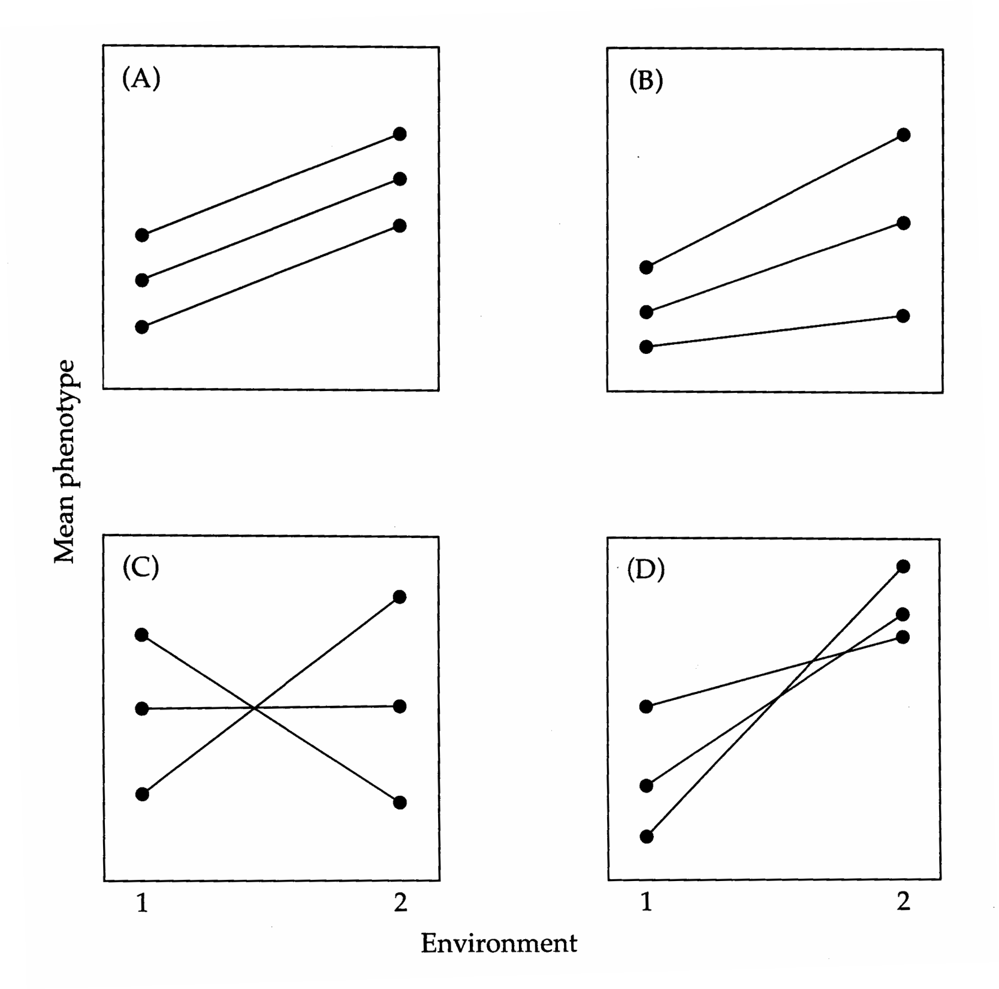
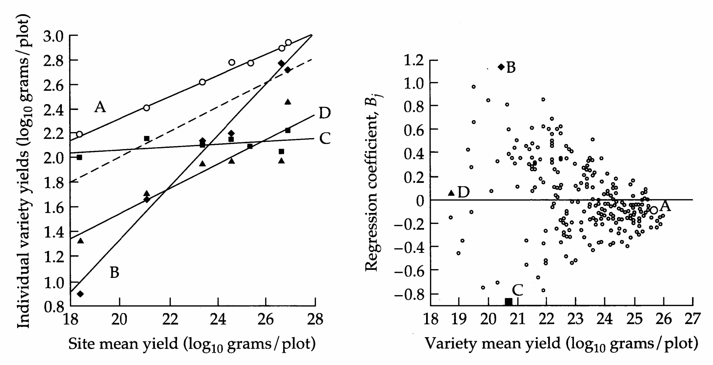
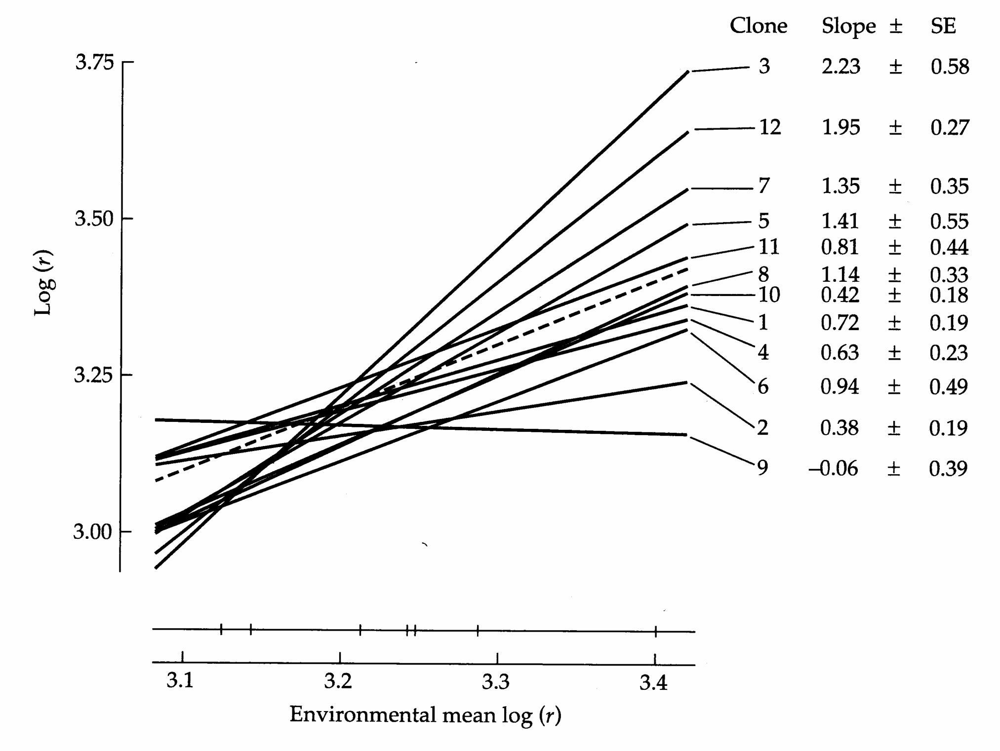
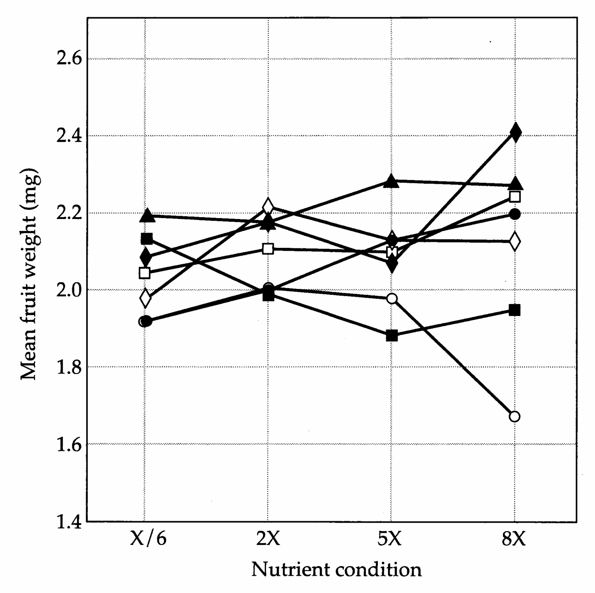

# Chapter 22 · Genotype × Environment Interaction

## Genetics_chapter22_001 · Genotype × Environment Interaction

To this point, we have been conceptualizing the phenotype of an individual as the sum of independent genetic and environmental contributions, with both factors having essentially continuous distributions and the environmental effect being a random deviate with expectation zero. As noted in Chapter 6, more precise statements can sometimes be made about the environmental contribution when individuals are distributed over a discrete set of environments. For example, two different locations or years may present very different growth conditions for a crop variety. Such a difference can be recorded as a macroenvironmental effect, and no further complications are introduced provided all varieties of interest respond in the same way. However, things are not so simple if varieties differ in their response to environmental change, i.e., if there is genotype × environment interaction.

Issues concerning genotype × environment interaction arise in many contexts in quantitative genetics. Genotype × environment interaction is a major concern in attempts to develop economically important breeds of plants and animals with wide geographical utility. It is also of considerable concern in quantitative-genetic investigations of natural populations when broad inferences are made from studies of individuals raised in simple, often novel, laboratory environments. Finally, genotype × environment interaction is of substantial importance in genetic epidemiological studies that show certain genotypes to have elevated sensitivities to environmental risk factors.

As a point of departure, recall that a general description of the phenotype of an individual of genotype j living in the ith environmental setting is

$$
z_{i j k}=\mu+G_{j}+I_{i j}+E_{g,i}+E_{s,i j k}
\tag{22.1}
$$

where $\mu$ is the average phenotype over all genotypes and environments, $G_{j}$ is the effect of the jth genotype averaged over all environments, $E_{g,i}$ is the average (general) effect of the ith environment on all genotypes, $I_{ij}$ is the interaction effect between genotype $j$ and environment $i$, and $E_{s,ijk}$ is the special environmental effect (residual deviation) for the kth replicate of genotype $j$ in environment $i$. The effect of the ith environment is interpreted as the difference between the mean phenotype of all genotypes grown in environment $i$ and the grand mean, i.e., as $E_{g,i} = \mu_{i} - \mu$. Similarly, the jth genotypic value is defined to be the difference between the mean phenotype of genotype $j$ over all environments and the grand mean, $G_{j} = \mu_{j} - \mu$, and the ijth genotype $\times$ environment interaction is $I_{ij} = \mu_{ij} - \mu - G_{j} - E_{g,i} = \mu_{ij} - \mu_{j} - \mu_{i} + \mu$.

> **Figure 22.1** · page 670 · source: `Genetics_chapter22`
>
> 
>
> Figure 22.1 Reaction norms for three genotypes in response to two environments. (A) No genotype × environment interaction. (B) Genotype × environment interaction is due entirely to a change in scale. (C) Genotype × environment interaction is due to a change in ranking. (D) There is a change of scale as well as a change in ranking.

If $ I_{ij} = 0 $ for all ij, then all genotypes respond to macroenvironmental change in a parallel fashion, as shown in Figure 22.1A for the case of two environments. A nonparallel response to environmental change implies genotype × environment interaction with respect to phenotypic expression. Such interaction can come about in two not necessarily exclusive ways: (1) a change of scale, such that higher-ranking genotypes in one environment react more (or less) strongly to conditions in the second environment (Figure 22.1B), and (2) a change of ranking (Figure 22.1C). With multiple genotypes in multiple environments, many more complex patterns are possible.

The function relating mean phenotypic response of a genotype to a change in the environment is called a reaction norm (Woltereck 1909, Schmalhausen 1949). Like any other character, reaction norms can evolve in response to environmental pressures. For example, in Figure 22.1D, selection for the high-performing geno- type in environment 2 leads to the evolution of a steep reaction norm (i.e., high variance in phenotypic expression across environments), while selection for the high-performing genotype in environment 1 leads to a population dominated by individuals with low environmental sensitivity. If selection occurred in both environments, and genotypes were distributed randomly across environments, the reaction norm giving the highest average performance would come to dominate.

This chapter is concerned with reaction norm analysis, i.e., with the statistical methodology for quantifying differences among genotypes in response to environmental change. Two classes of traits are of interest in this regard. Labile traits are those for which phenotypic expression can adjust rapidly within individuals, through physiological and/or behavioral means, to changes in the environment. Examples include behavioral changes in the presence vs. absence of predators, competitors, and/or mates. Nonlabile traits are those for which phenotypic expression becomes fixed during some sensitive period of development, e.g., age at first reproduction or adult size in an arthropod with determinate growth. Both types of traits can exhibit genotype × environment interaction. But from a practical standpoint, there is an important distinction between labile and nonlabile traits. The entire reaction norm of a labile trait can be determined at the individual level by scoring the same individual in a number of environments, but with nonlabile traits, different points on the reaction norm need to be assayed in different individuals. Many traits, of course, have both labile and nonlabile components. For example, the behavior of an individual can often be conditioned by prior experiences, and the metabolic rates of individuals can depend both on current environmental conditions and on conditions that existed during development.

The statistical methods relevant to reaction norm analysis largely follow from previous chapters. We start by considering the special, but common, case in which multiple genotypic groups are assayed in two environments. With this sort of experimental design, the concept of genetic correlation (Chapter 21) can be applied to the problem of genotype × environment interaction. We then show how a fuller resolution of the issues can be achieved by assaying genotypes over a more complete spectrum of environments. With multiple environments, two-way analysis of variance (Chapter 20) becomes useful, the two factors being genotypes and environments. As in all of the methods introduced in previous chapters, maximum likelihood provides an alternative framework for analyzing genotype × environment interaction (Platenkamp and Shaw 1992), an issue that we defer until Chapter 27. We conclude the chapter by considering some recent theoretical developments that may help guide future interpretations of reaction norm analyses.

Before proceeding, we raise the caveat that the literature on genotype $ \times $ environment interaction analysis is littered with disagreements and inconsistencies as to how parameter estimates are to be interpreted. Much of the controversy concerns differences in opinions as to whether environmental treatments should be considered to be random vs. fixed effects. Treating the environments as fixed implies concern only with the particular set of environments considered (such as particular climates for cultivars). Treating the environments as random implies that the sampled environments represent a random sample from a larger universe of environments. The confusion goes beyond this issue, since there is more than one way to parameterize a linear model containing fixed effects. Moreover, some applications of genotype × environment interaction even depart from the basic linear model given above, treating the interaction term as a function of the product of the genotypic value and environmental effect, $ I_{ij} = G_j \cdot E_{g,i} $ (Gauch 1988, Gimelfarb 1994, Piepho 1995). We have chosen to focus on the more general model, Equation 22.1, and in the following pages we attempt to sort out the relevant issues regarding fixed and random effects. Before analyzing any experiment on genotype × environment interaction, the practitioner will need to give careful consideration to the merits of alternative approaches.

Reviews on genotype × environment interaction from various applied perspectives can be found in Dickerson (1962), Comstock and Moll (1963), Bradshaw (1965), Pani and Lasley (1972), Freeman (1973), J. Hill (1975), Barlow (1981), Simmonds (1981), Hohenboken (1985), Schlichting (1986), Becker and Léon (1988), Wahlsten (1990), and Kang and Gauch (1995). The overwhelming message from the extensive empirical literature on varieties of crops and domesticated animals is that genotype × environment interaction is extremely common. However, there are still surprisingly few data on its significance in natural populations.

---

## Genetics_chapter22_002 · GENETIC CORRELATION ACROSS TWO ENVIRONMENTS

Falconer (1952) had the useful insight that the same character measured in two different environments can be treated as two different traits. Genotype × environment interaction can then be detected from the genetic correlation between the two traits. If the family genetic effects do not change across environments or if they are related such that performance of any genotype in environment 2 is proportional to that in environment 1 (Figures 22.1A,B), the genetic correlation of family members across environments is equal to one. The null hypothesis of no significant genotype × environment interaction is rejected whenever the genetic correlation across environments is significantly less than one.

To achieve a more explicit understanding of the relationship between the genetic correlation across environments and the amount of genotype × environment interaction, a clear description of the linear model is required. Throughout this chapter, we use a liberal definition of “genotype,” letting j denote an average member of the jth genetic group, where the group may consist of genetically identical individuals (e.g., members of a clone or an inbred line) or of members of the same family (e.g., paternal half sibs). From Equation 22.1, the phenotypes of two individuals (k and l) of genetic group j, each in a different environment (1 and 2), can be represented as

$$
z_{1j k}=\mu+G_{j}+I_{1j}+E_{1}+e_{1j k}
\tag{22.2a}
$$

$$
z_{2jl}=\mu+G_{j}+I_{2j}+E_{2}+e_{2jl}
\tag{22.2b}
$$

Here, to simplify notation, we drop the subscript g on the general environmental effect $ E_{g} $. We also use e rather than $ E_{s} $ to denote the residual effect, since the former potentially contains some genetic as well as environmental sources of variation when the “genotype” is a collection of related, but not identical, individuals.

Using the definitions given in the introduction, this model can be simplified in two ways. First, since $ E_1 = \mu_1 - \mu $, $ E_2 = \mu_2 - \mu $, and $ \mu = (\mu_1 + \mu_2)/2 $, it follows that $ E_1 = -E_2 $. Thus, the macroenvironmental effects can be denoted by $ \pm E $. Second, since $ I_{1j} = \mu_{1j} - \mu - G_j - E $, $ I_{2j} = \mu_{2j} - \mu - G_j + E $, and $ G_j = [(\mu_{1j} + \mu_{2j})/2] - \mu $, it follows that $ I_{1j} = -I_{2j} $, so the interaction effects for specific genetic groups in the alternate environments can be denoted as $ \pm I_j $. With these modifications, the preceding equations become

$$
z_{1j k}=\mu+G_{j}+I_{j}+E+e_{1j k}
\tag{22.3a}
$$

$$
z_{2jl}=\mu+G_{j}-I_{j}-E+e_{2jl}
\tag{22.3b}
$$

The fundamental properties of this linear model can be summarized as follows: (1) $ \mu $ is the grand mean of all genotypes across both environments; (2) the genetic (family) effects are assumed to be random variables with expectation zero and variance $ \sigma_{G}^{2} $; (3) for a given environment, the interaction effects are random variables with expectation zero and variance $ \sigma_{I}^{2} $; (4) within genetic groups, the mean interaction effect is constrained to be zero; (5) genotypic values and interaction effects may be correlated with covariance $ \sigma_{G,I} $ (Figure 22.1B provides an example of such covariance, genotypes with higher values of G having higher values of I); (6) the average value of the two environmental effects is zero; and (7) the residual deviations within environments have expectation zero and variance $ \sigma_{e}^{2} $ for all genetic groups.

Within each environment, the genotypic effects are $ G_{1j} = G_j + I_j $ and $ G_{2j} = G_j - I_j $. Thus, the variances among genotypic group (typically family) effects within each environment and the covariance across environments are

$$
\sigma_{G}^{2}(1)=\sigma^{2}(G_{j}+I_{j})=\sigma_{G}^{2}+\sigma_{I}^{2}+2\sigma_{G,I}
\tag{22.4a}
$$

$$
\sigma_{G}^{2}(2)=\sigma^{2}(G_{j}-I_{j})=\sigma_{G}^{2}+\sigma_{I}^{2}-2\sigma_{G,I}
\tag{22.4b}
$$

$$
\sigma_{G}(1,2)=\sigma[(G_{j}+I_{j}),(G_{j}-I_{j})]=\sigma_{G}^{2}-\sigma_{I}^{2}
\tag{22.4c}
$$

We emphasize that here and below, $ \sigma_{G}^{2}(1) $, $ \sigma_{G}^{2}(2) $, and $ \sigma_{G}(1,2) $ refer to variances and covariances of family (genotypic group) means, not to genetic variances at the levels of individuals.

Three distinctive features emerge from these expressions. First, within any environment, the portion of the genotypic variance that is responsive to environmental change ( $ \sigma_{I}^{2} $) is confounded with the variance of genotypic means across environments ( $ \sigma_{G}^{2} $). That is, in a single-environment setting, the contributions of $ \sigma_{G}^{2} $ and $ \sigma_{I}^{2} $ to the genetic variance cannot be isolated (since they appear as a sum). Second, the genetic variance differs between the two environments whenever there is a covariance between mean effects and interaction effects of the genetic groups ( $ \sigma_{G,I} \neq 0 $). In the context of Figure 22.1, this requires that the slopes and elevations of genotypic reaction norms be correlated. Third, from the variances of family means within environments and the covariance of family means across environments, the genetic variance and interaction variance can be isolated, as

$$
\sigma_{G}^{2}=\frac{1}{2}\left[\sigma_{G}(1,2)+\frac{\sigma_{G}^{2}(1)+\sigma_{G}^{2}(2)}{2}\right]
\tag{22.5a}
$$

$$
\sigma_{I}^{2}=\frac{1}{2}\left[\frac{\sigma_{G}^{2}(1)+\sigma_{G}^{2}(2)}{2}-\sigma_{G}(1,2)\right]
\tag{22.5b}
$$

$$
\sigma_{G,I}=\frac{\sigma_{G}^{2}(1)-\sigma_{G}^{2}(2)}{4}
\tag{22.5c}
$$

Now recall the rule that an among-family variance is equivalent to the phenotypic covariance of individuals within families (Chapter 18). Thus, additive genetic variance contributes to $ \sigma_G^2(1) $ and $ \sigma_G^2(2) $ in the amounts $ 2\Theta\sigma_A^2(1) $ and $ 2\Theta\sigma_A^2(2) $, where $ \Theta $ is the coefficient of coancestry among individuals within families (or more generally, in the group of individuals chosen). Similarly, additive genetic covariance contributes to $ \sigma_G(1,2) $ in the amount $ 2\Theta\sigma_A(1,2) $. Thus, since all three contributions are proportional to $ 2\Theta $, ignoring nonadditive genetic effects, the additive genetic correlation across environments is defined to be

$$
\rho_{x}=\frac{\sigma_{A}(1,2)}{\sigma_{A}(1)\sigma_{A}(2)}=\frac{\sigma_{G}(1,2)}{\sigma_{G}(1)\sigma_{G}(2)}
\tag{22.6}
$$

This expression shows that the genetic correlation across environments can be estimated directly using measures of the among-family variances, $ \sigma_{G}^{2}(1) $ and $ \sigma_{G}^{2}(2) $, and covariance, $ \sigma_{G}(1,2) $.

Substituting Equations 22.4a–c, $ \rho_{\times} $ can be expressed in causal terms as

$$
\rho_{\times}=\frac{\sigma_{G}^{2}-\sigma_{I}^{2}}{\sqrt{(\sigma_{G}^{2}+\sigma_{I}^{2})^{2}-4\sigma_{G,I}^{2}}}
\tag{22.7a}
$$

This expression helps clarify a number of issues. First, in the absence of genotype $ \times $ environment interaction, $ \sigma_{I}^{2} = \sigma_{G,I} = 0 $, and $ \rho_{\times} = 1 $. Second, if there is a perfect negative correlation between rankings of genetic groups in the two environments such that all families have the same mean performance across environments ( $ \sigma_G^2 = 0 $), then $ \sigma_G, I $ must also be zero, and $ \rho_\times = -1 $. Third, from Equations 22.4a,b it can be seen that when the among-family variances in the two environments are the same [i.e., $ \sigma_G^2(1) = \sigma_G^2(2) $], then $ \sigma_G, I = 0 $, reducing Equation 22.7a to

$$
\rho_{\times}=\frac{\sigma_{G}^{2}-\sigma_{I}^{2}}{\sigma_{G}^{2}+\sigma_{I}^{2}}
\tag{22.7b}
$$

and implying that genotype × environment interaction reduces the genetic correlation below +1. If, on the other hand, $ \sigma_G^2(1) \neq \sigma_G^2(2) $, $ \rho_\times $ can equal one even when there is significant interaction variance. This requires only that the average effects of genotypes be correlated perfectly with their interaction effects, i.e., $ \sigma_G, I = \sigma_G \sigma_I $, or equivalently, $ I_j = b \cdot G_j $, where b is a constant independent of genotype.

In summary, a genetic correlation across environments significantly less than one cannot exist in the absence of genotype × environment interaction. On the other hand, a genetic correlation across environments equal to one need not imply an absence of genotype × environment interaction, although when $ \rho_{x} = 1 $, any genotype × environment interaction will most likely be a simple scale effect. In practical applications, such an effect can be verified by simply transforming the data prior to analysis so that the among-family variances in both environments are equal.

---

## Genetics_chapter22_003 · GENETIC CORRELATION ACROSS TWO ENVIRONMENTS / Estimation Procedures

To obtain an estimate of the genetic correlation across environments, $ r_{\times} $, estimates of the among-family variances are required for both environments, as is an estimate of the covariance of family means across environments. The simplest way of procuring such estimates is to split the families, assaying for each family one set of individuals in one environment and another set in the second environment. Methods for estimating the among-family components of variance within single environments, $ \sigma_{G}^{2}(1) $ and $ \sigma_{G}^{2}(2) $, have been presented in previous chapters (e.g., one-way ANOVA), so we will consider that issue no further. Via (1984) reviews several procedures for estimating $ \sigma_{G}(1,2) $, the most straightforward of which is the simple computation of the covariance of family means in the different environments. In all such analyses, care should be taken to avoid the use of families containing individuals that share family environmental effects, i.e., individuals that share the same mothers. After the among-family variances and covariances have been estimated, the estimate $ r_{\times} $ is obtained by substituting observed values for their expectations in Equation 22.6.

As in the case of other genetic correlation estimators encountered in Chapter 21, this indirect way of estimating $ \rho_{\times} $ is not equivalent to the computation of a product-moment correlation, and as a consequence, sampling error can cause estimates to exceed the natural boundaries of $ \pm1 $. For purposes of hypothesis testing, however, a product-moment correlation, $ r(\overline{z}_{1j}, \overline{z}_{2j}) $, can be obtained from the simple regression of family means (i.e., $ \overline{z}_{1j} $ on $ \overline{z}_{2j} $). The significance level associated with such a regression provides a conservative test as to whether $ r_{\times} $ is significantly different from zero, since the correlation coefficient will be biased towards zero by the inclusion of residual variance in the denominator (see below).

Based on the arguments in the preceding section, a more interesting question in the analysis of genotype × environment interaction is whether the correlation across environments is significantly different from +1. For this purpose, the jackknife and bootstrap procedures discussed in the previous chapter may be exploited profitably. If the true genetic correlation across environments were +1, one would expect the distribution of estimates of $ \rho_{\times} $ derived from bootstrap samples to significantly overlap +1.

A number of investigators have used the correlation of observed family means, $ r(\overline{z}_{1j}, \overline{z}_{2j}) $, as an estimate of the genetic correlation across environments. As noted above and in Chapter 21, the absolute value of any such estimate will be biased downwardly relative to $ \rho_{\times} $ since the variances of family means will be inflated by contributions from measurement error and environmental variance. Thus, although this procedure does not affect the sign of the correlation (since the covariance is still estimated in the way we just outlined), it does artifactually create a tendency towards falsely concluding that genotype × environment interaction is present. A slight modification of Equation 21.9 shows the magnitude of the bias,

$$
\rho(\overline{z}_{1j},\overline{z}_{2j})\simeq\rho_{\times}\left[\frac{2\Theta n h_{1}h_{2}}{\sqrt{(\phi h_{1}^{2}+1)(\phi h_{2}^{2}+1)}}\right]
\tag{22.8}
$$

where $ \phi = 2\Theta(n - 1) $, and $ h_1^2 = \sigma_A^2(1)/\sigma_z^2(1) $ and $ h_2^2 = \sigma_A^2(2)/\sigma_z^2(2) $ are the heritabilities of the trait as expressed in the two environments. Note that with moderately large sample sizes ( $ n \geq 10 $ in each environment) and assuming the heritabilities in both environments are approximately the same, the quantity in brackets is approximately $ \phi h^2/(\phi h^2 + 1) $. Thus, the correlation between family means can substantially underestimate $ \rho_\times $ unless $ \phi h^2 >> 1 $. That is, unless the heritabilities in both environments are quite high, large family sizes $ [n >> 1/(2\Theta h^2)] $ are essential to reduce the sampling bias of the correlation of family means to a reasonable level. The following empirical example demonstrates the misleading nature of correlations of family means.

**[示例 Example]**

> **[UNRESOLVED EXAMPLE: Genetics_chapter22:1]**

---

## Genetics_chapter22_004 · TWO-WAY ANALYSIS OF VARIANCE

Two-way ANOVA provides an approach for detecting genotype × environment interaction when data are available for more than two environments. Applications date back to Sprague and Federer (1951). The sums of squares are computed in the same manner as in a diallel (Table 20.1), the two factors now being genotypes (or families) and environments, rather than fathers and mothers. However, as pointed out by Ayres and Thomas (1990) and Fry (1992), much confusion exists in the literature regarding the interpretation of the mean squares (and the variance components extracted from them) in genotype × environment analysis.

We will assume throughout that the genetic groups under analysis are sampled randomly from some larger population about which inferences are to be made and are hence random effects. The main issue then concerns the treatment of the macroenvironmental effects. If the environments in which the genotypes are assayed are regarded as random with respect to the possible set of environments in which the study species is located naturally, then a random-effects interpretation is appropriate. This would be the case, for example, if genotypes of a plant species were replicated in plots randomly distributed over the native habitat (Stratton 1994). If, on the other hand, the environments are selected for a particular reason and/or are the only ones of interest, as in the assay of crop varieties at future production sites, they should be regarded as fixed effects. In this case, a mixed-model interpretation (random genotypes, fixed environments) is required.

We start with the random-effects model, as the basic machinery has already been introduced in Chapter 20. As we will see below, because of its focus on two specific environments, Falconer's approach, described by Equations 22.2a,b, is equivalent to a mixed-model analysis, with the environmental effects being interpreted as fixed factors. To distinguish that model from the random-effects model, a slight change in notation is required. We denote terms from the random-effects model with tildes,

$$
z_{i j k}=\mu+\widetilde{G}_{j}+\widetilde{I}_{i j}+\widetilde{E}_{i}+e_{i j k}
\tag{22.9}
$$

The properties of this model are identical to those encountered in Chapter 20 — the model components $ \widetilde{G}_j $, $ \widetilde{I}_{ij} $, $ \widetilde{E}_j $, and $ e_{ijk} $ all have expected values equal to zero, are distributed independently, and have variances respectively denoted by $ \sigma_G^2 $, $ \sigma_I^2 $, $ \sigma_E^2 $, and $ \sigma_e^2 $. A simple change of terms from Table 20.1 yields the expressions for the expected mean squares given in Table 22.1.

Properties of the random-effects model are widely agreed upon by statisticians, but things are more complicated under the mixed model. Under one interpretation, all of the properties given above for the random-effects model hold, except for the definition of the environmental effects as fixed constants rather than random variables. In this case, the expressions for the expected mean

**[Table]**

*[See Table 22.1 at the end of this section.]*

squares for genotypes, interaction effects, and residual deviations are identical to those for the random-effects model. A second interpretation is that because the macroenvironmental effects are assumed to be fixed effects, their mean value should be constrained to be zero. Given this constraint, it is argued that there should be a partial restriction on the interaction effects, such that $ \sum_{i=1}^{N_E} I_{ij} = 0 $, i.e., within each genetic group, the interaction effects should also have mean zero across environments. This is the interpretation that we made in introducing the causal determinants of Falconer's correlation across environments, where we let the interaction effect of genotype j be $ +I_j $ in one environment and $ -I_j $ in the other, and where we let the two environmental effects be $ \pm E $. To maintain continuity, we adhere to this latter interpretation of the mixed model throughout this chapter. A good general introduction to the issues distinguishing the two interpretations of the mixed model can be found in Searle et al. (1992, pp. 123–127). Itoh and Yamada (1990) provide an overview of the two approaches in genotype × environment interaction analysis.

For the remainder of our discussion on the mixed model, we return to Equation 22.1, emphasizing again that the only changes in assumptions from the random-effects model (Equation 22.8) are that the observed macroenvironmental effects are assumed to be constants with mean zero (under the random-effects model, the expected value of the mean macroenvironmental effect is zero, but the sample mean is not so constrained), and that the interaction effects within genotypes are constrained to have mean zero. As in the random-effects model, $G_j$ is still a random variable with expectation zero, but we now denote its variance as $\sigma_G^2$ (as opposed to $\sigma_G^2$). The interaction effects are random variables across genotypes with zero means and variance $\sigma_I^2$. However, the summation restriction on the interaction effects causes them to be nonindependent within genotypes, the average covariance within genotypes being $-\sigma_I^2/(N_E-1)$. For example, with Falconer's model, where $N_E=2$, $\sigma(I_{1j},I_{2j})=\sigma(+I_j,-I_j)=-\sigma_I^2$. This negative covariance causes the sample-wide expectation of the interaction variance to be $[N_E/(N_E-1)]\sigma_I^2$, rather than $\sigma_I^2$ (which is the expectation in the absence of the zero-sum restriction), leading to the unusual appearance of the interaction-variance contribution to the expected mean squares in Table 22.1.

Note that despite these subtle technical differences, there is a simple and close connection between the variance components underlying the random-effects and mixed models, as can be seen by comparing the expressions for the expected mean squares in Table 22.1,

$$
\sigma_{I}^{2}=\frac{N_{E}-1}{N_{E}}\sigma_{I}^{2}
\tag{22.10a}
$$

$$
\sigma_{G}^{2}=\sigma_{\widetilde{G}}^{2}+\frac{\sigma_{\widetilde{I}}^{2}}{N_{E}}
\tag{22.10b}
$$

A simple way of understanding these relationships is to recall (from Chapter 2) that, with a sample size of $N$, the average squared deviation of an observed variable from an observed mean is a downwardly biased estimate of the population variance by a factor of $(N-1)/N$. In effect, by defining the mean interaction effects within genotypes to be zero, the mixed model ignores this sampling bias. On the other hand, the sampling variance of mean interaction effects within genotypes, $(\sigma_{I}^{2}/N_{E})$, ignored by the mixed model, inflates the genotypic variance. The net effect is that the sum of components of variance associated with genotypes and interaction effects is identical in both models, i.e., $\sigma_{G}^{2} + \sigma_{I}^{2} = \sigma_{G}^{2} + \sigma_{I}^{2}$.

Still another way of understanding the main difference between the random- and fixed-effects models provides some help in interpreting the meaning of the variance components. Under the mixed model, $ \sigma_{G}^{2} $ is a measure of the variance among marginal mean genotypic values (i.e., genotypic means averaged over all sampled environments), including that caused by sampling of the interaction effects. This equivalence can be seen from Equation 22.10b, which shows $ \sigma_{G}^{2} $ to be the sum of the variance of random genotypic values ( $ \widetilde{G}_{j} $) and the variance of a mean interaction effect based on a sample size of $ N_{E} $. On the other hand, despite its notation as a variance, $ \sigma_{G}^{2} $ can be seen from Equation 22.9 to be equivalent to the covariance between family members raised in different environments (Hocking 1985, Fry 1992). This result follows from the standard rule, encountered in previous chapters, that an among-group variance component extracted by ANOVA is equivalent to the covariance of individuals within groups. Thus, in the context of genotype × environment interaction, $\sigma_{G}^{2}$ can actually take on negative values if, for example, there is a strong tendency for the reaction norms of different genetic groups to cross. As a variance of marginal means, $\sigma_{G}^{2}$ is constrained to be positive, as are $\sigma_{I}^{2}$ and $\sigma_{I}^{2}$ (although estimates of them can be negative).

With the simple translations given by Equations 22.10a,b, and the fact that both models utilize exactly the same observed mean squares, it is relatively easy to move from one sort of analysis to the other. The variance components underlying the two models are strictly identical only in the absence of genotype × environment interaction ( $ \sigma_{I}^{2} = \sigma_{I}^{2} = 0 $), and they can be quite different when $ N_{E} $ is only two. Note, however, from Equations 22.10a,b, that as the number of environments ( $ N_{E} $) becomes large, $ \sigma_{G}^{2} $ converges on $ \sigma_{G}^{2} $ (as does $ \sigma_{I}^{2} $ on $ \sigma_{I}^{2} $), and the likelihood of a negative $ \sigma_{G}^{2} $ becomes diminishingly small.

As can be seen from the structure of the expected mean squares in Table 22.1, under either model the hypothesis of no significant interaction variance can be evaluated by use of the $ F $ ratio $ MS_I/MS_e $. With the random-effects model, the test statistic for significant genotype effects is $ MS_G/MS_I $, whereas with the mixed model, it is $ MS_G/MS_e $. This difference follows from the requirement that, under the null hypothesis of no significant effects, both mean squares have the same expected values.

Care must be taken in using the variance components extracted from ANOVA to interpret the heritability of a trait. Under either model, assuming purely additive gene effects, the average additive genetic variance within an environment is $ \left(\sigma_{G}^{2} + \sigma_{I}^{2}\right) / (2\Theta) $, where $ \Theta $ is the coefficient of coancestry within genetic groups in the analysis. Thus, if the population were to be confined to a single environment, the expected heritability would be

$$
h^{2}=\frac{\sigma_{G}^{2}+\sigma_{I}^{2}}{2\Theta(\sigma_{e}^{2}+\sigma_{G}^{2}+\sigma_{I}^{2})}
\tag{22.11a}
$$

If, on the other hand, the population is viewed as being distributed randomly over heterogeneous macroenvironments, then the interaction variance does not contribute to the resemblance between relatives (assuming family members develop in different macroenvironments), and the total phenotypic variance needs to include that due to macroenvironmental effects. Thus, the relevant measure of heritability becomes

$$
h^{2}=\frac{\sigma_{G}^{2}}{2\Theta(\sigma_{e}^{2}+\sigma_{G}^{2}+\sigma_{I}^{2}+\sigma_{E}^{2})}
\tag{22.11b}
$$

**[示例 Example]**

> **[UNRESOLVED EXAMPLE: Genetics_chapter22:2]**

> **Table 22.1** · `22.1` · page 679 · source: `Genetics_chapter22_004`
> Table 22.1 Alternative interpretations of the expected mean squares for two-way analysis of variance of genotype × environment interaction under a random-effects vs. a mixed (genotypes random, environments fixed) model.
>
> <table><tr><td rowspan="2">Factor</td><td rowspan="2">Degrees of Freedom</td><td colspan="2">Expected Mean Squares</td></tr><tr><td>Random Effects</td><td>Mixed Model</td></tr><tr><td>Environment</td><td>$ N_{E} - 1 $</td><td>$ \sigma_{e}^{2} + n\sigma_{I}^{2} + nN_{G}\sigma_{E}^{2} $</td><td>$ \sigma_{e}^{2} + \frac{nN_{E}}{(N_{E} - 1)}\sigma_{I}^{2} $</td></tr><tr><td>Genetic</td><td>$ N_{G} - 1 $</td><td>$ \sigma_{e}^{2} + n\sigma_{I}^{2} + nN_{E}\sigma_{G}^{2} $</td><td>$ \sigma_{e}^{2} + nN_{E}\sigma_{G}^{2} $</td></tr><tr><td>G × E</td><td>$ (N_{E} - 1)(N_{G} - 1) $</td><td>$ \sigma_{e}^{2} + n\sigma_{I}^{2} $</td><td>$ \sigma_{e}^{2} + \frac{nN_{E}}{(N_{E} - 1)}\sigma_{I}^{2} $</td></tr><tr><td>Error</td><td>$ N_{E}N_{G}(n - 1) $</td><td>$ \sigma_{e}^{2} $</td><td>$ \sigma_{e}^{2} $</td></tr></table>

---

## Genetics_chapter22_005 · TWO-WAY ANALYSIS OF VARIANCE / Relationship to Falconer's Correlation Across Environments

There is a close relationship between the ANOVA approach to genotype × environment interaction and Falconer’s genetic correlation across environments (Robertson 1959b; Dickerson 1962; Yamada 1962, Yamada et al. 1988). Here we show the connection between Falconer’s fixed-effects model and the random-effects interpretation (Equation 22.9). For the time being, we assume that the total genetic variance is the same in different environments, so that Falconer’s correlation is given by Equation 22.7b, which is expressed in terms of the same variance components that we have used in the mixed model. Substituting from Equations 22.10a,b, the equivalent expression in terms of the random-effects model is

$$
\rho_{\times}=\frac{\sigma_{G}^{2}+[(2-N_{E})/N_{E}]\sigma_{I}^{2}}{\sigma_{G}^{2}+\sigma_{I}^{2}}.
\tag{22.12a}
$$

which reduces to

$$
\rho_{x}=\frac{\sigma_{G}^{2}}{\sigma_{G}^{2}+\sigma_{I}^{2}}
\tag{22.12b}
$$

when there are only two environments. Written in this manner, for analyses involving only two environments, $ \rho_{x} $ can be interpreted as an intraclass correlation of genotypic values in the different environments. Thus, a third way of computing the genetic correlation across two environments is to perform a conventional two-way ANOVA on the data, computing the variance components by the method of moments, and substituting the appropriate values into either Equation 22.7b or 22.12b. One advantage of the ANOVA approach is that the $ F $ ratio, $ MS_{I}/MS_{e} $, provides an explicit test of the hypothesis of no genotype $ \times $ environment interaction.

Equation 22.7b, or equivalently Equation 22.12a, can also be used in experiments employing multiple $ (N_E > 2) $ environments to estimate the average degree of genetic correlation across all pairs of environments. Following the logic developed above, $ \rho_\times $ can be negative, but geometric constraints make the chance of this very small when $ N_E $ is large.

A slight complication arises when the among-family variance differs among environments, as this causes the interaction variance extracted from two-way ANOVA to be inflated by scale effects. The resultant downward bias in $ \rho_{x} $ can be corrected by subtracting from the denominator of Equation 22.12a (or 22.7b)

the variance of the environment-specific genetic standard deviations (Robertson 1959b, Dickerson 1962, Itoh and Yamada 1990, Muir et al. 1992). To apply this correction, one-way ANOVAs need to be performed on the data for each of the $ N_{E} $ environments. In each case, the among-family component of variance is obtained by the method of moments. Square roots are then taken of each of the $ N_{E} $ estimates, and the variance of the among-family standard deviations is subtracted from the denominator of the preliminary estimate of $ \rho_{\times} $ to provide a scale-independent estimate of the correlation across environments.

---

## Genetics_chapter22_006 · FURTHER CHARACTERIZATION OF INTERACTION EFFECTS

The methods outlined in the previous sections of this chapter serve merely to test whether a significant amount of genotype × environment interaction exists within a population and to provide quantitative estimates of the amount of phenotypic variance associated with interaction effects. An absence of interaction variance implies that the reaction norms of different genotypes are essentially parallel, in which case the population mean reaction norm provides a good indication of the pattern of response to environmental change. On the other hand, the presence of significant interaction variance raises numerous questions. Can the interaction effects be broken down further into biologically interpretable components? To what extent are some genotypes more sensitive to environmental change than others? Is there a correlation between a genotype’s stability of phenotypic expression across environments and its average performance?

If the environments in which genotypes are assayed are characterized for different chemical, physical, or biological properties, it is possible to partition the interaction effects into components depending on these features. That is, the interaction effect of genetic group j in environment i could be described as

$$
I_{ij}=\sum_{l=1}^{m}\beta_{jl}x_{il}+\epsilon_{ij}
\tag{22.13a}
$$

where $ x_{il} $ is the measure of the lth feature of the ith environment, $ \beta_{jl} $ is the partial regression coefficient of the jth genotype's interaction effects ( $ I_{ij} $) on the $ x_{il} $, and $ \epsilon_{ij} $ is the deviation of $ I_{ij} $ from the regression prediction. Although this approach can provide insight into the special features of the environment that contribute to interaction effects, it has the disadvantage of demanding data on numerous aspects of the environment, few or none of which may actually be of direct relevance to the study organism.

---

## Genetics_chapter22_007 · FURTHER CHARACTERIZATION OF INTERACTION EFFECTS / Joint-regression Analysis

An alternative approach to Equation 22.13a is to let the mean performance of all genotypes serve as a bioassay of the overall suitability of different environments, allowing each genotype's interaction effects to be expressed as a function of average population performance,

$$
I_{i j}=\beta_{j}(\mu_{i}-\mu)+\epsilon_{i j}
\tag{22.13b}
$$

where $ \mu_{i} $ is the mean phenotype of all genotypes in environment i. This expression has the advantage that all of the complex (and perhaps unobservable) features of the environment are integrated into a single measure, the average environmental effect $ E_{i} = \mu_{i} - \mu $. Recalling Equation 22.1, and substituting observed for expected values, this definition of $ I_{i,i} $ leads to the relationship

$$
\overline{z}_{ij}=\overline{z}_{.j}+(1+B_{j})\widehat{E}_{i}+\epsilon_{ij}
\tag{22.14}
$$

where $ \widehat{E}_i = (\overline{z}_i - \overline{z}_..) $. Thus, a regression of environment-specific mean phenotypes for the $ j $th genetic group on the general environmental effects has an intercept equal to $ \overline{z}_j $ and a slope equal to $ (1 + B_j) $, where $ B_j $ is an estimate of $ \beta_j $.

This idea of partitioning genotype-specific interactions into a component explained by mean population performance and a residual component was first suggested by Yates and Cochran (1938). Now known as joint-regression analysis, it was largely neglected until Finlay and Wilkinson (1963) applied it to varieties of barley. Since then it has been used widely in the analysis of crop cultivars. Statistical aspects of this method are covered in Eberhart and Russell (1966), Perkins and Jinks (1968), A. J. Wright (1971; 1976a,b), and Freeman (1973). J. Hill (1975) gives an overview of early applications. For an extension that includes regression on genotypic means $ (G_j) $ as well as on the cross-product $ G_j E_i $ (see A. J. Wright 1971).

Application of Equation 22.14 to all genotypes in a genotype × environment analysis provides a basis for ranking the genotypes with respect to their responsiveness to environmental change. $ B_{j} = 0 $ implies that the average response of genotype j to the environment is the same as the mean response of the population of genotypes in the analysis. $ B_{j} > 0 $ implies a stronger than average response, whereas $ -1 < B_{j} < 0 $ implies a weaker than average response. If $ B_{j} = -1 $, the genotype's mean performance is completely uncorrelated with that of the population mean, and $ B_{j} < -1 $ implies that the genotype tends to respond to environmental change in a direction contrary to the average genotype in the population.

It is important to note that $B_j$ is only a measure of a genotype's tendency to respond to environmental change in a manner parallel to the population mean. Two genotypes with identical $B$ coefficients may in fact have rather different sets of $I_{ij}$. For example, the first genotype might perform above average in environments where the second genotype is below average and vice-versa, or the residual variance around the regression ($\sigma_{\epsilon j}^2$) might differ between the genotypes. Thus, $\sigma_{\epsilon j}^2$ provides additional information about a genotype's response to the environment, a larger value of $\sigma_{\epsilon j}^2$ implying that the genotype's performance is only weakly correlated with the overall pattern in the population.

> **Figure 22.2** · page 686 · source: `Genetics_chapter22`
>
> 
>
> Figure 22.2 Left: The reaction norms for yield $ (\overline{z}_{ij}) $ for four varieties of barley $ (j = A, B, C, D) $ as a function of site-specific mean yields for all varieties $ (\overline{z}_{i}) $, where i is an index of the sites. The dashed line denotes the average population performance. Right: The relationship between the response to environmental change $ (B_j) $ and mean performance $ (\overline{z}_{.j}) $ for 277 barley varieties. (From Finlay and Wilkinson 1963.)

In summary, joint-regression analysis can be used to obtain estimates of three properties of each genetic group in a genotype × environment analysis: a measure of mean performance ( $ \widehat{G}_{j} = \overline{z}_{.j} - \overline{z}_{..} $), a measure of relative responsiveness to environmental change ( $ B_{j} $), and a measure of consistency of response relative to the linear model ( $ \sigma_{\epsilon j}^{2} $).

Finlay and Wilkinson (1963) evaluated the yields of 277 varieties of barley, obtained throughout the world, in seven environments. Figure 22.2 (left) illustrates the joint-regression analyses for four of these varieties on the environment-specific means $ \overline{z}_{i} $. Variety A responds to environmental change in much the same way as average members of the sample $ (B_{j} = -0.10) $, but produces above average yields in all environments. On the other hand, variety C is nearly unresponsive to environmental change $ (B_{j} = -0.86) $ and has a lower than average yield in benign environments, but a higher than average yield in harsh environments. The joint distribution of genotypic mean performances $ (\overline{z}_{j}) $ and environmental sensitivity $ (B_{j}) $ for all 277 lines (Figure 22.2, right) shows that: (1) all lines exhibit the same directional response to the environment (all $ B_{j} $ are > -1), and (2) no high performing lines have very high or very low responsiveness to the environment (as $ \overline{z}_{j} $ becomes high, the range of $ B_{j} $ becomes quite narrow, with a mean B only slightly less than zero). Conversely, low performing lines display a very wide range of responses. Thus, although $ \overline{z}_{j} $ and $ B_{j} $ are essentially uncorrelated in this study, they are certainly not independent.

> **Figure 22.3** · page 687 · source: `Genetics_chapter22`
>
> 
>
> Figure 22.3 Joint regressions for 12 clones of the green alga Chlamydomonas reinhardtii. All of the clones were derived from a single cross between two parental strains, and assayed in eight environments varying in nitrogen, phosphorus, and carbon availability. The mean phenotype, $ \log(r) $, is the logarithm of the rate of exponential growth at low density. The dashed line represents the common regression with a slope equal to one. Note that the variance in performance among clones increases with increasing environmental value. The clonal performances converge to similar values in intermediate environments and then diverge as environmental conditions become progressively worse, i.e., there is a tendency for the joint-regression lines to cross. (From Bell 1991; see also Bell 1990.)

Application of joint-regression analysis to other types of organisms has often yielded a positive correlation between mean performance ( $ \overline{z}_{.j} $) and $ B_{j} $ (Eberhart and Russell 1966, Perkins and Jinks 1968, Fripp and Caten 1973, Jinks and Connolly 1973, J. Hill 1975, Zuberi and Gale 1976, Jinks and Pooni 1982, Garbutt and Zangerl 1983). The existence of a such a genetic correlation between environmental sensitivity and mean performance can have profound evolutionary consequences, as can be seen by referring to Figure 22.3. For example, if directional selection operates in a positive direction in an environment that magnifies the expression of the trait, a steep reaction norm (high phenotypic plasticity) will evolve as a correlated response. A subsequent change of the environment toward poorer conditions would then result in a substantial reduction in the mean phenotype, to levels lower than would be exhibited by the genotype best adapted to the poor environment (but poorly adapted to favorable environments). Simmonds (1981) reviews evidence that improvement of agricultural practices combined with selection in the improved environments has led to the inadvertent selection of genotypes whose phenotypic expression is highly responsive to environmental change.

The usual approach to estimating the $ \beta_{j} $ has been to simply perform a least-squares regression of the $ \overline{z}_{ij} $ on the $ \overline{z}_{i} $, although this can lead to slightly biased estimates of the regression coefficient $ \beta_{j} $. Due to the fact that $ (\overline{z}_{i} - \overline{z}_{\cdot}) $ is only an estimate of the true environmental effect $ E_{i} $, the variance of the latter, which appears in the denominator of the regression coefficient $ B_{j} $, is inflated by sampling variance. This source of bias does not influence the rankings of the genotypes with respect to $ B_{j} $, since the covariance is unaffected (Hardwick and Wood 1972). However, somewhat more problematical is the fact that $ \overline{z}_{i} $. contains a contribution from $ \overline{z}_{ij} $. This contribution inflates the correlation between the two measures, to a degree that differs from genotype to genotype depending on their contributions to the $ \overline{z}_{i} $, and it can be of some significance when the number of genetic groups is small.

A modification suggested by A. J. Wright (1976b) eliminates the latter problem by regressing the jth genotypic means on an index of the environment based on the means of the other $ (N_{G}-1) $ genotypes,

$$
B_{j}=\left(\frac{N_{G}-1}{N_{G}-2}\right)\left(\frac{C_{j}}{\overline{C}}-1\right)
\tag{22.15a}
$$

where

$$
C_{j}=\mathbf{Cov}(\overline{z}_{ij},\overline{z}_{i.})-\frac{\mathbf{Var}(\overline{z}_{ij})}{N_{G}}
\tag{22.15b}
$$

with $ \text{Var}(\overline{z}_{ij}) $ being the variance of the environment-specific mean phenotypes for genotype j, $ \text{Cov}(\overline{z}_{ij}, \overline{z}_{i.}) $ being the covariance of the performance of the jth genotype on estimates of the environmental effects based on the remaining ( $ N_G - 1 $) genotypes, and $ \overline{C} $ being the mean of the $ N_G $ estimates of the $ C_j $. The significance of each regression can be tested by evaluating the correlation

$$
r_{j}=B_{j}\sqrt{\frac{N_{G}\overline{C}}{(N_{G}-1)\mathbf{V a r}(\overline{z}_{i j})}}
\tag{22.15c}
$$

against its critical value with $ (N_{E}-2) $ degrees of freedom.

**[Table]**

*[See Table 22.2 at the end of this section.]*

In effect, joint-regression analysis partitions the interaction sum of squares in a two-way ANOVA into two components — one due to the heterogeneity of regressions (variance of the $ B_j $), and one due to still unexplained interaction variation (variance of the $ \epsilon_{ij} $) (Table 22.2). This partitioning follows directly from Equation 22.13b and the fact that under a least-squares approach the residual deviations ( $ \epsilon_{ij} $) are uncorrelated with the environmental effects. There is, of course, no reason for pursuing joint regression if the total interaction variance is not significant, but if the estimate of $ \sigma_I^2 $ is significant, then one or both of its components must be as well.

The variance associated with heterogeneity of regressions can be tested for significance by use of the $F$ ratio of the total interaction mean square and the residual interaction mean square, $MS_I/MS_\epsilon$, as under the null hypothesis $\sigma_I^2 = \sigma_\epsilon^2$ and the expected mean squares are identical. The residual interaction effects can be tested for significance ($\sigma_\epsilon^2 > 0$) using the ratio $MS_\epsilon/MS_e$. If the regression mean square alone is significant, then within the limits of sampling error all of the interaction effects are predicted by linear regressions on the environmental values. If only the residual mean square term is significant, then there is no general linear relationship between the interaction effects and environmental values, and the joint-regression analysis has offered no further insight into the basis of the interaction effects.

**[示例 Example]**

> **[UNRESOLVED EXAMPLE: Genetics_chapter22:3]**

> **Table 22.2** · `22.2` · page 689 · source: `Genetics_chapter22_007`
> Table 22.2 Partitioning of the interaction sum of squares by joint-regression analysis, under the random-effects model with a completely balanced design.
>
> <table><tr><td>Factor</td><td>Degrees of Freedom</td><td>Sums of Squares</td><td>Expected MS</td></tr><tr><td>Environment (E)</td><td>$ N_{E} - 1 $</td><td>$ nN_{G}\sum_{i}(\overline{z}_{i} - \overline{z})^{2} $</td><td>$ \sigma_{e}^{2} + n\sigma_{I}^{2} $</td></tr><tr><td>Genotype (G)</td><td>$ N_{G} - 1 $</td><td>$ nN_{E}\sum_{j}(\overline{z}_{j} - \overline{z})^{2} $</td><td>$ +nN_{G}\sigma_{E}^{2} $</td></tr><tr><td>Interaction (I)</td><td>$ (N_{E} - 1)(N_{G} - 1) $</td><td>$ n\sum_{i,j}(\overline{z}_{ij} - \overline{z}_{i} - \overline{z}_{j} + \overline{z})^{2} $</td><td>$ \sigma_{e}^{2} + n\sigma_{I}^{2} $</td></tr><tr><td>Regression (B)</td><td>$ N_{G} - 1 $</td><td>$ SS_{E} \cdot \sum_{i}B_{j}^{2}/N_{G} $</td><td>$ n(\sigma_{I}^{2} - \sigma_{\epsilon}^{2}) $</td></tr><tr><td>Residual ( \epsilon )</td><td>$ (N_{E} - 2)(N_{G} - 1) $</td><td>$ n\sum_{i,j}\epsilon_{ij}^{2} $</td><td>$ \sigma_{e}^{2} + n\sigma_{\epsilon}^{2} $</td></tr><tr><td>Error (e)</td><td>$ N_{E}N_{G}(n - 1) $</td><td>$ \sum_{i,j,k}(z_{ijk} - \overline{z}_{ij})^{2} $</td><td>$ \sigma_{e}^{2} $</td></tr><tr><td colspan="4">Note: $ SS_{E} $ and $ E(MS_{I}) $ are, respectively, the error sum of squares and the expected inter-action mean square.</td></tr></table>

---

## Genetics_chapter22_008 · FURTHER CHARACTERIZATION OF INTERACTION EFFECTS / Testing for Cross-over Interaction

For cases in which significant genotype × environment interaction is revealed by ANOVA or other means, a closer look at the data often reveals that the estimated norms of reaction have a wide variety of shapes, parallel in some ranges of environments, diverging in others, and intersecting on occasion (Figure 22.4).

> **Figure 22.4** · page 691 · source: `Genetics_chapter22`
>
> 
>
> Figure 22.4 Reaction norms for mean fruit weight (mg) for seven genotypes extracted from a single population of the herbaceous annual plant Polygonum persicaria. The genotypes were propagated clonally and grown with replication under four nutrient conditions. Two-way ANOVA revealed significant genotype × environment interaction for this trait. (From Sultan and Bazzaz 1993.)

The latter condition, a cross-over interaction, is of particular interest as it cannot be eliminated by a change in scale. Provided they are not artifacts of sampling error, cross-over interactions imply that different genotypes are adapted to different environments, a mechanism that can lead to the maintenance of genetic variance in populations inhabiting heterogeneous environments (Gillespie and Turelli 1989). In agriculture, strong cross-over interactions between alternative cultivars or breeds suggests the need for developing locally adapted strains.

There are several ways to test for the significance of observed cross-over interactions, two of which are outlined in Baker (1988). Here we mention only the test developed by Gail and Simon (1985), which considers the performances of two genotypic groups, 1 and 2, over all $ N_E $ environmental states. For each environment, the difference between genotypes is computed, and the differences are grouped into positive ones ( $ \bar{z}_{i1} $ exceeding $ \bar{z}_{i2} $) and negative ones ( $ \bar{z}_{i2} $ exceeding $ \bar{z}_{i1} $). Two test statistics are then constructed, one for each group, from the sum of squared deviations standardized by their respective sampling variances,

$$
Q^{+}=\sum_{i=1}^{N_{E}}\frac{\left(\overline{z}_{i1}-\overline{z}_{i2}\right)^{2}\delta_{i}}{\mathbf{V a r}\left(\overline{z}_{i1}\right)+\mathbf{V a r}\left(\overline{z}_{i2}\right)}
\tag{22.16a}
$$

$$
Q^{-}=\sum_{i=1}^{N_{E}}\frac{\left(\overline{z}_{i2}-\overline{z}_{i1}\right)^{2}\delta_{i}}{\mathbf{V a r}\left(\overline{z}_{i1}\right)+\mathbf{V a r}\left(\overline{z}_{i2}\right)}
\tag{22.16b}
$$

where $ \delta_{i} = 1 $ when the difference within parentheses is positive and $ \delta_{i} = 0 $ otherwise. To test for the significance of cross-over interaction between the two genotypic groups, the minimum of the two statistics is compared with critical values given in Table 1 of Gail and Simon (1985). Large values of the final test statistic imply that cross-overs occur more frequently than can be expected by chance, given the observed sampling variances of the means.

**[示例 Example]**

> **[UNRESOLVED EXAMPLE: Genetics_chapter22:4]**

---

## Genetics_chapter22_009 · FURTHER CHARACTERIZATION OF INTERACTION EFFECTS / Concepts of Stability and Plasticity

Definitions for the stability of phenotypic expression are nearly as numerous as their applications. In general, measures of phenotypic stability attempt to quantify a genotype's tendency to exhibit constant phenotypic expression in different environments. In contrast, phenotypic plasticity refers to the relative responsiveness of a genotype's outward appearance (or behavior) to environmental change. Both concepts play a central role in evolutionary ecology where, for example, fundamental questions exist as to how genotypes persist in temporally and/or spatially variable environments by modulating phenotypic expression developmentally. In agriculture, the patterns by which different breeds respond to temperature, moisture, and nutrient availability are primary determinants of their desirability in different geographic/economic settings. For subsistence farmers, stability of a cultivar’s performance across a broad range of environmental conditions is usually essential, whereas large-scale farms that can afford the luxury of fertilization and irrigation generally view a strong phenotypic response to optimal growth conditions to be most desirable.

Reviews on the historical development, rationale, and use of the various indices of phenotypic stability can be found in Becker (1981), Skrøppa (1984), Lin et al. (1986), Wescott (1986), Nassar and Hühn (1987), Becker and Léon (1988), and Muir et al. (1992). In the following paragraphs, we provide a brief synopsis on four of the more frequently utilized indices, briefly mentioning their pros and cons. In doing so, we refer to the basic linear model (Equation 22.1) and its joint-regression extension (Equation 22.13b),

$$
\begin{aligned}z_{ijk}&=\mu+G_{j}+I_{ij}+E_{i}+e_{ijk}\\&=\mu+G_{j}+\beta_{j}(\mu_{i}-\mu)+\epsilon_{ij}+E_{i}+e_{ijk}\end{aligned}
$$

First, as noted above, the average responsiveness of different genotypes to environmental change is often evaluated by assaying their performance in multiple environments. By performing one-way analyses of variance on each of the $ j = 1, \ldots, N_G $ genotypic groups, genotype-specific estimates of the among-environment component of variance, $ \sigma_E^2(j) $, can be extracted from the mean squares in the usual manner. Such measures estimate the variance of genotype-specific values of $ (I_{ij} + E_i) $ over the set of assayed environments, providing a basis for ranking genotypes with respect to average sensitivity to macroenvironmental change.

Second, from the type of analysis just mentioned, the within-environment components of variance, $ \sigma_e^2(j) $, provide a measure of the relative sensitivity of individual genotypes to microenvironmental change within macroenvironmental settings. A shortcoming of this measure of developmental stability is that, with genetically variable groups, it contains genetic variance due to segregation as well as environmental variance due to microenvironmental effects. Although little work has been done on the subject, it clearly would be of interest to know whether genotypes with high sensitivity to macroenvironmental change also have relatively high levels of developmental instability, i.e., whether the $ \sigma_E^2(j) $ and the $ \sigma_e^2(j) $ tend to be correlated.

Third, Wricke (1962) proposed using the contribution of each genotype to the interaction sum of squares of the two-way ANOVA as a measure of “ecovalence.” According to Wricke’s definition, a high ecovalence implies that a genotype’s performance in a specific environment ( $ \overline{z}_{ij} $) is poorly predicted by the overall genotypic and environmental means ( $ \overline{z}_{.j} $ and $ \overline{z}_{i} $). Recalling that $ \widehat{I}_{ij} = \overline{z}_{ij} - \overline{z}_{i} $. $ \overline{z}_{.j} + \overline{z}_{i} $, under the random-effects model

$$
\mathrm{Var}_{j}(\widehat{I})=\frac{\sum_{i=1}^{N_{E}}(\widehat{I}_{ij}-\overline{I}_{j})^{2}}{N_{E}-1}
\tag{22.17}
$$

provides an estimate of $ \sigma_I^2(j) + [\sigma_e^2(j)/n_j] $, where $ \overline{I}_j = \sum_{i=1}^{N_E} \widehat{I}_{ij}/N_E $ is the mean interaction effect for genotype $ j $, and $ n_j $ is the average sample size of genotype $ j $ within each of the $ N_E $ treatments. The term $ \sigma_e^2(j)/n_j $ is a measure of the sampling variance of the $ \overline{z}_{ij} $. If the average sample sizes and the residual variances are the same for different genotypes, then $ [\sigma_e^2(j)/n_j] $ is a constant, and the genotypic values of $ \text{Var}_j(\widehat{I}) $ provide an unbiased basis for ranking with respect to stability of interaction effects. If, however, the sampling variances are heterogeneous, the genotype-specific estimates $ \text{Var}_e(j)/n_j $ should be subtracted from the estimated $ \text{Var}_j(\widehat{I}) $ before comparing genotypes. Further details on these matters can be found in Shukla (1972, 1982), Muir et al. (1992), and Piepho (1994).

Fourth, as noted above, the joint-regression coefficient $ \beta_j $ is a measure of the relationship between the interaction effects $ (I_{ij}) $ of a genotype and the environmental values defined by the mean performance of the entire population. Taken alone, $ \beta_j $ provides only a weak understanding of the phenotypic response to environmental change, as a lack of close correspondence between the behavior of an individual genotype and that of the population at large need not imply anything about the genotype's actual variation across environments. Moreover, as a regression coefficient, $ \beta_j $ provides no information about the goodness-of-fit of a joint regression. As noted above, information on the latter is provided by $ \sigma_\epsilon^2(j) $, the residual variance around the regression.

Finally, we note that whereas $ \sigma_{E}^{2}(j) $ and $ \sigma_{e}^{2}(j) $ are intrinsic properties of the genotype, estimable without regard to other members of the population, all of the other measures of genotypic stability mentioned above can only be estimated when data are available on other genotypes. Such measures indicate only the degree to which a genotype's average response to environmental change reflects the population pattern. Thus, although low values of $ \sigma_{I}^{2}(j) $ or near-zero estimates of $ \beta_{j} $ imply that a genotype's phenotypic expression is predictable from data on other members of the population, they convey no information on a genotype's intrinsic phenotypic stability across environments.

---

## Genetics_chapter22_010 · FURTHER CHARACTERIZATION OF INTERACTION EFFECTS / Additional Issues

More complicated experimental designs for analyzing genotype × environment interaction are frequently employed, and details on their analysis can be found in most statistics texts concerned with linear models. For example, the nested full-sib, half-sib design can be embedded in a two-way ANOVA by raising replicate members of each full-sib family in different environments (Pani and Lasley 1972), and diallel designs can be extended in a similar manner (Cockerham 1963). In principle, these approaches can allow the partitioning of the interaction variance into components associated with additive and dominance genetic effects. If more than one environmental factor is employed simultaneously in an analysis (e.g., family members might be assayed in all possible combinations of several temperature and light treatments, or at several sites in several years), it becomes possible to test for the existence of higher-order (e.g., three-way) interactions (Gordon et al., 2019).

al. 1972, Bell 1991). Genotype × environment analysis can also be extended to the analysis of two traits. All of the approaches that we have described for estimating the genetic correlation of the same trait across environments can be used to estimate the correlation between different traits across environments (Aastveit and Aastveit 1993).

---

## Genetics_chapter22_011 · THE QUANTITATIVE GENETICS OF GENOTYPE × ENVIRONMENT INTERACTIONS

Very little empirical work has been done on the evolutionary properties of reaction norms, despite their fundamental significance in issues such as the evolution of specialization vs. generalization, the costs and advantages of developmental homeostasis, and the extent to which genotype × environment interaction can maintain genetic variation in natural populations. It is still an open question as to whether phenotypic plasticity evolves in response to selection for plasticity genes per se or whether it is simply a by-product of selection favoring the expression of specific phenotypes in different environments (Scheiner and Lyman 1991, Scheiner 1993, Schlichting and Pigliucci 1993, Via 1993, de Jong 1995). Although many types of phenotypic plasticity are certainly adaptive, it is also still an open question as to whether many phenotypic responses to environmental changes are simply pathological consequences of the inability of genotypes to cope with an altered environment. Nonoptimal reaction norms can be historical artifacts (a consequence of past selection), but they can also be expected if an absolute genetic constraint (such as the complete lack of additive genetic variance for a reaction norm feature) is present.

As a potential guide to future empirical research, we close this chapter by considering how environment-dependent expression of genotypes can be related to conventional quantitative-genetic models. The methodological approaches presented above give a somewhat distorted view of the situation, since by necessity experiments usually employ discrete environments, although the states of the specific treatments are generally taken from an underlying continuous scale. A more realistic view might be to treat the expression of each allele as a continuous function of the underlying environmental determinants. An interesting start in this direction has been made by de Jong (1990). Consider a character influenced by a single locus with two alleles, and let the allelic effects be linear functions of an environmental variable E,

$$
\alpha_{1}=a_{1}+c_{1}E
\tag{22.18a}
$$

$$
\alpha_{2}=a_{2}+c_{2}E
\tag{22.18b}
$$

If $ c_{i} \neq 0 $, the expression of the ith allele is environment dependent. Under the assumption of additive gene action, the response (reaction norm) of a genotype to a change in environment is

$$
R_{ij}=\alpha_{i}+\alpha_{j}=(a_{i}+a_{j})+(c_{i}+c_{j})E
\tag{22.19}
$$

For a polygenic trait, the reaction norm is obtained by summing the $ R_{ij} $ over all loci.

Now recall from Chapter 4 that under an additive model the average effect of allelic substitution in a randomly mating population is $ \alpha = \alpha_1 - \alpha_2 $, and that the additive genetic variance at the locus is $ \sigma_A^2 = 2pq\alpha^2 $, where $ p $ and $ q $ are the frequencies of the two alleles. Substituting from above,

$$
\sigma_{A}^{2}=2p q[(a_{1}-a_{2})+(c_{1}-c_{2})E]^{2}
\tag{22.20a}
$$

describes the genetic variance as a function of the environmental parameter. Expanding Equation 22.20a, the genetic variance can be expressed as a function of three terms, the variances and covariance of intercepts and slopes,

$$
\sigma_{A}^{2}=\sigma_{a}^{2}+2E\sigma_{a,c}+E^{2}\sigma_{c}^{2}
\tag{22.20b}
$$

Unless the expressions of the two alleles respond to the environment in exactly the same way (in which case $ \sigma_c^2 = \sigma_{a,c} = 0 $ because $ c_1 = c_2 $) the genetic variance must change with the environment. Moreover, there will be a point on the environmental gradient at which the allelic functions cross, $ E^* = (a_1 - a_2)/(c_2 - c_1) $. When the environment is at this state, the effect of allelic substitution is zero, and as a consequence so is the genetic variance. With a polygenic character, it seems unlikely that $ E^* $ would ever be the same for every locus, a requirement for the total genetic variance to be eliminated completely, but there are many ways in which $ \sigma_A^2 $ might vary with $ E $. Thus, de Jong's model, and variants of it, provide a simple starting point for understanding how components of genetic variance might change with the state of the environment. Ward (1994), for example, reviews data that suggest that heritabilities tend to increase when traits are expressed in more extreme environments. Although such changes could result from the expression of different sets of genes in different environments, de Jong's model makes it clear that this need not be the case.

Now consider the genetic covariance for the trait as expressed in two different environments, $ E_{j} $ and $ E_{k} $,

$$
\sigma_{A j,A k}=2p q[(a_{1}-a_{2})+(c_{1}-c_{2})E_{j}][(a_{1}-a_{2})+(c_{1}-c_{2})E_{k}]
\tag{22.21}
$$

This expression again shows that unless $ c_{1}=c_{2} $, the covariance across environments will depend on both $ E_{j} $ and $ E_{k} $. If either $ E_{j} $ or $ E_{k} $ is equal to $ E^{*} $, the covariance will be zero. If both are greater or both are less than $ E^{*} $, the covariance will be positive, but if the two environmental states straddle the critical value, the covariance will be negative. Thus, this relatively simple model also provides a mechanistic explanation for how the genetic correlation across environments might change sign depending upon which environments are employed in an analysis.

de Jong (1990) has generalized these results to an arbitrary number of loci in gametic phase disequilibrium. Further extension to allow for nonlinear regressions of allelic effects on E and / or nonadditive interactions (dominance and epistasis) is relatively straightforward, although tedious, and a start in this direction has been made by Ward (1994) and de Jong (1995).

A related, but rather different, approach to the analysis of reaction norm genetics has been suggested by Gomulkiewicz and Kirkpatrick (1992). Instead of focusing on the detailed genetics of individual loci, they view an individual as possessing a reaction norm function with underlying genetic and environmental components. As in de Jong's model, the genotypic reaction norm function describes the expected phenotypic response over the entire environmental gradient E, but in the Gomulkiewicz-Kirkpatrick model, no assumptions are made about the form of the function, e.g., one genotype might possess a linear reaction norm, and another a nonlinear reaction norm. The additive genetic variance structure for reaction norm properties is encapsulated in a genetic variance-covariance function, a three-dimensional surface, the height of which describes the additive genetic covariance of performance between all possible points on the environmental gradient, i.e., the surface of $ \sigma(A_{E_x}, A_{E_y}) $ for all $ (x, y) $. Two conditions on this surface can lead to an absolute constraint on the evolution of the reaction norm — additive genetic variances equal to zero, or additive genetic correlations equal to $ \pm 1 $.

Gomulkiewicz and Kirkpatrick (1992) discuss how an interpolation between the elements of a genetic covariance matrix, obtained by assaying performances of family members at discrete points along the environmental continuum, can yield an approximation to the continuous reaction norm function. Due to the large sampling errors that are normally associated with estimates of genetic covariances (Chapter 21), such extrapolations can be expected to be rather crude unless sample sizes are enormous. However, this does not detract from the conceptual value of the approaches of both de Jong and Gomulkiewicz and Kirkpatrick as means of elucidating the critical issues underlying the evolution of reaction norms.

---
