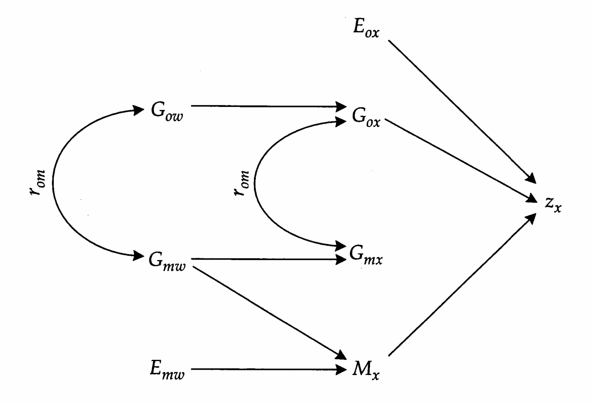
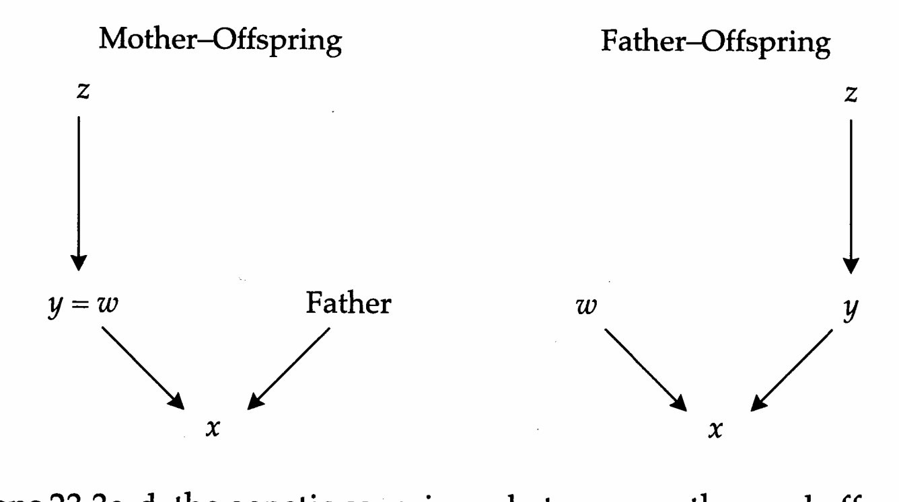
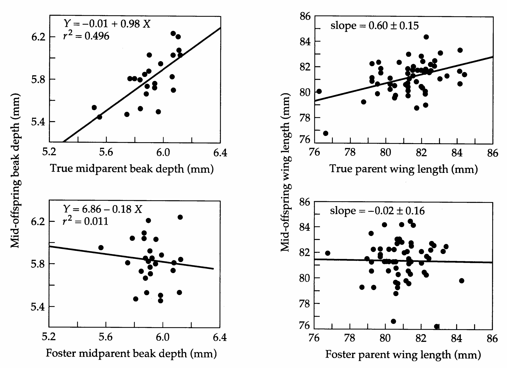
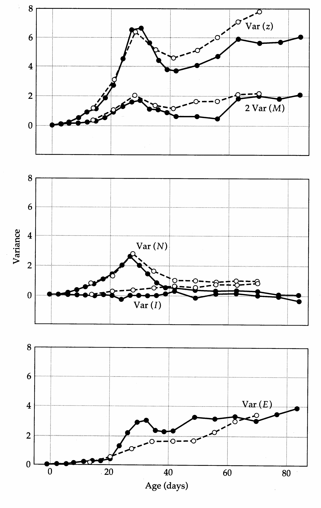
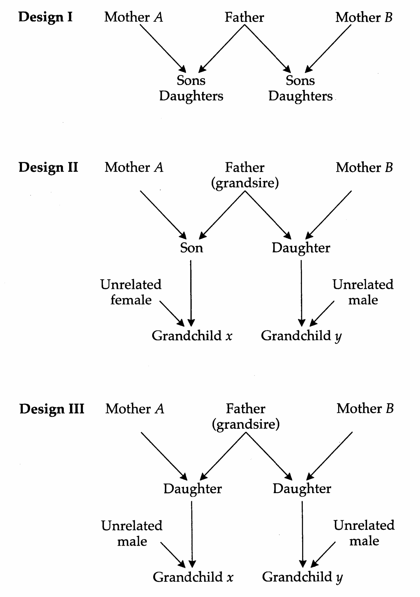
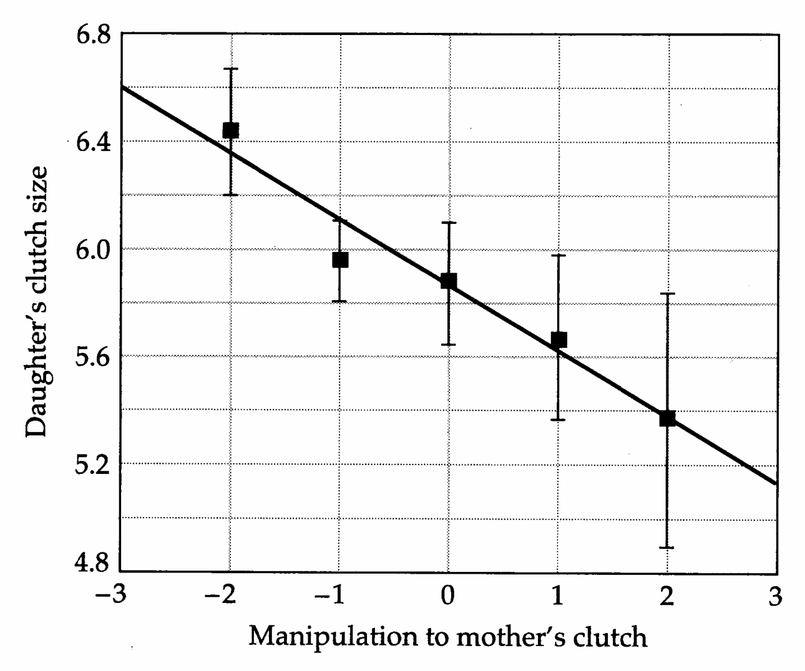
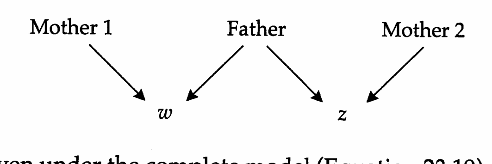

# Chapter 23 · Maternal Effects

## Genetics_chapter23_001 · Maternal Effects

From the standpoint of genetic analysis, we have already had three main encounters with maternal effects: the nested sib design (Chapter 18), the monozygotic twin half-sib method (Chapter 19), and the factorial designs with reciprocal crosses (Chapter 20). However, none of these techniques provides a full resolution to the issue of quantifying variance associated with maternal effects. For example, under the nested design, the degree by which the dam component of variance exceeds the sire component is a function of dominance and epistatic genetic variance as well as of the variance due to common maternal environment. Thus, with this sort of analysis, excess variance associated with dams cannot be taken as definitive evidence of maternal effects variance. Factorial designs with reciprocal crosses remove this ambiguity, but their application is restricted to inbred lines and populations of hermaphrodites.

This chapter expands our discussion of maternal effects by presenting additional methods for their analysis. We start by extending our previous descriptions of the causal sources of phenotypic variance and covariance between relatives (Chapter 7) to allow for maternal effects in a wide variety of contexts. Although we restrict attention to situations in which epistatic sources of maternal genetic variation are of negligible importance, it will be seen that there are still a large number of ways in which maternal effects contribute to the phenotypic variance in populations. We then consider several empirical approaches for acquiring estimates of the causal components of variance (or functions of them). Examples throughout the chapter will emphasize the significance of maternal effects in organisms ranging from mammals with extended maternal care to seed plants provisioning their young with endosperm, showing how the failure to account for such effects can result in gross misunderstandings about the mode of phenotypic inheritance. We close the chapter by demonstrating how the models and methods for analyzing maternal effects can be extended to indirect effects of other relatives, including fathers, grandparents, and sibs.

Early theoretical work on the subject of maternal effects was done by Dickerson (1947), Koch and Clark (1955), and Kempthorne (1955), and later generalized by Willham (1963, 1972), whose approach we initially adhere to (Figure 23.1). Letting w denote the mother of individual x, the phenotypic value of a character of x can be viewed as the sum of two components. The first component is a function of the direct expression of x's genotype and special environmental effects, $ z_{ox} = \mu + G_{ox} + E_{ox} $, where o denotes a direct effect, and $ \mu $ is the

> **Figure 23.1** · page 700 · source: `Genetics_chapter23`
>
> 
>
> Figure 23.1 Path diagram (Appendix 2) representing the determination of the phenotype $ z_x $ of an individual $ x $ by direct genetic effects $ G_{ox} $, direct environmental effects, $ E_{ox} $, and maternal effects $ M_x $. The mother of $ x $ is denoted by $ w $; $ r_{om} $ is the genetic correlation between direct and maternal effects. Assuming $ x $ is female, its genetic maternal effect, $ G_{mx} $, is expressed in its offspring.

population mean phenotype. The second component, the maternal effect, is an indirect effect of the maternal phenotype, and it too can have genetic and environmental components, $ M_x = G_{mw} + E_{mw} $. In what follows, it is important to keep in mind that a maternal effect is a composite function of many possible aspects of the maternal phenotype, none of which may be the character being evaluated in the progeny. Although they may have a genetic component, maternal effects are an environmental source of variance from the standpoint of the offspring. Thus, $ M_x $, a property of the mother, is expressed in the offspring. Summing up, the phenotype of individual x is represented by

$$
z_{x}=z_{ox}+M_{x}=\mu+\left(G_{ox}+E_{ox}\right)+\left(G_{mw}+E_{mw}\right)
\tag{23.1}
$$

Throughout, we assume that the direct and indirect genetic effects, $ G_{ox} $ and $ G_{mw} $, are random variables, potentially containing additive and dominance effects, but exhibiting no epistasis. A genetic covariance, which we denote by $ \sigma_{G_{o},G_{m}} $, may exist between the two effects, as for example when genes with direct effects on maternal body size also affect characters that influence the provisioning of offspring. A fuller description of the genetic variances and covariances is given in the following section. The environmental effects, $ E_{ox} $ and $ E_{mw} $, are also assumed to be random deviates with expectations zero, and they too may exhibit a covariance, which we denote by $ \sigma_{E_{o},E_{m}} $. However, we will assume that the genetic and environmental effects are independently distributed with no interactions between them.

---

## Genetics_chapter23_002 · COMPONENTS OF VARIANCE AND COVARIANCE

Because the addition of maternal effects doubles the number of factors in the linear model for the phenotype, it greatly increases the number of causal components that potentially contribute to the resemblance between relatives. Consider the phenotypic covariance between two individuals — x with mother w, and y with mother z. Assuming no genotype × environment interaction, there are still eight causal components of covariance,

$$
\begin{align*}\sigma_{z}(x,y)=&\sigma_{G_{o}}(x,y)+\sigma_{G_{o},G_{m}}(x,z)+\sigma_{G_{o},G_{m}}(y,w)+\sigma_{G_{m}}(w,z)\\&+\sigma_{E_{o}}(x,y)+\sigma_{E_{o},E_{m}}(x,z)+\sigma_{E_{o},E_{m}}(y,w)+\sigma_{E_{m}}(w,z)\end{align*}
\tag{23.2}
$$

We first consider the four sources of environmental covariance given in the second line of this formula:

1. $ \sigma_{E_o}(x,y) $ is the covariance of the direct effect of the environment on individuals x and y. It will generally be zero, except when x and y are the same individual, in which case it is part of the environmental variance, $ \sigma_{E_o}^2 $.

2. $ \sigma_{E_o,E_m}(x,z) $ is the covariance of the direct effect of the environment on individual x with the environmental contribution of the maternal effect transmitted by y's mother. It may be of significance in a number of situations. For example, if x is the mother of y, then x = z, and $ \sigma_{E_o,E_m}(x,z) = \sigma_{E_o,E_m}(x,x) = \sigma_{E_o,E_m} $, the covariance between the direct environmental effect on a female and the maternal environmental effect that she contributes to her offspring. As another example, if x and y share the same mother z, $ \sigma_{E_o,E_m}(x,z) $ will be unequal to zero if the direct effect of the environment on sib x influences the mother's treatment of sib y. Because of symmetry with $ \sigma_{E_o,E_m}(x,z) $, the preceding arguments also apply to $ \sigma_{E_o,E_m}(y,w) $.

3. $ \sigma_{E_m}(w,z) $ is the covariance of the environmental component of the maternal effects on x and y. If x and y are the same individual, then w = z and $ \sigma_{E_m}(w,z) = \sigma_{E_m}^2 $, the variance of environmental maternal effects. For other relationships involving direct ancestors, the situation is less clear-cut, but a simple approach suggested by Falconer (1965a) can be utilized as a first approximation. Here it is assumed that the environmental maternal effect transmitted by an individual x consists of two components: a residual fraction (b) of the maternal effect from x's mother ( $ bE_{mw} $), and a unique contribution ( $ E'_{mx} $), so $ E_{mx} = bE_{mw} + E'_{mx} $. Suppose, for example, that x is the mother of y, then x = z, and $ \sigma_{E_m}(w,z) = \sigma_{E_m}(w,x) = \sigma[E_{mw}, (bE_{mw} + E'_{mx})] = b\sigma_{E_m}^2 $. In the case of maternal sibs, w = z, and if the unique components of $ E_{mw} $ transmitted to each offspring are independent, we would expect that $ \sigma_{E_m}(w,z) = b^2\sigma_{E_m}^2 $. However, through sib competition and/or cooperation, the maternal effect transmitted to $x$ may depend on that transmitted to $y$. Thus, a more general approach is to define the covariance of environmental maternal effects on maternal sibs as $(b^2 + c)\sigma_{E_m}^2$, where $c\sigma_{E_m}^2$ is the covariance of unique maternal environmental effects dispensed on sibs. The quantity $(b^2 + c)\sigma_{E_m}^2$ is equivalent to the variance due to common maternal environment used in previous chapters.

To obtain a description of the genetic components of covariance between relatives, we will adhere to the usual assumptions of gametic phase equilibrium and random mating. Recalling Equation 7.12, the genetic covariance due to direct effects is

$$
\sigma_{G_{o}}(x,y)=2\Theta_{x y}\sigma_{A_{o}}^{2}+\Delta_{x y}\sigma_{D_{o}}^{2}
\tag{23.3a}
$$

where $ \Theta_{xy} $ and $ \Delta_{xy} $ are the coefficients of coancestry and fraternity for individuals x and y, and $ \sigma_{A_o}^2 $ and $ \sigma_{D_o}^2 $ are the additive and dominance components of variance involving direct genetic effects. The next two genetic covariance terms in Equation 23.2 can be expanded by noting that they involve the direct genetic effects of one individual and the maternal genetic effects contributed by the mother of the second individual,

$$
\sigma_{G_{o},G_{m}}(x,z)=2\Theta_{x z}\sigma_{A_{o},A_{m}}+\Delta_{x z}\sigma_{D_{o},D_{m}}
\tag{23.3b}
$$

$$
\sigma_{G_{o},G_{m}}(y,w)=2\Theta_{y w}\sigma_{A_{o},A_{m}}+\Delta_{y w}\sigma_{D_{o},D_{m}}
\tag{23.3c}
$$

The final genetic term in Equation 23.2 describes the covariance of the maternal genetic effects contributed by the two mothers,

$$
\sigma_{G_{m}}(w,z)=2\Theta_{w z}\sigma_{A_{m}}^{2}+\Delta_{w z}\sigma_{D_{m}}^{2}
\tag{23.3d}
$$

Table 23.1 summarizes the coefficients for the different causal components of variance and covariance that contribute to the phenotypic covariances between several types of relatives. Expressions for many other kinds of relatives are given by Willham (1963, 1972), Eisen (1967), and Thompson (1976).

Some interesting and counterintuitive relationships can be seen in Table 23.1. For example, the presence of maternal effects causes the expected phenotypic covariance between father and offspring to be $ (\sigma_{A_o}^2/2) + (\sigma_{A_o,A_m}/4) $ rather than $ (\sigma_{A_o}^2/2) $. Why should the resemblance between father and offspring be influenced by maternal effects genes? The answer resides in the paternal grandmother's genes. These fully determine the maternal effect on the father's phenotype, and also comprise 25% of the offspring's genome, where their direct effects are expressed. Thus, a genetic correlation between the direct and maternal effects of genes modifies the phenotypic covariance between a male and his descendants. Note further that because $ \sigma_{A_o,A_m} $ is a covariance, it may be negative.

**[Table]**

*[See Table 23.1 at the end of this section.]*

Indeed, if $ \sigma_{A_{o},A_{m}} $ were sufficiently negative, the regression of offspring on father could be negative. Similar arguments apply to the mother-offspring regression. Such negative regressions have been observed on occasion. For example, Gibbs (1988) observed significant negative mother-offspring regressions for clutch size in Darwin's medium ground finches.

**[示例 Example]**

> **Example 1** · ref: `Genetics_chapter23:1` · source: `Genetics_chapter23_002.json` · blocks 17–30
>
> Example 1. Consider the genetic covariance between mother y and offspring x. Since maternal effects are assumed present, we also need to consider the mothers z and w of y and x, respectively. Here y = w, whereas z represents individual x's maternal grandmother (as shown in the left of the accompanying figure on the next page).
> 
> For this set of relationships, $ 2\Theta_{xy} = 1/2 $, $ 2\Theta_{xz} = 1/4 $, $ 2\Theta_{wz} = 1/2 $, and since w and y represent the same individual, $ 2\Theta_{yw} = 2\Theta_{yy} = 1 $. Because an individual inherits only one gene from each parent, $ \Delta_{xy} = \Delta_{xz} = \Delta_{wz} = 0 $, but again, since w is y, $ \Delta_{yw} = \Delta_{yy} = 1 $. Making the appropriate substitutions in
> 
> 
> 
> Equations 23.3a-d, the genetic covariance between mother and offspring is found to be
> 
> $$
> \sigma_{G}(M,O)=\frac{\sigma_{A_{o}}^{2}}{2}+\frac{5\sigma_{A_{o},A_{m}}}{4}+\sigma_{D_{o},D_{m}}+\frac{\sigma_{A_{m}}^{2}}{2}
> $$
> 
> 
> From arguments presented above, the environmental covariance between mother and offspring can be expressed as
> 
> $$
> \sigma_{E}(M,O)=\sigma_{E_{o},E_{m}}+b\sigma_{E_{m}}^{2}
> $$
> 
> 
> On the other hand, a father-offspring relationship can be represented by letting the offspring be $x$, the father be $y$, and the paternal grandmother be $z$ (as shown in the right of the accompanying figure). We then have the coefficients $2\Theta_{xy} = 1/2$, $2\Theta_{xz} = 1/4$, and since the father and mother of $x$ are assumed to be unrelated, $2\Theta_{yw} = 2\Theta_{wz} = 0$. All of the $\Delta$ coefficients are also zero in this case. Summing up the terms,
> 
> $$
> \sigma_{G}(F,O)=\frac{\sigma_{A_{o}}^{2}}{2}+\frac{\sigma_{A_{o},A_{m}}}{4}
> $$
> 
> 
> As noted above, the second term represents the covariance between the maternal effect expressed in the father (via z) and the direct effects of the genes of z, one-quarter of which are transmitted to x. Assuming the father is derived from a different maternal lineage than its mate, the environmental covariance between father and offspring is zero.
> 
> Thus, the expected difference between the mother-offspring and father-offspring covariances is
> 
> $$
> \left(\sigma_{A_{o},A_{m}}+\sigma_{D_{o},D_{m}}+\sigma_{E_{o},E_{m}}\right)+\frac{\sigma_{A_{m}}^{2}}{2}+b\sigma_{E_{m}}^{2}
> $$
> 
> 
> The first term (in parentheses) is the covariance between all of the direct effects on a mother's phenotype and the maternal effect she contributes to her offspring's phenotype. The second term is half the additive genetic variance for maternal effects; it arises because a mother transmits half the genes that determine her maternal effect to her progeny. The third term is the fraction of the environmental maternal effect on the mother that is transmitted to her offspring (through, for example, physiological effects or cultural inheritance).
> 
> Let the difference between the regressions of offspring on mother and offspring on father be m. Since the final two terms in the preceding equation are necessarily positive, one would ordinarily expect m to be positive. However, the opposite has sometimes been observed. For example, Falconer (1965a) found the difference between regressions to be -0.13 for litter size in mice, and Janssen et al. (1988) obtained a difference of approximately -0.5 for age at maturity in springtails. Such a pronounced reduction of the mother-offspring regression relative to that for father-offspring provides a strong indication that the covariance between direct and maternal effects is negative, i.e., that genes whose direct effects cause an increase in the expression of the trait have an antagonistic effect on the trait's expression through their maternal effects.

> **Table 23.1** · `23.1` · page 703 · source: `Genetics_chapter23_002`
> Table 23.1 Coefficients for the components of covariance and variance contributing to the resemblance between relatives in a model that includes maternal effects.
>
>  | $ A_{o} $ | $ D_{o} $ | $ A_{o}, A_{m} $ | $ D_{o}, D_{m} $ | $ A_{m} $ | $ D_{m} $ | $ E_{o} $ | $ E_{o}, E_{m} $ | $ E_{m} $
> --- | --- | --- | --- | --- | --- | --- | --- | --- | ---
> Father-offspring | 1/2 | 0 | 1/4 | 0 | 0 | 0 | 0 | 0 | 0
> Mother-offspring | 1/2 | 0 | 5/4 | 1 | 1/2 | 0 | 0 | 1 | b
> Full sibs | 1/2 | 1/4 | 1 | 0 | 1 | 1 | 0 | 2 | $ b^{2} + c $
> Reciprocal full sibs | 1/2 | 1/4 | 1 | 0 | 0 | 0 | 0 | 0 | 0
> Paternal half sibs | 1/4 | 0 | 0 | 0 | 0 | 0 | 0 | 0 | 0
> Maternal half sibs | 1/4 | 0 | 1 | 0 | 1 | 1 | 0 | 2 | $ b^{2} + c $
> Reciprocal half sibs | 1/4 | 0 | 1/2 | 0 | 0 | 0 | 0 | 0 | 0
> MGM-grandchild | 1/4 | 0 | 5/8 | 0 | 1/4 | 0 | 0 | 0 | b
> PGM-grandchild | 1/4 | 0 | 1/8 | 0 | 0 | 0 | 0 | 0 | 0
> MGF-grandchild | 1/4 | 0 | 5/8 | 0 | 1/4 | 0 | 0 | 0 | 0
> PGF-grandchild | 1/4 | 0 | 1/8 | 0 | 0 | 0 | 0 | 0 | 0
>
> Note: It is assumed that epistatic sources of genetic variance are absent. b and c are constants. MGM and PGM stand for maternal and paternal grandmothers, MGF and PGF for maternal and paternal grandfathers.

---

## Genetics_chapter23_003 · COMPONENTS OF VARIANCE AND COVARIANCE / Cytoplasmic Transmission

Throughout this book, including the preceding section, we have been assuming that all of the genes contributing to phenotypic variation reside in the nuclear genome. However, since critical metabolic functions are carried out by products of genes contained in cytoplasmic organelles (mitochondria and chloroplasts), it seems prudent to keep in mind the possibility that some variation in the expression of quantitative traits may owe its origin to variation among organelle lineages. Organelle genomes are almost always inherited uniparentally, usually through the mother, and except in the case of plant mitochondria, usually with little or no recombination. Thus, from the standpoint of quantitative genetics, an organelle genome can be treated as a single haploid locus.

Extension of the usual expressions of genetic variance and covariance to include cytoplasmic inheritance is straightforward (Beavis et al. 1987). Here we assume that all of the variation due to nuclear genes is due to direct additive and dominance (nonepistatic) effects, and that all cytoplasmic genes are effectively inherited as a single linkage group through mothers. In addition, we assume that the nuclear genes are in gametic phase equilibrium with respect to each other and with respect to the cytoplasmic genomes. The total genetic variance among individuals is then

$$
\sigma_{G}^{2}=\sigma_{A}^{2}+\sigma_{D}^{2}+\sigma_{C}^{2}+\sigma_{AC}^{2}+\sigma_{DC}^{2}
\tag{23.4}
$$

where $ \sigma_{A}^{2} $ and $ \sigma_{D}^{2} $ are the familiar components of genetic variance due to the additive and dominance effects of nuclear genes, $ \sigma_{C}^{2} $ is the variance of additive effects of the cytoplasmic genome, and $ \sigma_{AC}^{2} $ and $ \sigma_{DC}^{2} $ are the variances of the interaction (epistatic) effects between cytoplasmic and nuclear (additive and dominance, respectively) gene effects. Note that because of their haploid nature, organelle genomes do not have dominance effects.

**[Table]**

*[See Table 23.2 at the end of this section.]*

The genetic covariance between relatives due to cytoplasmic effects is

$$
\sigma_{G_{c}}(x,y)=\kappa_{x y}\sigma_{C}^{2}+2\Theta_{x y}\kappa_{x y}\sigma_{A C}^{2}+\Delta_{x y}\kappa_{x y}\sigma_{D C}^{2}
\tag{23.5}
$$

where $ \kappa_{xy} $ is the probability that individuals x and y share organelle genomes that are identical by descent. Although there are multiple copies of organelles in individuals, generally all are identical. Thus, $ \kappa_{xy} $ is equal to one when x and y are members of the same maternal lineage (assuming maternal inheritance), and zero otherwise. Thus, in a random-mating population, unless the direct path from x to y contains only females, $ \kappa_{xy} $ is equal to zero.

Table 23.2 gives the coefficients for the components of genetic variance associated with cytoplasmic genes for some commonly observed relationships. A complete expression for the genetic covariance between a specific group of relatives is obtained by adding the three terms in this table to those outlined in Table 23.1. This inclusion obviously makes an already complicated case even more complex, raising the question as to whether it is even possible to separate the effects associated with organelles (and/or nuclear × cytoplasmic interaction) from those associated with maternal effects.

Such a partitioning would be possible if offspring could be separated from their parents and from each other at an early enough stage of development that none of the sources of maternal effects variance described in the preceding section contributed to their phenotypic similarities. Such a situation may be extremely difficult to accomplish with most organisms, but methods of cross-fostering and/or embryo transplantation (below) may prove useful in some cases. In any event, assuming that the resemblance due to maternal effects (other than those involving the cytoplasm) can be eliminated, some simple relationships emerge using the coefficients in Tables 23.1 and 23.2. For example,

$$
\sigma_{C}^{2}=2\sigma(M H S)-\sigma(M,O)
\tag{23.6a}
$$

$$
\sigma_{AC}^{2}=2[2\sigma(M,O)-\sigma(F,O)-2\sigma(MHS)]
\tag{23.6b}
$$

$$
\sigma_{DC}^{2}=4[\sigma(FS)-\sigma(RFS)-\sigma(M,O)+\sigma(F,O)]
\tag{23.6c}
$$

A few attempts have been made to quantify the significance of cytoplasmic gene differences at the phenotypic level. A large survey of dairy cattle, spanning 10 generations, suggested that about 3% of the variance in milk production is attributable to the maternal mitochondrial lineage (Bell et al. 1985). In a study of two strains of tobacco (Nicotiana tabacum), with identical nuclear but different mitochondrial genomes, large (5 to 30%) differences were found in germination rate, growth rate, and age at first flowering (Pollak 1991). On the other hand, Forbes and Allendorf (1991) were unable to detect any morphological differences between mitochondrial haplotypes in a hybrid swarm of trout, despite the rather high (2%) nucleotide divergence between the two mitochondrial types.

> **Table 23.2** · `23.2` · page 706 · source: `Genetics_chapter23_003`
> Table 23.2 Coefficients for the components needed for the expression describing the expected phenotypic covariance between relatives in a model that includes cytoplasmic gene expression.
>
>  | $ \kappa_{xy} $ | $ \sigma_{C}^{2} $ | $ \sigma_{AC}^{2} $ | $ \sigma_{DC}^{2} $
> --- | --- | --- | --- | ---
> Father-offspring | 0 | 0 | 0 | 0
> Mother-offspring | 1 | 1 | 1/2 | 0
> Full sibs | 1 | 1 | 1/2 | 1/4
> Reciprocal full sibs | 0 | 0 | 0 | 0
> Paternal half sibs | 0 | 0 | 0 | 0
> Maternal half sibs | 1 | 1 | 1/4 | 0
> Reciprocal half sibs | 0 | 0 | 0 | 0
> Maternal grandmother-grandchild | 1 | 1 | 1/4 | 0
> Paternal grandmother-grandchild | 0 | 0 | 0 | 0
> Maternal grandfather-grandchild | 0 | 0 | 0 | 0
> Paternal grandfather-grandchild | 0 | 0 | 0 | 0
>
> Note: The last three columns give the coefficients that precede the three terms in Equation 23.5.

---

## Genetics_chapter23_004 · COMPONENTS OF VARIANCE AND COVARIANCE / Postpollination Reproductive Traits in Plants

Quantitative-genetic analyses of seeds and their component parts (ovules, endosperm, seed coats) are perhaps more numerous than those of any other characters. In agronomy, large-scale studies on the genetic properties of grain yield have long been driven by economic interests. In evolutionary ecology, studies on the genetics of seed architecture and maturation have been stimulated by interest in reproductive strategies and parent-offspring conflict. Remarkably, almost all studies of seed properties have been performed as though such traits are properties of the maternal genotype, like any other nonreproductive diploid tissue. This, however, is not the case. Three genetically distinct tissues contribute to the expression of various seed properties: (1) the seed coat is a direct product of the diploid maternal genotype, (2) the endosperm is triploid, having two doses of maternal genes and one of paternal genes, and (3) the embryo is a diploid product of the paternal and maternal gametes. To complicate matters further, the paternal genomes that contribute to endosperm and embryo are derived from different gametes.

The main issues have been addressed by Shaw and Waser (1994), and we encourage those with interests in the subject to read their paper; see also Huidong (1988) and Foolad and Jones (1992). Here we just present a simple example to point out why the issues are nontrivial. Consider the additive variance for direct genetic effects on a character. The usual expectation is that the covariance between full sibs is $ \sigma_{A_o}^2/2 $, while that between half sibs (either maternal, paternal, or reciprocal) is $ \sigma_{A_o}^2/4 $. Suppose, however, that the character is an attribute of the seed that is largely determined by the properties of the endosperm. One problem that arises immediately is that the tissues being compared (the endosperm) are not related to the same degree as the plants that bear them, for the simple reason that endosperms acquire additional haploid complements of genes from the pollen donors (which, due to segregation, are almost certainly different from each other). For example, if two seeds within the same maternal plant are products of fertilization by the same male, their endosperms are derived from the same maternal diploid genome, and half of their paternally derived genes are identical by descent. If the two seeds are products of a reciprocal full-sib mating, then one of them has two complements of the first parent's genome and one complement from the second parent, while the situation for the second seed is reversed.

The net effect of all of these different degrees of gene sharing is that different types of half-sibs no longer have the same additive genetic covariance, nor do true full sibs and reciprocal full sibs. Similar arguments apply to the dominance component of variance, and the matter is complicated further by the likelihood that the expression of genes in endosperm may depend on whether they are derived from maternal vs. paternal sources. Add to these concerns the fact that other genomes, distinct from the endosperm, contribute to the properties of a seed, and it seems rather doubtful whether clean estimates of the causal components of variance of seed properties can ever be procured by the usual method of comparing resemblances of different types of relatives. On the other hand, so little empirical work exists on the issues that it is difficult to evaluate whether any or all of the potential complications pointed out by Shaw and Waser (1994) have serious practical implications. Applying a North Carolina II design (Chapter 20) to a population of wild radish (Raphanus sativus), Nakamura and Stanton (1989) were able to show that although the pollen donor contributed to the phenotype of the endosperm and the embryo, it never accounted for more than 2% of the phenotypic variance through either of these routes. This result was true even for embryos that were grown on artificial medium after being removed from their seed coats and endosperm. Such results suggest that the classical treatment of seed phenotypes as a property of the maternal genotype may not be so unreasonable. However, more studies of this nature are needed to clarify the issues.

---

## Genetics_chapter23_005 · CROSS-FOSTERING EXPERIMENTS

For species in which it is possible to transplant progeny to surrogate mothers, a cross-fostering experiment can reveal whether maternal effects contribute to the resemblance between relatives. In the absence of maternal effects subsequent to the transplantation event, unrelated individuals that are raised by the same mother should exhibit zero phenotypic covariance with each other as well as with their foster mother. Cross-fostering is expected to decrease the phenotypic covariance of parents and their true offspring if maternal effects are significant. The phenotypic covariance between mother and her fostered offspring (FO, raised by a nonrelative) is identical to the father-offspring covariance,

$$
\sigma_{z}(M,F O)=\frac{\sigma_{A_{o}}^{2}}{2}+\frac{\sigma_{A_{o},A_{m}}}{4}
\tag{23.7a}
$$

whereas the phenotypic covariance between foster mother and unrelated foster child is

$$
\sigma_{z}(FM,FO)=(\sigma_{A_{o},A_{m}}+\sigma_{D_{o},D_{m}}+\sigma_{E_{o},E_{m}})+\frac{\sigma_{A_{m}}^{2}}{2}+b\sigma_{E_{m}}^{2}
\tag{23.7b}
$$

These expressions clarify several things. First, note that the two equations sum to the usual covariance between mother and offspring, $ \sigma(M, O) $ (Example 1) — the first equation is the phenotypic covariance of a mother and her offspring, exclusive of transmitted maternal effects, whereas the second equation is the covariance of a mother and her offspring, exclusive of direct effects. Second, Equation 23.7b is identical to the difference between the mother-offspring and father-offspring covariance (Example 1). Thus, the regression of foster offspring on foster parent provides a second means of estimating the composite parameter m introduced in Example 1. Third, we see again that since the different types of covariances between mothers and offspring contain covariances between direct and maternal effects, they can take on negative values.

Cross-fostering experiments have been used frequently with natural populations of banded birds to evaluate the validity of heritability estimates derived from parent-offspring regressions. Regressions on true parents typically lead to high heritability estimates (0.5 to 1.0) for morphological traits such as beak dimensions, tarsus and wing length, and body weight (Table 17.1). In order to counter the criticism that such estimates are inflated by maternal effects, some investigators have exchanged eggs of incubating females. Such experiments only control for the effects of maternal investment subsequent to egg laying. Generally, the regressions employing foster parents have not been significantly different from zero, and the regressions of fostered offspring on true parents have remained high, suggesting that variance due to maternal effects is in fact negligible (Figure 23.2). However, exceptions do exist. In great tits (Parus major), significant positive regressions on foster parents have been observed for body weight when growth conditions are poor (Gebhardt-Henrich and van Noordwijk 1991).

Although the preceding approach provides a simple way to test for the presence of maternal effects, it does not allow any further separation of terms such as those involving the covariance between direct and maternal effects. A more

> **Figure 23.2** · page 710 · source: `Genetics_chapter23`
>
> 
>
> Figure 23.2 Regressions of offspring phenotypes on those of true parents and on those of foster parents. Data on the left are for beak depth in a natural population of song sparrows (Smith and Dhondt 1980). Those on the right are for wing length in a population of the collared flycatcher (Gustafsson and Merilä 1994). In both cases, the true parent-offspring regression is significant, while the foster-parent regression is not.

powerful approach is to incorporate cross-fostering into a full-sib design (Rutledge et al. 1972). Rather than completely exchanging offspring between mothers, pairs of unrelated mothers giving birth on the same day are forced to exchange half of their progeny. Such cross-fostering gives rise to a replicated $ 2 \times 2 $ factorial design, with each exchange creating four situations: offspring of mother A raised by A, offspring of A raised by mother B, offspring of B raised by A, and offspring of B raised by B. The rationale of this approach is that maternal effects contribute to the covariance among sibs raised by the same mother (whether it is the true mother, or the foster mother), but not to the covariance among sibs raised by different mothers.

The progeny phenotypes in such an experiment can be described by the following linear model,

$$
z_{ijkl}=\mu+P_{i}+M_{ij}+N_{ik}+I_{ijk}+e_{ijkl}
\tag{23.8}
$$

**[Table]**

*[See Table 23.3 at the end of this section.]*

where $P_i$ is the average effect of the ith cross-fostered pair, $M_{ij}$ is the direct effect of the jth (genetic) mother within the ith pair ($j = 1$ or $2$), $N_{ik}$ is the effect of the kth (unrelated) nurse within the ith pair ($k = 1$ or $2$), $I_{ijk}$ is the $M \times N$ interaction within the ith pair, and $e_{ijkl}$ is the residual error for the lth offspring of the jth mother raised by the kth nurse within the ith pair. All of the effects in the model are assumed to be independently distributed with zero expectations. The complete layout of the analysis of variance for such an experiment is given in Table 23.3, where we assume a balanced design with $N_p$ cross-fostering pairs, each involving $n$ full-sibs within a particular mother-nurse grouping (i.e., each mother has $2n$ offspring, $n$ of which are cross-fostered).

We next consider how the observable variance components for mothers, nurses, and mother × nurse interactions relate to the causal components of variance and covariance outlined above. As we have now encountered the general definitions of the variance components in the two-way ANOVA in two preceding chapters (20 and 22), it is not necessary to go into great detail. The variance component due to mothers, $ \sigma_{M}^{2} $, is equivalent to the covariance between full sibs raised by different nurses. (This can be seen by use of Equation 23.8, noting that within the ith pair, full sibs that are raised by different nurses share only the term

$ M_{ij} $.) The variance due to nurses, $ \sigma_N^2 $, is the covariance of unrelated individuals raised by the same nurse. The variance due to mother $ \times $ nurse interaction, $ \sigma_I^2 $, is the covariance of full sibs raised by their mother minus $ (\sigma_M^2 + \sigma_N^2) $.

Using these definitions and the coefficients described in Table 23.1, the observable components of variance can be expressed in causal terms,

$$
\sigma_{M}^{2}=\frac{\sigma_{A_{o}}^{2}}{2}+\frac{\sigma_{D_{o}}^{2}}{4}
\tag{23.9a}
$$

$$
\sigma_{N}^{2}=\sigma_{A_{m}}^{2}+\sigma_{D_{m}}^{2}+(b^{2}+c)\sigma_{E_{m}}^{2}
\tag{23.9b}
$$

$$
\sigma_{I}^{2}=\sigma_{A_{o},A_{m}}+2\sigma_{E_{o},E_{m}}
\tag{23.9c}
$$

The sum of these three components is equal to the expected phenotypic covariance among full sibs raised by their mother. An attractive feature of the cross-fostering design is that it allows a clean partitioning of the causal sources of phenotypic resemblance into components due to the variance of direct effects, variance of maternal effects, and covariance of direct and maternal effects. Note that $ \sigma_{M}^{2} $ is influenced only by the direct effects of genes, since maternal effects do not contribute to the resemblance of individuals raised by unrelated females. (However, any maternal effects that are expressed prior to the cross-fostering (e.g., prenatal effects) will contribute to $ \sigma_{M}^{2} $. On the other hand, $ \sigma_{N}^{2} $ is influenced only by maternal effects, since the individuals concerned are unrelated. Finally, $ \sigma_{I}^{2} $ defines the remaining contribution to the covariance among full sibs raised by the same mother, the covariance of direct and maternal effects.

Without observations on additional kinds of relatives, further decomposition of these quantities into their subsidiary (additive, dominance, and environmental) components is not possible. Riska et al. (1985) suggest how additional information can be extracted from a cross-fostering experiment when phenotypic data are available for sires and dams as well as their offspring. In this case, separate estimates of $ \sigma_{A_o}^2 $, $ \sigma_{D_o}^2 $, and $ \sigma_{A_m}^2 $ can be acquired, although $ \sigma_{D_m}^2 + (b^2 + c)\sigma_{E_m}^2 $ and $ \sigma_{A_o,A_m} + 2\sigma_{E_o,E_m} $ still appear as composite terms.

> **Table 23.3** · `23.3` · page 711 · source: `Genetics_chapter23_005`
> Table 23.3 Interpretation of the expected mean squares for a replicated two-way analysis of variance of a cross-fostering experiment, assuming a random-effects model and a completely balanced design.
>
> <table><tr><td>Factor</td><td>df</td><td>Sums of Squares</td><td>Expected Mean Squares</td></tr><tr><td rowspan="2">Pairs</td><td rowspan="2">$ N_{p} - 1 $</td><td rowspan="2">$ 4n \sum_{i} (\overline{z}_{i} - \overline{z})^{2} $</td><td>$ \sigma_{e}^{2} + n \sigma_{I}^{2} + 2n \sigma_{M}^{2} + 2n \sigma_{N}^{2} $</td></tr><tr><td>+ $ 4n \sigma_{P}^{2} $</td></tr><tr><td>Mothers</td><td>$ N_{p} $</td><td>$ 2n \sum_{i,j} (\overline{z}_{ij} - \overline{z}_{i})^{2} $</td><td>$ \sigma_{e}^{2} + n \sigma_{I}^{2} + 2n \sigma_{M}^{2} $</td></tr><tr><td>Nurses</td><td>$ N_{p} $</td><td>$ 2n \sum_{i,k} (\overline{z}_{ik} - \overline{z}_{i})^{2} $</td><td>$ \sigma_{e}^{2} + n \sigma_{I}^{2} + 2n \sigma_{N}^{2} $</td></tr><tr><td>M \times N</td><td>$ N_{p} $</td><td>$ n \sum_{i,j,k} (\overline{z}_{ijk} - \overline{z}_{ij} - \overline{z}_{ik} + \overline{z}_{i})^{2} $</td><td>$ \sigma_{e}^{2} + n \sigma_{I}^{2} $</td></tr><tr><td>Error</td><td>$ 4N_{p}(n - 1) $</td><td>$ \sum_{i,j,k,l} (z_{ijkl} - \overline{z}_{ijk})^{2} $</td><td>$ \sigma_{e}^{2} $</td></tr></table>
>
> Note: $ \overline{z} $ is the mean phenotype over all families, $ \overline{z}_{i} $ is the mean phenotype of progeny in the ith pair, $ \overline{z}_{ij} $ is the mean phenotype of progeny of the jth mother within the ith pair, $ \overline{z}_{ik} $ is the mean phenotype of offspring raised by the kth nurse within the ith pair, and $ \overline{z}_{ijk} $ is the mean phenotype of progeny of the jth mother raised by the kth nurse within the ith pair.

---

## Genetics_chapter23_006 · CROSS-FOSTERING EXPERIMENTS / Body Weight in Mice

The cross-fostering design has been used extensively to evaluate the sources of variance for body weight in laboratory populations and domesticated species of mammals. Here we consider the results from an experiment with an outbred laboratory mouse strain (ICR), in which Rutledge et al. (1972) mated a large number of virgin females to unrelated males. Pairs of unrelated females that released litters within a 12-hour period were treated as cross-foster groups. Their litters were standardized to four males and four females, and then half of each sex were exchanged randomly between mothers. Twenty-eight such pairs were constructed. For identification purposes, all offspring were toe-clipped. Weaning was enforced at 21 days, and subsequently all offspring were weighed to the nearest gram at 3 to 7 day intervals. The results of the analysis of variance for each time interval

> **Figure 23.3** · page 713 · source: `Genetics_chapter23`
>
> 
>
> Figure 23.3 Ontogenetic changes in components of variance for body size in mice, determined from cross-fostering experiments. Solid lines are for data from Rutledge et al. (1972); dashed lines are for data from Riska et al. (1984, 1985).

are outlined in Figure 23.3. Also illustrated in this figure are results obtained from a second, much larger (345 cross-fostering pairs) experiment performed on the same strain of mice by Riska et al. (1984, 1985). Despite the 10-year lapse between these studies, the results are essentially the same.

The phenotypic variance for weight in these mice, $ \operatorname{Var}(z) $ in Figure 23.3, reaches a maximum at approximately 4 weeks, declines until approximately 7 weeks, at which point sexual maturity is attained, and then exhibits a monotonic increase. Thus, early differences in growth rates cause an initial divergence in size. The reduced variance in size near the time of maturity is caused by “compensatory” (Monteiro and Falconer 1966, Atchley 1984) or “targeted” (Riska et al. 1984) growth. If we let the weight of an individual at time t be equal to the sum of the weight at time t - 1 and a growth increment, so that $ W_t = W_{t-1} + \Delta_W $, then the variance in weight at time t may be written as

$$
\sigma^{2}(W_{t})=\sigma^{2}(W_{t-1})+2\sigma(W_{t-1},\Delta_{W})+\sigma^{2}(\Delta_{W})
$$

Since $ \sigma^{2}(\Delta_{W}) $ is necessarily positive, a reduction in the variance of weight can only arise if the covariance between weight and growth rate, $ \sigma(W_{t-1},\Delta_{W}) $, is sufficiently negative to offset $ \sigma^{2}(\Delta_{W}) $. The mechanism for convergent growth appears to be size-dependent initiation of sexual maturity accompanied by a reduction in growth rate (Monteiro and Falconer 1966). Different individuals reach the critical size at different times. Thus, in the interval of 4 to 8 weeks, small mice continue to grow rapidly while larger individuals that have attained sexual maturity exhibit a pronounced reduction in growth.

The peak in phenotypic variance at 4 weeks, 1 week after weaning, can be seen to be due largely to maternal effects — the majority of the phenotypic variance up to this point is attributable to $ \operatorname{Var}(N) $. At 12 days, $ \operatorname{Var}(N)/\operatorname{Var}(z) $ attains a maximum of $ \sim 0.7 $, but even at 70 days, 7 weeks after weaning, significant maternal effects on body size are still detectable. On the other hand, the covariance between direct and maternal effects [as revealed by $ \operatorname{Var}(I) $] appears to be very small, but slightly positive. (Recall from Chapter 20 that interaction “variances” are really estimates of covariances and hence can be negative.) Since body weight in mice exhibits negligible dominance effects (Atchley 1984), 2 $ \operatorname{Var}(M) $ is a good estimator of the additive genetic variance for direct effects on body weight, and this is roughly constant following weaning. The final rise in phenotypic variance following maturation is almost entirely due to a steady increase in the component of variance containing special environmental effects, $ \operatorname{Var}(E) $.

The conclusions from these studies appear to be broadly generalizable. Working with the same or different strains of mice (Monteiro and Falconer 1966, Hanrahan and Eisen 1973, Cheverud et al. 1983) and rats (Atchley and Rutledge 1980), other authors have obtained essentially the same results. All of these studies have considered only postnatal maternal effects, since progeny were cross-fostered after birth. However, recent embryo-transplant experiments have demonstrated the presence of significant prenatal effects that persist for up to two months after birth.

(Cowley et al. 1989, Cowley 1991, Pomp et al. 1989). Excellent reviews on cross-fostering experiments in mice, rats, and other species may be found in Legates (1972), Cheverud et al. (1983), and Atchley (1984). Reviews on maternal effects, not restricted to cross-fostering designs, are also available for cattle (Koch 1972, Shi et al. 1993), sheep (Bradford 1972), and swine (Robison 1972).

---

## Genetics_chapter23_007 · EISEN'S APPROACH

For situations in which cross-fostering is unfeasible, estimates of the maternal-effects variance and covariance components can be acquired by the method of moments, provided that measures of phenotypic covariance can be obtained for enough relationships (Eisen 1967). The causal components of variance are estimated in the usual way, by setting the observed phenotypic covariances equal to their expectations, and solving the set of linear equations for estimates of the underlying causal components. For example, from Table 23.1, the father-offspring covariance minus twice the covariance between paternal half-sibs provides an estimate of $ \sigma_{A_{o},A_{m}}/4 $. A complete solution for all nine of the causal components of variance and covariance in Table 23.1 requires observations on at least nine types of relatives, and hence, data of a multigenerational nature. Data sets of a smaller scope can nevertheless be revealing. We present the following example simply to illustrate one powerful design for applying Eisen's (1967) method.

---

## Genetics_chapter23_008 · EISEN'S APPROACH / Bondari's Experiment

Starting with 331 males of the flour beetle Tribolium castaneum, each of which was mated to two unrelated females, Bondari et al. (1978) developed three types of mating structures to estimate the causal components of variance for pupal weight (Figure 23.4). As shown in Table 23.4, each design provides the basis for a nested analysis of variance, details of which have been covered in Chapter 18.

Design I. The primary purpose for this design, which is simply the full-sib, half-sib nested design outlined in Chapter 18, is to obtain an estimate of $ \sigma^{2}(A_{o}) $. Recalling the results of Chapter 18, the variance among sires is formally equivalent to the covariance among paternal half-sibs, which we know has the expectation $ \sigma_{A_{o}}^{2}/4 $ (Table 23.1).

The design utilized all $N = 331$ males, each mated to two random females ($M = 2$), with $n = 2$ pupae being weighed within each full-sib family. Setting the observed mean squares in Table 23.4 equal to their expectations and solving, we obtain estimates of the three hierarchical components of variance: $\mathrm{Var}(a) = 3,384$, $\mathrm{Var}(b) = 7,514$, and $\mathrm{Var}(e) = 25,852$, respectively referring to sires, dams within sires, and offspring within dams. Thus, the total phenotypic variance is estimated to be $\mathrm{Var}(z) = 36,750$, and the additive genetic variance involving direct effects is estimated by $\mathrm{Var}(A_{o}) = 4\mathrm{Var}(a) = 13,536$.

> **Figure 23.4** · page 716 · source: `Genetics_chapter23`
>
> 
>
> Figure 23.4 Pedigree structure for families employed in the three experimental designs of Bondari et al. (1978).

Design II. This experiment, which spans three generations, provides a means for estimating the additive genetic covariance between direct and maternal effects, $ \sigma_{A_{o},A_{m}} $. A fraction $ (N = 208) $ of the fathers in Design I served as the grandsires in Design II. For each grandsire, a single son was taken from the progeny of one mate and crossed to an unrelated female to produce a full-sib family; a single daughter was taken from the progeny of the second mate and crossed to an unrelated male to produce a second full-sib family. The members of the third-generation families served as the experimental units.

As in Design I, the results can be analyzed by nested ANOVA, in this case with $ \sigma_{a}^{2} $ being the variance associated with grandsires. Note in Figure 23.4 that

**[Table]**

*[See Table 23.4 at the end of this section.]*

grandchild $x$ has a father that is a half-sib of the mother of grandchild $y$. Thus, $x$ and $y$ are half-first cousins. From the rule that an among-group variance is equivalent to the covariance between members in the same group, $\sigma_{a}^{2}$ is equivalent to the covariance between half-first cousins related through parents of the opposite sex. The expected phenotypic covariance for such a relationship is $\mathrm{Var}(\mathrm{HFC},\mathrm{II}) = (\sigma_{A_{o}}^{2}/16) + (\sigma_{A_{o},A_{m}}/8)$.

Again substituting observed for expected mean squares in Table 23.4 and solving, we obtain the estimate $ \operatorname{Var}(a) = \operatorname{Var}(\operatorname{HFC}, \operatorname{II}) = 457 $. Recalling from Design I that $ \operatorname{Var}(A_o) = 13,536 $, and substituting into the expression for $ \sigma^2(\operatorname{HFC}, \operatorname{II}) $.

we estimate the covariance between direct and maternal effects to be $ \mathrm{Cov}(A_{o}, A_{m}) = -3,112 $. Thus, the data suggest that there is a negative genetic correlation between direct and maternal effects for pupal weight.

Design III. This experiment provides an estimate of the variance of additive genetic maternal effects, $ \sigma_{A_m}^2 $. The design is identical in form to Design II, except that the grandchildren x and y have mothers that are half-sibs and fathers that are unrelated. Thus, x and y are still half-first cousins, but because they are related through their mothers, they are influenced by common maternal-effect genes. The expression for the covariance between these types of relatives, which is a function of $ \sigma_{A_o}^2 $, $ \sigma_{A_o,A_m} $, and $ \sigma_{A_m}^2 $, is given in Table 23.4.

The remaining $N = 123$ fathers from Design I served as grandsires in this experiment. Again substituting observed for expected mean squares in Table 23.4, we find $\mathrm{Var}(a) = 2,460$. Equating this grandsire variance component to $\sigma(\mathrm{HFC},\mathrm{III})$, and substituting the previous estimates of $\sigma^{2}(A_{o})$ and $\sigma(A_{o},A_{m})$ into the expression for $\sigma(\mathrm{HFC},\mathrm{III})$, yields $\mathrm{Var}(A_{m}) = 9,568$.

All three experiments yielded similar estimates of the phenotypic variance, the average of which is $ \mathrm{Var}(z) = 35,280 $. Thus, from the results of Design I, an estimate of the heritability of pupal weight, unbiased by maternal effects, is $ h^2 = 13,536 / 35,280 = 0.38 $. An estimate of the additive genetic correlation between direct and maternal effects is $ \mathrm{Cov}(A_o, A_m) / \sqrt{\mathrm{Var}(A_o) \mathrm{Var}(A_m)} = -0.27 $. Thus, in this species, genes that increase pupal weight through their direct effects decrease it through maternal effects. Although the authors did not pursue it, this multigenerational experiment could have yielded estimates of the covariance between several other types of relatives, and hence of additional causal sources of variance.

> **Table 23.4** · `23.4` · page 717 · source: `Genetics_chapter23_008`
> Table 23.4 Summary of nested analyses of variance involving the three experimental designs employed by Bondari et al. (1978).
>
> <table><tr><td>Factor</td><td>Degrees of Freedom</td><td>Mean Squares</td><td>Expected Mean Squares</td></tr><tr><td>Design I</td><td></td><td></td><td></td></tr><tr><td>Sires</td><td>$ (N_{a} - 1) = 330 $</td><td>54,418</td><td>$ \sigma_{e}^{2} + n\sigma_{b}^{2} + N_{b}n\sigma_{a}^{2} $</td></tr><tr><td>Dams (sires)</td><td>$ N_{a}(N_{b} - 1) = 331 $</td><td>40,880</td><td>$ \sigma_{e}^{2} + n\sigma_{b}^{2} $</td></tr><tr><td>Sibs (dams)</td><td>$ N_{a}N_{b}(n - 1) = 330 $</td><td>25,852</td><td>$ \sigma_{e}^{2} $</td></tr><tr><td></td><td colspan="3">$ \sigma_{a}^{2} = \sigma(\text{PHS}) = \frac{\sigma_{A_{o}}^{2}}{4} $</td></tr><tr><td>Design II</td><td></td><td></td><td></td></tr><tr><td>Grandsires</td><td>$ (N_{a} - 1) = 207 $</td><td>48,499</td><td>$ \sigma_{e}^{2} + n\sigma_{b}^{2} + N_{b}n\sigma_{a}^{2} $</td></tr><tr><td>Parents (grandsires)</td><td>$ N_{a}(N_{b} - 1) = 208 $</td><td>46,672</td><td>$ \sigma_{e}^{2} + n\sigma_{b}^{2} $</td></tr><tr><td>Sibs (parents)</td><td>$ N_{a}N_{b}(n - 1) = 416 $</td><td>23,867</td><td>$ \sigma_{e}^{2} $</td></tr><tr><td></td><td colspan="3">$ \sigma_{a}^{2} = \sigma(\text{HFC}, \text{II}) = \frac{\sigma_{A_{o}}^{2}}{16} + \frac{\sigma_{A_{o},A_{m}}}{8} $</td></tr><tr><td>Design III</td><td></td><td></td><td></td></tr><tr><td>Grandsires</td><td>$ (N_{a} - 1) = 122 $</td><td>48,336</td><td>$ \sigma_{e}^{2} + n\sigma_{b}^{2} + N_{b}n\sigma_{a}^{2} $</td></tr><tr><td>Parents (grandsires)</td><td>$ N_{a}(N_{b} - 1) = 123 $</td><td>38,495</td><td>$ \sigma_{e}^{2} + n\sigma_{b}^{2} $</td></tr><tr><td>Sibs (parents)</td><td>$ N_{a}N_{b}(n - 1) = 246 $</td><td>23,310</td><td>$ \sigma_{e}^{2} $</td></tr><tr><td></td><td colspan="3">$ \sigma_{a}^{2} = \sigma(\text{HFC}, \text{III}) = \frac{\sigma_{A_{o}}^{2}}{16} + \frac{\sigma_{A_{o},A_{m}}}{4} + \frac{\sigma_{A_{m}}^{2}}{4} $</td></tr></table>
>
> Note: For each of three designs, $ \sigma_{a}^{2} $, $ \sigma_{b}^{2} $, and $ \sigma_{e}^{2} $ denote the three observable hierarchical components of variance, and $ N_{a} $, $ N_{b} $, and n denote the nested sample sizes for the three hierarchical levels. The design was completely balanced. Further details on the analysis of nested data can be found in Chapter 18.

---

## Genetics_chapter23_009 · FALCONER'S APPROACH

In all of the procedures discussed above, the maternal effect was treated as a general feature of the mother, with no specific character in the mother being identified as contributing to the effect. An alternative approach is to identify explicitly one or more maternal characters that are likely to be the source of the maternal effect, and to consider how these modify the expression of other characters in offspring. Falconer (1965a) introduced a simple model in which a single maternal character affects its own expression, e.g., maternal body size influencing the size of offspring via maternal care effects. Under this model, an individual's phenotype is described in the usual way, with the addition of a third term describing the maternal effect,

$$
z_{i}=A_{i}+m z_{i1}+E_{i}
\tag{23.10}
$$

Here $ z_{i1} $ represents the phenotype of individual i's mother (the 1 denoting 1 generation back), and m, the maternal effect coefficient, is defined as the partial regression of offspring phenotype on maternal phenotype, holding the genetic contribution constant. (We will see shortly that m is just the difference between maternal-offspring and paternal-offspring regressions, as previously denoted). The remainder of the phenotype is assumed to be determined by an additive genetic effect $ A_{i} $ and an independently distributed residual deviation $ E_{i} $.

By extension, the phenotype of the mother can be written as a function of her mother, i.e., $ z_{i1} = A_{i1} + mz_{i2} + E_{i1} $, and that is the case for the phenotype $ z_{i2} $ of i's grandmother, as well as for all more remote members of i's maternal lineage. Consequently, the phenotype of i can be expressed by the infinite series,

$$
z_{i}=\sum_{t=0}^{\infty}m^{t}(A_{it}+E_{it})
\tag{23.11}
$$

where t denotes the number of generations back in the maternal lineage.

This simple model yields some interesting features. Assuming that the absolute value of m is less than one, which is necessary for the phenotypic variance to equilibrate, the covariance between mother and offspring is

$$
\begin{aligned}\sigma(M,O)&=\sigma[z_{i1},(A_{i}+mz_{i1}+E_{i})]=\sigma(z_{i1},A_{i})+m\sigma_{z}^{2}\\&=\sigma\left(\sum_{t=0}^{\infty}m^{t}A_{i(t+1)},A_{i}\right)+m\sigma_{z}^{2}\\&=\sigma\left(\sum_{t=0}^{\infty}\frac{m^{t}}{2^{t+1}}A_{i},A_{i}\right)+m\sigma_{z}^{2}\\&=\frac{\sigma_{A}^{2}}{2-m}+m\sigma_{z}^{2}\\ \end{aligned}
\tag{23.12a}
$$

The covariance between paternal and offspring phenotypes is found in the same manner, noting that there is no covariance between the maternal effect $ mz_{i1} $ and the father's phenotype,

$$
\sigma(F,O)=\frac{\sigma_{A}^{2}}{2-m}
\tag{23.12b}
$$

Using Equation 23.11, it is also possible to compute the equilibrium phenotypic variance,

$$
\sigma_{z}^{2}=\frac{(2+m)\sigma_{A}^{2}+(2-m)\sigma_{E}^{2}}{(2-m)(1-m^{2})}
\tag{23.12c}
$$

(Falconer 1965a).

The preceding derivations help clarify the meaning of Falconer’s maternal effect coefficient $ m $, and also suggest ways to estimate it. First, $ m $ is seen to be the difference between the two parent-offspring regressions

$$
m=\frac{\sigma(M,O)-\sigma(F,O)}{\sigma_{z}^{2}}
\tag{23.13}
$$

Thus, Falconer’s m is identical to the m that we defined in Example 1. In terms of the covariance components of Wilham’s model, Equation 23.1,

$$
m=\frac{\left(\sigma_{A_{o},A_{m}}+\sigma_{D_{o},D_{m}}+\sigma_{E_{o},E_{m}}\right)+\frac{\sigma_{A_{m}}^{2}}{2}+b\sigma_{E_{m}}^{2}}{\sigma_{z}^{2}}
\tag{23.14}
$$

Second, from Equation 23.7b, m is also identical to the regression of foster child on foster mother. Third, by setting $ \sigma_A^2 = 0 $ in Equation 23.12a, it can be seen that m is equivalent to the regression of offspring on mother in a group of genetically uniform individuals. Thus, for species that can be propagated vegetatively, m can be estimated as the average within-clone regression of offspring on mother. All three interpretations of m are consistent with its definition as the regression of offspring on mother above that expected on the basis of gene transmission.

For some organisms, m can be estimated by experimentally manipulating the expression of the maternal character and monitoring the phenotypes of offspring. For example, by adding and subtracting eggs from clutches of the collared flycatcher (Ficedula albicollis), Schluter and Gustafsson (1993) obtained an estimate of m = -0.25 (Figure 23.5), i.e., the addition of an egg to a mother's clutch causes the average clutch size of her daughters to decline by 0.25 eggs.

Restricted to a single character, Falconer’s model may seem a bit abstract, but it is readily extended to multiple characters (Kirkpatrick and Lande 1989, Lande and Price 1989). In multivariate terms, Equation 23.11 generalizes to

$$
\mathbf{z}=\mathbf{a}+\mathbf{M}\mathbf{z}_{1}+\mathbf{e}
\tag{23.15}
$$

where M is a matrix of maternal effect coefficients, with the element $ m_{ij} $ defining the strength of the maternal effect of character j in the mother on character i in the progeny. z, a, and e are, respectively, vectors of the phenotypic values, additive genetic values, and special environmental effects on the traits in the individual, and $ z_{1} $ is the vector of phenotypic values in the mother. Note that, in general, M is unlikely to be symmetric. From Kirkpatrick and Lande (1989), the multivariate analogs of Equations 23.12a–c are

$$
\mathbf{C}^{m}=\frac{1}{2}\mathbf{G}\left(\mathbf{I}-\frac{1}{2}\mathbf{M}^{T}\right)^{-1}+\mathbf{M}\mathbf{P}
\tag{23.16a}
$$

$$
\mathbf{C}^{f}=\frac{1}{2}\mathbf{G}\left(\mathbf{I}-\frac{1}{2}\mathbf{M}^{T}\right)^{-1}
\tag{23.16b}
$$

$$
\mathbf{P}=\mathbf{G}+\mathbf{E}+\mathbf{M}\mathbf{P}\mathbf{M}^{T}+\mathbf{M}(\mathbf{C}^{f})^{T}+\mathbf{C}^{f}\mathbf{M}^{T}
\tag{23.16c}
$$

where I is the identity matrix, $ C^{m} $ and $ C^{f} $ are the parent-offspring phenotypic covariance matrices (m denoting mothers, f denoting fathers) for the different

> **Figure 23.5** · page 721 · source: `Genetics_chapter23`
>
> 
>
> Figure 23.5 The consequences of experimental modifications of maternal clutch size for the mean clutch size of resultant daughters in their first year of breeding. Data are for the collared flycatcher (Ficedula albicollis). (From Schluter and Gustafsson 1993.)

traits, G is the matrix of additive genetic variances and covariances for the traits, P is the phenotypic covariance matrix, and T denotes a transpose traits, G is the matrix of additive genetic variances and covariances for the traits, P is the phenotypic covariance matrix, and T denotes a transpose.

From the difference between Equations 23.16a,b, the matrix of maternal effects is found to be

$$
\mathbf{M}=(\mathbf{C}^{m}-\mathbf{C}^{f})\mathbf{P}^{-1}
\tag{23.17}
$$

This expression provides a means of obtaining unbiased estimates of the $ m_{ij} $, provided that all of the maternal characters influencing the characters under study are included in the analysis. (That, of course, may be a formidable task, requiring a deeper understanding of the biology of the system than is usually available). Once M has been obtained, the genetic covariance matrix of direct effects can be obtained by rearrangement of Equation 23.16b,

$$
\mathbf{G}=2\mathbf{C}^{f}\left(\mathbf{I}-\frac{1}{2}\mathbf{M}^{T}\right)
\tag{23.18}
$$

Since M contains $ n^{2} $ coefficients, where n is the number of traits under consideration, it seems unlikely that any of them could be estimated very accurately if n is large, so this general procedure is difficult to apply to most practical problems. An alternative approach is to restrict the number of nonzero elements in M based on one's intuition about the biology of the character of interest, as shown in the following example.

**[示例 Example]**

> **Example 2** · ref: `Genetics_chapter23:2` · source: `Genetics_chapter23_009.json` · blocks 33–41
>
> Example 2. Here we consider a two-character situation (from Lande and Price 1989) in which only one of the four possible maternal effect coefficients is nonzero. Adult size (character 1) of a mother has a direct maternal effect on her offspring's size at birth (character 2) so that $ m_{21} = m \neq 0 $, but no direct effect on the offspring's size at maturity ( $ m_{11} = 0 $). Furthermore, the mother's size at birth has no maternal influence on her offspring's size at birth ( $ m_{22} = 0 $) or maturity ( $ m_{12} = 0 $). Thus, all of the elements of M are zero but $ m_{21} $. If there are no other maternal characters influencing size at birth or maturity, and the other assumptions of the Kirkpatrick-Lande model are met, then unbiased definitions of the expected values of the parent-offspring covariance matrices are given by Equations 23.16a,b, which reduce to
> 
> $$
> \begin{aligned}\mathbf{C}^{m}&=\begin{pmatrix}\sigma_{A_{1}}^{2}/2&\sigma_{A_{1},A_{2}}/2+m_{21}\sigma_{A_{1}}^{2}/4\\\sigma_{A_{1},A_{2}}/2+m_{21}\sigma_{z_{1}}^{2}&\sigma_{A_{2}}^{2}/2+m_{21}\sigma_{A_{1},A_{2}}/4+m_{21}\sigma_{z_{1},z_{2}}\end{pmatrix}\\\mathbf{C}^{f}&=\begin{pmatrix}\sigma_{A_{1}}^{2}/2&\sigma_{A_{1},A_{2}}/2+m_{21}\sigma_{A_{1}}^{2}/4\\\sigma_{A_{1},A_{2}}/2&\sigma_{A_{2}}^{2}/2+m_{21}\sigma_{A_{1},A_{2}}/4\end{pmatrix}\end{aligned}
> $$
> 
> 
> where $ A_{1} $ denotes the direct additive effect on adult size, and $ A_{2} $ the direct additive effect on size at birth.
> 
> Provided that observed values of the elements of the two parent-offspring covariance matrices, $ C^m $ and $ C^f $, are available along with estimates of the phenotypic variance of the maternal trait, $ \sigma_{z_1}^2 $, and the phenotypic covariance between the two traits, $ \sigma_{z_1,z_2} $, estimates of the genetic variances and covariance and of the maternal effect coefficient can be acquired by equating the observed elements of $ C^m $ and $ C^f $ to their expectations. For example, letting subscripts denote the rows and columns of matrix elements,
> 
> $$
> \sigma_{A_{1}}^{2}=C_{11}^{m}+C_{11}^{f}
> $$
> 
> 
> $$
> \sigma_{A_{1},A_{2}}=2C_{21}^{f}
> $$
> 
> 
> $$
> \sigma_{A_{2}}^{2}=C_{22}^{m}+C_{22}^{f}-m_{21}[C_{21}^{f}+\sigma_{z_{1},z_{2}}]
> $$
> 
> 
> $$
> m_{21}=\frac{2(C_{12}^{m}+C_{12}^{f}-2C_{21}^{m})}{C_{11}^{m}+C_{11}^{f}-4\sigma_{z_{1}}^{2}}
> $$
> 
> 
> Applying this model to weight data for Darwin’s finches (Price and Grant 1985) and great tits (van Noordwijk 1984), Lande and Price (1989) obtained estimates of $ m_{21} = 0.6 $ and 0.3 respectively. Assuming the model is valid, these results suggest that the maternal contribution to hatchling body size associated with maternal adult size can be quite substantial in birds with maternal care.

---

## Genetics_chapter23_010 · EXTENSION TO OTHER TYPES OF RELATIVES

With its focus on maternal effects, this entire chapter has concentrated on one particular way in which an individual can modify the phenotype of another by means other than direct inheritance. Extension of these ideas to effects from other types of intrafamilial interactions, such as paternal effects (in species with paternal care) or sib effects (in species where sibs compete or cooperate for resources) is relatively straightforward. Consider an individual x living in a typical nuclear family with social interactions. At various stages of development, the individual's phenotype may be influenced by the direct expression of its own genotype and environmental effects ( $ z_{ox} $), by maternal ( $ M_{x} $) and/or paternal ( $ P_{x} $) effects, by effects from sibs with which it is raised ( $ S_{x} $), and later in life, by indirect effects of its mate ( $ H_{x} $) and its progeny ( $ R_{x} $). Thus, Equation 23.1, which contains only maternal effects, can be expanded to include these other contributions,

$$
z_{x}=z_{ox}+M_{x}+P_{x}+S_{x}+H_{x}+R_{x}
\tag{23.19}
$$

(Lynch 1987). Many types of behavioral interactions can contribute to the additional intrafamilial effects. For example, a sib effect can be positive in the case of sib cooperation or negative in the case of sib competition. The behavior and/or physiological condition of an interacting mate can have effects on an individual's phenotype. An offspring effect can be negative, as when juveniles impose high energetic demands for parental care, or positive, as when older progeny assist their parents.

As in the case of maternal effects, each of the new terms in Equation 23.19 can be treated as a sum of components due to additive genetic effects and residual deviations: $ P_x = G_{px} + E_{px} $, $ S_x = G_{sx} + E_{sx} $, $ H_x = G_{hx} + E_{hx} $, and $ R_x = G_{rx} + E_{rx} $. With 12 effects contributing to Equation 23.19, and the possibility that some of them may be correlated, expressions for the genetic variance and covariance between relatives are quite complicated with the complete model. Rather than give a complete description, we provide two examples of the use of simplified versions of the model.

**[示例 Example]**

> **Example 3** · ref: `Genetics_chapter23:3` · source: `Genetics_chapter23_010.json` · blocks 4–18
>
> Example 3. Consider the case in which the only intrafamilial effects on the phenotype derive from fathers and mothers. Equation 23.19 then reduces to
> 
> $$
> z_{x}=z_{ox}+M_{x}+P_{x}
> $$
> 
> 
> Such a model should provide a reasonable description of prereproductive.traits of organisms, provided that interactions with sibs during development are either nonexistent or have negligible phenotypic consequences. How does this model alter our interpretations of the covariances between relatives compared to the maternal-effects model?
> 
> First, we note that the phenotypic covariance between relatives x and y can be written
> 
> $$
> \begin{aligned}\sigma_{z}(x,y)&=\sigma(z_{ox},z_{oy})+[\sigma(z_{ox},M_{y})+\sigma(z_{oy},M_{x})]\\&\quad+\sigma(M_{x},M_{y})+[\sigma(z_{ox},P_{y})+\sigma(z_{oy},P_{x})]\\&\quad+[\sigma(M_{x},P_{y})+\sigma(M_{y},P_{x})]+\sigma(P_{x},P_{y})\end{aligned}
> $$
> 
> 
> Thus, six types of factors can contribute to the resemblance between relatives: variances associated with direct, maternal, and paternal effects, and covariances between direct and maternal effects, between direct and paternal effects, and between maternal and paternal effects.
> 
> The first four terms of this equation (i.e., those involving direct and/or maternal effects) have all been described above (Table 23.1). The next two terms, which describe the covariance between direct and paternal effects, can be evaluated by extending the procedures used earlier in the chapter. For example, for the genetic covariance of direct and paternal effects, we let s denote the father of x and t denote the father of y. Modifying Equations 23.3a,b, we then obtain
> 
> $$
> \sigma_{G_{o},G_{p}}(x,t)+\sigma_{G_{o},G_{p}}(y,s)=2(\Theta_{xt}+\Theta_{ys})\sigma_{A_{o},A_{p}}+(\Delta_{xt}+\Delta_{ys})\sigma_{D_{o},D_{p}}
> $$
> 
> 
> For most relationships, simple expressions for the contributions of $ \sigma_{A_0,A_p} $ and $ \sigma_{D_0,D_p} $ to the phenotypic covariance can be obtained by reversing the sexes in Table 23.1. For example, when $ y = s $ is the father of $ x $, then $ \Theta_{xt} = 1/8 $, $ \Theta_{ys} = 1/2 $, $ \Delta_{xt} = 0 $, and $ \Delta_{ys} = 1 $, yielding
> 
> $$
> \sigma_{G_{o},G_{p}}(x,t)+\sigma_{G_{o},G_{p}}(y,s)=\frac{5\sigma_{A_{o},A_{p}}}{4}+\sigma_{D_{o},D_{p}}
> $$
> 
> 
> This equation has the same structure as the covariance between direct and maternal effects when $y$ is the mother of $x$ (Table 23.1). Similar procedures show that the covariance of direct and paternal effects contributes $\sigma_{A_o,A_p}/4$ to the mother-offspring covariance, which compares with the contribution of the covariance of direct and maternal effects to the father-offspring covariance, $\sigma_{A_o,A_m}/4$. Comparable analogies can be used to deduce the contribution of $\sigma_{A_p}^2$ to phenotypic resemblance.
> 
> Finally, we consider the genetic covariance between maternal and paternal effects. Here we let s and w denote the father and mother of x and t and z denote the father and mother of y, which leads to
> 
> $$
> \sigma_{G_{m},G_{p}}(w,t)+\sigma_{G_{m},G_{p}}(z,s)=2(\Theta_{w t}+\Theta_{z s})\sigma_{A_{m},A_{p}}+(\Delta_{w t}+\Delta_{z s})\sigma_{D_{m},D_{p}}
> $$
> 
> 
> For all of the relationships given in Table 23.1, except reciprocal sibs, this covariance is equal to zero because the dams are unrelated to the sires. In the case of reciprocal full sibs, $ w = t $ and $ s = z $, so the covariance is $ 2(\sigma_{A_m}, A_p + \sigma_{D_m}, D_p) $. For reciprocal half-sibs, the father of $ x $ is the mother of $ y $, but the other parents are unrelated. This reduces the covariance to $ (\sigma_{A_m}, A_p + \sigma_{D_m}, D_p) $.
> 
> From these results, it is clear that by adding terms in $ \sigma_{A_p}^2 $, $ \sigma_{D_p}^2 $, $ \sigma_{A_o,A_p} $, and $ \sigma_{D_o,D_p} $, the presence of genetic paternal effects can substantially complicate the expressions for the covariance between relatives beyond those described in Table 23.1. We leave it to the reader to work out the additional contributions from environmental paternal effects. The addition of more terms to a model describing the resemblance between relatives can only magnify the difficulties in achieving clean estimates of causal components of variance. Nevertheless, some of the empirical procedures for detecting maternal effects described in this chapter suggest ways in which paternal effects might be detected. For example, for species in which it is possible to cross-foster with respect to sire, a simple means of testing for paternal effects would be to estimate the foster child-foster father covariance. Factorial designs incorporating reciprocal crosses can also be useful in this regard (Chapter 20).

**[示例 Example]**

> **Example 4** · ref: `Genetics_chapter23:4` · source: `Genetics_chapter23_010.json` · blocks 19–24
>
> Example 4. For organisms that invest substantially in postnatal parental care, it is conceivable that progeny, through their demands on parental resources, can affect aspects of a parent's phenotype. A simple way to test for such effects is to consider pairs of unrelated parents mated to the same individual:
> 
> 
> 
> In this case, even under the complete model (Equation 23.19), the paired parents would share no direct, maternal, paternal, or sib effects. However, their offspring would be related as half-sibs. Denoting the offspring of the two individuals by w and z, and noting $ 2\Theta_{wz} = 1/4 $, the expected (postreproductive) phenotypic covariance between unrelated parents mated to the same individual is
> 
> $$
> \sigma[(G_{r w}+E_{r w}),(G_{r z}+E_{r z})]=2\Theta_{w z}\sigma_{G_{r}}^{2}=\frac{\sigma_{G_{r}}^{2}}{4}
> $$
> 
> 
> where $ G_{rw} $ and $ E_{rw} $ denote the genetic and environmental effects of progeny w on the phenotype of the maternal parent, and we assume that environmental progeny effects are uncorrelated
> 
> Thus, four times the phenotypic covariance between unrelated individuals sharing half-sib progeny provides an estimate of the genetic variance associated with offspring effects, $ \sigma_{Gr}^{2} $. Additional ideas on the analysis of offspring (fetal) effects can be found in Bar-Anan et al. (1976) and Van Vleck (1978), who present evidence that a negative genetic correlation exists between direct genetic and fetal effects operating on calving ability in cattle.

Current thought on the evolution of social behavior is heavily dominated by two theoretical concepts. Hamilton’s (1964) idea of inclusive fitness led to the conclusion that a behavior that is costly to an individual’s fitness will nonetheless evolve if it increases a relative’s fitness enough that the cost:benefit ratio is less than $ 2\Theta_{xy} $. Trivers (1974) popularized the notion that there is a genetic conflict between parents and offspring such that offspring are selected to acquire as many resources from their parents as possible, whereas parents are selected for their total reproductive output (see also Haig 1993). Almost all applications of these ideas assume that behavioral characters expressed in different social contexts are free to evolve independently. However, since individuals play overlapping roles of offspring, sib, parent, and mate at various stages in their lives, it seems likely that behavioral attributes expressed in these different roles are correlated genetically. If this is the case, the direction of evolution of a species’ behavioral repertoire can be radically altered relative to conventional expectations (Cheverud 1984, Lynch 1987). For example, offspring behavior that elicits more parental care cannot be expected to evolve if the traits underlying such behavior are strongly negatively correlated with characters that influence fitness later in life, e.g., parenting ability. A quantitative-genetic perspective may prove useful in future attempts to decipher the genetic constraints on the evolution of social behavior.

---
