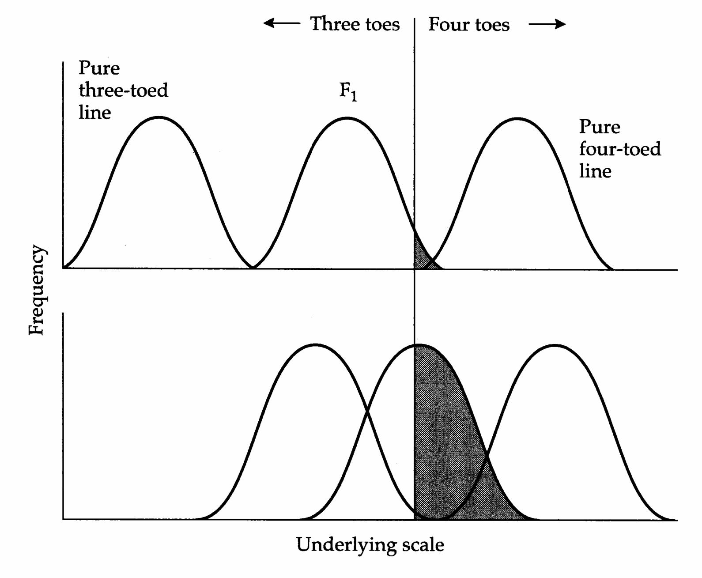
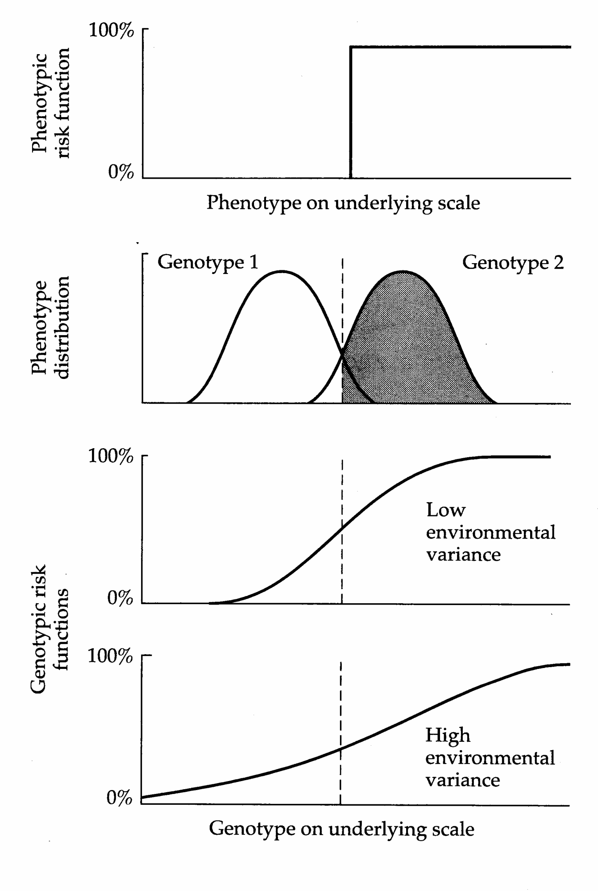
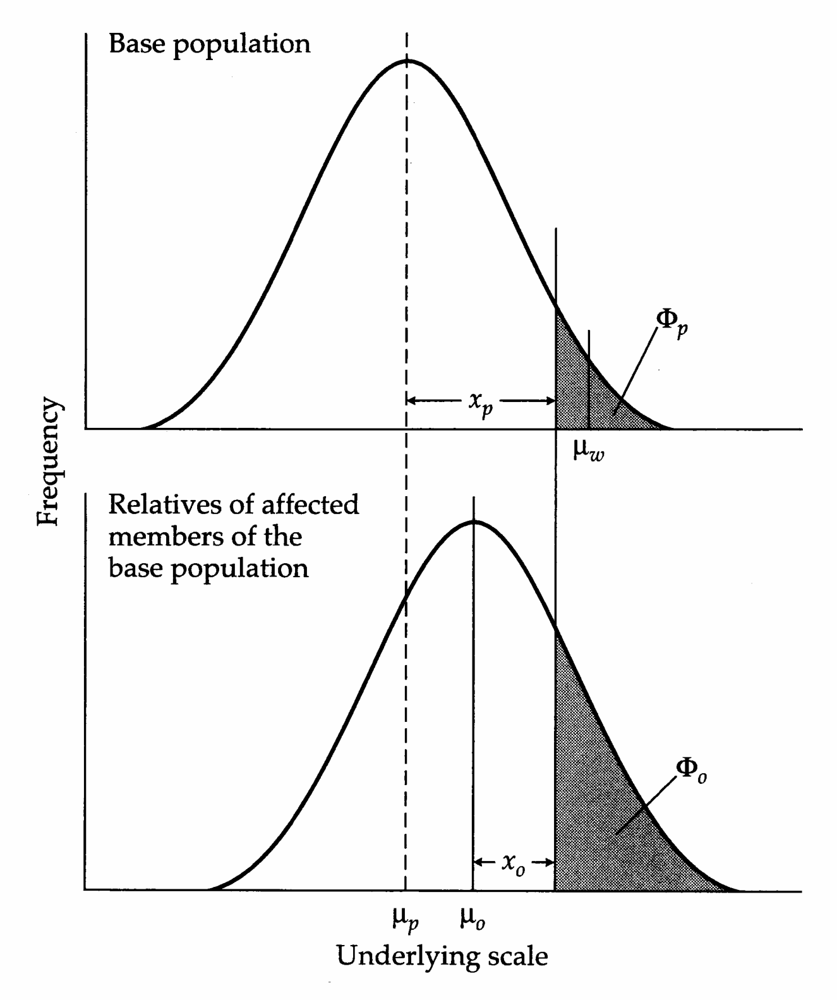
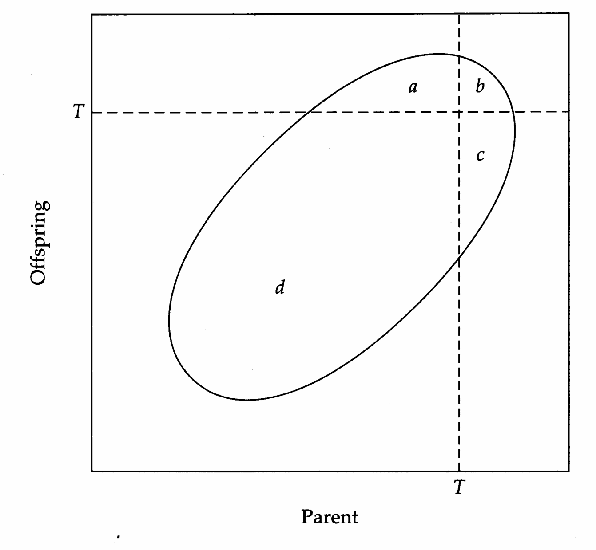
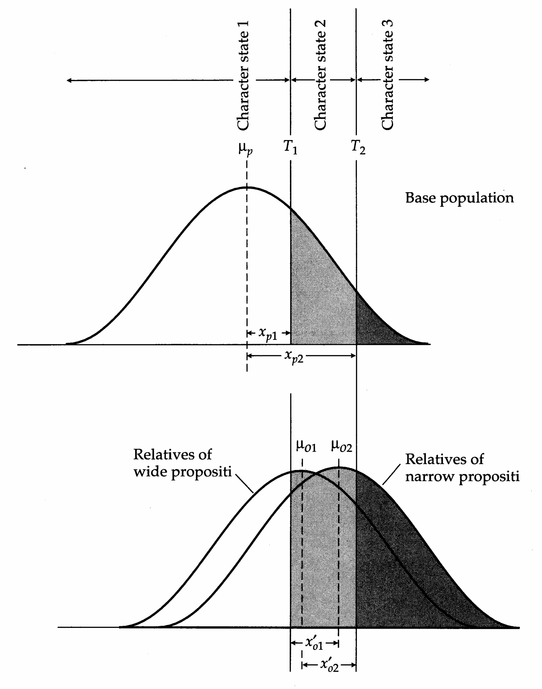
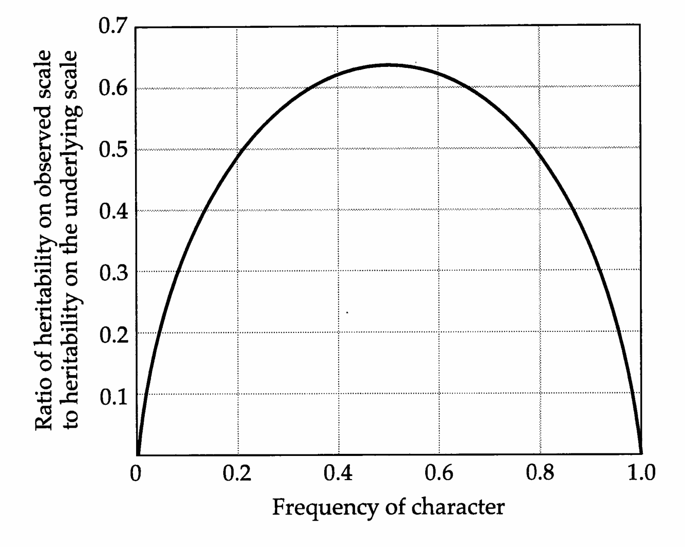
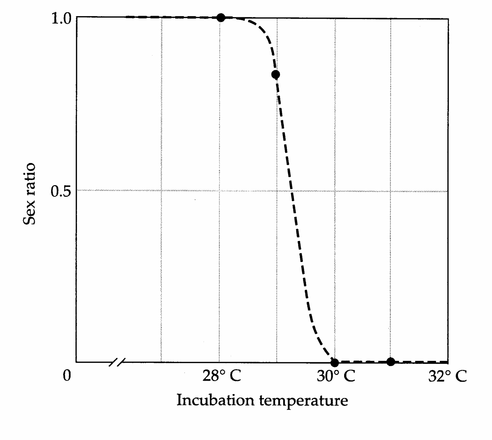

# Chapter 25 · Genetics_chapter25

## Genetics_chapter25_001 · Genetics_chapter25

25

---

## Genetics_chapter25_002 · Genetics_chapter25 / Threshold Characters

While the analytical procedures discussed in previous chapters are applicable to essentially all continuously distributed traits, the states of many characters fall into discrete categories. Important “all-or-none” or dichotomous characters include survivorship and the expression of congenital malformations. Polychotomous traits, meristic traits that can be partitioned into more than two discrete classes, include numbers of reproductive events, numbers of vertebrae or other skeletal parts, and so forth. Although the expression of some discrete traits, such as gender, may be a consequence of the expression of a single segregating factor, multiple loci are often involved. Thus, general genetic models for discrete phenotypic states need to be consistent with an underlying multifactorial basis for the character of interest.

The incidence of a character among the relatives of individuals expressing a trait relative to the incidence in the entire population is generally referred to as the relative recurrence risk (Chapter 16). For a character with no heritable basis, we expect this ratio to be equal to one. As the relative recurrence risk increases, it becomes more plausible that the variance of the character has a genetic basis. But how can such information be translated into a more conventional estimate of heritability?

A possible solution to this problem was first offered by Wright (1934c,d) in a study on digit number in guinea pigs. While guinea pigs normally have only three hind toes, four-toed (polydactylous) individuals occasionally appear in laboratory stocks, and the incidence of the trait can be increased to 100% by selection and inbreeding (Castle 1906). Through a carefully designed breeding program with initially homozygous strains, Wright rejected the hypothesis that polydactyly has a simple genetic basis. The most compelling evidence came from the observation that when different strains that bred true for the three-toed condition were mated to the same pure four-toed strain, very different proportions of four-toed progeny were obtained. These results and other oddities were shown to be consistent with a model in which the development of a fourth toe depends on the level of a continuously distributed underlying trait. Wright suggested that the four-toed condition would only arise if the total contribution of genes and environment to the underlying trait exceeded a certain threshold (Figure 25.1).

Attributes that are categorical on an outward (observed) scale but believed to be continuous on an underlying (unobserved) scale are known as threshold (Wright 1934c,d) or quasi-continuous (Grüneberg 1952) characters. The threshold

> **Figure 25.1** · page 740 · source: `Genetics_chapter25`
>
> 
>
> Figure 25.1 Wright’s (1934c,d) explanation for how the incidence of a dichotomous character can vary in crosses between parents of two types. Individuals from both types of parental strains are assumed to be normally distributed with respect to some underlying determinant of the dichotomous trait. However, the three-toed line in the lower panel is assumed to have a mean phenotype on the underlying scale that is closer to the threshold than that in the upper panel. The mean phenotype of the $ F_{1} $ progeny is assumed to be intermediate between that of the parents, and progeny whose underlying measure exceeds the threshold exhibit the four-toed condition (shaded areas).

model assumes a stepwise risk function for phenotypes on the underlying scale (Figure 25.2). All individuals with underlying phenotypic values above the threshold exhibit the trait; all those below it do not. A stepwise risk function on the underlying phenotypic scale implies a sigmoid risk function on the underlying genotypic scale, provided the environmental deviations on this scale are normally distributed (Smith 1971, Curnow 1972, Mendell and Elston 1974). Individuals with genotypic values above the threshold are at less than 100% risk because some of them have underlying phenotypes below the threshold. Likewise, some individuals with genotypic values below the threshold have phenotypic values above it. The greater the environmental contribution to the variance of the trait, the more gradual the risk function on the genotypic scale (Figure 25.2).

Since the nature of the underlying trait is almost always unknown, the interpretation of categorical data with a threshold model may appear to require an extreme act of faith. However, there are a number of ways to test the general validity

> **Figure 25.2** · page 741 · source: `Genetics_chapter25`
>
> 
>
> Figure 25.2 The relationship between phenotypic and genotypic risk functions and the environmental component of variance for the trait on the underlying scale. The stepwise phenotypic risk function is given in the upper panel. The next lower panel shows conditional phenotypic distributions for two genotypes; individuals in the portions of the distributions to the right of the threshold exhibit the trait, and their incidence represents the risk for their respective genotype. The bottom two panels plot genotypic risk as a function of genotypic value, where the latter is simply the mean of the genotype-specific conditional distribution. As the conditional genotype distributions become narrower (i.e., environmental variances become smaller), the genotypic risk function converges on the phenotypic risk function, whereas high environmental variance induces a flat genotypic risk function.

of the model. In Chapter 11, for example, we showed how threshold developmental maps provide plausible models for phenomena ranging from canalization to genetic assimilation. Moreover, in certain situations, the underlying determinant of character expression may be revealed through careful experimentation. For example, Alberch and Gale (1985) suggested that the number of primordial cells in the amphibian limb bud determines the digital structure. Through the use of mitotic inhibitors and promoters, they showed that below a certain threshold number of cells, complete loss of a digit may occur. A similar mechanism may have been operating in Wright's guinea pigs. Finally, as will be demonstrated below, the validity of a threshold model can be evaluated through the comparison of phenotypes of various types of relatives.

Threshold models are used extensively in genetic counseling to predict the risk of congenital malformations and psychiatric disorders in offspring of affected relatives (Carter 1965, 1969; James 1971; Smith 1971; Gershon et al. 1976). General mathematical/statistical reviews of the theory have been written by Curnow and Smith (1975) and Gianola (1982). Evolutionary problems that have recently been investigated with threshold models include limb loss in tetrapods (Lande 1978), environmental sex determination (Bulmer and Bull 1982), and mating preference (O'Donald and Majerus 1985).

---

## Genetics_chapter25_003 · HERITABILITY ON THE UNDERLYING SCALE

If the phenotype distribution on the underlying scale is treated as a standard normal (with mean = 0 and variance = 1), a relatively simple approach is available for estimating heritability on the underlying scale. The technique was independently developed by Crittenden (1961) and Falconer (1965b), both of whom saw an analogy between the phenotypes of affected parents and the response of a population to truncation selection. Both authors were concerned with the inheritance of genetic disorders in humans. For that reason, Falconer (1965b) called the underlying scale liability and the affected individuals propositi. For reference, we refer to the grand mean for liability in the base population as $ \mu_{p} = 0 $ and the mean liability of propositi as $ \mu_{w} $ (Figure 25.3). For the most part, for simplicity, we assume the propositi to be parents and their relatives to be offspring. However, the following analysis can be readily extended to any degree of relatedness.

As for any quantitative trait, the unobserved underlying character (liability) can be treated as the sum of a genotypic value and an environmental deviation, and assuming that it is normally distributed, the regression for liability in different sets of relatives will be linear. Further assuming that there is no change in the mean environmental contribution to liability between generations and no selection, the mean liability among all offspring will equal that for the base population ( $ \mu_{p} $). This value provides one point on the expected parent-offspring regression. Now suppose that affected parents (with mean liability $ \mu_{w} $) produce offspring with

> **Figure 25.3** · page 743 · source: `Genetics_chapter25`
>
> 
>
> Figure 25.3 Upper panel: The phenotype distribution of a parental population on the underlying scale, assumed to be normal. The dashed line denotes the parental mean phenotype, $ \mu_p $, whereas the solid line denotes the threshold above which the character is expressed. A fraction $ \Phi_p $ of the population exhibits the trait, and the mean phenotype of such individuals is $ \mu_w $. Lower panel: The phenotype distribution for a class of relatives of affected parents, e.g., progeny. Due to the nonzero heritability of the trait, this conditional distribution is shifted to the right ( $ \mu_o > \mu_p $) and shows a higher incidence $ \Phi_o $.

expected liability $\mu_o$. These values provide a second point on the regression. It follows that the slope of the parent-offspring regression is $\beta_{op} = (\mu_o - \mu_p)/(\mu_w - \mu_p)$, which reduces further to $\beta_{op} = \mu_o/\mu_w$ since we have scaled the distribution of liability in the base population such that $\mu_p = 0$. This definition of $\beta_{op}$ has the usual interpretation of a regression between parents and offspring. That is, $2\beta_{op} = [\sigma_A^2 + (\sigma_{AA}^2/2) + \cdots]/\sigma_z^2$.

Thus, the problem of estimating heritability on the underlying scale reduces to obtaining estimates of the mean liabilities in affected parents and their offspring, $ \mu_{w} $ and $ \mu_{o} $. Neither of these is directly observable, but from the properties of a normal distribution, estimates of them are obtainable from the incidence of the disorder in the population ( $ \Phi_p $) and the proportion of offspring of propositi that are affected ( $ \Phi_o $). First, we note that the estimated mean $ \overline{z}_o $ can also be written as $ (x_p - x_o) $, where $ x_p $ and $ x_o $ are the estimated distances of the threshold from the mean liability in the two samples (Figure 25.3). Given the observations $ \Phi_p $ and $ \Phi_o $, values for $ x_p $ and $ x_o $ are readily obtained from a table of the standard normal distribution (Chapter 2). These values are in units of phenotypic standard deviations on the underlying scale of liability. Second, the mean liability of affected members of the base population, $ \overline{z}_w $, can be determined by use of the equation for the mean of the tail of a normal distribution. From Equation 2.15, $ \overline{z}_w = p(x_p) / \Phi_p $, where $ p(x_p) = (2\pi)^{-1/2} \exp(-x_p^2/2) $ is the height of the standardized normal distribution at the threshold in the base population. Thus, the estimated parent-offspring regression on the underlying scale is

$$
b_{op}=\frac{\overline{z}_{o}}{\overline{z}_{w}}=\frac{(x_{p}-x_{o})\Phi_{p}}{p(x_{p})}
\tag{25.1a}
$$

Note that this expression generalizes to any set of relatives $ (r) $ by writing

$$
b_{r p}=\frac{(x_{p}-x_{r})\Phi_{p}}{p(x_{p})}
\tag{25.1b}
$$

The large-sample variance estimate for $ b_{op} $, derived by Taylor expansion, is

$$
\mathbf{V a r}(b_{o p})\simeq\left[\frac{1}{\overline{{z}}_{w}}-b_{o p}(\overline{{z}}_{w}-x_{p})\right]^{2}\left[\frac{\Phi_{p}(1-\Phi_{p})}{N_{p}p^{2}(x_{p})}\right]+\frac{\Phi_{o}(1-\Phi_{o})}{\overline{{z}}_{w}^{2}N_{o}p^{2}(x_{o})}
\tag{25.1c}
$$

where $ N_{p} $ and $ N_{o} $ are, respectively, the sample sizes for total individuals in the parental generation and offspring of affected individuals.

Because of its elegance and simplicity, the Crittenden-Falconer technique has been utilized widely. However, the reader should be aware of two assumptions made in the preceding derivation. First, in relying on a linear model, we assumed implicitly that the distribution of liability is normal in both the affected parents and their offspring. Clearly, this is not true for the affected parents, which are a truncated sample from a normal distribution (Figure 25.3), nor is it likely to be exactly true for their offspring. The second simplifying assumption is that both the base population and the relatives of propositi have unit variance for liability. However, if the character is heritable, the variance of liability in offspring of affected parents will be less than one since they represent only a subset of the population.

Although Crittenden (1961) and Falconer (1965b) were aware of these difficulties, they left their solution to later investigators. Utilizing statistical theory that had been developed much earlier by Pearson (1900) and Everitt (1910), Edwards (1969) and Smith (1970) showed how the preceding problems can be eliminated by considering all possible pairs of parents and offspring rather than just affected

> **Figure 25.4** · page 745 · source: `Genetics_chapter25`
>
> 
>
> Figure 25.4 The bivariate distribution of parent and offspring phenotypes on the underlying scale. The threshold value for the character is indicated by the dashed lines. The region denoted d marks combinations of parents and offspring that are unaffected, b denotes affected parents and offspring, a denotes unaffected parents and affected offspring, and c denotes affected parents and unaffected offspring. In the ideal case with no selection, the portions of the curves denoted a and c should be equal.

parents. This allows the entire joint distribution of parents and offspring to be partitioned into four types of pairs: both affected, both unaffected, parents affected but offspring unaffected, and vice versa (Figure 25.4). Given this information, the exact phenotypic correlation between parents and offspring on the underlying standard bivariate normal scale can be extracted from tables provided by Pearson (1900) and Everitt (1910) or from integral equations derived by Curnow (1972). Both procedures are a bit tedious, but a useful approximation has been given by Edwards (1969),

$$
r_{op}=b_{op}\simeq h^{2}/2=\frac{0.57\ln k}{-\ln(\Phi_{p})-0.44\ln k-0.18}
\tag{25.2}
$$

where $ k = \Phi_{o}/\Phi_{p} $. An analytical approximation that accounts for the change in variance across generations but not for the nonnormality of the affected parents was derived by Reich et al. (1972),

$$
r_{op}=\frac{x_{p}-x_{o}\left\{1-(x_{p}^{2}-x_{o}^{2})[1-(x_{p}/\overline{z}_{w})]\right\}^{1/2}}{\overline{z}_{w}+x_{o}^{2}(\overline{z}_{w}-x_{p})}
\tag{25.3}
$$

where again $ \overline{z}_{w}=p(x_{p})/\Phi_{p} $.

**[Table]**

*[See Table 25.1 at the end of this section.]*

The degree of inaccuracy that results from the use of the Crittenden-Falconer equation can be seen in Table 25.1, where the heritabilities of three human disorders are calculated using Equations 25.1–3. For each attribute, data are available for several degrees of relationship and sample sizes are large (several hundreds to thousands). There is no strong evidence for dominance genetic variance for these traits, so different types of relatives of the same degree have been pooled.

Three important observations can be gleaned from this table. First, for all three traits, the incidence in affected relatives ( $ \Phi_{r} $) is substantially higher than that in the population at large ( $ \Phi_{p} $). Thus, regardless of the model or the class of relatives employed in the computation of $ h^{2} $, it is clear that the variable expression of these traits has a genetic basis. Second, the high estimates of $ h^{2} $, all in excess of 0.5, arise despite the fact that the incidences of the disorders in the population are very low. Thus, the incidence of a trait in a population provides no information about its heritability. Third, the equation of Reich et al. (1972) produces results that are essentially the same as those of Edwards (1969) formula, indicating that the nonnormality correction is of negligible significance. More remarkable is the excellent agreement between the results of the Crittenden-Falconer model and those from the more exact treatments. In no case do the estimates differ by more than 10%.

Less clear is why all three approaches yield lower heritability estimates with increasing distance of relationship. One possibility is that significant sources of epistatic variance contribute to the expression of these traits. All components of epistatic genetic variance are completely confounded with the additive genetic variance in the case of monozygotic twins (Chapter 19), i.e., the heritability estimate derived for monozygotic twins is more appropriately described as a broad-sense heritability. However, epistatic components of variance make diminishingly smaller contributions to the covariance between relatives as the coefficient of coancestry declines (Chapter 7; also see Equation 16.49d). Another potential explanation is that shared environmental effects contribute disproportionately to the resemblance between close relatives. Still a third possibility is that relationships in humans (other than twins) are sometimes less than expected due to uncertain paternity.

**[示例 Example]**

> **Example 1** · ref: `Genetics_chapter25:1` · source: `Genetics_chapter25_003.json` · blocks 23–23
>
> Example 1. For the case in which individuals can be clonally replicated, a simple method exists for estimating the broad-sense heritability on the underlying scale. Suppose that $n$ individuals are scored for the character in each of $N$ clones, and let $n_i$ be the number of affected individuals in the $i$th clone. The incidence of the trait in the population is then $\Phi_p = \sum n_i / (N_n)$. Within a clone exhibiting affected individuals, the incidence of affected relatives is estimated by $(n_i - 1) / (n - 1)$, since an affected individual has $(n - 1)$ sibs, $(n_i - 1)$ of which are also affected. Thus, an estimate of the incidence among relatives is $\Phi_r = \sum (n_i - 1) / [N_a(n - 1)]$, where $N_a$ is the number of clones with affected individuals, and the summation is over such clones. The broad-sense heritability can be estimated by using $\Phi_r$ in place of $\Phi_o$ in the solution of Equations 25.1a, 25.2, or 25.3. The regression coefficient provides an estimate of $h^2$ since $2\Theta = 1$ for clonemates.

As in all attempts to estimate heritability from the resemblance between relatives, an important assumption of the above procedures is that selection does not alter the relative incidence of the trait in different pairs of relatives (i.e., the values of a, b, c, and d in Figure 25.4) prior to their assessment. Selection may be a serious source of bias for certain types of relatives and characters. In the case of human genetic disorders, for example, affected individuals may fail to reproduce for physiological reasons or, as a response to genetic counseling, may differentially abort affected fetuses. Comparisons of full sibs do not necessarily provide a solution to such problems. For example, individuals whose first offspring is affected may tend to decide against having future offspring, in which case they would be eliminated from the analysis. With appropriate medical records, correction might be made for such bias, but it would not be a trivial task.

> **Table 25.1** · `25.1` · page 746 · source: `Genetics_chapter25_003`
> Table 25.1 Estimates of the heritability of three human congenital disorders obtained by the methods of Crittenden-Falconer (Equation 25.1a), Edwards (Equation 25.2), and Reich et al. (Equation 25.3), as described in the text.
>
> <table><tr><td></td><td colspan="2">Incidence</td><td rowspan="2">x_{p}</td><td rowspan="2">x_{r}</td><td rowspan="2">p(x_{p})</td><td colspan="3">Heritability</td></tr><tr><td>Disease</td><td>$ \Phi_{p} $</td><td>$ \Phi_{r} $</td><td>(25.1a)</td><td>(25.2)</td><td>(25.3)</td></tr><tr><td>Harelip</td><td>0.001</td><td></td><td>3.090</td><td></td><td>0.003</td><td></td><td></td><td></td></tr><tr><td>MZ</td><td></td><td>0.500</td><td></td><td>0.000</td><td></td><td>1.03</td><td>0.99</td><td>1.03</td></tr><tr><td>1st degree</td><td></td><td>0.040</td><td></td><td>1.751</td><td></td><td>0.89</td><td>0.90</td><td>0.86</td></tr><tr><td>2nd degree</td><td></td><td>0.007</td><td></td><td>2.457</td><td></td><td>0.84</td><td>0.81</td><td>0.83</td></tr><tr><td>3rd degree</td><td></td><td>0.003</td><td></td><td>2.748</td><td></td><td>0.91</td><td>0.86</td><td>0.90</td></tr><tr><td>Club Foot</td><td>0.001</td><td></td><td>3.090</td><td></td><td>0.003</td><td></td><td></td><td></td></tr><tr><td>MZ</td><td></td><td>0.325</td><td></td><td>0.454</td><td></td><td>0.88</td><td>0.88</td><td>0.86</td></tr><tr><td>1st degree</td><td></td><td>0.021</td><td></td><td>2.034</td><td></td><td>0.70</td><td>0.70</td><td>0.68</td></tr><tr><td>2nd degree</td><td></td><td>0.006</td><td></td><td>2.512</td><td></td><td>0.77</td><td>0.74</td><td>0.75</td></tr><tr><td>3rd degree</td><td></td><td>0.002</td><td></td><td>2.878</td><td></td><td>0.57</td><td>0.53</td><td>0.56</td></tr><tr><td>Schizophrenia</td><td>0.010</td><td></td><td>2.326</td><td></td><td>0.027</td><td></td><td></td><td></td></tr><tr><td>MZ</td><td></td><td>0.443</td><td></td><td>0.143</td><td></td><td>0.81</td><td>0.92</td><td>0.83</td></tr><tr><td>1st degree</td><td></td><td>0.077</td><td></td><td>1.426</td><td></td><td>0.67</td><td>0.75</td><td>0.74</td></tr><tr><td>2nd degree</td><td></td><td>0.027</td><td></td><td>1.927</td><td></td><td>0.59</td><td>0.63</td><td>0.63</td></tr><tr><td>3rd degree</td><td></td><td>0.016</td><td></td><td>2.144</td><td></td><td>0.54</td><td>0.56</td><td>0.56</td></tr></table>
>
> Note: Incidence data are from Carter (1965, 1969) and McGue et al. (1983). $ \Phi_{p} $ and $ \Phi_{r} $ are, respectively, the incidences of the disorders in the population and in relatives of affected individuals. MZ denotes monozygotic twins; first-degree relatives include parent-offspring and full-sibs; second-degree relatives include aunt (uncle)-niece (nephew); and third-degree relatives are first cousins. Each of the methods gives an estimate of the regression between relatives for inferred phenotypes on the underlying scale. The heritabilities are computed by dividing the estimated regression by twice the coefficient of coancestry (1, 1/2, 1/4, and 1/8 for monozygotic twins, and first-, second-, and third-degree relatives, respectively).

---

## Genetics_chapter25_004 · MULTIPLE THRESHOLDS

In principle, the model developed above can be extended to any number of thresholds. Indeed, in his original analyses of digit number in guinea pigs, Wright (1934c,d) actually considered three classes of individuals: those with the usual three toes, those with an incomplete fourth toe, and those with four complete digits. The computations become rather lengthy for more than three character states, but a two-threshold model, which we will focus upon here, is fairly straightforward.

There are two very useful attributes of multiple threshold models. First, they provide a means for evaluating the relative means and variances of liability in different populations. Second, by providing several estimates of the regression between relatives, they provide an internal check on the consistency of the model.

With a three-character state model, there are two thresholds (Figure 25.5). We will refer to these as $ T_1 $ and $ T_2 $, the wide and narrow thresholds, respectively. With this notation, individuals are classified as normal (character state 1, with liability less than $ T_1 $), $ \text{wide} $ (character states 2 and 3, with liability exceeding $ T_1 $), or $ \text{narrow} $ (character state 3, with liability exceeding $ T_2 $). From above, we know that $ x_{p2} $, the distance of $ T_2 $ from the mean in standard deviations, can be extracted from tables if the incidence of character state 3 is known. Similarly, $ x_{p1} $ is obtainable from the total incidence of character states 2 and 3. The absolute distance between the two thresholds, $ (x_{p2} - x_{p1})\sigma $, may then be defined as one threshold unit, implying that the standard deviation in threshold units is $ \sigma = 1/(x_{p2} - x_{p1}) $. The mean, measured as the deviation from the wide threshold, is then $ \overline{z}_p = -x_{p1}\sigma $. Thus, if different populations can be assumed to have their thresholds located at the same position on the phenotypic scale for liability, this simple approach allows a comparison of the means and standard deviations of their underlying phenotypic distributions (in threshold units).

The two-threshold model provides four routes to estimating the heritability of liability (Reich et al. 1972). First, by ignoring one of the thresholds, the standard single-threshold model can be applied to the data. In this case, individuals having character states 2 and 3 can be treated as the same (normal vs. wide), or individuals with character states 1 and 2 can be aggregated (narrow vs. not narrow). Either way, the population is divided into two classes of individuals.

> **Figure 25.5** · page 749 · source: `Genetics_chapter25`
>
> 
>
> Figure 25.5 Upper panel: The phenotype distribution of a parental population on the underlying scale, assumed to be normal, with two thresholds determining the expression of three character states. The dashed line denotes the parental mean phenotype, $ \mu_{p} $, whereas the two solid lines denote the thresholds. In the lower panel, the distribution on the left refers to offspring from parents above the wide threshold $ T_{1} $, whereas that on the right refers to offspring from parents above the narrow threshold $ T_{2} $.

Two estimates of heritability can also be obtained from information on “cross prevalence.” Consider, for example, the propositi to be parents with character state 3. From their incidence, we obtain an estimate of $ x_{p2} $. The affected offspring of these parents can be scored as all individuals exhibiting character states 2 or 3. The normal deviate for these individuals, $ x'_{o1} $ (Figure 25.5), refers to the widely affected offspring of narrowly affected parents. Similarly, $ x'_{o2} $ is obtained from the narrowly affected offspring of widely affected (character state 2 or 3) parents (as the distance of the mean of these offspring from the upper threshold). From this information, two additional estimators of the parent-offspring regression are:

$$
b_{op}=\frac{x_{p2}-x_{o2}^{\prime}\sqrt{1-(x_{p2}^{2}-x_{o2}^{\prime2})[1-(x_{p1}/a_{1})]}}{a_{1}+x_{o2}^{\prime2}(a_{1}-x_{p1})}
\tag{25.4a}
$$

$$
b_{op}=\frac{x_{p1}-x_{o1}^{\prime}\sqrt{1-(x_{p1}^{2}-x_{o1}^{\prime2})}[1-(x_{p2}/a_{2})]}{a_{2}+x_{o1}^{\prime2}(a_{2}-x_{p2})}
\tag{25.4b}
$$

where $ a_{1}=p(x_{p1})/\Phi_{p1} $ and $ a_{2}=p(x_{p2})/\Phi_{p2} $. If the assumptions of the threshold model have been met, then all four estimates of $ b_{op} $ should be similar.

**[示例 Example]**

> **Example 2** · ref: `Genetics_chapter25:2` · source: `Genetics_chapter25_004.json` · blocks 9–12
>
> Example 2. The application of the two-threshold model can be illustrated with data on the incidence of diabetes in the Edinburgh population (Smith et al. 1972). Considerable variation exists for the age of onset of diabetes, and the authors wanted to know whether early-onset vs. late-onset diabetes simply represent different levels of liability. Through interviews of diabetics attending a clinic, information on the incidence of the disease in first-degree relatives was obtained. The affected individuals were partitioned into those first exhibiting the disease before and after age 25 years. Thus, the narrowly affected individuals were those affected between ages 0 and 25. A large survey estimated the incidence of narrowly affected individuals to be $ \Phi_{p2} = 0.0006 $, whereas the total (or wide) incidence of the disease was $ \Phi_{p1} = 0.0039 $. From a table of the standard normal distribution, $ x_{p2} = 3.24 $, $ x_{p1} = 2.66 $, $ a_{2} = 3.51 $, and $ a_{1} = 2.97 $. Thus, the wide and narrow thresholds are approximately 2.7 and 3.2 standard deviations above the mean on the liability scale, and the distance between the two thresholds is $ (x_{p1} - x_{p2}) = 0.58 $ standard deviations.
> 
> Data on the incidence of late- and early-onset diabetes in first degree relatives are given in the table at the top of the following page. If early-onset patients represent a subset of the population with more extreme genetic values for liability than late-onset patients, the total incidence of the disease should be higher in the relatives of the former than the latter. The data show this to be true — first-degree relatives of early- and late-onset patients have total incidences of 0.0520 and 0.0312, respectively.
> 
> Converting the incidences of disease in relatives to their respective $x$ values, the four possible heritability estimates (twice the regression coefficients) range from 0.46 to 0.76. From Equation 25.1b, the standard errors of $h^{2}$ based on narrow propositi and relatives and on wide propositi and relatives are found to be approximately 0.10 and 0.03, respectively. Thus, with one possible exception, the four estimates are in approximate agreement, leading to an overall estimate of $h^{2}=0.56$ for the liability.
> 
> <table><tr><td></td><td></td><td colspan="4">Incidence</td></tr><tr><td>Propositi</td><td>Relatives</td><td>Among Relatives:</td><td></td><td>$ b_{op} $</td><td>Equation</td></tr><tr><td rowspan="2">Narrow</td><td>Narrow</td><td>0.0205</td><td>$ x_{o2}=2.044 $</td><td>0.38</td><td>(25.3)</td></tr><tr><td>Wide</td><td>0.0315</td><td>$ x_{o1}^{\prime}=1.859 $</td><td>0.23</td><td>(25.4a)</td></tr><tr><td rowspan="2">Wide</td><td>Narrow</td><td>0.0045</td><td>$ x_{o2}^{\prime}=2.612 $</td><td>0.24</td><td>(25.4b)</td></tr><tr><td>Wide</td><td>0.0267</td><td>$ x_{o1}=1.932 $</td><td>0.27</td><td>(25.3)</td></tr></table>

---

## Genetics_chapter25_005 · GENETIC CORRELATIONS AMONG THRESHOLD TRAITS

The various applications of genetic correlations encountered in previous chapters are useful in many contexts with threshold traits. For example, in insects with wing dimorphisms, wing development is often highly dependent on photoperiod or other environmental conditions (Roff 1986, 1994). Salamanders in the genus Ambystoma may develop cannibalistic morphs or exhibit paedomorphosis under specific environmental conditions. Many species of zooplankton are known to modify their morphologies in the presence of predators (Havel 1987). Situations like these raise questions as to whether the genotypes that respond to one set of environmental cues are the same as those that respond to a second set of stimuli.

As noted in Chapter 24, another application of the genetic correlation concerns the expression of characters in the different sexes. For threshold characters, it has often been noted that when the incidence of affected individuals differs between the sexes, the sex with lower incidence has a higher frequency of affected relatives (Table 25.2). One potential explanation for such a reversal in frequencies is that affected members of the sex with the lower incidence tend to have a higher liability due to a displacement of the threshold to the right of the mean phenotype on the underlying scale.

When separate data are available for the two sexes, four separate regressions can be calculated using Equations 25.1a, 25.2, or 25.3: one for males only $ (b_{MM}) $,

**[Table]**

*[See Table 25.2 at the end of this section.]*

one for females only $ (b_{FF}) $, one for male propositi and female relatives $ (b_{FM}) $, and vice versa $ (b_{MF}) $. Ignoring nonadditive sources of variance and sex linkage, and assuming an absence of common environmental effects, the male-male and female-female regression coefficients will have expected values

$$
\beta_{M M}=\frac{2\Theta\sigma^{2}(A_{M})}{\sigma^{2}(z_{M})}
\tag{25.5a}
$$

$$
\beta_{F F}=\frac{2\Theta\sigma^{2}(A_{F})}{\sigma^{2}(z_{F})}
\tag{25.5b}
$$

where $ \Theta $ is the coefficient of coancestry for the relatives, $ \sigma^{2}(A_{M}) $ and $ \sigma^{2}(z_{M}) $ are the additive genetic variance and phenotypic variance for males, and $ \sigma^{2}(A_{F}) $ and $ \sigma^{2}(z_{F}) $ are those for females. The regressions of males on females and females on males have expectations

$$
\beta_{MF}=\frac{2\Theta\sigma^{2}(A_{M},A_{F})}{\sigma^{2}(z_{F})}
\tag{25.5c}
$$

$$
\beta_{FM}=\frac{2\Theta\sigma^{2}(A_{M},A_{F})}{\sigma^{2}(z_{M})}
\tag{25.5d}
$$

where $ \sigma^{2}(A_{M}, A_{F}) $ is the additive genetic covariance between the sexes. The genetic correlation across the sexes can be estimated as

$$
r_{FM}(A)=\sqrt{\frac{b_{MF}\cdot b_{FM}}{b_{MM}\cdot b_{FF}}}
\tag{25.6a}
$$

The preceding expressions are completely generalizable. For example, instead of pertaining to the expression of a trait in male and female relatives in the same environment, they may refer to male relatives in two different environments, to female relatives in different environments, or to male and female relatives in different environments. Thus, a formula of the form of Equation 23.6a can be used to estimate the genetic correlation across environments for the expression of a dichotomous trait. Moreover, the same approach can be used to obtain the genetic correlation between two different dichotomous traits, e.g., survivorship and the presence/absence of a morphological trait. For two characters x and y,

$$
r_{xy}(A)=\sqrt{\frac{b_{xy}\cdot b_{yx}}{b_{xx}\cdot b_{yy}}}
\tag{25.6b}
$$

Finally, it is relatively straightforward to compute the genetic correlation between a dichotomous and a continuously distributed character. Denoting two such traits as d and c, Equation 25.6b still applies. The regression for the dichotomous character $ (b_{dd}) $ can be obtained by the methods discussed earlier in this chapter, while the regression for the continuously distributed trait $(b_{cc})$ can be obtained by conventional methods outlined in previous chapters, e.g., parent-offspring regression. The regression involving the two traits, $b_{cd}$, can be obtained by dividing the deviation of the mean of the continuously distributed trait in relatives of affected individuals from the mean in the population at large $(\overline{z}_{cr} - \overline{z}_{cp})$ by the mean of the affected individuals for the dichotomous trait on the underlying scale $(\overline{z}_{dr} = x_{dp} - x_{do})$, with a similar definition applying to $b_{dc}$.

**[示例 Example]**

> **Example 3** · ref: `Genetics_chapter25:3` · source: `Genetics_chapter25_005.json` · blocks 15–17
>
> Example 3. The application of the preceding ideas will be illustrated with a familiar dichotomy in humans — handedness. The data base consists of responses to questionnaires distributed to college undergraduates and service recruits in Scotland (Annett 1973). The incidences of left-handedness in males and females are 0.118 and 0.114, so at least on the outward scale the two sexes have essentially identical phenotype distributions. In the following analyses, we assume that the variances for both sexes are also equal on the underlying scale. The table summarizes the incidences of left-handedness in brothers and sisters of male and female propositi and the associated probit (x) scores. The regression coefficients are computed by use of Equation 25.3.
> 
> <table><tr><td>Propositi</td><td>Relatives</td><td>Incidence in Relatives</td><td>x</td><td>2b</td><td>Expectation</td></tr><tr><td rowspan="2">Males</td><td>Brothers</td><td>0.143</td><td>1.067</td><td>0.15</td><td>$ h_{M}^{2} $</td></tr><tr><td>Sisters</td><td>0.114</td><td>1.208</td><td>-0.02</td><td>$ \rho_{FM}h_{M}h_{F} $</td></tr><tr><td rowspan="2">Females</td><td>Brothers</td><td>0.135</td><td>1.103</td><td>0.12</td><td>$ \rho_{FM}(A)h_{M}h_{F} $</td></tr><tr><td>Sisters</td><td>0.156</td><td>1.010</td><td>0.24</td><td>$ h_{F}^{2} $</td></tr></table>
> 
> Averaging over the two sexes, the heritability estimate for liability to left-handedness is approximately 0.20. By use of Equation 25.6b, we obtain $ r_{FM}(A) = 0.26 $. Thus, the genetic correlation across the sexes appears to be small. In light of these results and the fact that the study population consisted of full sibs, a reasonable interpretation is that handedness is primarily a chance event of development, with genetics playing a minor role, and perhaps a small contribution of the variance coming from common environmental effects.

> **Table 25.2** · `25.2` · page 751 · source: `Genetics_chapter25_005`
> Table 25.2 Incidence of pyloric stenosis in a human population.
>
> <table><tr><td rowspan="2">Propositi</td><td rowspan="2">Incidence in Population</td><td colspan="2">Incidence Among First-degree Relatives</td></tr><tr><td>Male</td><td>Female</td></tr><tr><td>Male</td><td>0.005</td><td>0.050</td><td>0.022</td></tr><tr><td>Female</td><td>0.001</td><td>0.171</td><td>0.066</td></tr></table>

---

## Genetics_chapter25_006 · HERITABILITY ON THE OBSERVED SCALE

The question often arises as to why heritabilities of dichotomous characters are measured on an unobservable underlying scale rather than on the directly observed scale. The latter approach was actually taken by most early investigators (Lush et al. 1948, Robertson and Lerner 1949, Dempster and Lerner 1950, VanVleck 1971). Assuming additivity, a simple expression for heritability on the observed scale can be obtained as follows. Suppose the character of interest is survivorship to a certain age. Then all nonsurvivors can be scored as 0 and all survivors as 1. The frequency of survivors in the population is simply the incidence $ \Phi_{p} $, and the phenotypic variance is the familiar variance of a binomial distribution,

$$
\sigma_{z}^{2}=\Phi_{p}(1-\Phi_{p})
\tag{25.7}
$$

It follows that the heritability on the observed scale is

$$
h_{o}^{2}=\frac{\sigma^{2}(A_{o})}{\Phi_{p}(1-\Phi_{p})}
\tag{25.8a}
$$

where the subscript $o$ denotes the observed scale, and $\sigma^{2}(A_{o})$ is the additive genetic variance on the observed scale. In an appendix to Dempster and Lerner (1950), Robertson showed that $\sigma^{2}(A_{o}) \simeq [p(x_{p})]^{2}h^{2}$, where $h^{2}$ is the heritability on the unobserved scale of liability. Thus, the relationship between the heritabilities on the underlying and observed scales is

$$
h_{o}^{2}=h^{2}\left\{\frac{[p(x_{p})]^{2}}{\Phi_{p}(1-\Phi_{p})}\right\}
\tag{25.8b}
$$

Examination of this formula reveals several undesirable properties of heritability estimates on the observed scale:

1. $ h_{o}^{2} $ is a function of the incidence in the population (Figure 25.6). With constant phenotypic variance on the liability scale, $ h_{o}^{2} $ changes with a shift in mean liability because this induces a change in $ \Phi_{p} $.

2. The maximum possible value of $ h_o^2 $ is $ 2/\pi \simeq 0.64 $, which arises when $ h^2 = 1 $, $ \Phi_p = 0.5 $, and $ p(x_p) = (2\pi)^{-1/2} $. This implies that a substantial proportion of the genetic variance on the observed scale is nonadditive even if all of the genetic variance on the liability scale is additive. The reason for this relationship has been outlined in Figure 25.2 — the regression of risk on liability of genotypes is necessarily nonlinear since the probability of expressing the trait is bounded between 0 and 100%.

3. For this same reason, genotypic values and environmental deviations are not independent on the observed scale.

Sometimes it is more practical to initially calculate heritability on the observed scale and then compute $ h^{2} $ indirectly by rearranging Equation 25.8b. Any of the procedures described in earlier chapters can be used for this purpose, applying the analysis to the 0, 1 variables. One problem with this approach, pointed

> **Figure 25.6** · page 755 · source: `Genetics_chapter25`
>
> 
>
> Figure 25.6 The ratio of heritabilities on observable $ (h_{o}^{2}) $ and underlying $ (h^{2}) $ scales as a function of the incidence of expression in the population $ (\Phi_{p}) $.

out by VanVleck (1971), is that the relationship between $ h_{o}^{2} $ and $ h^{2} $ depends on the incidence $ \Phi_{p} $ in a nonlinear fashion. Consequently, the substitution of sample estimates of $ \Phi_{p} $ into Equation 25.8b results in a biased conversion between the two heritabilities.

**[示例 Example]**

> **Example 4** · ref: `Genetics_chapter25:4` · source: `Genetics_chapter25_006.json` · blocks 13–17
>
> Example 4. In map turtles, the average sex ratio (% males) of clutches is closely coupled with the temperature at which the eggs are incubated. A rather tight threshold exists at 29.2°C. Below 28°C, virtually all eggs develop into males, while above 30°C clutches are entirely female (see the accompanying figure below). In effect, the response curve is a phenotypic risk function if temperature is viewed as the underlying scale of liability.
> 
> Bull et al. (1982) were interested in determining the extent to which variation in offspring sex at the intermediate temperature was due to genetic variation among females. Twenty gravid females were collected in the field and induced to lay eggs in the laboratory. Ten eggs from each mother were then randomly distributed in an incubator maintained at 29.2 – 29.3°C. The offspring were sexed upon hatching and scored as 0 if female and 1 if male. A one-way ANOVA was then performed on the full-sib family data.
> 
> The additive genetic variance on the observed scale was estimated to be 0.13 from the among-family component of variance. As an estimate of $ \sigma^{2}(A_{o}) $, this among-family variance could be inflated by dominance genetic variance for the sex determination mechanisms, but the influence of common-family environment should have been eliminated by the random design. The total proportion of male hatchlings was 0.41. Heritability on the observed scale is therefore approximately 0.13/[0.41(1 - 0.41)] = 0.54. Using $ \Phi_p = 0.41 $, $ x_p = 0.228 $ and $ p(x_p) = 0.389 $, from Equation 25.8b, heritability on the underlying scale is estimated to be $ h^2 \simeq (0.54)(0.41)(1 - 0.41)/(0.389)^2 = 0.86 $.
> 
> The authors note that the above computation assumes a constant incubation temperature for all females. In the field, however, different females will inevitably place their eggs in areas of somewhat different temperatures. Let the phenotypic variance in liability at a constant temperature (as in the laboratory experiment) be $ \sigma_x^2 $. In the field, the phenotypic variance is $ \sigma_x^2 + \sigma_T^2 $, where $ \sigma_T^2 $ is the additional variance in liability resulting from a variable environment. Thus, the heritability in the field is $ h^2[\sigma_x^2 / (\sigma_x^2 + \sigma_T^2)] $. For the study population, rough estimates of $ \sigma_x^2 $ and $ \sigma_T^2 $ were 0.09 and 1.0, reducing the expected heritability in the field to only 0.06.
> 
> 

---
