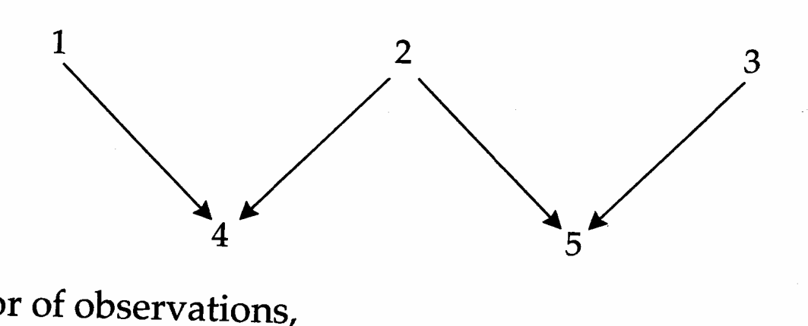
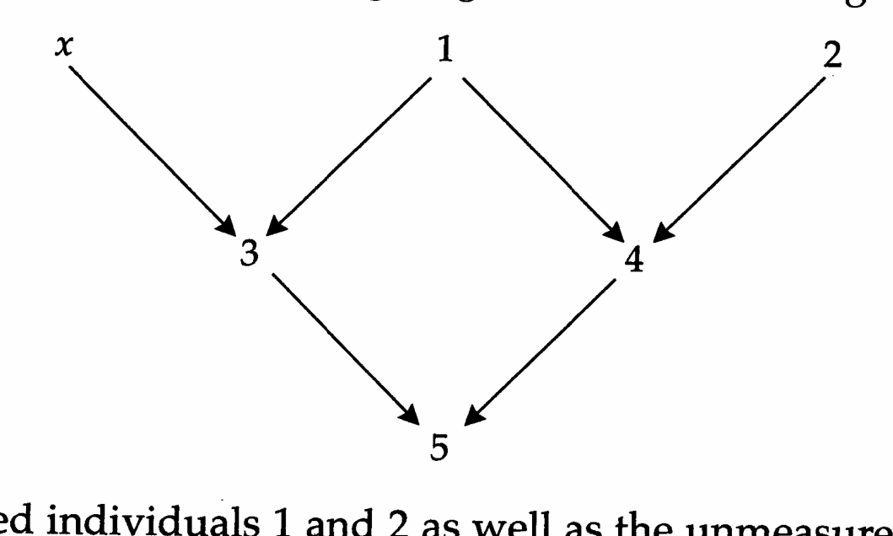

# Chapter 26 · Genetics_chapter26

## Genetics_chapter26_001 · Genetics_chapter26

26

---

## Genetics_chapter26_002 · Genetics_chapter26 / Estimation of Breeding Values

Most of the analytical methods encountered in earlier chapters of this book have assumed a data base derived from a setting with a regular design and fairly constant sample sizes in different genetic groups. Such situations are often approachable in laboratory or greenhouse populations, but many natural populations and agricultural species present the investigator with highly unbalanced family sizes and fragmentary data from numerous kinds of relationships. Data sets from which individuals have been eliminated by natural and/or artificial selection may deviate substantially from the base population about which one wishes to make inferences. Further culling of the data to accommodate conventional statistical techniques such as ANOVA, even if nonselective, still leads to an inefficient use of information. The goal of the next two chapters is to present a general overview of a family of statistical approaches that allows the efficient estimation of quantitative-genetic parameters under arbitrary settings, including those involving extended pedigrees, unequal family sizes, assortative mating, and selection.

All of the methods to be covered below are based on the general mixed model, which embraces the vast majority of estimation problems encountered in previous chapters. This chapter introduces best linear unbiased prediction (BLUP), a general method for predicting random effects (such as breeding values and maternal effects), while Chapter 27 is concerned with the estimation of genetic variances by restricted maximum likelihood (REML). These two methods are related in that BLUP assumes that the appropriate variance components are known, while REML procedures estimate variance components in an iterative fashion from BLUP estimates of random effects. Although the basic properties of these techniques have been known for decades, because of their computational demands, their practical application is a fairly recent phenomenon. BLUP is now by far the dominant methodology for estimating breeding values.

After a brief introduction to the general mixed model, we will develop expressions for BLUEs (best linear unbiased estimators) of fixed effects and for BLUPs of random effects under the assumption that variances are known in the base population. The remainder of the chapter considers several specific applications of BLUP, starting with the estimation of the breeding value of a single trait under a strictly additive model and then considering more advanced issues, including the estimation of dominance values and maternal effects and methods for dealing with repeated records and multiple traits.

There is a huge and sophisticated literature on BLUP methodology, detailed reviews of which can be found in Henderson (1977a, 1984a, 1988a), Schaeffer (1991), Kennedy (1991); Searle et al. (1992), and Mrode (1996). Our goal is simply to introduce the general framework and provide some specific examples that may increase the accessibility and attractiveness of the method to nonspecialists. BLUP is primarily used for the identification of individuals with maximum genetic merit in selection programs and for monitoring actual selection response. However, the method is very general and has been applied to a wide variety of additional problems ranging from the prediction of line-cross means (Henderson 1977c, 1984a) to the estimation of QTL effects (Kennedy et al. 1992) to the estimation of unusual genetic transmission properties such as maternal and cytoplasmic effects (e.g., Southwood et al. 1989; Zhu and Weir 1994a,b) and parental imprinting (Schaeffer et al. 1989, Tier and Sölkner 1993). Because the next two chapters rely very heavily on matrix algebra, before proceeding, the reader will likely benefit from reviewing Chapter 8, especially the sections on the multivariate normal and the general linear model.

---

## Genetics_chapter26_003 · THE GENERAL MIXED MODEL

Consider a column vector y containing the phenotypic values for a trait measured in n individuals. We assume that these observations are described adequately by a linear model with a $ p \times 1 $ vector of fixed effects ( $ \beta $) and a $ q \times 1 $ vector of random effects (u). The first element of the vector $ \beta $ is typically the population mean, and other factors included may be gender, location, year of birth, experimental treatment, and so on. The elements of the vector u of random effects are usually genetic effects such as additive genetic values. In matrix form,

$$
\mathbf{y}=\mathbf{X}\boldsymbol{\beta}+\mathbf{Z}\mathbf{u}+\mathbf{e}
\tag{26.1}
$$

where X and Z are respectively $ n \times p $ and $ n \times q $ incidence matrices (X is also called the design matrix), and e is the $ n \times 1 $ column vector of residual deviations assumed to be distributed independently of the random genetic effects. Usually, all of the elements of the incidence matrices are equal to 0 or 1, depending upon whether the relevant effect contributes to the individual's phenotype. Because this model jointly accounts for fixed and random effects, it is generally referred to as a mixed model (Eisenhart 1947). Analysis of Equation 26.1 forms the basis for the remainder of this chapter and the next.

**[示例 Example]**

> **Example 1** · ref: `Genetics_chapter26:1` · source: `Genetics_chapter26_003.json` · blocks 3–11
>
> Example 1. Suppose that three sires are chosen at random from a population, and each mated to a randomly chosen dam. Two offspring from each mating are evaluated, some in environment 1 and some in environment 2. Let $ y_{ijk} $ denote the phenotypic value of the kth offspring of sire i in environment j. The model is then
> 
> $$
> y_{ijk}=\beta_{j}+u_{i}+e_{ijk}
> $$
> 
> 
> This model has three random effects $ (u_{1}, u_{2}, u_{3}) $, which measure the contribution from each sire, and two fixed effects $ (\beta_{1}, \beta_{2}) $, which describe the influence of the two environments. The model assumes an absence of sire $ \times $ environment interaction.
> 
> As noted above, a total of six offspring were measured. One offspring of sire 1 was assigned to environment 1 and had phenotypic value $ y_{1,1,1} = 9 $, while the second offspring was assigned to environment 2 and had phenotypic value $ y_{1,2,1} = 12 $. The two offspring of sire 2 were both assigned to environment 1 and had values of $ y_{2,1,1} = 11 $ and $ y_{2,1,2} = 6 $. One offspring of sire 3 was assigned to environment 1 and had phenotypic value $ y_{3,1,1} = 7 $, while the second offspring was assigned to environment 2 and had phenotypic value $ y_{3,2,1} = 14 $. The resulting vector of observations can be written as
> 
> $$
> \mathbf{y}=\begin{pmatrix}y_{1,1,1}\\y_{1,2,1}\\y_{2,1,1}\\y_{2,1,2}\\y_{3,1,1}\\y_{3,2,1}\end{pmatrix}=\begin{pmatrix}9\\12\\11\\6\\7\\14\end{pmatrix}
> $$
> 
> 
> giving the mixed model as
> 
> $$
> \mathbf{y}=\mathbf{X}\boldsymbol{\beta}+\mathbf{Z}\mathbf{u}+\mathbf{e}
> $$
> 
> 
> where the incidence matrices for fixed and random effects and the vectors of these effects are respectively
> 
> $$
> \mathbf{X}=\begin{pmatrix}{{{1}}}&{{{0}}} \\{{{0}}}&{{{1}}} \\{{{1}}}&{{{0}}} \\{{{1}}}&{{{0}}} \\{{{1}}}&{{{0}}} \\{{{0}}}&{{{1}}}\end{pmatrix},\qquad\mathbf{Z}=\begin{pmatrix}{{{1}}}&{{{0}}}&{{{0}}} \\{{{1}}}&{{{0}}}&{{{0}}} \\{{{0}}}&{{{1}}}&{{{0}}} \\{{{0}}}&{{{1}}}&{{{0}}} \\{{{0}}}&{{{0}}}&{{{1}}} \\{{{0}}}&{{{0}}}&{{{1}}}\end{pmatrix},\qquad\boldsymbol{\beta}=\begin{pmatrix}{{{\beta_{1}}}} \\{{{\beta_{2}}}}\end{pmatrix},\qquad\mathbf{u}=\begin{pmatrix}{{{u_{1}}}} \\{{{u_{2}}}} \\{{{u_{3}}}}\end{pmatrix}
> $$
> 

Now consider the means and variances of the component vectors of the mixed model. Since $ E(\mathbf{u}) = E(\mathbf{e}) = \mathbf{0} $ by definition, $ E(\mathbf{y}) = \mathbf{X}\boldsymbol{\beta} $. Denote the $ (n \times n) $ covariance matrix for the vector $ \mathbf{e} $ of residual errors by $ \mathbf{R} $ and the $ (q \times q) $ covariance matrix for the vector $ \mathbf{u} $ of random genetic effects by $ \mathbf{G} $. Excluding the difference among individuals due to fixed effects, from Equation 8.21b and the assumption that u and e are uncorrelated, the covariance matrix for the vector of observations y is

$$
\mathbf{V}=\mathbf{Z}\mathbf{G}\mathbf{Z}^{T}+\mathbf{R}
\tag{26.2}
$$

The first term accounts for the contribution from random genetic effects, while the second accounts for the variance due to residual effects. We will generally assume that residual errors have constant variance and are uncorrelated, so that $ \mathbf{R} $ is a diagonal matrix, with $ \mathbf{R} = \sigma_E^2 \mathbf{I} $.

We are now in a position to contrast the mixed model and the general linear model. Under the general linear model (Chapter 8),

$$
\mathbf{y}=\mathbf{X}\boldsymbol{\beta}+\mathbf{e}^{*}\qquad\mathrm{w h e r e}\quad\mathbf{e}^{*}\sim(\mathbf{0},\mathbf{V})\quad\mathrm{i m p l y i n g}\mathbf{y}\sim(\mathbf{X}\boldsymbol{\beta},\mathbf{V})
$$

where the notation $\sim(a,b)$ means that the random variable has mean $a$ and variance $b$. On the other hand, the mixed model partitions the vector of residual effects into two components, with $e^{*}=Z\mathbf{u}+\mathbf{e}$, giving

$$
\mathbf{y}=\mathbf{X}\boldsymbol{\beta}+\mathbf{Z}\mathbf{u}+\mathbf{e}\qquad\mathrm{w h e r e}\quad\mathbf{u}\sim(\mathbf{0},\mathbf{G})\mathrm{~a n d~}\mathbf{e}\sim(\mathbf{0},\mathbf{R})
$$

$$
\mathrm{i m p l y i n g~}\mathbf{y}\sim(\mathbf{X}\beta,\mathbf{V})=(\mathbf{X}\beta,\mathbf{Z}\mathbf{G}\mathbf{Z}^{T}+\mathbf{R})
$$

When analyzed in the appropriate way, both formulations yield the same estimate of the vector of fixed effects $ \beta $, while the mixed-model formulation further allows estimates of the vector of random effects u.

For the mixed model, we observe y, X, and Z, while $ \beta $, u, R, and G are generally unknown. Thus, mixed-model analysis involves two complementary estimation issues: (1) estimation of the vectors of fixed and random effects, $ \beta $ and u, and (2) estimation of the covariance matrices G and R. These covariance matrices are generally assumed to be functions of a few unknown variance components. For the remainder of this chapter, we consider estimators of $ \beta $ and u under the assumption that y, X, Z, G, and R are all known. Estimation of the variance components (and hence R and G) from y, X, and Z is the subject of the next chapter.

---

## Genetics_chapter26_004 · THE GENERAL MIXED MODEL / Estimating Fixed Effects and Predicting Random Effects

As outlined in the preceding chapters, the primary goal of a quantitative-genetic analysis is often solely to estimate variance components. However, there are also numerous situations in which inferences about fixed effects (such as the effect of a particular environment or year) and/or random effects (such as the breeding value of a particular individual) are the central motivation. Inferences about fixed effects have come to be called estimates, whereas those that concern random effects are known as predictions. Procedures for obtaining such estimators and predictors have been developed using a variety of approaches, such as likelihood theory (Appendix 4). The most widely used procedures are BLUE and BLUP, referring respectively to best linear unbiased estimator and best linear unbiased predictor. They are best in the sense that they minimize the sampling variance, linear in the sense that they are linear functions of the observed phenotypes y, and unbiased in the sense that $ E[\mathrm{BLUE}(\boldsymbol{\beta})] = \beta $ and $ E[\mathrm{BLUP}(\mathbf{u})] = \mathbf{u} $.

For the mixed model given by Equation 26.1, the BLUE of β is

$$
\widehat{\boldsymbol{\beta}}=\left(\mathbf{X}^{T}\mathbf{V}^{-1}\mathbf{X}\right)^{-1}\mathbf{X}^{T}\mathbf{V}^{-1}\mathbf{y}
\tag{26.3}
$$

with V as given by Equation 26.2. Notice that this is just the generalized least-squares (GLS) estimator discussed in Chapter 8. Henderson (1963) showed that the BLUP of u is

$$
\hat{\mathbf{u}}=\mathbf{G}\mathbf{Z}^{T}\mathbf{V}^{-1}\left(\mathbf{y}-\mathbf{X}\hat{\boldsymbol{\beta}}\right)
\tag{26.4}
$$

which is equivalent to the conditional expectation of u given y under the assumption of multivariate normality (cf. Equation 8.27). As noted above, the practical application of both of these expressions requires that the variance components be known. Thus, prior to a BLUP analysis, the variance components need to be estimated by ANOVA or REML.

**[示例 Example]**

> **Example 2** · ref: `Genetics_chapter26:2` · source: `Genetics_chapter26_004.json` · blocks 6–12
>
> Example 2. What are the BLUP values for the sire effects $(u_1, u_2, u_3)$ in Example 1? In order to proceed, we require the covariance matrices for sire effects and errors. We assume that the residual variances within both environments are the same $(\sigma_E^2)$, so $\mathbf{R} = \sigma_E^2 \mathbf{I}$, where $\mathbf{I}$ is the $6 \times 6$ identity matrix. Assuming that all three sires are unrelated and drawn from the same population, $\mathbf{G} = \sigma_S^2 \mathbf{I}$, where $\mathbf{I}$ is the $3 \times 3$ identity matrix and $\sigma_S^2$ is the variance of sire effects. Assuming only additive genetic variance, the sire effects (breeding values) are half the sires' additive genetic values. Thus, since the sires are sampled randomly from an outbred base population, $\sigma_S^2 = \sigma_A^2 / 4$, where $\sigma_A^2$ is the additive genetic variance. Assuming that $\sigma_A^2 = 8$ and $\sigma_E^2 = 6$, the covariance matrix $\mathbf{V}$ for the vector of observations $\mathbf{y}$ is given by $\mathbf{Z}\mathbf{G}\mathbf{Z}^T + \mathbf{R}$, or
> 
> $$
> \mathbf{V}=\frac{8}{4}\begin{pmatrix}{{{1}}}&{{{0}}}&{{{0}}} \\{{{1}}}&{{{0}}}&{{{0}}} \\{{{0}}}&{{{1}}}&{{{0}}} \\{{{0}}}&{{{1}}}&{{{0}}} \\{{{0}}}&{{{0}}}&{{{1}}} \\{{{0}}}&{{{0}}}&{{{1}}}\end{pmatrix}\begin{pmatrix}{{{1}}}&{{{0}}}&{{{0}}} \\{{{0}}}&{{{1}}}&{{{0}}} \\{{{0}}}&{{{0}}}&{{{1}}}\end{pmatrix}\begin{pmatrix}{{{1}}}&{{{1}}}&{{{0}}}&{{{0}}}&{{{0}}}&{{{0}}} \\{{{0}}}&{{{0}}}&{{{1}}}&{{{1}}}&{{{0}}}&{{{0}}} \\{{{0}}}&{{{0}}}&{{{0}}}&{{{0}}}&{{{1}}}&{{{1}}}\end{pmatrix}+6\begin{pmatrix}{{{1}}}&{{{0}}}&{{{0}}}&{{{0}}}&{{{0}}}&{{{0}}} \\{{{0}}}&{{{1}}}&{{{0}}}&{{{0}}}&{{{0}}}&{{{0}}} \\{{{0}}}&{{{0}}}&{{{1}}}&{{{0}}}&{{{0}}}&{{{0}}} \\{{{0}}}&{{{0}}}&{{{0}}}&{{{1}}}&{{{0}}}&{{{0}}} \\{{{0}}}&{{{0}}}&{{{0}}}&{{{0}}}&{{{1}}}&{{{0}}} \\{{{0}}}&{{{0}}}&{{{0}}}&{{{0}}}&{{{0}}}&{{{1}}}\end{pmatrix}
> $$
> 
> 
> $$
> \begin{aligned}=\begin{pmatrix}{{{8}}}&{{{2}}}&{{{0}}}&{{{0}}}&{{{0}}}&{{{0}}} \\{{{2}}}&{{{8}}}&{{{0}}}&{{{0}}}&{{{0}}}&{{{0}}} \\{{{0}}}&{{{0}}}&{{{8}}}&{{{2}}}&{{{0}}}&{{{0}}} \\{{{0}}}&{{{0}}}&{{{2}}}&{{{8}}}&{{{0}}}&{{{0}}} \\{{{0}}}&{{{0}}}&{{{0}}}&{{{0}}}&{{{8}}}&{{{2}}} \\{{{0}}}&{{{0}}}&{{{0}}}&{{{0}}}&{{{2}}}&{{{8}}}\end{pmatrix}\quad giving\quad\mathbf{V}^{-1}=\frac{1}{30}\cdot\begin{pmatrix}{{{4}}}&{{{-1}}}&{{{0}}}&{{{0}}}&{{{0}}}&{{{0}}} \\{{{-1}}}&{{{4}}}&{{{0}}}&{{{0}}}&{{{0}}}&{{{0}}} \\{{{0}}}&{{{0}}}&{{{4}}}&{{{-1}}}&{{{0}}}&{{{0}}} \\{{{0}}}&{{{0}}}&{{{-1}}}&{{{4}}}&{{{0}}}&{{{0}}} \\{{{0}}}&{{{0}}}&{{{0}}}&{{{0}}}&{{{4}}}&{{{-1}}} \\{{{0}}}&{{{0}}}&{{{0}}}&{{{0}}}&{{{-1}}}&{{{4}}}\end{pmatrix}\end{aligned}
> $$
> 
> 
> Using this result, a few simple matrix calculations give
> 
> $$
> \widehat{\boldsymbol{\beta}}=\left(\begin{matrix}\widehat{\beta}_{1}\\ \widehat{\beta}_{2}\end{matrix}\right)=\left(\mathbf{X}^{T}\mathbf{V}^{-1}\mathbf{X}\right)^{-1}\mathbf{X}^{T}\mathbf{V}^{-1}\mathbf{y}=\frac{1}{18}\left(\begin{matrix}148\\ 235\end{matrix}\right)
> $$
> 
> 
> and
> 
> $$
> \widehat{\mathbf{u}}=\begin{pmatrix}\widehat{u}_{1}\\\widehat{u}_{2}\\\widehat{u}_{3}\end{pmatrix}=\mathbf{G}\mathbf{Z}^{T}\mathbf{V}^{-1}\left(\mathbf{y}-\mathbf{X}\widehat{\boldsymbol{\beta}}\right)=\frac{1}{18}\begin{pmatrix}-1\\2\\-1\end{pmatrix}
> $$
> 

**[示例 Example]**

> **Example 3** · ref: `Genetics_chapter26:3` · source: `Genetics_chapter26_004.json` · blocks 13–27
>
> Example 3. As mentioned in Chapter 13, the effects of different genotypes at a single QTL are often estimated by ordinary least squares (OLS), using the model
> 
> $$
> y_{ij}=g_{i}+e_{ij}
> $$
> 
> 
> where $ y_{ij} $ is the observed phenotype of the jth individual of genotype i, $ g_i $ is the mean genotypic value for the ith genotype at the locus of interest, and $ e_{ij} $ is a residual deviation assumed to be independently distributed among individuals. While this model may be reasonable for a random collection of individuals from a large population, when some sampled individuals are relatives, the sharing of alleles at other loci influencing the trait will induce correlations between residuals. If this is the case, OLS analysis can produce biased estimates of the QTL effects. When one of the QTL genotypes is very rare, as is often the case, the sampled individuals may be intentionally selected from the same pedigree, so the problem of bias is not trivial.
> 
> Use of a mixed model provides a means for accounting for associations among background QTLs in a way that eliminates bias in estimates of QTL effects. If the relatives in question share only additive effects (as in a pedigree with no full sibs or double first cousins, or when there is no nonadditive gene action), the correlations among residuals are accounted for by the additive genetic relationship matrix A, where $ A_{ij} $ is twice the coefficient of coancestry, $ 2\Theta_{ij} $. When sibs are included and dominance is present at background QTLs, both A and a dominance relationship matrix (see below) are required.
> 
> Here we assume that all of the background genetic effects are additive, in which case the simplest mixed model can be applied,
> 
> $$
> y_{ij}=g_{i}+a_{ij}+e_{ij}
> $$
> 
> 
> with the contribution from the different single-locus genotypes ($g_i$) being treated as fixed effects. The additive genetic background effects ($a_{ij}$) and the residual environmental deviations ($e_{ij}$) are treated as random effects, both with expected values equal to zero, and with respective variances $\sigma_A^2$ and $\sigma_E^2$. Note that $\sigma_A^2$ is the background additive genetic variance for the trait in excess of that caused by the QTL.
> 
> In matrix form,
> 
> $$
> \mathbf{y}=\mathbf{X}\mathbf{g}+\mathbf{Z}\mathbf{a}+\mathbf{e}
> $$
> 
> 
> If there is a single observation for each individual, as we assume below, then $ \mathbf{Z} = \mathbf{I} $ and the covariance matrix for the vector of observations (y) is
> 
> $$
> \mathbf{V}=\sigma_{A}^{2}\mathbf{A}+\sigma_{E}^{2}\mathbf{I}
> $$
> 
> 
> Thus, the covariance between the residual errors of two individuals (i and j) is just $ 2\Theta_{ij}\sigma_A^2 $, while the variance of individual errors is $ \sigma_A^2 + \sigma_E^2 $. The error in using OLS to estimate single gene effects is that $ \mathbf{A} $ is assumed to equal an identity matrix, so that $ \mathbf{V} $ is incorrectly assumed to be a diagonal matrix.
> 
> From Equation 26.3, the estimates of the QTL means are given by
> 
> $$
> \hat{\mathbf{g}}=\left(\mathbf{X}^{T}\mathbf{V}^{-1}\mathbf{X}\right)^{-1}\mathbf{X}^{T}\mathbf{V}^{-1}\mathbf{y}
> $$
> 
> 
> Kennedy et al. (1992) showed that mixed-model estimates of QTL effects are much more reliable than OLS estimates, especially in small selected populations. Building on this approach, several authors (Hoeschele 1988, Hofer and Kennedy 1993, Kinghorn et al. 1993) have proposed BLUP-based segregation analysis for estimating the effects of an unknown major gene. Here the elements in the design matrix X associated with $ g_{i} $ are probabilistic estimates for the major-locus genotypes of each individual.

Note that the solution of Equations 26.3 and 26.4 requires the inverse of the covariance matrix V. In the preceding example, $ V^{-1} $ was not particularly difficult to obtain. However, when y contains many thousands of observations, as is commonly the case in cattle breeding, the computation of $ V^{-1} $ can be quite difficult. As a way around this problem, Henderson (1950, 1963, 1973, 1984a)

offered a more compact method for jointly obtaining $ \widehat{\beta} $ and $ \widehat{u} $ in the form of his mixed-model equations (MME),

$$
\begin{pmatrix}\mathbf{X}^{T}\mathbf{R}^{-1}\mathbf{X}&\mathbf{X}^{T}\mathbf{R}^{-1}\mathbf{Z}\\\mathbf{Z}^{T}\mathbf{R}^{-1}\mathbf{X}&\mathbf{Z}^{T}\mathbf{R}^{-1}\mathbf{Z}+\mathbf{G}^{-1}\end{pmatrix}\begin{pmatrix}\widehat{\boldsymbol{\beta}}\\\widehat{\mathbf{u}}\end{pmatrix}=\begin{pmatrix}\mathbf{X}^{T}\mathbf{R}^{-1}\mathbf{y}\\\mathbf{Z}^{T}\mathbf{R}^{-1}\mathbf{y}\end{pmatrix}
\tag{26.5}
$$

While these expressions may look considerably more complicated than Equations 26.3 and 26.4, $ \mathbf{R}^{-1} $ and $ \mathbf{G}^{-1} $ are trivial to obtain if $ \mathbf{R} $ and $ \mathbf{G} $ are diagonal, and hence the submatrices in Equation 26.5 are much easier to compute than $ \mathbf{V}^{-1} $. A second advantage of Equation 26.5 can be seen by considering the dimensionality of the matrix on the left. Recalling that $ \mathbf{X} $ and $ \mathbf{Z} $ are $ n \times p $ and $ n \times q $ respectively, $ \mathbf{X}^T \mathbf{R}^{-1} \mathbf{X} $ is $ p \times p $, $ \mathbf{X}^T \mathbf{R}^{-1} \mathbf{Z} $ is $ p \times q $, and $ \mathbf{Z}^T \mathbf{R}^{-1} \mathbf{Z} + \mathbf{G}^{-1} $ is $ q \times q $. Thus, the matrix that needs to be inverted to obtain the solution for $ \widehat{\beta} $ and $ \widehat{\mathbf{u}} $ is of order $ (p + q) \times (p + q) $, which is usually considerably less than the dimensionality of $ \mathbf{V} $ (an $ n \times n $ matrix).

Although there are several ways to derive the mixed-model equations (Robinson 1991), Henderson (1950) originally obtained them by assuming that the covariance matrices G and R are known and that the densities of the vectors u and e are each multivariate normal with no correlations between them. Equation 26.5 then yields the maximum likelihood estimates of the fixed and random effects. Henderson (1963) later showed that the mixed-model equations do not actually depend on normality, and that $ \widehat{\beta} $ and $ \widehat{u} $ are BLUE and BLUP, respectively, under general conditions provided the variances are known.

---

## Genetics_chapter26_005 · THE GENERAL MIXED MODEL / Estimating Fixed Effects and Predicting Random Effects

**[示例 Example]**

> **Example 4** · ref: `Genetics_chapter26:4` · source: `Genetics_chapter26_005.json` · blocks 0–7
>
> Example 4. Using the values from Examples 1 and 2, we find that
> 
> $$
> \mathbf{X}^{T}\mathbf{R}^{-1}\mathbf{X}=\frac{1}{6}\begin{pmatrix}{{{4}}}&{{{0}}} \\{{{0}}}&{{{2}}}\end{pmatrix},\qquad\mathbf{X}^{T}\mathbf{R}^{-1}\mathbf{Z}=\left(\mathbf{Z}^{T}\mathbf{R}^{-1}\mathbf{X}\right)^{T}=\frac{1}{6}\begin{pmatrix}{{{1}}}&{{{2}}}&{{{1}}} \\{{{1}}}&{{{0}}}&{{{1}}}\end{pmatrix}
> $$
> 
> 
> $$
> \mathbf{G}^{-1}+\mathbf{Z}^{T}\mathbf{R}^{-1}\mathbf{Z}=\frac{5}{6}\begin{pmatrix}{{{1}}}&{{{0}}}&{{{0}}} \\{{{0}}}&{{{1}}}&{{{0}}} \\{{{0}}}&{{{0}}}&{{{1}}}\end{pmatrix},\mathbf{X}^{T}\mathbf{R}^{-1}\mathbf{y}=\frac{1}{6}\begin{pmatrix}{{{33}}} \\{{{26}}}\end{pmatrix},\mathbf{Z}^{T}\mathbf{R}^{-1}\mathbf{y}=\frac{1}{6}\begin{pmatrix}{{{21}}} \\{{{17}}} \\{{{21}}}\end{pmatrix}
> $$
> 
> 
> Thus, after factoring out 1/6 from both sides, the mixed-model equations for these data become
> 
> $$
> \begin{pmatrix}{{{4}}}&{{{0}}}&{{{1}}}&{{{2}}}&{{{1}}} \\{{{0}}}&{{{2}}}&{{{1}}}&{{{0}}}&{{{1}}} \\{{{1}}}&{{{1}}}&{{{5}}}&{{{0}}}&{{{0}}} \\{{{2}}}&{{{0}}}&{{{0}}}&{{{5}}}&{{{0}}} \\{{{1}}}&{{{1}}}&{{{0}}}&{{{0}}}&{{{5}}}\end{pmatrix}\begin{pmatrix}{{{\widehat{\beta}_{1}}}} \\{{{\widehat{\beta}_{2}}}} \\{{{\widehat{u}_{1}}}} \\{{{\widehat{u}_{2}}}} \\{{{\widehat{u}_{3}}}}\end{pmatrix}=\begin{pmatrix}{{{33}}} \\{{{26}}} \\{{{21}}} \\{{{17}}} \\{{{21}}}\end{pmatrix}
> $$
> 
> 
> Taking the inverse gives the solution
> 
> $$
> \begin{pmatrix}\widehat{\beta}_{1}\\\widehat{\beta}_{2}\\\widehat{u}_{1}\\\widehat{u}_{2}\\\widehat{u}_{3}\end{pmatrix}=\frac{1}{270}\begin{pmatrix}100&25&-25&-40&-25\\25&175&-40&-10&-40\\-25&-40&67&10&13\\-40&-10&10&70&10\\-25&-40&13&10&67\end{pmatrix}\begin{pmatrix}33\\26\\21\\17\\21\end{pmatrix}=\frac{1}{18}\begin{pmatrix}148\\235\\-1\\2\\-1\end{pmatrix}
> $$
> 
> 
> which is identical to the results obtained in Example 2.

Although the method of predicting random effects using BLUP methodology was first discussed by Henderson (1949, 1950), the expression “best linear unbiased predictor” was apparently first used by Goldberger (1962), with the acronym BLUP due to Henderson (1973). In a relatively short time, BLUP has become the method of choice for estimating the breeding values of individuals from field records of large and complex pedigrees. For BLUPs to be the best unbiased estimates, the appropriate genetic variances must be known without error. Kackar and Harville (1981) show that BLUP estimates remain unbiased when estimates of genetic variances are used in place of actual values (as is usually the case), although they are not guaranteed to be the best of all unbiased linear estimators.

---

## Genetics_chapter26_006 · THE GENERAL MIXED MODEL / Estimability of Fixed Effects

It is sometimes impossible to obtain unique BLUE estimates for all of the fixed factors in a model. Suppose, for example, that

$$
\boldsymbol{\beta}=\begin{pmatrix}{{{\beta_{1}}}} \\{{{\beta_{2}}}} \\{{{\beta_{3}}}}\end{pmatrix}\quad with\quad\mathbf{X}=\begin{pmatrix}{{{1}}}&{{{1}}}&{{{0}}} \\{{{1}}}&{{{1}}}&{{{0}}} \\{{{0}}}&{{{0}}}&{{{1}}}\end{pmatrix}
$$

Here, factors 1 and 2 are completely confounded, as they contribute equally to all individuals, so unique estimates of $ \beta_{1} $ and $ \beta_{2} $ cannot be acquired. Generally, when two or more columns of X are not independent, it is still possible to obtain unique BLUEs for certain linear combinations of $ \beta $ through the use of generalized inverses (Appendix 3). With the preceding design matrix X, the solution is simple—by combining the two factors into a single new factor, $ \beta_{1} + \beta_{2} $, the new model becomes

$$
\boldsymbol{\beta}_{*}=\begin{pmatrix}{{{\beta_{1}+\beta_{2}}}} \\{{{\beta_{3}}}}\end{pmatrix}\quad with\quad\mathbf{X}_{*}=\begin{pmatrix}{{{1}}}&{{{0}}} \\{{{1}}}&{{{0}}} \\{{{0}}}&{{{1}}}\end{pmatrix}
$$

Since the columns of $ \beta_{*} $ are now independent, a unique solution exists for $ \mathbf{X}_{*}^{T}\mathbf{V}^{-1}\mathbf{X}_{*} $, and from Equation 26.3, the two BLUEs of the fixed effects are given by

$$
\widehat{\boldsymbol{\beta}}_{*}=\left(\mathbf{X}_{*}^{T}\mathbf{V}^{-1}\mathbf{X}_{*}\right)^{-1}\mathbf{X}_{*}^{T}\mathbf{V}^{-1}\mathbf{y}
$$

Situations in which linear combinations of fixed effects are required commonly arise when a very large number of fixed factors are included in the model, as occurs in large breeding programs involving multiple environments (such as different herds and different years.) Henderson (1984a) provides an extended discussion of the issues. Throughout the remainder of the book, we assume that $ \beta $ is estimable, either immediately or after an appropriate transformation. Appendix 3 discusses how to determine which combinations of effects are estimable when singular matrices exist.

---

## Genetics_chapter26_007 · THE GENERAL MIXED MODEL / Standard Errors

A relatively straightforward extension of Henderson’s mixed-model equations provides estimates of the standard errors of the fixed and random effects. Let the inverse of the leftmost matrix in Equation 26.5 be

$$
\begin{pmatrix}\mathbf{X}^{T}\mathbf{R}^{-1}\mathbf{X}&\mathbf{X}^{T}\mathbf{R}^{-1}\mathbf{Z}&.\\\mathbf{Z}^{T}\mathbf{R}^{-1}\mathbf{X}&\mathbf{Z}^{T}\mathbf{R}^{-1}\mathbf{Z}+\mathbf{G}^{-1}\end{pmatrix}^{-1}=\begin{pmatrix}\mathbf{C}_{11}&\mathbf{C}_{12}\\\mathbf{C}_{12}^{T}&\mathbf{C}_{22}\end{pmatrix}
\tag{26.6}
$$

where $C_{11}$, $C_{12}$, and $C_{22}$ are, respectively, $p \times p$, $p \times q$, and $q \times q$ submatrices. Using this notation, Henderson (1975) showed that the sampling covariance matrix for the BLUE of $\beta$ is given by

$$
\boldsymbol{\sigma}(\widehat{\boldsymbol{\beta}})=\mathbf{C}_{11}
\tag{26.7a}
$$

that the sampling covariance matrix of the prediction errors (u - u) is given by

$$
\boldsymbol{\sigma}(\hat{\mathbf{u}}-\mathbf{u})=\mathbf{C}_{22}
\tag{26.7b}
$$

and that the sampling covariance of estimated effects and prediction errors is given by

$$
\boldsymbol{\sigma}(\widehat{\boldsymbol{\beta}},\widehat{\mathbf{u}}-\mathbf{u})=\mathbf{C}_{12}
\tag{26.7c}
$$

(We consider $ \hat{u} - u $ rather than $ \hat{u} $ as the latter includes variance from both the prediction error and the random effects u themselves.) The standard errors of the fixed and random effects are obtained, respectively, as the square roots of the diagonal elements of $ C_{11} $ and $ C_{22} $. For very large animal breeding designs where the inverse of the MME matrix may be difficult to compute, Meyer (1989a) presents methods for approximating the diagonal elements of the inverse of this matrix (and hence the standard errors).

**[示例 Example]**

> **Example 5** · ref: `Genetics_chapter26:5` · source: `Genetics_chapter26_007.json` · blocks 9–16
>
> Example 5. Consider the mixed-model equation from Example 4. Here for the fixed factors $ \beta_{1}, \beta_{2} $ and the random effects $ u_{1}, u_{2}, u_{3} $, the inverse of the coefficient matrix is
> 
> $$
> \begin{pmatrix}{{{4}}}&{{{0}}}&{{{\vdots}}}&{{{1}}}&{{{2}}}&{{{1}}} \\{{{0}}}&{{{2}}}&{{{\vdots}}}&{{{1}}}&{{{0}}}&{{{1}}} \\{{{\ddots}}}&{{{\cdots}}}&{{{\cdots}}}&{{{\ddots}}} \\{{{1}}}&{{{1}}}&{{{\vdots}}}&{{{5}}}&{{{0}}}&{{{0}}} \\{{{2}}}&{{{0}}}&{{{\vdots}}}&{{{0}}}&{{{5}}}&{{{0}}} \\{{{1}}}&{{{1}}}&{{{\vdots}}}&{{{0}}}&{{{0}}}&{{{5}}}\end{pmatrix}^{-1}=\frac{1}{270}\begin{pmatrix}{{{100}}}&{{{25}}}&{{{\vdots}}}&{{{-25}}}&{{{-40}}}&{{{-25}}} \\{{{25}}}&{{{175}}}&{{{\cdots}}}&{{{-40}}}&{{{-10}}}&{{{-40}}} \\{{{\cdots}}}&{{{\cdots}}}&{{{\cdots}}}&{{{\cdots}}} \\{{{-25}}}&{{{-40}}}&{{{\vdots}}}&{{{67}}}&{{{10}}}&{{{13}}} \\{{{-40}}}&{{{-10}}}&{{{\vdots}}}&{{{10}}}&{{{70}}}&{{{10}}} \\{{{-25}}}&{{{-40}}}&{{{\cdots}}}&{{{13}}}&{{{10}}}&{{{67}}}\end{pmatrix}
> $$
> 
> 
> Hence,
> 
> $$
> \mathbf{C}_{11}=\frac{1}{270}\begin{pmatrix}{{{100}}}&{{{25}}} \\{{{25}}}&{{{175}}}\end{pmatrix}\qquad and \qquad\mathbf{C}_{22}=\frac{1}{270}\begin{pmatrix}{{{67}}}&{{{10}}}&{{{13}}} \\{{{10}}}&{{{70}}}&{{{10}}} \\{{{13}}}&{{{10}}}&{{{67}}}\end{pmatrix}
> $$
> 
> 
> so that, for example,
> 
> $$
> \sigma^{2}(\widehat{\beta_{1}})=\frac{100}{270},\quad\sigma^{2}(\widehat{\beta_{2}})=\frac{175}{270},\quad\sigma(\widehat{\beta_{1}},\widehat{\beta_{2}})=\frac{25}{270}
> $$
> 
> 
> and, likewise,
> 
> $$
> \sigma^{2}(\widehat{u_{2}}-u_{2})=\frac{70}{270},\quad\sigma(\widehat{u_{1}}-u_{1},\widehat{u_{3}}-u_{3})=\frac{13}{270},\quad\mathrm{a n d~s o~o n.}
> $$
> 

---

## Genetics_chapter26_008 · MODELS FOR THE ESTIMATION OF BREEDING VALUES

While the general mixed model (Equation 26.1) forms the fundamental framework for BLUP analysis, there are numerous ways in which this model can be formulated. Three specific variants of the model provide the basis for most attempts to estimate breeding values. So-called animal models estimate the breeding values of each measured individual, while gametic models describe the breeding values of measured individuals in terms of parental contributions. The reduced animal model combines aspects of both the animal and gametic models in specific applications in which parental breeding values are the only ones of interest. In the following sections, we show how each of these models can be readily adapted to the mixed-model equations.

---

## Genetics_chapter26_009 · MODELS FOR THE ESTIMATION OF BREEDING VALUES / The Animal Model

Assuming only a single fixed factor (the population mean) under the simplest animal model, the observation for individual i is expressed as

$$
y_{i}=\mu+a_{i}+e_{i}
\tag{26.8}
$$

where $ a_{i} $ is the additive genetic value of individual i. With k individuals, the model can be expressed as in Equation 26.1 with

$$
\mathbf{X}=\begin{pmatrix}1\\ 1\\ \vdots\\ 1\end{pmatrix},\qquad\boldsymbol{\beta}=\boldsymbol{\mu},\qquad\mathbf{u}=\begin{pmatrix}a_{1}\\ a_{2}\\ \vdots\\ a_{k}\end{pmatrix}
$$

The matrix G describing the covariances among the random effects (here the breeding values) follows from standard results for the covariances between relatives. From Equation 7.12, the additive genetic covariance between two relatives i and j is given by $ 2\Theta_{ij}\sigma_{A}^{2} $, i.e., by twice the coefficient of coancestry times the additive genetic variance in the base population. Hence, under the animal model, $ \mathbf{G} = \sigma_{A}^{2} \mathbf{A} $, where the additive genetic (or numerator) relationship matrix A has elements $ A_{ij} = 2\Theta_{ij} $.

The covariance matrix $ \mathbf{R} $ for the vector of residual errors requires a little more care. The standard assumption is that $ \mathbf{R} = \sigma_E^2 \mathbf{I} $, so that the residual error for each observation has the same variance $ \sigma_E^2 $ and is uncorrelated with all other residual errors. There are many ways in which this assumption can fail. For example, if the character displays any dominance and $ i $ and $ j $ are full sibs, $ \sigma(e_i, e_j) = \sigma_D^2 / 4 $. Shared environmental effects can also cause correlations between residual effects. These complications will be considered below in some detail, but for now we assume that the residual errors have the simple covariance structure $ \mathbf{R} = \sigma_E^2 \mathbf{I} $, implying $ \mathbf{R}^{-1} = \sigma_E^{-2} \mathbf{I} $.

Since $ \mathbf{G}^{-1} = \sigma_A^{-2} \mathbf{A}^{-1} $, the mixed-model equations (Equation 26.5) for the animal model reduce to

$$
\begin{pmatrix}\mathbf{X}^{T}\mathbf{X}&\mathbf{X}^{T}\mathbf{Z}\\\mathbf{Z}^{T}\mathbf{X}&\mathbf{Z}^{T}\mathbf{Z}+\lambda\mathbf{A}^{-1}\end{pmatrix}\begin{pmatrix}\widehat{\boldsymbol{\beta}}\\\widehat{\mathbf{u}}\end{pmatrix}=\begin{pmatrix}\mathbf{X}^{T}\mathbf{y}\\\mathbf{Z}^{T}\mathbf{y}\end{pmatrix}
\tag{26.9a}
$$

where $\lambda = \sigma_E^2 / \sigma_A^2 = (1 - h^2) / h^2$ under the assumption of additive gene action. Since the only fixed factor is the mean $\mu$ (so that $\beta = \mu$ and $\mathbf{X} = \mathbf{1}$, a vector of ones) and each individual has only a single observation (so that $\mathbf{Z} = \mathbf{I}$), with $n$ individuals, Equation 26.9a reduces to

$$
\begin{pmatrix}n&\mathbf{1}^{T}\\&\mathbf{}\\ \mathbf{1}&\mathbf{I}+\lambda\mathbf{A}^{-1}\end{pmatrix}\begin{pmatrix}\widehat{\mu}\\ \widehat{\mathbf{u}}\end{pmatrix}=\begin{pmatrix}\sum^{n}y_{i}\\ \mathbf{y}\end{pmatrix}
\tag{26.9b}
$$

**[示例 Example]**

> **Example 6** · ref: `Genetics_chapter26:6` · source: `Genetics_chapter26_009.json` · blocks 10–22
>
> Example 6. Consider the pedigree of individuals given in the figure below, where each individual has a single measurement and the only fixed factor is the mean.
> 
> 
> 
> With the vector of observations,
> 
> $$
> \mathbf{y}=\begin{pmatrix}y_{1}\\ y_{2}\\ y_{3}\\ y_{4}\\ y_{5}\end{pmatrix}=\begin{pmatrix}7\\ 9\\ 10\\ 6\\ 9\end{pmatrix}
> $$
> 
> 
> we can use Equation 26.9b with $ \hat{u}^{*} $ = $ (\widehat{a}_{1}, \widehat{a}_{2}, \widehat{a}_{3}, \widehat{a}_{4}, \widehat{a}_{5}) $. Assuming that individuals 1, 2, and 3 are unrelated and not inbred, the relationship matrix becomes
> 
> $$
> \mathbf{A}=\begin{pmatrix}{{{1}}}&{{{0}}}&{{{0}}}&{{{1/2}}}&{{{0}}} \\{{{0}}}&{{{1}}}&{{{0}}}&{{{1/2}}}&{{{1/2}}} \\{{{0}}}&{{{0}}}&{{{1}}}&{{{0}}}&{{{1/2}}} \\{{{1/2}}}&{{{1/2}}}&{{{0}}}&{{{1}}}&{{{1/4}}} \\{{{0}}}&{{{1/2}}}&{{{1/2}}}&{{{1/4}}}&{{{1}}}\end{pmatrix}
> $$
> 
> 
> Suppose it is known that $ \sigma_{E}^{2}=\sigma_{A}^{2} $, so that $ \lambda=1 $. Then,
> 
> $$
> \mathbf{I}+\lambda\mathbf{A}^{-1}=\begin{pmatrix}{{{5/2}}}&{{{1/2}}}&{{{0}}}&{{{-1}}}&{{{0}}} \\{{{1/2}}}&{{{3}}}&{{{1/2}}}&{{{-1}}}&{{{-1}}} \\{{{0}}}&{{{1/2}}}&{{{5/2}}}&{{{0}}}&{{{-1}}} \\{{{-1}}}&{{{-1}}}&{{{0}}}&{{{3}}}&{{{0}}} \\{{{0}}}&{{{-1}}}&{{{-1}}}&{{{0}}}&{{{3}}}\end{pmatrix}
> $$
> 
> 
> Since $n = 5$ and $\sum y_i = 41$, Equation 26.9b gives the mixed-model equations for these data as
> 
> $$
> \begin{pmatrix}{{{5}}}&{{{1}}}&{{{1}}}&{{{1}}}&{{{1}}}&{{{1}}} \\{{{1}}}&{{{5/2}}}&{{{1/2}}}&{{{0}}}&{{{-1}}}&{{{0}}} \\{{{1}}}&{{{1/2}}}&{{{3}}}&{{{1/2}}}&{{{-1}}}&{{{-1}}} \\{{{1}}}&{{{0}}}&{{{1/2}}}&{{{5/2}}}&{{{0}}}&{{{-1}}} \\{{{1}}}&{{{-1}}}&{{{-1}}}&{{{0}}}&{{{3}}}&{{{0}}} \\{{{1}}}&{{{0}}}&{{{-1}}}&{{{-1}}}&{{{0}}}&{{{3}}}\end{pmatrix}\begin{pmatrix}{{{\widehat{\mu}}}} \\{{{\widehat{a}_{1}}}} \\{{{\widehat{a}_{2}}}} \\{{{\widehat{a}_{3}}}} \\{{{\widehat{a}_{4}}}} \\{{{\widehat{a}_{5}}}}\end{pmatrix}=\begin{pmatrix}{{{41}}} \\{{{7}}} \\{{{9}}} \\{{{10}}} \\{{{6}}} \\{{{9}}}\end{pmatrix}
> $$
> 
> 
> the solutions of which are
> 
> $$
> \widehat{\mu}=\frac{440}{53}\simeq8.302,\quad\begin{pmatrix}\widehat{a}_{1}\\\widehat{a}_{2}\\\widehat{a}_{3}\\\widehat{a}_{4}\\\widehat{a}_{5}\end{pmatrix}=\begin{pmatrix}-662/689\\4/53\\610/689\\-732/689\\381/689\end{pmatrix}\simeq\begin{pmatrix}-0.961\\0.076\\0.885\\-1.062\\0.553\end{pmatrix}
> $$
> 
> 
> Note that the average breeding value in the base population (individuals 1, 2, and 3) is zero (as expected for a random sample of the population). This is no longer the case once we leave the base population, unless all base-population individuals contribute equally to progeny production.

---

## Genetics_chapter26_010 · MODELS FOR THE ESTIMATION OF BREEDING VALUES / The Gametic Model

The gametic model is often used when parental breeding values are of more concern than offspring values, as when one is attempting to estimate the breeding value of bulls from large arrays of descendants. In this model the additive genetic value of each offspring is expressed in terms of its parents' breeding values. In particular, letting $ a_{si} $ and $ a_{di} $ be the breeding values for individual i's sire and dam, we can express i's breeding value as

$$
a_{i}=\left(\frac{a_{si}}{2}+\frac{a_{di}}{2}\right)+e_{ai}
\tag{26.10a}
$$

the sum of its predicted value (the average of parental values) and a random deviation $ e_{ai} $ resulting from Mendelian segregation. Thus, we can rewrite the simplest animal model (Equation 26.8) as

$$
\begin{aligned}y_{i}&=\mu+a_{i}+e_{i}\\&=\mu+\left(\frac{a_{si}}{2}+\frac{a_{di}}{2}\right)+\left(e_{ai}+e_{i}\right)\end{aligned}
\tag{26.10b}
$$

The sire model used in Example 1 is a variation of the gametic model wherein the dam contribution is ignored (and hence incorporated into the error term).

The residual error in the gametic model, $ e_{ai} + e_i $, contains a genetic component $ e_{ai} $ (the segregation error) in addition to an uncorrelated environmental component $ e_i $. As in the animal model, the $ e_i $ are assumed to be uncorrelated with common variance $ \sigma_E^2 $ so that their covariance matrix is $ \sigma_E^2 $ I. For noninbred parents, the variance of the segregation error is $ \sigma_A^2 / 2 $, while if the parents are inbred,

$$
\sigma^{2}(e_{ai})=\left(1-\frac{f_{si}+f_{di}}{2}\right)\frac{\sigma_{A}^{2}}{2}=(1-\overline{f}_{i})\frac{\sigma_{A}^{z}}{2}
\tag{26.11a}
$$

where $f$ denotes the inbreeding coefficient and $\overline{f}_{i}$ is the average amount of inbreeding for both parents (Dempfle 1990). The inbreeding coefficient can be obtained directly from the additive genetic relationship matrix of the parents (A). Since $A_{ii}=2\Theta_{ii}=1+f_{i}$ (Equation 7.3), we have

$$
\overline{f}_{i}=\frac{A_{si,si}+A_{di,di}}{2}-1
\tag{26.11b}
$$

Because they are random deviations around expectations, the segregation errors for all individuals are uncorrelated. Hence, the covariance matrix for the residual errors becomes

$$
\mathbf{R}=\sigma_{E}^{2}\mathbf{I}+\sigma_{A}^{2}\left(\begin{array}{c c c c}{{(1-\overline{{f}}_{1})/2}}&{{{\cdots}}}&{{{0}}} \\{{{\vdots}}}&{{{\ddots}}}&{{{\vdots}}} \\{{{0}}}&{{{\cdots}}}&{{{(1-\overline{{f}}_{k})/2}}}\end{array}\right)=\sigma_{E}^{2}\mathbf{W}
\tag{26.12}
$$

where $\mathbf{W}$ is a diagonal matrix with diagonal elements equal to $1 + (1 - \overline{f}_i)/(2\lambda)$, with $\lambda = \sigma_E^2 / \sigma_A^2$ (as in the animal model). Note that $\sigma_E^2 W_{ii}$ is the total within-family variance (the within-family segregation variance plus the within-family environmental variance).

---

## Genetics_chapter26_011 · MODELS FOR THE ESTIMATION OF BREEDING VALUES / The Reduced Animal Model

Quaas and Pollak (1980) combined features of both the animal and gametic model to obtain a reduced animal model (RAM) for large pedigrees that contain only parents and their offspring (i.e., ignoring individuals in the third generation and beyond). Suppose $k$ parents and a total $l$ of their offspring are each measured once. In the reduced animal model, parents are treated as in the full animal model, $y_i = \mu + a_i + e_i$, while their offspring are described by the gametic model. Only the $k$ parental additive genetic values are estimated, so that $\mathbf{u}^T = (a_1, \cdots, a_k)^T$. Partitioning the vector of observations $y$ into a $k \times 1$ vector of parental observations $(\mathbf{y}_p)$ and an $l \times 1$ vector of offspring observations $(\mathbf{y}_o)$, the reduced animal model can be expressed using the general mixed model (Equation 26.1) by letting

$$
\mathbf{y}=\begin{pmatrix}\mathbf{y}_{p}\\ \mathbf{y}_{o}\end{pmatrix},\qquad\mathbf{Z}=\begin{pmatrix}\mathbf{I}_{k}\\ \mathbf{Z}^{*}\end{pmatrix},\qquad\mathbf{e}=\begin{pmatrix}\mathbf{e}_{p}\\ \mathbf{e}_{o}\end{pmatrix}
\tag{26.13a}
$$

giving

$$
\mathbf{y}=\begin{pmatrix}\mathbf{y}_{p}\\ \mathbf{y}_{o}\end{pmatrix}=\mathbf{X}\boldsymbol{\beta}+\begin{pmatrix}\mathbf{I}_{k}\\ \mathbf{Z}^{*}\end{pmatrix}\mathbf{u}+\begin{pmatrix}\mathbf{e}_{p}\\ \mathbf{e}_{o}\end{pmatrix}
\tag{26.13b}
$$

where $\mathbf{I}_k$ is the $k \times k$ identity matrix, and $\mathbf{Z}^*$ is the $l \times k$ incidence matrix, which records the parents of each offspring. Here, in any particular row of $\mathbf{Z}^*$, the two elements corresponding to the parents of that individual are set equal to 1/2 while all other elements are zero. $\mathbf{Z}^* \mathbf{u}$ is then a vector of the expected breeding values of each offspring as given by the average of the parental breeding values. The genetic covariance matrix is $\mathbf{G} = \sigma_A^2 \mathbf{A}$, where $\mathbf{A}$ is the $k \times k$ relationship matrix for the parents, while the $(k+l) \times (k+l)$ covariance matrix for the vector of residuals becomes

$$
\mathbf{R}=\sigma_{E}^{2}\begin{pmatrix}\mathbf{I}_{k}&\mathbf{0}\\ \mathbf{0}&\mathbf{W}\end{pmatrix}
\tag{26.14a}
$$

implying

$$
\mathbf{R}^{-1}=\sigma_{E}^{-2}\begin{pmatrix}\mathbf{I}_{k}&\mathbf{0}\\ \mathbf{0}&\mathbf{W}^{-1}\end{pmatrix}
\tag{26.14b}
$$

with the offspring submatrix W defined as above (Equation 16.12). Substituting these results into Equation 26.5 and solving gives the BLUE for the vector of fixed effects and the BLUP for the vector of parental breeding values.

Quaas and Pollak (1980) show that the offspring breeding values can be obtained from the BLUE estimates of fixed effects and the BLUP estimates of parental breeding values. When estimates of the breeding values of both parents are available ( $ \widehat{a}_{si}, \widehat{a}_{di} $), the estimate of $ i' $s breeding value given its character value $ y_i $ is

$$
\widehat{a}_{i}=\frac{1}{2}\left[\widehat{a}_{s i}+\widehat{a}_{d i}\right]+\left[\frac{\sigma_{A}^{2}(1-\overline{{f}}_{i})/2}{\sigma_{E}^{2}+\sigma_{A}^{2}(1-\overline{{f}}_{i})/2}\right]\left[y_{i}-\widehat{\mu}-\frac{1}{2}\left(\widehat{a}_{s i}+\widehat{a}_{d i}\right)\right]
\tag{26.15}
$$

The first term is the predicted breeding value based only on the parental breeding values, while the product of the last two terms provides an estimate of the segregational deviation of the actual breeding value from its expectation. This additional contribution to the predicted offspring breeding value takes advantage of the information implicit in the offspring's phenotype — the first term in parentheses is the ratio of the within-family additive genetic variance to the total within-family variance (the within-family heritability). Equation 26.15 pertains to a model with only a single fixed effect. When multiple fixed effects are present, the appropriate BLUE estimates are also subtracted from each observation.

At first sight, the reduced animal model seems much more complicated than the animal model, so why might it be preferred? The reason is related to computational efficiency. For very large data sets, solutions to the reduced animal model require only inverses of matrices of the order of the number of parents, while the full animal model requires inverses of the order of the total number of measured individuals.

**[示例 Example]**

> **Example 7** · ref: `Genetics_chapter26:7` · source: `Genetics_chapter26_011.json` · blocks 13–36
>
> Example 7. We now reconsider Example 6, modeling the data with the reduced animal model. Here, the only genetic parameters to estimate are the three parental breeding values. The resulting model has $ \beta $ and X as in Example 6, but
> 
> $$
> \mathbf{y}=\begin{pmatrix}{{{\mathbf{y}_{p}}}} \\{{{\mathbf{y}_{o}}}}\end{pmatrix}=\begin{pmatrix}{{{y_{1}}}} \\{{{y_{2}}}} \\{{{y_{3}}}} \\{{{\cdots}}} \\{{{y_{4}}}} \\{{{y_{5}}}}\end{pmatrix},\quad\mathbf{u}=\begin{pmatrix}{{{a_{1}}}} \\{{{a_{2}}}} \\{{{a_{3}}}}\end{pmatrix},\quad\mathbf{Z}^{*}=\begin{pmatrix}{{{1/2}}}&{{{1/2}}}&{{{0}}} \\{{{0}}}&{{{1/2}}}&{{{1/2}}}\end{pmatrix}
> $$
> 
> 
> giving
> 
> $$
> \mathbf{Z}=\left(\begin{array}{c}{{{\mathbf{I}}}} \\{{{\mathbf{Z}^{*}}}}\end{array}\right)=\left(\begin{array}{ccc}{{{1}}}&{{{0}}}&{{{0}}} \\{{{0}}}&{{{1}}}&{{{0}}} \\{{{0}}}&{{{0}}}&{{{1}}} \\{{{1/2}}}&{{{1/2}}}&{{{0}}} \\{{{0}}}&{{{1/2}}}&{{{1/2}}}\end{array}\right)
> $$
> 
> 
> Since the three parents were assumed to be unrelated and noninbred, $ \mathbf{G} = \sigma_A^2 \mathbf{A} = (\sigma_E^2 / \lambda) \mathbf{A} $, where
> 
> $$
> \mathbf{A}=\mathbf{A}^{-1}=\begin{pmatrix}{{{1}}}&{{{0}}}&{{{0}}} \\{{{0}}}&{{{1}}}&{{{0}}} \\{{{0}}}&{{{0}}}&{{{1}}}\end{pmatrix}
> $$
> 
> 
> Note that by restricting attention to just the parents, the relationship matrix $ \mathbf{A} $ is much simpler than that in Example 6 where parents and offspring are considered jointly. Since the parents are assumed to be noninbred,
> 
> $$
> \mathbf{W}=\left(1+\frac{1}{2\lambda}\right)\begin{pmatrix}{{{1}}}&{{{0}}} \\{{{0}}}&{{{1}}}\end{pmatrix}=\left(1+\frac{1}{2\lambda}\right)\mathbf{I}
> $$
> 
> 
> Because we assumed $ \lambda = 1 $, $ \mathbf{R} $ is diagonal with elements $ \sigma_E^2 \times (1, 1, 1, 3/2, 3/2) $, so that $ \mathbf{R}^{-1} $ is diagonal, with elements $ \sigma_E^{-2} \times (1, 1, 1, 2/3, 2/3) $. To obtain the mixed-model equations (ignoring the factor $ \sigma_E^{-2} $ common to all equations), we first obtain
> 
> $$
> \mathbf{X}^{T}\mathbf{R}^{-1}\mathbf{X}=\frac{13}{3},\quad\mathbf{Z}^{T}\mathbf{R}^{-1}\mathbf{Z}=\frac{1}{6}\begin{pmatrix}{{{7}}}&{{{1}}}&{{{0}}} \\{{{1}}}&{{{8}}}&{{{1}}} \\{{{0}}}&{{{1}}}&{{{7}}}\end{pmatrix},\quad\mathbf{X}^{T}\mathbf{R}^{-1}\mathbf{y}=36,
> $$
> 
> 
> $$
> \left(\mathbf{X}^{T}\mathbf{R}^{-1}\mathbf{Z}\right)^{T}=\mathbf{Z}^{T}\mathbf{R}^{-1}\mathbf{X}=\frac{1}{3}\begin{pmatrix}4\\ 5\\ 4\end{pmatrix},\quad\mathbf{Z}^{T}\mathbf{R}^{-1}\mathbf{y}=\begin{pmatrix}9\\ 14\\ 13\end{pmatrix}
> $$
> 
> 
> $$
> \mathbf{Z}^{T}\mathbf{R}^{-1}\mathbf{Z}+\mathbf{G}^{-1}=\frac{1}{6}\begin{pmatrix}{{{13}}}&{{{1}}}&{{{0}}} \\{{{1}}}&{{{14}}}&{{{1}}} \\{{{0}}}&{{{1}}}&{{{13}}}\end{pmatrix}
> $$
> 
> 
> giving the final form of the mixed-model Equation 26.5 as
> 
> $$
> \begin{pmatrix}{{{13/3}}}&{{{4/3}}}&{{{5/3}}}&{{{4/3}}} \\{{{4/3}}}&{{{13/6}}}&{{{1/6}}}&{{{0}}} \\{{{5/3}}}&{{{1/6}}}&{{{14/6}}}&{{{1/6}}} \\{{{4/3}}}&{{{0}}}&{{{1/6}}}&{{{13/6}}}\end{pmatrix}\begin{pmatrix}{{{\widehat{\mu}}}} \\{{{\widehat{a}_{1}}}} \\{{{\widehat{a}_{2}}}} \\{{{\widehat{a}_{3}}}}\end{pmatrix}=\begin{pmatrix}{{{36}}} \\{{{9}}} \\{{{14}}} \\{{{13}}}\end{pmatrix}
> $$
> 
> 
> which has solutions
> 
> $$
> \widehat{\mu}=\frac{440}{53},\qquad\begin{pmatrix}\widehat{a}_{1}\\\widehat{a}_{2}\\\widehat{a}_{3}\end{pmatrix}=\begin{pmatrix}-662/689\\4/53\\610/689\end{pmatrix}
> $$
> 
> 
> To obtain the estimates of the offspring breeding values by use of Equation 26.15, first note that neither offspring has inbred parents and that $ \lambda = 1 $, so that the within-family heritability is
> 
> $$
> \frac{(1-\overline{f}_{i})/(2\lambda)}{1+(1-\overline{f}_{i})/(2\lambda)}=\frac{(1-0)/2}{1+(1-0)/2}=\frac{1}{3}
> $$
> 
> 
> Hence,
> 
> $$
> \widehat{a}_{i}=\frac{1}{2}\left(\widehat{a}_{s i}+\widehat{a}_{d i}\right)+\left(\frac{1}{3}\right)\left[y_{i}-\frac{440}{53}-\frac{1}{2}\left(\widehat{a}_{s i}+\widehat{a}_{d i}\right)\right]
> $$
> 
> 
> giving the BLUPs for the offspring breeding values as
> 
> $$
> \widehat{a}_{4}=\frac{1}{2}\left(-\frac{662}{689}+\frac{4}{53}\right)+\left(\frac{1}{3}\right)\left[6-\frac{440}{53}-\frac{1}{2}\left(-\frac{662}{689}+\frac{4}{53}\right)\right]=-\frac{732}{689}
> $$
> 
> 
> $$
> \widehat{a}_{5}=\frac{1}{2}\left(\frac{4}{53}+\frac{610}{689}\right)+\left(\frac{1}{3}\right)\left[6-\frac{440}{53}-\frac{1}{2}\left(\frac{4}{53}+\frac{610}{689}\right)\right]=\frac{381}{689}
> $$
> 
> 
> These estimates are identical to those obtained from the full animal model (Example 6). This result is expected, as the RAM and full models are equivalent (Appendix 3).

In closing this section, we emphasize several aspects of BLUP (as applied to the animal, gametic, and reduced animal models) that highlight its exceptional degree of flexibility. First, because the relationship matrix A records the flow of genetic information through the pedigree, BLUP provides unbiased estimates of breeding values even in populations under selection, provided the individuals upon which selection operated are included in the analysis (Kennedy and Sorensen 1988). For further information on this subject, including modifications that need to be made when measurements are unavailable for some selected individuals, see Henderson (1975, 1990), Goffinet (1983), Gianola et al. (1988), and Fernando and Gianola (1990). Second, the breeding value estimates from different generations reflect changes in mean phenotypes and additive genetic variances resulting from selection and/or random genetic drift and inbreeding (recall Example 6). Third, because breeding value estimates are conditional expectations given the entire vector of observations (y), the evaluations of individuals are based on weighted information from all measured relatives. Individual evaluations are adjusted for the breeding values of their progeny and mates, thereby accounting for any assortative mating, and as noted in Equation 26.15, the deviation of the individual's own phenotype from its conditional expectation provides an additional bit of information. Further adjustments to the BLUPs can be made for individuals with relatives other than parents and progeny, see Mrode (1996) for examples.

---

## Genetics_chapter26_012 · SIMPLE RULES FOR COMPUTING A AND $ A^{-1} $

While the identity-coefficient methods introduced in Chapter 7 can be used to compute each of the individual elements of A, this approach can be rather tedious for large pedigrees. However, as pointed out by Henderson (1976), certain features of the pattern of gene flow through pedigrees can be exploited to greatly facilitate the computation of A. As noted above, $ A_{ii} = 1 + f_i $. In addition, $ A_{ij} = 2\Theta_{ij} = 0 $ if i and j are unrelated individuals. Building on these relationships, the following helpful rules outlined by Emik and Terrill (1949) can be used to obtain the elements of A for an arbitrary pedigree.

Order the individuals so that parents precede their offspring, and let the first $b$ noninbred and unrelated individuals comprise the base population. With these individuals forming our starting point, the upper-left $b \times b$ submatrix of $\mathbf{A}$ is an identity matrix. This submatrix is expanded iteratively, one row and one column at a time, until the entire $\mathbf{A}$ matrix is filled out. If individual $i$ has parents indexed by $g$ and $h$, then its diagonal element is

$$
A_{ii}=1+f_{i}=1+\Theta_{gh}=1+\frac{A_{gh}}{2}
\tag{26.16a}
$$

For a pair of individuals i and j, with j < i,

$$
A_{ij}=A_{ji}=\Theta_{jg}+\Theta_{jh}=\frac{A_{jg}+A_{jh}}{2}
\tag{26.16b}
$$

If a parent is unknown, it is assumed to be noninbred and unrelated to any other measured individual (except, of course, its known descendants), so that if k indexes an unmeasured parent, we assume $ A_{kk} = 1 $ and $ A_{ik} = 0 $ (for $ i \neq k $ where i indexes any individual except known descendants of k).

**[示例 Example]**

> **Example 8** · ref: `Genetics_chapter26:8` · source: `Genetics_chapter26_012.json` · blocks 6–18
>
> Example 8. Consider the additive genetic relationship matrix A for the five measured individuals in the pedigree given in the following figure.
> 
> 
> 
> Here, measured individuals 1 and 2 as well as the unmeasured (and potentially unknown) individual x are assumed to be unrelated members of a noninbred base population. Since 1 and 2 are unrelated and noninbred, $ A_{11} = A_{22} = 1 $ and $ A_{12} = A_{21} = 0 $. Likewise, $ A_{xx} = 1 $, $ A_{x1} = A_{x2} = 0 $. Now consider individual 3, whose parents are 1 and x. Applying Equations 26.16a,b, we have $ A_{33} = 1 + A_{x1}/2 = 1 $ and
> 
> $$
> A_{13}=A_{31}=\frac{A_{1x}+A_{11}}{2}=\frac{1}{2},\quad A_{23}=A_{32}=\frac{A_{2x}+A_{21}}{2}=0
> $$
> 
> 
> Individual 4 has parents 1 and 2, giving $ A_{44}=1+A_{12}/2=1 $ and
> 
> $$
> A_{14}=A_{41}=\frac{A_{11}+A_{12}}{2}=\frac{1}{2},\quad A_{24}=A_{42}=\frac{A_{21}+A_{22}}{2}=\frac{1}{2},
> $$
> 
> 
> and
> 
> $$
> A_{34}=A_{43}=\frac{A_{31}+A_{32}}{2}=\frac{1}{4}
> $$
> 
> 
> Turning to individual 5, whose parents are 3 and 4, $ A_{55} = 1 + A_{34} / 2 = 1 + 1 / 8 = 1.25 $, and
> 
> $$
> A_{15}=A_{51}=\frac{A_{13}+A_{14}}{2}=\frac{1}{2},\quad A_{25}=A_{52}=\frac{A_{23}+A_{24}}{2}=\frac{1}{4}
> $$
> 
> 
> $$
> A_{35}=A_{53}=\frac{A_{33}+A_{34}}{2}=\frac{5}{8},\quad A_{45}=A_{54}=\frac{A_{43}+A_{44}}{2}=\frac{5}{8}
> $$
> 
> 
> Thus,
> 
> $$
> \mathbf{A}=\begin{pmatrix}1&0&1/2&1/2&1/2\\0&1&0&1/2&1/4\\1/2&0&1&1/4&5/8\\1/2&1/2&1/4&1&5/8\\1/2&1/2&5/8&5/8&9/8\end{pmatrix}
> $$
> 

In many natural settings, and some breeding situations, only one of the parents (generally, the mother) is known with certainty. One approach to dealing with such uncertainty is simply to assume that the unknown sire is unrelated to any measured individual in the base population (as we did above). However, when all potential sires have been measured, an average relationship matrix can be computed by assigning all potential sires equal weight (Henderson 1988b). For example, if the sire of individual i is one of k potential males, then each of these is assumed to be the sire with probability 1/k, and the entry for each potential sire in the ith row and column of A becomes 1/(2k). In principle, molecular-marker information may be used to assign more accurate probabilities of paternity. Konigsberg and Cheverud (1992) conclude that when more than a few individuals are potential sires, either method (ignoring the sire or replacing the values in A for each potential sire by a probabilistic estimate) gives similar power. However, when the sire can be limited to a few potential individuals, the use of the average relationship matrix is a more powerful approach.

While the preceding rules provide a simple means for acquiring A, a more fundamental problem remains — it is the inverse of A, not A itself, that enters into the mixed-model equations. With very large numbers of individuals in a pedigree, the procurement of $ A^{-1} $ can be extremely demanding computationally.

Thus, considerable attention has been given to the development of shortcuts to compute the elements of $ \mathbf{A}^{-1} $.

A remarkable result, due again to Henderson (1976), is that in a noninbred population, one can directly write down the inverse of A by a simple method without having to compute A itself. For n individuals, order n operations are required to obtain $ A^{-1} $ by Henderson's method, while order $ n^{2} $ and $ n^{3} $ operations are required to first obtain A and then invert it by normal methods. The critical feature of Henderson's method is the recognition that the relationship matrix can be expressed as the product

$$
\mathbf{A}=\mathbf{T}\mathbf{D}\mathbf{T}^{T}
\tag{26.17a}
$$

and that its inverse is given by

$$
\mathbf{A}^{-1}=(\mathbf{T}^{-1})^{T}\mathbf{D}^{-1}\mathbf{T}^{-1}
\tag{26.17b}
$$

D is a diagonal matrix, the elements of which are proportional to the variances associated with Mendelian (segregational) sampling conditional on the parents. These elements are easily acquired in a noninbred population, for in this case $ D_{ii} $ is equal to 0.5, 0.75, or 1.0 when both, one, or none of individual i's parents are included in the matrix A. Because D is diagonal, its inverse is also diagonal with elements equal to either 2, 4/3, or 1.

1 is a lower triangular matrix, the elements of which trace the flow of genes through the sample. The elements above the diagonal are all equal to zero, while the diagonal elements are all equal to one. The element in the jth row in the column below the ith diagonal are defined to be the fraction of genes of individual j that are expected in individual i; for nonrelatives, these elements equal zero, and in the absence of inbreeding, the elements involving relatives are equal to 1/2, 1/4, and 1/8 for first-, second-, and third-degree relatives, etc. The inverse of T is even easier to obtain than T itself. T⁻¹ is also a lower triangular matrix with zeros above the diagonal and ones on the diagonal. Below the diagonal in the jth row, all elements are equal to zero, except for those corresponding to the column of j's known parents, which are set equal to −0.5.

Using these simple rules, all of the elements of $ D^{-1} $ and $ T^{-1} $ can be rapidly acquired for any pedigree, allowing the efficient computation of $ A^{-1} $. This eliminates the need to invert A by conventional methods. Quaas (1976), Tier (1990), and Mrode (1996) present extensions of these techniques that allow for inbreeding. These important developments have allowed BLUP methodology to be practically applied to extremely large and complex data sets in animal breeding (in particular, cattle) where the number of individuals in a pedigree can approach one million. Alternative solutions to mixed-model equations with very high dimensions are discussed by Schaeffer and Kennedy (1986), Misztal et al. (1987), Misztal and Gianola (1987), Groeneveld and Kovac (1990a), and Ducrocq (1992).

**[示例 Example]**

> **Example 9** · ref: `Genetics_chapter26:9` · source: `Genetics_chapter26_012.json` · blocks 29–35
>
> Example 9. Recall the pedigree given in Example 6, where the inverse of the relationship matrix was
> 
> $$
> \mathbf{A}^{-1}=\begin{pmatrix}{{{3/2}}}&{{{1/2}}}&{{{0}}}&{{{-1}}}&{{{0}}} \\{{{1/2}}}&{{{2}}}&{{{1/2}}}&{{{-1}}}&{{{-1}}} \\{{{0}}}&{{{1/2}}}&{{{3/2}}}&{{{0}}}&{{{-1}}} \\{{{-1}}}&{{{-1}}}&{{{0}}}&{{{2}}}&{{{0}}} \\{{{0}}}&{{{-1}}}&{{{-1}}}&{{{0}}}&{{{2}}}\end{pmatrix}
> $$
> 
> 
> This can also be obtained by applying Equation 26.17b. Because the parents of individuals 1, 2, and 3 are unknown, while both parents of individuals 4 and 5 are contained within the observed pedigree, D is diagonal with elements (1.0, 1.0, 1.0, 0.5, 0.5). The inverse of D is therefore diagonal with elements (1.0, 1.0, 1.0, 2.0, 2.0). Following the rules outlined above, the gene-flow matrix is
> 
> $$
> \mathbf{T}=\left(\begin{array}{ccccc}{{{1}}}&{{{0}}}&{{{0}}}&{{{0}}}&{{{0}}} \\{{{0}}}&{{{1}}}&{{{0}}}&{{{0}}}&{{{0}}} \\{{{0}}}&{{{0}}}&{{{1}}}&{{{0}}}&{{{0}}} \\{{{0.5}}}&{{{0.5}}}&{{{0}}}&{{{1}}}&{{{0}}} \\{{{0}}}&{{{0.5}}}&{{{0.5}}}&{{{0}}}&{{{1}}} \\\end{array}\right)
> $$
> 
> 
> Note that within a given column, below the diagonal, the elements equal to 0.5 denote parent-offspring relationships. Taking the inverse directly,
> 
> $$
> \mathbf{T}^{-1}=\begin{pmatrix}{{{1}}}&{{{0}}}&{{{0}}}&{{{0}}}&{{{0}}} \\{{{0}}}&{{{1}}}&{{{0}}}&{{{0}}}&{{{0}}} \\{{{0}}}&{{{0}}}&{{{1}}}&{{{0}}}&{{{0}}} \\{{{-0.5}}}&{{{-0.5}}}&{{{0}}}&{{{1}}}&{{{0}}} \\{{{0}}}&{{{-0.5}}}&{{{-0.5}}}&{{{0}}}&{{{1}}}\end{pmatrix}
> $$
> 
> 
> T $ ^{-1} $ can also be obtained by the shorter route — below the diagonal, within each individual's row, each known parent is denoted with a -0.5. Using Equation 26.17b, the inverse of A (given above) is recovered.

---

## Genetics_chapter26_013 · SIMPLE RULES FOR COMPUTING A AND $ A^{-1} $ / Allowing for Mutation when Computing A

While we have been using $ \mathbf{G} = \sigma_A^2 \mathbf{A} $ as the covariance matrix for the vector of additive effects, this relationship ignores the effects of mutation. Such an approximation is reasonable in many settings, but for multiple-generation pedigrees, the effects of mutation can become rather significant. Wray (1990) showed that t generations of mutation are accounted for by using

$$
\mathbf{G}=\sigma_{A}^{2}\left(\mathbf{A}+\frac{\sigma_{m0}^{2}}{\sigma_{A}^{2}}\sum_{k=1}^{t}\mathbf{A}_{k}\right)
\tag{26.18}
$$

where $ \sigma_{m0}^{2} $ is the mutational rate of input of new additive genetic variance (Chapter 12). Here A is the standard relationship matrix ignoring mutation, while $ A_{k} $ is the relationship matrix computed under the assumption that ancestors born in generations 0 to k - 1 are ignored. Hence, $ \sigma_{A}^{2} $ A accounts for the additive genetic variation present in the base population, while $ \sigma_{m}^{2} $ $ A_{k} $ accounts for the variation generated by mutation in generation k. Equation 26.18 is useful in both estimating the mutational variance using REML and in the analysis of long-term selection experiments where input to the additive genetic variance from new mutations is likely to be important (Mackay et al. 1992b, 1995).

---

## Genetics_chapter26_014 · JOINT ESTIMATION OF SEVERAL VECTORS OF RANDOM EFFECTS

The mixed-model equations can be easily extended to situations where two (or more) vectors of random effects are of interest, as for example, in the estimation of both additive and dominance values or in the estimation of breeding values and maternal effects. With two vectors of random effects (u₁ and u₂) uncorrelated with each other, the mixed model becomes

$$
\mathbf{y}=\mathbf{X}\boldsymbol{\beta}+\mathbf{Z}_{1}\mathbf{u}_{1}+\mathbf{Z}_{2}\mathbf{u}_{2}+\mathbf{e}
\tag{26.19a}
$$

The vectors of random effects can have different dimensions $ (q_1 \text{ for } \mathbf{u}_1, q_2 \text{ for } \mathbf{u}_2) $, so with $ n $ individuals in the vector $ \mathbf{y} $, the incidence matrix $ \mathbf{Z}_i $ is $ n \times q_i $ (for $ i = 1, 2 $). Letting $ \mathbf{R} $ be the $ n \times n $ covariance matrix for the vector of residual errors $ \mathbf{e} $, and $ \mathbf{G}_i $ be the $ q_i \times q_i $ covariance matrix for $ \mathbf{u}_i $, the MMEs become

$$
\begin{aligned}\begin{pmatrix}\mathbf{X}^{T}\mathbf{R}^{-1}\mathbf{X}&\mathbf{X}^{T}\mathbf{R}^{-1}\mathbf{Z}_{1}&\mathbf{X}^{T}\mathbf{R}^{-1}\mathbf{Z}_{2}\\\mathbf{Z}_{1}^{T}\mathbf{R}^{-1}\mathbf{X}&\mathbf{Z}_{1}^{T}\mathbf{R}^{-1}\mathbf{Z}_{1}+\mathbf{G}_{1}^{-1}&\mathbf{Z}_{1}^{T}\mathbf{R}^{-1}\mathbf{Z}_{2}\\\mathbf{Z}_{2}^{T}\mathbf{R}^{-1}\mathbf{X}&\mathbf{Z}_{2}^{T}\mathbf{R}^{-1}\mathbf{Z}_{1}&\mathbf{Z}_{2}^{T}\mathbf{R}^{-1}\mathbf{Z}_{2}+\mathbf{G}_{2}^{-1}\end{pmatrix}\begin{pmatrix}\widehat{\boldsymbol{\beta}}\\\widehat{\mathbf{u}}_{1}\\\widehat{\mathbf{u}}_{2}\end{pmatrix}\\&=\begin{pmatrix}\mathbf{X}^{T}\mathbf{R}^{-1}\mathbf{y}\\\mathbf{Z}_{1}^{T}\mathbf{R}^{-1}\mathbf{y}\\\mathbf{Z}_{2}^{T}\mathbf{R}^{-1}\mathbf{y}\end{pmatrix}\end{aligned}
\tag{26.19b}
$$

Equation 26.19b can be extended in an obvious fashion to incorporate additional uncorrelated vectors of random effects. The following sections outline a few common applications of this extension of the mixed model.

---

## Genetics_chapter26_015 · JOINT ESTIMATION OF SEVERAL VECTORS OF RANDOM EFFECTS / BLUP Estimates of Dominance Values

In animal breeding practices, most attention is generally given to the estimation of additive genetic values (breeding values) of individuals, since nonadditive effects are not transmitted to offspring in noninbreeding populations. However, in certain situations, the total genetic merit (additive plus nonadditive genetic values) can be exploited, as for example, when individuals can be cloned or full-sib families can be reliably reconstituted from frozen embryos.

Here we let $\mathbf{u}_{1} = \mathbf{a}$ and $\mathbf{u}_{2} = \mathbf{d}$ represent vectors of additive and dominance genetic values, and we assume an outbred base population, as inbreeding produces a correlation between additive and dominance values. To expand from the purely additive model, the main modification that we require is a means for converting pedigree information into the covariance matrix of dominance effects. This idea has already been covered in Chapter 7, where we found that the covariance of dominance values for two individuals $i$ and $j$ is the product of the dominance genetic variance and the coefficient of fraternity, $\sigma_{D}^{2}\Delta_{ij}$. From Equation 7.7, the latter is given by

$$
\Delta_{i j}=\Theta_{g k}\Theta_{h l}+\Theta_{g l}\Theta_{h k}
\tag{26.20a}
$$

where $i$'s parents are indexed by $g$ and $h$ and $j'$s by $k$ and $l$, and as above, $\Theta$ is the coefficient of coancestry. The dominance genetic relationship matrix $\mathbf{D}$ contains these coefficients of fraternity for the measured individuals. Recalling that the elements of $\mathbf{A}$ are $2\Theta_{ij}$, the off-diagonal elements of $\mathbf{D}$ can be computed as

$$
D_{ij}=\frac{A_{gk}A_{hl}+A_{gl}A_{hk}}{4}
\tag{26.20b}
$$

whereas the diagonal elements are all $D_{ii}=1$.

Now we can develop the BLUP estimates for the vectors of additive and dominance genetic values. Assuming that only a single observation is made for each individual, $ \mathbf{Z}_{1} = \mathbf{Z}_{2} = \mathbf{I} $, giving the mixed model

$$
\mathbf{y}=\mathbf{X}\boldsymbol{\beta}+\mathbf{a}+\mathbf{d}+\mathbf{e}
$$

The covariance matrices for the random effects are $ \mathbf{G}_1 = \sigma(\mathbf{a}, \mathbf{a}) = \sigma_A^2 \mathbf{A} $ and $ \mathbf{G}_2 = \sigma(\mathbf{d}, \mathbf{d}) = \sigma_D^2 \mathbf{D} $, and the covariance matrix for residual environmental deviations is $ \mathbf{R} = \sigma(\mathbf{e}, \mathbf{e}) = \sigma_E^2 \mathbf{I} $. Assuming that $ \mathbf{a} $, $ \mathbf{d} $, and $ \mathbf{e} $ are uncorrelated, Equation 26.19b reduces to

$$
\begin{pmatrix}\mathbf{X}^{T}\mathbf{X}&\mathbf{X}^{T}&\mathbf{X}^{T}\\\mathbf{X}&\mathbf{I}+\lambda_{A}\mathbf{A}^{-1}&\mathbf{I}\\\mathbf{X}&\mathbf{I}&\mathbf{I}+\lambda_{D}\mathbf{D}^{-1}\end{pmatrix}\begin{pmatrix}\widehat{\boldsymbol{\beta}}\\\widehat{\mathbf{a}}\\\widehat{\mathbf{d}}\end{pmatrix}=\begin{pmatrix}\mathbf{X}^{T}\mathbf{y}\\\mathbf{y}\\\mathbf{y}\end{pmatrix}
\tag{26.21}
$$

where we have multiplied through by $ \sigma_{E}^{2} $ to simplify the equations, $ \lambda_{A} = \sigma_{E}^{2} / \sigma_{A}^{2} $, and $ \lambda_{D} = \sigma_{E}^{2} / \sigma_{D}^{2} $.

Henderson (1984a) noted an interesting relationship between the BLUP estimates of additive and dominance values that further simplifies the MMEs. Subtracting the second row from the last in Equation 26.21 and rearranging gives

$$
\mathbf{A}^{-1}\widehat{\mathbf{a}}/\sigma_{A}^{2}=\mathbf{D}^{-1}\widehat{\mathbf{d}}/\sigma_{D}^{2}
\tag{26.22}
$$

implying that

$$
\widehat{\mathbf{d}}=(\sigma_{D}^{2}/\sigma_{A}^{2})\mathbf{D}\mathbf{A}^{-1}\widehat{\mathbf{a}}
\tag{26.23}
$$

Substituting this expression into Equation 26.21 reduces the mixed-model equations to

$$
\begin{pmatrix}\mathbf{X}^{T}\mathbf{X}&\mathbf{X}^{T}[\mathbf{I}+(\sigma_{D}^{2}/\sigma_{A}^{2})\mathbf{D}\mathbf{A}^{-1}]\\\mathbf{X}&\mathbf{I}+(\sigma_{D}^{2}/\sigma_{A}^{2})\mathbf{D}\mathbf{A}^{-1}+(\sigma_{E}^{2}/\sigma_{A}^{2})\mathbf{A}^{-1}\end{pmatrix}\begin{pmatrix}\widehat{\boldsymbol{\beta}}\\\widehat{\mathbf{a}}\end{pmatrix}=\begin{pmatrix}\mathbf{X}^{T}\mathbf{y}\\\mathbf{y}\end{pmatrix}
\tag{26.24}
$$

with $ \hat{d} $ obtained by using Equation 26.23.

The above analysis provides insight into an important issue that applies to the purely additive model. In the presence of nonadditive gene action, application of the conventional expression $ (\mathbf{y} = \mathbf{X}\boldsymbol{\beta} + \mathbf{a} + \mathbf{e}) $ can yield biased estimates of the additive genetic value. The reason for this bias is that the standard applications of the additive model assume that the residual errors are uncorrelated with constant variance, i.e., $ \mathbf{R} = \sigma_E^2 \mathbf{I} $. If dominance genetic variance is present and pairs of individuals with nonzero coefficients of fraternity (such as full sibs and/or double first cousins) are included in the analysis, this simple residual variance structure is no longer correct. Assuming that the environmental values of different individuals are independent and uncorrelated with genetic values, the true residual covariance matrix has the form $ \mathbf{R} = \sigma_E^2 \mathbf{I} + \sigma_D^2 \mathbf{D} $ under the animal model, so unless $ \mathbf{D} $ is zero, using $ \sigma_E^2 \mathbf{I} $ for $ \mathbf{R} $ biases the breeding value estimates. The correct residual covariance structure requires that $ \mathbf{d} $ be treated as a separate random effect, and even then we assume an absence of higher-order (epistatic) effects.

The above approaches can be extended in a straightforward fashion to the estimation of epistatic effects, provided these are distributed independently of the additive and dominance effects (as expected in a random-mating population) (Henderson 1977a, 1985a,b; Mrode 1996). Smith and Maki-Tanila (1990) and Uimari and Kennedy (1990) discuss further modifications that are required in inbred populations with nonadditive gene action. However, even for the simplest model with dominance in a random-mating population, rigorous practical applications of BLUP are limited due to difficulties in obtaining accurate estimates of the dominance genetic variance, which are required for the solution of Equation 26.24. We leave it to the interested reader to pursue further issues involving nonadditive genetic values via the references cited above.

---

## Genetics_chapter26_016 · JOINT ESTIMATION OF SEVERAL VECTORS OF RANDOM EFFECTS / Repeated Records

Another situation in which correlations are expected among residual errors arises when multiple observations are made on individuals, a common procedure used to reduce measurement error. Here, assuming dominance is of negligible importance, the residual error can be described as $ p + e $, where p is the “permanent” environmental effect common to all observations on the same individual, and e is the residual error between observations of the same individual due, for example, to measurement error and changes in some environmental factors. Recall from Chapter 6 that the repeatability of a character (r) is defined to be the correlation between different measurements in the same individual. If j and k denote different observations on the same individual i, the covariance between repeated measurements is

$$
\begin{aligned}\sigma(y_{ij},y_{ik})&=r\sigma_{y}^{2}=\sigma(a_{i}+p_{i}+e_{ij},a_{i}+p_{i}+e_{ik})\\&=\sigma_{A}^{2}+\sigma_{P}^{2}\end{aligned}
$$

which follows from the assumption that the residual errors for the same individual are uncorrelated. Assuming purely additive gene action, $ \sigma_A^2 = h^2 \sigma_y^2 $ of the covariance is due to genetic effects, leaving $ (r - h^2) \sigma_y^2 = \sigma_P^2 $ as the covariance due to permanent environmental effects.

One approach to estimating breeding values when repeated measures are contained in the data set is to continue to apply the simple animal model (Equation 26.8), with suitable Z to accommodate multiple records, modifying the residual covariance matrix R such that

$$
R_{j k}=\begin{cases}{(1-h^{2})\sigma_{y}^{2}}&{j=k\mathrm{(t h e~s a m e~m e a s u r e m e n t~i n~a n~i n d i v i d u a l)}}\\ {(r-h^{2})\sigma_{y}^{2}}&{j\mathrm{a n d}k\mathrm{a r e r e p e a t e d~m e a s u r e s}}\\ {0}&{j\mathrm{a n d}k\mathrm{a r e m e a s u r e s o n~d i f f e r e n t~i n d i v i d u a l s}.}\\ \end{cases}
\tag{26.25}
$$

Since the resulting covariance matrix is not diagonal, it is not always easily inverted, a potentially serious complication for extremely large data sets.

An alternative approach follows the same rationale as the model incorporating dominance, i.e., explicitly accounting for shared environmental effects (rather than incorporating them into the residual error structure) by introducing a new random factor into the model, such that

$$
y_{ij}=\mu+a_{i}+p_{i}+e_{ij}
\tag{26.26}
$$

(Henderson 1977a). With this structure, all residual effects are again uncorrelated with common variance $ \sigma_{E}^{2} = (1 - r)\sigma_{y}^{2} $.

Suppose a total of k measurements are made on n individuals (such a balanced design is not essential). We can write this in the general mixed-model framework as

$$
\mathbf{y}=\mathbf{X}\boldsymbol{\beta}+\mathbf{Z}(\mathbf{a}+\mathbf{p})+\mathbf{e}=\mathbf{X}\boldsymbol{\beta}+\mathbf{Z}\mathbf{a}+\mathbf{Z}\mathbf{p}+\mathbf{e}
\tag{26.27}
$$

where $ \mathbf{a}^{T} = (a_{1}, \cdots, a_{n})^{T} $ and $ \mathbf{p}^{T} = (p_{1}, \cdots, p_{n})^{T} $, and each row of the $ nk \times n $ incidence matrix Z has all zeros except a one at the position corresponding to the individual measured. This model has the resulting covariance matrices

$$
\sigma(\mathbf{a},\mathbf{a})=h^{2}\sigma_{y}^{2}\mathbf{A},\qquad\sigma(\mathbf{p},\mathbf{p})=(r-h^{2})\sigma_{y}^{2}\mathbf{I},\qquad\sigma(\mathbf{e},\mathbf{e})=(1-r)\sigma_{y}^{2}\mathbf{I}
$$

with a, p, and e being assumed to be uncorrelated. Applying Equation 26.19b and removing the common factor $ \sigma_{y}^{2} $ from all expressions, the mixed-model equations become

$$
\begin{pmatrix}\mathbf{X}^{T}\mathbf{X}&\mathbf{X}^{T}\mathbf{Z}&\mathbf{X}^{T}\mathbf{Z}\\\mathbf{Z}^{T}\mathbf{X}&\mathbf{Z}^{T}\mathbf{Z}+\lambda_{A}\mathbf{A}^{-1}&\mathbf{Z}^{T}\mathbf{Z}\\\mathbf{Z}^{T}\mathbf{X}&\mathbf{Z}^{T}\mathbf{Z}&\mathbf{Z}^{T}\mathbf{Z}+\lambda_{P}\mathbf{I}\end{pmatrix}\begin{pmatrix}\widehat{\boldsymbol{\beta}}\\\widehat{\mathbf{a}}\\\widehat{\mathbf{p}}\end{pmatrix}=\begin{pmatrix}\mathbf{X}^{T}\mathbf{y}\\\mathbf{Z}^{T}\mathbf{y}\\\mathbf{Z}^{T}\mathbf{y}\end{pmatrix}
\tag{26.28a}
$$

where

$$
\lambda_{A}=\frac{\sigma_{E}^{2}}{\sigma_{A}^{2}}=\frac{1-r}{h^{2}},\qquad\lambda_{P}=\frac{\sigma_{E}^{2}}{\sigma_{P}^{2}}=\frac{1-r}{r-h^{2}}
\tag{26.28b}
$$

**[示例 Example]**

> **Example 10** · ref: `Genetics_chapter26:10` · source: `Genetics_chapter26_016.json` · blocks 17–37
>
> Example 10. To compare the two different methods for dealing with repeated records, suppose three unrelated and noninbred individuals are measured, with two observations on individual one $ (y_1 = 7, y_2 = 8) $, three observations on individual two $ (y_3 = 6, y_4 = 6, y_5 = 5) $, and one observation on individual three $ (y_6 = 9) $. Assume that the only fixed factor is the mean and that the character has heritability $ h^2 = 0.4 $ and repeatability $ r = 0.5 $, giving $ 1 - h^2 = 0.6 $ and $ r - h^2 = 0.1 $. For either formulation, we have
> 
> $$
> \mathbf{y}=\begin{pmatrix}{{{7}}} \\{{{8}}} \\{{{6}}} \\{{{6}}} \\{{{5}}} \\{{{9}}}\end{pmatrix},\quad\boldsymbol{\beta}=(\boldsymbol{\mu}),\quad\mathbf{X}=\begin{pmatrix}{{{1}}} \\{{{1}}} \\{{{1}}} \\{{{1}}} \\{{{1}}}\end{pmatrix},\quad\mathbf{Z}=\begin{pmatrix}{{{1}}}&{{{0}}}&{{{0}}} \\{{{1}}}&{{{0}}}&{{{0}}} \\{{{0}}}&{{{1}}}&{{{0}}} \\{{{0}}}&{{{1}}}&{{{0}}} \\{{{0}}}&{{{1}}}&{{{0}}} \\{{{0}}}&{{{0}}}&{{{1}}}\end{pmatrix}
> $$
> 
> 
> Since all three individuals are assumed to be unrelated, $ \mathbf{A} = \mathbf{I} $.
> 
> To apply the permanent-effects model $ y_{i} = \mu + a_{i} + p_{i} + e_{i} $, note that
> 
> $$
> \lambda_{A}=\frac{1-r}{h^{2}}=\frac{1-0.5}{0.4}=1.25,\qquad\lambda_{P}=\frac{1-r}{r-h^{2}}=\frac{1-0.5}{0.5-0.4}=5,
> $$
> 
> 
> $$
> \mathbf{X}^{T}\mathbf{X}=6,\qquad\mathbf{X}^{T}\mathbf{y}=41,
> $$
> 
> 
> $$
> \mathbf{Z}^{T}\mathbf{X}=(\mathbf{X}^{T}\mathbf{Z})^{T}=\begin{pmatrix}{{{2}}} \\{{{3}}} \\{{{1}}}\end{pmatrix},\qquad\mathbf{Z}^{T}\mathbf{y}=\begin{pmatrix}{{{15}}} \\{{{17}}} \\{{{9}}}\end{pmatrix},\qquad\mathbf{Z}^{T}\mathbf{Z}=\begin{pmatrix}{{{2}}}&{{{0}}}&{{{0}}} \\{{{0}}}&{{{3}}}&{{{0}}} \\{{{0}}}&{{{0}}}&{{{1}}}\end{pmatrix},
> $$
> 
> 
> $$
> \mathbf{Z}^{T}\mathbf{Z}+\lambda_{A}\mathbf{A}^{-1}=\begin{pmatrix}{{{3.25}}}&{{{0}}}&{{{0}}} \\{{{0}}}&{{{4.25}}}&{{{0}}} \\{{{0}}}&{{{0}}}&{{{2.25}}}\end{pmatrix},\qquad\mathbf{Z}^{T}\mathbf{Z}+\lambda_{P}\mathbf{I}=\begin{pmatrix}{{{7}}}&{{{0}}}&{{{0}}} \\{{{0}}}&{{{8}}}&{{{0}}} \\{{{0}}}&{{{0}}}&{{{6}}}\end{pmatrix}
> $$
> 
> 
> giving the MMEs (Equation 26.28a) as
> 
> $$
> \begin{pmatrix}{{{6}}}&{{{2}}}&{{{3}}}&{{{1}}}&{{{2}}}&{{{3}}}&{{{1}}} \\{{{2}}}&{{{3.25}}}&{{{0}}}&{{{0}}}&{{{2}}}&{{{0}}}&{{{0}}} \\{{{3}}}&{{{0}}}&{{{4.25}}}&{{{0}}}&{{{0}}}&{{{3}}}&{{{0}}} \\{{{1}}}&{{{0}}}&{{{0}}}&{{{2.25}}}&{{{0}}}&{{{0}}}&{{{1}}} \\{{{2}}}&{{{2}}}&{{{0}}}&{{{0}}}&{{{7}}}&{{{0}}}&{{{0}}} \\{{{3}}}&{{{0}}}&{{{3}}}&{{{0}}}&{{{0}}}&{{{8}}}&{{{0}}} \\{{{1}}}&{{{0}}}&{{{0}}}&{{{1}}}&{{{0}}}&{{{0}}}&{{{6}}}\end{pmatrix}\begin{pmatrix}{{{\hat{\mu}}}} \\{{{\hat{a}_{1}}}} \\{{{\hat{a}_{2}}}} \\{{{\hat{a}_{3}}}} \\{{{\hat{p}_{1}}}} \\{{{\hat{p}_{2}}}} \\{{{\hat{p}_{3}}}}\end{pmatrix}=\begin{pmatrix}{{{41}}} \\{{{15}}} \\{{{17}}} \\{{{9}}} \\{{{15}}} \\{{{17}}} \\{{{9}}}\end{pmatrix}
> $$
> 
> 
> which has solutions
> 
> $$
> \widehat{\mu}\simeq7.174,\qquad\begin{pmatrix}\widehat{a}_{1}\\ \widehat{a}_{2}\\ \widehat{a}_{3}\end{pmatrix}\simeq\begin{pmatrix}0.174\\ -0.904\\ 0.730\end{pmatrix},\qquad\begin{pmatrix}\widehat{p}_{1}\\ \widehat{p}_{2}\\ \widehat{p}_{3}\end{pmatrix}\simeq\begin{pmatrix}0.043\\ -0.226\\ 0.183\end{pmatrix}
> $$
> 
> 
> Conversely, applying the simple animal model $ y_{i} = \mu + a_{i} + e_{i} $, from Equation 26.25 the covariance matrix for the residual errors becomes
> 
> $$
> \mathbf{R}=\sigma_{y}^{2}\begin{pmatrix}{{{0.5}}}&{{{0.1}}}&{{{0}}}&{{{0}}}&{{{0}}}&{{{0}}} \\{{{0.1}}}&{{{0.5}}}&{{{0}}}&{{{0}}}&{{{0}}}&{{{0}}} \\{{{0}}}&{{{0}}}&{{{0.5}}}&{{{0.1}}}&{{{0.1}}}&{{{0}}} \\{{{0}}}&{{{0}}}&{{{0.1}}}&{{{0.5}}}&{{{0.1}}}&{{{0}}} \\{{{0}}}&{{{0}}}&{{{0.1}}}&{{{0.1}}}&{{{0.5}}}&{{{0}}} \\{{{0}}}&{{{0}}}&{{{0}}}&{{{0}}}&{{{0}}}&{{{0.5}}}\end{pmatrix}
> $$
> 
> 
> Likewise, $ \mathbf{G} = h^2 \sigma_y^2 \mathbf{I} $, and hence $ \mathbf{G}^{-1} = (h^2 \sigma_y^2)^{-1} \mathbf{I} $. Removing the factor $ \sigma_y^2 $ common to all expressions gives
> 
> $$
> \mathbf{X}^{T}\mathbf{R}^{-1}\mathbf{X}\simeq8.27,\qquad\mathbf{Z}^{T}\mathbf{R}^{-1}\mathbf{X}=(\mathbf{X}^{T}\mathbf{R}^{-1}\mathbf{Z})^{T}\simeq\begin{pmatrix}2.86\\ 3.75\\ 1.67\end{pmatrix}
> $$
> 
> 
> $$
> \mathbf{Z}^{T}\mathbf{R}^{-1}\mathbf{Z}+\mathbf{G}^{-1}=\mathbf{Z}^{T}\mathbf{R}^{-1}\mathbf{Z}+\frac{1}{h^{2}}\mathbf{I}\simeq\begin{pmatrix}{{{5.36}}}&{{{0}}}&{{{0}}} \\{{{0}}}&{{{6.25}}}&{{{0}}} \\{{{0}}}&{{{0}}}&{{{4.17}}}\end{pmatrix}
> $$
> 
> 
> $$
> \mathbf{X}^{T}\mathbf{R}^{-1}\mathbf{y}=57.68,\qquad\mathbf{Z}^{T}\mathbf{R}^{-1}\mathbf{y}\simeq\begin{pmatrix}21.43\\ 21.25\\ 15\end{pmatrix}
> $$
> 
> 
> Substituting into Equation 26.5 gives the MMEs
> 
> $$
> \begin{pmatrix}{{{8.27}}}&{{{2.86}}}&{{{3.75}}}&{{{1.67}}} \\{{{2.86}}}&{{{5.36}}}&{{{0}}}&{{{0}}} \\{{{3.75}}}&{{{0}}}&{{{6.25}}}&{{{0}}} \\{{{1.67}}}&{{{0}}}&{{{0}}}&{{{4.17}}}\end{pmatrix}\begin{pmatrix}{{{\widehat{\mu}}}} \\{{{\widehat{a}_{1}}}} \\{{{\widehat{a}_{2}}}} \\{{{\widehat{a}_{3}}}}\end{pmatrix}=\begin{pmatrix}{{{57.68}}} \\{{{21.43}}} \\{{{21.25}}} \\{{{15}}}\end{pmatrix}
> $$
> 
> 
> which gives the same estimates as obtained with the permanent-effects model.

---

## Genetics_chapter26_017 · JOINT ESTIMATION OF SEVERAL VECTORS OF RANDOM EFFECTS / Maternal Effects

As discussed in detail in Chapter 23, for species with maternal care, the phenotype of an individual can depend on both genetic and environmental components of maternal effects, in addition to the individual's direct additive genetic value and a random environmental deviation. As first pointed out by Quaas and Pollak (1981), Willham's (1963) model for maternal effects is readily incorporated into a mixed-model framework, allowing the estimation of breeding values as well as maternal genetic and environmental effects. Here we simply consider the animal-model framework, although application of the reduced animal model is also straightforward (Mrode 1996). The structure of the model is very similar to that provided above for dominance and for repeated measures, the main difference being the addition of a third vector of random effects.

Letting $ \beta $ denote the vector of fixed effects, a the vector of breeding (direct additive genetic) values, m the vector of genetic maternal effects, and c the vector of environmental maternal effects, the mixed-model becomes

$$
\mathbf{y}=\mathbf{X}\boldsymbol{\beta}+\mathbf{Z}_{1}\mathbf{a}+\mathbf{Z}_{2}\mathbf{m}+\mathbf{Z}_{3}\mathbf{c}+\mathbf{e}
\tag{26.29}
$$

where $ \mathbf{Z}_{1} $, $ \mathbf{Z}_{2} $, and $ \mathbf{Z}_{3} $ are, respectively, the incidence matrices for random breeding values, genetic maternal effects, and environmental maternal effects. Assuming there are n individuals in the observation vector y (each with a single measure) and m mothers in the analysis (not all of which may have been observed), the vector of breeding values a contains q elements, where q is the total number of observations plus the number of unobserved mothers. The vectors of genetic maternal effects and environmental maternal effects are also $ q \times 1 $, while that for residual deviations is $ n \times 1 $. Assuming a single observation for each individual, $ \mathbf{Z}_{1} $ has dimensionality $ n \times q $ with all elements in each row being equal to zero except for a one in the column denoting the individual. $ \mathbf{Z}_{2} $ also has dimensionality $ n \times q $, and again consists entirely of zeros, with a one in each row denoting the individual's mother. Finally, $ \mathbf{Z}_{3} $ has dimensionality $ n \times q $, with all elements being equal to zero, except a single one in each row denoting the individual's mother. (Note that with this latter treatment, we assume that environmental maternal effects are not transmitted across generations. With cross-generational transmission, as in Falconer's model (Chapter 23), elements in $ \mathbf{Z}_{3} $ involving maternal grandmothers and others in the maternal line may take on nonzero values.)
The breeding values genetic and environmental maternal effects are given by:

The breeding values, genetic and environmental maternal effects, and residual environmental effects are assumed to be random with respective variances $ \sigma_{A_o}^2 $, $ \sigma_{A_m}^2 $, $ \sigma_{E_m}^2 $, and $ \sigma_{E_s}^2 $. All effects are also assumed to be distributed independently except for the direct and maternal genetic effects, which may have covariance $ \sigma_{A_o, A_m} $ due to pleiotropic gene effects. Letting $ \mathbf{A} $ be the $ q \times q $ relationship matrix, the covariance matrix of breeding values is $ \sigma_{A_o}^2 \mathbf{A} $, the covariance matrix of genetic maternal effects is $ \sigma_{A_{m}}^{2} $ A, and the covariance matrix of direct and maternal genetic effects is $ \sigma_{A_{o},A_{m}} $ A.

The BLUEs and BLUPs for this model are the solutions to the following mixed-model equations:

$$
\begin{aligned}&\begin{pmatrix}\mathbf{X}^{T}\mathbf{X}&\mathbf{X}^{T}\mathbf{Z}_{1}&\mathbf{X}^{T}\mathbf{Z}_{2}&\mathbf{X}^{T}\mathbf{Z}_{3}\\\mathbf{Z}_{1}^{T}\mathbf{X}&\mathbf{Z}_{1}^{T}\mathbf{Z}_{1}+\lambda_{1}\mathbf{A}^{-1}&\mathbf{Z}_{1}^{T}\mathbf{Z}_{2}+\lambda_{2}\mathbf{A}^{-1}&\mathbf{Z}_{1}^{T}\mathbf{Z}_{3}\\\mathbf{Z}_{2}^{T}\mathbf{X}&\mathbf{Z}_{2}^{T}\mathbf{Z}_{1}+\lambda_{2}\mathbf{A}^{-1}&\mathbf{Z}_{2}^{T}\mathbf{Z}_{2}+\lambda_{3}\mathbf{A}^{-1}&\mathbf{Z}_{2}^{T}\mathbf{Z}_{3}\\\mathbf{Z}_{3}^{T}\mathbf{X}&\mathbf{Z}_{3}^{T}\mathbf{Z}_{1}&\mathbf{Z}_{3}^{T}\mathbf{Z}_{2}&\mathbf{Z}_{3}^{T}\mathbf{Z}_{3}+\lambda_{4}\mathbf{I}\end{pmatrix}\begin{pmatrix}\widehat{\boldsymbol{\beta}}\\\widehat{\mathbf{a}}\\\widehat{\mathbf{m}}\\\widehat{\mathbf{c}}\end{pmatrix}\\&\qquad=\begin{pmatrix}\mathbf{X}^{T}\mathbf{y}\\\mathbf{Z}_{1}^{T}\mathbf{y}\\\mathbf{Z}_{2}^{T}\mathbf{y}\\\mathbf{Z}_{3}^{T}\mathbf{y}\end{pmatrix}\end{aligned}
\tag{26.30}
$$

Letting the covariance matrix of direct and maternal genetic effects be

$$
\mathbf{g}=\begin{pmatrix}\sigma_{A_{o}}^{2}&\sigma_{A_{o},A_{m}}\\ &\\ \sigma_{A_{o},A_{m}}&\sigma_{A_{m}}^{2}\end{pmatrix}
$$

and its inverse be

$$
\mathbf{g}^{-1}=\begin{pmatrix}g^{11}&g^{12}\\ g^{21}&g^{22}\end{pmatrix}
$$

then

$$
\begin{pmatrix}\lambda_{1}&\lambda_{2}\\\lambda_{2}&\lambda_{3}\end{pmatrix}=\sigma_{E_{s}}^{2}\begin{pmatrix}g^{11}&g^{12}\\g^{21}&g^{22}\end{pmatrix}
$$

and $ \lambda_{4}=\sigma_{E_{s}}^{2}/\sigma_{C}^{2}. $

---

## Genetics_chapter26_018 · JOINT ESTIMATION OF SEVERAL VECTORS OF RANDOM EFFECTS / Multiple Traits

In principle, in the estimation of breeding values for multiple traits, one can simply perform univariate BLUP analyses on each individual trait, but this does not necessarily make efficient use of the available data. When characters are correlated, measurements on each trait provide some information on the breeding values of the other correlated traits. Multivariate BLUP takes this information directly into account by computing breeding values as conditional expectations given the measurements of all traits in all relatives. On the other hand, limitations of multivariate BLUP include the need for accurate estimates of the genetic and environmental covariances among traits and its high computational demands. We have already considered the difficulties in procuring reliable estimates of covariances among traits (Chapter 22), and we return to the issue of computational speed at the end of this section.

To illustrate the basic principles of multivariate BLUP, we follow the approach of Henderson and Quaas (1976), restricting our attention to the simplest of situations in which each of k traits has been measured once in each of n individuals. (For modifications necessary with missing data, see Henderson and Quaas 1976 and Mrode 1996.) The $ (nk) \times 1 $ dimensional column vector of observations is denoted by the stack of univariate vectors,

$$
\mathbf{y}=\begin{pmatrix}\mathbf{y}_{1}\\ \mathbf{y}_{2}\\ \vdots\\ \mathbf{y}_{k}\end{pmatrix}
$$

where the ith element of the column vector $ y_{j} $ corresponds to the observation of character j in the ith individual.

Here we assume that each trait follows the animal model

$$
\mathbf{y}_{j}=\mathbf{X}_{j}\boldsymbol{\beta}_{j}+\mathbf{Z}_{j}\mathbf{a}_{j}+\mathbf{e}_{j}
$$

where there are $q_j$ fixed effects associated with character $j$ so that $\mathbf{X}_j$ and $\boldsymbol{\beta}_j$ have, respectively, dimensionality $n \times q_j$ and $q_j \times 1$ for each trait. Assuming there is a single measurement for each character in each individual, $\mathbf{Z}_j = \mathbf{I}$, and the mixed model can then be written as

$$
\begin{pmatrix}\mathbf{y}_{1}\\\mathbf{y}_{2}\\\vdots\\\mathbf{y}_{k}\end{pmatrix}=\begin{pmatrix}\mathbf{X}_{1}&\mathbf{0}&\cdots&\mathbf{0}\\\mathbf{0}&\mathbf{X}_{2}&\cdots&\mathbf{0}\\\vdots&\vdots&\ddots&\vdots\\\mathbf{0}&\mathbf{0}&\cdots&\mathbf{X}_{k}\end{pmatrix}\begin{pmatrix}\boldsymbol{\beta}_{1}\\\boldsymbol{\beta}_{2}\\\vdots\\\boldsymbol{\beta}_{k}\end{pmatrix}+\begin{pmatrix}\mathbf{a}_{1}\\\mathbf{a}_{2}\\\vdots\\\mathbf{a}_{k}\end{pmatrix}+\begin{pmatrix}\mathbf{e}_{1}\\\mathbf{e}_{2}\\\vdots\\\mathbf{e}_{k}\end{pmatrix}
\tag{26.31}
$$

To obtain the mixed-model equations for the total vectors of fixed effects and breeding values, it only remains to specify the $ (nk) \times (nk) $ covariance matrices $ \mathbf{R} $ and $ \mathbf{G} $ associated with the total vector $ \mathbf{e}^T = (\mathbf{e}_1^T, \cdots, \mathbf{e}_k^T) $ of residual errors and the total vector $ \mathbf{a}^T = (\mathbf{a}_1^T, \cdots, \mathbf{a}_k^T) $ of random effects.

First, consider the vector of environmental effects, $ \mathbf{R} $. While residual deviations for the same character measured in different individuals can often be assumed to be uncorrelated, this is not necessarily the case for different characters measured in the same individual, which can exhibit an environmental correlation (Chapter 21). The covariance matrix between $ \mathbf{e}_i $ and $ \mathbf{e}_j $ can be written as $ \boldsymbol{\sigma}(\mathbf{e}_i, \mathbf{e}_j) = \epsilon_{ij} \mathbf{I} $, where $ \epsilon_{ij} = \sigma_F^2(i, j) $ is the environmental covariance between traits $i$ and $j$ as expressed in the same individual. The resulting $(nk) \times (nk)$ co-variance matrix for the total error vector $\mathbf{e} = (\mathbf{e}_1^T, \cdots, \mathbf{e}_k^T)$ becomes

$$
\begin{pmatrix}\sigma(\mathbf{e}_{1},\mathbf{e}_{1})&\sigma(\mathbf{e}_{1},\mathbf{e}_{2})&\cdots&\sigma(\mathbf{e}_{1},\mathbf{e}_{k})\\\sigma(\mathbf{e}_{2},\mathbf{e}_{1})&\sigma(\mathbf{e}_{2},\mathbf{e}_{2})&\cdots&\sigma(\mathbf{e}_{2},\mathbf{e}_{k})\\\vdots&\vdots&\ddots&\vdots\\\sigma(\mathbf{e}_{k},\mathbf{e}_{1})&\sigma(\mathbf{e}_{k},\mathbf{e}_{2})&\cdots&\sigma(\mathbf{e}_{k},\mathbf{e}_{k})\end{pmatrix}=\begin{pmatrix}\mathbf{I}\epsilon_{11}&\mathbf{I}\epsilon_{12}&\cdots&\mathbf{I}\epsilon_{1k}\\\mathbf{I}\epsilon_{21}&\mathbf{I}\epsilon_{22}&\cdots&\mathbf{I}\epsilon_{2k}\\\vdots&\vdots&\ddots&\vdots\\\mathbf{I}\epsilon_{k1}&\mathbf{I}\epsilon_{k2}&\cdots&\mathbf{I}\epsilon_{kk}\end{pmatrix}
\tag{26.32}
$$

An extremely convenient notation for R utilizes the Kronecker product. For a $ k \times l $ matrix A and a $ m \times n $ matrix B,

$$
\mathbf{A}=\begin{pmatrix}a_{11}&a_{12}&\cdots&a_{1l}\\a_{21}&a_{22}&\cdots&a_{2l}\\\vdots&\vdots&\ddots&\vdots\\a_{k1}&a_{k2}&\cdots&a_{kl}\end{pmatrix}\qquad and\qquad\mathbf{B}=\begin{pmatrix}b_{11}&b_{12}&\cdots&b_{1n}\\b_{21}&b_{22}&\cdots&b_{2n}\\\vdots&\vdots&\ddots&\vdots\\b_{m1}&b_{m2}&\cdots&b_{mn}\end{pmatrix}
$$

the Kronecker product of A and B, denoted $ \mathbf{A} \otimes \mathbf{B} $, is the $ (km) \times (ln) $ matrix

$$
\mathbf{A}\otimes\mathbf{B}=\begin{pmatrix}\mathbf{B}a_{11}&\mathbf{B}a_{12}&\cdots&\mathbf{B}a_{1l}\\\mathbf{B}a_{21}&\mathbf{B}a_{22}&\cdots&\mathbf{B}a_{2l}\\\vdots&\vdots&\ddots&\vdots\\\mathbf{B}a_{k1}&\mathbf{B}a_{k2}&\cdots&\mathbf{B}a_{kl}\end{pmatrix}
$$

where each element is itself a matrix (of order $ m \times n $) with

$$
\mathbf{B}a_{ij}=\begin{pmatrix}a_{ij}b_{11}&a_{ij}b_{12}&\cdots&a_{ij}b_{1n}\\a_{ij}b_{21}&a_{ij}b_{22}&\cdots&a_{ij}b_{2n}\\\vdots&\ddots&\vdots&\ddots&\vdots\\a_{ij}b_{m1}&a_{ij}b_{m2}&\cdots&a_{ij}b_{mn}\end{pmatrix}
$$

An especially useful feature of Kronecker products (indeed, our primary reason for using this notation) is that for two square nonsingular matrices A and B,

$$
\left(\mathbf{A}\otimes\mathbf{B}\right)^{-1}=\mathbf{A}^{-1}\otimes\mathbf{B}^{-1}
\tag{26.33}
$$

Let $\mathbf{E}$ be the $k \times k$ covariance matrix of within-individual environmental effects, with the $ij$th element being $\sigma_E(i,j) = \epsilon_{ij}$. In Kronecker product notation, the covariance matrix $\mathbf{R}$ for the total vector of errors $\mathbf{e}^T = (\mathbf{e}_1^T, \cdots, \mathbf{e}_k^T)$ is

$$
\mathbf{R}=\mathbf{E}\otimes\mathbf{I}
\tag{26.34}
$$

giving

$$
\mathbf{R}^{-1}=\mathbf{E}^{-1}\otimes\mathbf{I}^{-1}=\begin{pmatrix}\mathbf{I}\boldsymbol{\epsilon}^{11}&\mathbf{I}\boldsymbol{\epsilon}^{12}&\cdots&\mathbf{I}\boldsymbol{\epsilon}^{1k}\\\mathbf{I}\boldsymbol{\epsilon}^{21}&\mathbf{I}\boldsymbol{\epsilon}^{22}&\cdots&\mathbf{I}\boldsymbol{\epsilon}^{2k}\\\vdots&\vdots&\ddots&\vdots\\\mathbf{I}\boldsymbol{\epsilon}^{k1}&\mathbf{I}\boldsymbol{\epsilon}^{k2}&\cdots&\mathbf{I}\boldsymbol{\epsilon}^{kk}\end{pmatrix}
\tag{26.35}
$$

where $ \epsilon^{ij} $ denotes the ijth element of $ \mathbf{E}^{-1} $. Thus, although $ \mathbf{R} $ is $ (nk) \times (nk) $, its inverse can be computed from the inverse of a much smaller $ k \times k $ matrix.

The same argument can be used to obtain the covariance matrix G of the additive effects and its inverse. Let C be the $ k \times k $ matrix of additive genetic covariances, with $ c_{ij} = \sigma_A(i, j) $ being the additive genetic covariance between characters i and j within an individual. The covariance between the additive genetic value of character i in individual l and the additive genetic value of character j in individual m is (from Chapter 21) the additive genetic covariance between characters i and j times twice the coefficient of coancestry $ (2\Theta_{lm}) $ between l and m. In terms of the relationship matrix, this is $ c_{ij}A_{lm} $. Thus, the covariance of $ a_i $ and $ a_j $ is $ c_{ij}A $, and the resulting $ (nk) \times (nk) $ matrix G for the total vector $ \mathbf{a}^T = (\mathbf{a}_1^T, \cdots, \mathbf{a}_k^T) $ of estimated breeding values becomes

$$
\mathbf{G}=\begin{pmatrix}\mathbf{A}c_{11}&\mathbf{A}c_{12}&\cdots&\mathbf{A}c_{1k}\\\mathbf{A}c_{21}&\mathbf{A}c_{22}&\cdots&\mathbf{A}c_{2k}\\\vdots&\vdots&\ddots&\vdots\\\mathbf{A}c_{k1}&\mathbf{A}c_{k2}&\cdots&\mathbf{A}c_{kk}\end{pmatrix}=\mathbf{C}\otimes\mathbf{A}
\tag{26.36}
$$

where $ \mathbf{A} $ (as before) is the $ n \times n $ relationship matrix. Hence,

$$
\mathbf{G}^{-1}=\begin{pmatrix}\mathbf{A}^{-1}c^{11}&\mathbf{A}^{-1}c^{12}&\cdots&\mathbf{A}^{-1}c^{1k}\\\mathbf{A}^{-1}c^{21}&\mathbf{A}^{-1}c^{22}&\cdots&\mathbf{A}^{-1}c^{2k}\\\vdots&\vdots&\ddots&\vdots\\\mathbf{A}^{-1}c^{k1}&\mathbf{A}^{-1}c^{k2}&\cdots&\mathbf{A}^{-1}c^{kk}\end{pmatrix}=\mathbf{C}^{-1}\otimes\mathbf{A}^{-1}
\tag{26.37}
$$

where $ c^{ij} $ is the ijth element of $ C^{-1} $.

We can now substitute directly into the MMEs using these expressions for $ \mathbf{R}^{-1} $ and $ \mathbf{G}^{-1} $. Recalling that we assumed $ \mathbf{Z} = \mathbf{I} $, Equation 26.5 becomes

$$
\begin{aligned}&\begin{pmatrix}\mathbf{X}^{T}(\mathbf{E}^{-1}\otimes\mathbf{I})\mathbf{X}&\mathbf{X}^{T}(\mathbf{E}^{-1}\otimes\mathbf{I})\\(\mathbf{E}^{-1}\otimes\mathbf{I})\mathbf{X}&(\mathbf{E}^{-1}\otimes\mathbf{I})+(\mathbf{C}^{-1}\otimes\mathbf{A}^{-1})\end{pmatrix}\begin{pmatrix}\widehat{\boldsymbol{\beta}}\\\widehat{\mathbf{a}}\end{pmatrix}\\&\qquad=\begin{pmatrix}\mathbf{X}^{T}(\mathbf{E}^{-1}\otimes\mathbf{I})\mathbf{y}\\(\mathbf{E}^{-1}\otimes\mathbf{I})\mathbf{y}\end{pmatrix}\end{aligned}
\tag{26.38}
$$

where

$$
\mathbf{X}=\begin{pmatrix}{{{\mathbf{X}_{1}}}}&{{{\mathbf{0}}}}&{{{\cdots}}}&{{{\mathbf{0}}}} \\{{{\mathbf{0}}}}&{{{\mathbf{X}_{2}}}}&{{{\cdots}}}&{{{\mathbf{0}}}} \\{{{\vdots}}}&{{{\vdots}}}&{{{\ddots}}}&{{{\vdots}}} \\{{{\mathbf{0}}}}&{{{\mathbf{0}}}}&{{{\cdots}}}&{{{\mathbf{X}_{k}}}}\end{pmatrix},\quad\boldsymbol{\beta}=\begin{pmatrix}{{{\boldsymbol{\beta}_{1}}}} \\{{{\boldsymbol{\beta}_{2}}}} \\{{{\vdots}}} \\{{{\boldsymbol{\beta}_{k}}}}\end{pmatrix},\quad\mathbf{a}=\begin{pmatrix}{{{\mathbf{a}_{1}}}} \\{{{\mathbf{a}_{2}}}} \\{{{\vdots}}} \\{{{\mathbf{a}_{k}}}}\end{pmatrix},\quad\mathbf{y}=\begin{pmatrix}{{{\mathbf{y}_{1}}}} \\{{{\mathbf{y}_{2}}}} \\{{{\vdots}}} \\{{{\mathbf{y}_{k}}}}\end{pmatrix}
$$

with $ \beta $ having dimensionality $ (\sum^{k} q_{i}) \times 1 $ and a and y having dimensionality $ (nk) \times 1 $.

Since the dimensionality of the multivariate MME coefficient matrix is at least $ (nk) \times (nk) $, solving the mixed-model equations with more than two or three traits can be rather tortuous. However, multivariate BLUP can be greatly streamlined by constructing a canonical transformation for the characters being considered (Thompson 1977, Ducrocq and Besbes 1993). The idea here is to transform the vector of correlated traits into a new vector of uncorrelated variables. The transformed variables can then be analyzed by standard univariate BLUP analyses, with the breeding values of the transformed variables being subsequently transformed back to the original scale of measurement.

The canonical transformation is accomplished by use of a transformation matrix Q. Letting $ y_i $ be the vector of observations (on the $ n $ traits) for individual $ i $, then the transformed variables are given by $ y_i^* = Qy_i $. The matrix Q is chosen to satisfy the conditions that the residual covariance matrix of transformed variables is the identity matrix

$$
\mathbf{Q}\mathbf{E}\mathbf{Q}^{T}=\mathbf{I}
$$

and that the covariance matrix of transformed variables is a diagonal matrix

$$
\mathbf{Q}\mathbf{C}\mathbf{Q}^{T}=\mathbf{W}
$$

(Anderson 1984, Mrode 1996). Letting $ \hat{a}_{i}^{*} $ be the vector of breeding values estimated on the transformed scale for the ith individual, these can then be converted back to the original scale of measurement by

$$
\widehat{\mathbf{a}}_{i}=\mathbf{Q}^{-1}\widehat{\mathbf{a}}_{i}^{*}
$$

See Árnason (1982) for an example, and Meyer (1985), Schaeffer (1986), Jensen and Mao (1988), Itoh and Iwaisaki (1990), and Mrode (1996) for general treatments.

---
