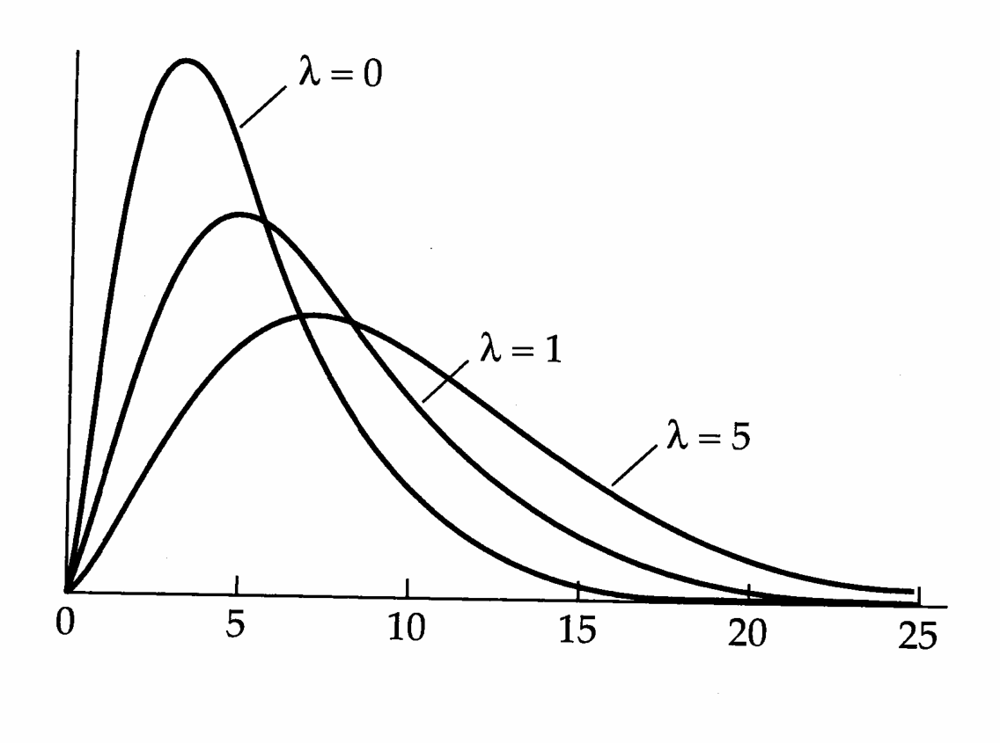

# Chapter 27 · Variance-Component Estimation with Complex Pedigrees

## Genetics_chapter27_001 · Variance-Component Estimation with Complex Pedigrees

In the numerous forms of analysis of variance (ANOVA) discussed in previous chapters, variance components were estimated by equating observed mean squares to expressions describing their expected values, these being functions of the variance components. ANOVA has the nice feature that the estimators for the variance components are unbiased regardless of whether the data are normally distributed, but it also has two significant limitations. First, field observations often yield records on a variety of relatives, such as offspring, parents, or sibs, that cannot be analyzed jointly with ANOVA. Second, ANOVA estimates of variance components require that sample sizes be well balanced, with the number of observations for each set of conditions being essentially equal. In field situations, individuals are often lost, and even the most carefully crafted balanced design can quickly collapse into an extremely unbalanced one. Although modifications to the ANOVA sums of squares have been proposed to account for unbalanced data (Henderson 1953, Searle et al. 1992), their sampling properties are poorly understood.

Unlike ANOVA estimators, maximum likelihood (ML) and restricted maximum likelihood (REML) estimators do not place any special demands on the design or balance of data. Such estimates are ideal for the unbalanced designs that arise in quantitative genetics, as they can be obtained readily for any arbitrary pedigree of individuals. Since many aspects of ML and REML estimation are quite difficult technically, the detailed mathematics can obscure the general power and flexibility of the methods. Therefore, our main concern is to make the theory more accessible to the nonspecialist, and as a consequence, we are not as thorough in our coverage of the literature as in previous chapters. Also, unlike elsewhere in this book, we occasionally rely upon mathematical machinery (such as matrix derivatives) that is not fully developed here (see Appendix 3 for an introduction). This chapter is mathematically difficult in places, and the reader will do well to review some of the advanced topics in Chapter 8 (such as the multivariate normal and expectations of quadratic products) and Appendix 4.

We start at a relatively elementary level, providing a simple example to show how ML and REML procedures can be used to estimate variance components and how these estimates differ. We then develop the ML and REML equations for variance-component estimation under the general mixed model (introduced in Chapter 26). Extension of these methods to multiple traits, wherein full covariance matrices, rather than single variance components, must be estimated, are then reviewed. We conclude our coverage of ML/REML by examining a number of computational methods for solving the ML/REML equations.

ML/REML methods provide a powerful approach to estimating variance components in populations with complex but known pedigrees. In studies of natural populations, however, the relationships between individuals are often uncertain. We close the book with a brief discussion of a new and conceptually simple procedure that yields estimates of variance components using relatedness estimates indirectly inferred from information on molecular markers. This exciting development is of potentially great utility for the quantitative-genetic analysis of natural populations in undisturbed settings.

While our focus is largely on the estimation of additive genetic and environmental variances, we remind the reader that ML/REML analysis can be applied to a wide variety of issues (as was the case with BLUP), including those involving the estimation of nonadditive genetic variances (Henderson 1985b), mutational variances (Wray 1990), genetic covariances across environments (Platenkamp and Shaw 1992), and maternal and cytoplasmic genetic variances (Southwood et al. 1989).

---

## Genetics_chapter27_002 · ML VERSUS REML ESTIMATES OF VARIANCE COMPONENTS

Although algebraically tedious, maximum likelihood (ML) is conceptually very simple. It was introduced to variance component-estimation by Hartley and Rao (1967). For a specified model, such as Equation 26.1, and a specified form for the joint distribution of the elements of y, ML estimates the parameters of the distribution that maximize the likelihood of the observed data. This distribution is almost always assumed to be multivariate normal. An advantage of ML estimators is their efficiency — they simultaneously utilize all of the available data and account for any nonindependence.

One drawback with variance-component estimation via the usual maximum likelihood approach is that all fixed effects are assumed to be known without error. This is rarely true in practice, and as a consequence, ML estimators yield biased estimates of variance components. Most notably (as we show below), estimates of the residual variance tend to be downwardly biased. This bias occurs because the observed deviations of individual phenotypic values from an estimated population mean tend to be smaller than their deviations from the true (parametric) mean. Such bias can become quite large when a model contains numerous fixed effects, particularly when sample sizes are small.

Unlike ML estimators, restricted maximum likelihood (REML) estimators maximize only the portion of the likelihood that does not depend on the fixed effects. In this sense, REML is a restricted version of ML. The elimination of bias by REML is analogous to the removal of bias that arises in the estimate of a variance component when the mean squared deviation is divided by the degrees of freedom instead of by the sample size (Chapter 2, and below). REML does not always eliminate all of the bias in parameter estimation, since many methods for obtaining REML estimates cannot return negative estimates of a variance component. However, this source of bias also exists with ML, so REML is clearly the preferred method for analyzing large data sets with complex structure. In the ideal case of a completely balanced design, REML yields estimates of variance components that are identical to those obtained by classical analysis of variance. Since it was first introduced to breeders by Patterson and Thompson (1971), many thorough references to REML, its justification, and its various applications have been published (Harville 1977; Ott 1979; Henderson 1984b, 1986; Gianola and Fernando 1986; Little and Rubin 1987; Robinson 1987; Searle 1987; Shaw 1987; Searle et al. 1992).

---

## Genetics_chapter27_003 · ML VERSUS REML ESTIMATES OF VARIANCE COMPONENTS / A Simple Example of ML versus REML

In an attempt to make the distinction between ML and REML likelihood equations as simple and transparent as possible, we start with a useful pedagogical connection between ML and REML noticed by Foulley (1993), confining our attention to a very simple application — the estimation of the mean and variance of a set of independent observations. In this case, the mixed model reduces to

$$
\mathbf{y}=\mathbf{1}\boldsymbol{\mu}+\mathbf{e}
\tag{27.1}
$$

where $\mu$ is the population mean (the fixed effect), $1$ is a $n \times 1$ column vector of ones (equivalent to the design matrix $\mathbf{X}$ in Equation 26.1), and the covariance matrix of residuals about the mean is assumed to be $\mathbf{R} = \sigma^2 \mathbf{I}$.

What are the ML estimates of $ \mu $ and $ \sigma^{2} $ based on the n sampled individuals? Assuming the phenotypes are independent of each other and normally distributed, the probability density of the data y conditional on the parametric mean and variance is the product of the n univariate normal densities,

$$
\begin{aligned}p(\mathbf{y}\mid\mu,\sigma^{2})&=\prod_{i=1}^{n}p(y_{i}\mid\mu,\sigma^{2})\\&=(2\pi)^{-n/2}(\sigma^{2})^{-n/2}\exp\left[-\sum_{i=1}^{n}\frac{(y_{i}-\mu)^{2}}{2\sigma^{2}}\right]\end{aligned}
\tag{27.2}
$$

where $ y_{i} $ is the phenotypic value of the ith individual. Taking the natural logarithm of the expression on the right, the log-likelihood (Appendix 4) for the observed data set is

$$
L(\mathbf{y}\mid\mu,\sigma^{2})=-\frac{n}{2}\left[\ln(2\pi)+\ln(\sigma^{2})+\frac{1}{n\sigma^{2}}\sum_{i=1}^{n}\left(y_{i}-\mu\right)^{2}\right]
\tag{27.3a}
$$

Although this is the logarithm of the likelihood of the data given the moments of the normal distribution ( $ \mu $ and $ \sigma^{2} $), it can also be viewed as the log-likelihood of the parameter estimates, $ L(\mu, \sigma^{2} | \mathbf{y}) $, treating the $ y_{i} $ as constants and $ \mu $ and $ \sigma^{2} $ as variables. To obtain estimates of these two distributional parameters, we need at least two observable statistics. Letting

$$
\overline{y}=\frac{1}{n}\sum_{i=1}^{n}y_{i}\qquad and\qquad V=\frac{1}{n}\sum_{i=1}^{n}\left(y_{i}-\overline{y}\right)^{2}
$$

we have

$$
\begin{aligned}\sum_{i=1}^{n}\left(y_{i}-\mu\right)^{2}&=\sum_{i=1}^{n}\left(y_{i}-\overline{y}+\overline{y}-\mu\right)^{2}\\&=\sum_{i=1}^{n}\left(y_{i}-\overline{y}\right)^{2}+\sum_{i=1}^{n}\left(\overline{y}-\mu\right)^{2}+2\left(\overline{y}-\mu\right)\sum_{i=1}^{n}\left(y_{i}-\overline{y}\right)\\&=n\left[V+\left(\overline{y}-\mu\right)^{2}\right]\end{aligned}\quad(2
\tag{27.3b}
$$

Substituting this final expression into Equation 27.3a, the log-likelihood can be expressed as

$$
L(\mu,\sigma^{2}\mid\mathbf{y})=-\frac{n}{2}\bigg[\ln(2\pi)+\ln(\sigma^{2})+\frac{V+\left(\overline{y}-\mu\right)^{2}}{\sigma^{2}}\bigg]
\tag{27.3c}
$$

Differentiating with respect to $ \mu $ and $ \sigma^{2} $ yields

$$
\frac{\partial L(\mu,\sigma^{2}|\mathbf{y})}{\partial\mu}=\frac{n(\overline{y}-\mu)}{\sigma^{2}}
\tag{27.4a}
$$

$$
\frac{\partial L(\mu,\sigma^{2}|\mathbf{y})}{\partial\sigma^{2}}=-\frac{n}{2\sigma^{2}}\left[1-\frac{V+(\overline{y}-\mu)^{2}}{\sigma^{2}}\right]
\tag{27.4b}
$$

By setting these equations equal to zero and solving, we obtain estimators for the population mean and variance that maximize the likelihood function given the observed data y. From Equation 27.4a, we obtain an estimator for the mean that is completely independent of the variance,

$$
\widehat{\mu}=\overline{y}
\tag{27.5a}
$$

where ◠ denotes an estimate. This shows that the standard definition of a sample mean is, in fact, the ML estimate of the parametric value. Unfortunately, the solution to Equation 27.4b,

$$
\widehat{\sigma}^{2}=V+\left(\overline{y}-\mu\right)^{2}
\tag{27.5b}
$$

is not independent of the estimated mean, $ \overline{y} $, unless the estimated mean happens to coincide perfectly with the true mean $ \mu $. The maximum likelihood estimator of $ \sigma^{2} $ is obtained by assuming that the mean is, in fact, estimated without error, yielding

$$
\widehat{\sigma}^{2}=V
\tag{27.5c}
$$

Since the term ignored in Equation 27.5b is necessarily positive, Equation 27.5c gives a downwardly biased estimate of the true variance $ \sigma^{2} $.

REML removes this bias by accounting for the error in the estimation of $ \mu $. From Equation 27.5b, the expected amount by which $ \widehat{\sigma}^{2} $ underestimates $ \sigma^{2} $ is the expected value of $ (\overline{y}-\mu)^{2} $, which is simply the sampling variance of the mean, $ \sigma^{2}/n $. Thus, an improved estimator is

$$
\widehat{\sigma}^{2}=V+E[\left(\overline{y}-\mu\right)^{2}]=V+\frac{\sigma^{2}}{n}
\tag{27.5d}
$$

We cannot, of course, know exactly what this bias is because we do not know $ \sigma^{2} $ with certainty (indeed, we are trying to estimate it). However, the bias is estimable because we have a preliminary estimate of $ \sigma^{2} $, the maximum likelihood estimate V. Thus, starting with the initial estimate of $ \widehat{\sigma}^{2}(0) = V $, a second improved estimate of the variance is

$$
\widehat{\sigma}^{2}(1)=V+\frac{\widehat{\sigma}^{2}(0)}{n}=V+\frac{V}{n}
$$

However, just as this changes the estimate of the variance, it also changes the estimate of $ (\overline{y} - \mu)^2 $. Hence, a third estimate of $ \sigma^2 $ would be

$$
\widehat{\sigma}^{2}(2)=V+\frac{\widehat{\sigma}^{2}(1)}{n}=V+\frac{V+(V/n)}{n}
\tag{27.6a}
$$

$$
\widehat{\sigma}^{2}(t+1)=V+\frac{\widehat{\sigma}^{2}(t)}{n}
\tag{27.6a}
$$

This sequence suggests an iterative approach for estimating the variance,

The final (stable) solution to this equation, $ \widehat{\sigma}^{2} $, is obtained by setting $ \widehat{\sigma}^{2}(t+1) = \widehat{\sigma}^{2}(t) $, yielding

$$
\widehat{\sigma}^{2}=\frac{n}{n-1}V=\frac{\sum_{i=1}^{n}(y_{i}-\overline{y})^{2}}{n-1}
\tag{27.6b}
$$

which is the unbiased estimator of the variance that we normally use (Chapter 2).

To obtain a solution for this particular example, iteration of Equation 27.6a is not really necessary. However, with models containing multiple fixed effects in the form of the vector u, closed solutions such as Equation 27.6b are not usually possible, particularly in complex pedigree analyses involving unbalanced data.

In those cases, as we will see below, iterative procedures can still yield solutions that are asymptotically unbiased.

Note that the REML estimators given by Equations 27.5a and 27.6b were derived under the assumption of normality. That these same solutions can be acquired without reference to any particular distribution (Chapter 2) provides some evidence that REML estimators may often be fairly robust to violations of the normality assumption.

---

## Genetics_chapter27_004 · ML ESTIMATES OF VARIANCE COMPONENTS IN THE GENERAL MIXED MODEL

In light of the fundamental role that the mixed model plays in quantitative genetics, we attempt in this section to give a clear step-by-step development of the maximum likelihood procedures, following the same steps that were used above for the simple model (y = 1μ + e). Although REML is preferred over ML as a method of analysis, we start with ML, since REML estimation can be expressed as an ML problem by a simple linear transform.

as an ML problem by a simple linear transformation.
We start with the general mixed model (Equation 26.1), $ \mathbf{y} = \mathbf{X}\boldsymbol{\beta} + \mathbf{Z}\mathbf{u} + \mathbf{e} $, and we assume that $ \mathbf{u} \sim \text{MVN}(0, \mathbf{G}) $ and $ \mathbf{e} \sim \text{MVN}(0, \mathbf{R}) $. Under this model, $ \mathbf{y} $ is also multivariate normal, with mean $ \mathbf{X}\boldsymbol{\beta} $ and variance-covariance matrix $ \mathbf{V} = \mathbf{Z}\mathbf{G}\mathbf{Z}^{T} + \mathbf{R} $. Recalling the form of the multivariate normal distribution (Equation 8.24), the probability density of the data $ \mathbf{y} $, analogous to that in Equation 27.2, is

$$
p(\mathbf{y}\mid\mathbf{X}\boldsymbol{\beta},\mathbf{V})=(2\pi)^{-n/2}\mid\mathbf{V}\mid^{-1/2}\exp\left[-\frac{1}{2}(\mathbf{y}-\mathbf{X}\boldsymbol{\beta})^{T}\mathbf{V}^{-1}(\mathbf{y}-\mathbf{X}\boldsymbol{\beta})\right]
\tag{27.7a}
$$

The next step, analogous to Equation 27.3a, is to take the natural logarithm of the expression on the right of Equation 27.7a. This yields the log-likelihood of $ \beta $ and V given the observed data (X, y) as

$$
L(\boldsymbol{\beta},\mathbf{V}|\mathbf{X},\mathbf{y})=-\frac{n}{2}\ln(2\pi)-\frac{1}{2}\ln|\mathbf{V}|-\frac{1}{2}(\mathbf{y}-\mathbf{X}\boldsymbol{\beta})^{T}\mathbf{V}^{-1}(\mathbf{y}-\mathbf{X}\boldsymbol{\beta})
\tag{27.7b}
$$

The following discussion considers $\mathbf{u} = \mathbf{a}$ to be the vector of additive genetic (breeding) values. The variance components that we are trying to estimate are embedded within $\mathbf{G}$ and $\mathbf{R}$, and we assume that $\mathbf{G} = \sigma_A^2 \mathbf{A}$, where $\mathbf{A}$ is the additive genetic relationship matrix, and that $\mathbf{R} = \sigma_E^2 \mathbf{I}$, i.e., the residual deviations of different individuals are independent and homoscedastic.

This approach extends readily to the estimation of additional variance components by using the generalized model

$$
\mathbf{y}=\mathbf{X}\boldsymbol{\beta}+\sum_{i=1}^{m}\mathbf{Z}_{i}\mathbf{u}_{i}+\mathbf{e}
\tag{27.8a}
$$

where the m vectors of random effects (uₑ) are assumed to be uncorrelated, with uₑ ∼ MVN(0, σₑ² Bₑ) and Bₑ being a matrix of known constants. This more general model can incorporate estimates of dominance and other nonadditive variances, and maternal effects variances, to name a few (see Chapter 26). The log-likelihood is still given by Equation 27.7b, but now the covariance matrix V consists of m + 1 (unknown) variances,

$$
\mathbf{V}=\sum_{i=1}^{m}\sigma_{i}^{2}\mathbf{Z}_{i}\mathbf{B}_{i}\mathbf{Z}_{i}^{T}+\sigma_{E}^{2}\mathbf{I}
\tag{27.8b}
$$

We now move on to the partial derivatives of the log-likelihood required for the derivation of the ML estimators. Consider first the derivative with respect to the vector of fixed effects, $ \beta $. This derivative involves only the final term of Equation 27.7b, and its procurement is facilitated by using a general result for matrix derivatives. Applying Equation A3.25d,

$$
\frac{\partial\left[(\mathbf{y}-\mathbf{X}\boldsymbol{\beta})^{T}\mathbf{V}^{-1}(\mathbf{y}-\mathbf{X}\boldsymbol{\beta})\right]}{\partial\boldsymbol{\beta}}=-2\mathbf{X}^{T}\mathbf{V}^{-1}(\mathbf{y}-\mathbf{X}\boldsymbol{\beta})
\tag{27.9}
$$

which yields

$$
\frac{\partial L(\boldsymbol{\beta},\mathbf{V}|\mathbf{X},\mathbf{y})}{\partial\boldsymbol{\beta}}=\mathbf{X}^{T}\mathbf{V}^{-1}(\mathbf{y}-\mathbf{X}\boldsymbol{\beta})
\tag{27.10}
$$

Obtaining the partial derivatives with respect to the variances $ \sigma_{A}^{2} $ and $ \sigma_{E}^{2} $ involves two other general results from matrix theory (Searle 1982, pp. 335–336). If M is a square matrix whose elements are functions of a scalar variable x, then

$$
\frac{\partial\ln|\mathbf{M}|}{\partial x}=\mathbf{tr}\left(\mathbf{M}^{-1}\frac{\partial\mathbf{M}}{\partial x}\right)
\tag{27.11a}
$$

$$
\frac{\partial\mathbf{M}^{-1}}{\partial x}=-\mathbf{M}^{-1}\frac{\partial\mathbf{M}}{\partial x}\mathbf{M}^{-1}
\tag{27.11b}
$$

where tr, the trace, denotes the sum of the diagonal elements of a square matrix (Chapter 8). The trace operator appears frequently in this chapter, and the following properties will prove useful

$$
\mathbf{t r}\left(a\mathbf{A}\right)=a\mathbf{t r}\left(\mathbf{A}\right)
\tag{27.12a}
$$

$$
\mathbf{t r}\left(\mathbf{I}_{n}\right)=n
\tag{27.12b}
$$

$$
\mathbf{t r}\left(\mathbf{B}_{n\times m}\mathbf{A}_{m\times n}\right)=\mathbf{t r}\left(\mathbf{A}_{m\times n}\mathbf{B}_{n\times m}\right)
\tag{27.12c}
$$

$$
\mathbf{t r}\left(\mathbf{A}+\mathbf{C}\right)=\mathbf{t r}\left(\mathbf{A}\right)+\mathbf{t r}\left(\mathbf{C}\right)
\tag{27.12d}
$$

where $ I_{n} $ is the $ n \times n $ identity matrix.

Recall that prior to the differentiation of Equation 27.3a, we rewrote the sum of squared deviations of observed mean phenotypes from the population mean in terms of $(y_{i}-\mu)$ and $\overline{y}-\mu$. Performing the analogous changes in matrix form, we find that

$$
\begin{aligned}(\mathbf{y}-\mathbf{X}\boldsymbol{\beta})^{T}\mathbf{V}^{-1}(\mathbf{y}-\mathbf{X}\boldsymbol{\beta})&=(\mathbf{y}-\mathbf{X}\widehat{\boldsymbol{\beta}})^{T}\mathbf{V}^{-1}(\mathbf{y}-\mathbf{X}\widehat{\boldsymbol{\beta}})\\&+(\widehat{\boldsymbol{\beta}}-\boldsymbol{\beta})^{T}\mathbf{X}^{T}\mathbf{V}^{-1}\mathbf{X}(\widehat{\boldsymbol{\beta}}-\boldsymbol{\beta})\end{aligned}
\tag{27.13}
$$

where $\widehat{\beta}$ is the estimate of $\beta$. (This step is not really necessary here, but its incorporation will allow us to see the bias in ML estimates of the variance components, as it did in the previous section.)

Moving now to the derivatives with respect to the variance components, we first assume the simple case of only two unknown variances, typically $ \sigma_E^2 $ and $ \sigma_A^2 $. Writing $ \mathbf{V} $ in terms of these two components, we have $ \mathbf{V} = \sigma_A^2 \mathbf{Z}\mathbf{A}\mathbf{Z}^T + \sigma_E^2 \mathbf{I} $. Using the notation of $ \sigma_i^2 $ to denote the variance component being estimated, we have

$$
\frac{\partial\mathbf{V}}{\partial\sigma_{i}^{2}}=\mathbf{V}_{i}=\left\{\begin{aligned}\mathbf{I}\quad&when\sigma_{i}^{2}=\sigma_{E}^{2}\\ \mathbf{Z}\mathbf{A}\mathbf{Z}^{T}\quad&when\sigma_{i}^{2}=\sigma_{A}^{2}\end{aligned}\right.
\tag{27.14a}
$$

Substituting Equation 27.13 into Equation 27.7b, using Equations 27.11a,b, and letting $ \sigma_{i}^{2} $ denote either $ \sigma_{A}^{2} $ or $ \sigma_{E}^{2} $, we obtain the general equation

$$
\begin{aligned}\frac{\partial L(\boldsymbol{\beta},\mathbf{V}|\mathbf{X},\mathbf{y})}{\partial\sigma_{i}^{2}}&=-\frac{1}{2}\mathbf{tr}(\mathbf{V}^{-1}\mathbf{V}_{i})+\frac{1}{2}(\mathbf{y}-\mathbf{X}\widehat{\boldsymbol{\beta}})^{T}\mathbf{V}^{-1}\mathbf{V}_{i}\mathbf{V}^{-1}(\mathbf{y}-\mathbf{X}\widehat{\boldsymbol{\beta}})\\&\quad+\frac{1}{2}(\widehat{\boldsymbol{\beta}}-\boldsymbol{\beta})^{T}\mathbf{X}^{T}\mathbf{V}^{-1}\mathbf{V}_{i}\mathbf{V}^{-1}\mathbf{X}(\widehat{\boldsymbol{\beta}}-\boldsymbol{\beta})\quad(27)\end{aligned}
\tag{27.14b}
$$

where $\mathbf{V}_i$ is given by Equation 27.14a. Equations 27.10 and 27.14b are directly analogous to Equations 27.4a,b derived above. Note that $\mathbf{V}_i$ is a fixed matrix of known constants, whereas $\mathbf{V} = \sigma_A^2 \mathbf{Z}\mathbf{A}\mathbf{Z}^T + \sigma_E^2 \mathbf{I}$ is a function of the variance-component estimates. More generally, with $m$ random effects plus a residual error (Equation 27.8a), Equation 27.14b holds for each of the $m+1$ variance components with

$$
\frac{\partial\mathbf{V}}{\partial\sigma_{i}^{2}}=\mathbf{V}_{i}=\left\{\begin{aligned}\mathbf{I}&\quad when\sigma_{i}^{2}=\sigma_{E}^{2}\\ \mathbf{Z}_{i}\mathbf{B}_{i}\mathbf{Z}_{i}^{T}&\quad otherwise\end{aligned}\right.
\tag{27.15}
$$

The maximum likelihood (ML) estimators are obtained by setting Equations 27.10 and 27.14b equal to zero and solving. Using Equation 27.10 alone, a little rearranging gives the ML estimate of the vector of fixed effects as

$$
\hat{\boldsymbol{\beta}}=(\mathbf{X}^{T}\hat{\mathbf{V}}^{-1}\mathbf{X})^{-1}\mathbf{X}^{T}\hat{\mathbf{V}}^{-1}\mathbf{y}
\tag{27.16}
$$

Note that this is the BLUE (best linear unbiased estimator) of $ \beta $ obtained in the previous chapter (Equation 26.3). The ML estimators for the variance components are obtained by setting $ \widehat{\beta} = \beta $ in Equation 27.14b, rendering the last term equal to zero. Rearranging, we obtain

$$
\mathbf{t r}(\widehat{\mathbf{V}}^{-1}\mathbf{V}_{i})=(\mathbf{y}-\mathbf{X}\widehat{\boldsymbol{\beta}})^{T}\widehat{\mathbf{V}}^{-1}\mathbf{V}_{i}\widehat{\mathbf{V}}^{-1}(\mathbf{y}-\mathbf{X}\widehat{\boldsymbol{\beta}})
\tag{27.17a}
$$

This equation can be simplified by using the matrix

$$
\mathbf{P}=\mathbf{V}^{-1}-\mathbf{V}^{-1}\mathbf{X}(\mathbf{X}^{T}\mathbf{V}^{-1}\mathbf{X})^{-1}\mathbf{X}^{T}\mathbf{V}^{-1}
\tag{27.17b}
$$

which will appear frequently throughout the rest of the chapter. In particular, we have the very useful result that

$$
\mathbf{P}\mathbf{y}=\mathbf{V}^{-1}\mathbf{y}-\mathbf{V}^{-1}\mathbf{X}(\mathbf{X}^{T}\mathbf{V}^{-1}\mathbf{X})^{-1}\mathbf{X}^{T}\mathbf{V}^{-1}\mathbf{y}=\mathbf{V}^{-1}(\mathbf{y}-\mathbf{X}\widehat{\boldsymbol{\beta}})
\tag{27.17c}
$$

Using this identity, Equation 27.17a can be more compactly written as

$$
\mathbf{t r}(\widehat{\mathbf{V}}^{-1}\mathbf{V}_{i})=\mathbf{y}^{T}\widehat{\mathbf{P}}\mathbf{V}_{i}\widehat{\mathbf{P}}\mathbf{y}
\tag{27.17d}
$$

where we use the notation $ \widehat{\mathbf{P}} $ to remind the reader that $ \mathbf{P} $, being a function of $ \mathbf{V} $, depends on the variance components that we are trying to estimate. Although it may not be immediately apparent, Equation 27.17d is directly analogous to Equation 27.5c. The variance estimates that we wish to obtain, $ \widehat{\sigma}_{A}^{2} $ and $ \widehat{\sigma}_{E}^{2} $, are contained on both sides of Equation 27.17d, embedded in the inverted variance-covariance matrix $ \widehat{\mathbf{V}}^{-1} $ that appears in $ \mathbf{P} $.

In summary, the ML estimates satisfy the solutions to Equation 27.16 (for the fixed effects) and the set of equations for the variance components (Equation 27.17d). For the additive model assumed above, the two variance equations are

$$
\mathbf{t r}(\widehat{\mathbf{V}}^{-1})=\mathbf{y}^{T}\widehat{\mathbf{P}}\widehat{\mathbf{P}}\mathbf{y}\quad\mathrm{f o r~\sigma^{2}_{E}~}
\tag{27.18a}
$$

$$
\mathbf{t r}(\widehat{\mathbf{V}}^{-1}\mathbf{Z A}\mathbf{Z}^{T})=\mathbf{y}^{T}\widehat{\mathbf{P}}\mathbf{Z A}\mathbf{Z}^{T}\widehat{\mathbf{P}}\mathbf{y}\quad\mathrm{f o r~\sigma^{2}_{A}~}
\tag{27.18b}
$$

More generally, with m random effects plus a residual (Equation 27.8a), the set of $ m + 1 $ ML equations for the variances of random effects is

$$
\mathbf{t r}(\widehat{\mathbf{V}}^{-1})=\mathbf{y}^{T}\widehat{\mathbf{P}}\widehat{\mathbf{P}}\mathbf{y}\quad\mathrm{f o r~\sigma^{2}_{E}~}
\tag{27.19a}
$$

$$
\mathbf{t r}(\widehat{\mathbf{V}}^{-1}\mathbf{Z}_{i}\mathbf{B}_{i}\mathbf{Z}_{i}^{T})=\mathbf{y}^{T}\widehat{\mathbf{P}}\mathbf{Z}_{i}\mathbf{B}_{i}\mathbf{Z}_{i}^{T}\widehat{\mathbf{P}}\mathbf{y}\qquad\mathrm{f o r~}\sigma_{i}^{2},1\leq i\leq m
\tag{27.19b}
$$

where $ \hat{P} $ now uses

$$
\widehat{\mathbf{V}}=\sum_{i=1}^{m}\widehat{\sigma}_{i}^{2}\mathbf{Z}_{i}\mathbf{B}_{i}\mathbf{Z}_{i}^{T}+\widehat{\sigma}_{E}^{2}\mathbf{I}
\tag{27.19c}
$$

These solutions have two troublesome properties. First, unlike our simple example at the start of this chapter where there was a closed form estimator for the fixed effect $ \mu $, the ML vector of fixed effects $ \widehat{\beta} $ is a function of the variance-covariance matrix $ \widehat{V} $, which in turn contains the variance components that we wish to estimate. Second, because these solutions involve the inverse of $ \widehat{V} $, they are nonlinear functions of the variance components. As a consequence, there is no simple one-step solution. ML estimation of $ \beta $, $ \sigma_{A}^{2} $, and $ \sigma_{E}^{2} $ requires an iterative procedure, several steps of which are described below.

**[示例 Example]**

> **[UNRESOLVED EXAMPLE: Genetics_chapter27:1]**

---

## Genetics_chapter27_005 · ML ESTIMATES OF VARIANCE COMPONENTS IN THE GENERAL MIXED MODEL / Standard Errors of ML Estimates

Recall from the theory of maximum likelihood (Appendix 4) that standard errors of ML estimates can be obtained from the appropriate elements of the inverse of the Fisher information matrix (F) involving the vector of parameters being estimated ( $ \Theta $). The elements of F are functions of the second derivatives of the log-likelihood function, evaluated by substituting ML estimates of the parameters,

$$
\mathbf{F}_{ij}=-E\left(\frac{\partial^{2}L}{\partial\theta_{i}\partial\theta_{j}}\right)\simeq-\frac{\partial^{2}L}{\partial\theta_{i}\partial\theta_{j}}\ \left|\boldsymbol{\Theta}=\hat{\boldsymbol{\Theta}}\right.
\tag{27.20}
$$

The sampling variance of the ML estimate of the parameter $ \theta_i $ is approximated by $ F_{ii}^{-1} $ (the ith diagonal element of $ F^{-1} $), while the sampling covariance between the ML estimates of $ \theta_i $ and $ \theta_j $ is approximated by $ F_{ij}^{-1} $.

Computing the partials for the mixed model gives the information matrix for the ML estimates of $ \beta $ and $ \sigma^{2} $ (the vector of variance-component estimates) as

$$
\mathbf{F}=\begin{pmatrix}\mathbf{X}^{T}\mathbf{V}^{-1}\mathbf{X}&\mathbf{0}\\ \mathbf{0}&\mathbf{S}\end{pmatrix}
\tag{27.21}
$$

where

$$
S_{i j}=\frac{1}{2}\mathbf{t r}\left(\mathbf{V}^{-1}\mathbf{V}_{i}\mathbf{V}^{-1}\mathbf{V}_{j}\right)
\tag{27.22}
$$

with $ V_{i} $ given by Equation 27.15 (Searle et al. 1992). Inverting gives

$$
\mathbf{F}^{-1}=\left(\begin{array}{cc}{{{\left(\mathbf{X}^{T}\mathbf{V}^{-1}\mathbf{X}\right)^{-1}}}}&{{{0}}} \\{{{0}}}&{{{\mathbf{S}^{-1}}}}\end{array}\right)
\tag{27.23}
$$

Hence,

$$
\sigma(\beta_{i},\beta_{j})=\left(\mathbf{X}^{T}\mathbf{V}^{-1}\mathbf{X}\right)_{i j}^{-1},\quad\sigma(\sigma_{i}^{2},\sigma_{j}^{2})=\left(\mathbf{S}^{-1}\right)_{i j}
\tag{27.24}
$$

The ML estimates for fixed effects are uncorrelated with those for variance components, i.e., $ \sigma(\beta_i, \sigma_j^2) = 0 $.

**[示例 Example]**

> **[UNRESOLVED EXAMPLE: Genetics_chapter27:2]**

---

## Genetics_chapter27_006 · RESTRICTED MAXIMUM LIKELIHOOD

REML is based on a linear transformation of the observation vector y that removes the fixed effects from the model. The simplest way to see how this is done is to imagine a transformation matrix K associated with the design matrix X for the model under consideration such that

$$
\mathbf{K}\mathbf{X}=\mathbf{0}
\tag{27.25}
$$

Applying this transformation matrix to the mixed model yields

$$
\begin{aligned}\mathbf{y}^{*}=\mathbf{K}\mathbf{y}&=\mathbf{K}(\mathbf{X}\boldsymbol{\beta}+\mathbf{Z}\mathbf{a}+\mathbf{e})\\&=\mathbf{K}\mathbf{Z}\mathbf{a}+\mathbf{K}\mathbf{e}\end{aligned}
\tag{27.26a}
$$

The linear contrasts $ y^* $ are equivalent to residual deviations from the estimated fixed effects, akin to using $ y_i^* = y_i - \overline{y} $ in the introductory example used at the start of this chapter. REML estimates of variance components are equivalent to ML estimates of the transformed variables. Thus, we can use the ML solutions outlined above by making the following substitutions:

$$
\mathbf{K}\mathbf{y}\mathrm{~f o r~}\mathbf{y},\quad\mathbf{K}\mathbf{X}=\mathbf{0}\mathrm{~f o r~}\mathbf{X},\quad\mathbf{K}\mathbf{Z}\mathrm{~f o r~}\mathbf{Z},\quad\mathbf{K}\mathbf{V}\mathbf{K}^{T}\mathrm{~f o r~}\mathbf{V}
\tag{27.26b}
$$

While REML appears to require the additional task of finding a matrix K that satisfies Equation 27.25, the REML equations can actually be expressed directly in terms of V, y, and P. This result follows from the very useful identity, proven in Searle et al. (1992), that K satisfies

$$
\mathbf{P}=\mathbf{K}^{T}(\mathbf{K}\mathbf{V}\mathbf{K}^{T})^{-1}\mathbf{K}
\tag{27.27a}
$$

Noting that

$$
(\mathbf{y}^{*})^{T}(\mathbf{V}^{*})^{-1}\mathbf{y}^{*}=(\mathbf{y}^{T}\mathbf{K}^{T})(\mathbf{K}\mathbf{V}\mathbf{K}^{T})^{-1}(\mathbf{K}\mathbf{y})=\mathbf{y}^{T}\mathbf{P}\mathbf{y}
\tag{27.27b}
$$

and substituting the expressions given as 27.26b into Equation 27.17a, after some rearrangement, the ML equations yield the REML estimators,

$$
\mathbf{t r}(\widehat{\mathbf{P}})=\mathbf{y}^{T}\widehat{\mathbf{P}}\widehat{\mathbf{P}}\mathbf{y}\quad\mathrm{f o r~}\sigma_{E}^{2}
\tag{27.28a}
$$

$$
\operatorname{t r}(\widehat{\mathbf{P}}\mathbf{Z}\mathbf{A}\mathbf{Z}^{T})=\mathbf{y}^{T}\widehat{\mathbf{P}}\mathbf{Z}\mathbf{A}\mathbf{Z}^{T}\widehat{\mathbf{P}}\mathbf{y}\qquad\quad\mathrm{f o r~\sigma^{2}_{A}~}
\tag{27.28b}
$$

Note that REML does not return estimates of $ \beta $, since the fixed effects are removed by setting $ \beta^* = 0 $.

Since the transformation $ \mathbf{y}^{*}=\mathbf{K}\mathbf{y} $ satisfying Equation 27.25 solely depends on the design matrix, this general approach still holds with $ m $ uncorrelated random vectors. In this case, Equation 27.8a expands to

$$
\mathbf{y}^{*}=\sum_{i=1}^{m}\mathbf{K}\mathbf{Z}_{i}\mathbf{u}_{i}+\mathbf{K}\mathbf{e}
\tag{27.29}
$$

and the REML equations for the $ m+1 $ variance components become

$$
\mathbf{t r}(\widehat{\mathbf{P}})=\mathbf{y}^{T}\widehat{\mathbf{P}}\widehat{\mathbf{P}}\mathbf{y}\quad\mathrm{f o r~}\sigma_{E}^{2}
\tag{27.30a}
$$

$$
\begin{array}{r}{\mathrm{t r}(\widehat{\mathbf{P}}\mathbf{Z}_{i}\mathbf{B}_{i}\mathbf{Z}_{i}^{T})=\mathbf{y}^{T}\widehat{\mathbf{P}}\mathbf{Z}_{i}\mathbf{B}_{i}\mathbf{Z}_{i}^{T}\widehat{\mathbf{P}}\mathbf{y}\qquad\mathrm{f o r~}\sigma_{i}^{2},~1\leq i\leq m}\end{array}
\tag{27.30b}
$$

where $ \hat{\mathbf{P}} $ is now a function of $ \hat{\mathbf{V}} = \sum \hat{\sigma}_{i}^{2} \mathbf{Z}_{i} \mathbf{B}_{i} \mathbf{Z}_{i}^{T} + \hat{\sigma}_{E}^{2} \mathbf{I} $.

With REML, the information matrix contains only items corresponding to variance-component estimates, so $ \mathbf{F} = \mathbf{S} $, where

$$
S_{i j}=\frac{1}{2}\mathrm{t r}(\mathbf{P}\mathbf{V}_{i}\mathbf{P}\mathbf{V}_{j})
\tag{27.31a}
$$

with $ V_{i} $ given by Equation 27.15. Estimates of the sampling variances and covariances of the variance-component estimates are obtained from the inverse of the matrix S, as described above.

**[示例 Example]**

> **[UNRESOLVED EXAMPLE: Genetics_chapter27:3]**

---

## Genetics_chapter27_007 · RESTRICTED MAXIMUM LIKELIHOOD / Multivariate Analysis

When multiple characters are measured in individuals, the most complete analysis includes all characters, even if our interest is only in a subset of them. Aside from the information provided on the genetic covariances among traits, multivariate analysis can improve the accuracy of variance-component estimates for single traits for the simple reason that correlated characters provide information about each other. Balancing these advantages are computational difficulties that increase with the number of characters under consideration.

Extension of univariate REML to the analysis of multiple traits is straightforward. Suppose $n$ characters are of interest. From our development of multivariate BLUP in the previous chapter, the variance components for the simple additive model now become the elements of the $n \times n$ covariance matrices $\mathbf{C}$ and $\mathbf{E}$ of additive genetic and environmental effects, whose elements are, respectively, denoted by $\sigma_A(i,j)$ and $\sigma_E(i,j)$. Thus, instead of two variances, we are now faced with the estimation of $n(n+1)$ variance-covariance elements. From Chapter 26, for the simple animal model $\mathbf{G} = \mathbf{C} \otimes \mathbf{A}$ and $\mathbf{R} = \mathbf{E} \otimes \mathbf{I}$, where $\otimes$ denotes the Kronecker product, and $\mathbf{A}$ is the relationship matrix. The log-likelihood function for multiple characters is given by Equation 27.7b, with the design matrix $\mathbf{X}$ now constructed as in Equation 26.31, and

$$
\mathbf{V}=\mathbf{G}+\mathbf{R}=\mathbf{C}\otimes\mathbf{A}+\mathbf{E}\otimes\mathbf{I}
$$

While the set of $ n(n+1) $ REML equations can be obtained by differentiating the log-likelihood with respect to each variance/covariance component, the computational demands of multivariate analysis increase rapidly with the number of characters. However, as we saw for multivariate BLUP analysis in Chapter 26, canonical transformation provides an elegant way of reducing an n-dimensional multivariate analysis to n one-dimensional analyses. An additional complexity that arises when this approach is applied to REML is that the transformation matrix Q is a function of C and E, the matrices that we are trying to estimate. As will be seen below, this can generally be accommodated by the iterative procedures that are routinely employed in REML analysis, by starting with some initial estimate of Q, computing C and E by univariate analyses based on this Q, and then using these new estimates to compute a new Q. Further details can be found in Meyer (1985), Schaeffer (1986), Taylor et al. (1985), Jensen and Mao (1988), and Thompson and Hill (1990).

---

## Genetics_chapter27_008 · RESTRICTED MAXIMUM LIKELIHOOD / ML/REML Estimation in Populations under Selection

Selection changes the additive genetic variance of a character by generating gametic phase disequilibria and changing allele frequencies. Thus, genetic variance estimates generated from selected individuals can be quite different from those in the unselected base population from which they descended. Under the infinitesimal model (which assumes the character to be determined by a very large number of loci, each with small effect), changes in the additive genetic variance are entirely due to gametic phase disequilibria. Thus, under this model, once selection is stopped, recombination decays the disequilibria away, returning the additive genetic variance to the level present before selection. Hence, to the extent that this model is approximated in nature, interest is usually in the additive genetic variance in the unselected base population rather than that observed within a set of selected individuals.

Under certain experimental settings, REML variance-component estimates have the unique feature of being uninfluenced by selection. In particular, if the base population consists of unrelated, unselected, and noninbred individuals and phenotypic data are available for all selected and unselected individuals, then REML yields essentially unbiased estimates of the additive genetic variance in the base population (Henderson 1949, Henderson et al. 1959, Curnow 1961, Thompson 1973, Rothschild et al. 1979, Sorensen and Kennedy 1984, Gianola and Fernando 1986, Gianola et al. 1988, Fernando and Gianola 1990). On the other hand, van der Werf and colleagues (van der Werf 1990, van der Werf and de Boer 1990, van der Werf and Thompson 1992) show that when the base population consists of previously selected individuals, REML provides no protection from biased estimates of the additive genetic variance in the population prior to selection, even if the entire pedigree of individuals back to the base population is included. Likewise, if selection acts on a suite of unmeasured characters that are correlated with characters included in the model, REML can generate biased estimates of the variances and covariances of the measured characters (Schaeffer and Song 1978).

Given that the conditions under which REML yields unbiased estimates are likely to be violated in most natural populations, why should such estimates be used? One reason is that, even though imperfect, likelihood methods always at least partially account for biases introduced by selection, in part because the additive genetic relationship matrix A corrects for the pattern of flow of genetic information from generation to generation (Sorensen and Kennedy 1984). Other variance-component estimators, such as those derived from ANOVA, make no such correction.

---

## Genetics_chapter27_009 · SOLVING THE ML/REML EQUATIONS

Because the equations for the ML/REML solutions are highly nonlinear, closed analytical solutions are only available in very special cases (e.g., certain completely balanced designs). In principle, the solutions can be obtained by performing an exhaustive grid search — computing the log-likelihood of the data at each point on a grid covering the entire range of parameter space, and letting the solution be defined by the point on the grid giving the largest log-likelihood. However, this procedure is impractical under ML if $ \beta $ contains more than a few elements, since each element of $ \beta $ adds to the dimensionality of the search. Under REML, the dimensionality of parameter space can be greatly reduced, but the likelihood function is considerably more complicated to compute. Thus, simple grid searches are rarely used by themselves, although they are sometimes used in conjunction with other methods that restrict the search to one or a few dimensions.

A wide variety of iterative techniques for solving ML/REML equations have been proposed based on various modifications of two basic approaches: the Newton-Raphson algorithm and the EM algorithm. Both procedures start with preliminary estimates of the parameters (obtained, for example, by ordinary least-squares analysis), and using information on the slope of the likelihood surface, these estimates are then moved in a direction that increases the log-likelihood of the data. The revised estimates are subsequently modified in an iterative fashion, until a satisfactory degree of convergence on a final set of estimates has been achieved. With these types of approaches, the search for ML/REML solutions avoids spending huge amounts of computational time in regions of low likelihood. Such hill-climbing methods are not guaranteed to converge on the global maximum of the likelihood function, but potential problems with secondary peaks in the likelihood surface can be investigated through the use of different starting values.

Our review of numerical methods for obtaining solutions to the ML/REML equations is intentionally brief, focusing only on the general principles. All of the methods are very intensive computationally when large pedigrees are involved, as they usually require the inversion of large matrices at each step. Detailed reviews of this highly technical area appear in Meyer (1989b), Harville and Callanan (1990), and Searle et al. (1992).

---

## Genetics_chapter27_010 · SOLVING THE ML/REML EQUATIONS / Derivative-based Methods

The Newton-Raphson (NR) algorithm, a standard method for numerically solving coupled sets of nonlinear equations, has been used extensively to solve ML / REML equations (Harville 1977, Jennrich and Sampson 1976, Searle et al. 1992). Specific applications to genetic variance-component estimation include Lange et al. (1977) for ML estimates of additive and dominance variances for single characters and Meyer (1983, 1985) for REML estimates of the additive genetic covariance matrix for multiple characters. We confine our discussion of Newton-Raphson iteration to REML estimates, as applications to ML follow in a similar fashion.

The Newton-Raphson method obtains the REML estimate of the vector of parameters $ \Theta $ by starting with some initial value $ \Theta^{(0)} $ and then iterating to convergence to a final solution by using

$$
\boldsymbol{\Theta}^{(k+1)}=\boldsymbol{\Theta}^{(k)}-\left(\mathbf{H}^{(k)}\right)^{-1}\frac{\partial L}{\partial\boldsymbol{\Theta}}\Bigg|_{\boldsymbol{\Theta}^{(k)}}
\tag{27.32}
$$

where $\partial L/\partial \boldsymbol{\Theta}$ is a column vector of the partials of the log-likelihood function with respect to each parameter evaluated at the estimate $\boldsymbol{\Theta}^{(k)}$, and $\mathbf{H}$ is the Hessian matrix of all second-order partial derivatives of the log-likelihood L with respect to the variance components. $ \mathbf{H}^{-1} $ and $ \partial L/\partial \Theta $ respectively provide measures of the curvature and the slope (and directionality) of the likelihood surface, given the current estimates. Their product gives a projected degree of movement of the vector $ \Theta $ towards an improved set of values to be used in the next iteration.

Consider again the mixed model with m random factors plus a residual,

$$
\mathbf{y}=\mathbf{X}\boldsymbol{\beta}+\sum_{i=1}^{m}\mathbf{Z}_{i}\mathbf{u}_{i}+\mathbf{e}
$$

where $\mathbf{u}_i \sim \text{MVN}(\mathbf{0}, \sigma_i^2 \mathbf{B}_i)$ for $1 \leq i \leq m$, and $\mathbf{B}_i$ is a square symmetric $n_i \times n_i$ matrix of known constants. The residuals are also assumed to be multivariate normal with $\mathbf{e} \sim \text{MVN}(\mathbf{0}, \sigma_E^2 \mathbf{I})$. Since $\mathbf{y}$ is the sum of multivariate normals, it is also multivariate normal with $\mathbf{y} \sim \text{MVN}(\mathbf{X}\boldsymbol{\beta}, \mathbf{V})$, where

$$
\mathbf{V}=\sum_{i=1}^{m}\sigma_{i}^{2}\mathbf{Z}_{i}\mathbf{B}_{i}\mathbf{Z}_{i}^{T}+\sigma_{E}^{2}\mathbf{I}
$$

Under REML, $ \boldsymbol{\Theta} = (\sigma_{1}^{2}, \sigma_{2}^{2}, \cdots, \sigma_{E}^{2})^{T} $ and Equations 27.14b and 27.27b give the elements of $ \partial L/\partial \boldsymbol{\Theta} $ as

$$
\left.\frac{\partial L}{\partial\sigma_{i}^{2}}\right|_{\pmb{\Theta}^{(k)}}=-\frac{1}{2}\mathrm{t r}\left(\mathbf{P}^{(k)}\mathbf{V}_{i}\right)+\frac{1}{2}\mathbf{y}^{T}\mathbf{P}^{(k)}\mathbf{V}_{i}\mathbf{P}^{(k)}\mathbf{y}
\tag{27.33}
$$

where $ V_i $ is given by Equation 27.15 and $ \mathbf{P}^{(k)} $ is calculated from Equation 27.17b using the current variance-component estimates in $ \boldsymbol{\Theta}^{(k)} $. Searle et al. (1992) give the elements of $ \mathbf{H} $ for REML as

$$
\mathbf{H}_{i j}^{(k)}=\frac{\partial^{2}L}{\partial\sigma_{i}^{2}\partial\sigma_{j}^{2}}=\frac{1}{2}\mathbf{t r}\left(\mathbf{P}^{(k)}\mathbf{V}_{i}\mathbf{P}^{(k)}\mathbf{V}_{j}\right)-\mathbf{y}^{T}\mathbf{P}^{(k)}\mathbf{V}_{i}\mathbf{P}^{(k)}\mathbf{V}_{j}\mathbf{P}^{(k)}\mathbf{y}
\tag{27.34}
$$

where again the partials are evaluated using $ \Theta^{(k)} $

A common variant of the Newton-Raphson algorithm is Fisher’s scoring method, which replaces the inverse of the Hessian matrix in Equation 27.32 by its expected value, which after allowing for a change in sign, turns out to be defined by the inverse of Fisher’s information matrix, $ -\mathbf{F}^{-1} $ (Equation 27.20). This reduces the iterative equation to

$$
\boldsymbol{\Theta}^{(k+1)}=\boldsymbol{\Theta}^{(k)}+\left(\mathbf{F}^{(k)}\right)^{-1}\frac{\partial\boldsymbol{L}}{\partial\boldsymbol{\Theta}}\Bigg|_{\boldsymbol{\Theta}^{(k)}}
\tag{27.35a}
$$

with

$$
F_{i j}^{(k)}=\frac{1}{2}\mathbf{t r}\big(\mathbf{P}^{(k)}\mathbf{V}_{i}\mathbf{P}^{(k)}\mathbf{V}_{j}\big)
\tag{27.35b}
$$

There are several motivations for employing this modification. First, as noted above, the inverse of the information matrix, when evaluated at the REML values, estimates the standard errors for these estimates. Second, F is easier to compute than $ \mathbf{H}^{-1} $ (compare Equations 27.34 and 27.35b). Finally, Fisher's scoring method appears to be slightly more robust to initial values than strict Newton-Raphson iteration (Jennrich and Sampson 1976).

**[示例 Example]**

> **[UNRESOLVED EXAMPLE: Genetics_chapter27:4]**

---

## Genetics_chapter27_011 · SOLVING THE ML/REML EQUATIONS / EM Methods

The idea behind the EM (expectation/maximization) algorithm for variance-component analysis is that if we knew the values of the random effects, we could estimate the variances in a simple fashion directly from them. Focusing on the general mixed model defined by Equation 27.8a, the variances of the random and residual effects are defined respectively to be

$$
\sigma_{i}^{2}=\frac{E[\mathbf{u}_{i}^{T}\mathbf{B}_{i}^{-1}\mathbf{u}_{i}]}{n_{i}}
\tag{27.36a}
$$

$$
\sigma_{E}^{2}=\frac{E[\mathbf{e}_{i}^{T}\mathbf{e}_{i}]}{n}
\tag{27.36b}
$$

where $n$ and $n_{i}$ are, respectively, the number of elements in e and $\mathbf{u}_{i}$. Equation 27.36a follows from Equation 8.22, which, since $E[\mathbf{u}_{i}] = \mathbf{0}$, reduces to

$$
E[\mathbf{u}_{i}^{T}\mathbf{B}_{i}^{-1}\mathbf{u}_{i}]=\mathbf{t r}(\mathbf{B}_{i}^{-1}\sigma_{i}^{2}\mathbf{B}_{i})=\sigma_{i}^{2}\mathbf{t r}(\mathbf{I}_{n_{i}})=n_{i}\sigma_{i}^{2}
\tag{27.36b}
$$

The last two steps follow from Equations 27.12a and 27.12b, respectively. Equation 27.36b follows in a similar fashion. In actuality, of course, we only know y, not the underlying vectors of random effects $ (u_i) $ or residual deviations (e).

Underlying the EM algorithm is the idea, discussed in Chapter 26, that the information in y provides a basis for making predictions about the elements of $ u_{i} $ and e. In the context of variance-component analysis, we need to go a step beyond BLUP estimation of $ u_{i} $ and e, as it is actually the quadratic products of $ u_{i} $ and e in the numerators of Equations 27.36a,b that we need to predict. Here, in the interest of clarity and space, we skip over a number of steps to the final solution (see Searle et al. 1992, pp. 297–304 for a complete derivation). Searle et al. show that the conditional distribution of u given the observed y is MVN, with

$$
E[\mathbf{u}_{i}\mid\mathbf{y}]=\sigma_{i}^{2}\mathbf{Z}_{i}^{T}\mathbf{V}^{-1}(\mathbf{y}-\mathbf{X}\boldsymbol{\beta})=\sigma_{i}^{2}\mathbf{Z}_{i}^{T}\mathbf{P}\mathbf{y}
$$

and

$$
\sigma^{2}(\mathbf{u}_{i}\mid\mathbf{y})=\sigma_{i}^{2}\mathbf{I}_{n_{i}}-\sigma_{i}^{4}\mathbf{Z}_{i}^{T}\mathbf{V}^{-1}\mathbf{Z}_{i}
\tag{27.37a}
$$

Substituting into Equation 8.22, after some simplification, the expectation of the quadratic product in Equation 27.36a, conditional on the observed y, becomes

$$
E[\mathbf{u}_{i}^{T}\mathbf{B}_{i}^{-1}\mathbf{u}_{i}\mid\mathbf{y}]=n_{i}\sigma_{i}^{2}+\sigma_{i}^{4}\left[\mathbf{y}^{T}\mathbf{P}\mathbf{V}_{i}\mathbf{P}\mathbf{y}-\mathbf{t r}(\mathbf{P}\mathbf{V}_{i})\right]
\tag{27.37a}
$$

where $ \mathbf{V}_i = \mathbf{Z}_i \mathbf{B}_i \mathbf{Z}_i^T $ as given by Equation 27.15. Similar logic gives

$$
E[\mathbf{e}^{T}\mathbf{e}\left|\mathbf{y}\right]=n\sigma_{E}^{2}+\sigma_{E}^{4}\left[\mathbf{y}^{T}\mathbf{P}\mathbf{P}\mathbf{y}-\mathbf{t r}(\mathbf{P})\right]
\tag{27.37b}
$$

These expressions define expected quadratic values, conditional on the particular set of observations y, under the assumption that the true variance components are known. The astute reader will immediately notice that our problem has hardly been solved, since we are trying to estimate the variance components.

The EM algorithm (Dempster et al. 1977) attempts to circumvent this problem by starting with some initial estimates of the variance components, and then substituting these as well as y into Equations 27.37a,b to obtain estimates of the quadratic products. These latter estimates are then substituted into Equations 27.36a,b to obtain improved estimates of the variance components, and then the entire process is repeated again and again until satisfactory convergence has been achieved. Defining the quantities estimated by Equations 27.37a,b in the kth iteration as $ \widehat{q}_i^{(k)} $, and $ \widehat{q}_E^{(k)} $, the EM algorithm can be summarized as follows: (1) the E step computes the expected quadratic products conditional upon $ \mathbf{y} $, $ \widehat{q}_i^{(k)} $, and $ \widehat{q}_E^{(k)} $, and (2) the M step substitutes these conditional expectations into the maximum likelihood estimators (Equations 27.36a,b) to generate the next round of REML variance-component estimates, $ (\widehat{\sigma}_E^2)^{(k+1)} $ and $ (\widehat{\sigma}_i^2)^{(k+1)} $, which are then applied to the next E step. The final REML estimates are achieved when $ (\widehat{\sigma}_E^2)^{(k)} \simeq (\widehat{\sigma}_E^2)^{(k+1)} $ and $ (\widehat{\sigma}_i^2)^{(k)} \simeq (\widehat{\sigma}_E^2)^{(k+1)} $.

That estimates obtained via the EM algorithm do indeed correspond to the REML solutions can be seen by recalling the REML Equations 27.30a,b. Upon convergence of the EM algorithm, the terms in brackets on the right sides of Equations 27.37a,b must be equal to zero, which is equivalent to the REML solutions. When convergence is reached, the estimates of the variance components are used to obtain the final estimate of $ \widehat{V} $, and the vector of fixed effects is then estimated by

$$
\hat{\boldsymbol{\beta}}=(\mathbf{X}^{T}\hat{\mathbf{V}}^{-1}\mathbf{X})^{-1}\mathbf{X}^{T}\hat{\mathbf{V}}^{-1}\mathbf{y}
$$

In general, solutions via the EM algorithm can take considerably more iterations to converge than those via Newton-Raphson iteration, especially when heritabilities are low. Moreover, as with the Newton-Raphson algorithm, the EM algorithm is by no means guaranteed to converge on the REML solution; it sometimes generates multiple solutions for different starting conditions (Groeneveld and Kovac 1990b). Such problems can result from multiple peaks in the likelihood surface. Since the EM method in essence uses the first derivatives of the likelihood function to adjust the variance-component estimates (compare Equation 27.33 and the terms in brackets in Equations 27.37a,b), it can get stuck on inflection points in the likelihood surface as well. Rounding errors can also compromise the iterative solutions (Boichard et al. 1992). As in the case of derivative-based methods, many of these problems can be minimized by performing multiple analyses from different starting points.

**[示例 Example]**

> **[UNRESOLVED EXAMPLE: Genetics_chapter27:5]**

---

## Genetics_chapter27_012 · SOLVING THE ML/REML EQUATIONS / Additional Approaches

Aside from its technical complexities, one of the major limitations of the EM algorithm for variance-component estimation is the huge computational demand imposed by the need to invert the V matrix each iteration. Thus, several attempts have been made to develop EM-like algorithms that circumvent the inversion of V. For example, Smith and Graser (1986) and Graser et al. (1987) propose a method wherein $ \lambda = \sigma_A^2 / \sigma_E^2 $ is assumed to be fixed and then, conditional on this $ \lambda $, an ML estimate of $ \sigma_E^2 $ is obtained. With this estimate of $ \sigma_E^2 $ in hand, a search is then performed to obtain a new maximum likelihood estimate of $ \lambda $, and the method is repeated until the estimates of $ \lambda $ and $ \sigma_E^2 $ stabilize. Meyer (1991) extends this method to multiple characters by performing a grid search over a larger parameter space.

An alternative method was developed by Thompson and Shaw (1990, 1992) for both univariate and multivariate applications of the animal model. Conventional application of the EM algorithm does the equivalent of estimating the breeding values of each individual conditional on the entire set of observations. The key to the Thompson-Shaw method is the computation of expected breeding values, which are taken to be conditional only on local pedigrees (the individual, its parents and offspring, and its mate) and on the variance-component estimates from the previous iteration. With this approach, the V matrix that needs to be inverted for each individual contains only the members of the local pedigree, and this submatrix is diagonal since, within a pedigree containing only parents and offspring, breeding values differ only because of random segregation. Additional simplifications of the EM equations are presented by Thompson and Shaw.

---

## Genetics_chapter27_013 · A MOLECULAR-MARKER-BASED METHOD FOR INFERRING VARIANCE COMPONENTS

One of the greatest technical limitations of all methods for estimating genetic variance components is their requirement for pairs of individuals of known relatedness. Except in humans, some animals in zoological parks, and some domesticated species, relationships of free-ranging individuals are generally unknown, and even in the best situations, paternity is often uncertain. Thus, almost all quantitative-genetic analyses are performed in artificial settings where the investigator has control of matings. When such settings are imposed on progeny of individuals derived from natural populations, uncertainty always remains as to the relevance of the observed results to the field situation, because changes in the environment can induce changes in variance components. As discussed in Chapter 17, some attempts have been made to circumvent this difficulty by comparing the phenotypes of wild-caught parents to those of lab-reared progeny, but such approaches can only be applied to species that can be readily raised in controlled settings, and even in these cases, the results can be biased. The ideal setting for any quantitative-genetic analysis of a natural population is the noninvasive procurement of phenotypic information from random individuals of known relatedness.

In principle, the absence of direct observations on relationships can be overcome by utilizing information recorded from molecular markers. Several methods have been suggested for the estimation of pairwise values of the coefficients of coancestry ( $ \Theta_{ij} $) and fraternity ( $ \Delta_{ij} $) from information on shared alleles at codominant marker loci (Thompson 1975, Lynch 1988c, Queller and Goodnight 1989, Ritland 1996a). These estimators are not necessarily very efficient unless large numbers of polymorphic loci are assayed, but most of them do provide unbiased estimates. Ritland (1996b) made the clever leap of showing how estimates of pairwise relatedness can be combined with estimates of pairwise phenotypic similarity to generate estimates of variance components in undisturbed natural populations. Ritland's method, the fundamentals of which we briefly outline below, is conceptually very simple.

Recall that the basic premise underlying all conventional methods for estimating the additive genetic variance of a trait is the fact that, for a character with a purely additive-genetic basis, the phenotypic covariance between relatives (i and j) has expected value $ 2\Theta_{ij}\sigma_{A}^{2} $. Define the phenotypic similarity of two individuals with phenotypes $ z_{i} $ and $ z_{j} $ to be

$$
s_{ij}=(z_{i}-\bar{z})(z_{j}-\bar{z})
\tag{27.38}
$$

where $ \bar{z} $ is the mean phenotype in the population. Since this expression is in the form of a phenotypic covariance, under the purely additive model (assuming random mating and no shared environmental effects, and an accurate estimate of $ \bar{z} $), the expected value of $ s_{ij} $ is simply $ 2\Theta_{ij}\sigma_{A}^{2} $. Thus, with a collection of individuals, the observed phenotypic similarity can be written in the form of a linear model,

$$
s_{i j}=2\widehat{\Theta}_{i j}\sigma_{A}^{2}+e_{i j}
\tag{27.39}
$$

where $ \widehat{\Theta}_{ij} $ is the estimated value of $ \Theta_{ij} $ for the two individuals, and $ e_{ij} $ is the residual deviation of the observed similarity from its expectation. This expression assumes that the marker loci are in gametic phase equilibrium with the loci underlying the quantitative trait.

Equation 27.39 suggests that an estimate of the narrow-sense heritability, $ \sigma_{A}^{2}/\sigma_{z}^{2} $, can be procured by regressing pairwise measures of phenotypic similarity on estimates of the coefficient of coancestry (with half the slope providing the estimate of $ \sigma_{A}^{2} $, and the observed phenotypic variance in the population Var(z) providing the estimate of $ \sigma_{z}^{2} $). This idea is closely related to the logic underlying the Haseman-Elston regression in QTL analysis (Chapter 16).

Because the $ \widehat{\Theta}_{ij} $ are only estimates (and often rather inaccurate ones), a conventional least-squares analysis would lead to downwardly biased estimates of $ \sigma_{A}^{2} $ as a consequence of the inflated estimate of the variance of relatedness. Rit-land (1996b) outlines a method that provides an estimate of $ \sigma_{\Theta}^{2} $, the actual variance of relatedness, which excludes the sampling variance resulting from the use of a finite number of marker loci. Letting $ \operatorname{Var}(\Theta) $ be the estimated actual variance of relatedness and $ \operatorname{Cov}(s, \widehat{\Theta}) $ be the covariance of phenotypic similarity and estimated relatedness, the heritability can be estimated by

$$
\widehat{h}^{2}=\frac{\operatorname{Cov}(s,\widehat{\Theta})}{2\operatorname{Var}(\Theta)\operatorname{Var}(z)}
\tag{27.40}
$$

under the assumptions of the ideal additive model.

This general strategy can be easily extended to the estimation of genetic correlations among traits. For two characters (x and y), the analog of phenotypic similarity is

$$
s_{xy,ij}=\frac{\left(z_{x,i}-\bar{z}_{x}\right)\left(z_{y,j}-\bar{z}_{y}\right)+\left(z_{y,i}-\bar{z}_{y}\right)\left(z_{x,j}-\bar{z}_{x}\right)}{2}
\tag{27.41}
$$

which has the same form as a phenotypic covariance between traits. An estimate of the additive genetic covariance can be obtained by the regression of the $ s_{xy,ij} $ on $ \widehat{\Theta}_{ij} $. Letting the regression slopes involving the $ s_{xy,ij} $, $ s_{xx,ij} $, and $ s_{yy,ij} $, be $ b_{xy} $, $ b_{x} $, and $ b_{y} $, respectively, the additive genetic correlation is then estimated by

$$
r_{A}=\frac{b_{xy}}{\sqrt{b_{x}b_{y}}}
\tag{27.42}
$$

A useful feature of this approach is that, unlike the situation with heritability estimation, a corrected estimate of the variance of relatedness is not required.

Although the three raw regression coefficients are biased, the proportional bias is identical for all three and cancels out in Equation 27.42.

Ritland’s method provides an exciting potential framework for the quantitative-genetic analysis of natural populations, especially for species that are difficult to perform controlled matings on and/or to raise in the lab. In preliminary applications with two populations of the yellow monkeyflower (Mimulus guttatus), with 300 individuals assayed per population at 10 polymorphic loci, significant heritabilities and strong positive genetic correlations were obtained for a variety of characters associated with fitness (Ritland and Ritland 1996). Interestingly, lab-based estimates of $ h^{2} $ using individuals of known relatedness were often substantially lower than those obtained in the field with the marker-based technique. This suggests that heritabilities in the wild are not always depressed, contrary to the conventional wisdom.

A number of important technical aspects of this technique remain to be explored. First, there is the practical issue of the spatial scale on which to sample individuals. Successful application of the technique requires the presence of adequate variance of actual relatedness among pairs of sampled individuals. With too large an average distance between sampled individuals, nearly all individuals will be essentially unrelated, and the marker-based approach will have no power. The scale beyond which this becomes important will depend on the average dispersal distances of individuals in the species under consideration. For this reason, the technique will presumably prove much more useful with sedentary plants than with mobile animals. On the other hand, with too small a spatial scale of sampling, some phenotypic similarity is likely to arise from the sharing of common environments. Ritland (1996b) outlines how the inclusion of geographic distance between individuals in the model can allow for the factoring out of phenotypic covariance due to shared environments.

Second, as outlined above, the model ignores the contribution of nonadditive gene action to phenotypic similarity. However, Ritland (1996b) shows how the model can be readily extended to the joint estimation of additive and dominance genetic variances, using the simple idea that in the presence of dominance, the genetic covariance between individuals is $ 2\Theta_{ij}\sigma_{A}^{2}+\Delta_{ij}\sigma_{D}^{2} $. Applications of the model with dominance involve the regression of phenotypic similarity on estimates of both $ \Theta_{ij} $ and $ \Delta_{ij} $.

Third, the marker-based approach to variance-component analysis raises a number of basic statistical issues. The linear modeling approach taken by Ritland (1996b) would appear to be only one of several alternative estimation methods. In the context of all of the other methods outlined for complex-pedigree analysis in this chapter, Ritland’s method is equivalent to partitioning all pairs of measured individuals into discrete classes based on $ \Theta_{ij} $, and then simply regressing phenotypic similarity on $ \Theta $, ignoring the nonindependence of the data (the very complexity that REML is designed to deal with). However, rather than transforming the phenotypic data to pairwise measures of similarity prior to analysis, one could conceivably work directly with the individual data in a REML-like framework, as described above. In this case, the elements of the relationship matrix A would be estimates rather than actual measures of relatedness. This alternative approach would partially account for the nonindependence of data, which might in turn lead to more efficient estimators for the variance components. On the other hand, it is unclear how sampling variance of relatedness, assumed to be zero in conventional REML analysis, would influence the parameter estimates. The central point is that there seem to be underlying similarities between the statistical issues raised with Ritland's method and with REML analysis as conventionally applied by animal breeders.

Finally, it is unclear how sensitive the results from Ritland’s method are to the presence of linkage between QTLs and marker loci. Even if all loci are in gametic phase equilibrium in the survey population, unless they are unlinked, they will be nonindependent in restricted regions of the pedigree (Chapters 14–16). This suggests that the residual errors in estimates of $ \Theta_{ij} $ will not be independent of those in $ s_{ij} $ if the marker loci are linked to QTLs influencing the trait. An interesting avenue for future investigation is whether the joint distribution of molecular-marker and phenotype information can be used to partition the total genetic variance into components associated with linked vs. unlinked QTLs.

---

## Genetics_chapter27_014 · A MOLECULAR-MARKER-BASED METHOD FOR INFERRING VARIANCE COMPONENTS / Appendices

**[Source_image]**

---
