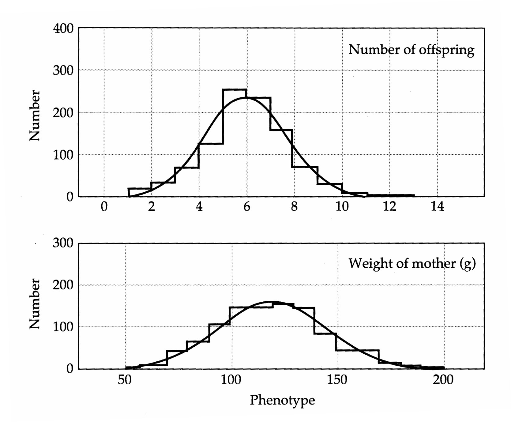
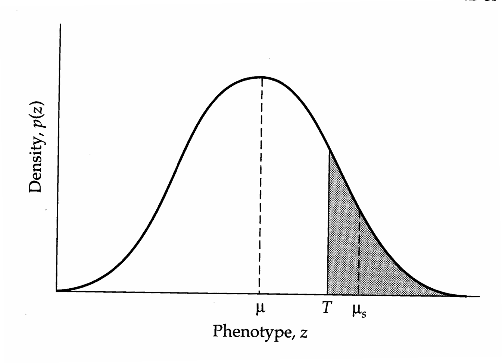
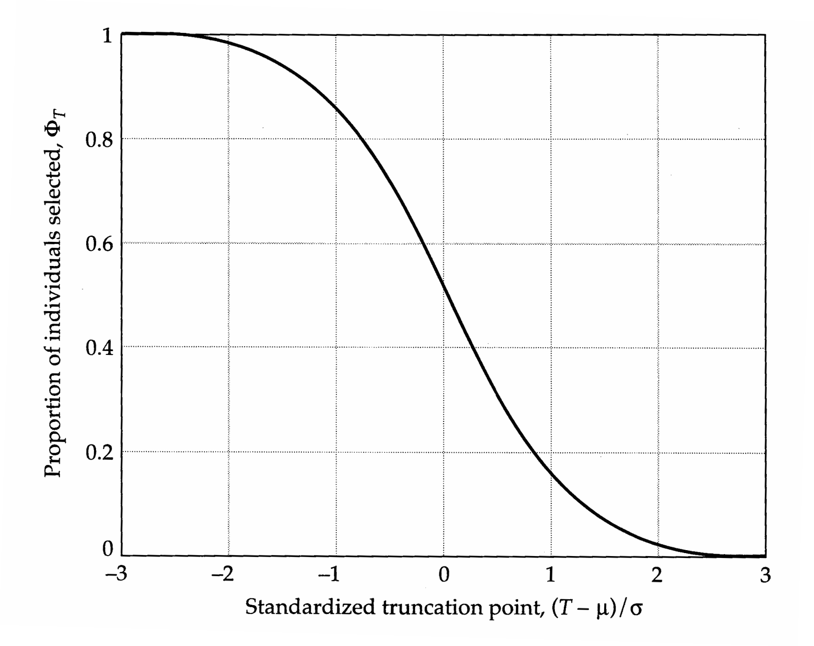
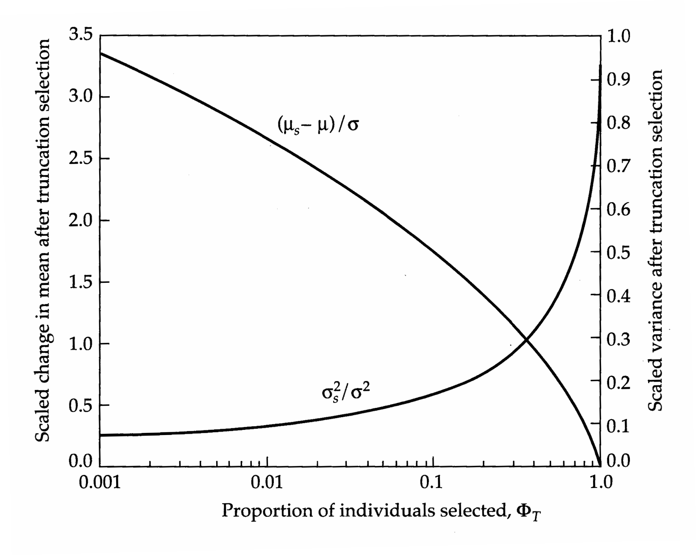

# Chapter 2 · Properties of Distributions

## Genetics_chapter2_001 · Properties of Distributions

Before delving into the genetics of quantitative variation, it is essential to have a basic understanding of statistics. The statistical concepts and techniques most frequently encountered in quantitative genetics are presented in this and the following chapter. For the reader with advanced training in statistical theory, much of what follows will probably be review, and some things may appear to be presented in a nonrigorous manner. Even so, it may still be profitable to skim the following pages to become familiar with the notation that will be used throughout the book. As an additional reward, a number of examples will provide some immediate contact with the field of quantitative genetics.

---

## Genetics_chapter2_002 · PARAMETERS OF THE UNIVARIATE DISTRIBUTIONS

Characters that are studied by biologists are of three types. Traits that are distributed into a range of discrete classes, such as scale counts in fish or leaf number in plants, are called meristic characters. Those that are measured on a continuous scale are known as metric characters. Length, weight, and growth rate attributes are examples of the latter. Attributes such as survival to a fixed age are known as all-or-none or binary characters. Of course, due to technical limitations, even measures of truly continuously distributed traits must always be artificially placed into discrete categories. Meter sticks, for example, are unable to distinguish between individuals that are 25.2 and 25.3 mm in length. Both would typically be placed in the 25–26 mm category, although the biological reality is that every conceivable length in the 25–26 mm range is possible.

Suppose that one performs a series of measurements on a collection of individuals. Compilation of the data provides some information on the relative incidence of different trait measures. A univariate distribution describes the relative frequencies of phenotypes for a single trait, whereas a bivariate distribution describes the mutual distribution of two characters. The joint distribution of more than two traits is referred to as a multivariate distribution. An example of a bivariate distribution for maternal weight and number of offspring is given for a population of rats in Table 2.1. The data are condensed into the univariate marginal distributions of the two traits in the last row and column.

**[Table]**

*[See Table 2.1 at the end of this section.]*

One of the goals of statistics is to fit fairly simple mathematical functions, known as probability distributions, to data. If a variable $z$ takes on only discrete values (as with offspring number), the distribution of $z$ is completely described by giving $P(z = z_i)$ for each possible outcome $z_i$, where $P$ stands for probability. For example, for offspring number, letting $z_1 = 1$, then $P(z = z_1)$ is the proportion of mothers that produce a single offspring, which for the example in Table 2.1 is 15/1003. Summing over all possible outcomes, $\sum_i P(z = z_i) = 1$, since the total probability of all possible events is one.

If, on the other hand, $z$ is a continuously distributed variable (as with maternal weight), $P(z = z_i)$ makes no sense since the probability that $z$ takes on any specific value is infinitesimally small. It is more meaningful to consider the probability that $z$ lies within a specific range of values, say $z_1$ and $z_2$. This quantity is described by the probability density function $ p(z) $, which satisfies the integral

$$
P(z_{1}\leq z\leq z_{2})=\int_{z_{1}}^{z_{2}}p(z)dz
\tag{2.1}
$$

If $z_{min}$ and $z_{max}$ are the upper and lower bounds to $z$, then $p(z) = 0$ outside of this range, and over the entire range $\int_{z_{min}}^{z_{max}} p(z) dz = 1$. Both of these properties are in accord with common sense — a probability is never negative, and the total probability of all possible outcomes is one. A large number of functions fulfill these properties, and they have been studied in considerable detail (Johnson and Kotz 1970a,b, 1972; Kendall and Stuart 1977).

**[示例 Example]**

> **Example 1** · ref: `Genetics_chapter2:1` · source: `Genetics_chapter2_002.json` · blocks 7–14
>
> Example 1. Suppose that z is continuously distributed in the range of 0 to $ \infty $ with probability density function
> 
> $$
> p(z)=\frac{1}{\lambda}e^{-z/\lambda}
> $$
> 
> 
> This is the negative exponential distribution in which the density has a maximum at $z = 0$ and declines to zero as $z \to \infty$. Since the integral of $p(z)$ is $-e^{-z/\lambda}$,
> 
> $$
> \int_{0}^{\infty}p(z)dz=\left.-e^{-z/\lambda}\right|_{0}^{\infty}=0-\left(-1\right)=1
> $$
> 
> 
> showing that $ p(z) $ fulfills the properties of a probability density.
> 
> What is the probability that a randomly drawn individual will have z in the range of 1/4 to 1/2?
> 
> $$
> P(1/4\leq z\leq1/2)=\int_{1/4}^{1/2}p(z)dz=-e^{-z/\lambda}\bigg|_{1/4}^{1/2}=e^{-1/(4\lambda)}-e^{-1/(2\lambda)}
> $$
> 
> 
> The numerical answer depends on the parameter $ \lambda $. If, for example, $ \lambda = 1/2 $, then $ P(1/4 \leq z \leq 1/2) = 0.239 $.

Before moving on, we emphasize the importance of distinguishing between true parameters of distributions and estimates of those parameters obtained by sampling. True parameter values can only be obtained if every member of a population is measured with absolute accuracy. We must therefore almost always settle for approximations, the accuracy of which depends on the experimental setting, the measurement apparatus, and the sample size. Statisticians often denote parameters of a population with Greek symbols and to sample estimates with

Roman symbols. We will adhere to this protocol as much as possible, although there will be some instances where traditional quantitative-genetic notation prevents us from doing so.

The most useful probability density functions are defined completely by one or two parameters describing the central location and dispersion of the distribution. The most widely used measure of the location is the arithmetic mean, $ \mu $, also known as the first moment about the origin. If $ p(z) $ is the probability density function of phenotype z, then weighting all values of z by their density leads to

$$
\mu=\int_{-\infty}^{+\infty}z p(z)dz=E(z)
\tag{2.2}
$$

where $ E(z) $ denotes the expected value or expectation of z. Here, we have arbitrarily put the limits $ \pm\infty $ on the integral to ensure that the entire range of variation is covered. For discrete characters, $ \mu = E(z) = \sum_{i} z_{i}P(z = z_{i}) $. For a character denoted by z, the sample estimate of the mean is generally denoted by $ \bar{z} $, and estimated as the average of the n measures,

$$
\bar{z}=\frac{1}{n}\sum_{i=1}^{n}z_{i}
$$

**[示例 Example]**

> **Example 2** · ref: `Genetics_chapter2:2` · source: `Genetics_chapter2_002.json` · blocks 21–23
>
> Example 2. What is the mean of the distribution discussed in Example 1? Since the integral of $ (z/\lambda)e^{-z/\lambda} $ is $ -(z+\lambda)e^{-z/\lambda} $,
> 
> $$
> \mu=\int_{0}^{\infty}z p(z)dz=-(z+\lambda)e^{-z/\lambda}\bigg|_{0}^{\infty}=\lambda
> $$
> 
> 
> Thus, the parameter $ \lambda $ is the mean of the distribution defined by the density function $ p(x) = (1/\lambda) e^{-z/\lambda} $.

Higher-order moments provide measures of the dispersion of a frequency distribution. The most familiar and useful such measure is the population variance (a term introduced in Fisher’s 1918 paper). Also known as the second moment about the mean, the variance is the expected squared deviation of an observation from its mean,

$$
\sigma^{2}=\int_{-\infty}^{+\infty}\left(z-\mu\right)^{2}p(z)dz=E\left[\left(z-\mu\right)^{2}\right]
\tag{2.3}
$$

Because $ \mu = E(z) $, this quantity can be expressed more simply by expanding $ (z - \mu)^{2} $ to obtain

$$
\sigma^{2}=E(z^{2}-2z\mu+\mu^{2})=E(z^{2})-2\mu E(z)+\mu^{2}=E(z^{2})-\mu^{2}
\tag{2.4}
$$

where we have used two useful properties of expectations,

$$
\begin{aligned}E(x+y)&=E(x)+E(y)\\E(cx)&=cE(x)\end{aligned}
\tag{2.4}
$$

for a constant c. Several notations are used for the parametric variance of a distribution. When there is no ambiguity as to the variable being considered, $ \sigma^{2} $ suffices. More generally, the variance of z is denoted by $ \sigma_{z}^{2} $ or $ \sigma^{2}(z) $.

A slight complication arises when one wishes to estimate the parameter $ \sigma^{2} $ from a random sample of the population. As noted above, the true parameters $ \mu $ and $ E(z^{2}) $ cannot be known with certainty unless the entire population is sampled. Because the estimated mean $ (\bar{z}) $ is a function of the data, individual measures tend to be closer to the observed mean than to the true mean, and as a consequence, observed values of $ \overline{z^{2}} - \bar{z}^{2} $ tend to be slightly less than the parametric value $ [E(z^{2}) - \mu] $. Thus, the estimator $ (\overline{z^{2}} - \bar{z}^{2}) $ is biased in the sense that it tends to underestimate the parameter $ \sigma^{2}(z) $ to a degree that decreases with increasing sample size $ (n) $. A major goal of applied statistics is to obtain unbiased estimators that account for these kinds of small sample size limitations. In the case of the variance, the solution is simple (Example 2, Appendix 1), with

$$
\mathrm{Var}(z)=\frac{n\left(\overline{z^{2}}-\bar{z}^{2}\right)}{n-1}
\tag{2.5}
$$

providing an unbiased estimate of $ \sigma^{2}(z) $ (for the derivation of this expression, see Example 2, Appendix 1.) This equation should be used whenever the true population variance, $ \sigma^{2}(z) $, is being estimated from actual sample data.

The variance is measured in units that are the square of those of the mean, but it is often desirable to describe the dispersion of a frequency distribution on the same scale as the mean. The square root of the variance of $z$ is called the standard deviation of $z$. The parametric value is denoted by $\sigma(z)$, $\sigma_{z}$, or just $\sigma$, and the statistic by $\mathrm{SD}(z) = \sqrt{\mathrm{Var}(z)}$. The ratio of the standard deviation to the mean, the coefficient of variation, is frequently used as a relative measure of dispersion. It is known that the statistic $\mathrm{CV}(z) = \mathrm{SD}(z)/\bar{z}$ is a downwardly biased estimator of the parametric index $(\sigma/\mu)$, but the bias is expected to be negligible in most cases (Haldane 1955).

Quantitative geneticists generally rely on the variance as a measure of the dispersion of a distribution. However, additional moments can be informative. For example, the third moment about the mean ( $ \mu_{3} $) is a useful measure of the asymmetry of a distribution. Also known as the skewness, $ \mu_{3} $ is the expected cubic deviation from the mean. As in the case of the variance, it can be expressed in terms of the moments about the origin,

$$
\begin{aligned}\mu_{3}&=\int_{-\infty}^{+\infty}(z-\mu)^{3}p(z)dz=E\left[(z-\mu)^{3}\right]\\&=E(z^{3})-3\mu E(z^{2})+3\mu[E(z)]^{2}-[E(z)]^{3}\\&=E(z^{3})-3\mu E(z^{2})+2\mu^{3}\end{aligned}
\tag{2.6}
$$

Thiele (1889) found that an unbiased sample estimator for $ \mu_{3} $ is

$$
\mathrm{Skw}(z)=\frac{n^{2}\left(\overline{z^{3}}-3\overline{z^{2}}\bar{z}+2\bar{z}^{3}\right)}{(n-1)(n-2)}.
\tag{2.7}
$$

where $ \overline{z^{3}} $ denotes the observed mean cubed value of z. The degree of asymmetry can also be described with a dimensionless index, the coefficient of skewness, which is estimated by the ratio

$$
k_{3}=\frac{Skw(z)}{Var(z)^{3/2}}
\tag{2.8}
$$

$ k_{3} $ is positive when the longer tail of a distribution is to the right, negative when the tail is to the left, and zero for a perfectly symmetrical distribution.

From the above, it follows that

$$
\mu_{r}=\int_{-\infty}^{+\infty}(z-\mu)^{r}p(z)dz
\tag{2.9}
$$

is a general expression for the $r$th moment about the mean. It also follows that $\mu_r$ can always be expressed in terms of moments about the origin [ $E(z)$, $E(z^2)$, $\ldots$, $E(z^r)$]. As was shown for the variance and the skewness, these terms are obtainable from the binomial expansion of $(z - \mu)^r$.

Finally, we note that when moments are calculated from data that are grouped into classes, as in Table 2.1, a certain amount of bias is introduced because the true measures are assumed to be concentrated at the midpoints of the classes. Provided the total distribution is continuous and tails off smoothly at its extremities, this bias can often be eliminated by application of Sheppard's (1898) corrections. In the case of the variance, the corrected estimate is obtained by subtracting from $ \operatorname{Var}(z) $ the quantity $ \omega^{2}/12 $, where $ \omega $ is the width of the interval. No correction is required for the third moment about the mean. For details on higher-order moments, see Kendall and Stuart (1977, p. 77).

**[示例 Example]**

> **Example 3** · ref: `Genetics_chapter2:3` · source: `Genetics_chapter2_002.json` · blocks 46–61
>
> Example 3. Utilizing the data for maternal weight from Table 2.1, we now summarize the procedures for obtaining estimates of the first three moments.
> 
> <table><tr><td>grams $ ^{*} $</td><td>z</td><td>n(z)</td><td>z n(z)</td><td>z^{2} n(z)</td><td>z^{3} n(z)</td></tr><tr><td>50-</td><td>55</td><td>5</td><td>275</td><td>15,125</td><td>831,875</td></tr><tr><td>60-</td><td>65</td><td>9</td><td>585</td><td>38,025</td><td>2,471,625</td></tr><tr><td>70-</td><td>75</td><td>46</td><td>3,450</td><td>258,750</td><td>19,406,250</td></tr><tr><td>80-</td><td>85</td><td>63</td><td>5,355</td><td>455,175</td><td>38,689,875</td></tr><tr><td>90-</td><td>95</td><td>108</td><td>10,260</td><td>974,700</td><td>92,596,500</td></tr><tr><td>100-</td><td>105</td><td>146</td><td>15,330</td><td>1,609,650</td><td>169,013,250</td></tr><tr><td>110-</td><td>115</td><td>148</td><td>17,020</td><td>1,957,300</td><td>225,089,500</td></tr><tr><td>120-</td><td>125</td><td>151</td><td>18,875</td><td>2,359,375</td><td>294,921,875</td></tr><tr><td>130-</td><td>135</td><td>136</td><td>18,360</td><td>2,478,600</td><td>334,611,000</td></tr><tr><td>140-</td><td>145</td><td>83</td><td>12,035</td><td>1,745,075</td><td>253,035,875</td></tr><tr><td>150-</td><td>155</td><td>43</td><td>6,665</td><td>1,033,075</td><td>160,126,625</td></tr><tr><td>160-</td><td>165</td><td>41</td><td>6,765</td><td>1,116,225</td><td>184,177,125</td></tr><tr><td>170-</td><td>175</td><td>15</td><td>2,625</td><td>459,375</td><td>80,390,625</td></tr><tr><td>180-</td><td>185</td><td>8</td><td>1,480</td><td>273,800</td><td>50,653,000</td></tr><tr><td>190-</td><td>195</td><td>1</td><td>195</td><td>38,025</td><td>7,414,875</td></tr><tr><td>Totals</td><td></td><td>n =</td><td>$ \sum z n(z) = $</td><td>$ \sum z^{2} n(z) = $</td><td>$ \sum z^{3} n(z) = $</td></tr><tr><td></td><td></td><td>1,003</td><td>119,255</td><td>14,812,275</td><td>1,913,429,875</td></tr></table>
> 
> * For each weight category, $z$ is taken arbitrarily to be the midpoint of the measurement interval, so that for the interval 50-60, we take $z = 55$. The frequency of observations in each category, $f(z)$, is equal to $n(z)/n$, where $n(z)$ is the number of observations with phenotype $z$, and $n = \sum n(z)$ is the total sample size.
> 
> The moments about the origin are obtained by dividing the weighted sums in the table by n,
> 
> $$
> \bar{z}=\sum zf(z)=\sum zn(z)/n=\frac{119,255}{1,003}=118.90
> $$
> 
> 
> $$
> \overline{z^{2}}=\sum z^{2}f(z)=\sum z^{2}n(z)/n=\frac{14,812,275}{1,003}=14,767.97
> $$
> 
> 
> $$
> \overline{z^{3}}=\sum z^{3}f(z)=\sum z^{3}n(z)/n=\frac{1,913,429,875}{1,003}=1,907,706.75
> $$
> 
> 
> The variance estimated from the pooled data is
> 
> $$
> \mathrm{Var}(z)=\frac{n\left(\overline{z^{2}}-\bar{z}^{2}\right)}{n-1}=631.39
> $$
> 
> 
> and application of Sheppard's correction, with $ \omega = 10 $, reduces this to
> 
> $$
> \mathrm{Var}(z)=631.39-\frac{\omega^{2}}{12}=623.06
> $$
> 
> 
> The coefficient of variation is then
> 
> $$
> CV(z)=\frac{[\mathrm{Var}(z)]^{1/2}}{\bar{z}}=0.21
> $$
> 
> 
> Finally, the skewness and coefficient of skewness are
> 
> $$
> Skw(z)=\frac{n^{2}\left(\overline{z^{3}}-3\overline{z^{2}}\bar{z}+2\bar{z}^{3}\right)}{(n-1)(n-2)}=1,805.40
> $$
> 
> 
> $$
> k_{3}=\frac{Skw(z)}{\left[Var(z)\right]^{3/2}}=0.12
> $$
> 

> **Table 2.1** · `2.1` · page 37 · source: `Genetics_chapter2_002`
> Table 2.1 The bivariate distribution of mother's weight and number of offspring produced for a population of rats.
>
> <table><tr><td rowspan="2">Maternal Weight (grams)</td><td colspan="13">Number of Offspring $ \^{*} $</td><td rowspan="2">Totals</td></tr><tr><td>1</td><td>2</td><td>3</td><td>4</td><td>5</td><td>6</td><td>7</td><td>8</td><td>9</td><td>10</td><td>11</td><td>12</td><td></td></tr><tr><td>50-</td><td>-</td><td>-</td><td>-</td><td>1</td><td>3</td><td>1</td><td>-</td><td>-</td><td>-</td><td>-</td><td>-</td><td>-</td><td>5</td><td></td></tr><tr><td>60-</td><td>-</td><td>-</td><td>-</td><td>1</td><td>6</td><td>2</td><td>-</td><td>-</td><td>-</td><td>-</td><td>-</td><td>-</td><td>9</td><td></td></tr><tr><td>70-</td><td>-</td><td>-</td><td>2</td><td>10</td><td>17</td><td>12</td><td>4</td><td>-</td><td>1</td><td>-</td><td>-</td><td>-</td><td>46</td><td></td></tr><tr><td>80-</td><td>1</td><td>1</td><td>11</td><td>8</td><td>18</td><td>10</td><td>9</td><td>3</td><td>2</td><td>-</td><td>-</td><td>-</td><td>63</td><td></td></tr><tr><td>90-</td><td>2</td><td>5</td><td>7</td><td>18</td><td>30</td><td>28</td><td>12</td><td>5</td><td>1</td><td>-</td><td>-</td><td>-</td><td>108</td><td></td></tr><tr><td>100-</td><td>3</td><td>5</td><td>10</td><td>25</td><td>37</td><td>35</td><td>21</td><td>7</td><td>2</td><td>1</td><td>-</td><td>-</td><td>146</td><td></td></tr><tr><td>110-</td><td>1</td><td>4</td><td>12</td><td>19</td><td>38</td><td>37</td><td>29</td><td>6</td><td>2</td><td>-</td><td>-</td><td>-</td><td>148</td><td></td></tr><tr><td>120-</td><td>2</td><td>6</td><td>9</td><td>21</td><td>36</td><td>26</td><td>30</td><td>14</td><td>6</td><td>-</td><td>1</td><td>-</td><td>151</td><td></td></tr><tr><td>130-</td><td>4</td><td>4</td><td>9</td><td>12</td><td>35</td><td>29</td><td>17</td><td>17</td><td>6</td><td>1</td><td>1</td><td>1</td><td>136</td><td></td></tr><tr><td>140-</td><td>1</td><td>4</td><td>6</td><td>9</td><td>12</td><td>27</td><td>15</td><td>6</td><td>2</td><td>1</td><td>-</td><td>-</td><td>83</td><td></td></tr><tr><td>150-</td><td>-</td><td>3</td><td>-</td><td>2</td><td>13</td><td>11</td><td>6</td><td>6</td><td>2</td><td>-</td><td>-</td><td>-</td><td>43</td><td></td></tr><tr><td>160-</td><td>-</td><td>2</td><td>-</td><td>1</td><td>11</td><td>11</td><td>9</td><td>3</td><td>4</td><td>-</td><td>-</td><td>-</td><td>41</td><td></td></tr><tr><td>170-</td><td>1</td><td>-</td><td>1</td><td>1</td><td>2</td><td>4</td><td>2</td><td>2</td><td>1</td><td>-</td><td>1</td><td>-</td><td>15</td><td></td></tr><tr><td>180-</td><td>-</td><td>-</td><td>1</td><td>1</td><td>-</td><td>2</td><td>2</td><td>2</td><td>-</td><td>-</td><td>-</td><td>-</td><td>8</td><td></td></tr><tr><td>190-</td><td>-</td><td>-</td><td>-</td><td>-</td><td>-</td><td>-</td><td>-</td><td>-</td><td>-</td><td>1</td><td>-</td><td>-</td><td>1</td><td></td></tr><tr><td>Totals</td><td>15</td><td>34</td><td>68</td><td>129</td><td>258</td><td>235</td><td>156</td><td>71</td><td>29</td><td>4</td><td>3</td><td>1</td><td>1003</td><td></td></tr></table>
>
> * Each number in the main body of the table refers to the number of observations in a particular bivariate class. For example, 38 animals weighed between 100 and 110 grams and produced 5 offspring. The final row and column are the marginal univariate distributions for the two traits. (From Pearson 1910.)

---

## Genetics_chapter2_003 · THE NORMAL DISTRIBUTION

When large data sets of the type compiled in Table 2.1 are displayed in the form of frequency histograms (Figure 2.1), they often approximate a bell-shaped distribution. Three famous mathematicians, DeMoivre (1738), LaPlace (1778), and Gauss (1809), worked out the properties of a very useful description of this form — the normal distribution, also referred to as the Gaussian distribution. If z is a normally distributed variable, its density function is given by

$$
p(z)=(2\pi\sigma^{2})^{-1/2}\exp\left[-\frac{(z-\mu)^{2}}{2\sigma^{2}}\right]
\tag{2.10}
$$

where $ \exp \simeq 2.7183 $ is the base of natural logarithms, and $ \pi \simeq 3.1416 $. The normal distribution is a function of only two parameters, the population mean ( $ \mu $) and variance ( $ \sigma^2 $). The normal density attains a maximum when $ z = \mu $ and declines continuously and symmetrically in both directions as $ z $ deviates from $ \mu $ (Figure 2.1). A normally distributed variable with mean $ \mu $ and variance $ \sigma^2 $ is often denoted by $ z \sim \mathrm{N}(\mu, \sigma^2) $, where $ \sim $ means “is distributed as.” In discussions in future chapters, we often use the notation $ \varphi(z, \mu, \sigma^2) $ to denote the probability density of a normal, to remind the reader that it is also a function of the mean and variance.

> **Figure 2.1** · page 44 · source: `Genetics_chapter2`
>
> 
>
> Figure 2.1 Frequency histograms for the two univariate distributions in Table 2.1 and their normal approximations based on the observed means and variances.

The normal distribution plays a central role in statistical theory for two reasons. First, the normal probability density function has many simple mathematical features that allow the derivation of practical statistical tests. Second, even when actual distributions of phenotypes are inconsistent with the normal density function, after an appropriate scale transformation (Chapter 11), many can be rendered approximately normal. A general reason why many traits are distributed normally or nearly so is provided by the central limit theorem, which states that the sum of a number of independent random variables approaches normality as the number of variables increases. This is expected to be the case, for example, for a metric character influenced by many environmental factors and a large number of unlinked genes, each with small additive effects. As a consequence, the normal distribution has been relied upon extensively in quantitative genetics. Whenever an assumption regarding the form of a phenotype distribution is necessary, the normal distribution is generally invoked as a first approximation. The normal density function is also often used to define a Gaussian fitness function in the theory of stabilizing selection, the “mean” serving as a measure of the optimum phenotype and the “variance” being inversely related to the intensity of selection (because the fitness function becomes flatter as the width increases).
There are, of course, limitations of the normal distribution.

There are, of course, limitations of the normal density function and of distribution functions in general. For instance, the normal distribution gives small positive values, rather than zero, for negative z, an unrealistic situation for traits such as body size or bone length, which cannot take on negative values. Nevertheless, if the mean of a distribution is sufficiently greater than zero, the theoretical incidence of negative values is minuscule and not problematical. It should also be emphasized that the normal distribution is a continuous function, giving positive values for noninteger values of z. It is, therefore, not strictly applicable to meristic traits such as egg number or spine count, although it provides a close approximation when the number of classes is large.

It is often convenient to work with a standardized form of Equation 2.10. A standard normal deviate, $ z' = (z - \mu)/\sigma $, is the deviation of a measure from the population mean in units of standard deviations. Applying a useful property of distribution theory in the following example, we show that if z is normally distributed with mean $ \mu $ and variance $ \sigma^2 $, then $ z' $ is normal with zero mean and unit variance, i.e.,

$$
p(z^{\prime})=(2\pi)^{-1/2}\exp\left[-\frac{(z^{\prime})^{2}}{2}\right]
\tag{2.11}
$$

**[示例 Example]**

> **Example 4** · ref: `Genetics_chapter2:4` · source: `Genetics_chapter2_003.json` · blocks 8–12
>
> Example 4. It is known that if $y$ is a function of $z$, denoted by $f(z)$, then its probability density function is
> 
> $$
> p(y)=\left|\frac{df(z)}{dz}\right|^{-1}p(z)
> $$
> 
> 
> where $ \left|\cdots\right| $ denotes absolute value. This transformation is valid provided that $ df(z)/dz $ exists and is nonzero for all $ z $ values for which $ p(z) > 0 $. This criterion is met by the standard normal deviate.
> 
> Letting $ z' = f(z) = (z - \mu)/\sigma $, then $ df(z)/dz = \sigma^{-1} $. Substituting the normal probability density function for $ p(z) $ recovers the standard normal or (unit normal) distribution,
> 
> $$
> p(z^{\prime})=\left|\frac{1}{\sigma}\right|^{-1}\frac{1}{\sqrt{2\pi\sigma^{2}}}\exp\left[-\frac{(z-\mu)^{2}}{2\sigma^{2}}\right]=(2\pi)^{-1/2}\exp\left[-\frac{(z^{\prime})^{2}}{2}\right]
> $$
> 

Because the normal distribution is symmetrical, the third moment ( $ \mu_{3} $) is equal to zero. The fourth moment has an expected value equal to $ 3\sigma^{4} $. Thus, if we let Kur(z) be the sample estimate of $ \mu_{4} $, where Kur denotes kurtosis, the index

$$
k_{4}=\frac{\mathrm{K u r}(z)-3\left[\mathrm{V a r}(z)\right]^{2}}{\left[\mathrm{V a r}(z)\right]^{2}}
\tag{2.12a}
$$

> **Figure 2.2** · page 46 · source: `Genetics_chapter2`
>
> 
>
> Figure 2.2 A truncated normal distribution (hatched area) with lower limit T and mean $ \mu_{s} $. The total area to the right of T is denoted by $ \Phi_{T} $.

where

$$
\mathrm{K u r}(z)=\frac{n^{2}(n+1)(\overline{z^{4}}-4\overline{z^{3}}\bar{z}+6\overline{z^{2}}\bar{z}^{2}-3\bar{z}^{4})}{(n-1)(n-2)(n-3)}
\tag{2.12b}
$$

provides a measure of the peakedness of a distribution. For a truly normal distribution, $ k_{4} = 0 $. A distribution with a high narrow peak relative to the normal $ (k_{4} > 0) $ is said to be leptokurtic. A broader peak than normal $ (k_{4} < 0) $ is referred to as platykurtic.

---

## Genetics_chapter2_004 · THE NORMAL DISTRIBUTION / The Truncated Normal Distribution

We now consider the properties of a subset of the normal distribution, specifically a tail of the distribution (Figure 2.2). Such a consideration is important in the extreme form of directional selection that is used by most plant and animal breeders. Under truncation selection, all individuals below a certain phenotype are culled from the population and hence have zero fitness. The critical phenotype, T, is called the truncation point. For a normally distributed phenotype, the mean phenotype of the population above the threshold (i.e., after selection) can be written as

$$
\mu_{s}=\frac{\int_{T}^{\infty}z p(z)d z}{\int_{T}^{\infty}p(z)d z}
\tag{2.13}
$$

In computing a mean, the phenotype frequencies must sum to one, and this is

> **Figure 2.3** · page 47 · source: `Genetics_chapter2`
>
> 
>
> Figure 2.3 The proportion $ \Phi_T $ of individuals selected from an underlying normal distribution with lower truncation point $ T $, mean $ \mu $, and variance $ \sigma^2 $. As the truncation point moves to the right of the mean, i.e., as $ (T - \mu)/\sigma $ becomes larger, the fraction of the population to the right of the truncation point approaches zero.

accomplished by letting the density of phenotype z after selection be

$$
\frac{p(z)}{\int_{T}^{\infty}p(z)dz}
$$

Since the denominator, $ \int_{T}^{\infty} p(z) dz $, is the sum of frequencies for phenotypes greater than T (i.e., the fraction of individuals allowed to reproduce), it is a measure of the intensity of selection, and we hereafter denote it as $ \Phi_{T} $. After integration, the solution to Equation 2.13 is found to be

$$
\mu_{s}=\mu+\frac{\sigma p_{T}}{\Phi_{T}}
\tag{2.14}
$$

where $p_T$ is the height of the standard normal curve at the truncation point, obtained by setting $z' = (T - \mu)/\sigma$ in Equation 2.11,

$$
p_{T}=(2\pi)^{-1/2}\exp\left[-\frac{(T-\mu)^{2}}{2\sigma^{2}}\right]
$$

> **Figure 2.4** · page 48 · source: `Genetics_chapter2`
>
> 
>
> Figure 2.4 The change in the mean phenotype (in units of phenotypic standard deviations) and in the phenotypic variance (relative to the variance prior to selection) as a function of the selection intensity. As the proportion of the population above the threshold ( $ \Phi_{T} $) increases, the selection intensity decreases.

Numerical values for $ \Phi_{T} $, which are functions of the standardized distance $ z' $ of T from $ \mu $, are obtainable from tables of the standard normal distribution (see also Figure 2.3).

Equation 2.14 states that it the upper proportion $ \Phi_T $ of a normally distributed population is selected, the mean will advance $ \mu_s - \mu = \sigma_{p_T} / \Phi_T $ units. This change in the mean caused by selection is often denoted by $ S $, the directional selection differential (Chapter 3). In units of phenotypic standard deviations, the standardized selection differential is simply $ (\mu_s - \mu) / \sigma = p_T / \Phi_T $, which is plotted in Figure 2.4.

In a similar fashion, the variance of the selected population can be shown to be

$$
\sigma_{s}^{2}=\left[1+\frac{p_{T}z^{\prime}}{\Phi_{T}}-\left(\frac{p_{T}}{\Phi_{T}}\right)^{2}\right]\sigma^{2}
\tag{2.15}
$$

(Johnson and Kotz 1970a, p. 83). The quantity within brackets gives the fraction of phenotypic variance remaining after selection, $ \sigma_{s}^{2}/\sigma^{2} $ (Figure 2.4).

**[示例 Example]**

> **Example 5** · ref: `Genetics_chapter2:5` · source: `Genetics_chapter2_004.json` · blocks 16–17
>
> Example 5. Equation 2.14 can be used to answer another interesting question. What is the average absolute deviation from the mean, $ E(|z - \mu|) $, for an individual drawn randomly from a normally distributed population?
> 
> Since the normal distribution is symmetrical, we can set $ \Phi_T = 0.5 $ to obtain the average deviation to the right of the mean; the average deviation to the left of the mean will be identical in absolute value, but opposite in sign. Since the truncation point is the mean, $ z' = 0 $, which when applied to Equation 2.11 yields $ p_T = (2\pi)^{-1/2} e^0 = 0.399 $. Substituting into Equation 2.14, we obtain $ (\mu_s - \mu) = 0.798 \sigma $. Thus, the average absolute value of individual deviations from the mean is about 80% of the standard deviation. This quantity is known as the most probable error. Early in this century it was widely used by statisticians, but now the simple standard deviation is usually reported.

---

## Genetics_chapter2_005 · CONFIDENCE INTERVALS

Estimates such as $ \bar{z} $ and $ \operatorname{Var}(z) $ vary from one sample to the next because of sampling error, so it is useful to know how far an observed statistic is likely to deviate from the true parameter that is being estimated. Although the true values are unknown, if something is known about the sampling error of the estimate, it is possible to evaluate the probability that the observed value lies within a specific range of the true value. Generally, we do not estimate the sampling error of statistics by sampling populations over and over again, but by using known algebraic expressions that themselves depend on sample statistics.

As an example, consider an estimate $ \bar{z} $ of the mean of a distribution. An important issue here is the probability $ \alpha $ that the parameter $ \mu $ is within a certain range $ \bar{z} \pm \Delta $. By symmetry, this is the same as the probability that $ \bar{z} $ lies within the range $ \mu \pm \Delta $. Transforming to standardized variables by letting $ z' = (\bar{z} - \mu)/\sigma(\bar{z}) $, where $ \sigma(\bar{z}) $ is the sampling variance of the mean, then the probability of interest is defined to be

$$
\alpha=P[\left(\bar{z}-\Delta\right)\leq\mu\leq\left(\bar{z}+\Delta\right)]=\int_{-\Delta/\sigma(\bar{z})}^{+\Delta/\sigma(\bar{z})}p(z^{\prime})d z^{\prime}
\tag{2.16}
$$

The range $ \bar{z} \pm \Delta $ defines the confidence limits or interval for the mean associated with the $ \alpha $ probability level. In applications of Equation 2.16, it is generally assumed that the statistic is unbiased (so that the expected value of the statistic equals the true parameter value) and normally distributed. In the case of the mean, this implies that replicate estimates of the mean ( $ \bar{z} $) should be normally distributed about the parametric value ( $ \mu $) with sampling variance $ \sigma^{2}(\bar{z}) $. Equation 2.16 is then simply an integration over the standardized normal density.

Although Equation 2.16 cannot be integrated directly, tables relating the standardized limits ( $ \Delta/\sigma $) to $ \alpha $ are provided in most statistics texts. The quantity $ \Delta/\sigma $, usually denoted as $ t $, defines the distance (in standard errors) that the deviation between observed statistic and parametric value will lie with probability $ \alpha $. (Whereas the standard deviation is a measure of the dispersion of individual measures, the term standard error is usually reserved as a measure of the dispersion of statistics.) For any particular probability level, $ t $ decreases with increasing sample size, asymptotically approaching a constant. For sample sizes exceeding 50 or so, $ t \simeq 1.96 $ for $ \alpha = 0.95 $, and $ t \simeq 2.58 $ for $ \alpha = 0.99 $.

The remaining problem is to obtain an estimate of the sampling variance of the statistic (the square of the standard error). In the case of the mean, it is well known that an unbiased estimator of the sampling variance is $ \text{Var}(z)/n $, where $ \text{Var}(z) $ is the variance of individual measures, and $ n $ is the number of measures (Appendix 1). Thus, the 95% confidence interval for the mean is approximately $ \bar{z} \pm 1.96[\text{Var}(z)/n]^{1/2} $.

Unfortunately, expressions for the sampling variances of other statistics (such as the variance, higher-order moments, coefficients of variation, etc.) are usually much more complicated than those for the mean. Appendix 1 outlines procedures that have been used extensively in quantitative genetics to obtain expressions for sampling variances for such statistics. These expressions are usually referred to as large-sample variance estimators because they are functions of observed statistics whose reliability increases with increasing sample size. A common procedure in statistics is to use twice the square root of the large-sample variance as a crude estimate of the 95% confidence limit. We emphasize that this assumes that the statistic has a sampling distribution that is close to normal, that the estimator is unbiased, and that the sample size is large enough that the large-sample variance (itself an estimate) is reasonably reliable.

---
