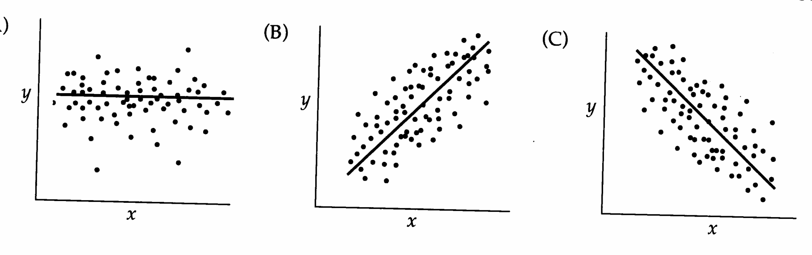
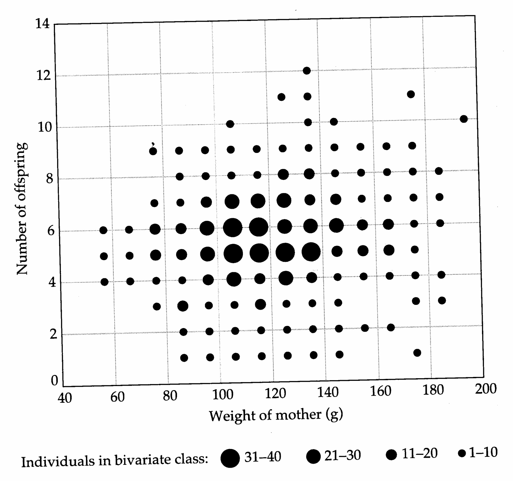
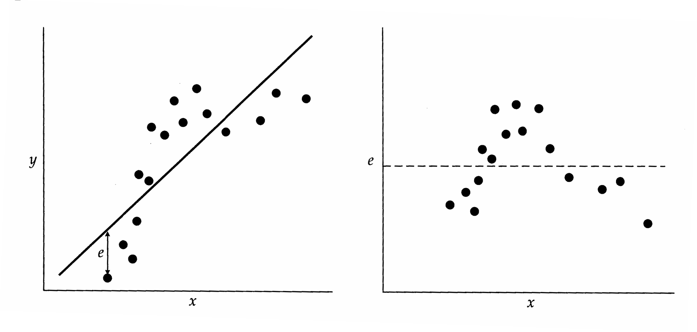
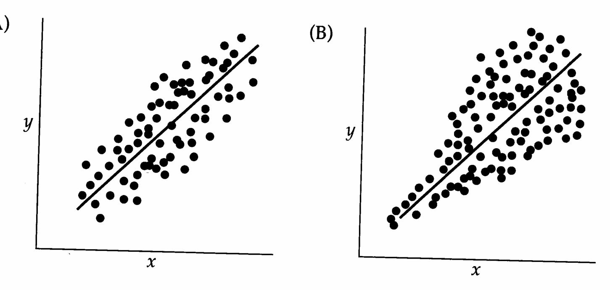

# Chapter 3 · Covariance, Regression, and Correlation

## Genetics_chapter3_001 · Covariance, Regression, and Correlation

In the previous chapter, the variance was introduced as a measure of the dispersion of a univariate distribution. Additional statistics are required to describe the joint distribution of two or more variables. The covariance provides a natural measure of the association between two variables, and it appears in the analysis of many problems in quantitative genetics including the resemblance between relatives, the correlation between characters, and measures of selection.

As a prelude to the formal theory of covariance and regression, we first provide a brief review of the theory for the distribution of pairs of random variables. We then give a formal definition of the covariance and its properties. Next, we show how the covariance enters naturally into statistical methods for estimating the linear relationship between two variables (least-squares linear regression) and for estimating the goodness-of-fit of such linear trends (correlation). Finally, we apply the concept of covariance to several problems in quantitative-genetic theory. More advanced topics associated with multivariate distributions involving three or more variables are taken up in Chapter 8.

---

## Genetics_chapter3_002 · JOINTLY DISTRIBUTED RANDOM VARIABLES

The probability of joint occurrence of a pair of random variables $ (x, y) $ is specified by the joint probability density function, $ p(x, y) $, where

$$
\mathrm{P}(y_{1}\leq y\leq y_{2},x_{1}\leq x\leq x_{2})=\int_{y_{1}}^{y_{2}}\int_{x_{1}}^{x_{2}}p(x,y)dx dy
\tag{3.1}
$$

We often ask questions of the form: What is the distribution of y given that x equals some specified value? For example, we might want to know the probability that parents whose height is 68 inches have offspring with height exceeding 70 inches. To answer such questions, we use $ p(y|x) $, the conditional density of y given x, where

$$
\mathrm{P}(y_{1}\leq y\leq y_{2}\mid x)=\int_{y_{1}}^{y_{2}}p(y\mid x)dy
\tag{3.2}
$$

Joint probability density functions, $ p(x, y) $, and conditional density functions,

$ p(y|x) $, are connected by

$$
p(x,y)=p(y\mid x)p(x)
\tag{3.3a}
$$

where $ p(x) = \int_{-\infty}^{+\infty} p(y \mid x) \, dy $ is the marginal (univariate) density of x.

Two random variables, $x$ and $y$, are said to be independent if $p(x, y)$ can be factored into the product of a function of $x$ only and a function of $y$ only, i.e.,

$$
p(x,y)=p(x)p(y)
\tag{3.3b}
$$

If $x$ and $y$ are independent, knowledge of $x$ gives no information about the value of $y$. From Equations 3.3a and 3.3b, if $p(x, y) = p(x) p(y)$, then $p(y \mid x) = p(y)$.

---

## Genetics_chapter3_003 · JOINTLY DISTRIBUTED RANDOM VARIABLES / Expectations of Jointly Distributed Variables

The expectation of a bivariate function, $f(x,y)$, is determined by the joint probability density

$$
E[f(x,y)]=\int_{-\infty}^{+\infty}\int_{-\infty}^{+\infty}f(x,y)p(x,y)dx dy
\tag{3.4}
$$

Most of this chapter is focused on conditional expectation, i.e., the expectation of one variable, given information on another. For example, one may know the value of x (perhaps parental height), and wish to compute the expected value of y (offspring height) given x. In general, conditional expectations are computed by using the conditional density

$$
E(y\mid x)=\int_{-\infty}^{+\infty}y p(y\mid x)dy
\tag{3.5}
$$

If $x$ and $y$ are independent, then $E(y|x) = E(y)$, the unconditional expectation. Otherwise, $E(y|x)$ is a function of the specified $x$ value. For height in humans (Figure 1.1), Galton (1889) observed a linear relationship,

$$
E(y\mid x)=\alpha+\beta x
\tag{3.6}
$$

where $ \alpha $ and $ \beta $ are constants. Thus, the conditional expectation of height in offspring $ (y) $ is linearly related to the average height of the parents $ (x) $.

---

## Genetics_chapter3_004 · COVARIANCE

Consider a set of paired variables, $ (x, y) $. For each pair, subtract the population mean $ \mu_x $ from the measure of $ x $, and similarly subtract $ \mu_y $ from $ y $. Finally, for each pair of observations, multiply both of these new measures together to obtain $ (x - \mu_x)(y - \mu_y) $. The covariance of $ x $ and $ y $ is defined to be the average of this quantity over all pairs of measures in the population,

$$
\sigma(x,y)=E[\left(x-\mu_{x}\right)\left(y-\mu_{y}\right)]
\tag{3.7}
$$

> **Figure 3.1** · page 53 · source: `Genetics_chapter3`
>
> 
>
> Figure 3.1 Scatterplots for the variables x and y. Each point in the x-y plane corresponds to a single pair of observations $ (x, y) $. The line drawn through the scatterplot gives the expected value of y given a specified value of x. (A) There is no linear tendency for large x values to be associated with large (or small) y values, so $ \sigma(x, y) = 0 $. (B) As x increases, the conditional expectation of y given x, $ E(y|x) $, also increases, and $ \sigma(x, y) > 0 $. (C) As x increases, the conditional expectation of y given x decreases, and $ \sigma(x, y) < 0 $.

We often denote covariance by $ \sigma_{x,y} $. Because $ E(x) = \mu_{x} $ and $ E(y) = \mu_{y} $, expansion of the product leads to further simplification,

$$
\begin{aligned}\sigma(x,y)&=E[\left(x-\mu_{x}\right)\left(y-\mu_{y}\right)]\\&=E\left(xy-\mu_{y}x-\mu_{x}y+\mu_{x}\mu_{y}\right)\\&=E(x y)-\mu_{y}E(x)-\mu_{x}E(y)+\mu_{x}\mu_{y}\\&=E(x y)-\mu_{x}\mu_{y}\end{aligned}
\tag{3.8}
$$

In words, the covariance is the mean of the pairwise cross-product $x$ $y$ minus the cross-product of the means. The sampling estimator of $\sigma(x,y)$ is similar in form to that for a variance,

$$
\mathrm{Cov}(x,y)=\frac{n\left(\overline{xy}-\overline{x}\cdot\overline{y}\right)}{n-1}
\tag{3.9}
$$

where n is the number of pairs of observations, and

$$
\overline{xy}=\frac{1}{n}\sum_{i=1}^{n}x_{i}y_{i}
\tag{3.9}
$$

The covariance is a measure of association between $x$ and $y$ (Figure 3.1). It is positive if $y$ increases with increasing $x$, negative if $y$ decreases as $x$ increases, and zero if there is no linear tendency for $y$ to change with $x$. If $x$ and $y$ are independent, then $\sigma(x,y) = 0$, but the converse is not true — a covariance of zero does not necessarily imply independence. (We will return to this shortly; see Figure 3.3.)

---

## Genetics_chapter3_005 · COVARIANCE / Useful Identities for Variances and Covariances

Since $\sigma(x,y)=\sigma(y,x)$, covariances are symmetrical. Furthermore, from the definition of the variance and covariance,

$$
\sigma(x,x)=\sigma^{2}(x)
\tag{3.10a}
$$

i.e., the covariance of a variable with itself is the variance of that variable. It also follows from Equation 3.8 that, for any constant a,

$$
\sigma(a,x)=0
\tag{3.10b}
$$

$$
\sigma(a x,y)=a\sigma(x,y)
\tag{3.10c}
$$

and if b is also a constant

$$
\sigma(a x,b y)=a b\sigma(x,y)
\tag{3.10d}
$$

From Equations 3.10a and 3.10d,

$$
\sigma^{2}(a x)=a^{2}\sigma^{2}(x)
\tag{3.10e}
$$

i.e., the variance of the transformed variable $ a x $ is $ a^2 $ times the variance of $ x $. Likewise, for any constant $ a $,

$$
\sigma\left[\left(a+x\right),y\right]=\sigma(x,y)
\tag{3.10f}
$$

so that simply adding a constant to a variable does not change its covariance with another variable.

Finally, the covariance of two sums can be written as a sum of covariances,

$$
\sigma[(x+y),(w+z)]=\sigma(x,w)+\sigma(y,w)+\sigma(x,z)+\sigma(y,z)
\tag{3.10g}
$$

Similarly, the variance of a sum can be expressed as the sum of all possible variances and covariances. From Equations 3.10a and 3.10g,

$$
\sigma^{2}(x+y)=\sigma^{2}(x)+\sigma^{2}(y)+2\sigma(x,y)
\tag{3.11a}
$$

More generally,

$$
\sigma^{2}\left(\sum_{i}^{n}x_{i}\right)=\sum_{i}^{n}\sum_{j}^{n}\sigma(x_{i},x_{j})=\sum_{i}^{n}\sigma^{2}(x_{i})+2\sum_{i<j}^{n}\sigma(x_{i},x_{j})
\tag{3.11b}
$$

Thus, the variance of a sum of uncorrelated variables is just the sum of the variances of each variable.

We will make considerable use of the preceding relationships in the remainder of this chapter and in chapters to come. Methods for approximating variances and covariances of more complex functions are outlined in Appendix 1.

---

## Genetics_chapter3_006 · REGRESSION

Depending on the causal connections between two variables, x and y, their true relationship may be linear or nonlinear. However, regardless of the true pattern of association, a linear model can always serve as a first approximation. In this case, the analysis is particularly simple,

$$
y=\alpha+\beta x+e
\tag{3.12a}
$$

where $ \alpha $ is the y-intercept, $ \beta $ is the slope of the line (also known as the regression coefficient), and e is the residual error. Letting

$$
\widehat{y}=\alpha+\beta x
\tag{3.12b}
$$

be the value of y predicted by the model, then the residual error is the deviation between the observed and predicted y value, i.e., $ e = y - \hat{y} $. When information on x is used to predict y, x is referred to as the predictor or independent variable and y as the response or dependent variable.

The objective of linear regression analysis is to estimate the model parameters, $ \alpha $ and $ \beta $, that give the “best fit” for the joint distribution of x and y. The true parameters $ \alpha $ and $ \beta $ are only obtainable if the entire population is sampled. With an incomplete sample, $ \alpha $ and $ \beta $ are approximated by sample estimators, denoted as a and b. Good approximations of $ \alpha $ and $ \beta $ are sometimes obtainable by visual inspection of the data, particularly in the physical sciences, where deviations from a simple relationship are due to errors of measurement rather than biological variability. However, in biology many factors are often beyond the investigator’s control. The data in Figure 3.2 provide a good example. While there appears to be a weak positive relationship between maternal weight and offspring number in rats, it is difficult to say anything more precise. An objective definition of “best fit” is required.

---

## Genetics_chapter3_007 · REGRESSION / Derivation of the Least-Squares Linear Regression

The mathematical method of least-squares linear regression provides one such best-fit solution. Without making any assumptions about the true joint distribution of x and y, least-squares regression minimizes the average value of the squared (vertical) deviations of the observed y from the values predicted by the regression line. That is, the least-squares solution yields the values of a and b that minimize the mean squared residual, $ \overline{e^2} $. Other criteria could be used to define “best fit.” For example, one might minimize the mean absolute deviations (or cubed deviations) of observed values from predicted values. However, as we will now see, least-squares regression has the unique and very useful property of maximizing the amount of variance in y that can be explained by a linear model.

Consider a sample of n individuals, each of which has been measured for x and y. Recalling the definition of a residual

$$
e=y-\widehat{y}=y-a-bx
\tag{3.13a}
$$

and then adding and subtracting the quantity $ \left(\overline{y}+b\overline{x}\right) $ on the right side, we obtain

> **Figure 3.2** · page 56 · source: `Genetics_chapter3`
>
> 
>
> Figure 3.2 A bivariate plot of the relationship between maternal weight and number of offspring for the sample of rats summarized in Table 2.2. Differenti-sized circles refer to different numbers of individuals in the bivariate classes.

$$
e=\left(y-\overline{y}\right)-b\left(x-\overline{x}\right)-\left(a+b\overline{x}-\overline{y}\right)
\tag{3.13b}
$$

Squaring both sides leads to

$$
\begin{aligned}e^{2}&=\left(y-\overline{y}\right)^{2}-2b\left(y-\overline{y}\right)\left(x-\overline{x}\right)+b^{2}(x-\overline{x})^{2}+\left(a+b\overline{x}-\overline{y}\right)^{2}\\&\quad-2\left(y-\overline{y}\right)\left(a+b\overline{x}-\overline{y}\right)+2b\left(x-\overline{x}\right)\left(a+b\overline{x}-\overline{y}\right)\\\end{aligned}
\tag{3.13c}
$$

Finally, we consider the average value of $ e^{2} $ in the sample. The final two terms in Equation 3.13b drop out here because, by definition, the mean values of $ (x - \overline{x}) $ and $ (y - \overline{y}) $ are zero. However, by definition, the mean values of the first three terms are directly related to the sample variances and covariance. Thus,

$$
\overline{e^{2}}=\left(\frac{n-1}{n}\right)\left[\operatorname{Var}(y)-2b\operatorname{Cov}(x,y)+b^{2}\operatorname{Var}(x)\right]+\left(a+b\overline{x}-\overline{y}\right)^{2}
\tag{3.13d}
$$

The values of $a$ and $b$ that minimize $\overline{e^{2}}$ are obtained by taking partial derivatives of this function and setting them equal to zero:

$$
\begin{aligned}\frac{\partial\left(e^{2}\right)}{\partial a}&=2\left(a+b\overline{x}-\overline{y}\right)=0\\\frac{\partial\left(\overline{e^{2}}\right)}{\partial b}&=2\left[\left(\frac{n-1}{n}\right)\left[-\mathrm{Cov}(x,y)+b\mathrm{Var}(x)\right]+\overline{x}\left(a+b\overline{x}-\overline{y}\right)\right]=0\end{aligned}
\tag{3.14a}
$$

The solutions to these two equations are

$$
a=\overline{y}-b\overline{x}
\tag{3.14a}
$$

$$
b=\frac{Cov(x,y)}{Var(x)}
\tag{3.14b}
$$

Thus, the least-squares estimators for the intercept and slope of a linear regression are simple functions of the observed means, variances, and covariances. From the standpoint of quantitative genetics, this property is exceedingly useful, since such statistics are readily obtainable from phenotypic data.

---

## Genetics_chapter3_008 · REGRESSION / Properties of Least-squares Regressions

Here we summarize some fundamental features and useful properties of the least-squares approach to linear regression analysis:

1. The regression line passes through the means of both $x$ and $y$. This relationship should be immediately apparent from Equation 3.14a, which implies $\overline{y} = a + b\overline{x}$.

2. The average value of the residual is zero. From Equation 3.13a, the mean residual is $ \overline{e} = \overline{y} - a - b\overline{x} $, which is constrained to be zero by Equation 3.14a. Thus, the least-squares procedure results in a fit to the data such that the sum of (vertical) deviations above and below the regression line are exactly equal.

3. For any set of paired data, the least-squares regression parameters, a and b, define the straight line that maximizes the amount of variation in y that can be explained by a linear regression on x. Since $ \overline{e} = 0 $, it follows that the variance of residual errors about the regression is simply $ \overline{e^2} $. As noted above, this variance is the quantity minimized by the least-squares procedure.

4. The residual errors around the least-squares regression are uncorrelated with the predictor variable x. This statement follows since

$$
\begin{aligned}\operatorname{Cov}(x,e)&=\operatorname{Cov}[x,(y-a-b x)]=\operatorname{Cov}(x,y)-\operatorname{Cov}(x,a)-b\operatorname{Cov}(x,x)\\&=\operatorname{Cov}(x,y)-0-b\operatorname{Var}(x)\\&=\operatorname{Cov}(x,y)-\frac{\operatorname{Cov}(x,y)}{\operatorname{Var}(x)}\operatorname{Var}(x)=0\end{aligned}
$$

> **Figure 3.3** · page 58 · source: `Genetics_chapter3`
>
> 
>
> Figure 3.3 A linear least-squares fit to an inherently nonlinear data set. Although there is a systematic relationship between the residual error (e) and the predictor variable (x), the two are uncorrelated (show no net linear trend) when viewed over the entire range of x. The mean residual error ( $ \overline{e} = 0 $) is denoted by the dashed line on the right graph.

Note, however, that $ \text{Cov}(x, e) = 0 $ does not guarantee that $ e $ and $ x $ are independent. In Figure 3.3, for example, because of a nonlinear relationship between $ y $ and $ x $, the residual errors associated with extreme values of $ x $ tend to be negative while those for intermediate values are positive. Thus, if the true regression is nonlinear, then $ E(e \mid x) \neq 0 $ for some $ x $ values, and the predictive power of the linear model is compromised. Even if the true regression is linear, the variance of the residual errors may vary with $ x $, in which case the regression is said to display heteroscedasticity (Figure 3.4). If the conditional variance of the residual errors given any specified $ x $ value, $ \sigma^2(e \mid x) $, is a constant (i.e., independent of the value of $ x $), then the regression is said to be homoscedastic.

5. There is an important situation in which the true regression, the value of $ E(y \mid x) $, is both linear and homoscedastic — when x are y are bivariate normally distributed. The requirements for such a distribution are that the univariate distributions of both x and y are normal and that the conditional distributions of y given x, and x given y, are also normal (Chapter 8). Since statistical testing is simplified enormously, it is generally desirable to work with normally distributed data. For situations in which the raw data are not so distributed, a variety of transformations exist that can render the data close to normality (Chapter 11).

6. It is clear from Equations 3.14a,b that the regression of y on x is different from the regression of x on y unless the means and variances of the two variables are equal. This distinction is made by denoting the regression coefficient by $ b(y, x) $ or $ b_{y,x} $ when x is the predictor and y the response variable.

> **Figure 3.4** · page 59 · source: `Genetics_chapter3`
>
> 
>
> Figure 3.4 The dispersion of residual errors around a regression. (A) The regression is homoscedastic — the variance of residuals given x is a constant. (B) The regression is heteroscedastic — the variance of residuals increases with x. In this case, higher x values predict y with less certainty.

For practical reasons, we have expressed properties 1 – 6 in terms of the estimators $a$, $b$, $\operatorname{Cov}(x,y)$, and $\operatorname{Var}(x)$. They also hold when the estimators are replaced by the true parameters $\alpha$, $\beta$, $\sigma(x,y)$, and $\sigma^{2}(x)$.

**[示例 Example]**

> **[UNRESOLVED EXAMPLE: Genetics_chapter3:1]**

---

## Genetics_chapter3_009 · CORRELATION

For purposes of hypothesis testing, it is often desirable to use a dimensionless measure of association. The most frequently used measure in bivariate analysis is the correlation coefficient,

$$
r(x,y)=\frac{\mathrm{Cov}(x,y)}{\sqrt{\mathrm{Var}(x)\mathrm{Var}(y)}}
\tag{3.15a}
$$

Note that $ r(x,y) $ is symmetrical, i.e., $ r(x,y) = r(y,x) $. Thus, where there is no ambiguity as to the variables being considered, we abbreviate $ r(x,y) $ as $ r $. The parametric correlation coefficient is denoted by $ \rho(x,y) $ (or $ \rho $) and equals $ \sigma(x,y)/\sigma(x)\sigma(y) $. The least-squares regression coefficient is related to the correlation coefficient by

$$
b(y,x)=r\sqrt{\frac{Var(y)}{Var(x)}}
\tag{3.15b}
$$

An advantage of correlations over covariances is that the former are scale independent. This can be seen by noting that if w and c are constants,

$$
r(w x,c y)=\frac{\operatorname{Cov}(w x,c y)}{\sqrt{\operatorname{Var}(w x)\operatorname{Var}(c y)}}=\frac{w c\operatorname{Cov}(x,y)}{\sqrt{w^{2}\operatorname{Var}(x)c^{2}\operatorname{Var}(y)}}=r(x,y)
\tag{3.16a}
$$

Thus scaling $x$ and $y$ by constants does not change the correlation coefficient, although the variances and covariances are affected. Since $r$ is dimensionless with limits of $\pm1$, it gives a direct measure of the degree of association: if $|r|$ is close to one, $x$ and $y$ are very strongly associated in a linear fashion, while if $|r|$ is close to zero, they are not.

The correlation coefficient has other useful properties. First, $r$ is a standardized regression coefficient (the regression coefficient resulting from rescaling $x$ and $y$ such that each has unit variance). Letting $x' = x / \sqrt{\mathrm{Var}(x)}$ and $y' = y / \sqrt{\mathrm{Var}(y)}$ gives $\mathrm{Var}(x') = \mathrm{Var}(y') = 1$, implying

$$
b(y^{\prime},x^{\prime})=b(x^{\prime},y^{\prime})=Cov(x^{\prime},y^{\prime})=\frac{Cov(x,y)}{\sqrt{Var(x)Var(y)}}=r
\tag{3.16b}
$$

Thus, when variables are standardized, the regression coefficient is equal to the correlation coefficient regardless of whether $ x' $ or $ y' $ is chosen as the predictor variable.

Second, the squared correlation coefficient measures the proportion of the variance in y that is explained by assuming that $ E(y|x) $ is linear. The variance of the response variable y has two components: $ r^{2} $ Var(y), the amount of variance accounted for by the linear model (the regression variance), and $ (1 - r^{2}) $ Var(y), the remaining variance not accountable by the regression (the residual variance). To obtain this result, we derive the variance of the residual deviation defined in Equation 3.13a,

$$
\begin{aligned}\operatorname{Var}(e)&=\operatorname{Var}(y-a-bx)=\operatorname{Var}(y-bx)\\&=\operatorname{Var}(y)-2b\operatorname{Cov}(x,y)+b^{2}\operatorname{Var}(x)\\&=\operatorname{Var}(y)-\frac{2\left[\operatorname{Cov}(x,y)\right]^{2}}{\operatorname{Var}(x)}+\frac{\left[\operatorname{Cov}(x,y)\right]^{2}\operatorname{Var}(x)}{\left[\operatorname{Var}(x)\right]^{2}}\\&=\left(1-\frac{\left[\operatorname{Cov}(x,y)\right]^{2}}{\operatorname{Var}(x)\operatorname{Var}(y)}\right)\operatorname{Var}(y)=(1-r^{2})\operatorname{Var}(y)\end{aligned}
\tag{3.17}
$$

**[示例 Example]**

> **[UNRESOLVED EXAMPLE: Genetics_chapter3:2]**

---

## Genetics_chapter3_010 · A TASTE OF QUANTITATIVE-GENETIC THEORY / Directional Selection Differentials and the Robertson-Price Identity

The evolutionary response of a character to selection is a function of the intensity of selection and the fraction of the phenotypic variance attributable to certain genetic effects. As noted at the end of last chapter, the directional selection differential, S, is defined to be the within-generation difference between the mean phenotype

$ \mu_{s} $ after an episode of selection (but before reproduction) and the mean before selection $ \mu $,

$$
S=\mu_{s}-\mu
\tag{3.18}
$$

The degree to which $ \mu_{s} $ deviates from $ \mu $ depends on the survivorship and reproductive rates of individuals with different phenotypes. If all individuals have equal fertility and viability, then $ \mu_{s} = \mu $, S = 0, and the population mean phenotype is not expected to change between generations. Now, for simplicity, assume that individuals differ only in the probability of survival to maturity, so that fitness, $ W(z) $, is the probability that individuals with phenotype z survive to reproduce. In what follows, no assumptions will be made about the general form of $ W(z) $; it may be a continuous or discontinuous function of z, and it may take on values of 0 for some z. If $ p(z) $ is the density of phenotype z before selection, then the density after selection is

$$
p_{s}(z)=\frac{W(z)p(z)}{\int W(z)p(z)dz}
\tag{3.19}
$$

This expression is obtained by noting that $W(z)$ is a weighting factor for phenotype $z$. The denominator is the mean individual fitness, $\overline{W}$. Letting the relative fitness of phenotype $z$ be $w(z) = W(z)/\overline{W}$, Equation 3.19 simplifies to $p_{s}(z) = w(z)p(z)$. It follows that the mean phenotype after selection is

$$
\mu_{s}=\dot{\int}z p_{s}(z)d z=\int z w(z)p(z)d z=E[z w(z)]
\tag{3.20}
$$

Note also that

$$
\overline{w}=\int w(z)p(z)dz=\frac{1}{\overline{W}}\int W(z)p(z)dz=\overline{W}/\overline{W}=1
\tag{3.20}
$$

i.e., the mean relative fitness in a population is always equal to one, and that since $ \mu = E(z) \cdot E(w) = E(z) \cdot 1 $, the directional selection differential may be rewritten as

$$
S=\mu_{s}-\mu=E[z w(z)]-E(z)E(w)=\sigma[z,w(z)]
\tag{3.21}
$$

Thus, the directional selection differential is equivalent to the covariance of phenotype and relative fitness. This relationship, first noted by Robertson (1966), was greatly elaborated on by Price (1970, 1972). We refer to this very useful result as the Robertson-Price identity. It applies even when phenotypes vary in reproductive output, provided that the absolute fitnesses, $ W(z) $, are weighted accordingly.

The importance of S can be seen by noting that if the regression of offspring phenotype on that of its average parent is linear with slope $ \beta $ (Figure 1.2), a change in the parental mean phenotype induces an expected change in the mean phenotype across generations equal to

$$
\Delta\mu=\mu_{o}-\mu=\beta\left(\mu_{s}-\mu\right)=\beta S
\tag{3.22}
$$

where $ \mu_{o} $ is the mean phenotype of the offspring of the selected parents. This fundamental relationship, known as the breeders' equation, combines information on the forces of selection (S) with that on inheritance ( $ \beta $) to yield a predictive equation for evolutionary change across generations. A genetic interpretation of the regression coefficient $ \beta $ will be provided in the final example of this chapter.

---

## Genetics_chapter3_011 · A TASTE OF QUANTITATIVE-GENETIC THEORY / The Correlation between Genotypic and Phenotypic Values

Equation 3.22 shows that evolution by natural selection requires heritable variation, as no matter how large S is, the response to selection across generations is zero if $ \beta = 0 $. Quantification of the correspondence between phenotypic and genotypic values is related to one of the central goals of quantitative genetics — the partitioning of the phenotypic variance into genetic and nongenetic components. The standard approach is to consider the phenotypic value of an individual, z, to be the sum of the total effects of all loci on the trait, G (the genotypic value), and an environmental deviation E (analogous to the residual error above),

$$
z=G+E
$$

Using the properties of covariances noted above, the covariance between phenotypic and genotypic values may be written as

$$
\sigma_{z,G}=\sigma\big[\big(G+E\big),G\big]=\sigma_{G}^{2}+\sigma_{G,E}
\tag{3.23}
$$

The squared correlation coefficient is therefore

$$
\rho^{2}(G,z)=\left(\frac{\sigma_{G,z}}{\sigma_{G}\sigma_{z}}\right)^{2}=\frac{\left(\sigma_{G}^{2}+\sigma_{G,E}\right)^{2}}{\sigma_{G}^{2}\sigma_{z}^{2}}
\tag{3.24a}
$$

which simplifies to

$$
\rho^{2}(G,z)=\frac{\sigma_{G}^{2}}{\sigma_{z}^{2}}
\tag{3.24b}
$$

if there is no genotype-environment covariance, i.e., if $ \sigma_{G,E} = 0 $. In this special case, $ \rho^{2}(G,z) $ is simply the proportion of the total phenotypic variance that is genetic. The quantity $ \sigma_{G}^{2}/\sigma_{z}^{2} $ is generally referred to as heritability in the broad sense and abbreviated as $ H^{2} $.

From Equation 3.23, it can be seen that covariance between genotypic values and environmental deviations causes the genotype-phenotype covariance to deviate from $ \sigma_{G}^{2} $. Negative covariance between G and E causes a reduction in the correlation between phenotypic and genotypic values, and in extreme cases, can cause $ \rho(G, z) $ to become negative. Further details on genotype-environment covariance are covered in Chapters 6 and 22.

---

## Genetics_chapter3_012 · A TASTE OF QUANTITATIVE-GENETIC THEORY / Regression of Offspring Phenotype on Midparent Phenotype

Although the previous example has provided some insight into the genetic basis of phenotypic variation without getting bogged down in genetic complexities, in practice that approach is not very useful. Whereas phenotypic values are easily obtained (they are what we measure), the underlying genetic values are essentially unobservable without an extensive breeding program, and even then, they cannot be determined with complete accuracy (Chapter 26).

Fortunately, there are alternative ways to estimate levels of genetic variance of quantitative traits. All such methods are based on the simple fact that related individuals carry copies of many of the same alleles. Consider the resemblance between phenotypes of offspring $ (z_{o}) $ and their midparents $ (z_{mp}) $. A midparent value is simply the mean phenotype of a mother $ (z_{m}) $ and a father $ (z_{f}) $,

$$
z_{mp}=\frac{z_{m}+z_{f}}{2}
$$

We will confine our attention to a simple genetic situation — a single locus with purely additive gene effects, diploidy, random mating, and no selection. Let $ g_{m} $ and $ g_{f} $, respectively, be the effects of the alleles that the offspring inherits from its mother and father, and $ g_{m}^{\prime} $ and $ g_{f}^{\prime} $ be the effects of the alleles that are not transmitted by the parents to this particular offspring. Further letting the environmental effects on the phenotypes of parents and offspring be $ E_{m} $, $ E_{f} $, and $ E_{o} $, the three phenotypes may be expressed as

$$
z_{m}=g_{m}+g_{m}^{\prime}+E_{m}
$$

$$
z_{f}=g_{f}+g_{f}^{\prime}+E_{f}
$$

$$
z_{o}=g_{m}+g_{f}+E_{o}
$$

Because the equation for the offspring phenotype contains three terms and that for the midparent phenotype contains six, the complete algebraic expression for the midparent-offspring covariance, $\sigma(z_{mp}, z_{o})$, is quite complex. It contains 18 terms. However, provided certain assumptions are met, most of these terms have expected values equal to zero. First, under the assumptions of random mating and no selection, there can be no covariance between the effects of alleles within individuals. Thus, the genes inherited by an offspring have zero covariance with the genes that are not inherited, and the genes in mothers are uncorrelated with those in fathers, i.e., $\sigma(g_{m}, g_{m}^{\prime}) = \sigma(g_{m}, g_{f}) = \sigma(g_{m}, g_{f}^{\prime}) = \sigma(g_{f}, g_{f}^{\prime}) = \sigma(g_{f}, g_{m}) = \sigma(g_{f}, g_{m}^{\prime}) = 0$. Second, provided there is no genotype-environment covariance, i.e., individuals are not assorted into environments on the basis of their genetic attributes, $\sigma(g_{m}, E_{m}) = \sigma(g_{m}, E_{f}) = \sigma(g_{f}, E_{m}) = \sigma(g_{f}, E_{f}) = \sigma(g_{m}, E_{o}) = \sigma(g_{m}^{\prime}, E_{o}) = \sigma(g_{f}^{\prime}, E_{o}) = 0$. Finally, provided the parents do not transmit their environmental effects to their progeny, i.e., there are no significant maternal or paternal environmental effects, then $\sigma(E_{o}, E_{f}) = \sigma(E_{o}, E_{m}) = 0$.

Most of these assumptions can be fulfilled in carefully designed experiments. Assuming this is the case, the only potential sources of covariance that exist between midparent and offspring phenotypes are those involving the inherited genes. Thus,

$$
\begin{aligned}\sigma(z_{mp},z_{o})&=\sigma\left[\left(\frac{z_{m}+z_{f}}{2}\right),z_{o}\right]\\&=\sigma\left[\left(\frac{g_{m}+g_{f}}{2}\right),(g_{m}+g_{f})\right]\\&=\frac{\sigma^{2}(g_{m})+\sigma^{2}(g_{f})}{2}\end{aligned}
\tag{3.25a}
$$

Recall that we assumed the genotypic value to be entirely defined by the additive effects of the two alleles. Thus, under random mating, the total genetic variance in the population is the sum of the variances of maternally and paternally derived genes, $ \sigma^{2}(g_{m}) + \sigma^{2}(g_{f}) $. Since the gene effects are purely additive, this quantity may also be referred to as the additive genetic variance, $ \sigma_{A}^{2} $. Thus, provided a number of assumptions are met, the phenotypic covariance between midparent and offspring is equivalent to half the additive genetic variance in the population,

$$
\sigma(z_{mp},z_{o})=\frac{\sigma_{A}^{2}}{2}
\tag{3.25b}
$$

In Chapters 5 and 7, it will be shown that this equation holds for any number of loci provided they interact additively.

To obtain the expected least-squares regression of offspring on midparent phenotype, the covariance needs to be divided by the variance of midparent phenotypes. Using the properties of variances outlined above, and noting that the phenotypic covariance between parents, $ \sigma(z_{f}, z_{m}) $, is zero under random mating,

$$
\sigma^{2}(z_{mp})=\sigma^{2}\left(\frac{z_{m}+z_{f}}{2}\right)=\frac{\sigma^{2}(z_{m})+\sigma^{2}(z_{f})}{4}
\tag{3.26a}
$$

Thus, provided the phenotypic variance in the two sexes is equal (or has been scaled to be so), the phenotypic variance of midparent values is half the phenotypic variance in the population,

$$
\sigma^{2}(z_{mp})=\frac{\sigma_{z}^{2}}{2}
\tag{3.26b}
$$

The slope of the least-squares linear regression of offspring phenotype on mid-parent phenotype is then

$$
\beta_{o,m p}=\frac{\sigma_{A}^{2}}{\sigma_{z}^{2}}
\tag{3.27}
$$

Thus, for this special case, the slope of a midparent-offspring regression provides an estimate of the proportion of the phenotypic variance that is attributable to additive genetic factors. Obviously, we have made many assumptions in order to arrive at this expression, and the significance of these will be addressed in the remainder of the book. The salient issue here is that inferences concerning the genetic basis of quantitative traits can be extracted from phenotypic measures of the resemblance between relatives.

In closing, we note that there is an important distinction between the measures of genetic variance that appear in Equations 3.24b and 3.27. In Equation 3.24b, $ \sigma_{G}^{2} $ refers to the total genetic variance, including that due to nonadditive interactions within and among loci. In Equation 3.27, $ \sigma_{A}^{2} $ refers specifically to the additive component of genetic variation. The ratio $ \sigma_{A}^{2}/\sigma_{z}^{2} $ is known as the narrow-sense heritability and is generally abbreviated as $ h^{2} $. It is possible for the total genetic variance to be entirely additive, but often it is not. This distinction between broad- and narrow-sense heritability and the decomposition of genetic variance into additive and nonadditive components will be covered in detail in Chapters 4, 5, and 7.

The central importance of $ h^{2} $ can be appreciated by recalling the breeders' equation, Equation 3.22, where $ \beta $ can now be seen to be $ h^{2} $. Thus, if S is the change in mean phenotype caused by selection prior to reproduction, then the response to selection across generations is

$$
\Delta\mu=h^{2}S
\tag{3.28}
$$

The narrow-sense heritability can be thought of as the efficiency of the response to selection. If $ h^{2} = 0 $, i.e., if there is no tendency for offspring to resemble their parents, there can be no evolutionary change, regardless of the strength of selection.

---
