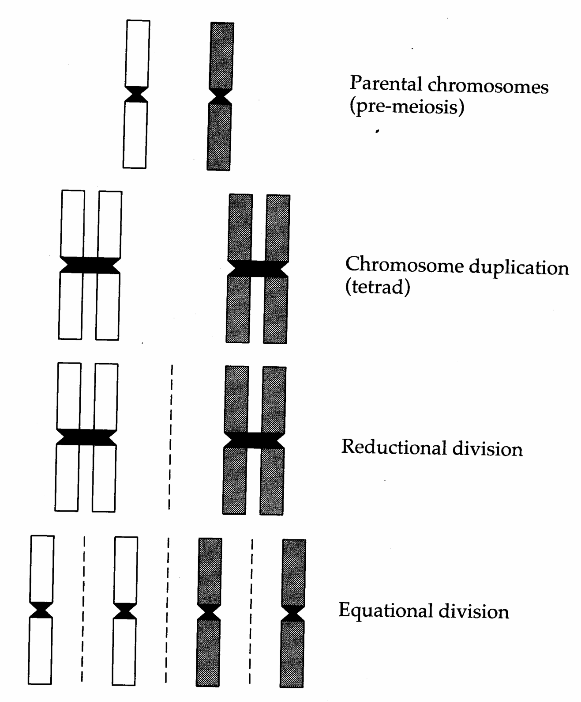
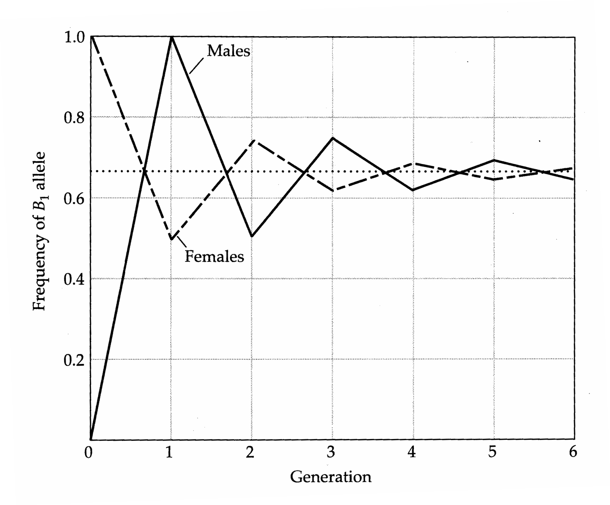
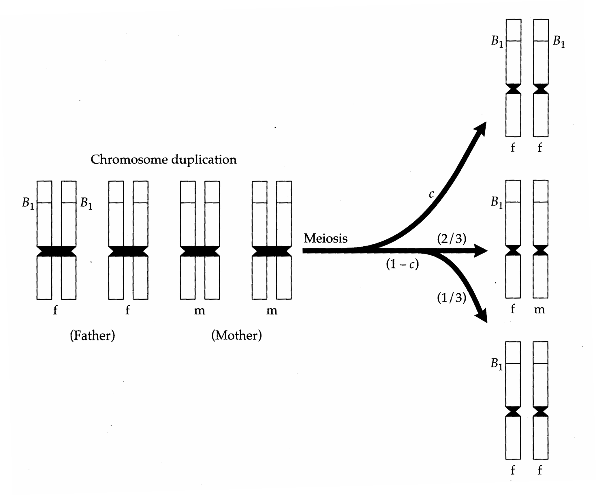
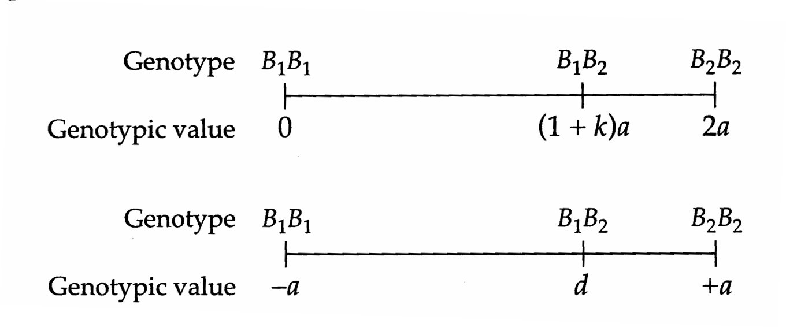
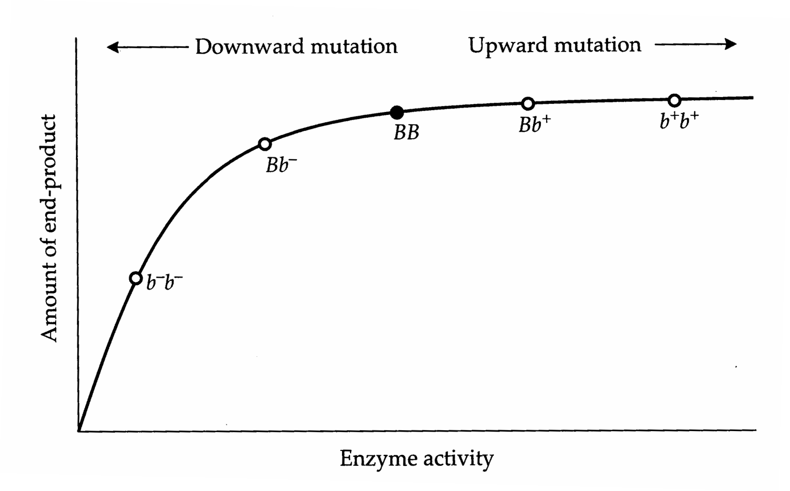
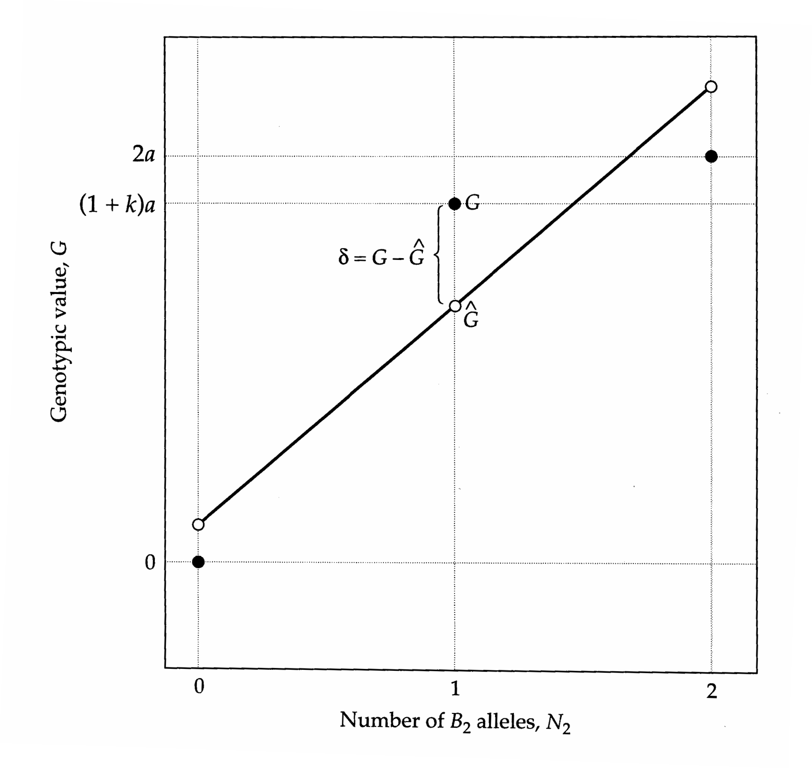
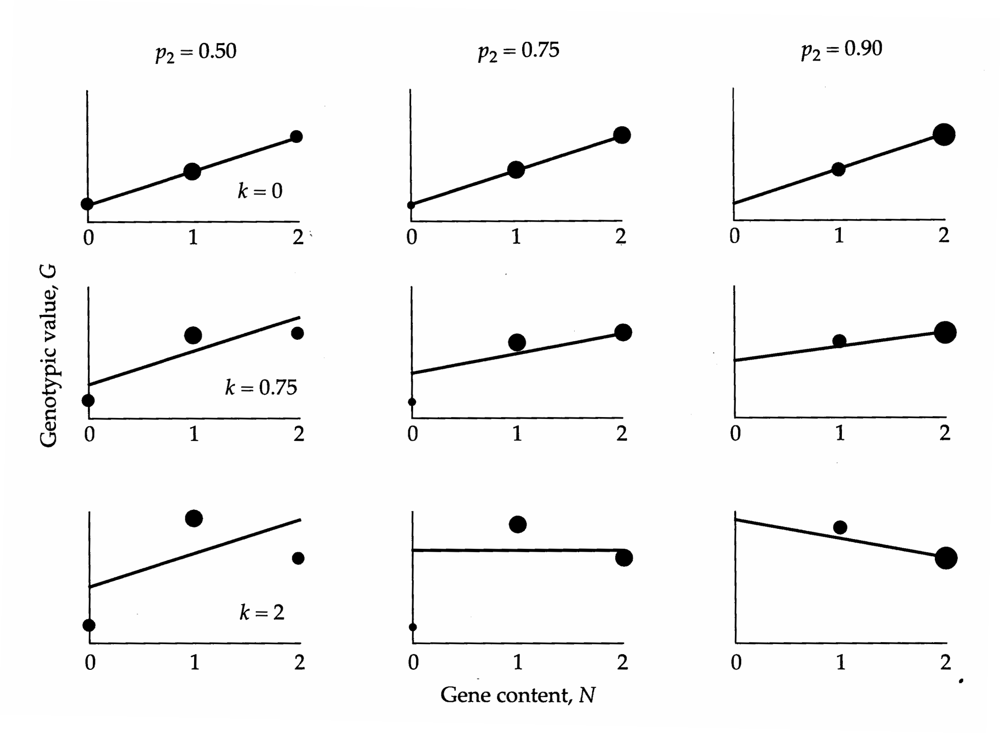
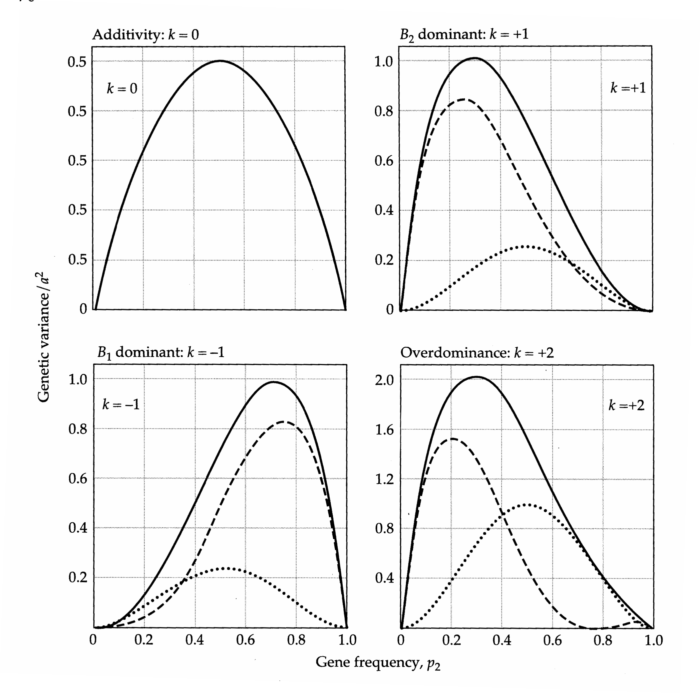

# Chapter 4 · 4

## Genetics_chapter4_001 · 4

---

## Genetics_chapter4_002 · 4 / Properties of Single Loci

The fact that most principles of quantitative genetics can be expressed without reference to specific genes is precisely why quantitative-genetic analysis is so popular among those who study complex characters. Since this same feature can be cause for suspicion, a primary goal of the next few chapters is to clarify the ways in which quantitative genetics is grounded in fundamental Mendelian concepts. Prior to illustrating the connections between the properties of single genes and the expression and transmission of polygenic traits, we review some very basic and essential vocabulary.

It is well known that the genetic information encoding for characters resides on extremely long strands of deoxyribonucleic acid (DNA) called chromosomes. We still do not know the function of the vast majority of DNA in organisms, and many believe that a substantial portion of it has no function (Dover and Flavell 1982). DNA sequences that encode for particular products (proteins and RNAs) are referred to as genes, and their chromosomal locations are called loci. Most organisms have two copies of each of several chromosomes, in which case they are said to be diploid. Since DNA replication is an imperfect process, mutations arise, and as a consequence the two “copies” of each gene carried by diploid individuals need not be identical. The various forms of a gene are called alleles.

Gene loci that exhibit more than one allele are the subject of genetics. Such loci are said to be polymorphic, whereas loci at which all gene copies are identical are monomorphic. A substantial fraction of the gene pool in many species is polymorphic. The possible reasons for this are the subject of a long-standing debate in population genetics and molecular evolution (Kimura 1983, Gillespie 1991, Golding 1994). Many mutant alleles are extremely deleterious and are rapidly eliminated by natural selection, while others have only small or no effects at the phenotypic level and remain in the population until they are fixed or lost by chance. Still others are maintained at intermediate levels by a balance between opposing evolutionary forces.

Not all organisms are diploid. Prokaryotes have only a single copy of each gene and are referred to as $ \underline{\text{haploid}} $. Many of the lower plants (algae, mosses, and ferns) also have conspicuous haploid stages in their life cycles, as do the fungi and some animals (males of rotifers and haplo-diploid insects). Organisms with ploidy levels higher than diploid are known as polyploids. A tetraploid individual contains four sets of homologous chromosomes, whereas a hexaploid contains six. Polyploidy is extremely widespread among plants. It is relatively rare among sexual animals, but common among parthenogenetic species.

Even in diploids, some genes are effectively haploid. Such is the case for genes carried in organelles (mitochondria and chloroplasts). Although there may be hundreds of copies of organelle genes per cell, they are generally inherited uniparentally and are essentially all the same. Genes residing on the sex chromosomes of organisms with a genetic sex-determination mechanism also have a special ploidy status. In mammals, for example, males carry X and Y chromosomes, whereas females are XX, so that X-linked genes occur only in single “copies” in males. In some organisms, such as birds, moths, and butterflies, the heterogametic (WZ) sex is female. In order to distinguish sex chromosomes from the remaining pairs, the latter are referred to as autosomes. In this book, unless stated otherwise (see especially, Chapter 24), we will be dealing with autosomal loci in diploid populations.

The remainder of this chapter is concerned with the quantification of various properties of single loci. We start by reviewing the concepts of allele and genotype frequencies, showing how the two are connected in an ideal situation that is closely approximated in many natural settings. We next show how the phenotypic effects of different alleles can be described in terms of additive and dominance effects. The genotypic frequencies and effects are then incorporated into expressions for the additive and dominance components of genetic variance at the locus. Finally, we show how the additive effects of an individual's genes define its breeding value. These results provide a close mechanistic connection with the final example in the previous chapter. While several of the concepts covered in this chapter may seem rather abstract and far removed from the analysis of multilocus traits, their practical utility is becoming increasingly evident as molecular methods for locating and characterizing quantitative-trait loci (QTLs) become more refined (Chapters 13–16).

---

## Genetics_chapter4_003 · ALLELE AND GENOTYPE FREQUENCIES

When denoting the genotype at a single locus, we refer to the pair of alleles that a (diploid) individual carries at the locus. Individuals that have two identical alleles are called homozygotes, whereas those that have different alleles are heterozygotes. If, for example, we denote the alleles at a particular diallelic locus as $ B_{1} $ and $ B_{2} $, there are three possible genotypes: $ B_{1}B_{1} $ and $ B_{2}B_{2} $ homozygotes, and $ B_{1}B_{2} $ heterozygotes. There may, of course, be more than two alleles, and hence more than three genotypes, present at a locus.

Allele frequencies are defined uniquely by genotype frequencies. Suppose that $ P_{11} $, $ P_{12} $, and $ P_{22} $ represent the proportions of the population that are $ B_{1}B_{1} $,

$ B_{1}B_{2} $, and $ B_{2}B_{2} $. If these are the only possible genotypes at the locus, then by definition, $ P_{11} + P_{12} + P_{22} = 1 $. If there are N individuals in the population, then $ P_{11}N $ individuals contain two $ B_{1} $ alleles and $ P_{12}N $ individuals contain a single $ B_{1} $ allele. Since there are a total of 2N genes in the population for each autosomal locus, the frequency of the $ B_{1} $ allele is simply

$$
p_{1}=\frac{2P_{11}N+P_{12}N}{2N}=P_{11}+\frac{1}{2}P_{12}
\tag{4.1}
$$

Thus, the general rule for a diploid, autosomal locus is that the frequency of an allele is estimated by the observed frequency of homozygotes plus one-half the observed frequency of all heterozygotes containing that allele.

For complex morphological and behavioral characters influenced by multiple genetic and environmental factors, it is usually impossible to be certain about the genotypic state of any particular locus. In some cases, however, the majority of the genetic variation for a character depends on a single locus with large effects, in which case the allele and genotype frequencies can be estimated directly. This was the fortuitous case in many of Mendel's classic experiments with peas, and some genetic disorders in humans appear to be products of mutant alleles at single loci. Data for a wing-color polymorphism in a British moth are examined in the following example.

**[示例 Example]**

> **Example 1** · ref: `Genetics_chapter4:1` · source: `Genetics_chapter4_003.json` · blocks 6–10
>
> Example 1. Fisher and Ford (1947) were able to distinguish three wing-color patterns in the moth Panaxia dominula, and through breeding experiments, the polymorphism was found to result from two alleles segregating at a single locus. The following table summarizes the distribution of genotype frequencies observed in a population in 1946.
> 
> <table><tr><td>Color Pattern</td><td>dominula</td><td>medionigra</td><td>bimacula</td><td>Total</td></tr><tr><td>Genotype</td><td>$ B_{1}B_{1} $</td><td>$ B_{1}B_{2} $</td><td>$ B_{2}B_{2} $</td><td rowspan="2">N = 986</td></tr><tr><td>Sample Size ( $ N_{ij} $)</td><td>905</td><td>78</td><td>3</td></tr><tr><td>Frequency ( $ P_{ij} $)</td><td>0.918</td><td>0.079</td><td>0.003</td><td>1.000</td></tr></table>
> 
> What are the estimated frequencies of the two alleles? Using Equation 4.1, the frequency of the $ B_{1} $ allele is found to be
> 
> $$
> p_{1}=0.918+\frac{0.079}{2}=0.958
> $$
> 
> 
> and since there are only two alleles, the frequency of $ B_{2} $ is $ p_{2}=1-p_{1}=0.041 $.

---

## Genetics_chapter4_004 · THE TRANSMISSION OF GENETIC INFORMATION

---

## Genetics_chapter4_005 · THE TRANSMISSION OF GENETIC INFORMATION / The Hardy-Weinberg Principle

From the standpoint of evolutionary analysis, it is crucial to understand how allele and genotype frequencies change from generation to generation. Such changes may result from natural selection, mutation, differential migration, inbreeding, or random drift due to gene sampling in finite populations. All of these forces will be considered in due course, but for now we will restrict our attention to a highly idealized situation — an autosomal locus uninfluenced by selection and mutation. By assuming the population to be effectively infinite in size and randomly mating, we also eliminate the possibility of inbreeding and random drift. We will further assume that generations are discrete and that the population is closed to immigrants.

Although such an idealized situation is never realized perfectly, in many cases it is close enough to the truth for practical purposes. Under the ideal model, simple and predictable relationships emerge between allele and genotype frequencies, within and between generations. It is therefore an essential point of departure, much like the ideal gas laws in physics.

In sexual populations, individuals do not necessarily produce offspring whose genotypes match their own. Prior to reproduction, sexual individuals produce haploid gametes by a special form of cell division called meiosis (Figure 4.1). Thus, with respect to a single locus, a $ B_{1}B_{2} $ heterozygote produces two types of gametes — half $ B_{1} $ and half $ B_{2} $. The diploid state is restored when gametes from two parents fuse to form a zygote. Consequently, at a diallelic locus, a heterozygous parent can potentially produce three types of progeny ( $ B_{1}B_{1} $, $ B_{1}B_{2} $, and $ B_{2}B_{2} $), whereas homozygous parents can produce at most two.

Consider a population consisting of separate sexes (dioecious) with discrete, nonoverlapping generations. We denote the frequencies of $B_{1}$ and $B_{2}$ alleles in females in generation 0 by $p_{1f}(0)$ and $p_{2f}(0)$, and those in males by $p_{1m}(0)$ and $p_{2m}(0)$. Under random mating, the expected genotype frequencies in the next generation are obtained from the products of the respective gamete frequencies. For example, since the probability of drawing a $B_{1}$ female gamete is $p_{1f}(0)$ and that of drawing a $B_{1}$ male gamete is $p_{1m}(0)$, the expected frequency of $B_{1}B_{1}$ zygotes is $p_{1f}(0)p_{1m}(0)$. Similarly, the expected frequencies of $B_{1}B_{2}$ and $B_{2}B_{2}$ zygotes are $p_{1f}(0)p_{2m}(0)+p_{2f}(0)p_{1m}(0)$ and $p_{2f}(0)p_{2m}(0)$, respectively. Provided the locus is autosomal, the frequency of the $B_{1}$ allele will now be the same in both sexes, since the subpopulations of sons and daughters both acquire half their genes from mothers and half from fathers. Substituting into Equation 4.1, the $B_{1}$ allele frequency in generation 1 is

$$
\begin{aligned}p_{1}&=p_{1f}(0)p_{1m}(0)+\frac{p_{1f}(0)p_{2m}(0)+p_{1m}(0)p_{2f}(0)}{2}\\&=\frac{p_{1f}(0)\left[p_{1m}(0)+p_{2m}(0)\right]+p_{1m}(0)\left[p_{1f}(0)+p_{2f}(0)\right]}{2}\end{aligned}
$$

> **Figure 4.1** · page 71 · source: `Genetics_chapter4`
>
> 
>
> Figure 4.1 Idealized schematic of meiotic production of gametes. Only a single chromosome pair is shown. At the onset of meiosis, sister chromatids are formed by duplication and the homologous pairs come together to form a tetrad; although it is not shown, some exchange of material (crossing-over) between homologues may occur at this time. Two meiotic divisions (reductional and equational) then produce four haploid products. The maternal and paternal chromosomes migrate to opposite cells during the reductional division, and the sister chromatids are isolated into four potential haploid gametes after the equational division.

which is just

$$
p_{1}=\frac{p_{1f}(0)+p_{1m}(0)}{2}
$$

The new frequency for the $ B_{2} $ allele is $ p_{2}=1-p_{1}=[p_{2f}(0)+p_{2m}(0)]/2 $.

Under the conditions of our idealized population, in the next generation and in all subsequent generations, the $ B_{1}B_{1} $, $ B_{1}B_{2} $, and $ B_{2}B_{2} $ genotypes will be found in frequencies $ p_{1}^{2} $, $ 2p_{1}p_{2} $, and $ p_{2}^{2} $. Such proportions are known as Hardy-Weinberg frequencies, after the two investigators who first pointed out the above relationship (Hardy 1908, Weinberg 1908). The Hardy-Weinberg frequencies can also be obtained directly by multiplying out the terms of the binomial expansion, $ (p_{1}+p_{2})^{2} $. By this means, the Hardy-Weinberg law can be extended to any number of alleles. Suppose, for example, that four alleles $ (B_1, B_2, B_3, B_4) $ are present at the locus of interest. The Hardy-Weinberg frequencies for the various genotypes are obtained by squaring the quantity $ (p_1 + p_2 + p_3 + p_4) $. The expected frequency of a genotype homozygous for the $ B_i $ allele is $ p_i^2 $, while that for a $ B_i B_j $ heterozygote is $ 2p_i p_j $.

Provided that all of the assumptions of the Hardy-Weinberg model are met, we can summarize as follows. First, it takes no more than a single generation to equilibrate and stabilize the gene frequencies in the two sexes. Second, only one additional generation is required for the stabilization of the genotype frequencies into the predictable Hardy-Weinberg proportions. These results have obvious implications for the analysis of natural populations. Even if genotype frequencies in a study population are vastly different from Hardy-Weinberg expectations, for example because of natural selection or population subdivision, they can be rendered close to the idealized proportions by imposing an artificial program of random mating for one or two generations.

---

## Genetics_chapter4_006 · THE TRANSMISSION OF GENETIC INFORMATION / Sex-Linked Loci

The preceding results do not extend to sex-linked loci. As noted above, when the male is the heterogametic sex, females are diploid for X linked loci, but males are haploid. Thus, for every mating pair, there are three X chromosomes, and the frequency of the $B_{1}$ allele in the population is $p_{1} = [p_{1m}(0) + 2p_{1f}(0)]/3$. In the absence of any forces operating differentially on the alleles, this frequency will be maintained indefinitely. However, the gene frequency will not necessarily be $p_{1}$ in both of the sexes. Since males only receive an X chromosome from their mother, the male frequency of the $B_{1}$ allele in any generation (t) is necessarily equal to the frequency in females in the previous generation (t - 1),

$$
p_{1m}(t)=p_{1f}(t-1)
\tag{4.2a}
$$

On the other hand, fathers and mothers each contribute an X chromosome to their daughters, so the frequency of the $ B_{1} $ allele in females is equal to the average of the gene frequency in the two sexes in the previous generation,

$$
p_{1f}(t)=\frac{p_{1f}(t-1)+p_{1m}(t-1)}{2}
\tag{4.2b}
$$

The general solution to these equations is

$$
p_{1f}(t)-p_{1}=\left[-\frac{1}{2}\right]^{t}\left[p_{1f}(0)-p_{1}\right]
\tag{4.2c}
$$

> **Figure 4.2** · page 73 · source: `Genetics_chapter4`
>
> 
>
> Figure 4.2 The dynamics of gene frequency change for an X-linked gene, $B_{1}$, under random mating. An extreme case is illustrated — initially, all females are homozygous for the $B_{1}$ gene, $p_{1f}(0) = 1$, while all of the males are haploid for the alternate allele, $p_{1m}(0) = 0$. Consequently, all males contain the $B_{1}$ allele in the following generation, while all females are heterozygous. The dotted line represents the population level gene frequency, $p_{1} = [p_{1m}(0) + 2p_{1f}(0)] / 3 = 0.67$, towards which both of the sexes converge over time.

Thus, the approach to the equilibrium allele frequency in the two sexes is gradual and oscillatory if the locus is X linked (Figure 4.2). The deviation of the allele frequency from $ p_{1} $ is halved each generation for both males and females, but the sign changes from generation to generation.

---

## Genetics_chapter4_007 · THE TRANSMISSION OF GENETIC INFORMATION / Polyploidy

Another situation in which the Hardy-Weinberg principle is not met exactly arises in polyploid organisms. Because of the high frequency of polyploidy in plants, this case has been examined extensively by Fisher (1947) and Crow (1954) among others. It will only be considered briefly here for a tetraploid species, individuals of which propagate two genes per locus through gametes. The way in which sets of chromosomes assort during meiosis in polyploids depends on the degree of homology between ancestral chromosomes (Marsden et al. 1987). At one extreme are allopolyploids that originate by interspecific hybridization. In this case, provided the chromosomes of the parental species are sufficiently different, they will not pair. Meiosis is then identical to that for diploid organisms, except for the doubled number of chromosomes. At the other extreme, autopolyploids derive both chromosome sets from the same species.

For the remainder of our discussion of polyploidy, we will assume that the four sets of chromosomes are sufficiently similar that tetravalents (combinations of four homologues), rather than bivalents, are formed during meiosis. This condition raises the possibility that some gametes will contain two copies of one of the four genes carried by the parent (i.e., a parent with genotype $ B_{1}B_{2}B_{3}B_{4} $ may produce a $ B_{1}B_{1} $ gamete), a result that arises when a crossover (a reciprocal exchange of DNA) occurs between replicated arms of two of the four chromosomes during meiosis. The production of such a gamete is referred to as a double reduction, and we denote its probability by c. Of the $ (1-c) $ gametes that are not doubly reduced, one-third will contain genes that came from the same parent, and the other two-thirds will contain one paternally derived and one maternally derived gene (Figure 4.3).

Here we assume the presence of only two alleles and random assortment of the four homologues. Letting, $ p_i $ be the frequency of the $ B_i $ allele and $ p_{ij}(t) $ be the frequency of $ B_{ij} $ gametes in generation $ t $, then the following dynamic equations hold:

$$
p_{ii}(t)=cp_{i}+\frac{1-c}{3}\left[p_{ii}(t-1)+2p_{i}^{2}\right]
\tag{4.3a}
$$

$$
p_{ij}(t)=\frac{1-c}{3}\left[p_{ij}(t-1)+2p_{i}p_{j}\right]
\tag{4.3b}
$$

(Crow and Kimura 1970, pp. 52–53). The equilibrium solution to these equations is obtained by setting $ p_{ii}(t) = p_{ii}(t-1) $ and $ p_{ij}(t) = p_{ij}(t-1) $,

$$
p_{ii}=(1-f)p_{i}^{2}+f p_{i}
\tag{4.3c}
$$

$$
p_{ij}=\left(1-f\right)p_{i}p_{j}
\tag{4.3d}
$$

where $ f = 3c/(2 + c) $. This equilibrium is approached only gradually. The equilibrium genotype frequencies can be obtained as products of the appropriate equilibrium gametic frequencies.

In the absence of crossing-over between homologous pairs of chromosomes, c = 0, f = 0, and the equilibrium frequency of gamete types is simply equal to the product of the respective allele frequencies. However, if c > 0, the equilibrium genotype frequencies are not so simple. Consider the extreme case of free

> **Figure 4.3** · page 75 · source: `Genetics_chapter4`
>
> 
>
> Figure 4.3 The production of three types of (diploid) gametes by a tetraploid individual. This example focuses upon a single paternally derived allele, $ B_{1} $. The letters f and m refer to chromosomes derived from fathers and mothers. With four chromosomes (rather than the two of a diploid), the reductional division of meiosis isolates two chromosomes at random into each of the resulting two cells. Subsequent equational division generates the gamete types shown at the right. Here c is the probability that the allele of interest will become associated with itself during gametogenesis as a result of a double reduction. If this does not occur (probability = 1 - c), there is a 2/3 chance that chromosome $ B_{1} $ will be associated in a gamete with a maternally derived chromosome and a 1/3 chance that it will be associated with the other paternally derived chromosome.

recombination. After chromosomal duplication during gametogenesis, eight chromosomes are assorted, two into each of four gametes. Conditional on one of these being transmitted to a gamete, then of the remaining seven possibilities, one will be identical by descent. Thus, for free recombination, $ c = 1/7 $, $ f = 0.2 $, and the equilibrium gamete frequencies are $ p_{ii} = 0.2p_i(1 + 4p_i) $ and $ p_{ij} = 0.8p_i p_j $. In essence, if there is any crossing-over, polyploidy results in a sort of “internal in-

"breeding," reducing the frequency of heterozygous gametes. Wricke and Weber (1986) provide a very useful coverage of the many complications that polyploidy introduces in quantitative-genetic formulations.

---

## Genetics_chapter4_008 · THE TRANSMISSION OF GENETIC INFORMATION / Age Structure

One final complication with respect to the idealized model is age structure. Up to now we have been assuming a population with discrete, nonoverlapping generations, such as an annual plant with no seed carry-over across years. In populations composed of several age classes (the majority of higher plants and animals), the generations overlap, and this causes the approach of genotype frequencies towards the Hardy-Weinberg expectations to be gradual, even in the case of an autosomal locus. This property arises because the genotypes of new recruits are a function of the allele frequencies specific to the reproductive age classes. Juvenile age classes only influence the change in genotype frequencies through mortality, but as they mature they begin to add copies of their genes to the population. The genotype frequencies become stable only after the allele frequencies become homogenized across age classes and sexes.

Of equal significance is the fact that the allele frequencies themselves can be unstable in an age-structured population even in the absence of genotypic differences in age-specific survival and reproduction. Further complexities are introduced by the scheme of mating between the various age classes. All of these subjects are taken up in detail by Charlesworth (1974, 1994) and Gregorius (1976). The important point to remember is that when newly founded populations have significant age structure, fluctuations in both gene and genotype frequencies may occur for a substantial period of time even in the absence of selection.

---

## Genetics_chapter4_009 · THE TRANSMISSION OF GENETIC INFORMATION / Testing for Hardy-Weinberg Proportions

When data are available on genotype frequencies in a population, it is standard practice to cross-check these with the Hardy-Weinberg expectations. Lack of concordance between the two implies that at least one of the assumptions of the Hardy-Weinberg model is violated and often instigates further investigation. Several different statistical techniques have been proposed (Weir 1996), the most popular by far being the $ \chi^{2} $ (Chi-square) test. However, the likelihood-ratio test is now becoming more common and appears to be at least as reliable as the former. Likelihood-based tests have a number of desirable statistical features (Appendix 4). Letting $ N_{ij} $ and $ \hat{N}_{ij} $ be the observed and expected numbers of genotype $ B_{i}B_{j} $ in a sample, then the likelihood-ratio test statistic

$$
G=-2\sum_{i=1}^{n}\sum_{j\geq i}^{n}N_{ij}\ln\left(\frac{\widehat{N}_{ij}}{N_{ij}}\right)
\tag{4.4}
$$

has a sampling distribution very similar to the well-known $ \chi^{2} $ distribution. That is, if a population in Hardy-Weinberg equilibrium is sampled many different times and G calculated each time, the frequency distribution of the observed G values will be nearly $ \chi^{2} $ distributed. Thus, the test for Hardy-Weinberg proportions compares the observed statistic G with the cumulative $ \chi^{2} $ distribution. If G exceeds the level at which there is a 5% chance of obtaining a higher $ \chi^{2} $, then one can reject the null hypothesis of Hardy-Weinberg proportions with 95% confidence.

Regardless of which approach to testing for Hardy-Weinberg frequencies is taken, it should be kept in mind that some of the conditions underlying the Hardy-Weinberg theorem may be violated without causing detectable departures of observations from expectations. For example, if the product of the survivorships of the two homozygotes is equal to the square of the heterozygote survival, the zygotic frequencies after selection will still be in Hardy-Weinberg proportions (Lewontin and Cockerham 1959). Thus, a failure to reject the Hardy-Weinberg model should be interpreted with caution.

**[示例 Example]**

> **Example 2** · ref: `Genetics_chapter4:2` · source: `Genetics_chapter4_009.json` · blocks 4–7
>
> Example 2. As an example of the application of Equation 4.4, we return to the data in the table of Example 1.
> 
> The best estimates for the Hardy-Weinberg expectations are obtained from the observed allele frequencies: $ \widehat{N}_{11} = p_{1}^{2}N = 905 $, $ \widehat{N}_{12} = 2p_{1}p_{2}N = 79 $, and $ \widehat{N}_{22} = p_{2}^{2}N = 2 $. Applying these and the observed values ( $ N_{11} $, $ N_{12} $, and $ N_{22} $) from the table,
> 
> $$
> G=-2\left[905\ln(905/905)+78\ln(79/78)+3\ln(2/3)\right]=0.446
> $$
> 
> 
> Under the null hypothesis of Hardy-Weinberg frequencies, the sampling distribution of G is a function of the number of degrees of freedom, which in the case of the Hardy-Weinberg test is the number of genotypic classes minus the number of allele frequencies that must be estimated from the data minus one. Here, it was necessary to estimate one parameter $ (p_{1}) $ from the data, so there is 3 - 1 - 1 = 1 degree of freedom. Referring to a $ \chi^{2} $ table in any statistics text, it can be found that, with one degree of freedom, G must exceed 3.841 to reject the null hypothesis at the 0.05 probability level. Therefore, the observed data are not significantly different from those expected under the Hardy-Weinberg expectations.

---

## Genetics_chapter4_010 · CHARACTERIZING THE INFLUENCE OF A LOCUS ON THE PHENOTYPE

In Chapter 3, we encountered the concept of partitioning the phenotype (z) of an individual into a genotypic value (G) and an environmental deviation (E),

$$
z=G+E
$$

> **Figure 4.4** · page 78 · source: `Genetics_chapter4`
>
> 
>
> Figure 4.4 Two ways of representing genotypic values for a diallelic locus.

where G is the expected phenotype (for a given genotype) resulting from the joint expression of all of the genes underlying the trait. For a multilocus trait, G is a potentially complicated function. For now, however, we are concerned only with the direct contribution of a single autosomal locus, in which case things are quite tractable. We start with the special case in which there are only two alleles. The three genotypic values can then be represented by the scale at the top of Figure 4.4, with 2a representing the difference between the mean phenotypes of $ B_{2}B_{2} $ and $ B_{1}B_{1} $ homozygotes, and k providing a measure of dominance. Alleles $ B_{1} $ and $ B_{2} $ behave in a completely additive fashion when k = 0, whereas k = +1 implies complete dominance of the $ B_{1} $ allele, and k = -1 implies complete dominance of the $ B_{2} $ allele. If k > 1, the phenotypic expression of the heterozygote exceeds that of both homozygotes, and the locus is said to exhibit overdominance, whereas k < -1 implies underdominance.

The fact that we have set the genotypic value of the $B_{1}B_{1}$ homozygote equal to zero may seem troublesome, but it is desirable because it leads to some algebraic simplifications. Although phenotypic measures are often performed on scales where zeros are impossible, genotypic values can always be transformed to the above scale by simply subtracting the observed genotypic value of $B_{1}B_{1}$ from each measure. Such a transformation of a linear scale can be illustrated by considering an alternative scheme often used by quantitative geneticists (bottom of Figure 4.4). Although the genotypic values of the two homozygotes are now denoted by $-a$ and $+a$, the difference between them is still $2a$, as in the previous case. The previous scale can be completely recovered by adding $a$ to all three measures on this new scale and letting $d = ak$. Generally, we will adhere to the first of these two scales.

**[示例 Example]**

> **Example 3** · ref: `Genetics_chapter4:3` · source: `Genetics_chapter4_010.json` · blocks 5–7
>
> Example 3. The scaling of genotypic values may be clarified by reference to a particular example — the Booroola (B) gene that influences fecundity in the Merino sheep of Australia (Piper and Bindon 1988).
> 
> Litter size in sheep has a polygenic basis, but in this particular breed, it is determined largely by a single polymorphic locus. The mean litter sizes for the bb,
> 
> Bb, and BB genotypes based on 685 total records are 1.48, 2.17, and 2.66, respectively. Taking these to be estimates of the genotypic values $ (G_{bb}, G_{Bb}, \text{and } G_{BB}) $, the homozygous effect of the B allele is estimated by $ a = (2.66 - 1.48)/2 = 0.59 $. The dominance coefficient is estimated by taking the difference between bb and Bb genotypes, $ a(1 + k) = 0.69 $, substituting a = 0.59, and rearranging to obtain k = 0.17. This suggests slight dominance of the Booroola gene, but great confidence cannot be placed on this conclusion. Since the standard errors of the mean genotypic values are approximately 0.09, the midpoint between the two homozygotes, 2.07, is not significantly different from 2.17.

---

## Genetics_chapter4_011 · THE BASIS OF DOMINANCE

The presence of dominance complicates many formulations in quantitative genetics, but unfortunately it is a fact of life that cannot be ignored. Since the beginning of this century, there has been much debate on the genetic and physiological basis of dominance. In the early days, the only genes subject to detailed genetic analysis were those that had a major phenotypic effect. Loci involving such genes are usually characterized by striking levels of dominance. For example, the vast majority of genes with major, deleterious effects on fitness are recessive. Does this then indicate that new mutations are inherently recessive? Fisher (1928a,b, 1929, 1958) argued that since rare alleles are found almost entirely in the heterozygous state, selection should favor alleles at modifier loci that cause heterozygous carriers of deleterious alleles to resemble the normal homozygote. Implicit in this argument is the assumption that the heterozygote initially encodes for an intermediate phenotype. Using physiological arguments, Wright (1929a,b, 1934a,b) strongly disputed this idea. He also pointed out that although dominance relationships are subject to change, the intensity of selection operating on modifier loci is unlikely to ever be strong enough to be an important evolutionary force. The debate between Fisher and Wright was intense and at times bitter, and it scarred their relationship permanently.

Much later, Kacser and Burns (1981) developed a general explanation for dominance based on biochemical principles. Their model is in good accord with Wright's theory. Most gene products (enzymes) are involved in complex biochemical pathways such that the rate of production of a final end-product (phenotype) is regulated at many steps. Consequently, the relationship between enzyme activity (a function of allelic state) and end-product production is hyperbolic (Figure 4.5). Kacser and Burns showed that the "wild-type" activity normally lies on or near the plateau of this hyperbolic relationship. This leads to three predictions:

1. Mutations with large effects at the phenotypic level will be biased in a downward direction. Even if mutations that increase enzyme activity

> **Figure 4.5** · page 80 · source: `Genetics_chapter4`
>
> 
>
> Figure 4.5 The relationship between the activity of a gene product and the flux or concentration of an end-product in an enzymatic pathway. BB represents the “wild-type” genotype. Upward and downward mutations with the same magnitude of change in enzyme activity are represented as $ b^{+} $ and $ b^{-} $ alleles.

occur as frequently as those that decrease it, the former will usually cause imperceptible changes at the phenotypic level. Thus, if a high production rate or end-product concentration is beneficial, we can expect most individually discernible mutations to be detrimental.

2. The recessivity of downward mutations is an inevitable consequence of the hyperbolic enzyme-product relationship. If we take the heterozygote to be intermediate in enzyme activity, the allele producing the homozygote with greater activity will always exhibit dominance on the end-product scale, the degree of dominance diminishing out on the plateau.

3. The smaller the effect of a mutation, the less pronounced will be the level of dominance. Such a result is expected simply because the relationship between the BB, Bb, and bb genotypic values tends towards linearity as the deviations among their enzyme activities are reduced. In principle, dominance is much more likely to be a complicating factor for characters whose variation is influenced by one or two genes of large effect than for quantitative characters encoded by numerous loci whose individual effects are indiscernible.

Since the exact form of the relationship in Figure 4.5 can change with a shift in the genetic background, the Kacser-Burns model does not rule out the possibility of evolutionary changes in dominance relationships. It does, however, eliminate the necessity of ad hoc evolutionary explanations, such as modifier loci, to account for the existence of dominance. Careful empirical work in biochemical genetics will be required to test the model in its entirety, but two observations are already in good accord with the predictions. First, in a clever analysis of data on the haploid alga Chlamydomonas reinhardtii, Orr (1991) found that when mutations are observed in artificial diploid constructs, they are almost always recessive. Since the heterozygous state never exists in a haploid species, there can be no opportunity for the selection of dominance modifiers; the mutations must be “recessive” at first appearance. Second, in Drosophila, lethal alleles are almost nearly completely recessive, whereas mildly deleterious alleles, whose individual effects are indiscernible, interact in a nearly additive fashion (Chapter 12).

---

## Genetics_chapter4_012 · FISHER'S DECOMPOSITION OF THE GENOTYPIC VALUE

The number of copies of a particular allele (say $B_{2}$) in a genotype ($N_{2} = 0$, 1, or 2 for diploids) is referred to as the gene content. As noted above, unless this allele interacts additively with all other alleles, there will be a nonlinear relationship between the gene content and the genotypic value. It is, nevertheless, useful to consider the best linear approximation to this relationship, as this leads to a partitioning of the genotypic values into their “expected” values based on additivity ($\widehat{G}$) and deviations from those expectations resulting from dominance ($\delta$) (Figure 4.6).

The preceding points can be formalized by least-squares regression of genotypic values on the number of $ B_{1} $ and $ B_{2} $ alleles in the genotype ( $ N_{1} $ and $ N_{2} $),

$$
G_{ij}=\widehat{G}_{ij}+\delta_{ij}=\mu_{G}+\alpha_{1}N_{1}+\alpha_{2}N_{2}+\delta_{ij}
\tag{4.5a}
$$

The genotypic value of genotype $ B_{i}B_{j} $ is a function of $ \mu_{G} $, the mean genotypic value in the population, $ \alpha_{1} $ and $ \alpha_{2} $, the slopes of the regression, $ N_{1} $ and $ N_{2} $, the predictor variables, and $ \delta_{ij} $, the residual error. This partitioning of genotypic values into various components is one of several major advances developed in Fisher's 1918 paper. Many of the innovative ideas in this classic paper are presented in a characteristically cursory manner, but a useful interpretative guide has been produced by Moran and Smith (1966).

Unlike the univariate regression discussed in Chapter 3, Equation 4.5a is a multiple regression, the properties of which are discussed in Chapter 8. For the two-allele case, however, we can reduce the model to a standard univariate regression by noting that for any individual, $ N_{1}=2-N_{2} $, so that

$$
\begin{aligned}G_{ij}&=\mu_{G}+\alpha_{1}\left(2-N_{2}\right)+\alpha_{2}N_{2}+\delta_{ij}\\&=\iota+\left(\alpha_{2}-\alpha_{1}\right)N_{2}+\delta_{ij}\end{aligned}
\tag{4.5b}
$$

where $ \iota = \mu_{G} + 2\alpha_{1} $ is the intercept. We denote the slope of this regression by

$$
\alpha=\alpha_{2}-\alpha_{1}
\tag{4.6}
$$

> **Figure 4.6** · page 82 · source: `Genetics_chapter4`
>
> 
>
> Figure 4.6 Linear least-squares regression of the genotypic value of a single locus G on the gene content ( $ N_{2} $). From left to right, the points represent the $ B_{1}B_{1} $, $ B_{1}B_{2} $, and $ B_{2}B_{2} $ genotypes. Solid circles represent the true genotypic values, while open circles are the values expected on the basis of average effects ( $ \widehat{G} $). The deviation between G and $ \widehat{G} $ for each genotype is $ \delta $, the dominance deviation.

and discuss its meaning shortly. The genotypic values predicted by the regression are

$$
\widehat{G}_{ij}=\mu_{G}+\alpha_{i}+\alpha_{j}=\left\{\begin{aligned}&\mu_{G}+2\alpha_{1}&&for G_{11}\\&\mu_{G}+\alpha_{1}+\alpha_{2}&&for G_{21}\\&\mu_{G}+2\alpha_{2}&&for G_{22}\end{aligned}\right.
\tag{4.7}
$$

We next show that the weighted mean of the coefficients $ \alpha_{1} $ and $ \alpha_{2} $ is equal to zero. To accomplish this, return to Equation 4.5a, and take expectations,

$$
\mu_{G}=\mu_{G}+\alpha_{1}E(N_{1})+\alpha_{2}E(N_{2})+0
$$

The expected value of the residual $ \delta_{ij} $ is equal to zero by the properties of least-squares regression, and $ E(N_{1})/2 $ and $ E(N_{2})/2 $ are equivalent, respectively, to $ p_{1} $ and $ p_{2} $, the frequencies of the $ B_{1} $ and $ B_{2} $ alleles. Thus, the previous expression simplifies to

$$
p_{1}\alpha_{1}+p_{2}\alpha_{2}=0
\tag{4.8}
$$

showing that the mean value of $ \alpha_{i} $ is indeed zero. Finally, from Equations 4.6 and 4.8 and the fact that $ p_{1} + p_{2} = 1 $, we obtain

$$
\alpha_{2}=p_{1}\alpha\qquad and\qquad\alpha_{1}=-p_{2}\alpha
\tag{4.9}
$$

Now recall from Chapter 3 that the slope of a univariate regression is simply the covariance between response and predictor variable, divided by the variance of the predictor variable. Thus, the slope of the regression in Figure 4.6 is

$$
\alpha=\frac{\sigma(G,N_{2})}{\sigma^{2}(N_{2})}
\tag{4.10a}
$$

The terms $ \sigma(G, N_{2}) $ and $ \sigma^{2}(N_{2}) $ are functions of the gene effects (a and k) and frequencies ( $ p_{1} $ and $ p_{2} $). The steps leading up to their computation, under the assumption of random mating, are outlined in Table 4.1. Upon substitution,

**[Table]**

*[See Table 4.1 at the end of this section.]*

> **Figure 4.7** · page 84 · source: `Genetics_chapter4`
>
> 
>
> Figure 4.7 The slope $ \alpha $ of the linear least-squares regression of genotypic value on gene content as a function of allele frequency, $ p_{2} $, and degree of dominance, k. The lines denote the regressions, with each of the three points (representing genotypic values) being weighted by their frequency (denoted by the differentiated circles). The columns of graphs give results for different gene frequencies ( $ p_{2} = 0.50 $, 0.75, and 0.90), whereas the rows give results for different modes of gene action ( $ k = 0.00 $, additivity; $ k = 0.75 $, partial dominance; and $ k = 2.00 $, overdominance). Note that, except for the case of complete additivity, the regressions differ with different allele frequencies. In the case of overdominance, the slope changes sign as the allele frequency changes; when $ p_{2} = 0.75 $, the slope is zero, i.e., there is no additive genetic variance. For all cases when $ p_{2} = p_{1} = 0.5 $, the slope $ \alpha = a $ regardless of the degree of dominance.

we obtain

$$
\alpha=a\left[1+k\left(p_{1}-p_{2}\right)\right]
\tag{4.10b}
$$

Under the assumption of random mating, $ \alpha $ is known as the average effect of allelic substitution. It represents the average change in genotypic value that results when a $ B_{2} $ allele is randomly substituted for a $ B_{1} $ allele. For the purely additive case $ (k=0) $, $ \alpha $ is simply equal to a. However, for all other cases, $ \alpha $ is also a function of k and of the allele frequencies in the population (Figure 4.7). Such behavior results because, with dominance, the phenotypic effect of a gene substitution depends on the status of the unsubstituted allele. If $ B_{2} $ is a dominant allele $ (k > 0) $, then $ \alpha $ will be inflated relative to the case of additivity if $ B_{2} $ is rare $ (p_{1} > p_{2}) $, but diminished if $ B_{2} $ is common $ (p_{1} < p_{2}) $. Thus, except in the case of additivity, the average effect of allelic substitution is not simply a function of the inherent physiological properties of the allele. It can only be defined in the context of the population.

> **Table 4.1** · `4.1` · page 83 · source: `Genetics_chapter4_012`
> Table 4.1 Properties of a single segregating diallelic locus under random mating.
>
> <table><tr><td rowspan="2">.</td><td colspan="7">Gene</td><td rowspan="3">Dominance Deviation</td></tr><tr><td>Content (N)</td><td colspan="4">Genotypic</td><td rowspan="2">Regression Value ( \widehat{G})</td><td rowspan="2">Dominance Deviation ( \delta = G - \widehat{G})</td></tr><tr><td>Genotype</td><td></td><td>Value (G)</td><td>Freq.</td><td>G · N</td><td>$ N^{2} $</td></tr><tr><td>$ B_{1}B_{1} $</td><td>0</td><td>0</td><td>$ p_{1}^{2} $</td><td>0</td><td>0</td><td>$ \iota $</td><td>$ -\iota $</td><td></td></tr><tr><td>$ B_{1}B_{2} $</td><td>1</td><td>$ (1 + k)a $</td><td>$ 2p_{1}p_{2} $</td><td>$ (1 + k)a $</td><td>1</td><td>$ \iota + \alpha $</td><td>$ (1 + k)a - \iota - \alpha $</td><td></td></tr><tr><td>$ B_{2}B_{2} $</td><td>2</td><td>2a</td><td>$ p_{2}^{2} $</td><td>4a</td><td>4</td><td>$ \iota + 2\alpha $</td><td>$ 2a - \iota - 2\alpha $</td><td></td></tr><tr><td colspan="5">$ \mu_{N} = 2p_{1}p_{2}(1) + p_{2}^{2}(2) $</td><td colspan="3">$ \mu_{\widehat{G}} = \iota + 2p_{1}p_{2}\alpha + 2p_{2}^{2}\alpha $</td><td></td></tr><tr><td colspan="5">$ = 2p_{2} $</td><td colspan="3">$ \iota + 2p_{2}\alpha $</td><td></td></tr><tr><td colspan="5">$ E(N^{2}) = 2p_{1}p_{2}(1) + p_{2}^{2}(4) $</td><td colspan="3">$ \mu_{\delta} = -\iota + 2p_{1}p_{2}[(1 + k)a - \alpha] $</td><td></td></tr><tr><td colspan="5">$ = 2p_{2}(1 + p_{2}) $</td><td colspan="3">$ +2p_{2}^{2}(a - \alpha) = 0 $</td><td></td></tr><tr><td colspan="5">$ \mu_{G} = 2p_{1}p_{2}a(1 + k) + 2p_{2}^{2}a $</td><td colspan="3">$ E(\widehat{G}^{2}) = p_{1}^{2}\iota^{2} + 2p_{1}p_{2}(\iota + \alpha)^{2} + p_{2}^{2}(\iota + 2\alpha)^{2} $</td><td></td></tr><tr><td colspan="5">$ = 2p_{2}a(1 + p_{1}k) $</td><td colspan="3">$ \iota^{2} + 4p_{2}\alpha\iota + 2p_{2}\alpha^{2}(1 + p_{2}) $</td><td></td></tr><tr><td colspan="5">$ E(GN) = 2p_{1}p_{2}a(1 + k) + 4p_{2}^{2}a $</td><td colspan="3">$ E(\delta^{2}) = p_{1}^{2}\iota^{2} + 2p_{1}p_{2}[(1 + k)a - \iota - \alpha]^{2} $</td><td></td></tr><tr><td colspan="5">$ = 2p_{2}a[2p_{2} + p_{1}(1 + k)] $</td><td colspan="3">$ +p_{2}^{2}(2a - \iota - 2\alpha)^{2} = (2p_{1}p_{2}ak)^{2} $</td><td></td></tr><tr><td colspan="5">$ \sigma(G,N) = E(GN) - \mu_{G}\mu_{N} $</td><td colspan="3">$ \sigma_{A}^{2} = E(\widehat{G}^{2}) - \mu_{\widehat{G}}^{2} $</td><td></td></tr><tr><td colspan="5">$ = 2p_{1}p_{2}a[1 + k(p_{1} - p_{2})] $</td><td colspan="3"></td><td></td></tr><tr><td colspan="5">$ \sigma^{2}(N) = E(N^{2}) - \mu_{N}^{2} $</td><td colspan="3">$ \sigma_{D}^{2} = E(\delta^{2}) - \mu_{\delta}^{2} $</td><td></td></tr><tr><td colspan="5">$ = 2p_{1}p_{2} $</td><td colspan="3"></td><td></td></tr></table>

---

## Genetics_chapter4_013 · PARTITIONING THE GENETIC VARIANCE

Fisher (1918) showed that once the genotypic values have been partitioned in the above manner, it is a relatively simple step to partition the sources of genetic variation at a locus. Recalling the relationship $ G = \widehat{G} + \delta $, the total genetic variance may be written as

$$
\begin{aligned}\sigma_{G}^{2}&=\sigma^{2}(\widehat{G}+\delta)\\&=\sigma^{2}(\widehat{G})+2\sigma(\widehat{G},\delta)+\sigma^{2}(\delta)\end{aligned}
$$

From the property of least-squares regression (Chapter 3), the regression prediction (in this case, $ \widehat{G} $) is uncorrelated with the residual error (in this case, $ \delta $). Thus, the total genetic variance attributable to a locus simplifies to the sum of additive and dominance components. Hereafter, we denote these components as $ \sigma_{A}^{2} $ and $ \sigma_{D}^{2} $,

$$
\sigma_{G}^{2}=\sigma_{A}^{2}+\sigma_{D}^{2}
\tag{4.11}
$$

Statistically speaking, $\sigma_{A}^{2}$ is the amount of the variance of $G$ that is explained by the regression on $N_{2}$ (or equivalently, on $N_{1}$), whereas $\sigma_{D}^{2}$ is the residual variance for the regression. Biologically speaking, $\sigma_{A}^{2}$ is the genetic variance associated with the average additive effects of alleles (the additive genetic variance), and $\sigma_{D}^{2}$ is the genetic variance associated with dominance effects (the dominance genetic variance).

All of the information necessary to compute these two components of genetic variance for a diallelic locus is contained in Table 4.1, and leads to

$$
\sigma_{A}^{2}=2p_{1}p_{2}\alpha^{2}
\tag{4.12a}
$$

$$
\sigma_{D}^{2}=(2p_{1}p_{2}a k)^{2}
\tag{4.12b}
$$

Both components of variance depend upon the gene frequencies, the dominance coefficient k, and the homozygous effect a (Figure 4.8). In the case of purely additive allelic effects (k = 0), the additive genetic variance reaches a maximum

> **Figure 4.8** · page 86 · source: `Genetics_chapter4`
>
> 
>
> Figure 4.8 The dependence of the components of genetic variance at a locus on the frequency of the $ B_{2} $ allele. The solid line denotes the total genetic variance, the dashed line $ (- - -) $ the additive genetic variance, and the dotted line $ \left(\cdots\right) $ the dominance genetic variance. Four cases are illustrated: $ k = 0 $ (additivity), $ k = +1 $ (dominance of the $ B_{2} $ allele), $ k = -1 $ (dominance of the $ B_{1} $ allele), and $ k = +2 $ (a case of overdominance). In the case of additivity, all of the genetic variance is of the additive type. The vertical axes are scaled such that, for any particular case, the actual variances are obtainable by multiplying by $ a^{2} $, where a is half the difference between homozygous $ B_{1}B_{1} $ and $ B_{2}B_{2} $ genotypic values.

at $ p_{1}=p_{2}=0.5 $, the gene frequency at which heterozygosity is most pronounced. With dominance, however, the additive genetic variance is maximized at a higher frequency of the recessive allele. This occurs because rare recessive alleles cause little genetic variance, due to their infrequent expression.

A common misconception is that the relative magnitudes of additive and dominance genetic variance provide information on the additivity of gene action. Equations 4.10b and 4.12a show that this generalization does not hold true. Through its influence on $ \alpha $, dominance contributes to the additive genetic variance, and for certain allele frequencies, can cause $ \sigma_{A}^{2} $ to reach much higher levels than in the case of alleles with purely additive effects (Figure 4.8). Even in the case of complete dominance, $ \sigma_{D}^{2} $ is unlikely to greatly exceed $ \sigma_{A}^{2} $, and it is often substantially smaller. In the case of overdominance ( $ k > 1 $), probably not a common situation (Chapter 10), there is always an intermediate gene frequency at which $ \sigma_{A}^{2} $ is zero. This occurs when the least-squares regression of G on $ N_{2} $ has a slope equal to zero (Figure 4.7).

---

## Genetics_chapter4_014 · ADDITIVE EFFECTS, AVERAGE EXCESSES, AND BREEDING VALUES

It may still be unclear why we have gone to the trouble of partitioning the genotypic value into additive and dominance components. Such a distinction is useful because, in randomly mating diploid species, a parent donates only one allele per locus to each of its offspring. The transmitted allele exhibits its additive effect when randomly combined with a gene from other parents. The dominance deviation of a parent, which is a function of the interaction between the two parental genes, is eliminated when gametes are produced. Thus, one can think of $ \widehat{G} $ and $ \delta $ as the heritable and nonheritable components of an individual's genotypic value. Before clarifying this concept further, however, we need some formal definitions. Two different measures of the effect of an allele were proposed by Fisher (1918, 1941): the average excess $ \alpha_{i}^{*} $ and the additive effect $ \alpha_{i} $. As will be shown below, these two measures are equivalent in a randomly mating population, the first having a simple biological interpretation, the second being defined as a least-squares regression parameter.

The average excess $ \alpha_{2}^{*} $ of allele $ B_{2} $ is the difference between the mean genotypic value of individuals carrying at least one copy of $ B_{2} $ and the mean genotypic value of a random individual from the entire population,

$$
\alpha_{2}^{*}=\left(G_{12}P_{12\mid2}+G_{22}P_{22\mid2}\right)-\mu_{G}
\tag{4.13a}
$$

where $ P_{ij|i} $ is the conditional probability of a $ B_i B_j $ genotype given that one allele is $ B_i $. This is a completely general definition, but initially we will continue to focus on a diallelic locus under random mating, in which case $ P_{ij|i} = p_j $, with $ p_j $ being the frequency of allele $ B_j $. Under these conditions, Equation 4.13a becomes

$$
\alpha_{2}^{*}=G_{12}p_{1}+G_{22}p_{2}-\mu_{G}
\tag{4.13b}
$$

This follows since of all individuals receiving a $B_{2}$ allele from one parent, a proportion $p_{2}$ (under random mating) receive another $B_{2}$ allele from the second parent, while a proportion $ p_{1} $ receives a $ B_{1} $ allele from the second parent. Since the genotypic values in these two cases are respectively 2a and $ a(1+k) $, subtraction of the population mean $ \mu_{G} $ (Table 4.1) from the conditional mean yields

$$
\begin{align*}\alpha_{2}^{*}&=\left\{p_{1}[a(1+k)]+p_{2}(2a)\right\}-2\; a\; p_{2}\left(1+p_{1}k\right)\\&=p_{1}\; a\left[1+k\left(p_{1}-p_{2}\right)\right]=p_{1}\;\alpha\quad.\end{align*}
\tag{4.14a}
$$

In the same manner, the average excess of allele $ B_{1} $ is found to be

$$
\alpha_{1}^{*}=-p_{2}a\left[1+k\left(p_{1}-p_{2}\right)\right]=-p_{2}\alpha
\tag{4.14b}
$$

Note that one of the average excesses is positive and the other negative because they are defined as deviations from the population mean genotypic value and hence have expected value zero.

The additive effects, $ \alpha_{i} $, on the other hand, are defined to be the least-squares regression coefficients of genotypic value on gene content. They are obtained by finding the $ \alpha_{1} $ and $ \alpha_{2} $ that minimize the mean-squared residual deviation

$$
\begin{aligned}M&=E(\delta_{ij}^{2})=E[\left(G_{ij}-\mu_{G}-\alpha_{i}-\alpha_{j}\right)^{2}]\\&=(G_{11}-\widehat{G}_{11})^{2}P_{11}+(G_{12}-\widehat{G}_{12})^{2}P_{12}+(G_{22}-\widehat{G}_{22})^{2}P_{22}\end{aligned}
$$

where $ P_{ij} $ is the frequency of the ijth genotype. Again, this is a general definition. For the special case of a randomly mating population (with $ P_{11} = p_1^2 $, $ P_{12} = 2p_1p_2 $, and $ P_{22} = p_2^2 $), setting the partial derivatives of M with respect to $ \alpha_i $ equal to zero, and solving gives

$$
\alpha_{2}=p_{1}a\left[1+k\left(p_{1}-p_{2}\right)\right]=p_{1}\alpha
\tag{4.15a}
$$

$$
\alpha_{1}=-p_{2}a\left[1+k\left(p_{1}-p_{2}\right)\right]=-p_{2}\alpha
\tag{4.15b}
$$

Comparing these expressions with Equations 4.14a,b, we find that additive effects are identical to average excesses in randomly mating populations. The $ \alpha_{i} $ are often referred to as average effects, but we use additive effects to discriminate them from average effects of higher-order gene actions (such as dominance).

An individual’s breeding value, hereafter denoted by A, is the sum of the additive effects of its genes. In other words, the breeding value of a $ B_{1}B_{1} $ homozygote is simply $ 2\alpha_{1} $, that of a heterozygote is $ (\alpha_{1}+\alpha_{2}) $, and that of a $ B_{2}B_{2} $ individual is $ 2\alpha_{2} $. For random-mating populations, an extremely useful relationship emerges from these definitions for additive effects and breeding values. Consider the expected genotypic values of progeny produced by the parental genotypes. In the case of $ B_{2}B_{2} $ parents, a proportion $ p_{2} $ of the offspring will also be $ B_{2}B_{2} $, in which case their genotypic value is 2a, and a proportion $ p_{1} $ will be $ B_{1}B_{2} $ with genotypic value $ a(1+k) $. The average genotypic value of offspring from a $ B_{2}B_{2} $ parent is therefore $ p_{2}(2a)+p_{1}a(1+k)=a\left[2p_{2}+p_{1}\left(1+k\right)\right] $. When the population mean, $ \mu_{G} $, is subtracted, we obtain (after some simplification) $ \alpha_{2} $. Deviations of expected progeny phenotypes from the population mean are given for the other two parental genotypes in Table 4.2. The results in this table show that when mating is random the breeding value of a genotype is equivalent to twice the expected deviation of its offspring mean phenotype from the population mean. The deviation is multiplied by two because only one of the two parental genes is passed on to each offspring. Thus, we can estimate the breeding value of an individual by mating it to many randomly chosen individuals from the population and taking twice the deviation of its offspring mean from the population mean. Chapter 26 discusses the estimation of breeding values under very general settings.

**[示例 Example]**

> **Example 4** · ref: `Genetics_chapter4:4` · source: `Genetics_chapter4_014.json` · blocks 17–18
>
> Example 4. Consider the consequences of the Booroola gene (described in Example 3) in two hypothetical random-mating populations with gene frequencies of 0.5 and 0.1. We assume that the phenotypic means within genotypic classes are known without error, so that they are equivalent to the genotypic values. The additive and dominance genetic variances are, respectively, the mean-squared breeding values and the mean-squared dominance deviations because both types of effects have means equal to zero.
> 
> <table><tr><td></td><td colspan="3">$ p_{B}=0.5 $</td><td colspan="3">$ p_{B}=0.1 $</td></tr><tr><td></td><td>$ bb $</td><td>$ Bb $</td><td>$ BB $</td><td>$ bb $</td><td>$ Bb $</td><td>$ BB $</td></tr><tr><td>Genotypic Value ( $ G_{ij} $)</td><td>1.48</td><td>2.17</td><td>2.66</td><td>1.48</td><td>2.17</td><td>2.66</td></tr><tr><td>Genotype Frequency ( $ P_{ij} $)</td><td>0.25</td><td>0.50</td><td>0.25</td><td>0.81</td><td>0.18</td><td>0.01</td></tr><tr><td>Mean Genotypic Value</td><td></td><td></td><td></td><td></td><td></td><td></td></tr><tr><td>$ \mu_{G}=P_{bb}G_{bb}+P_{Bb}G_{Bb}+P_{BB}G_{BB} $</td><td></td><td>2.120</td><td></td><td>1.616</td><td></td><td></td></tr><tr><td>Additive Effects</td><td></td><td></td><td></td><td></td><td></td><td></td></tr><tr><td>$ \alpha_{B}=p_{B}G_{BB}+p_{b}G_{Bb}-\mu_{G} $</td><td></td><td>0.295</td><td></td><td>0.603</td><td></td><td></td></tr><tr><td>$ \alpha_{b}=p_{b}G_{bb}+p_{B}G_{Bb}-\mu_{G} $</td><td></td><td>-0.295</td><td></td><td>-0.067</td><td></td><td></td></tr><tr><td>Breeding Values</td><td></td><td></td><td></td><td></td><td></td><td></td></tr><tr><td>$ A_{ij}=\alpha_{i}+\alpha_{j} $</td><td>-0.59</td><td>0.00</td><td>0.59</td><td>-0.134</td><td>0.536</td><td>1.206</td></tr><tr><td>$ \overline{A}=P_{bb}A_{bb}+P_{Bb}A_{Bb}+P_{BB}A_{BB} $</td><td></td><td>0.00</td><td></td><td>0.00</td><td></td><td></td></tr><tr><td>Dominance Deviations</td><td></td><td></td><td></td><td></td><td></td><td></td></tr><tr><td>$ \delta_{ij}=G_{ij}-(\mu_{G}+\alpha_{i}+\alpha_{j}) $</td><td>-0.05</td><td>0.05</td><td>-0.05</td><td>-0.002</td><td>0.018</td><td>-0.162</td></tr><tr><td>$ \overline{\delta}=P_{bb}\delta_{bb}+P_{Bb}\delta_{Bb}+P_{BB}\delta_{BB} $</td><td></td><td>0.00</td><td></td><td>0.00</td><td></td><td></td></tr><tr><td>Genetic Variance Components</td><td></td><td></td><td></td><td></td><td></td><td></td></tr><tr><td>$ \sigma_{A}^{2}=P_{bb}A_{bb}^{2}+P_{Bb}A_{Bb}^{2}+P_{BB}A_{BB}^{2} $</td><td></td><td>0.1740</td><td></td><td>0.0808</td><td></td><td></td></tr><tr><td>$ \sigma_{D}^{2}=P_{bb}\delta_{bb}^{2}+P_{Bb}\delta_{Bb}^{2}+P_{BB}\delta_{BB}^{2} $</td><td></td><td>0.0012</td><td></td><td>0.0003</td><td></td><td></td></tr><tr><td>$ \sigma_{G}^{2}=\sigma_{A}^{2}+\sigma_{D}^{2} $</td><td></td><td>0.1752</td><td></td><td>0.0811</td><td></td><td></td></tr></table>

Although this example is somewhat artificial in that we employed arbitrary gene frequencies, the basic approach is now being widely exploited in the analysis of human genetic disorders. Biochemical studies are used to identify candidate loci that are potential contributors to the variation of the trait of interest, and the genotypes of random individuals are identified by use of molecular markers. The average phenotypic values within each genotypic class provide estimates of the genotypic values, which can then be used to estimate the fraction of the total phenotypic variance that is associated with the locus. Details on this measured-genotype approach are presented in Chapter 13.

**[Table]**

*[See Table 4.2 at the end of this section.]*

> **Table 4.2** · `4.2` · page 90 · source: `Genetics_chapter4_014`
> Table 4.2 Conditional mean genotypic values of progeny under random mating, and their deviations from the mean genotypic value in the population, $ \mu_{G}=2ap_{2}(1+p_{1}k) $.
>
> Parental Genotype | Breeding Value | Mean Genotypic Value of Progeny | Deviation of Expected Progeny Mean from $ \mu_{G} $
> --- | --- | --- | ---
> $ B_{2}B_{2} $ | $ 2\alpha_{2} $ | $ a[2p_{2} + p_{1}(1 + k)] $ | $ \alpha_{2} $
> $ B_{1}B_{2} $ | $ \alpha_{1} + \alpha_{2} $ | $ a[p_{2} + (1 + k)/2] $ | $ (\alpha_{1} + \alpha_{2})/2 $
> $ B_{1}B_{1} $ | $ 2\alpha_{1} $ | $ ap_{2}(1 + k) $ | $ \alpha_{1} $

---

## Genetics_chapter4_015 · EXTENSIONS FOR MULTIPLE ALLELES AND NONRANDOM MATING

Although the preceding results were obtained under the assumption of a dial-lelic locus, they are readily generalized to situations with an arbitrary number of alleles, as well as to nonrandomly mating populations. The algebra necessarily becomes more tedious, but some very useful principles emerge that will be relied upon heavily in subsequent chapters. In addition to presenting a more general treatment, the remainder of the chapter will serve as a review of the concepts introduced earlier in the chapter.

---

## Genetics_chapter4_016 · EXTENSIONS FOR MULTIPLE ALLELES AND NONRANDOM MATING / Average Excess

When n alleles are present, the average excess, $ \alpha_{i}^{*} $, for any allele $ B_{i} $ is given by

$$
\alpha_{i}^{*}=\sum_{j=1}^{n}P_{ij|i}G_{ij}-\mu_{G}
\tag{4.16a}
$$

where $P_{ij|i}$ is the conditional probability of a $B_iB_j$ genotype given that one allele is $ B_{i} $. Under random mating, this reduces to

$$
\alpha_{i}^{*}=\sum_{j=1}^{n}p_{j}G_{ij}-\mu_{G}
\tag{4.16b}
$$

where $ p_{j} $ is the frequency of the jth allele.

**[示例 Example]**

> **Example 5** · ref: `Genetics_chapter4:5` · source: `Genetics_chapter4_016.json` · blocks 5–12
>
> Example 5. Here we show how the average excess $ \alpha_{i}^{*} $ of an allele i can be related to $ \sigma(G, N_{i}) $, the covariance between genotypic value and the number of copies of that allele. This result will be useful in the following sections.
> 
> To compute $ \sigma(G, N_i) = E(G \cdot N_i) - E(N_i) \cdot E(G) $, we start with the fact that $ E(G) = \mu_G $, so we merely require expressions for $ E(N_i) $ and $ E(G \cdot N_i) $. The mean number of alleles of type $ i $ at the locus, $ E(N_i) $, is straightforward. Since there are two genes at each locus, and the frequency of allele $ i $ is $ p_i $, $ E(N_i) = 2p_i $.
> 
> To obtain $ E(G \cdot N_i) $, we use ordered-genotype notation, where $ P_{ij(o)} $ is the probability of getting allele i from the mother and allele j from the father. We assume that $ P_{ij(o)} = P_{ji(o)} $, so $ P_{ij} = 2P_{ij(o)} $ when $ i \neq j $. Because the variable $ N_i $ takes on only two nonzero values, two and one, the expected cross-product is
> 
> $$
> E(G\cdot N_{i})=(G_{ii}\cdot2)\cdot P_{ii(o)}+\sum_{j\neq i}^{n}(G_{ij}\cdot1)\cdot2P_{ij(o)}=2p_{i}\sum_{j=1}^{n}P_{ij|i}G_{ij}
> $$
> 
> 
> where the last step follows from the definition of a conditional genotype probability as $ P_{ij|i} = P_{ij(o)}/p_i $. Putting the above results together, and recalling Equation 4.16a,
> 
> $$
> \sigma(G,N_{i})=2p_{i}\left[\sum_{j=1}^{n}P_{i j|i}G_{i j}-\mu_{G}\right]=2p_{i}\alpha_{i}^{*}
> \tag{4.17a}
> $$
> 
> 
> Under the assumption of random mating, average excesses are identical to additive effects, and
> 
> $$
> \sigma(G,N_{i})=2p_{i}\alpha_{i}
> \tag{4.17b}
> $$
> 

---

## Genetics_chapter4_017 · EXTENSIONS FOR MULTIPLE ALLELES AND NONRANDOM MATING / Additive Effects

As in the diallelic case, with $n$ alleles the additive effects are defined to be the set of $\alpha_{i}$ that minimizes $E(\delta_{ij}^{2})$, obtained from the least-squares solution for the multiple regression

$$
G=\mu_{G}+\sum_{i=1}^{n}\alpha_{i}N_{i}+\delta
\tag{4.18}
$$

This expression is the n-allele extension of Equation 4.5a, with $N_i$ being the number of copies of allele $i$ carried by an individual. For example, for the genotype $G_{34}$, $\sum \alpha_i N_i = \alpha_3 + \alpha_4$, and $\delta_{34} = G_{34} - \mu_G - \alpha_3 - \alpha_4$.

Multivariate regressions are covered in detail in Chapter 8, and here we simply cite the basic result — the regression coefficients (i.e., the $ \alpha_{i} $) are defined by the set of equations

$$
\sigma(G,N_{i})=\sum_{j=1}^{n}\alpha_{j}\sigma(N_{i},N_{j})\qquad\mathrm{f o r}1\leq i\leq n
\tag{4.19}
$$

Expressed in this way, the definitions of the average effects are not immediately transparent, and the general solution to these equations is rather involved (Kempthorne 1957). However, under random mating, the solutions are simplified greatly and can be expressed in two ways. First, drawing from the previous example,

$$
\alpha_{i}=\frac{\sigma(G,N_{i})}{2p_{i}}
\tag{4.20a}
$$

Second, an equivalent and even more transparent solution follows from Equation 4.16b,

$$
\alpha_{i}=\sum_{j=1}^{n}p_{j}G_{ij}-\mu_{G}
\tag{4.20a}
$$

i.e., under random mating, the average effects are equal to conditional mean deviations from $ \mu_{G} $.

If mating is nonrandom, but genotype frequencies are given by

$$
P_{ii}=(1-f)p_{i}^{2}+fp_{i}
\tag{4.21a}
$$

$$
P_{ij}=2(1-f)p_{i}p_{j}
\tag{4.21b}
$$

as occurs under regular inbreeding (Chapter 10), then

$$
\alpha_{i}=\frac{\alpha_{i}^{*}}{1+f}
\tag{4.22}
$$

where f, the inbreeding coefficient, is the fractional reduction of heterozygote frequencies relative to those expected under random mating.

---

## Genetics_chapter4_018 · EXTENSIONS FOR MULTIPLE ALLELES AND NONRANDOM MATING / Additive Genetic Variance

To obtain the variance associated with the additive effects, we first need a result from regression theory. Consider the regression $ y = \mu + \sum \beta_i x_i + e $. Since the total variance of a response variable $ y $ equals the variance accounted for by the regression plus the residual variance $ \sigma_e^2 $ (Chapter 8), it follows that the variance accounted for by the predictor variables is $\sum \beta_i \sigma(y, x_i)$. This can be immediately seen by noting

$$
\sigma_{y}^{2}=\sigma(y,y)=\sigma(y,\mu+\sum\beta_{i}x_{i}+e)=\sum_{i=1}^{N}\beta_{i}\sigma(y,x_{i})+\sigma_{e}^{2}
$$

Drawing the analogy with Equation 4.18, where the additive effects arise by considering the genotype G as a response variable and the gene contents $ N_{i} $ as predictor variables, the variance associated with the additive effects becomes

$$
\sum_{i=1}^{n}\alpha_{i}\sigma(G,N_{i})
\tag{4.23a}
$$

Thus, recalling the result from Example 5 that $\sigma(G, N_{i}) = 2p_{i} \alpha_{i}^{*}$, the additive genetic variance is

$$
\sigma_{A}^{2}=2\sum_{i=1}^{n}p_{i}\alpha_{i}\alpha_{i}^{*}
\tag{4.23a}
$$

as noted by Fisher (1941) and Kempthorne (1957). This general definition for the additive genetic variance holds for both randomly and nonrandomly mating populations. In the latter case, it reduces to

$$
\sigma_{A}^{2}=2\sum_{i=1}^{n}p_{i}\alpha_{i}^{2}
\tag{4.23b}
$$

which with $n = 2$ (a diallelic locus) reduces further to Equation 4.12a. Thus, under random mating, $\sigma_A^2$ for a locus is simply equal to the mean-squared additive effect, multiplied by two to account for diploidy. More generally, since $E[\alpha] = 0$, $\sigma_A^2 = E[(\alpha_i + \alpha_j)^2]$.

From Equation 4.22, it follows that under regular inbreeding,

$$
\sigma_{A}^{2}=2(1+f)\sum_{i=1}^{n}p_{i}\alpha_{i}^{2}
\tag{4.23c}
$$

In general, inbreeding inflates the additive genetic variance by causing correlations among the effects of alleles within the same individuals. However, because the additive effect itself is a function of f, inbreeding does not necessarily simply increase the additive genetic variance by the factor $ (1 + f) $. From Kempthorne (1957),

$$
\alpha_{i}=\left(\frac{1-f}{1+f}\right)\alpha_{i r}+\left(\frac{f}{1+f}\right)\left(G_{i i}-\mu_{G}\right)
\tag{4.24}
$$

where $ \alpha_{ir} $ and $ \mu_{G} $ respectively denote the additive effect of allele i and the mean phenotype in the noninbred population. If gene action is additive, then $ G_{ii} - \mu_{G} = $

2a, $ \alpha_{i} = \alpha_{ir} = a $, and the additive genetic variance in an inbred population is, in fact, $ (1 + f) $ times greater than that under random mating. However, with any level of dominance, $ \alpha_{i} \neq \alpha_{ir} $ under inbreeding, and the change in additive genetic variance with f is not likely to be linear.

Finally, we consider the general definition of the breeding value ( $ A_{ij} $) under random mating. Parents with genotype $ B_{i}B_{j} $ transmit alleles i and j with equal frequency, and the expected additive effect of the allele contributed by their mates is equal to zero. Thus, the expected deviation of the mean phenotype of offspring of genotype $ B_{i}B_{j} $ from the population mean is

$$
\left(\mu_{G}+\frac{\alpha_{i}+\alpha_{j}}{2}\right)-\mu_{G}=\frac{A_{ij}}{2}
\tag{4.25}
$$

which is half the breeding value of the parental genotype. Returning to Equation 4.18,

$$
\begin{aligned}G_{ij}&=\mu_{G}+\alpha_{i}+\alpha_{j}+\delta_{ij}\\&=\mu_{G}+A_{ij}+\delta_{ij}\end{aligned}
\tag{4.26}
$$

Thus, the genotypic value at any locus can be decomposed into four quantities: the mean genotypic value for the population, the additive effects of the two genes (whose sum is the breeding value), and a dominance deviation due to the interaction between the genes. Since $ \mu_{G} $ is a constant, and A and $ \delta $ are (by the properties of least-squares regression) uncorrelated, it follows from Equation 4.26 that the genetic variance can be represented as

$$
\sigma_{G}^{2}=\sigma^{2}(\alpha_{i}+\alpha_{j})+\sigma^{2}(\delta_{i j})
\tag{4.27a}
$$

This is a completely general definition, applying even to the case of nonrandom mating (although as noted above, the definitions of the $ \alpha_{i} $ and $ \delta_{ij} $ change with the degree of inbreeding). For the special case of random mating, $ \alpha_{i} $ and $ \alpha_{j} $ are uncorrelated, and

$$
\sigma_{G}^{2}=\sigma_{A}^{2}+\sigma_{D}^{2}
\tag{4.27b}
$$

Comparing this with Equation 4.9, we find that $ \sigma_{A}^{2} $ has a very specific and useful meaning. Under random mating, the additive genetic variance is equivalent to the variance of breeding values of individuals in the population.

Summing up, the additive effect of an allele, the breeding value of an individual, and the additive-genetic variance of a population are hierarchically related measures of genetic effects (Table 4.3). All of this notation can be quite confusing, particularly when the nonsubscripted $ \alpha $ is used to denote the average effect of allelic substitution. We used the latter quantity in our introduction of the one-locus model for historical reasons and because it provides useful insight into the two-allele situation. However, we will not be using it much in the remainder of

**[Table]**

*[See Table 4.3 at the end of this section.]*

the book, nor will we be utilizing the concept of average excess (the latter plays a significant role in considerations of selection response, which is covered in our next book). Unless otherwise noted, we will be dealing with randomly mating populations, so our reference to the additive effect of an allele will be consistent with the conditional mean deviation definition (Equation 4.20b), as well as formally equivalent to a least-squares regression coefficient. Further commentary on the relationship between average excesses and additive effects can be found in Falconer (1985) and Templeton (1987).

> **Table 4.3** · `4.3` · page 95 · source: `Genetics_chapter4_018`
> Table 4.3 Summary of quantities used to measure genetic effects.
>
> Homozygous effect, $ a $ | Intrinsic properties of allelic products.
> --- | ---
> Dominance coefficient, $ k $ | Not functions of allele frequencies, but may vary with genetic background.
> Additive effect, $ \alpha_{i} $ | Properties of alleles in a particular population.
> Average excess, $ \alpha_{i}^{*} $ | Functions of homozygous effects, dominance coefficients, and genotype frequencies.
> Breeding value, $ A $ | Property of a particular individual in reference to a particular population. Sum of the additive effects of an individual's alleles.
> Additive genetic variance, $ \sigma_{A}^{2} $ | Property of a particular population. Variance of the breeding values of individuals within the population.

---
