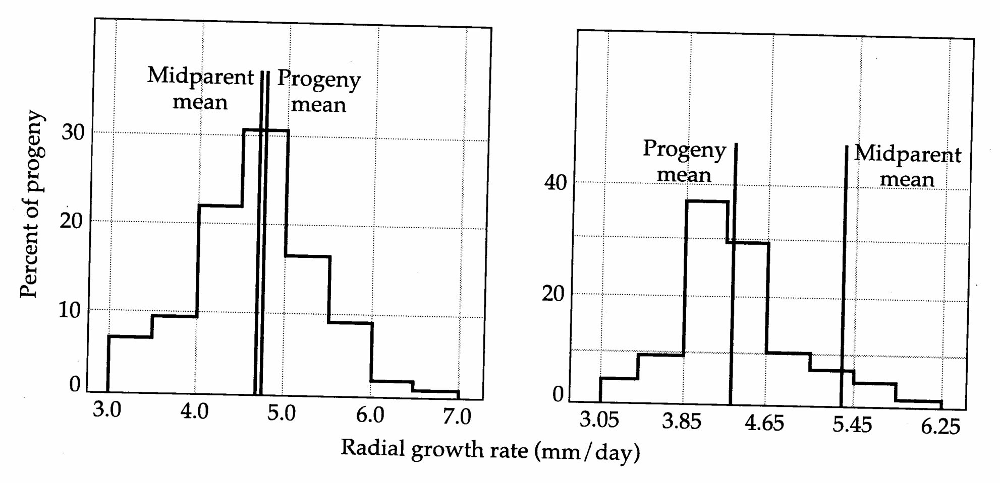
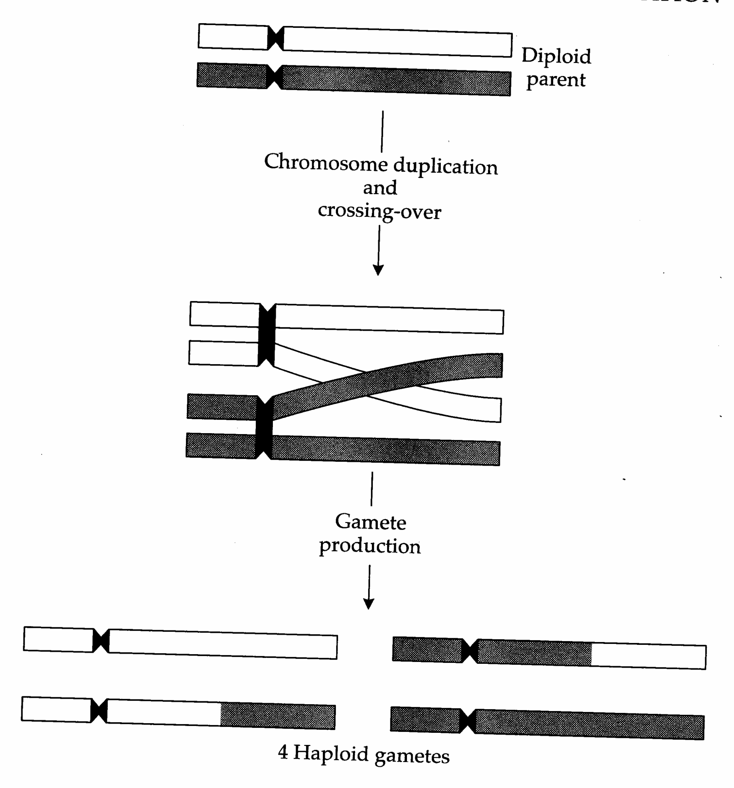
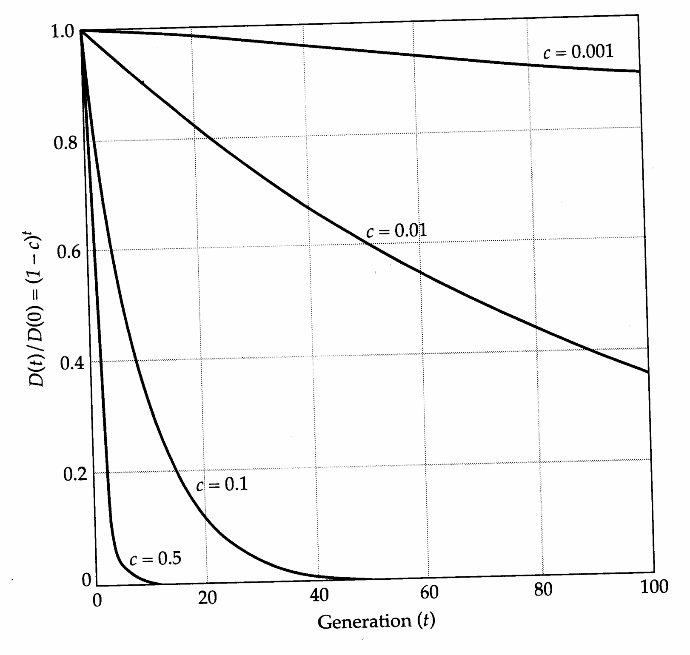
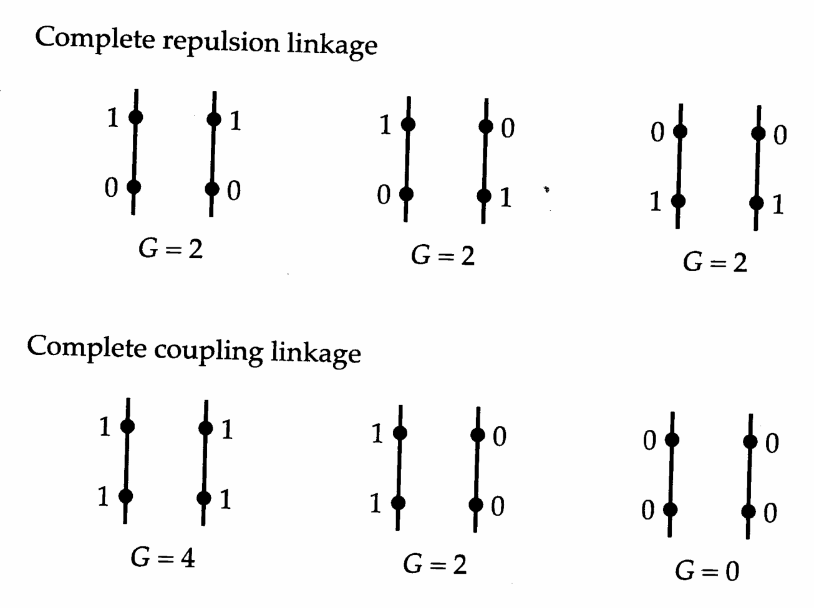
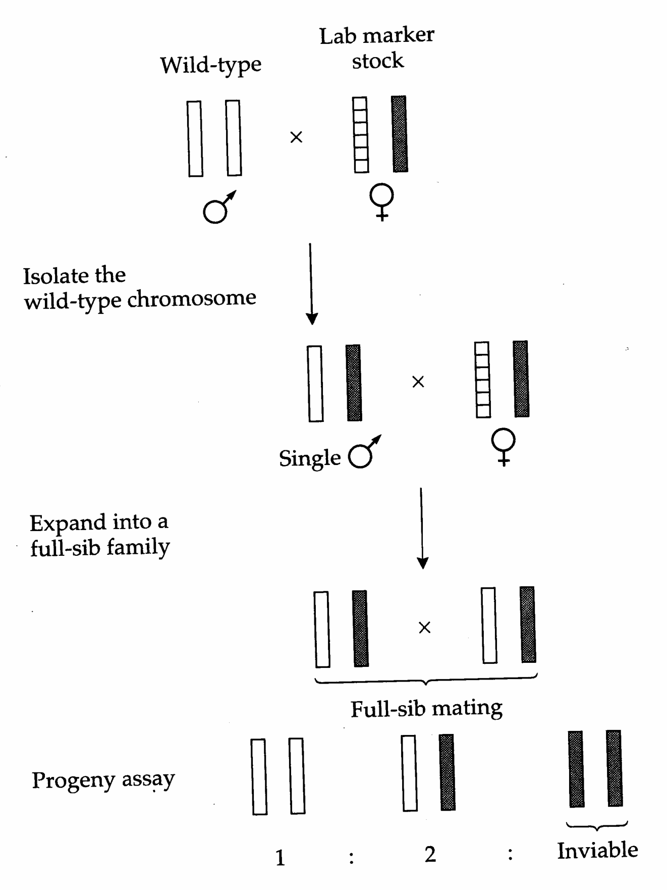
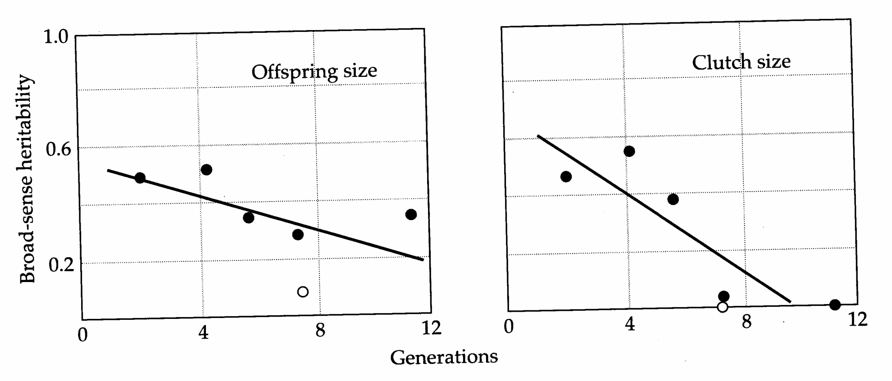

# Chapter 5 Textbook Mapping

## Genetics_chapter5_001 · Introduction

interaction between the genes associated with the markers. For example, when the genotype at the UMC107 locus is $ U_{MT} $ or $ U_{TT} $, $ B_{M} $ is quite dominant to $ B_{T} $ ($ k \simeq -0.7 $) and the homozygous effect of the $ B_{T} $ allele is $ a \simeq 21 $. However, on a $ U_{MM} $ background, the homozygous effect is reduced to $ a \simeq 15 $, and the BV302 locus exhibits overdominance ($ k > 1.0 $). For this and other characters, the authors further demonstrated that the homozygous and dominance effects associated with these markers vary dramatically depending on whether they are expressed in teosinte, maize, or teosinte $ \times $ maize genetic backgrounds.

---

## Genetics_chapter5_002 · Introduction / A GENERAL LEAST-SQUARES MODEL FOR GENETIC EFFECTS

**[定义 Definition]**

We now consider a statistical procedure for the definition of epistatic effects, which is a straightforward extension of the one-locus linear model introduced in Chapter 4. We will confine our attention to two loci, as the extension to higher numbers of loci should become obvious, and we assume random mating throughout.

**[定义 Definition]**

In the previous chapter, the additive effect of an allele was shown to be equal to the deviation of members of the population with the allele from the population mean phenotype. This definition does not change with the addition of loci. Letting $ G_{i} $ represent the conditional mean phenotype of individuals with allele i at the first locus without regard to the other allele at the locus or to the genotype at the second locus, then $$ \alpha_{i}=G_{i...}-\mu_{G} $$

Analogous expressions follow for the three other additive effects $(\alpha_{j}, \alpha_{k}, \text{ and } \alpha_{l})$. Within each locus, the mean value of the average effects (weighted by the allele frequencies) is equal to zero.

The dominance effects are defined by considering $G_{ij..}$, the conditional mean phenotype of individuals with alleles i and j at the first locus without regard to genotypic state at the second locus. From Equation 4.26, it follows that $$ \delta_{i j}=G_{i j..}-\mu_{G}-\alpha_{i}-\alpha_{j} $$ $$ \delta_{k l}=G_{..k l}-\mu_{G}-\alpha_{k}-\alpha_{l} $$

Here, we have subtracted the mean genotypic value and the additive effects, leaving the dominance effect as the only unexplained portion of the conditional mean at the locus. As in the case of additive effects, the mean dominance deviation at each locus is equal to zero.

**[定义 Definition]**

The definition of epistatic effects proceeds in a similar fashion. Letting $G_{i,k}$. be the mean phenotype of individuals with gene $i$ at locus 1 and $k$ at locus 2, without regard to the other two genes, the ikth additive $\times$ additive effect is $$ (\alpha\alpha)_{i k}=G_{i.k.}-\mu_{G}-\alpha_{i}-\alpha_{k} $$

In other words, $(\alpha\alpha)_{ik}$ is the deviation of the conditional mean $G_{i.k.}$ from the expectation based on the population mean $\mu_{G}$ and the additive effects $\alpha_{i}$ and $\alpha_{k}$. An additive $\times$ dominance effect measures the interaction between an allele at one locus with a particular genotype of another locus. It is defined as the deviation of the conditional mean $G_{i.kl}$ from the expectation based on all lower-order effects, in this case the three additive effects, one dominance effect, and two additive $\times$ additive effects involving the constituent genes, $$ (\alpha\delta)_{i k l}=G_{i.k l}-\mu_{G}-\alpha_{i}-\alpha_{k}-\alpha_{l}-\delta_{k l}-(\alpha\alpha)_{i k}-(\alpha\alpha)_{i l} $$

Finally, for a dominance $ \times $ dominance effect, $$ \begin{aligned}(\delta\delta)_{ijkl}&=G_{ijkl}-\mu_{G}-\alpha_{i}-\alpha_{j}-\alpha_{k}-\alpha_{l}-\delta_{ij}-\delta_{kl}\\&\quad-(\alpha\alpha)_{ik}-(\alpha\alpha)_{il}-(\alpha\alpha)_{jk}-(\alpha\alpha)_{jl}\\&\quad-(\alpha\delta)_{ikl}-(\alpha\delta)_{jkl}-(\alpha\delta)_{ijk}-(\alpha\delta)_{ijl}\end{aligned} $$

This partitioning of the total genotypic value into a series of effects can be summarized as follows. We started with the lowest-order effects, the additive effects of alleles. These are defined in a least-squares sense (Chapter 3), in that they account for as much of the variance in genotypic values as possible. We then progressively defined higher-order effects, each time accounting for as much of the residual variation as possible. In the two-locus example, $ (\delta\delta)_{ijkl} $ describes the final bit of variation not accounted for by additive, dominance, additive $ \times $ additive, or additive $ \times $ dominance effects. Summing up terms, we have a complete description of a genotypic value, $$ \begin{aligned}G_{ijkl\cdots}=&\mu_{G}+[\alpha_{i}+\alpha_{j}+\alpha_{k}+\alpha_{l}]+[\delta_{ij}+\delta_{kl}]\\&+[(\alpha\alpha)_{ik}+(\alpha\alpha)_{il}+(\alpha\alpha)_{jk}+(\alpha\alpha)_{jl}]\\&+[(\alpha\delta)_{ikl}+(\alpha\delta)_{jkl}+(\alpha\delta)_{ijk}+(\alpha\delta)_{ijl}]+(\delta\delta)_{ijkl}+\cdots\end{aligned} $$

The open-ended equation merely implies that there are many more terms when more than two loci are involved in the expression of a trait. The parameters in this model depend very much upon the genotype frequencies in the population and can change as allele frequencies change (Example 4, Chapter 4). However, the mean value of each type of effect is always equal to zero.

At first glance, Equation 5.7 may seem to be of little practical use. After all, if the genotypic value of an individual cannot be ascertained without error because of environmental contributions to the phenotype, then what hope is there of identifying the individual components? Often there is none. However, a great conceptual advance is achieved when Equation 5.7 is extended to the population level. Provided that mating is random and segregation of loci is independent, there is no statistical relationship between the genes found within or among loci. Therefore, the total genetic variance is simply the sum of the variance of the individual effects. Letting $ \sigma_{A}^{2}=\sigma^{2}(\alpha_{i})+\sigma^{2}(\alpha_{j})+\sigma^{2}(\alpha_{k})+\sigma^{2}(\alpha_{l}) $, $ \sigma_{D}^{2}=\sigma^{2}(\delta_{ij})+\sigma^{2}(\delta_{kl}) $, $ \sigma_{AA}^{2}=\sigma^{2}[(\alpha\alpha)_{ik}]+\sigma^{2}[(\alpha\alpha)_{il}]+\sigma^{2}[(\alpha\alpha)_{jk}]+\sigma^{2}[(\alpha\alpha)_{jl}] $, and so on, the total genetic variance can be expressed as $$ \sigma_{G}^{2}=\sigma_{A}^{2}+\sigma_{D}^{2}+\sigma_{A A}^{2}+\sigma_{A D}^{2}+\sigma_{D D}^{2}+\cdots $$

This partitioning of the genetic variance into a series of components, the multilocus analog of Equation 4.11, was developed independently, but with very different approaches, by both Cockerham and Kempthorne in 1954. Because of the hierarchical way in which genetic effects are defined, one might expect the magnitude of genetic variance components to become progressively smaller at higher stages in the hierarchy. Indeed, it is common for quantitative geneticists to use this argument as a rationalization for ignoring epistasis altogether. Unfortunately, such logic does not always hold up — as pointed out in the previous chapter, unless information on gene frequencies is available, variance components provide limited insight into the physiological mode of gene action. Recall that by modifying the additive effects of alleles, dominance (a higher-order effect than additivity) can inflate or deflate $ \sigma_{A}^{2} $ relative to the situation expected under complete additivity (Figure 4.8). Qualitatively similar results apply to epistasis — depending on the frequencies of the genes involved, epistatic interactions (through their statistical influence on the additive and dominance effects of alleles) can greatly inflate the additive and/or dominance components of genetic variance. Thus, as will be seen in the next example and as cogently pointed out by Keightley (1989) and Cheverud and Routman (1995), relatively low magnitudes of epistatic components of variance are by no means incompatible with the existence of strong epistatic gene action.

A simple quantitative argument points further to the potential for significant epistasis in the expression of quantitative traits. With $n$ loci underlying a trait, the number of additive effects is of order $n$, while the number of diallelic and triallelic epistatic effects are potentially of order $n^{2}$ and $n^{3}$. Thus, even if individual epistatic effects are relatively small, their summed effects may be large. This raises a serious issue for quantitative genetics that will become more apparent in later chapters. Although there are many possible types of epistasis, methods for evaluating their quantitative significance have substantial limitations from the standpoint of statistical power and experimental design.

In summary, simple statistical arguments suggest that epistatic interactions are likely to be important in the expression of many quantitative traits as well as in the determinance of levels of additive genetic variance. There is certainly no firm empirical evidence that epistasis is of negligible importance, and Wright (1968), for one, argued strongly that epistasis is the rule rather than the exception. We will be reaffirming that viewpoint throughout the book. For further reviews of the evidence, see Wright (1968), Barker (1979), and Moreno (1994).

**[命题 Proposition]**

Example 2. To acquire a deeper understanding of the connections between conditional genotypic values, genetic effects, and variance components, we return to the data in Example 1, making the assumption that the entries in the table are accurate estimates of the nine genotypic values associated with the marker loci. Suppose that this population randomly mates, with all alleles having frequency 0.5. What are the genetic effects associated with the different alleles (and their combinations), and what are the expected components of genetic variance associated with the two marker loci?

**[命题 Proposition]**

Under the assumption that the two loci are unlinked (in actuality, they are on different chromosomes), the frequencies of the two-locus genotypes are defined in the following table. They are simply equal to the products of the Hardy-Weinberg frequencies at the individual loci. Thus, each of the four double-homozygote classes has frequency $ (1/4)^2 $, while the classes with a single heterozygous locus have frequency $ (1/2) \times (1/4) $, and the double-heterozygote has frequency $ (1/2)^2 $.

In the following computations, we let $G_{ijkl}$ denote the genotypic value of individuals with alleles i and j at locus BV302 and alleles k and l at locus UMC107, where i, j, k, and l are either M or T. Letting $P_{ijkl}$ be the frequency of the ijkth genotype, the mean genotypic value in the population is $$ \begin{aligned}\mu_{G}&=\sum P_{ijkl}G_{ijkl}\\&=\left[\left(1/16\right)\times\left(18.0+61.1+47.8+101.7\right)\right]\\&\quad+\left[\left(1/8\right)\times\left(40.9+54.6+66.5+83.6\right)\right]+\left[\left(1/4\right)\times47.6\right]\\&=56.8875\end{aligned} $$

Additive effects. Prior to computing the additive effects, we require the conditional genotypic means associated with each allele. These are obtained by weighting the phenotypic data in the table of Example 1 with conditional genotype frequencies. For example, the conditional genotypic mean for individuals containing a $B_{M}$ allele is $$ G_{B_{M}\cdots}=\sum_{j,k,l}P(i j k l\mid i=B_{M})G_{B_{M}j k l} $$

The conditional probability $P(ijkl \mid i = B_M)$ is the probability that an individual has alleles $j$, $k$, and $l$, given that it is has one $B_M$ allele. This probability is simply the product of the appropriate (Hardy-Weinberg) genotype frequency at the UMC107 locus and the appropriate allele frequency at locus BV302. For example, if $j = B_{M}, k = U_{M}$, and $j = U_{M}$, $P(ijkl|i = B_{M}) = 0.5 \times 0.25 = 0.125$. Thus, the genotypic mean conditional on having a $B_{M}$ allele is $$ \begin{aligned}G_{B_{M}\cdots}&=(0.5\times0.25\times18.0)+(0.5\times0.5\times40.9)\\&\quad+(0.5\times0.25\times61.1)+(0.5\times0.25\times54.6)\\&\quad+(0.5\times0.5\times47.6)+(0.5\times0.25\times66.5)=47.1500\end{aligned} $$

The three other conditional means involving single alleles are obtained in a similar manner, $$ G_{B_{T}\ldots}=66.6250\qquad G_{\ldots U_{M^{\cdot}}}=49.3375\qquad G_{\ldots U_{T^{\cdot}}}=64.4375 $$

Recalling Equation 5.2, we obtain the additive effects by subtracting the population mean $\mu_{G}$ from the conditional means, $$ \begin{array}{l}\alpha_{B_{M}}=-9.7375\\ \alpha_{U_{M}}=-7.5500\end{array}\quad\begin{array}{l}\alpha_{B_{T}}=9.7375\\ \alpha_{U_{T}}=7.5500\end{array} $$

Noting that each allele has frequency 0.5, the mean additive effect of the alleles at each locus is equal to zero.

Dominance effects. To obtain the dominance effects, we require the conditional genotypic means. In this case, for each single-locus genotype, we simply take the average of the three genotypic values associated with the second locus, weighted by their Hardy-Weinberg frequencies. For example, for the $B_{MM}$ genotype, $$ \begin{aligned}{G_{B_{M M^{...}}}}&{{}=\sum_{k,l}P({i j k l}\left|{i,j}=B_{M}\right){G}_{B_{M M}k l}}\\ {}&{{}=\left(0.25\times18.0\right)+\left(0.5\times40.9\right)+\left(0.25\times61.1\right)=40.225}\\ \end{aligned}. $$

Similarly, the conditional means for the $B_{MT}$ and $B_{TT}$ genotypes are found to be $$ G_{B_{M T}..}=54.075\qquad G_{B_{T T}..}=79.175 $$

Substituting these values, the population mean, and the appropriate additive effects into Equation 5.3, we obtain the dominance effects, $$ \delta_{B_{M M}}=2.8125\qquad\delta_{B_{M T}}=-2.8125\qquad\delta_{B_{T T}}=2.8125 $$

Weighting these by the Hardy-Weinberg frequencies associated with each genotype, it can be seen that the mean dominance effect at the BV302 locus is equal to zero. We leave it to the reader to show that for the UMC107 locus, $$ \delta_{U_{M M}}=1.9625\qquad\delta_{U_{M T}}=-1.9625\qquad\delta_{U_{T T}}=1.9625 $$

Additive × additive effects. The same logic is used to obtain the additive × additive effects. Because there are two alleles at each locus, four conditional means (each involving one allele at each locus) must be considered. Each gametic type is found in four two-locus genotypes, in this case with equal frequency 0.25 because all alleles have frequency 0.5. Thus, for example, the conditional mean $ G_{BM} \cdot U_{M} $ is the average of the genotypic values for the genotypes $ B_{MM}U_{MM} $, $ B_{MT}U_{MM} $, $ B_{MM}U_{MT} $, and $ B_{MT}U_{MT} $. The four conditional means are $$ \begin{array}{l l}{G_{B_{M}\cdot U_{M}\cdot}}&{G_{B_{M}\cdot U_{T}\cdot}=54.025}\\ {G_{B_{T}\cdot U_{M}\cdot}}&{G_{B_{T}\cdot U_{T}\cdot}=74.850}\\ \end{array} $$

The additive $ \times $ additive effects are computed by substituting these values, the population mean, and the appropriate additive effects into Equation 5.4. $$ (\alpha\alpha)_{B_{M}\cdot U_{M\cdot}}=0.675\qquad(\alpha\alpha)_{B_{M}\cdot U_{T\cdot}}=-0.675 $$ $$ \left(\alpha\alpha\right)_{B_{T}\cdot U_{T\cdot}}=0.675\qquad\left(\alpha\alpha\right)_{B_{T}\cdot U_{M\cdot}}=-0.675 $$

Again, the mean value of these effects (weighted by their frequencies at occurrence) is zero.

Additive $ \times $ dominance effects. At this point, we assume that the basic strategy for calculating conditional means is familiar, and we leave it to the reader to verify that the conditional means involving one allele at one locus and two at the other locus are $$ G_{B_{M},U_{M M}}=36.30\qquad G_{B_{M},U_{M T}}=44.25\qquad G_{B_{M},U_{T T}}=63.80 $$ $$ G_{B_{T}.U_{M M}}=51.20\qquad G_{B_{T}.U_{M T}}=65.60\qquad\underbrace{G_{B_{T}.U_{T T}}}_{}=84.10 $$ $$ c_{_{R_{MM}U_{M}}}=29.45\quad G_{B_{MT}U_{M}}=51.10\quad G_{B_{TT}U_{M}}=65.70 $$ $$ G_{B_{M M}U_{T^{\cdot}}}=51.00\qquad G_{B_{M T}U_{T^{\cdot}}}=57.05\qquad G_{B_{T T}U_{T^{\cdot}}}=92.65 $$

The additive $ \times $ dominance effects follow from substitution of quantities given above into Equation 5.5, $$ (\alpha\delta)_{B_{M}.U_{M M}}={\begin{array}{l}{0.9375}\end{array}}(\alpha\delta)_{B_{M}.U_{M T}}=-0.9375{\begin{array}{l}{(\alpha\delta)_{B_{M}.U_{T T}}=}\end{array}}{\begin{array}{l}{0.9375}\end{array}} $$ $$ \begin{array}{r l r}{\left(\alpha\delta\right)_{B_{T},U_{M M}}=-0.9375}&{{}\mathrm{~}({\alpha\delta})_{B_{T},U_{M T}}=}&{0.9375\quad({\alpha\delta})_{B_{T},U_{T T}}=-0.9375}\end{array} $$ $$ \begin{array}{r l r}{(\alpha\delta)_{B_{M M}U_{M.}}=-4.5750}&{{}\mathrm{(}\alpha\delta)_{B_{M T}U_{M.}}=}&{4.5750\mathrm{\quad}(\alpha\delta)_{B_{T T}U_{M.}}=-4.5750}\end{array} $$ $$ (\alpha\delta)_{B_{M M}U_{T.}}=~4.5750\quad(\alpha\delta)_{B_{M T}U_{T.}}=-4.5750\quad(\alpha\delta)_{B_{T T}U_{T.}}=~4.5750 $$

Dominance $ \times $ dominance effects. The nine dominance $ \times $ dominance effects are computed from the observed genotypic values using Equation 5.6. $$ (\delta\delta)_{B_{M M}U_{M M}}=-4.5125\quad(\delta\delta)_{B_{M M}U_{M T}}=4.5125\quad(\delta\delta)_{B_{M M}U_{T T}}=-4.5125 $$ $$ (\delta\delta)_{B_{M T}U_{M M}}={\quad4.5125\quad}(\delta\delta)_{B_{M T}U_{M T}}=-4.5125\quad(\delta\delta)_{B_{M T}U_{T T}}={\quad4.5125\quad}. $$ $$ (\delta\delta)_{B_{T T}U_{M M}}^{\cdots\cdots\cdots}=-4.5125\quad(\delta\delta)_{B_{T T}U_{M T}}^{\cdots\cdots}=\quad4.5125\quad(\delta\delta)_{B_{T T}U_{T T}}=-4.5125 $$

Variance components. The final step in this example is to compute the components of genetic variance. Because the average effects are computed in such a way that their means are always equal to zero, the variances are simply equal to the mean squared effects (weighted by their frequency of occurrence) multiplied by the number of times the effect occurs. For example, for the additive genetic variance, the contribution associated with the BV302 locus is $ 2 \times [(0.5 \times (-9.7375))^2) + (0.5 \times 9.7375^2)] = 189.6378 $; the mean-squared effect is multiplied by two because there are two additive effects per diploid locus. In the same manner, the additive genetic variance associated with the UMC107 locus is found to be 114.0050. The total additive genetic variance associated with these two loci is simply the sum of the locus-specific contributions, $$ \sigma_{A}^{2}=303.6428 $$

(The same answer is obtained by defining the breeding values of the nine different genotypes as $ A_{ijkl} = \alpha_i + \alpha_j + \alpha_k + \alpha_l $, and computing the mean squared breeding value; see Example 4, Chapter 4).

The dominance genetic variance associated with each locus is equal to the mean squared dominance effect, $ 2.8125^{2} = 7.9101 $ for the BV302 locus and $ 1.9625^{2} = 3.8514 $ for the UMC107 locus. Thus, the total dominance genetic variance is $$ \sigma_{D}^{2}=11.7615 $$

The additive $ \times $ additive variance is obtained by multiplying the mean squared additive $ \times $ additive effect by four, because four such effects contribute to each genotypic value. In this example, all of the additive $ \times $ additive effects have absolute value 0.675 (as in the case of the additive and dominance effects, the symmetry is a special consequence of all of the gene frequencies being equal to 0.5). Thus, the additive $ \times $ additive variance is simply $ 4 \times 0.675^{2} $, $$ \sigma_{A A}^{2}=1.8225 $$

For the additive $ \times $ dominance variance, there are again four effects contributing to the genotypic value of each individual, two involving BV302 additive effects and two involving UMC107 additive effects. The additive $ \times $ dominance variance is therefore $ (2 \times 0.9375^{2}) + (2 \times 4.575^{2}) $, $$ \sigma_{A D}^{2}=43.6191 $$

Finally, because there is only one dominance $ \times $ dominance term per individual, the dominance $ \times $ dominance variance is simply the mean squared effect, $ 4.5125^{2} $, $$ \sigma_{D D}^{2}=20.3627 $$

Summing the five components of genetic variance, we obtain the total genetic variance associated with the two markers, $$ \sigma_{G}^{2}=381.2086 $$ As a check on the validity of this result, the total genetic variance can be computed directly from the data in the table in Example 1 as $ \sum P_{ijkl} G_{ijkl}^{2} - \mu_{G}^{2} $; the same answer is obtained.

These results show that despite the existence of strong epistatic interactions between the effects of genes associated with the two markers (Example 1), most of the interaction effects are associated statistically with the additive effects of alleles. The three epistatic components of variance account for only 17% of the total genetic variance, and the dominance genetic variance contributes only another 3%. Thus, as emphasized above, the relative magnitude of variance components provides little insight into the actual physiological mode of gene action.

In closing, we note that this example is a somewhat unconventional application of the linear model. Usually, the genes underlying quantitative traits are unknown, in which case it is impossible to estimate their individual effects. However, with the widespread application of molecular markers, this situation is changing rapidly (Chapters 13–16). In Chapter 7, we will begin to see that estimation of the components of genetic variance associated with the entire pool of constituent loci underlying a quantitative trait does not require any information about their identity.

> **Unnumbered table**
>
> <table border=1 style='margin: auto; word-wrap: break-word;'><tr><td rowspan="2">BV302</td><td colspan="3">UMC107</td></tr><tr><td style='text-align: center; word-wrap: break-word;'>$ U_{MM} $</td><td style='text-align: center; word-wrap: break-word;'>$ U_{MT} $</td><td style='text-align: center; word-wrap: break-word;'>$ U_{TT} $</td></tr><tr><td style='text-align: center; word-wrap: break-word;'>$ B_{MM} $</td><td style='text-align: center; word-wrap: break-word;'>1/16</td><td style='text-align: center; word-wrap: break-word;'>1/8</td><td style='text-align: center; word-wrap: break-word;'>1/16</td></tr><tr><td style='text-align: center; word-wrap: break-word;'>$ B_{MT} $</td><td style='text-align: center; word-wrap: break-word;'>1/8</td><td style='text-align: center; word-wrap: break-word;'>1/4</td><td style='text-align: center; word-wrap: break-word;'>1/8</td></tr><tr><td style='text-align: center; word-wrap: break-word;'>$ B_{TT} $</td><td style='text-align: center; word-wrap: break-word;'>1/16</td><td style='text-align: center; word-wrap: break-word;'>1/8</td><td style='text-align: center; word-wrap: break-word;'>1/16</td></tr></table>

---

## Genetics_chapter5_003 · Introduction / Extension to Haploids and Polyploids

A large fraction of the “lower” organisms, most notably bacteria, fungi, algae, and mosses, have life cycles that are predominantly haploid. A very brief diploid stage occurs when gametes fuse and chromosomes reassort to form variable haploid progeny. Haploid species have long been used as model systems in genetic studies focused on single loci, but they also offer some interesting possibilities for studies on quantitative-genetic variation (Caten and Jinks 1976, Croft and Jinks 1977, Caten 1979). Because haploid organisms have only a single allele at each locus, dominance does not contribute to the genetic variation, so all variance due to nonadditive gene action involves epistasis between additive effects. Therefore, Equation 5.8 simplifies to $$ \sigma_{G}^{2}=\sigma_{A}^{2}+\sigma_{A A}^{2}+\sigma_{A A A}^{2}+\cdots $$

Almost all haploid organisms can be propagated vegetatively, and it is a simple matter to test whether genetic variation can be explained by an additive model. When measures are taken on a large number of replicates of the same genotype, the mean of these measures will be a good estimate of the genotypic value under the experimental setting. If there is no epistatic gene action, the mean phenotype of sexually produced progeny should not be significantly different from the average of the parents.

Figure 5.3 illustrates two analyses of growth rate resulting from crosses between strains of the bread mold, Aspergillus. In both cases, there is a wide dispersion of offspring phenotypes due to the reassortment of parental genes. The mean offspring phenotype is not significantly different from that of the midparent

> **Figure 5.3** · page 9 · source: `Genetics_chapter5`
>
> 
>
> Figure 5.3 Frequency distributions of progeny phenotypes from single crosses in comparison to midparent means. Left: Aspergillus amstelodami cross  $ 2 \times 37 $. (From Caten and Jinks 1976.) Right: Aspergillus nidulans cross  $ 7 \times 43 $. (From Jinks et al. 1966.)

in one case, but in the second case there is a substantial depression in offspring growth rate. In this case, it appears that different combinations of genes with favorable epistatic effects on growth were sorted into the two parental lines. Sexual reproduction resulted in a breakup of these positive gene interactions. This type of result is observed commonly in crosses between fungal lines (Papa 1970, Merrick 1975), and we will consider it in a broader context in Chapter 9.

Partitioning the genetic variance becomes much more complicated in the case of polyploids because of additional gene effects that need to be taken into account. Consider the effects attributable to single loci. With haploids we need only consider the additive component of variance, while diploid analysis brings in a dominance component to account for diallelic interactions. In the case of a tetraploid with single-locus genotype $ B_{ijkl} $, there are six potential diallelic interactions per locus ($ i \times j $, $ i \times k $, $ i \times l $, $ j \times k $, $ j \times l $, $ k \times l $), as well as four three-allele interactions ($ i \times j \times k $, $ i \times j \times l $, $ i \times k \times l $, $ j \times k \times l $), and one four-allele interaction ($ i \times j \times k \times l $). Thus, in the absence of interactions between loci, the total genetic variance of a tetraploid can be written as $$ \sigma_{G}^{2}=\sigma_{A}^{2}+\sigma_{B}^{2}+\sigma_{T}^{2}+\sigma_{Q}^{2} $$ where $\sigma_{B}^{2}$, $\sigma_{T}^{2}$, and $\sigma_{Q}^{2}$ denote the variances of effects involving bi-, tri-, and quadra-allelic interactions. With epistasis, this expression becomes much more complicated. Even if epistasis only involved pairs of loci, ten terms $(\sigma_{AA}^{2}, \sigma_{AB}^{2}, \sigma_{AT}^{2}, \sigma_{AQ}^{2}, \sigma_{BB}^{2}, \mathrm{etc.})$ would need to be taken into account, compared with three in the case of diploidy. Further information on these matters can be found in

Kempthorne (1957), Killick (1971), and Mather and Jinks (1982). Wricke and Weber (1986) give a particularly lucid review and show how all of the concepts introduced in the previous chapter can be extended to tetraploids.

---

## Genetics_chapter5_004 · Introduction / LINKAGE

Up to now we have been treating the transmission of genes at different loci as independent events. Such independence is generally true for genes that are on different chromosomes, but when loci are physically linked on the same chromosome, a statistical dependence can exist between the genes incorporated into gametes. Genes that lie on the same chromosome tend to be inherited as a group, a tendency that declines with increasing distance between the loci. Crossing-over is responsible for this decline.

During the meiotic production of gametes, each chromosome replicates to form two “sister” chromatids. Homologous nonsister chromatids then become intimately associated with each other, forming one or more physical connections known as chiasmata (Figure 5.4). Each chiasma represents a point of prior transfer of genetic information. Usually, the chromosomal material distal to a chiasma is exchanged completely, while that proximal to the centromere remains intact. Such an exchange is referred to as a cross-over.

Gamete frequencies are the fundamental census units in all considerations of linkage relationships. Consider two diallelic loci, $A$ and $B$, and let the frequencies of the four gamete types be $P_{A_1B_1}$, $P_{A_1B_2}$, $P_{A_2B_1}$, and $P_{A_2B_2}$, and the frequencies of alleles be $p_{A_1}$, $p_{A_2}$, $p_{B_1}$, and $p_{B_2}$. If the allelic state at locus $A$ is completely independent of that at locus $B$, then we expect $P_{A_1B_1} = p_{A_1}p_{B_1}$, $P_{A_1B_2} = p_{A_1}p_{B_2}$, and so on. However, many factors, including natural selection, founder effects, migration, and assortative mating, can cause gamete frequencies to depart from expectations based on allele frequencies. A natural measure of this deviation is the coefficient $$ D_{A_{i}B_{j}}=P_{A_{i}B_{j}}-p_{A_{i}}p_{B_{j}} $$

The index $D_{A_{i}B_{j}}$ is equivalent to the covariance of the frequencies of “nonalleles” $A_{i}$ and $B_{j}$ in the same gamete. To see this relationship, let $x=1$ if $A_{i}$ is present and $x=0$ otherwise, and let $y=1$ if $B_{j}$ is present and $y=0$ otherwise. Then, $xy=1$ if both $A_{i}$ and $B_{j}$ are present, and $xy=0$ otherwise, so $\sigma_{A_{i},B_{j}}=E(xy)-E(x)E(y)=P_{A_{i}B_{j}}-p_{A_{i}}p_{B_{j}}$.

Note that $D_{A_i B_j}$ may be positive or negative depending on whether $A_i$ and $B_j$ are in coupling ($A_i B_j$ gametes are overrepresented) or repulsion ($A_i B_j$ gametes are underrepresented) disequilibrium. $D$ is often referred to as the coefficient of linkage disequilibrium, but since disequilibrium can occur between unlinked genes, many authors prefer to call it the coefficient of gametic phase disequilibrium. Higher-order terms for three or more loci are defined in Bennett (1954), Geiringer (1944), and Slatkin (1972).

> **Figure 5.4** · page 11 · source: `Genetics_chapter5`
>
> 
>
> Figure 5.4 A recombination event caused by crossing-over during meiosis. Shaded and open bars represent maternally and paternally derived chromosomes; the darkened area represents the centromere. The two original homologous chromosomes give rise initially to two pairs of sister chromatids, which then recombine and sort independently into four haploid gametes.

There are many ways in which disequilibrium between loci can originate and many ways by which it can be maintained (Felsenstein 1965, 1974; Hill and Robertson 1966, 1968; Nei 1967; Franklin and Lewontin 1970; Barker 1979; Charlesworth and Charlesworth 1979; Feldman et al. 1980). For now, we simply note that, even in the absence of forces that tend to maintain gametic phase disequilibrium (selection, migration, mutation, and drift), once such disequilibrium is present, it may persist for many generations.

The expected dynamics of gametic phase disequilibrium depend on the recombination fraction between loci, c. This quantity takes on a minimum value of zero when two loci are so tightly linked that they effectively segregate as a single supergene. Free recombination between loci is denoted by c = 0.5. The upper limit is 0.5 rather than 1.0 because crossing-over normally involves one

> **Figure 5.5** · page 12 · source: `Genetics_chapter5`
>
> 
>
> Figure 5.5 The decline, under random mating, of gametic phase disequilibrium relative to its initial value as a function of the recombination frequency, c.

rather than two pairs of nonsister chromatids. In principle, if cross-overs occurred between loci A and B on both pairs of chromatids, the recombination fraction could exceed 0.5, but this has been observed only rarely (Fisher and Mather 1936).

Consider the ideal case in which mating occurs randomly in a population that is effectively infinite in size and all systematic forces causing alleles at different loci to become statistically associated are absent. There are two ways to obtain gametes of a particular type: chromosomes of that type may be transmitted intact between generations, or different chromosomes may recombine to form new gene combinations of the appropriate type. If the frequency of gamete type $ A_{i}B_{j} $ in generation t is $ P_{A_{i}B_{j}}(t) $, then $ (1-c)P_{A_{i}B_{j}}(t) $ is the frequency that is passed on without recombination to the next generation. Among the proportion c of new gametes that are recombinants, $ p_{A_{i}}p_{B_{j}} $ must contain both $ A_{i} $ and $ B_{j} $ genes, since under random mating, the maternally derived A gene is distributed independently of the paternally derived B gene. Summing terms, $$ P_{A_{i}B_{j}}(t+1)=(1-c)P_{A_{i}B_{j}}(t)+c p_{A_{i}}p_{B_{j}} $$ and after subtracting $p_{A_{i}}p_{B_{j}}$ from both sides, $$ D_{A_{i}B_{j}}(t+1)=(1-c)D_{A_{i}B_{j}}(t) $$

This equation generalizes to $$ D_{A_{i}B_{j}}(t)=(1-c)^{t}D_{A_{i}B_{j}}(0) $$

The main point of this illustration is that the disequilibrium between loci decays gradually. Even in the case of unlinked genes $(c=0.5)$, only 50% of the disequilibrium is removed each generation. With less frequent recombination, the time to attain gametic phase equilibrium $(D=0)$ can be quite long (Figure 5.5).

---

## Genetics_chapter5_005 · Introduction / Estimation of Gametic Phase Disequilibrium

Although genes need not be linked to be in gametic phase disequilibrium, Equation 5.13 indicates that, all other things being equal, disequilibrium is more likely to persist for linked loci. Ecological factors can induce significant gametic phase disequilibrium between unlinked loci. Such an outcome is expected, for example, when a recent hybridization has occurred between two populations or when selection favors a particular multilocus genotype. Taken alone, estimates of gametic phase disequilibrium cannot discriminate among these and other hypotheses, but they do act as guides for further research.

There are two ways to estimate the degree of disequilibrium between loci. Since D is a function of gamete frequencies, an approach that allows a direct count of gamete types is preferable. There are only a few experimental systems, most notably Drosophila, in which this is possible. Male Drosophila do not exhibit recombination. Thus, when a homozygous laboratory stock is available, progeny from crosses to wild-caught males can yield the gametic states of the previous generation unambiguously. An example of this type of analysis is given below.

Example 3. Males from two wild populations of Drosophila montana were crossed with a laboratory stock, homozygous for unique marker alleles at four esterase loci (Baker and Kaeding 1981). The progeny were then scored electrophoretically for the presence of active or null alleles at the four loci. Only the results of esterase-3 and esterase-4, which exhibited the greatest amount of disequilibrium, are presented here. In the following table (A) and (O) denote, respectively, active and null alleles at both loci, so AO, for example, represents chromosomes with an active allele at the first locus (esterase-3) and a null at the second locus (esterase-4). The entries in the table represent the numbers of observations of each chromosome type, and N denotes the total sample size for each study.

The estimation procedure is from Hill and Robertson (1968) and Hill (1974). The formulae on the right in the table provide estimates for the active-allele frequencies at the esterase-3 and esterase-4 loci, and for the gametic phase disequilibrium between these loci. The estimates, obtained by substituting the observed incidences of the four chromosomal types, are given at the bottom of the table.

The sampling variance of $\widehat{D}$ is given by $$ \mathrm{Var}(\widehat{D})=\frac{\widehat{p}_{A.}(1-\widehat{p}_{A.})\widehat{p}_{.A}(1-\widehat{p}_{.A})+(1-2\widehat{p}_{A.})(1-2\widehat{p}_{.A})\widehat{D}-\widehat{D}^{2}}{N} $$

(Weir 1996), and the standard error of $\widehat{D}$ is simply the square root of $\mathrm{Var}(\widehat{D})$. For the two populations, $\mathrm{SE}(\widehat{D})=0.028$ and 0.005. Thus, both populations exhibit significant excess frequencies of repulsion gametes (an active allele at one locus and a null at the other) and have essentially the same level of disequilibrium. Based on the estimated allele frequencies, the number of AO and OA chromosomes expected in the Utah sample under gametic phase equilibrium is $100\times[(0.54\times0.65)+(0.46\times0.35)]\simeq51$, whereas 81 were observed. For the Colorado population, the equilibrium expectation (740) is also well below the observed value (1194). The existence of disequilibrium between these two loci is not too surprising, since these esterase loci are tightly linked in Drosophila.

For most natural populations, the luxury of an inbred marker line is not an option. Usually, the only available information is the frequency distribution of multilocus genotypes in the study population, which raises some conceptual difficulties. While the gametic composition of most zygotes can be resolved from the genotype (e.g., an AaBB individual must have arisen from AB and aB gametes), double heterozygotes, which can arise from the fusion of AB and ab or Ab and aB gametes, cannot be resolved definitively. If, however, one is justified in assuming random mating, it is not necessary to discriminate between coupling and repulsion heterozygotes. In this case, an unbiased estimator of D is given by $$ \widehat{D}_{A B}=\frac{N}{N-1}\left[\frac{4N_{A A B B}+2(N_{A A B b}+N_{A a B B})+N_{A a B b}}{2N}-2\widehat{p}_{A}\widehat{p}_{B}\right] $$ where $N$ is the total sample size, the terms in the numerator are observed numbers of the four genotypes, and $\widehat{p}_{A}$ and $\widehat{p}_{B}$ are gene frequency estimates. An expression for the sampling variance of $\widehat{D}$, derived by Weir and Cockerham (1979), is $$ \mathrm{Var}(\widehat{D})=\frac{\widehat{p}_{A}\widehat{p}_{a}\widehat{p}_{B}\widehat{p}_{b}}{N-1}+\frac{(2\widehat{p}_{A}-1)(2\widehat{p}_{B}-1)\widehat{D}}{2N}+\frac{\widehat{D}^{2}}{N(N-1)} $$

For loci in gametic phase equilibrium, this reduces to $$ \mathrm{Var}(\widehat{D})=\frac{\widehat{p}_{A}\widehat{p}_{a}\widehat{p}_{B}\widehat{p}_{b}}{N-1} $$

Example 4. Genotype frequency data for the M/N and S/s blood group loci for a sample of 1000 Caucasians in England are given in the following table (from Cleghorn 1960). These two loci are known to be very tightly linked; only a few well-established cases of recombination have appeared in thousands of analyses.

Using Equation 4.1, the estimated frequencies of the M and S alleles are $$ \widehat{p}_{M}=\frac{(57+140+101)+0.5(39+224+226)}{1000}=0.5425 $$ $$ \widehat{p}_{S}=\frac{(57+39+3)+0.5(140+224+54)}{1000}=0.3080 $$

Substitution into Equations 5.14 and 5.15 gives the estimated disequilibrium and its sampling variance, $$ \begin{aligned}\widehat{D}_{MS}&=\frac{N}{N-1}\left[\frac{4N_{MMSS}+2(N_{MMSs}+N_{MNSS})+N_{MNSs}}{2N}-2\widehat{p}_{M}\widehat{p}_{S}\right]\\&=0.071\end{aligned} $$ $$ \mathrm{Var}(\widehat{D})=\frac{\widehat{p}_{M}\widehat{p}_{N}\widehat{p}_{S}\widehat{p}_{s}}{N-1}+\frac{(2\widehat{p}_{M}-1)(2\widehat{p}_{S}-1)\widehat{D}}{2N}+\frac{\widehat{D}^{2}}{N(N-1)}=0.0000518 $$

The square root of the sampling variance is the standard error of the estimate. $$ \operatorname{SE}(\widehat{D}_{MS})=0.0072 $$

Since the estimate $ \widehat{D}_{MS} $ is approximately ten standard errors greater than zero, there appears to be significant disequilibrium between these two loci, with MS and Ns gametes being overrepresented relative to Ms and NS gametes.

Additional details regarding tests of hypotheses about gametic phase disequilibrium may be found in Brown (1975), Cockerham and Weir (1977a), Weir (1979), Weir and Cockerham (1979), Hedrick (1987a), Lewontin (1988), and Weir (1996). Brown (1975) has given considerable attention to the adequacy of sample sizes for detecting disequilibrium, providing useful tables. Unless gene frequencies are intermediate (0.4 to 0.6) at both loci and disequilibrium is strong ($ |D|>0.4 $), several hundred to thousands of individuals should be assayed to achieve a reasonable level of statistical power. Estimation procedures for cases in which one or both loci exhibit complete dominance are developed in Hill (1974), and Hill (1975) considers the situation when more than two alleles are present at a locus.

> **Unnumbered table**
>
> <table border=1 style='margin: auto; word-wrap: break-word;'><tr><td style='text-align: center; word-wrap: break-word;'>Chromosome</td><td style='text-align: center; word-wrap: break-word;'>Utah</td><td style='text-align: center; word-wrap: break-word;'>Colorado</td><td style='text-align: center; word-wrap: break-word;'></td></tr><tr><td style='text-align: center; word-wrap: break-word;'>AA</td><td style='text-align: center; word-wrap: break-word;'>4</td><td style='text-align: center; word-wrap: break-word;'>71</td><td style='text-align: center; word-wrap: break-word;'></td></tr><tr><td style='text-align: center; word-wrap: break-word;'>AO</td><td style='text-align: center; word-wrap: break-word;'>50</td><td style='text-align: center; word-wrap: break-word;'>737</td><td style='text-align: center; word-wrap: break-word;'>$ \widehat{p}_{A.} = (N_{AA} + N_{AO})/N $</td></tr><tr><td style='text-align: center; word-wrap: break-word;'>OA</td><td style='text-align: center; word-wrap: break-word;'>31</td><td style='text-align: center; word-wrap: break-word;'>457</td><td style='text-align: center; word-wrap: break-word;'></td></tr><tr><td style='text-align: center; word-wrap: break-word;'>OO</td><td style='text-align: center; word-wrap: break-word;'>15</td><td style='text-align: center; word-wrap: break-word;'>167</td><td style='text-align: center; word-wrap: break-word;'>$ \widehat{p}_{.A} = (N_{AA} + N_{OA})/N $</td></tr><tr><td style='text-align: center; word-wrap: break-word;'>N</td><td style='text-align: center; word-wrap: break-word;'>100</td><td style='text-align: center; word-wrap: break-word;'>1432</td><td style='text-align: center; word-wrap: break-word;'></td></tr><tr><td style='text-align: center; word-wrap: break-word;'>$ \widehat{p}_{A.} $</td><td style='text-align: center; word-wrap: break-word;'>0.540</td><td style='text-align: center; word-wrap: break-word;'>0.564</td><td style='text-align: center; word-wrap: break-word;'></td></tr><tr><td style='text-align: center; word-wrap: break-word;'>$ \widehat{p}_{.A} $</td><td style='text-align: center; word-wrap: break-word;'>0.350</td><td style='text-align: center; word-wrap: break-word;'>0.368</td><td style='text-align: center; word-wrap: break-word;'>$ \widehat{D}_{AA} = P_{AA} - \widehat{p}_{A.}\widehat{p}_{.A} $</td></tr><tr><td style='text-align: center; word-wrap: break-word;'>$ \widehat{D}_{AA} $</td><td style='text-align: center; word-wrap: break-word;'>-0.149</td><td style='text-align: center; word-wrap: break-word;'>-0.158</td><td style='text-align: center; word-wrap: break-word;'></td></tr></table>

> **Unnumbered table**
>
> <table border=1 style='margin: auto; word-wrap: break-word;'><tr><td style='text-align: center; word-wrap: break-word;'></td><td style='text-align: center; word-wrap: break-word;'>MM</td><td style='text-align: center; word-wrap: break-word;'>MN</td><td style='text-align: center; word-wrap: break-word;'>NN</td></tr><tr><td style='text-align: center; word-wrap: break-word;'>SS</td><td style='text-align: center; word-wrap: break-word;'>57</td><td style='text-align: center; word-wrap: break-word;'>39</td><td style='text-align: center; word-wrap: break-word;'>3</td></tr><tr><td style='text-align: center; word-wrap: break-word;'>Ss</td><td style='text-align: center; word-wrap: break-word;'>140</td><td style='text-align: center; word-wrap: break-word;'>224</td><td style='text-align: center; word-wrap: break-word;'>54</td></tr><tr><td style='text-align: center; word-wrap: break-word;'>ss</td><td style='text-align: center; word-wrap: break-word;'>101</td><td style='text-align: center; word-wrap: break-word;'>226</td><td style='text-align: center; word-wrap: break-word;'>156</td></tr></table>

---

## Genetics_chapter5_006 · Introduction / EFFECT OF DISEQUILIBRIUM ON THE GENETIC VARIANCE

Studies using biochemical markers to detect gametic phase disequilibrium have been performed on numerous species, particularly those in the genus Drosophila. A predominance of statistically nonsignificant results from allozyme surveys has led a number of authors to conclude that gametic phase disequilibrium is the exception rather than the rule in large, random-mating populations (Langley 1977, Langley et al. 1978, Hedrick et al. 1978). However, the analyses of Brown (1975) suggest that the failure to detect disequilibria in most allozyme studies may be a simple consequence of the exceedingly low statistical power resulting from small sample sizes. This has been convincingly demonstrated in the case of Drosophila by Zapata and Alvarez (1992), who showed that, despite the lack of significance in most individual studies, when multiple studies are evaluated together, a significant negative relationship emerges between the degree of disequilibrium and the rate of recombination between pairs of loci. Such a pattern is consistent with the idea that events that cause gametic phase disequilibrium are more likely to have persistent effects with pairs of closely linked than weakly linked or unlinked loci. Fine resolution studies provided by RFLP (restriction fragment length polymorphism) and DNA-sequence analysis are now revealing extensive disequilibrium in many outcrossing species (Mitchell-Olds and Rutledge 1986, Zapata and Alvarez 1993). Because we still have little knowledge of the loci underlying most quantitative characters, no further explicit statements regarding gametic phase disequilibrium between such loci can be made. However, theoretical arguments suggest

Complete repulsion linkage

\[c 1 \\ 0 \\ G=2 c 1 \\ 0 \\ c 1 \\ 0 \\ c 1 \\ 0 \\ c 1 \\ 0 \\ c 0 \\ 1 \\ c 0 \\ 0 \\

Complete coupling linkage

\[G=4 c 1\\1\\1 c 1\\1\\1 c 1\\1\\1 c 1\\1\\1 c 1\\1\\1 c 0\\0\\0 c 0\\0\\0 array that the aggregate effects of gametic phase disequilibrium might be extensive for quantitative traits whose expression is based on large numbers of loci, even if the average level of disequilibrium between pairs of loci is relatively small. If genes with a positive influence on a character tend to be associated on some chromosomes, and those with a negative influence on others (coupling disequilibrium), the observed genetic variation will be inflated relative to the expectation under random assortment. The opposite will occur if “plus” alleles at one locus tend to be associated with “minus” alleles at another (repulsion disequilibrium).

This point is made clear with the extreme example in Figure 5.6, where we assume purely additive allelic effects. In the first case, there are only two types of chromosomes — those with genes with additive effect 1 at locus 1 and effect 0 at locus 2, and vice versa. Although there are three types of two-locus genotypes, they all have the same genotypic value (in all cases, the sum of the additive effects is equal to two). Hence, there is no expressed genetic variance. The opposite situation is shown in the second example, where chromosomes have effects of 1 at both loci or effects of 0 at both loci. Assuming random mating and equal frequencies of chromosome types, genotypic values should be in the proportions: 25% 0, 50% 2, and 25% 4. The expressed genetic variance is therefore equal to 2. These extreme situations may be compared to the case in which the two loci are in complete gametic phase equilibrium, so that for each of its four genes, an individual has an equal probability of being a 1 or a 0, regardless of the other genetic states. From Equation 4.12a, under random mating and with additive gene action, the variance at each locus is $ 2pqa^{2} $, so with a = 1 and p = q = 0.5 for both loci, the total genetic variance is equal to one in the absence of disequilibrium.

> **Figure 5.6** · page 17 · source: `Genetics_chapter5`
>
> 
>
> Figure 5.6 Possible two-locus genotypes for extreme cases of complete coupling and repulsion disequilibrium. The straight lines represent homologous chromosomes. The numbers are the additive effects of alleles. The sum of the four effects is the genotypic value.

When dominance effects are present at both loci, gametic phase disequilibrium can have more complicated effects (Comstock and Robinson 1952; Robinson and Comstock 1955; Avery and Hill 1977, 1979; Weir et al. 1980). As in the purely additive case, the additive genetic variance can be either inflated or depressed. The same will be true for the dominance genetic variance, depending on the direction of dominance at pairs of loci. This point can be formalized by considering the multilocus analogs of Equations 4.12a,b. For n diallelic loci, $$ \sigma_{A}^{2}=2\sum_{i=1}^{n}\alpha(i)^{2}p_{i}q_{i}+2\sum_{i=1}^{n}\sum_{j\neq i}^{n}\alpha(i)\alpha(j)D_{ij} $$ $$ \sigma_{D}^{2}=4\sum_{i=1}^{n}(a_{i}k_{i}p_{i}q_{i})^{2}+4\sum_{i=1}^{n}\sum_{j\neq i}^{n}a_{i}a_{j}k_{i}k_{j}D_{ij}^{2} $$ where $\alpha(i)$ is the average effect of allelic substitution at the $i$th locus (defined in Equation 4.10b) (Avery and Hill 1977). The equation for the additive genetic variance is obtained by recalling (Equation 3.11b) that the variance of a sum is equal to the sum of the variance of all the elements plus twice the sum of the covariances between all pairs of elements. In this case, there are $2n$ variance terms to consider, each with gene-frequency variance $p_{i}q_{i}$, and $2n(n-1)$ covariance terms, each with gene-frequency covariance $D_{ij}$. [There are $2n(n-1)$ rather than $2n(2n-1)$ covariance terms because $2n^{2}$ pairs of genes involve contributions from different gametes, whose effects must be uncorrelated under random mating.] Likewise, for $\sigma_{D}^{2}$, the terms in the double summation are covariances between dominance deviations at loci $i$ and $j$. Such covariances require associations between both alleles at locus $i$ and both alleles at locus $j$, and hence the $D_{ij}^{2}$ term appears.

A little more comfort with these formulations may be acquired by recalling Figure 5.6. In this additive case, $ \alpha(1) = \alpha(2) = 1 $, $ p = q = 0.5 $ for both loci, and each single-locus term in Equation 5.16a is equal to $ 2 \times 1 \times 0.5 \times 0.5 = 0.5 $. In the case of repulsion linkage, there are no 1/1 gametes, so $ D = 0 - (0.5)(0.5) = -0.25 $, and the two-locus summation term is $ 2 \times 2 \times 1 \times 1 \times (-0.25) = -1 $. Summing up, we find that the observed additive genetic variance is equal to zero, in agreement with the verbal reasoning given above. The previous result for coupling linkage can also be recovered by noting that the contributions from single-locus terms are the same as in the previous example, 0.5 for each locus, whereas the disequilibrium is now $ D = 0.5 - (0.5)(0.5) = 0.25 $.

When epistatic interactions exist between loci in gametic phase disequilibrium, the situation becomes extremely complicated. Even when only pairs of loci are considered, the final expression for $\sigma_{G}^{2}$ requires nearly a printed page (Gallais 1974, Weir and Cockerham 1977), and there is little to be gained by reprinting it here. The main point is that, as in the case of the additive and dominance components of genetic variance, observed levels of epistatic genetic variance can be increased or decreased when gametic phase disequilibrium is important.

In summary, the components of expressed genetic variance for quantitative traits can be partitioned into expected values under gametic phase equilibrium (the first summations on the right side of Equations 5.16a,b) and deviations from these expectations caused by disequilibrium (the double summations). When the disequilibrium covariance is negative, we refer to it as hidden genetic variance because it is subject to conversion to expressed genetic variance via the breakdown of gametic phase disequilibria. Indeed, a conceptually simple way to test for the presence of disequilibrium covariance is to expand and randomly mate a population while minimizing selection over several consecutive generations. As gametic phase equilibrium is established, the phenotypic variance should converge on the expected equilibrium variance, with the deviation between initial and final levels of expressed genetic variance providing an estimate of the disequilibrium covariance in the base population. To our knowledge, such experiments have only been done with hybrid populations of maize (Gardner 1963).

---

## Genetics_chapter5_007 · Introduction / The Evidence

Hidden genetic variation is expected to be a natural consequence of stabilizing selection, which favors linkage groups for their composite properties without regard to the alleles at individual loci. Returning to Figure 5.6, for example, the three genotypes under complete repulsion disequilibrium are selectively equivalent despite their different gene contents. A most extreme view of this idea was first invoked by Mather (1942, 1943) in his polygenic balance model. Mather suggested that the genes for characters under stabilizing selection would lie along chromosomes in such a way that the signs of their contribution to the phenotype would alter. He also suggested that stabilizing selection would lead to the evolution of pairs of chromosomes with complementary features, such that the predominant chromosomal types in a population would be of the forms +- +- +- +- and -+ -+ -+... Although this simple model is an extreme metaphor, subsequent theoretical work (Lewontin 1964; Bulmer 1971, 1974; Chevalet 1988; Gavrilets and Hastings 1993, 1994a, 1995) has upheld the idea that stabilizing selection encourages the development of substantial hidden genetic variance, potentially depressing the level of expressed genetic variance to 50% or less than its equilibrium expectation.

One data are still scant, but several lines of evidence suggest that levels of hidden genetic variance in natural populations may be substantial. First, in Drosophila, it is possible to isolate intact chromosomes from natural populations by mating wild males with females from a laboratory strain with a homologous chromosome carrying a dominant visible marker and cross-over suppressors (Figure 5.7). The wild chromosome can then be expanded into several full-sibs, each of which carries a marker chromosome. The progeny of crosses within full-sib families provide an assay of viability associated with the homozygous wild chromosome. Since the marker chromosome carries a lethal recessive, a 1:2 ratio of wild-type to marker progeny is expected if the homozygous wild-type is equivalent in viability.

> **Figure 5.7** · page 20 · source: `Genetics_chapter5`
>
> 
>
> Figure 5.7 The procedure for isolating a drosophilid chromosome and assaying it for viability in the homozygous state. The chromosome is passed on intact between generations because Drosophila males do not exhibit recombination and because the marker chromosome suppresses crossing-over in females. If the chromosome has normal viability, a 1:2 ratio of wild to marker flies is expected in the progeny generation because the marker chromosome carries recessive lethals.

to the wild/marker heterozygote. Dobzhansky and his colleagues performed this sort of analysis with five species of Drosophila, both with wild intact chromosomes and with recombinant wild derivatives. (Recombinant chromosomes are obtained by extracting individuals from the wild and crossing them for one or more generations prior to subjecting males to the crossing scheme in Figure 5.7.) On average, the recombinant chromosomes were associated with lower viabilities than were the intact chromosomes ([[SEE_TABLE:5.1]]). This implies that the parental chromosomes extracted from the wild tend to carry (in disequilibrium) groups of genes with favorable epistatic effects on viability. Recombination tends to break up these favorable combinations.

[[SEE_TABLE:5.1]]

Note: Only parental chromosomes with near normal viability scores were used.

In clonally reproducing organisms, the entire genome is inherited intact, acting as a single linkage group, and natural selection can result in the build-up of extremely high levels of hidden genetic variance (Lynch and Gabriel 1983). This has been demonstrated in populations of Daphnia, which periodically punctuate long phases of asexuality with a bout of sexual reproduction (Lynch 1984, Deng and Lynch 1996a). Such populations often exhibit annual cycles of expressed genetic variance for life-history traits (Figure 5.8). When repulsion disequilibrium is favored, clonal selection leads to the rapid erosion of expressed genetic variance and build-up of hidden genetic variance. Following the next phase of sexual reproduction, a fraction of the hidden genetic variance is then reconverted to expressed genetic variance. Qualitatively similar results have been observed when fungal isolates selected for the same phenotype have been crossed (Merrick 1975).

Selection need not always favor the development of hidden genetic variance. As noted above, if coupling disequilibria are favored, selection will cause the expressed genetic variance to exceed its equilibrium expectations. In this case, the disequilibrium covariance is positive, and recombination would be expected to result in a reduction of the expressed genetic variance. Such changes have been observed in a natural population of Daphnia, which exhibited an approximately 50% reduction in the levels of expressed genetic variance for life-history traits following a phase of sexual reproduction (Lynch and Deng 1994).

The previous arguments have considered how selection can cause the accumulation of gametic phase disequilibria for genes underlying a single quantitative trait. The same arguments apply to various aspects of multivariate phenotypes. For example, in populations of insects that exploit multiple host plants, one

> **Figure 5.8** · page 22 · source: `Genetics_chapter5`
>
> 
>
> Figure 5.8 Temporal changes in the broad-sense heritability (the fraction of the total phenotypic variance that has a genetic basis) for two characters in a population of Daphnia. Open and solid circles refer to data obtained in consecutive years. Sexual reproduction occurs each year at generation 0, with subsequent generations being asexual. Notice that, for both traits, the expressed genetic variance is nearly zero at the end of the first year (open circle), recovers to high levels at the beginning of the next year (solid circles), and then declines again towards zero. (From Lynch 1984.)

might expect a genetic correlation to evolve such that individuals prefer to feed (or lay eggs) on the plant species upon which they perform best (Rausher 1983, Thompson 1988). Such correlations could result from gametic phase disequilibria between a set of genes influencing preference and another set influencing performance. (An alternative mechanism is that the genes that endow high performance on a particular host plant also encode for behavior that causes preference for that host, but because of the functional differences between these two types of traits, this mechanism seems unlikely). A number of studies have revealed positive genetic correlations between preference and performance, while others have not (see Chapters 6 and 21). In populations of garter snakes, a genetic correlation exists such that striped individuals tend to flee directly from predators while spotted individuals tend to use crypsis as a defense (Brodie 1989). Because this correlation involves behavioral and morphological traits, it again seems likely that the genetic correlation is a result of gametic phase disequilibrium — a consequence of natural selection favoring individuals that exhibit the right combinations of morphology and behavior.

> **Table 5.1** · `5.1` · page ? · source: `Genetics_chapter5_007`
> Table 5.1 (body not recovered from raw layout)
>
> <table border=1 style='margin: auto; word-wrap: break-word;'><tr><td style='text-align: center; word-wrap: break-word;'>Species</td><td style='text-align: center; word-wrap: break-word;'>Chromosome</td><td style='text-align: center; word-wrap: break-word;'>% Viability Reduction</td><td style='text-align: center; word-wrap: break-word;'>Reference</td></tr><tr><td style='text-align: center; word-wrap: break-word;'>D. melanogaster</td><td style='text-align: center; word-wrap: break-word;'>II</td><td style='text-align: center; word-wrap: break-word;'>-10</td><td rowspan="2">Spiess & Allen 1961</td></tr><tr><td style='text-align: center; word-wrap: break-word;'></td><td style='text-align: center; word-wrap: break-word;'>III</td><td style='text-align: center; word-wrap: break-word;'>8</td></tr><tr><td style='text-align: center; word-wrap: break-word;'>D. persimilis</td><td style='text-align: center; word-wrap: break-word;'></td><td style='text-align: center; word-wrap: break-word;'></td><td style='text-align: center; word-wrap: break-word;'></td></tr><tr><td style='text-align: center; word-wrap: break-word;'>South Fork</td><td style='text-align: center; word-wrap: break-word;'>II</td><td style='text-align: center; word-wrap: break-word;'>13</td><td rowspan="2">Spiess 1959</td></tr><tr><td style='text-align: center; word-wrap: break-word;'>White Wolf</td><td style='text-align: center; word-wrap: break-word;'>II</td><td style='text-align: center; word-wrap: break-word;'>10</td></tr><tr><td style='text-align: center; word-wrap: break-word;'>D. prosaltans</td><td style='text-align: center; word-wrap: break-word;'></td><td style='text-align: center; word-wrap: break-word;'></td><td style='text-align: center; word-wrap: break-word;'></td></tr><tr><td style='text-align: center; word-wrap: break-word;'>Pirassununga</td><td style='text-align: center; word-wrap: break-word;'>II</td><td style='text-align: center; word-wrap: break-word;'>8</td><td rowspan="2">Dobzhansky et al. 1959</td></tr><tr><td style='text-align: center; word-wrap: break-word;'>Rio</td><td style='text-align: center; word-wrap: break-word;'>II</td><td style='text-align: center; word-wrap: break-word;'>15</td></tr><tr><td style='text-align: center; word-wrap: break-word;'>D. pseudoobscura</td><td style='text-align: center; word-wrap: break-word;'></td><td style='text-align: center; word-wrap: break-word;'></td><td style='text-align: center; word-wrap: break-word;'></td></tr><tr><td style='text-align: center; word-wrap: break-word;'>Texas</td><td style='text-align: center; word-wrap: break-word;'>II</td><td style='text-align: center; word-wrap: break-word;'>13</td><td rowspan="2">Spassky et al. 1958</td></tr><tr><td style='text-align: center; word-wrap: break-word;'>California</td><td style='text-align: center; word-wrap: break-word;'>II</td><td style='text-align: center; word-wrap: break-word;'>26</td></tr><tr><td style='text-align: center; word-wrap: break-word;'>D. willistoni</td><td style='text-align: center; word-wrap: break-word;'>II</td><td style='text-align: center; word-wrap: break-word;'>3</td><td style='text-align: center; word-wrap: break-word;'>Krimbas 1961</td></tr><tr><td colspan="4">Note: Only parental chromosomes with near normal viability were reported.</td></tr></table>
> <table border=1 style='margin: auto; word-wrap: break-word;'><tr><td rowspan="2">Plant</td><td colspan="3">Thrips Line</td><td rowspan="2">$ E $</td></tr><tr><td style='text-align: center; word-wrap: break-word;'>I</td><td style='text-align: center; word-wrap: break-word;'>II</td><td style='text-align: center; word-wrap: break-word;'>III</td></tr><tr><td style='text-align: center; word-wrap: break-word;'>1</td><td style='text-align: center; word-wrap: break-word;'>77</td><td style='text-align: center; word-wrap: break-word;'>34</td><td style='text-align: center; word-wrap: break-word;'>47</td><td style='text-align: center; word-wrap: break-word;'>$ -19.22 = E_{{1}} $</td></tr><tr><td style='text-align: center; word-wrap: break-word;'>2</td><td style='text-align: center; word-wrap: break-word;'>61</td><td style='text-align: center; word-wrap: break-word;'>159</td><td style='text-align: center; word-wrap: break-word;'>51</td><td style='text-align: center; word-wrap: break-word;'>$ 18.44 = E_{{2}} $</td></tr><tr><td style='text-align: center; word-wrap: break-word;'>3</td><td style='text-align: center; word-wrap: break-word;'>40</td><td style='text-align: center; word-wrap: break-word;'>71</td><td style='text-align: center; word-wrap: break-word;'>107</td><td style='text-align: center; word-wrap: break-word;'>$ 0.78 = E_{{3}} $</td></tr><tr><td style='text-align: center; word-wrap: break-word;'>$ G $</td><td style='text-align: center; word-wrap: break-word;'>59.33</td><td style='text-align: center; word-wrap: break-word;'>88.00</td><td style='text-align: center; word-wrap: break-word;'>68.33</td><td style='text-align: center; word-wrap: break-word;'></td></tr></table>

---

## Genetics_chapter5_008 · Introduction / Sources of Environmental Variation

Because all metabolic and developmental pathways are influenced to some degree by aspects of the environment, it stands to reason that the expression of most quantitative traits is not completely under genetic control. In some cases, phenotypic responses to changes in the environment are dramatic. For example, in some populations of the tiger salamander ($ Ambystoma\ tigrinum\ nebulosum $), larvae develop into atypical cannibalistic morphs when raised at high densities (Collins and Cheek 1983). Clones of many planktonic cladocerans and rotifers can be induced to change their external morphology by means of appropriate physical or chemical stimuli (Hutchinson 1967, Havel 1987), and environmentally controlled flight polymorphisms are well documented in locusts (Kennedy 1956) and corixid bugs (Young 1965). However, more often than not, environmental effects are subtle, causing simple amplifications or reductions in sizes of parts, numbers of progeny, rates of growth, physiological performance, and so on. As with the genetic variance, sources of environmental variance can be partitioned in various ways. It is useful to define two broad categories. General environmental effects refer to influential factors that are shared by groups of individuals, the size of the group depending on the context. The effects of an experimental treatment or of a patch of habitat are familiar examples. In addition, through maternal care, mothers will have general effects on their offspring (beyond the direct transmission of genes), usually referred to as maternal effects. Special environmental effects are residual deviations from the phenotype expected on the basis of genotype and general environmental effects. Such effects are unique to individuals — a consequence of microenvironmental variation and random developmental noise. There is one additional complication with respect to environmental effects. Ideally, the phenotype of an individual can be viewed simply as the sum of its genotypic value and the environmental effects with which it is associated, i.e., $ z = G + E $. However, in some cases, different genotypes respond to environmental change in nonparallel ways, a phenomenon known as genotype $ \times $ environment interaction.

The purposes of this chapter are twofold. First, we illustrate how various classes of environmental effects can be incorporated into the logical framework introduced in the previous chapter for genotypic values. This extension leads to a general linear model for the phenotype, which forms the foundation upon which much of the remainder of the book is built. Second, as background for the remaining ing chapters, we provide an overview of the biological basis for the various types of environmental effects. Further details will emerge in later chapters. For example, Chapter 22 is devoted entirely to issues related to genotype $ \times $ environment interaction, and Chapter 23 focuses on maternal effects.

---

## Genetics_chapter5_009 · Introduction / EXTENSION OF THE LINEAR MODEL TO PHENOTYPES

Here we let E and e denote the contributions of general and specific environmental effects to the phenotypic expression of a character, and let I denote the genotype $ \times $ environment interaction effect. The phenotype of the kth individual of the ith genotype exposed to the jth general environmental effect can then be described as a linear function of four components, $$ z_{ijk}=G_{i}+I_{ij}+E_{j}+e_{ijk} $$

Each of these components may have subcomponents. For example, from Equation 5.7, the genotypic value, $G_{i}$, is a potentially complicated linear function of the population mean phenotype, the individual's breeding value, and various effects due to dominance and epistasis. As in the case of all of the genetic effects, the terms $I_{ij}$, $E_{j}$, and $e_{ijk}$ are defined in a least-squares sense as deviations from lower-order expectations and, as a consequence, have mean values equal to zero. The population mean phenotype, $\mu_{G} = \overline{z}_{ijk}$, is the mean phenotype of all genotypes in the population, whereas $G_{i}$ is the expected phenotype of the particular genotype $i$ averaged over all possible environmental conditions within the experimental setting. The quantity $\mu_{G} + E_{j}$ is the mean phenotypic value expected if the entire population of genotypes were assayed in the jth macroenvironmental setting, whereas $G_{i} + I_{ij} + E_{j}$ is the expected phenotype of genotype $i$ in that setting. Thus, $I_{ij}$ is the residual deviation left after assuming that genotypic and environmental values act in an additive fashion. Finally, $e_{ijk}$ is the deviation of an individual's phenotype from the expectation $G_{i} + I_{ij} + E_{j}$. As in any least-squares linear model (Chapter 3), the residual deviations $e_{ijk}$ are defined to be uncorrelated with the explanatory variables $G$, $I$, and $E$. ignored in the following.

Assuming an equal weight for each cell, and averaging over all nine cells, the mean character value is found to be $ \mu_{G} = 71.89 $. The genotypic values of the thrips lines, obtained by averaging the elements within columns, are given in the bottom row of the table. The average environmental effects, each defined as the mean performance of all thrips lines in a specific environment (the average within rows) minus the grand mean ($ \mu_{G} $), are given in the final column. For example, $ E_{1} = [(77 + 34 + 47)/3] - 71.89 $. Note that the three values of E average to zero.

To obtain the interaction effects, we rearrange Equation 6.1 to $$ I_{ij}=\bar{z}_{ij}-G_{i}-E_{j} $$ where i and j denote the thrips line and the daisy clone, and $ \bar{z}_{ij} $ is the entry in the ith column and jth row of the table. The residual deviation drops out because we have assumed the data to have been obtained without error. Substituting into this equation, $$ \begin{array}{lllllll} A_{I,1}=&36.89&I_{II,1}=-34.78&I_{III,1}=&-2.11\\ I_{I,2}=&-16.78&I_{II,2}=&52.56&I_{III,2}=&-35.78\\ I_{I,3}=&-20.11&I_{II,3}=&-17.78&I_{III,3}=&37.89 \end{array} $$

The interaction effects average to zero both within rows and within columns. Note also that the magnitudes of the interaction effects tend to be much greater than the magnitudes of the environmental effects, indicating strong genotype $ \times $ environment interaction.

This study also provides strong evidence of genotype-environment covariance. In nature, thrips line I was found living on plant clone 1, line II on clone 2, and line III on clone 3. Thus, the individual clones were associated with the plants on which they best performed.

---
