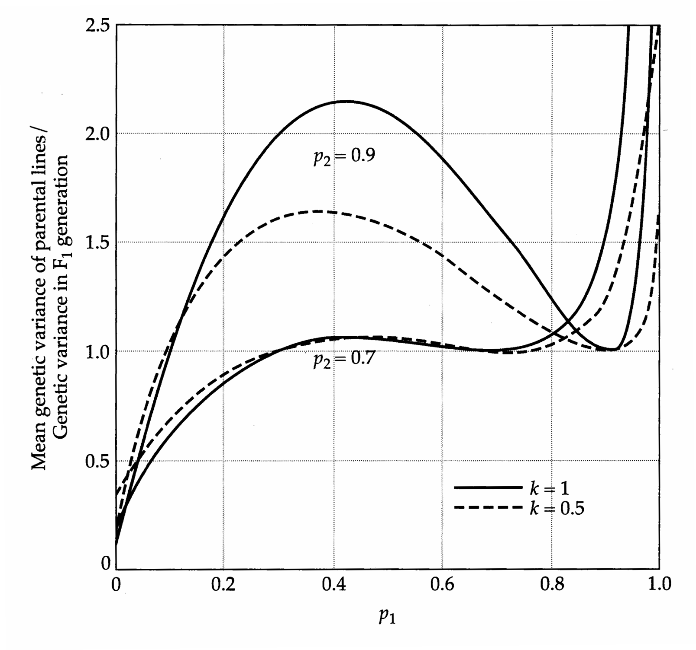
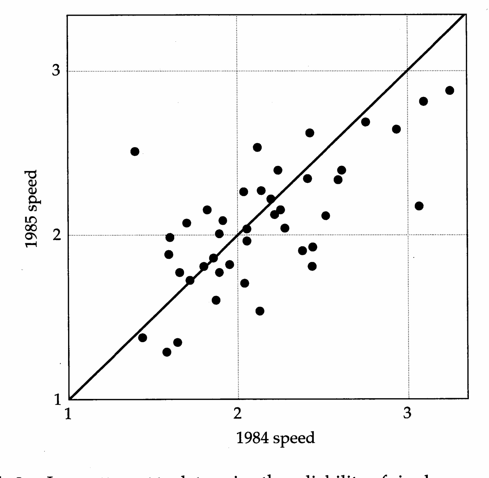
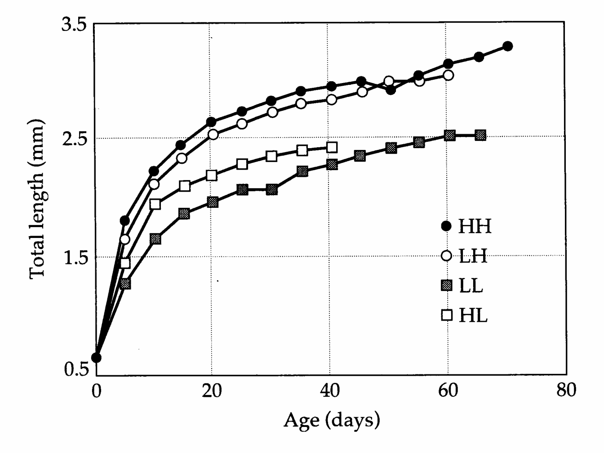
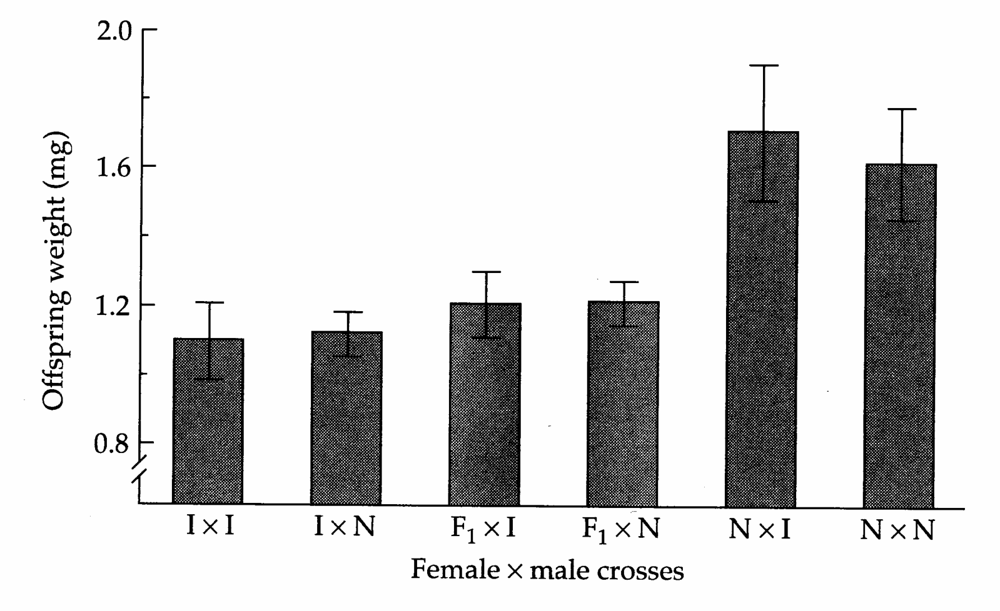
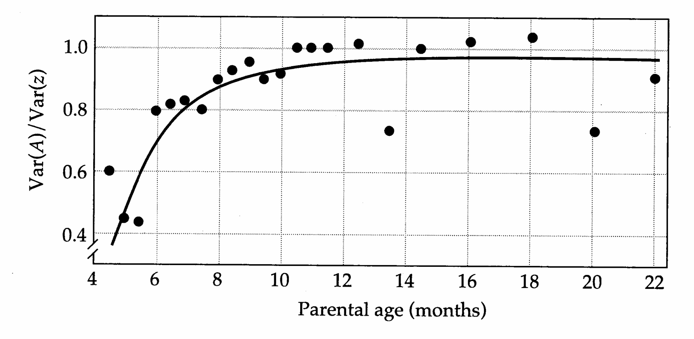
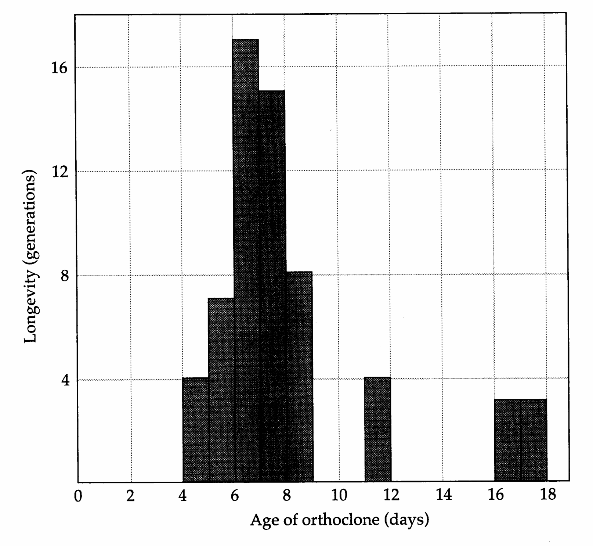
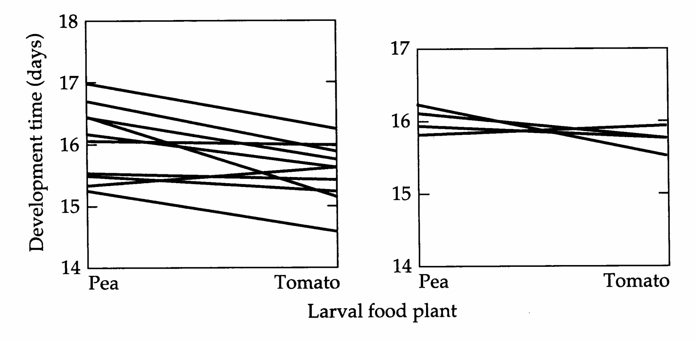
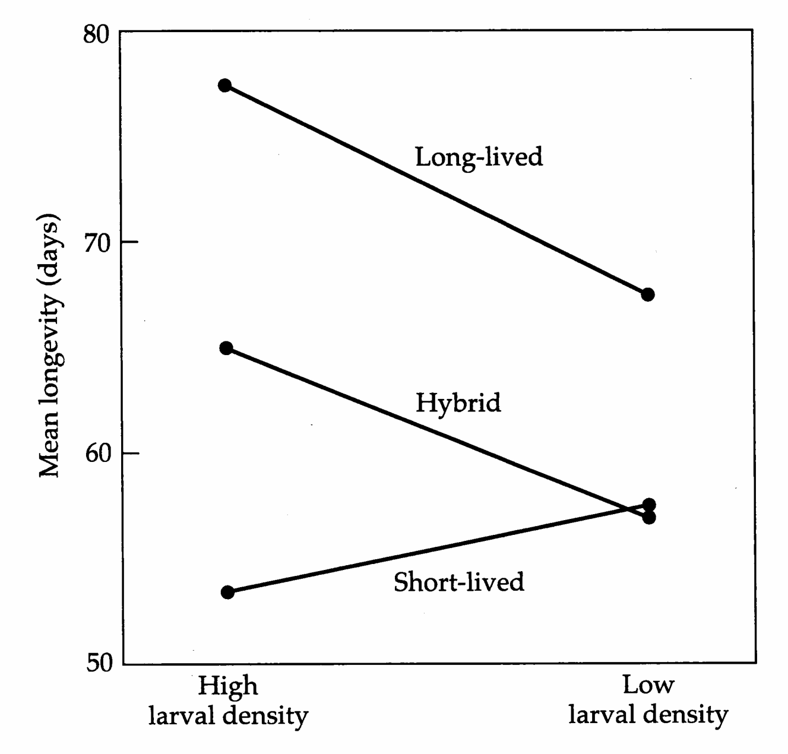

# Chapter 6 · 6 Sources of Environmental Variation

## Genetics_chapter6_001 · 6
Sources of Environmental Variation

Because all metabolic and developmental pathways are influenced to some degree by aspects of the environment, it stands to reason that the expression of most quantitative traits is not completely under genetic control. In some cases, phenotypic responses to changes in the environment are dramatic. For example, in some populations of the tiger salamander ( $ Ambystoma\ tigrinum\ nebulosum $), larvae develop into atypical cannibalistic morphs when raised at high densities (Collins and Cheek 1983). Clones of many planktonic cladocerans and rotifers can be induced to change their external morphology by means of appropriate physical or chemical stimuli (Hutchinson 1967, Havel 1987), and environmentally controlled flight polymorphisms are well documented in locusts (Kennedy 1956) and corixid bugs (Young 1965). However, more often than not, environmental effects are subtle, causing simple amplifications or reductions in sizes of parts, numbers of progeny, rates of growth, physiological performance, and so on.

As with the genetic variance, sources of environmental variance can be partitioned in various ways. It is useful to define two broad categories. General environmental effects refer to influential factors that are shared by groups of individuals, the size of the group depending on the context. The effects of an experimental treatment or of a patch of habitat are familiar examples. In addition, through maternal care, mothers will have general effects on their offspring (beyond the direct transmission of genes), usually referred to as maternal effects. Special environmental effects are residual deviations from the phenotype expected on the basis of genotype and general environmental effects. Such effects are unique to individuals — a consequence of microenvironmental variation and random developmental noise. There is one additional complication with respect to environmental effects. Ideally, the phenotype of an individual can be viewed simply as the sum of its genotypic value and the environmental effects with which it is associated, i.e., $ z = G + E $. However, in some cases, different genotypes respond to environmental change in nonparallel ways, a phenomenon known as genotype × environment interaction.

The purposes of this chapter are twofold. First, we illustrate how various classes of environmental effects can be incorporated into the logical framework introduced in the previous chapter for genotypic values. This extension leads to a general linear model for the phenotype, which forms the foundation upon which much of the remainder of the book is built. Second, as background for the remain- ing chapters, we provide an overview of the biological basis for the various types of environmental effects. Further details will emerge in later chapters. For example, Chapter 22 is devoted entirely to issues related to genotype × environment interaction, and Chapter 23 focuses on maternal effects.

---

## Genetics_chapter6_002 · EXTENSION OF THE LINEAR MODEL TO PHENOTYPES

Here we let E and e denote the contributions of general and specific environmental effects to the phenotypic expression of a character, and let I denote the genotype × environment interaction effect. The phenotype of the kth individual of the ith genotype exposed to the jth general environmental effect can then be described as a linear function of four components,

$$
z_{i j k}=G_{i}+I_{i j}+E_{j}+e_{i j k}
\tag{6.1}
$$

Each of these components may have subcomponents. For example, from Equation 5.7, the genotypic value, $ G_i $, is a potentially complicated linear function of the population mean phenotype, the individual's breeding value, and various effects due to dominance and epistasis. As in the case of all of the genetic effects, the terms $ I_{ij} $, $ E_j $, and $ e_{ijk} $ are defined in a least-squares sense as deviations from lower-order expectations and, as a consequence, have mean values equal to zero. The population mean phenotype, $ \mu_G = \overline{z}_{ijk} $, is the mean phenotype of all genotypes in the population, whereas $ G_i $ is the expected phenotype of the particular genotype i averaged over all possible environmental conditions within the experimental setting. The quantity $ \mu_G + E_j $ is the mean phenotypic value expected if the entire population of genotypes were assayed in the jth macroenvironmental setting, whereas $ G_i + I_{ij} + E_j $ is the expected phenotype of genotype i in that setting. Thus, $ I_{ij} $ is the residual deviation left after assuming that genotypic and environmental values act in an additive fashion. Finally, $ e_{ijk} $ is the deviation of an individual's phenotype from the expectation $ G_i + I_{ij} + E_j $. As in any least-squares linear model (Chapter 3), the residual deviations $ e_{ijk} $ are defined to be uncorrelated with the explanatory variables G, I, and E.

**[示例 Example]**

> **Example 1** · ref: `Genetics_chapter6:1` · source: `Genetics_chapter6_002.json` · blocks 3–11
>
> Example 1. As an example of computing genotypic and environmental values, we consider a small data set from Strauss and Karban (1994) on three lines of thrips (Apterothrix apteris) grown on three clones of their host plant, the sea-side daisy (Erigeron glaucus). The following table gives the mean performance of thrips, measured as population density after eight generations of growth, in the nine genotype-environment combinations (the thrips lines being denoted as I, II, and III, and the three environments (plant clones) as 1, 2, and 3). All nine treatments were replicated; the standard errors of the measures are small and are ignored in the following.
> 
> <table><tr><td rowspan="2">Plant</td><td colspan="3">Thrips Line</td><td rowspan="2">E</td></tr><tr><td>I</td><td>II</td><td>III</td></tr><tr><td>1</td><td>77</td><td>34</td><td>47</td><td>$ -19.22 = E_{1} $</td></tr><tr><td>2</td><td>61</td><td>159</td><td>51</td><td>$ 18.44 = E_{2} $</td></tr><tr><td>3</td><td>40</td><td>71</td><td>107</td><td>$ 0.78 = E_{3} $</td></tr><tr><td>G</td><td>59.33</td><td>88.00</td><td>68.33</td><td></td></tr></table>
> 
> Assuming an equal weight for each cell, and averaging over all nine cells, the mean character value is found to be $ \mu_{G} = 71.89 $. The genotypic values of the thrips lines, obtained by averaging the elements within columns, are given in the bottom row of the table. The average environmental effects, each defined as the mean performance of all thrips lines in a specific environment (the average within rows) minus the grand mean $ (\mu_{G}) $, are given in the final column. For example, $ E_{1} = [(77 + 34 + 47)/3] - 71.89 $. Note that the three values of E average to zero.
> 
> To obtain the interaction effects, we rearrange Equation 6.1 to
> 
> $$
> I_{ij}=\bar{z}_{ij}-G_{i}-E_{j}
> $$
> 
> 
> where i and j denote the thrips line and the daisy clone, and $ \bar{z}_{ij} $ is the entry in the ith column and jth row of the table. The residual deviation drops out because we have assumed the data to have been obtained without error. Substituting into this equation,
> 
> $$
> \begin{array}{lllllll} I_{I,1}&=&36.89& & &I_{II,1}&=-34.78& &I_{III,1}&=-2.11\\ I_{I,2}&=-16.78& & &I_{II,2}&=&52.56& &I_{III,2}&=-35.78\\ I_{I,3}&=-20.11& & &I_{II,3}&=-17.78& &I_{III,3}&=&37.89 \end{array}
> $$
> 
> 
> The interaction effects average to zero both within rows and within columns. Note also that the magnitudes of the interaction effects tend to be much greater than the magnitudes of the environmental effects, indicating strong genotype $ \times $ environment interaction.
> 
> This study also provides strong evidence of genotype-environment covariance. In nature, thrips line I was found living on plant clone 1, line II on clone 2, and line III on clone 3. Thus, the individual clones were associated with the plants on which they best performed.

Since I and e are uncorrelated with the other variables (by construction), using the formula for the variance of a sum (Equation 3.11b), the total phenotypic variance of a population can be written as

$$
\sigma_{P}^{2}=\sigma_{G}^{2}+\sigma_{I}^{2}+2\sigma_{G,E}+\sigma_{E}^{2}+\sigma_{e}^{2}
\tag{6.2}
$$

The expansion of the total genetic variance, $ \sigma_{G}^{2} $, in terms of additive, dominance, and epistatic components was given in the previous chapter. $ \sigma_{E}^{2} $ and $ \sigma_{e}^{2} $ are the components of variance due to general and special environmental effects.

The greatest conceptual difficulty with Equation 6.2 is related to the interpretation of $ \sigma_{I}^{2} $ and $ \sigma_{G,E} $. The term $ \sigma_{G,E} $ refers to genotype-environment covariance, which is quite distinct from genotype × environment interaction. Genotype × environment interaction is concerned with the variation in the phenotypic response of specific genotypes to specific environments, and $ \sigma_{I}^{2} $ is a measure of that variation. Genotype-environment covariance is a measure of the physical association of particular genotypes with particular environmental general effects. If individuals are randomly distributed with respect to macroenvironments, then $ \sigma_{G,E} $ is zero, but $ \sigma_{I}^{2} $ will be nonzero if genotypic values and environmental effects are nonaditive. If, on the other hand, genotypes are nonrandomly distributed, $ \sigma_{G,E} \neq 0 $.

Even in the most carefully controlled situations, one cannot always rule out the presence of genotype-environment covariance. Nonrandom associations of genotypes and environment can result from limited seed or pollen dispersal in plants and from genetically based dominance hierarchies and other social interactions in animals. Maternal (or paternal) effects can also cause genotype-environment covariance if there is a correlation between parental genotype and ability to provision the young (Chapter 23). This latter source of genotype-environment covariance can occur in an environment that is otherwise completely homogeneous.

Whereas methods exist for the detection of genotype × environment interaction (Chapter 22), genotype-environment covariance is usually less tangible, contributing an unknown amount to estimates of genetic variance. Take, for example, the simple situation in which genotype × environment interaction is absent and an estimate of the environmental variance is obtained as the phenotypic variance within pairs of monozygotic twins (or among members of a clone), all of which must be genetically identical. Then, from Equation 6.2, it can be seen that the difference between the phenotypic variance and the environmental variance, the among-clone variance, is $ \sigma_{G}^{2} + 2\sigma_{G,E} $. Depending on whether $ \sigma_{G,E} $ is positive or negative, the true genetic variance will be over- or underestimated.

**[示例 Example]**

> **Example 2** · ref: `Genetics_chapter6:2` · source: `Genetics_chapter6_002.json` · blocks 18–21
>
> Example 2. The results of an experiment with a clonal plant will help clarify the preceding concepts. The salt marsh cord grass (Spartina patens) occurs along much of the Atlantic coast on sand dunes, śwale grasslands, and marshes. Silander (1985) removed plants from these three environments and clonally propagated them via rhizomes in the greenhouse. After two years, sufficient material was available to perform a reciprocal transplant experiment in the field. Replicate progeny from each clone were grown at each of three sites — dune, swale, and marsh. A large number of vegetative and reproductive traits were measured, and the data were analyzed by two-way ANOVA (Chapter 20) with clone and site serving as the main factors.
> 
> <table><tr><td>Trait</td><td>Var(G)</td><td>Var(E)</td><td>Var(I)</td><td>Var(e)</td></tr><tr><td>Tillers/clone</td><td>0.2</td><td>34.2</td><td>19.9</td><td>45.8</td></tr><tr><td>Culm height</td><td>12.0</td><td>56.6</td><td>7.0</td><td>24.5</td></tr><tr><td>Leaves/culm</td><td>11.2</td><td>19.4</td><td>8.4</td><td>61.0</td></tr><tr><td>Culm diameter</td><td>20.6</td><td>4.7</td><td>0.0</td><td>74.7</td></tr><tr><td>Longest leaf length</td><td>26.7</td><td>29.5</td><td>6.1</td><td>37.7</td></tr><tr><td>Longest leaf width</td><td>27.5</td><td>7.8</td><td>3.6</td><td>61.3</td></tr><tr><td>Third leaf length</td><td>25.2</td><td>0.0</td><td>10.2</td><td>64.6</td></tr><tr><td>Third leaf width</td><td>23.4</td><td>3.4</td><td>3.6</td><td>69.7</td></tr></table>
> 
> The observed components of variance, given in the above table as percentages of the total phenotypic variance, can be interpreted as follows: the among-clone variance is an estimate of the total genetic variance $ \sigma_G^2 $; the variance among the three sites is an estimate of the general environmental effects variance $ \sigma_E^2 $; the variance within sites (more specifically, among members of the same clone within sites) is an estimate of $ \sigma_e^2 $; and the clone × site variance is an estimate of $ \sigma_T^2 $. Conceivably, some of the observed phenotypic variance may have been caused by maternal effects, but since all members of a clone had the same mother, any variance caused by such effects is compounded with the estimate of $ \sigma_G^2 $. In this experiment, $ \sigma_G, E $ can be assumed to be zero because individual plants were distributed randomly within treatments.
> 
> When averages are taken over all of the traits in the study (including those not in the table), the vast majority (60%) of the phenotypic variance is found to be attributable to special environmental effects ( $ \sigma_e^2 $). Genotype accounts for an additional 19% of the variance, whereas general environmental effects and genotype × environment interactions account for 6 and 5%, respectively. These results indicate that Spartina growth characters are relatively insensitive to what appear to be major changes in habitat.

---

## Genetics_chapter6_003 · SPECIAL ENVIRONMENTAL EFFECTS

As noted above, two sources contribute to the special environmental effects variance — internal developmental noise and external microenvironmental hetero- geneity. Both sources of variation are generally unpredictable from the standpoint of the individual. Both are unique properties of the population under investigation and can be modified by changing the environmental setting.

---

## Genetics_chapter6_004 · SPECIAL ENVIRONMENTAL EFFECTS / Within-Individual Variation

In animals it is possible to gain some information about variance associated with special environmental effects by measuring the same attribute on the right and left sides of bilaterally symmetrical organisms. Differences may arise between such measures because of measurement error, but there is usually a small, but real, random component of asymmetry. This within-individual variation is the finest level at which phenotypic variance can be quantified, and it can sometimes constitute a substantial portion of the total variance of a trait. Leamy (1984, 1992), for example, found that differences between right and left measures account for up to 18% of the phenotypic variance for bone lengths in mice, and similarly high values have been noted for gill-raker and fin measures in rainbow trout (Leary et al. 1992), and for cranial measures in tamarins (Hutchison and Cheverud 1995).

Following the early suggestions of Mather (1953), Thoday (1953), and Van Valen (1962), numerous investigators have interpreted the variance of right-left measures to be a measure of developmental noise (or developmental instability). It is difficult to define the mechanistic basis of such variation, although we discuss some correlates below. Soulé (1982) suggested that it may be a simple consequence of random movement of molecules within developing individuals, and Emlen et al. (1993) have considered how variation at the cellular level might translate into differences at the levels of tissues or organs through cellular feedback mechanisms. However, it may be presumptuous to assume that variance in right-left measures is entirely due to internal factors. In no case has the involvement of subtle variation in the external environment from right to left sides been ruled out, although it is known that the extreme asymmetry that develops in lobster claws is a consequence of differential claw use (Govind and Pearce 1986). Thus, we prefer to simply denote the right-left variance as within-individual variance $ \sigma_{ew}^{2} $, without invoking causality. The total variance resulting from special environmental effects can then be written as the sum of the among-individual and within-individual components,

$$
\sigma_{e}^{2}=\sigma_{e w}^{2}+\sigma_{e a}^{2}
\tag{6.3}
$$

Van Valen (1962) pointed out the need to distinguish three types of asymmetry. Directional asymmetry refers to a consistent bias in one direction such as the tendency of the mammalian heart to be on the left side or of a particular coiling direction in the shells of snails. For a continuously distributed character, directional asymmetry is detectable as a mean difference between right and left measures that is significantly different from zero. Antisymmetry refers to situations in which asymmetry is the rule rather than the exception but is nondirectional. An example is provided by male fiddler crabs, which have equal probabilities of developing right or left signaling claws. Fluctuating asymmetry refers to the common situation in which the difference between the right and left measures is symmetrically (usually normally) distributed around a mean and mode of zero. Studies on developmental homeostasis focus upon the fluctuating form of asymmetry, and we devote the remainder of our attention to it.

Under the assumption that right and left measures are two of many possible random expressions of an individual’s developmental program, an unbiased estimate of the within-individual variance for a trait is given by

$$
\mathbf{V a r}(e_{w})=\sum_{i=1}^{N}\frac{(r_{i}-l_{i})^{2}}{2N}-\mathbf{V a r}(e_{m})
\tag{6.4}
$$

where $N$ is the number of individuals sampled, $r_{i}$ and $l_{i}$ are the right and left measures for the $i$th individual, and $\mathrm{Var}(e_{m})$ is the variance due to measurement error. The latter quantity is simply the variance among repeated measures of the same trait (on the same side) of the same individual; ideally, it should be estimated in a way that ensures that the investigator has no memory of previous measures. Palmer and Strobeck (1986) recommend making multiple measures on both sides of every individual, treating right and left measures as fixed effects, and performing a two-way analysis of variance. This approach allows one to test for directional asymmetry, as well as to extract $\mathrm{Var}(e_{w})$ and $\mathrm{Var}(e_{m})$ directly from the ANOVA mean squares (Chapter 20).

Provided an estimate of the total special environmental effects variance, $ \text{Var}(e) $, is available, the among-individual component can be estimated as $ \text{Var}(e_a) = \text{Var}(e) - \text{Var}(e_w) $. To our knowledge, this has not been done with any organism, but in principle it is straightforward for organisms that can be grown clonally, as the total variance within clones is simply $ \text{Var}(e) $.

Interest in the within-individual component of variance derives from the idea that relatively asymmetrical individuals are victims of genetic and/or environmental circumstances that enhance the chances of random developmental errors on the two sides of the body. If this were true, $ \mathrm{Var}(e_w) $ would provide a useful measure of environmental/genetic stress. In an effort to test this idea, many investigators have searched for correlates of fluctuating asymmetry (hereafter FA), focusing particularly on the influence of the genetic background. Under the assumption that symmetry is adaptive, and therefore maximized in natural populations, it follows that perturbations to locally adapted gene pools should inflate the level of FA. Such perturbations can be induced artificially in two ways — the average homozygosity can be increased by mating individuals with their close relatives (inbreeding), or heterozygosity can be enhanced by hybridizing different populations or species (outcrossing).

A summary of some existing results indicates that enhanced FA in genetically perturbed individuals is by no means universal (Table 6.1). At least a third of

**[Table]**

*[See Table 6.1 at the end of this section.]*

the reported studies indicates no consistent change in asymmetry upon genetic perturbation. However, an objective evaluation of the results is difficult, since many types of crosses have been employed in these studies. Soulé (1982) argues that the reason that many inbreds exhibit enhanced FA is that inbreeding results in the production of extreme phenotypes that are more sensitive to developmental perturbations. If this were true, then one would expect the level of FA to be higher in individuals in the tails of phenotype distributions. However, attempts to find such a relationship have been unsuccessful (Soulé and Cuzin-Roudy 1982, Scheiner et al. 1991, Zakharov 1992, Livshits and Smouse 1993, Deng 1997).

There are many plausible explanations for the conflicts in the existing literature. For example, crosses between different strains need not be deleterious and can sometimes have the beneficial effects of masking the expression of deleterious recessives in the parental strains (Chapter 9). Second, many of the existing studies on FA may simply be statistically weak or flawed. The studies summarized in Table 6.1 have used a large number of indices other than Equation 6.4. Many investigators have simply employed the average absolute difference between the right and left measures, while others have attempted to correct for scaling that might occur with size changes by dividing the differences by the average measure. Very few studies have made any attempt to eliminate the bias caused by measurement error. Third, it is possible that the most adaptive level of FA is not the minimum level. Mather (1953) was able to increase and decrease FA for sternopleural bristle number in Drosophila melanogaster by artificial selection. After two generations of relaxed selection, the level of FA in both lines returned to the level in the original base population, suggesting that natural selection favors an intermediate level of FA. Presumably, the complete elimination of asymmetry can only be accomplished at the expense of important fitness characters such as development time.

The effects of environmental stress on FA are much more predictable — $ \sigma_{ew}^{2} $ tends to increase in extreme or novel environments (Hoffmann and Parsons 1991). Exposure of fish to DDT elevates levels of FA significantly (Valentine and Soulé 1973), and a variety of pesticides have been shown to have similar effects on several insect species (Clarke 1992, McKenzie and Yen 1995). When first exposed to diazinon, the sheep blowfly (Lucilia cuprina) initially exhibited an increase in FA, but as the population evolved insecticide resistance, FA returned to normal levels (McKenzie and Clarke 1988). Humans suffering from malnutrition exhibit increases in FA (Bailit et al. 1970), and various types of stress (cold, noise, behavioral modification) inflate FA for tooth morphology and limb bones in mice and rats (Siegel and Doyle 1975a,b,c, Siegel and Mooney 1987). In birds, parasite load increases the asymmetry in lengths of tail feathers (Møller 1992). Several studies have reported that individuals with developmental deformities tend to have elevated levels of FA for other traits (Bailit et al. 1970, Woolf and Gianas 1976, Barden 1980, Malina and Buschaung 1984, Leary et al. 1984).

In principle, the logic underlying the use of fluctuating asymmetry as a measure of $ \sigma_{ew}^{2} $ can be extended to certain aspects of organisms that are not bilaterally symmetrical. In plants, for example, there are many serially repeated organs, such as leaves, and flowers are often radially symmetrical. In cases such as these, more than two measures can be made within each individual, and the within-individual component of variance can be obtained by analysis of variance (Møller and Eriksson 1994, Freeman et al. 1993). As in the analysis of bilateral symmetry, a critical assumption underlying any such analysis is that the subjects of measurement are products of the same genes. An obvious violation of this assumption would involve a comparison of stem and basal leaves in a herbaceous plant, but the question remains open with more subtle comparisons such as the inner and outer leaves on a branch. For further details on the statistical analysis of FA, see Palmer and Strobeck (1986, 1992), Palmer et al. (1993), Swaddle et al. (1994), and Hutchison and Cheverud (1995).

> **Table 6.1** · `6.1` · page 130 · source: `Genetics_chapter6_004`
> Table 6.1 Summary of studies on the relationship of fluctuating asymmetry to levels of inbreeding and crossbreeding.
>
> <table><tr><td>Organism</td><td>Basis of Comparison</td><td>Character(s)</td><td>Reference</td></tr><tr><td colspan="4">FA enhanced in inbreds</td></tr><tr><td rowspan="2">Drosophila melanogaster</td><td>Inbred line crosses</td><td>Bristle number</td><td>Mather 1953</td></tr><tr><td>Inbreeding variable base population</td><td>Wing length</td><td>Reeve 1960</td></tr><tr><td>Marine copepod</td><td>Inbreeding variable base population</td><td>Thoracic leg lengths</td><td>Clarke et al. 1986</td></tr><tr><td>Freshwater bivalves</td><td>Natural pops.</td><td>Plicae on palps</td><td>Kat 1982</td></tr><tr><td>Poeciliopsis monacha (a fish)</td><td>Natural pops.</td><td>Fin ray, scale, tooth number</td><td>Vrijenhoek & Lerman 1982</td></tr><tr><td>Trout (3 species)</td><td>Individuals varying in heterozygosity</td><td>Fin ray, gill raker, mandibular pores</td><td>Leary et al. 1983 1984, 1987</td></tr><tr><td>Rainbow trout</td><td>Inbreeding variable base population</td><td>Fin ray, gill raker, mandibular pores</td><td>Leary et al. 1985</td></tr><tr><td>Side-blotched lizard</td><td>Natural pops.</td><td>Scale counts</td><td>Soulé 1979</td></tr><tr><td>House mouse</td><td>Inbred line cross</td><td>Osteometric traits</td><td>Leamy 1984, 1992</td></tr><tr><td>Tamarins</td><td>Natural pops.</td><td>Cranial measures</td><td>Hutchison & Cheverud 1995</td></tr><tr><td colspan="4">FA approximately equal in inbreds and outbreds, or variable results</td></tr><tr><td rowspan="2">Drosophila melanogaster</td><td>Inbred line cross</td><td>Bristle number</td><td>Beardmore 1960</td></tr><tr><td>Inbreeding variable base population</td><td></td><td>Fowler & Whitlock 1994</td></tr><tr><td rowspan="2">Honeybees</td><td rowspan="2">Inbreeding variable base population</td><td rowspan="2">Wing vein length</td><td>Brückner 1976</td></tr><tr><td>Clarke et al. 1986</td></tr><tr><td>Rainbow trout</td><td>Hatchery strain crosses</td><td>Fin ray, gill raker counts</td><td>Ferguson 1986</td></tr><tr><td>Bluegill sunfish</td><td>Subspecies crosses</td><td>Fin ray, scale counts</td><td>Felley 1980</td></tr><tr><td>Fence lizard</td><td>Interspecific hybrid zone</td><td>Scale counts</td><td>Jackson 1973</td></tr><tr><td>House mouse</td><td>Inbred line crosses natural pops.</td><td>Molar width</td><td>Bader 1965</td></tr><tr><td rowspan="3">Large cats</td><td rowspan="3">Species varying in heterozygosity</td><td>Craniometric traits</td><td>Wayne et al. 1986</td></tr><tr><td rowspan="2">Dental dimensions</td><td>Modi et al. 1987</td></tr><tr><td>Kieser & Groeneveld 1991</td></tr></table>
>
> *(continued, page 131)*
>
> <table><tr><td>Organism</td><td>Basis of Comparison</td><td>Character(s)</td><td>Reference</td></tr><tr><td colspan="4">FA enhanced in outbreds</td></tr><tr><td>Sticklebacks</td><td>Hybrids between natural pops.</td><td>Scale counts</td><td>Zakharov 1981</td></tr><tr><td>Banded sunfish</td><td>Interspecific hybrid zone</td><td>Fin ray, scale, morph. traits</td><td>Graham & Felley 1985</td></tr></table>

---

## Genetics_chapter6_005 · SPECIAL ENVIRONMENTAL EFFECTS / Developmental Homeostasis and Homozygosity

In an influential book that reviewed much of the early literature, Lerner (1954) strongly endorsed the idea that the degree of developmental stability is positively correlated with the overall level of individual heterozygosity. The usual mechanistic explanation for this hypothesis is that heterozygosity acts as a buffer against environmental variation. This effect might occur, for example, if different allelic products have optimum activities under different environmental conditions.

Some of the logic behind Lerner’s ideas were implicit in our discussion of FA, but here we focus on the total effects of heterozygosity on the within- and among-individual components of $ \sigma_{e}^{2} $. Since the main prediction of the homeostasis-heterozygosity hypothesis is that $ \sigma_{e}^{2} $ will be higher for homozygous individuals than for heterozygotes, a conceptually simple test suggests itself. Consider two completely inbred lines and their hybrid ( $ F_{1} $) progeny. All members of the inbred lines will be 100% homozygous, while the $ F_{1} $ individuals will be uniformly heterozygous at each locus for which the two inbred lines differed. Within each of the three groups, all individuals will be genetically identical, so the observed phenotypic variances within groups can be interpreted as genotypespecific components of environmental variance. Thus, if all three genotypes are equally sensitive to environmental and developmental noise, they should exhibit the same level of phenotypic variance. The survey in Table 6.2 indicates that the phenotypic variance in $ F_{1} $ hybrids is almost always lower than the average of the parental lines.

**[Table]**

*[See Table 6.2 at the end of this section.]*

Although these kinds of results have been interpreted as strong support for the homeostasis-heterozygosity hypothesis, there are some unresolved issues. In most of the reported studies, the parental lines were not completely homozygous, so the observed phenotypic variances must contain a genetic component. This complicates matters greatly. If there is dominance at a locus, and the frequency of the dominant allele in the $ F_{1} $ population is between 0.5 and 1.0, the average genetic variance in the parental lines will actually exceed that in the $ F_{1} $ (Lerner 1954). This result is a simple consequence of the expression of the recessive allele being masked in the hybrid line. For a diallelic locus, the variance in the $ F_{1} $ generation can be found by noting that the frequencies of individuals with genotypic values 0, $ (1 + k)a $, and 2a are $ q_{1}q_{2} $, $ p_{1}q_{2} + p_{2}q_{1} $, and $ p_{1}p_{2} $, where $ p_{1} $ and $ p_{2} $ are the frequencies of the dominant allele in the two parental populations. Following the procedures introduced in the previous chapter, the total genetic variance within an $ F_{1} $ population is

$$
\begin{aligned}\sigma_{G}^{2}=a^{2}\Bigg\{\left[(1+k)^{2}(p_{1}q_{2}+p_{2}q_{1})+4p_{1}p_{2}\right]\\-\left[(1+k)(p_{1}q_{2}+p_{2}q_{1})+2p_{1}p_{2}\right]^{2}\Bigg\}\end{aligned}
\tag{6.5}
$$

With certain allele frequencies, the mean genetic variance within the parental lines (obtained from Equations 4.12a,b) can be more than twice that in the $ F_{1} $ (Figure 6.1). Thus, the observed patterns in Table 6.2 could be caused in part by residual heterozygosity within parental lines rather than by differences in environmental sensitivity between inbred and outbred individuals.

Several studies have attempted to test the homeostasis-heterozygosity hypothesis by comparing levels of phenotypic variation within groups of individuals with high vs. low heterozygosity for enzyme loci. Data from studies of oysters (Zouros et al. 1980), monarch butterflies (Eanes 1978), Drosophila melanogaster (Blanco and Sanchez-Prado 1986), killifish (Mitton 1978), ruffous-collared sparrows (Yezerinac et al. 1992), and humans (Livshits and Kobyliansky 1984) indicate a negative association between morphological variation and heterozygosity. However, studies on pitch pine (Ledig et al. 1983), the snail Cerion (Booth et al. 1990), plaice (McAndrew et al. 1982), herring (King 1984), and brook trout (Hutchings and Ferguson 1992) reveal no relationship, while there appears to be a weak positive relationship in Daphnia magna (Yampolsky and Scheiner 1994) and baboons (Bamshad et al. 1994).

Again, the discordancy between these results may be a statistical artifact. Not only does the problem outlined in the preceding paragraph apply to all of these studies, but there is another serious interpretative difficulty. In most of the analyses cited above, the homozygous groups contain all homozygous individuals regardless of the alleles they are carrying. Thus, for a single diallelic locus contributing to a quantitative trait, the homozygous group would contain AA and aa.

> **Figure 6.1** · page 135 · source: `Genetics_chapter6`
>
> 
>
> Figure 6.1 The mean single-locus genetic variance within two parental lines relative to that within the $ F_{1} $ hybrid population. $ p_{1} $ and $ p_{2} $ are the frequencies of the dominant allele in the two populations. Results are given for complete $ (k=1) $ and partial $ (k=0.5) $ dominance and for two allele frequencies within parental population 2, $ p_{2}=0.7 $ and 0.9.

individuals with genotypic values 0 and 2a, while the heterozygous group would only contain individuals with genotypic value $ (1 + k)a $. When individuals are classified in this manner, for characters with an additive genetic basis, an inverse relationship is expected between multilocus heterozygosity and the genetic component of phenotypic variation, the most heterozygous group being the least variable (Chakraborty and Ryman 1983, Chakraborty 1987). No special appeal to homeostatic properties of heterozygosity are required to explain the results. On the other hand, when characters have a nonadditive genetic basis, the relationship between heterozygosity and the genetic component of phenotypic variance can be either positive or negative, depending on the allele frequencies and genetic effects (Bishop 1992, Gavrilets and Hastings 1994b; see also Chapter 4).

Interpopulation comparisons in humans (Kobyliansky and Livshits 1983), fox sparrows, and pocket gophers (Zink et al. 1985) have revealed an inverse relationship between population estimates of morphological variation and enzyme heterozygosity, consistent with the homeostasis-heterozygosity hypothesis, whereas the relationship appears to be positive in sculpins (Strauss 1991) and ruffous-collared sparrows (Yezerinac et al. 1992). With population level comparisons, the data are not biased by the artificial grouping of genotypic classes. However, there are still significant interpretative difficulties. The changes in morphological variability with heterozygosity may be due to shifts in the genetic as well as the environmental component of variance. If the molecular markers used to estimate heterozygosity levels are linked with the loci contributing to the genetic variance for the characters, then an increase in the latter associated with molecular heterozygosity may completely obscure changes in the environmental component of variance.

In summary, the fundamental problem with most descriptive studies of the relationship between heterozygosity and phenotypic variation is their inability to distinguish between the hypothetical stabilizing effects of heterozygosity on the environmental component of phenotypic variation and the very real effects of heterozygosity on the genetic component of variation. This issue can only be resolved by separating multilocus genotypes into homogeneous groups (based on allelic composition, rather than on total heterozygosity) and by separating the phenotypic component of variance into its genetic and environmental components. A simple way to resolve both of these problems exists for species that can be propagated clonally. All members within clonal groups are necessarily identical with respect to genotype, so the phenotypic variance within a clonal group is entirely due to environmental causes.

Deriving clones from natural populations of Daphnia, Deng (1997) used this approach to test the homeostasis-heterozygosity hypothesis. For each parental clone, a selfed offspring genotype was produced (by crowding, Daphnia can be induced to produce males, which then fertilize their genetically identical mother or sibs). In populations of D. pulex and D. pulicaria, the environmental components of variance for life-history characters within inbred clones averaged 75% and 88% higher than within parental clones. These results provide unambiguous support for Lerner's hypothesis.

Several studies with trees have addressed the relationship between annual variation in individual growth rate (a measure of environmental sensitivity) and enzyme heterozygosity. As in Deng's work, these studies are not complicated by the genetic artifacts mentioned above, since the units of comparison are the same individuals. Nevertheless, the results are equivocal. Heterozygosity and temporal variation in growth rate are positively correlated in quaking aspen (Mitton and Grant 1980), ponderosa pine (Knowles and Grant 1981), and knobcone pine (Strauss 1987), but negatively correlated in lodgepole pine (Knowles and Mitton 1980), and uncorrelated in pitch pine (Ledig et al. 1983). When all of the preceding results are considered, it appears that the acceptance of a general causal relationship between heterozygosity and developmental stability should be postponed until additional adequately designed experiments have been performed.

> **Table 6.2** · `6.2` · page 133 · source: `Genetics_chapter6_005`
> Table 6.2 Survey of studies of phenotypic variation in inbred parental lines and their $ F_{1} $ hybrids.
>
> <table><tr><td>Species</td><td>Characters</td><td>Reference</td></tr><tr><td>$ F_{1} $ less variable</td><td></td><td></td></tr><tr><td rowspan="3">Drosophila</td><td>Bristle number and wing length</td><td>Robertson & Reeve 1952</td></tr><tr><td>Viability</td><td>Dobzhansky & Spassky 1954</td></tr><tr><td></td><td>Dobzhansky & Levene 1955</td></tr><tr><td rowspan="4">Mice</td><td>Behavioral traits</td><td>Hyde 1973</td></tr><tr><td>Skeletal traits</td><td>Leamy & Thorpe 1984</td></tr><tr><td>Time to maturity</td><td>Yoon 1955</td></tr><tr><td>Weight</td><td>Chai 1957</td></tr><tr><td>Rats</td><td>Weight</td><td>Livesay 1930</td></tr><tr><td>Cotton</td><td>Fiber properties</td><td>Meredith et al. 1970</td></tr><tr><td rowspan="2">Corn</td><td rowspan="2">Vegetative and reproductive traits</td><td>Adams & Shank 1959</td></tr><tr><td>Shank & Adams 1960</td></tr><tr><td>Tobacco</td><td>Vegetative and reproductive traits</td><td>Jinks & Mather 1955</td></tr><tr><td>Rye</td><td>Grain production, and plant weight</td><td>Pfahler 1966</td></tr><tr><td rowspan="2">Sorghum</td><td rowspan="2">Grain production</td><td>Reich & Atkins 1970</td></tr><tr><td>Jowett 1972</td></tr><tr><td>Tomato</td><td>Growth rate</td><td>Lewis 1954</td></tr><tr><td>Equivocal results</td><td></td><td></td></tr><tr><td>Guppies</td><td>Scale and fin ray counts</td><td>Angus & Schultz 1983</td></tr><tr><td>Arabidopsis</td><td>Plant weight</td><td>Pederson 1968</td></tr><tr><td>Tomato</td><td>Reproductive traits</td><td>Williams 1960</td></tr><tr><td>$ F_{1} $ more variable</td><td></td><td></td></tr><tr><td>Drosophila</td><td>Bristle number</td><td>Lewontin 1957</td></tr><tr><td>Corn</td><td>Grain production</td><td>Rowe & Anderson 1964</td></tr></table>

---

## Genetics_chapter6_006 · SPECIAL ENVIRONMENTAL EFFECTS / Repeatability

Because the variance among repeated measures on the same individual can only be due to environmental causes (or measurement errors), information on the within-individual component of variance can provide some insight into the possible magnitude of the environmental variance for a trait. For studies with a temporal component, there are two types of within-individual variation. The first, emphasized above, is the variance among measures of homologous characters expressed within individuals at the same time. The second is the variance in expression of a character across time, e.g., temporal variability in the weight of an individual. This second type of variation is not always logically distinct from the first. For example, for animals that are growing, the right and left measures of a bilaterally symmetrical trait may fluctuate on a daily basis. Moreover, one may question whether repeated measures made at wide intervals of time in the same individual should be treated as the measures of the same or different traits (Chapter 21). These issues aside, it follows that an upper-bound estimate of the genetic variance of a trait is provided by

$$
\mathbf{V a r}(G)_{m a x}=\mathbf{V a r}(z)-\mathbf{V a r}(e_{w})
\tag{6.6}
$$

where $ \operatorname{Var}(z) $ is an estimate of the total phenotypic variance for the trait, and $ \operatorname{Var}(e_{w}) $ is an estimate of the within-individual component of variance.

Measurement error, solely a function of the investigator, will always inflate estimates of the within-individual component of variance relative to its true value, but because it also contributes to the total phenotypic variance, it cancels out in Equation 6.6. Nevertheless, measurement error is still a problem, since we ordinarily would like to know the fraction of the true phenotypic variance that is accounted for by $ \operatorname{Var}(G)_{max} $. Thus, it is desirable to have an estimate of $ \operatorname{Var}(z) $ that is free of measurement error. As noted above, for morphological characters that have reached their final stage of development (and are not subject to wear) or for measures made on preserved samples, a simple correction for measurement error can be acquired from repeated measures of the same character. However, the problem is less tractable with behavioral and physiological traits. For such characters, repeated measures may differ because of temporal organismal changes as well as because of measurement error, rendering it essentially impossible to factor out the component of variance due to measurement error.

The expected value of $ \mathrm{Var}(G)_{max} $ is necessarily greater than the total genetic variance for the trait because it includes the among-individual component of the special environmental effects variance $ (\sigma_{ea}^{2}) $ as well as any variance due to general environmental effects $ (\sigma_{E}^{2}) $. Thus, letting $ \mathrm{Var}(e_{m}) $ denote the variance associated with measurement error, the repeatability

$$
r=\frac{\mathbf{Var}(z)-\mathbf{Var}(e_{w})}{\mathbf{Var}(z)-\mathbf{Var}(e_{m})}
\tag{6.7}
$$

provides an upper-bound estimate of the broad-sense heritability of a trait $ (H^2) $, i.e., of the fraction of the total phenotypic variance that is genetic in basis. The degree to which $ r $ exceeds $ H^2 $ depends on the magnitude of $ (\sigma_{ea}^2 + \sigma_E^2) $ relative to $ \sigma_{ew}^2 $. In the unlikely event that all of the environmental variance is in the within-individual component, and measurement-error variance has been removed from the denominator, then Equation 6.7 provides an unbiased estimate of $ H^2 $. A large value of $ r $ offers the possibility that a considerable amount of the character variance is genetic, while a small value of $ r $ informs us that environmental variance dominates.

Repeatability is often computed as the correlation between two repeated measures ( $ z_{1} $ and $ z_{2} $) on the same individuals (Falconer and Mackay 1996),

$$
r_{F}=\frac{Cov(z_{1},z_{2})}{SD(z_{1})SD(z_{2})}
\tag{6.8}
$$

However, because the variance resulting from measurement error is contained in the denominator of this expression, $ r_{F} $ is downwardly biased, a problem since we are trying to obtain an upper bound on $ H^{2} $. For a lucid account of the statistical procedures used to estimate repeatability and of common mistakes encountered in the literature, see Lessells and Boag (1987).

**[Source_image]**

**[示例 Example]**

> **Example 3** · ref: `Genetics_chapter6:3` · source: `Genetics_chapter6_006.json` · blocks 11–12
>
> Example 3. In an attempt to determine the reliability of single measures of sprint speed as an assessment of performance, Huey and Dunham (1987) looked at the correlation between measures (Falconer's method) on wild-caught lizards (Sceloporus merriami) in two consecutive years. The repeatability was quite high ( $ r_{F} \simeq 0.70 $), despite injuries and changes in reproductive condition of the animals between years. Thus, since measurement error could deflate this estimate, 70% or more of the phenotypic variance in running speed in the study population could be a consequence of genetic differences among individuals.
> 
> On the other hand, in the sagebrush lizard (Sceloporus graciosus), repeatabilities of various aspects of push-up and head-bob displays average only 0.16 (Martins 1991). In this study, ten or more measures were made on each individual over a period of five weeks, and $ \mathrm{Var}(G)_{max} $ was estimated by analysis of variance, as the among-individual component of variance. Assuming that measurement error is of minor importance in this study, and noting that the within-individual variance is likely to be greater over longer time spans such that $ \mathrm{Var}(z) $ is underestimated, these behavioral traits cannot have very high broad-sense heritabilities.

---

## Genetics_chapter6_007 · GENERAL ENVIRONMENTAL EFFECTS OF MATERNAL ORIGIN

It is difficult to conceive of an organism for which some form of maternal effect is not a potential source of variation. The quality of postnatal care in many vertebrates has obvious effects on many aspects of the offspring phenotype. Other types of maternal effect, such as egg quality or endosperm quantity, are more subtle but nevertheless important (Schaal 1984, Roach and Wulff 1987).

Because of maternal effects, the phenotypic composition of a population can depend greatly on the ecological setting in the previous generation. Consider the results shown in Figure 6.2 for an experiment in which mothers of a single clone of Daphnia were grown on high and low nutritional levels and their progeny were raised at each of the two conditions, to yield four treatments. While the growth trajectory of offspring raised on high food-depended only slightly on the maternal environment, low-food progeny whose mothers were well fed grew to substantially larger sizes than those whose mothers were food-limited. The message of this example is that, unless a study population is raised in the environment of interest for at least a generation prior to analysis, one runs the risk that the observed phenotypes are more a product of the past than the current environment.

Although it is useful to think of maternal effects as environmental sources of variation from the standpoint of the recipients (the progeny), it does not follow that the variance of such effects always has an environmental basis. It is well known, for example, that considerable genetic variance exists for milk production in mammals. In plants, the seed coat, which influences dispersal and dormancy in many species, is under the genetic control of the mother but not the father. In the snail, Lymnaea peregra, the direction of shell coiling is determined entirely by the maternal genotype, with dextrality being completely dominant (Freeman and Lundelius 1982).

> **Figure 6.2** · page 140 · source: `Genetics_chapter6`
>
> 
>
> Figure 6.2 Growth trajectories for members of a clone of Daphnia pulex raised under various nutritional conditions. The first letter of the key indicates the diet of the mother (H = high, and L = low food conditions); the second letter refers to the diet of the measured progeny. (From Lynch and Ennis 1983.)

A rather striking example of a genetically based maternal effect is provided by Reznick's (1981, 1982) work on the mosquito fish, Gambusia affinis. Since the eggs in this species are fully provisioned prior to fertilization, size at birth depends primarily on the maternal phenotype and hardly at all on the genes inherited through the father. The results of various crosses involving small-egged Illinois fish and large-egged North Carolina fish are shown in Figure 6.3. Note that the mean size at birth of hybrid progeny is purely a function of the maternal parent. This also holds when $ F_{1} $ females are back-crossed to the parental lines. Here, offspring size is intermediate, as expected, since the $ F_{1} $ females contain genes from both parental populations.

The relative importance of maternal effects can vary with the age of the mother. Working with highly inbred lines of guinea pigs, Wright (1926) found that the incidence of spotting of the fur increased by approximately 20% with maternal age, while the incidence of polydactyly (extra digits) exhibited a nearly fivefold decline. A dramatic change in the area of daughter fronds accompanies maternal age in duckweed (Ashby and Wangermann 1954). The deviations in fingerprint ridge counts between monozygotic twins decline with age of the mother in humans (Lints and Parisi 1981). Since the units of comparison in all of these studies are genetically identical, the results can only be explained as a change in environmental sensitivity with maternal age.

Age-specific maternal effects can also influence the genetic properties of populations. For example, in Drosophila melanogaster, the genetic variance for bristle number increases with maternal age (Beardmore et al. 1975), and the same is true

> **Figure 6.3** · page 141 · source: `Genetics_chapter6`
>
> 
>
> Figure 6.3 Mean offspring sizes for crosses involving Illinois (I) and North Carolina (N) populations of mosquito fish (Gambusia affinis). F₁ refers to a hybrid mother. Vertical lines denote ±2SE. (From Reznick 1981.)

for caudal fin ray numbers in guppies (Figure 6.4). However, an investigation in pines revealed little influence of maternal age on the components of variance in the progeny (Lints and Baeten 1981).

In insects, a number of cases are known in which sexually transmitted microorganisms have a pronounced influence on progeny phenotypes and parental reproductive performance (Hoffmann and Turelli 1988, Stouthamer et al. 1993, Moran and Baumann 1994, Wade and Chang 1995). For example, nearly half of

> **Figure 6.4** · page 141 · source: `Genetics_chapter6`
>
> 
>
> Figure 6.4 Estimated fractions of the phenotypic variance attributable to additive gene action for caudal fin ray number in a laboratory population of guppies. Cohorts of progeny were obtained from groups of parents of various ages. (From Beardmore and Shami 1976.)

> **Figure 6.5** · page 142 · source: `Genetics_chapter6`
>
> 
>
> Figure 6.5 The number of generations until extinction as a function of the age at reproduction of orthoclones of the rotifer Philodina citrina (Lansing 1947, 1948). The nth orthoclone is a line in which each generation is started from progeny produced by mothers of age n. (After Lints 1978.)

the wild-caught individuals of the parasitic wasp Nasonia vitripennis carry one of three sex-ratio distorter organisms (Werren et al. 1981, 1986). One of these, psr (paternal sex ratio), is paternally inherited and causes all-male families, while msr (maternal sex ratio) is maternally inherited and results in nearly pure female families. A third, sk (son-killer), is maternally and contagiously transmitted and causes death of male eggs.

Once one accepts the significance of maternal effects, the question arises as to whether such effects are transmissible over more than a single generation. A fair amount of work on this subject appears in the gerontological literature. To demonstrate the cumulative effects of maternal age on longevity, Lansing (1947, 1948) worked with the clonal rotifer, Philodina citrina. He produced a series of orthoclones by propagating successive generations with progeny from mothers of constant age. All of the lines died out eventually, but young and old orthoclones went extinct most rapidly (Figure 6.5). Lansing found that extinction could be avoided in the late-age orthoclones by allowing them to reproduce at younger ages. Thus, the mechanism of the cumulative age effect was most likely cytoplasmic in basis. Cumulative, reversible maternal age effects, now known as Lansing effects, have been studied in a number of other organisms, with several characters other than longevity, and with mixed results (Lints 1978, Finch 1990). Aside from these types of studies, however, there is a glaring absence of data on multigenerational transmission of environmental effects. Intuition may suggest that such effects are unlikely to be of significance, but empirical observation would provide a more convincing argument.

---

## Genetics_chapter6_008 · GENOTYPE × ENVIRONMENT INTERACTION

The existence of genotype × environment interaction in a population indicates that different genotypes respond to environmental change in different ways. In extreme cases, the ranking of genotypes may be altered by a shift in the environment. These problems are of great concern to breeders of economically important plants and animals since substantial genotype × environment interaction necessitates the development of locally adapted breeds. They are also at the heart of many studies of species adaptations, although few such studies have ever been couched formally in terms of genotype × environment interaction.

A field experiment with the leaf-mining insect, Liriomyza sativae, a serious pest of vegetable crops, further illustrates the principal aspects of genotype × environment interaction. Via (1984) obtained animals from adjacent cowpea and tomato fields, produced half-sib families in the lab, and then monitored their performance on both plants. Matings were restricted to pairs taken from the same field. Figure 6.6 (left) illustrates the response of the half-sib family means to the larval food plant. In general, the larvae develop more rapidly on tomato, and the variance between families is approximately equal on both hosts. However, the nonparallel responses indicate the existence of genotype × environment interaction. Some families even develop more rapidly on cowpea than on tomato. Figure 6.6 (right) illustrates that the mean responses of four Liriomyza populations to treatment are not greatly different. Thus, while the within-population analysis indicates that host specialization could evolve in this species, it has not occurred, possibly because of the close proximity of the field sites and the lack of migration barriers between them.

A second example of genotype × environment interaction involves a selection experiment on longevity in Drosophila melanogaster (Clare and Luckinbill 1985). Selection for increased and decreased life span was imposed for about 30 generations, and then the two divergent lines and their $ F_{1} $ hybrids were assayed for longevity under two conditions — high and low larval density. Under high densities, the same conditions under which selection was practiced, the genes for longevity appear to behave in a perfectly additive manner, the mean phenotype of the hybrids being intermediate to that of the parents (Figure 6.7). However, at

> **Figure 6.6** · page 144 · source: `Genetics_chapter6`
>
> 
>
> Figure 6.6 The response of development time in the leaf-mining insect Liriomyza sativae to a change in larval food plant. Left: Paternal half-sib families of one population. Right: Four population means. Differences in the slopes, which result from genotype × environment interaction, are significant for half-sib families, but not for population means. (From Via 1984.)

> **Figure 6.7** · page 144 · source: `Genetics_chapter6`
>
> 
>
> Figure 6.7 The response of adult longevity to density treatment for lines of Drosophila melanogaster selected for short and long life spans and for their $ F_{1} $ hybrids. Genotype × environment interaction is indicated by the nonparallel response of the short-lived line. (From Clare and Luckinbill 1985.)

low densities, the genes for short life span appear to be completely dominant to those for high life span.

In both of these examples, it was possible to make some inference as to the existence of genotype × environment interaction because members of the same genetic groups were evaluated under well-defined treatments. In the case of field studies, however, individuals cannot usually be assigned to discrete environmental categories. This does not mean that genotype × environment interaction is not important, only that it is unmeasurable. Unless discrete treatments are employed in an experiment, any genotype × environment interaction will be confounded with the environmental source of variance.

---
