# Chapter 7 · Resemblance Between Relatives

## Genetics_chapter7_001 · Resemblance Between Relatives

In the previous two chapters, we found that the phenotypic variance of a trait can theoretically be partitioned into a number of genetic and environmental components. However, the significant practical issue of how these components can be estimated remains. The key to this matter, first pointed out by Fisher (1918) and Wright (1921b), is the fact that various genetic and environmental sources of variance contribute differentially to the resemblance between different types of relatives.

Assuming for the time being an absence of genotype × environment interaction, and recalling Equation 6.1, let $ z_x = G_x + E_x + e_x $ and $ z_y = G_y + E_y + e_y $ be the phenotypic values of two members of a particular relationship, such as parent and offspring. As in previous chapters, G, E, and e denote genotypic values, general environmental effects, and special environmental effects, respectively. The phenotypic covariance between relatives x and y thus becomes

$$
\begin{aligned}\sigma_{z}(x,y)&=\sigma[(G_{x}+E_{x}+e_{x}),(G_{y}+E_{y}+e_{y})]\\&=\sigma_{G}(x,y)+\sigma_{G,E}(x,y)+\sigma_{G,E}(y,x)+\sigma_{E}(x,y)\end{aligned}
\tag{7.1a}
$$

Because the special environmental effects are random residual deviations, they are uncorrelated among individuals and do not contribute to the resemblance between relatives, i.e., $ \sigma_e(x, y) = 0 $. The middle two terms, $ \sigma_G, E(x, y) + \sigma_G, E(y, x) $, refer to the covariance of the genotypic value of one member of the pair and the general environmental effect of the other, while the final term, $ \sigma_E(x, y) $, is the covariance between general environmental effects. Experiments can often be designed so that all three terms involving E have expected values equal to zero. For now, we ignore the issue of genotype-environment covariance, i.e., we assume $ \sigma_G, E(x, y) = \sigma_G, E(y, x) = 0 $. This assumption reduces Equation 7.1a to

$$
\sigma_{z}(x,y)=\sigma_{G}(x,y)+\sigma_{E}(x,y)
\tag{7.1b}
$$

The genetic covariance between relatives, $ \sigma_{G}(x,y) $, merits special attention. Such covariance is a natural consequence of relatives inheriting copies of the same genes. As in the case of the genetic variance, the genetic covariance between relatives can be partitioned into components attributable to additive, dominance, and various epistatic effects. Each term consists of one of the familiar components of genetic variance (Chapter 5) weighted by a coefficient that describes the joint distribution of genetic effects in pairs of relatives. These coefficients are the first focus of our attention. Once they are understood, it is a relatively simple step to use the results in Chapter 5 to derive a general expression for the genetic covariance between relatives.

We will first consider the ideal situation in which mating is random and loci are unlinked and in gametic phase equilibrium. The complications that are introduced with linkage, gametic phase disequilibrium, and assortative mating will then be evaluated. Some of these complications make for difficult reading, but they are realities that should not be ignored. Next, the environmental causes of the resemblance between relatives will be discussed. This does not really complete the picture, as still other complications such as sex-linkage, maternal genetic effects, and inbreeding may be of substantial importance in particular cases, but we leave most of our discussion of these to later chapters. The chapter ends with a broad overview of the concept of heritability, a central parameter in many quantitative-genetic formulations.

---

## Genetics_chapter7_002 · MEASURES OF RELATEDNESS

Many relatedness measures have found their way into the population-genetic and sociobiological literature (Wright 1922, Cotterman 1940, Malécot 1948, Denniston 1974, Jacquard 1974, Orlove and Wood 1978, Michod and Hamilton 1980, Grafen 1985). Not all of these play a central role in quantitative-genetic formulations, but they all share two essential features.

First, relatedness can only be defined with respect to a specified frame of reference. Technically speaking, all members of a species or population are related to each other to some degree for the simple reason that they contain copies of genes that were present in some remote ancestor in the phylogeny. We avoid this problem by letting the reference population be the base of an observed pedigree. If, for example, no individuals further back than the parental generation have been observed, the usual procedure is to treat that generation as the base and to assume that its members are unrelated.

Second, all measures of relatedness are based upon the concept of identity by descent. Genes that are identical by descent are direct descendants of a specific gene carried in some ancestral individual. The distinction between identity by descent and identity in state is critical. Two genes that have identical nucleotide sequences but have descended from different copies in the reference population are identical in state but not by descent. On the other hand, genes that are identical by descent are necessarily identical in state, barring mutation. The distinction between these two types of identity is clarified in Figure 7.1, where the parent generation is treated as the base population. Although the first offspring contains two $ A_{1} $ genes, only one of them is identical by descent with the $ A_{1} $ gene in the second offspring.

> **Figure 7.1** · page 149 · source: `Genetics_chapter7`
>
> 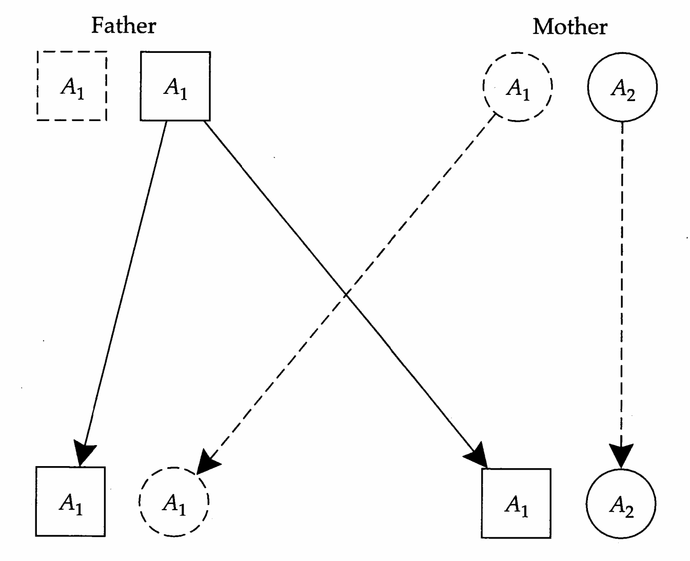
>
> Figure 7.1 The transmittance of genes of two parents to two offspring. All $ A_{1} $ alleles are identical in state. However, of the two $ A_{1} $ genes carried by the offspring on the left, only the one in the square is identical by descent with the $ A_{1} $ allele carried by the offspring on the right.

---

## Genetics_chapter7_003 · MEASURES OF RELATEDNESS / Coefficients of Identity

Consider a single locus in two diploid individuals. For the four genes involved, there are 15 possible configurations of identity by descent due to the fact that identity may exist within as well as between individuals (Gillois 1964; Figure 7.2). Individuals that contain pairs of alleles that are identical by descent are said to be inbred. If we ignore the distinction between maternally and paternally derived genes, the 15 possible configurations reduce to nine identity states. These range from state 1 in which the two individuals are inbred and share a gene that is identical by descent (so that all four genes are identical by descent) to state 9 in which none of the four genes are identical by descent. Many situations exist in which further simplification can be justified. For example, in large random-mating populations, the probability of the first six identity states is essentially zero.

Associated with each of the nine identity states are probabilities, $ \Delta_1 $ to $ \Delta_9 $, which Jacquard (1974) called condensed coefficients of identity (Figure 7.2). These coefficients provide a complete description of the probability distribution of identity by descent between single loci of two individuals. The values that they take on depend on the relationship. For example, suppose that $ x $ is a parent and $ y $ its offspring, and that neither is inbred. Then, since an individual inherits one and only one gene from its parent, $ \Delta_8 = 1 $ and all other $ \Delta_i = 0 $. For noninbred full sibs, there is a 0.5 probability of inheriting the same paternal

> **Figure 7.2** · page 150 · source: `Genetics_chapter7`
>
> 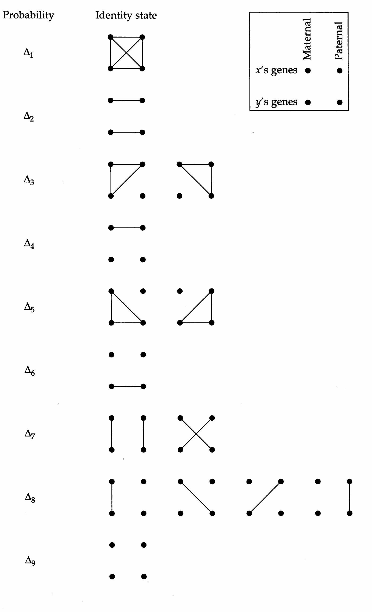
>
> Figure 7.2 The 15 possible states of identity by descent for a locus in individuals x and y, condensed into nine classes. Genes that are identical by descent are connected by lines.

gene and, independently, a 0.5 probability of inheriting the same maternal gene. Thus, $ \Delta_7 = 0.25 $ (both pairs of genes are identical by descent), $ \Delta_8 = 0.50 $ (one pair of genes is identical by descent), and $ \Delta_9 = 0.25 $ (there is no identity by descent at the locus), and all other $ \Delta_i = 0 $.

---

## Genetics_chapter7_004 · MEASURES OF RELATEDNESS / Coefficients of Coancestry and Inbreeding

Suppose now that single genes are drawn randomly from individuals x and y. The probability that these two genes are identical by descent, $ \Theta_{xy} $, is called the coefficient of coancestry. (In other publications, $ \Theta_{xy} $ is sometimes referred to as the coefficient of consanguinity, coefficient of kinship, or coefficient de parent). In terms of the condensed coefficients of identity,

$$
\Theta_{xy}=\Delta_{1}+\frac{1}{2}(\Delta_{3}+\Delta_{5}+\Delta_{7})+\frac{1}{4}\Delta_{8}
\tag{7.2}
$$

Here, we have simply weighted each condensed coefficient of identity by the conditional probability that a randomly drawn gene from $x$ is identical by descent with a randomly drawn gene from $y$ (at the same locus). Another way to look at the problem is to consider a hypothetical offspring $(z)$ of $x$ and $y$. By the above definition, $\Theta_{xy}$ is the probability that the two genes at a locus in individual $z$ are identical by descent. The latter quantity is Wright's (1922) inbreeding coefficient, $f_{z}$. Thus, an individual's inbreeding coefficient is equivalent to its parents' coefficient of coancestry, $f_{z} = \Theta_{xy}$.

We now proceed by example to demonstrate how estimates of $ \Theta_{xy} $ are derived. The first problem to be tackled is the coefficient of coancestry of an individual with itself, $ \Theta_{xx} $. This may seem like a nonsensical task. However, we will soon see that $ \Theta_{xx} $ is an essential element of all coancestry estimates. Denote the two genes carried by individual x as $ A_1 $ and $ A_2 $, and then randomly draw a gene from the locus, replace it, and randomly draw another. $ \Theta_{xx} $ is the probability that the two genes drawn are identical by descent. There are four ways, each with probability 1/4, in which the genes can be drawn: $ A_1 $ both times, $ A_1 $ first and $ A_2 $ second, $ A_2 $ first and $ A_1 $ second, and $ A_2 $ both times. If two $ A_1 $ genes are drawn, they must be identical by descent since they are copies of the same gene. The same applies to a draw of two $ A_2 $ genes. Thus, provided that genes $ A_1 $ and $ A_2 $ are not identical to each other by descent, then $ \Theta_{xx} $ is simply $ (1/4)(1)+(1/4)(1)=1/2 $. We should, however, recognize the possibility that individual x is inbred, in which case the probability that the gene $ A_1 $ is identical by descent with the gene $ A_2 $ is $ f_x $. Thus, a general expression for the coefficient of coancestry of an individual with itself is

$$
\Theta_{x x}=\frac{1}{4}(1+f_{x}+f_{x}+1)=\frac{1}{2}(1+f_{x})
\tag{7.3}
$$

A slightly more complicated situation arises in calculating the coefficient of coancestry between a parent and its offspring. In order to simplify the discussion,

> **Figure 7.3** · page 152 · source: `Genetics_chapter7`
>
> 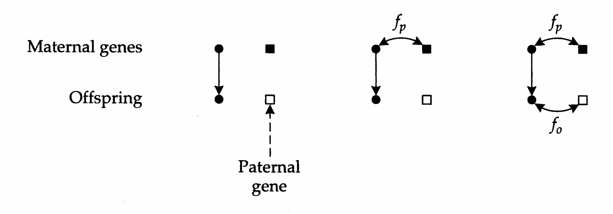
>
> Figure 7.3 The identity of genes by descent for a parent and offspring. Circles and squares represent, respectively, maternally and paternally derived genes. Left: The mother is not inbred and her mate is not a relative (so the offspring is not inbred). Center: The mother is inbred but unrelated to her mate. Right: In addition to the mother being inbred, she is related to her mate, so that her offspring is also inbred.

we will call the parent (p) of interest the mother, but the same results apply to fathers provided the locus is autosomal. We first consider the situation in which neither the mother nor her offspring (o) are inbred, i.e., the mother's parents are unrelated, and she is unrelated to her mate. In that case, of the four ways in which single genes can be drawn from the mother and the child, only one involves a pair that is identical by descent (Figure 7.3, left). Therefore, $ \Theta_{po} = 1/4 $. Suppose, however, that the mother is inbred (Figure 7.3, center), so that the probability that both of her alleles are identical by descent is $ f_{p} $. This is the same as the probability that the maternal gene inherited by the offspring is identical by descent with the maternal gene not inherited. The probability of drawing such a gene combination is 1/4. Therefore, inbreeding in the parent inflates $ \Theta_{po} $ to $ (1 + f_{p})/4 $. With complete inbreeding ( $ f_{p} = 1 $), both parental alleles are identical by descent, increasing $ \Theta_{po} $ to 1/2. Finally, we allow for the possibility that the parents of o are related, so that the offspring is inbred with coefficient $ f_{o} $ (Figure 7.3, right). It is now necessary to consider the implications of drawing a paternally derived gene from the offspring, the probability of which is 1/2. Since $ f_{o} $ is equivalent to the probability that maternally and paternally derived genes are identical by descent, the additional parent-offspring identity induced by inbreeding is $ f_{o}/2 $. In summary, the most general expression for the coefficient of coancestry for a parent and offspring is

$$
\Theta_{po}=\frac{1}{4}(1+f_{p}+2f_{o})
\tag{7.4}
$$

Often in the literature, $ \Theta_{po} $ is simply considered to be 1/4. It should now be clear that this implicitly assumes the absence of matings between relatives.

We now move on to the coefficient of coancestry of two individuals that share the same father and mother (full sibs). We assume a species with separate sexes so that the mother and father are different individuals, and we again start with

> **Figure 7.4** · page 153 · source: `Genetics_chapter7`
>
> 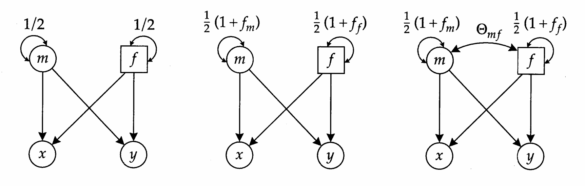
>
> Figure 7.4 Path diagrams for analyzing the probability that random genes from two full sibs are identical by descent. The path coefficients along single-headed arrows are always equal to 1/2. Left: The parents, m and f, are neither related nor inbred. Center: The parents are unrelated, but inbred. Right: In addition to being inbred, the parents are related with coefficient of coancestry $ \Theta_{mf} $.

the simplest situation, progressively allowing the parents to be inbred and/or related (Figure 7.4). For the analysis of full sibs as well as more complicated degrees of relationship, the method of path analysis (Appendix 2) provides a useful tool. The elements in Figure 7.4 no longer represent gametes (as in Figure 7.3) but individuals.

Let $m$ represent the mother, $f$ the father, and $x$ and $y$ their two offspring. When the parents are neither inbred nor related, there are two paths by which the same gene can be passed to both $x$ and $y$: $x \leftarrow m \rightarrow y$ and $x \leftarrow f \rightarrow y$. Since both paths have identical consequences, we will simply consider the first of them. First, we note that the probability that both $x$ and $y$ receive the same maternal gene is $1/2$. This is the coefficient of coancestry of the (noninbred) mother with herself, $\Theta_{mm}$, and is represented by the double-headed arrow in the figure. Second, we note that the probability of randomly drawing a maternal gene from individual $x$ is $1/2$, and that the same is true for individual $y$. Thus, the probability of drawing two maternal genes, identical by descent, one from $x$ and the other from $y$, is $\Theta_{mm}/4 = 1/8$. Adding the same contribution from the paternal path, $x \leftarrow f \rightarrow y$, we obtain the coefficient of coancestry $\Theta_{xy} = 1/4$. Path analysis (Appendix 2) provides a simple way to obtain this result. First, set the path coefficients on all of the single-headed arrows in Figure 7.4 equal to $1/2$. Then, note that the contribution of a path to a correlation between two variables is equal to the product of the path coefficients and the correlation coefficient associated with the common factor (in this case, $\Theta_{mm}$ or $\Theta_{ff} = 1/2$).

We now allow for the possibility that the parents are inbred with inbreeding coefficients $ f_{m} $ and $ f_{f} $, a condition that inflates the coefficient of coancestry of an individual with itself. This is the only necessary change for the path diagram in Figure 7.4 (center). There are still only two paths that lead to genes identical by descent in x and y, and their sum is

$$
\Theta_{xy}=\frac{1}{4}\left(\Theta_{mm}+\Theta_{ff}\right)=\frac{1}{4}\left(\frac{1+f_{m}}{2}+\frac{1+f_{f}}{2}\right)=\frac{1}{8}\left(2+f_{m}+f_{f}\right)
\tag{7.5a}
$$

Finally, we allow for the possibility that $m$ and $f$ are related, such that the probability of drawing two genes (one from each of them) that are identical by descent is $\Theta_{mf}$. It is then necessary to consider two additional paths between $x$ and $y$: $x \leftarrow m \leftrightarrow f \rightarrow y$ and $x \leftarrow f \leftrightarrow m \rightarrow y$ (Figure 7.4, right). Again taking the coefficients on the single-headed arrows to be $1/2$, it can be seen that each of these two new paths makes a contribution $\Theta_{mf}/4$ to $\Theta_{xy}$. Adding these to our previous result, we obtain a general expression for the coefficient of coancestry of full sibs.

$$
\Theta_{xy}=\frac{1}{8}\left(2+f_{m}+f_{f}+4\Theta_{mf}\right)
\tag{7.5b}
$$

which reduces to $ \Theta_{xy} = 1/4 $ under random mating.

The preceding techniques are extended readily to more distant relationships and more complicated schemes of relatedness. The coefficient of coancestry is always the sum of a series of two types of paths between x and y. The first type of path leads from a single common ancestor to the two individuals of interest, while the second type passes through two remote ancestors that are related to each other. Neither type of path is allowed to pass through the same ancestor more than once. This procedure is summarized by the following equation

$$
\Theta_{xy}=\sum_{i}\Theta_{ii}\left(\frac{1}{2}\right)^{n_{i}-1}+\sum_{j}\sum_{j\neq k}\Theta_{jk}\left(\frac{1}{2}\right)^{n_{jk}-2}
\tag{7.6}
$$

where $ n_{i} $ is the number of individuals (including x and y) in the path leading from common ancestor i, and $ n_{jk} $ is the number of individuals (including x and y) on the path leading from two different but related ancestors, j and k. Formal proof of this equation can be found in Boucher (1988).

Up to now, we have assumed an autosomal locus. The rules change when the locus of interest is sex-linked. Assuming the female is the heterogametic sex, a male cannot receive an X-linked gene from his father, whereas fathers pass on their X-linked genes to daughters with probability one. Females have two X chromosomes and pass each one on to sons or daughters with the usual probability of one-half. Thus, the protocol for obtaining the coefficient of coancestry for an X-linked locus is similar to that used for autosomal loci except that path coefficients leading from fathers to daughters are replaced by a 1 and those leading from fathers to sons are replaced by a 0. For all paths containing two consecutive males, the probability that X-linked genes are identical by descent is zero.

**[示例 Example]**

> **Example 1** · ref: `Genetics_chapter7:1` · source: `Genetics_chapter7_004.json` · blocks 23–25
>
> Example 1. One of the first pedigrees to which Wright (1922) applied his theory of inbreeding is that of Roan Gauntlet, an English bull. In the following figure, rectangles and ovals refer to bulls and cows, respectively. We wish to compute the coefficient of coancestry of the Royal Duke of Gloster and Princess Royal. This is the same as the inbreeding coefficient of their son, Roan Gauntlet. The four possible paths by which alleles identical by descent can be inherited by the Royal Duke and Princess Royal are indicated by the coded lines adjacent to the arrows in the pedigree. Two of these paths contain four individuals and two contain seven. Thus, assuming that the remote ancestors, Lord Raglan and Champion of England, are not inbred (so that for both, $ \Theta_{ii} = 1/2 $), the coefficient of coancestry of the Royal Duke and Princess Royal is $ [2(1/2)^4 + 2(1/2)^7] = 0.141 $. This is a slightly closer relationship than that for half sibs (for which $ \Theta = 0.125 $). Relative to the base population, the alleles at 14% of the autosomal loci in the offspring, Roan Gauntlet, are expected to be identical by descent.
> 
> 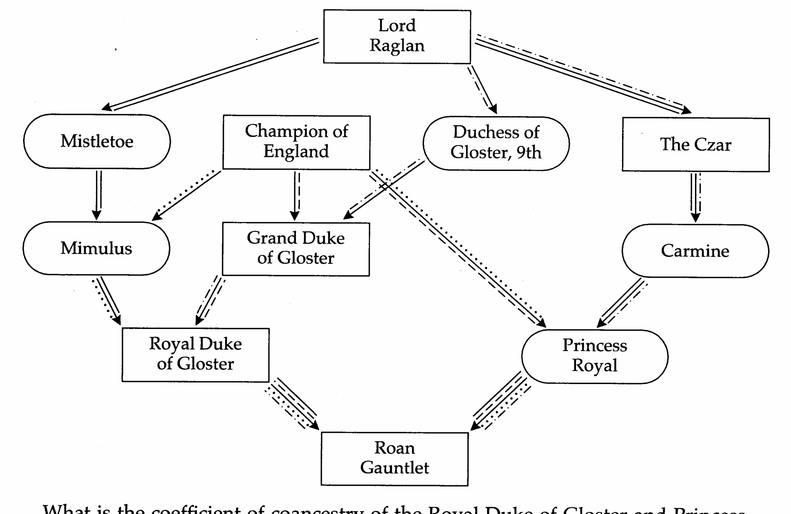
> 
> What is the coefficient of coancestry of the Royal Duke of Gloster and Princess Royal with respect to X-linked loci? Of the four paths between these two individuals, only the one traced by the dotted line does not contain consecutive males. Champion of England passes on his X chromosome to each of his daughters, Mimulus and Princess Royal, with probability 1. Mimulus passes that chromosome on to the Royal Duke of Gloster with probability 1/2. The probability of drawing a specific X chromosome from the Royal Duke is 1 (since he is a male) and from Princess Royal is 1/2. The coefficient of coancestry for X-linked loci is therefore $ 1 \cdot \frac{1}{2} \cdot 1 \cdot \frac{1}{2} = \frac{1}{4} $. This is substantially greater than the coefficient for autosomal loci over the same path, which is $ (1/2)^4 = \frac{1}{16} $.

> **Figure 7.5** · page 156 · source: `Genetics_chapter7`
>
> 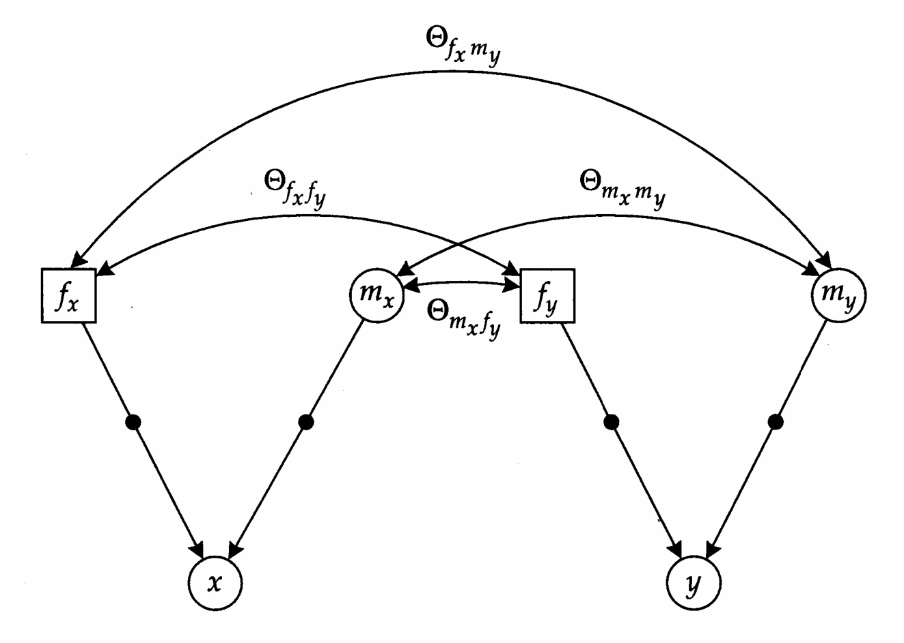
>
> Figure 7.5 The analysis of the identity by descent of genotypes of individuals x and y. $ f_{x} $ and $ f_{y} $ represent fathers (which may be the same individual) of x and y, respectively, whereas $ m_{x} $ and $ m_{y} $ represent their mothers. Double-headed arrows between two parents represent coefficients of coancestry.

---

## Genetics_chapter7_005 · MEASURES OF RELATEDNESS / The Coefficient of Fraternity

Up to now we have been considering the identity of single genes by descent. Another useful measure is the probability that single-locus genotypes (both genes) of two individuals are identical by descent. The formulation of such a measure, which we denote as $ \Delta_{xy} $, is attributable to Cotterman (1954) and was called the coefficient of fraternity by Trustrum (1961). The problem is set out in Figure 7.5. Here we denote the mothers of individuals x and y as $ m_x $ and $ m_y $, and the fathers as $ f_x $ and $ f_y $. The coefficients of coancestry $ \Theta_{m_x m_y} $, $ \Theta_{m_x f_y} $, $ \Theta_{f_x m_y} $, and $ \Theta_{f_x f_y} $ provide measures of the probability of drawing genes identical by descent from all four combinations of parents.

There are two ways by which the genotype of $x$ can be identical by descent with that of $y$: (1) the gene descending from $m_{x}$ may be identical by descent with that descending from $m_{y}$, and that from $f_{x}$ identical by descent with that from $f_{y}$, or (2) the gene from $m_{x}$ may be identical by descent with that from $f_{y}$, and that from $f_{x}$ identical by descent with that from $m_{y}$. Thus, the coefficient of fraternity is defined as

$$
\Delta_{x y}=\Theta_{m_{x}m_{y}}\Theta_{f_{x}f_{y}}+\Theta_{m_{x}f_{y}}\Theta_{f_{x}m_{y}}
\tag{7.7}
$$

In terms of the condensed coefficients of identity, $ \Delta_{xy} = \Delta_1 + \Delta_7 $, which reduces to $ \Delta_7 $ in the absence of inbreeding.

Two examples will suffice to illustrate the use of this equation. First, consider the situation when x and y are full sibs, in which case the mothers are the same individual $ (m_{x}=m_{y}=m) $, as are the fathers $ f_{x}=f_{y}=f $. Equation 7.7 then reduces to

$$
\Delta_{x y}=\Theta_{m m}\Theta_{f f}+\Theta_{m f}^{2}
\tag{7.8}
$$

If the parents are unrelated, then $ \Theta_{mf} = 0 $; and if the parents are not inbred, then $ \Theta_{mm} = \Theta_{ff} = 1/2 $. Substituting these values into the above expression, we obtain $ \Delta_{xy} = 1/4 $.

Now consider the case of paternal half sibs, in which case the fathers are the same individual, but the mothers are different. Now,

$$
\Delta_{x y}=\Theta_{m_{x}m_{y}}\Theta_{f f}+\Theta_{m_{x}f}\Theta_{f m_{y}}
\tag{7.9}
$$

Provided that the parents are unrelated, then $ \Theta_{ff} = 1/2 $ and $ \Theta_{mxm_y} = \Theta_{mxf} = \Theta_{fm_y} = 0 $, which yields $ \Delta_{xy} = 0 $. The genotypes of two individuals cannot be identical by descent if their maternally (or paternally) derived genes come from unrelated individuals.

**[示例 Example]**

> **Example 2** · ref: `Genetics_chapter7:2` · source: `Genetics_chapter7_005.json` · blocks 10–12
>
> Example 2. Returning to the figure in Example 1, what is $ \Delta_{xy} $ for x = Royal Duke of Gloster and y = Princess Royal?
> 
> Designate the parents as $ f_x = \text{Grand Duke of Gloster}, m_x = \text{Mimulus}, f_y = \text{Champion of England, and } m_y = \text{Carmine} $. Noting that Champion of England is the father of Grand Duke of Gloster and Mimulus, $ \Theta_{f_x f_y} = \Theta_{m_x f_y} = (1/4) $. Counting the number of individuals in the paths of descent between the remaining two pairs of parents, $ \Theta_{m_x m_y} = \Theta_{f_x m_y} = (1/2)^5 $. Substituting into Equation 7.7, the probability that $ x $ and $ y $ have identical genotypes by descent at an arbitrary autosomal locus is
> 
> $$
> \Delta_{xy}=(1/4)(1/2)^{5}+(1/2)^{5}(1/4)=(1/2)^{6}
> $$
> 

We now have a complete system for describing the identity by descent at an arbitrary locus for any two individuals. For complex pedigrees, this can be a rather tedious process, but relatively simple algorithms exist for the computation of $ \Theta_{xy} $ from simple information on parentage (Chapter 26). Karigl (1981) gives a general recursive procedure for obtaining all nine condensed coefficients of identity for arbitrary pedigrees. The identity coefficients for several common relationships are summarized in Table 7.1.

---

## Genetics_chapter7_006 · THE GENETIC COVARIANCE BETWEEN RELATIVES

The bulk of the credit goes to Fisher (1918) and Wright (1921b) for elucidating the connection between the phenotypic resemblance of relatives and the types of genetic variance in populations. However, despite the tremendous advances in these

**[Table]**

*[See Table 7.1 at the end of this section.]*

papers, a number of problems remained. Wright did not pursue nonadditive gene action beyond dominance and even then ran into difficulties. Fisher incorporated epistasis but only of the additive × additive type. In 1954, Cockerham and Kempthorne independently published papers outlining how the earlier results could be generalized to include any type of gene action. Both authors arrived at the same result by very different routes, but Kempthorne’s approach is simpler by far and is the one that we will pursue. Cockerham’s name will appear many times throughout the book in other contexts.

At the outset, it must be emphasized that the simple results that will emerge below are not obtained without making a lot of assumptions: (1) all of the genetic variation is attributable to diploid, autosomal loci; (2) mating is random; (3) all loci are unlinked and in gametic phase equilibrium; (4) there is no genetic variation for maternal effects; (5) genotype-environment covariance and interaction are unimportant; (6) there is no sexual dimorphism; and (7) selection is not operating on the population. In due course, we will relax all of these conditions.

Our first task is to decompose the total genetic covariance between relatives into fundamental components that describe the various types of gene action. We accomplish this by following the logic used in Chapter 5 to partition the genetic variance. Consider a collection of pairs of individuals all of the same type of relationship, and let x and y represent the members of a random pair. From Equation 5.7, taking things out only to the two-locus effects, the genotypic values of the two individuals may be written as

$$
\begin{aligned}G_{ijkl..}(x)&=\mu_{G}+[\alpha_{i}^{x}+\alpha_{j}^{x}+\alpha_{k}^{x}+\alpha_{l}^{x}+\cdots]+[\delta_{ij}^{x}+\delta_{kl}^{x}+\cdots]\\&\quad+[(\alpha\alpha)_{ik}^{x}+(\alpha\alpha)_{il}^{x}+(\alpha\alpha)_{jk}^{x}+(\alpha\alpha)_{jl}^{x}+\cdots]\\&\quad+[(\alpha\delta)_{ikl}^{x}+(\alpha\delta)_{jkl}^{x}+(\alpha\delta)_{kij}^{x}+(\alpha\delta)_{lij}^{x}+\cdots]+(\delta\delta)_{ijkl}^{x}+\cdots\end{aligned}
$$

$$
\begin{aligned}G_{ijkl\ldots}(y)&=\mu_{G}+[\alpha_{i}^{y}+\alpha_{j}^{y}+\alpha_{k}^{y}+\alpha_{l}^{y}+\cdots]+[\delta_{ij}^{y}+\delta_{kl}^{y}+\cdots]\\&\quad+[(\alpha\alpha)_{ik}^{y}+(\alpha\alpha)_{il}^{y}+(\alpha\alpha)_{jk}^{y}+(\alpha\alpha)_{jl}^{y}+\cdots]\\&\quad+[(\alpha\delta)_{ikl}^{y}+(\alpha\delta)_{jkl}^{y}+(\alpha\delta)_{kii}^{y}+(\alpha\delta)_{lii}^{y}+\cdots]+(\delta\delta)_{ijkl}^{y}+\cdots.\end{aligned}
\tag{7.10}
$$

where i, j and k, l represent genes at the first and second loci. Fisher (1918) showed that just as the different types of effects are uncorrelated within individuals, they are also uncorrelated between individuals, provided the preceding assumptions are met. Consequently, the genetic covariance between relatives can be expanded into a series of terms, each describing the covariance between the same kinds of effects in two individuals:

$$
\sigma_{G}(x,y)=\sigma_{A}(x,y)+\sigma_{D}(x,y)+\sigma_{A A}(x,y)+\sigma_{A D}(x,y)+\sigma_{D D}(x,y)+\cdots
\tag{7.11}
$$

Note that if x = y, Equation 7.11 reduces to Equation 5.8, the usual expression for the genetic variance.

The remaining task is to express the terms in Equation 7.11 in terms of variance components and coefficients of relationship. We will do this only for the first three terms and then give the general result. First, we evaluate the additive genetic covariance at locus 1. Since the mean value of the effects is zero by definition (Chapter 5), the covariance between $x$ and $y$ caused by the additive effects is equal to the expectation of the cross-product, $E[(\alpha_i^x + \alpha_j^x)(\alpha_i^y + \alpha_j^y)]$. Consider one of the four terms in the expansion, $E(\alpha_i^x \alpha_i^y)$. The two genes of interest may be identical by descent, with probability $\Theta_{xy}$, in which case $E(\alpha_i^x \alpha_i^y) = E(\alpha_i^2)$, which is half the additive genetic variance attributable to locus 1. If the two genes are not identical by descent, then they must be distributed independently so that $E(\alpha_i^x \alpha_i^y) = [E(\alpha_i)]^2 = 0$. These same arguments can be applied to the remaining three terms in $E[(\alpha_i^x + \alpha_j^x)(\alpha_i^y + \alpha_j^y)]$. Thus, the additive genetic covariance is $4\Theta_{xy}E(\alpha_i^2)$, which is twice the additive genetic variance at the locus times the probability that randomly drawn genes from $x$ and $y$ are identical by descent. Noting that this result applies to all loci and that the distributions of effects at different loci are independent under the assumptions of the model, the additive genetic covariance, obtained by summing over loci, reduces to $\sigma_A(x, y) = 2\Theta_{xy} \sigma_A^2$.

We now move on to the dominance genetic covariance, which for locus 1 is $ E(\delta_{ij}^{x},\delta_{ij}^{y}) $. If x and y are identical by descent for both genes at this locus, then $ E(\delta_{ij}^{x},\delta_{ij}^{y})=E(\delta_{ij}^{2}) $, which is the dominance genetic variance attributable to locus 1.

The probability of such identity is $ \Delta_{xy} $. On the other hand, if x and y do not have identical genotypes by descent, the dominance effects must be distributed independently, and hence $ E(\delta_{ij}^x \delta_{ij}^y) = E^2(\delta_{ij}) = 0 $. Again, since these arguments apply to every locus, the dominance genetic covariance, obtained by summing over all loci, is $ \sigma_D(x, y) = \Delta_{xu} \sigma_D^2 $.

Finally, we consider the epistatic genetic covariance caused by additive × additive effects. For any pair of loci, this involves the 16 cross-product terms in the expectation $ E\{[(\alpha\alpha)_{ik}^x + (\alpha\alpha)_{il}^x + (\alpha\alpha)_{jk}^x + (\alpha\alpha)_{jl}^x][(\alpha\alpha)_{ik}^y + (\alpha\alpha)_{il}^y + (\alpha\alpha)_{jk}^y + (\alpha\alpha)_{jl}^y]\} $. Since the results are the same for all terms, it is sufficient to evaluate only one of them. The term $ E[(\alpha\alpha)_{ik}^x (\alpha\alpha)_{ik}^y] $ is equivalent to $ E[(\alpha\alpha)^2] $ provided that two conditions hold — a random gene drawn from the first locus in x must be identical by descent with one drawn from y, and the same condition must hold at the second locus. If identity by descent does not arise simultaneously for gene pairs drawn from both loci, $ E[(\alpha\alpha)_{ik}^x (\alpha\alpha)_{ik}^y] = [E(\alpha\alpha)]^2 = 0 $. Now, under the assumption of gametic phase equilibrium, the probability of identity by descent at locus 1 is independent of that at locus 2. Both probabilities are $ \Theta_{xy} $. Thus, the probability of joint identity by descent is $ \Theta_{xy}^2 $, and the covariance caused by additive × additive epistasis between loci 1 and 2 is $ 16 \Theta_{xy}^2 E[(\alpha\alpha)^2] $. Noting that $ E[(\alpha\alpha)^2] $ is one-fourth the additive × additive genetic variance for a single pair of loci, and summing over all pairs, $ \sigma_{AA}(x, y) = (2 \Theta_{xy})^2 \sigma_{AA}^2 $.

All three of the terms evaluated reduce to simple functions of identity coefficients and a component of genetic variance, and the same is true for all higher-order terms. Due to the independent distributions of genes at different loci under the assumptions of the model, any covariance due to higher-order epistatic effects is equal to the product of the identity for each component additive effect, the probability of identity for each component dominance effect, and the corresponding variance component. Thus, the covariance attributable to additive × dominance epistasis is $ 2\Theta_{xy}\Delta_{xy}\sigma_{AD}^{2} $ because there is one additive and one dominance effect involved, while that caused by dominance × dominance epistasis is $ \Delta_{xy}^{2}\sigma_{DD}^{2} $ because there are two dominance but no additive effects involved. Letting n be the number of additive effects and m be the number of dominance effects in a type of gene action, the expression for the covariance between relatives becomes

$$
\begin{align*}\sigma_{G}(x,y)&=\sum(2\Theta_{xy})^{n}\Delta_{xy}^{m}\sigma_{A^{n} D^{m}}^{2}\\&=2\Theta_{xy}\sigma_{A}^{2}+\Delta_{xy}\sigma_{D}^{2}+(2\Theta_{xy})^{2}\sigma_{AA}^{2}\\&\quad+2\Theta_{xy}\Delta_{xy}\sigma_{AD}^{2}+\Delta_{xy}^{2}\sigma_{DD}^{2}+(2\Theta_{xy})^{3}\sigma_{AAA}^{2}+\cdots\end{align*}
\tag{7.12}
$$

Drawing from the coefficients $ \Theta_{xy} $ and $ \Delta_{xy} $ given in Table 7.1, explicit expressions for the genetic covariances of common types of relatives are given in Table 7.2. Although these expressions are only expanded to include two-locus epistasis, several things are immediately apparent. First, gene action involving dominance only rarely contributes to the covariance between relatives. It requires that each parent of x be related to a different parent of y. Such relationships (full sibs,

**[Table]**

*[See Table 7.2 at the end of this section.]*

double first cousins, and monozygotic twins) are said to be collateral. Second, the coefficient for $ \sigma_{AA}^{2} $ declines more rapidly with the distance of the relationship than does that for $ \sigma_{A}^{2} $. As noted in Chapters 4 and 5, because the additive genetic variance is a function of all higher-order types of gene action, these results should not be misconstrued to mean that the resemblance between relatives is influenced only slightly by dominance and epistatic gene action.

The most useful feature of the expressions in Table 7.2 involves their different coefficients, which permit the estimation of the different variance components from linear combinations of different observed genetic covariances between relatives. For example, ignoring higher-order epistasis and environmental sources of covariance, $ 8 \times \text{[parent-offspring covariance} - (2 \times \text{half-sib covariance})] $ has an expected value of $ 8\left[\left(\sigma_{A}^{2}/2 + \sigma_{AA}^{2}/4\right) - 2\left(\sigma_{A}^{2}/4 + \sigma_{AA}^{2}/16\right)\right] = \sigma_{AA}^{2} $. Similarly, $ 2 \times \left[(4 \times \text{half-sib covariance}) - (\text{parent-offspring covariance})\right] $ has an expected value of $ \sigma_{A}^{2} $. Subsequent examples in this chapter will illustrate the utility of these kinds of manipulations.

> **Table 7.1** · `7.1` · page 158 · source: `Genetics_chapter7_006`
> Table 7.1 Identity coefficients for common relationships under the assumption of no inbreeding, in which case $ \Delta_{1} $ to $ \Delta_{6}=0 $.
>
> Relationship | $ \Delta_{7} $ | $ \Delta_{8} $ | $ \Delta_{9} $ | $ \Theta_{xy} $ | $ \Delta_{xy} $
> --- | --- | --- | --- | --- | ---
> Parent-offspring | 0 | 1 | 0 | $ \frac{1}{4} $ | 0
> Grandparent-grandchild | 0 | $ \frac{1}{2} $ | $ \frac{1}{2} $ | $ \frac{1}{8} $ | 0
> Great grandparent-great grandchild | 0 | $ \frac{1}{4} $ | $ \frac{3}{4} $ | $ \frac{1}{16} $ | 0
> Half sibs | 0 | $ \frac{1}{2} $ | $ \frac{1}{2} $ | $ \frac{1}{8} $ | 0
> Full sibs, dizygotic twins | $ \frac{1}{4} $ | $ \frac{1}{2} $ | $ \frac{1}{4} $ | $ \frac{1}{4} $ | $ \frac{1}{4} $
> Uncle(aunt)-nephew(neice) | 0 | $ \frac{1}{2} $ | $ \frac{1}{2} $ | $ \frac{1}{8} $ | 0
> First cousins | 0 | $ \frac{1}{4} $ | $ \frac{3}{4} $ | $ \frac{1}{16} $ | 0
> Double first cousins | $ \frac{1}{16} $ | $ \frac{6}{16} $ | $ \frac{9}{16} $ | $ \frac{1}{8} $ | $ \frac{1}{16} $
> Second cousins | 0 | $ \frac{1}{16} $ | $ \frac{15}{16} $ | $ \frac{1}{64} $ | 0
> Monozygotic twins (clonemates) | 1 | 0 | 0 | $ \frac{1}{2} $ | 1

> **Table 7.2** · `7.2` · page 161 · source: `Genetics_chapter7_006`
> Table 7.2 Coefficients for the components of genetic covariance between different types of relatives under the assumptions of random mating, free recombination, and gametic phase equilibrium.
>
> Relationship | $ \sigma_{A}^{2} $ | $ \sigma_{D}^{2} $ | $ \sigma_{AA}^{2} $ | $ \sigma_{AD}^{2} $ | $ \sigma_{DD}^{2} $
> --- | --- | --- | --- | --- | ---
> Parent-offspring | $ \frac{1}{2} $ |  | $ \frac{1}{4} $ |  | 
> Grandparent-grandchild | $ \frac{1}{4} $ |  | $ \frac{1}{16} $ |  | 
> Great grandparent-great grandchild | $ \frac{1}{8} $ |  | $ \frac{1}{64} $ |  | 
> Half sibs | $ \frac{1}{4} $ |  | $ \frac{1}{16} $ |  | 
> Full sibs, dizygotic twins | $ \frac{1}{2} $ | $ \frac{1}{4} $ | $ \frac{1}{4} $ | $ \frac{1}{8} $ | $ \frac{1}{16} $
> Uncle (aunt)-nephew (neice) | $ \frac{1}{4} $ |  | $ \frac{1}{16} $ |  | 
> First cousins | $ \frac{1}{8} $ |  | $ \frac{1}{64} $ |  | 
> Double first cousins | $ \frac{1}{4} $ | $ \frac{1}{16} $ | $ \frac{1}{16} $ | $ \frac{1}{64} $ | $ \frac{1}{256} $
> Second cousins | $ \frac{1}{32} $ |  | $ \frac{1}{1024} $ |  | 
> Monozygotic twins (clonemates) | 1 | 1 | 1 | 1 | 1
>
> Note: To obtain the covariance expression for a particular type of relationship, multiply each variance component by its coefficient and sum. For example, the genetic covariance between half sibs is $ (\sigma_{A}^{2}/4) + (\sigma_{AA}^{2}/16) $. Blanks indicate values of zero.

---

## Genetics_chapter7_007 · THE EFFECTS OF LINKAGE AND GAMETIC PHASE DISEQUILIBRIUM

In deriving the Kempthorne-Cockerham equation (7.12), we assumed that the constituent loci are freely recombining and in gametic phase equilibrium. We now consider the extent to which the interpretation of observed covariances between relatives needs to be modified in the face of violations of these assumptions. In most practical situations, we have little if any information on either linkage or gametic phase disequilibrium, so the following theoretical results provide our only guidance as to the potential seriousness of the matter.

The most complete analyses of this problem were developed by Gallais (1974) and Weir and Cockerham (1977), who allowed for inbreeding as well as linkage and gametic phase disequilibrium. Neither study went beyond two-locus relationships, as even then the algebraic and notational complexities are enormous. We will take a simpler approach than these authors, first considering the consequences of linkage under the assumption of gametic phase equilibrium and then evaluating some of the consequences of disequilibrium. In both cases, we will assume that mating is random and that all of the remaining assumptions of the Kempthorne-Cockerham model are fulfilled.

---

## Genetics_chapter7_008 · THE EFFECTS OF LINKAGE AND GAMETIC PHASE DISEQUILIBRIUM / Linkage

Under the assumption of gametic phase equilibrium, linkage influences only the epistatic components of genetic covariance, which depend upon the multilocus gene combinations inherited through gametes. Recall that in Equation 7.12, each component of epistatic variance is weighted by a coefficient of the form $ (2\Theta_{xy})^{n}\Delta_{xy}^{m} $. The term $ \Theta_{xy}^{n} $ is the probability that randomly drawn pairs of genes (one from x and one from y) will be simultaneously identical by descent at n loci, the $ 2^{n} $ coming in because of diploidy. Similarly, $ \Delta_{xy}^{m} $ is the probability that the genotypes of x and y are simultaneously identical by descent at m loci. These definitions of the joint probability of events at multiple loci as the products of probabilities at individual loci assume that identity by descent is distributed independently among loci. However, for linked loci, identity by descent is expected to be positively correlated since the genes at such loci tend to be inherited together. Thus, for linked loci, we can anticipate that the multilocus coefficients $ (2\Theta_{xy})^{n}\Delta_{xy}^{m} $ must be too low, to a degree depending on the recombination frequency.

A general solution to this problem requires the use of digenic descent coefficients, which define the probability that two nonalleles (genes from different loci) are copies of genes that were originally contained in the same gamete. Such a condition is known as equivalence by descent. The formal theory of digenic descent, developed in great detail by Cockerham and Weir (1968, 1973, 1977a) and Weir and Cockerham (1968, 1969, 1973, 1974, 1977), is algebraically and notationally complex. We will rely upon an approach that is less general but more transparent (Schnell 1961, 1963, Van Aarde 1975). There is no easy entry into this field, but for the adventuresome we suggest the reviews of Weir and Cockerham (1977, 1989) as a starting point.

For our purposes, it will suffice to examine an arbitrary pair of loci, $A$ and $B$. Consider an individual whose two-locus genotype resulted from the fusion of $A_m B_m$ and $A_f B_f$ gametes ($m$ for mother, $f$ for father). If the recombination fraction for the two loci is $c$, then this individual will produce gametes in frequencies: $p(A_m B_m) = p(A_f B_f) = (1 - c)/2$ and $p(A_m B_f) = p(A_f B_m) = c/2$. Two gametes randomly drawn from this individual can have four possible identity-by-descent relationships. Identity exists at both loci with probability $p(A, B) = p^2(A_m B_m) + p^2(A_f B_f) + p^2(A_m B_f) + p^2(A_f B_m)$, at neither locus with probability $p(0, 0) = 2p(A_m B_m)p(A_f B_f) + 2p(A_m B_f)p(A_f B_m)$, at only the $A$ locus with probability $p(A, 0) = 2p(A_m B_m)p(A_f B_f) + 2p(A_f B_m)p(A_f B_f)$, and at only the $B$ locus with probability $p(0, B) = 2p(A_f B_f)p(A_m B_f) + 2p(A_f B_m)p(A_m B_m)$. Letting $\lambda = (1 - 2c)^2$, these gametic-identity probabilities simplify to

$$
p(A,B)=p(0,0)=\frac{1+\lambda}{4}
\tag{7.13a}
$$

$$
p(A,0)=p(0,B)=\frac{1-\lambda}{4}
\tag{7.13b}
$$

all of which reduce to 1/4 with free recombination (c = 0.5).

As a specific application of gametic identity probabilities, we will consider the case of full sibs, first evaluating the covariance caused by additive × additive epistasis. As noted previously, for each pair of loci, the genotypic value of each sib contains four ( $ \alpha\alpha $) terms, so there are 16 combinations of these terms between individuals. For each of the 16 combinations, the quantity of interest is the joint probability that randomly drawn A genes (one from each sib) are identical by descent and that randomly drawn B genes (one from each sib) are identical by descent. We first draw a random A gene from the two sibs. As noted earlier, these are identical by descent with probability 1/4. Given that identity by descent was obtained at the A locus, we now draw the B genes (again, one from each sib). These genes may be identical by descent through two routes — they may both derive from the parent from which the A genes were drawn (with probability 1/4) or both from the opposite parent (with probability 1/4). If they come from the same parent as the A gene, the B genes will be identical by descent with conditional probability $ p(A, B)/[p(A, B) + p(A, 0)] = (1 + \lambda)/2 $. If they come from the opposite parent, they are identical by descent with probability 1/2. Summing up, the probability of digenic identity by descent for two full sibs is $ 1/4 \cdot 1/4 \cdot [(1 + \lambda)/2 + 1/2] = (2 + \lambda)/32 $. Given such identity, the contribution to the genetic covariance is $ E[(\alpha\alpha)^2] $, which is equivalent to one-fourth of the additive × additive genetic variance. Thus, after taking account of all 16 pairs of additive × additive effects, the covariance between full sibs resulting from additive × additive epistasis is $ 16 \cdot [(2 + \lambda)/32] \cdot [\sigma_{AA}^2/4] = (2 + \lambda)\sigma_{AA}^2/8 $. With free recombination ( $ \lambda = 0 $), this reduces to $ \sigma_{AA}^2/4 $, our previous result (Table 7.2). Linkage ( $ \lambda > 0 $) causes the additive × additive genetic variance to be inflated.

**[Table]**

*[See Table 7.3 at the end of this section.]*

We next consider the additive × dominance covariance between full sibs. Again, from Equation 7.10, for any pair of loci, there are 16 combinations of (αδ) terms in the two sibs. If the two individuals possess an additive × dominance effect that is identical by descent, the contribution to the genetic covariance will be σ²_AD/4. To evaluate the probability of such an event, we need to determine the joint probability of drawing single genes that are identical by descent at one locus and genotypes that are identical by descent at the second locus. Such identity is only possible in the eight comparisons for which the additive effects involve the same locus in x and y. As usual with full sibs, the probability of drawing two genes (one from each sib) that are identical by descent is 1/4. Also as noted above, given that the genes drawn at one locus are identical by descent, the genes for the second locus that descended from gametes from the same parent are identical by descent with probability (1 + λ)/2. The other pair of genes at the second locus are identical by descent with probability 1/2. Summing up, the additive × dominance covariance becomes 8 · (1/4) · [(1 + λ)/2] · (1/2) · (σ²_AD/4) = (1 + λ)σ²_AD/8, which reduces to σ²_AD/8 with free recombination.

Finally, we note that covariance between the single ( $ \delta\delta $) term for a pair of loci requires that both sibs inherit maternal gametes that are identical by descent at

> **Figure 7.6** · page 165 · source: `Genetics_chapter7`
>
> 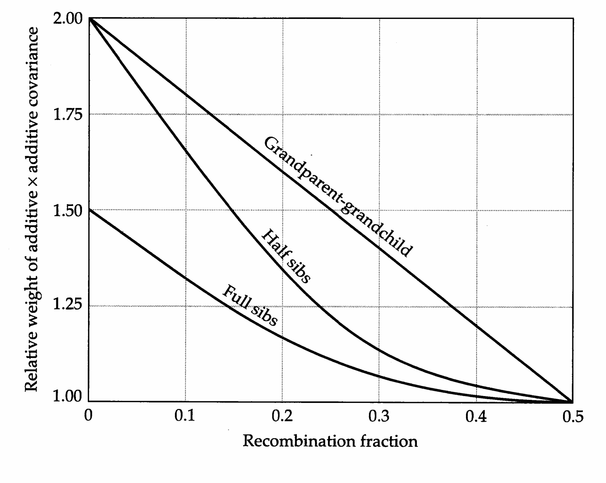
>
> Figure 7.6 Inflation of the additive × additive covariance between relatives caused by linkage, obtained by use of the coefficients in Table 7.3.

both loci, and similarly for the paternal gametes. Each of these events occurs with probability $ p(A, B) $. Therefore, the dominance $ \times $ dominance covariance between full sibs is $ p^2(A, B)\sigma_{DD}^2 = (1 + \lambda)^2\sigma_{DD}^2/16 $.

The coefficients for full sibs and for other common relationships are summarized in Table 7.3. The main conclusion to be drawn from these results is that except for parent-offspring and monozygotic twin relationships, linkage inflates the covariance between relatives, unless there are no epistatic sources of genetic variance. Linkage has no influence on the parent-offspring covariance because the two individuals always have exactly one gene identical by descent at each locus, and therefore share exactly one of the four additive × additive effects. For grandparent-grandchild and half-sib relations, relative to the situation with free recombination, the additive × additive covariance can be inflated as much as twofold with completely linked loci (λ = 1), whereas with full sibs the inflation can be no greater than 50% (Figure 7.6). It is of interest to note that whereas the expressions for the covariance of half sibs and for grandparent-grandchild are identical under free recombination, the latter is inflated to a greater degree by linkage unless linkage is complete (λ = 1). Thus, at least in principle, a comparison of these two types of covariance may shed some light on the presence of linkage for quantitative-trait loci.

> **Table 7.3** · `7.3` · page 164 · source: `Genetics_chapter7_008`
> Table 7.3 Coefficients for the components of genetic covariance between relatives modified to account for linkage (first five columns) and gametic phase disequilibrium (last two columns).
>
> Relationship | $ \sigma_{A}^{2} $ | $ \sigma_{D}^{2} $ | $ \sigma_{AA}^{2} $ | $ \sigma_{AD}^{2} $ | $ \sigma_{DD}^{2} $ | $ \sigma_{A,A}(0) $ | $ \sigma_{D,D}(0) $
> --- | --- | --- | --- | --- | --- | --- | ---
> Parent-offspring | 1/2 |  | 1/4 |  |  | $ \frac{(1-c)^{t}}{2} $ | 
> GP-GC | 1/4 |  | $ \frac{1+\lambda^{1/2}}{16} $ |  |  | $ \frac{(1-c)^{t}}{4} $ | 
> Great GP-great GC | 1/8 |  | $ \frac{(1+\lambda^{1/2})^{2}}{64} $ |  |  | $ \frac{(1-c)^{t}}{8} $ | 
> Half sibs | 1/4 |  | 1/ $ \lambda^{16} $ |  |  | $ \frac{(1-c)^{t}}{4} $ | 
> Full sibs, dizygotic twins | 1/2 | 1/4 | 2/ $ \lambda^{8} $ | 1/ $ \lambda^{8} $ | $ \frac{(1+\lambda)^{2}}{16} $ | $ \frac{(1-c)^{t}}{2} $ | $ \frac{(1-c)^{2t}}{4} $
> Uncle(aunt)-nephew(niece) | 1/4 |  | 1/ $ \lambda(1+\lambda^{1/2})/2 $ |  |  | $ \frac{(1-c)^{t}}{4} $ | 
> First cousins | 1/8 |  | 1/(1+ $ \lambda $)^{3}/128 |  |  | $ \frac{(1-c)^{t}}{8} $ | 
> Double first cousins | 1/4 | 1/16 | 3/(1+ $ \lambda $)^{3}/64 | 1/(1+ $ \lambda $)^{3}/128 | $ \frac{(1+\lambda)^{4}}{256} $ | $ \frac{(1-c)^{t}}{4} $ | $ \frac{(1-c)^{2t}}{16} $
> Second cousins | 1/32 |  | 1/(1+ $ \lambda $)^{5}/1024 |  |  | $ \frac{(1-c)^{t}}{32} $ | 
> Monozygotic twins | 1 | 1 | 1 | 1 | 1 | (1-c)^{t} | (1-c)^{2t}
>
> Note: GP represents grandparent, GC represents grandchild, $ \lambda = (1 - 2c)^{2} $, and t is the generation number for the common ancestors. Blanks denote values of zero.

---

## Genetics_chapter7_009 · THE EFFECTS OF LINKAGE AND GAMETIC PHASE DISEQUILIBRIUM / Gametic Phase Disequilibrium

Further complications arise when loci are in gametic phase disequilibrium since this can cause a covariance between the effects of genes carried in the same gamete. The problem has been addressed by Weir et al. (1980), who ignored epistasis and assumed random mating, as we do below. In Chapter 5 (Equations 5.16a,b), we saw that in the presence of gametic phase disequilibrium, the total genetic variance can be expressed as

$$
\sigma_{G}^{2}=\sigma_{A}^{2}+\sigma_{A,A}+\sigma_{D}^{2}+\sigma_{D,D}
\tag{7.14}
$$

where $ \sigma_{A,A} $ is the contribution due to covariance of additive effects of nonalleles within gametes (the additive disequilibrium covariance), and $ \sigma_{D,D} $ is the contribution of covariance due to dominance effects of different loci within individuals (the dominance disequilibrium covariance).

We now consider the genetic covariance between relatives derived from a base population displaying gametic phase disequilibria. The covariance between relatives attributable to equilibrium additive and dominance genetic variance ( $ \sigma_A^2 $ and $ \sigma_D^2 $) is the same as given above, so it is only necessary to consider the additional contributions resulting from $ \sigma_{A,A} $ and $ \sigma_{D,D} $. For situations in which the study population is being maintained in a steady state of disequilibrium from generation to generation (by processes such as natural selection, migration, and/or nonrandom mating), the modifications to the theory are simple — all of the preceding formulations still apply, except that $ (\sigma_A^2 + \sigma_{A,A}) $ replaces $ \sigma_A^2 $, and $ (\sigma_D^2 + \sigma_{D,D}) $ replaces $ \sigma_D^2 $.

The more interesting situation arises when a study population, initially in gametic phase disequilibrium, is allowed to mate randomly in an environment in which the forces maintaining disequilibria are relaxed. In this case, the covariances between relatives change through time as recombination causes the disequilibrium components of covariance to decay towards zero. In the following, we will consider only the simple (and most common) situation in which the ancestors leading to a relationship are all members of the same generation; more general results can be found in Weir et al. (1980).

We start by considering the additive component of disequilibrium covariance. Returning to Equation 7.10, we make the distinction that allele i at the first locus and allele k at the second locus are inherited in one gamete, whereas genes j and l are inherited in the other gamete. By using the expression for the variance of a sum, Equation 3.11b, the additive equilibrium genetic variance is defined to be

$$
\sigma_{A}^{2}=E(\alpha_{i}^{2})+E(\alpha_{j}^{2})+E(\alpha_{k}^{2})+E(\alpha_{l}^{2})
\tag{7.15a}
$$

On the other hand, the additive disequilibrium covariance in the base population is

$$
\sigma_{A,A}(0)=2E(\alpha_{i}\alpha_{k})+2E(\alpha_{j}\alpha_{l})
\tag{7.15b}
$$

Note that terms involving cross-gamete expectations, e.g., $ E(\alpha_i\alpha_j) $ and $ E(\alpha_i\alpha_l) $, do not appear in this expression because their expected values are zero under the assumption of random mating (as there is no correlation between gametes). In Chapter 5, we found that in the absence of restoring forces, gametic phase disequilibrium is reduced by a fraction c after each generation of random mating. Thus, the additive disequilibrium covariance remaining after t generations is

$$
\sigma_{A,A}(t)=(1-c)^{t}\sigma_{A,A}(0)
\tag{7.15c}
$$

To obtain the covariance between relatives associated with the additive equilibrium component of variance, we take expectations of the cross-products of additive effects of genes in two individuals. A similar procedure is followed in obtaining the covariance due to $ \sigma_{A,A} $, except that we now focus on pairs of genes at different loci, one in each member of the relationship,

$$
\begin{aligned}\sigma_{A,A}(x,y,t)=\big[E(\alpha_{i}^{x}\alpha_{k}^{y})+E(\alpha_{i}^{x}\alpha_{l}^{y})+E(\alpha_{j}^{x}\alpha_{k}^{y})+E(\alpha_{j}^{x}\alpha_{l}^{y})\\+E(\alpha_{k}^{x}\alpha_{i}^{y})+E(\alpha_{k}^{x}\alpha_{j}^{y})+E(\alpha_{l}^{x}\alpha_{i}^{y})+E(\alpha_{l}^{x}\alpha_{j}^{y})\big]\end{aligned}
\tag{7.15d}
$$

For any of the terms in this equation to be nonzero, the genes in them must be equivalent by descent. The key to solving Equation 7.15d is the fact that the probability of equivalence by descent for genes at different loci in different gametes is the same as the probability of identity by descent for alleles at the same locus. The reason for this equivalence is that when parents produce a gamete pool, although the two loci (A and B) may be linked, under random mating the gene at the A locus in one parental gamete is independent of the gene at the B locus in a second gamete. Thus, the probability of any term in Equation 7.15d being nonzero is $ \Theta_{xy} $.

from Equation 7.15b, we see that nonzero terms of the form $ E(\alpha_{i}\alpha_{k}) $ initially have expected values equal to $ \sigma_{A,A}(0)/4 $. At time t, however, each of the nonzero terms in Equation 7.15d has expected value $ \sigma_{A,A}(t)/4 $. Because there are eight terms, the covariance between relatives due to additive disequilibrium covariance is $ 8\Theta_{xy}\sigma_{A,A}(t)/4 $, or from Equation 7.15c,

$$
\sigma_{A,A}(x,y,t)=2\Theta_{x y}(1-c)^{t}\sigma_{A,A}(0)
\tag{7.16}
$$

where $t$ denotes the number of generations that the common ancestors are removed from the base population. Thus, for example, the parent-offspring covariance (with $\Theta_{xy} = 1/4$) resulting from additive disequilibrium covariance is $\sigma_{A,A}(0)/2$ if the parents are members of the base population, $(1 - c)\sigma_{A,A}(0)/2$ if the parents are second-generation individuals, and $(1 - c)^{2}\sigma_{A,A}(0)/2$ if they are third-generation individuals.

Derivation of the covariance between relatives resulting from dominance disequilibrium covariance follows the same logic just presented. However, in this case, the dominance disequilibrium covariance declines each generation to $ (1 - c)^2 $ of its previous value. This quadratic decline occurs because dominance disequilibria are only maintained if neither of the gametes fusing to form a zygote have undergone recombination. Thus, the dominance disequilibrium covariance is

$$
\sigma_{D,D}(t)=(1-c)^{2t}\sigma_{D,D}(0)
\tag{7.17a}
$$

and the covariance between relatives due to this disequilibrium is

$$
\sigma_{D,D}(x,y,t)=\Delta_{x y}(1-c)^{2t}\sigma_{D,D}(0)
\tag{7.17b}
$$

For example, the covariance between full sibs resulting from dominance disequilibrium covariance is $ \sigma_{D,D}(0)/4 $, $ (1-c)^{2}\sigma_{D,D}(0)/4 $, and $ (1-c)^{4}\sigma_{D,D}(0)/4 $, respectively, when the parents are members of the base population, second, and third generations.

The general coefficients for the disequilibrium covariances for common types of relationships, assuming the common ancestor to be a member of generation t (where t = 0 denotes the base population), are given in Table 7.3. Unlike all of the equilibrium components of genetic variance, which always cause positive phenotypic covariance between relatives, the components resulting from disequilibrium covariance may be positive or negative depending upon whether loci are in coupling or repulsion disequilibrium.

Strictly speaking, the modified coefficients in Table 7.3 apply to a single pair of loci with recombination frequency c. These expressions could be refined further to account for the influence of linkage and/or gametic phase disequilibrium of all loci on the covariance between relatives by summing terms over all pairs of loci, weighting each locus by its specific set of variances and covariances. However, without detailed information on the map structure of the constituent loci for a quantitative trait, such refinements would be of little practical value. An alternative approximation can be obtained by assuming that the loci underlying the trait are distributed randomly throughout the genome and using the average recombination frequency $ \bar{c} $ in place of c. Estimates of $ \bar{c} $ are given for a number of species in Table 9.2.

It may be argued that linkage is of little consequence for the resemblance between relatives in organisms with high chromosome numbers since most pairs of loci will lie on different chromosomes. In this case, $ \lambda \simeq 0 $, and there is no inflation of the epistatic components of covariance, regardless of the magnitude of gametic phase disequilibrium. However, regardless of the degree of linkage, gametic phase disequilibrium is of special concern, as theoretical arguments and some empirical data suggest that it may reach significant levels for characters under selection (Chapter 5). In this case, even with free recombination ( $ c = 0.5 $), the contribution of disequilibrium covariance to the resemblance between relatives is nonzero. In the following section, we consider a common situation in which the build-up of positive $ \sigma_{A,A} $ is inevitable, even with unlinked loci.

**[示例 Example]**

> **Example 3** · ref: `Genetics_chapter7:3` · source: `Genetics_chapter7_009.json` · blocks 25–28
>
> Example 3. There is one case where the probability of equivalence by descent is unequal to the coefficient of coancestry, which renders Equations 7.17a,b inappropriate. In monozygotic twins, both members of the pair are products of the same gametes, so the genes inherited in one twin are not independent of those inherited in the other twin through the same parent. Because monozygotic twins have genetic effects at all loci identical by descent, the covariance between monozygotic twins is equivalent to the expressed genetic variance in the population in the present generation. For twins whose parents are members of the base population, the probability that each ancestral gamete contributing to the twin progeny has not experienced a recombination event (between two loci of interest) is $ (1 - c) $. Therefore, the covariance between monozygotic twins resulting from additive and dominance effects is
> 
> $$
> \sigma_{A}(M Z)=\sigma_{A}^{2}+(1-c)\sigma_{A,A}(0)
> $$
> 
> 
> $$
> \sigma_{D}(M Z)=\sigma_{D}^{2}+(1-c)^{2}\sigma_{D,D}(0)
> $$
> 
> 
> where the disequilibrium covariances refer to the levels in the parental generation. The sum of these two quantities is the total expressed genetic variance in the population in the twin’s generation (ignorning epistasis).

---

## Genetics_chapter7_010 · ASSORTATIVE MATING

Although we have assumed a randomly mating population though this chapter, it is not unusual for mate choice to be based on aspects of the phenotype. Often, individuals will choose mates whose phenotype resembles their own (positive assortative mating). In humans, for example, there is significant correlation between mates with respect to height, skin color, IQ, social status, religion, and some conditions such as deafness (Spuhler 1968, Vandenberg 1972). In plants, assortative mating based on flowering time is common since individuals often produce viable pollen for only short periods of time. Negative or disassortative mating is less common.

Many assortative mating systems are selective, such that some phenotypes of one or both sexes have a greater ability to attract mates than others (discussed in our next volume). For the time being, however, we will confine our attention to nonselective assortative mating, i.e., we assume that all individuals have an equal opportunity to reproduce, the phenotypic distribution of their available mates being the only limitation. This is the type of assortative mating that Fisher (1918) and Wright (1921d) had in mind when they first attacked the problem from a quantitative-genetic perspective. Almost all of the basic results of the theory were produced by these two men. Fisher's (1918) elaborate treatment of the subject is notoriously difficult, and some uncertainty still exists as to exactly what he meant to say (Moran and Smith 1966, Wilson 1973, Vetta and Smith 1974).

In some ways, positive assortative mating is like inbreeding, but in other ways it is very different. A simple way to discriminate between the two is to note that inbreeding is choice of mates based on similar genotypes, while assortative mating is based on phenotypes. If there is genetic variance for the characters that are the targets of mate choice, then positive assortative mating must cause identical alleles to come together more often than in the case of random mating. This will cause an increase in the homozygosity of the population, just as inbreeding does. However, while prolonged inbreeding can result in a completely homozygous population, positive assortative mating will not generally induce such an extreme genetic structure. It definitely will not if there are many loci underlying the character upon which mate choice depends, if there is any variation for the trait due to things other than additive genetic variance, or if the correlation between mates is less than perfect.

It was shown in Chapter 4 (Equation 4.23c) that inbreeding can inflate the genetic variance of a population up to twofold in the absence of epistasis. Strong positive assortative mating has the potential to cause an even greater inflation, while disassortative mating induces a reduction of the genetic variance. The change in variance brought about by assortative mating is primarily a consequence of a directional build-up of gametic phase disequilibria. Positive assortative mating increases the coupling of genes with similar effects, i.e., induces a positive covariance between allelic effects at different loci, while disassortative mating leads to the proliferation of repulsion gametes, in which positive effects at one locus are balanced by negative effects at another. Inbreeding also causes a build-up of gametic phase disequilibrium, but there is no tendency for extreme gamete types to be formed at the expense of balanced ones, or vice versa.

We now take a more quantitative look at these matters, starting with the consequences of assortative mating for the additive genetic variance. We will restrict our attention to the situation in which interactions between loci are additive, since epistasis has not yet been incorporated into the theory. We define $ \rho_{z} $ and $ \rho_{g} $ to be the phenotypic and genetic correlations between mates and assume that the regression of phenotypes of mates is linear. We also suppose that there are $ n $ loci, each contributing equally to the genetic variance of the trait, and define the parameter $ \gamma = 1 - [1/(2n)] $.

Starting from a random-mating base population in gametic phase equilibrium with additive genetic variance $ \sigma_{A}^{2} $, a single generation of assortative mating will shift the additive genetic variance to

$$
\sigma_{A}^{2}(1)=\left(1+\frac{\rho_{z}h^{2}}{2}\right)\sigma_{A}^{2}
\tag{7.18}
$$

where $ h^{2} = \sigma_{A}^{2} / \sigma_{z}^{2} $ (Crow and Kimura 1970). With continued assortative mating,

> **Figure 7.7** · page 171 · source: `Genetics_chapter7`
>
> 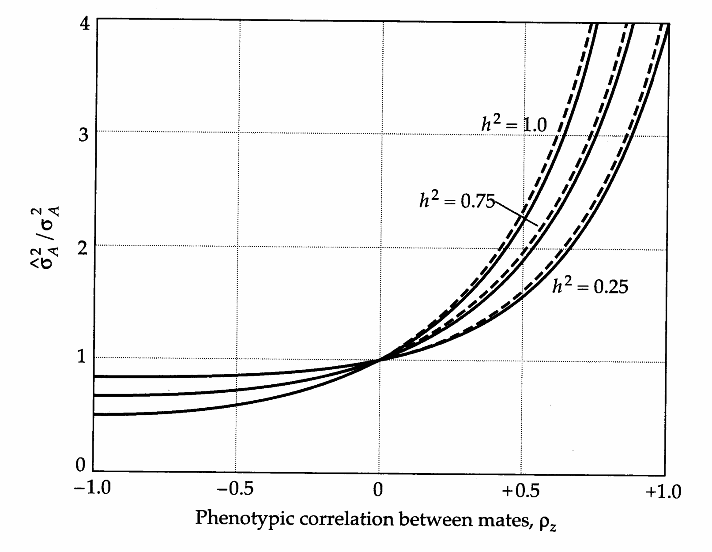
>
> Figure 7.7 Inflation of the additive genetic variance at equilibrium under assortative mating relative to that in an otherwise identical random-mating population. Solid and dashed lines refer to 10 and 20 effective loci, respectively.

the variance asymptotically approaches the equilibrium

$$
\widehat{\sigma}_{A}^{2}=\frac{\sigma_{A}^{2}}{1-\gamma\widehat{\rho}_{g}}
\tag{7.19a}
$$

where $ \widehat{\rho}_{g} = \rho_{z} \widehat{\sigma}_{A}^{2} / \widehat{\sigma}_{z}^{2} $ is the equilibrium genetic correlation between mates. This solution was first obtained by Wright (1921d) for unlinked loci with equivalent effects. Later, Crow and Felsenstein (1968), Bulmer (1980), and Nagylaki (1982) showed that the same result holds with linked loci with arbitrary effects, as long as n is replaced by $ n_{e} $, the effective number of loci. Thus, the general form of Equation 7.19a holds regardless of the map structure of loci. Gimelfarb (1984) proved that the equilibrium is stable. Equation 7.19a can be rewritten as

$$
\frac{\widehat{\sigma}_{A}^{2}}{\sigma_{A}^{2}}=\frac{2+\left[\sqrt{1-4\gamma\rho_{z}h^{2}(1-h^{2})}-1\right]/h^{2}}{2(1-\gamma\rho_{z})}
\tag{7.19b}
$$

which gives the inflation of the additive equilibrium genetic variance relative to that in the random-mating base population (Figure 7.7). The difference $ \widehat{\sigma}_{A}^{2} - \sigma_{A}^{2} $ is the additive disequilibrium covariance, $ \sigma_{A,A} $, maintained by assortative mating.

Three points can be gleaned from Figure 7.7. First, there is an asymmetry in the response to positive and negative assortative mating. Very strong positive assortative mating can inflate the additive genetic variance to nearly $ 2n_e\sigma_A^2 $ if $ h^2 $ is also very high. However, negative assortative mating can depress the variance to no less than $ \sigma_A^2/2 $. The little empirical work that has been done in this area is qualitatively consistent with this expectation (Breese 1956, McBride and Robertson 1963; see also the following example). Second, assortative mating must be fairly strong ( $ \rho_z^2 \geq 0.2 $) and combined with high $ h^2 $ to induce much change in the variance. Third, the effective number of loci has a negligible effect unless it is very small.

**[示例 Example]**

> **Example 4** · ref: `Genetics_chapter7:4` · source: `Genetics_chapter7_010.json` · blocks 15–18
>
> Example 4. Gimelfarb (1984) performed an experiment in which lines of Drosophila melanogaster were artificially maintained under an absolute regimen of positive and negative assortative mating ( $ \rho_{z} \simeq \pm 1.0 $). Each generation, 300 male and 300 female flies from each line were scored for abdominal bristle number, and the line was then propagated by performing 300 rank-ordered matings. The change in the phenotypic variance of abdominal bristle number over an eight generation period is shown in the following figure.
> 
> 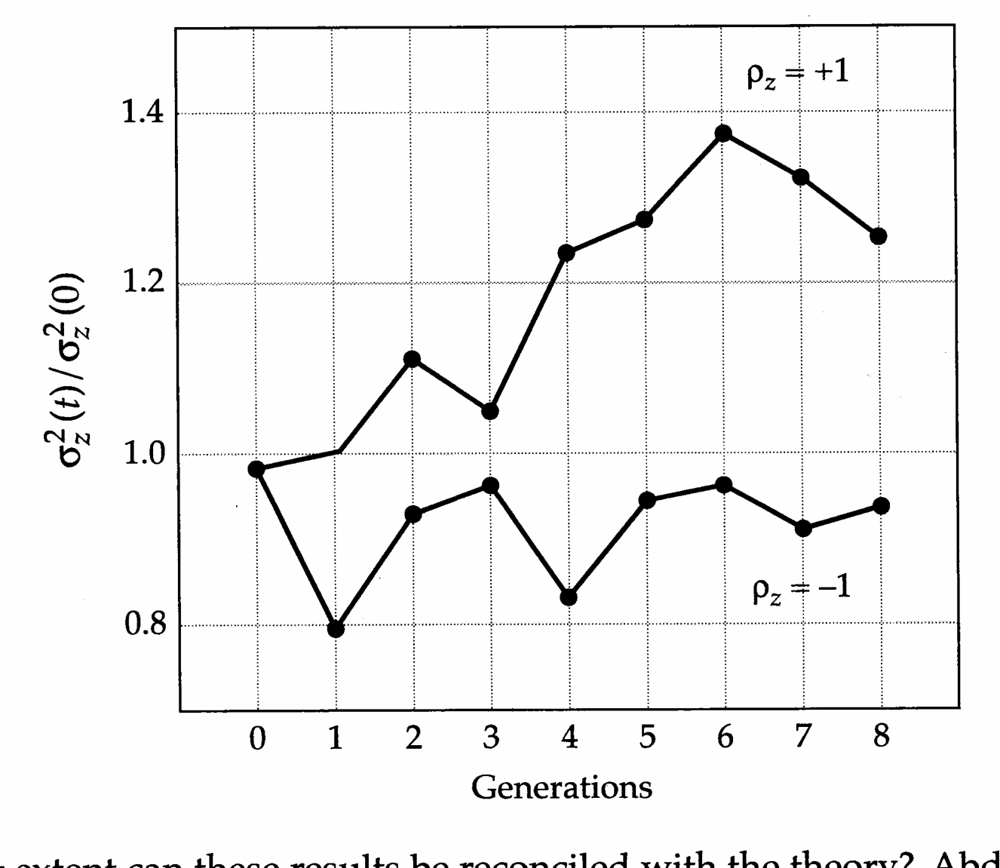
> 
> To what extent can these results be reconciled with the theory? Abdominal bristle number in $D$. melanogaster has been the subject of many quantitative-genetic studies. It appears to be nearly completely lacking in nonadditive genetic variance, and random-mating laboratory populations generally exhibit heritabilities of approximately $h^2 = \sigma_A^2 / (\sigma_A^2 + \sigma_e^2) = 0.5$. Assuming that the effective number of loci underlying the trait is at least five or so, then $\gamma \simeq 1$, and Equation 7.19b predicts that complete negative assortative mating should ultimately reduce the additive genetic variance to approximately 70% of the level in the base population. Thus, scaling the original phenotypic variance to be one so that $\sigma_A^2 = \sigma_e^2 = 0.50$, we expect complete negative assortative mating to depress the additive genetic variance to approximately $ \widehat{\sigma}_{A}^{2}=0.70\times0.50=0.35 $. From the figure, it can be seen that the phenotypic variance declined to approximately 90% of the level in the base population. This is close to the theoretical expectation that the phenotypic variance should be 85% of the base-population level, $ \widehat{\sigma}_{z}^{2}/\sigma_{z}^{2}=(\widehat{\sigma}_{A}^{2}+\sigma_{e}^{2})/(\sigma_{A}^{2}+\sigma_{e}^{2})=(0.35+0.50)/(0.50+0.50)=0.85 $.
> 
> Such an analysis cannot be performed for the line under positive assortative mating because it is less clear that an equilibrium phenotypic variance had been obtained. Nevertheless, a simple expectation can be pointed out for an experiment of this type. With absolute positive assortative mating, $ \rho_z = 1.0 $, and a heritability of 0.5, the expected inflation of the additive genetic variance predicted by Equation 7.19b is simply $ (2n_e)^{1/2} $. Thus, if this experiment had been carried out to the point at which $ \widehat{\sigma}_z^2 $ had stabilized, an estimate of the effective number of factors for abdominal bristle number would have been possible.

To this point, we have said nothing about the dominance component of variance. When only two loci contribute to the trait, $ \sigma_{D}^{2} $ can change with assortative mating (Reeve 1961). However, Fisher (1918) argued that if the number of loci is even moderate, the effect will be negligible, and this was later confirmed by Vetta (1976). Thus, for all practical purposes, we can assume that the dominance genetic variance is unaltered by assortative mating.

In addition to creating gametic phase disequilibrium, assortative mating causes the genotype frequencies for the selected trait to deviate from Hardy-Weinberg expectations. Positive assortative mating leads to a heterozygote deficit, while negative assortative mating leads to a heterozygote excess. Wright (1921d) and Nagylaki (1982) showed that if the effective number of loci is large, Hardy-Weinberg deviations will be minor unless both the phenotypic correlation between mates and $ h^{2} $ are very large. This implies that the vast majority of the change in genetic variance induced by assortative mating is a consequence of gametic phase disequilibrium rather than Hardy-Weinberg disequilibrium, i.e., of allelic associations within rather than between gametes.

The covariance between relatives in a population undergoing assortative mating has been considered by Fisher (1918), Crow and Felsenstein (1968), and Gimelfarb (1981). Nagylaki (1978) uses path analysis to yield a particularly lucid overview for the case of additive gene action. The coefficients of the additive and dominance components of covariance are given for common types of relationships in Table 7.4. Positive assortative mating inflates the additive genetic covariance between all types of relatives, while disassortative mating depresses it. Moreover, for some types of relationships (uncle-nephew, first and second cousins), assortative mating induces dominance genetic covariance where there otherwise would be none. We emphasize that the additive variance appearing in the resemblance

**[Table]**

*[See Table 7.4 at the end of this section.]*

between relatives is $ \widehat{\sigma}_{A}^{2} $, the variance in the current assortatively mating population, not $ \sigma_{A}^{2} $, the variance that would exist in a random-mating population. The latter can always be obtained by rearranging Equation 7.19a. Assuming large $ n_{e} $,

$$
\sigma_{A}^{2}=\left(1-\frac{\rho_{z}\widehat{\sigma}_{A}^{2}}{\widehat{\sigma}_{z}^{2}}\right)\widehat{\sigma}_{A}^{2}
\tag{7.20}
$$

**[示例 Example]**

> **Example 5** · ref: `Genetics_chapter7:5` · source: `Genetics_chapter7_010.json` · blocks 25–35
>
> Example 5. As an example of the application of the preceding theory, we consider an early data set on height in British families (Pearson and Lee 1903). Pearson recruited college students to obtain data from approximately 1300 families, recording whenever possible the stature of father, mother, and eldest son and daughter (ignoring offspring less than 18 years of age). This was a very large data set for the precomputer era, and it took two years to calculate the statistics by hand. The data are remarkable for their essentially normal distribution and for the linearity of the regressions between relatives.
> 
> 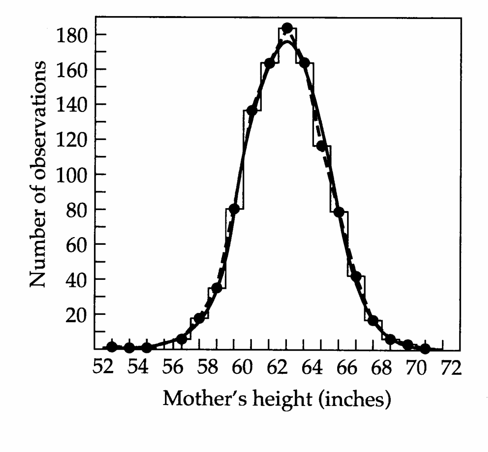
> 
> 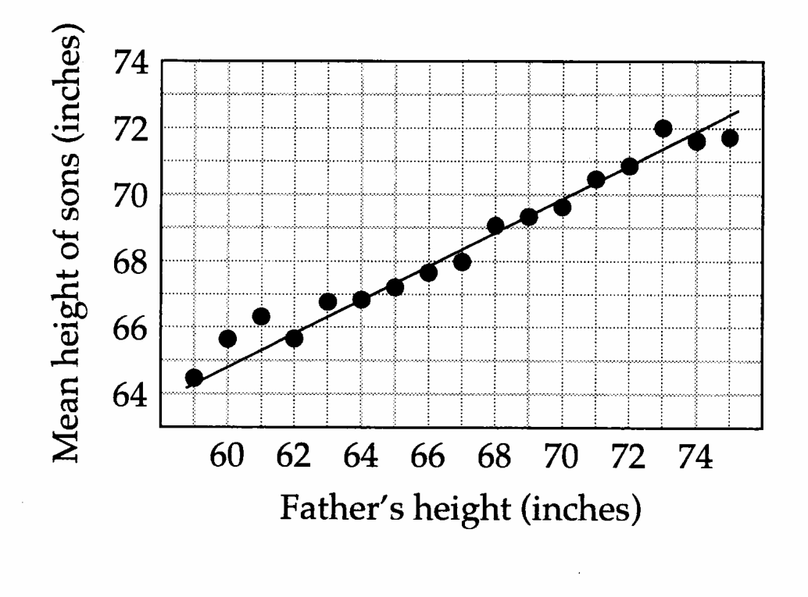
> 
> In the figure on the left, the histogram gives the observed data for maternal height, while the smooth curve is the fitted normal distribution. On the right, the straight line is the least-squares regression of sons' height on paternal height, the data having been pooled into one-inch size classes for paternal height.
> 
> Pearson and Lee do not report the covariances between relatives, but rather the correlations, but this turns out to be quite convenient for the following analysis. The variance of height tends to be larger for males than for females, and this may be expected to influence the regressions depending upon which sexes are involved. However, since a correlation coefficient is equivalent to the covariance between two standardized variables (each with unit variance), we can ignore this problem. The data in the following table indicate that the phenotypic correlations for all four sex-specific parent–offspring combinations are quite consistent, yielding a pooled value of $ 0.506 \pm 0.011 $. The three full-sib correlations are also consistent with each other and give the pooled value of $ 0.534 \pm 0.019 $. Finally, we note that there is highly significant assortative mating for height, the estimated value of $ \rho_{z} $ being $ 0.280 \pm 0.028 $.
> 
> <table><tr><td>Relationship</td><td>r</td><td>SE</td></tr><tr><td>Parent-offspring:</td><td></td><td></td></tr><tr><td>Father-son</td><td>0.514</td><td>0.022</td></tr><tr><td>Father-daughter</td><td>0.510</td><td>0.019</td></tr><tr><td>Mother-son</td><td>0.494</td><td>0.024</td></tr><tr><td>Mother-daughter</td><td>0.507</td><td>0.021</td></tr><tr><td>Full sibs:</td><td></td><td></td></tr><tr><td>Brother-brother</td><td>0.511</td><td>0.042</td></tr><tr><td>Brother-sister</td><td>0.553</td><td>0.019</td></tr><tr><td>Sister-sister</td><td>0.537</td><td>0.033</td></tr><tr><td>Husband-wife</td><td>0.280</td><td>0.028</td></tr></table>
> 
> We first consider the additive genetic variance in the population. Recall that $ \widehat{\sigma}_{z}^{2} = 1 $ on the scale of analysis. From Table 7.4, we see that the expected covariance between parent and offspring is $ (1 + \rho_{z})\widehat{\sigma}_{A}^{2}/2 $. Setting this quantity equal to 0.506, substituting 0.280 for $ \rho_{z} $, and rearranging, we obtain an estimate for $ \widehat{\sigma}_{A}^{2} $ of $ 0.791 \pm 0.024 $ (the standard error being obtained by the Taylor expansion method, Appendix 1). Thus, unless epistasis is very strong (we have assumed it to be equal to zero), it appears that approximately 80% of the variance in human height is attributable to additive gene action.
> 
> Suppose assortative mating were to be eliminated. What is the expected equilibrium value of the additive genetic variance? Assuming a large effective number of loci ( $ \gamma \simeq 1 $), and substituting the estimates of $ \widehat{\sigma}_{A}^{2} $ and $ \rho_{z} $ into Equation 7.20, we obtain $ \sigma_{A}^{2} \simeq 0.616 $. The additive disequilibrium covariance for height is estimated as $ 0.791 - 0.616 = 0.175 $, showing that through the creation of gametic phase disequilibrium, assortative mating has induced an approximately 28% increase in the additive genetic variance.
> 
> We now consider whether the full-sib data are consistent with an additive genetic model. Again from Table 7.4, we see that in the absence of dominance, the covariance between full sibs has an expected value of $ \widehat{\sigma}_{A}^{2}(1 + \rho_{z}\widehat{h}^{2})/2 $. Since we are operating on a scale for which $ \widehat{\sigma}_{z}^{2} = 1 $, this value is also the expected correlation coefficient. Substituting 0.280 for $ \rho_{z} $ and 0.791 for $ \widehat{\sigma}_{A}^{2} $, we obtain the expectation $ 0.483 \pm 0.024 $. The difference between the observed and expected value $ (0.534 - 0.483 = 0.051) $ has a standard error equal to $ [(0.024)^{2} + (0.019)^{2}]^{1/2} = 0.031 $ and cannot be considered to be significant. Thus, on the basis of the existing data, there are no grounds for rejecting the purely additive model.
> 
> In a more recent study, Roberts et al. (1978) performed a census of adult heights in families of a West African population, where assortative mating by height is relatively weak, $ \rho_z \simeq 0.10 \pm 0.10 $. The correlations between parents and offspring, $ (0.434 \pm 0.015) $, and between full sibs, $ (0.378 \pm 0.048) $, are somewhat lower than those observed in the study of Pearson and Lee. Using the procedures outlined above, these data yield estimates of $ \widehat{\sigma}_A^2 \simeq 0.789 $ and $ \sigma_A^2 = 0.727 $. Thus, the expressed additive genetic variances in the two populations are very similar, although a smaller fraction is associated with disequilibrium covariance in the West African population. Roberts et al. (1978) also report a half-sib correlation equal to $ 0.198 \pm 0.059 $, which can be used to provide a further check on the theory. Substituting the estimate of $ \rho_z $ and $ \widehat{h}^2 = 0.789 $ into the half-sib expression in Table 7.4, the predicted correlation is 0.229, which is not significantly different from the observed value.
> 
> There is an interesting historical note regarding the data of Pearson and Lee. Fisher's (1918) demonstration that the data were quite consistent with a Mendelian hypothesis flew in the face of Pearson's notorious non-Mendelian philosophy. Fisher also extended the analyses to other types of relatives, illustrating their consistency with resemblances between first cousins and between grandparents and their grandchildren. However, the literature that Fisher cites for the latter correlations actually involves characters other than height (in one case, eye color)! Thus, at the time, Fisher apparently believed that there was a universal correlation for all characters within a species. This is an interesting twist since Pearson had similar feelings, as amply documented in Pearson and Lee (1903, p. 379): “Thus for most practical purposes we may assume parental heredity for all species and all characters to be approximately represented by a correlation of 0.5.” We now know that this is far from the truth.

> **Table 7.4** · `7.4` · page 174 · source: `Genetics_chapter7_010`
> Table 7.4 Coefficients for the additive and dominance components of the covariance between relatives for an equilibrium population undergoing assortative mating.
>
> Relationship | $ \widehat{\sigma}_{A}^{2} $ | $ \sigma_{D}^{2} $
> --- | --- | ---
> Parent-offspring | $ \frac{1}{2}(1 + \rho_{z}) $ | 
> Grandparent-grandchild | $ \frac{1}{4}(1 + \rho_{z})(1 + \rho_{z}\widehat{h}^{2}) $ | 
> Great grandparent-great grandchild | $ \frac{1}{8}(1 + \rho_{z})(1 + \rho_{z}\widehat{h}^{2})^{2} $ | 
> Half sibs | $ \frac{1}{4}(1 + 2\rho_{z}\widehat{h}^{2} + \rho_{z}^{2}\widehat{h}^{2}) $ | 
> Full sibs, dizygotic twins | $ \frac{1}{2}(1 + \rho_{z}\widehat{h}^{2}) $ | $ \frac{1}{4} $
> Uncle(aunt)-nephew(niece) | $ \frac{1}{4}(1 + \rho_{z}\widehat{h}^{2})^{2} $ | $ \frac{1}{8}\rho_{z}\widehat{h}^{2} $
> First cousins | $ \frac{1}{8}(1 + \rho_{z}\widehat{h}^{2})^{3} $ | $ \frac{1}{16}(\rho_{z}\widehat{h}^{2})^{2} $
> Double first cousins | $ \frac{1}{4}(1 + 3\rho_{z}\widehat{h}^{2}) $ | $ \frac{1}{16} $
> Second cousins | $ \frac{1}{32}(1 + \rho_{z}\widehat{h}^{2})^{5} $ | $ \frac{1}{64}(\rho_{z}\widehat{h}^{2})^{4} $
> Monozygotic twins | 1 | 1
>
> Note: The equilibrium heritability is $ \hat{h}^2 = \widehat{\sigma}_A^2 / \widehat{\sigma}_z^2 $. In the absence of assortative mating, $ \rho_z = 0 $, and all coefficients reduce to those in Table 7.2.

---

## Genetics_chapter7_011 · POLYPLOIDY

Because of the high incidence of polyploidy in plants, some attention needs to be given to its effects on the covariance between relatives. We will confine our comments to single-locus effects in a randomly mating tetraploid population and assume that the four alleles at each locus assort independently during meiosis. The results for this special case were first worked out by Kempthorne (1953, 1957).

As in the case of diploids, the genotypic values of tetraploids can be partitioned into several independent effects defined in a least-squares sense. However, because four alleles are present at each locus, in addition to additive (single-gene) and dominance (gene-pair) effects, trialellelic and quadra-allelic effects must be considered (Chapter 5). Thus, the single-locus genotypic value of individual x is written

$$
\begin{aligned}G_{ijkl}(x)={}&\mu_G+[\alpha_i^x+\alpha_j^x+\alpha_k^x+\alpha_l^x]\\&+[\delta_{ij}^x+\delta_{ik}^x+\delta_{il}^x+\delta_{jk}^x+\delta_{jl}^x+\delta_{kl}^x]\\&+[\gamma_{ijk}^x+\gamma_{ijl}^x+\gamma_{ikl}^x+\gamma_{jkl}^x]+\tau_{ijkl}^x\end{aligned}
\tag{7.21}
$$

As in the case of diploids, the expected value of each of the effects is zero. Thus, the additive and dominance genetic variances for a locus are defined to be $ \sigma_A^2 = 4E(\alpha^2) $ and $ \sigma_D^2 = 6E(\delta^2) $, while the trigenic and quadragenic variances are $ \sigma_T^2 = 4E(\gamma^2) $ and $ \sigma_Q^2 = E(\tau^2) $.

The covariances between tetraploid relatives are obtained in the same manner as in the case of diploids. For example, the additive genetic covariance involves 16 cross-products of additive effects (four in individual $ x \times $ four in individual $ y $). Each of these cross-products has expectation $ E(\alpha^2) $ if the two genes are identical by descent, the probability of which is $ \Theta_{xy} $, and expectation zero otherwise. Thus, the expected additive genetic covariance between relatives is $ 16\Theta_{xy}E(\alpha^2) = 4\Theta_{xy}\sigma_A^2 $. In the case of digenic interaction, there are 36 cross-products to consider, each of which has expectation $ E(\delta^2) $ if both members of the pair of alleles in $ x $ are identical by descent with those in the pair from $ y $ (probability $ \Delta_{xy} $). Therefore, the digenic covariance is $ 36\Delta_{xy}E(\delta^2) = 6\Delta_{xy}\sigma_D^2 $. Letting $ \varphi_{xy} $ be the probability that all members of random three-gene sets are identical by descent, and $ \phi_{xy} $ be

**[Table]**

*[See Table 7.5 at the end of this section.]*

the probability that the complete single-locus tetraploid genotypes of x and y are identical by descent, the trigenic and quadragenic covariances between relatives are $ 4\varphi_{xy}\sigma_{T}^{2} $ and $ \phi_{xy}\sigma_{Q}^{2} $. Thus, assuming random mating, and no epistasis, linkage, or gametic phase disequilibrium, the covariance between tetraploid relatives can be summarized as

$$
\sigma_{G}(x,y)=4\Theta_{x y}\sigma_{A}^{2}+6\Delta_{x y}\sigma_{D}^{2}+4\varphi_{x y}\sigma_{T}^{2}+\phi_{x y}\sigma_{Q}^{2}
\tag{7.22}
$$

The coefficients for a number of common relationships are given in Table 7.5.

An interesting consequence of polyploidy is that the covariance between non-collateral relatives (individuals that do not share both parents) can be influenced by dominance. This effect occurs because parents pass two alleles on to their progeny. Thus, the covariance between parent and offspring is $ \sigma_A^2/2 + \sigma_D^2/6 $, as compared to $ \sigma_A^2/2 $ in the case of diploidy. Only the resemblance between collateral relatives is influenced by trigenic and quadragenic variance.

> **Table 7.5** · `7.5` · page 178 · source: `Genetics_chapter7_011`
> Table 7.5 Coefficients for Equation 7.22 for describing the covariance between tetraploid relatives.
>
> Relationship | $ \Theta_{xy} $ | $ \Delta_{xy} $ | $ \varphi_{xy} $ | $ \phi_{xy} $
> --- | --- | --- | --- | ---
> Parent-offspring | $ \frac{1}{8} $ | $ \frac{1}{36} $ | 0 | 0
> Grandparent-grandchild | $ \frac{1}{16} $ | $ \frac{1}{216} $ | 0 | 0
> Full sibs, dizygotic twins | $ \frac{1}{8} $ | $ \frac{1}{27} $ | $ \frac{1}{48} $ | $ \frac{1}{36} $
> Half sibs | $ \frac{1}{16} $ | $ \frac{1}{216} $ | 0 | 0
> Uncle(aunt)-nephew(neice) | $ \frac{1}{16} $ | $ \frac{1}{648} $ | 0 | 0
> Monozygotic twins | $ \frac{1}{4} $ | $ \frac{1}{6} $ | $ \frac{1}{4} $ | 1
>
> Source: Kempthorne 1957.

---

## Genetics_chapter7_012 · ENVIRONMENTAL SOURCES OF COVARIANCE BETWEEN RELATIVES

Up to now, we have focused entirely on the genetic causes of resemblance between relatives. There are, however, many circumstances in which the environmental effects on the phenotypes of relatives are correlated. The most obvious situation arises when full sibs are raised in a common familial environment, but the resemblance between other types of relatives can also be modified by shared aspects of the environment. For example, in a spatially heterogeneous environment, the resemblance between parents and offspring may be exaggerated by environmental effects if the latter do not randomly disperse following birth. In humans, and probably in other vertebrates, cultural transmission can create a continuity in the behavioral phenotypes of parents and offspring as well as among more distant relatives. In some circumstances, the environment may actually deflate the resemblance between relatives. Consider, for example, trees with limited seed-dispersal abilities. Parent trees that have grown large due to fortuitous circumstances, such as germination in a light gap, may tend to create relatively poor microhabitats for their offspring as a consequence of shading, attraction of herbivores, and so on.

In an effort to deal with the complications of cultural transmission, human quantitative geneticists have gone to great extremes to incorporate various types of environmental covariance into expressions for the resemblance between relatives (Rao et al. 1974, Eaves 1976, Cloninger et al. 1979a,b, Eaves et al. 1988). The result is a family of models that contain large numbers of parameters. Since the number of observable relationships must equal or exceed the number of parameters for there to be any hope of estimating the latter, these models are of little practical utility for most organisms. However, in humans the difficulties are not insurmountable. Due to the frequency of divorce, adoption, and fostering by relatives, and to the availability of records on parentage, many kinds of familial relationships are observable.

Here we consider some of the possibilities, under the assumption of additive gene action, and negligible linkage, gametic phase disequilibrium, and inbreeding. To illustrate the major points, we will rely on path analysis (Appendix 2), drawing specifically from examples given in Rao et al. (1974). The basic feature of path analysis that we will exploit is its ability to partition the correlation between any two variables into a series of pathways connecting the two variables through causal components. As noted above with coefficients of coancestry, the proportional contribution of each pathway to the correlation between relatives is simply equal to the product of various path coefficients and correlation coefficients along the pathway. We start by providing some general definitions, and then show, for several types of relationships, how path analysis can yield expressions for the expected phenotypic correlations in terms of causal genetic and environmental components. We then complete our discussion of environmental effects by providing a worked example involving a large data set on human birth weight.

Before proceeding, we consider how the phenotypic variance can be partitioned in terms of path coefficients. As usual, we consider an individual's phenotype (z) to be the sum of its genotypic value (G), general (shared) environmental effects (E), and special environmental effects (e). However, we now partition G into three quantities: the population mean ( $ \mu_{G} $), the mean genotypic (breeding) value of the parents ( $ \bar{A} $), and the deviation of G from $ \bar{A} $ caused by segregation of parental genes (S). Thus, an individual's phenotypic value is expressed as

$$
z=\mu_{G}+\bar{A}+S+E+e
\tag{7.23}
$$

The path coefficients from $ \bar{A}, S, E, $ and $ e $ to the phenotype are denoted by $ g, s, c, $ and $ d $, respectively (for expected $ \underline{genotypic} $ value, deviation due to $ \underline{se} $gregation, common environmental effect, and residual $ \underline{\text{deviation}} $. Since S is a random genetic deviation, it is uncorrelated with the other components of Equation 7.23. However, genotype-environment correlation may exist between $ \underline{A} $ and E when offspring are raised by their own parents, and we denote it by $ \rho_{GE} $.

The phenotypic variance among individuals raised by their biological parents is

$$
\sigma_{z}^{2}=\sigma_{\bar{A}}^{2}+\sigma_{S}^{2}+\sigma_{E}^{2}+\sigma_{e}^{2}+2\sigma_{\bar{A},E}
\tag{7.24a}
$$

Dividing all terms by $ \sigma_{z}^{2} $ provides an expression for the partitioning of the phe-notypic variance of offspring raised by their own parents,

$$
1=g^{2}+s^{2}+c^{2}+d^{2}+2g\rho_{G E}c
\tag{7.24b}
$$

In this expression, $ g^2 $, $ s^2 $, $ c^2 $, and $ d^2 $, are the fractions of the phenotypic variance attributable to midparent breeding values, segregational, general and special environmental effects, while $ 2g\rho_{GE}c = 2\sigma(G, E)/\sigma_z^2 $ is the fraction resulting from genotype-environment covariance.

This expression requires modification in the case of progeny raised in adoptive homes. Under the assumption that there is no correlation between offspring genotype and the environment provided by an adoptive home, then $ \rho_{GE} = 0 $, and the phenotypic variance of adopted children can differ from that of progeny raised by their own parents. For example, if $ \rho_{GE} > 0 $ in intact families, the variance among adopted children will be reduced. To account for this, Equation 7.24b needs to be modified to ensure that the sum of the various paths is equal to one. For adopted children, the modification is accomplished by letting

$$
1=\theta^{2}(g^{2}+s^{2}+c^{2}+d^{2})
\tag{7.24c}
$$

where $ \theta^{2} = 1/(1 - 2g\rho_{GE}c) $ is the ratio of the phenotypic variances for the two types of offspring. Multiplication by $ \theta^{2} $ has the effect of dividing each of the causal path contributions by the phenotypic variance of progeny raised in adoptive homes rather than by the phenotypic variance of progeny raised by their biological parents.

Finally, we note that it is useful to define

$$
h^{2}=g^{2}+s^{2}
\tag{7.25}
$$

as the heritability of the trait, i.e., the fraction of the total phenotypic variance attributable to additive genetic differences among individuals. With assortative mating,

$$
g=h\sqrt{(1+\rho_{g})/2}
\tag{7.26a}
$$

$$
s=h\sqrt{(1-\rho_{g})/2}
\tag{7.26b}
$$

> **Figure 7.8** · page 181 · source: `Genetics_chapter7`
>
> 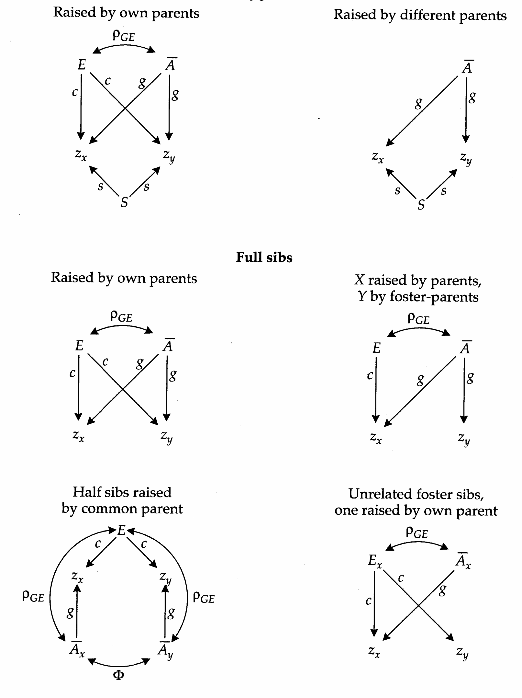
>
> Figure 7.8 Path diagrams for the phenotypic correlation between individuals x and y. All terms are defined in the text.

where, as before, $ \rho_{g} $ is the genetic correlation between mates. Under random mating, $ g = s = h/\sqrt{2} $.

To illustrate how these general relationships can be extended to the description of the expected phenotypic correlation between individuals, we now focus on the path diagrams for four specific relationships (Figure 7.8). For simplicity, the diagrams only include those factors that contribute jointly to the phenotypes of both members of a pair of individuals. Thus, the residual environmental deviation (e) never appears, while S (as a random genetic deviation) is only relevant in the case of monozygotic twins.

Because they are genetically identical, monozygotic twins (or clonemates) raised by their natural parents share the same general environmental effects, midparent value, and segregation deviation. Allowing for genotype-environment covariance, and summing over all pathways between $ z_{x} $ and $ z_{y} $, we obtain the phenotypic correlation,

$$
\rho(M Z)=s^{2}+g^{2}+c^{2}+2g\rho_{G E}c=h^{2}+c^{2}+2g\rho_{G E}c
\tag{7.27}
$$

Thus, the correlation between monozygotic twins raised by their biological parents is not particularly informative, since it is a function of additive genetic variance ( $ h^{2} $), variance due to shared environment ( $ c^{2} $), and genotype-environment correlation $ 2g\rho_{GEC} $.

Now consider the situation in which monozygotic twins are separated at birth, with each being raised in a different adoptive home. The removal of the common-environment effect eliminates the path $ z_x \leftarrow E \rightarrow z_y $ (Figure 7.8), and as noted above, the absence of genotype-environment correlation changes the phenotypic variance in the subpopulation of such twins. Thus, the expected phenotypic correlation between twins raised by different foster parents is $ h^2\theta^2 $. An estimate of the heritability can be acquired after factoring out $ \theta^2 $ (the ratio of phenotypic variances, defined above). Expressions for twins living in other combinations of home environments are given in Table 7.6. (Note that when one member of a relationship is living with its parents and the other is living in an adoptive home, the correlation is multiplied by $ \theta $, rather than $ \theta^2 $, because only one member of the pair is from a subpopulation with modified variance.) Chapter 19 treats the issue of twin analysis in considerable detail.

We next consider the correlation between full sibs. The path diagram in this case is identical to that for monozygotic twins, except that the sibs, being products of different gametes, do not share the segregational deviation (S). Thus, the expected correlation between full sibs raised by their biological parents is

$$
\rho(FS)=g^{2}+c^{2}+2g\rho_{GE}c
\tag{7.28}
$$

As in the case of monozygotic twins, this expression is simplified in situations where one or both sibs are raised in adoptive environments. For example, suppose one sib is raised by its biological parents, while the other is raised by unrelated foster parents (Figure 7.8). This eliminates the paths $ z_x \leftarrow E \rightarrow z_y $ and $ z_x \leftarrow \bar{A} \leftrightarrow E \rightarrow z_y $. Moreover, since the second sib comes from a segment of the population without genotype-environment correlation, all of the path coefficients leading to it must be multiplied by $ \theta $. Summing over the two paths between $ x $ and $ y $, the phenotypic correlation becomes $ \theta(g^2 + g\rho_{GE}c) $. The issue of sib analysis will be covered in detail in Chapter 18.

**[Table]**

*[See Table 7.6 at the end of this section.]*

A slight complication arises in the case of half sibs. The correlation between midparent values ( $ \bar{A}_x $ and $ \bar{A}_y $) is no longer one, since there is only one common parent. Rao et al. (1974) showed it to be $ \phi = (1 + 3\rho_g)/[2(1 + \rho_g)] $, which reduces to 1/2 under random mating. Summing over all paths between $ z_x $ and $ z_y $ (Figure 7.8), the correlation between half sibs raised by the parent creating the common environmental effect is

$$
\rho(HS)=\phi g^{2}+c^{2}+2g\rho_{GE}c
\tag{7.29}
$$

Again, various simplifications arise when one or both members of the sib pair are raised by foster parents (Table 7.6). For example, when each sib is raised in a different adoptive environment, the only path between sib phenotypes is $ z_x \leftarrow \bar{A}_x \leftrightarrow \bar{A}_y \rightarrow z_y $, so the correlation is simply $ \phi g^2 \theta^2 $.

Finally, we note that unrelated individuals fostered by the same set of parents can resemble each other as a consequence of the common environment in the adoptive home. The expected phenotypic correlation between such individuals depends on whether the adoptive parents are the biological parents of one of the foster sibs (Figure 7.8, Table 7.6).

Even more complicated scenarios, for additional types of relatives, have been considered by the authors cited above. However, we assume that the basic principles are clear at this point, and will not pursue these any further. One very notable aspect of the models outlined above is their ability to provide estimates of genotype-environment correlation when data are available on sibs raised in various types of home environments. For example, when covariances are observed for monozygotic twins living in the four types of environmental settings outlined in Table 7.6, joint estimates of $ h^{2} $, $ c^{2} $, and $ \rho_{GE} $ can be obtained by setting the observed correlations equal to their expected values and solving. Modifications of all the expressions in Table 7.6 are necessary, however, in the presence of significant sources of nonadditive genetic variance. We close this section with an example of a character whose expression is strongly influenced by shared environmental effects.

**[示例 Example]**

> **Example 6** · ref: `Genetics_chapter7:6` · source: `Genetics_chapter7_012.json` · blocks 35–43
>
> Example 6. Several large and independent studies have been performed on human birth weight. As can be seen in the following table, the estimated correlations between relatives are quite consistent among studies. For example, the five available full-sib correlations have a narrow range of 0.47 to 0.52. Mi et al. (1986) performed large analyses on several ethnic groups in Hawaii and found only minor differences among them for the correlations between relatives. We will therefore pool the independent estimates where they exist. In keeping with the linear model just outlined, we will assume that dominance and epistatic sources of variance are of negligible importance. In the absence of conflicting data, we will also assume that assortative mating and genotype-environment correlation are negligible, and that general environmental effects are only transmitted through mothers. Under these assumptions, $ \rho_G = 0 $, $ g^2 = h^2/2 $, $ \rho_{GE} = 0 $, and $ \theta = 1 $.
> 
> <table><tr><td>Relationship</td><td>Estimated Correlations</td><td>Prediction</td></tr><tr><td>Full sibs $ ^{2-6} $</td><td>0.50, 0.52, 0.47, 0.48, 0.48</td><td>$ \frac{h^{2}}{2} + c^{2} = 0.50 $</td></tr><tr><td>Maternal half sibs $ ^{3} $</td><td>0.58</td><td>$ \frac{h^{2}}{4} + c^{2} = 0.42 $</td></tr><tr><td>Paternal half sibs $ ^{3} $</td><td>0.10</td><td>$ \frac{h^{2}}{4} = 0.08 $</td></tr><tr><td>Maternal first cousins $ ^{2,6} $</td><td>0.14, 0.13</td><td>$ \frac{h^{2}}{8} + \frac{c_{G}^{2}}{2} = 0.15 $</td></tr><tr><td>Paternal first cousins $ ^{2,6} $</td><td>0.02, 0.06</td><td>$ \frac{h^{2}}{8} = 0.04 $</td></tr></table>
> 
> <table><tr><td>Relationship</td><td>Estimated Correlations</td><td>Prediction</td></tr><tr><td>Monozygotic twins $ ^{1} $</td><td>0.67</td><td>$ h^{2} + c^{2} = 0.65 $</td></tr><tr><td>Dizygotic twins $ ^{2,3} $</td><td>0.59, 0.66</td><td>$ \frac{h^{2}}{2} + c^{2} = 0.50 $</td></tr><tr><td colspan="3">Half sibs via monozygotic twin parents:</td></tr><tr><td>Maternal $ ^{5} $</td><td>0.31</td><td>$ \frac{h^{2}}{4} + c_{G}^{2} = 0.30 $</td></tr><tr><td>Paternal $ ^{5,7} $</td><td>-0.03, 0.12</td><td>$ \frac{h^{2}}{4} = 0.08 $</td></tr></table>
> 
> References: 1. Penrose (1954a); 2. Robson (1955); 3. Morton (1955a); 4. Billewicz (1972); 5. Nance et al. (1983); 6. Mi et al. (1986); 7. Magnus (1984).
> 
> We first consider the additive genetic variance. Inferences about it must be derived from relationships for which shared environmental effects do not influence the covariance. Paternal half sibs and paternal first cousins satisfy these conditions. The expected correlations for these types of relatives are $ h^2/4 $ and $ h^2/8 $, respectively, where $ h^2 = \sigma_A^2/\sigma_z^2 $. Since the observed correlations are 0.10 and 0.04, we obtain independent estimates of $ h^2 $ of $ 4 \times 0.10 = 0.40 $ and $ 8 \times 0.04 = 0.32 $. Also available is an average correlation of 0.05 for offspring of monozygotic twin brothers. Such individuals are genetically equivalent to paternal half sibs (the fathers are different individuals, but identical genetically), so this result yields an additional estimate of $ h^2 = 4 \times 0.05 = 0.20 $. Averaging over all three types of relationship, $ h^2 \simeq 0.30 $, i. e., additive genetic variance appears to account for approximately 30% of the phenotypic variance.
> 
> The data make it very clear that aspects of the maternal environment have a substantial influence on birth weight. For example, the correlation between maternal half sibs is several times greater than that between paternal half sibs, and the same pattern is seen for maternal vs. paternal first cousins. The total variation caused by the maternal environment can be obtained from the maternal half-sib correlation, 0.58, whose expectation is $ (h^{2}/4) + c^{2} $. Subtracting out the additive genetic contribution, $ c^{2} = 0.58 - (0.30/4) = 0.50 $. Pooling this with an independent estimate of $ c^{2} = 0.20 $ obtained by Magnus (1984), we estimate $ c^{2} \simeq 0.35 $. Thus, aspects of the mother (in excess of the genes that she contributes to her offspring) account for approximately 35% of the variance in birth weight.
> 
> There are two ways to partition the maternal effects variance into genetic and environmental components, $ c^2 = c_G^2 + c_E^2 $. First, monozygotic twin sisters provide the same genetic environment but different home settings for their progeny, which are genetically equivalent to maternal half sibs. The expected correlation between half sibs via this route is therefore $ (h^2/4) + c_G^2 $. Subtracting $ h^2/4 $ from the observed correlation, we obtain an estimate of the variance caused by genetic maternal effects, $ c_G^2 = 0.31 - (0.30/4) = 0.23 $. Second, the covariance between maternal first cousins is unaffected by common maternal environment, but is influenced by half the genetic maternal variance since the mothers are full sibs; their expected correlation is therefore $ (h^{2}/8) + (c_{G}^{2}/2) $. Again equating observed and expected correlations, we obtain a second estimate $ c_{G}^{2} = 2[0.14 - (0.30/8)] = 0.20 $. Thus, of the maternal effects variance, approximately two-thirds $ (0.215/0.35) $ appears to be caused by the effects of the maternal genotype on the uterine environment.
> 
> The causes of approximately 35% of the variance remain to be identified. Offspring sex, birth order, and gestation age account for 2, 3, and 4% of the variance, respectively (Penrose 1954a, Morton 1955a, Billewicz 1972, Magnus 1984). Some of these sources of variance presumably fall in the environmental maternal-effects category. Relatively low weights for first-born offspring account for another 5% of the variation. Morton (1955a) has argued for the existence of dominance genetic variance, but the following argument suggests that this source of variance is negligible. In principle, the correlation between full sibs is $ \left(\sigma_{A}^{2}/2+\sigma_{D}^{2}/4+\sigma_{E}^{2}\right)/\sigma_{z}^{2} $. However, from the above $ \left(\sigma_{A}^{2}/2+\sigma_{E}^{2}\right)/\sigma_{z}^{2}\simeq(0.30/2)+0.35=0.50 $, which accounts for the mean observed correlation of 0.49.
> 
> The approach that we have taken to analyze these data is not very rigorous from a statistical standpoint, our main objective having simply been to provide a heuristic guide to understanding how correlations derived from several types of relatives can be used to estimate components of variance. Nevertheless, when the estimates of $ h^{2} $, $ c^{2} $, and $ c_{G}^{2} $ are substituted into the expressions for the expected correlations between relatives, the overall fit to the data is quite good (last column in the preceding table). Thus, variation in human birth weight appears to be largely a function of additive gene action, maternal effects, and special environmental effects, each of which accounts for about a third of the total variance.

> **Table 7.6** · `7.6` · page 183 · source: `Genetics_chapter7_012`
> Table 7.6 Expected phenotypic correlations between sibs in terms of path coefficients.
>
> <table><tr><td>Relationship</td><td>Phenotypic correlation</td></tr><tr><td>Monozygotic twins:</td><td></td></tr><tr><td>Reared by own parents</td><td>$ h^{2} + c^{2} + 2g\rho_{GEC}c $</td></tr><tr><td>One reared by own parents, one by foster parents</td><td>$ (h^{2} + g\rho_{GEC})\theta $</td></tr><tr><td>Raised by different foster parents</td><td>$ h^{2}\theta^{2} $</td></tr><tr><td>Reared together by foster parents</td><td>$ (h^{2} + c^{2})\theta^{2} $</td></tr><tr><td>Full sibs:</td><td></td></tr><tr><td>Reared by own parents</td><td>$ g^{2} + c^{2} + 2g\rho_{GEC}c $</td></tr><tr><td>One reared by own parents, one by foster parents</td><td>$ (g^{2} + g\rho_{GEC})\theta $</td></tr><tr><td>Reared by different foster parents</td><td>$ g^{2}\theta^{2} $</td></tr><tr><td>Half sibs:</td><td></td></tr><tr><td>Raised by common parent</td><td>$ \phi g^{2} + c^{2} + 2g\rho_{GEC}c $</td></tr><tr><td>One reared by own parents, one by foster parents</td><td>$ (\phi g^{2} + g\rho_{GEC})\theta $</td></tr><tr><td>Reared by different foster parents</td><td>$ \phi g^{2}\theta^{2} $</td></tr><tr><td>Reared apart by own parents</td><td>$ \phi g^{2} + c^{2}b + g\rho_{GEC}c $</td></tr><tr><td>Unrelated foster sibs:</td><td></td></tr><tr><td>Reared together by same foster parents</td><td>$ c^{2}\theta^{2} $</td></tr><tr><td>Reared together by parents of one of them</td><td>$ (c^{2} + g\rho_{GEC})\theta $</td></tr><tr><td>Source: Rao et al. 1974.</td><td></td></tr><tr><td colspan="2">Note: All coefficients are defined in the text except $ b $, which is the correlation of environments provided by parents of half sibs. Completely additive gene action is assumed.</td></tr></table>

---

## Genetics_chapter7_013 · THE HERITABILITY CONCEPT

We have now seen, in theory and by example, that the analysis of a series of relationships provides the basis for partitioning the phenotypic variance into its elementary components. In practice, however, we are often confronted with difficulties, aside from the problem of finite resources, that prevent us from ever obtaining exact estimates of variance components. Some of the variance, such as that caused by higher-order epistatic interactions, is essentially beyond reach in a statistical sense. Nevertheless, with appropriate experimental designs, most of the fundamental sources of variance (additive and dominance genetic variance, and environmental variance due to common familial environments) can be approximated to a good degree, and levels of confidence attached to them. Most practical applications of quantitative genetics have been concerned with only the additive genetic component of the phenotypic variance, with the remaining components being treated as noise. The ratio $ \sigma_{A}^{2}/\sigma_{z}^{2} $ has come to be known as the heritability of a trait (more precisely, the narrow-sense heritability).

This brings us to an important conceptual issue that has plagued the field of quantitative genetics almost since its inception (Feldman and Lewontin 1975, Bell 1977, Jacquard 1983). The preoccupation with the additive component of genetic variance stems from the desire for a parameter that describes the genetic resemblance between parents and offspring. At the close of Chapter 3 it was shown that the slope of a regression of offspring phenotype on average parental phenotype has expected value $ \sigma_{A}^{2}/\sigma_{z}^{2} $, provided that gene action is purely additive and all of the assumptions underlying the Kempthorne-Cockerham model are met. Moreover, we showed that if selection changes the mean phenotype in the parental generation by S units, the expected evolutionary advance in the offspring generation (relative to that of the parents before selection) is $ S\sigma_{A}^{2}/\sigma_{z}^{2} $. Based on this reasoning, many studies have accepted uncritically the slope of a midparent-offspring regression $ (b_{op}) $ (or equivalently, twice the slope of mother-offspring or father-offspring regression, $ 2b_{op} $) as an estimate of $ \sigma_{A}^{2}/\sigma_{z}^{2} $. However, in the last several pages, we have found that the validity of this interpretation requires, among other things, random mating, gametic phase equilibrium, absence of additive × additive epistatic genetic variance, and absence of common environmental effects. Certainly, we cannot expect all of these conditions to be fulfilled in many natural populations.

Jacquard (1983) provides a useful discussion of the problems of interpretation of $ b_{o\bar{p}} $ and $ 2b_{o\bar{p}} $ and suggests that these statistics simply be labeled biometric heritability without prejudice regarding the mechanisms causing similarity. However, because of the fundamental importance of the ratio $ \sigma_A^2/\sigma_z^2 $, particularly in selection theory, we will continue to call the latter quantity the heritability, denoting it as $ h^2 $ in keeping with Wright's original usage of $ h $ as the path coefficient $ \sigma_A/\sigma_z $ (Appendix 2). Providing an explicit definition eliminates the ambiguity of the usage of $ h^2 $ in theoretical contexts, but highlights the practical problems of estimation.

It should now be clear that heritabilities can often be approximated by reference to sets of relatives other than parents and offspring. The general logic behind this approach is that the first term in any genetic covariance expression is $ 2\Theta_{xy}\sigma_{A}^{2} $. Thus, under the assumption that the additive genetic variance is the dominant source of phenotypic covariance,

$$
h^{2}\simeq\frac{\mathbf{Cov}(z_{x},z_{y})}{2\Theta_{xy}\mathbf{Var}(z)}
\tag{7.30}
$$

should provide a good approximation to the heritability. Violations of the assumptions of the ideal additive model will usually cause $ \text{Cov}(z_x, z_y)/2\Theta_{xy} $ to be an upwardly biased estimator of $ \sigma_A^2 $.

A simple means of evaluating the likelihood of bias in heritability estimates arises when estimates of the phenotypic covariance are available for more than one type of relative. Such a test was performed by Clayton et al. (1957) on abdominal

**[Table]**

*[See Table 7.7 at the end of this section.]*

bristle number in a laboratory population of Drosophila melanogaster. The estimates of $ h^{2} $ derived from four types of relatives were consistent with each other: mother–daughter $ (0.54 \pm 0.11) $, mother–son $ (0.48 \pm 0.11) $, half sibs $ (0.48 \pm 0.11) $, and full sibs $ (0.53 \pm 0.07) $. For this population, the evidence is strong that approximately 50% of the total variance for abdominal bristle number is attributable to additive genetic variance and that the remainder is a function of special environmental effects.

A second example in which heritability estimates are consistent across relationships involves a study of the susceptibility of the marine copepod Eurytemora affinis to high temperature shock (Table 7.7). Within each sex, four different relationships give fairly consistent results, but there is a clear sexual dimorphism — approximately four times as much variance in males is accounted for by additive genetic variance as in females. The fact that estimates from full sibs and maternal half sibs are not inflated implies that dominance genetic variance and maternal-effects variance are of minor significance. Thus, the data are consistent with the hypothesis that $ h^2 \simeq 0.2 $ in females and 0.8 in males with the residual variance being attributable to special environmental effects.

Such results in which additive genetic variance is the only source of resemblance between relatives are by no means universal in quantitative-genetic analyses. We have already encountered a striking exception with human birth weight, and more will appear in the following chapters. While there is a general tendency for heritability estimates based on parent-offspring and full-sib analyses to be consistent with each other (Figure 7.9), in any particular study, it is incumbent upon the investigator to evaluate whether the inconsistencies between different estimates of $ h^{2} $ are significant. High levels of dominance genetic variance often exist for fitness-related characters (Crnokrak and Roff 1995).

For practical reasons, the components of variance of natural populations are frequently estimated by assaying a segment of the population in a laboratory setting. Although the goal of such studies is generally to infer the genetic properties of the wild population, laboratory settings often impose a rather substantial

> **Figure 7.9** · page 189 · source: `Genetics_chapter7`
>
> 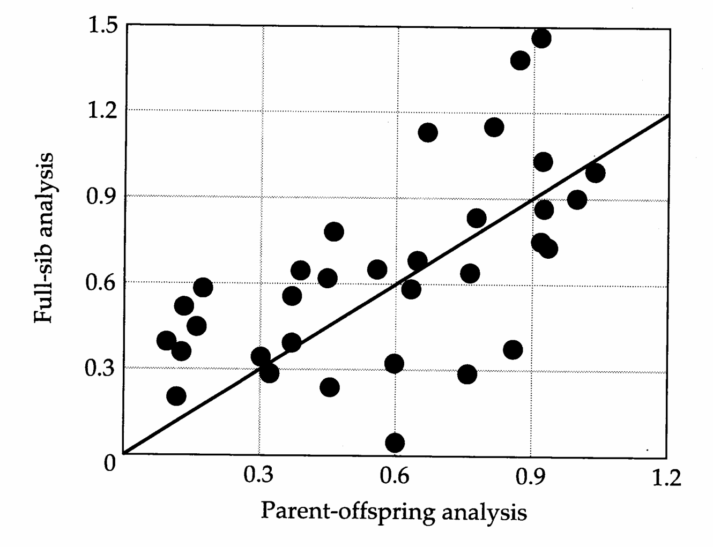
>
> Figure 7.9 The relationship between heritability estimated as 2 Cov(PO)/Var(z) from parent-offspring analysis and as 2 Cov(FS)/Var(z) from full-sib analysis, for studies in which both estimates are available. Individual data points are for physiological and morphological characters for various natural populations of animals. The straight line gives the expected pattern under a perfect correspondence of the two estimates. (From Mousseau and Roff 1987.)

change in the environment. It is tempting to speculate that heritability estimates derived from controlled laboratory experiments will be inflated relative to those expressed in the natural environment, where the environmental component of variance might be expected to be magnified by spatial and temporal heterogeneity. However, other outcomes are possible. For example, homeostatic mechanisms, such as habitat selection, which are operable in the field may be rendered inoperable in the laboratory. It is also conceivable that a shift in the environment may induce a change in the additive genetic variance by altering gene expression.

The few attempts that have been made to evaluate the sensitivity of heritability estimates to environmental change have yielded a diversity of results. Contrary to expectations, Mackay (1981) found that parent-offspring regressions for sternopleural bristle number and body weight in Drosophila melanogaster were increased by varying the environment temporally and spatially in the laboratory. For the same species, Coyne and Beecham (1987) found that the parent-offspring regression for abdominal bristle number was not affected by raising the parents in the laboratory (as opposed to the field), while that for wing length increased by 150%. The change was a consequence of a reduction in the environmental component of variance in the lab-reared parents. Simons and Roff (1994) also observed a general increase in the heritabilities of life-history traits when crickets were raised in the lab as opposed to the field. In their study, however, the increase was due

> **Figure 7.10** · page 190 · source: `Genetics_chapter7`
>
> 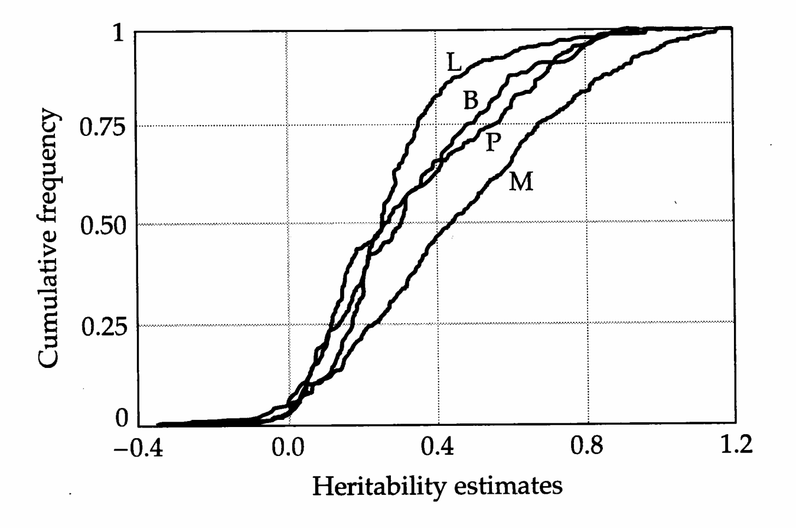
>
> Figure 7.10 Cumulative frequency distributions for heritability estimates derived from numerous wild animal populations. L = life history, B = behavior, P = physiology, M = morphology. These data, from Mousseau and Roff (1987), do not include Drosophila studies, which yield a similar pattern (Roff and Mousseau 1987).

to a reduction in the environmental component of variance as well as an increase in the genetic component. In a broad survey of the existing data on a diversity of organisms, Weigensberg and Roff (1996) found that there are no systematic differences in heritability estimates obtained in the laboratory and in the field; if anything, the latter tend to be slightly higher on average.

In another review, Hoffmann and Parsons (1991) found that heritabilities tend to increase in stressful environments. This observation may be of relevance to the interpretation of some laboratory analyses, in that the laboratory may constitute a form of stress in some cases. However, there are many exceptions to the pattern suggested by Hoffmann and Parsons. In natural populations of birds, for example, heritabilities of bone lengths and body size tend to decline, sometimes to undetectable levels, under poor growth conditions (Gebhardt-Henrich and van Noordwijk 1991, Larsson 1993). Thus, no strong generalizations emerge from existing studies as to how heritabilities are likely to change in laboratory vs. field situations, benign vs. harsh environments, novel vs. usual conditions, and so forth. The best that can be said is that heritabilities do respond to environmental change, and that substantial care should be taken in extrapolating results beyond the environment in which they are obtained.

If one’s sole interest in performing a quantitative-genetic analysis is to demonstrate that the character of interest is heritable, there is probably little point in expending the effort. The outcome is virtually certain. Almost every character in almost every species that has been studied intensely exhibits nonzero heritability. This should come as no surprise, since mutation brings in a small amount of new variation each generation (Chapter 12). The interesting questions remaining are, How does the magnitude of $ h^{2} $ different among characters and species, and why?

One weak generalization that has emerged is that morphological characters tend to have higher heritabilities than life-history traits, with behavioral and physiological characters falling at intermediate levels (Figure 7.10). Although there are plenty of exceptions, these results are consistent with the intuitive concept that natural selection will most efficiently reduce the genetic variation for characters closely related to fitness by rapidly driving beneficial genes to fixation and eliminating deleterious ones (Robertson 1955, Fisher 1958, Falconer 1989). However, there are other explanations. As emphasized by Price and Schluter (1991), the relatively low heritabilities of life-history traits may be as much a consequence of relatively high levels of environmental variance as of unusually low levels of genetic variance for such traits. One possible reason for this is that the environmental variance of life-history traits is a function of the variance of all of the other morphological, physiological, and behavioral characters that influence their expression. Alternatively, characters closely related to fitness (life-history traits) may be relatively canalized genetically (Stearns and Kawecki 1994; Chapter 11), such that their expression is relatively insensitive to new mutations. This would result in low levels of genetic variation maintained under selection-mutation balance.

> **Table 7.7** · `7.7` · page 188 · source: `Genetics_chapter7_013`
> Table 7.7 Independent estimates of $ h^{2} $, obtained with Equation 7.30, for temperature tolerance in the marine copepod Eurytemora affinis.
>
> Relationship | Females | Males
> --- | --- | ---
> Parent-offspring | $ 0.14 \pm 0.44 $ | $ 0.72 \pm 0.26 $
> Full sibs | $ 0.20 \pm 0.05 $ | $ 0.82 \pm 0.04 $
> Paternal half sibs | $ 0.40 \pm 0.18 $ | $ 0.84 \pm 0.35 $
> Maternal half sibs | 0 | $ 0.73 \pm 0.32 $
>
> Source: Bradley 1978.

---

## Genetics_chapter7_014 · THE HERITABILITY CONCEPT / Evolvability

In comparing evolvabilities of different traits/species, it is clearly desirable to use a dimensionless parameter, and one such measure is the heritability. Recall the traditional expression for the rate of evolution of a trait,

$$
\Delta\mu=h^{2}S
\tag{7.31a}
$$

This equation neatly separates the forces of selection from the properties of inheritance, such that $ h^{2} $ can be viewed as the efficiency of the response to selection. The change in the mean relative to the phenotypic standard deviation provides another useful descriptor of evolvability, and in this case,

$$
\frac{\Delta\mu}{\sigma_{z}}=h^{2}i
\tag{7.31b}
$$

where $ i = S/\sigma_{z} $ is the standardized selection differential, i.e., the change in the mean caused by selection in units of phenotypic standard deviations. Again, the heritability provides a measure of the efficiency of response to selection.

Houle (1992) has suggested that heritability may not be the best measure of the evolvability of a trait, arguing for the use of the coefficient of additive genetic variation, i.e., $ \sigma_{A}/\mu $, where $ \sigma_{A} $ is the square root of the additive genetic variance and $ \mu $ is the mean of the trait. Here we show that the utility of this metric is limited to a very special situation. Dividing both sides of Equation 7.31a by the mean phenotype yields an expression for the proportional change of the trait,

$$
\frac{\Delta\mu}{\mu}=\left(\frac{\sigma_{A}^{2}}{\mu\sigma_{z}}\right)i
\tag{7.31c}
$$

This suggests that the dimensionless parameter $ \sigma_{A}^{2}/(\mu\sigma_{z}) $, the ratio of the additive genetic variance to the product of the phenotypic mean and standard deviation, is an appropriate parameter for comparing evolvability when proportional change is the measure of interest. Unlike heritability, this ratio does not have a simple biological interpretation.

Now consider the special case in which the character is fitness (W). Recall from Chapter 3 that the selection differential is equivalent to the phenotypic covariance between the character and relative fitness (w = W/W), i.e., $ S = \sigma(z, W)/\overline{W} $, where $ \overline{W} $ is mean fitness on the absolute scale. If z is fitness, then $ S = \sigma_z^2(W)/\overline{W} $, where $ \sigma_z^2(W) $ is the phenotypic variance of fitness. Equation 7.31c then reduces to

$$
\frac{\Delta\overline{W}}{\overline{W}}=\frac{\sigma_{A}^{2}(W)}{\overline{W}^{2}}=\sigma_{A}^{2}(w)
\tag{7.31d}
$$

where $ \sigma_{A}^{2}(W) $ and $ \sigma_{A}^{2}(w) $ are the additive genetic variances of absolute and relative fitness. Thus, the proportional rate of evolution in mean fitness is equal to the squared coefficient of additive genetic variation of absolute fitness, or equivalently, to the additive genetic variance of relative fitness. This is Fisher's (1958) fundamental theorem of natural selection.

These alternative formulations merely serve to illustrate that there are several ways to measure evolvability, each of which has its own merits in particular contexts. All of the measures are interchangeable provided that information is available on the phenotypic variance, additive genetic variance, and mean phenotype. As emphasized by Houle (1992), however, many quantitative-genetic studies simply report the heritability of a trait, with no mention of the mean or variance components. This greatly limits the scope of investigation that can be performed with published data.

---
