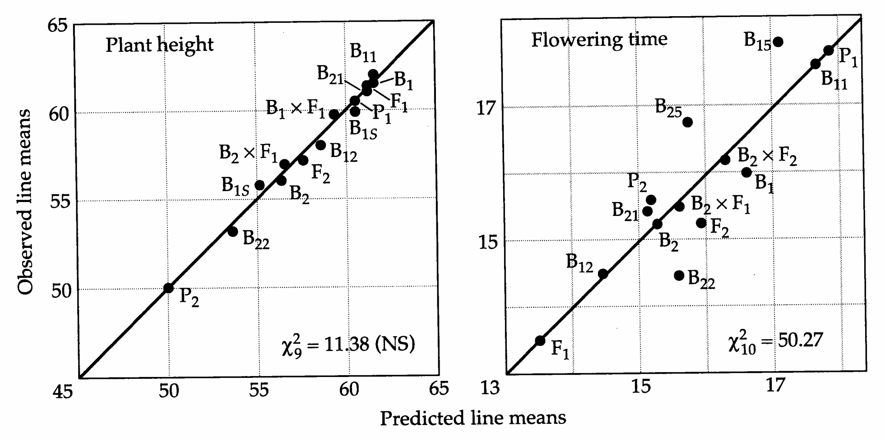
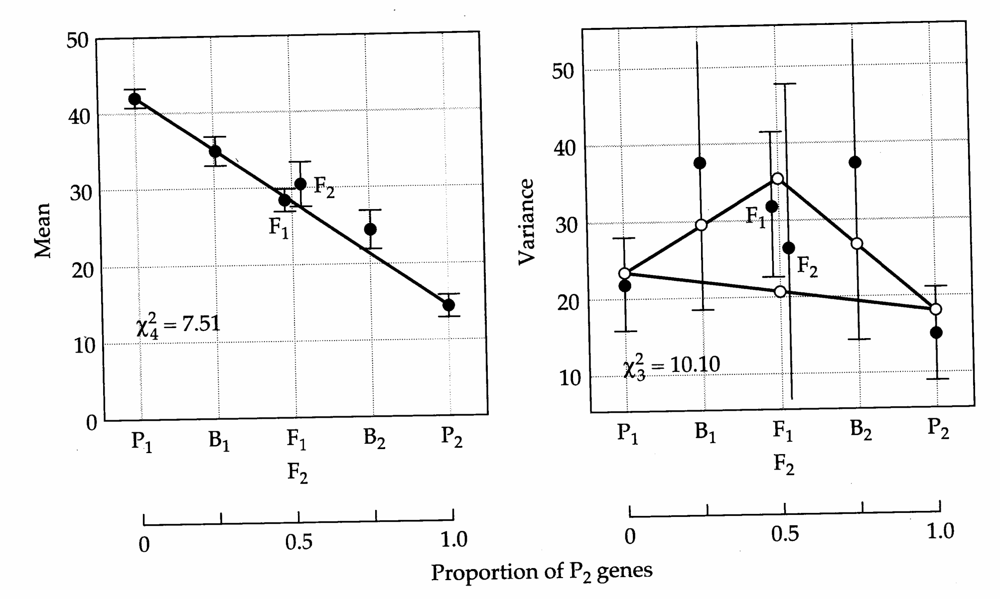
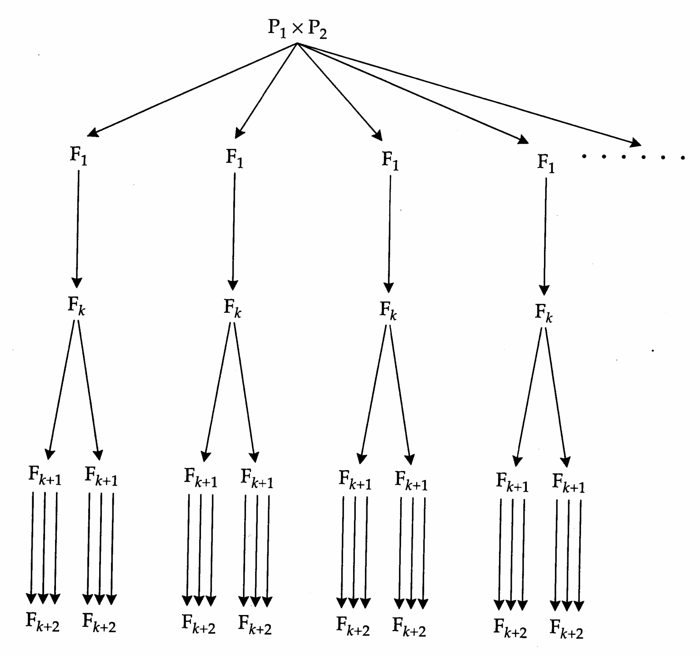
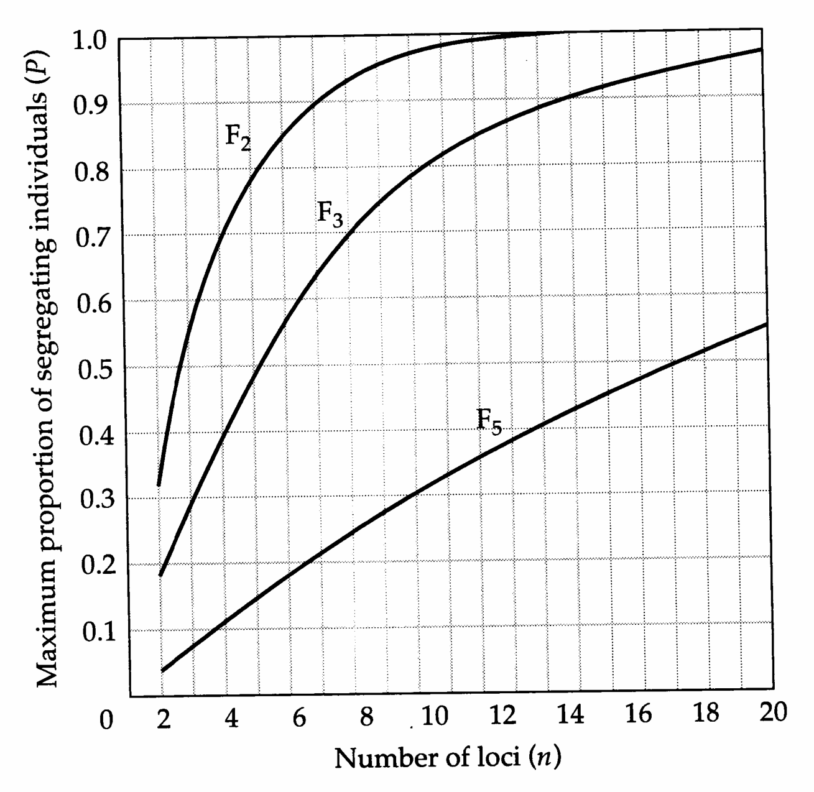

# Chapter 9 · Analysis of Line Crosses

## Genetics_chapter9_001 · Introduction / Analysis of Line Crosses

Distinct populations, such as the isolated demes that comprise some natural populations, often exhibit remarkable phenotypic divergence. Such differences are sometimes a simple consequence of environmental influences on phenotypic expression, but genetic differences may arise as a result of local adaptation and/or random genetic drift. The genetic basis of interdemic differentiation is of interest for several reasons. With nonadditive gene action, the mean phenotypes of progeny of interdemic crosses ($ F_{1} $ hybrids) will not be intermediate to those of their parents. Depending upon the relation between phenotype and fitness, hybridization can lead to outbreeding depression (reduced fitness) or outbreeding enhancement (increased fitness) in the $ F_{1} $ or later generations. For populations that do not normally have an opportunity to interbreed in nature, such properties may evolve passively as an indirect consequence of local adaptation. However, when opportunities for interdemic exchange are common, natural selection may favor specific mating system properties, including dispersal strategies or reproductive isolation, which enhance or discourage outcrossing. Thus, understanding the genetic basis of interdemic differentiation is a key to deciphering the mechanisms of speciation.

The mechanisms of genetic differentiation also have important practical implications. For example, in artificial selection programs, the mean phenotypes of selected lines often evolve well beyond the range of variation seen in the base population prior to selection (Chapter 1). The extent to which such changes are caused by a large number of genes of relatively small effects, as opposed to a few major segregating factors, is an important determinant of whether a search for informative molecular markers is likely to be successful (Chapters 13–16). In addition, the degree to which selection advances made in different lines can be successfully integrated into a single crossbred line is a function of the ways in which genes from the isolated lines interact.

In this chapter, we show how the judicious choice of line crosses can be used to reveal the relative contributions of additive, dominance, and epistatic effects to population differentiation. A statistical test of the adequacy of alternative genetic models will be presented, and its application to a variety of data sets will be used to show that nonadditive gene action is commonly associated with population differentiation. Several methods for estimating the minimum number of loci sponsible for population differentiation will then be discussed. Their application firmly supports the conviction that most characters of interest to evolutionary biologists and breeders are influenced by multiple loci. This, however, does not rule out the possibility that a small number of loci are responsible for the majority of the differentiation between species and/or lines within species.

---

## Genetics_chapter9_002 · Introduction / EXPECTATIONS FOR LINE-CROSS MEANS

**[定义 Definition]**

We start with two parental populations ($ P_{1} $ and $ P_{2} $), each with loci assumed to be in Hardy-Weinberg and gametic phase equilibrium. For the time being, we also assume that the loci differentiating the two populations are unlinked. An $ F_{1} $ population is obtained by crossing the $ P_{1} $ and $ P_{2} $ lines, and subsequent random mating of $ F_{1} $ individuals results in an $ F_{2} $ generation. Since the $ F_{2} $ population will be in Hardy-Weinberg and gametic phase equilibrium for unlinked loci, both for genes derived within and between populations, it is logical to treat it as a point of reference for the definition of genetic effects.

In previous chapters, we have presented definitions of additive, dominance, and epistatic effects for specific genes and gene combinations within randomly mating populations. The statistical machinery underlying line-cross analysis has parallels with this approach. The questions here, however, are whether there is a net difference between the additive effects of the genes in the $ P_{1} $ and $ P_{2} $ populations, whether the genes in $ P_{1} $ tend on average to be dominant over those in $ P_{2} $, and whether there are net directional epistatic interactions between $ P_{1} $ and $ P_{2} $ genes. Before explicitly defining these composite effects, it will be useful to have some indices to describe the gene content and the degree of hybridity of line-cross derivatives.

For any pair of lines and their derivatives, the genotypes at a locus can be partitioned into three classes: (1) both alleles are from a random sample of $P_{1}$ genes, (2) both alleles are from a random sample of $P_{2}$ genes, and (3) one allele is from a random sample of $P_{1}$ genes, while the other is from the $P_{2}$ pool of genes. Let $S$ be the fraction of $P_{1}$ genes in a line, and $H$ be the probability that a member of the line has one $P_{1}$ and one $P_{2}$ gene at a locus. These two indices uniquely specify the expected frequencies of the three classes of genotypes at any autosomal locus: $$ S-\frac{H}{2}=frequency~of~individuals~containing~only~P_{1}~alleles $$ $$ H=\mathrm{f r e q u e n c y~o f~i n d i v i d u a l s~c o n t a i n i n g~o n e~P_{1}~a n d~o n e~P_{2}~a l l e l e} $$ $$ 1-S-{\frac{H}{2}}={\mathrm{f r e q u e n c y~o f~i n d i v i d u a l s~c o n t a i n i n g~o n l y~P_{2}~a l l e l e s}} $$

Composite effects are formally defined in a least-squares framework, similar to that used for effects at single loci (Chapter 4). Consider first the composite additive effects, defined as the difference of additive effects of $ P_{1} $ vs. $ P_{2} $ alleles. summed over all loci. A simple expression for this can be obtained by recalling Equation 4.9 — for a diallelic locus, the additive effects of the $B_1$ and $B_2$ alleles can be written as $-p_2\alpha$ and $p_1\alpha$, where $\alpha$ is the average effect of allelic substitution, and $p_1$ and $p_2$ are the frequencies of the $B_1$ and $B_2$ alleles. These expressions apply to a randomly mating population, precisely the situation in the $F_2$ generation. Noting that the $F_2$ consists of 50% $P_1$ and 50% $P_2$ genes, the frequencies of all contrasting alleles (of $P_1$ vs. $P_2$ origin) are 0.5. Thus, the composite additive effects of $P_1$ and $P_2$ genes in the $F_2$ reference population are equal in absolute value but opposite in sign, and we denote them respectively as $+\alpha^c/2$ and $-\alpha^c/2$, where the superscript $c$ denotes composite (as opposed to single-gene) effects. The total composite additive effect in the $F_2$ generation, $[(\alpha^c-\alpha^c)/2]$, is then equal to zero, which is what we desire for a reference population. The total composite additive effect in the $F_1$ generation is also equal to zero, since every locus contains one $P_1$ and one $P_2$ allele. In the $P_1$ population, however, there are only $P_1$ alleles, each of which contributes $\alpha^c/2$, giving the total composite additive effect as $(\alpha^c+\alpha^c)/2 = \alpha^c$. In contrast, as each $P_2$ allele contributes $-\alpha^c/2$, the total composite effect in the $P_2$ population is $-\alpha^c$. More generally, the contribution of composite additive effects to the mean genotypic value of any line-cross derivative is $$ \left(S-\frac{H}{2}\right)(+\alpha^{c})+(H)(0)+\left(1-S-\frac{H}{2}\right)(-\alpha^{c})=(2S-1)\alpha^{c}=\theta_{S}\alpha^{c} $$ where $\theta_{S}=2S-1$ denotes the source index. The three terms on the left represent, respectively, the contributions from $\mathrm{P}_{1}$ homozygotes, $\mathrm{P}_{1}\mathrm{P}_{2}$ heterozygotes, and $\mathrm{P}_{2}$ homozygotes. The index $\theta_{S}$ contrasts the expected number of $\mathrm{P}_{1}$ alleles at a locus in a particular line $(2S)$ with that in the $\mathrm{F}_{2}$ reference population (1).

The composite dominance effect is obtained in a similar manner, again treating the $ F_{2} $ population as a reference. Returning to [[SEE_TABLE:4.2]], it can be shown that when the frequencies of the two alleles are equal to 0.5, the dominance deviations from the regression on gene content are $ -ak/2 $ for both homozygotes and $ ak/2 $ for the heterozygote. An analogous situation exists for the $ F_{2} $ of a line cross, which consists of 25% $ P_{1}P_{1} $, 50% $ P_{1}P_{2} $, and 25% $ P_{2}P_{2} $ individuals at each locus. Thus, we denote the composite dominance effects associated with crossbred ($ P_{1}P_{2} $) and purebred ($ P_{1}P_{1} $, $ P_{2}P_{2} $) loci as $ + \delta^{c} $ and $ - \delta^{c} $, respectively. More generally, the contribution of composite dominance effects to the genotypic mean of a particular line is $$ \left(S-\frac{H}{2}\right)\left(-\delta^{c}\right)+(H)(+\delta^{c})+\left(1-S-\frac{H}{2}\right)\left(-\delta^{c}\right)=(2H-1)\delta^{c}=\theta_{H}\delta^{c} $$ where $\theta_{H}=2H-1$ is the hybridity index. Thus, $\theta_{H}\delta^{c}$ yields a value of $\delta^{c}$ for the $F_{1}$ population, which consists entirely of hybrids, $-\delta^{c}$ for the parental lines, and zero for the $F_{2}$, maintaining the property that the average composite effects are defined to be zero in the reference population.

There are three important points to note about this approach to interpreting line-cross means. First, the composite effects are denoted as such because they summarize the total effects over all loci. Since some of the effects of individual genes in population $ P_{1} $ may be positive and others negative, there is a possibility of considerable cancellation of locus-specific effects. A comparison of the variances within different line-cross derivatives can shed some light on this problem (Mather and Jinks 1982), but we will not take this up here.

**[定义 Definition]**

Second, provided there is no mating with close relatives, the definition of composite effects does not require that the parental populations be pure (completely homozygous) lines. For any line-cross derivative, the subset of individuals with two $ P_{1} $ genes at a particular locus will have the same expected Hardy-Weinberg genotype distribution of $ P_{1} $ genotypes as the $ P_{1} $ generation. The same argument applies to loci with two $ P_{2} $ genes. Thus, in the absence of inbreeding (which alters the genotypic frequencies within classes, see Chapter 10), differences between the means of various line-cross derivatives cannot be due to a shift in the genotype frequencies within the groups $ P_{1}P_{1} $, $ P_{1}P_{2} $, and $ P_{2}P_{2} $. It can only be caused by a shift in the relative abundances of these three groups. Third, the source and hybridity indices are all that are needed to define the contributions of composite epistatic effects to line means. To obtain the general expression, we let $ \left(\alpha_{n}^{c}\delta_{m}^{c}\right) $ denote the composite effect involving the interaction of n additive and m dominance effects. (Note that this notation does not imply that $ \left(\alpha_{n}^{c}\delta_{m}^{c}\right)=\alpha_{n}^{c}\cdot\delta_{m}^{c} $.) The general expression for the mean genotypic value of a line is then $$ \mu=\mu_{0}+\theta_{S}\alpha_{1}^{c}+\theta_{H}\delta_{1}^{c}+\theta_{S}^{2}\alpha_{2}^{c}+\theta_{S}\theta_{H}\big(\alpha_{1}^{c}\delta_{1}^{c}\big)+\theta_{H}^{2}\delta_{2}^{c}+\cdots $$

Note that the coefficients for the composite effects are of the form $ \theta_{S}^{n}\theta_{H}^{m} $. Hill (1982a) provides a formal derivation of Equation 9.1, and alternative modes of presentation appear in Cockerham (1980), Lynch (1991), and Schnell and Cockerham (1992). Example 1 (below) provides a derivation of the result for the additive $ \times $ additive component of epistasis. The compositions of the expected line means for common types of crossbreds are given in [[SEE_TABLE:9.1]].

The preceding model applies in the presence of linkage as long as there is no epistasis. However, linked genes tend to be inherited as a unit, although they are gradually rendered independent by crossing-over. This process has the effect of altering the likelihood of specific epistatic interactions through progressive rounds of recombination (see the following example). Provided the parental lines are in gametic phase equilibrium, the expressions for the $ P_{1} $, $ P_{2} $, and $ F_{1} $ lines still hold, since there is no opportunity for recombination between chromosomes of different parental lines, but those for all subsequent line-cross derivatives will be biased to an extent depending on the map structure of the constituent

[[SEE_TABLE:9.1]]

Note: These expressions assume freely recombining loci. For situations involving self-fertilization, it is further assumed that the parental lines are completely homozygous. loci. For a pair of loci with recombination fraction $c$, the following modifications need to be applied to the expressions for the $F_{2}$ and backcross means, $$ \mu(\mathrm{F}_{2})=\mu_{0}+\left(\frac{1-2c}{2}\right)\alpha_{2}^{c}+(1-2c)^{2}\delta_{2}^{c}+\cdots $$ $$ \mu(\mathbf{B}_{1})=\mu_{0}+\frac{\alpha_{1}^{c}}{2}+\left(\frac{1-c}{2}\right)\alpha_{2}^{c}+\left(\frac{2c-1}{2}\right)\alpha_{1}^{c}\delta_{1}^{c}+(1-2c)\delta_{2}^{c}+\cdots $$ $$ \mu(\mathbf{B}_{2})=\mu_{0}-\frac{\alpha_{1}^{c}}{2}+\left(\frac{1-c}{2}\right)\alpha_{2}^{c}-\left(\frac{2c-1}{2}\right)\alpha_{1}^{c}\delta_{1}^{c}+(1-2c)\delta_{2}^{c}+\cdots $$

(see the following example for a derivation). The expressions for more advanced crosses (e.g., $B_{1} \times F_{1}$) are complicated because additional generations of recombination must be accounted for.

Assuming that the epistatic effects between loci are independent of $c$, these expressions also apply to the total composite effects of all loci when $\bar{c}$, the mean recombination frequency between all pairs of loci, is substituted for $c$. Since we generally do not know $c$ for any pair of loci, let alone for all of the loci underlying a quantitative trait, the best we can provide is a heuristic guide to the potential significance of linkage. Assuming that the genes are uniformly distributed across all chromosomes, then $$ \bar{c}=0.5-\frac{2L-N+\sum_{i=1}^{N}e^{-2L_{i}}}{4L^{2}} $$ where $N$ is the number of chromosomes in a haploid set, $L_i$ is the genetic map length of the $i$th chromosome (in Morgans), and $L = \sum L_i$ is the total map length (Zeng et al. 1990). This expression is based on Haldane's mapping function, $c_{ij} = 0.5(1 - e^{-2L_{ij}})$, which relates the recombination frequency to the genetic map length between two linked loci, $i$ and $j$ (Chapter 14). Estimates of $\bar{c}$ are given in [[SEE_TABLE:9.2]] for several species for which the genetic maps are reasonably well resolved. For species with a very small number of chromosomes and/or restricted recombination in males, as in Drosophila and the mosquito Aedes, $\bar{c}$ can be somewhat less than 0.40, but when $N$ exceeds six or so, it tends to be greater than 0.45. For most mammals, $N$ is typically on the order of 15 or more, so most pairs of genes are on different chromosomes, and $\bar{c}$ is very close to 0.5. With $\bar{c} > 0.45$, Equations 9.2a-c are quite close to the expressions in [[SEE_TABLE:9.1]]. Thus, unless the genes underlying quantitative traits tend to be aggregated on chromosomes, linkage is unlikely to cause much bias in the interpretation of line-cross means, except perhaps in the case of species such as Drosophila.

[[SEE_TABLE:9.2]]

Source: All data are from O'Brien (1990), except that for Phaseolus (Vallejos et al. 1992), Pinus (Plomion et al. 1995), and Danio (supplied by J. Postlethwait).

Note: N is the haploid number of chromosomes per genome, and L is the total map length (in Morgans) in females. For Drosophila, we ignore a tiny dot chromosome for which little mapping data are available. In the mosquito Aedes and in humans, respectively, recombination in males is approximately 50% and 65% as frequent as that in females; and there is no recombination within chromosomes in male Drosophila. For these three taxa, the reported values of $ \bar{c} $ are averages for the two sexes. All results are approximations, as genomic maps are continuously being refined with the addition of molecular markers (Chapter 14).

Example 1. All of the composite effects described above are defined in a least-squares sense, and the nice symmetry whereby all effects have the same absolute value but differ in sign is a consequence of all contrasting pairs of alleles having frequency 0.5 in the $ F_{2} $ generation. We now provide a formal derivation of the additive $ \times $ additive composite effects in the context of a reference population that is both in Hardy-Weinberg and gametic phase equilibrium. We denote the four gamete types as $ C_{11} $, $ C_{12} $, $ C_{21} $, and $ C_{22} $, where the subscripts refer to the parental sources of alleles at the first and second locus. All four gamete types have frequencies equal to 0.25. Let the additive $ \times $ additive effects associated with these gametes be $ \alpha_{11} $, $ \alpha_{12} $, $ \alpha_{21} $, and $ \alpha_{22} $. The effect $ \alpha_{ij} $ is defined to be the average residual effect associated with a gamete containing a $ P_{i} $-derived allele at the first locus and a $ P_{j} $-derived allele at the second locus, after the additive effects of the two genes have been accounted for (see Equation 5.4).

Under a least-squares framework, the mean residual error is defined to be zero (Chapter 3), which implies $$ \alpha_{11}+\alpha_{12}+\alpha_{21}+\alpha_{22}=0 $$

Furthermore, the mean squared error is minimized. Noting that the previous expression implies that $ \alpha_{22} = -\alpha_{11} - \alpha_{12} - \alpha_{21} $, the function to be minimized is $$ M=\alpha_{11}^{2}+\alpha_{12}^{2}+\alpha_{21}^{2}+\left(-\alpha_{11}-\alpha_{12}-\alpha_{21}\right)^{2} $$

Taking the partial derivative with respect to $\alpha_{11}$ and setting it equal to zero, we obtain $$ 2\alpha_{11}+\alpha_{12}+\alpha_{21}=0 $$

Subtracting Equation 1a from this expression, we find that the epistatic effects associated with each of the parental chromosome types are equal, i.e., $ \alpha_{11} = \alpha_{22} $. By similar means, it can be shown that $ \alpha_{12} = \alpha_{21} $, which when applied to Equation 1a implies that $$ \alpha_{11}=\alpha_{22}=-\alpha_{12}=-\alpha_{21} $$

Thus, the additive $ \times $ additive effects associated with both recombinant chromosome types are equal and opposite in sign to those of the parental chromosomes. Since, in a diploid, there are four combinations of genes at two loci (two within and two between the uniting gametes), we define the effects as $$ \begin{aligned}\alpha_{11}&=\alpha_{22}=+\alpha_{2}^{c}/4\\\alpha_{12}&=\alpha_{21}=-\alpha_{2}^{c}/4\end{aligned} $$

In both the $P_1$ and $P_2$ populations, all additive $\times$ additive interactions within and between chromosomes are of parental type ($\alpha_{ii}$), and the composite effect of such interactions is $4(\alpha_2^c/4) = \alpha_2^c$. In the $F_1$ generation, the two interactions within chromosomes are of parental type, but the pairs of nonalleles between chromosomes are of different parental type, so the composite effect is $2(\alpha_2^c/4) + 2(-\alpha_2^c/4) = 0$.

Now consider the situation in the $F_{2}$ generation. Under free recombination, all four gametes are equally frequent, and with random mating, the average additive $\times$ additive epistatic effect within and between uniting gametes is equal to zero, as noted above. Suppose, however, that the two loci are linked, so that a fraction $c$ of gametes are recombinant, and a fraction $(1-c)$ are nonrecombinant. The gamete frequencies are then $p(C_{12}) = p(C_{21}) = c/2$, and $p(C_{11}) = p(C_{22}) = (1-c)/2$. Assuming random mating, the paternal source of an individual's allele at one locus is independent of the maternal source of an allele at a second locus. Thus, the average composite effects associated with additive $\times$ additive interactions between uniting gametes is equal to zero. However, because the parental sources of genes within gametes will not have been completely randomized, the composite additive $\times$ additive effect within gametes is not zero, but $$ 2[c(-\alpha_{2}^{c}/4)+(1-c)(\alpha_{2}^{c}/4)]=(1-2c)\alpha_{2}^{c}/2 $$ giving the term in Equation 9.2a.

These results can be extended to the backcross generations. Consider, for example, the situation when $F_{1}$ individuals are crossed to members of parental line $P_{1}$, creating the $B_{1}$ backcross generation. The $F_{1}$ parent can contribute each of the four possible gametes, while the $P_{1}$ parent contributes only $C_{11}$ gametes. With probability $(1-c)/2$, the offspring genotype is $C_{11}/C_{11}$, and each of the four possible two-locus interactions involves two $P_{1}$ alleles; each such interaction contributes $\alpha_{2}^{c}/4$, giving $(1-c)\alpha_{2}^{c}/2$. Likewise, with probability $c/2$ the genotype is $C_{12}/C_{11}$. Here, there are two $P_{1}/P_{1}$ interactions $(2\alpha_{2}^{c}/4)$ and two $P_{1}/P_{2}$ interactions $(-2\alpha_{2}^{c}/4)$, yielding a total contribution for this genotype of $(c/2)(2\alpha_{2}^{c}/4-2\alpha_{2}^{c}/4)=0$. In a similar fashion, expectations for the other two genotypes are found to be equal to zero, giving the total contribution in the $B_{1}$ backcross as $(1-c)\alpha_{2}^{c}/2$.

> **Table 9.1** · `9.1` · page ? · source: `Genetics_chapter9_002`
> Table 9.1 (body not recovered from raw layout)
>
> <table border=1 style='margin: auto; word-wrap: break-word;'><tr><td style='text-align: center; word-wrap: break-word;'>Line</td><td style='text-align: center; word-wrap: break-word;'>$ \theta_S $</td><td style='text-align: center; word-wrap: break-word;'>$ \theta_H $</td><td style='text-align: center; word-wrap: break-word;'>Expected Mean Phenotype</td></tr><tr><td style='text-align: center; word-wrap: break-word;'>$ P_1 $</td><td style='text-align: center; word-wrap: break-word;'>1</td><td style='text-align: center; word-wrap: break-word;'>-1</td><td style='text-align: center; word-wrap: break-word;'>$ \mu_0 + \alpha_1^c - \delta_1^c + \alpha_2^c - \alpha_1^c \delta_1^c + \delta_2^c + \cdots $</td></tr><tr><td style='text-align: center; word-wrap: break-word;'>$ P_2 $</td><td style='text-align: center; word-wrap: break-word;'>-1</td><td style='text-align: center; word-wrap: break-word;'>-1</td><td style='text-align: center; word-wrap: break-word;'>$ \mu_0 - \alpha_1^c - \delta_1^c + \alpha_2^c + \alpha_1^c \delta_1^c + \delta_2^c + \cdots $</td></tr><tr><td style='text-align: center; word-wrap: break-word;'>$ F_1 $</td><td style='text-align: center; word-wrap: break-word;'>0</td><td style='text-align: center; word-wrap: break-word;'>1</td><td style='text-align: center; word-wrap: break-word;'>$ \mu_0 + \delta_1^c + \delta_2^c + \cdots $</td></tr><tr><td style='text-align: center; word-wrap: break-word;'>$ F_2 $</td><td style='text-align: center; word-wrap: break-word;'>0</td><td style='text-align: center; word-wrap: break-word;'>0</td><td style='text-align: center; word-wrap: break-word;'>$ \mu_0 $</td></tr><tr><td style='text-align: center; word-wrap: break-word;'>$ B_1 = (P_1 \times F_1) $</td><td style='text-align: center; word-wrap: break-word;'>$ \frac{1}{2} $</td><td style='text-align: center; word-wrap: break-word;'>0</td><td style='text-align: center; word-wrap: break-word;'>$ \mu_0 + \frac{1}{2} \alpha_1^c + \frac{1}{4} \alpha_2^c + \cdots $</td></tr><tr><td style='text-align: center; word-wrap: break-word;'>$ B_2 = (P_2 \times F_1) $</td><td style='text-align: center; word-wrap: break-word;'>$ -\frac{1}{2} $</td><td style='text-align: center; word-wrap: break-word;'>0</td><td style='text-align: center; word-wrap: break-word;'>$ \mu_0 - \frac{1}{2} \alpha_1^c + \frac{1}{4} \alpha_2^c + \cdots $</td></tr><tr><td style='text-align: center; word-wrap: break-word;'>$ F_2 \times P_1 $</td><td style='text-align: center; word-wrap: break-word;'>$ \frac{1}{2} $</td><td style='text-align: center; word-wrap: break-word;'>0</td><td style='text-align: center; word-wrap: break-word;'>$ \mu_0 + \frac{1}{2} \alpha_1^c + \frac{1}{4} \alpha_2^c + \cdots $</td></tr><tr><td style='text-align: center; word-wrap: break-word;'>$ F_2 \times P_2 $</td><td style='text-align: center; word-wrap: break-word;'>$ -\frac{1}{2} $</td><td style='text-align: center; word-wrap: break-word;'>0</td><td style='text-align: center; word-wrap: break-word;'>$ \mu_0 - \frac{1}{2} \alpha_1^c + \frac{1}{4} \alpha_2^c + \cdots $</td></tr><tr><td style='text-align: center; word-wrap: break-word;'>$ F_2 \times F_1 $</td><td style='text-align: center; word-wrap: break-word;'>0</td><td style='text-align: center; word-wrap: break-word;'>0</td><td style='text-align: center; word-wrap: break-word;'>$ \mu_0 $</td></tr><tr><td style='text-align: center; word-wrap: break-word;'>$ B_1 \times F_1 $</td><td style='text-align: center; word-wrap: break-word;'>$ \frac{1}{4} $</td><td style='text-align: center; word-wrap: break-word;'>0</td><td style='text-align: center; word-wrap: break-word;'>$ \mu_0 + \frac{1}{4} \alpha_1^c + \frac{1}{16} \alpha_2^c + \cdots $</td></tr><tr><td style='text-align: center; word-wrap: break-word;'>$ B_2 \times F_1 $</td><td style='text-align: center; word-wrap: break-word;'>$ -\frac{1}{4} $</td><td style='text-align: center; word-wrap: break-word;'>0</td><td style='text-align: center; word-wrap: break-word;'>$ \mu_0 - \frac{1}{4} \alpha_1^c + \frac{1}{16} \alpha_2^c + \cdots $</td></tr><tr><td colspan="4">Second backcrosses</td></tr><tr><td style='text-align: center; word-wrap: break-word;'>$ B_1 \times P_1 $</td><td style='text-align: center; word-wrap: break-word;'>$ \frac{3}{4} $</td><td style='text-align: center; word-wrap: break-word;'>$ -\frac{1}{2} $</td><td style='text-align: center; word-wrap: break-word;'>$ \mu_0 + \frac{3}{4} \alpha_1^c - \frac{1}{2} \delta_1^c + \frac{9}{16} \alpha_2^c - \frac{3}{8} \alpha_1^c \delta_1^c + \frac{1}{4} \delta_2^c + \cdots $</td></tr><tr><td style='text-align: center; word-wrap: break-word;'>$ B_1 \times P_2 $</td><td style='text-align: center; word-wrap: break-word;'>$ -\frac{1}{4} $</td><td style='text-align: center; word-wrap: break-word;'>$ \frac{1}{2} $</td><td style='text-align: center; word-wrap: break-word;'>$ \mu_0 - \frac{1}{4} \alpha_1^c + \frac{1}{2} \delta_1^c + \frac{1}{16} \alpha_2^c - \frac{1}{8} \alpha_1^c \delta_1^c + \frac{1}{4} \delta_2^c + \cdots $</td></tr><tr><td style='text-align: center; word-wrap: break-word;'>$ B_2 \times P_1 $</td><td style='text-align: center; word-wrap: break-word;'>$ \frac{1}{4} $</td><td style='text-align: center; word-wrap: break-word;'>$ \frac{1}{2} $</td><td style='text-align: center; word-wrap: break-word;'>$ \mu_0 + \frac{1}{4} \alpha_1^c + \frac{1}{2} \delta_1^c + \frac{1}{16} \alpha_2^c + \frac{1}{8} \alpha_1^c \delta_1^c + \frac{1}{4} \delta_2^c + \cdots $</td></tr><tr><td style='text-align: center; word-wrap: break-word;'>$ B_2 \times P_2 $</td><td style='text-align: center; word-wrap: break-word;'>$ -\frac{3}{4} $</td><td style='text-align: center; word-wrap: break-word;'>$ -\frac{1}{2} $</td><td style='text-align: center; word-wrap: break-word;'>$ \mu_0 - \frac{3}{4} \alpha_1^c - \frac{1}{2} \delta_1^c + \frac{9}{16} \alpha_2^c + \frac{3}{8} \alpha_1^c \delta_1^c + \frac{1}{4} \delta_2^c + \cdots $</td></tr><tr><td colspan="4">Selfed backcrosses</td></tr><tr><td style='text-align: center; word-wrap: break-word;'>$ B_{1s} $</td><td style='text-align: center; word-wrap: break-word;'>$ \frac{1}{2} $</td><td style='text-align: center; word-wrap: break-word;'>$ -\frac{1}{4} $</td><td style='text-align: center; word-wrap: break-word;'>$ \mu_0 + \frac{1}{2} \alpha_1^c - \frac{1}{4} \delta_1^c + \frac{1}{4} \alpha_2^c - \frac{1}{8} \alpha_1^c \delta_1^c + \frac{1}{16} \delta_2^c + \cdots $</td></tr><tr><td style='text-align: center; word-wrap: break-word;'>$ B_{2s} $</td><td style='text-align: center; word-wrap: break-word;'>$ -\frac{1}{2} $</td><td style='text-align: center; word-wrap: break-word;'>$ -\frac{1}{4} $</td><td style='text-align: center; word-wrap: break-word;'>$ \mu_0 - \frac{1}{2} \alpha_1^c - \frac{1}{4} \delta_1^c + \frac{1}{4} \alpha_2^c + \frac{1}{8} \alpha_1^c \delta_1^c + \frac{1}{16} \delta_2^c + \cdots $</td></tr><tr><td colspan="4">Continued selfing from the $ F_2 $</td></tr><tr><td style='text-align: center; word-wrap: break-word;'>$ F_3 $</td><td style='text-align: center; word-wrap: break-word;'>0</td><td style='text-align: center; word-wrap: break-word;'>$ -\frac{1}{2} $</td><td style='text-align: center; word-wrap: break-word;'>$ \mu_0 - \frac{1}{2} \delta_1^c + \frac{1}{4} \delta_2^c + \cdots $</td></tr><tr><td style='text-align: center; word-wrap: break-word;'>$ F_4 $</td><td style='text-align: center; word-wrap: break-word;'>0</td><td style='text-align: center; word-wrap: break-word;'>$ -\frac{3}{4} $</td><td style='text-align: center; word-wrap: break-word;'>$ \mu_0 - \frac{3}{4} \delta_1^c + \frac{9}{16} \delta_2^c + \cdots $</td></tr><tr><td colspan="4">Note: These expressions assume freely recombining loci. For situations involving self</td></tr></table>

> **Table 9.2** · `9.2` · page ? · source: `Genetics_chapter9_002`
> Table 9.2 (body not recovered from raw layout)
>
> <table border=1 style='margin: auto; word-wrap: break-word;'><tr><td style='text-align: center; word-wrap: break-word;'>Species</td><td style='text-align: center; word-wrap: break-word;'>N</td><td style='text-align: center; word-wrap: break-word;'>L</td><td style='text-align: center; word-wrap: break-word;'>Lengths of Individual Chromosomes, $ L_i $</td><td style='text-align: center; word-wrap: break-word;'>$ \bar{c} $</td></tr><tr><td style='text-align: center; word-wrap: break-word;'>Drosophila melanogaster</td><td style='text-align: center; word-wrap: break-word;'>3</td><td style='text-align: center; word-wrap: break-word;'>2.77</td><td style='text-align: center; word-wrap: break-word;'>0.66, 1.03, 1.08</td><td style='text-align: center; word-wrap: break-word;'>0.365</td></tr><tr><td style='text-align: center; word-wrap: break-word;'>Drosophila pseudoobscura</td><td style='text-align: center; word-wrap: break-word;'>4</td><td style='text-align: center; word-wrap: break-word;'>4.46</td><td style='text-align: center; word-wrap: break-word;'>0.68, 0.69, 1.01, 2.08</td><td style='text-align: center; word-wrap: break-word;'>0.386</td></tr><tr><td style='text-align: center; word-wrap: break-word;'>Aedes aegypti</td><td style='text-align: center; word-wrap: break-word;'>3</td><td style='text-align: center; word-wrap: break-word;'>2.28</td><td style='text-align: center; word-wrap: break-word;'>0.62, 0.80, 0.86</td><td style='text-align: center; word-wrap: break-word;'>0.380</td></tr><tr><td style='text-align: center; word-wrap: break-word;'>Caenorhabditis elegans</td><td style='text-align: center; word-wrap: break-word;'>5</td><td style='text-align: center; word-wrap: break-word;'>1.61</td><td style='text-align: center; word-wrap: break-word;'>0.27, 0.31, 0.33, 0.34, 0.36</td><td style='text-align: center; word-wrap: break-word;'>0.418</td></tr><tr><td style='text-align: center; word-wrap: break-word;'>Arabidopsis thaliana</td><td style='text-align: center; word-wrap: break-word;'>5</td><td style='text-align: center; word-wrap: break-word;'>5.24</td><td style='text-align: center; word-wrap: break-word;'>0.63, 0.83, 0.98, 1.36, 1.44</td><td style='text-align: center; word-wrap: break-word;'>0.443</td></tr><tr><td style='text-align: center; word-wrap: break-word;'>Hordeum vulgare (barley)</td><td style='text-align: center; word-wrap: break-word;'>7</td><td style='text-align: center; word-wrap: break-word;'>9.49</td><td style='text-align: center; word-wrap: break-word;'>0.70, 1.12, 1.15, 1.26, 1.27, 1.59, 2.40</td><td style='text-align: center; word-wrap: break-word;'>0.465</td></tr><tr><td style='text-align: center; word-wrap: break-word;'>Neurospora crassa</td><td style='text-align: center; word-wrap: break-word;'>7</td><td style='text-align: center; word-wrap: break-word;'>10.02</td><td style='text-align: center; word-wrap: break-word;'>1.07, 1.13, 1.18, 1.33, 1.49, 1.52, 2.30</td><td style='text-align: center; word-wrap: break-word;'>0.466</td></tr><tr><td style='text-align: center; word-wrap: break-word;'>Zea mays (maize)</td><td style='text-align: center; word-wrap: break-word;'>10</td><td style='text-align: center; word-wrap: break-word;'>12.10</td><td style='text-align: center; word-wrap: break-word;'>0.42, 0.78, 0.95, 1.07, 1.12, 1.37, 1.41, 1.55, 1.55, 1.67, 1.76</td><td style='text-align: center; word-wrap: break-word;'>0.474</td></tr><tr><td style='text-align: center; word-wrap: break-word;'>Phaseolus vulgaris (bean)</td><td style='text-align: center; word-wrap: break-word;'>11</td><td style='text-align: center; word-wrap: break-word;'>8.92</td><td style='text-align: center; word-wrap: break-word;'>1.05, 1.04, 0.95, 0.92, 0.86, 0.78, 0.74, 0.71, 0.71, 0.60, 0.56</td><td style='text-align: center; word-wrap: break-word;'>0.471</td></tr><tr><td style='text-align: center; word-wrap: break-word;'>Pinus pinaster (maritime pine)</td><td style='text-align: center; word-wrap: break-word;'>12</td><td style='text-align: center; word-wrap: break-word;'>18.56</td><td style='text-align: center; word-wrap: break-word;'>1.90, 1.75, 1.69, 1.66, 1.63, 1.61, 1.57, 1.54, 1.54, 1.41, 1.36, 0.90</td><td style='text-align: center; word-wrap: break-word;'>0.481</td></tr><tr><td style='text-align: center; word-wrap: break-word;'>Lycopersicon esculentum (tomato)</td><td style='text-align: center; word-wrap: break-word;'>12</td><td style='text-align: center; word-wrap: break-word;'>14.91</td><td style='text-align: center; word-wrap: break-word;'>0.90, 0.92, 0.98, 1.01, 1.04, 1.04, 1.23, 1.34, 1.42, 1.63, 2.11</td><td style='text-align: center; word-wrap: break-word;'>0.479</td></tr><tr><td style='text-align: center; word-wrap: break-word;'>Mus musculus (mouse)</td><td style='text-align: center; word-wrap: break-word;'>20</td><td style='text-align: center; word-wrap: break-word;'>14.25</td><td style='text-align: center; word-wrap: break-word;'>0.36, 0.36, 0.49, 0.56, 0.57, 0.57, 0.68, 0.70, 0.71, 0.73, 0.74, 0.78, 0.78, 0.80, 0.81, 0.84, 0.87, 0.89, 1.00, 1.01</td><td style='text-align: center; word-wrap: break-word;'>0.483</td></tr><tr><td style='text-align: center; word-wrap: break-word;'>Homo sapiens</td><td style='text-align: center; word-wrap: break-word;'>23</td><td style='text-align: center; word-wrap: break-word;'>40.00</td><td style='text-align: center; word-wrap: break-word;'>0.69, 0.76, 1.12, 1.12, 1.22, 1.24, 1.25, 1.26, 1.38, 1.39, 1.40, 1.47, 1.62, 1.67, 1.67, 1.67, 1.74, 1.75, 1.75, 1.77, 1.92, 2.21, 2.49</td><td style='text-align: center; word-wrap: break-word;'>0.490</td></tr><tr><td style='text-align: center; word-wrap: break-word;'>Danio rerio (zebrafish)</td><td style='text-align: center; word-wrap: break-word;'>25</td><td style='text-align: center; word-wrap: break-word;'>28.06</td><td style='text-align: center; word-wrap: break-word;'>0.59, 0.80, 0.84, 0.85, 0.86, 0.87, 0.95, 1.00, 1.02, 1.05, 1.05, 1.09, 1.13, 1.13, 1.14, 1.16, 1.22, 1.22, 1.33, 1.34, 1.39, 1.39, 1.45, 1.53, 1.66</td><td style='text-align: center; word-wrap: break-word;'>0.489</td></tr></table>

---

## Genetics_chapter9_003 · Introduction / ESTIMATION OF COMPOSITE EFFECTS

With the preceding model, the expected line means are linear functions of the composite effects. Thus, straightforward procedures can be used to estimate the latter from the observed line means. Generally, when the estimates of k parameters are desired, k types of lines can be identified that allow a solution using simultaneous equations. For example, if the epistatic effects are ignored, the expectations for the $ P_{1} $, $ P_{2} $, and $ F_{1} $ means are simply $$ \mu(\mathbf{P}_{1})=\mu_{0}+\alpha_{1}^{c}-\delta_{1}^{c} $$ $$ \mu(\mathrm{P}_{2})=\mu_{0}-\alpha_{1}^{c}-\delta_{1}^{c} $$ $$ \mu(\mathrm{F}_{1})=\mu_{0}+\delta_{1}^{c} $$

[[SEE_TABLE:9.3]]

Rearranging and substituting observed for expected means, we obtain the three estimators, $$ \widehat{\mu}_{0}=\frac{\bar{z}(\mathrm{P}_{1})+\bar{z}(\mathrm{P}_{2})+2\bar{z}(\mathrm{F}_{1})}{4} $$ $$ \widehat{\alpha}_{1}^{c}=\frac{\bar{z}(\mathrm{P}_{1})-\bar{z}(\mathrm{P}_{2})}{2} $$ $$ \widehat{\delta}_{1}^{c}=\frac{2\bar{z}(\mathrm{F}_{1})-\bar{z}(\mathrm{P}_{1})-\bar{z}(\mathrm{P}_{2})}{4} $$ With a model that includes all three forms of two-locus epistasis, there are six unknowns, so the mean phenotypes of at least six types of lines need to be evaluated. This is most easily accomplished by assaying both parental lines, their $ F_{1} $ and $ F_{2} $ derivatives, and the two backcrosses of $ F_{1} $ individuals to the parental lines ($ B_{1} $ and $ B_{2} $). As in the previous example, the estimated composite effects can then be written as simple linear functions of the observed means ([[SEE_TABLE:9.3]]). For example, the composite additive $ \times $ additive effect is estimated by $$ \widehat{\alpha}_{2}^{c}=-4\bar{z}(\mathbf{F}_{2})+2\bar{z}(\mathbf{B}_{1})+2\bar{z}(\mathbf{B}_{2}) $$

Although we do not consider it in any detail here, it is worth noting that reciprocal crosses between parental lines can be used to estimate maternal effects and/or the effect of sex chromosomes. For example, when males of the $ P_{1} $ line are crossed to females of the $ P_{2} $ line, and vice versa, assuming that males are the heterogametic sex, the difference in mean phenotypes of daughters from the two lines provides an estimate of the difference between maternal effects associated with each parental line. In $ F_{1} $ males, the effect of the X chromosome is superimposed on the maternal-effect difference. However, by making four possible types of crosses between $ F_{1} $ individuals (two maternal sources of cytoplasm in females $ \times $ two maternal sources of the X chromosome in males), a clean partitioning of these two sources of composite effects can be obtained (Carson and Lande 1984, Hard et al. 1992).

Since the estimates of the composite effects are linear functions of the line-cross means, the sampling variances of the estimates can be obtained from the expression for the variance of a sum (Equation 3.11b). Because the mean phenotype of each line is estimated independently of the others, there is no covariance between the different mean estimates. Thus, the sampling variance of a composite effect is simply the sum of the sampling variances of the line means used in its estimation, each weighted by the squared coefficient in the estimating equation. For example, for the preceding estimator of $\widehat{\alpha}_{2}^{c}$, $$ \mathrm{V a r}(\widehat{\alpha}_{2}^{c})=16\mathrm{V a r}[\bar{z}(\mathrm{F}_{2})]+4\mathrm{V a r}[\bar{z}(\mathrm{B}_{1})]+4\mathrm{V a r}[\bar{z}(\mathrm{B}_{2})] $$ where $ \text{Var}[\bar{z}(\cdots)] $ is the squared standard error of a line mean.

> **Table 9.3** · `9.3` · page ? · source: `Genetics_chapter9_003`
> Table 9.3 (body not recovered from raw layout)
>
> <table border=1 style='margin: auto; word-wrap: break-word;'><tr><td style='text-align: center; word-wrap: break-word;'>Parameter</td><td style='text-align: center; word-wrap: break-word;'>$ P_{1} $</td><td style='text-align: center; word-wrap: break-word;'>$ P_{2} $</td><td style='text-align: center; word-wrap: break-word;'>$ F_{1} $</td><td style='text-align: center; word-wrap: break-word;'>$ F_{2} $</td><td style='text-align: center; word-wrap: break-word;'>$ B_{1} $</td><td style='text-align: center; word-wrap: break-word;'>$ B_{2} $</td></tr><tr><td style='text-align: center; word-wrap: break-word;'>$ \mu_{0} $</td><td style='text-align: center; word-wrap: break-word;'>0</td><td style='text-align: center; word-wrap: break-word;'>0</td><td style='text-align: center; word-wrap: break-word;'>0</td><td style='text-align: center; word-wrap: break-word;'>1</td><td style='text-align: center; word-wrap: break-word;'>0</td><td style='text-align: center; word-wrap: break-word;'>0</td></tr><tr><td style='text-align: center; word-wrap: break-word;'>$ \alpha_{1}^{c} $</td><td style='text-align: center; word-wrap: break-word;'>0</td><td style='text-align: center; word-wrap: break-word;'>0</td><td style='text-align: center; word-wrap: break-word;'>0</td><td style='text-align: center; word-wrap: break-word;'>0</td><td style='text-align: center; word-wrap: break-word;'>1</td><td style='text-align: center; word-wrap: break-word;'>-1</td></tr><tr><td style='text-align: center; word-wrap: break-word;'>$ \delta_{1}^{c} $</td><td style='text-align: center; word-wrap: break-word;'>$ \frac{1}{4} $</td><td style='text-align: center; word-wrap: break-word;'>$ \frac{1}{4} $</td><td style='text-align: center; word-wrap: break-word;'>$ -\frac{1}{2} $</td><td style='text-align: center; word-wrap: break-word;'>2</td><td style='text-align: center; word-wrap: break-word;'>-1</td><td style='text-align: center; word-wrap: break-word;'>-1</td></tr><tr><td style='text-align: center; word-wrap: break-word;'>$ \alpha_{2}^{c} $</td><td style='text-align: center; word-wrap: break-word;'>0</td><td style='text-align: center; word-wrap: break-word;'>0</td><td style='text-align: center; word-wrap: break-word;'>0</td><td style='text-align: center; word-wrap: break-word;'>-4</td><td style='text-align: center; word-wrap: break-word;'>2</td><td style='text-align: center; word-wrap: break-word;'>2</td></tr><tr><td style='text-align: center; word-wrap: break-word;'>$ \alpha_{1}^{c}\delta_{1}^{c} $</td><td style='text-align: center; word-wrap: break-word;'>$ \frac{1}{2} $</td><td style='text-align: center; word-wrap: break-word;'>$ -\frac{1}{2} $</td><td style='text-align: center; word-wrap: break-word;'>0</td><td style='text-align: center; word-wrap: break-word;'>0</td><td style='text-align: center; word-wrap: break-word;'>-1</td><td style='text-align: center; word-wrap: break-word;'>1</td></tr><tr><td style='text-align: center; word-wrap: break-word;'>$ \delta_{2}^{c} $</td><td style='text-align: center; word-wrap: break-word;'>$ \frac{1}{4} $</td><td style='text-align: center; word-wrap: break-word;'>$ \frac{1}{4} $</td><td style='text-align: center; word-wrap: break-word;'>$ \frac{1}{2} $</td><td style='text-align: center; word-wrap: break-word;'>1</td><td style='text-align: center; word-wrap: break-word;'>-1</td><td style='text-align: center; word-wrap: break-word;'>-1</td></tr></table>

---

## Genetics_chapter9_004 · Introduction / Hypothesis Testing

When the number of observations equals the number of parameters to be estimated, the solution of simultaneous equations cannot be used to evaluate the adequacy of the genetic model, as the parameter estimates are constrained to yield the observed line means exactly. This problem is eliminated when the number of observed line means exceeds the number of parameters to be estimated. For example, if data are available for the $P_{1}$, $P_{2}$, $F_{1}$, and $F_{2}$ lines, the statistic $$ \Delta=\bar{z}(\mathbf{F}_{2})-\left(\frac{\bar{z}(\mathbf{P}_{1})+\bar{z}(\mathbf{P}_{2})}{4}+\frac{\bar{z}(\mathbf{F}_{1})}{2}\right) $$ provides a simple test for epistasis. In the absence of epistasis, the expected value of $ \Delta $ is zero because at every locus, by the Hardy-Weinberg law, the $ F_{2} $ is 25% $ P_{1}P_{1} $, 50% $ P_{1}P_{2} $, and 25% $ P_{2}P_{2} $. The sampling variance of this test statistic is $$ \mathrm{Var}(\Delta)=\mathrm{Var}[\bar{z}(\mathrm{F}_{2})]+\frac{\mathrm{Var}[\bar{z}(\mathrm{F}_{1})]}{4}+\frac{\mathrm{Var}[\bar{z}(\mathrm{P}_{1})]+\mathrm{Var}[\bar{z}(\mathrm{P}_{2})]}{16} $$

**[命题 Proposition]**

Under the reasonable assumption that the sampling distribution of $ \Delta $ is approximately normal, the ratio $ |\Delta| / \sqrt{\text{Var}(\Delta)} $ provides a simple t test for epistasis. For large samples, if this ratio is greater than 1.96, then the null hypothesis of no epistasis can be rejected with 95% confidence.

A more general approach to hypothesis testing uses least-squares regression to estimate the model parameters and then compares the observed means with the model predictions. With this approach, one can start with a very simple model, evaluate its significance, and gradually add higher-order composite effects to the model, until no further significant improvement in the model fit occurs. This procedure, first suggested by Cavalli (1952) and Hayman (1960a), is known as the joint-scaling test.

Consider the simple additive model, $$ \bar{z}_{i}=\mu_{0}+\theta_{S i}\alpha_{i}^{c}+e_{i} $$ where the $i$th line mean $(\bar{z}_i)$ has coefficient $\theta_{Si}$, and $e_i$ denotes the deviation of the observed mean from the prediction of the model. In matrix form, letting $\bar{z}$ be the vector of observed line means, a be the $(2\times1)$ vector of effects $\mu_0$ and $\alpha_1^c$, and $\mathbf{M}$ be the matrix of coefficients, the linear model becomes $$ \bar{\mathbf{z}}=\mathbf{M}\mathbf{a}+\mathbf{e} $$ where e is the column vector of residual errors, i.e., the vector of deviations between observed and predicted line means. Note that all of the elements in the first column of M are equal to one, as they are all multipliers for $ \mu_{0} $, whereas the second column contains the coefficients $ \theta_{Si} $ for the various lines.

Since the line means may vary with respect to accuracy (reflecting, for example, different sample sizes), they should not be weighted equally in the computation of a. From Equation 8.34, the weighted least-squares solution is $$ \mathbf{\widehat{a}}=(\mathbf{M}^{T}\mathbf{V}^{-1}\mathbf{M})^{-1}\mathbf{M}^{T}\mathbf{V}^{-1}\mathbf{\bar{z}} $$ where the covariance matrix V for the residuals is diagonal with diagonal elements equal to the squared standard errors of the means. The treatment of V as a diagonal matrix assumes that the measured individuals from the different lines are unrelated, i.e., that there is no sampling covariance between the observed means. From Equation 8.35, the sampling variances and covariances of the two parameter estimates, $\widehat{\mu}_{0}$ and $\widehat{\alpha}_{1}^{c}$, are given by the elements of the $(2 \times 2)$ covariance matrix $$ \mathbf{Var}(\widehat{\mathbf{a}})=\mathbf{C}=(\mathbf{M}^{T}\mathbf{V}^{-1}\mathbf{M})^{-1} $$

The two diagonal elements are $ \mathrm{Var}(\widehat{\mu}_0) $ and $ \mathrm{Var}(\widehat{\alpha}^c) $, whereas both off-diagonal elements are equal to $ \mathrm{Cov}(\widehat{\mu}_0, \widehat{\alpha}^c) $. Sampling covariance arises between estimates of the parameters because they are jointly estimated from a common data set. Letting $ \widehat{z}_i = \widehat{\mu}_0 + \theta_{Si} \widehat{\alpha}^c $ be the fitted (predicted) mean phenotype for the ith line, the sampling variance of $ \widehat{z}_i $ is simply the variance of a sum, $$ \mathbf{V a r}(\widehat{z}_{i})=\mathbf{V a r}(\widehat{\mu}_{0})+2\theta_{S i}\mathbf{C o v}(\widehat{\mu}_{0},\widehat{\alpha}^{c})+\theta_{S i}^{2}\mathbf{V a r}(\widehat{\alpha}^{c}) $$

Using Equations 8.21b and 9.8b, the covariance matrix for the predicted means is $$ \mathrm{V a r}(\widehat{\mathbf{z}})=\mathrm{V a r}(\mathbf{M}\widehat{\mathbf{a}})=\mathbf{M}\mathbf{C}\mathbf{M}^{T}=\mathbf{M}(\mathbf{M}^{T}\mathbf{V}^{-1}\mathbf{M})^{-1}\mathbf{M}^{T} $$

**[命题 Proposition]**

Although the least-squares solution is completely general, significance testing requires the assumption of normality. If that assumption is met, the weighted error sum of squares $$ \chi^{2}=\sum_{i=1}^{k}\frac{(\bar{z}_{i}-\widehat{z}_{i})^{2}}{\mathbf{Var}(\bar{z}_{i})} $$ where $k$ is the number of observed lines, provides a test statistic for the adequacy of the model (Appendix 3). Under the null hypothesis of purely additive gene action, this test statistic will be $\chi^{2}$ distributed with degrees of freedom equal to the number of lines minus the number of estimated parameters, giving $(k-2)$ df.

If the test statistic is large enough to reject the additive model, the logical next step is to evaluate the additive-dominance model. In this case, the vector a contains a third element, $ \delta_{1}^{c} $, and the matrix M contains a third row consisting of the elements $ \theta_{Hi} $. The solution again follows from Equation 9.8a, and the new fit is evaluated by use of Equation 9.10, where the $ \chi^{2} $ statistic is now distributed with k - 3 degrees of freedom, as three parameters are fitted.

Letting $\chi_{A}^{\bar{2}}$ and $\chi_{AD}^{2}$ denote the test statistics associated with the additive and additive-dominance models, then the difference $$ \Lambda=\chi_{A}^{2}-\chi_{A D}^{2} $$ is equivalent to a likelihood-ratio test statistic (see Example 5 from Appendix 4). Such statistics are asymptotically $\chi^{2}$ distributed (with large sample sizes), with degrees of freedom equal to the difference in the number of parameters included in the two models (in this case, one). While the inclusion of dominance in the model will definitely improve the fit, Equation 9.11 provides a test for whether the improvement is significant.

If the additive-dominance model is rejected on the basis of an overly large value for $\chi_{AD}^{2}$, the next step is to proceed with the analysis of models containing epistatic effects, assuming that enough line means are available for such analysis. At this point, $\delta_{1}^{c}$ may or may not be dropped from the model depending on its degree of significance in the previous analysis. The significance of the improvement of fit with models containing epistasis can again be evaluated by use of the appropriate likelihood-ratio test, i.e., by the difference in $\chi^{2}$ test statistics between the modified model and the previous restricted model.

Example 2. We now use the joint-scaling test to study the genetic basis of human skin color. The sample consists primarily of residents of Liverpool, England (Harrison and Owen 1964). Pigmentation was measured as the reflectance of the medial aspect of the right upper arm at 545 m$\mu$. The $P_{1}$ consists of individuals of West African origin and the $P_{2}$ of individuals of European descent.

There is a threefold range of variation in the standard errors of the mean phenotypes, and this translates into a tenfold range in the sampling variances. Clearly, weighted least-squares regression is desirable in this situation.

We start by considering the simplest genetic model, assuming that all gene action is additive within and between loci. The coefficients for the effects $\mu_{0}$ and $\alpha^{c}$ are given by $$ \mathbf{M}=\begin{pmatrix}{{{1}}}&{{{1}}} \\{{{1}}}&{{{-1}}} \\{{{1}}}&{{{0}}} \\{{{1}}}&{{{0}}} \\{{{1}}}&{{{0.5}}} \\{{{1}}}&{{{-0.5}}}\end{pmatrix} $$

The sampling covariance matrix for the line means is diagonal with $ V_{ii} = [\mathrm{SE}(\bar{z}_i)]^2 $, $$ \mathbf{V}=\begin{pmatrix}0.373&0.000&0.000&0.000&0.000&0.000\\0.000&0.205&0.000&0.000&0.000&0.000\\0.000&0.000&0.338&0.000&0.000&0.000\\0.000&0.000&0.000&2.199&0.000&0.000\\0.000&0.000&0.000&0.000&1.780&0.000\\0.000&0.000&0.000&0.000&0.000&1.259\end{pmatrix} $$

These lead to $$ \mathbf{M}^{T}\mathbf{V}^{-1}\mathbf{M}=\begin{pmatrix}12.325&-2.311\\ -2.311&7.891\end{pmatrix} $$ which yields the sampling covariance matrix for the parameter estimates (Equation 9.8b), $$ \mathbf{C}=(\mathbf{M}^{T}\mathbf{V}^{-1}\mathbf{M})^{-1}=\begin{pmatrix}0.086&0.025\\ 0.025&0.134\end{pmatrix} $$ and from Equation 9.8a, the parameter estimates $$ \mathbf{\widehat{a}}=\left(\begin{matrix}{\widehat{\mu}_{0}}\\ {\widehat{\alpha}^{c}}\\ \end{matrix}\right)=\left(\begin{matrix}{\phantom{-}28.17}\\ {-13.07}\\ \end{matrix}\right) $$

The standard errors of the parameter estimates are equal to the square roots of the diagonal elements of C, $$ \begin{aligned}SE(\widehat{\mu}_{0})&=(0.086)^{1/2}=0.29\\ SE(\widehat{\alpha}^{c})&=(0.134)^{1/2}=0.37\end{aligned} $$

The line means predicted by the model are obtained as $ \hat{\mathbf{z}} = \mathbf{M}\hat{\mathbf{a}} $, and the sampling variances and covariances of predicted values by Equation 9.9b, $$ \mathbf{V a r}(\widehat{\mathbf{z}})=\mathbf{M}(\mathbf{M}^{T}\mathbf{V}^{-1}\mathbf{M})^{-1}\mathbf{M}^{T} $$

The square roots of the diagonal elements of this latter matrix are the estimated standard errors of the predicted means. In all cases, the predicted values are very close to the observed means:

The test statistic, $ \chi_{A}^{2} = 7.510 $, with four degrees of freedom, is not significant as $ \Pr(\chi_{4}^{2} \geq 7.510) = 0.11 $. Thus, the fitted model with $ \widehat{\mu}_{0} = 28.17 $ and $ \widehat{\alpha}^{c} = -13.07 $ appears to adequately explain the data. Reevaluation of the data with the additive-dominance model confirms this conclusion. In this case, the analysis proceeds with $$ \mathbf{M}=\begin{pmatrix}{{{1}}}&{{{1}}}&{{{-1}}} \\{{{1}}}&{{{-1}}}&{{{-1}}} \\{{{1}}}&{{{0}}}&{{{1}}} \\{{{1}}}&{{{0}}}&{{{0}}} \\{{{1}}}&{{{0.5}}}&{{{0}}} \\{{{1}}}&{{{-0.5}}}&{{{0}}}\end{pmatrix} $$ and $$ \mathbf{a}=\begin{pmatrix}\mu_{0}\\ \alpha^{c}\\ \delta^{c}\end{pmatrix} $$ yielding the parameter estimates (and associated standard errors): $$ \widehat{\mu}_{0}=28.32\left(0.32\right),\quad\widehat{\alpha}^{c}=-13.14\left(0.37\right),\quad\widehat{\delta}^{c}=0.44\left(0.34\right) $$

Notice that the estimates $\widehat{\mu}_0$ and $\widehat{\alpha}^c$ are very close to those obtained under the purely additive model, and that $\widehat{\delta}^c$ is only slightly greater than its standard error. The test statistic for this analysis is $\chi_{AD}^2 = 5.879$. The likelihood-ratio test statistic, $\Lambda = \chi_A^2 - \chi_{AD}^2 = 1.631$, provides a test of the hypothesis that dominance accounts for a significant proportion of the variance among line means. With one degree of freedom, $\Lambda$ is not significant, as $\Pr(\chi_1^2 \geq 1.631) = 0.20$.

---

## Genetics_chapter9_005 · Introduction / Line Crosses in Nicotiana rustica

Few attempts have been made to estimate more than two-locus epistatic effects using line-cross analysis. However, Mather, Jinks, and their associates have done

> **Figure 9.1** · page 16 · source: `Genetics_chapter9`
>
> 
>
> Figure 9.1 Observed vs. fitted mean phenotypes for 14 line-cross derivatives from two pure parental lines of tobacco. The diagonal line gives the expected pattern if observed and predicted line means were identical. (From Jinks and Perkins 1969.)

an enormous amount of work with highly inbred lines of tobacco to evaluate the relative importance of various types of higher-order gene action (Mather and Jinks 1982). An experiment by Jinks and Perkins (1969) is particularly noteworthy. In addition to the six fundamental line crosses, they created four second-generation backcrosses $ (B_{1} \times P_{1}, B_{1} \times P_{2}, B_{2} \times P_{1}, B_{2} \times P_{2}) $, the crosses $ B_{1} \times F_{1} $ and $ B_{2} \times F_{1} $, and the selfed backcrosses $ (B_{1s} $ and $ B_{2s} $ $) $, and they assayed all of them simultaneously. With such a large number of lines, there are enough degrees of freedom to test for the significance of three-locus epistatic effects.

In the case of final plant height, a model with fitted parameters (and associated standard errors) $\widehat{\mu}_0 = 57.64 \pm 0.23$, $\widehat{\alpha}_1^c = 5.32 \pm 0.20$, $\widehat{\delta}_1^c = 3.55 \pm 0.38$, $\widehat{\alpha}_2^c = 4.85 \pm 1.28$, and $\widehat{\alpha}_2^c\widehat{\delta}_1^c = 3.73 \pm 1.03$ provides an excellent fit to the data (Figure 9.1). Thus, for this trait, there are significant additive $\times$ additive and additive $\times$ additive $\times$ dominance interactions involving genes from different lines, but no significant additive $\times$ dominance, dominance $\times$ dominance, or higher-order interactions. The most parsimonious three-locus fit for the data on flowering time is obtained with $\widehat{\mu}_0 = 15.91 \pm 0.09$, $\widehat{\alpha}_1^c = 1.36 \pm 0.15$, $\widehat{\delta}_1^c = -2.39 \pm 0.22$, and $\widehat{\alpha}_2^c\widehat{\delta}_1^c = 1.81 \pm 0.37$. There are significant differences between observed and predicted line means in this case (Figure 9.1), however, suggesting the existence of even higher-order epistatic interactions. Analyses with other parental lines (Smith 1937, Hill 1966) led to similar results — final height was usually described adequately by a model incorporating dominance and at least one form of two-locus

Source: Pooni et al. 1985.

Note: Only significant effects are given, and the resulting models provide an adequate fit to the data in all cases. Leaf length was not analyzed in the $ V_{2} \times V_{12} $ experiment. epistasis, while flowering time was influenced by epistatic interactions between pairs, triplets, and higher numbers of loci. The results from two additional line-cross experiments, involving only the six fundamental generations, indicate that epistasis contributes to line differences in other characters in Nicotiana ([[SEE_TABLE:9.4]]). In these additional cases, however, effects involving more than pairs of loci need not be invoked to explain the data, since in no case are the observed means significantly different from the final model predictions.

> **Table 9.4** · `9.4` · page ? · source: `Genetics_chapter9_005`
> Table 9.4 (body not recovered from raw layout)
>
> <table border=1 style='margin: auto; word-wrap: break-word;'><tr><td style='text-align: center; word-wrap: break-word;'></td><td style='text-align: center; word-wrap: break-word;'>$ P_{{1}} $</td><td style='text-align: center; word-wrap: break-word;'>$ P_{{2}} $</td><td style='text-align: center; word-wrap: break-word;'>$ F_{{1}} $</td><td style='text-align: center; word-wrap: break-word;'>$ F_{{2}} $</td><td style='text-align: center; word-wrap: break-word;'>$ B_{{1}} $</td><td style='text-align: center; word-wrap: break-word;'>$ B_{{2}} $</td></tr><tr><td style='text-align: center; word-wrap: break-word;'>$ \bar{z}_{i} $</td><td style='text-align: center; word-wrap: break-word;'>14.4</td><td style='text-align: center; word-wrap: break-word;'>41.0</td><td style='text-align: center; word-wrap: break-word;'>28.4</td><td style='text-align: center; word-wrap: break-word;'>30.3</td><td style='text-align: center; word-wrap: break-word;'>24.2</td><td style='text-align: center; word-wrap: break-word;'>34.7</td></tr><tr><td style='text-align: center; word-wrap: break-word;'>$ \text{{SE}}(\bar{z}_{i}) $</td><td style='text-align: center; word-wrap: break-word;'>0.611</td><td style='text-align: center; word-wrap: break-word;'>0.453</td><td style='text-align: center; word-wrap: break-word;'>0.581</td><td style='text-align: center; word-wrap: break-word;'>1.483</td><td style='text-align: center; word-wrap: break-word;'>1.334</td><td style='text-align: center; word-wrap: break-word;'>1.122</td></tr></table>
> <table border=1 style='margin: auto; word-wrap: break-word;'><tr><td style='text-align: center; word-wrap: break-word;'></td><td style='text-align: center; word-wrap: break-word;'>$ P_{{1}} $</td><td style='text-align: center; word-wrap: break-word;'>$ P_{{2}} $</td><td style='text-align: center; word-wrap: break-word;'>$ F_{{1}} $</td><td style='text-align: center; word-wrap: break-word;'>$ F_{{2}} $</td><td style='text-align: center; word-wrap: break-word;'>$ B_{{1}} $</td><td style='text-align: center; word-wrap: break-word;'>$ B_{{2}} $</td></tr><tr><td style='text-align: center; word-wrap: break-word;'>$ \widehat{z} $</td><td style='text-align: center; word-wrap: break-word;'>15.2</td><td style='text-align: center; word-wrap: break-word;'>41.2</td><td style='text-align: center; word-wrap: break-word;'>28.2</td><td style='text-align: center; word-wrap: break-word;'>28.2</td><td style='text-align: center; word-wrap: break-word;'>21.6</td><td style='text-align: center; word-wrap: break-word;'>34.7</td></tr><tr><td style='text-align: center; word-wrap: break-word;'>$ \widetilde{z} - \widehat{z} $</td><td style='text-align: center; word-wrap: break-word;'>-0.8</td><td style='text-align: center; word-wrap: break-word;'>-0.2</td><td style='text-align: center; word-wrap: break-word;'>0.2</td><td style='text-align: center; word-wrap: break-word;'>2.1</td><td style='text-align: center; word-wrap: break-word;'>2.6</td><td style='text-align: center; word-wrap: break-word;'>0.0</td></tr><tr><td style='text-align: center; word-wrap: break-word;'>$ \text{SE}(\widehat{z}) $</td><td style='text-align: center; word-wrap: break-word;'>0.52</td><td style='text-align: center; word-wrap: break-word;'>0.41</td><td style='text-align: center; word-wrap: break-word;'>0.29</td><td style='text-align: center; word-wrap: break-word;'>0.29</td><td style='text-align: center; word-wrap: break-word;'>0.38</td><td style='text-align: center; word-wrap: break-word;'>0.31</td></tr></table>

---

## Genetics_chapter9_006 · Introduction / Additional Data

A summary of results from some other line-cross studies is given in [[SEE_TABLE:9.5]]. In most cases, the parental lines are conspecific isolates known at the outset to differ (often substantially) in mean phenotypes. The main message is consistent with the Nicotiana results — differentiation of divergent lines almost always involves epistatic effects. We will see in Chapter 11 that epistatic interactions can sometimes be removed by a suitable scale transformation, but it is unlikely that this would be successful for all the tabulated studies.

Note: The results reported for each analysis describe the most parsimonious genetic model, and all recorded effects are statistically significant. The motivation for the use of logarithmic transformations in some cases is discussed in Chapter 11.

> **Table 9.5** · `9.5` · page ? · source: `Genetics_chapter9_006`
> Table 9.5 (body not recovered from raw layout)
>
> <table border=1 style='margin: auto; word-wrap: break-word;'><tr><td style='text-align: center; word-wrap: break-word;'>Character</td><td style='text-align: center; word-wrap: break-word;'>$ \widehat{\mu}_{0} $</td><td style='text-align: center; word-wrap: break-word;'>$ \widehat{\alpha}_{1}^{c} $</td><td style='text-align: center; word-wrap: break-word;'>$ \widehat{\delta}_{1}^{c} $</td><td style='text-align: center; word-wrap: break-word;'>$ \widehat{\alpha}_{2}^{c} $</td><td style='text-align: center; word-wrap: break-word;'>$ \widehat{\alpha}_{1}^{c}\widehat{\delta}_{1}^{c} $</td><td style='text-align: center; word-wrap: break-word;'>$ \widehat{\delta}_{2}^{c} $</td></tr><tr><td style='text-align: center; word-wrap: break-word;'>Height — 2 wk</td><td style='text-align: center; word-wrap: break-word;'>5.50</td><td style='text-align: center; word-wrap: break-word;'>1.19</td><td style='text-align: center; word-wrap: break-word;'>1.10</td><td style='text-align: center; word-wrap: break-word;'>1.27</td><td style='text-align: center; word-wrap: break-word;'></td><td style='text-align: center; word-wrap: break-word;'></td></tr><tr><td style='text-align: center; word-wrap: break-word;'></td><td style='text-align: center; word-wrap: break-word;'>4.34</td><td style='text-align: center; word-wrap: break-word;'>1.97</td><td style='text-align: center; word-wrap: break-word;'>0.48</td><td style='text-align: center; word-wrap: break-word;'>0.55</td><td style='text-align: center; word-wrap: break-word;'></td><td style='text-align: center; word-wrap: break-word;'></td></tr><tr><td style='text-align: center; word-wrap: break-word;'>— 4 wk</td><td style='text-align: center; word-wrap: break-word;'>15.74</td><td style='text-align: center; word-wrap: break-word;'>3.53</td><td style='text-align: center; word-wrap: break-word;'>3.32</td><td style='text-align: center; word-wrap: break-word;'>3.97</td><td style='text-align: center; word-wrap: break-word;'></td><td style='text-align: center; word-wrap: break-word;'></td></tr><tr><td style='text-align: center; word-wrap: break-word;'></td><td style='text-align: center; word-wrap: break-word;'>15.22</td><td style='text-align: center; word-wrap: break-word;'>9.96</td><td style='text-align: center; word-wrap: break-word;'>2.58</td><td style='text-align: center; word-wrap: break-word;'>3.48</td><td style='text-align: center; word-wrap: break-word;'></td><td style='text-align: center; word-wrap: break-word;'></td></tr><tr><td style='text-align: center; word-wrap: break-word;'>— 6 wk</td><td style='text-align: center; word-wrap: break-word;'>49.84</td><td style='text-align: center; word-wrap: break-word;'>5.02</td><td style='text-align: center; word-wrap: break-word;'>-2.48</td><td style='text-align: center; word-wrap: break-word;'>9.95</td><td style='text-align: center; word-wrap: break-word;'></td><td style='text-align: center; word-wrap: break-word;'></td></tr><tr><td style='text-align: center; word-wrap: break-word;'></td><td style='text-align: center; word-wrap: break-word;'>49.14</td><td style='text-align: center; word-wrap: break-word;'>30.22</td><td style='text-align: center; word-wrap: break-word;'>11.14</td><td style='text-align: center; word-wrap: break-word;'>9.21</td><td style='text-align: center; word-wrap: break-word;'>4.12</td><td style='text-align: center; word-wrap: break-word;'></td></tr><tr><td style='text-align: center; word-wrap: break-word;'>— flowering</td><td style='text-align: center; word-wrap: break-word;'>73.75</td><td style='text-align: center; word-wrap: break-word;'>7.99</td><td style='text-align: center; word-wrap: break-word;'></td><td style='text-align: center; word-wrap: break-word;'>-5.02</td><td style='text-align: center; word-wrap: break-word;'></td><td style='text-align: center; word-wrap: break-word;'></td></tr><tr><td style='text-align: center; word-wrap: break-word;'></td><td style='text-align: center; word-wrap: break-word;'>83.40</td><td style='text-align: center; word-wrap: break-word;'>5.84</td><td style='text-align: center; word-wrap: break-word;'>3.12</td><td style='text-align: center; word-wrap: break-word;'>-6.21</td><td style='text-align: center; word-wrap: break-word;'></td><td style='text-align: center; word-wrap: break-word;'></td></tr><tr><td style='text-align: center; word-wrap: break-word;'>— final</td><td style='text-align: center; word-wrap: break-word;'>126.80</td><td style='text-align: center; word-wrap: break-word;'>12.57</td><td style='text-align: center; word-wrap: break-word;'>3.72</td><td style='text-align: center; word-wrap: break-word;'>-7.58</td><td style='text-align: center; word-wrap: break-word;'></td><td style='text-align: center; word-wrap: break-word;'></td></tr><tr><td style='text-align: center; word-wrap: break-word;'></td><td style='text-align: center; word-wrap: break-word;'>143.44</td><td style='text-align: center; word-wrap: break-word;'>8.79</td><td style='text-align: center; word-wrap: break-word;'>21.91</td><td style='text-align: center; word-wrap: break-word;'></td><td style='text-align: center; word-wrap: break-word;'></td><td style='text-align: center; word-wrap: break-word;'>-3.33</td></tr><tr><td style='text-align: center; word-wrap: break-word;'>Leaf length</td><td style='text-align: center; word-wrap: break-word;'>19.10</td><td style='text-align: center; word-wrap: break-word;'>0.35</td><td style='text-align: center; word-wrap: break-word;'></td><td style='text-align: center; word-wrap: break-word;'>-1.89</td><td style='text-align: center; word-wrap: break-word;'></td><td style='text-align: center; word-wrap: break-word;'></td></tr></table>
> <table border=1 style='margin: auto; word-wrap: break-word;'><tr><td style='text-align: center; word-wrap: break-word;'>Character</td><td style='text-align: center; word-wrap: break-word;'>$ \widehat{\mu}_{0} $</td><td style='text-align: center; word-wrap: break-word;'>$ \widehat{\alpha}_{1}^{c} $</td><td style='text-align: center; word-wrap: break-word;'>$ \widehat{\delta}_{1}^{c} $</td><td style='text-align: center; word-wrap: break-word;'>$ \widehat{\alpha}_{2}^{c} $</td><td style='text-align: center; word-wrap: break-word;'>$ \widehat{\alpha}_{1}^{c}\widehat{\delta}_{1}^{c} $</td><td style='text-align: center; word-wrap: break-word;'>$ \widehat{\delta}_{2}^{c} $</td><td style='text-align: center; word-wrap: break-word;'>Reference</td></tr><tr><td style='text-align: center; word-wrap: break-word;'>Corn</td><td style='text-align: center; word-wrap: break-word;'></td><td style='text-align: center; word-wrap: break-word;'></td><td style='text-align: center; word-wrap: break-word;'></td><td style='text-align: center; word-wrap: break-word;'></td><td style='text-align: center; word-wrap: break-word;'></td><td style='text-align: center; word-wrap: break-word;'></td><td style='text-align: center; word-wrap: break-word;'></td></tr><tr><td style='text-align: center; word-wrap: break-word;'>time to silking</td><td style='text-align: center; word-wrap: break-word;'>65.19</td><td style='text-align: center; word-wrap: break-word;'>0.20</td><td style='text-align: center; word-wrap: break-word;'>-6.16</td><td style='text-align: center; word-wrap: break-word;'>-4.40</td><td style='text-align: center; word-wrap: break-word;'>7.33</td><td style='text-align: center; word-wrap: break-word;'>5.92</td><td style='text-align: center; word-wrap: break-word;'>Mohamed 1959</td></tr><tr><td style='text-align: center; word-wrap: break-word;'>time to shed pollen</td><td style='text-align: center; word-wrap: break-word;'>62.88</td><td style='text-align: center; word-wrap: break-word;'>-1.57</td><td style='text-align: center; word-wrap: break-word;'>-4.36</td><td style='text-align: center; word-wrap: break-word;'>-1.94</td><td style='text-align: center; word-wrap: break-word;'>4.74</td><td style='text-align: center; word-wrap: break-word;'>3.69</td><td style='text-align: center; word-wrap: break-word;'></td></tr><tr><td style='text-align: center; word-wrap: break-word;'>Lima beans</td><td style='text-align: center; word-wrap: break-word;'></td><td style='text-align: center; word-wrap: break-word;'></td><td style='text-align: center; word-wrap: break-word;'></td><td style='text-align: center; word-wrap: break-word;'></td><td style='text-align: center; word-wrap: break-word;'></td><td style='text-align: center; word-wrap: break-word;'></td><td style='text-align: center; word-wrap: break-word;'></td></tr><tr><td style='text-align: center; word-wrap: break-word;'>seed size</td><td style='text-align: center; word-wrap: break-word;'>0.57</td><td style='text-align: center; word-wrap: break-word;'>-0.25</td><td style='text-align: center; word-wrap: break-word;'>-0.16</td><td style='text-align: center; word-wrap: break-word;'>0.04</td><td style='text-align: center; word-wrap: break-word;'>0.30</td><td style='text-align: center; word-wrap: break-word;'>0.19</td><td style='text-align: center; word-wrap: break-word;'>Ryder 1958</td></tr><tr><td style='text-align: center; word-wrap: break-word;'>Tomatos</td><td style='text-align: center; word-wrap: break-word;'></td><td style='text-align: center; word-wrap: break-word;'></td><td style='text-align: center; word-wrap: break-word;'></td><td style='text-align: center; word-wrap: break-word;'></td><td style='text-align: center; word-wrap: break-word;'></td><td style='text-align: center; word-wrap: break-word;'></td><td style='text-align: center; word-wrap: break-word;'></td></tr><tr><td style='text-align: center; word-wrap: break-word;'>$ \log_{10} $(fruit weight)</td><td style='text-align: center; word-wrap: break-word;'>0.69</td><td style='text-align: center; word-wrap: break-word;'>-0.87</td><td style='text-align: center; word-wrap: break-word;'>0.02</td><td style='text-align: center; word-wrap: break-word;'>0.12</td><td style='text-align: center; word-wrap: break-word;'>-0.03</td><td style='text-align: center; word-wrap: break-word;'></td><td style='text-align: center; word-wrap: break-word;'>Powers 1951</td></tr><tr><td style='text-align: center; word-wrap: break-word;'>Pitcher-plant mosquito</td><td style='text-align: center; word-wrap: break-word;'></td><td style='text-align: center; word-wrap: break-word;'></td><td style='text-align: center; word-wrap: break-word;'></td><td style='text-align: center; word-wrap: break-word;'></td><td style='text-align: center; word-wrap: break-word;'></td><td style='text-align: center; word-wrap: break-word;'></td><td style='text-align: center; word-wrap: break-word;'></td></tr><tr><td style='text-align: center; word-wrap: break-word;'>$ \log_{10} $(critical photoperiod)</td><td style='text-align: center; word-wrap: break-word;'></td><td style='text-align: center; word-wrap: break-word;'></td><td style='text-align: center; word-wrap: break-word;'></td><td style='text-align: center; word-wrap: break-word;'></td><td style='text-align: center; word-wrap: break-word;'></td><td style='text-align: center; word-wrap: break-word;'></td><td style='text-align: center; word-wrap: break-word;'></td></tr><tr><td style='text-align: center; word-wrap: break-word;'>-1.84</td><td style='text-align: center; word-wrap: break-word;'>-4.45</td><td style='text-align: center; word-wrap: break-word;'>0.40</td><td style='text-align: center; word-wrap: break-word;'></td><td style='text-align: center; word-wrap: break-word;'>1.79</td><td style='text-align: center; word-wrap: break-word;'>4.18</td><td style='text-align: center; word-wrap: break-word;'>Hard et al. 1992</td><td style='text-align: center; word-wrap: break-word;'></td></tr><tr><td style='text-align: center; word-wrap: break-word;'>Drosophila melanogaster</td><td style='text-align: center; word-wrap: break-word;'></td><td style='text-align: center; word-wrap: break-word;'></td><td style='text-align: center; word-wrap: break-word;'></td><td style='text-align: center; word-wrap: break-word;'></td><td style='text-align: center; word-wrap: break-word;'></td><td style='text-align: center; word-wrap: break-word;'></td><td style='text-align: center; word-wrap: break-word;'></td></tr><tr><td style='text-align: center; word-wrap: break-word;'>ln(longevity)</td><td style='text-align: center; word-wrap: break-word;'>1.79</td><td style='text-align: center; word-wrap: break-word;'>-0.06</td><td style='text-align: center; word-wrap: break-word;'>0.01</td><td style='text-align: center; word-wrap: break-word;'>0.03</td><td style='text-align: center; word-wrap: break-word;'></td><td style='text-align: center; word-wrap: break-word;'></td><td style='text-align: center; word-wrap: break-word;'>Luckinbill et al. 1988</td></tr><tr><td style='text-align: center; word-wrap: break-word;'>Drosophila tripunctata</td><td style='text-align: center; word-wrap: break-word;'></td><td style='text-align: center; word-wrap: break-word;'></td><td style='text-align: center; word-wrap: break-word;'></td><td style='text-align: center; word-wrap: break-word;'></td><td style='text-align: center; word-wrap: break-word;'></td><td style='text-align: center; word-wrap: break-word;'></td><td style='text-align: center; word-wrap: break-word;'></td></tr><tr><td style='text-align: center; word-wrap: break-word;'>ovipos. site pref.</td><td style='text-align: center; word-wrap: break-word;'>0.31</td><td style='text-align: center; word-wrap: break-word;'>-0.12</td><td style='text-align: center; word-wrap: break-word;'>0.05</td><td style='text-align: center; word-wrap: break-word;'>0.18</td><td style='text-align: center; word-wrap: break-word;'></td><td style='text-align: center; word-wrap: break-word;'></td><td style='text-align: center; word-wrap: break-word;'>Jaenike 1987</td></tr><tr><td style='text-align: center; word-wrap: break-word;'>D. heteroneura $ \times $ D. sylvestris</td><td style='text-align: center; word-wrap: break-word;'></td><td style='text-align: center; word-wrap: break-word;'></td><td style='text-align: center; word-wrap: break-word;'></td><td style='text-align: center; word-wrap: break-word;'></td><td style='text-align: center; word-wrap: break-word;'></td><td style='text-align: center; word-wrap: break-word;'></td><td style='text-align: center; word-wrap: break-word;'></td></tr><tr><td style='text-align: center; word-wrap: break-word;'>ln(head length)</td><td style='text-align: center; word-wrap: break-word;'>3.00</td><td style='text-align: center; word-wrap: break-word;'>0.09</td><td style='text-align: center; word-wrap: break-word;'></td><td style='text-align: center; word-wrap: break-word;'></td><td style='text-align: center; word-wrap: break-word;'></td><td style='text-align: center; word-wrap: break-word;'></td><td style='text-align: center; word-wrap: break-word;'>Templeton 1977</td></tr><tr><td style='text-align: center; word-wrap: break-word;'>ln(head width)</td><td style='text-align: center; word-wrap: break-word;'>3.96</td><td style='text-align: center; word-wrap: break-word;'>-0.01</td><td style='text-align: center; word-wrap: break-word;'></td><td style='text-align: center; word-wrap: break-word;'></td><td style='text-align: center; word-wrap: break-word;'></td><td style='text-align: center; word-wrap: break-word;'></td><td style='text-align: center; word-wrap: break-word;'></td></tr><tr><td style='text-align: center; word-wrap: break-word;'>Astyanax (cave fish)</td><td style='text-align: center; word-wrap: break-word;'></td><td style='text-align: center; word-wrap: break-word;'></td><td style='text-align: center; word-wrap: break-word;'></td><td style='text-align: center; word-wrap: break-word;'></td><td style='text-align: center; word-wrap: break-word;'></td><td style='text-align: center; word-wrap: break-word;'></td><td style='text-align: center; word-wrap: break-word;'></td></tr><tr><td style='text-align: center; word-wrap: break-word;'>eye diameter</td><td style='text-align: center; word-wrap: break-word;'>4.72</td><td style='text-align: center; word-wrap: break-word;'>-2.43</td><td style='text-align: center; word-wrap: break-word;'>1.62</td><td style='text-align: center; word-wrap: break-word;'>1.10</td><td style='text-align: center; word-wrap: break-word;'>-1.57</td><td style='text-align: center; word-wrap: break-word;'>-1.24</td><td style='text-align: center; word-wrap: break-word;'>Wilkens 1971</td></tr><tr><td style='text-align: center; word-wrap: break-word;'>Mice</td><td style='text-align: center; word-wrap: break-word;'></td><td style='text-align: center; word-wrap: break-word;'></td><td style='text-align: center; word-wrap: break-word;'></td><td style='text-align: center; word-wrap: break-word;'></td><td style='text-align: center; word-wrap: break-word;'></td><td style='text-align: center; word-wrap: break-word;'></td><td style='text-align: center; word-wrap: break-word;'></td></tr><tr><td style='text-align: center; word-wrap: break-word;'>$ \log_{10} $(body weight)</td><td style='text-align: center; word-wrap: break-word;'>1.39</td><td style='text-align: center; word-wrap: break-word;'>0.18</td><td style='text-align: center; word-wrap: break-word;'>-0.01</td><td style='text-align: center; word-wrap: break-word;'>-0.07</td><td style='text-align: center; word-wrap: break-word;'>-0.01</td><td style='text-align: center; word-wrap: break-word;'>0.01</td><td style='text-align: center; word-wrap: break-word;'>Chai 1956</td></tr><tr><td style='text-align: center; word-wrap: break-word;'>Chickens</td><td style='text-align: center; word-wrap: break-word;'></td><td style='text-align: center; word-wrap: break-word;'></td><td style='text-align: center; word-wrap: break-word;'></td><td style='text-align: center; word-wrap: break-word;'></td><td style='text-align: center; word-wrap: break-word;'></td><td style='text-align: center; word-wrap: break-word;'></td><td style='text-align: center; word-wrap: break-word;'></td></tr><tr><td style='text-align: center; word-wrap: break-word;'>weight</td><td style='text-align: center; word-wrap: break-word;'>3.49</td><td style='text-align: center; word-wrap: break-word;'>-0.12</td><td style='text-align: center; word-wrap: break-word;'>-0.06</td><td style='text-align: center; word-wrap: break-word;'>-0.08</td><td style='text-align: center; word-wrap: break-word;'>0.08</td><td style='text-align: center; word-wrap: break-word;'>0.05</td><td style='text-align: center; word-wrap: break-word;'>Waters 1931</td></tr></table>
> <table border=1 style='margin: auto; word-wrap: break-word;'><tr><td style='text-align: center; word-wrap: break-word;'></td><td style='text-align: center; word-wrap: break-word;'>$ P_{{1}} $</td><td style='text-align: center; word-wrap: break-word;'>$ P_{{2}} $</td><td style='text-align: center; word-wrap: break-word;'>$ F_{{1}} $</td><td style='text-align: center; word-wrap: break-word;'>$ F_{{2}} $</td><td style='text-align: center; word-wrap: break-word;'>$ B_{{1}} $</td><td style='text-align: center; word-wrap: break-word;'>$ B_{{2}} $</td></tr><tr><td style='text-align: center; word-wrap: break-word;'>$ v_{{j}} $</td><td style='text-align: center; word-wrap: break-word;'>14.918</td><td style='text-align: center; word-wrap: break-word;'>21.098</td><td style='text-align: center; word-wrap: break-word;'>31.748</td><td style='text-align: center; word-wrap: break-word;'>26.382</td><td style='text-align: center; word-wrap: break-word;'>37.366</td><td style='text-align: center; word-wrap: break-word;'>37.766</td></tr><tr><td style='text-align: center; word-wrap: break-word;'>$ n_{{j}} $</td><td style='text-align: center; word-wrap: break-word;'>40</td><td style='text-align: center; word-wrap: break-word;'>103</td><td style='text-align: center; word-wrap: break-word;'>94</td><td style='text-align: center; word-wrap: break-word;'>12</td><td style='text-align: center; word-wrap: break-word;'>21</td><td style='text-align: center; word-wrap: break-word;'>30</td></tr><tr><td style='text-align: center; word-wrap: break-word;'>$ 2v_{{j}}^{{2}}/(n_{{j}} + 2) $</td><td style='text-align: center; word-wrap: break-word;'>10.597</td><td style='text-align: center; word-wrap: break-word;'>8.479</td><td style='text-align: center; word-wrap: break-word;'>20.999</td><td style='text-align: center; word-wrap: break-word;'>99.430</td><td style='text-align: center; word-wrap: break-word;'>121.410</td><td style='text-align: center; word-wrap: break-word;'>89.142</td></tr></table>
> <table border=1 style='margin: auto; word-wrap: break-word;'><tr><td style='text-align: center; word-wrap: break-word;'></td><td style='text-align: center; word-wrap: break-word;'>$ P_{1} $</td><td style='text-align: center; word-wrap: break-word;'>$ P_{2} $</td><td style='text-align: center; word-wrap: break-word;'>$ F_{1} $</td><td style='text-align: center; word-wrap: break-word;'>$ F_{2} $</td><td style='text-align: center; word-wrap: break-word;'>$ B_{1} $</td><td style='text-align: center; word-wrap: break-word;'>$ B_{2} $</td></tr><tr><td style='text-align: center; word-wrap: break-word;'>$ \widehat{v}_{j} $</td><td style='text-align: center; word-wrap: break-word;'>23.586</td><td style='text-align: center; word-wrap: break-word;'>25.102</td><td style='text-align: center; word-wrap: break-word;'>24.344</td><td style='text-align: center; word-wrap: break-word;'>41.172</td><td style='text-align: center; word-wrap: break-word;'>32.379</td><td style='text-align: center; word-wrap: break-word;'>33.137</td></tr><tr><td style='text-align: center; word-wrap: break-word;'>SE</td><td style='text-align: center; word-wrap: break-word;'>4.207</td><td style='text-align: center; word-wrap: break-word;'>3.166</td><td style='text-align: center; word-wrap: break-word;'>2.306</td><td style='text-align: center; word-wrap: break-word;'>9.845</td><td style='text-align: center; word-wrap: break-word;'>5.042</td><td style='text-align: center; word-wrap: break-word;'>5.187</td></tr></table>

---

## Genetics_chapter9_007 · Introduction / THE GENETIC INTERPRETATION OF HETEROSIS AND OUTBREEDING DEPRESSION

Agronomists and animal breeders have long known that crossbreeding of two lines often has positive fitness-related effects in the $ F_{1} $ progeny (Darwin 1876, Lerner 1954, Sheridan 1981, Turton 1981, Sprague 1983). An $ F_{1} $ performance that exceeds the average parental performance is generally referred to as hybrid vigor or heterosis (Shull 1914). However, outcrossing does not always increase fitness. For example, crosses between different species or distantly related populations frequently lead to substantial or complete loss of viability and/or fecundity (Barton and Hewitt 1981; Templeton 1981; Shields 1982; Coyne and Orr 1989a, 1997; Wu and Palopoli 1994). Complicating matters further is the frequent observation that when heterosis arises in an $ F_{1} $ population, much of it is lost in the subsequent $ F_{2} $ generation. In some cases, there is more than just a loss of heterosis — rather, the $ F_{2} $ progeny are significantly less fit than the members of the original parental lines, a phenomenon known as outbreeding depression.

The altered response of progeny phenotypes with increasing genetic distance between parents suggests that there is a fundamental change in predominant gene interactions as mates become more and more distantly related, and has led to the suggestion that there must be an optimal degree of outbreeding (Shields 1982, Bateson 1983, Waser and Price 1983, Waser 1993b). Dominance is generally believed to be the primary agent of inbreeding depression within populations (Chapter 10). However, the decline in fitness under outcrossing is usually attributed to a breakup of coadapted gene complexes (favorable epistatic interactions) in the parental lines (Dobzhansky 1948, Templeton 1986, Lynch 1991). Thus, in proceeding from issues of outbreeding enhancement to those of outbreeding depression, at least among theoreticians, there is often a shift in emphasis from interactions within loci (dominance) to those among loci (epistasis).

In the following chapter, we will consider the substantial body of theory and data that bears on the genetic mechanisms of inbreeding depression. An understanding of the genetic basis of outbreeding depression has been more elusive, although the issues bear significantly on our understanding of the mechanisms of speciation and local adaptation. Just as the external environment molds the evolution of local adaptations by natural selection, the internal genetic environment of populations is expected to lead to the evolution of local complexes of genes that interact in a mutually favorable manner. The particular gene combinations that evolve in any local population may be largely fortuitous, depending in the long run on the chance variants that mutation creates. By breaking up coadapted gene complexes, hybridization can lead to the production of individuals that have lower fitness than either parental type, even in the case of populations that are adapted to identical extrinsic environments.

The line-cross theory presented above provides a framework for investigating the genetic basis of heterosis and outbreeding depression, and shows that both dominance and epistasis can have effects on the expression of mean phenotypes in the $ F_{1} $ and $ F_{2} $ generations. Returning to the expressions developed above, we find that heterosis as expressed in the $ F_{1} $ and $ F_{2} $ generations (as a deviation from the mean of the parental lines) is defined to be $$ \mathrm{F}_{1}-\overline{P}=2\delta_{1}^{c}-\alpha_{2}^{c} $$ $$ \mathrm{F}_{2}-\overline{P}=\frac{\mathrm{F}_{1}-\overline{P}}{2}-\bar{c}\left[\alpha_{2}^{c}+4(1-\bar{c})\delta_{2}^{c}\right] $$

Several general conclusions can be drawn from these expressions. First, the deviation between the mean phenotype in the $ F_1 $ and parental lines is a function of both dominance ($ \delta_1^c $) and additive $ \times $ additive epistasis ($ \alpha_2^c $). Ignoring epistasis, a simple explanation for heterosis is the presence of complementary sets of deleterious recessive genes in both parental lines and the masking of their effects in the $ F_1 $ heterozygotes. However, the loss of favorable additive $ \times $ additive effects ($ \alpha_2^c $) that exist within populations must also be considered. Although the two interactions within gametes are preserved in the $ F_1 $, those between gametes are not. An $ F_1 $ line will only exhibit heterosis if the gain in favorable between-population dominance effects exceeds the loss in favorable additive $ \times $ additive interactions within populations.

Second, of the heterosis (or outbreeding depression) in the $ F_{1} $ generation, half is lost by segregation when gametes leading to the $ F_{2} $ generation are produced, and an additional fraction is lost due to the recombination between parental line genes. This latter quantity, termed recombination loss by Dickerson (1969), is entirely a function of epistatic effects, since recombination does not influence the transmittance of effects associated with single loci. Depending on the signs of $ \alpha_{2}^{c} $ and $ \delta_{2}^{c} $, it may be positive or negative.

Third, under free recombination, $\mathrm{F}_{2}-\overline{\mathrm{P}}=\delta_{1}^{c}-\alpha_{2}^{c}-\delta_{2}^{c}$, and this is also true in later generations with restricted recombination, provided enough time has passed to eliminate gametic phase disequilibria. Thus, a hybrid population will ultimately experience outbreeding depression (in the absence of selection) if the net gains due to dominance are less than the net losses due to the breakup of favorable additive × additive and dominance × dominance interactions.

Our current understanding of the time scales (and geographic scales) over which outbreeding depression evolves is extremely crude. However, a number of recent empirical studies have uncovered striking examples of $ F_{1} $ and/or $ F_{2} $ breakdown in crosses among populations of the same species. For example, Burton (1987, 1990a,b) and Brown (1991) have obtained extensive evidence for the breakdown of physiological competence in crosses between populations of the marine copepod Tigriopus californicus inhabiting rock pools separated by only tens of kilometers. Other dramatic evidence of outbreeding depression comes from observations of reduced fitness in crosses of inbred lines of Drosophila (Templeton et al. 1976) and plants (Parker 1992) adapted to identical environments. Crosses between outbreeding plants separated by a few to several tens of meters can exhibit substantial reductions in fitness (Waser 1993b, Waser and Price 1989, 1994), as can crosses between fish derived from different sites in the same drainage basin (Leberg 1993) and crosses between clones of Daphnia from the same pond (Lynch and Deng 1994, Deng and Lynch 1996a).

In most of these examples, a decline in performance was observed in the $F_{1}$ generation, and data on the $F_{2}$ progeny were not obtained. Such results strongly implicate a breakup of favorable additive × additive epistatic effects as a factor contributing to outbreeding depression. On the other hand, studies that report heterosis in the $ F_{1} $ generation with no evaluation of the $ F_{2} $ can be very misleading. A particularly difficult issue underlying assessments of the potential for out-breeding depression concerns the time scale over which outbreeding depression is revealed. There will always be some loss of heterosis in the $ F_{2} $ generation, and a breakup of favorable epistatic gene complexes is always implicated when the $ F_{2} $ performance is not intermediate to that of the $ F_{1} $ and the mean of the parental lines. However, with low rates of recombination between pairs of epistatically interacting genes, it may take several generations for the negative consequences of mixing coadapted gene complexes to emerge fully. Line-cross analysis provides a powerful statistical framework for investigating these issues.

A fundamental issue that arises in the interpretation of reduced hybrid performance is whether it is a consequence of the intrinsic effects of interactions between genes from different parental sources, the loss of local adaptation resulting from a 50% dilution of the local gene pool, or both. Local adaptation has been repeatedly documented through reciprocal transplant experiments with plants, which often exhibit adaptive divergence on spatial scales as small as a few meters (Schemske 1984, Waser and Price 1985, McGraw 1987, Schmitt and Gamble 1990, Galen et al. 1991). Similar results have been obtained with herbivorous insects residing on adjacent, long-lived hosts (Edmunds and Alstad 1978, Karban 1989). In most of these studies the environmental differences perceived by the organism were not apparent to the investigators, so an absence of obvious ecological differentiation does not provide a compelling argument for ruling out local adaptation. isolating the contributions of local adaptation and coadapted gene complexes to line-cross performance is very difficult, if not impossible in many cases. At the very least, both parental and hybrid lines need to be evaluated in both parental environments. If the responses of all lines to environmental change are parallel (or can be made to be parallel by an appropriate scale transformation), then genotype × environment interaction (local adaptation) can be ruled out, and the relative performances of the different lines must be due to intrinsic genetic differences.

Example 3. Moll et al. (1965) produced $ F_{1} $ and $ F_{2} $ generations from crosses between several lines of maize with varying degrees of genetic divergence “based on ancestral relationships and differences in adaptation.” As illustrated in the following figure, when assayed in a common environment, all crosses exhibited heterosis for grain yield in the $ F_{1} $ and $ F_{2} $ generations, but this was most pronounced in crosses involving lines with intermediate degrees of divergence. Moreover, at the highest levels of divergence, the performance of the $ F_{1} $ and $ F_{2} $ lines converged (in the figure, the data from all crosses have been standardized so that $ \bar{z}(F_{2})=1 $).

Can any insight into the mode of gene action be inferred from these results? Assuming that $ \bar{c} \simeq 0.5 $, as suggested by the results in [[SEE_TABLE:9.2]], then $ \bar{z}(F_1) - \bar{z}(F_2) \simeq \delta_1^c + \delta_2^c $, the sum of the composite dominance and dominance $ \times $ dominance effects. In addition, $ \bar{z}(F_1) - 2\bar{z}(F_2) + \bar{z}(\bar{P}) \simeq \alpha_2^c + 2\delta_2^c $, which is the net loss of performance due to segregation and recombination of parental line gene combinations. As shown in the figure, application of these two formulae suggests that the net effects of dominance between parental lines have a positive influence on grain yield at all levels of divergence, but that the magnitude of this effect is maximized at an intermediate genetic distance. On the other hand, except at the lowest levels of divergence, the estimates of $ \alpha_2^c + 2\delta_2^c $ are negative and roughly constant, suggesting favorable epistatic effects between genes from different sources, contrary to the expectation if individual lines were harboring coadapted gene complexes.

---

## Genetics_chapter9_008 · Introduction / VARIANCE OF LINE-CROSS DERIVATIVES

In principle, the joint-scaling test can be used to interpret the variances as well as the means obtained from line crosses. One of the most important applications of such an analysis is in the interpretation of the outbreaks of variation often seen in an $ F_{2} $ generation (Figure 1.3). To keep things simple, let us assume that gene action is additive and that the environmental variance (here denoted as $ \sigma_{E}^{2} $) is independent of the genetic background. The expected phenotypic variances for the parental lines and their $ F_{1} $ offspring are then $$ \sigma^{2}(\mathrm{P}_{1})=\sigma_{E}^{2}+\sigma_{A_{1}}^{2} $$ $$ \sigma^{2}(\mathrm{P}_{2})=\sigma_{E}^{2}+\sigma_{A_{2}}^{2} $$ $$ \sigma^{2}(\mathrm{F}_{1})=\sigma_{E}^{2}+\frac{1}{2}\sigma_{A_{1}}^{2}+\frac{1}{2}\sigma_{A_{2}}^{2} $$ where $\sigma_{A_{1}}^{2}$ and $\sigma_{A_{2}}^{2}$ are the additive genetic variances in the $P_{1}$ and $P_{2}$ lines. The genotypic variance in the $F_{1}$ generation follows from the fact that, for each locus, $F_{1}$ individuals contain exactly one $P_{1}$ allele and one $P_{2}$ allele, and that the two haploid sets of alleles contribute variance $\sigma_{A_{1}}^{2}/2$ and $\sigma_{A_{2}}^{2}/2$.

An additional source of genetic variance will appear in any line-cross derivative for which there is variation among individuals in the proportion of $ P_{1} $ and $ P_{2} $ genes. For example, in the $ F_{2} $ generation there is a 50% probability of being $ P_{1}P_{2} $ and 25% probabilities of being $ P_{1}P_{1} $ or $ P_{2}P_{2} $ at any locus. This variation is in contrast to that in the $ F_{1} $ generation where all individuals are $ P_{1}P_{2} $. Letting $ -\alpha_{i}^{c}/2 $ and $ + \alpha_{i}^{c}/2 $ be the mean additive effects of alleles at the $ i $th locus in the $ P_{1} $ and $ P_{2} $ lines, then the variance among $ F_{2} $ individuals attributable to differences between parental lines at the locus is $$ \sigma_{S}^{2}(i)=0.25(-\alpha_{i}^{c})^{2}+0.5\left(\frac{\alpha_{i}^{c}}{2}-\frac{\alpha_{i}^{c}}{2}\right)^{2}+0.25(\alpha_{i}^{c})^{2}=\frac{(\alpha_{i}^{c})^{2}}{2} $$

Summing over all loci, we obtain the segregational variance, $$ \sigma_{S}^{2}=\frac{1}{2}\sum_{i=1}^{n}(\alpha_{i}^{c})^{2} $$ which describes the excess variance that appears in the $F_{2}$ generation as a consequence of the segregation of parental-line genes. The expected variance in the $F_{2}$ generation is then $$ \sigma^{2}(\mathrm{F}_{2})=\sigma_{E}^{2}+\frac{1}{2}\sigma_{A_{1}}^{2}+\frac{1}{2}\sigma_{A_{2}}^{2}+\sigma_{S}^{2} $$

To obtain a general expression for the variances within backcross and more advanced generations, we take the following approach, again assuming additive gene action. Recall that if a line has associated parameters $H$ and $S$, then the proportions of $P_1$-purebred, $P_2$-purebred, and crossbred genotypes at any locus are $S - (H/2)$, $1 - S - (H/2)$, and $H$, respectively. For the $i$th locus, these classes have genotypic means and variances equal to $(\alpha_i^c, \sigma_{A_1i}^2)$, $(-\alpha_i^c, \sigma_{A_2i}^2)$, and $(0, [\sigma_{A_1i}^2 + \sigma_{A_2i}^2]/2)$, respectively. For any line, the genetic variance associated with the locus can be expressed as $$ \sigma_{A}^{2}(i)=E(A_{i}^{2})-\mu_{A_{i}}^{2} $$ where $A_{i}$ denotes the breeding value of an individual at the locus, and from arguments given above, $\mu_{A_{i}} = \theta_{S} \alpha_{i}^{c} = (1 - 2S) \alpha_{i}^{c}$. An expression for $E(A_{i}^{2})$ is obtained by averaging over the three possible classes of genotypes, $$ \begin{aligned}E(A_{i}^{2})&=\left(S-\frac{H}{2}\right)[\sigma_{A_{1}i}^{2}+(\alpha_{i}^{c})^{2}]+H\left(\frac{\sigma_{A_{1}i}^{2}+\sigma_{A_{2}i}^{2}}{2}\right)\\&\quad+\left(1-S-\frac{H}{2}\right)[\sigma_{A_{2}i}^{2}+(-\alpha_{i}^{c})^{2}]\\&=S\sigma_{A_{1}i}^{2}+(1-S)\sigma_{A_{2}i}^{2}+(1-H)(\dot{\alpha}_{i}^{c})^{2}\end{aligned} $$

Putting these results together, for any derivative line with indices $S$ and $H$, the variance associated with the $i$th locus is $$ \sigma_{A}^{2}(i)=S\sigma_{A_{1}i}^{2}+(1-S)\sigma_{A_{2}i}^{2}+[4S(1-S)-H](\alpha_{i}^{c})^{2} $$

Adding the environmental variance, summing over all loci, and recalling Equation 9.15, the expected phenotypic variance for a line with properties S and H is $$ \sigma^{2}=\sigma_{E}^{2}+S\sigma_{A_{1}}^{2}+(1-S)\sigma_{A_{2}}^{2}+2[4S(1-S)-H]\sigma_{S}^{2} $$

For example, for the $B_{1}$ backcross $(H=1/2$ and $S=3/4)$ and the $B_{2}$ backcross $(H=1/2$ and $S=1/4)$, $$ \sigma^{2}(\mathbf{B}_{1})=\sigma_{E}^{2}+\frac{3}{4}\sigma_{A_{1}}^{2}+\frac{1}{4}\sigma_{A_{2}}^{2}+\frac{1}{2}\sigma_{S}^{2} $$ $$ \sigma^{2}(\mathbf{B}_{2})=\sigma_{E}^{2}+\frac{1}{4}\sigma_{A_{1}}^{2}+\frac{3}{4}\sigma_{A_{2}}^{2}+\frac{1}{2}\sigma_{S}^{2} $$

**[命题 Proposition]**

We are now equipped with all of the statistical machinery necessary to develop a predictive model for line variances. Analogous to the model developed above for line means, we let v be the vector of observed phenotypic variances for the various lines, a be the vector of variance components $ (\sigma_{E}^{2}, \sigma_{A1}^{2}, \sigma_{A2}^{2}, \text{ and } \sigma_{S}^{2}) $, and M be the matrix of coefficients for the lines, with all elements in the first column being equal to one, and values of S, $ (1 - S) $, and $ 2[4S(1 - S) - H] $ being entered in the remaining three columns. The linear model for line variances can then be summarized as $$ \mathbf{v}=\mathbf{M}\mathbf{a}+\mathbf{e} $$ where e is the vector of residual errors. The weighted least-squares estimates for the model parameters are given by $$ \mathbf{\widehat{a}}=(\mathbf{M}^{T}\mathbf{V}^{-1}\mathbf{M})^{-1}\mathbf{M}^{T}\mathbf{V}^{-1}\mathbf{v} $$ where V is the sampling covariance matrix for the line variances. Provided the individuals of the various lines are unrelated, then all of the elements of V are zero except those on the diagonal. These are set equal to $ 2v_j^2/(n_j + 2) $, the unbiased estimator of the sampling variance of a variance under the assumption of normality (Equation A1.10c), where $ n_j $ is the sample size, and $ v_j $ is the observed phenotypic variance of the jth line.

There is one small remaining problem. Unless one is willing to assume that the parental lines are completely homozygous, i.e. $ \sigma_{A1}^{2} = \sigma_{A2}^{2} = 0 $, Equation 9.21 cannot be solved directly. The problem is that M is singular, since for any line, the coefficient for $ \sigma_{E}^{2} $ is equal to the sum of the coefficients for $ \sigma_{A1}^{2} $ and $ \sigma_{A2}^{2} $. This difficulty can be circumvented by deleting the first column from M and reducing the variance component vector to $ \mathbf{a}^{T} = [\sigma^{2}(\mathrm{P}_{1}), \sigma^{2}(\mathrm{P}_{2}), \sigma_{S}^{2}] $, where $$ \sigma^{2}(\mathrm{P}_{1})=\sigma_{E}^{2}+\sigma_{A1}^{2}\text{ and } \sigma^{2}(\mathrm{P}_{2})=\sigma_{E}^{2}+\sigma_{A2}^{2}\text{ are the phenotypic variances for the two parental lines.} $$

**[命题 Proposition]**

Hayman (1960b) took this analysis a step further in producing a maximum-likelihood procedure. The diagonal elements of the matrix V have expectations equal to $ 2\sigma_{j}^{4}/(n_{j}+2) $, where $ \sigma_{j}^{2} $ represents the expectation of the appropriate entry in v. Under the assumption that the additive model is correct, the projected least-squares values $ \hat{v} = M\hat{a} $ should actually be better estimates of the within-line variances than the original elements of v. This implies that the elements of $ \hat{a} $ should be computed a second time by use of Equation 9.21 after substituting the elements of $ \hat{v} $ into V. This procedure is then iterated until the estimates of $ \hat{a} $ stabilize. (Note that during the iterative process, it is only the elements of the covariance matrix V, and not those of the vector of observed variances v, that are modified recursively.)

Since V is diagonal with $V_{ii}=2\sigma_{j}^{4}/(n_{j}+2)$, Equation A3.11a gives the $\chi^{2}$ statistic for goodness of fit of the observed variances to the predictions of the additive model as $$ \chi^{2}=\sum_{j=1}^{k}\frac{(v_{j}-\widehat{v}_{j})^{2}}{2\widehat{v}_{j}^{2}/(n_{j}+2)} $$ where the $\widehat{v}_{j}$ are the final estimates of the $\sigma_{j}^{2}$, and the degrees of freedom associated with the test statistic equal the number of lines (k) minus three (the number of variance components estimated).

Example 4. We now apply the joint-scaling test for variances to Harrison and Owen's (1964) data on human skin color. Recall from Example 2 that the analysis of means supports the idea that this character has an additive genetic basis. On the other hand, the phenotypic variances, recorded in the following table, appear to be rather inconsistent with the additive model. For example, the $ F_{1} $ variance is much higher than the average of the $ P_{1} $ and $ P_{2} $ variances, and even exceeds that of the $ F_{2} $. However, since the sampling variance of a variance is quite large (as can be seen in the third row of the following table), there is some question as to the significance of these differences.

The coefficients for the variance components in the model, $\sigma^{2}(P_{1}), \sigma^{2}(P_{2})$ and $\sigma_{S}^{2}$, are obtained from Equation 9.18, $$ \mathbf{M}=\begin{pmatrix}{{{1}}}&{{{0}}}&{{{0}}} \\{{{0}}}&{{{1}}}&{{{0}}} \\{{{0.5}}}&{{{0.5}}}&{{{0}}} \\{{{0.5}}}&{{{0.5}}}&{{{1}}} \\{{{0.75}}}&{{{0.25}}}&{{{0.5}}} \\{{{0.25}}}&{{{0.75}}}&{{{0.5}}}\end{pmatrix}. $$

Inserting the values from the table above, the initial sampling covariance matrix is $$ \mathbf{V}=\begin{pmatrix}10.597&0.000&0.000&0.000&0.000&0.000\\0.000&8.479&0.000&0.000&0.000&0.000\\0.000&0.000&20.999&0.000&0.000&0.000\\0.000&0.000&0.000&99.430&0.000&0.000\\0.000&0.000&0.000&0.000&121.410&0.000\\0.000&0.000&0.000&0.000&0.000&89.142\end{pmatrix} $$

Substituting into Equation 9.21, we obtain the initial set of least-squares parameter estimates, $$ \mathbf{\widehat{a}}=(\mathbf{M}^{T}\mathbf{V}^{-1}\mathbf{M})^{-1}\mathbf{M}^{T}\mathbf{V}^{-1}\mathbf{v}=\begin{pmatrix}18.120\\ 23.681\\ 14.441\end{pmatrix} $$

The following table shows how the parameter estimates change over the next several rounds of iterations, <table border=1 style='margin: auto; word-wrap: break-word;'><tr><td rowspan="2">Estimates</td><td colspan="6">Iteration</td><td rowspan="2">Final SE</td></tr><tr><td style='text-align: center; word-wrap: break-word;'>2</td><td style='text-align: center; word-wrap: break-word;'>3</td><td style='text-align: center; word-wrap: break-word;'>5</td><td style='text-align: center; word-wrap: break-word;'>10</td><td style='text-align: center; word-wrap: break-word;'>15</td><td style='text-align: center; word-wrap: break-word;'>20</td></tr><tr><td style='text-align: center; word-wrap: break-word;'>$ \operatorname{Var}(P_{1}) $</td><td style='text-align: center; word-wrap: break-word;'>22.199</td><td style='text-align: center; word-wrap: break-word;'>22.930</td><td style='text-align: center; word-wrap: break-word;'>23.446</td><td style='text-align: center; word-wrap: break-word;'>23.583</td><td style='text-align: center; word-wrap: break-word;'>23.586</td><td style='text-align: center; word-wrap: break-word;'>23.586</td><td style='text-align: center; word-wrap: break-word;'>4.207</td></tr><tr><td style='text-align: center; word-wrap: break-word;'>$ \operatorname{Var}(P_{2}) $</td><td style='text-align: center; word-wrap: break-word;'>25.994</td><td style='text-align: center; word-wrap: break-word;'>25.505</td><td style='text-align: center; word-wrap: break-word;'>25.185</td><td style='text-align: center; word-wrap: break-word;'>25.103</td><td style='text-align: center; word-wrap: break-word;'>25.102</td><td style='text-align: center; word-wrap: break-word;'>25.102</td><td style='text-align: center; word-wrap: break-word;'>3.166</td></tr><tr><td style='text-align: center; word-wrap: break-word;'>$ \operatorname{Var}(S) $</td><td style='text-align: center; word-wrap: break-word;'>17.163</td><td style='text-align: center; word-wrap: break-word;'>17.038</td><td style='text-align: center; word-wrap: break-word;'>16.876</td><td style='text-align: center; word-wrap: break-word;'>16.830</td><td style='text-align: center; word-wrap: break-word;'>16.829</td><td style='text-align: center; word-wrap: break-word;'>16.829</td><td style='text-align: center; word-wrap: break-word;'>10.411</td></tr><tr><td style='text-align: center; word-wrap: break-word;'>$ \chi^{2} $</td><td style='text-align: center; word-wrap: break-word;'>14.135</td><td style='text-align: center; word-wrap: break-word;'>10.432</td><td style='text-align: center; word-wrap: break-word;'>10.175</td><td style='text-align: center; word-wrap: break-word;'>10.102</td><td style='text-align: center; word-wrap: break-word;'>10.101</td><td style='text-align: center; word-wrap: break-word;'>10.101</td><td style='text-align: center; word-wrap: break-word;'></td></tr></table>

The standard errors are the square roots of the diagonal elements of the final estimate of $ (\mathbf{M}^T\mathbf{V}^{-1}\mathbf{M})^{-1} $. Using the final set of parameter estimates, the predicted line variances $ (\widehat{v}_j) $, obtained from Equation 9.18, and their standard errors, obtained as the square roots of the diagonal elements of $ \mathbf{M}(\mathbf{M}^T\mathbf{V}^{-1}\mathbf{M})^{-1}\mathbf{M}^T $, are

The final $\chi^{2}$ value (10.101) is rather large, but because of possible nonnormality of the data, its statistical interpretation is somewhat questionable. Since the difference between observed and expected line variances is less than two standard errors $(2[\mathrm{SE}(v_{j})^{2}+\mathrm{SE}(\widehat{v}_{j})^{2}]^{1/2})$ for all lines, there seems to be no strong justification for rejecting the additive model.

A graphical comparison of the observed and predicted means and variances of human skin color (Figure 9.2) serves to illustrate two important points. First, due to the large standard errors of variance estimates, scaling tests based on variances are much less powerful than those based on means. Thus, while the preceding methodology can be generalized to compute the dominance and epistatic components of the segregational variance (Mather and Jinks 1982), the statistical reliability of such analyses is very low, and we will not pursue it.

Second, the additive model leads to some very simple geometric relationships (Figure 9.2). The expected line means are linear functions of the proportion of genes derived from each parental line. The expected line variances fall on a triangle, the vertices of which represent the expected $P_{1}$, $P_{2}$, and $F_{2}$ variances. The expected $F_{1}$ variance lies on the midpoint of the line leading from $P_{1}$ to $P_{2}$, while the expected $B_{1}$ and $B_{2}$ variances lie on the midpoints of the lines from $P_{1}$ to $F_{2}$ and $P_{2}$ to $F_{2}$, respectively.

---

## Genetics_chapter9_009 · Introduction / BIOMETRICAL APPROACHES TO THE ESTIMATION OF GENE NUMBER

We now turn to a second application of line-cross analysis — estimation of the number of segregating loci responsible for quantitative variation. The subject is of importance for several reasons. First, since the beginning of this century (Chapter 1), there has been considerable debate as to whether most large evolutionary changes are due to a small number of macromutations or to gradual substitution of minor allelic variants at a large number of loci (Gould 1980, Charlesworth et al. 1982, Gottlieb 1984, Coyne and Lande 1985, Orr and Coyne 1992, Wu and Palopoli 1994). Second, from a more statistical point of view, the nice properties of normal theory that facilitate quantitative-genetic analysis become violated to a greater degree as the number of segregating loci becomes small. The ideal setting for much of quantitative-genetic theory is a very large number of loci, all with small effects, the so-called infinitesimal model. Third, for situations in which most of the genetic variation is a function of one or two genes with major effects, a fine-scale Mendelian analysis (through the direct observation of segregation ratios) will often be possible, provided the environmental component of variance is not of overwhelming importance (Chapter 13).

> **Figure 9.2** · page 28 · source: `Genetics_chapter9`
>
> 
>
> Figure 9.2 Observed means and variances ( $ \pm $ twice the standard errors) of human skin color in relation to the predictions of the additive model. The maximum-likelihood predictions are given by the line on the left graph and the open circles on the triangle on the right graph. (From Harrison and Owens 1964.)

There are two approaches to estimating gene number. The biometrical approach, which is the subject of this chapter, is based on statistical properties (means and variances) of phenotype distributions, and uses these properties to infer indirectly the number of segregating factors that are likely to be responsible for them. The second approach involves the search for associations between segregating molecular markers and quantitative-genetic variation. The molecular-marker approach is now rapidly supplanting the first in species of economic and biomedical importance and will be considered in detail in Chapters 14–16.

Although we are ultimately interested in the total number of loci (n) contributing to the variance in trait expression, most estimates of n are actually measures of the effective number of factors ($ n_{e} $) by which the characters in two lines differ. This quantity is equivalent to the number of freely segregating loci with equal effects that would yield the observed pattern of line means and variances. It is important to realize that estimates of $ n_{e} $ do not include the potentially large fraction of loci that do not vary between lines, yet could lead to phenotypic differences given the right kinds of mutations. In addition, $ n_{e} $ cannot exceed the number of independently segregating chromosomal segments, i.e., the number of chromosomes plus the mean number of recombination events per gamete (the segregation index). In eukaryotes, there are usually one to two recombination events per chromosome. Thus, the maximum possible value of $ n_{e} $ is usually two to three times the haploid chromosome number, although each segregating unit can contain many loci.

In the following section, we will first describe an estimator $ \widehat{n}_{e} $ for the effective number of factors. We will then describe a more refined estimator $ \widehat{n} $, which provides estimates that are closer to the actual number of loci. Procedures for estimating $ n_{e} $ involve a number of assumptions, the most important of which is additivity of gene action. Thus, prior to analysis, a serious attempt should be made to find a scale on which the observed line means and variances are consistent with the additive model. The joint-scaling tests described on the previous pages provide an essential means of testing the utility of various scale transformations (see also Chapter 11).

---

## Genetics_chapter9_010 · Introduction / The Castle-Wright Estimator

**[命题 Proposition]**

The most widely used method for estimating $ n_{e} $ utilizes information on the phenotypic means and variances of two parental lines and their line-cross derivatives ($ F_{1} $, $ F_{2} $, $ B_{1} $, $ B_{2} $, etc.) As first developed by Castle (1921) with his graduate student Sewall Wright (1968), the method was intended for use with inbred parental lines. Lande (1981) generalized it for use with genetically variable base populations, and the theory developed below is based on his modifications, and those of Cockerham (1986). In addition to additive gene action, the Castle-Wright technique assumes unlinked loci and equality of allelic effects, although we relax the latter assumption in the following derivation. It also assumes that all genes with a positive influence on the trait are sorted into one line and all those with negative influences into the other.

Letting $\alpha_i^c$ be the composite additive effect for the $i$th locus, the mean phenotype of the $\mathrm{P}_1$ line can be written as $\mu(\mathrm{P}_1) = \mu_0 + \sum_{i=1}^n \alpha_i^c = \mu_0 + n \overline{\alpha_i^c}$, where $\overline{\alpha_i^c}$ is the average composite additive effect of a locus. That for the $\mathrm{P}_2$ line is $\mu(\mathrm{P}_2) = \mu_0 - n \overline{\alpha_i^c}$. Thus, the expected difference in mean phenotypes is $\mu(\mathrm{P}_1) - \mu(\mathrm{P}_2) = 2n \overline{\alpha_i^c}$. The segregational variance, defined in Equation 9.15, can also be written as $$ \sigma_{S}^{2}=n[\sigma^{2}(\alpha_{i}^{c})+(\overline{{\alpha_{i}^{c}}})^{2}]/2 $$ where $\sigma^{2}(\alpha_{i}^{c})$ is the variance of composite effects among loci. The trick to deriving an estimator of $n_{e}$ is to note that the expected squared difference between parental line means is $$ \begin{aligned}[\mu(\mathrm{P}_{1})-\mu(\mathrm{P}_{2})]^{2}]&=E[(2\sum_{i=1}^{n}\alpha_{i}^{c})^{2}]\\&=4n[\overline{(\alpha_{i}^{c})^{2}}+(n-1)(\overline{\alpha_{i}^{c}})^{2}]\\&=4n[n(\overline{\alpha_{i}^{c}})^{2}+\sigma^{2}(\alpha_{i}^{c})]\end{aligned} $$

Taking the ratio of these two results $$ \frac{[\mu(\mathrm{P}_{1})-\mu(\mathrm{P}_{2})]^{2}}{\sigma_{S}^{2}}=\frac{8[n(\overline{\alpha}_{i}^{c})^{2}+\sigma^{2}(\alpha_{i}^{c})]}{(\overline{\alpha}_{i}^{c})^{2}+\sigma^{2}(\alpha_{i}^{c})} $$ which upon rearrangement yields $$ n_{e}=\frac{[\mu(\mathrm{P}_{1})-\mu(\mathrm{P}_{2})]^{2}(1+C_{\alpha})}{8\sigma_{S}^{2}}-C_{\alpha} $$ where $ C_{\alpha} = \sigma^2(\alpha_i^c)/(\overline{\alpha_i^c})^2 $ is the squared coefficient of variation of the locus-specific additive effects. In the very unlikely event that all of the assumptions of the model hold, then Equation 9.23 would define the actual number of loci. In recognition of the fact that one or more assumptions are likely to be violated, Equation 9.23 is denoted as a measure of the effective number of factors, $ n_e $. In effect, Equation 9.23 states that the line means and segregational variance are distributed in the same way that would occur if the two populations were differentiated at $ n_e $ freely recombining loci with equal and additive effects.

In general, $C_{\alpha}$ is an unobservable quantity, but it must be positive. Ignoring this term for the time being, and substituting observed quantities for expectations, we obtain a biased estimator for the effective number of factors, $$ \widehat{n}_{e}=\frac{[\bar{z}(\mathrm{P}_{1})-\bar{z}(\mathrm{P}_{2})]^{2}-\mathrm{Var}[\bar{z}(\mathrm{P}_{1})]-\mathrm{Var}[\bar{z}(\mathrm{P}_{2})]}{8\mathrm{Var}(S)} $$ hereafter referred to as the Castle-Wright estimator, where the $ \bar{z}(\mathrm{P}_{i}) $ and $ \mathrm{Var}[\bar{z}(\mathrm{P}_{i})] $ are the observed means and sampling variances of the means for the ith parental line. Estimates of $ n_{e} $ in the literature often ignore the two variance terms in the numerator, but these are required to correct for the sampling error of the estimates of the line means (Cockerham 1986).

When data are available for the backcross generations, the segregational variance estimate, $ \mathrm{Var}(S) $, can be obtained by the weighted least-squares procedure described above. In the absence of backcrosses, it can be computed as a linear function of the observed phenotypic variances within lines, either as $ \mathrm{Var}(\mathrm{F}_2) - \mathrm{Var}(\mathrm{F}_1) $ or $ \mathrm{Var}(\mathrm{F}_2) - \{[2\mathrm{Var}(\mathrm{F}_1) + \mathrm{Var}(\mathrm{P}_1) + \mathrm{Var}(\mathrm{P}_2)]/4\} $. The importance of using least-squares estimates whenever possible is seen from Example 4, where $ \mathrm{Var}(\mathrm{F}_2) - \mathrm{Var}(\mathrm{F}_1) $ is negative, but the least-squares estimate of $ \sigma_S^2 $ is 17.

**[命题 Proposition]**

The large-sample variance of $n_{e}$, obtained from the equation for the variance of a ratio under the assumption of normality (Appendix 1), is approximately $$ \mathrm{Var}(\widehat{n}_{e})=\widehat{n}_{e}^{2}\left[\frac{4\{\mathrm{Var}[\bar{z}(\mathrm{P}_{1})]+\mathrm{Var}[\bar{z}(\mathrm{P}_{2})]\}}{\left[\bar{z}(\mathrm{P}_{1})-\bar{z}(\mathrm{P}_{2})\right]^{2}}+\frac{\mathrm{Var}[\mathrm{Var}(S)]}{[\mathrm{Var}(S)]^{2}}\right] $$

**[命题 Proposition]**

If $ \mathrm{Var}(S) $ is estimated by least-squares analysis, its sampling variance, $ \mathrm{Var}[\mathrm{Var}(S)] $, is obtained directly from the matrix $ (\mathbf{M}^{T}\mathbf{V}^{-1}\mathbf{M})^{-1} $, as described above. Otherwise, it is estimated by the sum of the variances of the variances used to compute $ \mathrm{Var}(S) $, each weighted by the square of the appropriate coefficient. For example, if $ \mathrm{Var}(S) $ is estimated by $ \mathrm{Var}(\mathrm{F}_2) - \mathrm{Var}(\mathrm{F}_1) $, then $$ \mathrm{Var}[\mathrm{Var}(S)]=\frac{2[\mathrm{Var}(\mathrm{F}_{2})]^{2}}{n_{\mathrm{F}_{2}}+2}+\frac{2[\mathrm{Var}(\mathrm{F}_{1})]^{2}}{n_{\mathrm{F}_{1}}+2} $$ where $ n_{F_2} $ and $ n_{F_1} $ are the sample sizes. This follows since $ \text{Var}(F_1) $ and $ \text{Var}(F_2) $ are independent estimates, and since under the assumption of normality, the large-sample variance of a variance is $ 2\text{Var}^2/(n+2) $ (Appendix 1).

We noted above that failure to account for the variation in composite effects among segregating loci, i.e., ignoring $C_{\alpha}$, will tend to depress $\widehat{n}_{e}$ below the true number of segregating loci. Additional factors will usually result in a further downward bias. For example, if the genes with positive effects are distributed among both parental lines, the difference between the parental line means will be less than the maximum value because the positive effects of genes at some loci will be canceled by negative effects at others. Consider the case of one line being fixed for +1 genes at locus 1 and -1 genes at locus 2 and another line being fixed for -1 genes at locus 1 and +1 genes at locus 2. The number of segregating loci in the $F_{2}$ generation is two, but since both parental lines have mean phenotypes equal to zero, the expected value of $n_{e}$ yielded by Equation 9.24 would equal zero. Such problems become immediately apparent when $F_{2}$ individuals exhibit phenotypes outside of the range of variation in both parental lines, a phenomenon known as transgressive segregation (Chapter 15), but the absence of such individuals does not rule out the possibility of transgression. In order to minimize such interpretative difficulties, most investigators utilize parental lines with the maximum range of variation between mean phenotypes. This is often accomplished by artificially selecting lines in the upward and downward direction for several generations prior to crossing.

By inflating the estimated segregational variance, linkage will also cause $ \widehat{n}_{e} $ to be downwardly biased. Letting $ c_{ij} $ be the recombination fraction between loci i and j, a more general formula for the segregational variance in the $ F_{2} $ generation is $$ \sigma_{S}^{2}=\frac{1}{2}\left[\sum_{i=1}^{n}(\alpha_{i}^{c})^{2}+\sum_{i=1}^{n}\sum_{j\neq i}^{n}\alpha_{i}^{c}\alpha_{j}^{c}(1-2c_{ij})\right] $$ where the term on the right is the disequilibrium covariance. Assuming that the effects of pairs of alleles are uncorrelated with their map distances, then Equation 9.26a simplifies to $$ \sigma_{S}^{2}=\frac{n}{2}\left[\sigma^{2}(\alpha_{i}^{c})+(\overline{{\alpha_{i}^{c}}})^{2}+(n-1)(1-2\bar{c})(\overline{{\alpha_{i}^{c}}})^{2}\right] $$

In principle, the disequilibrium contribution to $\sigma_{S}^{2}$ can be removed by taking the $F_{2}$ generation through several additional generations of random mating, since this reduces the disequilibrium covariance by the factor $(1-c)$ each generation (Chapters 5 and 16). A modified estimate of the segregational variance can then be obtained as the difference between the variance in the advanced generation and that in the $F_{1}$ line.

An alternative way to deal with the problem of linkage is to use this more general expression for $\sigma_{S}^{2}$, Equation 9.26b, combined with our previous expression for the expected squared difference between line means to define the relationship between the effective number of factors and the actual number of loci. Substituting Equation 9.26b into 9.23 and rearranging leads to the expression $$ n=\frac{2\bar{c}n_{e}+C_{\alpha}(n_{e}-1)}{1-n_{e}(1-2\bar{c})} $$ which reduces to Equation 9.23 for the special case in which $ \bar{c}=0.5 $. Zeng (1992) suggested that by substituting the estimate $ \widehat{n}_{e} $, obtained by use of Equation 9.24, into this expression, nearly unbiased estimates of the actual number of loci $ (n) $ are achievable.

**[命题 Proposition]**

In order to take advantage of Zeng's suggestion, we require, at the very least, estimates of $\bar{c}$ and $C_{\alpha}$. We have already provided a number of estimates of $\bar{c}$ in [[SEE_TABLE:9.2]], showing how these can be obtained from genetic maps of chromosomes under the assumption of randomly distributed loci. For many species, such detailed information is not available. However, provided the haploid chromosome number $M$ is known, then a downwardly biased estimate of $\bar{c}$ is given by $$ \bar{c}=\frac{M-1}{2M} $$ which assumes that recombination only occurs between pairs of genes on different chromosomes (by independent assortment), and that all chromosomes contain equal numbers of genes. Fortunately, estimates of $ \bar{c} $ using this approximation are not greatly different than the more refined estimates obtained by use of Equation 9.3. For example, for humans (M = 23), maize (M = 10), and Arabidopsis (M = 5), Equation 9.28 yields estimates of $ \bar{c} = 0.478, 0.450 $, and 0.400, respectively, which contrast with the more exact computations, 0.490, 0.474, and 0.443. Thus, provided the minimum amount of information exists on the cytology of the organism, fairly reasonable estimates of $ \bar{c} $ are achievable.

The squared coefficient of variation of effects, $C_{\alpha}$, is much more elusive. While estimates of the distribution of allelic effects are expected to be generated in the future as QTL mapping continues (Chapters 14–16), the only available estimates of this parameter derive from Keightley's (1994) analysis of data from mutation-accumulation experiments performed on lines of Drosophila melanogaster (Chapter 12). For abdominal bristle number, sternopleural bristle number, and viability, $C_{\alpha}$ is on the order of 6, 24, and 17, respectively. Unfortunately, aside from the fact that these estimates have very large sampling variances, it is unclear how similar the spectrum of effects of spontaneous mutations is to that of the effects of alleles normally segregating in natural populations. To the extent that they are representative, such high values of $C_{\alpha}$ suggest a very leptokurtic (L-shaped) distribution of allelic effects, with a very high density of small effects and a long tail to the right. For comparison, with a half-normal distribution (truncated at the mean), $C_{\alpha}=0.57$, and with a negative exponential distribution, $C_{\alpha}=1.0$.

The modifications suggested above are not trivial, as the magnitude of bias that variation in allelic effects and/or linkage causes with the Castle-Wright estimator can be quite large. Consider, for example, the situation in which $ C_{\alpha} = 15 $, the average of the results reported above, and suppose that the Castle-Wright estimator yields $ \widehat{n}_{e} = 4 $. Substituting into Equation 9.27, for humans, for which $ \bar{c} = 0.49 $, such an estimate would be compatible with the presence of 53 actual loci, and for C. elegans, for which $ \bar{c} = 0.42 $, it would imply the presence of 134 loci. Assuming constant allelic effects ($ C_{\alpha} = 0 $), the estimate for humans would be essentially unbiased, as $ \widehat{n} $ still equals four, but for C. eleoans. $ \widehat{n} = 9 $.

By inflating the segregational variance in the $ F_{2} $, nonadditive gene action is still another factor that has a downward influence on estimates derived by the Castle-Wright estimator. However, provided dominance is the primary source of nonadditivity, then the use of $ 2\mathrm{Var}(F_{2}) - \mathrm{Var}(B_{1}) - \mathrm{Var}(B_{2}) $ as the estimate of the segregational variance in Equation 9.24 can eliminate most of the problem (Wright 1968, Ollivier and Janss 1993). Since the expectation of this quantity is identical to $ \sigma_{S}^{2} $ defined in Equation 9.26b, Equation 9.27 applies as well.

In summary, we find that violations of the various assumptions of the Castle-Wright model usually conspire to ensure that $ \widehat{n}_{e} $ is an underestimate of the actual number of loci contributing to the divergence of lines. However, although the bias can be very substantial (Zeng et al. 1990), most of it can be eliminated by making the modifications suggested above, i.e., by first computing $ \widehat{n}_{e} $ by use of Equation 9.24, then substituting this estimate and estimates of $ C_{\alpha} $ and $ \bar{c} $ into Equation 9.27, and solving. An approximate expression for the sampling variance of the improved estimate of the actual number of loci is given by $$ \mathbf{Var}(\widehat{n})=\frac{4\bar{c}^{2}(1+C_{\alpha})^{2}\mathbf{Var}(\widehat{n}_{e})}{[1-\widehat{n}_{e}(1-2\bar{c})]^{4}} $$

(Zeng 1992), where $ \operatorname{Var}(\widehat{n}_e) $ is defined in Equation 9.25. Simulations by Zeng (1992) suggest that $ \widehat{n} $ provides much more reasonable estimates of the number of loci $ (n) $, than does $ \widehat{n}_e $. However, the sampling variance of $ \widehat{n} $ can be quite large. Even negative estimates are possible, when by chance the estimate of $ \sigma_S^2 $ is negative. (Negativity can occur with the Castle-Wright estimator as well.) Thus, any attempt to estimate $ n $ by either approach should be based on large sample sizes (ideally, with hundreds of individuals measured in each line).

Example 5. In previous examples involving human skin color, we found that $ \bar{z}(P_1) = 14.4 $ and $ \bar{z}(P_2) = 41.0 $. Squaring the standard errors of the means, $ \text{Var}[\bar{z}(P_1)] = 0.205 $ and $ \text{Var}[\bar{z}(P_2)] = 0.373 $. The estimated segregational variance (Example 3) is $ \text{Var}(S) = 17.264 $, and its sampling variance is obtained by squaring its standard error, $ \text{Var}[\text{Var}(S)] = 11.033^2 = 121.724 $. Substituting into Equation 9.24, we obtain $ \hat{n}_e = 5.1 $. Substituting into Equation 9.25, Var $ \langle \widehat{n}_e \rangle = 10.703 $, giving the standard error of $ \widehat{n}_e $ as $ 10.703^{1/2} \simeq 3.3 $. Thus, the data suggest the hypothesis that the majority of the genetic difference in skin color between the major races of man is a consequence of a very small number of segregating factors. It should be kept in mind, however, that because of the low degree of accuracy of the estimated segregational variance, $ \widehat{n}_e $ is a highly uncertain measure of the effective number of factors.

Supposing, for heuristic purposes, that the estimate $ \widehat{n}_{e} $ is accurate, what might the actual number of loci (n) contributing to the character be? From [[SEE_TABLE:9.2]], we know that the mean recombination fraction for randomly distributed genes is extremely high in humans ($ \bar{c} = 0.49 $). Substituting this and $ n_{e} = 5 $ into Equation 9.27, we obtain $$ n=\frac{4.9+4C_{\alpha}}{0.9} $$

Assuming that all loci have equal effects $(C_{\alpha}=0)$, which seems unlikely, then $n=10$. For $C_{\alpha}=1$, 10, and 100, $n=10$, 50, and 450. Thus, if the squared coefficient of variation of effects is much greater than one, the actual number of loci may greatly exceed the effective number of factors.

A survey of estimates of $ \widehat{n}_{e} $ is given in [[SEE_TABLE:9.6]]. Here it should be emphasized that each estimate only applies to the specific pair of parental lines and that substantial differences would be likely if other parental stocks were used. Furthermore, the data are adequately described by an additive model in only a few cases, so most of the estimates are definitely biased in the downward direction by nonadditive gene action. Despite these limitations, while several of the analyses imply that a dozen or more loci are responsible for the differentiation of characters between parental lines, a number of cases suggest the possibility that a single major factor is involved. The latter conclusion may, of course, be substantially in error due to the approximate and biased nature of the biometrical approach. Nevertheless, the Castle-Wright model serves as a flag for situations in which a leading-factor (major gene) hypothesis (Chapter 13) warrants consideration.

> **Table 9.6** · `9.6` · page ? · source: `Genetics_chapter9_010`
> Table 9.6 (body not recovered from raw layout)
>
> <table border=1 style='margin: auto; word-wrap: break-word;'><tr><td style='text-align: center; word-wrap: break-word;'>Line</td><td style='text-align: center; word-wrap: break-word;'>Mean</td><td style='text-align: center; word-wrap: break-word;'>Variance</td></tr><tr><td style='text-align: center; word-wrap: break-word;'>$ P_{1} $</td><td style='text-align: center; word-wrap: break-word;'>$ \mu_0 - \alpha_1^c $</td><td style='text-align: center; word-wrap: break-word;'>$ \sigma_E^2 $</td></tr><tr><td style='text-align: center; word-wrap: break-word;'>$ P_2 $</td><td style='text-align: center; word-wrap: break-word;'>$ \mu_0 + \alpha_1^c $</td><td style='text-align: center; word-wrap: break-word;'>$ \sigma_E^2 $</td></tr><tr><td style='text-align: center; word-wrap: break-word;'>$ F_1 $</td><td style='text-align: center; word-wrap: break-word;'>$ \mu_0 $</td><td style='text-align: center; word-wrap: break-word;'>$ \sigma_E^2 + \sigma_S^2 $</td></tr><tr><td style='text-align: center; word-wrap: break-word;'>$ F_2 $</td><td style='text-align: center; word-wrap: break-word;'>$ \mu_0 $</td><td style='text-align: center; word-wrap: break-word;'>$ \sigma_E^2 + \sigma_S^2 $</td></tr><tr><td style='text-align: center; word-wrap: break-word;'>$ B_1 $</td><td style='text-align: center; word-wrap: break-word;'>$ \mu_0 - 0.5\alpha_1^c $</td><td style='text-align: center; word-wrap: break-word;'>$ \sigma_E^2 + \frac{3}{4}\sigma_S^2 $</td></tr><tr><td style='text-align: center; word-wrap: break-word;'>$ B_2 $</td><td style='text-align: center; word-wrap: break-word;'>$ \mu_0 + 0.5\alpha_1^c $</td><td style='text-align: center; word-wrap: break-word;'>$ \sigma_E^2 + \frac{3}{4}\sigma_S^2 $</td></tr></table>

---

## Genetics_chapter9_011 · Introduction / Effect of the Leading Factor

If the assumptions of additive gene action and unlinked loci hold, then $ n_e $ provides some information on the effect of the leading factor (the locus accounting for the largest amount of the difference between parental means). Let $ \phi_{max} = 2\alpha_{max}^c/[\mu(P_1) - \mu(P_2)] $ be the proportion of the difference between parental means attributable to the largest factor, and denote its effect $ \alpha_{max}^c $. Equation 9.26a yields the inequality $ \sigma_S^2 \geq (\alpha_{max}^c)/2 $, which upon substitution into Equation 9.23 gives $$ \phi_{max}\leq\sqrt{\frac{1+C_{\alpha}}{n_{e}+C_{\alpha}}} $$

**[命题 Proposition]**

Note: Whenever possible, the segregational variance was obtained by least-squares analysis. + and - denote agreement and incompatibility with an additive model. as an estimate of the upper bound on the effect of the leading segregating factor. Since each segregating factor contains one or more loci, $ \phi_{max} $ is also an upper bound on the effect of the leading locus. Lander and Botstein (1989) proposed a simple idea that yields a lower bound estimate for the effect of the leading factor. Under the assumption that one strain contains all “positive” genes and the other all “negative” genes (which might be approximated if the two strains were obtained by intense selection in opposite directions from a common stock), there must be at least one segregating factor with an effect at least as great as $ [\mu(\mathrm{P}_{2}) - \mu(\mathrm{P}_{1})]/n_{e} $. Expressed in terms of the proportion of the total difference, this effect is simply $ \phi_{min} = 1/n_{e} $. Alternatively, from the standpoint of individual loci, an estimate of the minimum effect of the leading locus is 1/n. Finally, since (from Equation 9.27) there are at least $ 2\bar{c}n_{e} $ loci, the maximum value of the average allelic effect is $ \bar{\phi}_{max} = 1/(2\bar{c}n_{e}) $.

Estimates of the statistical bounds on the effects of leading factors are of practical importance, since they can provide insight into the likely utility of molecular marker-based searches for loci with major effects (Chapters 14–16). Unfortunately, none of the above-mentioned statistics is particularly informative in this regard. Even when they are reliable, large estimates of the upper bound of the leading factor do not necessarily imply that any locus actually has a large effect, and although a large $ \phi_{min} $ implies that at least one locus has a major effect, a small $ \phi_{min} $ does not rule out the possibility of several loci with major effects.

Zeng (1992) suggested an alternative approach to predicting the effects of leading factors. Given an estimate of $ C_{\alpha} $, one first derives the estimate of the number of loci, $ \widehat{n} $. This provides an estimate of the mean allelic effect as $ \widehat{\alpha} = [\widetilde{z}(P_1) - \widetilde{z}(P_2)]/\widehat{n} $. Together, $ \widehat{\alpha} $ and $ C_{\alpha} $ then provide the first two moments of the distribution of allelic effects. If the form of the distribution is specified and uniquely defined by the mean and variance, one can then draw $ \widehat{n} $ random effects from the distribution, order them, and evaluate the relative contributions of the various factors to the parental line divergence. As we have noted above, different values of $ C_{\alpha} $ can lead to very different estimates of $ n $. However, Zeng (1992) found that the number of significant loci (for example, the number that account for 90% of the total divergence) is extremely insensitive to changes in $ C_{\alpha} $, changing by only five or so over a range in which $ n $ changes by hundreds. Thus, for large surveys in which highly reliable estimates of phenotypic means and variances can be acquired, Zeng's approach has promise as a means of estimating the number of major factors.

**[定义 Definition]**

Example 6. Here we present an alternative analytical approach for estimating the number of leading factors and their effects. This approach assumes that something is known about the form of the distribution of allelic effects. Let $p(\alpha)$ be the probability density function of the effects, $\alpha_{i}$, and let $F(\alpha)$ be the cumulative frequency distribution, the probability that the effect of a randomly drawn gene is less than $\alpha$. By definition, $dF(\alpha)/d\alpha = p(\alpha)$. Suppose now that $n$ genes are randomly drawn from the distribution $p(\alpha)$, and rank ordered in terms of increasing effect, such that $\alpha_{1}$ is the smallest effect and $\alpha_{n}$ is the largest effect (the leading factor). From the perspective of genetic analysis, one would like to know the expected effects of $\alpha_{n}$, $\alpha_{n-1}$, $\alpha_{n-2}$, and so on. The theory of order statistics provides a potential solution.

Consider the $r$th smallest value in the set of random draws of $n$ genes. The probability that at least $r$ draws in a sample do not exceed the value $\alpha$ is $$ F_{r}(\alpha)=\sum_{i=r}^{n}\binom{n}{i}[F(\alpha)]^{i}[1-F(\alpha)]^{n-i} $$ which leads to the probability density function for the $r$th order statistic, $$ p_{r}(\alpha)=\frac{d F_{r}(\alpha)}{d\alpha}=\frac{n!}{(r-1)!(n-r)!}[F(\alpha)]^{r-1}[1-F(\alpha)]^{n-r}p(\alpha) $$

Thus, the expected value of the $r$th smallest factor is given by $$ E(\alpha_{r})=\int_{-\infty}^{+\infty}\alpha p_{r}(\alpha)d\alpha $$ which, for the leading factor, reduces to $$ E(\alpha_{n})=n\int_{-\infty}^{+\infty}\alpha[F(\alpha)]^{n-1}p(\alpha)d\alpha $$

An estimate of the proportional contribution of the leading factor to the line differentiation is $ 2E(\alpha_{n})/[\bar{z}(\mathrm{P}_{1})-\bar{z}(\mathrm{P}_{2})] $.

These expressions only outline a general approach. Their actual implementation requires that one define the form of the probability density function $ p(\alpha) $ (for example, a normal or a gamma distribution), and then characterize the function in terms of its parameters (usually the mean and variance of effects). Once an estimate of the number of loci $ (n) $ has been acquired (for example, by the use of Equation 9.27), these parameters are specified. The mean effect is estimated by $ \bar{\alpha} = [\bar{z}(P_1) - \bar{z}(P_2)]/2n $, and the variance is defined by $ \bar{\alpha}^2 C_\alpha $.

---

## Genetics_chapter9_012 · Introduction / Extension to Haploids

The Castle-Wright model can be extended to the estimation of gene number in haploid organisms without great difficulty (Chovnick and Fox 1953). Since most

Note: Composite additive effects are defined as haploid effects, so that parental line divergence is still $2\alpha_{1}^{c}$ as in the diploid model. haploids can be maintained clonally, we assume that the environment is the sole source of variation within the parental lines. The expected means and variances of the derived generations are laid out in [[SEE_TABLE:9.7]]. Note that the $ F_{1} $ generation exhibits the same segregational variance as the $ F_{2} $ due to the complete segregation of parental genes following fertilization and the production of haploid progeny. This segregational variance is $$ \sigma_{S}^{2}=\sum_{i=1}^{n}0.5[(\alpha_{i}^{c}-0)^{2}+(-\alpha_{i}^{c}-0)^{2}]=n[\sigma^{2}(\alpha_{i}^{c})+(\overline{\alpha_{i}^{c}})^{2}] $$ which is twice the expectation in the case of diploidy. Thus, the estimation equation for $ n_{e} $ with haploid organisms is the same as in the case of diploidy except that 4Var(S), rather than 8Var(S), appears in the denominator of Equations 9.23 and 9.24. The equation for the sampling variance for $ \widehat{n}_{e} $ needs to be multiplied by four, but the estimators for gene number, Equations 9.27 and 9.29, still apply provided the segregational variance is estimated in the $ F_{1} $ generation.

A very similar strategy can be employed with doubled-haploid lines. Such lines, which can be produced by a variety of cytological techniques (Kermicle 1969, Nitzsche and Wenzel 1977, Choo 1981), are homozygous at all loci. If two such parental lines are crossed to produce an $ F_{1} $ generation, and a random sample of $ F_{1} $ gametes is used to produce a new series of doubled haploids, the effective number of factors differentiating any two lines can be obtained by computing the segregational variance as half the difference between the $ F_{1} $ doubled-haploid variance and the average variance in the $ P_{1} $ and $ P_{2} $, and employing Equation 9.24 (Choo and Reinbergs 1982). (The segregational variance is inflated twofold by the enforcement of homozygosity at each locus in doubled haploids.) The most reasonable estimate of $ n_{e} $ obtained with this approach utilizes parental lines with the highest and lowest mean phenotypes in a random sample from the population. However, with even a moderate number of segregating loci, the probability of obtaining the two most extreme lines possible is low unless the number of lines assayed is very large. Choo and Reinbergs (1982) used this technique to show that at least eight segregating factors contribute to the variation in grain yield, heading date, and plant height in barley. For additional biometrical approaches to gene number estimation in doubled haploids, see Snape et al. (1984).

Example 7. Croft and Simchen (1965) isolated dikaryotic mycelia from wild populations of the fungus Collybia velutipes and from these extracted asexually and sexually derived monokaryotic spores. (A dikaryotic mycelium is a filament comprised of fused cells of two different parental origins, each containing a haploid nucleus). The growth rates of germinating spores were then assayed on a laboratory medium. Barring mutations, the growth rate of each asexual propagule is expected to be representative of one of the parental lines, since these propagules contain a single, nonrecombinant nucleus. On the other hand, the sexually derived progeny will exhibit segregational variance. Frequency distributions are given below for both types of offspring for one particular isolate. The mean growth rates of the two parental types differ by $ \bar{z}(P_1) - \bar{z}(P_2) = 39.45 $ (mm/10 days), and the sampling variances of the two means are $ \mathrm{Var}[\bar{z}(P_1)] = 2.43 $ and $ \mathrm{Var}[\bar{z}(P_2)] = 0.53 $. The variance of growth rate among haploid replicates is 26.80, while the excess variance among sexual propagules is 277.80. Taking the latter quantity to be an estimate of the segregational variance, $ \mathrm{Var}(S) $, substitution into Equation 9.24 (multiplied by 2) yields $ \widehat{n}_e = 1.4 $. The standard error is approximately 0.5. These results are reasonably consistent with those obtained from four other isolates: $ 1 \pm 0.2 $, $ 5 \pm 0.8 $, $ 3 \pm 0.3 $, and $ 1 \pm 0.1 $. Thus, it seems likely that most of the growth rate differences among parental strains may be attributable to one to three loci.

> **Table 9.7** · `9.7` · page ? · source: `Genetics_chapter9_012`
> Table 9.7 (body not recovered from raw layout)
>
> <table border=1 style='margin: auto; word-wrap: break-word;'><tr><td style='text-align: center; word-wrap: break-word;'>Species</td><td style='text-align: center; word-wrap: break-word;'>Character</td><td style='text-align: center; word-wrap: break-word;'>$ \widehat{n}_{e} $</td><td style='text-align: center; word-wrap: break-word;'>Additive Model</td><td style='text-align: center; word-wrap: break-word;'>Reference</td></tr><tr><td rowspan="8">Corn</td><td style='text-align: center; word-wrap: break-word;'>$ \log(% \text{ oil } + 1.87) $</td><td style='text-align: center; word-wrap: break-word;'>$ 18 \pm 2 $</td><td style='text-align: center; word-wrap: break-word;'>+</td><td style='text-align: center; word-wrap: break-word;'>Sprague and Brimhall 1949</td></tr><tr><td style='text-align: center; word-wrap: break-word;'>time to silking</td><td style='text-align: center; word-wrap: break-word;'>$ 1 \pm 1 $</td><td style='text-align: center; word-wrap: break-word;'>-</td><td style='text-align: center; word-wrap: break-word;'>Mohamed 1959</td></tr><tr><td style='text-align: center; word-wrap: break-word;'>time to shed pollen</td><td style='text-align: center; word-wrap: break-word;'>$ 1 \pm 1 $</td><td style='text-align: center; word-wrap: break-word;'>-</td><td style='text-align: center; word-wrap: break-word;'></td></tr><tr><td style='text-align: center; word-wrap: break-word;'>ln(height)</td><td style='text-align: center; word-wrap: break-word;'>$ 4 \pm 1 $</td><td style='text-align: center; word-wrap: break-word;'>-</td><td style='text-align: center; word-wrap: break-word;'>Emerson and East 1913</td></tr><tr><td style='text-align: center; word-wrap: break-word;'>ln(nodes)</td><td style='text-align: center; word-wrap: break-word;'>$ 5 \pm 1 $</td><td style='text-align: center; word-wrap: break-word;'>+</td><td style='text-align: center; word-wrap: break-word;'></td></tr><tr><td style='text-align: center; word-wrap: break-word;'>ln(internode length)</td><td style='text-align: center; word-wrap: break-word;'>$ 1 \pm 1 $</td><td style='text-align: center; word-wrap: break-word;'>-</td><td style='text-align: center; word-wrap: break-word;'></td></tr><tr><td style='text-align: center; word-wrap: break-word;'>ln(ear length)</td><td style='text-align: center; word-wrap: break-word;'>$ 13 \pm 3 $</td><td style='text-align: center; word-wrap: break-word;'>-</td><td style='text-align: center; word-wrap: break-word;'></td></tr><tr><td style='text-align: center; word-wrap: break-word;'>ln(seed weight)</td><td style='text-align: center; word-wrap: break-word;'>$ 13 \pm 3 $</td><td style='text-align: center; word-wrap: break-word;'>-</td><td style='text-align: center; word-wrap: break-word;'></td></tr><tr><td style='text-align: center; word-wrap: break-word;'>Lima beans</td><td style='text-align: center; word-wrap: break-word;'>seed size</td><td style='text-align: center; word-wrap: break-word;'>$ 17 \pm 2 $</td><td style='text-align: center; word-wrap: break-word;'>-</td><td style='text-align: center; word-wrap: break-word;'>Ryder 1958</td></tr><tr><td rowspan="2">Red pepper</td><td style='text-align: center; word-wrap: break-word;'>fruit shape</td><td style='text-align: center; word-wrap: break-word;'>$ 3 \pm 1 $</td><td style='text-align: center; word-wrap: break-word;'>-</td><td style='text-align: center; word-wrap: break-word;'>Khambononda 1950</td></tr><tr><td style='text-align: center; word-wrap: break-word;'>fruit weight</td><td style='text-align: center; word-wrap: break-word;'>$ 13 \pm 1 $</td><td style='text-align: center; word-wrap: break-word;'>-</td><td style='text-align: center; word-wrap: break-word;'></td></tr><tr><td style='text-align: center; word-wrap: break-word;'>Rice</td><td style='text-align: center; word-wrap: break-word;'>plant height</td><td style='text-align: center; word-wrap: break-word;'>$ 1 \pm 1 $</td><td style='text-align: center; word-wrap: break-word;'>-</td><td style='text-align: center; word-wrap: break-word;'>Mohamed and Hanna 1964</td></tr><tr><td style='text-align: center; word-wrap: break-word;'>Goldenrod (Solidago)</td><td style='text-align: center; word-wrap: break-word;'>date of anthesis</td><td style='text-align: center; word-wrap: break-word;'>$ 6 \pm 2 $</td><td style='text-align: center; word-wrap: break-word;'>-</td><td style='text-align: center; word-wrap: break-word;'>Goodwin 1944</td></tr><tr><td style='text-align: center; word-wrap: break-word;'>Nicotiana Langsdorffii $ \times $ N. Sanderae</td><td style='text-align: center; word-wrap: break-word;'>corolla length</td><td style='text-align: center; word-wrap: break-word;'>$ 13 \pm 1 $</td><td style='text-align: center; word-wrap: break-word;'>-</td><td style='text-align: center; word-wrap: break-word;'>Smith 1937</td></tr><tr><td rowspan="3">Mimulus nasutus $ \times $ M. guttatus</td><td style='text-align: center; word-wrap: break-word;'>ln(flowering time)</td><td style='text-align: center; word-wrap: break-word;'>$ 1 \pm 1 $</td><td style='text-align: center; word-wrap: break-word;'>+</td><td style='text-align: center; word-wrap: break-word;'>Fenster and Ritland 1994</td></tr><tr><td style='text-align: center; word-wrap: break-word;'>corolla width</td><td style='text-align: center; word-wrap: break-word;'>$ 2 \pm 1 $</td><td style='text-align: center; word-wrap: break-word;'>+</td><td style='text-align: center; word-wrap: break-word;'></td></tr><tr><td style='text-align: center; word-wrap: break-word;'>stamen level</td><td style='text-align: center; word-wrap: break-word;'>$ 3 \pm 1 $</td><td style='text-align: center; word-wrap: break-word;'>+</td><td style='text-align: center; word-wrap: break-word;'></td></tr><tr><td rowspan="4">Mimulus guttatus $ \times $ M. cupriphilus</td><td style='text-align: center; word-wrap: break-word;'>flower width</td><td style='text-align: center; word-wrap: break-word;'>$ 5 \pm 2 $</td><td style='text-align: center; word-wrap: break-word;'>+</td><td style='text-align: center; word-wrap: break-word;'>Macnair and Cumbes 1989</td></tr><tr><td style='text-align: center; word-wrap: break-word;'>flower height</td><td style='text-align: center; word-wrap: break-word;'>$ 4 \pm 1 $</td><td style='text-align: center; word-wrap: break-word;'>+</td><td style='text-align: center; word-wrap: break-word;'></td></tr><tr><td style='text-align: center; word-wrap: break-word;'>pistil length</td><td style='text-align: center; word-wrap: break-word;'>$ 18 \pm 18 $</td><td style='text-align: center; word-wrap: break-word;'>+</td><td style='text-align: center; word-wrap: break-word;'></td></tr><tr><td style='text-align: center; word-wrap: break-word;'>corolla length</td><td style='text-align: center; word-wrap: break-word;'>$ 6 \pm 3 $</td><td style='text-align: center; word-wrap: break-word;'>+</td><td style='text-align: center; word-wrap: break-word;'></td></tr><tr><td style='text-align: center; word-wrap: break-word;'>Tomato</td><td style='text-align: center; word-wrap: break-word;'>$ \log_{10}(fruit \text{ weight}) $</td><td style='text-align: center; word-wrap: break-word;'>$ 12 \pm 1 $</td><td style='text-align: center; word-wrap: break-word;'>-</td><td style='text-align: center; word-wrap: break-word;'>Powers 1942</td></tr><tr><td rowspan="5">Pearl millet (Pennisetum)</td><td rowspan="2">height</td><td style='text-align: center; word-wrap: break-word;'>$ 4 \pm 1 $</td><td style='text-align: center; word-wrap: break-word;'>-</td><td style='text-align: center; word-wrap: break-word;'>Burton 1951</td></tr><tr><td style='text-align: center; word-wrap: break-word;'>$ 4 \pm 1 $</td><td style='text-align: center; word-wrap: break-word;'>-</td><td style='text-align: center; word-wrap: break-word;'></td></tr><tr><td style='text-align: center; word-wrap: break-word;'>internode length</td><td style='text-align: center; word-wrap: break-word;'>$ 2 \pm 1 $</td><td style='text-align: center; word-wrap: break-word;'>-</td><td style='text-align: center; word-wrap: break-word;'></td></tr><tr><td style='text-align: center; word-wrap: break-word;'>leaves/stem</td><td style='text-align: center; word-wrap: break-word;'>$ 5 \pm 1 $</td><td style='text-align: center; word-wrap: break-word;'>-</td><td style='text-align: center; word-wrap: break-word;'></td></tr><tr><td style='text-align: center; word-wrap: break-word;'></td><td style='text-align: center; word-wrap: break-word;'>$ 7 \pm 1 $</td><td style='text-align: center; word-wrap: break-word;'></td><td style='text-align: center; word-wrap: break-word;'></td></tr><tr><td style='text-align: center; word-wrap: break-word;'>Drosophila melanogaster</td><td style='text-align: center; word-wrap: break-word;'>ln(longevity)</td><td style='text-align: center; word-wrap: break-word;'>$ 1 \pm 1 $</td><td style='text-align: center; word-wrap: break-word;'>-</td><td style='text-align: center; word-wrap: break-word;'>Luckinbill et al. 1988</td></tr><tr><td style='text-align: center; word-wrap: break-word;'>Drosophila tripunctata</td><td style='text-align: center; word-wrap: break-word;'>ovipos. site pref.</td><td style='text-align: center; word-wrap: break-word;'>$ 1 \pm 1 $</td><td style='text-align: center; word-wrap: break-word;'>-</td><td style='text-align: center; word-wrap: break-word;'>Jaenike 1987</td></tr><tr><td rowspan="2">Drosophila heteroneura $ \times $ D. silvestris</td><td style='text-align: center; word-wrap: break-word;'>head length</td><td style='text-align: center; word-wrap: break-word;'>$ 7 \pm 4 $</td><td style='text-align: center; word-wrap: break-word;'>+</td><td style='text-align: center; word-wrap: break-word;'>Templeton 1977</td></tr><tr><td style='text-align: center; word-wrap: break-word;'>head width</td><td style='text-align: center; word-wrap: break-word;'>$ 1 \pm 1 $</td><td style='text-align: center; word-wrap: break-word;'>+</td><td style='text-align: center; word-wrap: break-word;'></td></tr><tr><td style='text-align: center; word-wrap: break-word;'>Cave fish (Astyanax)</td><td style='text-align: center; word-wrap: break-word;'>eye diameter</td><td style='text-align: center; word-wrap: break-word;'>$ 6 \pm 1 $</td><td style='text-align: center; word-wrap: break-word;'>-</td><td style='text-align: center; word-wrap: break-word;'>Wilkens 1971</td></tr><tr><td style='text-align: center; word-wrap: break-word;'>Chickens</td><td style='text-align: center; word-wrap: break-word;'>weight</td><td style='text-align: center; word-wrap: break-word;'>$ 5 \pm 1 $</td><td style='text-align: center; word-wrap: break-word;'>-</td><td style='text-align: center; word-wrap: break-word;'>Waters 1931</td></tr><tr><td style='text-align: center; word-wrap: break-word;'>Mice</td><td style='text-align: center; word-wrap: break-word;'>$ \log_{10}(weight) $</td><td style='text-align: center; word-wrap: break-word;'>$ 12 \pm 1 $</td><td style='text-align: center; word-wrap: break-word;'>-</td><td style='text-align: center; word-wrap: break-word;'>Chai 1956</td></tr></table>

---

## Genetics_chapter9_013 · Introduction / OTHER BIOMETRICAL APPROACHES TO GENE NUMBER ESTIMATION

In outlining the Castle-Wright model, we emphasized several assumptions, violations of which tend to result in underestimation of the actual number of segregating loci. Although two potential problems, gametic phase disequilibrium and dominance, appear to be reconcilable, two others are less tractable — transgressive segregation and variation among loci for allelic effects. We now consider three approaches that have been developed to circumvent these problems, all involving the use of species that can be self-fertilized.

---

## Genetics_chapter9_014 · Introduction / The Inbred-Backcross Technique

Wehrhahn and Allard (1965) developed a useful technique that yields estimates of both the minimum number of genetic factors responsible for the differentiation of two lines and the magnitude of the locus-specific effects. Two pure lines are crossed to form $F_{1}$ individuals, each of which is then backcrossed to one of the parental populations (say the $P_{1}$) for $k$ generations (i.e., an $F_{1}\times P_{1}$ cross, followed by a cross of their progeny to the $P_{1}$, etc.) The backcross descendants are then inbred for several generations to fix any segregating factors. The rationale for this breeding scheme is that as $k$ becomes large, the probability that any inbred backcross line will retain more than one allele from the donor parent (the $P_{2}$) becomes small. The effects of individual genes can then be ascertained by comparing the phenotypic means of the recurrent parent ($P_{1}$) and the derived lines. A unique advantage of the inbred-backcross technique is that, after single-gene deviant lines have been isolated, lines with pairs of various genes can be constructed to evaluate epistatic effects between specific isolated factors. Likewise, genotype $\times$ environment interaction involving individual genes can be examined by growing lines in different environments.

A more formal statement of these arguments follows. The probability that a specific gene from the $ P_{2} $ is incorporated into a specific line after $ k $ generations of backcrossing is $ p_{k} = (1/2)^{k+1} $. If $ n $ freely segregating factors are responsible for the character difference between the $ P_{1} $ and $ P_{2} $, then the probability that a derived line retains just one of the $ P_{2} $ alleles is $$ p(1)=np_{k}(1-p_{k})^{n-1} $$

This follows directly from the binomial distribution, since each gene is retained or lost independently with probability $p_{k}$. The probability that a derived line contains at least one $P_{2}$ gene is $$ p(r\geq1)=1-\left(1-p_{k}\right)^{n} $$

The ratio $p(1)/p(r \geq 1)$ is the conditional probability that any deviant derivative line contains only a single $P_2$ gene. [[SEE_TABLE:9.8]] shows that unless $n$ is very large, this probability is very high after only three or four generations of backcrossing.

[[SEE_TABLE:9.8]]

Source: Wehrhahn and Allard 1965.

If, by statistical comparison of phenotypic means, a fraction $ \widehat{p}(r \geq 1) $ of the inbred-backcross lines is found to differ significantly from the $ P_{1} $, then a minimum estimate of the number of effective factors can be found by rearrangement of Equation 9.30b, $$ \widehat{n}_{WA}=\frac{\ln[1-\widehat{p}(r\geq1)]}{\ln(1-0.5^{k+1})} $$

(Multize and Baker 1985a,b). Unlike the Castle-Wright estimator, Equation 9.31 yields estimates of $ n_{e} $ that are essentially independent of the degree of transgression of gene effects in the $ P_{1} $ and $ P_{2} $, i.e., a gene with a low effect in an otherwise high-performing line can be detected when substituted into a low-performing line.

Example 8. Wehrhahn and Allard (1965) crossed two pure lines of wheat (Ramona and Baart 46) with very different heading dates (flowering times). Two successive backcrosses were made to Ramona, followed by three generations of selfing, to produce 69 inbred backcross lines. How many lines are expected to contain any specific Baart 46 gene?

Since $k = 2$, we have $p_{k} = (1/2)^{3} = 1/8$, and since there are 69 total lines, $69/8 = 8.6$ of these are expected to carry a Baart 46 gene at a specified locus. From the properties of the binomial distribution, the standard error of the estimate is $[69p_{k}(1 - p_{k})]^{1/2} = 2.8$. The distribution of heading date in the derived lines shows three groups of deviants from the Ramona distribution: (1) a group of eight very late lines that appear to contain a factor with major effect, (2) a group of 14 lines with slightly late heading dates, and (3) a group of three lines with earlier heading dates. (The means and 95% confidence limits for the parental lines are given by the vertical and horizontal lines, and the three groups of deviants from the Ramona (recurrent) line are differentially shaded.)

By other means, the authors showed rather convincingly that the group of 14 was heterogeneous for two factors. Thus, the difference in heading date between the two parental lines is caused by at least four effective factors, one of which operates in a direction opposite to the others. These four factors accounted for 96% of the line differentiation (80% was due to the leading factor), so if additional loci are involved, their effects must be very small. To see that the observations in the figure are consistent with Equation 9.31, let $ \widehat{p}(r \geq 1) = (8 + 14 + 3)/69 = 0.362 $. We then obtain $ \widehat{n}_{WA} = 3.4 $, which rounds up to 4.

> **Table 9.8** · `9.8` · page ? · source: `Genetics_chapter9_014`
> Table 9.8 (body not recovered from raw layout)
>
> <table border=1 style='margin: auto; word-wrap: break-word;'><tr><td style='text-align: center; word-wrap: break-word;'>n</td><td style='text-align: center; word-wrap: break-word;'>k</td><td style='text-align: center; word-wrap: break-word;'>p_k</td><td style='text-align: center; word-wrap: break-word;'>p(1)</td><td style='text-align: center; word-wrap: break-word;'>p(r 1)</td><td style='text-align: center; word-wrap: break-word;'>p(1)/p(r 1)</td></tr><tr><td rowspan="3">4</td><td style='text-align: center; word-wrap: break-word;'>2</td><td style='text-align: center; word-wrap: break-word;'>$ \frac{1}{8} $</td><td style='text-align: center; word-wrap: break-word;'>0.335</td><td style='text-align: center; word-wrap: break-word;'>0.414</td><td style='text-align: center; word-wrap: break-word;'>0.809</td></tr><tr><td style='text-align: center; word-wrap: break-word;'>3</td><td style='text-align: center; word-wrap: break-word;'>$ \frac{1}{16} $</td><td style='text-align: center; word-wrap: break-word;'>0.206</td><td style='text-align: center; word-wrap: break-word;'>0.227</td><td style='text-align: center; word-wrap: break-word;'>0.905</td></tr><tr><td style='text-align: center; word-wrap: break-word;'>4</td><td style='text-align: center; word-wrap: break-word;'>$ \frac{1}{32} $</td><td style='text-align: center; word-wrap: break-word;'>0.114</td><td style='text-align: center; word-wrap: break-word;'>0.119</td><td style='text-align: center; word-wrap: break-word;'>0.953</td></tr><tr><td rowspan="3">10</td><td style='text-align: center; word-wrap: break-word;'>2</td><td style='text-align: center; word-wrap: break-word;'>$ \frac{1}{8} $</td><td style='text-align: center; word-wrap: break-word;'>0.376</td><td style='text-align: center; word-wrap: break-word;'>0.624</td><td style='text-align: center; word-wrap: break-word;'>0.510</td></tr><tr><td style='text-align: center; word-wrap: break-word;'>3</td><td style='text-align: center; word-wrap: break-word;'>$ \frac{1}{16} $</td><td style='text-align: center; word-wrap: break-word;'>0.350</td><td style='text-align: center; word-wrap: break-word;'>0.650</td><td style='text-align: center; word-wrap: break-word;'>0.735</td></tr><tr><td style='text-align: center; word-wrap: break-word;'>4</td><td style='text-align: center; word-wrap: break-word;'>$ \frac{1}{32} $</td><td style='text-align: center; word-wrap: break-word;'>0.235</td><td style='text-align: center; word-wrap: break-word;'>0.765</td><td style='text-align: center; word-wrap: break-word;'>0.863</td></tr></table>

---

## Genetics_chapter9_015 · Introduction / Genotype Assay

Jinks and Towey (1976, Towey and Jinks 1977) developed a method for estimating $n_{e}$ that is similar in philosophy to the inbred-backcross technique. In this case, however, the $F_{1}$ progeny of a cross between two pure lines are self-fertilized (instead of backcrossed). Their descendants are also self-fertilized until generation $F_{k}$, where $k$ is usually 2 to 5. Two random (selfed) progeny are then raised from each $F_{k}$ individual and selfed, and their offspring are assayed in a randomized design (Figure 9.3). A comparison of means (t test) and variances ($F$ test) between the two families is used to detect whether one or more loci were segregating in the $F_{k}$ grandparent. Not all heterozygotes are detected by this approach, since the probability that two randomly chosen offspring of a heterozygous parent will differ in genotype is only $5/8$ (the probability that one is $BB$ and the other is $Bb$ is $2\times(1/4)\times(1/2)=1/4$, that one is $BB$ and the other is $bb$ is $2\times(1/4)\times(1/4)=1/8$, and that one is $Bb$ and the other is $bb$ is $2\times(1/2)\times(1/4)=1/4$). However, the observed fraction of segregating grandparents can still be used to make inferences about $n$.

The logic behind this idea is as follows. Under continuous self-fertilization, heterozygosity is reduced by 50% each generation, so that the probability that an $ F_{k} $ individual is a heterozygote at a particular locus is $ (1/2)^{k-1} $. The probability that two assayed progeny from a random $ F_{k} $ individual differ at this locus is then

> **Figure 9.3** · page 43 · source: `Genetics_chapter9`
>
> 
>
> Figure 9.3 The crossing scheme involved in the genotype assay technique of Jinks and Towey (1976). Progeny from all generations beyond the  $ F_{1} $ are obtained by selfing. In generation  $ k+2 $, multiple progeny are assayed from each of two sublines for each of the isolated selfed lineages.

$ (5/8) \cdot (1/2)^{k-1} = 5/2^{k+2} $. It follows that the probability that the two descendant sublines differ at least at one segregating locus is $$ P=1-\left(1-\frac{5}{2^{k+2}}\right)^{n} $$

Rearranging and substituting observations for expectations, we obtain another estimator for the effective number of segregating factors, $$ \widehat{n}_{J T}=\frac{\ln(1-\widehat{P})}{\ln\left(1-\frac{5}{2^{k+2}}\right)} $$

> **Figure 9.4** · page 44 · source: `Genetics_chapter9`
>
> 
>
> Figure 9.4 The expected fraction of individuals in the  $ F_{2} $,  $ F_{3} $, and  $ F_{5} $ generations detected as segregating by a genotype assay on their grandchildren, under the assumptions leading to Equation 9.32. (From Jinks and Towey 1976.)

There are several potential causes of bias in this estimator, most of which will lead to the usual underestimation of the actual number of loci. First, as in the inbred-backcross technique, the observed fraction of intrapair differences ($ \widehat{P} $) is a matter of statistical power, increasing with the size of the assayed families, but decreasing with more stringent criteria for statistical significance. Second, the number of segregating factors will be depressed below the actual number of loci by linkage, the magnitude of this bias decreasing with increasing k (more opportunity for recombination). Hill and Avery (1978) consider this issue in some detail. Third, dominance, epistasis, and gametic phase disequilibrium can cause the expected phenotypes associated with different genotypes to be the same. Taking this masking problem into consideration, Jinks and Towey (1976) and Mulitze and Baker (1985a) have derived an alternative to Equation 9.33 that yields an upper (rather than lower) bound to $ n_{e} $.

The relationship between $P$ and $n_{JT}$ varies rather substantially with the number of generations (k) prior to the genotype assay (Figure 9.4). If there are only a few effective factors, the greatest sensitivity is achieved (i.e., there is a strong response of $P$ to $n$) when $k = 2$, provided linkage is unimportant. However, if there are more than five segregating loci, an $F_{2}$ assay is of little use, whereas an $F_{5}$ assay is quite sensitive.

[[SEE_TABLE:9.9]]

Source: Towey and Jinks 1977.

Note: $n_{JT}$ is computed with Equation 9.33 and rounded up to the nearest unit.

Towey and Jinks (1977) applied the genotype assay to five generations of a cross between two lines of Nicotiana rustica. Even after six generations of self-ing, there was no obvious decline in the fraction of descendant pairs exhibiting variation, for either flowering time or plant height ([[SEE_TABLE:9.9]]). Consequently, the estimates of $ n_{JT} $ for both characters increased approximately tenfold throughout the study.

The authors interpreted this increase to be a consequence of the gradual elimination of gametic phase disequilibrium through progressive rounds of recombination. If nothing else, this interpretation justifies our earlier discussion about the bias caused by linkage.

> **Table 9.9** · `9.9` · page ? · source: `Genetics_chapter9_015`
> Table 9.9 (body not recovered from raw layout)
>
> <table border=1 style='margin: auto; word-wrap: break-word;'><tr><td style='text-align: center; word-wrap: break-word;'>Grandparent:</td><td style='text-align: center; word-wrap: break-word;'>$ F_{{2}} $</td><td style='text-align: center; word-wrap: break-word;'>$ F_{{3}} $</td><td style='text-align: center; word-wrap: break-word;'>$ F_{{4}} $</td><td style='text-align: center; word-wrap: break-word;'>$ F_{{5}} $</td><td style='text-align: center; word-wrap: break-word;'>$ F_{{6}} $</td></tr><tr><td style='text-align: center; word-wrap: break-word;'>Flowering time $ \widehat{P} $</td><td style='text-align: center; word-wrap: break-word;'>0.200</td><td style='text-align: center; word-wrap: break-word;'>0.450</td><td style='text-align: center; word-wrap: break-word;'>0.314</td><td style='text-align: center; word-wrap: break-word;'>0.233</td><td style='text-align: center; word-wrap: break-word;'>0.306</td></tr><tr><td style='text-align: center; word-wrap: break-word;'>$ \widehat{n}_{JT} $</td><td style='text-align: center; word-wrap: break-word;'>1</td><td style='text-align: center; word-wrap: break-word;'>4</td><td style='text-align: center; word-wrap: break-word;'>5</td><td style='text-align: center; word-wrap: break-word;'>7</td><td style='text-align: center; word-wrap: break-word;'>19</td></tr><tr><td style='text-align: center; word-wrap: break-word;'>Final height $ \widehat{P} $</td><td style='text-align: center; word-wrap: break-word;'>0.400</td><td style='text-align: center; word-wrap: break-word;'>0.300</td><td style='text-align: center; word-wrap: break-word;'>0.257</td><td style='text-align: center; word-wrap: break-word;'>0.200</td><td style='text-align: center; word-wrap: break-word;'>0.306</td></tr><tr><td style='text-align: center; word-wrap: break-word;'>$ \widehat{n}_{JT} $</td><td style='text-align: center; word-wrap: break-word;'>2</td><td style='text-align: center; word-wrap: break-word;'>3</td><td style='text-align: center; word-wrap: break-word;'>4</td><td style='text-align: center; word-wrap: break-word;'>6</td><td style='text-align: center; word-wrap: break-word;'>19</td></tr></table>

---
