# Chapter 2 · ORGANIZATION OF GENETIC VARIATION

## PopGen_chapter2_001 · ORGANIZATION OF GENETIC VARIATION: Introduction

**[定义 Definition]**

The word population has so far been used in an informal, intuitive sense to refer to a group of organisms belonging to the same species. Further discussion and clarification of the concept is necessary at this time. In population genetics, the word population does not usually refer to an entire species; it refers instead to a group of organisms of the same species living within a sufficiently restricted geographical area so that any member can potentially mate with any other member of the opposite sex. Precise definition of such a unit is difficult and varies from species to species because of the almost universal presence of some sort of geographical structure in species—some typically nonrandom pattern in the spatial distribution of organisms. Members of a species are rarely distributed homogeneously in space: there is almost always some sort of clumping or aggregation, some schooling, flocking, herding, or colony formation. Population subdivision is often caused by environmental patchiness, areas of favorable habitat intermixed with unfavorable areas. Such environmental patchiness is obvious in the case of, for example, terrestrial organisms on islands in an archipelago, but patchiness is a common feature of most habitats—freshwater lakes have shallow and deep areas, meadows have marshy and dry areas, forests have sunny and shady areas. Population subdivision can also be caused by social behavior, as when wolves form packs. Even the human population is clumped or aggregated—into towns and cities, away from deserts and mountains. The geographical boundaries matter, because the members of most species, humans included, are likely to choose their mate from the local area in which they live.

The local interbreeding units of possibly large, geographically structured populations are of some interest because it is within such local units that adaptive evolution takes place through systematic changes in allele frequency. Such local interbreeding units—often called local populations or demes—are the fundamental units of population genetics. Local populations are the actual, evolving units of a species. Unless otherwise specified (or clear from context), the term population as used in this book means local population. Local populations are sometimes also referred to as Mendelian populations or subpopulations.

---

## PopGen_chapter2_002 · ORGANIZATION OF GENETIC VARIATION: Introduction / 2.1 RANDOM MATING

In sexual organisms, genotypes are not transmitted from one generation to the next. Genotypes are broken up in gamete formation by the processes of segregation and recombination, and they are assembled anew in each generation in fertilization: Genotypes give rise to gametes, which unite and begin a new generation of genotypes. The proportion of a specified genotype in a population is the genotype frequency. The formation of a genotype in newly fertilized eggs is determined by the opportunity for the relevant gametes to come together in fertilization, and the opportunity for gametes to come together in fertilization is determined by the matings that take place among organisms of reproductive age in the previous generation. To put the matter in a slightly different way, the genotypes of the mating pairs determine the genotypes of the progeny. Furthermore, one can derive mathematical relationships between the frequencies of mating pairs and the frequencies of progeny genotypes. These mathematical relationships are usually deduced from models in which the types of matings in the population are specified. One of the important models in population genetics is that of random mating, in which mating pairs have the same frequencies as if they were formed by random collisions between genotypes. The chance that an organism mates with another having a prescribed genotype is therefore equal to the frequency of the prescribed genotype in the population. For example, suppose that in some population the genotype frequencies of AA, Aa, and aa are 0.16, 0.48, and 0.36, respectively; if mating is random, AA males mate with AA, Aa, and aa females in the proportions 0.16, 0.48, and 0.36, respectively; these same proportions apply to the mates of Aa and aa males.

Superficial appearances to the contrary, random mating is not a simple or trivial process. One complication is that random mating depends on the trait. Mating can be random with respect to some traits but nonrandom with respect to other traits at the same time and in the same population. For example, it is perfectly consistent for a human population to undergo random mating with respect to blood groups, allozyme phenotypes, restriction fragment length polymorphisms, and many other characteristics, but at the same time to engage in nonrandom mating with respect to other traits such as skin color and height. A second complication is population substructure. Paradoxical as it may seem, random mating may be observed within each of the subpopulations constituting a larger population, but random mating may still fail to hold in the population as a whole. (The reason for this paradox is discussed in Chapter 6.) In spite of these and other complications, random mating plays an important role in models in population genetics because random mating serves as a convenient standard of comparison for more complex mating systems.

---

## PopGen_chapter2_003 · 2.1 RANDOM MATING / Nonoverlapping Generations

One of the most important mathematical models in population genetics is the nonoverlapping generation model, in which the cycle of birth, maturation, and death includes the death of all organisms present in each generation before the members of the next generation mature. The nonoverlapping generation model is diagrammed in Figure 2.1. The model applies literally only to organisms with a very simple sort of life history, such as certain short-lived insects or annual plants that have a short growing season. In such plants, all members of any generation germinate at about the same time, mature together, shed their pollen, are fertilized almost simultaneously, and die immediately after producing the new generation. This sort of hypothetical population, with its simple life history, is used in population genetics as a first approximation to populations that have more complex life histories. Although at first glance the model seems hopelessly oversimplified, calculations of expected genotype frequencies based on this model are adequate for many purposes. In some applications, the nonoverlapping generation model turns out to be a useful approximation even for populations with a long and complex life history, such as human beings.

> **Figure 2.1** · page 3 · source: `PopGen_chapter2`
>
> 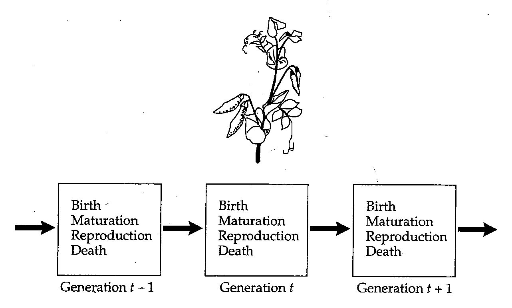
>
> FIGURE 2.1 The nonoverlapping generation model. The life history of the organism is assumed to be like that of an annual plant (or any short-lived organism), and the generations are assumed to be separated in time (discrete generations). Although the model is simple, it provides a convenient first approximation to populations with more complex life histories.

---

## PopGen_chapter2_004 · ORGANIZATION OF GENETIC VARIATION: Introduction / 2.2 THE HARDY-WEINBERG PRINCIPLE

Genotype frequencies are determined in part by the pattern of mating. In this section, we consider the consequences of random mating in the model with nonoverlapping generations. To deduce the genotype frequencies under random mating, additional assumptions are needed. First, the allele frequencies should not change from one generation to the next because of systematic evolutionary forces, the most important of which are mutation, migration, and natural selection. For the moment, these evolutionary forces are assumed to be absent or negligibly small in magnitude. (Their effects are discussed in Chapters 4 and 5.) Second, the population must be large enough in size that the allele frequencies are not subject to change merely because of sampling error. Variation in allele frequency owing to sampling error in small populations is called random genetic drift and is the subject of Chapter 3. Although random genetic drift is present unless the population is infinite in size, the magnitude of the effect on allele frequency over a small number of generations is usually sufficiently small that the process can be ignored if population size is 500 or more. The qualifier "over a small number of generations" is important because the effects of random genetic drift are cumulative. Considered over a sufficiently large number of generations, random genetic drift can be important even in populations of size $ 10^{6} $ or more.

Before proceeding further, it may be helpful to summarize the assumptions that we are making: • The organism is diploid.

• Reproduction is sexual.

• Generations are nonoverlapping.

• The gene under consideration has two alleles.

• The allele frequencies are identical in males and females.

• Mating is random.

• Population size is very large (in theory, infinite).

• Migration is negligible.

• Mutation can be ignored.

• Natural selection does not affect the alleles under consideration.

Collectively, these assumptions summarize the Hardy-Weinberg model, named after the English mathematician G. H. Hardy (1877–1947) and the German physiologist Wilhelm Weinberg (1862–1937), who, in 1908, independently formulated the model and deduced its theoretical predictions of genotype frequency.

In the Hardy-Weinberg model, the mathematical relation between the allele frequencies and the genotype frequencies is given by

$$
AA:p^{2}\qquad Aa:2pq\qquad aa:q^{2}
\tag{2.1}
$$

in which $ p^{2} $, $ 2pq $, and $ q^{2} $ are the frequencies of the genotypes AA, Aa, and aa in zygotes of any generation, p and q are the allele frequencies of A and a in gametes of the previous generation, and $ p + q = 1 $. The frequencies displayed in Equation 2.1 constitute the Hardy-Weinberg principle or the Hardy-Weinberg equilibrium (HWE).

One rationale for the Hardy-Weinberg principle displayed in Equation 2.1 is based on the outcome of repeated and independent trials. With random mating, the choices of male gamete and female gamete are independent trials, and so pairs of gametes carrying the alleles AA, Aa, or aa are expected in proportions given by $ (pA + qa)^2 = p^2AA + 2pqAa + q^2aa $. A graphical illustration of the rationale of independent trials is shown in Figure 2.2. The chance of two A-bearing gametes coming together is $ p \times p = p^2 $ and that of two a-bearing gametes coming together is $ q \times q = q^2 $; for the heterozygote, the chance is $ p \times q + q \times p = 2pq $ because the female gamete could carry A and the male gamete carry a, or the other way around.

> **Figure 2.2** · page 5 · source: `PopGen_chapter2`
>
> 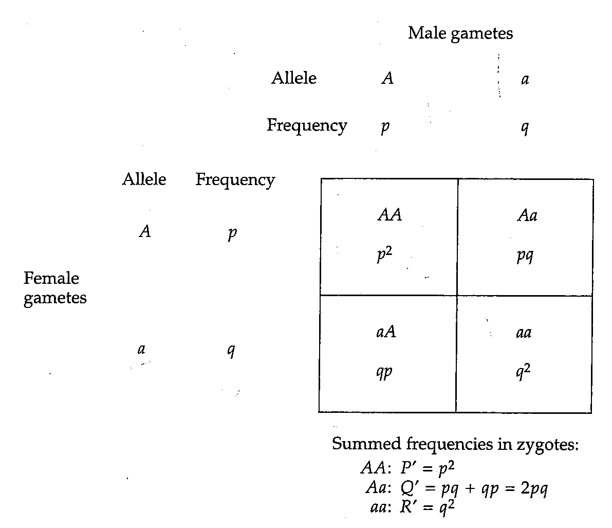
>
> FIGURE 2.2 Cross-multiplication square showing Hardy-Weinberg frequencies resulting from random mating with two alleles. Such a square is often referred to as a Punnett square, named in honor of early geneticist Reginald C. Punnett (1875–1967).

**[命题 Proposition]**

PROBLEM 2.1 The assumption that random mating of individuals is equivalent to random union of gametes (see Figure 2.2) can be used to explore the consequences of random mating when the allele frequencies are different in males and females. Imagine an autosomal gene with alleles A and a in a population in which the allele frequencies in females are p and q, respectively, with $ p + q = 1 $, and in which the corresponding allele frequencies in males are $ p' $ and $ q' $ ($ p' + q' = 1 $). After one generation of random mating, what are the genotype frequencies in females and males? What are the allele frequencies in females and males? What does this result imply about HWE in subsequent generations?

ANSWER For this situation a Punnett square like that in Figure 2.2 would have allele frequencies $ p $ and $ q $ across the top, since these are the frequencies of $ A $ and $ a $ in female gametes; and it would have $ p' $ and $ q' $ along the side, since these are the frequencies of $ A $ and $ a $ in male gametes. After one generation of random mating, therefore, the genotype frequencies are $ pp' (AA) $, $ pq' + qp' (Aa) $, and $ qq' (aa) $. These frequencies apply equally to female and male offspring, since both parents contribute equally to the inheritance of an autosomal gene. The allele frequencies in both sexes in the offspring generation are therefore $ p^* = pp' + (pq' + qp') / 2 = (2pp' + pq' + qp') / 2 = [p(p' + q') + p' (p + q)] / 2 = (p + p') / 2 $ for $ A $ and likewise $ q^* = (q + q') / 2 $ for $ a $. (Note that these values are the averages of the allele frequencies in females and males of the previous generation.) Therefore, one generation of random mating is sufficient to equalize the allele frequencies in the sexes, and in subsequent generations the genotype frequencies will be given by the HWE with $ p = p^* $ and $ q = q^* $.

---

## PopGen_chapter2_005 · 2.2 THE HARDY-WEINBERG PRINCIPLE / Random Mating of Genotypes versus Random Union of Gametes

Figure 2.2 implicitly assumes the important premise that random mating of genotypes is equivalent to random union of gametes. A demonstration of this premise in the case of two alleles is outlined in *[See Table 2.1 at the end of this section.]*, in which pairs of genotypes are chosen at random to form matings. The genotype frequencies of AA, Aa, and aa in the parental generation are written as P, Q, and R, respectively, where $ P + Q + R = 1 $. In terms of the genotype frequencies, the allele frequencies p of A and q of a are as follows:

$$
\begin{aligned}&p=(2\times P+Q)/2=P+Q/2\\&q=(2\times R+Q)/2=R+Q/2\\ \end{aligned}
\tag{2.2}
$$

Note that $ p + q = P + Q + R = 1.0 $; this result is a consequence of the fact that the gene has only two alleles. With two alleles of a gene, there are six possible types of matings. When mating is random, these matings take place in proportion to the genotypic frequencies in the population, and the types of mating pairs are given by successive terms in the expansion of $ (P\, AA + Q\, Aa + R\, aa)^2 $. For example, the pro-

*[See Table 2.1 at the end of this section.]* therefore

$$
P^{\prime}=P^{2}+\frac{2PQ}{2}+\frac{Q^{2}}{4}=(P+\frac{Q}{2})^{2}=p^{2}
$$

$$
Q^{\prime}=\frac{2PQ}{2}+2PR+\frac{Q^{2}}{2}+\frac{2QR}{2}=2(P+\frac{Q}{2})(R+\frac{Q}{2})=2pq
$$

$$
R^{\prime}=\frac{Q^{2}}{4}+\frac{2Q R}{2}+R^{2}=(R+\frac{Q}{2})^{2}=q^{2}
$$

portion of $ AA \times AA $ matings is $ P \times P = P^2 $. Similarly, the proportion of $ AA \times Aa $ matings is $ 2 \times P \times Q $ because the mating can be between either an AA female and an Aa male (proportion $ P \times Q $) or else between an Aa female and an AA male (proportion $ Q \times P $). The frequencies of these and the other types of matings are given in the second column of *[See Table 2.1 at the end of this section.]*.

The genotypes of the zygotes produced by the matings are given in the last three columns of *[See Table 2.1 at the end of this section.]*. The offspring frequencies follow from Mendel's law of segregation, which states that an Aa heterozygote produces an equal number of A-bearing and a-bearing gametes. The AA and aa homozygotes produce only A-bearing and only a-bearing gametes, respectively. Thus, the mating AA × aa produces all Aa zygotes, the mating AA × Aa produces $ \frac{1}{2} $ AA and $ \frac{1}{2} $ Aa zygotes, the mating Aa × Aa produces $ \frac{1}{4} $ AA, $ \frac{1}{2} $ Aa, and $ \frac{1}{4} $ aa zygotes, and so forth.

The genotype frequencies of AA, Aa, and aa zygotes after one generation of random mating are denoted in *[See Table 2.1 at the end of this section.]* as $ P' $, $ Q' $, and $ R' $, respectively. These values are calculated as the sum of the cross-products shown at the bottom of the table. The genotype frequencies simplify to $ P' = p' $, $ Q' = 2pq $, and $ R' = q^2 $, where p and q are the allele frequencies given in Equation 2.2. Note that the parental genotype frequencies—P, Q, and R—were completely arbitrary except for the requirement that $ P + Q + R = 1 $. Therefore, the Hardy-Weinberg frequencies are attained after one generation of random mating irrespective of the genotype frequencies in the parental generation.

PROBLEM 2.2 In an experimental population of D. melanogaster, the genotype frequencies for two alleles, $ E6^{F} $ and $ E6^{S} $, of the gene coding for esterase-6 were found to be consistent with Hardy-Weinberg proportions with allele frequencies of 0.3579 for $ E6^{F} $ and 0.6421 for $ E6^{S} $ (Mukai et al. 1974). Assuming that all of the assumptions of the Hardy-Weinberg model hold, particularly those pertaining to random mating in a large population with no mutation, selection, or migration, make a table of mating frequencies similar to *[See Table 2.1 at the end of this section.]* for the esterase-6 alleles. Then calculate the genotype frequencies expected in the next generation along with the corresponding allele frequencies.

ANSWER The Hardy-Weinberg frequencies among parents are FF: 0.1281; FS: 0.4596, and SS: 0.4123. Therefore, the expected frequencies of the matings are: FF × FF (0.0164); FF × FS (0.1177); FF × SS (0.1056); FS × FS (0.2112); FS × SS (0.3790); and SS × SS (0.1700). The expected genotype frequencies among the zygotes are, for FF, 0.0164 + 0.1177/2 + 0.2112/4 = 0.1281; for FS, 0.1177/2 + 0.1056 + 0.2112/2 + 0.3790/2 = 0.4596; and SS, 0.2112/4 + 0.3790/2 + 0.1700 = 0.4123; note that these are the same as in the parental generation. The allele frequencies of F and S are again 0.3579 and 0.6421, respectively.

**[Table]**

*[See Table 2.1 at the end of this section.]*

> **Table 2.1** · `2.1` · page 7 · source: `PopGen_chapter2_005`
> TABLE 2.1 Demonstration of the Hardy-Weinberg Principle
>
> <table><tr><td rowspan="2">Mating</td><td rowspan="2">Frequency of mating (parents)</td><td colspan="3">Frequency of zygotes (progeny)</td></tr><tr><td>AA</td><td>Aa</td><td>aa</td></tr><tr><td>AA $ \times $ AA</td><td>$ P^{2} $</td><td>1</td><td>0</td><td>0</td></tr><tr><td>AA $ \times $ Aa</td><td>2PQ</td><td>$ \frac{1}{2} $</td><td>$ \frac{1}{2} $</td><td>0</td></tr><tr><td>AA $ \times $ aa</td><td>2PR</td><td>0</td><td>1</td><td>0</td></tr><tr><td>Aa $ \times $ Aa</td><td>$ Q^{2} $</td><td>$ \frac{1}{4} $</td><td>$ \frac{1}{2} $</td><td>$ \frac{1}{4} $</td></tr><tr><td>Aa $ \times $ aa</td><td>2QR</td><td>0</td><td>$ \frac{1}{2} $</td><td>$ \frac{1}{2} $</td></tr><tr><td>aa $ \times $ aa</td><td>$ R^{2} $</td><td>0</td><td>0</td><td>1</td></tr><tr><td></td><td>Totals (next generation)</td><td>$ P' $</td><td>$ Q' $</td><td>$ R' $</td></tr><tr><td>therefore</td><td colspan="4">$ P'=P^{2}+\frac{2PQ}{2}+\frac{Q^{2}}{4}=(P+\frac{Q}{2})^{2}=p^{2} $</td></tr><tr><td></td><td colspan="4">$ Q'=\frac{2PQ}{2}+2PR+\frac{Q^{2}}{2}+\frac{2QR}{2}=2(P+\frac{Q}{2})(R+\frac{Q}{2})=2pq $</td></tr><tr><td></td><td colspan="4">$ R'=\frac{Q^{2}}{4}+\frac{2QR}{2}+R^{2}=(R+\frac{Q}{2})^{2}=q^{2} $</td></tr></table>

---

## PopGen_chapter2_006 · 2.2 THE HARDY-WEINBERG PRINCIPLE / Implications of the Hardy-Weinberg Principle

The Hardy-Weinberg principle has provided the foundation for many theoretical and experimental investigations in population genetics. However, the theory is far from profound, and the applicability is far from universal. Hardy especially seems to have regarded the Hardy-Weinberg principle as virtually self-evident. He wrote, “I should have expected the very simple point which I wish to make to have been familiar to biologists.” In fact, it was familiar to some biologists—the basic principle had been noted as early as 1903 by the Harvard geneticist William E. Castle (1867–1962). Castle’s work was little known, however, and Hardy was writing to counter an argument put forth against Mendelian that phenotypic ratios of 3 dominant to 1 recessive should be encountered frequently in natural populations if the mechanism of Mendelian heredity were generally applicable. The immediate implication of the Hardy-Weinberg principle was to refute the 3:1 argument by showing that the genotypic ratio of A-: aa is determined by the allele frequencies and has no special tendency to attain one particular ratio as any other. (The dash in a genotypic symbol is a wild card symbolizing any of the possible alleles; for example, the genotype symbolized A- includes both AA and Aa.)

Beyond the virtue of simplicity, why would anyone want to consider a model based on so many restrictive and seemingly incorrect assumptions? And in what sense can such a simple model be considered fundamental? Among several reasons, two stand out. First, the Hardy-Weinberg model is a reference model in which there are no evolutionary forces at work other than those imposed by the process of reproduction itself. In this sense, the model is similar to models in mechanical physics where objects fall through the sky without wind resistance or roll down inclined planes without friction. The model affords a baseline for comparison with more realistic models in which evolutionary forces can change allele frequencies. Perhaps more importantly, the Hardy-Weinberg model separates life history into two intervals: gametes combining to produce zygotes, and zygotes maturing to become adults. In constructing more complex and realistic models, one can often introduce the complications into the zygotes-to-adults part of the life cycle. This is the usual approach for considering, for example, the effects of migration into the population or the effects of differential survival among the genotypes. With all sources of change in allele frequency accounted for in the zygotes-to-adults component, the gametes-to-zygotes component follows from the principle that random union of gametes and results in the Hardy-Weinberg proportions among zygotes. In other words, the Hardy-Weinberg model is fundamental in the sense that the approach of tracking allele and genotype frequencies through time can be generalized to more realistic situations.

One of the most important implications of the Hardy-Weinberg principle emerges when we calculate the allele frequencies of A and a in the next generation from the formulas for $ P' $, $ Q' $, and $ R' $ in *[See Table 2.1 at the end of this section.]*. Using the result in Equation 2.2, the allele frequency of A among the zygotes equals $ P' + Q' / 2 = p^2 + 2pq / 2 = p^2 + pq = p(p + q) = p $. Likewise, the allele frequency of a among zygotes equals $ R' + Q' / 2 = q^2 + 2pq / 2 = q $. Thus, the allele frequencies in the next generation are exactly the same as they were the generation before. With random mating, the allele frequencies remain the same generation after generation. In any generation, therefore, the genotype frequencies are $ p^2 $, $ 2pq $, and $ q^2 $ for AA, Aa, and aa, respectively, as given in Equation 2.1. The constancy of allele frequency—and therefore of the genotypic composition of the population—is the single most important implication of the Hardy-Weinberg principle. The constancy of allele frequencies implies that, in the absence of specific evolutionary forces to change allele frequency, the mechanism of Mendelian inheritance, by itself, keeps the allele frequencies constant and thus preserves genetic variation. A second item of interest is that the Hardy-Weinberg frequencies are attained in just one generation of random mating if the allele frequencies are the same in males and females. This, however, is true only with nonoverlapping generations; in populations with more complex life histories, the Hardy-Weinberg frequencies are attained gradually over a period of several generations.

The principle that Mendelian inheritance preserves genetic variation has important implications for evolutionary theory. In Darwin's time, the prevailing view of heredity was one of blending, in which all of the offspring of a mating were assumed to have a hereditary composition equal to the mean of that of the parents. In this scenario, the genetic variation in a population rapidly disappears. The problem was pointed out by Darwin’s critics and understood by Darwin himself to be a potentially fatal flaw in his theory. He handled the problem by assuming a very high rate of appearance of new genetic variation through the effects of the environment on the genome.

It was not until the 1930s that Mendelian inheritance was finally incorporated into evolutionary theory in what was then called the modern synthesis. In the modern synthesis, Darwin's idea of a high mutation rate generating genetic variation that was quickly dissipated by the mechanism of heredity was replaced with a model in which a low mutation rate generated genetic variation that tends to be preserved, and therefore accumulated, by the Mendelian mechanism of inheritance.

It is important to note here that conventional statistical tests for Hardy-Weinberg proportions (such as those discussed below) are not very sensitive to deviations from the expected genotype frequencies. Consequently, the mere fact that observed genotype frequencies may happen to fit the Hardy-Weinberg proportions cannot be taken as evidence that all of the assumptions underlying the model are valid. The most that can be concluded is that, whatever departures from the assumptions there may be, they are not sufficiently large to result in deviations from HWE that are detectable with conventional statistical tests.

---

## PopGen_chapter2_007 · ORGANIZATION OF GENETIC VARIATION: Introduction / 2.3 TESTING FOR HARDY-WEINBERG EQUILIBRIUM

As a concrete example of the application of the Hardy-Weinberg principle, we will use a common polymorphism in the human gene encoding a multifunctional transcription factor protein known as p53. This protein is one of the genome's key players in preventing cancer, as evidenced by the observation that mutations in p53 are among the most common genetic changes found in cancers. The p53 protein is activated by DNA damage or other problems in DNA synthesis. When activated, p53 turns on transcription of a number of other genes encoding proteins that interrupt the cell cycle until the damage can be repaired; if the damage cannot be repaired, the proteins cause the cell to undergo programmed cell death. The p53 protein also helps regulate the formation of blood vessels and is a mediator of pregnancy by estrogen and progesterone activation.

The human population has a common amino acid polymorphism in p53, in which the amino acid at position 72 can be either arginine (Arg) or proline (Pro). It will be convenient to call these the corresponding alleles Arg and Pro. In homozygous genotypes, the Arg allele is weakly associated with cutaneous melanoma (Shen et al. 2003), whereas the Pro allele is weakly associated with recurrent spontaneous abortions (Pietrowski et al. 2005).

In one study of the p53 polymorphism among 318 Caucasians (Pietrowski et al. 2005), the observed number for each genotype was 166 Arg/Arg, 120 Arg/Pro, and 32 Pro/Pro. To determine whether these genotype frequencies are in accord with HWE, the allele frequencies of Arg and Pro must first be estimated. The estimated allele frequency $ \hat{p} $ of Arg is $ (2 \times 166 + 120)/(2 \times 318) = 0.7107 $ and the frequency $ \hat{q} $ of Pro is $ (120 + 2 \times 32 + 120)/(2 \times 318) = 0.2893 $. Were the population in HWE, we would expect the genotype frequencies of Arg/Arg, Arg/Pro, and Pro/Pro to be $ p^2 $, $ 2pq $, and $ q^2 $, respectively, where p and q are the allele frequencies in the underlying population from which the sample was drawn. Because p and q are parameters, their true values are unknown. However, in testing for HWE we can substitute the estimated values to obtain the expected proportions Arg/Arg: $ (0.7107)^2 = 0.5051 $, Arg/Pro: $ 2(0.7107)(0.2893) = 0.4112 $, and Pro/Pro: $ (0.2893)^2 = 0.0837 $, respectively. Because the sample size is 318, the expected numbers of the Arg/Arg, Arg/Pro, and Pro/Pro genotypes are $ 0.5051 \times 318 = 160.6 $, $ 0.4112 \times 318 = 130.8 $, and $ 0.0837 \times 318 = 26.6 $, respectively.

At this point, it is convenient to tabulate the data into three columns:

**[Table]**

> **Inline table** · `inline_p53_observed_expected` · page 11 · source: `PopGen_chapter2_007`
> Observed and expected p53 genotype counts
>
> Genotype | Observed number | Expected number
> --- | --- | ---
> Arg/Arg | 166 | 160.6
> Arg/Pro | 120 | 130.8
> Pro/Pro | 32 | 26.6

With the data so arrayed, it is evident that the fit between the observed numbers and the expected numbers, though not perfect because of chance statistical fluctuations in the number of each genotype that may be included in any given sample, is nevertheless very close. To verify this conclusion, we will apply a conventional statistical test to the data in order to assess quantitatively the closeness of fit. A test commonly employed in population genetics is called the chi-square test, which is based on the value of a number, called $ \chi^{2} $, calculated from the data as

$$
\chi^{2}=\sum\frac{(observed-expected)^{2}}{expected}
\tag{2.3}
$$

where observed and expected refer to the observed and expected numbers in any genotypic class, and the $ \Sigma $ sign denotes that the values are to be summed over all genotypic classes. In the case at hand,

$$
\begin{aligned}\chi^{2}&=(166-160.6)^{2}/160.6\\&\quad+(120-130.8)^{2}/130.8\\&\quad+(32-26.6)^{2}/26.6\\&=2.17\end{aligned}
$$

To be completely unambiguous, some statisticians prefer use of the symbol $ \chi^{2} $ for the realized value of the test statistic defined Equation 2.3, in order to distinguish between the test statistic and the true $ \chi^{2} $ distribution itself. The distinction should certainly be kept in mind, but we will not recognize it formally with different symbols.

Associated with any $ \chi^{2} $ value is a second number called the degrees of freedom for that $ \chi^{2} $. In general, the number of degrees of freedom (df) associated with a $ \chi^{2} $ value equals

$$
\begin{aligned}df&=Number of classes of data\\&-Number of parameters estimated from the data\\&-1\end{aligned}
$$

In the p53 example, there are three classes of data and one parameter (p) estimated from the data, and so $ df = 3 - 1 - 1 = 1 $. Note that a degree of freedom is not subtracted for estimating q because of the relation $ q = 1 - p $; that is, once p has been estimated, the estimate of q is automatically determined, and so we deduct just the one degree of freedom corresponding to p.

Calculation of $ \chi^{2} $ and its associated degrees of freedom is carried out in order to obtain a number for assessing goodness of fit, and this number can be determined from Figure 2.3. To use the chart, find the value of $ \chi^{2} $ along the horizontal axis, then move vertically from this value until the line for the number of degree of freedom is intersected, then move horizontally from the point of intersection to the vertical axis and read the corresponding probability value P. In our case, with $ \chi^{2}=2.17 $ and one degree of freedom, the corresponding probability value is about P=0.14. (Rather than use Figure 2.3 for the P value, you can search for “chi-square calculator” on your favorite web browser, then pick a site and follow the instructions.)

> **Figure 2.3** · page 12 · source: `PopGen_chapter2`
>
> 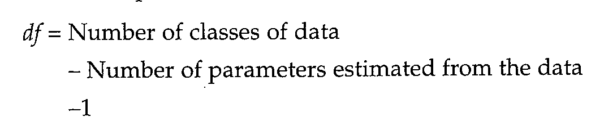
>
> FIGURE 2.3 Graph of $\chi^{2}$. To use the graph, find the value of $\chi^{2}$ along the horizontal axis, then read the probability value for the appropriate number of degrees of freedom from the vertical axis. Values of $\chi^{2}$ smaller than 1 are not shown, because these are never significant.

The probability associated with a particular $ \chi^{2} $ test has the following interpretation: The P value is the probability that chance alone could produce a deviation between the observed and expected values at least as great as the deviation actually realized. Thus, if the probability is large, it means that chance alone could account for the deviation, and it strengthens our confidence in the validity of the model used to obtain the expectations—in this case, the Hardy-Weinberg model. On the other hand, if the probability associated with the $ \chi^{2} $ is small, it means that chance alone is not likely to lead to a deviation as large as actually realized, and it undermines our confidence in the validity of the model. Where exactly the cutoff should be between a "large" probability and a "small" one is, of course, not obvious, but there is an established guideline to follow. If the probability is less than 0.05, then the goodness of fit is considered sufficiently poor that the model is judged invalid for the data; alternatively, if the probability is greater than 0.05, the fit is considered sufficiently close that the model is not rejected. Because the probability in the p53 example is 0.14, which is greater than 0.05, we have no reason to reject the hypothesis that the genotype frequencies are in Hardy-Weinberg proportions for this gene.

PROBLEM 2.3 The gene CCR5 encodes a protein coreceptor used by the AIDS virus for entry into certain white blood cells. Many populations are polymorphic for a deletion of part of the coding sequence that results in an inactive protein. This polymorphism was originally discovered among persons infected with the virus who had remained free of the AIDS disease for at least 10 years. The protective effect of the deletion, denoted CCR5Δ, is at least a factor of two. In one study of 338 individuals from Denmark and nearby Germany (Lucotte and Mercier 1998), the observed numbers of the genotypes were as follows: 265 nonmutant CCR5/CCR5 homozygotes, 66 CCR5/CCR5Δ heterozygotes, and 7 CCR5Δ/CCR5Δ homozygotes. Estimate the allele frequencies of CCR5 (p) and CCR5Δ (q) and carry out a chi-square test of goodness of fit between the observed genotype frequencies and their Hardy-Weinberg expectations. Is there any reason to reject the hypothesis of Hardy-Weinberg proportions for this gene?

ANSWER $ \hat{p}=0.882 $ and $ \hat{q}=0.118 $. The expected numbers of CCR5/CCR5, CCR5/CCR5 $ \Delta $, and CCR5 $ \Delta $/CCR5 $ \Delta $ are 262.9, 70.4, and 4.7, respectively. The $ \chi^{2}=1.42 $ with one degree of freedom. The associated probability from Figure 2.3 is about 0.25, so there is no reason to reject the hypothesis of HWE.

---

## PopGen_chapter2_008 · 2.3 TESTING FOR HARDY-WEINBERG EQUILIBRIUM / Difficulties in Testing for Hardy-Weinberg Equilibrium

Testing for HWE is important. For example, in studies in human genetics, deviations from HWE of a marker gene among individuals affected with a genetic disease may be helpful in identifying the location of a disease-susceptibility allele near the marker gene along the chromosome (Nielsen et al. 1999). Deviations from HWE may also alert the investigator to possible genotyping errors (Xu et al. 2002). Yet tests for HWE are often unreported or botched (Salanti et al. 2005). There are also complications that can invalidate the simple chi-square calculation in Equation 2.3. Some of the ways of dealing with these complications are examined next.

SAMPLE SIZE TOO SMALL Problem 2.3 illustrates one of the issues that can arise in testing for HWE. The allele frequency of $ CCR5\Delta $ is sufficiently small that, even for a sample size of 338, the observed number of homozygotes was only 7 and the expected number is only 4.7. With such small numbers, chance alone can have a substantial effect on the composition of any actual sample. This is a problem for the formula in Equation 2.3, because this expression has a chi-square distribution only when each of the classes of data has a sufficiently large expected number. What “sufficiently large” means is a matter of judgment, but most statisticians agree that the standard chi-square test should not be trusted when any of the expected numbers is smaller than 5. The $ CCR5\Delta $ example violates this convention. In such cases, many statisticians recommend calculating a chi-square value that is somewhat more conservative than that in Equation 2.3, namely,

$$
\chi^{2}=\sum\frac{\left(\left|observed-expected\right|-0.5\right)^{2}}{expected}
\tag{2.4}
$$

In this expression, the vertical bars mean absolute value (the magnitude of the enclosed number disregarding the sign). The fact that 0.5 is subtracted from each difference in the numerator before taking the square serves to reduce the value of the chi-square. In the CCR5Δ example, Equation 2.4 yields $ (2.1 - 0.5)^2 / 262.9 + (4.4 - 0.5)^2 / 70.4 + (2.3 - 0.5)^2 / 4.7 = 0.915 $. This value is not found on the chart in Figure 2.3 because the graph begins at $ \chi^2 = 1 $ for clarity. In practice, values of $ \chi^2 $ smaller than 1 are often found (as in the present example), but they are never significant. In this case, a $ \chi^2 $ of 0.915 with one degree of freedom has a corresponding $ P $ value of 0.34. This correction for small sample size has limitations, because if any of the expected numbers is too close to 0, then the correction in Equation 2.4 is unreliable.

EXACT TEST FOR HWE If the sample size is small enough, then it is possible to calculate the exact probability of all possible sample configurations. To be concrete, consider a gene with two alleles A and a, and let the observed numbers of AA, Aa, and aa in one possible sample be $ n_{11} $, $ n_{12} $, and $ n_{22} $, respectively. The total sample size is therefore $ n = n_{11} + n_{12} + n_{22} $, and the observed numbers of A and a alleles are $ n_{1} = 2 \times n_{11} + n_{12} $ and $ n_{2} = n_{12} + 2 \times n_{22} $, respectively. We wish to calculate the probability of any sample configuration ($ n_{11} $, $ n_{12} $, $ n_{22} $) for a fixed sample size n and fixed allele counts $ n_{1} $ and $ n_{2} $. Since the allele counts are fixed, any sample is uniquely specified by the number of heterozygotes observed. In fact, the exact probability of the sample configuration ($ n_{11} $, $ n_{12} $, $ n_{22} $), conditional on the allele counts ($ n_{1} $, $ n_{2} $), is given by

$$
\Pr\left\{n_{12}\left|n_{1},n_{2}\right.\right\}=\frac{n!/\left(n_{11}!n_{12}!n_{22}!\right)}{\left(2n\right)!/\left(n_{1}!n_{2}!\right)}2^{n_{12}}.
\tag{2.5}
$$

(Emigh 1980; Weir 1996; and see Guo and Thompson 1992 for a multiple-allele version). Once these conditional probabilities have been calculated for all possible values of $ n_{12} $, they are arranged in increasing order, and a cutoff is chosen such that the cumulative probability of all outcomes above the cut-off equals 0.05 (or the number nearest to, but smaller than, 0.05). If the observed genotype counts fall below the cutoff, the hypothesis of HWE is rejected. As an example, consider a sample of size $n=8$ diploid individuals with fixed allele counts of $n_{1}=8$ and $n_{2}=8$. Then there are only five possible sample configurations $(n_{11}, n_{12}, n_{22})$, which are given below along with their probabilities calculated from Equation 2.5.

$$
(0,8,0)\qquad\qquad\operatorname*{P r}=0.01989
$$

$$
\begin{array}{r l r l r}{(1,6,1)}&{{}}&{\qquad}&{{}}&{\mathrm{P r}=0.27848}\end{array}
$$

$$
(2,4,2)\qquad\qquad\operatorname*{P r}=0.52215
$$

$$
(3,2,3)\qquad\qquad\operatorname*{P r}=0.17404
$$

$$
(4,0,4)\qquad\qquad\operatorname*{P r}=0.00544
$$

These should be arranged in increasing order of probability and the cumulative probabilities calculated, as follows:

$$
(4,0,4)\quad\operatorname*{P r}=0.00544\qquad\operatorname{C u m u l a t i v e}\operatorname{P r o b}=0.00544
$$

$$
\left(0,8,0\right)\quad\operatorname{Pr}=0.01989\quad\quad\operatorname{Cumulative Prob}=0.00544+0.01989=0.02533
$$

$$
\begin{array}{r l r}{\mathrm{P r}=0.17404}&{{}}&{\mathrm{C u m u l a t i v e~P r o b}=0.02533+0.17404=0.19937}\end{array}
$$

$$
\begin{array}{r l}{\operatorname*{P r}=0.27848}&{{}\quad\mathrm{C u m u l a t i v e~P r o b}=0.19937+0.27848=0.47785}\end{array}
$$

$$
\begin{array}{r l r}{(2,4,2)}&{{}}&{\operatorname*{P r}=0.52215\qquad\mathrm{C u m u l a t i v e~P r o b}=0.47785+0.52215=1.0000}\end{array}
$$

In each row, the cumulative probability value corresponds to the P value of observing a fit as bad (or worse) than the sample configuration given in that row. Hence, an observed sample configuration of $ (4, 0, 4) $ would lead to rejection of the hypothesis of HWE with a significance level of 0.00544, and an observed sample configuration of $ (0, 8, 0) $ would lead to rejection of the hypothesis of HWE with a significance level of 0.02533. As another example, consider again the CCR5 data in Problem 2.3 in which $ (n_{11}, n_{12}, n_{22}) = (265, 66, 7), n_1 = 596 $, and $ n_2 = 80 $. There are exactly 41 sample configurations that are compatible with $ n_1 = 596 $ and $ n_2 = 80 $, which have the form $ (n_{11}, n_{12}, n_{22}) = (298 - x, 2x, 40 - x) $, where $ x $ can assume the values 0, 1, 2,..., 40. Each of these possible samples has a probability of occurrence given by Equation 2.5 and a deviation from HWE given by Equation 2.3. (Here we are using the chi-square only as a measure of the magnitude of the deviation, without assuming that the values are actually distributed as $ \chi^2 $.) Among the 41 possibilities, 37 yield chi-square values as great or greater than the observed value, and these samples have a cumulative probability of 0.290. This is the exact $ P $ value. As we have seen, the conventional chi-square statistic in Equation 2.3 yields a $ P $ value of 0.25, and the chi-square adjusted for small sample size in Equation 2.4 yields a $ P $ value of 0.34. None of the values are statistically significant, but the example shows that Equation 2.3 yields a $ P $ value that is too small, whereas Equation 2.4 yields one that is somewhat too large. The message is that the $ P $ values from Equations 2.3 and 2.4 are best regarded as approximations whose accuracy improves with sample size.

The exact test is the most common test of significance for departures from Hardy-Weinberg in small samples, and in practice one calculates the P values using either a standard statistics package or any of a number of web-based calculators that can be accessed by searching for "exact test for Hardy-Weinberg."

PERMUTATION TEST FOR HWE In some cases it is convenient to test for HWE by comparing the sample with random permutations of the data. For example, in a sample of 8 diploid individuals in which $ n_1 = 8 $ and $ n_2 = 8 $, one would consider a large number of random permutations of $ (1, 2, 3, 4, 5, 6, 7, 8, 9, 10, 11, 12, 13, 14, 15, 16) $, where the even numbers represent one allele $ (A) $ and the odd numbers the other allele $ (a) $. Each successive pair of numbers would then constitute one diploid genotype in the sample. For example, one random permutation is $ (15, 12, 1, 4, 2, 16, 11, 8, 5, 13, 6, 3, 10, 7, 9, 14) $, which corresponds to the genotypes $ aA $, $ aA $, $ AA $, $ aA $, $ aa $, $ Aa $, $ Aa $, $ aA $, or $ (n_{11}, n_{12}, n_{22}) = (1, 6, 1) $. For 16 elements, there are more than $ 10^{13} $ possible permutations. Each random permutation yields a possible sample configuration $ (n_{11}, n_{12}, n_{22}) $ whose chi-square can be compared with an observed value, and with a large number of random permutations, the proportion of samples whose chi-square is as large or larger than that observed approximates the P value.

To take a more complex example, consider again the CCR5 case in Problem 2.3, where $ n_{1} = 596 $ and $ n_{2} = 80 $. In this case the vector to be randomly permuted has $ 596 + 80 = 676 $ elements, $ (1, 2, 3,..., 676) $, where the integers less than or equal to 596 represent the nonmutant CCR5 allele and those greater than 596 represent the CCR5Δ allele. Again, each successive pair of integers represents a single diploid genotype in the sample. Among 1000 random permutations, in 294 cases the chi-square was as large or larger than that observed, yielding a P value of P = 0.294. This is in good agreement with the exact value of 0.290 calculated earlier, which is not surprising because a large sample of random permutations simulates what the exact test does exactly.

Random permutations are particularly useful when there are multiple alleles, many of them rare, because some heterozygous genotypes will be rare and some homozygous genotypes not represented in the sample. An alternative for such cases is not to compare the individual genotype frequencies with their expectations, but to compare the total number of heterozygous genotypes and homozygous genotypes with the numbers expected under HWE. (Details of HWE for multiple alleles are discussed below.) Finally, there is also an exact test that generalizes Equation 2.5 to multiple alleles (Guo and Thompson 1992).

PROBLEMS OF MULTIPLE TESTS One final issue to be addressed is that of multiple tests. The high-throughput genotyping capabilities brought about by genomics has made it possible to assay millions of polymorphisms simultaneously in large samples. For example, the human genome contains an estimated 10 million single-nucleotide polymorphisms (SNPs)—about 1 SNP every 300 base pairs—of which four million have been identified. Each SNP consists of a site in the DNA at which the particular nucleotide pair differs among chromosomes, and in which the least frequent variant (called the minor allele) is relatively common. The most useful SNPs are thought to be those for which the minor allele has a frequency greater than 5%. These SNPs are of great interest because they may allow systematic, genome-wide tests of association between common genetic variants and common diseases, including heart disease, diabetes, autoimmunity disease, Alzheimer disease, and many others.

A pioneering study was based on comprehensive genotyping of more than a million SNPs among a sample of 269 individuals from four populations (The International HapMap Consortium 2005). This amount of data presents a challenging statistical problem. For example, if one million independent SNPs were each tested for HWE, then 50,000 SNPs would lead to rejection of the hypothesis at the P = 0.05 level purely due to chance. For the same reason, in disease-association tests, 50,000 SNPs would appear to be associated with each disease, for no reason other than chance variation in the samples. Furthermore, because of genetic linkage effects, nearby SNPs are not necessarily independent of one another. In such tests, the hypothesis being tested—called the null hypothesis and symbolized $ H_{0} $—is that there is no departure from HWE or no association between a SNP and a disease. The significance level of a test is the conditional probability that the null hypothesis is rejected when it is, in fact, true; or, in symbols, Pr Rejection | $ H_{0} $ is true. But to reject the hypothesis that a SNP has no effect is another way of saying that the SNP does has an effect. Such a spurious inference is known as a false positive.

One approach to the multiple-testing problem is to make the threshold value for significance more stringent (for example, require a larger chi-square value), so that the probability of any single false positive among all the SNPs tested equals 0.05. For example, if we carried out m independent tests with a cutoff P value of 0.05, then the expected number of false positives would be $ 0.05 \times m $. This suggests that the appropriate cutoff should be adjusted to P = 0.05/m, because then the expected number of false positives is $ (0.05/m) \times m = 0.05 $. This is the so-called Bonferroni correction, named after the Italian statistician Carlo Emilio Bonferroni (1892–1960). But a cutoff of P = 0.05/m magnifies the opposite problem. In making the null hypothesis harder to reject, only the SNPs with the largest effects are detected, and those with smaller effects escape notice along with those of no effect that are not rejected.

Another important consideration in multiple tests is the extent to which a rejection caused by a statistically significant result implies that the null hypothesis is actually false. In association tests, the probability that the null hypothesis of no association is in fact true, when the data are statistically significant and therefore cause the null hypothesis to be rejected, is called the false discovery rate. This is quite distinct from the false positive rate, as can be seen by expressing the false discovery rate as the conditional probability $ \Pr\{H_0 \text{ is true} \mid \text{Rejection}\} $.

The most effective cutoffs for multiple tests are those that strike a balance between the false positive rate $ [\mathrm{Pr}(\mathrm{Rejection} \mid H_0 \text{ is true})] $ and the false discovery rate $ [\mathrm{Pr}(H_0 \text{ is true} \mid \mathrm{Rejection})] $, because they balance finding true associations against discovering false ones. Further details are beyond the scope of this book, but can be found in Storey and Tibshirani (2003) and Verhoeven et al. (2005). Purely statistical approaches can go only so far, however. As stated in a paper by The International HapMap Consortium (2005): "Multiple replications in large samples provide the most straightforward path to identifying robust and broadly relevant associations."

---

## PopGen_chapter2_009 · 2.3 TESTING FOR HARDY-WEINBERG EQUILIBRIUM / Complications of Dominance

Dominance obscures a one-to-one relation between phenotype and genotype, but the allele frequencies can still be estimated if one is willing to assume HWE. For a polymorphic gene with two alleles in which one of the alleles is dominant, only two phenotypic classes can be distinguished—the dominant phenotype and the recessive phenotype. An example is found in the Rhesus (Rh) blood groups, which are products of two closely linked genes denoted RhD and RhCE that originated as a gene duplication during primate evolution (Matassi et al. 1999). The human RhD allele encodes a product that elicits formation of antibodies in Rhesus monkeys, whereas a common mutant allele, Rhd, is a deletion. When the phenotype of individuals is assayed by means of cross-reaction with the anti-D antibody, blood cells from genotypes RhD/RhD and RhD/Rhd genotypes cross react and are said to be Rh+ (Rh positive), whereas blood cells from RhD/Rhd genotypes fail to react and are said to be Rh− (Rh negative).

Among American Caucasians, the frequency of Rh⁺ is about 85.8% and the frequency of Rh⁻ is about 14.2% (Roychoudhury and Nei 1988). Given only the phenotype frequencies, the data cannot be used to calculate the genotype frequencies because we have no way of knowing what proportion of Rh⁺ phenotypes are RhD/RhD and what proportion are RhD/Rhd. However, if we are willing to assume random mating, then the relative proportions RhD/RhD and RhD/Rhd genotypes are given by the Hardy-Weinberg principle. Assuming random mating and HWE, the genotype frequencies are given by p², 2pq, and q², where p is the allele frequency of RhD and q that of the RhD deletion. An estimate of q can therefore be obtained by setting q² = 0.142 (the frequency of the homozygous recessive phenotype), and so $ \hat{q} = \sqrt{0.142} = 0.3768 $. More generally, if R is the frequency of homozygous recessive genotypes found in sample of n organisms, then $ \hat{q} $ and its standard error are estimated as

$$
\begin{aligned}\hat{q}&=\sqrt{R}\quad.\\SE(\hat{q})&=\sqrt{\frac{1-R}{4n}}\end{aligned}
\tag{2.6}
$$

The expression for the standard error comes from the large-sample formula that the variance of a function $f(x)$, $Var[f(x)]$, is given by $[df(x)/dx]^2 \times Var(x)$. In this case, we know the variance of $R$: It is the binomial variance $R(1 - R)/n$, and what we desire is the variance of $f(R) = \sqrt{R}$. Since $d\sqrt{R/dR} = (\frac{1}{2}\sqrt{R})$, it follows that $Var(\sqrt{R}) = (\frac{1}{2}\sqrt{R})^2 \times R(1 - R)/n = (1 - R)/4n$. Taking the square root of both sides yields the standard error in Equation 2.6. With $\hat{q}$ estimated from Equation 2.6 as 0.3768, then $\hat{p}=1-0.3768=0.6232$, and the frequencies of RhD/RhD, RhD/RhD, and Rhd/RhD are expected to be $p^{2}=(0.6232)^{2}=0.3884$, $2pq=2(0.6232)(0.3768)=0.4696$, and $q^{2}=(0.3768)^{2}=0.1420$, respectively. The proportion of Rh+ individuals that are actually heterozygous is therefore $0.4696/(0.4696+0.3884)=54.7%$. However, when there is dominance, there is no possibility for a $\chi^{2}$ test of goodness of fit to HWE because there are 0 degrees of freedom. Because of the lack of degrees of freedom, the calculated frequencies of Rh+ and Rh- $(0.3884+0.4696=0.858$ and 0.142, respectively) fit the observed frequencies exactly.

PROBLEM 2.4 The Basque people, who live in the Pyrenees mountains between France and Spain, have one of the highest frequencies of the Rhd deletion so far reported. In one study of 400 Basques, 230 were found to be Rh⁺ and 170 Rh⁻ (Mourant et al. 1976). Assuming HWE, estimate the frequencies of the RhD and RhD alleles, the genotype frequencies, and the proportion of Rh⁺ individuals who are heterozygous Dd. What is the standard error of the estimate $ \hat{q} $?

ANSWER $ \hat{q} = \sqrt{170/400} = 0.65 $, $ \hat{p} = 0.35 $, and the estimated genotype frequencies of RhD/RhD, RhD/Rhd, and Rhd/Rhd are 0.121, 0.454, and 0.425, respectively. The proportion of RhD/Rhd among Rh⁺ phenotypes in the Basque population is 0.454/(0.121 + 0.454) = 79%. The standard error of $ \hat{q} $ equals $ \sqrt{[(1 - 0.425)/1600]} = 0.02 $.

The Hardy-Weinberg principle also finds application in studies of industrial melanism, one of the most famous and best-studied cases of evolution in action (Kettlewell 1973). Industrial melanism refers to the evolution of black (melanic) color patterns in several species of moths that accompanied progressive pollution of the environment by coal soot during the industrial revolution. (The various color forms of the moths are known as morphs.) The evolution of melanism has been observed in Great Britain, West Germany, Eastern Europe, the United States, and in other heavily industrialized areas. The species that evolve melanism are typically large night-flying moths. Of nearly 800 species of large moths in the British Isles, where industrial melanism has been most intensively studied, about 100 species are industrial melanics (Bishop and Cook 1975). The best known of these are the peppered moth (Biston et al. 1988). The inference that selection has driven the evolution of industrial melanism is strongly supported by the observation that, in both the United Kingdom and the United States, improved air quality due to emissions regulations has been accompanied by a decrease in the frequency of the melanic forms (Grant et al. 1998). In fact, the decrease in frequency is more thoroughly documented than the previous increase (Grant 1999).

The agent of selection was once universally thought to be bird predation, because the morphs are dramatically different in conspicuousness on different background (Figure 2.4). The light forms are concealed on normal bark, whereas the dark forms are concealed on bark that is blackened with soot. The problem is that, while birds are visual predators, the moths fly only at night, and when they rest during the day, they do not rest on the trunks of trees. These concerns tend to undermine classic experiments showing differential bird predation by deliberately placing the different morphs at high density on light and dark tree trunks in the daylight hours (Majerus 1998, Coyne 1998). But these are not the only experiments implicating differential bird predation as a selective agent (Majerus 1998; Grant 1999). On the other hand, bird predation may not be the whole story, because there are also environmental correlates of the decline in frequency of the dark morph, most notably a reduction in the level of atmospheric sulfur dioxide (Grant et al. 1998).

> **Figure 2.4** · page 21 · source: `PopGen_chapter2`
>
> 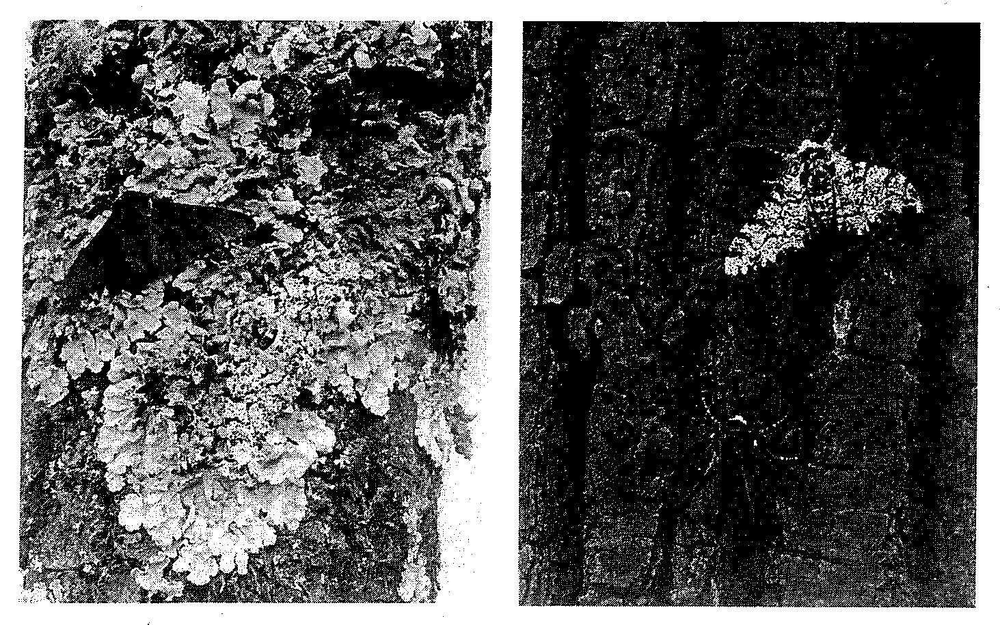
>
> FIGURE 2.4 Melanic and nonmelanic moths, showing camouflage of light moths on light background and dark moths on dark. (Photograph by H. B. D. Kettlewell.)

PROBLEM 2.5 In most cases in which the genetic basis of industrial melanism has been analyzed, the melanic color pattern has been found to be due to a single dominant allele. In one study of a heavily polluted area near Birmingham, England, Kettlewell (1956) observed a frequency of 87% melanic Biston betularia. Estimate the frequency of the dominant allele leading to melanism in this population and the frequency of melanics that are heterozygous.

ANSWER The observed frequency of homozygous recessives is $R = 0.13$, and so the frequency of recessive allele is estimated as $\hat{q} = \sqrt{(0.13)} = 0.36$. Assuming random mating, the expected frequencies of dominant homozygotes, heterozygotes, and recessive homozygotes are 0.41, 0.46, and 0.13, respectively. The proportion of melanics that are heterozygous is 0.46/0.87 = 52.9%.

---

## PopGen_chapter2_010 · 2.3 TESTING FOR HARDY-WEINBERG EQUILIBRIUM / Frequency of Heterozygotes

The Hardy-Weinberg principle also has important implications for the frequency of heterozygotes carrying rare recessive alleles. The graphs in Figure 2.5 depict the frequencies of AA, Aa, and aa in a population in HWE. The heterozygotes are most frequent when the allele frequencies are 0.5. Suppose that the allele a is a recessive, and consider the curves as the allele frequency of a goes toward 0. As a becomes rare, the frequencies of recessive homozygotes and heterozygotes both decrease, but the frequency of the recessive homozygote is much lower. As the frequency of a goes to 0, the frequency of recessive homozygotes goes to 0 at a rate of $ q^{2} $, whereas the frequency of heterozygotes goes to 0 at a rate of 2pq. The result is that the ratio of heterozygotes to recessive homozygotes increases without limit as the recessive allele becomes rare.

> **Figure 2.5** · page 23 · source: `PopGen_chapter2`
>
> 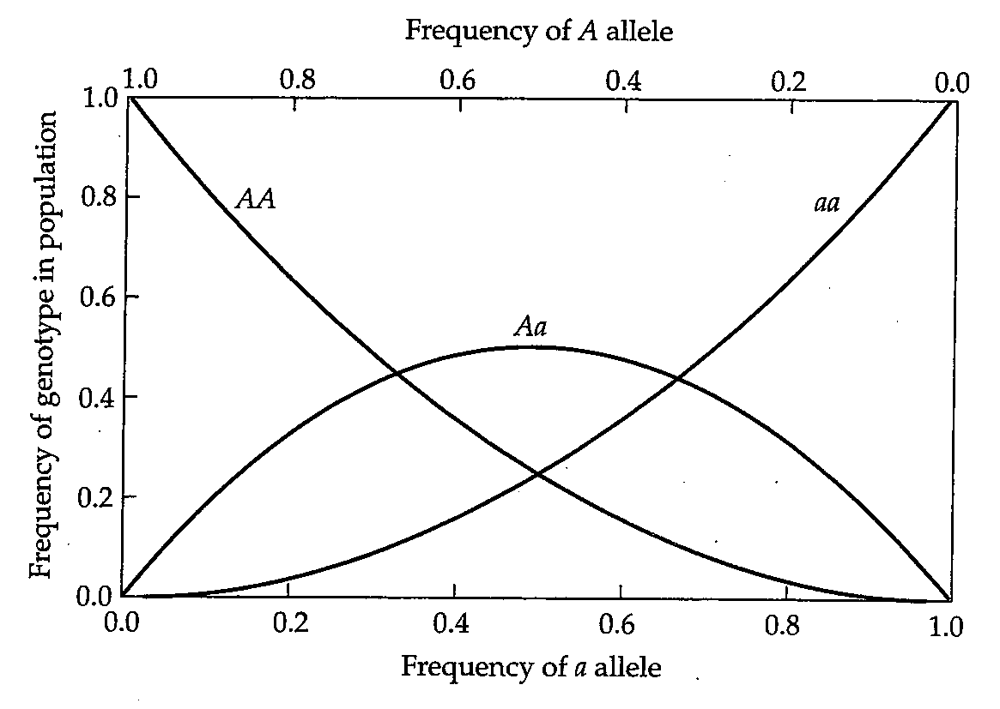
>
> FIGURE 2.5 Frequencies of AA, Aa, and aa genotypes with HWE. Note that, as either allele becomes more rare, the frequency of homozygous genotypes for that allele is much lower than the frequency of heterozygous genotypes.

To illustrate the principle, suppose $q = 0.10$; then $2pq/q^2 = 18$, meaning that there are 18 times as many heterozygotes as recessive homozygotes. For $q = 0.01$, to take a more extreme example, the ratio is 198; and for $q = 0.001$, the ratio is 1998. These examples demonstrate that when a recessive allele is rare, most genotypes containing the rare allele are heterozygous.

More generally, the ratio of heterozygous to homozygous genotypes equals $ 2pq/q^2 = 2/q - 2 $ which, for small $ q $, is very close to 2/q. Consequently, the excess of heterozygotes over homozygotes becomes progressively greater as the recessive allele becomes more rare. To take a real example, consider cystic fibrosis, an autosomal-recessive defect in chloride transport characterized by abnormal glandular secretions, impaired digestion, frequent respiratory infections, and other serious symptoms. The frequency of the homozygous recessive genotype in newborn Caucasians is approximately 1 in 1700. For this allele, $ \hat{q} = \sqrt{1/1700} = 0.024 $. Assuming random mating, the frequency of heterozygotes is estimated as $ 2(0.024)(1 - 0.024) = 0.047 $, or about 1 in 21. In other words, although only 1 person in 1700 is actually affected with cystic fibrosis, 1 person in 21 is a heterozygous carrier of the harmful allele.

**[命题 Proposition]**

PROBLEM 2.6 Phenylketonuria is a defect in phenylalanine metabolism caused by lack of a functional allele encoding the enzyme phenylalanine hydroxylase. Over 200 defective alleles have been identified, and most affected individuals are actually heterozygous for two different defective alleles. The condition affects about 1 in 10,000 newborn Caucasians. Estimate the frequency of heterozygotes for the normal and a defective allele under the assumption of random mating.

ANSWER $ \hat{q} = \sqrt{(1/10,000)} = 0.01 $, and therefore $ \hat{p} = 0.99 $. The frequency of heterozygous genotypes (carriers) is estimated as $ 2\hat{p}\hat{q} = 0.0198 \approx 2% $. Hence, about 1 person in 50 carries a defective allele.

---

## PopGen_chapter2_011 · ORGANIZATION OF GENETIC VARIATION: Introduction / 2.4 EXTENSIONS OF THE HARDY-WEINBERG PRINCIPLE

In this section we extend the Hardy-Weinberg principle to multiple alleles and to genes located on the X chromosome.

---

## PopGen_chapter2_012 · 2.4 EXTENSIONS OF THE HARDY-WEINBERG PRINCIPLE / Three or More Alleles

Genotype frequencies under random mating for genes with three alleles are shown in Figure 2.6. Here it is convenient to label the alleles as $ A_{1} $, $ A_{2} $, and $ A_{3} $ and the corresponding allele frequencies as $ p_{1} $, $ p_{2} $, and $ p_{3} $. Because there are only three alleles, $ p_{1} + p_{2} + p_{3} = 1 $. With three alleles there are six diploid genotypes, and under random mating their expected frequencies are as follows: These frequencies can be obtained by expanding $ (p_{1}A_{1}+p_{2}A_{2}+p_{3}A_{3})^{2} $, which the cross-multiplication square in Figure 2.6 does automatically.

> **Figure 2.6** · page 24 · source: `PopGen_chapter2`
>
> 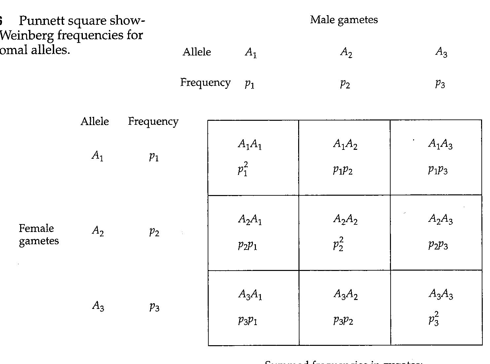
>
> FIGURE 2.6 Punnett square showing Hardy-Weinberg frequencies for three autosomal alleles.

Application of Figure 2.6 can be illustrated with the familiar ABO blood groups in humans. These red-cell antigens are by far the most important in blood transfusions, and they are controlled by the product of a single gene in chromosome 9. More than 70 molecularly distinct alleles are known, but most of them can be assigned to one of three broad classes known as I°, I^A, and I^B (Yip 2002). The I^A and I^B alleles encode transferase enzymes that attach

Summed frequencies in zygotes: $ A_{i}A_{i}:p_{i}^{2} $ $ A_{i}A_{j}:2p_{i}p_{j} $ different substrates to a complex carbohydrate, which is the basis of the antigenic difference between A red cells and B red cells. The diagnostic difference between the $ I^{A} $ and $ I^{B} $ classes of alleles consists of four amino acid replacements, and that distinguishing the $ I^{O} $ class is a single-nucleotide deletion in the initial part of the coding sequence, which shifts the translational reading frame and results in an inactive product.

Since blood type is determined by presence or absence of the A and B antigens, the genotypes $ I^{A}I^{A} $ and $ I^{A}I^{O} $ have blood type A, genotypes $ I^{B}I^{B} $ and $ I^{B}I^{O} $ have blood type B, genotype $ I^{O}I^{O} $ has blood type O, and genotype $ I^{A}I^{B} $ has blood type AB. The situation is essentially one of three alleles, complicated at the phenotypic level by the dominance of $ I^{A} $ and $ I^{B} $ over $ I^{O} $. In one test for presence of A and B red-cell antigens among 6313 Caucasians in Iowa City, the counts of blood types A, B, O, and AB were 2625, 570, 2892, and 226, respectively (Mourant et al. 1976). The best estimates of allele frequency in this case are $ \hat{p}_{1} = 0.2593 $ (for $ I^{A} $), $ \hat{p}_{2} = 0.0625 $ (for $ I^{B} $), and $ \hat{p}_{3} = 0.6755 $ (for $ I^{O} $). (Estimation of allele frequencies for the ABO blood groups is complicated because of dominance and makes use of a method known as the EM algorithm; see, for example, Cavalli-Sforza and Bodmer 1971 and Vogel and Motulsky 1986.)

The expected (and observed) numbers of the four blood-type phenotypes are therefore:

$$
\begin{aligned}A:&\quad[(0.2593)^{2}+2\times0.2593\times0.6755]\times6313=2636.0\quad(observed\ 2625)\end{aligned}
$$

$$
\begin{aligned}B:&\quad[(0.0652)^{2}+2\times0.0652\times0.6755]\times6313=582.9\end{aligned}
$$

$$
\mathrm{O}:\quad[(0.6755)^{2}\times6313]=2880.6
$$

(observed 2892)

$$
AB:\quad(2\times0.2593\times0.0652)\times6313=213.5
$$

(observed 226)

The $\chi^{2}$ for goodness of fit to Hardy-Weinberg proportions is 1.11. There is one degree of freedom for this test: 4 (to start with) - 1 (for fixing the total at 6313) - 1 (for estimating $\hat{p}_{1}$ from the data) - 1 (for estimating $\hat{p}_{2}$ from the data); note that a degree of freedom is not deducted for estimating $\hat{p}_{3}$ because $\hat{p}_{3} = 1 - \hat{p}_{1} - \hat{p}_{2}$. (More generally, when there are $n$ alleles and $m$ possible phenotypes ($m > n$), then the number of degrees of freedom in a chi-square test for HWE is $m - 1 - (n - 1) = m - n$.) For a $\chi^{2}$ of 1.11 with one degree of freedom, the associated probability from Figure 2.3 is about 0.29, and so the Iowa City population gives no evidence against Hardy-Weinberg proportions for this gene.

PROBLEM 2.7 In a sample of 1617 Spanish Basques, the numbers of A, B, O, and AB blood types observed were 724, 110, 763, and 20, respectively. The best estimates of allele frequency are $ \hat{p}_1 = 0.2661 $ (for $ I^A $), $ \hat{p}_2 = 0.0411 $ (for $ I^B $), and $ \hat{p}_3 = 0.6928 $ (for $ I^O $). Calculate the expected numbers of the four phenotypes and carry out a $ \chi^2 $ test for goodness of fit to the Hardy-Weinberg expectations.

ANSWER The expected numbers of A, B, O, and AB are 710.7, 94.8, 776.1, and 35.4, respectively. The $ \chi^{2} $ equals 9.61 with one degree of freedom, for which the corresponding probability is 0.002. Because a deviation as large or larger than that observed would be expected by chance in only 0.002 samples (that is, about 1 in 500), there is very good reason to reject the hypothesis that the genotypes are in Hardy-Weinberg proportions in this population. The reason for the discrepancy is not known. One likely possibility is migration into the population by people with allele frequencies that are significantly different from those among the Basques themselves.

More generally, in a population that is undergoing random mating for a gene with $n$ alleles $A_1, A_2, \ldots A_n$ having respective frequencies $p_1, p_2, \ldots p_n$ (with $p_1 + p_2 + \cdots + p_n = 1$), then the expected genotype frequencies with HWE are

$$
p_{i}^{2}\quad\mathrm{~\ \ \ \ }\quad\mathrm{f o r~}A_{i}A_{i}\mathrm{~h o m o z y g o t e s}
$$

$$
\begin{array}{r l r}{2p_{i}p_{j}}&{{}}&{\mathrm{f o r~}A_{i}A_{j}\mathrm{~h e t e r o z y g o t e s~}}\end{array}
\tag{2.7}
$$

The expressions in Equation 2.7 may be applied to data on allozyme polymorphisms in Drosophila persimilis in California. One sample of 108 adult flies from the Fish Creek population included four alleles of the gene Xdh, which codes for xanthine dehydrogenase. We may call the alleles Xdh-1, Xdh-2, Xdh-3, and Xdh-4; their respective frequencies were estimated as $ \hat{p}_1 = 0.08 $, $ \hat{p}_2 = 0.21 $, $ \hat{p}_3 = 0.62 $, and $ \hat{p}_4 = 0.09 $ (Prakash 1977). With four alleles, there are four possible homozygotes (for example, Xdh-1/Xdh-1) and six possible heterozygotes (for example, Xdh-1/Xdh-2). In a random-mating population, the frequency of any homozygous genotype is expected to be the square of the corresponding allele frequency, for example, $ p_1^2 $ for Xdh-1/Xdh-1; and the frequency of any heterozygous genotype is expected to be two times the product of the corresponding allele frequencies, for example, $ 2p_1p_2 $ for Xdh-1/Xdh-2. The Hardy-Weinberg frequencies for all 10 possible genotypes can be obtained by expanding the expression $ (0.08 \times dh - 1 + 0.21 \times dh - 2 + 0.62 \times dh - 3 + 0.09 \times dh - 4)^2 $. Note that this is an example in which the expected number of some of the genotypes is small (< 1 in many cases), so a test for HWE would have to be based on the exact probabilities or on random permutations.

PROBLEM 2.8 Four alleles of the gene Adh coding for alcohol dehydrogenase were found in a Texas population of Phlox cuspidata (Levin 1978). The alleles may be designated Adh-1, Adh-2, Adh-3, and Adh-4. Their frequencies were estimated as 0.11, 0.84, 0.01, and 0.04, respectively. What are the expected Hardy-Weinberg proportions of the 10 genotypes?

**[命题 Proposition]**

ANSWER Adh-1/Adh-1: 0.11² = 0.0121; Adh-1/Adh-2: 2(0.11)(0.84) = 0.1848; Adh-2/Adh-2 = 0.84² = 0.7056; Adh-1/Adh-3 = 2(0.11)(0.01) = 0.0022; Adh-2/Adh-3 = 2(0.84)(0.01) = 0.0168; Adh-3/Adh-3 = 0.01² = 0.0001; Adh-1/Adh-4 = 2(0.11)(0.04) = 0.0088; Adh-2/Adh-4 = 2(0.84)(0.04) = 0.0672; Adh-3/Adh-4 = 2(0.01)(0.04) = 0.0008; Adh-4/Adh-4 = 0.04² = 0.0016. It should be pointed out that the observed genotype frequencies were nowhere near the Hardy-Weinberg expectations because Phlox cuspidata undergoes a substantial frequency of self-fertilization (about 78%), which violates the assumption of random mating. The question of how to deal with such departures from random mating is discussed in Chapter 6.

---

## PopGen_chapter2_013 · 2.4 EXTENSIONS OF THE HARDY-WEINBERG PRINCIPLE / X-Linked Genes

An important exception to the rule that diploid organisms contain two alleles of every gene applies to genes on the X and Y chromosomes. In mammals and many insects, females have two copies of the X chromosome whereas males have one X chromosome and one Y chromosome. The X and Y chromosomes mosomes segregate, and so half the sperm from a male carry the X chromosome and half carry the Y chromosome. Although the Y chromosome carries very few genes other than those involved in the determination of sex and male fertility, the X chromosome carries as full a complement of genes as any other chromosome. Genes on the X chromosome are called X-linked genes, and the important consequence of X linkage is that a recessive allele on the X chromosome in a male is expressed phenotypically because the Y chromosome lacks any compensating allele. For X-linked genes with two alleles, therefore, there are three female genotypes (AA, Aa, and aa) but only two male genotypes (A and a).

The consequences of random mating with two X-linked alleles are shown in Figure 2.7, where the alleles are denoted $ X^{A} $ and $ X^{a} $. Note that in females, which have two X chromosomes, the genotype frequencies are as given by the Hardy-Weinberg principle in Equation 2.1; in males, which have only one X chromosome, the genotype frequencies are equal to the allele frequencies.

> **Figure 2.7** · page 27 · source: `PopGen_chapter2`
>
> 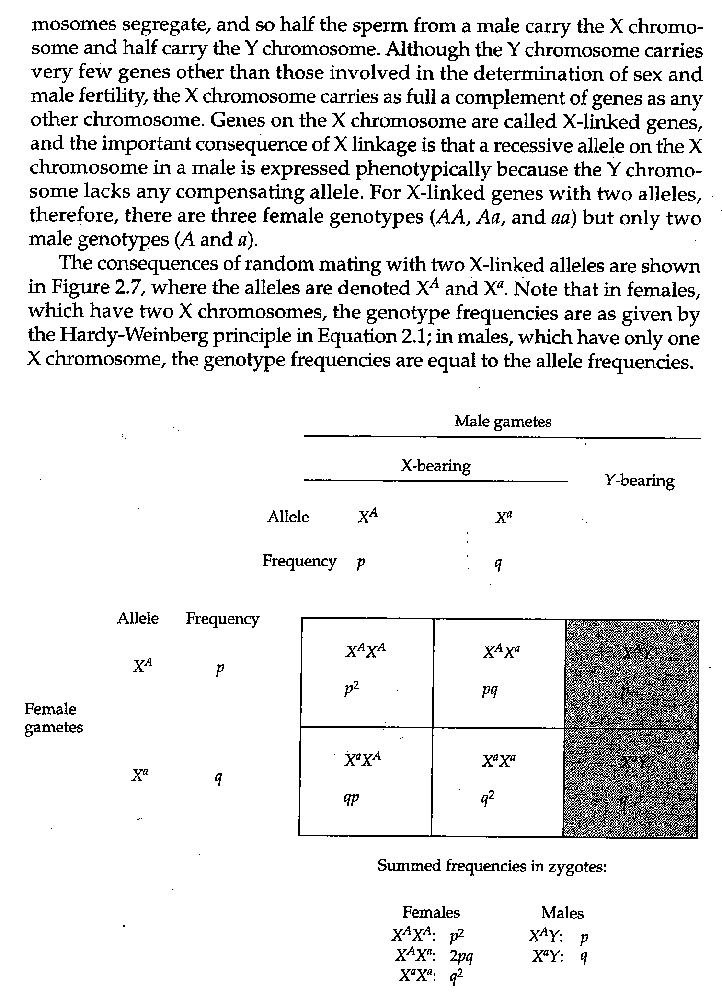
>
> FIGURE 2.7 Consequences of random mating with X-linked genes. Genotype frequencies in females equal the Hardy-Weinberg frequencies, and genotype frequencies in males equal the allele frequencies in gametes.

PROBLEM 2.9 Near the tip of the short arm of the X chromosome is a gene, PBDX (also called Xg), that encodes a blood cell glycoprotein that can be identified using an appropriate antibody (Ellis et al. 1994). One allele (call it A) produces sufficient gene product to be detected, whereas the other allele (call it a) produces too little product to be detected. Hence blood cells from females of genotype AA or Aa and from males of genotype A have the antigen detected by the antibody and are said to be Xg-positive, whereas blood cells from females of genotype aa and from males of genotype a are Xg-negative. In one sample of 2082 British people, 967 Xg-positive females and 667 Xg-positive males were identified, along with 102 Xg-negative females and 346 Xg-negative males (Race and Sanger 1975). The best estimates of allele frequency are $ \hat{p} = 0.675 $ (for A) and $ \hat{q} = 0.325 $ (a). Calculate the expected numbers in the four phenotypic classes, assuming random-mating proportions, and carry out a $ \chi^{2} $ test for goodness of fit. (The number of degrees of freedom in this case is 1; there are four degrees of freedom to start with; one must be deducted for using the observed number of males in calculating the expectations for males; one must be deducted for using the observed number of females in calculating their expectations; and one more must be deducted for estimating p from the data.)

ANSWER The expected numbers of Xg-positive and Xg-negative males are $ 0.675 \times 10^{13} = 683.8 $ and $ 0.325 \times 10^{13} = 329.2 $, respectively. The expected numbers of Xg-positive and Xg-negative females are $ [0.675^{2} + 2(0.675)(0.325)] \times 1069 = 956.1 $ and $ 0.325^{2} \times 1069 = 112.9 $, respectively. The $ \chi^{2} $ equals 2.45, which, as noted above, has one degree of freedom. The associated probability is about 0.12 (see Figure 2.3), and so there is no reason to reject the hypothesis of random-mating proportions.

One of the important features of random mating for X-linked genes is that phenotypes resulting from a recessive allele will be more common in males than in females. In Problem 2.9, for example, the proportion of Xg-negative males is 346/1013 = 34%, whereas the proportion of Xg-negative females is only 102/1069 = 10%. There is always an excess of affected males because q (which equals the proportion of males with the recessive phenotype) will always be greater than $ q^{2} $ (which is the proportion of females with the recessive phenotype). Indeed, the discrepancy grows larger as the recessive allele becomes more rare (Figure 2.8). For example, with the X-linked “green” type of color blindness, q = 0.05 in Western Europeans, and so the ratio of affected males to affected females is $ q/q^{2} = 1/q = 1/0.05 = 20 $. In contrast, for the X-linked “red” type of color blindness, q = 0.01, and so in this case the ratio of affected males to affected females is 1/0.01 = 100.

> **Figure 2.8** · page 29 · source: `PopGen_chapter2`
>
> 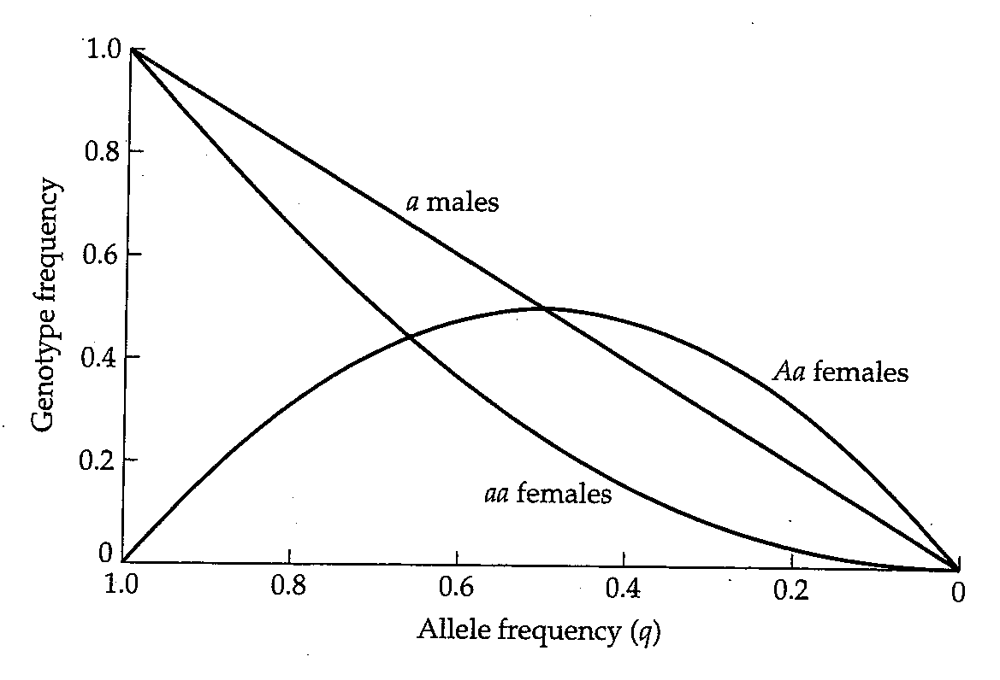
>
> FIGURE 2.8 Random-mating frequencies for an X-linked recessive allele $a$, for males, homozygous females, and heterozygous females. When the $a$ allele has a frequency of about $q = 0.1$ or smaller, the ratio of heterozygous to homozygous females is approximately 2/q, and that of $a$ males to $aa$ females is approximately 1/q.

The calculations in Figure 2.7 are valid only if the allele frequencies are identical in eggs and sperm. When they differ, approximate equality of allele frequencies in the sexes is attained gradually, not in two generations as for an autosomal gene (see the earlier Problem 2.1). The reason is that males receive their X chromosome only from their mothers, and so the allele frequency in males in any generation is equal to that in females of the previous generation. Because female progeny receive an X chromosome from each parent, however, the allele frequency in females is equal to the average of the sexes in the previous generation. Together, these considerations imply that the absolute value of the difference in allele frequency between the sexes decreases by 50% in each successive generation. It is necessary to specify the absolute value because the difference in allele frequency alternates in sign owing to the one-generation lag between female allele frequencies and male allele frequencies. If in any generation the allele frequency in females is larger than that in males, then in the next generation the allele frequency in females is smaller than that in males.

Before leaving the subject of X-linkage, it is necessary to point out that certain species—among them, birds, moths, and butterflies—have the sex-chromosome situation reversed. In these species, females are XY and males XX. The consequences of random mating are the same as otherwise, except that the sexes are reversed.

---

## PopGen_chapter2_014 · ORGANIZATION OF GENETIC VARIATION: Introduction / 2.5 LINKAGE AND LINKAGE DISEQUILIBRIUM

With random mating, the alleles of any gene are combined at random into genotypes according to frequencies given by the Hardy-Weinberg proportions. To be specific, imagine a gene with two alleles, call them A and a, at frequencies $ p_A $ and $ q_a $, respectively, where $ p_A + q_a = 1 $. Then the Hardy-Weinberg principle tells us that genotypes AA, Aa, and aa are expected in the proportions $ p_A^2 $, $ 2p_A q_a $, and $ q_a^2 $, respectively, provided that mating is random.

Similarly, we may consider a different gene with alleles B and b at frequencies $ p_{B} $ and $ q_{b} $, respectively, where $ p_{B} + q_{b} = 1 $. Then the Hardy-Weinberg principle tells us again that the genotype frequencies of BB, Bb, and bb are expected in the proportions $ p_{B}^{2} $, $ 2p_{B}q_{b}^{2} $, and $ q_{b}^{2} $, respectively, provided that mating is random. Thus, the A allele is in random association with the a allele, and the B allele is in random association with the b allele. Strange as it may seem, the alleles of the A gene may nevertheless fail to be in random association with the alleles of the B gene. The precise meaning of “random association” is illustrated in Figure 2.9. In this figure the squares refer to the alleles present in gametes, not to genotypes as in earlier diagrams. When the alleles of the genes are in random association, the frequency of a gamete carrying any particular combination of alleles equals the product of the frequencies of those alleles. Genes that are in random association are said to be in a state of linkage equilibrium, and genes not in random association are said to be in linkage disequilibrium. With linkage equilibrium, therefore, the gametic frequencies are:

$$
\begin{array}{ll} AB: & p_{A}\times p_{B}\\Ab: & p_{A}\times q_{b}\\aB: & q_{a}\times p_{B}\\ab: & q_{a}\times q_{b}\end{array}
\tag{2.8}
$$

With random mating and the other simplifying assumptions listed earlier (including a large population with no mutation, migration, or selection), linkage equilibrium between genes is eventually attained. However, linkage equilibrium is attained gradually, and the rate of approach can be very slow. The slow approach to linkage equilibrium stands in contrast to the attainment of HWE with alleles of a single gene, which typically requires just one generation (when generations are nonoverlapping) or a relatively small number of generations (when generations are overlapping).

> **Figure 2.9** · page 30 · source: `PopGen_chapter2`
>
> 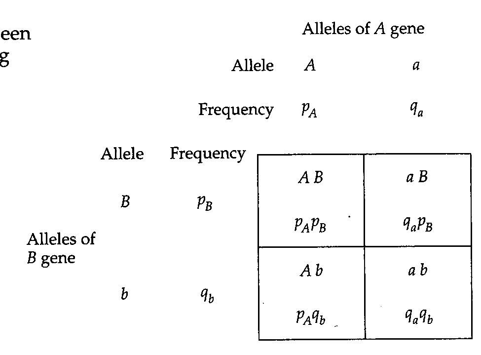
>
> FIGURE 2.9 Random association between two alleles of each of two genes, showing expected gametic frequencies when the alleles are in linkage equilibrium.

The rate of approach to linkage equilibrium depends on the rate of recombination in genotypes heterozygous for both genes. There are two types of double heterozygotes:

---

## PopGen_chapter2_015 · 2.5 LINKAGE AND LINKAGE DISEQUILIBRIUM / AB/ab and Ab/aB

In the first case, the genotype was formed by the union of an AB gamete with an ab gamete. In the second case, the genotype was formed by the union of an Ab gamete with an aB gamete. As we shall soon see, the frequencies of these two types of doubly heterozygous genotypes are not always equal.

Consider the genotype AB/ab. The gametes produced by this genotype are of four types: (1) AB, (2) Ab, (3) aB, and (4) ab. Gametic types 1 and 2 are known as nonrecombinant gametes because the alleles are associated in the same manner as in the previous generation (specifically, A with B and a with b). Gametic types 3 and 4 are known as recombinant gametes because the alleles are associated differently than in the previous generation (specifically, A with b and a with B). Because of Mendelian segregation, the frequency of gametic type 1 equals that of type 2, and the frequency of gametic type 3 equals that of type 4. That is, the two nonrecombinant gametes are formed in equal frequencies, and the two recombinant gametes are formed in equal frequencies. However, the overall frequency of recombinant gametes (type 3 + type 4) does not necessarily equal the overall frequency of nonrecombinant gametes (type 1 + type 2) except in special cases. The term frequency of recombination, usually symbolized r, refers to the proportion of recombinant gametes produced by a double heterozygote. Suppose, for example, that the genotype AB/ab produces gametes AB, ab, Ab, and aB in the proportions 0.38, 0.38, 0.12, and 0.12, respectively. Then the frequency of recombination between the genes is $ r = 0.12 + 0.12 = 0.24 $.

The frequency of recombination between genes depends on whether they are present in the same chromosome and, if so, on the physical distance between them. For genes in different chromosomes, the frequency of recombination is r = 0.5 because the four possible gametic types are produced in equal frequency. For genes in the same chromosome, the frequency of recombination depends on their distance apart, because each chromosome aligns side-by-side with its partner chromosome in meiosis and can undergo a sort of breakage and reunion resulting in an exchange of parts between the part ncr chromosomes. The closer two genes are, the less likely that a breakage and reunion takes place in the region between the genes; the farther apart two genes are, the more likely such an event becomes. The smallest possible frequency of recombination is r = 0, which would imply that the two genes are so close together that a break never takes place between them. The largest possible frequency of recombination is r = 0.5, which is found when genes are very far apart in the same chromosome or, as noted above, when they are in different chromosomes. Genes for which the frequency of recombination is less than 0.5 must necessarily be on the same chromosome, and such genes are said to be linked.

To sum up, if the frequency of recombination between the A and B genes is denoted r, then the genotype AB/ab produces the following types of gametes: AB with frequency $ (1-r)/2 $ ab with frequency $ (1-r)/2 $

Ab with frequency r/2 aB with frequency r/2

The situation in the Ab/aB genotype is much the same, but there is one important difference. In this case, the AB and ab gametes are the recombinant types, and the Ab and aB gametes are the nonrecombinant types. Thus, the genotype Ab/aB produces the following types of gametes: AB with frequency r/2 ab with frequency r/2

Ab with frequency $ (1-r)/2 $ aB with frequency $ (1-r)/2 $

PROBLEM 2.10 Consider two linked genes that have a frequency of recombination of $ r = 0.005 $. (In the human genome, this represents a physical distance of about 5 kb.) What types and frequencies of gametes would be produced by an individual of genotype AB/ab? By an individual of genotype Ab/aB?

ANSWER The AB/ab genotype produces gametic types AB, ab, Ab, and a B in proportions (1 - 0.005)/2 = 0.4975, (1 - 0.005)/2 = 0.4975, 0.005/2 = 0.0025, and 0.005/2 = 0.0025, respectively. The Ab/aB genotype produces exactly the same gametic types, but their frequencies are 0.0025, 0.0025, 0.4975, and 0.4975, respectively. (Actually, the frequency of recombination in human females is, on the average, about 1.6 times greater than that in males.)

The frequency of recombination between genes is important in population genetics because it governs the rate of approach to linkage equilibrium. To be precise, consider a population in which the actual frequencies of the chromosome types among gametes are as follows:

$$
\begin{aligned}&AB:\quad&P_{AB}\\&Ab:\quad&P_{Ab}\\&aB:\quad&P_{aB}\\&ab:\quad&P_{ab}\end{aligned}
$$

where $ P_{AB} + P_{Ab} + P_{aB} + P_{ab} = 1 $. In terms of the gametic frequencies, linkage equilibrium is defined as the state in which $ P_{AB} = p_{A}p_{B}, P_{Ab} = p_{A}q_{b}, P_{aB} = q_{a}p_{B} $ and $ P_{ab} = q_{a}q_{b} $ (see Figure 2.9).

Suppose that the genes are not in linkage equilibrium. To determine how rapidly linkage equilibrium is approached, we need to deduce the gametic frequencies in the next generation. Consider first the AB gamete. In any one generation, a chromosome carrying AB either could have undergone recombination between the genes (an event with probability r, where r is the frequency of recombination), or could have escaped recombination between the genes (an event with probability 1 - r). Among the AB chromosomes that did not undergo recombination, the frequency of AB is the same as it was in the previous generation ($ P_{AB} $); and among the chromosomes that did undergo recombination, the frequency of AB chromosomes is simply the product of the frequencies of the A and B alleles in the previous generation ($ p_{A}p_{B} $), because the recombination joins alleles from two independent chromosomes. Therefore, the frequency of AB in any generation, call it $ p_{AB}' $, is related to the frequency $ P_{AB} $ in the previous generation by the equation

$$
\begin{aligned}P_{AB}^{^{\prime}}&=(1-r)\times P_{AB}\quad&[for the nonrecombinants]\\ &+r\times p_{A}p_{B}\quad&[for the recombinants]\\ \end{aligned}
$$

Subtraction of $ p_{A}p_{B} $ from both sides leads to

$$
P_{AB}^{^{\prime}}-p_{A}p_{B}=(1-r)(P_{AB}-p_{A}p_{B})
\tag{2.9}
$$

Equation 2.9 becomes simplified somewhat by defining $D$ as the difference $P_{AB}-p_{A}p_{B}$. Then $D_{n}$ is the value of $D$ in the $n$th generation, and Equation 2.9 implies that $D_{n}=(1-r)D_{n-1}$. The solution of this equation is found by successive substitution as

$$
\dot{D}_{n}=(1-r)D_{n-1}=(1-r)^{2}D_{n-2}=\cdots=(1-r)^{n}D_{0}
\tag{2.10}
$$

where $D_{0}$ is the value of $D$ in the founding population. Because $1-r<1$, $(1-r)^{n}$ goes to zero as $n$ becomes large, but how rapidly $(1-r)^{n}$ goes to zero depends on $r$; the closer $r$ is to zero, the slower the rate.

This pattern of decrease is known as geometric, and it is closely approximated by exponential decay because $ (1 - r)^n \approx e^{-r n} $, for small r. The geometric decay in linkage disequilibrium is illustrated in Figure 2.10. Recall here that $ r = 0.5 $ corresponds either to genes far apart in the same chromosome or to genes in different chromosomes. The key point is that linkage disequilibrium does not require genes to be physically linked. Linkage disequilibrium can occur even for genes in different chromosomes. For example, if one population is fixed for the alleles A and B of genes in different chromosomes, and another population is fixed for the alternative alleles a and b, then were the populations to fuse, the gametes would initially consist exclusively of AB and ab. This is an extreme form of linkage disequilibrium, and it would dissipate according to Equation 2.10 with r = 0.50. Because linkage disequilibrium does not require physical linkage, some authors choose to call linkage disequilibrium by the term gametic phase disequilibrium. Because $ (1-r)^n $ goes to zero, $ D $ goes to zero, and therefore $ P_{AB} $ goes to $ p_{A}p_{B} $ unless there are other offsetting processes. Analogous arguments hold for gametes containing $ Ab $, $ aB $, or $ ab $, and so $ P_{Ab} $, $ P_{aB'} $ and $ P_{ab} $ go to $ p_{A}q_{b} $, $ q_{a}p_{B} $, and $ q_{a}q_{b} $, respectively. Thus, linkage equilibrium is attained at a rate determined by the value of $ r $.

> **Figure 2.10** · page 35 · source: `PopGen_chapter2`
>
> 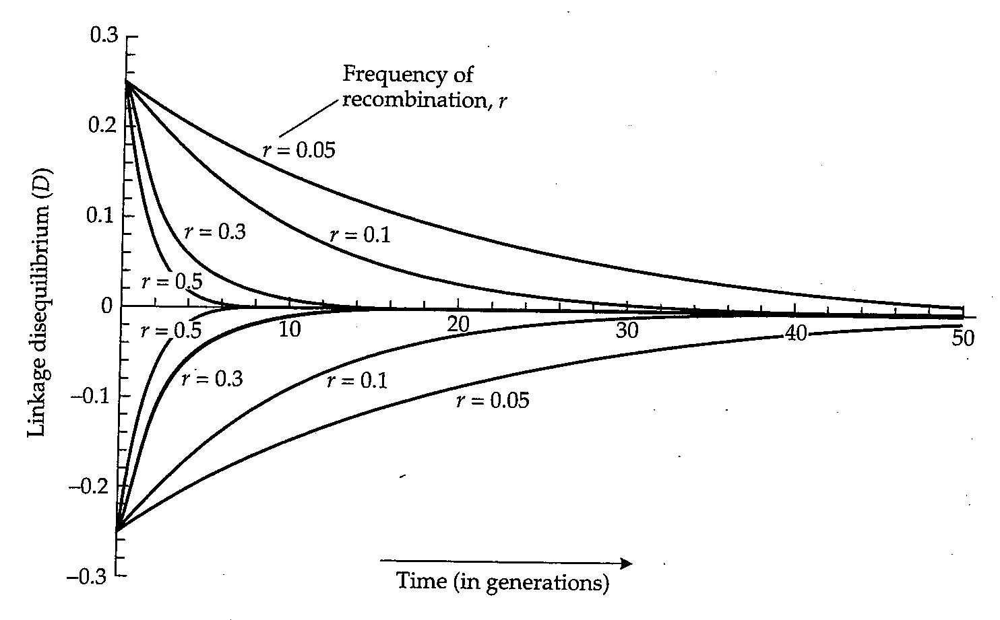
>
> FIGURE 2.10 Linkage disequilibrium between genes gradually disappears when mating is random, provided there is no countervailing force building it up. The rate of approach to linkage equilibrium depends on the recombination frequency between the genes. The disappearance of linkage disequilibrium is gradual even with free recombination ( $ r = \frac{1}{2} $). In these examples, the frequencies of both alleles at both loci equal  $ \frac{1}{2} $, and the initial linkage disequilibrium is either at its maximum ( $ D = 0.25 $) or minimum ( $ D = -0.25 $) value, given these allele frequencies.

The value of $D$ that holds for $P_{11}-p_{1}q_{1}$ also holds for the other possible gametes, as follows:

$$
P_{A B}=p_{A}p_{B}+D\mathrm{(w h i c h~i m p l i e s~t h a t~}D\geq-p_{A}p_{B})
$$

$$
P_{A b}=p_{A}q_{b}-D\mathrm{(w h i c h~i m p l i e s~t h a t~}D\leq p_{A}q_{b})
\tag{2.11}
$$

$$
P_{a B}=q_{a}p_{B}-D\mathrm{(w h i c h~i m p l i e s~t h a t~}D\leq q_{a}p_{B})
$$

$$
P_{a\; b}=q_{a}q_{b}+D\;(which\; implies\; that\; D\geq-q_{a}q_{b})
$$

The quantity $D$ is often called the linkage disequilibrium parameter. The implications about the magnitude of $D$ in parentheses in the equations above follow from the fact that each of the gametic frequencies $P_{AB'}, P_{Ab'}, P_{aB'}$ and $P_{aB}$ must be greater than or equal to 0. Because of these implications, the minimum and maximum values of $D$ must satisfy

$$
D_{m i n}=\mathrm{t h e~l a r g e r~o f}-p_{A}p_{B}\mathrm{a n d}-q_{a}q_{b}
\tag{2.12}
$$

$$
D_{m a x}=\mathrm{t h e~s m a l l e r~o f~}p_{A}q_{b}\mathrm{~a n d~}q_{a}p_{B}
$$

Furthermore, it follows from the Equations 2.11 that D can also be written as

$$
D=P_{A B}P_{a b}-P_{A b}P_{a B}
\tag{2.13}
$$

With random mating and no countervailing forces, the value of D changes according to Equation 2.10, and D = 0 corresponds to linkage equilibrium.

Linkage disequilibrium is often observed between closely linked single nucleotide polymorphisms or SNPs (The International HapMap Consortium 2005). As an example, consider SNPs in the coding sequence of each of two closely linked genes in human chromosome 4 that encode the proteins for glycophorin A and glycophorin B found on the surface of red blood cells. One SNP is an A to G substitution, which results in an amino acid replacement of serine to leucine (one of two amino acid replacements that distinguish the M and N forms of glycophorin A); the other SNP is a T to C substitution, which results in the amino acid replacement methionine to threonine that distinguishes the S and s forms of glycophorin B. For each SNP considered individually, the genotypes are in HWE. In particular, a sample of 1000 British people yielded genotype counts of 298 AA, 489 AG, and 213 GG for the SNP in glycophorin A, and 99 TT, 418 TC, and 483 CC for the SNP in glycophorin B. The chi-square values for goodness of fit to HWE are 0.22 and 0.38, respectively. From these SNP data, the allele frequencies can be estimated as $ \hat{p}_{A} = 0.5425 $ and $ \hat{q}_{a} = 0.4575 $ for the A and G alleles of the SNP for glycophorin A, and $ \hat{p}_{B} = 0.3080 $ and $ \hat{q}_{b} = 0.6920 $ for the T and C alleles of the SNP for glycophorin B. There are four possible haplotypes (a haplotype is the combination of alleles present in a chromosome), namely A T, A C, G T, and G C, and were the SNPs in linkage equilibrium, the haplotype frequencies would be $ p_{A}p_{B}, p_{A}q_{b}, q_{a}p_{B} $, and $ q_{a}q_{b} $, respectively. Therefore, among the 1000 haplotypes (a total of 2000 chromosomes), the observed (obs) and expected (exp) numbers are as shown in the third column below (the second column gives the observed numbers):

$$
\begin{array}{r l r l r l}{{A T}}&{}&{{o b s:474}}&{}&{{e x p:0.5425\times0.3080\times2000=334.2}}\end{array}
$$

$$
AC\qquad obs:611\qquad\qquad exp:0.5425\times0.6920\times2000=750.8
$$

$$
\begin{array}{r l r}{G T}&{{}}&{o b s:142}\\ \end{array}\qquad\mathrm{e x p:}0.4575\times0.3080\times2000=281.8
$$

$$
\begin{array}{r l r}{G C}&{{}}&{o b s:773}\\ \end{array}\qquad e x p:0.4575\times0.6920\times2000=633.2
$$

The $ \chi^{2} $ for goodness of fit is 184.7 with one degree of freedom: 4 (to start with) - 1 - 1 (for estimating $ p_{1} $ from the data) - 1 (for estimating $ q_{1} $ from the data) = 1. The associated probability is very much less than 0.0001. This result means that chance alone would produce a fit as poor or poorer in substantially less than one time in ten thousand, and so the hypothesis that the loci are in linkage equilibrium can confidently be rejected.

To quantify the amount of linkage disequilibrium, we must estimate the haplotype frequencies corresponding to $ P_{AB'} $, $ P_{Ab'} $, $ P_{aB'} $, and $ P_{ab'} $:

$$
\begin{array}{r l}{A T:}&{{}\quad\hat{P}_{A B}=474/2000=0.2370}\end{array}
$$

$$
A C:\quad\hat{P}_{A b}=611/2000=0.3055
$$

$$
GT:\qquad\hat{P}_{aB}=142/2000=0.0710
$$

$$
G C:\qquad\hat{P}_{a b}=773/2000=0.3865
$$

Thus, $D$ can be estimated from Equation 2.13 as $\hat{D} = \hat{P}_{A B} \hat{P}_{a b} - \hat{P}_{A b} \hat{P}_{a B} = 0.07$. From Equation 2.12, $D_{max}$ is given by $p_{A} q_{b}$ or $q_{a} p_{B}$, whichever is smaller; in this case, $p_{A} q_{b} = 0.38$ and $q_{a} p_{B} = 0.14$, hence $D_{max} = 0.14$. Therefore, $\hat{D} / D_{max} = 0.07 / 0.14 = 50%$, and so we conclude that the amount of disequilibrium between the SNPs in the genes for glycophorin A and glycophorin B is about 50% of its theoretical maximum. In most local populations of sexual organisms that regularly avoid extreme inbreeding (mating between relatives) values of $D$ are typically zero or close to zero (indicating linkage equilibrium) unless the genes are very closely linked.

Another widely used measure of linkage disequilibrium is related to but distinct from D. This measure is usually symbolized as $ r^{2} $, which can potentially cause confusion because the symbol r is also widely used for the frequency of recombination between genes. In the context of linkage disequilibrium, the square symbol in $ r^{2} $ is extremely important, because it signals a measure of linkage disequilibrium rather than a measure of recombination. The value of $ r^{2} $ is defined as

$$
r^{2}=D^{2}/(p_{A}q_{a}p_{B}q_{b})
\tag{2.14}
$$

There is a nice intuitive biological interpretation of $ r^2 $ in that its square root (that is, $ \sqrt{r^2} $) is the correlation coefficient in allelic state between alleles in the same gamete. The value of $ r^2 $ is also useful for calculating the $ \chi^2 $ value from the counts of haplotypes, because the value of $ \chi^2 $ is numerically equal to $ r^2N $, where N is the total number of chromosomes examined. This application of $ r^2 $ is illustrated in the problems below.

PROBLEM 2.11 Natural populations of Drosophila melanogaster are polymorphic for coding SNPs that result in amino acid replacements in the enzymes esterase 6, esterase C, and octanol dehydrogenase. An order to avoid ambiguity, we will use the symbols A, B, and C to denote the majority (most frequent) nucleotide of each SNP, and the symbols a, b, and c to denote the minority (least frequent) nucleotide of each SNP. The A, a and B, b SNPs are rather loosely linked (r = 0.122), whereas the B, b and C, c SNPs are tightly linked (r = 0.002). The recombination fractions are those in females, as recombination does not take place in males of this species. For 489 chromosomes examined from a population in North Carolina, Mukai et al. (1974) used protein electrophoresis to identify the SNPs and found the following haplotypes:

$$
\begin{array}{lllll} A B C&264&a B C&152\\ A B c&13&a B c&7\\ A b C&29&a b C&15\\ A b c&8&a b c&1 \end{array}
$$

Carry out a chi-square test to determine whether there is significant linkage disequilibrium between the A, a SNP and the B, b SNP.

ANSWER The observed numbers of the four haplotypes AB, Ab, aB, and ab are 277, 37, 159, and 16, respectively, and so their frequencies are $ P_{AB} = 0.5665 $, $ P_{Ab} = 0.0757 $, $ P_{ab} = 0.3251 $, and $ P_{ab} = 0.0327 $. The allele frequencies in the sample are $ p_{A} = 0.6421 $, $ q_{A} = 0.3579 $, $ p_{B} = 0.8916 $, and $ q_{B} = 0.1084 $, and the estimated value of $ D = P_{AB}P_{ab} - P_{Ab}P_{ab} = -0.0061 $. The $ r^{2} $ from Equation 2.14 equals 0.001659, and therefore the $ \chi^{2} = 0.001659 \times 489 = 0.81 $. This $ \chi^{2} $ has one degree of freedom, and the associated probability is about 0.37. Thus, there is no reason to reject the hypothesis that the A, a and B, b SNPs are in linkage equilibrium in this population.

PROBLEM 2.12 Determine whether there is significant linkage disequilibrium for the B, b and C, c SNPs using Equation 2.14 and the data in Problem 2.11.

ANSWER For the data given in Problem 2.11, the observed numbers of the haplotypes B C, B c, b C, and b c are 416, 20, 44, and 9, respectively. The estimated allele frequencies of B, b, C, and c are $ p_B = 0.8916 $, $ q_b = 0.1084 $, $ p_C = 0.9407 $, and $ q_c = 0.0593 $, respectively, and the estimated $ D = 0.0120 $. Thus, $ r^2 = (0.0120)^2/(0.8916 \times 0.1084 \times 0.9407 \times 0.0593) = 0.026609 $. Consequently, $ \chi^2 = 0.026609 \times 489 = 13.0 $ with one degree of freedom, for which the associated probability is 0.0003. Thus, there is significant linkage disequilibrium between these SNPs. The value of $ D_{max} $ is the smaller of 0.053 and 0.102, and so $ D_{max} = 0.053 $. The magnitude of the linkage disequilibrium, relative to its theoretical maximum, is 0.012/0.053 = 22.6%

PROBLEM 2.13 Use Equation 2.14 to evaluate the statistical significance of the linkage disequilibrium between an A versus C single nucleotide polymorphism in the gene for alcohol dehydrogenase in Drosophila melanogaster and the presence or absence (+ or −) of an EcoRI restriction site located 3500 nucleotides downstream. The data are from a population descended from animals trapped at a Dutch fruit market in Groningen (Cross and Birley 1986).

SNP A, EcoRI +: 22 SNP A, EcoRI -: 3 SNP C, EcoRI +: 4 SNP C, EcoRI -: 5

ANSWER $ \hat{D}=0.085 $ and $ \chi^{2}=r^{2}N=(0.453)^{2}\times34=7.0 $ with one degree of freedom; the associated probability value is approximately 0.008. The linkage disequilibrium is statistically significant and has a value of 49% of its maximum possible value.

---

## PopGen_chapter2_016 · 2.5 LINKAGE AND LINKAGE DISEQUILIBRIUM / Difficulties in Testing for Linkage Equilibrium

All of the difficulties in testing for Hardy-Weinberg equilibrium that were discussed earlier in this chapter are multiplied when it comes to testing for linkage equilibrium. The term "multiplied" can be taken literally. The problem of too small expected numbers is multiplied because the expected frequencies of the gametes are products of the corresponding allele frequencies. This means that the large-sample chi-square test for linkage equilibrium will often be inappropriate, and an exact test (Weir 1996), analogous to the exact test for HWE in Equation 2.5, will be necessary, or else a permutation test analogous to those discussed earlier in the context of HWE.

Difficulties associated with multiple tests are also multiplied when it comes to linkage equilibrium, because for n SNPs there are $ n(n-1)/2 $ possiable pairwise associations, and $ n(n-1)(n-2)/6 $ possible three-way associations. In other words, the number of pairwise tests grows as $ n^2 $ and the number of three-ways tests as $ n^3 $. This emphasizes the importance of striking a proper balance between the false positive rate and the false discovery rate, so as not to miss too many true associations, but at the same time to minimize the number of false associations. As with HWE, multiple replications in large samples is probably stronger evidence of a robust association than simple statistical significance in a single sample.

All of the previous examples of estimating linkage disequilibrium are based on actual counts of the four gamete types. Often we know only the counts of genotypes. For two loci, each with two alleles, there are typically nine distinguishable genotypes: AA BB, AA Bb, AA bb, Aa Bb, Aa Bb, aa BB, aa Bb, and aa bb. However, the Aa Bb double heterozygous genotype is ambiguous in regard to gametic phase because some individuals will be A B/a b and others A b/a B; these two classes will have equal frequency only if D = 0. To estimate the frequencies of the four gametic types in this situation, one needs to use the information from the eight unambiguous genotypes as well as the double heterozygotes to obtain estimates of the gametic frequencies that best fit the overall data. If we are willing to assume that the population is in Hardy-Weinberg equilibrium, then there is a maximum likelihood estimator for the gamete frequencies (Hill 1974). If we are not willing to assume Hardy-Weinberg equilibrium, then an estimation method is needed that takes departure from Hardy-Weinberg frequencies and linkage disequilibrium into account simultaneously (Weir 1996; Schaid 2004). Software for making these estimates can be found on the web under such names as LDhat, Haploview, and SAS/Genetics.

---

## PopGen_chapter2_017 · 2.5 LINKAGE AND LINKAGE DISEQUILIBRIUM / Relative Measures of Linkage Disequilibrium: D' and r²

The value of D as a measure of linkage disequilibrium has the limitation that it depends on the allele frequencies, and its minimum and maximum values are defined in Equation 2.12. For this reason, the magnitude of linkage disequilibrium is often described by a quantity usually called $ D' $, which is defined as

$$
\begin{aligned}&D^{\prime}=D/D_{max}\text{if}D\text{is positive}\\&D^{\prime}=D/D_{min}\text{if}D\text{is negative}\\ \end{aligned}
\tag{2.15}
$$

The use of $D'$ as a measure of linkage disequilibrium allows comparison of relative values across genomic regions or even among organisms. Another often-used measure of linkage disequilibrium makes use of the quantity $r^2 = D^2 / (p_A q_a p_B q_b)$ defined in Equation 2.14. Recall that the square root of $r^2$ ($\sqrt{r^2}$) is equal to the correlation coefficient in the allelic state between alleles in the same gamete.

Both $ D' $ and $ r^{2} $ are used to describe the amount of linkage disequilibrium because they capture somewhat different aspects of the gametic associations.

This is apparent in Figure 2.11, which shows a plot of $ D' $ against $ r^2 $ for 10,000 random, uniformly distributed values of $ P_{AB'} $, $ P_{Ab'} $, $ P_{ab'} $, and $ P_{ab'} $. It is clear that, when $ D' $ is close to 0, $ r^2 $ is also close to 0. However, as $ D' $ increases, $ r^2 $ can take on any value between 0 and $ (D')^2 $. The greater range of $ r^2 $ results from the fact that $ r^2 $ depends not only on D but also on the allele frequencies. The biological reason why $ D' $ and $ r^2 $ differ will become clear in the next section.

> **Figure 2.11** · page 40 · source: `PopGen_chapter2`
>
> 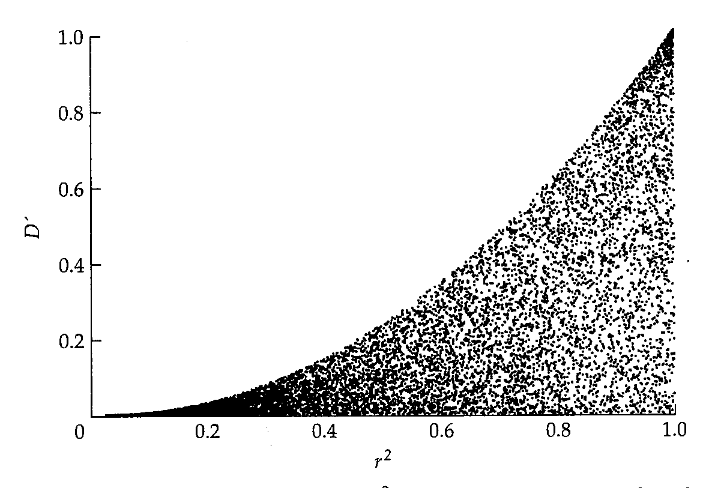
>
> 2.11 Relationship between  $ D' $ and  $ r^{2} $ for 10,000 random, uniformly distributed values of the gametic frequencies.

---

## PopGen_chapter2_018 · ORGANIZATION OF GENETIC VARIATION: Introduction / 2.6 CAUSES OF LINKAGE DISQUILBRIUM

Linkage equilibrium is a result of history. It reflects the shared ancestry of haplotypes present in any contemporary population. To understand its causes, it is convenient to consider first a region of chromosome with no recombination. Suppose that the region is initially monomorphic for nucleotides at two different sites; we will designate the nucleotides at these sites as A and B. At some time the A nucleotide may mutate to a, and either because of chance or selection, the a nucleotide increase in frequency. The haplotypes in the population will then be AB and aB. Now suppose that a mutation of B to b takes place in a chromosome carrying aB. Then the resulting population will contain three haplotypes: AB, aB, and ab. Note that the Ab haplotype is missing. Its frequency is 0, and in the absence of recombination or recurrent mutation, its frequency must remain 0. Because of the missing haplotype, the value of $ D' = 1 $. The value of $ r^2 $, on the other hand, depends on when the B to b mutation occurred. If it took place early in the lineage carrying the a mutation, then the correlation between a and b will be high, but if it took place later in the genealogy, then the correlation between $a$ and $b$ will be low. To be concrete, consider the haplotype frequencies $P_{AB}=0.5$, $P_{Ab}=0$, $P_{aB}=0.01$, and $P_{ab}=0.49$; this represents a situation in which the $b$ mutation arose early in the $a$ lineage, and so most chromosomes carrying $a$ also carry $b$: in this case, $r^2=0.96$. Contrast this example with one in which $P_{AB}=0.5$, $P_{Ab}=0$, $P_{aB}=0.49$, and $P_{ab}=0.01$; this represents a situation in which the $b$ mutation arose late in the $a$ lineage, and so few chromosomes carrying $a$ also carry $b$: in this case, $r^2=0.01$. Hence, $D'$ is a measure of linkage disequilibrium that is mainly influenced by the amount of recombination, whereas $r^2$ also captures information about when and where in the genealogy of the haplotypes the mutations occurred. This difference explains why $D'$ and $r^2$ are complementary measures of linkage disequilibrium, and also why $r^2$ can assume a range of values for any given value of $D'$ (see Figure 2.11). Both $r^2$ and $D'$ have the unfortunate property that they obscure the direction of linkage disequilibrium, because the original positive or negative sign of $D$ is lost.

---

## PopGen_chapter2_019 · 2.6 CAUSES OF LINKAGE DISQUILBRIUM / Linkage Disequilibrium Due to Population Admixture

Linkage disequilibrium between closely linked genes can be caused by linkage disequilibrium in the founding population that has not yet had time to dissipate due to a low frequency of recombination (Equation 2.10). Another source of linkage disequilibrium is natural selection, provided that there is a sufficient selective advantage of some gametic types over others to overcome the natural tendency for D to go to zero.

Linkage disequilibrium can also arise as an artifact of admixture of subpopulations that differ in allele frequencies. Organisms that are subdivided into local populations are said to have population substructure. An example of linkage disequilibrium arising from subpopulation admixture is illustrated in *[See Table 2.2 at the end of this section.]*. In this example, subpopulation 1 and subpopulation 2 are

**[命题 Proposition]**

*[See Table 2.2 at the end of this section.]* both in linkage equilibrium for the A, a and B, b polymorphisms, which could consist of SNPs, RFLPs, or any other kind of genetic marker. Subpopulation 1 has an allele frequency of 0.05 for both A and B, and subpopulation 2 has an allele frequency of 0.95 for both A and B, and for each subpopulation $ D' = 0 $ and $ r^2 = 0 $. An equal mixture of organisms from both subpopulations has the gametic frequencies shown in the last column of *[See Table 2.2 at the end of this section.]*. The allele frequencies of A and B are still 0.50 in the mixed population, but there is substantial linkage disequilibrium between the alleles, as shown at the bottom of the table. In the mixed population, $ D' $ equals 0.2025/0.2500 = 0.81 and $ r^2 = 0.66 $. The sole cause of the disequilibrium is the differing allele frequencies in the subpopulations. Furthermore, the considerations in *[See Table 2.2 at the end of this section.]* make no assumption that A and B are on the same chromosome, hence linkage disequilibrium may result from population admixture even for genes on different chromosomes. If subpopulations become permanently mixed and undergo random mating, then Equation 2.10 implies that the induced linkage disequilibrium is expected to decrease at the rate r per generation, where r is the recombination fraction between the A and B genes, which for unlinked genes equals $ \frac{1}{2} $.

**[Table]**

*[See Table 2.2 at the end of this section.]*

> **Table 2.2** · `2.2` · page 41 · source: `PopGen_chapter2_019`
> TABLE 2.2 Linkage Disequilibrium from Admixture of Subpopulations
>
> Chromosome | Frequency | Subpopulation 1 | Subpopulation 2 | Equal mixture
> --- | --- | --- | --- | ---
> AB | $ P_{AB} $ | 0.0025 | 0.9025 | 0.4525
> Ab | $ P_{Ab} $ | 0.0475 | 0.0475 | 0.0475
> aB | $ P_{aB} $ | 0.0475 | 0.0475 | 0.0475
> ab | $ P_{ab} $ | 0.9025 | 0.0025 | 0.4525
> D= $ P_{AB}P_{ab}-P_{Ab}P_{aB} $ | 0 | 0 | 0.2025 | 
> Dmin | -0.0025 | -0.0025 | -0.2500 | 
> Dmax | 0.0475 | 0.0475 | 0.2500 |

---

## PopGen_chapter2_020 · 2.6 CAUSES OF LINKAGE DISQUILBRIUM / Linkage Disequilibrium Due to Reduced Recombination

Several examples in which linkage disequilibrium is found in natural populations as a result of reduced recombination should be mentioned here. One case involves certain inversions that are polymorphic in populations of certain species of Drosophila, most notably D. pseudoobscura and D. subobscura and their relatives. A chromosome with an inversion, as the name implies, has a certain segment of its genes in reverse of the normal order. Because of the inverted segment, the process of chromosome breakage and reunion in meiosis cannot be completed in the normal manner, with the result that the alleles in the inverted segment are usually unaffected by recombination and so they remain linked together. Because inversions prevent recombination, each inversion represents a sort of "supergene," and natural selection accumulates beneficially interacting alleles within each inversion. The beneficially interacting alleles are said to show genetic coadaptation.

The disequilibrium caused by inversions can slowly be eroded by a process known as gene conversion, in which a double-stranded break in a DNA molecule, having been enlarged into a gap by nuclease activity, is repaired using the homologous DNA molecule as a template. This process allows genetic information to flow from one chromosome to another, even in a region that is inverted. Schaeffer and Anderson (2005) studied the result of gene conversion among inverted chromosomes in D. pseudoobscura. They found that the rate of gene conversion is approximately $ 3.4 \times 10^{-6} $ conversion events per nucleotide per generation (two orders of magnitude greater than the nucleotide mutation rate) and that the average length of a converted tract is about 200 base pairs. Nevertheless, polymorphisms within the inversions in D. pseudoobscura still show linkage disequilibrium, but the magnitude is somewhat less in the central region than within 100 kb of the inversion breakpoints. Closer to the inversion breakpoints (within about 20 kb), no gene conversion events were detected.

Another situation in which reduced recombination is important in maintaining linkage disequilibrium occurs in plants that ordinarily undergo some frequency of self-fertilization. The process of self-fertilization is an extreme form of inbreeding (mating between relatives), because in this case the relative is one's own self. In Chapter 6 we will explain why inbreeding reduces the frequency of heterozygous genotypes, and in the context of linkage it reduces the frequency of the double heterozygotes AB/ab and Ab/aB, which are essential for recombination to take place to reduce the magnitude of linkage disequilibrium. In extreme cases, when complete self-fertilization is practiced, there are no double heterozygotes, and each self-fertilizing line behaves as true-breeding clone that undergoes genetic divergence from other such self-fertilizing lines as mutations accumulate. Across the population as a whole, each pair of SNPs will be in complete linkage disequilibrium ($ D' = 1 $).

On the other hand, even a small amount of outcrossing (mating between nonrelatives) can result in a significant reduction in linkage disequilibrium, because the progeny of a cross between two homozygous lines are heterozygous for all SNPs at which the parental lines differ. In such a hybrid, every recombination event breaks up some block of SNPs that had been strongly correlated. The diminutive flowering plant Arabidopsis thaliana, a member of the mustard family widely used as a model organism in plant biology, serves as an example. In natural populations of A. thaliana, about 99% of the plants result from self-fertilization in the previous generation and only about 1% from outcrossing. Although the inbreeding is very intense, the amount of outcrossing is sufficient to reduce the average size of a haplotype block, a term referring to a group of linked SNPs that show significant linkage disequilibrium as measured by $ r^{2} $ (Equation 2.14). Across the genome of A. thaliana, the length of the average haplotype block is on the order of 100 kb, and SNPs at a distance of greater than or equal to 250 kb show no greater linkage disequilibrium than SNPs in different chromosomes (Nordborg et al. 2002). Although 100 kb is small relative to the total genome size of 125 Mb, haplotype blocks of 100 kb are very large compared to those in organisms that do not undergo such extreme inbreeding. For example, the average size of haplotype blocks in the maize or Drosophila genome (both outcrossers) is on the order of a few kb (Tenaillon et al. 2001; Long et al. 1998), and in the dog genome and the human genome the average length is on the order of a few tens of kb (Lindblad-Toh et al. 2005; The International HapMap Consortium 2005). The length of haplotype blocks differs from one region of the genome to the next, due in part to different levels of recombination. Haplotype blocks are expected to be more nearly equal in length when adjusted for recombination frequency, and in organisms in which the recombination frequencies have been estimated with some precision, this is what has been observed (The International HapMap Consortium 2005).

---

## PopGen_chapter2_021 · 2.6 CAUSES OF LINKAGE DISQUILBRIUM / SUMMARY

1. For a gene with two alleles A and a in a random-mating population, the expected genotype frequencies of AA, Aa, and aa are given by $ p^{2} $, $ 2pq $, and $ q^{2} $, respectively, where p and q are the allele frequencies of A and a, respectively, with $ p + q = 1 $. These expected genotype frequencies constitute the Hardy-Weinberg equilibrium (HWE).

2. One of the principal implications of the HWE is that the allele frequencies and the genotype frequencies remain constant from generation to generation, hence genetic variation is maintained.

---

## PopGen_chapter2_022 · ORGANIZATION OF GENETIC VARIATION: Introduction / SUMMARY

3. The HWE has simple extensions to multiple alleles and X-linked genes.

4. Statistical tests for HWE are often based on the chi-square test for goodness of fit, but this test is compromised when the sample size is too small or multiple tests are performed. For small samples, HWE can be tested by exact tests or permutation tests.

5. When large numbers of statistical tests are performed, it is important to choose the significance criterion to achieve a suitable balance between the rate of false positives (the probability of rejection, given the null hypothesis is true) and the false discovery rate (the probability that the null hypothesis is true, given that it is rejected).

6. Linkage is the tendency for the alleles of genes that are sufficiently close together in the same chromosome to remain together in inheritance. Linkage disequilibrium refers to any nonrandom association between the alleles of different genes.

7. Linkage disequilibrium is measured by the linkage disequilibrium parameter $ D = P_{AB}P_{ab} - P_{Ab}P_{aB} $, where $ P_{AB} $ represents the frequency of the gametes carrying the alleles A and B, and so forth for the other symbols.

8. Linkage disequilibrium is often reported as $ D' $, which represents the value of D as a fraction of its maximum (or minimum) possible value, or as $ r^{2} $, where $ \sqrt{r^{2}} $ is the correlation coefficient in state of alleles in the same gamete. $ D' $ and $ r^{2} $ capture different aspects of the nonrandom association between alleles in gametes.

9. Linkage disequilibrium is typically found between the alleles of genes that are close together along the chromosome. It is also common between the alleles of genes prevented from undergoing recombination through a chromosomal abnormality, such as an inversion. Organisms that undergo high levels of inbreeding, as through self-fertilization, may also display significant linkage disequilibrium, owing to the reduced opportunities for recombination.

10. The alleles of genes that are not linked (even alleles of genes in different chromosomes) may show linkage disequilibrium when populations with different gametic frequencies are mixed together by population fusion of high levels of migration.

---

## PopGen_chapter2_023 · 2.6 CAUSES OF LINKAGE DISQUILBRIUM / PROBLEMS

1. In certain groups of mosquitoes, including species of Aedes and Culex, sex is determined by the alleles M and m of a single autosomal gene. Genotype Mm is male and genotype mm is female. Since matings are always $ Mm \times mm $, the sex ratio is maintained at 1:1. How is it possible for there to be random mating for a gene in the same chromosome as the sex-determining gene, when mating for the sex-determining gene itself is completely nonrandom?

2. The table below shows the number of individuals affected, per million individuals, for each of several autosomal recessive traits. Assuming random mating proportions in the population, what is the expected frequency of individuals who are heterozygous for each of the recessive alleles?

---

## PopGen_chapter2_024 · ORGANIZATION OF GENETIC VARIATION: Introduction / PROBLEMS

3. The accompanying table shows the observed numbers of AA, Aa, and aa genotypes in samples of size 100 from each of four populations. Calculate the chi-square value for goodness of fit to Hardy-Weinberg proportions and the associated P value for each sample. For which samples can the hypothesis of Hardy-Weinberg proportions be rejected?

4. Charles Darwin could have discovered segregation had he known what to look for, because Mendelian segregation occurred in at least one of his own experiments. Darwin (cited in Iltis 1932) studied flower shape in the snapdragon Antirrhinum majus. In a cross between a true-breeding strain with regular (peloric) flowers and a true-breeding strain with irregular (normal) flowers, all of the $ F_1 $ progeny had normal flowers. Crosses of $ F_1 \times F_1 $ yielded 88 normal and 37 peloric plants. Perform a chi-square test assuming a 3: 1 ratio of phenotypes in the $ F_2 $ generation. Is the peloric or normal allele dominant?

5. For a mating between genotypes that are heterozygous for the alleles of each of three unlinked genes, when one allele of each gene is dominant, there are eight phenotypic classes among the offspring. What are the expected phenotypic ratios? Mendel carried out such an experiment and obtained the phenotypic ratio 269:98:86:88:30:34:27:7 among a total of 639 progeny. (He commented that this particular experiment required the most time and effort of any of his crosses.) Calculate the chi-square and associated probability.

6. When mating is random for a gene with two alleles A and a at frequencies p and q, show that the genotype frequencies of AA, Aa, and aa are approximately 1 - 2q, 2q, and 0 when q is so small that $ q^{2} $ is approximately 0.

7. For a trait due to a rare X-linked recessive allele, show that the frequency of heterozygous carrier females is approximately equal to two times the frequency of affected males. Calculate the exact frequencies for an X-linked recessive allele with an allele frequency of 0.1.

8. What is the analogue of the Hardy-Weinberg principle for a gene with two alleles in a so-called autotetraploid, in which each chromosome is present in four copies that segregate randomly during meiosis so that each gamete receives two of the chromosomes.

**[定义 Definition]**

9. A number of relationships between the allele frequencies of two alleles follows from the definition of p and q such that $ p + q = 1 $. Show that

(a)

$$
p^{2}+pq=p
$$

$$
p-q=1-2q
$$

$$
p^{2}+q^{2}=1-2pq
$$

$$
(p-q)^{2}=1-4pq
$$

10. The accompanying gel diagram shows the banding patterns observed for an esterase enzyme in 1000 individuals of the black-tailed jackrabbit, Lepus californicus, in which four alleles $ A_{1}-A_{4} $ encode polypeptide chains that differ in their electrophoretic mobility. Estimate the allele frequency for each allele, the expected number of each genotype assuming Hardy-Weinberg proportions, the chi-square value for goodness of fit, the number of degrees of freedom, and the corresponding P value. Interpret the P value in terms of whether it supports or rejects the hypothesis of Hardy-Weinberg proportions.

11. In a population undergoing random mating for a single gene with a dominant and recessive allele, show that the allele frequency of the recessive allele among individuals with the dominant phenotype is $ q/(1 + q) $, where $ q $ is the allele frequency of the recessive in the whole population. Then show that the frequency of homozygous recessive genotypes from dominant $ \times $ dominant matings is $ [q/(1 + q)]^2 $, and from dominant $ \times $ recessive matings is $ q/(1 + q) $. Note that the latter is equal to the square root of the former. These proportions are called Snyder's ratios and were once used to test human traits for simple recessive inheritance.

12. Consider a gene A with alleles $ A_1 $ and $ A_2 $ at frequencies $ x_1 $ and $ x_2 $, and a different gene B in the same population with alleles $ B_1 $, $ B_2 $, and $ B_3 $ at frequencies $ y_1 $, $ y_2 $, and $ y_3 $. What are the expected frequencies of gametes with linkage equilibrium assuming that $ x_1 = 0.3 $, $ y_1 = 0.2 $, and $ y_2 = 0.3 $?

13. For a gene two alleles A and a, and another gene in the same population with alleles B and b, let $ p_{A} $ and $ q_{a} $ be the allele frequencies of A and a, and let $ p_{B} $ and $ q_{b} $ be those of B and b. Set $ p_{A} = 0.7 $ and $ P_{B} = 0.3 $.

(a) What are the expected frequencies of all possible gametes assuming linkage equilibrium?

(b) What are the expected frequencies of all possible gametes if there is linkage disequilibrium with D equal to 50% of its theoretical maximum?

14. The accompanying table shows the estimated gametic frequencies for the alleles of two genes in a number of populations. For each population, calculate the values of $ D' $ and $ r^2 $. Which populations show the least amount of linkage disequilibrium? Which show the greatest amounts of linkage disequilibrium? Are there any that show relatively large linkage disequilibrium according to $ D' $ but not according to $ r^2 $?

15. To see how population admixture can cause linkage disequilibrium (even for genes in different chromosomes), consider the three situations in the accompanying table. Each example gives the gametic frequencies in two subpopulations, both of which are in linkage equilibrium for the alleles A, a and B, b of two genes. The gametic frequencies in the two populations are denoted P1 and P2 with appropriate subscripts for the alleles in the gametes. For each example, verify the absence of linkage disequilibrium in each original subpopulation. Then assume that the two subpopulations in each example undergo admixture in equal proportions, and calculate the values of $ D' $ and $ r^{2} $ in the resulting admixed population.

---
