# Chapter 3 · RANDOM GENETIC DRIFT

## PopGen_chapter3_001 · RANDOM GENETIC DRIFT: Introduction

In every living organism, more gametes are formed than can possibly survive. This is one of the principle tenets of Darwin's theory of natural selection. Which particular gametes survive and which perish are determined partly by chance: the luck of the draw. The element of randomness implies that chance alone can change allele frequency from generation to generation. Because the sampling process does not change the allele frequencies in any predetermined way, this process is known as random genetic drift. The subtlety and importance of random genetic drift are the subject of this chapter.

---

## PopGen_chapter3_002 · RANDOM GENETIC DRIFT: Introduction / 3.1 RANDOM GENETIC DRIFT AND BINOMIAL SAMPLING

To introduce the process of random genetic drift, we first consider a large population at Hardy-Weinberg equilibrium with alleles A and a at equal frequencies $ p = q = \frac{1}{2} $. In this population, the genotype frequencies are $ \frac{1}{4} $ AA, $ \frac{1}{2} $ Aa and $ \frac{1}{4} $ aa. Suppose the population were to "crash," and that only four randomly chosen individuals survive to perpetuate the group. It is possible, by chance alone, that the survivors will consist of 4 AA individuals: this possibility has a probability of $ (\frac{1}{4})^4 = \frac{1}{256} $. Similarly, it is possible that all four will be aa. Any other possible combination of genotypes could be realized, and it is not difficult to work out the probability for each combination. If the size of the new colony remains at just four individuals in each generation, this type of random sampling occurs each generation. In any reproductive cycle, there is an opportunity for a possibly large change in gene frequency caused purely by the sampling process. One consequence of random drift soon becomes clear: Eventually the population will have either all A alleles or all a alleles. The reason is that, once the population reaches such a “fixation” state, it is stuck. Only new mutations or migrants into the population can reintroduce variation.

In the example above, we sampled four diploid individuals each generation. If mating takes place at random, sampling four diploid individuals is completely equivalent to sampling eight haploid gametes. When eight gametes are drawn at random from a population with $ p = \frac{1}{2} $, there are nine possible outcomes, having 0, 1, 2, 3,... 8 copies of the A allele and the remaining copies being the a allele. The probability of each of the nine possibilities is given by the binomial distribution, corresponding to successive terms in the expansion of $ (\frac{1}{2} A + \frac{1}{2} a)^8 $. The probability of fixation of the A allele in the next generation corresponds to the probability of drawing eight copies of the A allele. Since each successive draw is considered independent and has a chance of $ \frac{1}{2} $ of yielding an A, this implies that the probability of drawing eight consecutive A alleles is $ (\frac{1}{2})^8 = \frac{1}{256} $. The result is identical to the probability of drawing four AA genotypes calculated earlier, and it illustrates the principle that, with random mating, random sampling of diploid individuals is equivalent to random sampling of twice as many haploid gametes.

The process of sampling gametes from a finite population is depicted in Figure 3.1. The assumptions are the same as those that yield Hardy-Weinberg frequencies, but in this case the allele frequencies may change from generation to generation because of chance variation due to the finite population size. In the model in Figure 3.1, the reproducing adults in each generation comprise N diploid individuals. These individuals produce an essentially infinite pool of gametes in which the allele frequencies are the same as those in the adults. From this infinite pool of gametes, 2N are drawn and united at random to form the zygotes of the next generation. This model of the sam pling process yields a binomial distribution of all possible combinations of A and a.

> **Figure 3.1** · page 2 · source: `PopGen_chapter3`
>
> 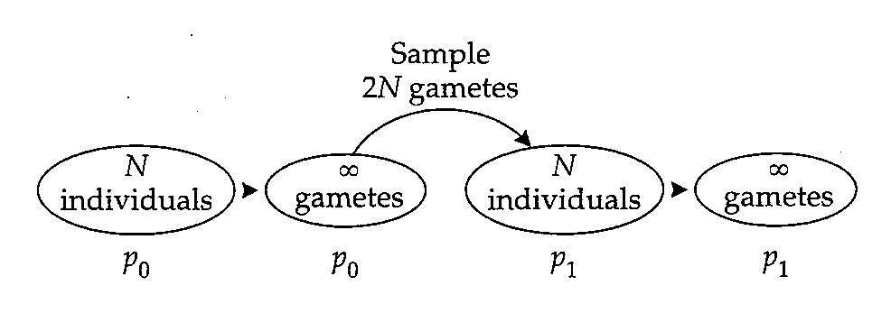
>
> FIGURE 3.1 The gene frequencies and sampling that occur in the Wright-Fisher model. Initially there are N diploid adults with a gene whose frequency is  $ p_{0} $. The adults produce an infinite number of gametes having the same allele frequency. From this pool, 2N gametes are drawn at random to constitute the N diploid individuals for the next generation.

**[定义 Definition]**

To take a specific example, a population of nine diploid organisms arises from a sample of just 18 gametes, but the gametes can be thought of as being sampled from an essentially infinite pool of gametes. Because small samples are frequently not representative, an allele frequency in the sample may differ from that in the entire pool of gametes. Suppose, for example, that a pool of gametes contains the alleles A and a at frequencies p and q, respectively, with $ p + q = 1 $. Then if 2N gametes are drawn at random to produce the zygotes of the next generation, the probability that the sample contains exactly j alleles of type A is the binomial probability

$$
\Pr\left\{j a l l e l e s~o f~t y p e~A\right\}=\binom{2N}{j}p^{j}q^{2N-j}=\frac{(2N)!}{j!(2N-j)!}p^{j}q^{2N-j}
\tag{3.1}
$$

where $j$ can take on any integer value between 0 and 2N. The binomial coefficient (in parentheses in the middle expression) is often read as “two N choose $j$,” because it is the number of ways that exactly $j$ elements can be chosen from a total of 2N. After one generation of random sampling as embodied in Equation 3.1, the new allele frequency of $A$ in the population (call it $p$) is given by $j/(2N)$ because, by definition, the allele frequency of $A$ equals the number of $A$ alleles (in this case $j$) divided by the total (in this case 2N). In the subsequent generation, the sampling process occurs anew according to Equation 3.1 with $p$ replaced by $p'$ and $q$ by $1-p'$. In this way, the allele frequency can change at random from generation to generation.

Computer-generated examples based on random sampling according to Equation 3.1 are shown in Figure 3.2. Each line in Figure 3.2A gives the number of A alleles in 20 successive generations of random genetic drift in a population of size N = 9 (so 2N = 18). As you can see, individual populations behave very erratically. In seven populations, the A allele becomes fixed (that is, p = 1); in five populations, A becomes lost (that is, p = 0). In the other eight populations remain unfixed or segregating for both A and a; however, the final allele frequency among the unfixed populations is as likely to be one value as any other. Figure 3.2B shows the same kind of simulation, except now with 2N = 100. With a larger population size, the rate at which populations go to fixation is obviously slower. The principal conclusion from Figure 3.2 is that allele frequencies behave so erratically in any one population that prediction is virtually impossible.

> **Figure 3.2** · page 4 · source: `PopGen_chapter3`
>
> 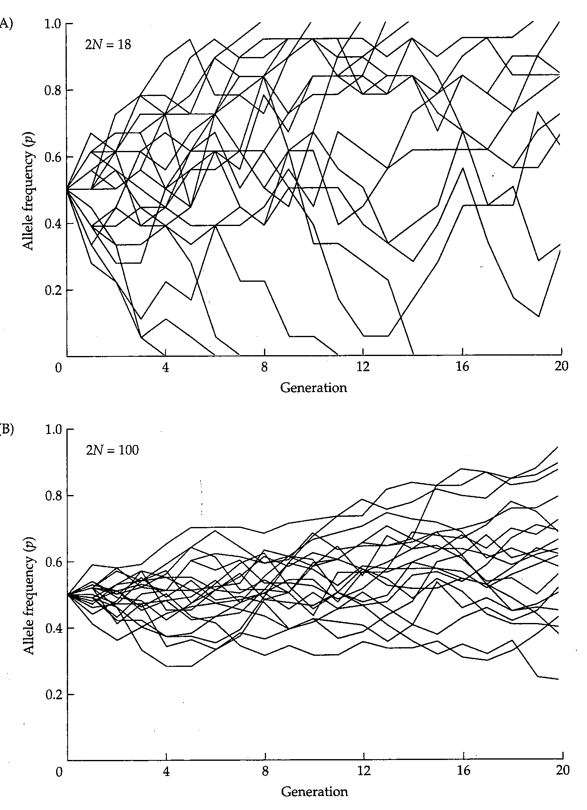
>
> FIGURE 3.2 Computer simulations of the Wright-Fisher model of random genetic drift. Each line represents a population of size (A) 2N = 18 or (B) 2N = 100, simulated for 20 generations. In each generation, alleles are sampled from an infinite pool of gametes. An allele frequency of p = 0.5 in A implies that there are nine copies of the A allele, and nine copies of the a allele. In B, an allele frequency of 0.5 implies 50 copies of each allele. Note that the larger population size in B results in smaller fluctuations in allele frequency and a slower rate of fixation.

Although changes in allele frequency due to random genetic drift in any individual population may defy prediction, the average behavior of allele frequencies in a large number of populations can be predicted. Consider a large number of populations all starting at the same time with the same allele frequency and same population size N. Each of these populations is assumed to undergo drift independently of the other populations. Except for their finite size, the subpopulations are assumed to satisfy all the assumptions of the Hardy-Weinberg model, with the additional stipulations that (1) the number of males and females is equal, and (2) each individual has an equal chance of contributing successful gametes to the next generation. The key point—illustrated in Figure 3.3—is that we can describe how these populations change in allele frequency by considering time slices through the graph and tallying a histogram of the counts of populations having each specified allele frequency. Initially, the populations will all be close to the starting allele frequency. As time passes, the populations "drift" apart, and eventually they become spread over all possible allele frequencies. Finally, as we will see, each population must go to fixation for one allele or the other.

> **Figure 3.3** · page 5 · source: `PopGen_chapter3`
>
> 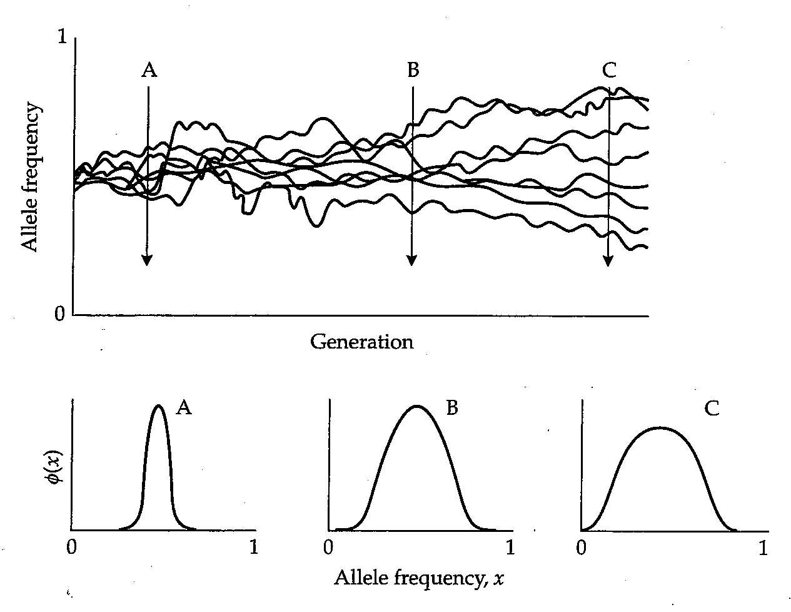
>
> FIGURE 3.3 The implications of random genetic drift can be appreciated by imagining a large collection of subpopulations undergoing the process of repeated sampling. As the top part of the figure indicates, the allele frequency in each subpopulation changes erratically, and the allele frequencies in different subpopulations tend to drift apart. At time intervals, a snapshot of the subpopulations would produce a distribution of allele frequencies, the variance of which increases over time.

To appreciate why ultimate fixation or loss is inevitable, consider an infinitely long bowling alley with minor imperfections that displace an imaginary weightless bowling ball one way or the other. Since the ball has no mass, it has no momentum, and hence at every instant is subject willy-nilly to the bumps and shallows of the alley. This means that, like allele frequencies, the future of the bowling ball depends only on its current position, not on how it got there. The gutters represent the fixation states of p = 0 and p = 1. Once the ball goes into the gutter, it cannot get out again. The imperfections keep the ball from rolling in a straight line, and eventually it rolls into one or the other gutter. In this analogy, the size of the population corresponds to the width of the bowling alley; a larger population implies a wider alley. The imperfections still deflect the ball but, in proportion to the width of the alley, the ball's zigs and zags are of a smaller magnitude. Consequently, the ball remains out of the gutter for a longer time, analogous to the longer time to fixation for a larger population, but eventually the ball will end up in the gutter.

For a full understanding of random genetic drift, we must learn how to deduce the distributions of allele frequencies plotted in Figure 3.3. We just described what would happen after one generation—the set of populations would have a range of allele frequencies as described by the binomial distribution in Equation 3.1. The binomial distribution gives us the probability that a population has allele frequency $ p' $ after one generation of drift. If we consider 1000 populations all starting at p, the binomial distribution gives us the fraction of those populations with allele frequency $ p' $. What about the following generation? For each population, one can imagine the whole sampling process as starting over again. Because no population remembers where it was the previous generation, the binomial sampling occurs anew in each generation. But because the allele frequency changes, the new allele frequency must be used in Equation 3.1. For 1000 populations, Equation 3.1 would have to be applied to each one individually, and then summed across these distributions to obtain the overall probability of each possible outcome of random drift. Fortunately, there is an easier approach that is described after we examine the following experiment.

An actual experiment designed along the lines of Figure 3.3 yielded the results shown in Figure 3.4. The graph shows the history of 19 generations of random genetic drift in 107 subpopulations of Drosophila melanogaster. Each subpopulation was initiated with 16 heterozygous $ bw^{75}/bw $ flies ($ bw = $ brown eyes) and maintained at a constant size of 16 individuals by randomly choosing eight males and eight females to produce the next generation. Each histogram in Figure 3.4 gives the number of subpopulations containing 0, 1, 2, … 32 $ bw^{75} $ alleles. The pattern of change in allele frequency in Figure 3.4 may at first appear to be complicated, but in reality a simple thing is happening. The initially humped distribution of allele frequency gradually becomes flat as populations fixed for $ bw^{75} $ or bw begin to pile up at the boundaries. The piling up occurs because, once an allele has been fixed or lost, it remains fixed or lost since mutation is negligible over such a small number of generations in small populations. After 19 generations, most of the subpopulations are fixed for one allele or the other, and among the unfixed populations, the distribution of allele frequencies is essentially flat.

> **Figure 3.4** · page 7 · source: `PopGen_chapter3`
>
> 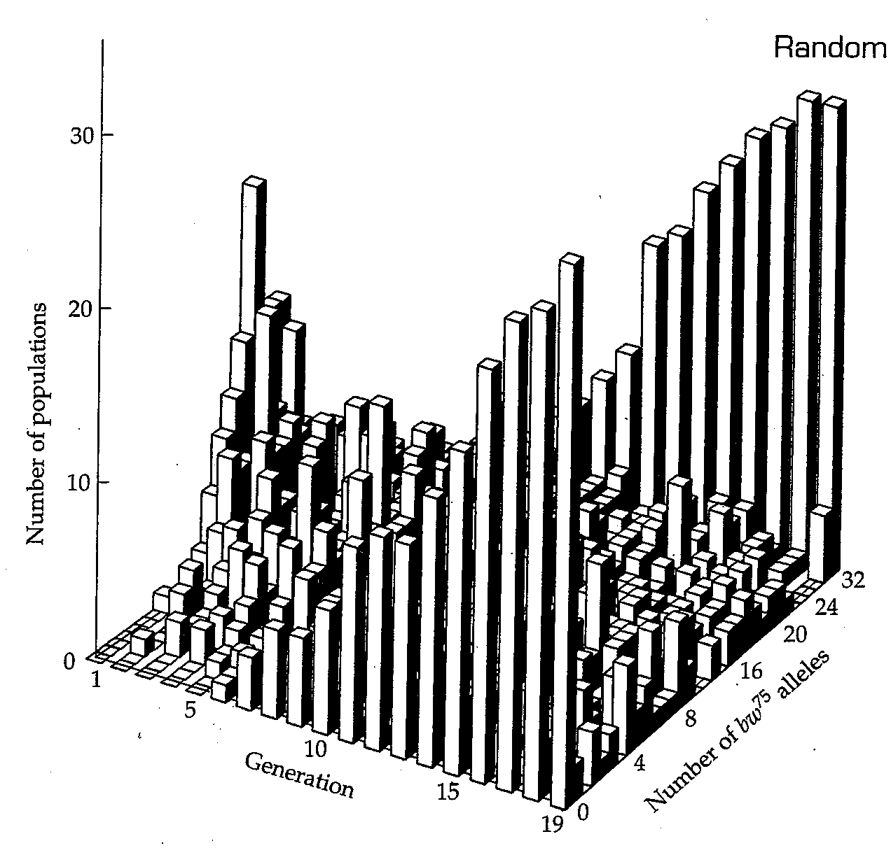
>
> FIGURE 3.4 Random genetic drift in 107 actual populations of Drosophila melanogaster. Each of the initial 107 populations consisted of 16 bw75/bw heterozygotes (N = 16; bw = brown eyes). From among the progeny in each generation, eight males and eight females were chosen at random to be the parents of the next generation. The horizontal axis of each curve gives the number of bw75 alleles in the population, and the vertical axis gives the corresponding number of populations. (Data from Buri 1956.)

PROBLEM 3.1 Consider a self-pollinating plant population consisting of a single heterozygous (Aa) individual on a small barren island. Suppose the plant reproduces and dies, so that the generations are discrete and the population can only consist of a single plant. What is the probability that the population is homozygous at this genetic locus by the second generation?

ANSWER The chance that the first generation offspring is AA is $ \frac{1}{4} $ and the chance that it is aa is also $ \frac{1}{4} $, so the chance of fixation in one generation is $ \frac{1}{2} $. If the first generation offspring is Aa, then the probability of fixation in the second generation (given that the population is not fixed in the first generation) is again $ \frac{1}{2} $. The probability of not fixing in generation 1 and then fixing in generation 2 is $ \frac{1}{2} \times \frac{1}{2} = \frac{1}{4} $. Add to this the chance of fixing in one generation $ \left(\frac{1}{2}\right) $, and we get $ \frac{1}{2} + \frac{1}{4} = \frac{3}{4} $ as the probability of fixation by two generations. Note that the probability of not going to fixation each generation is $ \frac{1}{2} $, and so the chance of not fixing for two generations is $ \frac{1}{2} \times \frac{1}{2} $, which equals $ 1 - \frac{3}{4} $.

---

## PopGen_chapter3_003 · RANDOM GENETIC DRIFT: Introduction / 3.2 THE WRIGHT-FISHER MODEL OF RANDOM GENETIC DRIFT

The model of random genetic drift with binomial sampling described in Equation 3.1 is known as the Wright-Fisher model because Fisher (1930) and Wright (1931) derived the expected distribution of allele frequencies among subpopulations. Although neither author formulated the problem in the manner used here, our approach makes the problem much simpler and gives the same results. If a population contains 2N alleles among which two alleles A and a may be present, then the state of the population can be described by the number of A alleles in the population. The possible states are then 0, 1, 2,... 2N. The states 0 and 2N are special in that these are fixation states, and once the population get into either of these states, it cannot leave unless there is a new mutation (and for the moment we exclude this possibility). The states 0 and 2N are called absorbing states. From any nonfixed allele frequency, it is possible for the population to drift to any other allele frequency. However, the population is more likely to remain close to its present state than to take a large jump. To use an example from Figure 3.4, if 2N = 32, then the chance of drifting from 30 copies of gene A to 29 copies in one generation is 0.186, whereas the chance of drifting to 27 copies is 0.033. The probability of the population drifting from a state having i copies to j copies of allele A is known as the transition probability. The transition probability for the Wright-Fisher model is obtained directly from the binomial distribution (see Equation 3.1). In particular, if a population has i copies of allele A and 2N - i copies of allele a, then the transition probability, $ T_{ij} $, of going from i copies of A to j copies of A in one generation of random genetic drift is given by

$$
T_{ij}=\binom{2N}{j}\left(\frac{i}{2N}\right)^{j}\left(\frac{2N-i}{2N}\right)^{2N-j}=\frac{(2N)!}{j!(2N-j)!}p^{j}q^{2N-j}
\tag{3.2}
$$

where $p = i/2N$ is the initial allele frequency of $A$ and $q = (2N - i)/2N$ is the initial allele frequency of $a$.

The transition probabilities can be put in a square matrix T, with elements $ T_{ij} $ giving the transition probability from state i to state j for i, $ j = 0, 1, 2, \ldots, 2N $. The matrix T contains everything that is needed to predict the expected distribution of populations like those in Figure 3.4 over a series of generations. This type of model, expressed in terms of discrete states with fixed probabilities of going from one state to another, is known as a Markov chain, and it has some very elegant mathematical properties. Iterations of the Wright-Fisher model give the expected outcome of a pure drift process (Figure 3.5). In a few minutes, we will use the Wright-Fisher model to show an important result regarding fixation probabilities. PROBLEM 3.2 Consider a population of four diploid individuals. Calculate the probability that a population with four copies of allele A (allele frequency $ p = \frac{1}{2} $) drifts in one generation to having three copies. What is the probability that the population will have four copies of A? Five copies? Now consider a population of the same size, but initially with two copies of A. What is its probability of drifting to one, two, or three copies?

> **Figure 3.5** · page 9 · source: `PopGen_chapter3`
>
> 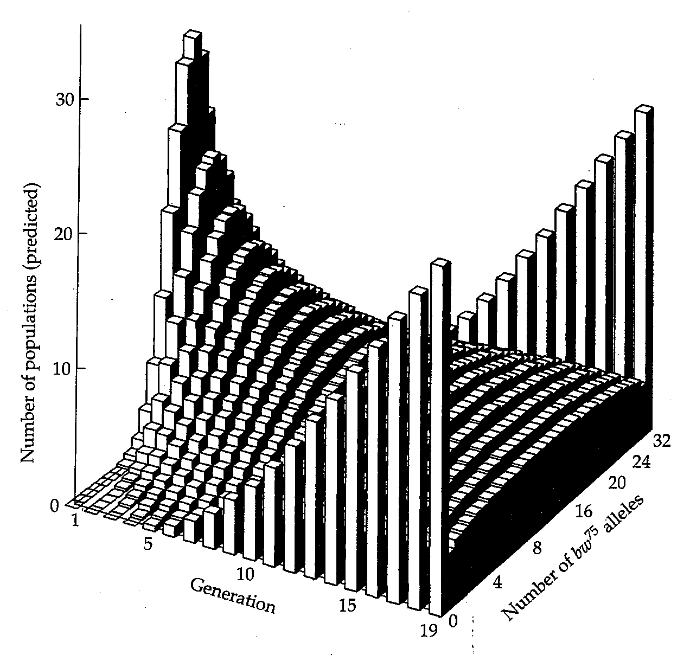
>
> FIGURE 3.5 Prediction of the Wright-Fisher model for the distribution of allele frequencies $\phi(p, x; t)$ in subpopulations of size $N=16$, where $x$ represents the allele frequency in generation $t$. Time runs for $19$ generations, and all subpopulations start with an initial allele frequency of $p=0.5$. The values of $\phi(p, x; t)$ were generated by successive multiplication of the Markov transition probability matrix, whose entries are given by the binomial distribution in Equation 3.2. The model with $2N=32$ predicts that fewer populations have fixed by generation $19$ than actually did go to fixation in the experiment in Figure 3.4. This is because the variance in offspring number is about $70\%$ greater than that assumed in the Wright-Fisher model.

ANSWER Applying Equation 3.2, we get $ T_{43} = [8!/(5!3!)](\frac{1}{2})^8 = 7/32 = 0.219 $. $ T_{44} = [8!/(4!4!)](\frac{1}{2})^8 = 70/256 = 0.273 $. $ T_{45} = 0.219 = T_{43} $. (Note that the binomial distribution is symmetric when $ p = \frac{1}{2} $ so there is equal probability for samples that are symmetrically divergent from $ p = \frac{1}{2} $.) In the case when the initial frequency is $ \frac{1}{8} $ we get $ T_{21} = [8!/1!7!](\frac{1}{4})(\frac{3}{4})^7 = 0.267 $, $ T_{22} = [8!/(2!6!)](\frac{1}{4})^2(\frac{3}{4})^6 = 0.311 $, and $ T_{23} = [8!/(3!5!)](\frac{1}{4})^3(\frac{3}{4})^5 = 0.208 $.

PROBLEM 3.3 An alternative formulation of random genetic drift is due to Moran (1958). This model has considerable intuitive appeal, and it also permits explicit expressions to be derived for various quantities of evolutionary interest (Ewens 2004). The Moran model strictly applies only to haploid populations, but to make it comparable to the Wright-Fisher model we will suppose a population of 2N haploid individuals. In each generation, the drift process begins by sampling two individuals at random. The sampling is carried out "with replacement," so the same individual could be chosen twice. If the two sampled individuals are different, pick one of them at random to produce a single offspring, and return the parent and the offspring to the population; discard the other individual. If the two sampled individuals are the same, then return only the offspring to the population. In the Moran model, if a population of 2N haploid individuals contains i of type A and 2N - i of type a, then the only nonzero transition probabilities are $ T_{ij} $ with $ j = i - 1 $, $ j = i $, or $ j = i + 1 $. These transition probabilities are given by

$$
T_{ii}=\frac{i^{2}+(2N-i)^{2}}{(2N)^{2}}=p^{2}+q^{2}
\tag{3.3}
$$

$$
T_{ij}=\frac{i(2N-i)}{(2N)^{2}}=pq\ for j=i+1or j=i-1
$$

Calculate the transition probabilities in the Moran model for the examples in Problem 3.2.

ANSWER Applying Equation 3.3 to the case $ p = \frac{4}{8} $, we obtain $ T_{34} = 0.25 $, $ T_{44} = 0.50 $, $ T_{45} = 0.25 $, and for the case $ p = \frac{2}{8} $ we obtain $ T_{34} = 0.1875 $, $ T_{44} = 0.6250 $, $ T_{45} = 0.1875 $. Unlike the Wright-Fisher model, the transition probabilities, for either keeping the same number of alleles or else for increasing or decreasing by exactly 1, sum to 1.

Both the Wright-Fisher model and the Moran model incorporate an important feature of random genetic drift. It is that the magnitude of random change in allele frequency is greater when the allele frequency is $ \frac{1}{2} $ than when the allele frequency is more skewed. The changes are greater because the variance in the sampling distribution is greatest when $ p = \frac{1}{2} $. In the Wright-Fisher model, the variance in allele frequency from one generation of random genetic drift is given by $ pq/(2N) $, corresponding to the variance of the proportion in a binomial distribution. The variance drops to zero at p = 0 and p = 1. In the Moran model, the variance resulting from a single birth/death event is $ 2pq/(2N)^2 $. This looks very different from the variance in the Wright-Fisher model, however multiplying by a factor of 2N is needed to convert the individual births and deaths into replacement of the entire population. There is still a factor of 2 in the numerator, which reflects the subtle fact that the variance in offspring number per individual is exactly twice as large in the Moran model as in the Wright-Fisher model (Ewens 2004). In either formulation of random drift, the variance formula makes it clear that a large population will change allele frequency more slowly than a smaller population, because the sampling variance varies as the reciprocal of population size.

**[命题 Proposition]**

PROBLEM 3.4 Simulating random drift can be a very time-consuming proposition. If one wants to simulate a population of 1000 individuals for 1000 generations, one has to draw $ 10^6 $ random numbers and for each decide whether to accept or reject each genotype. Kimura (1980b) came up with a shortcut that relates very closely to how the diffusion approximation works (see the next section). The trick is to use the recursion: $ p' = p + (2U - 1) \sqrt{(3pq/2N)} $, where U is a random number uniformly distributed in the range between 0 and 1. In each generation, you pick a random number U, and then calculate the realization of the next generation's allele frequency from the above recursion. Why does this approach work? (Hint: The variance in a uniform distribution is the square of the range divided by 12.)

ANSWER The expression 2U - 1, where U is a number between 0 and 1, yields a value from $ -1 $ to $ +1 $, or a range of 2. The range of $ (2U - 1)\sqrt{(3pq/2N)} $ is therefore $ 2\sqrt{(3pq/2N)} $. Squaring this expression and dividing by 12, the variance of this uniform random variable equals $ pq/2N $, which is exactly that from a binomial sampling distribution. Each generation the allele frequency has an equal chance of increasing or decreasing, and the variance in the allele frequency change is $ pq/2N $. Even though the distribution of change in allele frequency is uniform in the pseudosampling simulation instead of binomial (as it is in the Wright-Fisher model), this process can reproduce most of the results of the complete brute-force simulation at a tiny fraction of the computer time. The trade-off is that one must be a little careful when near the fixation states, because the algorithm as described can yield allele frequencies less than 0 or greater than 1.

---

## PopGen_chapter3_004 · RANDOM GENETIC DRIFT: Introduction / 3.3 THE DIFFUSION APPROXIMATION

The pattern of change in allele frequency shown in Figure 3.4 is very nearly that expected theoretically for an ideal population, as shown in Figure 3.5. This distribution was obtained by successive multiplication of a matrix whose elements are given by the transition probabilities in Equation 3.2. Although the full-blown theory of random genetic drift requires mathematics beyond the scope of this book (see Kimura 1955, 1964, 1976; Wright 1969; Crow and Kimura 1970; Kimura and Ohta 1971; Ewens 2004), in the next section we provide an introductory tidbit to impart the flavor. If you are a student with no background in calculus, the discussion may seem quite mysterious, but please do not be discouraged because a detailed understanding is not necessary to understand the rest of this chapter or anything later in the book.

---

## PopGen_chapter3_005 · 3.3 THE DIFFUSION APPROXIMATION / An Approach Looking Forward

An elegant alternative to successive matrix multiplication is based on a diffusion approximation (Fisher 1922; Wright 1945; Kimura 1957, 1964). The diffusion approximation assumes that random drift disperses allele frequencies among subpopulations in a manner analogous to heat diffusing through a metal rod or tiny particles diffusing under Brownian motion (Kolmogorov 1931). The idea is to assume that the subpopulations are large enough that the allele frequencies change smoothly through time, not in large jumps. Then the statistical distribution of allele frequencies at any time is a continuous function that we may denote as $\phi(p, x; t)$, where $x$ represents the allele frequency at time $t$ among a large number of segregating populations ($0 < x < 1$), and $p$ is the initial frequency among these populations. The theoretical problem is to formulate an equation that describes how $\phi(p, x; t)$ changes under random genetic drift, and to solve the equation. At any time $t$, the function $\phi(p, x; t)$ is a smooth, continuous function approximating the histogram of allele frequencies among the subpopulations in Figure 3.5, except that $\phi(p, x; t)$ pertains only to the unfixed subpopulations still segregating for $A$ and $a$.

There are actually two approaches for obtaining a diffusion equation, each of which has advantages and limitations. One approach is to ask how the distribution $\phi(p, x; t)$ changes as we go forward in time. To explain the meaning of the equation, we will allow $x$ and $t$ to change only in small, discrete increments of $\Delta x$ and $\Delta t$. There are two reasons why the state $x$ could change in the time $\Delta t$. One is random genetic drift, the other is a systematic force that might include mutation or selection. We will assume that $A$ is the favored allele, and define $\overline{M}(x)$ as the probability that $x$ increases by the amount $\Delta x$ because of the systematic force. The force of random drift is measured by the probability $V(x)$ that $x$ changes because of drift, either decreasing by the amount $\Delta x$ with probability $V(x)/2$ or increasing by the amount $\Delta x$ with probability $V(x)/2$. In any time interval $\Delta t$, therefore, the probability that $x$ remains at $x$ equals $1 - M(x) - V(x)$.

The reasoning is outlined in *[See Table 3.1 at the end of this section.]*. Because changes in state are limited to $ \pm\Delta x $ or $ -\Delta x $, a subpopulation can be in state $ x $ at time $ t + \Delta t $ only if it was in state $ x + \Delta x $, $ x $, or $ x - \Delta x $ at time $ t $, and these have probabilities proportional to $ \phi(p, x + \Delta t; t) $, $ \phi(p, x; t) $, and $ \phi(p, x - \Delta x; t) $, respectively. A subpopulation in state $ x - \Delta x $ can change to state $ x $ with probability $ M(x - \Delta x) + V(x - \Delta x)/2 $ according to whether it was pushed by a systematic force (for example, mutation or selection), or else changed randomly because of random drift. A subpopulation in state $ x + \Delta x $ can change to state $ x $ with probability $ V(x - \Delta x)/2 $ due to random drift. Finally, a subpopulation in state $ x $ can remain in state $ x $ with probability $ 1 - M(x) - V(x) $. The required function $ \text{for} \phi(p, x; t) $

*[See Table 3.1 at the end of this section.]* obtained by summing the products of columns 2 and 4 in *[See Table 3.1 at the end of this section.]*, which after some simplification yields the difference equation

$$
\begin{aligned}&\phi(p,x;t+\Delta t)-\phi(p,x;t)=\\ &\quad-\left[M(x)\phi(p,x;t)-M(x-\Delta x)\phi(p,x-\Delta x;t)\right]\\ &\quad+\frac{1}{2}\left\{\left[V(x+\Delta x)\phi(p,x+\Delta x;t)-V(x)\phi(p,x;t)\right]\right.\\ &\quad\left.-\left[V(x)\phi(p,x;t)-V(x-\Delta x)\phi(p,x-\Delta x;t)\right]\right\}\\ \end{aligned}
$$

On the left-hand side of the equal sign is the change in $ \phi $ ($ \Delta\phi $) for a given change in $ t $ ($ \Delta t $). On the right-hand side, the first term is the change in $ M\phi $ ($ \Delta M\phi $) for a given change in $ x $ ($ \Delta x $), and the second term is the change in the change in $ V\phi $ ($ \Delta V\phi $) for a two-step change in $ x $ ($ \Delta x $). In symbols, the difference equation can be written as

$$
\frac{\Delta\phi(p,x;t)}{\Delta t}=-\frac{\Delta\left[M(x)\phi(p,x;t)\right]}{\Delta x}+\frac{1}{2}\frac{\Delta\left\{\Delta\left[V(x)\phi(p,x;t)\right]\right\}}{\Delta(\Delta x)}
$$

At this point we can take the limit as $ \Delta t \to 0 $ and $ \Delta x \to 0 $ (as we also overlook a number of technical details) to obtain what is called the Kolmogorov forward equation:

$$
\frac{\partial\phi(p,x;t)}{\partial t}=-\frac{\partial\left[M(x)\phi(p,x;t)\right]}{\partial x}+\frac{1}{2}\frac{\partial^{2}\left[V(x)\phi(p,x;t)\right]}{\partial x^{2}}
\tag{3.4}
$$

This is a partial differential equation, and given some initial function $\phi(p,x;0)$, it can be solved (though not easily) for $\phi(p,x;t)$. We have not yet specified

$ M(x) $ or $ V(x) $ in terms that have any relation to population genetics. The function $ M(x) $ is a symbol for the change in allele frequency that occurs in one generation due to any systematic force such as mutation, migration, or selection. The function $ V(x) $ also has a straightforward biological interpretation; $ V(x) $ is the variance in allele frequency after one generation of binomial sampling of 2N alleles according to Equation 3.1; hence $ V(x) = x(1 - x)/(2N) $.

Many aspects of Equation 3.4 were explored by Wright (1931), and the formal solution to this equation, found by Kimura (1955), required some heavy mathematics. For our purposes, some graphs will illustrate the important properties of the forward diffusion equation. The solutions for $ M(x) = 0 $ are the curves plotted in Figure 3.6, which show the theoretical distributions of allele frequency among unfixed populations after various times (t) measured in units of N generations. In Figure 3.6A, all populations have an initial allele frequency of $ \frac{1}{2} $, as in the actual populations in Figure 3.4; after about t = 2N generations, the distribution of allele frequency is essentially flat, and by this time about half the populations are still unfixed. The distributions in Fig

> **Figure 3.6** · page 14 · source: `PopGen_chapter3`
>
> 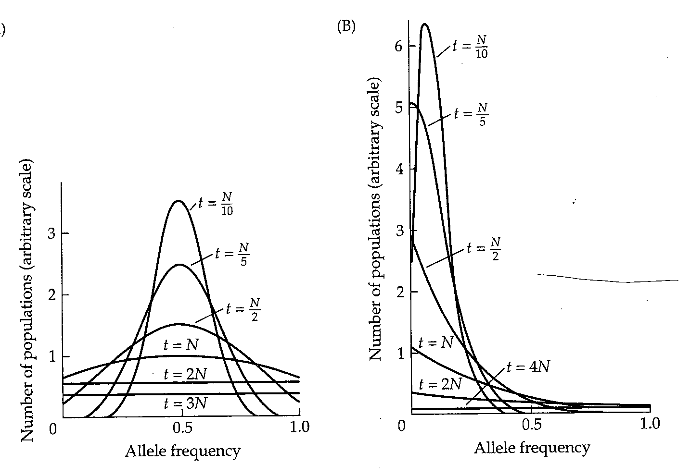
>
> FIGURE 3.6 Theoretical results of random genetic drift. (A) Initial allele frequency = 0.5. (B) Initial allele frequency = 0.1. The curves have been scaled so that the area under each curve is equal to the proportion of populations in which fixation or loss has not yet occurred. The curves are therefore the distributions of allele frequencies among segregating populations. (From Kimura 1955.)

The 3.6 refer only to those populations that are unfixed; as time goes on, more and more of the populations become fixed, and the distributions progressively pile up at 0 and 1, as in the histograms in Figure 3.4. Indeed, in Figure 3.6, the area under each curve is equal to the proportion of unfixed populations, which becomes progressively smaller. In particular, the rate at which the height of the distribution decreases once it becomes flat is about $ 1/(2N) $ per generation. To illustrate that the diffusion approximation and the Wright-Fisher model give very similar results, Figure 3.7 shows the diffusion approximation for the data in Figure 3.4, with $ 2N = 32 $, $ p_0 = \frac{1}{2} $, and t running from generation 1 through generation 19.

> **Figure 3.7** · page 15 · source: `PopGen_chapter3`
>
> 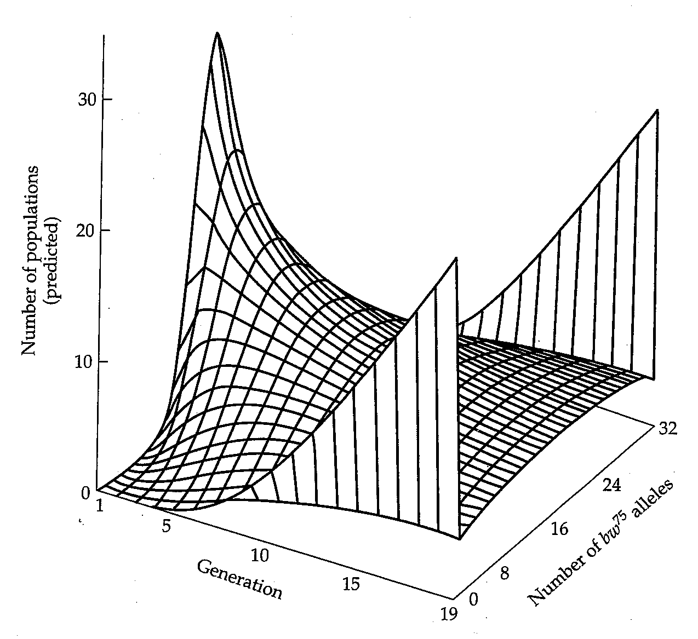
>
> FIGURE 3.7 Kimura's (1955) solution to the diffusion equation for the particular case of N = 16. This is the three-dimensional view of Figure 3.6, and represents the diffusion approximation to the exact solution obtained from the Wright-Fisher model in Figure 3.5.

Figure 3:6B shows what happens when the initial allele frequency is 0.1; here the distributions are highly asymmetrical, and the distribution of allele frequency does not become flat until about $ t = 4N $ generations, by which time only about 10% of the populations remain unfixed. Once a flat distribution of allele frequency is reached, the distribution remains flat, but random drift continues until fixation or loss has occurred in all populations.

**[Table]**

*[See Table 3.1 at the end of this section.]*

> **Table 3.1** · `3.1` · page 13 · source: `PopGen_chapter3_005`
> TABLE 3.1 Random Genetic Drift Looking One Generation Forward in Time
>
> <table><tr><td>Possibilities for frequency after  $ t $ generations</td><td>Probability of specified frequency after  $ t $ generations</td><td>Possibilities to change to  $ x $ in next interval  $ \Delta t $</td><td>Probability of specified change in next interval  $ \Delta t $</td></tr><tr><td rowspan="2">$ x - \Delta x $</td><td>$ \phi(p, x - \Delta x; t) $</td><td>$ x - \Delta x \rightarrow x $ by systematic force</td><td>$ M(p) $</td></tr><tr><td>$ \phi(p, x - \Delta x; t) $</td><td>$ x - \Delta x \rightarrow x $ by random drift</td><td>$ V(p)/2 $</td></tr><tr><td>$ x + \Delta x $</td><td>$ \phi(p, x + \Delta x; t) $</td><td>$ x + \Delta x \rightarrow x $ by random drift</td><td>$ V(p)/2 $</td></tr><tr><td>$ x $</td><td>$ \phi(p, x; t) $</td><td>$ x $ remains at  $ x $</td><td>$ 1 - M(p) - V(p) $</td></tr></table>

---

## PopGen_chapter3_006 · 3.3 THE DIFFUSION APPROXIMATION / An Approach Looking Backward

To find another equation for $\phi(p, x; t)$, we may also look backward in time to the beginning of the process and consider what may have happened in the very first increment of time $\Delta t$. Since the subpopulations initially all begin with an allele frequency of $p$, in the first time increment $\Delta t$ a particular subpopulation could change its state to a frequency of $p + \Delta p$, or it could change its state to $p - \Delta p$, or it could remain at $p$. These possibilities have relative probabilities $M(p) + V(p)/2$, $V(p)/2$, and $1 - M(p) - V(p)$, where again $M(p)$ measures the strength of any systematic force tending to increase the allele frequency and $V(p)$ measures the variance in allele frequency due to random genetic drift.

The bookkeeping is shown in *[See Table 3.2 at the end of this section.]*. If $p$ changed state to $p + \Delta p$ in the first time increment, then the probability of the subpopulation achieving state $x$ in the subsequent $t - \Delta t$ time units is proportional to $\phi(p + \Delta p, x; t - \Delta t)$. Similarly, going from state $p - \Delta p$ to state $x$ in $t - \Delta t$ time units has a probability proportional to $\phi(p - \Delta p, x; t - \Delta t)$. Finally, going from state $p$ at time $\Delta t$ to state $x$ at time $t$ has a probability proportional to $\phi(p, x; t - \Delta t)$. The relevant equation for $\phi(p, x; t)$ is obtained by summing the products of columns 2 and 3 in *[See Table 3.2 at the end of this section.]*. After some rearrangement we obtain

$$
\begin{aligned}&\phi(p,x;t)-\phi(p,x;t-\Delta t)=\\ &M(p)\Big[\phi(p+\Delta p,x;t-\Delta t)-\phi(p,x;t-\Delta t)\Big]\\ &+\frac{V(p)}{2}\Big\{\Big[\phi(p+\Delta p,x;t-\Delta t)-\phi(p,x;t-\Delta t)\Big]\\ &-\Big[\phi(p,x;t-\Delta t)-\phi(p-\Delta p,x;t-\Delta t)\Big]\Big\}\\ \end{aligned}
$$

As before, the left hand side is equal to the change in $ \phi $ ($ \Delta\phi $) for a given change in $ t $ ($ \Delta t $). On the right-hand side, the first term is $ M(p) $ times the change in $ \phi $ ($ M\Delta\phi $) for a given change in $ p $ ($ \Delta p $), and the second term is $ V(p) $ times the change in the change in $ \phi $ ($ V\Delta\Delta\phi $) for a two-step change in $ p $ ($ \Delta\Delta p $). In these terms, the difference equation can be written as

$$
\frac{\Delta\phi(p,x;t)}{\Delta t}=M(p)\frac{\Delta\phi(p,x;t)}{\Delta p}+\frac{V(p)}{2}\frac{\Delta\left(\Delta\phi(p,x;t)\right)}{\Delta(\Delta p)}
$$

Once again we will ignore some technical requirements and simply assert that, in the limit as $ \Delta t \to 0 $ and $ \Delta p \to 0 $, the difference equation converges to a partial differential equation called the Kolmogorov backward equation:

$$
\frac{\partial\phi(p,x;t)}{\partial t}=M(p)\frac{\partial\phi(p,x;t)}{\partial p}+\frac{V(p)}{2}\frac{\partial^{2}\phi(p,x;t)}{\partial p^{2}}
\tag{3.5}
$$

For answering questions of population genetic interest in random drift, the Kolmogorov backward equation (see Equation 3.5) is often more useful

*[See Table 3.2 at the end of this section.]* than the forward equation (see Equation 3.4). The quantities of interest include the probability of ultimate fixation of an allele, the average time to fixation of alleles that are eventually fixed, and so forth. To give a sense of how the backward equation is used for these purposes, imagine the form of Equation 3.5 at a time so advanced that the distribution of allele frequencies $ \phi(p, x; t) $ is no longer changing. Since random drift will continue to change the allele frequencies as long as any subpopulations are still polymorphic, the statement that $ \phi(p, x; t) $ is no longer changing means that all subpopulations have become fixed for one allele or the other, which furthermore implies that the left-hand side of Equation 3.5 equals 0 and that the right-hand side no longer depends on either x (because no populations are still segregating) or t. To emphasize that we are now dealing with a function of a single variable, population geneticists often rewrite this form of Equation 3.5 as

$$
0=M(p)\frac{d u(p)}{d p}+\frac{V(p)}{2}\frac{d^{2}u(p)}{d p^{2}}
\tag{3.6}
$$

In this equation, the symbol $d$ is used instead of $\partial$ to emphasize that $u(p)$ is a function of a single variable. In words, $u(p)$ is the probability of ultimate fixation of the allele $A$, given an initial frequency of $p$. Alternatively, $u(p)$ may be interpreted as the proportion of all subpopulations in which $A$ eventually becomes fixed. In the case of pure random drift with no systematic force, $M(p) = 0$. Equation 3.6 then becomes

$$
0=\frac{V(p)}{2}\frac{d^{2}u(p)}{d p^{2}}
\tag{3.7}
$$

This equation defines a family of curves, but the one of interest in population genetics has the property $ u(0) = 0 $, which says that an allele that does not exist cannot be fixed, and the property $ u(1) = 1 $, which says that an allele that is already fixed is eventually fixed.

PROBLEM 3.5 For an initial frequency of the A allele of $p$ ($0 < p < 1$), show that $u(p) = p$ is a solution of the differential equation (see Equation 3.7).

ANSWER What needs to be shown is that Equation 3.7 is satisfied when $ u(p) = p $. Although $ V(p) = p(1 - p)/2N $, this is not relevant to the solution. The solution follows from the fact that, when $ u(p) = p $, then $ du(p)/dp = 1 $ and $ d^2u(p)/dp^2 = 0 $. Hence $ u(p) = p $ is a solution of Equation 3.7 so long as $ V(p) \neq 0 $. The biological meaning of $ u(p) = p $ is that, because of random genetic drift, an allele present in a population at frequency $ p $ will ultimately be fixed with probability $ p $ and lost with probability $ 1 - p $, provided it has no effects on the organisms' ability to survive and reproduce (such alleles are often called selectively neutral alleles).

**[Table]**

*[See Table 3.2 at the end of this section.]*

> **Table 3.2** · `3.2` · page 17 · source: `PopGen_chapter3_006`
> TABLE 3.2 Random Genetic Drift Looking Backward at the First Generation
>
> Possibilities for change in first generation | Probability of specified change in first-generation | Probability of changing to $ x $ in remaining $ t-\Delta t $ generations
> --- | --- | ---
> $ p \rightarrow p + \Delta p $ by systematic force | $ M(p) $ | $ \phi(p + \Delta p, x; t - \Delta t) $
> $ p \rightarrow p + \Delta p $ by random drift | $ V(p)/2 $ | $ \phi(p + \Delta p, x; t - \Delta t) $
> $ p \rightarrow p - \Delta p $ by random drift | $ V(p)/2 $ | $ \phi(p - \Delta p, x; t - \Delta t) $
> $ p \rightarrow $ remains at $ p $ | $ 1 - M(p) - V(p) $ | $ \phi(p, x; t - \Delta t) $

---

## PopGen_chapter3_007 · 3.3 THE DIFFUSION APPROXIMATION / Absorption Time and Time to Fixation

For a selectively neutral allele, as indicated in Problem 3.5, the probability of ultimate fixation is equal to its initial allele frequency. Many other important results also follow from an analysis of the Kolmogorov backward equation (see Equation 3.5). These include the expected time for a neutral allele to go to fixation (given that it is eventually fixed) or to loss (given that it is eventually lost). Assuming an initial allele frequency p, Kimura and Ohta (1969) showed that the mean time $ [\tilde{t}_{1}(p) $, in generations] until the allele is fixed (given that it is eventually fixed) is

$$
\overline{t}_{1}(p)=-4N\left(\frac{1-p}{p}\right)\ln(1-p)
\tag{3.8}
$$

Similarly, they showed that the mean time to loss $ \bar{t}_{0}(p) $ (given that the allele is eventually lost) is

$$
\overline{t}_{0}(p)=-4N\left(\frac{p}{1-p}\right)\ln(p)
\tag{3.9}
$$

Combining Equations 3.8 and 3.9, the mean persistence time of an allele $ [\bar{t}(p) $, the average length of time that a population is segregating for A and a] is given by $ \bar{t}(p) = p\bar{t}_{1}(p) + (1 - p)\bar{t}_{0}(p) $, which equals

$$
\overline{t}(p)=-4N\Big[(1-p)\ln(1-p)+p\ln(p)\Big]
\tag{3.10}
$$

Figure 3.8 shows the average times to fixation, loss, and persistence of a neutral allele. An allele is expected to remain in a population for the longest time when its initial frequency is $ \frac{1}{2} $. When $ p = \frac{1}{2} $, the average time that a population remains unfixed is about 2.77N generations.

> **Figure 3.8** · page 19 · source: `PopGen_chapter3`
>
> 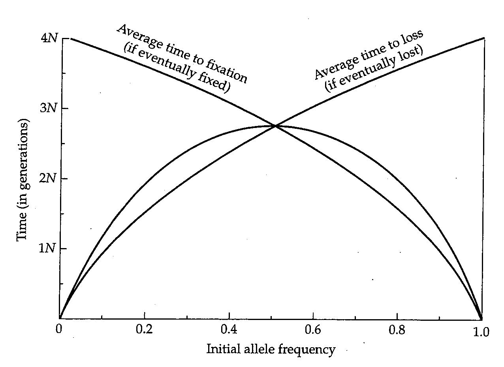
>
> FIGURE 3.8 Average persistence of a neutral allele in an ideal diploid population of size N, plotted against initial allele frequency.

Equations 3.8 and 3.9 are of particular interest when $ p = 1/(2N) $, that is, when a new neutral mutation has just occurred and there is only one copy in the population. In this case, the probability of eventual fixation is $ 1/(2N) $, and, given that the allele is eventually fixed, the average time to fixation is approximately 4N generations. On the other hand, the probability that a new neutral mutation is eventually lost is $ 1 - 1/(2N) $, and, given that the allele is eventually lost, the average time to loss is approximately $ 2\ln(2N) $ generations. In other words, new neutral alleles that are eventually fixed usually take a long time to be fixed, whereas those that are lost are lost very quickly. For the specific example of N = 500, the average new neutral mutation that is eventually fixed requires 2000 generations to be fixed, whereas the average new neutral mutation that is destined to be lost requires fewer than 14 generations to be lost.

---

## PopGen_chapter3_008 · RANDOM GENETIC DRIFT: Introduction / 3.4 RANDOM DRIFT IN A SUBDIVIDED POPULATION

Most real populations are subdivided into smaller units, for example, humans are:concentrated in cities, towns, and villages; animals form herds, flocks, or schools; and plants are aggregated into stands. This kind of subdivision is reminiscent of the population structure in Figure 3.5, except that, in nature, the subpopulations are not genetically isolated from one another owing to some migration, or movement, of individuals among the subpopulations, which results in gene flow, or exchange of genes, between them. Nevertheless, random genetic drift will tend to cause subpopulations to undergo differentiation in their allele frequencies, even in the face of some gene flow. To see this point, consider the four subpopulations diagrammed in Figure 3.9. Each begins with an allele frequency of $ p = \frac{1}{2} $, and each undergoes random drift independently following binomial sampling (see Equation 3.2).

> **Figure 3.9** · page 20 · source: `PopGen_chapter3`
>
> 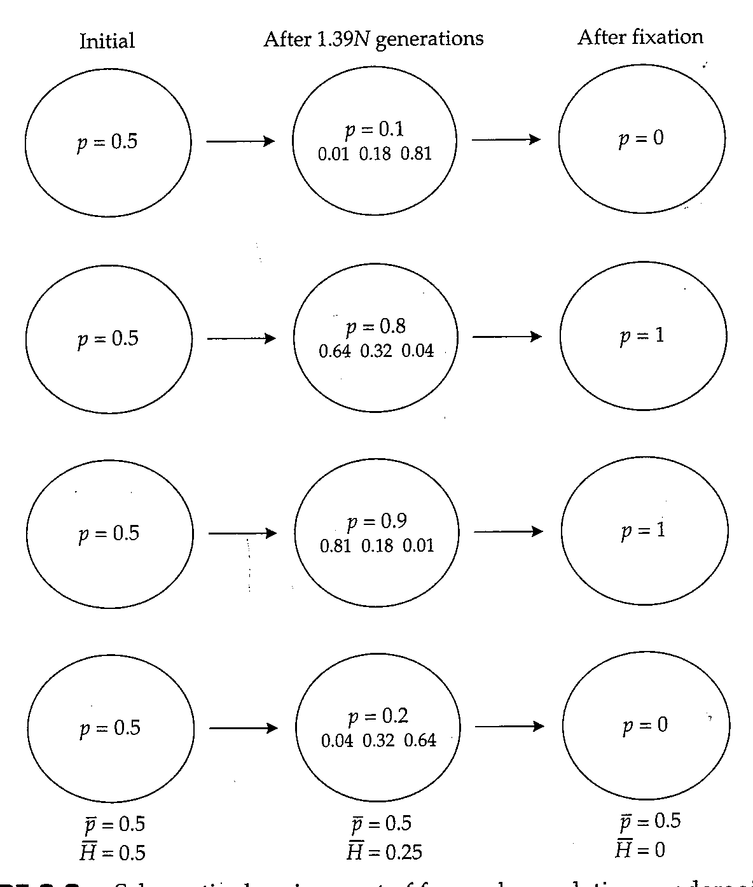
>
> FIGURE 3.9 Schematic showing a set of four subpopulations undergoing the process of random genetic drift. Initially the allele frequency is 0.5 in all four subpopulations, and the average heterozygosity is also 0.5. As the subpopulations drift in allele frequency, the average allele frequency is expected to remain the same (indicated by  $ \bar{p} $ remaining at the value 0.5), but the average heterozygosity decreases. For the intermediate generation when t = 1.39N generations, the allele and genotype frequencies in each subpopulation are given, as well as the average allele frequency and heterozygosity across subpopulations. By this time the average heterozygosity is reduced to 50% of the value expected without population subdivision. Ultimately, all subpopulations go to fixation, half fix one allele and half fix the other, so the average allele frequency is still 0.5, whereas the heterozygosity is zero.

We assume that random mating takes place within any particular subpopulation (call it subpopulation number i). Therefore, if the allele frequencies of A and a in the ith subpopulation are denoted $ p_i $ and $ q_i $, then the genotype frequencies of AA, Aa, and aa are given by the familiar Hardy-Weinberg principle as $ p_i^2 $, $ 2p_i q_i $, and $ q_i^2 $. Furthermore, picture the situation in Figure 3.9 at a time so advanced that all subpopulations are fixed for one allele or the other. Within the ith subpopulation, therefore, either $ p_i $ equals 0 or else $ p_i $ equals 1. The genotype frequencies of AA, Aa, and aa in that subpopulation are either 0, 0, and 1 (if $ p_i = 0 $), or 1, 0, and 0 (if $ p_i = 1 $). These genotype frequencies, though extreme, still satisfy the Hardy-Weinberg principle. Thus, within any one subpopulation in Figure 3.9, the frequency of heterozygotes is that expected with random mating.

The total population in Figure 3.9 is composed of the aggregate of the four subpopulations, and in the total population there is a deficiency of heterozygous genotypes. Suppose that we were unaware of the subpopulation structure and sampled from the total population as if it were a single randomly mating population. If we were to sample randomly from the far right of Figure 3.9, when no populations are still segregating, we would obtain an allele frequency of $ p = \frac{1}{2} $. Assuming Hardy-Weinberg equilibrium, we would naively expect a fraction $ 2pq = \frac{1}{2} $ of the genotypes to be heterozygous. In fact, we would have sampled no heterozygous genotypes at all! This rather paradoxical result—that there is a deficiency of heterozygotes in the total population even though random mating occurs within each subpopulation—is a consequence of the random genetic drift of allele frequencies among subpopulations due to their finite size. The extreme case when each subpopulation is fixed is easy to understand: A population with allele frequency $ \frac{1}{2} $ could only be made up of two subpopulations fixed for A and two subpopulations fixed for a; the average allele frequency is $ \frac{1}{2} $, but the total population has no heterozygotes.

**[定义 Definition]**

We are now in a position to quantify the manner in which subpopulations diverge in allele frequency under random genetic drift. To do this efficiently, we need to introduce a concept known as allele identity by descent. Two alleles are identical by descent if they are replicas (by DNA replication) of a gene present in some previous generation. This definition does not speak for itself, because if one goes far enough backward in time, every pair of alleles must be identical by descent, and so the concept may seem vacuous. The way out of this trap is to choose some arbitrary time in the past, which may be recent or remote according to the application, and declare that at this time every allele is distinct from every other allele. In this fashion, any earlier identity by descent is erased, and therefore the identity by descent spoken of in the definition is common ancestry through DNA replication since that arbitrary time in the past when every allele was declared distinct.

The concept of identity by descent is useful because it allows us to distinguish two types of homozygous genotypes. In particular, the A alleles in a homozygous AA genotype could be alleles that are not identical by descent (which means that these alleles both existed in the population at the time when every allele was declared distinct), or they could be identical by descent (which means that they originated by DNA replication of a single A allele since that time). In some cases alleles may be indistinguishable by means of an experimental procedure (for example, protein electrophoresis), but their status in regard to identity by descent is unknown. Such alleles are said to be identical by kind or identical by state.

The probability that the alleles in an individual are identical by descent is often denoted F, following Wright (1922) who called it the fixation index. In the context of population subdivision, F as used in this chapter is the same quantity that in Chapter 6 will be denoted $ F_{ST} $. In this chapter we will drop the subscript because we will want to track changes in $ F_{ST} $ through time, and in this case the probability of allele identity by descent in generation t is conveniently represented as $ F_{t} $.

Now we can be more specific about what we mean by saying that one can choose some arbitrary time in the past and declare that at this time every allele is distinct. In the context of population subdivision as illustrated in Figure 3.9, the time in the past when the alleles are declared as distinct is in the initial populations, when the population subdivision first takes place, and all subpopulations have the same allele frequencies. In symbols, we declare that, at time t = 0 when the subpopulations are first established, $ F_t = 0 $. As time goes on, and each subpopulation undergoes random drift, the genotype frequencies in each subpopulation will satisfy the Hardy-Weinberg principle because mating within subpopulations is random. However, the allele frequencies among the subpopulations will change because of random genetic drift, and moreover the value of $ F_t $ will gradually increase as more and more alleles within any subpopulation become identical by descent owing to common ancestry.

The rate of increase in $ F_t $ can be calculated with the aid of the diagram in Figure 3.10. This figure shows the 2N alleles in a breeding population of generation $ t-1 $. In sampling alleles for generation $ t $, the first allele chosen may be any of those present in generation $ t-1 $ with equal probability. Having chosen the first allele, the probability that the second allele chosen is of the same type as the first is $ 1/(2N) $ (in which case $ F=1 $), because this is the frequency of each allelic type in the pool of gametes; the probability that the second chosen allele is of a different type from the first is accordingly $ 1-1/(2N) $ (in which case $ F=F_{t-1} $). Putting these two possibilities together, the relationship between $ F_t $ and $ F_{t-1} $ is seen to be

$$
F_{t}=\frac{1}{2N}+\left(1-\frac{1}{2N}\right)F_{t-1}
\tag{3.11}
$$

> **Figure 3.10** · page 23 · source: `PopGen_chapter3`
>
> 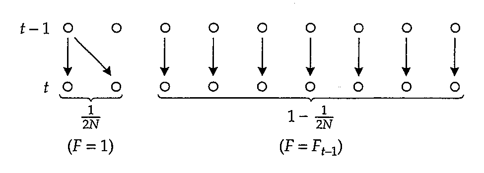
>
> FIGURE 3.10 Diagram illustrating the reasoning behind the recursion for $F$ in a finite population. When the gametes are drawn to make up the population at generation $t$, there is a chance $1/(2N)$ that any pair of alleles will have been identical in generation $t-1$. If this happens, the probability of identity is 1. For the allele pairs drawn in generation $t$ from two distinct alleles at generation $t-1$ [the probability of this happening is $1-1/(2N)],$ the probability of identity is $F_{t-1}$,$Adding$ the probabilities of these two events, we get $F_t=1/(2N)+[1-1/(2N)]F_{t-1}$.

Multiplying both sides by -1 and then adding 1 to each side leads to

$$
1-F_{t}=1-\frac{1}{2N}-\left(1-\frac{1}{2N}\right)F_{t-1}=\left(1-\frac{1}{2N}\right)\left(1-F_{t-1}\right)
$$

and so

$$
1-F_{t}=\left(1-\frac{1}{2N}\right)^{t}\left(1-F_{0}\right)
\tag{3.12}
$$

or, when $ F_{0}=0, $

$$
F_{t}=1-\left(1-\frac{1}{2N}\right)^{t}
\tag{3.13}
$$

Figure 3.11 shows the rapid increase of $ F_t $ in small populations. Even though the genotype frequencies in each individual subpopulation are in Hardy-Weinberg proportions, the frequency of homozygous genotypes in the overall population steadily increases. Conversely, as the frequency of homozygous genotypes increases, the frequency of heterozygous genotypes decreases until, when $ F_t = 1 $, there are no heterozygous genotypes left and all subpopulations are fixed for either A or a. At any time, the average frequency of heterozygous genotypes among the subpopulations, $ H_t $, relative to what it would be without population subdivision, $ H_0 $, decreases linearly in $ F_t $, hence we have $ H_t / H_0 = 1 - F_t $, or $ H_t = (1 - F_t) H_0 $. Solving Equation 3.13 for $ 1 - F_t $ and substituting, we obtain

$$
H_{t}=\left(1-\frac{1}{2N}\right)^{t}H_{0}\approx H_{0}e^{-t/2N}
\tag{3.14}
$$

> **Figure 3.11** · page 24 · source: `PopGen_chapter3`
>
> 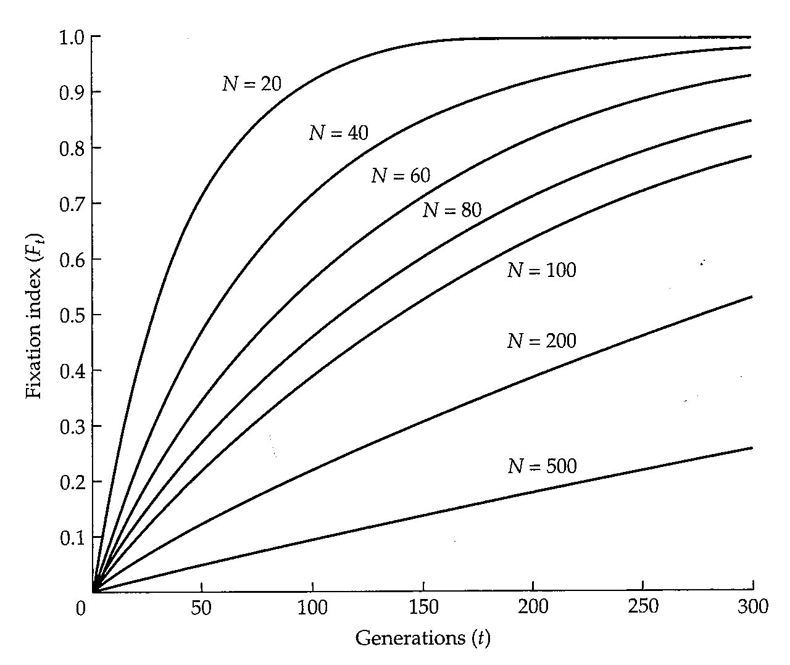
>
> FIGURE 3.11 Increase of  $ F_{t} $ in ideal populations as a function of time and effective population size N.

We emphasize again that each individual subpopulation undergoes random drift and remains in approximate Hardy-Weinberg proportions, and that the symbol $ H_t $ represents a sort of “virtual heterozygosity” in which the frequency of heterozygous genotypes is averaged across many subpopulations. Equation 3.14 shows that pure random drift should result in the heterozygosity decreasing at a geometric rate, since $ H_t $ is multiplied by the constant $ [1 - 1/(2N)] $ each generation. Experimental tests of this prediction are shown in Figure 3.12. Figure 3.12A shows how the heterozygosity averaged across the subpopulations in Figure 3.4 declines over generations, but the theoretical curve when $ N = 16 $ does not fit the data very well. In fact, the rate of decline of heterozygosity is greater than the theoretical expectation, as though the population size were smaller than $ N = 16 $. In other words, the populations in Figure 3.4 decrease in heterozygosity as if each had a population size of $ N = 9 $ rather than its actual size of $ N = 16 $. We call $ N = 9 $ the effective size of the subpopulations, as distinct from the actual size (see Section 3.5). The theory also predicts that the allele frequency, averaged across populations, is not expected to change, and the data agree with this aspect of the theory quite well (Figure 3.12B).

> **Figure 3.12** · page 25 · source: `PopGen_chapter3`
>
> 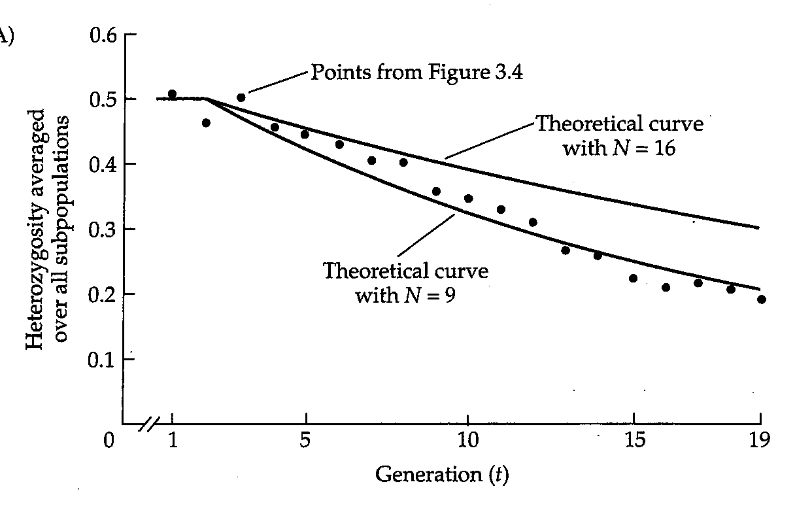
>
> FIGURE 3.12 Theoretical curves for average heterozygosity among subpopulations (A) with N = 9 or N = 16, along with actual values (plotted as points) from the experiment in Figure 3.4. Part (B) shows the theoretically expected average allele frequency among the 107 subpopulations and the observed average. (Data from Buri 1956.)

PROBLEM 3.6 Use Equation 3.14 to determine the average length of time it would take for a finite population of size N to reduce its initial heterozygosity by a factor of two.

ANSWER Set $ H_t = \frac{1}{2} H_0 = H_0 e^{-(t/2N)} $. Now divide both sides by $ H_0 $ and take the natural logarithm (base $ e $) to obtain $ \ln(\frac{1}{2}) = -t/(2N) $, or $ t = -2N \ln(\frac{1}{2}) = 1.39N $ generations. In words, this result says that it requires an average of 1.39N generations to halve the heterozygosity, whatever its initial value. Fisher (1918) showed that it also takes 1.39N generations to halve what he called the genic variance in the population. Since the variance of a binomial sample is $ pq/2N $, and the average heterozygosity in a population decreases in proportion to the variance in allele frequency among subpopulations, it follows that the average heterozygosity decreases at the same rate as the variance in allele frequency among subpopulations increases.

Several important consequences of the population structure in Figure 3.9 can now be summarized. First, although each subpopulation is finite in size, we can imagine so many of them that the size of the total population is effectively infinite. For an infinite population, the allele frequencies must remain constant. That is, even though the allele frequency in any individual subpopulation may change willy-nilly due to random genetic drift, the overall average allele frequency of A among subpopulations remains $ p_0 $, where $ p_0 $ represents the allele frequency of A in the initial populations. Figure 3.12B shows an experimental demonstration of the constancy of average allele frequency. Since $ F_t $ is the probability of identity by descent of the two alleles in an individual in generation t, the probability that the two alleles in an individual in generation t are not identical by descent is $ 1 - F_t $. Because $ p_0 $ is the overall allele frequency of A, averaged across all subpopulations, the probability that a randomly chosen individual will be genotypically AA is $ p_0^2(1 - F_t) $ [for the case of nonidentity by descent] + $ p_0F_t $ [for the case of identity by descent], which equals $ p_0^2(1 - F_t) + p_0F_t $. Similarly, the probability that the individual will be Aa equals $ 2p_0q_0(1 - F_t) $, and likewise the probability that the individual will be aa equals $ p_0(1 - F_t) + q_0F_t $. To summarize, the average genotype frequencies among subpopulations at any time t have the expected values:

$$
\begin{array}{r l}{A A:p_{0}^{2}(1-F_{t})+p_{0}F_{t}}&{{}=p_{0}^{2}+p_{0}q_{0}F_{t}}\end{array}
\tag{3.15a}
$$

$$
\begin{array}{r l r l}{A a\colon2p_{0}q_{0}(1-F_{t})}&{{}}&{}&{{}=2p_{0}q_{0}-2p_{0}q_{0}F_{t}}\end{array}
\tag{3.15b}
$$

$$
\begin{array}{r l}{a a\colon q_{0}^{2}(1-F_{t})+q_{0}F_{t}}&{{}=q_{0}^{2}+p_{0}q_{0}F_{t}}\end{array}
\tag{3.15c}
$$

where $ q_{0}=1-p_{0} $ is the average frequency of a, averaged across all subpopulations.

Note that, while each individual subpopulation maintains Hardy-Weinberg frequencies, the average genotypic frequencies in the total population are different because there is an excess of homozygotes and a deficiency of heterozygotes. Equation 3.13 implies that the average heterozygosity among subpopulations at time $ t $ equals $ 2p_0q_0(1-F_t)=2p_0q_0[1-1/(2N)]^t $, and this is the theoretical curve plotted in Figure 3.12A (with $ p_0=q_0=\frac{1}{2} $). Additionally, the comment about the variance in the answer to Problem 3.6 can be stated in symbols by saying that, at any time $ t $, the expected variance in allele frequencies among the subpopulations equals $ 2p_0q_0F_t $.

Since $F_{t}$ eventually goes to 1, all subpopulations eventually become fixed for one allele or the other (see Equations 3.15). Because the average allele frequency of $A$ remains $p_{0}$ even when all subpopulations have become fixed, the proportion of subpopulations that eventually become fixed for $A$ must be $p_{0}$, and the proportion that eventually become fixed for $a$ must be $q_{0}$. Stated another way, the probability of ultimate fixation of an allele in any ideal subpopulation is equal to the frequency of that allele in the initial population. This point follows from the diffusion approximation (see Problem 3.5) and is illustrated in the experiment in Figure 3.4, where $ p_0 = \frac{1}{2} $; in this case, by generation 19, a total of 58 populations have become fixed, among which 30 are fixed for the bw allele and 28 fixed for the bw $ ^{75} $ allele.

---

## PopGen_chapter3_009 · RANDOM GENETIC DRIFT: Introduction / 3.5 EFFECTIVE POPULATION SIZE

As we saw in the Drosophila experiments in Figure 3.12, populations generally fluctuate in allele frequency by an amount greater than $ pq/(2N) $. No real population can be expected to satisfy the assumptions of a theoretically ideal population in all respects. Hence, in any actual case, there must be corrections for such complications as fluctuations in population size, unequal numbers of males and females, skewed distributions in family size, population structure, and so forth (Crow and Kimura 1970; Ewens 2004). The effects of these complicating circumstances on the change in allele frequencies and rates of allele fixation can be approximated by calculating the effective size of the population and using this value in the theory for an ideal population. That is, the effective population size of an actual population is the number of individuals in a theoretically ideal population having the same magnitude of random genetic drift as the actual population. There are three kinds of effective population size based on how we choose to measure “magnitude,” namely: (1) the change in probability of identity by descent (F), (2) the change in variance in allele frequency, or (3) the rate of loss of heterozygosity. These are called the inbreeding effective size, the variance effective size, and the eigenvalue effective size, respectively.

Wright (1931) first worked out the effective population size by considering the increase in identity by descent in various situations. As noted, the effective population size can also be calculated by determining the rate of change in variance in allele frequency among subpopulations, and Kimura and Crow (1963) first applied this approach to the problem of overlapping generations. Usually, the inbreeding effective size and the variance effective size are the same, but exceptions do occur. Similarly, the variance effective size and the eigenvalue effective size can be distinct (Ewens 1982, 2004). Some of the various factors that require calculation of an effective population size will now be illustrated. We will focus on the inbreeding effective size because this concept is the most widely used.

---

## PopGen_chapter3_010 · 3.5 EFFECTIVE POPULATION SIZE / Fluctuation in Population Size

Correction for fluctuating population size is important because natural populations actually do change in size, sometimes by a factor of 10 or more in a single generation. For the sake of simplicity, assume that the population is ideal in all respects except that its size is not constant. We will consider the situation over just two generations. Suppose that the population sizes in two successive generations are $ N_{0} $ and $ N_{1} $. The arguments laid out in Figure 3.10 imply that

$$
1-F_{2}=\left(1-\frac{1}{2N_{1}}\right)\binom{1-F_{1}}{.}
\tag{3.16}
$$

and

$$
1-F_{1}=\left(1-\frac{1}{2N_{0}}\right)\left(1-F_{0}\right)
\tag{3.17}
$$

Substituting from the second equation into the first leads to

$$
1-F_{2}=\left(1-\frac{1}{2N_{1}}\right)\left(1-\frac{1}{2N_{0}}\right)\left(1-F_{0}\right)
\tag{3.18}
$$

By analogy with the constant N case, it is appropriate to try to express this equation in the general form

$$
1-F_{t}=\left(1-\frac{1}{2N}\right)^{t}\left(1-F_{0}\right)
\tag{3.19}
$$

where N is now the effective population size, usually symbolized as $ N_{e} $. In our example t = 2, so

$$
\dot{1}-F_{2}=\left(1-\frac{1}{2N}\right)^{2}\left(1-F_{0}\right)
\tag{3.20}
$$

Setting the two expressions for $1 - F_{2}$ equal to each other, we obtain

$$
\left(1-\frac{1}{2N}\right)^{2}=\left(1-\frac{1}{2N_{_{0}}}\right)\left(1-\frac{1}{2N_{_{1}}}\right)
\tag{3.21}
$$

from which $ 1/N = \frac{1}{2}(1/N_{0} + 1/N_{1}) $ turns out to be an excellent approximation. In general,

$$
\frac{1}{N_{e}}=\frac{1}{t}\left(\frac{1}{N_{0}}+\frac{1}{N_{1}}+\cdots+\frac{1}{N_{t-1}}\right)
\tag{3.22}
$$

and so the effective size $ N_{e} $ is the harmonic mean of the actual numbers—the reciprocal of the average of the reciprocals. As illustrated in the problem below, the harmonic mean tends to be dominated by the smallest terms. In biological reality, this means that a single period of small population size, called a bottleneck, can result in a serious loss in heterozygosity. Population bottlenecks are thought to account for the very low levels of polymorphism found in extant populations of the elephant seal (Bonnell and Selander 1974) and the cheetah (O'Brien et al. 1985, 1987). A severe population bottleneck often occurs in nature when a small group of emigrants from an established subpopulation found a new subpopulation; the accompanying random genetic drift is then known as a founder effect (see Holgate 1966; Nei et al. 1975; Chakraborty and Nei 1977; Neel and Thompson 1978). Founder effects in human populations have implications in medical genetics, because human populations derived from small numbers of founders may have an elevated incidence of an otherwise rare genetic disorder. Examples include Tay-Sachs diseases in Ashkenazi Jews, diastrophic dystrophy in Finns, familial hyperchylomicronemia in Quebecois, and congenital total color blindness in Pinge-lap Islanders (reviewed in Scriver 2001). In addition to reducing the effective population size, and thereby increasing F, population bottlenecks and founder effects may affect many other aspects of the genetic variation, including causing a reduced number of alleles, a distorted distribution of allele frequencies, and an increase in linkage disequilibrium.

PROBLEM 3.7 Suppose a population went through a bottleneck as follows: $ N_{0} = 1000 $, $ N_{1} = 10 $, and $ N_{2} = 1000 $. Calculate the effective size of this population across all three generations. ANSWER Using Equation 3.22, we get $ 1/N_e = \left(\frac{1}{3}\right)\left(\frac{1}{1000} + \frac{1}{10} + \frac{1}{1000}\right) = 0.034 $, or $ N_e = \frac{1}{10.034} = 29.4 $. The average effective number over the three-generation period is only 29.4, whereas the arithmetic average number of individuals is $ \left(\frac{1}{3}\right)(1000 + 10 + 1000) = 670 $.

---

## PopGen_chapter3_011 · 3.5 EFFECTIVE POPULATION SIZE / Unequal Sex Ratio, Sex Chromosomes, Organelle Genes

A second important case in which the effective size of a nonideal population can readily be calculated concerns sexual populations in which the number of males and females is unequal. This inequality creates a peculiar sort of bottleneck; because half of the alleles in any generation must come from each sex, any departure of the sex ratio from equality will enhance the opportunity for random genetic drift. This situation is important in wildlife management, where, for many game animals (pheasants and deer come immediately to mind), the legal bag limit for males is much larger than for females. Although some management goals are served by such hunting regulations (for example, the species involved are usually polygamous, so one male can fertilize many females and overall actual population size can be maintained), it must be remembered that the resultant inequality in sex ratio reduces the effective population size. Specifically, if a sexual population consists of $ N_{m} $ males and $ N_{f} $ females, the actual size is

$$
N_{a}=N_{m}+N_{f}
\tag{3.23}
$$

However, the effective population size is

$$
N_{e}=\frac{4N_{m}N_{f}}{N_{m}+N_{f}}
\tag{3.24}
$$

Figure 3.13 shows the relationship between sex ratio and the reduction in effective population size. To take a realistic example, if hunting is permitted to a level at which the number of surviving males is one-tenth the number of females, then the effective population size is a mere one-third of the actual number of individuals in the population. A related problem is the effective population size for an X-linked gene, in which case $ \frac{2}{3} $ of the X chromosomes in any generation come from females in the previous generation and $ \frac{1}{3} $ come from males. The variance effective population size for an X-linked gene is

$$
N_{e}=\frac{9N_{m}N_{f}}{4N_{m}+2N_{f}}
\tag{3.25}
$$

> **Figure 3.13** · page 30 · source: `PopGen_chapter3`
>
> 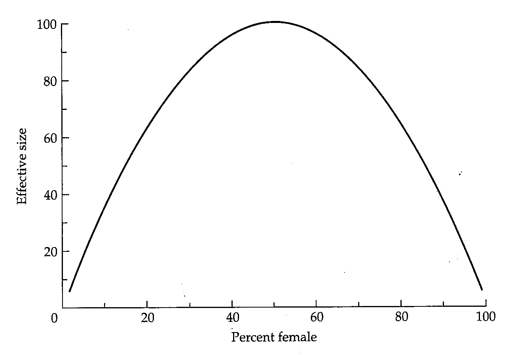
>
> FIGURE 3.13 Effective size falls off rapidly in populations with a skewed sex ratio.

Equation 3.25 can be justified by noting that the sampling variance for the X chromosomes from males is $ p_{m}q_{m}/N_{m} $, whereas the sampling variance for X chromosomes from females is $ p_{f}q_{f}/2N_{f} $, in which $ p_{m} $ and $ p_{f} $ are the frequencies of allele A in males and females, respectively. The frequency of an A-bearing X chromosome in the population is

$$
p=\frac{1}{3}p_{m}+\frac{2}{3}p_{f}
\tag{3.26}
$$

Now we use the fact that, if $a$ and $b$ are constants and $X$ and $Y$ are independent random variables, then $Var(aX + bY) = a^2Var(X) + b^2Var(Y)$. In this case $a = \frac{1}{3}$, $b = \frac{2}{3}$, and the variances of $p_m$ and $p_f$ are the binomial variances, and so

$$
Var\left(p\right)=\frac{1}{9}\left(\frac{p_{m}q_{m}}{N_{m}}\right)+\frac{4}{9}\left(\frac{p_{f}q_{f}}{2N_{f}}\right)
\tag{3.27}
$$

At steady state, $ p_{m} = p_{f} = p $ and $ q_{m} = q_{f} = q $. Making these substitutions and factoring $ pq $ results in

$$
Var\left(p\right)=pq\left(\frac{1}{9}\frac{1}{N_{m}}+\frac{4}{9}\frac{1}{2N_{f}}\right)=\frac{pq}{2\left[\frac{9N_{m}N_{f}}{4N_{m}+2N_{f}}\right]}
\tag{3.28}
$$

The term in the square brackets corresponds to the $ N_{e} $ in Equation 3.25. It shows why this is a variance effective size: The binomial sampling variance in an ideal population is $ pq/(2N_{e}) $.

PROBLEM 3.8 What is the effective population size for mitochondrial DNA? (Assume transmission is exclusively from mothers to all offspring.) What is the effective population size for a gene on the Y chromosome, given that the population consists of N diploid individuals and is in all respects a theoretically ideal population? (Assume XX individuals are female and XY individuals are male.)

ANSWER Mitochondrial DNA is transmitted essentially exclusively by females, and therefore the chance of drawing two mtDNAs that are identical by descent is $ 1/N_f $, where $ N_f $ is the number of females in the population. However, the probability that two randomly chosen autosomal genes are identical by descent is $ 1/(2N_e) $. Equating $ 1/(2N_e) = 1/N_f $ yields $ N_e = N_f / 2 $ as the effective size for the population of mitochondrial DNA molecules. Since $ N_f = N/2 $ in an ideal population, the effective size for mitochondrial DNA, relative to an autosomal gene in an ideal population, is $ N/4 $. Similarly, the effective population size for the Y chromosome is $ N_m / 2 $, where $ N_m $ is the number of males in the population. As with mitochondrial DNA, the effective size for Y chromosomal DNA, relative to an autosomal gene in an ideal population, is $ N/4 $. Note that, when $ N_f = N_m $, even though mtDNA is present in all individuals, whereas the Y chromosome is present only in males, the effective size of mtDNA is not larger than that of the Y chromosome. The effective size depends on the sampling properties of a gene, which depends not only on how many individuals carry the gene but also on the gene's mode of transmission.

---

## PopGen_chapter3_012 · 3.5 EFFECTIVE POPULATION SIZE / Variance in Offspring Number

**[命题 Proposition]**

An ideal population is one in which each breeding individual has an equal chance of contributing offspring to the next generation. Technically, this means that the statistical distribution of the number of offspring per individual is a binomial distribution with mean 1 and variance 1 - 1/N. The distribution is binomial because its range is the fixed interval [0, N], owing to the fact that no individual can have more than N progeny. If N is reasonably large, this binomial distribution is virtually identical to a Poisson distribution with mean and variance equal to 1. Nevertheless, the assumption that each individual has the same distribution of number of progeny is usually unrealistic because, in real organisms, breeding individuals can manifest large differences in their number of progeny. A more realistic model is one in which there are N individuals in the population and in which the ith individual (i = 1, 2,..., N) produces $ n_i $ offspring. In this situation, the effective size of the population is defined as the reciprocal of the probability P that two randomly chosen gametes in the next generation come from the same parent in the previous generation (Crow and Kimura 1970). We will denote the mean and variance of the distribution of offspring number as $ \xi $ (Greek xi) and $ \sigma^2 $, respectively. With these definitions,

$$
\xi=\frac{\sum n_{1}}{N}\quad\text{and}\quad\sigma^{2}=\frac{\sum n_{1}}{N}-\left(\frac{\sum n_{1}}{N}\right)^{2}
\tag{3.29}
$$

The probability P that two randomly chosen gametes come from the same parent is given by

$$
\begin{aligned}P=&\frac{\Sigma\binom{n_{i}}{2}}{\binom{N\xi}{2}}=\frac{\sum n_{i}(n_{i}-1)}{N\xi(N\xi-1)}=\frac{\sum n_{i}^{2}-\sum n_{i}}{N\xi(N\xi-1)}\\。\end{aligned}
\tag{3.30}
$$

**[定义 Definition]**

The rationale for Equation 3.30 is that the numerator is the number of ways that two randomly chosen alleles can be present in offspring from the same parent, and the denominator is the number of ways that two randomly chosen alleles can have any parents. Substitution of Equation 3.29 into Equation 3.30 and a little rearrangement yields

$$
P=\frac{(\sigma^{2}/\xi)+(\xi-1)}{N-1}
$$

But since $ N_{e}=1/P $ by definition, we can write

$$
N_{e}=\frac{N-1}{(\sigma^{2}/\xi)+(\xi-1)}
\tag{3.31}
$$

and so, when $ \xi = 1 $, $ N_e $ is approximately equal to $ N/\sigma^2 $. Therefore, a large variance in offspring number reduces the effective population size by a factor of $ 1/\sigma^2 $, thereby speeding up the process of random genetic drift. The flip side of this principle suggests a management strategy for endangered species: Loss of genetic variation can be reduced when the variance in offspring number is minimized, because if $ \sigma^2 $ is smaller than 1, the effective population size can be larger than the actual population size.

Variance in offspring number can have a large effect on random genetic drift, as can be seen in particularly important cases in which genes are transmitted by different mechanisms in males and females (for example, in the X and Y chromosomes, or in mitochondrial and chloroplast DNA). Generally, even for nuclear genes, the variance in offspring number of males is far greater than that of females, and one particular consequence is that the effective size for the Y chromosome is much smaller than the theoretical value of $ N_{m}/2 $ implied by Problem 3.8.

---

## PopGen_chapter3_013 · 3.5 EFFECTIVE POPULATION SIZE / Effective Size of a Subdivided Population

Finally we will consider a model in which a population is subdivided into D subpopulations (demes), each consisting of N diploid individuals, with migration among demes measured by a quantity m equal to the probability that a randomly chosen allele in any deme originates from one of the remaining D−1 demes. The population subdivision creates a situation in which two levels of random drift take place simultaneously. There is a drift process within each deme, which takes place relatively rapidly, and another drift process in the population as a whole, which takes place more slowly. Since the mathematics is somewhat rough going (Wakeley 1999, 2000), we shall present only the main result, which is that, when D is reasonably large, the effective population size of the entire population is given by

$$
N_{e}=N D\left(1+\frac{1}{4N m}\right)
\tag{3.32}
$$

In this equation, the factor ND comes from the within-deme phase of the random genetic drift, and the factor $ 1 + 1/(4Nm) $ comes from the among-deme phase. An interesting and important feature of the model is that, unless $ 4Nm $ is very large, the effective population size ($ N_e $) is larger than the actual population size (ND). This seeming paradox results from the population subdivision. When there are many demes connected by low rates of migration, then even if one knew which allele in some deme is destined ultimately to become the common ancestor of all alleles in the population at some future time, the process by which this lucky allele spreads among the demes takes a very long time. To put this in another way, when a population is subdivided, it can take a very long time for any two alleles in different demes to trace their lineages back to some common allele in a single deme in some ancestral population.

---

## PopGen_chapter3_014 · RANDOM GENETIC DRIFT: Introduction / 3.6 GENE TREES AND COALESCENCE

The Wright-Fisher model established a way of thinking that dominated population genetics for about 50 years, considering the genealogies of alleles as they proceed forward in time. It is equally valid to think about the ancestry of alleles as the genealogies proceed backward in time, and for some purposes this manner of thinking is much more powerful. A set of alleles sampled from a population furnishes more than an estimate of current allele frequencies. Each allele in the sample has an ancestral history dating back hundreds or thousands of generations. It is possible that a pair of alleles, sampled today, may have come from identical copies of the same allele produced by the same individual just a few generations ago, or the alleles may have had a common ancestor hundreds of generations ago. The term coalescence refers to the process in which, looking backward in time, the genealogies of two alleles merge at a common ancestor. In a sample of k alleles, for example, the first coalescence (looking backward in time) merges the k contemporary genealogies into k - 1 ancestral genealogies, and the second coalescence merges these into k - 2 genealogies, and so forth, until there remains but a single common ancestor for the whole sample of alleles. The idea of coalescent analysis is to consider the ancestral history of genes in a sample by developing a model for the time intervals between each coalescence (Kingman 1980, 1982a,b, 2000; Hudson, 1983; Rosenberg and Nordborg 2002).

To understand how the coalescent process works, consider in Figure 3.14 what happens as time moves forward in time (down the page). In each generation, there are a number of alleles in the population, and these alleles may be replicated and be present in the following generation; in some cases, however, an allele leaves no descendants and is lost from the population. By chance, some alleles may be sampled twice in constituting the next generation, and the probabilities of these events are the same as those under the Wright-Fisher model of random genetic drift. By a repetition of this process over time, one of the original alleles will eventually become fixed in the population. In the absence of mutation, the population would therefore be fixed for the same allele; however, because mutation may occur during the process, the alleles observed at the present will not all be identical in nucleotide sequence, even though they all descended from a single common ancestral allele.

> **Figure 3.14** · page 35 · source: `PopGen_chapter3`
>
> 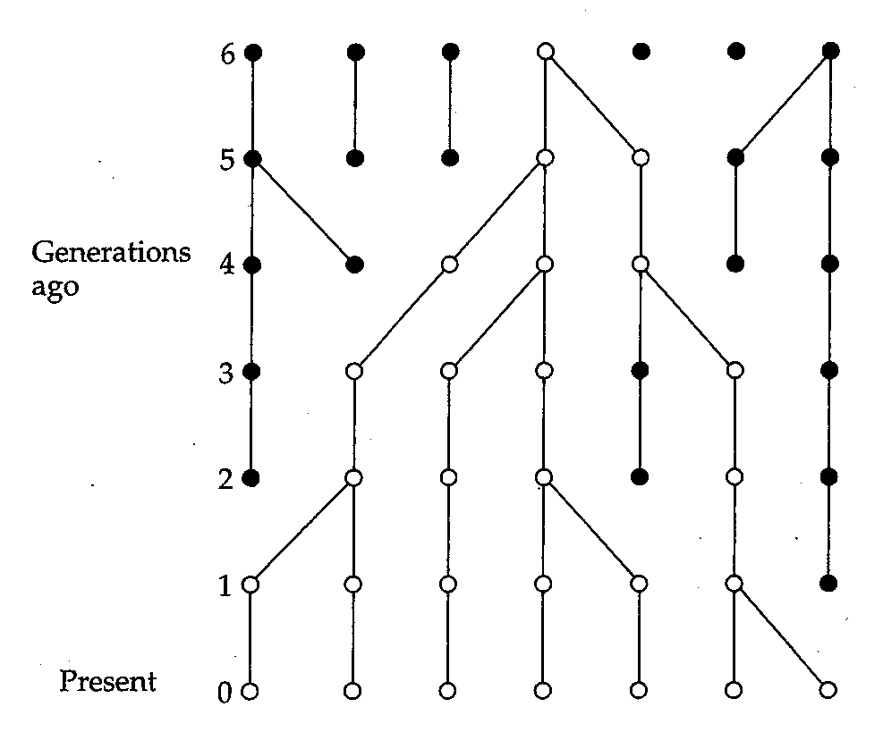
>
> FIGURE 3.14 Diagram showing paths of ancestry of a set of alleles sampled in the present generation. The population is represented as having a constant size. The alleles in the original population are represented at the top. As generations progress forward in time (downward in the diagram), many alleles leave no descendants and therefore go extinct. Eventually one allele goes to fixation. Considering this process in reverse (bottom to top in the diagram), the sample observed in the present generation undergoes a series of coalescent events in which the k alleles present in the present generation had only k - 1 ancestral alleles. The coalescences continue backward in time until there is only one ancestral allele. The filled circles represent alleles present in previous generations that have left no descendant alleles in the present generation.

In reality, we do not usually have the genealogical information enabling us to follow all the alleles through time in a population. Typically what we have is a single "snapshot" represented by a small sample of alleles taken at the present time. Now consider Figure 3.14 again, but this time look at what happens when we go backwards in time (up the page). We start with the k = 7 alleles in the sample at generation 0. In going from generation 0 to generation 1 (one generation back), we see that the genealogies of the two rightmost alleles "coalesced" into a single ancestral allele. As we go further back in time, the number of ancestral alleles has to either remain the same or decrease, and each reduction in the number of ancestral alleles is called a coalescent event.

Figure 3.14 illustrates one reason why coalescent reasoning is so powerful. If we were to study the process in Figure 3.14 going forward in time by means of computer simulation, many of the alleles that are tracked represent wasted computation, since they do not have descendants in the present generation (generation 0). These alleles are denoted by filled circles, and in this case there are 22 of them. On the other hand, if we were to study the same process going backward in time, none of the alleles tracked would be wasted, because each allele present in any generation must trace back to some allele. present in the previous generation. These alleles are represented by open circles, and in this case there are 27 of them. In other words, the forward simulation wastes nearly half its time generating alleles (22 alleles among a total of 49) that are of no interest because they do not contribute to the ancestry of the alleles present in the current population. This is not a great price in the present case, when the sample size is small, but in samples of hundreds of alleles, the vast majority of lineages simulated in the forward direction are unnecessary. In fact, in an original population of size 2N that has evolved for long enough that one of the alleles has gone to fixation in the contemporary population, it is unnecessary to deal with any of the original 2N−1 lineages that eventually go extinct.

Since we are interested in the time required for a pair of genealogies to coalesce, we need a model from which the coalescence times can be derived. Let us consider the immediate ancestry of two alleles. The probability that the two alleles came from the same allele in the previous generation is $ \frac{1}{(2N)} $ (in a diploid population of size N), so the chance that they came from two distinct alleles the previous generation is $ 1 - \frac{1}{(2N)} $. Similarly, the probability that three alleles in any generation originate from three distinct ancestral alleles in the previous generation is Pr(alleles 1 and 2 have distinct ancestors)Pr(allele 3 has a different ancestor from those of allele 1 and allele 2) = $ \frac{1}{1 - \frac{1}{(2N)}} $[1 - $ \frac{1}{2} $(2N)]. In general, the probability that k alleles had k distinct parental alleles the previous generation is

$$
\Pr(\stackrel{i}{k})=\prod_{i=1}^{k-1}\left(1-\frac{i}{2N}\right)\approx1-\frac{(k)}{2N}
\tag{3.33}
$$

In each generation the sampling process occurs independently of what happened before, and so the probability that k alleles had k distinct parental alleles two generations ago is the square of the right-hand side of Equation 3.33. Consider two alleles again. Suppose we wish to know the probability that the common ancestor of these two alleles occurred exactly $ t + 1 $ generations ago. In this case there must have been no coalescence (i.e., two distinct ancestral lineages exist) for t generations, and then, in the next preceding generation, a coalescence occurred. The chance of two alleles not coalescing for t generations is $ [1 - 1/(2N)]^t $, and the chance that they coalesce in the next generation is $ 1/(2N) $. The desired probability is the product of these or

Pr (two alleles had common ancestor $ t+1 $ generations ago)

$$
=\frac{1}{2N}\left[1-\left(\frac{1}{2N}\right)\right]^{t}\approx\frac{1}{2N}e^{-t/(2N)}
\tag{3.34}
$$

The exponential is an approximation that is quite good when $ 1/(2N) $ is small. This distribution has a mean of 2N generations and a variance of $ 4N^{2} $. Note that the confidence interval around the mean time is not very tight, since the standard deviation of the distribution (2N) is equal to the mean.

Returning to our sample of k alleles, the probability that the k alleles do not coalesce for t generations, and then one pair coalesces to give k - 1 alleles at $ t + 1 $ generations ago is as follows:

$$
\begin{aligned}&=\Pr\left(k\right)^{\mathrm{t}}\left[1-\Pr(k)\right]\\&\approx\frac{\binom{k}{2}}{2\mathrm{N}}\exp\left[-\frac{\binom{k}{2}}{2\mathrm{N}}t\right]\\ \end{aligned}
\tag{3.35}
$$

This approximation is valid if $ k \ll N $ (that is, if the sample size is much smaller than the population size, which is usually the case). The distribution in Equation 3.35 has a mean and variance given by

$$
Mean=\frac{4N}{k(k-1)}generations\quad Variance=\frac{16N^{2}}{\left[k(k-1)\right]^{2}}generations^{2}
\tag{3.36}
$$

Felsenstein, in his book Inferring Phylogenies (2004), gives a wonderful bugs-in-a-box analogy for the coalescent process that makes it simple and memorable, and we quote it with his permission.

We can make a physical analogy (if a somewhat fanciful one) by considering a box containing hyperactive, indiscriminate, voracious, and insatiable bugs. We put k bugs into the box. They run about without paying any attention to where they are going. Occasionally two bugs collide. When they do, one instantly eats the other. Being insatiable, it then resumes running as quickly as before. It is obvious that the number of bugs falls from k to k - 1, to k - 2, as the bugs coalesce, until finally only one bug is left.... The analogy is actually fairly precise. The number of pairs of bugs that can collide is $ k(k - 1)/2 $. If there are 2N "places" in the box that can be occupied, the probability of a collision will be proportional to $ k(k - 1)/4N $. The size of the population corresponds to the size of the box. A box with twice as many "places" will slow the coalescence process down by a factor of two. So a simpleminded physical analysis of the bugs-in-a-box process will have the Kingman coalescent [our Equation 3.35] as the probability distribution of its outcomes. (p. 460)

Figure 3.15 shows what the gene genealogy is expected to be in the case of five alleles (k = 5). The genealogy is depicted in two forms, both of which are common in the literature. On the right, the tip of each line represents an allele in the original sample, and moving upwards (backward in time), each node (vertex) represents a coalescence to an ancestral allele. In the depiction on the left, the tips again represent the sampled alleles, but now each coalescent event is represented as a horizontal line. Going backwards in time (up the page), the coalescent time for i alleles to coalesce to i - 1 alleles is denoted $ T_i $ (i = 2 to 5). The probability distribution of these coalescent times is given by Equation 3.35, and the expected values are shown in Figure 3.15. Starting with five alleles, the first coalescence is expected to occur 2N/10 generations. ago, the next at 2N/6 generations prior to that, and so on. The distribution of each of these time intervals is exponential, with ever-increasing means as one goes back in time.

> **Figure 3.15** · page 38 · source: `PopGen_chapter3`
>
> 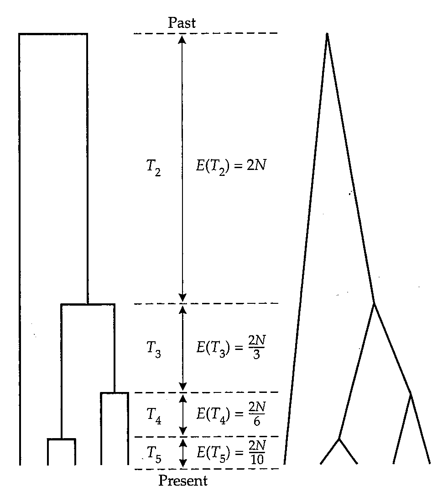
>
> FIGURE 3.15 Two completely equivalent ways of illustrating the coalescences in a gene tree. On the left, the coalescent events are represented as horizontal lines, on the left they are represented as nodes. In any each generation, if there are k alleles present, the expected time back to the next coalescence is given by  $ 4N/[k(1-k)] $. For example, starting with five alleles, the expected time back to the first coalescence is  $ 4N/[5(4)] = 2N/10 $. Note that the successive times get longer. When there are only two alleles, the time back to the final coalescence is 2N generations.

Note that the coalescent times become longer as one goes back farther in time, and the last coalescent time (from 2 alleles to 1) is the longest. This pattern is typical of coalescence in a population of constant size. Quantitatively, it requires a fraction $ (1 - 1/n)/(1 - 1/k) $ of the total time for the last $ n $ of $ k $ alleles in a sample to coalesce (Felsenstein 2004). From this relationship it is easy to see that, if $ k $ is reasonably large (say, $ k \geq 10 $), almost half the time is required to coalesce the last two alleles $ (n = 2) $.

For a sample of k alleles, the time to the coalescence of all of the alleles (i.e., the most recent time that the sample of k alleles shared a common ancestor) is

$$
t=4N(1-1/k)
\tag{3.37}
$$

with variance

$$
V=4N^{2}\prod_{i=2}^{k}\frac{1}{\binom{i}{2}^{2}}
\tag{3.38}
$$

(Kingman 1982a,b; Tajima 1983). As the sample size $ k $ increases toward the total population size, $ t $ approaches 4N, which equals the expected time to fixation for a newly arisen neutral mutation that is destined to be fixed.

What is the probability that the most recent common ancestor of the sample (i.e., the allele to which all the lineages coalesce) to be also the most recent common ancestor of all the alleles in the entire population? The answer is given by the ratio $ (k-1)/(k+2) $ (Rosenberg and Nordborg 2002). This probability is surprisingly large even for relatively small values of k. For example, for k = 5 it is already 67%, and for k = 9 it is 80%, and finally for k = 19 it is 90%. In other words, the most recent common ancestor in a sample of only 19 alleles has a 90% chance of being the most recent common ancestor of all the alleles in a population, no matter whether the population size is five hundred, a thousand, or a million.

---

## PopGen_chapter3_015 · 3.6 GENE TREES AND COALESCENCE / Coalescent Effective Size

Equation 3.37 says that, as $k$ increases toward $2N$, the expected time for all of the alleles in a population to coalesce into a single common ancestral allele is approximately $4N$. This is the coalescent effective size, which (when it exists) equals the inbreeding effective size (Sjodin et al. 2005).

In order to explain when a coalescent effective size does or does not exist, we need to consider the matter of time scale. Equation 3.35 gives the probability distribution of coalescent times, and note that we can eliminate an explicit dependence on 2N by measuring time t in units of 2N generations. With this scaling of time, the mean and variance of the coalescence times in Equation 3.36 become $2/[k(k-1)]$ generations and $4/[k(k-1)]^2$ generations², respectively. Likewise, the time to coalescence of all alleles in a population becomes 2. (Since the units of time are now 2N generations, the actual magnitude of 2 units on this time scale is $ 2 \times 2N = 4N $ generations.)

The coalescent effective size exists for any population process whenever time can be rescaled by a constant to reproduce the standard coalescent embodied in Equation 3.35. We have already considered one such example in which the variance in offspring number does not conform to the binomial distribution assumed in the Wright-Fisher model (see Equation 3.31). To simplify matters, set the mean number of offspring per individual $ \xi = 1 $ in Equation 3.31 (which means that the population remains constant in size). In this case the effective size is, to a close approximation, $ N_e = N/\sigma^2 $ where $ \sigma^2 $ is the variance in offspring number; hence the standard coalescent process is recovered if we scale time in units of $ 2N/\sigma^2 $ generations. This means that a large variance in offspring number reduces the effective population size and speeds up the process of random genetic drift.

There are many processes in which time can be rescaled to recover the standard coalescent process. These include certain models of population growth, age structure, and geographical structure (Emerson et al. 2001; Sagitov and Jagers 2005; Sjodin et al. 2005). The decisive factor is the time scale.

Many processes occur on an ecological time scale, which is typically shorter than the coalescent time scale. Among these processes are changes in population age structure or geographical structure when the rate of migration is sufficiently high. In such cases the “fast” process can simply be averaged. Even though the process does affect the coalescent times, it is only through a scaling factor analogous to the $ \sigma^{2} $ in the case of variance in offspring number. Conversely, some processes occur on a geological time scale, which is typically longer than the coalescent time scale, and in this case the “slow” process can be ignored.

Trouble arises when the population processes occur on a time scale that is comparable to that of the coalescent time scale, because then there is no linear rescaling of time that yields the Wright-Fisher model, and so there is no coalescent effective size. What happens is that the effective size changes as the population evolves. As a specific example, Sjodin et al. (2005) consider a case in which the population size fluctuates randomly between $ N = 10^3 $ and $ N = 10^5 $ and show that, when the probability of a fluctuation is between $ 10^{-6} $ and $ 10^{-2} $ per generation, then no coalescent effective population size exists. The reason is that the changes in population size occurring on this time scale affect the coalescent times in a nonlinear and random manner. On the other hand, for probabilities greater than $ 10^{-2} $ the fluctuations are fast enough that the coalescent effective size equals the average effective size, and for probabilities smaller than $ 10^{-6} $ the fluctuations are slow enough that the coalescent effective size equals the initial size.

---

## PopGen_chapter3_016 · 3.6 GENE TREES AND COALESCENCE / Coalescence with Population Growth

Changes in population size affect the probability distribution of the coalescent times. In populations of constant size, the coalescent trees typically have a sparse number of nodes and relatively long branches near the root (the root is the allele at which all lineages in the sample ultimately coalesce, the most recent common ancestor of all the alleles in the sample). This pattern can be seen in the “expected” coalescent tree in Figure 3.15.

In a population that is growing exponentially from an initial size of $ N(0) $, the size at any time t is given by $ N(t) = N(0)\exp(rt) $, where r is the exponential rate of growth. If both $ N(0) $ and r are large, the coalescent trees are distorted such that they will have more and shorter branches near the root. The reason is that, in an expanding population, it takes longer for alleles to “find” each other starting at the tips and going back in time. Felsenstein’s (2004) bugs-in-a-box analogy helps to understand this point, because in a box that is expanding in size, the bugs will take longer to bump into each other. In the extreme case of a very large $ N(0) $ and r, the coalescences all take place very near the root, resulting in what is often called star phylogeny. (Thinking forward in time about a rapidly expanding population, the lineage of each allele has a very low probability of extinction, and so all the lineages persist and a graph of their genealogical relations resembles a star.) Because coalescent trees in a rapidly expanding population have many short branches near the root, it is reasonable to suppose that, as r decreases, the coalescent events will be less concentrated near the root and will gradually move away from the root toward the tips. The number of branches near the root will decrease, and the branch lengths near the root will become longer until, when r = 0, the coalescent trees will assume the form of those with a constant population size.

The pattern of branching in coalescent trees can be used to make inferences about historical patterns of population growth (Pyrus et al. 1999; Emerson et al. 2001). We will illustrate this point using a method proposed by Pybus et al. (1999) for estimating the growth rate of viral populations, in their case human immunodeficiency virus type 1 (HIV-1). They observed that, in simulated coalescent trees in samples of size $k=400$ from populations with a constant population size, the vast majority (=95%) of trees had three or fewer nodes between the root and the mid-depth point of the tree. (The mid-depth point of a tree is halfway between the tree's root and its tips.) A smoothed version of their simulation results is shown in Figure 3.16. This pattern is not expected in population that is undergoing rapid growth with an exponential rate of increase of $r$. In a growing population more nodes are expected near the root. Furthermore, the proportion of trees with three or fewer nodes between the root and the mid-depth point is linearly related to the logarithm of the product of the current population size and the rate of exponential growth, which Pybus et al. (1999) show how to estimate in the case of HIV-1.

> **Figure 3.16** · page 41 · source: `PopGen_chapter3`
>
> 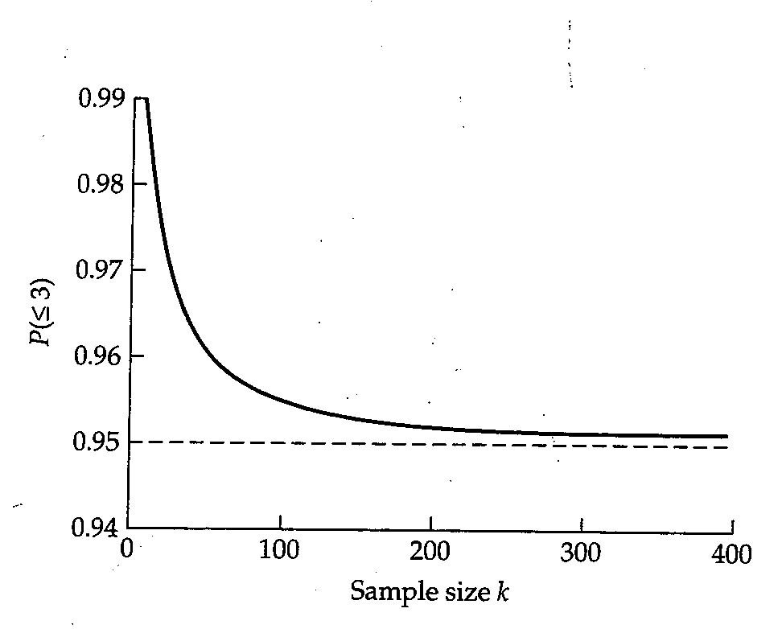
>
> FIGURE 3.16 Random coalescent trees tend to have long branches near the root. In this graph,  $ P(\leq 3) $ represents the proportion of random coalescent trees that have three or fewer coalescent events between the root and the midpoint of the tree, as a function of the sample size. Even for rather large samples, more than 95% of the random trees have  $ P(\leq 3) $. This pattern contrasts with coalescent trees in populations that are growing, in which the number of coalescent events near the root tends to be greater. (Based on simulation results of Pybus et al. 1999.)

The mid-depth method has the drawback that it treats the coalescent tree as known, when it would be more appropriate to average over all possible coalescent trees compatible with the data, each weighed in proportion to its probability. Other methods for estimating population growth rates from coalescent trees are examined in Emerson et al. (2001). By comparing data to simulations, it is also possible to fit more complex demographic histories, such as past population bottlenecks (Thornton and Andolfatto 2006).

---

## PopGen_chapter3_017 · 3.6 GENE TREES AND COALESCENCE / Coalescent Models with Mutation

The principles embodied in Equation 3.35 allows us to generate simulated gene genealogies whose branch lengths correspond to the assumptions of the Wright-Fisher model. It is important to emphasize that we do not usually know the true ancestral relationships among the alleles. The only cases in which the true ancestries are known come from experimental evolution studies carried out in the laboratory with viruses or microbes in which a sample of genomes is isolated and preserved by freezing at intervals during the process. In other contexts when we want to make inferences about a single sample, we simulate a large number of genealogies consistent with the composition of the sample and then make inferences based on the relative likelihoods of these genealogies: To put the method more formally, what we are interested in is maximizing the likelihood L of observing the actual data D (typically DNA sequences) across all possible genealogies, given some model of mutation and population processes (Rosenberg and Nordborg 2002; Felsenstein 2004). Formally, we can write

$$
L=\sum_{G}\Pr\left\{D\mid G,\mu\right\}\Pr\left\{G,\alpha\right\}
\tag{3.39}
$$

where G represents any particular genealogy, $ \mu $ is the set of parameters that define the mutation model, and $ \alpha $ is the set of parameters that characterize the population process (i.e., population size, growth rate, number of demes, migration rate, and so forth).

Equation 3.39 is usually intractable analytically, and therefore simulation of many thousands of random genealogies is carried out instead. In order to simulate the genealogies and sequences of alleles in a sample, we need to specify some type of mutation model. One widely used model is known as the infinite-sites model, in which each allele is considered as a sequence of nucleotides with mutation altering any site in the sequence. If the mutation rate is sufficiently low, then most sites will be monomorphic in the sample, and all polymorphic sites will be segregating for just two nucleotides. Much of the available data on allelic variation in DNA sequence seems consistent with this view: Few nucleotide sites are segregating for more than two nucleotides. If the DNA sequence is sufficiently long and the frequency of polymorphic sites low, then most of the time new mutations will occur at sites that were previously monomorphic. The infinite-sites model is based on these assumptions. It was developed originally by Kimura (1969, 1971), who considered nucleotides as unlinked, and by Watterson (1975), who took account of the nearly complete linkage among sites.

In order to simulate allele sequence data representing samples drawn from a population obeying the infinite-sites model, Hudson (1990, 1993) showed that one can proceed as follows: 1. Estimate the value of $ \theta = 4N\mu $ for the gene or region of interest, where N is the effective population size and $ \mu $ is the per-site mutation rate; this estimate can be based on the number of segregating sites in the sampled sequences or on the average number of site mismatches when the sequences are compared in all possible pairs. (These methods are discussed in Chapter 4.)

2. For the observed sample of k alleles, draw random numbers with appropriate exponential distributions to construct a gene genealogy such that times of coalescence follow Equation 3.35.

3. Randomly scatter mutations with a Poisson distribution on each branch of the tree, such that the mean number of mutations on each branch is given by $ \mu t $, where t is the branch length in units of generations. (For example, the first interval from the root in Figure 3.15 has an expected length of 2N generations; hence each branch from the root has an expected number of mutations of $ 2N\mu = \theta/2 $.)

4. Repeat steps 2 and 3 some 10,000 or more times, and estimate the likelihood of observing the actual data across all genealogies according to Equation 3.39.

---

## PopGen_chapter3_018 · 3.6 GENE TREES AND COALESCENCE / Applications of Coalescent Methods

A typical (and pioneering) application of this approach is found in Hudson et al. (1994). These authors examined a sample of size $ k = 10 $ allelic sequences, each of length 1.4 kb, encoding the enzyme superoxide dismutase in a Spanish population of Drosophila melanogaster. Among the 10 alleles, five were identical in sequence, whereas the others were all different and contained a total of 55 polymorphic sites. It seems unlikely that this configuration of polymorphisms in a sample would occur by chance, and it is tempting to test this hypothesis by sprinkling 55 polymorphisms at random among the 10 sequences. But this is invalid, because the samples are related through ancestry, and their possible genealogies need to be taken into account.

To test the hypothesis that the samples could arise by chance if all the polymorphisms were selectively neutral, the authors simulated 10,000 samples with $k=10$. Rather than assigning mutations to each branch according to a Poisson distribution, they randomly placed 55 mutations on the genealogy in proportion to the branch lengths. The former is technically correct, but the latter is justified unless the number of mutations is very small (Wall and Hudson 2001; Depaulis et al. 2001). For each simulated genealogy, they checked whether it contained a set of five identical alleles. Finding that only about 1% of the simulated genealogies yielded sequences with this characteristic, they felt justified in rejecting the neutral Wright-Fisher model and suggested that the high frequency of one allele resulted either from selection of the gene itself or selection of some linked gene. As another example of the application of coalescent methods, consider the interpretation of a fragment of mitochondrial DNA that had been amplified from a skeletal Neanderthal bone dated to 30,000–100,000 years ago (Krings et al. 1997). The Neanderthal sequence was compared with the mtDNA of 986 modern humans, with the result that the most recent common ancestor of the Neanderthal sample and that of modern humans was estimated to be several times more ancient than that of the human sequences themselves. This was taken as evidence that Neanderthals and the ancestors of anatomically modern humans were separate species that did not undergo interbreeding.

These data were reconsidered by Nordborg (1998) in the light of a different population model using coalescent simulations as well as analytical methods. This analysis confirmed the conclusion that Neanderthals and the ancestors of anatomically modern humans did not fuse in equal numbers to form a single random mating unit. But other models with intermixing of the gene pools cannot be excluded. For example, in a model in which the populations of Neanderthals and the ancestors of anatomically modern humans came together 68,000 years ago, the probability that all Neanderthal mtDNA lineages were lost by random genetic drift is 52% even if Neanderthals comprised as much as 25% of the mixed population. Because the time scale of random drift is smaller for autosomal genes than for mtDNA by a factor of 4 (see Problem 3.8), the probability of loss of all Neanderthal sequences from autosomal genes is much smaller. Nordborg's (1998) calculations imply that, if Neanderthals comprised 25% of a mixed population 68,000 years ago, 90% of our autosomal genes would still be segregating Neanderthal sequences! This example illustrates the limitations of attempting to draw far-reaching inferences from a sample of a single, nonrecombining sequence such as mitochondrial DNA, and it also shows how important it can be to consider various kinds of population models in accounting for observed data.

---

## PopGen_chapter3_019 · RANDOM GENETIC DRIFT: Introduction / 3.7 THEORETICAL IMPLICATIONS OF COALESCENCE

The coalescent approach can be used to derive many fundamental principles in population genetics. For example, Equation 3.36 defines the expected length of each interval $ T_{k} $ in a coalescent tree (see also Figure 3.15), and so the expected sum of the branch lengths $ E(T) $ for the entire tree is given by

$$
E(T)=E\left(\sum_{i=2}^{k}iT_{i}\right)=\sum_{i=2}^{k}iE(T_{i})=\sum_{i=2}^{k}i\frac{4N}{i(i-1)}=4N\sum_{i=1}^{k-1}\frac{1}{i}
\tag{3.40}
$$

The expected number of segregating sites, $ E(S) $, in a set of aligned DNA sequences is equal to the product of the mutation rate and the expected length of all the branches in the coalescent tree, or $ \mu E(T) $. The expected number of segregating sites in a sample of k aligned sequences is therefore obtained from Equation 3.40 as

$$
E(S)=\mu E(T)=4N\mu\sum_{i=1}^{k-1}\frac{1}{i}=\theta\sum_{i=1}^{k-1}\frac{1}{i}
\tag{3.41}
$$

where $ \theta = 4N\mu $. This is the expected number of segregating sites in the infinite-sites model, which we shall discuss again in Chapter 4 in a different context. Note that $ \mu $ is not the mutation rate per nucleotide site; rather it is the mutation rate across the entire length of the DNA sequence. As another example of the theoretical utility of the coalescent approach, consider a sample of alleles taken from population presently in equilibrium between mutation and random genetic drift, which means that new mutations in each generation occur at the same rate as old mutations are lost due to random drift. Tracing any pair of alleles back to the previous generation, the pair of alleles could either coalesce, with probability 1/(2N), or failing to coalesce, one or the other allele could have undergone mutation with probability 2μ. (The factor 2 is necessary because either of the alleles could mutate.) These are the only two events that affect allele identity by descent, and the sum of their probabilities is 1/(2N) + 2μ. The probability of identity by descent (F) is therefore the fraction of the time that the alleles coalesce, or

$$
F=\frac{\frac{1}{2N}}{\frac{1}{2N}+2\mu}=\frac{1}{1+\theta}
\tag{3.42}
$$

This expression will also be derived again in Chapter 4 using different methods.

Coalescent methods are not limited to the consideration of the Wright-Fisher model. If one can develop a recursion equation for probabilities of recombination, migration, or other such phenomena in the context of a gene tree, then often powerful insights can be derived from coalescence approaches. For our purposes, suffice it to say that the method can generate classical results, often with much less difficulty, and as we have seen in the previous section, the coalescent approach is especially well suited to making inferences about samples drawn from natural populations by averaging across a large number of simulated trees. The exceptional speed with which computers can simulate samples drawn from a neutral coalescent has yielded unprecedented opportunities for testing the correspondence between observed data and theoretical predictions.

PROBLEM 3.9 In a model of pure random drift, the probability distribution for the number of generations back to the first coalescence in a sample of k genes taken from a haploid population of size N is approximately: Pr $ \left\{ \text{first coalescence occurred } t \text{ generations ago} \right\} $

$ = ze^{-2t} \text{ where } z = \binom{k}{2} / N $ From this one can show that the mean number of generations back to the first coalescence is 1/z. The more genes in the sample, the more likely it will be that a coalescence occurred recently. Calculate the expected time to first coalescence in a population of N = 450 for a sample of 10 genes. How many genes would you have to sample to reduce this coalescence time by half?

ANSWER The expected time to first coalescence in a population of N = 450 for a sample of 10 genes is

$$
\begin{aligned}N/\binom{k}{2}&=450/\binom{10}{2}=450/(10\times9/2)\\&=10\text{generations}\end{aligned}
$$

To determine how many genes one would have to sample to halve this coalescence time, solve for

$$
5=450\left/\binom{k}{2}\right.
$$

This is equivalent to $90 = k!/(2!k - 2!)$ or $180 = k(k - 1)$. This is a quadratic equation $k^2 - k = 180$ that fits the general form $ax^2 + bx + c = 0$, where $a = 1$, $b = -1$, $c = -180$. The solutions are given by $[-b \pm v(b^2 - 4ac)]/(2a)$, and in this case the solution we want is $k = 13.9$ (the other solution is negative). Hence a sample of size 14 will reduce the initial coalescence time to about 5 generations (4.94 to be exact). If you do not know the quadratic formula, you can also get this answer by trial and error. In any case, increasing the sample from 10 to only 14, we expect to find any pair of alleles only half as divergent from each other.

---

## PopGen_chapter3_020 · 3.7 THEORETICAL IMPLICATIONS OF COALESCENCE / Coalescent Models with Recombination

Coalescence with recombination is among the most difficult problems in modern population genetics (Rosenberg and Nordborg 2002; Stumpf and McVean 2003). To understand why it is so difficult, consider the trees in Figure 3.17. These are conventional coalescent trees, but the nodes and tips are labeled with the identities of two distinct nucleotide sites. The tips are also labeled 1–4 to identify the individual alleles in the sample. The symbols A and a represent a single-nucleotide polymorphism at the site. The A could be a G nucleotide at the site, for example, and the a a T nucleotide at the same site. Likewise, B and b represent a single-nucleotide polymorphism at the second site.

> **Figure 3.17** · page 47 · source: `PopGen_chapter3`
>
> 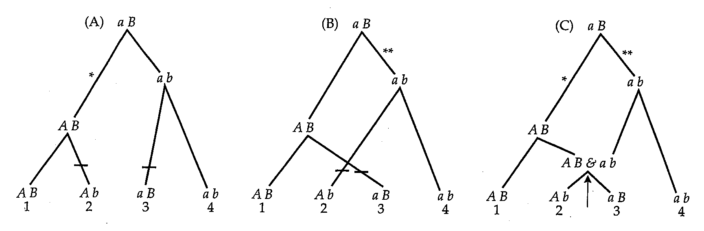
>
> FIGURE 3.17 Coalescence and recombination of single nucleotide polymorphisms (A, a) and (B, b) in samples of size 4. (A) Coalescent tree with regard to A and a, where the asterisk marks the branch with a mutation of a to A. The horizontal tick marks represent an inferred recombination event. (B) Coalescent tree with regard to B and b, where the double asterisk marks the branch with a mutation of B to b. The horizontal tick marks again represent an inferred recombination event. Tree (A) is incompatible with tree (B), but a consistent tree (C) results from an ancestral recombination graph in which a coalescence can depict a recombination event. In this case, the arrow points to the coalescence where the recombination took place, and the recombinant chromosomes recreate their ancestral parental types.

Tree (A) in Figure 3.17 depicts the coalescences of the samples with respect to the A and a pair of alleles. The time of the a to A nucleotide substitution is indicated by the asterisk. Tree (B) depicts the coalescences with respect to the B and b pair of alleles. In this case the time of mutation of B to b is indicated by the double asterisk. Both tree (A) and tree (B) accurately portray the ancestry of the A, a and B, b pairs of alleles, respectively. The problem is that the trees are different. In tree (A), the first coalescence joins samples 1 and 2, whereas in tree (B) it joins samples 1 and 3.

The reason for the discrepancy is that, at the time depicted by the horizontal ticks in (A) and (B), an A B-bearing chromosome underwent recombination with an a b-bearing chromosome to yield recombinant A b and a B products. The tipoff that the nucleotide sites have undergone recombination is that all four possible types of chromosomes (A B, A b, a B, and a b) are present in the sample. The probability that any sample will contain all four types of chromosomes increases with the size of the sample, so large samples are desirable for detecting recombination. Even with large samples, however, many recombination events are likely to be missed. This test for recombination is valid only if the mutation rate is sufficiently low that each site in an ancestral history can mutate no more than once. If recurrent mutation can occur, which happens in viruses with a high mutation rate like HIV-1, then the detection of recombination becomes more difficult (McVean et al. 2002).

How can the inconsistency between tree (A) and tree (B) in Figure 3.17 be resolved? The conventional method of resolution is shown in tree (C) (Hudson 1990). In this case, as the ancestry of each chromosome is traced back in time, when two chromosomes come together, either of two events can happen: the chromosomes either (1) undergo recombination, or (2) undergo coalescence. In tree (C), the arrow indicates the recombination event, which is depicted by the recombinant chromosomes recreating their ancestral parental types. A graph such as that in C is called the ancestral recombination graph for the haplotypes in the sample.

The device of allowing recombination or coalescence at each node resolves the inconsistency in the tree, but at the same time it reveals the complexity of the process. Analytical results are possible only in the simplest of cases (Hudson 1990, 2001). Simulation is an alternative, but suppose you were assigned to simulate the ancestral history of a region of DNA in which there were 50 segregating sites and in which recombination can take place. Intuitively you can see that the task is horrendous. You must generate an ancestral history, sprinkle the branches with mutations at sites along the sequence, decide which nodes will result in coalescence and which result in recombination, and keep track of where in the sequence the mutations and the recombination events took place. The simulation therefore yields coalescent tree whose elements are one-dimensional graphs.

Complex as it is, simulation of coalescence with recombination is possible. The problem is that a random coalescent tree is not even remotely likely to generate a simulated sample of alleles showing characteristics such as linkage disequilibrium that are similar to those in the actual sample. This problem can be dealt with in various ways. One way is to ignore coalescences and estimate the rate of recombination based on various characteristics of the sample itself. Just as the relevant parameter for mutation is $ 4N\mu $, the relevant parameter for recombination is $ 4Nr $, where N is the effective population number and r is the rate of recombination per generation. One estimate of $ 4Nr $ is based on comparing the samples alleles in all possible pairs and for each pair tabulating the number of nucleotide mismatches. The distribution of pairwise mismatches is a basis for estimating the rate of recombination, because the variance in the number of mismatches is reduced by recombination (Wakeley 1997). This point can be appreciated by comparing the mismatch distribution in a sample consisting of $ AB $, $ AB $, $ aB $, and $ ab $, and $ a $, $ b $ with that in a sample consisting of $ AB $, $ AB $, $ aB $, and $ ab $, the latter of which is indicative of recombination. In both samples the mean number of pairwise mismatches is 1.33, but the variances are 0.89 and 0.22, respectively. The advantage of this approach is that it is completely straightforward; the main limitation is that it does not use all of the information in the sample and so has a larger sampling variance than necessary.

The opposite approach to using summary statistics is to carry out extensive simulations to perform a full likelihood analysis as encapsulated in

Equation 3.39. The problem with this approach, as we have suggested, is that random simulations are extremely unlikely to approximate the actual data. The parameter space is so large that, except in simple cases, a full-blown likelihood approach requires computational capabilities that exceed those of even the most powerful computer systems. This problem has stimulated the implementation of methods that reduce the dimensionality of the problem by collapsing the full data set into summary statistics, and by zeroing in on portions of the parameter space that is the most relevant. Approximate Bayesian coalescence methods collapse the observed data to summary statistics such as the number of distinct haplotypes or the average number of mismatches between pairs of sequences. For each coalescent tree that is simulated, the same summary statistics are calculated. If the difference between the observed data and simulated sample is small enough (based on a somewhat arbitrary threshold), then the parameters from the simulated sample are accepted. Repeating the simulated sampling many times yields what is called the posterior distribution of the parameter estimates.

**[命题 Proposition]**

Two widely used methods that avoid random guesses at the parameter values but instead enable the computer to spend more time in the "most promising" regions of the parameter space are Markov Chain Monte Carlo (MCMC) and sequential importance sampling. Even these methods are challenged with the large size of currently available data sets. Both of these methods require a criterion for the goodness of fit between the data and the model, and this is itself sometimes difficult to compute. Instead of calculating the full likelihood, a composite likelihood is sometimes used, in which the simpler problem of calculating the likelihood for each individual nucleotide site is solved, and then the overall likelihood is taken as the product of the likelihood over the set of nucleotides (Kim and Stephan 2000; Hudson 2001; McVean et al. 2002; Zhu and Bustamante 2005; Carvajal-Rodriguez et al. 2006). This approach assumes statistical independence across the nucleotide sites—an assumption that can hardly be justified—but in practice the method provides a reasonable criterion for acceptance, and it seems to perform much better than might be expected.

---

## PopGen_chapter3_021 · 3.7 THEORETICAL IMPLICATIONS OF COALESCENCE / Linkage Disequilibrium Mapping

Analysis of coalescence with recombination is important because understanding the consequences of mutation, recombination, and random drift acting simultaneously is at the heart of using human population samples to make inferences about genetic risk factors for multifactorial genetic diseases such as hypertension, diabetes, and schizophrenia (see Chapter 10). The underlying principle is that, in a finite population, the processes of mutation, recombination, and random drift result in linkage disequilibrium, the nonrandom association of the alleles along a chromosome, which we have already examined in the context of very large (theoretically infinite) populations in Chapter 2.

Quantitative aspects of linkage disequilibrium in the presence of mutation, recombination, and drift are examined in detail in Chapter 9, and we defer the details until then. The main result is summarized in the graphs in Figure 3.18, which show the expected linkage disequilibrium between two genetic markers (for example, SNPs) as a function of the percent recombination between the markers and the effective size of the population. Roughly speaking, in the human genome, a value of 1% recombination corresponds to about 1 Mb of DNA, and using this rule of thumb, a scale in kilobase pairs is shown across the top. You may recall from Chapter 2 that the measure of linkage disequilibrium $ r^2 $ has the intuitive meaning that its square root (that is, $ \sqrt{r^2} $) is the correlation coefficient between the alleles present in a single chromosome. Hence an $ r^2 = 0.2 $ implies a correlation coefficient of $ \sqrt{0.2} = 0.45 $, which is reasonably large. Many of the values plotted in Figure 3.18 have $ r^2 = 0.2 $. Even for $ N_e $ as large as 1000, the equilibrium $ r^2 $ is expected to be greater than 0.2 for SNPs separated by 100 kb. This reasoning suggests that the human genome might exhibit substantial linkage disequilibrium across regions at least on the order of several tens of kb, and this expectation has been substantiated by the The International HapMap Consortium (2005).

> **Figure 3.18** · page 50 · source: `PopGen_chapter3`
>
> 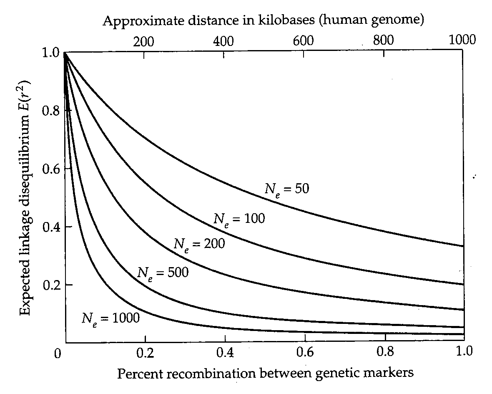
>
> FIGURE 3.18 Linkage disequilibrium ( $ r^{2} $) expected at steady state in the infinite-sites model as a function of the effective population size and the frequency of recombination. The scale in nucleotides across the top is approximate for the average across the human genome, but local recombination rates in the human genome are highly variable.

The analysis of associations between SNPs and complex diseases that have a genetic component is known as linkage disequilibrium mapping. This approach will be examined in some detail in Chapter 10. Its goal is to identify individual SNPs that are in or near genes with mutant alleles that predispose to the disease. These mutant alleles are known as genetic risk factors for the disease, and the measure of association is the magnitude of the linkage disequilibrium. In essence, such studies examine a large sample of affected individuals (cases) and an equally large number of matched, nonaffected individuals (controls). The individuals are genotyped for hundreds of thousands of SNPs across the genome, and SNPs are identified that are more frequently found in affected individuals than in unaffected controls. (For such a large number of statistical tests, the issues of false positives and false discovery discussed in Chapter 2 become critical.) SNPs that are significantly associated and reproducible in independent studies are assumed to mark the genomic locations of the genetic risk factors. Any genetic risk factor is likely to show linkage disequilibrium with multiple nearby SNPs, because the genealogical trees of SNPs linked to the genetic risk factor are correlated. Searching among these for the SNP whose inferred genealogy yields the best separation of cases and controls provides a finer level of genetic resolution of the risk factor. These applications are part of the reason that coalescence with recombination is one of the most active fields of research in modern population genetics.

---

## PopGen_chapter3_022 · 3.7 THEORETICAL IMPLICATIONS OF COALESCENCE / SUMMARY

1. Because of random sampling of gametes in each generation, the allele frequencies in a finite population fluctuate with a theoretical variance equal to $ pq/(2N) $. These fluctuations in allele frequency are the basis of random genetic drift.

2. The Wright-Fisher model extends the idea of binomial sampling to multiple generations and implies that, in a population in which the only force acting on allele frequencies is random genetic drift, the probability that an allele will drift to fixation is equal to its initial frequency in the population.

---

## PopGen_chapter3_023 · RANDOM GENETIC DRIFT: Introduction / SUMMARY

3. Diffusion approximations of the Wright-Fisher model make use of second-order partial differential equations for the distribution of allele frequencies among subpopulations at any given time, when the initial allele frequency among the subpopulations is stipulated. The diffusion approach has yielded important insights into the consequences of drift, such as that, for a new neutral mutation destined to be fixed, the expected time to fixation is 4N generations.

4. A useful way to think about random drift is to consider a set of subpopulations of the same size undergoing repeated generations of sampling and drift. Within each of these subpopulations, genotypes are composed by drawing alleles at random, so that each subpopulation is always in Hardy-Weinberg equilibrium. Averaged across the subpopulations, the frequency of heterozygous genotypes is smaller than that expected from HWE, and the heterozygosity decreases at an average rate of 1/(2N) each generation.

5. Real biological populations do not usually fit the Wright-Fisher model because the allele frequencies change more rapidly than would be expected based on the actual population size. The drift model gives better correspondence to reality by calculating the effective population size $ N_{e} $, which takes into account the sex ratio, variance in offspring number, fluctuation in population size over generations, or population subdivision. In some cases the effective population size can be greater than the actual population size.

6. Many aspects of random drift are greatly simplified by considering the genealogical history of alleles. Looking backward in time, the lineages of alleles come together (coalesce) at points in time when they both originated by replication of a single ancestral allele.

7. The distribution of coalescent times is exponential, which allows computer simulation of coalescent trees to be implemented very easily, yielding the characteristics expected in samples from a population evolving under any particular model. These simulated samples can be compared with actual data to test hypotheses or estimate population parameters.

8. The joint effects of mutation, recombination, and random drift result in a steady state in which the magnitude of linkage disequilibrium is a function of the frequency of recombination and the effective population size. In human populations, the linkage disequilibrium expected opens the possibility of linkage disequilibrium mapping of genetic risk factors for disease.

---

## PopGen_chapter3_024 · 3.7 THEORETICAL IMPLICATIONS OF COALESCENCE / PROBLEMS

1. Describe the Wright-Fisher model of random genetic drift. The elements $ T_{ij} $ of the transition matrix are probabilities. How should $ T_{ij} $ be interpreted?

2. Explain how the basic concept behind the Kolmogorov forward equation differs from that underlying the Kolmogorov backward equation.

---

## PopGen_chapter3_025 · RANDOM GENETIC DRIFT: Introduction / PROBLEMS

3. Explain why, in any population model in which random genetic drift plays a role, "backward" computer simulation, which starts with the alleles present in the current population and traces their coalescence backward in time, is computationally much simpler than "forward" simulation, which starts with the alleles present in the original population and simulates random genetic drift moving forward in time.

4. In an ideal diploid population of size 50, what is the probability that a neutral allele present in exactly one copy will be lost in the next generation? What is the answer if the allele is present in two copies?

5. Suppose that a diploid population of size 50 undergoes a change in average heterozygosity across loci from 0.50 to 0.42 in a single generation. Is it plausible to attribute this magnitude of change to random drift alone?

6. How many generations of random genetic drift are required to reduce the expected heterozygosity to 5% of its initial value in a diploid randomly mating population of size 10? Of size 50?

7. An autosomal gene in a colony of 28 Asian wild mice, Mus castaneus, undergoes mutation to a new neutral allele. Assuming that the population conforms to the Wright-Fisher model, what is the probability that the allele eventually becomes fixed? What is the probability that it eventually becomes lost? What is the average time to loss, given that the allele is eventually lost. What is the average time to fixation, given that it is eventually fixed?

8. What are the answers to Problem 3.7 if the mutant gene is X-linked and the population consists of equal numbers of males and females? What if the gene is Y-linked?

9. An isolated population of alpine edelweiss (Leontopodium alpinum) loses half its heterozygosity in 30 generations. What is its effective population size?

10. Remote Pitcairn Island in the South Pacific was settled in 1789 by Fletcher Christian and eight fellow mutineers from HMS Bounty, along with a small number of Polynesian women. Although many descendants have left the island in the intervening years, there has been essentially no immigration. Assuming an effective size of 20 in each of the eight generations since the island's settlement, what value of $ F_{t} $ would be expected in today's population from random genetic drift?

11. Show that random genetic drift requires an average of $ t = 2N \ln(x) $ generations to reduce the expected heterozygosity from $ H_0 $ to $ H_0/x $.

12. A large randomly mating diploid population with two neutral alleles A and a at allele frequencies $ p_0 = \frac{1}{3} $ and $ q_0 = \frac{2}{3} $, respectively, splits into a large number of isolated subpopulations each of effective size 50. Within each subpopulation mating is random, but the allele frequencies diverge due to random genetic drift. After 69 generations, what are the expected genotype frequencies of AA, Aa, and aa, averaged across the subpopulations? In one of the subpopulations, the allele frequency of A equals 0.3. What are the expected genotype frequencies in this individual subpopulation?

13. Two inbred strains of the azuki bean beetle Callosobruchus chinensis are crossed and their progeny allowed to mate at random each generation thereafter. Among 100 single-nucleotide polymorphisms differing in the original inbred strains, what number would be expected to remain segregating after 10 generations, assuming an effective population size of 80 individuals? How many would be expected to remain unfixed after 50 generations?

14. Use Equation 3.14 to show that approximately 2N generations of random genetic drift are required to reduce the number of segregating genes by a factor of $ e(e = 2.71828 \ldots) $ given initial allele frequencies close to 0.5.

15. What is the effective population number in a population of African lions, Panthera leo, in which each breeding male controls a harem of five females and the total population consists of 200 males and 200 females?

16. What is the effective population size of a herd of 10 dairy cows and 1 bull? What is it for 40 cows and 1 bull? For 10 cows and 2 bulls?

17. What is the variance effective population size for an X-linked gene in a population consisting of 100 females and 10 males? In a population of 10 females and 100 males?

18. In a haploid population of constant effective size 50, what is the probability that two randomly drawn alleles shared a common ancestor exactly 100 generations ago?

19. In a population of effective size 30, how many generations are required on the average to coalesce from 4 alleles to 3? From 3 alleles to 2? From 2 alleles to 1?

20. In a haploid population of effective size 50, how many sequences k should be present in a sample for the first coalescence to have an average time of 10 generations.

21. In the infinite-sites model, if $ \theta = 10 $, how many segregating sites are expected in a sample of size 10? 20? 50?

---
