# Chapter 4 · MUTATION AND THE NEUTRAL THEORY

## PopGen_chapter4_001 · MUTATION AND THE NEUTRAL THEORY: Introduction

Several processes can create new types of genetic variation in populations or promote the reorganization of previously existing variation either within genomes or among subpopulations. The ultimate source of genetic variation is mutation, by which we mean any heritable change in the genetic material. Mutation therefore includes a change in the nucleotide sequence of a single gene as well the formation of a chromosome rearrangement, such as an inversion or a translocation. Recombination brings mutations of different genes together into the same chromosome, and migration enables mutations to spread among subpopulations. A transposable element is a DNA sequence able to replicate and insert into any of a large number of sites in the genome. By insertion in or near a gene, a transposable element can alter the level or pattern of gene expression, and recombination between transposable elements can result in a chromosome rearrangement, for example, an inversion. In this chapter, we consider the processes by which genetic variation is created and examine the expected fate of mutations in natural populations.

---

## PopGen_chapter4_002 · MUTATION AND THE NEUTRAL THEORY: Introduction / 4.1 MUTATION

Mutation is the ultimate source of genetic novelty underlying evolutionary change. However, most wildtype genes mutate at a very low rate, typically in the range from $ 10^{-4} $ to $ 10^{-6} $ new mutations per gene per generation. Even a low mutation rate can create many new mutant alleles because, in a large population, each of a large number of genes is at risk of mutating. In a population of size N diploid organisms, there are 2N copies of each gene, each of which can mutate in any generation. For example, if the mutation rate (probability of mutation) is $ 10^{-9} $ per nucleotide pair per generation, then in each human gamete, the DNA of which contains approximately $ 3 \times 10^{9} $ nucleotide pairs, there would be an average of three new mutations in each generation; each newly fertilized egg would therefore carry, on the average, six new mutations. The present-day human population of approximately 6.5 billion people would therefore be expected to carry about 40 billion new mutations that were not present even one generation earlier.

---

## PopGen_chapter4_003 · 4.1 MUTATION / Irreversible Mutation

Although mutation may create a new allele, the initial frequency of the mutant allele must be very low when the population size is large. To be specific, a single new mutant allele in a diploid population of size N has an initial frequency of 1/(2N). New mutations in subsequent generations may augment the number of mutant alleles, but recurrent mutation alone increases the allele frequency of the mutant very slowly. Consider a specific example in which A is the wildtype allele and a the mutant form. If there is exactly one new mutation per generation, and random genetic drift is ignored, then the allele frequency of a increases according to the series 1/(2N), 2/(2N), 3/(2N), … and, if N is large (for example, $ N = 10^6 $), then the increase is very slow indeed. Hence, the tendency for allele frequency to change as a result of recurrent mutation (the mutation pressure) is very small. On the other hand, the cumulative effects of mutation over long periods of time can become appreciable.

A useful model for thinking about mutation is the Hardy-Weinberg model of Chapter 2, but with mutation permitted. For the moment, we focus on mutations that have so little effect on the ability of the organism to survive and reproduce that natural selection does not appreciably influence their frequency. We will also assume that mutation is irreversible, which means that a cannot reverse-mutate to A. To avoid complications resulting from change in allele frequency due to chance, we will also assume a population that is infinite in size.

Consider a gene with two alleles, A and a, and suppose that A mutates to a at a rate of $ \mu $ mutations per A allele per generation. In other words, each A allele has a probability of $ \mu $ of mutating to a in any generation. We will symbolize the allele frequency of A as p and that of a as q and keep track of generations with subscripts. Hence, $ p_t $ and $ q_t $ are the allele frequencies of A and a, respectively, in the $ t $th generation, where $ t = 0, 1, 2, \ldots $. In any generation, $ p_t + q_t = 1 $ because A and a are the only alleles considered.

Next we will deduce a formula for the allele frequency $ p_{t} $ in terms of the allele frequency $ p_{t-1} $ in the previous generation. In generation t, $ p_{t} $ includes all the A alleles in generation t that did not mutate in that generation, and so

$$
p_{t}=p_{t-1}\left(1-\mu\right)
$$

$$
\vec{p}_{t}
$$

$$
p_{0}=1
$$

However, by the same reasoning, $ p_{t-1} $ includes all A alleles in generation t-1 that did not mutate in that generation, and so $ p_{t-1} = p_{t-2} \times (1 - \mu) $. Substituting this equation into the one above yields

$$
p_{t}=p_{t-2}\left(1-\mu\right)^{2}
$$

Continuing in the same manner leads eventually to

$$
p_{t}=p_{0}(1-\mu)^{t_{ 环 }}
\tag{4.1}
$$

The effect of mutation pressure on allele frequency is illustrated in Figure 4.1 for the case $ \mu = 10^{-4} $. The allele frequency of $ A $ decreases very slowly, almost linearly at first because the governing term in Equation 4.1, $ (1 - \mu)^t $, is approximated by $ 1 - \mu t $ when $ t $ is sufficiently small. After 1000 generations, the allele frequency of $ A $ is still 0.90; however, at $ t = 10,000 $ generations, $ p_t = 0.37 $; and at $ t = 20,000 $ generations, $ p_t = 0.14 $.

> **Figure 4.1** · page 3 · source: `PopGen_chapter4`
>
> 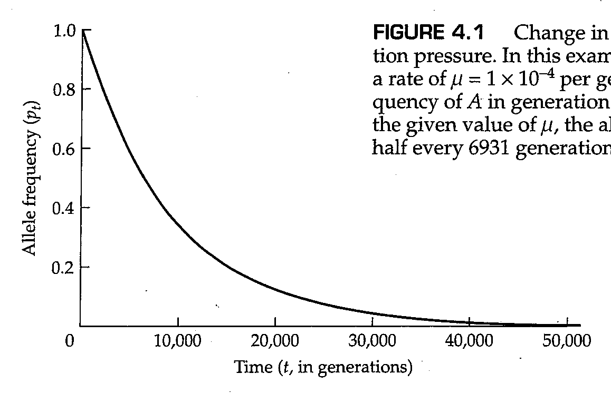
>
> FIGURE 4.1 Change in allele frequency under mutation pressure. In this example, an allele A mutates to a at a rate of μ = 1 × 10^-4 per generation; p_t is the allele frequency of A in generation t. We assume that p_0 = 1. With the given value of μ, the allele frequency decreases by half every 6931 generations.

One instructive way to analyze Equation 4.1 is to consider the time required to reduce the allele frequency of A by half. To find the “half-life” of the process, set $ p_t = 0.5 \times p_0 $; this relationship implies that $ \boxed{0.5} = (1 - \mu)^t $. Taking logarithms of both sides, we obtain

$$
t_{\frac{1}{2}}=\ln\left(0.5\right)/\ln\left(1-\mu\right)\approx0.6931/\mu
$$

In the example in Figure 4.1, $ t_{\frac{1}{2}} = 6931 $ generations. A decrease in $ \mu $ by a factor of 10 increases $ t_{\frac{1}{2}} $ accordingly, to approximately 69,310 generations for $ \mu = 10^{-5} $ and to approximately 693,100 generations for $ \mu = 10^{-6} $. The feeble effect of mutation pressure alone in changing allele frequency is illustrated by the long half-lives calculated for realistic values of the mutation rate. As noted with reference to Equation 4.1, the approximation $ p_t = p_0(1 - \mu t) $ is quite accurate for small values of $ t $. With respect to the allele frequency of the mutant allele $ a $, the approximation can also be written as $ q_t = q_0 + \mu t $, provided that $ q_{0} $ is small. This approximation implies that the allele frequency of the $ a $ allele increases linearly with time with a slope equal to $ \mu $. Because $ \mu $ is small, however, the linear increase in $ q_{t} $ is difficult to detect experimentally except in very large populations. A large population size can be attained in a bacterial chemostat, which is a device for maintaining a population of bacteria in a continuous state of growth and cell division (Figure 4.2). The linear increase in $ q_{t} $ from mutation pressure observed in a chemostat is shown in Figure 4.3. Note the abrupt increase in mutation rate (indicated by the increase in slope) shortly after the addition of caffeine, a bacterial mutagen.

> **Figure 4.2** · page 4 · source: `PopGen_chapter4`
>
> 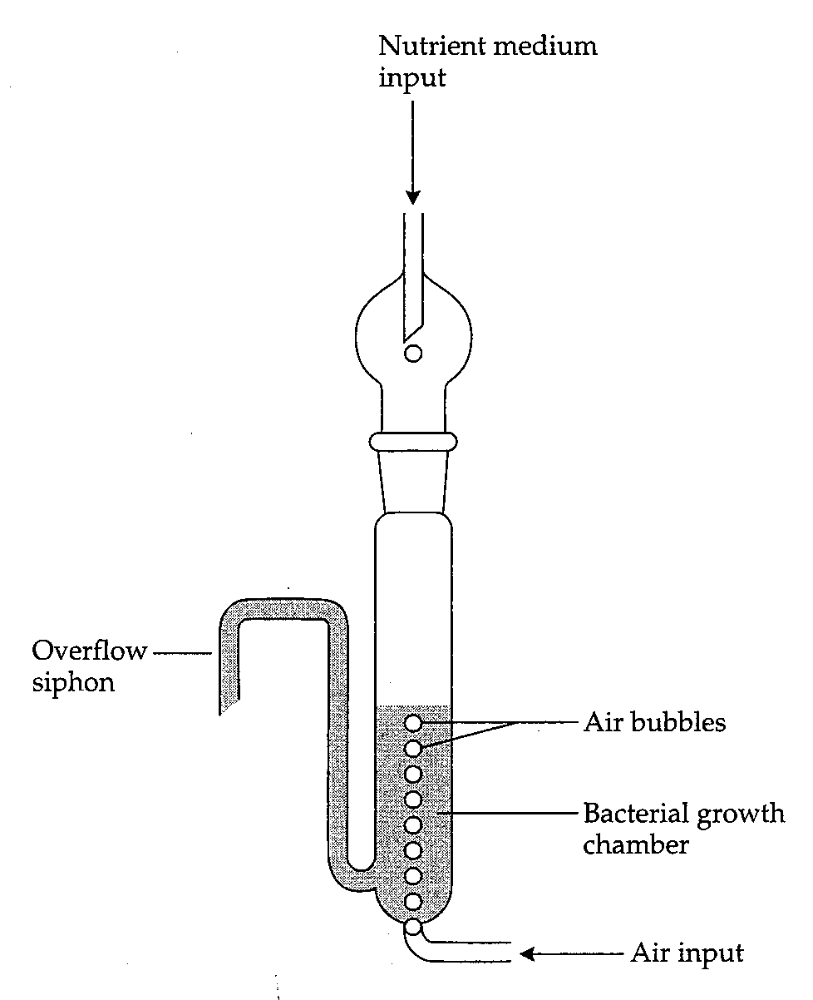
>
> FIGURE 4.2 Diagram of a bacterial chemostat. Nutrient medium drips in at the top, but a constant volume is maintained by means of an overflow siphon. The air coming in at the bottom provides oxygen. At the steady state, the rate of inflow of nutrient equals the rate of outflow. Cells within the chemostat are in a continuous state of division, but the population does not increase in size because, in any interval of time, the number of new cells produced by division is balanced by the number washed out through the siphon.

> **Figure 4.3** · page 5 · source: `PopGen_chapter4`
>
> 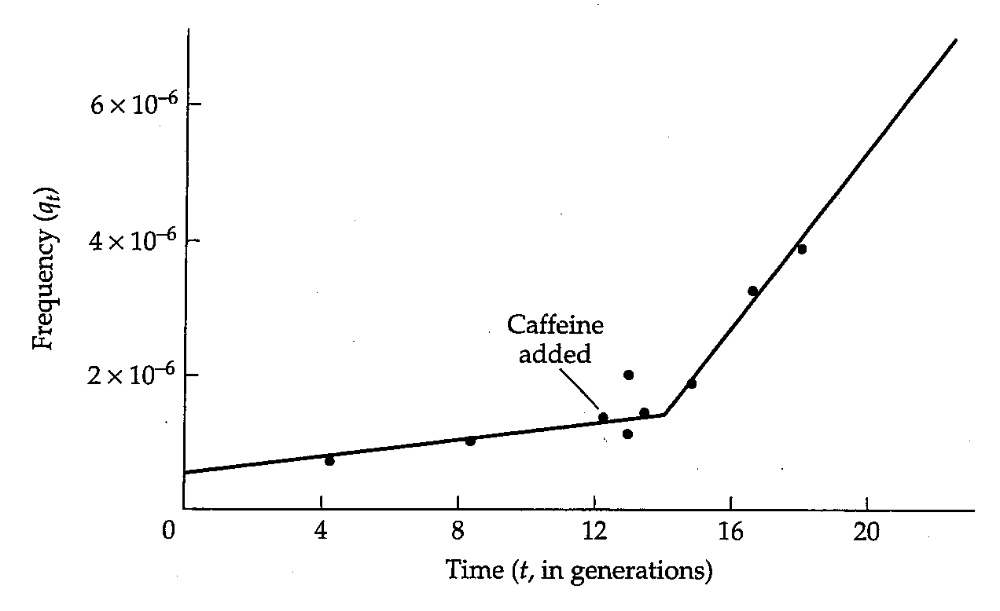
>
> FIGURE 4.3 Estimation of mutation rate in a bacterial chemostat. This example concerns the rate of mutation of a gene in Escherichia coli that confers resistance to infection by the bacteriophage T5. The frequency  $ q_t $ is the frequency of T5-resistant cells after  $ t $ generations of growth. The mutation rate is estimated as the slope of the straight-line segments. Prior to the addition of caffeine, the slope was  $ \mu = 7.2 \times 10^{-8} $ per generation. After addition of caffeine at a concentration of 150 mg/L, the slope increased about tenfold to  $ \mu = 66 \times 10^{-8} $ per generation. In this experiment, the generation time was 5.5 hours. (From Novick 1955.)

PROBLEM 4.1 A genetic factor has been described in Drosophila mauritiana that results in the spontaneous deletion of the transposable genetic element mariner at a frequency of approximately 1% per generation for each copy (Hartl 2001). In a population containing an autosomal site at which a mariner insertion is fixed (homozygous), how many generations would be required for the frequency of flies that are homozygous for a deletion of the element to exceed 5%? Assume that the population is large, that mating is random, that the excision factor is fixed, and that deletion of the element does not affect survival or reproduction.

ANSWER. Let $ p_t $ be the frequency of chromosomes in which the mariner element remains undeleted in generation $ t $, and let $ \mu = 0.01 $ be the probability of deletion of the element per generation. For this situation, Equation 4.1 applies with $ \mu = 0.01 $ and $ p_0 = 1 $. The frequency of deletion homozygotes is greater than 5% when $ (1 - p_t)^2 > 0.05 $, or $ p_t < 1 - \sqrt{(0.05)} = 0.776 $. Thus, $ t $ should be greater than $ \ln(0.776)/\ln(0.99) = 25.2 $ generations.

---

## PopGen_chapter4_004 · MUTATION AND THE NEUTRAL THEORY: Introduction / Irreversible Mutation

In addition to forward mutation of A to a, the model can also allow reverse mutation from a to A. Mutation pressure on the allele frequency p therefore pushes in both directions: Forward mutation tends to decrease p, reverse mutation tends to increase p. Eventually, an equilibrium is reached in which the frequency p remains constant from generation to generation. At this point, the loss of A alleles from forward mutation is exactly offset by the gain of A alleles from reverse mutation.

To deduce the point of equilibrium, suppose that the rate of forward mutation from A to a is $ \mu $ per generation and that the rate of reverse mutation from a to A is v per generation. Let $ p_t $ and $ q_t $ denote the allele frequencies of A and a in generation t, so that $ p_t + q_t = 1 $: An A allele in generation t can originate in either of two ways. It could have been an A allele in generation t - 1 that escaped mutation to a (which happens with probability $ 1 - \mu $), or it could have been an a allele in generation t - 1 that mutated to A (which happens with probability v). In symbols,

$$
p_{t}=p_{t-1}(1-\mu)+(1-p_{t-1})\nu
\tag{4.2}
$$

To solve this equation for $ p_{t} $, note that Equation 4.2 can be written in the form

$$
p_{t}-\frac{v}{\mu+v}=\left(p_{t-1}-\frac{v}{\mu+v}\right)(1-\mu-v)
\tag{4.3}
$$

Because the relation between $ p_{t-1} $ and $ p_{t-2} $ is the same as that between $ p_{t} $ and $ p_{t-1} $, the solution to Equation 4.3 is obtained by successive substitutions as

$$
p_{t}-\frac{v}{\mu+v}=\left(p_{0}-\frac{v}{\mu+v}\right)(1-\mu-v)^{t}
\tag{4.4}
$$

To understand what happens to the allele frequency in the long run, consider Equation 4.4 in the case when $t$ is very large, for example $10^5$ or $10^6$ generations. Even though $1 - \mu - v$ is ordinarily close to $1$, the value of $t$. eventually becomes so large that $(1 - \mu - v)^t$ becomes approximately 0. Thus, the whole right-hand term in Equation 4.4 goes to 0, and so $p_t$ eventually attains a value that remains the same generation after generation. Such a value of $p$ is called an equilibrium value, which we will denote by $\hat{p}$. In case of reversible mutation, the equilibrium is found by equating the left-hand side of Equation 4.4 to 0, and therefore

$$
\hat{p}=\frac{v}{\mu+v}
\tag{4.5}
$$

There is a simple intuitive explanation as to why Equation 4.5 gives the equilibrium with reversible mutation. Since A alleles become a alleles at a rate $ \mu $ per generation, and a alleles revert to A alleles at a rate $ \nu $ per generation, at equilibrium one might expect the ratio of allele frequencies to be the reciprocal of the ratio of the mutation rates, or $ \hat{p}/\hat{q}=v/\mu $. Because $ \hat{q}=1-\hat{p} $, this reasoning implies that $ \hat{p}=v/(\mu+v) $, as verified in Equation 4.5.

The manner in which $ p_t $ converges to its equilibrium value is shown in Figure 4.4 for the case $ \mu = 10^{-4} $ and $ v = 10^{-5} $. Note that, whatever the initial frequency of $ A $, the allele frequency of $ A $ eventually goes to $ \hat{p} $, which in this example equals $ 0.00001 / (0.0001 + 0.00001) = 0.091 $. Figure 4.4 also indicates that mutation pressure is usually very weak in changing allele frequency, inasmuch as the population requires thousands or tens of thousands of generations to reach equilibrium.

> **Figure 4.4** · page 7 · source: `PopGen_chapter4`
>
> 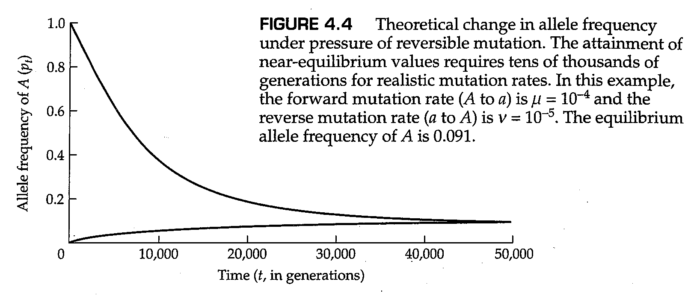
>
> FIGURE 4.4 Theoretical change in allele frequency under pressure of reversible mutation. The attainment of near-equilibrium values requires tens of thousands of generations for realistic mutation rates. In this example, the forward mutation rate (A to a) is μ = 10^-4 and the reverse mutation rate (a to A) is ν = 10^-5. The equilibrium allele frequency of A is 0.091.

PROBLEM 4.2 The bacterium Salmonella enterica has a genetic switching mechanism that regulates the production of alternative forms of a protein component of the cellular flagella. There are two alleles, which we will call A (for the "specific-phase" flagellar property) and a (for the "group-phase" flagellar property). Switching back and forth between A and a takes place rapidly enough that Equation 4.4 can be applied. The transition from A to a has a rate of $ \mu = 8.6 \times 10^{-4} $ per generation, and that of a to A has a rate of $ v = 4.7 \times 10^{-3} $ per generation. These rates are orders of magnitude larger than mutation rates typically observed for other genes. The reason is that the change from A to a and back again does not result from mutation in the conventional sense but from intrachromosomal recombination (Simon et al. 1980). Formally, however, we can treat the system as one with reversible mutation. In cultures initially established with the frequency of A at $ p_0 = 0 $, Stocker (1949) found that the frequency increased to $ p = 0.16 $ after 30 generations and to $ p = 0.85 $ after 700 generations. In cultures initiated with $ p_0 = 1 $, the frequency decreased to 0.88 after 388 generations and to 0.86 after 700 generations. How do these values agree with those calculated from Equation 4.4 using the estimated mutation rates? What is the predicted equilibrium frequency of A?

ANSWER Note that $ v/(\mu + v) = 0.845 $. This is the predicted equilibrium frequency (Equation 4.5). Also, $ 1 - \mu - v = 0.99444 $, and this quantity determines the rate of approach to equilibrium. For the cultures with $ p_0 = 0 $, the predicted values are $ p_{30} = 0.845 - (0.845)(0.99444)^{30} = 0.13 $ and $ p_{700} = 0.845 - (0.845)(0.99444)^{700} = 0.83 $. For the cultures with $ p_0 = 1 $, the predicted values are $ p_{388} = 0.845 + (0.155)(0.99444)^{388} = 0.86 $ and $ p_{700} = 0.845 + (0.155)(0.99444)^{700} = 0.85 $. The predicted values are in very good agreement with the observations.

---

## PopGen_chapter4_005 · MUTATION AND THE NEUTRAL THEORY: Introduction / 4.2 MUTATION AND RANDOM GENETIC DRIFT

**[命题 Proposition]**

The assumption of a virtually infinite population size is often unrealistic. An improved model makes the population size finite, in which case the change in the frequency of a mutant allele depends not only on the mutation pressure but also on random sampling from generation to generation. The random sampling results in chance changes in allele frequency, a process called random genetic drift discussed in some detail in Chapter 3. To understand the effects of random genetic drift when combined with mutation, consider the diagram in Figure 4.5. The squares represent the 2N alleles in the adult population in generation t. Each allele is assigned a unique label— $ \alpha_1 $, $ \alpha_2 $, $ \alpha_3 $,..., $ \alpha_{2N} $—to temporarily mask its identity as either A or a. The circles represent the essentially infinite pool of gametes in generation t. In the gamete pool, each labeled allele has a frequency of $ 1/(2N) $. The squares at the bottom represent two diploid genotypes in generation $ t + 1 $ formed by random sampling from the pool of gametes. By chance, the two alleles forming a genotype may be replicas of the same allele in the previous generation, for example, $ \alpha_i\alpha_i $. Alternatively, the two alleles forming a genotype may come from different alleles in the previous generation, for example, $ \alpha_i\alpha_i $.

> **Figure 4.5** · page 9 · source: `PopGen_chapter4`
>
> 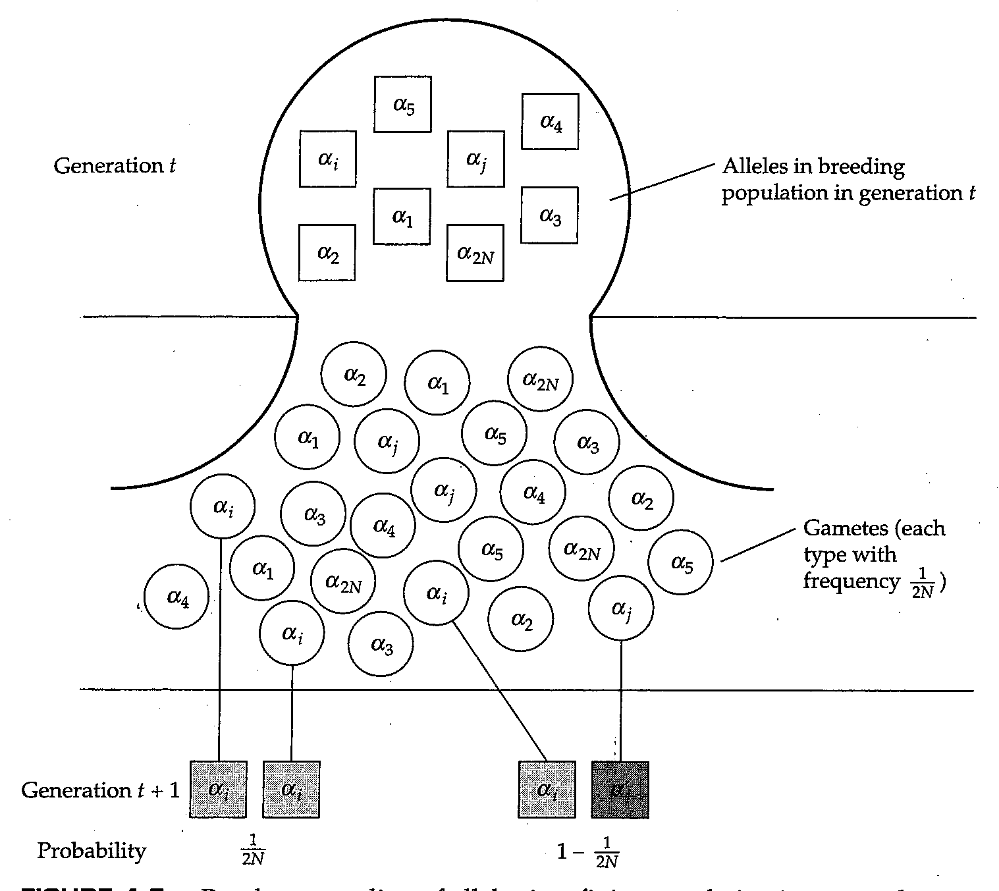
>
> FIGURE 4.5 Random sampling of alleles in a finite population increases the probability of identity by descent. Two randomly chosen alleles, illustrated in the squares at the bottom, may be identical by descent either because they are replicas of the same allele in the immediately preceding generation ( $ \alpha_{i}\alpha_{i} $) or because they are replicas of the same allele in a more remote generation ( $ \alpha_{i}\alpha_{i} $).

The random sampling from the gamete pool means that some alleles may be overrepresented in generation $ t + 1 $, relative to their frequency in generation $ t $, and some alleles may be underrepresented. Indeed, any particular allele has a good chance of being unrepresented in generation $ t + 1 $, and hence the lineage of that allele is terminated. To be precise, in a population of constant size, each allele in generation $ t $ has a chance of approximately $ e^{-1} = 0.368 $ of not being represented in generation $ t + 1 $. To understand why, consider the allele designated $ \alpha_1 $. The frequency of $ \alpha_1 $ in the gamete pool is $ 1/(2N) $, and the frequency of all other alleles together is therefore $ 1 - 1/(2N) $. Because the genotypes in generation $ t + 1 $ are formed by the random selection of 2N alleles from the pool of gametes, the distribution of the number of $ \alpha_1 $ and non- $ \alpha_1 $ alleles present in generation $ t + 1 $ is given by successive terms in the binomial distribution:

$$
\left[\frac{1}{2N}\alpha_{1}+\left(1-\frac{1}{2N}\right)\alpha\right]^{2N}
\tag{4.6}
$$

in which $ \alpha $ represents the collection of all alleles other than $ \alpha_{1} $. Hence, the probability that $ \alpha_{1} $ is not represented in generation $ t+1 $ is given by

$$
\left(1-\frac{1}{2N}\right)^{2N}\approx e^{-1}=0.368.
\tag{4.7}
$$

The approximation is very good even when N is quite small. For example, when N = 10, the left-hand side of Equation 4.7 equals 0.358, and, when N = 20, the left-hand side equals 0.363.

The important implication of Equation 4.7 is that, owing to random genetic drift, the ancestral lineage of each allele faces a substantial risk of extinction in each generation. As time goes on, the lineages progressively disappear, one or a few at a time. Eventually, a time is reached at which all lineages except one have become extinct. At that time, every allele in the population is identical by descent with a particular allele present in an ancestral population.

---

## PopGen_chapter4_006 · 4.2 MUTATION AND RANDOM GENETIC DRIFT / Probability of Fixation of a New Neutral Mutation

The ultimate extinction of all but one lineage implies the answer to the question: What is the probability that a single new mutation eventually becomes fixed in a population of size 2N? One approach to this problem is illustrated in Figure 4.6. Parts A and B show all the alleles present in the current generation, immediately after a new mutation (shaded circle) has been created. After a sufficient number of generations have passed, each of the alleles in the descendant population will descend from a single allele, chosen at random, in the current population. In part A, the descendant alleles all derive from one of the nonmutant alleles in the current population; the nonmutant alleles have frequency $ 1 - \frac{1}{2N} $, and so this is the probability of ultimate fixation of a nonmutant allele: In part B, the descendant alleles all derive from the mutant allele, and so $ \frac{1}{2N} $ is the probability of ultimate fixation of a new mutant allele: More generally, for neutral alleles, which do not affect the survival or reproduction of the organism, the probability of ultimate fixation of a selectively neutral allele in a finite population is equal to the frequency of the neutral allele in the initial population.

> **Figure 4.6** · page 10 · source: `PopGen_chapter4`
>
> 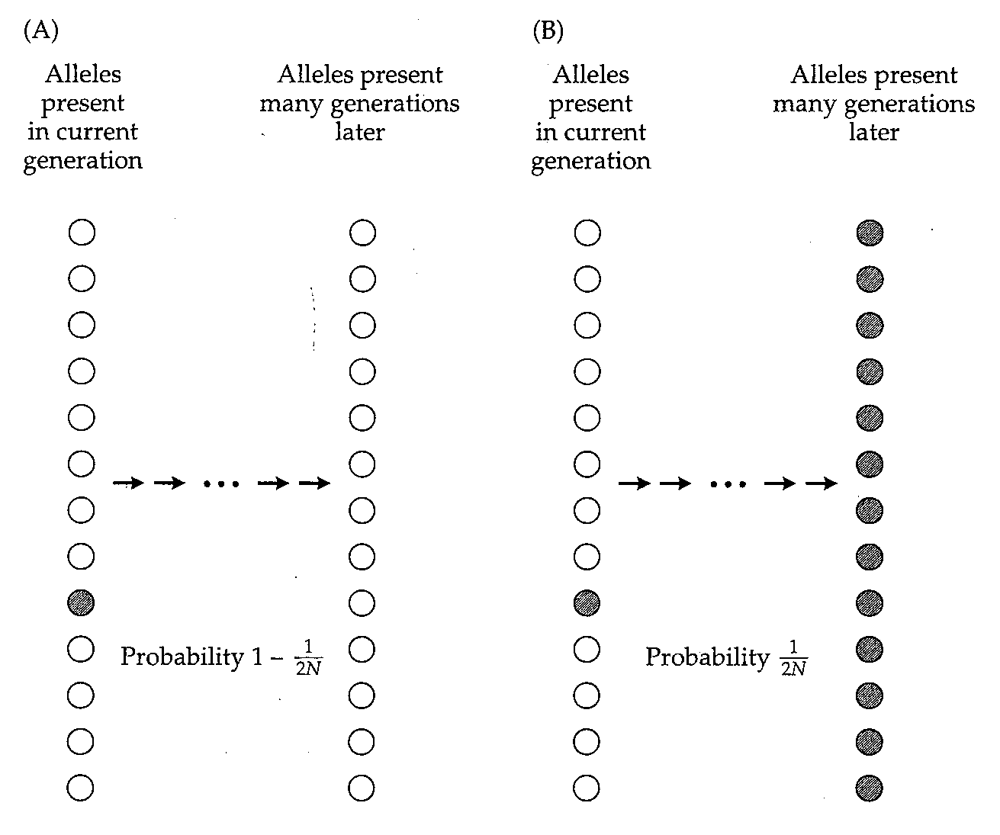
>
> FIGURE 4.6 In a finite population, the lineages of all alleles must trace back to a single allele in some ancestral population. Here, a particular allele of interest in a diploid population of size N is indicated by the shaded circle. (A) The probability the designated allele is not destined to be the common ancestor of all alleles many generations in the future is 1 - 1/(2N). (B) The probability the designated allele is destined to be the common ancestor of all alleles many generations in the future is 1/(2N). Hence, the probability of ultimate fixation of a newly arising neutral allele is 1/(2N).

The result that a new neutral mutation has a probability of ultimate fixation of 1/(2N) was already deduced in Chapter 3 in two different ways. One was through reasoning based on coalescence; Figure 4.6B, when examined from right to left, is a sort of coalescent diagram without the branches, in which all the shaded alleles at the right coalesce to the shaded ancestral allele at the left. The other approach to this problem in Chapter 3 was through the Kolmogorov backward equation (see Problem 3.5). In Chapter 3 we also used this approach to show that, among the lucky few neutral alleles that are eventually fixed, the process takes a long time—on the average, 4N generations.

---

## PopGen_chapter4_007 · MUTATION AND THE NEUTRAL THEORY: Introduction / 4.3 THE NEUTRAL THEORY OF MOLECULAR EVOLUTION

The hypothesis that many genetic polymorphisms result from selectively neutral alleles maintained by a balance between the effects of mutation and random genetic drift is known as the neutral theory (Kimura 1968a; King and Jukes 1969). Mutation introduces new alleles into a population, and random genetic drift determines whether a neutral allele will ultimately be fixed or lost, though loss is the usual outcome. At equilibrium, there is a balance between mutation and random genetic drift, so that, on the average, each new allele gained by mutation is balanced against an existing allele that is lost.

In essence, the neutrality hypothesis states that many mutations have so little effect on the organism that their influence on survival and reproduction is negligible. The frequencies of neutral alleles are not, therefore, determined by natural selection. Consequently, if the neutrality hypothesis is true, then many polymorphisms may have no particular significance in the adaptation of a species to its environment. From the perspective of adaptation, selectively neutral polymorphisms are mere evolutionary "noise" and, regardless of how much their study may reveal about population structure and random genetic drift, they tell us little or nothing about adaptive genetic changes in evolution. Kimura (1968a) gave the irony a positive spin by noting that "if my chief conclusion [about the prevalence of neutral alleles] is correct, then we must recognize the great importance of random genetic drift... in forming the genetic structure of biological populations." Quite so. Although neu tral alleles may be unsuitable for the study of genetic adaptation, the very fact that they are invisible to natural selection makes them ideal for mapping the geographical structure of populations and for tracing the ancestral lineages of DNA sequences to make inferences about the genealogical relationships within and among species. Because the neutrality hypothesis is of fundamental importance in population genetics and evolution, it has been a subject of considerable discussion (for example, Li 1997; Graur and Li 2000; Hartl 2000a; Nei and Kumar 2000; Gillespie 2004). The neutrality hypothesis was put forward in the late 1960s at a time when most of the genome was supposed to have a protein-coding function. Introns and other noncoding sequences were unknown. Today it is clear that only about 1.5% of the mammalian genome codes for proteins. The low coding density affords ample scope for mutations that have little or no effect on fitness, including some (but by no means all) mutations in introns, pseudogenes, spacers between genes, noncoding DNA in the centromeric region of chromosomes, and so forth.

---

## PopGen_chapter4_008 · MUTATION AND THE NEUTRAL THEORY: Introduction / 4.4 THE INFINITE-ALLELES MODEL

Many genes have more than two alleles represented among the organisms in a natural population. It is therefore of some importance to determine the expected level of genetic variation under mutation pressure. A convenient measure of genetic variation is the proportion of heterozygous genotypes (the heterozygosity). If a gene has a greater heterozygosity than expected from mutation pressure alone, then other forces that operate in nature must tend to preserve genetic variation. On the other hand, if a gene has a smaller heterozygosity than expected, then other forces must tend to eliminate genetic variation.

The heterozygosity of a gene is a function of the number of alleles and their relative frequencies. In principle, the number of alleles of any gene could be very large. For example, a gene coding for a protein of 300 amino acids has a coding sequence 900 nucleotides in length. Because each nucleotide site could be occupied by either an A, T, G, or C, the total number of possible alleles is 4900, which equals about 10542. Hence, we can suppose that every new mutation creates an allele that does not already exist in the population. This is called the infinite-alleles model of mutation. The infinite-alleles model is but one way to specify the characteristics of new mutations. Although it represents a somewhat simplified view of mutation, it nevertheless provides a useful standard of comparison for other models or for observed allele frequencies.

**[命题 Proposition]**

In the infinite-alleles model, two alleles that are identical in sequence must also be identical by descent because of the assumption that each mutation creates a unique allele. The concept of identity by descent may be made clear with reference to Figure 4.5, where each allele is assigned a unique identifier, $ \alpha_{1}, \alpha_{2}, \alpha_{3} $, and so forth. At the bottom, the alleles in the genotype $ \alpha_{i}\alpha_{i} $ on the left are considered as identical by descent because they descend from a single ancestral allele by DNA replication in a previous generation. In this case the DNA replication that produced $ \alpha_{i}\alpha_{i} $ occurred in the immediately preceding generation. Also in Figure 4.5, the alleles in the genotype $ \alpha_{i}\alpha_{j} $ might be identical by descent. The different subscripts imply only that they did not derive by DNA replication in the immediately preceding generation, but if they derived by DNA replication in some earlier generation, they are nevertheless identical by descent.

In the literature of population genetics, a genotype in which the alleles are identical by descent is sometimes said to be autozygous, and one in which the alleles are not identical by descent is said to be allozygous. There is some ambiguity in the concept of identity by descent, because the coalescent process implies that every allele of a gene must ultimately derive from DNA replication of a single ancestral allele at some time in the possibly ancient past. In practice the ambiguity is resolved by picking some reference point in time in the past and arbitrarily declaring that at this point in time no allele is identical by descent with any other.

In the infinite-alleles model, in which each mutation produces a new allele not present in the population, homozygous genotypes must have alleles that are autozygous (identical by descent). To measure the homozygosity, therefore, we need only to calculate the autozygosity. This can again be done with reference to the finite-population model in Figure 4.5. Define $F_t$ as the probability that, in generation $t$, two alleles randomly chosen from a population are identical by descent. In the context of Figure 4.5, the randomly chosen alleles are combined in pairs to make genotypes, and so $F_t$ is also the probability of autozygosity in generation $t$. We will use the $\alpha_i\alpha_i$ and $\alpha_i\alpha_j$ genotypes in generation $t$ in Figure 4.5 to derive an expression for $F_t$ in terms of $F_{t-1}, N$, and the mutation rate $\mu$. First, consider the genotype $\alpha_i\alpha_i$. What is the probability that this genotype has alleles that are identical by descent? The alleles must be identical by descent provided that neither allele has mutated in the course of one generation, and so the probability of identity by descent in this case is $(1-\mu)^2$. Now consider the genotype $\alpha_i\alpha_j$. These alleles are identical by descent only if two randomly chosen alleles in generation $t-1$ are identical by descent and if neither allele mutated in the course of one generation. Therefore, the probability of identity by descent in this case is $F_{t-1}(1-\mu)^2$. Because each of the labeled $\alpha's$ in Figure 4.5 has the same frequency in the gamete pool, namely $1/(2N)$, the probability of a combination like $\alpha_i\alpha_j$ is $1/(2N)$ and the probability of a combination like $\alpha_i\alpha_j$ is $1-1/(2N)$. Putting all this together, the recurrence equation for $F_t$ is

$$
F_{t}=\left(\frac{1}{2N}\right)\left(1-\mu\right)^{2}+\left(1-\frac{1}{2N}\right)\left(1-\mu\right)^{2}F_{t-1}
\tag{4.8}
$$

**[命题 Proposition]**

Eventually an equilibrium value of $F$, call it $\hat{F}$, is attained in which the increase in autozygosity from random genetic drift in any generation is exactly offset by the decrease in autozygosity from new mutations. The equilibrium can be found by equating $F_t = F_{t-1} = \hat{F}$ in Equation 4.8 and solving. Ignoring terms in $\mu^2$ and those in $\mu/N$ because they are expected to be negligibly small, the solution is

$$
\hat{F}=\frac{1}{1+4N\mu}
\tag{4.9}
$$

to an excellent approximation. Therefore, the number of selectively neutral alleles increases under mutation pressure until $ \hat{F} $ satisfies Equation 4.9. Since it is the equilibrium value of the probability of identity by descent, $ \hat{F} $ is also the equilibrium value of the autozygosity. Because of the assumption in the infinite-alleles model that each allele in the population arises only once, all genotypes that are homozygotes must also be autozygous. Therefore, $ \hat{F} $ can also be interpreted as the equilibrium value of the proportion of homozygous genotypes.

In Equation 4.9, N should be interpreted as the effective population size, $ N_{e} $, defined in Chapter 3 as the size of an ideal population that has the same rate of increase in homozygosity as the population in question. In population genetics, the usual symbol for $ 4N_{e}\mu $ is $ \theta $, so that $ \theta = 4N_{e}\mu $, and Equation 4.9 can be rewritten as

$$
\hat{F}=\frac{1}{1+\theta}=\frac{1}{1+4N_{e}\mu}
\tag{4.10}
$$

Because any genotype that is not homozygous is heterozygous, it follows that the proportion of heterozygous genotypes in a population is given by $ 1 - \hat{F} $. In the infinite-alleles model, therefore, the heterozygosity is given by Equation 4.10 as

$$
1-\hat{F}=\frac{\theta}{1+\theta}=\frac{4N_{e}\mu}{1+4N_{e}\mu}
\tag{4.11}
$$

where again $\theta = 4N_e\mu$. Figure 4.7 shows the equilibrium homozygosity $[1/(1+\theta)]$ and heterozygosity $[\theta/(1+\theta)]$ for a range of values of $\theta = 4N_e\mu$. The illustration shows that there is a rather narrow range of $4N_e\mu$ over which an intermediate level of genetic variation (heterozygosity) is maintained. For example, the equilibrium heterozygosity is in the range 0.2 to 0.8 only when $4N_e\mu$ is in the range 0.25 to 4. In reality, however, as is clear from Figure 1.8, the heterozygosity for electrophoretic variants in protein molecules is smaller than 0.2, and often much smaller than 0.2 (in mammals it is about 0.03).

> **Figure 4.7** · page 15 · source: `PopGen_chapter4`
>
> 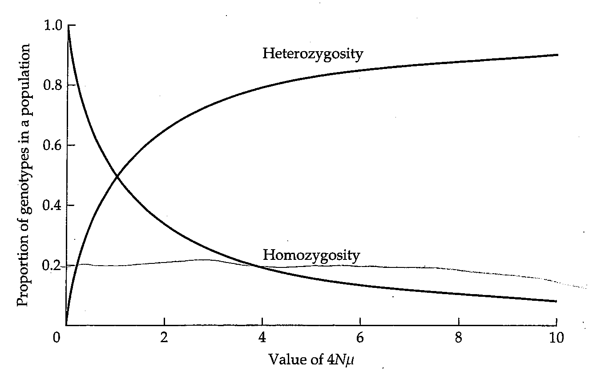
>
> FIGURE 4.7 Plot of average homozygosity and average heterozygosity for the infinite-alleles model. Intermediate values of heterozygosity are maintained over only a small range of  $ \theta = 4N_{e}\mu $.

This means that the range of realistic values in Figure 4.7 is confined to the extreme left of the graph, where $ \theta $ is substantially smaller than 1. In fact, for the protein electrophoresis data in Figure 1.8, the estimated range of $ \theta $ is 0.03–0.16. In other words, the maximum estimated value of $ 4N_e\mu $ differs from the minimum by a factor of only about five. This is quite unexpected, inasmuch as the population number in different species can differ by factor of $ 10^4 $ or more. The apparently too narrow range of $ \theta = 4N_e\mu $ among diverse organisms has been interpreted as implying that the neutrality hypothesis is simply wrong for amino acid polymorphisms (Gillespie 1991). On the other hand, estimates of the effective population number in natural populations are generally imprecise because the studies are very difficult, and estimates of $ \mu $, which in this case is the mutation rate to neutral amino acid polymorphisms, are even more uncertain. However, the actual distribution of allele frequencies in populations suggests that many segregating amino acid polymorphisms present at low frequency are mildly deleterious and maintained by mutation pressure.

PROBLEM 4.3 It is an oddity that Equations 4.10 and 4.11 predict the equilibrium homozygosity and heterozygosity without explicit reference to the allele frequencies. If the allele frequencies are estimated in a random-mating population, however, then the homozygosity and heterozygosity can be estimated using the Hardy-Weinberg principle from Chapter 2. In particular, the homozygosity is estimated as $ \hat{F} = \Sigma p_i^2 $, where the sum is over all allele frequencies $ p_i $, and the heterozygosity is estimated as $ 1 - \hat{F} $. A study of electrophoretic protein variants in a Caribbean population of Drosophila willistoni (Ayala and Tracy 1974) yielded the following estimated allele frequencies for the loci Adk-1 (adenylate kinase-1), Lap-5 (leucine aminopeptidase-5), and Xdh (xanthine dehydrogenase):

Estimate the homozygosity and heterozygosity for each gene, and give the corresponding estimate of $ \theta $.

ANSWER The homozygosity estimates are 0.438 for Adk-1, 0.673 for Lap-5, and 0.373 for Xdh, and the corresponding heterozygosities are 0.562, 0.327, and 0.626. Because the equilibrium homozygosity $ \hat{F} $ equals $ 1/(1 + \theta) $ [see Equation 4.10], then $ \theta $ can be estimated as $ (1 - \hat{F})/\hat{F} $, which equals the ratio of the heterozygosity to the homozygosity. For these three genes the estimates of $ \theta $ are 1.28, 0.49, and 1.68, respectively. These values are substantially greater than the average for electrophoretic polymorphisms in Drosophila (see Figure 1.8), which is about $ \theta = 0.16 $.

---

## PopGen_chapter4_009 · 4.4 THE INFINITE-ALLELES MODEL / The Ewens Sampling Formula

Equation 4.11 shows that the infinite-alleles model has an equilibrium when the heterozygosity equals $ \theta/(1+\theta) $. This is not an “equilibrium” in the usual sense, meaning the absence of change. In reality, it is a dynamic state in which allele frequencies are always changing, new mutations continue to come into the population, alleles previously present are lost, and even alleles that might at one time have been fixed are subject to eventual loss. The term steady state is more appropriate for this kind of situation, since the alleles are not maintained at a constant frequency, but rather new ones enter and old ones are lost from the population. The population remains at a steady state in the sense that the number of alleles and the homozygosity (autozygosity in the infinite-alleles model) remain stationary. But if the number of alleles and the level of autozygosity are in a steady state, then it is reasonable to assume that there is also a steady-state distribution of allele frequencies. When there are multiple alleles, the joint distribution of the allele frequencies present in a population is often called the allele-frequency spectrum in the population. When the allele-frequency spectrum is at a steady state, this implies that the most common allele always has a frequency of $ p_{1} $, and the next most common has a frequency of $ p_{2} $, and so on. The steady-state allele-frequency spectrum has the curious property that, even though the most common allele is expected to have a frequency of $ p_{1} $, the identity of the most common allele will change with time. In the steady-state population, not all alleles are equally frequent, and F is greater than it would be were all alleles equally frequent.

Consider now the steady-state allele-frequency spectrum from the point of view of an experimenter taking a sample from a population. Let the sample size be n genes, and suppose there are k different alleles in this sample. For example, a sample of size n = 20 might consist of k = 10 unique alleles, with one allele present six times in the sample, one allele represented four times, two alleles each represented twice, and six alleles each represented only once. Such a description of the sample is called the allelic configuration of the sample. A remarkable finding of Ewens (1972) was that the expected allelic configuration of a sample drawn from a steady-state population obeying the infinite-alleles model under neutral mutation and random genetic drift (measured as $ \theta = 4N\mu $) is completely determined by the sample size n and the number of observed alleles k. In particular, Ewens (1972) showed that the expected number k of alleles in a sample of size n is a simple function of $ \theta $:

$$
E(k)=1+\frac{\theta}{\theta+1}+\frac{\theta}{\theta+2}+\cdots+\frac{\theta}{\theta+n-1}
\tag{4.12}
$$

If $ \theta $ is very small, $ E(k) \approx 1 $, whereas for very large $ \theta $, $ E(k) $ approaches n, implying that for a large enough population with a high enough mutation rate, every allele that is sampled will be different. The form of Equation 4.12 suggests that, as the sample size increases, more alleles will be found, but that there is a diminishing return in finding new alleles when the sample size increases. When $ E(k) $ is plotted against $ \theta $ (Figure 4.8), the increase in the expected number of alleles is greatest for larger sample sizes when the population is highly diverse (large $ \theta $).

> **Figure 4.8** · page 18 · source: `PopGen_chapter4`
>
> 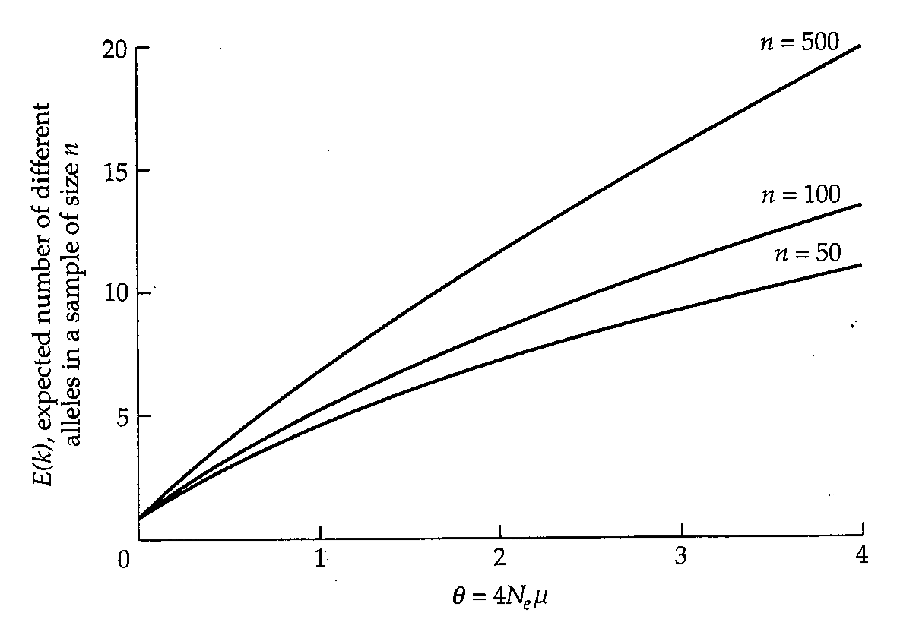
>
> FIGURE 4.8 Relation between  $ \theta $, the expected number of alleles, and the sample size according to the Ewens sampling theory of a population in steady state under the infinite-alleles model of neutral mutation.

The infinite-alleles model gives a steady-state prediction of $F$ given $\theta$ (because $F = 1/(1 + \theta)$ from Equation 4.10), and a prediction of $k$ from Equation 4.12. Combining these predictions, the expected relation between $F$ and $k$ is plotted in Figure 4.9. The hyperbolic relation is not surprising, because a population with many alleles will generally have a lower probability of identity of a randomly chosen pair of alleles. For $\theta = 1$, the expected $F$ is $\frac{1}{2}$ for all sample sizes, but a larger sample size should yield a greater number of distinct alleles. The curves are not dramatically different for different sample sizes $(n)$, mainly because an increase in sample size reveals a greater number of low-frequency alleles, and low-frequency alleles do not contribute very much to the homozygosity $F$.

> **Figure 4.9** · page 19 · source: `PopGen_chapter4`
>
> 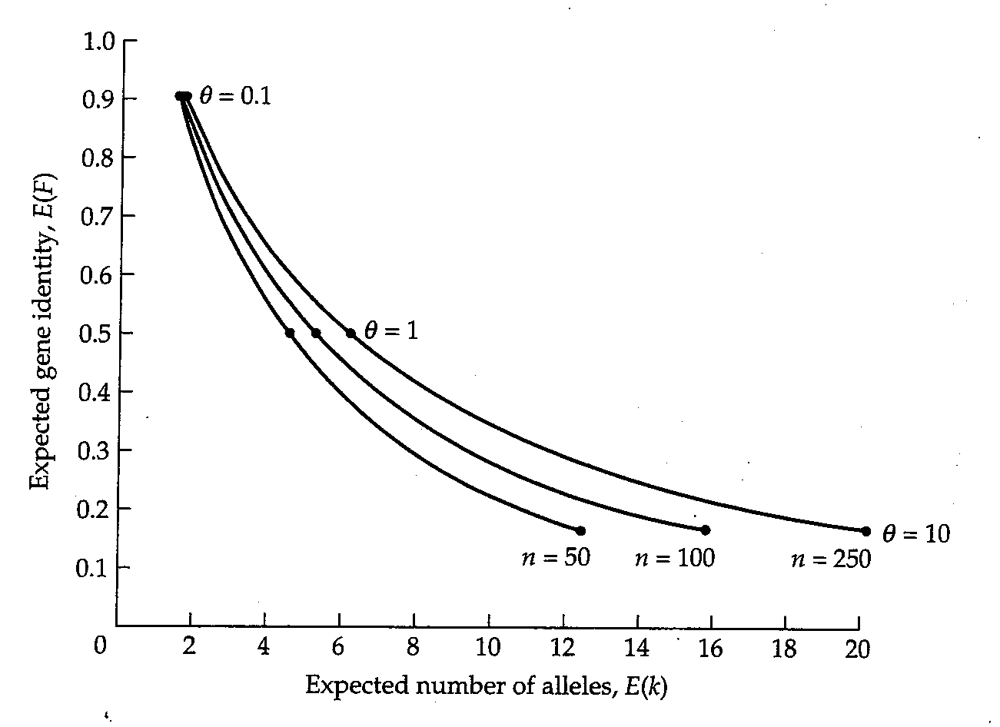
>
> FIGURE 4.9 The infinite-alleles model prediction of the relation between the expected number of alleles  $ E(k) $ and the expected gene identity (homozygosity) F. The three curves represent a range of values of  $ \theta = 4N_e\mu $, starting at  $ \theta = 0.1 $ in the upper left, and ending with  $ \theta = 10 $ in the lower right. For the value of  $ \theta = 1 $, the expected F, given by the relation  $ F = 1/(1 + \theta) $, is  $ \frac{1}{2} $, regardless of the sample size. Larger sample sizes always lead to larger expected numbers of alleles, but the difference is greater in more diverse populations (those with smaller F).

Making use of Ewen's result, Karlin and McGregor (1972) found an explicit formula for the expected allele frequency configuration in samples. In particular, they showed that the probability that a sample of size n containing k distinct alleles will contain exactly $ n_{1} $ alleles of type 1, $ n_{2} $ alleles of type 2,..., $ n_{k} $ alleles is of type k, is given by

$$
\Pr\left\{n_{1},n_{2},\cdots,n_{k},k\right\}=\frac{n!\theta^{k}}{k!n_{1}n_{2}\cdots n_{k}S_{n}(\theta)}
\tag{4.13}
$$

where $S_{n}(\theta)=\theta(\theta+1)(\theta+2)\cdots(\theta+n-1)$. This equation provides the basis for comparing the allele configuration observed in samples with those expected under the infinite-alleles model with neutrality. [See Ewens (2004) for additional and more advanced discussion.]

---

## PopGen_chapter4_010 · 4.4 THE INFINITE-ALLELES MODEL / The Ewens-Watterson Test

The Ewens (1972) paper is one of the landmarks in the history of population genetics. Because it afforded explicit predictions of expected allele configurations in samples assuming only neutral alleles, these predictions could be compared with actual observations to test the neutral theory. Based on the observed and expected configurations, a number of test statistics can be devised to determine whether an observed sample fits the expected values of the neutral model. Tests based on the infinite-alleles model are most appropriate when a large number of alleles can be distinguished, for example, by protein electrophoresis when the actual differences in DNA sequence are unknown. In such situations, tests based on the Ewens sampling formula (see Equation 4.11) must assume that any alleles that cannot be distinguished must be identical by descent, and this can be a serious limitation.

To give the flavor of such tests, we consider two examples. One type of test compares the observed and expected allele frequency configurations in samples, using the Equation 4.13. Figure 4.10 shows histograms of the observed and expected configurations for polymorphic alleles in a human population, where each allele has a different number of copies of a short tandem repeat in a region of DNA. In this particular example there appears to be a slight excess of the common allele; this excess is consistent with any number of causes of departure from the infinite-alleles model.

> **Figure 4.10** · page 20 · source: `PopGen_chapter4`
>
> 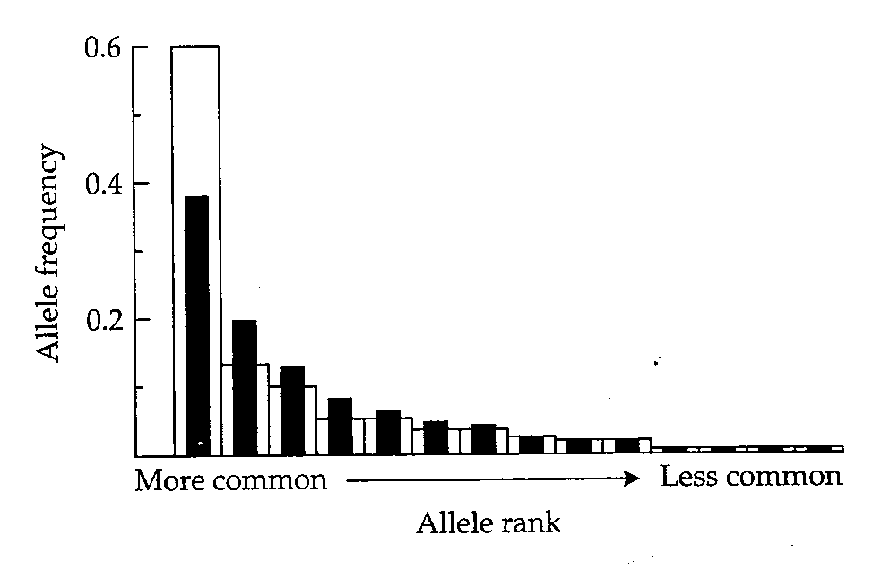
>
> FIGURE 4.10 Observed (open columns) and expected (black bars) allele frequency spectrum of the HRAS-1 gene in humans, identified by Southern blotting with the pLM0.8 probe and TaqI digests. Observed data are from Baird et al. (1986). The expected distribution was generated using the Ewens sampling formula. In this sample of 490 genes there were 14 distinct alleles, four of which were present in just one individual. (From Clark 1988.)

A second test is based on an approach pioneered by Watterson (1978), which compares the observed homozygosity in a sample with that expected from Equation 4.13. In one study, a sample of 89 homozygous lines of Drosophila pseudoobscura were collected at the Gundlach-Bundschu Winery in

Sonoma Valley, California (Keith et al. 1985). Homogenized tissue from each of these 89 lines was subjected to sequential electrophoresis (a sensitive means of detecting charge and conformation differences among the protein products), and the gels were treated to reveal differences in xanthine dehydrogenase (Xdh) mobility. The authors obtained a common allele that was present in 52 of the lines, one allele that was present in nine lines, one allele that was present in eight lines, two alleles present in four lines each, two alleles that were present in two lines each, and eight singleton or unique alleles.

To test whether the observed configuration fits the expectation, a computer simulation was run to generate realizations of samples from populations that obey the infinite-alleles model, focusing on simulated samples with the same number of alleles as the observed data. An algorithm to do this simulation is described by F. Stewart in Fuerst et al. (1977), but see also Manly (1985). From each computer-generated sample, F was calculated as the sum of the squared allele frequencies. Figure 4.11 shows a histogram of the computer-generated distribution of F, along with an arrow showing where the Drosophila sample fell. The sample had an observed F that fell in the upper tail of the distribution, and since so few values of F from the neutral hypothesis were larger than the observed F, the researchers rejected the neutrality hypothesis and argued that the data did not fit the infinite-alleles model satisfactorily. The departure was in the direction of excess homozygosity, but since the populations were probably in Hardy-Weinberg proportions, a clearer way to state the result would be to say that there was a deficiency of heterozygotes for the given number of observed alleles. The deficit means that the common allele is more common than expected, and there are also more rare alleles than expected. This pattern of frequencies is consistent with purifying selection acting to reduce the frequency of deleterious alleles that continually enter the population by mutation. It is also consistent with other scenarios, such as population growth. A growing population has more new mutant alleles than a population that is not growing (because a growing population has more allele copies at risk of mutating). Therefore, a growing population is expected to have an excess of low-frequency polymorphisms relative to a stable population.

> **Figure 4.11** · page 21 · source: `PopGen_chapter4`
>
> 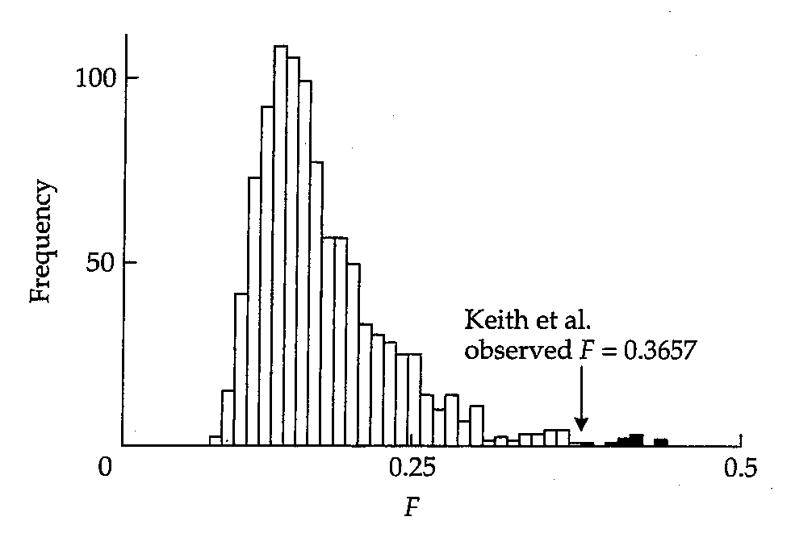
>
> FIGURE 4.11 Computer-generated distribution of F obtained from 1000 samples from a population obeying the assumptions of the infinite-alleles model with k = 15 alleles and a sample of size n = 89. The mean of F from the simulation was 0.168, which is well below the observed F of 0.366 in the Gundlach-Bundschu sample (Keith et al. 1985). A significant departure of the observed F from the predictions of the model is noted by the small area under the tail of the distribution to the right of the arrow.

The results of the Ewens-Watterson test can also be reported graphically as in Figure 4.12. Each gene yields a point specified by the number of distinct alleles and the observed F. The two curves represent the 95% confidence interval generated by the Ewens sampling theory. A quick check of the concordance of the data with the model can be made by seeing whether points remain in this confidence region. Although Xdh in Drosophila pseudoobscura provides a dramatic departure from the infinite-alleles model, results like those plotted in Figure 4.12, which show an acceptable fit to neutrality, are more commonly obtained.

> **Figure 4.12** · page 21 · source: `PopGen_chapter4`
>
> 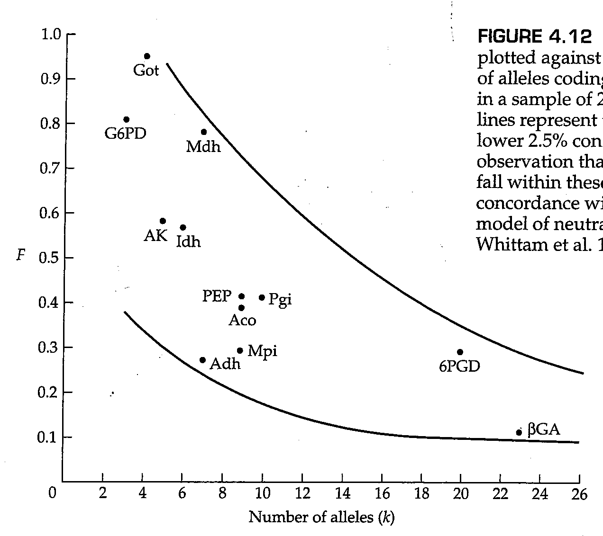
>
> FIGURE 4.12 Gene identity (F) plotted against the observed number of alleles coding for various proteins in a sample of 279 E. coli. The solid lines represent the upper 97.5% and lower 2.5% confidence limits, and the observation that all of the tested loci fall within these limits suggests good concordance with the infinite-alleles model of neutral mutation. (From Whittam et al. 1983.)

---

## PopGen_chapter4_011 · MUTATION AND THE NEUTRAL THEORY: Introduction / 4.5 INFINITE-SITES MODEL

When DNA sequence data are available, then the infinite-sites model is intuitively more appealing than the infinite-alleles model. The infinite-sites model, we consider a very long sequence of nucleotide sites along a DNA molecule, and we assume that each mutation alters a single nucleotide site. This model directly addresses the type of data that molecular population geneticists can access. Moreover, allelic DNA sequences contain considerable information about the evolutionary history of the alleles, which is hidden in the patterns of similarity and differences. The infinite-sites model was first developed by Kimura (1969, 1971), who considered the nucleotide sites as unlinked, and by Watterson (1975), who took account of the nearly complete linkage among sites. If each mutation changes a different nucleotide site in a model with complete linkage between sites, then the infinite-sites model shares many properties with the infinite-alleles model. We discussed the infinite-sites model briefly in Chapter 1 to exemplify the types of inferences that can be made from the DNA sequences of alleles in a population, and again in Chapter 3 in the context of coalescence. In this section we consider the model in somewhat more detail and examine some of the statistical tests of neutrality based on its implications.

In a long sequence of nucleotides, if the mutation rate is sufficiently low, then most sites will be monomorphic, and all polymorphic sites will be segregating for just two nucleotides. Much of the available data on allelic variation in DNA sequence seems consistent with this view, because few nucleotide sites are segregating for more than two nucleotides. If the DNA sequence is sufficiently long and the frequency of polymorphic sites low, then most of the time new mutations will occur at sites that were previously monomorphic.

To reinforce these ideas, let us consider the very small sample of four aligned allelic DNA sequences shown in *[See Table 4.1 at the end of this section.]*. These are made-up sequences, far shorter than would ever be used in practice, and much more diverse than usually found; they are intended to show as clearly as possible some of the types of information that can be extracted from such sequences. For ease of reading, in each column of aligned nucleotide sites, any nucleotide not matching the majority-rule consensus for that site is underlined. In regard to the infinite-alleles model, two types of information are usually extracted: - The nucleotide sites in the sample that are occupied by two or more nucleotides. These are known as segregating sites, and in Chapters 1 and 3 we denoted the number of segregating sites as S. Among the four sample sequences a–d each of length 16 nucleotides, there are exactly 8 segregating sites (sites 1, 2, 4, 5, 9, 10, and 11, 12), and so S = 8.

- The nucleotide sites in the sample that differ between individual pairs of sequences. These are known as nucleotide mismatches, and in Chapter 1 we denoted the average number of nucleotide mismatches among all pairwise comparisons of aligned sequences as $ \Pi $. Among the four sequences a-d there are 6 (i.e., 4 choose 2) pairwise comparisons, namely a-b, a-c, a-d, b-c, b-d, and c-d. Each of these combinations compares 16 nucleotide sites, and among the 6 pairwise comparisons, the number of mismatches is 0 (a-b), 4 (a-c), 4 (a-d), 4 (b-c), 4 (b-d), and 8 (c-d). The total number of pairwise mismatches is therefore $ 0 + 4 + 4 + 4 + 4 + 8 = 24 $ among a total of 6 pairwise comparisons, and so in this example $ \Pi = 24/6 = 4 $. With the concepts of segregating sites and nucleotide mismatches in mind, we can proceed to examine some of the properties of the infinite-sites model of neutral evolution. First, consider a sample consisting of only two sequences. In this case, the number of segregating sites S and the average number of number of nucleotide mismatches $ \Pi $ are identical, because there is only one pairwise sequence comparison. For a sample of size 2, Watterson (1975) showed that the probability that the number of segregating sites S equals any number i is given by

$$
\Pr\left\{S=i\right\}=\frac{1}{\left(1+\theta\right)}\left(\frac{\theta}{1+\theta}\right)^{i}
\tag{4.14}
$$

where $ \theta = 4N_e\mu $. We emphasize that, in this formulation, $ \mu $ is the mutation rate across the entire nucleotide sequence. (Formally, $ \mu $ can be considered as the sum of the per-nucleotide mutation rate across all the nucleotide sites present in the sequence.)

A particular case of Equation 4.14 gives the probability that two sequences have no mismatches $ (i=0) $, and hence are identical. Substituting i=0 into Equation 4.14, we obtain

$$
\Pr\left\{S=0\right\}=\frac{1}{1+\theta}
\tag{4.15}
$$

Note that right-hand side of Equation 4.15 for the infinite-sites model is the same as the right-hand side of Equation 4.10 for the steady-state autozygosity in the infinite-alleles model. The reason is that, in a sample of size 2 in both models, the probability that the sequences are identical is also the probability of autozygosity. From Equation 4.14 for a sample of size 2, it can be shown that the mean and variance in the number of segregating sites S are given by $ E(S) = \theta $ and $ V(S) = \theta + \theta^2 $. As noted, for a sample of size 2, the average number of pairwise mismatches $ \Pi $ is equal to the number of segregating sites, and so $ E(\Pi) = \theta $ and $ V(\Pi) = \theta^2 $ also. The variance $ \theta + \theta^2 $ requires complete linkage. If the nucleotide sites can undergo recombination, then the variance is reduced. An example obtained from computer simulation is shown in Figure 4.13, which compares the average number of pairwise mismatches per nucleotide site for a simulated set of data with no recombination (larger variance, black bars) and a simulated set of data with free recombination (smaller variance, gray bars). Because of this difference, the relationship between the mean and the variance in the mismatch distribution has been used to make inferences about the extent of intragenic recombination (Hudson 1987, Wakeley 1997).

> **Figure 4.13** · page 24 · source: `PopGen_chapter4`
>
> 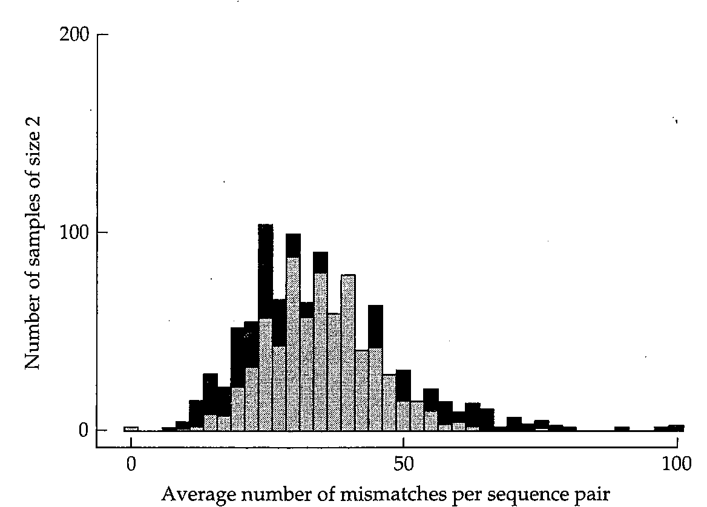
>
> FIGURE 4.13 Equilibrium distribution of the number of mismatches between a pair of alleles. Note that free recombination results in a smaller variance than the case of no recombination.

Important sampling properties of the infinite-sites model with neutral evolution and no recombination were first discovered by Watterson (1975), who examined both the number of segregating sites and the average number of pairwise mismatches. The expected number of segregating sites in a sample of size n sequences is given by

$$
E(S)=\theta\sum_{i=1}^{n-1}\frac{1}{i}
\tag{4.16}
$$

This equation was already derived in Chapter 3 (see Equation 3.41) based on the expected total length of the branches in a coalescent tree. Here $ \theta = 4N_e\mu $, where $ \mu $ is the mutation rate across the entire nucleotide sequence. The variance in the number of segregating sites in a sample of size $ n $ equals

$$
V(S)=\theta\sum_{i=1}^{n-1}\frac{1}{i}+\theta^{2}\sum_{i=1}^{n-1}\frac{1}{i^{2}}
\tag{4.17}
$$

This expression for the variance is for the case of no recombination. It turns out that recombination does not affect $ E(S) $, but it reduces $ V(S) $. In the extreme case of free recombination between adjacent nucleotide sites, the number of segregating sites along the sequence has a Poisson distribution, and in this case the variance equals the mean.

Now consider the average number of pairwise mismatches $ \Pi $ among a set of sequences. An important result is that in a sample of size n at steady state,

$$
E(\varPi)=\theta
\tag{4.18}
$$

Here again in $\theta = 4N_{e}\mu$, the symbol $\mu$ refers to the mutation rate across the entire nucleotide sequence.

When there is no recombination between nucleotide sites, the variance in II was found by Tajima (1983) to be

$$
V(\Pi)=\frac{n+1}{3(n-1)}\theta+\frac{2(n^{2}+n+3)}{9n(n-1)}\theta^{2}
\tag{4.19}
$$

where $ \theta $ is defined as in Equation 4.18. Again, recombination reduces the variance in the average number of pairwise mismatches (see Figure 4.13 for the case n = 2). It is not difficult to see intuitively why the variance is reduced—recombination shuffles the variation among alleles, reducing the average number of sites by which random pairs of alleles differ. Wakeley (1997) gives a more advanced treatment of this subject.

**[Table]**

*[See Table 4.1 at the end of this section.]*

> **Table 4.1** · `4.1` · page 23 · source: `PopGen_chapter4_011`
> TABLE 4.1 A Sample of Four Allelic DNA Sequences
>
> Allele | Nucleotide site in the DNA sequence
> --- | ---

---

## PopGen_chapter4_012 · 4.5 INFINITE-SITES MODEL / Nucleotide Polymorphism and Nucleotide Diversity

One limitation of S and $ \Pi $ as measures of nucleotide variation in a population is that each quantity depends on the length of the sequences that are compared; these differ from gene to gene and from one study to another. The dependence on sequence length can be eliminated by expressing both the number of segregating sites S and the average number of pairwise mismatches II as a proportion of the total number of sites. To be specific, suppose that a sample consists of n aligned sequences each of length L. Then the proportion of segregating sites among all sites compared equals S/L. There is no established symbol for this quantity, but it is sometimes called the nucleotide polymorphism. For the sake of consistency, we shall denote the nucleotide polymorphism by the symbol $ S^{*} $, so that $ S^{*} = S/L $. Since L is a constant, it follows that the mean and variance of $ S^{*} $ are given by

$$
E(S^{*})=E(S)\;/\; L\quad V(S^{*})=V(S)\;/\; L^{2}
\tag{4.20}
$$

Expressions for $ E(S) $ and $ V(S) $ in the case of no recombination are found in Equations 4.16 and 4.17. Although $ S^{*} $ does not depend on the sequence length, it does depend on the sample size, as is evident from Equation 4.16. On the other hand, the dependence on sample size is fairly weak unless the samples are very small (see Table 1.2).

Similarly, the average proportion of pairwise mismatches in sequences of length L is given by $ \Pi/L $. This quantity does have an established symbol, namely $ \pi = \Pi/L $, and it is called the nucleotide diversity (Nei and Li 1979). Because L is a constant, the mean and variance of $ \pi $ are given by

$$
E(\pi)=E(\Pi)/L\quad V(\pi)=V(\Pi)/L^{2}
\tag{4.21}
$$

Expressions for $ E(\Pi) $ and $ V(\Pi) $ in the case of no recombination are given in Equations 4.18 and 4.19.

---

## PopGen_chapter4_013 · 4.5 INFINITE-SITES MODEL / Tajima's D Statistic

Equation 4.16 provides a method for estimating the parameter $ \theta = 4N\mu $ based on the number of segregating sites in a sample S. If we define

$$
\alpha=\sum_{i=1}^{n-1}\frac{1}{i}=1+\frac{1}{2}+\frac{1}{3}+\cdots+\frac{1}{n-1}
\tag{4.22}
$$

then Equation 4.16 yields the estimate

$$
\hat{\theta}=S/a
\tag{4.23}
$$

Likewise, Equation 4.18 provides a method for estimating $ \theta $ based on the average number of pairwise mismatches $ \Pi $, and in this case the estimate is very direct:

$$
\hat{\theta}=\Pi
\tag{4.24}
$$

Tajima (1989) proposed that the difference between the estimates of $ \theta $ in Equations 4.23 and 4.24 could be used as a test of goodness of fit to the infinite-alleles model, and this test has come into widespread use. The rationale is that the number of segregating sites and the average number of pairwise mismatches differ primarily because the former is indifferent to the relative frequencies of the polymorphic nucleotides at a site. The two values lead to consistent estimates for $ \theta $ anyway, unless some evolutionary process causes a discrepancy from the assumptions of the infinite-alleles model. Tajima's test is based on the difference $ \Pi - S/a $. If the infinite-alleles model holds (or any discrepancies are too small to invalidate Equations 4.23 and 4.24), then the difference $ \Pi - S/a $ will equal 0. The major discrepancies occur in two situations: - The frequencies of polymorphic nucleotides are too nearly equal. This pattern increases the average number of pairwise differences over its neutral expectation; hence II – S/a is positive. The finding typically suggests either some type of balancing selection, in which heterozygous genotypes are favored, or some type of diversifying selection, in which genotypes carrying the less common alleles are favored. This situation may also happen if the sampled population was formed from a recent admixture of two different populations.

- The frequencies of the polymorphic variants are too unequal, with an excess of the most common type and too many of the less common types. This pattern results in a decrease in the proportion of pairwise differences, so $ \Pi - S/a $ is negative. One possible reason for an excess of rare alleles is selection against genotypes carrying deleterious mutant alleles. However, departures from the infinite-sites model do not necessarily imply that natural selection is operating. For example, a population that is growing will also feature an excess rare alleles and a negative value of $ \Pi - S/a $.

PROBLEM 4.4 To make use of these ideas concrete, consider the example in *[See Table 4.1 at the end of this section.]*. From these data, use Equations 4.23 and 4.24 to obtain estimates of $ \theta $ based on the number of segregating sites and on the average number of pairwise mismatches. Then calculate $ II - S/a $ and interpret the results in terms of how the data depart from the expectations of the infinite-alleles model.

ANSWER For the data in *[See Table 4.1 at the end of this section.]* we have already calculated that $ S = 8 $ and $ \Pi = 4 $. In this case, $ n = 4 $ so that $ a = 1 + \frac{1}{2} + \frac{1}{3} = 1.833 $. The estimate of $ \theta $ from Equation 4.23 is therefore $ \frac{16}{1.833} = 4.36 $, and that from Equation 4.24 is 4.00. Hence, in this example, $ \Pi - S/a = 4.00 - 4.36 = -0.36 $. Because of the small sample size, there is little justification to carry out a formal statistical test of whether this value is significantly different from 0, but the small discrepancy from 0 suggests no significant excess of rare alleles. In practice, random coalescence in the infinite-sites model with neutral mutations can be generated using, for example, a program called ms (Hudson 2002). For each simulated sample, one calculates a realization of $ \Pi - S/a $, and many such samples produce the null distribution of the test statistic assuming neutrality. If the observed value falls in the upper or lower 5% of the null distribution, then the $ P $-value for the test is regarded as significant ($ P < 0.05 $).

Data from natural populations often have an excess of segregating sites in which the minority nucleotide is present only once in the sample, constituting what is called a singleton. Although excess singletons can result from recent rapid population growth, more often it suggests that the singletons represent slightly deleterious alleles held at low frequency by selection. When this is observed for nonsynonymous nucleotide polymorphisms in protein-coding regions, it is usually interpreted to imply that many amino acid polymorphisms are slightly deleterious and held at low frequency in the population by a balance between selection tending to drive them out and recurrent mutation producing new deleterious alleles.

Tajima’s (1989) test is actually based on a normalized version of II – S/a, where the magnitude of the difference is expressed as a multiple of the standard deviation of the difference. The resulting statistic is known as Tajima’s D:

$$
D=\frac{\prod-S/a}{\sqrt{V(\prod-S/a)}}
\tag{4.25}
$$

An explicit formula for the denominator in Equation 4.25 can be found in Tajima's paper. The original intent was that the statistical significance of any observed value of Tajima's D could be based on the mean and variance of the distribution of $ \Pi - S/a $. But the distribution of $ \Pi - S/a $ is very complex, and at the present time most tests of significance are based on comparing an observed value of Tajima's D against simulated values obtained from coalescent simulations as described in the answer to Problem 4.4.

---

## PopGen_chapter4_014 · 4.5 INFINITE-SITES MODEL / The Fu and Li Test of Fit to Neutral Coalescence

A remarkable property of coalescent trees is the basis of another widely used test of whether a sample configuration of nucleotide polymorphisms is consistent with the neutral infinite-sites model at steady state (Fu and Li 1993). This property is illustrated in Figure 4.14 for a sample of size n = 5. For this sample size there are only five basic tree structures based on the pattern of coalescences, which are laid out as in Figure 3.15. There are actually many more trees (120, to be exact) when one takes into account the number of different ways that the tips of the tree can be labeled with the names of alleles in the sample. When this is taken into account, it happens that there are exactly twice as many trees with the structure on the left as any of the others. The fraction of all trees with each of the structures is summarized in the second row of numbers in Figure 4.14.

> **Figure 4.14** · page 29 · source: `PopGen_chapter4`
>
> 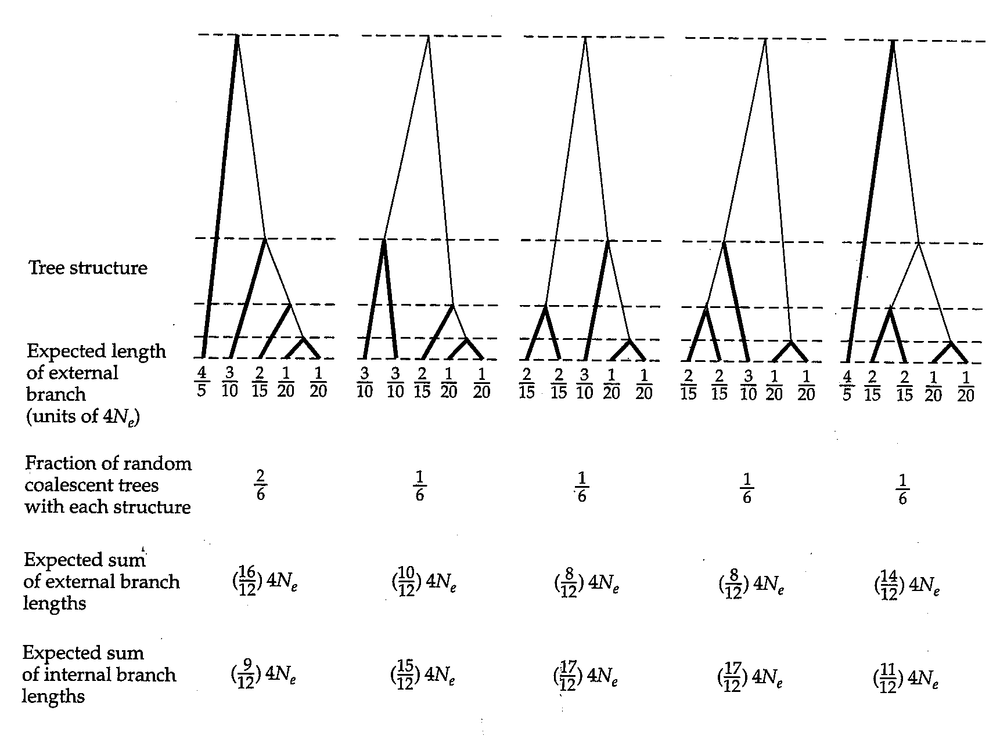
>
> FIGURE 4.14 Coalescent trees for samples of size 5 with the times of coalescence shown in proportion to their expected values. Thick lines denote external branches, thin lines internal branches. The expected length of the external branches, averaged across all trees, equals  $ 4N_{e} $ generations; this number holds true for coalescent trees with any number of samples.

The trees in Figure 4.14 are “average” trees in the sense that the coalescent times have been shown in proportion to their expected values. Note that some of the branches are thick, others thin. Each of the thick branches is called an external branch because it emerges from an internal node and terminates at one of the tips. Each of the thin branches is called an internal branch because it connects two internal nodes.

The property used in the Fu and Li (1993) test is based on the expected total length of the external and internal branches. The first row of numbers, positioned beneath each tip, consists of fractions that indicate the expected length of the external branch to that tip, expressed in units of $ 4N_e $ generations. For example, the long external branch at the far left has an expected length of $ \left(\frac{4}{5}\right) \times 4N_e $ generations. The expected branch lengths are based on the fact that the expected time to coalesce from k to k - 1 alleles is given by $ 4N_e / k(k - 1) $, which is implied by Equation 3.35 in Chapter 3.

For each tree structure, the expected length of all the external branches taken together is given in the third row of numbers. In this case the dependence on $ 4N_{e} $ is made explicit. For each tree structure, the multiplier in parentheses is the sum of the expected length of the individual external branches for that tree. Taking the tree at the far left as an example,

$$
\left[\left(\frac{4}{5}\right)+\left(\frac{3}{10}\right)+\left(\frac{2}{15}\right)+\left(\frac{1}{20}\right)+\left(\frac{1}{20}\right)\right]\times4N_{e}=\left(\frac{16}{12}\right)\times4N_{e}
$$

which is the entry in the third row. The reason that all of the values are expressed with 12 as the common denominator is that it makes it easier to calculate the expected length of the external branches over all possible coalescent trees. In this case, the expected total external branch length is given by

$$
\left[\left(\frac{2}{6}\right)\left(\frac{16}{12}\right)+\left(\frac{1}{6}\right)\left(\frac{10}{12}\right)+\left(\frac{1}{6}\right)\left(\frac{8}{12}\right)+\left(\frac{1}{6}\right)\left(\frac{8}{12}\right)+\left(\frac{1}{6}\right)\left(\frac{14}{12}\right)\right]\times4N_{e}=4N_{e}
$$

Remarkably, this result is completely general and independent of the sample size.

What about the total length of the internal branches? Equation 3.40 in Chapter 3 says that the expected total length of all the branches is equal to $ 4N_e \times a $, where $ a $ is the sum of reciprocals defined in Equation 4.22. Because the length of the internal branches must equal the difference between the length of all branches and the length of the external branches, it follows that the total length of the internal branches must be $ 4N_e \times (a - 1) = (a - 1) \times 4N_e $. In the case of $ n = 5 $ (see Figure 4.14), $ a = \frac{25}{12} $, and therefore the expected length of the internal branches in this case is $ \left[\frac{25}{12} - 1\right] \times 4N_e = \left(\frac{13}{12}\right) \times 4N_e $. This can be verified directly from Figure 4.14 by calculating

$$
\left[\left(\frac{2}{6}\right)\left(\frac{9}{12}\right)+\left(\frac{1}{6}\right)\left(\frac{15}{12}\right)+\left(\frac{1}{6}\right)\left(\frac{17}{12}\right)+\left(\frac{1}{6}\right)\left(\frac{17}{12}\right)+\left(\frac{1}{6}\right)\left(\frac{11}{12}\right)\right]\times4N_{e}=\left(\frac{13}{12}\right)4N_{e}
$$

The reason for distinguishing external branches from internal braches is that any mutation along an external branch results in a singleton polymorphism in the sample. Similarly, every mutation along an internal branch results in a nonsingleton polymorphism in the sample. Therefore, the numbers of singleton and nonsingleton polymorphisms in the sample allow a comparison of the total lengths of the external and internal branches of the coalescent tree.

To do this comparison, we need to consider where mutations may occur along the branches, and for this purpose let $ \mu $ represent the rate of mutation along the total length of the DNA sequence in each sampled allele, and as usual let $ \theta = 4N_e\mu $. The number of mutations along the external branches is usually denoted $ \eta_e $, and its expected value is given by the product of the expected external branch lengths and the mutation rate, or $ 4N_e \times \mu $. In other words the expected number of singleton polymorphisms in the sample is given by

$$
E(\eta_{e})=4N_{e}\mu=\theta
\tag{4.26}
$$

Letting $ \eta_{i} $ denote the number of mutations along the internal branches, similar reasoning indicates that the expected number of nonsingleton polymorphisms in the sample is given by

$$
E(\eta_{i})=(a-1)4N_{e}\mu=(a-1)\theta
\tag{4.27}
$$

Equations 4.26 and 4.27 yield estimated $ \theta $ based either on the number of singleton polymorphisms or the number of nonsingleton polymorphism. Furthermore, for samples sizes of about 10 or greater, $ \eta_{e} $ and $ \eta_{i} $ are nearly independent of one another (Li 1997).

The Fu and Li (1993) test is based on the difference between the two estimates of $ \theta $ implied by Equations 4.26 and 4.27, namely,

$$
G=\frac{\eta_{e}-\eta_{i}/(a-1)}{\sqrt{V[\eta_{e}-\eta_{i}/(a-1)]}}
\tag{4.28}
$$

where G is the test statistic and V indicates the variance. As with other such tests, perhaps the best way to obtain a P-value is to estimate the null distribution of G from neutral coalescent simulations and then compare the observed value of G with the simulated values.

Fu and Li (1993) suggest that G might be a useful test statistic in cases in which most new mutations are deleterious, because in such cases the number of singletons will be increased relative to the number of nonsingletons. The reasoning is that if most new mutations are harmful, they may appear in samples as singletons, but most of them will be eliminated very quickly. Only the minority of new mutations that are neutral or nearly neutral have much chance of increasing in frequency to a level sufficient to appear in samples as nonsingletons. Hence, in this model, $ \eta_{e} $ is increased relative to $ \eta_{i} $. It should however be noted that the neutral infinite-sites model predicts a large fraction of singletons anyway. *[See Table 4.2 at the end of this section.]* shows the expected proportion of single-

*[See Table 4.2 at the end of this section.]* tons (equal to 1/a) in samples of various size. The expected proportion of singletons does not drop below 20% until n = 85.

**[Table]**

*[See Table 4.2 at the end of this section.]*

> **Table 4.2** · `4.2` · page 31 · source: `PopGen_chapter4_014`
> TABLE 4.2 Expected Proportion of Singletons in Samples
>
> Sample size $ n $ | $ E $ (proportion singletons) | Sample size $ n $ | $ E $ (proportion singletons)
> --- | --- | --- | ---
> 2 | 1.000 | 12 | 0.331
> 3 | 0.667 | 13 | 0.322
> 4 | 0.545 | 14 | 0.314
> 5 | 0.480 | 15 | 0.308
> 6 | 0.438 | 16 | 0.301
> 7 | 0.408 | 17 | 0.296
> 8 | 0.386 | 18 | 0.291
> 9 | 0.368 | 19 | 0.286
> 10 | 0.353 | 20 | 0.282
> 11 | 0.341 | 21 | 0.278

---

## PopGen_chapter4_015 · MUTATION AND THE NEUTRAL THEORY: Introduction / 4.6 MUTATION AND RECOMBINATION

Recombination reshuffles the alleles created by mutation. On the surface, this seems like a very good thing. Any mechanism that allows parental organisms to generate a myriad of genetic combinations among the progeny would allow a more thorough exploration of combinations of alleles that might be favored by natural selection. This mechanism would help make natural selection more efficient and promote the persistence of genes present in the parents. This argument is so seductive that it seems self-evident, but in fact the argument contradicts the fundamental principles of evolution. It is like saying that everyone should buy lottery tickets, because someone might hit the jackpot. But most lottery tickets are losers, and there often is no jackpot. The expected return on any lottery ticket is negative, and so the strategy eventually leads to financial ruin.

Natural selection operates through the phenotype of the individual, and segregation and recombination break down all combinations of alleles, including combinations of alleles resulting in superior phenotypes. Under artificial selection as practiced by breeders, as we shall see in Chapter 8, segregation and recombination are often handicaps, because the average phenotype of the offspring of superior individuals regresses toward the population average. Furthermore, because of sexual reproduction, any individual contributes only half of its genes to any offspring, whereas if the individual were to reproduce asexually by parthenogenesis, then it would contribute twice as many genes to the offspring. Sexual reproduction therefore has an intrinsic twofold cost as compared with asexual reproduction, and in principle (though not necessarily in practice) an ideal strategy for breeders to keep the best genotypes intact would be to clone them. In population genetic models in which differences in survival among genotypes result in stable polymorphisms among interacting genes, it can be shown that, in the absence of mutation, natural selection favors genetic modifiers that reduce the frequency of recombination (Altenberg and Feldman 1987).

Inasmuch as there is an intrinsic twofold cost of sex, and recombination breaks down favorable combinations of alleles, why is sex and recombination so widespread among eukaryote organisms? There is at present no consensus on this issue, and certainly no definitive data beyond the observation that, with few exceptions (Mark Welch et al. 2004), groups of sexual organisms that have given up sex and become asexual tend to have a short evolutionary lifetime (Judson and Normark 1996).

One hypothesis is that recombination arose as a byproduct of DNA repair, since at the molecular level recombination is initiated by a double-stranded break in DNA, and many of the proteins involved in recombination are also implicated in DNA repair (Redfield 2001). Another possibility is that recombination is a side effect of chromosome separation in meiosis, since breakage and reunion between DNA molecules is necessary to lock homologous chromosomes together to ensure proper segregation. As long as most mutations are recessive, as supported by abundant evidence, selection for segregation is stronger than selection for recombination (Otto 2003). There are also models for the evolution of recombination based in population genetics, and these are considered next.

---

## PopGen_chapter4_016 · 4.6 MUTATION AND RECOMBINATION / A Model for the Evolutionary Benefit of Recombination

Evolutionary biologists have emphasized for a long time that recombination can accelerate the rate of formation of beneficial gene combinations, and it has been suggested that this acceleration is the reason why recombination evolved (Fisher 1930; Muller 1932). A graphical representation of the Fisher-Muller model is illustrated in Figure 4.15. In part A are two large populations, one with no recombination (an asexual species) and one with recombination (a sexual species). Each has three favorable mutations, a, b, and c, which ultimately become incorporated into the genome. In the asexual species, the mutations are incorporated sequentially because each favorable mutation must take place in the genetic background of the one before. The process is shown as being slow because each favorable mutation must be nearly fixed before there is a high chance that the next favorable mutation takes place in the proper genetic background. In experimental populations of bacteria with no recombination, the process in which a lineage containing a favorable mutation displaces other lineages, including those containing less favorable mutations, is known as clonal interference (Gerrish and Lenski 1998; Hegreness et al. 2006).

> **Figure 4.15** · page 34 · source: `PopGen_chapter4`
>
> 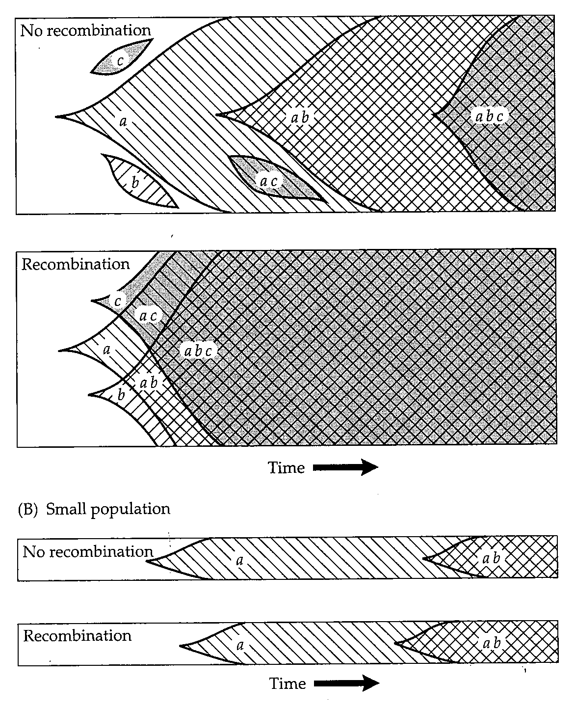
>
> FIGURE 4.15 Model for the evolutionary benefit of recombination. (A) In a large population of an asexual species with no recombination (top panel), the favorable mutations a, b, and c must be incorporated into the genome sequentially because there is no mechanism to bring the favorable mutations together; each favored mutation must reach a high frequency to have a reasonable chance that the next favorable mutation will take place in the proper genetic background. With recombination (bottom panel), recombination between the favorable genes enables the triple mutant abc to be formed very rapidly. (B) The beneficial effect of recombination is diminished in a very small population because, in a small population, multiple favorable mutations are unlikely to be present simultaneously. (From Crow and Kimura 1970.)

A similar type of interference between favorable alleles occurs to a smaller extent even in the presence of recombination, which is called the Hill-Robertson effect (Hill and Robertson 1966). The Hill-Robertson effect occurs because two different favorable mutations (call them A and B) are likely to arise in different genetic backgrounds, and as the favored alleles increase in frequency, they bring about negative linkage disequilibrium (D in Equation 2.13 in Chapter 2), in which the product of the frequencies of gametes carrying one favorable and one unfavorable allele (A b and a B) is greater than that of gametes carrying both favorable alleles (A B, virtually nonexistent) or both unfavorable alleles (a B). Because of the genetic backgrounds they are in, the increase in frequency of the favorable alleles also increases the magnitude of the negative linkage disequilibrium, and the effect is greatest with a low frequency of recombination or a small effective population size. Under these conditions there is selection for increased recombination (Otto and Barton 1997, Barton and Otto 2005; Roze and Barton 2006), and when the frequency of recombination is high, different favorable alleles can be brought together in rapid succession (Figure 4.15). On the other hand, if the rate of favorable mutation is so low that an asexual population can fix any favorable allele before the next one occurs, then the advantage of recombination illustrated in Figure 4.15 is very much reduced (Christiansen et al. 1998).

The advantage of recombination in the Fisher-Muller model is also affected by the size of the population. In very small populations, multiple favorable mutations are unlikely to be present simultaneously, and so the fixation of the favorable alleles proceeds sequentially in a sexual as well as in an asexual species (Figure 4.15B). But there is an offsetting process, which is the negative linkage disequilibrium discussed in connection with the Hill-Robertson effect. Although the magnitude of the disequilibrium is small when the favorable alleles are rare, the increase in frequency of these alleles due to selection amplifies the linkage disequilibrium, and genetic factors that increase the frequency of recombination are favored (Barton and Otto 2005). In a single population, the extent of linkage disequilibrium built up diminishes as the population size increases, and so the advantage of recombination decreases. The subdivision of a large population into many smaller subpopulations counteracts this effect, and in this case substantial amounts of linkage disequilibrium can accumulate even in a large population (Martin et al. 2006).

---

## PopGen_chapter4_017 · 4.6 MUTATION AND RECOMBINATION / Muller's Ratchet

Clonal interference (in asexual organisms) or the Hill-Robertson effect (in sexual organisms) can decrease the efficiency with which favorable mutations are incorporated into populations. The flip side is that these same processes make it more difficult for a population to get rid of deleterious mutations. The Hill-Robertson effect appears to account for a correlation between intron size and frequency of recombination in Drosophila (Carvalho and Clark 1999). In particular, in D. melanogaster, the largest introns (>> 80 base pairs) and the smallest introns (< 60 base pairs) tend to be found in genes that are located in regions of the genome with low rates of recombination. This finding suggests that both very large introns and very small introns are deleterious, and that deleterious insertion events that make large introns larger and deleterious deletion events that make small introns smaller are less efficiently eliminated in regions of low recombination, as predicted by the Hill-Robertson effect (Carvalho and Clark 1999). An alternative explanation is that larger introns are favored in regions of low recombination because they allow more recombination to take place (Comeron and Kreitman 2002). This model does not explain why genes in the Y chromosome have large introns, because the Y chromosome never undergoes recombination.

In asexual organisms, the accumulation of deleterious mutations in small populations is known as Muller's ratchet (Muller 1964). To understand this process, consider the experiment diagrammed in Figure 4.16. A clone formed from a single bacterial cell is used to inoculate a liquid culture, and after the population has grown to a large size, an aliquot is diluted to such an extent. that individual cells will be well separated when a small amount of liquid is spread onto the surface of semisolid growth medium in a petri plate. During incubation of the plate, each cell divides multiple times and soon yields a clone of cells, forming a visible colony. At this point a single colony is chosen at random, some of its cells are used to inoculate another flask of liquid medium, and the cycle is repeated.

> **Figure 4.16** · page 36 · source: `PopGen_chapter4`
>
> 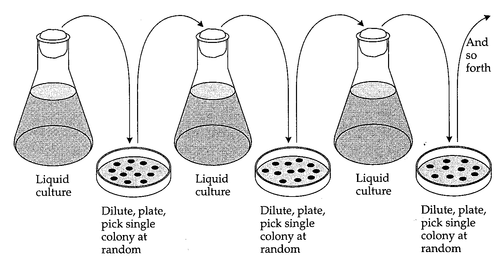
>
> FIGURE 4.16 An experimental procedure demonstrating Muller's ratchet. In each cycle, the population passes through an extreme bottleneck of size N = 1, and so any mutations present in the chosen individual immediately become fixed in the population. Over a long period, the genome accumulates many deleterious mutations, including deletions.

In each generation, new mutations occur, and we may safely assume that, except for any that are neutral or nearly neutral, the great majority of the other mutations are deleterious. Let us assume for simplicity that, in each cycle of liquid growth, the cells undergo enough rounds of DNA replication that the overall genomic mutation rate to deleterious but nonlethal mutations is 1 per cell per experimental cycle. A deleterious mutation rate of 1 per genome per generation is not unrealistic for higher eukaryotes (Kondrashov 2001). At a deleterious mutation rate of 1 per experimental cycle, the probability that a colony chosen at random has no new deleterious mutations after one cycle is $ e^{-1} = 0.37 $, after two cycles it is $ e^{-2} = 0.14 $, and after three cycles it is $ e^{-3} = 0.05 $. In other words, in the experiment in Figure 4.16, the probability that a colony chosen at random in the third cycle has one or more deleterious mutations is about 95%. What's more, once a colony with a deleterious mutation is chosen, that deleterious mutation becomes fixed in the population, except in the very unlikely event of reverse mutation. This process of fixing deleterious mutations is the basis of Muller’s ratchet. Each deleterious mutation that is fixed sets a new base line, and subsequent deleterious fixations can only make matters worse. Eventually, in the absence of recombination to bring nonmutant combinations of alleles back together again, the genome undergoes mutational degeneration.

In the experiment in Figure 4.16, the repeated population bottleneck of size N = 1 is quite extreme, but actual experiments with a range of bottleneck sizes have been carried out using a bacterial virus (bacteriophage $ \phi6 $) that has an RNA genome (Poon and Chao 2004). This RNA virus is convenient for such experiments because it has a small genome and a high mutation rate. The experiments verified the accumulation of deleterious mutations owing to Muller's ratchet, and showed that bacteriophage populations allowed to undergo recombination usually outperformed asexual populations, with the greatest advantage of recombination in the smallest populations (Poon and Chao 2004). Muller's ratchet also results in the fixation of spontaneous deletions. In an experiment like that in Figure 4.16 carried out in Salmonella enterica, observed deletions ranged in size from 1–200 kb, and the average rate of DNA loss per genome was 0.05 base pairs per generation (Nilsson et al. 2005).

Over an evolutionary time scale, the accumulation of deletions owing to Muller's ratchet can result in extreme reductions in genome size. Remarkable examples are found in bacteria that are obligate intracellular pathogens or symbionts that are supplied with nutrients by their host (Ochman 2005). An example is the bacterial endosymbiont of aphids, Buchnera aphidicola, which is transmitted in very small numbers through the aphid oocyte and has no opportunity for recombination. Since its association with aphids 100–250 million years ago, the bacterial genome has undergone many deleterious amino acid substitutions and regulatory changes (Moran 1996; Moran and Degnan 2006). Its genome size has been reduced by deletions to 600 kb, whereas the ancestral genome was approximately ten-fold larger (Ochman 2005).

---

## PopGen_chapter4_018 · 4.6 MUTATION AND RECOMBINATION / Piecewise Recombination in Bacteria

Many prokaryotic organisms make use of mechanisms of recombination in which a piece of DNA that is small, relative to the size of the entire genome, is transferred from a donor cell into a recipient cell (Redfield 2001). These mechanisms include transformation, in which free DNA is taken up by the recipient from the surrounding medium; transduction, in which a DNA fragment is carried from the donor to the recipient by means of a virus particle; and conjugation, in which a replica of the chromosome from a donor cell is transferred into a recipient cell by a gradual process requiring cell-to-cell contact, but the chromosome usually breaks before the transfer is complete. Because relatively short patches of the genome participate in recombination, these processes differ in their evolutionary implications from meiotic recombination in eukaryotes. Through mechanisms involving transmissible plas mids (extrachromosomal DNA elements) and transposable elements, bacteria can also acquire genes from other species. Although these processes of lateral gene transfer are extremely important in the origin and spread of bacteria resistant to multiple antibiotics, they are individually rare events. Normally, genetic exchange between bacteria takes place between individuals of the same species (Ochman et al. 2005).

The main effect of short-patch recombination is that long-range linkage disequilibrium tends to be maintained. For example, in enteric bacteria, such as Escherichia coli, which are part of the normal intestinal flora, linkage disequilibrium between allozyme loci is very strong (Whittam et al. 1983). At the level of DNA sequence, however, many genes have an obviously mosaic structure in which different segments have different phylogenetic histories (DuBose et al. 1988). An example from the phoA gene, coding for alkaline phosphatase in E. coli, is illustrated in Figure 4.17. Among the polymorphic nucleotide sites indicated, the unique nucleotide at each site is inscribed in a box. At the extreme ends of the gene, the alleles from strains RM217T and RM45E are the most closely related; in the middle of the gene, from nucleotide sites 1425 to 1560, there is a run of polymorphic nucleotides in which the similarity between RM217T and RM45E is lost, as if this part of the gene had been introduced by recombination with a more distantly related allele. Although short runs of similar or dissimilar nucleotides can also be the result of chance, chance effects can be ruled out by appropriate statistical tests for recombination (Stephens 1985; Sawyer 1989).

> **Figure 4.17** · page 38 · source: `PopGen_chapter4`
>
> 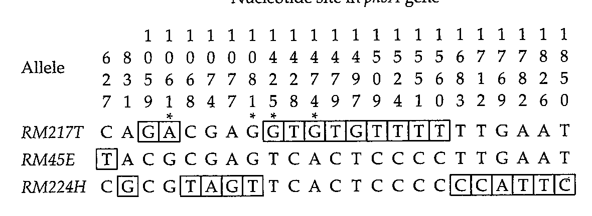
>
> FIGURE 4.17 Evidence for recombination in the phoA gene in natural isolates of E. coli. The pair of strains at the top are more similar at the beginning and end of the gene, the pair of strains at the bottom are more similar in the central region. There is significant clustering of the nucleotide sites inscribed in boxes, as expected from recombination. (Data from DuBose et al. 1988.)

The finding that many genes have a mosaic ancestry through recombination seems at first to contradict the finding of significant linkage disequilibrium between more widely separated genes. The paradox is resolved by the fact that each recombination event is local; it replaces a relatively short stretch of the recipient chromosome, and the linkage phase between more distant alleles is maintained. The E. coli chromosome, therefore, consists of clonal segments from a common ancestor, which is called the clonal frame (Milkman and Bridges 1990, 1993), interrupted by short segments derived from recombination with diverse other clones. Even though the clonal frames are interrupted by relatively short recombinant segments, their integrity would ultimately be lost unless there were occasional selective events favoring particular genotypes. A clonal frame implies that most genes in the genome will share a common gene tree, their coalescence. The existence of a clonal frame depends on the level of recombination, because high levels of recombination result in different genes having different coalescent histories. Although gene trees in species such as E. coli and Hemophilus influenzae show good congruence, the gene trees for a sample of genes from Neisseria meningitidis, Streptococcus pneumoniae, Streptococcus pyogenes, and Staphylococcus aureus show no better congruence with each other than with trees of random topology (Feil et al. 2001).

---

## PopGen_chapter4_019 · 4.6 MUTATION AND RECOMBINATION / Animal Mitochondrial DNA

Population genetic studies in animals often focus on the DNA of mitochondria. The mitochondrial genome is informative about parentage because, in most species of animals, it is almost always maternally inherited and rarely if ever undergoes recombination. It is also a small molecule present in abundant quantities in most cells. In animals, mitochondrial DNA (mtDNA) is a circular molecule typically in the range from 15–20 kb in length. It codes for fewer than 40 genes; approximately half code for ribosomal RNA or for transfer RNA used in mitochondrial protein synthesis, and the remaining genes code for proteins used in electron transport or oxidative phosphorylation. In many species, including mammals, parts of the mtDNA sequence evolve very rapidly in comparison with nuclear genes, and hence mtDNA can often be used to make inferences about population structure and recent population history.

An example of the utility of mtDNA in population studies is illustrated in Figure 4.18, which summarizes the result of examining the mtDNA of 87 pocket gophers, Geomys pinetis, collected across the geographic range of the species in Alabama, Georgia, and Florida (Avise et al. 1979). The mtDNA from each gopher was digested in turn with each of six restriction enzymes, each cleaving the DNA at a different six-base recognition site. The resulting restriction fragments were separated by electrophoresis and compared among the animals to estimate the number of nucleotide differences affecting the restriction sites.

> **Figure 4.18** · page 40 · source: `PopGen_chapter4`
>
> 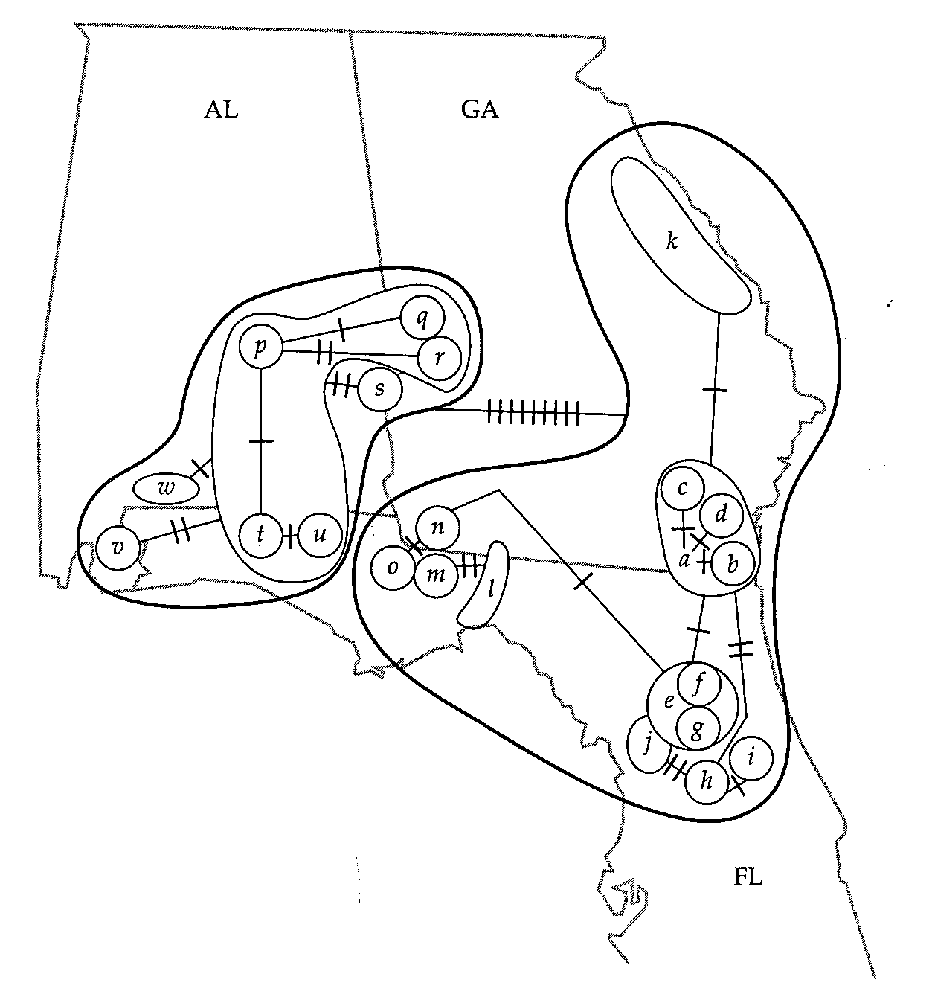
>
> FIGURE 4.18 Lineage relationships between mtDNA types in pocket gophers. The lowercase letters are different mtDNA types grouped according to similarity and superimposed on a geographical map of the collection sites. The tick marks across the connecting lines are the numbers of inferred mutational steps. (From Avise 1994.)

Among the 87 gophers, there were 23 distinct types of mtDNA, represented by the lowercase letters in Figure 4.18. Each of these types represents a maternal mtDNA lineage, distinct from other lineages. Animals that share an mtDNA type must have a female ancestor in common. The branching network in Figure 4.18 estimates the matriarchal phylogeny of the mtDNA. The straight lines connect related types of mtDNA, and the number of slashes across each line indicates the estimated number of nucleotide differences in the restriction sites between the mtDNA types. Groups of related mtDNA types are enclosed in thin black lines; the thickest lines delineate a western and an eastern subpopulation of gophers whose overall mtDNA sequence differs by an estimated 3%. Between the eastern and western subpopulations, there are 9 nucleotide differences among the sites cleaved by the restriction enzymes.

The mtDNA network in Figure 4.18 also resolves population subdivision within the western and eastern subpopulations. This subdivision is indicated by the mtDNA types circumscribed by the thin black lines. Some of the mtDNA types such as “k” and “p” are widespread, whereas others such as “b” and “q” are more local in their distribution. The local clones usually differ from the most widespread mtDNA type in the region by only one or two nucleotides among the sites cleaved by the restriction enzymes. The example in Figure 4.18 shows that, because of matrilineal inheritance and the absence of recombination in mtDNA, the network of mtDNA types can reveal a great deal about population substructure in natural populations.

At the beginning of this section, we said that animal mtDNA "is almost always maternally inherited and rarely if ever undergoes recombination." About the first point there is little dispute, although there does seem to be one authenticated case of a human male who inherited his mtDNA from his father (Bromham et al. 2003). The issue of recombination is much more unsettled (Piganeau et al. 2004, Tsaousis et al. 2005). Detecting possible rare recombinants in mitochondrial DNA sequences is complicated by the possible effects of parallel mutation, hot spots of mutation, selection, population substructure, sequencing errors, and other technical issues. There are also a large number of types of statistical tests for recombination, each of which perform well under some sets of assumptions but not others (Bruen et al. 2006). Hence the issue of recombination in animal mitochondrial DNA is still up in the air, and where it comes down has implications for long-term mtDNA evolution. However, it seems clear from the available data that the magnitude of mtDNA recombination, if it occurs, is not sufficient to nullify the use of mtDNA as a marker for studies of population substructure or recent population history.

---

## PopGen_chapter4_020 · 4.6 MUTATION AND RECOMBINATION / SUMMARY

1. Mutation is the ultimate source of evolutionary novelty, but for most genes the rate of mutation are usually so low that mutation pressure is a weak force for changing allele frequencies.

2. Despite the weak force of mutation pressure, over very long periods of evolutionary time, populations can come into equilibrium between forward and reverse mutation, when the ratio of allele frequencies equals the reciprocal of the ratio of the mutation rates.

---

## PopGen_chapter4_021 · MUTATION AND THE NEUTRAL THEORY: Introduction / SUMMARY

3. The neutral theory asserts that many mutations have so little effect on the survival and reproduction of the organism that their fate is determined primarily if not exclusively by random genetic drift. Put forward at a time when most DNA was thought to code for proteins, the neutral theory was at one time highly controversial, but the large amount of noncoding DNA now known to be in introns, pseudogenes, spacers between genes, and so forth may give considerable scope for mutations that are neutral or nearly neutral.

4. The infinite-alleles model assumes that each new mutation yields an allele that is unique to the population, and it is appropriate for situations in which a large number of alleles can be distinguished without the actual DNA sequences being known.

5. In the infinite-alleles model, alleles that are physically indistinguishable are assumed to be identical by descent. For selectively neutral mutations at steady state, the proportion of heterozygous genotypes is expected to be $ \theta/(1+\theta) $, where $ \theta = 4N_{\rho}u $.

6. The Ewens sampling formula pertains to the expected configuration of alleles in samples from populations that are at steady state under the infinite-alleles model. The sampling formula allows tests of the neutral theory based on comparisons between theoretical predictions and the composition of observed samples.

7. The infinite-sites model is appropriate for DNA sequences and assumes that each new mutation alters a single nucleotide site. For selectively neutral mutations at steady state, the model makes specific predictions about the number of segregating nucleotide sites and the average number of nucleotide differences between pairs of sequences.

8. Predictions based on the infinite-sites model allow statistical tests of neutrality based on various characteristics in observed samples, such as the evenness of the allele-frequency spectrum (Tajima's D) or the number of singleton versus nonsingleton polymorphisms (Fu and Li test).

9. Recombination allows the formation of beneficial combinations of genes, but there is no consensus on the evolutionary origin of recombination. In asexual organisms, clonal interference reduces the efficiency of selection. In sexual organisms, population genetic models demonstrate that selection can amplify negative linkage disequilibrium between favorable mutations, particularly in small populations, and this process favors increased recombination.

10. The genomes of some species of bacteria, such as E. coli, show extensive linkage disequilibrium over long genetic distances in spite of the fact that each gene may have a mosaic ancestry owing to intragenic recombination. The apparent paradox results because recombination in bacteria usually involves a short stretch of DNA and the process is infrequent.

11. In animal mitochondrial DNA (mtDNA), maternal transmission and the absence of recombination enable the tracking of mitochondrial lineages to make inferences about population history and substructure. Isolated cases of nonmaternal transmission of mtDNA do occur, and the issue of whether recombination in animal mtDNA is completely absent or merely rare is highly controversial.

---

## PopGen_chapter4_022 · 4.6 MUTATION AND RECOMBINATION / PROBLEMS

1. Most protein-coding genes have a forward mutation rate (wildtype to mutant) that is at least an order of magnitude greater than the reverse mutation rate (mutant back to wildtype). Why should this be the case?

2. What is the Hill-Robertson effect and what causes it?

---

## PopGen_chapter4_023 · MUTATION AND THE NEUTRAL THEORY: Introduction / PROBLEMS

3. What is Muller’s ratchet and why is it important in populations that undergo frequent bottlenecks of population size?

4. A classical bacterial experiment demonstrated that mutations occur at random and not in response to specific selection pressures for them. The experiment used sterilized velvet to imprint the geometrical pattern of bacterial colonies on an agar surface in a petri dish (a "plate"), which was used to replicate the pattern by impressing the velvet on sterile nutrient agar in a selective plate containing an antibiotic. Colonies on the original plate giving resistant cells on the selective plate were dispersed into single cells, spread onto a nutrient agar plate without antibiotic, and allowed to multiply into colonies. This procedure was repeated until one or more colonies on the nonselective medium consisted exclusively of antibiotic-resistant cells. How does this experiment prove the point?

5. Estimation of mutation rates from bacterial cultures can be tricky because, if a mutation occurs early in the life of a culture, the final frequency will be very high, but if it occurs late, the final frequency will be low. The fluctuation test is a method for getting around this problem by growing many smaller cultures and estimating the mutation rate from the proportion of cultures that contain no mutations using the zero term of the Poisson distribution $ P_0 = \exp(-\mu N) $, where $ P_0 $ is the proportion of cultures with no mutations, $ \mu $ is the mutation rate, and N is the average number of cells per culture. In one experiment for bacteriophage T1 resistance, 11/20 cultures contained no mutations and the average number of cells per culture was $ 5.6 \times 10^8 $. Estimate $ \mu $.

6. If recessive lethals occur independently in Drosophila autosomes, and the probability that an autosome contains one or more recessive lethals is 0.35 (a typical figure for chromosomes isolated from natural populations), what is the average number of recessive lethals per chromosome? Assume that the distribution of lethals is Poisson so that the probability of a chromosome containing exactly i lethals is

$$
\Pr\left\{\text{exactly }i\text{ lethals}\right\}=\frac{m^{i}}{i!}e^{-m}
$$

where m is the mean number of lethals per autosome.

7. The doubling dose of radiation is the quantity of radiation that induces as many mutations as occur spontaneously, so the total mutation rate of organisms exposed to the doubling dose equals two times the spontaneous mutation rate. Below are the induction rates per rad of x-rays (a standard measure of dose) for various genetic end points in irradiated male mice, along with the spontaneous rates. What are the corresponding doubling doses?

8. For irreversible mutation with a forward mutation rate $ \mu = 5 \times 10^{-6} $, calculate the expected allele frequency $ p $ after 10, 100, 1000, and 10,000 generations, assuming $ p_0 = 1.0 $.

9. If a transposable genetic element becomes fixed at a particular site but undergoes deletion at the rate of 1% per generation, how many generations are required to decrease the frequency of the element at the site to 90%?

10. The following data give the frequency q of bacteria resistant to a bacteriophage after t generations of chemostat growth. At t = 12 hours a novel metabolite was added to the medium.

(a) What is the basal rate of mutation to resistance?

(b) What is the effect of the novel metabolite on the mutation rate?

---

## PopGen_chapter4_024 · MUTATION AND THE NEUTRAL THEORY: Introduction / 11. In the model of forward and reverse mutation, what is the equilibrium frequency p of A if

(a) $ \mu = 10^{-5} $ and $ \nu = 10^{-6} $?

(b) $ \mu $ is increased tenfold?

(c) v is increased tenfold?

(d) both are increased tenfold?

12. In the model of forward and reverse mutation, show that the time required for the allele frequency to go halfway to equilibrium is approximately $ t = 0.69 / (\mu + v) $ generations. Use the approximation that $ \ln(1 - x) \approx -x $ when $ x $ is small. What time is required to go halfway to equilibrium when $ \mu = 10^{-5} $ and $ v = 10^{-6} $?

13. In the model of irreversible mutation, what is the frequency $ q_{t} $ of allele a in generation t if the mutation rate changes from generation to generation? If the equation $ q_{t} = q_{0} + \mu t $ is applied to this situation, what value corresponds to $ \mu $?

14. A population at steady state in the infinite-alleles neutral model has a homozygosity $F$ equal to 12.5%. What value of $\theta = 4N\mu$ is indicated? With random mating, how many equally frequent alleles would be required to produce the same level of homozygosity?

15. What sample values are compared in Tajima's D, and what is the rationale for the comparison?

16. A sample of size n = 12 includes S = 50 segregating nucleotide sites. Assuming that the sample conforms to the expectations of the neutral infinite-sites model at steady state, what is the expected average number of pairwise mismatches $ \Pi $? What is the average number of pairwise mismatches per segregating site? How many pairwise mismatches per segregating site would result from a singleton nucleotide?

17. What sample values are compared in the Fu and Li test, and what is the rationale for the comparison?

18. A sample of size $ n = 15 $ includes $ S = 75 $ segregating nucleotide sites. Assuming that the sample conforms to the expectations of the neutral infinite-sites model at steady state, what is the expected number of singleton nucleotide polymorphisms? What is the expected number of non-singleton nucleotide polymorphisms? 19. For neutral coalescence, show that the expected fraction of polymorphic nucleotides that are singletons equals $ 1/a $, where $ a = 1 + \left(\frac{1}{2}\right) + \left(\frac{1}{3}\right) + \ldots + \left[1/(n-1)\right] $ and n is the number of alleles in the sample. Calculate this fraction for n = 2, 5, 10, 20, 50, and 100.

20. The accompanying illustration shows a coalescent tree for a sample of size $n = 3$. What are the expected lengths, in units of generations, along each of the labeled branches? Show that the expected total length of all the branches taken together equals $4N a$, where $a = 1 + \frac{1}{2} = \frac{3}{2}$. Show also that the expected length of all the external branches equals $4N$ and that the expected length of all the internal branches equals $4N(a - 1)$. Use the principle that the expected time in generations for $k$ neutral alleles to coalesce into $k - 1$ alleles equals $4N/[k(k - 1)]$.

21. One might naively think that samples from an infinite-alleles neutral model should contain roughly equal numbers of the alleles represented. But this is far from the truth. The expected sample configurations are very unequal, because the representation of each allele depends on the time in evolutionary history when it was created by mutation and the manner in which its frequency was affected by random genetic drift. To take a specific example, consider a sample of size $n = 6$ from a population evolving according to the infinite-alleles neutral model, and suppose that the sample contains only $k = 2$ different alleles. Let the configuration of alleles in the sample be represented as $(a_1, a_2, a_3, a_4, a_5)$, where $a_i$ is the number of alleles represented exactly $i$ times, with $\Sigma a_i = 6$. It can be shown from Ewen's sampling formula that the probability of the configuration $(a_1, a_2, a_3, a_4, a_5)$ equals

$$
\Pr\left\{a_{1},a_{2},a_{3},a_{4},a_{5}\mid k=2\right\}=\frac{6!}{274\times1^{a_{1}}2^{a_{2}}3^{a_{3}}4^{a_{4}}5^{a_{5}}\times a_{1}!a_{2}!a_{3}!a_{4}!a_{5}!}
$$

(Equation 9.30 in Ewens 2004). In this case only three sample configurations are possible, namely $ x = (1, 0, 0, 0, 1) $, $ y = (0, 1, 0, 1, 0) $, and $ z = (0, 0, 2, 0, 0) $. Calculate the probabilities of x, y, and z, and the expected proportion of samples in which the numbers of the two alleles are not equal.

22. For the infinite-alleles neutral model, the probability that a sample of size n = 6 contains exactly k = 3 alleles in the configuration $ (a_{1}, a_{2}, a_{3}, a_{4}) $ is given by

$$
\Pr\left\{a_{1},a_{2},a_{3},a_{4}\mid k=3\right\}=\frac{6!}{225\times1^{a_{1}}2^{a_{2}}3^{a_{3}}4^{a_{4}}\times a_{1}!a_{2}!a_{3}!a_{4}!}
$$

where $a_{i}$ is the number of alleles represented $i$ times in the sample, and $\Sigma i a_{i}=6$ (Equation 9.30 in Ewens 2004). What sample configurations $(a_{1}, a_{2}, a_{3}, a_{4})$ are possible, and what are their probabilities?

---
