# Chapter 6 · INBREEDING, POPULATION SUBDIVISION, AND MIGRATION

## PopGen_chapter6_001 · INBREEDING, POPULATION SUBDIVISION, AND MIGRATION: Introduction

In this chapter we consider some of the deep and important implications of the concept of identity by descent, which was introduced briefly in Chapter 3 in the context of random genetic drift. Here we show how this concept illuminates the consequences of mating between relatives, not only for the inbred individuals themselves but for genotype frequencies in the population as a whole. Then we show that population subdivision has similarities to inbreeding, because the members of any finite subpopulation are related to one another, though perhaps remotely in time. Finally we consider migration as an evolutionary process that counteracts the tendency for genetic divergence among subpopulations, and discuss applications of coalescence theory to the analysis of real data to make inferences about the history of mutation, migration, random drift, and natural selection among evolving subpopulations.

---

## PopGen_chapter6_002 · INBREEDING, POPULATION SUBDIVISION, AND MIGRATION: Introduction / 6.1 INBREEDING

**[定义 Definition]**

When a mating take place between individuals that are related, the mating constitutes inbreeding, and the progeny that result are said to be inbred. In human beings, the closest degree of inbreeding usually encountered in most societies is first-cousin mating. But many plants regularly undergo self-fertilization, and some insects regularly practice brother-sister mating. By definition, relatives share one or more common ancestors in their pedigree, and it is reasonable to suppose that these common ancestors will contribute disproportionately to the genotype of the offspring of a mating between relatives. But how can this effect be measured? The pioneering insight is due to Wright (1922), who formulated a measure of inbreeding called the inbreeding coefficient in terms of the correlation between uniting gametes. A later interpretation of the inbreeding coefficient in terms of probability is more transparent (Cotterman 1940; Malécot 1948), and this is the approach we will adopt.

---

## PopGen_chapter6_003 · 6.1 INBREEDING / The Inbreeding Coefficient

To make the discussion specific, consider the pedigree in Figure 6.1. It represents the closest degree of inbreeding possible, namely self-fertilization. The curved lines emanating from individual A in generation 0 represent gametes, which join to produce the individual I in generation 1. The black dots on the lines represent the alleles of a gene present in the gametes, which come together to form the genotype of the locus in individual I. The dots are both black to symbolize that they are identical by descent, which means that they arose from replication of the same DNA molecule in a previous generation, in this case in generation 0. The inbreeding coefficient, typically denoted by the symbol F, is defined as the probability that the two alleles at a locus in an inbred individual are identical by descent. Later in this chapter we will have a need to denote the inbreeding coefficient as $ F_{IS} $, but for now we do not need the subscript and will suppress it.

> **Figure 6.1** · page 3 · source: `PopGen_chapter6`
>
> 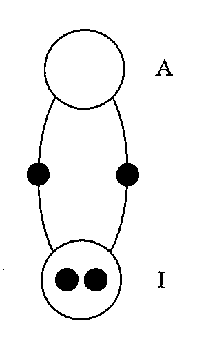
>
> FIGURE 6.1 Pedigree for self-fertilization. Inbred individual I is the result of self-fertilization of the ancestor A. The black dots represent the alleles transmitted by A to I. The inbreeding coefficient of I is defined as the probability that the alleles of a gene in I are identical by descent.

The concept of identity by descent conceals a subtlety that requires some explanation. As one traces the ancestries of alleles into the past, their ancestral lineages come together, or coalesce, reducing the number of ancestral alleles, until ultimately only one common ancestral allele remains. Details of the coalescent process are examined in Chapter 3. Because of coalescence, every allele shares a common ancestral allele with every other allele, and they all are related through DNA replication. Superficially, the coalescent process seems to undermine the concept of the inbreeding coefficient, or at least to render it ambiguous. The ambiguity can be resolved by choosing some arbitrary time in the past and declaring that, at that time, every allele in the population is to be considered as being not identical by descent with any other. This clears the slate because it sets F = 0 for all individuals, and thereafter what the inbreeding coefficient actually refers to is the probability of identity by descent subsequent to the time the slate was cleared.

**[定义 Definition]**

In Figure 6.1, the arbitrary time when all alleles are defined as distinct (not identical by descent) is generation 0. Hence we can write the genotype of individual A in generation 0 as $ \alpha_1\alpha_2 $, and so by definition $ \alpha_1 $ and $ \alpha_2 $ are not identical by descent. The probability that the alleles in the inbred offspring I are identical by descent can then be deduced from first principles. Individual I has any one of four possible genotypes with the following probabilities: $ \frac{1}{4} $ $ \alpha_1\alpha_1 $, $ \frac{1}{4} $ $ \alpha_1\alpha_2 $, $ \frac{1}{4} $ $ \alpha_2\alpha_1 $, and $ \frac{1}{4} $ $ \alpha_2\alpha_2 $. In the cases $ \alpha_1\alpha_1 $ and $ \alpha_2\alpha_2 $, the alleles are identical by descent, and the individual is said to be autozygous (the prefix auto means self).

In the cases $\alpha_{1}\alpha_{2}$ and $\alpha_{2}\alpha_{1}$, the alleles are not identical by descent, and the individual is said to be allozygous (the prefix allo means other). Note that the concepts of autozygosity and allozygosity have nothing to do with the state of an allele—whether the allele is $A$ or $a$, for example. The concepts are concerned only with common ancestry. If the alleles are replicas of a single allele in a common ancestor, they are autozygous; otherwise, they are allozygous. Because the inbreeding coefficient is equal to the probability of autozygosity, the inbreeding coefficient of individual I is given by $ F = \frac{1}{2} $; or to state the result in somewhat different terms, $ F = \frac{1}{2} $ is the inbreeding coefficient resulting from one generation of self-fertilization. Two equally valid interpretations of F are: - F is the probability that any particular gene in an inbred individual has alleles that are identical by descent, or

- F is the overall proportion of genes in an inbred individual that have alleles that are identical by descent. Because $ F = \frac{1}{2} $ in Figure 6.1, this value means that one generation of self-fertilization results in an inbred individual in which 50% of the genes have alleles that are identical by descent (autozygous). Because the span of time in a pedigree is usually short, in this case only one generation, mutation can safely be ignored. Autozygous genotypes must therefore be homozygous, whereas allozygous genotypes can be either homozygous or heterozygous.

---

## PopGen_chapter6_004 · 6.1 INBREEDING / Genotype Frequencies with Inbreeding

At the population level, Figure 6.2 illustrates how the concepts of autozygosity and allozygosity are related to those of homozygosity and heterozygosity in a population of inbred organisms. The small circles represent the individuals in a population, with their genotypes indicated for one locus. The population is assumed to be infinite, but to make matters concrete we will focus on these 32 individuals and assume that they are a perfectly reprepresentative sample. Some of the circles are shaded, and these represent autozygous genotypes whose alleles are identical by descent. Other circles are unshaded, and these represent allozygous genotypes whose alleles are not identical by descent. Disregarding the possibility of mutation since the time that F was declared to equal 0 (clearing the slate), all autozygous genotypes must be homozygous, but allozygous genotypes may be either homozygous or heterozygous (see Figure 6.2). Since F is the probability of identity by descent, it is also the proportion of individuals whose alleles are autozygous. In this example, $ F = \frac{16}{32} = \frac{1}{2} $, which can be determined by counting. Normally one would not be able to distinguish which homozygous genotypes were autozygous and which were allozygous, and here we have chosen them arbitrarily.

> **Figure 6.2** · page 4 · source: `PopGen_chapter6`
>
> 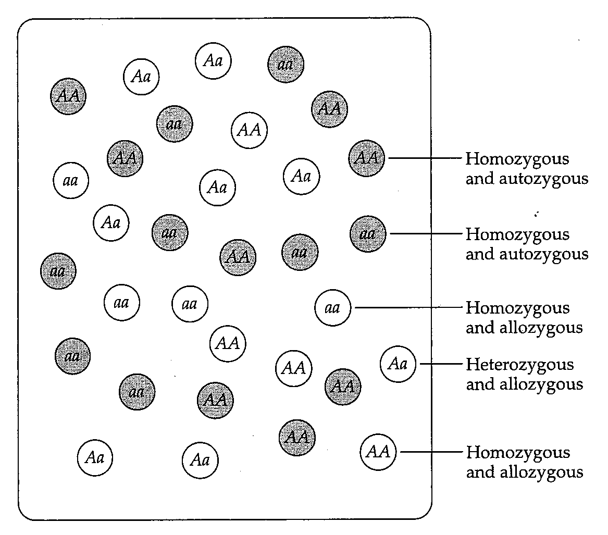
>
> FIGURE 6.2 When there is inbreeding, the alleles in homozygous genotypes may be identical by descent (autozygous, here represented by the shaded circles) or not identical by descent (allozygous). In the absence of mutation, the alleles in heterozygous genotypes must be allozygous.

The essential point of Figure 6.2 is that two alleles can be identical by state, which means that they have the same sequence of nucleotides along the DNA, without being identical by descent. The concept of identity by descent pertains to the ancestral origin of an allele and not to its chemical makeup.

Figure 6.2 also illustrates the effect of inbreeding on the genotype frequencies. In this population, the allele frequencies are $ p = \frac{16}{32} = \frac{1}{2} $ for A, and $ q = \frac{16}{32} = \frac{1}{2} $ for a. These again can be determined by direct counts. With Hardy-Weinberg equilibrium (see Chapter 2), the expected genotype frequencies are $ (\frac{1}{2})^2 \times 32 = 8 \, AA $, $ 2(\frac{1}{2})(\frac{1}{2}) \times 32 = 16 \, Aa $, and $ (\frac{1}{2})^2 \times 32 = 8 \, aa $. The genotype counts are actually 12 AA, 8 Aa, and 12 aa. The excess of homozygous genotypes, and deficiency of heterozygous genotypes, are a direct consequence and characteristic of inbreeding.

**[定义 Definition]**

To understand how inbreeding affects the genotype frequencies, we need only consider the implications of the definition of F for a population of inbred organisms. For this purpose, consider the alleles of a gene present in any one of the inbred organisms. Either of two things must be true: The alleles must either be allozygous (probability 1 - F) or be autozygous (probability F). If the alleles are allozygous, then the probability that the chosen organism has any particular genotype is simply the probability of that genotype in a random-mating population, because, by chance, the inbreeding has not affected this particular gene. On the other hand, if the alleles are autozygous, then the chosen organism must be homozygous, and the probability of homozygosity for any particular allele is simply the frequency of the allele in the subpopulation as a whole. (Because the alleles in question are autozygous, knowing which allele is present in one chromosome immediately tells you that an identical allele is in the homologous chromosome.) These considerations hold regardless of the number of alleles, but to simplify matters, we consider the case of two alleles A and a at frequencies p and q (with $ p + q = 1 $). In this case the genotype frequencies are given by

$$
AA:\quad p^{2}(1-F)+pF=\quad p^{2}\ +pqF
\tag{6.1a}
$$

$$
\begin{array}{r l r}{A\dot{a}{:}}&{{}2p q(1-F)}&{{}\quad=\quad2p q-2p q F}\end{array}
\tag{6.1b}
$$

$$
aa:\quad q^{2}(1-F)+pF~=~q^{2}~+pqF
\tag{6.1c}
$$

Equation 6.1a is the probability that an organism has genotype AA; the first term refers to cases in which the alleles are allozygous and the second to cases in which the alleles are autozygous. Similarly, Equation 6.1c is the probability that an organism has genotype aa. Heterozygous Aa genotypes then have the frequency given by Equation 6.1b, since alleles that are heterozygous must be allozygous. The expressions at the far right in Equations 6.1a–c can be obtained by multiplying out those on the left and remembering that $ p(1-p)=q(1-q)=pq $.

Applying Equation 6.1 to the example in Figure 6.2, we have already shown that $ F = \frac{1}{2} $ and also that $ p = q = \frac{1}{2} $. From the expressions on the far right in Equation 6, therefore, the expected numbers of each of the three genotypes are $ [(\frac{1}{2})^2 + (\frac{1}{2})(\frac{1}{2})(\frac{1}{2})] \times 32 = 12 \, AA $, $ [2(\frac{1}{2})(\frac{1}{2}) - 2(\frac{1}{2})(\frac{1}{2})(\frac{1}{2})] \times 32 = 8 \, Aa $, and $ [(\frac{1}{2})^2 + (\frac{1}{2})(\frac{1}{2})(\frac{1}{2})] \times 32 = 12 \, aa $. The genotype frequencies shown in Figure 6.2 are therefore in perfect agreement with those expected in the progeny of a population of plants in which each individual had undergone one generation of self-fertilization.

The genotype frequencies with inbreeding are summarized graphically in Figure 6.3. The box is divided vertically into two parts, corresponding to genes whose alleles remain allozygous in spite of the inbreeding and those whose alleles are autozygous because of the inbreeding. The division is in the proportion 1 - F: F. Within the allozygous part of the box, the horizontal panels correspond to the allozygous genotypes AA, Aa, and aa, which are the Hardy-Weinberg frequencies. Within the autozygous part of the box, the horizontal panels correspond to the autozygous genotypes AA and aa, which are in the proportions p: q. Some special cases of Equation 6.1 for the genotype frequencies with inbreeding are given in *[See Table 6.1 at the end of this section.]*. When F = 0, the genotype frequencies are identical to those of the Hardy-Weinberg principle; and when F = 1 (complete inbreeding), all individuals are autozygous, and there is a total absence of heterozygous genotypes.

> **Figure 6.3** · page 6 · source: `PopGen_chapter6`
>
> 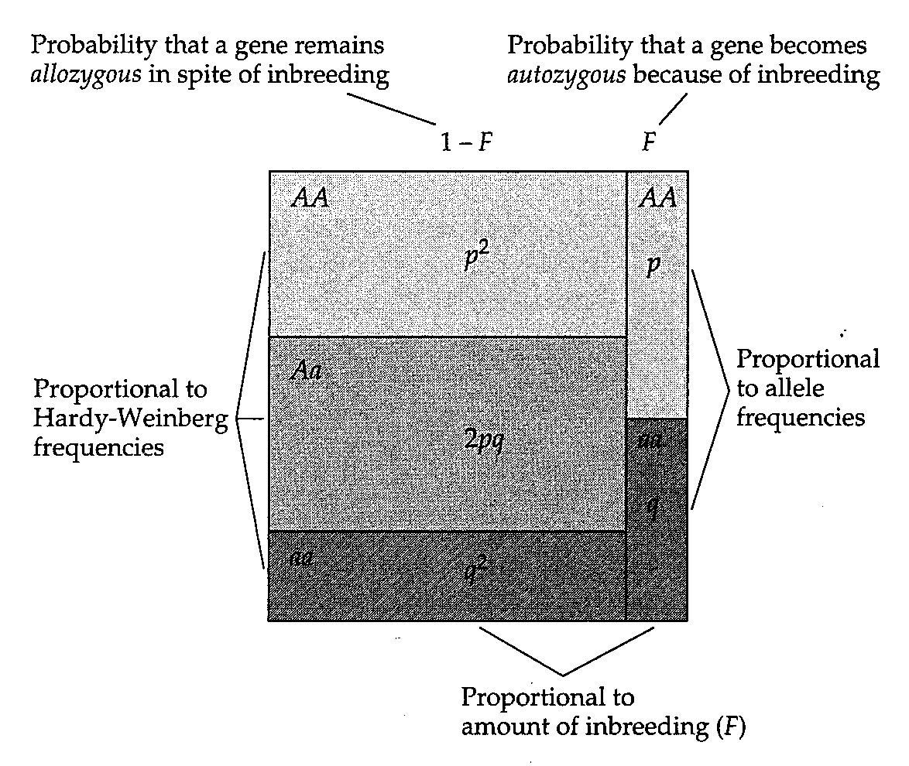
>
> FIGURE 6.3 Graphical representation of the effects of inbreeding on genotype frequencies. Some genes remain allozygous in spite of the inbreeding, and among these the genotype frequencies of AA, Aa, and aa are given by the Hardy-Weinberg principle. Other genes are autozygous because of the inbreeding, and among these the genotype frequencies of AA and aa are given by the allele frequencies. There are no heterozygotes in the autozygous case because the two alleles present at an autozygous locus are, by definition, identical by descent.

**[命题 Proposition]**

Note also from Equation 6.1 that, while inbreeding does change the genotype frequencies in a population, it does not change the allele frequencies. This is true because, for any value of F, the allele frequency of A is given by $ [p^2 + pqF] \div (\frac{1}{2})[2pq - 2pqF] = p^2 + pq = p(p + q) = p $. This principle requires the assumption that all genotypes have the same fitness, which is to say that no natural selection takes place. If there is selection, then the allele frequencies can change with inbreeding.

Equation 6.1 generalizes to multiple alleles in a straightforward way. If a gene has multiple alleles $ A_1, A_2, \ldots A_n $ at respective frequencies $ p_1, p_2, \ldots p_n $ (with $ p_1 + p_2 + \cdots + p_n = 1 $), then in a population with inbreeding coefficient $ F $, the frequencies of $ A_i A_j $ homozygotes and $ A_i A_j $ heterozygotes are as follows:

$$
\begin{array}{r l}{A_{i}A_{i}\colon}&{{}p_{i}^{2}(1-F)+p_{i}F=p_{i}^{2}\;+\; p_{i}(1-p_{i})\mathrm{F}}\end{array}
\tag{6.2a}
$$

$$
\begin{array}{r l r l}{A_{i}A_{j}:}&{{}2p_{i}p_{j}(1-F)}&{}&{{}=2p_{i}p_{j}-2p_{i}p_{j}F}\end{array}
\tag{6.2b}
$$

**[定义 Definition]**

CORRELATION BETWEEN UNITING GAMETES Wright's (1922) original conception of the inbreeding coefficient F was as a measure of the correlation between uniting gametes. That this concept is consistent with the probability interpretation is shown for gene with two alleles in *[See Table 6.2 at the end of this section.]*. The upper part of the table shows all possible pairs of uniting gametes and their frequencies with inbreeding, with the female gamete on the left and the male gamete on the right. The alleles have been coded with numerical values, A with a value 1 and a with value 0. Any arbitrary numerical values lead to the same conclusion, but the assignments in *[See Table 6.2 at the end of this section.]* simplify the formulas. The bottom part of the table shows how various expected values are calculated, with the goal of deducing $ Cov(xy) $, the covariance between x and y, as well as $ V(x) $ and $ V(y) $, the variances. By definition, the correlation between uniting gametes $ r_{UG}(UG $ for uniting gametes) is the ratio of the covariance to the product of the standard deviations, and hence

*[See Table 6.2 at the end of this section.]*

$$
r_{UG}=\frac{Cov(x,y)}{\sqrt{V(x)V(y)}}=\frac{pqF}{pq}=F
\tag{6.3}
$$

Wright, to the end of his long and extraordinarily productive life (he died in 1988 at the age of 98), always preferred his own interpretation of F as a correlation, because under some exceptional circumstances $ r_{UG} $ can be negative, and in these cases the probability interpretations fails because a probability cannot be negative.

REDUCTION IN THE FREQUENCY OF HETEROZYGOUS GENOTYPES One of the main effects of inbreeding is that a group of inbred individuals has reduced frequency of heterozygous genotypes, relative to a group of noninbred individuals (see Equation 6.1b). To examine this effect quantitatively, let $ H_1 $ denote the probability that a gene in an inbred individual is heterozygous, and let $ H_5 $ denote the proportion of heterozygous genotypes expected with random mating in the subpopulation of which I is a member. With two alleles, Equation 6.1b implies that $ H_1 = 2pq - 2pqF $, and the Hardy-Weinberg principle implies that $ H_5 = 2pq $. The proportionate reduction in heterozygosity due to inbreeding, relative to the subpopulation as a whole, is symbolized as $ F_{15} $ and given by the expression

$$
F_{IS}=\frac{H_{S}-H_{I}}{H_{S}}=\frac{2pq-(2pq-2pqF)}{2pq}=F
\tag{6.4}
$$

As we shall see Section 6.2, this formulation is particularly useful in thinking about subdivided populations, when both inbreeding and random genetic drift contribute to the overall probability of identity by descent. of P. cuspidata, two alleles of the phosphoglucomutase-2 gene were observed, which we will designate as the A and a alleles. The sample included were 15 AA, 6 Aa, and 14 aa genotypes (Levin 1978). Are these numbers consistent with the estimate $ F = 0.64 $? (Note: The $ \chi^{2} $ in this case has one degree of freedom because only the allele frequency is estimated from the data; if F also were estimated from the data, rather than being calculated independently from the degree of self-fertilization, then there would be zero degrees of freedom and no goodness-of-fit test would be possible.)

ANSWER The allele frequencies of A and a are estimated as $ (30 + 6)/70 = 0.514 $ and $ 1 - 0.514 = 0.486 $, respectively. The hypothesis is that F = 0.64, and so 1 - F = 0.36. The expected numbers of the genotypes AA, Aa, and aa are, respectively, $ [(0.514)^2(0.36) + (0.514)(0.64)](35) = 14.8 $, $ [2(0.514)(0.486)(0.36)](35) = 6.3 $, and $ [(0.486)^2(0.36) + (0.486)(0.64)](35) = 13.9 $. With these expectations, the $ \chi^2 = 0.02 $ with one degree of freedom, and the associated probability is about 0.96. The fit to the inbreeding model is excellent.

**[Table]**

*[See Table 6.1 at the end of this section.]*

> **Table 6.1** · `6.1` · page 7 · source: `PopGen_chapter6_004`
> TABLE 6.1 Genotype Frequencies with Inbreeding
>
> <table><tr><td rowspan="2">Genotype</td><td colspan="3">Frequency in Population</td></tr><tr><td>With inbreeding coefficient  $ F $</td><td>With  $ F = 0 $ (random mating)</td><td>With  $ F = 1 $ (complete inbreeding)</td></tr><tr><td>AA</td><td>$ p^{2}(1 - F) + \frac{pF}{2pq(1 - F)} $</td><td>$ p^{2} $</td><td>p</td></tr><tr><td>Aa</td><td rowspan="2">$ q^{2}(1 - F) + \frac{qF}{2pq} $</td><td>$ 2pq $</td><td>0</td></tr><tr><td>aa</td><td>$ q^{2} $</td><td>q</td></tr></table>

> **Table 6.2** · `6.2` · page 8 · source: `PopGen_chapter6_004`
> TABLE 6.2 Correlation between Uniting Gametes
>
> <table><tr><td colspan="3">TABLE 6.2 Correlation between Uniting Gametes</td></tr><tr><td>Uniting gametes</td><td>Relative frequency</td><td>Expected values</td></tr><tr><td>A (x = 1)</td><td>$ p^{2} + pqF $</td><td>$ E(x) = p^{2} + pqF + pq - pqF = p^{2} + pq = p(p + q) = p $</td></tr><tr><td>A (x = 1)</td><td>$ pq - pqF $</td><td>$ E(x^{2}) = p^{2} + pqF + pq - pqF = p^{2} + pq = p(p + q) = p $</td></tr><tr><td>a (x = 0)</td><td>$ pq - pqF $</td><td>$ E(y) = p^{2} + pqF + pq - pqF = p^{2} + pq = p(p + q) = p $</td></tr><tr><td>a (x = 0)</td><td>$ q^{2} + pqF $</td><td>$ E(y^{2}) = p^{2} + pqF + pq - pqF = p^{2} + pq = p(p + q) = p $</td></tr><tr><td></td><td></td><td>$ E(xy) = p^{2} + pqF $</td></tr><tr><td></td><td></td><td>Cov(xy) =  $ E(xy) - E(x)E(y) = p^{2} + pqF - p \times p = pqF $</td></tr><tr><td></td><td></td><td>$ V(x) = E(x^{2}) - [E(x)]^{2} = p - p^{2} = p(1 - p) = pq $</td></tr><tr><td></td><td></td><td>$ V(y) = E(y^{2}) - [E(y)]^{2} = p - p^{2} = p(1 - p) = pq $</td></tr></table>

---

## PopGen_chapter6_005 · 6.1 INBREEDING / Genetic Effects of Inbreeding

In outcrossing species (those that regularly avoid mating between relatives), close inbreeding is generally harmful. The effects are seen most dramatically when inbreeding is complete or nearly complete. In most species of animals, complete autozygosity requires many generations of brother-sister mating. But in Drosophila melanogaster, autozygosity of entire chromosomes can be achieved in just a few generations because of the absence of crossing over in the male and the ready availability of genetically marked chromosomes with multiple inversions to prevent crossing over in the female. One widely used inversion chromosome is marked with the dominant mutation Cy (for Curly wings), and the critical experimental cross is of the form Cy/+i × Cy/+i, where is the ith member of a sample of wildtype chromosomes isolated from a natural population, and the +i chromosomes are identical by descent. Homozygous Cy genotypes do not survive, and so the theoretically expected progeny are Cy/+i (with curly wings) and +i/+i (with straight wings) in a ratio of $ \frac{2}{3}: \frac{1}{3} $. If the wildtype chromosome carries one or more mutations that decrease survivorship, then there will be fewer than $ \frac{1}{3} $ straight-wing flies, and if the chromosome carries a recessive lethal mutation, then straight-wing flies will be absent. Control crosses are of the form $ Cy/+_i \times Cy/+_j $, where the $ +\_i $ and $ +\_j $ chromosomes are not identical by descent. For either type of mating, an estimate $ \hat{v} $ of the viability (survivorship) of the $ +\_/+ $ genotype, relative to that of the $ Cy/+ $ genotype, is given by

$$
\hat{v}=\frac{2n_{+/-}}{1+n_{Cy/+}}
\tag{6.5}
$$

where $ n_{+/+} $ and $ n_{Cy/+} $ are the counts of wildtype and Curly offspring, respectively (Haldane 1956). The addition of 1 to the denominator makes the estimate of v almost unbiased. When the total number of offspring is large, $ \hat{v} $ is essentially equal to two times the number of wildtype offspring divided by the number of Curly offspring.

Results of such experiment to estimate the viabilities of autozygous (homozygous) and allozygous (heterozygous) wildtype chromosomes from a natural population are shown in Figure 6.4. It is evident that the homozygous genotypes (shaded histogram) are relatively poor in viability. In fact, about 37% of the homozygous genotypes are lethal. Moreover, among the homozygous genotypes that have viabilities within the normal range of the heterozygous genotypes (open histogram), virtually all can be shown to have reduced fertility (Sved 1975; Simmons and Crow 1977). Inbreeding so close as to make entire chromosomes homozygous is rare in outcrossing species, except in the kind of experiment in Figure 6.4, but the effects are clearly very harmful and provide a new dimension of genetic diversity. In the case of single nucleotide polymorphisms (SNPs), genetic diversity results from common alleles that do not perceptibly impair viability or fertility when homozygous. In the case of inbreeding, the effects are mainly due to rare alleles that are severely detrimental when homozygous. (The fact that the alleles are rare is shown by the small proportion of lethal or near-lethal heterozygous combinations.) Figure 6.4 shows that natural populations of Drosophila contain considerable hidden genetic variation in the form of rare deleterious recessive alleles.

> **Figure 6.4** · page 11 · source: `PopGen_chapter6`
>
> 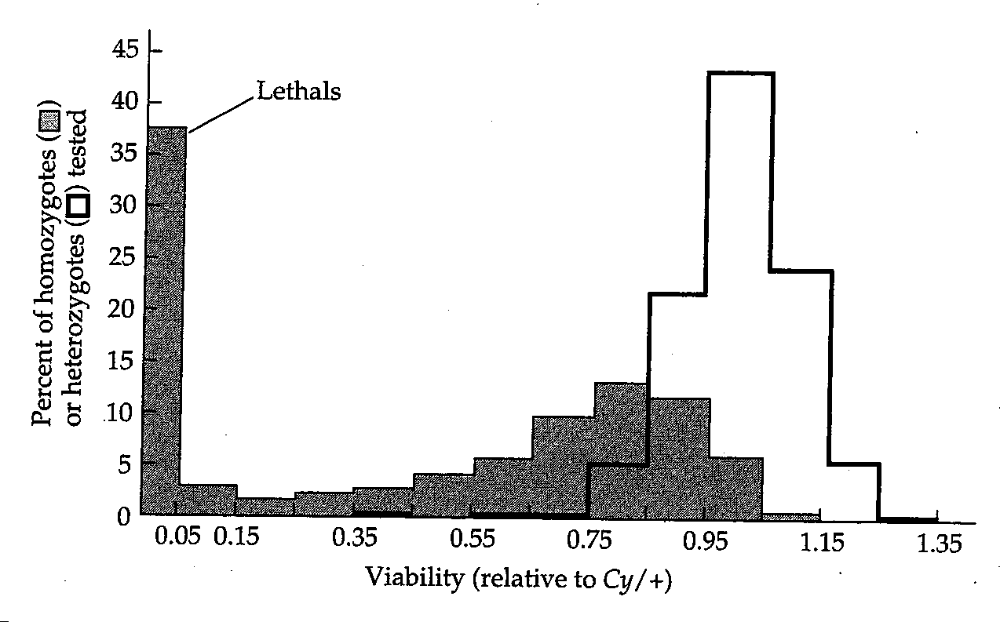
>
> FIGURE 6.4 Viability distributions of wildtype homozygotes (shaded area) and wildtype heterozygotes (black outline) of second chromosomes extracted from Drosophila melanogaster. The histograms depict results of testing 691 homozygous combinations and 688 heterozygous combinations. Note that, in this sample, nearly 37% of the wildtype chromosomes are lethal when homozygous, and many more have viabilities substantially below normal. (Data from Mukai et al. 1974.)

Detrimental effects of inbreeding, called inbreeding depression, are found in virtually all outcrossing species, and the more intense the inbreeding, the more harmful the effects. Inbreeding in human beings is also generally harmful, but the effect is difficult to measure because the degree of inbreeding is less than that in experimental organisms, and the effects may also vary from population to population. Nevertheless, children of first-cousin matings are, on the average, less capable than noninbred children in any number of ways (for example, higher rate of mortality, lower IQ scores). It should be emphasized, however, that many such children are within the normal range of abilities, and some are quite gifted. Sewall Wright, the celebrated population geneticist, was the child of a first-cousin marriage.

In human populations, as in most organisms, the deleterious effects of inbreeding are largely due to the increased homozygosity of rare recessive alleles, and so inbreeding effects in human beings are seen most dramatically in the increased frequency of genetic abnormalities due to harmful recessive alleles among the children of first-cousin matings. The increased frequency of such conditions can be deduced from the genotype frequency given in Equation 6.1c. For the offspring of a first-cousin mating, $ F = \frac{1}{16} $, as will be shown in the next section. Suppose that a is a rare deleterious recessive allele with an allele frequency of q. Then, among the children of first-cousin matings, the frequency of aa is expected to be $ q^2 + pq(\frac{1}{16}) $. On the other hand, among the offspring of matings that take place at random, the frequency of homozygous recessives equals $ q^2 $.

Now if c is the proportion of first-cousin matings in a population, then the expected proportion of homozygous aa offspring in the population as a whole that result from the first-cousin matings is given by

$$
\frac{c(q^{2}+pq\left/16\right.)}{q^{2}(1-c)+c(q^{2}+pq\left/16\right.)}=\frac{c(1+15q)}{c+16q-cq}
\tag{6.6}
$$

Figure 6.5 shows plots of this proportion for c = 0.01 and c = 0.06, a range that includes most human populations. Note that, as the recessive allele becomes more rare, the first-cousin matings account for an increasing proportion of all affected children. Consider albinism as an example, which is due to a rare recessive mutation. Although the allele frequency differs among human subpopulations, we will take q = 0.005 as typical, which predicts a frequency among the children of nonrelatives of $ q^2 = 0.0025% $, or about one in 40,000. The curves in Figure 6.5 imply that, when the frequency of first cousin matings equals 1% (approximately the value in the United States), then the proportion of albino children whose parents are first cousins is 12%. In a population with c = 0.06, although first-cousin matings account for 6% of all matings, they account for 46% of matings with albino children.

> **Figure 6.5** · page 12 · source: `PopGen_chapter6`
>
> 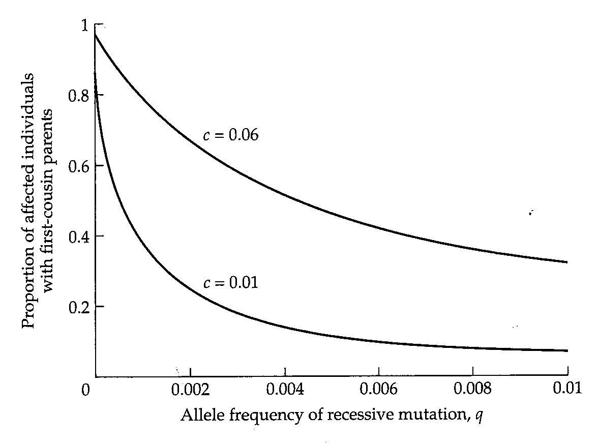
>
> FIGURE 6.5 For rare recessive alleles, even low levels of inbreeding can account for a disproportionate share of homozygous recessive offspring. The curves correspond to overall proportions of first-cousin mating of 1% and 6%, and show that when a recessive allele is rare, a large proportion of homozygous genotypes result from the small proportion of first-cousin matings. The reason is that the offspring of first cousins have a  $ \frac{1}{16} $ chance of carrying alleles that are identical by descent.

---

## PopGen_chapter6_006 · 6.1 INBREEDING / Calculation of the Inbreeding Coefficient from Pedigrees

Calculation of F from a pedigree is simplified by drawing the pedigree in the form shown in Figure 6.6A, where the lines represent gametes contributed by parents to their offspring. The same pedigree is shown in conventional form in Figure 6.6B. The organisms in gray in part B are not represented in part A. because they have no ancestors in common and therefore do not contribute to the inbreeding of the organism denoted I. The inbreeding coefficient $ F_{I} $ of I is the probability that I is autozygous for the alleles of an autosomal gene under consideration. The first step in calculating $ F_{I} $ is to locate all the common ancestors in the pedigree, because an allele could become autozygous in I only if it were inherited through both of I's parents from a common ancestor; in this case, there is only one common ancestor, namely, A. The next step in calculating $ F_{I} $, which is carried out for each common ancestor in turn, is to trace all the paths of gametes that lead from one of I's parents back to the common ancestor and then down again to the other parent of I. These paths are the paths along which an allele in a common ancestor could become autozygous in I. In Figure 6.6A, there is only one such path: DBACE, in which the common ancestor is underlined for bookkeeping purposes, an especially useful procedure in complex pedigrees.

> **Figure 6.6** · page 13 · source: `PopGen_chapter6`
>
> 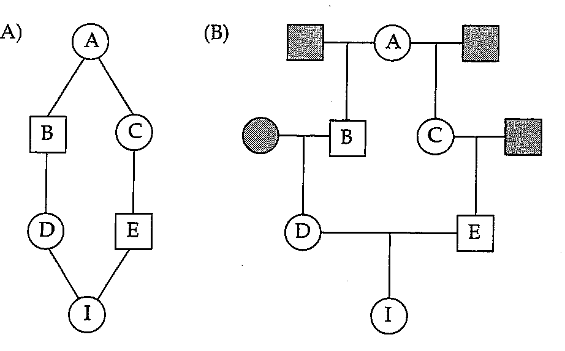
>
> FIGURE 6.6 (A) Convenient way to represent pedigrees for calculation of the inbreeding coefficient. In this case, the pedigree shows a mating between half-first cousins. (B) Conventional representation of the same pedigree as in part A. Squares represent males, circles represent females, and the shaded organisms in part B are not depicted in part A because they do not contribute to the inbreeding of the inbred organism designated I.

**[定义 Definition]**

The third step in calculating $F_i$ is to calculate the probability of autozygosity in I due to each of the paths in turn. For the path DB$\hat{\text{ACE}}$, the reasoning is illustrated in Figure 6.7. Here the black dots represent alleles transmitted along the gametic paths, and the number associated with each step is the probability of identity by descent of the alleles indicated. For all steps except that around the common ancestor, the probability is $\frac{1}{2}$ because, with Mendelian segregation, the probability that a particular allele present in a parent is transmitted to a specified offspring is $\frac{1}{2}$. To understand why ($\frac{1}{2}$)(1 + $F_A$) is the probability associated with the loop around the common ancestor, denote the alleles in the common ancestor as $\alpha_1$ and $\alpha_2$. These symbols are used to avoid confusion with conventional allele symbols designating functional types of alleles, such as $A$ for dominant and $a$ for recessive. The pair of gametes contributed by $A$ could contain $\alpha_{1}\alpha_{1}$, $\alpha_{2}\alpha_{2}$, $\alpha_{1}\alpha_{2}$, or $\alpha_{2}\alpha_{1}$, each with a probability of $\frac{1}{4}$ because of Mendelian segregation. In the first two cases, the alleles are clearly identical by descent; in the second two cases, the alleles are identical by descent only if $\alpha_{1}$ and $\alpha_{2}$ are already identical by descent, which means that $A$ is autozygous. The probability that $A$ is autozygous is, by definition, the inbreeding coefficient of $A$, $F_{A}$, Hence, the probability for the step around the common ancestor $A$ is $\left(\frac{1}{4}\right)+\left(\frac{1}{4}\right)+\left(\frac{1}{4}\right)F_{A}+\left(\frac{1}{4}\right)F_{A}=\left(\frac{1}{2}\right)+\left(\frac{1}{2}\right)F_{A}=\left(\frac{1}{2}\right)(1+F_{A})$. Because each of the steps in Figure 6.7 is independent of the others, the total probability of autozygosity in I due to the path through $A$ is $\left(\frac{1}{2}\right)\times\left(\frac{1}{2}\right)\times\left(\frac{1}{2}\right)(1+F_{A})\times\left(\frac{1}{2}\right)\times\left(\frac{1}{2}\right)=\left(\frac{1}{2}\right)^{5}(1+F_{A})$. Make special note that the exponent $\epsilon$ in the $\left(\frac{1}{2}\right)$ is simply the total number of ancestors in the path. In general, if a path through a common ancestor $A$ contains $i$ individuals, the probability of autozygosity due to that path is

$$
(\tfrac{1}{2})^{i}(1+F_{A})
$$

Thus, the inbreeding coefficient of I in Figure 6.6A is $ \left(\frac{1}{2}\right)^{5}(1 + F_{A}) $. Assuming that A itself is not inbred $ (F_{A} = 0) $, the inbreeding coefficient of I reduces to $ F_{I} = \left(\frac{1}{2}\right)^{5} = \frac{1}{32} $.

> **Figure 6.7** · page 14 · source: `PopGen_chapter6`
>
> 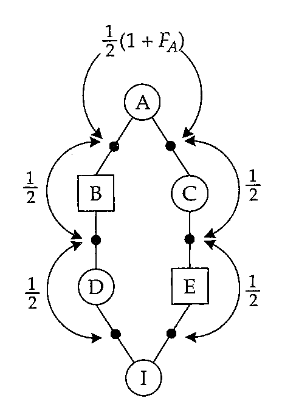
>
> FIGURE 6.7 Loops for the pedigree in Figure 6.6A, showing probabilities that designated alleles (solid dots) are identical by descent. Each loop is independent of the others, so their probabilities multiply. Thus, i.e. inbreeding coefficient of organism I is  $ F_{1} = \left(\frac{1}{2}\right)^{5}(1 + F_{A}) $, where  $ F_{A} $ represents the inbreeding coefficient of the common ancestor.

In pedigrees of greater complexity, there is more than one common ancestor and there may be more than one path through any of the common ancestors. The paths are mutually exclusive because autozygosity due to an allele inherited along one path excludes autozygosity due to an allele inherited along a different path. Thus, the total inbreeding coefficient is the sum of the probabilities of autozygosity due to each path considered separately. The whole procedure for calculating $F$ is summarized in an example of a first-cousin mating in Figure 6.8. In a first-cousin mating, there are two common ancestors (A and B) and two paths (one each through A and B). The total inbreeding coefficient of I is the sum of the two separate contributions shown in Figure 6.8. If A and B are both noninbred, then $F_A = F_B = 0$, and so $F_I = \left(\frac{1}{2}\right)^5 + \left(\frac{1}{2}\right)^5 = \frac{1}{16}$. The result $F_I = \frac{1}{16}$ is the probability that I is autozygous at the specified locus; alternatively, $F_I$ can be interpreted as the average proportion of all genes in I in which the alleles present are autozygous.

> **Figure 6.8** · page 15 · source: `PopGen_chapter6`
>
> 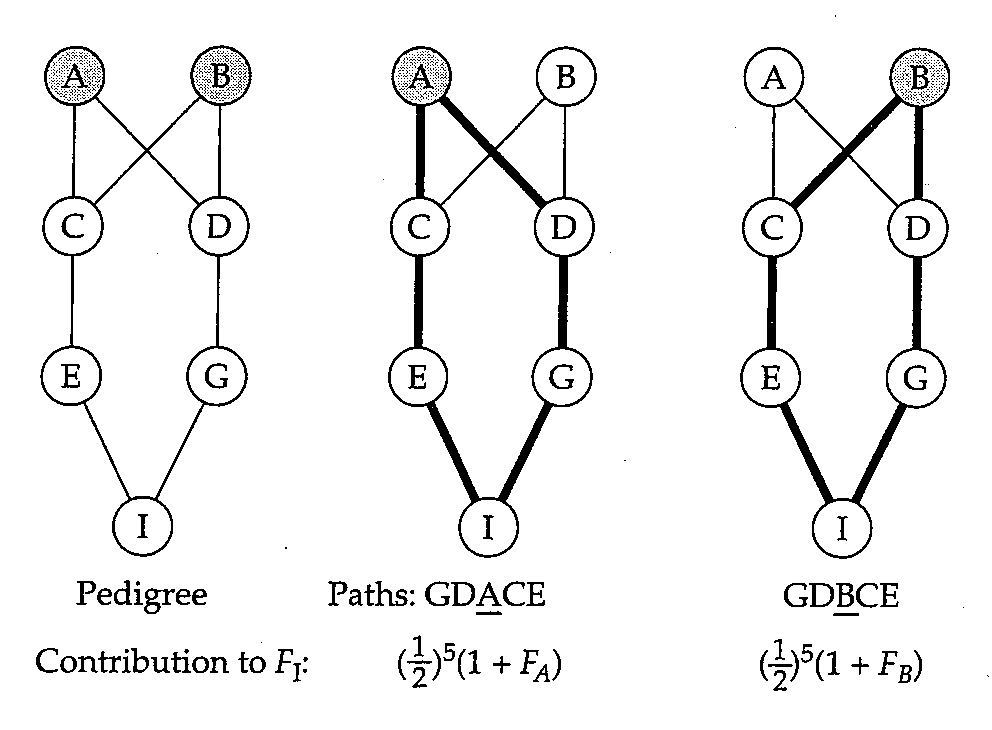
>
> FIGURE 6.8 On the left is a pedigree of individual I, the offspring of a first-cousin mating. On the right are the two paths through common ancestors (heavy lines) used in calculating the inbreeding coefficient of I. Below each path is the contribution to $F_{1}$ due to that path, calculated as in Figure 6.7. Each path is mutually exclusive of the others, and so their probabilities add. Thus, the total inbreeding coefficient of I is the sum of the two separate contributions. If $F_{A}=F_{B}=0$, then $F_{I}=\frac{1}{16}$.

In general, for any autosomal gene, the formula for calculating the inbreeding coefficient $ F_{1} $ of an inbred organism I is

$$
F_{I}=\sum_{A}\left(\frac{1}{2}\right)^{i}(1+F_{A})
\tag{6.7}
$$

in which the summation over A means summation over all possible paths through all common ancestors, i is the number of organisms in each path, and A is the common ancestor in each path. Figure 6.9 gives the inbreeding coefficient of an offspring produced by mating between any of several common types of relatives in human pedigrees. assuming that none of the common ancestors is inbred. (Altogether, there are four common ancestors and six paths.) ANSWER $ F_{1} = \left(\frac{1}{2}\right)^{3}(1 + F_{C}) + \left(\frac{1}{2}\right)^{3}(1 + F_{D}) + \left(\frac{1}{2}\right)^{5}(1 + F_{A}) + \left(\frac{1}{2}\right)^{5}(1 + F_{B}) + \left(\frac{1}{2}\right)^{5}(1 + F_{A}) + \left(\frac{1}{2}\right)^{5}(1 + F_{B}) $. When the common ancestors are assumed to

$$
F_{A}=F_{B}=F_{C}=F_{D}=0
$$

$$
F_{I}=\tfrac{3}{8}
$$

> **Figure 6.9** · page 16 · source: `PopGen_chapter6`
>
> 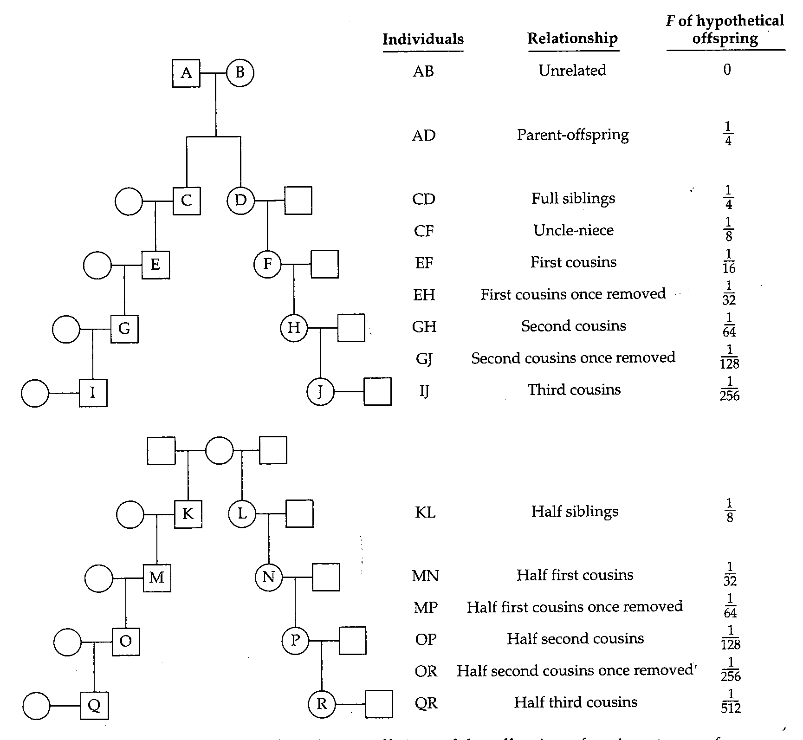
>
> FIGURE 6.9 Inbreeding coefficient of the offspring of various types of consanguineous mating.

---

## PopGen_chapter6_007 · 6.1 INBREEDING / Regular Systems of Mating

In plant and animal breeding, it is often important to know how rapidly the inbreeding coefficient increases when a strain is propagated by a regular system of mating, a systematic and repeated pattern of inbreeding, such as self-fertilization, sib mating, or backcrossing to a standard strain. The reasoning involved in calculating the inbreeding coefficient for any generation is illustrated in Figure 6.10 for repeated self-fertilization. In this figure, the labels t - 1 and t refer to the inbred organisms after t - 1 and t generations of self-fertilization. The loop around the ancestor in generation t - 1 designates the probability that the two indicated alleles are identical by descent. Here the formula in Equation 6.7 applies with only one path and only one ancestor in the path, and so $ F_t = \left(\frac{1}{2}\right)^t(1 + F_{t-1}) $, where $ F_t $ is the inbreeding coefficient in generation $ t $. This equation is easy to solve in terms of the quantity $ 1 - F_t $, which is often called the panmictic index (panmixia) is an old-fashioned word for random mating). Multiplying both sides of the equation for $ F_t $ by -1 and then adding +1 to each side leads to $ 1 - F_t = 1 - \left(\frac{1}{2}\right)(1 + F_{t-1}) = 1 - \left(\frac{1}{2}\right) - \left(\frac{1}{2}\right)F_{t-1} = \left(\frac{1}{2}\right)(1 - F_{t-1}) $, or

$$
1-F_{t}=(\frac{1}{2})^{t}(1-F_{0})
\tag{6.8}
$$

where $ F_0 $ is the inbreeding coefficient in the initial generation when the repeated self-fertilization begins. Self-fertilization therefore leads to an extremely rapid increase in the inbreeding coefficient. When $ F_0 = 0 $, then $ F_1 = \frac{1}{2} $, $ F_2 = \frac{3}{4} $, $ F_3 = \frac{7}{8} $, $ F_4 = \frac{15}{16} $, and so on. The increase in $ F $ under self-fertilization and several other regular systems of mating is shown in Figure 6.11. No matter how much inbreeding has taken place in a population, a single generation of random mating completely erases the effects, and the genotype frequencies return to the Hardy-Weinberg proportions.

> **Figure 6.10** · page 17 · source: `PopGen_chapter6`
>
> 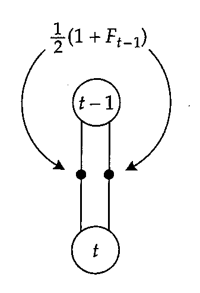
>
> FIGURE 6.10 Increase in $F$ resulting from continued self-fertilization. The organism in generation $t$ is the offspring of self-fertilization of the organism in generation $t-1$. The loop shows that $F_{t} = \left(\frac{1}{2}\right)(1 + F_{t-1})$.

> **Figure 6.11** · page 17 · source: `PopGen_chapter6`
>
> 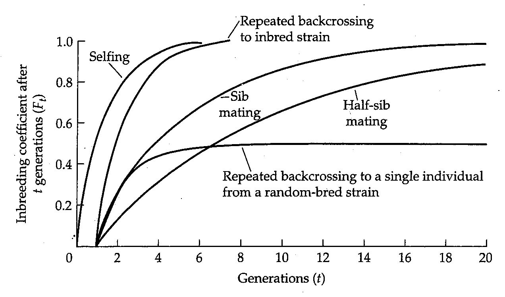
>
> FIGURE 6.11 Theoretical increase in the inbreeding coefficient F for regular systems of mating: selfing, sib mating, half-sib mating, and repeated backcrossing to a single organism from a random-bred strain. In each case, the initial value of F is assumed to be  $ F_0 = 0 $.

Many plants reproduce predominantly by self-fertilization, including crop plants such as soybeans, sorghum, barley, and wheat. As expected of highly self-fertilizing species, each plant is highly homozygous for alleles. Yet in comparing different populations, the proportion of polymorphic genes is comparable to that found in outcrossing species. Polymorphisms are found because self-fertilization does not eliminate genetic variation; it simply reorganizes genetic variation into homozygous genotypes. On the other hand, self-fertilizing species do contain fewer deleterious recessives than do outcrossing species, presumably because the increased frequency of homozygous recessive genotypes permits deleterious mutations to be eliminated from the population by natural selection. The high frequency of homozygous genotypes in naturally self-fertilizing species also impedes recombination producing new gametic types not already present in the parent. Therefore, a predominance of self-fertilization has the effect of slowing the approach to linkage equilibrium because the approach to linkage equilibrium is through recombination in double heterozygotes (A B/a b and A b/a B in the case of two alleles at each locus); with extreme inbreeding, such doubly heterozygous genotypes are rare. Indeed, the most extreme examples of linkage disequilibrium have been found in predominantly self-fertilizing species such as barley (Hordeum vulgare) and wild oats (Avena barbata).

Barley, which regularly undergoes more than 99% self-fertilization, provides an extreme example of linkage disequilibrium between two unlinked esterase genes (Clegg et al. 1972). A population that had originated as a complex cross was maintained for 26 generations under normal agricultural conditions without conscious selection. The population was polymorphic for two alleles of an Esterase-B gene, which we will designate as alleles A and a, and also polymorphic for two alleles of an Esterase-D gene, which we will designate as alleles B and b. The gametic types were found in the following proportions. For all practical purposes, these numbers also refer to homozygous genotypes because there is such close inbreeding.

$$
AB\qquad1501\qquad
$$

(1642.6)

$$
Ab\qquad754
$$

$$
a B\qquad\text{…}720
$$

$$
\begin{array}{r l r l r}{a b}&{{}}&{74}&{{}}&{{}(215.6)}\end{array}
$$

**[命题 Proposition]**

(The numbers in parentheses are the expected numbers based on the assumption of linkage equilibrium, calculated as in Chapter 2.) The $ \chi^{2} $ value in this case is 172.7 with one degree of freedom. The associated probability is much less than 0.0001, and so there is undoubtedly linkage disequilibrium. For the above data, the linkage disequilibrium parameter (see Equation 2.13) is D = -0.046, which is about 66% of its theoretical minimum. On the other hand, in spite of the small amount of outcrossing in natural populations of barley, the DNA sequences of most genes show evidence for recombination (Morrell et al. 2003).

One of the dramatic successes of plant breeding has come from the crossing of inbred lines to produce high-yielding hybrid corn. Yield of a genetically heterogeneous, outcrossing variety of corn can be improved by selecting the plants with the highest yields in each generation to be the progenitors of the next generation; such artificial selection results in only gradual improvement, however (see Chapter 9). If a large number of self-fertilized lines are established from a heterogeneous population, each line declines in yield as inbreeding proceeds, because of the forced homozygosity of deleterious recessives. Many lines become so inferior that they have to be discontinued. Self-fertilized lines are not likely to become homozygous for exactly the same set of deleterious recessives, however, and when different lines are crossed to produce a hybrid, the hybrid becomes heterozygous for these genes. Alleles favoring high yield in corn are generally dominant, and there may also be genes in which the heterozygous genotypes have a more favorable effect on yield than do the homozygous genotypes; in any case, the hybrid has a much higher yield than either inbred parent. The phenomenon of enhanced hybrid performance is called hybrid vigor or heterosis. In practice, inbred lines are crossed in many combinations to identify those that produce the best hybrids. Yields of hybrid corn are typically 15–35% greater than yields of outcrossing varieties, and the successful introduction of hybrid corn has been remarkable. Virtually all corn acreage in the United States today is planted with hybrids, as compared to 0.4% of the acreage in 1933 (Sprague 1978).

---

## PopGen_chapter6_008 · INBREEDING, POPULATION SUBDIVISION, AND MIGRATION: Introduction / 6.2 POPULATION SUBDIVISION

Most populations are grouped into smaller subpopulations within which mating usually takes place. Such grouping is called population structure or population subdivision, and it is almost universal among organisms. Many organisms naturally form subpopulations in the form of herds, flocks, schools, colonies, or other types of aggregations. When there is population subdivision, there is almost inevitably some genetic differentiation among the subpopulations. By genetic differentiation we mean that the allele frequencies among the subpopulations become different. Genetic differentiation may result from natural selection favoring different genotypes in different subpopulations, but it may also result from random processes in the transmission of alleles from one generation to the next or from chance differences in allele frequency among the initial founders of the subpopulations. The effects of random genetic drift in increasing the variance in allele frequency among subpopulations have already been examined in Chapter 3.

When the subpopulations are completely isolated from migration, then all matings must take place between individuals within each subpopulation. The intra-population mating implies that the individuals within each subpopulation will share some common ancestors, and hence even matings that take place "at random" in the subpopulation are matings that unite individuals who have common ancestors. These common ancestors transmit alleles that are identical by descent that can come together in the progeny of the mating, and a nonzero probability of identity by descent constitutes inbreeding. In other words, population subdivision, in and of itself, results in inbreeding because the individuals in the subpopulation share remote ancestors, even in situations in which the members of each subpopulation choose their mates at random. The relationship between population structure and inbreeding is subtle, but it has profound consequences in population genetics.

Many populations have a hierarchical population structure, which means that the subpopulations can be grouped into progressively inclusive levels in which, at each grouping, the next lower levels are included ("nested") within the next higher ones. To consider a concrete example, imagine we were interested in the population structure of a widespread species of freshwater fish. The lowest population level consists of a local interbreeding population of animals within a stream. A stream might contain more than one such local population. The next-higher level in the hierarchy could be the organization of streams into groups feeding the same river. Another higher level could be rivers within watersheds. An even higher level of organization might be watersheds within continents. The aggregation of subpopulations into progressively more inclusive groups can continue for as many levels as is convenient and informative. It is inevitably somewhat arbitrary how the groups at each level are combined to form the next higher level in the hierarchy. The choice of classification is pragmatic: One tries to group the subpopulations in such a way as to highlight the genetic similarities and differences among them. If there were so much migration of fish among subpopulations that all members of the species constituted essentially a single, random-mating population, then there would be no need to define a hierarchical population structure because it would be uninformative. However, most organisms do have significant population structure.

---

## PopGen_chapter6_009 · 6.2 POPULATION SUBDIVISION / Reduction in Heterozygosity Due to Population Subdivision

One of the important consequences of population structure is a reduction in the average proportion of heterozygous genotypes relative to that expected under random mating. The reason for the reduction in heterozygosity may be understood by considering the somewhat whimsical example in Figure 6.12. The outline is the floor plan of a large barn. The organisms of interest are the mice concentrated primarily into two subpopulations of equal size at the west and east ends of the barn. The movement of mice between the subpopulations is prevented by a large population of hungry and vigilant cats in the central area. The occasional mouse that comes out of its refuge is quickly eaten. (These hypothetical mice have not been endowed with the ingenuity to find alternative routes between the west and east ends of the barn, like sneaking along the rafters.) Because of chance effects in the founding of the subpopulations, the west and east subpopulations are completely homozygous for alternative alleles of a gene. All the mice in the west subpopulation are AA, and all those in the east subpopulation are aa. In technical terms, the west subpopulation is fixed for the A allele (its allele frequency equals 1), and the east subpopulation is fixed for the a allele. The genotype frequencies of AA, Aa, and aa in the west subpopulation are 1, 0, and 0, respectively, and those in the east subpopulation are 0, 0, and 1, respectively. Within each subpopulation there is random mating, and the genotype frequencies, though extreme, still satisfy the Hardy-Weinberg principle. In particular, the frequencies of AA, Aa, and aa within each subpopulation are given by $ p^2 $, $ 2pq $, and $ q^2 $, where p = 0 in the east subpopulation, and p = 1 in the west subpopulation. Therefore, within any one of the subpopulations in Figure 6.12, the frequency of heterozygotes equals the frequency expected with HWE.

> **Figure 6.12** · page 21 · source: `PopGen_chapter6`
>
> 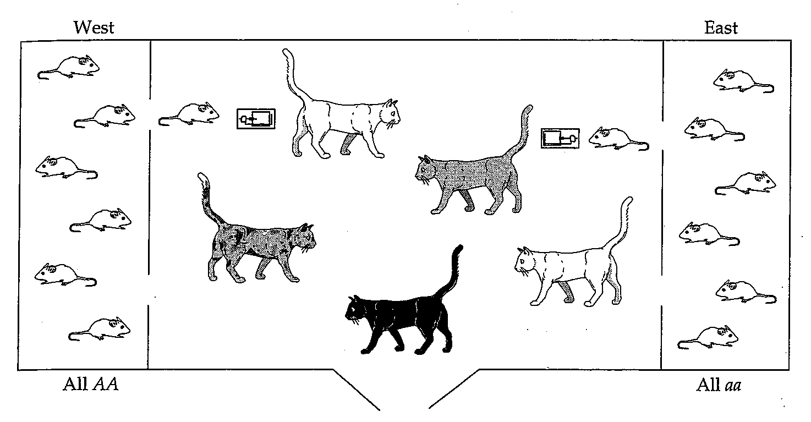
>
> FIGURE 6.12 An extreme example of the general principle that a difference in allele frequency among subpopulations results in a deficiency of heterozygotes. The floor plan is that of a hypothetical barn. The mouse subpopulations in the east and west enclaves are completely isolated because of the cats in the middle. The west subpopulation is fixed for the A allele and the east subpopulation for the a allele. Trapping mice at random in the area patrolled by the cats would yield an overall allele frequency of  $ \frac{1}{2} $, but no heterozygous genotypes.

The situation regarding the total mouse population in Figure 6.12 is very different, however, as there is an overall deficiency of heterozygotes. By “total population” in this context, we mean the aggregate of all mice without regard to the population subdivision. Suppose we were unaware of the population structure in the barn. We might then suppose that the barn contained a single randomly mating population. To study the total population of the barn, we trap mice at random in the center area, catching the occasional escapee from the cats. Because the subpopulations are fixed for either A or a, half the time we would trap an AA homozygote and half the time an aa homozygote. Consequently, we estimate the allele frequency of A as $ \hat{p} = \frac{1}{2} $. Assuming random mating and Hardy-Weinberg genotype frequencies in the total population, the expected genotype frequencies of AA, Aa, and aa are given by the HWE as $ \hat{p}^2 $, $ 2\hat{p}\hat{q} $, and $ \hat{q}^2 $. Because the overall allele frequency of A among the trapped animals is $ \frac{1}{2} $, we would naively expect a fraction $ 2 \times \left(\frac{1}{2}\right) \times \left(\frac{1}{2}\right) = \frac{1}{2} $ of the animals to be heterozygous. In fact, we would have caught no heterozygotes at all!

This rather paradoxical result—that there is a deficiency of heterozygotes in the total population even though random mating takes place within each subpopulation—is a consequence of the difference in allele frequency among the subpopulations. Were the allele frequencies in both subpopulations the same, it would not matter whether we sampled from the west subpopulation, the east subpopulation, or from the area in between. We would recover genotypes in Hardy-Weinberg proportions because both subpopulations are genotypically identical and in HWE. In an organism with hierarchically structured subpopulations, there is an analogous deficiency of heterozygotes at each level in the hierarchy. The following section examines the heterozygosities in more detail.

---

## PopGen_chapter6_010 · 6.2 POPULATION SUBDIVISION / Average Heterozygosity

In the Mojave desert, local populations of the annual plant Linanthus parryae are polymorphic for white versus blue flowers. The plant is diminutive, averaging just 1 cm in height, and when the plant is in bloom, the ground cover of white flowers justifies the popular name "desert snow." Blue flowers result from homozygosity for a recessive allele. The geographical distribution of the frequency q of the recessive allele across a region of the Mojave desert is illustrated in Figure 6.13. Each allele frequency is based on an examination of approximately 4000 plants over an area of about 30 square miles (Epling and Dobzhansky 1942).

> **Figure 6.13** · page 23 · source: `PopGen_chapter6`
>
> 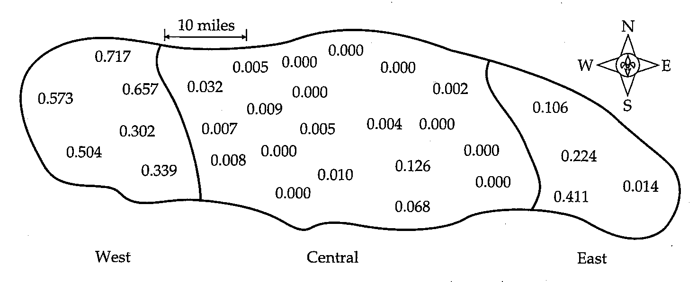
>
> FIGURE 6.13 Estimated frequency of a recessive allele for blue flower color in populations of Linanthus parryae in an area of approximately 900 square miles in the Mohave desert. Each allele frequency is based on an examination of approximately 4000 plants over an area of about 30 square miles. (After Wright 1943a.)

Judging from the allele-frequency map in Figure 6.13, the highest frequencies of the blue-flower allele are largely concentrated at the west and east ends of the region in question. The unequal allele frequencies across the range imply a decrease in average heterozygosity relative to HWE, analogous to the mouse example in Figure 6.12, though not as extreme. Figure 6.13 shows the estimated allele frequency in each of 30 subpopulations. Suppose each of the subpopulations is regarded as a random-mating unit in HWE for the flower-color alleles. The average heterozygosity among the subpopulations can be denoted as $ H_s $, where the subscript indicates subpopulation. The calculations are shown in the third column in *[See Table 6.3 at the end of this section.]*; the heterozygosity in each subpopulation is calculated as $ 2pq $, where p and q are the estimated frequencies of the alleles for white versus blue flower color, respectively, in each subpopulation. The $ H_s $ tabulated at the bottom is the average of all the subpopulations heterozygosities (counting the value 0.000 a total of nine times because of the nine different subpopulations in which q = 0.000).

A second hierarchical level of population structure is that of region—west (W), central (C), or east (E). To calculate the heterozygosity expected from HWE in each region, we first estimate the average allele frequency in the region by taking the mean allele frequency across all subpopulations in the region. For example, the average allele frequency q in region E is $ (0.106 + 0.224 + 0.411 + 0.014)/4 = 0.1888 $. In each region, the heterozygosity expected from HWE is calculated as $ 2pq $, where p and q are the average allele frequencies in the region. In region E, therefore, the regional heterozygosity equals $ 2 \times (1 - 0.1888) \times 0.1888 = 0.3062 $. The average heterozygosity within regions at the bottom of column 5 is denoted $ H_R $; it is the weighted average of the regional heterozygosities, where each regional heterozygosity is weighted by the number of subpopulations in the region. In this example, $ H_R = (6 \times 0.4995 + 20 \times 0.0272 + 4 \times 0.3062)/30 = 0.1589 $.

Yet another hierarchical level of population structure in Figure 6.13 is the total population—the aggregate population obtained by conceptually uniting all subpopulations to form a single random mating unit. The average allele frequency is the mean allele frequency across all subpopulations, and $q=0.1374$. Then $H_{T}$ is calculated as $2pq=2\times0.8626\times0.1374=0.2371$. To sum up: - $ H_{5} $ is the average heterozygosity assuming HWE among organisms within random-mating subpopulations.

- $ H_{R} $ is the average heterozygosity assuming HWE among organisms within regions.

- $ H_{T} $ is the average heterozygosity assuming HWE among organisms within the total area.

The concepts of hierarchical population structure and the various levels of heterozygosity were originally developed by Wright (1943a,b), in his theory of isolation by distance, to quantify genetic differences among subgroups at the various levels. The motivation for developing such a method was summarized in the following passage from Wright (1943b): Study of statistical differences among local populations is an important line of attack on the evolutionary problem. While such differences can only rarely represent first steps toward speciation in the sense of the splitting of the species, they are important for the evolution of the species as a whole. They provide a possible basis for intergroup selection of genetic systems, a process that provides a more effective mechanism for adaptive advance of the species as a whole than does the mass selection which is all that can occur under panmixia.

Furthermore, the reduction in heterozygosity resulting from population subdivision is intimately related to the reduction in heterozygosity caused by inbreeding due to mating between relatives. As explained earlier, the relation of population structure to inbreeding can be understood by interpreting each subpopulation as a sort of "extended family" or set of interconnected pedigrees. Organisms in the same subpopulation will often share one or more recent or remote common ancestors, and so a mating between organisms in the same subpopulation may result in offspring whose alleles at a locus are identical by descent (autozygous). The larger the subpopulation and the more recently it has been isolated, the smaller the probability of autozygosity, but in any finite subpopulation the probability of autozygosity increases through time.

**[Table]**

*[See Table 6.3 at the end of this section.]*

> **Table 6.3** · `6.3` · page 24 · source: `PopGen_chapter6_010`
> TABLE 6.3 Hierarchical Structure of Linanthus parryae
>
> <table><tr><td rowspan="2">Region</td><td colspan="2">Subpopulations</td><td colspan="2">Regions</td><td colspan="2">Total</td></tr><tr><td>Allele frequency</td><td>Heterozygosity</td><td>Average allele frequency</td><td>Heterozygosity</td><td>Average allele frequency</td><td>Heterozygosity</td></tr><tr><td rowspan="6">W</td><td>0.573</td><td>0.4893</td><td></td><td></td><td></td><td></td></tr><tr><td>0.717</td><td>0.4058</td><td></td><td></td><td></td><td></td></tr><tr><td>0.504</td><td>0.5000</td><td></td><td></td><td></td><td></td></tr><tr><td>0.657</td><td>0.4507</td><td></td><td></td><td></td><td></td></tr><tr><td>0.302</td><td>0.4216</td><td></td><td></td><td></td><td></td></tr><tr><td>0.339</td><td>0.4482</td><td>0.5153</td><td>0.4995</td><td></td><td></td></tr><tr><td rowspan="12">C</td><td>9  $ \times $ 0.000</td><td>0.0000</td><td></td><td></td><td></td><td></td></tr><tr><td>0.032</td><td>0.0620</td><td></td><td></td><td></td><td></td></tr><tr><td>0.007</td><td>0.0139</td><td></td><td></td><td></td><td></td></tr><tr><td>0.008</td><td>0.0159</td><td></td><td></td><td></td><td></td></tr><tr><td>0.005</td><td>0.0100</td><td></td><td></td><td></td><td></td></tr><tr><td>0.009</td><td>0.0178</td><td></td><td></td><td></td><td></td></tr><tr><td>0.005</td><td>0.0100</td><td></td><td></td><td></td><td></td></tr><tr><td>0.010</td><td>0.0198</td><td></td><td></td><td></td><td></td></tr><tr><td>0.068</td><td>0.1268</td><td></td><td></td><td></td><td></td></tr><tr><td>0.002</td><td>0.0040</td><td></td><td></td><td></td><td></td></tr><tr><td>0.004</td><td>0.0080</td><td></td><td></td><td></td><td></td></tr><tr><td>0.126</td><td>0.2202</td><td>0.0138</td><td>0.0272</td><td></td><td></td></tr><tr><td rowspan="4">E</td><td>0.106</td><td>0.1895</td><td></td><td></td><td></td><td></td></tr><tr><td>0.224</td><td>0.3476</td><td></td><td></td><td></td><td></td></tr><tr><td>0.411</td><td>0.4842</td><td></td><td></td><td></td><td></td></tr><tr><td>0.014</td><td>0.0276</td><td>0.1888</td><td>0.3062</td><td>0.1374</td><td>0.2371</td></tr><tr><td colspan="2">Average heterozygosity</td><td colspan="2">H $ _{S} $ = 0.1424</td><td colspan="2">H $ _{R} $ = 0.1589</td><td>H $ _{T} $ = 0.2371</td></tr></table>

---

## PopGen_chapter6_011 · 6.2 POPULATION SUBDIVISION / Wright's F Statistics

To quantify the inbreeding effect of population subdivision, Wright (1921) defined what has come to be called the fixation index. This index equals the reduction in heterozygosity expected with random mating at any one level of a population hierarchy relative to another, more inclusive level of the hierarchy. The fixation index is a useful index of genetic differentiation because it allows an objective comparison of the overall effect of population structure among different organisms without getting into details of allele frequencies, observed levels of heterozygosity, and so forth. The genetic symbol for a fixation index is F embellished with subscripts denoting the levels of the hierarchy being compared. For example, $ F_{SR} $ is the fixation index of the subpopulations relative to the regional aggregates:

$$
E_{SR}=\frac{H_{R}-H_{S}}{H_{R}}
\tag{6.9}
$$

In words, Equation 6.9 defines $ F_{SR} $ as the decrease of heterozygosity among subpopulations within regions $ (H_{R}-H_{S}) $, relative to the heterozygosity. ity among regions $ (H_{R}) $. For the Linanthus example in *[See Table 6.3 at the end of this section.]*, $ F_{SR} = (0.1589 - 0.1424)/0.1589 = 0.1036 $.

At the next level of the hierarchy, we may define the fixation index $ F_{RT} $ as the proportionate reduction in heterozygosity of the regional aggregates relative to the total combined population:

$$
F_{RT}=\frac{H_{T}-H_{R}}{H_{T}}
\tag{6.10}
$$

The data in *[See Table 6.3 at the end of this section.]* indicate that $ F_{RT} = (0.2371 - 0.1589)/0.2371 = 0.3299 $. Comparison of this value with $ F_{SR} $ above already makes it clear that there is substantially more variation among regions (as measured by $ F_{RT} $) than there is among subpopulations within regions (as measured by $ F_{SR} $). The comparison of the fixation indices at the two levels gives quantitative expression to the regional differences apparent in Figure 6.13.

The fixation index $ F_{ST} $ compares the least inclusive to the most inclusive levels of the population hierarchy and measures all effects of population structure combined:

$$
F_{ST}=\frac{H_{T}-H_{S}}{H_{T}}
\tag{6.11}
$$

From *[See Table 6.3 at the end of this section.]*, $ F_{ST} = (0.2371 - 0.1424) / 0.2371 = 0.3993 $. The overall reduction in average heterozygosity is therefore close to 40% of the total heterozygosity—a very substantial effect.

The hierarchical F-statistics defined in Equations 6.9 through 6.11 are all types of fixation indices, but they differ in the reference populations: $ F_{SR} $ is concerned with subpopulations (S) relative to the regional aggregates (R), $ F_{RT} $ is concerned with the regional groupings relative to the total population (T), and $ F_{ST} $ is concerned with the subpopulations relative to the total population. The index $ F_{ST} $ is the most inclusive measure of population subdivision.

The mathematical relation between the three types of F statistics is demonstrated in the following problem.

---

## PopGen_chapter6_012 · 6.2 POPULATION SUBDIVISION / PROBLEM 6.3 Show that $ F_{SR}, F_{RT}, $ and $ F_{ST} $ are related by the equation

$$
1-F_{S T}=(1-F_{S R})(1-F_{R T})
$$

ANSWER From Equation 6.9, $ F_{SR} = 1 - (H_S / H_R) $, or $ 1 - F_{SR} = H_S / H_R $. Equation 6.10 implies that $ F_{RT} = 1 - (H_R / H_T) $, or $ 1 - F_{RT} = H_R / H_T $. Finally, Equation 6.11 implies that $ F_{ST} = 1 - (H_S / H_T) $, or $ 1 - F_{ST} = H_S / H_T $. Now multiply the expressions for $ 1 - F_{SR} $ and $ 1 - F_{RT} $ together to obtain $ (1 - F_{SR}) \times (1 - F_{RT}) = (H_S / H_R) \times (H_R / H_T) = H_S / H_T = (1 - F_{ST}) $.

For examining the overall level of genetic divergence among subpopulations, $ F_{ST} $ is the informative statistic, and the concept has been extended to multiple alleles (Nei 1973). Although $ F_{ST} $ has a theoretical minimum of 0 (indicating no genetic divergence) and a theoretical maximum of 1 (indicating fixation for alternative alleles in different subpopulations), the observed maximum is usually much less than 1. Wright (1978) has suggested the following qualitative guidelines for the interpretation of $ F_{ST} $: - The range 0 to 0.05 may be considered as indicating little genetic differentiation.

• The range 0.05 to 0.15 indicates moderate genetic differentiation.

• The range 0.15 to 0.25 indicates great genetic differentiation.

• Values of $ F_{ST} $ above 0.25 indicate very great genetic differentiation.

On the other hand, Wright also notes that, among subpopulations, "differentiation is by no means negligible if $ F_{ST} $ is as small as 0.05 or even less." Difficulties in interpreting $ F_{ST} $ are alleviated somewhat by the use of a standardized version in which $ F_{ST} $ is expressed as the proportion of the maximum differentiation possible for the observed level of subpopulation homozygosity (Hedrick 2005).

PROBLEM 6.4 One of the limitations of $ F_{ST} $ is that it is does not capture the full range of possibilities that can be found in natural populations. To see this for yourself, consider two subpopulations with two alleles each, $ A_1 $ and $ A_2 $; in one subpopulation the allele frequencies are $ (3 + \sqrt{3})/6 = 0.788675 $ and $ (3 - \sqrt{3})/6 = 0.211325 $, and in the other subpopulations the allele frequencies are reversed. (The choice of these allele frequencies may seem strange, but the rationale for the choice will become clear when you work the problem.) Now consider the same gene in two different subpopulations; one of these subpopulations has alleles $ A_1 $ and $ A_2 $ at frequencies $ \frac{1}{2} $ and $ \frac{1}{2} $, and the other has alleles $ A_3 $ and $ A_4 $ at frequencies $ \frac{1}{2} $ and $ \frac{1}{2} $. Use Equation 6.11 to calculate $ F_{ST} $ for both pairs of subpopulations, and explain why the result seems paradoxical.

ANSWER In the first case, the heterozygosity in each subpopulation is $ 2 \times (3 + \sqrt{3})/6 \times (3 - \sqrt{3})/6 = \frac{1}{3} $, and hence the average subpopulation heterozygosity is $ H_S = \frac{1}{3} $. The average allele frequency for each allele is $ \frac{1}{2} $, and hence the total heterozygosity is $ H_T = \frac{1}{2} $. In this case, $ F_{ST} = \left[\left(\frac{1}{2}\right) - \left(\frac{1}{3}\right)/(\frac{1}{2}\right) = \frac{1}{3} $. In the second case, the heterozygosity in each subpopulation is $ 2 \times \left(\frac{1}{2}\right) \times \left(\frac{1}{2}\right) = \frac{1}{2} $, and so $ H_S = \frac{1}{2} $. The average allele frequencies are $ \frac{1}{4} $ for each of the four alleles, and so $ H_T = 1 - \left(\frac{1}{4}\right)^2 = \frac{3}{4} $. In this case, $ F_{ST} = \left[\left(\frac{3}{4}\right) - \left(\frac{1}{2}\right)/(\frac{3}{4}\right) = \frac{1}{3} $, exactly the same as before. The paradox is that the subpopulations have the same value of $ F_{ST} $, when the first two subpopulations differ only in allele frequencies, whereas the second two are so different that they have no alleles in common.

PROBLEM 6.5 Some subpopulations of Drosophila melanogaster show an altitudinal gradient in the allozymes of alcohol dehydrogenase in which the frequency of the Adh-F allele increases with altitude. The data in the accompanying table are estimates of the allele frequency of Adh-F in seven samples of adult flies captured either in the mountains, in the foothills, or on the plains of the Caucasus Mountains of the former Soviet Union. Each allele frequency is based on electrophoresis of approximately 300 adult flies (Grossman et al. 1970). Calculate the F statistics $ F_{SE} $ (subpopulations within elevations), $ F_{ET} $ (elevations within the total), and $ F_{ST} $ (subpopulations relative to the total). What do the magnitudes of the F statistics suggest regarding genetic differentiation among subpopulations in the frequency of Adh-F with respect to altitude?

ANSWER Let $p$ represent the allele frequency of $Adh{-}F$. For each subpopulation, the HWE heterozygosity equals $2p(1 - p)$, which for the seven samples are $0.4359$ and $0.3498$ (mountain), $0.2277$ and $0.1942$ (foothill), and $0.1506$, $0.1605$, and $0.0676$ (plain). The average of these values is: $H_{S}$, which equals $0.2266$. At each of the elevations, the average allele frequency is the mean across the subpopulations sampled at that elevation. For mountain, foothill, and plain, these means equal $0.274$, $0.120$, and $0.068$, respectively, yielding the elevation HWE heterozygosities $0.3974$, $0.2112$, and $0.1273$, respectively. (Results may differ slightly according to the number of significant digits carried along.) The average of the elevation heterozygosities equals the mean elevation heterozygosity ($H_{E}$), and it is weighted average ($2 \times 0.3974 + 2 \times 0.2112 + 3 \times 0.1273)/7 = 0.2285$. Finally, the allele frequency for the total heterozygosity is equal to the mean allele frequency across subpopulations, which is $0.142$, yielding a total HWE heterozygosity ($H_{T}$) of $0.2433$. The $F$ statistics are $F_{SE} = (H_{E} - H_{S})/H_{E} = 0.0081$, $F_{ET} = (H_{T} - H_{E})/H_{T} = 0.0609$, and $F_{ST} = (H_{T} - H_{S})/H_{T} = 0.0684$. [As a check, note that $(1 - F_{SE}) \times (1 - F_{ET}) = 1 - F_{ST}$] Judging from the magnitudes of the $F$ statistics, we can see that most of the differentiation among subpopulations is correlated with altitude; there is very little genetic differentiation among subpopulations at each elevation.

The method of estimating the F statistics by replacing the parameters in Equations 6.9 through 6.11 with their observed or estimated values is not necessarily the best, particularly with small samples. Ideally, estimates of the F statistics should correct for the effects of sampling a limited number of subpopulations as well as for the effects of sampling a limited number of organisms in each subpopulation. Methods for making these corrections have been suggested but are quite complex and raise additional issues. For an excellent discussion, see Weir and Cockerham (1984) and Weir (1996). Important issues are also addressed in Wright (1978, pp. 86–89), Curie-Cohen (1982), Nei and Chesser (1983), and Nei (1986).

---

## PopGen_chapter6_013 · 6.2 POPULATION SUBDIVISION / Linanthus Revisited: Evidence for Selection Associated with Flower Color

Studies of subpopulation differentiation in L. parryae have been carried out for over 60 years, and the history is thoroughly documented in Schemske and Bierzychudek (2001). The primary evolutionary forces at work have been in much dispute. The pioneering study is that of Epling and Dobzhansky (1942), who obtained the data summarized in Figure 6.13 and pointed out that the distribution of allele frequencies resembled what might be expected from Wright's (1931) theory of random genetic drift. Wright himself carried out an independent analysis of the data (Wright 1943a,b). He estimated the effective population size as 14–25 individuals per subpopulation, and concluded that the subpopulation differences did result primarily from random genetic drift. But Epling was not so sure. He went on to demonstrate that the seeds of L. parryae can survive in the soil and germinate for as long as at least seven years (Epling et al. 1960), suggesting much larger effective population sizes than Wright had estimated. His group also examined a set of subpopulations every year from 1944–1958, and found substantial geographical variation in the frequencies of blue and white flowers, but not much variation from year to year (Epling et al. 1960). This finding also argued against random genetic drift. But Wright remained unconvinced, and he was not about to give up. He had made Linanthus the observational cornerstone of his theory of isolation by distance (Wright 1943b), and again he carried out an independent analysis of these and other data. Once again he concluded that random genetic drift played a key role at the level of the subpopulation, but conceded that over larger spatial scales there might be some modest selective differences between the color morphs (Wright 1978).

Studies of L. parryae in the Mojave desert were taken up again in 1988 by Schemske and Bierzychudek (2001), who found evidence for quite strong selection. Based on studies of three polymorphic populations over 11 years, they observed that in years of harsh weather, when overall seed production is low, plants with blue flowers produce more seeds than plants with white flowers; but in years when the weather is mild and overall seed production is high, plants with white flowers produce more seeds. The differences in relative fitness were sometimes very large, with selection coefficients on the order of 0.60. Figure 6.14 tells the tale. It shows the ratio of the average number of flowers on blue-flowered plants to the average number on white-colored plants, as a function of the average number of flowers on both types of plants in any given year. The y-axis is an index of relative fitness, because the number of seeds per flower is nearly the same for the blue and white morphs (Schemske and Bierzychudek 2001). The slope of the line is significant, indi cating that, relative to plants with white flowers, plants with blue flowers have more numerous flowers per plant in bad years and fewer flowers per plant in good years.

> **Figure 6.14** · page 30 · source: `PopGen_chapter6`
>
> 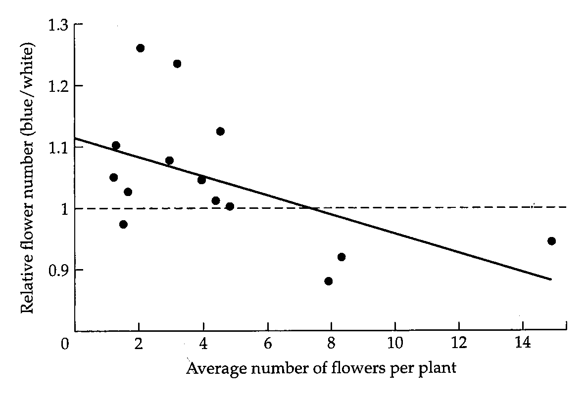
>
> FIGURE 6.14 Ratio of average number of blue flowers per plant relative to the average number of white flowers per plant, as related to the average number of flowers for both types of plants together. The x-axis is an index of environmental quality. Poor conditions in which none of the plants do very well are at the left, and good conditions in which all plants do quite well are at the right. The y-axis is an index of relative fitness. Plants with blue flowers have a greater fitness than those with white flowers under poor conditions, but a smaller fitness than those with white flowers under good conditions. (Data from Schemske and Bierzychudek 2001.)

---

## PopGen_chapter6_014 · 6.2 POPULATION SUBDIVISION / Inference of Population Structure from Multilocus Genotype Data

Despite some limitations, the fixation index $ F_{ST} $ defined in Equation 6.11 has served as a convenient and widely used measure of genetic differences among subpopulations. The identification of the causes underlying a particular value of $ F_{ST} $ observed in a natural population is often difficult. Allele frequencies among subpopulations can become different because of random processes (random genetic drift) as well as by natural selection with complications from migration among the subpopulations. Difficulties in the assignment of cause do not, however, compromise the usefulness of $ F_{ST} $ as an index of genetic differentiation.

The levels of genetic divergence among human subpopulations and among subpopulations of several other species are presented in *[See Table 6.4 at the end of this section.]*. The values of $ F_{ST} $ imply that genetic divergence between human subpopulations is quite small. Of the total genetic variation found in samples from three major geographical regions (Africa, Europe, and East Asia), only 7% (0.07) is ascribable to genetic differences among them. In other words, about 93% of the total genetic variation is found among individuals within any single geographical region. Similarly, of the total genetic variation found in the native Yanomama Indians of Venezuela and Brazil, only 7.7% (0.077) is due to differences in allele frequency among villages, which implies that 92.3% of the total genetic variation is found within any single village. Values of $ F_{ST} $ for other organisms are quite variable, presumably because $ F_{ST} $ is influenced by the size of the subpopulations—which is a major determinant of the magnitude of random changes in allele frequency—subpopulation size is in turn influenced by the amount and pattern of migration between subpopulations and by other factors, including natural selection.

The human data in *[See Table 6.4 at the end of this section.]* are based on protein polymorphisms, but the conclusions have held up remarkably well in studies of many more individuals with hundreds of genetic markers assayed using modern genotyping techniques. For example, Rosenberg et al. (2002) studied 377 microsatellite polymorphisms among 1056 individuals from 52 populations. They used a computer algorithm to group individuals into genetic clusters according to estimated shared ancestry among their genomes (Pritchard et al. 2000a,b; Rosenberg et al. 2005). They found that the individuals could be grouped into six genetic clusters, five of which correspond to subpopulations within major geographical regions, namely, Africa, Europe, East Asia, Oceania, and America. Genetic differences among individuals within any one cluster accounted for 93–95% of the total genetic variation, with only 3–5% of the genetic variation ascribable to differences between the major clusters. Similar results were also obtained in a subsequent analysis of 993 microsatellite and insertion/deletion polymorphisms in a sample of 1048 individuals (Rosenberg et al. 2005).

On the other hand, the clustering algorithm requires the number of clusters to be specified in advance, although the effects of cluster number can be examined in different computer runs. An alternative method of analysis uses Markov chain Monte Carlo methods to implement a Bayesian analysis of a hierarchical population structure in which the number of genetic groups is not specified in advance (Corander et al. 2004). Application of this method to the data of Rosenberg et al. (2002) confirmed the major findings, but suggested that additional groups were needed to capture all of the genetic differences in the sample, especially in the Americas (Corander et al. 2004).

Although the genotypes of people can be clustered into major groups coinciding with large geographical regions, genetic differences among these groups are small and subtle. As we have noted, 93–95% of the total genetic variation occurs between individuals within any group, and only 3–5% between groups. In other words, the genetic differences between two randomly chosen individuals from different groups are only slightly greater than those between two unrelated individuals from the same group. Furthermore, among 4199 alleles represented more than once in the sample of Rosenberg et al. (2002), 46.7% of the alleles appeared in all major geographical regions, whereas only 7.4% were specific to a particular region.

**[Table]**

*[See Table 6.4 at the end of this section.]*

> **Table 6.4** · `6.4` · page 31 · source: `PopGen_chapter6_014`
> TABLE 6.4 Total heterozygosity  $ (H_{T}) $, average heterozygosity among subpopulations  $ (H_{S}) $, and fixation index  $ (F_{ST}) $ for various organisms
>
> Organism | Number of populations | Number of loci | H_{T} | H_{S} | F_{ST}
> --- | --- | --- | --- | --- | ---
> Human (Africa, Europe, East Asia) | 3 | 35 | 0.130 | 0.121 | 0.069
> Human, Yanomama Indian villages | 37 | 15 | 0.039 | 0.036 | 0.077
> House mouse (Mus musculus) | 4 | 40 | 0.097 | 0.086 | 0.113
> Jumping rodent (Dipodomys ordii) | 9 | 18 | 0.037 | 0.012 | 0.676
> Drosophila equinoxialis | 5 | 27 | 0.201 | 0.179 | 0.109
> Horseshoe crab (Limulus) | 4 | 25 | 0.066 | 0.061 | 0.076
> Lycopod plant (Lycopodium lucidulum) | 4 | 13 | 0.071 | 0.051 | 0.282

---

## PopGen_chapter6_015 · INBREEDING, POPULATION SUBDIVISION, AND MIGRATION: Introduction / 6.3 THE WAHLUND PRINCIPLE

**[命题 Proposition]**

The flip side of the coin of heterozygosity is homozygosity, because a gene in a diploid organism that is not heterozygous must be homozygous. Mathematically, homozygosity = 1 - heterozygosity. Therefore, a corollary of the deficit in average heterozygosity that results from population subdivision is that there is an equal excess in average homozygosity. If the population subdivision were eliminated and the former subpopulations allowed to undergo random mating, the average homozygosity would decrease and the average heterozygosity increase by an equal amount. The phenomenon that the average homozygosity decreases when subpopulations join together is called isolate breaking or the Wahlund principle, after the Swedish statistician and human geneticist Sten Gösta William Wahlund (1901–1976) who first described the effect (Wahlund 1928).

The subpopulations of hypothetical mice in Figure 6.12 afford an illustration of the Wahlund principle. As long as the cats keep the subpopulations separate, the homozygosity equals 1 because the west subpopulation is genotypically AA and the east subpopulation is genotypically aa. If the cats were to disappear and the subpopulations of mice came together and practiced random mating, the genotype frequencies would be $ \frac{1}{4} $ AA, $ \frac{1}{2} $ Aa, and $ \frac{1}{4} $ aa. The homozygosity in the fused population is $ \left(\frac{1}{4}\right) + \left(\frac{1}{4}\right) = \frac{1}{2} $, which is a substantial decrease over the average in the subpopulation prior to fusion and random mating. Not only is the total homozygosity reduced by population fusion, so is the average frequency of each homozygous genotype. Consider aa, for example. Prior to fusion, the average frequency of aa across both subpopulations equals $ \frac{1}{2} $; after fusion and random mating, the frequency of aa equals $ \frac{1}{4} $.

In human population genetics, the Wahlund principle is usually cited for its implication that fusion of subpopulations results in a decrease in the average frequency of children born with a genetic disease resulting from homozygosity for a rare recessive allele, particularly an allele with a relatively high frequency in one of the subpopulations. Examples of harmful recessive alleles at high frequency in some human subpopulations include the alleles for $ \alpha_1 $-antitrypsin deficiency ($ q \approx 0.024 $) and cystic fibrosis ($ q \approx 0.022 $) in Europeans, sickle-cell anemia ($ q \approx 0.05 $ in African Americans, up to $ q \approx 0.1 $ in some African subpopulations), albinism ($ q \approx 0.07 $ in the Hopi and some other Southwest Native American subpopulations), and Tay-Sachs disease ($ q \approx 0.013 $ in Ashkenazi Jews).

The Wahlund principle for a recessive allele in two subpopulations is illustrated in Figure 6.15. On the left are two subpopulations, each undergoing random mating, in which the frequency of the recessive allele and the frequency of homozygous recessive genotypes are indicated. The average frequency of the homozygous recessive genotype across both subpopulations equals $ (q_1^2 + q_2^2)/2 $. The result of fusion and random mating of the subpopulations is shown on the right. Assuming that the subpopulations are equal in size, the allele frequency in the combined population is $ \bar{q} = (q_1 + q_2)/2 $, and the frequency of the homozygous recessive genotype equals $ \bar{q}^2 $. Therefore, subpopulation fusion and random mating reduces the average frequency of homozygous recessives by:

$$
\begin{aligned}R_{separate}-R_{fused}&=\frac{q_{1}^{2}+q_{2}^{2}}{2}-\overline{q}^{2}\\&=\frac{1}{2}(q_{1}-\overline{q})^{2}+\frac{1}{2}(q_{2}-\overline{q})^{2}\\&=\sigma_{q}^{2}\end{aligned}
\tag{6.12}
$$

> **Figure 6.15** · page 34 · source: `PopGen_chapter6`
>
> 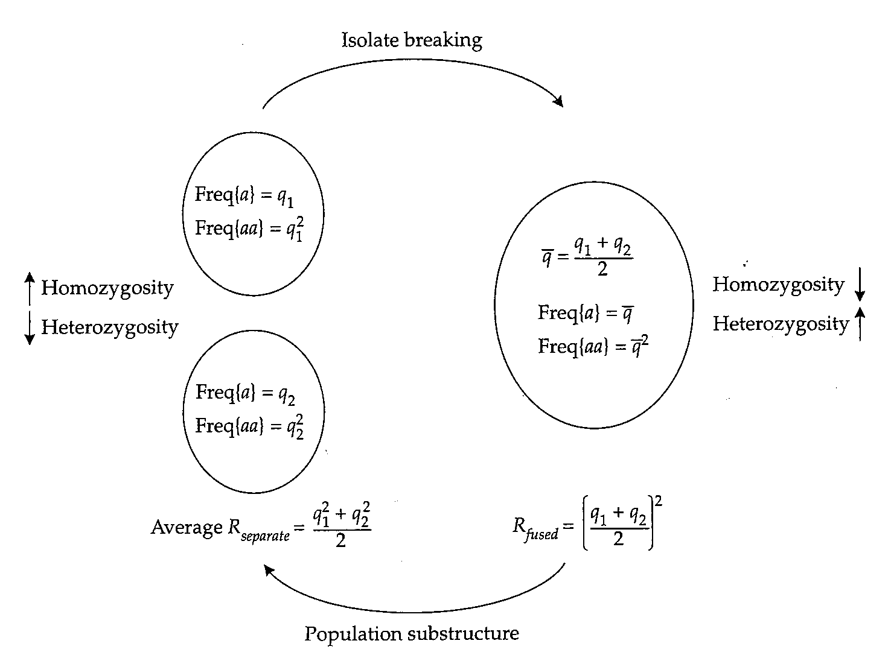
>
> FIGURE 6.15 Illustration of the Wahlund principle. The frequency of homozygous recessives after population fusion and random mating is less than the average frequency before fusion. The difference in frequency of the homozygous recessives equals the variance in allele frequency among the subpopulations.

We leave it as an exercise to verify that the expressions in $q_{1}$ and $q_{2}$ on the first and second lines are equal. The symbol $\sigma_{q}^{2}$ is the variance in allele frequency among the original subpopulations. Because the variance is always nonnegative, isolate breaking decreases the homozygosity and increases the heterozygosity, unless the allele frequencies are equal to begin with.

Furthermore, the result in Equation 6.12 is true for any number of subpopulations of equal or unequal size; in words, the Wahlund principle states that: Fusion and random mating of subpopulations decreases the average frequency of homozygous recessives by an amount equal to the variance in allele frequency among the original subpopulations.

To illustrate the effect of isolate breaking, imagine a subpopulation of gray squirrels that has a high frequency of autosomal-recessive albinism equal to 16%. In a nearby forest there is another subpopulation of equal size in which the albino mutation is absent, so that the allele frequency in this subpopulation is 0. Overall, the average frequency of albinos in the two populations is $ (0.16 + 0)/2 = 8% $. If the two subpopulations underwent fusion and random mating, the allele frequency of the albino mutation in the fused population would be $ (0.4 + 0)/2 = 0.2 $, and the frequency of the homozygous recessive would equal $ (0.2)^2 = 4% $. Note that the frequency of albinos in the fused population is substantially smaller than the average frequency in the original subpopulations.

---

## PopGen_chapter6_016 · 6.3 THE WAHLUND PRINCIPLE / Wahlund's Principle and the Fixation Index

Equation 6.12 applies equally well to AA homozygotes as to aa homozygotes. Therefore, letting P represent the frequency of homozygous AA genotypes, we can write

$$
P_{s e p a r a t e}-P_{f u s e d}=\sigma_{p}^{2}
\tag{6.13}
$$

When there are only two alleles, the total reduction in homozygosity must be the summation of Equations 6.12 and 6.13, which equals $ \sigma_p^2 + \sigma_q^2 $. Because there are only two alleles, it is also true that $ \sigma_p^2 = \sigma_q^2 $, which we will write as $ \sigma^2 $. Hence, the total reduction in homozygosity from the Wahlund effect upon population fusion and random mating can be expressed as follows:

$$
\mathrm{R e d u c t i o n~i n~t o t a l~h o m o z y g o s i t y}=2\sigma^{2}
$$

On the other hand, the reduction in total homozygosity with population fusion must also equal the increase in heterozygosity $ H_T - H_S $, which Equation 6.11 says is the numerator of $ F_{ST} $. Hence, $ F_{ST} = (H_T - H_S) / H_T = 2\sigma^2 / H_T $. However, $ H_T $ is the heterozygosity with random mating when the allele frequencies equal the average allele frequencies across subpopulations, $ \bar{p} $ and $ \bar{q} $. Therefore, the connection between the fixation index $ F_{ST} $ and the variance in allele frequency is given by

$$
F_{S T}=\frac{\sigma^{2}}{\overline{{p}}\overline{{q}}}
\tag{6.14}
$$

Consequently, the $F$ statistics at the various levels of a hierarchical population are related to the variances in allele frequencies among the subpopulations grouped together at the various levels. Equation 6.14 affords a convenient method of estimating $F_{ST}$ from allele-frequency data. For example, among the subpopulations of Linanthus in Figure 6.13, the variance in allele frequency is 0.0473. Earlier we calculated the average allele frequencies as $\bar{p} = 0.8626$ and $\bar{q} = 0.1374$. Hence, $\sigma^{2}/(\bar{p} \times \bar{q}) = 0.3993$, which confirms the previous calculation that $F_{ST} = 0.3993$. (The values as stated may differ slightly from yours because they were calculated with more than four significant digits.)

---

## PopGen_chapter6_017 · 6.3 THE WAHLUND PRINCIPLE / Genotype Frequencies in Subdivided Populations

In many organisms in which the population structure is hierarchical, it is useful to be able to calculate directly the average genotype frequencies across all subpopulations. Equations 6.12 through 6.14 make it possible to deduce the average genotype frequencies. To do this, first note that $ R_{fused} $ in Equation 6.12 equals $ \overline{q}^2 $ and $ P_{fused} $ in Equation 6.13 equals $ \overline{p}^2 $. Hence Equation 6.12 implies the average genotype frequency of aa among the subpopulations is given by $ \sigma_q^2 + \bar{p} \bar{q} $, and Equation 6.13 implies the average genotype frequency of AA among the subpopulations is given by $ \sigma_p^2 + \bar{p} \bar{q} $. Since there are only two alleles, $ \sigma_q^2 = \sigma_p^2 = \sigma^2 $, and Equation 6.14 says that $ \sigma^2 = F_{\mathrm{ST}} \times \bar{p} \times \bar{q} $. Putting all this together, the average genotype frequency of AA across subpopulations must equal $ \bar{p}^2 + F_{\mathrm{ST}} \bar{p} \bar{q} $, and the average genotype frequency of aa across subpopulations must equal $ \bar{q}^2 + F_{\mathrm{ST}} \bar{p} \bar{q} $. Because every genotype that is not homozygous must be heterozygous, the average genotype frequency of heterozygotes across subpopulations is given by $ 1 - (\overline{p}^2 + F_{ST} \overline{p} \overline{q}) - (\overline{q}^2 + F_{ST} \overline{p} \overline{q}) $. Note that $ 1 - \overline{p}^2 - \overline{q}^2 = 2 \overline{p} \overline{q} $, and so the average frequency of heterozygotes simplifies to $ 2 \overline{p} \overline{q} - 2 \overline{p} \overline{q} F_{ST} $.

Consequently, the genotype frequencies averaged across subpopulations in a subdivided population can be written as:

$$
\begin{aligned}&a a:\overline{q}^{2}+\overline{p}\overline{q}F_{ST}\\ &\\ &Aa:2\overline{p}\overline{q}-2\overline{p}\overline{q}F_{ST}\\ &\\ &aa:\overline{q}^{2}+\overline{p}\overline{q}F_{ST}\\ \end{aligned}
\tag{6.15}
$$

These genotype frequencies depart from the Hardy-Weinberg principle in having an excess of homozygotes and a deficiency of heterozygotes. This result may seem somewhat paradoxical because, within any particular subpopulation, mating is random and the genotype frequencies do obey the Hardy-Weinberg principle. The reason for the departure from Hardy-Weinberg equilibrium in the population as a whole is that the subpopulations differ in allele frequency. Because the allele frequencies differ, random mating within each subpopulation is not equivalent to random mating among all the organisms in the entire population. From the expressions in Equation 6.15, it is clear that the value of $ F_{ST} $ determines the degree of departure from Hardy-Weinberg equilibrium. If $ F_{ST} = 0 $, the second term in each expression vanishes, and the genotype frequencies reduce to the Hardy-Weinberg frequencies; on the other hand, $ F_{ST} = 0 $ means that there is no variation in allele frequency among the subpopulations for the gene in question. Because $ F_{ST} $ may vary from one gene to the next, other genes in the same subpopulations may have nonzero values of $ F_{ST} $. The extreme case is $ F_{ST} = 1 $, which happens when two subpopulations are fixed for alternative alleles. In this case, the average allele frequencies are $ \frac{1}{2} $ for each allele, and the average genotype frequencies of AA, Aa, and aa across subpopulations are $ \frac{1}{2} $, 0, and $ \frac{1}{2} $, respectively. This case is illustrated in Figure 6.12.

The genotype frequencies in Equation 6.15 may remind you of those in Equation 3.15, where population subdivision was examined from the standpoint of random genetic drift. There we noted that $ F_t $ meant the value of $ F_{ST} $ in generation $ t $, and in Equation 6.15 $ F_{ST} $ is also time dependent, although the time dependence is not explicit. The only other difference is that $ p_0 $ and $ q_0 $ in Equation 3.15 are replaced by $ \overline{p} $ and $ \overline{q} $ in Equation 6.15. In the special case when the alleles are selectively neutral, then the equations are identical, because if all subpopulations have the same initial frequency $ p_0 $, then $ E(\overline{p}) = p_0 $. On the other hand, if there is selection, then $ E(\overline{p}) $ will not in general equal $ p_0 $, and therein lies an important difference between the equations.

---

## PopGen_chapter6_018 · 6.3 THE WAHLUND PRINCIPLE / Relation between the Inbreeding Coefficient and the F Statistics

So far we have assumed that mating within each subpopulation of a subdivided population is random. What happens when mating between relatives takes place, in addition to the population subdivision? The answer to this question is implicit in Equation 6.4 and Equation 6.11. Equation 6.4 implies that $ 1 - F_{IS} = H_1 / H_S $, where $ F_{IS} $ is the reduction in heterozygosity in an inbred individual, relative to the heterozygosity expected with random mating in the subpopulation to which the inbred individual belongs. The value of $ F_{IS} $ takes into account only the autozygosity due to immediate inbreeding of the individual, not the accumulated autozygosity due to population structure.

Equation 6.11 implies that $ 1 - F_{ST} = H_{S} / H_{T} $, where $ F_{ST} $ is the reduction in heterozygosity in the subpopulation, relative to that expected with random mating in the population as a whole. The value of $ F_{ST} $ takes into account only the autozygosity due to population subdivision.

To take both inbreeding and population structure into account, we can define another measure of autozygosity, denoted $ F_{IT} $, which measures the probability of autozygosity of an inbred individual relative to the population as a whole, were all the subpopulations to fuse and undergo random mating. Equation 6.16 asserts that $ F_{IT} $ is equal to

$$
F_{IT}=\frac{H_{T}-H_{I}}{H_{T}}
\tag{6.16}
$$

which implies that $1 - F_{IT} = H_{I} / H_{T}$. Considering this expression in light of $1 - F_{IS} = H_{I} / H_{S}$ and $1 - F_{ST} = H_{S} / H_{T}$, it follows that

$$
(1-F_{IS})(1-F_{ST})=1-F_{IT}
\tag{6.17}
$$

Hence, if we know both $ F_{IS} $ and $ F_{ST} $, then we can obtain $ F_{IT} $ from Equation 6.17. The value of $ F_{ST} $ measures the autozygosity resulting from random genetic drift in a finite subpopulation, and the value of $ F_{IS} $ measures the autozygosity resulting from inbreeding above and beyond that accounted for in $ F_{ST} $. The value of $ F_{IT} $ is the probability of autozygosity taking both processes into account.

PROBLEM 6.6 Suppose a large population is subdivided into smaller subpopulations within which mating takes place at random, and that random genetic drift takes place until the probability of autozygosity in the subpopulations is $ F_{ST} = \frac{1}{16} $, which is the value expected from the mating of first cousins. Now suppose that a first-cousin mating takes place in one of the subpopulations, so that inbred progeny have an inbreeding coefficient, relative to the subpopulation, of $ F_{IS} = \frac{1}{16} $. What is the overall probability of autozygosity in the inbred offspring, $ F_{IT} $? ANSWER Use Equation 6.17 with the values of $ F_{ST} $ and $ F_{IS} $ as given. The result is $ F_{IT} = 1 - \left(\frac{15}{16}\right) \times \left(\frac{15}{16}\right) = \frac{31}{256} = 0.121 $. Note that this is smaller than $ F_{IS} + F_{ST} $ by an amount equal to $ F_{IS} \times F_{ST} $, because the two sources of autozygosity are not mutually exclusive.

---

## PopGen_chapter6_019 · INBREEDING, POPULATION SUBDIVISION, AND MIGRATION: Introduction / 6.4 ASSORTATIVE MATING

Inbreeding affects all the genes in the organism, but one form of nonrandom mating affects only a subset of genes. In a type of mating known as assortative mating, individuals choose their mates according to their phenotype. Assortative mating affects only those genes that influence the phenotype affecting mate choice and genes linked with them in the chromosomes. Most assortative mating is positive assortative mating, which means that mating pairs have, on the average, more similar phenotypes than expected with random mating. There are also examples of negative assortative mating, sometimes called disassortative mating, in which mating pairs are more dissimilar than expected by chance, but we will focus on positive assortative mating.

In human populations, positive assortative mating has been reported for age, height, weight, skin color, facial appearance, IQ score, educational level, personality characteristics, tobacco smoking, alcohol consumption, religious affiliation, nationality, and other traits (Alvarez and Jaffe 2005). Many of these traits, such as religious affiliation and nationality, have no genetic component but are reflections of cultural preference or geographical proximity.

For traits that do have a genetic component, the consequences of positive assortative mating are complex. Hereditary traits associated with assortative mating are rarely determined by the alleles of a single gene. Rather they are multifactorial and often affected by environmental factors as well as by genes. For such traits the consequences of assortative mating depend on the strength of the genetic contribution to variation in the trait, the number of genes that influence the trait, the number of alleles of the genes, the number of different phenotypes, the sex performing the mate selection, and the criteria for mate selection. There is, however, one generally expected result of positive assortative mating. Because similar phenotypes tend to form mating pairs, assortative mating is expected to increase the frequency of homozygous genotypes in the population at the expense of heterozygous genotypes. and thus there is an increase in the phenotypic variance of the trait in the population. The increase in the phenotypic variance is rather modest unless the assortative mating is very pronounced.

---

## PopGen_chapter6_020 · INBREEDING, POPULATION SUBDIVISION, AND MIGRATION: Introduction / 6.5 MIGRATION

In a subdivided population, random genetic drift results in genetic divergence among subpopulations. Subpopulations are rarely completely isolated, however. The process of migration refers to the movement of some organisms (or their gametes) among subpopulations. Migration results in gene flow between the subpopulations; gene flow acts as a sort of genetic glue that holds the gene pools of subpopulations together and that limits how much genetic divergence can take place. To understand the homogenizing effects of migration, it is useful to study migration in several simple models of population structure.

---

## PopGen_chapter6_021 · 6.5 MIGRATION / One-Way Migration

When migration takes place predominantly from one population into another, without an equal amount of migration in the reverse direction, then there is said to be one-way migration. An illustration of one-way migration between a large mainland population and a small island subpopulation is shown in Figure 6.16. For simplicity, we consider a gene with two alleles, A and a, with respective frequencies $ p^{*} $ and $ q^{*} $ on the mainland and p and q on the island. Suppose that, in any generation, a proportion m of zygotes in the island subpopulation originates as a random sample of organisms from the mainland. Then, if p and $ p' $ are the frequencies of A in the island subpopulation in two successive generations, it follows that

$$
p^{\prime}=(1-m)p+m p^{*}
\tag{6.18}
$$

> **Figure 6.16** · page 39 · source: `PopGen_chapter6`
>
> 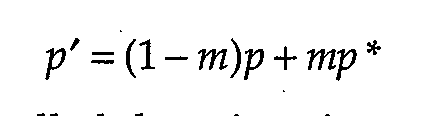
>
> FIGURE 6.16 Model of one-way migration from a large land mass onto an island. The allele frequencies in the source population,  $ p^{*} $ and  $ q^{*} $, are assumed to remain constant, whereas those in the recipient population,  $ p_{t} $ and  $ q_{t} $, change with time.

In Equation 6.18, m is called the migration rate between the mainland and the island. Subtracting $ p^{*} $ from both sides of Equation 6.18 and simplifying leads to the expression $ p' - p^{*} = (1 - m)(p - p^{*}) $, and from this expression it follows that $ p_{t} - p^{*} = (1 - m)^{t}(p_{0} - p^{*}) $, where $ p_{t} $ is the frequency of A in the island subpopulation in generation t. Hence,

$$
p_{t}=p^{*}+(1-m)^{t}(p_{0}-p^{*})
\tag{6.19}
$$

Equation 6.19 expresses mathematically what should be clear intuitively: With one-way migration, the allele frequency of A in the island subpopulation gradually approaches that of the mainland population, and the rate of approach is m per generation. As a check on Equation 6.19, note that, when t = 0, then $ p_t = p_0 $, as must be the case, and as t becomes large, $ p_t $ goes to $ p^* $. As an evolutionary process that brings potentially new alleles into a population, migration is qualitatively similar to mutation. The major difference is quantitative: Generally speaking, the rate of migration among subpopulations of a species is vastly greater than the rate of mutation of a gene. The contrast is illustrated in Figure 6.17 for the unrealistic case in which the A allele present in an island subpopulation is absent on the mainland. In this case, Equation 6.19 becomes $ p_t = p_0(1 - m)^t $, which has the same form as Equation 4.1 for one-way mutation, except that m replaces $ \mu $. The identity in the shape of the curves is apparent, but the time axis in Figure 6.17 is compressed because, when m = 0.01, as in this example, compared with the value of $ \mu = 0.0001 $ in Figure 4.1, it requires only one generation of migration to change the allele frequency to the same extent as 100 generations of mutation.

> **Figure 6.17** · page 40 · source: `PopGen_chapter6`
>
> 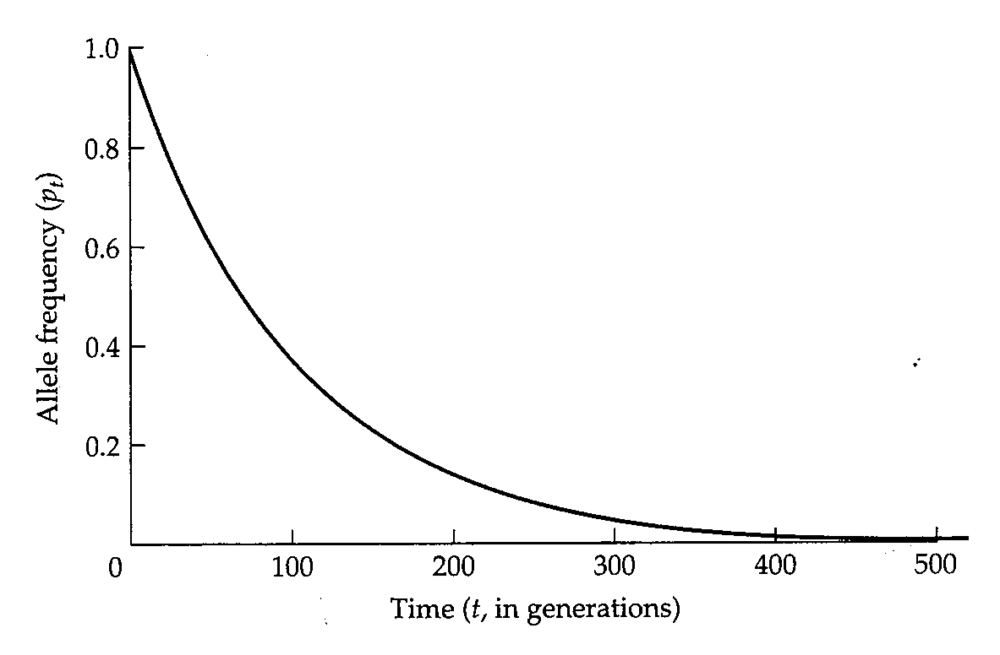
>
> FIGURE 6.17 Change of allele frequency with one-way migration, assuming that an allele A is initially fixed in the recipient population and absent in the source population. The migration rate is m = 0.01.

Equation 6.19 holds more generally for one-way migration by letting p be the frequency of any allele in the population that receives the migrants and $ p^{*} $ be the frequency of the same allele in the population that supplies the migrants.

---

## PopGen_chapter6_022 · 6.5 MIGRATION / The Island Model of Migration

In the island model of migration, a large population is split into many subpopulations dispersed geographically. Examples of island population structure might include fish in freshwater lakes or slugs in dispersed garden plots. Each subpopulation is assumed to be so large that random genetic drift can be neglected. Figure 6.18 shows an example with five island populations, where $ p_{i} $ denotes the allele frequency of A in the ith subpopulation. Each subpopulation receives an equal proportion of migrants from each subpopulation (including itself), and also contributes an equal proportion to each subpopulation (including itself). In essence, the model is one in which each subpopulation sends out a proportion of migrant individuals or gametes, and the migrants from all the subpopulations form a pool, the members of which then disperse randomly among the subpopulations. In this way, an individual or gamete in the migrant pool can return to the subpopulation it came from originally. Since the total proportion of migrants coming into each subpopulation in every generation is m, the proportion coming from each of the five subpopulations is m/5.

> **Figure 6.18** · page 41 · source: `PopGen_chapter6`
>
> 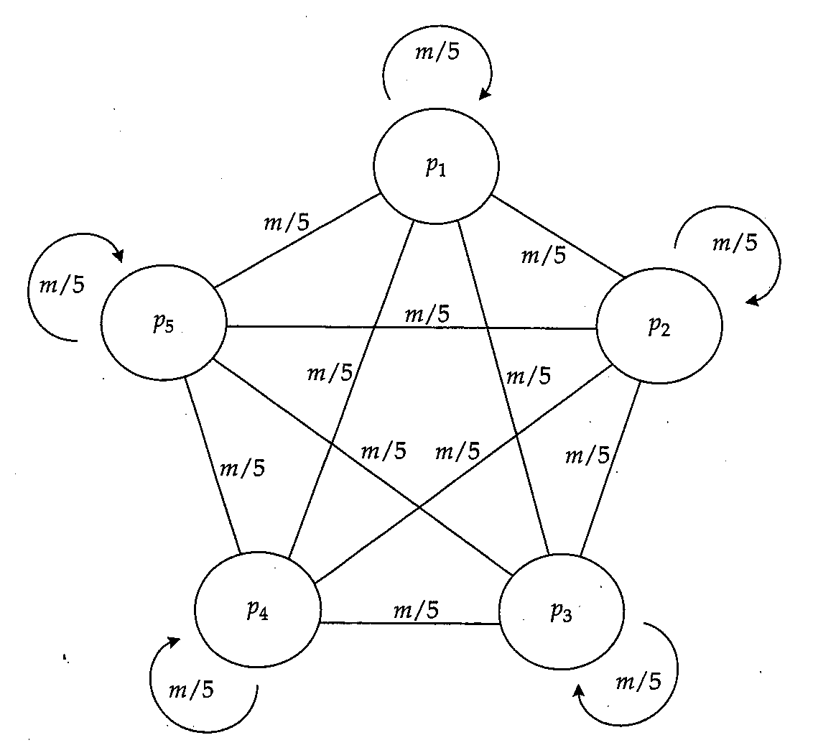
>
> FIGURE 6.18 The island model of migration with five subpopulations. Migration is completely symmetrical. Each subpopulation contributes individuals or gametes to a pool of migrants, which then distribute themselves randomly among the subpopulations. In this model, a migrant can re-enter the same subpopulation it came from, indicated by the loops.

Now let $ \vec{p} $ be the average allele frequency of A among the subpopulations. Since the migrant individuals or gametes form a pool with an equal contribution from each subpopulation, the expected allele frequency among the migrants must equal the average allele frequency among the subpopulations. The parameter m is the probability that a randomly chosen allele in any subpopulation comes from a migrant. Let us consider a particular subpopulation with an allele frequency of A equal to $ p_t $ in generation t. For a randomly chosen allele in this subpopulation in generation t, the allele could have come from the same subpopulation in generation t - 1 with probability 1 - m, in which case it is an A allele with probability $ p_{t-1} $. Alternatively, the allele could have come from the migrant pool in generation t - 1 with probability m, in which case it is an A allele with probability $ \vec{p} $. Because all evolutionary processes other than migration are ignored, $ \vec{p} $ stays the same in all generations. Altogether,

$$
p_{t}=p_{t-1}(1-m)+\overline{p}m
\tag{6.20}
$$

Equation 6.20 is similar to Equation 4.2 for mutation, and its solution in terms of $ p_{0} $ is

$$
p_{t}=\overline{p}+(1-m)^{t}(p_{0}-\overline{p})
\tag{6.21}
$$

The similarity with Equation 6.19 is apparent: In fact, the equations are identical except that the role of $ p^* $ in one-way migration is replaced with $ \overline{p} $ in the island model. Perhaps less obvious is the similarity with Equation 4.4 for reversible mutation, in which case $ v/(\mu + v) $ plays the role of $ \overline{p} $ and $ \mu + v $ plays the role of m. The correspondence between the equations again emphasizes the similarity between the effects of migration and those of mutation. The processes result in similar mathematical expressions because both mutation and migration act linearly on allele frequency, which means that $ p_t $ is a linear function of $ p_{t-1} $. Although Equation 6.21 for migration is mathematically similar to Equation 4.4 for mutation, the biological implications are quite different. Because rates of migration are typically much greater than rates of mutation, changes in allele frequency are generally much faster with migration. As an example of the use of Equation 6.21, suppose there are only two populations with initial allele frequencies of A of 0.2 and 0.8, respectively, with m = 0.10. Thus 10 percent of the organisms in either subpopulation in any generation are migrants having an allele frequency of A of $ \bar{p} = (0.2 + 0.8)/2 = 0.5 $. What is the allele frequency of A in the two populations after 10 generations? For the population with initial allele frequency 0.2, we substitute $ p_0 = 0.2 $, $ \bar{p} = 0.5 $, and m = 0.10 into Equation 6.21 to obtain $ p_{10}=0.5+(1-0.10)^{10}(0.2 - 0.5) = 0.395 $; for the other population, we substitute $ p_{0} = 0.8 $, $ \bar{p} = 0.5 $, and m = 0.10, and so $ p_{10} = 0.5 + (1 - 0.10)^{10}(0.8 - 0.5) = 0.605 $. Another example using Equation 6.21 is shown in Figure 6.19, where there are five subpopulations (initial frequencies 1, 0.75, 0.50, 0.25, and 0), again with m = 0.10. Note how rapidly the allele frequencies converge to the same value, in this case, 0.5.

> **Figure 6.19** · page 43 · source: `PopGen_chapter6`
>
> 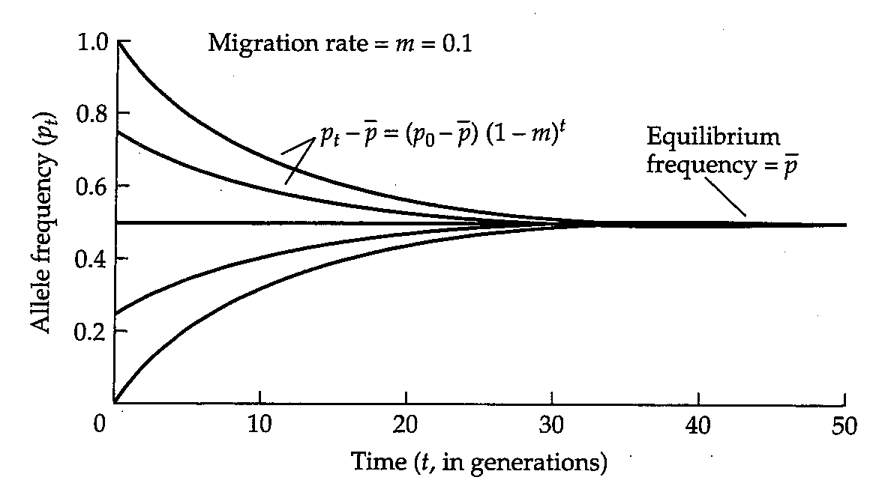
>
> FIGURE 6.19 Change of allele frequency with time in five subpopulations exchanging migrants at the rate  $ m = 0.1 $ per generation. Note the rapid convergence to a common equilibrium frequency.

---

## PopGen_chapter6_023 · 6.5 MIGRATION / How Migration Limits Genetic Divergence

It is remarkable how little migration is required to prevent significant genetic divergence among subpopulations as measured by, for example, the fixation index $ F_{ST} $. To understand the homogenizing effect of migration, consider the model in Figure 4.5, in which two alleles drawn at random from a subpopulation in generation $ t + 1 $ are replicas of the same allele in generation $ t $ with probability $ 1/(2N) $ and replicas of different alleles in generation $ t $ with probability $ 1 - 1/(2N) $. In the first case, the alleles are necessarily identical by descent; in the second case, they are identical by descent with probability $ F_{t-1} $, where $ F $ is shorthand for $ F_{ST} $. In either case, the identity by descent is unbroken only if neither allele is replaced by an allele from a migrant, and so

$$
F_{t}=\left(\frac{1}{2N}\right)(1-m)^{2}+\left(1-\frac{1}{2N}\right)(1-m)^{2}F_{t-1}
\tag{6.22}
$$

Illustrating again the analogy between migration and mutation, Equation 6.22 is identical to Equation 4.8 measuring the effect of mutation on the probability of identity by descent, except that m replaces $ \mu $. The equilibrium value$\hat{F}$ of $F$ can be found by setting $\hat{F}=F_{t}=F_{t-1}$; after expanding the squared terms on the right-hand side, and assuming that $m$ is small enough and $N$ large enough, and that terms in $m^{2}$ and $m/N$ can be ignored, some rearrangement leads to

$$
\hat{F}=\frac{1}{1+4Nm}
\tag{6.23}
$$

As might be expected, Equation 5.17 is identical in form to Equation 4.9 for mutation, but the biological implications are very different owing to the fact that the rate of migration is typically much greater than the rate of mutation.

The product Nm in Equation 6.23 has a straightforward biological interpretation. The total number of alleles in a subpopulation of size N diploid organisms is 2N. In any generation, the proportion of alleles that are replaced by alleles from migrant organisms is m; hence the number of migrant alleles in any generation equals 2Nm. However, 2Nm is also the total number of alleles in Nm diploid organisms, and so Nm can be interpreted as the absolute number of migrant organisms that come into each subpopulation in each generation. Because the absolute number of migrants per generation equals $ N_m $, Equation 6.23 implies that $ \hat{F} $ decreases as the number of migrants increases. Indeed, the decrease in $ \hat{F} $ with increasing $ N_m $ is extremely rapid, as shown in Figure 6.20. In the extreme case of complete genetic isolation between the subpopulations, $ N_m = 0 $ and $ \hat{F} = 1 $. The decrease is then so rapid that for: • Nm = 0.25 (one migrant every fourth generation), $ \hat{F} = 0.50 $

> **Figure 6.20** · page 44 · source: `PopGen_chapter6`
>
> 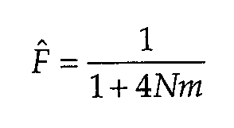
>
> FIGURE 6.20 Decrease in the fixation index  $ F_{ST} $ among subpopulations at equilibrium in the island model of migration. The curve is that in Equation 6.23, giving  $ \hat{F} $ as a function of  $ Nm $. In the island model,  $ Nm $ is the number of migrant organisms that come into each subpopulation in each generation.

• Nm = 0.5 (one migrant every second generation), F = 0.33

• $ Nm = 1 $ (one migrant every generation), $ \hat{F} = 0.20 $

• $ Nm = 2 $ (two migrants every generation), $ \hat{F} = 0.11 $

The implication of Figure 6.20 is that migration is a potent force acting against genetic divergence among subpopulations. The effects are seen dramatically in Figure 6.21. Part A pertains to the moth Biston betularia, part B to the moth Gonodontis bidentata. Both species have evolved melanic (blackened) forms in response to heavy air pollution (industrial melanism, see Chapter 2), and the graphs give the frequency of the melanic forms in the two species. The geographical area in A includes Liverpool and Manchester, as viewed from rural Wales. Note the fall-off in frequency of melanics in the nonindustrial areas toward the front of the graph. Biston betularia exists in low population densities and must fly relatively long distances to find a mate. The resulting high rate of migration hinders differentiation of populations, hence the smooth surface. In contrast, Gonodontis bidentata exists in high population densities and the migration rate is low; hence there is substantial genetic differentiation among populations, as evidenced by the bumpy surface of the graph in part B.

> **Figure 6.21** · page 45 · source: `PopGen_chapter6`
>
> 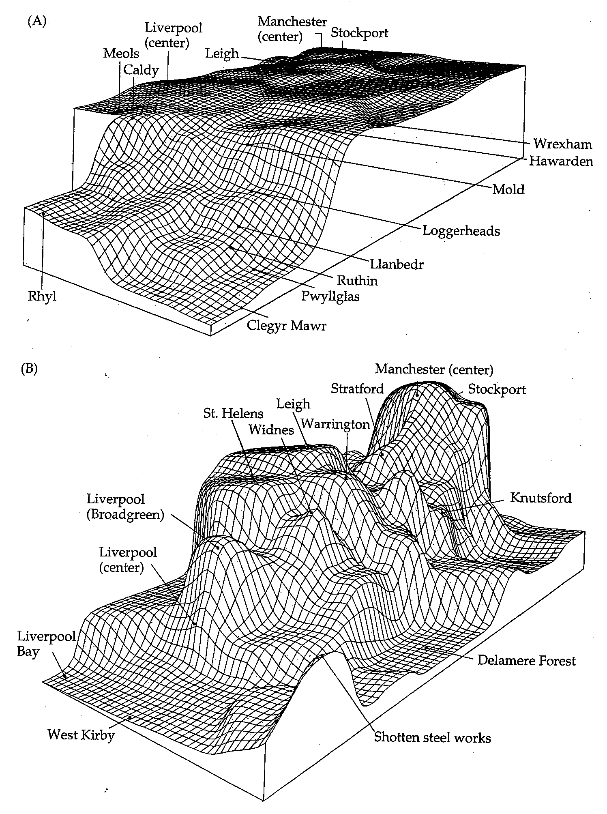
>
> FIGURE 6.21 (A) Distribution of melanic moths of the species Biston betularia over an area including Liverpool and Manchester, as viewed from rural Wales. (B) Distribution of melanic moths of the species Gonodontis bidentata over a smaller area than that in (A) but viewed from the same perspective. (From Bishop and Cook 1975.)

The homogenizing effects of migration should not be overestimated, however. The measure of genetic divergence in Figure 6.20 is $ F_{ST} $, the value of which is determined by the variance in allele frequency among subpopulations (see Equation 6.14) and so is affected primarily by polymorphic alleles that are at intermediate frequencies. Rare alleles present in one subpopulation but absent in others have hardly any effect on $ F_{ST} $. Because rare alleles are rare, they are unlikely to be included among migrant organisms unless the migration rate is very great, and so rare alleles will tend to remain present in only one or a few subpopulations in a local area until such time as their frequency may become great enough to be dispersed by migration. An allele found in only one subpopulation is called a private allele. Next we shall see that the rate of migration can be estimated by an examination of the frequency of private alleles.

**[Table]**

*[See Table 6.5 at the end of this section.]*

> **Table 6.5** · `6.5` · page 46 · source: `PopGen_chapter6_023`
> TABLE 6.5 Estimates of Nm and  $ F_{ST} $
>
> Species | Type of organism | Estimated Nm | Estimated $ F_{ST} $
> --- | --- | --- | ---
> Stephanomeria exigua | Annual plant | 1.4 | 0.152
> Mytilus edulis | Mullusc | 42.0 | 0.006
> Drosophila willistoni | Insect | 9.9 | 0.025
> Drosophila pseudoobscura | Insect | 1.0 | 0.200
> Chanos chanos | Fish | 4.2 | 0.056
> Hyla regilla | Frog | 1.4 | 0.152
> Plethodon ouachitae | Salamander | 2.1 | 0.106
> Plethodon cinereus | Salamander | 0.22 | 0.532
> Plethodon dorsalis | Salamander | 0.10 | 0.714
> Batrachoseps pacifica ssp. 1 | Salamander | 0.64 | 0.281
> Batrachoseps pacifica ssp. 2 | Salamander | 0.20 | 0.556
> Batrachoseps campi | Salamander | 0.16 | 0.610
> Lacerta melisellensis | Lizard | 1.9 | 0.116
> Peromyscus californicus | Mouse | 2.2 | 0.102
> Peromyscus polionotus | Mouse | 0.31 | 0.446
> Thomomys bottae | Gopher | 0.86 | 0.225

---

## PopGen_chapter6_024 · 6.5 MIGRATION / Estimates of Migration Rates

One method of estimating genetic migration in natural populations relies on the finding that, in theoretical models, the logarithm of $ N_m $ decreases approximately as a linear function of the average frequency of private alleles in samples from the subpopulations (Slatkin 1985). Data on the average frequency of private alleles has been compiled and analyzed by Slatkin (1985), and the resulting estimates of $ N_m $ and equilibrium values of $ F_{ST} $ are summarized in *[See Table 6.5 at the end of this section.]*. There is obviously considerable variation in $ N_m $ among organisms. However, many of the values of $ N_m $ are smaller than about 2, which means that there is still considerable opportunity for genetic divergence among subpopulations.

A second kind of approach to estimating Nm in natural populations is illustrated in Figure 6.22, which gives the distribution of estimated values of $ F_{ST} $ among 61 genes in natural populations of Drosophila melanogaster (Singh and Rhomberg 1987). The average of the estimated values is $ F_{ST} = 0.16 $, which, assuming equilibrium, is an estimate of $ 1 + 4Nm $ (Equation 6.23). The estimate is therefore $ Nm = [(1/0.16) - 1]/4 = 1.3 $. This estimate is within the range for other Drosophila species in *[See Table 6.5 at the end of this section.]*. However, there are many genes in Figure 6.22 that have $ F_{ST} $ values greater than 0.30. An analogous method of estimating Nm from the $ F_{ST} $ values of polymorphic nucleotides within a gene is discussed in Hudson et al. (1992).

> **Figure 6.22** · page 47 · source: `PopGen_chapter6`
>
> 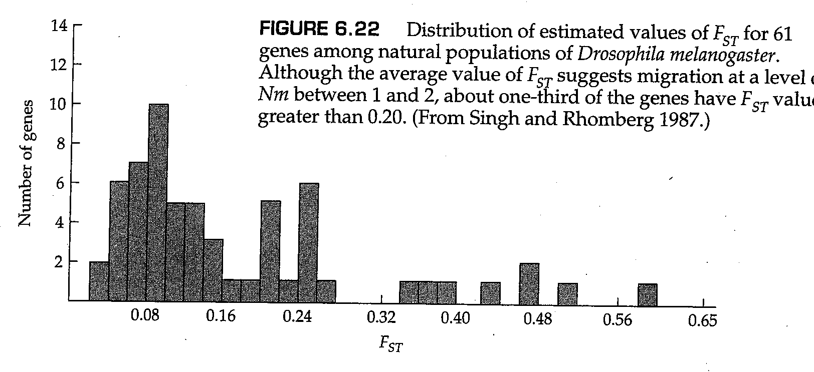
>
> FIGURE 6.22 Distribution of estimated values of F_ST for 61 genes among natural populations of Drosophila melanogaster. Although the average value of F_ST suggests migration at a level of Nm between 1 and 2, about one-third of the genes have F_ST values greater than 0.20. (From Singh and Rhomberg 1987.)

---

## PopGen_chapter6_025 · 6.5 MIGRATION / Coalescence-Based Estimates of Migration

An island model of migration of the sort depicted in Figure 6.18 assumes that the subpopulations all have the same population size and that migration between the subpopulations is symmetric. Modern methods based on the coalescence allow these assumptions to be relaxed. For example, Beerli and Felsenstein (1999, 2001) have developed methods that can analyze data from an arbitrary number of subpopulations and estimate the effective population size of each subpopulation and the possibly very unequal rates of migration between any pair of populations. This approach confronts the complexities of migration in nature, where migrants often come primarily from nearby subpopulations. To the extent that neighboring subpopulations have similar allele frequencies, the effects of migration are smaller, and sometimes much smaller, than predicted by the island model. Migration rates are asymmetric because subpopulations may be strung out along one dimension, such as a river bank, or distributed more or less regularly in two dimensions, or there may be one large population with an internal genetic structure caused by the tendency for mating to take place between organisms born in the same region.

The approach of Beerli and Felsenstein (1999, 2001) yields maximum likelihood estimates of subpopulation sizes and migration rates using coalescence theory (see Chapter 3). In this context, as the lineages of alleles are traced back in time, a coalescent event can consist either of an event in which the ancestral lineages of two alleles within the same subpopulation merge into a common ancestral allele, or it can consist of a migration event in which the lineage of an allele switches from one subpopulation to another. The principle is illustrated in Figure 6.23, in which the merging events are depicted as solid lines and the migration events (in this case only one) are denoted by dashed lines.

> **Figure 6.23** · page 49 · source: `PopGen_chapter6`
>
> 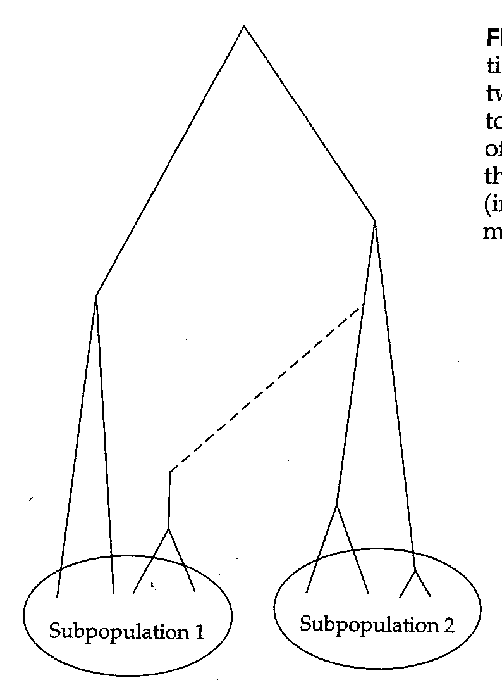
>
> FIGURE 6.23 Coalescence when there is population subdivision. At each coalescence, the lineages of two alleles in the same subpopulation may come together in a common ancestral allele, or the lineage of an allele in one subpopulation may merge with the lineage of an allele from the other subpopulation (indicated here by the dashed line), representing a migration event.

In this formulation, we consider three kinds of objects: $D$ is a set consisting of the data, $P$ is a set of parameters in the model (in this case, effective population numbers and migration rates), and $G$ is a genealogy of the ancestral history of alleles in the sample. The objective of the analysis is to maximize the likelihood of the data parameters $P$ given the data $D$, which is represented as $L(P|D)$, through an analysis of all possible genealogies $G$. Rendered as an equation, the method seeks to find the maximum of

$$
\frac{L(P\mid D)}{L(P_{0}\mid D)}\cong\frac{1}{g}\sum_{i=1}^{g}\frac{\mathrm{Prob}(G_{i}\mid P)}{\mathrm{Prob}(G_{i}\mid P_{0})}
\tag{6.24}
$$

where the summation is across all possible genealogies, and $ P_{\theta} $ is the set of parameters used to generate the genealogies.

A method for generating genealogies with random topologies and branch lengths was discussed in Chapter 3. There are infinitely many such topologies, so inferences about the values of the parameters must be based on a sample of genealogies. Even so, the space of possible genealogies is so large that purely random genealogies are likely to be far from the region in which Equation 6.24 is maximized. What is needed is a method for systematically exploring the space of genealogies to find the region in which the likelihood ratio in Equation 6.24 is large, and then concentrating on the genealogies in this region. The most widely used method of this type is called Metropolis-Hastings Markov chain Monte Carlo (Gilks et al. 1996). Implementing, checking, and debugging programs that implement such algorithms is an art in itself, and fortunately most authors make their programs freely available through the Internet. The Beerli and Felsenstein (1999, 2001) program to maximize Equation 6.24 for multiple populations with asymmetric migration is called MIGRATE (see also Beerli 2006).

Results from an analysis of a highly variable region of human mitochondrial DNA in a sample of 225 individuals in the Nile valley are shown in Figure 6.24. The groups represented are from Egypt, ancient Nubia, and Sudan, and the number of individuals in each group is shown in parentheses. The authors caution that the groups are themselves assemblages of subpopulations, and that the effective population numbers and migration rates probably vary in time (Beerli and Felsenstein 2001). Because mitochondrial DNA is maternally transmitted, the estimates of effective population size and migration rate are those pertaining only to females. Figure 6.24 shows the estimated number of female immigrants per generation for each of the subpopulations. Gene flow among the groups is on the order of a few females per generation, except for migration into Nubia, which is substantially greater.

> **Figure 6.24** · page 50 · source: `PopGen_chapter6`
>
> 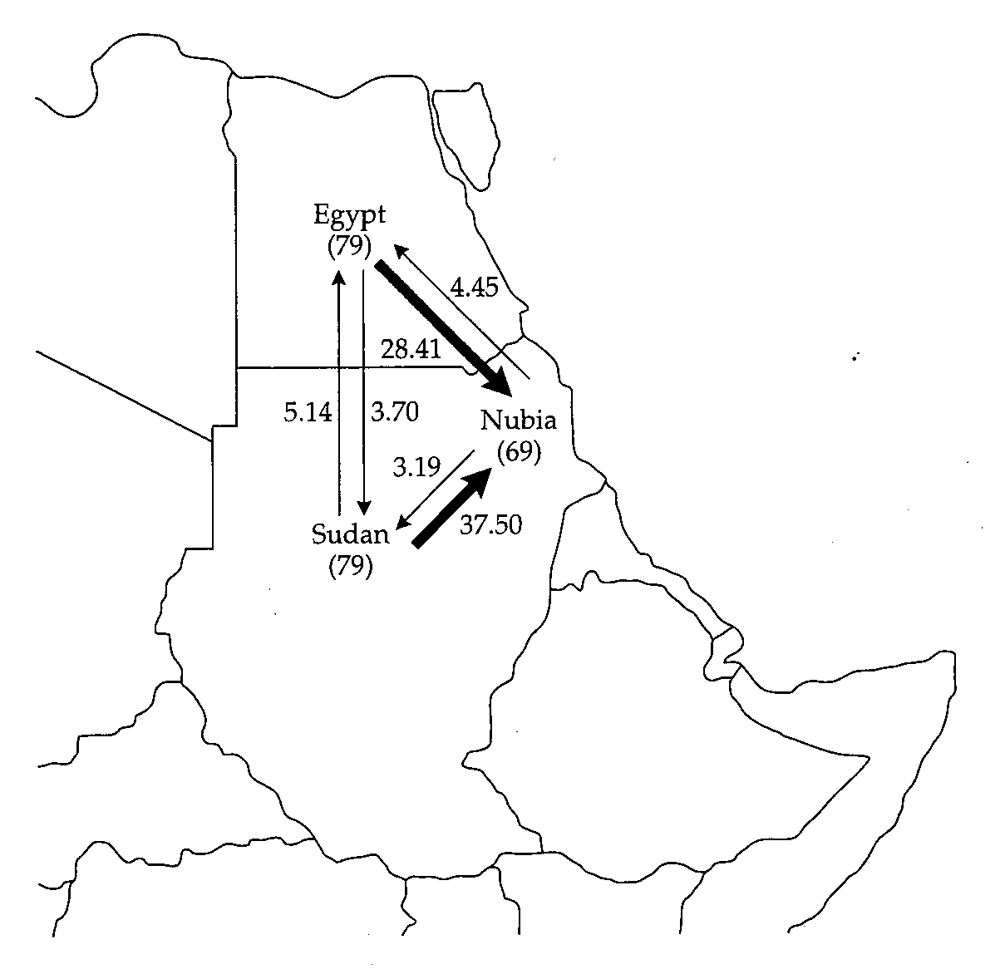
>
> FIGURE 6.24 Estimated migration among subpopulations in Egypt, Nubia, and Sudan based on mitochondrial DNA sequences. The number of individuals sampled in each subpopulation is in parentheses. The number next to each arrow is the estimated number of female migrants along that pathway per generation. (Data from Beerli and Felsenstein 2001.)

Gene flow can also take place between closely related species prior to the time that reproductive isolation becomes complete. Migration resulting in genes flowing from one species into a related species is known as introgression. The principles of coalescence can be applied to this situation, too, using the model diagrammed in Figure 6.25. The model is called the IM model, where IM stands for isolation with migration (Nielsen and Wakeley 2001; Hey and Nielsen 2004). In Figure 6.25, the shaded area represents populations present at various times in the ancestry of two closely related species and their common ancestor. The time scale runs from the earliest time at the top to the present time at the bottom. Six parameters are of interest: the divergence time (t), represented by the horizontal dashed line; three values of $ \theta = 4N\mu $, where $ \theta $ and N are subscripted for the ancestral species A and descendant species 1 and 2; and two values of m, subscripted for introgression from species 1 into species 2 ($ m_{12} $) or species 2 into species 1 ($ m_{21} $). Once again, the approach is to maximize the likelihood ratio in Equation 6.24, where P is a set of the six parameter values, D is the set of data, and G is a genealogy based on some particular set of parameters $ P_{0} $. Application of Metropolis–Hastings Markov chain Monte Carlo to this situation is described by Hey and Nielsen (2004). In their analysis they also explain how the parameters need to be scaled in some consistent manner using the mutation rate $ \mu $. To illustrate the method, they analyzed data from many loci in the closely related species Drosophila pseudoobscura and D. persimilis. They estimate the divergence time at $ \sim600{,}000 $ years, very close to the conventional estimate of $ \sim500{,}000 $ years, and find evidence for low levels of gene flow between the species (average Nm in the range 0.06–0.19), with great variation among loci and the direction of the introgression.

> **Figure 6.25** · page 51 · source: `PopGen_chapter6`
>
> 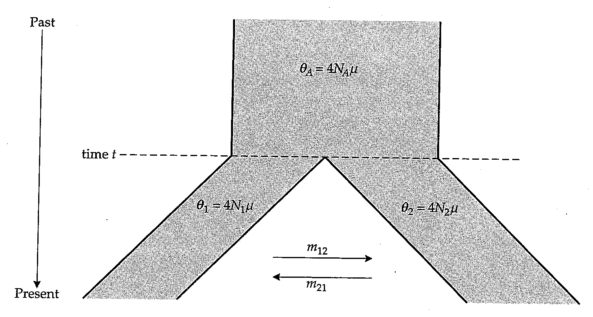
>
> FIGURE 6.25 The isolation-migration model for estimating rates of gene flow between closely related species. The shaded region at the top represents an evolving population, which at time t splits into two species with incomplete reproductive isolation. The six parameters that characterize this situation are indicated, where  $ m_{12} $ and  $ m_{21} $ are the rates of migration resulting in gene flow between the species. (After Hey and Nielsen 2004.)

---

## PopGen_chapter6_026 · 6.5 MIGRATION / Migration-Selection Balance

Just as recurrent mutation to a deleterious allele can maintain the allele in a population in spite of selection against individuals that carry the allele, resulting in a mutation-selection balance (see Chapter 5), recurrent migration can maintain a deleterious allele in a state of migration-selection balance. This situation can arise when an allele is deleterious in one geographical region but not deleterious, or less deleterious, in a neighboring geographical region. Migrants from the latter region continually replenish the deleterious allele in the former region, where selection acts against it.

A selection model similar to that used for mutation-selection balance (see Chapter 5) reveals the principal offsetting forces for migration-selection balance. Let AA, Aa, and aa be three genotypes at a locus, where a is a deleterious recessive or partially recessive allele. As in Chapter 5, we denote the relative fitnesses of AA, Aa, and aa as 1, 1 - hs, and 1 - s, respectively, where s is the selection coefficient against aa and h is the degree of dominance of a. When h = 0 the a allele is completely recessive, and when $ h = \frac{1}{2} $ the relative fitness of Aa is the arithmetic mean of those of AA and aa, indicating additive effects of A and a. Let p and q be the allele frequencies of A and a, with $ p + q = 1 $, and suppose that the selection is sufficiently weak, or the recessive allele sufficiently rare, and that the three genotypes are approximately in the Hardy-Weinberg frequencies of $ p^2 $, 2pq, and $ q^2 $.

This model was originally studied by Haldane (1930) and Wright (1931), who showed that the change $ \Delta q $ in the allele frequency of a in the region where it is deleterious is given by

$$
\Delta q=\frac{-spq[q+h(p-q)]}{1-sq(2hp+q)}+m_{i}q^{*}-m_{o}q
\tag{6.25}
$$

where $ m_{i} $ is the rate of in-migration of individuals from outside the population, among whom the allele frequency is $ q^{*} $, and $ m_{o} $ is the rate of out-migration of individuals who leave the population.

An ingenious application of Equation 6.25 is reported in Hoekstra et al. (2004). These authors studied rock-pocket mice (Chaetodipus intermedius) in southern Arizona, where there is a gradient in habitat color from the presence of dark-colored volcanic lava, whereas surrounding regions are light-colored granitic rocks. The mice inhabiting the volcanic rock have dark coats composed of uniformly melanic hair, whereas the mice inhabiting the light areas have light coats composed of hair with only a small band of melanin. The difference in phenotype is presumed to be an adaptation to reduce visibility and hence predation. The genetic basis of the difference is due to four amino acid replacements in the melanocortin-1 receptor protein, encoded in the gene $ Mc1r $. Genotypes denoted DD and Dd have coats that are melanic and dark, whereas the genotype dd coat is nonmelanic and light. In the habitat consisting of dark-colored volcanic lava, the d allele is presumably a harmful recessive allele maintained by migration from the surrounding light areas.

To investigate this hypothesis in detail, Hoekstra et al. (2004) sequenced the Mclr gene in 57 individuals trapped in dark areas and 118 individuals trapped in light areas at sites spread across a 35-km east-west transect. They also sequenced two genes in mitochondrial DNA having no relation to the coat-color polymorphism. As expected, they found a strong correlation between the dark habitat and the D allele frequency, but no correlation with the mitochondrial genes.

In the next step of the analysis, they used the coalescent methods of Beerli and Felsenstein (1999, 2001), discussed in the previous section, to estimate the migration rates $ m_i $ and $ m_o $ in Equation 6.25, based solely on the mitochondrial markers and an estimate of the effective population size. Their $ Mc1r $ sequences provided values for $ q $, the frequency of the recessive nonmelanic allele $ d $ in dark habitats, and $ q^* $, the frequency of the same allele in light habitats. Assuming migration-selection balance, Equation 6.25 gives the relation between the selection coefficient $ s $ and the degree of dominance $ h $ in terms of $ q $, $ q^* $, $ m_\nu $, and $ m_\sigma $, all of which had been estimated.

Figure 6.26A shows the inferred relation between s and h for an effective population size of $ N_e = 10,000 $. As h runs from 0 (d a complete recessive) to $ \frac{1}{2} $ (additive effects), s runs from 0.389 to 0.108. The decrease in s reaffirms a point made in Chapter 5, which is that partial dominance of a rare recessive allele has a large effect on the equilibrium frequency, because with even a small degree of dominance, the selection is spread across a much larger number of individuals. The effect of dominance on the average fitness in the equilibrium population is shown in Figure 6.26B, and it is very small, ranging from $ \overline{w} = 0.992 $ for h = 0 to $ \overline{w} = 0.985 $ for $ h = \frac{1}{2} $. Hoekstra et al. (2004) suggest that h is unlikely to be greater than about 0.4, and point out that their largest estimates of the selection coefficient are on the same order of magnitude as estimates of the selection coefficient for melanic peppered moths (see Figure 6.21A).

> **Figure 6.26** · page 53 · source: `PopGen_chapter6`
>
> 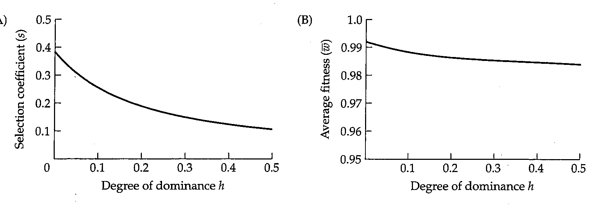
>
> FIGURE 6.26 (A) Theoretical relation between the selection coefficient against the nonmelanic recessive allele (s) and its degree of dominance (h) in rock-pocket mice that inhabit dark-colored volcanic lava, assuming migration-selection balance. (B) Equilibrium average fitness in the population for various degrees of dominance, h. (Based on data in Hoekstra et al. 2004.)

---

## PopGen_chapter6_027 · 6.5 MIGRATION / SUMMARY

1. The inbreeding coefficient is the probability that two alleles in an inbred individual are identical by descent (autozygous) through DNA replication of a single allele in a common ancestor, relative to some arbitrary reference time in the past.

2. For a mating between relatives whose pedigree is known, the inbreeding coefficient can be calculated using elementary principles of probability.

---

## PopGen_chapter6_028 · INBREEDING, POPULATION SUBDIVISION, AND MIGRATION: Introduction / SUMMARY

3. The genotype frequencies among inbred individuals depart from Hardy-Weinberg frequencies in that the expected frequency of heterozygous genotypes is reduced and that of homozygous genotypes increase. In the extreme case of complete inbreeding, the frequency of heterozygous genotypes is 0.

4. In species that normally undergo outcrossing, inbreeding typically has harmful effects because of the increased frequency of genotypes that are homozygous for rare deleterious alleles.

5. In most regular systems of mating, in which generation after generation individuals with the same degree of genetic relationship are mated together, the inbreeding coefficient increases gradually through time. At any stage in the process, a single generation of random mating erases all of the accumulated inbreeding, and the population returns to Hardy-Weinberg genotype frequencies.

6. Population structure (population subdivision) increases the probability that two randomly chosen alleles in the same subpopulation are identical by descent because of random genetic drift among the subpopulations and the dispersion of allele frequencies. Even though each subpopulation may undergo random mating and its genotype frequencies conform to the Hardy-Weinberg proportions, across the population as a whole there is a deficiency of heterozygous genotypes and an excess of homozygous genotypes. The fixation index is one measure of the magnitude of the departure from Hardy-Weinberg proportions in the population as a whole.

7. A blue versus white polymorphism in flower color in the “desert snow” plant Linanthus parryae in the Mojave desert became the classic example of isolation by distance in an organism with a hierarchical population structure. Although the relative roles of random genetic drift and natural selection in causing the differences in flower-color frequencies among subpopulations have been argued for more than 60 years, the most recent evidence supports earlier studies in indicating that selection is a key factor.

8. Studies of hundreds of molecular polymorphisms in large samples of human individuals supports grouping the individuals by genotype into a few groups largely coinciding with major geographical regions. However, the genetic differences between two randomly chosen individuals from different groups are only slightly greater than those between two unrelated individuals from the same group. In particular, genetic differences among individuals within any one group account for 93–95% of the total genetic variation, and only 3–5% of the genetic variation is ascribable to differences between the major groups.

9. The Wahlund principle refers to the reduction in the average frequency of homozygous genotypes that occurs when subpopulations fuse and form a larger random-mating population. The magnitude of the reduction is a function of the variance in allele frequency among the subpopulations.

10. Migration among subpopulations tends to counteract the dispersion of allele frequencies due to random genetic drift. In simple models, such as the island model of migration, even a few migrant individuals per generation are sufficient to maintain the fixation index of genetic differentiation among the subpopulations in the "little" to "moderate" range.

11. Application of coalescent theory to subdivided populations enables estimates to be made of effective population number and asymmetrical migration rates among subpopulations, as well as of divergence time and the magnitude of introgression among closely related species.

12. Deleterious alleles can be maintained in a population through migration from adjacent populations in which the allele is not as deleterious. A migration-selection balance analogous to mutation-selection balance results. An example is the selection for melanic rock-pocket mice that live on dark-colored volcanic lava, where the recessive nonmelanic allele is continually introduced by migration of mice from surrounding habitats consisting of light-colored granitic rocks.

---

## PopGen_chapter6_029 · 6.5 MIGRATION / PROBLEMS

1. Explain why the concept of identity by descent (autozygosity) is fundamental to an understanding of the effects of inbreeding. Under what circumstances can the probability of autozygosity in a population increase without any increase in homozygosity?

2. The coefficient of consanguinity between two individuals is the probability that two alleles of a gene, one drawn at random from each of the individuals, are identical by descent. How is the coefficient of consanguinity between two individuals related to the inbreeding coefficient of a hypothetical offspring of these two individuals? 3. Consider two alleles A and a at frequencies $ \frac{1}{2} $ and $ \frac{1}{2} $ in a population in which the inbreeding coefficient equals F. What value of F results in genotype frequencies of $ \frac{1}{3}: \frac{1}{3}: \frac{1}{3} $?

4. Show that $ p^2(1 - F) + pF = p^2 + pqF = p - (1 - F)pq $, when q = 1 - p.

5. In a population of monoecious plants in Hardy-Weinberg proportions for two alleles with allele frequency p, what is the variance in allele frequency among plants? What is the variance if the population were completely inbred? If a random mating population were to undergo repeated self-fertilization, what would the variance be when the inbreeding coefficient equals F?

6. Equation 6.7 can also apply to the probability of autozygosity for X-linked genes provided that (a) males are regarded as having an inbreeding coefficient of 1, and (b) any path with two consecutive males is disregarded. Explain why these provisions are necessary.

7. What is the inbreeding coefficient of individual K in the accompanying pedigree, assuming that none of the individuals at the top of the pedigree is inbred.

8. The accompanying pedigree shows several generations of half-sib mating. Assuming that the individuals in generation 0 have $ F_{0}=0 $, what are the inbreeding coefficients of the individuals in generations 1, 2, 3, and 4?

9. Assuming $ F_{A}=F_{B}=0 $, calculate the inbreeding coefficient for each of the individuals C–I in the accompanying pedigree (see figure at right).

10. Derive a recursion equation for $ F_{t} $ for repeated parent-offspring mating, and calculate $ F_{t} $ for t = 0 to 5.

11. For a gene with two alleles and $p = 0.3$, what are the expected genotype frequencies after five generations of sib mating? What are the expected genotype frequencies after one additional generation of random mating? 12. With two alleles and $ p = \frac{1}{2} $, what are the expected genotype frequencies in a random-mating population and among the offspring of first cousins? How great is the decrease in heterozygosity in the inbred population relative to the random mating population? 13. If the frequency of an autosomal recessive disorder is $ \frac{1}{1600} $ among unrelated parents, what is the expected frequency among the offspring of first cousins?

14. For a recessive allele at frequency q in a population in which one percent of the matings are between first cousins, but otherwise occur at random, the proportion of affected individuals having first-cousin parents is $ (1 + 15q)/(1 + 1599q) $. Calculate this ratio for q = 0.1, 0.05, 0.1, 0.005, and 0.001. Interpret the result when q = 1.

15. Two-way hybrid corn is produced by crossing two different inbred lines; three-way hybrids are produced by crossing a two-way hybrid with an unrelated inbred; and four-way hybrids are produced by crossing two different two-way hybrids. What is the inbreeding coefficient of the offspring of randomly mated two-way, three-way, or four-way hybrids? (Hint: Consider the allele frequencies in gametes.)

16. If a population is maintained by self-fertilization in even-numbered generations and by random mating in odd-numbered generations, what happens to the inbreeding coefficient?

17. Consider a population of plants in which, in each generation, a fraction S of the population (a random sample of all individuals) undergoes self-fertilization, and the remaining fraction 1 - S undergoes outcrossing (random mating). Assuming that there is no heredity tendency for the plants to self-fertilize or outcross, show that the magnitude of the inbreeding coefficient F at equilibrium equals $ S/(2 - S) $.

18. Two diploid random mating populations have allele frequencies $ q + \varepsilon $ and $ q - \varepsilon $ for a recessive allele of a gene. What are the frequencies of homozygous recessives before and after population fusion?

19. Show that $ F_{IT} = F_{IS} + F_{ST} - F_{IS}F_{ST} $ and interpret the expression.

20. Calculate $ F_{ST} $ among the three random-mating populations below based on the specified allele frequencies. What is the maximum value of $ F_{ST} $ in this situation?

21. Calculate $ F_{IS} $, $ F_{ST} $, and $ F_{IT} $ for the populations with the genotype frequencies shown in the following table:

---

## PopGen_chapter6_030 · INBREEDING, POPULATION SUBDIVISION, AND MIGRATION: Introduction / 22. What is the inbreeding coefficient in a population of size 50 that undergoes

(a) exactly 47 generations of random mating followed by three generations of sib mating?

(b) 50 generations of random mating?

23. If a mainland population of snails has an allele frequency of 0.8 and an island population has a frequency of 0.2, how many generations are required for the island population to achieve an allele frequency of 0.5, given a migration rate of 0.01?

24. If four populations with allele frequencies 0.2, 0.4, 0.6, and 0.8 undergo migration according to the island model with m = 0.05, what are the expected allele frequencies after 10 generations?

25. In the island model of migration, how does the variance in allele frequency among populations at time t, $ \sigma_{t}^{2} $, change as a function of m and t?

26. When random genetic drift is offset by migration among populations in the island model, what value of m is necessary to keep the equilibrium value of F smaller than 0.05?

27. Two island populations 1 and 2 are shown in the accompanying diagram. In population 1 the allele frequency of A in generation t is $ x_t $, and in population 2 it is $ y_t $. In every generation, a fraction u > 0 of the alleles in population 1 is removed and replaced with alleles from population 2, and a fraction v > 0 of the alleles in population 2 is removed and replaced with alleles from population 1.

The equations relating $ x_{t} $ to $ x_{t-1} $ and $ y_{t} $ to $ y_{t-1} $ are

$$
x_{t}=x_{t-1}(1-u)+y_{t-1}u
$$

$$
y_{t}=y_{t-1}(1-v)+x_{t-1}v
$$

(a) Derive an expression for $ x_t - y_t $ in terms of $ x_0 - y_0 $, and conclude that the equilibrium frequency $ \hat{x} $ of A in population 1 equals the equilibrium frequency $ \hat{y} $ of A in population 2.

(b) Derive an expression for $ vx_{t} + uy_{t} $ in terms of $ x_{0} $ and $ y_{0} $, and conclude that the equilibrium frequencies are given by

$$
\hat{x}=\hat{y}=\frac{v x_{0}+u y_{0}}{u+v}
$$

(c) Explain how the approach to equilibrium differs between the case 0 < u + v < 1 and the case 1 < u + v < 2.

28. In the Swabian Alps in Southern Germany, a verdant meadow serves as home to subpopulations of the incredible edible snail Helix pomatia. The subpopulations differ in the allele frequency of a mutation affecting shell coloration. A river meanders through the meadow from west to east, and a prominent knoll interrupts it from north to south. The accompanying crude diagram of the site shows the estimated allele frequency in a sample taken at each of 12 collection sites.

Assuming that the differences in allele frequency are due mainly to random genetic drift, does the river or the knoll seem to be the stronger isolating barrier between the snail subpopulations? To solve this problem, first consider the subpopulation as divided into regions above (A) and below (B) the river (R), or as divided into regions west (W) or east (E) of the knoll (K). You should calculate $ F_{SR'} $, $ F_{KT} $, and $ F_{ST} $ for the division based on the river, and $ F_{SK'} $, $ F_{KT'} $, and $ F_{ST} $ for the division based on the knoll. The relative values of $ F_{SR} $ and $ F_{KT} $ should tell you whether the river or the knoll is the more significant barrier to genetic exchange.

---
