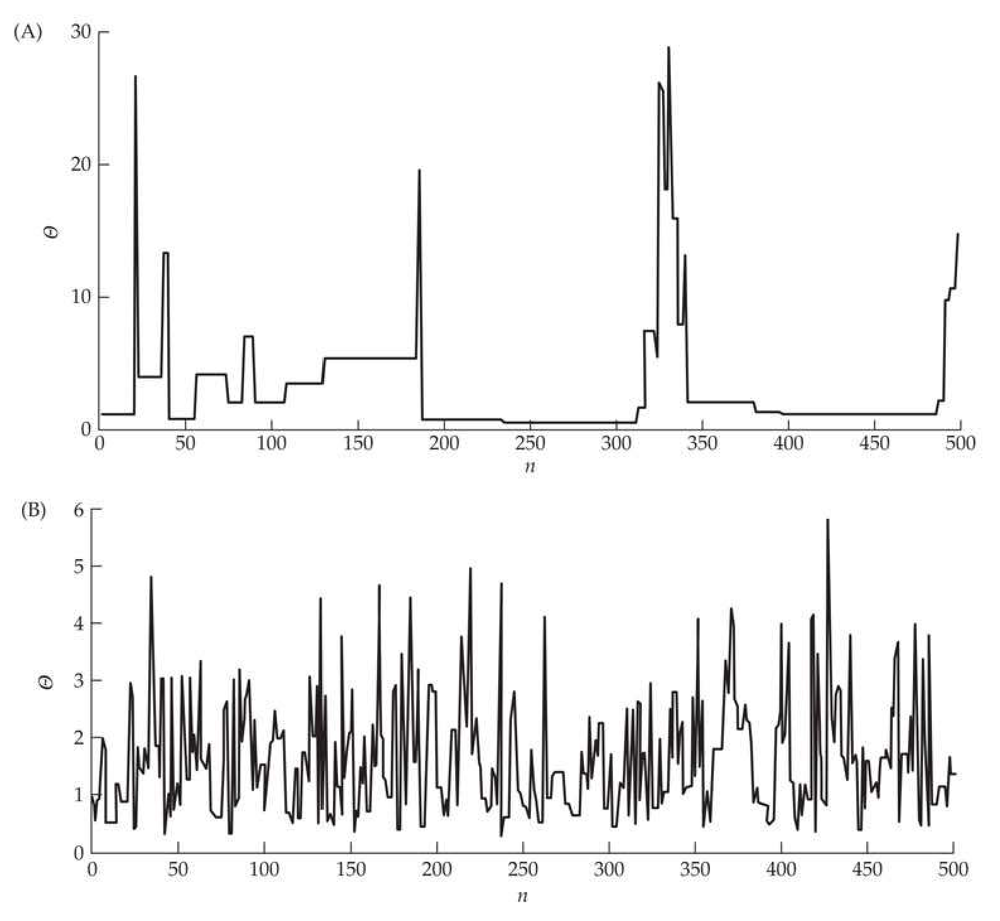
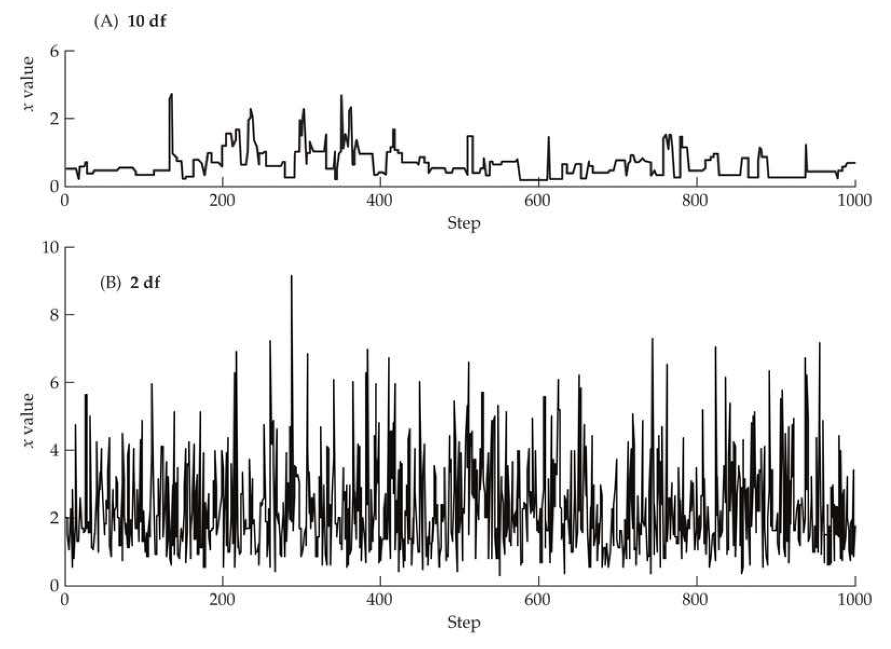
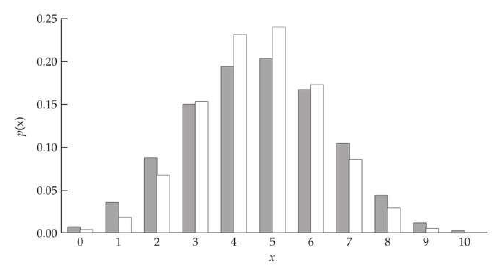

# Appendix 3 · Appendix 3 / Markov Chain Monte Carlo and Gibbs Sampling

## appendix3_001 · Appendix: Introduction

Far better an approximate answer to the right question, which is often vague, than an exact answer to the wrong question, which can always be made precise. Tukey (1962)

We are convinced nevertheless that Monte Carlo methods will one day reach an impressive maturity. Hammersley and Handscomb (1964)

The practice of MCMC is simple. Set up a Markov chain having the required invariant distribution, and run it on a computer. The folklore of simulation makes this seem more complicated that it really is. None of this folklore is justified by theory and none of it actually helps users do good simulations. Geyer (2011)

A historical impediment to the more widespread use of Bayesian methods was computational: obtaining the posterior distribution requires the integration of high-dimensional functions. This can be very difficult, but several analytic approximations short of direct integration have been proposed (reviewed by Smith 1991; Evans and Swartz 1995; Tanner 1996). Now, however, the widespread development of Markov Chain Monte Carlo (MCMC) methods has made obtaining very complex posteriors relatively easy from a conceptual standpoint (although they may still be rather computationally demanding). Indeed, MCMC allows Bayesian approaches to handle much higher-dimensional problems than other methods. MCMC approaches are so named because one uses the current sample value to randomly generate the next sample value, thus generating a Markov chain.

The realization in the early 1990s (Gelfand and Smith 1990) that one particular MCMC method, the Gibbs sampler, is widely applicable to a broad class of Bayesian problems sparked much of the current expansion in the use of Bayesian analysis. MCMC methods have their roots in the Metropolis algorithm (Metropolis and Ulam 1949; Metropolis et al. 1953), an attempt by physicists to compute complex integrals by expressing them as expectations of a much simpler distribution and then estimating this expectation by drawing samples from that distribution. While the Gibbs sampler had its origins outside of statistics, it is still somewhat surprising that the powerful machinery of MCMC had essentially no impact on the field of statistics until rather recently. MCMC methods were reviewed by Tanner (1996), Gammerman (1997), Chen et al. (2000), Robert and Casella (2004), and Brooks et al. (2011). The types of MCMC machinery used in quantitative genetics (often Gibbs samplers on linear mixed-models, e.g., Chapters 19 and 20) tend to be a bit different from those used in molecular population genetics (ABC methods for treating complex likelihoods, e.g., Chapters 9 and 10). Sorensen and Gianola (2002) extensively reviewed the former, while Marjoram and Tavaré (2006) provided a brief review of the latter. The roundtable discussion on practical issues of MCMC by Kass et al. (1998) is required reading for anyone using MCMC analysis, as is Geyer (2011). Finally, Robert and Casella (2011) presented a nice historical overview of the development of MCMC methods.

---

## appendix3_002 · Appendix: Introduction / MONTE CARLO INTEGRATION

To better understand the historical roots of MCMC, we digress for a moment to discuss the original Monte Carlo approach, which used random-number generation to approximate integrals. Suppose we wish to compute a complex integral, $$ \int_{a}^{b}h(x)dx $$

If we can decompose $ h(x) $ into the product of a function, $ f(x) $, and a probability density function, $ p(x) $, defined over the interval $ (a, b) $, then $$ \int_{a}^{b}h(x)dx=\int_{a}^{b}f(x)p(x)dx=E_{p(x)}[f(x)] $$ which means that the integral can be expressed as the expectation of $f(x)$ over the density $p(x)$. After sampling a large number of random variables, $(x_{1},\cdots,x_{n})$, from the density $p(x)$, we have that $$ \int_{a}^{b}h(x)dx=E_{p(x)}[f(x)]\simeq\frac{1}{n}\sum_{i=1}^{n}f(x_{i}) $$

This approach is referred to as Monte Carlo integration, and it can be used to approximate posterior (or marginal posterior) distributions required for a Bayesian analysis. Consider the integral $ I(y) = \int f(y \mid x) p(x) \, dx $, which we approximate by $$ \widehat{I}(y)=\frac{1}{n}\sum_{i=1}^{n}f(y\mid x_{i}) $$ where again $ x_{i} $ are draws from the density $ p(x) $. Since we have framed this integral as an expectation, individual random draws have expected value equal to the integral. The spread of those values around their mean allows us to estimate a Monte Carlo standard error for our approximation, with $$ \mathrm{SE}^{2}[\widehat{I}(y)]=\frac{1}{n}\left[\frac{1}{n-1}\sum_{i=1}^{n}\left(f(y\mid x_{i})-\widehat{I}(y)\right)^{2}\right] $$ where the inner term estimates the sampling variance, $ \sigma^2 $. Notice from Equation A3.1e that the standard error scales as $ \sigma/\sqrt{n} $, namely, with the square root of the sample size. Thus, a tenfold improvement in precision requires a hundredfold increase in the sample size.

**[示例 Example]**

> **Example A3.1** · ref: `A3.1` · source: `appendix3_002.json` · blocks 3–7
>
> Example A3.1. An interesting quantitative-genetic application of Monte Carlo integration was suggested by Ovaskainen et al. (2008) for comparing whether two G matrices are similar. As we detail in Volume 3, there are many proposed methods for comparing matrices, but Ovaskainen et al. suggested a (conceptually) simple approach. The G matrix for a given population is really a description of the distribution of breeding values, and, as such we can think of comparing G matrices as being akin to comparing two multivariate population distributions, whose densities are denoted by f and g. If x denotes a draw from one of these distributions, the probability that it originates from distribution g is simply $ g(\mathbf{x}) / |g(\mathbf{x}) + f(\mathbf{x})| $. Hence, the probability q, that a random draw from f will be incorrectly assigned to g is calculated as $$ q(f,g)=\int\frac{g(\mathbf{x})}{g(\mathbf{x})+f(\mathbf{x})}f(\mathbf{x})d\mathbf{x} $$ (A3.2a) If the two probability distributions are essentially indistinguishable, then $ q(f,g) = 0.5 $, while if they are completely distinguishable then $ q(f,g) = 0 $. Hence, $ 1 - 2q(f,g) $, which ranges from zero (indistinguishable) to one (fully distinguishable), provides a simple metric of the difference between them, and hence the difference between the two G matrices that comprise the distributions of f versus g. Ovaskainen et al. modified this idea further, suggesting the metric $$ d(f,g)=\sqrt{1-2q(f,g)} $$ (A3.2b) While Equation A3.2a involves a complex integral, Equation A3.1d suggests that $$ \widehat{q}(f,g)=\frac{1}{n}\sum_{i=1}^{n}\frac{g(\mathbf{x}_{i})}{g(\mathbf{x}_{i})+f(\mathbf{x}_{i})}\rightarrow q(f,g) $$ (A3.2c) where $ \mathbf{x}_1, \cdots, \mathbf{x}_n $ are random draws from $ f $. For example, if $ f $ is a multivariate normal with a mean vector of 0 and a variance-covariance matrix of $ \mathbf{G}_1 $, then $$ f(\mathbf{x})=(2\pi)^{-n/2}|\mathbf{G}_{1}|\exp\left(-\frac{\mathbf{x}^{T}\mathbf{G}_{1}^{-1}\mathbf{x}}{2}\right) $$ where g is similarly defined, but with $ G_{2} $ replacing $ G_{1} $, which yields $$ \widehat{q}(f,g)=\frac{1}{n}\sum_{i=1}^{n}\frac{\mid\mathbf{G}_{2}\mid\exp\left(-\mathbf{x}_{i}^{T}\mathbf{G}_{2}^{-1}\mathbf{x}_{i}/2\right)}{\mid\mathbf{G}_{2}\mid\exp\left(-\mathbf{x}_{i}^{T}\mathbf{G}_{2}^{-1}\mathbf{x}_{i}/2\right)+\mid\mathbf{G}_{1}\mid\exp\left(-\mathbf{x}_{i}^{T}\mathbf{G}_{1}^{-1}\mathbf{x}_{i}/2\right)} $$ (A3.2d) The expression in the sum is not nearly as imposing as it appears. Both of the determinants, $ |\mathbf{G}_1| $ and $ |\mathbf{G}_2| $, are fixed constants, and they only need to be computed once. Likewise, $ \mathbf{G}_1^{-1} $ and $ \mathbf{G}_2^{-1} $ need only be inverted once and then can be stored. Monte Carlo integration proceeds by generating a set of random vectors, $ (\mathbf{x}_1, \cdots, \mathbf{x}_n) $, from a MVN $ \sim(\mathbf{0}, \mathbf{G}_1) $.

---

## appendix3_003 · MONTE CARLO INTEGRATION / Importance Sampling

$$ \int f(x)q(x)dx=\int f(x)\left(\frac{q(x)}{p(x)}\right)p(x)dx=E_{p(x)}\left[f(x)\left(\frac{q(x)}{p(x)}\right)\right] $$

This forms the basis for the method of importance sampling, with $$ \int f(x)q(x)dx\simeq\frac{1}{n}\sum_{i=1}^{n}f(x_{i})\left(\frac{q(x_{i})}{p(x_{i})}\right) $$ where again the $ x_i $ values are drawn from the distribution given by $ p(x) $. For example, if we are interested in a marginal density as a function of $ y $, $ J(y) = \int f(y | x) q(x) dx $, we approximate this by $$ J(y)\simeq\frac{1}{n}\sum_{i=1}^{n}f(y\mid x_{i})\left(\frac{q(x_{i})}{p(x_{i})}\right) $$ where $ x_{i} $ are drawn from the approximating density p.

This method is so named in that a judicious choice of $ p(x) $ ensures that values for which $ f(x) $ is large (important) are appropriately sampled, which can result in a smaller Monte Carlo variance, and hence a more accurate estimate of the integral. Further, it can be faster to carry out in cases where p is more straightforward to sample from than q. Ideally, we would like $ p(x) $ to be large when $ f(x)q(x) $ is large, namely, $ p(x) \propto f(x)q(x) $, although assessing when $ q(x) $ is large may be problematic. One issue that can arise is when $ q(x) $ denotes a posterior distribution whose integration constant is unknown, and hence $ q(x) $, as presented, will not be a formal probability distribution if $ \int q(x) \neq 1 $. If $ C^{-1} = \int q(x) $, then $ Cq(x) $ is formally a pdf. Fortunately, a simple trick allows us to use importance sampling to obtain $C$. Since $C \int q(x) dx = 1$, then $$ C^{-1}=\int q(x)d x\simeq\frac{1}{n}\sum_{i=1}^{n}w_{i}\quad\mathrm{w h e r e}\quad w_{i}=\frac{q(x_{i})}{p(x_{i})} $$ with the $ x_{i} $ drawn from $ p(x) $. Hence $$ C\cdot\int f(x)q(x)dx\simeq\widehat{I}=\sum_{i=1}^{n}w_{i}f(x_{i})\bigg/\sum_{i=1}^{n}w_{i} $$ which has an associated Monte Carlo variance of $$ \mathrm{Var}\left(\widehat{I}\right)=\sum_{i=1}^{n}w_{i}\left[f(x_{i})-\widehat{I}\right]^{2}\bigg/\sum_{i=1}^{n}w_{i} $$

---

## appendix3_004 · Appendix: Introduction / INTRODUCTION TO MARKOV CHAINS

Before introducing two of the most common MCMC methods, the Metropolis-Hastings algorithm and the Gibbs sampler, a few introductory comments on Markov chains are in order. Let $ X_t $ denote the value of a random variable at time $ t $, and let the state space refer to the range of possible $ X $ values. A random variable is said to follow a Markov process if the transition probabilities between different values in the state space depend only on the random variable's current state, $$ \Pr(X_{t+1}=s_{j}\mid X_{0}=s_{k},\cdots,X_{t}=s_{i})=\Pr(X_{t+1}=s_{j}\mid X_{t}=s_{i}) $$

Thus, the only information about the past needed for a Markov random variable to predict the future is the current state of the random variable. Knowledge of the values of earlier states does not influence the transition probability. A Markov chain refers to a sequence of random variables, $ (X_0, \cdots, X_n) $, generated by a Markov process. A particular chain is defined by its transition probabilities (or the transition kernel), $ P(i, j) = P(i \to j) $, which is the probability that a process at state space $ s_i $ moves to state $ s_j $ in a single step. $$ P(i,j)=P(i\rightarrow j)=\Pr(X_{t+1}=s_{j}\mid X_{t}=s_{i}) $$

We use the notation $ P(i \to j) $ to imply a move from i to j, as some texts define $ P(i,j) = P(j \to i) $, so we will use the arrow notation to avoid any potential confusion. Let $$ \pi_{j}(t)=\Pr(X_{t}=s_{j}) $$ denote the probability that the chain is in state $j$ at time $t$, and let $\pi(t)$ denote the row vector of the state space probabilities at step (or time) $t$. We start the chain by specifying a starting row vector, $\pi(0)$. Often all the elements of $\pi(0)$ are zero except for a single element of $1$, which corresponds to the process starting in that particular state. As the chain progresses, the probability values become more dispersed over the state space. The probability that the chain has a state value of $s_j$ at time (or step) $t+1$ is obtained from the Chapman-Kolomogrov (CK) equation, which sums over the probability of being in a particular state at the current step value, $t$, and the transition probability from that state into state $s_j$. $$ \begin{aligned}\pi_{j}(t+1)&=\Pr(X_{t+1}=s_{j})\\&=\sum_{i}\Pr(X_{t+1}=s_{j}\mid X_{t}=s_{i})\cdot\Pr(X_{t}=s_{i})\\&=\sum_{i}P(i\rightarrow j)\pi_{i}(t)=\sum_{i}P(i,j)\pi_{i}(t)\end{aligned} $$

Successive iteration of the CK equations describes the evolution of the chain.

We can more compactly write the CK equations in matrix form, as follows: first we define the probability transition matrix, P, as the matrix whose $ ij $th element is $ P(i,j) $, the probability of moving from state $ i $ to state $ j $, $ P(i \rightarrow j) $. This implies that the rows of P sum to one, as when considering the $ ith $ row, $ \sum_j P(i,j) = \sum_j P(i \rightarrow j) = 1 $. In matrix form, the Chapman-Kolomogrov equation becomes $$ \boldsymbol{\pi}(t+1)=\boldsymbol{\pi}(t)\mathbf{P} $$

Hence, $$ \boldsymbol{\pi}(t)=\boldsymbol{\pi}(t-1)\mathbf{P}=\left[\boldsymbol{\pi}(t-2)\mathbf{P}\right]\mathbf{P}=\boldsymbol{\pi}(t-2)\mathbf{P}^{2} $$

Continuing in this fashion yields the probability distribution in generation t as $$ \boldsymbol{\pi}(t)=\boldsymbol{\pi}(0)\mathbf{P}^{t} $$

Next we define the n-step transition probability, $ p_{ij}^{(n)} $, as the probability that the process is in state j, given that it started in state i some n steps ago, namely, $$ p_{ij}^{(n)}=\Pr(X_{t+n}=s_{j}\mid X_{t}=s_{i}) $$

It immediately follows that $ p_{ij}^{(n)} $ is simply the $ ij $th element of $ P^n $, the $ n $th power of the single-step transition matrix. The classic example of a Markov chain in genetics is the Wright-Fisher model of drift (Equations 2.1 and 2.2; Example 2.1).

Finally, a Markov chain is said to be irreducible if there exists a positive integer, $ n_{ij} $, such that $ p_{ij}^{(n_{ij})} > 0 $ for all $ ij $. That is, all states communicate with each other, in that the process can always move from any one state to any other state (although this may require multiple steps). Likewise, a chain is said to be aperiodic when the number of steps required to move between two states (say x and y) is not always some multiple of a specific integer. Put another way, the chain is not forced into cycles of fixed length between certain states.

---

## appendix3_005 · Appendix: Introduction / INTRODUCTION TO MARKOV CHAINS

**[示例 Example]**

> **Example A3.2** · ref: `A3.2` · source: `appendix3_005.json` · blocks 0–9
>
> Example A3.2. Suppose the state space consists of three possible weather conditions (Rain, Sunny, Cloudy) and that weather patterns follow a Markov process (of course, they do not!). Under this assumption, the probability of tomorrow's weather simply depends on today's weather, and not on any other previous days. If this is the case, the observation that it has rained for three straight days does not alter the probability of tomorrow's weather compared to the situation where (say) it rained today but was sunny for the last week. Suppose the probability transitions given that today is rainy are $$ \begin{array}{l}P(Rain tomorrow\mid Rain today)=0.5\\ P(Sunny tomorrow\mid Rain today)=0.25\\ P(Cloudy tomorrow\mid Rain today)=0.25\end{array} $$
> 
> This results in the first row of the transition probability matrix being $ (0.5, 0.25, 0.25) $. Now suppose that the full transition matrix is $$ \mathbf{P}=\begin{pmatrix}0.5&0.25&0.25\\0.5&0&0.5\\0.25&0.25&0.5\end{pmatrix} $$
> 
> Note that this Markov chain is irreducible, as all states communicate with each other. Suppose today is sunny. What is the weather expected to be like two days from now? Seven days? Here $ \pi(0) = (0 \quad 1 \quad 0) $, which yields $$ \boldsymbol{\pi}(2)=\boldsymbol{\pi}(0)\mathbf{P}^{2}=(0.375\quad0.25\quad0.375) $$ and $$ \boldsymbol{\pi}(7)=\boldsymbol{\pi}(0)\mathbf{P}^{7}=(0.4\quad0.2\quad0.4) $$
> 
> Conversely, suppose today is rainy, so $ \pi(0) = (1 \quad 0 \quad 0) $. The expected future weather becomes $$ \pi(2)=\begin{pmatrix}0.4375&0.1875&0.375\end{pmatrix}\quad and\quad\pi(7)=\begin{pmatrix}0.4&0.2&0.4\end{pmatrix} $$
> 
> Note that after a sufficient amount of time, the expected weather is independent of the starting value. In other words, the chain has reached a stationary distribution, where the state space probability values are independent of the actual starting value.

As the above example illustrates, a Markov chain may reach a stationary distribution, $ \pi^{*} $, where the vector of probabilities of being in a particular state is independent of the initial starting distribution. The stationary distribution satisfies $$ \pi^{*}=\pi^{*}P $$

In other words, $ \pi^* $ is the left eigenvector associated with the eigenvalue $ \lambda = 1 $ of $ \mathbf{P} $ (Appendix 5). Further, the spectral decomposition of $ \mathbf{P} $ (Equation A5.9a) implies that the impact of the initial conditions after $ t $ steps decays as $ \lambda_2^t $, where $ \lambda_2 < 1 $ is the second largest eigenvalue of $ \mathbf{P} $. If this eigenvalue is very close to one, the impact of the initial conditions can persist for a substantial amount of time. Specifically, if $ \lambda_2 = 1 - \delta $, then $ \lambda_2^t = (1 - \delta)^t \simeq \exp(-\delta t) $. One condition for the existence of a stationary distribution is that the chain must be irreducible and aperiodic. When a chain is periodic, it can cycle in a deterministic fashion between states and may never settle down to a stationary distribution (in effect, this cycling is the stationary distribution for this chain). Equation A5.11d can be used to show that if $ \mathbf{P} $ has no eigenvalues equal to $ -1 $, it is aperiodic.

A sufficient condition for a unique stationary distribution is (for all i and j) that the detailed balance equation holds, namely, $$ P(j\rightarrow i)\pi_{j}^{*}=P(i\rightarrow j)\pi_{i}^{*} $$ That is, at equilibrium, the amount of probability flux from state $j$ to stage $i$ is exactly matched by the probability flux in the opposite direction (for $i$ to $j$), so a balance is reached, with no net flow of probability over the states. If Equation A3.10 holds for all values of $i$ and $j$, the Markov chain is said to be reversible, and hence Equation A3.10 is also called the reversibility condition. Note that this condition implies that $\pi^* = \pi^* \mathbf{P}$, as the $j$th element of the row vector $\pi^* \mathbf{P}$ is $$ (\boldsymbol{\pi}^{*}\mathbf{P})_{j}=\sum_{i}\pi_{i}^{*}P(i\rightarrow j)=\sum_{i}\pi_{j}^{*}P(j\rightarrow i)=\pi_{j}^{*}\sum_{i}P(j\rightarrow i)=\pi_{j}^{*} $$ where the key middle step follows from Equation A3.10, while the last step follows because rows of P sum to one.

The basic idea of a discrete-state Markov chain can be generalized to a continuous-state Markov process by replacing P with a probability kernel, $ P(x, y) $, that satisfies $$ \int P(x,y)dy=1 $$

The continuous extension of the Chapman-Kolomogrov equation becomes $$ \pi_{t}(y)=\int\pi_{t-1}(x)P(x,y)dx $$

Finally, at equilibrium, the stationary distribution satisfies $$ \pi^{*}(y)=\int\pi^{*}(x)P(x,y)dx $$

---

## appendix3_006 · Appendix: Introduction / THE METROPOLIS-HASTINGS ALGORITHM

The roots of MCMC methods trace back to a problem faced by mathematical physicists in applying Monte Carlo integration, namely, generating random samples from some complex distribution in order to apply Equation A3.1. Their solution was the Metropolis-Hastings algorithm (Metropolis and Ulam 1949; Metropolis et al. 1953; Hastings 1970), which was reviewed by Chib and Greenberg (1995).

Suppose our goal is to draw samples from some distribution, $ p(\theta) = f(\theta)/K $, where the normalizing constant, K, may be very difficult to compute. Note that Bayesian posteriors are of this form (Equation A2.4b). The Metropolis algorithm (Metropolis and Ulam 1949; Metropolis et al. 1953), which generates a sequence of draws from this distribution, is as follows: 1. Start with any initial value, $ \theta_{0} $, satisfying $ f(\theta_{0}) > 0 $.

2. Using the current value of $\theta$, sample a candidate point, $\theta^{*}$, from some jumping distribution, $q(\theta_1, \theta_2) = \Pr(\theta_1 \to \theta_2)$, which is the probability of returning a value of $\theta_2$ given a previous value of $\theta_1$. This distribution is also referred to as the proposal distribution or candidate-generating distribution. The only restriction on the jump density in the Metropolis algorithm is that it is symmetric, with $q(\theta_1, \theta_2) = q(\theta_2, \theta_1)$.

3. Given the candidate point, $ \theta^{*} $, calculate the ratio of the density at the candidate and current, $ \theta_{t-1} $, points, $$ \alpha=\frac{p(\theta^{*})}{p(\theta_{t-1})}=\frac{f(\theta^{*})}{f(\theta_{t-1})} $$

Notice that because we are considering the ratio of $ p(x) $ under two different values, the normalizing constant, K, cancels out.

4. If the jump increases the density ($ \alpha > 1 $), accept the candidate point (set $ \theta_t = \theta^* $) and return to step 2. If the jump decreases the density ($ \alpha < 1 $), then with a probability of $ \alpha $ we accept the candidate point, else we reject it and return to step 2. Note that $ \alpha $ is a ratio of two likelihoods, so the probability of accepting a move is the ratio of the candidate to current likelihoods.

We can summarize Metropolis sampling as first computing $$ \alpha=\min\left(\frac{f(\theta^{*})}{f(\theta_{t-1})},1\right) $$ and then accepting a candidate value, $ \theta^* $, with probability $ \alpha $ (the probability of a move). This generates a Markov chain, $ (\theta_0, \theta_1, \cdots, \theta_k, \cdots) $, as the transition probabilities from $ \theta_t $ to $ \theta_{t+1} $ depend only on $ \theta_t $ and not on $ (\theta_0, \cdots, \theta_{t-1}) $. Following a sufficient burn-in period (of, say, $ k $ steps), the chain approaches its stationary distribution and (as we will demonstrate shortly) samples from the vector $ (\theta_{k+1}, \cdots, \theta_{k+n}) $ are samples from $ p(\theta) $.

Hastings (1970) generalized the Metropolis algorithm by using an arbitrary (as opposed to strictly symmetric) transition probability function, $ q(\theta_1, \theta_2) = \Pr(\theta_1 \to \theta_2) $, and setting the acceptance probability for a candidate point as $$ \alpha=\min\left(\frac{f(\theta^{*})q(\theta^{*},\theta_{t-1})}{f(\theta_{t-1})q(\theta_{t-1},\theta^{*})},1\right) $$

**[Figure]**

> **Figure A3.1** · page 8 · source: `appendix3`
>
> 
>
> Figure A3.1 Traces for the samplers discussed in Example A3.3. A: A sample run when the candidate-generating distribution is a uniform over  $ (0, 100) $. B: A sample run when the candidate-generating distribution is a  $ \chi_{1}^{2} $.

This is the Metropolis-Hastings algorithm, and Equation A3.13 is the Hastings ratio. When the proposal distribution is symmetric, $ q(x, y) = q(y, x) $, we recover the original Metropolis algorithm.

**[示例 Example]**

> **Example A3.3** · ref: `A3.3` · source: `appendix3_006.json` · blocks 9–9
>
> Example A3.3. As a toy example, consider the scaled inverse- $ \chi^2 $ distribution (Equation A2.30a), $$ \begin{align*}p(x)=C\cdot x^{-(n/2+1)}\cdot\exp\left({-a\over2x}\right)\end{align*} $$ We wish to use the Metropolis algorithm to simulate draws from this distribution with n = 3 degrees of freedom and a scaling factor of a = 4. Here $$ f(x)=x^{-5/2}\exp[-4/(2x)]=x^{-2.5}\exp[-2/x] $$ Suppose we take as our candidate-generating distribution a uniform over $ (0, 100) $. Clearly, there is probability mass above 100 for the scaled inverse- $ \chi^2 $, but we assume this is sufficiently small that we can ignore it. Now let's run the algorithm. Take $ \theta_0 = 1 $ as our starting value, and suppose the uniform returns a candidate value of $ \theta^* = 39.82 $. Computing $ \alpha, $ $$ \alpha=\min\left(\frac{f(\theta^{*})}{f(\theta_{t-1})},1\right)=\min\left(\frac{(39.82)^{-2.5}\cdot\exp(-2/39.82)}{(1)^{-2.5}\cdot\exp(-2/2\cdot1)},1\right)=0.0007 $$ Since $ \alpha < 1 $, the candidate value, $ \theta^* $, is accepted with a probability of 0.0007: we randomly draw $ U $ from a uniform $ (0,1) $ distribution and accept $ \theta^* $ if $ U \leq \alpha = 0.0007 $. If $ U > \alpha $, the candidate value is rejected, and we draw another candidate value from the proposal distribution and continue as above. A sample run resulting from first 500 values of $ \theta $ is plotted in Figure A3.1A. Notice that there are long flat periods (corresponding to all candidate values, $ \theta^* $, being rejected). Such a chain is said to be poorly mixing (showing long periods between jumps) and is numerically inefficient for sampling the entire probability space defined by the target distribution. Conversely, balancing the poor mixing is the fact that when jumps occur, they tend to be large, thus exploring the extreme values of this distribution. In contrast, suppose our proposal distribution is a $ \chi_1^2 $. As this distribution is not symmetric, we must employ Metropolis-Hastings (see Example A3.5 for the details). A resulting Metropolis-Hastings sampling run is shown in Figure A3.1B. Note that the time series looks like white noise, and the chain is said to be well mixing. However, note that most jumps are small (< 5), with fewer extreme values sampled than under the uniform proposal distribution.

---

## appendix3_007 · Appendix: Introduction / THE METROPOLIS-HASTINGS ALGORITHM

We wish to use the Metropolis algorithm to simulate draws from this distribution with n = 3 degrees of freedom and a scaling factor of a = 4. Here $$ f(x)=x^{-5/2}\exp[-4/(2x)]=x^{-2.5}\exp[-2/x] $$

Suppose we take as our candidate-generating distribution a uniform over $ (0, 100) $. Clearly, there is probability mass above 100 for the scaled inverse- $ \chi^2 $, but we assume this is sufficiently small that we can ignore it. Now let's run the algorithm. Take $ \theta_0 = 1 $ as our starting value, and suppose the uniform returns a candidate value of $ \theta^* = 39.82 $. Computing

$ \alpha, $ $$ \alpha=\min\left(\frac{f(\theta^{*})}{f(\theta_{t-1})},1\right)=\min\left(\frac{(39.82)^{-2.5}\cdot\exp(-2/39.82)}{(1)^{-2.5}\cdot\exp(-2/2\cdot1)},1\right)=0.0007 $$

Since $ \alpha < 1 $, the candidate value, $ \theta^* $, is accepted with a probability of 0.0007: we randomly draw $ U $ from a uniform $ (0,1) $ distribution and accept $ \theta^* $ if $ U \leq \alpha = 0.0007 $. If $ U > \alpha $, the candidate value is rejected, and we draw another candidate value from the proposal distribution and continue as above. A sample run resulting from first 500 values of $ \theta $ is plotted in Figure A3.1. Notice that there are long flat periods (corresponding to all candidate values, $ \theta^* $, being rejected). Such a chain is said to be poorly mixing (showing long periods between jumps) and is numerically inefficient for sampling the entire probability space defined by the target distribution. Conversely, balancing the poor mixing is the fact that when jumps occur, they tend to be large, thus exploring the extreme values of this distribution.

In contrast, suppose our proposal distribution is a $ \chi_1^2 $. As this distribution is not symmetric, we must employ Metropolis-Hastings (see Example A3.5 for the details). A resulting Metropolis-Hastings sampling run is shown in Figure A3.1. Note that the time series looks like white noise, and the chain is said to be well mixing. However, note that most jumps are small (< 5), with fewer extreme values sampled than under the uniform proposal distribution.

**[示例 Example]**

> **Example A3.4** · ref: `A3.4` · source: `appendix3_007.json` · blocks 5–13
>
> Example A3.4. This rather technical example shows that the Markov chain generated by the Metropolis-Hastings algorithm has a stationary distribution which corresponds to $ p(x) $. Hence, draws from the stationary phase of this chain correspond to random draws from the distribution given by $ p(x) $. We do so by showing that, under this chain, $ p(x) $ satisfies the detailed balance equation (A3.10), and hence it must be the stationary distribution for the Markov chain. Under Metropolis-Hasting, we sample from $ q(x, y) = \Pr(x \to y \mid q) $ and then accept the move with probability $ \alpha(x, y) $, so the transition probability kernel is given by $$ \Pr(x\rightarrow y)=q(x,y)\alpha(x,y)=q(x,y)\cdot\min\left[\frac{p(y)q(y,x)}{p(x)q(x,y)},1\right] $$ (A3.14a) If the Metropolis-Hasting kernel satisfies $ P(x \to y) p(x) = P(y \to x) p(y) $, or $$ q(x,y)\alpha(x,y)p(x)=q(y,x)\alpha(y,x)p(y)\quad for all x,y $$ (A3.14b) then the stationary distribution from this kernel corresponds to draws from the target distribution, $ p(x) $. We show that the balance equation is indeed satisfied with this kernel by considering the three possible cases for any particular $ (x, y) $ pair: 1. $ q(x, y) p(x) = q(y, x) p(y) $. Here $ \alpha(x, y) = \alpha(y, x) = 1 $ implying $$ P(x\rightarrow y)p(x)=q(x,y)p(x)\quad and\quad P(y\rightarrow x)p(y)=q(y,x)p(y) $$ Under our assumption that $ q(x, y) p(x) = q(y, x) p(y) $, this reduces to $ P(x \to y) p(x) = P(y \to x) p(y) $, showing that (for this case), the 2. $ q(x, y) p(x) > q(y, x) p(y) $, in which case $$ \alpha(x,y)=\frac{p(y)q(y,x)}{p(x)q(x,y)}\quad and\quad\alpha(y,x)=1 $$ Hence, $$ \begin{aligned}P(x\rightarrow y)p(x)&=q(x,y)\alpha(x,y)p(x)\\&=q(x,y)\frac{p(y)q(y,x)}{p(x)q(x,y)}p(x)\\&=q(y,x)p(y)=q(y,x)\alpha(y,x)p(y)\\&=P(y\rightarrow x)p(y)\\ \end{aligned} $$ 3. $ q(x, y) p(x) < q(y, x) p(y) $. Here $$ \alpha(x,y)=1\quad and\quad\alpha(y,x)=\frac{q(x,y)p(x)}{q(y,x)p(y)} $$ Following the same logic just used yields $$ \begin{aligned}P(y\rightarrow x)p(y)&=q(y,x)\alpha(y,x)p(y)\\&=q(y,x)\left(\frac{q(x,y)p(x)}{q(y,x)p(y)}\right)p(y)\\&=q(x,y)p(x)=q(x,y)\alpha(x,y)p(x)\\&=P(x\rightarrow y)p(x)\\ \end{aligned} $$ which concludes the proof.

---

## appendix3_008 · THE METROPOLIS-HASTINGS ALGORITHM / Burning-in the Sampler

A key issue in the successful implementation of Metropolis-Hastings, or any other MCMC sampler, is the number of steps (iterations) until the chain approaches stationarity (the length of the burn-in period), as initial values are somewhat dependent upon the starting position. Typically the first 1,000 to 50,000 (or more) values of the chain are discarded, and then various convergence tests (see below) are used to assess whether stationarity has indeed been reached.

A poor choice of either a proposal distribution or a starting value can greatly increase the required burn-in time, and an area of current research is whether an optimal starting point and proposal distribution can be found. One suggestion is to initiate the chain as close to the center of the distribution as possible, for example, taking a value close to the distribution's mode (such as using an approximate MLE as the starting value). Geyer (2011), however, offered the simple advice that "any point you don't mind having in a sample is a good starting point."

A chain is said to be poorly mixing if it stays in small regions of the parameter space for long periods of time, as opposed to a well-mixing chain, which seems to happily explore the entire space (albeit perhaps by very small steps, requiring very many draws to fully survey the entire space). A poorly mixing chain can arise because the target distribution is multimodal and our choice of starting values (or the chance steps that were initially taken) traps us near one of the modes (such multimodal posteriors can arise if we have a strong prior that is in conflict with the observed data). Two approaches have been suggested for situations where the target distribution may have multiple peaks. The most straightforward is to use widely dispersed initial values to start several different chains (Gelman and Rubin 1992). A less obvious approach, which we will discuss shortly, is to use simulated annealing on a single chain.

Even after an apparently successful burn-in, the real fear for the MCMC practitioner is that the chain is simply showing pseudo-convergence. It appears to have reached an equilibrium, when in fact it is simply exploring (albeit perhaps rather fully) some subset of the entire distribution. If the transition time between different parts of the full distribution is long relative to the sample size, the MCMC user will happily observe convergence and believe that the simulation is a fair representation of the true posterior. The unfortunate feature is that for any MCMC, the skeptic, or a hardened reviewer, can claim (with some justification) that convergence has not been demonstrated. The problem is akin to large-sample results in statistics (such as the large-sample features of ML; LW Appendix 4): the theory says that for a sufficiently large sample, certain desirable properties hold, but usually says rather little about how “large” is large. For a complex posterior, the required chain size might be far, far larger than an investigator envisions. The only real solution is to run the chain for as long as possible. In such a setting, Geyer (2011) argued, a burn-in is not required, and noted that “Burn-in is mostly harmless, which is perhaps why the practice persists. But everyone should understand that it is unnecessary, and those who do not use it are not thereby making an error.”

---

## appendix3_009 · THE METROPOLIS-HASTINGS ALGORITHM / Simulated Annealing

Simulated annealing was developed for finding the maximum of complex functions with multiple peaks where standard hill-climbing approaches may trap the algorithm on a less than optimal peak (Kirkpatrick et al. 1983). The idea is that when we initially start sampling the space, we will accept a reasonable probability of a down-hill move in order to explore the entire space. As the process proceeds, we decrease the probability of such down-hill moves. The analogy (and hence the term) is the annealing of a crystal as temperature decreases: initially there is a lot of movement, which gets smaller and smaller as the temperature cools. Simulated annealing is very closely related to Metropolis sampling, differing only in that the probability $ \alpha $ of a move is given by $$ \alpha_{S A}=\min\left[1,\left(\frac{f(\theta^{*})}{f(\theta_{t-1})}\right)^{1/T(t)}\right]=\alpha^{1/T(t)} $$ where the function $ T(t) $ is called the cooling schedule (setting T = 1 recovers Metropolis sampling), and the particular value of T at any point in the chain is called the temperature. For example, suppose $ f(\theta^*)/f(\theta_{t-1}) = 0.5 $. If T = 100, $ \alpha = 0.93 $, while for T = 1, $ \alpha = 0.5 $, and for T = 1/10, $ \alpha = 0.0098 $. Hence, we start off with a high probability of a jump and then cool down to a very low jump probability. Replacing $ \alpha $ with the Hastings ratio (Equation A3.13) allows us to apply simulated annealing to Metropolis-Hastings.

A function with geometric decline is typically used for $ T(t) $. For example, to start at $ T_{0} $ and cool down to a final temperature of $ T_{f} $ over n steps, we can set $$ T(t)=T_{0}\left(\frac{T_{f}}{T_{0}}\right)^{t/n} $$

More generally, if we wish to cool off to $ T_{f} $ by time n and then keep the temperature constant at $ T_{f} $ for the rest of the run, we can take $$ T(t)=\max\left(T_{0}\left(\frac{T_{f}}{T_{0}}\right)^{t/n},T_{f}\right) $$

In particular, to cool down to Metropolis sampling (by step n), we set $ T_{f} = 1 $ and the cooling schedule becomes $$ T(t)=\max\left(T_{0}^{1-t/n},1\right) $$

---

## appendix3_010 · THE METROPOLIS-HASTINGS ALGORITHM / Choosing a Jumping (Proposal) Distribution

The Metropolis sampler works with any symmetric proposal (or jumping) distribution, while Metropolis-Hastings allows for more general distributions. So how do we determine our best option for a proposal distribution? There are two general approaches: random walks and independent chain sampling. Under a sampler using a proposal distribution based on a random-walk chain, the new value, y, equals the current value, x, plus a random variable, namely, z, $$ y=x+z $$

In this case, $ q(x, y) = g(y - x) = g(z) $, the density associated with the random variable z. If $ g(z) = g(-z) $, i.e., the density for the random variable z is symmetric (as occurs with a normal or multivariate normal with a mean of zero, or a uniform centered around zero), then we can use Metropolis sampling, as $ q(x,y)/q(y,x) = g(z)/g(-z) = 1 $. The variance of the proposal distribution can be thought of as a tuning parameter that is adjusted to achieve better mixing.

Under a proposal distribution using an independent chain, the probability of jumping to point y is independent of the current position $ (x) $ of the chain, namely, $ q(x,y) = g(y) $. The candidate value is simply drawn from a proposal distribution, independent of the current value (see Examples A3.3 and A3.5). Again, any number of standard distributions can be used for $ g(y) $. Note that in this case, except for a uniform, the proposal distribution is generally not symmetric, as $ g(x) $ is generally not equal to $ g(y) $ (for $ x \neq y $), and Metropolis-Hastings sampling must be used. As mentioned, we can tune the proposal distribution to adjust the mixing, and in particular the acceptance probability, of the chain. This is generally accomplished by adjusting the standard deviation (SD) of the proposal distribution. This can be done by adjusting the variance for a normal or adjusting the eigenvalues of the covariance matrix for a multivariate normal. Likewise, one can increase or decrease the range, $ (-a, a) $, if a uniform is used, or change the degrees of freedom (df) if a $ \chi^{2} $ is used (variance increases with the df). To increase the acceptance probability, one decreases the proposal distribution SD. There is a tradeoff in that if the SD is too large, jumps are potentially large (which is good), but are usually not accepted (which is a problem). This leads to high autocorrelation (see below) and very poor mixing, requiring much longer chains. On the other hand, if the proposal SD is too small, moves will generally be accepted (there is a high acceptance probability), but they will also be small, again generating high autocorrelations and poor mixing.

**[示例 Example]**

> **Example A3.5** · ref: `A3.5` · source: `appendix3_010.json` · blocks 3–6
>
> Example A3.5. Suppose we wish to use a $ \chi^2 $ as our proposal distribution. Recall from Equation A2.27b, that for $ x \sim \chi_n^2 $, $$ g(x)\propto x^{n/2-1}e^{-x/2} $$
> 
> Thus, $ q(x, y) = g(y) = C \cdot y^{n/2-1} e^{-y/2} $. Note that $ q(x, y) $ is not symmetric, as $ q(y, x) = g(x) \neq g(y) = q(x, y) $. Hence, we must use Metropolis-Hastings sampling, with an acceptance probability of $$ \alpha(x,y)=\min\left[\frac{p(y)q(y,x)}{p(x)q(x,y)},1\right]=\min\left[\frac{p(y)g(x)}{p(x)g(y)},1\right]=\min\left[\frac{p(y)x^{n/2-1}e^{-x/2}}{p(x)y^{n/2-1}e^{-y/2}},1\right] $$
> 
> If we use the same target distribution as in Example A3.3 (a scaled inverse- $ \chi^2 $), $ p(x) = C \cdot x^{-2.5} e^{-2/x} $, the rejection probability becomes $$ \alpha(x,y)=\min\left[\frac{\left(y^{-2.5}e^{-2/y}\right)\left(x^{n/2-1}e^{-x/2}\right)}{\left(x^{-2.5}e^{-2/x}\right)\left(y^{n/2-1}e^{-y/2}\right)},1\right] $$
> 
> Results for a run of the sampler under two different proposal distributions (a $ \chi_2^2 $ and a $ \chi_{10}^2 $) are plotted in Figure A3.2. The $ \chi_2^2 $ has the smaller variance, and thus a higher acceptance probability. Further, it seems to explore more of the distribution space than a $ \chi_{10}^2 $ (compare the number of values above 4 in both traces).

---

## appendix3_011 · THE METROPOLIS-HASTINGS ALGORITHM / Autocorrelation and Sample Size Inflation

**[Figure]**

> **Figure A3.2** · page 13 · source: `appendix3`
>
> 
>
> Figure A3.2 Trace plots for the two samplers discussed in Example A3.5. A: The proposal distribution is a  $ \chi_{10}^{2} $. B: The proposal distribution is a  $ \chi_{2}^{2} $.

We often expect adjacent members from an MCMC sequence to be positively correlated, and we can quantify the nature of this correlation by using an autocorrelation function. Consider a sequence, $(\theta_1, \cdots, \theta_n)$, of length $n$. Correlations can occur between adjacent members, $\rho(\theta_i, \theta_{i+1}) \neq 0$, and, more generally, between more distant members, $\rho(\theta_i, \theta_{i+k}) \neq 0$. The $k$th order autocorrelation, $\rho_k$, can be estimated by $$ \widehat{\rho}_{k}=\frac{\mathrm{Cov}(\theta_{t},\theta_{t+k})}{\mathrm{Var}(\theta_{t})}=\frac{\sum\limits_{t=1}^{n-k}\left(\theta_{t}-\overline{\theta}\right)\left(\theta_{t+k}-\overline{\theta}\right)}{\sum\limits_{t=1}^{n-k}\left(\theta_{t}-\overline{\theta}\right)^{2}},\quad\mathrm{with}\quad\overline{\theta}=\frac{1}{n}\sum\limits_{t=1}^{n}\theta_{t} $$

An important result from the theory of time series analysis is that if the values of $ \theta_t $ are from a stationary (and correlated) process, correlated draws still provide an unbiased picture of the distribution provided the sample size is sufficiently large. The reason for this large-sample stipulation is that, strictly speaking, Equation A3.16 applies only to a stationary process.

Some indication of the required sample size comes from the theory of a first-order autoregressive process $ (AR_{1}) $, where $$ \theta_{t}=\mu+\alpha\big(\theta_{t-1}-\mu\big)+\epsilon $$ where $ |\alpha| < 1 $ and $ \epsilon $ is white noise, namely, $ \epsilon \sim N(0, \sigma^2) $. Here $ \rho_1 = \alpha $ and the $ k $th order autocorrelation is given by $ \rho_k = \rho_1^k = \alpha^k $. Under this process, $ E(\bar{\theta}) = \mu $ with a standard error of $$ \mathrm{SE}\left(\overline{\theta}\right)=\frac{\sigma}{\sqrt{n}}\sqrt{\frac{1+\rho}{1-\rho}} $$

The first ratio is the standard error for white noise, while the second ratio, $ \sqrt{(1+\rho)/(1-\rho)} $, is the sample size inflation factor (SSIF), which shows how the autocorrelation inflates the sampling variance relative to independent samples. For $ \rho = 0.5, 0.75, 0.9, 0.95 $, and 0.99, the associated SSIF values become 3, 7, 19, 39, and 199, respectively. With an autocorrelation of 0.95 (which is not uncommon in a Metropolis-Hastings sequence), roughly 40 times as many iterations are required for the same precision as with an uncorrelated sequence.

One historical strategy for reducing autocorrelation is thinning (or subsampling) the output, which involves storing only every $ m $th point after the burn-in period. Suppose a Metropolis-Hastings sequence follows an $ AR_1 $ model, with $ \rho_1 = 0.99 $. In this case, sampling every 50, 100, and 500 points gives the correlation between the thinned samples as $ 0.605 (= 0.99^{50}) $, 0.366, and 0.007, respectively, returning SSIF values of 2, 1.5, and 1.007. In addition to reducing autocorrelation, thinning the sequence also saves computer memory. However, this throws out a huge amount of the data. If computer memory is not an issue, Geyer (1992) and MacEachern and Berliner (1994) found that it is more efficient (yielding smaller Monte Carlo variances) to keep the entire chain than to use thinning.

---

## appendix3_012 · THE METROPOLIS-HASTINGS ALGORITHM / The Monte Carlo Variance of a MCMC-Based Estimate

Suppose we are interested in using a burned-in MCMC sequence, $ (\theta_1, \cdots, \theta_n) $, to estimate some function, $ h(\theta) $, of the target distribution, such as a mean, variance, or specific quantile (namely, a specific cumulative probability value). Since we are drawing random variables, associated with the Monte Carlo estimate, there is a sampling variance of $$ \widehat{h}=\frac{1}{n}\sum_{i=1}^{n}h(\theta_{i}) $$

A similar issue arose with the error in Monte Carlo integration, where we used the sample variance around $ \hat{h} $ to compute the Monte Carlo variance, dividing this by the number of iterations to yield a standard error (Equations A3.1e and A3.5c). This strategy exploited the fact that draws for Monte Carlo integration are independent and therefore uncorrelated. In stark contrast, we expect draws in an MCMC sequence to be highly dependent. A standard sample variance estimator ignores these correlations, potentially yielding a highly biased estimate of the Monte Carlo variance (see Equation A3.17b).

One direct approach is to run several chains (or extract subsamples from a very long chain) and use the between-chain variance in $ \widehat{h} $ as our variance estimate. Specifically, if $ \widehat{h}_j $ denotes the estimate for chain $ j $ ($ 1 \leq j \leq c $), where each of the $ c $ chains has the same length, then the estimated variance of the Monte Carlo estimate is $$ \mathrm{Var}\left(\widehat{h}\right)=\frac{1}{c-1}\sum_{j=1}^{c}\left(\widehat{h}_{j}-\widehat{h^{*}}\right)^{2}\quad\mathrm{w h e r e}\quad\widehat{h^{*}}=\frac{1}{c}\sum_{j=1}^{c}\widehat{h}_{j} $$

Using only a single chain, an alternative approach is to use results from the theory of time series to account for the correlations among members in the chain. To start, we estimate the lag-k autocovariance associated with h by $$ \widehat{\gamma}(k)=\frac{1}{n-1}\sum_{i=1}^{n-k}\left[\left(h(\theta_{i})-\widehat{h}\right)\left(h(\theta_{i+k})-\widehat{h}\right)\right] $$

This is natural generalization of the kth order autocorrelation (Equation A3.16) to the random variable generated by $ h(\theta_{i}) $. Geyer (1992, 2011) obtained the resulting estimate of the Monte Carlo variance as $$ \mathrm{Var}\left(\widehat{h}\right)=\frac{1}{n}\left(\widehat{\gamma}(0)+2\sum_{i=1}^{2\delta+1}\widehat{\gamma}(i)\right) $$

Note that the zero-lag term, $ \widehat{\gamma}(0) $, is simply the standard variance estimate when observations are uncorrelated, while $ \delta $ is the largest positive integer satisfying $ \widehat{\gamma}(2\delta) + \widehat{\gamma}(2\delta + 1) > 0 $, (i.e., the higher order, or lag, autocovariances above $ \delta $ are zero).

One measure of the effects of autocorrelation between elements in the sampler is the effective chain size, $$ \widehat{n}=\frac{\widehat{\gamma}(0)}{\mathrm{Var}\left(\widehat{h}\right)} $$ where $ \widehat{\gamma}(0) $ is the standard sample variance for uncorrelated observations. In the absence of autocorrelation between members, $ \widehat{n} = n $.

---

## appendix3_013 · Appendix: Introduction / CONVERGENCE DIAGNOSTICS

The careful reader will note that we have still not answered the fundamental, and vexing, question of how to determine whether the sampler has reached its stationary distribution. Many tests for stationarity have been proposed, and all can indeed show that stationarity has not yet been reached. However, it is important to stress that negative results from these tests are not conclusive evidence that the sampler has achieved stationarity. Comments from various published reviews on the subject stress this point: "all of the methods can fail to detect the sorts of convergence failure that they were designed to identify" (Cowles and Carlin 1996); "It is clear that the usefulness of convergence assessment methods are limited by their potential unreliability" (Brooks and Roberts 1998); "Diagnostics can only reliably be used to determine a lack of convergence and not detect convergence per se" (Brooks et al. 2003); and "no method works in every case" (El Adlouni et al. 2006). Despite this very serious concern, a variety of methods can certainly show a failure of convergence given the burn-in period used for a sampler. The greater question about trust is what we say when convergence diagnostics do not indicate a problem. We consider a few basic approaches here, while additional diagnostics were reviewed by Gelman and Rubin (1992), Geyer (1992), Raftery and Lewis (1992b), Cowles and Carlin (1996), Brooks and Roberts (1998), Kass et al. (1998), Mengerson et al. (1999), Robert and Casella (2004), El Adlouni et al. (2006), and Peltonen et al. (2009).

An extra level of complications occurs in models using revisable jump MCMC, wherein the chain actually jumps between difference classes of models. For example, suppose the number of QTLs, k, is a random variable. While the chain may come to a nearly equilibrium distribution for the parameters associated with a given value of k fairly quickly, one must also sample a sufficient number of jumps between models with different values of k to fully explore the model space. One might incorrectly assume that there appears to be convergence when the model quickly equilibrates for a given value of k, but jumps very slowly between different values of k so that only a small sample of the k space has been explored.

---

## appendix3_014 · CONVERGENCE DIAGNOSTICS / Visual Analysis

As shown in Figure A3.1 and Figure A3.2, one should always examine the time series trace, the plot of the random variable being generated versus the number of iterations. In addition to showing evidence for poor mixing, such traces can also suggest a minimum burn-in period for some starting value. For example, suppose the trace moves very slowly away from the initial value to a rather different value (say after 5000 iterations), after which it appears to settle down. Clearly, the burn-in period is at least 5000 in this case. It must be cautioned that the actual burn-in time may be far longer than suggested by the trace. Nevertheless, the trace often indicates that more burn-in time is needed. A second approach is to run either several chains or subsample from a much longer chain, and then compare the traces. The expectation under stationarity is that these samples are drawn from the same distribution. Even if visual analysis suggests that two (or more) chains appear to be very similar and are both well-behaved, the concern is that both might be stuck in the same local maximum region of a complex posterior. In such cases, the impression of stationarity and consistency is presented, but significantly longer runs for each chain would show a different outcome.

Correlograms, which plot serial autocorrelations as a function of the time lag, are also very useful in accessing a run from an MCMC sampler. A plot of $ \rho_k $ versus $ k $ (the $ k $th order autocorrelation versus the lag) should show geometric decay if the sampler series closely follows an $ AR_1 $ model. A plot of the partial autocorrelations as a function of lag is also useful. The $ k $th partial autocorrelation is the excess correlation not accounted for by a $ k - 1 $ order autogressive model ($ AR_{k-1} $). Hence, if the first-order model fully fits the data, the second-order partial autocorrelation is zero, as the lagged autocorrelations are accounted for by the $ AR_1 $ model (i.e., $ \rho_k = \rho_1^k $). Both of these autocorrelation plots can indicate an underlying correlation structure that may not be obvious from the time series trace.

---

## appendix3_015 · CONVERGENCE DIAGNOSTICS / More Formal Approaches

Gelman and Rubin's (1992) proposal was to first generate m separate chains at initial locations that are widely dispersed in the parameter space, with each returning a burned-in and thinned (such that autocorrelations between estimates are near zero) sequence of length n. Their approach is essentially an ANOVA, contrasting the estimated among-chain variance with its within-chain value. For the univariate case, let $$ B=\frac{n}{m-1}\sum_{i=1}^{m}(\overline{\theta}_{i}.-\overline{\theta}_{..})^{2} $$ be the among-chain variance, where $ \bar{\theta}_i $. is the mean parameter value for chain $ i $, and $ \bar{\theta}_i $ is the grand mean over all chains. Likewise, for the within-chain variance, we define $$ W=\frac{1}{m}\left(\frac{1}{n-1}\sum_{i=1}^{m}\sum_{j=1}^{n}(\overline{\theta}_{ij}-\overline{\theta}_{i.})^{2}\right) $$

A combined estimate of the variance is $$ \widehat{\sigma^{2}}=\frac{n-1}{n}W+\frac{1}{n}B $$

Gelman and Rubin defined the potential scale reduction factor (PSRF) as $$ R=\frac{\widehat{\sigma^{2}}}{W}=1+\frac{1}{n}\left(\frac{B}{W}-1\right) $$ with values of R near one being consistent with convergence. A plot of R over time should converge to a value near one, if the chains are converging. Because most MCMCs involve many variables, one could either look at the univariate R trace for each or use the multivariate version suggested by Brooks and Gelman (1998), $$ R=\frac{n-1}{n}+\left(1+\frac{1}{m}\right)\lambda_{1} $$ where $ \lambda_1 $ is the leading eigenvalue of the matrix product $ W^{-1}B/n $, and where W and B are the sample within- and among-covariance matrices for the parameters. Again, a value near 1 is consistent with convergence.

The Geweke test (Geweke 1992) splits the sample (after removing a burn-in period) into two parts. If the chain is at stationarity, the means of the two samples should be equal. A modified z-test can be used to compare the two subsamples, and the resulting test statistic is often referred to as a Geweke z-score. A value larger than 2 indicates that the mean of the series is still drifting and a longer burn-in is required before monitoring the chain (to extract a sampler) can begin.

A more informative approach is the Raftery-Lewis test (Raftery and Lewis 1992a). Here, one specifies a particular quantile, q, of the distribution of interest (typically testing both q = 2.5% and 97.5%, to give a 95% confidence interval), an accuracy, $ \epsilon $, of the quantile, and a power, $ 1 - \beta $, for achieving this accuracy on the specified quantile. With these three parameter values set, the Raftery-Lewis test breaks the chain into a binary $ (1, 0) $ sequence, in which an element in the sequence takes on a value of $ 1 $ if $ \theta_t \leq q $, otherwise it takes on a value of zero. This generates a two-state Markov chain, and the Raftery-Lewis test uses the sequence to estimate the transition probabilities between states. With these probabilities in hand, one can then estimate the number of additional burn-ins (if any) required to approach stationarity, the thinning ratio (how many points should be discarded for each sampled point), and the total chain length required to achieve the preset level of accuracy.

---

## appendix3_016 · CONVERGENCE DIAGNOSTICS / Practical MCMC: How Many Chains and How Long Should They Run?

One can either use a single long chain (Geyer 1992; Raftery and Lewis 1992b) or multiple chains, with each starting from different initial values (Gelman and Rubin 1992). Note that with parallel processing, using multiple chains may be computationally more efficient (given a fixed amount of analysis time) than a single long chain. One suggested approach (Kass et al. 1998) is to use five parallel chains with widely separated starting values, and to start the $ j $th value for parameter $ \theta_i $ at $ \mu_i + (j - 2)\sigma_i $, where $ \mu_i $ and $ \sigma_i^2 $ are the prior values for $ \theta_i $. Alternatively, one could randomly sample $ j $ from $ (-2, 1, 0, 1, 2) $ for each parameter to generate the vector of starting values.

Geyer (1992, 2011), however, forcefully argued that using a single long chain is the best approach. If the chain transition times between different parts of a distribution are long, then a series of shorter chains may entirely miss this problem, even if their starting values are widely dispersed. Theory basically tells us that, provided we run a chain for a long enough time, the results will be accurate. The best way to do so is to run a single, long chain. Convergent tests (still recognizing their problems mentioned previously) can be applied to subsections of a long chain as efficiently as they can be applied across shorter, parallel-running chains.

Given these concerns, what is the answer to the critical question about how long to run a chain? Geyer's dictums (2011) are that (i) “the least one can do is to make an overnight run. What better way for your computer to spend its time?” and (ii) ideally, “one should start a run when the paper is submitted and keep running until the referees’ reports arrive.”

---

## appendix3_017 · Appendix: Introduction / THE GIBBS SAMPLER

The Gibbs sampler (introduced in the context of image processing by Geman and Geman 1984), is a special case of Metropolis-Hastings sampling wherein the random value is always accepted (i.e., $ \alpha = 1 $). The key to the Gibbs sampler is that, at any point in the process, one only considers univariate conditional distributions—the distribution when all but one of the random variables are assigned fixed values. Such conditional distributions are far easier to simulate than complex joint distributions and usually have simple forms (often they are normals, inverse- $ \chi^{2} $, or other common prior distributions). An important use of conjugate priors (Table A2.2) is that they often result in relatively simple forms for conditional distributions. Thus, one simulates n random variables sequentially from the n univariate conditionals rather than generating a single n-dimensional vector in a single pass using the full joint distribution. Given their great efficiency (every value is accepted), it is often thought that one should strive to generate a Gibbs sampler whenever possible. However, one should consult Geyer (2011) for a different perspective.

To introduce the Gibbs sampler, consider a bivariate random variable $ (x, y) $, and suppose we wish to compute one or both of the marginals, $ p(x) $ and $ p(y) $. The idea behind the sampler is that it is far easier to consider a sequence of conditional distributions, $ p(x \mid y) $ and $ p(y \mid x) $, than it is to obtain the marginal by integration of the joint density $ p(x, y) $, namely, $ p(x) = \int p(x, y) \, dy $. The sampler starts with some initial value, $ y_0 $, for y and obtains $ x_0 $ by generating a random variable from the conditional distribution $ p(x \mid y = y_0) $. The sampler then uses $ x_0 $ to generate a new value of $ y_1 $, drawing from the conditional distribution based on the value of $ x_0 $, $ p(y \mid x = x_0) $. The sampler proceeds as follows: $$ x_{i}\sim p(x\mid y=y_{i-1}) $$ $$ y_{i}\sim p(y\mid x=x_{i}) $$

**[命题 Proposition]**

Repeating this process $k$ times generates a Gibbs sequence of length $k$, where a subset of points $(x_j, y_j)$ for $1 \leq j \leq m < k$ are taken as our simulated draws from the full joint distribution. One iteration of all the univariate distributions is often called a $\mathbf{scan}$ of the sampler. To obtain the desired total of $m$ sample values (here each value in the sampler is a vector of realizations of the two random variables), one samples the chain following a sufficient burn-in to remove the effects of the initial starting values, potentially thinning the sequence as well. The Gibbs sequence converges to a stationary (equilibrium) distribution that is independent of the starting values, and by construction this stationary distribution is the target distribution we are trying to simulate (Tierney 1994). As with any MCMC, a guarantee of convergence at some limit is no guarantee that our sample size is sufficiently large to justify the assumption of stationarity for a burned-in (and potentially thinned) sampler.

**[示例 Example]**

> **Example A3.6** · ref: `A3.6` · source: `appendix3_017.json` · blocks 3–9
>
> Example A3.6. Consider the following distribution from Casella and George (1992). Suppose the joint distribution of $ x = 0, 1, \cdots, n $ and $ 0 \leq y \leq 1 $ is given by $$ p(x,y)=\frac{n!}{(n-x)!x!}\ y^{x+\alpha-1}\left(1-y\right)^{n-x+\beta-1} $$ Note that x is discrete and y continuous. While the joint density is complex, the conditional densities are simple distributions. To see this, first recall that a discrete binomial random variable z has a density proportional to $$ p(z\mid q,n)\propto\frac{q^{z}(1-q)^{n-z}}{z!(n-z)!}\quad for\quad0\leq z\leq n $$ where $ 0 < q < 1 $ is the success parameter and $ n $ the number of traits, which we denote by $ z \sim \mathrm{B}(n, p) $. Likewise, recall the density for $ z \sim \mathrm{Beta}(a, b) $, a beta distribution (Equation A2.38a) with shape parameters $ a $ and $ b $ is given by $$ p(z\mid a,b)\propto z^{a-1}(1-z)^{b-1}\quad for\quad0\leq z\leq1 $$ Observe that the conditional distribution of $x$ (treating $y$ as a fixed constant) is $x \mid y \sim \mathrm{B}(n, y)$, while $y \mid x \sim \mathrm{Beta}(x + \alpha, n - x + \beta)$. The power of the Gibbs sampler is that by computing a sequence of these univariate conditional random variables (a binomial and then a beta), we can compute any feature of either marginal distribution. Suppose $ n = 10 $ and $ \alpha = 1 $, $ \beta = 2 $. We start the sampler with (say) $ y_0 = 1/2 $ and then take it through three full iterations. (i) $ x_{0} $ is obtained by generating a random $ \mathrm{B}(n, y_{0}) = \mathrm{B}(10, 1/2) $ random variable, returning $ x_{0} = 5 $ in our simulation. (ii) $ y_{1} $ is obtained from a Beta $ (x_{0}+\alpha, n-x_{0}+\beta)=\mathrm{Beta}(5+1, 10-5+2) $ random variable, returning $ y_{1}=0.33 $. (iii) $ x_{1} $ is a realization of a $ \mathrm{B}(n, y_{1}) = \mathrm{B}(10, 0.33) $ random variable, returning $ x_{1} = 3 $. (iv) $ y_{2} $ is obtained from a Beta $ (x_{1}+\alpha, n-x_{1}+\beta)=\mathrm{Beta}(3+1, 10-3+2) $ random variable, returning $ u_{2}=0.56 $. (v) $ x_{2} $ is obtained from a B(n, $ y_{2} $) = B(10, 0.56) random variable, returning $ x_{2} = 7 $. Our particular realization of the Gibbs sequence after three iterations is thus $ (5, 0.5) $, $ (3, 0.33) $, $ (7, 0.56) $. We can continue this process to generate a chain of the desired length. Obviously, the initial values in the chain are dependent upon the value of $ y_{0} $ chosen to start the chain. This dependence decays as the sequence length increases, so we typically start recording the sequence only after a sufficient number of burn-in iterations have occurred.

---

## appendix3_018 · Appendix: Introduction / THE GIBBS SAMPLER

(iv) $ y_{2} $ is obtained from a Beta $ (x_{1}+\alpha, n-x_{1}+\beta)=\mathrm{Beta}(3+1, 10-3+2) $ random variable, returning $ u_{2}=0.56 $.

(v) $ x_{2} $ is obtained from a B(n, $ y_{2} $) = B(10, 0.56) random variable, returning $ x_{2} = 7 $.

Our particular realization of the Gibbs sequence after three iterations is thus $ (5, 0.5) $, $ (3, 0.33) $, $ (7, 0.56) $. We can continue this process to generate a chain of the desired length. Obviously, the initial values in the chain are dependent upon the value of $ y_{0} $ chosen to start the chain. This dependence decays as the sequence length increases, so we typically start recording the sequence only after a sufficient number of burn-in iterations have occurred.

When more than two variables are involved, the sampler is extended in the obvious fashion. In particular, the value of the $ k $th variable is drawn from the distribution $ p(\theta^{(k)} \mid \boldsymbol{\Theta}^{(-k)}) $, where $ \boldsymbol{\Theta}^{(-k)} $ denotes a vector containing all of the variables but $ k $. Thus, during the $ i $th iteration of the sample, to obtain the value of $ \theta_i^{(k)} $, we draw from the distribution $$ \theta_{i}^{(k)}\sim p(\theta^{(k)}\mid\theta^{(1)}=\theta_{i}^{(1)},\cdots,\theta^{(k-1)}=\theta_{i}^{(k-1)},\theta^{(k+1)}=\theta_{i-1}^{(k+1)},\cdots,\theta^{(n)}=\theta_{i-1}^{(n)}) $$

For example, if there are four variables, $ (w, x, y, z) $, the sampler becomes $$ w_{i}\sim p(w\mid x=x_{i-1},y=y_{i-1},z=z_{i-1}) $$ $$ x_{i}\sim p(x\mid w=w_{i},y=y_{i-1},z=z_{i-1}) $$ $$ y_{i}\sim p(y\mid w=w_{i},x=x_{i},z=z_{i-1}) $$ $$ z_{i}\sim p(z\mid w=w_{i},x=x_{i},y=y_{i}) $$

Gelfand and Smith (1990) illustrated the power of the Gibbs sampler to address a wide variety of statistical issues, while Smith and Roberts (1993) showed the natural marriage of the Gibbs sampler with Bayesian statistics for obtaining posterior distributions. A nice introduction to the sampler was presented by Casella and George (1992), while further details can be found in Tanner (1996), Besag et al. (1995), Sorensen and Gianola (2002), Robert and Casella (2004), and Lee (2013). Note that the Gibbs sampler can be thought of as a stochastic analog to the Expectation-Maximization (EM) approaches (LW Appendix 4) used to obtain likelihood functions when missing data are present. In the sampler, random sampling replaces the expectation and maximization steps.

---

## appendix3_019 · THE GIBBS SAMPLER / Using the Gibbs Sampler to Approximate Marginal Distributions

Any feature of interest for the marginals can be computed from the m realizations of the Gibbs sequence. If $ \theta_1, \cdots, \theta_m $ is an appropriately burned-in set of realizations from a Gibbs sampler, the expectation of any function, $ f $, of the random variable $ \theta $ is approximated by $$ E[f(\theta)]_{m}=\frac{1}{m}\sum_{i=1}^{m}f(\theta_{i}) $$

This is the Monte-Carlo (MC) estimate of $ f(x) $, as $ E[f(\theta)]_m \to E[f(\theta)] $ as $ m \to \infty $. Likewise, the MC estimate for any function of $ n $ variables $ (\theta^{(1)}, \cdots, \theta^{(n)}) $ is calculated by $$ E[f(\theta^{(1)},\cdots,\theta^{(n)})]_{m}=\frac{1}{m}\sum_{i=1}^{m}f(\theta_{i}^{(1)},\cdots,\theta_{i}^{(n)}) $$

**[示例 Example]**

> **Example A3.7** · ref: `A3.7` · source: `appendix3_019.json` · blocks 2–4
>
> Example A3.7. Although the sequence of length 3 that was computed in Example A3.6 is too short (and too dependent on the starting value) to be a proper Gibbs sequence, for illustrative purposes we can use it to compute Monte-Carlo estimates. The MC estimates of the means of x and y are $$ \overline{x}_{3}=\frac{5+3+7}{3}=5,\quad\overline{y}_{3}=\frac{0.5+0.33+0.56}{3}=0.46 $$
> 
> We use the subscript 3 throughout to remind the reader of the sample size of this particular Gibbs sampler. Similarly, $ (\overline{x}^2)_3 = 27.67, (\overline{y}^2)_3 = 0.22 $, and $ (\overline{xy})_3 = 2.47 $, returning the MC estimates of the variances of $ x $ and $ y $ as $$ \mathrm{Var}(x)_{3}=(\overline{x^{2}})_{3}-(\overline{x}_{3})^{2}=2.67,\qquad\mathrm{Var}(y)_{3}=(\overline{y^{2}})_{3}-(\overline{y}_{3})^{2}=0.25 $$ and their covariance as $$ \mathrm{Cov}(x,y)_{3}=(\overline{xy})_{3}-\overline{x}_{3}\cdot\overline{y}_{3}=2.47-5\cdot0.46=0.16 $$

While computing the MC estimate for any moment using the sampler is straightforward, computing the actual shape of the marginal density is slightly more involved. While one might use the empirical histogram of the Gibbs sequence as a rough approximation of the marginal distribution of x, this turns out to be inefficient, especially for obtaining the tails of the distribution. A better approach is to use the average of the conditional densities $ p(x \mid y = y_i) $, as the function form of the conditional density contains more information about the shape of the entire distribution than the sequence of individual realizations, $ x_i $ (Gelfand and Smith 1990; Liu et al. 1991). Because $$ p(x)=\int p(x\mid y)p(y)dy=E_{y}\left[p(x\mid y)\right] $$ one can approximate the marginal density using $$ \widehat{p}_{m}(x)=\frac{1}{m}\sum_{i=1}^{m}p(x\mid y=y_{i}) $$

**[示例 Example]**

> **Example A3.8** · ref: `A3.8` · source: `appendix3_019.json` · blocks 5–5
>
> Example A3.8. Returning to the Gibbs sequence generated in Example A3.6, recall that the distribution of x given y is binomial, with $ x \mid y \sim \mathrm{B}(n, y) $. If we apply Equation A3.27b, the estimate (based on this sequence) of the marginal distribution of x is the weighted sum of three binomials with success parameters of 0.5, 0.33, and 0.56, yielding $$ p_{3}(x)=\frac{10!}{x!(10-x)!}\left[\frac{0.5^{x}(1-0.5)^{10-x}+0.33^{x}(1-0.33)^{10-x}+0.56^{x}(1-0.56)^{10-x}}{3}\right] $$ As Figure A3.3 shows, the resulting distribution (filled bars), although a weighted sum of binomials, departs substantially from the binomial based on the average (here 0.46) of the success parameter (open bars).

---

## appendix3_020 · Appendix: Introduction / REJECTION SAMPLING AND APPROXIMATE BAYESIAN COMPUTATION (ABC)

**[Figure]**

> **Figure A3.3** · page 21 · source: `appendix3`
>
> 
>
> Figure A3.3 The approximation of the marginal posterior distribution for x for the distribution given in Example A3.6 using a Gibbs sequence. The open bars represent the approximation using a binomial with the Gibbs-sequence mean value of y as the success parameter, while the solid bars represent the approximation based on a weighted sum of binomials. See Example A3.8 for details.

In the words of Marjoram and Tavaré (2006), for many estimation problems in modern population genetics it is “far easier to simulate than to calculate.” Consider the number of segregating sites in a sample of alleles from a population that went through a bottleneck of undetermined width at some unknown time in the past. A likelihood calculation running over all possible coalescent structures even in this simple case is extremely challenging. Conversely, if we specify the fractional reduction of the bottleneck and the time when this occurred, it is very easy to simulate a coalescent from this population structure and then randomly apply mutations to generate a sample of alleles. This logic forms the basis of an approach that Beaumont et al. (2002) called approximate Bayesian computation (ABC), although its roots trace back to Tavaré et al. (1997), Weiss and von Haeseler (1998), and Pritchard et al. (1999). ABC is also referred to as likelihood-free computation in the literature (as the likelihood is obtained by simulation, rather than by direct calculation). Reviews of ABC were presented by Marjoram et al. (2003), Beaumont (2010), and Sisson and Fan (2011).

Although much of the early focus of ABC methods was on population-genetic problems, it has broad applicability in quantitative genetics. For example, Technow et al. (2015) used ABC approaches to combine crop growth models and genomic selection, while Csilléry et al. (2010) reviewed a number of applications in evolution and ecology. The use of ABC methods is a rapid growth area and, as such, our treatment is rather basic and likely dated.

A very simple example motivates ABC. Suppose we wish to calculate the posterior distribution for the success probability, p, given that a sample of size 10 has three successes and we assume a prior, $ \phi(p) $, for the distribution of possible p values. We can obtain this posterior exactly without ever computing the likelihood as follows: first, we draw a random p value from the prior, $ \phi(p) $, and then we generate a random draw from a binomial with n = 10 and the sampled value of p. If the binomial random variable generated equals 3, we record the p value (i.e., we accept it into the posterior). If not, we randomly draw a new p from $ \phi(p) $ and then simulate using this new value of p, repeating this procedure until we have a sufficiently large number of accepted values to approximate the posterior. This is an example of rejection sampling.

More generally, one would draw a candidate vector, $ \Theta $, of model parameters from the prior, and then use these in a simulation to generate a dataset, D, which is then compared against the actual dataset, $ D^{*} $. For our opening example, one would draw values of bottleneck width, time of the bottleneck, and scaled mutation rate from a joint prior. These values are then used to simulate a dataset, D, of polymorphism information for this simulated sample. If $ D = D^{*} $, then we accept this value of $ \Theta $ into the posterior and draw again. If not, we reject it and draw again. This generates a value in the MCMC sample without ever having to compute a likelihood.

The complication involved in this basic idea obviously arises when datasets become even slightly complex, as the probability that $ D = D^{*} $ becomes vanishingly small and the rejection probability is essentially one. In this case, one instead tries to match summary statistics from $ D $ and $ D^{*} $. Ideally, these would be sufficient statistics for the parameters of interest. Recall that, conditioned on the value of a sufficient statistic, the distribution of the data does not depend on the parameter of interest—all of the information on that parameter in the data is provided by the sufficient statistic. Suppose S is a vector of sufficient statistics. for the parameters of interest from the simulated dataset, $D$, and $S^{*}$ is the analogous vector from $D^{*}$ (the sufficient statistics based on the original data). A strict rejection method would accept the current draw from the prior if $S$ equals $S^{*}$. Here, again, the rejection probability is likely to be quite high. The approximate aspect of this approach arises when we don't require exact equality, but rather simply require that the two are “close,” namely, that $|S - S^*| \leq \epsilon$ for a single sufficient statistic, or $m(\mathbf{S} - \mathbf{S}^*) \leq \epsilon$ for some distance metric, $m$ (often this is Euclidean distance). In this case, the posterior that is generated is only an approximation. Beaumont et al. (2002) suggested regression approaches that attempt to adjust posterior values, given the distance between the simulated and actual data. A far more serious issue is when we do not use sufficient statistics for the parameters of interest (as these are often unknown, and, indeed, may not even exist). This introduces a second source of error that can be rather critical, especially if a significant amount of the information about an unknown parameter (or parameters) is not captured by $S$. A number of approaches for dealing with this issue have been suggested (e.g., Joyce and Marjoram 2008; Nunes and Balding 2010; Jung and Marjoram 2011; Aeschbacher et al. 2012), but this is a very active research area with no current clean answer.

**[示例 Example]**

> **Example A3.9** · ref: `A3.9` · source: `appendix3_020.json` · blocks 5–6
>
> Example A3.9. Recall from Chapter 8 that an issue of much evolutionary interest concerns both the rate of selective sweeps and the average strength of selection for the swept allele. We can quantify the rate of sweeps by estimating the per-nucleotide adaptive evolution rate, $ \lambda $, and quantify their strength by estimating the average selective advantage, s, of a swept allele. As discussed in Chapter 8, most standard estimates based on polymorphism and divergence data usually confound these two parameters. Jensen et al. (2008) developed an ABC approach to obtain separate estimates of $ \lambda $ and s. Their idea was to jointly consider the means and variances of several summary statistics measuring various sweep features from sequence polymorphism data. The features they included were nucleotide diversity, $ \pi $, and number of segregating sites, S, for polymorphism levels; $ \theta_H $ for departures in the site-frequency spectrum (Equations 9.27); and $ Z_{n,S} $ for the local structure of LD (Equation 9.36b).
> 
> Their ABC approach proceeds as follows: First, values of $ \lambda $ and s are drawn from some joint prior, and then are used to generate a simulation of the sweep. The summary statistics of interest are then computed on this simulated data, and if they are sufficiently close to their observed values, the joint $ \lambda $ and s values are kept; otherwise, they are rejected and new values are drawn. This procedure is repeated to obtain (at least) several thousand accepted values to generate a joint empirical posterior distribution of $ \lambda $ and s values that is consistent with the observed data.

---
