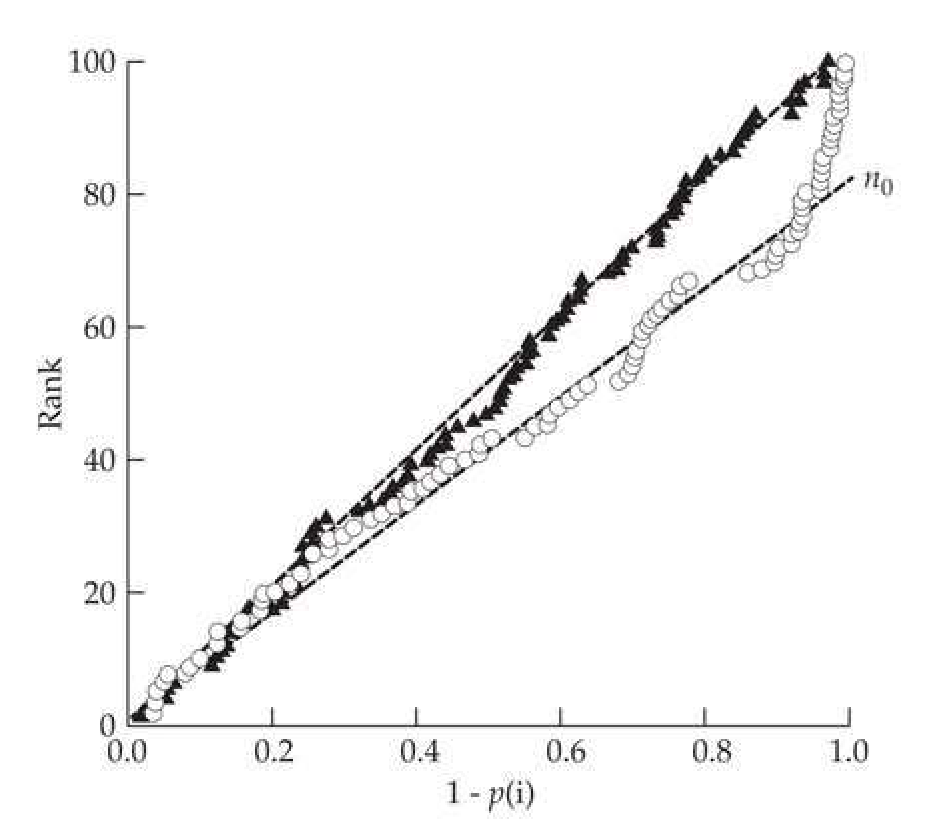
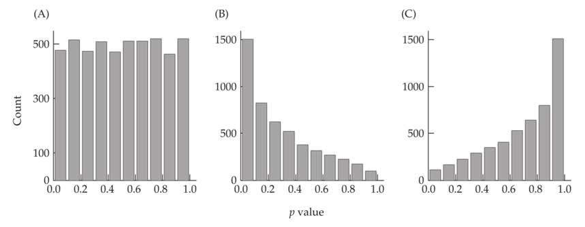
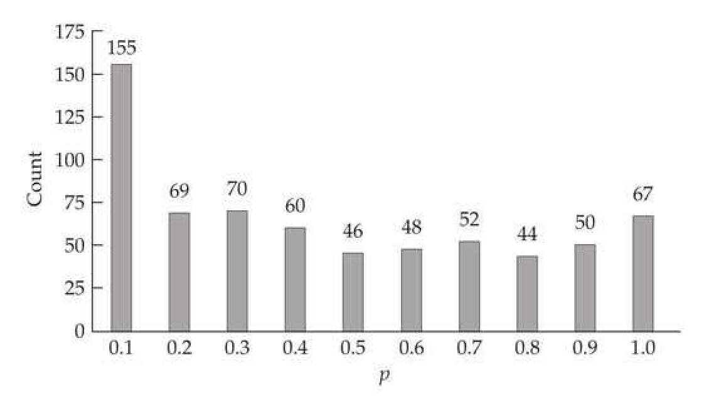
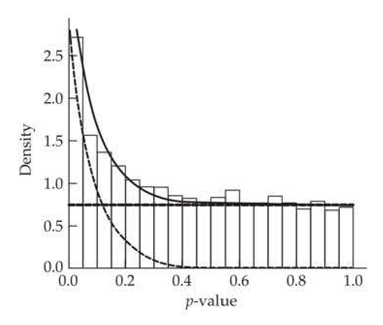
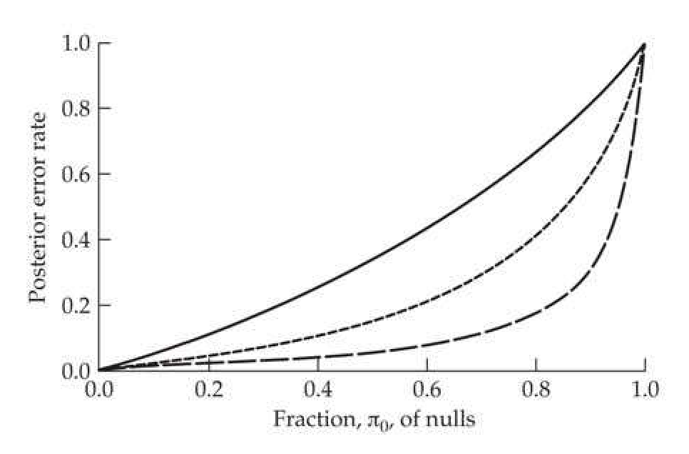
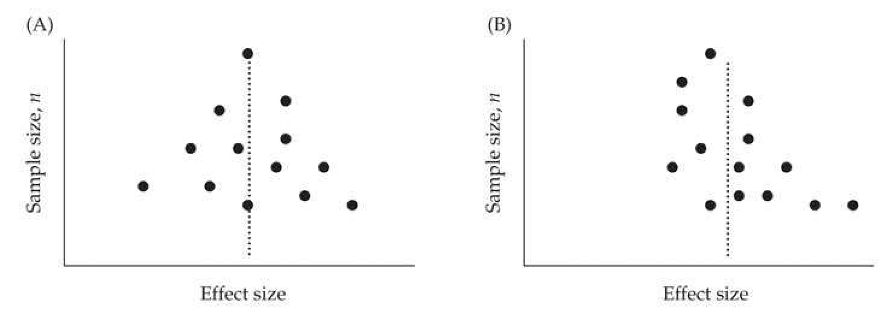
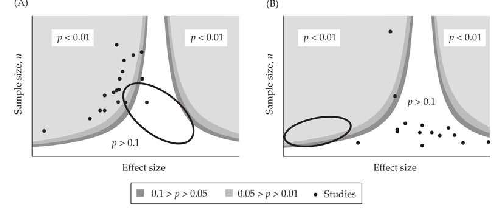
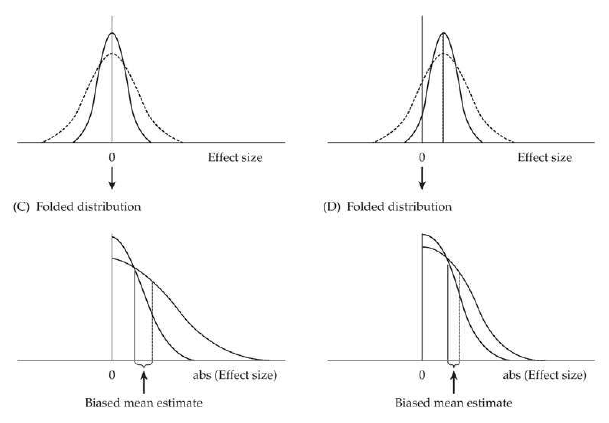

# Appendix 4 · Appendix 4 / Multiple Comparisons: Bonferroni Corrections, False-discovery Rates, and Meta-analysis

## appendix4_001 · Appendix: Introduction

If your experiment needs statistics, you ought to have done a better experiment. Ernest Rutherford

Facts are stubborn things, but statistics are pliable. Mark Twain

Often one is faced with interpreting a list of p values (the probabilities of the observed outcomes under their null hypotheses), either from a set of independent experiments all testing the same hypothesis, or from a single experiment wherein a large number of different hypotheses are tested. Both of these are examples of multiple comparisons. In the former setting, the problem is how to best combine information from multiple, often rather disparate, studies to make more global statements. In the latter setting, our concern is controlling error over the entire collection of tests from a single experiment.

Issues with combining information across studies can be broken into methods for combining p values and more general methods for combining information on effect size. Given that methods for combining p values and issues related to multiple comparisons within a single experiment share some common features, we examine these first. We then turn to a more detailed look at the field of meta-analysis (MA), namely, how to most efficiently combine information on effect sizes over a series of studies.

The statistical analysis of a large dataset typically involves testing, not just a single hypothesis, but rather many hypothesis (often very many). This is especially true in the genomics era, wherein a single high-dimensional experiment may test tens of thousands of hypotheses (such as treatment-dependent expression over all of the genes in a genome). For any particular test, we may assign a preset probability, $ \alpha $, of a Type-I error (i.e., a false positive, declaring a test to be significant, namely, $ p \leq \alpha $, when in fact the null hypothesis is true). Under this broad setting, there are two different strategies for controlling error. First, if we expect that the vast majority of the hypotheses are truly null, we are interested in controlling the experiment-wide error rate, the probability of a false positive over all of the tests (as the vast majority will be nulls). The standard approach in this setting is the classic Bonferroni correction—obtaining an experiment-wide error rate of $ \pi $ over a set of n comparisons by declaring a test to be significant when $ p \leq \alpha = \pi/n $. However, this is usually far too stringent and results in an enormous loss of power.

We review sequential-testing schemes to improve this approach, but often the adjustment for multiple comparisons is best accomplished by a shift in thinking. If we expect some reasonable number of the hypotheses to be false, then trying to avoid any false positives is not appropriate. Instead, controlling the fraction of false positives among the tests that are declared significant (discoveries) is a much better aim. This is especially true in large-scale exploratory experiments whose aim is to discover potential candidates for further study. In this setting, we attempt to control the false-discovery rate (FDR), namely, the fraction of all tests declared to be significant that are false positives, as opposed to the type I-error (false-positive) rate. The goal is to find a value, $ \tau $, such that the set of tests that is declared to be significant using $ p \leq \tau $ has the desired false-discovery rate. As we will show below, the distinction between a false positive and a false discovery is very subtle but critically important. The former is simply the probability that a test under a true null will be declared significant, while the latter further depends on whether the null is indeed correct. If the null is wrong, then the probability of a false discovery is zero, while if the null is correct, then the false discovery rate equals the probability of a false positive.

Our treatment of these topics is organized as follows. First, we examine methods for combining $p$ values over independent tests. We then turn to controlling the overall false-positive rate for a collection of tests from a single experiment through the use of Bonferroni corrections and their extensions. Given that the decision to control false positives versus false discoveries hinges to a large extent on the fraction, $\pi_0$, of the hypotheses that are truly null, we then examine how $\pi_0$ can be estimated from the empirical distribution of the $p$ values for a set of tests. Next, we then discuss approaches for controlling the false-discovery rate (settings where we expect some nontrivial fraction of the hypotheses to depart from the null). Finally, we turn to more formal issues in meta-analysis, developing a mixed-model framework for combining estimates across studies. We also examine metrics and graphical tools for assessing possible sources of bias.

---

## appendix4_002 · Appendix: Introduction / COMBINING p VALUES OVER INDEPENDENT TESTS

Hypotheses of interest are often tested in multiple studies, and an important issue (the statistical field of meta-analysis—the analysis of analyses) is how best to combine the results from a set of such studies into a single global statement. The most obvious approach is simply to pool all of the data and perform a single test, but for a variety of reasons this is often not feasible. For example, different tests of the same hypothesis may involve different methodologies or very different settings. Further, published papers may not report the full dataset, but rather may just present a few summary statistics. In such settings, one straightforward approach is to consider the list of p values for the collection of experiments that all purport to test the same hypothesis and try to obtain a single global p value for this entire set. As in normal hypothesis testing, care must be taken in distinguishing between one- and two-tailed hypotheses. For example, we could get a significant p value for a new treatment over a series of tests because it is significantly worse, and we would draw an incorrect conclusion if we used combined p values for a two-tailed test when a one-tailed test (the treatment results in an improvement) is more appropriate.

This simple question of how best to combine p values from a set of experiments is potentially fraught with peril for several reasons. First, there is the issue of whether the different tests all really test the same hypothesis. The investigator must take care to assure that this is correct before proceeding. Second, there is concern about the so-called file-drawer effect, wherein nonsignificant results remain in the file drawer (i.e., are not published), leading to published results being biased toward smaller p values. One general trend seems to be a publication bias in studies with small sample sizes (where nonsignificant results are often not reported), but a reduction in this bias for larger samples (Easterbrook et al. 1991; Dickersin et al. 1992). The presumptive reason for this sample-size effect in publication bias is that small studies often lack power, so a nonsignificant result does not necessarily provide strong evidence that the null hypothesis is correct. Conversely, due to the higher power of larger studies, authors may feel more comfortable in publishing negative results. We examine several approaches that attempt to quantify the amount of any such publication bias in a meta-analysis at the end of this Appendix.

---

## appendix4_003 · Appendix: Introduction / Fisher's $ \chi^{2} $ Method

**[示例 Example]**

> **Example A4.1** · ref: `A4.1` · source: `appendix4_003.json` · blocks 0–0
>
> Example A4.1. Suppose five different groups collected data to test the same hypothesis, and these groups (perhaps using different methods of analysis) report p values of 0.10, 0.06, 0.15, 0.08, and 0.07. Notice that while none of these individual tests are significant, the trend is clearly that all are “close” to being significant ( $ \bar{p} = 0.09 $). Fisher’s statistic returns a value of $$ X^{2}=-2\sum_{i=1}^{k}\ln(p_{i})=24.3921\qquad with\qquad\Pr(\chi_{10}^{2}\geq24.39)=0.0066 $$ Hence, when taken together, these five tests show a highly significant p value.

Rice (1990b; also see Whitlock 2005) noted that a problem with Fisher's method is that smaller p values are differentially weighted compared to complementary larger p values (e.g., p versus 1 - p). Equation A4.1a can be rearranged to yield $$ X^{2}=-2k\ln(\overline{p}_{G}) $$ where $ \overline{p}_G $ is the geometric mean of the individual $ p $ values, which differentially weights smaller values. Under Fisher’s method, an observed $ p $ value of (say) 0.001 receives more weight than a complementary value of 0.999, which is as extreme (with $ -\ln $ weights of 6.9 vs. 0.001). However, under the Z-score transformation—which is obtained by solving $ \Pr(U > Z) = p $, where $ U \sim \mathrm{N}(0,1) $—the two complementary $ p $ values are of equal magnitude (Z scores of $ -3.09 $ and $ 3.09 $). This motivates the Z-score method, which we now consider.

---

## appendix4_004 · Appendix: Introduction / Stouffer's Z Score

An alternative to Fisher’s approach for combining p values was offered by Stouffer et al. (1949), who transformed the individual p values into Z scores. The sum of k independent unit normals is itself normal, with a mean of zero and a variance of k. These results lead to Stouffer’s Z score method: assign a score of $ Z_i $ for test i by solving $ \Pr(U > Z_i) = p_i $. Let $ Z_s $ denote the sum over the transformed p values of k tests, scaled by $ k^{-1/2} $ to give it a variance of one, with $$ Z_{s}=\frac{\sum_{i=1}^{k}Z_{i}}{\sqrt{k}} $$ Because $ Z_s \sim N(0,1) $, the overall p value is obtained as $$ p=\Pr(U>Z_{s}) $$ As noted by Whitlock (2005), this test was first proposed in a footnote in Stouffer et al.'s sociological study of army life, making it one of the more obscure origins of a statistical method.

**[示例 Example]**

> **Example A4.2** · ref: `A4.2` · source: `appendix4_004.json` · blocks 1–2
>
> Example A4.2. Reconsider the data from Example A4.1. The $ Z_i $ values are easily obtained using $ R $, as the command $ \text{qnorm}(1-\text{p}) $ returns $ Z $ satisfying $ \text{Pr}(U \leq Z) = 1 - p $, or (equivalently) $ \text{Pr}(U > Z) = p $. For example, $ Z_1 $ is calculated by $ \text{qnorm}(1-0.1) $, or 1.281. Similarly computing the other $ Z_{i} $ values yields $$ \sum_{i=1}^{5}Z_{i}=6.754,\qquad hence\qquad Z_{s}=\frac{6.754}{\sqrt{5}}=3.020 $$ Because $ \Pr(U > 3.020) = 0.00126 $, as in Example A4.1, the combined p value is highly significant.

Besides providing symmetric values for large and small $p$ values (i.e., $p$ and $1-p$), a second advantage of the Z-score approach is that one can individually weight $p$ values from different tests (Mosteller and Bush 1954; Liptak 1958), as the weighted sum of unit normals is itself a unit normal (while the weighted sum of $\chi^2$ variables—the analog for Fisher's test—is considerably more complex). The resulting weighted version becomes $$ Z_{w}=\frac{\sum_{i=1}^{k}w_{i}Z_{i}}{\sqrt{\sum_{i=1}^{k}w_{i}^{2}}} $$ where $ Z_w \sim N(0,1) $. As expected, $ Z_w $ (Equation A4.2c) reduces to $ Z_s $ (Equation A4.2a) when all the weights are equal. One can either weight by the degrees of freedom or by the reciprocal of the standard error of the estimate. Whitlock (2005) showed that the weighted Z-score method is superior to either $ X^2 $ or $ Z_s $ when sample size varies over the data. $ Z_w $ has higher power and also a higher correlation between its predicted p value and the actual p value obtained if one was able to merge all the samples. As noted by Whitlock, many studies in evolutionary biology examine whether a hypothesis consistently holds over a collection of species. In such cases, the number of species is the number of replicates, and weighting p values for individual species is inappropriate. As detailed at the end of this Appendix, combining p values is one of the least powerful meta-analysis approaches, as it leaves much of the information from a collection of studies underutilized. A formal meta-analysis requires that studies report standard errors for their estimates. Unfortunately, many studies do not, and simply report p values instead, and in this setting the proceeding methods are the only type of meta-analysis available.

---

## appendix4_005 · Appendix: Introduction / BONFERRONI CORRECTIONS AND THEIR EXTENSIONS

We now turn to the complementary problem of determining the significance level, $ \alpha $, for individual tests required to control the overall false-positive rate over a collection of n tests. The typical setting is that a single study or experiment has gathered data and a number of different tests, usually on different hypotheses, are performed using these data. Let $ \pi $ denote our desired experiment-wide false-positive rate—the probability of one (or more) false positives over the entire collection of n tests being no greater than $ \pi $. The traditional approach for determining the appropriate $ \alpha $, given n and $ \pi $, is to use Bonferroni corrections.

---

## appendix4_006 · BONFERRONI CORRECTIONS AND THEIR EXTENSIONS / Standard Bonferroni Corrections

The probability of not making any Type-I errors (false positives) over n independent tests, each at level $ \alpha $, is $ (1 - \alpha)^n $. Hence, the probability, $ \pi $, of having at least one false positive over the entire collection is simply one minus this or $$ \pi=1-\left(1-\alpha\right)^{n} $$

If we solve for the $ \alpha $ value required for each test, $$ \alpha=1-(1-\pi)^{1/n} $$

This is often called the Dunn-Šidák method. If we note that $ (1 - \alpha)^n \simeq 1 - n\alpha $, we obtain the Bonferroni method by taking $$ \alpha=\pi/n $$

Both Equations A4.3b and A4.4 are referred to as Bonferroni corrections. In the literature, $ \pi $ is the family-wide error rate (FWER), while $ \alpha $ is the comparison-wise error rate (CWER), also referred to as the point-wise significance level (PWSL).

**[示例 Example]**

> **Example A4.3** · ref: `A4.3` · source: `appendix4_006.json` · blocks 4–5
>
> Example A4.3. Suppose we have $n = 100$ independent tests and wish to obtain an overall $\pi$ value of 0.05. What value of $\alpha$ should be used for each individual test to achieve an experiment-wide false-positive rate of 0.05? The Dunn-Sidak correction suggests $$ \alpha=1-(1-0.05)^{1/100}=0.000512 $$ $$ \alpha=0.05/100=0.0005 $$ while the Bonferroni correction is
> 
> Note that using such small $ \alpha $ values greatly reduces the power for any single test. For example, under a normal distribution, the 95% (two-sided) confidence interval(CI) for the true mean is $ \overline{x} \pm 1.96\sqrt{\text{Var}} $, where $ \text{Var} $ denotes the variance of the sample mean. Moving to an $ \alpha $ value of 0.0005 gives the associated CI as $ \overline{x} \pm 3.48\sqrt{\text{Var}} $, as $ \text{Pr}(|z| \geq 3.48) = 0.0005 $ for $ z \sim N(0,1) $.

---

## appendix4_007 · BONFERRONI CORRECTIONS AND THEIR EXTENSIONS / Sequential Bonferroni Corrections

Under a strict Bonferroni correction, only those tests whose associated $p$ values are $\leq \pi/n$ are rejected (declared significant); all others are accepted (or more formally, fail to be rejected). This results in a considerable reduction in power if two or more of the hypotheses are actually false. When we reject a hypothesis, one fewer test remains, and the multiple comparison correction should reflect this, resulting in sequential Bonferroni corrections. Sequential approaches have increased power compared to standard Bonferroni corrections, as illustrated below in Example A4.4. Shaffer (1995) reviewed these and other approaches. The basic structure is that one has a collection of multiple tests, with $H(i)$ denoting the null hypothesis for test $i$—for example, the test that marker $i$ has a nonzero effect, in which case $H(i)$ is the null hypothesis of no effect. In this case, rejecting $H(i)$ suggests evidence for a nonzero effect for marker $i$.

---

## appendix4_008 · BONFERRONI CORRECTIONS AND THEIR EXTENSIONS / Holm's Method

The simplest of these sequential adjustments is Holm's method (Holm 1979). The first step is to order the $p$ values for the $n$ hypotheses being tested from smallest to largest, $p(1) \leq p(2) \leq \cdots \leq p(n)$, and let $H(i)$ be the hypothesis associated with $p(i)$. One proceeds with Holm's method as follows: (i) If $ p(1) > \pi/n $, accept all $ n $ null hypotheses (i.e., none are declared significant).

(ii) If $ p(1) \leq \pi/n $, reject $ H(1) $ [i.e., $ H(1) $ is declared significant], and consider $ H(2) $.

(iii) If $ p(2) > \pi/(n - 1) $, accept $ H(i) $ (for $ i \geq 2 $).

(iv) If $ p(2) \leq \pi/(n-1) $, reject $ H(2) $ and move onto $ H(3) $.

(v) Proceed with rejecting hypotheses until reaching the first i such that $ p(i) > \pi/(n - i + 1) $.

We can also apply Holm’s method using Equation A4.3a—namely, $ \alpha = 1 - (1 - \pi)^{1/n} $, the Dunn-Šidák correction—in place of $ \alpha = \pi/n $.

---

## appendix4_009 · BONFERRONI CORRECTIONS AND THEIR EXTENSIONS / Simes-Hochberg Method

With Holm's method, we stop once we fail to reject a hypothesis. An improvement on this approach is the Simes-Hochberg correction (Simes 1986; Hochberg 1988), which effectively starts backward, working with the largest p values first.

(i) If $ p(n) \leq \pi $, then all hypothesis are rejected.

(ii) If not, $ H(n) $ cannot be rejected, and we next examine $ H(n-1) $.

(iii) If $ p(n-1) \leq \pi/2 $, then all $ H(i) $ for $ i \leq n-1 $ are rejected.

(iv) If not, $ H(n-1) $ cannot be rejected, and we compare $ p(n-2) $ with $ \pi/3 $.

(v) In general, if $ p(n - i) \leq \pi/(n - i + 1) $, then all $ H(i) $ for $ i \leq n - i $ are rejected.

While the Simes-Hochberg approach is more powerful than that of Holm's (see Example A4.4), it is only strictly applicable when the group of tests being jointly considered are independent, whereas Holm's approach does not have this restriction. Hence, the general strategy is to use Holm's method if one is concerned about potential dependencies between tests, and the Simes-Hochberg's method if the tests are independent.

---

## appendix4_010 · BONFERRONI CORRECTIONS AND THEIR EXTENSIONS / Hommel's Method

Hommel's method (1988) is slightly more complicated, but it is more powerful than the Simes-Hochberg correction (Hommel 1989). Under

**[示例 Example]**

> **Example A4.4** · ref: `A4.4` · source: `appendix4_010.json` · blocks 1–1
>
> Example A4.4. Suppose for n = 10 tests, the (ordered) p values are as follows:
> 
> > **Inline Table 1** · `inline_1` · page 6 · source: `appendix4_010`
> > Inline Table 1
> >
> > i | 1 | 2 | 3 | 4 | 5 | 6 | 7 | 8 | 9 | 10
> > --- | --- | --- | --- | --- | --- | --- | --- | --- | --- | ---
> > p(i) | 0.0020 | 0.0045 | 0.0060 | 0.0080 | 0.0085 | 0.0090 | 0.0175 | 0.0250 | 0.1055 | 0.5350
> > $ \frac{\pi}{n-i+1} $ | 0.0050 | 0.0056 | 0.0063 | 0.0071 | 0.0083 | 0.0100 | 0.0125 | 0.0167 | 0.0250 | 0.0500
> 
> 
> For an experiment-wide level of significance of $ \pi = 0.05 $, the Bonferroni correction is $ \alpha = 0.05 / 10 = 0.005 $. Hence, using a strict Bonferroni, we reject hypotheses 1 and 2, and we fail to reject (i.e., we accept) 3 through 10. To apply sequential methods, we use the associated $ \pi/(n-i+1) $ values for $ \pi = 0.05 $, which are given above in the table. Under Holm's method, $ p(i) \leq \pi/(n-i+1) $ for $ i \leq 3 $, and hence we reject $ H(1) $ through $ H(3) $ and accept the others. Under Simes-Hochberg, we fail to reject $ H(7) $ through $ H(10) $ [as $ p(i) > \pi/(n-i+1) $], but because $ p(6) = 0.009 \leq \pi/(n-i+1) = 0.010 $, we reject $ H(6) $ through $ H(1) $. To apply Hommel's method, we reject all hypotheses whose $p$ values are less than or equal to $\pi/k^{*}$, where $$ k^{*}=\max_{i}\left(p(n-i+j)>\pi\frac{j}{i}\right)\quad for all j=1,\cdots,i $$ Solving $k^{*}$ requires an iterative approach, as follows. First, start with $i = 1$. Here, $(i = 1, j = 1)$, $p(10) = 0.5350 > \pi \cdot (1/1) = 0.05$. Now let us try $i = 2$, which yields (for $j = 1, 2)$, $p(9) = 0.1055 > \pi(1/2) = 0.025$ and (as above) $p(10) > \pi$. Hommel's condition still holds for $i = 3$, as $p(8) = 0.025 > \pi \cdot (1/3) = 0.0167$, $p(9) > \pi \cdot (2/3) = 0.033$, and $p(10) > \pi$. However, it fails for $i = 4$, as while it holds for $p(7) = 0.175 > \pi \cdot (1/4) = 0.0125$, it fails for $(i = 4, j = 2)$ because $p(8) = 0.025 = \pi \cdot (1/2)$. Hence, $k^{*} = 3$ (because Hommel's condition holds for $k = 3$ but not for $k = 4$), and we reject all hypotheses whose $p$ values are $ \leq 0.05/3 = 0.0167 $, which means $ H(1) $ through $ H(6) $. Note that a strict Bonferroni rejected the fewest null hypotheses and Simes-Hochberg and Hommel's rejected the most null hypotheses (i.e., declared them to be significant), and all methods controlled the experiment-wide false-positive rate at 0.05.

Example A4.4 shows how all three of these methods are applied.

For an experiment-wide level of significance of $ \pi = 0.05 $, the Bonferroni correction is $ \alpha = 0.05 / 10 = 0.005 $. Hence, using a strict Bonferroni, we reject hypotheses 1 and 2, and we fail to reject (i.e., we accept) 3 through 10. To apply sequential methods, we use the associated $ \pi/(n-i+1) $ values for $ \pi = 0.05 $, which are given above in the table. Under Holm's method, $ p(i) \leq \pi/(n-i+1) $ for $ i \leq 3 $, and hence we reject $ H(1) $ through $ H(3) $ and accept the others. Under Simes-Hochberg, we fail to reject $ H(7) $ through $ H(10) $ [as $ p(i) > \pi/(n-i+1) $], but because $ p(6) = 0.009 \leq \pi/(n-i+1) = 0.010 $, we reject $ H(6) $ through $ H(1) $.

To apply Hommel's method, we reject all hypotheses whose $p$ values are less than or equal to $\pi/k^{*}$, where $$ k^{*}=\max_{i}\left(p(n-i+j)>\pi\frac{j}{i}\right)\quad for all j=1,\cdots,i $$

Solving $k^{*}$ requires an iterative approach, as follows. First, start with $i = 1$. Here, $(i = 1, j = 1)$, $p(10) = 0.5350 > \pi \cdot (1/1) = 0.05$. Now let us try $i = 2$, which yields (for $j = 1, 2)$, $p(9) = 0.1055 > \pi(1/2) = 0.025$ and (as above) $p(10) > \pi$. Hommel's condition still holds for $i = 3$, as $p(8) = 0.025 > \pi \cdot (1/3) = 0.0167$, $p(9) > \pi \cdot (2/3) = 0.033$, and $p(10) > \pi$. However, it fails for $i = 4$, as while it holds for $p(7) = 0.175 > \pi \cdot (1/4) = 0.0125$, it fails for $(i = 4, j = 2)$ because $p(8) = 0.025 = \pi \cdot (1/2)$. Hence, $k^{*} = 3$ (because Hommel's condition holds for $k = 3$ but not for $k = 4$), and we reject all hypotheses whose $p$ values are

$ \leq 0.05/3 = 0.0167 $, which means $ H(1) $ through $ H(6) $. Note that a strict Bonferroni rejected the fewest null hypotheses and Simes-Hochberg and Hommel's rejected the most null hypotheses (i.e., declared them to be significant), and all methods controlled the experiment-wide false-positive rate at 0.05.

---

## appendix4_011 · BONFERRONI CORRECTIONS AND THEIR EXTENSIONS / Cheverud's Method and Other Approach for Dealing with Dependence

When different tests share correlated data, it introduces dependency between the $p$ values for these tests. How do we account for this? One approach (Cheverud 2001; Li and Ji 2005; Nyholt 2005) is to use the nature of the dependency structure of the data to estimate an effective number of independent tests, $n_{e}$. This value is then substituted for $n$ in the above methods; e.g., Equation A4.3b becomes $\alpha = 1 - (1 - \pi)^{1/n_{e}}$. A classic application of this approach is correcting for correlations among tests of marker-trait associations over a set of linked markers in either a QTL mapping experiment or a GWAS (LW Chapters 15 and 16).

To proceed, we need to introduce a few facts about the eigenstructure of a correlation matrix, C, whose eigenvalues are denoted (from largest to smallest) by $ \lambda_1, \cdots, \lambda_n $. First, because C is a positive-semidefinite matrix, all $ \lambda_i \geq 0 $ (Appendix 5). Second, C is an $ n \times n $ matrix with ones on its diagonal, which makes its trace (the sum of its diagonal elements; Appendix 5) equal to a value of n. The importance of this result is that the trace of a matrix equals the sum of its eigenvalues (Equation A5.8), which demonstrates that the average eigenvalue of C is $$ n^{-1}\sum_{i=1}^{n}\lambda_{i}=n^{-1}n=1 $$

When all of the underlying variables that generate C are uncorrelated, then $ \lambda_1 = \cdots = \lambda_n = 1 $, while when all of the observations are completely correlated, then $ \lambda_1 = n $ and $ \lambda_2 = \cdots = \lambda_n = 0 $. These two cases represent the extremes of $ n $ independent tests (the former) and one independent test (the latter). As with principal components (Appendix 5), the spread of the eigenvalues tells us about dependency. One metric of this is the variance in the eigenvalues, $ \sigma^2(\lambda) $. If all of the eigenvalues are equal, then $ \sigma^2(\lambda) = 0 $, while if one eigenvalue is nonzero, then $ \sigma^2(\lambda) = n $.

Motivated by the above eigenstructure observations, Cheverud's method (2001) computes the effective number of independent tests as $$ n_{e,Cheverud}=n\left(1-\frac{(n-1)\sigma^{2}(\lambda)}{n^{2}}\right),\qquad\mathrm{where}\qquad\sigma^{2}(\lambda)=\frac{1}{n-1}\sum_{i=1}^{n}(\lambda_{i}-1)^{2} $$

This returns $ n_e = n $ when $ \sigma^2(\lambda) = 0 $ and $ n_e = 1 $ when $ \sigma^2(\lambda) = n $, which matches the expected results from the eigenvalue analysis for these extreme cases.

Li and Ji (2005) noted that Cheverud's method often returns an overly large value of $ n_e $ (and therefore, less power), especially when used with a large number of moderately correlated tests. While Cheverud's approach considered the two extreme cases (n vs. 1 independent test), Li and Ji noted that a set of c identical tests will result in an eigenvalue of c > 1, while tests that are only partially correlated with others will generate eigenvalues values < 1. Hence, they partitioned an eigenvalue into two parts, its integer value and the remainder, where the integer part implies identical tests (and hence is counted as contributing one independent test), while the remainder represents partial correlations. Hence, if an eigensequence is 4.1, 3.5, 1, 0.5, 0.1,..., then the first three eigenvalues correspond to independent tests, and with the total of their non-integer residuals (0.1 + 0.5 + 0.5 + 0.1 = 1.2) adding one additional test, giving (for this part of the sequence) an effective number of four independent tests. Formally, the Li-Ji method is coded as $$ n_{e,Li-Ji}=\sum_{i=1}^{N}I(\lambda_{i}\geq1)+\sum_{i=1}^{N}(\lambda_{i}-\mathrm{floor}[\lambda_{i}]) $$ where the indicator function $ I(x \geq 1) $ returns a value of one when $ x \geq 1 $, and otherwise returns a value of zero. Hence, the first sum in Equation A4.5b is the number of eigenvalues of C that are $ \geq 1 $. The floor[x] function in the second term corresponds to the largest integer $ \leq x $, so the second sum is all of the remainder terms (the effects of partial correlations among tests). Additional corrections for dealing with correlated tests have been proposed (e.g., Owen 2005; Efron 2007; Leek and Storey 2007, 2008; Li et al. 2012).

---

## appendix4_012 · Appendix: Introduction / DETECTING AN EXCESS NUMBER OF SIGNIFICANT TESTS

While Bonferroni corrections (and their sequential counterparts) are widely used, when the number of tests is modest to large, their application significantly erodes power, leading to very high Type-II errors (failing to declare a test significant when the null is false). This tradeoff of Type-I versus Type-II errors applies to most statistical tests (LW Appendix 5), and the error of more concern to the investigator determines how to proceed. In many cases, our initial experiment is simply an enrichment method: we wish to take a large number of possible hypotheses and extract a subset showing the most support for their alternative hypotheses for further consideration. In such cases, we are often more concerned with Type-II errors, as the cost of rejecting a hypotheses that is truly null (i.e., improperly including it as significant; i.e., Type-I error) may be less than the cost of excluding a hypotheses from the alternative (failure to reject; i.e., a Type II error). In such settings, we would like to calculate the number of hypotheses ($n_0$; or equivalently, the fraction $\pi_0 = n_0/n$) of true nulls among the $n$ tested hypotheses. The first step toward doing so is to ask if the observed number of significant tests is excessive under the global null hypotheses (all hypotheses are truly nulls).

---

## appendix4_013 · DETECTING AN EXCESS NUMBER OF SIGNIFICANT TESTS / How Many False Positives?

Suppose we perform n independent tests, each with a Type-I error rate of $ \alpha $. If all hypotheses are truly null, the number, j, of false positives follows a binomial distribution, with a “success” probability (a false positive) of $ \alpha $, and n trials (the number of tests), yielding $$ \Pr(j\mathsf{f a l s e p o s i t i v e s})=\frac{n!}{(n-j)!j!}(1-\alpha)^{n-j}\alpha^{j} $$

For n large and $ \alpha $ small, this is closely approximated by the Poisson distribution, with Poisson parameter $ n\alpha $ (the expected number of false positives), yielding $$ \Pr(j\mathsf{f a l s e p o s i t i v e s})\simeq\frac{(n\alpha)^{j}e^{-n\alpha}}{j!} $$

**[示例 Example]**

> **Example A4.5** · ref: `A4.5` · source: `appendix4_013.json` · blocks 2–5
>
> Example A4.5. Suppose 250 independent tests are performed, each with $ \alpha = 0.025 $ (a 2.5% chance of declaring a result from the null hypothesis to be significant), and 15 tests are declared significant by this criteria. Is this number greater than expected by chance? The expected number of significant tests under the global null hypothesis is $ n\alpha = 250 \cdot 0.025 = 6.25 $. From Equation A4.5, the probability of observing 15 (or more) significant tests is $$ \sum_{j=15}^{250}\Pr(j\ false\ positives)=\sum_{j=15}^{250}\frac{250!}{(250-j)!j!}(1-0.025)^{250-j}0.025^{j} $$ We could either sum this series directly or use the cumulative distribution function for a binomial. In R, the probability that a binomial with parameters n and p has a value of i or less is obtained by using the command pbinom(i,n,p). The probability of 15 or greater is one minus the probability of 14 or less, or 1 - pbinom(14,250,0.025), for which R returns 0.0018. A similar calculation can use the Poisson approximation (Equation A4.7), with 1 ppois (14, 6.25) returning a value of 0.0021. Given that there is only a 0.2% chance of seeing this many significant tests under the global null, we expect that some of these significant tests are true discoveries (those whose associated null hypothesis is incorrect), not false positives. The critical question, of course, is which ones?

---

## appendix4_014 · DETECTING AN EXCESS NUMBER OF SIGNIFICANT TESTS / Schweder-Spjøtvoll plots

A simple graphical approach using the empirical distribution of $p$ values was suggested by Schweder and Spjøtvoll (1982). If one rank-orders the $p$ values from the smallest $p(1)$ to the largest $p(n)$, a plot of $p(i)$ versus $i$ is a straight line under a uniform. Because our interest is usually in detecting an excessive number of small $p$ values (as would be expected if $n_0 < n$), Schweder and Spjøtvoll suggest plotting $1 - p(i)$ values on the horizontal axis, and the ranks of these values (which are the reverse of the ranks of the $p[i]$) on the vertical axis. For example, the first point is $(1 - p[n], 1)$, the second $(1 - p[n-1], 2)$, $\cdots$, and the $n$th $(1 - p[1], n)$. If all of the $p$ values are indeed generated from null hypotheses, then these are drawn from a uniform, and the resulting plot will be a straight line (the solid triangles in Figure A4.1). Conversely, if some of the $p$ values are drawn from hypotheses where the null is false, we expect an excess of small $p$ values, and hence an over-abundance of $1 - p$ values near one (the open circles in Figure A4.1).

In addition to providing a quick visual check as to whether the $p$ values follow a uniform, Schweder and Spjøtvoll suggest that these plots can also estimate $n_{0}$. One fits the best straight line until the upturn (i.e., inflection point) near one appears, extrapolating this line to obtain the $n$ value for $1 - p = 1$ estimates the number of true null hypotheses, $n_{0}$. As shown in Figure A4.1, this gives a value very close to 80 (for the open circles), the correct number of true nulls used to generate this figure.

---

## appendix4_015 · DETECTING AN EXCESS NUMBER OF SIGNIFICANT TESTS / Estimating $ n_{0} $: Subsampling From a Uniform Distribution

As suggested by the Schweder-Spötvoll plot, the distribution of $p$ values offers insight into the number of truly null hypotheses, $n_{0}$. While this plot offers either a simple visual, or a more formal regression-based, estimator of $n_{0}$, it tends to overestimate the number of nulls. Further, it can be difficult to specify exactly where the upturn in the plotted values begins. A number of other estimators have been suggested, again based on a uniform distribution of $p$ values for those tests under the null. Recall that the histogram from a sufficiently large number of draws from a uniform distribution is flat, as all values are equally likely (Figure A4.2). However, if the null is false for at least some of the tests, then the distribution of $p$ values is shifted away from uniform, and usually with a skew toward smaller values (Figure A4.2), but potentially also skewed toward one (for example, if one-tailed tests are used when a two-tailed test is appropriate; Figure A4.2).

**[Figure]**

> **Figure A4.1** · page 10 · source: `appendix4`
>
> 
>
> Figure A4.1 A Schweder-Spjøtvoll plot is one approach for detecting departures from a uniform distribution of p values. The p values are ordered from smallest, p(1), to largest, p(n), and one plot the rank of 1 - p(i) versus its value. These ranks are reversed from the ranks of p(i), as the rank of 1 - p(n), being the smallest value, is 1. Under a uniform, the result is a straight line passing through the origin and the point (1, n). The upper curve (solid triangles), generated by randomly sampling n = 100 values from a uniform (0,1), fits this pattern. The lower curve (open circles), generated by simulating p values for 80 true nulls and 20 tests where the alternative was correct, shows an inflation of p values near zero (1 - p values near one). This results in a strong departure from linearity near one. Ignoring this upturn and extrapolating the linear fit for the values below this inflection point gives an approximate value of 80 for the value of this projected line when 1 - p = 1. This is the estimate of  $ n_0 $.

If the collection of tests contains some alternative hypotheses mixed in with true nulls, we expect the distribution to be a mixture, with fraction, $ \pi_0 = n_0/n $, consisting of draws from a uniform and the remaining fraction, $ (1 - n_0/n) $, from some other distribution. Figure A4.3 plots the empirical distribution of $ p $ values from a study by Mosig et al. (2001) on marker-trait associations. While the middle of the distribution appears to be consistent with random sampling around a flat average, there is a large excess of values near zero.

One simple approach for estimating $ n_{0} $ is to use the average height for the middle range of the p-value histogram. Presumably, these p values are almost entirely drawn from null hypotheses, though this may not be the case for values near zero (and potentially one). Recall that the probability density function for a uniform over $ (0,1) $ has a very simple form $$ \phi_{u}(p)=1\quad for\quad0\leq p\leq1 $$

If there are $ n_0 $ truly null tests, then the expected number of $ p $ values from these tests that fall within an interval $ 0 \leq a < b \leq 1 $ is simply $$ \begin{align*}n_0\int_a^b\phi_u(p)dp=n_0\int_a^b1\cdot dp=n_0(b-a)\end{align*} $$

Hence $$ \widehat{n}_{0}(a,b)=\frac{Number of p(i)values in(a,b)}{b-a} $$

Likewise, an estimate for the fraction $ \pi_{0}=n_{0}/n $ of true nulls is $$ \begin{aligned}\widehat{\pi}_{0}(a,b)&=\frac{Number of p(i)values in(a,b)}{n(b-a)}\\&=\frac{Fraction of p(i)values in(a,b)}{b-a}\end{aligned} $$

**[示例 Example]**

> **Example A4.6** · ref: `A4.6` · source: `appendix4_015.json` · blocks 6–9
>
> Example A4.6. According to the data in Figure A4.3, what is $ n_0 $? Consider the bins centered around $ p = 0.5 $. Based on the central three bins (0.4, 0.5, and 0.6), a total of $ 60 + 46 + 48 = 154 $ tests have $ p $ values in this interval. From Equation A4.8b, $ 154 = n_0 \cdot 0.3 \cdot r_0 = 154/0.3 = 513 $, and hence a fraction, $ \pi_0 = n_0/n = 513/644 = 0.80 $, of the tests are true nulls. Using the bins from 0.3 to 0.8 yields $ n_0 = 322/0.6 = 537 $, or $ \pi_0 = 537/644 = 0.83 $. Hence, it appears that around 80% of the tests are consistent with true nulls. Mosig et al. (2001; also see Nettleton et al. 2006) used an iterative approach (also based on bin counts in the $ p $-value histogram) and arrived at an estimate of $ n_0 = 500 $ (78%).

**[Figure]**

> **Figure A4.2** · page 11 · source: `appendix4`
>
> 
>
> Figure A4.2 Simulated distribution of $p$ values based on 5000 tests for samples of 25 draws from a normal distribution with a mean of $\mu$ and a variance of one. The null hypothesis is $H_0 : \mu \leq 0$. A: The distribution of $p$ values when $\mu = 0$ (the null is correct) is uniform. B: The distribution when $\mu = 0.2$ is skewed toward an excess of values near zero. C: The distribution when $\mu = -0.2$ is skewed toward an excess of values near one.

**[Figure]**

> **Figure A4.3** · page 11 · source: `appendix4`
>
> 
>
> Figure A4.3 An empirical distribution of p values (for n = 644 tests) from Mosig et al. (2001). The number of p values in each of ten bins (of width 0.1) are given above the bars. Note the large excess of values near zero.

Storey and Tibshirani (2003) considered the number of $p$ values exceeding some tunable parameter value, $\lambda$ (taking $a = \lambda$ and $b = 1$ in Equation A4.8b), on the logic that for larger values of $\lambda$, most of these draws are from the uniform corresponding to draws from the null. Let $\widehat{\pi}_0(\lambda)$ denote the estimated fraction of truly null hypotheses based on using a tuning value of $ \lambda $, then $$ \widehat{\pi}_{0}(\lambda)=\frac{Number of p(i)values>\lambda}{n(1-\lambda)} $$ and $$ \widehat{n}_{0}(\lambda)=n\cdot\widehat{\pi}_{0}(\lambda)=\frac{Number of p(i)values>\lambda}{1-\lambda} $$

By focusing on the interval $(\lambda, 1)$, the Storey-Tibshirani estimator is potentially biased when there are an excess of $p$ values near one. This can happen for a variety of reasons, such as inappropriate assumptions for the test statistic (e.g., the use of one-sided tests when two-sided tests are more appropriate). Both Equation A4.8c and the Storey-Tibshirani estimator (Equation A4.9b) rely on tuning parameters $(a, b$, and $\lambda$, respectively) which define the region of the distribution of $p$ values assumed to be drawn from a uniform (i.e., almost all $p$ values in this interval are assumed to be generated under the null). Nettleton et al. (2006) reviewed these and other approaches for estimating $n_{0}$ from sampling parts of a presumed uniform and elaborated on their strengths and weaknesses.

One significant concern is that correlated tests can result in either an under- or over-dispersion of p values under the global null hypothesis, resulting in significant departure from a uniform distribution (Efron 2007; Hu et al. 2011; Leek and Storey 2011). This in turn compromises estimates of $ n_{0} $.

---

## appendix4_016 · DETECTING AN EXCESS NUMBER OF SIGNIFICANT TESTS / Estimating $ n_{0} $: Mixture Models

Allison et al. (2002) suggested that $ \pi_0 $ can be estimated by treating the distribution of $ p $ values as a mixture, a fraction $ \pi_0 $ of which comes from a uniform (and hence a uniform distribution function, $ \phi_u $), while the remainder $ (1 - \pi_0) $ are from the distribution, $ \phi_A(p) $, of $ p $ values when the alternative hypothesis is true (Figure A4.4). While the general form of $ \phi_A(p) $ is unknown, a very flexible distribution to model it is by using the beta distribution (Appendix 2; Figure A2.3) $$ \phi_{A}(p)=\frac{\Gamma(a+b)}{\Gamma(a)\Gamma(b)}p^{a-1}(1-p)^{b-1} $$

Under the alternative hypothesis, we expect an increase in p values near zero, which occurs when a < 1. Likewise, the beta distribution can easily accommodate an increase in p values near one (b < 1). When a = b = 1, this simply reduces to a uniform.

Allison et al. (2002) suggested fitting the actual shape by using the data to obtain ML estimates of a and b, as well as our desired parameter, the fraction of true nulls, $ \pi_{0} $. The resulting likelihood function for a single p value becomes $$ \ell(p)=(1-\pi_{0})\phi_{A}(p)+\pi_{0}\phi_{u}(p)=(1-\pi_{0})\frac{\Gamma(a+b)}{\Gamma(a)\Gamma(b)}p^{a-1}(1-p)^{b-1}+\pi_{0} $$ with the resulting total likelihood over the n sampled p values (from independent tests) calculated by $$ \ell(\mathbf{p})=\prod_{i=1}^{n}\ell(p_{i}) $$

Standard ML methods (LW Appendix 2) are used to solve for a, b, and $ \pi_{0} $.

**[Figure]**

> **Figure A4.4** · page 13 · source: `appendix4`
>
> 
>
> Figure A4.4 The empirical distribution of $p$ values can be treated as a mixture model of a uniform plus a beta distribution (whose shape parameters, $a$ and $b$, can be estimated via ML), see Equation A4.10b. In this hypothetical example, a weighted mixture of a uniform (horizontal dashed line) and a beta with ($a < 1$, $b = 1$; dashed curve), yields the mixture distribution (solid curve) that fits the empirical distribution of the $p$ values.

While hypothesis testing under a maximum likelihood framework is typically performed using the likelihood ratio (LR) test (LW Appendix 2), this is not appropriate for tests of the number of components in a mixture, as the LR does not approach a limiting $ \chi^{2} $ distribution, because $ \pi_{0} $ is being tested against a boundary value, in this case a value of one (McLachlan 1987). While a modified LR test for mixtures can be constructed that behaves better (Chen et al. 2001), Allison et al. used a bootstrap approach (McLachlan 1987; Schork 1992). Here, one first uses the original distribution of p values to compute an LR test statistic for the null of a uniform versus the alternative of a mixture. One then generates parametric bootstrap samples by drawing $n$ values of $p$ from the null distribution (here a uniform) and then using this simulated dataset to compute an LR test statistic for a mixture. This is done several thousand times to generate an approximate distribution of the LR statistic under the null, which is used to assess significance. For example, if only 0.25% of the bootstrap LR values are equal to (or exceed) the LR value for the original data, the significance is approximately 0.25%. Likewise, approximate standard errors for $\pi_0$ can be generated using a conventional bootstrap approach. One sample the original $p$ values with replacement to generate a bootstrap sample of size $n$. This is then used to estimate $\pi_0$ (and the other parameters) under a standard ML framework. Several thousand bootstrap samples are generated, and the variation across estimates of $\pi_0$ (or any other parameter) over these samples provides an approximate estimate of the sampling variance for $\widehat{\pi}_0$.

Finally, while a beta (or weighted sum of betas) can be used as the functional form for $ \phi_{A} $, another approach is to use a nonparametric estimator for this unknown density function. This can be done using a kernel density estimator, whereby the form of an unknown density is estimated by using the observed number of counts within a series of bins spanning the distribution in conjunction with an appropriate smoothing function. This approach was used by Robin et al. (2007) and Guedj et al. (2009).

---

## appendix4_017 · Appendix: Introduction / FDR: THE FALSE-DISCOVERY RATE

As mentioned, Bonferroni corrections (and their extensions) are appropriate when we expect that only a very few of the many null hypotheses are false. An alternate setting is that in which some substantial fraction of the null hypotheses is expected to be false. In such cases, even sequential Bonferroni corrections are likely to be too stringent, resulting in too many false negatives (Type-II errors; i.e., a failure to reject a false hypothesis). A different approach is required in these settings, most notably the false-discovery rate (FDR), introduced by Benjamini and Hochberg (1995).

The FDR is the fraction of false positives among all the tests that are declared to be significant. The motivation for using the FDR is that we may be conducting a very large number of tests, with those that are declared to be significant being subjected to further study. An example would be a search for differential expression over a huge set of genes. The goal of the initial analysis is to distill a large number of candidates down to a reduced set (for further analysis) that is highly enriched for true positives.

In such cases, we are more concerned with making sure all possible true alternatives are included in this reduced set, and we are willing to accept some false positives to ac- complish this goal. However, we also don't want to be completely swamped with false positives. The goal is a statistical procedure that results in a significant enrichment of true positives (differentially expressed genes in our example), while controlling the fraction of false positives within this enriched set by specifying a value, $ \delta $, for the FDR. Choosing an FDR of 5% means that (on average) 5% of the genes that we declare to be significant are actually false positives. The flip side is that 95% of those genes (tests) that are declared to be significant do indeed have differential expression. Hence, screening genes with an FDR of 5% results in a significant enrichment of genes that are truly differentially expressed.

To formally motivate the concept of the FDR, suppose a total of $n$ hypotheses are tested, $S$ of which are judged significant (i.e., the $p$ value for the test is $\leq$ some threshold value, $\tau$). If we had complete knowledge, we would know that $n_{0}$ of the hypotheses have the null true and $n_{1}=n-n_{0}$ have the alternative true, and we might find that $F$ of the true nulls were called significant, while $T$ of the alternative true were called significant, yielding the following table

For this experiment, the false-discovery rate is the fraction of tests called significant that are actually true nulls, $ FDR = F/S $. (The term $ \text{discovery} $ follows in that a significant result can be considered as a discovery for future work.) As a point of contrast, the normal Type-I error (which we can also call the $ \text{false-positive rate [FPR]} $), which is the fraction of true nulls that are called significant, is $ F/n_0 $. Note the critical distinction between these two error rates. While the numerator of each is $ F $, the denominators are considerably different—the total number, $ S $, of tests called significant (for FDR), versus the number, $ n_0 $, of hypotheses that are truly null (FPR). As the threshold value ($ \tau $) for significance is changed, so too is the fraction $ F/S $. To obtain a FDR of $ \delta $ over our experiment, $ \tau $ is adjusted to find its largest value such that some expectation of $ F/S $ is bounded above by $ \delta $. Finally, Gadbury et al. (2004) defined the expected discovery rate (EDR) as $ T/n_1 $ (the fraction of all true discoveries declared to be significant), which is the analog of statistical power in this setting.

Another way to see the distinction between the false-positive rate and the false-discovery rate is to consider them as probability statements for a single test involving hypothesis i. For the FDR, we condition on the test as being significant, $$ \mathrm{FDR}=\mathrm{Pr}(i is truly null\mid i is deemed significant)=\delta $$ whereas for the false-positive rate, we condition on the hypothesis being null $$ \mathrm{FPR}=\mathrm{Pr}(i is deemed significant\mid i is truly null)=\alpha $$

---

## appendix4_018 · FDR: THE FALSE-DISCOVERY RATE / Morton's Posterior Error Rate (PER) and the FDR

Table A4.1 reminds the reader of the various test parameters that arise when multiple comparisons are considered. We now show how these are related. First, the relationship between $ \alpha $, $ \pi $, and $ F $ is as follows. Suppose we have set the false-positive rate (i.e., the Type-I error rate) for an individual test at $ \alpha $. Such a $ p $-value threshold only guarantees that the expected number of false positives is bounded above by $ E[F] \leq \alpha \cdot n $. For $ n $ independent tests, a $ \pi $-level experiment-wide false-positive error (setting $ \alpha = \pi/n $; namely, the Bonferroni correction) implies that $ \Pr(F \geq 1) \leq \pi $, i.e., the probability of at least one false positive is no greater than $ \pi $. To show how $ \alpha $, $ \beta $, $ \pi_0 $, and $ \delta $ are related, we first need to introduce the concept of the posterior error rate.

Fernando et al. (2004) and Manly et al. (2004) both noted that FDR measures are closely related to Morton’s (1955) posterior error rate (PER), originally introduced in the context of linkage analysis in humans (this is also referred to as the false positive report probability [FPRP]; Wacholder et al. 2004). Morton’s PER is simply the probability that a single significant test is a false positive, $$ PER=Pr(F=1\mid S=n=1) $$

The connection between the FDR and the PER is that if we set the FDR to $ \delta $, then the PER for a randomly drawn significant test is also $ \delta $.

**[命题 Proposition]**

Framing tests in terms of the PER highlights the screening paradox: “Type-I error control may not lead to a suitably low PER” (Manly et al. 2004). For example, we might choose $ \alpha = 0.05 $, but the PER may be far higher, which means that a test that is declared to be significant may have a much larger probability than 5% of being a false positive. The key is that because we are conditioning on the test being significant (as opposed to conditioning on the hypothesis being a null, as occurs with $ \alpha $), S may include either false positives or true positives. The relative fractions of each (and hence the probability of a false positive) is a function of the single test parameters, $ \alpha $ and $ \beta $, and the fraction, $ \pi_0 $, of hypotheses that are truly null. To see this, we apply Bayes’ theorem (Equation A2.2a), which yields $$ PER=Pr(F=1\mid S=n=1)=\frac{Pr(false positive\mid null true)\cdot Pr(null)}{Pr(S=n=1)} $$

Consider the numerator of Equation A4.13 first. Let $ \pi_0 = n_0/n $ be the fraction of all hypotheses that are truly null. The probability that a null is declared significant is simply the Type-I error, $ \alpha $, hence $$ \Pr(false positive\mid null true)\cdot\Pr(null)=\alpha\cdot\pi_{0} $$

Turning to the denominator of Equation A4.13, what is the probability that a single (randomly chosen) test will be declared significant, $ \Pr(S = n = 1) $? This event can occur because we choose to test a hypothesis that is truly null $ (\pi_0) $ and have a Type-I error $ (\alpha) $, or because we choose to test a hypothesis that is truly false $ (\pi - \pi_0) $ and avoid a Type-II error. For the latter, the power is simply $ T/n_1 $, the fraction of all tests under the alternative that is declared to be significant. If we write the power as $ 1 - \beta $ ($ \beta $ is the Type-II error), the resulting probability that a single (randomly drawn) test is significant is $$ \Pr(S=n=1)=\alpha\pi_{0}+(1-\beta)(1-\pi_{0}) $$

Substituting Equations A4.14a and A4.14b into Equation A4.13 yields $$ PER=\frac{\alpha\cdot\pi_{0}}{\alpha\cdot\pi_{0}+\left(1-\beta\right)\cdot\left(1-\pi_{0}\right)}=\left(1+\frac{\left(1-\beta\right)\cdot\left(1-\pi_{0}\right)}{\alpha\cdot\pi_{0}}\right)^{-1} $$

**[Figure]**

> **Figure A4.5** · page 16 · source: `appendix4`
>
> 
>
> Figure A4.5 Plot of the posterior error rate (Equation A4.15a) for  $ \alpha = 0.05 $, as a function of  $ \pi_0 $ (the fraction of cases where the null hypothesis holds) and  $ \beta $ (the Type-II error, which is one minus the power). The solid curve corresponds to  $ \beta = 0.9 $ (10% power), the short-dashed curve corresponds to  $ \beta = 0.7 $ (30% power), and the long-dashed (lower) curve corresponds to  $ \beta = 0 $ (100% power).

Figure A4.5 plots Equation A4.15a for various values of $ \pi_{0} $ and $ \beta $.

Sham and Purcell (2014) noted that one can rearrange Equation A4.15a to find the $ \alpha $ value to obtain a desired PER value of $ \gamma $, with $$ \begin{align*}\alpha=\left({\gamma\over1-\gamma}\right)\left({1-\pi_0\over\pi_0}\right)(1-\beta)\end{align*} $$

In particular, if there is complete power ($ \beta = 0 $) and only one of the $ n $ tested hypotheses departs from the null ($ \pi_0 = n/[n + 1] $), Equation A4.15c reduces to $$ \begin{align*}\alpha=\left({\gamma\over1-\gamma}\right)\left({1\over n}\right)\simeq{\gamma\over n}\end{align*} $$ which recovers the Bonferroni correction (Equation A4.4).

---

## appendix4_019 · Appendix: Introduction / Morton's Posterior Error Rate (PER) and the FDR

The Type-I error rate, $ \alpha $, of a random test, and the PER for a significant test, which are often assumed to be the same, are actually very different. In addition to $ \alpha $, the PER also depends on the power, $ \beta $, of a test and the fraction, $ \pi_{0} $, of tests that are truly null (as these latter parameters influence the probability that a test is declared to be significant). Manly et al. (2004) noted that the PER is acceptably low only if the fraction of alternative hypotheses $ (1 - \pi_{0}) $ is well above $ \alpha $.

Thinking in terms of the PER allows us to consider multiple comparisons in a continuum from Bonferroni-type corrections to using FDR to control the PER. If $ \pi_1 = 1 - \pi_0 $ is very small, most tests will truly be from the null hypothesis, and we can control the overall false-positive rate with a Bonferroni-type correction. However, if some fraction of the hypotheses is expected to be false (i.e., $ 1 - \pi_0 $ is at least of modest value), then using FDR corrections makes more sense for controlling the PER.

**[示例 Example]**

> **Example A4.7** · ref: `A4.7` · source: `appendix4_019.json` · blocks 2–4
>
> Example A4.7. In Morton's original application, because there are 23 pairs of human chromosomes, he argued that two randomly chosen genes had a $ 1/23 \simeq 0.05 $ prior probability of linkage, namely, $ 1 - \pi_0 = 0.05 $, and thus $ \pi_0 = 0.95 $. Assuming a Type-I error rate of $ \alpha = 0.05 $ and 80% power to detect linkage ( $ \beta = 0.20 $), applying Equation A4.15a yields a PER of $$ \frac{0.05\cdot0.95}{0.05\cdot0.95+0.80\cdot0.05}=0.54 $$ Hence, with a Type-I error control of $ \alpha = 0.05 $, a random test showing a significant result ( $ p \leq 0.05 $) has a 54% chance of being a false positive. This occurs because most of the hypotheses are expected to be null—for example, if we draw 1000 random pairs of loci, 950 are expected to be unlinked and we expect $ 950 \cdot 0.05 = 47.5 $ of these to show a false positive. Conversely, only 50 are expected to be linked, and we would declare $ 50 \cdot 0.80 = 40 $ of these to be significant, so that $ 47.5 / 87.5 = 0.54 $ of the significant results are due to false positives. What value for $ \alpha $ is needed under the above parameters to given a PER of 0.05? Solving for $ \alpha $ in the expression $$ \frac{\alpha\cdot0.95}{\alpha\cdot0.95+0.80\cdot0.05}=0.05 $$ yields $ \alpha = 0.0022 $, and hence, setting this as the Type-I error gives a PER of 5%.

**[示例 Example]**

> **Example A4.8** · ref: `A4.8` · source: `appendix4_019.json` · blocks 5–8
>
> Example A4.8. Suppose we set $ \alpha = 0.005 $ for each test, and assume that the resulting power is essentially 1 (i.e., $ \beta \simeq 0 $). Consider 5000 tests under two different settings. First, suppose that the alternative is very rare, with $ n_1 = 1 $ ( $ \pi_0 = 0.9998 $). Under this setting, we expect $ 4999 \cdot 0.005 = 24.995 $ false positives and one true positive ( $ 1 \cdot [1 - \beta] = 1 $), yielding an expected PER of $$ PER=\frac{24.995}{24.995+1}=0.961 $$ Thus, a randomly chosen significant test has a 96.1% probability of being a false positive. Now suppose that the alternative is not especially rare, for example $ n_1 = 500 $ ( $ \pi_0 = 0.9 $). The expected number of false positives is $ 4500 \cdot 0.005 = 22.5 $, while the expected number of true positives is 500, yielding a PER of $$ PER=\frac{22.5}{522.5}=0.043 $$ The PER is thus rather sensitive to $ \pi_0 $, the fraction of all tests that are truly from the null hypothesis. If $ \pi_0 $ is essentially 1, a PER of $ \delta $ is obtained using the Bonferroni correction, $ \alpha = \delta/n $. However, if $ \pi_0 $ departs even slightly from one (i.e., more than a few of the alternative hypotheses are correct), then the per-test level of $ \alpha $ to achieve a desired PER rate is considerably larger (i.e., less stringent) than that given by the Bonferroni correction, namely, $ \alpha(\delta) > \delta/n $. For example, for a 0.04 experiment-wide error rate, $ \alpha = 0.04/5000 = 8 \cdot 10^{-6} $, which is roughly 625 times smaller than the value of $ \alpha = 0.005 $ required for a 4% FDR, highlighting the greatly increased power under the FDR framework. This increased power arises because the FDR approach acknowledges that some fraction of the tests are not from the null.

---

## appendix4_020 · FDR: THE FALSE-DISCOVERY RATE / A Technical Aside: Different Definitions of False-discovery Rate

While the false-discovery rate for any experiment is simply F/S, there are several subtly different ways to formally define the expectation of this ratio. The original notion of a false-discovery rate is due to Benjamini and Hochberg (1995), with modifications suggested by a number of other workers, most notable Storey (2002) and Fernando et al. (2004); see Table A4.2.

While the technical distinction between these different false-discovery rates is important, when actually estimating a false-discovery rate from a collection of p values, one is usually left with an expression of the form $ E(F)/E(S) $, which consists of the expected number of false positives divided by the expected number of significant tests. Strictly speaking, this is the proportion of false positives (PFP).

The main distinction between the different false-discovery rates are: (i) the original method of Benjamini and Hochberg (1995), which assumes $ n = n_0 $ (all hypotheses are nulls); and (ii) all other estimators, which assume $ n_0 $ is not necessarily n, and thus attempt to estimate either $ \pi_0 $ or $ n_0 $, and then use either to estimate the false-discovery rate.

---

## appendix4_021 · FDR: THE FALSE-DISCOVERY RATE / The Benjamini-Hochberg FDR Estimator

The original estimator for the FDR was introduced by Benjamini and Hochberg (1995). Suppose we declare a test to be significant if its $p$ value is at or below some threshold value, $\tau = p(k)$, in which case $k$ of the hypotheses will be declared significant (as $p[k]$ is the $k$th smallest $p$ value), and $S = k$. Likewise, if all $n$ of the hypotheses are null, then the expected value of $F$ (the number of false positives) is just $n p(k)$. The resulting fraction of all rejected hypotheses that are false discoveries becomes $F/S = n p(k)/k$. Hence, the false-discovery rate, $\delta_k$, for hypothesis $k$ is bounded by $$ \frac{np(k)}{k}\leq\delta_{k} $$

In particular, if we wish to obtain an FDR of $ \delta $ for the entire experiment, then we reject (i.e., declare as significant) all hypotheses that satisfy $$ p(k)\leq\delta\frac{k}{n} $$

This simple (heuristic) derivation shows why the original Benjamini-Hochberg estimate of the FDR is conservative, as in those settings in which one applies the FDR criteria, the expectation is that some fraction of the hypotheses are not null, and so $ n_0 < n $. The correct estimator of the expected number of rejected null hypotheses is $ n_0 p(k) $, which leads to a more generalized estimate of the FDR, where $ \widehat{n}_0 $ (e.g., Equations A4.8–A4.10) replaces n. In this case, Equation A4.16a becomes $$ \widehat{\delta}_{k}=\frac{\widehat{n}_{0}p(k)}{k} $$

---

## appendix4_022 · FDR: THE FALSE-DISCOVERY RATE / A (Slightly More) Formal Derivation of the Estimated FDR

Following Storey and Tibshirani (2003), we consider the expected FDR for an experiment where we declare a hypothesis to be significant if its $p$ value is less than or equal to some threshold value, $\tau$. Obviously, as $\tau$ becomes smaller, the FDR is smaller (as significant nulls become increasingly less likely). However, if $\tau$ is set too small, we lose power (e.g., suppose we set $\tau = \pi/n$; namely, the Bonferroni correction). What we would like to do is to find the expected value of the FDR as a function of the chosen threshold parameter, $\tau$, to allow us to optimally tune this parameter to obtain the desired FDR. If we have a large number of tested hypotheses, $$ E[F D R(\tau)]=E\left[\frac{F(\tau)}{S(\tau)}\right]\simeq\frac{E[F(\tau)]}{E[S(\tau)]} $$

A simple estimate of $ E[S(\tau)] $ is given by the observed number of significant tests when the threshold is $ \tau $.

To obtain an estimate for $ E[F(\tau)] $, we again use the fact that the distribution of p values under the null follows a uniform $ (0,1) $ distribution. Hence, $$ \Pr(p\leq\tau\mid null hypothesis)=\int_{0}^{\tau}\phi_{u}(p)dp=\tau $$ where $ \phi_{u}(p) $ is the uniform probability density function for p values under the null (Equation A4.8a). Hence, if $ n_{0} $ of the n tests are truly null, then $$ E[F(\tau)]=n_{0}\cdot\Pr(p\leq\tau\mid null hypothesis)\simeq n_{0}\cdot\tau $$

Hence, $$ E[FDR(\tau)]=\frac{n_{0}\cdot\tau}{S(\tau)} $$

Setting $ \tau = p(k) $, then $ S(\tau) = k $, and Equation A4.21 becomes $ n_0 p(k)/k $, recovering Equation A4.17. Using the Storey-Tibshirani estimator for $ n_0 $ (Equation A4.9b), an estimated value for the FDR using threshold value, $ \tau $ (and based on the tuning parameter, $ \lambda $, in the Storey-Tibshirani estimator), becomes $$ \widehat{F D R}(\tau)=n_{0}\cdot\frac{\tau}{S(\tau)}=\left(\frac{N[p(i)\ values>\lambda]}{1-\lambda}\right)\cdot\left(\frac{\tau}{N[p(i)\ values\leq\tau]}\right) $$ where $ N[x] $ is the number of occurrences of event x. Ideally, over a reasonable range of $ \lambda $ values, we expect this estimate be stable. If $ \lambda $ is set too large, the likelihood that almost all values correspond to draws from a null will be countered by the much smaller sample size (and hence a larger sampling error) from using such a small fraction of the total data.

Under a mixture-model setting (e.g., Equation A4.10), the false-discovery rate for a given a significance threshold ($ \tau $) is simply the fraction of all true positives that are declared significant divided by the fraction of all tests that are declared significant (i.e., those tests for which $ p \leq \tau $). This can be estimated directly from the parameters of the mixture distribution, $$ \mathrm{F D R}(\tau)=\frac{\pi_{0}\mathrm{c d f}_{U}(\tau)}{\pi_{0}\mathrm{c d f}_{U}(\tau)+\left(1-\pi_{0}\right)\mathrm{c d f}_{A}(\tau)}=\frac{\pi_{0}\tau}{\pi_{0}\tau+\left(1-\pi_{0}\right)\mathrm{c d f}_{A}(\tau)}, $$ where cdf denotes the cumulative distribution function, with $$ \mathbf{c}\mathbf{d}\mathbf{f}_{U}(x)=\int_{0}^{x}\phi_{U}(p)d p=x\qquad\mathbf{c}\mathbf{d}\mathbf{f}_{A}(x)=\int_{0}^{x}\phi_{A}(p)d p $$ where $ \phi_{U} $ is the uniform distribution under the null and $ \phi_{A} $ is the distribution of p values under the alternative (for example, a fitted beta).

---

## appendix4_023 · FDR: THE FALSE-DISCOVERY RATE / Storey's q Value

While we can control the FDR for an entire set of experiments, we would also like to have an indication of the FDR for any particular experiment (or test) within this family of tests. Intuitively, tests with smaller p values should also have smaller associated FDR values. To address this, Storey (2002; Storey and Tibshirani 2003) introduced the concept of a q value (as opposed to the p value) for a particular test, where q is the expected FDR rate for tests within the current experiment whose p values are at least as extreme as the test of interest. The estimated q value is a function of the p value for that test and the distribution of the entire set of p values from the family of tests being considered, namely, $$ \widehat{q}\left[p(i)\right]=\min_{\tau\geq p(i)}\widehat{F D R}(\tau) $$

In words, the $q$ value of a test is calculated by using the smallest FDR value over all significance threshold values ($\tau$) such that this threshold is equal to, or greater than, the $p$ value, $p(i)$ of the test.

**[定义 Definition]**

To see why we used $ \min_{\tau \geq p(i)} $ instead of simply setting $ q_i = FDR[p(i)] $, recall Example A4.9. This example used the Benjamini-Hochberg estimator for FDR value (which differs from other FDR estimators by a constant, $ n_0/n $). Notice that the smallest FDR occurs for hypothesis 6 (1.5%), and not for hypotheses with smaller p values. This reflects the tradeoff whereby increasing the threshold, $ \tau $, for significance results in the declaration of more tests as discoveries, so the ratio $ \tau/S(\tau) $ need not monotonically increase as $ \tau $ increases. As Example A4.9 shows, setting the threshold $ \tau $ above the $ p(i) $ value may actually result in a smaller q value, and hence Storey's definition.

**[示例 Example]**

> **Example A4.9** · ref: `A4.9` · source: `appendix4_023.json` · blocks 3–3
>
> Example A4.9. Consider again the 10 ordered $p$ values from Example A4.4. Computing $n$ $p(k)/k = 10$ $p(k)/k$, where $k$ denotes the test with the $k$-th smallest $p$ value, yields the following table:
> 
> > **Inline Table 3** · `inline_3` · page 15 · source: `appendix4_018`
> > Inline Table 3
> >
> > Parameter | Definition
> > --- | ---
> > $ \alpha $ | Comparison-wide Type-I error (false positive).
> > $ \beta $ | Type-II error (false negative); $ 1 - \beta = \text{power} $.
> > $ \pi $ | Family-wide Type-I error; $ \Pr(F > 0) = \pi $.
> > $ \delta $ | False-discovery rate.
> > $ \pi_{0} $ | Fraction of all hypotheses that are truly null.
> > $ p $ | Probability of the test statistic under the null.
> > $ p(k) $ | $ k $th smallest $ p $ value of the $ n $ tests.
> 
> 
> Thus, if we wish an overall FDR value of $\delta = 0.05$, we would reject hypotheses when $n p(k)/k \leq \delta = 0.05$, which is satisfied by H(1) through H(8). Notice that this procedure rejects more hypotheses (i.e., returns more discoveries) than any of the sequential Bonferroni methods (Example A4.4).

**[示例 Example]**

> **Example A4.10** · ref: `A4.10` · source: `appendix4_023.json` · blocks 3–5
>
> Example A4.10. As an example of the interplay between the family-wide error rate ($\pi$), and the individual $p$ and $q$ values for a particular test, consider Storey and Tibshirani's (2003) analysis of a microarray dataset comparing BRCA1 and BRCA2 positive breast cancer tumors. A total of 3226 genes were examined. Setting a critical $p$ value of $\alpha = 0.001$ detects 51 significant genes (i.e., those with differential expression between the two types of tumors). If we assume that the hypotheses being tested are independent (which is unlikely as expression can be highly correlated across sets of genes), the probability that there is at least one false positive is $\pi = 1 - (1 - 0.0001)^{3226} = 0.96$, while the expected number of false positives is $0.001 \cdot 3226 = 3.2$, or $6% (3.2 / 51)$ of the declared significant differences. After setting an FDR rate of $\delta = 0.05$, Storey and Tibshirani detected 160 genes that showed significant differences in expression. Of these 160, 8 (5%) are expected to be false positives. Compared to the Bonferroni correction (51 genes, 6% false positives), over three times as many genes were detected, and with a lower FDR rate. Further, Storey and Tibshirani estimated the fraction, $\pi_0$, of nulls (genes with no difference in expression) at 67%, which suggests that 33% (or roughly 1000 of the 3226 genes) are likely to be differentially expressed between the two tumor types.
> 
> This dramatic difference in performance between Bonferroni and FDR control arises because the former enforces very strict control over any false positives, resulting in a much smaller set of discoveries. Conversely, FDR is more concerned with the fraction of discoveries that are false, and by including more true discoveries, that fraction can be made smaller than under Bonferroni. Because the fraction of null hypotheses that are false in this study is rather substantial, a lower significance threshold includes more of these true discoveries, thus decreasing the FDR.
> 
> To contrast the distinction between the $p$ and $q$ values, consider the MSH2 gene, which has a $q$ value of 0.013 and a $p$ value of 5.50 $\cdot$ $10^{-5}$. This $p$ value implies that the probability of seeing at least this level of difference in expression for a randomly drawn gene from the null hypothesis (no difference in expression) is $5.50 \cdot 10^{-5}$. Conversely, $q = 0.013$ indicates that, for this experiment, 1.3% of genes that show differences in expression that are as, or more, extreme (i.e., whose $p$ values are at least as small) as that for MSH2 are expected to be false positives.

---

## appendix4_024 · FDR: THE FALSE-DISCOVERY RATE / Closing Caveats in Using the FDR

While controlling the FDR is a very powerful approach for many multiple-comparison problems, it is not a panacea. One concern is correlations among tests. As mentioned, in this case the null distribution of p values can significantly depart from a uniform, giving biased estimates of $ \pi_{0} $ (and thus FDR). Further, recall that FDR control is accomplished by controlling the expected value of the FDR (or some closely related measure, such as the PFP). The variance in the FDR across independent experiments can be considerable, especially when the tests are correlated (Owen 2005; Leek and Storey 2011). One approach for treating these concerns is to use Leek and Storey's (2007, 2008) surrogate variable analysis to account for dependencies among the data before the actual p values for individual tests are obtained.

A second issue is a bit more subtle. Consider a standard QTL mapping experiment (LW Chapter 15) wherein a controlled cross is made between two lines (which are typically inbred) and one looks for marker-trait associations in the resulting $ F_{2} $ (or other) progeny by scanning for linkage signals across a number of linked markers that span each chromosome. For each marker, the null hypothesis is that there is no linkage to a QTL influencing the trait, while the alternative is that the marker is linked to a QTL. As noted by Chen and Storey (2006), the linkage signal from a QTL influences essentially all the markers on the chromosome arm on which it resides, and so as a group they all satisfy the same hypothesis. Either all are nulls (unlinked to a QTL) or all are failures of the null (linked to a QTL, albeit with differing degrees of a linkage signal). As such, investigators can arbitrarily obtain any FDR level they desire by simply adding or subtracting linked markers, and FDR control is not appropriate for this setting (Chen and Storey 2006). To a much lesser extent, the same issue occurs in genome-wide association studies among sets of extremely tightly linked SNPs. However, because the linkage signal in these cases is the persistence of linkage disequilibrium (LD) over a large number of generations, any common signal is restricted to a set of very tightly linked markers rather than an entire chromosome, and control of the FDR among such clusters is appropriate.

---

## appendix4_025 · Appendix: Introduction / FORMAL META-ANALYSIS

Another class of analysis involving multiple comparisons considers comparison across studies, rather than trying to adjust for multiple comparisons within a single study. Such an analysis of analyses, coined meta-analysis (MA) by Glass (1976), is a tool of expanding importance in quantitative genetics. While multiple-comparison corrections involve isolating the significance of separate variables from a single large study containing many factors, a meta-analysis combines all information from a set of studies in order to increase the power and insight over any single study. While the roots of MA trace back to Fisher (1932b) and Cochran (1937), much of the field was developed in the social sciences. General overviews can be found in Hunter and Schmidt (2005), Borenstein et al. (2009a), and Cooper et al. (2009), and reviews with a specific focus on issues that can arise in evolution (and ecology) can be found in Harrison (2011), Nakagawa and Santos (2012), and Koricheva et al. (2013).

---

## appendix4_026 · FORMAL META-ANALYSIS / Informal, or Narrative, Meta-analysis

Table A4.3 shows the canonical structure of the data for a meta-analysis: one has a number of studies, either published or unpublished, dealing with a specific question (such as the average strength of natural selection; Chapter 30). Study i reports an estimate, $ T_i $, of an effect whose true (and unknown) value is denoted by $ \theta_i $. Unfortunately, however, many studies report only $ T_i $ and perhaps, $ p_i $, although the latter is often simply reported in binary form (whether they are significant at some level or not) rather than as an actual value.

In settings where studies simply report $ T_{i} $ (and perhaps $ p_{i} $), only an informal, or narrative, MA can be performed. Here, one simply presents the statistics on the collection of $ T_{i} $ values, such as a histogram of effects or some metric on their overall distribution (such as their mean, median, or variance). Often these summary statistics are compared over different values of any moderator variables (cofactors) associated with the data. For example, a comparison of whether the distribution of reported selection gradient ($ \beta $) values vary between the sexes or over different episodes of selection.

If the $p$ values are only reported in a binary fashion (e.g., significant or nonsignificant), a vote-counting (Light and Smith 1971) scheme is used, which details the number of significant differences out of a collection of tests. Again, these results might be contrasted over different moderator variables, such as those over males versus females. If the actual $p$ values are published, then the methods given earlier in this Appendix for combining the (presumably independent) $p$ values can be used. Both the vote-counting and combined $p$ value approaches are examples of the null hypothesis significance testing (NHST) framework, and represent the least powerful form of MA (Hedges and Olkin 1980). Stewart (2010) bemoaned the fact that these approaches have “a long history that lingers beyond its sell-by date.” Unfortunately, many published studies in quantitative genetics only present $p_{i}$ values (either actual values or values coded as significant or not significant), thus limiting the meta-analysis to these least-powerful approaches.

**[命题 Proposition]**

Furthermore, most MAs are not simply concerned about whether an effect is significant, as the usual assumption is that it is indeed. Rather, their motivation is in determining the size of the effect and whether it varies over cofactors of interest (for example, whether selection is stronger in males than females). If we focus only on p values, this information will be lost. When a study also reports standard errors for the test statistics (the $ s_i $ in Table A4.3), then a formal MA can proceed, which allows the meta-analyst to combine estimates of effect sizes, weighted by their precision, over the studies. This exploits the full power of an MA but critically depends on full transparency in reported studies (at a minimum, reporting values of $ s_i^2 $), something that is, surprisingly, often lacking.

---

## appendix4_027 · FORMAL META-ANALYSIS / Standardizing Effect Sizes

A formal meta-analysis proceeds by averaging over the standardized effect sizes for each study. As we will detail below, this weights each study by the strength (precision) of the evidence it provides. We will briefly review a few of the common standardizations here, pointing the reader to the general references cited at the start of this section, as well as to Nakagawa and Cuthill (2007), for more details.

The simplest setting is when study i estimates the mean of a quantity of interest, yielding $$ T_{i}=\overline{z}_{i},\qquad\mathrm{w i t h}\qquad s_{i}^{2}=\frac{1}{n_{i}-1}\sum_{j=1}^{n_{i}}\left(z_{i j}-\overline{z}_{i}\right)^{2} $$

Another common setting is that in which the study contrasts the means of two different groups, which we will call the treatment $ (t) $ versus control $ (c) $, $$ T_{i}=\overline{z}_{i,t}-\overline{z}_{i,c} $$

Several slightly different standardizations exist in the literature for this case; they are of the form $$ D_{i}=\frac{T_{i}}{s_{i,p}} $$ where $ s_{i,p} $ is the pooled standard error for study i. Different standardizations arise from slightly different estimates of this pooled standard error. Cohen's d statistic uses Equation A4.26b with $$ s_{i,p}^{2}=\frac{(n_{i,t}-1)s_{i,t}^{2}+(n_{i,c}-1)s_{i,c}^{2}}{n_{i,c}+n_{i,t}} $$

Here, $ n_{i,t} $ and $ s_{i,t} $ (the latter from Equation A4.25 with $ n_i = n_{i,t} $) are the sample size and standard error (respectively) for the treatment group, with similar expressions for the control group, c. This corresponds to the ML estimate of the pooled standard error (and hence is slightly biased; LW Chapter 27, LW Appendix 4).

Another common standardization in the literature is Hedge's g, which uses $$ g_{i}=\frac{\overline{z}_{i,t}-\overline{z}_{i,c}}{s_{i,p}},\quad\mathrm{w h e r e}\quad s_{i,p}^{2}=\frac{(n_{i,t}-1)s_{i,t}^{2}+(n_{i,c}-1)s_{i,c}^{2}}{n_{i,c}+n_{i,t}-2} $$ which is the unbiased OLS estimate (and hence the REML estimate) of the pooled standard error. One further correction is often applied to $ g_i $, in that the ratio given by Equation A4.28a is a biased estimator of $ (\mu_t - \mu_c)/\sigma_p $, which can be adjusted by using $$ g_{i}\left(1-\frac{3}{4(n_{i,c}+n_{i,t})-9}\right) $$

Besides comparisons of means, a meta-analysis often examines studies measuring the association between two variables, in which case the Pearson correlation coefficient, $ r_{i} $, is the initial summary statistic. This is a slightly biased estimator of the true correlation coefficient ($ \rho $), but a simple correction returns an unbiased estimate, $$ r_{i}^{*}=r_{i}+\frac{r_{i}(1-r_{i}^{2})}{2(n_{i}-3)} $$

Fisher's z-transformation is used to both stabilize the variance and remove some of the skew: $$ z_{i,r}=\frac{1}{2}\ln\left(\frac{1+r_{i}}{1-r_{i}}\right),\qquad\mathrm{w i t h}\qquad s_{i}^{2}=\frac{1}{n_{i}-3} $$

Typically the unbiased estimate $ (r^{*}) $ is used in place of r in the transformed data, and we use $ T_{i} = z_{i,r} $ as the study effect (i.e., the value in Table A4.3). Note that the standard error of the transformed sample correlation is now simply a function of the sample size. Likewise, any estimates based on z can be back-converted to inferences of $ \rho $ by using Fisher's z-to-r transform $$ r=\frac{e^{2z_{r}}-1}{e^{2z_{r}}+1} $$

Other standardizations exist for other classes of comparisons, such as the log of the odds ratio.

---

## appendix4_028 · FORMAL META-ANALYSIS / Fixed-effects, Random-effects, and Mixed-model Meta-analysis

Once an appropriate summary statistic, along with its standard error, has been chosen, the next step is to decide if a fixed, random, or mixed meta-analysis should be used. For questions of interest to quantitative geneticists, a mixed-model analysis is likely the most appropriate. This is also the most general model, with the fixed-effects and random-effects models following as special cases. However, it will be useful to first consider the structure of these simpler models.

Under a fixed-effects meta-analysis (also called the common-effect model), we assume that the actual effect size is the same over all studies ($ \theta_i = \theta $), which yields $$ T_{i}=\theta+e_{i} $$ where we assume that the residuals are independent but heteroscedastic, as $ \sigma^{2}(e_{i}) = s_{i}^{2} $. Under the fixed-effects model, our interest is in combining studies to obtain a better estimate of the common (fixed) effect, $ \theta $. This simply involves generalized least-squares (GLS; LW Chapter 8), with the resulting meta-analysis global estimate of $ \theta $ (given the k studies) being $$ \overline{T}=\frac{\sum_{i=1}^{k}w_{i}T_{i}}{\sum_{i=1}^{k}w_{i}},\quad\mathrm{w h e r e}\quad w_{i}=\frac{1}{s_{i}^{2}} $$

In other words, we use a weighted average, with each study weighted by its precision (studies with smaller standard errors receive larger weights). The meta-analysis standard error, $ s_{\overline{T}} $, for the global estimate, $ \overline{T} $, is $$ s_{T}^{2}=\frac{1}{\sum_{i=1}^{k}w_{i}} $$

For the situation where we assume that each individual observation in a given study has the same variance, so $ \sigma^2(T_i) = \sigma^2/n_i $, then for $ k $ studies, each of size $ n $, $$ \sigma^{2}(\overline{T})=\frac{\sigma^{2}}{nk} $$

**[命题 Proposition]**

An obvious next line of inquiry is whether the assumption of a common effect over all studies is reasonable. This can be examined using the Cochran Q test of heterogeneity, $$ Q=\sum_{i=1}^{k}\frac{\left(T_{i}-\overline{T}\right)^{2}}{s_{i}^{2}} $$ where (under the null of $ \theta_1 = \cdots = \theta_k $, and assuming that the values of $ T_i $ are normally distributed), the distribution of $ Q $ is $ \chi^2 $ with $ (k-1) $ degrees of freedom.

One potential reason for a significant Q is that the study consists of different subsets of groups (say, males versus females), with a common effect that was the same in each group but differed among groups. In this case, we can extend the basic model by including a regression on moderator variables, $$ T_{i}=\theta+\sum_{j=1}^{m}b_{j}M_{ij}+e_{i} $$

Often the values of $ M_{ij} $ are simply zero-one indicator variables (e.g., 0 for male, 1 for female), but they can be more general regression slopes as well. For example, $ M_{1j} $ could be the age of individuals within study j, with a significantly nonzero value of $ b_1 $ in Equation A4.32 indicating that the treatment mean varies with age. Again Equation A4.32 is simply a GLS regression, and one can test for moderator-variable effects ($ b_j \neq 0 $) in the standard regression fashion.

**[命题 Proposition]**

In most biological settings, the assumption of a single common value for the treatment mean over all studies is unrealistic. For example, in a meta-analysis of the strength of selection, we expect $ \theta_{i} $ to vary over studies, and our interest shifts to the variance among the actual effects. This leads to the random-effects meta-analysis model $$ T_{i}=\mu+u_{i}+e_{i} $$ where $ \mu_i \sim (0, \sigma_u^2) $. Typically, the effect sizes $ (\theta_i = \mu + u_i) $ are assumed to be drawn from a normal, $ \theta_i \sim \mathrm{N}(\mu, \sigma_u^2) $, and are independent of the residuals (which remain heteroscedastic). Under a random-effects analysis, our interest is the variation, $ \sigma_u^2 $, among the realized effects, in addition to their overall grand mean, $ \mu $. The estimate for the latter is also of the form of Equation A4.30b, but with a critical difference. Under a random-effects model, the weights are now given by $$ w_{i}=\frac{1}{s_{i}^{2}+\widehat{\sigma}_{u}^{2}} $$ where $ \widehat{\sigma}_{u}^{2} $ is the estimate of $ \sigma_{u}^{2} $. One option for obtaining this variance is the DerSimonian-Laird estimator, which is based on Cochran's Q value (Equation A4.31), $$ \widehat{\sigma}_{u}^{2}=\frac{Q-(k-1)}{S_{1}-(S_{2}/S_{1})},\quad\mathrm{w h e r e}\quad S_{j}=\sum_{i=1}^{k}s_{i}^{-2j} $$ which is set to zero if it is negative (DerSimonian and Laird 1986), although other approaches (e.g., REML) could also be used.

This difference in weighting schemes under fixed effects (Equation A4.30b) versus random effects (Equation A4.33b) can have profound implications (a nice review was presented by Borenstein et al. 2010b). In particular, the presence of $ \widehat{\sigma}_u^2 $ makes the random-effect weights more equal over studies, especially when $ \widehat{\sigma}_u^2 $ is of the same order as an average value of $ s_i^2 $. Under a fixed-effects setting, larger studies (i.e., those with smaller values of $ s_i^2 $) are given more weight than smaller studies. In a random-effects setting, this difference in weights is reduced such that larger studies lose influence and smaller studies gain influence. In the extreme when $ \sigma_u^2 $ is large relative to all of the $ s_i^2 $ values, all studies are given roughly equal weight, independent of their sample size.

To see why this occurs, assume we are using the same design that led to Equation A4.30d, namely, k studies all of size n, and all with a common residual variance ($ \sigma^{2} $) for each observation. In this case, the variance of the estimate of $ \mu $ becomes $$ \sigma^{2}(\overline{T})=\frac{\sigma^{2}}{nk}+\frac{\sigma_{u}^{2}}{k} $$ showing (unlike the fixed-effects case; Equation A4.30d) that the actual number $ (k) $ of studies is at least as important as the total number $ (nk) $ of observations over all studies. Under a fixed-effects design, all that matters is $ nk $, as the only error is in estimating the common mean, with the contribution from any particular study being proportional to its sample size. Under a random-effects model, there is an additional error from the among-study variance, in that the mean realization for each study, $ \theta_i = \mu + u_i $, differs, with each new study providing additional information on the among-study variance. This leads to the second important consideration for a random-effects model: power is as much a function of the number of studies $ (k) $ as it is of the precision of any particular study $ (n_i) $. Indeed, if $ \theta_i $ is measured without error in any particular study, one still needs a reasonable number of $ \theta_i $ values to estimate their variance with any precision. Hence, not surprisingly, random-effects models have lower power than fixed-effects models.

**[命题 Proposition]**

Given the lower power of a random-effects model, one might be tempted to start with a fixed-effects analysis and only considered random-effects when the fixed-effects model generates a significant Q value (Equation A4.31). Borenstein et al. (2010b) strongly caution against this approach. First, if the number of studies is small to moderate, Q can have poor power, so a failure to reject homogeneity among studies could simply be due to low power, and not an absence of among-study variation. Second, although there are costs (lower power) with a random-effects model, this arises because such models make a less stringent assumption: they allow the effect size to vary over studies. This is generally closer to reality, as the assumption of a constant $ \theta $ value over all studies is unlikely to be correct.

Finally, in many settings, we might expect the grand mean to vary over different categories, as when the selection gradient differs between males and females. Similarly, we may wish to examine whether the strength of selection varies between life-history versus morphological traits. The potential of different means over different major categories can be accommodated in a meta-analysis model by the use of moderator variables (cofactors). These adjust the mean for a particular class, leading to a mixed-model meta-analysis. Suppose that there are $ m \ll k $ moderators. The resulting mixed-model is $$ T_{i}=\mu+\sum_{j=1}^{m}b_{j}M_{ij}+u_{i}+e_{i} $$ where $ b_{j} $ is the effect of a moderator, j, which has a value of $ M_{ij} $ in study i. Equations A4.32 and A4.33a are special cases of Equation A4.35a, which we can write in general-linear-model form (LW Chapter 8) as $$ \mathbf{y}=\mathbf{M}\mathbf{b}+\mathbf{u}+\mathbf{e} $$ where $ y_i = T_i $, and the $ i $th row of the $ k \times m $ matrix, $ \mathbf{M} $, contains the values of the moderator variables associated with study $ i $. The vectors, $ \mathbf{u} $ and $ \mathbf{e} $, of random effects are assumed uncorrelated, with $ \mathbf{e} \sim (\mathbf{0}, \mathbf{R}) $ and $ \mathbf{u} \sim (\mathbf{0}, \mathbf{G}) $, where $ \mathbf{R} $ is a known diagonal matrix, $ \text{diag}(s_1^2, s_2^3, \cdots, s_k^2) $, and $ \mathbf{G} = \sigma_u^2 \mathbf{C} $, where $ \mathbf{C} $ is a matrix of known constants.

While typically it is assumed that $ \mathbf{C} = \mathbf{I} $ (i.e., effects are uncorrelated and homoscedastic), we can easily incorporate $ \mathbf{C} $ matrices that account for phylogenetic relationships (i.e., correlations) when comparisons are made between species (Hadfield and Nakagawa 2010; Nakagawa and Santos 2012). In such settings, one could use either a Brownian-motion model (Equation A1.31) for the elements of $ \mathbf{C} $ (divergence under drift) or an Ornstein-Uhlenbeck model (Equation A1.33) (divergence under drift and stabilizing selection). The bottom line is that our previous discussions on the great flexibility of mixed models (Chapters 19 and 20; LW Chapters 26 and 27) also hold when we conduct a meta-analysis using a mixed-model framework.

---

## appendix4_029 · FORMAL META-ANALYSIS / Publication and Other Sources in Bias

The most common concern of a meta-analysis is the issue of publication bias, whereby the chosen sample of studies is nonrandom with respect to all of the actual studies that have been done. Before addressing this, we need to stress that the most serious MA problem is simply poor data reporting (Gurevitch and Hedges 1999). The lack of inclusion of standard errors in many studies relegates their data to the lower status of a narrative MA. Ideally, all of the individual data, and not just summary statistics, should be readily available to the research community.

A second concern is research bias (Gurevitch and Hedges 1999). For example, in searching for signals of selection on traits, investigators are unlikely to choose a random set of characters. Rather, at least some of the traits will be explicitly chosen because an investigator feels that they are likely to be under selection. This introduces nonrandom sampling, and such a collection of estimates is not an unbiased sample of the nature of selection on a random trait. A related issue is study bias, in that human nature is such that investigators will often seek to make their task easier by nonrandomly choosing systems in which it is easier to measure quantities of interest.

These important concerns aside, meta-analysts worry about publication bias, such as the so-called file-drawer effect, whereby studies that do not achieve significance are not published but rather are simply left in the file drawer (Rosenthal 1979; Rosenberg 2005). Likewise, studies showing significant effects are more likely to be published in higher-profile and more widely disseminated journals. Given this concern, a number of heuristic approaches for detecting the potential of publication bias have been proposed (a nice introduction can be found in Møller and Jennions 2001). Perhaps the best way to start any discussion of publication bias, and attempts to adjust for it, is with the comment by Copas and Shi (2000) that “correcting for publication bias is only possible if we are prepared to make unverifiable assumptions.”

Methods for treating publication bias consist either of approaches that attempt to detect it (funnel plots, rank-correlation tests, Egger regressions) or that attempt to assess its impact (fail-safe numbers, trim-and-fill, model selection). Nice reviews of publication bias issues as they relate to evolutionary and ecological studies can be found in Møller and Jennions (2001) and Nakagawa and Santos (2012). While any serious meta-analysis should examine publication bias, it is often ignored. In a survey of 100 evolutionary and ecologically related meta-analyses, Nakagawa and Santos found that only 49% attempted to assess publication bias. Among those studies that did, only 45% searched for signals of bias, only 14% attempted to assess the impact of bias, and 41% attempted to do both.

**[Figure]**

> **Figure A4.6** · page 27 · source: `appendix4`
>
> 
>
> Figure A4.6 A funnel plot contrasts the estimated effect size (on the horizontal axis) of a study versus a measure of its precision (such as the sample size or  $ 1/s_{i}^{2} $) on the vertical axis. A: An idealized funnel plot showing symmetry about the grand mean (dotted line). B: A funnel plot showing asymmetry, in this case an excess of larger effect-size estimates in studies with lower precision.

A number of tests for the potential presence of publication bias are constructed around the notion of a funnel plot (Light and Pillemer 1984). As shown in Figure A4.6, for each study, one plots the estimated effect size on the horizontal axis and some measure of precision, such as $ s_i^{-2} $ or the sample size, on the vertical axis. Under a fixed-effects model, the scatter of points should be broad at the base (reflecting spread about the true mean due to larger standard errors in the estimate), and then narrowing as one moves vertically up in the plot (larger studies). This generates a plot that looks like an inverted funnel, hence the name. Under a fixed-effects model, data high on the vertical axis (i.e., studies with very large sample sizes) should show essentially no spread about the grand mean. Under a random-effects interpretation, even when sampling error is entirely removed (due to very large sample size), there will still be a spread of values around the grand mean, reflecting the random effect of sampling the mean for a particular realization. One will still see a funnel, but it will only narrow down (for large n) to a spread given by $ \sigma_u^2 $, namely, the funnel will taper up to a cylinder whose width is a function of $ \sigma_u^2 $.

Figure A4.6 shows an idealized setting, with estimates that are symmetrically distributed about the grand mean. Figure A4.6 shows a situation in which there is asymmetry in the funnel. In this case, there is an excess of large-effect estimates for studies with less precision (i.e., smaller samples). Publication bias can generate such an asymmetry, as studies whose estimated effects are smaller (and therefore either not significant, or only marginally so) are less likely to be published. However, other sources of bias can also generate such an asymmetry, so that its presence does not automatically guarantee that publication bias has occurred. For example, effect sizes could be correlated with their standard errors, as might occur in settings where the realization of a effect size is expected to be small (say, a selection gradient on what is regarded as a minor trait), and so the study collects a larger sample size in order to try to achieve sufficient power (Gurevitch and Hedges 1999).

While funnel asymmetry is essentially an informal visual judgment, the basic idea has been used for more formal tests. The Begg-Mazumdar (1994) rank correlation test looks for associations between the ranks of the standard errors $ (s_{i}) $ and study estimates $ (T_{i}) $. The Egger regression test (Egger et al. 1997) performs the regression $$ y_{i}=a+bs_{i}+e,\quad where\quad y_{i}=(T_{i}-\overline{T}) $$

Under a symmetric funnel plot, the data are distributed symmetrically around zero, and the resulting intercept $ (a) $ should be zero. An a value that is significantly different from zero indicates asymmetry. Both of these tests suffer from low power, and they are not recommended when the number of studies is small (ten or fewer). Indeed, Sterne et al. (2011) recommended that these tests "should be used in only a minority of meta-analysis." Further, even a highly significant result does not imply publication bias, and a negative result does not imply that the study is free from such bias (especially if k is relatively small). Another indicator of the potential of publication bias is time-lag bias. Here, the initial studies report larger effects than are seen in follow-up studies. This can be tested by simply including the year of publication as a moderator variable in the original analysis (Nakagawa and Santos 2012).

While detecting publication bias can be problematic, correcting for it can be even more so. One approach is the trim-and-fill method of Duval and Tweedie (2000a, 2000b). Again, this method is based on funnel-plot asymmetry. In step one, smaller (i.e., lower-precision) studies are excluded in order to achieve a more symmetric plot, while step two replaces these excluded studies with “missing” studies whose values are imputed from the retained studies. Again, factors other than publication bias can result in asymmetric funnel plots, which compromises this approach.

**[Figure]**

> **Figure A4.7** · page 28 · source: `appendix4`
>
> 
>
> Figure A4.7 Contour-enhanced funnel plots help in the interpretation of asymmetry. Both of the plots show asymmetry, with the open ellipse showing the area of “missing” studies that generates the asymmetry. Such missing values would be added under the trim-and-fill method. The contours (showing regions of statistical significance) show the expected likelihood of study values under the null of no effect. A: The “missing” studies are in a region where they are likely to occur by chance (p > 0.1), suggesting they are absent due to publication bias. B: Here, these studies will all fall into regions unlikely to be seen under the null (p < 0.05), and hence may be missing for reasons other than publication bias. (After Peters et al. 2008.)

The use of contour funnel plots (Figure A4.7) may provide some additional guidance (Peter et al. 2008). These are funnel plots enhanced by overlaying significance contours, which provides a visual test of whether “missing” studies occur in high- or low-probability regions. The former suggests bias, and the latter suggests simple sampling. Figure A4.7 shows two situations of asymmetry, and the region of the funnel plot with “missing” studies that might be imputed under a trim-and-fill approach. The contour plots show that in Figure A4.7 the missing studies were quite likely to have been seen had there been was no publication bias. However, in Figure A4.7, the missing values are in regions of high significance (and hence could be absent simply by chance, given their low probability under the null), even with a full ascertainment of all studies.

A metric for assessing the impact of publication bias is the fail-safe number for an analysis (Rosenthal 1979; Rosenberg 2005). This is simply the number of additional studies (i.e., missed studies with no significance) that would have to be added to the analysis to invalidate (i.e., remove the significance of) the current analysis. The rough rule of thumb is that if this number exceeds $ 5k+10 $, then the study is fairly robust (Rosenthal 1979; Rosenberg 2005). Despite often being reported, there are issues with this metric. The most obvious one is that a meta-analysis is usually concerned with the average effect size (or the variance in true effect sizes), rather than whether an effect is significant. Hence, even if the fail-safe number indicates that the current study is robust, it is simply robust to overall significance and not necessarily to overall effect size. Second, as we stressed above, a random effects meta-analysis is generally the most appropriate (which extends to a mixed model if moderator variables are added). Fail-safe numbers in random-effects setting are much smaller than their fixed-effects counterparts and are much more delicate to obtain. Rosenberg (2005) cited a meta-analysis based on 71 studies where the fixed-effects fail-safe number (based on slightly different methods) ranged from 7500 to 8500, while the fail-safe number under a random-effects model was approximately 9.

The most powerful, and also the most delicate, methods to both detect and adjust for publication bias are model-based approaches. These require a model of the ascertainment scheme. For example, Copas and Shi (2000) proposed an ascertainment model that is very much like the model for a threshold trait (Chapter 14), wherein some underlying latent variable determines whether a study is published or not. In their model, this variable is a function of the standardized effect size, which means that studies with smaller standardized effects, and therefore less significance, are less likely to be published. An excellent example of a model-based ascertainment scheme in quantitative-genetics was the study by Hersch and Phillips (2004). To obtain the bias in estimates of selection gradients, they simulated each study as a random draw of five gradients from a known distribution, for which the results were only reported when one (or more) of the values was significant. Figure 30.7 shows the results of their analysis, which found that such ascertained gradients were overestimated.

---

## appendix4_030 · FORMAL META-ANALYSIS / Bias When Estimating Magnitudes

**[Figure]**

> **Figure A4.8** · page 30 · source: `appendix4`
>
> 
>
> Figure A4.8 The consequences of considering the absolute value,  $ |\theta| $, of an effect. Here, the true size effect ( $ \theta $) is normally distributed with a variance of  $ \sigma^2 $, whose distribution is indicated by the solid curves. Of course, we do not observe the true value, but rather an estimate,  $ T $, which has the same mean as  $ \theta $, but an additional sampling error,  $ \sigma_e^2 $, so that while  $ \theta \sim N(\mu, \sigma^2) $,  $ T \sim N(\mu, \sigma^2 + \sigma_e^2) $, which (dashed curves) has a larger total variance. In (A) and (C),  $ \mu = 0 $, while  $ \mu > 0 $ in (B) and (D). The distribution of  $ |\theta| $ is given by folding the distribution about zero, with  $ \Pr(|\theta|) = \Pr(\theta) + \Pr(-\theta) $ for  $ \theta > 0 $, as shown in panels (C) and (D). While the sampling variance ( $ \sigma_e^2 $) does not translate into bias when estimating the mean, as  $ E[T] = E[\theta] $, it introduces bias when the absolute value of  $ \theta $ is of interest, with  $ E[|T|] > E[|\theta|] $ when  $ \sigma_e^2 > 0 $, as shown in (C) and (D). (After Nakagawa and Lagisz 2016.)

Finally, consider a random-effects setting, in which the parameter of interest, $\theta_{ii}$ in a given study (i) is drawn from normal distribution with a mean of $\mu$ and a variance of $\sigma_{\mu}^{2}$, so $\theta_{i} \sim N(\mu, \sigma_{\mu}^{2})$. Suppose we assume the observed effect, $T_{i}$, for this study is also normal, but with an additional sampling error, $\sigma_{e}^{2}$, so that $T_{i} \sim N(\mu, \sigma_{u}^{2} + \sigma_{e}^{2})$. This additional variance has no effect on our estimate of the desired mean, $\mu$, as $E[T_{i}] = \mu$. However, in many setting in quantitative genetics (as well as ecology and evolution), our interest may be in the absolute magnitude, $|\theta|$, of the effect, rather than its mean value. An important example of this type of inquiry is the estimation of the average strength of selection, $|\beta|$, on a trait (Chapters 29 and 30). As noted by Hereford et al. (2004) and Morrissey (2016), $E[|T|] > E[\|\theta\|]$ when $\sigma_{e}^{2} > 0$, which will result in an overestimate of the expected absolute value of the effect. In particular, if $\mu = 0$, then (Example A4.11), $$ E[|\theta|]=\sigma_{u}\sqrt{2/\pi},\qquad\mathrm{w h i l e}\qquad E[|T|]=\sqrt{\sigma_{u}^{2}+\sigma_{e}^{2}}\cdot\sqrt{2/\pi} $$ which yields a relative error of $$ \frac{E[|T|]-E[|\theta|]}{E[|\theta|]}=\sqrt{\frac{\sigma_{e}^{2}}{\sigma_{u}^{2}}+1-1} $$ which can be a significant overestimation of the average magnitude of an effect if the error variance is large relative to the effect variance (Figure A4.8). Morrissey (2016) presented several additional examples where the concern of a meta-analysis is in some measure of dispersion about a mean, in which case the error variance associated with using an estimate $ (T_i) $ will result in an upwardly biased estimator. Morrissey showed how the use of appropriate mixed models helps to resolve this concern.

**[示例 Example]**

> **Example A4.11** · ref: `A4.11` · source: `appendix4_030.json` · blocks 1–1
>
> Example A4.11. Hereford et al. (2004) and Morrissey (2016) presented general expressions for $ E[|x|] $ when $ x \sim N(\mu, \sigma^2) $. As shown in Figure A4.8, the distribution of $ |x| $ is given by a folded normal distribution, from which it follows that $$ \begin{align*}E[|x|]=\sigma\sqrt{2\over\pi}\exp\left(-{\mu^2\over2\sigma^2}\right)+|\mu|\cdot\textrm{erf}\left({\mu|\over\sigma\sqrt{2}}\right)\end{align*} $$ (A4.38a) where $$ \mathrm{erf}(x)=\frac{2}{\sqrt{\pi}}\int_{0}^{x}\exp(-t^{2})dt $$ is the error function. Taking $ \mu = 0 $, Equation A4.38a reduces to Equation A4.37a. Likewise, when $ \mu \gg \sigma^{2} $, Equation A4.38a reduces to $$ E[|x|]\sim|\mu| $$ (A4.38b) which follows because for large values of x, $ e^{-x} \to 0 $ and $ \mathrm{erf}(x) \to 1 $.

---
