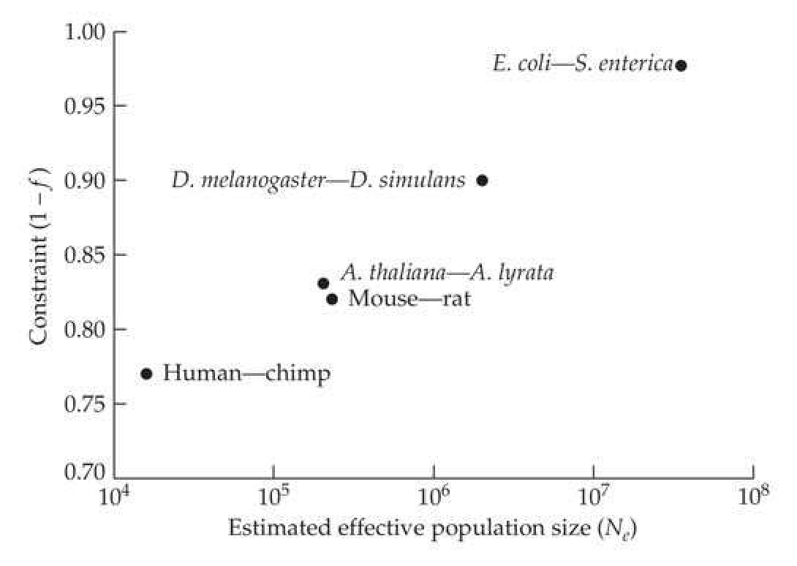
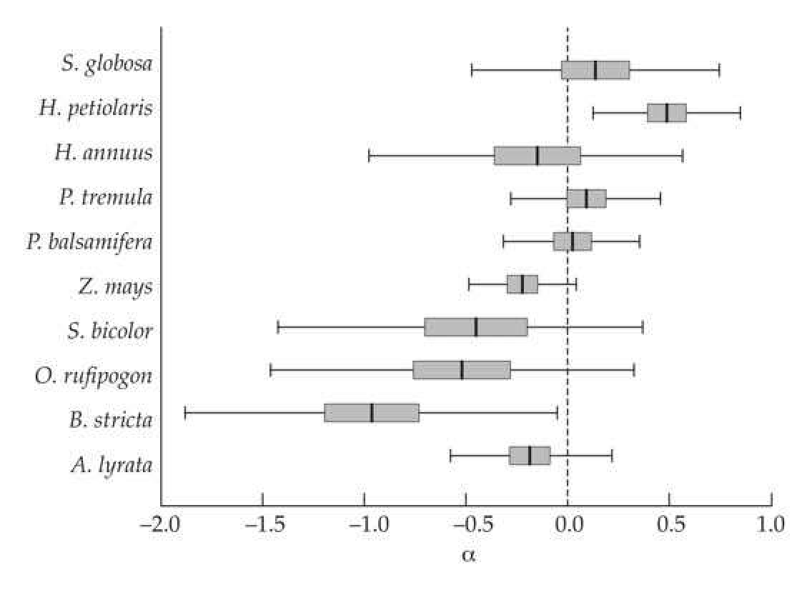
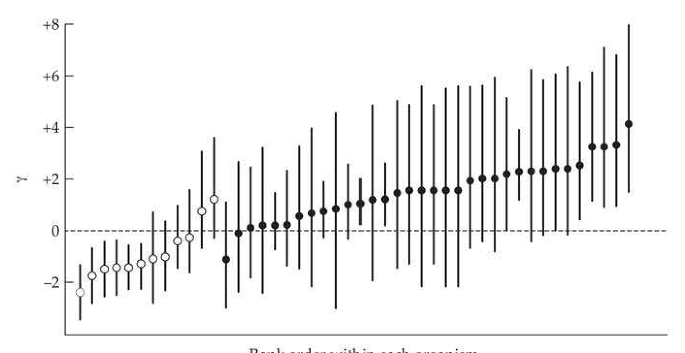
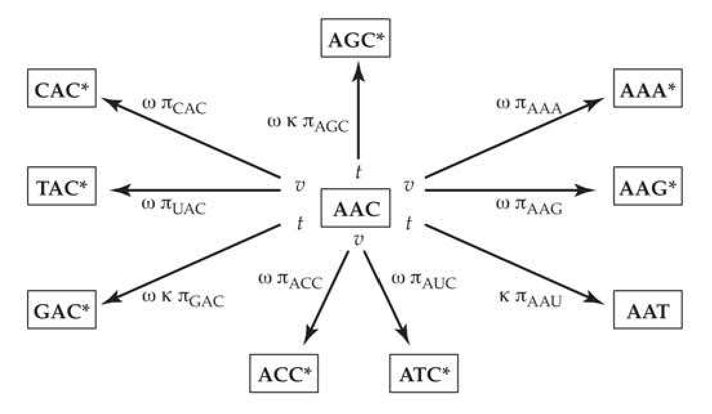

# Chapter 10 · Using Molecular Data to Detect Selection: Signatures from Multiple Historical Events

## chapter10_001 · Using Molecular Data to Detect Selection: Signatures from Multiple Historical Events: Introduction

Model selection is a process of seeking the least inadequate model from a predefined set, all of which may be grossly inadequate as a representation of reality. Welch (2006)

Chapter 9 reviewed tests for detecting an ongoing, or very recently completed, single episode of positive selection. Here we examine the complementary issue, the nature of the cumulative signature left in divergence data by multiple historical selective events. In contrast to the large variety of tests for detecting ongoing or recent selection, only two basic approaches use divergence data to detect the signal from multiple episodes of positive selection. The first contrasts the levels of polymorphism within a reference population with the level of divergence between populations or species, using either different classes of sites within the same gene (the McDonald-Kreitman, or MK, test) or different genes (the Hudson-Kreitman-Aguadé, or HKA, test). Because these tests require a population sample to determine the amount of polymorphism, we refer to them as population-based divergence tests.

The second category of tests, which uses phylogeny-based divergence data, contrasts the rates of evolution at different sites within a gene over a number of species in a phylogenetic context. These tests do not require a population sample, as the signal comes entirely from the pattern of divergence, and not from polymorphisms. Specifically, for protein-coding sequences in the absence of positive selection, the rate of replacement substitution is generally expected to be less than the rate of silent substitution. A replacement rate exceeding the silent substitution rate provides a very robust signal of positive selection. However, when applied over an entire gene, this approach has almost no power, as any signal within a gene from a few positively selected codons is swamped by a much larger signal from the majority of codons that are likely to be under purifying (negative) selection. As a result, most current phylogeny-based tests scan a gene of interest for an excess of substitutions at single codons when examined over a phylogeny. Given their focus on a very special class of events—repeated positive selection on the same codon over a number of species—phylogeny-based divergence tests likely detect only a small fraction of actual selection episodes. By contrast, the HKA and MK tests are less stringent, as they simply require multiple substitutions over the entire gene. Finally, hybrid population genetic-phylogenetic tests are starting to appear (e.g., Wilson et al. 2011), but these tests will not be considered further here.

The tests outlined in the previous chapter are complementary to the approaches examined here, with each detecting signals of selection that would be missed by the other. Tests from Chapter 9 cast a wide net, in that many ongoing or recent events leave some signal, albeit perhaps a very weak one. However, this signal decays very quickly, so that most sites experiencing positive selection prior to some very modest amount of evolutionary time in the past ($ >N_{e} $ generations) will leave essentially no signal for these tests (Table 8.2). Conversely, the HKA and MK tests entirely miss genes with one or two relatively recent adaptive substitutions, as such a small number of additional substitutions will not leave a sufficient divergence signal to be detected. They can, however, detect situations in which numerous adaptive substitutions have occurred across a gene during the divergence of two populations. Phylogeny-based tests are even more restrictive, showing a signal only in very special cases: those in which the same codons are repeated targets of selection over the species in a phylogeny.

The time scale over which positive selection can be detected varies between the two divergence-based approaches, as there must be a sufficient number of adaptive substitutions to give some signal above the expected number of neutral substitutions (Example 10.1). Given that the entire gene is the unit of analysis, HKA and MK tests require at least a relatively modest amount of evolutionary time to acquire a sufficient signal. Phylogeny-based tests, which have a much smaller unit of analysis (individual codons), typically require much longer time scales for a sufficient number of adaptive substitutions to accrue. As such, phylogeny-based methods can work over deep time scales, provided that the number of silent substitutions is not excessive (i.e., the sites have not become too saturated). They can also be applied over short time scales in rapidly evolving viruses (such as HIV), whose high mutation rates and large population sizes can introduce sufficient variation for multiple rounds of adaptive evolution to occur, even over short time spans.

Finally, it is worth noting that most applications of phylogeny-based methods use only a single sequence from each species, thus inflating the divergence, as a chance polymorphism in the sampled sequence may be recorded as a fixation. If only a few true fixations have occurred, this error can be significant. This is also a potential problem for population-based tests that use only a single reference sequence for making divergence estimates.

---

## chapter10_002 · Using Molecular Data to Detect Selection: Signatures from Multiple Historical Events: Introduction / BRIEF OVERVIEW OF DIVERGENCE-BASED TESTS

We start with a short overview of population- versus phylogeny-based approaches before considering each approach in considerable detail. As was done in Chapter 9, the next few pages introduce the key ideas without most of the technical details.

---

## chapter10_003 · BRIEF OVERVIEW OF DIVERGENCE-BASED TESTS / A History of Selection Alters the Ratio of Polymorphic to Divergent Sites

**[推导 Derivation]**

Population-based tests contrast the patterns of within-species polymorphism and between-species divergence to see if they are in concordance with their neutral expectations. Under the equilibrium neutral model, two standard measures of polymorphism under the infinite-sites model are functions of $ 4N_e\mu $ (where $ \mu $ is the per-site mutation rate): the nucleotide diversity, $ \pi $, and the number of segregating sites, $ S $. These have expected values of $ E[\pi] = 4N_e\mu $ and $ E[S] = 4N_e\mu a_n $, where $ a_n $ is a constant that depends only on the sample size, $ n $ (Equation 9.21a). Under the assumptions of the equilibrium neutral model, the relationship between polymorphism (measured by nucleotide diversity, $ \pi $) and the between-population divergence ($ D $) for the ith gene being considered is

> **Formula (10.1a)** · `10.1a` · source: `chapter10_block_008` · A History of Selection Alters the Ratio of Polymorphic to Divergent Sites
>
> $$ \pi_{i}=4N_{e}\mu_{i},\qquad D_{i}=2t\mu_{i} $$

where $ N_{e} $ is the effective population size, and t is the divergence time in generations. Hence,

> **Formula (10.1b)** · `10.1b` · source: `chapter10_block_008` · A History of Selection Alters the Ratio of Polymorphic to Divergent Sites
>
> $$ \frac{\pi_{i}}{D_{i}}=\frac{4N_{e}\mu_{i}}{2t\mu_{i}}=\frac{2N_{e}}{t} $$

Because the gene-specific mutation rates cancel, under the equilibrium neutral model, the $ \pi/D $ ratio at all loci should be roughly the same, namely $ 2N_{e}/t $ (subject to random sampling). When polymorphism is instead scored as the number of segregating sites, S, then

> **Formula (10.1c)** · `10.1c` · source: `chapter10_block_008` · A History of Selection Alters the Ratio of Polymorphic to Divergent Sites
>
> $$ \frac{S_{i}}{D_{i}}=\frac{2N_{e}a_{n}}{t} $$

Again, this ratio is expected to be roughly constant over neutral genes. a replacement-site mutation results in an amino acid change, while a silent-site mutation still codes for the ancestral amino acid. Equation 10.1c indicates that, under neutrality, the ratio of the number of segregating sites to the number of fixed differences should be the same for both categories of sites. This results in a simple association test, and significance can be assessed using either a $ \chi^{2} $ approximation or the (much better) Fisher's exact test, which accommodates small numbers in the observed table entries. Of the 24 fixed differences between the two species seen by McDonald and Kreitman, 7 were replacement-site mutations and 17 were silent-site mutations. The total number of polymorphic sites segregating in either species was 44, 2 of which were replacement and 42 of which were silent. The resulting association table becomes

Fisher’s exact test gives a p value of 0.0073, indicating a highly significant lack of fit to the neutral equilibrium model. Based on the ratio of 42:2 silent/replacement polymorphisms, the expected number, x, of replacement fixations is 17/x = 42/2, or x = 0.81, i.e., ~1 replacement polymorphism is expected under neutrality. Because 7 were seen, this suggests roughly 6 adaptive substitutions, or that 86% (6/7) of the Adh amino acid substitutions between these species are adaptive.

---

## chapter10_004 · BRIEF OVERVIEW OF DIVERGENCE-BASED TESTS / A History of Positive Selection Alters the Ratio of Silent- to Replacement-site Substitution Rates

Phylogeny-based divergence tests do not require polymorphism data, but rather simply contrast the divergence rates at silent versus replacement sites. Silent sites are treated as proxies for neutral sites, although we have seen that they may be under (at least) weak selection (Chapter 8). Mutations at replacement sites are generally viewed as being under much stronger selection, most of it purifying. The primary evidence that such negative selection (removal of new deleterious mutations) is widespread is the observation that silent-site substitution rates are almost always much higher than those for replacement sites, when averaged over an entire gene. This pattern is expected if a higher fraction of mutations in replacement sites is deleterious relative to that in silent sites. However, there are cases where, for a limited region within a gene, the replacement-site substitution rate exceeds that for silent sites, suggesting the presence of adaptive fixation (i.e., positive selection).

While there are several variant notations in the literature, we use $ K_s $ to denote the per-site silent substitution rate and $ K_a $ to denote the per-site replacement rate between taxa (the subscript $ a $ indicating a change in an amino acid); $ K_{ns} $ and $ K_n $ are also used in the literature to denote replacement-site (i.e., nonsynonymous) substitution rates. A value of $ K_a/K_s > 1 $ indicates a long-term pattern of positive selection at replacement sites. As Example 10.2 illustrates, even if this is occurring at specific regions within a gene, when averaged over an entire gene, $ K_a/K_s $ is usually < 1. Thus, while an observation of $ K_a/K_s > 1 $ is almost universally accepted as a signature of a long-term pattern of multiple episodes of positive selection, such inflation is almost never seen if the entire gene is taken as the unit of analysis. Phylogeny-based methods (examined below) accommodate this concern by taking the codon as the unit of analysis, first placing genes within a phylogeny and then using codon-evolution models to test whether $ K_a/K_s > 1 $ for some subset of codons.

MHC gene, this pattern is also seen. The insight of Hughes and Nei was to use data on protein structure to specifically focus on the putative antigen-binding site and to compare this region with the rest of the gene as an internal control.

Hughes and Nei compared the ratio of silent- to replacement-site nucleotide substitution rates in the putative antigen recognition sites versus the rest of the gene. For both Class I and Class II loci, they found a significant excess of replacement substitutions in the recognition sites and a significant deficiency of such substitutions elsewhere. If both types of substitutions were neutral, the per-site rates should be roughly equal. If negative selection is acting, the expectation is that the silent-site substitution rate would be significantly higher (reflecting the removal of deleterious replacement mutations). However, if positive selection is sufficiently common among new mutations, one expects to find an excess of replacement substitutions. The observed patterns for both Class I and II loci were consistent with positive selection within the part of the gene coding for the antigen recognition site and purifying selection on the rest of the gene.

---

## chapter10_005 · BRIEF OVERVIEW OF DIVERGENCE-BASED TESTS / Divergence-based Tests are Biased Toward Conservative Sites

A major (but subtle) distinction between most methods in this chapter and those in Chapter 9 are that the latter usually have very little restrictions on the kinds of sequences being scanned for selection. In contrast, most divergence-based tests were built (at least initially) around analyses of protein-coding sequences (HKA is an exception), such as contrasts between silent and replacement sites or the substitution patterns at a codon (or set of codons) over a phylogeny. In such settings, these methods focus almost exclusively on detecting structural adaptations, namely, adaptive changes in the amino acid sequence. As we saw in Chapter 9, regulatory changes are thought to be at least as important as structural changes for short-term adaptation.

One reason for the focus on protein-coding regions in divergence-based tests is that one must be able to align homologous sequences. Because they accept relatively few insertion or deletion mutations, long open-reading frames allow one to align homologous coding sequences, even over fairly substantial periods of evolutionary time. By contrast, this is often not the case for regulatory sequences, especially when considering that we still have a limited (albeit improving) ability to detect the full universe of such sequences. As shown in several examples below, divergence-based approaches have been applied to highly conserved regulatory regions, which offer a better opportunity for comparing homologous sequences over evolutionary time. However, this also biases these tests toward regions under strong functional constraints. Thus, the very interesting question of whether structural changes may be more important than regulatory changes for long-term adaptation cannot be fully addressed by divergence-based data alone, as these have a bias toward detection in highly conserved regions, whether structural or regulatory. Extensive regulatory changes in less-conserved regions may be entirely missed by most divergence-based tests. Despite these issues, there are hints starting to emerge of at least as many adaptive substitutions in noncoding regions as there are in coding regions (as we detail below).

---

## chapter10_006 · BRIEF OVERVIEW OF DIVERGENCE-BASED TESTS / What Fraction of the Genome is Under Functional Constraints?

The amount of metazoan DNA that codes for proteins and structural RNAs (the so-called coding DNA) is usually just a fraction of their total genome. The role of the remaining (and usually majority) component of the genome, the noncoding DNA, has been the subject of numerous debates as to its evolutionary role and function. This raises a central question of just what fraction of the genome is under some sort of functional constraint (and therefore, selection). Chiaromonte et al. (2003) denoted this fraction by $ \alpha_{sel} $, which is somewhat unfortunate notation given the widespread use of $ \alpha $ for the fraction of adaptive substitutions (to be covered in detail shortly). One obvious approach for estimating $ \alpha_{sel} $ is from the amount shared conserved sequences between two divergent taxa. For example, early studies searched for regions first shared between mice, humans, and dogs, and later over a wider range of mammals, arriving at the result that around 6% of the human genome is conserved over such time scales (Lindblad-Toh et al. 2005, 2011). This is six-fold more than the 1% of the human genome that codes for proteins (~33 MB out of a total of ~3100 MB; Church et al. 2009). Andolfatto (2005) estimated a much higher value of $ \alpha_{sel} $, between 40% and 70%, for Drosophila melanogaster, with about twice as many constrained sites in noncoding, as opposed to coding, regions. Such comparisons, especially when based on widely-divergent taxa, are simply lower bounds, as sequences under functional constraints can still turnover through time, escaping detection (Dermitzakis and Clark 2002). Indeed, Pheasant and Mattick (2007) suggested that the functional portion of the human genome may exceed 20%, basing their argument on the fact that rapidly evolving regions will not be detected through sequence conservation studies.

Further insight into $ \alpha_{sel} $ can be gained by examining how the amount of conserved sequences shared between species pairs changes with their divergence times. This approach was used by Meader et al. (2010), who found that the fraction of shared conserved sequences among mammals decreased over time, and used the rate of this decrease to estimate that between 200 and 300 MB (6.5% to 10%) of the human genome is under functional constraints. A more refined estimate arrived at a value of around 8% (Rands et al. 2014). Hence, roughly 88% (7/8) of human constrained sites are found in noncoding regions. Meader et al. also used their approach on Drosophila melanogaster, finding an $ \alpha_{sel} $ value of between 47% and 55%. Given around 22 MB for coding DNA and their estimate of 35–45 MB of constrained noncoding DNA, roughly two-thirds of the constrained sites are in noncoding regions.

These estimates of the amount of constrained noncoding DNA raise a number of important evolutionary questions (beyond the obvious one of their functional role). How strong is selection in noncoding regions? How often do adaptive mutations arise from these noncoding regions? What fraction of segregating deleterious mutations are attributable to these regions? While unbiased answer to these questions remain elusive, preliminary estimates based on conserved noncoding regions and on transcription factor binding sites suggest that noncoding DNA is likely a rich source of adaptive substitutions.

---

## chapter10_007 · Using Molecular Data to Detect Selection: Signatures from Multiple Historical Events: Introduction / THE HKA AND MCDONALD-KREITMAN TESTS

Building on the basic ideas just introduced, we now develop the HKA test and present a much more in-depth discussion of the McDonald-Kreitman test, focusing on important caveats in its application.

---

## chapter10_008 · THE HKA AND MCDONALD-KREITMAN TESTS / The Hudson-Kreitman-Aguadé (HKA) Test

Hudson, Kreitman, and Aguadé (1987) proposed the first approach to jointly use polymorphism and divergence data. Unlike many of the other divergence-based tests, their's can be applied to any type of sequence data (not just a contrast between replacement and silent sites). Their HKA test is formulated as follows. Consider two species (or very distantly related populations) A and B, which are both at mutation-drift equilibrium with effective population sizes of $ N_A = N_e $ and $ N_B = \delta N_e $. Further assume that they separated $ \tau = t/(2N_e) $ generations ago from a common population of size $ N_e^* = (N_A + N_B)/2 = N_e(1 + \delta)/2 $, the average of the two current population sizes. Suppose $ i = 1, \cdots, L $ unlinked loci are examined in both species. We allow the neutral mutation rate, $ \mu_i $, to vary over loci, but assume (for a given locus) that it has been the same in both species, and hence unchanged during divergence. The expected number of neutral segregating sites at locus i is a function of $ \theta_i = 4N_e\mu_i $ in species A, and $ 4N_B\mu_i = 4(\delta N_e)\mu_i = \delta\theta_i $ in species B. The expected divergence between A and B is $ 2t\mu_i $, which we can express as $$ 2t\mu_{i}=2\frac{t}{2N_{e}}2N_{e}\mu_{i}=\tau\theta_{i} $$

Under this model, the levels of polymorphism (measured by the number of segregating sites) and divergence at the L loci are a function of $ L + 2 $ parameters: L gene-specific $ \theta_{i} $ values, and two demographic parameters ($ \delta $ and $ \tau $) shared by all loci. To estimate these parameters, we have 3L observations: the numbers $ S_i^A $ and $ S_i^B $ of segregating sites at each of the L loci in each species or population, and the number, $ D_i $, of substitutions between each pair of L loci. Under the HKA test, these data are first used to estimate the model parameters, and then a goodness-of-fit test is performed on the observed data. If the model provides a sufficiently poor fit, the equilibrium neutral model is rejected.

**[推导 Derivation]**

More formally, the HKA test statistic, $ X^{2} $, is given by

> **Formula (10.2a)** · `10.2a` · source: `chapter10_block_023` · The Hudson-Kreitman-Aguadé (HKA) Test
>
> $$ X^{2}=\sum_{i=1}^{L}X_{i}^{2} $$

where

> **Formula (10.2b)** · `10.2b` · source: `chapter10_block_023` · The Hudson-Kreitman-Aguadé (HKA) Test
>
> $$ X_{i}^{2}=\frac{\left(S_{i}^{A}-\widehat{E}[S_{i}^{A}]\right)^{2}}{\mathrm{Var}(S_{i}^{A})}+\frac{\left(S_{i}^{B}-\widehat{E}[S_{i}^{B}]\right)^{2}}{\mathrm{Var}(S_{i}^{B})}+\frac{\left(D_{i}-\widehat{E}[D_{i}]\right)^{2}}{\mathrm{Var}(D_{i})} $$

is the contribution to overall lack-of-fit from gene i. We use the notation $ \widehat{E}[] $ to denote the estimate of an expectation, which is obtained by using estimates (also denoted by carets) of the parameters (Equations 10.3a through 10.3d). For $ n_A $ samples (haploid sequences from each of the $ L $ loci) from species $ A $ and $ n_B $ samples from species $ B $,

> **Formula (10.3a)** · `10.3a` · source: `chapter10_block_023` · The Hudson-Kreitman-Aguadé (HKA) Test
>
> $$ \widehat{E}[S_{i}^{A}]=\widehat{\theta}_{i}a_{n_{A}},\quad\widehat{E}[S_{i}^{B}]=\widehat{\delta}\widehat{\theta}_{i}a_{n_{B}},\quad\mathrm{w h e r e}\quad a_{n_{x}}=\sum_{i=1}^{n_{x}-1}\frac{1}{i} $$

> **Formula (10.3b)** · `10.3b` · source: `chapter10_block_023` · The Hudson-Kreitman-Aguadé (HKA) Test
>
> $$ \mathrm{V a r}(S_{i}^{A})=\widehat{\theta}_{i}a_{n_{A}}+\widehat{\theta}_{i}^{2}b_{n_{A}},\quad\mathrm{V a r}(S_{i}^{B})=\widehat{\delta}\widehat{\theta}_{i}a_{n_{A}}+\widehat{\delta}^{2}\widehat{\theta}_{i}^{2}b_{n_{B}},\quad b_{n_{x}}=\sum_{i=1}^{n_{x}-1}\frac{1}{i^{2}} $$

> **Formula (10.3c)** · `10.3c` · source: `chapter10_block_023` · The Hudson-Kreitman-Aguadé (HKA) Test
>
> $$ \widehat{E}[D_{i}]=\widehat{\theta}_{i}\left(\widehat{\tau}+\frac{1+\widehat{\delta}}{2}\right) $$

> **Formula (10.3d)** · `10.3d` · source: `chapter10_block_023` · The Hudson-Kreitman-Aguadé (HKA) Test
>
> $$ \mathrm{Var}(D_{i})=\widehat{\theta}_{i}\left(\widehat{\tau}+\frac{1+\widehat{\delta}}{2}\right)+\left(\frac{\widehat{\theta}_{i}(1+\widehat{\delta})}{2}\right)^{2} $$

Equations 10.3a and 10.3b follow from the infinite-sites model (Equations 4.3a and 4.4a, respectively). Equation 10.3c follows if we rewrite $$ \theta_{i}\left(\tau+\frac{1+\delta}{2}\right)=4N_{e}\mu_{i}\left(\frac{t}{2N_{e}}+\frac{1+\delta}{2}\right)=2\mu_{i}t+4\mu_{i}\frac{N_{e}(1+\delta)}{2}=2\mu_{i}t+4N_{e}^{*}\mu_{i} $$

**[推导 Derivation]**

The first term in the right-most expression is the between-population divergence due to new mutations, while the second term is the divergence from the partitioning of any initial polymorphism, $ 4N_e^* \mu_i $, present in the ancestral population. The HKA test statistic $ X^2 $ is approximately $ \chi^2 $-distributed with $ 3L - (L + 2) = 2L - 2 $ degrees of freedom, given the 3L observations and $ L + 2 $ parameters to estimate. Hudson et al. suggested the following system of equations for estimating the unknown parameters $ (\theta_1, \cdots, \theta_l, \delta, \tau) $, given the $ 1 \leq i \leq L $ observed values of $ S_i^A $, $ S_i^B $, and $ D_i $.

> **Formula (10.4a)** · `10.4a` · source: `chapter10_block_025` · The Hudson-Kreitman-Aguadé (HKA) Test
>
> $$ \sum_{i=1}^{L}S_{i}^{A}=a_{n_{A}}\sum_{i=1}^{L}\widehat{\theta}_{i} $$

> **Formula (10.4b)** · `10.4b` · source: `chapter10_block_025` · The Hudson-Kreitman-Aguadé (HKA) Test
>
> $$ \sum_{i=1}^{L}S_{i}^{B}=\widehat{\delta}a_{n_{B}}\sum_{i=1}^{L}\widehat{\theta}_{i} $$

> **Formula (10.4c)** · `10.4c` · source: `chapter10_block_025` · The Hudson-Kreitman-Aguadé (HKA) Test
>
> $$ \sum_{i=1}^{L}D_{i}=\left(\widehat{\tau}+\frac{1+\widehat{\delta}}{2}\right)\sum_{i=1}^{L}\widehat{\theta}_{i} $$

> **Formula (10.4d)** · `10.4d` · source: `chapter10_block_025` · The Hudson-Kreitman-Aguadé (HKA) Test
>
> $$ S_{i}^{A}+S_{i}^{B}+D_{i}=\widehat{\theta}_{i}\left(\widehat{\tau}+\frac{1+\widehat{\delta}}{2}+a_{n_{A}}+\widehat{\delta}\cdot a_{n_{B}}\right)\quad for i=1,\cdots,L-1 $$

Equations 10.4a through 10.4c are each single equations, while Equation 10.4d is a set of $ L - 1 $ equations (Equation 10.4d is automatically satisfied for $ i = L $ when Equations 10.4a–10.4c hold). This set of $ L + 2 $ equations can be solved numerically for the $ L \widehat{\theta}_i $ values unique to each locus and the common demographic values $ \widehat{\delta} $ and $ \widehat{\tau} $, thus generating the estimated values for the $ X^2 $ statistic (Equations 10.3a–10.3d). The HKA model assumes that there is no recombination within a gene but that there is free recombination between genes, thus treating distinct genes as independent. If a significant HKA value is found, the gene-specific $ X_i^2 $ values (Equation 10.2b) indicate which loci contributed the most to the lack of fit.

Modifications of the HKA test were proposed by Wright and Charlesworth (2004), who presented a maximum-likelihood version, and Innan (2006), who framed the test in terms of the polymorphism-divergence ratio, r. This formulation allowed Innan to consider a joint test involving r and a site-frequency measure (such as Tajima's D) to provide more support for selection at a site (Innan's two-dimensional test). An interesting application of this class of tests is the work of Ochola et al. (2010) in searching for vaccine targets in the malaria parasite Plasmodium falciparum. Their reasoning was that proteins in the parasite that are the target of naturally acquired host immunity (i.e., arms-race genes) are often under balancing selection. Hence, searching for loci with balancing-selection signals (a high HKA ratio coupled with high positive value of Tajima's D) can suggest potential candidates.

**[示例 Example]**

> **Example 10.3** · ref: `10.3` · source: `chapter10_008.json` · blocks 7–9
>
> Example 10.3. Hudson et al. (1987) partitioned the Adh gene into two regions, silent sites and 4-kb of the 5' flanking region, corresponding to a test using L = 2 loci. (The careful reader might be concerned that these loci are linked, while the HKA test assumes independence across loci. The high recombination rates in Drosophila result in LD generally being over only very small distances.) A sample of 81 Drosophila melanogaster alleles was examined, along with a single allele from its sibling species D. sechellia. Based on sequencing data, the divergence was 210 differences in the 4052-bp flanking region and 18 differences in the 324 silent sites, amounting to roughly equal levels of divergence per base pair between the two "loci." Based on restriction-enzyme data, within melanogaster, 9 of the 414 5' flanking sites were variable, while 8 of 79 Adh silent sites were variable. Thus, while the per-site divergence was roughly equal, there was a four-fold greater polymorphism level at silent sites. Hudson et al. modified their test to accommodate the use of polymorphism data from only a single population, as with no polymorphism data available from D. sechellia, there is no Equation 10.4b, and thus can be no $ S_i^B $ or $ a_{n_B} $ terms in Equation 10.4d. In this setting, $ \delta $ cannot be estimated, so the authors assumed $ \delta = 1 $ (i.e., that both species have the same effective population size; an alternative approach would be to use the value of $ \delta $ giving the smallest $ X^2 $ value). Given that there are different numbers of sites between the polymorphism and divergence data (which are based on restriction sites and sequence data, respectively), let $ \theta_i $ be the population-scaled per-nucleotide mutation rate (for locus i), so that we have to weight the $ \theta_i $ value for each term by the number of sites compared, giving Equations 10.4a, 10.4c, and 10.4d as, respectively, $$ S_{1}^{A}+S_{2}^{A}=9+8=a_{81}(414\cdot\widehat{\theta_{1}}+79\cdot\widehat{\theta_{2}}) $$ $$ D_{1}+D_{2}=210+18=\left(\widehat{\tau}+1\right)\left(4052\cdot\widehat{\theta_{1}}+324\cdot\widehat{\theta_{2}}\right) $$ $$ D_{1}+S_{1}^{A}=210+9=4052\cdot\widehat{\theta_{1}}\left(\widehat{\tau}+1+a_{81}\right) $$ where $ a_{81} = \sum_{i=1}^{80} 1/i = 4.965 $. The solutions to this system were found to be $$ \widehat{\tau}=6.73,\quad\widehat{\theta_{1}}=6.6\cdot10^{-3},\quad and\quad\widehat{\theta_{2}}=9.0\cdot10^{-3} $$ yielding the resulting modified $ X^{2} $ statistic (Equation 10.2a but with the terms involving $ S_{i}^{B} $ in Equation 10.2b excluded) as 6.09. There are four observations ( $ S_{1}^{A} $, $ S_{2}^{A} $, $ D_{1} $, $ D_{2} $) and three parameters to fit $(\theta_1, \theta_2, \tau)$, which results in a test with one degree of freedom. Because $\Pr(\chi_1^2 > 6.09) = 0.014$, the test indicates a significant departure from the equilibrium neutral model.

Although Equations 10.3 and 10.4 assume that all loci are autosomal, with care, sex-linked and organelle genes can also be incorporated. If all compared loci are X-linked, Equations 10.3 and 10.4 apply. However, if the loci are a mixture of autosomal and sex-linked, the $ \theta_i $ terms for sex-linked loci must be multiplied by 3/4 (under equal sex ratios), as their expected levels of neutral polymorphism are $ 3N_e\mu_i $ (Begun and Aquadro 1991; see Lynch 2007 for more general results). Finally, while the HKA test can accommodate mitochondrial or chloroplast genes, they introduce three concerns. First, all sequences from a given organelle are generally completely linked (because such genomes typically are nonrecombining), and thus must be treated as a single locus. Second, organelle loci have a different effective population size from autosomal genes, which also requires a scaling of their $ \theta $ value (typically by 1/4 to 1/2, but other values may be justified). The third issue is a bit more subtle. Given that most organelle genomes are only transmitted through females, the population structure and demographic history of nuclear genes (which are an average of the two parents) can be significantly different from that of organelle genes (females only). This raises special concerns in HKA comparisons of genes between nuclear and organelle genomes.

**[示例 Example]**

> **Example 10.4** · ref: `10.4` · source: `chapter10_008.json` · blocks 10–10
>
> Example 10.4. Ingvarsson (2004) examined chloroplast (cpDNA) diversity in two plants in the genus Silene (family Caryophyllaceae). A standard HKA test contrasting four noncoding regions of the chloroplast (treated as a single locus) and two unlinked autosomal genes between S. vulgaris and S. latifolia gave a highly significant value, with most of the signal (using Equation 10.2b) coming from the cpDNA region. However, the estimated $ F_{ST} $ value (Chapter 2) for cpDNA was 0.546 versus 0.056 for nuclear genes, showing strong population structure at the organelle-gene level but only modest structure for nuclear genes. Ingvarsson attempted to correct for these between-gene differences in the amount of structure as follows. Under an island model of migration (Chapter 2), to a first approximation, population structure increases the amount of segregating sites and decreases the divergence, both by a factor of 1 - $ F_{ST} $. Ingvarsson thus corrected the observed number, S, of segregating sites by using $ S_{c} = (1 - F_{ST})S $ and the divergence by $ D_{c} = D/(1 - F_{ST}) $. Applying these corrections to both the cpDNA and nuclear genes and using the $ S_{c} $ and $ D_{c} $ values in the HKA test yielded a nonsignificant result. Thus, the apparently strong signal of selection appears to simply be an artifact generated by nuclear and organelle genes having different population structures.

---

## chapter10_009 · THE HKA AND MCDONALD-KREITMAN TESTS / The McDonald-Kreitman (MK) Test: Basics

**[推导 Derivation]**

One of the most straightforward, and widely used, tests of selection was proposed by McDonald and Kreitman (1991a), who contrasted the amounts of polymorphism and divergence between two categories of sites within a single gene (Example 10.1). Typically, these categories are silent versus replacement sites, but the basic logic can be extended to other comparisons. Under the neutral theory, deleterious mutations are assumed to occur, but to then be quickly removed by selection, thus not contributing to either polymorphism or divergence (Figure 7.1). In the standard neutral-theory expressions for the amount of polymorphism $ (4N_{e}\mu) $ and divergence $ (2t\mu) $, $ \mu $ is the effectively neutral mutation rate, which is the rate at which effectively neutral $ (4N_{e}|s|\ll1) $ mutations arise. While most mutations at silent sites may often be effectively neutral, a much smaller fraction, f, of new mutations at replacement sites are neutral, resulting in a lower effectively neutral mutation rate, $ f\mu $. Given that f is the fraction of replacement mutations that is effectively neutral, 1 - f is a measure of functional constraints, with values of 1 - f near one ($ f \simeq 0 $) implying that most new mutations are not effectively neutral (i.e., they are deleterious). A minor bookkeeping detail is that the silent and replacement mutation rates in the MK test refer to the sum over all sites, so that $ \mu_s = \mu n_s $ and $ \mu_a = \mu f n_a $ are the total neutral mutation rates over the collection of $ n_s $ silent and $ n_a $ replacement sites in the gene of interest (generally $ n_a > 2n_s $, as all second-base and many third-base positions within codons are replacement sites). As before, under the equilibrium neutral model, the expected number of substitutions $ (D_i) $ in site class $ i $ is $ 2t\mu_i $, while the expected number of segregating sites $ (S_i) $ in a sample of $ n $ sequences is $ a_n\theta_i $ (Equation 9.21a). Because $ S_i $ is a measure of the amount of polymorphism, we denote it by $ P_i $ to conform to the standard notation for MK tests. Thus, under neutrality,

> **Formula (10.5a)** · `10.5a` · source: `chapter10_block_032` · The McDonald-Kreitman (MK) Test: Basics
>
> $$ \frac{D_{a}}{D_{s}}=\frac{2t\mu_{a}}{2t\mu_{s}}=\frac{2t\mu f n_{a}}{2t\mu n_{s}}=f\frac{n_{a}}{n_{s}},\quad\frac{P_{a}}{P_{s}}=\frac{S_{a}}{S_{s}}=\frac{a_{n}\theta_{a}}{a_{n}\theta_{s}}=\frac{4N_{e}\mu f n_{a}}{4N_{e}\mu n_{s}}=f\frac{n_{a}}{n_{s}} $$

where the subscript a denotes replacement (amino-acid changing) sites, and s denotes silent sites. Hence, under the equilibrium neutral model, we expect that, on average,

> **Formula (10.5b)** · `10.5b` · source: `chapter10_block_032` · The McDonald-Kreitman (MK) Test: Basics
>
> $$ D_{a}/D_{s}=P_{a}/P_{s} $$

**[推导 Derivation]**

If some replacement sites are under positive selection, because of their rapid sojourn times relative to drift, these will generally contribute very little to the within-species polymorphism (Kimura 1969; Smith and Eyre-Walker 2002; Figure 7.1), but they will result in an excess of replacement substitutions, so that $ D_a/D_s > P_a/P_s $. Similarly, note that

> **Formula (10.5c)** · `10.5c` · source: `chapter10_block_033` · The McDonald-Kreitman (MK) Test: Basics
>
> $$ \frac{P_{a}}{D_{a}}=\frac{a_{n}\theta_{a}}{2t\mu_{a}}=\frac{a_{n}4N_{e}\mu f n_{a}}{2t\mu f n_{a}}=\frac{a_{n}2N_{e}}{t},\quad\frac{P_{s}}{D_{s}}=\frac{a_{n}\theta_{s}}{2t\mu_{s}}=\frac{a_{n}2N_{e}}{t} $$

and thus, under neutrality, we also have

> **Formula (10.5d)** · `10.5d` · source: `chapter10_block_033` · The McDonald-Kreitman (MK) Test: Basics
>
> $$ P_{a}/D_{a}=P_{s}/D_{s} $$

which is just a simple rearrangement of Equation 10.5b. It is worth noting that a very similar approach to the MK test was proposed by Templeton (1987, 1996), based on contrasting patterns in the tips versus interiors of estimated gene-tree topologies, and predates the MK test.

**[命题 Proposition]**

McDonald and Kreitman provided a more general derivation of the polymorphism ratio in Equation 10.5a, replacing $ 4N_e $ (the equilibrium value) by $ T_{tot} $, the total time on all of the within-species coalescent branches (Chapter 2). By considering the ratio of the number of polymorphic sites in the two categories, the common term $ T_{tot} $ cancels, so that any effects of demography also cancel. Hence, provided the effectively neutral mutation rates remain unchanged, the MK test is unaffected by population demography (Hudson 1993; Nielsen 2001). Because the coalescent structure that determines the amount of polymorphism is explicitly removed by using the $ P_a / P_s $ ratio, there is no assumption that the allele frequencies are in mutation-drift equilibrium nor any assumption about constant population size. This is a very robust feature not shared by most other tests of selection.

Thus, while Zhai et al. (2008) found that the HKA test was more powerful than the MK test when the equilibrium assumptions hold, the robustness of the MK test (and lack of robustness of the HKA test) when demographic issues are present favors the use of the former. However, as we will see shortly, the MK test is by no means foolproof, as changes in the effective population size can influence the effectively neutral mutation rates (the rate at which alleles with $ 4N_c|s| < 1 $ arise), which can bias some of the comparisons used by the test. Another complication is that mildly deleterious alleles can contribute to within-species polymorphisms, but not to between-species divergence, and thus their presence inflates the polymorphism ratio over the divergence ratio, reducing the power to detect positive selection.

The MK test is performed by contrasting polymorphism and divergence data at silent and replacement sites for the gene in question. Given that these two ratios are expected to be equal under neutrality, the test uses a simple $ 2 \times 2 $ contingency table (Example 10.1). The presentation of the data required for the MK test is often referred to as either an MK table or a DPRS table, the latter based on the (clockwise order) of the table's four categories: Divergence (number of substitutions), Polymorphism (number of segregating sites), Replacement, and Silent (or Synonymous):

Example 10.1 presented the original data used by McDonald and Kreitman, while Example 10.5 shows how their test can be modified to examine different regions within the same gene.

**[示例 Example]**

> **Example 10.5** · ref: `10.5` · source: `chapter10_009.json` · blocks 6–7
>
> Example 10.5. Le Corre et al. (2002) examined the FRIGIDA (FRI) gene in Arabidopsis thaliana, a key regulator of flowering time. European populations show significant variation in flowering time, with potentially strong selection for earlier flowering having arisen following the end of the last ice age. For the data below, fixed differences (divergence) were obtained by comparing A. thaliana with A. lyrata, while data on numbers of segregating sites are based on A. thaliana populations.
> 
> > **Inline Table 3** · `inline_3` · page 10 · source: `chapter10_009`
> > Inline Table 3
> >
> > Entire coding region | Fixed | Polymorphic | 
> > --- | --- | --- | ---
> > Silent | 59 | 7 | 
> > Replacement | 68 | 21 | Fisher test $ p = 0.056 $
> > Exon 1 | Fixed | Polymorphic | 
> > Silent | 30 | 2 | 
> > Replacement | 38 | 16 | Fisher test $ p = 0.013 $
> > Exons 2 and 3 | Fixed | Polymorphic | 
> > Silent | 29 | 5 | 
> > Replacement | 30 | 5 | Fisher test $ p = 1.000 $
> 
> 
> The FRI locus clearly shows heterogeneity in patterns of selection when contrasting exon 1 with the remaining exons, and detecting such within-gene heterogeneity may provide important clues for a putative region under functional selection. These data could be interpreted simply as a reduction on functional constraints in exon 1, resulting in a smaller fraction of segregating replacement mutations being deleterious. In principle, this could occur because of a shift in the selection pressures or for purely demographic reasons, such as a recent reduction in the effective population size increasing the effectively neutral mutation rate. However, there is a nice internal control in that exons 2 and 3 do not display a decrease in the ratio of fixed to polymorphic replacement sites relative to silent sites, which appears to rule out a reduction in effective population size in thaliana accounting for the reduction in constraints. The authors noted that roughly half of the replacement polymorphisms in exon 1 are loss-of-function mutations, which result in early flowering. Hence, it appears that the excess number of replacement polymorphisms in exon 1 likely results from selection for early flowering in some populations. Further, because a nonfunctional copy of FRI results in early flowering, there are a large number of mutational targets to achieve this phenotype (and hence a high effective mutation rate), which likely explains the large number of replacement polymorphisms. In effect, these data appear to show an ongoing multiple-origins soft sweep (Chapter 8). This example introduces two important statistical issues in the analysis of MK data. First, one should always use Fisher's exact test for the goodness-of-fit (which can be found in standard statistical packages, such as R). The $ \chi^2 $ and G tests (LW Appendix 4) for contingency tables are large-sample approximations, and tend to perform poorly when any table entry has an expected value of less than 5 (note the value of 2 in one of the MK data cells for exon 1). Second, many tests are often performed in a single analysis, raising the thorny issue of multiple comparisons (Appendix 4). If one desires a false-positive rate, $ q $, over an entire collection of $ n $ independent tests, then the Bonferroni correction requires a critical value of $ p = q/n $ for each test (Equation A4.4). Under this criterion, there is a probability of $ q $ that none of the tests are false positives when each is declared significant only when $ p \leq q/n $. Here there were three comparisons (entire, exon 1, and exons 2 and 3), suggesting a critical value of $ p = q/3 $ to give an experiment-wide value of q that none of the tests are false-positives. However, these three comparisons use overlapping data (e.g., the category “entire” contains all three exons). For the sake of discussion, assume that there are only n = 2 independent tests in this example. In that case, a significance threshold of $ p = 0.01/2 = 0.005 $ is required for each test to give a false-positive rate of 1% over the entire set of comparisons. Likewise, using $ p = 0.05/2 = 0.025 $ gives a false-positive rate of 5% over the entire collection. Hence, the experiment-wide significance level is closer to 5% than the 1.3% reported for exon 1. As detailed in Appendix 4, Bonferroni corrections are rather strict, and they can be improved by use of sequential Bonferroni methods, or (where appropriate) using control of the false-discovery rate. The latter gives the estimated fraction of false positives among a set of tests declared to be significant (“discoveries”); see Example 9.3 for an application, and Appendix 4 for much more details.

---

## chapter10_010 · Using Molecular Data to Detect Selection: Signatures from Multiple Historical Events: Introduction / The McDonald-Kreitman (MK) Test: Basics

While initially presented as a contrast between silent and replacement sites within a single gene, the basic logic of the MK test is not limited to this specific type of comparison. Other types of sites can be contrasted (e.g., noncoding versus silent), and one can easily construct tests involving more than two categories with a simple extension of the contingency table logic underlying MK tests (e.g., Hudson 1993; Templeton 1996; Podlaha et al. 2005; Egea et al. 2008; Chen et al. 2009). Further, as Example 10.5 highlights, one often performs separate MK tests in different regions of the same gene. The general issue of how to detect selection heterogeneity based on a scan of a region is examined by McDonald (1996, 1998) and Goss and Lewontin (1996).

**[推导 Derivation]**

A McDonald-Kreitman test will be significant when $ P_a/D_a $ is significantly different from $ P_s/D_s $ (Equation 10.5d). Because it is assumed that the silent-site ratio is unchanged by selection, a significant MK test can occur either through an excess of replacement polymorphisms ($ P_a $ too large relative to $ D_a $ and $ P_s/D_s $) or through an excess of replacement substitutions ($ D_a $ too large relative to $ P_a $ and $ P_s/D_s $). The neutrality index of Rand and Kann (1996),

> **Formula (10.6a)** · `10.6a` · source: `chapter10_block_043` · The McDonald-Kreitman (MK) Test: Basics
>
> $$ NI=\frac{P_{a}/D_{a}}{P_{s}/D_{s}}=\frac{P_{a}D_{s}}{P_{s}D_{a}} $$

indicates which of these two scenarios occurs. Note that NI is simply the odds ratio for the MK contingency table (Jewell 1986). A value greater than one indicates more polymorphic replacement sites than expected, while a value less than one indicates an excess of replacement substitutions. Values less than one suggest that some of the substitutions are adaptive, while values greater than one are suggestive of weakly deleterious segregating alleles.

**[推导 Derivation]**

Note that NI is not defined if either $ P_{s} $ or $ D_{a} $ are zero, and it is biased if either is small (Stoletzki and Eyre-Walker 2011). Hence, its use is problematic when the gene being considered shows little divergence. When the observed cell numbers in any MK table are small (less than 5), a number of corrections are possible, which basically start by adding an extra count to $ D_{a} $ and $ P_{s} $ (Haldane 1956; Jewel 1986). Stoletzki and Eyre-Walker (2011) noted that these corrections are still biased, and they proposed a direction of selection (DoS) statistic,

> **Formula (10.6b)** · `10.6b` · source: `chapter10_block_044` · The McDonald-Kreitman (MK) Test: Basics
>
> $$ DoS=\frac{D_{a}}{D_{a}+D_{s}}-\frac{P_{a}}{P_{a}+P_{s}} $$

Positive values indicate an excess of replacement substitutions (suggesting adaptive evo- lution), while negative values imply an excess of replacement polymorphisms (suggesting that slightly deleterious alleles are segregating).

While the DoS statistic is appropriate when comparing divergence to polymorphism features of genes as a function of some other variable (such as recombination rate or GC content), other approaches have been used when the aim is to return a single summary statistic for the entire genome. A simple average of the NI values over all sampled genes is biased, as genes for which NI is not defined ($ P_{s} $ or $ D_{a} $ are zero) are excluded, and those genes with small values for either $ P_{s} $ or $ D_{a} $ return biased estimates. Example 10.8 illustrates one commonly used approach to avoid these issues, namely, summing over all sites to create a grand MK table for the entire collection of sampled genes.

**[示例 Example]**

> **Example 10.6** · ref: `10.6` · source: `chapter10_010.json` · blocks 5–6
>
> Example 10.6. Andolfatto (2005) examined 35 coding and 153 noncoding fragments from a Zimbabwe sample of 12 D. melanogaster X chromosomes, with a single D. simulans X as an outgroup. The numbers of observed polymorphic and divergent sites were then lumped into various classes as follows:
> 
> > **Inline Table 4** · `inline_4` · page 12 · source: `chapter10_010`
> > Inline Table 4
> >
> > <table><tr><td></td><td></td><td colspan="2">Polymorphisms</td><td colspan="2">Fisher Test  $ p $ value</td></tr><tr><td>Mutational Class</td><td>Fixed</td><td>All sites</td><td>Minus singletons</td><td>All sites</td><td>Minus singletons</td></tr><tr><td>Silent</td><td>604</td><td>502</td><td>323</td><td>—</td><td>—</td></tr><tr><td>Replacement</td><td>260</td><td>115</td><td>52</td><td>4.7 \cdot 10^{-7}</td><td>4.3 \cdot 10^{-10}</td></tr><tr><td>Noncoding</td><td>3168</td><td>2386</td><td>1295</td><td>1.4 \cdot 10^{-2}</td><td>5.2 \cdot 10^{-3}</td></tr><tr><td>5&#x27; UTRs</td><td>328</td><td>160</td><td>71</td><td>2.7 \cdot 10^{-6}</td><td>1.7 \cdot 10^{-10}</td></tr><tr><td>3&#x27; UTRs</td><td>143</td><td>86</td><td>36</td><td>3.3 \cdot 10^{-2}</td><td>8.2 \cdot 10^{-5}</td></tr></table>
> 
> 
> Given the small sample size (n = 12 chromosomes), polymorphism data are reported both as the total number of segregating sites (all sites) and the total number of segregating sites minus the singletons. The logic for removing singletons is the concern that slightly deleterious alleles can contribute to segregating sites (although they will be rare) but are unlikely to become fixed, and if retained in the analysis, will result in the polymorphism ratio overpredicting the number of fixed sites. Using the silent class as the neutral reference, McDonald-Krietman tests were performed against each of the four remaining categories (replacement, noncoding, 5' UTR, and 3' UTR), and computed separately using either all polymorphisms or only polymorphisms that were not singletons. The exclusion of singletons (“Minus singletons” column above) decreases the p values (increasing significance) in all cases. Even after correcting for multiple tests, all of the comparisons based on polymorphisms minus singletons were highly significant. Andolfatto also observed that the average nucleotide diversity, $ \pi $, was higher for silent sites than for any of the other categories displayed above. This suggests that there are stronger constraints on the sampled noncoding regions than on silent sites, and hence stronger purifying selection on these noncoding sites. Conversely, these test values all show excessive substitutions relative to the amount of within-population variation, suggesting that many of the differences were likely fixed by positive selection. Both of these results (stronger purifying selection on polymorphisms and stronger positive selection for substitutions) for noncoding DNA relative to silent sites were very surprising, and they suggested that part of what is called noncoding DNA may have some functional role (the same appears to be at least partly true for humans: ENCODE Project Consortium 2012). A similar study using polymorphism data from D. simulans (with D. melanogaster as the outgroup), which has a larger effective population size than D. melanogaster, found an even stronger signature of purifying selection against D. simulans noncoding polymorphisms (Haddrill et al. 2008). One concern when dealing with noncoding DNA is obtaining the correct alignment to ensure that homologous sites are being compared. This can be problematic for even moderately divergent species, as insertions and deletions run rampant, making correct alignment nearly impossible. Care must then be taken, as one may discard much of the noncoding sequence because of alignment issues, which could enrich the sequences remaining in the analysis with those sites under stronger functional constraints (which are more conserved and thus more easily aligned). Conversely, with coding regions, strong historical selection to keep the sequence in frame usually results in few insertions and deletions.

**[示例 Example]**

> **Example 10.7** · ref: `10.7` · source: `chapter10_010.json` · blocks 9–13
>
> Example 10.7. Consider Le Corre et al.'s data on the FRI gene (Example 10.5). For exon 1, the neutrality index is $$ NI=\frac{P_{a}/D_{a}}{P_{s}/D_{s}}=\frac{16/38}{2/30}=6.42 $$ showing that the significant result is due to an excess of segregating replacement sites. Conversely, for exons 2 and 3 $$ NI=\frac{5/30}{5/29}=0.97 $$ suggesting a good fit to the neutral model, with neither an excess of polymorphic site nor of fixed replacement sites. Our interpretation of the signal in exon 1 was as a sign of ongoing selection of alleles for earlier flowering (Example 10.5). However, the NI value is also consistent with an excess of slightly deleterious alleles in this region, thus inflating the levels of replacement polymorphisms. The lack of such a signal in exons 2 and 3 argues against this, but it remains a formal possibility that slightly weaker selection in exon 1 (relative to exons 2 and 3), coupled with a genomewide reduction in $ N_{e} $, could account for the excess polymorphism in exon 1. However, evidence for a recent population expansion argues against this. This discussion raises the more general question of how often we can safely use the MK test to detect signatures of ongoing positive selection. For example, what is the impact of an ongoing hard sweep? This would greatly reduce the number of all segregating sites (both silent and replacement), and hence give the MK test little, if any, power. Generally speaking, the safest interpretation of excess replacement polymorphisms is that they are slightly deleterious. Example 10.6 shows that additional information is required to make a case that these segregating sites are beneficial. Further, such an excess is expected only in rare settings, such as a multiple-origins soft sweep, in the case of FRI likely fueled by a large mutational target size (simple deactivation of a function) to produce the putatively favored phenotype (early flowering).

**[示例 Example]**

> **Example 10.8** · ref: `10.8` · source: `chapter10_010.json` · blocks 7–7
>
> Example 10.8. Bustamante et al. (2005) sequenced roughly 11,600 genes in 39 humans and contrasted the results with human-chimp divergence at these same loci. Summing over all sites, the resulting DPRS table (where SNPs denote polymorphic sites) was
> 
> > **Inline Table 5** · `inline_5` · page 13 · source: `chapter10_010`
> > Inline Table 5
> >
> >  | Divergence | SNPs
> > --- | --- | ---
> > Silent | 34,099 | 15,750
> > Replacement | 20,467 | 14,311
> 
> 
> As in Example 10.6, this analysis differs from a standard MK test, as the values for a large number of loci are aggregated into a single table. The resulting p value, $ <10^{-16} $, was highly significant, meaning that the neutral model is rejected. What is the source of the discrepancy? Equation 10.6a gives the neutrality index as $$ NI=\frac{P_{a}/D_{a}}{P_{s}/D_{s}}=\frac{14,311/20,467}{15,750/34,099}=1.514 $$ showing that the lack-of-fit to the neutral model is driven by an excess of replacement polymorphisms (SNPs). The authors suggest that these polymorphisms are mainly deleterious, a view echoed by Hughes et al. (2003). Consistent with this conclusion, in an analysis of ~47,500 replacement SNPs in a sample of 35 humans, Boyko et al. (2008) used the site-frequency spectrum to estimate that 27–29% of these SNPs were effectively neutral, 30–42% were moderately deleterious, and nearly all of the rest were highly deleterious (we will discuss how such values are obtained shortly). This large fraction of segregating deleterious alleles significantly lowers the power of MK tests. Indeed, Charlesworth and Eyre-Walker (2008) noted that because of excessive replacement polymorphisms, MK tests in humans are very underpowered.

---

## chapter10_011 · THE HKA AND MCDONALD-KREITMAN TESTS / The McDonald-Kreitman Test: Caveats

One of the initial criticisms of the McDonald-Kreitman test was that estimates of the number of segregating sites are rather sensitive to sampling, especially when the sample size is small (Graur and Li 1991; Whittam and Nei 1991). McDonald and Kreitman (1991b) countered that this problem is not serious, as these effects would equally influence estimates of the number of polymorphic silent and replacement sites. While largely correct, this is not always true, however, as there are generally two- to three-fold more potential replacement sites than silent sites, giving the former a slightly smaller sampling error. However, this difference in variances has more to do with power, and is unlikely to lead to false positives.

One potentially significant advantage of the MK test is that it does not assume constant population size or that mutation-drift equilibrium has been reached, and hence is rather robust against many of the demographic concerns that plague other tests. Balancing this advantage are two subtle (but serious) problems, both relating to how the distribution of fitness values for new alleles impacts the observed data (polymorphisms and substitutions).

First, the MK framework assumes that deleterious mutations are strongly deleterious and make essentially no contribution to either the number of segregating or fixed sites. In fact, however, weakly deleterious mutations (i.e., $ -10 < 4N_{e}s < -1 $) can contribute to segregating polymorphisms (especially because the MK test uses the number of polymorphic sites, not their frequencies), but they are highly unlikely to become fixed (Figure 7.1). Such mutations are overrepresented in polymorphic sites relative to fixed sites, which reduces the power of the MK test to detect an excess of replacement substitutions (and hence a signature of positive selection). We assume that the impact from any overrepresentation of selected polymorphisms at silent sites (our neutral proxy) is small, as these are either neutral or under very weak purifying selection. Conversely, overrepresentation is potentially a significant problem at polymorphic replacement sites. One proposed correction for this problem is to drop “rare” polymorphisms, but this is a rather subjective endeavor. Dropping singletons (Templeton 1996) as in Example 10.5 provides one simple correction, while other authors (e.g., Fay et al. 2002; Smith and Eyre-Walker 2002; Gojobori et al. 2007) have suggested including only “common” polymorphisms in the analysis, such as those with minor-allele frequencies above 0.10. We return to this issue shortly.

**[Figure]**

> **Figure 10.1** · page 15 · source: `chapter10`
>
> 
>
> Figure 10.1 The estimated constraint, 1 - f, on replacement sites as a function of effective population size, where f is the ratio of effectively neutral mutation rates (the fraction of new mutations that efficiently behave as neutral alleles) at replacement versus silent sites. As  $ N_{e} $ increases, more deleterious mutations move from the effectively neutral class into the strongly deleterious class (f decreases), reducing the effectively neutral mutation rate and increasing the amount of constraint on a gene. (After Wright and Andolfatto 2008.)

The second concern is even more problematic. At the heart of the MK test is Equation 10.5a. Under the neutral hypothesis, the ratio of polymorphic sites and the ratio of substitutions both estimate the same quantity, $ f $ (scaled by the sample-size correction factor $ n_a/n_s $), the ratio of effectively neutral mutation rates for the two categories. Recalling (Chapter 7) that any mutation for which $ 4N_e|s| \ll 1 $ behaves as if it were effectively neutral, the caveat is that the effectively neutral mutation rate, $ f_\mu $, changes with $ N_e $. It is important to stress that the total mutation rate, $ \mu $, remains unchanged, but the fraction, $ f $, of these mutations that are effectively neutral can decline with increasing $ N_e $, resulting in a decline in $ f_\mu $. Figure 10.1 shows that estimates of $ f $ do indeed decrease as the effective population size, $ N_e $, increases, as the amount of constraint, $ 1 - f $, increases with $ N_e $. For the same distribution of selection coefficients, one can raise (or lower) $ f $ (and hence the effectively neutral substitution rate) by decreasing (or increasing) the effective population size. If the effective population size is significantly different during the divergence phase (when substitutions were fixed) than in the current phase (which generates the observed number of polymorphisms), then these two phases could have different fractions of mutations that are effectively neutral. Because the ratios $ D_a/D_s $ and $ P_a/P_s $ estimate the $ f $ values for these two different phases, they can have different expected values.

McDonald and Kreitman (1991a) were aware that an increase in the effective population size could create a situation where slightly deleterious mutations that were fixed during divergence under a smaller population size do not even contribute to within-species polymorphisms. Such an increase in $ N_e $ following the bulk of divergence time would result in an inflated value of $ D_a $ and a deflated value of $ P_a $, resulting in an inflated $ D_a/P_a $ ratio, and hence a false signal of positive selection. Eyre-Walker (2002) showed that even a modest increase in $ N_e $ can generate such false signals, and that the problem is exacerbated by culling rare polymorphisms, which (as discussed above) is common practice. In the words of Hughes (2007), this feature implies that the MK test “cannot distinguish between positive Darwinian selection and any factor that causes purifying selection to become relaxed or to become less efficient.” Phrased in terms of the neutrality index (Equation 10.6a), an NI value > 1 can be generated by either segregating deleterious alleles or by a relaxation in the functional constraints during the polymorphism phase. The latter could occur in response to a change in the environment (Example 10.9) or a change in $ N_e $. Conversely, a value of

NI < 1 (which is normally taken as support for adaptive evolution) could similarly be generated by a relaxation of functional constraint during the divergence phase, so that more mutations (relative to those currently segregating in the population) were effectively neutral, and hence fixed. This effect can also occur between populations of the same species. For example, Lohmueller et al. (2008) observed a higher fraction of segregating deleterious mutations in human populations from Europe than from Africa, which they attributed to the bottleneck in the founding European population (and hence a reduction in $ N_{e} $) during the migration out of Africa.

**[示例 Example]**

> **Example 10.10** · ref: `10.10` · source: `chapter10_011.json` · blocks 8–8
>
> Example 10.10. The effect of slightly deleterious alleles on the expected value of the neutrality index was examined by Welch et al. (2008). Assume that the scaled selection coefficient values, $ \gamma = 4N_e s $, of new mutations are drawn from a reflected gamma distribution (Equation A2.25a) over the range of $ -\infty < \gamma < 0 $, with a shape parameter of $ \beta > 0 $ (the coefficient of variation for $ \gamma $ is given by $ 1/\sqrt{\beta} $, with $ \beta = 1 $ corresponding to the exponential distribution). Under these conditions, Welch showed that the expected value of the neutrality index is $$ NI\simeq1+\beta K $$ where K > 0 is a function of the sample size (n). Welch further cautioned that even the usual interpretation of $ NI < 1 $ as positive selection is not generally true. Assume we have the same model as above, with new mutations only being deleterious, but now suppose that the population size has changed over time. In particular, suppose that the population had a constant size, $ N_e $, for some fraction, $ q $, of the total divergence time, after which it increased by a factor of $ \delta > 1 $ to $ \delta N_e > N_e $. In this case, the expected value of the neutrality index becomes $$ NI\simeq\frac{1+\beta K}{1+q(\delta^{\beta}-1)} $$ Welch noted that if the population expansion is recent or substantial (q is near one and/or $ \delta $ is large), NI can easily be less than one, giving a false signature of positive selection.

**[示例 Example]**

> **Example 10.9** · ref: `10.9` · source: `chapter10_011.json` · blocks 6–9
>
> Example 10.9. An example of some of the potential difficulties in interpreting the results of a McDonald-Kreitman test was seen in a study of the human melanocortin 1 receptor (MC1R), a key regulatory gene in pigmentation (Harding et al. 2000). In comparing the canonical MC1R haplotype in humans with a sequence from chimpanzees, these authors found 10 replacement and 6 silent substitutions. An African population sample revealed no replacement and 4 silent polymorphisms, giving the MK table as
> 
> > **Inline Table 6** · `inline_6` · page 16 · source: `chapter10_011`
> > Inline Table 6
> >
> >  | Fixed (Human-Chimp) | Polymorphic (African)
> > --- | --- | ---
> > Silent | 6 | 4
> > Replacement | 10 | 0
> 
> 
> Fisher's exact test gives a p value of 0.087, close to significance. Taken at face value, one might assume that these data imply that the majority of the replacement substitutions between human and chimp were selectively driven. However, the authors also had data from populations in Europe and East Asia, which showed 10 replacement and 3 silent polymorphisms, resulting in a new MK table:
> 
> > **Inline Table 7** · `inline_7` · page 16 · source: `chapter10_011`
> > Inline Table 7
> >
> >  | Fixed (Human-Chimp) | Polymorphic (Europe/East Asia)
> > --- | --- | ---
> > Silent | 6 | 3
> > Replacement | 10 | 10
> 
> 
> with a corresponding p value of 0.453. The authors suggested that the correct interpretation of these data is as very stringent purifying selection due to increased functional constraints in African populations (due to selection for protection against high levels of UV exposure), with a release of constraints in Europe and East Asia. Asians in Papua New Guinea and India (populations living in high-UV environments) also showed very strong functional constraints (few replacement polymorphisms), consistent with a model of selection for UV protection. The key point is that the population chosen as the reference standard for the polymorphism ratio is critical. The two tests above used the same divergence data, but the significance (or lack thereof) of the MK test critically depended on whether the population sample was African or European and East Asian.

---

## chapter10_012 · Using Molecular Data to Detect Selection: Signatures from Multiple Historical Events: Introduction / The McDonald-Kreitman Test: Caveats

Welch further cautioned that even the usual interpretation of $ NI < 1 $ as positive selection is not generally true. Assume we have the same model as above, with new mutations only being deleterious, but now suppose that the population size has changed over time. In particular, suppose that the population had a constant size, $ N_e $, for some fraction, $ q $, of the total divergence time, after which it increased by a factor of $ \delta > 1 $ to $ \delta N_e > N_e $. In this case, the expected value of the neutrality index becomes $$ NI\simeq\frac{1+\beta K}{1+q(\delta^{\beta}-1)} $$

Welch noted that if the population expansion is recent or substantial (q is near one and/or $ \delta $ is large), NI can easily be less than one, giving a false signature of positive selection.

Finally, silent sites may be a rather poor proxy for neutral sites, especially in species with large effective population sizes. Chapter 8 reviewed codon usage bias, wherein some synonymous codons are preferentially used over others. Selection is thought to be weak on such sites, but it can still have an impact (Hartl et al. 1994; Akashi 1995). For example, DuMont et al. (2004) found that “preferred” synonymous codons are substituted significantly faster than unpreferred synonymous changes at the Notch locus in D. simulans, while D. melanogaster (with a smaller $ N_e $) has a significantly higher substitution rate for unpreferred changes. The consensus on codon bias is that the strength of selection is very weak ($ s < 10^{-5} $), making synonymous changes effectively neutral in small populations but subject to selection pressures in populations where $ 4N_e $s is sufficiently large.

The nature of selection on third-base positions is further complicated by the observation that weak selection for preferred codons is not the only constraint on synonymous sites. Lawrie et al. (2013) estimated that roughly 20% of synonymous sites in Drosophila melanogaster are under very strong functional constraints (with an estimated $ -4N_{e}s $ on the order of $ 10^{3} $ based on the distribution of rare alleles in the site-frequency spectrum). It is striking that they found that this strong constraint was independent of codon bias, being driven by some feature other than selection on preferred codons.

In some settings, selection on the neutral proxy sites may actually provide some robustness to MK tests. As mentioned, false positives under an MK test can be generated by an increase in the effective population size. Eyre-Walker (2002) showed that selection on the neutral proxy sites (synonymous codons) restricts the conditions under which a false positive signal can arise via a change in $ N_{e} $. Presumably this occurs because changes in $ N_{e} $ influence both the replacement and the neutral proxy sites, thus creating somewhat of an internal control.

---

## chapter10_013 · THE HKA AND MCDONALD-KREITMAN TESTS / Dominance in Fitness and the MK Test

One might be concerned that dominance alters the ratio of polymorphism to divergence at replacement sites, as both the frequency spectrum and the probability of fixation for a selected site are influenced by dominance (Chapter 7). While Weinreich and Rand (2000) and Williamson et al. (2004) showed that most types of dominance have little impact on this ratio, an important exception concerns weak-to-moderate overdominance. Williamson et al. showed that overdominance can increase the substitution rate at replacement sites relative to that predicted from the amount of polymorphism, giving a signal of positive directional selection in an MK test (a neutrality index less than one). The reason for this behavior follows from Robertson's (1962) classic result examined in Chapter 7, wherein overdominance can increase, rather than retard, the rate of fixation when the equilibrium allele-frequency values are extreme (a minor equilibrium allele-frequency of 0.2 or less; see Figure 7.4). The idea is that selection rapidly moves allele frequencies to these equilibrium values, at which point drift can cause alleles to become fixed if selection is relatively weak.

---

## chapter10_014 · THE HKA AND MCDONALD-KREITMAN TESTS / Fluctuating Selection Coefficients and MK Tests

While we have been assuming that the selection coefficient, s, on a new mutation remains constant over its sojourn in the population, this is likely not the case. The impact of fluctuating selection on MK tests was examined by Huerta-Sanchez et al. (2008) and Gossmann et al. (2014), both of which assumed selection coefficients randomly sampled over time. from a distribution with a mean value of zero. Huerta-Sanchez et al. found that fluctuating values of s result in an increase in the probability of fixation (relative to a neutral allele) and a decrease in the amount of polymorphism. This can generate false positives for positive selection in an MK test. Gossmann et al., however, noted that the results are more subtle. Because selection coefficients are randomly sampled over time, some alleles will, by chance, end up with a net positive value of s over their entire sojourn, and such mutations contribute disproportionately to levels of polymorphism and divergence. They concluded that MK signals under fluctuating selection are therefore genuine, as fixed mutations are those that, by chance, end up with a net positive s value over their entire history on their way to fixation. Further, they found that the real impact of fluctuating selection is that MK methods tend to underestimate the fraction of adaptive sites, as those alleles with E[s] > 0 during their sojourn to fixation tend to be undercounted.

---

## chapter10_015 · THE HKA AND MCDONALD-KREITMAN TESTS / Recombinational Bias in Extended MK Tests

The standard MK test, contrasting silent and replacement sites within a single gene, is very robust to recombination. As noted by Andolfatto (2008), this occurs because the comparison sites are fully interdigitated, with silent sites interspersed among replacement sites. If we denote these two classes of sites by a and b, standard MK tests have comparisons of the form abababab, with adjacent sites sharing the same coalescent structure. In this setting, recombination (or lack thereof) has little effect. Conversely, recombination can impact extensions of the MK test that compare classes of non-interspersed sites, such as contrasting the silent sites in a gene with 3' or 5' UTR sites adjacent to that gene. Again denoting classes as a or b, these comparisons are now of the form aaaa-bbbb. Hence, they are not fully interdigitated, and potentially have different coalescent structures when the distance between these comparison blocks is sufficiently large. Andolfatto (2008) found that in such noninterspersed settings, recombination can indeed bias the MK test, generating an increased number of false positives. The bias is most severe for noninterdigitated comparisons when the ratio of recombination to mutation rates is around 1.0, whereas for very small (no recombination), and very large (unlinked sites), values of this ratio, there is little bias.

---

## chapter10_016 · Using Molecular Data to Detect Selection: Signatures from Multiple Historical Events: Introduction / ESTIMATING PARAMETERS OF ADAPTIVE EVOLUTION

As shown in Example 10.1, DPRS tables lead to a simple prediction about the expected number of replacement substitutions, given the ratio of silent to replacement polymorphisms. Under certain assumptions, this allows us to directly ask how many (if any) excess substitutions at replacement sites have occurred within a target gene. While straightforward, one issue is power: at any particular gene, the true excess has to be fairly substantial in order for the MK test to be significant. However, when we sum up such excesses over a large number of genes, we have the power to detect even a small average increase. This ability to look at the cumulative evidence over a large number of genes in order to detect a small average individual effect is one of the advantages of genomewide studies. A second approach to estimating the number of adaptive substitutions places this idea into a more formal statistical framework, called the Poisson random field model, which allows us to estimate the average selection coefficients of sites under positive selection. We will examine this latter approach shortly.

---

## chapter10_017 · ESTIMATING PARAMETERS OF ADAPTIVE EVOLUTION / Estimating the Fraction, $ \alpha $, of Substitutions That are Adaptive

**[推导 Derivation]**

It was quickly realized that DPRS tables offer much more than simply an opportunity to test for selection (Sawyer and Hartl 1992; Charlesworth 1994b; Fay et al. 2001, 2002; Smith and Eyre-Walker 2002). A neutrality index < 1 indicates that the observed number of replacement substitutions is greater than expected from the ratio of the number of replacement to silent polymorphic sites. Assuming that the $ P_{a}/P_{s} $ ratio does indeed reflect the ratio of effectively neutral mutation rates at these two classes of sites, then, when coupled with the observed number of silent substitutions, it predicts the expected number of effectively neutral replacement substitutions. Any statistically significant excess over this predicted value either reflects sites fixed under positive selection or is the result of changes in the effectively neutral mutation rate between the population (or populations) generating the polymorphism data and those responsible for the divergence data. As mentioned, excessive divergence can occur if the effective population size was much smaller during the divergence phase, allowing more slightly deleterious mutations to escape selection and become fixed. As above, let $\mu$ and $f_\mu$ denote the per-site rates at which effectively neutral mutations arise at silent and replacement sites, so that $\mu_a = f\mu n_a$ and $\mu_s = \mu n_s$ are the total rates for the replacement and silent sites in our sample (where $n_a$ and $n_s$ are, respectively, the number of replacement and silent sites). Under neutrality, the expected numbers of effectively neutral substitutions for each class are $D_s = 2\mu_s t$ and $D_{a,n} = 2\mu_a t$. Now suppose there are $\eta_a$ additional replacement substitutions fixed by positive selection, giving the total number of replacement substitutions as $D_a = D_{a,n} + \eta_a = 2\mu_a t + \eta_a$. Ideally, we would like to estimate both the number, $\eta_a$, and the fraction, $\alpha = \eta_a / D_a$, of replacement substitutions that are adaptive. To estimate $\eta_a$, note that the expected number of segregating sites for category $x$ is given by $\theta_x a_n$ (Equation 9.21a), yielding $P_s = 4\mu_s N_e a_n$ and $P_a = 4\mu_a N_e a_n$, where the latter assumes that the vast bulk of segregating sites are neutral (adaptive mutations are assumed to be both rare and also fixed quickly, and hence make little contribution to $P_a$). First note that

> **Formula (10.7a)** · `10.7a` · source: `chapter10_block_074` · Estimating the Fraction, $ \alpha $, of Substitutions That are Adaptive
>
> $$ D_{s}\frac{P_{a}}{P_{s}}=2\mu_{s}t\frac{\mu_{a}}{\mu_{s}}=2\mu_{a}t $$

From above, this last expression is simply the expected number of neutral replacement substitutions, $ D_{a,n} $, and because $ \eta_{a}=D_{a}-D_{a,n} $, our estimate of the number of adaptive replacement substitutions becomes

> **Formula (10.7b)** · `10.7b` · source: `chapter10_block_074` · Estimating the Fraction, $ \alpha $, of Substitutions That are Adaptive
>
> $$ \widehat{\eta}_{a}=D_{a}-D_{s}\frac{P_{a}}{P_{s}} $$

as obtained by Charlesworth (1994b), Fay et al. (2001, 2002), and Smith and Eyre-Walker (2002). This immediately suggests an estimator for the fraction, $ \alpha $, of replacement substitutions that are adaptive,

> **Formula (10.7c)** · `10.7c` · source: `chapter10_block_074` · Estimating the Fraction, $ \alpha $, of Substitutions That are Adaptive
>
> $$ \widehat{\alpha}=\frac{\widehat{\eta}_{a}}{D_{a}}=1-\frac{D_{s}P_{a}}{D_{a}P_{s}}=1-N I $$

Note that a positive estimate of $ \alpha $ requires a neutrality index <1. Using the data from Example 10.6 for noncoding regions on the X chromosome in D. melanogaster, $ \hat{\alpha} = 1 - 0.906 = 0.094 $ using all polymorphic sites, and $ \hat{\alpha} = 1 - 0.764 = 0.236 $ if singletons are ignored. Hence, between roughly 10% and 25% of all substitutions in these noncoding regions might be adaptive. Similarly, Kousathanas et al. (2010) obtained estimates of around 10% adaptive substitutions in the immediate up- and downstream regions around protein-coding genes in the house mouse (Mus musculus castaneus).

**[推导 Derivation]**

Finally, note that we can estimate the fraction, f, of replacement mutations that are effectively neutral by rearranging Equation 10.5a to

> **Formula (10.7d)** · `10.7d` · source: `chapter10_block_076` · Estimating the Fraction, $ \alpha $, of Substitutions That are Adaptive
>
> $$ \widehat{f}=\frac{P_{a}}{P_{s}}\frac{n_{s}}{n_{a}}=\frac{P_{a}/n_{a}}{P_{s}/n_{s}} $$

This is simply the ratio of the fraction of replacement sites that are polymorphic divided by the fraction of silent sites that are polymorphic. Recall that 1 - f is a measure of the amount of constraint relative to a silent site, as f is the fraction of replacement-site mutations (relative to those at silent sites) that are effectively neutral. For Drosophila, estimated 1 - f values are 0.94 for replacement sites, 0.81 for UTRs, 0.61 for intergenic regions, and 0.56 for intron sequences (summarized by Sella et al. 2009). Further, Halligan and Keightley (2006) showed that silent sites are not the fastest evolving sequences in Drosophila: rather, this distinction belongs to FEI (fastest evolving intronic) sites. In comparison to these sites, the constraint on silent sites is 0.09, suggesting that 9% of new silent mutations are deleterious. Lawrie et al. (2013), used site-frequency spectrum data to obtain a more extreme value, finding that close to 20% of D. melanogaster silent sites are under strong functional constraints.

While Equations 10.7b and 10.7c can be applied to single genes, individual-gene estimates of $ \alpha $ are expected to have a large sampling variance and low power. If the actual fraction of adaptive substitutions is small, the modest increase in the number of substitutions will often not be large enough to be significantly different from its neutral expectation, and the resulting estimate of $ \alpha $ will not be significantly different from zero. For example, if five substitutions are expected at our focal gene given the ratio of silent to replacement polymorphisms, an observed value of eight substitutions is unlikely to be excessive enough to be declared significantly different from five. However, if three of the eight substitutions were indeed driven to fixation by positive selection, then $ \alpha = 0.375 $, which is quite substantial.

**[推导 Derivation]**

Despite low power for estimating $ \alpha $ at any single locus, considerable power can be obtained by estimating the expected value, $ E[\alpha] = \overline{\alpha} $, over a number of loci. To accomplish this task, Fay et al. (2001, 2002) suggested the estimator

> **Formula (10.8a)** · `10.8a` · source: `chapter10_block_079` · Estimating the Fraction, $ \alpha $, of Substitutions That are Adaptive
>
> $$ \widehat{\overline{\alpha}}_{F a y}=1-\frac{\overline{D}_{s}}{\overline{D}_{a}}\left(\frac{\overline{P_{a}}}{\overline{P_{s}}}\right) $$

where the bar implies the average of that quantity over all sampled genes, e.g., $ \overline{D}_s $ is the average number of silent substitutions over all the sampled genes. Note that we use $ \alpha $ when referring to a single gene, $ \overline{\alpha} $ for its expected value over a set of genes, and $ \widehat{\overline{\alpha}} $ as an estimate of $ \overline{\alpha} $.

**[推导 Derivation]**

The estimator given by Equation 10.8a has two potential sources of bias, both of which can lead to an overestimation of $ \overline{\alpha} $ (Smith and Eyre-Walker 2002; Welch 2006). Let $ \mu $ and $ f_{\mu} $ denote the effectively neutral per-site substitution rates for silent and replacement sites within a gene, where f is allowed to vary over genes. Following Welch (2006), one can show that

> **Formula (10.8b)** · `10.8b` · source: `chapter10_block_080` · Estimating the Fraction, $ \alpha $, of Substitutions That are Adaptive
>
> $$ E\left[\frac{\overline{D}_{s}}{\overline{D}_{a}}\right]=\frac{\overline{n}_{s}}{\overline{n}_{a}}\frac{1}{E[f]}\left(E\left[\frac{1}{1-\alpha}\right]\right)^{-1}\simeq\frac{\overline{n}_{s}}{\overline{n}_{a}}\frac{1}{E[f]}\left[1-\overline{\alpha}-\sigma^{2}(\alpha)\right] $$

where $ n_x $ is the average number of sites of type $ x $ over all genes, $ E[\cdot] $ is the expectation over all sampled genes, and $ \sigma^2(\alpha) = E[\alpha^2] - (E[\alpha])^2 $ is the among-gene variance in the fraction of adaptive substitutions ($ \alpha $), with the last approximation following from the delta method (LW Equation A1.3). Equation 10.8b shows that when there is among-locus variation in $ \alpha $ (so that $ \sigma^2(\alpha) > 0 $), $ \overline{\alpha} $ is overestimated by Equation 10.8a.

**[推导 Derivation]**

A more subtle bias occurs if f and $ 4N_{e}\mu $ are negatively correlated over genes, as

> **Formula (10.8c)** · `10.8c` · source: `chapter10_block_081` · Estimating the Fraction, $ \alpha $, of Substitutions That are Adaptive
>
> $$ E\left[\overline{P}_{a}\right]=\frac{\overline{n}_{a}}{\overline{n}_{s}}\left(E[f]+\frac{\sigma(4N_{e}\mu,f)}{4E[N_{e}\mu]}\right) $$

as obtained by Smith and Eyre-Walker (2002) and Welch (2006). Hence, Equation 10.7d underestimates $ f $, and therefore results in an overestimation of $ \overline{\alpha} $, if $ 4N_{e}u $ and $ f $ are negatively correlated (and underestimates $ \overline{\alpha} $ if they are positively correlated). Smith and Eyre-Walker (2002) noted that a negative correlation is biologically reasonable, as the effective population size can vary over the genome (Chapters 3 and 8), and regions with smaller $ N_{e} $ are likely have higher $ f $ values (Figure 10.1), as more mutations become effectively neutral.

**[推导 Derivation]**

To reduce bias from correlations between f and $ N_{e} $, Smith and Eyre-Walker (2002) suggested the estimator

> **Formula (10.9a)** · `10.9a` · source: `chapter10_block_082` · Estimating the Fraction, $ \alpha $, of Substitutions That are Adaptive
>
> $$ \widehat{\overline{\alpha}}_{SEW}=1-\frac{\overline{D_{s}}}{\overline{D_{a}}}\overline{\left(\frac{P_{a}}{P_{s}+1}\right)} $$

where the second term is the average of the quantity $ P_a/(P_s + 1) $ over the sampled genes. Provided that the number of polymorphic silent sites in the sample is modest (five or greater), this adjusted polymorphism ratio is unbiased by correlations between $ f $ and $ N_e $, with

> **Formula (10.9b)** · `10.9b` · source: `chapter10_block_082` · Estimating the Fraction, $ \alpha $, of Substitutions That are Adaptive
>
> $$ E\left[\widehat{\overline{\alpha}}_{SEW}\right]\simeq\overline{\alpha}+\sigma^{2}(\alpha) $$

as shown by Smith and Eyre-Walker (2002) and Welch (2006). While this correction removes concern over correlations between f and $ N_{e} $, overestimation of $ \overline{\alpha} $ remains when among-locus variation in $ \alpha $ is present.

**[示例 Example]**

> **Example 10.11** · ref: `10.11` · source: `chapter10_017.json` · blocks 9–9
>
> Example 10.11. A simple model provides some insight into the amount of bias possible when using Equation 10.9b. Suppose there are just two types of genes: a fraction, q, having $ \alpha = \alpha_* $ > 0, and the rest having only neutral substitutions ( $ \alpha = 0 $). Under this model, $ \overline{\alpha} = q\alpha_* $, while $$ \sigma^{2}(\alpha)=E[\alpha^{2}]-\overline{\alpha}^{2}=q\alpha_{*}^{2}-q^{2}\alpha_{*}^{2}=\alpha_{*}q(1-q) $$ Suppose that $ \alpha_{*} = 0.2 $ and $ q = 0.5 $, so that $ \overline{\alpha} = 0.1 $. From Equation 10.9b, the expected value of the Smith-Eyre-Walker estimate is $$ \overline{\alpha}+\sigma^{2}(\alpha)=0.1+\left[0.2^{2}\cdot0.5(1-0.5)\right]=0.11 $$ or a 10% overestimation. Conversely, consider a more extreme case where at 10% of the genes, all substitutions are adaptive, so that $ \alpha_* $ = 1 and $ q = 0.1 $. Again, $ \overline{\alpha} = 0.1 $, while the expected value from the Smith-Eyre-Walker estimate is $ 0.1 + 0.1 \cdot 1^2(1 - 0.1) = 0.19 $, so in this extreme case, $ \overline{\alpha}_{SEW} $ returns only a two-fold overestimate of $ \overline{\alpha} $.

---

## chapter10_018 · Using Molecular Data to Detect Selection: Signatures from Multiple Historical Events: Introduction / Estimating the Fraction, $ \alpha $, of Substitutions That are Adaptive

Suppose that $ \alpha_{*} = 0.2 $ and $ q = 0.5 $, so that $ \overline{\alpha} = 0.1 $. From Equation 10.9b, the expected value of the Smith-Eyre-Walker estimate is $$ \overline{\alpha}+\sigma^{2}(\alpha)=0.1+\left[0.2^{2}\cdot0.5(1-0.5)\right]=0.11 $$ or a 10% overestimation. Conversely, consider a more extreme case where at 10% of the genes, all substitutions are adaptive, so that $ \alpha_* $ = 1 and $ q = 0.1 $. Again, $ \overline{\alpha} = 0.1 $, while the expected value from the Smith-Eyre-Walker estimate is $ 0.1 + 0.1 \cdot 1^2(1 - 0.1) = 0.19 $, so in this extreme case, $ \overline{\alpha}_{SEW} $ returns only a two-fold overestimate of $ \overline{\alpha} $.

**[推导 Derivation]**

A potential concern with Equations 10.8a and 10.9a is bias due to the Yule-Simpson effect. Recalling Equations 10.7c and 10.6c suggests that the estimator

> **Formula (10.9c)** · `10.9c` · source: `chapter10_block_085` · Estimating the Fraction, $ \alpha $, of Substitutions That are Adaptive
>
> $$ \widehat{\overline{\alpha}}_{TG}=1-NI_{TG}=1-\frac{\sum_{i}D_{si}P_{ai}/(P_{si}+D_{si})}{\sum_{i}P_{si}D_{ai}/(P_{si}+D_{si})} $$

is perhaps the most robust approach to this problem. While Stoletzki and Eyre-Walker (2011) found very close agreement between $ \widehat{\alpha}_{TG} $ and $ \widehat{\alpha}_{Fay} $ over the data sets they examined, all of the above considerations suggest that the most prudent estimator is $ \widehat{\alpha}_{TG} $. We will refer to estimators of $ \alpha $ that use departures from the expectation under neutrality in a DPRS table collectively as MK estimators (Equations 10.7c, 10.8a, 10.9a, and 10.9c).

Confidence intervals for $ \overline{\alpha} $ using any of these estimators can be obtained using bootstrap resampling. One generates a sample of genes by drawing with replacement from the original list of all genes and estimates $ \overline{\alpha} $ for this sample. This process is repeated a large number of times to generate a distribution of the estimate under resampling. Taking the lower 2.5% and upper 97.5% in this distribution yields the 95% bootstrap confidence interval.

While the above sources of bias (among-locus variation in $ \alpha $ and correlations between $ f $ and $ 4N_e\mu $; Equations 10.8b and 10.8c) are generally modest and in a predictable direction (overestimation of $ \overline{\alpha} $), the presence of mildly deleterious alleles provides a major bias, which can be either positive or negative (Eyre-Walker 2002; Bieren and Eyre-Walker 2004; Welch 2006; Charlesworth and Eyre-Waker 2008; Eyre-Walker and Keightley 2009; Halligan et al. 2010; Schneider et al. 2011; Keightley and Eyre-Waker 2012; Messer and Petrov 2013b). Estimates of $ \alpha $ are downwardly biased by the presence of low-frequency deleterious alleles that contribute to $ P_a $ but not $ D_a $, thus inflating the polymorphism ratio relative to the divergence ratio (Eyre-Walker 2006; Eyre-Walker and Keightley 2009). As with MK tests, one approach is to count only “common” polymorphisms for $ P_a $ and $ P_s $. However, Charlesworth and Eyre-Walker (2008) noted that while this approach is “better than doing nothing,” estimates of $ \alpha $ still tend to be downwardly biased even after making this correction unless the true $ \alpha $ is fairly substantial. Further, the bias is a function of the complex distribution of fitness effects (Charlesworth and Eyre-Walker 2008; Welch et al. 2008; Eyre-Walker and Keightley 2009; Schneider et al. 2011; Keightley and Eyre-Waker 2012).

**[推导 Derivation]**

Messer and Petrov (2013b) suggested that one simple solution is to estimate $ \overline{\alpha} $ using different cutoff levels for rare polymorphisms, with $ \overline{\alpha}(x) $ denoting the estimate that ignores polymorphisms whose derived allele frequency is below $ x $. Note that $ \overline{\alpha}(x) $ could be based on any of our previous MK estimators (e.g., Equations 10.8a, 10.9a, and 10.9c) simply by ignoring polymorphisms below this threshold. Recalculating this statistic for increasing values of $ x $, an exponential regression of the form $ \alpha(x) = a + b \exp(-cx) $ is fit to the data, and the asymptotic value (the projected value at $ x = 1 $) is given by the Messer-Petrov asymptotic estimate of $ \overline{\alpha} $.

> **Formula (10.9d)** · `10.9d` · source: `chapter10_block_088` · Estimating the Fraction, $ \alpha $, of Substitutions That are Adaptive
>
> $$ \overline{\alpha}_{MP}=a+b\exp(-c) $$

**[推导 Derivation]**

The presence of mildly deleterious alleles also biases estimates of $ \alpha $ if the population size differed during the divergence and polymorphism phases. If the population has recently undergone an expansion, this can upwardly bias estimates of $ \alpha $. In such cases, slightly deleterious alleles may have previously been fixed (contributing to divergence), but would be quickly removed in the new, larger population, thus not contributing to $ P_a $. Conversely, if the population has recently undergone a contraction, this inflates $ P_a $ as more deleterious alleles are segregating, downwardly biasing estimates of $ \alpha $. Eyre-Walker and Keightley (2009) and Halligan et al. (2010) obtained a simple expression for the bias in $ \alpha $ when the recent population size, $ N_P $, generating the polymorphism data differs from the ancestral size, $ N_D $, generating the divergence data. Assuming beneficial mutations are sufficiently strong that $ \alpha $ is invariant under the two population sizes, and that deleterious new mutations have their fitness effects drawn from a gamma distribution with a shape parameter of $ \beta > 0 $, then the connection between the expected value, $ \alpha_{est} $, of an estimated $ \alpha $ and its true value is

> **Formula (10.10)** · `10.10` · source: `chapter10_block_089` · Estimating the Fraction, $ \alpha $, of Substitutions That are Adaptive
>
> $$ \alpha=1+\left(\alpha_{est}-1\right)\left(\frac{N_{P}}{N_{D}}\right)^{\beta} $$

A contraction in $ N_e $ ($ N_P < N_D $) leads to an underestimation of $ \alpha $, while an expansion ($ N_P > N_D $) results in an overestimation. The same approach leading to Equation 10.10 was used in Example 10.10 to examine the behavior of the neutrality index (which is closely related to $ \alpha $; see Equation 10.7c) under changes in $ N_e $.

Maximum-likelihood (ML) estimators of $ \alpha $ have been proposed that attempt to account for segregating deleterious mutations (Bierne and Eyre-Walker 2004; Welch 2006; Boyko et al. 2008; Eyre-Walker and Keightley 2009; Schneider et al. 2011; Keightley and Eyre-Waker 2012). This is done by assuming a standard form (such as a gamma) for the distribution of deleterious fitness effects, and then using site-frequency spectrum data to estimate the parameters of this distribution. We sketch the basic outline of this approach in the next section (in the context of Poisson random field models). While it is elegant and powerful when the model assumptions are correct, the concern is that this approach is highly dependent on the assumed functional form (e.g., gamma, normal, or other) of the unknown distribution of fitness effects for the slightly deleterious mutations. Indeed, Kousanthanas and Keightley (2013) found that these models perform poorly when the distribution of fitness effects is multimodal, and they suggested using nonparametric approaches for such cases.

Another potential source of bias, which was first noted by Akashi (1995), is codon usage. Strong codon usage bias results in the synonymous substitution rate underestimating the neutral divergence rate, which in turn inflates estimates of $ \alpha $. If strong bias occurs on just a few genes, this will have a minor impact on $ \bar{\alpha} $. However, chromosome-wide biases can cause problems. Recall that the D. melanogaster X chromosome has a higher codon usage bias than the autosomes (Chapter 8). Because this appears to be due to stronger selection on X-specific genes, it can result in different biases in $ \alpha $ between estimates based on X versus those based on autosomal loci (Campos et al. 2012).

Given these competing sources of bias (overestimation of $\overline{\alpha}$ when $\sigma^{2}(\alpha) > 0$ and underestimation of $\alpha$ when deleterious alleles are segregating), are MK estimators more likely to over- or underestimate the true $\overline{\alpha}$? Indeed, are they reliable at all? As Example 10.11 highlights, the overestimation of $\overline{\alpha}$ when $\alpha$ varies over genes, while not trivial, is often modest, especially if $\overline{\alpha}$ is moderate to large. Conversely, as mentioned above, the presence of segregating weakly deleterious replacement alleles (which are unlikely to become fixed) inflates the polymorphism ratio, $ P_a/P_s $, leading to an underestimation of the actual excess number of adaptive substitutions. This effect can be quite dramatic. In particular, if deleterious alleles are common, a neutrality index value greater than 1.0 can occur, which results in a negative estimate of $ \alpha $ (Equation 10.7c). Upon putting these two sources of bias together, $ \bar{\alpha} $ is generally likely to be underestimated unless the population has undergone a recent size expansion.

**[命题 Proposition]**

A final complication, noted by Fay (2011), is the assumption that each site evolves independently (also see Messer and Petrov 2012). Two possible sources of overestimation of $ \alpha $ are possible when this assumption fails. First, slightly deleterious mutations may be fixed by hitchhiking to a favorable substitution, potentially inflating $ D_{a} $ and hence estimates of $ \alpha $. Second, epistasis in fitness between sites may occur such that fixation at one site changes the constraints on other sites within the gene, which again can potentially result in an inflation in $ D_{a} $.

---

## chapter10_019 · ESTIMATING PARAMETERS OF ADAPTIVE EVOLUTION / How Common Are Adaptive Substitutions?

There has been an explosion of genomewide estimates of $ \bar{\alpha} $ (Eyre-Walker 2006) that will likely continue, as the required data (the amount of divergence between a set of genes in two species, and polymorphism data, or the number of segregating sites, for the same genes from one, or both, species) are becoming increasingly easy to obtain. Table 10.1 summarizes some of these studies, and Figure 10.2 shows an analysis from ten species-pairs in plants. The quest for $ \bar{\alpha} $ values is very reminiscent of the mad “find them and grind them” dash in the 1970s to estimate levels of protein variation in a menagerie of species (e.g., Lewontin 1974).

The general observation for Drosophila is that estimates of $ \bar{\alpha} $ for amino acid substitutions are high, averaging around 50%, with estimates of the fraction of adaptive changes in noncoding regions also approaching 30% in some cases. High $ \bar{\alpha} $ values for replacement sites are also observed for the mouse, bacteria, and three plants (Populus, Helianthus, and Capsella), while very low levels are seen in other plants (Table 10.1 and Figure 10.2). Low levels in Arabidopsis thaliana were originally attributed to the high levels of selfing in this species (Bustamante et al. 2002), but a close outcrossing relative (A. lyrata) similarly shows very low levels of $ \bar{\alpha} $ (Foxe et al. 2008). The case receiving the most interest is humans, where an initially rather high estimate of 0.35 by Fay et al. (2001) for a small set of genes was followed by several studies showing much lower values (Table 10.1).

One trend that has been suggested is that $ \overline{\alpha} $ increases with effective population size (Eyre-Walker 2006). While intriguing, there are also apparent counterexamples. For example, Bachtrog (2008) found that $ D.\ miranda $, which is thought to have a low effective population size, has a similar value of $ \overline{\alpha} $ as Drosophila species thought to have a significantly larger values for $ N_{e} $.

Drawing a clear conclusion from these initial data is problematic for several reasons. First, even in the same species, different genes may be used or different populations may be chosen as the polymorphism benchmark. The effect of the latter is especially prominent in Figure 10.2, with the same divergence data between two sunflower species (Helianthus annuus versus H. petiolaris) showing a significantly positive estimate of mean $ \alpha $ when using Helianthus petiolaris as the polymorphism reference population, but a negative (but not significant) estimate when using H. annuus as the reference population (reminiscent of Example 10.9). Differences in $ N_{e} $ values between the two species being considered can inflate or deflate estimates of $ \alpha $ (Equation 10.10). Second, different studies used different methods, ranging from simple MK-type estimators (Equations 10.8 and 10.9) to much more sophisticated, ML-based estimators that attempt to account for both changes in $ N_{e} $ and the presence of segregating deleterious alleles (Bierne and Eyre-Walker 2004; Welch 2006; Eyre-Walker and Keightley 2009). While they are certainly powerful when the modeling assumptions are correct, the robustness of these ML approaches against model misspecification is unclear.

**[Figure]**

> **Figure 10.2** · page 24 · source: `chapter10`
>
> 
>
> Figure 10.2 Estimated  $ \bar{\alpha} $ values for ten plant species, where the listed species supplied the polymorphism data. Boxes and whiskers indicate, respectively, the 50% and 95% confidence intervals for the estimates of  $ \bar{\alpha} $, obtained using Eyre-Walker and Keightley's (2009) ML method, which allows for a distribution of deleterious fitness effects and potentially different effective population sizes in the divergence and polymorphism phases. Only the comparison involving sunflowers (polymorphism data from Helianthus petiolaris, divergence between petiolaris and annuus) had an estimated average  $ \alpha $ that was significantly positive. Surprisingly, the comparison using polymorphism data from H. annuus and the same divergence (petiolaris versus annuus) gave a negative estimate of average  $ \alpha $ (but was not significantly different from zero). Note that most estimates are negative (although only one was significantly so, ). Recall that negative estimates of  $ \alpha $ occur when the neutrality index (Equation 10.6a) is greater than one, namely, when there is an excessive number of segregating replacement sites. As mentioned throughout this chapter, this can occur if weakly deleterious alleles are common, which inflate the number of polymorphisms but not fixations. (After Gossmann et al. 2010.)

Despite these potential misgivings, the pattern of estimates of $ \overline{\alpha} $ over species, and even within genomes, is of fundamental importance to evolutionary biologists. If, indeed, some species have very low $ \bar{\alpha} $ values, does this automatically imply that they have lower rates of adaptation? One surprising taxon that shows a very low estimated $ \bar{\alpha} $ is the Hawaiian silversword plant genus Schiedea (family Caryophyllaceae), a group with rapid (and dramatic) morphological evolution over a very recent time window (Gossmann et al. 2010). One possible resolution to this apparent disconnect is that most current studies have focused on the estimation of $ \alpha $ in coding sequences, whereas considerable adaptation (especially over short time scales) may occur at the level of gene regulation. Based upon the estimated $ \alpha $ values in noncoding regions, Andolfatto (2005, Wright and Andolfatto 2008) suggested that the number of adaptive substitutions in noncoding regions in Drosophila could be far greater than the number of adaptive replacement substitutions. Given that Drosophila has a compact genome relative to humans and many other metazoans and land plants, the bulk of adaptive variation may not reside in the coding regions that are the focus of most current estimates of $ \bar{\alpha} $. An alternative, and not necessarily exclusive, explanation for the Schiedea data is that only a few key genes underlie most of the morphological change, resulting in very little change in the genomewide value of $ \bar{\alpha} $.

One observation consistent with the importance of regulatory changes derives from the work of Torgerson et al. (2009), who compared polymorphism and divergence levels in roughly 15,000 conserved noncoding (CNC) regions flanking human genes. CNCs are

**[Table]**

> **Table 10.1** · `10.1` · page 25 · source: `chapter10_019`
> Table 10.1 Partial list of estimates of the fraction, $ \overline{\alpha} $, of replacement substitutions that are adaptive. The organism listed is the species that provided the polymorphism data. MK refers to a MacDonald-Kreitman estimator (Equations 10.8 or 10.9), ML refers to maximum-likelihood extensions of MK estimators (Bierne and Eyre-Walker 2004; Welch 2006; Eyre-Walker and Keightley 2009; Schneider et al. 2011), PRF refers to Poisson random field estimators, and IN to the INSIGHT estimator (details in the text). Estimates of zero indicate a neutrality-index score exceeding one (and hence a negative estimate of $ \overline{\alpha} $).
>
> <table><tr><td>Organism</td><td>$ \overline{\alpha} $</td><td>Method</td><td>Reference</td></tr><tr><td>Mus musculus castaneus (mouse)</td><td>0.57</td><td>ML</td><td>Halligan et al. 2010</td></tr><tr><td>Oryctolagus cuniculus (rabbit)</td><td>0.60</td><td>MK, ML</td><td>Carneiro et al. 2012</td></tr><tr><td>Gallus gallus (chicken)</td><td>0.20</td><td>MK</td><td>Axelsson and Ellegren 2009</td></tr><tr><td rowspan="3">Drosophila simulans</td><td>0.45</td><td>MK</td><td>Smith and Eyre-Walker 2002</td></tr><tr><td>0.43</td><td>ML</td><td>Bierne and Eyre-Walker 2004</td></tr><tr><td>0.41</td><td>ML</td><td>Welch 2006</td></tr><tr><td rowspan="3">D. melanogaster</td><td>0.44</td><td>ML</td><td>Bierne and Eyre-Walker 2004</td></tr><tr><td>0.95</td><td>PRF</td><td>Sawyer et al. 2007</td></tr><tr><td>0.85</td><td>ML</td><td>Schneider et al. 2011</td></tr><tr><td>D. miranda</td><td></td><td></td><td></td></tr><tr><td>Total</td><td>0.48</td><td>ML</td><td>Bachtrog 2008</td></tr><tr><td rowspan="2">X chromosome</td><td>0.33</td><td>MK</td><td>Haddrill et al. 2010</td></tr><tr><td>0.14</td><td>ML</td><td></td></tr><tr><td rowspan="2">autosomal</td><td>0.00</td><td>MK</td><td></td></tr><tr><td>0.00</td><td>ML</td><td></td></tr><tr><td>D. pseudoobscura</td><td></td><td></td><td></td></tr><tr><td rowspan="2">X chromosome</td><td>0.44</td><td>MK</td><td>Haddrill et al. 2010</td></tr><tr><td>0.70</td><td>ML</td><td></td></tr><tr><td rowspan="2">autosomal</td><td>0.59</td><td>MK</td><td></td></tr><tr><td>0.87</td><td>ML</td><td></td></tr><tr><td>Escherichia coli</td><td>0.56</td><td>MK</td><td>Charlesworth and Eyre-Walker 2006</td></tr><tr><td>Arabidopsis thaliana</td><td>0.00</td><td>PRF</td><td>Bustamante et al. 2002</td></tr><tr><td>A. lyrata</td><td>0.00</td><td>PRF</td><td>Foxe et al. 2008</td></tr><tr><td>Capsella grandiflora (crucifer)</td><td>0.40</td><td>ML</td><td>Slotte et al. 2010</td></tr><tr><td>Populus tremula (aspen)</td><td>0.30</td><td>ML</td><td>Ingvarsson 2010</td></tr><tr><td>Helianthus annuus (sunflower)</td><td>0.75</td><td>MK</td><td>Strasburg et al. 2009</td></tr><tr><td rowspan="5">Humans</td><td>0.35</td><td>MK</td><td>Fay et al. 2001</td></tr><tr><td>0.00</td><td>MK</td><td>Zhang and Li 2005</td></tr><tr><td>0.06</td><td>PRF</td><td>Bustamante et al. 2005</td></tr><tr><td>0.12</td><td>MK</td><td>Gojobori et al. 2007</td></tr><tr><td>0.2</td><td>IN</td><td>Arbiza et al. 2013</td></tr></table>

operationally defined as noncoding sequences of at least 100 nucleotides in length that show at least 70% conserved sequence identity between mice and humans. The idea is that these sequences are putative regulatory control regions, and hence under purifying selection. When comparing human-chimpanzee divergence, the authors estimated an overall $ \bar{\alpha} \sim 0.05 $ for all CNC, $ \sim 0.15 $ and $ \sim 0.23 $ for 5' and 3' UTRs regions of known genes, respectively, and $ \sim 0.12 $ for upstream and downstream regions from known genes. Their most interesting finding was of a lack of correlation between the estimated $ \alpha $ values for the CNC regions flanking a gene versus that for replacement substitutions within that gene, namely, an apparent disconnect between regulatory (CNC) and structural (amino acid) substitutions.

---

## chapter10_020 · ESTIMATING PARAMETERS OF ADAPTIVE EVOLUTION / Estimating the Rate, $ \lambda $, of Adaptive Substitutions

**[推导 Derivation]**

A quantity that prominently appeared in expressions in Chapter 8 on the effects of recurrent sweeps was $ \lambda $, the per-generation rate at which adaptive substitutions occur. While it might seem that estimates of $ \lambda $ (the number of adaptive substitutions per site divided by the total time of divergence, $ 2t) $ would be very difficult to obtain, fortunately this is not the case, as they follow almost directly from estimates of $ \alpha $ (Smith and Eyre-Walker 2002; Andolfatto 2007). If $ d_{a} = D_{a}/n_{a} $ denotes the per-site number of replacement substitutions between two species that separated t generations ago, then an upper bound for $ \lambda $ is simply $ d_{a}/(2t) $. The use of $ D_{a} $ to compute $ d_{a} $ involves the assumption that all substitutions have been observed, so that no corrections for multiple substitutions at the same site are needed, which is not unreasonable when comparing two closely related species. With an estimate of $ \alpha $, the number of adaptive replacement substitutions is just $ \alpha D_{a} $, yielding Andolfatto's estimator (2007),

> **Formula (10.11a)** · `10.11a` · source: `chapter10_block_102` · Estimating the Rate, $ \lambda $, of Adaptive Substitutions
>
> $$ \widehat{\lambda}=\frac{\alpha d_{a}}{2t} $$

for the per-site, per-generation rate of adaptive substitutions.

**[推导 Derivation]**

In order to apply Equation 10.11a, one must have an estimate of the divergence time, t. This can be estimated (scaled as $ \tau = t/(2N_e) $ generations) from the ratio of $ D_s/P_s $, as follows. From Equations 10.12a and 10.12b,

> **Formula (10.11b)** · `10.11b` · source: `chapter10_block_103` · Estimating the Rate, $ \lambda $, of Adaptive Substitutions
>
> $$ \frac{E[D_{s}]}{E[P_{s}]}=\frac{1}{a_{m}+a_{n}}\left(\tau+\frac{1}{m}+\frac{1}{n}\right) $$

where m and n are the sample sizes for the two populations and the sample size feature, $ a_{x} $, is given by Equation 4.3b. Substituting the observed values of $ D_{s} $ and $ P_{s} $ for their expected values and rearranging provides a simple method-of-moments estimator for the scaled divergence time

> **Formula (10.11c)** · `10.11c` · source: `chapter10_block_103` · Estimating the Rate, $ \lambda $, of Adaptive Substitutions
>
> $$ \widehat{\tau}=\left(a_{m}+a_{n}\right)\frac{D_{s}}{P_{s}}-\left(\frac{1}{m}+\frac{1}{n}\right) $$

**[推导 Derivation]**

Using this estimate yields $ \widehat{t} = 2N_e\widehat{\tau} $, and substituting into Equation 10.11a yields

> **Formula (10.11d)** · `10.11d` · source: `chapter10_block_104` · Estimating the Rate, $ \lambda $, of Adaptive Substitutions
>
> $$ \widehat{\lambda}=\frac{\alpha d_{a}}{2N_{e}\widehat{\tau}} $$

Note that the estimate offered by Equations 10.11a and 10.11d for the rate, $ \lambda $, is typically based on structural changes, namely, the adaptive rate of amino acid replacement substitutions in protein-coding genes. A more inclusive estimate would also account for regulatory adaptations, which are expected to be at least on par with protein structural adaptations (Chapter 9).

**[示例 Example]**

> **Example 10.12** · ref: `10.12` · source: `chapter10_020.json` · blocks 4–5
>
> Example 10.12. The estimated amino acid divergence between human and chimpanzee proteins is $ d_{\alpha} = 0.008 $ (Chimpanzee Sequencing and Analysis Consortium 2005), with a divergence time of roughly 7 million years. If we take $ \alpha = 0.10 $ (10% of replacement substitutions are adaptive, the rough average for human studies in Table 10.1), then from Equation 10.11a, our estimate of the rate of adaptive replacement substitutions per site, per generation is $$ \lambda=\frac{0.10\cdot0.008}{14\cdot10^{6}}=5.7\cdot10^{-11}per site,per year $$
> 
> Assuming a generation time of 25 years, this corresponds to a rate of $ 2.3 \cdot 10^{-12} $ per site, per generation. As a point of comparison, Andolfatto (2007) contrasted X chromosome genes in Drosophila melanogaster (for polymorphism data) and D. simulans (as the outgroup for divergence). The estimated $ \alpha $ was 0.5, while $ d_a = 0.028 $, and $ t = 10^7 $ generations, yielding $$ \lambda=\frac{0.50\cdot0.028}{2\cdot10^{7}}=7.0\cdot10^{-10}per site,per generation $$ Hence (for these data), Drosophila have a 12-fold higher per-site adaptation rate than humans.

---

## chapter10_021 · Using Molecular Data to Detect Selection: Signatures from Multiple Historical Events: Introduction / THE SAWYER-HARTL POISSON RANDOM FIELD MODEL

**[命题 Proposition]**

Another approach for extracting information from DPRS tables on the nature and amount of selection is the Poisson random field (PRF) model of Sawyer and Hartl (1992). Their initial version assumed that all sites within a region evolve independently and that the strength of selection on all replacement sites was the same. Strongly deleterious mutations were allowed to occur, but the assumption is that these do not contribute to either polymorphism (observed segregating sites) or divergence, and they are accounted for by simply reducing the mutation rate to exclude such mutations. Under this model, the observed counts ($P_s$, $D_s$, $P_a$, and $D_a$) in a DPRS table follow independent Poisson distributions, whose expected values are functions of four parameters ($\theta_a$, $\theta_s$, $\tau$, and $\gamma$). With four observations (the DPRS entries) and four unknowns, we can estimate these parameters, but we cannot assess how well the model fits the data. Two of the parameters are the scaled total mutation rates, $\theta_a = 4N_e\mu_a$ and $\theta_s = 4N_e\mu_s$, while the third parameter is the scaled divergence time, $\tau = t/(2N_e)$. Of most interest is the fourth parameter, the scaled strength of selection, $\gamma = 2N_e s$. Sawyer and Hartl assumed there was additive fitness, so that a new mutation has a fitness of $1 + s$ as a heterozygote and $1 + 2s$ as a homozygote. In contrast to MK approaches, the PRF model does not estimate the fraction, $\alpha$, of adaptive substitutions directly, but knowledge of $\gamma$ can allow one to do so indirectly (Example 10.13).

---

## chapter10_022 · THE SAWYER-HARTL POISSON RANDOM FIELD MODEL / Basic Structure of the Model

**[推导 Derivation]**

The PRF model assumes that each site evolves independently, and hence there are no effects from selection at linked sites—the assumption is that selection only influences a site by directly acting on it. To obtain the expected values for the entries in a DPRS table, Sawyer and Hartl used results from diffusion theory (Appendix 1) on the equilibrium distributions (under mutation-selection-drift balance) for polymorphisms at neutral and selected sites, as well as the expected divergence between sites. The PRF model is an infinite-sites model (Chapter 2), with each new mutation assumed to be unique and at a different site from previous ones. For a sample of m and n sequences from the two species, the expected values for the DPRS entries are

> **Formula (10.12a)** · `10.12a` · source: `chapter10_block_109` · Basic Structure of the Model
>
> $$ E[D_{s}]=\theta_{s}\left(\tau+\frac{1}{m}+\frac{1}{n}\right) $$

> **Formula (10.12b)** · `10.12b` · source: `chapter10_block_109` · Basic Structure of the Model
>
> $$ E[P_{s}]=\theta_{s}\left(\sum_{j=1}^{m-1}\frac{1}{j}+\sum_{j=1}^{n-1}\frac{1}{j}\right)=\theta_{s}\left(a_{m}+a_{n}\right) $$

> **Formula (10.12c)** · `10.12c` · source: `chapter10_block_109` · Basic Structure of the Model
>
> $$ E[D_{a}]=\theta_{a}\left(\frac{2\gamma}{1-e^{-2\gamma}}\right)\left(\tau+G(m,\gamma)+G(n,\gamma)\right) $$

> **Formula (10.12d)** · `10.12d` · source: `chapter10_block_109` · Basic Structure of the Model
>
> $$ E[P_{a}]=\theta_{a}\Biggl(F(m,\gamma)+F(n,\gamma)\Biggr) $$

> **Formula (10.13a)** · `10.13a` · source: `chapter10_block_109` · Basic Structure of the Model
>
> $$ F(n,\gamma)=\int_{0}^{1}\left(\frac{1-x^{n}-(1-x)^{n}}{x(1-x)}\right)\left(\frac{1-e^{-2\gamma(1-x)}}{1-e^{-2\gamma}}\right)dx $$

where

> **Formula (10.13b)** · `10.13b` · source: `chapter10_block_109` · Basic Structure of the Model
>
> $$ G(n,\gamma)=\int_{0}^{1}x^{n-1}\left(\frac{1-e^{-2\gamma(1-x)}}{2\gamma(1-x)}\right)dx $$

The full derivation is given by Sawyer and Hartl, but a brief sketch of the underlying ideas is as follows.

**[推导 Derivation]**

Recall (Equation 7.13b) Wright’s (1938b) classic result for the amount of time that a new segregating mutation (with selection coefficient s) spends in the interval $ (x, x + dx) $,

> **Formula (10.14a)** · `10.14a` · source: `chapter10_block_111` · Basic Structure of the Model
>
> $$ \phi(x\mid N_{e}s)=\frac{1-e^{-2\gamma(1-x)}}{1-e^{-2\gamma}}\frac{1}{x(1-x)}dx $$

where $x$ is the frequency of the derived allele. In the limit as $\gamma \to 0$, this reduces to $dx/x$, recovering Watterson's expression for the (unfolded) site-frequency spectrum (SFS) for neutral alleles (Equation 2.34a). Equation 10.14a is the expected equilibrium unfolded frequency spectrum for segregating sites under selection, and it is valid for both positive and negative values of $s$. As a brief aside, we mentioned above that certain maximum-likelihood versions of the basic MK test use a distribution of fitness effects (often denoted as DFE in the literature), $ \varphi(s|\Delta) $, where $ \Delta $ denotes the vector of distribution parameters (such as the $ \alpha $ and $ \beta $ parameters for a gamma distribution; see Equation A2.25a) (Bierne and Eyre-Walker 2004; Eyre-Walker et al. 2006; Welch 2006; Boyko et al. 2008; Eyre-Walker and Keightley 2009; Keightley and Eyre-Walker 2012). Under this model, the expected SFS becomes

> **Formula (10.14b)** · `10.14b` · source: `chapter10_block_111` · Basic Structure of the Model
>
> $$ \phi(x\mid N_{e},\boldsymbol{\Delta})=\int\phi(x\mid N_{e}s)\varphi(s\mid\boldsymbol{\Delta})ds $$

This is simply the average of the frequency spectrum, $ \phi(x \mid N_e, s) $, for alleles with a set value of $ s $ over the assumed distribution, $ \varphi(s \mid \Delta) $, of $ s $. Equation 10.14b is then used to obtain a maximum-likelihood estimate of the vector of distribution parameters, $ \Delta $, given the SFS data, with the resulting DFE used to adjust for the effects of segregating deleterious alleles.

**[推导 Derivation]**

Returning to the PRF model, we do not use the site-frequency spectrum, but rather translate the SFS into the four cell counts in the DPRS table. If $ x $ is the population frequency of a segregating allele, the probability that we score it as a polymorphic site in a sample of size $ n $ is $ 1 - x^n - (1 - x)^n $, where the last two terms account for all $ n $ draws either being only the derived allele or only the ancestral allele (Equation 2.36b). Hence, the probability that we will score a truly segregating site as polymorphic in a sample of size $ n $ becomes

> **Formula (10.14c)** · `10.14c` · source: `chapter10_block_113` · Basic Structure of the Model
>
> $$ \int_{0}^{1}\left[1-x^{n}-(1-x)^{n}\right]\phi(x\mid N_{e},s) $$

This follows by averaging the probability of scoring a site as polymorphic given a derived allele frequency of $ x $ over the distribution $ \phi(x \mid N_e, s) $ of $ x $ given the selection model. The function $ F(n, \gamma) $ given by Equation 10.13a follows upon substitution of Equation 10.14a in Equation 10.14c (a similar approach was used in Chapter 9 for ML-based detection of hard sweeps; see Equation 9.16a).

**[推导 Derivation]**

The Sawyer-Hartl model also correctly accounts for the possibility that segregating mutations are scored as substitutions because the sample size is insufficient to contain both alleles. If the derived-allele frequency is x, the probability that we score a polymorphic site as a substitution event (for the derived allele) is $ x^{n} $, giving the additional increment to the probability of an observed substitution as

> **Formula (10.14d)** · `10.14d` · source: `chapter10_block_115` · Basic Structure of the Model
>
> $$ \int_{0}^{1}x^{n}\phi(x\mid N_{e},s) $$

This term is added to the probability of a true substitution to give a full accounting of the number of sites in the sample that are scored as substitutions (Equation 10.12c), with $ G(n, \gamma) $ following from Equations 10.14a and 10.14d.

**[命题 Proposition]**

The basic similarities, and fundamental differences, between MK estimators (e.g., Equations 10.7–10.9) and the PRF approach can be easily obscured by the imposing nature of the PRF equations. The similarity is that both approaches use the same data, the four values in a DPRS table. However, the two approaches estimate different quantities and have different underlying model assumptions. MK estimators make no assumption about the nature or strength of selection on replacement sites, but instead estimate $ f $, the reduction in the effectively neutral substitution rate at replacement sites, and $ \alpha $, the fraction of replacement substitutions at a gene that are adaptive. The effect of purifying selection enters only through $ f $, while the effects of positive selection enter only through $ \alpha $.

In contrast, the PRF equations estimate $ \theta_a $ and $ \theta_s $, the scaled total mutation rates over all sites of the two categories within the gene. The ratio of $ \theta_a/\theta_s $ (suitably corrected for the number of sites within each category; see Equation 10.7d) is not an estimate of $ f $, as the PRF model does allow for slightly deleterious alleles to be segregating (i.e., the estimate of $ \gamma = 2N_e s $ might be negative). The original Sawyer-Hartl model was very restrictive, with only a single fitness class for replacement sites (which is approximately treated as an average selection coefficient over mutations). Extensions (discussed shortly) remove this restriction, allowing for neutral, deleterious, and advantageous classes, with either constant values of $ \gamma $ within each class, or (more generally) class-specific distributions of $ \gamma $ values. Thus, the PRF model does not estimate $ \alpha $ directly, but given estimates of $ \gamma $, we can compute the expected fraction of substitutions that are fixed by positive selection (Example 10.13 and Equation 10.16c).

---

## chapter10_023 · Using Molecular Data to Detect Selection: Signatures from Multiple Historical Events: Introduction / Basic Structure of the Model

The original Sawyer-Hartl analysis equated the observed entries in a DPRS table with their corresponding expected values (Equations 10.12a–10.12d), and then solved for the unknowns of interest (the ratio $ \theta_a/\theta_s = \mu_a/\mu_s $, the scaled average strength of selection $ \gamma = 2N_e s $, and the scaled time of divergence $ \tau = t/[2N_e] $). A value of $ \gamma $ significantly different from zero implies selection on replacement sites, with $ \gamma > 0 $ implying positive selection and $ \gamma < 0 $ implying negative selection (the latter applies only to mildly deleterious alleles, as the PRF model treats very deleterious alleles by lowering the mutation rate: these are assumed to be not seen as either polymorphisms or divergences). This original model, which only assumes a single selective class with silent sites being neutral, can be placed in a likelihood framework by recalling that each observed entry in a DPRS table is an independent Poisson random variable. The probability that the count $ X $ in a specific category is $ x $, given its expected value $ \zeta $, follows from the Poisson distribution, $$ Prob(X=x\mid\zeta)=\zeta^{x}\exp(-\zeta)/x!,\quad where\quad\zeta=E[X] $$

**[推导 Derivation]**

The likelihood of the data in the DPRS table for gene i is thus given by

> **Formula (10.15)** · `10.15` · source: `chapter10_block_120` · Basic Structure of the Model
>
> $$ L_{i}=\prod_{j=1}^{4}\left(\frac{\zeta_{i,j}^{x_{i,j}}\exp(-\zeta_{i,j})}{(x_{i,j})!}\right) $$

where $ x_{i,j} $ denotes the observed DPRS table values for category j in gene i, with $$ x_{i,1}=P_{s,i},\quad x_{i,2}=P_{a,i},\quad x_{i,3}=D_{s,i},\quad x_{i,4}=D_{s,i} $$ and $ \zeta_{i,j} $ are the corresponding gene-specific expected values, $$ \zeta_{i,1}=E[P_{s,i}],\quad\zeta_{i,2}=E[P_{a,i}],\quad\zeta_{i,3}=E[D_{s,i}],\quad\zeta_{i,4}=E[D_{a,i}] $$

**[命题 Proposition]**

Note from Equations 10.12a–10.12d that $ \zeta_{i,1} $ through $ \zeta_{i,4} $ are functions of the unknown parameters $ (\theta_{a,i}, \theta_{S,i}, \gamma_i, \tau) $ that we wish to estimate by ML. A numerical search over all possible values of these parameters for the combination that maximizes Equation 10.15 given the data (treating the $ x_{i,j} $ as fixed constants) yields the ML solutions (LW Appendix 4). Under the assumption of independence across genes, the combined likelihood over $ k $ genes becomes $$ L=\prod_{i=1}^{k}L_{i} $$ where $ \theta_a, \theta_S $, and $ \gamma $ can potentially vary over the genes, while the divergence time, $ \tau $, is shared by all. Hence, for $ M $ genes, there are $ 3M + 1 $ unknown parameters. As noted, this basic model can be expanded by considering more realistic fitness models. For example, Nielsen et al. (2005a) allowed three fitness classes for replacement sites: neutral, deleterious, and beneficial (advantageous). While fitness is assumed to be the same within each class, this is a significant improvement over the original Sawyer-Hartl model. The resulting likelihood now has four parameters for selection (as opposed to one, $ \gamma $). These are $ p_b $, $ p_0 $, and $ p_d $, the frequencies of beneficial, neutral, and deleterious mutations (where $ p_b = 1 - p_0 - p_d $), and $ \gamma_b $ and $ \gamma_d $, the scaled selection coefficients for the beneficial and deleterious alleles (which are assumed to be the same over all genes). Nielsen et al. applied their method to a set of 50 human genes with prior evidence for possible positive selection. The resulting ML estimates were $ p_d = 0.748 $, $ p_0 = 0.172 $, and $ p_b = 0.080 $ as the fraction of deleterious, neutral, and advantageous mutations, and $ \gamma_d = -34.96 $ and $ \gamma_b = 267.11 $ as the scaled strengths of selection of deleterious and advantageous mutations. Note that even in this case where genes were ascertained as likely to be under positive selection, most mutations were still deleterious. A similar analysis of two Drosophila melanogaster data sets by Schneider et al. (2011) found that $ \sim 1.5% $ of all replacement mutations were adaptive (i.e., $ p_b \sim 0.015 $), but with a much smaller scaled strength of selection, $ \gamma_b \sim 10 $.

**[推导 Derivation]**

While the PRF model does not directly estimate the fraction of adaptive replacements ($ \alpha $), this can be obtained from the estimates of $ \gamma $ and the fraction, $ p_b $, of advantageous mutations as follows. The expected rate of effectively neutral substitutions at replacement sites is $ \mu p_0 $ (the neutral mutation rate), whereas the expected number of favorable mutations arising in each generation is $ 2N\mu p_b $, where $ \mu p_b $ is the favorable mutation rate. For large $ \gamma $, each favorable mutation has a fixation probability of $ 2sN_e/N $ (Chapter 7), for an expected per-generation substitution rate of favorable alleles of

> **Formula (10.16a)** · `10.16a` · source: `chapter10_block_122` · Basic Structure of the Model
>
> $$ \lambda\simeq(2N\mu p_{b})(2s N_{e}/N)=\mu p_{b}(2\gamma) $$

**[推导 Derivation]**

The fraction of adaptive substitutions is the rate of adaptive substitutions divided by the total rate of substitutions (adaptive plus neutral),

> **Formula (10.16b)** · `10.16b` · source: `chapter10_block_123` · Basic Structure of the Model
>
> $$ \alpha=\frac{\lambda}{\lambda+\mu p_{0}} $$

**[推导 Derivation]**

Substituting Equation 10.16a yields

> **Formula (10.16c)** · `10.16c` · source: `chapter10_block_124` · Basic Structure of the Model
>
> $$ \alpha=\frac{2\gamma\mu p_{b}}{2\gamma\mu p_{b}+\mu p_{0}}=\frac{2\gamma}{2\gamma+(p_{0}/p_{b})} $$

**[推导 Derivation]**

Equation 10.16c relates the selection estimates $ p_b $ and $ \gamma $ from a PRF model with the selection estimate $ \alpha $ from an MK approach. Inspection shows that small $ p_b $ (or more precisely a small value of $ p_b/p_0 $) does not mean that $ \alpha $ is small, as $ \alpha > 0.5 $ when $ 2\gamma > p_0/p_b $. One final result emerges from Equation 10.16a. Because $ \mu p_b $ is the rate of beneficial mutation, which (in keeping with our notation from Chapter 8) we denote by $ \mu_b $, Equation 10.16a becomes

> **Formula (10.16d)** · `10.16d` · source: `chapter10_block_125` · Basic Structure of the Model
>
> $$ \lambda=2\gamma\mu_{b} $$

which immediately suggests the Bachtrog estimator (2008),

> **Formula (10.16e)** · `10.16e` · source: `chapter10_block_125` · Basic Structure of the Model
>
> $$ \mu_{b}=\frac{\lambda}{2\gamma} $$

**[示例 Example]**

> **Example 10.13** · ref: `10.13` · source: `chapter10_023.json` · blocks 7–10
>
> Example 10.13. What is the estimate of $ \alpha $ for the subset of human genes considered by Nielsen et al. (2005a) that was previously discussed (immediately proceeding Equation 10.16a)? Here $ p_b = 0.08 $, $ p_0 = 0.172 $, and $ \gamma_b = 267.11 $. While only 8% of all new replacement mutations were deemed to be advantageous, $ \alpha $ is considerably larger than 0.08, as Equation 10.16c yields $$ \alpha=\frac{2\cdot267.11\cdot0.08}{(2\cdot267.11\cdot0.08)+0.172}=0.996 $$ The reason for this high value is that the estimated advantageous mutation rate (0.08μ) is just slightly below half of the estimated neutral rate (0.172μ), while the fixation probabilities for advantageous mutations are over 500 times greater. If we lumped the neutral and deleterious mutations rates together and assumed these were all effectively neutral (i.e., replacing 0.172 by 1 - p_b = 0.920), our estimate of α would still be very high (0.980). It is also important to recall that Nielsen et al. focused on a highly biased set of genes, which were chosen to be enriched for positive selection. It is thus likely that the p_b, γ, and α estimates based on this set of loci are larger than those for typical human genes. Now consider the Schneider et al. (2011) values for Drosophila melanogaster ( $ p_b \sim 0.015 $, $ \gamma_b \sim 10 $). If we assume that all of the remaining mutations are neutral ( $ p_0 = 1 - p_b = 0.985 $), Equation 10.16c yields $$ \alpha=\frac{2\gamma}{2\gamma+\left(p_{0}/p_{b}\right)}=\frac{20}{20+0.985/0.015}=0.23 $$ If we assume that 50% of all new mutation are deleterious ($p_0 = 1 - p_b - 0.5 = 0.485$), then $\alpha = 0.38$. A key point of this example is that $\alpha$ can be quite substantial even when $p_b$ is very small.

**[示例 Example]**

> **Example 10.14** · ref: `10.14` · source: `chapter10_023.json` · blocks 8–8
>
> Example 10.14. Sawyer et al. (2007) applied their 2003 model (Equation 10.17b) to a sample of 91 genes from an African population of D. melanogaster, using a D. simulans sequence to assess divergence. After ignoring very strong deleterious mutations that are unlikely to contribute to polymorphisms, they found that approximately 95% of all new replacement mutations are deleterious (estimates of $ \gamma_{i,j} < 0 $), with an estimated 70% of all replacement polymorphisms observed in the sample being deleterious. Conversely, they estimated that over 95% of the fixed differences at replacement sites are due to positive selection ( $ \gamma_{i,j} > 0 $), albeit it was fairly weak. Within this class of replacement substitutions with estimated positive values, 46% were estimated to have $ \gamma_{i,j} < 4 $, 85% have $ \gamma_{i,j} < 8 $, and 99% have $ \gamma_{i,j} < 14 $.

---

## chapter10_024 · Using Molecular Data to Detect Selection: Signatures from Multiple Historical Events: Introduction / Basic Structure of the Model

If we assume that 50% of all new mutation are deleterious ($p_0 = 1 - p_b - 0.5 = 0.485$), then $\alpha = 0.38$. A key point of this example is that $\alpha$ can be quite substantial even when $p_b$ is very small.

**[命题 Proposition]**

The robustness of PRF estimates to violations of model assumptions has been examined by several authors. While the model assumes additive selection, estimates of $ \gamma $ are relatively insensitive to dominance (Williamson et al. 2004). Wakeley (2003) examined the effects of population structure (assuming an island model; Chapter 2). While estimates of the divergence time, $ \tau $, are significantly affected, estimates of $ \gamma $ are only weakly affected and tend to be conservative (closer to neutrality). Desai and Plotkin (2008) noted that the infinite-sites assumption (that mutations never reoccur at the same site) breaks down under high scaled mutation rates ($ \theta > 0.05 $). In such cases, recurring mutations at the same site can result in genes under weak negative selection giving a signal of strong positive selection. This may be especially problematic for viral populations with high mutation rates and large population sizes.

**[命题 Proposition]**

One critical difference between PRF and MK analyses is the contribution of information from silent sites (e.g., $ P_s $, $ D_s $), a point stressed by Li et al. (2008). Estimates of selection under an MK analysis are in the form of estimates of $ \alpha $, which are critically dependent upon $ P_s $ and $ D_s $ (e.g., Equations 10.8a and 10.9a), in addition to $ D_a $ and $ P_a $. Conversely, under the PRF model, positive selection is estimated only through $ \gamma $. An examination of Equations 10.12c and 10.12d shows that estimates of $ \gamma $ depend only on $ D_a $ and $ P_a $, and that information from silent sites ($ P_s $ and $ D_s $) does not enter into them. As a consequence, the control for demographic effects on $ P_a $ provided by $ P_s $ does not enter, and over- or under-inflated estimates of $ P_a $ from population structure can significantly bias estimates of $ \gamma $. Further, Equation 10.14a (from which the PRF equations follow) is an equilibrium model, which assumes that the population size has been stable for sufficient time to reach the mutation-selection-drift equilibrium. Chapter 9 was littered with the bodies of tests that critically depend on this same assumption.

**[命题 Proposition]**

In contrast, because MK estimates involve the ratio of $ P_a / P_s $, recent demographic effects influencing polymorphism levels are accounted for, and there is no assumption about the population being at an equilibrium value for the current amount of genetic variation (see the discussion following Equation 10.5d). Thus, while both MK and PRF approaches face bias from differences in population size between the divergence and polymorphism phases, PRF approaches have additional bias introduced by any nonequilibrium patterns in the polymorphism data. As noted by Li et al. (2008), tests of selection using PRF theory (i.e., $ \gamma $ significantly greater than zero) are closer to an HKA than an MK test, as the former compares the P/D ratio over different genes and lacks the internal control of comparing polymorphism levels from two different classes within the same gene.

Finally, while we have framed the PRF approach in terms of simple DPRS count data, it can be modified to directly estimate $ \gamma $ using the site-frequency spectrum from a single population (Hartl et al. 1994; Bustamante et al. 2001; Williamson et al. 2004; Huerta-Sanchez et al. 2008). DPRS data are very granular, collapsing all of the polymorphism and divergence information into just four data points. In contrast, the site-frequency spectrum is a very rich source of additional information on the structure of the polymorphism data (Chapters 2 and 9). Using the PRF model to estimate $ \gamma $ directly from the frequency spectrum is done in a fashion analogous to estimating sweep parameters using the frequency spectrum discussed in Chapter 9. In particular, Equation 10.14a is substituted into Equation 9.16a to form the (composite) likelihood, from which an MLE for $ \gamma $ can be obtained by standard approaches (LW Appendix 4). While elegant, this approach is not generally recommended due to the very delicate dependence of the frequency spectrum on demographic structure, which is not accounted for by the current models. Likewise, Equation 10.14a assumes additive fitnesses, whereas even small amounts of dominance can alter the site-frequency spectrum (Williamson et al. 2004).

---

## chapter10_025 · THE SAWYER-HARTL POISSON RANDOM FIELD MODEL / Bayesian Extensions

More fined-grain variation in the fitness of replacement mutations was allowed by Bustamante et al. (2002) and Sawyer et al. (2003) in the form of Bayesian models (an approach discussed more fully in Chapter 19 and in great detail in Appendices 2 and 3). Instead of returning a point estimate, $ \widehat{\theta} $, for an unknown parameter, $ \theta $ (or vector of parameters, $ \Theta $), a Bayesian analysis returns the full distribution (the posterior), $ \varphi(\theta \mid \mathbf{x}) $, for that parameter, given any previous information (the prior for $ \Theta $) and the likelihood given the data, $ \mathbf{x} $.

Bayesian analysis of PRF data typically uses a hierarchical model, the motivation for which comes from random-effects models (Chapter 19). Suppose we have p parameters of interest. Treating the parameters as fixed effects requires p degrees of freedom, but often there are more parameters than observations $ (p \gg n) $. In some settings, we can treat these p quantities as random effects: draws from some unknown distribution, such as a normal, with unknown mean and variance. Because all draws (realizations) are assumed to come from this common distribution, we can borrow information across observations to estimate the distribution parameters, using (for the case of a normal) only two degrees of freedom (estimation of the unknown mean and variance).

Bayesian hierarchical models take this idea a step further. Consider data structured into a number of categories (say, genes), with multiple observations (draws) from each category (say, new mutations in a particular gene). Assuming that the draws from a given category are all from the same distribution (say, a normal with a category-specific mean and variance), then when the number of categories is large, so too is the parameter set (all of the category-specific means and variances). A hierarchical model reduces the number of parameters to estimate by assuming that the mean (and/or variance) for each category-specific distribution is itself a draw from a second distribution. Once each draw is made, these parameter values are fixed for that category. This reduces the estimation problem to one of simply estimating the parameters in the second distribution.

**[Figure]**

> **Figure 10.3** · page 33 · source: `chapter10`
>
> 
>
> Figure 10.3 Bustamante et al. (2002) examined 12 genes from Arabidopsis thaliana (using a single allele from A. lyrata to compute divergence) and 34 genes from D. melanogaster (with a single allele for D. simulans). This figure plots the resulting posterior distribution for  $ \gamma $ for each gene (i.e., the locus-specific value,  $ \gamma_{i} $ from Equation 10.17a). The circle represents the mean, and the vertical lines denote the 95% credible intervals (the shortest span of the posterior distribution containing 95% of the probability; Appendix 2). These are plotted by rank order within the two species, with Arabidopsis plotted first (open circles) and D. melanogaster second (filled circles). If the vertical line is entirely below zero, selection on mutations at this locus is significantly negative (i.e., purifying selection). For lines entirely above zero, selection on new variants is significantly positive. Half (6 of 12) of the Arabidopsis genes are significantly negative, while none are significantly positive. Conversely, no Drosophila genes are significantly negative, while 9/34 are significantly positive.

**[推导 Derivation]**

An example of this approach was presented by Bustamante et al. (2002), who assumed that all new replacement mutations at gene i have the same selection value, $ \gamma_i $, but allowed these gene-specific values to vary among loci. This was done by assuming each $ \gamma_i $ to be a random variable drawn from a normal distribution with a mean of $ \mu_\gamma $ and a variance of $ \sigma_\gamma^2 $, both estimated from the data. In other words, this model allows selection to vary over loci (but not between replacement mutations in the same gene) as a function of just two parameters ($ \mu_\gamma $, $ \sigma_\gamma^2 $). Formally, the selection coefficient associated with the jth new replacement mutation at locus i is

> **Formula (10.17a)** · `10.17a` · source: `chapter10_block_137` · Bayesian Extensions
>
> $$ \gamma_{i,j}=\gamma_{i},\quad\mathrm{w h e r e}\;\gamma_{i}\;\mathrm{i s a\; s i n g l e\; d r a w\; f r o m\; a}\; N(\mu_{\gamma},\sigma_{\gamma}^{2}) $$

Because the divergence time, $ \tau $, is a common factor over all genes, this allows information to be borrowed across loci (i.e., all loci contribute to the estimation of $ \tau $), improving power, while only loci with sufficient polymorphism and divergence information (a rough rule of thumb is $ P_a + D_a \geq 4 $) are likely to be informative about $ \gamma $. Figure 10.3 shows an example of the output from such an analysis. The analysis uses estimates of the distribution parameters ($ \mu_{\gamma} $ and $ \sigma_{\gamma}^{2} $; obtained from using all of the loci) to return estimates (formally, these are random-model predictors) of the selective value, $ \gamma_{i} $, associated with each gene, as plotted in the figure.

**[推导 Derivation]**

Sawyer et al. (2003) extended the Bustamante et al. (2002) approach by allowing each new mutation (j) at locus i to potentially have a different fitness value, $ \gamma_{i,j} $, with $ \gamma_{i,j} \sim N(\mu_{\gamma,i}, \sigma_w^2) $. Hence, each new mutation has a fitness value drawn from a distribution with a locus-specific mean, $ \mu_{\gamma,i} $, and a variance, $ \sigma_w^2 $, that is common over all loci (allowing us to share information over genes). This is a two-stage hierarchical model, where (as in Equation 10.17a) the mean fitness effect, $ \mu_{\gamma,i} $, for locus i is drawn from a normal distribution with a mean of $ \mu_{\gamma} $ and a variance of $ \sigma_w^2 $. Once the locus-specific mean fitness effects are assigned, the fitness of a new replacement mutation at gene i is drawn from a second normal, with this locus-specific mean, $ \mu_{\gamma,i} $, and a variance, $ \sigma_w^2 $, assumed to be common over all loci (again allowing us to share information over genes). This model can be more compactly written as

> **Formula (10.17b)** · `10.17b` · source: `chapter10_block_138` · Bayesian Extensions
>
> $$ \begin{align*}\gamma_{i,j}\sim N(\mu_{\gamma,i},\sigma_w^2),\quad{\rm where}\quad\mu_{\gamma,i}\sim N(\mu_{\gamma},\sigma_\gamma^2)\end{align*} $$

which has three distribution parameters to estimate: $ \mu_{\gamma}, \sigma_{\gamma}^{2} $, and $ \sigma_{w}^{2} $. Comparison with Equation 10.17a shows that each replacement mutation at a given locus is now a random draw (as opposed to all having the same value), and that (as before) the locus-specific mean also varies. This increased flexibility comes at the cost of only a single additional parameter, $ \sigma_{w}^{2} $, the variance in gene-specific $ \gamma $ values about their mean (under the assumption of homoscedasticity).

While Bayesian models allowing fitness to vary over new mutations are powerful and potentially offer a solution to the vexing problem of segregating deleterious mutations that plagued MK tests and estimates of $ \alpha $, their robustness remains unclear. Current versions (as applied to PRF data) all assume normal distributions of fitness effects, but this is clearly not a realistic model (Eyre-Walker et al. 2006; Eyre-Walker and Keightley 2007; Boyko et al. 2008; Welch et al. 2008). The normal distribution has symmetry about the mean, while asymmetric (e.g., the gamma) and/or more heavy-tailed (e.g., t) distributions appear to be a better reflection of biology based on these references.

A second concern is somewhat technical. In a Bayesian analysis, one has to specify a prior (some statement about our uncertainty as to the true parameter values), and a key measure of this uncertainty is the prior's variance (Appendix 2). For example, our initial uncertainty in $ \sigma_{\gamma}^{2} $ would be set by the variance chosen in the prior for this parameter. As developed in Appendix 2, the usual prior for an unknown variance in a normal distribution is a scaled inverse chi-square distribution (Equations A2.30a and A2.32a), which is a function of two parameters (the prior hyperparameters). Ideally, we would like the choice of these hyperparameters to have little impact on the posterior, with the signal from the data overwhelming any impact of the prior. Instead, however, Li et al. (2008) found that the prior can have a very strong effect in PRF models. Specifically, the number of genes with $ \gamma $ values declared to be significantly different from zero increased with the assumed uncertainty in the variance of $ \sigma_{\gamma}^{2} $ (i.e., the variance hyperparameter in the scaled-inverse chi-square prior). This makes sense, in that restricting $ \sigma_{\gamma}^{2} $ to be small constrains most realized values of $ \gamma $ to be close to the mean value, while increasing it allows estimates to deviate substantially from the mean (and hence have their credible intervals avoid overlapping zero). Strong dependency of the posterior on the prior is always problematic in a Bayesian analysis, and it is good practice to run the model over several, rather different, sets of prior hyperparameters (such as using a range for the variance of the prior) to assess the stability of the posterior under different priors. Li et al. (2008) noted that a plot of a number of positively selected sites (genes with $ \gamma $ values whose credible intervals are all greater than zero) increases with the assumed variance in $ \gamma $, but appeared to show signs of approaching an asymptote in humans and Drosophila simulans over the values for $ \sigma_{\gamma}^{2} $ used in the analysis. However, the same curve for yeast (Saccharomyces cerevisiae) showed no signs of approaching an asymptote over this range.

---

## chapter10_026 · THE SAWYER-HARTL POISSON RANDOM FIELD MODEL / INSIGHT Analysis of Human Transcription Factors

As mentioned above, the use of conserved noncoding sequences as a proxy for all regulatory sequences likely represents a rather biased set, and global inferences on regulatory selection from this collection may be distorted. A different (albeit also potentially biased) group of noncoding DNAs are transcription factor binding sites. Through the use of ChIP-seq (chromatin immunoperception and sequencing) technology, nucleotide-level resolution can be achieved in delimiting binding sites, which while short, are abundant throughout the genome. Hence, issues of alignment are somewhat avoided by having a direct functional assay.

To analyze such data, Gronau et al. (2013; Arbiza et al. 2013) proposed a method that falls between the MK and PRF approaches, in that it contrasts polymorphism and divergence data between a target and control sequence, but also uses (in a coarse granular fashion) information on allele frequencies. Their approach (INSIGHT: Inference of Natural Selection from Interspersed Genomically coHerent elemenTs) is essentially a likelihood model, where the target sites are the very short sequences used by transcription factors, which were contrasted over humans and chimp. As a control sequence, they examined a 20K flanking block around each target sequence, which was then trimmed to consider only sites regarded as neutral. This left a contrast of around 10 bases for a typical binding site and around 7000 bases for the neutral control region for each comparison. The logic of INSIGHT was that only three types of events are presented in the divergence and polymorphism data. Strongly deleterious mutations never appear as either polymorphisms or as substitutions. Neutral mutations can contribute to both polymorphisms and divergence, while strongly selected mutations only contribute as substitutions (of derived alleles). Finally, weakly deleterious mutations appear as polymorphisms with low-frequency derived alleles, but such derived alleles are never fixed. Sites were binned as substitutions or either low or high-frequency derived-allele polymorphisms. A probability model was then fit using maximum likelihood to estimate the fraction $ \alpha $ of adaptive substitutions (among other parameters).

Using this approach, Arbiza et al. (2013) estimated a value of $ \alpha = 0.05 $ for transcription-factor binding sites. As an internal control, they also ran the same analysis on second-base positions in codons, which returned an $ \alpha $ value of essentially zero. When applied to a filtered set of roughly 15,000 proteins, their method estimated $ \alpha \simeq 0.2 $ over all coding-region substitutions. Given that their analysis examined roughly 5% of all transcription factors, Arbiza et al. extrapolated that adaptive substitutions were equally likely to occur in binding sites as in protein-coding genes. When coupled with the fact that binding sites represent a fraction of all regulatory DNA (assuming that most conserved sequences are regulatory in some sense), this suggests that adaptive substitutions are far more likely to arise in regulatory, as opposed to structural, sites. Obviously, these are only preliminary analyses, but they make an intriguing case for the importance of regulatory substitutions.

---

## chapter10_027 · Using Molecular Data to Detect Selection: Signatures from Multiple Historical Events: Introduction / PHYLOGENY-BASED DIVERGENCE TESTS

Finally, we briefly consider divergence tests that examine the pattern of substitutions over a known phylogeny. These tests are designed to detect a rather different pattern of selection than was assumed in Chapter 9 (single events) or earlier in this chapter (multiple substitutions over an entire gene between two populations or species). While multiple substitutions are also required for a signal in phylogeny-based divergence tests, these must be at the same site (typically a codon) within a gene. Single substitutions over a number of different codons across a gene may leave very little signal for these tests (unless very few silent substitutions have occurred). As such, phylogenetic tests are biased toward detecting sites that undergo repeated evolution, and are likely to miss many, indeed perhaps most, adaptive substitutions (Hughes 2007). Given this restriction, these methods may work well in so-called "arms race" scenarios, in which trait values between two interacting species escalate to increasingly extreme values (Bergelson et al. 2001), such as the interactions between hosts and parasites.

**[命题 Proposition]**

The required input for phylogeny-based tests is a set of aligned DNA sequences and a predetermined phylogenetic tree for the sampled species. The assumption is that all sequence differences are the result of fixation events. Thus, if a site is segregating in one (or more) of the taxa from which a single sequence is drawn, one may incorrectly infer that it is a substitution event. The taxa must also have the correct amount of divergence, as either too little or too much, will result in very low power. With too little divergence, there are not enough substitutions, and hence there is little power to detect small percentage differences in silent versus replacement changes at particular sites. Further, if little true divergence has occurred, even a few segregating sites incorrectly called as substitutions can significantly inflate the divergence. Conversely, with too much divergence, multiple substitutions at single sites may occur between lineages, and adjustments for such multiple hits can introduce substantial bias if an incorrect statistical model is used to account for these.

A few comments are in order on the phylogeny for the sampled taxa, as this determines the covariance structure of the data. For proper analysis, we require, not only the topology (the pattern of common ancestry), but also the branch lengths, or the distances (divergence times) between taxa. Errors in either type of information obviously compromise these tests. For example, one expected pattern of repeated selection is independent mutations of the same key amino acid at a particular critical site (e.g., Example 10.15). The topology of a phylogeny can inform us as to whether a cluster of taxa sharing this key amino acid are all descendants from a single fixation event or comprise a collection of independent events. An erroneous topology for the species tree can thus introduce serious errors. Likewise, errors in some of the branch lengths relative to the rest of the phylogeny can bias rate estimates, which in turn can generate false positives.

There is a very rich literature on molecular evolution, and our purpose here is only to provide a brief overview of divergence-based tests at the phylogenetic level. As such, our treatment of phylogeny-based methods is more superficial than the more detailed treatment of tests for recent or ongoing selection (Chapter 9) and polymorphism-based tests (covered above). Readers seeking a fuller treatment of many of the important side issues (such as tree construction) not addressed here should consult any number of excellent texts on the subject (Kimura 1983; Page and Holmes 1998; Hughes 1999; Graur and Li 2000; Nei and Kumar 2000; Felsenstein 2004; Yang 2006, 2014; Li 2006).

The $ K_{a} $ to $ K_{s} $ ratio, $ \omega $

The basis for divergence-based tests is $ \omega = K_a/K_s $, the (per-site) ratio of replacement (nonsynonymous) to silent (synonymous) substitution rates, which Miyata and Yasunaga (1980) referred to as the acceptance rate and which also appears in the literature as the width of the selective sieve. For sites under the standard neutral model (deleterious mutations can arise, but are quickly removed), the expected value of $ \omega $ at a site (or gene) is $ \omega = \mu f/\mu = f \leq 1 $, where $ f $ is the ratio of the effectively neutral mutation rates. Thus, in the absence of positive selection, we expect $ \omega < 1 $. Moreover, if adaptive mutations are absent (or very rare), then $ 1 - \omega $ is a direct measure of the amount of constraint $ (1 - f) $ on a site. Conversely, $ \omega > 1 $ is usually taken as an unmistakable signature of selection (Kimura 1983). Even if a demographic change results in a lowering of the effective population size (increasing the effectively neutral mutation rate at replacement sites), such a change (in the absence of positive selection) only brings $ K_a/K_s $ closer to, but still likely leaves it smaller than, 1.0.

There are cases where $ \omega > 1 $ is not a signal for positive selection. Ratnakumar et al. (2010) noted that a resolution of heteroduplex DNA during gene-conversion events often results in a bias toward G and C bases (also see Galtier et al. 2001; Webster and Smith 2004; Lassalle et al. 2015). Given that replacement-codon positions often have lower GC content than synonymous sites, there can be more opportunities for A/T at these sites to be changed to G/C, resulting in replacement substitutions and potentially inflating the $ K_{a}/K_{s} $ ratio (Berglund et al. 2009; Galtier et al. 2009). Ratnakumar et al. analyzed a dataset of roughly 18,000 human genes compared against their orthologs in at least two other mammalian genomes. They found that genes giving divergence-based signals of selection had a significant tendency to also display genomic signals of GC conversion bias. They estimated that >20% of elevated $ \omega $ values in this dataset could be the result of biased gene conversion. A second factor is mutational bias. McVean and Charlesworth (1998) and Lawrie et al. (2011) found the counterintuitive result that weak selective constraints that oppose a mutational bias can actually accelerate the rate of evolution over that of a neutral site. In the words of Lawrie et al., this occurs because

Common mutations drive substitutions away from the fitter states despite purifying selection, whereas selection favors fixation of uncommon mutations resulting in faster back substitutions. to the fitter states. This allows for greater overall flux between states and thus a higher rate of substitution at the constrained sites compared with the neutrally evolving sites.

A final factor that can upwardly bias estimates of $ \omega $ is the presence of strong selective constraints on silent sites, was found in Drosophila by Lawrie et al. (2013). Chamary et al. (2006) reviewed some of the evidence that silent sites may still be subjected to constraints (beyond any weak ones from codon usage bias; Chapter 8) because they affect mRNA stability, splicing, or microRNA binding. A cautionary tale is offered by the work of Hurst and Pál (2001), who examined constraints on the breast cancer BRCA1 gene. A sliding window of roughly 300 nucleotides, allowing for average regional estimates of $ K_a $ and $ K_s $, was used to scan across this gene in two pairs of comparisons, human-dog and mouse-rat. The window around position 200–300 showed a relatively normal level of $ K_a $ (relative to the rest of the gene), while $ K_s $ plummeted dramatically, especially in the human-dog comparison. The result was an $ \omega $ value significantly greater than one, not due to an elevation in the replacement-substitution rate, but rather to a decrease in the silent-substitution rate. Wolf et al. (2009) found that an upward bias in $ \omega $ from reduced $ K_s $ values can be especially problematic when using closely related taxa, as a small value of $ D_s $ causes excessive stochastic variation in the denominator of a $ K_a/K_s $ ratio. Pond and Muse (2005) noted that if variation in $ K_s $ occurs over the gene, failure to include this heterogeneity in the model can easily result in false positives (estimated $ \omega > 1 $ for particular codons). Thus, while $ \omega > 1 $ is usually taken as a gold standard for positive selection, a little more humility in its use may be in order.

While conceptually straightforward, the operational problem in using $ \omega $ is that while one or a few sites may be under repeatedly strong directional selection ($ \omega > 1 $ at these residues), most sites in a protein are expected to be under some selective constraints ($ \omega < 1 $), so that the average over all sites yields $ \omega < 1 $. Indeed, a meta-analysis by Endo et al. (1996) found that only 17 out of 3595 proteins (from a wide range of species comparisons) showed $ \omega > 1 $. There were, however, a few early success stories. Example 10.2 discussed the work of Hughes and Nei (1988), who used the three-dimensional (3-D) protein structure of the major histocompatibility complex to suggest potential sites to examine (those amino acids on the surface in critical positions). Within this set of residues, $ \omega > 1 $, while $ \omega < 1 $ when averaged over the entire gene. Unfortunately, most proteins lack this amount of detailed biological knowledge for an investigator to draw upon. Because amino acid residues in close proximity on the 3-D structure of a protein can be scattered all over the primary (i.e., linear) sequence, grouping sites for analysis by their position in the primary sequence can be very ineffective, and even misleading. The key is to base tests of $ \omega $ values on a codon-by-codon basis, so that codons, rather than genes, become the unit of analysis. The limitation for this approach is the need for sequences from a sufficiently dense and well-supported phylogeny.

---

## chapter10_028 · Using Molecular Data to Detect Selection: Signatures from Multiple Historical Events: Introduction / PHYLOGENY-BASED DIVERGENCE TESTS

Two general approaches have been suggested to estimate $ \omega $. Both require a phylogeny, and issues such as the correct multiple-sequence alignment as well as errors in the assumed tree potentially loom in the background. Parsimony-based approaches reconstruct the ancestral sequence at each node in the tree, and then use these to count up the number of silent and replacement substitutions for each codon. Likelihood approaches (LW Appendix 4) are on a much firmer statistical footing, but they are computationally intense and can be rather model-specific. Both approaches allow for tests of whether a protein is under positive selection and, more specifically, tests of positive selection at specific sites in that protein. As with extensions to PRF models, more recent tests are being built around Bayesian approaches that extend the ML models (Appendix 2), which allow for the management of uncertainty in very complex statistical models.

---

## chapter10_029 · PHYLOGENY-BASED DIVERGENCE TESTS / Parsimony-based Ancestral Reconstruction Tests

Fitch et al. (1997) and Suzuki and Gojobori (1999) proposed similar parsimony-based approaches for detecting selection at single sites. Both start with a phylogeny and then use parsimony (i.e., choosing the solution requiring the fewest number of changes) to recon- struct the ancestral sequences at all of the nodes in the tree. With these estimated sequences in hand, one can then simply count the number of silent and replacement substitutions on the tree. The method of Fitch et al. computes an average, $ \omega $, rate for the entire gene and then looks for excessive variation at particular codons, while the method of Suzuki and Gojobori performs the analysis by considering each codon separately. The false-positive rate of both methods is generally small (Suzuki and Gojobori 1999; Suzuki and Nei 2002), but they suffer from low power (Wong et al. 2004). Further, both are subject to several rather delicate issues of sequence evolution that, if not correctly accounted for, can introduce rather significant artifacts.

First, it is well known that transitions (A $\leftrightarrow$ G, C $\leftrightarrow$ T) can occur at different rates than transversions (e.g., A $\leftrightarrow$ T, etc.), and (at third-base positions) transitions are more likely to give synonymous changes. Failure to incorporate these rate differences can result in an overestimation of the number of replacement substitutions (Yang and Nielsen 2002). Second, any codon usage bias (Chapter 8) must be accommodated. Third, when divergence times are modest to large, to avoid undercounting the number of the actual substitution events one must correct for the possibility of multiple substitutions between lineages at a site. All of these issues can have a highly significant effect on estimates of $\omega$ (Yang and Bielawski 2000). Finally, given that the ancestral states are likely estimated with error, parsimony analysis has no formal procedure to take this uncertainty into account. Bayesian posterior distributions can account for these errors, but this requires moving from a parsimony to a likelihood framework. For these reasons, most analyses use likelihood-based approaches (and their Bayesian extensions), wherein one explicitly allows the model to account for transitions vs. transversions, codon usage bias, and multiple substitutions.

---

## chapter10_030 · PHYLOGENY-BASED DIVERGENCE TESTS / Maximum-likelihood-based Codon Tests

Maximum-likelihood (ML) methods following the evolution of a codon over a phylogenetic tree were introduced by Goldman and Yang (1994) and Muse and Gaut (1994). While conceptually straightforward, they involve a fair bit of bookkeeping. They assume that each site is evolving independently, which can be compromised by two rather different factors. First, a substitution at one site can change the nature of selection at other sites (epistasis). Second, high levels of recombination can lead to false signals of selection, as recombination results different parts of the gene having different coalescent structures (Anisimova et al. 2003). While generally not an issue, this can be problematic with viral populations that have high sequence diversity and frequent recombination.

**[推导 Derivation]**

ML methods require a specific probability model for the movement among the 64 different codons. They start with a vector representing the 61 different nonstop codon states (stop codons are assumed lethal). At any point in time, a codon can mutate to one of nine other codons following a single base change (Figure 10.4). The model given by Goldman and Yang (1994) defines the following relative rates for movement between codons i and j,

> **Formula (10.18)** · `10.18` · source: `chapter10_block_158` · Maximum-likelihood-based Codon Tests
>
> $$ Q_{ij}=\left\{\begin{aligned}&0&if i and j differ at more than one position\\&\pi_{j}&for a silent transversion\\&\kappa\pi_{j}&for a silent transition\\&\omega\pi_{j}&for a replacement transversion\\&\omega\kappa\pi_{j}&for a replacement transition\end{aligned}\right.\quad for1\leq i,j\leq61 $$

**[Figure]**

> **Figure 10.4** · page 39 · source: `chapter10`
>
> 
>
> Figure 10.4 The various possible state changes and their rates under the codon evolution model (Equation 10.18) for the nine new codons that are within a single nucleotide change from the target codon (here AAC). Asterisks denote a replacement change, where the rate is a function of selection, and hence  $ \omega $. Because transitions (denoted in the figure by t) and transversions (w) may occur at different rates, setting the transversion rate as the baseline,  $ \kappa $ denotes any transition rate correction (with  $ \kappa = 1 $ if the two rates are equal). All changes are a function of  $ \pi_j $, the equilibrium frequency of the mutant codon, j. Performing these same calculations over all 60 other nonstop codons generates the full transition matrix, Q.

The $ 61 \times 61 $ Q matrix is specified by Equation 10.18. The $ \pi_j $ are the equilibrium frequencies of codon $ j $ (often calculated from the nucleotide frequencies at the three codon positions), while $ \kappa $ and $ \omega $ are estimated parameters intended to account for biases in codon changes. Potential differences in transition versus transversion rates are accounted for by $ \kappa $. One takes the currently observed codons over the phylogeny, and then runs the model backward in time by considering all possible ancestral codons at each of the internal nodes (ancestors) in the tree. The model thus corrects for multiple hits. The key parameter of interest is $ \omega $, the strength of selection on replacement substitutions. In the early models using this approach, $ \omega $ was a fixed constant over all genes, but later models allowed $ \omega $ to vary over sites (nicely paralleling the development of extensions of the Poisson random field model to allow $ \gamma $ to vary over genes/alleles), a point upon which we will expand shortly. Figure 10.4 shows the basic structure of these various state changes for a particular codon. The mutational structure in Equation 10.18 (where mutation rates are functions of $ \kappa $ and $ \pi_j $) is known in the molecular evolution literature as the Hasegawa-Kishino-Yano, or HKY, model (Hasegawa et al. 1985).

**[推导 Derivation]**

Tests for directional selection on a gene are accomplished by using this codon model superimposed on the phylogenetic tree to run the likelihood calculation (over all codons) to find the ML solutions for the Q matrix parameters. This allows for a direct test that $ \omega > 1 $ using the likelihood-ratio approach (LW Appendix 4). The key to these likelihood calculations is that $ \mathbf{P}(t) $, the codon state matrix at time t, is related to the instantaneous rate matrix, Q, by

> **Formula (10.19)** · `10.19` · source: `chapter10_block_160` · Maximum-likelihood-based Codon Tests
>
> $$ \mathbf{P}(t)=\exp(\mathbf{Q}t) $$

**[推导 Derivation]**

The corresponding elements of the $ 61 \times 61 $ matrix P are

> **Formula (10.20)** · `10.20` · source: `chapter10_block_161` · Maximum-likelihood-based Codon Tests
>
> $$ P_{ij}(t)=\Pr(\mathrm{codon}=i\mathrm{at}\mathrm{time}t|\mathrm{codon}\mathrm{is}j\mathrm{at}\mathrm{time}t=0) $$

**[推导 Derivation]**

The matrix exponential, $ \exp(\mathbf{Q}t) $, is computed by diagonalizing the Q matrix by writing $ \mathbf{Q} = U\Lambda\mathbf{U}^{T} $, where A is a diagonal matrix, whose ith diagonal element is the eigenvalue $ \lambda_{i} $ of Q (Equation A5.10a), and U is a matrix of the eigenvectors of Q (Equation A5.10c). With this transformation, Equation 10.19 now becomes $$ \exp(\mathbf{Q}t)=\mathbf{U}\exp(t\boldsymbol{\Lambda})\mathbf{U}^{T} $$ where

> **Formula (10.21)** · `10.21` · source: `chapter10_block_162` · Maximum-likelihood-based Codon Tests
>
> $$ \begin{align*}\exp(t\boldsymbol{\Lambda})=\begin{pmatrix}e^{t\lambda_1}&0&\cdots&0\\0&e^{t\lambda_2}&\cdots&0\\\vdots&&\ddots&\vdots\\0&\cdots&\cdots&e^{t\lambda_n}\end{pmatrix}\end{align*} $$

A variety of likelihood models based on Equation 10.19 are typically tested (much in the same way that one tests subsets of complex segregation analysis models; see LW Chapter

13), adding additional factors (i.e., $ \kappa \neq 1 $, etc.) if they improve the model fit (i.e., give a significantly better likelihood ratio). Evidence for positive selection on a gene is indicated if the likelihood-ratio test for $ \omega > 1 $ is significant.

**[推导 Derivation]**

The base model (Equation 10.18) assumes that all codons within a given gene have the same ω value, which is not only unreasonable but also destroys most of the power of this approach, as it returns an estimate of ω based on a gene-wide average. Given that ω < 1 for most codons, the signal from the majority of codons then masks the signal from any small fraction of codons where indeed ω > 1 (e.g., Example 10.2). Nielsen and Yang (1998) and Yang et al. (2000) extended the base model by assuming a mixture-model (LW Chapter 13), with the codons in a sequence being drawn from one of several selection categories, each with different ω values. For codons from selection category k, Equation 10.18 becomes

> **Formula (10.22a)** · `10.22a` · source: `chapter10_block_165` · Maximum-likelihood-based Codon Tests
>
> $$ Q_{ij}^{(k)}=\begin{cases}0&if i and j differ at more than one position\\\pi_{j}&for a silent transversion\\\kappa\pi_{j}&for a silent transition\\\omega^{(k)}\pi_{j}&for a replacement transversion\\\omega^{(k)}\kappa\pi_{j}&for a replacement transition\end{cases} $$

**[推导 Derivation]**

The simplest version of biological interest has three selection classes, with codons either being neutral (with probability $ p_0 $), deleterious (with probability $ p_d $), or advantageous (with probability $ p_b = 1 - p_n - p_d $). Within each class there is a fixed selective value, with

> **Formula (10.22b)** · `10.22b` · source: `chapter10_block_166` · Maximum-likelihood-based Codon Tests
>
> $$ \omega^{(k)}=\left\{\begin{aligned}&0&\quad\text{deleterious class}\\ &1&\quad\text{neutral class}\\ &\omega>1&\quad\text{positively selected class}\end{aligned}\right. $$

---

## chapter10_031 · Using Molecular Data to Detect Selection: Signatures from Multiple Historical Events: Introduction / Maximum-likelihood-based Codon Tests

The parameters $ p_{0} $, $ p_{d} $, and $ \omega $ are estimated from the data by maximum likelihood (LW Chapter 13 examines ML on mixture models). The idea is that one fits a base model (allowing only neutral and deleterious classes), and then fits the full model (Equation 10.22b or other extensions), using a likelihood-ratio test to see if the fit is significantly improved. If so, this is taken as support for a history of repeated positive selection on a subset of codons in the gene of interest.

**[推导 Derivation]**

While Equation 10.22b is clearly an improvement over models assuming a single value of $ \omega $ for all replacement mutations, assigning all codons in the deleterious class an $ \omega $ value of 0 (i.e., no substitutions) is clearly too restrictive, as is assigning all codons in the advantageous class the same $ \omega $ value. Nielsen and Yang (1998) and Yang et al. (2000) further expanded Equation 10.22b by taking

> **Formula (10.23)** · `10.23` · source: `chapter10_block_168` · Maximum-likelihood-based Codon Tests
>
> $$ \omega^{(k)}=\left\{\begin{array}{ll}w^{(d)}\sim(0,1)&deleterious class\\1&neutral class\\w^{(a)}\sim(1,\infty)&positively selected class\end{array}\right. $$

where now the fitness values, $ \omega^{(k)} $, for any particular codon in class k are random draws from some specified distribution (as opposed to Equation 10.22b, which assumed they are unknown constants) whose parameters are again estimated by maximum likelihood. This is exactly the approach used previously to allow $ \gamma $ to vary over genes in the PRF model (e.g., Equations 10.17a and 10.17b). A number of candidate distributions for $ \omega $ are possible, depending on whether we wish to restrict values to between $ (0, 1) $ or to $ (1, \infty) $, for codons in the deleterious and positively selected classes (respectively). For example, Nielsen and Yang (1998) and Yang et al. (2000) used either a beta or truncated gamma distribution (restricted to returning values of $ 0 < \omega < 1 $) for the deleterious class and a truncated gamma (restricted to returning values of $ \omega > 1 $) for the positively selected class (Appendix 2 reviews the beta and gamma distributions). Again, a model-fitting approach is used where one first fits a lower-order model, and then progressively adds in additional parameters to see if the fit is significantly improved.

The power of the basic ML approach was examined by Anisimova et al. (2001, 2002, 2003) and Wong et al. (2004), and is a function of two different sample sizes: the number of codons in the sequence, and the number of actual sequences (number of taxa in the phylogeny). The more codons in a gene the better, although 100 seems to give reasonable power. Power is more efficiently increased by adding more sequences (species), as opposed to looking at longer genes. For moderately long sequences (~100 codons) with a modest phylogeny (10–20 species), power can be quite reasonable, at least under the parameters simulated (typically 5–10% adaptive codons, each with $ \omega $ around 5). They also found that the $ \chi^{2} $ test used to compute the significance of likelihood ratios is conservative, and hence can be safely used, albeit suffering some reduction in power. As might be expected, this basic framework can be modified in a number of ways, for example by letting some branches of the phylogeny be under selection and others not (Yang and Nielsen 2002; Zhang et al. 2005). Branch models assume the same value of $ \omega $ over all sites, but allow $ \omega $ to vary over branches; site models (our main focus here) allow $ \omega $ to vary over sites, but not branches; while branch-site models allow $ \omega $ to vary over both (e.g., Kosakovsky Pond and Frost 2005; Anisimova and Yang 2007; Kosiol et al. 2008; Kosakovsky Pond et al. 2011). These ML approaches can also be used to estimate the strength of selection on particular substitutions (Halpern and Bruno 1998; Yang and Nielsen 2008; Rodriguez et al. 2010; Tamuri et al. 2011).

**[命题 Proposition]**

ML methods are not foolproof, and their robustness to the underlying distributional assumptions (for $ \omega $) remains unclear (Suzuki and Nei 2004; Nozawa et al. 2009). For example, Zhang (2004) found 20–70% false positives in a branch model by Yang and Nielsen (2002) that allowed selection to operate on some branches but not others. By simply replacing the assumption of $ \omega = 0 $ for the deleterious class with $ \omega $ being an unknown to be estimated that lies within the interval $ (0,1) $, Zhang et al. (2005) obtained much better branch-model behavior (also see Yang and dos Reis 2011). These results point out how fragile some of these models can be, with essentially no internal controls to check for model consistency.

Finally, while our discussion of phylogeny-based divergence tests has focused exclusively on coding sequences, such a restriction is not essential. Wong and Nielsen (2004) extended the logic of codon-based models to noncoding regions. Here the test is the substitution rate in noncoding regions versus the rate at nearby silent sites. Using this approach, Wong and Nielsen found little signal of selection on noncoding regions of the sequences from 13 viral data sets, but strong signals of positive selection in protein-coding regions in five of these data sets. As noted above, the major complication with using noncoding sequences is alignment, as homologous positions need to be compared over a phylogeny. Given that insertions and deletions are common in such regions, the time window for unambiguous alignment tends to be rather short.

---

## chapter10_032 · PHYLOGENY-BASED DIVERGENCE TESTS / Bayesian Estimators of Sites Under Positive Selection

**[命题 Proposition]**

Provided that one has the correct model, likelihood methods can be used to infer which actual sites have likely been under repeated positive selection. This powerful idea, which due to Nielsen and Yang (1998), first tests to see if a model allowing for a subset of codons to be positively selected significantly improves the fit. If so, this provides evidence of positive selection somewhere in the gene of interest, but it does not specify which particular codons are the actual targets. To find these, Nielsen and Yang used Bayes' theorem (Equation A2.2). Equations 10.18, 10.22, and 10.23 can be used to generate the conditional probability $ \Pr(D|\omega_i) $ of the observed states at a particular codon over the sampled tree (the data $ D $), given that the codon came from fitness class $ i $ (typically there are three classes: neutral, deleterious, and advantageous; each with a different $ \omega $ value). However, it is more desirable to flip this conditional and obtain $ \Pr(\omega_i|\text{data}) $, i.e., $ \Pr(\text{in class } i|\text{data}) $. Our particular interest is the posterior probability of a codon being in the advantageous class given the observed data. Bayes' theorem allows us to do this.

**[推导 Derivation]**

Suppose there are k classes, with each class having a different associated $ \omega $. The posterior probability that a specific codon is in fitness class i is

> **Formula (10.24a)** · `10.24a` · source: `chapter10_block_173` · Bayesian Estimators of Sites Under Positive Selection
>
> $$ \Pr(class i\mid D)=\frac{\Pr(D\mid class i)\Pr(class i)}{\Pr(D)}=\frac{\Pr(D\mid\omega_{i})\Pr(\omega_{i})}{\sum_{i=1}^{k}\Pr(D\mid\omega_{i})\Pr(\omega_{i})} $$

where $D$ is the pattern of codons for that site in the tree, and the prior $\operatorname{Pr}(\text{class } i)$—the values for $p_0$, $p_b$, and $p_d$—is estimated by maximum likelihood. The case of interest is whether the codon belongs to the class of advantageous sites, $\operatorname{Pr}(\omega > 1 \mid D)$, Pr(advantageous

> **Formula (10.24b)** · `10.24b` · source: `chapter10_block_173` · Bayesian Estimators of Sites Under Positive Selection
>
> $$ \left|D\right|=\frac{\Pr(D\mid\omega>1)p_{b}}{\Pr(D\mid\omega<1)p_{d}+\Pr(D\mid\omega=1)p_{0}+\Pr(D\mid\omega>1)p_{b}} $$

This approach allows us to directly assign probabilities of selective classes to any particular site. Anisimova et al. (2002) found that large $ \omega $ values and a modest to large number of sequences are required for this approach to have reasonable power. A number of technical issues that arise when applying Equation 10.24a were examined by Huelsenbeck and Dyer (2004), Newton et al. (2004), Scheffler and Seoighe (2005), Yang et al. (2005), Aris-Brosou (2006), Guindon et al. (2006), and Anisimova and Liberles (2007).

**[示例 Example]**

> **Example 10.15** · ref: `10.15` · source: `chapter10_032.json` · blocks 3–3
>
> Example 10.15. Bishop et al. (2000) examined the class I chitinase genes from 13 species of mainly North American Arabis (tower mustards), crucifers closely related to Arabidopsis. Chitinase genes are thought to be involved in pathogen defense, as they destroy the chitin in cell walls of fungi. Many fungi have evolved resistance to certain chitinases, so these genes are excellent candidates for repeated cycles of selection (i.e., an “arms race” scenario). Codon-evolution models estimated that between 64 and 77% of replacement substitutions are deleterious, with 5–14% being advantageous (analyses using phylogenies estimated by different methods all yielded similar results). These favored sites had an estimated value of $ \omega = 6.8 $. Using the criterion of a posterior probability of membership in the advantageous class in excess of 0.95 (i.e., Pr(advantageous class $ \mid D $) > 0.95), 15 putative sites were located (using Equation 10.24b). Seven of these sites involved only one substitution type, which evolved multiple times over the phylogeny. The authors had access to the 3-D structure of chitinase, which shows a distinctive cleft thought to be the active site. Mapping putative sites of positive selection showed a significant excess of these sites clustered at the cleft.
> 
> Balancing this apparently successful application of these methods to detect selected sites is the work of Yokoyama et al. (2008). These authors examined the evolution of dim-light vision in vertebrates, which is determined by the wavelength of maximal absorption of rhodopsin. This can be directly measured in the lab, allowing the authors to experimentally determine the role of particular substitutions in dim-light adaptation using 11 engineered ancestral rhodopsin sequences. They found that most of the change in maximal absorption can be accounted for by 12 sites. In contrast, Bayesian methods predicted a total of 8 positively selected sites, none of which corresponded to sites shown by mutagenesis to have adaptive roles.

---

## chapter10_033 · Using Molecular Data to Detect Selection: Signatures from Multiple Historical Events: Introduction / CONNECTING THE PARAMETERS OF ADAPTIVE EVOLUTION

As summarized in Table 10.2, a number of different parameters of adaptive evolution have been introduced in this chapter (as well as in Chapter 8), along with various machinery for estimating them. We have examined the connections between some of these parameters (e.g., Equations 10.16a–10.16e). However, we have yet to develop a connection between the two key parameters: the scaled strength of selection, $ \gamma = 2N_e s $, at a site (Poisson random field models) and the ratio of substitution rates, $ \omega = K_a / K_s $ (codon models).

We can connect these parameters as follows. Assume that silent sites are taken as the neutral benchmark, so that (as a first approximation) their per-site mutation rate, $ \mu_{s} $ is also

**[Table]**

> **Table 10.2** · `10.2` · page None · source: `chapter10_033`
> Table 10.2 Summary of the key parameters of adaptive evolution and their connections. Chapter 8 first introduced several of these $ (\alpha, \gamma, $ and $ \mu_{b} ) $ , while $ \omega $ and f were introduced in this chapter.
>
> $ \alpha $ The fraction of substitutions that are adaptive
> $ \gamma $ The scaled strength of selection, $ 2 N_{e} s $
> $ \mu $ The total per-site mutation rate
> $ \mu_{s} $ The effectively neutral per-site mutation rate at silent sites (usually assume $ \mu_{s} \simeq \mu $)
> $ \mu_{b} $ The adaptive (beneficial) mutation rate
> $ p_{b} $ The fraction of new mutations at a site that are advantageous, $ \mu_{b}=p_{b}\mu $
> $ \lambda $ The rate of adaptive fixations, $ \lambda=2\gamma\mu_{b} $
> $ f=p_{0} $ The fraction of neutral mutations
> $ 1-f $ The amount of constraint on a site (relative to some standard, typically silent sites)
> $ \omega $ The ratio of the replacement- to silent-site substitution rates
> $ \omega=f+2\gamma p_{b}=\frac{2\gamma p_{b}}{\alpha} $ (Equations 10.25a and 10.25c)
> $ \gamma=\frac{\omega-f}{2 p_{b}}=\frac{\omega-p_{0}}{2 p_{b}} $ (Equation 10.25b)
> $ \alpha=\frac{\lambda}{\lambda+\mu p_{0}}=\frac{2\gamma}{2\gamma+p_{0}/p_{b}}=\frac{2\gamma p_{b}}{\omega} $ (Equations 10.16b, 10.16c, and 10.25c)

**[推导 Derivation]**

) the actual mutation rate, $ \mu $. Two types of mutations contribute to the rate of replacement substitutions: a fraction $ f $ (notationally interchangeable with $ p_0 $, as $ f = p_0 $) that is effectively neutral and a much smaller (perhaps zero) fraction $ p_b $ that are favored. Effectively neutral substitutions accrue at a rate of $ f\mu_s $, while (Equation 8.24a) beneficial substitutions accrue at rate $ \lambda = (2N\mu_b)(2sN_e/N) = 2(2N_e)s\mu_b = 2\gamma p_b\mu_s $. Hence

> **Formula (10.25a)** · `10.25a` · source: `chapter10_block_179` · CONNECTING THE PARAMETERS OF ADAPTIVE EVOLUTION
>
> $$ \omega=\frac{K_{a}}{K_{s}}=\frac{f\mu_{s}+2\gamma p_{b}\mu_{s}}{\mu_{s}}=f+2\gamma p_{b}=p_{0}+2\gamma p_{b} $$

so that very strong, or frequent, selection $ (\gamma p_b > 1) $ is required for $ \omega > 1 $. Similarly, we can rearrange this equation to solve for $ \gamma $,

> **Formula (10.25b)** · `10.25b` · source: `chapter10_block_179` · CONNECTING THE PARAMETERS OF ADAPTIVE EVOLUTION
>
> $$ \gamma=\frac{\omega-f}{2p_{b}}=\frac{\omega-p_{0}}{2p_{b}} $$

**[推导 Derivation]**

If $f = 0.5$ and $p_b = 0.01$, so that half of the mutations are effectively neutral and 1% are favored, $\gamma = 25$ is required for $\omega = 1$, while $\omega = 3$ requires $\gamma = 125$. If $p_b$ is 0.001, a value of $\gamma = 400$ only gives $\omega = 1.3$, which is a sufficiently small deviation to avoid detection in many cases. Finally, to connect $\alpha$ and $\omega$, from Equations 10.16b and 10.25a, we have

> **Formula (10.25c)** · `10.25c` · source: `chapter10_block_180` · CONNECTING THE PARAMETERS OF ADAPTIVE EVOLUTION
>
> $$ \alpha=\frac{2\gamma p_{b}}{2\gamma p_{b}+p_{0}}=\frac{2\gamma p_{b}}{\omega} $$

which can alternately be expressed as

> **Formula (10.25d)** · `10.25d` · source: `chapter10_block_180` · CONNECTING THE PARAMETERS OF ADAPTIVE EVOLUTION
>
> $$ \alpha\omega=2\gamma p_{b},\qquad\mathrm{a n d}\qquad\omega=\frac{2\gamma p_{b}}{\alpha} $$

---

## chapter10_034 · Using Molecular Data to Detect Selection: Signatures from Multiple Historical Events: Introduction / THE SEARCH FOR SELECTION: CLOSING COMMENTS

Detecting selection using molecular data is a major growth industry and will continue to accelerate as whole-genome sequencing becomes increasingly faster and cheaper. As the last two chapters indicate, there is an enormous amount of statistical machinery proposed to carry out this task, but every method has major limitations. As detailed in Chapters 29 and 30, ecologists and evolutionary biologists search for selection using complementary trait-based approaches, which require specifying potential traits under selection, and measuring the association between these and individual fitness. While such trait-based approaches allow us to consider particular traits of interest, molecular data have several advantages.

Two advantages are fairly obvious, in that traits need not be specified and measurement of individual fitness is not needed. The greatest advantage of the molecular approach, however, is that molecular data are a time machine. We cannot go back in the past to measure traits and fitness, but past selection may leave a number of different signals in the genome. Very recent events may leave sweep-like signatures (Chapter 8); and Chapter 9 reviews the myriad of tests for detecting these. If polygenic adaptation is the rule, major changes in trait values can occur through only cumulative changes at multiple loci, each of small effect. In this case, very little molecular signal is expected, whereas ongoing selection can be detected using trait-based methods, provided one knows the correct traits! Over a longer time scale, repeated selection events may leave molecular patterns. Population-based divergence tests (HKA, MK) can detect patterns of repeated positive selection over an entire gene during the divergence of two populations or species, while phylogeny-based divergence tests (codon models) can detect repeated positive selection at the same codon over a phylogeny.

Finally, there is an intermediate between this marker-based vs. trait-based dichotomy, namely trait-augmented marker methods, which are examined in Chapter 12. Here, one focuses on the QTL and GWAS hits associated with a particular trait and queries whether something about them is nonrandom (such as a set of correlated allele-frequency changes).

---

## chapter10_035 · THE SEARCH FOR SELECTION: CLOSING COMMENTS / Caution is in Order When Declaring Positive Selection

Because nearly every test can give a false positive for reasons other than positive selection, any detected region should always be viewed as no more than a candidate to be followed up by direct work assessing any functional impact and, if so, the nature of selection. In particular, investigators should be extremely wary of “just-so” stories, wherein once a region is detected, some clever story is proposed as to the cause of selection. One must resist the notion that functional differences can automatically be equated to adaptive changes (Gould and Lewontin 1979; Storz and Wheat 2010; Barrett and Hoekstra 2011). In the words of Nielsen (2009), “evidence of selection, and knowledge of the function of a gene, does not constitute evidence for adaptation,” as the following cautionary tale illustrates.

**[示例 Example]**

> **Example 10.16** · ref: `10.16` · source: `chapter10_035.json` · blocks 1–8
>
> Example 10.16. Humans show a dramatic expansion of brain size with respect to most mammals, with this increase in (relative) size usually being assumed to be correlated with increased cognitive abilities. Primary microcephaly is a pathological condition in humans resulting in small heads, but other normal features. Nonfunctional alleles at the genes microcephalin and ASPM (abnormal spindle-like microcephaly associated) both display microcephaly phenotypes, with a typical individual having a brain size of around 400 cm³, comparable to that in early hominids (versus the normal 1400 cm³ in modern humans). Not surprisingly, several studies have searched for selection on these genes within the primate lineage. Zhang (2003) inferred a $ K_a/K_s $ ratio of 1.03 for ASPM on the branch from the human-chimpanze common ancestor to humans, but a ratio of 0.66 on the branch from this ancestor to chimpanzees. Values of 0.43 to 0.29 were found along other branches in mammals, suggesting positive selection along the human lineage. Evans et al. (2004a) also examined ASPM over a larger phylogeny ranging from New World monkeys through humans. Accelerated rates of evolution ( $ K_a/K_s > 1 $) were seen between gibbons and the ancestor of the great apes, and a large acceleration ( $ K_a/K_s = 1.44 $) was seen on the lineage from the human and chimpanze ancestor to humans. Evans et al. also performed a McDonald-Kreitman test, comparing the polymorphisms within humans to the divergence between the human-chimpanze common ancestor and finding
> 
> > **Inline Table 8** · `inline_8` · page 25 · source: `chapter10_035`
> > Inline Table 8
> >
> > <table><tr><td>Organism</td><td>$ \overline{\alpha} $</td><td>Method</td><td>Reference</td></tr><tr><td>Mus musculus castaneus (mouse)</td><td>0.57</td><td>ML</td><td>Halligan et al. 2010</td></tr><tr><td>Oryctolagus cuniculus (rabbit)</td><td>0.60</td><td>MK, ML</td><td>Carneiro et al. 2012</td></tr><tr><td>Gallus gallus (chicken)</td><td>0.20</td><td>MK</td><td>Axelsson and Ellegren 2009</td></tr><tr><td rowspan="3">Drosophila simulans</td><td>0.45</td><td>MK</td><td>Smith and Eyre-Walker 2002</td></tr><tr><td>0.43</td><td>ML</td><td>Bierne and Eyre-Walker 2004</td></tr><tr><td>0.41</td><td>ML</td><td>Welch 2006</td></tr><tr><td rowspan="3">D. melanogaster</td><td>0.44</td><td>ML</td><td>Bierne and Eyre-Walker 2004</td></tr><tr><td>0.95</td><td>PRF</td><td>Sawyer et al. 2007</td></tr><tr><td>0.85</td><td>ML</td><td>Schneider et al. 2011</td></tr><tr><td>D. miranda</td><td></td><td></td><td></td></tr><tr><td>Total</td><td>0.48</td><td>ML</td><td>Bachtrog 2008</td></tr><tr><td rowspan="2">X chromosome</td><td>0.33</td><td>MK</td><td>Haddrill et al. 2010</td></tr><tr><td>0.14</td><td>ML</td><td></td></tr><tr><td rowspan="2">autosomal</td><td>0.00</td><td>MK</td><td></td></tr><tr><td>0.00</td><td>ML</td><td></td></tr><tr><td>D. pseudoobscura</td><td></td><td></td><td></td></tr><tr><td rowspan="2">X chromosome</td><td>0.44</td><td>MK</td><td>Haddrill et al. 2010</td></tr><tr><td>0.70</td><td>ML</td><td></td></tr><tr><td rowspan="2">autosomal</td><td>0.59</td><td>MK</td><td></td></tr><tr><td>0.87</td><td>ML</td><td></td></tr><tr><td>Escherichia coli</td><td>0.56</td><td>MK</td><td>Charlesworth and Eyre-Walker 2006</td></tr><tr><td>Arabidopsis thaliana</td><td>0.00</td><td>PRF</td><td>Bustamante et al. 2002</td></tr><tr><td>A. lyrata</td><td>0.00</td><td>PRF</td><td>Foxe et al. 2008</td></tr><tr><td>Capsella grandiflora (crucifer)</td><td>0.40</td><td>ML</td><td>Slotte et al. 2010</td></tr><tr><td>Populus tremula (aspen)</td><td>0.30</td><td>ML</td><td>Ingvarsson 2010</td></tr><tr><td>Helianthus annuus (sunflower)</td><td>0.75</td><td>MK</td><td>Strasburg et al. 2009</td></tr><tr><td rowspan="5">Humans</td><td>0.35</td><td>MK</td><td>Fay et al. 2001</td></tr><tr><td>0.00</td><td>MK</td><td>Zhang and Li 2005</td></tr><tr><td>0.06</td><td>PRF</td><td>Bustamante et al. 2005</td></tr><tr><td>0.12</td><td>MK</td><td>Gojobori et al. 2007</td></tr><tr><td>0.2</td><td>IN</td><td>Arbiza et al. 2013</td></tr></table>
> 
> 
> Fisher’s exact test gives a p value of 0.01, with these data showing an excess of around 15 replacement substitutions over what is expected from the replacement-to-silent ratio seen in the polymorphism data ( $ \alpha = 15/19 \sim 80\% $). Similar results were seen for microcephalin. Upon examining different parts of the phylogeny of this gene, Evans et al. (2004b) found $ K_a / K_s = 1.05 $ in the simian lineages leading to humans, and ratios of 0.4 to 0.6 along other mammalian lineages. A further breakdown showed that most of the excess in $ K_a / K_s $ occurred from prosimians to the branching of the great apes, with values < 1 within the great apes. They also found a significant McDonald-Kreitman result, with an estimated 45 adaptive replacement substitutions occurring between prosimians and humans. Thus, the data suggest that microcephalin is associated with expansion of brain size leading to the great apes, while ASPM is inferred to be further associated with the increase in brain size specifically along the lineage leading to humans. Building on these strong observations of selection leading to the human lineage, Mekel-Bobrov et al. (2005) and Evans et al. (2005) searched for ongoing selection in these two genes, and found strong signals in each. Evans et al. (2005) found that the microcephalin gene had one haplotype in humans (associated with a replacement substitution) at much higher frequencies than the others, with extended linkage disequilibrium and small intra-allelic variation. Using intra-allelic variation, the age of this haplotype was estimated at 37,000 years (with a range of 14,000 to 60,000). Young alleles at high frequencies are hallmark indicators of positive selection (Chapter 9). Extensive coalescent simulations using a variety of population structures all gave high levels of significance to these results. This same pattern was seen by Mekel-Bobrov et al. (2005) with ASPM: a common haplotype with long LD and a very recent estimated origin (5800 years). Again, coalescent simulations of neutral drift under a variety of proposed models of human population growth and expansion showed these results to be highly significant. Given two functional genes that both influence brain size, a presumed correlate of intelligence, coupled with a history of past and ongoing selection, these data do indeed seem to suggest a case for selection on intelligence. As such, they gathered a significant amount of attention, in part from the finding that the putative adaptive haplotypes were in higher frequencies in Europe and Asia relative to Africa. This view, however, was quickly dispelled. Timpson et al. (2007) and Mekel-Bobrov et al. (2007) showed in large sample sizes (900 and 2400, respectively) that there was no correlation between the putative adaptive haplotypes and increased intelligence. Thus, any ongoing selection on these genes does not appear to correlate with selection for increased cognition. Currant et al. (2006) further noted that spatial models of population growth were not considered, and the above patterns for neutral mutations can passively arise along the leading edge of a recent population expansion (through allelic surfing; see Chapter 9). If not for the concern among many geneticists at drawing social implications from the initial selection findings, this saga might have become a textbook standard in the search for selection. This case provides as especially strong lesson, as in most studies, few loci with signatures of selection would have received this level of scrutiny.

---

## chapter10_036 · THE SEARCH FOR SELECTION: CLOSING COMMENTS / Curbing Our Enthusiasm

We started this set of chapters with a plea for caution and will do so again to draw our discussion to a conclusion. As in the great electrophoresis hunt in the 1970s (grinding up every species or population in sight to measure segregating protein variation) and the great QTL hunt in the 1990s (trying to find QTLs for traits in favorite organisms), we are now experiencing the great selection hunt phase of evolutionary genomics. The obvious excitement of detecting either ongoing selection or targets with a history of repeated past selection must also be tempered with caution. There are a huge variety of different tests, but no one best test even for a particular situation (much less over all settings). Simple methods may lack power, but very sophisticated, highly parametric tests may not be very robust to modeling assumptions. As mentioned on numerous occasions, complications involving demography (changes in population size) and population structure can cripple most tests. More sophisticated methods developed to circumvent some of these issues are not yet fully vetted, and must be used with caution. Finally, there is the Beavis effect (LW Chapter 15), also known as the winner's curse (Kraft 2008), in which a parameter (such as a strength of selection) that is declared significant often has its value overestimated. This problem is especially acute when the power for detection is low, as often occurs with using more stringent individual p values to control false positives under multiple comparisons. When a selection signal is detected (likely out of a sea of candidates, with each test having moderate to low power), the actual effect is likely overestimated, and potentially by a very large amount. These comments are not meant to discourage the use of these molecular-marker methods, but rather to ensure that the enthusiasm with which they are applied is tempered by the cold reality of their limitations.

Finally, as stressed throughout the last few chapters, even when successful, these tests give us an insight into just a tiny fraction of all selective substitutions. How representative this subsample is of adaptive evolution in general is unclear, but it is certainly biased toward large-effect mutations. Thus, significant caution is in order in extrapolating results to general statements about adaptation. In closing, what is clear is that multiple selection events (be they recurrent sweeps or background selection) leave an impact on linked neutral sites, and most genomes show ample signals that this is a very common phenomena (Chapter 8).

---
