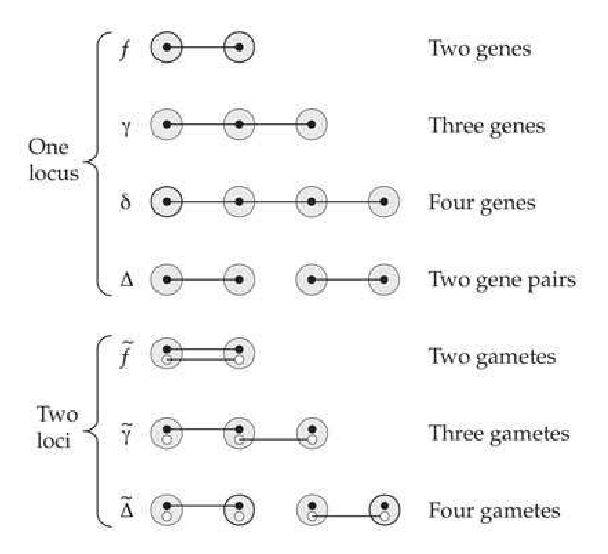
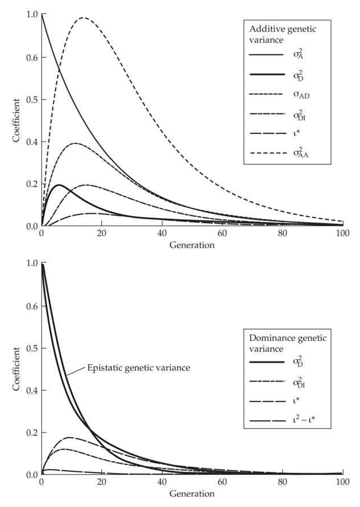
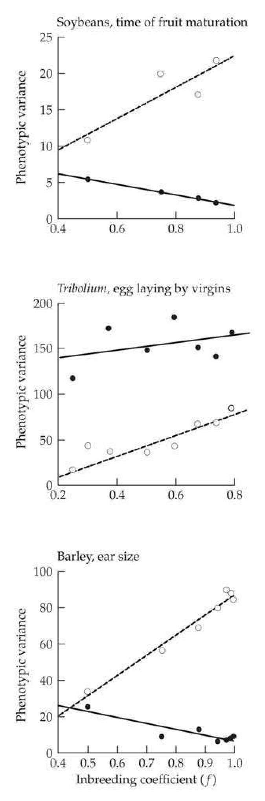
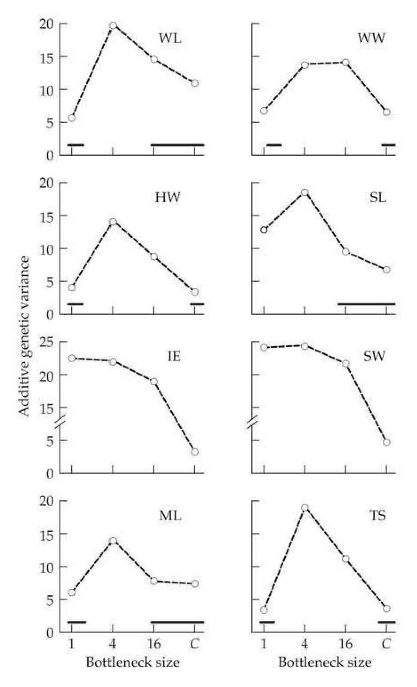
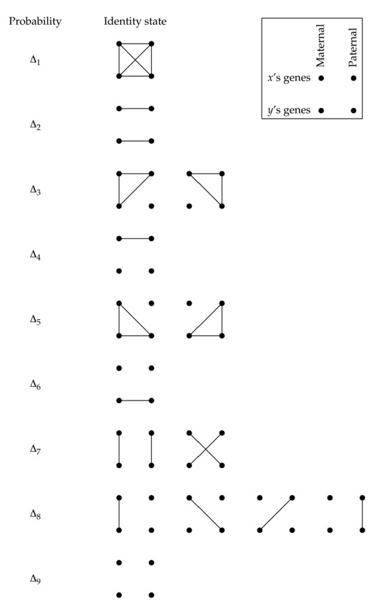
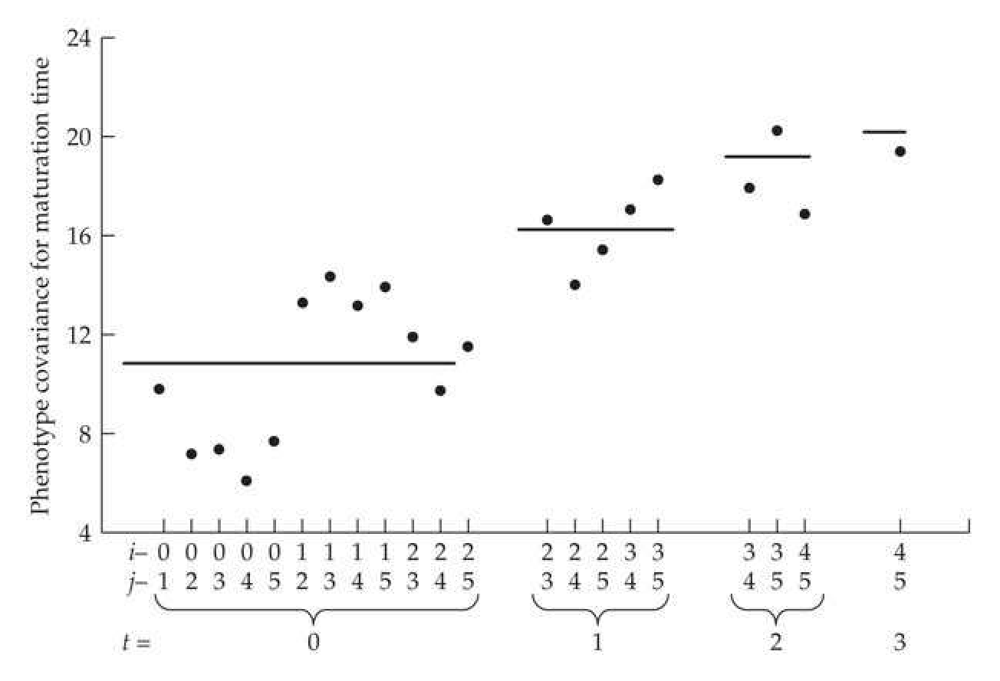
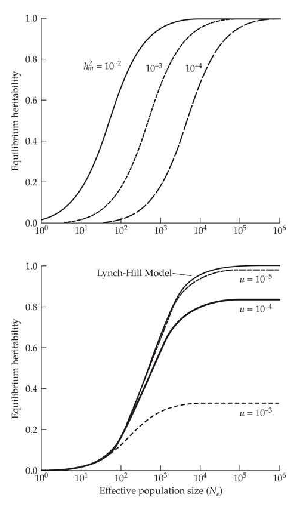

# Chapter 11 · Changes in Genetic Variation Induced by Drift

## chapter11_001 · Changes in Genetic Variation Induced by Drift: Introduction

You want to shave with Occam's razor, not cut your throat. J. B. Walsh

We noted in Chapter 2 that, when operating as the sole evolutionary force, random genetic drift leads inevitably to the loss of alleles within populations as well as to the fixation of alternative alleles in different populations. These conclusions extend logically to quantitative characters. Following a reduction in population size, for example, we expect the genetic variance within populations to decline and the mean phenotypes of isolated populations to diverge. There are some interesting surprises, however, particularly when the mode of gene action has a nonadditive component. In this case, the genetic variance for a trait is not a simple function of the underlying heterozygosity (LW Chapter 4), so we cannot expect the temporal dynamics of the genetic variance to strictly reflect changes in heterozygosity. Indeed, as we will show, under certain conditions, the genetic variance for a quantitative trait is expected to transiently increase during the early phase of a population bottleneck.

**[命题 Proposition]**

The goal of the following two chapters is to develop a null (neutral) hypothesis for quantitative-trait evolution under the assumption that selection is a negligible evolutionary force. For the most part, we will continue to adhere to an ideal Wright-Fisher population structure, with random mating and discrete generations. In this vein, our conceptual approach will be to consider a series of replicate populations, all isolated at the same time from a large base population, which is generally assumed to be in Hardy-Weinberg and gametic-phase equilibrium, and all subsequently kept indefinitely at an identical population size. The current chapter focuses on the expected dynamics of the genetic variance within populations, whereas Chapter 12 focuses on interpopulation divergence.

In both chapters, we initially assume that the dynamics of evolutionary change are due entirely to genetic properties of the base population, which is essentially the case with short-term population bottlenecks. Then, the role of mutation will be taken up. In this chapter, for example, we will end by considering the levels of genetic variance expected in the absence of selection, when a stochastic equilibrium has been reached between the input of variation by mutation and the loss by genetic drift. We also consider the statistical underpinnings of the covariance between relatives in inbred populations, as this has special relevance in attempts to derive inferences about the mode of gene action from phenotypic observations.

The subject material of this chapter is rather technical in places, as it involves the expected temporal dynamics of higher-order gene-frequency moments, including, at the minimum, fourth-order moments, as well as a number of quadratic components of gene action not previously encountered with outbred populations. With quantitative traits, we must also worry about the joint distribution of allele frequencies at different loci, so issues of linkage disequilibrium come in as well. These complexities quickly get out of control in considering the sampling variances of genetic variances and covariances, and we will keep our treatment of these issues to a minimum (which is not to deny their substantial practical significance). Finally, we note that most of our coverage will be concerned with genetic variance, although all moments of the phenotype distribution are subject to change in the presence of drift and mutation.

---

## chapter11_002 · RESPONSE OF WITHIN-POPULATION GENETIC VARIANCE TO DRIFT / Complete Additivity

**[推导 Derivation]**

Consider a diallelic locus (indexed by i) with a strictly additive genetic basis, such that the three genotypic values contributing to a quantitative trait are scaled to be 0, $ a_i $, and $ 2a_i $. Assuming Hardy-Weinberg equilibrium, at any particular generation, $ t $, the total (and additive) genetic variance associated with this locus is $ 2a_i^2p_i(t)[1 - p_i(t)] $, where $ p_i(t) $ is the allele frequency at time $ t $ (LW Chapter 4). Assuming gametic-phase equilibrium, this expression is readily extended to a multilocus trait with a purely additive genetic basis. If we sum over all $ n $ loci contributing to the trait, the expected within-population genetic variance is

> **Formula (11.1)** · `11.1` · source: `chapter11_block_006` · Complete Additivity
>
> $$ \sigma_{A}^{2}(t)=2\sum_{i=1}^{n}E\left\{a_{i}^{2}p_{i}(t)[1-p_{i}(t)]\right\} $$

From Chapter 2, we know that the expected heterozygosity after $ t $ generations at an effective population size of $ N_e $ is simply $ [1 - 1/(2N_e)]^t $ times the initial value. Moreover, under the assumption of neutrality, there should be no correlation between allele frequency and effect, so, substituting from Equation 2.5,

> **Formula (11.2)** · `11.2` · source: `chapter11_block_006` · Complete Additivity
>
> $$ \begin{aligned}\sigma_{A}^{2}(t)&=2\sum_{i=1}^{n}a_{i}^{2}p_{i}(0)[1-p_{i}(0)]\left(1-\frac{1}{2N_{e}}\right)^{t}\\&=\sigma_{A}^{2}(0)\left(1-\frac{1}{2N_{e}}\right)^{t}\simeq\sigma_{A}^{2}(0)\exp\left(-\frac{t}{2N_{e}}\right)\end{aligned} $$

as obtained by Wright (1951).

Equation 11.2 illustrates the simplest possible behavior that can be expected for the genetic variance within a finite population, starting with a baseline level of $ \sigma_A^2(0) $. For a character with a purely additive genetic basis, in the absence of any significant replenishing forces for variation (mutation or migration), the additive genetic variance within populations is expected to decline exponentially at the rate of $ 1/(2N_e) $ per generation. When linkage disequilibrium is present, the additive genetic (as opposed to the additive genetic) variance declines at this rate (Chapters 16 and 24). A key point worth stressing is that Equation 11.2 describes the expected behavior of the genetic variance, as averaged over a very large number of replicate populations. As discussed below, as a consequence of the stochastic sampling of gene frequencies, any single replicate population can deviate substantially from its expected trajectory.

---

## chapter11_003 · RESPONSE OF WITHIN-POPULATION GENETIC VARIANCE TO DRIFT / The Effects of Dominance

Robertson (1952) extended the preceding theory to loci with dominance and obtained the surprising result that rare recessive alleles can sometimes cause an initial increase in both the additive and dominance components of variance in an inbreeding population. A rare neutral allele will usually be lost from a small population, in which case the variance will decline, but if the frequency of a rare recessive allele stochastically increases, the frequency of the extreme genotype will also increase. For completely recessive alleles, a temporary inflation of the expected within-population variance will occur, provided the initial frequency of the recessive genotype is less than 0.17 (Robertson 1952). Although an inflation of the expected variance can also occur with partial dominance, the critical initial frequency for the recessive allele becomes progressively smaller as additivity is approached. Regardless of the degree of dominance, however, the within-population variance eventually declines to zero as loci move toward fixation, as in the case of pure additivity.

Robertson (1952), and thereafter Willis and Orr (1993), considered only a single dial-lelic locus, whereas the analysis is much more complex with multiple loci or with more than two alleles per locus. Fairly general results have been obtained for the case in which all of the genetic variance can be partitioned into additive, dominance, and additive × additive epistatic components (Cockerham 1984a, 1984b; Cockerham and Tachida 1988; Tachida and Cockerham 1989). Even for this case, however, and assuming initial conditions of Hardy-Weinberg and gametic-phase equilibrium, the temporal dynamics of genetic

**[Table]**

> **Table 11.1** · `11.1` · page 3 · source: `chapter11_003`
> Table 11.1 Factors contributing to the additive, dominance, and additive × additive components of genetic variance in finite populations. Here n is the number of loci, $ n_k $ is the number of alleles at the $ k $th locus, $ p_{ki} $ is the frequency of the $ i $th allele at locus $ k $, $ \alpha_{ki} $ is the additive effect of the $ i $th allele at locus $ k $, $ \delta_{kij} $ is the dominance effect at locus $ k $ associated with genotype $ ij $, and $ (\alpha\alpha)_{ki,mj} $ is the additive × additive effect of alleles i and j from different loci ( $ k $ and $ m $) (LW Chapters 4 and 5). The inbreeding depression is defined for individual loci ( $ t_k $ for locus $ k $) as well as for the sum over all loci ( $ \eta $). The $ \alpha_{ki} $, $ \delta_{kij} $, and $ (\alpha\alpha)_{ki,mj} $ are defined from the standpoint of a randomly mating base population (LW Chapter 4).
>
> Selection scheme | Formula
> --- | ---
> Additive variance | $$ \sigma_{A}^{2}=2\sum_{k=1}^{n}\sum_{i=1}^{n_{k}}p_{ki}\alpha_{ki}^{2}=2\sum_{k=1}^{n}E[\alpha_{k.}^{2}] $$
> Dominance variance | $$ \sigma_{D}^{2}=\sum_{k=1}^{n}\sum_{i=1}^{n_{k}}\sum_{j=1}^{n_{k}}p_{ki}p_{kj}\delta_{kij}^{2}=\sum_{k=1}^{n}E[\delta_{k\cdot}^{2}]. $$
> Epistatic variance | $$ \sigma_{A A}^{2}=4\sum_{k,m=1}^{n}\sum_{i=1}^{n_{k}}\sum_{j=1}^{n_{m}}p_{k i}p_{m j}(\alpha\alpha)_{k i,m j}^{2}=4\sum_{k,m=1}^{n}E[(\alpha\alpha)_{k\cdot,m\cdot}^{2}]. $$
> Inbreeding depression | $$ \iota_{k}=\sum_{i=1}^{n_{k}}p_{ki}\delta_{kii}=E[\delta_{kii}]\qquad\iota=\sum_{k=1}^{n}\iota_{k} $$
> Sum of squared locus- specific inbreeding depressions | $$ \iota^{*}=\sum_{k=1}^{n}\iota_{k}^{2} $$
> Variance of dominance effects in inbred individuals | $$ \sigma_{D I}^{2}=\sum_{k=1}^{n}\sum_{i=1}^{n_{k}}\left(p_{k i}\delta_{k i i}^{2}-\iota_{k}^{2}\right)=\sum_{k=1}^{n}\left(E[\delta_{k i i}^{2}]-\iota_{k}^{2}\right) $$
> Covariance of additive and dominance effects in inbred individuals | $$ \sigma_{ADI}=2\sum_{k=1}^{n}\sum_{i=1}^{n_{k}}p_{ki}\alpha_{ki}\delta_{kii}=2\sum_{k=1}^{n}E[\alpha_{ki}\delta_{kii}] $$
>
> | Selection scheme | Formula |
> | --- | --- |
> | Additive variance | $$ \sigma_{A}^{2}=2\sum_{k=1}^{n}\sum_{i=1}^{n_{k}}p_{ki}\alpha_{ki}^{2}=2\sum_{k=1}^{n}E[\alpha_{k.}^{2}] $$ |
> | Dominance variance | $$ \sigma_{D}^{2}=\sum_{k=1}^{n}\sum_{i=1}^{n_{k}}\sum_{j=1}^{n_{k}}p_{ki}p_{kj}\delta_{kij}^{2}=\sum_{k=1}^{n}E[\delta_{k\cdot}^{2}]. $$ |
> | Epistatic variance | $$ \sigma_{A A}^{2}=4\sum_{k,m=1}^{n}\sum_{i=1}^{n_{k}}\sum_{j=1}^{n_{m}}p_{k i}p_{m j}(\alpha\alpha)_{k i,m j}^{2}=4\sum_{k,m=1}^{n}E[(\alpha\alpha)_{k\cdot,m\cdot}^{2}]. $$ |
> | Inbreeding depression | $$ \iota_{k}=\sum_{i=1}^{n_{k}}p_{ki}\delta_{kii}=E[\delta_{kii}]\qquad\iota=\sum_{k=1}^{n}\iota_{k} $$ |
> | Sum of squared locus- specific inbreeding depressions | $$ \iota^{*}=\sum_{k=1}^{n}\iota_{k}^{2} $$ |
> | Variance of dominance effects in inbred individuals | $$ \sigma_{D I}^{2}=\sum_{k=1}^{n}\sum_{i=1}^{n_{k}}\left(p_{k i}\delta_{k i i}^{2}-\iota_{k}^{2}\right)=\sum_{k=1}^{n}\left(E[\delta_{k i i}^{2}]-\iota_{k}^{2}\right) $$ |
> | Covariance of additive and dominance effects in inbred individuals | $$ \sigma_{ADI}=2\sum_{k=1}^{n}\sum_{i=1}^{n_{k}}p_{ki}\alpha_{ki}\delta_{kii}=2\sum_{k=1}^{n}E[\alpha_{ki}\delta_{kii}] $$ |

Sum of squared locus- $$ \iota^{*}=\sum_{k=1}^{n}\iota_{k}^{2} $$ specific inbreeding depressions

Variance of dominance $$ \sigma_{D I}^{2}=\sum_{k=1}^{n}\sum_{i=1}^{n_{k}}\left(p_{k i}\delta_{k i i}^{2}-\iota_{k}^{2}\right)=\sum_{k=1}^{n}\left(E[\delta_{k i i}^{2}]-\iota_{k}^{2}\right) $$ effects in inbred individuals

Covariance of additive $$ \sigma_{ADI}=2\sum_{k=1}^{n}\sum_{i=1}^{n_{k}}p_{ki}\alpha_{ki}\delta_{kii}=2\sum_{k=1}^{n}E[\alpha_{ki}\delta_{kii}] $$ and dominance effects in inbred individuals variance depend on seven quadratic properties of the base population (Table 11.1), as well as on several expectations for the higher-order moments of allele and gamete frequencies. We first present the general model, and then consider some illuminating results that arise under special conditions.

---

## chapter11_004 · RESPONSE OF WITHIN-POPULATION GENETIC VARIANCE TO DRIFT / Quadratic Components for Inbred Populations

When dominance is present, the covariance between relatives (and hence the trait variance) under inbreeding is no longer fully described by just $ \sigma_A^2 $ and $ \sigma_D^2 $. Rather, additional quadratic components of covariance are required, as outlined in Table 11.1. For the case of dominance and additive × additive variance, these include the familiar parameters $ \sigma_A^2 $, $ \sigma_D^2 $, and $ \sigma_{AA}^2 $ (i.e., the additive, dominance, and additive × additive components of genetic variance; LW Chapter 5); the inbreeding depression, $ \iota $, here defined to be the difference between the mean phenotypes of outbred and completely inbred individuals (by construction, $ E[G] = 0 $ for an outbred population, where $ G $ denotes the genotypic value, measured as a deviation from the overall mean); the sum, $ \iota^* $, of squared locus-specific inbreeding depressions; the variance of dominance effects among inbred individuals, $ \sigma_{DI}^2 $; and the covariance of additive and dominance effects in inbred individuals, $ \sigma_{ADI} $. Simplification is possible under certain circumstances. Most notably, with only two alleles per locus, $ \iota^* = \sigma_D^2 $, and if all alleles have a frequency of 0.5, as in a cross between two pure (i.e., fully inbred) lines, then $ \sigma_{DI}^2 = \sigma_{ADI} = 0 $.

**[Table]**

> **Table 11.2** · `11.2` · page 4 · source: `chapter11_004`
> Table 11.2 Some of the alternative notations used for the genetic components required under inbreeding: Harris = Harris (1964); Gallais = Goldringer et al. (1996); Jacquard = Jacquard (1974); Cornelius = Cornelius (1975); Cockerham = Cockerham (1984a, 1984b); de Boer = de Boer and Hoeschele (1993); Smith = Smith and Maiki-Tanila (1990); Abney = Abney et al. (2000).
>
> Ours | Harris | Gallais | Jacquard | Cornelius | Cockerham | de Boer | Smith | Abney
> --- | --- | --- | --- | --- | --- | --- | --- | ---
> $ \sigma_{A}^{2} $ | $ \sigma_{Ar}^{2} $ | $ \sigma_{A}^{2} $ | $ V_{A} $ | $ \sigma_{A}^{2} $ | $ \sigma_{A}^{2} $ | $ \sigma_{Ar}^{2} $ | $ \sigma_{a}^{2} $ | $ V_{a} $
> $ \sigma_{D}^{2} $ | $ \sigma_{Dr}^{2} $ | $ \sigma_{D}^{2} $ | $ V_{D} $ | $ \sigma_{D}^{2} $ | $ \sigma_{D}^{2} $ | $ \sigma_{Dr}^{2} $ | $ \sigma_{d}^{2} $ | $ V_{d} $
> $ \iota $ | - | - | - | - | H | $ \Delta_{I} $ | $ \mu_{\delta} $ | -
> $ \iota^{*} $ | $ D_{I}^{2} $ | $ \sum D_{o}^{2} $ | $ D_{H}^{2} $ | $ \mu_{\infty} $ | $ H^{*} $ | $ \Delta_{I}^{2} $ | - | $ SS_{\mu_{h}} $
> $ \sigma_{DI}^{2} $ | $ \sigma_{DI}^{2} $ | $ \sigma_{Do}^{2} $ | $ V_{h}-D_{H}^{2} $ | $ \sigma_{\infty}^{2}-2C+2\sigma_{A}^{2} $ | $ D_{2}^{*} $ | $ \sigma_{DI}^{2} $ | $ \sigma_{\delta}^{2} $ | $ V_{h} $
> $ \sigma_{ADI} $ | $ \sigma_{ADI} $ | $ \sigma_{ADO} $ | 2Cov_{H}(A,D) | $ C-2\sigma_{A}^{2} $ | $ 2D_{1} $ | $ \sigma_{ADI} $ | $ \sigma_{a\delta} $ | Cov_{h}(a,d)

As shown in Table 11.2, numerous alternative notations for these quadratic components appear in the literature, with almost every new paper seeming to invent its own terminology, which is often a hybrid of several previous papers. Additionally, there are also reparameterizations of these components, such as the Q model of Cornelius and Van Sanford (1988). As Example 11.1 shows, the dominance-related quadratic components are easily computed if one knows the genotypic frequencies in the (randomly mating) base population. Because these components depend on $ \alpha $ and $ \delta $, which themselves depend on allele frequencies, their behavior under a change in allele frequency can be complex.

**[示例 Example]**

> **Example 11.1** · ref: `11.1` · source: `chapter11_004.json` · blocks 3–7
>
> Example 11.1. Consider a population with a single locus with genotypic values of $ A_1A_1 = 0 $, $ A_1A_2 = 1.67 $, and $ A_2A_2 = 2 $. What are the quadratic components when $ p = \text{freq}(A_1) = 0.8 $? Using standard expressions (LW Chapter 4), the random-mating parameters are
> 
> > **Inline Table 1** · `inline_1` · page 4 · source: `chapter11_004`
> > Inline Table 1
> >
> > $ \alpha_{1} $ | $ \alpha_{2} $ | $ \delta_{11} $ | $ \delta_{12} $ | $ \delta_{22} $ | $ \sigma_{A}^{2} $ | $ \sigma_{D}^{2} $
> > --- | --- | --- | --- | --- | --- | ---
> > -0.2804 | 1.1216 | -0.0536 | 0.02144 | -0.8576 | 0.628993 | 0.045967
> 
> 
> Note that the mean value of $ G = 2E[\alpha] + E[\delta] = 0 $ under random mating, as $$ (2\alpha_{1}+\delta_{11})p^{2}+(\alpha_{1}+\alpha_{2}+\delta_{12})2p(1-p)+(2\alpha_{2}+\delta_{22})(1-p)^{2}=0 $$ The mean value ( $ \iota $) of $ G $ under complete inbreeding (which is the inbreeding depression change in the mean as $ E[G] = 0 $ under random mating), follows upon recalling that a fraction, $ p_1 $, are $ A_1A_1 $ and a fraction, $ p_2 $, are $ A_2A_2 $ and that $ p_1\alpha_1 + p_2\alpha_2 = 0 $, yielding $$ \begin{aligned}\iota&=p_{1}(2\alpha_{1}+\delta_{11})+p_{2}(2\alpha_{2}+\delta_{22})\\&=p_{1}\delta_{11}+p_{2}\delta_{22}=0.8\cdot(-0.0536)+0.2\cdot(-0.8576)=-0.2144\end{aligned} $$ Because there are only two alleles, $ \iota^* = \sigma_D^2 $ (Cockerham and Matzinger 1985), and this is confirmed as $$ \iota^{*}=\left(p_{1}\delta_{11}+p_{2}\delta_{22}\right)^{2}=\left(-0.2144\right)^{2}=0.045967=\sigma_{D}^{2} $$ As for the other two quadratic components, $$ \begin{aligned}\sigma_{DI}^{2}&=p_{1}\delta_{11}^{2}+p_{2}\delta_{22}^{2}-\iota^{*}\\&=0.8\left(-0.0536\right)^{2}+0.2\left(-0.8576\right)^{2}-0.045967=0.103427\\\sigma_{ADI}&=2(p_{1}\alpha_{1}\delta_{11}+p_{2}\alpha_{2}\delta_{22})\\&=2\Big[0.8\left(-0.2804\right)\left(-0.0536\right)+0.2\left(1.1216\right)\left(-0.8576\right)\Big]=-0.360707\end{aligned} $$ These quadratic components for other allele frequencies are graphed below.

---

## chapter11_005 · RESPONSE OF WITHIN-POPULATION GENETIC VARIANCE TO DRIFT / One- and Two-locus Identity Coefficients

The contributions of the factors in Table 11.1 to the traditional components of genetic variance ($ \sigma_{A}^{2} $, $ \sigma_{D}^{2} $, and $ \sigma_{AA}^{2} $) in a finite population depend upon several one- and two-locus identity coefficients. As shown in Figure 11.1, these give the probabilities that randomly drawn combinations (from the population) of two, three, or four alleles at a given locus are identical by descent (both IBD and ibd are used in the literature; LW Chapter 7), with extensions to the two-locus case for randomly drawn combinations of two, three, or four two-locus gametes. Of the one-locus coefficients, f is the familiar inbreeding coefficient, i.e., the probability that two alleles are identical by descent at a particular locus (Chapter 2). The probabilities that the members of random groups of three and four alleles are all identical by descent are denoted by $ \gamma $ and $ \delta $ (the latter is not to be confused with the dominance effects, which are subscripted in Table 11.1).

The coefficient $ \Delta $ also involves four gametes (Figure 11.1), and is the probability of IBD within two pairs of gametes (including the possibility that all four genes are IBD). Under the random union of gametes, this corresponds to the probability that two (diploid) individuals have genotypes that are IBD. With a probability of $ \delta $, both individuals are inbred, and thus all four alleles are IBD, with the resulting genotypes being homozygotes. The more interesting scenario, which occurs with a probability of $ \Delta - \delta $, is that where the two genotypes are IBD but the alleles within each individual are not (i.e., neither individual is inbred). Hence, the shared genotypes could be either heterozygotes or homozygotes. For example, suppose both of diploid genotypes are AA and that the maternal copy of A in both individuals is IBD, as is the paternal copy of A, but the maternal and paternal copies are not IBD. This generates two homozygotes that are not inbred (the two copies of A within each individual are not IBD), yet both genotypes are IBD to each other. Similarly, if both genotypes are Aa, neither individual is inbred, but if the A is IBD in both individuals, and so too are the a alleles, then the genotypes are IBD, but not inbred.

**[推导 Derivation]**

For randomly mating monoecious populations under the classical Wright-Fisher model, the transition equations for these coefficients are functions of $ N_{e} $ and t, with

> **Formula (11.3a)** · `11.3a` · source: `chapter11_block_026` · One- and Two-locus Identity Coefficients
>
> $$ f_{t}=1-\lambda_{1}^{t} $$

> **Formula (11.3b)** · `11.3b` · source: `chapter11_block_026` · One- and Two-locus Identity Coefficients
>
> $$ \begin{align*}\gamma_t=1-{3\lambda_1^t\over2}+{\lambda_2^t\over2}\end{align*} $$

> **Formula (11.3c)** · `11.3c` · source: `chapter11_block_026` · One- and Two-locus Identity Coefficients
>
> $$ \Delta_{t}=1-\frac{24\lambda_{1}^{t}-10\lambda_{2}^{t}+\lambda_{3}^{t}}{15}+\frac{\lambda_{1}^{t}-\lambda_{3}^{t}}{5(5N_{e}-3)} $$

> **Formula (11.3d)** · `11.3d` · source: `chapter11_block_026` · One- and Two-locus Identity Coefficients
>
> $$ \delta_{t}=1-\frac{9\lambda_{1}^{t}-5\lambda_{2}^{t}+\lambda_{3}^{t}}{5}-\frac{3\lambda_{1}^{t}}{20(5N_{e}-3)}+\frac{\lambda_{2}^{t}}{12(N_{e}-1)}-\frac{(8N_{e}-3)\lambda_{3}^{t}}{30(5N_{e}-3)(N_{e}-1)} $$

where $ \lambda_{j}=1-(j/2N_{e}) $ for $ j=1,2,3 $ (Cockerham and Weir 1983).

**[Figure]**

> **Figure 11.1** · page 6 · source: `chapter11`
>
> 
>
> Figure 11.1 Measures of identity by descent (IBD) for single loci  $ (f, \gamma, \delta, \Delta) $ and pairs of loci  $ (f, \widetilde{\gamma}, \widetilde{\Delta}) $. The large circles denote gametes (alleles when restricted to a single locus), and the open and closed dots within them represent alleles from one (top four relationships) or two (bottom three) loci. Identity by descent is indicated by a horizontal line. For example,  $ \delta $ is the probability that four randomly chosen alleles are all IBD, while  $ \Delta $ is the probability that, in any two pairs of gametes, each pair has an IBD allele (i.e., two diploid genotypes are IBD). As discussed in the text,  $ \Delta $ includes  $ \delta $ as a special case.

**[推导 Derivation]**

The three two-locus coefficients (denoted by tildes in Figure 11.1) refer to joint identities by descent at two loci. First, $ \widetilde{f} $ refers to pairs of alleles on two gametes and is the joint probability of IBD at locus 1 and IBD at locus 2. Under neutrality, random mating, and linkage equilibrium, $ \widetilde{f} $ cannot be less than the product of the separate identity probabilities for each locus, $ f^2 $. Second, $ \widetilde{\gamma} $ refers to the situation in which each member of a pair of genes in one gamete is identical by descent with a gene in a separate gamete (IBD at locus 1 for gametes one and two, IBD at locus 2 for gametes two and three). Finally, $ \widetilde{\Delta} $ is the joint identity by descent of genes (two at each locus) in two pairs of different gametes (IBD at locus 1 for gametes one and two, IBD at locus 2 for gametes three and four). The transition equations for these double identity-by-descent measures, which were derived by Weir and Cockerham (1969) for ideal monoecious populations, depend upon $ N_e $, $ t $, and the linkage parameter $ \rho = 1 - 2c $ (where $ c \leq 0.5 $ is the recombination frequency between loci). Letting $ \widetilde{f}_t = \widetilde{f}_t^* + 2f_t - 1 $, $ \widetilde{\gamma}_t = \widetilde{\gamma}_t^* + 2f_t - 1 $, and $ \widetilde{\Delta}_t = \widetilde{\Delta}_t^* + 2f_t - 1 $, the coefficients are obtained by use of Equation 11.3a and the following matrix expression,

> **Formula (11.4a)** · `11.4a` · source: `chapter11_block_027` · One- and Two-locus Identity Coefficients
>
> $$ \begin{align*}\left(\begin{array}{c}\widetilde{f}_{t+1}^{*}\\ \widetilde{\gamma}_{t+1}^{*}\\ \widetilde{\Delta}_{t+1}^{*}\end{array}\right)=\mathbf{M}\left(\begin{array}{c}f_{t}^{*}\\ \widetilde{\gamma}_{t}^{*}\\ \widetilde{\Delta}_{t}^{*}\end{array}\right)\end{align*} $$

starting with $ \widetilde{f}_{0}^{*}=\widetilde{\gamma}_{0}^{*}=\widetilde{\Delta}_{0}^{*}=1 $, where

> **Formula (11.4b)** · `11.4b` · source: `chapter11_block_027` · One- and Two-locus Identity Coefficients
>
> $$ \mathbf{M}=\begin{pmatrix}\frac{(1+\rho)^{2}}{4}-\frac{\rho}{2N_{e}}&\frac{(N_{e}-1)(1-\rho^{2})}{2N_{e}}&\frac{(N_{e}-1)(1-\rho)^{2}}{4N_{e}}\\\frac{1+\rho}{4N_{e}}-\frac{\rho}{4N_{e}^{2}}&\frac{(N_{e}-1)[N_{e}+1+\rho(N_{e}-2)]}{2N_{e}^{2}}&\frac{(N_{e}-1)(2N_{e}-3)(1-\rho)}{4N_{e}^{2}}\\\frac{2N_{e}-1}{4N_{e}^{3}}&\frac{(N_{e}-1)(2N_{e}-1)}{N_{e}^{3}}&\frac{(N_{e}-1)(2N_{e}-1)(2N_{e}-3)}{4N_{e}^{3}}\end{pmatrix} $$

**[Table]**

> **Table 11.3** · `11.3` · page 7 · source: `chapter11_005`
> Table 11.3 Coefficients for the quadratic properties defined in Table 11.1 (necessary for the definition of the variance components noted in the Source column) for lines derived from a base population. For example, the total within-population genetic variance (first row) is equal to the weighted sum over all the quadratic components. The among-population variance follows similarly, with the total genetic variance being the sum of the within- and among-population components. Likewise, we can decompose the within-population variance into the contributions from the additive, dominance, and additive-by-additive components under inbreeding (the sum of these equal the within-population variance). The numerical values of the coefficients must be computed with Equations 11.3 and 11.4, and in practice, the two-locus identity coefficients need to be averaged over all pairs of loci, with each two-locus estimate depending on the recombination fraction.
>
> Source | $ \sigma_{A}^{2} $ | $ \sigma_{D}^{2} $ | $ \sigma_{ADI} $ | $ \sigma_{DI}^{2} $
> --- | --- | --- | --- | ---
> Within | 1 - f | 1 - f - 2( $ \Delta - \delta $) | 2(f - $ \gamma $) | f - $ \delta $
> A | 1 - f | 2([f - $ \gamma $ - 2( $ \Delta - \delta $)] | 2(f - $ \gamma $) | 2( $ \gamma $ - $ \delta $)
> D | 0 | 1 - 3f + 2( $ \Delta + \gamma - \delta $) | 0 | f + $ \delta $ - 2 $ \gamma $
> AA | 0 | 0 | 0 | 0
> Among | 2f | 2( $ \Delta - \delta $) | 2 $ \gamma $ | $ \delta $
> Total | 1 + f | 1 - f | 2f | f
>  | Source | $ \iota^{*} $ | $ \iota^{2} - \iota^{*} $ | $ \sigma_{AA}^{2} $
>  | Within | f - $ \Delta $ | $ \widetilde{f} - \widetilde{\Delta} $ | 1 + 2f - 2 $ \widetilde{\gamma} $ - $ \widetilde{\Delta} $
>  | A | 2( $ \gamma $ - $ \Delta $) | 2( $ \widetilde{\gamma} $ - $ \widetilde{\Delta} $) | 4f - $ \widetilde{f} $ - 2 $ \widetilde{\gamma} $ - $ \widetilde{\Delta} $
>  | D | f + $ \Delta $ - 2 $ \gamma $ | $ \widetilde{f} - 2 $ \widetilde{\gamma} $ + $ \widetilde{\Delta} $ | 0
>  | AA | 0 | 0 | 1 - 2f + $ \widetilde{f} $
>  | Among | $ \Delta - f^{2} $ | $ \widetilde{\Delta} - f^{2} $ | $ \widetilde{f} + 2 $ \widetilde{\gamma} $ + $ \Delta $
>  | Total | f(1 - f) | $ \widetilde{f} - f^{2} $ | 1 + 2f + $ \widetilde{f} $

---

## chapter11_006 · RESPONSE OF WITHIN-POPULATION GENETIC VARIANCE TO DRIFT / Impact of Drift Under Nonadditive Variance

With definitions in hand for the quadratic expressions in the base population (Table 11.1) and the temporal dynamics of the identity coefficients (Equations 11.3 and 11.4), we are now in a position to explore the impact of finite population size on the components of variance for a quantitative trait with a nonadditive genetic basis. The expected dynamics are determined by summing the products of the seven quadratic terms listed across the top of Table 11.3 with their associated tabulated identity coefficients in the table. For example, the expected within-population dominance variance is $$ [1-3f+2(\Delta+\gamma-\delta)]\sigma_{D}^{2}+(f+\delta-2\gamma)\sigma_{D I}^{2}+(f+\Delta-2\gamma)\iota^{*}+(\widetilde{f}-2\widetilde{\gamma}+\widetilde{\Delta})(\iota^{2}-\iota^{*}) $$

Here, $ \sigma_{D}^{2} $, $ \sigma_{DI}^{2} $, etc. are the base-population values of these components under random mating.

**[推导 Derivation]**

To gain a more intuitive feel for the source of the expressions in Table 11.3, we first consider the total genetic variance in a collection of lines, each inbred to level f, while ignoring epistasis until the following section. Subscripting loci with k and the two alleles at a locus as i and j, the genotypic value, G (expressed as a deviation from the mean), of an individual can be written as

> **Formula (11.5)** · `11.5` · source: `chapter11_block_031` · Impact of Drift Under Nonadditive Variance
>
> $$ G=\sum_{k=1}^{n}\left[(1-\phi_{kij})(\alpha_{ki}+\alpha_{kj}+\delta_{kij})+\phi_{kij}(2\alpha_{ki}+\delta_{kii})\right] $$

where $ \phi_{kij} $ is equal to one if the two alleles at a locus are identical by descent and equal to zero otherwise.

**[推导 Derivation]**

To compute the mean genotypic value, $ \mu_G = E[G] $, note that the expected value of $ \phi_{kij} $ is $ f $ and that we can write the expected value of $ G $ as two components: if not inbred $ (\phi_{kij} = 0) $, then $ E[\alpha_{ki} + \alpha_{kj} + \delta_{kij}] = 0 $, as these are deviations from the mean, leaving $$ E[G]=E\left[\sum_{k=1}^{n}\phi_{k i j}(2\alpha_{k i}+\delta_{k i i})\right]=f\left[\sum_{k=1}^{n}\sum_{i=1}^{n_{k}}p_{k i}(2\alpha_{k i}+\delta_{k i i})\right] $$ If inbred, the two alleles at locus k are identical, giving the frequency of genotype $ A_{ki}A_{ki} $ as $ fp_{k,i} $, yielding the last equality. Because $ \sum_{i}\alpha_{ki}p_{ki}=0 $ (by construction), we are left with $$ E[G]=\mu_{G}=f\sum_{k=1}^{n}\sum_{i=1}^{n_{k}}\delta_{kii}p_{ki}=f\cdot\iota $$ the last step following from the definition of $ \iota $ (Table 11.1). Under complete inbreeding, $ \mu_G = \iota $, the change in the mean from inbreeding depression (as $ \mu_G = 0 $ under random mating). In addition,

> **Formula (11.6a)** · `11.6a` · source: `chapter11_block_032` · Impact of Drift Under Nonadditive Variance
>
> $$ E[G^{2}]=\sum_{k=1}^{n}\left\{(1-f)E[(\alpha_{ki}+\alpha_{kj}+\delta_{kij})^{2}]+fE[(2\alpha_{ki}+\delta_{kii})^{2}]\right\}+\widetilde{f}(\iota^{2}-\iota^{*}) $$

The final term in Equation 11.6a summarizes the consequences of joint inbreeding at pairs of loci, with $ \tilde{f} $ being the probability that two loci in the same individual are inbred (Figure 11.1) and $ \iota^2 - \iota^* = 2 \sum_{k<m}^n \iota_{k}\iota_m $ being the sum of cross-products of the locus-specific inbreeding depressions. In obtaining Equation 11.6a, note that all other products across loci have expectations equal to zero because $ E[\alpha_{ki}] $ is always equal to zero and $ E[\delta_{kij}] = 0 $ at non-inbred loci (LW Chapter 4).

**[推导 Derivation]**

Recalling that the genetic variance is defined to be $ \sigma_{G}^{2} = E[G^{2}] - \mu_{G}^{2} $, we obtain

> **Formula (11.6b)** · `11.6b` · source: `chapter11_block_034` · Impact of Drift Under Nonadditive Variance
>
> $$ \begin{align*}\sigma_{G}^{2}=&\sum_{k=1}^{n}\left\{(1-f)(2E[\alpha_{ki}^{2}]+E[\delta_{kij}^{2}])+f(4E[\alpha_{ki}^{2}]+4E[\alpha_{ki}\delta_{kii}]+E[\delta_{kii}^{2}])\right\}\\&+\widetilde{f}(\iota^{2}-\iota^{*})-f^{2}\iota^{2}\end{align*} $$

**[推导 Derivation]**

Further simplification is achieved by adding and subtracting $ f(1 - f)\iota^* $ on the right side of this expression, which, after using the expressions in Table 11.1, leads to

> **Formula (11.6c)** · `11.6c` · source: `chapter11_block_035` · Impact of Drift Under Nonadditive Variance
>
> $$ \sigma_{G}^{2}=(1+f)\sigma_{A}^{2}+(1-f)\sigma_{D}^{2}+2f\sigma_{ADI}+f\sigma_{DI}^{2}+f(1-f)\iota^{*}+(\widetilde{f}-f^{2})(\iota^{2}-\iota^{*}) $$

in agreement with the final row in Table 11.3.

Although the preceding results apply to the genetic variance summed within and among a set of hypothetical isolated subpopulations, an expression for the average within-population variance can be obtained by removing the among-population component. The simplest route to this result is to recall the general rule that the variance among groups is equivalent to the covariance between individuals within groups (e.g., LW Chapter 18). Using this principle, the contribution of each quadratic component in Table 11.1 to the among-population variance can be obtained in the following way.

First, in the context of the entire collection of populations, $f$ is equivalent to the probability that single alleles in the same population are identical by descent (the average coefficient of coancestry), so the additive genetic covariance for members of the same population is equal to $2f\sigma_A^2$ (LW Chapter 7). Second, two individuals within a population may also share both genes at a locus, in which case they will exhibit dominance genetic covariance, the magnitude of which will depend on whether the locus is inbred or not. From Figure 11.1, we see that the probability that both individuals are inbred and share the same genotype by descent is equal to the identity measure $\delta$, so the genetic covariance by this route is $\delta\sigma_{D1}^2$.

The probability that the two individuals are not inbred but share identical genotypes by descent is $ 2(\Delta - \delta) $ (the 2 accounts for paternal-paternal and maternal-maternal versus cross-paternal-maternal sources of identity by descent), so the covariance by this route becomes $ 2(\Delta - \delta)\sigma_D^2 $. Third, the probability that three alleles in two members of a population are identical by descent is equal to $ \gamma $, and there are two ways in which this can arise, so the covariance between additive and dominance effects is $ 2\gamma\sigma_{ADI} $. Finally, the covariance resulting from shared inbreeding depression is $ (\Delta - f^2)\iota^* $ because $ \Delta $ is the probability that two members of the same population are jointly inbred at the same locus, while the average fraction of individuals that are inbred over all populations is $ f $ per locus, and $ \iota^* $ is the sum of squared per-locus inbreeding depressions. Similarly, the covariance due to joint inbreeding depression at different loci is equal to $ (\widetilde{\Delta} - f^2)(\iota^2 - \iota^*) $, with the latter term being the sum of cross-products of per-locus inbreeding depressions.

Upon summing all six of these contributions, we obtain the genetic variance among populations given in the second row from the bottom of Table 11.3. The within-population genetic variance is then obtained by subtracting the among-population component from the total genetic variance. Results such as these provide a mechanistic explanation for the changes in components of genetic variance that can be induced by small population size. For example, it can be seen from the second line of Table 11.3 that inbreeding always converts some initial dominance genetic variance into additive genetic variance. This does not necessarily imply that there will be a net increase in additive genetic variance in a bottlenecked population, as the total dynamics depend critically on the relative magnitudes and temporal dynamics of all five of the quadratic components involving dominance in the base population (Figure 11.2). However, it does imply that Equation 11.2 cannot be strictly correct in the presence of dominance. While the contribution to the additive genetic variance from the base population, $ \sigma_{A}^{2} $, declines in each generation, Figure 11.2 shows that all other contributions first increase before eventually decreasing to zero. Thus, whether a population bottleneck will induce an increase in additive genetic variance depends critically on the magnitude of $ \sigma_{A}^{2} $ relative to the other quadratic components in the base population.

Note that the two-locus identity coefficients $ (f, \tilde{\gamma}, \text{and } \Delta) $ appear only in association with quadratic terms involving pairs of loci, in this case $ (\iota^2 - \iota^*) $. Two-locus identity by descent is of relevance in finite populations because the gametic-phase disequilibrium that inevitably develops by chance causes identity disequilibrium between loci (Weir and Cockerham 1968)—individuals that are inbred at one locus are likely to be so at other loci, causing a transient inflation of the genetic variance through the production of extreme phenotypes.

**[命题 Proposition]**

Although it may not be immediately apparent, the coefficients in the final two (bottom) columns in Table 11.3 are equivalent to measures of identity disequilibrium (Cockerham 1984a). For example, $ \widetilde{f}-f^2 $ is the deviation of the double identity-by-descent within gametes in the same population from that based on the assumption of independence between loci. This difference is simply the logical extension of the notion of disequilibrium, where we defined $ D_{AB} = p_{AB} - p_{APB} $, with $ \widetilde{f} $ being the analog of $ p_{AB} $ (the frequency of the AB gamete) and $ f $ being the analog of $ p_A $ and $ p_B $. Although $ \widetilde{f} $ depends upon the average linkage relationships between all relevant pairs of loci (Weir and Cockerham 1968, 1969), in most cases, if most pairs of loci are on different chromosomes, or if the population is randomly mated and expanded following the bottleneck, $ \widetilde{f} $ will be approximately equal to $ f^2 $. Under such conditions, $ (\widetilde{f}-f^2) $, as well as the other coefficients of $ (\iota^2-\iota^*) $ in Table 11.3, will be very close to zero, removing at least this one term from the variance expressions (Figure 11.2).

**[Figure]**

> **Figure 11.2** · page 10 · source: `chapter11`
>
> 
>
> Figure 11.2 Dynamics of the coefficients for the terms contributing to the additive, dominance, and additive × additive genetic variance within populations for an effective population size of 10 and freely recombining loci (c = 0.5), obtained by use of Equations 11.3 and 11.4, along with Table 11.1. The top panel gives the contributions of each term to the within-population additive variance, while the bottom panel gives the same for the within-population dominance (and  $ A \times A $) variance. The coefficient for the contribution of  $ (\ell^2 - \iota^*) $ to the additive genetic variance is barely visible on the scale in the bottom graph. These results apply approximately to any other population size,  $ N_e $, if the time scale is transformed by multiplying by  $ N_e / 10 $. To obtain the actual dynamics of the variance components, the coefficients need to be multiplied by the base-population properties. For example, the additive genetic variance in generation 50 is approximately  $ 0.08(\sigma_A^2 + \sigma_{ADI}) + 0.04\sigma_{DI}^2 + 0.01(\sigma_D^2 + \iota^*) + 0.28\sigma_{AA}^2 $, while the additive × additive genetic variance is  $ \simeq 0 $, and the dominance genetic variance is  $ \simeq 0.04(\iota^* + \sigma_D^2) $.

---

## chapter11_007 · RESPONSE OF WITHIN-POPULATION GENETIC VARIANCE TO DRIFT / The Effects of Epistasis

The fundamental point in the preceding section is that because dominance is a function of a two-allele interaction, the variance in dominance effects can be altered in unexpected ways when inbreeding alters the average background on which an allele appears. This same issue applies to epistatic effects, although on a potentially larger scale because the additive × additive epistatic variance ($ \sigma_{AA}^2 $) is a function of $ n^2 $ terms, while all of the other quadratic components in Table 11.1 (except $ \iota^2 - \iota^* $, which seems to be of little significance) are functions of only $ n $ terms. If we assume unlinked loci, the coefficient of the $ \sigma_{AA}^2 $

**[Table]**

> **Table 11.4** · `11.4` · page 11 · source: `chapter11_007`
> Table 11.4 A simple two-locus system with epistasis. Elements in the table are the expected genotypic values for the two-locus genotypes.
>
>  | $ A_{1}A_{1} $ | $ A_{1}A_{2} $ | $ A_{2}A_{2} $
> --- | --- | --- | ---
> $ B_{1}B_{1} $ | $ 4a + i $ | 3a | 2a - i
> $ B_{1}B_{2} $ | 3a | 2a | a
> $ B_{2}B_{2} $ | 2a - i | a | i

contribution to the additive genetic variance rises to nearly 1.0 in a little over $ N_e $ generations, i.e., the equivalent of all of the base-population $ \sigma_{AA}^2 $ is added to the (otherwise declining) additive genetic variance at this point (Figure 11.2).

Thus, the potential exists for substantial additive × additive epistatic variance in the base population to spawn a prolonged increase in the additive genetic variance following a reduction in population size, or at least to slow the erosion relative to the expectation given by Equation 11.2. The matter is of considerable interest because whereas inflations in the additive genetic variance induced by dominance effects are accompanied by the maladaptive effects of inbreeding depression (i.e., a deleterious change in the mean phenotype), those caused by a conversion of epistatic additive effects have no side effects on the mean (unless there is linkage disequilibrium, in which case the Griffing effect, discussed in Chapter 15, can be important), and simply increase the range of variation upon which natural selection can act.

To see how this might happen, consider the following. From the standpoint of any locus, variation in epistatic interactions with genes at other loci amounts to a reduction in the efficiency with which allelic effects are transmitted from generation to generation—segregation and recombination ensure that interlocus interactions in parents are not transmitted faithfully through gametes. However, as genetic drift moves alleles toward fixation at one or both loci or as identity disequilibria increase, this variation in the genetic environment is reduced. In Table 11.4, for example, the $ A_{1} $ allele is present in genetic backgrounds that lead to five distinct genotypic values in a randomly mating population. If, however, the $ B_{2} $ allele becomes fixed, then an $ A_{1} $ allele can only be in two backgrounds ($ A_{1}A_{1}B_{2}B_{2} $ and $ A_{1}A_{2}B_{2}B_{2} $). In this case, the epistatic interactions are still present, but they are transmitted reliably as additive effects (the difference between adjacent pairs of A-locus genotypes being a constant, $ a - i $).

**[推导 Derivation]**

Some simple insight into the role of additive × additive epistatic variance in the dynamics of genetic variance of finite populations can be achieved if one is willing to assume that the loci involved are unlinked (c = 0.5), meaning that identity disequilibria are of negligible significance. Returning to Table 11.3, it can be seen that the coefficient for the contribution of base-population additive × additive variance to future additive genetic variance is $ (4f - \tilde{f} - 2\tilde{\gamma} - \tilde{\Delta}) $, which reduces to $ 4f(1 - f) $ under the assumption that all of the two-locus identities $ \simeq f^2 $. If we ignore any contributions from dominance, the expression for the dynamics of the additive genetic variance then simplifies to

> **Formula (11.7a)** · `11.7a` · source: `chapter11_block_046` · The Effects of Epistasis
>
> $$ \sigma_{A}^{2}(t)\simeq(1-f_{t})\sigma_{A}^{2}(0)+4f_{t}(1-f_{t})\sigma_{A A}^{2}(0) $$

and the expression for the additive $ \times $ additive variance simplifies to

> **Formula (11.7b)** · `11.7b` · source: `chapter11_block_046` · The Effects of Epistasis
>
> $$ \sigma_{A A}^{2}(t)\simeq(1-f_{t})^{2}\sigma_{A A}^{2}(0) $$

assuming the absence of any higher-order epistatic variance (Cockerham and Tachida 1988; Goodnight 1988; López-Fanjul et al. 1999). Equation 11.7a shows that the conversion of additive × additive to additive genetic variance, which scales as $ (1 - f_t) \cdot f_t $, is maximized at $ f_t = 0.5 $. Because $ f_t \simeq 1 - \exp(-t/2N_e) $, this translates to $ t \simeq 1.4N_e $ generations in accordance with Figure 11.2.

**[推导 Derivation]**

Based on results from Barton and Turelli (2004), van Buskirk and Willi (2006) proposed to approximate the additive variance (with epistasis and dominance) under inbreeding by

> **Formula (11.7c)** · `11.7c` · source: `chapter11_block_047` · The Effects of Epistasis
>
> $$ \sigma_{A}^{2}(t)\simeq(1-f_{t})\left[\sigma_{A}^{2}(0)+2f_{t}\sigma_{D}^{2}+4f_{t}\sigma_{A A}^{2}(0)\right] $$

This is simply Equation 11.7a with a dominance term $ \sigma_D^2 $ added. While this expression appears in the literature (e.g., Taft and Roff 2012), comparison with the exact result (given from the A row in Table 11.3) shows that Equation 11.7c ignores other quadratic components involving dominance ($ \sigma_{ADI} $ and $ \sigma_{DI}^2 $) and the contributions from other identity coefficients besides $ f $, and thus may be a poor approximation in some settings.

Limited attention has been given to the role of two-locus epistasis involving dominance effects in finite populations (Weir and Cockerham 1977; Cheverud and Routman 1996; López-Fanjul et al. 1999; Barton and Turelli 2004), and no general formulation exists for the dynamics of genetic variance resulting from higher-order epistatic interactions. We can anticipate that the necessary algebra for such a solution would be extremely tedious, as it would involve descent measures involving three and more loci, and as will be discussed below, the existing data do not support the need for such a theory. For heuristic purposes, however, we will consider the approximate case for higher-order epistasis involving only additive effects, again assuming freely recombining loci and ignoring identity disequilibrium. As a simple entrée into this matter, recall that in the absence of dominance, the expected covariance between the relatives $x$ and $y$ is $\sigma_G(x,y) = 2\theta_{xy}\sigma_A^2 + (2\theta_{xy})^2\sigma_AA^2 + \cdots + (2\theta_{xy})^n\sigma_A^2$, where $\theta_{xy}$ is the coefficient of coancestry (LW Chapter 7), and $\sigma_A^2$ refers to epistatic variance involving the additive effects of $n$ loci. The total genetic variance (summed over the within- and among-population components) is equivalent to the covariance of individuals with themselves, which is obtained by letting $\theta_{xy} = (1 + f)/2$ (LW Chapter 7), whereas the variance among isolated subpopulations is equivalent to the covariance of random members from the same subpopulation, which is obtained by letting $\theta_{xy} = f$. Thus, for any $n$-locus epistatic interaction, the contribution to the total genetic variance is $(1 + f)^n\sigma_A^2$, to the among-population component of variance is $(2f)^n\sigma_A^2$, and to the within-population component is the difference, $[(1 + f)^n - (2f)^n]\sigma_A^2$. This implies that the base-population additive and additive $\times$ additive genetic variances contribute $(1 - f)\sigma_A^2$ and $(1 + 2f - 3f^2)\sigma_AA^2$, respectively, to the within-population genetic variance, a result that can also be obtained directly from Equations 11.7a and 11.7b. The contribution from additive $\times$ additive epistatic variance is $(1 + 3f + 3f^2 - 7f^3)\sigma_AA^2$, etc.

Each of these terms (except those involving $ \sigma_A^2 $) reaches a maximum at an intermediate level of inbreeding and then declines to zero as $ f \to 1 $. For additive epistatic effects involving $ n = 2, 3 $, and 4 loci, the peak contributions to the within-population genetic variance occur when $ f $ is approximately 0.33, 0.55, and 0.66, respectively. For randomly mating populations, these maxima occur at $ 0.8N_e $, $ 1.6N_e $, and $ 2.2N_e $ generations, with the peak contributions to the total within-population genetic variance being equal to $ 1.33\sigma_A^2 $, $ 2.39\sigma_A^2 $, and $ 4.56\sigma_AA^2 $, respectively. Thus, even if levels of higher-order epistatic genetic variance are relatively low in a base population, they may have a significant influence on the within-population variance under inbreeding, with the full impact not being revealed for many generations. One potential consequence of this, as noted by Naciri-Graven and Goudet (2003), is that as the number of loci increases, epistasis becomes more important than dominance. However, López-Fanjul et al. (2002) reached the opposite conclusion for two loci, namely, that dominance is more important than epistasis, thus showing that intricacies of the genetic architecture impact our predictions.

**[推导 Derivation]**

Under the model of only additive epistasis, the components of within-population genetic variance are described by the following general expression,

> **Formula (11.8)** · `11.8` · source: `chapter11_block_051` · The Effects of Epistasis
>
> $$ \sigma_{A^{n}}^{2}=(1-f)^{n}\sum_{i=0}^{x-n}\binom{n+i}{n}(2f)^{i}\sigma_{A^{n+i}}^{2} $$

where x denotes the highest level of epistasis involving additive effects influencing the trait (Barton and Turelli 2004; Hill et al. 2006). When x = 2, this expression recovers Equations 11.7a and 11.7b, and with x as high as 3, we obtain

> **Formula (11.9a)** · `11.9a` · source: `chapter11_block_051` · The Effects of Epistasis
>
> $$ \sigma_{A}^{2}(t)=(1-f_{t})[\sigma_{A}^{2}(0)+2(2f_{t})\sigma_{A A}^{2}(0)+3(2f_{t})^{2}\sigma_{A A A}^{2}(0)+\cdots] $$

> **Formula (11.9b)** · `11.9b` · source: `chapter11_block_051` · The Effects of Epistasis
>
> $$ \sigma_{A A}^{2}(t)=(1-f_{t})^{2}[\sigma_{A A}^{2}(0)+3(2f_{t})\sigma_{A A A}^{2}(0)+\cdots] $$

> **Formula (11.9c)** · `11.9c` · source: `chapter11_block_051` · The Effects of Epistasis
>
> $$ \sigma_{A A A}^{2}(t)=(1-f_{t})^{3}[\sigma_{A A A}^{2}(0)+\cdots] $$

with the dots denoting potential contributions from higher-order effects.

---

## chapter11_008 · Changes in Genetic Variation Induced by Drift: Introduction / The Effects of Epistasis

These expressions show that, under progressive inbreeding, the expected values for each variance component depend on all higher-order epistatic variances, and that the erosion of the higher-order components proceeds most rapidly. Most notably, Equation 11.9a shows that the presence of any epistatic variance will inflate the additive genetic variance above the simple expectation $ (1 - f)\sigma_A^2(0) $, but whether $ \sigma_A^2(t) $ rises beyond the base-population level, $ \sigma_A^2(0) $, depends on the magnitude of the base-population epistatic variance components. From Equation 11.8, it can be seen that for any $ n > 1 $, the peak contribution of $ \sim(2^{n-1}/2.72)\sigma_A^2 $ to the additive genetic variance occurs at $ f = 1 - (1/n) $ (Turelli and Barton 2006).

A practical way of evaluating the conditions necessary for a net increase in the additive genetic variance is to consider the nature of empirical estimates of additive genetic variance. As noted in Lynch and Walsh (1998), clean estimates of the causal components of genetic variance are generally unachievable. For example, although twice the parent-offspring covariance is often used as an estimate of the additive genetic variance, the true expectation is actually $ \sigma_A^2 + (\sigma_{AA}^2 / 2) + (\sigma_{AAA}^2 / 4) + \cdots $. Ignoring all but the additive × additive genetic variance, Equations 11.7a and 11.7b can be used to show that the parent-offspring covariance after inbreeding to level $ f $ will exceed that in the base population if $ \sigma_{AA}^2 > 2\sigma_A^2 / (6 - 7f) $, which reduces to $ \sigma_{AA}^2 > \sigma_A^2 / 3 $ as $ f \to 0 $.

Although it is exceedingly difficult to obtain perfectly isolated estimates of $ \sigma_A^2 $ and $ \sigma_{AA}^2 $, a survey of the existing data combined with a number of indirect arguments suggests that the condition of $ \sigma_{AA}^2 > \sigma_A^2 / 3 $ is hardly ever met in natural populations (Hill et al. 2008; Maki-Tanila and Hill 2014). As reviewed in Lynch and Walsh (1998) and reemphasized by Hill et al. (2008), this situation is not likely to be a consequence of limited epistatic interactions among genes. Rather the very nature of variance-component partitioning, with higher-order effects being defined as residual deviations from expectations based on lower-order effects, largely ensures that epistatic components of variance will be small relative to $ \sigma_A^2 $, especially when most alleles have frequencies far from 0.5.

Finally, we emphasize that although all of the previous results strictly apply to ideal monocious populations that become inbred via random genetic drift, the general approach applies to any mating system, provided appropriate modifications are made to the recursion formulae for the identity coefficients. For monoccy with the avoidance of selfing and for separate sexes, the appropriate expressions were given by Weir et al. (1980) and Weir and Hill (1980), and explicit formulae for obligate self-fertilization, full-sib mating, and other special systems of mating are developed in Cockerham and Weir (1968, 1973) and Weir and Cockerham (1968), with a useful review provided in Cockerham and Weir (1977).

---

## chapter11_009 · RESPONSE OF WITHIN-POPULATION GENETIC VARIANCE TO DRIFT / Sampling Error

It cannot be emphasized too strongly that the preceding expressions give only the expected change of the within-population variance for a neutral quantitative character. Due to the stochastic nature of random genetic drift, departures from this expectation will arise in any individual population, so a central concern is the degree to which the average behavior of a small number of populations (e.g., a typical replicated experiment) will represent the expected pattern.

In the following discourse, we denote the realized additive genetic variance for any particular population by $ \widehat{\sigma}_{A}^{2}(t) $. Estimation error on the part of the investigator aside, three sources of error contribute to the variation in $ \widehat{\sigma}_{A}^{2}(t) $ among replicate populations: (1) variation in the genetic variance among founder populations caused by sampling; (2) subsequent departures of the within-population heterozygosity from its expectation caused by drift; and (3) deviations from Hardy-Weinberg and gametic-phase equilibrium.

**[推导 Derivation]**

Quantification of these sources of variation is difficult, but some general results have been obtained for characters with a purely additive genetic basis. The additive genetic variance within a particular population can be written as

> **Formula (11.10)** · `11.10` · source: `chapter11_block_058` · Sampling Error
>
> $$ \widehat{\sigma}_{A}^{2}(t)=\sigma_{a}^{2}(t)+\widehat{\sigma}_{H W}(t)+\widehat{\sigma}_{L}(t) $$

where $ \sigma_a^2(t) $ is the variance due to the true gene effects expected if the line were expanded into an infinitely large, randomly mating population with global Hardy-Weinberg and gametic-phase disequilibrium (the genic variance; Chapters 16 and 24), while $ \widehat{\sigma}_{HW}(t) $ and $ \widehat{\sigma}_L(t) $ are transient covariances of genic effects within and among loci caused by disequilibria within and between loci. The expected value of $ \sigma_a^2(t) $, given by Equation 11.2, is $ \sigma_A^2(t) $, as the disequilibria are equally likely to occur in positive and negative directions in the absence of selection. Thus, the expected value of $ \widehat{\sigma}_A^2(t) $ is also equal to $ \sigma_A^2(t) $.

**[推导 Derivation]**

Each of the terms on the right side of Equation 11.10 has a variance associated with it, meaning that the expected variance of the within-population additive genetic variance among hypothetical replicate populations can be expressed as

> **Formula (11.11)** · `11.11` · source: `chapter11_block_059` · Sampling Error
>
> $$ \sigma^{2}\left[\widehat{\sigma}_{A}^{2}(t)\right]=\sigma^{2}\left[\sigma_{a}^{2}(t)\right]+\sigma^{2}\left[\widehat{\sigma}_{H W}(t)\right]+\sigma^{2}\left[\widehat{\sigma}_{L}(t)\right] $$

**[推导 Derivation]**

The variance of the “true” additive genetic variance is

> **Formula (11.12)** · `11.12` · source: `chapter11_block_060` · Sampling Error
>
> $$ \sigma^{2}\left[\sigma_{a}^{2}(t)\right]=\sum_{i=1}^{n}a_{i}^{4}\sigma_{H_{i}}^{2}(t) $$

where $ \sigma_{H_i}^2(t) $ is the expected variance of heterozygosity, $ H_i(t) = 2p_i(t)[1 - p_i(t)] $, at a locus $ i $ among replicate populations $ t $ generations after divergence. Bulmer (1980) obtained an expression for $ \sigma_{H_i}^2(t) $ for a locus with two alleles, and a very close approximation to this is given in Example 2.5. While the exact dynamics of $ \sigma^2[\sigma_a^2(t)] $ will depend on the initial allele frequencies at all loci, which are generally unknown, a useful qualitative statement can be made. For fixed initial genetic variance in the base population, the average value of $ a_i^2 $ must scale inversely with the number of loci. Thus, because $ \sigma^2[\sigma_a^2(t)] $ is the sum of $ n $ terms, each of which is a function of $ a_i^4 \propto n^{-2} $, then $ \sigma^2[\sigma_a^2(t)] $ must be inversely proportional to $ n $. Therefore, for characters with large effective numbers of loci, deviations from the true additive genetic variance caused by variance in heterozygosity are likely to be of negligible importance.

The expected variance of the within-population variance from Hardy-Weinberg deviations is $ \sigma^2[\widehat{\sigma}_{HW}(t)] \simeq \sigma_A^4(t)/N_e $ (Bulmer 1976, 1980), but the variation due to gametic-phase disequilibrium is more substantial, and the details of the rather tedious derivations appear in Avery and Hill (1977) and Bulmer (1980). Regardless of the degree of linkage, $ \sigma^2[\widehat{\sigma}_L(1)] \simeq \sigma_A^4(0)/N_e $ in the first generation of inbreeding, and thereafter for the special case of unlinked loci, $ \sigma^2[\widehat{\sigma}_L(t)] \simeq 5\sigma_A^4(t)/(3N_e) $. With linkage $ \sigma^2[\widehat{\sigma}_L(t)] $ is necessarily larger, but for most cases it will not be substantially so (Avery and Hill 1977), and regardless of the state of disequilibrium in the base population, the expected value of $ \sigma^2[\widehat{\sigma}_L(t)] $ is almost always attained within five generations.

An advantage of the preceding expressions for the variance of the components of the within-population genetic variance is that they are defined in terms of measurable quantities. However, to achieve this useful property, several assumptions (ideal population structure, no association between map distances and effects of genes, additivity of gene effects) had to be made, violations of which will tend to inflate the variance of $ \widehat{\sigma}_{A}^{2}(t) $. Thus, summing over the two disequilibrium sources, we find that $ \sigma^{2}[\widehat{\sigma}_{A}^{2}(t)] $ must be at least $ 8\sigma_A^4(t)/3N_e $. A similar conclusion was reached by Zeng and Cockerham (1991), who presented a more thorough and highly technical analysis.

These theoretical results have significant implications for the interpretation of observed changes of genetic variance in small populations, in particular in the use of such observations to infer any significant conversion of nonadditive to additive genetic variance. Clearly, estimates of $ \widehat{\sigma}_{A}^{2}(t) $ derived from a small number of replicate populations, even over several generations, provide unreliable assessments of the expected dynamics of $ \sigma_{A}^{2}(t) $. If we average over $ L $ independent lines, the sampling variance of the average of the within-line additive variances is at least $ 8\sigma_{A}^{4}(t)/(3Ln_{e}) $. Therefore, if it is desirable to keep the standard error of an estimate of the additive genetic variance at a level of 10% of the expectation, $ \sigma_{A}^{2}(t) $, the design must be such that $ N_{e}L \simeq 270 $, i.e., approximately 70 lines of $ N_{e} = 4 $, or 17 of $ N_{e} = 16 $. For self-fertilizing lines, the sampling variance is closer to $ 7\sigma_{A}^{4}(t)/L $ over the first five generations of inbreeding (Lynch 1988a), so on the order of 700 lines would have to be monitored to achieve a similar level of precision. In practice, one would need to set the target number of lines even higher than these estimates, because the additional variation due to parameter estimation, i.e., the deviation of the observation Var(A, t) from the realized parameter $ \widehat{\sigma}_{A}^{2}(t) $, which may be considerable, has been ignored in the preceding arguments.

One final problem that bears mentioning is that the values of $ \hat{\sigma}_A^2(t) $ observed in successive generations are not independent, as the minimum correlation between adjacent generations equals one-half for unlinked loci. Thus, if the genetic variation within a particular population exceeds the expectation due to chance in one generation, it is likely to remain in excess for several consecutive generations. When this problem is confounded with the sampling variance described above, there is a substantial possibility that $ \hat{\sigma}_A^2(t) $ for a particular replicate population may on occasion increase for several generations, contrary to the expected trend, and even for characters with a purely additive genetic basis (Avery and Hill 1977; Bulmer 1980).

In summary, even in the case of purely additive gene action, obtaining a reliable empirical view of the expected dynamics of the additive genetic variance requires a very large number of replicate populations. There are three levels at which sampling error plays a role. First, in each replicate, the variance observed by the investigator, $ \text{Var}(A) $, is likely to deviate substantially from the parametric value $ \widehat{\sigma}_A^2 $ for the replicate, due simply to the finite number of individuals monitored. Second, the true realized variance, $ \widehat{\sigma}_A^2 $, in each line may deviate considerably from the actual equilibrium value, $ \sigma_a^2 $, expected in the absence of Hardy-Weinberg and gametic-phase disequilibrium. Finally, random genetic drift will cause $ \sigma_a^2 $ to deviate from the global expectation, $ \sigma_A^2 $. One can expect the situation to get even more complex in the presence of nonadditive gene action, but mastering the details of the sampling theory remains a formidable challenge.

---

## chapter11_010 · RESPONSE OF WITHIN-POPULATION GENETIC VARIANCE TO DRIFT / Empirical Data

**[命题 Proposition]**

The influence of small population size on components of genetic variance is of substantial relevance to several areas of inquiry. For example, an underlying assumption of much of conservation genetics is that the loss of heterozygosity from small populations translates immediately into a loss of variation for adaptive traits. As noted above, however, this need not be the case in the presence of nonadditive gene action. A key additional question is whether increases in the additive genetic variance following a population bottleneck, if they do indeed occur, are accompanied by changes in the mean phenotype that are contrary to the maintenance of high fitness. Nothing is gained from a population bottleneck if the extreme phenotypes that are produced are simply low-fitness individuals resulting from inbreeding depression.

**[Figure]**

> **Figure 11.3** · page 16 · source: `chapter11`
>
> 
>
> Figure 11.3 Response of the average within-line and among-line phenotypic variance to inbreeding in experimental lines. References and system of mating: top: Horner and Weber (1956), selfing; middle: López-Fanjul and Jódar (1977), full-sib mating, control-corrected; bottom: Bateman and Mather (1951), selfing. Solid and open points denote the within- and among-population components of phenotypic variance.

The preceding theory is also of potential relevance to the field of speciation. Substantial uncertainty exists over the importance of population bottlenecks for the speciation process (Mayr 1954; Templeton 1980; Barton and Charlesworth 1984; Carson and Templeton 1984), and much of the debate revolves around verbal arguments regarding additive and epistatic gene action. In Carson's (1968, 1975) founder-flush theory, for example, it is assumed that a period of population expansion following a bottleneck will often result in a conversion of various types of epistatic interactions into additive genetic variance. Similar issues were raised by Templeton (1980) in his hypothesis of speciation via genetic transilience. Although such arguments sometimes appear intuitive on the surface, the preceding theoretical exam ples amply illustrate that intuition can be quite misleading with respect to the dynamics of genetic variance in small populations. The consequences of a population bottleneck are highly sensitive to the nature of gene action and the frequency distribution of alleles, and establishing whether increases in bottleneck-induced variance are common is ultimately an empirical question.

Unfortunately, only a few well-designed empirical studies have addressed the influence of inbreeding on the genetic variance within populations. Studies that strictly focus on phenotypic variance often reveal essentially linear declines in the phenotypic variance with f, as expected for a character with a purely additive genetic basis, but in other cases the response has been so noisy that no general conclusion could be drawn, and sometimes the within-population variance steadily increases over time (Figure 11.3). A substantial limitation of studies of this sort is that the environmental component of variance often increases with inbreeding as a consequence of reduced developmental stability (Chapter 17; LW Chapter 6; Whitlock and Fowler 1999; Kelly and Arathi 2003), thereby obscuring the relationship between phenotypic and genetic variance.

A study by Cheverud et al. (1999) provided a clear example of the creation of additive genetic variance by a population bottleneck. By crossing two long-established mouse lines, one selected for large body size and the other for small body size, an $ F_2 $ base population with high genetic variance for adult weight was constructed. Thirty-nine replicate inbred lines were then initiated from the $ F_3 $ generation, each maintained as two pairs of males and females through four generations of inbreeding to yield an average $ f = 0.39 $. Two contemporary control strains were maintained by randomly mating 60 pairs of individuals derived from the base (hybrid) population. Using a full-sib analysis, the authors found that the average additive genetic variance for adult weight after inbreeding was about 1.75-fold greater (and significantly so) than expected under the additive model (a fraction, $ 1 - f = 0.61 $, of the additive variation in the base population) and slightly greater than that in the controls. Two lines of evidence suggest that this inflation in $ \sigma_A^2 $ was largely, if not entirely, due to the conversion of additive × additive epistatic variance. First, the absence of any significant change in mean adult weight throughout the period of inbreeding implies that directional dominance is negligible for this trait. Second, previous QTL analysis of this experimental population had revealed pervasive epistatic interactions between loci influencing body size (Routman and Cheverud 1997; Kramer et al. 1998). As a caveat, however, it must be emphasized that this study is quite artificial, in that by constructing a base population with intermediate gene frequencies, the epistatic genetic variance was maximized at the outset. We now consider the few results that have emerged for more naturally derived populations.

Bryant et al. (1986b) put populations of houseflies (Musca domestica) through single-generation bottlenecks of 1, 4, and 16 pairs, and then rapidly expanded them for several generations prior to the measurement of the additive genetic variance (to reduce the variation in the within-line variance caused by gametic-phase disequilibrium). Analyses of several morphological characters suggested an increase in $ \sigma_{A}^{2} $ in the bottlenecked lines relative to a control (Figure 11.4), which the authors surmised to be a consequence of the conversion of epistatic to additive genetic variance. Although this study has become something of a flagship example of bottleneck-induced increases in genetic variance, it also serves to highlight the extreme difficulties that exist in interpreting the dynamics of genetic variance in inbred populations.

**[Figure]**

> **Figure 11.4** · page 18 · source: `chapter11`
>
> 
>
> Figure 11.4 Additive genetic variances for eight morphometric traits averaged over four replicate lines of bottlenecked housefly ( $ Musca\ domestica $) populations. Horizontal lines (along the bottom axes) connect variances that were not significantly different at the 0.05 level. C denotes a large randomly mating control population, whereas the remaining populations were propagated through single-generation bottlenecks of 1, 4, and 16 pairs. WL denotes wing length; WW, wing width; HW, head width; SL, scutellum length; IE, inner-eye separation; SW, scutellum width; ML, metafemur length; and TS, thoracic-suture length. (From Bryant et al. 1986b.)

First, only four replicate populations were maintained at each population density in this study, so there is a substantial chance that the average within-line variance may have increased entirely by chance, even in the absence of nonadditive genetic variance. Second, some characters exhibited a five-fold inflation in the additive genetic variance over the control, and based on the considerations outlined above, this is hard to accept as a real consequence of inbreeding in the essentially non-inbred $ (f \simeq 0.03) $ 16-pair lines (traits IE and SW in Figure 11.4). In contrast, although the evidence that inbreeding created a real increase in additive genetic variance in these lines is not very compelling, it is equally true that there is no evidence of a substantial erosion in additive genetic variance following inbreeding. In subsequent studies involving single-generation bottlenecks of four individuals, Meffert (1995) did not detect any overall change in the additive genetic variance for various aspects of courtship behavior (six replicate populations), and Bryant and Meffert (1996) observed increases in $ \sigma_{A}^{2} $ for two morphological characters but decreases for two others (two replicate populations) thought to have had relatively high levels of additive × additive epistatic variance in the base population.

Replication is less of a problem in a few other recent studies. For example, starting from a large base population of $ D.\ melanogaster $, Whitlock and Fowler (1999) subjected 52 lines to a single generation of full-sib mating ($ f = 0.25 $) and then expanded them to a large size. Within each line, the additive genetic variance for various aspects of wing structure was estimated by parent-offspring regressions involving 90 families, and a similar procedure was applied to a large control population; see also Example 11.2. No evidence for an increase in the additive genetic variance emerged from this well-designed study, and a similar conclusion was reached in a study on sternopleural bristles in bottlenecked populations of $ D.\ bunnanda $ (van Heerwaarden et al. 2008). Although a few individual lines exhibited moderate increases in $ \sigma_{A}^{2} $, these increases were always compatible with the expectations of additive genetic theory (i.e., consistent with the predicted sampling variance), as was the average reduction in $ \sigma_{A}^{2} $ across all lines.

In a smaller study with the flour beetle (Tribolium castaneum), involving three inbreeding levels (f = 0, 0.375, and 0.672, with five replicates each), Wade et al. (1996) also observed average changes in the additive genetic variance for pupal weight that were entirely compatible with expectations of the additive model. Likewise, changes in the additive genetic variance of wing pigmentation patterns in bottlenecked populations of the butterfly Bicyclus anynana (Saccharis et al. 2001), sternopleural bristle number in Drosophila (Kristensen et al. 2005), and flower size in Nigella degenii (Andersson et al. 2010) were all consistent with expectations of the additive model. However, a meta-analysis dominated by morphological traits led to a slightly different conclusion (Taft and Roff 2012). In order to compare the results of a number of different studies, Taft and Roff considered the log of the ratio of the estimated additive variance in a bottlenecked population to the estimated variance in the control. Under the additive model (Equation 11.7a), one expects that $$ R=\ln\left(\frac{V_{A}(bott)}{V_{A}(cont)}\right)=\ln(1-f) $$ in which case the regression of $ R $ on $ \ln(1 - f) $ would have a slope of one and an intercept of zero. More generally, one could fit $ R = a + b\ln(1 - f) $ to look for departures from the predictions of the additive model. While the slope of this regression was not significantly different from its expected value ($ b = 1 $), Taft and Roff observed a significant nonzero intercept. They interpreted this as arising from trying to force a linear relationship onto a collection of response curves, some of which were nonlinear (i.e., with the additive variance increasing over some initial range in $ f $). A simple alternative explanation is that estimation error could generate a nonzero intercept (especially considering that variance estimators have highly asymmetric confidence intervals; see Figure 12.1). Taken together, these diverse studies provide little justification for the view that the expected additive genetic variance for morphological traits commonly increases during early phases of inbreeding, although transient increases associated with sampling are certainly expected in some replicates.

---

## chapter11_011 · Changes in Genetic Variation Induced by Drift: Introduction / Empirical Data

These results are in striking contrast to those from studies on fitness-related traits. For example, in a parallel study of offspring production in Tribolium, Wade et al. (1996) observed no significant decline in additive genetic variance at inbreeding levels up to f = 0.672. Likewise, López-Fanjul and Villaverde (1989) took 16 replicate populations of D. melanogaster through single generations of full-sib mating and assayed them for egg-topupa viability. The average additive genetic variance in the control lines was not significantly different from zero, whereas that in lines inbred to f = 0.25 was five-fold (and significantly) higher. In a study involving 32 lines of D. melanogaster, again inbred to f = 0.25, Fernández et al. (1995) observed a ten-fold increase in the additive genetic variance for viability, whereas that for fecundity remained approximately equal to that of the control; and a similar increase in additive genetic variance for viability following inbreeding was seen in still another study by García et al. (1994). In each of these studies, the characters of interest exhibited significant inbreeding depression.

This dichotomy between the behavior of additive variance under inbreeding for metric traits versus those more directly related to fitness is predicted from theoretical results. As discussed in Chapter 6, we expect a higher fraction of nonadditive variance in fitness-related traits. Assuming dominance (but no epistasis), Zhang et al. (2004b) noted that the equilibrium distribution of allele frequencies for a nearly neutral trait is very different from that for a fitness-related trait under mainly purifying selection. In the latter, deleterious alleles tend to be rare and at least partly recessive (Chapter 7), exactly the condition that facilitates an increase in additive variance under inbreeding. In contrast, no such association in the joint distribution of allelic frequencies and effect sizes is expected for a nearly neutral trait, and thus no increase in $ \sigma_{A}^{2} $ is expected.

If any general message can be taken from these limited results, it is that increases in additive genetic variance following a population bottleneck are largely restricted to fitness characters harboring substantial dominance genetic variance, with morphological and behavioral traits exhibiting genetic-variance dynamics that are not greatly different from expectations based on the additive model (Wang et al. 1998; Van Buskirk and Willi 2006). Moreover, there is, as yet, no firm empirical evidence that population bottlenecks create significant levels of adaptive variation. With the exception of the intentionally artificial setting used by Cheverud et al. (1999), all observed increases in additive variation following inbreeding have been accompanied by substantial inbreeding depression—while the variance increased, the mean changed in a direction contrary to high fitness.

Might the creation of new additive genetic variance nevertheless compensate for slip-page in the mean via inbreeding depression? In the two D. melanogaster studies in which selection for increased fitness was imposed on inbred lines, a substantial increase in the response to selection (relative to the controls) was observed, but this was more than offset by the loss of fitness due to inbreeding depression (López-Fanjul and Villaverde 1989; García et al. 1994), i.e., there was an overall reduction in viability even after selection utilized the released genetic variance. In another study, involving bottlenecked populations of Drosophila bunnanda, van Heerwaarden et al. (2008) found that although inbreeding resulted in an inflation of the additive genetic variance for desiccation resistance, there was no increase in the response to selection relative to control populations. The same pattern was seen in selected populations of the mustard plant Brassica rapa—bottlenecking led to a significant increase in additive genetic variance for cotyledon size, apparently via a release from the dominance component, but a reduction in the long-term response to selection (Briggs and Goldman 2006).

**[示例 Example]**

> **Example 11.2** · ref: `11.2` · source: `chapter11_011.json` · blocks 4–7
>
> Example 11.2. The significance of the problem of the variance of the within-population variance is highlighted by a massive experiment performed by López-Fanjul et al. (1989). Starting from a large random-bred base population of $ D.\ melanogaster $, 304 non-inbred lines were constructed, and another 300 inbred lines were produced by four generations of full-sib mating followed by population expansion for six generations. The components of variance for abdominal bristle number were evaluated for the initial 304 lines $ (f = 0) $ and for the fourth and tenth generations after the bottleneck/expansion treatment (both $ f = 0.5 $) by several techniques including sib analysis. Consistent with the view that this character has a largely additive genetic basis (LW, pp. 171–172), the mean $ (\bar{z}) $ was unaffected by inbreeding (table below). Moreover, averaging over all of the inbred lines, there was an approximately 50% reduction in the additive genetic variance, as predicted by additive theory. The data from this experiment are in excellent accord with the sampling theory for the additive genetic variance presented above. Summing the expected variances contributed by Hardy-Weinberg and gametic-phase disequilibria, $ \sigma_A^4(0)/N_e + \sigma_A^4(0)/N_e $, the expected coefficient of variation for the additive genetic variance in the non-inbred lines (random populations with $ N_e \simeq 8 $ and $ t = 0 $) is $ (2/N_e)^{1/2} = 0.50 $, which is reasonably close to the observed value 0.35 (table below).
> 
> > **Inline Table 2** · `inline_2` · page 20 · source: `chapter11_011`
> > Inline Table 2
> >
> > Generation | f | $ \bar{z} $ | Var(A) | CV[Var(A)]
> > --- | --- | --- | --- | ---
> > 1 | 0.0 | 41.4 | 5.2 | 0.35
> > 4 | 0.5 | 41.4 | 2.5 | 1.05
> > 10 | 0.5 | 41.4 | 1.8 | 1.15
> 

---

## chapter11_012 · Changes in Genetic Variation Induced by Drift: Introduction / COVARIANCE BETWEEN INBRED RELATIVES

**[Figure]**

> **Figure 11.5** · page 21 · source: `chapter11`
>
> 
>
> Figure 11.5 The 15 possible states of identity by descent for a locus in individuals x and y; condensed into nine classes. Alleles that are identical by descent are connected by lines, with horizontal lines indicating an inbred individual ( $ \Delta_1 $ through  $ \Delta_6 $). Note that  $ \Delta_4 $,  $ \Delta_6 $, and  $ \Delta_9 $ involve unrelated individuals (there are no lines between any gene of x to any gene of y).

In the preceding sections, we assumed there was a parallel series of small populations, each being propagated across generations as progeny derived from randomly mating populations of size $ N_{e} $. Even in the simplest case of no epistasis, we found that the dynamics of the genetic variance within populations is a potentially complex function of six quadratic parameters of gene effects in the base population (Table 11.1). What remains to be considered is how these contributions can be estimated in a practical sense. Not surprisingly, the key strategy is the usual one in quantitative genetics—the resemblance between relatives (LW Chapter 7).

When individuals are inbred with respect to the base population, the expressions for the genetic covariance between relatives become functions of all of the parameters outlined in Table 11.1, not just the usual $ \sigma_A^2 $ and $ \sigma_D^2 $. On the other hand, with inbreeding there are also many more potential types of relationships than in the conventional case, as the latter are supplemented by inbred relatives. One can imagine, for example, a multigenerational series of individuals resulting from continuous selfing, full-sib mating, or both. Given phenotypic information on these additional types of relatives, it should be possible to estimate several different factors contributing to phenotypic covariance (as many as the number of observed relationships). The little experience we have gained in this area, however, indicates that the statistical difficulties in achieving accurate estimates are still quite formidable, even in the absence of epistasis, which we will assume in the following.

Three new issues arise in considering the sources of phenotypic resemblance between inbred relatives. First, inbreeding causes a statistical dependence between alleles within individuals (generating an excess of homozygotes), and this creates a covariance between the additive effects, $ \alpha_{i} $, in one relative and the dominance effects, $ \delta_{ii} $ in the other, as represented by $ \sigma(\alpha_{i}, \delta_{ii}) = \sigma_{ADI} $ (Table 11.1). Second, if two individuals have identical genotypes by descent, their dominance covariance will differ depending on whether they are inbred or outbred (because inbred individuals cannot be heterozygous), and this will generally vary from locus to locus. Third, with dominance, the mean phenotype of inbred individuals will generally differ from that of non-inbred individuals, and this can inflate the covariance between certain types of relatives by breaking the population up into classes of inbred vs. non-inbred individuals.

The one- and two-locus identity measures (Figure 11.1) used to examine the within- and among-genetic variances in a random-mating population undergoing drift are insufficient to describe all of the potential relationships among two diploids when generalized inbreeding is occurring. To do so, we need the nine condensed coefficients of identity, $ \Delta_i $, between two individuals (Figure 11.5). Introduced in LW Chapter 7, these coefficients sum to one and have a natural connection to the quadratic components in Table 11.1. As shown in the figure, three situations ($ \Delta_4 $, $ \Delta_6 $, and $ \Delta_9 $) correspond to comparisons between unrelated individuals (although one or both may be inbred), and hence do not contribute to the genetic covariance between relatives.

**[推导 Derivation]**

Harris (1964) and Gillois (1965) first derived an expression for the covariance between inbred relatives, assuming gametic-phase equilibrium and an absence of epistasis, and Cockerham (1984a) extended their analyses to allow for gametic-phase disequilibrium, showing that the genetic covariance between individuals x and y is

> **Formula (11.13)** · `11.13` · source: `chapter11_block_087` · COVARIANCE BETWEEN INBRED RELATIVES
>
> $$ \begin{aligned}\sigma_{G}(x,y)=&2\Theta_{xy}\sigma_{A}^{2}+\Delta_{7xy}\sigma_{D}^{2}+\Delta_{1xy}\sigma_{DI}^{2}+(2\Delta_{1xy}+\Delta_{3xy}+\Delta_{5xy})\sigma_{ADI}\\&+(\Delta_{2xy}-f_{x} f_{y})\iota^{*}+(\widetilde{\Delta}_{xy}-f_{x} f_{y})(\iota^{2}-\iota^{*})\end{aligned} $$

where $ \tilde{\Delta}_{xy} $ indicates our previous two-locus identity measure (Figure 11.1), applied to individuals x and y (as opposed to randomly drawn gametes).

**[推导 Derivation]**

To see how the $ \Delta_i $ enter into the covariance expressions, consider the coefficient of coancestry $ \Theta_{xy} $, the probability that two genes, one drawn from $ x $ and the other from $ y $ are identical by descent. In terms of the condensed coefficients of identity,

> **Formula (11.14)** · `11.14` · source: `chapter11_block_088` · COVARIANCE BETWEEN INBRED RELATIVES
>
> $$ \Theta_{xy}=\Delta_{1xy}+\frac{1}{2}(\Delta_{3xy}+\Delta_{5xy}+\Delta_{7xy})+\frac{1}{4}\Delta_{8xy} $$

(LW Chapter 7), where each condensed coefficient of identity is weighted by the conditional probability that a gene that is randomly drawn from x is identical by descent with a gene that is randomly drawn from y. There are four different ways to randomly choose an allele from

**[Table]**

> **Table 11.5** · `11.5` · page 23 · source: `chapter11_012`
> Table 11.5 The expected genetic covariance generated by each  $ \Delta_{i} $ relationship.
>
> $ \Delta_{1} $ | $ \Delta_{2} $ | $ \Delta_{3}, \Delta_{5} $ | $ \Delta_{7} $ | $ \Delta_{8} $ | $ \Delta_{4}, \Delta_{6}, \Delta_{9} $
> --- | --- | --- | --- | --- | ---
> $ 2\sigma_{A}^{2} + \sigma_{DI}^{2} + 2\sigma_{ADI} $ | $ (1 - f_{x} f_{y} / \Delta_{2}) \iota^{*} $ | $ \sigma_{A}^{2} + \sigma_{ADI} $ | $ \sigma_{A}^{2} + \sigma_{D}^{2} $ | $ \sigma_{A}^{2} / 2 $ | 0

each of two diploids. In each case, with a probability of $ \Theta_{xy} $ the two chosen alleles are IBD, in which case their contribution to the genetic covariance is $ \sigma_A^2/2 $. Hence, the contribution to the additive variance resulting from shared additive effects is $ 4\Theta_{xy}\sigma_A^2/2 = 2\Theta_{xy}\sigma_A^2 $.

Similarly, $ \Delta_{7xy} $ and $ \Delta_{1xy} $ account for the probabilities that the two individuals share identical genotypes by descent, in the absence or presence of inbreeding, respectively, so the dominance genetic covariance is $ (\Delta_{7xy}\sigma_{D}^{2}+\Delta_{1xy}\sigma_{D}^{2}) $. The term $ (2\Delta_{1xy}+\Delta_{3xy}+\Delta_{5xy}) $ is a measure of the expected number of ways in which three alleles in the two individuals are identical by descent, and when multiplied by $ \sigma_{ADI} $, it yields the expected covariance between individuals resulting from the covariance between additive and homozygous dominance effects. Finally, $ (\Delta_{2xy}-f_{x}f_{y}) $ is the probability that the two individuals are inbred at the same locus in excess of that expected for random members of the population $ (f_{x}f_{y}) $, whereas $ (\widetilde{\Delta}_{xy}-f_{x}f_{y}) $ is the excess joint inbreeding at one locus in x and another in y. These latter two coefficients are multiplied, respectively, by the quadratic terms describing inbreeding depression at the same and at different loci. Table 11.5 summarizes the expected genetic covariance contributed by the various relationships.

One conclusion that can be drawn immediately from Equation 11.13 is that with inbreeding, dominance can contribute to the covariance between many types of inbred relatives. All of the quadratic components in this equation are necessarily positive except $ \sigma_{ADI} $, which can be positive or negative (Example 11.1). Thus, while it is likely that inbreeding will inflate the covariance between relatives, this cannot be stated with certainty.

---

## chapter11_013 · Changes in Genetic Variation Induced by Drift: Introduction / COVARIANCE BETWEEN INBRED RELATIVES

**[示例 Example]**

> **Example 11.3** · ref: `11.3` · source: `chapter11_013.json` · blocks 0–2
>
> Example 11.3. Consider the situation in which fathers are mated to their daughters. What is the genetic covariance between the offspring (y) of such matings and their fathers (x)? Assuming the father is not inbred (there is no line connecting the maternal and paternal alleles of x in Figure 11.5), $ \Delta_{1xy} = \Delta_{2xy} = \Delta_{3xy} = f_x = \widetilde{\Delta}_{2xy} = 0 $, so to complete the solution of Equation 11.13, we only require values for the coefficients $ \Theta_{xy} $, $ \Delta_{7xy} $, and $ \Delta_{5xy} $. The inbreeding coefficient of y is the same as the coefficient of concestry between the parents (the father and his daughter), $ f_y = 1/4 $. Moreover, because y inherits only one gene from x directly, if y is inbred, then identity relationship 5 must hold, so $ \Delta_{5xy} = f_y \cdot 1 = 1/4 $. A gene in x can be identical with one in y by direct descent from the father or by indirect descent from the father through his first daughter (the mother of y), so $ \Theta_{xy} = (1/4) + (1/8) = 3/8 $. Finally, given that y has inherited one gene directly from x, the probability that x's other gene has been transmitted through his first daughter is $ 1/4 $. Thus, $ \Delta_7 = 1/4 $. Substituting into Equation 11.13, $$ \sigma_{G}(x,y)=\frac{3}{4}\sigma_{A}^{2}+\frac{1}{4}\sigma_{D}^{2}+\frac{1}{4}\sigma_{ADI} $$
> 
> This may be contrasted with $ \sigma_G(x, y) = \sigma_A^2/2 $, the expectation for the parent-offspring covariance under random mating (the mother of y and its father, x, are unrelated).

Some attention has been given to the contribution of additive × additive genetic variance to the resemblance between inbred relatives (Cockerham 1984b; Cockerham and Tachida 1988; Tachida and Cockerham 1989). In this case, Equation 11.13 requires an additional term, $$ \left(\widetilde{f}_{x y}+\widetilde{\gamma}_{\bar{x}y}+\widetilde{\gamma}_{x\bar{y}}+\widetilde{\Delta}_{\bar{x}\bar{y}}\right)\sigma_{A A}^{2} $$

**[Table]**

> **Table 11.6** · `11.6` · page 24 · source: `chapter11_013`
> Table 11.6 Coefficients for the components of genetic covariance for an equilibrium population undergoing mixed selfing and random mating (in proportions of  $ \beta $ and  $ 1 - \beta $, respectively). The equilibrium variance in the inbreeding coefficient among individuals is  $ \sigma_{f}^{2} = f(1 - f^{2}) / (2 + f) $, with  $ f = \beta / (2 - \beta) $. (From Cockerham and Weir 1984.)
>
> Relationship | $ \sigma_{A}^{2} $ | $ \sigma_{D}^{2} $ | $ \sigma_{ADI} $ | $ \sigma_{DI}^{2} $ | t* | t^{2}-t*
> --- | --- | --- | --- | --- | --- | ---
> Parent and outcrossed offspring | $ \frac{1+f}{2} $ | 0 | $ \frac{f}{2} $ | 0 | 0 | 0
> Parent and selfed offspring | 1+f | $ \frac{1-f}{2} $ | $ \frac{1+7f}{4} $ | f | $ \frac{f(1-f)}{2} $ | $ \frac{\sigma_{f}^{2}}{2} $
> Parent and mixed offspring | $ \frac{1+3f}{2} $ | $ \frac{2f(1-f)}{2(1+f)} $ | $ \frac{f(1+3f)}{1+f} $ | $ \frac{2f^{2}}{1+f} $ | $ \frac{f^{2}(1-f)}{1+f} $ | $ \frac{f\sigma_{f}^{2}}{1+f} $
> Selfed sibs | 1+f | $ \frac{1-f}{2} $ | $ \frac{1+3f}{2} $ | $ \frac{1+7f}{8} $ | $ \frac{f(1-f)}{4} $ | $ \frac{\sigma_{f}^{2}}{4} $
> Selfed sib and outcrossed sib | $ \frac{1+f}{2} $ | 0 | $ \frac{1+3f}{8} $ | 0 | 0 | 0
> Full sibs | $ \frac{1+f}{2} $ | $ \frac{(1+f)^{2}}{4} $ | 0 | 0 | 0 | 0
> Half sibs | $ \frac{1+f}{4} $ | 0 | 0 | 0 | 0 | 0

Here, the double identity measures are analogous to those described in Figure 11.1, with the overbars (on gamete subscripts) denoting that the two gametes contributing to that individual are involved. These coefficients depend upon the previous inbreeding in the population and the amount of recombination that occurs between individuals x and y. The algebraic details may be found in the references given above.

Equation 11.13 provides a practical way to obtain estimates of the quadratic components described in Table 11.1 from estimates of the phenotypic covariances between various types of inbred relatives and solution of the resultant set of equations (the usual method-of-moments approach). An optimal design for such an analysis employs a number of very small populations in order to maximize the temporal change in the identity coefficients and to allow a high degree of replication. For systems of selfing and full-sib mating, there is an added advantage of simplicity in formulating the identity coefficients, as we will now show, while Table 11.6 gives the genetic covariances in populations undergoing mixed selfing and random mating.

**[推导 Derivation]**

If we assume there is negligible linkage, all identity coefficients under obligate self-fertilization can be expressed in terms of the inbreeding coefficient (Cockerham 1983; Wright and Cockerham 1986a; Wright 1988), a point that will be quite useful in Chapter 23, when we examine the response to selection under selfing. For a set of selfed lines derived from a random-mating base population existing in generation 0, the covariance of relatives in generations (of selfing) i and j whose last common ancestor occurred in generation t is

> **Formula (11.15)** · `11.15` · source: `chapter11_block_099` · COVARIANCE BETWEEN INBRED RELATIVES
>
> $$ \begin{align*}\sigma_{G}(x_{i},y_{j},t)&=(1+f_{t})\sigma_{A}^{2}+\left(\frac{(1-f_{i})(1-f_{j})}{1-f_{t}}\right)(\sigma_{D}^{2}+f_{t} t^{*})+\left(\frac{f_{i}+f_{j}+2f_{t}}{2}\right)\sigma_{ADI}\\&\quad+\left(f_{t}+\frac{(f_{i}-f_{t})(f_{j}-f_{t})}{2(1-f_{t})}\right)\sigma_{DI}^{2}+(1+f_{t})^{2}\sigma_{AA}^{2}.\end{align*} $$

where $ f_k = 1 - (1/2)^k $. For example, the covariance of a parent in generation $ t $ and a descendant in generation $ j $ is

> **Formula (11.16)** · `11.16` · source: `chapter11_block_099` · COVARIANCE BETWEEN INBRED RELATIVES
>
> $$ \begin{align*}\sigma_G(x_t,y_j,t)&=(1+f_t)\sigma_A^2+(1-f_j)(\sigma_D^2+f_t\iota^*)+\frac{f_j+3f_t}{2}\sigma_{ADI}\\&\quad+f_t\sigma_{DI}^2+(1+f_t)^2\sigma_{AA}^2\end{align*} $$

For a parent-offspring analysis, $ j = t + 1 $. Additional terms involving $ \sigma_{AA}^2 $ and $ (\iota^2 - \iota^*) $ are required if there are pairs of linked loci with major effects (Cockerham 1983, 1984b).

**[推导 Derivation]**

Although Equation 11.15 applies to an entire collection of selfed lines, within a single selfed line (from the $ F_1 $ of pure-line cross), there are two equally frequent alleles per polymorphic locus, which leads to $ \sigma_{ADI} = \sigma_{DI}^2 = 0 $ and $ \iota^* = \sigma_D^2 $. The expected covariance between relatives within lines then becomes

> **Formula (11.17)** · `11.17` · source: `chapter11_block_101` · COVARIANCE BETWEEN INBRED RELATIVES
>
> $$ \begin{align*}\sigma_G(x_i,y_j,t)=(1/2)^t\sigma_A^2+(1/2)^{i+j-t}\sigma_D^2+(1/2)^{2t}\sigma_{AA}^2\end{align*} $$

(Wright and Cockerham 1986a), which will also prove very useful in Chapter 23 when examining within-line selection. Note that for t > 5, the within- and among-population components of variance are very close to 0 and $ 2\sigma_A^2 + 2\sigma_{ADI} + \sigma_{DI}^2 + 4\sigma_{AA}^2 $, respectively. Wright (1987) extended Equation 11.17 to include additive × dominance and dominance × dominance epistasis, but even in the absence of linkage, 12 terms are necessary to define the genetic covariance in this case.

**[Figure]**

> **Figure 11.6** · page 25 · source: `chapter11`
>
> 
>
> Figure 11.6 Observed covariances between relatives in a selfing series starting from a highly heterozygous  $ F_2 $ synthetic population (i.e., that formed by all pairwise crosses among a set of lines) of soybeans (t = 0). Here i and j denote the generations of the individuals under consideration, and t is the generation of their last common ancestor. For example, the covariance between individuals in generations 2 and 3 with a last common ancestor at generation 0 is indicated by i = 2, j = 3, t = 0. The lines represent the expectations (for a given value of t) under the assumption of an additive model,  $ (1 + f_t)\sigma_A^2 $ with  $ f_t = 1 - (1/2)^t $ and  $ \sigma_A^2 = 10.9 $. (Data are from Horner and Weber 1956.)

An example of the utility of the selfing theory is provided by a study with soybeans, a predominantly self-fertilizing species (Horner and Weber 1956). Two inbred varieties were crossed to produce a uniform $ F_{1} $ population, which was then selfed to produce a segregating $ F_{2} $ population. Random $ F_{2} $ plants were then selfed to produce $ F_{3} $ plants, and so on down to the $ F_{7} $. The covariances between many possible types of relatives for the timing of seed maturation were then assessed. Under a simple additive genetic model, Equation 11.15 reduces to $$ \sigma_{G}(x_{i},y_{j},t)=(1+f_{t})\sigma_{A}^{2} $$ which indicates that the genetic covariances of all types of direct descendants from generation $ t $ plants should be independent of $ i $ and $ j $. The observed covariances are in fair accord with these expectations with $ \sigma_A^2 = 10.9 $ (Figure 11.6). Although there is a certain amount of noise in the data, the inclusion of other base-population properties does not significantly improve the fit, and it is likely that some of the scatter in the data is caused by year-to-year differences in growth conditions.

**[推导 Derivation]**

For the special case of full-sib mating, Cornelius and Dudley (1975) provided a general solution (ignoring epistasis and linkage) for the covariance between parents and descendants, full-sibs, and uncle (or aunt) and niece (or nephew). They presented tables of the coefficients needed for Equation 11.13 for the first eight generations of consanguineous mating. Cockerham (1971) derived a transition matrix that allows the computation of all of the coefficients for the covariance between full-sibs,

> **Formula (11.18)** · `11.18` · source: `chapter11_block_104` · COVARIANCE BETWEEN INBRED RELATIVES
>
> $$ \begin{pmatrix}1-\Delta_{1}\\1-\Delta_{3}\\1-\Delta_{7}\\1-\Delta_{2}\\1-f\\1-\Theta\end{pmatrix}_{t+1}=\begin{pmatrix}1/4&1/2&0&0&0&1/4\\0&1/2&0&0&0&1/2\\0&1/4&1/8&1/8&1/4&1/8\\0&1/2&1/4&0&0&1/4\\0&0&0&0&0&1\\0&0&0&0&1/4&1/2\end{pmatrix}_{t}\begin{pmatrix}1-\Delta_{1}\\1-\Delta_{3}\\1-\Delta_{7}\\1-\Delta_{2}\\1-f\\1-\Theta\end{pmatrix}_{t} $$

where in this case $ \Delta_{3} = \Delta_{5} $.

In closing, it needs to be emphasized that all of the expressions developed above have been written in terms of the quadratic components for the random-mating base population. Provided that mating remains random in a small population, there is no reason why the simpler and more familiar expressions of LW Chapter 5 cannot be relied upon, provided it is understood that the variance and covariance components apply to the current population. For example, the expected genetic covariance between half-sibs in generation t may be written either as $ \sigma_A^2(t)/4 $ or in terms of base-population properties with Equation 11.13. The advantage of interpreting the covariance between relatives in terms of the base population properties is that it provides a mechanistic explanation for the temporal changes in the usual components of variance, $ \sigma_A^2(t) $ and $ \sigma_D^2(t) $.

---

## chapter11_014 · COVARIANCE BETWEEN INBRED RELATIVES / REML Estimates

**[推导 Derivation]**

As with all approaches to variance-component estimation, comparisons among appropriate sets of relatives (to provide the correct independent contrasts) can be used to estimate $ \sigma_{ADI} $, $ \sigma_{DI}^{2} $, and $ \iota^{*} $. One can use specific crossing designs to ensure that modest to large numbers of the correct types of relatives are included. More generally, one can potentially use pedigree data, provided there is sufficient inbreeding. Both of these settings can be handled under the very flexible mixed-model framework offered by REML variance estimation (Chapters 19, 20, and 22; LW Chapter 27). The basic idea is that the covariance matrix, V, for the vector, y, of observations (sets of relatives, where $ V_{ij} = \sigma[y_i, y_j] $) can be decomposed into the sum of the products of appropriate relationship matrices times their associated quadratic components. From Equation 11.13, and ignoring epistasis,

> **Formula (11.19a)** · `11.19a` · source: `chapter11_block_106` · REML Estimates
>
> $$ \mathbf{V}=\mathrm{Cov}(\mathbf{y})=\sigma_{A}^{2}\mathbf{A}+\sigma_{D}^{2}\mathbf{D}+\sigma_{D I}^{2}\mathbf{M}_{1}+\sigma_{A D I}\mathbf{M}_{2}+\iota^{*}\mathbf{M}_{3}+\sigma_{e}^{2}\mathbf{V}_{e} $$

where $ \mathbf{A}_{ij} = 2\Theta_{ij} $ is the (additive) relationship matrix (Chapters 19, 20, and 22; LW Chapters 26 and 27), $ \mathbf{D}_{ij} = \Delta_{7ij} $ is the dominance relationship matrix, $ \mathbf{V}_e $ is the residual covariance structure (often assumed to be $ \mathbf{V}_e = \mathbf{I} $, implying independent and homoscedastic residuals), and the elements of the other three relationship matrices are given by

> **Formula (11.19b)** · `11.19b` · source: `chapter11_block_106` · REML Estimates
>
> $$ \mathbf{M}_{1ij}=\Delta_{1ij},\quad\mathbf{M}_{2ij}=2\Delta_{1ij}+\Delta_{3ij}+\Delta_{5ij},\quad\mathbf{M}_{3ij}=\Delta_{2ij}-f_{i}f_{j} $$

as obtained by Smith and Mäiki-Tanila (1990), de Boer and Hoeschele (1993), Shaw and Woolliams (1999), and Abney et al. (2000). This approach is computationally demanding,

**[Table]**

> **Table 11.7** · `11.7` · page 27 · source: `chapter11_014`
> Table 11.7 Average values for all nine  $ \Delta_i $ coefficients for all 324,415 pairwise combinations of a measured set of 806 individuals from a 13-generation pedigree of South Dakota Hutterities. A religious sect originally from the Tyrolean Alps, Hutterities are well-studied by human geneticists as all extant individuals can be traced by genealogical records back to less than 90 ancestors from the 1700s to the early 1800s. This table shows the power (or lack thereof) for computing the various genetic components that appear in Equation 11.13. For example, information to estimate  $ \sigma_{D_I}^2 $ comes from the roughly 70 pairs (324,415 · 0.000217) that are expected to involve  $ \Delta_1 $. (From Abney et al. 2000.)
>
> $ \Delta_{1} $ | $ \Delta_{2} $ | $ \Delta_{3}, \Delta_{5} $ | $ \Delta_{4}, \Delta_{6} $ | $ \Delta_{7} $ | $ \Delta_{8} $ | $ \Delta_{9} $
> --- | --- | --- | --- | --- | --- | ---
> 0.000217 | 0.000993 | 0.00411 | 0.0283 | 0.00444 | 0.141 | 0.788

**[推导 Derivation]**

as the standard iterative approach used to obtain the REML estimates must invert the V matrix following each update of its component variances (LW Chapter 27).

Two historical approaches have been used to obtain the simplest relationship matrix, A, given a pedigree. Wright (1921a) used path analysis (counting all paths connecting two individuals within a pedigree), while Emik and Terrill (1949) and Crudent (1949) introduced the tabular method, a quicker approach that starts with the founding relatives and tabulates the relationships forward in each generation. Extensions of both approaches have been proposed to calculate the more general relationships, $ \Delta_{i} $, needed for the matrices in Equation 11.19: path analysis approaches were proposed by Jacquard (1966) and Nadot and Vaysseix (1973), and tabular methods by Smith and Mäiki-Tanila (1990). Issues with pedigree-free (i.e., marker based) estimates of the $ \Delta_{i} $ are examined by García-Cortés et al. (2014) and Ackerman et al. (2017).

The central issue of whether a pedigree/designed cross is able to uniquely estimate each quadratic component is the concept of identifiability (Rothenberg 1971; Jiang 1996), discussed in Chapter 22. This is the random-effects counterpart of the concept of estimability for fixed effects (LW Chapter 26). Basically, variance components can be uniquely estimated, provided the relationship matrices are sufficiently independent of each other. For example, from Equation 11.16, the among-(selfed)-line variation for t > 5 is essentially $ 2\sigma_{A}^{2} + 2\sigma_{ADI} + \sigma_{DI}^{2} $, so that these three components are fully confounded and not separable if the data consist of only the between-line variance for a series of lines with (say) 5, 10, and 15 generations of selfing. Power is another issue. If a relationship matrix is sparse (contains mostly zeros), then even a large dataset may not have much power, as the numbers in the required identity classes may be quite small (Table 11.7).

---

## chapter11_015 · COVARIANCE BETWEEN INBRED RELATIVES / Empirical Observations

Unfortunately, data on the parameters $ \sigma_{DI}^{2} $, $ \sigma_{ADI} $, and $ \iota^{*} $ are scant, although some progress has been made with annual plants. Starting from a random-mating base population of maize, Cornelius (1988) produced a series of selfed and full-sib mated lines, all of which were assayed in a common-garden experiment. The parameter estimates given in Table 11.8 best describe the overall set of observed covariances. Except for yield, all of the characters exhibit significant additive genetic variance, and four of the six traits exhibit significant squared inbreeding effects, $ \iota^{*} $. However, nearly all of the estimates for $ \sigma_{DI}^{2} $, $ \sigma_{ADI}^{2} $ are nonsignificant. In part, this is clearly a power issue, as the significant inbreeding depression implies the presence of dominance.

The few other attempts to estimate quadratic components involving inbreeding have yielded mixed results. For example, starting with 300 inbred lines of the monkeyflower (Mimulus guttatus), Kelly and Arathi (2003) crossed triplets of lines to create outbred full-sib and half-sib families, allowing a joint analysis of $ \sigma_A^2 $, $ \sigma_D^2 $, $ \sigma_{DI}^2 $, and $ \sigma_{ADI}^2 $ for six floral traits. Although each character exhibited significant inbreeding depression, and $ \sigma_D^2 $ was significant for two traits and $ \sigma_{DI}^2 $ was significant for six traits, $ \sigma_{ADI}^2 $ was significant in only one case. In a study of another flowering plant, Nemophila menziesii, >1000 plants with $ f $ up to 0.75 were

**[Table]**

> **Table 11.8** · `11.8` · page 28 · source: `chapter11_015`
> Table 11.8 Estimates of the quadratic components of Equation 11.13 from phenotypic data on selfed and full-sib mated lines derived from a panmictic base population of maize. The parameter estimates, which were obtained by a maximum-likelihood procedure, are those that give the overall best fit to a large number of observed relationships. (From Cornelius 1988.)
>
> Character | Var(A) | Var(D) | Var(DI) | Cov(ADI) | t^{*}
> --- | --- | --- | --- | --- | ---
> Plant height (cm) | 370 $ \pm $ 99 | -57 $ \pm $ 139 | 225 $ \pm $ 220 | -258 $ \pm $ 178 | 1045 $ \pm $ 341
> Ear height (cm) | 382 $ \pm $ 83 | -103 $ \pm $ 98 | 383 $ \pm $ 179 | -450 $ \pm $ 152 | 430 $ \pm $ 238
> Grain yield (g/plant) | -125 $ \pm $ 231 | 1403 $ \pm $ 436 | -129 $ \pm $ 552 | 330 $ \pm $ 468 | 3286 $ \pm $ 886
> % Moisture of seed | 5.9 $ \pm $ 1.7 | -1.0 $ \pm $ 2.5 | -5.0 $ \pm $ 3.6 | 3.2 $ \pm $ 2.8 | 15.3 $ \pm $ 6.9
> % Oil of seed | 0.14 $ \pm $ 0.05 | 0.05 $ \pm $ 0.08 | -0.02 $ \pm $ 0.12 | 0.02 $ \pm $ 0.10 | 0.31 $ \pm $ 0.19
> Kernel wt. (g/100) | 14.7 $ \pm $ 4.2 | -2.3 $ \pm $ 6.3 | 4.5 $ \pm $ 9.9 | -1.6 $ \pm $ 7.6 | 15.3 $ \pm $ 16.0

evaluated in a common garden for two morphological and two floral traits (Shaw et al. 1998). A REML analysis revealed significant inbreeding depression for all traits, but $ \sigma_{DI}^{2} $ was significant only for the floral traits, and $ \sigma_{ADI} $ was uniformly nonsignificant.

Approaches based entirely on pedigree data (as opposed to defined crossed populations) have been much less successful. Hoeschele and Vollema (1993) obtained inconsistent estimates of the inbreeding quadratic terms for milk and fat yield in Holsteins, using least-squares on subsets of the data. Shaw and Woolliams (1999) used REML to study a pedigree of 2000 sheep with variable inbreeding up to a high of $f = 0.6$, but found no evidence for significant $\sigma_{D I}^{2}$ or $\sigma_{A D I}$ for body weight or fleece quality, despite the presence of significant inbreeding depression for both. The application of REML to humans by Abney et al. (2000) found no significant inbreeding quadratic components for a cholesterol measure (HDL) in a population of Hutterites, but this may have been a consequence of lack of power. Table 11.7 makes the key point that the effective numbers of individuals in these relationship classes needed to estimate $\sigma_{D I}^{2}$, $\sigma_{A D I}$, and $t^{*}$ are expected to be small in most pedigrees, even those that are rather inbred. By contrast, a controlled crossing design can generate large numbers of the appropriate sets of relatives.

Kelly (1999c) suggested a selection-based approach to estimate the ratio of $ \sigma_{ADI}/\sigma_A^2 $ as a test for rare recessives. His motivation can be seen in the figure for Example 11.1, where $ \sigma_{ADI}/\sigma_A^2 > 1 $ for a rare recessive (allele frequency, p, is small), while for intermediate allele frequencies, this ratio is close to zero, or even negative. Kelly's idea (examined more fully in Chapter 28) is to compare the change in mean, $ \Delta M $, and the change in the inbreeding depression coefficient, $ \Delta B $, following selection, as he noted that $ \Delta B/\Delta M $ tracks $ \sigma_{ADI}/\sigma_A^2 $. Significant, and negative, estimates of this ratio were seen following artificial selection experiments on flower size in Mimulis guttatus (Kelly and Willis 2001), and in female fecundity in Drosophila melanogaster (Charlesworth et al. 2007), suggesting significant, and negative, estimates of $ \sigma_{ADI} $, as well as the presence of recessive alleles at intermediate frequencies in these traits.

Although these limited surveys do not rule out important contributions from quadratic inbreeding components in some cases, combined with the observations on the dynamics of genetic variance described above, they do raise questions about the general necessity of incorporating such complexities into expressions for genetic variances and covariances. Again, this is not to deny an important role for dominance and epistasis in the expression of complex traits, for which the evidence is substantial (Wolf et al. 1980; Lynch and Walsh 1998). However, despite arguments to the contrary (Templeton 1980; Nelsen et al. 2013), there is little compelling evidence that we need to abandon the existing theoretical framework for quantitative-trait evolution, even in the presence of substantial physiological epistasis. Although substantial progress has been made in incorporating the complexities of nonadditive gene action into the theory of quantitative traits in finite populations, the limited empirical evidence to date implies a second-order nature of such effects.

---

## chapter11_016 · Changes in Genetic Variation Induced by Drift: Introduction / DRIFT-MUTATION EQUILIBRIUM

The models introduced in the previous sections predict that finite populations eventually lose all of their genetic variation, at which point the genotypic means of isolated populations will have attained a maximum level of divergence. These results arose because we assumed there was an absence of significant evolutionary forces countering the loss of variance caused by random genetic drift. In reality, however, there is one such force that cannot be prevented—the continual input of new variation by polygenic mutation. When this is accounted for, we can expect neutral quantitative traits to approach an equilibrium level of within-population variance as a balance is struck between the opposing forces of drift and mutation. The means of such characters should also continue to diverge as isolated populations become fixed for unique mutations, a subject that will be dealt with in detail in Chapter 12. We also explore the within-population drift-mutation variance in more detail in Chapter 28, as part of a larger discussion on what forces account for the observed levels of quantitative-genetic variation.

**[推导 Derivation]**

Consider a character with a purely additive genetic basis in a population with a constant effective size. In each generation, a fraction $ 1/(2N_e) $ of the genetic variation is lost by drift, while new variation in the amount $ \sigma_m^2 $ is introduced by mutation. In mechanistic terms, $ \sigma_m^2 $ is defined as $ 2 \sum_{i=1}^n \mu_i E(a_i^2) $, where $ \mu_i $ denotes the per-locus mutation rate for gene $ i $, $ n $ denotes the number of loci contributing to the trait, and $ E(a_i^2) $ is the average squared heterozygous effect of a new mutation on the phenotypic value (LW Chapter 12). This leads to the simple recursion equation,

> **Formula (11.20a)** · `11.20a` · source: `chapter11_block_116` · DRIFT-MUTATION EQUILIBRIUM
>
> $$ \sigma_{A}^{2}(t)=\left(1-\frac{1}{2N_{e}}\right)\sigma_{A}^{2}(t-1)+\sigma_{m}^{2} $$

**[推导 Derivation]**

(Clayton and Robertson 1955), which has the approximate solution

> **Formula (11.20b)** · `11.20b` · source: `chapter11_block_117` · DRIFT-MUTATION EQUILIBRIUM
>
> $$ \sigma_{A}^{2}(t)=2N_{e}\sigma_{m}^{2}+[\sigma_{A}^{2}(0)-2N_{e}\sigma_{m}^{2}]\exp(-t/2N_{e}) $$

**[推导 Derivation]**

Thus, the equilibrium (obtained as $ t \to \infty $) genetic variance for a neutral quantitative trait with an additive genetic basis is simply

> **Formula (11.20c)** · `11.20c` · source: `chapter11_block_118` · DRIFT-MUTATION EQUILIBRIUM
>
> $$ \sigma_{A}^{2}(\infty)=\widetilde{\sigma}_{A}^{2}=2N_{e}\sigma_{m}^{2} $$

(Lande 1976; Chakraborty and Nei 1982; Lynch and Hill 1986). Starting from a completely homozygous base population, the times to 50% and 95% of the equilibrium variance are approximately $ 1.4N_e $ and $ 6.0N_e $ generations, respectively (Lynch and Hill 1986). Note that this time to converge to the equilibrium is independent of the mutational variance, $ \sigma_m^2 $. Because $ \sigma_A^2(0) $ will typically be greater than zero, small isolated populations can be expected to reach the equilibrium quite rapidly. On the other hand, if a population is suddenly reduced to an unusually small $ N_e $, such that $ \sigma_A^2(0) \gg 2N_e\sigma_m^2 $, for the several generations immediately following the bottleneck, $ \sigma_A^2(t) \simeq \sigma_A^2(0)e^{-t/2N_e} $, justifying the use of Equation 11.2 for the short term.

**[推导 Derivation]**

If we let $ h_m^2 = \sigma_m^2 / \sigma_E^2 $, where $ \sigma_E^2 $ is the environmental variance of the trait, be the mutational heritability and again assuming additivity of genetic effects, the expected equilibrium heritability for a neutral character under the model given by Equation 11.20b is

> **Formula (11.21a)** · `11.21a` · source: `chapter11_block_120` · DRIFT-MUTATION EQUILIBRIUM
>
> $$ \widetilde{h}^{2}=\frac{\widetilde{\sigma}_{A}^{2}}{\widetilde{\sigma}_{A}^{2}+\sigma_{E}^{2}}=\frac{2N_{e}\sigma_{m}}{2N_{e}\sigma_{m}+\sigma_{E}^{2}}=\frac{2N_{e}h_{m}^{2}}{2N_{e}h_{m}^{2}+1} $$

Almost all estimates of $ h_m^2 $ are in the range of 0.01 to 0.0001 with a median value near 0.001 (LW Chapter 12). Thus, populations with $ N_e \simeq 100 $ are expected to have small to moderate levels of heritability for neutral characters, but nearly all of the phenotypic variation for neutral characters is expected to have a genetic basis if $ N_e > 10^4 $ (Figure 11.7).

**[Figure]**

> **Figure 11.7** · page 30 · source: `chapter11`
>
> 
>
> Figure 11.7 (Top) Levels of heritability expected for neutral characters with an additive genetic basis under drift-mutation equilibrium, assuming the Lynch-Hill (1986) incremental (i.e., Brownian-motion) model. The three levels of mutational heritability,  $ \sigma_m^2 / \sigma_E^2 $, span the range of observed values. (Bottom) Comparison of the predictions of the Lynch-Hill model (solid line) with that of the Cockerham-Tachida model for three different gametic mutation rates for the trait (dotted and dashed lines), with  $ h_m^2 = 0.001 $ in both cases.

**[推导 Derivation]**

It is informative to note the similarity of Equation 11.21a with the expected heterozygosity for sites in drift-mutation equilibrium

> **Formula (11.21b)** · `11.21b` · source: `chapter11_block_122` · DRIFT-MUTATION EQUILIBRIUM
>
> $$ E(H)=\frac{4N_{e}\mu_{0}}{1+4N_{e}\mu_{0}} $$

where $ \mu_0 $ is the per nucleotide mutation rate (derived in Chapter 2). A comparison of these two expressions shows that because $ \mu_0 $ is on the order of $ 10^{-9} $ to $ 10^{-8} $ (Chapter 4) while $ h_m^2 \simeq 10^{-3} $, substantial heritability can exist for quantitative traits in populations with low or undetectable levels of molecular heterozygosity.

**[推导 Derivation]**

Lynch and Hill (1986) generalized the preceding results to allow for dominance and linkage. Let $ a(1+k) $ denote the value of a heterozygote. If we assume a population size small enough that no more than two alleles are likely to be segregating simultaneously per locus, and letting $ \bar{k} $ and $ \sigma_{k}^{2} $ be the mean and variance of dominance effects, with $ k = 0 $ implying additivity, the equilibrium levels of additive and dominance genetic variance are

> **Formula (11.22a)** · `11.22a` · source: `chapter11_block_123` · DRIFT-MUTATION EQUILIBRIUM
>
> $$ \widetilde{\sigma}_{A}^{2}\simeq\frac{2N_{e}\sigma_{m}^{2}(3+2\bar{k})}{3} $$

> **Formula (11.22b)** · `11.22b` · source: `chapter11_block_123` · DRIFT-MUTATION EQUILIBRIUM
>
> $$ \widetilde{\sigma}_{D}^{2}\simeq\frac{2N_{e}\sigma_{m}^{2}(\bar{k}^{2}+\sigma_{k}^{2})}{3} $$

Thus, unless new mutations tend to be highly dominant, highly recessive, or highly variable in their dominance effects, most of the genetic variation will be additive in nature. If we assume that there is no overdominance, the bounds on $ \widetilde{\sigma}_A^2 $ are $ (2/3)N_e\sigma_m^2 $ and $ (10/3)N_e\sigma_m^2 $. Although these formulae ignore the fact, discussed above, that dominant mutations in gametic-phase disequilibrium can inflate the genetic variance, this effect only magnifies the variance by a factor of approximately $ 0.02\overline{ak}/a^2 $, which is unlikely to be very large (Lynch and Hill 1986).

---

## chapter11_017 · Changes in Genetic Variation Induced by Drift: Introduction / DRIFT-MUTATION EQUILIBRIUM

The preceding results were obtained by use of Kimura and Crow's (1964) infinit-alleles model, which postulates that although a large number of alleles need not be segregating at a particular locus at any point in time, each new mutation gives rise to a novel allele. From a quantitative-genetic perspective, the additive effect of each new mutant allele is assumed to equal to that of the ancestral allele plus a random deviate with a mean of zero. Under this Brownian-motion (or incremental) model of mutational effects, there is no directional change of the mean but also no upper or lower bound on the range of mutational effects. This implies that $ \sigma_A^2 \to \infty $ as $ N_e \to \infty $.

**[推导 Derivation]**

Taking exception to this assumption, Cockerham and Tachida (1987) assumed a finite number of possible additive allelic states, with new (mutant) allelic effects following the so-called house-of-cards model of Kingman (1977, 1978). Under this model, each new mutant allele has a new effect drawn randomly from the distribution of possible effects and independent of the prior state (so that new mutations collapse the previous allelic values like a house of cards). Hence, unlike under the Brownian motion model, allelic effects remain bounded, rather than wandering off to infinity. Under these conditions, the equilibrium genetic variance within a finite population becomes $ \widetilde{\sigma}_A^2 = E(H)\sigma_A^2(\infty) $, where $ \sigma_A^2(\infty) $ is the equilibrium level of genetic variance expected in a hypothetical population of infinite size, and $ E(H) $ is the equilibrium heterozygosity for the loci underlying the trait. Under the Cockerham-Tachida model, $ \sigma_A^2(\infty) = nE(a^2) $, and $ E(H) $ is defined by Equation 11.21b. Thus, when $ 4N_e\mu \ll 1 $ (with $ \mu $ being the per-locus rate at which new alleles appear, with $ \mu = L_{\mu_0} $ for a locus of length $ L $ nucleotides, where $ \mu_0 $ is the per-nucleotide mutation rate), the Cockerham-Tachida expression for the equilibrium variance is very close to $ 4N_e\mu_nE(a^2) = 2N_e\sigma_m^2 $, which is identical to the Lynch-Hill expression. As it is not likely that mutant alleles will have effects that are entirely independent of their ancestral alleles, nor that mutational effects can grow without bounds, reality must lie between these two extremes. Zeng and Cockerham (1993) presented a regression model approach that joins these two limiting cases. They imagined a situation in which the effect of a mutant allele $ (a_{m}) $ is that of a random deviate around a linear regression on the ancestral state $ (a_{0}) $, i.e.,

> **Formula (11.23)** · `11.23` · source: `chapter11_block_126` · DRIFT-MUTATION EQUILIBRIUM
>
> $$ a_{m}=\tau a_{0}+e_{a} $$

where $ e_{a} $ denotes the deviation around the expectation. When $ \tau = 1 $, Equation 11.23 is equivalent to the Lynch-Hill (incremental) model, whereas when $ \tau = 0 $, it is equivalent to the Cockerham-Tachida (house-of-cards) model. The general solution to the equilibrium additive genetic variance under this model is

> **Formula (11.24)** · `11.24` · source: `chapter11_block_126` · DRIFT-MUTATION EQUILIBRIUM
>
> $$ \widetilde{\sigma}_{A}^{2}=\frac{2N_{e}\sigma_{m}^{2}}{1+4N_{e}\mu(1-\tau)}\simeq\left\{\begin{aligned}&2N_{e}\sigma_{m}^{2}\quad for\quad4N_{e}\mu\ll1\\ &\frac{\sigma_{m}^{2}}{2\mu(1-\tau)}\quad for\quad4N_{e}\mu\gg1\end{aligned}\right. $$

Thus, both the house-of-cards and regression models predict a linear increase in the equilibrium genetic variance with population size so long as $ N_e $ is smaller than the reciprocal of the mutation rate to alleles affecting quantitative-trait expression ($ 4N_e\mu \ll 1 $). As noted in Chapter 4, when defined at the nucleotide level, $ 4N_e\mu $ is generally in the range of 0.001 to 0.05 in eukaryotes. Because a typical protein-coding locus contains $ \sim $1000 sites where a nucleotide substitution can result in an amino acid replacement, and regulatory sequences may comprise another 100 to 2000 sites per gene (Lynch 2007), then if we assume that a moderate fraction of such sites yield mutations with phenotypic effects, a typical mutational target size per locus will be on the order of $ L \sim 10^3 $ sites. Recalling the survey in Chapter 4, the mutation rate per site per generation is $ \mu_0 \sim 10^{-9} $ in microbes and a high of $ 10^{-8} $ in humans: thus $ \mu = L\mu_0 $ for a quantitative-trait locus is expected to be in the range of $ 10^{-6} $ to $ 10^{-5} $. We revisit these mutational models in detail in Chapter 28.

**[推导 Derivation]**

Finally, due to the randomness of both the drift and mutation processes, the within-population genetic variance is expected to vary considerably around its expectation both among populations of the same size and from generation to generation in the same population. Assuming that there is a large number of unlinked loci, the coefficient of variation of the average within-population genetic variance under the infinite-alleles model is

> **Formula (11.25)** · `11.25` · source: `chapter11_block_128` · DRIFT-MUTATION EQUILIBRIUM
>
> $$ \mathrm{CV}(\widetilde{\sigma}_{A}^{2})\simeq\left[\frac{1}{L}\left(\frac{E(a^{4})}{12N_{e}U[E(a^{2})]^{2}}+\frac{2}{3N_{e}}+\frac{2}{s}\right)\right]^{1/2} $$

where $U = n\mu$ is the gametic mutation rate for the trait, $L$ is the number of lines examined, and $s$ is the sample size per line (Lynch and Hill 1986; Keightley and Hill 1989; Zeng and Cockerham 1991). If the effects of new mutations are approximately normal, with an average of zero, then $E(a^4) = 3[E(a^2)]^2$. Further considering only the true evolutionary variance, and assuming $\mu \ll 1$, the CV for a single line reduces to $\simeq(4N_e U)^{-1/2}$, or the inverse of the square root of twice the effective number of new mutations entering the population per generation. Bürger and Lande (1994) further considered the temporal correlation in $\sigma_A^2$ over consecutive generations.

---

## chapter11_018 · DRIFT-MUTATION EQUILIBRIUM / Subdivided Populations

In closing, we emphasize that the results given in the previous section apply to the ideal situation in which individual demes are completely isolated from each other. In nature, however, it is common for a total metapopulation to be fragmented into multiple demes held together in a genealogical sense by restricted gene flow. Borrowing from results presented in Chapter 3, we now explore the quantitative-genetic consequences of population subdivision. Throughout, it will be assumed that there is some possible migratory route, either direct or indirect, between all pairs of demes under consideration. In other words, even if two particular demes are incapable of directly exchanging genes, they are assumed to be connected by a corridor through other subpopulations. In this case, at least for characters with an additive genetic basis following the Lynch-Hill model, the average within-deme genetic variance exhibits some remarkably general behavior, although the results for traits with a nonadditive genetic basis remain to be worked out.

**[推导 Derivation]**

Recall Wright's (1951) ideal island model, discussed in Chapter 2, in which the metapopulation consists of $d$ demes, each comprised of an equivalent number $(N)$ of (ideally) randomly mating individuals, with each deme contributing an identical fraction, $m$, of its genes to a pool of migratory genes. Under this model, with equal exchange rates between all deme pairs, the migration rate from any subpopulation to any other is $m/(d-1)$. In Chapter 2, we noted the geographic invariance principle for this model under neutrality, which indicates that the mean coalescence time between random alleles within a deme is simply equal to $2dN$, independent of the migration rate (Li 1976; Slatkin 1987b; Strobeck 1987; Nagylaki 2000). If we let $\mu$ be the per-locus mutation rate, it then follows that the mean number of mutations separating two random alleles is $4dN\mu$, or more generally $4N_{T}\mu$ with unequal deme sizes (Slatkin 1987b; Strobeck 1987), where $N_{T}=\sum_{i=1}^{d}N_{i}$ is the sum of effective sizes of the individual demes. If we note that the contribution of each haploid mutational change to the genetic variance is $ E(a^{2})/2 $, with 2n genes contributing to the character, the average within-deme additive genetic variance is

> **Formula (11.26)** · `11.26` · source: `chapter11_block_130` · Subdivided Populations
>
> $$ \sigma_{A}^{2}=4N_{T}\mu\cdot2n\cdot E(a^{2})/2=2N_{T}\sigma_{m}^{2} $$

which is identical in form to the expectation for a single isolated deme, $ 2N_e\sigma_m^2 $, but with $ N_T $ being substituted for the $ N_e $ of a single deme. Depending on the exact population structure, individual demes may have higher or lower equilibrium variances than this quantity, but Equation 11.26 gives the expectation over all demes. That the preceding result was obtained by a much more detailed route by Lynch (1988b) for two demes and Lande (1992) for an arbitrary number of demes illustrates the substantial utility of results from coalescence theory (Chapter 2) for problems in quantitative genetics involving traits with an additive-genetic basis. As anticipated from the coalescent, with an ideal island structure, the equilibrium additive-genetic variance is not only completely independent of the migration rate (provided that it is nonzero), but most remarkably, it behaves as though the average deme were panmictic, with an effective size of $ N_{T} $. Although lower migration rates imply a lower rate of replenishment of alleles lost locally by random genetic drift, a greater degree of isolation also increases the level of the interpopulation divergence of alleles, so that a rare immigration event will likely introduce a more substantial allelic variant. Under the ideal island model, these two opposing effects perfectly compensate for each other. Because the expected coalescence time, $ 2N_d $, applies to all types of population structures, so long as they allow for migratory routes between all pairs of subpopulations, this result generalizes to situations well beyond the ideal island model, including the stepping-stone model, in which migration events are restricted to adjacent demes. Slatkin and Voelm (1991) evaluated the genealogical properties of a population with a hierarchical metapopulation where there are $ k $ neighborhoods, each containing $ d $ demes, and even this structure yields a result analogous to that presented above. Again, provided that there are potential migratory routes between demes within neighborhoods as well as between neighborhoods, the expected genetic variance within a deme can be shown to be $ \sigma_A^2 = 2N_d \sigma_m^2 $, where $ N_d $ is the sum of demic effective population sizes (over all neighborhoods). Thus, we again see that provided the trait has an additive genetic basis, the expected within-population additive variance under neutrality (and assuming the Lynch-Hill model) is $ 2N_T \sigma_m^2 $. This result does assume that gametic-phase disequilibria do not substantially influence the expected standing level of variation, but this is reasonable for a neutral trait, as there will be no tendency for disequilibria to favor coupling over repulsion effects.

**[推导 Derivation]**

These results apply to the variation within single demes, and it is of additional interest to determine the equilibrium features of the entire metapopulation. This requires a measure of among-deme divergence in addition to the within-deme variance, as the total genetic variation in the metapopulation is the sum of the two. This matter is also readily resolved using results from coalescence theory, again assuming a neutral character with an additive genetic basis. Consider, for example, Wright's island model. If two genes are randomly drawn from an entire metapopulation, they will be derived from the same subpopulation with a probability of 1/d, in which case they will have an average coalescence time of 2Nd generations, and from different subpopulations with a probability of $ (d-1)/d $, in which case they will have an elevated average coalescence time of $ 2Nd+[(d-1)/(2m)] $ as a consequence of divergence during isolation (Li 1976). Weighting these two coalescence times by their respective probabilities yields the average coalescence time given, as Equation 2.45b. Again noting that the expected number of mutations separating two alleles is $ 2\mu $ times the average coalescence time, and that there are $ 2n $ genes involved, each with respective contributions to the variance of $ E(a^2)/2 $, the total additive genetic variance for the metapopulation is

> **Formula (11.27)** · `11.27` · source: `chapter11_block_131` · Subdivided Populations
>
> $$ \sigma_{A,T}^{2}=\left(2N d+\frac{(d-1)^{2}}{2d m}\right)\sigma_{m}^{2} $$

Again, essentially the same result was obtained by Lande (1992) by a more circuitous route.

Thus, for the island model, the within- and among-deme components of additive-genetic variance are equal to $ 2N d\sigma_m^2 $ and $ [(d - 1)^2/(2dm)]\sigma_m^2 $, respectively. Recalling that $ m/(d - 1) $ is the genic migration rate per deme, this shows that the among-deme component of genetic variance is inversely proportional to the exchange rate among demes. It is also notable that the among-deme component of genetic variance is completely independent of the sizes of the individual demes. If we assume that there is a large $ d $, the fraction of the total genetic variance associated with the interdemic component is $ 1/(1 + 4Nm) $, showing that under this type of population structure, the relative contribution from interdemic variance is low unless the expected number of migrants per deme per generation $ (mN) $ is less than one.

**[定义 Definition]**

Note that Equation 11.27 can be obtained directly from our general expression for the equilibrium additive-genetic variance, $ 2N_{e}\sigma_{m}^{2} $, using the coalescent-based definition of $ N_{e} $ for the entire metapopulation under the island model, Equation 2.45b. Using this general strategy, the expressions for $ N_{e} $ given in Chapter 3 can be used to obtain results for a variety of other types of population structures. Moreover, as summarized in Lynch (1994), coalescent results can also be used to estimate the genetic variances and covariances for pairs of populations separated by various distances for assessing situations in which migration is spatially restricted. Provided there are possible migratory routes between demes, the expected excess variance between any pair of demes is simply the product of the coalescence time (in excess of the within-deme expectation) and the rate of polygenic mutation, $ \sigma_{m}^{2} $.

---
