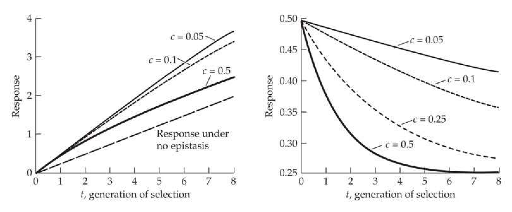
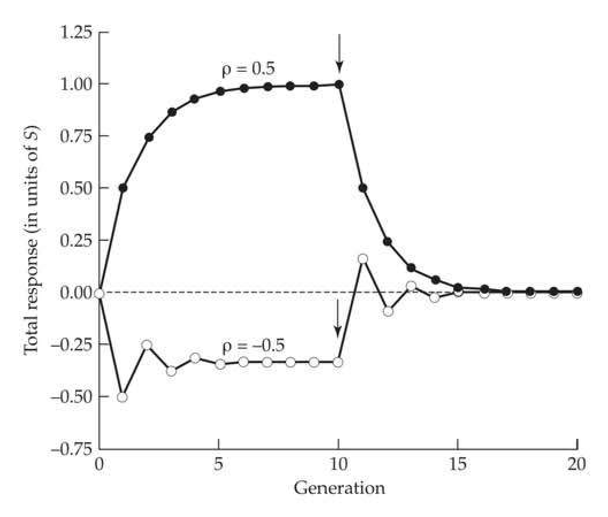
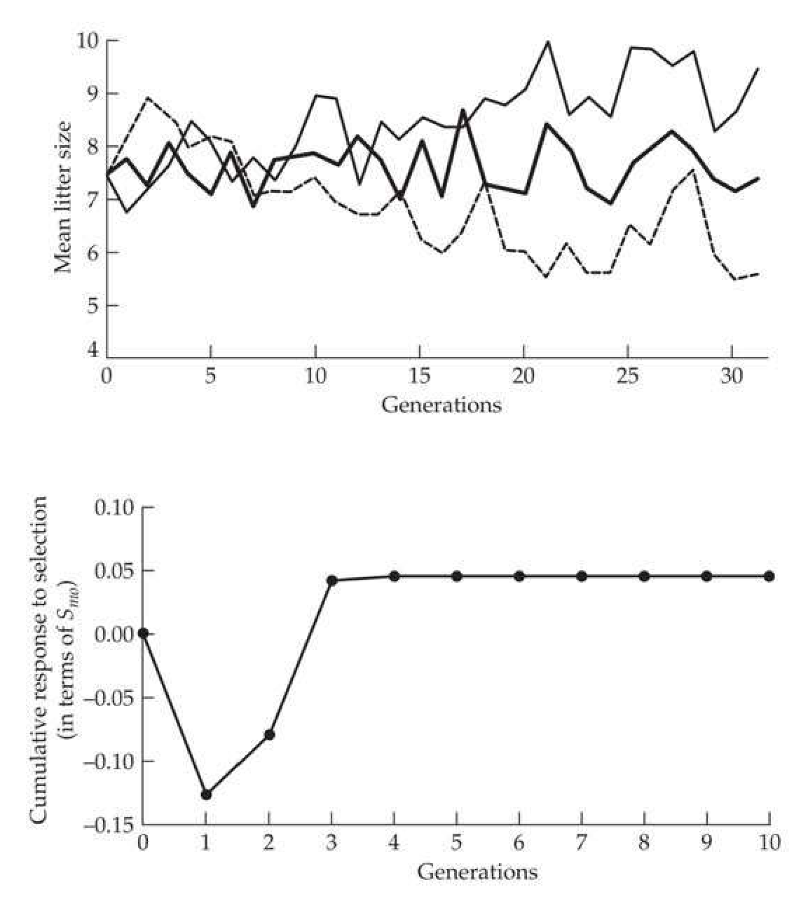
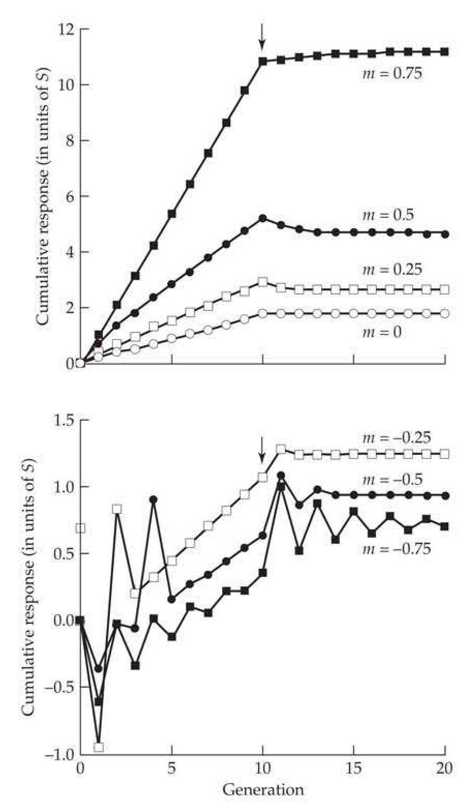
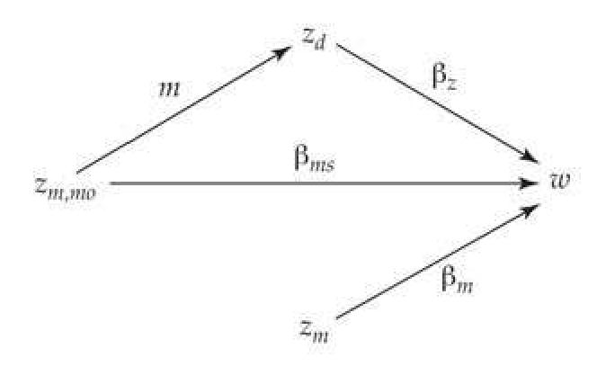

# Chapter 15 · Short-term Changes in the Mean: 3. Permanent Versus Transient Response

## chapter15_001 · Short-term Changes in the Mean: 3. Permanent Versus Transient Response: Introduction

The phenotypic gains from selecting for epistatic differences come from distorting the gametic array and soon disappear after selection is relaxed, as the gametic array returns to random. By contrast, the gains from changes in gene frequency are permanent. Lush (1948)

While the basic breeder’s equation is the foundation for much of the theory of selection response in quantitative traits, its elegant form of $ R = h^{2}S $ arises because of certain simplifying assumptions (Table 13.2). One interesting complication is that the selection response can have both transient and permanent components, and this chapter examines common situations where this can occur (also see Chapter 23). Selection can change allele and genotype frequencies, generate linkage disequilibrium, and create nonrandom associations among environmental values, all of which can contribute to the response. Of these, only allele-frequency changes are permanent, as any such changes remain after selection stops. In contrast, random mating eventually ensures there will be Hardy-Weinberg frequencies for genotypes, linkage equilibrium, and random associations of environmental effects. The contributions to the selection response generated by departures from these equilibrium values are therefore transient, decaying to zero following the cessation of selection.

Transient components of response can be both positive and negative, so the selection response may decay or increase following the cessation of selection. In the extreme situation, a reversed response occurs, wherein a trait selected to increase actually decreases due to a negative transient component overwhelming a positive permanent response. The potential of transient contributions from previous generations of selection is one reason why the breeder's equation requires an unselected base population.

Our treatment starts with a brief discussion of why the breeder’s equation focuses on $ h^{2} $, even though other factors can also contribute to the selection response. We then turn to two genetic situations that generate transient components to response: additive epistasis in diploids and dominance in autotetraploids. This leads to a discussion of the method of using ancestral regressions to determine the conditions under which a component of response is transient. The implications of correlated environmental effects between relatives are considered next, as we examine the selection response when the parent-offspring covariance is entirely due to shared environmental effects (which also serves as model for epigenetic effects). We conclude by considering the complications introduced by the presence of heritable maternal effects, which show share properties seen with shared environmental values.

---

## chapter15_002 · Short-term Changes in the Mean: 3. Permanent Versus Transient Response: Introduction / WHY ALL THE FOCUS ON $ h^{2} $?

**[推导 Derivation]**

As discussed in LW Chapters 7 and 17, epistasis or environmental effects shared between parents and their offspring can cause the parent-offspring regression to deviate significantly from $ h^{2}/2 $, thus altering the response from that predicted by the breeder's equation. If we allow for epistasis (among unlinked loci) and correlation between parental and offspring environmental values, the single parent-offspring slope will be

> **Formula (15.1a)** · `15.1a` · source: `chapter15_block_005` · WHY ALL THE FOCUS ON $ h^{2} $?
>
> $$ \begin{align*}b_{op}={\sigma(z_p,z_o)\over\sigma_z^2}={1\over\sigma_z^2}\left({\sigma_A^2\over2}+{\sigma_AA^2\over4}+{\sigma_AAA^2\over8}+{\sigma_AAAA^2\over16}+\cdots+\sigma(E_p,E_o)\right)\end{align*} $$

**[推导 Derivation]**

If we assume there is a linear biparental regression with identical slopes for both parents, the response to a single generation of selection becomes

> **Formula (15.1b)** · `15.1b` · source: `chapter15_block_006` · WHY ALL THE FOCUS ON $ h^{2} $?
>
> $$ R=2b_{op}S=h^{2}S+\frac{S}{\sigma_{z}^{2}}\bigg(\frac{\sigma_{AA}^{2}}{2}+\frac{\sigma_{AAA}^{2}}{4}+\frac{\sigma_{AAAA}^{2}}{8}+\cdots+\sigma(E_{fa},E_{o})+\sigma(E_{mo},E_{o})\bigg) $$

which can deviate significantly from $ h^{2}S $. Why, then, is so much attention focused on $ h^{2} $?

The reason is that we are generally interested in the permanent response to selection. Selection changes allele frequencies, which in turn changes the mean genotypic value. Under the infinitesimal model, very small changes in allele frequencies over a large number of loci can generate a significant change in the mean without much change in the additive variance (Chapter 24), and these changes are reflected in the response component, $ h^{2}S $. Any additional response from epistasis or shared environmental effects arises because of gametic-phase disequilibrium or nonrandom associations of environmental values. Recombination and the randomization of environmental effects cause these associations to decay to zero under random mating. Conversely, changes in allele frequencies are permanent, as once selection stops, the new allele frequencies will be stable (ignoring the longer-term effects of drift). Hence, as will be shown shortly, the permanent response under the conditions leading to Equation 15.1b is $ h^{2}S $. One exception, discussed in Chapter 23, is when significant inbreeding occurs. In this case, $ \sigma_{AA}^{2} $, and other nonadditive variance components specific to inbred populations ($ \sigma_{DI}^{2} $ and $ \sigma_{ADI}^{2} $; introduced in Chapter 11), can contribute to permanent response.

---

## chapter15_003 · Short-term Changes in the Mean: 3. Permanent Versus Transient Response: Introduction / GENETIC SOURCES OF TRANSIENT RESPONSE

Diploid parents undergoing sexual reproduction pass along single alleles at each locus to their offspring, with a parent's breeding value being the sum of its allelic effects over all loci (LW Chapter 4). Genotypic values are generally different from breeding values, with deviations representing interaction terms, such as dominance (between alleles at the same loci) or epistasis (between alleles at different loci). Such interactions are often not passed to an offspring of a randomly mating diploid parent, as their transmission requires that the parent pass along all of the component parts of the interaction (such as both alleles at a locus for dominance). As such, only part of an exceptional genotypic value of a selected parent is passed on to its offspring. However, there are two common settings where at least some of these interaction terms can be passed to an offspring under random mating—additive epistasis in a diploid (and higher ploidy) and dominance in an autotetraploid. When non-random mating occurs, such as inbreeding, the possibility exists that other interactions can be passed on to an offspring (such as dominance in a diploid); see Chapter 23.

---

## chapter15_004 · GENETIC SOURCES OF TRANSIENT RESPONSE / Additive Epistasis

Pairwise epistasis involves interactions between either single alleles at different loci (additive-by-additive epistasis, $ A \times A $), between entire genotypes at different loci (dominance-by-dominance epistasis, $ D \times D $), or between an allele at one locus and the genotype at a second (additive-by-dominance epistasis, $ A \times D $). Because a randomly mating diploid passes along a single allele at each locus to its offspring, additive ($ A \times A $, $ A \times A \times A $, etc.) interactions between alleles at different loci can be passed from a parent to its offspring. Under random mating in a diploid, any epistatic term involving dominance ($ A \times D $, $ D \times D $, etc.) cannot be passed along, as a parent must contribute both alleles at a given locus to its offspring to transmit a D component.

Before proceeding, it is important to realize the important distinction between epistatic effects (the expected multilocus value does not equal the sum of the single-locus values) and epistatic variances. The former can be quite large and yet the latter can still remain small. In large part this is due to the additive genetic variance being the variance accounted for by the best linear fit of a potentially highly nonlinear system, so that (as is the case for dominance) epistatic effects are partly accounted through $ \sigma_A^2 $ (Crow 2010; LW Chapter 5). Under fairly general patterns of multilocus interactions, extreme allele frequencies (near zero or one), as would be expected under drift (Chapter 2), result in most of the genetic variance being additive even when the genotypic values have a highly nonadditive basis (Hill et al. 2008; Mäki-Tanila and Hill 2014). Our concern here is how the residual nonadditive effects (e.g., $ \sigma_{AA}^{2} $) that are not absorbed into additive variance influence the selection response.

**[推导 Derivation]**

Although Lush (1948) and Kempthorne (1957) clearly grasped the key idea that the component of selection response from additive epistasis is transient, the first quantitative analysis was by Griffing (1960a, 1960b), who assumed the infinitesimal model. Under the assumptions that (i) phenotypes are normally distributed, (ii) effects at any particular locus are very small relative to the total phenotypic variation, and (iii) no third- (or higher-) order additive epistasis is present, the response to one generation of selection is

> **Formula (15.2)** · `15.2` · source: `chapter15_block_011` · Additive Epistasis
>
> $$ R=S\left(h^{2}+\frac{\sigma_{AA}^{2}}{2\sigma_{z}^{2}}\right) $$

**[推导 Derivation]**

One might expect that $ R(t) $, the cumulative response after t generations of selection, is simply t times the result given by Equation 15.2. However, any increased response (relative to $ Sh^{2} $) due to epistasis is only temporary, reflecting gametic-phase disequilibrium generated by selection. As disequilibrium decays under recombination, so does the component of response due to epistasis. This occurs because the $ A \times A $ contribution comes from favorable combinations of alleles at different loci, above and beyond their individual contributions (which are accounted for by changes in the mean breeding value of the selected parents, $ h^{2}S $). Recombination breaks down these combinations, removing the epistatic contribution. Griffing showed that for two linked loci separated by a recombination fraction of c, the response when a generation of selection is followed by $ \tau $ generations of random mating is

> **Formula (15.3)** · `15.3` · source: `chapter15_block_012` · Additive Epistasis
>
> $$ S\left(h^{2}+(1-c)^{\tau}\frac{\sigma_{A A}^{2}}{2\sigma_{z}^{2}}\right) $$

which converges to $ h^2S $ as $ \tau \to \infty $. Equation 15.3 follows by noting that the probability of a gamete containing specific alleles from both loci remaining intact following one generation of recombination is $ 1 - c $. Thus, after $ \tau $ generations, only $ (1 - c)^{\tau} $ of the favorable two-locus combinations selected at $ \tau = 0 $ remain unaltered by recombination. This transient component of response from epistasis is often called the Griffing effect.

**[推导 Derivation]**

Summing Equation 15.3 over $ t $ yields the cumulative response after $ t $ generations with a constant selection differential, $ S $, as

> **Formula (15.4a)** · `15.4a` · source: `chapter15_block_013` · Additive Epistasis
>
> $$ R(t)=t h^{2}S+R_{A A}(t) $$

where

> **Formula (15.4b)** · `15.4b` · source: `chapter15_block_013` · Additive Epistasis
>
> $$ R_{A A}(t)=S\frac{\sigma_{A A}^{2}}{2\sigma_{z}^{2}}\left(\sum_{i=1}^{t}(1-c)^{i-1}\right)=S\left(\frac{1-(1-c)^{t}}{c}\right)\left(\frac{\sigma_{A A}^{2}}{2\sigma_{z}^{2}}\right) $$

denotes the cumulative additive $ \times $ additive epistatic contribution. The last equality follows using the partial sum of a geometric series

> **Formula (15.5a)** · `15.5a` · source: `chapter15_block_013` · Additive Epistasis
>
> $$ \sum_{i=1}^{n}x^{i-1}=\sum_{i=0}^{n-1}x^{i}=\frac{1-x^{n}}{1-x} $$

**[推导 Derivation]**

A related result (used later in the chapter) is that

> **Formula (15.5b)** · `15.5b` · source: `chapter15_block_014` · Additive Epistasis
>
> $$ \sum_{i=1}^{n}x^{i}=\frac{1-x^{n+1}}{1-x}-1=\frac{x(1-x^{n})}{1-x} $$

**[推导 Derivation]**

If loci are completely linked $ (c = 0) $, $ R_{AA}(t) = t S \sigma_{AA}^{2}/(2\sigma_{z}^{2}) $, but provided $ c > 0 $, the total epistatic contribution approaches a limiting value of

> **Formula (15.6a)** · `15.6a` · source: `chapter15_block_015` · Additive Epistasis
>
> $$ \begin{align*}\widetilde{R}_{AA}=\lim_{t\rightarrow\infty}R_{AA}(t)=\frac{1}{c}\left(S\frac{\sigma_{AA}^2}{2\sigma_z^2}\right)\end{align*} $$

$ \widetilde{R}_{AA} $ represents the balance between selection generating disequilibrium and its removal by recombination. Equation 15.6a shows that the limiting contribution is 1/c times the epistatic response in the first generation. For unlinked loci (c = 0.5), this is simply twice the initial response. With tight linkage, the total response can be significantly larger.

**[推导 Derivation]**

The expected time, $ t_{1/2} $, for half the total epistatic response to accumulate, $ R_{AA}(t_{1/2}) = \widetilde{R}_{AA}/2 $, is obtained by noting from Equations 15.4b and 15.6a that this occurs when $ 1 - (1 - c)^{t_{1/2}} = 1/2 $, or

> **Formula (15.6b)** · `15.6b` · source: `chapter15_block_017` · Additive Epistasis
>
> $$ t_{1/2}=\frac{-\ln(2)}{\ln(1-c)} $$

**[Figure]**

> **Figure 15.1** · page 4 · source: `chapter15`
>
> 
>
> Figure 15.1 The permanent and transient response to selection (scaled in units of S) assuming pairwise epistasis in a diploid, with  $ h^2 = 1/4 $ and  $ \sigma_{AA}^2/\sigma_z^2 = 1/2 $. Left: The cumulative response assuming a constant amount of selection for various values of c. Note that even with this large amount of epistasis ( $ \sigma_{AA}^2 $ accounts for half the total variance), it is difficult to distinguish the curvilinear response with epistasis from a linear response. Right: The decay of response following a single generation of selection due to the decay of the contribution from epistasis. Provided c > 0, the cumulative response eventually decays to  $ h^2S = S/4 $, the expectation under no epistasis.

For small value of c, this is approximately $ \simeq 0.68/c $. As linkage becomes tighter, the total cumulative epistatic response increases, as does the time for half of this total response to occur (Figure 15.1).

**[推导 Derivation]**

Once selection stops, the epistatic contribution decays to zero. With $ t $ generations of selection followed by $ \tau $ generations of random mating, the cumulative response under the infinitesimal model is

> **Formula (15.7)** · `15.7` · source: `chapter15_block_019` · Additive Epistasis
>
> $$ t h^{2}S+(1-c)^{\tau}R_{A A}(t) $$

which (for large $ \tau $) converges to $ R = t h^2 S $, the value predicted from the breeder's equation. The half-life for decay of the epistatic response, $ R_{AA} $, is also given by Equation 15.6b.

The presence of epistasis can result in a curvilinear selection response if $ \sigma_{AA}^{2}/\sigma_{z}^{2} $ is sufficiently large. However, as Figure 15.1 shows, any such curvilinearity is usually difficult to distinguish from a linear response, especially given the very noisy nature of selection response data (Chapter 18). Unless there is tight linkage, most of the nonlinearity occurs in the first few generations (Equation 15.6b). With a constant selection differential, the additional increment to response from epistasis decreases in each generation as $ R_{AA} $ approaches its limiting value, $ \bar{R}_{AA} $, at which point the per-generation response is simply $ h^{2}S $ and linear over future generations.

Under the infinitesimal model, once selection is relaxed, the total response decays back to that predicted from the breeder's equation. It is interestingly that this situation mimics the effects of natural selection countering artificial selection, which also result in a decay of the cumulative response once artificial selection stops. Thus, in order to predict the permanent response correctly, we must know $ h^2 $. If only the parent-offspring slope is estimated, this may overestimate the final amount of response due to the inclusion of $ \sigma_{AA}^2 $ and higher-order (additive) epistatic variances, although the bias is generally likely to be small, as the values of the higher-order variances are expected to be small relative to $ \sigma_A^2 $.

**[推导 Derivation]**

Griffing’s analysis is restricted to two loci, and hence limited to only pairwise (additive × additive) epistasis. In contrast, Equation 15.1 gives the single-generation response for arbitrary levels of additive epistasis, provided the biparental offspring regression is linear. These higher-order contributions also rapidly decay under random mating. Again assuming the infinitesimal model (and unlinked loci), Bulmer (1980) found that the response due to a single generation of selection (Equation 15.1) decays after one generation of random mating to

> **Formula (15.8)** · `15.8` · source: `chapter15_block_022` · Additive Epistasis
>
> $$ R=S\left(h^{2}+\frac{1}{4}\frac{\sigma_{AA}^{2}}{\sigma_{z}^{2}}+\frac{1}{16}\frac{\sigma_{AAA}^{2}}{\sigma_{z}^{2}}+\frac{1}{64}\frac{\sigma_{AAAA}^{2}}{\sigma_{z}^{2}}+\cdots\right) $$

which again rapidly converges to $ R = h^2 S $ after several generations of random mating. For $ n $-locus additive epistasis (e.g., $ \sigma_{A\cdots A}^2 $, where there are $ n $ $ A $'s), the per-generation decay rate for unlinked loci is $ (1/2)^{n-1} $, which is the probability that a parental gamete containing specific alleles at $ n $ unlinked loci is passed on intact to an offspring. The probability that such a gamete will remain unchanged after $ t $ generations is $ 2^{-t(n-1)} $, which rapidly converges to zero. Example 15.2 (below) uses the method of ancestral regressions to more fully examine the response under $ n $-locus additive epistasis. A final caveat is that these results apply to infinite populations. As shown in Chapter 11, in finite populations, some of the additive epistatic contribution can be permanent due to some of $ \sigma_{AA}^2 $ being transformed into simple additive variation by drift.

---

## chapter15_005 · GENETIC SOURCES OF TRANSIENT RESPONSE / Dominance in Autotetraploids

Polyploidy, which is very common in plants and occurs in some animals (e.g., salmonid fishes), can introduce complications in predicting selection response (Gallais 2003). In particular, the dynamics of selection response for autotetraploids with dominance is very similar to the dynamics of diploids with epistasis. From LW Equation 7.22 and LW Table 7.5, the tetraploid parent-offspring covariance when dominance (but no epistasis) is present is $$ \sigma(z_{p},z_{o})=\frac{\sigma_{A}^{2}}{2}+\frac{\sigma_{D}^{2}}{6} $$

**[推导 Derivation]**

The inflation of the parent-offspring covariance over that for a diploid is due to dominance interactions between the two alleles per locus that each tetraploid parent passes on to its offspring. Thus, like additive epistasis in diploids, favorable combinations of alleles can be passed down from parent to offspring in polyploids. With equal amounts of selection on both sexes (e.g., selection occurs before pollination), the resulting response (assuming linearity of the parent-offspring regression) is

> **Formula (15.9)** · `15.9` · source: `chapter15_block_024` · Dominance in Autotetraploids
>
> $$ R=S\left(h^{2}+\frac{\sigma_{D}^{2}}{3\sigma_{z}^{2}}\right) $$

**[推导 Derivation]**

If selection occurs after pollination, S is replaced by S/2. Gallais (1975) extended Griffing's (1960a) method (and hence assumed normally distributed phenotypes, with each gene having very small effects on the character) to obtain the response after t generations of selection with a constant differential of S,

> **Formula (15.10a)** · `15.10a` · source: `chapter15_block_025` · Dominance in Autotetraploids
>
> $$ R(t)=t h^{2}S+R_{D}(t) $$

where

> **Formula (15.10b)** · `15.10b` · source: `chapter15_block_025` · Dominance in Autotetraploids
>
> $$ R_{D}(t)=S\frac{3}{2}\left[1-\left(\frac{1}{3}\right)^{t}\right]\frac{\sigma_{D}^{2}}{3\sigma_{z}^{2}} $$

which converges to a limiting value of

> **Formula (15.10c)** · `15.10c` · source: `chapter15_block_025` · Dominance in Autotetraploids
>
> $$ \widetilde{R}_{D}=S\left(\sigma_{D}^{2}/2\sigma_{z}^{2}\right) $$

This is just a 50% increase over the first-generation dominance response. Thus, as with the contribution from epistasis in diploids, the total contribution from dominance in polyploids approaches a limiting value representing the balance between selection favoring specific combinations of alleles and reproduction reshuffling those combinations.

**[推导 Derivation]**

Again, as with epistasis, the contribution from dominance decays upon the cessation of selection as genotype frequencies return to their Hardy-Weinberg values. As discussed in LW Chapter 4, the rate of approach to tetraploid Hardy-Weinberg expectations depends on the probability, c, of a double reduction. This is the chance that a gamete contains two copies of one of the four alleles in the parent, an event that requires a crossover (see LW Figure 4.3). In the absence of double reduction (c = 0), as would occur for a locus completely linked to the centromere, the difference in the frequency of pairs of alleles from Hardy-Weinberg expectation decays by one third in each generation (and this is assumed in obtaining Equation 15.10b). In such a setting, the response to t generations of selection followed by τ generations of random mating is

> **Formula (15.10d)** · `15.10d` · source: `chapter15_block_027` · Dominance in Autotetraploids
>
> $$ t h^{2}S+(1/3)^{\tau}R_{D}(t) $$

which again rapidly converges to $t h^2$ $S$. More generally, if $c$ is the per-generation probability of a double reduction, the decay rate of $(1/3)^t$ is replaced in Equations 15.10b and 15.10d by $(1 - c)/3^t$. Swanson et al. (1974) found that if some double reductions occur $(c > 0)$, the additive genetic variance is slightly inflated over the value expected with no double reductions $(c = 0)$, which permanently increases selection response. This results from the slight excess of homozygotes at equilibrium over the Hardy-Weinberg expectation (see LW Chapter 4).

Wricke and Weber (1986) discussed additional topics on tetraploid selection, while selection under single-locus tetraploid models was examined by R. Hill (1971; Hagg and Hill 1974; Hill and Hagg 1974; Rowe and Hill 1984). By far the most complete treatment of selection with polyploids was presented by Gallais (2003).

---

## chapter15_006 · Short-term Changes in the Mean: 3. Permanent Versus Transient Response: Introduction / ANCESTRAL REGRESSIONS

**[命题 Proposition]**

A general approach for examining which components of response are transient is to consider the expected value of an offspring as a function of all of its direct relatives that have been under selection (Pearson 1898; Bulmer 1971b, 1980). If this ancestral regression is linear (as would occur if the joint distribution of the phenotypic values of all relatives is multivariate normal), the selection response can be described by specifying the regression coefficients via an obvious extension of the biparental regression, to now include all selected relatives back to the original unselected base population. For example, if selection starts in generation 0, the response in the first generation is $ R(1) = 2 / \beta_{1,0} S_{0} $, where $ \beta_{1,0} $ is the regression of offspring at generation 1 on a parent from generation 0 (this assumes that both parents have the same regression coefficients and selection differentials, an assumption that will be relaxed shortly). Likewise, the total response after two generations, $ R(2) = 4 / \beta_{2,0} S_{0} + 2 / \beta_{2,1} S_{1} $, depends on the nature of selection on the four grandparents ($ S_{0} $) and both parents ($ S_{1} $) as well as on the transmission from grandparent to grandchild ($ \beta_{2,0} $) and that from parent to offspring ($ \beta_{2,1} $). Note that this formulation allows the parent-offspring regression to change through time (e.g., $ \beta_{2,1} $ need not equal $ \beta_{1,0} $), as can happen with inbreeding (Chapter 23). Similarly, the response following three generations of selection depends upon the nature of selection on that individual's eight great-grandparents, four grandparents, and two parents. $$ R(3)=8\beta_{3,0}S_{0}+4\beta_{3,1}S_{1}+2\beta_{3,2}S_{2} $$

**[推导 Derivation]**

Proceeding in this fashion gives the total response by generation T as

> **Formula (15.11a)** · `15.11a` · source: `chapter15_block_030` · ANCESTRAL REGRESSIONS
>
> $$ R(T)=\sum_{t=0}^{T-1}2^{T-t}\beta_{T,t}S_{t} $$

where $ \beta_{T,t} $ is the partial regression coefficient for the phenotype of an individual in generation $ T $ on one (out of $ 2^{T-t} $) of its ancestors in generation $ t < T $ (with selection starting at generation 0). Because the total response is simply the sum of the independent contributions from each generation, the regression coefficients are simply standard univariate regression coefficients (i.e., $ \beta_i = \sigma(y, x_i)/\sigma_{x_i}^2 $), yielding

> **Formula (15.11b)** · `15.11b` · source: `chapter15_block_030` · ANCESTRAL REGRESSIONS
>
> $$ R(T)=\sum_{t=0}^{T-1}2^{T-t}\frac{\sigma_{G}(T,t)}{\sigma^{2}(z_{t})}S_{t} $$

where $ \sigma_G(T,t) = \sigma(z_T, z_t) $ is the cross-generation covariance, the phenotypic covariance between an individual in generation $ t $ and its descendant in generation $ T > t $. We usually assume that $ \sigma(z_T, z_t) $ is entirely genetic (e.g., Examples 15.1 and 15.2), and hence denote it by $ \sigma_G(T,t) $, although environmental factors shared across generations can also contribute to $ \sigma(z_T, z_t) $. With pure selfing, each individual has only a single relative, so the $ 2^{T-t} $ term in Equation 15.11a is absent, which makes the ancestral regression

> **Formula (15.11c)** · `15.11c` · source: `chapter15_block_030` · ANCESTRAL REGRESSIONS
>
> $$ R(T)=\sum_{t=0}^{T-1}\beta_{T,t}S_{t} $$

As we will see in Chapter 23, ancestral regression offers a powerful approach for the analysis of selection under inbreeding, where the cross-generation covariances depend on both T and t, rather than simply on the number of generations $ (T - t) $ between the ancestor and the descendant. For example, the parent-offspring covariance changes over generations as inbreeding proceeds.

**[推导 Derivation]**

If different relatives in the same generation experience different amounts of selection, with $ S_{k,i} $ being the selection differential on relative i in generation k, then

> **Formula (15.12a)** · `15.12a` · source: `chapter15_block_031` · ANCESTRAL REGRESSIONS
>
> $$ R(T)=\sum_{t=0}^{T-1}\left[\beta_{T,t}\left(\sum_{i=1}^{n(t,T)}S_{t,i}\right)\right] $$

where $ n(t,T) $ is the number of relatives in generation t that contribute to response in generation T. Note for the case of pure selfing, $ n(t,T) = 1 $, which reduces Equation 15.12a to Equation 15.11c. Finally, we can also allow for different regression coefficients on each relative to completely generalize this approach

> **Formula (15.12b)** · `15.12b` · source: `chapter15_block_031` · ANCESTRAL REGRESSIONS
>
> $$ R(T)=\sum_{t=0}^{T-1}\left(\sum_{i=1}^{n(t,T)}\beta_{T,t,i}S_{t,i}\right) $$

where $ \beta_{T,t,i} $ is the regression coefficient of the phenotype of an individual in generation T on its ith relative in generation t.

To apply ancestral regression for predicting response, we require that the regression remain linear and that selection-induced changes in the variances and covariances be negligible. Thus, while we allow changes in $ \beta_{T,t} $ due to the particular genetic system being considered (e.g., selfing, wherein the additive genetic variance decreases by a predictable amount in each generation in the absence of selection), we assume that selection does not confound these changes. Bulmer (1980) showed that the joint distribution of an offspring and all its direct ancestors is multivariate normal, and hence the ancestral regression is linear (LW Chapter 8), under the infinitesimal model. Because selection does not change allele frequencies under the infinitesimal model, this might suggest that the regression coefficients, $ \beta_{T,t} $ are unaffected by selection. The problem, however, is that selection generates gametic-phase disequilibrium, which can significantly alter the genotypic moments (Chapters 16 and 24). For now, we assume that these changes are small enough to be neglected. In Chapter 19 we show that BLUP estimates of breeding values are a type of ancestral regression, with the relationship matrix, A, accounting for drift and disequilibrium.

The behavior of the regression coefficients over time informs us about the permanency of the response. Consider the contribution from generation $ \tau $ at $ t $ generations later, so that in the notation of our previous expressions, $ T = t + \tau $. Equation 15.11a shows that unless $ 2^t \beta_{\tau + t, \tau} $ remains constant as $ t $ increases, the contribution to cumulative response from selection on adults in generation $ \tau $ changes over time. For strictly additive loci (under random mating), $ \sigma_G(\tau + t, \tau) = 2^{-t} \sigma_A^2(\tau) $ and thus $ 2^t \beta_{\tau + t, \tau} = h_\tau^2 $, the standard result from the breeder's equation. Conversely, any term of $ \sigma_G(\tau + t, \tau) $ that decreases by more than one half in each generation contributes only to the transient response, as $ 2^t \sigma_G(\tau + t, \tau) \to 0 $ as $ t \to \infty $. An exception to this condition occurs under pure selfing. Here, an individual has only a single ancestor $ t $ generations ago (as opposed to $ 2^t $ ancestors under random mating), resulting in the total contribution in generation $ t + \tau $ from an ancestor in generation $ \tau $ of $ \sigma_G(\tau + t, \tau) $. Hence, any term contributing to $ \sigma_G(\tau + t, \tau) $ that decreases to $ 0 $ as $ t \to \infty $ contributes only to the transient response.

**[示例 Example]**

> **Example 15.1** · ref: `15.1` · source: `chapter15_006.json` · blocks 5–6
>
> Example 15.1. As an application of ancestral regressions, consider the situation that arises with additive-by-additive epistasis. In this case, Cockerham (1984b) found (under the infinitesimal model) that for two linked loci, the cross-generation covariance is $$ \sigma_{G}(\tau+t,\tau)=\frac{\sigma_{A}^{2}(\tau)}{2^{t}}+\frac{\sigma_{A A}^{2}(\tau)}{2}\left(\frac{1-c}{2}\right)^{t} $$ yielding $$ 2^{t}\sigma_{G}(\tau+t,\tau)=\sigma_{A}^{2}(\tau)+(1-c)^{t}\frac{\sigma_{A A}^{2}(\tau)}{2} $$
> 
> Provided the genetic variances remain constant, applying Equation 15.11a recovers Equation 15.3.

**[示例 Example]**

> **Example 15.2** · ref: `15.2` · source: `chapter15_006.json` · blocks 7–12
>
> Example 15.2. Consider the expected response under arbitrary levels of additive epistasis (under the infinitesimal model with unlinked loci). LW Equation 7.12 shows the genetic covariance between relatives x and y as $$ \begin{align*}\sigma_G^2(x,y)&=(2\Theta_{x,y})\sigma^2(A)+(2\Theta_{x,y})^2\sigma^2(AA)+\cdots+(2\Theta_{x,y})^i\sigma^2(A^i)\\&=\sum_{i=1}^n\left(2\Theta_{x,y}\right)^i\sigma^2(A^i)\end{align*} $$ where $ \sigma^{2}(A^{i}) $ denotes the genetic variance due to ith-order additive epistasis. The coefficient of coancestry $ \Theta_{t,t+\tau} $ between a parent in generation t and a direct descendant in generation $ t+\tau $ under random mating is $$ \Theta_{t,t+\tau}=\left(\frac{1}{2}\right)^{\tau+1} $$ Using this result, the contribution, $ \sigma_{G,i}(t+\tau,t) $, to the total genetic covariance due to ith-order additive epistasis ( $ A^{i} $) becomes $$ \sigma_{G,i}(t+\tau,t)=\left(2\Theta_{t+\tau,t}\right)^{i}\sigma^{2}(A^{i})=2^{i}\left(\frac{1}{2}\right)^{(\tau+1)i}\sigma^{2}(A^{i})=\left(\frac{1}{2}\right)^{\tau i}\sigma^{2}(A^{i}) $$ and the ancestral regression terms involving $ \sigma^{2}(A^{i}) $ become $$ 2^{\tau}\frac{\sigma_{G,i}(t+\tau,t)}{\sigma^{2}(A^{i})}=2^{\tau}\frac{(1/2)^{\tau i}\sigma^{2}(A^{i})}{\sigma^{2}(A^{i})}=2^{\tau}2^{-\tau i}=\left(\frac{1}{2}\right)^{\tau(i-1)}=\left(\frac{1}{2^{i-1}}\right)^{\tau} $$ With constant selection, S, the contribution to total response from ith-order additive epistasis follows from Equation 15.11b: $$ R_{A^{i}}(t)=S\frac{\sigma^{2}(A^{i})}{\sigma_{z}^{2}}\sum_{\tau=1}^{t}\left(\frac{1}{2^{i-1}}\right)^{\tau} $$ (15.13a) Recalling Equation 15.5b, $$ \sum_{\tau=1}^{t}\left(\frac{1}{2^{i-1}}\right)^{\tau}=\frac{x(1-x^{t})}{1-x},\quad\mathrm{w h e r e}\quad x=(1/2)^{i-1} $$ (15.13b) The limit of this sum (as $ t \to \infty $) is $$ \frac{x}{1-x}=\frac{(1/2)^{i-1}}{1-(1/2)^{i-1}}=\frac{1}{2^{i-1}-1} $$ (15.13c) Because the scaled initial contribution, $ R_{A^{i}}(1)/[S\sigma^{2}(A^{i})/\sigma_{z}^{2}] $, equals $ (1/2)^{i-1} $, the additional total increment to response beyond that seen in the first generation follows from Equations 15.13a and 15.13c: $$ \frac{\bar{R}_{A^{i}}-R_{A^{i}}(1)}{S\sigma^{2}(A^{i})/\sigma_{z}^{2}}=\frac{1}{2^{i-1}-1}-\frac{1}{2^{i-1}}=\frac{1}{(2^{i-1}-1)2^{i-1}} $$ The response in generation one, $ R(1) $, and at the limit, $ \tilde{R} $ (both scaled in units of $ S\sigma^{2}(A^{i})/\sigma_{z}^{2} $), and the fraction of total response occurring in the first generation, $ R(1)/\tilde{R} $, are as follows:
> 
> > **Inline Table 1** · `inline_1` · page 9 · source: `chapter15_006`
> > Inline Table 1
> >
> >  | AA | AAA | AAAA | AAAAA
> > --- | --- | --- | --- | ---
> > $ R(1)/[S\sigma^{2}(A^{i})/\sigma_{z}^{2}] $ | 0.500 | 0.250 | 0.125 | 0.063
> > $ \widetilde{R}/[S\sigma^{2}(A^{i})/\sigma_{z}^{2}] $ | 1.000 | 0.333 | 0.143 | 0.067
> > $ R(1)/\widetilde{R} $ | 0.500 | 0.750 | 0.875 | 0.938
> 
> 
> As shown in the second line of this table, the limiting contribution, $ R $, is small for higher-order additive epistasis among unlinked loci. For example, for four-way additive epistasis, the total response is $ \sim14\% $ (0.143/1.000) of the expected response under two-way additive epistasis when the two variance components are equal, $ \sigma^2(AA) = \sigma^2(AAAA) $. Further, as the final line in the table shows, $ \sim88\% $ of the total response from four-way additive epistasis occurs in the first generation of selection.

---

## chapter15_007 · Short-term Changes in the Mean: 3. Permanent Versus Transient Response: Introduction / RESPONSE DUE TO ENVIRONMENTAL CORRELATIONS

Imagine a situation where a bird is large by chance, enabling it to defend a larger and more productive breeding location. As a result, its offspring are better provisioned and are larger themselves, above and beyond any genetic effects on size. This is an example of a shared environmental effect and is a special case of the more general setting where at least part of the environment experienced by an individual is a function of the phenotypes of other individuals with which they interact (Chapter 22). Rossiter (1996), Bonduriansky and Day (2009), and Bonduriansky et al. (2012) reviewed a number of such shared environmental effects, while Day and Bonduriansky (2011) modeled the expected response in a number of different settings using the Price equation framework (Chapter 6). As Equation 15.1a indicates, shared parent-offspring environmental effects—a nonzero value of $ \sigma(E_{p}, E_{o}) $—can influence the selection response. This contribution is also transient. Consider a character whose variation is entirely environmental, in which case the phenotypic value can be decomposed as $$ z=\mu+E=\mu+e_{fa}+e_{mo}+e $$ where $ \mu $ is the mean value of the character when environmental effects are randomly distributed, and the environmental value, E, has been decomposed into the maternal and paternal contributions to the offspring due to shared environmental effects ($ e_{mo} $ and $ e_{fa} $) and a residual due to special environmental effects (e), where $ E[e] = 0 $. In order to predict the shared environmental contribution from a parent, we assume the simplest model, wherein a fraction, b, of the total environmental value of a parent is passed on to its offspring.

This model serves as a useful introduction to some of the dynamics that can occur for certain models of maternal effects (examined in the next section). It also serves as a model for selection response under epigenetics, wherein a nongenetic modification is passed through generations (e.g., factors bound to the DNA that alter the expression level of a gene). While much excitement is made by some on the role of such epigenetic inheritance in evolution, as we will see, its impact is transient if there is even the smallest amount of imperfection in transmission.

To simplify matters further, assume that this regression coefficient is independent of the sexes of the parent and offspring, although this condition can easily be relaxed. Here the expected contribution from a father to his offspring is $ e_{fa} = bE_{fa} = b(z_{fa} - \mu) $, where $ E_{fa} $ is the father's total environmental value. Further assuming that the parents and the offspring have the same phenotypic variance, then $ b = \rho/2 $, where $ \rho $ is the slope of the midparent-offspring regression. In principle, b can be negative under some environmental conditions, e.g., if parents and offspring compete for a limited common resource, and larger parents gather a disproportionate share of resources, resulting in smaller offspring.

**[推导 Derivation]**

Provided $ E_{fa} $ and $ E_{mo} $ are uncorrelated, the expected value of an offspring from parents with phenotypic values of $ z_{fa} $ and $ z_{mo} $ is

> **Formula (15.14a)** · `15.14a` · source: `chapter15_block_044` · RESPONSE DUE TO ENVIRONMENTAL CORRELATIONS
>
> $$ E\left[z_{o}\mid z_{m o},z_{f a}\right]=\mu+\frac{\rho}{2}\left(z_{f a}-\mu\right)+\frac{\rho}{2}\left(z_{m o}-\mu\right) $$

where $ \mu $ is the population baseline mean under randomized environmental effects. Denoting the mean of adults selected in generation t by $ \mu_{t}^{*} $, the mean at generation $ t+1 $ is given by

> **Formula (15.14b)** · `15.14b` · source: `chapter15_block_044` · RESPONSE DUE TO ENVIRONMENTAL CORRELATIONS
>
> $$ \mu_{t+1}=\mu+\rho\left(\mu_{t}^{*}-\mu\right) $$

where $ (\mu_t^* - \mu) $ is the average environmental deviation of the selected parents at generation $ t $, a fraction, $ \rho $, of which is passed on to their offspring. If shared environmental effects are only passed on through one parent, $ \rho/2 $ replaces $ \rho $ in Equation 15.14b. Rewriting the mean after selection as $ \mu_t^* = \mu_t + S_t $,

> **Formula (15.15)** · `15.15` · source: `chapter15_block_044` · RESPONSE DUE TO ENVIRONMENTAL CORRELATIONS
>
> $$ \mu_{t+1}=\mu+\rho\left(\mu_{t}+S_{t}-\mu\right) $$

and defining the change in mean as $ \Delta\mu_{t}=\mu_{t+1}-\mu_{t} $ yields

> **Formula (15.16a)** · `15.16a` · source: `chapter15_block_044` · RESPONSE DUE TO ENVIRONMENTAL CORRELATIONS
>
> $$ \begin{aligned}\Delta\mu_{t}&=\left[\mu+\rho\left(\mu_{t}+S_{t}-\mu\right)\right]-\left[\mu+\rho\left(\mu_{t-1}+S_{t-1}-\mu\right)\right]\\&=\rho\left[\left(\mu_{t}-\mu_{t-1}\right)+\left(S_{t}-S_{t-1}\right)\right]\\&=\rho\left[\Delta\mu_{t-1}+\left(S_{t}-S_{t-1}\right)\right]\end{aligned} $$

**[Figure]**

> **Figure 15.2** · page 11 · source: `chapter15`
>
> 
>
> Figure 15.2 The response when resemblance between relatives is due entirely to correlation between environmental values in parents and offspring. Selection with a constant value of S starts at t = 0 and continues until generation 10 (indicated by the arrow), at which point selection is stopped. Note the interesting dynamics that occur if environmental values are negatively correlated, wherein the response to selection is reversed with respect to the selection differential. In this case, selection for increased character value results in a decreased mean value, with the total response in this example eventually converging to  $ -S/3 $ (for  $ \rho = -0.5 $). Once selection is relaxed (denoted by the arrows), there is an initial positive response (generation 11), which then quickly decays to zero.

**[推导 Derivation]**

Suppose that constant selection (with a differential of $S$) is applied starting at generation 1. Here, $\Delta\mu_0 = 0$, $S_0 = 0$, and $S_t = S$ for $t \geq 1$. Equation 15.16a then gives $\Delta\mu_1 = \rho S$. Further iterations yield the increment from selection in generation $t$ to the total response as

> **Formula (15.16b)** · `15.16b` · source: `chapter15_block_045` · RESPONSE DUE TO ENVIRONMENTAL CORRELATIONS
>
> $$ \Delta\mu_{t}=\rho^{t}S $$

which (like epistasis) decreases in each generation, and approaches zero for large values of t. Hence, even under continued selection, the total response to selection eventually reaches a limit. Note that if $ \rho < 0 $, the sign of the increment-specific response switches in each generation (Figure 15.2).

**[推导 Derivation]**

The reason for this decline in the per-generation rate of response, $ \Delta\mu_t $, can be seen from Equation 15.16a. The change in the character mean due to previous selection decays, countering the gain from selection in the current generation. Only a fraction, $ \rho $, of the change from generation $ t - 1 $ is passed on, and in general, only $ \rho^k $ of the response from generation $ t - k $ persists by generation $ t $. Summing over Equation 15.16b, the total response to selection after $ t $ generations is

> **Formula (15.16c)** · `15.16c` · source: `chapter15_block_046` · RESPONSE DUE TO ENVIRONMENTAL CORRELATIONS
>
> $$ \begin{align*}R(t)=\mu_t-\mu_0=\sum\limits_{i=1}^t\Delta\mu_i=S\sum\limits_{i=1}^t\rho^i\end{align*} $$

**[推导 Derivation]**

Recalling the partial sum of a geometric series (Equation 15.5b), this reduces to

> **Formula (15.17a)** · `15.17a` · source: `chapter15_block_047` · RESPONSE DUE TO ENVIRONMENTAL CORRELATIONS
>
> $$ R(t)=S\frac{\rho}{1-\rho}\left(1-\rho^{t}\right) $$

**[推导 Derivation]**

Note from Equation 15.17a that the sign of the total response does not change over $ t $ (as $ |\rho| < 1 $) and equals the sign of $ \rho $. While the per-generation response, $ \mu_{t+1} - \mu_t = \rho^t S $ (Equation 15.16b), may change sign each generation (provided $ \rho < 0 $), the absolute magnitude of this per-generation change rapidly decreases with $ t $, resulting in no change of sign in the total response. As was the case for epistasis, the total cumulative response reaches an equilibrium value representing the balance between the generation of correlations by selection and their removal by reproduction, with

> **Formula (15.17b)** · `15.17b` · source: `chapter15_block_048` · RESPONSE DUE TO ENVIRONMENTAL CORRELATIONS
>
> $$ \widetilde{R}=\lim_{t\to\infty}R(t)=S\frac{\rho}{1-\rho} $$

**[推导 Derivation]**

Thus, no matter how long selection is applied, the mean can never change by more than $ S\rho/(1-\rho) $. Further, none of this response is permanent. Suppose selection is stopped after $ t $ generations, resulting in $ S_t = S $, $ S_{t+\tau} = 0 $ for $ \tau \geq 1 $. If we substitute these values of $ S $ into Equation 15.16a and use Equation 15.16b, the expected change in generation $ t + \tau $ is

> **Formula (15.18)** · `15.18` · source: `chapter15_block_049` · RESPONSE DUE TO ENVIRONMENTAL CORRELATIONS
>
> $$ \Delta\mu_{t+\tau}=\rho^{\tau}\left(\Delta\mu_{t}-S\right)=\rho^{\tau}\left(\rho^{t}S-S\right)=-S\rho^{\tau}(1-\rho^{t}) $$

**[推导 Derivation]**

Using this result, by generation $ t + \tau $, the cumulative response is

> **Formula (15.19a)** · `15.19a` · source: `chapter15_block_050` · RESPONSE DUE TO ENVIRONMENTAL CORRELATIONS
>
> $$ R(t+\tau)=R(t)+\sum_{i=1}^{\tau}\Delta\mu_{t+i}=R(t)-S\left(1-\rho^{t}\right)\sum_{i=1}^{\tau}\rho^{i}=\rho^{\tau}R(t) $$

**[推导 Derivation]**

The last step follows if we first note from Equation 15.17a that $ S(1 - \rho^t) = [(1 - \rho)/\rho] R(t) $. Using this identity, and applying Equation 15.15b with $ x = \rho $ and $ n = \tau $, yields

> **Formula (15.19b)** · `15.19b` · source: `chapter15_block_051` · RESPONSE DUE TO ENVIRONMENTAL CORRELATIONS
>
> $$ -S\left(1-\rho^{t}\right)\sum_{i=1}^{\tau}\rho^{i}=-\left[R(t)\frac{1-\rho}{\rho}\right]\left[\frac{\rho(1-\rho^{\tau})}{1-\rho}\right]=-(1-\rho^{\tau})R(t) $$

**[推导 Derivation]**

Observe that Equation 15.19a converges to zero, with the rate of decay set by $ \rho $ (Figure 15.2). The half-life, $ t_{1/2} $, of the decay in response follows from solving $ \rho^{t_{1/2}} = 1/2 $, or

> **Formula (15.19c)** · `15.19c` · source: `chapter15_block_052` · RESPONSE DUE TO ENVIRONMENTAL CORRELATIONS
>
> $$ t_{1/2}=-\frac{\ln(2)}{\ln(\rho)} $$

Hence, while there can be some selection response when the resemblance between relatives is entirely environmental, any response is transient and decays away once selection stops. Further, no matter how long selection proceeds, the total response asymptotes to a limit beyond which no further response is excepted (Equation 15.17b). As mentioned, these results bear on the role of epigenetic inheritance. The correlation, $ \rho $, is a measure of the persistence of an epigenetic modification (be it cultural, hormonal, or from proteins bound to DNA). When the persistence of an effect is high ($ \rho $ is close to one), a trait can achieve a significant selection response under purely epigenetic inheritance (Equation 15.17b), and the response can persist for several generations following the cessation of selection (Equation 15.19a). For example if $ \rho = 0.95 $ (a 5% loss of the effect each generation), then a total response of $ S \cdot 0.95 / 0.05 = 19 \, S $ can be achieved. After selection stops, half this expected gain is lost in $ -\ln(2)/\ln(0.95) \simeq 14 $ generations (Equation 15.19c). While impressive, from an evolutionary standpoint, none of this short-term gain translates into a long-term, permanent, selection response.

---

## chapter15_008 · Short-term Changes in the Mean: 3. Permanent Versus Transient Response: Introduction / SELECTION IN THE PRESENCE OF HERITABLE MATERNAL EFFECTS

**[命题 Proposition]**

A mother can influence the phenotype of her offspring in two ways. The usual assumption simply involves gene transmission (including those genes on organelle genomes). Together with paternally derived genes, these maternally transmitted genes create the genotype of the offspring, and the expression of this genotype, together with the environment it experiences, determines the phenotype. The second route is through maternal effects, which are traits or genes expressed in the mother that influence offspring phenotypes (Wolf and Wade 2009). These can be thought of as influencing the environment that a mother's offspring experiences, which can, in turn, influence its phenotype. Examples include maternal performance characters such as her body size, amount of care invested in offspring, milk yield, and endosperm production, all of which can influence a variety of progeny traits. These maternal performance traits can themselves have a genetic basis, and hence can also respond to selection, thus creating potentially very complex dynamics even in the simplest settings.

Paternal effects are also possible, especially in situations where the father plays a role in caring for the offspring. While not considered here, they can be treated in exactly the same fashion as maternal effects. There is an extensive literature on maternal effects and their evolutionary implications (reviewed by Roach and Wulff 1987; Bernardo 1996; Rossiter 1996; Mousseau and Fox 1998; Reinhold 2002; Räsänen and Kruuk 2007; Mousseau et al. 2009). Here we introduce some of the basic ideas, with additional material developed in Chapters 22, 29, and 30.

**[示例 Example]**

> **Example 15.3** · ref: `15.3` · source: `chapter15_008.json` · blocks 2–2
>
> Example 15.3. Maternal effects include genes expressed in the mother that influence the very early development of her offspring, with the maternal phenotype of these genes being extremely difficult to measure in the mother. For many metazoans, much of the gene expression during the first few rounds of cell division in a newly fertilized zygote is due to the translation of maternal mRNAs deposited in the egg. The resulting maternal gene products provide information for early key development steps in the nascent embryo, with the impact of these maternal genes seen in the trait values of the offspring, but not in the mother's own phenotype. A classic example involves the work of Sturtevant (1923) on right- versus left-handed shell coiling of the snail Limnaea, where the genotype of the mother, not the offspring, determines offspring phenotype. Offspring from a mother homozygous for the sinistral allele are all left-handed, independent of their genotype, whereas the presence of at least one dextral allele in the mother yields all right-handed offspring. While the maternal trait is easy to assay from observations on her offspring, it cannot be assayed using just the mother alone, as the products from the sinistral/dextral locus are still unknown, although Kuroda et al. (2009) have showed that the direction of coiling is determined at the eight-cell stage of the embryo.

---

## chapter15_009 · SELECTION IN THE PRESENCE OF HERITABLE MATERNAL EFFECTS / Decomposing Maternal Effects

**[推导 Derivation]**

Assuming a maternal effect, the environmental value, E, for the focal trait in an individual can be decomposed as $ E = M + e $, comprised of a maternal performance component, M, contributed by the mother plus an environmental deviation, e, resulting in a trait value of

> **Formula (15.20a)** · `15.20a` · source: `chapter15_block_057` · Decomposing Maternal Effects
>
> $$ z=G+E=G+M+e $$

The genotypic value, G, of the offspring is often referred to as the direct (or intrinsic) effect on the trait, reflecting the inherent genetics of the individual. If M is entirely environmental in basis, the results of the previous section (on correlated environmental values) apply, and any contribution from maternal effects is transient. However, there is often a genetic component to M, with the result that selection can change the population means of both the direct and the maternal values (Dickerson 1947; Willham 1963, 1972; Cheverud 1984a; Riska et al. 1985; Kirkpatrick and Lande 1989). In this case, $ M = G_m + E_m $, where $ G_m $ is the contribution to the offspring value resulting from the mother's genotypic value for the maternal performance character, while $ E_m $ is the contribution resulting from the environmental value of the maternal performance character (reviewed in LW Chapter 23). Thus, although M is treated as an environmental effect from the offspring's standpoint, it can have both a genetic and an environmental basis in the mother.

**[推导 Derivation]**

Letting $ G_{d} $ denote the genotypic value of the direct effect (previously G), the phenotypic value of an individual can be written in terms of direct and maternal contributions

> **Formula (15.20b)** · `15.20b` · source: `chapter15_block_059` · Decomposing Maternal Effects
>
> $$ z=G+M+e=G_{d}+G_{m}+E_{m}+e $$

This significantly complicates the selection response, as if the correlation between $ G_d $ and $ G_m $ is negative, selection to increase a trait might result in an improved direct value ($ \Delta \mu_{G_d} > 0 $) but a decreased maternal value ($ \Delta \mu_{G_m} < 0 $). In the extreme, this can result in a reversed selection response, with the decline in maternal environment overwhelming any improvement in direct effects. Because trait value, $ z $, is a function of two potentially correlated genetic components, $ G_d $ and $ G_m $, this is formally a multiple-trait problem and can be attacked with the machinery of multivariate selection (Cheverud 1984a; Kirkpatrick and Lande 1989, 1992; Lande and Kirkpatrick 1990). However, we first consider the simplest case, where $ M $ is a function of the value of the focal trait in the mother, which collapses the model to a single-trait problem, but with much more complicated dynamics than suggested by the simple breeder's equation. We then very briefly discuss a two-trait model, while Volume 3 examines maternal effects in the full multivariate framework.

An important point to note is that maternal-effects models are a special case of associative effects (or social, or indirect genetic effects) models, where the phenotype of an individual within a group is a function of both its direct value plus the associative values from members of its group. Here the group is an offspring and its mother. Both kin and group selection, which are special cases of this more general formulation, are examined in detail in Chapter 22.

---

## chapter15_010 · SELECTION IN THE PRESENCE OF HERITABLE MATERNAL EFFECTS / Selection Response Under Falconer's Dilution Model

One of the simplest models of maternal effects (motivated by the inheritance of litter size in mice) is that of Falconer (1965): the value of the focal trait in the mother determines M (reviewed in LW Chapter 23). Falconer reasoned that offspring from large litters receive less maternal resources per individual than those in smaller litters, and that this can have carryover effects when they become mothers themselves.

**[推导 Derivation]**

Assume that the maternal contribution is a linear function of the maternal phenotype, $ z_{mo} $ (the size of her litter), so that $ M = mz_{mo} $ and, upon substitution of this result into Equation 15.20a, the phenotypic decomposition becomes

> **Formula (15.21)** · `15.21` · source: `chapter15_block_063` · Selection Response Under Falconer's Dilution Model
>
> $$ z=G+M+e=G+m z_{m o}+e $$

Conceivably, $M$ could be a nonlinear function of $z_{moi}$, but linearity is assumed for tractability. Equation 15.21 is called the dilation model, because the effect of the maternal phenotype becomes diluted over successive generations (for $|m| < 1$). The parameter $m$ can be regarded as the partial regression coefficient (i.e., holding the offspring's genotypic value, $G$, constant) of offspring phenotype on maternal phenotype and can be estimated as the difference between slopes of the maternal- and paternal-offspring regressions (LW Equation 23.13).

Negative estimates of m have been reported: values of -0.15 for litter size in mice (Falconer 1965); of -0.58 and -0.40 for age of maturity in two replicate lines of the springtail insect, Orchesella cincta (Janssen et al. 1988); of -0.25 for clutch size in the collared flycatcher, Ficedula albicollis (Schluter and Gustafsson 1993); and of -0.29 for juvenile growth rate in the red squirrel Tamiasciurus hudsonicus (McAdam and Boutin 2003).

**[推导 Derivation]**

If we further assume that the joint distribution of phenotypes and breeding values in parents and offspring is multivariate normal and there is an absence of epistasis, the expected phenotypic value of an offspring whose mother has a phenotypic value of $ z_{mo} $ is

> **Formula (15.22a)** · `15.22a` · source: `chapter15_block_066` · Selection Response Under Falconer's Dilution Model
>
> $$ E\left[z_{o}\mid A_{mo},A_{fa},z_{mo}\right]=\frac{A_{mo}}{2}+\frac{A_{fa}}{2}+m z_{mo} $$

where $ A_{mo} $ and $ A_{fa} $ are the maternal and paternal breeding values. Averaging over the selected parents, the mean in generation t becomes

> **Formula (15.22b)** · `15.22b` · source: `chapter15_block_066` · Selection Response Under Falconer's Dilution Model
>
> $$ \mu_{z}(t+1)=\frac{A_{fa}^{*}(t)+A_{mo}^{*}(t)}{2}+m\mu_{mo}^{*}(t) $$

where $ A_{fa}^{*}(t) $ and $ A_{mo}^{*}(t) $ are the mean breeding values of the selected parents and $ \mu_{mo}^{*}(t) $ is the mean phenotypic value of selected mothers in generation t. The first term is the expected breeding value in the offspring, $ \mu_{A}(t) $, and the second term is the additional maternal contribution.

To proceed in using this model to predict response, we first use the regression of breeding value on phenotype $$ A=\mu_{A}+b_{A|z}\left(z-\mu_{z}\right)+e $$

**[推导 Derivation]**

In particular, we can rewrite $ A_{mo}^{*}(t) = E_{s}[A_{mo}] $, the expected breeding values in selected mothers, as

> **Formula (15.22c)** · `15.22c` · source: `chapter15_block_068` · Selection Response Under Falconer's Dilution Model
>
> $$ \begin{aligned}A_{mo}^{*}(t)&=E_{s}[A_{mo}(t)]=E_{s}\left[\mu_{A}(t)+b_{A|z}\left[z_{mo}-\mu_{z}(t)\right]+e\right]\\&=\mu_{A}(t)+b_{A|z}S_{mo}(t)\end{aligned} $$

where $ E_s[\cdot] $ denotes the expected value over the selected parents and $ S_{mo} $ denotes the selection differential on the trait in mothers in generation $ t $. A similar expression for $ A_a^*(t) $ includes the selection differential, $ S_{fa} $, on fathers. In the absence of maternal effects, $ b_{A|z} = h^2 $. However, the dilution model generates an equilibrium covariance between $ M $ and $ A $, specifically $ \sigma_{A,M} = m \sigma_A^2 / (2 - m) $, which in turn alters the covariance between $ z $ and $ A $ (Falconer 1965; Kirkpatrick and Lande 1989; see LW Equation 23.12a). The resulting regression slope (at equilibrium) is

> **Formula (15.23a)** · `15.23a` · source: `chapter15_block_068` · Selection Response Under Falconer's Dilution Model
>
> $$ b_{A|z}=h^{2}\frac{2}{2-m} $$

**[推导 Derivation]**

The expected breeding value in the offspring is the average of the breeding values of the selected parents, which (from Equations 15.22c and 15.23a) yields

> **Formula (15.23b)** · `15.23b` · source: `chapter15_block_069` · Selection Response Under Falconer's Dilution Model
>
> $$ \mu_{A}(t+1)=\frac{A_{m o}^{*}(t)+A_{f a}^{*}(t)}{2}=\mu_{A}(t)+\frac{h^{2}}{2-m}\Biggl(S_{m o}(t)+S_{f a}(t)\Biggr) $$

**[推导 Derivation]**

Substituting this result for the average of the breeding values in Equation 15.22b and using $ \mu_{mo}^{*}(t) = \mu_{z}(t) + S_{mo}(t) $ yields

> **Formula (15.24)** · `15.24` · source: `chapter15_block_070` · Selection Response Under Falconer's Dilution Model
>
> $$ \mu_{z}(t+1)=\mu_{A}(t)+\frac{h^{2}}{2-m}\Biggl(S_{m o}(t)+S_{f a}(t)\Biggr)+m\Biggl(\mu_{z}(t)+S_{m o}(t)\Biggr) $$

**[Figure]**

> **Figure 15.3** · page 16 · source: `chapter15`
>
> 
>
> Figure 15.3 Top: Falconer's experiments on selection response for litter size in mice. The dashed line is the response to selection for smaller litters, the thick line is the response to selection for larger litters, and the dotted line is the control. Note the reversed response in the first generation in both the up- and down-selected lines. (After Falconer 1960b.) Bottom: The predicted change in population mean following a single generation of selection on females with  $ S_{mo} > 0 $ (using Falconer's estimated values of  $ h^2 = 0.11 $ and  $ m = -0.13 $). There is a reversed response in the first generation, even though the net genetic change is to increase the character. By generation 3, the net nongenetic change in phenotypic mean has largely decayed away, revealing the net genetic change of  $ S_{mo} h^2 / [(1 - m)(2 - m)] = 0.044 \cdot S_{mo} $ (Equation 15.33).

**[推导 Derivation]**

The change in population mean over one generation, $ \Delta\mu_{z}(t) $, is thus $$ \begin{align*}\Delta\mu_{z}(t)=\mu_{z}(t+1)-\mu_{z}(t)=&\Bigg[\mu_{A}(t)+\frac{h^{2}}{2-m}\bigg(S_{mo}(t)+S_{fa}(t)\bigg)+m\bigg(\mu_{z}(t)+S_{mo}(t)\bigg)\Bigg]\\-\Bigg[\mu_{A}(t-1)+\frac{h^{2}}{2-m}\bigg(S_{mo}(t-1)+S_{fa}(t-1)\bigg)+m\bigg(\mu_{z}(t-1)+S_{mo}(t-1)\bigg)\Bigg]\end{align*} $$ which, using Equation 15.23b, simplifies to

> **Formula (15.25)** · `15.25` · source: `chapter15_block_071` · Selection Response Under Falconer's Dilution Model
>
> $$ \begin{align*}\Delta\mu_z(t)={h^2\over2-m}\Big(S_{mo}(t)+S_{fa}(t)\Big)+m S_{mo}(t)+m\Big(\Delta\mu_z(t-1)-S_{mo}(t-1)\Big)\end{align*} $$

This result can be interpreted as follows: the first two terms are the change in character value resulting from selection in generation $ t $ due to genetic $ (h^2 / [2 - m]) $ and maternal $ (m) $ contributions. The final term, which can be expressed as $ m \left[\mu_z(t) - \mu_z^*(t-1) \right] $, represents the decay in the maternal contribution from the previous generation.

---

## chapter15_011 · Short-term Changes in the Mean: 3. Permanent Versus Transient Response: Introduction / Selection Response Under Falconer's Dilution Model

**[推导 Derivation]**

Assuming that an equilibrium for maternal effects has been reached such that Equation 15.23a holds and then starting with an unselected base population, the response to a single generation of selection is

> **Formula (15.26)** · `15.26` · source: `chapter15_block_072` · Selection Response Under Falconer's Dilution Model
>
> $$ \begin{align*}\Delta\mu_z(1)={h^2\over2-m}\bigg(S_{mo}(1)+S_{fa}(1)\bigg)+mS_{mo}(1)\end{align*} $$

**[推导 Derivation]**

An interesting implication of Equation 15.26 is that if $m < 0$, there is some possibility of a reversed response, with $\Delta\mu_z$ being opposite in sign from $S$. If $S_{fa} = S_{mo} = S$, a reversed response is expected if

> **Formula (15.27a)** · `15.27a` · source: `chapter15_block_073` · Selection Response Under Falconer's Dilution Model
>
> $$ m<1-\sqrt{1+2h^{2}} $$

**[推导 Derivation]**

If selection is only occurring on females, this condition is

> **Formula (15.27b)** · `15.27b` · source: `chapter15_block_074` · Selection Response Under Falconer's Dilution Model
>
> $$ m<1-\sqrt{1+h^{2}} $$

An example of an apparent maternally induced reversed response was seen by Falconer (1960b, 1965) in his selection experiments on litter size in mice. This character shows a negative maternal effect, with $ m $ and $ h^2 $ estimated to be $ -0.13 $ and $ 0.11 $, respectively. Because selection for litter size occurs only in females, Equation 15.27b implies that a reversed response in the first generation is expected (as $ 1 - \sqrt{1 + 0.11} \simeq -0.05 > m = -0.13 $). As Figure 15.3 shows, a reversed response was indeed observed.

An observed reversed response can be misleading because the permanent response is expected to have the same sign as $S$, while the initial observed response also includes a transient component that (in this case) is of the opposite sign and of a larger magnitude than the permanent response component. It may take several generations for this transient component to decay to the point that the actual genetic changes are revealed (Figure 15.3). For a single generation of selection, the expected genetic change is $2S\, h^{2}/[(2-m)(1-m)]$, as shown by Equation 15.33 (below).

**[推导 Derivation]**

The possibility of a reversed selection response hints at some of the complicated dynamics that can appear when maternal effects are present. To examine these dynamics in more detail, consider the dilution model with constant directional selection occurring equally on both sexes, i.e., $ S_{fa}(t) = S_{mo}(t) = S $ for $ t \geq 1 $. Iteration of Equation 15.25 yields

> **Formula (15.28a)** · `15.28a` · source: `chapter15_block_077` · Selection Response Under Falconer's Dilution Model
>
> $$ \Delta\mu_{z}(t)=S\bigg[\frac{2h^{2}}{(1-m)(2-m)}\bigg(1-m^{t}\bigg)+m^{t}\bigg] $$

which (for $ |m|<1 $) converges to

> **Formula (15.28b)** · `15.28b` · source: `chapter15_block_077` · Selection Response Under Falconer's Dilution Model
>
> $$ \Delta\mu_{z}=S\frac{2h^{2}}{(1-m)(2-m)} $$

**[推导 Derivation]**

Hence, after a sufficient number of generations, the per-generation change is constant. If $ |m| $ is near zero, the per-generation response rapidly converges to this asymptotic value, while if $ |m| $ is near one, the rate of convergence is considerably slower. Summing over the single-generation changes (Equation 15.28a) and recalling Equation 15.5b, the cumulative response to t generations of selection is

> **Formula (15.29a)** · `15.29a` · source: `chapter15_block_078` · Selection Response Under Falconer's Dilution Model
>
> $$ R(t)=\sum_{i=1}^{t}\Delta\mu_{z}(i)=\frac{S}{1-m}\bigg[t\frac{2h^{2}}{2-m}+m\left(1-m^{t}\right)\bigg(1-\frac{2h^{2}}{(1-m)(2-m)}\bigg)\bigg] $$

which converges (for $ |m|<1 $) to

> **Formula (15.29b)** · `15.29b` · source: `chapter15_block_078` · Selection Response Under Falconer's Dilution Model
>
> $$ \frac{S}{1-m}\left[\frac{2h^{2}}{2-m}\left(t-\frac{m}{1-m}\right)+m\right] $$

**[推导 Derivation]**

How much of this response is permanent? Suppose selection ends at generation $ t $, and suppose we denote by $ \tau $ the number of generations since selection was stopped. Iterating Equation 15.25 with $ S(t) = S $, $ S(t + \tau) = 0 $ for $ \tau \geq 1 $ yields

> **Formula (15.30)** · `15.30` · source: `chapter15_block_079` · Selection Response Under Falconer's Dilution Model
>
> $$ \Delta\mu_{z}(t+\tau)=m^{\tau}\left[\Delta\mu_{z}(t)-S\right] $$

where $ \Delta\mu_{z}(t) $ is given by Equation 15.28a. Thus, the selection response continues even after the cessation of selection (Figure 15.3), a feature that Kirkpatrick and Lande (1989) called evolutionary momentum. Using Equation 15.5b to sum Equation 15.30 over $ \tau $ yields the cumulative response following the last generation of selection

> **Formula (15.31)** · `15.31` · source: `chapter15_block_079` · Selection Response Under Falconer's Dilution Model
>
> $$ R^{*}(\tau)=\frac{m(1-m^{\tau})}{1-m}\left[\Delta\mu_{z}(t)-S\right] $$

which, as $ \tau \rightarrow \infty $, converges to

> **Formula (15.32)** · `15.32` · source: `chapter15_block_079` · Selection Response Under Falconer's Dilution Model
>
> $$ \begin{align*}R^*=S{m\left(1-m^t\right)\over1-m}\left[{2h^2\over(1-m)(2-m)}-1\right]\end{align*} $$

**[Figure]**

> **Figure 15.4** · page 18 · source: `chapter15`
>
> 
>
> Figure 15.4 Examples of the predicted selection response with maternal effects under Falconer's dilution model. Selection starts at generation 0, with  $ S_{fa} = S_{mo} = S $ until generation 10 (arrows), at which point selection stops. We assume that  $ h^2 = 0.35 $ throughout, with the different curves corresponding to different maternal effect coefficients, m. Top: Positive maternal effects (m > 0). For this value of  $ h^2 $, Equation 15.34a gives the critical m value (below which some erosion of response occurs upon cessation of selection) as 0.52, meaning that the selection response continues (for a few generations) after selection is relaxed for m = 0.75, while response decays for m = 0.5 and 0.25. Bottom: Negative maternal effects (m < 0). The dynamics here are considerably more interesting, with additional response following the cessation of selection for all values of m < 0.

**[推导 Derivation]**

Summing Equations 15.29a and 15.32, the permanent response to t generations of selection is

> **Formula (15.33)** · `15.33` · source: `chapter15_block_080` · Selection Response Under Falconer's Dilution Model
>
> $$ \begin{align*}R(t)+R^*=t h^2\, S\begin{array}{c}2\ $ 1-m)(2-m)\end{array}\end{align*} $$

which is just t times the asymptotic response (Equation 15.28b). If $ R^* $ is opposite in sign to S, there is some erosion of the cumulative response upon relaxation of selection (we have already seen a special case of this with reversed response). For $ |m| < 1 $, erosion in response occurs if

> **Formula (15.34a)** · `15.34a` · source: `chapter15_block_080` · Selection Response Under Falconer's Dilution Model
>
> $$ 0<m<\frac{3-\sqrt{1+8h^{2}}}{2} $$

**[推导 Derivation]**

On the other hand, if maternal effects are either negative $ (m < 0) $ or sufficiently large

> **Formula (15.34b)** · `15.34b` · source: `chapter15_block_081` · Selection Response Under Falconer's Dilution Model
>
> $$ m>\frac{3-\sqrt{1+8h^{2}}}{2} $$

the response will continue for a few generations following the relaxation of selection. This occurs by the transient component of response decaying away to reveal the actual permanent response due to changes in breeding values. Figure 15.4 plots some sample trajectories.

In summary, the presence of maternal effects introduces several complications even under this simplest of models (in which the direct and maternal trait are the same). First, predicting the response to selection in a given generation requires, not only knowledge of the inheritance parameters (m, $ h^2 $) and current selection differential, but also knowledge of previous selection, namely, $ \Delta\mu_z(t-1) $ and $ S_{mo}(t-1) $. Second, after selection is stopped, the mean is likely to continue to change due to lag effects (e.g., Figure 15.4). If $ m < 0 $, the response will continue, while if $ m > 0 $, the response may either continue or partly decay. This clearly causes problems if we are trying to estimate the nature of selection acting on a character by comparing changes in means between generations. For example, an observed cross-generation decrease in a character could be due to four very different causes: (i) $ S < 0 $, (ii) $ S > 0 $ and there is a reversed response due to maternal effects, (iii) there is no selection in the observed generation but a previous history of $ S > 0 $, with the decrease in mean due to a positive maternal effect (reflecting a decay in response), or (iv) there is no current selection but a previous history of $ S < 0 $, with the decrease in mean due to a negative (or sufficiently large positive) maternal effect (reflecting a continuation of response).

---

## chapter15_012 · SELECTION IN THE PRESENCE OF HERITABLE MATERNAL EFFECTS / Separate Direct and Maternal Traits

**[推导 Derivation]**

In contrast to Falconer’s simple model of maternal effects, where the direct trait has a dual role as the maternal trait, a more general model allows us to separate the direct and maternal traits, e.g., weight in an offspring and milk production in its mother. In this case, Equation 15.21 becomes

> **Formula (15.35a)** · `15.35a` · source: `chapter15_block_083` · Separate Direct and Maternal Traits
>
> $$ z=G_{d}+m z_{m,m o}+e $$

where $z$ is the value of the focal (direct) trait in an offspring (e.g., its weight), and $z_{m,mo}$ is the value of the maternal trait in its mother (e.g., her milk production, which influences offspring weight). Clearly, this expression generalizes to a vector, $\mathbf{z}_d$, of direct traits that depends on a vector, $\mathbf{z}_m$, of maternal traits, as modeled by Kirkpatrick and Lande (1989, 1992) and Lande and Kirkpatrick (1990). We examine their full multivariate treatment in detail Volume 3. Here, we briefly comment on the bivariate case (a single direct trait, $z = z_d$, and a single, and distinct, maternal trait, $z_m$). Note that the selection response in $z$ depends on two components, a direct response, $R_d$, due to changes in $G_d$ and a response, $R_m$, due to changes in the maternal trait (which influences the phenotype of the direct trait), hence

> **Formula (15.35b)** · `15.35b` · source: `chapter15_block_083` · Separate Direct and Maternal Traits
>
> $$ R_{z}(t)=\Delta\mu_{z}(t)=R_{d}(t)+m R_{m}(t-1) $$

where the generation index value of $ (t-1) $ in the maternal response occurs because its contribution to the change in z for the population in generation t depends on the values in their mothers (which are themselves from generation $ t-1 $). Additionally, there can be a component of response due to the effects of previous selection. Putting all these together, the joint dynamics obtained by Kirkpatrick and Lande (1989, 1992) are

> **Formula (15.36a)** · `15.36a` · source: `chapter15_block_083` · Separate Direct and Maternal Traits
>
> $$ R_{d}(t)=\left(G_{d d}+\frac{m}{2}G_{m d}\right)\beta_{z}(t)+G_{m d}\beta_{m}(t) $$

> **Formula (15.36b)** · `15.36b` · source: `chapter15_block_083` · Separate Direct and Maternal Traits
>
> $$ R_{m}(t)=\left(G_{md}+\frac{m}{2}G_{mm}\right)\beta_{z}(t)+G_{mm}\beta_{m}(t) $$

> **Formula (15.36c)** · `15.36c` · source: `chapter15_block_083` · Separate Direct and Maternal Traits
>
> $$ R_{z}(t)=R_{d}(t)+mR_{m}(t-1)+m\left[P_{mm}\Delta\beta_{m}(t-1)+P_{mz}\Delta\beta_{z}(t-1)\right] $$

Here, $ \beta_z $ and $ \beta_m $ are the selection gradients on the direct and maternal traits, respectively, and $ G_{xy} = \sigma(A_x, A_y) $ and $ P_{xy} = \sigma(z_x, z_y) $ are, respectively, the additive-genetic and phenotypic covariances between traits $ x $ and $ y $. Note that the expression given for Equation 15.36c is based on the corrected version of Kirkpatrick and Lande (1992). As with the simple Falconer model, there are time lags in the response, $ R_z $, on the focal trait due to dependency of the response on selection in the previous, as well as the current, generation (Equation 15.36c). By contrast, no such lags are seen for the maternal response, $ R_m $.

A few other features of this model are worth noting. In the absence of additive-genetic variance for the direct trait $ (G_{dd} = G_{md} = 0) $, there may still be a permanent response in the direct trait due to response in the maternal trait, which is the $ mR_m(t-1) $ term in Equation 15.36c. Likewise, in the absence of selection on the maternal effect $ (\beta_m = 0) $, Equation 15.36b shows that the maternal trait value, $ z_m $, can still evolve when the direct and maternal trait are genetically correlated $ (G_{md} \neq 0) $. As reviewed by Wilson and Réale (2006), this covariance is often both significant and negative, so selection to increase the direct trait value can result in a declining maternal value (Cheverud 1984a). Chapter 22 greatly expands on this idea of an evolving environmental background (the overall social effects, and not just the maternal value) that influences the phenotype of a focal individual.

**[示例 Example]**

> **Example 15.4** · ref: `15.4` · source: `chapter15_012.json` · blocks 3–6
>
> Example 15.4. Assume that there are constant selection differentials following the start of selection, so that (after the first generation) terms involving $ \Delta\beta $ (changes in $ \beta $) are zero. Equations 15.36b and 15.36c then simplify to $$ \begin{aligned}R_{m}(t)&=\left(G_{md}+\frac{m}{2}G_{mm}\right)\beta_{z}+G_{mm}\beta_{m}&(15.5)\\ R_{z}(t)&=\left(G_{dd}+\frac{m}{2}G_{md}\right)\beta_{z}+G_{md}\beta_{m}+mR_{m}(t-1)\\ &=\left(G_{dd}+\frac{m}{2}G_{md}\right)\beta_{z}+G_{md}\beta_{m}+m\left[\left(G_{md}+\frac{m}{2}G_{mm}\right)\beta_{z}+G_{mm}\beta_{m}\right]\\ &=\left(G_{dd}+\frac{3m}{2}G_{md}+\frac{m^{2}}{2}G_{mm}\right)\beta_{z}+\left(G_{md}+mG_{mm}\right)\beta_{m}&(15.5)\\ \end{aligned} $$ (15.37a) (15.37b) One central question in these (and more general) models concerns which trait (or traits) in the mother determine the value of the maternal effect in her offspring. Falconer made the simplification that the value, $ z_{mo} $, of the direct trait in a mother is scaled (by m) to give the maternal effect in her offspring ( $ M = m_{z_{mo}} $). The classical bivariate counterpart to this one-trait model is to assume a general measure $ z_{m} $ of maternal performance, where $ M = z_{m,mo} $, namely its value in the mother (Dickerson 1947; Willham 1963, 1972; Cheverud 1984a; Riska et al. 1985; Kirkpatrick and Lande 1989). Under this model, the trait—or, more likely, some composite index of traits—comprising $ z_{m} $ is not specified (and hence not directly scored in mothers), although BLUP allows us to estimate its variance components (e.g., $ G_{mm} $ and $ G_{md} $), given an appropriate pedigree design (Chapter 22). Under this model, m = 1 (as M = $ z_{m,mo} $), which simplifies Equations 15.37a and 15.37b. If we assume that there is no direct selection on the maternal performance trait, $ \beta_{m} = 0 $, the response equations further simplify to $$ R_{m}=\left(G_{md}+\frac{1}{2}G_{mm}\right)\beta_{z} $$ (15.38a) $$ R_{z}=\left(G_{d d}+\frac{3}{2}G_{m d}+\frac{1}{2}G_{m m}\right)\beta_{z} $$ (15.38b) The assumption of selection only on the direct trait implies that $ \beta_{z}=S_{z}/\sigma_{z}^{2} $, yielding $$ R_{z}=\left(h_{d}^{2}+\frac{3}{2}\frac{G_{m d}}{\sigma_{z}^{2}}+\frac{G_{m m}}{2\sigma_{z}^{2}}\right)S_{z} $$ (15.38c) as $ h_d^2 = G_{dd}/\sigma_z^2 $. This is the Dickerson-Willham model of the selection response in the presence of heritable maternal effects (Chapter 22), which can also be expressed in terms of a total heritability $$ h_{T}^{2}=\frac{G_{d d}+1.5G_{m d}+0.5G_{m}}{\sigma_{z}^{2}}=\frac{\sigma^{2}(A_{d})+1.5\sigma(A_{d},A_{m})+0.5\sigma^{2}(A_{m})}{\sigma_{z}^{2}} $$ (15.38d) yielding the response as $$ R_{z}=h_{T}^{2}S_{z} $$ (15.38e) If $ G_{md} > 0 $, then $ h_T^2 > h_d^2 $, and the direct heritability underestimates the total response (e.g., McAdam et al. 2002). Conversely, if $ G_{md} $ is sufficiently negative, then $ h_d^2 > h_T^2 $, and the direct heritability overestimates the response (e.g., Wilson et al. 2005a). Bijma (2011) more fully detailed the connections between the Dickerson-Willham and Falconer models (also see Chapter 22).

---

## chapter15_013 · SELECTION IN THE PRESENCE OF HERITABLE MATERNAL EFFECTS / Maternal Selection vs. Maternal Inheritance

Finally, we note that, in addition to influencing offspring phenotypes, parents can potentially influence offspring fitness, which would then be a function of both the offspring's phenotype and that of its parents. Indeed, such a parental effect on fitness is simply a special case where the trait experiencing the maternal effect is fitness itself. Kirkpatrick and Lande (1989) called this process maternal selection, as opposed maternal inheritance (what we have been calling maternal effects, wherein the trait value is influenced by the mother). Hence, the latter is a maternal influence on the value of a specific trait (other than fitness itself), while the former is a maternal influence directly on fitness. One can have maternal selection (the mother's phenotype directly influences offspring fitness) without maternal inheritance (the mother's phenotype influences offspring trait value), and vice versa, or a trait could jointly experience both maternal selection and maternal inheritance (see Figure 15.5). A further complication is that the maternal trait that influences offspring fitness may itself be under selection in the mother. As detailed in Volume 3, accounting for all of these different interactions leads to more complex expressions for the inheritance of these traits than presented by Equations 15.36a–15.36c.

**[推导 Derivation]**

To see how the presence of maternal selection changes the selection-response equations, consider its simplest formulation (analogous to the Falconer dilution model of maternal inheritance), where the expected fitness of individual i is a function of its current phenotype, $ z_{i} $, and the phenotype of the same trait, $ z_{mo_{i}} $, in its mother. The linear regression predicting i's relative fitness (e.g., Equation 13.25b) becomes

> **Formula (15.39a)** · `15.39a` · source: `chapter15_block_091` · Maternal Selection vs. Maternal Inheritance
>
> $$ w_{i}=1+\left(\beta_{z}\cdot z_{i}\right)+\left(\beta_{m s}\cdot z_{m o_{i}}\right)+e_{i} $$

**[Figure]**

> **Figure 15.5** · page 22 · source: `chapter15`
>
> 
>
> Figure 15.5 Some of the complications for predicting selection response that arise when maternal selection or maternal inheritance occur. The figure displays the simplest bivariate model, where the direct and maternal effects are separate traits. Here  $ z_d $ and  $ z_m $ denote the direct trait and maternal trait values, respectively, in the focal offspring, whose fitness is  $ w $. Similarly,  $ z_{m,mo} $ denotes the value of the maternal trait in the offspring's mother. For ease of presentation, paths involving potential genetic correlations (e.g.,  $ z_m \leftrightarrow z_d $;  $ z_{m,mo} \rightarrow z_m $) are not shown. Maternal inheritance ( $ m \neq 0 $) occurs when the value of  $ z_{m,mo} $ influences the value of  $ z_d $ in her offspring. In the figure, this is indicated by the path whose coefficient is given by  $ m $, as we assume the maternal inheritance model given by Equation 15.35a. If  $ \beta_z $ denotes the direct selection gradient on the focal trait, under maternal inheritance, the mother's maternal trait value indirectly influences the fitness of her offspring through the path  $ z_{m,mo} \rightarrow z_d \rightarrow w $, or an effect of  $ m\beta_z $. Maternal selection ( $ \beta_{ms} \neq 0 $) occurs when there is a direct path from the mother's trait value to the fitness of her offspring (the single-step path  $ z_{m,mo} \rightarrow w $, whose coefficient is  $ \beta_{ms} $). The figure also allows for the possibility that there is direct selection on the value of the maternal trait itself (the gradient  $ \beta_m $, shown in the figure operating on the offspring), if, e.g., there is a direct fitness cost for high maternal performance,  $ \beta_m < 0 $. Equations 15.35 through 15.37 give the dynamics for the case when  $ m \neq 0 $ and  $ \beta_{ms} = 0 $, while Equation 15.40 gives the relative fitness when  $ m = 0 $ and  $ \beta_{ms} \neq 0 $.

**[推导 Derivation]**

Here, $ \beta_{ms} $ is expected change in relative offspring fitness from a one-unit change in the maternal phenotype while holding the offspring phenotype constant (the impact from maternal selection). Likewise, $ \beta_{z} $ is the impact on relative fitness of a unit change in offspring phenotype, while holding the maternal phenotype constant (the impact from direct selection on the offspring trait). Using the Robertson-Price identity (Equation 6.10), the selection differential, S, on this trait becomes

> **Formula (15.39b)** · `15.39b` · source: `chapter15_block_092` · Maternal Selection vs. Maternal Inheritance
>
> $$ \begin{aligned}S&=\sigma\left(z_{i},w_{i}\right)=\sigma\left(z_{i},1+\beta_{z}z_{i}+\beta_{m s}z_{m o_{i}}+e_{i}\right)\\&=\beta_{z}\sigma(z_{i},z_{i})+\beta_{m s}\sigma(z_{i},z_{m o_{i}})\\ \end{aligned} $$

where $ \sigma(z_i, z_{mo_i}) $ is the phenotypic covariance between the trait in the offspring and its mother. If we assume that there are no maternal effects acting on the trait, then the covariance between an offspring's phenotypic value and that of its mother is simply half the additive genetic variance in the trait (LW Chapter 7), yielding $ \sigma(z_i, z_{mo_i}) = \sigma_A^2 / 2 $. Substituting this into Equation 15.39b yields the selection response in z as

> **Formula (15.39c)** · `15.39c` · source: `chapter15_block_092` · Maternal Selection vs. Maternal Inheritance
>
> $$ \begin{align*}R=h^2S=h^2\left(\beta_z\sigma_z^2+\beta_{ms}\sigma_A^2/2\right)=\sigma_A^2\left(\beta_z+\beta_{ms}h^2/2\right)\end{align*} $$

The first term, $ \sigma_A^2\beta_z $, corresponds to the standard breeder's equation (Equation 13.8c), while the second term, $ (h^2/2)\sigma_A^2\beta_{ms} $, is the correlated change from selection on the mother's phenotype. Because the value of the trait in the mother, $ z_{mo_i} $, influences the fitness of her offspring, selection on this trait in the prereproductive females, which potentially alters the population distribution of trait values, impacts the fitness of the offspring (Kirkpatrick and Lande 1989). For example, suppose that larger mothers protect their young offspring better than smaller mothers ($ \beta_{ms} > 0 $), but that larger individuals are also selected against (for example, because they are more obvious to predators), so $ \beta_z < 0 $. In this case, there is selection for smaller individuals before reproduction, but the offspring of surviving larger mothers have increased fitness. Whether the response is positive or negative depends on the relative magnitudes of $ \beta_z $ and $ \beta_{ms} $. From Equation 15.39c, $ R > 0 $ when $ \beta_z + \beta_{ms} h^2 / 2 > 0 $ or when $ -\beta_z / \beta_{ms} < h^2 / 2 $.

**[推导 Derivation]**

We can extend this simple model by assuming that the trait also experiences maternal inheritance. Under the dilution model, the maternal effect is a fraction, $m$, of the mother's trait value, $M = m \cdot z_{mo_i}$ (Equation 15.21), resulting in an equilibrium mother-offspring phenotypic covariance of $\sigma(z_i, z_{mo_i}) = m \sigma_A^2 / [2 - m]$ (LW Chapter 23). From Equation 15.39b, the resulting selection differential becomes

> **Formula (15.39d)** · `15.39d` · source: `chapter15_block_094` · Maternal Selection vs. Maternal Inheritance
>
> $$ \begin{align*}S(t)=\beta_z(t)\sigma_z^2+\beta_{ms}(t)\sigma_A^2\left(\frac{m}{2-m}\right)\end{align*} $$

which is then used in the response dynamics under the dilution model (Kirkpatrick and Lande 1989). The multivariate extension of maternal selection (following a vector of traits influencing offspring fitness and, potentially, phenotype) was given by Kirkpatrick and Lande, and is examined in Volume 3.

Our treatment (Equations 15.39a through 15.39d) of maternal selection collapsed an inherently multivariate problem (separate traits in the mother influence offspring trait values and directly impact offspring fitness) into a univariate problem by assuming that a single trait does both (a dilution model for both maternal selection and maternal inheritance). Such a single-trait analysis obscures the important distinction between the gradient, $ \beta_{ms} $, of offspring fitness on the maternal value in Equation 15.39a (maternal selection, the direct impact of a mother's phenotype on the fitness of her offspring), and the gradient, $ \beta_{m} $, on maternal effects (selection on the maternal trait itself), see Figure 15.5.

**[推导 Derivation]**

Consider the simplest bivariate model, where $ z_{d} $ and $ z_{m} $ denote the values of the direct and maternal traits in a focal individual, and $ z_{m,mo} $ denotes the value of the maternal trait in its mother. For example, suppose that fitness is a function of the height, $ z_{d} $, and weight, $ z_{m} $, of an individual and the weight, $ z_{m,mo} $, of its mother. The regression for relative fitness now becomes

> **Formula (15.40)** · `15.40` · source: `chapter15_block_096` · Maternal Selection vs. Maternal Inheritance
>
> $$ w_{i}=1+\left(\beta_{z}\cdot z_{d,i}\right)+\left(\beta_{m}\cdot z_{m,i}\right)+\left(\beta_{m s}\cdot z_{m,m o_{i}}\right)+e_{i} $$

Here, $ \beta_{m} $ represents the expected change in relative fitness given a one-unit increase in an individual's maternal trait value when holding its direct value $ (z_{d,i}) $ and the maternal value $ (z_{m,mo_i}) $ of the mother constant. This distinction between the fitness consequences of the value of the maternal trait to herself $ \left(\beta_{m}\right) $ and to her offspring $ \left(\beta_{ms}\right) $ is critical—a maternal-effect trait value may be harmful to an individual but helpful to its offspring, generating antagonistic selection. For example, having a large litter size is beneficial to a female but harmful to her offspring, as individuals from larger litters may have lower survivorship (Wilson et al. 2005b). Determining when a fitness component is assigned to an offspring versus a parent can be problematic (Wolf and Wade 2001), a point we consider further in Chapter 30.

---
