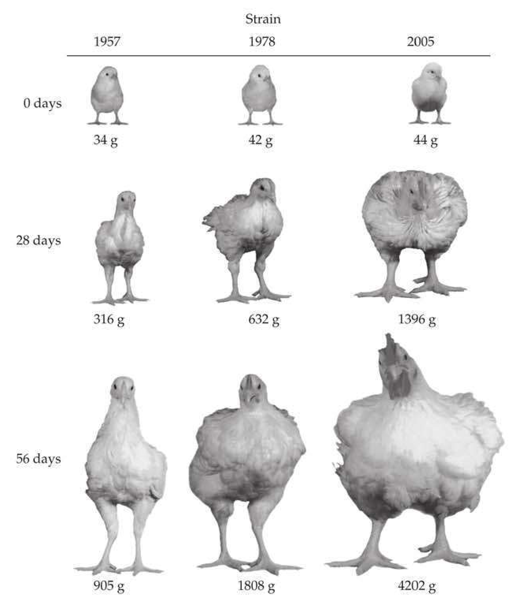
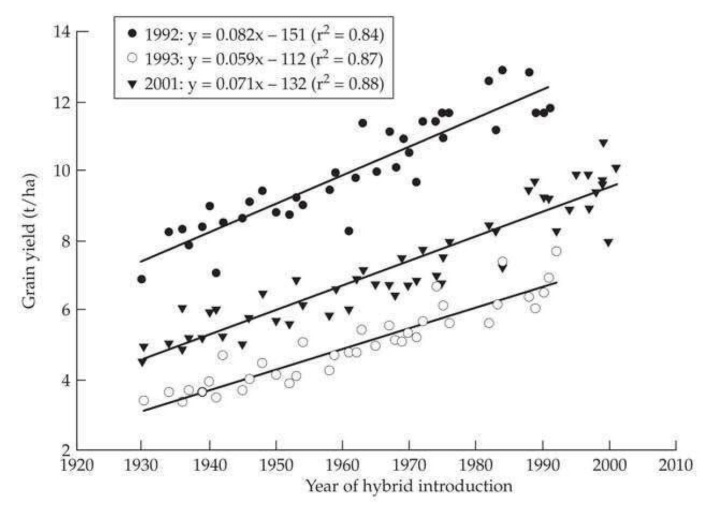

# Chapter 1 · Changes in Quantitative Traits Over Time

## chapter1_001 · Changes in Quantitative Traits Over Time: Introduction

The tendency of modern scientific teaching is to neglect the great books, to lay far too much stress upon relatively unimportant modern work, and to present masses of detail of doubtful truth and questionable weight in such a way as to obscure principles. Fisher and Stock (1915)

**[命题 Proposition]**

Quantitative traits—be they morphological or physiological characters, aspects of behavior, or genome-level features such as the amount of RNA or protein expression for a specific gene—usually show considerable variation within and among populations. A central (perhaps the central) question in evolution is the nature of the underlying forces generating this variation, be it the standing variation within a population or the divergence between species. Fully interwoven into this question is the corollary of how best to achieve targeted changes in organisms exploited for human welfare, namely breed improvement (Figure 1.1 and Figure 1.2). The importance of this applied aspect cannot be overstated. The most important technology developed by humans is agriculture, as all of our other impressive advances rest upon the foundation of a stable and sustainable food system. At present, despite significant improvements in yield (e.g., Evenson and Gollin 2003; Thornton 2010), there is considerable uncertainty about our ability to keep pace with projected global needs (Ray et al. 2012, 2013).

It is against this background that we attempt to present a modern, unified theory of quantitative genetics. Such a theory must draw heavily from population genetics, statistical theory, mathematical modeling, genetics, and genomics. It must also be built upon empirical observations from a very wide range of fields. As such, it must consider changes in complex traits in populations of organisms ranging from long-term laboratory studies on viral and bacterial evolution, much shorter-term selection experiments on metazoans, the exhaustive experience of breeders of a wide range of domesticated plants and animals, recent information from human biology, and a growing number of model (and also non-model) species in wild populations. Quantitative-genetics theory also needs to consider the full range of mating systems: inbred and outbred populations of sexual species and the clonal populations of asexual species, and it must also be applicable to haploids, diploids, and polyploids. It should be flexible and extensible, being able to incorporate new sources of information as they become available (e.g., functional-genomics features). Finally, such a theory should be empirically testable, making predictions (such as selection response) based on quantities that we have some hope of estimating.

Given the vast diversity of stakeholders in quantitative genetics, it is not surprising that very useful ideas, results, and machinery developed in one subfield may only slowly (if at all) migrate out into the broader community of users. A critical goal of this book is to facilitate this dissemination. For example, it is not fully appreciated that modern quantitative genetics is now fully merged with population genetics and is a growing part of genomics. Indeed, despite concerns of being outdated and in need of major revision (e.g., Nelson et al. 2013), the field is extremely robust and quite healthy. Modern quantitative genetics is the glue that connects many disciplines, especially given its ability to model uncertainty while fully accounting for known genetic and genomic features.

This introductory chapter starts with a historical overview of considerations of the evolution of quantitative traits. We then briefly comment on the theoretical foundations of evolutionary biology as they relate to qualitative traits (addressing some common misconceptions). We conclude with an overview and road map of this volume.

---

## chapter1_002 · A BRIEF HISTORY OF THE STUDY OF THE EVOLUTION OF QUANTITATIVE TRAITS / The Fusion of Population and Quantitative Genetics

**[Figure]**

> **Figure 1.1** · page 4 · source: `chapter1`
>
> 
>
> Figure 1.1 A striking example of the power of artificial selection is seen in lines of broilers, chickens selected for meat production. The figure compares the performance of a representative base line from 1957, an improved line from 1978, and a recent line from 2005, all raised in the same environment. Besides these extremely impressive differences in growth, there are equally important improvements in feed-to-protein conversion efficiency. (After Zuidhof et al. 2014.)

**[Figure]**

> **Figure 1.2** · page 5 · source: `chapter1`
>
> 
>
> Figure 1.2 Yield (measured in tons per hectare) in maize hybrid lines as a function of year of release. Using remnant seed, all lines were grown in the same set of years, with 1992 being highly favorable, 1993 cool and extremely wet, and 2001 hot and dry. Note that the response is parallel over the three different environments (years), suggesting little genotype × environment interaction. Such “common-garden” experiments are the cleanest way to separate an observed gain into genetic versus environmental components (Chapters 19 and 20 present alternative mixed-model approaches that can also accomplish this goal). This separation is critical, as a yield improvement over time could simply reflect improved agronomic practices, rather than genetic gain. In maize, hybrid improvement accounts for between 50 and 70% of the total improvement in yield, with the remainder due to improved farming practices (Duvick 2001). (After Duvick 2005.)

Although the histories of population and quantitative genetics are highly intertwined, they have experienced long periods of apparent separation. Their initially separate trajectories trace back to the bitter debate between the biometricians and the Mendelians following the rediscovery of Mendel in the early 1900s (Provine 1971, 2000; Tabery 2004). Motivated by Mendel's work on the inheritance of major genetic factors, the Mendelians believed that evolution was saltational: moving only by major leaps via the appearance of new mutations. The biometricians (supporters of Darwin and the founders of modern statistics) introduced concepts such as regressions and correlations to quantify continuous variation, and they thought that evolution occurred in very small steps by exploiting this variation. This initial schism between inheritance (Mendel) and evolution (Darwin) was largely driven by antagonistic personalities in the different camps (Provine 1971; although see Hogben 1974 for a different perspective), and significantly delayed the modern synthesis—the fusion of Darwin's evolution by natural selection with Mendelian inheritance. Vestiges of this difference between the gene-based focus of the Mendelians and the continuous-trait focus of the biometricians still persist today.

The first population-genetics paper, which predated the rediscovery of Mendel (and hence was published well before any considerations of the actual dynamics of genes), was concerned with a quantitative-genetics question. Fleeming Jenkin, Regius Professor of Engineering at the University of Edinburgh, was asked to write a review of Darwin's Origin of Species. Jenkin was a polyglot, and, among other things, invented the cable car and was an actor and an artist. Jenkin (1867) pointed out that, under blending inheritance, half of any variation is removed in each generation. Thus, any change achieved via natural selection would quickly be diluted away by the assumed nature of inheritance (also see Bulmer 2004). Phrased in terms of modern statistics, and recalling that the variance of a product of a constant (a) times a random variable (x) is $ \sigma^2(ax) = a^2 \sigma^2(x) $, his argument was that $$ \begin{align*}\sigma^2(z_o)=\sigma^2\left({z_f+z_m\over2}\right)={\sigma^2(z_f)\over2^2}+{\sigma^2(z_m)\over2^2}={\sigma^2(z)\over2}\end{align*} $$ where $ z_f $ and $ z_m $ are the (assumed to be uncorrelated) paternal and maternal trait values, $ z_o $ is the offspring value, and we assume that the trait variance is the same in both sexes, so that $ \sigma^2(z_f) = \sigma^2(z_m) = \sigma^2(z) $. Mendelian genetics provides the solution to this quandary of reduced variation following reproduction, as the segregation variance (variation generated by the transmission of alternative alleles in the gametes of heterozygous parents) completely restores the genetic variance in each generation (Chapter 16).

Given the nature of Jenkin's argument, it is fitting that the term variance was first introduced in the foundational paper of the field of quantitative genetics (Fisher 1918). Fisher's brilliant (yet technically difficult) paper formed the conceptual bridge between Mendelian inheritance with discrete genes and evolution acting on continuous traits (ideas hinted at earlier by Yule 1902, 1906). Despite its enormous importance, Fisher wrote this paper as a high school teacher in 1916, and it was initially rejected by the Royal Society of London. As Crow (1972) succinctly stated, "It was apparently too mathematical for the Mendelists and too Mendelian for the biometricians." It was eventually published by the Royal Society of Edinburgh with the help of Leonard Darwin, Charles's son.

Fisher’s theory of the expected resemblance between relatives was built by considering the sharing of alleles at underlying trait loci, and hence had a population-genetics core. Operationally, however, Fisher showed that summary statistics (the additive-genetic and other variance components) largely describe the resemblance between relatives. This was the undercurrent for much of the passive separation of population genetics from quantitative genetics. Although the latter was built around the dynamics of the underlying genes, it focuses on individual-level (breeding values) or population-level (additive variances) summary statistics of these underlying genetic features. This perceived lack of detailed genetics is both the strength and the weakness of quantitative genetics. Simply by having phenotypic measures of a trait on a set of known relatives, a number of short-term predictions (such as the response to selection and the expected resemblance between different sets of relatives) can be made in the absence of any other genetic information.

Immediately following Fisher's paper, major contributions started to appear from the two other founders of population genetics, Sewall Wright and J. B. S. Haldane, who also helped solidify the foundation of quantitative genetics initially laid out by Fisher. Despite this trinity all making deep contributions to the founding of both fields, one source of the passive separation of quantitative from population genetics was the multilocus nature of the former and the initial focus of the latter on single-locus models (Chapters 2 and 5).

**[命题 Proposition]**

No explicit considerations of multiple-locus models of selection were made until the late 1950s (Kimura 1956; Lewontin and Kojima 1960; Chapter 5). The complexity of the dynamics under even two-locus selection models seemed to prevent an easy generalization to the types of genetic architectures thought to be typical of quantitative traits, namely, a large number of loci. However, as detailed in Chapter 5, most of the complications in multilocus systems arise because of selection-generated gametic-phase (linkage) disequilibrium (abbreviated LD). If LD is assumed to be fairly weak (in other words, recombination is strong relative to selection on a given locus), single-locus results (for additive loci) can be used in models predicting selection responses (Chapters 5, 24–28). An important extension of this simplifying assumption was advanced by Bulmer (1971b, 1974a), who showed that the cumulative effects of even small amounts of selection-generated LD have a significant impact on the genetic variance when a large number of loci underlie a trait under selection. Fortunately, the expected LD-generated change in the additive variance is largely predictable (at least over a few generations) given the value of the genic variance, $ \sigma_{a}^{2} $ (the additive variance in the absence of LD; Chapters 16 and 24).

**[命题 Proposition]**

Given the assumption of weak selection (on any given locus, but not necessarily on the trait as a whole) and loose linkage, much of the theory of short-term selection response in quantitative traits is built around the infinitesimal model, a simplification wherein a large number of loci, each of small effect and usually additive, are assumed to underlie a trait (Chapter 24). In this setting, selection-induced allele-frequency changes at the underlying loci are assumed to be small for several generations, allowing response (both in terms of the mean and any LD-induced changes in the variance) to be largely predictable from information on the resemblances between relatives in the base (i.e., unselected) population. This setting, which is based on parent-offspring regressions, is the foundation for much of modern breeding theory (Chapters 5, 6, 13–23).

Starting in the late 1980s, more realistic, yet partly tractable, models of multilocus selection beyond the infinitesimal model started to appear (Barton and Turelli 1987; Keightley and Hill 1987; Turelli 1988; Turelli and Barton 1990; Bürger 1991a; Chevalet 1994; Chapter 24). To date, the issues with any multiple-locus model are twofold. First, the dynamics can be very complex, making generalizations difficult (but see Chapters 6 and 24). Second, and more critically, predicting the long-term behavior of such multiple-locus genetic systems requires, not just manageable theory, but also a detailed knowledge of the underlying genetic architecture of a trait (number of genes, allelic frequencies, and effect sizes) that is largely unavailable at the present, and likely to remain so into the rather far future (but see Visscher 2016 for a different perspective).

Finally, the foundations for the field of molecular population genetics were laid by Kimura (1955a, 1955b, 1957), and started with Kimura and Crow's (1964) infinite-alleles model (the first attempt to fully model mutation at the DNA-sequence level; Chapter 2). Although this field initially appeared to be very tangential to quantitative genetics, even here there was a strong initial connection with quantitative-genetics theory, as Kimura (1965a) used a modification of the infinite-alleles model to examine the expected distribution of allelic effects at a locus underlying a trait under stabilizing selection (Example 28.4).

Realizing that stochastic forces are extremely important in molecular evolution, Kimura marshaled the power of diffusion approximations (Appendix 1) to examine the interactions of evolutionary forces in finite populations, culminating with his neutral theory of molecular evolution (Kimura 1968b, 1983). Again, as with other fields that at first were perceived as only tangential, there were early applications of this molecularly driven theory to quantitative genetics. Robertson (1960a) realized that Kimura's (1957) results on the fixation probability of an allele under drift and selection were directly applicable to breeding. This led to his remarkably simple expression for the expected limit to the selection response: the expected total long-term response (ignoring new mutations) is bounded above by $ 2N_{e}R(1) $, where $ N_{e} $ is the effective population size (Chapter 3) and $ R(1) $ is the expected response to selection in the first generation (Chapters 13 and 26).

A watershed event in molecular population genetics was Kingman's (1982a, 1982b) introduction of the powerful concept of the coalescent (treating a sample of alleles from a population as a genealogy, which eventually coalesces to a common ancestral sequence at some point in the past; Chapter 2). This approach allowed for the development of statistical tests on the nature of forces shaping sequence evolution (Chapters 4 and 8–10). The very slow trickle of molecular data on which to apply this theory in those early days has now become a veritable tsunami of whole-genome sequences at the population level. It is this very flood of population-genomics data that is now driving the fusion of molecular and quantitative genetics. Much of the theoretical foundations for this fusion derive from results originally developed for, and envisioned as being restricted to, molecular population genetics.

---

## chapter1_003 · A BRIEF HISTORY OF THE STUDY OF THE EVOLUTION OF QUANTITATIVE TRAITS / The Ongoing Fusion of Molecular and Quantitative Genetics

In large part, the interaction between so-called classical genetics and quantitative genetics that played out during the rise of molecular genetics parallels much of the debate between the early Mendelians and biometricians, but with less rancor. During the rise of molecular genetics in the 1950s (nicely reviewed by Judson 1979 and Mukherjee 2016), the notion of a gene grew from a fairly nebulous concept into a rather concrete, well understood, object. This resulted in any statistical description of inheritance from quantitative genetics (variances of traits instead of following genes) becoming far less appealing. Indeed, to many geneticists, quantitative genetics appeared as an anachronism, a crutch that biologists no longer needed. As massive advances were made in the dissection of specific, individual genes with discrete, and highly reproducible, phenotypes, the result was a diminished interest in continuous traits. Indeed, Fisher's notion of an infinitesimal model—a large number of loci, each with very small effects—was anathema to this molecular way of thinking.

By the early 1980s, one of the byproducts of this revolution was access to an ever-growing number of molecular-based markers. Their availability opened up the potential for quantitative trait locus (QTL) mapping, which involves the isolation of small chromosomal regions that influence a trait of interest by applying linkage analysis to line-cross derivatives (LW Chapters 14 and 15). Such studies routinely found relatively small ($ \sim $10s of megabases) chromosomal segments that appeared to account for nontrivial fractions of the trait variation (5% or more; e.g., LW Figure 15.13). At odds with infinitesimal-like model thinking, this finding reinforced the view of many molecular geneticists on the importance of single genes.

The apparent presence of such major genes suggested that population-genetic models working with these genes (once they have been isolated) could largely supplant standard quantitative-genetics approaches. However, the actual isolation of such candidate genes proved extremely elusive. Eventually, this led to the realization that the large estimated effects of such genes were very often the result of significantly upward estimation bias and the presence of tightly linked clusters of QTLs that fractionate upon finer mapping (Chapter 24).

By the early 2000s, as molecular-marker technology continued to advance, the ability to quickly and cheaply score tens of thousands of markers allowed for association mapping (LW Chapter 16). The foundation of this approach rests on the use of linkage disequilibrium in random samples of unrelated individuals from a large population to fine-map genes (an idea deeply rooted in coalescent theory). As detailed in Chapter 24, one generalization from these studies was that only a very tiny fraction of the variance (typically far less than 1%) of a typical trait can be ascribed to any particular genomic region (with resolution now on the kilobase scale). The use of such dense marker coverage showed that the response to artificial selection is usually the result of changes over a large number of sites (Chapter 25), and their availability has facilitated tests of selection in any given region within a genome (Chapters 9 and 10).

The culmination of these association studies, involving up to millions of scored single-nucleotide polymorphisms (SNPs) on tens of thousands of individuals, was the crisis of apparently “missing heritability” (Manolio et al. 2009). The concern among many human geneticists was that, for all of their hard work on highly heritable traits such as height, detected SNP markers could only account for ~10% of the heritability found by standard biometrical analysis (i.e., resemblance between relatives). The result was a near-hysteria on the part of some, as they felt that because the molecular results must be correct, something fundamental was being overlooked in quantitative genetics. In reality this disconnect was simply a manifestation of the narrow focus that arose from being trained for decades in a single-gene culture. As pithily remarked by Sheldon (2014), There is something simultaneously remarkable and encouraging about the fact that a centuries-old method requiring no more than a ruler, a pencil and (I suppose) a slide rule outperformed, by an order of magnitude, the fruits of the genomic revolution. As detailed in Example 24.1, such a pattern of “missing heritability” is exactly what is expected when each underlying locus only explains a small fraction of trait variation (namely, a large number of underlying loci in partial linkage disequilibrium with the scored markers).

Thus, we have come full circle, with the genomic (i.e., association) data providing strong support for an infinitesimal-like model for the genetic architecture of many traits. However, the subtle distinction from the standard infinitesimal model is that while any particular site accounts for only a very small fraction of the variance of a trait, rare segregating alleles having large individual effects can be found (Figure 28.8). A quantitative-genetic framework is thus required when using association data for genomic prediction (the framework for genomic selection and genomic-based individualized medicine). A quick glance at any of the front-line journals in genomics highlights this growing merger with quantitative genetics, as many functional-genomic features—such as expression levels of RNAs, proteins, and metabolites—are now routinely examined in a quantitative-genetics framework.

A final example highlighting the connectedness between genomics and quantitative genetics concerns the Hill-Robertson effect. In contemplating the consequences of linkage for applied breeding, Hill and Robertson (1966) noticed that the presence of linkage reduced the chances of the joint fixation of linked beneficial alleles (Chapters 3, 7 and 8). While their work was regarded as entirely theoretical at the time (they never had any expectations of having the marker density required to test it), their idea that selection reduces the effective population size at linked sites is now a key organizing principle in the evolutionary analysis of genomic sequence data (Chapters 3 and 8).

---

## chapter1_004 · A BRIEF HISTORY OF THE STUDY OF THE EVOLUTION OF QUANTITATIVE TRAITS / The Common Thread Between Breeding and Evolution in Natural Populations

The connection between trait change through artificial selection in domesticated organisms and trait evolution in natural populations was one of the pillars of evidence offered by Darwin in support of his theory of evolution by natural selection. It is thus not surprising that the subfields of breed improvement (which is simply applied evolution) and evolutionary biology have historically had considerable interactions (Hill and Kirkpatrick 2010; Hill 2014; Gianola and Rosa 2015). Both fields are concerned with predicting an expected change in a trait (or vector of traits) given a specific pattern of selection. Evolutionary biologists face the additional, and daunting, challenge of trying to estimate the nature and target (or targets) of selection (i.e., assigning fitnesses to specific trait combinations; Chapters 20, 29, and 30). We consider this last topic separately, after first examining the common connections between the work of breeders and evolutionary biologists.

The introduction of the full power of quantitative genetics into breeding is in large part due to Jay Lush, and his extremely influential book, Animal Breeding Plans (Lush 1937). In particular, he proposed the classical breeder's equation, $ R = h^{2}S $, for predicting the response to a single generation of selection. Lush was heavily influenced by Sewall Wright, as in 1931 he commuted weekly from Iowa State to the University of Chicago to attend Wright's statistical genetics course. He was also influenced by R. A. Fisher, who lectured at Iowa State during the summers of 1931 through 1936. The extension from the univariate breeder's equation to the response to selection on multiple traits, in the form of selection on a weighted index of trait values, was influenced by both Lush and Fisher. Smith (1936), who acknowledges Fisher's help, and Lush's colleague Hazel (1945) both examined the expected selection response and optimal weights of such an index of trait values. Lush (1947) applied the Smith-Hazel results to obtain the optimal weighting of within- and among-family information for artificial selection programs. Smith and Hazel's work also introduced the very powerful concept of genetic correlations.

The breeder’s equation is the cornerstone for much of the predicted response to selection in natural populations, and its multivariate extension, which is due to Lande (1976), builds heavily on the ideas of Smith and Hazel, as well as Pearson (1903). Hence, ideas that were initially developed for evolution (Wright’s interests) were translated into animal breeding by Lush, and then subsequently found their way back into the evolutionary literature for modeling the expected response in natural populations (Chapter 20; Slaktin 1970; Roughgarden 1972; Lande 1976).

**[命题 Proposition]**

An alternative to the breeder’s equation for predicting selection response was proposed by Alan Robertson (1966a) in a very opaque paper on the culling process in cattle. He proposed that the selection response in a trait could be expressed as the covariance between the breeding value of that trait and relative fitness, $ R = \sigma(A_z, w) $. As this expression was based on an extension of Fisher’s fundamental theorem of natural selection (which states that the rate of response in fitness is simply the additive variance in fitness; Chapter 6), it is often called the secondary theorem (Orr 2009 suggested that Robertson’s theorem is actually more fundamental, and that Fisher’s theorem follows as a special case). Price (1970) independently suggested a completely general covariance-based expression for the response to any system of selection (Equation 6.8). While both the Robertson and Price results are widely used in evolutionary biology (Chapters 20 and 22; Frank 1995), they have only recently made their way back into breeding, most notably in the analysis of associative effects (Chapter 23; Bijma et al. 2007a).

**[命题 Proposition]**

Until very recently, most selective breeding in outbred populations was based on best linear unbiased predictor (BLUP) selection (Chapters 18 and 20), an approach introduced by Charles Henderson (1975). In keeping with the focus on breeding values seen in Robertson's secondary theorem, Henderson noted that one can significantly improve the estimate of individual breeding value by considering all of the known relatives in a sample. This is accomplished using linear mixed models (Chapters 19 and 20; LW Chapters 26 and 27) to return BLUPs of individual breeding values. The individuals with the highest BLUPs are then chosen as the parents for the next generation, with the expected selection response simply being the average breeding values of the selected parents. As this same approach yields a restricted maximum likelihood estimator (or REML estimate) of the additive-genetic variance, evolutionary biologists realized that mixed models could be used to estimate trait heritabilities in natural populations using a set of known relatives (Shaw 1987; Cheverud and Dittus 1992; Kruuk 2004). As detailed in Chapter 20, there was some initial overreach in the early 2000s in an attempt by evolutionary biologists to use BLUPs to assess direct targets of selection, but the BLUP framework still remains a powerful tool for evolutionary analysis.

The most recent chapter in the development of breeding methods is the use of dense marker information. Initially motivated by the apparent ubiquity of QTLs of major effects, breeders flirted with marker-assisted selection (MAS) schemes, wherein a few well-chosen markers were used to augment phenotypic information when selecting individuals (Lande and Thompson 1990). However, in response to a renewed appreciation for the infinitesimal model, molecular-based breeding has moved to genomic selection (Meuwissen et al. 2001), wherein mixed models are used to assign weights to tens of thousands of SNP-tagged segments that span the genome. The simplest variant of this approach recovers BLUP selection (Chapters 13 and 19), but now with the A matrix of all pairwise relationships between individuals in the sample being replaced by a marker-based estimate of the fraction of shared markers (G-BLUP, for genomic-BLUP). With the increasing availability of dense SNP markers (and now whole-genome sequences) for even nonmodel organisms, marker-based estimations of relationships are now widely used for REML estimates of additive variances, and also (to a lesser extent) for association mapping, in natural populations (Chapter 20).

---

## chapter1_005 · A BRIEF HISTORY OF THE STUDY OF THE EVOLUTION OF QUANTITATIVE TRAITS / Detecting Selection in Natural Populations

Given the biometrician focus on evolution acting on continuous variation, early attempts to measure natural selection in the wild predated Fisher's (1918) treatment of complex trait genetics. Although this focus on detecting selection on metric traits was entirely concerned with the phenotypic level, it marked the beginning of evolutionary quantitative genetics. Two early such attempts were particularly noteworthy. The first was due to Weldon (1895, 1899), who examined morphological features in adult and juvenile crabs (Carcinus maenas) in Plymouth Sound and in the Bay of Naples, generating data that enticed Karl Pearson (1903) to start a serious consideration of the statistics of selection. The second was the classic study by Herman Bumpus (1899). During a severe ice storm in February 1898, Bumpus collected 136 immobilized house sparrows (Passer domesticus) from several locations around Providence (in the US state of Rhode Island). Of these, only 72 survived. For all 136 individuals, Bumpus recorded sex and male maturity state (adult vs. juvenile) and presented meticulous measurements of their body weight and eight skeletal features. As reviewed in Chapter 30, Bumpus's results continue to be examined today, illustrating the power of carefully collected, and widely disseminated, datasets.

While numerous studies during the early to mid-1900s focused on the fitness consequences of discrete traits, such as various color morphs (reviewed by Endler 1986; Reznick and Travis 1998), the explosion of studies on fitness surface estimation (obtaining an expression for $ W(z) $, the expected fitness of an individual with trait value z) began with the method proposed by Lande and Arnold (1983), which built on Pearson (1903). As detailed in Chapters 29 and 30, Lande and Arnold proposed fitting a quadratic regression of fitness as a function of the phenotypes of candidate traits. Although purely phenotypic in nature, this approach has deep connections, not only with Pearson's work, but also with the index selection results of Smith (1936) and Hazel (1943). While most estimates of the nature of selection on a particular trait (or combinations of traits) focus on morphological characters, nothing about this approach prevents it from being applied to any quantitative trait. Hence, measures of physiological features (such as the levels of target hormones) or genomic-level characters (such as levels of RNAs, proteins, and metabolites) all hold as appropriate traits. The only challenge (which is far from trivial) is their measurement in a meaningful way in natural populations where individual fitnesses have been assessed.

Both Lande-Arnold fitness estimation, and the subsequent methods it spawned, require data on individual fitness, which is often difficult to collect (Chapters 29 and 30). A related question of deep evolutionary interest is whether an observed pattern of trait divergence (either between populations or over time within a single population) is due to selection. Such questions are typically framed using the null hypothesis of whether this observed pattern is consistent with drift alone. The roots of many of the current approaches for testing patterns of trait divergence trace back to Lande (1976), in which he explored whether an observed amount of phenotypic divergence in a specific trait in the fossil record of a species exceeded that expected by drift alone. Unlike methods that estimate whether a particular trait is currently under selection, Lande's (1976) approach does not require estimates of individual fitness, but does require models for the expected change in the trait over time under drift. Chapter 12 examines a number of such approaches for constructing null models, be it for a fossil sequence, the trait divergence between extant populations, or genomic data. Given the reckless abandon with which some biologists suggest adaptive scenarios, null models are unquestionably required to judge the significance of a particular pattern of trait divergence. This is especially true for functional-genomic features, such as the levels of mRNA expression among sibling species (Chapter 12).

A final approach for detecting selection, which follows as one of the fruits of the genomic revolution, involves tests for selection on specific genomic locations (Chapters 8–10). These tests have the advantage of being trait-independent (no specific candidate traits are assumed). Further, contemporaneous fitness data are not needed, and indeed such genomic signatures of selection can be a consequence of a past history (perhaps long ago) of selection that may not be presently ongoing. The downside of these purely marker-based approaches is that it may be rather difficult to associate a genomic region with a change in a specific trait, leaving the target of selection unclear.

---

## chapter1_006 · Changes in Quantitative Traits Over Time: Introduction / THE THEORETICAL FOUNDATIONS OF EVOLUTIONARY BIOLOGY

Lewin's maxim that "there is nothing more practical than a good theory" (Lewin 1943; McCain 2015) is highly apropos for evolution. The basic idea of evolution is so inherently simple—organisms change over time from preexisting ones—that it appears to be the ultimate play-at-home game. Despite the care with which most biological studies are presented, often the evolutionary comments are wildly speculative, with little apparent grounding in modern theory. Even worse are the sporadic, and usually rather forceful, comments that routinely appear in the (nonevolutionary) literature that suggest something is woefully wrong, and/or missing, in the current theory. We conclude our introductory remarks by offering some commentary on these issues.

---

## chapter1_007 · THE THEORETICAL FOUNDATIONS OF EVOLUTIONARY BIOLOGY / The Completeness of Evolutionary Theory

Without a theoretical framework, science is simply a fact-establishing enterprise. The emergence of facts from consistent observations is progress, but theory provides a mechanistic explanation of the material basis of facts. A theoretical framework also provides the basis for making predictions in areas where observations have not previously been made, not simply based on statistical extrapolation but rather on arguments from first principles. Mathematical theory is particularly desirable, as it allows the development of logical arguments from well-defined assumptions, whereas verbal theorizing can easily go awry in the analysis of complex systems. Fortunately, evolutionary biology has a well-established framework of principles from which to draw. As noted above, starting with Fisher's seminal 1918 paper, which both founded the field of quantitative genetics and established a number of principles upon which modern statistics relies, the field of population genetics has experienced a rich history. Indeed, the field of theoretical population genetics, which is at least as well-grounded as any other area of quantitative biology (including biophysics), forms the formal foundation for all of evolutionary theory.

The earliest period of theoretical development (1918–1950) substantially preceded any knowledge of the molecular basis of genes. Starting in the 1950s, dramatic new findings in the field of molecular genetics emerged, including the discovery of DNA as the ultimate genetic material, the mechanisms of recombination, the basic structure of genes and their component parts, the central roles of transcription and translation (and downstream modifications), the existence of mobile genetic elements, and various nuances related to epigenetic inheritance. Yet none of these discoveries led to any alteration in the basic structure of evolutionary theory. Such robustness in the face of revolutionary changes in our understanding of genetics at the molecular level speaks volumes about the generality of our current theoretical framework. Important specific applications may remain to be developed, but the theoretical foundations of evolutionary biology are remarkably accepting of new observations.

Nonetheless, periodic claims are made that the field of evolutionary biology is in a phase of upheaval, with the harbingers of such messages seldom offering the much-needed solution to the (in their view) previously unappreciated problem. Without exception, these episodes have gone badly. Perhaps the most notable of these excursions was Goldschmidt's (1940) argument that large changes in evolution are products of macromutations with coordinated developmental effects (a flashback to the Mendelians), and Lysenko's rejection of natural selection in favor of the inheritance of acquired characteristics, which led to a decades-long demise of genetics in the Soviet Union.

One of the more recent alarmist exercises involves a tiny but vocal community clamoring for an “extended evolutionary synthesis” (EES), and claiming that “The number of biologists calling for change in how evolution is conceptualized is growing rapidly,” and that there is currently a “struggle for the very soul of the discipline” (Pigliucci and Müller 2010; Shapiro 2011; Laland et al. 2014, 2015). It is interesting that the list of individuals engaged in this struggle appears not to extend beyond the authors themselves, and the level of discourse is reminiscent of the distant “bean-bag genetics” diatribe of Mayr (1959, 1963), which was promptly disemboweled by Haldane (1964). No glaring errors in contemporary evolutionary theory have been pointed out by the EESers, no evidence of familiarity with current theory has been provided, and no novel predictions have been offered (Welch 2017). There is only a warning that once qualified theoreticians come on board, the revolution will begin.

One of the more dramatic claims is that the discovery of various epigenetic effects amounts to a game-changer in evolutionary biology, imposing the need to revamp our general understanding of inheritance and its evolutionary implications (Jablonka and Lamb 2005; Caporale 2006; Shapiro 2011). Highlighted phenomena include base modifications on DNA, histone modifications on nucleosomes, and mechanisms of gene regulation by small RNAs, all of which can, in principle, have transgenerational effects without direct changes at the level of genomic DNA. Advocates of epigenetic inheritance have generally argued that such phenomena respond in beneficial ways to environmental induction, which then allows for an acceleration in the rate of adaptive phenotypic evolution. This echo of Lysenkoism, in effect, resurrects the concept of the inheritance of acquired characteristics.

The logic underlying the entire subject of epigenetic contributions to evolution has been masterfully dismantled by Charlesworth et al. (2017), and here just two points are made. First, to appreciate the implausibility of a long-term contribution of nongenetic effects to phenotypic evolution, one need only recall the repeated failure of inbred (totally homozy- gous) lines to respond to persistent selection, with many such experiments dating back to the beginning of the twentieth century (Lynch and Walsh 1998). The absence of genetic variation does not imply an absence of environmental or epigenetic sources of phenotypic variation, yet there is no permanent response to selection within populations unless there is variation at the DNA level.

Second, with respect to the claim that evolutionary theory is incapable of addressing the matter of epigenetic inheritance, one need only turn to models for the inheritance of environmental maternal effects developed well before the discovery of the molecular basis of any epigenetic effects. Existing theory readily demonstrates that variance in maternal effects can indeed contribute to the response to selection, but unless such effects reside at the DNA level, the response is bounded, owing to the fact that transgenerational effects are progressively diluted out (Chapters 15 and 22). The response to selection on environmental (epigenetic) maternal effects is also transient, and it decays away if the selective pressure is eliminated. Finally, if epigenetic effects are sufficiently stochastic, they will reduce, rather than enhance, the response to selection, owing to the reduction in the correspondence between genotype and phenotype.

A persistent claim to novelty by the EESers is the idea that the environmental induction of a trait in a novel situation can enhance the exposure of the trait to selection, thereby magnifying the response to selection. This, however, is by no means a new insight. Rather, such effects are central to the concept of genotype × environment interaction, the theory of which dates back decades. Indeed, breeders have long exploited this concept to determine the optimum environmental setting in which to select for particular phenotypes. Thus, the idea that evolutionary theory needs to be remodeled to account for phenotypic plasticity is also without merit, and simply reflects a basic lack of familiarity of the existing evolutionary quantitative-genetics literature. Hopefully, the material presented in the following pages will provide some aid in this regard.

Another argument raised against the adequacy of evolutionary theory involves the idea that the field is incapable of dealing with the possibility that evolution “is guided along specific routes opened up by the processes of development” (Laland et al. 2014). This claim again belies a lack of awareness of long-existing evolutionary theory. Although models concerned with the role of mutation in phenotypic evolution commonly assume a symmetrical distribution of mutational effects, it is relatively easy to modify any quantitative-genetic model to allow for biased mutational effects. Indeed, the classical house-of-cards model has a structure in which mutation bias is intrinsic—here there is a fixed set of possible allelic effects, so there is always a directional bias to mutation unless the mean genotypic value is positioned at exactly the intermediate location along the axis of possibilities. As for the role of developmental bias in evolution, one need only consider the substantial theory devoted to multivariate evolution that is explicitly focused on pleiotropy and the ways in which this influences the evolutionary trajectories of complex traits (e.g., Jones et al. 2003, 2007, 2012).

**[命题 Proposition]**

Most remarkable is the EESer claim that the key flaw of contemporary evolutionary theory is the assumption that change in allele frequencies is a necessary component of the response to selection, their counterview being that “the direction of evolution does not depend on selection alone, and need not start with mutation” (Laland et al. 2014). Whereas it has long been appreciated that evolution can, and sometimes does, occur in the absence of selection (for example, by random genetic drift of neutral traits), we await an explanation as to how any sustained form of evolution (aside from cultural evolution) can occur in the absence of genetic variation. Technically speaking, evolution can occur in the absence of allele-frequency change, but only via changes in the form of allelic associations across loci (e.g., via LD, which necessarily implies genotype-frequency change), and this does not appear to be what the dissenters have in mind.

---

## chapter1_008 · Changes in Quantitative Traits Over Time: Introduction / The Completeness of Evolutionary Theory

Finally, we note that unlike the laws of physics and the features of chemical elements, biology is subject to historical contingencies, and for virtually every set of general observations, one can find some kind of exception. Aficionados of such exceptions are sometimes tempted to claim that their observations are sufficient to dismantle the previous theoretical framework for broadscale patterns. However, more often than not, a deeper look almost always reveals explanations for exceptions that are fully compatible with the rules of life. The discovery of mitochondrial DNA and nuclear epigenetic effects did not alter our basic understanding of maternal effects, and the discovery of transposable elements did not alter our appreciation of the mutational process. Such observations simply provided a deeper molecular explanation of modes of production of phenotypic variation. Because evolution is a stochastic process, no theoretical framework can ever be expected to predict the exact trajectories of evolution at the molecular, cellular, or developmental levels. As Haldane (1964) pointed out, if population genetics could make such specific predictions, it would not be a branch of biology—it would be the entirety of biology.

Far from providing a weak and/or incomplete caricature of evolving genetic systems, population- and quantitative-genetic theory has provided powerful, general, and sometimes unexpected mechanistic explanations for trait variation and phenotypic evolution. We note several of these in Table 1.1, and emphasize that few of these issues would have ever been revealed and/or resolved with simple verbal arguments. Indeed, as noted above, it was Fisher's (1918) paper that rescued the previously verbalized theory of evolution from the high seas of obfuscation. Having resisted quantitative thinking derived from first principles in genetics, developmental biology, from which many of the pleas for novel theory emanate, remains in many respects in a pre-population-genetics mode of confusion.

Although our specific railing on the EES ideology may be offensive to some or seem like pandering to trivia to others, the implication that a century's worth of theoreticians have been woefully misled is a gross misrepresentation of the facts. Repeated peddling of this view by individuals with no intention of confronting the facts belies reality. As outlined in Table 1.1 and expanded upon in the following chapters, the structure of evolutionary theory that has been developed over the past century has, to this point, found no boundaries in terms of applications, has not been challenged by novel findings in the molecular era, and continues to make predictions that are bolstered by empirical observations. While conflict and cooperation are the engines that keep science running, conflict engineered under false pretenses and incessantly repeated with no evidence is generally motivated by nonscientific goals.

---

## chapter1_009 · THE THEORETICAL FOUNDATIONS OF EVOLUTIONARY BIOLOGY / Nonadaptive Hypotheses and our Understanding of Evolution

Darwin’s and Wallace’s grand views of selection as a natural force for the emergence of adaptive change marked a key moment in the history of biology. So convincing were they, and their popular-science writing disciples such as Dawkins, that most people (including most biologists) view all aspects of biology to be necessary products of natural selection. As it channels the entire field away from a landscape of unbiased study, this dogmatic adherence to the unbounded power of natural selection constitutes one of the most significant problems in evolutionary science. Whereas natural selection is one of the most pervasive forces in the biological world, it is not all-powerful. As is evident throughout the following pages, the genetic paths open to exploitation by selection are strongly influenced by another pervasive force—the noise in the evolutionary process imposed by random genetic drift which is caused by both the fact that there are finite numbers of individuals within populations and the physical linkage of different nucleotide sites on chromosomes. If the power of selection is weak relative to that of drift, as is often the case at the molecular level, evolution will proceed in an effectively neutral manner. Biased mutation pressure can also play a role here if it is sufficiently strong relative to selection, steering evolution in the direction of mutation bias.

Even if selection were to be pervasive, in order to understand the degree to which natural selection molds the features of populations, it is essential to know what to expect in the absence of selection. It is for this reason that neutral models have been repeatedly exploited in population- and quantitative-genetic analyses. Under such models, random genetic drift, mutation, and recombination are the sole evolutionary forces, with the resultant formulations then providing null models for testing for natural selection. As noted above, such

**[Table]**

> **Table 1.1** · `1.1` · page 15 · source: `chapter1_009`
> Table 1.1 A few key areas in evolutionary biology where the mathematical/statistical theory of population and quantitative genetics has enhanced our understanding of the mechanistic basis of trait variation and provided novel predictions. This list is by no means complete, and many of the references are simply exemplars, rather than a full literature citation.
>
> Topic | References
> --- | ---
> Quantitative-trait variation | 
> Phenotypic resemblance between relatives, and how this scales with the degree of relationship. | Fisher 1918; Kempthorne 1954
> Inbreeding depression, and how this scales with parental relatedness. | Crow 1948
> Quasi-inheritance of familial (including maternal) effects, and transient selection response. | Willham 1963; Falconer 1965
> Expression of all-or-none traits as a function of underlying determinants. | Wright 1934a, 1934b
> Pleiotropy and the genetic correlation between traits. | Lw Chapter 25
> Long-term patterns of evolution | 
> Sudden (saltational) transitions from one discrete character state to another. | Lande 1978
> Rates and patterns of evolution in the fossil record. | Charlesworth et al. 1982; Charlesworth 1984b
> Rapid evolution across adaptive valleys by stochastic tunneling. | Lynch 2010b; Weissman et al. 2010
> Mutation bias and the inability of a mean phenotype to attain an optimal state. | Lynch 2013; Lynch and Hagner 2014
> Spatial variation in genotypic values in the absence of underlying ecological variation | Higgins and Lynch 2001
> Genome evolution | 
> The fate of duplicate genes. | Walsh 1987, 1995; Force et al. 1998; Lynch and Force 2000
> Conditions for the spread of mobile elements. | Charlesworth and Charlesworth 1983
> Evolution of codon bias. | Bulmer 1991
> Evolution of transcription-factor binding sites. | Lynch and Hagner 2014
> The illusion of evolutionary robustness. | Frank 2007; Lynch 2012b
> Evolution of the genetic machinery | 
> Evolution of the mutation rate. | Lynch 2011; Lynch et al. 2016
> Evolutionary consequences of sexual reproduction. | Kondrashov 1988; Charlesworth 1990; Otto and Barton 2001
> Evolutionary deterioration of sex chromosomes. | Charlesworth and Charlesworth 2000
> Evolutionary features of alleles | 
> Low probability of fixation of mutant alleles. | Kimura 1962
> Ages of alleles. | Kimura and Ohta 1973
> Conditional time to fixation of deleterious mutations equaling that of beneficial mutations. | Maruyama and Kimura 1964
> Enhanced evolutionary divergence under uniform selection. | Cohan 1984b; Lynch 1986
> Doubling the effective population size by equalizing family sizes. | Crow and Kimura 1970

models have been particularly useful in attempts to understand long-term phenotypic changes recorded in the fossil record, where seemingly dramatic changes that have elicited selection arguments are found to be less than impressive when evaluated in the proper context of drift and mutation (Lande 1976; Lynch 1990; Chapter 12). Neutral models are particularly easy to develop for DNA-level features, as mutation can be explicitly defined in terms of the possible nucleotide substitutions. Although neutral models can become more challenging in the case of more complex traits, where the baseline features of mutations can be more difficult to define, this is not a justification for ignoring the matter.

**[命题 Proposition]**

Some investigators (Pigliucci and Kaplan 2000; Hahn 2008) have suggested that so much evidence for selection has emerged that we should abandon the use of neutral theory, with Hahn going so far as to argue that “the implications of our continued use of neutral models are dire,” and “can positively mislead researchers and skew our understanding of nature.” No one argues that selection is unimportant, but the proposition of a selection theory as a null model for hypothesis testing has no logical basis. When properly constructed, neutral models make very explicit predictions, and without such null expectations, arguments for the role of natural selection in evolution are reduced to qualitative hand-waving. Formal rejection of a neutral model, along with measurement of the deviations between observations and expectations, yields a deeper and more defensible understanding of evolutionary processes.

The second problem with invoking the need for a “selection theory” as the null model is that one can concoct a selection argument for essentially any observed pattern, leaving no room for falsifying the null hypothesis of the universal power of selection. If one form of selection does not adequately fit the data, then one can try another, and failing that, still another, but without ever abandoning the pan-selection view. Fluctuating selection (wherein the direction of selection wanders around a mean of zero) can even yield a population-genetic history that closely mimics the expectation under random genetic drift alone, with no discrimination between models being possible without a knowledge of effective population sizes.

A third problem with criticisms of neutral theory is the reliance on incorrect assumptions to reach questionable conclusions. For example, Lewontin (1974) long ago suggested that the fact that standing variation in natural populations is only weakly associated with effective population size ($ N_{e} $) suggests a violation of the neutral theory, as standing levels of variation at silent sites in diploid populations should scale with $ 4N_{e}u $, where u is the mutation rate per nucleotide site (Chapter 4). Although this argument continues to be made (Hahn 2008), it ignores the fact that mutation rates evolve to be inversely correlated with $ N_{e} $, which naturally leads to weak dependence of standing variation on $ N_{e} $ (Lynch et al. 2016). In this particular case, the discrepancy between data and the neutral theory is greatly diminished once the appropriate null model is constructed.

The call for a selection theory of evolution, like the call for an extended evolutionary synthesis, has not resulted in any theoretical upheaval. No offering of what a novel theory of selection might be has been presented, and none is likely to emerge for the very simple reason that we already have such a theory. From the very beginning, population- and quantitative-genetic theory has fully embraced selection as a central force in evolution. Indeed, the numerous accomplishments of selection theory are summarized, explained, and celebrated in the remainder of this book.

---

## chapter1_010 · Changes in Quantitative Traits Over Time: Introduction / OVERVIEW AND PATHWAYS THROUGH THIS VOLUME

Given the scope (and length) of this volume, we conclude our introduction by providing a brief roadmap and overview of the material presented in the following chapters. We envision the users of this book to be a very diverse community: animal, crop, and tree breeders; evolutionary biologists, human geneticists, and population and statistical geneticists. Given this eclectic audience, our challenge has been to present both the necessary material a user

**[Table]**

> **Table 1.2** · `1.2` · page 17 · source: `chapter1_010`
> Table 1.2 Suggested topic-specific pathways through this book.
>
> Topic | Suggested Chapters
> --- | ---
> Basic population genetics | 2-5, 7-10, 27, Appendix 1
> Applied breeding | 3, 6, 13-19, 21-23, 25-26, Appendix 5
> Evolutionary quantitative genetics | 6, 13-20, 22, 27-30, Appendices 5, 6
> Population genetics of selection response | 5-10, 24-28, Appendix 1
> Detection of selection with genomic data | 2-5, 7-12, 27, Appendices 1-4

might be searching for, while also highlighting connections with other areas that may not initially have been considered relevant.

We assume that the reader has some basic knowledge of the foundations of the genetics of complex traits, which is covered in our first volume (Lynch and Walsh 1998). Given that we extensively refer back to this volume, for brevity it is denoted throughout the current volume by LW. While LW focused on the genetics of complex traits, the current volume examines the forces behind the evolution of such traits: drift, mutation, recombination, and selection. Our treatment of the field will conclude in our final (third) volume, which largely deals with multivariate traits, plus a few specialized, but important, topics (such as genotype × environment interactions, inbred-line development, and breeding for heterosis). Table 1.2 offers some suggested pathways through this volume, and our overview below is organized by the major sections of this book.

---

## chapter1_011 · OVERVIEW AND PATHWAYS THROUGH THIS VOLUME / Evolution at One and Two Loci

The next nine chapters develop the population-genetic theory that underpins most analyses of the evolution of quantitative traits, serving as the foundation for the remainder of this volume. Chapter 2 begins this excursion by examining drift and mutation-drift interaction, including important concepts such as the infinite-sites and infinite-alleles models of sequence evolution and the extremely powerful tool of the coalescent for treating drift.

Chapter 3 introduces the concept the genetic effective size of a population. One of the major extensions of this powerful idea over the last few decades was the realization that different regions of the genome likely experience different effective population sizes. This is the Hill-Robertson effect: selection acting on a particular locus reduces, perhaps quite dramatically, the effective population size experienced by linked sites. An unresolved debate is whether the majority of this interfering selection simply involves the removal of new deleterious mutations (background selection) or the fixation (or at least increase in frequency) of newly-favorable alleles (hitchhiking and selective sweeps).

Chapter 4 examines the relative strengths of the nonadaptive forces of evolution: mutation, drift, and recombination. All three of these forces can vary substantially among phylogenetic lineages and therefore can substantially influence modes of evolution. Genomics has painted a much fuller picture of these processes than was present even a decade ago, and we review results from numerous whole-genome sequencing studies.

Chapter 5 covers the theory of one and two-locus selection, concluding with a derivation from population-genetic principals of Lush's classic breeder's equation, $ R = h^{2}S $ (which is the foundation for much of current selection-response theory). We also bridge population and quantitative genetics by showing how selection on a trait translates into the nature and amount of selection on underlying loci.

**[命题 Proposition]**

Chapter 6 is essentially the gene-free counterpart of Chapter 5, as it examines general theories of selection response, such as Price's equation, Fisher's fundamental theorem, and both versions of Robertson's secondary theorem. Price's equation is a general expression for any type of selection response, expressed in terms of variances and covariances, which we use to examine the robustness of the breeder's equation.

Chapter 7 focuses on the interactions of drift and mutation with selection, highlighting some of the less intuitive, and sometimes counterintuitive, features that can arise when these forces interact. Together with Chapter 5, the machinery developed in this chapter is used extensively in Chapters 24–28 to build the population-genetic theory of the selection response of a quantitative trait.

Chapters 8–10 apply the concepts $ aeveiopea $ in these early chapters in the search for signals of both recent and past selection in genomic data. Chapter 8 develops the theory of selective sweeps, namely the nature of genomic signatures generated by relatively recent selection events. Chapter 9 relates these results to the myriad of tests of very recent (or ongoing) selection using a sample from a population (polymorphism-based tests). Chapter 10 examines approaches using divergence data (differences between two, or more, distantly related populations or species) to search for repeated episodes of selection over a genomic region. Genomic-based searches for selection are an extremely fashionable area of evolutionary and human genetics, and, when handled appropriately, offer important tools for breeders searching for genetic footprints from domestication events. Chapters 9 and 10 are rather detailed, as numerous tests have appeared in the literature, and our goal is to provide the reader with an overview of all relevant approaches. Both of these chapters also stress the important point that all such methods have critical, indeed often fatal, flaws raising caveats to consider when applying these approaches to genomic scans for selection.

---

## chapter1_012 · OVERVIEW AND PATHWAYS THROUGH THIS VOLUME / Drift and Quantitative Traits

Paralleling our development of population-genetics theory (where we first considered the roles of drift and mutation before examining the impact of selection), before we turn to selection acting on traits, Chapters 11 and 12 examine trait evolution under drift and mutation alone. Chapter 11 examines the impact of drift and mutation on the additive-genetic variance within a population. In order to fully address this issue, it also develops the rather intricate covariances between relatives that arise under general schemes of inbreeding.

Chapter 12 examines the among-population divergence in trait means under drift and mutation. While this topic may seem rather esoteric to some, especially to those with functional-genomics data, this theory is actually very relevant. Modern omics data (such as expression levels of RNAs, proteins, or metabolites) are very much quantitative traits, influenced by (potentially) numerous genes and the environment. Chapter 12 develops a number of tests for whether an observed pattern of change (be it between a set of natural populations, a temporal sequence of morphological phenotypes in the fossil record, the pattern of allele-frequency change over a set of QTL or GWAS-linked markers, or differences in gene-expression levels between species) is consistent with drift. Such drift-based models provide critical null models for tests of selection-driven divergence.

---

## chapter1_013 · OVERVIEW AND PATHWAYS THROUGH THIS VOLUME / Short-term Response on a Single Character

The remainder of this volume examines the role of selection in changing the distribution of trait values for a quantitative character. We start by considering the short-term changes in a single trait. By short-term, we mean the first few generations, where selection-induced changes in allele frequencies at underlying loci are sufficiently small to be ignored.

Chapter 13 further explores Lush’s classical breeder’s equation, $ R = h^2 S $, for the expected single-generation change in the mean of a quantitative trait. We examine extensions of this result to a number of settings, including selection schemes based on other estimates of an individual’s breeding value beyond just their own phenotypic value (e.g., also using the phenotypic values of relatives). We also introduce the multivariate breeder’s equation (which is extensively covered in Volume 3).

Chapter 14 considers truncation selection and the response in threshold traits, wherein a binary (presence/absence) trait results from the transformation of some underlying continuous variable (the liability). We also briefly introduce logistic regression and log-linear models, two approaches for the statistical modeling of discrete quantitative-genetic traits.

Chapter 15 extends of the breeder’s equation to scenarios where the selection response in the mean has a transient component that changes over time. This can occur when additive

× additive epistasis underlies a trait, for dominance in a tetraploid species, or when there are environmental effects that are partly shared between parent and offspring. The last scenario serves as a brief introduction to maternal effects, which are more extensively covered in Chapter 22 (and especially in Volume 3). The key concept of Chapter 15 is that such transient components of response decay away under random mating when selection is stopped, leaving a reduced permanent response in the mean given by an appropriate interpretation of the breeder's equation.

Chapters 13–15 are entirely concerned with predictable changes in the mean, while Chapters 16 and 17 examine the impact of short-term selection on the variance. Chapter 16 examines Bulmer's theory (and its extensions) on the role of gametic-phase disequilibrium (or linkage disequilibrium [LD] for brevity, even though results also apply to unlinked loci) in changing the additive-genetic variance. The key concept is that the additive variance can be decomposed as $ \sigma_{A}^{2} = \sigma_{a}^{2} + d $. The genic variance, $ \sigma_{a}^{2} $, is entirely a function of the allele frequencies and represents the additive variance in the absence of LD. The disequilibrium contribution, $ d $, is generated by LD, and eventually decays to zero (via recombination) under random mating when selection is relaxed. We use Bulmer's result to examine both the change in $ \sigma_{A}^{2} $ under directional selection and the change in $ \sigma_{A}^{2} $ when selection is largely focused on the population variance (e.g., stabilizing or disruptive selection).

Chapter 17 examines the short-term change in another variance component, the environmental variance, $ \sigma_E^2 $. A relatively recent appreciation is that $ \sigma_E^2 $ can vary over genotypes, and, as such, can potentially respond to selection. We examine different parameterizations for modeling $ \sigma_E^2 $ in terms of heritable components (i.e., breeding values for environmental variances), and the expected selection response under directional, as well as stabilizing and disruptive selection.

Chapters 18 and 19 cover the analysis of selection experiments, including the very important case of assessing the selection response (e.g., progress) in a breeding program. Chapter 18 reviews least-squares models of analysis, while Chapter 19 examines more recent approaches based on mixed-models (i.e., BLUP) and Bayesian methods (Appendices 2 and 3).

**[命题 Proposition]**

Chapter 20 examines the expected selection response in natural populations. Here, a significant confounding factor is the inability to precisely know the target of selection. We examine both BLUP-based approaches and those based on Robertson's secondary theorem (introduced in Chapter 6), the latter focusing on the nature of selection acting directly on the breeding value of a trait. A key finding is that numerous traits measured in natural populations show at least moderate heritabilities and apparently experience strong selection (so that $ h^{2}S $ is fairly large), yet show little to no response. We examine a variety of reasons for the apparent failure of the breeder's equation in these settings.

---

## chapter1_014 · OVERVIEW AND PATHWAYS THROUGH THIS VOLUME / Selection in Structured Populations

Chapters 21–23 conclude our treatment of short-term response on a single trait, considering situations other than mass selection (wherein individuals are selected based on their phenotypic value alone) under random mating. Chapter 21 examines family-based selection schemes, wherein information from families—such as family means over a set of environments or deviations within a given family—are used in selection decisions.

Chapter 22 introduces the important, and much underappreciated, topic of associative effects. Here, individuals interact, and the phenotype of a focal individual is a function of both its own genetic and environmental values, as well as the values of the interacting individuals. This generates a selection response on both a direct and a social (or associative) component, and can lead to situations wherein selection to improve a trait actually results in a reduction in the mean. For example, when one selects the best individuals for egg production in a cage, often these individuals are the most aggressive (and hence able to garner the most resources). While they may have superior genes that directly influence egg production, they also have genes that reduce production in other cage members. A cage full of such birds can easily show a significant reduction in egg production. Associative effects also allow us to model maternal effects (as a special case), and place the concepts of kin and group selection into a single, unified, framework that involves components that can be estimated in standard breeding designs.

Chapter 23 concludes our discussion of structured populations by considering the impact of inbreeding on selection. This theory forms the basis for much of modern plant breeding. We also review some of the theory on the evolution of selfing rates in monoecious species.

---

## chapter1_015 · OVERVIEW AND PATHWAYS THROUGH THIS VOLUME / Population-genetic Models of Trait Response

Chapters 13–23 consider short-term response, wherein either allele-frequency change is sufficiently small to be ignored, or is modified in very predictable ways, largely independent of the selection scheme (such as the decline in $ \sigma_{A}^{2} $ under drift). Building on the results from Chapters 5 and 7, Chapters 24–28 examine the theory of long-term selection response in the face of significant allele-frequency change. Long-term response is far less predictable than short-term response. Indeed, it is entirely unpredictable from knowledge of just the base population genetic variances alone.

Chapter 24 examines the classical infinitesimal model, wherein a large number of loci, all of small effect, underlie a trait. We then consider departures from this basic model, including the continuum-of-alleles model, and the impact of LD and allele-frequency change in driving the distribution of breeding values away from a normal (Gaussian) distribution. Parts of this chapter are fairly technical.

Chapter 25 examines the deterministic theory of long-term response, as well as models with a major gene and background polygenes. In addition to theory (largely based on results from Chapter 5), we also examine the empirical data on long-term selection, and review the common features seen in many experiments.

Chapter 26 examines the impact of adding drift and mutation to the deterministic results from Chapter 25. In particular, we develop Robertson's classical result that the expected long-term selection response (in the absence of mutation) is usually bounded above by the product of $ 2N_{e} $ (twice the effective population size) and the response in the first generation. This key result implies that a higher short-term response (which results in a reduced $ N_{e} $) comes at the expense of a reduced long-term response.

Chapter 27 examines a much longer-term view of selection response by considering adaptive walks, namely the sequence of successive fixations during adaptation over evolutionary time scales. One exciting aspect of this work is that some of the theory (which is rather technical and detailed in places) can be tested in microbial systems, and we review some of these empirical results, comparing them with their theoretical expectations.

Chapter 28, perhaps the most technical chapter in this volume, examines the extensive population-genetics modeling that has been performed on possible explanations for the maintenance of quantitative-genetic variation. Here, we are in the rather embarrassing position of having a wealth of highly detailed models, none of which can account for the data given our current understanding of strengths of selection in natural populations and details of the underlying genetics (number of loci and average mutation rates).

---

## chapter1_016 · OVERVIEW AND PATHWAYS THROUGH THIS VOLUME / Measuring Selection on Traits

We conclude with the estimation of individual fitnesses in natural populations and the search for specific traits, or trait-combinations, currently under selection. In many ways, these last two chapters are the complement of Chapters 9 and 10. The tests from these previous chapters are trait-independent and require only sequence information, while the methods in Chapters 29 and 30 require estimates of the fitnesses of individuals (which are far from trivial to obtain), as well as the phenotypic values of candidate traits. The search for traits under selection in natural populations is a major focus of much of evolutionary and ecological genetics.

Chapter 29 focuses on the measurement of fitness, and how to partition these estimates across specific episodes of selection. A key concept is the opportunity for selection, I, the variance in relative fitness. This sets an upper limit on the maximum amount of change in any particular trait over a single generation of selection. We also examine measures of sexual selection, differences in the ability to attract mates. We then turn to estimation of, and various descriptive statistics for, the fitness surface, $ W(z) $. This surface describes the expected fitness of an individual whose phenotypic value is z. Most of the methods for estimating fitness-trait associations assume some simple distribution, such as a normal, binomial, or Poisson for fitness (total number of offspring left by an individual). In reality, fitness distributions are expected to be very complex, in part because we expect them to have a large point mass at zero, representing the fraction of individuals leaving no offspring. We conclude by introducing the important Aster model approach, which allows for far more realistic distributions of fitnesses to be constructed.

Chapter 30 extends the univariate analysis of fitness-trait associations to multivariate settings and examines the resulting geometry of multivariate fitness surfaces. We also review the empirical data on the strength of selection in natural populations, introduce path-analytic models for the analysis of selection, and discuss the estimation of selection that occurs on levels above the individual (such as on groups or populations).

---

## chapter1_017 · OVERVIEW AND PATHWAYS THROUGH THIS VOLUME / Appendices

Our six appendices introduce and review important mathematical and statistical tools used throughout this volume. Appendix 1 reviews diffusions, a class of approximations from probability theory widely used in population genetics to handle complex models with random features, notably the interaction of drift and selection.

Appendices 2 and 3 introduce, respectively, Bayesian methods and the Markov Chain Monte Carlo (MCMC) approaches used to obtain their resulting posterior distributions. Bayesian methods are widely applied in genetics, in large part because of their ability to fully account for all the potential sources of uncertainty when estimating model parameters. The resulting models are analytically rather complex, but with the development of computer resampling methods (MCMC approaches), they can be analyzed in rather straightforward ways. Bayesian methods are ideal for handling the high-dimensional datasets generated by genomics, in which massive numbers of features are measured on a much more modest number of actual samples (e.g., 30,000 measures of gene expression on, say, 100 individuals).

Appendix 4 examines several aspects of multiple comparisons, moving beyond simple Bonferroni corrections to the concept and application of the false-discovery rate. The latter is a powerful alternative to the more classical stringent control of experiment-wide type I error, as in genomic studies, we expect numerous tests to reject the null, and our concern is more about the quantification of those we accept (discoveries) rather than trying to control against any false positives (the Bonferroni setting). It also examines another powerful multiple comparison setting, meta-analysis, the comparison of results over a large number of studies, showing how to place this into a mixed-model framework.

Appendix 5 presents useful results from matrix algebra, and in particular, the geometry of a matrix, such as eigenstructure and matrix decompositions. While these methods are used throughout the book, they are especially important when describing the curvature of a multivariate fitness surface (Chapter 30).

Appendix 6 concludes with a few brief results on the calculus of matrix and vector derivatives.

---

## chapter1_018 · OVERVIEW AND PATHWAYS THROUGH THIS VOLUME / Volume

The advanced reader might have noticed that a number of important topics are not covered in this volume. As mentioned at the start of this chapter, our treatment of selection response on quantitative traits concludes in Volume 3, which covers important topics in applied breeding such as the development and selection of pure lines and selection programs for hybrid breeding. The bulk of Volume 3, however, is multivariate, examining multivariate selection response in detail. We consider both the change in the mean vector and in the G matrix of the additive-genetic variances and covariances for the vector of traits of interest and examine methods for comparing the stability of G over populations. We conclude with a variety of applications of multivariate methods, such as the theory of index selection, BLUP and genomic selection, dealing with genotype × environment interactions, and selection on longitudinal traits (those whose phenotypes change over time, such as a growth curve or milk yield). The latter are often called function-valued traits, and can they be modeled by random-regressions which is an extension of BLUP methodology.

---

## chapter1_019 · OVERVIEW AND PATHWAYS THROUGH THIS VOLUME / Notation

Finally, we need to briefly comment on the bane of almost every theoretical treatment: notation. One of our greatest challenges in trying to forge a cross-disciplinary synthesis spanning the full breadth of quantitative genetics was dealing with the considerable amount of overlapping notational symbols found in the literature. For example, $ \theta $ is widely used for very different quantities in different subfields of quantitative and population genetics. While we could have created new notation for the various quantities with overlapping symbols, this would have introduced an additional level of complexity. Hence, we have tried (as much as possible) to follow the common usage in the relevant literature for a given field at the expense of some notational overlap. Hopefully, any slight ambiguity introduced by the recycling of some of the notational symbols across different chapters can be distinguished from the context of the presentation.

---
