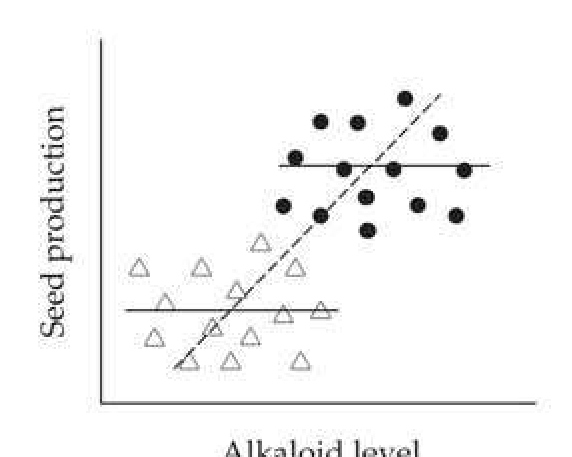
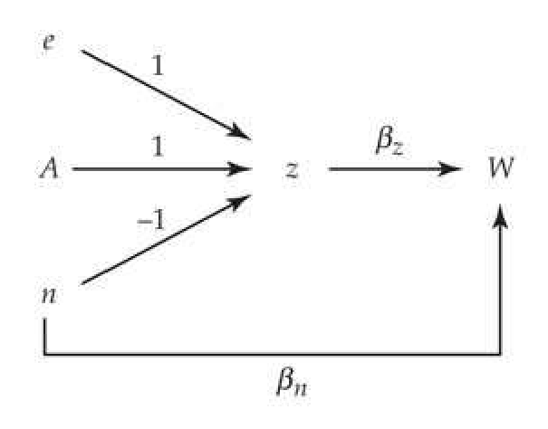
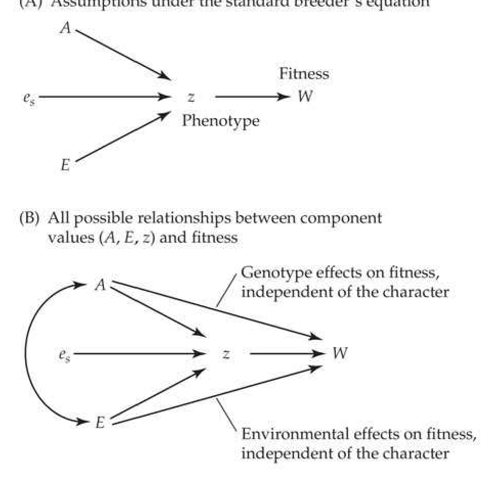
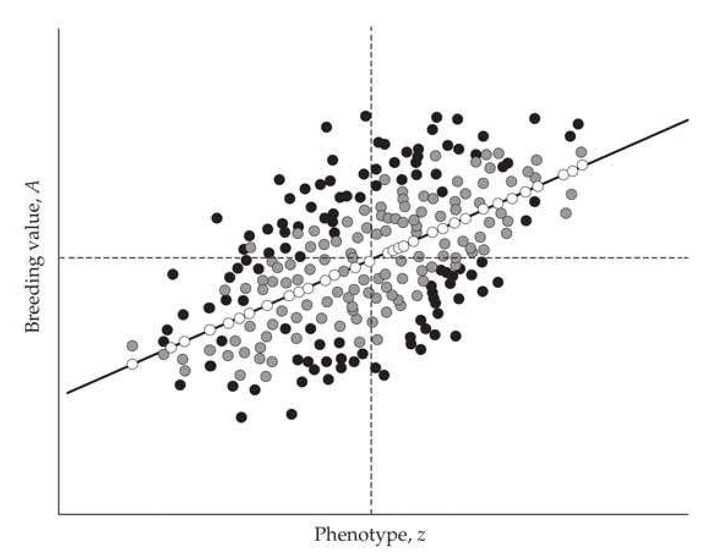
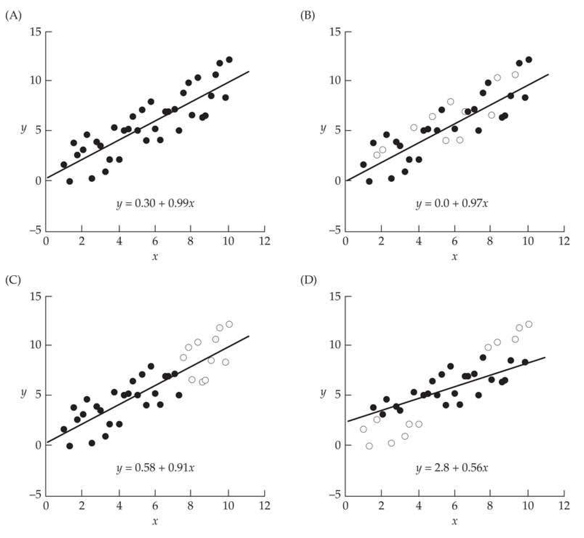
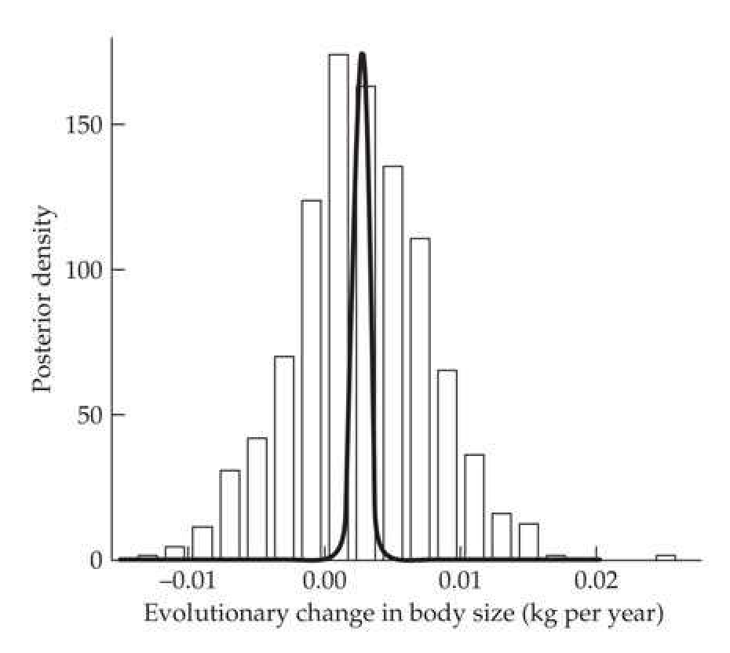
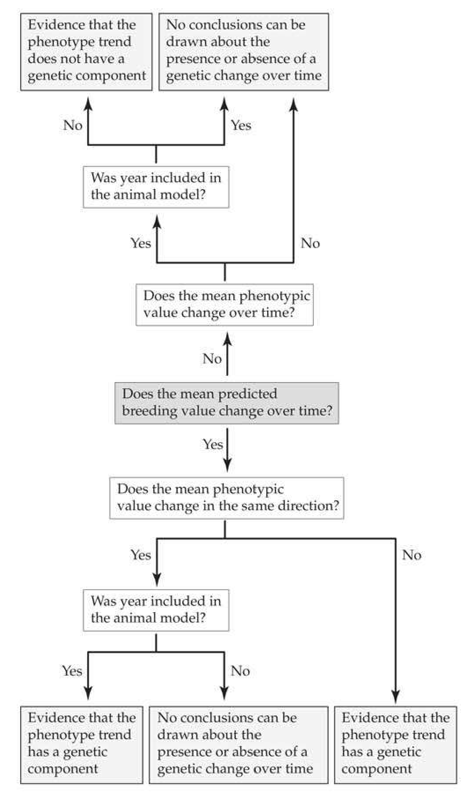
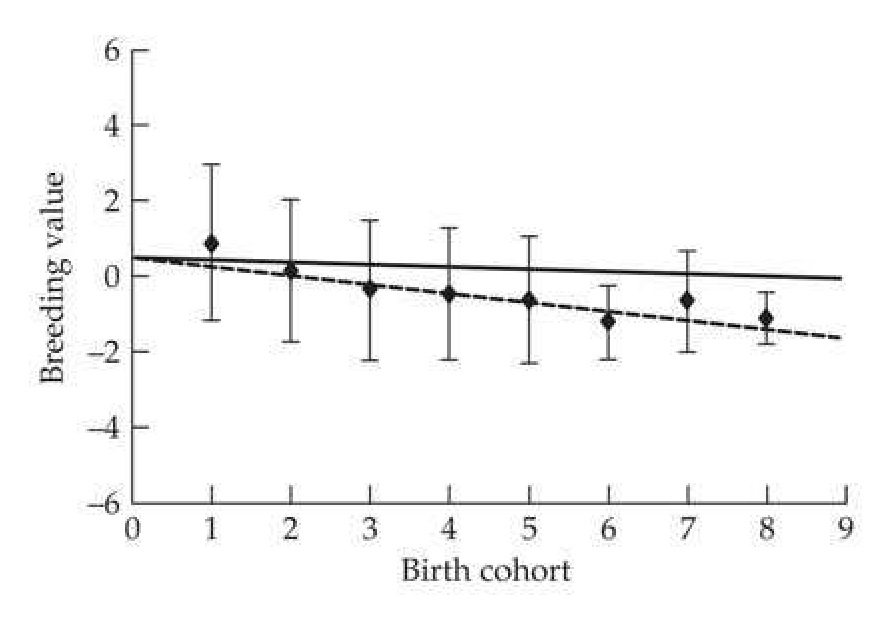
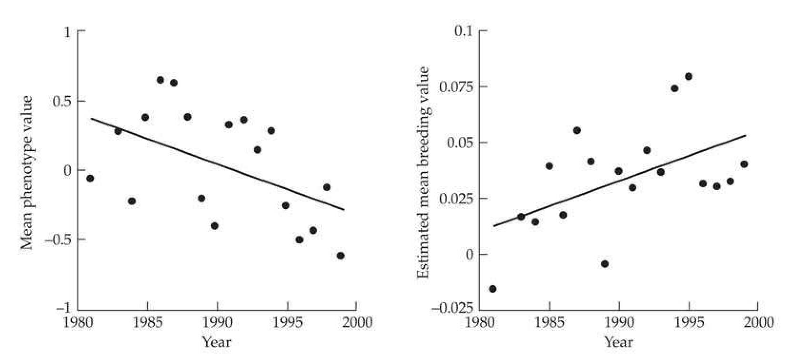

# Chapter 20 · Selection Response in Natural Populations

## chapter20_001 · Selection Response in Natural Populations: Introduction

Associations between phenotype and fitness, however appealing, will give a misleading impression of the potential for evolution in a trait if the true target of selection is unmeasured or immeasurable. Kruuk et al. (2002)

Under artificial selection (animal and plant breeding and laboratory selection experiments), the breeder's equation machinery developed in Chapters 13 through 19 for the prediction and analysis of response generally works well. However, there is considerable angst as to whether this is also true for natural populations (e.g., Merilä et al. 2001c; Morrissey et al. 2010, 2012; Pemberton 2010; Timothée et al. 2017). There are two principal reasons for this. First, under artificial selection, individuals are strictly chosen by the phenotypic value of their focal trait or traits. By contrast, in natural populations, one infers the target of selection, typically by looking for changes in the mean and/or variance of certain candidate traits within and/or across generations. The problem is that the phenotypic moments of an unselected trait can change if it is correlated with another trait under selection. A within-generation change (a nonzero selection differential) occurs if an unselected trait is phenotypically correlated with a selected one (Equation 13.25c), while a between-generation change (a response) occurs if the traits are genetically correlated (Equation 13.26c).

The second complication is lack of control over the environment. With artificial selection, there is generally considerable environmental control, in part due to husbandry and cultivation methods designed to standardize rearing and growing conditions and to mitigate extreme environmental events. This is certainly not the case when attempting to track selection in natural populations. Indeed, we are largely unable to determine which environmental factors may be important, let alone be able to control them. Further, artificial selection experiments generally impose considerable control over the biotic (in addition to the physical) environment in which an organism finds itself (e.g., the collection of species interacting with the focal population). In natural populations, the biotic environment is both absolutely critical and largely uncontrollable. One potential consequence of lack of environmental control arises when unmeasured environmental factors jointly influence the trait and fitness. Changes in the environment can also mask underlying genetic changes and can lead to significant changes in the nature of selection from one generation to the next (such as favoring larger trait values in wet years and smaller values in dry years). Finally, changes in the environment can modify genetic and environmental variances, thus altering the heritability.

**[命题 Proposition]**

This chapter addresses these concerns in two parts. The first is largely theoretical, centering on the bias caused by selection on unmeasured features. We initially frame this concern within the context of correlated characters, and then focus on the special case where an unmeasured variable is entirely environmental, which can generate a nonzero selection differential but no response. Next, we extend the univariate breeder's equation to account for all of the possible biases that arise from any unmeasured traits influencing the focal trait. We conclude by recasting the selection response under both versions of Robertson's secondary theorem, $ R = \sigma(A_z, A_w) $ and $ R = \sigma(A_z, w) $ (Chapter 6), as opposed to the breeder's equation ($ R = h^2 S $) framework. Here, w is relative fitness, and $ A_z $ and $ A_w $ are, respectively, the breeding values for the trait and relative fitness. Contrasts between these two predictions suggest tests for assessing whether a focal trait is the sole target of selection.

The second part of our treatment is largely empirical, examining the advantages and pitfalls of applying mixed models (Chapter 19) in natural populations. During the first decade of the 2000s, there was much excitement that BLUP predictions of breeding values

would offer powerful insight into the nature of selection response in natural populations. A rash of results, many initially viewed as classic, quickly appeared from the analysis of pedigrees from several vertebrate populations under long-term observation (reviewed in Kruuk et al. 2008). However, problems with BLUP estimates of breeding values in natural settings, initially noticed by Postma (2006), were shown by Hadfield (2008) and Hadfield et al. (2010) to be extremely serious. Hence, many of these initial results need to be seriously reconsidered.

Nonetheless, certain aspects of the animal model, in particular REML estimates of specific covariances (such as that between the breeding values of a trait and fitness), remain powerful approaches. We first review how a BLUP analysis in a natural population proceeds (with a specific focus on estimating the relationship matrix, A), then show where flaws can appear, and finally examine how certain features of the animal model can still prove useful. The rapid rise, even quicker demise, and then phoenix-like resurrection (and reorientation) of animal-model applications in natural populations can be quite confusing to the novice reading the historical literature, so we try to carefully navigate through the shoals of confusion. We conclude by reviewing a number of examples of selection response (or lack thereof) in natural populations, using the developed theoretical and statistical machinery to highlight problems that can arise when attempting to predict response in a natural population.

---

## chapter20_002 · Selection Response in Natural Populations: Introduction / EVOLUTION IN NATURAL POPULATIONS: WHAT IS THE TARGET OF SELECTION?

**[命题 Proposition]**

While there are many assumptions underlying the breeder’s equation (Chapter 6; Table 13.2), the one that is most likely to fail in natural populations, and the one that is most challenging to test, involves causality—our assumption that the phenotype of the focal trait is the sole target of selection (in the sense that it is genetically and phenotypically uncorrelated with any other traits under selection). Under the breeder’s equation, the trait value (z) entirely governs fitness, and transmission of the resultant change in the mean of z to the next generation is entirely described by $ h^{2} $. The conceptual beauty of the breeder’s equation is that it partitions evolution into separate, and distinct, ecological (S) and genetical ($ h^{2} $) processes, allowing ecologists to focus on the former (the nature of selection) and geneticists on the latter (the inheritance of the trait). If we incorrectly assign the target of selection, the breeder’s equation will give misleading results.

---

## chapter20_003 · EVOLUTION IN NATURAL POPULATIONS: WHAT IS THE TARGET OF SELECTION? / Direct and Correlated Responses

Bias from correlated traits can be removed by using the multivariate breeder's equation, provided all relevant traits are included. This equation expresses the vector, R, of responses (changes in means) as a function of the genetic (breeding value), G, and phenotypic, P, covariance matrices for the traits of interest, and the vector, S, of their selection differentials. From Equations 13.23b and 13.26a, $$ \mathbf{R}=\mathbf{G}\mathbf{P}^{-1}\mathbf{S}=\mathbf{G}\boldsymbol{\beta} $$ where the selection gradient, $ \beta = \mathbf{P}^{-1}\mathbf{S} $, controls for any phenotypic correlations among the measured traits, returning the amount of direct selection acting on each particular character (LW Chapter 8; Chapter 30).

**[推导 Derivation]**

Focusing on the bivariate version of this equation provides insight into some of the complications that can arise by ignoring selection on correlated traits. Suppose we are following trait 1, which is influenced by a second (and unmeasured) feature, which we denote as trait 2. Noting that $ \mathbf{S} = \mathbf{P}\beta $, the selection differential on trait 1 becomes

> **Formula (20.1a)** · `20.1a` · source: `chapter20_block_011` · Direct and Correlated Responses
>
> $$ S_{1}=P_{11}\beta_{1}+P_{12}\beta_{2}=\sigma^{2}(z_{1})\beta_{1}+\sigma(z_{1},z_{2})\beta_{2} $$

**[推导 Derivation]**

A within-generation change $ (S_1 \neq 0) $ in trait 1 occurs from: (i) direct selection on trait 1 $ (\beta_1 \neq 0) $, and/or (ii) indirect selection from a phenotypically correlated one (trait 2) under directional selection ($ \beta_2 \neq 0 $ and $ \sigma(z_1, z_2) \neq 0 $). As a result, the signs of $ S_1 $ and $ \beta_1 $ can differ, and even strong direct selection ($ \beta_1 \neq 0 $) on a trait can still be associated with a net selection differential of nearly zero (or worse, of opposite sign). Turning to the expected response in trait 1,

> **Formula (20.1b)** · `20.1b` · source: `chapter20_block_012` · Direct and Correlated Responses
>
> $$ R_{1}=G_{11}\beta_{1}+G_{12}\beta_{2}=\sigma^{2}(A_{1})\beta_{1}+\sigma(A_{1},A_{2})\beta_{2} $$

Trait 1 can evolve as a consequence of direct selection (if it has additive variation) or as a correlated response from direct selection on another genetically correlated trait (with the breeding values of the two traits being correlated within individuals, $ \sigma(A_1, A_2) \neq 0 $). As the following example highlights, some of the best studies of the response to selection in natural populations come from birds (reviewed by Merilä et al. 2001b; Merilä and Sheldon 2001; Gienapp et al. 2008; Kruuk et al. 2008; Clutton-Brock and Sheldon 2010; Charmantier et al. 2014). In certain settings (such as isolated islands), the entire population can be banded and all nests located (often through the use of nest boxes), allowing for accurate measurement of individual fitness (Chapter 29).

**[示例 Example]**

> **Example 20.1** · ref: `20.1` · source: `chapter20_003.json` · blocks 4–4
>
> Example 20.1. Alatalo et al. (1990) examined tarsus length in a population of collared fly-catchers (Ficedula albicollis) residing in the southern part of the island of Gotland in the Baltic Sea. Measurements of lifetime fitnesses in this isolated bird population were possible because most surviving offspring (which are tagged before fledging, i.e., before leaving the nest) return to breed in the area where they were reared as offspring. In addition to tarsus length, fledgling weight was also measured (with both traits scaled in standard-deviation units) and Pearson-Lande-Arnold regressions (Chapter 30; LW Chapter 8) were performed to compute the amounts of direct selection (the estimated selection gradients) on both characters, yielding
> 
> > **Inline Table 1** · `inline_1` · page 3 · source: `chapter20_003`
> > Inline Table 1
> >
> > <table><tr><td rowspan="2">Year</td><td rowspan="2">Observed  $ \bar{i} $ on tarsus length</td><td colspan="2">Estimated selection gradients,  $ \beta $</td></tr><tr><td>Tarsus length</td><td>Fledgling weight</td></tr><tr><td>1981</td><td>0.19**</td><td>0.01</td><td>0.25*</td></tr><tr><td>1983</td><td>0.08</td><td>-0.01</td><td>0.21*</td></tr><tr><td>1984</td><td>0.20**</td><td>0.12</td><td>0.33***</td></tr><tr><td>1985</td><td>0.02</td><td>-0.06</td><td>0.27***</td></tr><tr><td>pooled</td><td>0.12**</td><td>0.03</td><td>0.27***</td></tr><tr><td>*p &lt; 0.05,</td><td>**p &lt; 0.01,</td><td>***p &lt; 0.001</td><td></td></tr></table>
> 
> 
> Although there was a significant selection differential (which is presented as the selection intensity, $ \bar{i} $, because the trait was scaled in standard deviations; Equation 13.6a) on tarsus length in two of the years (and in the pooled data), there was no significant direct selection on tarsus length itself (none of the estimated selection gradients for this trait were significant). Rather, direct selection was on fledgling weight. While there is a significant phenotypic correlation between tarsus length and fledgling weight (r = 0.32; p < 0.001), it appears to be entirely due to within-individual correlations of environmental effects, as there is no correlation between the fledgling weight of an offspring and the tarsus length of its parent (r = -0.01; p > 0.1). The latter observation implies an absence of a genetic correlation between tarsus length and fledgling weight, and hence (from Equation 20.1b) no response in tarsus length is expected.

**[示例 Example]**

> **Example 20.2** · ref: `20.2` · source: `chapter20_003.json` · blocks 5–8
>
> Example 20.2. As reviewed in Grant and Grant (1995, 2002; and references therein), one of the best documented cases of natural selection is on body size and bill morphology in Darwin's finches (Geospiza fortis) on the Galápagos island of Daphne Major. Two strong episodes of selection were observed during their long-term study, due to serious droughts in 1976–1977 (when the population crashed from 634 birds down to 95, a 15% survival rate), and in 1984–1986 (556 birds reduced to 180, a 32% survival rate). Six (log-transformed) morphological traits were followed through both episodes, and (after rescaling all traits to have unit variances) the selection differentials, $ S = \bar{t} $ (as traits are scaled to unit variance), and gradients, $ \beta $, for the two episodes were as follows (where $ * $ denotes p < 0.05):
> 
> > **Inline Table 2** · `inline_2` · page 4 · source: `chapter20_003`
> > Inline Table 2
> >
> > <table><tr><td></td><td colspan="2">1976-1977</td><td colspan="2">1984-1986</td></tr><tr><td>Trait</td><td>$ \bar{x} $</td><td>$ \beta $</td><td>$ \bar{x} $</td><td>$ \beta $</td></tr><tr><td>Weight</td><td>0.74 $ ^{*} $</td><td>0.477 $ ^{*} $</td><td>-0.11</td><td>-0.040</td></tr><tr><td>Wing length</td><td>0.72 $ ^{*} $</td><td>0.436 $ ^{*} $</td><td>-0.08</td><td>-0.015</td></tr><tr><td>Tarsus length</td><td>0.43 $ ^{*} $</td><td>0.005</td><td>-0.09</td><td>-0.047</td></tr><tr><td>Bill length</td><td>0.54 $ ^{*} $</td><td>-0.144</td><td>-0.03</td><td>0.245 $ ^{*} $</td></tr><tr><td>Bill depth</td><td>0.63 $ ^{*} $</td><td>0.528 $ ^{*} $</td><td>-0.16 $ ^{*} $</td><td>-0.135</td></tr><tr><td>Bill width</td><td>0.53 $ ^{*} $</td><td>-0.450 $ ^{*} $</td><td>-0.17 $ ^{*} $</td><td>-0.152</td></tr></table>
> 
> 
> Two striking features are apparent. First, the observed (within-generation) change in the mean, $ \bar{\tau} $, was not a good predictor of the actual amount of direct selection, $ \beta $, on a trait, and can even have a different sign (e.g., bill length). Second, the nature of selection changed over the two drought periods. During the 1976–1977 drought, larger individuals were favored, and there was selection on bill shape (increased bill depth, decreased bill width). A change in the dominant food supply during a subsequent drought in 1984–1986 resulted in selection favoring smaller birds. Hence, the two episodes of selection were in opposite directions (at least in terms of body size). Grant and Grant had an estimate of the genetic variance matrix, G, for these traits in hand, allowing them to substitute these estimated $ \beta $s into the multivariate breeder's equation (13.26a) to examine how well responses were predicted. Response was well predicted in 1976, but overpredicted in three of the six traits in the 1984 episode. They suggested that the main reason for these discrepancies was a change in the biotic environment. Higher population densities for offspring in 1984 retarded growth, resulting in an overprediction of size-related traits.
> 
> > **Inline Table 3** · `inline_3` · page 4 · source: `chapter20_003`
> > Inline Table 3
> >
> > <table><tr><td></td><td colspan="2">1976-1977</td><td colspan="2">1984-1986</td></tr><tr><td>Character</td><td>Predicted</td><td>Observed</td><td>Predicted</td><td>Observed</td></tr><tr><td>Weight</td><td>$ 17.39 \pm 0.22 $</td><td>$ 17.52 \pm 0.25 $</td><td>$ 16.82 \pm 0.13 $</td><td>$ 15.48 \pm 0.08^{*} $</td></tr><tr><td>Wing length</td><td>$ 69.98 \pm 0.39 $</td><td>$ 69.65 \pm 0.35 $</td><td>$ 67.93 \pm 0.17 $</td><td>$ 67.21 \pm 0.11^{***} $</td></tr><tr><td>Tarsus length</td><td>$ 19.45 \pm 0.09 $</td><td>$ 19.32 \pm 0.14 $</td><td>$ 19.02 \pm 0.04 $</td><td>$ 19.02 \pm 0.04 $</td></tr><tr><td>Bill length</td><td>$ 11.14 \pm 0.10 $</td><td>$ 11.06 \pm 0.11 $</td><td>$ 10.86 \pm 0.05 $</td><td>$ 10.96 \pm 0.03 $</td></tr><tr><td>Bill depth</td><td>$ 9.83 \pm 0.12 $</td><td>$ 9.94 \pm 0.09 $</td><td>$ 9.51 \pm 0.06 $</td><td>$ 9.32 \pm 0.03^{**} $</td></tr><tr><td>Bill width</td><td>$ 8.96 \pm 0.08 $</td><td>$ 8.97 \pm 0.08 $</td><td>$ 8.77 \pm 0.04 $</td><td>$ 8.70 \pm 0.03 $</td></tr></table>
> 

---

## chapter20_004 · EVOLUTION IN NATURAL POPULATIONS: WHAT IS THE TARGET OF SELECTION? / Environmentally Generated Correlations Between Fitness and Traits

**[示例 Example]**

> **Example 20.3** · ref: `20.3` · source: `chapter20_004.json` · blocks 0–3
>
> Example 20.3. Considering the evolution of clutch size $ (z_1) $ in birds (number of eggs laid in a particular episode), Price and Liou (1989) suggested that fitness is largely determined by the nutritional state, $ z_2 $, of a mother, which also influences her own clutch size, $ \sigma(z_1, z_2) \neq 0 $. They assumed that nutritional state is entirely environmental, $ \sigma^2(A_2) = 0 $. Equation 20.1a implies that, even if there is no direct selection on clutch size per se ( $ \beta_1 = 0 $), we would still observe a selection differential on clutch size if it is phenotypically correlated with nutritional state and the latter is itself under selection ( $ \beta_2 \neq 0 $), as $ S_1 = \beta_2 \sigma(z_1, z_2) \neq 0 $. The resulting selection response in clutch size, $ R_1 $, is $ \beta_2 \sigma(A_1, A_2) = 0 $, because nutritional state is assumed to have no heritable variance, which implies $ \sigma(A_1, A_2) = 0 $. As a result, there is apparent directional selection on clutch size ( $ S_1 \neq 0 $), but no response ( $ R_1 = 0 $). The notion of nutritional status, or some other measure of well-being, of an organism is often referred to as condition by ecologists (Le Cren 1951). Although this term is often used fairly loosely, without any formal definition, one common operational measure is the residual from a regression of weight on some measure of body size (i.e., size-adjusted weight). The motivation for this metric is that individuals in good condition will be heavier than expected given their size, while individuals in poor condition will be underweight. Jakob et al. (1996), Green (2001), and Schulte-Hostedde et al. (2005) discussed the merits of this metric. While condition is often treated entirely as a product of the environment, as with any standard quantitative trait, it is reasonable to assume that it may have some genetic component as well (e.g., Gosler and Harper 2000; Merilä et al. 2001a).

---

## chapter20_005 · Selection Response in Natural Populations: Introduction / THE FISHER-PRICE-KIRKPATRICK-ARNOLD MODEL FOR EVOLUTION OF BREEDING DATE

**[Figure]**

> **Figure 20.1** · page 5 · source: `chapter20`
>
> 
>
> Figure 20.1 An environmental variable (soil nitrate) influences both fitness and trait value (alkaloid levels), creating a covariance between the trait and fitness (measured by seed production), when in fact the trait value is not a causal determinant of fitness. In low-nitrate soils (open triangles), plants have low fitness and low levels of alkaloids. In high-nitrate soils (filled circles), plants have high fitness and high levels of alkaloids. Within each of the two environments, there is no association between the trait and fitness (dotted regressions). If one ignores the environmental effects and simply lumps all the individuals together, there is a strong association between fitness and the trait value (dashed regression). (Based on Rausher 1992 and Mauricio and Mojonnier 1997.)

**[Figure]**

> **Figure 20.2** · page 6 · source: `chapter20`
>
> 
>
> Figure 20.2 A path diagram (LW Appendix 2) of the components in the Fisher-Price-Kirkpatrick-Arnold model, showing the connections between breeding date, z, nutritional state, n, and fitness, W. The breeding value, A, general environmental value, e, and nutritional state, n, all influence the breeding date, z, which itself influences fitness (path coefficient  $ \beta_{z} $). Further, there is a second path to fitness directly from the nutritional state ( $ \beta_{h} $), which represents the direct contribution to W of n after its indirect contribution through breeding date is removed. We assume that A, e, and n are all uncorrelated, and hence not connected by any paths. (After Price et al. 1988.)

The idea of an environmental feature being the target of selection dates back to Darwin and Fisher. Fisher (1958), based on observations by Darwin (1871), suggested that the condition of a bird influences both her clutch size and the date at which she breeds, with healthier females breeding earlier and having larger clutch sizes. Price, Kirkpatrick, and Arnold (1988) used Fisher's idea as an explanation for the apparent lack of selection response for breeding date in many birds in the temperate zone. Birds that reproduce early have higher fitness than those that breed later in the season, and hence S for breeding date is negative (selection to move the breeding date earlier). Further, when examined, the breeding date typically has moderate to high heritability. Because both $ h^{2} $ and S are nonzero, the breeder's equation predicts a response to selection resulting in a decrease in breeding date, but this is not seen.

**[推导 Derivation]**

The model of Price et al. (1988) to explain this lack of response is shown in Figure 20.2. For brevity, we refer to the Fisher-Price-Kirkpatrick-Arnold model as simply Fisher's model (we will resist the temptation of referring to this as the Fisher-Price toy model). The model is as follows: assume that the breeding date, z, of a female has three components

> **Formula (20.2)** · `20.2` · source: `chapter20_block_024` · THE FISHER-PRICE-KIRKPATRICK-ARNOLD MODEL FOR EVOLUTION OF BREEDING DATE
>
> $$ z=A-n+e $$

A is the breeding value for breeding date, e is the environmental value, and n is the nutritional state (or condition) of the female. Equation 20.2 shows that females with a higher value of n (higher nutritional status) breed earlier (i.e., z declines with increasing values of n). Price et al. (following Fisher) treated n as a nonheritable environmental factor, but one could also model n as a heritable trait, thus changing this to a multivariate selection problem (Chapter 13; Volume 3). The three components of Equation 20.2 are assumed to be uncorrelated and normally distributed, with variances of $ \sigma_A^2 $, $ \sigma_n^2 $, and $ \sigma_c^2 $. Let $ \mu $ be the current mean breeding value and assume that the means of n and e are zero.

**[推导 Derivation]**

Price et al. (1988) modeled the process of selection by considering two separate components of fitness. First, they assumed there is an optimum breeding date, $ \theta $, so that z is under stabilizing selection. Recall from Equation 16.17 that a standard model for stabilizing selection in natural populations is nor-optimal (or normalizing) selection (Weldon 1895; Haldane 1954), where

> **Formula (20.3a)** · `20.3a` · source: `chapter20_block_026` · THE FISHER-PRICE-KIRKPATRICK-ARNOLD MODEL FOR EVOLUTION OF BREEDING DATE
>
> $$ \begin{align*}W(z)=\exp\left(-{(z-\theta)^2\over2\omega^2}\right)\end{align*} $$

This function, giving the expected fitness, $ W(z) $, of an individual with a phenotypic value of $ z $, has the same form as a normal distribution, with the highest fitness at the optimal phenotypic value ($ z = \theta $) and declining as one moves away from $ \theta $. The strength of selection is described by $ \omega^2 $, the “width” of the fitness function. The larger the value of $ \omega^2 $, the more slowly fitness declines as one moves away from the optimum. If $ \omega^2 \gg \sigma_z^2 $, selection is weak (most of the population has roughly the same fitness), while selection is strong when $ \omega^2 \ll \sigma_z^2 $. One advantage of this fitness function is that if $ z $ is normally distributed before selection, it remains normally distributed following selection, and expressions for the new mean and variance are easily obtained (Equation 16.18a).

**[推导 Derivation]**

Second, Price et al. assumed that fitness increases with the nutritional status, n. One way to express this is to assume that

> **Formula (20.3b)** · `20.3b` · source: `chapter20_block_028` · THE FISHER-PRICE-KIRKPATRICK-ARNOLD MODEL FOR EVOLUTION OF BREEDING DATE
>
> $$ W(n)=\exp(\alpha n)\qquad for\alpha>0 $$

Note that if $ |\alpha n| \ll 1 $, then $ W(n) $ is approximately $ 1 + \alpha n $. As was the case with nor-optimal fitness, under the fitness function given by Equation 20.3b, traits that were normally distributed before selection remain normal following selection.

**[推导 Derivation]**

Conditioned on breeding date, z, and nutritional value, n, the resulting fitness is

> **Formula (20.4a)** · `20.4a` · source: `chapter20_block_030` · THE FISHER-PRICE-KIRKPATRICK-ARNOLD MODEL FOR EVOLUTION OF BREEDING DATE
>
> $$ W(n,z)=W(z)\cdot W(n)=\exp\left(\alpha n-\frac{(z-\theta)^{2}}{2\omega^{2}}\right) $$

**[推导 Derivation]**

Recalling Equation 20.2, fitness can be expressed in terms of the components of the model

> **Formula (20.4b)** · `20.4b` · source: `chapter20_block_031` · THE FISHER-PRICE-KIRKPATRICK-ARNOLD MODEL FOR EVOLUTION OF BREEDING DATE
>
> $$ W(n,e,A)=\exp\left(\alpha n-\frac{(A-n+e-\theta)^{2}}{2\omega^{2}}\right) $$

**[推导 Derivation]**

Under the assumption that A is normally distributed with a mean of $ \mu $, while n and e are normally distributed with a mean of zero, Heywood (2005) found the change in mean to be

> **Formula (20.5)** · `20.5` · source: `chapter20_block_032` · THE FISHER-PRICE-KIRKPATRICK-ARNOLD MODEL FOR EVOLUTION OF BREEDING DATE
>
> $$ R=\sigma_{A}^{2}\left(\frac{\theta-\mu+\alpha\sigma_{n}^{2}}{\omega^{2}+\sigma_{z}^{2}}\right) $$

where $ \sigma_{n}^{2} $ is the variance in nutritional value. From Equation 20.5, at equilibrium $ (R = 0) $, the mean breeding date is

> **Formula (20.6)** · `20.6` · source: `chapter20_block_032` · THE FISHER-PRICE-KIRKPATRICK-ARNOLD MODEL FOR EVOLUTION OF BREEDING DATE
>
> $$ \widehat{\mu}=\theta+\alpha\sigma_{n}^{2} $$

which is later than the optimal breeding date, $ \theta $. Price et al. (1988) commented that this displacement of the equilibrium mean above $ \theta $ occurs because females that are in good nutritional condition $ (n > 0) $ breed earlier than the mean breeding value at equilibrium, as $ z = A - n + e $ (Equation 20.2), and hence $$ E[z|n>0]=E[A-n+e|n>0]=E[A]+E[e]-E[n|n>0]=\widehat{\mu}+0-E[n|n>0]<\widehat{\mu} $$ Because $ \widehat{\mu} > \theta $, females that are in good nutritional condition $ (n > 0) $ have a mean breeding date below $ \widehat{\mu} $, and therefore closer to the optimal value, $ \theta $. Price et al. noted that this model may also apply to clutch size in birds and might be a reasonable model for seed germination time (especially for the latter if there is a significant nonheritable nutritional contribution from the maternal endosperm).

---

## chapter20_006 · Selection Response in Natural Populations: Introduction / MODIFYING THE BREEDER'S EQUATION FOR NATURAL POPULATIONS

As these examples show, one of the most serious limitations in applying the breeder's equation to natural populations is that fitness can be influenced by unmeasured traits and environmental features. Additionally, genotype-environment correlations can be a concern. as (for example) larger individuals may be able to occupy better environments. In artificial selection and breeding situations, such a correlation is less of a concern because there is usually some attempt to randomize individuals over environments. Here we develop a general expression for the selection response of a single trait when all of these factors are in play. We do so by first assuming that there is a static environment (no environmental change), namely, that the distribution of environmental effects within the population remains constant over the generations of response being predicted.

---

## chapter20_007 · MODIFYING THE BREEDER'S EQUATION FOR NATURAL POPULATIONS / Complications in the Absence of Environmental Change

**[Figure]**

> **Figure 20.3** · page 8 · source: `chapter20`
>
> 
>
> Figure 20.3 The pathways by which the components of a character (phenotype, z, additive genetic value, A, common environmental effect, E, and special environmental effect,  $ e_s $) influence fitness, W. A: The breeder's equation assumes that only the phenotype (z) of a character causally influences fitness. This is not an unreasonable starting assumption for artificial selection, wherein the breeder directly chooses individuals on the basis of phenotypes and randomizes environments with respect to phenotypes. B: Other pathways by which the components of a character can influence fitness. Either (or both) of the additive genetic and environmental values can influence fitness independently of their influence on phenotype. For example, an environmental value can both influence the character of interest and independently influence fitness. The influence of other traits that are also under selection, whose breeding values are correlated with our focal trait, appears through A and not through z. Similarly, the effect of shared environmental factors on phenotypic correlations appears through E. Finally, genotypic and environmental values may be correlated ( $ \sigma(A, E) \neq 0 $), which is indicated by the double-headed arrows connecting A and E.

How these complications bias the breeder's equation was examined by van Tienderen and de Jong (1994), with similar analysis (under a multivariate breeder's equation framework) by Hadfield (2008). van Tienderen and de Jong assumed complete additivity (no dominance or epistasis), multivariate normality, and linear parent-offspring regressions. As shown in Figure 20.3, they used a path analysis argument (LW Appendix 2) to explore the relationship between the selection response (R) and the selection differential (S) when complications such as selection on correlated characters and genotype-environment correlations exist.

**[命题 Proposition]**

To proceed, we decompose the phenotype, z, as $$ z=A+E+e_{s} $$ where $A$ is the additive genetic value, $E$ is the general environmental effect (for example, the average impact of a particular macrohabitat), and $e_s$ is the special (or residual) environmental effect unique to each individual (LW Chapter 6). By construction, $e_s$ is independent of the other variables (meaning that the total environmental variance is $\sigma_E^2 + \sigma_{e_s}^2$), but $A$ and $E$ may be correlated. Consider Figure 20.3, which shows possible paths of how the environmental value, $E$, the genotypic value, $A$, and the phenotypic value, $z$, can influence fitness. Figure 20.3 shows the breeder's equation assumption that $E$ and $A$ influence fitness only through the phenotypic value, $z$.

Figure 20.3 shows the general situation where E and A can influence fitness independent of (or, in addition to) their effects on z, as can occur if the focal trait is phenotypically and/or genetically correlated with other characters that are under selection. If fitness is entirely determined by the phenotypic value of the focal trait, there should be no expected differences in the fitness of individuals with the same phenotypic value, z, but different underlying genetic (A) or environmental values (E). Suppose two individuals both have z = 100 and $ e_s = 0 $, but individual 1 has A = 80 and E = 20, while individual 2 arrives at this phenotypic value by A = 10 and E = 90. If selection is entirely on the phenotype, both individuals have the same expected fitness, but their expected fitnesses may differ if there is additional selection on A and/or E beyond that based on direct selection on z. For example, if correlated characters are under selection, then individuals with the same z value can have different fitnesses due to correlations between their A and/or E values with the genetic and/or environmental values at other traits that influence fitness.

**[推导 Derivation]**

To quantify the effects from these different paths influencing fitness, van Tienderen and de Jong considered the multiple regression of relative fitness, w, as a function of z, A, and E,

> **Formula (20.7a)** · `20.7a` · source: `chapter20_block_037` · Complications in the Absence of Environmental Change
>
> $$ w=\alpha+\beta_{z}z+\beta_{A}A+\beta_{E}E+\epsilon $$

**[推导 Derivation]**

The partial regression coefficients ($ \beta $) represent the expected change in fitness when holding the other variables constant (LW Chapter 8). For example, $ \beta_z $ is the expected change in fitness from a unit change in the phenotype, z, holding the other variables (A and E) constant. In particular, if selection is entirely based on phenotypic value, then $ \beta_A = \beta_E = 0 $, because once we have controlled for z, A and E will have no effect on fitness. As shown by Queller (1992a), the condition for this to occur is that the partial covariances (given z) of breeding value and fitness, and of environmental value and fitness, are both zero,

> **Formula (20.7b)** · `20.7b` · source: `chapter20_block_038` · Complications in the Absence of Environmental Change
>
> $$ \sigma(A,w\mid\mid z)=\sigma(E,w\mid\mid z)=0 $$

We return to this observation in the next section. The notation $ \sigma(x, y \mid \mid z) $ is used to remind the reader that the partial covariance of $ x $ and $ y $ (given $ z $) can be different from $ \sigma(x, y \mid z) $, which is the covariance of $ x $ and $ y $ conditional on $ z $ (see Example 6.8).

**[推导 Derivation]**

A notational aside is that we use $ \beta $ for the partial regression coefficients with respect to fitness (a special case of which is $ \beta_i $, the selection gradient on trait $ i $ in the multivariate breeder's equation, e.g., Equation 20.1a), and we use $ b $ in the next section for the slopes of the univariate fitness regressions based on either $ A $, $ E $, or $ z $ separately. For example, for the univariate regression $ w = 1 + b_z z + \epsilon $, the regression slope is $ b_z = \sigma(z, w)/\sigma_z^2 $, while $ \beta_z $ denotes the partial regression slope on fitness when $ A $ and $ E $ are also included (Equation 20.7a). As developed in the next section, comparing the appropriate univariate ($ b $) and partial ($ \beta $) regression slopes provides information on whether unmeasured variables are potentially influencing response. From multiple regression theory (LW Chapter 8), the partial regression coefficients in Equation 20.7a satisfy the matrix equation

> **Formula (20.8a)** · `20.8a` · source: `chapter20_block_040` · Complications in the Absence of Environmental Change
>
> $$ \begin{pmatrix}\sigma(w,z)\\\sigma(w,A)\\\sigma(w,E)\end{pmatrix}=\begin{pmatrix}S\\\boldsymbol{R}\\\sigma(w,E)\end{pmatrix}=\begin{pmatrix}\sigma_{z}^{2}&\sigma(z,A)&\sigma(z,E)\\\sigma(z,A)&\sigma_{A}^{2}&\sigma(E,A)\\\sigma(z,E)&\sigma(E,A)&\sigma_{E}^{2}\end{pmatrix}\begin{pmatrix}\beta_{z}\\\beta_{A}\\\beta_{E}\end{pmatrix} $$

The left-most vector contains the covariances between relative fitness, w, and the predictor variables (z, A, and E), with $ S = \sigma(w, z) $ following from the Robertson-Price identity

**[推导 Derivation]**

(Equation 6.10) and $ R = \sigma(w, A) $ from Robertson’s secondary theorem (his 1966 version; Equation 6.25a). The $ 3 \times 3 $ matrix on the right-hand side of Equation 20.8a is the variance-covariance matrix for the three predictor variables, where the covariance

> **Formula (20.8b)** · `20.8b` · source: `chapter20_block_042` · Complications in the Absence of Environmental Change
>
> $$ \sigma(z,A)=\sigma(A+E+e_{s},A)=\sigma_{A}^{2}+\sigma(E,A) $$

**[推导 Derivation]**

In a similar fashion, one can show that $ \sigma(z, E) = \sigma_E^2 + \sigma(E, A) $. Using these identities, and considering the first two rows of Equation 20.8a after multiplying out the matrix product, returns the within-generation change as

> **Formula (20.9a)** · `20.9a` · source: `chapter20_block_043` · Complications in the Absence of Environmental Change
>
> $$ \begin{aligned}S&=\sigma_{z}^{2}\beta_{z}+\sigma(z,A)\beta_{A}+\sigma(z,E)\beta_{E}\\&=\sigma_{z}^{2}\beta_{z}+\left[\sigma_{A}^{2}+\sigma(E,A)\right]\beta_{A}+\left[\sigma_{E}^{2}+\sigma(E,A)\right]\beta_{E}\\&=\sigma_{z}^{2}\beta_{z}+\sigma_{A}^{2}\beta_{A}+\sigma_{E}^{2}\beta_{E}+\sigma(E,A)(\beta_{A}+\beta_{E})\\ \end{aligned} $$

and the response as

> **Formula (20.9b)** · `20.9b` · source: `chapter20_block_043` · Complications in the Absence of Environmental Change
>
> $$ \begin{aligned}R&=\sigma(A,z)\beta_{z}+\sigma_{A}^{2}\beta_{A}+\sigma(E,A)\beta_{E}\\&=\left[\sigma_{A}^{2}+\sigma(E,A)\right]\beta_{z}+\sigma_{A}^{2}\beta_{A}+\sigma(E,A)\beta_{E}\\&=\sigma_{A}^{2}\beta_{z}+\sigma_{A}^{2}\beta_{A}+\sigma(E,A)(\beta_{z}+\beta_{E})\\ \end{aligned} $$

---

## chapter20_008 · Selection Response in Natural Populations: Introduction / Complications in the Absence of Environmental Change

**[推导 Derivation]**

If there are no genotype-environment correlations $ [\sigma(E,A)=0] $, then

> **Formula (20.10a)** · `20.10a` · source: `chapter20_block_044` · Complications in the Absence of Environmental Change
>
> $$ S=\sigma_{z}^{2}\beta_{z}+\sigma_{A}^{2}\beta_{A}+\sigma_{E}^{2}\beta_{E} $$

and

> **Formula (20.10b)** · `20.10b` · source: `chapter20_block_044` · Complications in the Absence of Environmental Change
>
> $$ R=\sigma_{A}^{2}(\beta_{z}+\beta_{A}) $$

**[推导 Derivation]**

It is worth noting the connection between the expression for $S$ from Equation 20.10a (based on following a single focal trait) and Equation 20.1a, where the selection differential on a focal trait is expressed in terms of direct selection on that trait ($\beta_1$) plus indirect selection from a correlated trait under selection ($\beta_2 \neq 0$). If we equating the two equations, we obtain

> **Formula (20.11a)** · `20.11a` · source: `chapter20_block_045` · Complications in the Absence of Environmental Change
>
> $$ S=\sigma^{2}(z_{1})\beta_{1}+\sigma(z_{1},z_{2})\beta_{2}=\sigma_{z}^{2}\beta_{z}+\sigma_{A}^{2}\beta_{A}+\sigma_{E}^{2}\beta_{E} $$

where trait 2 (with a value of $ z_2 $) is the unmeasured correlated trait and trait 1 (with a value of $ z_1 = z $) is the focal trait. In the notation of Equation 20.1a, $ \sigma^2(z_1)\beta_1 = \sigma_z^2\beta_z $, giving

> **Formula (20.11b)** · `20.11b` · source: `chapter20_block_045` · Complications in the Absence of Environmental Change
>
> $$ \sigma(z_{1},z_{2})\beta_{2}=\sigma_{A}^{2}\beta_{A}+\sigma_{E}^{2}\beta_{E} $$

**[推导 Derivation]**

Writing $ z_{1}=A+E $, we have

> **Formula (20.12a)** · `20.12a` · source: `chapter20_block_046` · Complications in the Absence of Environmental Change
>
> $$ \sigma(z_{1},z_{2})\beta_{2}=\sigma(A+E,z_{2})\beta_{2}=\sigma(A,z_{2})\beta_{2}+\sigma(E,z_{2})\beta_{2} $$

**[推导 Derivation]**

If we match the terms in Equations 20.11b and 20.12a,

> **Formula (20.12b)** · `20.12b` · source: `chapter20_block_047` · Complications in the Absence of Environmental Change
>
> $$ \sigma(A,z_{2})\beta_{2}=\sigma_{A}^{2}\beta_{A}\qquad\mathrm{a n d}\qquad\sigma(E,z_{2})\beta_{2}=\sigma_{E}^{2}\beta_{E} $$

Under the formulation for $S$ given by Equation 20.9a, selection on any phenotypically correlated traits appears as a nonzero value of $\beta_A$ (if the phenotypic correlations are, at least in part, due to correlated breeding values) and/or $\beta_E$ (if the correlations are due, at least in part, to shared environmental values). Turning to the response, Equation 20.9b is much more general than the single correlated-trait expression given by Equation 20.1b, as $\beta_A$ and $\beta_E$ encompass all of the effects of any genetically and/or phenotypically correlated traits.

**[推导 Derivation]**

Further insight into the generalized response when no genotype-environment correlations are present follows if we first rearrange Equation 20.10a to isolate $ \sigma_z^2 \beta_z $ and then multiply both sides of Equation 20.10a by $ h^2 $, which yields

> **Formula (20.13a)** · `20.13a` · source: `chapter20_block_049` · Complications in the Absence of Environmental Change
>
> $$ h^{2}\sigma_{z}^{2}\beta_{z}=\sigma_{A}^{2}\beta_{z}=h^{2}\left[S-\left(\sigma_{A}^{2}\beta_{A}+\sigma_{E}^{2}\beta_{E}\right)\right] $$

**[推导 Derivation]**

Substituting this expression for $ \sigma_{A}^{2}\beta_{z} $ into Equation 20.10b yields

> **Formula (20.13b)** · `20.13b` · source: `chapter20_block_050` · Complications in the Absence of Environmental Change
>
> $$ R=h^{2}S+\sigma_{A}^{2}(1-h^{2})\beta_{A}-h^{2}\sigma_{E}^{2}\beta_{E} $$

Any extra (positive) selection on additive genetic values, $ \beta_A > 0 $ (due to selection on genetically correlated traits), inflates the selection response over the value predicted by the breeder's equation, while extra (positive) selection on environmental values ($ \beta_E > 0 $) decreases the response. The response is similarly decreased when $ \beta_A < 0 $.

**[推导 Derivation]**

Finally, following this same approach, Equations 20.9a and 20.9b yield a more general response (when $ \sigma(E, A) \neq 0 $) of

> **Formula (20.14)** · `20.14` · source: `chapter20_block_052` · Complications in the Absence of Environmental Change
>
> $$ R=h^{2}S+\sigma_{A}^{2}(1-h^{2})\beta_{A}-h^{2}\sigma_{E}^{2}\beta_{E}+\sigma(E,A)\left[\beta_{z}-h^{2}\beta_{A}+(1-h^{2})\beta_{E}\right] $$

**[推导 Derivation]**

These expressions can be further simplified if selection acts only on the phenotype of the character being considered. In this case, $ \beta_A = \beta_E = 0 $, and Equation 20.9a reduces to $ S = \sigma_z^2 \beta_z $, implying that $ \beta_z = S / \sigma_z^2 $. Substituting these values into Equation 20.9b gives the response as

> **Formula (20.15a)** · `20.15a` · source: `chapter20_block_053` · Complications in the Absence of Environmental Change
>
> $$ R=\beta_{z}\left[\sigma_{z}^{2}+\sigma(E,A)\right]=\left(h^{2}+\frac{\sigma(E,A)}{\sigma_{z}^{2}}\right)S $$

which (as expected) reduces to the breeder's equation when there is no genotype-environment correlation. As discussed in Chapter 15, unless the correlation between E and A is perfect, the component of response from $ \sigma(E, A) $ is transient, decaying to zero once selection stops.

**[推导 Derivation]**

Finally, these expressions provide insight into a key difference between artificial and natural selection. Under artificial selection, it is generally assumed that individual fitness is entirely based on the phenotype of the character of interest, specifically those phenotypes chosen by the breeder. In this case, the partial regression coefficients of fitness on genotype and environmental values are zero, as the phenotype entirely determines fitness. In natural populations, however, we do not have this luxury, and another possibility is that there is no natural selection on the character of interest (i.e., its phenotype, by itself, has no effect on fitness, meaning that $ \beta_z = 0 $), but rather that selection occurs on characters correlated with the one we are following. If these traits under selection are only connected to the focal trait through its breeding value (i.e., there is no environmental correlation between characters), then $ \beta_A \neq 0 $ while $ \beta_z = \beta_E = 0 $. In this case, using Equation 20.9a to express $ \beta_A $ in terms of S returns the response as

> **Formula (20.15b)** · `20.15b` · source: `chapter20_block_054` · Complications in the Absence of Environmental Change
>
> $$ R=\beta_{A}\sigma_{A}^{2}=S\left(\frac{\sigma_{A}^{2}}{\sigma_{A}^{2}+\sigma(E,A)}\right) $$

which reduces to R = S in the absence of a genotype-environment correlation for the focal trait. The reason for this strong response is that (in this extreme setting) all of the selection is on the breeding value of the trait. With selection on phenotypes (the breeder's equation), only a fraction $ (h^{2}) $ translates into selection on breeding values.

**[推导 Derivation]**

A final possibility is that the only correlation between features influencing fitness and our focal character is through shared environmental effects, giving $ \beta_E \neq 0 $, while $ \beta_A = \beta_z = 0 $. In this case, using Equation 20.9b, the response becomes

> **Formula (20.15c)** · `20.15c` · source: `chapter20_block_055` · Complications in the Absence of Environmental Change
>
> $$ R=\beta_{E}\sigma(E,A)=S\left(\frac{\sigma(E,A)}{\sigma_{E}^{2}+\sigma(E,A)}\right) $$

which equals zero unless a genotype-environment correlation exists. Again, in the absence of a perfect correlation between E and A, this response is transient (Chapter 15).

---

## chapter20_009 · MODIFYING THE BREEDER'S EQUATION FOR NATURAL POPULATIONS / Additional Complications From Environmental Change

The above analysis considered the complications from uncontrolled, but static, environmental effects. A further layer of complexity arises when the environment (more formally, the distribution of possible environments) changes from year to year. First, the target of selection may radically change from one year to the next (e.g., Example 20.2). The significance of such temporal variation in selection remains an unresolved question. Siepielski et al. (2009) claimed that it is rather common and that changes in sign can be expected. Conversely, a reanalysis of the Siepielski et al. dataset by Morrissey and Hadfield (2012) concluded that the strength of directional selection in these studies is actually remarkably consistent after accounting for sampling variation. A related question is whether evolution is largely shaped by relatively rare, but major, events, (e.g., Example 20.2; Marrot et al. 2017), or rather by more gradual, but constant, pressures with less temporal variation.

A second complication is that a major shift in the environment can result in a shift in the trait mean even in the absence of any genetic change. As we will see later, a deterioration in the environment can mask significant underlying genetic change, leading to the appearance of stasis if the response and environmental change are in opposite directions. Finally, changes in the environment can result in changes in components of genetic (and environmental) variance and hence in $ h^{2} $.

---

## chapter20_010 · Selection Response in Natural Populations: Introduction / IS A FOCAL TRAIT THE DIRECT TARGET OF SELECTION?

**[命题 Proposition]**

Causality—wherein the phenotypic value of a focal trait is the sole target of selection—is a critical assumption when applying the breeder's equation to natural populations. With multiple traits, causality means that the covariance of the focal traits with fitness is entirely due to the phenotypic values of that set of focal traits. As we have seen, however, an observed selection differential can be generated by direct selection on a trait, direct selection on phenotypically correlated traits, an environmental covariance between the focal trait and fitness, or a combination of all of these (Equations 20.1a and 20.9a). One approach to control for phenotypically correlated traits is to include them in the analysis and then compute the vector, $ \beta = \mathbf{P}^{-1} \mathbf{S} $, of selection gradients (Equation 13.25a; Chapter 30). However, how does one ascertain if all relevant traits are included in the analysis? Many missing factors that are assumed to be traits could in fact be environmental features that influence both the focal trait and fitness, some (or all) of which could easily be overlooked in even the most careful analysis. One approach to assess causality (initially suggested by Rausher and Simms 1989; Queller 1992a; and Rausher 1992) is intimately connected with Robertson's secondary theorem of natural selection (Chapter 6). If the predicted selection response using Robertson's theorem is consistent with that from the breeder's equation, meaning that $ \sigma(A_z, w) \simeq h^2 S $, one can have significantly increased confidence that the phenotypic value of the focal trait is indeed the target of selection. We refer to this basic strategy, and its variants, as Robertson consistency tests. This strategy can also involve a comparison of the fraction of the selection differential that is associated with a trait's breeding versus environmental values (more formally, the latter is the residual trait value following the removal of its breeding value) and whether either of these differentials is inconsistent with selection based solely on the phenotypic value, z, of the focal trait.

What is the advantage of a consistency test versus simply comparing the realized response in a natural population with its prediction from the breeder's equation? A lack of fit between observed and predicted response, by itself, is not informative as to which assumptions underlying the breeder's equation failed. By contrast, if a consistency test fails, this strongly suggests that selection is acting on more than just the phenotype of the focal trait or traits.

---

## chapter20_011 · IS A FOCAL TRAIT THE DIRECT TARGET OF SELECTION? / Robertson's Theorem: Response Prediction Without Regard to the Target of Selection

**[命题 Proposition]**

Recall from Chapter 6 that the breeder’s equation is not the only expression for predicting the selection response (Table 6.1). Exact (but largely unusable) expressions follow from Price’s theorem (Equations 6.8, 6.39, and 6.40). Under the assumption that parental breeding values are good predictors of the mean trait value of their offspring, Robertson’s (two) secondary theorems of natural selection (Equations 6.24a and 6.25a) provide alternative expressions for the selection response. As discussed in Chapter 6, there is some confusion in the literature on the secondary theorem, as Robertson actually suggested two slightly different versions. Robertson (1966a) suggested that $ R = \sigma(A_z, w) $, namely, that response in a specific trait is equal to the covariance between the breeding value of that trait ($ A_z $) and relative fitness (w), while later (Robertson 1968) he suggested that $ R = \sigma(A_z, A_w) $, where relative fitness, w, is replaced by its breeding value, $ A_w $. The relationship between the 1966 and 1968 versions follows (Equation 6.25c) by noting $$ \sigma(A_{z},w)=\sigma(A_{z},A_{w}+e_{w})=\sigma(A_{z},A_{w})+\sigma(A_{z},e_{w}) $$ showing that while the 1966 version is more general, the two are equal when $ \sigma(A_{z}, e_{w}) = 0 $. There is no reason to suggest that this covariance should generally be zero, as it simply states that there is a covariance between the residual component of fitness (once the effect of the breeding value of fitness has been removed) and the breeding value of the trait itself.

**[示例 Example]**

> **Example 20.4** · ref: `20.4` · source: `chapter20_011.json` · blocks 1–4
>
> Example 20.4. One of the earliest applications of Robertson’s theorem to natural populations examined mean nestling weight and offspring survival in great tits (Parus major) (van Noordwijk 1988). The key idea exploited by van Noordwijk was to consider two different covariances involving an individual’s nestling weight, z. The first, $ \sigma(z, w) $, was with its own survival (standardized by mean survival of the population to obtain a relative fitness, w). From the Robertson-Price identity (Equation 6.10), this is simply the selection differential, S, on nestling weight. With an estimate of $ h^2 $ for nestling weight, the expected responses of $ R = h^2 S $ under the breeder’s equation are given in the table below. In the same study van Noordwijk also considered the covariance of parental nestling weight with the survival of its offspring. In the absence of any shared environmental effects, the covariance between one trait in a parent (nestling weight) and a second trait in its offspring (offspring survival) is through the breeding value of the parental trait. He examined the difference between the mean weight of all parents and the mean weight of parents who had surviving offspring. While not stated as such by van Noordwijk, this selection differential (on the parents) conditioned on the survival of their offspring is an estimator of $ \sigma(A_{z}, w) $, and hence this is the predicted response under Robertson's theorem. The results for 1975 to 1978 are in the final column in the following table.
> 
> > **Inline Table 4** · `inline_4` · page 13 · source: `chapter20_011`
> > Inline Table 4
> >
> > Year | S | $ h^{2} $ | $ R = h^{2}S $ | $ R = \sigma(A_{z}, w) $
> > --- | --- | --- | --- | ---
> > 1975 | 0.24 | 0.38 | 0.07 | 0.00
> > 1976 | 0.68 | 0.47 | 0.32 | 0.03
> > 1977 | 0.16 | 0.26 | 0.04 | 0.06
> > 1978 | 0.53 | 0.29 | 0.15 | 0.05
> > mean | 0.40 | 0.35 | 0.14 | 0.035
> 
> 
> The breeder’s equation significantly overpredicts the selection response relative to Robertson’s theorem, suggesting that factors correlated with nestling weight also influence fitness.

---

## chapter20_012 · IS A FOCAL TRAIT THE DIRECT TARGET OF SELECTION? / Robertson Consistency Tests

**[命题 Proposition]**

Queller (1992a), Rausher (1992), and Morrissey et al. (2010, 2012) all suggested that an analysis that estimates the required parameters for both the breeder's equation and Robertson's theorem can provide insight on whether the breeder's equation applies to a focal trait in a natural population (Example 20.4). If the two estimates of response agree, this suggests that the phenotypic value, z, of the focal trait is largely causative as the target of selection.

**[命题 Proposition]**

If the predictions are significantly different, other forces beside direct selection on z are involved. Note that this analysis checks the prediction under the static environment assumption. Generational changes in E (e.g., shifting selection targets, shifts in trait mean from entirely environmental factors, or changes in variance components due to $ G \times E $) can all cause Robertson's theorem (as well as the breeder's equation) to fail. Likewise, if the standard breeding-value model is not a good approximation of the genetics of transmission, both Robertson's theorem and the breeder's equation can fail (Chapter 6).

**[推导 Derivation]**

Under what conditions should the breeder’s equation and Robertson’s theorem agree? If we use the more general, 1966, version of Robertson’s theorem, the two predicted responses are equal when

> **Formula (20.16a)** · `20.16a` · source: `chapter20_block_066` · Robertson Consistency Tests
>
> $$ R=h^{2}S=\frac{\sigma^{2}(A_{z})}{\sigma^{2}(z)}\sigma(z,w)=\sigma(A_{z},w) $$

**[推导 Derivation]**

Rearranging the last equality yields the result of Queller (1992a; also Hadfield 2008)

> **Formula (20.16b)** · `20.16b` · source: `chapter20_block_067` · Robertson Consistency Tests
>
> $$ \frac{\sigma(z,w)}{\sigma^{2}(z)}=\frac{\sigma(A_{z},w)}{\sigma^{2}(A_{z})} $$

**[推导 Derivation]**

The left-hand side of Equation 20.16b is the slope $ (b_z) $ of the univariate linear regression of w on trait phenotypic value $ (z) $, while the right-hand side is the slope $ (b_A) $ of the univariate regression of w on the breeding value $ (A_z) $ of the trait. If $ b_z \simeq b_A $, then the breeder's equation is likely to hold (subject to the assumptions of a static environment and the infinitesimal model for inheritance). However, if $ b_z $ and $ b_A $ are significantly different, additional targets of selection besides the phenotypic value of the focal trait influence the selection response of the focal trait. This test hinges on the ability to obtain an unbiased estimate of $ \sigma(A_z, w) $, a subject discussed in detail below. Finally, note that when Equation 20.16b is satisfied, this expression can be rearranged to yield

> **Formula (20.16c)** · `20.16c` · source: `chapter20_block_068` · Robertson Consistency Tests
>
> $$ h^{2}\sigma(z,w)=\sigma(A_{z},w) $$

---

## chapter20_013 · IS A FOCAL TRAIT THE DIRECT TARGET OF SELECTION? / Rausher's Consistency Criteria

**[推导 Derivation]**

Rausher (1992) obtained a multivariate version of Equation 20.16b by equating the vector of responses, $ \mathbf{R} $, under Robertson's theorem with that predicted from the multivariate breeder's equation (Equation 13.23b)

> **Formula (20.17a)** · `20.17a` · source: `chapter20_block_069` · Rausher's Consistency Criteria
>
> $$ \mathbf{R}=\sigma(A_{\mathbf{z}},w)=\mathbf{G}\mathbf{P}^{-1}\mathbf{S} $$

where the $i$th component of the vector $\sigma(A_z, w)$ is $\sigma(A_i, w)$, the covariance between the breeding value of trait $i$ and relative fitness (Equation 6.25a; the 1966 version of Robertson's theorem). If we multiply both sides by $\mathbf{G}^{-1}$ and recall the multivariate version of the Robertson-Price identity ($\mathbf{S} = \sigma(\mathbf{z}, w)$; Equation 6.10), Equation 20.17a can be restated as

> **Formula (20.17b)** · `20.17b` · source: `chapter20_block_069` · Rausher's Consistency Criteria
>
> $$ \mathbf{G}^{-1}\sigma(A_{\mathbf{z}},w)=\mathbf{P}^{-1}\sigma(\mathbf{z},w) $$

which is Rausher’s consistency condition and the multivariate version of Equation 20.16b. This is a slight generalization of Rausher’s (1992) original result, which assumed the 1968 version of Robertson’s theorem, with $ \sigma(A_z, A_w) $ replacing $ \sigma(A_z, w) $. Notice in Equation 20.17b that $ \mathbf{G}^{-1} \sigma(A_z, w) $ is the vector of coefficients for the regression of relative fitness on the vector of trait breeding values, while $ \mathbf{P}^{-1} \sigma(\mathbf{z}, w) $ is the vector of coefficients for the phenotype-fitness regression. Rausher’s consistency condition is that the coefficients for the regression of fitness are the same (for a given trait) when one uses breeding values in place of phenotypic values.

**[推导 Derivation]**

For a univariate trait, Equation 20.17b reduces to Equation 20.16b, in which case Equation 20.16c immediately yields

> **Formula (20.18)** · `20.18` · source: `chapter20_block_070` · Rausher's Consistency Criteria
>
> $$ h^{2}S_{z}=S_{A} $$

namely, the selection differential, $ S_A = \sigma(A, w) $, based on the breeding value of a trait is simply $ h^2 $ times the phenotypic selection differential, $ S_z = \sigma(z, w) $. Although Rausher's condition (Equation 20.17b) directly leads to Equation 20.18, the formal regression test he proposed (Rausher and Simms 1989; Rausher 1992) is slightly different (Equation 20.20), and thus Equation 20.18 is referred to as Postma's test (Postma 2006).

**[推导 Derivation]**

Rausher framed his consistency test in terms of the relative strengths of selection on the components of the focal trait's phenotypic value, namely, its breeding (A) and environmental (E) values (more formally, the latter is the residual value in z after A is removed, meaning that E can also include nonadditive genetic terms). Consider the slopes, $ b_{z} $ and $ b_{A} $, of the univariate regressions of relative fitness on phenotype, z, and breeding value, A. When Equation 20.16b holds, then

> **Formula (20.19a)** · `20.19a` · source: `chapter20_block_071` · Rausher's Consistency Criteria
>
> $$ b_{A}=b_{z} $$

which is simply the univariate version of the condition given by Equation 20.17b. Similarly, for the univariate regression of fitness on $E$, $b_E = \sigma(E, w)/\sigma_E^2$. If we note that $\sigma^2(A)/h^2 = \sigma^2(z)$ and $\sigma_E^2/(1 - h^2) = \sigma^2(z)$, we can relate the slope, $b_z$, of the univariate regression of fitness on $z$ with the corresponding univariate regression slopes $b_A$ and $b_E$ (based on $A$ and $E$, respectively) as follows:

> **Formula (20.19b)** · `20.19b` · source: `chapter20_block_071` · Rausher's Consistency Criteria
>
> $$ \begin{aligned}b_{z}=\frac{\sigma(w,z)}{\sigma^{2}(z)}&=\frac{\sigma(w,A)+\sigma(w,E)}{\sigma^{2}(z)}\\&=\frac{\sigma(w,A)}{\sigma^{2}(A)}h^{2}+\frac{\sigma(w,E)}{\sigma^{2}(E)}(1-h^{2})\\&=b_{A}h^{2}+b_{E}(1-h^{2})\\ \end{aligned} $$

When the identity given by Equation 20.16b is satisfied, then $ b_{z} = b_{A} $ (Equation 20.19a), and Equation 20.19b becomes $$ b_{z}=b_{A}=b_{A}h^{2}+b_{E}(1-h^{2}),\quad or\quad b_{A}(1-h^{2})=b_{E}(1-h^{2}) $$ and hence $ b_{z}=b_{E}=b_{A} $ (provided $ \sigma[A,E]=0 $).

**[推导 Derivation]**

This observation suggests the Rausher-Simms equality test (Rausher and Simms 1989; Rausher 1992). Here, one computes the multiple regression of fitness on both the trait breeding value, A, and the residual deviation, E, namely,

> **Formula (20.20)** · `20.20` · source: `chapter20_block_073` · Rausher's Consistency Criteria
>
> $$ w=1+\beta_{A}A+\beta_{E}E+e $$

If $z$ is the sole target of selection, then $\beta_{A} = \beta_{E}$, which can be tested in a straightforward fashion using standard results from regression theory (LW Chapter 8), assuming that $A$ and $E$ are known. A closely related test queries whether $\beta_{A}$ is significantly different from zero, as this indicates that at least some of the selection is translated onto the breeding value of the focal trait. The equality test is more stringent, asking whether selection is strictly a function of the phenotypic value of the focal trait, no matter how that phenotype is obtained (e.g., individuals with high breeding value versus high environmental deviation, but the same phenotype, experience the same amount of selection).

The reader might be inclined to assume that when $ \beta_A \neq \beta_E $, the component with the larger partial regression coefficient experienced stronger selection. To see that this reasoning can be misleading, suppose that phenotypic selection influences both $ \beta_A $ and $ \beta_E $ by 0.4 (a unit change in z changes w by 0.4). Assume also that additional selection on A (over and above that through selection on z, such as on a genetically correlated, but unmeasured, trait) adds -0.35, and additional selection on E (for example, a specific environmental factor improving fitness beyond that achieved through direct selection on trait value z) adds 0.05, resulting in $ \beta_A = 0.05 $ and $ \beta_E = 0.45 $. While this superficially suggests that there is more selection on E, the additional direct component of selection (beyond that due to z) is actually much stronger on A.

The $ \beta_A = \beta_E $ and $ \beta_A \neq 0 $ tests were suggested before the application of mixed models to natural populations, leaving the critical issue of how to estimate breeding values unresolved. Focusing on plants, Rausher and Simms (1989) and Stinchcombe et al. (2002) replicated genotypes (when clones were available) or sibs (half, full, or selfed) over environments, estimating the genotypic value of a clone by its average over the sampled environments, and likewise assigning all sibs the same breeding value, namely, their family mean. Because sib (or clone) means replicated over environments are used as estimates of the breeding or genotypic values, there are different sample sizes associated with $ \beta_{A} $ (number of families) and $ \beta_{E} $ (number of individuals). Stinchcombe et al. (2002) discussed how to deal with this issue. Using the regression approach given by Equation 20.20, Stinchcombe et al. and Scheiner et al. (2002) compared estimates of selection for six plant species grown on experimental plots (and hence under stricter environmental control than expected for populations in nature). Even in these settings, these authors found that a significant fraction (around 25%) of the traits they measured appeared to show selection on factors other than z ($ \beta_{A} $ was significantly different from $ \beta_{E} $). While this bias rarely resulted in a change in sign, it often significantly impacted the estimated strength of selection directly on z.

While tests based on sibs or replicated genotypes were an important conceptual advance, their actual utility was rather limited. In addition to the logistical issues involved in implementing such a design, this approach critically depends upon the randomization of genotypes over environments. The estimated breeding value assigned to all members of a sibship is their family effect, which is a function of the mean breeding value of their parents but also of maternal effects, dominance (for full sibs), and common-family environmental values. If environments are not randomized, a common-family environment could influence both the trait and fitness, and this would appear in the family effect. In this case, $ \beta_{A} $ could be significantly different from zero, but as a reflection of selection on common-family environmental values rather than on breeding values. A further complication with full sibs is that they potentially share an additional covariance of $ \sigma_{D}^{2}/4 $, which could be loaded into $ \beta_{A} $ even when environments are randomized.

The realization in the early 2000s that mixed models (Chapter 19; LW Chapters 26 and 27) could return estimates of trait breeding values for individuals led to a brief period (with a flury of publications) during which BLUP-estimated breeding values were used to test for associations between trait breeding value and fitness (e.g., Kruuk 2004). While potentially much more powerful than clone or family studies (using individual, rather than group, breeding values), as we detail below, given the structure of most natural pedigrees, BLUP-estimated breeding values have a strong environmental bias, and were eventually realized to be highly unreliable for these sort of studies (Postma 2006; Postma and Charmantier 2007; Hadfield 2008; Hadfield et al. 2010; Wilson et al. 2010). However, while estimates of individual breeding values may be suspect, the power of a mixed-model analysis can still be used through direct REML estimates of population-level parameters, such as either $ \sigma(A_z, A_w) $ or $ \sigma(A_z, w) $. By directly estimating such covariances under a bivariate animal model, the pitfalls of using predicted breeding values of individuals can be avoided (Hadfield et al. 2010). We will examine all of these issues in detail shortly.

---

## chapter20_014 · IS A FOCAL TRAIT THE DIRECT TARGET OF SELECTION? / Morrissey et al.'s Consistency Criteria

**[推导 Derivation]**

An alternative expression for consistency can be obtained as follows. Writing $$ \sigma(z,w)=\sigma(A_{z}+E_{z},A_{w}+e_{w})=\sigma(A_{z},A_{w})+\sigma(E_{z},e_{w})+\sigma(A_{z},e_{w})+\sigma(E_{z},A_{w}) $$ where $ E_z = z - A_z $ is the residual trait value after the removal of the breeding value, with $ e_w = w - A_w $ similarly defined. Likewise noting that $ \sigma(A_z, w) = \sigma(A_z, A_w) + \sigma(A_z, e_w) $, the consistency condition given by Equation 20.16b becomes

> **Formula (20.21a)** · `20.21a` · source: `chapter20_block_079` · Morrissey et al.'s Consistency Criteria
>
> $$ \frac{\sigma(A_{z},A_{w})+\sigma(E_{z},e_{w})+\sigma(A_{z},e_{w})+\sigma(E_{z},A_{w})}{\sigma^{2}(A_{z})+\sigma^{2}(E_{z})}=\frac{\sigma(A_{z},A_{w})+\sigma(A_{z},e_{w})}{\sigma^{2}(A_{z})} $$

which can be rearranged to $$ 1+\frac{\sigma(E_{z},e_{w})+\sigma(E_{z},A_{w})}{\sigma(A_{z},A_{w})+\sigma(A_{z},e_{w})}=1+\frac{\sigma^{2}(E_{z})}{\sigma^{2}(A_{z})} $$ implying $$ \frac{\sigma(E_{z},e_{w})+\sigma(E_{z},A_{w})}{\sigma(A_{z},A_{w})+\sigma(A_{z},e_{w})}=\frac{\sigma^{2}(E_{z})}{\sigma^{2}(A_{z})} $$

**[推导 Derivation]**

Finally, this rearranges to yield an alternative consistency condition

> **Formula (20.21b)** · `20.21b` · source: `chapter20_block_080` · Morrissey et al.'s Consistency Criteria
>
> $$ \frac{\sigma(E_{z},e_{w})+\sigma(E_{z},A_{w})}{\sigma^{2}(E_{z})}=\frac{\sigma(A_{z},A_{w})+\sigma(A_{z},e_{w})}{\sigma^{2}(A_{z})} $$

**[推导 Derivation]**

By assuming Robertson’s 1968 version, with $ \sigma(A_{z}, e_{w}) = 0 $, and also that $ \sigma(E_{z}, A_{w}) = 0 $, this reduces to

> **Formula (20.21c)** · `20.21c` · source: `chapter20_block_081` · Morrissey et al.'s Consistency Criteria
>
> $$ \frac{\sigma(E_{z},e_{w})}{\sigma^{2}(E_{z})}=\frac{\sigma(A_{z},A_{w})}{\sigma^{2}(A_{z})} $$

which is the Morrissey consistency condition (Morrissey et al. 2010, 2012).

**[示例 Example]**

> **Example 20.5** · ref: `20.5` · source: `chapter20_014.json` · blocks 3–3
>
> Example 20.5. As detailed shortly, mixed models can be used to estimate the variance components required for Equation 20.21c. This was done by Morrissey et al. (2012), who used a bivariate animal model (the focal trait plus fitness as the second trait). They examined four morphological traits in Soay sheep (Ovis aries) on the island of St. Kilda. Body size was of special interest, because estimates of $S$ and $h^{2}$ suggested a positive response using the breeder's equation, yet the sheep were, if anything, getting smaller. By contrast, the expected response under the secondary theorem (1968 version), $R = \sigma(A_{x}, A_{y})$, was slightly negative (but not significantly different from zero). Using estimates of the components of Equation 20.21c showed that the two sides of this consistency condition were significantly different ($p = 0.048$). Thus, the failure of the selection response to match that predicted by the breeder's equation is likely a result of unmeasured factors that do not influence selection on the breeding value, but upwardly bias estimates of the amount of selection on the phenotype.

---

## chapter20_015 · IS A FOCAL TRAIT THE DIRECT TARGET OF SELECTION? / The Breeder’s Equation Versus the Secondary Theorem

The elegance of the breeder’s equation is that it fully separates ecology (S) from genetics (h²). Queller (1992a) noted that when Equation 20.16b is satisfied, this separation occurs. More formally, Queller’s separation condition is that the partial covariance (Example 6.8) of A and w given z is zero, $ \sigma(A, w \parallel z) = 0 $ (Equation 20.7b; which also implies $ \sigma(E, w \parallel z) = 0 $; see Queller 1992a). This is simply an alternative way of interpreting Equation 20.16b: that the residual values of A and w (following their separate regression on z) are uncorrelated (e.g., Equation 6.31a). Thus, after accounting for the phenotypic value, there is no residual correlation between breeding value and fitness. (As a technical aside, note that when the separation condition holds, Heywood’s spurious response term, Equation 6.31a, is zero.)

**[命题 Proposition]**

In contrast, the secondary theorem fully confounds (rather than separates) selection and genetics, as the covariance of A (genetics) with w (ecology) is a combined, rather than a separable, function of these two features. Further, the secondary theorem says absolutely nothing about the nature of selection on the phenotype. Rather, it simply does the accounting and asks what fraction of selection translates into direct selection on the breeding value. The secondary theorem is thus largely about genetics (van Tienderen and de Jong 1994; Morrissey et al. 2012) and rather devoid of ecology. As such, it is generally expected to be more predictive than the breeder's equation, as it ignores the actual target of selection (but, as mentioned, can still fail). When the two predicted responses (from the breeder's equation and Robertson's theorem) agree, we can have some confidence that we have found a causal target of selection (z), implying that the breeder's equation is not significantly compromised by selection on unmeasured variables. Which approach, the breeder’s equation, $ R = h^2 S = \sigma^2(A)\beta $, or the secondary theorem, $ R = \sigma(A_z, w) $, should be used by an investigator? In large part, this depends on the question being asked. In a conservation biology setting, such as when trying to predict if a species has sufficient genetic variation to withstand a major environmental change, selection response is the major issue of concern, as opposed to the actual targets of selection. An example of this was provided by Etterson and Shaw (2001), who used Robertson's theorem to show that there were significant constraints in response to selection from climate change in a native annual legume from the Great Plains region. Antagonistic genetic correlations among the traits under selection reduced the amount of usable additive variation in the direction favored by selection. While knowing the targets of selection (i.e., those particular traits favored by selection) is always of interest, the more pressing concern for Etterson and Shaw was whether the population could mount a successful selection response to the pressures generated by climate change. Robertson's theorem can address this question without any bias from unmeasured characters influencing the focal traits by examining if there is a sufficiently high covariance between the trait breeding value and relative fitness to generate some required amount of response. Conversely, the targets of selection are generally of great interest to ecologists and evolutionary biologists, and the joint use of the breeder's equation and Robertson's theorem can help clarify the importance of candidate traits.

---

## chapter20_016 · Selection Response in Natural Populations: Introduction / APPLYING MIXED MODELS TO NATURAL POPULATIONS: BASICS

**[推导 Derivation]**

Recall from Chapter 19 that mixed models offer a very flexible platform for genetic analysis in the presence of multiple fixed effects and multigenerational relatives. In particular, the general animal model, so called because of its initial focus on estimating the breeding values of a single trait in a collection of individual animals (originally in dairy cattle),

> **Formula (20.22a)** · `20.22a` · source: `chapter20_block_085` · APPLYING MIXED MODELS TO NATURAL POPULATIONS: BASICS
>
> $$ \mathbf{y}=\mathbf{X}\boldsymbol{\beta}+\mathbf{Z}_{a}\mathbf{a}+\sum_{i=1}^{k}\mathbf{Z}_{i}\mathbf{u}_{i}+\mathbf{e} $$

has been widely used in animal breeding since the 1970s. As detailed in Chapter 19, $ \beta $ is the vector of unknown fixed effects, a is the random vector of breeding values, e is the random vector of residuals, and the $ u_i $ denote k other possible vectors of random effects. These additional random effects can accommodate permanent environmental effects under a repeated-records design, common family or maternal effects, and other factors that can complicate the residual error structure (Chapters 19 and 22).

**[推导 Derivation]**

In Equation 20.22a, y is an observed vector of trait values, X is the design matrix for the fixed effects, and $ Z_{a} $ and the $ Z_{i} $ are incidence matrices for the random effects. The power of a mixed model is its ability to borrow information on random effects from correlated observations. This is done through their covariance structure, which determines the strength of additional information provided by correlated observations. The vector, a, of breeding values has a covariance structure determined by the (assumed known) relationship matrix, A, and it is assumed that a and e are uncorrelated, so

> **Formula (20.22b)** · `20.22b` · source: `chapter20_block_086` · APPLYING MIXED MODELS TO NATURAL POPULATIONS: BASICS
>
> $$ \begin{pmatrix}{{{\mathbf{a}}}} \\{{{\mathbf{e}}}}\end{pmatrix}\sim\begin{pmatrix}{{{\mathbf{0}}}} \\{{{\mathbf{0}}}}\end{pmatrix},\begin{pmatrix}{{{\sigma^{2}(A)\mathbf{A}}}}&{{{\mathbf{0}}}} \\{{{\mathbf{0}}}}&{{{\sigma_{e}^{2}\mathbf{I}}}}\end{pmatrix} $$

where $ \sigma^{2}(A) $ denotes the additive-genetic variance of the trait. Similar assumptions are made about the covariance structures for any additional random effects (Chapters 19 and 22), and the assumed covariance structure in combination with Equation 20.22a fully specify the model.

Variance components are estimated by REML (Chapter 19; LW Chapter 27), which are then used to estimate the vector, $ \hat{a} $, of predicted breeding values (PBVs) using BLUP (Chapter 19). These are also called estimated breeding values (EBVs) in the literature, but our preference is to use predicted for random effects and estimated for fixed effects. As we will show, while REML estimates of variances and covariances are appropriate when using animal models in wild populations, using individual PBVs is generally not appropriate unless performed within an appropriate Bayesian framework. Indeed, Hadfield et al. (2010) said they would “discourage future use of BLUP as an inferential tool in the fields of ecology and evolutionary biology.” The reasoning here, and solutions to some of the issues, are examined in the next major section. First, however, we consider the limitations of constructing an animal model for a wild population, with analysis issues examined later.

---

## chapter20_017 · APPLYING MIXED MODELS TO NATURAL POPULATIONS: BASICS / Animal-model Analysis in Natural Populations: Overview

Given sufficiently large, complete, and accurate pedigrees, animal models can help separate genetic from environmental trends (Chapter 19), and their ability to estimate individual breeding values seemed to offer the possibility of conducting more accurate Robertson consistency tests. Given these features, it is surprising that the application of mixed models to natural populations was rather recent, starting with suggestions by Shaw (1987) and then by Konigsberg and Cheverud (1992) and Cheverud and Dittus (1992), who applied them to free-living primate populations. These papers went somewhat unnoticed, and a second wave of applications to ungulate mammals and nesting birds started in 1999 (Réale et al. 1999), and has been a rapid growth industry ever since (Kruuk 2004; Kruuk and Hadfield 2007; Postma and Charmantier 2007; Kruuk and Hill 2008; Clutton-Brock and Sheldon 2010; Hadfield et al. 2010; Wilson et al. 2010; Postma 2014).

The animal model has generally been quite successful in the analysis of artificial selection experiments and breeding programs (Chapter 19). However, natural populations differ in fundamental ways from these more controlled settings, leading to a number of design issues (Table 20.1). First, in natural populations, the relationship matrix must be ascertained indirectly, and this is usually done with a bias toward finding mother-offspring (maternal) links, while missing (or misspecifying) father-offspring (paternal) connections.

Second, artificial selection experiments, and many breeding programs, involve closed populations, with little to no immigration from outside sources once selection has started. Further, most (if not all) organisms in the population are included in the analysis. When immigration occurs, it is usually controlled, and hence immigrants can be identified in the pedigree. However, in most natural populations, immigration from outside the study area is generally the norm, which causes serious ascertainment problems. Immigrants potentially bring in a different distribution of breeding values, and sufficiently high immigration rates can remove any signal of local genetic change or falsely create such a signal when none is present. Further, analysis in natural populations is usually based on a somewhat haphazard sample of individuals, rather than information from the entire population (which is often available in artificial selection experiments or commercial-breeding populations).

Finally, an important consequence of the more open structure of natural populations is that the connectedness (number of relatives) is lower, often substantially so, than for breeding programs. The relationship matrices, A, from breeding programs tend to be denser than those for natural populations (the former having more nonzero and larger off-diagonal elements than the latter), as most individuals in a breeding-program sample have measured relatives in previous generations. The presence of such measured relatives is not ensured for a sample of individuals from a natural population.

To see the significance of a sparse relationship structure, consider an individual that is unconnected to any others in the pedigree. In this setting, that individual's PBV is simply the estimated heritability times its phenotypic value (adjusted for fixed effects). In the simplest case of a single fixed effect (the mean $ \mu $), its PBV is simply $ \hat{a} = h^2(z - \mu) $. When an individual has links (via A) to other members in the sample, BLUP uses this covariance information to obtain an improved estimate of its PBV, making the latter less dependent on just the individual's own phenotypic value (which has some environmental influence). In large pedigrees with many links (such as in most breeding programs), this substantial additional information can significantly improve the accuracy of PBVs. In natural populations, the number of links may be far smaller, in which case an individual's predicted breeding value may be largely determined by its own phenotype alone. In such cases, PBVs can

**[Table]**

> **Table 20.1** · `20.1` · page None · source: `chapter20_017`
> Table 20.1 Design limitations when applying animal models to natural populations.
>
> The relationship matrix, A, must be estimated.
> Pedigree errors result in bias and lower power.
> Open population structure.
> Immigration from outside of the study area complicates the interpretation of model results.
> Lack of sufficient size or depth of the sampled pedigree (low connectedness).
> Low variation in sample relatedness results in low power, potentially confounding parameters of interest.
> Lack of power complicates model selection.
> Low power to detect variance components can complicate results. Interpretations of the key parameters can substantially change over alternative models incorporating different sets of random effects. Such additional effects are often only included when their associated variance components are significant.

be strongly influenced by the environment, a point to which we will return to below. Because of this fragility of individual PBV estimates when pedigree links are sparse, their use is now strongly discouraged in such settings (Postma 2006; Hadfield 2008; Hadfield et al. 2010).

One important observation is that, to date, most estimates of heritability based on mixed-model analyses of wild populations are lower than more traditional $ h^{2} $ estimates based on parent-offspring regressions (Kruuk 2004; Postma 2014). As mentioned in Chapter 19, the opposite pattern is expected. This is because heritability under a mixed model is defined as the ratio of the additive variance to the sum of all variance components, with the latter being computed after fixed effects (and thus a significant source of variation) have been removed (Wilson 2008). Phrased another way, once the fixed effects have been removed, the sum of all variance components is less than the trait variance, $ \sigma^{2}(z) $, when individuals differ in their fixed effects. Thus, parent-offspring regressions and mixed-model $ h^{2} $ estimates are looking at slightly different quantities, with the latter estimate expected to be larger. Why does this not seem to be the case?

Akesson et al. (2008) and de Villemereuil et al. (2013) suggested that one reason for this apparent discrepancy might involve subtle differences in the datasets, with parent-offspring regressions (PO) often using the average values of offspring, while mixed-models (MM) use individual measures, and hence have a higher intrinsic variance. These authors found that when mixed models were run using the offspring mean, parent-offspring and animal-model estimates of heritabilities were very similar, while when they were run using a repeated-measures mixed model (i.e., keeping the individual measures; Chapter 19), heritability estimates were lower.

Biological factors could also be involved. Given that the vast majority of mixed-model estimates are for species with extensive parental care (birds and mammals), part of the difference between MM and PO estimates may arise from a lack of control over maternal effects. Most parent-offspring regressions in the wild involve mother-offspring relationships, confounding direct and maternal effects, which in turn can inflate regression-based estimates of $ h^{2} $. Mixed models that include maternal effects remove this bias.

An extension of this general idea is that parents and offspring often share similar environments in natural populations, inflating their phenotypic similarity (Magnussen 1993). Indeed, Stopher et al. (2012) noted that when home-range overlap is included in mixed models, the heritability estimates for several traits in red deer decreased, consistent with the notion that relatives in natural populations share environmental effects. While the potential presence of shared environmental effects is poorly controlled in parent-offspring regressions, they may still not be fully accounted for in mixed models, as the chain of relatives used to estimate the breeding value of a focal individual may still (albeit more weakly) share environmental features due to living in relatively close proximity to each other.

---

## chapter20_018 · APPLYING MIXED MODELS TO NATURAL POPULATIONS: BASICS / Obtaining the Relationship Matrix: Direct Observation of the Pedigree

The central difficulty in applying the animal model to free-living populations is obtaining the relationship matrix, A, for the measured sample of individuals. One source of information is the social pedigree based on field observations, especially for birds and mammals (which to date comprise the majority of BLUP applications to wild populations). If we observe a mother nursing an offspring, we have fairly high confidence that the offspring is from that mother. Accessing paternity is more difficult, however. Again, field observations may be useful, for example, observations of which male visits the nest or appears to be the dominant male in other social settings.

Of course, none of these social observations is foolproof. For example, intraspecific brood parasitism occurs when a female lays an egg in the nest of another female. Likewise, even with (apparently) pair-bonded couples, extra-pair paternities can occur. The frequency of such extra-pair events is $ \sim $15% in the collared flycatcher (Ficedula albicollis) population discussed in Example 20.1 (Sheldon and Ellegren 1999), similar to the values for other socially monogamous birds (Firth et al. 2015). Hence, the simple observation of a male helping at the nest does not imply that he is the father. Similarly, it is not guaranteed that the dominant male in a harem sired all of the offspring.

Pedigree errors can be high even in systems with apparently strong control over matings. Visscher at al. (2002) estimated a sire error rate of $ \sim $10% for UK dairy cattle, despite the very widespread use of artificial insemination, while Leroy et al. (2011) found rates of 1–9% for dogs, 1–10% for sheep, and 4% for a French cattle population. Recording errors, as well as the ingenuity of organisms searching for mates, should never be underestimated! Because of this intrinsic bias toward determining the mother, pedigrees from wild populations often show an excess of maternal linkages. This has implications when maternal effects are present, as the pedigree must contain a sufficient number of paternal linkages to disentangle direct effects from maternal effects (Clément et al. 2001; Kruuk 2004).

---

## chapter20_019 · APPLYING MIXED MODELS TO NATURAL POPULATIONS: BASICS / Obtaining the Relationship Matrix: Marker Data

A second source of information on relatedness is provided by polymorphic molecular markers. Methods estimating ancestry from marker data can be grouped into two categories: those that are hypothesis-driven (e.g., tests for paternity from a pool of candidate males, or for individuals being half- or full-sibs) and those that make no prior assumptions about relatedness. These two approaches can be restated as a focus on categorical relationships (assigning pairs of individuals into discrete classes such as parent-offspring, or full- or half-sibs) versus continuous measures of relatedness (estimates of the coefficient of coancestry; LW Chapter 7). A number of methods to estimate pairwise relatedness have been proposed (reviewed by Ritland 2000; van de Casteele et al. 2001; Blouin 2003; Garant and Kruuk 2005; Thomas 2005; Csilléry et al. 2006; Oliehoek et al. 2006; Weir et al. 2006; Frentiu et al. 2008; Pemberton 2008; Powell et al. 2010; Sillanpää 2011; Gay et al. 2013; Bérénos et al. 2014; Jensen et al. 2014; Speed and Balding 2015; Conomos et al. 2016; Ackerman et al. 2017; Wang et al. 2017).

At first blush, one might think to simply use one of these methods to estimate the pairwise relatedness between all sampled individuals, substituting these as the elements of A. However, there are numerous problems with this approach. First, there are high sampling variances for these estimates (see the reviews mentioned above). Second, such procedures often result in the molecular-based relationship matrix used to estimate A not being positive-definite (not having all positive eigenvalues; see Appendix 5) and hence it is not a proper covariance matrix (Frentiu et al. 2008). There is also the issue that some pairwise methods may return negative estimates of relatedness for nonrelatives. Although such estimates are often set to zero, doing so introduces a bias akin to that introduced by setting negative variance estimates to zero (Ackerman et al. 2017).

One approach for constructing a marker-based relationship matrix is to ignore more distant relationships that must be inferred solely from molecular markers and instead use markers to confirm (or find) sets of close relatives, such as parent-offspring (Blouin 2003; Jones and Ardren 2003; Jones et al. 2010; Walling et al. 2010) and sibs (Thomas and Hill 2000; Wang 2004; Wang and Santure 2009; Huisman 2017). Much of the power in a mixed model comes from data on the closest relatives, which justifies an initial focus on detecting and confirming close pedigree linkages. Further, for distant relatives, the sampling (and segregation) variances for relatedness measures can be considerable (Speed and Balding 2015). Early studies using markers to infer paternity or to assign individuals to sibships typically used no more than one or two dozen microsatellite loci. Although these are highly polymorphic markers, and hence have significant power for verifying very recent ancestry (such as first-degree relatives, which share half their alleles IBD), the expected fraction of alleles shared between two relatives with a common ancestor k generations in the past is $ (1/2)^{2k-1} $. Relatives with a common ancestor two generations in the past thus share (on average, but with considerable variance) only 1/8 of their alleles IBD, which greatly reduces the power for a relatively small number of markers to detect this degree of ancestry, yet alone more distant relationships.

In cases where there are a modest number of markers, the most powerful approach for reconstructing a natural pedigree is to combine marker data with additional information, such as ranges of specific individuals and their behavior (e.g., apparent position in a dominance hierarchy, and hence the likelihood of being a sire). Hadfield et al. (2006) presented such an analysis, which they set within a Bayesian framework, so that uncertainty in relationship estimates is fully captured in the posterior uncertainty of parameter estimates. In a full Bayesian analysis, information at different levels can inform each other (O'Hara et al. 2008). For example, consider a setting where, based on marker information, individual A is ever so slightly more likely than B to be the father of C. Phenotypic data provide additional information on whether C is closer to A or B, but is ignored in a sequential likelihood analysis (which estimates relationships first and then uses these to estimate genetic parameters), which would use A in this case. Under a Bayesian analysis, this additional phenotypic information will influence the posterior paternity estimates.

In the few cases where (for a natural population) the estimates of a relationship matrix from an explicit pedigree plus marker-information study have been compared to an entirely marker-inferred relatedness matrix, erratic behavior in the estimated variance components has been seen (e.g., Thomas et al. 2002; Coltman 2005; Frentiu et al. 2008; Pemberton 2008). In part, this is likely due to the very low resolution offered by the limited number of markers used in these early studies to estimate relationships. Indeed, using a much larger set of markers (~800 SNPs), Santure et al. (2010) obtained much better behavior over a 20-generation pedigree of a captive zebra finch population. They still, however, recommended using markers to estimate one- or two-generation pedigree links (i.e., sibs, father-offspring), which are then assembled into a pedigree matrix (e.g., connecting grandsons to grandfathers through separately estimated grandfather-to-father and father-to-son linkages), as opposed to simply using the marker relationship matrix directly. As Example 20.6 suggests, this may be less of a limitation when one scores thousands of markers. Lopes et al. (2013) found that roughly 2,000 SNPs worked well when comparing marker- and pedigree-based estimates in pigs, while Rolf et al. (2010) suggested that 2,000 to 10,000 markers would be required to construct reasonable molecularly based pedigrees in cattle. Indeed, Bérénos et al. (2014) obtained very similar heritability estimates using pedigrees that estimated only parent-offspring relationships compared to those based on whole-genome relatedness at ~40,000 SNPs in a wild population of Soay sheep.

Given the potential of very dense marker information to more accurately infer relationships, it has been suggested that most wild populations will soon have the potential to permit an animal-model style analysis, with A directly estimated from marker information alone (Moore and Kukuk 2002; Gienapp et al. 2017). Does this mean that, in the near future, animal-model analyses will be practical for many, or even most, natural populations? The answer is likely no, as even if A is estimated with complete accuracy, any analysis is still limited by the variance among relationships in the sample (Visscher and Goddard 2015). If the sample lacks sufficient diversity in links between relatives (low variance in relatedness), it will contain little information for an animal-model analysis (Thomas and Hill 2000; Thomas et al. 2002; Csilléry et al. 2006). For example, if one randomly samples a very large population over multiple generations, there is a reasonable expectation that very few, if any, relatives will be found. Although a very large sample might suggest significant power, if the true relationship matrix for the population sample is of the form $ \mathbf{A} = \sigma^2(\mathbf{A})(\mathbf{I} + \epsilon\mathbf{B}) $, where $ \mathbf{B} $ is a matrix of off-diagonal elements (indicating sets of relatives in the sample) and $ \epsilon \ll 1 $ (meaning that any off-diagonal elements are very small), then practically speaking, the sample consists of unrelated individuals (A is essentially a diagonal matrix). With little information from relatives, the power of a mixed-model analysis vanishes, as most breeding values are estimated solely from an individual's own phenotype. Balancing this pessimistic view are two studies on free-living fish that spend part of their time in the open ocean, which found sampled individuals to be enriched for close relatives (Thériault et al. 2007; DiBattista et al. 2009).

**[示例 Example]**

> **Example 20.6** · ref: `20.6` · source: `chapter20_019.json` · blocks 6–7
>
> Example 20.6. We now possess the ability—either through dense SNP chips or by whole-genome sequencing—to score thousands to millions of SNPs, which offers a very simple approach for obtaining the relationship matrix, A. Given their very low mutation rates, two SNP alleles that are alike in state (AIS), or, equivalently, show identity by state (IBS), can be viewed as also being identical by descent (IBD) with respect to some ancient base population (Speed and Balding 2015), allowing us to compute the coefficient of coancestry, $ \theta_{ij} $ (LW Chapter 7), directly from the SNP data, and hence the entry $ A_{ij} = 2\theta_{ij} $ in the relationship matrix. The use of dense marker data highlights the important distinction between pedigree kinship and realized kinship (Wang et al. 2017). The value of $ \theta $ calculated using a known pedigree (e.g., LW Chapter 7) is the expected value of the kinship, given the relationship between two individuals. However, with the exception of clones and parent-offspring pairs (which always shared exactly one allele IBD), all other relationships have some variation in the fraction of alleles shared about their expected kinship value due to Mendelian sampling (Risch and Lange 1979; Suarez et al. 1979; Stam 1980; Guo 1996; Visscher et al. 2006; VanRaden 2007, 2008; Hill and Weir 2011). Consider outbred full sibs. At any given locus, the probability that a pair shares 0, 1, or 2 IBD alleles is 1/4, 1/2, and 1/4, respectively. In a pedigree approach, all pairwise $ A_{ij} $ values among full sibs would be the same (1/2), which is the expectation of $ \theta $ for noninbred full sibs (LW Chapter 7). This is the pedigree kinship. However, there is variation in the actual fraction of shared IBD alleles, so that (for example) sibs 1 and 2 may have a realized value of $ \theta_{12} = 0.55 $, while 1 and 3 have a realized value of $ \theta_{13} = 0.42 $. Dense SNP data capture this variation in relatedness, giving more accurate weights when using information from relatives (replacing expected values by their actual realizations). This is the basis of the genomic selection method known as G-BLUP (genomic-BLUP), wherein a marker-estimated (genomic relationship) matrix is used in place of a pedigree relationship matrix for A to improve the BLUP estimates (e.g., VanRaden 2007, 2008; Hayes et al. 2009; Volume 3 examines this method in detail). There are a large number of proposed methods that translate SNP data into estimates of $ \theta $. The basic approach is as follows. Consider two individuals, x and y. We denote the two alleles in x by a and b (which may be alike in state), and similarly in y by c and d. The molecular similarity at locus $ \ell $ between x and y is defined by $$ S_{xy,\ell}=\frac{I_{ac}+I_{ad}+I_{bc}+I_{bd}}{4} $$ (20.23a) where $ I_{ad} $ is an indicator function that equals one if $ a $ and $ d $ are AIS, and otherwise is zero. For diallelic loci (such as most SNPs), $ S_{xy,\ell} $ takes on values of 0, 1/2, or 1. A value of 1/4 requires at least three distinct alleles, and values of 3/4 do not occur as, if the first three combinations are one, so is the last (Oliehoek al. 2006). Toro et al. (2002) referred to Equation 20.23a as molecular coancestry, as when AIS equals IBD, then $ E[S_{xy,\ell}] = \theta_{xy} $, with the average over all loci giving an estimate of the elements of the relationship matrix $$ \widehat{A}_{x y}=2\widehat{\theta}_{x y}=\frac{2}{L}\sum_{\ell=1}^{L}S_{x y,\ell} $$ (20.23b) While simple, the issue with this estimator is the equating of AIS with IBD. In order to adjust for AIS status, one needs to assign a base (or reference) population and use the expected genotype frequencies in this base population as the correction for AIS. Specifically, suppose we let $ s_\ell $ denote the probability that two randomly drawn alleles in the base population are AIS. Obviously, $ s_\ell $ is (at a minimum) a function of the allele frequencies at $ \ell $. As shown by Lynch (1988c), the expected value for $ S_{xy,\ell} $ is given by $$ E[S_{x y,\ell}]=\theta_{x y}+(1-\theta_{x y})s_{\ell} $$ (20.23c) For a diallelic locus in Hardy-Weinberg, $$ s_{\ell}=p_{\ell}^{2}+\left(1-p_{\ell}\right)^{2}=1-2p_{\ell}(1-p_{\ell}) $$ Rearranging Equation 20.23c suggests a more general estimator $$ \widehat{\theta}_{xy}=\frac{1}{L}\sum_{\ell=1}^{L}\frac{S_{xy,\ell}-s_{\ell}}{1-s_{\ell}} $$ (20.23d) where $L$ is the number of SNPs for which $x$ and $y$ contain no missing data. Negative estimates of $\theta$ can arise when $S_{xy,\ell} < s_\ell$ over a large number of loci, implying that these individuals are less related than expected by chance. Assuming $s_\ell = 0$ eliminates this problem (the assumption behind Equation 20.23b), but also introduces bias (Speed and Balding 2015; Ackerman et al. 2017). Oliehoek al. (2006) obtained an adjusted value for $s_\ell$ to ensure that all the $\widehat{\theta}_{xy}$ are nonnegative, but again this likely introduces some slight bias. Alternatively, one can base a kinship estimator on the total number of shared AIS alleles over L loci (Day-Williams et al. 2011). First, we define $$ S_{xy}=\sum_{\ell=1}^{L}S_{xy,\ell} $$ (20.23e) Summing Equation 20.23c over all loci yields $$ E[S_{xy}]=\sum_{\ell=1}^{L}E[S_{xy,\ell}]=\sum_{\ell=1}^{L}[\theta_{xy}+(1-\theta_{xy})s_\ell]=L\theta_{xy}+(1-\theta_{xy})\sum_{\ell=1}^{L}s_\ell $$ (20.23f) Rearranging yields the Day-Williams estimator $$ \widehat{\theta}_{x y,D W}=\frac{S_{x y}-\sum_{\ell=1}^{L}s_{\ell}}{L-\sum_{\ell=1}^{L}s_{\ell}} $$ (20.23g)

---

## chapter20_020 · Selection Response in Natural Populations: Introduction / Obtaining the Relationship Matrix: Marker Data

**[推导 Derivation]**

There are a large number of proposed methods that translate SNP data into estimates of $ \theta $. The basic approach is as follows. Consider two individuals, x and y. We denote the two alleles in x by a and b (which may be alike in state), and similarly in y by c and d. The molecular similarity at locus $ \ell $ between x and y is defined by

> **Formula (20.23a)** · `20.23a` · source: `chapter20_block_109` · Obtaining the Relationship Matrix: Marker Data
>
> $$ S_{xy,\ell}=\frac{I_{ac}+I_{ad}+I_{bc}+I_{bd}}{4} $$

where $ I_{ad} $ is an indicator function that equals one if $ a $ and $ d $ are AIS, and otherwise is zero. For diallelic loci (such as most SNPs), $ S_{xy,\ell} $ takes on values of 0, 1/2, or 1. A value of 1/4 requires at least three distinct alleles, and values of 3/4 do not occur as, if the first three combinations are one, so is the last (Oliehoek al. 2006). Toro et al. (2002) referred to Equation 20.23a as molecular coancestry, as when AIS equals IBD, then $ E[S_{xy,\ell}] = \theta_{xy} $, with the average over all loci giving an estimate of the elements of the relationship matrix

> **Formula (20.23b)** · `20.23b` · source: `chapter20_block_109` · Obtaining the Relationship Matrix: Marker Data
>
> $$ \widehat{A}_{x y}=2\widehat{\theta}_{x y}=\frac{2}{L}\sum_{\ell=1}^{L}S_{x y,\ell} $$

While simple, the issue with this estimator is the equating of AIS with IBD. In order to adjust for AIS status, one needs to assign a base (or reference) population and use the expected genotype frequencies in this base population as the correction for AIS.

**[推导 Derivation]**

Specifically, suppose we let $ s_\ell $ denote the probability that two randomly drawn alleles in the base population are AIS. Obviously, $ s_\ell $ is (at a minimum) a function of the allele frequencies at $ \ell $. As shown by Lynch (1988c), the expected value for $ S_{xy,\ell} $ is given by

> **Formula (20.23c)** · `20.23c` · source: `chapter20_block_111` · Obtaining the Relationship Matrix: Marker Data
>
> $$ E[S_{x y,\ell}]=\theta_{x y}+(1-\theta_{x y})s_{\ell} $$

For a diallelic locus in Hardy-Weinberg, $$ s_{\ell}=p_{\ell}^{2}+\left(1-p_{\ell}\right)^{2}=1-2p_{\ell}(1-p_{\ell}) $$

**[推导 Derivation]**

Rearranging Equation 20.23c suggests a more general estimator

> **Formula (20.23d)** · `20.23d` · source: `chapter20_block_113` · Obtaining the Relationship Matrix: Marker Data
>
> $$ \widehat{\theta}_{xy}=\frac{1}{L}\sum_{\ell=1}^{L}\frac{S_{xy,\ell}-s_{\ell}}{1-s_{\ell}} $$

where $L$ is the number of SNPs for which $x$ and $y$ contain no missing data. Negative estimates of $\theta$ can arise when $S_{xy,\ell} < s_\ell$ over a large number of loci, implying that these individuals are less related than expected by chance. Assuming $s_\ell = 0$ eliminates this problem (the assumption behind Equation 20.23b), but also introduces bias (Speed and Balding 2015; Ackerman et al. 2017). Oliehoek al. (2006) obtained an adjusted value for $s_\ell$ to ensure that all the $\widehat{\theta}_{xy}$ are nonnegative, but again this likely introduces some slight bias.

**[推导 Derivation]**

Alternatively, one can base a kinship estimator on the total number of shared AIS alleles over L loci (Day-Williams et al. 2011). First, we define

> **Formula (20.23e)** · `20.23e` · source: `chapter20_block_114` · Obtaining the Relationship Matrix: Marker Data
>
> $$ S_{xy}=\sum_{\ell=1}^{L}S_{xy,\ell} $$

**[推导 Derivation]**

Summing Equation 20.23c over all loci yields

> **Formula (20.23f)** · `20.23f` · source: `chapter20_block_115` · Obtaining the Relationship Matrix: Marker Data
>
> $$ E[S_{xy}]=\sum_{\ell=1}^{L}E[S_{xy,\ell}]=\sum_{\ell=1}^{L}[\theta_{xy}+(1-\theta_{xy})s_\ell]=L\theta_{xy}+(1-\theta_{xy})\sum_{\ell=1}^{L}s_\ell $$

**[推导 Derivation]**

Rearranging yields the Day-Williams estimator

> **Formula (20.23g)** · `20.23g` · source: `chapter20_block_116` · Obtaining the Relationship Matrix: Marker Data
>
> $$ \widehat{\theta}_{x y,D W}=\frac{S_{x y}-\sum_{\ell=1}^{L}s_{\ell}}{L-\sum_{\ell=1}^{L}s_{\ell}} $$

Wang et al. (2017) showed that Equations 20.23d and 20.23g are special cases of a general weighting scheme of per-locus information, which ignore any linkage disequilibrium among SNPs. They also examined estimators that included information from SNP LD patterns.

**[推导 Derivation]**

Closely related to these approaches are estimators of $\theta$ based upon the average correlation among alleles (Cotterman 1940; Malécot 1948). This equivalence of $\theta$ with a correlation immediately suggests why some estimates can be negative, as, unlike a probability, a correlation can be negative, and $\theta < 0$ simply suggests that the two individuals are more dissimilar than expected by chance. To proceed, code the two alleles at a given SNP locus ($\ell$) as 0/1 and let the random variable $b_{\ell}$ denote the value of a randomly drawn allele from this SNP, where $E[b_{\ell}] = p_{\ell}$ is the frequency of allele 1, and $\sigma^{2}(b_{\ell}) = p_{\ell}(1 - p_{\ell})$. Analogous to Equation 20.23c, the probability that a randomly drawn allele from $x$ and $y$ are both 1 is

> **Formula (20.23h)** · `20.23h` · source: `chapter20_block_118` · Obtaining the Relationship Matrix: Marker Data
>
> $$ \Pr(b_{x,\ell}=b_{y,\ell}=1)=\theta_{x y}p_{\ell}+(1-\theta_{x y})p_{\ell}^{2} $$

which rearranges to

> **Formula (20.23i)** · `20.23i` · source: `chapter20_block_118` · Obtaining the Relationship Matrix: Marker Data
>
> $$ \theta_{xy}=\frac{\Pr(b_{x,\ell}=b_{y,\ell}=1)-p_{\ell}^{2}}{p_{\ell}(1-p_{\ell})}=\frac{E[b_{x,\ell}b_{y,\ell}]-(E[b_{\ell}])^{2}}{p_{\ell}(1-p_{\ell})}=\frac{\sigma(b_{x,\ell},b_{y,\ell})}{\sigma(b_{x,\ell})\sigma(b_{y,\ell})}=\mathrm{corr}(b_{x,\ell},b_{y,\ell}) $$

namely, the correlation between a random allele in x and a random allele in y.

---

## chapter20_021 · Selection Response in Natural Populations: Introduction / Obtaining the Relationship Matrix: Marker Data

Similarly, we can consider the correlation in allelic copy number between $x$ and $y$. Let $T_{x,\ell}$ denote the number of copies of allele 1 (from SNP $\ell$) that $x$ carries, where $T_{x,\ell}=0,1$, or 2. Hence, $E[T_{\ell}]=2p_{\ell}$, yielding a contribution to the covariance in $T_{\ell}$ between two relatives of $$ \left(T_{x,\ell}-2p_{\ell}\right)\left(T_{y,\ell}-2p_{\ell}\right) $$

**[推导 Derivation]**

The variance in $ T_\ell $ is $ \sigma^2(T_\ell) = E[T_\ell^2] - (E[T_\ell])^2 $, which under, Hardy-Weinberg, becomes $$ \left[0^{2}\cdot(1-p_{\ell})^{2}+1^{2}\cdot2\cdot p_{\ell}(1-p_{\ell})+2^{2}\cdot p_{\ell}^{2}\right]-(2p_{\ell})^{2}=2p_{\ell}(1-p_{\ell}) $$ yielding a correlation in T between x and y at SNP $ \ell $ of

> **Formula (20.23j)** · `20.23j` · source: `chapter20_block_120` · Obtaining the Relationship Matrix: Marker Data
>
> $$ \mathrm{corr}(T_{x,\ell},T_{y,\ell})=\frac{\sigma(T_{x,\ell},T_{y,\ell})}{\sigma(T_{x,\ell})\cdot\sigma(T_{y,\ell})}=\frac{(T_{x,\ell}-2p_{\ell})\left(T_{y,\ell}-2p_{\ell}\right)}{2p_{\ell}(1-p_{\ell})} $$

To relate $ \text{corr}(T_{x,\ell}, T_{y,\ell}) $ with $ \theta_{xy} $, we write $ T_{x,\ell} = b_{x,\ell} + b'_{x,\ell} $, where $ b $ and $ b' $ represent the two SNP alleles in $ x $, to yield that $$ \sigma(T_{x,\ell},T_{y,\ell})=\sigma(b_{x,\ell}+b_{x,\ell}^{\prime},b_{y,\ell}+b_{y,\ell}^{\prime})=4\sigma(b_{x,\ell},b_{y,\ell}) $$

**[推导 Derivation]**

Substituting this result into Equation 20.23j and recalling Equation 20.23i yields

> **Formula (20.23k)** · `20.23k` · source: `chapter20_block_122` · Obtaining the Relationship Matrix: Marker Data
>
> $$ \mathrm{corr}(T_{x,\ell},T_{y,\ell})=\frac{4\sigma(b_{x,\ell},b_{y,\ell})}{2p_{\ell}(1-p_{\ell})}=2\left[\frac{\sigma(b_{x,\ell},b_{y,\ell})}{p_{\ell}(1-p_{\ell})}\right]=2\mathrm{corr}(b_{x,\ell},b_{y,\ell})=2\theta_{xy} $$

**[推导 Derivation]**

Summing over uncorrelated SNPs returns

> **Formula (20.231)** · `20.231` · source: `chapter20_block_123` · Obtaining the Relationship Matrix: Marker Data
>
> $$ \widehat{A}_{xy}=2\widehat{\theta}_{xy}=\frac{1}{L}\sum_{\ell=1}^{L}\frac{\left(T_{x,\ell}-2p_{\ell}\right)\left(T_{y,\ell}-2p_{\ell}\right)}{2p_{\ell}(1-p_{\ell})}\quad for x\neq y $$

**[推导 Derivation]**

Yang et al (2010) showed that a slight modification is required when considering the coancestry of x with itself,

> **Formula (20.23m)** · `20.23m` · source: `chapter20_block_124` · Obtaining the Relationship Matrix: Marker Data
>
> $$ \widehat{A}_{x x}=1+\frac{1}{L}\sum_{\ell=1}^{L}\frac{T_{x,\ell}^{2}-(1+2p_{\ell})T_{x,\ell}+2p_{\ell}^{2}}{2p_{\ell}(1-p_{\ell})} $$

where the term following the one is the estimate of inbreeding. Note that this term could be negative, implying that the individual shows less homozygosity than expected (Ackerman et al. 2017). Two technical comments are in order concerning these estimators. First, formally speaking, the correlations are between deviations of allelic counts with their expected values under the assumed base population, for example, $ \text{corr}(b_{x,\ell} - p_{\ell}, b_{y,\ell} - p_{\ell}) $ and $ \text{corr}(T_{x,\ell} - 2p_{\ell}, T_{y,\ell} - 2p_{\ell}) $, as $ p_{\ell} $ may differ from the average allele frequency, $ \widehat{p}_{\ell} $, in the sample. Second, Yang et al. (2010) showed that Equations 20.231 and 20.23m are slightly biased due to sampling error and suggested a regression-based correction (Yang et al. 2011a).

There are a number of subtleties in connecting AIS/IBS with IBD, largely dealing with how one defines a base population, whose descendants have alleles that are IBD. As detailed in Powell et al. (2010), IBD estimators that adjust AIS data for marker-allele frequencies assume a particular base population (set by the assumed allele frequencies, $ p_t $) as the point of reference for IBD estimates. Using the currently observed allele frequencies sets the current population as the base. Powell et al. noted that the objective of most IBD estimators is to predict the AIS status at unobserved loci. In our case, these unobserved loci are the QTL underlying the traits of interest. If these causative alleles have a different allele-frequency spectrum than the marker alleles being used to estimate IBD (for example, the trait has been under selection, with most sites having rare alleles), this introduces some error. IBD estimates from pedigree data (which estimates IBD independent of the underlying genetic structure) are robust to this effect.

---

## chapter20_022 · APPLYING MIXED MODELS TO NATURAL POPULATIONS: BASICS / Consequences of Pedigree Errors

Because the strength of a mixed-model analysis arises from accurately borrowing information from relatives, pedigree errors result in both bias and a loss of power. Generally speaking, there are two types of errors: (i) missing a link (setting relatives to unrelated); and (ii) incorrectly linking unrelated individuals together. In natural populations, there is a strong bias toward maternal connections, in that (depending on the biology of the focal species) many mother-offspring connections will be found and the incorrect assignment of maternity is unlikely (but certainly possible). In contrast, assigning fathers is much more problematic, with many offspring potentially having unassigned fathers, even when their true fathers are in the sample. Missed or incorrect paternal assignments have the effect of making what the model assumes to be unrelated individuals more similar (when the father is in the sample but not assigned to its offspring) and related individuals less similar (an incorrect father is assigned). This generally reduces heritability estimates. More importantly, there are significant implications for the detection of maternal effects. If most pedigree errors are paternal, then offspring will tend to resemble their mothers more than their fathers, resulting in a false signal of maternal effects (Postma and Charmantier 2007). Proper estimation of maternal effects requires a significant number of correct paternal links, as these allow direct and maternal effects to be disentangled (Chapter 22).

The consequences of misassigned paternities are a function of the pedigree structure and the trait heritability. In animal-breeding designs, where there is a great excess of mothers (dams) over fathers (sires), the effects can be substantial. In beef cattle, simulations by Lee and Pollak (1997) revealed a significant reduction in the estimated heritability (0.1 versus the true value of 0.3) when 20% of the sires were misidentified. Their pedigree structure had roughly 2% sires and 22% dams, and the rest were nonparents. In contrast, simulations by Charmantier and Réale (2005), assuming roughly equal percentages of sires and dams, found that if the rate of misassigned paternity was under 20%, then the bias in $ h^{2} $ was modest (a relative error of less than 15%). Similar findings were reported by Firth et al. (2015). For Soay sheep (Ovis aries), Milner et al. (2000) found that estimates of $ h^{2} $ were higher when using a pedigree with 95% confidence on a paternity than when based on a pedigree with 80% paternity confidence. Working with morphological traits in Darwin's finches (Geospiza fortis), Keller et al. (2001) found that not accounting for maternal effects introduced a much greater bias than did extra-pair matings (i.e., misassigned paternities).

Estimates of individual predicted breeding values (PBVs) are more impacted by incorrect pedigree links than are estimates of $ h^2 $, which is critical as PBVs are the key in assessing direct selection on breeding values. As seen with the prediction of a breeding value from a single phenotype, $ \hat{a} = h^2(z - \mu) $, the effect of the heritability is to shrink an estimate back toward the mean breeding value (zero). If $ h^2 $ is large, most of the phenotypic deviation is retained by the estimate, while if $ h^2 $ is close to zero, all estimates are shrunk back to very near zero. Because pedigree errors typically result in underestimated heritabilities, this results in excessive shrinkage of PBVs (Geldermann et al. 1986; Israel and Weller 2000). As a result, the magnitudes of true extreme breeding values are underestimated (see Figure 20.4).

How does an investigator deal with all of this pedigree uncertainty? Henderson (1988) suggested that if a father is not known with certainty, it may be more efficient to include all possible sires (weighted by their paternal probabilities, e.g., weighting all possible sires equally) than to simply not include any sire-offspring linkages in the pedigree. He introduced the idea of an average numerator relationship matrix to accomplish this. Konigsberg and Cheverud (1992) applied this approach to estimate heritabilities of several craniometric traits in a macaque (Macaca sinica) colony on Cayo Santiago. Here, mothers were known with certainty but sires were unknown, although field and social data could be used to exclude many possible sires for each offspring. If there were k possible sires, Konigsberg and Cheverud simply weighted them all with equal probability $ (1/k) $ and applied Henderson's method. The natural (and more sophisticated) extension of this idea is a fully Bayesian approach, wherein uncertainty in the pedigree estimates is directly built into the model, with the resulting marginal posteriors fully incorporating all of this uncertainty (e.g., Hadfield et al. 2006). With all these potential uncertainties in the pedigree, performing a sensitivity analysis given its basic structure in a study is critical before applying an animal model. Following Morrissey et al. (2007), the investigator first assumes a rough pedigree framework for the study population and then randomly incorporates the types of pedigree errors suspected, given the biological system in question. Simulation studies can then be used to examine the power (the ability to estimate parameters) and sensitivity (how robust these estimates are in the face of pedigree errors). Software for such an analysis was developed by Morrissey and Wilson (2010). Using a framework pedigree for Soay sheep (Ovis aries), Morrissey et al. (2007) found that the simple animal model (where breeding values are the only random effect) was relatively robust to pedigree errors, but that when maternal effects were present, the results were more fragile (i.e., much more sensitive to pedigree errors). This finding is not surprising, as separating maternal and direct effects is fairly sensitive to the types of links in the pedigree. Quinn et al. (2006), using the pedigrees for two bird species, suggested a rough rule of thumb that at least three years and 100 individuals per year are required to estimate heritability with confidence. These numbers should be treated as lower bounds, as other sampled natural populations may contain fewer relatives than do the samples for Quinn et al.'s species, significantly reducing the power.

In summary, although there appears to be a wealth of tools for using molecular markers to assign relationships, using them as the sole means to reconstruct A is suspect unless the marker density is high. Rather, using field observations to first suggest potential relationships and then molecular markers to confirm them should provide fairly reliable A matrices (albeit culled for more distant relatives). In a multigenerational study, this approach can provide links across generations, and connecting these links over several generations can largely fill out the important entries in A. A further caveat is that, as mentioned in Chapter 19, BLUP and REML methods can be compromised by previous selection, which is exactly what is expected in natural populations. Given the generally smaller size and shallower depth (connectiveness) of wild pedigrees relative to those from much larger, designed breeding programs, a full and formal accounting of all uncertainty is critical, and our recommendation is that Bayesian approaches be used whenever possible.

---

## chapter20_023 · APPLYING MIXED MODELS TO NATURAL POPULATIONS: BASICS / Model Selection

A final concern when using wild pedigrees is the delicate issue of model selection—determining which additional random effects among a set of candidates should be incorporated (e.g., whether a common family effect should be added to the model). Typically one incorporates additional random effects when their associated variance component is significant or when the model fit is improved by some criterion (e.g., the likelihood ratio test or model selection statistics such as AIC or BIC; see Example 12.5). One interesting consequence of a Bayesian analysis is that unless a variance prior has some point mass at zero, the resulting posterior confidence interval will always exclude zero, resulting in all variance components (for which the MCMC converges) being significant in the sense of a value of zero being excluded. In such settings, goodness-of-fit measures such as BIC should be the criteria used for model selection.

The incorporation of additional random effects into a model may significantly change the interpretation of a key feature (such as the additive variance). The problem faced by an investigator is determining when to include such additional random effects, given that the power to declare a variance component significant is likely small. Further, it is not uncommon for some variance components in natural populations to be almost fully confounded (e.g., Kruuk and Hadfield 2007; Ovaskainen et al. 2008). Given the expected low power for a mixed model using a pedigree sampled from a wild population, the sensibilities of the investigator come into play. If the a priori feeling is that the biology of the trait dictates the inclusion of a specific random effect (such as a maternal effect), this is best left in the model. Its inclusion will not result in bias estimates of the breeding values, but it may result in a

**[Table]**

> **Table 20.2** · `20.2` · page 28 · source: `chapter20_023`
> Table 20.2 Summary of best practices for examining common evolutionary questions on response to selection within the animal-model framework. BV is the true breeding value (A) of the focal trait, PBV is the predicted BV from an animal model (a), and w denotes relative fitness. Full details are included in the text.
>
> Task: Conducting Robertson consistency tests based on BV-fitness associations
> Problem: The variance of PBVs is less than the additive variance of the trait (Postma 2006). This biases Rausher’s test (Equation 20.20) for direct selection on the focal trait, as the slope, $ b_{a} $, of a fitness-PBV regression overestimates the slope, $ b_{A} $, of the fitness-BV regressions (Equation 20.25b).
> Solution: Use a bivariate (trait, relative fitness) animal model and frame tests in terms of REML variance components, for example, Morrissey’s test (Equation 20.21c).
> Problem: If trait BVs are estimated with a univariate animal model, $ \sigma(\widehat{a}, w) $ is a biased estimate of $ \sigma(A, w) $, as when $ A $ and $ w $ are correlated, these must be estimated jointly, which is not the case when using a univariate model (Hadfield 2008). This biases Postma’s test for direct selection on the focal trait (Equation 20.18).
> Solution: Use a bivariate animal model (focal trait, fitness) to estimate $ S_{z} $ and $ S_{A} $ directly from REML variance components (Equations 20.28a, 20.28b, 20.29c, and 20.29d).
> Task: Detecting genetic trends using temporal regressions based on PBVs
> Problem: The error structure associated with PBVs is of GLS, not OLS, form, with heteroscedastic and correlated residuals. This results in strongly anticonservative tests, with $ p $ values highly biased toward smaller values (Hadfield et al. 2010).
> Solution: Use a Bayesian posterior for the regression slopes (Figure 20.6; Example 20.7).

reduction of power. At a minimum, one strategy is to present analyses under a series of models (even if the resulting variance components may not be significant) if they result in substantially different interpretations of key results.

---

## chapter20_024 · Selection Response in Natural Populations: Introduction / APPLYING MIXED MODELS TO NATURAL POPULATIONS: BASICS

Animal models have been used to address two important questions regarding the nature of the response to selection on a focal trait. First, is there evidence of selection on the breeding values of that trait, and if so, is it consistent with selection largely on the phenotype of the focal trait (as opposed to some other target)? Second, is there any genetic trend (change in mean breeding values) in the data? Historically (during the first decade of the 2000s), these tasks were accomplished by regressing relative fitness on individual PBVs to address selection on the breeding value of a trait and by regressing population mean PBVs on year (or generation number) to detect any genetic trend. As detailed below, both of these approaches are flawed when simply using the PBVs directly, but both questions can be safely addressed within an animal-model framework with the appropriate adjustments (Table 20.2).

---

## chapter20_025 · APPLYING MIXED MODELS TO NATURAL POPULATIONS / Consistency Tests: Accuracy, Reliability, and Caveats when Using PBVs

Many of the initial applications of animal models in natural populations used individual PBVs in tests of selection on breeding, versus environmental, values (Equations 20.18 and 20.20), for example, fitting the Rausher-Simms regression using PBVs, $ w = 1 + \beta_A \widehat{a} + \beta_E \widehat{e} + \epsilon $. However, Postma (2006) noted that there are significant problems with using an estimated value, $ \widehat{a} $, in place of the true breeding value, $ A $ (to conform with the literature, we use an italicized $ A $ for the true breeding value, $ \widehat{a} $ for the PBV, and a bold roman $ A $ for the relationship matrix). His central point was that when the pedigree adds little additional information, the PBV for an individual is almost entirely determined by its phenotype. The resulting

PBVs are biased by environmental values influencing the phenotypes of individuals, which confounds their ability to separate A from E. Further, as shown by Hadfield (2008, Hadfield et al. 2010), PBVs are correlated with each other, and this correlation structure must be taken into account for proper inference.

To quantify these concerns, we first need to consider several related measures of the uncertainty of predicted breeding values. Their accuracy, $ \rho $, is the correlation between the predicted, $ \widehat{a} $, and actual, A, breeding values (Chapter 13), while the reliability, $ \rho^2 $, is the fraction of variation in A accounted for by the PBVs. When using only the phenotype of an individual to obtain its PBV, $ \rho = h $ (Chapter 13). The difference, $ \rho^2 - h^2 $, between the reliability of a particular PBV and the heritability is a measure of how much additional information is provided from relatives (i.e., from the pedigree). Expressing a PBV as its expected value (the true breeding value) plus an uncorrelated residual, $ \widehat{a} = A + \epsilon $, then $ \sigma^2(\widehat{a} - A) = \sigma^2(\epsilon) $ is the prediction-error variance (PEV; Chapter 19). When the PBVs are small, the PBVs will be very close to the true breeding values.

**[推导 Derivation]**

These measures of uncertainty ($ \rho $ and PEV) in the PBVs are connected as follows. By construction, $ A $ and the residual $ \epsilon $ are uncorrelated, implying $ \sigma(\widehat{a}, A) = \sigma(\widehat{a}, \widehat{a} + \epsilon) = \sigma^2(\widehat{a}) $. This allows us to express the PEV as

> **Formula (20.24a)** · `20.24a` · source: `chapter20_block_138` · Consistency Tests: Accuracy, Reliability, and Caveats when Using PBVs
>
> $$ \sigma^{2}(\epsilon)=\sigma^{2}(\widehat{a}-A)=\sigma^{2}(\widehat{a})-2\sigma(\widehat{a},A)+\sigma^{2}(A)=\sigma^{2}(A)-\sigma^{2}(\widehat{a}) $$

**[推导 Derivation]**

Second, the definition of a correlation yields the accuracy as

> **Formula (20.24b)** · `20.24b` · source: `chapter20_block_139` · Consistency Tests: Accuracy, Reliability, and Caveats when Using PBVs
>
> $$ \rho=\frac{\sigma(\widehat{a},A)}{\sqrt{\sigma^{2}(\widehat{a})\sigma^{2}(A)}}=\sqrt{\frac{\sigma^{2}(\widehat{a})}{\sigma^{2}(A)}} $$

> **Formula (20.24c)** · `20.24c` · source: `chapter20_block_139` · Consistency Tests: Accuracy, Reliability, and Caveats when Using PBVs
>
> $$ \sigma^{2}(\widehat{a})=\rho^{2}\sigma^{2}(A) $$

Hence, Because $ \rho^2 \leq 1 $, it immediately follows that $ \sigma^2(\widehat{a}) \leq \sigma^2(A) $.

**[推导 Derivation]**

We have already seen a hint of this result, in that individual PBVs are shrunk back toward their expected values, A, reducing their variance relative to the variance of their true values (Figure 20.4). These results imply that the correlation between the PBV and the phenotypic value of the trait, z, is greater than the correlation between A and z, as $ \sigma(\widehat{a}, z) = \sigma(A - \epsilon, z) = \sigma(A, z) $, hence

> **Formula (20.24d)** · `20.24d` · source: `chapter20_block_141` · Consistency Tests: Accuracy, Reliability, and Caveats when Using PBVs
>
> $$ \begin{aligned}\left|\operatorname{corr}(\widehat{a},z)\right|&=\frac{\left|\sigma(\widehat{a},z)\right|}{\sqrt{\sigma^{2}(\widehat{a})\sigma^{2}(z)}}=\frac{\left|\sigma(A,z)\right|}{\sqrt{\sigma^{2}(\widehat{a})\sigma^{2}(z)}}\\&=\frac{\left|\sigma(A,z)\right|}{\rho\sqrt{\sigma^{2}(A)\sigma^{2}(z)}}=\frac{\left|\operatorname{corr}(A,z)\right|}{\rho}\geq\left|\operatorname{corr}(A,z)\right|\end{aligned} $$

where we use corr to denote a correlation, as $ \rho $ here is restricted to a very specific correlation, namely, that between $ \hat{a} $ and $ A $ (the accuracy). Equations 20.24a and 20.24c show the connection between $ \rho $ and the PEV, with

> **Formula (20.24e)** · `20.24e` · source: `chapter20_block_141` · Consistency Tests: Accuracy, Reliability, and Caveats when Using PBVs
>
> $$ \sigma^{2}(\epsilon)=\sigma^{2}(\widehat{a}-A)=\left(1-\rho^{2}\right)\sigma^{2}(A) $$

Finally, for $ z = A + E $, Postma (2006) showed that the prediction-error variance equals the covariance between the PBV and the environmental (or more generally, residual) deviation, E, so that we can also write

● True breeding value ($ \rho^{2}=1 $)

◉ Predicted breeding value ($ h^{2}<\rho^{2}<1 $)

---

## chapter20_026 · Selection Response in Natural Populations: Introduction / Consistency Tests: Accuracy, Reliability, and Caveats when Using PBVs

**[推导 Derivation]**

○ Predicted breeding value ($ \rho^{2}=h^{2} $)

> **Formula (20.24f)** · `20.24f` · source: `chapter20_block_145` · Consistency Tests: Accuracy, Reliability, and Caveats when Using PBVs
>
> $$ \sigma^{2}(\epsilon)=\sigma(\widehat{a},E)=\left(1-\rho^{2}\right)\sigma^{2}(A) $$

**[Figure]**

> **Figure 20.4** · page 30 · source: `chapter20`
>
> 
>
> Figure 20.4 Comparison of predicted breeding values (PBVs) as a function of phenotypic value, z, based on different amounts of information from relatives. With only a single observation (i.e., no relatives), PBVs (open circles) show no variation about their predicted value of  $ \hat{a} = h^2(z - \mu) $, and  $ \rho^2 = h^2 $. As more information from relatives accrues,  $ \rho^2 > h^2 $, and the PBVs (gray-filled circles) become less dependent on an individual's phenotype, showing greater spread about the regression. Now, for a given phenotypic value,  $ z $, the residual variance of a PBV around its mean predicted value of  $ h^2(z - \mu) $ is  $ (\rho^2 - h^2)\sigma^2(A) $. When  $ \rho = 1 $ (PBV = true BV, shown in the figure as black circles) this spread around  $ z $ is  $ (1 - h^2)\sigma^2(A) $, which can be substantial when heritability is low, as  $ z $ is a poor predictor of A. (After Postma and Charmantier 2007.)

When $ \rho^2 < 1/2 $, the implication is that PBVs resemble individual phenotypes more than they do the true breeding values (Figure 20.4), and hence PBVs are biased by environmental influences on the phenotype. In particular, Equation 20.24f shows that the prediction error is the covariance of an individual's environmental value and its PBV. When $ \rho^2 \sim 1 $, the environmental value has no impact on the estimate, $ \widehat{\rho} $, but when $ \rho^2 $ is modest to small, the PBV is a mixture of the true breeding value, A, plus an error reflecting environmental effects.

Figure 20.4 illustrates this phenomenon in a plot of predicted breeding values versus phenotypic values. When the predicted breeding value is based solely on the phenotypic value, $z$, of a single individual (open circles), there is no variation about its predicted value of $h^{2}(z-\mu)$, as all individuals with the same $z$ value have the same predicted breeding value. In this case, while there is no variance in the PBVs for a given $z$ (as all PBVs are the same), the residual variance between $z$ and the true breeding value can be considerable, namely $\sigma^{2}(\epsilon)=(1-h^{2})\sigma^{2}(A)$. This follows from Equation 20.24e and the fact that $\rho^{2}=h^{2}$ when only $z$ is used to predict A. With a standard heritability of around 0.3, this amounts to 70% of the additive variance remaining unaccounted for by the PBVs. When PBVs are based on information from the phenotypes of relatives (in addition to an individual's phenotype), the reliability $\rho^{2}$ exceeds $h^{2}$, and influenced by this information from relatives, the predicted values start to vary about their mean value of $h^{2}(z-\mu)$ for a given $z$, giving a more accurate picture of the true values. The influence of relatives is to make an individual's predicted breeding value less dependent on its own phenotypic (and hence, environmental) value. The residual variance for the true breeding value for a given phenotypic value, $z$, is $(\rho^{2}-h^{2})\sigma^{2}(A)$, which is maximized at $(1-h^{2})\sigma^{2}(A)$, when the reliability is complete $(\rho=1)$. Postma and Charmantier (2007) noted that $\rho^{2}$ is often around 0.5 for wild pedigrees, so that roughly half of the estimate of a typical PBV is influenced by the environment (Equation 20.24f).

**[推导 Derivation]**

The prediction-error variance for any specific PBV can be obtained from Equation 19.5c, which returns the covariance matrix of the PEVs for each of the estimated breeding values (also see Meyer 1989; Tosh and Wilton 1994). The ith diagonal element of this covariance matrix yields a prediction-error variance for individual i of

> **Formula (20.24g)** · `20.24g` · source: `chapter20_block_148` · Consistency Tests: Accuracy, Reliability, and Caveats when Using PBVs
>
> $$ PEV_{ii}=(1-\rho_{i}^{2})\sigma^{2}(A) $$

and hence a prediction reliability of

> **Formula (20.24h)** · `20.24h` · source: `chapter20_block_148` · Consistency Tests: Accuracy, Reliability, and Caveats when Using PBVs
>
> $$ \rho_{i}^{2}=1-\left(\frac{P E V_{ii}}{\sigma^{2}(A)}\right) $$

The degree to which $ \rho_i^2 $ exceeds $ h^2 $ is a measure of the amount of additional information on that individual's breeding value provided by the pedigree (i.e., the additional information beyond that provided by the phenotype of the focal individual). A more subtle, but equally important, point is that the PEV matrix is not a diagonal, but rather contains numerous nonzero off-diagonal elements, as the PBVs for relatives are correlated (because they are based on shared information). Hence, the residual-error structure for the Rausher-Simms regression (Equation 20.20) is complex, requiring GLS, not OLS, regression (Chapter 18; LW Chapter 8). We return to this point below, as it has consequences for tests of genetic trends.

These results also have important implications for populations under selection. If an individual is lost before it leaves offspring (i.e., its fitness is zero), it will have fewer links in the pedigree than higher-fitness individuals who survive to leave offspring. The breeding-value predictions for individuals of low fitness are thus expected to have lower reliabilities than for individuals with higher fitness, and are thus more influenced by environmental values than those for higher-fitness individuals (Postma 2006). This can bias estimates of the amount of selection on breeding value.

**[推导 Derivation]**

Postma (2006) noted that besides the prospect of differential bias in PBVs for individuals with different fitnesses, a critical component of Rausher's consistency condition (Equation 20.17b) fails to hold when this regression is based on $ \hat{a} $. Recall that when selection is entirely on phenotypic values (i.e., when Equation 20.16b is satisfied), then

> **Formula (20.25a)** · `20.25a` · source: `chapter20_block_151` · Consistency Tests: Accuracy, Reliability, and Caveats when Using PBVs
>
> $$ b_{A}=\frac{\sigma(w,A)}{\sigma^{2}(A)}=\frac{h^{2}\sigma(w,z)}{h^{2}\sigma^{2}(z)}=b_{z} $$

namely, the univariate regression slope is the same when relative fitness is regressed on either breeding (A) or phenotypic (z) value. However, when using predicted breeding values ($ \widehat{a} $) in place of A, recalling Equation 20.24c yields

> **Formula (20.25b)** · `20.25b` · source: `chapter20_block_151` · Consistency Tests: Accuracy, Reliability, and Caveats when Using PBVs
>
> $$ b_{\hat{a}}=\frac{\sigma(w,\widehat{a})}{\sigma^{2}(\widehat{a})}=\frac{h^{2}\sigma(w,z)}{\rho^{2}h^{2}\sigma^{2}(z)}=\frac{b_{z}}{\rho^{2}} $$

Hence, the slope of the regression of relative fitness on PBV ($ \hat{a} $) differs from that using phenotypic value (z). Thus, when $ \rho^2 < 1 $ (as would always be expected in wild pedigrees), $ b_{\hat{a}} > b_A $, showing that a selection gradient based on predicted breeding values ($ b_{\hat{a}} $) overestimates the gradient expected for true breeding values ($ b_A $), thus compromising the Rausher-Simms equality test (Equation 20.20) for selection entirely on phenotypes.

To circumvent this problem, Postma (2006) suggested that the consistency test $ h^{2}S_{z} = S_{A} $ (Equation 20.18) be used instead, as when selection is based entirely on the phenotype of the focal trait, then $$ S_{A}=\sigma(A,w)=S_{\hat{a}}=\sigma(\widehat{a},w) $$

A caveat with this approach is that $ \sigma(\widehat{a}, w) $ is a biased estimate of $ \sigma(A, w) $ in a univariate animal model because the breeding values are estimated separately from fitnesses (Hadfield 2008). When the components are estimated separately, $ \sigma(\widehat{a}, w) $ is unbiased only when Equation 20.16b is satisfied (i.e., exactly one of the Robertson consistency conditions is tested). Fortunately, a solution to both these of problems is achieved by jointly modeling the trait and fitness in a bivariate animal model, and then using REML-estimated variance components for consistency tests, as detailed in the following section.

---

## chapter20_027 · APPLYING MIXED MODELS TO NATURAL POPULATIONS / Bivariate Animal Models: REML Estimates of $ \sigma(A_{z}, A_{w}), S_{A} $, and $ S_{z} $

**[推导 Derivation]**

LW Chapter 26 introduced the multivariate animal model, in which a set of potentially correlated traits is measured in a pedigree of individuals. For trait j, a standard animal model is fit,

> **Formula (20.26a)** · `20.26a` · source: `chapter20_block_155` · Bivariate Animal Models: REML Estimates of $ \sigma(A_{z}, A_{w}), S_{A} $, and $ S_{z} $
>
> $$ \mathbf{y}_{j}=\mathbf{X}_{j}\mathbf{b}_{j}+\mathbf{Z}_{j}\mathbf{a}_{j}+\mathbf{e}_{j} $$

where $ X_j $ and $ Z_j $ are, respectively, the design and incidence matrices (Chapter 19; LW Chapter 26) associated with trait $ j $, $ a_j $ is the vector of breeding values for trait $ j $, and the covariance model for the random effects associated with $ j $ is

> **Formula (20.26b)** · `20.26b` · source: `chapter20_block_155` · Bivariate Animal Models: REML Estimates of $ \sigma(A_{z}, A_{w}), S_{A} $, and $ S_{z} $
>
> $$ \begin{pmatrix}\mathbf{a}_{j}\\\mathbf{e}_{j}\end{pmatrix}\sim\begin{pmatrix}\mathbf{0}\\\mathbf{0}\end{pmatrix},\begin{pmatrix}\sigma^{2}(A_{j})\mathbf{A}&\mathbf{0}\\\mathbf{0}&\sigma^{2}(e_{j})\mathbf{I}\end{pmatrix} $$

**[推导 Derivation]**

Consider the bivariate case, where $ y_1 = z $ is the vector of phenotypes for the trait of interest and $ y_2 = w $ is the vector of corresponding relative fitnesses, so $ (z_i, w_i) $ are the values of the focal trait and relative fitness for individual $ i $. The resulting bivariate mixed model becomes

> **Formula (20.27a)** · `20.27a` · source: `chapter20_block_156` · Bivariate Animal Models: REML Estimates of $ \sigma(A_{z}, A_{w}), S_{A} $, and $ S_{z} $
>
> $$ \begin{pmatrix}\mathbf{y}_{1}\\\mathbf{y}_{2}\end{pmatrix}=\begin{pmatrix}\mathbf{z}\\\mathbf{w}\end{pmatrix}=\begin{pmatrix}\mathbf{X}_{z}&\mathbf{0}\\\mathbf{0}&\mathbf{X}_{w}\end{pmatrix}\begin{pmatrix}\mathbf{b}_{z}\\\mathbf{b}_{w}\end{pmatrix}+\begin{pmatrix}\mathbf{Z}_{z}&\mathbf{0}\\\mathbf{0}&\mathbf{Z}_{w}\end{pmatrix}\begin{pmatrix}\mathbf{a}_{z}\\\mathbf{a}_{w}\end{pmatrix}+\begin{pmatrix}\mathbf{e}_{z}\\\mathbf{e}_{w}\end{pmatrix} $$

**[推导 Derivation]**

Note that the structure of this model allows the trait and fitness to have different fixed effects. The model can logically be extended to include more complex designs, such as maternal effects or repeated measures (e.g., Morrissey et al. 2012). The resulting covariance structure for the stacked vector of breeding values is

> **Formula (20.27b)** · `20.27b` · source: `chapter20_block_157` · Bivariate Animal Models: REML Estimates of $ \sigma(A_{z}, A_{w}), S_{A} $, and $ S_{z} $
>
> $$ \boldsymbol{\sigma}\left(\mathbf{a}\right)=\boldsymbol{\sigma}\begin{pmatrix}\mathbf{a}_{z}\\ \mathbf{a}_{w}\end{pmatrix}=\begin{pmatrix}\boldsymbol{\sigma}^{2}(A_{z})\mathbf{A}&\boldsymbol{\sigma}(A_{z},A_{w})\mathbf{A}\\ \boldsymbol{\sigma}(A_{z},A_{w})\mathbf{A}&\boldsymbol{\sigma}^{2}(A_{w})\mathbf{A}\end{pmatrix}=\mathbf{G}\otimes\mathbf{A} $$

where $ \otimes $ denotes the Kronecker (or direct) product (LW Chapter 26) and

> **Formula (20.27c)** · `20.27c` · source: `chapter20_block_157` · Bivariate Animal Models: REML Estimates of $ \sigma(A_{z}, A_{w}), S_{A} $, and $ S_{z} $
>
> $$ \mathbf{G}=\begin{pmatrix}\sigma^{2}(A_{z})&\sigma(A_{z},A_{w})\\ \sigma(A_{z},A_{w})&\sigma^{2}(A_{w})\end{pmatrix} $$

is the matrix of genetic covariances of interest. Similarly, the covariance structure for the stacked vectors of residuals is

> **Formula (20.27d)** · `20.27d` · source: `chapter20_block_157` · Bivariate Animal Models: REML Estimates of $ \sigma(A_{z}, A_{w}), S_{A} $, and $ S_{z} $
>
> $$ \boldsymbol{\sigma}\begin{pmatrix}\mathbf{e}_{z}\\ \mathbf{e}_{w}\end{pmatrix}=\mathbf{E}\otimes\mathbf{I},\quad\mathrm{w h e r e}\quad\mathbf{E}=\begin{pmatrix}\sigma^{2}(e_{z})&\sigma(e_{z},e_{w})\\ \sigma(e_{z},e_{w})&\sigma^{2}(e_{w})\end{pmatrix} $$

**[推导 Derivation]**

Finally, we need to specify any covariances between a and e. By construction $ \sigma(A_{z}, e_{z}) = \sigma(A_{w}, e_{w}) = 0 $, while the standard assumption is $ \sigma(A_{z}, e_{w}) = \sigma(A_{w}, e_{z}) = 0 $, yielding an assumed covariance structure of

> **Formula (20.27e)** · `20.27e` · source: `chapter20_block_158` · Bivariate Animal Models: REML Estimates of $ \sigma(A_{z}, A_{w}), S_{A} $, and $ S_{z} $
>
> $$ \sigma\begin{pmatrix}{{{\mathbf{a}_{z}}}} \\{{{\mathbf{a}_{w}}}} \\{{{\mathbf{e}_{z}}}} \\{{{\mathbf{e}_{w}}}}\end{pmatrix}=\begin{pmatrix}{{{\mathbf{G}\otimes\mathbf{A}}}}&{{{\mathbf{0}}}} \\{{{\mathbf{0}}}}&{{{\mathbf{E}\otimes\mathbf{I}}}}\end{pmatrix} $$

**[推导 Derivation]**

The resulting six variance components for G (Equation 20.27c) and E (Equation 20.27d) are estimated by REML, and these components are our main interest. For example, $ \sigma(A_z, A_w) $ is the expected selection response under the 1968 version of Robertson's theorem (Equation 6.24a). From the assumption that $ \sigma(A_z, e_w) = \sigma(A_w, e_z) = 0 $,

> **Formula (20.28a)** · `20.28a` · source: `chapter20_block_159` · Bivariate Animal Models: REML Estimates of $ \sigma(A_{z}, A_{w}), S_{A} $, and $ S_{z} $
>
> $$ S_{z}=\sigma(z,w)=\sigma(A_{z}+e_{z},A_{w}+e_{w})=\sigma(A_{z},A_{w})+\sigma(e_{z},e_{w}) $$

is a direct estimate of the selection differential on the phenotypic value $ (z) $ of the focal trait, while

> **Formula (20.28b)** · `20.28b` · source: `chapter20_block_159` · Bivariate Animal Models: REML Estimates of $ \sigma(A_{z}, A_{w}), S_{A} $, and $ S_{z} $
>
> $$ S_{A}=\sigma(A_{z},w)=\sigma(A_{z},A_{w}+e_{w})=\sigma(A_{z},A_{w}) $$

is an estimate of the selection differential on the breeding value $ (A_z) $ of the focal trait. By using these variance components directly, we avoid the pitfalls associated with working with individual PBVs, and Postma's (Equation 20.18) and Morrissey's (Equation 20.21c) consistency conditions are easily computed from these variance components. Ideally, this is done within a Bayesian setting, so that the posterior distribution reflects all of the model uncertainty (from pedigree estimation on down). For example, draws from the MCMC sampler for such an analysis (Appendix 3) can be used to compute the posterior distribution of (say) $ S_A - h^2 S_z $, and thus test whether there is sufficient support to include (consistent with $ S_A = h^2 S_z $) or exclude (consistent with $ S_A \neq h^2 S_z $) a zero value for the difference, $ S_A - h^2 S_z $.

**[推导 Derivation]**

Removing the assumption that $ \sigma(A_{z}, e_{w}) = \sigma(A_{w}, e_{z}) = 0 $, the covariance structure given by Equation 20.27e is replaced by

> **Formula (20.29a)** · `20.29a` · source: `chapter20_block_160` · Bivariate Animal Models: REML Estimates of $ \sigma(A_{z}, A_{w}), S_{A} $, and $ S_{z} $
>
> $$ \boldsymbol{\sigma}\begin{pmatrix}\mathbf{a}_{z}\\ \mathbf{a}_{w}\\ \mathbf{e}_{z}\\ \mathbf{e}_{w}\end{pmatrix}=\begin{pmatrix}\mathbf{G}\otimes\mathbf{A}&\mathbf{C}\\ \mathbf{C}^{T}&\mathbf{E}\otimes\mathbf{I}\end{pmatrix} $$

where

> **Formula (20.29b)** · `20.29b` · source: `chapter20_block_160` · Bivariate Animal Models: REML Estimates of $ \sigma(A_{z}, A_{w}), S_{A} $, and $ S_{z} $
>
> $$ \mathbf{C}=\begin{pmatrix}\boldsymbol{\sigma}(\mathbf{a}_{z},\mathbf{e}_{z})&\boldsymbol{\sigma}(\mathbf{a}_{z},\mathbf{e}_{w})\\\boldsymbol{\sigma}(\mathbf{a}_{w},\mathbf{e}_{z})&\boldsymbol{\sigma}(\mathbf{a}_{w},\mathbf{e}_{w})\end{pmatrix}=\begin{pmatrix}\mathbf{0}&\boldsymbol{\sigma}(A_{z},e_{w})\mathbf{A}\\\boldsymbol{\sigma}(A_{w},e_{z})\mathbf{A}&\mathbf{0}\end{pmatrix} $$

**[推导 Derivation]**

These two additional variance components allow us to use the more general consistency condition given by Equation 20.21b. Likewise, to apply Postma's test (Equation 20.18), the phenotypic and breeding-value selection differentials now become

> **Formula (20.29c)** · `20.29c` · source: `chapter20_block_161` · Bivariate Animal Models: REML Estimates of $ \sigma(A_{z}, A_{w}), S_{A} $, and $ S_{z} $
>
> $$ S_{z}=\sigma(A_{z},A_{w})+\sigma(e_{z},e_{w})+\sigma(A_{z},e_{w})+\sigma(A_{w},e_{z}) $$

and

> **Formula (20.29d)** · `20.29d` · source: `chapter20_block_161` · Bivariate Animal Models: REML Estimates of $ \sigma(A_{z}, A_{w}), S_{A} $, and $ S_{z} $
>
> $$ S_{A}=\sigma(A_{z},A_{w})+\sigma(A_{z},e_{w}) $$

---

## chapter20_028 · APPLYING MIXED MODELS TO NATURAL POPULATIONS / Next-generation Analysis: Generalized Mixed Models

This bivariate analysis of a trait and fitness makes two critical assumptions that are starting to be relaxed by using the more sophisticated analyses that are possible within a Bayesian framework. The first is that the standard mixed model assumes normally distributed random variables. Such is clearly not the case with fitness, in which random variables are often expected to be zero-inflated, with a point mass at zero fitness (which can be substantial). One way to handle such data is to use a zero-inflated Poisson distribution (a Poisson with an additional point mass at zero; Chapters 14 and 29). As discussed in Chapter 29, zero-inflated models are one attempt to deal with overdispersion. If count data follow a Poisson, then the mean and variance should be equal. Overdispersion occurs when the variance exceeds the mean, which can occur if there are an excess of zeros. Overdispersion can also occur if there are an excessive of other values, and Chapter 29 examines models that allow for both zero inflation and any additional overdispersion that is present after accounting for any excess of zeros. When fitness does not follow a normal distribution, the standard general linear model is replaced by generalized linear models (Chapters 14 and 29), which extend to generalized mixed models (Bolker et al. 2009; de Villemereuil et al. 2016) when the distribution of random effects is nonnormal.

The basic strategy in applying a generalized linear model was seen in our discussion of threshold models in Chapter 14. Here, on some underlying (latent) scale, an individual's breeding and environmental values determine its liability value, which is then translated into a realization of the trait value. For the threshold-trait model, if the liability exceeds a critical value, a particular trait value is seen. More generally, the liability value on this latent scale can be the parameter for some distribution from which a realization is drawn. In a fitness setting, suppose that an individual's liability value is 1.5; then the number of offspring it has is (say) a random draw from a Poisson with a mean of 1.5. As with a standard mixed model, we can borrow information on (liability) breeding values from the relatives of a focal individual to estimate the additive variance on this latent scale (see Example 20.7). As detailed in Chapter 29, while a zero-inflated Poisson may be an improvement over assuming normality, in reality fitness is expected to have a more complex distribution. The Aster model approach detailed in Chapter 29 allows for a more realistic fitness distribution to be constructed by assuming a set of appropriate distributions over each fitness episode (e.g., Bernoulli for survival data, zero-inflated and/or overdispersed discrete distributions for number of mates, etc.). Bayesian approaches (using MCMC samplers) can deal with these more complex and realistic distributions.

---

## chapter20_029 · APPLYING MIXED MODELS TO NATURAL POPULATIONS / Next-generation Analysis: Modeling Missing Data

By their very nature, fitness data have missing values. Individuals may not be recaptured (even when still alive), the number of mates and offspring may be undercounted, and selection on a trait may occur before we measure it for the first time in a cohort. The nature of the process causing certain data to be absent is critical in determining whether ignoring these missing values yields biased estimates for parameters of interest (Little and Rubin 2002; Hadfield 2008; Nakagawa and Freckleton 2008). Consider a simple case, where egg production, y, is a linear function of body size, x, and where we have body-size measures for all individuals in a sample but some of the egg-production values are missing (Figure 20.5). Following the terminology of Little and Rubin (2002), the missing y values are said to be missing completely at random (MCAR) when the process generating the missing values is entirely independent of either the x or y values (i.e., the missing values are simply a random sample of the population; Figure 20.5). In such cases, the standard process of simply ignoring data with missing values (i.e., discarding those x observations with missing y) does not bias estimates of the relationship between x and y.

In contrast, the y values are said to be missing at random (MAR) when the process generating the missing data depends on the observed (x) values, but not on the associated y values. For example, suppose individuals above a certain body size have missing y values. The regression (of y as a function of x) ignoring these missing values recovers the same regression (within sampling error) as the full data set (Figure 20.5). In other words, we can potentially take the observed data and use them to impute the missing data. Finally, suppose that the missing data are generated by a process that depends instead on y; for example, we do not score individuals whose egg production is outside of a certain range. Removing these data points (here based on truncated y values) results in biased estimates of the regression parameters (Figure 20.5). Such data are said to be missing not at random (MNAR). MCAR and MAR data are said to be ignorable, in that estimates are not biased by the missing data. Conversely, MNAR data are nonignorable, and one requires a model of the process generating the missing data to obtain unbiased parameter estimates.

**[Figure]**

> **Figure 20.5** · page 35 · source: `chapter20`
>
> 
>
> Figure 20.5 The different categories of missing data, as illustrated through a simple example where the missing data, y (vertical axes), are a linear function of x (horizontal axes). Regression lines using the observed data (filled circles) are illustrated. A: The uncensored full dataset. In the remaining three panels, roughly 20% of the original data is missing (unfilled circles). B: Here, y values were removed entirely at random. Such data are said to be missing completely at random (MCAR). C: The data are not missing at random, but rather missing as a function of x (the y values for large x values are missing). Note, however, that in this setting (because y is a function of x), our estimate of the relationship between x and y (as in B) is not biased. Such data are said to be missing at random (MAR). In the settings (B) and (C), namely MCAR and MAR data, the missing data are said to be ignorable, as estimates of the regression parameters are not biased by the missing data. D: Here the data are missing as a function of y (culled for extreme values). The resulting estimated regression is seriously biased in both its slope and its intercept. Such data are said to be missing not at random (MNAR), and said to be nonignorable, as estimates of the regression parameters are indeed biased by the missing data.

Quantitative-genetic considerations of missing data trace back to Im et al. (1989) in animal breeding and Hadfield (2008) in evolutionary genetics. In particular, Hadfield found that viability selection data are usually MNAR, implying that one must model the censoring process to yield unbiased estimates. He showed that modeling the survival process and using an animal-model framework (wherein information can be borrowed from measured relatives) improves estimation. Papaix et al. (2010) and Steinsland et al. (2014) developed missing-data extensions for capture-recapture analysis and for the invisible fraction (selection before traits are measured; Chapter 29), respectively. The coupling of non-Gaussian distributions for fitness with the modeling of the missing-data process represent an important extension towards more realistic models for the analysis of trait-fitness data from natural populations.

---

## chapter20_030 · APPLYING MIXED MODELS TO NATURAL POPULATIONS / Detecting Genetic Trends

**[Figure]**

> **Figure 20.6** · page 36 · source: `chapter20`
>
> 
>
> Figure 20.6 The anticonservative nature of using mean PBVs regressed on time to detect a genetic trend, with support for a trend given by a significantly nonzero slope for this regression. Here, the trait is body weight in Soay sheep. The peak of the thick smooth curve centered slightly to the right of zero represents the OLS estimate of the slope for the regression of mean BLUP-PBVs on generation number (i.e., time), and the spread of the curve represents the associated sampling error, which is almost entirely to the right of zero. This shows that the OLS slope estimate is significantly positive. Conversely, the histogram gives samples from the posterior distribution of slopes from a Bayesian analysis (details in the text). While this distribution has the same mean as the BLUP-based slope estimates, its variance is significantly greater. Indeed, 28% of the probability mass is less than zero, showing that the Bayesian estimate of the slope (which more fully accounts for the uncertainty and correlations among individual estimates) is not significantly different from zero. (After Hadfield et al. 2010.)

The gold standard for detecting a genetic change is to grow two populations in a common-garden experiment, ensuring that any change is genetic, rather than environmental. With the exception of the use of remnant seed (or, for other organisms where we can freeze or otherwise immortalize individuals), making contemporaneous comparisons of the genetic composition of different generations is usually not possible. However, as we saw in Chapter 19, it is often possible to make this comparison statistically through the animal model, provided the population is sufficiently connected across the generations by sampled relatives. Due to their pedigree depth and connectedness, this is reasonable for most breeding programs and artificially selected populations. The reliability of PBVs in such settings is fairly high, as these conditions reduce the environmental influence on PBVs. Further, PBVs are unbiased (provided individuals are randomized over environments), and taking their average for a sample (such as a generation) smooths out some of the environmental noise associated with individual estimates, thus allowing a plot of mean PBVs over time to show a trend (or lack thereof). In theory, this same approach can be applied to natural populations, provided the genotype-environment correlations are largely ignorable.

The more delicate issue is that of inference. As we saw in Chapter 18, both OLS and GLS regressions of the selection response on the selection differential gave unbiased estimates of the realized heritability, but because the residuals are heteroscedastic and correlated, the sampling variances under OLS are too small relative to the correct values under GLS (see Example 18.4). As a result, OLS-based tests are anticonservative; namely, the p values (testing for a potential genetic trend by regressing mean breeding value on time) are heavily biased toward smaller, more significant, values. The same issue arises with the error structure of PBVs (Hadfield et al. 2010), as Figure 20.6 illustrates.

**[Figure]**

> **Figure 20.7** · page 37 · source: `chapter20`
>
> 
>
> Figure 20.7 Postma and Charmantier's (2007) recommendations for the interpretation of genetic trends.

Fortunately, there is a simple solution (Hadfield al. 2010), again within the powerful Bayesian framework that (additionally) accounts for all levels of uncertainty in our analysis. A vector, $ \hat{a} $, from the posterior PBV distribution is drawn from a given iteration of the MCMC sampler (Appendix 3). Then the resulting series of PBVs is used to regress (using OLS) mean PBV on generation number (i.e., time) and the resulting slope is recorded. This sampling process is repeated thousands of times to construct an empirical histogram of the posterior slope distribution, which is then used for inference (see Figure 20.6). The resulting empirical distribution of slopes fully accounts for the correlated structure among the PBVs.

**[命题 Proposition]**

Detection of a significant genetic trend is not, by itself, evidence of a selection response, as this could arise simply from drift. A powerful feature of the MCMC approach is that it allows for a straightforward test of drift versus selection (Hadfield et al. 2010). First, a value for $ \sigma^{2}(A) $ is sampled from its marginal posterior. Breeding values are then drawn from a normal distribution (with a mean of zero, and the sampled value of $ \sigma^{2}[A] $) and assigned to individuals in the pedigree with no past relatives. These parental BVs, coupled with Mendelian sampling (Equation 16.8a), are then used to generate random breeding values (RBVs) for their downstream relatives, generating a set of RBVs over the specific pedigree under the assumption of drift (as the BVs are chosen at random). With a set of RBVs in hand, a genetic trend is computed as above (regression of mean RBVs over generations), and the slope is recorded. Extracting many such samples (redrawing $ \sigma^{2}(A) $ at the start of each run) generates an empirical histogram of the posterior slope distribution under drift alone, which can be compared with those generated from the MCMC using the full data.

An issue debated in the literature is whether one should also include a year (or generation) effect in models for trends. When PBVs have low reliability, they are strongly influenced by the environment, with the PBV trend partly reflecting any underlying environmental trend (Postma 2006). Incorporation of a year effect (a fixed value for each year or generation) can account for such an environmental trend, but it will also partly absorb any true genetic trend, thus reducing the power. Postma and Charmantier (2007) offered some guidelines as to how to proceed (Figure 20.7). Given that PBVs are biased toward an environmental trend when their reliability is low, the finding of genetic and environmental trends in opposite directions provides evidence of a genetic trend. If the change is in the same direction and still persists after a year effect has been incorporated, this is also supportive of a genetic trend. Figure 20.7 presents a flow chart for the interpretation of other combinations of trends.

A final issue is that if one has individuals throughout the pedigree with missing parents, these are treated as de facto founders and their BVs come from a common distribution of those older individuals at the top of the pedigree that really are biologically founders. This effect will generally dampen any inferred trend in breeding values (M. Morrissey, pers. comm.)

**[示例 Example]**

> **Example 20.7** · ref: `20.7` · source: `chapter20_030.json` · blocks 6–6
>
> Example 20.7. Milot et al. (2011) examined the evolution of age at first reproduction (AFR) of human settlers in the isolated island of ile aux Coudres in Québec. This island was populated by thirty families between 1720 and 1772. Because of careful church records, it has a very detailed chronicle of births, marriages, and deaths, which allowed the authors to construct a bivariate animal model for AFR and lifetime reproductive success (LRS). The latter is a proxy for total fitness and was defined in this study as the total number of a woman's offspring reaching age 15. The authors assumed a normal distribution for AFR but a latent Poisson model for LRS. Under this model (discussed in Chapter 14), the breeding value for AFR was defined on an underlying latent scale, with the distribution of LRS for an individual with a liability score of $ y = \mu + A + e $ following a Poisson distribution with a mean of $ e^y $. MCMC methods were used in a Bayesian analysis of this bivariate model, which found significant heritability in both AFR and LRS (the latter as measured on the latent scale). Further, these two traits showed a significant negative genetic correlation (posterior mode of -0.81, 95% credible interval of -0.97 to -0.48). Thus, Robertson's theorem (Equation 6.24a) suggests direct selection to reduce the age of first reproduction, which declined from $ \sim $26 to $ \sim $22 years over a 140-year period. The regression of predicted breeding value over time (measured as eight 20-year cohorts) is given in Figure 20.8, with the diamonds representing the average of 1,000 MCMC samples from the marginal posterior ( $ \pm $ their standard errors). As also shown in Figure 20.8, the authors tested whether this trend could be due to drift, using the approach suggested by Hadfield et al. (2010) discussed above. Given the posterior distribution of the additive variance for AFR, RBVs were generated over the known pedigree, and the regression of the RBVs over time was compared to that for PBVs for each run of the sampler. The proportion of times during which the absolute regression slope of the RBVs exceeded the slope based on PBVs was taken as the posterior probability that the response is due to drift, and was found to be less than 0.01. The average slope for RBVs is given by the solid line in Figure 20.8. Figure 20.8 An application of Hadfield et al.'s (2010) approach for testing whether a genetic trend is significantly different from that expected under drift alone. Data are for age at first reproduction (AFR) for human settlers on an isolated island in Québec. Diamonds represent the average of 1,000 MCMC samples from the marginal posterior ( $ \pm $ their standard errors) of the mean predicted breeding value for AFR for each of the eight 20-year cohorts. The regression of these mean PBVs on cohort number is given by the dashed line. As a test for drift, a posteriori-sampled value for the additive variance is drawn, and then used to generate random breeding values (RBVs), given the pedigree structure. The average slope for mean RBVs is given by the solid line, showing that the observed PBV trend (dashed line) is more excessive than that expected by drift. This was confirmed by a comparison of the posterior distribution of regression slopes based on observed PBVs and RBVs (Example 20.7).

---

## chapter20_031 · Selection Response in Natural Populations: Introduction / CAUSES OF APPARENT FAILURES OF RESPONSE IN NATURAL POPULATIONS

**[Figure]**

> **Figure 20.8** · page 39 · source: `chapter20`
>
> 
>
> Figure 20.8 An application of Hadfield et al.'s (2010) approach for testing whether a genetic trend is significantly different from that expected under drift alone. Data are for age at first reproduction (AFR) for human settlers on an isolated island in Québec. Diamonds represent the average of 1,000 MCMC samples from the marginal posterior ( $ \pm $ their standard errors) of the mean predicted breeding value for AFR for each of the eight 20-year cohorts. The regression of these mean PBVs on cohort number is given by the dashed line. As a test for drift, a posteriori-sampled value for the additive variance is drawn, and then used to generate random breeding values (RBVs), given the pedigree structure. The average slope for mean RBVs is given by the solid line, showing that the observed PBV trend (dashed line) is more excessive than that expected by drift. This was confirmed by a comparison of the posterior distribution of regression slopes based on observed PBVs and RBVs (Example 20.7).

Given the above concerns on the suitability of the breeder’s equation in natural populations, what do the data say? A detailed review of well-studied mammal and bird populations by Merilä et al. (2001c) noted a number of cases where: (i) there was a consistent selection differential on a particular trait; (ii) the trait was heritable; and (iii) yet no selection response (or worse, response in the opposite direction) was observed over a lengthy period (many generations) (Table 20.3). While there are several classic examples of natural populations responding either to imposed artificial selection (Example 18.1; Semlitsch and Wilbur 1989), a new environmental challenge (such as a habitat shift, major weather event, or introduction of a novel selective agent, e.g., Example 20.2; Losos et al. 1997; Reznick et al. 1997), or even to the introduction of a new competitor species (Grant and Grant 2006), Merilä et al. (2001c) lamented the apparent lack of response outside of these situations, raising the central question as to the basis for apparent stasis in response in the face of apparent selection.

**[Table]**

> **Table 20.4** · `20.4` · page 41 · source: `chapter20_031`
> Table 20.4 Possible causes for an observed stasis in response, despite heritable variation and a significant selection differential.
>
> Genetic response has occurred, but not is detected. Low power to detect a genetic trend. Genetic gain countered by environmental deterioration.
> The focal trait is not the target of selection. Trait and fitness are correlated through an environmental variable. Selection on a phenotypically, but not genetically, correlated trait (i.e., $ S \neq 0 $, $ \beta = 0 $).
> Consequence of open population structure. Immigration from populations outside of the study area.
> Consequence of fluctuating environmental conditions. Fluctuating selection differential, with little net selection. Fluctuating $ h^{2} $, with smallest $ h^{2} $ when selection is strongest.
> Constraints and tradeoffs. Direct response on a trait countered by correlated responses from other traits. Measured fitness component is an incomplete measure of total fitness.

summarizes possible (and not mutually exclusive) explanations for this apparent failure, most of which have been discussed previously. The most obvious is that the phenotype of the focal trait is not the sole target of selection. However, an apparent lack of response could be as trivial as a lack of sufficient power to detect a small expected change (e.g., Gienapp et al. 2006; Postma et al. 2007). A related design issue is that most studies only sampled a small part of an open population, meaning that immigration and differential dispersal could either mask or enhance any local selection response (Garant et al. 2005).

change with the environment, raising the possibility of low heritabilities when selection is most intense. The tools developed in this chapter may help an investigator sort through these possible explanations, as the following case studies illustrate.

**[Table]**

> **Table 20.3** · `20.3` · page 40 · source: `chapter20_031`
> Table 20.3 Examples of natural populations of mammals and birds in which apparent strong directional selection on a heritable trait fails to show response. Duration is the length of the study (in years), and  $ \bar{i} = S/\sigma $ is the selection intensity. (After Merilä et al. 2001c and Gienapp et al. 2008.)
>
> <table><tr><td>Species/Trait</td><td>$ h^{2} $</td><td>$ |\bar{t}| $</td><td>Response</td><td>Duration</td><td>Reference</td></tr><tr><td colspan="6">Mammals</td></tr><tr><td colspan="6">Cervus elaphus (red deer)</td></tr><tr><td>Antler mass</td><td>0.33</td><td>0.44</td><td>Opposite</td><td>29</td><td>Kruuk et al. (2000, 2002)</td></tr><tr><td>Birth mass (male)</td><td>0.11</td><td>0.40</td><td>No change</td><td></td><td></td></tr><tr><td>Birth mass (female)</td><td>0.25</td><td>0.22</td><td>No change</td><td></td><td></td></tr><tr><td colspan="6">Ovis aries (soay sheep)</td></tr><tr><td>Body mass (Male)</td><td>0.12</td><td>0.11</td><td>No change</td><td>12</td><td>Milner et al. (1999, 2000)</td></tr><tr><td>Body mass (Female)</td><td>0.24</td><td>0.07</td><td>No change</td><td></td><td></td></tr><tr><td colspan="6">Ovis canadensis (big horn sheep)</td></tr><tr><td>Body weight</td><td>0.23</td><td>0.30</td><td>As expected</td><td>29</td><td>Coltman et al. (2003, 2005)</td></tr><tr><td>Horn length</td><td>0.39</td><td>0.33</td><td>As expected</td><td>26</td><td></td></tr><tr><td colspan="6">Tamiascurus hudsonicus (red squirrel)</td></tr><tr><td>Parturition date</td><td>0.16</td><td>0.17</td><td>As expected</td><td>10</td><td>Réale et al. (2003)</td></tr><tr><td colspan="6">Chiononmys nivalis (snow vole)</td></tr><tr><td>Body Mass</td><td>0.17</td><td>0.21</td><td>Opposite</td><td>10</td><td>Timothée et al. (2017)</td></tr><tr><td colspan="6">Birds</td></tr><tr><td colspan="6">Branta leucopsis (barnacle goose)</td></tr><tr><td>Tarsus length (male)</td><td>0.53</td><td>0.03</td><td>Opposite</td><td>13</td><td>Larsson et al. (1998)</td></tr><tr><td>Tarsus length (female)</td><td></td><td>0.09</td><td>Opposite</td><td></td><td></td></tr><tr><td colspan="6">Anser caerulescens (snow goose)</td></tr><tr><td>Clutch size</td><td>0.20</td><td>0.30</td><td>Opposite</td><td>20</td><td>Cooke et al. (1990)</td></tr><tr><td colspan="6">Cygnus olor (mute swan)</td></tr><tr><td>Clutch size</td><td>0.20</td><td>0.66</td><td>As expected</td><td>25</td><td>Charmantier et al. (2006)</td></tr><tr><td colspan="6">Ficedula albicollis (collared flycatcher)</td></tr><tr><td>Relative mass</td><td>0.30</td><td>0.23</td><td>Opposite</td><td>17</td><td>Merilä et al. (2001a, 2001b)</td></tr><tr><td>Tarsus length</td><td>0.52</td><td>0.12</td><td>No change</td><td>4</td><td>Alatalo et al. (1990)</td></tr><tr><td></td><td>0.35</td><td>0.18</td><td>No change</td><td>17</td><td>Kruuk et al. (2001)</td></tr><tr><td>Breeding time</td><td>0.19</td><td>0.22</td><td>No change</td><td>19</td><td>Sheldon et al. (2003)</td></tr><tr><td colspan="6">Cyanistes caeruleus (blue tit)</td></tr><tr><td>Body mass</td><td>0.27</td><td>0.31</td><td>No change</td><td>14</td><td>Charmantier et al. (2004)</td></tr><tr><td></td><td>0.35</td><td>0.42</td><td>No change</td><td>12</td><td></td></tr><tr><td>Tarus length</td><td>0.47</td><td>0.27</td><td>No change</td><td>13</td><td></td></tr><tr><td></td><td>0.48</td><td>0.21</td><td>No change</td><td>12</td><td></td></tr><tr><td colspan="6">Parus major (great tit)</td></tr><tr><td>Breeding time</td><td>0.17</td><td>0.21</td><td>No change</td><td>30</td><td>Perrins and Jones (1974)</td></tr><tr><td></td><td></td><td></td><td></td><td></td><td>Gienapp et al. (2006)</td></tr><tr><td>Egg size</td><td>0.80</td><td>0.38</td><td>No change</td><td>7</td><td>Hörak et al. (1997)</td></tr><tr><td>Fledging mass</td><td>0.24</td><td>0.21</td><td>Opposite</td><td>36</td><td>Garant et al. (2004)</td></tr><tr><td></td><td>0.20</td><td>0.14</td><td>Opposite</td><td>36</td><td>Garant et al. (2005)</td></tr><tr><td></td><td>0.29</td><td>0.18</td><td>No change</td><td>36</td><td></td></tr></table>

---

## chapter20_032 · CAUSES OF APPARENT FAILURES OF RESPONSE IN NATURAL POPULATIONS / Cryptic Evolution: Genetic Change Masked by Environmental Change

One explanation for stasis is that change in the environment can dilute, and indeed even swamp, any underlying genetic gain. In the extreme, one can have cryptic evolution: significant genetic change that does not show up as phenotypic change because it is countered by environmental change. Levins (1968) and Conover and Schultz (1995) coined the phrase countergradient variation for situations in which the environmental trend is opposite to the direction of selection. Such situations can increase the strength of selection on a trait, as the population struggles to keep pace with the declining environment. In the extreme, a population faces the risk of extinction if the environment is deteriorating at a faster rate than the rate at which compensating trait values can evolve. Obviously, this is an important issue for populations when attempting to track climate change.

**[命题 Proposition]**

One striking example of apparent cryptic evolution is the study by Merilä et al. (2001b) on the Gotland population of collared flycatchers. These authors examined body condition (a measure of relative body weight) at fledging. They defined condition as the residual from the regression of body mass on tarsus (leg) length, and found that this trait has substantial heritable genetic variation (estimated $ h^2 = 0.30 $). Further, it appears to be under constant positive selection, with an average selection intensity of 0.23 (i.e., survivors, on average, were 0.23 standard deviations above the mean before selection). Despite the heritable nature of this trait, which was coupled with strong positive selection, mean condition declined over time (Figure 20.9), with the regression of mean condition from 1981 to 1999 showing a significant negative slope (b = -0.036 per year). Merilä et al. found that the covariance between fitness, $ w_i $, and the breeding value of condition, $ A_{z,i} $, was nonzero, meaning that selection for condition indeed occurred directly on the breeding values. Because $ \sigma(A_{z,i}, w) \neq 0 $, Robertson's secondary theorem predicts a nonzero response (Equation 6.25a). Why, then, is there an the apparent lack of response? As shown in Figure 20.9, the regression of predicted breeding values on time has a positive slope (b = 0.0022), with the population showing genetic improvement, despite the mean phenotype declining over time. The environmental component of condition has been declining over time, and at a rate faster than the genetic improvement, resulting in a net phenotypic decline. Merilä et al. (2001b) suggested this is likely attributable to reductions in the caterpillar food supply due to climatic trends.

**[Figure]**

> **Figure 20.9** · page 42 · source: `chapter20`
>
> 
>
> Figure 20.9 Body condition at fledging for a Gotland population of collared flycatchers between 1980 and 1999. A: Trend for the mean phenotype. B: Trend for the mean breeding value (the average of the individual PBVs in a given year). (After Merilä et al. 2001b.)

Apparent stasis can also actually mask a decrease in mean genetic value. Such an example was seen by Timothée et al. (2017), who examined body mass in snow voles (Chiononmys nivalis). While the predicted response (based upon the observed values of S and $ h^{2} $) was for an increase of $ \sim $0.17 grams per year, the actual change over a nine year window was slightly positive, but not significant. A mixed-model analysis showed that mean breeding value had in reality significantly decreased over this period, with the apparent status in body mass the result of phenotypic plasticity. Selection appeared to be largely on rapidly maturity in juveniles, which leads to low potential adult mass.

**[示例 Example]**

> **Example 20.8** · ref: `20.8` · source: `chapter20_032.json` · blocks 3–4
>
> Example 20.8. A second example of a negative environmental trend was offered by Larsson et al. (1998), who examined body size in the barnacle goose (Branta leucopsis). The natural colonization of the Baltic area of Sweden by this normally Arctic species started with a single breeding pair in 1971, followed by subsequent rapid increase in the population size. The authors studied the two largest Baltic colonies from 1984 to 1996. Head size and tarsus length were measured to extract a structural body-size index, and larger females were found to have larger, and earlier, clutches (with larger eggs, resulting in more and heavier young). Further, juvenile body mass was significantly positively correlated with post-fedging survival. Both size measures were highly heritable, but average body size declined over the 13-year study period (by 0.7 and 0.5 standard deviations for head and tarsus length, respectively). The authors concluded (from a variety of evidence) that the environment had declined due to growth of the colony. For example, the values of birds from the earlier (and smaller) colony were initially around a standard deviation larger than the values of birds from the older (and larger) colony. Thus, the declining environment seems to involve density-dependent effects on individual growth brought on by the overall success of the colony itself.

As Example 20.8 highlights, as organisms evolve, they can change at least part of their environment. Indeed, van Valen's (1973) Red Queen hypothesis states that organisms have to evolve just to stay where they are relative to the evolving biosphere around them. (The Red Queen, a character from Lewis Carroll's Through the Looking Glass, had to run simply to stay in place.) Cooke et al. (1990) suggested that the lack of response to selection on clutch size in birds may be explained by the Red Queen hypothesis. While Price and Liou (1989) suggested that apparent selection for clutch size is largely based on selection for nutritional state (Example 20.3), Cooke countered that birds with better-quality territories have larger clutches and higher fitness, so a component of selection for clutch size involves the ability to compete for such territories. Although competitive ability may increase over time, average territory quality, and hence average clutch size, remains relatively constant, and hence no response is seen (this is an example of selection of associative effects, examined in detail in Chapter 22). Under the Cooke et al. model, if one could hypothetically let ancestral and current populations compete for territories, current individuals, which possess higher breeding values for competitiveness, would win.

Building on this theme, Hadfield et al. (2011) noted that a number of distinct biological processes may present the appearance of cryptic evolution (no apparent change in mean phenotype, while the mean breeding value changes), such as sib competition and selection on a trait before it is scored (the so-called invisible fraction discussed in Chapter 29). In particular, they stress the importance of evolutionary environmental deterioration, namely, an adaptive response resulting in a harsher biotic environment (following Cooke et al. 1990 and Fisher 1958). We consider this process in detail in Chapter 22, in the context of selection under the joint action of both direct and associative genetic effects.

---

## chapter20_033 · CAUSES OF APPARENT FAILURES OF RESPONSE IN NATURAL POPULATIONS / Antler Size in Red Deer: The Focal Trait Is Not the Target of Selection

Free-living red deer (Cervus elaphus) on the Isle of Rum in Scotland are another well-studied natural population with a largely complete pedigree spanning several decades. Males fight to compete for mates, suggesting antler size as a potential trait under selection. Males shed antlers in the early spring, and given that antler shape is very individual-specific, cast antlers found in the field can easily be assigned to a specific stag. Kruuk et al. (2002, 2014) found that males with larger antlers (measured as the mass of the annually shed antlers) had increased lifetime breeding success (total number of offspring), with a selection differential of $ S/\sigma_z = \bar{\tau} = 0.445 \pm 0.094 $. Although body size (measured by leg length) also had an effect on lifetime breeding success, antler size still had a significant effect on fitness even after accounting for body size, with a standardized (scaled to unit variance) selection gradient of $ \beta = 0.44 \pm 0.18 $. Antler size was heritable ($ h^2 = 0.329 \pm 0.12 $), and the breeder's equation would suggest a response of $ R/\sigma_z = h^2 S/\sigma_z = 0.329 \cdot 0.445 = 0.146 $ standard deviations per generation. Given a generation time of roughly 8 years and a standard deviation of 163 grams for antler mass, this suggests an expected change of roughly 2.3 grams per year. However, the average mass of antlers actually declined by 6.7 grams per year over the study period. One apparent reason for the decline was an environmental change due to increased population density over the study period, with antler size decreasing with increasing density.

Was this also a case of genetic change being masked by this environmental change? Apparently it was not. The REML estimate of the genetic correlation between lifetime breeding success and antler size was not significant, $ -0.254 \pm 0.289 $. Thus the significant selection differential appears to be generated through selection on some feature that is phenotypically, but not genetically, correlated with antler size. The authors suggested that male fighting ability is, at least in part, a function of the nutritional condition of a male, and males with better nutritional value may be both better fighters and also more likely to grow larger antlers. Being better fighters, they have a greater lifetime reproductive success, which generates a correlation between antler mass and fitness.

---

## chapter20_034 · CAUSES OF APPARENT FAILURES OF RESPONSE IN NATURAL POPULATIONS / Lower Heritabilities in Environments with Stronger Selection?

A more subtle implication of environmental change arises when genotype × environment interactions are present. As the environment changes, so can heritabilities, due to either changes in the environmental or in the genetic components of variance (Hoffmann and Parsons 1991, 1997a, 1997b; Hoffmann and Merilä 1999; Merilä and Sheldon 2001; Sgró and Hoffmann 2004; Charmantier and Garant 2005). There are some suggestions of a weak trend in the direction of change in $ h^{2} $. Data from wild vertebrate populations show increased heritabilities for morphological traits in more favorable environments, while traits more closely associated with fitness show no pattern (Merilä and Sheldon 2001; Charmantier and

Garant 2005). Charmantier and Garant examined 46 traits, 38 of which showed no significant difference in heritabilities in good versus poor environments, but of the remaining 8 traits that were significant, all were higher in the more favorable environment. Roughly 65% of the traits showed decreased additive variation in less favorable environments, but most differences were not significant. In contrast, environmental variances tended to increase under poor conditions. Lower values of $ h^{2} $ in more unfavorable environments suggest that there is less response in more stressful environments, exactly those that are likely to impose more selective pressures (Example 20.9).

These surveys of wild populations are at odds with older laboratory experiments in Drosophila, which found higher additive genetic variance (and heritabilities) in stressed environments (Hoffmann and Merilä 1999). While this observation may simply suggest that there are no general trends, it may also be a reflection of conditions in the lab versus the field. This observation is also consistent with Holloway's conjecture, which states that adaptive traits may show higher additive variance and reduced genetic correlations in novel environments, as an environmental change might disrupt the genetic architecture that evolved in response to a different set of environments (Holloway et al. 1990). One could view the laboratory Drosophila experiments in this light, in that many of the artificially imposed stresses create novel environments, especially for laboratory-adapted strains. Holloway's conjecture is also consistent with some results for Soay sheep, which exhibit smaller genetic correlations in more favorable environments (measured by first year population-wide survival) than in poorer environments (Robinson et al. 2009).

**[示例 Example]**

> **Example 20.9** · ref: `20.9` · source: `chapter20_034.json` · blocks 3–4
>
> Example 20.9. Charmantier et al. (2004) examined chick tarsus length and body mass at fledging in three French populations of blue tits (Cyanistes caeruleus), two on the island of Corsica, and a third on the mainland. Their study followed ~8000 banded chicks from ~1200 individual broods, representing three different habitats, which the authors were able to rank in quality. They found that poorer habitats showed weak selection to increase tarsus length and strong selection to increase body mass, while in good habitats there was no significant selection on either trait. It is interesting that heritability for body mass increased with habitat quality, with the lowest heritability occurring in the poor habitats that experienced the strongest selection for increased body weight. In such low-quality environments, strong selection would be at least partly countered by lower heritabilities, leading to a weaker response.
> 
> A similar situation was observed by Wilson et al. (2006) for birthweight in Soay sheep (Ovis aries). These authors used a random-regression animal model (Volume 3), which allowed for the estimation of maternal performance over a continuous environmental variable (here the population-wide neonatal mortality for a given year). Harsh environmental conditions generated strong selection for higher birthweights but also resulted in a lower genetic variance in this trait. More benign environments resulted in weaker selection but higher birthweight heritabilities. A counterexample to these two studies was provided by Husby et al. (2011), who found, in a population of great tits (Parus major), that both the selection differential on earlier breeding and the heritability in this trait increased with increasing spring temperatures.

---

## chapter20_035 · CAUSES OF APPARENT FAILURES OF RESPONSE IN NATURAL POPULATIONS / Fitness Tradeoffs and Multivariate Constraints

**[命题 Proposition]**

Finally, we note that our discussion of the selection response in natural populations has neglected two extremely important issues that will be addressed later. The first is the estimation of fitness, which is examined in detail in Chapters 29 and 30. Because lifetime (or total) fitness is very difficult to measure, a component of fitness (such as viability or fecundity) is often measured and assumed to be a faithful proxy of the total fitness. This, however, raises concerns about fitness tradeoffs, wherein a trait has a positive effect on one fitness component but a negative effect on another, so that its net effect on fitness is far less than expected when considering the effect of either component separately. Similarly, one might imagine sex-specific tradeoffs, wherein a trait has a positive fitness effect in one sex and a negative effect in the other. Because selection tends to remove additive variation in fitness (Chapters 5, 6, and 28), there is a widespread view that such tradeoffs likely occur. The logic behind this assumption is that selected alleles lacking tradeoffs are either quickly lost or fixed, so that alleles with roughly constant total-fitness effects segregate in a population for a longer amount of time, and hence might be expected to comprise some of the standing genetic variation. However, despite an obsession among ecologists and evolutionary biologists with such tradeoffs, they have proven rather elusive to detect (Chapters 29 and 30; Volume 3). A full discussion of this topic touches on the very vexing question of what maintains quantitative-genetic variation, which we return to in Chapter 28.

**[命题 Proposition]**

The second issue, multivariate constraints, is a potential concern because all selection response is inherently multivariate. A critical observation is that each component in a vector of traits under selection can have genetic variation $ (h_i^2 \neq 0) $, but the multivariate direction favored by response (the selection gradient vector, $ \beta $) may contain little, or no, usable additive variation. To see this, suppose that only two traits are under selection, yielding a response in trait 1 of $ \sigma^2(A_1)\beta_1 + \sigma(A_1, A_2)\beta_2 $ (Equation 20.1b). This shows that direct selection on the phenotype of trait 1 $ (B_1 \neq 0) $, coupled with heritable variation $ \sigma^2(A_1) \neq 0 $, is not sufficient to ensure that $ R_1 \neq 0 $. If trait 1 is genetically correlated with trait 2, then for certain combinations of selection, namely, $ \sigma^2(A_1)\beta_1 \simeq -\sigma(A_1, A_2)\beta_2 $, the selection response in trait 1 is effectively zero. In this setting, even if the phenotype of trait 1 is a focal target of selection and the trait is heritable, there will still be essentially no response. It is worth noting that in this case, Robertson's theorem would predict a small to absent response, with $ \sigma(A_z, w) $ being very close to zero. Although it is a univariate treatment, the covariance of the breeding value of trait 1 with fitness would be nearly zero in this case, as Robertson's theorem fully accounts for all of the genetically correlated traits that impact the focal trait fitness covariance.

The general multivariate-constraint problem is examined in some detail in Volume 3, expressed in terms of matrix geometry (Appendix 5). A lack of response implies that the G matrix (of the genetic variances and covariances in the multivariate breeder's equation; Equation 13.23b) has eigenvectors (axes of variation) whose associated eigenvalues are close to (or at) zero, implying essentially no variation in these directions. If the angle between these nearly null eigenvectors of G and the direction, $ \beta $, favored by selection is very small, there is essentially no response in any of the component traits.

---
