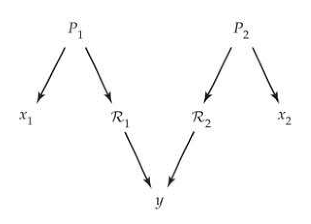
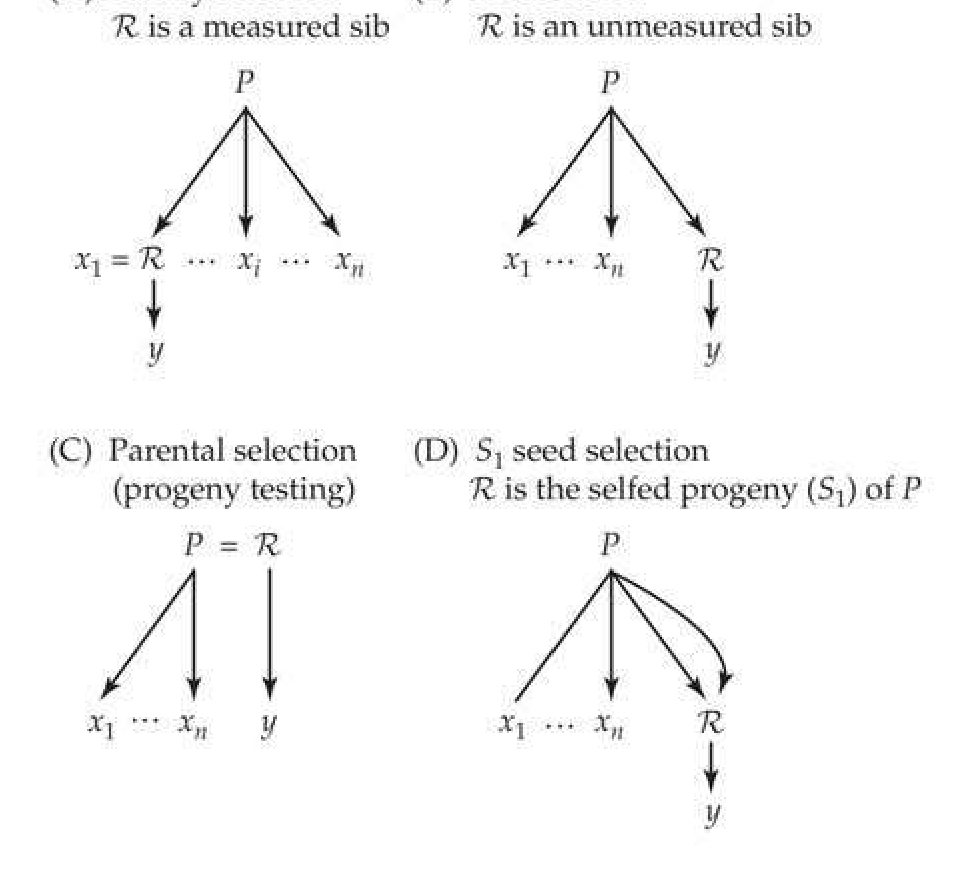
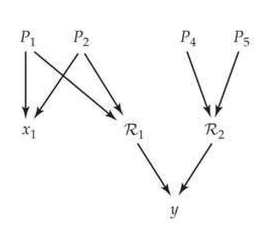
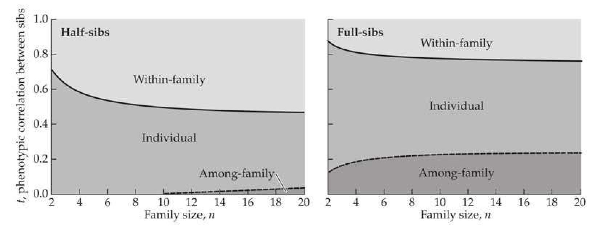
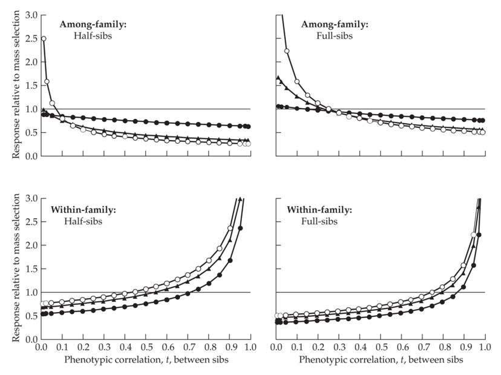
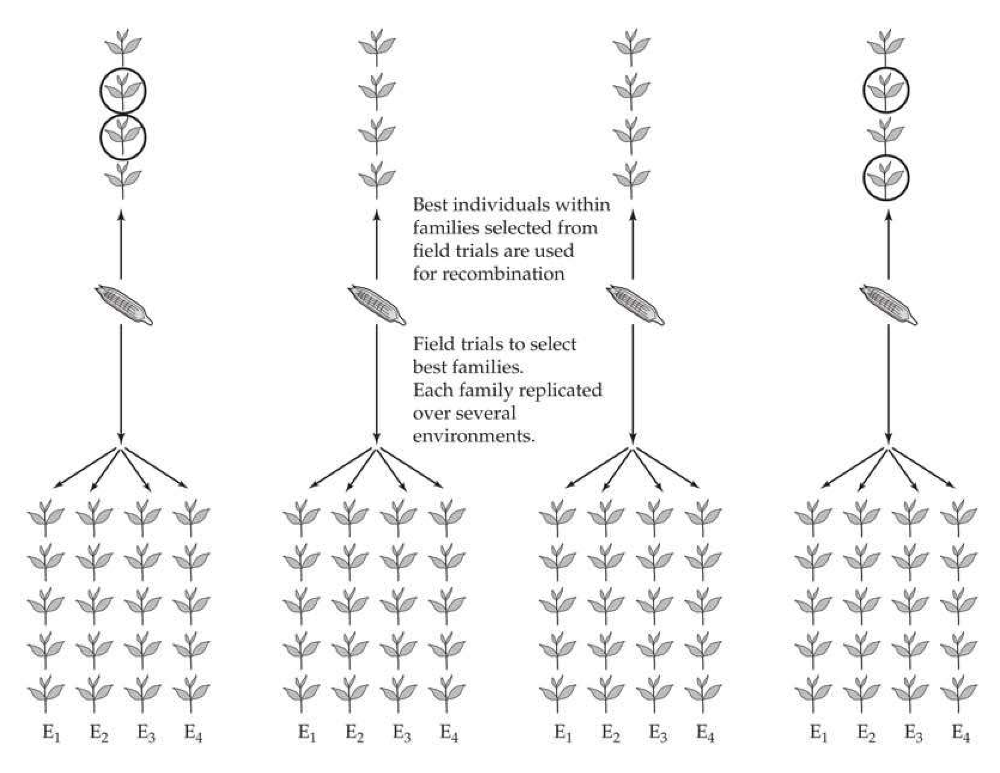
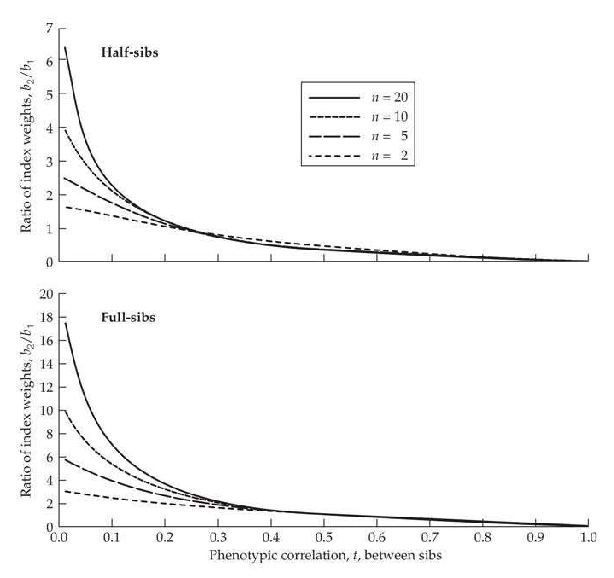
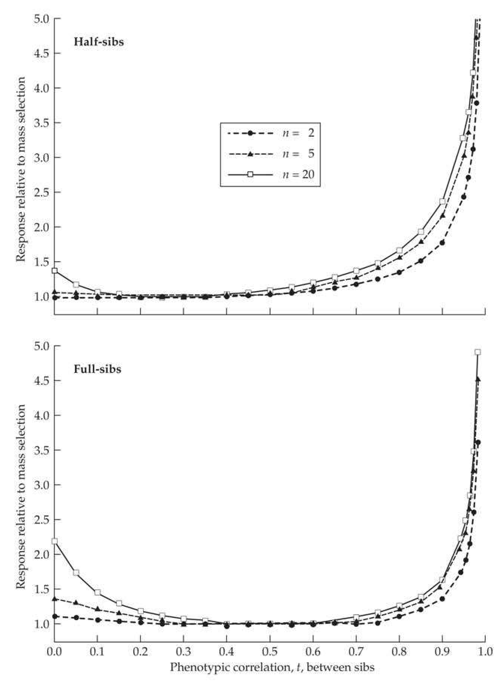

# Chapter 21 · 21

## chapter21_001 · Family-Based Selection

Practical breeding programs must be commercially optimal, not theoretically maximal. Fairfull and Muir (1996)

Up to now, we have focused on individual selection, wherein selection decisions are based solely on the phenotypes of single individuals (this is also referred to as mass selection or phenotypic selection, and we use all three terms interchangeably). Selection decisions can also incorporate the phenotypic values of an individual's measured relatives, and in fact, most plant- and animal-breeding schemes do so. The focus of this chapter is on family-based selection—using family information to select individuals. While we restrict discussion in this chapter to using sibs, the culmination of this approach is BLUP selection using an index based on the entire known pedigree of an individual, which is the major route for artificial selection in most domesticated animals (Chapters 13 and 19). While our focus here is on short-term selection response (formally, the single-generation response), certain family-based schemes can give a greater long-term response than individual selection, even when their initial response is less. This long-term advantage arises because of larger effective population sizes associated with selection schemes that down-weight among-family differences, a point examined in detail in Chapter 26.

There are a variety of reasons for using family-based schemes. Employing mass selection may be impractical in many settings due to difficulties in measuring trait values in single individuals (e.g., most forage crops and cereals). Family-based designs can also provide greater accuracy in predicting an individual's breeding value, and hence can give a larger (short-term) response. In particular, an appropriately weighted index of an individual's family mean and phenotypic value has an expected response at least as large as mass selection. When significant environmental heterogeneity exists (e.g., crops planted across a broad climatic range), the replication of families over environments provides a more efficient method than mass selection for choosing higher-performing genotypes. This is one major factor leading crop breeders to favor family-based schemes over individual selection.

The structure of this chapter is as follows. We start with a brief overview of the nature and types of family-based selection schemes before considering extensions of the generalized breeder's equation to accommodate these approaches. Next, we develop the variances and covariances required to apply these equations, and then consider a number of these schemes in detail. The relative efficiencies of within- and among-family selection compared to mass selection are then examined, followed by a consideration of designs in which families are replicated over environments, as is usually the case in plant breeding. We conclude by examining the properties of family-index selection. While most of the concepts in this chapter are straightforward, the bookkeeping can be tedious at times. Thus, we summarize key results at the end of various sections to allow the casual reader to more easily navigate through this material.

---

## chapter21_002 · INTRODUCTION TO FAMILY-BASED SELECTION SCHEMES

Family-based designs are based on two approaches: among-family schemes, which choose entire families on the basis of their mean performance, and within-family schemes, which choose individuals based on their relative performance within their families. While many designs are based on just one of these components, the most general approach is family-index selection, wherein individuals are chosen based on a weighted index of among-and within-family components. Mass selection is a special case of a family index, where the within- and among-family components are weighted equally. (Although the phrase

“between-family selection” is widely used in the literature, “between” refers to a comparison of two items, while “among” refers to comparisons of two or more, which is the general setting here. Hence, while between- and among- are used interchangeably in the literature, we will use “among” throughout our discussion here.)

While we assume that the parents in any particular family are from the same population, in some breeding settings the parents are from different populations. Examples of this are interpopulation improvement schemes, where the goal is to improve the performance of hybrids among populations (Volume 3). The focus in this chapter is family-based schemes for intrapopulation improvement (increasing the performance of the population under selection).

---

## chapter21_003 · INTRODUCTION TO FAMILY-BASED SELECTION SCHEMES / Overview of the Different Types of Family-based Selection

The key to making sense out of the bewilderingly large number of family-based designs in the literature is to consider the individual components that together define any particular scheme. The first component is the type of sib family providing information for selection decisions. A family may consist of half-sibs, full-sibs, or full-sibs nested within half-sibs (e.g., the NC Design I; see LW Chapter 18). Sibs can also be generated by one (or more) generations of selfing (e.g., $ S_{1} $, $ S_{2} $), and we examine such families in Chapter 23. While the family-based schemes developed in this chapter are generally used with allogamous species (outcrossers, cross-pollination), they can also be applied to facultatively autogamous species (facultative selfers, self-pollination) through the use of controlled pollination and/or the introduction of male-sterile genes under open pollination (e.g., Gilmore 1964; Doggett and Eberhart 1968; Brim and Stuber 1973; Burton and Brim 1981; Sorrells and Fritz 1982).

Once a particular family type has been chosen, the second component is how sib data are used for selection decisions. One could use among-family selection, choosing the best families (i.e., those with the largest family means). Alternatively, one could use within-family selection, choosing either the best individuals within each family (strict within-family [WF] selection), or the individuals with the largest deviations from their family means (family-deviations [FD] selection). While WF and FD selection are very similar, there are subtle differences between the two schemes, as they do not necessarily select the same individuals. One could also consider an index weighting both family mean and family deviations.

The final design component is the relationship between the measured sibs and the individuals serving as parents for the next generation. Under either within-family or family-index selection, the selected individuals are used to form the next generation. However, in among-family selection, we can use any number of relatives of the chosen (selected) families to form the next generation. The most straightforward approach is to use measured sibs from the chosen families (family selection). However, some characters cannot be scored on living organisms, such as carcass traits in production animals, or can only be scored after reproduction. In such cases, one can use unmeasured sibs from the best families as the parents of the next generation (sib selection), which is often used to improve selection on sex-specific traits. For example, milk production can be selected for in males by choosing sires from families whose sisters show high levels of production. An important variant of sib selection is the use of remnant seeds from the best families, which are planted and subsequently crossed to form the next generation. In perennial species and in annual species that can be asexually propagated (cloned), one can select the best parents by the performance of their offspring (parental selection or progeny testing). Finally, an option available for facultatively autogamous species is to both self an individual to generate $ S_{1} $ progeny ($ S_{1} $ seeds) and likewise outcross it to one or more individuals to generate a family for testing. For such species, one can grow and intercross the remnant $ S_{1} $ seed from the chosen families to form the next generation (the $ S_{1} $ seed design).

---

## chapter21_004 · INTRODUCTION TO FAMILY-BASED SELECTION SCHEMES / Plant Versus Animal Breeding

While animal breeders typically employ only a few standard sib-based designs (Turner and

Young 1969), plant breeders can choose from a vast array of options (e.g., Hallauer and Miranda 1981; Schnell 1982; Nguyen and Sleper 1983; Wricke and Weber 1986; Hallauer et al. 1988; Aastveit and Aastveit 1990; Nyquist 1991; Vogel and Pedersen 1993; Holland et al. 2003; Hallauer et al. 2010). Furthermore, the final product desired by a plant breeder can vary considerably: it could be an open-pollinated population, an $ F_{1} $ hybrid, a pure (i.e., fully inbred) line, or a synthetic line. Thus, it is not surprising that the literatures on family-based selection in the two fields are rather divergent. Much of the animal-breeding literature is expressed in terms of the phenotypic (t) and additive-genetic (r) correlations among sibs, while much of the plant-breeding literature is expressed in terms of variance components. As our discussion attempts to interweave both approaches, we will typically present selection-response equations in both forms.

Reproductive differences between plants and animals underlie many of the differences in the designs that are available to breeders. Historically, plant breeders have had more options than animal breeders because of the reproductive flexibility of many plants (i.e., selfing, stored seed, vegetation propagation; see Fehr and Hadley 1980). With the cloning of several domesticated animals, animal breeders now have the option of exploiting some of these classical plant-breeding schemes.

One obvious difference between plants and many animals is the ability to easily store progeny for many generations in the form of seed. Generally speaking, plants also produce far more offspring than domesticated animals, providing more offspring per family, and thus allowing for more extensive replication of families across environments. Another reproductive advantage of plants is that asexual propagation (cloning) is straightforward in many species, allowing individual genotypes to be preserved over generations.

Yet another key difference is in the control of crosses. While simple isolation will prevent most undesirable crosses in animals, either complete isolation or extensive manual control may be required to prevent pollination vectors from generating undesirable crosses in plants. When studying facultatively autogamous species, the investigator may be faced with either trying to prevent selfing or trying to prevent outcrossing, or to allow for both while identifying which seed came from which type of cross. Options for controlled crosses range from complete manual control over pollination at one extreme to open pollination at the other. Given that most plants have multiple flowers (which are often both numerous and small), large-scale controlled crosses can be much more labor intensive than similar crosses among animals, as hand pollination and the control of external and/or self-pollinators may be required. Even under open pollination (allowing seed plants to be pollinated at random), the investigator still has different levels of control over the pollen spectrum that a seed plant experiences. In a test cross or topcross design, the population of plants supplying the pollen is controlled. For example, individual maize plants can be detasseled by hand (removing the pollen-producing tassels) or have their tassels bagged to prevent the plants from either selfing or pollinating other plants. Such plants serve only as seed plants and are intergrown with rows of the tester strain, which provide the pollen. Under true open pollination, seed parents are randomly pollinated from the population, with no control of the pollen parent. A consequence of open pollination is that while most half-sib families in animal breeding are paternal, most half-sib families in plant breeding are maternal (they share a common seed parent).

There are also more subtle biological differences between plants and animals that drive differences in designs. While one can usually score many traits in individual animals, this is often not done in plants. For example, many traits of forage grasses, grains, and legumes are scored as $ \text{plot totals} $, which involves measuring the mean performance of an entire family (or line) instead of each separate individual. When individuals cannot be directly scored, among-family selection is possible, but within-family and family-index selection are not. Similarly, many selected traits in plants can be scored only after reproduction (seed or fruit yield being prime examples), and this influences the types of relatives that can be used to form the next generation.

---

## chapter21_005 · INTRODUCTION TO FAMILY-BASED SELECTION SCHEMES / Among- Versus Within-family Selection

When the heritability of a trait is high, an individual's phenotype is an excellent predictor of its breeding value, and mass selection is more efficient than either strict within- or among-family selection. When heritability is low, individual phenotypic value is a poor predictor of breeding value, in which case an individual's family mean or its relative performance within its family may be better predictors.

The relative efficiencies of among- versus within-family selection depend on the relative magnitudes of the common-family $ (E_{c}) $ and individual-specific $ (E_{s}) $ environmental variances. A large common-family effect severely compromises the phenotype as a predictor of breeding value. However, within each family, all members share the same environmental effect, and differences between individuals more accurately reflect differences in breeding value. In this case, selection within families (for example, by choosing the largest individuals from each family) can yield a larger response than individual selection. Many mouse selection experiments use within-family selection, especially for traits with suspected maternal effects, such as body weight (Falconer and Latyszewski 1952; Falconer 1953, 1960a; Eisen and Hanrahan 1972; von Butler and Pirchner 1984; Nielsen and Anderson 1987; Siewerdt et al. 1999), litter size (Falconer 1960b), and nesting behavior (Lynch 1980).

Conversely, suppose that environmental effects unique to each individual account for a large fraction of the phenotypic variance ($ \sigma_{E_s}^2 \gg \sigma_{E_c}^2 $). In this case, selecting whole families as units can give a larger response than individual selection, as the family mean averages out differences based on environmental values, revealing those families with the most extreme breeding values. An important example of this family-averaging of environmental effects is the use of among-family selection to improve performance across multiple environments. Under mass selection, a genotype is represented by a single individual in a single environment, while family-based approaches allow the performance of different families to be compared over multiple environments. Such studies are by no means restricted to plant breeding, as animal selection experiments examining phenotypic plasticity (norms of reaction), in which genotypes must also be assessed over multiple environments, almost exclusively use among-family selection (e.g., Waddington 1960; Kindred 1965; Waddington and Robertson 1966; Druger 1967; Scharloo et al. 1972; Brumpton et al. 1977; Minawa and Birley 1978; Scheiner and Lyman 1991).

---

## chapter21_006 · DETAILS OF FAMILY-BASED SELECTION SCHEMES / Selection and Recombination Units

Under mass selection, individuals are scored and those with the best phenotypic values are used as parents to form the next generation. Here groups of individuals upon which selection decisions are based and those used for recombination (gamete production to form the next generation) are one and the same, and a single cycle of selection takes a single generation. In family-based selection schemes, the individuals used for selection decisions may be entirely separate from those used as parents to form the next generation. Further, a single cycle of selection may take two (or more) generations, as one must generate, score, and recombine families. For perennial species (such as forage crops), traits may be scored over several years before selection decisions are made, such as selecting for winter hardiness (Vogel and Pedersen 1993).

**[Figure]**

> **Figure 21.1** · page 5 · source: `chapter21`
>
> 
>
> Figure 21.1 Under family-based schemes, selection decisions are based on some function of the values of measured sibs  $ (x_i) $ in the selection unit. An offspring,  $ y $, in the next generation has parents,  $ \mathcal{R}_1 $ and  $ \mathcal{R}_2 $, that are chosen on the basis of the selection unit. Members of the selection  $ (x_i) $ and recombination  $ (\mathcal{R}_i) $ units are related as they both share a common relative,  $ P_i $, which in this case is the parent of sib  $ x_i $. Under within-family or family-index selection,  $ \mathcal{R} $ is simply one of the measured sibs, while under among-family selection,  $ \mathcal{R} $ is often an unmeasured relative. See Figure 21.2 for specific examples.

Following the convention of plant breeders, we distinguish between an individual, $ x_i $, in the selection unit (those measured individuals upon which selection decisions are made, which throughout this chapter are we assume are sibs) and an individual, $ R_i $ (a relative of $ x_i $, potentially including $ x_i $ itself), from the recombination unit (individuals serving as parents for the next generation) whose resulting offspring are $ y $. Even though we may not directly select on the parents ($ R_1 $, $ R_2 $) of $ y $, we expect some response in $ y $ due to the genetic correlation between $ x_i $ and $ R_i $ caused by their sharing of (at least) one common relative, $ P_i $ (Figure 21.1). An equivalent way to think about this distinction is that selection response occurs due to observations on the selection unit, x, providing information to predict the breeding value of R. As mentioned in the introduction, the variety of family-based schemes appearing in the literature arises from the combination of four specific components: 1. Type of sib family comprising the selection unit. Sibs can be half- or full-sibs, full-sibs nested within half-sibs (NC Design I), or selfed sibs (which are considered in Chapter 23).

2. Nature of the selection decisions based on the sib information. Selection can be based on sib-family means, the deviations of individuals within families, an index of both, or strict rank within families.

3. Selection on one versus both parents. Often selection decisions involve only one sex, with the parents of the opposite sex chosen at random (and hence being unselected). For example, a trait may not be scorable until after pollination, resulting in selection on seed parents (females) but not on pollen parents (males). In such cases, we are only concerned with one side of the pedigree, for example, involving $ R_{1} $ but not $ R_{2} $ (Figure 21.1). More generally, the two parents ($ R_{1} $ and $ R_{2} $) of the offspring, y, may be chosen using different schemes, which generates a variety of family-based schemes.

4. Nature of the relationship between a measured sib, $ x_i $, in the selection unit and a parent, $ R_i $, of the next generation. Under within-family or family index selection, $ R $ is one of the measured sibs ($ R_i = x_i $), while under among-family selection, $ R $ is often an unmeasured relative. For example, $ R_i $ could be the parent of the sibs ($ R_i = P_i $), meaning that the relationship between $ x $ and $ R $ is that of parent-offspring, or it could be an unmeasured sib, meaning that the relationship between $ x $ and $ R $ is that of either half- or full-sib (depending on the type of family).

While the variety of family-based selection schemes may seem a bit overwhelming at first (especially in the plant-breeding literature), considering each design in terms of these four components greatly simplifies matters.

---

## chapter21_007 · DETAILS OF FAMILY-BASED SELECTION SCHEMES / Variations of the Selection Unit

Once the type of family (half-sib, full-sib, nested, or inbred $ S_i $) has been specified, there is still the issue of how to incorporate sib information when making selection decisions. To distinguish between a particular sib and the trait value of that sib, we use $ x_i $ to denote the ith sib and $ z_i $ to denote its trait value, and more generally, $ x_{ij} $ and $ z_{ij} $ for the jth individual. from the ith family. We select the uppermost fraction, p, of the relevant population, with m families each with n sibs, for a total of M = mn scored individuals, which we use to choose N parents. Four different approaches for weighting sib information are commonly used: 1. Among-family selection: Individuals are selected solely on the basis of their family means, $ \overline{z}_{i} $, with the result that all individuals from the same family have the same selective rank. Here, the best N = pm families are chosen.

2. Strict within-family (WF) selection. The best pn individuals from each family are chosen ($ N = pnm = pM $), so that individuals are ranked within each family. WF selection increases the effective population size because the among-family variance in offspring number is zero (Chapters 3 and 26).

3. Selection on within-family deviations (FD): Individuals are ranked solely on the basis of their within-family deviation, $ z_{ij} - \overline{z}_i $. The $ N = pM $ individuals with the largest deviations (regardless of family) are chosen.

4. Family-index selection: Individuals are ranked using an index weighting within- and among-family components $$ I=b_{1}\left(z_{i j}-\overline{z}_{i}\right)+b_{2}\overline{z}_{i}=b_{1}z_{i j}+\left(b_{2}-b_{1}\right)\overline{z}_{i} $$

The $ pM $ individuals with the best index scores are chosen. Note that the index with weights $ (cb_1, cb_2) $ chooses the same individuals as an index with weights $ (b_1, b_2) $. Thus, one of the index weights is often set to one, as the indices with weights $ (b_1, b_2) $, $ (1, b_2/b_1) $, and $ (b_1/b_2, 1) $ are all equivalent (in that they all choose the same individuals). Individual selection, among-family selection, and selection on family deviations (FD) are special cases, being indices with weights $ (b_1, b_2) = (1,1) $, $ (0,1) $, and $ (1,0) $, respectively. Note, however, that strict within-family (WF) selection cannot be expressed in terms of an index. Family-index selection is also referred to as combined selection, which is unfortunate, as the same term is also used by breeders to refer to approaches that combine different types of selection schemes in a single cycle (such as modified ear-to-row selection, discussed below).

The choice of the particular scheme has implications for the selection intensity (Example 21.1). When the fraction saved (p) is fixed, among-family and strict within-family selection have lower selection intensities than family-deviations, index, or mass selection. The former selects the best pm of m families and pn of n sibs, while the latter three select the best pM of M individuals. Because M is greater than either n or m, the finite-sample value for i is larger when sampling from M than from n or m (Chapter 14). $$ \

**[示例 Example]**

> **Example 21.1** · ref: `21.1` · source: `chapter21_007.json` · blocks 5–7
>
> Example 21.1. Suppose that a total of 100 sibs are measured and the fraction that is selected is $ p = 0.2 $. As a benchmark, for this level of selection, the infinite-population value for the selection intensity is $ \bar{\tau} = 1.40 $ (Equation 14.3a). Suppose that the $ M = 100 $ total measured sibs are distributed into 20 families of five sibs each ( $ m = 20 $, $ n = 5 $). Under within-family selection, the top 1 of 5 within each family is selected. Under among-family selection, the top 4 of the 20 families are selected. Finally, under family-deviations or index selection, the top 20 of the 100 measured individuals are selected. Using the finite-size correction approximation offered by Equation 14.4b yields the following selection intensities: $$ \begin{array}{ll}Individual selection(infinite population)&Best20\%\quad\overline{i}_{\infty}=1.40\\ Individual selection,index selection,&\\ family-deviations(FDs)selection&Best20of100\quad\overline{i}_{(20,100)}=1.39\\ Among-family selection&Best4of20\quad\overline{i}_{(4,20)}=1.33\\ Strict within-family selection(WF)&Best1of5\quad\overline{i}_{(1,5)}=1.16\\\end{array} $$ As shown later (Equations 21.40 and 21.57), additional corrections to the selection intensity are required in some cases, as family members are correlated, which changes the variance (A) Family selection ℗ is a measured sib (B) Sib selection ℗ is an unmeasured sib

Finally, the choice of the selection scheme also influences the long-term effective population size (and hence the long-term response; see Chapter 26), with schemes that place more weight on among-family components resulting in smaller effective population sizes (due to larger among-family offspring variances) than those that place more weight on within-family components (Chapter 3).

---

## chapter21_008 · DETAILS OF FAMILY-BASED SELECTION SCHEMES / Variations of the Recombination Unit

**[Figure]**

> **Figure 21.2** · page 7 · source: `chapter21`
>
> 
>
> Figure 21.2 Under among-family selection, decisions as to which families to choose are made on the basis of observations from sibs, while the next generation is formed by crossing relatives (R) of sibs from the chosen families. The measured sibs upon which selection decisions are based are denoted by  $ x_{1}, \cdots, x_{n} $, while y denotes a random offspring from a random member, R, from the recombination unit. Different types of relatives can be used for R, with a few of the most common types illustrated here. Let P denote the shared parent(s) of  $ x_{i} $ and R. The pedigrees illustrated here all focus on just one parent of y, with a corresponding pedigree for the other parent. A: Family selection: R is one of the measured sibs ( $ x_{1} = R $). B: Sib selection: R is an unmeasured sib. C: Parental selection (also known as progeny testing): R is the parent of the sibs ( $ R = P $). D:  $ S_{1} $ seed selection: R is the selfed progeny of the parent of the sibs, but R is then outcrossed to generate the offspring, y. In this chapter, we assume offspring are generated by outcrossing ( $ R_{1} $ and  $ R_{2} $ are unrelated), whereas in Chapter 23 we examine the setting wherein y is obtained by selfing R, as well as more general inbreeding schemes (such as the tested sibs being the result of selfing).

Under either within-family or index selection, measured individuals are selected as the parents for the next generation, which forms the recombination unit. By contrast, with among-family selection there are a variety of options for the nature of the relatives that comprise the recombination unit (Table 21.1; Figure 21.2). The most straightforward situation is family selection, using measured sibs from each chosen family as the parents for the next generation (Figure 21.2). Under sib selection, unmeasured sibs from the chosen families are used to form the next generation (Figure 21.2).

**[Table]**

> **Table 21.1** · `21.1` · page 8 · source: `chapter21_008`
> Table 21.1 Family-based selection schemes using outbred sibs. Families are selected based on the sib values  $ z_{i1}, \cdots, z_{in} $.  $ \mathcal{R}_i $ denotes a relative of the  $ i $th selected family used to form the next generation. The variables  $ \overline{z}_{HS} $ and  $ \overline{z}_{FS} $ denote the sample means, and  $ \mu_{HS} $ and  $ \mu_{FS} $ denote the true means, of half- and full-sib families, respectively, while  $ P $ is the parent of the measured sibs, and  $ z_{ij} $ denotes the  $ j $th measured sib from family  $ i $.
>
> <table><tr><td rowspan="2">Among-family Selection</td><td>Recombination Unit</td><td>Selection Unit</td></tr><tr><td>R</td><td>x</td></tr><tr><td>Family selection</td><td>Measured sib</td><td></td></tr><tr><td>Half-sib family selection</td><td></td><td>$ \overline{z}_{HS} $</td></tr><tr><td>Full-sib family selection</td><td></td><td>$ \overline{z}_{FS} $</td></tr><tr><td>Sib selection / Remnant seed</td><td>Unmeasured sib</td><td></td></tr><tr><td>Half-sib sib selection</td><td></td><td>$ \overline{z}_{HS} $</td></tr><tr><td>Full-sib sib selection</td><td></td><td>$ \overline{z}_{FS} $</td></tr><tr><td>Parental selection / Progeny testing</td><td>Parent P</td><td>$ \overline{z}_{HS} $</td></tr><tr><td>S1 Seed Selection</td><td>S1 Seed of P</td><td></td></tr><tr><td>Half-sib S1 seed selection</td><td></td><td>$ \overline{z}_{HS} $</td></tr><tr><td>Full-sib S1 seed selection</td><td></td><td>$ \overline{z}_{FS} $</td></tr><tr><td>Within-family Selection</td><td></td><td></td></tr><tr><td>Family deviations (FD) selection</td><td>Measured Sib</td><td></td></tr><tr><td>Half-sib family deviations selection</td><td></td><td>$ z_{ij} - \overline{z}_{HS} $</td></tr><tr><td>Full-sib family deviations selection</td><td></td><td>$ z_{ij} - \overline{z}_{FS} $</td></tr><tr><td>Strict within-family (WF) selection</td><td>Measured Sib</td><td></td></tr><tr><td>Half-sib strict within-family selection</td><td></td><td>$ z_{ij} - \mu_{HS} $</td></tr><tr><td>Full-sib strict within-family selection</td><td></td><td>$ z_{ij} - \mu_{FS} $</td></tr></table>

In animal breeding, sib selection is often used for traits that are sex-limited or that cannot be scored without sacrificing the individual. Plants breeders routinely use sib selection in the form of remnant seeds. Here, seeds from a cross are split into two batches and one is planted and used to assess families while the other is held in reserve. Seeds from the chosen families are then grown and crossed to form the next generation. Under this design, a single cycle of selection takes (at least) two generations—(at least) one to assess the families and a second to grow and cross the remnant seeds. Given this extra generation, what is the advantage of crossing plants from remnant seeds to form the next generation? For annual plants, any traits that are expressed during or after flowering can only be directly selected in already pollinated females, with seeds from the best-performing plants forming the next generation. Because these plants were pollinated at random, selection has occurred for the seed, but not the pollen, parents. By using remnant seeds, one can choose the best families, grow their remnant seeds, and allow the resulting plants to randomly intercross. Because both seed and pollen parents have now been selected (through their families), a single cycle of selection using remnant seed has double the response of family selection on seed from open pollinated plants. This doubling of response per cycle exactly counters the extra generation in each cycle, so open-pollinated family selection and sib selection using remnant seed have the same expected response per generation. One potential advantage with the use of remnant seed is that the extra generation to grow the seeds to mature plants for crossing can be used for selection on other characters, for example, culling those otherwise elite families that show poor disease or insect resistance.

Another common among-family design is parental selection (or progeny testing), where $ \mathcal{R} = P $, the parent of the measured sibs (Figure 21.2). This design typically involves evaluation of half-sib families with selection on just one sex. In animal breeding, these are typically sires, elite males chosen by the performance of their half-sib families, which is greatly facilitated by the use of artificial insemination and frozen semen. The ability to clone domesticated animals (e.g., sheep, Campbell et al. 1996; goats, Baguisi et al. 1999; and cattle, Wells et al. 1999a, 1999b) is likely to further increase the importance of progeny testing in animal-breeding settings. (The most elaborate, and widely used, extension of progeny testing is BLUP selection wherein the entire pedigree is used for information on selection decisions; Chapter 19). Plant breeders typically perform progeny testing using maternal half-sib families (seed from the common parent). Vegetative propagation (cloning) allows even some annual plants to be used as parents in future generations. Depending on reproductive timing, if the species being selected is monocious (single individuals produce both seed and pollen), one potentially may be able to obtain elite plants for both seed and pollen on the basis of female (seed) performance, and hence select on both sexes.

Finally, with self-compatible species, an alternative to vegetative propagation is the $ S_{1} $ seed design (Figure 21.2). For each parent, a subset of flowers is selfed to produce $ S_{1} $ seed and the remainder are outcrossed. The outcrossed seed is then grown to produce the sibs in which the trait of interest is assessed. Following selection of the best families, their $ S_{1} $ seed grown and the adults from different families are crossed to form the next generation. As with remnant seed, a single cycle takes two generations. In maize, the $ S_{1} $ seed design requires the use of prolific plants (those with more than one ear), as one ear is selfed, and the other(s) outcrossed. Hallauer and Mirana (1981) noted that the use of such plants also results in selection for prolificacy, which by itself can increase yield. An advantage of designs using remnant seed is that traits can be scored over several years before selection, providing the opportunity to select over temporal variation in the environment. As presented in this chapter, the $ S_{1} $ seed design has a random-mated family as the selection unit. Obviously, one could collect only $ S_{1} $ seed from a plant and use some for selection decisions (i.e., the selection unit is an $ S_{1} $ family) and the rest for future breeding. Such designs, where the selection unit is a selfed family, are examined in Chapter 23.

---

## chapter21_009 · THEORY OF EXPECTED SINGLE-CYCLE RESPONSE

Response is typically given on a per-cycle, rather than per-generation, basis. A cycle begins with choosing the parents, P, to form the sib families and ends with the creation of offspring, y, formed by crossing members, R, from the recombination unit. The expected response is the difference in the means of these two populations (P vs. y). When comparing the efficiencies of different schemes, response per cycle should be converted to a response per generation (for discrete generations) or per unit time (for overlapping generations).

Our treatment of the theory of response starts by developing several equivalent modifications of the breeder's equation (Chapter 13) to accommodate family-based selection. To apply these expressions, we require the selection unit-offspring covariance, $ \sigma(x, y) $, and the variance of the selection unit, $ \sigma_x^2 $, for various family-based designs. The full development of these variances and covariances is straightforward but involves a fair amount of bookkeeping. The reader wishing to skip the details can find the results summarized below in Tables 21.3 and 21.4.

---

## chapter21_010 · THEORY OF EXPECTED SINGLE-CYCLE RESPONSE / Modifications of the Breeder's Equation for Predicting Family-based Response

Response is a function of how selection decisions based on the sib families $ (x_{1} $ and $ x_{2}) $ translate into selection on the corresponding parents $ (\mathcal{R}_{1} $ and $ \mathcal{R}_{2}) $ of the offspring, y. Phrased in terms of breeding values, we predict response by using the sib information to predict the breeding values of the parents, R, for the next generation. Under the infinitesimal model, the expected mean of the offspring equals the mean breeding value of the chosen parents (Chapters 6 and 13).

**[推导 Derivation]**

Making the standard assumption that all appropriate regressions are linear (which follows under the infinitesimal model assumptions; Chapters 6 and 24), the expected response is given by the general form of the breeder's equation (Equations 13.4a and 13.4b),

> **Formula (21.1a)** · `21.1a` · source: `chapter21_block_042` · Modifications of the Breeder's Equation for Predicting Family-based Response
>
> $$ R_{y}=\frac{\sigma(x_{m},y)}{\sigma_{x_{m}}^{2}}S_{x_{m}}+\frac{\sigma(x_{f},y)}{\sigma_{x_{f}}^{2}}S_{x_{f}} $$

**[推导 Derivation]**

Here $ x_{m} $ and $ x_{f} $ correspond to individuals from the selection units associated with the male (sire/pollen) and female (dam/seed) parents ($ R_{m} $ and $ R_{f} $) of the offspring, y. Equation 21.1a allows the male and female parents to be chosen by completely different schemes. For example, sib selection could be used on males and individual selection on females when selecting for a female-limited character (Example 13.5). The selection unit-offspring covariance, $ \sigma(x,y) $, can be directly computed from the pedigree connecting P, a sib in x, and R through the use of path analysis (LW Appendix 2). The path (or correlation) between selection on the unit, $ x_{f} $, through the female parent, $ R_{f} $, and its offspring, y, is $$ x_{f}\leftarrow P\rightarrow\mathcal{R}_{f}\rightarrow y $$ Because the path connecting $ x_f $ and $ y $ is through $ \mathcal{R}_f $, we often write $ \sigma(x,y|\mathcal{R}_f) $ in place of $ \sigma(x_f,y) $ to remind the reader of this fact. Path(s) connecting $ x_m $ and $ y $ through $ \mathcal{R}_m $ are similarly defined. If $ P $ consists of multiple relatives, each path connecting $ x_i $ and $ \mathcal{R}_i $ (and hence $ y $) needs to be counted. For example, if $ x_i $ and $ \mathcal{R}_i $ are full-sibs, we must compute the paths through each of the common parents (e.g., Figure 21.3). If the selection unit-offspring covariances are the same for both parents, Equation 21.1a simplifies to

> **Formula (21.1b)** · `21.1b` · source: `chapter21_block_043` · Modifications of the Breeder's Equation for Predicting Family-based Response
>
> $$ R_{y}=\frac{\sigma(x,y)}{\sigma_{x}^{2}}S_{x} $$

where $ S_{x} = (S_{x_{m}} + S_{x_{f}})/2 $ is the average selection differential on the unit(s) leading to the parents and

> **Formula (21.1c)** · `21.1c` · source: `chapter21_block_043` · Modifications of the Breeder's Equation for Predicting Family-based Response
>
> $$ \sigma(x,y)=\sigma(x,y\mid\mathcal{R}_{f})+\sigma(x,y\mid\mathcal{R}_{m})=2\sigma(x,y\mid\mathcal{R}) $$

is the covariance between the value of selection unit, x, and the offspring, y, counting the paths through both parents ($ R_{m} $ and $ R_{f} $). When covariances are equal, this is twice the single parent-covariance, $ \sigma(x, y \mid R_{1}) $. By analogy with the breeder's equation, Equation 21.1b is often written as

> **Formula (21.2a)** · `21.2a` · source: `chapter21_block_043` · Modifications of the Breeder's Equation for Predicting Family-based Response
>
> $$ R_{y}=h_{x,y}^{2}S_{x} $$

where the generalized heritability of y given x,

> **Formula (21.2b)** · `21.2b` · source: `chapter21_block_043` · Modifications of the Breeder's Equation for Predicting Family-based Response
>
> $$ h_{x,y}^{2}=\frac{\sigma(x,y)}{\sigma_{x}^{2}}=2\left[\frac{\sigma(x,y\mid\mathcal{R})}{\sigma_{x}^{2}}\right] $$

is twice the slope of the regression of y on x (LW Chapter 3). Just as the individual heritability, $ h^{2} $, is the accuracy in using an individual's phenotypic value to predict the breeding value (Chapter 13), the generalized heritability is the accuracy of using the sib data, x, to predict the breeding value of R.

**[示例 Example]**

> **Example 21.2** · ref: `21.2` · source: `chapter21_010.json` · blocks 3–9
>
> Example 21.2. Consider family selection, wherein the selection unit is the family mean, $ \overline{z}_{i} $, and the recombination units are measured sibs (those whose trait values have been scored) from this family. Assuming the covariance between the sib mean and an individual sib is independent of sex, Equations 21.1b and 21.1c yield a response of $$ R_{b}=\frac{2\sigma\left(\overline{z}_{i},y\mid\mathcal{R}_{i}\right)}{\sigma^{2}\left(\overline{z}_{i}\right)}S_{b} $$
> 
> Recall (Equation 21.1c) that the numerator is twice the covariance between the value of the family mean, $ \overline{z}_i $, and the offspring, $ y $, from a parent chosen from this family, $ \mathcal{R}_i $, which (in this case) is one of the measured sibs. The preceding expression can be more compactly written as $ R_b = h_b^2 S_b $, where the among-family heritability is $$ h_{b}^{2}=\frac{2\sigma\left(\overline{z}_{i},y\mid\mathcal{R}_{i}\right)}{\sigma^{2}\left(\overline{z}_{i}\right)} $$
> 
> We used the notation $ R_b $ and $ h_b^2 $ for “between family” in keeping with the literature (although this is formally among families, as it generally involves more than two families). Similarly, for selection on within-family deviations, the value of the selection unit is $ z_{ij} - \overline{z}_i $, which yields $$ R_{FD}=\frac{2\sigma(z_{ij}-\overline{z}_{i},y\mid\mathcal{R}_{i})}{\sigma^{2}(z_{ij}-\overline{z}_{i})}S_{FD} $$ where $ \mathcal{R}_i = x_{ij} $. Response can also be expressed in terms of the family-deviations heritability, with $ R_{FD} = h_{FD}^2 S_{FD} $, where $$ h_{FD}^{2}=\frac{2\sigma(z_{ij}-\overline{z}_{i},y\mid\mathcal{R}_{i})}{\sigma^{2}(z_{ij}-\overline{z}_{i})} $$
> 
> Tables 21.3 and 21.4 (below) give expressions for these variances and covariances.

**[推导 Derivation]**

Other (equivalent) versions of Equations 21.1a and 21.2a appear in the literature. The selection-intensity version allows for standardized comparisons of different selection schemes. Defining the selection intensity on x by $ \bar{x} = S_x / \sigma_x $, Equation 21.1a becomes

> **Formula (21.3a)** · `21.3a` · source: `chapter21_block_048` · Modifications of the Breeder's Equation for Predicting Family-based Response
>
> $$ R_{y}=\frac{\sigma(x_{m},y)}{\sigma_{x_{m}}}\bar{\imath}_{x_{m}}+\frac{\sigma(x_{f},y)}{\sigma_{x_{f}}}\bar{\imath}_{x_{f}} $$

**[推导 Derivation]**

If the regressions are the same for both parents,

> **Formula (21.3b)** · `21.3b` · source: `chapter21_block_049` · Modifications of the Breeder's Equation for Predicting Family-based Response
>
> $$ R_{y}=\frac{\sigma(x,y)}{\sigma_{x}}\bar{\imath}_{x} $$

where $ \bar{\imath}_{x} = (\bar{\imath}_{x_{m}} + \bar{\imath}_{x_{f}})/2 $ is the average selection intensity. This expression is frequently written in terms of the selection unit-offspring correlation, $ \rho(x, y) $,

> **Formula (21.4a)** · `21.4a` · source: `chapter21_block_049` · Modifications of the Breeder's Equation for Predicting Family-based Response
>
> $$ R_{y}=\sigma_{z}\bar{\imath}_{x}\rho(x,y) $$

where (counting both parents) $ \rho(x, y) = 2\rho(x, y \mid \mathcal{R}) $. Equation 21.4a follows immediately from Equation 21.3b by recalling that $ \rho(x, y) = \sigma(x, y)/(\sigma_x \sigma_y) $ and that the trait variance in the offspring, $ y $, is simply the phenotypic variance of the character $ (\sigma_y^2 = \sigma_z^2) $. A variant of Equation 21.4a commonly seen in the literature is

> **Formula (21.4b)** · `21.4b` · source: `chapter21_block_049` · Modifications of the Breeder's Equation for Predicting Family-based Response
>
> $$ R_{y}=\sigma_{A}\bar{\imath}_{x}\rho(x,A_{\mathcal{R}}) $$

where $ \rho(x, A_{\mathcal{R}}) $, the correlation between the value of the selection unit, x, and the breeding value of a parent, R, of y, is the accuracy of selection (Equation 13.11a). Equation 21.4b holds in the absence of epistasis, while Equations 21.1–21.3 hold for arbitrary epistasis. Recall that the accuracy of individual selection (the correlation between an individual's phenotypic and breeding values) is $ \rho(z_{\mathcal{R}}, A_{\mathcal{R}}) = h $. A particular family-based approach is favored over individual selection if x is a more accurate predictor of the breeding value of R than is R's phenotypic value, that is when $ \rho(x, A_{\mathcal{R}}) > h $.

Equation 21.4b follows by first recalling that the mean value of an offspring is the average of its parental breeding values, $ y = \mu + (A_{\mathcal{R}_m}/2) + (A_{\mathcal{R}_f}/2) + e_y $. Hence, $$ \sigma(x,y)=\frac{1}{2}\sigma(x,A_{\mathcal{R}_{m}})+\frac{1}{2}\sigma(x,A_{\mathcal{R}_{f}})+\sigma(x,e_{y}) $$

---

## chapter21_011 · THEORY OF EXPECTED SINGLE-CYCLE RESPONSE / Modifications of the Breeder's Equation for Predicting Family-based Response

**[推导 Derivation]**

In the absence of epistasis, inbreeding, and shared environmental effects, $ \sigma(x,e)=0 $. If the regression is the same for both sexes, then $ \sigma(x,y)=\sigma(x_{1},A_{\mathcal{R}_{1}}) $. Recalling that $ \sigma_{y}=\sigma_{z} $,

> **Formula (21.5)** · `21.5` · source: `chapter21_block_051` · Modifications of the Breeder's Equation for Predicting Family-based Response
>
> $$ \rho(x,y)=\frac{\sigma(x,y)}{\sigma_{x}\sigma_{z}}=\left(\frac{\sigma_{A}}{\sigma_{z}}\right)\frac{\sigma(x_{1},A_{\mathcal{R}_{1}})}{\sigma_{x}\sigma_{A}}=h\rho(x,A_{\mathcal{R}}) $$

(A) $ x_{1} $ and $ R_{1} $ are half-sibs

(B) $ x_{1} $ and y have a common parent, $ P_{1} $

(C) Half-sib $ S_{1} $

(D) $ x_{1} $ and $ R_{1} $ are full-sibs

**[Figure]**

> **Figure 21.3** · page 12 · source: `chapter21`
>
> 
>
> Figure 21.3 Derivation of the coefficient of coancestry,  $ \Theta $, values in Table 21.2, showing pedigrees (left) and associated path diagrams (right) for computing  $ \Theta $ between a measured sib,  $ x_{1} $, and an offspring,  $ y $, from the parent,  $ \mathcal{R}_{1} $.  $ P_{1} $ to  $ P_{5} $ are assumed to be unrelated and noninbred. A:  $ x_{1} $ and  $ \mathcal{R}_{1} $ are half-sibs. The product of the path coefficients yields  $ \Theta_{x_{1}y} = (1/2)^{4} = 1/16 $. B:  $ x_{1} $ and  $ y $ are half-sibs, with  $ \Theta_{x_{1}y} = (1/2)^{3} = 1/8 $. C:  $ \mathcal{R}_{1} $ is a selfed progeny from the common parent,  $ P_{1} $. There are two separate paths between  $ x_{1} $ and  $ y $ (two different routes through  $ P_{1} $), yielding  $ \Theta_{x_{1}y} = 2 \cdot (1/2)^{4} = 1/8 $. D:  $ x_{1} $ and  $ \mathcal{R}_{1} $ are full-sibs. Again there are two paths between  $ x_{1} $ and  $ y $ (one through each parent), each being  $ (1/2)^{4} $, giving a total of  $ \Theta_{x_{1}y} = 2 \cdot (1/2)^{4} = 1/8 $.

**[Table]**

> **Table 21.2** · `21.2` · page 13 · source: `chapter21_011`
> Table 21.2 Coefficients of coancestry,  $ \Theta $, between an offspring,  $ y $ (of parent  $ R_1 $), and a member of the selection unit,  $ x_1 $. Genetic covariances,  $ \sigma_G(x_1, y) $, are computed with the assumption of no epistasis. Derviations are given in Figure 21.3.
>
> Relationship between $ x_{1} $ and $ \mathcal{R}_{1} $ | $ \Theta_{x_{1}y} $ | $ \sigma_{G}(x_{1}, y) = 2\Theta_{x_{1}y} \sigma_{A}^{2} $
> --- | --- | ---
> $ x_{1} = \mathcal{R}_{1} $ (the sib is also the parent of $ y $) | 1/4 | $ \sigma_{A}^{2}/2 $
> $ x_{1} $ and $ \mathcal{R}_{1} $ are half-sibs (Figure 21.3A) | 1/16 | $ \sigma_{A}^{2}/8 $
> $ x_{1} $ and $ \mathcal{R}_{1} $ are full-sibs (Figure 21.3D) | 1/8 | $ \sigma_{A}^{2}/4 $
> $ \mathcal{R}_{1} $ is the parent of both $ x_{1} $ and $ y $ (Figure 21.3B) | 1/8 | $ \sigma_{A}^{2}/4 $
> $ \mathcal{R}_{1} $ is an $ S_{1} $ offspring of the parent of $ x_{1} $ (Figure 21.3C) | 1/8 | $ \sigma_{A}^{2}/4 $

Substitution into Equation 21.4a recovers Equation 21.4b (as $ \sigma_z h = \sigma_z (\sigma_A / \sigma_z) = \sigma_A $). Equations 21.1–21.4 provide equivalent expressions for computing the expected selection response. To apply these expressions to a particular selection scheme, we need to compute the selection unit-offspring covariance, $ \sigma(x, y) $, and the variance of the selection unit, $ \sigma_x^2 $.

---

## chapter21_012 · THEORY OF EXPECTED SINGLE-CYCLE RESPONSE / The Selection Unit-offspring Covariance, $ \sigma(x, y) $

Recall that the genetic covariance between two (noninbred) relatives is a function of their coefficients of coancestry, $ \Theta $, and fraternity, $ \Delta $, (LW Chapter 7). If we ignore epistasis (for now), the genetic covariance between a particular sib, $ x_i $, and $ y $ is $ \sigma_G(x_i, y) = 2\Theta_{x_i y} \sigma_A^2 + \Delta_{x_i y} \sigma_D^2 $ (LW Equation 7.12). In the absence of inbreeding in $ y $ (the parents $ \mathcal{R}_1 $ and $ \mathcal{R}_2 $ are from different, unrelated families; $ \Theta_{\mathcal{R}_1, \mathcal{R}_2} = 0 $), $ \Delta_{xy} $ is zero. Note that $ \Delta = 0 $ even when $ \mathcal{R}_1 $ and / or $ \mathcal{R}_2 $ are themselves inbred, provided that they are unrelated. For dominance effects to be shared by relatives, there must be paths wherein both alleles from an individual, $ x $, in the selection unit are passed onto the offspring, $ y $, which cannot occur if the parents of $ y $ ($ \mathcal{R}_1 $ and $ \mathcal{R}_2 $) are unrelated.

**[推导 Derivation]**

The coefficient of coancestry between $ x_1 $ and $ y $ depends upon the relationship between $ \mathcal{R}_1 $ and $ x_1 $. The designs covered in Table 21.1 involve four different relationships (Figure 21.2): (i) $ x_1 = \mathcal{R}_1 $ (a measured sib is a parent of $ y $), (ii) $ x_1 $ and $ \mathcal{R}_1 $ are sibs, (iii) $ \mathcal{R}_1 = P_1 $ (the parent of $ x_1 $), and (iv) $ \mathcal{R}_1 $ is the selfed-progeny of the parent of $ x_1 $. The path diagrams for computing $ \Theta_{x_1y} $ for these four relationships are given in Figure 21.3, and Table 21.2 summarizes the resulting genetic covariances. The parents, $ P_i $, are assumed to be non-inbred (i.e., $ \Theta_{P_i P_i} = 1/2 $). If they are inbred, then $ \Theta_{P_i P_i} = (1 + f_i)/2 $, where $ i $ is the inbreeding coefficient on that parent, and the expressions in Table 21.2 are multiplied by this additional factor (for each inbred parent). As an example of how the coefficients of coancestry given in Table 21.2 are used, consider family selection. Ignoring epistasis,

> **Formula (21.6a)** · `21.6a` · source: `chapter21_block_059` · The Selection Unit-offspring Covariance, $ \sigma(x, y) $
>
> $$ \begin{align*}\sigma(\overline{z}_{i},y\mid\mathcal{R}_{1}=x_{ij})&=\frac{1}{n}\sum_{k}\sigma(z_{ik},y\mid\mathcal{R}_{1}=x_{ij})=\frac{1}{n}\sigma(z_{ij},y)+\left(1-\frac{1}{n}\right)\sigma(z_{ik},y)\\&=\sigma_{A}^{2}\left[\frac{1/2}{n}+\left(1-\frac{1}{n}\right)2\Theta_{z_{ik}y}\right]\quad;()\end{align*} $$

This follows because the first covariance, $ \sigma(z_{ij}, y) $, is for parent and offspring $ (\sigma_A^2/2) $, while the second covariance, $ \sigma(z_{ik}, y) $, follows using the appropriate value of $ 2\Theta $ from Table 21.2 (1/8 for half-sibs and 1/4 for full-sibs). Using the results from Table 21.2, expressions for the sib selection, parental selection (progeny testing), and $ S_1 $ seed designs follow in similar fashion. These are summarized in Table 21.3.

In much of the animal-breeding literature, Wright's coefficient of relationship, r, is used in place of $ 2\Theta $. Assuming no inbreeding, r = 1/4 for half-sibs and 1/2 for full-sibs.

---

## chapter21_013 · THEORY OF EXPECTED SINGLE-CYCLE RESPONSE / Among-family Selection:

**[Table]**

> **Table 21.3** · `21.3` · page 14 · source: `chapter21_013`
> Table 21.3 Summary of the covariances between the selection unit and one parent ( $ R_{1} $) from the recombination unit. As given by Equation 21.6b, $ r_{n} = r + (1 - r)/n $, where (for non-inbred sibs), $ r = 1/2 $ and $ 1/4 $, for full-sibs and half-sibs, respectively.
>
> Selection scheme | Formula
> --- | ---
> Among-family Selection: | 
> Family selection ( $ R_{1} $ is a measured sib from family i) | $$ \sigma(\overline{z}_{i},y\mid\mathcal{R}_{1})=r_{n}\left(\sigma_{A}^{2}/2\right)=\left\{\begin{array}{ll}(1+3/n)\left(\sigma_{A}^{2}/8\right)&\text{half-sibs}\\ (1+1/n)\left(\sigma_{A}^{2}/4\right)&\text{full-sibs}\end{array}\right. $$
> Sib selection / Remnant seed ( $ R_{1} $ is an unmeasured sib from family i) | $$ \sigma(\overline{z}_{i},y\mid\mathcal{R}_{1})=r\left(\sigma_{A}^{2}/2\right)=\left\{\begin{aligned}&\sigma_{A}^{2}/8&half-sibs\\&\sigma_{A}^{2}/4&full-sibs\end{aligned}\right. $$
> Parental selection / Progeny testing ( $ R_{1} $ is a parent of the measured sibs) | $$ \sigma(\overline{z}_{i},y\mid\mathcal{R}_{1})=\sigma_{A}^{2}/4 $$
> $ S_{1} $ seed design ( $ R_{1} $ is a selfed progeny of a parent of the measured sibs) | $$ \sigma(\overline{z}_{i},y\mid\mathcal{R}_{1})=\sigma_{A}^{2}/4 $$
> Within-family Selection: | 
> Selection on family deviations (FD) | $$ \sigma(\left.z_{i j}-\overline{z}_{i},y\right\|\mathcal{R}_{1})=\left(1-r_{n}\right)\left(\sigma_{A}^{2}/2\right)=\left\{\begin{array}{l l}\left(1-1/n\right)\left(3/8\right)\sigma_{A}^{2}&\mathrm{h a l f-s i b s}\\ \left(1-1/n\right)\left(\sigma_{A}^{2}/4\right)&\mathrm{f u l l-s i b s}\end{array}\right. $$
> Strict within-family selection (FW) | $$ \sigma(z_{ij}-\mu_{i},y\mid\mathcal{R}_{1})=(1-r)\left(\sigma_{A}^{2}/2\right)=\left\{\begin{array}{ll}(3/8)\sigma_{A}^{2}&half-sibs\\\sigma_{A}^{2}/4&full-sibs\end{array}\right. $$
>
> | Selection scheme | Formula |
> | --- | --- |
> | Among-family Selection: |  |
> | Family selection ( $ R_{1} $ is a measured sib from family i) | $$ \sigma(\overline{z}_{i},y\mid\mathcal{R}_{1})=r_{n}\left(\sigma_{A}^{2}/2\right)=\left\{\begin{array}{ll}(1+3/n)\left(\sigma_{A}^{2}/8\right)&\text{half-sibs}\\ (1+1/n)\left(\sigma_{A}^{2}/4\right)&\text{full-sibs}\end{array}\right. $$ |
> | Sib selection / Remnant seed ( $ R_{1} $ is an unmeasured sib from family i) | $$ \sigma(\overline{z}_{i},y\mid\mathcal{R}_{1})=r\left(\sigma_{A}^{2}/2\right)=\left\{\begin{aligned}&\sigma_{A}^{2}/8&half-sibs\\&\sigma_{A}^{2}/4&full-sibs\end{aligned}\right. $$ |
> | Parental selection / Progeny testing ( $ R_{1} $ is a parent of the measured sibs) | $$ \sigma(\overline{z}_{i},y\mid\mathcal{R}_{1})=\sigma_{A}^{2}/4 $$ |
> | $ S_{1} $ seed design ( $ R_{1} $ is a selfed progeny of a parent of the measured sibs) | $$ \sigma(\overline{z}_{i},y\mid\mathcal{R}_{1})=\sigma_{A}^{2}/4 $$ |
> | Within-family Selection: |  |
> | Selection on family deviations (FD) | $$ \sigma(\left.z_{i j}-\overline{z}_{i},y\right\|\mathcal{R}_{1})=\left(1-r_{n}\right)\left(\sigma_{A}^{2}/2\right)=\left\{\begin{array}{l l}\left(1-1/n\right)\left(3/8\right)\sigma_{A}^{2}&\mathrm{h a l f-s i b s}\\ \left(1-1/n\right)\left(\sigma_{A}^{2}/4\right)&\mathrm{f u l l-s i b s}\end{array}\right. $$ |
> | Strict within-family selection (FW) | $$ \sigma(z_{ij}-\mu_{i},y\mid\mathcal{R}_{1})=(1-r)\left(\sigma_{A}^{2}/2\right)=\left\{\begin{array}{ll}(3/8)\sigma_{A}^{2}&half-sibs\\\sigma_{A}^{2}/4&full-sibs\end{array}\right. $$ |

---

## chapter21_014 · THEORY OF EXPECTED SINGLE-CYCLE RESPONSE / Within-family Selection:

Selection on family deviations (FD) $$ \sigma(\left.z_{i j}-\overline{z}_{i},y\right|\mathcal{R}_{1})=\left(1-r_{n}\right)\left(\sigma_{A}^{2}/2\right)=\left\{\begin{array}{l l}\left(1-1/n\right)\left(3/8\right)\sigma_{A}^{2}&\mathrm{h a l f-s i b s}\\ \left(1-1/n\right)\left(\sigma_{A}^{2}/4\right)&\mathrm{f u l l-s i b s}\end{array}\right. $$

Strict within-family selection (FW) $$ \sigma(z_{ij}-\mu_{i},y\mid\mathcal{R}_{1})=(1-r)\left(\sigma_{A}^{2}/2\right)=\left\{\begin{array}{ll}(3/8)\sigma_{A}^{2}&half-sibs\\\sigma_{A}^{2}/4&full-sibs\end{array}\right. $$

**[推导 Derivation]**

Using Wright's coefficient, Equation 21.6a simplifies to

> **Formula (21.6b)** · `21.6b` · source: `chapter21_block_068` · Within-family Selection:
>
> $$ \sigma(\overline{z}_{i},y\mid\mathcal{R}_{1}=x_{ij})=r_{n}\frac{\sigma_{A}^{2}}{2}\qquad\mathrm{where}\qquad r_{n}=r+\frac{1-r}{n} $$

**[推导 Derivation]**

Considering the paths through both parents ($ R_{1} $ and $ R_{2} $) of y,

> **Formula (21.6c)** · `21.6c` · source: `chapter21_block_069` · Within-family Selection:
>
> $$ \sigma(\overline{z}_{i},y)=2\sigma(\overline{z}_{i},y\mid\mathcal{R}_{1})=r_{n}\sigma_{A}^{2} $$

**[推导 Derivation]**

Likewise, the covariance between an individual’s family deviation and its offspring’s phenotypic value is

> **Formula (21.7a)** · `21.7a` · source: `chapter21_block_070` · Within-family Selection:
>
> $$ \begin{align*}\sigma(z_{ij}-\overline{z}_i,y\mid\mathcal{R}_1=x_{ij})=\sigma(z_{ij},y\mid\mathcal{R}_1)-\sigma(\overline{z}_i,y\mid\mathcal{R}_1)=(1-r_n)\frac{\sigma_A^2}{2}\end{align*} $$

which follows because $ \sigma(z_{ij}, y \mid \mathcal{R}_1) $ is the parent-offspring covariance, $ \sigma_A^2 / 2 $. Doubling the single-parent contribution yields a total contribution (considering both parents of $ y $) of

> **Formula (21.7b)** · `21.7b` · source: `chapter21_block_070` · Within-family Selection:
>
> $$ \sigma(z_{ij}-\overline{z}_{i},y)=(1-r_{n})\sigma_{A}^{2} $$

The covariance for strict within-family (WF) selection is slightly different (with $r$ replacing $r_n$; see Table 21.3), as the appropriate covariance here is $\sigma(z_{ij} - \mu_i, y)$, with $\mu_i$ in place of $\overline{z}_i$. The rankings of individuals under WF selection is simply their ranking within each family, while their ranking under FD selection further depends on how much an individual actually deviates from its family mean. Thus, the top-ranked individuals in two families are always chosen under WF selection, but may not be chosen under FD selection. As a consequence, FD selection is influenced by the observed family mean, $ \bar{z}_{i} $, while WF selection is a function of the true mean, $ \mu_{i} $ (Dempfle 1975, 1990; Hill et al. 1996).

A few simple rules emerge from Table 21.3. The number, $n$, of measured sibs only influences the covariance for family selection and family-deviations selection. Even in these cases, its effect is small unless the number of sibs is small. Under sib selection (and family selection ignoring terms of order $1/n$), the selection unit-offspring covariance contributed through one parent ($\mathcal{R}_i$) is $\sigma_A^2/8$ when the selection unit consists of half-sibs and $\sigma_A^2/4$ when the selection unit consists of full-sibs. For parental selection and $S_1$ seed designs, this covariance is $\sigma_A^2/4$ (independent of whether full-sibs or half-sibs are used in the selection unit). The covariance under WF selection (and FD selection when ignoring terms of order $1/n$) is $3\sigma_A^2/8$ for half-sibs and $\sigma_A^2/4$ for full-sibs.

---

## chapter21_015 · THEORY OF EXPECTED SINGLE-CYCLE RESPONSE / Variance of the Selection Unit, $ \sigma_{x}^{2} $

The variance, $ \sigma_{x}^{2} $, of the selection unit is a function of the within- and among-family variances, and obtaining it requires a bit of bookkeeping. We start by assuming that the total environmental value can be partitioned as $ E = E_{c} + E_{s} $, a common-family effect ($ E_{c} $) plus an individual-specific effect ($ E_{s} $). This decomposes the total environmental variances into among- and within-family components, $ \sigma_{E}^{2} = \sigma_{E_{c}}^{2} + \sigma_{E_{s}}^{2} $. When families are replicated over plots and environments, the environmental variance contains additional structure and is usually partitioned into further components (Equations 21.41 and 21.42).

**[推导 Derivation]**

The among-family variance $ \sigma_{b}^{2} $ (the variance among the expected family means, $ \mu_{i} $)

> **Formula (21.8a)** · `21.8a` · source: `chapter21_block_074` · Variance of the Selection Unit, $ \sigma_{x}^{2} $
>
> $$ \sigma_{b}^{2}=\sigma^{2}(\mu_{i})=\sigma_{G F}^{2}+\sigma_{E c}^{2} $$

where $ \sigma_{GF}^{2} $, the among-family genetic variance (the variance in the expected mean genotypic value among families), is developed below (Equations 21.11a and 21.26a). Likewise, the within-family variance about the expected family mean is

> **Formula (21.8b)** · `21.8b` · source: `chapter21_block_074` · Variance of the Selection Unit, $ \sigma_{x}^{2} $
>
> $$ \sigma_{w}^{2}=\sigma^{2}(z_{ij}-\mu_{i})=\sigma_{Gw}^{2}+\sigma_{Es}^{2} $$

where $ \sigma_{Gw}^{2} $ is the within-family genetic variance (Equations 21.11b and 21.26b). Note that $ \sigma_{b}^{2} $ and $ \sigma_{w}^{2} $ are functions of the true family mean, $ \mu_{i} $, while the variance of the selection unit usually relies upon the variances about the observed mean, $ \overline{z}_{i} $, of each family. Replacing $ \mu_{i} $ with $ \overline{z}_{i} $ results in a slight inflation of the among-family variance and a slight reduction in the within-family variance (this is formally shown below in Example 21.3). With n sibs in each family, the among-family variance based on the observed means becomes

> **Formula (21.8c)** · `21.8c` · source: `chapter21_block_074` · Variance of the Selection Unit, $ \sigma_{x}^{2} $
>
> $$ \sigma^{2}(\overline{z}_{i})=\sigma^{2}(\mu_{i}+\overline{e}_{i})=\sigma_{b}^{2}+\sigma_{w}^{2}/n $$

namely, the among-family variance, $ \sigma^2(\mu_i) = \sigma_b^2 $, plus the variance, $ \sigma^2(\bar{e}_i) = \sigma_w^2/n $, in the error from estimating $ \mu_i $ from $ \bar{z}_i $. Because the total variance is the sum of the among- and within-family variances ($ \sigma_b^2 + \sigma_w^2 $), the within-family variance (about the observed, rather than expected, mean) is correspondingly reduced to

> **Formula (21.8d)** · `21.8d` · source: `chapter21_block_074` · Variance of the Selection Unit, $ \sigma_{x}^{2} $
>
> $$ \sigma^{2}(z_{i j}-\overline{{z}}_{i})=(1-1/n)\sigma_{w}^{2} $$

**[推导 Derivation]**

Equation 21.8c thus implies

> **Formula (21.9a)** · `21.9a` · source: `chapter21_block_075` · Variance of the Selection Unit, $ \sigma_{x}^{2} $
>
> $$ \sigma^{2}(\overline{z}_{i})=\sigma_{G F}^{2}+\sigma_{E_{c}}^{2}+\frac{\sigma_{G w}^{2}+\sigma_{E_{s}}^{2}}{n} $$

In the animal-breeding literature, this equation is often more compactly written in terms of t, the phenotypic correlation between sibs (the intraclass correlation coefficient; see

**[Table]**

> **Table 21.4** · `21.4` · page 16 · source: `chapter21_015`
> Table 21.4 Within- and among-family variances as functions of the genetic and environmental variance components. Epistasis is assumed to be absent and the environmental value is partitioned as $ E = E_c + E_s $, a common-family value plus an individual-specific value; n is the number of measured sibs.
>
> Selection scheme | Formula
> --- | ---
> Half-sib among-family variance | $$ \sigma^{2}(\overline{z}_{HS})=\frac{\sigma_{A}^{2}}{4}+\frac{(3/4)\sigma_{A}^{2}+\sigma_{D}^{2}+\sigma_{E_{s}}^{2}}{n}+\sigma_{E_{c}(HS)}^{2} $$
> Full-sib among-family variance | $$ \sigma^{2}\big(\overline{z}_{F S}\big)=\frac{\sigma_{A}^{2}}{2}+\frac{\sigma_{D}^{2}}{4}+\frac{(1/2)\sigma_{A}^{2}+(3/4)\sigma_{D}^{2}+\sigma_{E_{s}}^{2}}{n}+\sigma_{E_{c}(F S)}^{2} $$
> Half-sib with nested full-sibs (nested sibs) among-family variance $ (n_{f} $ females per male, $ n_{s} $ offspring per female, $ n = n_{f}n_{s} $ offspring per male $ | $$ \sigma^{2}\big(\overline{z}_{H S(F S)}\big)=\frac{\sigma_{A}^{2}}{4}\left(1+\frac{1}{n_{f}}+\frac{2}{n}\right)+\frac{\sigma_{D}^{2}}{4n_{f}}\left(1+\frac{3}{n_{s}}\right)+\frac{\sigma_{E_{s}}^{2}}{n}+\frac{\sigma_{E_{c}(F S)}^{2}}{n_{f}}+\sigma_{E_{c}(H S)}^{2} $$
> Half-sib within-family variance | $$ \sigma^{2}(z_{i j}-\overline{z}_{i}\mid H S)=\left(1-\frac{1}{n}\right)\left(\frac{3}{4}\sigma_{A}^{2}+\sigma_{D}^{2}+\sigma_{E_{s}}^{2}\right) $$
> Full-sib within-family variance | $$ \sigma^{2}(z_{i j}-\overline{{z}}_{i}\mid F S)=\left(1-\frac{1}{n}\right)\left(\frac{1}{2}\sigma_{A}^{2}+\frac{3}{4}\sigma_{D}^{2}+\sigma_{E_{s}}^{2}\right) $$
>
> | Selection scheme | Formula |
> | --- | --- |
> | Half-sib among-family variance | $$ \sigma^{2}(\overline{z}_{HS})=\frac{\sigma_{A}^{2}}{4}+\frac{(3/4)\sigma_{A}^{2}+\sigma_{D}^{2}+\sigma_{E_{s}}^{2}}{n}+\sigma_{E_{c}(HS)}^{2} $$ |
> | Full-sib among-family variance | $$ \sigma^{2}\big(\overline{z}_{F S}\big)=\frac{\sigma_{A}^{2}}{2}+\frac{\sigma_{D}^{2}}{4}+\frac{(1/2)\sigma_{A}^{2}+(3/4)\sigma_{D}^{2}+\sigma_{E_{s}}^{2}}{n}+\sigma_{E_{c}(F S)}^{2} $$ |
> | Half-sib with nested full-sibs (nested sibs) among-family variance $ (n_{f} $ females per male, $ n_{s} $ offspring per female, $ n = n_{f}n_{s} $ offspring per male $ | $$ \sigma^{2}\big(\overline{z}_{H S(F S)}\big)=\frac{\sigma_{A}^{2}}{4}\left(1+\frac{1}{n_{f}}+\frac{2}{n}\right)+\frac{\sigma_{D}^{2}}{4n_{f}}\left(1+\frac{3}{n_{s}}\right)+\frac{\sigma_{E_{s}}^{2}}{n}+\frac{\sigma_{E_{c}(F S)}^{2}}{n_{f}}+\sigma_{E_{c}(H S)}^{2} $$ |
> | Half-sib within-family variance | $$ \sigma^{2}(z_{i j}-\overline{z}_{i}\mid H S)=\left(1-\frac{1}{n}\right)\left(\frac{3}{4}\sigma_{A}^{2}+\sigma_{D}^{2}+\sigma_{E_{s}}^{2}\right) $$ |
> | Full-sib within-family variance | $$ \sigma^{2}(z_{i j}-\overline{{z}}_{i}\mid F S)=\left(1-\frac{1}{n}\right)\left(\frac{1}{2}\sigma_{A}^{2}+\frac{3}{4}\sigma_{D}^{2}+\sigma_{E_{s}}^{2}\right) $$ |

---

## chapter21_016 · THEORY OF EXPECTED SINGLE-CYCLE RESPONSE / Variance of the Selection Unit, $ \sigma_{x}^{2} $

**[推导 Derivation]**

LW Chapter 7). The phenotypic covariance between sibs can be expressed as $ t\sigma_{z}^{2} = \sigma_{b}^{2} = \sigma_{GF}^{2} + \sigma_{E_{c}}^{2} $ (Example 21.3), implying that

> **Formula (21.9b)** · `21.9b` · source: `chapter21_block_083` · Variance of the Selection Unit, $ \sigma_{x}^{2} $
>
> $$ \sigma^{2}(\overline{z}_{i})=t_{n}\sigma_{z}^{2} $$

where, akin to our use of $ r_{n} $ (Equation 21.6b),

> **Formula (21.9c)** · `21.9c` · source: `chapter21_block_083` · Variance of the Selection Unit, $ \sigma_{x}^{2} $
>
> $$ t_{n}=t+\frac{1-t}{n}. $$

**[推导 Derivation]**

Likewise, the within-family variance (about the observed mean) is

> **Formula (21.10a)** · `21.10a` · source: `chapter21_block_084` · Variance of the Selection Unit, $ \sigma_{x}^{2} $
>
> $$ \sigma^{2}(z_{i j}-\overline{{z}}_{i})=\left(1-\frac{1}{n}\right)\left(\sigma_{G w}^{2}+\sigma_{E_{s}}^{2}\right) $$

which is usually written as

> **Formula (21.10b)** · `21.10b` · source: `chapter21_block_084` · Variance of the Selection Unit, $ \sigma_{x}^{2} $
>
> $$ \sigma^{2}(z_{i j}-\overline{{z}}_{i})=\left(1-t_{n}\right)\sigma_{z}^{2} $$

**[推导 Derivation]**

Table 21.4 gives these family variances in terms of genetic and environmental variance components, which follow upon expressing the within- and among-family genetic variances in terms of additive and dominance variance components. Recalling from ANOVA theory that the among-group variance equals the within-group covariance (LW Chapter 18), the among-family component, $ \sigma_{GF}^{2} $, equals the genetic covariances between sibs. If, for now, we ignore epistasis,

> **Formula (21.11a)** · `21.11a` · source: `chapter21_block_085` · Variance of the Selection Unit, $ \sigma_{x}^{2} $
>
> $$ \sigma_{GF}^{2}=\left\{\begin{aligned}&\frac{1}{4}\sigma_{A}^{2}&\quad half-sibs\\ &\\ &\frac{1}{2}\sigma_{A}^{2}+\frac{1}{4}\sigma_{D}^{2}&\quad full-sibs\end{aligned}\right. $$

Because the total genetic variance ($ \sigma_{G}^{2} $) equals the among-family genetic variance plus the within-family variance,

> **Formula (21.11b)** · `21.11b` · source: `chapter21_block_085` · Variance of the Selection Unit, $ \sigma_{x}^{2} $
>
> $$ \sigma_{Gw}^{2}=\sigma_{G}^{2}-\sigma_{GF}^{2}=\left\{\begin{aligned}&\frac{3}{4}\sigma_{A}^{2}+\sigma_{D}^{2}\quad&half-sibs\\ &\frac{1}{2}\sigma_{A}^{2}+\frac{3}{4}\sigma_{D}^{2}\quad&full-sibs\end{aligned}\right. $$

**[推导 Derivation]**

Finally, under a nested-sib design (the North Carolina Design I of Comstock and Robinson 1948), one sex (typically a male or a pollen plant) is mated to each of $ n_f $ (unrelated) females (or seed parents), each of which produces $ n_s $ sibs, for a total of $ n = n_f n_s $ sibs per male. The expression in Table 21.4 for the among-family variance under the nested-sib design follows, with similar logic as in Example 21.3, and with

> **Formula (21.12a)** · `21.12a` · source: `chapter21_block_086` · Variance of the Selection Unit, $ \sigma_{x}^{2} $
>
> $$ \sigma^{2}\big(\overline{z}_{H S(F S)}\big)=\sigma_{G F(H S)}^{2}+\frac{\sigma_{G(f|m)}^{2}}{n_{f}}+\frac{\sigma_{G w(F S)}^{2}}{n_{s}n_{f}}+\frac{\sigma_{E_{s}}^{2}}{n}+\frac{\sigma_{E_{c}(F S)}^{2}}{n_{f}}+\sigma_{E_{c}(H S)}^{2} $$

where $ \sigma_{G(f|m)}^{2} $, the genetic variances of females nested within males, is

> **Formula (21.12b)** · `21.12b` · source: `chapter21_block_086` · Variance of the Selection Unit, $ \sigma_{x}^{2} $
>
> $$ \sigma_{G(f|m)}^{2}=\sigma_{GF(FS)}^{2}-\sigma_{GF(HS)}^{2}=\frac{\sigma_{A}^{2}+\sigma_{D}^{2}}{4} $$

When epistasis is present, Equation 21.26a (below) provides the appropriate additional genetic variance terms in $ \sigma_{G(f|m)}^{2} $. The among-family variance under a nested design is bounded below by the half-sib variance ($ n_{f} = n $ and $ n_{s} = 1 $) and above by the full-sib variance ($ n_{f} = 1 $ and $ n_{s} = n $).

**[示例 Example]**

> **Example 21.3** · ref: `21.3` · source: `chapter21_016.json` · blocks 5–11
>
> Example 21.3. To obtain the within- and among-family variances for families with n sibs, decompose the phenotypic value of the jth individual from family i as $$ z_{ij}=G_{ij}+E_{ij}=\mu+GF_{i}+Gw_{ij}+Ec_{i}+Es_{ij} $$ where the genotypic value, $ G_{ij} = \mu + GF_i + Gw_{ij} $, has both a family genotypic effect, $ GF_i $ (the expected genotypic value of a random sib from that family), and a deviation, $ Gw_{ij} $, the departure of jth individual's genotypic value from its family average. The environmental value is similarly decomposed, with $ E_{ij} = Ec_i + Es_{ij} $, an environmental effect, $ Ec_i $, common to family i, and a special environmental effect, $ Es_{ij} $, unique to the jth individual from this family. Because $ GF_i + Ec_i = b_i $ are the effects common to a family, the among-family variance becomes $$ \sigma_{b}^{2}=t\sigma_{z}^{2}=\sigma_{G F}^{2}+\sigma_{E c}^{2} $$
> 
> The equality $ \sigma_b^2 = t\sigma_z^2 $ follows from the ANOVA identity that the among-group variance equals the covariance among group members (LW Chapter 18).
> 
> Similarly, $ Gw_{ij} + Es_{ij} = w_{ij} $ are the within-family effects, yielding a within-family variance (around the expected family mean) of $$ \sigma_{w}^{2}=(1-t)\sigma_{z}^{2}=\sigma_{G w}^{2}+\sigma_{E s}^{2} $$
> 
> The equality $ \sigma_{w}^{2} = (1 - t) \sigma_{z}^{2} $ again follows from ANOVA theory, as the total variance equals the among-group variances plus the within-group variances, $ \sigma_{z}^{2} = \sigma_{b}^{2} + \sigma_{w}^{2} = t \sigma_{z}^{2} + \sigma_{w}^{2} $.
> 
> Using these results, we can decompose the observed mean of a family of size n as $$ \begin{aligned}\overline{z}_{i}=\frac{1}{n}\sum_{j=1}^{n}z_{ij}&=\frac{1}{n}\sum_{j=1}^{n}\left(\mu+GF_{i}+Gw_{ij}+Ec_{i}+Es_{ij}\right)\\&=\mu+GF_{i}+Ec_{i}+\sum_{j=1}^{n}\frac{\left(Gw_{ij}+Es_{ij}\right)}{n}\end{aligned} $$ Because they are deviations from the mean, $ Es_{ij} $ and $ Gw_{ij} $ are uncorrelated with each other, yielding $$ \begin{aligned}\sigma^{2}\big(\overline{z}_{i}\big)&=\big(\sigma_{GF}^{2}+\sigma_{Ec}^{2}\big)+\frac{1}{n^{2}}\sum_{j=1}^{n}\big(\sigma_{Gw}^{2}+\sigma_{Es}^{2}\big)=\sigma_{b}^{2}+\frac{n\sigma_{w}^{2}}{n^{2}}\\&=\left(t+\frac{1-t}{n}\right)\sigma_{z}^{2}=t_{n}\sigma_{z}^{2}\end{aligned} $$ which recovers Equation 21.9b.
> 
> Now consider the variance of the within-family deviations from the observed means. Recalling the expression for the variance of a sum (LW Equation 3.11a), we have $$ \sigma^{2}(z_{i j}-\overline{{z}}_{i})=\sigma_{z}^{2}+\sigma^{2}(\overline{{z}}_{i})-2\sigma(z_{i j},\overline{{z}}_{i}) $$
> 
> To refine this further, first note (Equation 21.9b) that $ \sigma^2(\overline{z}_i) = t_n \sigma_z^2 $, and that the covariance term simplifies to $$ \sigma(z_{ij},\overline{z}_{i})=\frac{1}{n}\left[\sigma(z_{ij},z_{ij})+\sum_{k\neq j}^{n}\sigma(z_{ij},z_{ik})\right]=\frac{\sigma_{z}^{2}}{n}+\frac{n-1}{n}t\sigma_{z}^{2}=t_{n}\sigma_{z}^{2} $$ as $ \sigma(z_{ij}, z_{ik}) = t\sigma_{z}^{2} $ (for $ j \neq k $). Thus, the variance of within-family deviations reduces to $$ \sigma^{2}(z_{ij}-\overline{z}_{i})=\sigma_{z}^{2}+t_{n}\sigma_{z}^{2}-2t_{n}\sigma_{z}^{2}=\left(1-t_{n}\right)\sigma_{z}^{2} $$ which recovers Equation 21.10b.

---

## chapter21_017 · RESPONSE FOR PARTICULAR DESIGNS

The formal development of the response equations for any particular design follows from the generalized breeder's equation (Equations 21.1 through 21.4), using the appropriate selection-unit variance (Table 21.4) and selection unit-offspring covariance (Table 21.3). Results for a number of standard among- and within-family designs are developed below, with family-index selection examined at the end of the chapter.

---

## chapter21_018 · RESPONSE FOR PARTICULAR DESIGNS / Overview of Among- and Within-family Response

The selection response for a particular family-based scheme depends on how the additive-genetic (breeding value) and total (phenotypic) variances are partitioned within and among families. When the number, n, of sibs per family is large (meaning that the observed mean will be very close to the true mean), these variances are partitioned as

Breeding values $$ \begin{array}{ccc} \text{Within-family} & \text{Among-family} \\ \hline (1-r)\sigma_{A}^{2} & r\sigma_{A}^{2} \\ (1-t)\sigma_{z}^{2} & t\sigma_{z}^{2} \end{array} $$

**[推导 Derivation]**

Phenotypic values where t and r are, respectively, the phenotypic and additive-genetic correlations between sibs (r = 1/4 for noninbred half-sibs and 1/2 for noninbred full-sibs). When the number of measured sibs within each family is small, $ t_n = t + (1 - t)/n $ replaces t, and $ r_n $ (similarly defined) replaces r. Because the response to selection depends on the ratio of the available additive-genetic variance to the phenotypic variance, the response, $ R_b $, to among-family selection is of the form

> **Formula (21.13a)** · `21.13a` · source: `chapter21_block_098` · Overview of Among- and Within-family Response
>
> $$ R_{b}=\frac{r_{n}\sigma_{A}^{2}}{t_{n}\sigma_{z}^{2}}S=\sigma_{A}\left(\frac{\sigma_{A}}{\sigma_{z}}\right)\left(\frac{r_{n}}{\sqrt{t_{n}}}\right)\left(\frac{S}{\sqrt{t_{n}}\sigma_{z}}\right)=\sigma_{A}h\frac{r_{n}}{\sqrt{t_{n}}}\bar{\imath} $$

Equation 21.13a is the exact expression for family selection and is due to Lush (1947). Expressions for the predicted selection response under other among-family designs (e.g., sib, parental, or $ S_{1} $ seed selection) are very similar (see below).

**[推导 Derivation]**

Similarly, the response to within-family selection is a function of the within-family additive-genetic and phenotypic variances, leading us to expect that the response will be in the form of

> **Formula (21.13b)** · `21.13b` · source: `chapter21_block_100` · Overview of Among- and Within-family Response
>
> $$ R_{F D}=\frac{\left(1-r_{n}\right)\sigma_{A}^{2}}{\left(1-t_{n}\right)\sigma_{z}^{2}}S=\sigma_{A}h\frac{1-r_{n}}{\sqrt{1-t_{n}}}\bar{\tau} $$

Indeed, this is the exact expression for selection on family deviations (FD), while the response under strict within-family (WF) selection is given by replacing $ r_{n} $ and $ t_{n} $ with r and t.

Equations 21.13a and 21.13b are the standard response equations that appear in much of the elementary animal-breeding literature, as the use of r and t allows these results to be presented in a very compact fashion. When the design is more complicated, such as when it involves the replication of families over environments or the use of nested-sib families, expressions are given in terms of variance components, as shown below.

---

## chapter21_019 · RESPONSE FOR PARTICULAR DESIGNS / Among-family Selection:

**[推导 Derivation]**

Here the selection unit is $ \overline{z} $, the mean of a half-, full-, or nested-sib family. The type of sib family, together with the relatives used to produce the next generation, specifies the particular among-family design (Table 21.1). Tables 21.3 and 21.4 and Equation 21.13a yields the selection response, $ R_{b} $, to a single cycle of among-family selection as

> **Formula (21.14a)** · `21.14a` · source: `chapter21_block_103` · Among-family Selection
>
> $$ R_{b}=\frac{\gamma}{\sqrt{t_{n}}}\frac{\sigma_{A}}{2}h\left(\bar{\imath}_{x_{m}}+\bar{\imath}_{x_{f}}\right)=\frac{\gamma}{\sigma\left(\overline{z}\right)}\frac{\sigma_{A}^{2}}{2}\left(\bar{\imath}_{x_{m}}+\bar{\imath}_{x_{f}}\right) $$

**[推导 Derivation]**

The left equality holds when the sib families are not nested and the families are not replicated, while the rightmost expression is completely general (using $ \sigma^2(\overline{z}) $ in place of $ t_n\sigma_z^2 $). The selection unit-offspring covariance is $ \gamma\sigma_A^2/2 $, where

> **Formula (21.14b)** · `21.14b` · source: `chapter21_block_104` · Among-family Selection
>
> $$ \gamma=\left\{\begin{aligned}r_{n}&=r+(1-r)/n&family selection\\ r&&sib selection\\ 1/2&&parental or S_{1}seed selection\end{aligned}\right. $$

Recall that these different values arise because $r$ is the genetic correlation among sibs (1/4 and 1/2, respectively, for half- and full-sibs), and that parental and $S_1$ selection correspond to the case where $r = 1/2$. Under strict sib selection, no measured individual is a parent of the next generation and hence all the correlations between an individual in the selection unit and a parent of the next generation are the same (namely, $ro_A^2$). Under family selection, one of the $n$ measured individual sibs is also the parent of the next generation, and hence has a genetic covariance of $\sigma_A^2/2$, while the other $n - 1$ individuals are sibs of this parent, each with a genetic covariance of $r\sigma_A^2/2$ with the offspring (a covariance of $r\sigma_A^2$ between sibs times 1/2 for that between parent and offspring).

The variance of the selection unit, $ \sigma^2(\overline{z}) = t_n \sigma_z^2 $, depends only on the types of sibs that are measured and is independent of the types of relatives used to form the next generation. The theory of expected response to among-family selection traces back to Lush's classic 1947 paper, and Equation 21.14a is a generalization of his results. Table 21.5 expresses the response in terms of variance components.

**[推导 Derivation]**

Several variants of Equation 21.14a appear in the literature. Noting that $ \sigma_{A}h = \sigma_{z}h^{2} $, the response can be expressed as

> **Formula (21.15a)** · `21.15a` · source: `chapter21_block_107` · Among-family Selection
>
> $$ R_{b}=\frac{\gamma}{\sqrt{t_{n}}}\sigma_{z}h^{2}\bar{\imath} $$

where $ \bar{\imath} = (\bar{\imath}_{x_f} + \bar{\imath}_{x_m})/2 $. Similarly, the response can be expressed in terms of the among-

**[Table]**

> **Table 21.5** · `21.5` · page 20 · source: `chapter21_019`
> Table 21.5 Variance-component expressions of the expected response to among-family selection schemes using outbred sibs. Here  $ \bar{\varepsilon}_{x_m} $ is the selection intensity on individuals in the selection unit used to choose the male parent of the offspring,  $ y $ (similarly,  $ \bar{\nu}_{x_f} $ for the female parent). The number,  $ n $, of measured sibs is assumed to be sufficiently large that terms of order  $ 1/n $ can be ignored (i.e.,  $ r_n \simeq r $ and  $ t_n \simeq t $). We also assume no epistasis and a simple structure,  $ E = E_c + E_s $, for environmental values. We allow the within-family common environmental factor ( $ E_c $) to vary over the type of family, with  $ \sigma_E^2 $ and  $ \sigma_E^2 $ respectively, as the corresponding variances for half- and full-sib families.
>
> <table><tr><td rowspan="2">Family or sib selection</td><td>Half-sibs</td><td>Full-sibs</td></tr><tr><td>$ \frac{(\sigma_{A}^{2}/8)(\bar{\imath}_{x_{m}}+\bar{\imath}_{x_{f}})}{\sqrt{\sigma_{A}^{2}/4+\sigma_{E_{c}(HS)}^{2}}} $</td><td>$ \frac{(\sigma_{A}^{2}/4)(\bar{\imath}_{x_{m}}+\bar{\imath}_{x_{f}})}{\sqrt{\sigma_{A}^{2}/2+\sigma_{D}^{2}/4+\sigma_{E_{c}(FS)}^{2}}} $</td></tr><tr><td>Parental or S_{1}-seed selection</td><td>$ \frac{(\sigma_{A}^{2}/4)(\bar{\imath}_{x_{m}}+\bar{\imath}_{x_{f}})}{\sqrt{\sigma_{A}^{2}/4+\sigma_{E_{c}(HS)}^{2}}} $</td><td>$ \frac{(\sigma_{A}^{2}/4)(\bar{\imath}_{x_{m}}+\bar{\imath}_{x_{f}})}{\sqrt{\sigma_{A}^{2}/2+\sigma_{D}^{2}/4+\sigma_{E_{c}(FS)}^{2}}} $</td></tr></table>

**[推导 Derivation]**

family heritability, with

> **Formula (21.15b)** · `21.15b` · source: `chapter21_block_108` · Among-family Selection
>
> $$ \begin{array}{r}{R_{b}=h_{b,\gamma}^{2}S,\qquad\mathrm{w h e r e}\qquad h_{b,\gamma}^{2}=\frac{\gamma}{t_{n}}h^{2}}\end{array} $$

and with $ S = (S_f + S_m) / 2 $ being the average selection differential on the parents.

**[推导 Derivation]**

Turning now to particular among-family designs, we start with family selection. Here, measured sibs (either all or a random subset) from the chosen families form the parents for the next generation. To reduce the effects of inbreeding, crosses between sibs from the same family are typically avoided (Chapter 23 examines the response when sibs are crossed, resulting in offspring that are inbred). With family selection, Equation 21.14a becomes

> **Formula (21.15c)** · `21.15c` · source: `chapter21_block_109` · Among-family Selection
>
> $$ R_{b}=\left\{\begin{aligned}&\frac{\left(1+3/n\right)}{\sqrt{t_{n}(HS)}}\frac{\sigma_{A}}{8}h\left(\bar{\imath}_{x_{m}}+\bar{\imath}_{x_{f}}\right)&\quad half-sibs\\ &\frac{\left(1+1/n\right)}{\sqrt{t_{n}(FS)}}\frac{\sigma_{A}}{4}h\left(\bar{\imath}_{x_{m}}+\bar{\imath}_{x_{f}}\right)&\quad full-sibs\end{aligned}\right. $$

as first obtained by Lush (1947). While full-sibs have twice as much usable among-family additive variance relative to half-sibs ($ \sigma_A^2/2 $ vs. $ \sigma_A^2/4 $), this advantage is reduced somewhat because half-sibs have a smaller among-family phenotypic variance, with $ t_{HS}/t_{FS} \leq 1 $. This inequality follows by recalling that $ \sigma^2(\overline{z}) = t\sigma_z^2 $ and noting that $ (t_{FS} - t_{HS})\sigma_z^2 = \sigma^2(\overline{z}_{FS}) - \sigma^2(\overline{z}_{HS}) $, where

> **Formula (21.16a)** · `21.16a` · source: `chapter21_block_109` · Among-family Selection
>
> $$ \sigma^{2}(\overline{z}_{FS})-\sigma^{2}(\overline{z}_{HS})=\frac{\sigma_{A}^{2}+\sigma_{D}^{2}}{4}+\left(\sigma_{Ec(FS)}^{2}-\sigma_{Ec(HS)}^{2}\right) $$

**[推导 Derivation]**

Given that full-sibs share a common mother (and hence potentially share maternal effects), we expect $ \sigma_{Ec(FS)}^2 \geq \sigma_{Ec(HS)}^2 $ and, hence $ \sigma^2(\overline{z}_{FS}) > \sigma^2(\overline{z}_{HS}) $. Assuming the same selection intensity, Equation 21.15c yields the ratio of response for full- to half-sib family selection as

> **Formula (21.16b)** · `21.16b` · source: `chapter21_block_110` · Among-family Selection
>
> $$ \frac{R_{b}(FS)}{R_{b}(HS)}=\left(\frac{1+1/n}{1+3/n}\right)\left(\frac{8\sqrt{t_{n}(HS)}}{4\sqrt{t_{n}(FS)}}\right)<2\sqrt{\frac{t_{n}(HS)}{t_{n}(FS)}}<2 $$

with the last equality following from Equation 21.16a.

If the character can only be measured after reproduction, females (or seed parents) from the chosen families have already been fertilized, and hence selection has occurred on only one sex $ (S_{m} = \bar{\imath}_{x_{m}} = 0) $. Planting these seeds (or, in animals, examining the offspring from fertilized females) and evaluating the resulting families allows for half-sib selection (under random pollination). Full-sib selection can also be accomplished, but each cycle takes an additional generation. Here seeds from open-pollinated selected females are grown and controlled crosses are made between the offspring from different seed parents to create full-sib families for the next cycle of selection.

**[示例 Example]**

> **Example 21.4** · ref: `21.4` · source: `chapter21_019.json` · blocks 10–11
>
> Example 21.4. Clayton et al. (1957) examined family selection on abdominal bristle number in Drosophila melanogaster (LW Figure 14.1). Their estimated intraclass correlations for half- and full-sibs were 0.121 and 0.265, respectively, while the estimated additive variance and heritability were 5.59 and 0.52, respectively. Hence, $$ t_{HS}=0.121,\quad t_{FS}=0.265,\quad and\quad\sigma_{A}h=\sqrt{5.59\cdot0.52}=1.70 $$ Clayton et al. performed selection in two different settings: (i) the top 2 of 10 half-sib families were saved; and (ii) the top four of 20 full-sib families were saved. The expected selection intensities under these two schemes were, respectively, $ \bar{\imath}_{HS} = \bar{\imath}_{(2,10)} = 1.27 $, and $ \bar{\imath}_{FS} = \bar{\imath}_{(4,20)} = 1.33 $ (Equation 14.4b). The family sizes, n, used were 20 half-sibs and 12 full-sibs. Because of the laboratory mating design used by the authors, there was a 1 in 10 chance that the half-sibs are actually full-sibs, resulting in a slight inflation of r from 0.25 to 0.275 (= 0.25 $ \cdot $ [9/10] + 0.5 $ \cdot $ [1/10]). To summarize:
> 
> > **Inline Table 1** · `inline_1` · page 21 · source: `chapter21_019`
> > Inline Table 1
> >
> >  | Half-sibs | Full-sibs
> > --- | --- | ---
> > r | 0.275 | 0.5
> > n | 20 | 12
> > $ t_{n} $ | 0.165 | 0.326
> > $ r_{n} $ | 0.311 | 0.542
> 
> 
> Equation 21.13a gives an expected response to half-sib family selection of $$ R_{b}(HS)=(\sigma_{A}h)\frac{r_{n}}{\sqrt{t_{n}}}\cdot\bar{\imath}_{HS}=1.70\frac{0.311}{\sqrt{0.165}}\cdot1.27=1.67 $$ while the expected response to full-sib family selection is $$ R_{b}(FS)=1.70\ \frac{0.542}{\sqrt{0.326}}\cdot1.33=2.15 $$ Clayton et al. obtained slightly different estimated responses (1.33 and 2.02 for half- and full-sibs, respectively). This occurred because they used $ R = h_b^2 S_b $, with $ S_b = \sigma_b \bar{i} $ computed by taking the observed among-family variance, $ \sigma_b^2 $ (in place of the estimates $ \sigma_A^2 $, $ t $, and $ h^2 $). The observed responses (averaged over the first five generations) were, respectively, 1.38 and 0.94 for up- and down-selected half-sibs, and 1.62 and 1.36 for up- and down-selected full-sibs. The authors noticed a fairly sizable reduction in the estimated additive variance during generations two through four, which (in addition to sampling error; Chapter 18) likely accounts for the discrepancy between observed and predicted response.

---

## chapter21_020 · RESPONSE FOR PARTICULAR DESIGNS / Among-family Selection:

Clayton et al. performed selection in two different settings: (i) the top 2 of 10 half-sib families were saved; and (ii) the top four of 20 full-sib families were saved. The expected selection intensities under these two schemes were, respectively, $ \bar{\imath}_{HS} = \bar{\imath}_{(2,10)} = 1.27 $, and $ \bar{\imath}_{FS} = \bar{\imath}_{(4,20)} = 1.33 $ (Equation 14.4b). The family sizes, n, used were 20 half-sibs and 12 full-sibs. Because of the laboratory mating design used by the authors, there was a 1 in 10 chance that the half-sibs are actually full-sibs, resulting in a slight inflation of r from 0.25 to 0.275 (= 0.25 $ \cdot $ [9/10] + 0.5 $ \cdot $ [1/10]). To summarize: Table 21.4 $$ R_{b}(HS)=(\sigma_{A}h)\frac{r_{n}}{\sqrt{t_{n}}}\cdot\bar{\imath}_{HS}=1.70\frac{0.311}{\sqrt{0.165}}\cdot1.27=1.67 $$ while the expected response to full-sib family selection is $$ R_{b}(FS)=1.70\ \frac{0.542}{\sqrt{0.326}}\cdot1.33=2.15 $$

Clayton et al. obtained slightly different estimated responses (1.33 and 2.02 for half- and full-sibs, respectively). This occurred because they used $ R = h_b^2 S_b $, with $ S_b = \sigma_b \bar{i} $ computed by taking the observed among-family variance, $ \sigma_b^2 $ (in place of the estimates $ \sigma_A^2 $, $ t $, and $ h^2 $). The observed responses (averaged over the first five generations) were, respectively, 1.38 and 0.94 for up- and down-selected half-sibs, and 1.62 and 1.36 for up- and down-selected full-sibs. The authors noticed a fairly sizable reduction in the estimated additive variance during generations two through four, which (in addition to sampling error; Chapter 18) likely accounts for the discrepancy between observed and predicted response.

**[推导 Derivation]**

Under sib selection, unmeasured sibs from each chosen family are used to form the next generation. The most common response equation for sib selection in the literature, which is due to Robertson (1955a), is

> **Formula (21.17)** · `21.17` · source: `chapter21_block_115` · Among-family Selection
>
> $$ R_{s i b}=\bar{\imath}\sigma_{A}h\frac{n r}{\sqrt{n(1+\left[n-1\right]t)}} $$

where $ \bar{\imath} $ denotes the average selection intensity used to choose both parents. Equation 21.17 follows from Equation 21.15a because $ \gamma = r $ for sib selection and we use $ \sigma_{A}h $ in place of

$ \sigma_{z}h^{2} $. The use of remnant seed is a variant of sib selection. Forming offspring for the next cycle of selection by randomly crossing plants grown from the remnant seeds of the selected families allows these offspring to be the product of selection on both sexes of parents, but at the cost of an extra generation.

**[推导 Derivation]**

Under parental selection (progeny testing), parents are chosen based on the performance of a trial set of their offspring. Historically (until it was replaced by BLUP selection), this was the approach used to select the top bulls for dairy production. Typically, half-sib families are used and selection is on only one sex. In this case, the expected response is

> **Formula (21.18a)** · `21.18a` · source: `chapter21_block_117` · Among-family Selection
>
> $$ R_{pt}=\frac{\sigma_{A}/4}{\sqrt{t_{n}(HS)}}h\bar{\imath} $$

where $ \bar{i} $ is the intensity on the selected sex. In monoecious species, the expected response is double that given by Equation 21.18a if one uses the selected parents for both seed and pollen. The use of maternal half-sib families (as commonly occurs in plant breeding) is expected to inflate $ t(HS) $ relative to paternal half-sibs (and hence reduce response), as common-family environmental effects can be rather significant due to shared maternal effects.

**[推导 Derivation]**

If males (sires or pollen plants) are progeny tested using a nested-sib design, wherein each male is crossed to $ n_{f} $ (unrelated) females (dams or seed plants), each of which has $ n_{s} $ sibs, the among-family variance is given in Table 21.4, and the response becomes

> **Formula (21.18b)** · `21.18b` · source: `chapter21_block_118` · Among-family Selection
>
> $$ \begin{aligned}R_{pt}&=\frac{h\bar{\imath}\sigma_{A}^{2}/4}{\sqrt{\sigma_{GF(HS)}^{2}+\frac{\sigma_{G(f|m)}^{2}}{n_{f}}+\frac{\sigma_{Gw(FS)}^{2}}{n_{f}n_{s}}+\frac{\sigma_{E_{s}}^{2}}{n_{f}n_{s}}+\frac{\sigma_{E_{c}(FS)}^{2}}{n_{f}}+\sigma_{E_{c}(HS)}^{2}}}\\&=\frac{h\bar{\imath}\sigma_{A}^{2}/4}{\sqrt{\frac{\sigma_{A}^{2}}{4}\left(1+\frac{1}{n_{f}}+\frac{2}{n_{f}n_{s}}\right)+\frac{\sigma_{D}^{2}}{4n_{f}}\left(1+\frac{3}{n_{s}}\right)+\frac{\sigma_{E_{s}}^{2}}{n_{f}n_{s}}+\frac{\sigma_{E_{c}(FS)}^{2}}{n_{f}}+\sigma_{E_{c}(HS)}^{2}}}\\ \end{aligned} $$

For progeny testing of females using a nested design, the roles of males and females are reversed in the above expression. Because $ \sigma^2(\overline{z}_{HS}) \leq \sigma^2(\overline{z}_{HS(FS)}) \leq \sigma^2(\overline{z}_{FS}) $, the response using a nested progeny test is intermediate to that for schemes using half- or full-sibs. All these comments for parental selection equally apply to the $ S_1 $ seed design, as the expected response is the same.

---

## chapter21_021 · RESPONSE FOR PARTICULAR DESIGNS / Among-family Selection: Which Scheme Is Best?

Given the number of among-family selection designs, which scheme should be used? Biological and economic restriction may preclude the use of certain designs and make others more feasible. These logistical considerations aside, there are three issues that must be weighed: (i) cycle time versus selection on one or both sexes, (ii) performance evaluation using half- versus full-sib families (the value of $ t_n $, and more generally, $ \sigma^2[\Xi] $), and (iii) choice of relatives for the recombination unit (the value of $ \gamma $ in Equation 21.14a). As mentioned above, a common reason for using a two-generation cycle (e.g., crossing plants grown from remnant seed from superior families) is the inability to select on both sexes. In such cases, the doubling of the cycle time is countered by selection on both sexes doubling the response per cycle, which yields the same expected rate of progress on a per-generation basis. In many cases, a multigenerational method is used because selection on other characters beside the primary one of interest is also performed during one (or both) generations of the cycle.

The second choice is the type of family comprising the selection unit. While the type of sibs changes the value of $ \gamma $ under family- and sib-selection, it does not influence $ \gamma $ under parental or $ S_1 $ selection (Equation 21.14b). Indeed, for these last two designs, it is more efficient to use half-sib families, as (from Equation 21.14a) the ratio of response of a parental half-sib to a parental full-sib scheme is $ \sqrt{t(FS)/t(HS)} > 1 $.

Provided that the same type of families (half-, full-, or nested-sibs) are measured, choosing relatives that increase the recombination unit-offspring covariance (by increasing $ \gamma $) increases the expected response. For half-sib families, both parental and $ S_{1} $ selection yield twice the response per cycle as sib or family selection (assuming the same number of sexes are under selection in the comparison). With full-sibs, Table 21.5 shows that, given the same selection intensity, the response per cycle under all four methods (family, sib, parental, and $ S_{1} $ selection) is the same. While the response to selection using full-sib families is greater than that of family or sib selection using half-sibs, the use of full-sibs does not result in a doubling of the response (Equation 21.16b). This less-than-twofold increase in response per cycle using full-sibs is thus not sufficient to cover the cost of the extra generation that is often required to create full-sib families.

Once one has chosen a particular design, there is also the issue of allocation of the number of sibs (n) per each of the m families, given constraints on the total number of sibs, $N = mn$, measured over each cycle of selection. One increases the accuracy by increasing the number of sibs per family, but one does so by decreasing the selection intensity (for fixed $N$, increasing $n$ decreases $m$, and hence $\bar{i}$; see Example 21.1). Robertson (1957, 1960b), Rendel (1959), and Lindgren et al. (1997) examined this problem of optimal family size. To maximize response, the breeder usually has two fixed constraints: the total number of sibs, $N$, examined and the number, $n_{p}$, of families used to form the next generation. A low value of $n_{p}$ increases inbreeding, and thus not only invites inbreeding depression, but also reduces the eventual long-term response (Chapter 26). For fixed $n_{p}$ and $N$, the goal is to find the number of sibs, $n$, per family that maximizes response. Noting that $\sigma_{z} h^{2}$ is fixed, while $n_{p} = mp$ (with $p$ being the fraction saved) and $m = N/n$, Equation 21.15a shows that the single-generation response is maximized by maximizing the quantity $\gamma[\bar{i}_{(n_{p}, N/n)} / \sqrt{\bar{t}_{n}}]$ with respect to $n$. With the exception of family selection (where $\gamma = r_{n}$), $\gamma$ is a fixed constant with respect to $n$. Maximizing of the long-term response (or more generally, the expected response after $k > 1$ generations) also needs to consider the differences in the effective populations sizes. This is examined in Chapter 26.

---

## chapter21_022 · RESPONSE FOR PARTICULAR DESIGNS / Within-family Selection:

Within-family selection chooses individuals based on their relative performance within families. Under family-deviations (FD) selection, individuals with the largest family deviations are chosen, independent of which family they come from. In contrast, strict within-family (WF) selection chooses the largest individuals from each family, independent of how much they actually deviate from their family means. Suppose that in family one the deviations for three measured sibs are 4, 3, and -7, while the deviations in family two are 1, 0, and -1. If we select the upper one-third, then under WF selection, the top individual from each family is chosen, while under FD selection, two individuals from family one and none from family two are chosen. The result of this rather subtle distinction is that FD selection is influenced by the observed mean, $ \overline{z}_{i} $, while WF selection is not. Family deviations and strict within-family selection have been confused in the literature, and the correct expression for WF selection was provided by Dempfle (1975, 1990) and Hill et al. (1996). Because WF selection ensures an equal representation of families, while FD selection does not, WF selection has a larger effective population size (Equation 3.4), and hence an expected larger long-term response (Chapter 26).

**[推导 Derivation]**

Under family-deviations (FD) selection, the selection unit is the value of an individual's within-family deviation, $ z_{ij} - \overline{z}_i $. Using the results from Tables 21.3 and 21.4, Equation 21.1a yields an expected response of

> **Formula (21.19)** · `21.19` · source: `chapter21_block_125` · Within-family Selection
>
> $$ \begin{aligned}R_{FD}&=\frac{\sigma(z_{ij}-\overline{z}_{i},y\mid\mathcal{R}_{m})}{\sigma(z_{ij}-\overline{z}_{i})}\overline{\imath}_{x_{m}}+\frac{\sigma(z_{ij}-\overline{z}_{i},y\mid\mathcal{R}_{f})}{\sigma(z_{ij}-\overline{z}_{i})}\overline{\imath}_{x_{f}}\\&=\frac{1-r_{n}}{\sqrt{1-t_{n}}}\sigma_{A}h\left(\frac{\overline{\imath}_{x_{m}}+\overline{\imath}_{x_{f}}}{2}\right)\end{aligned} $$

with the last equality following from $ \sigma_{A}^{2}/\sigma_{z}=\sigma_{A}h $.

**[推导 Derivation]**

Under strict within-family (WF) selection, individuals are chosen entirely on their rank within each family, resulting in the observed mean, $ \overline{z}_{i} $, being replaced by the true (and unobserved) mean, $ \mu_{i} $ (Dempfle 1975, 1990; Hill et al. 1996). The response becomes

> **Formula (21.20)** · `21.20` · source: `chapter21_block_126` · Within-family Selection
>
> $$ \begin{aligned}R_{WF}&=\frac{\sigma\left(z_{ij}-\mu_{i},y\mid\mathcal{R}_{m}\right)}{\sigma\left(z_{ij}-\mu_{i}\right)}\overline{\iota}_{x_{m}}+\frac{\sigma\left(z_{ij}-\mu_{i},y\mid\mathcal{R}_{f}\right)}{\sigma\left(z_{ij}-\mu_{i}\right)}\overline{\iota}_{x_{f}}\\&=\frac{1-r}{\sqrt{1-t}}\sigma_{A}h\left(\frac{\overline{\iota}_{x_{m}}+\overline{\iota}_{x_{f}}}{2}\right)\end{aligned} $$

**[推导 Derivation]**

Noting that $$ \frac{1-r_{n}}{\sqrt{1-t_{n}}}=\frac{(1-1/n)(1-r)}{\sqrt{(1-1/n)(1-t)}}=\frac{1-r}{\sqrt{1-t}}\sqrt{1-\frac{1}{n}} $$ it follows that

> **Formula (21.21)** · `21.21` · source: `chapter21_block_127` · Within-family Selection
>
> $$ R_{FD}=R_{WF}\frac{\bar{\imath}_{FD}}{\bar{\imath}_{WF}}\sqrt{1-\frac{1}{n}} $$

**[推导 Derivation]**

Thus, when the number of measured sibs in each family is modest to large (meaning that the selection intensities are essentially equal, $ \bar{\nu}_{FD} \simeq \bar{\nu}_{WF} $; see Example 24.1), the difference between the expected responses under WF versus FD selection is very small. For large values of n, Equation 21.20 yields a resulting response for strict within-family (WF) selection using half- and full-sib families of

> **Formula (21.22a)** · `21.22a` · source: `chapter21_block_128` · Within-family Selection
>
> $$ R_{WF}=\left\{\begin{array}{ll}\frac{\left(3/8\right)\sigma_{A}}{\sqrt{1-t(HS)}}h\left(\bar{\imath}_{x_{m}}+\bar{\imath}_{x_{f}}\right)&\text{half-sibs}\\\frac{\left(1/4\right)\sigma_{A}}{\sqrt{1-t(FS)}}h\left(\bar{\imath}_{x_{m}}+\bar{\imath}_{x_{f}}\right)&\text{full-sibs}\end{array}\right. $$

**[推导 Derivation]**

When expressed in terms of variance components,

> **Formula (21.22b)** · `21.22b` · source: `chapter21_block_129` · Within-family Selection
>
> $$ R_{WF}=\left\{\begin{array}{ll}\frac{(3/8)\sigma_{A}^{2}}{\sqrt{(3/4)\sigma_{A}^{2}+\sigma_{D}^{2}+\sigma_{E_{s}}^{2}}}\left(\bar{\imath}_{x_{m}}+\bar{\imath}_{x_{f}}\right)&\text{half-sibs}\\\frac{(1/4)\sigma_{A}^{2}}{\sqrt{\sigma_{A}^{2}/2+(3/4)\sigma_{D}^{2}+\sigma_{E_{s}}^{2}}}\left(\bar{\imath}_{x_{m}}+\bar{\imath}_{x_{f}}\right)&\text{full-sibs}\end{array}\right. $$

With their smaller amounts of among-family genetic variance, there is more usable within-family variance among half-sibs, namely, a within-family additive variance of $ (3/4)\sigma_{A}^{2} $. Only half of this variance is passed from parent to offspring, giving the $ (3/8)\sigma_{A}^{2} $ term in Equations 21.22a and 21.22b. For full-sibs, the within-family additive variance is $ (1/2)\sigma_{A}^{2} $, again only half of which is passed onto offspring, which results in the $ \sigma_{A}^{2}/4 $ term in these equations.

**[推导 Derivation]**

The within-family heritability, $ h_{w}^{2} $, is the same under both FD and WF within-family selection because $$ \frac{1-r_{n}}{1-t_{n}}=\frac{(1-1/n)(1-r)}{(1-1/n)(1-t)}=\frac{(1-r)}{(1-t)} $$ yielding

> **Formula (21.23)** · `21.23` · source: `chapter21_block_130` · Within-family Selection
>
> $$ h_{w}^{2}=\frac{2\sigma(z_{ij}-\overline{z}_{i},y\mid\mathcal{R}_{1})}{\sigma^{2}(z_{ij}-\overline{z}_{i})}=\frac{(1-r_{n})\sigma_{A}^{2}}{(1-t_{n})\sigma_{z}^{2}}=\frac{(1-r)}{(1-t)}h^{2} $$

**[示例 Example]**

> **Example 21.5** · ref: `21.5` · source: `chapter21_022.json` · blocks 7–9
>
> Example 21.5. Using the data of Clayton et al. (1957) from Example 21.4, what is the expected response under the two within-family selection schemes (WF and FD)? Suppose we assume that there is a full-sib family design, with 10 families of 20 sibs each, and that we perform strict within-family selection, with the upper 20% chosen from each family (the top 4 of the 20 measured sibs). Correcting for finite population size (Equation 14.4b), the expected selection intensity is $ \bar{\iota}_{(4,20)} = 1.33 $, and from Equation 21.20, the predicted response is $$ R_{WF}=\bar{\imath}\cdot(\sigma_{A}h)\frac{1-r}{\sqrt{1-t}}=1.33\cdot1.70\frac{1-0.275}{\sqrt{1-0.121}}=1.75 $$
> 
> If we use within-family deviations (FD), selecting the uppermost 20% of all 200 individuals gives a corrected selection intensity of $ \bar{\tau}_{(40,200)} = 1.39 $, and Equation 21.19 returns a predicted response of $$ R_{FD}=\bar{\imath}\cdot(\sigma_{A}h)\frac{1-r_{n}}{\sqrt{1-t_{n}}}=1.39\cdot1.70\frac{1-0.311}{\sqrt{1-0.165}}=1.78 $$
> 
> The selection intensity values used here can be further corrected to account for correlations among sibs, and we do so later in the chapter (Equation 21.57b).

---

## chapter21_023 · RESPONSE FOR PARTICULAR DESIGNS / Realized Heritabilities

**[推导 Derivation]**

By analogy with individual selection, one can estimate the realized heritability (Chapter 18) associated with a particular family-based scheme from the ratio of observed response to selection differential, namely,

> **Formula (21.24a)** · `21.24a` · source: `chapter21_block_134` · Realized Heritabilities
>
> $$ \widehat{h}_{r,x}^{2}=\frac{R_{x}}{S_{x}} $$

**[推导 Derivation]**

Falconer and Latyszewski (1952) used this approach to estimate a realized within-family heritability for response to selection on body size in mice. These authors computed the standard error of this estimate by noting that

> **Formula (21.24b)** · `21.24b` · source: `chapter21_block_135` · Realized Heritabilities
>
> $$ \sigma^{2}\left(\widehat{h}_{r,w f}^{2}\right)=\sigma^{2}\left(\frac{R_{w f}}{S_{w f}}\right)=\frac{\sigma^{2}\left(R_{w f}\right)}{S_{w f}^{2}} $$

$$ \mathsf{S} $$ Because the among- and within-family heritabilities can be expressed as a function of the individual heritability, $ h^2 $ (Equations 21.15b and 21.23), we can similarly translate a realized heritability estimate for a particular family-based design into a realized individual heritability, $ \widehat{h}_r^2 $. With among-family selection,

> **Formula (21.25a)** · `21.25a` · source: `chapter21_block_135` · Realized Heritabilities
>
> $$ \widehat{h}_{r}^{2}=\left(\frac{t_{n}}{\gamma}\right)\widehat{h}_{r,b}^{2} $$

where $ \gamma $ is given by Equation 21.14b. For within-family selection, these two heritabilities are connected by

> **Formula (21.25b)** · `21.25b` · source: `chapter21_block_135` · Realized Heritabilities
>
> $$ \widehat{h}_{r}^{2}=\left(\frac{1-t}{1-r}\right)\widehat{h}_{r,w f}^{2} $$

These expressions apply to a single generation of selection. Additional uncertainty is introduced into the estimate if the sib phenotypic correlation (t) is unknown and must itself be estimated. Equations 21.25a and 21.25b should be used with caution when multiple cycles of selection have occurred, as the sib additive-genetic correlation (r) increases in each successive generation due to inbreeding, which in turn changes the phenotypic correlation, t (Chapter 26).

---

## chapter21_024 · RESPONSE FOR PARTICULAR DESIGNS / Accounting for Epistasis

The response to within- and among-family selection in the presence of epistasis was briefly examined by Nyquist (1991), and we expand upon his results here. As with individual selection, additive epistasis contributes to the initial response under family-based selection, but its contribution to the ultimate response rapidly decays over time as recombination breaks up favorable combinations of alleles at different loci (Chapter 15). We first consider the single-generation response and then briefly examine the transient dynamics.

**[推导 Derivation]**

Recalling that the among-group variance equals the within-group covariance (LW Chapter 18), the among-family genetic variance, $ \sigma_{GF}^{2} $, with arbitrary epistasis immediately follows from the genetic covariance between sibs (LW Table 7.2),

> **Formula (21.26a)** · `21.26a` · source: `chapter21_block_138` · Accounting for Epistasis
>
> $$ \sigma_{GF}^{2}=\left\{\begin{aligned}&\frac{1}{4}\sigma_{A}^{2}+\frac{1}{16}\sigma_{AA}^{2}+\frac{1}{64}\sigma_{AAA}^{2}+\cdots&half-sibs\\&\frac{1}{2}\sigma_{A}^{2}+\frac{1}{4}\sigma_{D}^{2}+\frac{1}{4}\sigma_{AA}^{2}+\frac{1}{8}\sigma_{AD}^{2}+\frac{1}{16}\sigma_{DD}^{2}+\frac{1}{8}\sigma_{AAA}^{2}+\cdots&full sibs\end{aligned}\right. $$

**[推导 Derivation]**

Likewise, the within-family genetic variance, $ \sigma_{Gw}^{2} = \sigma_{G}^{2} - \sigma_{GF}^{2} $, becomes

> **Formula (21.26b)** · `21.26b` · source: `chapter21_block_139` · Accounting for Epistasis
>
> $$ \sigma_{Gw}^{2}=\left\{\begin{aligned}&\frac{3}{4}\sigma_{A}^{2}+\sigma_{D}^{2}+\frac{15}{16}\sigma_{AA}^{2}+\sigma_{AD}^{2}+\sigma_{DD}^{2}+\frac{63}{64}\sigma_{AAA}^{2}+\cdots&\quad half-sibs\\ &\\ &\frac{1}{2}\sigma_{A}^{2}+\frac{3}{4}\sigma_{D}^{2}+\frac{3}{4}\sigma_{AA}^{2}+\frac{7}{8}\sigma_{AD}^{2}+\frac{15}{16}\sigma_{DD}^{2}+\frac{7}{8}\sigma_{AAA}^{2}+\cdots&\quad full-sibs\end{aligned}\right. $$

The among- and within-family variances, $ \sigma^2(\overline{z}_i) $ and $ \sigma^2(z_{ij} - \overline{z}_i) $, immediately follow if we substitute Equations 21.26a and 21.26b into Equations 21.9a and 21.10a, respectively.

The genetic covariance between an individual $ (x) $ from the selection unit and the offspring $ (y) $ under epistasis follows if we use LW Equation 7.12, $$ \sigma_{G}(x,y)=\left(2\Theta_{xy}\right)\sigma_{A}^{2}+\left(2\Theta_{xy}\right)^{2}\sigma_{AA}^{2}+\cdots=\sum_{u=1}\left(2\Theta_{xy}\right)^{u}\sigma_{A^{u}}^{2} $$

**[推导 Derivation]**

The previous expression assumed that $ \Delta_{xy} = 0 $, meaning that terms involving dominance are not included. Using the values of $ \Theta_{xy} $ from Table 21.2, the parent-offspring covariance is

> **Formula (21.27a)** · `21.27a` · source: `chapter21_block_142` · Accounting for Epistasis
>
> $$ \sigma(\mathcal{R}_{1},y)=\frac{\sigma_{A}^{2}}{2}+\frac{\sigma_{A A}^{2}}{4}+\frac{\sigma_{A A A}^{2}}{8}+\cdots=\sum_{u=1}\left(\frac{1}{2^{u}}\right)\sigma_{A^{u}}^{2} $$

shows that $ \Theta_{xy} = 1/16 $ and $ 1/8 $ when $ x $ is a half- or full-sib, respectively, of $ \mathcal{R} $. Expressed in terms of Wright's coefficient of relationship, $ r $, (21.27b)

**[推导 Derivation]**

Substituting Equation 21.27a and 21.27b into Equation 21.6a yields a covariance for family selection of

> **Formula (21.28)** · `21.28` · source: `chapter21_block_144` · Accounting for Epistasis
>
> $$ \begin{align*}\sigma(\overline{z},y\mid\mathcal{R}_{1})&=\frac{1}{n}\sum_{u=1}\left(\frac{1}{2^{u}}\right)\sigma_{A^{u}}^{2}+\left(1-\frac{1}{n}\right)\sum_{u=1}\left(\frac{r}{2}\right)^{u}\sigma_{A^{u}}^{2}\\&=\sum_{u=1}\left(\frac{1}{2^{u}}\right)r_{n}^{u}\sigma_{A^{u}}^{2}\end{align*} $$

where $ r_n^u = r^u + (1 - r^u)/n $. For a large family size, the coefficient for $ u $-fold additive epistasis approaches $ r^u/2^u $, which is the value under sib selection. Taking $ r = 1/2 $ returns the coefficients for parental and $ S_1 $ seed selection. Applying Equation 21.28, the single-parent covariance for half-sib family selection ($ r = 1/4 $) becomes

> **Formula (21.29a)** · `21.29a` · source: `chapter21_block_144` · Accounting for Epistasis
>
> $$ \sigma(\overline{z}_{H S},y\left|\mathcal{R}_{1}\right.)=\left(1+\frac{3}{n}\right)\frac{\sigma_{A}^{2}}{8}+\left(1+\frac{15}{n}\right)\frac{\sigma_{A A}^{2}}{64}+\left(1+\frac{63}{n}\right)\frac{\sigma_{A A A}^{2}}{512}+\cdots $$

**[推导 Derivation]**

Likewise, the single-parent covariance for full-sib family selection $ (r = 1/2) $ is

> **Formula (21.29b)** · `21.29b` · source: `chapter21_block_145` · Accounting for Epistasis
>
> $$ \sigma(\overline{z}_{FS},y\mid\mathcal{R}_{1})=\left(1+\frac{1}{n}\right)\frac{\sigma_{A}^{2}}{4}+\left(1+\frac{3}{n}\right)\frac{\sigma_{AA}^{2}}{16}+\left(1+\frac{7}{n}\right)\frac{\sigma_{AAA}^{2}}{64}+\cdots $$

For sib-selection, $ \sigma(\overline{z}_1, y \mid \mathcal{R}_1) $ is directly provided by Equation 21.27b, and Equations 21.29a and 21.29b apply if terms of order $ 1/n $ are ignored. For among-family selection using parental selection or $ S_1 $ seed, the covariance is the same as that for full-sibs under sib selection, namely, Equation 21.29b (as all three have the same value of $ \Theta_{xy} $).

**[推导 Derivation]**

The covariance for within-family deviations (again considering the contribution through a single parent of y) becomes

> **Formula (21.30)** · `21.30` · source: `chapter21_block_147` · Accounting for Epistasis
>
> $$ \begin{align*}\sigma(z_{ij}-\overline{z}_{i},y\mid\mathcal{R}_{1})&=\sigma(\mathcal{R}_{1},y)-\sigma(\overline{z}_{i},y\mid\mathcal{R}_{1})\\&=\sum_{u=1}\left(\frac{1}{2}\right)^{u}\left(1-r_{n}^{u}\right)\sigma_{A^{u}}^{2}\\&=\left(1-\frac{1}{n}\right)\sum_{u=1}\left(\frac{1}{2}\right)^{u}(1-r^{u})\sigma_{A^{u}}^{2}\end{align*} $$

where we have used the identity $ (1-r_n)=(1-1/n)(1-r) $. Ignoring the common $ (1-1/n) $ factor found in all terms, for half-sibs we have

> **Formula (21.31a)** · `21.31a` · source: `chapter21_block_147` · Accounting for Epistasis
>
> $$ \sigma(z_{i j}-\overline{{z}}_{H S},y\mid\mathcal{R}_{1})=\left(\frac{3}{8}\right)\sigma_{A}^{2}+\left(\frac{15}{64}\right)\sigma_{A A}^{2}+\left(\frac{63}{512}\right)\sigma_{A A A}^{2}+\cdots $$

while for full-sibs

> **Formula (21.31b)** · `21.31b` · source: `chapter21_block_147` · Accounting for Epistasis
>
> $$ \sigma(z_{i j}-\overline{{z}}_{F S},y\left|\mathcal{R}_{1}\right.)=\left(\frac{1}{4}\right)\sigma_{A}^{2}+\left(\frac{3}{16}\right)\sigma_{A A}^{2}+\left(\frac{7}{64}\right)\sigma_{A A A}^{2}+\cdots $$

Equations 21.29 and 21.31 show that additive epistasis contributes to the short-term response. However, as with individual selection, this contribution is transient and decays over time as recombination breaks up linkage groups of favorable alleles (Chapter 15). For u-locus additive epistasis ($ \sigma_{Au}^2 $), the per-generation decay rate for unlinked loci is $ [1 - (1/2)^{u-1}] $, or one minus the probability that a parental gamete containing specific alleles at u unlinked loci will be passed onto an offspring. The probability that such a gamete remains unchanged after $ \tau $ generations is $ 2^{-\tau(u-1)} $, which rapidly converges to zero. Thus, if $ R_{Au} $ is the contribution due to u-locus additive epistasis, after $ \tau $ generations, the contribution from a single generation of selection becomes $ 2^{-\tau(u-1)}R_{Au} $.

---

## chapter21_025 · RESPONSE FOR PARTICULAR DESIGNS / Response with Autotetraploids

Recall from Chapter 15 that selection response with autotetraploids (which are common among crop plants) has similar features to selection in the presence of additive epistasis—there is a transient component to the response contributed by nonadditive gene action. In the case of autotetraploids, this is the dominance variance, which occurs because autotetraploid parents pass along two alleles at each locus to their offspring. As with epistasis, the contribution to the selection response from nonadditive variance arises because the genotypes are not in Hardy-Weinberg equilibrium. After several generations of random mating, the selection-induced allele frequencies remain unchanged (and hence, any additive contribution is permanent), but any nonadditive contributions decay away as the population approaches Hardy-Weinberg.

This section is a bit technical, with some of the details developed in Examples 21.6 and 21.7, so we will first review the key results. Except in the case of selfing (using $ S_{1} $ seed), the permanent response to selection is the same as with a diploid. The transient contribution from dominance is generally small (indeed, it is smaller than its contribution under individual selection; Equation 15.9) and is only significant when the dominance variance is substantially larger than the additive variance. Further, this (generally small) transient contribution quickly decays under random mating. An additional complication involving autotetraploids is deferred until Chapter 23, namely, that the offspring from a cross of two (unrelated) autotetraploid parents from $ S_{1} $ seed are inbred, as the two alleles from each parent can be identical by descent.

**[推导 Derivation]**

Using the results from Example 21.6, we find that

> **Formula (21.32a)** · `21.32a` · source: `chapter21_block_151` · Response with Autotetraploids
>
> $$ \sigma_{G}(x,y)=\left\{\begin{array}{ll}\frac{1}{2}\sigma_{A}^{2}+\frac{1}{6}\sigma_{D}^{2}&\quad parent,offspring\\\frac{1}{4}\sigma_{A}^{2}+\frac{1}{36}\sigma_{D}^{2}&\quad half-sibs\\\frac{1}{2}\sigma_{A}^{2}+\frac{2}{9}\sigma_{D}^{2}+\frac{1}{12}\sigma_{T}^{2}+\frac{1}{36}\sigma_{Q}^{2}&\quad full-sibs\end{array}\right. $$

where $ \sigma_{T}^{2} $ and $ \sigma_{Q}^{2} $ are the variances of third- and fourth-order interactions within loci (see Example 21.6; LW Chapters 5 and 7, for details). Using these covariances and following the same logic leading to Equations 21.26a and 21.26b yields an among-family genetic variance of

> **Formula (21.32b)** · `21.32b` · source: `chapter21_block_151` · Response with Autotetraploids
>
> $$ \sigma_{GF}^{2}=\left\{\begin{aligned}&\frac{1}{4}\sigma_{A}^{2}+\frac{1}{36}\sigma_{D}^{2}&\quad&half-sibs\\ &\\ &\frac{1}{2}\sigma_{A}^{2}+\frac{2}{9}\sigma_{D}^{2}+\frac{1}{12}\sigma_{T}^{2}+\frac{1}{36}\sigma_{Q}^{2}&\quad&full-sibs\end{aligned}\right. $$

**[推导 Derivation]**

The within-family genetic variances follow from $ \sigma_{Gw}^{2} = \sigma_{G}^{2} - \sigma_{GF}^{2} $, which yields

> **Formula (21.32c)** · `21.32c` · source: `chapter21_block_152` · Response with Autotetraploids
>
> $$ \sigma_{Gw}^{2}=\left\{\begin{aligned}&\frac{3}{4}\sigma_{A}^{2}+\frac{35}{36}\sigma_{D}^{2}+\sigma_{T}^{2}+\sigma_{Q}^{2}\quad&half-sibs\\ &\\ &\frac{1}{2}\sigma_{A}^{2}+\frac{7}{9}\sigma_{D}^{2}+\frac{11}{12}\sigma_{T}^{2}+\frac{35}{36}\sigma_{Q}^{2}\quad&full-sibs\end{aligned}\right. $$

The among- and within-family variances, $ \sigma^2(\bar{z}_i) $ and $ \sigma^2(z_{ij} - \bar{z}_i) $, immediately follow, respectively, if we substitute Equations 21.32b and 21.32c into Equation 21.9a, and Equation 21.32c into Equation 21.10a. One of the few attempts to measure variance components in a tetraploid (alfalfa) was done by Dudley et al. (1969), who found that only $ \sigma_A^2 $ was significant for the five yield-related traits that they measured. While estimates of $ \sigma_D^2 $ were negative, estimates of $ \sigma_T^2 $ and $ \sigma_Q^2 $ were of the same order as $ \sigma_A^2 $, but they had standard errors an order of magnitude higher than those of $ \sigma_A^2 $, and hence were not significant.

To proceed further, we need to compute the expected genetic covariance between y (an offspring of R) and x, a sib upon which selection decisions are made. This requires us to compute two additional genetic covariances for autotetraploids, namely, for a half-uncle or half-aunt and a nephew (when x and R are half-sibs, x and y are related as half-uncle or half-aunt and nephew) and for an uncle or aunt and nephew (when x and R are full-sibs, x and y are related as uncle or aunt and a nephew). Example 21.7 carries out the bookkeeping.

**[推导 Derivation]**

Using the results from Example 21.7, the covariance between the family mean and an offspring generated using family selection again has two terms: a parent-offspring contribution 1/n (from the measured sib serving as a parent, R, of y), and the covariance between x and y when R is an unmeasured sib of x, yielding

> **Formula (21.33a)** · `21.33a` · source: `chapter21_block_155` · Response with Autotetraploids
>
> $$ \begin{align*}\sigma(\overline{z},y\mid\mathcal{R}_{1})&=\frac{1}{n}\sigma(y\mid\mathcal{R}_{1})+\left(1-\frac{1}{n}\right)\sigma(x,y\mid\mathcal{R}_{1})\\&=\frac{1}{n}\left(\frac{1}{2}\sigma_{A}^{2}+\frac{1}{6}\sigma_{D}^{2}\right)+\left(1-\frac{1}{n}\right)\sigma(x,y\mid\mathcal{R}_{1})\end{align*} $$

**[推导 Derivation]**

Using the results from Example 21.7, when x and R are half-sibs, we have

> **Formula (21.33b)** · `21.33b` · source: `chapter21_block_156` · Response with Autotetraploids
>
> $$ \begin{aligned}\sigma(\overline{z},y\mid\mathcal{R}_{1})&=\frac{1}{n}\left(\frac{1}{2}\sigma_{A}^{2}+\frac{1}{6}\sigma_{D}^{2}\right)+\left(1-\frac{1}{n}\right)\left(\frac{1}{8}\sigma_{A}^{2}+\frac{1}{216}\sigma_{D}^{2}\right)\\&=\frac{1}{8}\sigma_{A}^{2}\left(1+\frac{3}{n}\right)+\frac{1}{216}\sigma_{D}^{2}\left(1+\frac{35}{n}\right)\end{aligned} $$

**[推导 Derivation]**

Turning to full-sibs,

> **Formula (21.33c)** · `21.33c` · source: `chapter21_block_157` · Response with Autotetraploids
>
> $$ \begin{aligned}\sigma(\overline{z},y\mid\mathcal{R}_{1})&=\frac{1}{n}\left(\frac{1}{2}\sigma_{A}^{2}+\frac{1}{6}\sigma_{D}^{2}\right)+\left(1-\frac{1}{n}\right)\left(\frac{1}{4}\sigma_{A}^{2}+\frac{1}{27}\sigma_{D}^{2}\right)\\&=\frac{1}{4}\sigma_{A}^{2}\left(1+\frac{1}{n}\right)+\frac{1}{27}\sigma_{D}^{2}\left(1+\frac{7}{n}\right)\end{aligned} $$

In both cases, the additive-genetic contribution to the genetic covariance is the same as for diploids, while the extra contribution from dominance is small and transient, decaying under random mating by two-thirds each generation (Equation 15.10d). Similar expressions can be obtained for within-family selection. Again, the contribution from additive variance is the same as for diploids, while the contribution from dominance is small and decays by two-thirds each generation of random mating.

---

## chapter21_026 · RESPONSE FOR PARTICULAR DESIGNS / Response with Autotetraploids

**[示例 Example]**

> **Example 21.6** · ref: `21.6` · source: `chapter21_026.json` · blocks 0–6
>
> Example 21.6. For the response under family-based selection schemes involving tetraploids, we will need a bit more detailed treatment of resemblance between polyploid relatives than was given in LW Chapter 7. To begin, we label the four alleles in a tetraploid by $ B_1 $, $ B_2 $, $ B_3 $, and $ B_4 $. There are six possible gametes from this parent, $ (B_1, B_2) $, $ (B_1, B_3) $, $ (B_1, B_4) $, $ (B_2, B_3) $, $ (B_2, B_4) $, and $ (B_3, B_4) $. Allowing for nonadditive interaction between alleles, the genotypic value can be decomposed into four additive (single-allele) terms, six dominance (two-allele) terms, four three-way interactions, and one four-way interaction: $$ \begin{aligned}G_{1234}&=a_{1}+a_{2}+a_{3}+a_{4}+d_{12}+d_{13}+d_{14}+d_{23}+d_{24}+d_{34}+\\&\quad t_{123}+t_{124}+t_{134}+t_{234}+q_{1234}\end{aligned} $$ (21.34a) The resulting total genetic variation can be partitioned as $$ \sigma_{G}^{2}=4\sigma_{a}^{2}+6\sigma_{d}^{2}+4\sigma_{t}^{2}+\sigma_{q}^{2}=\sigma_{A}^{2}+\sigma_{D}^{2}+\sigma_{T}^{2}+\sigma_{Q}^{2} $$ (21.34b) If two relatives share only one allele IBD, then their genetic covariance is $ \sigma_a^2 = (1/4)\sigma_A^2 $. If they share exactly two IBD alleles, the genetic covariance is $ 2\sigma_a^2 + \sigma_d^2 = (1/2)\sigma_A^2 + (1/6)\sigma_D $. If we fill out the rest of these covariances and let $ \pi_i $ denote the probability that two relatives share exactly $ i $ IBD alleles, we will have
> 
> > **Inline Table 2** · `inline_2` · page 29 · source: `chapter21_026`
> > Inline Table 2
> >
> > IBD alleles | Prob. | $ \sigma_{A}^{2} $ | $ \sigma_{D}^{2} $ | $ \sigma_{T}^{2} $ | $ \sigma_{Q}^{2} $
> > --- | --- | --- | --- | --- | ---
> > 1 | $ \pi_{1} $ | 1/4 | 0 | 0 | 0
> > 2 | $ \pi_{2} $ | 1/2 | 1/6 | 0 | 0
> > 3 | $ \pi_{3} $ | 3/4 | 1/2 | 1/4 | 0
> > 4 | $ \pi_{4} $ | 1 | 1 | 1 | 1
> 
> 
> Using these results, observe that the genetic covariance between any two relatives can be expressed as a function of their $ \pi_{i} $ values, namely, $$ \left(\frac{\pi_{1}+2\pi_{2}+3\pi_{3}+4\pi_{4}}{4}\right)\sigma_{A}^{2}+\left(\frac{\pi_{2}+3\pi_{3}+6\pi_{4}}{6}\right)\sigma_{D}^{2}+\left(\frac{\pi_{3}+4\pi_{4}}{4}\right)\sigma_{T}^{2}+\pi_{4}\sigma_{Q}^{2} $$ (21.34c) With a parent-offspring relationship, exactly two alleles are IBD, so that $ \pi_{2} = 1 $. With half-sibs, by looking at the 36 entries in the $ 6 \times 6 $ table of pairs of gametes from the same parent, we see that 6 share two alleles, 24 share one, and 6 share zero. Hence, $ \pi_{1} = 24/36 = 2/3 $, $ \pi_{2} = 6/36 = 1/6 $. Results for full-sibs follow from these half-sib results. Let $ P_{1} $ and $ P_{2} $ denote the shared parents. The probability that four alleles are shared is the probability the sibs share two alleles from $ P_{1} $ times the probability they share two alleles from $ P_{2} $, or $ \pi_{4} = (1/6)(1/6) $, assuming the parents are unrelated and not inbred. Now consider the case of sharing exactly two alleles IBD. This can happen in three different ways: sharing one IBD allele from each parent (probability [2/3][2/3]), sharing two IBD alleles from $ P_{1} $ and zero from $ P_{2} $ (probability [1/6][1/6]), or sharing two alleles from $ P_{2} $ and zero from $ P_{1} $ (probability [1/6][1/6]), yielding $$ \pi_{2}=\left(2/3\right)^{2}+\left(1/6\right)^{2}+\left(1/6\right)^{2}=18/36=1/2 $$ Similar logic yields $ \pi_{1}=2/9 $ and $ \pi_{3}=2/9 $. To summarize,
> 
> > **Inline Table 3** · `inline_3` · page 30 · source: `chapter21_026`
> > Inline Table 3
> >
> > Relative pair | $ \pi_{0} $ | $ \pi_{1} $ | $ \pi_{2} $ | $ \pi_{3} $ | $ \pi_{4} $
> > --- | --- | --- | --- | --- | ---
> > Parent-offspring | 0 | 0 | 1 | 0 | 0
> > Half-sibs | 1/6 | 2/3 | 1/6 | 0 | 0
> > Full-sibs | 1/36 | 2/9 | 1/2 | 2/9 | 1/36
> 
> 
> Substitution of the above results for the $ \pi_{i} $ into the general expression for the covariance yields Equation 21.32a.

**[示例 Example]**

> **Example 21.7** · ref: `21.7` · source: `chapter21_026.json` · blocks 5–8
>
> Example 21.7. Example 21.6 computed the $ \pi_1 $, $ \pi_2 $, $ \pi_3 $, and $ \pi_4 $ values for half- and full-sibs. As we saw above, expressions for the selection response under various family-based selection schemes requires the covariance between a member of the selection unit (x) and an offspring (y) of R, a relative of x. We can obtain these covariances by conditioning on the number of IBD alleles shared by x and R, and then computing the probability that R passes along one or two of these IBD alleles to its offspring, y. For example, if x and R share exactly one IBD allele, then with a probability of one-half, that allele is also transmitted to y, in which case x and y share one IBD allele. The 1/2 comes from considering the six possible gametes that R can generate. Let $ B_1 $ denote the IBD allele for x and R. When enumerating all six possible biallelic gametes, we see that three contain $ B_1 $, while the other three do not. Similar enumeration fills out the table below. For example, suppose x and R share two IBD alleles, $ B_1 $ and $ B_2 $. Again counting the six possible gametes of R, only one contains both alleles (1/6 have two IBD), while four of six contain either $ B_1 $ or $ B_2 $ (but not both). The values when x and R share three and four IBD alleles are given below: Prob(IBD shared by x and y)
> 
> > **Inline Table 4** · `inline_4` · page 30 · source: `chapter21_026`
> > Inline Table 4
> >
> > IBD shared by $ x $ and $ R $ | 1 | 2
> > --- | --- | ---
> > 1 | 1/2 | 0
> > 2 | 2/3 | 1/6
> > 3 | 1/2 | 1/2
> > 4 | 0 | 1
> 
> 
> When $x$ and $\mathcal{R}$ are half-sibs, Example 21.6 shows that $2/3$ of sibs share one IBD allele, while $1/6$ share two. We let the notation $(I[x,y]=1)$ and $(I[x,y]=2)$ denote that the pair $(x,y)$ share, respectively, exactly one or two IBD alleles. Using the above table, the probability that $y$ and $x$ share one or two IBD alleles becomes $$ \begin{aligned}\pi_{1}=\Pr(\mathrm{I}[x,y]=1|\mathrm{I}[x,\mathcal{R}]=1)\Pr(\mathrm{I}[x,\mathcal{R}]=1)+\Pr(\mathrm{I}[x,y]=1|\mathrm{I}[x,\mathcal{R}]=2)\Pr(\mathrm{I}[x,\mathcal{R}]=2)\\=(1/2)(2/3)+(2/3)(1/6)=4/9\end{aligned} $$ $$ \pi_{2}=\Pr(\mathrm{I}[x,y]=2\mid\mathrm{I}[x,\mathcal{R}]=2)\ \Pr(\mathrm{I}[x,\mathcal{R}]=2)=(1/6)(1/6)=1/36 $$ Substituting these into Equation 21.34c returns $$ \sigma_{G}(x,y)=\left(\frac{1(4/9)+2(1/36)}{4}\right)\sigma_{A}^{2}+\frac{1/36}{6}\sigma_{D}^{2}=\frac{1}{8}\sigma_{A}^{2}+\frac{1}{216}\sigma_{D}^{2} $$ (21.34d) as the genetic covariance between x and y when the relationship is that of half-uncle (x and R are half-sibs) and nephew (y, an offspring of R). When x and R are full-sibs, Example 21.6 showed that the probability they share one, two, three, and four IBD alleles is 2/9, 1/2, 2/9, and 1/36, respectively. Following the same logic and using the above table, $$ \pi_{1}=(1/2)(2/9)+(2/3)(1/2)+(1/2)(2/9)+(0)(1/36)=20/36=5/9 $$ $$ \pi_{2}=(0)(2/9)+(1/6)(1/2)+(1/2)(2/9)+(1)(1/36)=2/9 $$ yielding $$ \sigma_{G}(x,y)=\left(\frac{1(5/9)+2(2/9)}{4}\right)\sigma_{A}^{2}+\frac{2/9}{6}\sigma_{D}^{2}=\frac{1}{4}\sigma_{A}^{2}+\frac{1}{27}\sigma_{D}^{2} $$ (21.34e) as the genetic covariance between x and y when the relationship is that of uncle (x and R are full-sibs) and nephew (y, an offspring of R).

---

## chapter21_027 · EFFICIENCY OF FAMILY-BASED VS. INDIVIDUAL SELECTION

Intuition suggests that individual selection is better than either within- or among-family selection when $ h^2 $ is modest to large, as in this case, individual phenotypes, $ z $, are good predictors of individual breeding values, $ A $. When $ h^2 $ is small, we expect within-family selection to be more efficient if there is a large common family environmental effect ($ \sigma_{E_c} \simeq \sigma_z^2 $) and among-family selection to be more efficient if the individual-specific environmental effects are large ($ \sigma_{E_s} \simeq \sigma_z^2 $).

**[推导 Derivation]**

To more formally develop these points, recall that the expected response under mass (individual) selection is $ R_m = \bar{\nu}_m \sigma_A h $ (Equation 13.6b). Applying Equation 21.14a, the ratio of response of among-family selection to individual selection becomes

> **Formula (21.35a)** · `21.35a` · source: `chapter21_block_169` · EFFICIENCY OF FAMILY-BASED VS. INDIVIDUAL SELECTION
>
> $$ \frac{R_{b}}{R_{m}}=\left(\frac{\overline{\imath}_{b}}{\overline{\imath}_{m}}\right)\left(\frac{\gamma}{\sqrt{t_{n}}}\right) $$

where $ \gamma $ is a function of the type of among-family selection (Equation 21.14b), t is the intraclass correlation among sibs, with $ t_n $ given by Equation 21.9c, and $ \bar{t} $ is the average selection intensity on the two sexes. Likewise, for family-deviations selection, Equation 21.19 yields

> **Formula (21.35b)** · `21.35b` · source: `chapter21_block_169` · EFFICIENCY OF FAMILY-BASED VS. INDIVIDUAL SELECTION
>
> $$ \frac{R_{FD}}{R_{m}}=\left(\frac{\overline{\imath}_{FD}}{\overline{\imath}_{m}}\right)\left(\frac{1-r_{n}}{\sqrt{1-t_{n}}}\right) $$

where $ r_{n} $ is calculated by Equation 21.6b. Finally, Equation 21.20 yields a response ratio for strict within-family to mass selection of

> **Formula (21.35c)** · `21.35c` · source: `chapter21_block_169` · EFFICIENCY OF FAMILY-BASED VS. INDIVIDUAL SELECTION
>
> $$ \frac{R_{WF}}{R_{m}}=\left(\frac{\bar{\imath}_{WF}}{\bar{\imath}_{m}}\right)\left(\frac{1-r}{\sqrt{1-t}}\right) $$

Equations 21.35a–21.35c show that the relative efficiency of any particular family-based scheme is the product of the ratio of selection intensities (the first term) and the accuracy of selection relative to individual selection (the second term). This accuracy ratio measures how well (relative to individual selection) the selection criterion predicts the breeding values of the parents. We focus first on the accuracy ratio, as the selection-intensity ratio is generally close to one unless sample sizes are very small (Example 21.1; Table 21.6).

---

## chapter21_028 · EFFICIENCY OF FAMILY-BASED VS. INDIVIDUAL SELECTION / The Relative Accuracies of Family-based vs. Individual Selection

**[推导 Derivation]**

Relative accuracies are typically expressed in terms of the phenotypic correlation, $t$, between sibs and their coefficient of relatedness, $r$. Under the simple environmental model ($E = E_c + E_s$), the variance of family means is $\sigma^2(\mu_i) = t\sigma_z^2 = \sigma_{GF}^2 + \sigma_{Ec}^2$. Hence,

> **Formula (21.36a)** · `21.36a` · source: `chapter21_block_171` · The Relative Accuracies of Family-based vs. Individual Selection
>
> $$ t=\frac{\sigma_{GF}^{2}}{\sigma_{z}^{2}}+\frac{\sigma_{Ec}^{2}}{\sigma_{z}^{2}}=\frac{r\sigma_{A}^{2}}{\sigma_{z}^{2}}+\frac{\left(\sigma_{GF}^{2}-r\sigma_{A}^{2}\right)+\sigma_{Ec}^{2}}{\sigma_{z}^{2}}=r h^{2}+\frac{\left(\sigma_{GF}^{2}-r\sigma_{A}^{2}\right)+\sigma_{Ec}^{2}}{\sigma_{z}^{2}} $$

**[Figure]**

> **Figure 21.4** · page 32 · source: `chapter21`
>
> 
>
> Figure 21.4 Regions of the family size (n)-sib correlation (t) space where individual, among-family (family selection) and within-family (selection of family deviations, [FD]) are the most accurate (based on Equations 21.35a and 21.35b). If t is sufficiently large, within-family selection yields the largest response (for large values of n; t > 7/16 = 0.4375 for half-sibs and t > 3/4 for full-sibs). Among-family selection is best when t is sufficiently small (for large values of n; t < 1/16 = 0.0625 for half-sibs, and t < 1/4 for full-sibs). Individual selection yields the largest response for intermediate values of t. For large n (t_n, r_n approaching t, r), among-family selection equals sib selection, as does parental selection (using the curve for full-sibs), while family-deviations selection approaches strict within-family (WF) selection.

**[Figure]**

> **Figure 21.5** · page 32 · source: `chapter21`
>
> 
>
> Figure 21.5 Accuracies of among-family selection (top row) and selection on family deviations (FD) (bottom row) relative to individual selection. In all graphs, filled circles correspond to n = 2 and open circles to large n. In the upper two graphs, the filled triangles correspond to n = 10 and correspond to n = 5 in the lower two graphs. Strict within-family selection (WF) corresponds to the large-n values for FD selection (open circles). Assuming equal selection intensities, values exceeding one indicate an increased single-generation response relative to individual selection.

**[推导 Derivation]**

In the absence of epistasis, Equation 21.11a yields

> **Formula (21.36b)** · `21.36b` · source: `chapter21_block_172` · The Relative Accuracies of Family-based vs. Individual Selection
>
> $$ t=r h^{2}+c^{2},\quad\mathrm{w i t h}\quad c^{2}\sigma_{z}^{2}=\left\{\begin{aligned}&\sigma_{E c(H S)}^{2}\quad&\mathrm{h a l f-s i b s}\\ &\frac{1}{4}\sigma_{D}^{2}+\sigma_{E c(F S)}^{2}\quad&\mathrm{f u l l-s i b s}\end{aligned}\right. $$

where $ c^2 $ scales the residual among-family variance (upon removal of any shared additive variance). Figure 21.4 and Figure 21.5 plot the relative accuracies and responses under among-family (family selection) and within-family (family-deviations) selection. Note that if $ c = 0 $, then $ t = rh^2 $, which is bounded above by $ 1/4 $ in half-sibs and $ 1/2 $ in full-sibs (because $ h^2 \leq 1 $, it follows that $ t \leq r $). For $ t $ to exceed $ r $ requires that $ c > 0 $.

**[推导 Derivation]**

What are the exact conditions for a particular method to be more accurate than individual selection? Equation 21.35a shows that among-family selection is more accurate when $ \gamma^{2} > t_{n} $, or

> **Formula (21.37a)** · `21.37a` · source: `chapter21_block_173` · The Relative Accuracies of Family-based vs. Individual Selection
>
> $$ t_{n}=t+\frac{1-t}{n}=\left(r h^{2}+c^{2}\right)\left(1-\frac{1}{n}\right)+\frac{1}{n}<\gamma^{2} $$

**[推导 Derivation]**

For values of $n$ that are moderate to large (such that $t_n \simeq t$), among-family selection is more accurate than mass selection when $c^2$, the fraction of the total due to residual among-family effects, is sufficiently small. Substituting the value of $\gamma$ associated with a particular selection scheme (Equation 21.14b) into Equation 21.37a (for moderate to large values of $n$) yields the condition for among-family selection to be more accurate than individual selection as

> **Formula (21.37b)** · `21.37b` · source: `chapter21_block_174` · The Relative Accuracies of Family-based vs. Individual Selection
>
> $$ c^{2}<\left\{\begin{aligned}&\frac{1}{16}\left(1-4h^{2}\right)&\text{half-sibs(for family and sib selection;\gamma=1/4)}\\&\frac{1}{4}\left(1-h^{2}\right)&\text{half-sibs(for parental and S_{1} seed selection;\gamma=1/2)}\\&\frac{1}{4}\left(1-2h^{2}\right)&\text{full-sibs}(\gamma=1/2)\end{aligned}\right. $$

If $ h^2 > 1/2 $, the condition given by Equation 21.37b when full-sibs comprise the selection unit becomes $ c^2 < 0 $, and among-family selection is always less efficient than individual selection. With half-sibs comprising the selection unit, family- and sib-selection are always less efficient than individual selection when $ h^2 > 1/4 $. Among-family selection is, therefore, only more effective than mass selection when heritability is small and the fraction, $ c^2 $, of total variation due to common-family residual variation is also small.

**[推导 Derivation]**

Turning to within-family selection, Equation 21.35b shows that family deviations (FD) selection yields a larger response than individual selection when $ (1 - r_n)/\sqrt{1 - t_n} > 1 $. When families are large $ (n \gg 1 $, such that $ t_n \simeq t $ and $ r_n \simeq r $), this condition reduces to

> **Formula (21.38a)** · `21.38a` · source: `chapter21_block_176` · The Relative Accuracies of Family-based vs. Individual Selection
>
> $$ t=rh^{2}+c^{2}>1-(1-r)^{2} $$

> **Formula (21.38b)** · `21.38b` · source: `chapter21_block_176` · The Relative Accuracies of Family-based vs. Individual Selection
>
> $$ c^{2}>1-\left(1-r\right)^{2}-r h^{2}=\left\{\begin{array}{ll}\displaystyle\frac{7}{16}-\frac{h^{2}}{4}&half-sibs(r=1/4)\\ \displaystyle\frac{3}{4}-\frac{h^{2}}{2}&full-sibs(r=1/2)\end{array}\right. $$

or Because $ h^2 + c^2 \leq 1 $ (both being fractions of the total variance due to different sources), there is an additional constraint that $ 1 - h^2 \geq c^2 $. When $ h^2 > 0.75 $, within-family (half-sib) selection is always less efficient than individual selection, as here $ c^2 \leq 1 - h^2 = 0.25 $, while the critical $ c^2 $ value that must be exceeded is $ 0.25 \left[\left(\frac{7}{16} \right) - \left(\frac{3}{4} \right) / 4 \right] = \frac{1}{4} $. By the same logic, for full-sibs, individual selection is more efficient than within-family selection whenever $ h^2 > 0.5 $. Because we assumed that $ n $ is large, $ r $ and $ t $ replace $ r_n $ and $ t_{n_r} $, respectively, and hence Equations 21.38a and 21.38b are also the conditions for strict within-family (WF) selection. Within-family selection is thus more efficient than individual selection only when the heritability is low and the residual among-family variance $ (c^{2}\sigma_{z}^{2}) $ accounts for a very significant fraction of the total variance; in other words, common-family effects account for much of the phenotypic variance.

Willeke (1982) suggested that an excellent candidate trait for within-family selection would be litter size in pigs. Recall (Chapter 15) that mice from large litters tend to have a negative environmental value for litter size. Given that the heritability estimates for pig litter size from a grandmother-granddaughter regression are higher than those based on a mother-daughter regression, a similar situation likely occurs in pigs. Thus, there is a large family contribution that obscures prediction of the breeding value from the phenotypic value, resulting in the female's ranking within a family being a more informative predictor of her breeding value than her phenotypic value.

**[示例 Example]**

> **Example 21.8** · ref: `21.8` · source: `chapter21_028.json` · blocks 7–9
>
> Example 21.8. Wilson (1974) examined family selection (using full-sibs) on larval and pupal weight in Tribolium castaneum. Correlations among full-sibs were estimated to be t = 0.16 for larval weight and t = 0.20 for pupal weight. Family size was n = 12. Under family selection, Equation 21.14b implies that $ \gamma = r_n $. With noninbred full-sibs, r = 1/2, yielding (from Equation 21.35a) a ratio of the accuracies of family to mass selection on larval weight of $$ \frac{\gamma}{\sqrt{t_{n}}}=\frac{r_{n}}{\sqrt{t_{n}}}=\frac{r+(1-r)/n}{\sqrt{t+(1-t)/n}}=\frac{0.5+0.5/12}{\sqrt{0.16+(0.84/12)}}=1.13 $$ Likewise, the relative accuracy for pupal weight is $$ \frac{0.5+0.5/12}{\sqrt{0.20+(0.80/12)}}=1.05 $$ showing that both characters are expected to show a slightly larger response under family selection than under mass selection. Note from Equation 21.14b that the expected response for sib-selection using full-sibs is the same as for parental selection (as $ \gamma = 1/2 $ in both cases). The relative accuracy of these two methods (sib and parental selection) on larval weight is $$ \frac{\gamma}{\sqrt{t_{n}}}=\frac{0.5}{\sqrt{0.16+(0.84/12)}}=1.04 $$ while their relative accuracy for pupal weight is $$ \frac{\gamma}{\sqrt{t_{n}}}=\frac{0.5}{\sqrt{0.20+(0.80/12)}}=0.97 $$ Thus, for pupal weight, family selection is slightly more accurate than mass selection, while sib selection and parental selection are slightly less accurate. Several other studies have compared family and individual selection. Campo and Tagarro (1977) compared full-sib family and individual selection on Tribolium pupal weight, using experiments with family sizes of 4 and 10. In both experiments, family selection gave the larger single-generation response, while mass selection had the larger response after six generations. None of these differences were significant. Two other studies compared individual and among-family selection, both using half-sib family selection in chickens. Garwood et al. (1980) examined laying rate ( $ h^{2}=0.22 $) and egg weight ( $ h^{2}=0.55 $) and found that individual selection yielded a greater single-generation response for both characters, but the difference for egg weight was not significant. Kinney et al. (1970) examined several characters, and found that the response under individual selection exceeded that from family selection, although again none of the differences were significant. Lack of significance is not surprising given the (often) small expected differences between methods, coupled with the large evolutionary

---

## chapter21_029 · EFFICIENCY OF FAMILY-BASED VS. INDIVIDUAL SELECTION / The Relative Accuracies of Family-based vs. Individual Selection

Several other studies have compared family and individual selection. Campo and Tagarro (1977) compared full-sib family and individual selection on Tribolium pupal weight, using experiments with family sizes of 4 and 10. In both experiments, family selection gave the larger single-generation response, while mass selection had the larger response after six generations. None of these differences were significant. Two other studies compared individual and among-family selection, both using half-sib family selection in chickens. Garwood et al. (1980) examined laying rate ($ h^{2}=0.22 $) and egg weight ($ h^{2}=0.55 $) and found that individual selection yielded a greater single-generation response for both characters, but the difference for egg weight was not significant. Kinney et al. (1970) examined several characters, and found that the response under individual selection exceeded that from family selection, although again none of the differences were significant. Lack of significance is not surprising given the (often) small expected differences between methods, coupled with the large evolutionary

**[推导 Derivation]**

Finally, it is informative to compare methods using the heritability version of response, $ R_{x} = h_{x}^{2} S_{x} $. From Equation 21.23, the within-family heritability exceeds the individual heritability when 1 - r > 1 - t. Hence,

> **Formula (21.39a)** · `21.39a` · source: `chapter21_block_182` · The Relative Accuracies of Family-based vs. Individual Selection
>
> $$ h_{w}^{2}>h^{2}\quad when\quad t>r $$

**[推导 Derivation]**

Likewise, from Equation 21.15b, the among-family heritability satisfies

> **Formula (21.39b)** · `21.39b` · source: `chapter21_block_183` · The Relative Accuracies of Family-based vs. Individual Selection
>
> $$ h_{b}^{2}>h^{2}\quad when\quad\gamma>t_{n} $$

The careful reader may have noticed that these conditions are rather different from those given by Equations 21.37a and 21.38a. For example, Equation 21.37a implies that among-family selection yields a larger response than individual selection when $ \gamma > \sqrt{t_n} $, whereas Equation 21.39b implies that the among-family heritability is greater than $ h^2 $ when $ \gamma > t_n $. What is the discrepancy between these two approaches (accuracies versus heritabilities)?

**[推导 Derivation]**

The key is that the variances of the groups being selected differ. Because $ \sigma_z^2 = \sigma_b^2 + \sigma_{w} $, the among-family and within-family variances are each less than the phenotypic variance of a random individual. Because $ S_x = \bar{x}\sigma_x $, larger selection intensities are required to give a family-based approach the same selection differential as individual selection. Because the within- and among-family variances are $ (1 - t_n)\sigma_z^2 $ and $ t_n\sigma_z^2 $, respectively, it follows that

> **Formula (21.39c)** · `21.39c` · source: `chapter21_block_185` · The Relative Accuracies of Family-based vs. Individual Selection
>
> $$ \frac{S_{b}}{S_{m}}=\frac{\bar{i}_{b}\sigma_{b}}{\bar{i}_{m}\sigma_{z}}=\frac{\bar{i}_{b}}{\bar{i}_{m}}\sqrt{t_{n}}\quad\mathrm{a n d}\quad\frac{S_{w}}{S_{m}}=\frac{\bar{i}_{w}\sigma_{w}}{\bar{i}_{m}\sigma_{z}}=\frac{\bar{i}_{w}}{\bar{i}_{m}}\sqrt{1-t_{n}} $$

**[命题 Proposition]**

Under identical selection intensities, the differentials for among- and within-family selection are $ \sqrt{f_n} $ and $ \sqrt{1 - t_n} $, respectively, of the differential under mass selection. Thus, even when $ h_w^2 $ or $ h_b^2 $ exceeds $ h^2 $, this advantage is partially countered by smaller selection differentials due to smaller variances. The contrast of heritabilities as a comparison of expected response assumes that there is the same selection differential, and thus has a hidden assumption of more selection under family-based selection, as the presence of identical S values implies a larger value of $ \bar{\tau} $ for family-based selection (Equation 21.39c).

---

## chapter21_030 · EFFICIENCY OF FAMILY-BASED VS. INDIVIDUAL SELECTION / Comparing Selection Intensities: Finite Size Corrections

While not nearly as dramatic as the above differences in the selection differentials (Equation 21.39c), the selection intensities can differ across methods even if the same fraction, $p$, is saved (Example 21.1). These differences arise from the finite sample-size correction of $\bar{i}$ (Chapter 14). Suppose nine individuals are measured, three from each of three families. If we select for the upper $1/3$, we keep the best one of three families under among-family selection, and the best of the three individuals within each family under WF selection, resulting in an expected selection intensity of $\bar{\imath}_{(1,3)} = 0.846$ (the expected value of the largest of the first three order statistics). Under family deviations (FD) and mass selection, we chose the largest three of nine values, resulting in an expected selection intensity of $\bar{\imath}_{(3,9)} = 0.996$. Table 21.6 summarizes the selection intensities for the different methods, and shows that $\bar{\imath}_{b} = \bar{\imath}_{WF} \leq \bar{\imath}_{m} \leq \bar{\imath}_{FD}$.

**[命题 Proposition]**

An additional subtlety in adjusting the selection intensity was pointed out by Hill (1976, 1977b). The expected selection intensity is computed by taking the expected value of the largest standardized order statistics (Chapter 14), under the assumption that the order statistics are uncorrelated. However, with family deviations (FD), family index, and even mass selection, there is the potential for correlations between order statistics. This arises if families contribute different numbers of individuals, resulting in correlations between those measures from the same family, and hence correlations between some of the order

**[Table]**

> **Table 21.6** · `21.6` · page 36 · source: `chapter21_030`
> Table 21.6 Selection intensities for various forms of family-based selection schemes corrected for finite sample size. The upper $p$ of the population is saved and the population consists of $m$ families each with $n$ members, for a total of $M = mn$ measured individuals. Tables of exact values for $\bar{\imath}_{(K,M)}$ (the average value of the top $K$ of the $M$ standardized order statistics; see Chapter 14) are given by Becker (1992), and can also be easily obtained via simulations. Approximations for $\bar{\imath}_{(K,M)}$ are given by Equations 14.4a–14.4c.
>
> Selection Type | Corrected Selection Intensity
> --- | ---
> Individual | $ \bar{\imath}_{m} = \bar{\imath}_{(pM,M)} $
> Among-family | $ \bar{\imath}_{b} = \bar{\imath}_{(pm,m)} $
> Family-deviations | $ \bar{\imath}_{FD} = \bar{\imath}_{(pM,M)}\sqrt{1 + \frac{1}{M - 1}} $
> Within-family | $ \bar{\imath}_{WF} = \bar{\imath}_{(pn,n)} $

**[推导 Derivation]**

statistics. The correction for mass selection is generally very small and will be ignored here (see Equation 21.57b). Within-family deviations are negatively correlated within a family, $ (\rho = -1/[n - 1] $ for a family of size $ n $), as they are deviations from a common family mean. As a result, Dempfle (1990) and Hill et al. (1996) found that the resulting selection intensity for within-family deviations is thus slightly larger than the intensity for mass selection $ \bar{\nu}_m $, with

> **Formula (21.40)** · `21.40` · source: `chapter21_block_189` · Comparing Selection Intensities: Finite Size Corrections
>
> $$ \bar{\imath}_{FD}=\bar{\imath}_{m}\sqrt{1+\frac{1}{M-1}} $$

where M is the total number of measured sibs. On the other hand, with selection on a family index, the correlations between index scores are positive and can be considerable even for large n (Equation 21.58). We will consider the appropriate correction for $ \bar{i} $ in our treatment of family index selection at the end of this chapter.

---

## chapter21_031 · EFFICIENCY OF FAMILY-BASED VS. INDIVIDUAL SELECTION / Within-family Selection Has Additional Long-term Advantages

The above discussion of the relative efficiencies of different methods focused on a single generation of response from an unselected base population. As we saw in Chapter 16, after one generation of selection, gametic-phase disequilibrium (LD for short) is generated (even among unlinked loci), which (for directional selection) results in a reduction in the additive variance. This reduction, and the resulting decrease in selection response, arises entirely from among-family effects, and thus impacts both individual selection and among-family selection. For unlinked loci, LD does not, however, impact the amount of additive variation within a family (Example 16.2), meaning that under strict within-family (WF) selection, there is no decrease in the additive variance from negative LD. Specifically, the amount of within-family additive variance (in the absence of drift or inbreeding) remains at $ \sigma_a^2 / 2 $ (half the genic variance, $ \sigma_a^2 $, where $ \sigma_a^2 = \sigma_A^2 $ in the absence of LD), while the amount of among-family variance is $ \sigma_a^2 / 2 + d $, where $ d < 0 $ (Chapter 16). Hence, the above comparisons for a single generation undervalue the relative short-term gains from WF selection (with respect to either mass or among-family selection). As we saw in Chapter 16, the reduction in the amount of additive variance due to among-family differences can be substantial ($ |d| \gg 0 $), especially for a trait that has a moderate to high heritability and is under strong selection (Figure 16.4).

A further advantage of within-family selection appears over the longer term. As mentioned previously, under strict within-family selection (WF), all families contribute the same number of offspring to the next generation, which results in a doubling of the effective population size relative to other schemes that weight among-family information (the latter generates an among-family variance in offspring number, which reduces $ N_{c} $; Equation 3.4). As developed in Chapter 26, the long-term response to selection is a function of the effective population size, which results once again in the single-generation comparison of WF to mass or among-family selection that underestimates its relative long-term importance. We examine these issues further in Chapter 26.

---

## chapter21_032 · RESPONSE WHEN FAMILIES ARE REPLICATED OVER ENVIRONMENTS

Family members are often raised in multiple plots and/or environments, and carefully designed family replication in such a setting offers two potential advantages. First, it allows for the selection of families that perform best over a range of environments, even when extensive genotype × environment interactions (G×E) are present. Second, replication within an environment reduces the effects of microenvironmental differences, thus increasing the predictability of a family’s breeding value and resulting in a larger selection response. Because family replication is a hallmark of plant breeding, we will examine several schemes used by breeders in detail in this section (in Chapter 23 we examine related designs under inbreeding, while both line crossing and selection in the presence of G×E are more fully examined in Volume 3). Detailed reviews of plant-breeding methodology are given by Namkoong (1979), Hallauer (1981, 1985), Hallauer and Miranda (1981), Nguyen and Sleper (1983), Wricke and Weber (1986), Mayo (1987), Hallauer et al. (1988), Gallais (1990, 2003), Nyquist (1991), Stoskopf et al. (1993), Bos and Caligari (1995), Allard (1999), Holland et al. (2003), Sleper and Poehlman (2006), Acquaah (2007), Bernardo (2010), and Hallauer et al. (2010).

---

## chapter21_033 · RESPONSE WHEN FAMILIES ARE REPLICATED OVER ENVIRONMENTS / Among-family Variance Under Replication

**[推导 Derivation]**

The expected response to among-family selection under replication follows from Equation 21.14a, using the appropriate among-family variance, $ \sigma^2(\overline{z}) $, given the replication design used by the breeder. In the simplest case, only a single macroenvironment (such as a growing region) is considered, and the family is replicated by raising $ n_s $ sibs in each of $ n_p $ separate plots (for a total of $ N = n_p n_s $ sibs per family). Under this replication scheme, the total environmental value can be partitioned as $ E = E_c + E_p + E_{s'} $, representing a common-family effect ($ E_c $), a plot-specific effect ($ E_p $), and individual-specific effects ($ E_s $). Following similar logic to that in Example 21.3, the resulting variance becomes

> **Formula (21.41a)** · `21.41a` · source: `chapter21_block_193` · Among-family Variance Under Replication
>
> $$ \sigma^{2}(\overline{z})=\sigma_{F}^{2}+\frac{\sigma_{E_{p}}^{2}}{n_{p}}+\frac{\sigma_{w}^{2}}{N} $$

where $\sigma_{E_p}^2$ is the plot-to-plot variance (the environmental variance among plots in the same macroenvironment), $\sigma_F^2 = \sigma_{GF}^2 + \sigma_{E_c}^2$ is the among-family variance, and $\sigma_w^2 = \sigma_{Gw}^2 + \sigma_{Es}^2$ is the within-plot variance of individuals about their family averages. Recall that $\sigma_{Gw}^2 = \sigma_G^2 - \sigma_{GF}^2$, and values for the among- and within-family genetic variances are given by Equations 21.11a and 21.11b, respectively, when epistasis is absent, and more generally by Equations 21.26a and 21.26b.

**[推导 Derivation]**

An alternative way to express the variance of family means is

> **Formula (21.41b)** · `21.41b` · source: `chapter21_block_194` · Among-family Variance Under Replication
>
> $$ \sigma^{2}(\overline{{z}})=\sigma_{G F}^{2}+\sigma_{E_{c}}^{2}+\sigma^{2}(\epsilon) $$

where for the design given by Equation 21.41a, the residual variance is

> **Formula (21.41c)** · `21.41c` · source: `chapter21_block_194` · Among-family Variance Under Replication
>
> $$ \sigma^{2}(\epsilon)=\frac{\sigma_{G w}^{2}}{N}+\frac{\sigma_{E_{s}}^{2}}{N}+\frac{\sigma_{E_{p}}^{2}}{n_{p}}=\left(\frac{1}{N}\right)\left(\sigma_{G w}^{2}+\sigma_{E_{s}}^{2}+n_{s}\sigma_{E_{p}}^{2}\right) $$

The critical observation is that the contribution from $ \sigma^{2}(\epsilon) $ can be largely controlled by the experimental design (here, the choice of $ n_{s} $ and $ n_{p} $).

**[推导 Derivation]**

More generally, if the family is replicated over $ n_e $ distinct macroenvironments, each with $ n_p $ plots and $ n_s $ sibs per plot, for a total of $ N = n_p n_s n_e $ sibs, Equation 21.41b holds, with the residual variance now being

> **Formula (21.42a)** · `21.42a` · source: `chapter21_block_196` · Among-family Variance Under Replication
>
> $$ \begin{aligned}\sigma^{2}(\epsilon)=&\frac{\sigma_{Gw}^{2}}{N}+\frac{\sigma_{GF\times E}^{2}}{n_{e}}+\frac{\sigma_{E_{p}}^{2}}{n_{e}n_{p}}+\frac{\sigma_{E_{s}}^{2}}{N}\\=&\left(\frac{1}{N}\right)\left(\sigma_{Gw}^{2}+\sigma_{E_{s}}^{2}+n_{s}\sigma_{E_{p}}^{2}+n_{p}n_{s}\sigma_{GF\times E}^{2}\right)\end{aligned} $$

where $ \sigma_{GF}^{2} $ is the genetic variance among family means over this set of environments, and $ \sigma_{GF \times E}^{2} $ is the variance from the family-environment interaction (LW Chapter 22).

**[推导 Derivation]**

Plant breeders often use an alternative partition of the environment into location (L) and year (Y) effects. Suppose a family is replicated over $ n_\ell $ locations over $ n_y $ years, where each of the $ n_\ell n_y $ year-location combinations is replicated as $ n_p $ plots of $ n_s $ sigs each, for a total of $ N = n_\ell n_y n_p n_s $ sigs per family. Again, Equation 21.41b holds, with a residual variance of

> **Formula (21.42b)** · `21.42b` · source: `chapter21_block_197` · Among-family Variance Under Replication
>
> $$ \begin{align*}\sigma^{2}(\epsilon)&=\frac{\sigma_{GF\times L}^{2}}{n_\ell}+\frac{\sigma_{GF\times Y}^{2}}{n_{y}}+\frac{\sigma_{GF\times L\times Y}^{2}}{n_\ell n_{y}}+\frac{\sigma_{E_{p}}^{2}}{n_\ell n_{y} n_{p}}+\frac{\sigma_{Gw}^{2}+\sigma_{E_{s}}^{2}}{n_\ell n_{y} n_{p} n_{s}}\\&=\left(\frac{1}{N}\right)\left[\sigma_{Gw}^{2}+\sigma_{E_{s}}^{2}+n_{s}\sigma_{E_{p}}^{2}+n_{p} n_{s}\left(n_{y}\sigma_{GF\times L}^{2}+n_\ell\sigma_{GF\times Y}^{2}+\sigma_{GF\times L\times Y}^{2}\right)\right]\end{align*} $$

where $ \sigma_{GF\times L}^{2} $, $ \sigma_{GF\times Y}^{2} $, and $ \sigma_{GF\times L\times Y}^{2} $ are the family by environment (year, location, and year-location) interactions (Lonnquist 1964; Comstock and Moll 1973; Patterson et al. 1977; Brennan and Byth 1979; Thompson and Cunningham 1979).

The above expressions for $\sigma^2(\epsilon)$ show the importance of replication and provide some guidance as to how one should allocate resources. For a fixed number of sibs per family $(N)$, how should one choose $n_e$, $n_p$, and $n_s$ to minimize $\sigma^2(\overline{z})$? If $N$ is fixed, then the relative weightings on the within-family genetic variance and individual-specific environmental variance are fixed. When the genotype $\times$ environment interaction variance $(\sigma_GF \times E)$ is large, its effect on the selection response can be reduced by replicating families across more environments (increasing $n_e$). More generally, when viewing environments as locations-years (Equation 21.42b), the total number of environments is $n_e = n_t n_y$, and preliminary estimates of the variation components $(\sigma_GF \times L', \sigma_GF \times Y}$, and $\sigma_GF \times L \times Y$) can suggest the appropriate allocation over locations versus years for a fixed value of $n_e$. When the amongst-plot variance $(\sigma_{E_p}^2)$ is large, its effect is reduced by increasing $n_p$ or $n_e$. With preliminary estimates of the variance components in hand, one can numerically search for the optimal values of $n_e$, $n_p$, and $n_s$ that give the smallest $\sigma^2(\overline{z})$ for a fixed value of $N = n_e n_p n_s$. Using replication can result in a considerable improvement over mass selection. For example, using variance components estimated for maize lines grown in several locations in India, Sanghi (1983) estimated that full-sib selection with replication would be three to sixfold times more efficient than mass selection.

One consequence of replication is that the among-family heritability, $ h_b^2 = \gamma \sigma_A^2 / \sigma^2(\overline{z}) $ (Equation 21.15b), is now a complex function of the design, namely, the values of $ n_e $ and $ n_p $, in addition to the total number of sibs, which enter through $ \sigma^2(\overline{z}) $, via $ \sigma^2(\epsilon) $. Thus, with replication, an among-family heritability does not directly translate into an individual heritability (Hanson 1963; Nyquist 1991; Holland et al. 2003). Even with the same variance components, $ h_b^2 $ changes as a function of the replication design. Hanson suggested that, when replication is present, the among-family heritability needs to be defined with respect to a particular standard design, such as his proposal in soybeans of a design with two years over two locations, with two replications in each location-year combination.

**[推导 Derivation]**

Finally, consider the among-family variance under a nested-sib design with replication. Suppose (as before) that there are $ n_{f} $ females per male, but now that each full-sib family is replicated as $ n_{s} $ sibs over $ n_{e} $ environments. The resulting variance becomes

> **Formula (21.43a)** · `21.43a` · source: `chapter21_block_200` · Among-family Variance Under Replication
>
> $$ \sigma^{2}\big(\overline{z}\big)=\sigma_{G F(H S)}^{2}+\frac{\sigma_{G(f|m)}^{2}}{n_{f}}+\frac{\sigma_{G F(H S)\times E}^{2}}{n_{e}}+\frac{\sigma_{G(f|m)\times E}^{2}}{n_{f}n_{e}}+\frac{\sigma_{G w(F S)}^{2}+\sigma_{E_{s}}^{2}}{N} $$

where $ N = n_f n_e n_s $ is the total number of half-sibs per male (Robertson et al. 1955; Webel and Lonnquist 1967; da Silva and Lonnquist 1968). Assuming no epistasis or genotype by environment interaction ($ G \times E $), we can express this among-family variance as

> **Formula (21.43b)** · `21.43b` · source: `chapter21_block_200` · Among-family Variance Under Replication
>
> $$ \frac{\sigma_{A}^{2}}{4}+\frac{\sigma_{A}^{2}+\sigma_{D}^{2}}{4n_{f}}+\frac{\sigma_{A\times E}^{2}}{4n_{e}}+\frac{\sigma_{A\times E}^{2}+\sigma_{D\times E}^{2}}{4n_{f}n_{e}}+\frac{(1/2)\sigma_{A}^{2}+(3/4)\sigma_{D}^{2}+\sigma_{E_{s}}^{2}}{N} $$

The extension of this result to multiple plots per location when G×E is present follows in a similar fashion from our development above for Equation 21.42b.

An example of family selection with replication was provided by selection for increased grain yield in maize by the International Maize and Wheat Improvement Center (CIMMYT), summarized by Pandey et al. (1986, 1987) and Crossa and Gardner (1989). The goal of the CIMMYT selection schemes was to develop varieties of maize that yield well over a wide range of environments. Starting in 1974, 250 full-sib families, along with six local checks (control lines to allow for standardized comparisons), were evaluated at six lowland tropical locations (with two replications per location) in the northern and southern hemispheres. A total of 28 countries were used during the course of five cycles of selection. Selection (initially) was strictly among families with the international field trials conducted on full-sib families, while the recombination unit consisted of $ S_{1} $ seed from the superior families. The selection scheme was later modified to allow for within-family selection as well. Roughly 50% of the families were selected based on the international trials, about 20% of which were subsequently rejected given their poor performance in disease- and insect-resistance trials in separate nurseries. The average gain in yield per cycle was around 2%.

**[示例 Example]**

> **Example 21.9** · ref: `21.9` · source: `chapter21_033.json` · blocks 10–12
>
> Example 21.9. Eberhart et al. (1966) estimated genetic variance components for seven characters in two open-pollinated maize varieties. Using individuals grown in two locations in North Carolina, they obtained the following estimates for yield in the variety Jarvis: $$ \sigma_{A}^{2}=120,\quad\sigma_{A\times L}^{2}=114,\quad\sigma_{D}^{2}=270,\quad\sigma_{D\times L}^{2}=98,\quad\sigma_{E_{s}}^{2}=508 $$ Estimates of epistatic variances were not significantly different from zero. Consider the expected response under a design with 25 half-sib families, each with a total of 50 offspring scored over five environments ( $ n_e = 5 $). The top five families were selected, using $ S_1 $ seed to form the next generation (allowing for selection on both sexes). Recalling Equation 21.14a (with $ \gamma = 1/2 $ for $ S_1 $ seed; Equation 21.14b), the expected response will be $$ R=\frac{2\bar{\nu}_{(5,25)}\left(\sigma_{A}^{2}/4\right)}{\sigma\left(\overline{z}\right)}=\frac{2\cdot1.345\cdot30}{\sigma\left(\overline{z}\right)}=\frac{80.7}{\sigma\left(\overline{z}\right)} $$ using Equation 14.4b to obtain $ \bar{\nu}_{(5,25)} $. If we use the above variance estimates, then $ \sigma_{GF \times E}^2 = \sigma_{A \times L}^2 / 4 = 28.5 $, while Equation 21.26a and 21.26b yield, respectively, $ \sigma_{GF}^2 = \sigma_A^2 / 4 = 30 $ and $ \sigma_{Gw}^2 = (3 / 4) \sigma_A^2 + \sigma_D^2 = 360 $. If the families being scored are strict half-sibs (meaning that all offspring from a pollen parent each have a different seed parent, $ n_f = N = 50 $), then Equation 21.42a returns $$ \begin{aligned}\sigma^{2}(\overline{z}_{HS})&=\sigma_{GF}^{2}+\frac{\sigma_{Gw}^{2}+\sigma_{E_{s}}^{2}}{N}+\frac{\sigma_{GF\times L}^{2}}{n_{e}}\\&=30+\frac{360+508}{50}+\frac{28.5}{5}=53.06\end{aligned} $$ and the expected response becomes 80.7/ $ \sqrt{53.06} $=11.08. Now suppose that the sibs are from a nested design with each male pollinating five seed parents, and with each cross producing 10 offspring ( $ n_f = 5 $, $ N = 50 $). Using the above variance components, Equation 21.43b yields $$ \begin{aligned}\sigma^{2}(\overline{z})&=\frac{\sigma_{A}^{2}}{4}+\frac{\sigma_{A}^{2}+\sigma_{D}^{2}}{4n_{f}}+\frac{\sigma_{A\times L}^{2}}{4n_{e}}+\frac{\sigma_{A\times L}^{2}+\sigma_{D\times L}^{2}}{4n_{f}n_{e}}+\frac{(1/2)\sigma_{A}^{2}+(3/4)\sigma_{D}^{2}+\sigma_{E_{s}}^{2}}{N}\\&=\frac{120}{4}+\frac{120+270}{20}+\frac{114}{20}+\frac{114+98}{100}+\frac{(1/2)120+(3/4)270+508}{50}\\&=72.73\end{aligned} $$ resulting in an expected response of $ 80.7/\sqrt{72.73} = 9.47 $. Hence, the strict half-sib design has a smaller among-family variance, and thus a 117% larger expected response than expected under a nested design.

---

## chapter21_034 · RESPONSE WHEN FAMILIES ARE REPLICATED OVER ENVIRONMENTS / Ear-to-Row Selection

One of the earliest examples of family-based selection was the ear-to-row selection method in maize, first used by Hopkins (1899) to start his classic long-term selection experiment (Chapter 26). Here the seeds from each maize ear are planted in a single row (so that a row corresponds to a family), with individuals from the best rows chosen as seed parents for the next generation. Plants in the rows to be scored are either detassled or have their tassles (pollen-producing structures) bagged, removing their ability to contribute pollen. As a result, these plants can neither self nor pollinate. Pollen is provided by rows planted with bulk of all seeds (a polycross mating design). Assuming open pollination, the seeds on a single ear are half-sibs (with a common mother), which means that the ear-to-row method is an example of half-sib family selection, with selection on only one sex (the seed parent). In rice, panicle-to-row selection has been used (e.g., Ntanos and Roupakias 2001), where the panicle is essentially the equivalent of the maize ear, and again a row equals a family.

**[推导 Derivation]**

Suppose a total of $ n = n_e n_p n_s $ sibs per family are scored, by growing $ n_p $ rows of $ n_s $ sibs, replicated over $ n_e $ distinct environments. From Equation 21.15c, the expected response under ear-to-row selection, when choosing the top K of M families ($ p = K/M $), is

> **Formula (21.44)** · `21.44` · source: `chapter21_block_207` · Ear-to-Row Selection
>
> $$ R_{E R}=\bar{\imath}_{(p M,M)}\frac{\left(1+3/n\right)\left(\sigma_{A}^{2}/8\right)}{\sigma\left(\overline{{z}}_{H S}\right)}\simeq\bar{\imath}_{(p M,M)}\frac{\sigma_{A}^{2}/8}{\sigma\left(\overline{{z}}_{H S}\right)} $$

where $ \sigma^{2}(\overline{z}_{HS}) $ is calculated by Equation 21.42a. For large values of $ n $ (in the absence of epistasis),

> **Formula (21.45)** · `21.45` · source: `chapter21_block_207` · Ear-to-Row Selection
>
> $$ R_{ER}=\bar{\imath}_{(pM,M)}\frac{\sigma_{A}^{2}/8}{\sqrt{\frac{\sigma_{A}^{2}}{2}+\frac{\sigma_{GF\times E}^{2}}{n_{e}}+\frac{\sigma_{E_{p}}^{2}}{n_{e}n_{p}}+\frac{\sigma_{E_{s}}^{2}}{n}}} $$

---

## chapter21_035 · RESPONSE WHEN FAMILIES ARE REPLICATED OVER ENVIRONMENTS / Modified Ear-to-Row Selection

**[Figure]**

> **Figure 21.6** · page 41 · source: `chapter21`
>
> 
>
> Figure 21.6 Lonnquist's (1964) modified ear-to-row selection scheme. Half-sib families (represented here by the maize ears in the middle of the figure) are planted both as rows in multiple environments (the yield trials over environments  $ E_{1} $ through  $ E_{4} $ at the bottom of the figure) and as a single additional row in yet another location, the so-called crossing block (the rows at the top of the figure). From the best families in the yield trials (the first and fourth in the above figure) one then chooses the best individuals (indicated by the circled plants) from their sibs in the crossing block (within-family selection) to form the next generation.

The ear-to-row method has the advantage of being fairly easy to implement for testing a family (with replication reducing the effects from the environmental variance), coupled with the same cycle time as mass selection (one generation). As a result, this method was commonly used by early maize breeders, for example, Hopkins (1899), Smith (1908, 1909), Montgomery (1909), Williams and Walton (1915), Kiesselbach (1916), and Hume (1919). While it proved effective at modifying highly heritable traits (such as kernel protein and oil content), ear-to-row selection was generally not successful in improving yield (Kiesselbach 1922; Richey 1922; Smith and Bruson 1925), and it was not regarded as a practical scheme for yield improvement. Sprague (1955) suggested that the failure for yield improvement was largely the result of insufficient control over environmental variance, which resulted in $ \sigma_{E}^{2} $ largely obscuring the additive variance. (For this same reason, mass selection was also regarded as being impractical for improving maize yield.) An alternative hypothesis was suggested by Hull (1945, 1952), who thought that the lack of response in yield was a result of most of the genetic variance being nonadditive. The finding of considerable additive variance in yield by a number of maize geneticists motivated Lonnuquist's (1964) development of the modified ear-to-row scheme, a combined selection approach involving both among-family (ear-to-row) and within-family (within-row) selection (Figure 21.6).

Under Lonnquist's design, seed from each family is planted as rows in several environments. These form the yield or performance trials for selecting the best-performing families averaged over these environments. On a separate plot (the crossing block), additional seeds from each family are planted as a single row. Within the crossing block, the best individuals from the rows corresponding to the families with the best performance in the yield trials are used as the seed parents for the next generation. Selection is only on one parent in the crossing block, as plants are detassled and open pollinated from a random bulk of all the initially planted families. One advantage of this scheme is that one can use bulk measures over rows in the yield trials and more detailed (and labor-intensive) individual plant measures in the smaller crossing block.

**[推导 Derivation]**

Under Lonnquist's original design, the replicated field trials and the crossing block are grown contemporaneously (planting of the crossing block may be delayed slightly to ensure that all field information from the yield trials can be gathered). Thus, one cycle of modified ear-to-row selection can be carried out in a single generation. The expected total response is the sum of the expected gains at each step in the cycle, $ R_{ER(m)} = R_{ER} + R_{ER(w)} $. The response, $ R_{ER} $, under the first step (choosing the best families) is the same as for standard ear-to-row selection (Equations 21.44 and 21.45). Because plants in the crossing block are open pollinated using a bulk of all families, selection is only on females within each row. If one chooses the best $ k = qn_s $ of $ n_s $ plants within each selected row (i.e., strict within-family [FW] selection saving the upper fraction, $ q $), the expected response to within-row selection becomes

> **Formula (21.46)** · `21.46` · source: `chapter21_block_210` · Modified Ear-to-Row Selection
>
> $$ R_{ER(w)}=\overline{\imath}_{(qn_{s},n_{s})}\frac{(3/8)\sigma_{A}^{2}}{\sigma_{w}(HS)} $$

Because families are not replicated within the crossing block, then $$ \sigma_{w(HS)}^{2}=\sigma_{Gw(HS)}^{2}+\sigma_{E_{s}}^{2} $$

**[推导 Derivation]**

Hence, in the absence of epistasis, the component of response from within-row selection becomes (Equation 21.22b)

> **Formula (21.47)** · `21.47` · source: `chapter21_block_211` · Modified Ear-to-Row Selection
>
> $$ R_{ER(w)}=\bar{\imath}_{(qn_{s},n_{s})}\frac{(3/8)\sigma_{A}^{2}}{\sqrt{(3/4)\sigma_{A}^{2}+\sigma_{D}^{2}+\sigma_{E_{s}}^{2}}} $$

**[推导 Derivation]**

Ignoring any potential changes in $ \sigma_{A}^{2} $ due to the first step of selection (ear-to-row), the expected response becomes

> **Formula (21.48a)** · `21.48a` · source: `chapter21_block_212` · Modified Ear-to-Row Selection
>
> $$ \begin{aligned}R_{ER(m)}&=R_{ER}+R_{ER(w)}\\&=\overline{\imath}_{(pM,M)}\frac{\sigma_{A}^{2}/8}{\sigma\big(\overline{z}_{HS}\big)}+\overline{\imath}_{(qn_{s},n_{s})}\frac{(3/8)\sigma_{A}^{2}}{\sigma_{w(HS)}}\end{aligned} $$

where we have chosen the best $K = pM$ of $M$ families in the yield trials and the best $k = qn_s$ of $n_s$ within each selected family in the crossing block. With a large number of sibs per row ($n_s$ is large) and a roughly equal selection within and among rows ($\bar{\iota}_{(pM,M)} \simeq \bar{\iota}_{(qn_s,n_s)} = \bar{\iota}$), the expected response to modified ear-to-row selection is

> **Formula (21.48b)** · `21.48b` · source: `chapter21_block_212` · Modified Ear-to-Row Selection
>
> $$ R_{E R(m)}=\frac{\bar{\imath}\sigma_{A}^{2}/8}{\sqrt{\frac{\sigma_{A}^{2}}{2}+\frac{\sigma_{F\times E}^{2}}{n_{e}}+\frac{\sigma_{E_{p}}^{2}}{n_{e}n_{p}}+\frac{\sigma_{E_{s}}^{2}}{N}}}+\frac{\bar{\imath}(3/8)\sigma_{A}^{2}}{\sqrt{\frac{3\sigma_{A}^{2}}{4}+\sigma_{D}^{2}+\sigma_{E_{s}}^{2}}} $$

Inspection of Equation 21.48b shows that it is not obvious which component (within- vs. among-family) contributes more to the total selection response. The threefold increase in usable additive variance in the within-family component in the numerator can be partly or fully offset by the fact that $ \sigma_{Gw}^2 > \sigma_{GF}^2 $ (the within-family genetic variance is greater than the among-family variance; see Equations 21.26a and 21.26b). Likewise, it is not clear whether the among- or the within-family environmental variance is expected to be larger. Some fine-tuning is possible on the among-family component, as, if estimates of the appropriate environmental variances are available, changing the experimental design (the values of $ n_p $, $ n_s $, and $ n_e $) can reduce $ \sigma^2(\epsilon) $. using single rows grown in three different locations. Based on these yield trials, the best 44 of roughly 220 families were identified. In the crossing block, the best 5 of the 25 (or so) plants were chosen in each of the 44 rows corresponding to the selected families. The resulting expected selection intensities for the among- and within-family components were $ \bar{\imath}_{(44,220)} = 1.40 $ and $ \bar{\imath}_{(5,25)} = 1.35 $, respectively (Equation 14.b). Over the first four cycles of selection, Webel and Lonnquist observed a 9.4% increase in yield per cycle, compared with the 3% increase per cycle observed under mass selection (Gardner 1973). The predicted response was 8.4%, with expected contributions of 4.6% from among-families (55% of predicted response) and 3.8% from within-families. The results for 10 cycles of selection were summarized by Compton and Bahadur (1977). Paterniani (1967) also

**[示例 Example]**

> **Example 21.10** · ref: `21.10` · source: `chapter21_035.json` · blocks 5–6
>
> Example 21.10. Webel and Lonnquist (1967) used modified ear-to-row selection for yield in the Hays Golden open-pollinated variety of maize. Performance of each family was evaluated using single rows grown in three different locations. Based on these yield trials, the best 44 of roughly 220 families were identified. In the crossing block, the best 5 of the 25 (or so) plants were chosen in each of the 44 rows corresponding to the selected families. The resulting expected selection intensities for the among- and within-family components were $ \bar{\imath}_{(44,220)} = 1.40 $ and $ \bar{\imath}_{(5,25)} = 1.35 $, respectively (Equation 14.b). Over the first four cycles of selection, Webel and Lonnquist observed a 9.4% increase in yield per cycle, compared with the 3% increase per cycle observed under mass selection (Gardner 1973). The predicted response was 8.4%, with expected contributions of 4.6% from among-families (55% of predicted response) and 3.8% from within-families. The results for 10 cycles of selection were summarized by Compton and Bahadur (1977). Paterniani (1967) also used modified ear-to-row selection for yield for three cycles in Brazilian maize populations. The average yield increased by 42% over the course of the experiment.

**[推导 Derivation]**

Compton and Comstock (1976) suggested a variant of Lonnquist's design. This approach is also referred to as among-and-within-family selection (AWF) or between-and-within-family selection (B&WFS) by forage breeders (Aastveit and Aastveit 1990; Vogel and Pedersen 1993; Casler and Brummer 2008). Families are again planted ear-to-row in performance trials, but remnant seed from each family is stored. The best families are chosen and the remnant seed for these families is planted to form the crossing block. The pollen plants in the crossing block are a bulk of the selected families. Hence, both parents in the crossing block are subjected to half-sib selection, which doubles the response from the among-family component, and yields

> **Formula (21.49)** · `21.49` · source: `chapter21_block_214` · Modified Ear-to-Row Selection
>
> $$ R_{ER(m)}=\overline{\imath}_{(pM,M)}\frac{(1/4)\sigma_{A}^{2}}{\sigma\left(\overline{z}_{HS}\right)}+\overline{\imath}_{(qn_{s},n_{s})}\frac{(3/8)\sigma_{A}^{2}}{\sigma_{W(HS)}} $$

The Compton-Comstock modified ear-to-row scheme requires two generations per cycle, but it offers increased response (per cycle) as the pollen is also from selected parents. Using the predicted values of Webel and Lonnquist (Example 21.10), the expected response per cycle under the Compton-Comstock design would be $ 2 \cdot 4.6 + 3.8 = 13 $, for an expected 155% increase per cycle over the Lonnquist design (which had a predicted response 8.4). However, the Compton-Comstock design also requires two generations per cycle, with the result that the response per generation is 6.5, 77% of that expected under the Lonnquist design. The use of off-season (or winter) nurseries, where seeds are grown in either the opposite hemisphere or in the tropics (such as the Hawaiian island of Moloka'i), can allow for two generations in the same calendar year, but this may require more resources than the breeder has available.

---

## chapter21_036 · SELECTION ON A FAMILY INDEX

**[推导 Derivation]**

While our focus to this point has been on schemes that use either within- or among-family selection, the modified ear-to-row approach points out the advantage of using selection schemes containing both within- and among-family components. The modified ear-to-row approach is an example of combined selection, where the components are sequentially selected in different generations (and/or plots), and several such schemes are used by plant breeders. Alternatively, one can use both within- and among-family information to select individuals within a single generation. The most general way to do this is to select on a family index,

> **Formula (21.50a)** · `21.50a` · source: `chapter21_block_216` · SELECTION ON A FAMILY INDEX
>
> $$ I_{i j}=b_{1}\left(z_{i j}-\overline{z}_{i}\right)+b_{2}\overline{z}_{i} $$

where the index value, $ I_{ij} $, is for individual j from family i. Individuals with the largest index scores are mated (avoiding within-family crosses) to form the next generation. Note that individual $ (I_{ij} = z_{ij}) $, family $ (I_{ij} = \overline{z}_i) $, and family-deviations $ (I_{ij} = z_{ij} - \overline{z}_i) $ selection are all special cases of this general family index, which correspond to weights of $ b_{1}=b_{2} $, $ b_{1}=0 $, and $ b_{2}=0 $, respectively.

**[推导 Derivation]**

An important point is that the relative values of the index weights, not their absolute values, define the choice of individuals—if both weights are multiplied by the same constant, the same individuals are chosen by the new index. As a result, the family index is often written as

> **Formula (21.50b)** · `21.50b` · source: `chapter21_block_217` · SELECTION ON A FAMILY INDEX
>
> $$ I_{ij}=z_{ij}+B\overline{z}_{i} $$

where B is the relative weight on family mean compared to an individual's phenotype. As the reader can easily verify with a little algebra, this is equivalent to the index given by Equation 21.50a, with

> **Formula (21.50c)** · `21.50c` · source: `chapter21_block_217` · SELECTION ON A FAMILY INDEX
>
> $$ B=\frac{b_{2}}{b_{1}}-1 $$

---

## chapter21_037 · SELECTION ON A FAMILY INDEX / Response to Selection on a Family Index

**[推导 Derivation]**

Once again, either Equations 21.1a or 21.4a can be used to predict the single-generation response to selection. Taking x = I returns

> **Formula (21.51)** · `21.51` · source: `chapter21_block_218` · Response to Selection on a Family Index
>
> $$ R_{I}=\frac{\sigma(I,y\mid\mathcal{R}_{1})}{\sigma_{I}^{2}}\left(S_{I_{m}}+S_{I_{f}}\right)=\bar{\imath}_{I}\sigma_{z}\rho(I,y) $$

where $ \sigma(I,y|\mathcal{R}_{1}) $ is the covariance between the index value, $ I $, of a parent and the phenotype of its offspring, $ y $. The variances and covariances required for Equation 21.51 are obtained as follows. Using the covariances summarized in Table 21.3,

> **Formula (21.52a)** · `21.52a` · source: `chapter21_block_218` · Response to Selection on a Family Index
>
> $$ \begin{aligned}\sigma(I,y\mid\mathcal{R}_{1})&=b_{1}\sigma(z_{ij}-\overline{z}_{i},y\mid\mathcal{R}_{1}=x_{ij})+b_{2}\sigma(\overline{z}_{i},y\mid\mathcal{R}_{1}=x_{ij})\\&=b_{1}\left(1-r_{n}\right)(\sigma_{A}^{2}/2)+b_{2}r_{n}(\sigma_{A}^{2}/2)\\&=\left[b_{1}+r_{n}(b_{2}-b_{1})\right](\sigma_{A}^{2}/2)\\ \end{aligned} $$

**[推导 Derivation]**

Likewise, if we recall that $ \sigma^{2}(x+y)=\sigma_{x}^{2}+\sigma_{y}^{2}+2\sigma_{x,y} $, the variances summarized in Table 21.4 yield

> **Formula (21.52b)** · `21.52b` · source: `chapter21_block_219` · Response to Selection on a Family Index
>
> $$ \begin{aligned}\sigma^{2}(I)&=b_{1}^{2}\sigma^{2}(z_{ij}-\overline{z}_{i})+b_{2}^{2}\sigma^{2}(\overline{z}_{i})+2b_{1}b_{2}\sigma(z_{ij}-\overline{z}_{i},\overline{z}_{i})\\&=b_{1}^{2}\left(1-t_{n}\right)\sigma_{z}^{2}+b_{2}^{2}t_{n}\sigma_{z}^{2}+2b_{1}b_{2}\sigma(z_{ij},\overline{z}_{i})-2b_{1}b_{2}\sigma^{2}(\overline{z}_{i})\\&=\left(b_{1}^{2}\left(1-t_{n}\right)+b_{2}^{2}t_{n}+2b_{1}b_{2}t_{n}-2b_{1}b_{2}t_{n}\right)\sigma_{z}^{2}\\&=\left[b_{1}^{2}+t_{n}(b_{2}^{2}-b_{1}^{2})\right]\sigma_{z}^{2}\\ \end{aligned} $$

**[推导 Derivation]**

The resulting heritability of the index becomes

> **Formula (21.53a)** · `21.53a` · source: `chapter21_block_220` · Response to Selection on a Family Index
>
> $$ h_{I}^{2}=\frac{2\sigma(I,y\mid\mathcal{R}_{1})}{\sigma^{2}(I)}=h^{2}\left[\frac{b_{1}+r_{n}(b_{2}-b_{1})}{b_{1}^{2}+t_{n}(b_{2}^{2}-b_{1}^{2})}\right] $$

**[推导 Derivation]**

Finally, because parents only pass along half their breeding value to an offspring (Chapters 6 and 16), it follows that $ \sigma(I, y \mid \mathcal{R}_1) = \sigma(I, A)/2 $, namely, half the covariance between the parent's index and breeding values. Hence, from Equations 21.52a and 21.52b, the correlation between an individual's index score (I) and breeding value (A) is

> **Formula (21.53b)** · `21.53b` · source: `chapter21_block_221` · Response to Selection on a Family Index
>
> $$ \rho(I,A)=\frac{\sigma(I,A)}{\sigma(I)\sigma(A)}=\frac{2\sigma(I,y\mid\mathcal{R}_{1})}{\sigma(I)\sigma(A)}=h\left[\frac{b_{1}+r_{n}(b_{2}-b_{1})}{\sqrt{b_{1}^{2}+t_{n}(b_{2}^{2}-b_{1}^{2})}}\right] $$

**[推导 Derivation]**

Given that $ \rho(z, A) = h $ (Equation 13.11e), the term in the brackets represents the accuracy of the index relative to mass selection. Substituting Equation 21.53a into Equation 21.51 (and recalling that $ \sigma_z h^2 = h \sigma_A $) yields an expected response of

> **Formula (21.53c)** · `21.53c` · source: `chapter21_block_222` · Response to Selection on a Family Index
>
> $$ R_{I}=\bar{\imath}_{I}h\sigma_{A}\frac{b_{1}+r_{n}(b_{2}-b_{1})}{\sqrt{b_{1}^{2}+t_{n}(b_{2}^{2}-b_{1}^{2})}} $$

where $ \bar{\imath}_I = (\bar{\imath}_{I_m} + \bar{\imath}_{I_f})/2 = (S_{I_m} + S_{s_{I_f}})/(2\sigma_I) $ is the average selection intensity on both sexes. Observe from Equation 21.53c that if we create a new index with weights of $ ab_1 $ and $ ab_2 $, that the constant $ a $ cancels, and (as noted above) yields the same response.

**[示例 Example]**

> **Example 21.11** · ref: `21.11` · source: `chapter21_037.json` · blocks 5–6
>
> Example 21.11. Again consider the work of Clayton et al. (1957) on abdominal bristle number in Drosophila (Examples 21.4 and 21.5). Here $ r_n = 0.542 $, $ t_n = 0.326 $, and $ \sigma_A h = 1.70 $. Suppose individuals with index scores in the upper 20% are chosen. What is the expected response if we place three times the weight on within-family deviations as we do on family means ( $ b_1 = 3 $, $ b_2 = 1 $? Because 20 families each with 12 sibs are scored, the expected selection intensity is $ \bar{\tau}_{(48,240)} = 1.39 $ (as 48 is the upper 20% of 20 $ \cdot $ 12 = 240), and Equation 21.53c yields an expected response of $$ R_{I}=1.39\cdot1.70\left(\frac{3+0.542(1-3)}{\sqrt{3^{2}+0.326(1^{2}-3^{2})}}\right)=1.79 $$ This is not as efficient as strict among-family selection (where $ R_b = 2.15 $; see Example 21.4). Likewise, the response under individual (i.e., mass) selection is $ R_m = \bar{\imath}_m \sigma_A h = 2.36 $. Because individual selection is a special case of the general index, we can always choose the index weights to give at least as large an expected response as individual selection. For example, placing twice the weight on family means relative to within-family deviations ( $ b_1 = 1 $, $ b_2 = 2 $), returns an expected response of $ R = 2.59 $, which is 110% of the expected response under individual selection.

---

## chapter21_038 · SELECTION ON A FAMILY INDEX / Lush's Optimal Index

**[推导 Derivation]**

As the previous example shows, by making the appropriate choice of index weights, we can always obtain a response at least as large as that expected under mass selection. Note from Equation 21.51 that $ \sigma_{A} $ and $ \bar{\imath}_{I} $ remain constant under different index weights, implying that the maximal response occurs if we choose the weights that maximize the correlation, $ \rho(I, y) $, between the index and offspring value (Equation 21.5 shows that this is equivalent to maximizing the correlation, $ \rho(I, A) $), between the index and breeding values of an individual. Lush (1947) showed that the resulting optimal index weights are

> **Formula (21.54)** · `21.54` · source: `chapter21_block_225` · Lush's Optimal Index
>
> $$ b_{1}=\frac{1-r}{1-t}\quad and\quad b_{2}=\frac{1+(n-1)r}{1+(n-1)t} $$

The formal derivation (which follows from a Smith-Hazel index; Example A6.8) is given in our general treatment of index selection in Volume 3. We refer to the family index using these weights as the Lush index. Note that the weight $ (b_1) $ on family deviations is independent of the family size $ (n) $, while the weight on the family mean $ (b_2) $ depends on $ n $, approaching $ r/t $ for large families. Figure 21.7 plots the ratio of among- to within-family weights $ (b_2/b_1) $ for the Lush index as a function of $ t $ and $ n $. For small between-sib correlations $ (t) $, more weight is placed on family mean, while more weight is placed on within-family deviation when the sib correlation is large.

**[推导 Derivation]**

We can rearrange the Lush index as $ I_L = z_{ij} + B_L \overline{z}_i $, where substituting Equation 21.54 into Equation 21.50c returns

> **Formula (21.55)** · `21.55` · source: `chapter21_block_227` · Lush's Optimal Index
>
> $$ B_{L}=\frac{(r-t)n}{(1-r)[1+(n-1)t]} $$

**[推导 Derivation]**

Using the optimal weights, Equation 21.53c simplifies to yield the response under Lush's index as

> **Formula (21.56a)** · `21.56a` · source: `chapter21_block_228` · Lush's Optimal Index
>
> $$ R_{LI}=\bar{\imath}\sigma_{A}h\sqrt{1+\frac{(r-t)^{2}(n-1)}{(1-t)[1+(n-1)t]}\} $$

**[Figure]**

> **Figure 21.7** · page 46 · source: `chapter21`
>
> 
>
> Figure 21.7 The ratio,  $ b_{2}/b_{1} $, of the weights placed on the among- $ (b_{2}) $ relative to within- $ (b_{1}) $ family weights under the optimal Lush index (Equation 21.54). Individual selection corresponds to  $ b_{2}/b_{1} = 1 $. These optimal weights are a function of the phenotypic correlation, t, between sibs and the number, n, of sibs per family.

**[推导 Derivation]**

The resulting increase in response over that expected under individual selection ($ R_{m} = \bar{i}\sigma_{A}h $; Equation 13.6b) is thus

> **Formula (21.56b)** · `21.56b` · source: `chapter21_block_229` · Lush's Optimal Index
>
> $$ \begin{align*}{R_{LI}\over R_m}=\sqrt{1+{(r-t)^2(n-1)\over(1-t)[1+(n-1)t]}}\quad\geq1\end{align*} $$

**[推导 Derivation]**

Figure 21.8 plots Equation 21.56b as a function of t and n for half- and full-sibs. Because the quantity in the square root exceeds one, the expected response under Lush's index exceeds the response under individual selection, except at $r = t$ (i.e., $t = 0.25$ for half-sibs, $t = 0.5$ for full-sibs), in which case the expected responses are equal. For large values of $n$, Equation 21.56b converges to

> **Formula (21.56c)** · `21.56c` · source: `chapter21_block_230` · Lush's Optimal Index
>
> $$ \frac{R_{LI}}{R_{m}}=\sqrt{1+\frac{(r-t)^{2}}{(1-t)t}} $$

which can take on large values for t near zero or one, as seen by the roughly U-shaped plots in Figure 21.8.

**[Figure]**

> **Figure 21.8** · page 47 · source: `chapter21`
>
> 
>
> Figure 21.8 Response of Lush's index relative to individual selection, as a function of the number of sibs, n, for full-sibs (r = 1/2) and half-sibs (r = 1/4). Except at r = t (where the expected responses are equal), Lush's index results in a larger expected response than individual selection.

**[示例 Example]**

> **Example 21.12** · ref: `21.12` · source: `chapter21_038.json` · blocks 6–9
>
> Example 21.12. Recalling (Example 21.4) that t = 0.265 and r = 0.5 for full-sibs in Clayton et al.'s (1957) bristle experiments, the resulting Lush weight on family deviations becomes $$ b_{1}=\frac{1-r}{1-t}=\frac{1-0.5}{1-0.265}=0.680 $$

---

## chapter21_039 · SELECTION ON A FAMILY INDEX / Lush's Optimal Index

The Lush index weights change with t and r, and so may have to be periodically updated as changes in the genetic variance change t and as inbreeding changes r (Chapters 16, 23, and 24). In particular, both drift and gametic-phase disequilibrium can be important when several generations of selection are considered (Chapter 16). As selection proceeds, both these forces increase the relative importance of within-family selection over among-family selection (Chapters 16 and 24). This results in individual values given increased weight and family means given decreased weight.

Specifically, the amount of within-family additive variance (in the absence of drift or inbreeding) remains at $ \sigma_a^2/2 $ (half the genic variance, the value of $ \sigma_A^2 $ in the absence of LD), while the amount of among-family variance is $ \sigma_a^2/2 + d $, where $ d < 0 $ (Chapter 16). Hence, LD has no impact on the within-family component of additive variance, but it decreases the among-family component. Wray and Hill (1989) noted that while the relative efficiency of index selection over individual selection may be greatly diminished by gametic-phase disequilibrium, the relative rankings of the methods still hold.

A concern with any index is that the population parameters have to be correctly estimated, otherwise the index constructed from these estimates will have incorrect weights and be less than optimal (Volume 3). Fortunately, only the intraclass correlation, t, must be estimated for the Lush index, and Sales and Hill (1976) showed that the efficiency of index selection is quite robust to estimation errors in t (as initially suggested by Lush 1947).

Nonetheless, given some of these concerns, it is not surprising that experimental verification of the advantage of the Lush index over individual or family selection is mixed. Further, the common problem of low statistical power in most selection experiments due to small sample sizes makes negative results difficult to interpret (Chapter 18). McBride and Robertson (1963) and Avalos and Hill (1981) found that index selection resulted in a larger response than individual selection for abdominal bristles in Drosophila melanogaster. More conclusive results, also on Drosophila bristle number, were those of James (cited in Frankham 1982), who found that the observed increase in response under index selection (relative to mass selection) was 133% ± 9.7% and 111% ± 7% in two replicates, consistent with the expected increase of 121%. Results for selection for egg production in poultry were less conclusive, and although Kinney et al. (1970) found that individual selection gave a larger (but not significant) response than family index selection, while Garwood and Lowe (1981) found that index selection gave a larger response (again not significant) than family selection. Work on larval and pupal weight in Tribolium showed similar mixed results, as Wilson (1974) found that individual selection gave the largest response, while Campo and Tagarro (1977) did not find any significant differences (index selection gave a larger response in a replicate with large family size, while individual selection showed the larger response in a replicate with small family size).

We note in passing that a more general family index was considered by Osborne (1957a, 1957b) for the nested-sib design, which separately weights information from full- and half-sib families. If $ z_{ijk} $ denotes the $ k $th full-sib from dam $ j $ and sire $ i $, an index weighting both half- and full-sib information is $$ I=b_{1}\left(z_{i j k}-\overline{{z}}_{i j}\right)+b_{2}\left(\overline{{z}}_{i j}-\overline{{z}}_{i.}\right)+b_{3}\overline{{z}}_{i}. $$ where $ b_{1} $ is the weight on the deviation within a full-sib family, $ b_{2} $ is the weight on the deviation among dam-family means within a sire, and $ b_{3} $ is the sire weight (half-sib means). Volume 3 examines this, and more general indices, in much greater detail.

---

## chapter21_040 · SELECTION ON A FAMILY INDEX / Correcting the Selection Intensity for Correlated Variables

**[命题 Proposition]**

As mentioned previously, expressions for the selection intensity in finite populations make the assumption that the order statistics are uncorrelated. However, the selection of multiple individuals from the same family results in correlations among the order statistics due to the correlation between sibs. Our treatment of this issue follows that of Hill (1976, 1977b).

**[推导 Derivation]**

Suppose the population from which individuals are drawn consists of m families, each with n sibs, for a total of $ M = mn $ measured individuals. If phenotypic values are uncorrelated among all members of the sample (the sib correlation, t, is zero), Burrow's correction (Equation 14.4b) yields a finite population size-adjusted selection intensity of $$ \bar{\iota}_{(K,M)}=\bar{\iota}_{p}-\frac{1-p}{2\bar{\iota}_{p}p(M+1)} $$ where a fraction, $ p = K/M $, of the population is saved and $ \bar{\tau}_p $ is the infinite-population selection intensity associated with the fraction $ p $ saved (Equation 14.3a). When some members are correlated, this reduces the effective number of independent variables to some value below $ M $. This value ranges from $ m_n = M $, with no correlation between sibs ($ t = 0 $), to $ m $, with a perfect correlation between sibs ($ t = 1 $). Using this observation, Hill (1976) suggested a linear approximation for the effective number, $ M_c $, of independent variables of

> **Formula (21.57a)** · `21.57a` · source: `chapter21_block_241` · Correcting the Selection Intensity for Correlated Variables
>
> $$ M_{e}=M(1-t)+m t $$

**[推导 Derivation]**

Substituting into Burrow's correction gives an expected selection intensity adjusted for correlations of approximately

> **Formula (21.57b)** · `21.57b` · source: `chapter21_block_242` · Correcting the Selection Intensity for Correlated Variables
>
> $$ \bar{\imath}_{(K,M)}(t)=\bar{\imath}_{p}-\frac{1-p}{2\bar{\imath}_{p}p[M(1-t)+m t+1]} $$

Note that $ \bar{i} $ decreases as t increases. Simulation studies by Hill showed that this is a reasonable approximation, and Hill (1976) provided tables of exact values (over a limited set of n and t values). An alternative approximation was offered by Rawlings (1976), while Tong (1982) and Meuwissen (1991), respectively, considered contributions from unequal family size and under a nested full-sib-half-sib design.

**[示例 Example]**

> **Example 21.13** · ref: `21.13` · source: `chapter21_040.json` · blocks 4–5
>
> Example 21.13. Once again, consider Clayton et al's (1957) experiment on Drosophila bristle number. From Example 21.12, the Lush index weights are $ b_2/b_1 = 2.44 $, with Equation 21.50c yielding $ B = b_2/b_1 - 1 = 1.44 $. Recalling that $ t = 0.265 $ and $ n = 12 $, Equation 21.58a returns the correlation, $ \tau $, among the index values of sibs as $$ \tau=1-\frac{12\left(1-0.265\right)}{12+1.44(2+1.44)[1+(12-1)0.265]}=0.72 $$ which is 2.7 times the correlation, t, among sib phenotypic values. Note that under strict family selection ( $ \tau = 1 $), the correlation among the index value increases to 3.8 times the sib phenotypic correlation. Suppose we select on a Lush index using four families $ (m = 4) $. The resulting total number of individuals becomes $ N = 12 \cdot 4 = 48 $, while Equation 21.57a gives the effective number of independent variables as $$ M_{e}=48(1-0.72)+4\cdot0.72=16.3 $$ which is just 34% of the actual number of total individuals. Because $ p = 0.2 $ (implying $ \bar{i}_{p} = 1.40 $), Equation 21.57b yields a corrected selection intensity of $$ \bar{\imath}=1.40-\frac{1-0.2}{2\cdot1.40\cdot0.2\cdot(16.3+1)}=1.32 $$ or a reduction of $ \sim6\% $.

---
