# Chapter 25 · Long-term Response: 1. Deterministic Aspects

## chapter25_001 · Introduction

The depletion of the variance by fixation of favored alleles is compensated by bringing previously rare alleles into the range where they contribute substantially to the response. Crow (2010)

Previous chapters assumed that the genetic variances for traits under selection either remain constant or can be predicted solely from their base-population values. Under the infinitesimal model, selection does not alter allele frequencies (Chapters 13, 16, and 24), and hence the genic variance, $ \sigma_a^2 $, remains unchanged, while the additive variance, $ \sigma_A^2 = \sigma_a^2 + d $, changes (from selection-induced disequilibrium, $ d $) in a predictable way (Chapter 16). With finite population size, allele frequencies are changed by drift, but again in predictable ways under an additive model (Chapters 16 and 24). If allele-frequency change is entirely due to drift, the expectation is that the amount of change is independent of allelic-effect size. However, with selection-induced changes, we expect alleles with larger effects to experience greater allele-frequency change. In such cases, while short-term response can be reasonably predicted from the base-population variance components alone, long-term response depends on the underlying, and generally unknown, genetic architecture (number of genes, allelic effects and frequencies). Our discussion of long-term response, which spans the next four chapters, is divided into three major topics: (i) deterministic changes in very large populations (the focus of this chapter), (ii) the special features that emerge due to drift (Chapter 26), and (iii) the long-term consequences of mutational input (Chapters 26–28). Our focus over the next two chapters is directional selection. The long-term consequences of stabilizing selection are considered in Chapter 28.

We start by examining an idealized model where an initially linear response declines smoothly to an asymptotic selection limit as the additive-genetic variation from the initial (or base) population becomes exhausted. We will show more formally that while populations with the same variance components show essentially the same short-term response, their long-term responses can be very different, depending on their underlying genetic architectures. We then develop the deterministic theory for allele-frequency change under long-term response in order to quantify the expected time for a certain amount of response and the ultimate selection limit (using only the initial variation). While these models cannot be applied to most real populations (as they require detailed information on the joint distribution of allele frequencies and effects at each locus underlying the trait), they provide an important framework for examining empirical results. Next, we examine response with a major gene and background polygenes. We conclude by reviewing a few generalizations that emerge from long-term artificial selection experiments and examine the nature of the (apparent) selection limit, if present, in these experiments.

---

## chapter25_002 · IDEALIZED LONG-TERM RESPONSE IN A LARGE POPULATION

**[Figure]**

> **Figure 25.1** · page 2 · source: `chapter25`
>
> 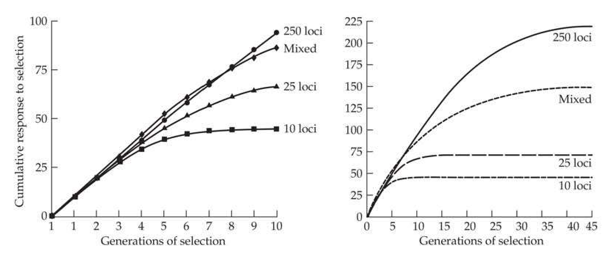
>
> Figure 25.1 Examples of the expected response to selection, here assuming truncation selection (with the upper 20% saved) and n identical diallelic loci (each with genotypic values of 0 : a : 2a, and a favorable allele frequency of p). We further assume that there is no epistasis and ignore any effects of gametic-phase disequilibrium. All populations start with  $ \sigma_A^2(0) = 100 $ and  $ \sigma_E^2 = 100 $, so  $ h^2(0) = 0.5 $. Curves are plotted for models with 10, 25, and 250 equivalent loci, each with initial allele frequency  $ p = 0.5 $ and  $ a $ values of 4.47, 2.82, and 0.89, respectively. A mixed genetic model is also shown, which consists of 5 identical major loci ( $ p = 0.25 $ and  $ a = 5.16 $) and 125 identical minor loci ( $ p = 0.5 $ and  $ a = 0.89 $); as a consequence of these starting values, the major and minor loci contribute equally to the initial additive-genetic variance. Left: Short-term response over the first 10 generations. Right: Response over the first 40 generations. Note that the total response increases with the number of loci. In the infinitesimal-model limit, the response remains linear over all generations (after correcting for the slight decrease over the first few generations from linkage disequilibrium; see Example 16.3).

**[命题 Proposition]**

The general pattern expected in the long-term response to directional selection is roughly as follows: in the absence of segregating major alleles, additive variance (and hence the selection response) is roughly constant over the first few generations, yielding a nearly linear response (Figure 25.1). As discussed in Chapters 16 and 24, there is an initial reduction in the additive variance due to the generation of gametic-phase disequilibrium, but this is generally small unless directional selection on the trait is strong, heritability is high, and the number of underlying loci is large. As generations proceed, sufficient allele-frequency change accrues to significantly alter genetic variances, and in particular the genic variance, $ \sigma_{a}^{2} $. At this point, the additive-genetic variance can either increase or decrease, depending on the starting distribution of allelic frequencies and effects. However, assuming no input of new variation (from mutation or migration), the additive variance generated from the initial variation in the base population eventually declines. Ultimately, a selection limit or plateau is reached, potentially reflecting the removal of all additive-genetic variance at the underlying loci, either by fixation of all segregating alleles at a locus or the absence of additive variance at those loci that are still segregating (e.g., the presence of overdominant alleles for the character under selection). This expectation follows from an important corollary of Fisher's fundamental theorem (Chapter 6), namely that, in the absence of new inputs, selection is expected to eventually remove all additive genetic variation in fitness.

If loci with both major and minor alleles influence the character under selection, an initial rapid response can result from large changes in allele frequencies at major loci, provided these alleles are initially not rare. This burst of response is followed by a much longer period of slower response due to allele-frequency changes at loci having smaller effects and major alleles that were initially very rare or partly recessive. Such differences in rates of response can make it difficult to determine whether a selection limit has actually been reached. As the genetic variation in the base population becomes fully exhausted, the effects of new mutations will drive any continued response, which is examined in Chapter 26.

Figure 25.1 illustrates differences in the long-term selection response for four hypothetical populations with the same initial heritability but different underlying genetic architectures. All show essentially the same response over the first few generations. By generation 5, however, selection has changed allele frequencies in the 10- and 25-locus populations enough to reduce the response, while the 250-locus population shows a roughly constant response through 20–25 generations. The mixed population (5 major loci, each with an initial frequency of the favored allele of p = 0.25, and 125 minor loci, each with p = 0.5) shows an enhanced response relative to the others in generations 3–7. This results from an increase in heritability, as the frequencies of alleles with large effects increase from 0.25 to 0.50, increasing the additive variance contributed by these loci (LW Figure 4.8). If rare recessives are present, there can be a considerable time lag until the enhanced response appears (Figure 25.10). For all models, the time for allele-frequency change scales as 1/s (Equations 5.3d–5.3f), with s scaling with the allelic-effect size (Equation 5.21). Hence, as a rough approximation, if the effect size is halved, the same amount of allele-frequency change will take twice as long.

**[Figure]**

> **Figure 25.2** · page 3 · source: `chapter25`
>
> 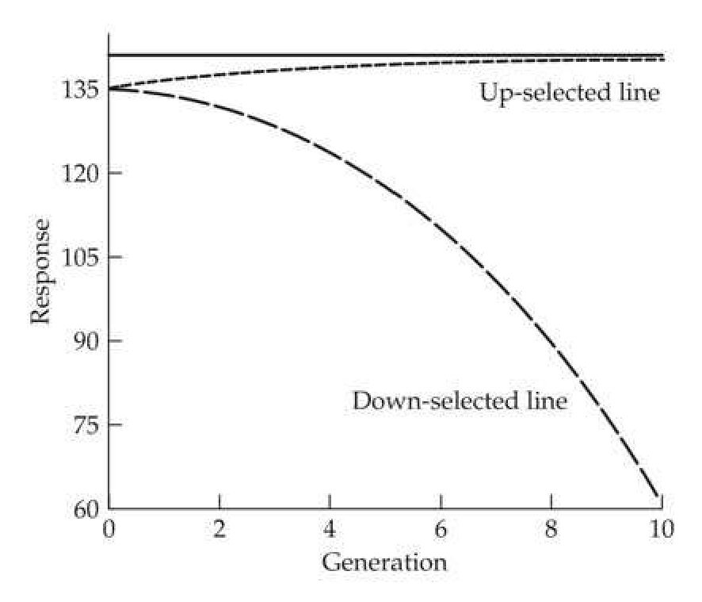
>
> Figure 25.2 With strong directional dominance, an apparent selection limit can result when favored alleles are dominant, because selection is only acting against the increasingly rare recessive homozygotes. Here the genotypes have values of 0:2a:2a, and we ignore epistasis and gametic-phase disequilibrium. The population consists of 25 identical loci, with a = 2.82 and initial dominant-allele frequency of p = 0.8. We assume truncation selection with the upper (or lower) 20% of the population being saved. If all loci are fixed for the favored allele, the selection limit is 2·2.82·25 = 141 (indicated by the horizontal line). There is little response to upward selection and the population appears at a selection limit, even though there was considerable genetic variation in the base population, as shown by the rapid response of the down-selected line.

If alleles favored by selection are dominant, response slows considerably as they become common, reflecting the rarity of homozygous recessives. In such cases, the response can be so slow that the population appears to be at a limit. However, as Figure 25.2 demonstrates, reverse selection can result in a fairly rapid response, indicating the presence of substantial additive-genetic variation. As was mentioned in Chapter 18, divergent selection in this case generates a significant asymmetric response. This apparent limit due to the very slow removal of recessives can be partly overcome by inbreeding. By increasing the frequency of homozygotes relative to a random-mating population, inbreeding greatly improves the efficiency of selection, allowing favorable dominant alleles to be more rapidly fixed.

**[示例 Example]**

> **Example 25.1** · ref: `25.1` · source: `chapter25_002.json` · blocks 4–4
>
> Example 25.1. Falconer (1971) examined an apparent limit in a mouse line selected for increased litter size. Four sublines were created from this plateaued line and subjected to inbreeding and selection. Selection on a new line formed by crossing these inbred-selected lines gave an improvement of 1.5 mice per litter over the original limit. Falconer's interpretation was that many recessive alleles decreasing litter size were segregating in the apparently plateaued line, some of which were lost during inbreeding within sublines. Crossing the inbred-selected lines generated a population segregating fewer recessives (i.e., fixed for more of the favorable dominant alleles), thus facilitating the total response. Several other selection experiments in mice also found segregating recessives in populations near apparent selection limits. For litter size, Eklund and Bradford (1977) found that inbreeding and selection increased the response. However, Al-Murrani and Roberts (1974) found that while a population that had plateaued for increased body weight was also segregating a number of recessives, their loss was expected to yield only a trivial increase in body weight, and no increase was detected using Falconer's inbred-selection method.

---

## chapter25_003 · DETERMINISTIC SINGLE-LOCUS THEORY

The contribution to the selection limit from a single locus and the half-life associated with this contribution depend on a variety of genetic parameters: initial allele frequencies, the dominance relationship among alleles, and allelic-effect sizes. This section quantifies how these factors influence long-term response for a diallelic locus in the absence of drift, mutation, and epistasis. This basic model provides insight into the dynamics of response and serves as the foundation for theories incorporating drift and mutation (Chapters 26 and 28).

---

## chapter25_004 · DETERMINISTIC SINGLE-LOCUS THEORY / Expected Contribution From a Single Locus

**[推导 Derivation]**

We start with the expected total contribution from a given diallelic locus. Let $B$ be the allele favored by directional selection, where the genotypes $bb:Bb:BB$ have genotypic values of $0:a(1+k):2a$. Assuming genotypes are in Hardy-Weinberg equilibrium, the contribution to the mean character value from this locus is a function of $p$ (the frequency of $B$), namely,

> **Formula (25.1a)** · `25.1a` · source: `chapter25_block_009` · Expected Contribution From a Single Locus
>
> $$ m(p)=2ap\left[1+(1-p)k\right] $$

**[推导 Derivation]**

Provided there is no epistasis, gametic-phase disequilibrium will have no influence on this contribution to the mean. The total contribution from this locus if B is fixed, given that it starts at an initial frequency of $ p_{0} $, is

> **Formula (25.1b)** · `25.1b` · source: `chapter25_block_010` · Expected Contribution From a Single Locus
>
> $$ m(1)-m(p_{0})=2a-2ap_{0}\left[1+(1-p_{0})k\right]=2a\left(1-p_{0}\right)(1-p_{0}k) $$

**[推导 Derivation]**

Figure 25.3 plots the total contribution when allele B is either additive $ (k = 0) $, dominant $ (k = 1) $, or recessive $ (k = -1) $. The total response from this locus is largest when B is recessive and rare, and smallest when B is dominant and common. With overdominance $ (k > 1) $, the maximum value for $ m(p) $ occurs at at $ p = \widehat{p} $, where

> **Formula (25.1c)** · `25.1c` · source: `chapter25_block_011` · Expected Contribution From a Single Locus
>
> $$ \widehat{p}=\frac{1+k}{2k} $$

which is obtained by taking the derivative of $ m(p) $ with respect to p and solving for zero. With an overdominant locus underlying the trait, when $ p_0 > \widehat{p} $, directional selection on the trait results in p decreasing to $ \widehat{p} $, while if $ p_0 < \widehat{p} $, then p increases to $ \widehat{p} $. In either case, the final contribution from this locus is

> **Formula (25.1d)** · `25.1d` · source: `chapter25_block_011` · Expected Contribution From a Single Locus
>
> $$ m(\widehat{p})-m(p_{0}) $$

**[推导 Derivation]**

Finally, the allele frequency, $ p_{\beta} $, at which a preset fraction, $ \beta $, of the total contribution occurs is also of interest. This is determined by solving the quadratic equation

> **Formula (25.1e)** · `25.1e` · source: `chapter25_block_012` · Expected Contribution From a Single Locus
>
> $$ m(p_{\beta})-m(p_{0})=\beta\left[m(1)-m(p_{0})\right] $$

**[Figure]**

> **Figure 25.3** · page 5 · source: `chapter25`
>
> 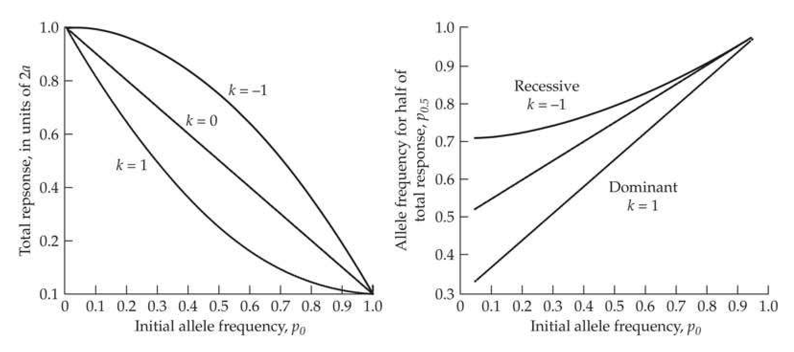
>
> Figure 25.3 Left: The contribution to total response from a diallelic locus assuming allele B, starting at frequency  $ p_0 $, is eventually fixed. The genotypes BB : Bb : bb have values of  $ 2a : a(1 + k) : 0 $. The three curves correspond to B being additive  $ (k = 0) $, dominant  $ (k = 1) $, and recessive  $ (k = -1) $. The smallest contribution is made by dominant alleles at high frequencies, and the largest from recessive alleles at low frequencies. Right: The allele frequency,  $ p_{0.5} $, at which half the total response contributed by a locus occurs, as a function of its initial frequency,  $ p_0 $.

**[Table]**

> **Table 25.1** · `25.1` · page 5 · source: `chapter25_004`
> Table 25.1 Total contribution to the selection limit and the allele frequency,  $ p_{0.5} $, at which half this response occurs for a diallelic locus when allele B has an initial frequency of  $ p_{0} $.
>
>  | Total Contribution | p_{0.5}
> --- | --- | ---
> B additive ( $ k = 0 $) | 2a(1 - p_{0}) | (1 + p_{0})/2
> B dominant ( $ k = 1 $) | 2a(1 - p_{0})^{2} | 1 - $ \sqrt{[1 - p_{0}(2 - p_{0})]/2} $
> B recessive ( $ k = -1 $) | 2a(1 - p_{0}^{2}) | $ \sqrt{(1 + p_{0}^{2})/2} $

for $ p_{\beta} $, with $ m(1) $ is replaced by $ m(\widehat{p}) $ when $ k > 1 $. A case of particular interest is $ p_{0.5} $, the frequency at which half of the expected response occurs ($ \beta = 1/2 $). Expressions for $ p_{0.5} $ as a function of initial allele frequency are given in Table 25.1 and plotted in Figure 25.3. Observe that rare recessives have to increase substantially in frequency to yield half their ultimate response (e.g., for $ k = -1 $, $ p_{0.5} \simeq 0.71 $ when $ p_0 = 0.1 $).

---

## chapter25_005 · DETERMINISTIC SINGLE-LOCUS THEORY / Dudley's Estimators of a, n, and $ p_{0} $

**[推导 Derivation]**

In a similar fashion to the Wright-Castle estimator for the number of loci (LW Chapter 9), if we are willing to make the assumption of the exchangeable model (all loci are additive with the same effects and initial frequencies; Chapter 24), we can estimate a, n, and $ p_0 $ from data on selection limits. Under this model, Equation 25.1b gives the expected total response ($ R_c(\infty) $, which we will simply write here as $ R $) of $ 2na(1 - p_0) $, while the starting additive variance is $ 2na^2p_0(1 - p_0) $. Using these expressions yields Robertson's (1970a) result for the total response, scaled by the square root of the initial additive variance, as

> **Formula (25.2a)** · `25.2a` · source: `chapter25_block_014` · Dudley's Estimators of a, n, and $ p_{0} $
>
> $$ \begin{align*}{R\over\sigma_A}={2na(1-p_0)\over\sqrt{2na^2p_0(1-p_0)}}=\sqrt{2n(1-p_0)\over p_0}\end{align*} $$

**[推导 Derivation]**

Dudley (1977) noted that, in a divergence selection experiment (Chapter 18), Equation 25.2a yields the limit, $ R_{H} $, for response in the high direction, while

> **Formula (25.2b)** · `25.2b` · source: `chapter25_block_015` · Dudley's Estimators of a, n, and $ p_{0} $
>
> $$ \begin{align*}{R_L\over\sigma_A}={2nap_0\over\sqrt{2na^2p_0(1-p_0)}}=\sqrt{{2np_0\over1-p_0}}\end{align*} $$

yields the limit to response in the low direction. Taking the ratio of these two limits yields

> **Formula (25.2c)** · `25.2c` · source: `chapter25_block_015` · Dudley's Estimators of a, n, and $ p_{0} $
>
> $$ \frac{R_{H}}{R_{L}}=\frac{\sqrt{2n(1-p_{0})/p_{0}}}{\sqrt{2np_{0}/(1-p_{0})}}=\frac{1-p_{0}}{p_{0}} $$

**[推导 Derivation]**

Equation 25.2c rearranges to suggest an estimate of $ p_{0} $, with

> **Formula (25.2d)** · `25.2d` · source: `chapter25_block_016` · Dudley's Estimators of a, n, and $ p_{0} $
>
> $$ \widehat{p}_{0}=\frac{1}{R_{H}/R_{L}+1} $$

**[推导 Derivation]**

Next, because $ R_H R_L = 4n^2 a^2 p_0 (1 - p_0) $, it follows that $ R_H R_L / \sigma_A^2 = 2n $, which suggests an estimator for the number of loci

> **Formula (25.2e)** · `25.2e` · source: `chapter25_block_017` · Dudley's Estimators of a, n, and $ p_{0} $
>
> $$ \widehat{n}=\frac{1}{2}\frac{R_{H}R_{L}}{\sigma_{A}^{2}} $$

**[推导 Derivation]**

Finally, a little algebra recovers an estimate of the allelic effect, namely,

> **Formula (25.2f)** · `25.2f` · source: `chapter25_block_018` · Dudley's Estimators of a, n, and $ p_{0} $
>
> $$ \widehat{a}=\sigma_{A}^{2}\left(\frac{1}{R_{H}}+\frac{1}{R_{L}}\right) $$

These estimates of the genetic architecture of a trait should be regarded as extremely crude (at best), but they nonetheless provide potential insight. One of the many caveats in applying these results is that the selected populations must be at their respective limits, which can be hard to access. Operationally, the limits could be estimated from curve-fitting of the data, a topic that will be discussed shortly.

---

## chapter25_006 · DETERMINISTIC SINGLE-LOCUS THEORY / Dynamics of Allele-frequency Change

**[推导 Derivation]**

To obtain approximate expressions for the actual dynamics of the selection response in the mean, we need to follow allele-frequency changes over time. Recall from Equation 5.21 that if a character is normally distributed, then the change in the frequency of allele B is $ \Delta p \simeq \bar{\imath}(\alpha/\sigma_z)p $, where p and $ \alpha $ are, respectively, the frequency and average excess of B. This is a weak-selection approximation, as it assumes that $ |\bar{\imath}\alpha/\sigma_z| \ll 1 $. It also assumes that the effects of epistasis, gametic-phase disequilibrium, and genotype × environment interactions are negligible. Assuming random mating, the average effect of an allele equals its average excess, and LW Equation 4.15a gives $ \alpha = (1 - p)a[1 + k(1 - 2p)] $. Substituting yields

> **Formula (25.3)** · `25.3` · source: `chapter25_block_020` · Dynamics of Allele-frequency Change
>
> $$ \Delta p\simeq\frac{a\bar{\imath}}{\sigma_{z}}p(1-p)[1+k(1-2p)] $$

Recall that this is correct only to linear order (terms of $ a^2 $ and higher order are ignored; see Equation 5.27a). Thus, there are potential pitfalls in applying Equation 25.3 when $ \bar{\imath} \simeq 0 $. One important example of this latter situation is strict stabilizing selection, where $ \bar{\imath} = 0 $ but allele frequencies can still change due to selection on the phenotypic variance of the character, which enters as quadratic terms, $ a^2 $ (e.g., Equation 5.6f).

**[示例 Example]**

> **Example 25.2** · ref: `25.2` · source: `chapter25_006.json` · blocks 2–7
>
> Example 25.2. The idealized response curves in Figure 25.1 were generated using Equation 25.3 to compute the expected allele-frequency change at each locus, assuming there is no gametic-phase disequilibrium. We assumed complete additivity ($k = 0$ and no epistasis), that $\sigma_E^2 = 100$, and $n$ identical loci underlying the character. Equation 25.3 yields $$ \Delta p_{t}=\frac{a\bar{\imath}p_{t}(1-p_{t})}{\sigma_{z}(t)}=\frac{a\bar{\imath}p_{t}(1-p_{t})}{\sqrt{\sigma_{A}^{2}(t)+\sigma_{E}^{2}}}\simeq\frac{a\bar{\imath}p_{t}(1-p_{t})}{\sqrt{2na^{2}p_{t}(1-p_{t})+100}} $$
> 
> Strictly speaking, the last expression is an approximation, albeit a close one, as $ 2na^2p_t(1-p_t) $ is the genic variance, $ \sigma_a^2(t) $, at generation $ t $, while the additive genetic variance equals the genic variance plus the disequilibrium contribution, $ \sigma_A^2(t) = \sigma_a^2(t) + d(t) $, as discussed in Chapters 16 and 24. Iteration generates the response curves shown in the figure.

**[推导 Derivation]**

Recall that the results for the single-locus selection response in Chapter 5 used the fitness parameterization where the genotypes $ bb: Bb: BB $ have fitnesses $ 1:1 + s(1 + h):1 + 2s $. For weak selection (e.g., $ |s|, |sh| \ll 1 $), this model gives the change in the frequency of B as $$ \Delta p\simeq s p\left(1-p\right)\left[1+h\left(1-2p\right)\right] $$ which follows from Equation 5.1c upon noting that $ 1/\bar{W}=1+O(s,sh) $, namely, one plus terms of order s and sh. Upon matching terms with Equation 25.3, we find that a QTL under directional selection has approximate selection parameters of

> **Formula (25.4)** · `25.4` · source: `chapter25_block_024` · Dynamics of Allele-frequency Change
>
> $$ s=\frac{a}{\sigma_{z}}\bar{\imath}\qquad\mathrm{a n d}\qquad h=k $$

Thus, as an initial approximation, the dynamics for a QTL with a small effect on a character under directional selection follow those of a locus under these constant fitnesses. If there is gametic-phase disequilibrium or epistasis, single-locus fitnesses change as the background genotype changes (Example 5.7). However, in the absence of these complications, fitnesses still change as the phenotypic variance, $ \sigma_z^2 $, changes. As other loci become fixed due to selection and drift, $ \sigma_z^2 $ generally decreases as the genetic variance decreases, which in turn increases $ s $. Unless heritability is large, this effect is usually small. For example, assuming that all of the genetic variance is additive, then if $ h^2 = 0.1 $, the phenotypic standard deviation when all loci are fixed is 95% ($ \sqrt{0.9} $) of its initial value (inflating $ s $ by 5%), while for $ h^2 = 0.25 $ and 0.5, $ s $ can be inflated by 15% and 43%, respectively. This decrease in the phenotypic variance can be countered if $ \sigma_E^2 $ increases as genotypes become more homozygous (LW Chapter 6) or if there has been selection to increase $ \sigma_E^2 $ (Chapter 17). It is worth stressing that these results are for a trait under directional selection. The dynamics for a locus for a trait under stabilizing selection are quite different (Example 5.6; Chapter 28).

We can use these results to compute the expected time to achieve a fraction of the response contributed by a locus in an infinite population. When selection is weak ($ |s|, |hs| \ll 1 $), Equation 5.3c gives the expected time for a favorable allele, B, to reach a frequency of p, given it starts at a frequency of $ p_0 $, for the general fitness model $ 1:1+s(1+h):1+2s $. Equation 5.3d gives the expected time (in generations) when B is additive ($ h=0 $), Equation 5.3e when B is recessive ($ h=-1 $), and Equation 5.3f when B is dominant ($ h=1 $). These expressions, together with Equations 25.1e and 25.4, allow us to obtain approximate expressions for the expected time until a fraction, $ \beta $, of the total contribution from a single locus occurs (namely, the expected time to reach frequency $ p_\beta $). Note that the rate of allele-frequency change scales as $ s^{-1} = (\bar{u}a/\sigma_z)^{-1} $, meaning that the smaller is the allelic effect, the slower is the expected response time. Substituting $ p_{0.5} $ for $ p_\beta $ gives the expected half-life of response associated with the locus under consideration (Figure 25.4). The half-life for rare recessives can be quite long, while the half-life of response for dominant loci increases with allele frequency when B is common (although in such cases, the additional gain made by fixing B is typically very small; see Figure 25.3).

**[命题 Proposition]**

These results ignore the effects of gametic-phase disequilibrium. Negative disequilibrium generated by directional selection reduces the average effect of an allele (plus alleles are associated with an excess of minus alleles at other loci, and vice versa, reducing allelic effects relative to a population in gametic-phase equilibrium). This results in a slower change in allele frequency. Hence, the half-lives plotted in Figure 25.4 are slight underestimates. In addition, for major alleles, our assumption that $ |a|/\sigma_{z} $ and $ |a k|/\sigma_{z} $ are small no longer holds, and the previous expressions for change in allele frequency and expected time to reach a given frequency can be poor approximations. More accurate versions for cases where major alleles are present were given by Latter (1965a) and Frankham and Nurthen (1981).

**[Figure]**

> **Figure 25.4** · page 8 · source: `chapter25`
>
> 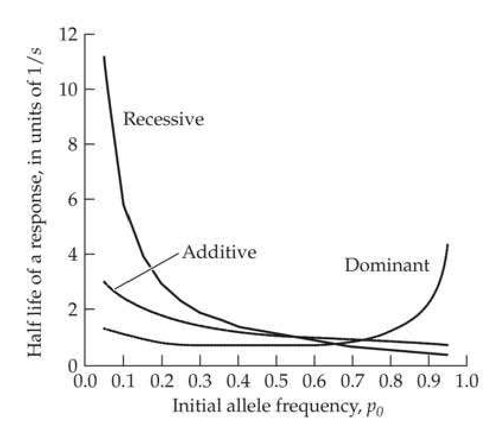
>
> Figure 25.4 The expected times for a diallelic locus to contribute half of its total response, assuming the favored allele, B, is eventually fixed. These curves are obtained by substituting  $ p_{0.5} $ from Table 25.1 into the appropriate version of Equation 5.3. Note that times for half-life scale as  $ s^{-1} = (\bar{i}a/\sigma_z)^{-1} $ generations.

**[Figure]**

> **Figure 25.5** · page 8 · source: `chapter25`
>
> 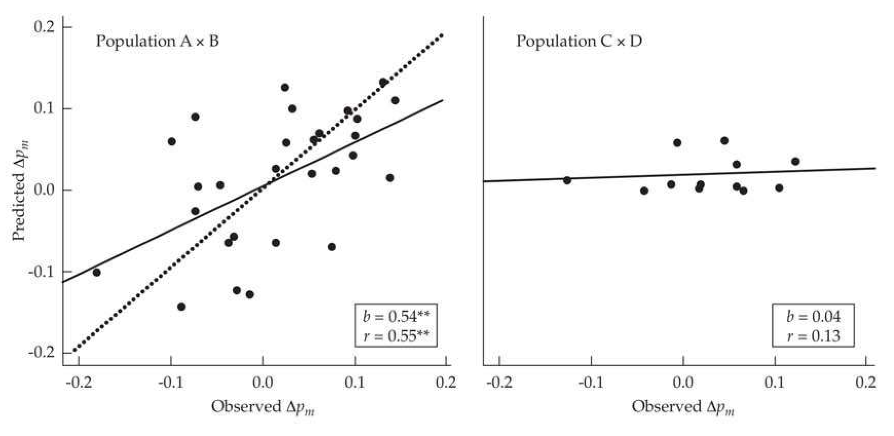
>
> Figure 25.5 Correlation between observed and predicted (from estimated QTL effect size) changes in marker allele frequencies in two inbred-line crosses (A × B and C × D) of maize subsequently subjected to seven cycles of selection. Left: QTL effect size was a fairly good predictor in the A × B selected lines (r = 0.55). The expectation is a line with a slope of b = 1 (observed = predicted; the dotted line), while the solid line is the best-fitting regression, with a slope of b = 0.54. While significantly different from 0 (showing a positive association between observed and predicted values), the predicted allele-frequency change is less than the observed allele-frequency change. Right: No significant association between the observed and predicted allele-frequency change was seen in the C × D selected lines (r = 0.13, ns). Further details are provided in Example 25.2. (After Falke et al. 2007.)

**[示例 Example]**

> **Example 25.3** · ref: `25.3` · source: `chapter25_006.json` · blocks 8–10
>
> Example 25.3. An ingenious experiment examining the fit between estimated QTL effects and their projected allele-frequency changes under selection was performed by Falke et al. (2007). By making crosses between inbred lines, the frequency of all segregating alleles in the $ F_1 $ is 1/2. Assuming only additive effects, for $ p = 1/2 $, Equation 25.3 reduces to $ \Delta p = a \bar{i} / (4\sigma_z) $. Further, the expected frequency change at a marker allele linked to $ n $ QTLs is $$ \Delta p_{m}=\frac{\overline{\imath}}{4\sigma_{z}}\sum_{i=1}^{n}a_{i}(1-2c_{i}) $$ (25.5) where $ c_{i} $ is the recombination frequency between the ith-marker and the QTL (this expression is only approximate, as it ignores LD among the linked QTLs and quickly breaks down if more than a couple of QTL are linked to the marker). Falke et al. examined two sets of crosses involving European flint maize. The A × B cross used roughly 270 F₂:₃ lines (selfed F₂ lines) for QTL mapping and was subjected to four cycles of selection, while the C × D cross used roughly 130 F₃:₄ (selfed F₃ lines) for QTL mapping and was subjected to seven cycles of selection. As Figure 25.5 shows, while the QTL effect was a modest predictor of change in marker allele frequency in the A × B cross (r = 0.55), the slope of the regression of predicted on observed change was roughly 0.5, implying that the observed marker allele frequency change exceeded the predicted value by roughly two-fold. The association was nonsignificant in the C × D cross (r = 0.13). While the lack of fit should not be surprising given that Equation 25.5 is an approximation, the direction was unexpected. One would expect Equation 25.5 to overpredict (predict a greater change than was seen), rather than underpredict, the allele-frequency change. Overprediction is expected from either the Beavis effects (overestimation of the effect sizes of detected QTLs when power is low; LW Chapter 15; also see Göring et al. 2001; Xu 2003; Goddard et al. 2009) or from the generation of negative linkage disequilibrium among selected loci (Chapter 16), which reduces the selection response below the value predicted by Equation 25.5.

**[示例 Example]**

> **Example 25.4** · ref: `25.4` · source: `chapter25_006.json` · blocks 11–13
>
> Example 25.4. As an example of the consequences for the limit, $R$, and half-life, $t_{0.5}$, as the number of loci increases, consider the exchangeable model with $n$ completely identical additive loci (in the absence of mutational input). Suppose populations with different numbers of loci underlying the character all start with the same initial variances ($\sigma_z^2(0) = 100$ and $\sigma_z^2(0) = 200$) and with an initial frequency of $p_0 = 0.5$. To hold initial additive-genetic variance constant as $n$ increases, the allelic effect, $a$, must decrease as the number of loci increases. If we ignore gametic-phase disequilibrium, then $\sigma_A^2(0) = 2na^2p_0(1 - p_0) = na^2/2 = 100$, implying $a = 10\sqrt{2}/n$. From Table 25.1, the selection limit becomes $2na(1 - 1/2) = na = 10\sqrt{2}n$. With $p_0 = 1/2$, Table 25.1 gives $p_{0.5} = [1 + (1/2)]/2 = 3/4$. Substituting these values into Equation 5.3d yields the expected time, $t_{0.5}$, for this amount of allele-frequency change (from 0.5 to 0.75, or $t_{0.75,0.5}$ in the notation of Equation 5.3d) as $$ t_{0.5}=t_{0.75,0.5}\simeq\frac{1}{s}\ln\left(\frac{\left(3/4\right)\left(1-\left[1/2\right]\right)}{\left[1/2\right]\left(1-\left[3/4\right]\right)}\right)=\left(\frac{\sigma_{z}}{a\bar{\imath}}\right)\ln(3)=\frac{\sqrt{n}}{\bar{\imath}}\ln(3) $$ The resulting values of these various quantities for 5 to 500 loci become
> 
> > **Inline Table 1** · `inline_1` · page 9 · source: `chapter25_006`
> > Inline Table 1
> >
> > n | a | R | R/ $ \sigma_{z}(0) $ | t_{0.5} \cdot \bar{\tau}
> > --- | --- | --- | --- | ---
> > 5 | 6.32 | 31.6 | 2.2 | 2.5
> > 10 | 4.47 | 44.7 | 3.2 | 3.5
> > 25 | 2.82 | 70.7 | 5.0 | 5.5
> > 50 | 2.00 | 100.0 | 7.1 | 7.8
> > 100 | 1.41 | 141.4 | 10.0 | 11.0
> > 250 | 0.89 | 223.6 | 15.8 | 17.4
> > 500 | 0.63 | 316.2 | 22.4 | 24.6
> 
> 
> At the selection limit, the mean phenotype is usually more extreme than any phenotype observed in the initial base population (R > 3σz). For example, when n = 25, the total response is 5 phenotypic standard deviations. For U ~ N(0,1), Pr(U > 5) = 2.87 · 10⁻⁷. Hence, on average, 2.87 · 10⁻⁷ · 10⁶ = 0.287 such extreme individuals are expected in a base population sample of size 10⁶. From the zero term of the Poisson, the probability that no such individuals are seen in such a sample is e⁻⁰.²⁸⁷ = 0.75. Hence, the limiting mean exceeds any phenotype likely to be found in the initial population. This is not surprising, as the probability of observing the most extreme genotype (BB at all loci) in the base population is $ (1/4)^{25} \simeq 10^{-15} $

---

## chapter25_007 · MAJOR GENES VERSUS POLYGENIC RESPONSE: THEORY

As highlighted by Example 24.4 and Figure 25.1, the presence of a major gene or genes can change the dynamics of response. A hotly debated issue in quantitative genetics and evolutionary biology is whether selection response is largely due to major genes or polygenes. At present, the data are still murky and likely biased. Before reviewing the evidence, we first consider Lande's theoretical work on conditions for major gene versus polygenic response (Lande 1983). Apparently unaware of Lande's work, plant and animal breeders have also conducted small-scale simulations on this issue (Sehested and Mao 1992; Cox 1995). A related topic, selection when a known major gene is included in an index of selection (e.g., Pong-Wong and Woolliams 1998), is a special case of marker-assisted selection and is covered in Volume 3.

---

## chapter25_008 · MAJOR GENES VERSUS POLYGENIC RESPONSE: THEORY / Lande's Model: Response With a Major Gene in an Infinitesimal Background

Lande (1983) assumed a single major gene and an infinitesimal background of polygenes, and his concern was how often a selection response (such as an adaptation by natural selection) is primarily due to a single (or a very few) major genes versus being polygenic. Because genes with major effects on a trait often have deleterious effects on overall fitness (Wright 1977; Lande 1983; Kemper et al. 2012), Lande allowed for such pleiotropic fitness effects acting on the major locus in addition to its influence on the trait under phenotypic selection. The basic parameters of his model are given in Table 25.2. For each of the three major-locus genotypes, the distribution of phenotypic values is assumed to be normal with a mean of $ \mu + \alpha_i $ and a variance of $ \sigma^2 $. Part of this variance, $ h^2 \sigma^2 $, is from the additive-genetic variance of background polygenes, where $ h^2 $ is the polygenic heritability. As the expression for the trait mean in Table 25.2 suggests, the dynamics of the mean jointly depend on the change in frequency of the major allele ($ \Delta p $) and the change in the mean ($ \Delta \mu $) of the background polygenes (also see Equation 25.8e). While both $ p $ and $ \mu $ change over time, to avoid excessive notation we suppress the subscript for generation on each.

**[推导 Derivation]**

Consider the change in the major allele-frequency, p, first. Using the mean and marginal fitnesses from Table 25.2, Wright's formula (Equation 5.5b) yields the expected change as

> **Formula (25.6)** · `25.6` · source: `chapter25_block_036` · Lande's Model: Response With a Major Gene in an Infinitesimal Background
>
> $$ \begin{aligned}\Delta p&=\frac{p(1-p)}{2\overline{W}}\frac{\partial\overline{W}}{\partial p}\\&=\frac{p(1-p)}{\overline{W}}\left[(p-1)\overline{W}_{0}+(1-2p)(1-s_{1})\overline{W}_{1}+p(1-s_{2})\overline{W}_{2}\right]\end{aligned} $$

with the second step following upon differentiation of the mean fitness. Note that the $ \overline{W}_{i} $ are not constants, but rather change with the polygenic mean, $ \mu $, whose expected change follows from the Lande equation (13.27a)

> **Formula (25.7a)** · `25.7a` · source: `chapter25_block_036` · Lande's Model: Response With a Major Gene in an Infinitesimal Background
>
> $$ \Delta\mu=h^{2}\sigma^{2}\frac{\partial\ln(\overline{W})}{\partial\mu}=\frac{h^{2}\sigma^{2}}{\overline{W}}\frac{\partial\overline{W}}{\partial\mu} $$

**[推导 Derivation]**

Taking the derivative of $ \overline{W} $ with respect to $ \mu $ returns

> **Formula (25.7b)** · `25.7b` · source: `chapter25_block_037` · Lande's Model: Response With a Major Gene in an Infinitesimal Background
>
> $$ \Delta\mu=\frac{h^{2}\sigma^{2}}{\overline{W}}\left[(1-p)^{2}\frac{\partial\overline{W}_{0}}{\partial\mu}+2p(1-p)(1-s_{1})\frac{\partial\overline{W}_{1}}{\partial\mu}+p^{2}(1-s_{2})\frac{\partial\overline{W}_{2}}{\partial\mu}\right] $$

To evaluate the derivatives of the marginal fitnesses of the major locus, first note that the normal density function is given by $$ \varphi(z,\mu,\sigma^{2})=\frac{1}{\sqrt{2\pi\sigma^{2}}}\cdot\exp\left[-\frac{(z-\mu)^{2}}{2\sigma^{2}}\right] $$

**[Table]**

> **Table 25.2** · `25.2` · page 11 · source: `chapter25_008`
> Table 25.2 Lande's (1983) model for simultaneous selection on a major locus and background polygenes. The distribution of phenotypic values for each major-locus genotype is assumed to be normal, with variance  $ \sigma^2 $. The distribution of background polygenic values around each major genotype is normal with variance  $ h^2\sigma^2 $. Here  $ \varphi(z, \mu, \sigma^2) $ denotes the density function for a normal random variable with mean  $ \mu $ and variance  $ \sigma^2 $, and  $ w(z) $ is the expected fitness associated with phenotype z.
>
> <table><tr><td rowspan="2"></td><td colspan="3">Major-locus genotype</td></tr><tr><td>$ bb $</td><td>$ Bb $</td><td>$ BB $</td></tr><tr><td>Frequency</td><td>$ (1-p)^{2} $</td><td>$ 2p(1-p) $</td><td>$ p^{2} $</td></tr><tr><td>Mean phenotype</td><td>$ \mu $</td><td>$ \mu+\alpha_{1} $</td><td>$ \mu+\alpha_{2} $</td></tr><tr><td>Natural selection</td><td>1</td><td>$ 1-s_{1} $</td><td>$ 1-s_{2} $</td></tr><tr><td>Mean fitness</td><td>$ \overline{W}_{0} $</td><td>$ (1-s_{1})\overline{W}_{1} $</td><td>$ (1-s_{2})\overline{W}_{2} $</td></tr></table>
>
> $$ \overline{W}_{i}=\int w(z)\varphi(z,\mu+\alpha_{i},\sigma^{2})d z\quad for i=0,1,2 $$
>
> Mean fitness:
>
> $$ \begin{aligned}\overline{W}&=(1-p)^{2}W_{bb}+2p(1-p)W_{Bb}+p^{2}W_{BB}\\&=(1-p)^{2}\overline{W}_{0}+2p(1-p)(1-s_{1})\overline{W}_{1}+p^{2}(1-s_{2})\overline{W}_{2}\end{aligned} $$
>
> Mean phenotype:
>
> $$ \overline{z}=\mu\left(1+2\alpha_{1}p(1-p)+\alpha_{2}p^{2}\right) $$

**[推导 Derivation]**

To obtain the required derivatives of $ \varphi(z,\mu,\sigma^{2}) $, recall from the chain rule of differentiation that $$ \frac{\partial\exp[f(x)]}{\partial x}=\frac{\partial[f(x)]}{\partial x}\cdot\exp[f(x)] $$ yielding

> **Formula (25.8a)** · `25.8a` · source: `chapter25_block_042` · Lande's Model: Response With a Major Gene in an Infinitesimal Background
>
> $$ \frac{\partial\varphi(z,\mu+\alpha_{i},\sigma^{2})}{\partial\mu}=\frac{z-(\mu+\alpha_{i})}{\sigma^{2}}\varphi(z,\mu+\alpha_{i},\sigma^{2}) $$

**[推导 Derivation]**

Hence,

> **Formula (25.8b)** · `25.8b` · source: `chapter25_block_043` · Lande's Model: Response With a Major Gene in an Infinitesimal Background
>
> $$ \begin{aligned}\frac{\partial W_{i}}{\partial\mu}&=\int w(z)\frac{\partial\varphi(z,\mu+\alpha_{i},\sigma^{2})}{\partial\mu}dz\\&=\frac{1}{\sigma^{2}}\left[\int z w(z)\varphi(z,\mu+\alpha_{i},\sigma^{2})dz-(\mu+\alpha_{i})\int w(z)\varphi(z,\mu+\alpha_{i},\sigma^{2})dz\right]\\&=\frac{1}{\sigma^{2}}\left[\int z w(z)p_{i}(z)dz-(\mu+\alpha_{i})\ \overline{W}_{i}\right]=\frac{\overline{W}_{i}}{\sigma^{2}}\ S_{i}\end{aligned} $$

> **Formula (25.8c)** · `25.8c` · source: `chapter25_block_043` · Lande's Model: Response With a Major Gene in an Infinitesimal Background
>
> $$ S_{i}=\int z w(z)\frac{p_{i}(z)}{\overline{W}_{i}}d z-(\mu+\alpha_{i}) $$

where is the selection differential acting on the major-locus genotype, i. This equivalence follows from the fact that the integral represents the mean value for major-locus genotype i following selection ($ \mu_{s_i} $), the second term is the mean for i before selection ($ \mu_i $), and $ S_i = \mu_{s_i} - \mu_i $. From Equations 25.7b and 25.8b, the expected change in the polygenic mean becomes

> **Formula (25.8d)** · `25.8d` · source: `chapter25_block_043` · Lande's Model: Response With a Major Gene in an Infinitesimal Background
>
> $$ \Delta\mu=h^{2}\left[(1-p)^{2}\frac{\overline{W}_{0}}{\overline{W}}S_{0}+2p(1-p)(1-s_{1})\frac{\overline{W}_{1}}{\overline{W}}S_{1}+p^{2}(1-s_{2})\frac{\overline{W}_{2}}{\overline{W}}S_{2}\right] $$

From Table 25.2, the new mean becomes

> **Formula (25.8e)** · `25.8e` · source: `chapter25_block_043` · Lande's Model: Response With a Major Gene in an Infinitesimal Background
>
> $$ \overline{z}=(\mu+\Delta\mu)\Biggl[1+2\alpha_{1}(p+\Delta p)(1-p-\Delta p)+\alpha_{2}\left(p+\Delta p\right)^{2}\Biggr] $$

**[Figure]**

> **Figure 25.6** · page 12 · source: `chapter25`
>
> 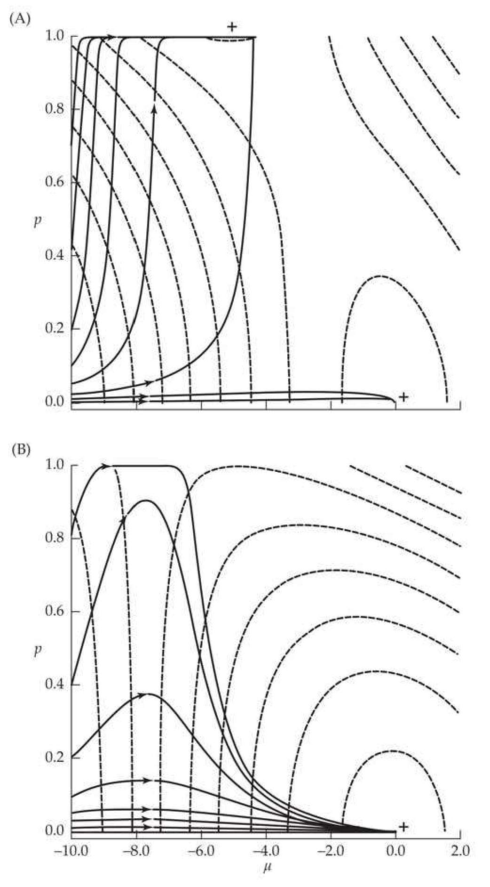
>
> Figure 25.6 Lande's analysis of selection toward a new optimum when a major gene and polygenes are present. In both examples, the population initially starts 10 units below the new optimum value (zero), and the favored major-gene homozygote adds a value of 5. Dashed lines represent contours of equal fitness in the  $ (p, \mu) $ space, while the arrowed solid lines represent the allele-frequency trajectories of the major gene. A: The favored homozygote has a pleiotropic disadvantage of s = 0.02. Here there are two peaks on the  $ (p, \mu) $ fitness surface, on the lower right  $ (p = 0, \mu = 0) $ and in the upper middle  $ (p = 1, \mu = -5) $. If the initial frequency of the major allele is above 0.025, the major allele is fixed, while it is lost if the initial frequency is below this critical frequency. B: The favored homozygote has a pleiotropic disadvantage of s = 0.40. There is a single peak on the fitness surface  $ (p = 0, \mu = 0) $, and although p may initially increase in frequency, it will always be lost, with the ultimate response being entirely polygenic. A significant fraction of the initial response can be through the major gene, but eventually this is replaced by the polygenic component. As polygenic response drives the population mean toward the optimum, the pleiotropic disadvantage of the major allele eventually exceeds its fitness advantage from selection on the trait, resulting in its eventual loss. (After Lande 1983.)

Note that while changes in $ p $ influence changes in $ \mu $, and vice-versa, Lande assumed that the infinitesimal variance, $ \sigma^2 $, and heritability, $ h^2 $, remain unchanged over time (ignoring the Bulmer effect). By using the machinery from Chapter 16, we could modify these expressions to allow for the changes caused by selection generating gametic-phase disequilibrium.

---

## chapter25_009 · MAJOR GENES VERSUS POLYGENIC RESPONSE: THEORY / Lande's Model: Response With a Major Gene in an Infinitesimal Background

Lande provides extensive analysis of his model in several settings, two of which we will consider. The first is the evolution toward a new optimum. Suppose the optimal phenotype suddenly shifts (for example, due to a major environmental change). In such cases, if the frequency of the major allele is sufficiently rare relative to the strength of selection on the trait (and also relative to the strength of pleiotropic selection against the major allele), it will be lost and the response will be entirely polygenic. As Figure 25.6 illustrates, the dynamics can be complex in this case. The key to understanding this frequency-dependent behavior is to recall the dynamics of an underdominant locus (Figure 5.1). Here, there is an unstable internal equilibrium, with the allele becoming fixed provided it starts above this value, and otherwise being lost.

Two additional remarks concerning Lande's examples displayed in Figure 25.6 are in order. First, because B is strictly deleterious before the shift in optimum, its initial frequency is expected to be low. For example, for an additive allele with mutation rate $ \nu $, $ p \simeq 2\nu/s $ (Equation 7.6b). While most of the trajectories in Figure 25.6 show fixations, almost all populations would be expected to start with the frequency of B below the 0.025 initial allele-frequency threshold for fixation (the initial frequency is below this value when $ 2\nu/0.02 < 0.025 $, or when $ \nu < 0.00025 $). Second, this is a deterministic analysis, which has implications for Figure 25.6. Notice that the trajectory for an allele starting at frequency 0.8 approaches one before eventually declining to zero. As polygenic response moves the trait mean toward the optimum, the deleterious pleiotropic effects of this allele become greater than its favorable effect on the trait, resulting in the major allele becoming selected against, and eventually removed. In a finite population, selection may initially drive the major-allele frequency sufficiently close to one for drift to fix B before polygenic response negates its favorable effect on the trait. In such cases, a major gene response will be seen.

**[推导 Derivation]**

Lande's analysis of directional selection used an exponential model of trait fitness, $ w(z) \propto \exp(\beta z) $, which reduces to a simple linear fitness function, $ w(z) \simeq 1 + \beta z $, for weak selection ($ |\beta z| \ll 1 $). Lande showed that under exponential fitnesses, his model is nicely behaved, with the polygenic mean evolving at a constant rate

> **Formula (25.9a)** · `25.9a` · source: `chapter25_block_047` · Lande's Model: Response With a Major Gene in an Infinitesimal Background
>
> $$ \Delta\mu=\sigma_{A}^{2}\beta $$

while the relationships between the major-locus genotypic fitnesses remain constant, with

> **Formula (25.9b)** · `25.9b` · source: `chapter25_block_047` · Lande's Model: Response With a Major Gene in an Infinitesimal Background
>
> $$ \frac{\overline{W}_{i}}{\overline{W}_{0}}=e^{\beta\alpha_{i}}\quad for i=1,2 $$

**[推导 Derivation]**

The resulting relative fitnesses of the three major locus genotypes become

> **Formula (25.9c)** · `25.9c` · source: `chapter25_block_048` · Lande's Model: Response With a Major Gene in an Infinitesimal Background
>
> $$ W_{b b}=1\quad W_{B b}=\left(1-s_{1}\right)e^{\beta\alpha_{1}}\quad W_{B B}=\left(1-s_{2}\right)e^{\beta\alpha_{2}} $$

Because these are constants, the machinery of Chapter 5 quickly informs us as to the fate of the major gene. Selection maintains both alleles as a stable polymorphism when $ W_{Bb} > W_{BB} $, $ W_{bb} $. There is an unstable internal equilibrium when $ W_{Bb} < W_{BB} $, $ W_{bb} $, with B being lost if sufficiently rare (frequency below the equilibrium value), and otherwise being fixed. Finally, if $ W_{bb} < W_{Bb} \leq W_{BB} $ or $ W_{bb} \leq W_{Bb} < W_{BB} $, then the major allele is fixed (under our assumption, in this chapter, of no drift).

**[推导 Derivation]**

The simple fate of the major allele is not a complete analysis of the full dynamics of this system, as even if the allele is fixed, its contribution could be far outstripped by the polygenic response. Lande examined this possibility by letting $ \alpha $ represent the difference between the two major-locus homozygotes and assuming that B is initially rare. He then compared the expected amount of time for a B allele (starting at frequency $ p_0 \ll 0.5 $) to increase to the point where the response from the locus is half its potential response, $ \alpha/2 $. This is accomplished by using Equation 25.1e to find the critical frequency, and then applying the appropriate version of Equation 5.3 to obtain the required time for this amount of allele-frequency change. If the polygenic response over this amount of time exceeds $ \alpha/2 $, the response is primarily polygenic, even if B is fixed. For weak exponential selection (Equation 25.9c), the resulting initial frequencies above which the major gene exceeds the polygenic response are approximately

> **Formula (25.9d)** · `25.9d` · source: `chapter25_block_049` · Lande's Model: Response With a Major Gene in an Infinitesimal Background
>
> $$ p_{0}>\begin{cases}2/b&recessive\\e^{-b/4}&additive\\e^{-b/2}&dominant\end{cases}\qquad where\quad b=\left(1-\frac{s}{\beta\alpha}\right)\frac{\alpha^{2}}{\sigma_{A}^{2}} $$

where, before, $ \beta $ is the strength of directional selection on the trait.

**[命题 Proposition]**

Much of this discussion is framed by the assumption that genes that have a large effect on a trait generally have deleterious effects in natural populations. However, as Orr and Coyne (1992) pointed out, if genes with a small effect on the character also have similarly small (and negative) effects on fitness, their advantage over a major locus largely (or completely) disappears. However, if the potential pool of alleles of small effects is large, it will become enriched by natural selection for those alleles with nearly neutral pleiotropic fitness effects.

Gomulkiewicz et al. (2010) reached a somewhat different conclusion from Lande's suggestion that major genes generally require very strong selection on a trait in order to account for the majority of response. They focused on the time required for a population that has invaded a harsh new environment (equivalent to a major environmental shift) to evolve persistence. This is a different scenario from that envisioned by Lande, who focused on the genetic composition once an adaptation had occurred (the equilibrium value following a shift). One of the major points from Gomulkiewicz can be seen in Figure 25.6. Here, a major allele can substantially increase in frequency, but at some point it is overtaken by polygenic response, and ultimately lost. Gomulkiewicz noted that such a situation may be critical for a population to evolve persistence in a harsh new environment. Even though the major gene is eventually lost, the population runs a risk of extinction if this allele is not initially present. Thus, by shifting the focus toward the dynamics during adaptation, rather than on the equilibrium values, a potentially different view of the relative importance of major and minor genes arises. Important roles of major genes may therefore be overlooked if one only focuses on the alleles that are ultimately fixed.

Finally, while the importance of deleterious pleiotropic fitness effects has been framed as a constraining force for major alleles, Otto (2004) showed that the presence of pleiotropy may impact small-effect alleles as well, which returns us to the point made earlier by Orr and Coyne (1992).

**[示例 Example]**

> **Example 25.5** · ref: `25.5` · source: `chapter25_009.json` · blocks 8–11
>
> Example 25.5. Lande's method of analysis can be used with other fitness functions. For example, suppose the trait of interest is subjected to truncation selection, with only individuals above the threshold value, T, being allowed to reproduce. In this case $$ W(z)=\left\{\begin{aligned}1&\quad for z\geq T\\ 0&\quad for z<T\end{aligned}\right. $$
> 
> The marginal fitnesses become $$ \overline{W}_{i}=\int_{T}^{\infty}\varphi(z,\mu+\alpha_{i},\sigma^{2})d z=\Pr\left[U>\left(T^{*}-\frac{\alpha_{i}}{\sigma}\right)\right] $$ where $ T^* = (T - \mu)/\sigma $ is the current (standardized) truncation value given $ \mu $, and U is a unit normal random variable. We usually analyze truncation selection in terms of the fraction, q, of individuals that are allowed to reproduce, rather than the threshold value, T, especially because T changes as the population mean increases. In our case, these are connected by $$ \begin{aligned}\overline{W}=q=(1-p)^{2}\Pr(U>T^{*})+2p(1-p)(1-s_{1})\Pr\left[U>\left(T^{*}-\frac{\alpha_{1}}{\sigma}\right)\right]\\+p^{2}(1-s_{2})\Pr\left[U>\left(T^{*}-\frac{\alpha_{2}}{\sigma}\right)\right]\end{aligned} $$
> 
> This expression for mean fitness is simply the probability of being above the threshold given a particular major-locus genotype, weighted by the frequencies of these genotypes. For a particular q value and the current $ \mu $ and p values, one can numerically solve the these equation for $ T^{*} $. Likewise, from LW Equation 2.14, the mean of genotype i following selection becomes $$ \mu_{s_{i}}=\mu_{i}+\sigma\frac{\varphi(T,\mu+\alpha_{i},\sigma^{2})}{\Pr[U>(T^{*}-\alpha_{i}/\sigma)]} $$ implying a directional selection differential of $$ S_{i}=\mu_{s_{i}}-\mu_{i}=\sigma\frac{\varphi(T,\mu+\alpha_{i},\sigma^{2})}{\Pr[U>(T^{*}-\alpha_{i}/\sigma)]} $$
> 
> To proceed with the analysis of the model dynamics, for a given $ (p, \mu) $ vector, we first find $ T^* $ to obtain the specified strength of truncation selection, $ q $, and then compute the $ \overline{W}_i $ for Equation 25.6 and $ S_i $ for Equation 25.8d to update the $ p $ and $ \mu $ values. Example 25.10 uses these results to obtain the equilibrium frequency of a major gene that is lethal as a homozygote, but improves the trait as a heterozygote.

---

## chapter25_010 · MAJOR GENES VERSUS POLYGENIC RESPONSE: DATA

A long-running debate in evolutionary biology, dating back to the rediscovery of Mendel, is whether the majority of adaptations are due to a few alleles with large effects or to the accumulation of small changes over a large number of loci. Before the modern evolutionary synthesis, geneticists (the Mendelians) felt that macromutations drove evolution, while supporters of Darwin (the Biometricians) felt that evolution was driven by selection acting on numerous factors of small effect. These differing views (and more importantly, their vocal supporters and opponents) delayed the merging of modern genetics with Darwin's theory of evolution. Fisher's (1918) paper, founding quantitative genetics, was a watershed event in helping to fuse these two schools (see Provine 1971 for a historical overview of the Mendelian-Biometrician debate). This same debate, in slightly different forms, resurfaced in the 1940s with Goldschmidt's (1940) idea of hopeful monsters (single mutations with a large effect driving major evolutionary changes) and also in the late 1970s to early 1980s with the debate surrounding punctuated equilibrium (the causes of long periods of evolutionary stasis, punctuated by rapid change, in the fossil record; see Eldredge and Gould 1972; Charlesworth et al. 1982).

---

## chapter25_011 · MAJOR GENES VERSUS POLYGENIC RESPONSE: DATA / Major Genes Appear to Be Important in Response to Anthropogenically Induced Selection

One of Lande's (1983) conclusions was that sufficiently strong selection is required for a major-gene response when polygenic variation is available. One situation where strong selection is often assumed to occur involves the response of wild populations to anthropogenically induced selection, namely, a major (and sudden) environmental change induced by human activity. This could be in the form of toxins (pesticides, herbicides, pollutants) or other side effects of human activity, such as industrial melanism (Lees 1981).

In the pesticide and herbicide literature, a commonly expressed theme existing Lande's theoretical predictions is that relatively weak selection (as might be expected to occur in laboratory settings, where at least a small percentage of the population is allowed to reproduce) leads to a polygenic response, whereas very strong selection (e.g., in a newly sprayed field where nearly everything is killed) leads to major-gene resistance (Greaves et al 1977; Clarke and McKenzie 1987; Macnair 1991; McKenzie et al. 1992; McKenzie 2000). However, a survey by Groeters and Tabashnik (2000) found that the strength of selection on insecticide resistance varies greatly in the field and overlaps the intensities used in laboratory experiments. Further, major-gene responses are not uncommon in the laboratory.

A relevant example involves resistance to Bt toxin (Bacillus thuringiensis Cry1Ac toxin), an organic insecticide widely used in both sprayed fields and as the foundation for some transgenic crops (e.g., Bt corn). Bt resistance is often due to recessive mutations in the same gene independently arising over different pest species. For example, independent mutations in a 12-cadherin-domain protein gene confer resistance in laboratory-selected strains from three very distantly related moth species, as well as in field populations of a fourth species (Zhang et al. 2012). Likewise, Baxter et al. (2011) found that independent recessive mutations in a different gene (the membrane transporter ABCC2) confers resistance in two very distant moth species.

**[命题 Proposition]**

In contrast to these finding of mainly recessive Bt-resistance alleles, Zhang et al. detected nonrecessive cadherin alleles in a Chinese population of cotton bollworms (Helicoverpa armigera). This observation has important biocontrol implications, because the strategy used to retard the evolution of Bt resistance is to plant refuge rows of non-Bt crops (Gould 1988; Tabashnik et al. 2008). Under the assumption that resistance is recessive, crosses of resistant homozygotes and susceptibles are expected to result in susceptible heterozygous offspring, which are killed when their larvae feed on Bt crops. This strategy fails if the response is either polygenic or due to nonrecessive major genes, as resistant alleles can then spread.

If the strength of selection is not the key factor explaining the difference between field (usually major genes) and lab (mainly polygenic) responses, then what is? One likely explanation is simply population size. Major alleles, especially those involved in detoxification, likely have deleterious side effects in toxin-free environments, and are thus expected to occur at very low frequencies in a population. As rare alleles are mainly present as heterozygotes (with frequency $ \sim2p $), the probability that a random sample of n individuals chosen to create a laboratory stock for selection does not contain the allele is $ (1 - 2p)^n $. For n = 1000 and p = 0.001, this is 0.14. Using a more realistic founder stock of 100, this increases to 0.82. Even if such a mutation is present, it will likely be in just a few copies and can easily be lost early in an experiment by drift, even with strong selection. These arguments illustrate that the interaction of drift and mutation is often critical in determining the nature of the selection response, especially in smaller laboratory populations (Chapter 26).

Finally, the finding that major genes appear to be commonly involved in Bt resistance in laboratory populations might be explained by the fact that many of these mutations appear to be knockouts. One might expect a rather large mutational target size for loss-of-function mutations, meaning they might appear at a modest rate in laboratory populations.

---

## chapter25_012 · MAJOR GENES VERSUS POLYGENIC RESPONSE: DATA / What is the Genetic Architecture of Response in Long-term Selection Experiments?

With the advent of dense molecular markers and subsequent whole-genome sequencing, we have a new set of tools to examine the genetic makeup of long-term response (Stapley et al. 2010; Burke 2012). One approach is to use QTL mapping with large sample sizes to both detect alleles of small effect and avoid the overestimation of effects when power is low (the Beavis effect; LW Chapter 15). While a large number of studies crossing divergent lines have been performed (LW Chapter 15), we restrict attention to those crosses between lines generated by persistent selection in opposite directions. For these crosses, the general picture emerging is that much, if not most, of the selection response is often due to QTLs of small effect.

Perhaps the most careful studies involve the Illinois long-term selection experiment, which (as we will detail shortly) has been going on for over a century (Figure 25.9). The F₁ progeny crosses between 70th-generation high vs. low oil lines and high vs. low oil protein lines were randomly mated for 7–10 generations before QTL mapping (the advanced intercross, or AIC, design; LW Chapter 15). Such a design allows recombination to randomize even closely linked QTLs (the effect is a 7- to 10-fold map expansion relative to the F₂). Over 50 QTLs were detected, each with small, and additive, effects (Laurie et al. 2004; Clark et al. 2006; Dudley et al. 2007). A similar finding is seen in chicken lines divergently selected for 50 generations (resulting in a nine-fold difference in body weight), which revealed mainly small-effect QTLs underlying the response (Jacobsson et al. 2005; Wahlberg et al. 2008).

Results from mouse lines have been more mixed. The majority of the roughly 40 QTLs detected in a cross from a 27-generation line selected for weight gain with a random control had effects of 1–3%, although a few had effects of around 5% (Allan et al. 2005). Moody et al. (1999) found QTLs with effects of ~3–4% in an analysis of lines divergently selected for energy balance for 16 generations. In contrast, Hovat et al. (2000) found that just four QTLs could account for most of the response in obesity in lines subjected to 53 generations of divergent selection. One caveat about these mouse results is that typically $ F_{2} $, rather than AIC, designs were used. This can result in significant overestimates of QTL effects due to linkage of multiple QTLs. Typically, such large QTL peaks fractionate upon finer mapping (reviewed by Flint and Mackay 2009; Mackay et al. 2009).

A second class of approaches is to search for signatures of selection in the genomes of individuals sampled near the end of a long-term selection experiment, either from the fixation of alternate alleles in divergent lines (essentially a localized $ F_{ST} $ measure; e.g., Johansson et al. 2010) or by more classic hard-sweep tests (e.g., Chan et al. 2012). In addition to estimating the number of genomic regions under apparent selection, the machinery of Chapters 8 and 9 could also be used to estimate selection coefficients (and hence effect sizes). However, as discussed in Chapter 8, these approaches are strongly biased toward detecting alleles of large effect, and hence involve hard sweeps as opposed to either soft sweeps (existing variation) or polygenic sweeps (small changes at a number of loci). As mentioned previously, this bias toward detecting major genes is somewhat countered by a bias against them by the founding of most experimental populations. The expectation is that alleles of large effect are at low frequencies in natural populations, and thus are unlikely to be routinely captured in the small to modest population samples used to found most laboratory populations.

What is clear from the existing data is that massive responses in long-term experiments can be entirely due to genes of small effect (Teotónio et al. 2009; Burke et al. 2010; Johansson et al. 2010; Parts et al. 2011; Turner et al. 2011; Zhou et al. 2011; Chan et al. 2012; Beissinger et al. 2014). What is unclear is the extent to which these results from long-term laboratory experiments with strong and constant artificial selection on a single trait translate to natural or domesticated populations undergoing mild (and likely constantly shifting) selection.

Finally, the results from examining adaptations (often inferred from species differences) in natural populations are also mixed. Hilu (1983) and Gottlieb (1984, 1985) suggested that major genes have played very important roles in species differences between plants (many of which are, presumably, adaptive), but Coyne and Lande (1985) disputed this view. A literature review by Orr and Coyne (1992) found that support for the polygenic model (i.e., that most adaptations are due to many genes of small effect) is also inconclusive. There may also be a publication bias as many of these examples are color traits, which are often controlled by just a few genes and lead to differences that are visually obvious, and thus more easily detected (and therefore studied). Clearly, this is an area of active ongoing research, and we will return to a different aspect of the question, adaptive walks (the successive fixation of multiple mutations during adaptation), in Chapter 27.

---

## chapter25_013 · AN OVERVIEW OF LONG-TERM SELECTION EXPERIMENTS

**[Figure]**

> **Figure 25.7** · page 18 · source: `chapter25`
>
> 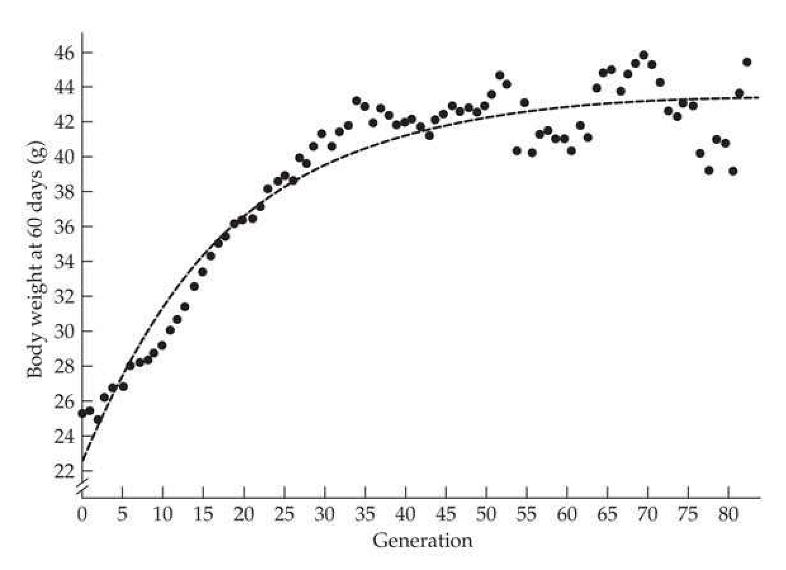
>
> Figure 25.7 Bünger and Herrendörfer's (1994) fit of an exponential regression to the long-term selection experiment of Goodale on mouse weight at 60 days (Goodale 1938; Wilson et al. 1971). The estimated selection limit was 43.5 grams (for a total response of 21.3 grams), with a half-life of 12 generations. The plotted curve regresses the cumulative response as a function of generation number. When the regression is instead plotted as a function of the cumulative selection differential (as opposed to generations), the estimated total response was 17.5 grams.

The above theory suggests that populations under selection should show a reasonably smooth response (albeit often with considerable sampling noise; Chapter 18), which is initially linear, but eventually (in the absence of new mutations) asymptotes to a selection limit as base-population genetic variance becomes exhausted. Unfortunately, this simple picture is very often wrong. Selection response can be rather erratic, showing periods of acceleration even after many generations of selection, and limits often occur in spite of significant additive variance in the character under artificial selection. Before reviewing the experimental data, a few remarks on estimating the actual limit and duration of response are in order.

---

## chapter25_014 · AN OVERVIEW OF LONG-TERM SELECTION EXPERIMENTS / Estimating Selection Limits and Half-lives

Because the selection limit is approached asymptotically, the typical measure of duration is the half-life of response—the time for half the response to occur. As was the case for short-term response (Chapters 18 and 19), this parameter is generally estimated by curve-fitting, and in doing so accommodating the inherent sampling noise in selection response data (Chapter 18). Given that the response curve is nonlinear, a number of authors have used quadratic regressions, taking the maximum of the regression as the limit (James 1965; Eisen 1972; Rutledge et al. 1973). Grassini et al. (2013) used a piecewise approach, breaking the response into either two distinct linear regressions or a quadratic regression segment followed by a constant value (the latter is used to represent the plateau).

**[推导 Derivation]**

A more natural approach is to use exponential regressions, where the cumulative response at generation t is given by $ R_c(t) = a + ce^{-bt} $ (more formally this is a negative-exponential regression). A number of variant expressions based on this approach appear in the literature (James 1965; Frahm and Kojima 1966; Harris 1982; Herrendörfer and Bünger 1988; Bünger and Herrendörfer 1994; Årnason 2001). The motivation for using exponential regressions is two-fold. First, these curves naturally generate an asymptotically maximum value (a), while quadratic regressions do not. Second, if the fraction of additive variance that is retained is just a constant amount, $ (1-\alpha) $, of the previous generation (as would occur under drift with the infinitesimal model; e.g., Equation 26.15a), this leads to a cumulative response of the form

> **Formula (25.10a)** · `25.10a` · source: `chapter25_block_072` · Estimating Selection Limits and Half-lives
>
> $$ R_{c}(t)=\beta\left(1-\left[1-\alpha\right]^{t}\right)\simeq\beta\left(1-e^{-t\alpha}\right) $$

**[推导 Derivation]**

This motivated Herrendörfer and Bünger (1988) and Bünger and Herrendörfer (1994) to suggest using an exponential regression of the form

> **Formula (25.10b)** · `25.10b` · source: `chapter25_block_073` · Estimating Selection Limits and Half-lives
>
> $$ R_{c}(t)=a\left[1-\exp\left(-bt/a\right)\right] $$

where a is the selection limit and b is the maximum rate of response (i.e., the response in the first generation). Figure 25.7 shows an application of this method, while optimal experimental design issues were examined by Rudolph and Herrendörfer (1995).

An interesting application of such estimated limits was presented by Árnason (2001). A fitted exponential regression for the racing speed of standardbred trotters in Sweden suggested that the limiting trotting time is around 68 sec/km. In the 1950s, the fastest times were just under 80 sec/km, reaching around 73 sec/km in the mid-1990s, which is slightly more than half of the expected total response of a limiting decrease of 12 sec/km (80–68, starting from the 1950 benchmark).

**[推导 Derivation]**

Using the fitted curve given by Equation 25.10b, the resulting half-life of the cumulative response becomes

> **Formula (25.10c)** · `25.10c` · source: `chapter25_block_075` · Estimating Selection Limits and Half-lives
>
> $$ t_{0.5}=-a\cdot\ln(0.5)/b $$

**[推导 Derivation]**

Assuming constant selection, the tangent of the response curve, $ R_{c}(t) $, at a particular generation provides an estimate of the rate of response in that generation (Frahm and Kojima 1966; Herrendörfer and Bünger 1988). Assuming that $ R_{c}(t) $ is well approximated by an exponential regression, this is given by the derivative of Equation 25.10b, evaluated at the generation of interest, yielding

> **Formula (25.10d)** · `25.10d` · source: `chapter25_block_076` · Estimating Selection Limits and Half-lives
>
> $$ \frac{\partial R_{c}(t)}{\partial t}=b\cdot\exp(-b t/a) $$

As was the case for linear regressions of short-term response, one decision is whether to regress cumulative response on number of generations or on the cumulative selection differential (Chapter 18). Under the breeder's equation, the short-term response is linear with respect to the cumulative selection differential, $ R_c(t) = h^2 S_c(t) $ (see Chapter 18). For long-term response, if the expectation is a constant decline in additive variation each generation, then regression on number of generations is more logical, provided that the assumptions of a constant selection differential and a constant decline in variance are appropriate.

A second, more subtle issue, which also arose in Chapter 18, is the nature of the residual variance structure. One standard approach for curve-fitting is ordinary least-squares (OLS), which involves finding the parameter values for Equation 25.10b that minimize the sum of squared residuals, $ \sum e_i^2 = \mathbf{e}^T \mathbf{e} $, where the $ i $th residual, $ e_i = R_c(t_i) - \hat{R}_c(t_i) $, is the difference between the $ i $th observed and predicted values for a given candidate regression model. OLS regression assumes homoscedasticity, with $ \sigma^2(e_i) = \sigma_e^2 $ for all $ i $, and that residuals are uncorrelated, $ \sigma(e_i, e_j) = 0 $ for $ i \neq j $. As with short-term response, the presence of drift compromises both of these assumptions. As was done in Chapter 18 to accommodate this concern, curves should be fitted using generalized least-squares, where parameters are chosen to minimize the quadratic product $ \mathbf{e}^T \mathbf{V}^{-1} \mathbf{e} $, where $ \mathbf{V} $ is the variance-covariance matrix for the residuals (Equation 18.15c).

**[推导 Derivation]**

Other candidate response curves have also been proposed, which also attempt to capture the asymptotic approach to a limit expected for an idealized long-term response. Wiser et al. (2013) suggested a hyperbolic function, with

> **Formula (25.11a)** · `25.11a` · source: `chapter25_block_078` · Estimating Selection Limits and Half-lives
>
> $$ R_{c}(t)=\frac{a t}{t+b} $$

Here, the cumulative response approaches a limiting value of a, with a half-life of $ t_{0.5} = b $.

**[Table]**

> **Table 25.3** · `25.3` · page 20 · source: `chapter25_014`
> Table 25.3 Estimates of the selection limit and half-life based on 22 generations of selection for increased 12-day litter weight in mice. Selection limit refers to response in grams as a deviation from the control, and half-life is given in generations. The quadratic and exponential models explain the same amount of variation ( $ r^{2} = 0.81 $ for both models) and cannot be discriminated on this basis. (Data for line  $ W_{3} $ from Eisen 1972.)
>
> <table><tr><td>Estimate</td><td colspan="2">Model</td></tr><tr><td>Selection limit</td><td>Quadratic Exponential</td><td>$ 5.79 \pm 0.84 $  $ 8.19 \pm 0.29 $</td></tr><tr><td>Half-life</td><td>Quadratic Exponential</td><td>8.58 12.48</td></tr></table>

**[推导 Derivation]**

A much more intriguing function for very long-term selection data is a power curve, where

> **Formula (25.11b)** · `25.11b` · source: `chapter25_block_081` · Estimating Selection Limits and Half-lives
>
> $$ R_{c}(t)=b t^{a}\quad for a<1 $$

which has the feature that while the rate of response decelerates over time ($ \partial^2 \mu(t) / \partial t^2 < 0 $ for $ a < 1 $), there is no upper limit. The power curve provided a better fit than the hyperbolic for data on the response over 50,000 generations of selection for fitness in Escherichia coli (Wiser et al. 2013), suggesting that slowly diminishing returns, rather than an approach to a true selection limit, is a better description of their data. A concern with all of these models is that the selection limit is extrapolated from the data. As Table 25.3 shows, different models can yield essentially the same fit of the data but very different estimates of the limit and half-life.

Some final cautionary notes are in order. First, scale effects (LW Chapter 11) can be important. Many continuously distributed characters have zero as a lower limit, and hence on a linear scale they always have a lower limit. This is not true on a log scale. Similarly, if we model a binary trait as resulting from the transformation of an underlying continuous variable (the liability), we should work with response as measured on the liability scale (see Chapter 14 and LW Chapters 11 and 25).

Finally, the entire issue of selection limits due to the exhaustion of additive-genetic variation is complicated by mutation. Most “long-term” experiments are long-term only from the viewpoint of the experimenter, rarely spanning more than 50 generations. As is discussed in Chapters 26 and 28, over longer time scales, mutational input becomes very important and observed limits can be artifacts of the relatively short time scales being used.

---

## chapter25_015 · AN OVERVIEW OF LONG-TERM SELECTION EXPERIMENTS / General Features of Long-term Selection Experiments

As Figure 25.8 illustrates, long-term selection experiments display a wide range of behaviors. Fortunately, a few generalizations do emerge: 1. Selection routinely results in mean phenotypes that are far outside the range seen in the base population. At the selection limit, the mean phenotype is usually many standard deviations away from the initial mean.

2. Response can be very uneven. Bursts of accelerated response after many generations of selection can be seen seen, and the additive-genetic and phenotypic variances can increase during part of the response.

---

## chapter25_016 · AN OVERVIEW OF LONG-TERM SELECTION EXPERIMENTS / General Features of Long-term Selection Experiments

3. Reproductive fitness usually declines as selection proceeds.

4. Most laboratory populations approach a selection limit. As discussed in Chapter 26, an apparent selection limit may simply be an artifact of the short time scale (and hence insufficient time for significant mutational input) and small population sizes of most experiments. However, this is not always the case (Figure 25.9).

**[Figure]**

> **Figure 25.8** · page 21 · source: `chapter25`
>
> 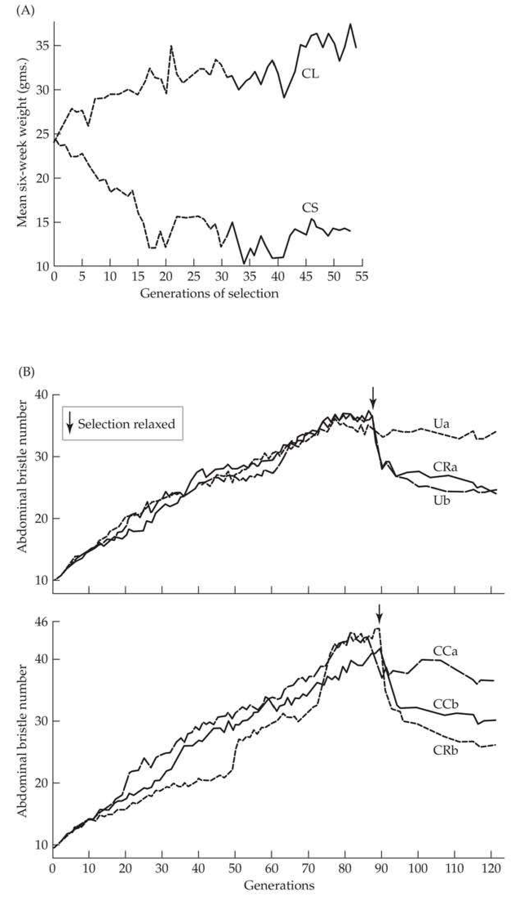
>
> Figure 25.8 A few of the nonstandard behaviors observed in long-term selection experiments. A: Delayed accelerated response during selection for increased six-week body weight in mice. An apparent limit of 31 grams had been reached in the up-selected line (CL) by generation 15. A second burst of response occurred around generation 43, with the mean weight increasing to around 35 grams (Roberts 1966). B: Selection for increased abdominal bristle number in Drosophila. At generation 90, selection was relaxed and most lines showed a considerable (but not complete) erosion of response. The presence of segregating lethals accounts for some of this erosion. Also note the bursts of response for line CRb (the short-dashed curve in the lower panel) around generations 50 and 75 (Yoo 1980a).

**[Figure]**

> **Figure 25.9** · page 22 · source: `chapter25`
>
> 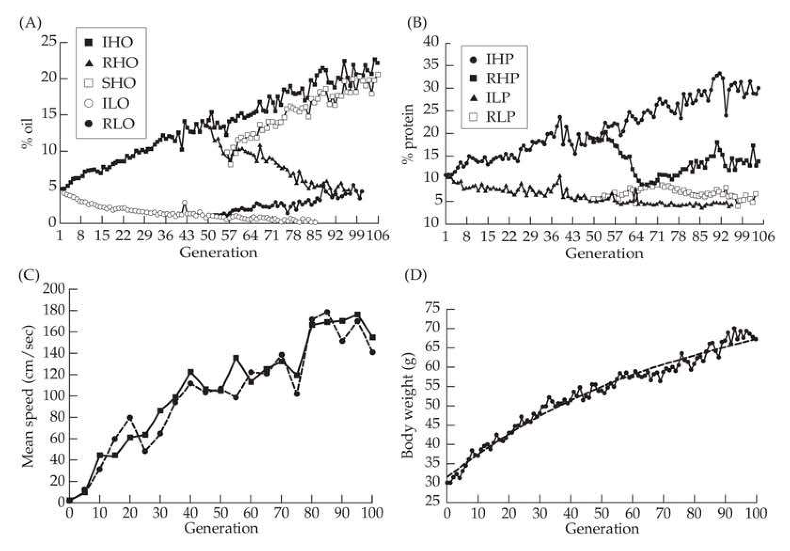
>
> Figure 25.9 Example of long-term selection experiments showing no apparent selection limits. The top two panels are from the Illinois long-term selection experiment on oil and protein content in maize. A: Response over 106 generations of selection for increased or decreased oil percentage. Lines IHO and ILO (Illinois high and low oil) are up- and down-selected, while lines RHO and RIL are lines of IHO and ILO subjected to reversed selection around generation 50. Line SHO (switchover high oil) is an up-selected line using RHO. The responses in RHO, RLO, and SHO indicate significant additive variance present in the population when these new lines were formed. (After Dudley 2007.) B: Response over 106 generations of selection for changes in the percentage of protein. Lines IHP and ILP were up- and down-selected, while lines RHP and RLP are the result of reverse selection starting around generation 50. Again, the responses of RHP and RLP indicate significant additive variance. (After Dudley 2007.) C: One hundred generations of response for increased flight speed in Drosophila melanogaster. Two replicate lines showed very similar response. (After Weber 1996.) D: Response in the Dummerstorf long-term mouse lines, which were subjected to continuous selection for 42-day weight. Conducted over 160 generations, this is the longest continuous selection experiment in mammals (Renne et al. 2013). (After Bünger et al. 2001.)

5. Considerable additive variance in the trait under artificial selection often exists at an apparent selection limit (Table 25.4).

It is important to recognize that long-term selection experiments are a biased sample of organisms and traits. Controlled selection experiments in multicellular organisms exceeding 20 generations are largely restricted to Drosophila, Tribolium, mice, and maize. Whether the genetic architectures of these organisms (and the easy-to-score traits used in experiments) are representative of typical characters in natural populations is unclear, although there is no serious reason to suspect that they are not. Another caveat in extrapolating from these model experimental systems to natural and domesticated populations is that the strength of continuous selection on a single character is likely much higher in artificial selection experiments. In addition, under natural selection, and in most breeding programs, selection operates on a suite of characters, so that for a given overall strength of selection, the fraction imparted on a particular trait likely decreases as the number of traits under selection increases. Further, the amount of natural selection on any particular character likely fluctuates over time. Conversely, laboratory experiments on artificial selection generally focus on a single character and involve strong and consistent selection, usually in highly controlled environments.

---

## chapter25_017 · AN OVERVIEW OF LONG-TERM SELECTION EXPERIMENTS / The Nature of Selection Limits

What is the nature of selection limits observed in artificial selection experiments? In particular, is there any genetic variation present at an apparent limit, and if so, is any of it additive? Correlations between relatives can be used to characterize the nature of residual variation. One caveat to this approach is that selection can generate strong gametic-phase disequilibrium, complicating standard methods for estimating components of variance (Robertson 1977b). However, changing selection schemes and inbreeding offer two simple approaches for characterizing the nature of any residual genetic variation. If additive variance is present, the line should respond to reversed selection (subjecting the line to selection in the opposite direction, e.g., Figure 25.9 and 25.9B). A decay in the mean of a plateaued line after selection is relaxed also indicates the possibility of additive variance in the selected trait (Figure 25.8), although epistasis or maternal effects can also result in slippage of the mean (see Chapter 15). If nonadditive variance is present, the line can show inbreeding depression, with the mean changing as the line is inbred. The absence of inbreeding depression, however, does not imply a lack of nonadditive genetic variation, as directional dominance, and not simply the presence of $ \sigma_{D}^{2} $, is required for inbreeding depression (LW Chapter 10).

> **Table 25.4** · `25.4` · page 24 · source: `chapter25_017`
> Table 25.4 Nature of the selection limit observed in various laboratory selection experiments.
>
> Reduced thorax length in D. melanogaster F. W. Robertson 1955 | Apparent exhaustion of all genetic variation: no further change under inbreeding, no response to reversed selection.
> --- | ---
> Increased body weight in mice Falconer and King 1953 Roberts 1966 | Exhaustion of $ \sigma_{A}^{2} $: no response to reversed selection.
> Egg production in D. melanogaster Brown and Bell 1961, 1980 | Exhaustion of $ \sigma_{A}^{2} $: significant nonadditive genetic variance present at selection limit. Lethals and sterility factors negligible.
> Wing length in D. melanogaster Reeve and Robertson 1953 | Significant $ \sigma_{A}^{2} $ at limit: complicated interaction due to segregating lethals and an overdominant gene influencing wing length.
> Reduced body weight in mice Falconer 1955 Roberts 1966 | Opposing natural selection: response to reversed selection, mean slippage upon relaxation of selection. Likely due to reduction in viability.
> Abdominal bristles in D. melanogaster Clayton and Robertson 1957 Yoo 1980b | Segregating lethals: major gene increases bristle number as a heterozygote, lethal as a homozygote.
> Pupal weight in Tribolium castaneum Enfield 1980 | Opposing natural selection: significant $ \sigma_{A}^{2} $ at limit, large decay in response with relaxed selection. Sterility reduced and fertility improved in relaxed lines.
> Shank length in chickens Lerner and Dempster 1951 | Opposing natural selection: shank length negatively correlated with hatchability.
> Litter weight in mice Eisen 1972 | Negative genetic correlation between direct and maternal effects.
> Increased body weight in mice Wilson et al. 1971 | Negative correlation between weight and litter size.
> Increased litter size in mice Falconer 1971 | Apparent limit due to slow changes in the frequency of dominant alleles.
 highlights some of the causes of selection limits observed in long-term artificial selection experiments. This is by no means a comprehensive listing. The general conclusion is that significant additive-genetic variance in the selected character is often present at an apparent limit. This is rather surprising given that most experiments have such small effective population sizes that drift is expected to remove most variation (Chapters 3 and 26).

One celebrated apparent selection limit is racing performance in thoroughbred horses, where the winning times in classic English races have not fallen substantially over the past 50 years (Gaffney and Cunningham 1998; Hill 1998). To be fair, this is a nonstandard trait, namely, the best single performance within a set of individuals and not their mean performance. However, if mean times have responded to selection, we also expect these outlier times (the best of a dozen or so) to fall as well. One possibility is that while means have fallen, so too has the genetic variance, potentially keeping low outliers (i.e., faster speeds) at a roughly constant value. Gaffney and Cunningham (1998) found ample additive variance in a strong correlate of performance, handicap weight, which Hill predicted should result in a mean improvement of roughly 0.1% per year. A more recent analysis by Wilson and Rambaut (2008) on the genetics of lifetime earning of racing horses (again correlated with speed) found that while roughly 90% of the variation was environmental (diet, trainer, etc.), there was a significant heritable component that should respond to selection.

Some long-term experiments have yet to reach their limit (Figure 25.9). The most iconic of these is the Illinois long-term corn selection experiment, started by the agricultural chemist Cyril Hopkins in 1896 and currently ongoing (Hopkins 1899; Smith 1908). The results after 76, 90, 100, and 106 generations of selection were summarized by Dudley (1977), Dudley and Lambert (1992, 2004), Moose et al. (2004), and Dudley (2007). As shown in Figure 25.9, a fairly constant response for increased oil content is seen over 90 generations with no apparent selection limit, with a total cumulative response of $ 22\sigma_{A} $. Selection for low oil was stopped after 87 generations due to the difficulty of selecting among individuals with close to 0% oil. While a limit appears to have been reached, this is due to a scale effect, as oil percentage is bounded below by zero. Selection for protein shows a similar pattern to that for oil (Figure 25.9), with the up-selection line (IHO) currently showing a cumulative increase of $ 26\sigma_{A} $ after generation 90 with no apparent limit, and the down-selected lines showing an apparent plateau, again likely due to scale effects. The interesting, and far-reaching, intellectual legacy of this experiment was nicely summarized by Goldman (2004).

**[Table]**

*[Table 25.4 - see above]*

A few other classical experiments continue to show selection response without an apparent limit. The Dummerstorf long-term selection lines (started in Dummerstorf, Germany) are the mammalian counterpart to the Illinois maize lines. Selecting for mouse weight at 42 days, this experiment has run for over 160 generations, making it the longest continuous selection experiment in mammals (Bünger et al. 2001). As shown in Figure 25.9, it has not yet reached a limit. Another long-term mouse experiment is the work of Holt et al. (2005), who selected for litter size for over 122 generations, but with the selected population experiencing at least two waves of migration of new genetic material to break the selection limit. Weber's long-term selection experiment for flight speed in Drosophila involves over 600 generations of continuous selection (Weber 1996, 2004). Figure 25.9 shows no apparent limit after 100 generations, while by generation 300, the response was slowing down, but still continuing (Figure 26.4). Unpublished results by Weber (pers. comm.) indicate that the line was still responding after 640 generations of selection. The champion of continuous long-term studies is Lenski's long-term evolution experiment (LTEE) using the bacterium Escherichia coli, which continues to respond to selection for increased fitness after over 50,000 generations (Lenski et al. 1991; Lenski and Travisano 1994; Barrick et al. 2009; Wiser et al. 2013). The roles of both finite population size (larger populations have larger limits) and new mutation input are critical to the ongoing selection response in any very long-term experiments, and we examine this further in Chapter 26.

Fortunately, limits appear to be rare in many selection programs for important commercial traits in domesticated animals (Fredeen 1984; Hunton 1984; Kennedy 1984). This is perhaps not surprising given that breeders are constantly shifting the suite of characters under artificial selection, as well as searching out new sources of genetic material. A more dubious possibility is that, while not currently at a limit, breeders are quickly approaching one (e.g., Grassini et al. 2013).

Several strategies can be used to break an apparent selection limit and allow for further response. Relaxing selection for several generations followed by directional selection can break a limit caused by strong gametic-phase disequilibrium between segregating loci. Likewise, if the limit results from a balance between natural and artificial selection, increasing the amount of artificial selection can result in further response. If the limit is caused by a lack of genetic variation, crossing different lines can introduce additional variation. Over longer time scales, a limit can be exceeded simply by waiting for new mutational input, either to increase additive variance or by generating alleles that improve the artificially selected trait but with less deleterious pleiotropic effects on fitness (Chapters 26 and 28). A final approach is selection in a new environment, which can often exploit genetic variation that is not usable in the current environment. For example, Abplanalp (1962) was able to improve a chicken line, which was apparently at a plateau for increased egg number, by selecting in a different environment (females being subjected to one day without food every two weeks).

A final comment on the nature of limits, which is discussed in much greater detail in Volume 3, is essentially an extension of the concept of a lack of further selection response because of a trade-off between natural and artificial selection. In natural populations, where the target of selection is some multivariate phenotype (say an index of trait values), one can easily have very little or no additive variation in the index (and hence, selection response at a limit), yet still have ample additive variation in each of the component traits. If the focus is on a single character in nature or even some smaller subset of the traits making up the index upon which natural selection is operating, one could easily observe ample selection on the trait and the presence of ample additive variation for that trait, yet no selection response (Blows and Hoffmann 2005; Blows and Walsh 2009; Walsh and Blows 2009; Chapter 20). As stressed in Volume 3, treating multivariate selection as a series of univariate responses is extremely misleading.

---

## chapter25_018 · INCREASES IN VARIANCES AND ACCELERATED RESPONSES

Contrary to the expectations of idealized long-term response, phenotypic and additive genetic variance can increase during the course of selection, often resulting in bursts of response (Figure 25.8). As we detail here, a variety of different conditions can lead to such a burst in response, emphasizing just how unpredictable long-term responses can be.

---

## chapter25_019 · INCREASES IN VARIANCES AND ACCELERATED RESPONSES / Rare Alleles

**[Figure]**

> **Figure 25.10** · page 26 · source: `chapter25`
>
> 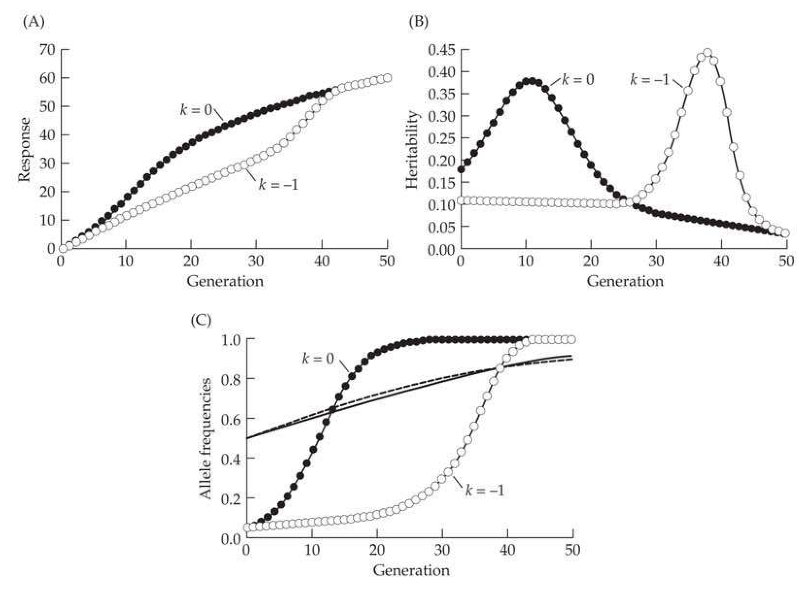
>
> Figure 25.10 Examples of a delayed accelerated response due to the increase of an initially rare allele of major effect. The character is determined by a polygenic background (100 completely additive diallelic loci, with $a = 0.5$ and $p = 0.5$, so that the initial additive variance contributed by the polygenic background is $\sigma_{A}^{2} = 12.5$) plus a major allele that is initially at low frequency ($a = 10$ and $p = 0.05$). We assume that the favored allele at the major locus is either additive ($k = 0$; contributing an initial additive variance of 9.5) or recessive ($k = -1$; contributing an initial additive variance of 0.095). A: Response under the recessive model shows an accelerated response around generation 35, while the additive major gene results in an acceleration around generation 10. B: Heritabilities clearly show the basis for this acceleration. C: Changes in the major-allele frequency show the much longer time required for the recessive major allele to increase in frequency. Note that the change in the polygenic frequencies (the middle two curves; solid for $k = 0$ and dashed for $k = -1$) are almost the same under the two different major-locus dominance values.

One obvious source for increases in variance is the increase of favorable rare alleles under selection. For an additive locus, $ \sigma_A^2 $ is maximized at $ p = 1/2 $ (LW Figure 4.8). Thus, additive loci with favorable alleles below 50% show an increase in additive variance as the allele frequency approaches one-half, after which $ \sigma_A^2 $ starts to decline to zero as the alleles become fixed. If the allele is rare and also of large effect, the result can be an increase in response many generations after the start of selection (Figure 25.10). The magnitude of this effect depends on both the initial frequency of the allele and its effect size. Alleles of large effect are subjected to stronger selection, and hence show more rapid increases in allele frequencies and larger effects on response. As Figure 25.11 illustrates, if there is a distribution of allele frequencies (and allelic-effect sizes) at the underlying loci, then different alleles are increasing at different rates, which can result in a very erratic pattern of response. This is especially true when the allele frequencies follow the Watterson distribution (Chapter 2), the distribution of allele frequencies expected under drift-mutation balance, wherein most minor alleles are rather rare. The effects of natural selection may further exaggerate this distribution. If alleles of large effect also tend to be slightly deleterious, then these frequencies may be even lower than expected under the Watterson distribution, with a negative correlation between frequency and effect size (e.g., Figure 28.5).

---

## chapter25_020 · INCREASES IN VARIANCES AND ACCELERATED RESPONSES / Major Mutations

Major alleles can be arise by mutation while selection is ongoing, creating bursts of response throughout the course of the experiment. An example of this appeared in an experiment by Yoo (1980a), who selected for increased abdominal bristles in Drosophila for over 80 generations (Figure 25.8). Five of the six replicate lines showed various periods of accelerated response after 20 generations of selection. Yoo was able to correlate many of these bursts with the appearance of new alleles that had major effects on bristle number as heterozygotes but were lethal as homozygotes.

**[Figure]**

> **Figure 25.11** · page 27 · source: `chapter25`
>
> 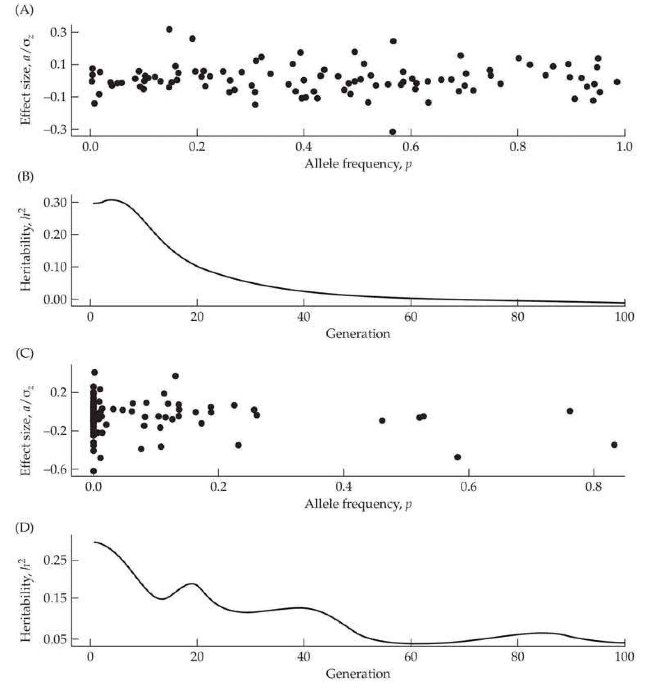
>
> Figure 25.11 The impact of a distribution of initial allele frequencies and effects on the long-term response to directional truncation selection on a trait in an infinite population. The model simulated here assumes 100 underlying loci, that are unlinked and with completely additive effects within and among loci (no dominance or epistasis). Linkage disequilibrium is ignored, with Equation 25.3 iterated to generate the dynamics (see Example 25.2). Allelic effects were randomly sampled from an exponential distribution reflected about zero (effects were equally likely to be positive or negative). Initial allele frequencies were either sampled from uniform or Watterson (Equation 2.34a) distributions, with randomly assigned allelic effects. Given the initial distribution of allele frequencies and effects, a base-population additive variance,  $ \sigma_A^2(0) $, was computed, and  $ \sigma_E^2 $ was set at  $ (7/3) \cdot \sigma_A^2(0) $ to give the trait a starting heritability of 30% (a typical value for many traits). Results from two realizations are presented here. The joint distribution of initial frequencies and their standardized effects,  $ a/\sigma_z $, is plotted for a given realization from the uniform (A) and Watterson (C) distributions. As (B) shows, under a uniform distribution of starting allele frequencies at the underlying loci, the temporal change in the heritability was generally well-behaved over the course of selection (here, a slight initial increase, followed by a nearly monotonic decrease). Conversely, (D) shows that change in the heritability under an initial Watterson distribution was highly erratic. While the specific realization shown here for the Watterson distribution was typical for a number of simulations, even more erratic patterns (i.e., heritabilities rapidly increasing after many generations of selection) were seen in some realizations. In experimental populations, drift and founder-sampling would obscure these patterns.

**[Figure]**

> **Figure 25.12** · page 28 · source: `chapter25`
>
> 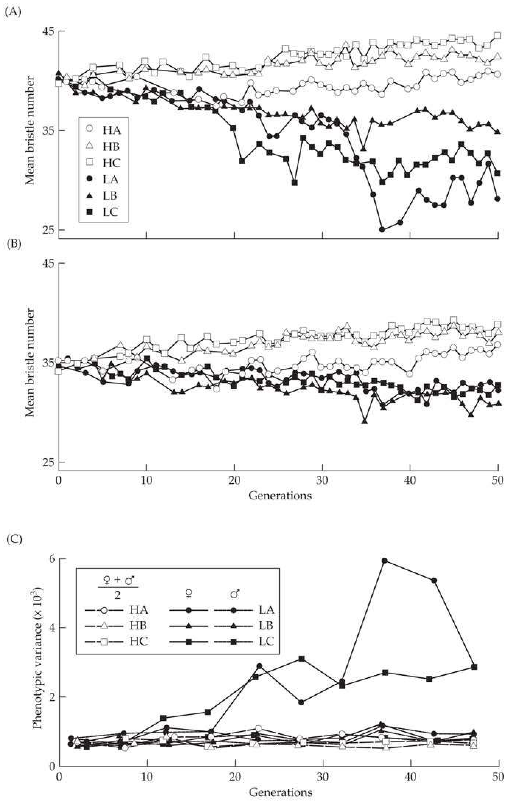
>
> Figure 25.12 The response to selection in Drosophila melanogaster for high and low abdominal bristle numbers. While equal amounts of selection was applied to both sexes, results are separated by sex-specific response. A: Response in females. B: Response in males. While two of the down-selected lines (LA and LC) show bursts of response in females, no such response is seen in the males from these lines. C: The phenotypic variances for these lines. The figure plots the average of the male- and female-specific variances for all three high-selected lines (which showed no sex-specific differences over the response), while sex-specific differences were seen in two of the low-selected lines. Note that the variance increased only in females from the two lines showing a burst of response. (After Frankham et al. 1980.)

A second example of a mutation-induced burst of response in Drosophila bristle number was seen by Frankham's group (Frankham et al. 1978, 1980; Frankham 1988), which examined selection responses in lines initially containing very little variation. In two of their down-selected lines, females (but not males) showed a burst of response (Figure 25.12). This burst was accompanied by an increase in the phenotypic variance and heritability in females, but not in males. Females also showed reduced fitness, as indicated by a male-biased sex ratio in these lines. These effects were attributable to the appearance of bobbed mutants at the ribosomal gene cluster, a deficiency in the number of rRNA genes. The bobbed mutants arose on the X-chromosome rRNA cluster, while the Y-chromosome rRNA cluster remained normal, accounting for the sex-limited nature of the response. These mutants were generated by unequal crossing over within the rRNA gene cluster during the course of the selection experiment.

These examples involve mutations of major effects, with an almost immediate impact. The implications of ongoing mutations of minor effects are considered in Chapter 26.

---

## chapter25_021 · INCREASES IN VARIANCES AND ACCELERATED RESPONSES / Scale and Environmental Impacts on Variances

Scale effects can also result in increases in genetic variances and selection responses, for example, when the variance increases with the mean (LW Chapter 11). A possible example of this is Enfield's (1972) selection experiments for increased pupal weight in Tribolium. Both the additive-genetic and total phenotypic variance increased over time, while heritability remained roughly constant (meaning that response was fairly constant). Comstock and Enfield (1981) suggested that a multiplicative model of gene action was more appropriate in this case than an additive model, and could account for the observed increases in variance. As was discussed in Chapter 14, scale effects can be especially important in threshold characters (also see LW Chapters 11 and 25).

Variances can also increase due to environmental effects. For example, the environmental variance can increase as genotypes become more homozygous, although this is not inevitable (see LW Table 6.1). Likewise, we showed in Chapter 17 that directional selection on a trait can result in an increase in $ \sigma_{E}^{2} $ if the environmental variance has heritable variation. Finally, changes in the environment during the course of selection can sometimes increase the additive variance. A possible example of this effect derives from observations on long-term selection on milk yield in North American dairy cows, where the additive variance in yield has been increasing rather than decreasing (Kennedy 1984). One explanation for such behavior is environmental change, as improved management techniques likely allow for greater discrimination between genotypes, although scale effects may also play a role.

---

## chapter25_022 · INCREASES IN VARIANCES AND ACCELERATED RESPONSES / Linkage Effects

**[定义 Definition]**

Recombinational breakdown of preexisting gametic-phase disequilibrium can also generate an accelerated response. Why might such disequilibrium be present? Mather (1941, 1942, 1943) suggested that QTLs are often in negative disequilibrium as a result of previous natural selection (he considered mainly stabilizing selection), referring to this genetic architecture as polygenic balance. More generally, selection tends to build up such negative associations based on fitness (as, by definition, fitness is always under directional selection, which generates negative values of d; see Chapter 16). As a result, alleles influencing fitness tend to be in negative gametic-phase disequilibrium, with gametes containing two favorable alleles occurring at a lower frequency than expected under linkage equilibrium (Chapters 16 and 24). As a result, alleles favored by artificial selection on a character and alleles at linked loci that improve other components of fitness (Sved 1977) have a tendency to become negatively correlated. A character with extensive negative disequilibrium (either between QTLs controlling the character or between QTLs for the character and other fitness loci) can show accelerated selection response in the mean as this disequilibrium decays (Figure 25.13).

**[Figure]**

> **Figure 25.13** · page 30 · source: `chapter25`
>
> 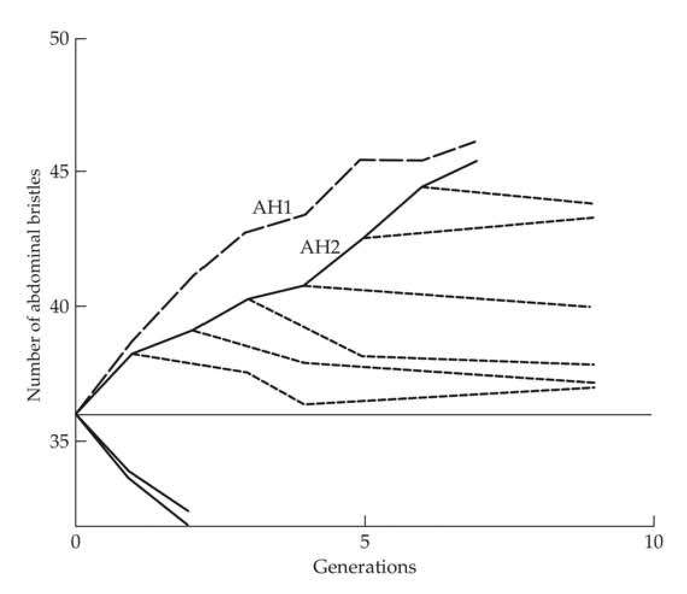
>
> Figure 25.13 An apparent example of linkage between QTLs and deleterious fitness loci. Latter and Robertson (1962) selected for increased abdominal bristle number in Drosophila melanogaster, creating sublines (indicated by the dashed lines) from the selected lines at various generations and subjecting these sublines to relaxed selection. Sublines of line AH2 extracted in the first three generations of selection showed significant erosion of response upon relaxation of selection, while sublines extracted in later generations show little erosion. Note also that line AH2, which has a depressed response relative to line AH1 over generations 1–4, shows an accelerated response following generation 4. One explanation for this pattern is that alleles increasing the character were initially in gametic-phase disequilibrium with alleles having deleterious effects on fitness in line AH2. By generation 4, this disequilibrium had largely broken down, allowing the frequencies of alleles increasing the character value to remain stable following relaxation of selection and allowing a faster response to selection. (After Latter and Robertson 1962.)

An accelerated response can also occur when recombination generates coupling gametes for alleles that increase character value. A classic example is Thoday's selection experiments for increased sternopleural bristle number in Drosophila (Thoday and Boam 1961; Thoday et al. 1964). As shown in Figure 25.14, a burst of response was seen after about 20 generations of selection. Using polygenic mapping, Thoday et al. (1964) were able to show that the initial population consisted mainly of -- chromosomes with only a few + -- and -- + chromosomes (each + indicates a major allele increasing bristle number). Selection reduced the frequency of -- chromosomes, increasing the frequency of + -- / -- + heterozygotes, which in turn increased the frequency at which ++ chromosomes were generated by recombination. The selection response accelerated as these newly created gametes became sufficiently common to increase additive variance.

**[Figure]**

> **Figure 25.14** · page 31 · source: `chapter25`
>
> 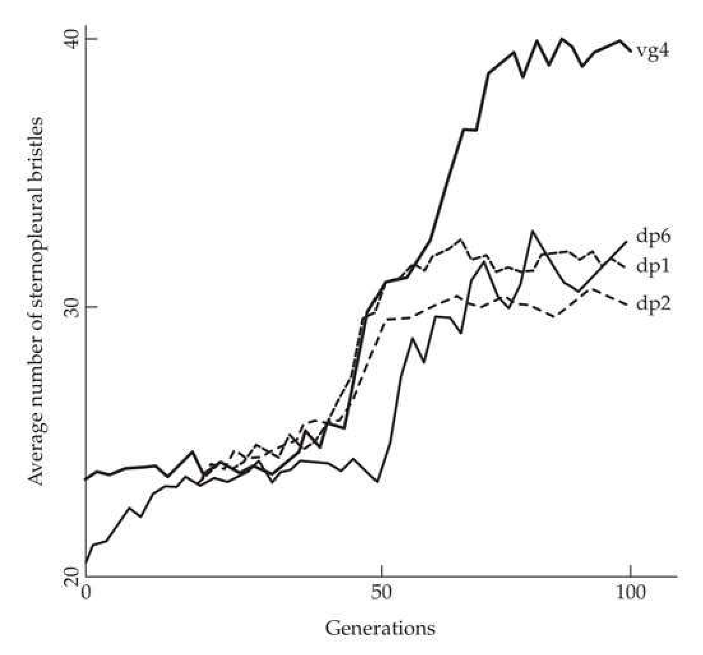
>
> Figure 25.14 Accelerated response in sternopleural bristle number in Drosophila melanogaster lines selected by Thoday and Boam (1961). All lines showed acceleration in response, but the acceleration in line vg 4 was especially dramatic.

While recombination removes gametic-phase disequilibrium, selection generates it (Chapters 5, 16, and 24). It follows that if linkage effects are important, a relaxation of selection should facilitate long-term response by allowing negative gametic-phase disequilibrium to decay, which increases the additive variance (Chapter 16). Thoday and Boam (1961) observed a large increase in Drosophila sternopleural bristle number after reselecting a line in which selection was relaxed for several generations following an apparent selective plateau. Similar patterns were seen by Mather and Harrison (1949) in some of their lines that were selected for increased abdominal bristle number. On the other hand, Rathie and Barker (1968) compared the effects of cycles of selection followed by no selection versus continuous selection on abdominal bristles and found no differences in response. However, the continuously selected lines showed larger erosions of response upon relaxation of selection and had greater decreases in reproductive fitness, suggesting that disequilibrium between QTLs and fitness loci was greater in these lines.

Our discussion of the effects of linkage has been restricted to largely deterministic considerations. Here, in the absence of epistasis, linkage influences the rate, but not the ultimate limit, of response. When population size is finite, linkage can have an important impact on the ultimate selection limit as well. For example, in a small population, selection and drift could have fixed + - chromosomes in Thoday's experiment before + + chromosomes reached frequencies sufficiently high to overcome the effects of drift. We will defer further discussion of these complex interactions until Chapter 26.

---

## chapter25_023 · INCREASES IN VARIANCES AND ACCELERATED RESPONSES / Epistasis

**[命题 Proposition]**

While the permanent component of response in any particular generation is a function of the additive variance (Chapter 15), $ \sigma_{A}^{2} $ itself changes as the frequencies of underlying genotypes change. While it is generally true that most genetic variance is additive, even when strong epistasis is present (Hill et al. 2008; Mäki-Tanila and Hill 2014), it is also true that changes in genotype frequencies can result in some of the epistatic variance being converted into additive variance (Goodnight 2004; also see Chapter 11). Eitan and Soller (2004) proposed the idea of selection-induced genetic variation, wherein the process of selection generates additional variation, as opposed to strictly removing it. An example of this is the study by Carlborg et al. (2006), who found a strongly epistatic locus in chicken lines that were divergently selected for growth. Alleles at three growth-specific loci (Growth4, Growth6, and Growth12) had much higher effects in a (high-growth) homozygous Growth9 genotypic background. While Eitan and Soller were concerned with new variation being generated via epistasis, recall the very erratic pattern of response seen in Figure 25.11 for a purely additive model. If such a pattern were observed in an experiment, many researchers would declare that it could only be due to epistasis. This is based on the expectation that the additive variance is continually declining, which requires the assumption that the majority of loci are at, or above, their frequencies for maximal additive variation. If this is not correct, such low-frequency additive alleles can (for at least part of the response) generate new additive variance as they increase toward the frequency that yields a maximal value of $ \sigma_A^2 $, after which further allele-frequency change causes $ \sigma_A^2 $ to decline. As Figure 25.11 shows, bursts of response for rare additive alleles can occur > 50 generations after the start of selection.

There is a healthy debate on the impact of epistasis on the response to directional selection (Carlborg and Haley 2004; Malmberg and Mauricio 2005; Le Rouzic and Carlborg 2007; Crow 2008, 2010; Hansen 2013), with some researchers even claiming that models that do not incorporate epistasis are fundamentally flawed (Nelson et al. 2013). However, from the standpoint of predicting long-term response, epistasis is, in some sense, the least of our concerns. First, there is the important distinction between underlying epistasis being common versus epistatic genetic variances being large. By construction, even when the underlying gene action of a trait is highly nonadditive, the majority of the genetic variance tends to be additive, especially when contributing loci have alleles at extreme frequencies (LW Chapter 7; Hill et al. 2008). As the various mechanisms discussed previously illustrate, a number of different genetic conditions other than epistasis can result in bursts of selection response. Determining the underlying cause for a burst (or some other feature attributed to epistasis) is far from trivial, implying that epistasis should only be invoked when it is fully justified by the data.

---

## chapter25_024 · CONFLICTS BETWEEN NATURAL AND ARTIFICIAL SELECTION

It is frequently seen that components of fitness (such as viability and fertility) decline rather dramatically during artificial selection experiments. Selected lines can even die out due to extreme declines in fitness. There are several (not mutually exclusive) reasons for these declines, which have rather different implications for long-term response.

1. Selection increases the amount of inbreeding relative to control populations of the same size, a point developed in Chapters 3 and 26. Drift effects associated with inbreeding can increase the frequency (and exposure) of deleterious recessives, as well as moving overdominant fitness loci away from their equilibrium frequencies. If inbreeding is sufficiently strong, deleterious alleles can be fixed.

2. Loci favored by artificial selection can be in gametic-phase disequilibrium with loci having deleterious effects on fitness. Fitness declines as these deleterious alleles increase in frequency due to hitchhiking with alleles favored under artificial selection. This disequilibrium need not be present initially—rather, it can be generated during artificial selection (Chapter 16). In infinite populations, the gametic-phase disequilibrium between QTL and fitness loci eventually decays, and deleterious alleles are not fixed. In small populations, deleterious alleles can be dragged along to fixation by linked major alleles.

3. Alleles favored by artificial selection can have deleterious effects on fitness. There are two different routes by which this can occur: the artificially selected character may itself be under natural selection, or loci controlling this character can have pleiotropic effects on other characters that are under natural selection (see Chapter 28). The impact on long-term response has been examined in some detail for two particular models: the optimum model, wherein the character under artificial selection is also subjected to natural stabilizing selection (Latter 1960; James 1962; Zeng and Hill 1986; Hill and Mbaga 1998); and the homeostatic model, wherein heterozygotes have the highest fitness under natural selection (Lerner 1954; Robertson 1956). While the genetic basis for these models is very different, Nicholas and Robertson (1980) noted that “despite the profound differences between the two models, the practical implications of each are essentially the same in the context of artificial selection. Consequently, there seems to be no aspect of observable response which would enable a distinction to be made between the two.”

What are the implications of these different fitness-decreasing mechanisms for long-term response? The inbreeding effect of selection is a consequence of finite population size being further exaggerated by selection: these effects should largely disappear if the effective population size is kept sufficiently large during selection.

If loci influencing the character also influence fitness (either directly or because of gametic-phase disequilibrium with other fitness loci), response is expected to decay upon relaxation of selection, provided alleles decreasing fitness are not fixed (e.g., Figure 25.8). Erosion of response, however, does not automatically imply that fitness effects are important. For example, some erosion is expected when additive epistasis or maternal effects have contributed to the response (Chapter 15). If erosion is largely due to fitness effects, it should be correlated with increases in fitness.

**[示例 Example]**

> **Example 25.6** · ref: `25.6` · source: `chapter25_024.json` · blocks 6–7
>
> Example 25.6. Frankham et al. (1988) selected Drosophila melanogaster for increased ethanol tolerance. Following the suggestion of Gowe (1983), they attempted to reduce the expected decline in reproductive fitness by further culling those artificially selected pairs showing reduced number of offspring. Their logic was that if deleterious fitness effects during selection were largely caused by rare recessives (the exposure of which increases by inbreeding during selection), then removing a very small fraction of the lowest-fitness individuals would cull individuals that are homozygous for deleterious recessives. Following the selection of parents based on increased tolerance, Frankham et al. placed single mated pairs in vials that were subsequently ranked according to the number of pupae produced. Vials with the lowest number of pupae were culled. The HS line, which was subjected to both selection for tolerance and subsequent culling on reproductive fitness, had the same tolerance response as the HO line (which was selected only for increased tolerance). The unselected control line and the HS line had the same fitness, as measured by Knight and Robertson's (1957) very general competitive index measure. Conversely, the HO line had significantly reduced fitness. If alleles increasing tolerance had either pleiotropic or linkage effects on fitness, the HS line should have reduced the tolerance response relative to the HO line. Given that the responses were identical, however, Frankham et al. suggested that the reduction in fitness in the HO line was mainly due to the effects of inbreeding, rather than linkage or pleiotropy. A similar study was reported by Gowe et al. (1993), who examined 30 years of selection on laying hens. Again, a two-stage selection approach was used: following truncation selection for increased egg production, the lowest 10% of hens chosen as parents by truncation selection were then culled again on the basis of hatchability. Using this selection scheme, the increased production lines retained the same levels of hatchability as an unselected control. Typically, selection only on increased egg production alone reduces hatchability. A final example of an experiment attempting to control for deleterious fitness effects was provided by Imasheva et al. (1991), who combined directional selection for increased radius incompletus expression in the wing venation of Drosophila melanogaster with stabilizing selection on a suite of wing morphological characters. After 16 generations of selection, the control and directional plus stabilized selected lines had similar population sizes, both of which were higher than the population that was subjected to strict directional selection. The three lines, however, did not differ when fitness was measured by looking at competitive ability.

**[示例 Example]**

> **Example 25.7** · ref: `25.7` · source: `chapter25_024.json` · blocks 7–8
>
> Example 25.7. Enfield (1980) subjected the flour beetle (Tribolium castaneum) to selection for increased pupal weight. As mean pupal weight increased, components of reproductive fitness (percent sterility and mean number of progeny per fertile mating) declined. Upon the relaxation of selection, pupal weight decreased and fitness increased. When relaxed lines were again subjected to selection, fitness components again decreased as pupal weight increased. However, Enfield reported evidence that increased pupal weight, by itself, does not necessarily decrease fitness, having found that lines can be created with rather large mean pupal weight, that remain stable upon the relaxation of selection. Thus, it appears that reproductive fitness declines as a result of a correlated selection response with pupal weight, rather than natural selection acting directly on pupal weight itself. At least some of the alleles for increased pupal weight thus appear to be associated with alleles that decrease reproductive fitness. If this is due to linkage disequilibrium, recombination will reduce this effect. If it is due to pleiotropy, however, one must select for modifiers of these deleterious effects.

**[示例 Example]**

> **Example 25.8** · ref: `25.8` · source: `chapter25_024.json` · blocks 8–9
>
> Example 25.8. An interesting potential example of a decay in selection response upon relaxation of selection in a natural population was provided by Cruz and Wiley (1989), who examined egg-rejection behavior in the village weaver bird (Ploceus cucullatus) in Hispaniola. This species was introduced onto the island from western Africa around 200 years ago. Studies in western Africa by Victoria (1972) showed that female weavers can recognize their own eggs and eject foreign eggs from their nest, with the rate of rejection proportional to the amount of difference between eggs. Victoria postulated that this rejection behavior evolved in response to selective pressure from the Didric cuckoo (Chrysococcyx caprius), which is a brood parasite that lays its eggs in the nests of other species. The rejection of eggs that appear sufficiently different could lead to increased fitness when brood parasites are present but decreased fitness when they are absent (as any discarded eggs would be from the mother).
> 
> Victoria found an average rejection rate in Africa of eggs with a different appearance from their mothers of around 40–55%, while Cruz and Wiley found a rejection rate on Hispaniola of 12%. Because Hispaniola was free of brood parasites until the mid-1970s, Cruz and Wiley suggested that this difference in rejection rates amounts to a slippage in the selection gain (in Africa) following the relaxation of selection (in Hispaniola). Such a slippage shows that the 40–55% value in Africa does not represent a selection limit due to lack of additive variance in this behavioral trait. If a selection limit did exist in Africa, it would likely represent a tradeoff between the fitness costs of rejecting all eggs that appear to be different. This natural experiment continues today, as in the mid-1970s the shiny cowbird (Molothrus bonariensis minimus), another brood parasite, was introduced into Hispaniola.

---

## chapter25_025 · CONFLICTS BETWEEN NATURAL AND ARTIFICIAL SELECTION / Accumulation of Lethals in Selected Lines

Lethal alleles are often detected in lines that are subjected to long-term selection. If these alleles also influence the character under selection, they can result in increases in the additive variance during a period of the selection response, the presence of significant additive variance in the trait at an apparent selection limit, and some erosion of both the response and the additive variance upon relaxation of selection. In Drosophila experiments, lethals have been observed in lines that were subjected to directional selection on sternopleural bristles (Madalena and Robertson 1975; García-Dorado and López-Fanjul 1983), abdominal bristles (Clayton and Robertson 1957; Frankham et al. 1968b; Hollingdale 1971; Yoo 1980b), dorsocentral bristles (Dominguez et al. 1987), and wing length (Reeve and Robertson 1953). Skibinski (1986) also found that lethals accumulated during stabilizing selection on sternopleural bristle number. Yoo (1980b) and Skibinski (1986) found that most lethals arose during the course of the selection experiment, rather than being initially present in the base population. A similar example in mice involves the homozygous sterile allele pygmy, which reduces body size when heterozygous (Warwick and Lewis 1954; King 1955). This mutant arose during MacArthur's (1949) long-term selection experiments for decreased body size.

Newly arising lethals could be due to new mutation (such as the insertion of a mobile element; see Mackay 1988) or could be generated by recombination between strongly epistatic genes creating synthetic lethals (LW Chapter 10; Phillips and Johnson 1998). Once a lethal with a strong effect on the character appears, it partly shelters closely linked sites from further selection, creating linked clusters of lethals (Madalena and Robertson 1975; García-Dorado and López-Fanjul 1983).

**[示例 Example]**

> **Example 25.9** · ref: `25.9` · source: `chapter25_025.json` · blocks 2–3
>
> Example 25.9. Consider the following estimated variance components from a selection experiment by Reeve and Robertson (1953) for increased wing length in Drosophila melanogaster:
> 
> > **Inline Table 2** · `inline_2` · page 35 · source: `chapter25_025`
> > Inline Table 2
> >
> > Population | $ \sigma_{z}^{2} $ | $ \sigma_{A}^{2} $ | $ \sigma_{E}^{2} $ | $ h^{2} $
> > --- | --- | --- | --- | ---
> > Selected | 4.65 | 2.50 | 1.72 | 0.54
> > Relaxed | 4.50 | 1.80 | 1.72 | 0.40
> > Base | 3.20 | 1.02 | 1.72 | 0.32
> 
> 
> The selected line shows large increases in additive variance and heritability relative to the base population, while upon the relaxation of selection, both the additive variance and the heritability decline to values that are intermediate between those in the base and the selected lines. Reeve and Robertson attributed this behavior to the presence of at least two major alleles that are lethal as homozygotes. As these alleles increase in frequency, they increase additive variance. Because they are never fixed (as is discussed below, their maximum frequency is 1/3), the genetic variance attributable to these alleles does not subsequently decline as selection proceeds. However, upon relaxation of selection, the component of response due to these alleles decays as their frequency is reduced by natural selection. The additive variance is also expected to decline as these alleles are eventually lost due to natural selection following the relaxation of artificial selection.

Substitution of Equation 25.12a into Equation 25.12b yields $ \widetilde{p} = s/(1 + 3s) $. Thus, for large values of s, the equilibrium frequency of the allele approaches 1/3 at the start of each generation before artificial selection and increases to 1/2 after artificial selection. A more formal treatment of this problem is given in Example 25.10 (also see Figure 25.15).

While many lethal alleles have a demonstrated major effect on the character under selection, in some cases their frequencies are not consistent with this theory. Skibinski (1986) found no evidence that artificial selection accounts for the maintenance of lethals observed in his Drosophila lines. Instead, one lethal showed evidence of segregation distortion (Lyttle 1991, 1993; Taylor and Ingvarsson 2003), which could account for its observed frequency. Likewise, none of the Drosophila lethals isolated by Domínguez et al. (1987) had a significant effect on the character under selection. They also found evidence of segregation distortion, with at least one lethal allele being preferentially transmitted by males. Thus, in some experiments, lethal alleles may persist for reasons other than artificial selection and therefore should persist upon the relaxation of selection, whereas lethals maintained by artificial selection will not. The increased drift generated by artificial selection can increase the frequency of even strongly deleterious alleles, and this, especially when interacting with other factors such as segregation distortion, might account for the increase in lethals that do not affect the character under artificial selection.

**[示例 Example]**

> **Example 25.10** · ref: `25.10` · source: `chapter25_025.json` · blocks 7–9
>
> Example 25.10. For a more formal treatment of the expected equilibrium value, consider a major gene that is lethal as a recessive (BB), but increases character value as a heterozygote (Bb). What are the dynamics of this locus when truncation selection is used to increase character value? Suppose that the distribution of phenotypes for the two viable genotypes is normal, with $ z_{Bb} \sim N(\mu + a, \sigma^2) $ and $ z_{bb} \sim N(\mu, \sigma^2) $, and let p be the frequency of B. Following random mating, the expected zygotic frequencies will be in Hardy-Weinberg frequencies, with $ freq(Bb) = 2p(1 - p) $, $ freq(bb) = (1 - p)^2 $, and $ freq(BB) = p^2 $. After natural selection, only the genotypes Bb and bb remain, and these now have frequencies of $$ \mathrm{freq}^{\prime}(Bb)=\frac{2p(1-p)}{1-p^{2}}=\frac{2p}{1+p}\quad and\quad\mathrm{freq}^{\prime}(bb)=\frac{(1-p)^{2}}{1-p^{2}}=\frac{1-p}{1+p} $$ Truncation selection occurs on the survivors of natural selection, generating a mixture distribution for the trait value (LW Chapter 13), with $$ \begin{aligned}z&=\mathrm{freq}^{\prime}(Bb)p_{Bb}(z)+\mathrm{freq}^{\prime}(bb)p_{bb}(z)\\&=\left(\frac{2p}{1+p}\right)p_{Bb}(z)+\left(\frac{1-p}{1+p}\right)p_{bb}(z)\end{aligned} $$ Here $ p_{Bb}(z) $ and $ p_{bb}(z) $ denote the density functions for the normal distributions associated with these two genotypes. Recall from Chapter 14 that truncation selection is usually framed in terms of the fraction, q, of individuals that are allowed to reproduce. However, it will prove easier to initially formulate this problem in reverse, assuming some trait threshold value, T, above which individuals are allowed to reproduce. Given the current mean and variance, we can obtain the value of T for a given value of q. For a fixed value of q, we expect T to increase in each generation as the trait mean increases. Hence, we first solve this problem for T, and then express the final result in terms of the fraction saved, q. If the trait threshold value above which individuals are allowed to reproduce is T, then the fraction of individuals allowed to reproduce is given by $$ q=\left(\frac{2p}{1+p}\right)\Pr(z_{B b}>T)+\left(\frac{1-p}{1+p}\right)\Pr(z_{b b}>T) $$ Because $ (z_{Bb} - \mu - a)/\sigma \sim U $ and $ (z_{bb} - \mu)/\sigma \sim U $, where $ U $ denotes a unit normal, this rearranges to yield $$ q(1+p)=2p\Pr\left(U>T^{*}-\frac{a}{\sigma}\right)+(1-p)\Pr(U>T^{*}) $$ (25.13) where $ T^{*} = (T - \mu)/\sigma $. The frequency of Bb following artificial selection becomes $$ \mathrm{freq}^{\prime\prime}(Bb)=\left(\frac{2p}{1+p}\right)\frac{\Pr(U>T^{*}-a/\sigma)}{q} $$ yielding the frequency $ p^{\prime\prime} $ of B after a single round of both natural and artificial selection as $$ p^{\prime\prime}=\frac{1}{2}\operatorname{f r e q}^{\prime\prime}(B b)=\left(\frac{p}{1+p}\right)\frac{\operatorname{P r}(U>T^{*}-a/\sigma)}{q} $$ (25.14) If we let $ \hat{p} $ denote the equilibrium frequency of B in the zygotes at the start of the next generation (before natural selection), by rearranging Equation 25.14, it follows that $$ q(1+p)p^{\prime\prime}=p\Pr(U>T^{*}-a/\sigma) $$ Figure 25.15 The equilibrium frequency, $ \widetilde{p} $, of a lethal allele that also increases the value of a trait under artificial selection. Selection is assumed to act in the zygote, so that $ \widetilde{p} $ is the frequency of the allele in surviving individuals before artificial selection is performed. The equilibrium frequency is a function of the strength of artificial selection (measure by the fraction, $ q $, of adults saved under truncation selection) and the contribution, $ a/\sigma $, of the allele to the trait under artificial selection. The four curves are for values of $ a/\sigma = 1 $, 0.50, 0.25, and 0.10, respectively. See Example 25.10 for further details. Because $ p'' = p = \widehat{p} $ at equilibrium, this reduces to $$ q\left(1+\widehat{p}\right)=\Pr(U>T^{*}-a/\sigma) $$ Combining this result with Equation 25.13 yields $$ 2\widehat{p}\operatorname{Pr}\left(U>T^{*}-a/\sigma\right)+\left(1-\widehat{p}\right)\operatorname{Pr}(U>T^{*})=\operatorname{Pr}(U>T^{*}-a/\sigma) $$ Solving for $ \hat{p} $ returns $$ \widehat{p}=\frac{\Pr(U>T^{*})-\Pr(U>T^{*}-a/\sigma)}{\Pr(U>T^{*})-2\Pr(U>T^{*}-a/\sigma)} $$ (25.15a) Likewise, the equilibrium frequency, $ \tilde{p} $, following the removal of lethals (BB homozygotes) is $$ \widetilde{p}=\frac{(1/2)\mathrm{freq}(Bb)}{1-\mathrm{freq}(BB)}=\frac{\widehat{p}\left(1-\widehat{p}\right)}{1-\widehat{p}^{2}}=\frac{\widehat{p}}{1+\widehat{p}} $$ (25.15b) Figure 25.15 plots $ \widetilde{p} $ as a function of $ q $ and $ a/\sigma $. The figure was generated by applying Equations 25.15a and 25.15b for a given value of $ T^* $, and then using Equation 25.13 to obtain the value of $ q $, given the $ T^* $, $ a/\sigma $, and $ \widehat{p} $ values.

---

## chapter25_026 · CONFLICTS BETWEEN NATURAL AND ARTIFICIAL SELECTION / Accumulation of Lethals in Selected Lines

Recall from Chapter 14 that truncation selection is usually framed in terms of the fraction, q, of individuals that are allowed to reproduce. However, it will prove easier to initially formulate this problem in reverse, assuming some trait threshold value, T, above which individuals are allowed to reproduce. Given the current mean and variance, we can obtain the value of T for a given value of q. For a fixed value of q, we expect T to increase in each generation as the trait mean increases. Hence, we first solve this problem for T, and then express the final result in terms of the fraction saved, q.

**[推导 Derivation]**

If the trait threshold value above which individuals are allowed to reproduce is T, then the fraction of individuals allowed to reproduce is given by $$ q=\left(\frac{2p}{1+p}\right)\Pr(z_{Bb}>T)+\left(\frac{1-p}{1+p}\right)\Pr(z_{bb}>T) $$ Because $ (z_{Bb} - \mu - a)/\sigma \sim U $ and $ (z_{bb} - \mu)/\sigma \sim U $, where $ U $ denotes a unit normal, this rearranges to yield

> **Formula (25.13)** · `25.13` · source: `chapter25_block_134` · Accumulation of Lethals in Selected Lines
>
> $$ q(1+p)=2p\Pr\left(U>T^{*}-\frac{a}{\sigma}\right)+(1-p)\Pr(U>T^{*}) $$

where $ T^{*} = (T - \mu)/\sigma $. The frequency of Bb following artificial selection becomes $$ \mathrm{freq}^{\prime\prime}(Bb)=\left(\frac{2p}{1+p}\right)\frac{\Pr(U>T^{*}-a/\sigma)}{q} $$ yielding the frequency $ p^{\prime\prime} $ of B after a single round of both natural and artificial selection as

> **Formula (25.14)** · `25.14` · source: `chapter25_block_134` · Accumulation of Lethals in Selected Lines
>
> $$ p^{\prime\prime}=\frac{1}{2}\operatorname{f r e q}^{\prime\prime}(B b)=\left(\frac{p}{1+p}\right)\frac{\operatorname{P r}(U>T^{*}-a/\sigma)}{q} $$

If we let $ \hat{p} $ denote the equilibrium frequency of B in the zygotes at the start of the next generation (before natural selection), by rearranging Equation 25.14, it follows that $$ q(1+p)p^{\prime\prime}=p\Pr(U>T^{*}-a/\sigma) $$ Because $ p'' = p = \widehat{p} $ at equilibrium, this reduces to $$ q\left(1+\widehat{p}\right)=\Pr(U>T^{*}-a/\sigma) $$

Combining this result with Equation 25.13 yields $$ 2\widehat{p}\operatorname{Pr}\left(U>T^{*}-a/\sigma\right)+\left(1-\widehat{p}\right)\operatorname{Pr}(U>T^{*})=\operatorname{Pr}(U>T^{*}-a/\sigma) $$

**[推导 Derivation]**

Solving for $ \hat{p} $ returns

> **Formula (25.15a)** · `25.15a` · source: `chapter25_block_137` · Accumulation of Lethals in Selected Lines
>
> $$ \widehat{p}=\frac{\Pr(U>T^{*})-\Pr(U>T^{*}-a/\sigma)}{\Pr(U>T^{*})-2\Pr(U>T^{*}-a/\sigma)} $$

**[推导 Derivation]**

Likewise, the equilibrium frequency, $ \tilde{p} $, following the removal of lethals (BB homozygotes) is

> **Formula (25.15b)** · `25.15b` · source: `chapter25_block_138` · Accumulation of Lethals in Selected Lines
>
> $$ \widetilde{p}=\frac{(1/2)\mathrm{freq}(Bb)}{1-\mathrm{freq}(BB)}=\frac{\widehat{p}\left(1-\widehat{p}\right)}{1-\widehat{p}^{2}}=\frac{\widehat{p}}{1+\widehat{p}} $$

**[Figure]**

> **Figure 25.15** · page 37 · source: `chapter25`
>
> 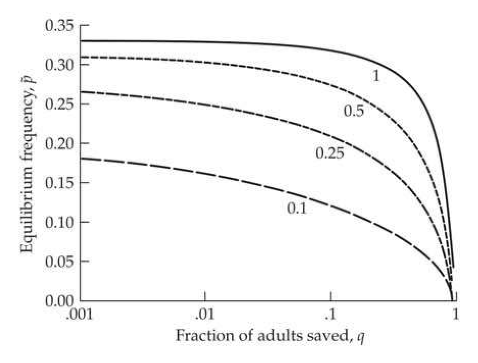
>
> Figure 25.15 The equilibrium frequency,  $ \widetilde{p} $, of a lethal allele that also increases the value of a trait under artificial selection. Selection is assumed to act in the zygote, so that  $ \widetilde{p} $ is the frequency of the allele in surviving individuals before artificial selection is performed. The equilibrium frequency is a function of the strength of artificial selection (measure by the fraction,  $ q $, of adults saved under truncation selection) and the contribution,  $ a/\sigma $, of the allele to the trait under artificial selection. The four curves are for values of  $ a/\sigma = 1 $, 0.50, 0.25, and 0.10, respectively. See Example 25.10 for further details.

Figure 25.15 plots $ \widetilde{p} $ as a function of $ q $ and $ a/\sigma $. The figure was generated by applying Equations 25.15a and 25.15b for a given value of $ T^* $, and then using Equation 25.13 to obtain the value of $ q $, given the $ T^* $, $ a/\sigma $, and $ \widehat{p} $ values.

---

## chapter25_027 · CONFLICTS BETWEEN NATURAL AND ARTIFICIAL SELECTION / Lerner's Model of Genetic Homeostasis

A second class of models assuming pleiotropic fitness effects is based on Lerner's (1954) theory of genetic homeostasis, which was motivated by the notion that natural selection tends to favor heterozygotes, a view that is still controversial and has weak support at best. Under Lerner's model, alleles segregating at a QTL are favored as heterozygotes by natural selection. The simplest case is that in which the QTL is additive for the character under selection. Let the genotypes $ bb:Bb:BB $ have fitnesses (under natural selection) of $ 1-s_{2}:1:1-s_{1} $. Further, suppose the expected trait values for these offspring are $ \mu-a:\mu:\mu+a $, where the trait is normally distributed and a is small. Then, from Equation 5.21, the fitnesses under directional selection are approximately $ 1 - \bar{\imath} a / \sigma_z: 1: 1 + \bar{\imath} a / \sigma_z $, resulting in (assuming weak selection; e.g. $ s_1, s_2, \bar{\imath} a / \sigma \ll 1 $) approximate total fitnesses of $$ (1-s_{2})(1-\bar{\imath}a/\sigma_{z}):1:(1-s_{1})(1+\bar{\imath}a/\sigma_{z}) $$

**[推导 Derivation]**

If artificial selection is sufficiently strong relative to natural selection ($ \bar{\nu}a/\sigma_z > s_1 $), $ B $ is fixed. However, if $ s_1 > \bar{\nu}(a/\sigma_z) $, the total fitness shows overdominance, and there is an internally stable equilibrium of

> **Formula (25.16)** · `25.16` · source: `chapter25_block_141` · Lerner's Model of Genetic Homeostasis
>
> $$ \widehat{p}=\frac{s_{2}+\bar{\imath}\left(a/\sigma_{z}\right)\left(1-s_{2}\right)}{s_{1}+s_{2}+\bar{\imath}\left(a/\sigma_{z}\right)\left(s_{1}-s_{2}\right)}\simeq\frac{s_{2}+\bar{\imath}\left(a/\sigma_{z}\right)}{s_{1}+s_{2}}\quad for\quad s_{1},s_{2}\ll0 $$

This weak-selection result is due to Verghese (1974) and Nicholas and Robertson (1980), while Minvielle (1980) gave a more general equilibrium condition for alleles of major effect. The additive genetic variance for the trait contributed by this locus at equilibrium is $ 2a^2 \widehat{p}(1 - \widehat{p}) $, which can be considerable.

Changes in reproductive fitness in divergent selection lines (Chapter 18) are often asymmetric, with lines selected in one direction showing a much larger decrease in fitness than lines selected in the opposite direction. Such asymmetries are not necessarily inconsistent with genetic homeostasis, as they can be accounted for by directional dominance in fitness (e.g., if $ s_1 < s_2 $, namely, that alleles increasing the character under artificial selection also tend to be more fit as homozygotes, holds for most loci).

---

## chapter25_028 · CONFLICTS BETWEEN NATURAL AND ARTIFICIAL SELECTION / Artificial Selection Countered by Natural Stabilizing Selection

Lerner's model is an example in which the QTL influencing a character under artificial selection also influences fitness under natural selection through paths that are independent of the phenotypic value of the focal trait. Under his model, extreme phenotypes are less fit because they are more homozygous than intermediate phenotypes. Alternatively, the phenotypic value, z, itself could be under natural selection. Here, extreme phenotypes are intrinsically less fit, independent of their genotypes. For example, z could be under natural selection for an intermediate optimum, with directional artificial selection being opposed by stabilizing natural selection. This can also lead initially to an apparent selection limit in the presence of additive variance in the artificially selected trait (Latter 1960; James 1962; Zeng and Hill 1986; Hill and Mbaga 1998).

**[推导 Derivation]**

Suppose we assume that stabilizing selection is occurring according to Equation 16.17, with the width of the selection function given by $ \omega^2 $ (with smaller values implying stronger stabilizing selection) and the optimum set at zero. From Equation 16.18b, the selection differential imparted on a population whose mean is at a distance of $ \mu $ from the optimum is

> **Formula (25.17a)** · `25.17a` · source: `chapter25_block_145` · Artificial Selection Countered by Natural Stabilizing Selection
>
> $$ S_{s t}=-\mu\frac{\sigma_{z}^{2}}{\sigma_{z}^{2}+\omega^{2}} $$

and, from Equation 16.18a, the new phenotypic variance after stabilizing selection becomes

> **Formula (25.17b)** · `25.17b` · source: `chapter25_block_145` · Artificial Selection Countered by Natural Stabilizing Selection
>
> $$ \sigma_{z^{*}}^{2}=\frac{\sigma_{z}^{4}+\sigma_{z}^{2}\omega^{2}-\sigma_{z}^{4}}{\sigma_{z}^{2}+\omega^{2}}=\frac{\sigma_{z}^{2}\omega^{2}}{\sigma_{z}^{2}+\omega^{2}} $$

**[推导 Derivation]**

Now suppose directional selection operates with a selection intensity of $ \bar{\imath} $, yielding a selection differential from artificial selection of

> **Formula (25.17c)** · `25.17c` · source: `chapter25_block_146` · Artificial Selection Countered by Natural Stabilizing Selection
>
> $$ S_{a}=\bar{\imath}\sigma_{z^{*}}=\frac{\bar{\imath}\sigma_{z}\omega}{\sqrt{\sigma_{z}^{2}+\omega^{2}}} $$

for a total selection differential of

> **Formula (25.17d)** · `25.17d` · source: `chapter25_block_146` · Artificial Selection Countered by Natural Stabilizing Selection
>
> $$ S=S_{a}+S_{s t}=\frac{\overline{\imath}\sigma_{z}\omega}{\sqrt{\sigma_{z}^{2}+\omega^{2}}}-\mu\frac{\sigma_{z}^{2}}{\sigma_{z}^{2}+\omega^{2}} $$

**[推导 Derivation]**

Response stops (a limit is reached) when $ h^2S = 0 $, which can occur for $ h^2 \neq 0 $ when $ S = 0 $. Setting Equation 25.17d equal to zero and solving for the limiting mean yields

> **Formula (25.18a)** · `25.18a` · source: `chapter25_block_147` · Artificial Selection Countered by Natural Stabilizing Selection
>
> $$ \mu_{\infty}=\bar{\imath}\omega\frac{\sqrt{\sigma_{z}^{2}+\omega^{2}}}{\sigma_{z}} $$

or a total response of $ \mu_{\infty} - \mu_0 $, a result first obtained by James (1962). Note that this limit does not appear to depend on $ h^2 $ (provided it is nonzero at the limit). However, this expected response is an approximation, as disequilibrium and allele-frequency change alter $ h^2 $, changing the value of $ \sigma_z^2 $ and altering the ultimate limit.

**[推导 Derivation]**

Hill and Mbaga (1998) noted that for standard $ \bar{\nu} $ values of 1 to 2 (corresponding to saving between 5% to 35% of the population; Equation 14.3a) and the typically assumed value of $ \omega^2 / \sigma_z^2 $ of 5 to 20 (Chapter 28), that a total response of 5 to 40 phenotypic standard deviations can occur (assuming the limit is caused by opposing selection, not lack of variation). If the initial mean is zero ($ \mu_0 = 0 $, i.e., the population mean starts at the optimum), then recalling Equation 25.17d yields a response after an initial generation of selection of

> **Formula (25.18b)** · `25.18b` · source: `chapter25_block_148` · Artificial Selection Countered by Natural Stabilizing Selection
>
> $$ R_{1}=h^{2}S=h^{2}\left(\frac{\overline{\imath}\sigma_{z}\omega}{\sqrt{\sigma_{z}^{2}+\omega^{2}}}\right) $$

returning the ratio of the total to initial response as

> **Formula (25.18c)** · `25.18c` · source: `chapter25_block_148` · Artificial Selection Countered by Natural Stabilizing Selection
>
> $$ \frac{R_{c}(\infty)}{R_{1}}=\frac{\sigma_{z}^{2}+\omega^{2}}{\sigma_{z}^{2}h^{2}}=\frac{\sigma_{z}^{2}+\omega^{2}}{\sigma_{A}^{2}} $$

**[推导 Derivation]**

The half-life of response (in generations) is

> **Formula (25.18d)** · `25.18d` · source: `chapter25_block_149` · Artificial Selection Countered by Natural Stabilizing Selection
>
> $$ t_{0.5}=\ln(2)\frac{\sigma_{z}^{2}+\omega^{2}}{\sigma_{z}^{2}h^{2}} $$

as found by James (1962) and Zeng and Hill (1986).

While the population will display additive variation in the selected trait when these forces of directional and stabilizing selection balance, this situation is similar to strict stabilizing selection. As introduced in Example 5.6 (and discussed at length in Chapter 28), in the absence of mutation, strict stabilizing selection eventually results in the loss of essentially all genetic variation (Robertson 1956). Hence, the balance between artificial directional and natural stabilizing selection is not, by itself, sufficient to maintain variation. However, the loss of additive variation may be rather slow once the limit is reached (Chapter 28), leading to the appearance of the maintenance of variation over moderate time scales.

---
